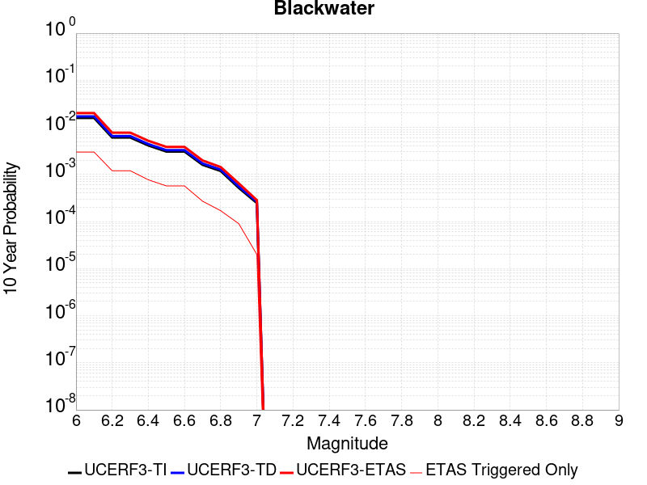
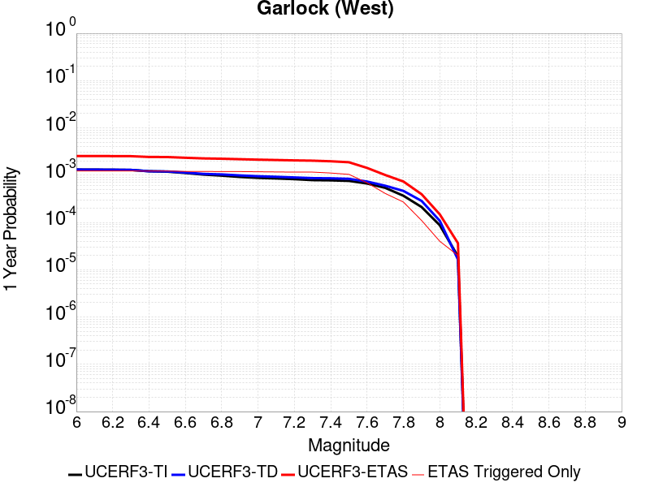
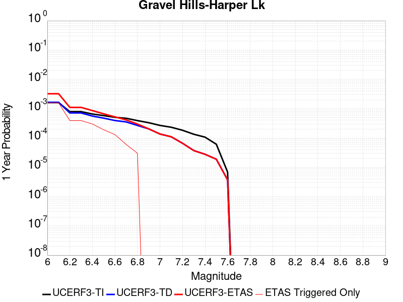
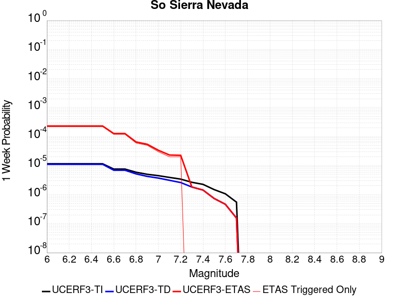
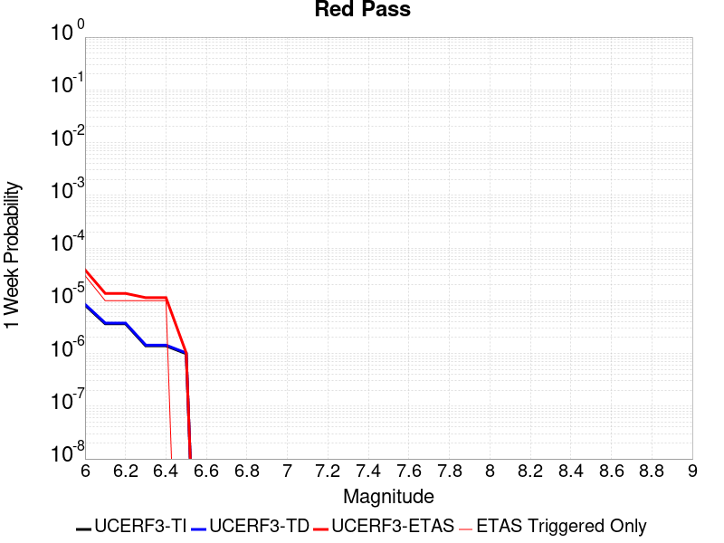
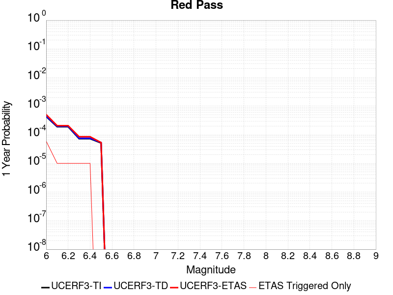
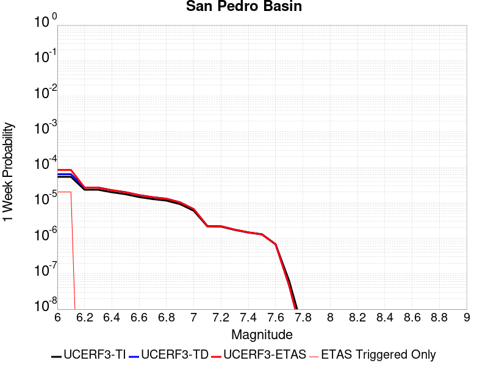
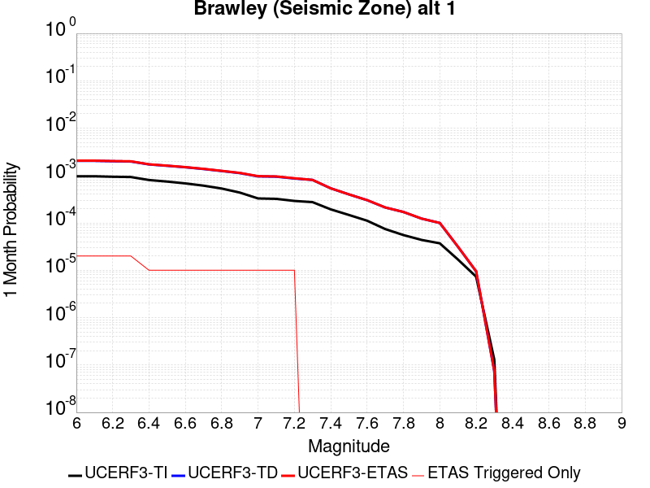
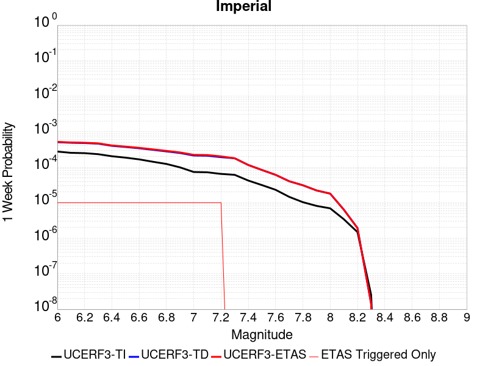
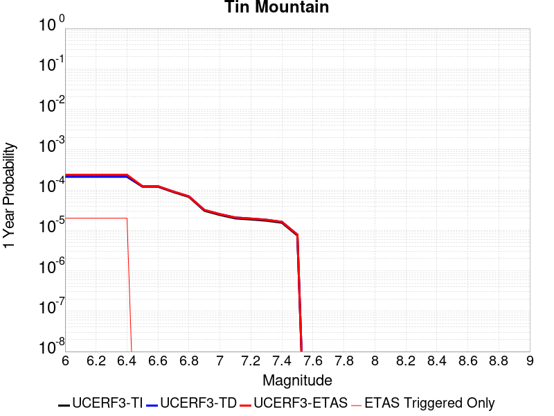

# Parent Section Magnitude-Probability Distributions

Only fault sections with at least one triggered aftershock are plotted. Sections are sorted by total supraseismogenic trigger rate (decreasing)

## Table Of Contents

* [Garlock (Central)](#garlock-central)
* [Tank Canyon](#tank-canyon)
* [Owl Lake](#owl-lake)
* [Garlock (East)](#garlock-east)
* [Little Lake](#little-lake)
* [Panamint Valley](#panamint-valley)
* [Blackwater](#blackwater)
* [Garlock (West)](#garlock-west)
* [Hunter Mountain-Saline Valley](#hunter-mountain-saline-valley)
* [Gravel Hills-Harper Lk](#gravel-hills-harper-lk)
* [Ash Hill](#ash-hill)
* [Airport Lake](#airport-lake)
* [McLean Lake](#mclean-lake)
* [Goldstone Lake](#goldstone-lake)
* [Death Valley (So)](#death-valley-so)
* [Coyote Canyon](#coyote-canyon)
* [So Sierra Nevada](#so-sierra-nevada)
* [Lenwood-Lockhart-Old Woman Springs](#lenwood-lockhart-old-woman-springs)
* [San Andreas (Mojave N)](#san-andreas-mojave-n)
* [San Andreas (Mojave S)](#san-andreas-mojave-s)
* [Nelson Lake](#nelson-lake)
* [Towne Pass](#towne-pass)
* [San Andreas (San Bernardino N)](#san-andreas-san-bernardino-n)
* [Bicycle Lake](#bicycle-lake)
* [Garlic Springs](#garlic-springs)
* [Paradise](#paradise)
* [Death Valley (Black Mtns Frontal)](#death-valley-black-mtns-frontal)
* [San Andreas (San Bernardino S)](#san-andreas-san-bernardino-s)
* [Coyote Lake](#coyote-lake)
* [Death Valley (Fish Lake Valley)](#death-valley-fish-lake-valley)
* [Death Valley (No)](#death-valley-no)
* [Baker](#baker)
* [San Andreas (Big Bend)](#san-andreas-big-bend)
* [San Andreas (Coachella) rev](#san-andreas-coachella-rev)
* [Red Pass](#red-pass)
* [San Andreas (Parkfield)](#san-andreas-parkfield)
* [Helendale-So Lockhart](#helendale-so-lockhart)
* [San Andreas (San Gorgonio Pass-Garnet HIll)](#san-andreas-san-gorgonio-pass-garnet-hill)
* [Elsinore (Glen Ivy) rev](#elsinore-glen-ivy-rev)
* [Santa Rosa Island](#santa-rosa-island)
* [Big Pine (East)](#big-pine-east)
* [Lost Hills](#lost-hills)
* [San Pedro Basin](#san-pedro-basin)
* [Palos Verdes](#palos-verdes)
* [San Gabriel](#san-gabriel)
* [Brawley (Seismic Zone) alt 1](#brawley-seismic-zone-alt-1)
* [San Andreas (Cholame) rev](#san-andreas-cholame-rev)
* [Santa Cruz Catalina Ridge alt1](#santa-cruz-catalina-ridge-alt1)
* [Imperial](#imperial)
* [Davis Creek](#davis-creek)
* [San Andreas (Carrizo) rev](#san-andreas-carrizo-rev)
* [San Diego Trough north alt1](#san-diego-trough-north-alt1)
* [Great Valley 03a Dunnigan Hills](#great-valley-03a-dunnigan-hills)
* [Eureka Peak](#eureka-peak)
* [Tin Mountain](#tin-mountain)
* [Kern Canyon (South Kern) 2011](#kern-canyon-south-kern-2011)
* [Almanor 2011 CFM](#almanor-2011-cfm)
* [Independence rev 2011](#independence-rev-2011)
* [West Tahoe](#west-tahoe)
* [San Andreas (Creeping Section) 2011 CFM](#san-andreas-creeping-section-2011-cfm)
* [San Jacinto (San Bernardino)](#san-jacinto-san-bernardino)
* [Kern Canyon (Lake Isabella) 2011](#kern-canyon-lake-isabella-2011)
* [Santa Cruz Island](#santa-cruz-island)
* [Channel Islands Thrust](#channel-islands-thrust)
* [Channel Islands Western Deep Ramp](#channel-islands-western-deep-ramp)
* [Great Valley 07 (Orestimba)](#great-valley-07-orestimba)
* [Morales (West)](#morales-west)
* [Malibu Coast alt 1](#malibu-coast-alt-1)
* [White Mountains](#white-mountains)
* [Cleghorn Lake](#cleghorn-lake)
* [Scodie Lineament](#scodie-lineament)

## Garlock (Central)
*[(top)](#table-of-contents)*

| 1 Week | 1 Month | 1 Year | 10 Year |
|-----|-----|-----|-----|
|  |  |  |  |

| Magnitude | 1 wk TI Prob | 1 wk TD Prob | 1 wk ETAS Prob | 1 wk ETAS/TD Gain | 1 wk ETAS Triggered Only | 1 mo TI Prob | 1 mo TD Prob | 1 mo ETAS Prob | 1 mo ETAS/TD Gain | 1 mo ETAS Triggered Only | 1 yr TI Prob | 1 yr TD Prob | 1 yr ETAS Prob | 1 yr ETAS/TD Gain | 1 yr ETAS Triggered Only | 10 yr TI Prob | 10 yr TD Prob | 10 yr ETAS Prob | 10 yr ETAS/TD Gain | 10 yr ETAS Triggered Only |
|-----|-----|-----|-----|-----|-----|-----|-----|-----|-----|-----|-----|-----|-----|-----|-----|-----|-----|-----|-----|-----|
| 6.0 | 5.5131142E-5 | 7.024558E-5 | 0.006768626 | 96.356606 | 0.006698851 | 2.3625491E-4 | 3.0101812E-4 | 0.0089058895 | 29.585892 | 0.008607462 | 0.0028726095 | 0.0036588025 | 0.016783765 | 4.587229 | 0.01317316 | 0.028357591 | 0.03607921 | 0.0535388 | 1.4839238 | 0.018113095 |
| 6.1 | 5.5131142E-5 | 7.024558E-5 | 0.006768626 | 96.356606 | 0.006698851 | 2.3625491E-4 | 3.0101812E-4 | 0.0089058895 | 29.585892 | 0.008607462 | 0.0028726095 | 0.0036588025 | 0.016783765 | 4.587229 | 0.01317316 | 0.028357591 | 0.03607921 | 0.0535388 | 1.4839238 | 0.018113095 |
| 6.2 | 4.216245E-5 | 5.1660383E-5 | 0.0044674347 | 86.477 | 0.0044160024 | 1.806837E-4 | 2.2138303E-4 | 0.0062078573 | 28.041252 | 0.0059877997 | 0.0021976046 | 0.0026920384 | 0.011836174 | 4.396733 | 0.009168819 | 0.021759989 | 0.02668921 | 0.038964413 | 1.4599314 | 0.012611804 |
| 6.3 | 4.216245E-5 | 5.1660383E-5 | 0.0044674347 | 86.477 | 0.0044160024 | 1.806837E-4 | 2.2138303E-4 | 0.0062078573 | 28.041252 | 0.0059877997 | 0.0021976046 | 0.0026920384 | 0.011836174 | 4.396733 | 0.009168819 | 0.021759989 | 0.02668921 | 0.038964413 | 1.4599314 | 0.012611804 |
| 6.4 | 3.6858168E-5 | 4.4109474E-5 | 0.0034495203 | 78.20361 | 0.0034055612 | 1.5795401E-4 | 1.8902705E-4 | 0.0048661116 | 25.742937 | 0.0046779686 | 0.0019213937 | 0.0022990005 | 0.0093184905 | 4.053279 | 0.0070356647 | 0.019048655 | 0.022848397 | 0.03246596 | 1.4209294 | 0.009842446 |
| 6.5 | 3.39199E-5 | 4.001704E-5 | 0.0031086416 | 77.68295 | 0.0030687475 | 1.453629E-4 | 1.7149044E-4 | 0.004437066 | 25.873549 | 0.004266307 | 0.0017683565 | 0.0020859186 | 0.008434685 | 4.043631 | 0.0063620373 | 0.017543508 | 0.02075933 | 0.029627869 | 1.4272074 | 0.009056548 |
| 6.6 | 3.3571985E-5 | 3.947123E-5 | 0.0031080975 | 78.74337 | 0.0030687475 | 1.4387199E-4 | 1.6915156E-4 | 0.0044347374 | 26.217537 | 0.004266307 | 0.0017502342 | 0.002057497 | 0.008406444 | 4.085763 | 0.0063620373 | 0.017365133 | 0.020480646 | 0.02935171 | 1.4331437 | 0.009056548 |
| 6.7 | 3.2580007E-5 | 3.8087666E-5 | 0.0029944512 | 78.61997 | 0.0029564763 | 1.3962112E-4 | 1.6322276E-4 | 0.004279163 | 26.216707 | 0.0041166125 | 0.0016985617 | 0.0019854472 | 0.008073407 | 4.0662913 | 0.006100071 | 0.016856372 | 0.019773284 | 0.0283206 | 1.4322659 | 0.008719734 |
| 6.8 | 3.2185937E-5 | 3.751489E-5 | 0.00299388 | 79.80512 | 0.0029564763 | 1.3793244E-4 | 1.607683E-4 | 0.004239301 | 26.36901 | 0.0040791887 | 0.0016780337 | 0.0019556184 | 0.007969059 | 4.0749564 | 0.0060252235 | 0.016654192 | 0.019480087 | 0.027846485 | 1.4294847 | 0.008532614 |
| 6.9 | 3.165394E-5 | 3.6719477E-5 | 0.0029556646 | 80.4931 | 0.0029190525 | 1.3565269E-4 | 1.5735981E-4 | 0.004161071 | 26.443033 | 0.004004341 | 0.0016503202 | 0.0019141936 | 0.007815828 | 4.0830913 | 0.0059129526 | 0.01638118 | 0.01907272 | 0.027295757 | 1.4311411 | 0.00838292 |
| 7.0 | 3.0903822E-5 | 3.5624747E-5 | 0.0028797283 | 80.83505 | 0.002844205 | 1.3243823E-4 | 1.5266867E-4 | 0.0040441444 | 26.489681 | 0.00389207 | 0.0016112428 | 0.0018571776 | 0.0076097315 | 4.097471 | 0.0057632574 | 0.015996104 | 0.018511891 | 0.026555972 | 1.4345359 | 0.008195801 |
| 7.1 | 3.0069863E-5 | 3.439106E-5 | 0.0026913858 | 78.2583 | 0.0026570861 | 1.2886449E-4 | 1.4738206E-4 | 0.0038517872 | 26.13471 | 0.0037049511 | 0.0015677959 | 0.0017929208 | 0.0072469916 | 4.0420036 | 0.0054638674 | 0.01556781 | 0.017879559 | 0.02559803 | 1.4316926 | 0.007858987 |
| 7.2 | 2.7957109E-5 | 3.1280466E-5 | 0.0022766353 | 72.78137 | 0.002245425 | 1.1981068E-4 | 1.3405236E-4 | 0.0032398072 | 24.168222 | 0.0031061713 | 0.0014577188 | 0.0016308852 | 0.0063385875 | 3.8865933 | 0.0047153924 | 0.014481937 | 0.016283188 | 0.022762517 | 1.3979152 | 0.00658658 |
| 7.3 | 2.4519275E-5 | 2.6713868E-5 | 0.0015236238 | 57.034943 | 0.0014969499 | 1.0507837E-4 | 1.1448306E-4 | 0.0023222314 | 20.284498 | 0.0022080012 | 0.0012785783 | 0.0013929547 | 0.0046069142 | 3.3072963 | 0.0032184424 | 0.012712469 | 0.013927576 | 0.018429685 | 1.3232514 | 0.004565697 |
| 7.4 | 2.3225532E-5 | 2.5198491E-5 | 0.0014098423 | 55.949474 | 0.0013846788 | 9.95342E-5 | 1.07989144E-4 | 0.002166073 | 20.058249 | 0.0020583062 | 0.0012111551 | 0.0013139893 | 0.0043039555 | 3.2754874 | 0.0029938999 | 0.012045753 | 0.013145258 | 0.017318552 | 1.3174752 | 0.0042288834 |
| 7.5 | 2.097765E-5 | 2.2482824E-5 | 0.0011451701 | 50.93533 | 0.0011227125 | 8.9901114E-5 | 9.635147E-5 | 0.0017802579 | 18.476707 | 0.0016840687 | 0.0010939965 | 0.0011724597 | 0.0035273915 | 3.00854 | 0.0023576962 | 0.010886264 | 0.01173992 | 0.015068516 | 1.283528 | 0.0033681374 |
| 7.6 | 1.511254E-5 | 1.5990528E-5 | 6.1476097E-4 | 38.445316 | 5.9878E-4 | 6.476642E-5 | 6.852908E-5 | 0.0010040588 | 14.651571 | 9.3559374E-4 | 7.882459E-4 | 8.3403E-4 | 0.0022549464 | 2.7036753 | 0.0014221024 | 0.007854558 | 0.008383143 | 0.010683964 | 1.274458 | 0.0023202724 |
| 7.7 | 9.934069E-6 | 1.0678047E-5 | 1.6037145E-4 | 15.0188 | 1.49695E-4 | 4.2573887E-5 | 4.576226E-5 | 3.4513854E-4 | 7.541991 | 2.9939E-4 | 5.182138E-4 | 5.5701344E-4 | 9.310425E-4 | 1.6714902 | 3.7423748E-4 | 0.00517007 | 0.0056272964 | 0.0062971334 | 1.1190335 | 6.736275E-4 |
| 7.8 | 6.7562896E-6 | 8.427841E-6 | 1.2069814E-4 | 14.321361 | 1.1227125E-4 | 2.8955206E-5 | 3.6118818E-5 | 1.8580841E-4 | 5.144366 | 1.49695E-4 | 3.5247262E-4 | 4.3965803E-4 | 5.892872E-4 | 1.3403308 | 1.49695E-4 | 0.0035191406 | 0.0044463384 | 0.004818912 | 1.0837933 | 3.7423748E-4 |
| 7.9 | 3.975453E-6 | 5.3706585E-6 | 8.021775E-5 | 14.936297 | 7.48475E-5 | 1.7037546E-5 | 2.3016906E-5 | 9.786268E-5 | 4.251774 | 7.48475E-5 | 2.0741238E-4 | 2.801949E-4 | 3.5502142E-4 | 1.2670517 | 7.48475E-5 | 0.002072189 | 0.002833435 | 0.002982706 | 1.0526819 | 1.49695E-4 |
| 8.0 | 1.6729537E-6 | 2.0773857E-6 | 2.0773857E-6 | 1.0 | 0.0 | 7.169782E-6 | 8.903051E-6 | 8.903051E-6 | 1.0 | 0.0 | 8.7288594E-5 | 1.08389286E-4 | 1.08389286E-4 | 1.0 | 0.0 | 8.7254314E-4 | 0.0010968668 | 0.0011342495 | 1.0340813 | 3.742375E-5 |
| 8.1 | 3.6733252E-7 | 3.148811E-7 | 3.148811E-7 | 1.0 | 0.0 | 1.5742813E-6 | 1.3494899E-6 | 1.3494899E-6 | 1.0 | 0.0 | 1.9166706E-5 | 1.6429933E-5 | 1.6429933E-5 | 1.0 | 0.0 | 1.9165053E-4 | 1.6637788E-4 | 1.6637788E-4 | 1.0 | 0.0 |

## Tank Canyon
*[(top)](#table-of-contents)*

| 1 Week | 1 Month | 1 Year | 10 Year |
|-----|-----|-----|-----|
|  |  |  |  |

| Magnitude | 1 wk TI Prob | 1 wk TD Prob | 1 wk ETAS Prob | 1 wk ETAS/TD Gain | 1 wk ETAS Triggered Only | 1 mo TI Prob | 1 mo TD Prob | 1 mo ETAS Prob | 1 mo ETAS/TD Gain | 1 mo ETAS Triggered Only | 1 yr TI Prob | 1 yr TD Prob | 1 yr ETAS Prob | 1 yr ETAS/TD Gain | 1 yr ETAS Triggered Only | 10 yr TI Prob | 10 yr TD Prob | 10 yr ETAS Prob | 10 yr ETAS/TD Gain | 10 yr ETAS Triggered Only |
|-----|-----|-----|-----|-----|-----|-----|-----|-----|-----|-----|-----|-----|-----|-----|-----|-----|-----|-----|-----|-----|
| 6.0 | 4.8284557E-5 | 5.7964517E-5 | 0.0052969856 | 91.38325 | 0.0052393246 | 2.0691741E-4 | 2.4839956E-4 | 0.00739456 | 29.768814 | 0.007147936 | 0.0025163088 | 0.0030207448 | 0.014027402 | 4.64369 | 0.011040006 | 0.02488006 | 0.029863482 | 0.04496684 | 1.5057467 | 0.01556828 |
| 6.1 | 1.7796336E-5 | 2.0873225E-5 | 0.0019668676 | 94.22921 | 0.001946035 | 7.626778E-5 | 8.945383E-5 | 0.002634041 | 29.445816 | 0.002544815 | 9.281647E-4 | 0.0010885935 | 0.0048268945 | 4.434065 | 0.003742375 | 0.009242975 | 0.010836697 | 0.0165375 | 1.5260646 | 0.0057632574 |
| 6.2 | 1.7796336E-5 | 2.0873225E-5 | 0.0019668676 | 94.22921 | 0.001946035 | 7.626778E-5 | 8.945383E-5 | 0.002634041 | 29.445816 | 0.002544815 | 9.281647E-4 | 0.0010885935 | 0.0048268945 | 4.434065 | 0.003742375 | 0.009242975 | 0.010836697 | 0.0165375 | 1.5260646 | 0.0057632574 |
| 6.3 | 1.3515912E-5 | 1.57595E-5 | 0.0014004164 | 88.86172 | 0.0013846788 | 5.792405E-5 | 6.7539106E-5 | 0.0019386002 | 28.703373 | 0.0018711875 | 7.049971E-4 | 8.220024E-4 | 0.0035890834 | 4.3662686 | 0.0027693575 | 0.007027647 | 0.008192232 | 0.012386471 | 1.5119777 | 0.0042288834 |
| 6.4 | 1.0870146E-5 | 1.2617973E-5 | 0.001097893 | 87.010254 | 0.0010852887 | 4.658551E-5 | 5.407601E-5 | 0.0014012582 | 25.91275 | 0.001347255 | 5.67031E-4 | 6.581944E-4 | 0.002715146 | 4.1251426 | 0.0020583062 | 0.005655863 | 0.006564466 | 0.009724603 | 1.4814005 | 0.0031810186 |
| 6.5 | 7.964826E-6 | 9.196063E-6 | 6.45394E-4 | 70.18156 | 6.3620374E-4 | 3.4134522E-5 | 3.941116E-5 | 9.3754573E-4 | 23.78884 | 8.9817E-4 | 4.1550855E-4 | 4.797359E-4 | 0.0018263445 | 3.806979 | 0.001347255 | 0.0041473247 | 0.0047883047 | 0.0069857333 | 1.4589158 | 0.0022080012 |
| 6.6 | 6.6317E-6 | 7.6122747E-6 | 4.5669384E-4 | 59.994396 | 4.49085E-4 | 2.8421264E-5 | 3.2623677E-5 | 7.436517E-4 | 22.794846 | 7.110512E-4 | 3.4597394E-4 | 3.9713003E-4 | 0.00140717 | 3.5433483 | 0.0010104412 | 0.0034543579 | 0.0039653555 | 0.0055309203 | 1.3948107 | 0.0015717974 |
| 6.7 | 4.793663E-6 | 5.430772E-6 | 1.925485E-4 | 35.45509 | 1.8711874E-4 | 2.0544108E-5 | 2.3274553E-5 | 2.852347E-4 | 12.255217 | 2.6196626E-4 | 2.500958E-4 | 2.8333522E-4 | 6.948798E-4 | 2.4525006 | 4.1166125E-4 | 0.0024981452 | 0.0028304325 | 0.0034648355 | 1.2241365 | 6.3620374E-4 |
| 6.8 | 4.382823E-6 | 4.969245E-6 | 1.9208706E-4 | 38.65518 | 1.8711874E-4 | 1.8783392E-5 | 2.1296615E-5 | 2.8325728E-4 | 13.300578 | 2.6196626E-4 | 2.286638E-4 | 2.5925972E-4 | 6.3340017E-4 | 2.4431107 | 3.7423748E-4 | 0.0022842865 | 0.0025902467 | 0.003150149 | 1.2161579 | 5.6135625E-4 |
| 6.9 | 2.729601E-6 | 3.0735362E-6 | 4.049717E-5 | 13.176084 | 3.742375E-5 | 1.1698237E-5 | 1.3172238E-5 | 1.25442E-4 | 9.5232115 | 1.1227125E-4 | 1.4241673E-4 | 1.6036142E-4 | 3.4745017E-4 | 2.1666691 | 1.8711874E-4 | 0.001423255 | 0.0016026229 | 0.0018641694 | 1.163199 | 2.6196626E-4 |
| 7.0 | 1.8987357E-6 | 2.1269361E-6 | 2.1269361E-6 | 1.0 | 0.0 | 8.137413E-6 | 9.1154125E-6 | 4.653882E-5 | 5.1055093 | 3.742375E-5 | 9.90685E-5 | 1.1097519E-4 | 1.8581438E-4 | 1.6743777 | 7.48475E-5 | 9.902435E-4 | 0.0011092664 | 0.0011840309 | 1.0674 | 7.48475E-5 |
| 7.1 | 1.4928986E-6 | 1.6641251E-6 | 1.6641251E-6 | 1.0 | 0.0 | 6.398121E-6 | 7.1319487E-6 | 4.4555432E-5 | 6.247301 | 3.742375E-5 | 7.789434E-5 | 8.682861E-5 | 1.6166961E-4 | 1.8619394 | 7.48475E-5 | 7.786704E-4 | 8.680047E-4 | 9.427872E-4 | 1.0861546 | 7.48475E-5 |
| 7.2 | 1.069082E-6 | 1.182856E-6 | 1.182856E-6 | 1.0 | 0.0 | 4.581772E-6 | 5.0693757E-6 | 5.0693757E-6 | 1.0 | 0.0 | 5.5781646E-5 | 6.1718434E-5 | 9.913988E-5 | 1.6063251 | 3.742375E-5 | 5.576765E-4 | 6.1706523E-4 | 6.5446587E-4 | 1.0606105 | 3.742375E-5 |
| 7.3 | 8.776551E-7 | 9.769996E-7 | 9.769996E-7 | 1.0 | 0.0 | 3.7613736E-6 | 4.187137E-6 | 4.187137E-6 | 1.0 | 0.0 | 4.579376E-5 | 5.097772E-5 | 8.839956E-5 | 1.7340822 | 3.742375E-5 | 4.5784327E-4 | 5.097113E-4 | 5.47116E-4 | 1.073384 | 3.742375E-5 |
| 7.4 | 7.55721E-7 | 8.5102363E-7 | 8.5102363E-7 | 1.0 | 0.0 | 3.2388E-6 | 3.647242E-6 | 3.647242E-6 | 1.0 | 0.0 | 3.9431678E-5 | 4.4404784E-5 | 8.1826875E-5 | 1.842749 | 3.742375E-5 | 3.942468E-4 | 4.4401E-4 | 4.814171E-4 | 1.0842484 | 3.742375E-5 |
| 7.5 | 5.587665E-7 | 6.305613E-7 | 6.305613E-7 | 1.0 | 0.0 | 2.3947114E-6 | 2.7024057E-6 | 2.7024057E-6 | 1.0 | 0.0 | 2.915522E-5 | 3.290179E-5 | 7.0324306E-5 | 2.1374006 | 3.742375E-5 | 2.9151395E-4 | 3.2901787E-4 | 3.6642933E-4 | 1.1137064 | 3.742375E-5 |

## Owl Lake
*[(top)](#table-of-contents)*

| 1 Week | 1 Month | 1 Year | 10 Year |
|-----|-----|-----|-----|
|  |  |  |  |

| Magnitude | 1 wk TI Prob | 1 wk TD Prob | 1 wk ETAS Prob | 1 wk ETAS/TD Gain | 1 wk ETAS Triggered Only | 1 mo TI Prob | 1 mo TD Prob | 1 mo ETAS Prob | 1 mo ETAS/TD Gain | 1 mo ETAS Triggered Only | 1 yr TI Prob | 1 yr TD Prob | 1 yr ETAS Prob | 1 yr ETAS/TD Gain | 1 yr ETAS Triggered Only | 10 yr TI Prob | 10 yr TD Prob | 10 yr ETAS Prob | 10 yr ETAS/TD Gain | 10 yr ETAS Triggered Only |
|-----|-----|-----|-----|-----|-----|-----|-----|-----|-----|-----|-----|-----|-----|-----|-----|-----|-----|-----|-----|-----|
| 6.0 | 5.0320643E-5 | 6.635748E-5 | 0.0020871058 | 31.452456 | 0.0020208824 | 2.1564208E-4 | 2.843645E-4 | 0.0031651738 | 11.1306925 | 0.0028816287 | 0.0026222812 | 0.0034577043 | 0.007783849 | 2.2511609 | 0.004341155 | 0.02591553 | 0.0341404 | 0.04079128 | 1.1948097 | 0.00688597 |
| 6.1 | 5.0320643E-5 | 6.635748E-5 | 0.0020871058 | 31.452456 | 0.0020208824 | 2.1564208E-4 | 2.843645E-4 | 0.0031651738 | 11.1306925 | 0.0028816287 | 0.0026222812 | 0.0034577043 | 0.007783849 | 2.2511609 | 0.004341155 | 0.02591553 | 0.0341404 | 0.04079128 | 1.1948097 | 0.00688597 |
| 6.2 | 2.4125871E-5 | 3.0980704E-5 | 0.0014904618 | 48.109356 | 0.0014595262 | 1.0339249E-4 | 1.3276885E-4 | 0.0022282205 | 16.782705 | 0.00209573 | 0.0012580766 | 0.0016154221 | 0.004791302 | 2.9659753 | 0.0031810186 | 0.012509781 | 0.016070297 | 0.020894023 | 1.3001641 | 0.004902511 |
| 6.3 | 1.7433485E-5 | 2.2355249E-5 | 0.0012947343 | 57.916348 | 0.0012724075 | 7.471279E-5 | 9.580558E-5 | 0.0018919734 | 19.74805 | 0.00179634 | 9.0924866E-4 | 0.0011659606 | 0.0038573288 | 3.308284 | 0.00269451 | 0.009055373 | 0.011628761 | 0.015586536 | 1.3403437 | 0.004004341 |
| 6.4 | 1.7433485E-5 | 2.2355249E-5 | 0.0012947343 | 57.916348 | 0.0012724075 | 7.471279E-5 | 9.580558E-5 | 0.0018919734 | 19.74805 | 0.00179634 | 9.0924866E-4 | 0.0011659606 | 0.0038573288 | 3.308284 | 0.00269451 | 0.009055373 | 0.011628761 | 0.015586536 | 1.3403437 | 0.004004341 |
| 6.5 | 1.5182742E-5 | 1.9428902E-5 | 0.0012543886 | 64.56302 | 0.0012349837 | 6.506727E-5 | 8.326492E-5 | 0.0018420346 | 22.122578 | 0.0017589162 | 7.919061E-4 | 0.0010134302 | 0.0034808945 | 3.4347649 | 0.0024699674 | 0.0078909 | 0.010118305 | 0.013711678 | 1.3551359 | 0.0036301038 |
| 6.6 | 6.7271576E-6 | 8.547201E-6 | 0.0010189798 | 119.21795 | 0.0010104412 | 2.8830356E-5 | 3.663038E-5 | 0.0014961031 | 40.843235 | 0.0014595262 | 3.5095305E-4 | 4.4588925E-4 | 0.0024284637 | 5.4463377 | 0.0019834586 | 0.0035039932 | 0.0044677295 | 0.0073737404 | 1.6504446 | 0.0029190525 |
| 6.7 | 6.682835E-6 | 8.4796475E-6 | 0.0010189123 | 120.15975 | 0.0010104412 | 2.8640408E-5 | 3.6340873E-5 | 0.0014958141 | 41.160656 | 0.0014595262 | 3.4864116E-4 | 4.4236594E-4 | 0.0024249472 | 5.4817677 | 0.0019834586 | 0.003480947 | 0.004432656 | 0.0073387693 | 1.6556145 | 0.0029190525 |
| 6.8 | 6.5774975E-6 | 8.326121E-6 | 0.001018759 | 122.356964 | 0.0010104412 | 2.8188972E-5 | 3.5682922E-5 | 0.001495157 | 41.901196 | 0.0014595262 | 3.4314668E-4 | 4.343586E-4 | 0.0024169558 | 5.5644245 | 0.0019834586 | 0.0034261728 | 0.0043528024 | 0.0072591486 | 1.6676955 | 0.0029190525 |
| 6.9 | 6.363419E-6 | 7.999298E-6 | 0.0010184324 | 127.31523 | 0.0010104412 | 2.727151E-5 | 3.4282286E-5 | 0.0014189135 | 41.38912 | 0.0013846788 | 3.3198006E-4 | 4.1731246E-4 | 0.0023251271 | 5.5716696 | 0.0019086112 | 0.0033148455 | 0.004182795 | 0.0070151035 | 1.677133 | 0.002844205 |
| 7.0 | 6.1342453E-6 | 7.631501E-6 | 0.001018065 | 133.40298 | 0.0010104412 | 2.6289357E-5 | 3.2706055E-5 | 0.0014173394 | 43.335693 | 0.0013846788 | 3.2002592E-4 | 3.9812896E-4 | 0.0023059803 | 5.7920437 | 0.0019086112 | 0.0031956544 | 0.00399149 | 0.0068243425 | 1.709723 | 0.002844205 |
| 7.1 | 5.842926E-6 | 7.1420604E-6 | 0.0010175761 | 142.47655 | 0.0010104412 | 2.504087E-5 | 3.0608502E-5 | 0.0014152449 | 46.236984 | 0.0013846788 | 3.0482994E-4 | 3.7260022E-4 | 0.0022805003 | 6.120502 | 0.0019086112 | 0.0030441214 | 0.0037369546 | 0.006533247 | 1.7482811 | 0.002806781 |
| 7.2 | 4.77173E-6 | 5.3583467E-6 | 6.7898224E-4 | 126.714874 | 6.736275E-4 | 2.045011E-5 | 2.2964163E-5 | 8.4626774E-4 | 36.85167 | 8.233225E-4 | 2.4895166E-4 | 2.7955687E-4 | 0.0015141953 | 5.4164124 | 0.0012349837 | 0.0024867293 | 0.002808574 | 0.004599869 | 1.6377952 | 0.00179634 |
| 7.3 | 3.0494948E-6 | 2.7103622E-6 | 1.5240496E-4 | 56.230476 | 1.49695E-4 | 1.3069198E-5 | 1.1615787E-5 | 1.9873236E-4 | 17.108816 | 1.8711874E-4 | 1.5910587E-4 | 1.4141318E-4 | 3.6592394E-4 | 2.5876224 | 2.245425E-4 | 0.0015899199 | 0.0014231888 | 0.0018716346 | 1.3150994 | 4.49085E-4 |
| 7.4 | 2.7263884E-6 | 2.3055816E-6 | 1.1457657E-4 | 49.6953 | 1.1227125E-4 | 1.1684469E-5 | 9.881027E-6 | 1.5957454E-4 | 16.149591 | 1.49695E-4 | 1.4224913E-4 | 1.20294964E-4 | 3.073912E-4 | 2.5553122 | 1.8711874E-4 | 0.0014215811 | 0.0012111744 | 0.001622337 | 1.3394743 | 4.1166125E-4 |
| 7.5 | 2.6090431E-6 | 2.1655203E-6 | 1.1443652E-4 | 52.84482 | 1.1227125E-4 | 1.1181565E-5 | 9.280769E-6 | 1.5897438E-4 | 17.12944 | 1.49695E-4 | 1.3612706E-4 | 1.129876E-4 | 3.000852E-4 | 2.6559129 | 1.8711874E-4 | 0.001360437 | 0.0011379321 | 0.0015117438 | 1.3285009 | 3.7423748E-4 |
| 7.6 | 2.3008756E-6 | 1.872704E-6 | 7.672006E-5 | 40.96753 | 7.48475E-5 | 9.860858E-6 | 8.025851E-6 | 1.20296194E-4 | 14.988592 | 1.1227125E-4 | 1.20049335E-4 | 9.771043E-5 | 2.473908E-4 | 2.531877 | 1.49695E-4 | 0.001199845 | 9.849465E-4 | 0.0012466548 | 1.2657081 | 2.6196626E-4 |
| 7.7 | 1.7184348E-6 | 1.3418345E-6 | 1.3418345E-6 | 1.0 | 0.0 | 7.3646997E-6 | 5.750707E-6 | 5.750707E-6 | 1.0 | 0.0 | 8.966153E-5 | 7.001265E-5 | 7.001265E-5 | 1.0 | 0.0 | 8.962536E-4 | 7.077913E-4 | 7.4518856E-4 | 1.0528365 | 3.742375E-5 |
| 7.8 | 8.4612907E-7 | 8.4052675E-7 | 8.4052675E-7 | 1.0 | 0.0 | 3.6262625E-6 | 3.6022527E-6 | 3.6022527E-6 | 1.0 | 0.0 | 4.4148852E-5 | 4.3856566E-5 | 4.3856566E-5 | 1.0 | 0.0 | 4.414008E-4 | 4.4395277E-4 | 4.8135992E-4 | 1.0842593 | 3.742375E-5 |
| 7.9 | 2.716738E-7 | 3.767845E-7 | 3.767845E-7 | 1.0 | 0.0 | 1.1643157E-6 | 1.6147899E-6 | 1.6147899E-6 | 1.0 | 0.0 | 1.4175452E-5 | 1.96599E-5 | 1.96599E-5 | 1.0 | 0.0 | 1.4174548E-4 | 1.9835318E-4 | 1.9835318E-4 | 1.0 | 0.0 |
| 8.0 | 2.1995428E-8 | 3.38465E-8 | 3.38465E-8 | 1.0 | 0.0 | 9.426611E-8 | 1.4505643E-7 | 1.4505643E-7 | 1.0 | 0.0 | 1.1476893E-6 | 1.7660612E-6 | 1.7660612E-6 | 1.0 | 0.0 | 1.14768345E-5 | 1.796186E-5 | 1.796186E-5 | 1.0 | 0.0 |

## Garlock (East)
*[(top)](#table-of-contents)*

| 1 Week | 1 Month | 1 Year | 10 Year |
|-----|-----|-----|-----|
|  |  |  |  |

| Magnitude | 1 wk TI Prob | 1 wk TD Prob | 1 wk ETAS Prob | 1 wk ETAS/TD Gain | 1 wk ETAS Triggered Only | 1 mo TI Prob | 1 mo TD Prob | 1 mo ETAS Prob | 1 mo ETAS/TD Gain | 1 mo ETAS Triggered Only | 1 yr TI Prob | 1 yr TD Prob | 1 yr ETAS Prob | 1 yr ETAS/TD Gain | 1 yr ETAS Triggered Only | 10 yr TI Prob | 10 yr TD Prob | 10 yr ETAS Prob | 10 yr ETAS/TD Gain | 10 yr ETAS Triggered Only |
|-----|-----|-----|-----|-----|-----|-----|-----|-----|-----|-----|-----|-----|-----|-----|-----|-----|-----|-----|-----|-----|
| 6.0 | 4.5092507E-5 | 6.290254E-5 | 0.00133523 | 21.226965 | 0.0012724075 | 1.9323928E-4 | 2.6955697E-4 | 0.00214024 | 7.939843 | 0.0018711875 | 0.0023501497 | 0.003277363 | 0.0062614507 | 1.910515 | 0.0029938999 | 0.023254504 | 0.032351483 | 0.037240244 | 1.1511139 | 0.005052206 |
| 6.1 | 4.5092507E-5 | 6.290254E-5 | 0.00133523 | 21.226965 | 0.0012724075 | 1.9323928E-4 | 2.6955697E-4 | 0.00214024 | 7.939843 | 0.0018711875 | 0.0023501497 | 0.003277363 | 0.0062614507 | 1.910515 | 0.0029938999 | 0.023254504 | 0.032351483 | 0.037240244 | 1.1511139 | 0.005052206 |
| 6.2 | 2.6674514E-5 | 3.450911E-5 | 0.001007493 | 29.194986 | 9.730175E-4 | 1.1431433E-4 | 1.4788799E-4 | 0.0016071984 | 10.867673 | 0.0014595262 | 0.0013908884 | 0.0017990824 | 0.004264606 | 2.370434 | 0.0024699674 | 0.01382215 | 0.01789001 | 0.021638943 | 1.2095546 | 0.0038172223 |
| 6.3 | 2.6674514E-5 | 3.450911E-5 | 0.001007493 | 29.194986 | 9.730175E-4 | 1.1431433E-4 | 1.4788799E-4 | 0.0016071984 | 10.867673 | 0.0014595262 | 0.0013908884 | 0.0017990824 | 0.004264606 | 2.370434 | 0.0024699674 | 0.01382215 | 0.01789001 | 0.021638943 | 1.2095546 | 0.0038172223 |
| 6.4 | 2.5312667E-5 | 3.233838E-5 | 0.0010053244 | 31.087656 | 9.730175E-4 | 1.0847834E-4 | 1.3858585E-4 | 0.0015979098 | 11.5301075 | 0.0014595262 | 0.0013199237 | 0.0016860063 | 0.0041144486 | 2.440352 | 0.0024325438 | 0.013121112 | 0.016778054 | 0.020494435 | 1.2215025 | 0.0037797987 |
| 6.5 | 2.5312667E-5 | 3.233838E-5 | 0.0010053244 | 31.087656 | 9.730175E-4 | 1.0847834E-4 | 1.3858585E-4 | 0.0015979098 | 11.5301075 | 0.0014595262 | 0.0013199237 | 0.0016860063 | 0.0041144486 | 2.440352 | 0.0024325438 | 0.013121112 | 0.016778054 | 0.020494435 | 1.2215025 | 0.0037797987 |
| 6.6 | 2.246556E-5 | 2.8133245E-5 | 9.2627795E-4 | 32.924675 | 8.9817E-4 | 9.627742E-5 | 1.20565615E-4 | 0.0014676581 | 12.173107 | 0.001347255 | 0.0011715472 | 0.0014669215 | 0.0037837902 | 2.579409 | 0.0023202724 | 0.011653901 | 0.014618388 | 0.01804792 | 1.2346039 | 0.0034804086 |
| 6.7 | 2.2241198E-5 | 2.780299E-5 | 9.2594797E-4 | 33.3039 | 8.9817E-4 | 9.531594E-5 | 1.1915036E-4 | 0.0014662448 | 12.305836 | 0.001347255 | 0.0011598538 | 0.0014497138 | 0.0037666226 | 2.5981836 | 0.0023202724 | 0.011538187 | 0.014448582 | 0.017878704 | 1.237402 | 0.0034804086 |
| 6.8 | 1.9528685E-5 | 2.3897695E-5 | 8.472005E-4 | 35.451138 | 8.233225E-4 | 8.369167E-5 | 1.02414786E-4 | 0.001374692 | 13.422788 | 0.0012724075 | 0.0010184698 | 0.0012462065 | 0.0033393246 | 2.679592 | 0.00209573 | 0.010138147 | 0.012436173 | 0.015503715 | 1.2466629 | 0.0031061713 |
| 6.9 | 1.3318621E-5 | 1.5198458E-5 | 7.6366204E-4 | 50.24602 | 7.4847497E-4 | 5.7078556E-5 | 6.5134656E-5 | 0.0012251954 | 18.81019 | 0.0011601362 | 6.9470983E-4 | 7.927316E-4 | 0.0026250416 | 3.3113875 | 0.0018337637 | 0.0069254204 | 0.007939667 | 0.010501403 | 1.3226504 | 0.0025822388 |
| 7.0 | 1.1760853E-5 | 1.31073775E-5 | 7.6157256E-4 | 58.10259 | 7.4847497E-4 | 5.0402683E-5 | 5.6173292E-5 | 0.0011788227 | 20.985466 | 0.0011227125 | 6.134799E-4 | 6.8370026E-4 | 0.0024788121 | 3.625583 | 0.00179634 | 0.0061178906 | 0.006856307 | 0.009383674 | 1.3686193 | 0.002544815 |
| 7.1 | 1.0064758E-5 | 1.0902532E-5 | 7.5936934E-4 | 69.65073 | 7.4847497E-4 | 4.3133965E-5 | 4.6724323E-5 | 0.0011693843 | 25.027315 | 0.0011227125 | 5.2502943E-4 | 5.6872366E-4 | 0.0023266396 | 4.0909843 | 0.0017589162 | 0.005237907 | 0.0057127923 | 0.00805702 | 1.410347 | 0.0023576962 |
| 7.2 | 9.768808E-6 | 1.0498412E-5 | 7.5896556E-4 | 72.293365 | 7.4847497E-4 | 4.186565E-5 | 4.4992437E-5 | 0.0011676544 | 25.952236 | 0.0011227125 | 5.095951E-4 | 5.4764876E-4 | 0.0023056017 | 4.210001 | 0.0017589162 | 0.0050842804 | 0.00550306 | 0.007847781 | 1.426076 | 0.0023576962 |
| 7.3 | 9.344516E-6 | 9.94408E-6 | 6.0871814E-4 | 61.21412 | 5.9878E-4 | 4.004731E-5 | 4.2616808E-5 | 0.0010155928 | 23.830805 | 9.730175E-4 | 4.8746695E-4 | 5.187396E-4 | 0.0020897216 | 4.02846 | 0.0015717974 | 0.0048639905 | 0.0052147433 | 0.0073367734 | 1.4069289 | 0.0021331536 |
| 7.4 | 9.023491E-6 | 9.490282E-6 | 5.334178E-4 | 56.20674 | 5.239325E-4 | 3.867153E-5 | 4.067202E-5 | 9.0138323E-4 | 22.162245 | 8.6074625E-4 | 4.7072413E-4 | 4.950727E-4 | 0.0018790659 | 3.7955353 | 0.0013846788 | 0.004697283 | 0.0049782004 | 0.006802835 | 1.366525 | 0.0018337637 |
| 7.5 | 7.081253E-6 | 7.0873343E-6 | 3.064752E-4 | 43.242664 | 2.9939E-4 | 3.0347876E-5 | 3.037394E-5 | 5.5429054E-4 | 18.248884 | 5.239325E-4 | 3.6942272E-4 | 3.697407E-4 | 0.0011553488 | 3.1247542 | 7.858987E-4 | 0.003688092 | 0.0037241387 | 0.004768101 | 1.2803233 | 0.001047865 |
| 7.6 | 6.116396E-6 | 5.958924E-6 | 1.5565303E-4 | 26.120996 | 1.49695E-4 | 2.6212863E-5 | 2.5537996E-5 | 3.2492034E-4 | 12.723017 | 2.9939E-4 | 3.1909486E-4 | 3.10881E-4 | 7.972385E-4 | 2.564449 | 4.8650874E-4 | 0.0031863707 | 0.003135588 | 0.0038444097 | 1.226057 | 7.110512E-4 |
| 7.7 | 4.797145E-6 | 4.7569774E-6 | 7.960412E-5 | 16.73418 | 7.48475E-5 | 2.055903E-5 | 2.0386888E-5 | 2.0750181E-4 | 10.1782 | 1.8711874E-4 | 2.5027743E-4 | 2.4818222E-4 | 5.1008345E-4 | 2.055278 | 2.6196626E-4 | 0.0024999576 | 0.0025091893 | 0.002807828 | 1.1190181 | 2.9939E-4 |
| 7.8 | 3.4028885E-6 | 3.9781908E-6 | 7.882539E-5 | 19.81438 | 7.48475E-5 | 1.4583726E-5 | 1.7049279E-5 | 9.18955E-5 | 5.3899937 | 7.48475E-5 | 1.775424E-4 | 2.0755526E-4 | 2.8238722E-4 | 1.3605399 | 7.48475E-5 | 0.0017740062 | 0.0021010821 | 0.0021757723 | 1.0355484 | 7.48475E-5 |
| 7.9 | 2.5928412E-6 | 3.37222E-6 | 7.821947E-5 | 23.195244 | 7.48475E-5 | 1.1112129E-5 | 1.4452292E-5 | 8.929871E-5 | 6.1788616 | 7.48475E-5 | 1.3528178E-4 | 1.759425E-4 | 2.5077682E-4 | 1.425334 | 7.48475E-5 | 0.0013519945 | 0.0017811217 | 0.0018558359 | 1.0419478 | 7.48475E-5 |
| 8.0 | 1.3743648E-6 | 1.6733709E-6 | 1.6733709E-6 | 1.0 | 0.0 | 5.8901214E-6 | 7.17157E-6 | 7.17157E-6 | 1.0 | 0.0 | 7.1709874E-5 | 8.731039E-5 | 8.731039E-5 | 1.0 | 0.0 | 7.1686733E-4 | 8.8366936E-4 | 8.8366936E-4 | 1.0 | 0.0 |
| 8.1 | 3.6733252E-7 | 3.148811E-7 | 3.148811E-7 | 1.0 | 0.0 | 1.5742813E-6 | 1.3494899E-6 | 1.3494899E-6 | 1.0 | 0.0 | 1.9166706E-5 | 1.6429933E-5 | 1.6429933E-5 | 1.0 | 0.0 | 1.9165053E-4 | 1.6637788E-4 | 1.6637788E-4 | 1.0 | 0.0 |

## Little Lake
*[(top)](#table-of-contents)*

| 1 Week | 1 Month | 1 Year | 10 Year |
|-----|-----|-----|-----|
|  |  |  |  |

| Magnitude | 1 wk TI Prob | 1 wk TD Prob | 1 wk ETAS Prob | 1 wk ETAS/TD Gain | 1 wk ETAS Triggered Only | 1 mo TI Prob | 1 mo TD Prob | 1 mo ETAS Prob | 1 mo ETAS/TD Gain | 1 mo ETAS Triggered Only | 1 yr TI Prob | 1 yr TD Prob | 1 yr ETAS Prob | 1 yr ETAS/TD Gain | 1 yr ETAS Triggered Only | 10 yr TI Prob | 10 yr TD Prob | 10 yr ETAS Prob | 10 yr ETAS/TD Gain | 10 yr ETAS Triggered Only |
|-----|-----|-----|-----|-----|-----|-----|-----|-----|-----|-----|-----|-----|-----|-----|-----|-----|-----|-----|-----|-----|
| 6.0 | 2.8424427E-5 | 3.1205633E-5 | 0.0023514056 | 75.35196 | 0.0023202724 | 1.2181328E-4 | 1.3373232E-4 | 0.0030149757 | 22.544853 | 0.0028816287 | 0.0014820677 | 0.0016271081 | 0.0053633936 | 3.2962737 | 0.003742375 | 0.014722223 | 0.016165355 | 0.021283166 | 1.3165913 | 0.0052019013 |
| 6.1 | 2.8424427E-5 | 3.1205633E-5 | 0.0023514056 | 75.35196 | 0.0023202724 | 1.2181328E-4 | 1.3373232E-4 | 0.0030149757 | 22.544853 | 0.0028816287 | 0.0014820677 | 0.0016271081 | 0.0053633936 | 3.2962737 | 0.003742375 | 0.014722223 | 0.016165355 | 0.021283166 | 1.3165913 | 0.0052019013 |
| 6.2 | 2.8424427E-5 | 3.1205633E-5 | 0.0023514056 | 75.35196 | 0.0023202724 | 1.2181328E-4 | 1.3373232E-4 | 0.0030149757 | 22.544853 | 0.0028816287 | 0.0014820677 | 0.0016271081 | 0.0053633936 | 3.2962737 | 0.003742375 | 0.014722223 | 0.016165355 | 0.021283166 | 1.3165913 | 0.0052019013 |
| 6.3 | 1.48860645E-5 | 1.6081349E-5 | 0.0010265063 | 63.832104 | 0.0010104412 | 6.379586E-5 | 6.89184E-5 | 0.0011915535 | 17.289337 | 0.0011227125 | 7.7643775E-4 | 8.387868E-4 | 0.0022970887 | 2.738585 | 0.0014595262 | 0.007737305 | 0.008359027 | 0.01051146 | 1.2574981 | 0.0021705774 |
| 6.4 | 1.48860645E-5 | 1.6081349E-5 | 0.0010265063 | 63.832104 | 0.0010104412 | 6.379586E-5 | 6.89184E-5 | 0.0011915535 | 17.289337 | 0.0011227125 | 7.7643775E-4 | 8.387868E-4 | 0.0022970887 | 2.738585 | 0.0014595262 | 0.007737305 | 0.008359027 | 0.01051146 | 1.2574981 | 0.0021705774 |
| 6.5 | 1.2797581E-5 | 1.3765531E-5 | 9.867696E-4 | 71.6841 | 9.730175E-4 | 5.4845623E-5 | 5.899394E-5 | 0.0010693755 | 18.126871 | 0.0010104412 | 6.675408E-4 | 7.180402E-4 | 0.0019895341 | 2.7707834 | 0.0012724075 | 0.006655392 | 0.0071597523 | 0.009054698 | 1.2646664 | 0.0019086112 |
| 6.6 | 9.661896E-6 | 1.02890135E-5 | 8.7102636E-4 | 84.65597 | 8.6074625E-4 | 4.1407468E-5 | 4.409512E-5 | 9.048034E-4 | 20.519356 | 8.6074625E-4 | 5.040193E-4 | 5.3674204E-4 | 0.0016214483 | 3.0209079 | 0.0010852887 | 0.005028777 | 0.0053560617 | 0.0070683337 | 1.3196887 | 0.0017214925 |
| 6.7 | 7.767871E-6 | 8.199668E-6 | 7.566685E-4 | 92.28038 | 7.4847497E-4 | 3.329045E-5 | 3.5141038E-5 | 7.835897E-4 | 22.298422 | 7.4847497E-4 | 4.0523586E-4 | 4.2777188E-4 | 0.0013255577 | 3.098749 | 8.9817E-4 | 0.004044977 | 0.0042708362 | 0.0057241293 | 1.3402829 | 0.0014595262 |
| 6.8 | 6.4235196E-6 | 6.7357296E-6 | 4.558177E-4 | 67.671616 | 4.49085E-4 | 2.752908E-5 | 2.8867165E-5 | 4.779392E-4 | 16.5565 | 4.49085E-4 | 3.35115E-4 | 3.5141388E-4 | 9.1257284E-4 | 2.5968606 | 5.6135625E-4 | 0.003346101 | 0.0035098423 | 0.0045913216 | 1.3081276 | 0.0010852887 |
| 6.9 | 3.1283696E-6 | 3.1121751E-6 | 2.650776E-4 | 85.174385 | 2.6196626E-4 | 1.3407229E-5 | 1.33378335E-5 | 2.7530058E-4 | 20.640577 | 2.6196626E-4 | 1.6322079E-4 | 1.6237753E-4 | 4.617189E-4 | 2.8434901 | 2.9939E-4 | 0.0016310095 | 0.0016227373 | 0.0021084566 | 1.2993209 | 4.8650874E-4 |
| 7.0 | 2.290603E-6 | 2.2286777E-6 | 7.707601E-5 | 34.58374 | 7.48475E-5 | 9.816834E-6 | 9.551446E-6 | 8.439823E-5 | 8.836173 | 7.48475E-5 | 1.19513395E-4 | 1.1628369E-4 | 2.2854189E-4 | 1.9653821 | 1.1227125E-4 | 0.0011944914 | 0.0011623306 | 0.0013866121 | 1.1929585 | 2.245425E-4 |
| 7.1 | 1.293693E-6 | 1.1776802E-6 | 3.8601385E-5 | 32.777473 | 3.742375E-5 | 5.5443866E-6 | 5.0471954E-6 | 4.2470754E-5 | 8.414723 | 3.742375E-5 | 6.750081E-5 | 6.144857E-5 | 9.887002E-5 | 1.6089882 | 3.742375E-5 | 6.7480316E-4 | 6.1438425E-4 | 7.639873E-4 | 1.2435007 | 1.49695E-4 |
| 7.2 | 4.715842E-7 | 3.091774E-7 | 3.091774E-7 | 1.0 | 0.0 | 2.0210737E-6 | 1.3250453E-6 | 1.3250453E-6 | 1.0 | 0.0 | 2.4606294E-5 | 1.6132313E-5 | 1.6132313E-5 | 1.0 | 0.0 | 2.460357E-4 | 1.6131197E-4 | 1.6131197E-4 | 1.0 | 0.0 |
| 7.3 | 3.9430947E-7 | 2.309738E-7 | 2.309738E-7 | 1.0 | 0.0 | 1.6898966E-6 | 9.898873E-7 | 9.898873E-7 | 1.0 | 0.0 | 2.0574296E-5 | 1.20518125E-5 | 1.20518125E-5 | 1.0 | 0.0 | 2.0572392E-4 | 1.2051166E-4 | 1.2051166E-4 | 1.0 | 0.0 |
| 7.4 | 3.547123E-7 | 1.9679035E-7 | 1.9679035E-7 | 1.0 | 0.0 | 1.5201948E-6 | 8.4338694E-7 | 8.4338694E-7 | 1.0 | 0.0 | 1.8508214E-5 | 1.0268188E-5 | 1.0268188E-5 | 1.0 | 0.0 | 1.8506673E-4 | 1.026772E-4 | 1.026772E-4 | 1.0 | 0.0 |
| 7.5 | 2.6354266E-7 | 1.4423068E-7 | 1.4423068E-7 | 1.0 | 0.0 | 1.129468E-6 | 6.1813137E-7 | 6.1813137E-7 | 1.0 | 0.0 | 1.3751187E-5 | 7.5257235E-6 | 7.5257235E-6 | 1.0 | 0.0 | 1.3750336E-4 | 7.525474E-5 | 7.525474E-5 | 1.0 | 0.0 |
| 7.6 | 1.269913E-7 | 7.572526E-8 | 7.572526E-8 | 1.0 | 0.0 | 5.4424834E-7 | 3.245368E-7 | 3.245368E-7 | 1.0 | 0.0 | 6.6262032E-6 | 3.951229E-6 | 3.951229E-6 | 1.0 | 0.0 | 6.626006E-5 | 3.9511622E-5 | 3.9511622E-5 | 1.0 | 0.0 |

## Panamint Valley
*[(top)](#table-of-contents)*

| 1 Week | 1 Month | 1 Year | 10 Year |
|-----|-----|-----|-----|
|  |  |  |  |

| Magnitude | 1 wk TI Prob | 1 wk TD Prob | 1 wk ETAS Prob | 1 wk ETAS/TD Gain | 1 wk ETAS Triggered Only | 1 mo TI Prob | 1 mo TD Prob | 1 mo ETAS Prob | 1 mo ETAS/TD Gain | 1 mo ETAS Triggered Only | 1 yr TI Prob | 1 yr TD Prob | 1 yr ETAS Prob | 1 yr ETAS/TD Gain | 1 yr ETAS Triggered Only | 10 yr TI Prob | 10 yr TD Prob | 10 yr ETAS Prob | 10 yr ETAS/TD Gain | 10 yr ETAS Triggered Only |
|-----|-----|-----|-----|-----|-----|-----|-----|-----|-----|-----|-----|-----|-----|-----|-----|-----|-----|-----|-----|-----|
| 6.0 | 3.0211835E-5 | 3.398435E-5 | 0.0012689261 | 37.338543 | 0.0012349837 | 1.2947287E-4 | 1.4563925E-4 | 0.0019042992 | 13.075454 | 0.0017589162 | 0.0015751923 | 0.0017717453 | 0.004760341 | 2.6868088 | 0.0029938999 | 0.015640736 | 0.017583055 | 0.02184788 | 1.2425531 | 0.004341155 |
| 6.1 | 3.0211835E-5 | 3.398435E-5 | 0.0012689261 | 37.338543 | 0.0012349837 | 1.2947287E-4 | 1.4563925E-4 | 0.0019042992 | 13.075454 | 0.0017589162 | 0.0015751923 | 0.0017717453 | 0.004760341 | 2.6868088 | 0.0029938999 | 0.015640736 | 0.017583055 | 0.02184788 | 1.2425531 | 0.004341155 |
| 6.2 | 3.0211835E-5 | 3.398435E-5 | 0.0012689261 | 37.338543 | 0.0012349837 | 1.2947287E-4 | 1.4563925E-4 | 0.0019042992 | 13.075454 | 0.0017589162 | 0.0015751923 | 0.0017717453 | 0.004760341 | 2.6868088 | 0.0029938999 | 0.015640736 | 0.017583055 | 0.02184788 | 1.2425531 | 0.004341155 |
| 6.3 | 2.8573924E-5 | 3.2102525E-5 | 0.0012670466 | 39.46875 | 0.0012349837 | 1.2245393E-4 | 1.3757516E-4 | 0.0018588308 | 13.511384 | 0.0017214925 | 0.001489857 | 0.0016737186 | 0.004550524 | 2.7188108 | 0.0028816287 | 0.01479908 | 0.016617723 | 0.020702729 | 1.2458222 | 0.0041540363 |
| 6.4 | 2.8573924E-5 | 3.2102525E-5 | 0.0012670466 | 39.46875 | 0.0012349837 | 1.2245393E-4 | 1.3757516E-4 | 0.0018588308 | 13.511384 | 0.0017214925 | 0.001489857 | 0.0016737186 | 0.004550524 | 2.7188108 | 0.0028816287 | 0.01479908 | 0.016617723 | 0.020702729 | 1.2458222 | 0.0041540363 |
| 6.5 | 2.7468774E-5 | 3.0828287E-5 | 0.0012657739 | 41.05885 | 0.0012349837 | 1.1771801E-4 | 1.321147E-4 | 0.0018533798 | 14.028566 | 0.0017214925 | 0.0014322745 | 0.0016073369 | 0.0044469703 | 2.7666695 | 0.002844205 | 0.014230782 | 0.015963601 | 0.020014498 | 1.2537583 | 0.0041166125 |
| 6.6 | 2.6135967E-5 | 2.925234E-5 | 0.0012267773 | 41.937748 | 0.00119756 | 1.1200648E-4 | 1.253613E-4 | 0.0018092189 | 14.432036 | 0.0016840687 | 0.0013628257 | 0.0015252318 | 0.004327732 | 2.8374257 | 0.002806781 | 0.013544982 | 0.0151539715 | 0.019097632 | 1.2602394 | 0.004004341 |
| 6.7 | 2.4498746E-5 | 2.73412E-5 | 0.0012248685 | 44.799366 | 0.00119756 | 1.04990395E-4 | 1.17171454E-4 | 0.0018010428 | 15.371004 | 0.0016840687 | 0.0012775084 | 0.0014256539 | 0.0041536926 | 2.913535 | 0.0027319337 | 0.012701893 | 0.014171205 | 0.01800812 | 1.2707543 | 0.00389207 |
| 6.8 | 2.2244329E-5 | 2.4935298E-5 | 0.0010727742 | 43.022312 | 0.001047865 | 9.532935E-5 | 1.0686131E-4 | 0.001641071 | 15.3570175 | 0.0015343737 | 0.0011600169 | 0.0013002817 | 0.0036922873 | 2.8396056 | 0.00239512 | 0.011539802 | 0.012932454 | 0.016220093 | 1.2542162 | 0.0033307136 |
| 6.9 | 1.9902658E-5 | 2.229015E-5 | 9.57863E-4 | 42.972477 | 9.3559374E-4 | 8.529431E-5 | 9.552582E-5 | 0.0015174925 | 15.885677 | 0.0014221024 | 0.0010379635 | 0.0011624249 | 0.0034052397 | 2.9294276 | 0.002245425 | 0.010331288 | 0.011568548 | 0.014527813 | 1.2558026 | 0.0029938999 |
| 7.0 | 1.8353881E-5 | 2.0566078E-5 | 8.812946E-4 | 42.851856 | 8.6074625E-4 | 7.865712E-5 | 8.813745E-5 | 0.0013604328 | 15.435353 | 0.0012724075 | 9.5722964E-4 | 0.001072563 | 0.0030165107 | 2.8124323 | 0.001946035 | 0.009531168 | 0.010678793 | 0.013233457 | 1.2392278 | 0.0025822388 |
| 7.1 | 1.7667631E-5 | 1.9772506E-5 | 8.805017E-4 | 44.53162 | 8.6074625E-4 | 7.571623E-5 | 8.473666E-5 | 0.0013570363 | 16.01475 | 0.0012724075 | 9.2145515E-4 | 0.0010311981 | 0.0029752264 | 2.8852131 | 0.001946035 | 0.009176437 | 0.010269018 | 0.012824739 | 1.2488769 | 0.0025822388 |
| 7.2 | 1.6381597E-5 | 1.815815E-5 | 8.040426E-4 | 44.279984 | 7.858987E-4 | 7.020495E-5 | 7.7818426E-5 | 0.0012378644 | 15.907086 | 0.0011601362 | 8.544101E-4 | 9.4704475E-4 | 0.002779072 | 2.934467 | 0.0018337637 | 0.008511325 | 0.009434741 | 0.011696052 | 1.2396791 | 0.0022828486 |
| 7.3 | 1.4520491E-5 | 1.5966394E-5 | 6.8958313E-4 | 43.18966 | 6.736275E-4 | 6.222919E-5 | 6.84257E-5 | 0.0010787977 | 15.765974 | 0.0010104412 | 7.57377E-4 | 8.327807E-4 | 0.002328484 | 2.796035 | 0.0014969499 | 0.0075480095 | 0.008299708 | 0.010118253 | 1.2191094 | 0.0018337637 |
| 7.4 | 1.2852287E-5 | 1.4145337E-5 | 6.5034005E-4 | 45.97558 | 6.3620374E-4 | 5.5080065E-5 | 6.0621558E-5 | 0.00103358 | 17.049711 | 9.730175E-4 | 6.7039346E-4 | 7.378333E-4 | 0.0021962826 | 2.976665 | 0.0014595262 | 0.0066837464 | 0.0073567564 | 0.0091398815 | 1.2423792 | 0.00179634 |
| 7.5 | 1.1637851E-5 | 1.2836727E-5 | 6.490323E-4 | 50.560574 | 6.3620374E-4 | 4.987555E-5 | 5.5013472E-5 | 0.0010279774 | 18.68592 | 9.730175E-4 | 6.070656E-4 | 6.6959887E-4 | 0.002090749 | 3.1223905 | 0.0014221024 | 0.006054099 | 0.0066787098 | 0.008425878 | 1.2616028 | 0.0017589162 |
| 7.6 | 3.0068115E-6 | 3.3330039E-6 | 3.02722E-4 | 90.82558 | 2.9939E-4 | 1.2886271E-5 | 1.42842655E-5 | 4.2593962E-4 | 29.818798 | 4.1166125E-4 | 1.5687906E-4 | 1.7390434E-4 | 8.4741466E-4 | 4.8728786 | 6.736275E-4 | 0.0015676835 | 0.0017391219 | 0.0027104472 | 1.5585148 | 9.730175E-4 |

## Blackwater
*[(top)](#table-of-contents)*

| 1 Week | 1 Month | 1 Year | 10 Year |
|-----|-----|-----|-----|
|  |  |  |  |

| Magnitude | 1 wk TI Prob | 1 wk TD Prob | 1 wk ETAS Prob | 1 wk ETAS/TD Gain | 1 wk ETAS Triggered Only | 1 mo TI Prob | 1 mo TD Prob | 1 mo ETAS Prob | 1 mo ETAS/TD Gain | 1 mo ETAS Triggered Only | 1 yr TI Prob | 1 yr TD Prob | 1 yr ETAS Prob | 1 yr ETAS/TD Gain | 1 yr ETAS Triggered Only | 10 yr TI Prob | 10 yr TD Prob | 10 yr ETAS Prob | 10 yr ETAS/TD Gain | 10 yr ETAS Triggered Only |
|-----|-----|-----|-----|-----|-----|-----|-----|-----|-----|-----|-----|-----|-----|-----|-----|-----|-----|-----|-----|-----|
| 6.0 | 3.0708583E-5 | 3.309578E-5 | 0.0011183486 | 33.791275 | 0.0010852887 | 1.3160157E-4 | 1.4183212E-4 | 0.0016385698 | 11.552882 | 0.0014969499 | 0.0016010714 | 0.001725575 | 0.0038550477 | 2.2340658 | 0.0021331536 | 0.015895851 | 0.017135598 | 0.02029889 | 1.1846036 | 0.0032184424 |
| 6.1 | 3.0708583E-5 | 3.309578E-5 | 0.0011183486 | 33.791275 | 0.0010852887 | 1.3160157E-4 | 1.4183212E-4 | 0.0016385698 | 11.552882 | 0.0014969499 | 0.0016010714 | 0.001725575 | 0.0038550477 | 2.2340658 | 0.0021331536 | 0.015895851 | 0.017135598 | 0.02029889 | 1.1846036 | 0.0032184424 |
| 6.2 | 1.1707779E-5 | 1.2545098E-5 | 4.2420116E-4 | 33.8141 | 4.1166125E-4 | 5.017523E-5 | 5.376365E-5 | 6.5251143E-4 | 12.136665 | 5.9878E-4 | 6.107122E-4 | 6.543855E-4 | 0.0013649714 | 2.0858827 | 7.110512E-4 | 0.006090366 | 0.006525557 | 0.0077153025 | 1.1823208 | 0.00119756 |
| 6.3 | 1.1707779E-5 | 1.2545098E-5 | 4.2420116E-4 | 33.8141 | 4.1166125E-4 | 5.017523E-5 | 5.376365E-5 | 6.5251143E-4 | 12.136665 | 5.9878E-4 | 6.107122E-4 | 6.543855E-4 | 0.0013649714 | 2.0858827 | 7.110512E-4 | 0.006090366 | 0.006525557 | 0.0077153025 | 1.1823208 | 0.00119756 |
| 6.4 | 7.929244E-6 | 8.480082E-6 | 1.9559724E-4 | 23.065489 | 1.8711874E-4 | 3.3982033E-5 | 3.6342728E-5 | 3.3572185E-4 | 9.237662 | 2.9939E-4 | 4.136527E-4 | 4.423869E-4 | 8.1645884E-4 | 1.8455764 | 3.7423748E-4 | 0.0041288356 | 0.004415468 | 0.005160638 | 1.1687635 | 7.4847497E-4 |
| 6.5 | 5.8832115E-6 | 6.2859795E-6 | 1.9340355E-4 | 30.767448 | 1.8711874E-4 | 2.521352E-5 | 2.6939648E-5 | 2.8889882E-4 | 10.7239275 | 2.6196626E-4 | 3.0693135E-4 | 3.279434E-4 | 6.646467E-4 | 2.0267117 | 3.3681374E-4 | 0.0030650778 | 0.0032748478 | 0.003908968 | 1.1936336 | 6.3620374E-4 |
| 6.6 | 5.8832115E-6 | 6.2859795E-6 | 1.9340355E-4 | 30.767448 | 1.8711874E-4 | 2.521352E-5 | 2.6939648E-5 | 2.8889882E-4 | 10.7239275 | 2.6196626E-4 | 3.0693135E-4 | 3.279434E-4 | 6.646467E-4 | 2.0267117 | 3.3681374E-4 | 0.0030650778 | 0.0032748478 | 0.003908968 | 1.1936336 | 6.3620374E-4 |
| 6.7 | 3.0715053E-6 | 3.2814603E-6 | 1.1555234E-4 | 35.213696 | 1.1227125E-4 | 1.3163528E-5 | 1.4063332E-5 | 1.26333E-4 | 8.983149 | 1.1227125E-4 | 1.6025416E-4 | 1.7120877E-4 | 3.5829548E-4 | 2.0927403 | 1.8711874E-4 | 0.0016013865 | 0.0017108832 | 0.002009761 | 1.174692 | 2.9939E-4 |
| 6.8 | 2.2722281E-6 | 2.4287492E-6 | 1.14699724E-4 | 47.22584 | 1.1227125E-4 | 9.738084E-6 | 1.0408889E-5 | 1.2267896E-4 | 11.785981 | 1.1227125E-4 | 1.1855473E-4 | 1.2672177E-4 | 3.138168E-4 | 2.4764237 | 1.8711874E-4 | 0.001184915 | 0.0012665853 | 0.0015282197 | 1.2065668 | 2.6196626E-4 |
| 6.9 | 9.952399E-7 | 1.0653469E-6 | 7.5912765E-5 | 71.256386 | 7.48475E-5 | 4.265307E-6 | 4.565767E-6 | 7.941292E-5 | 17.393118 | 7.48475E-5 | 5.1928873E-5 | 5.5587312E-5 | 2.0527399E-4 | 3.6928208 | 1.49695E-4 | 5.191674E-4 | 5.5578473E-4 | 7.427995E-4 | 1.3364878 | 1.8711874E-4 |
| 7.0 | 4.7385504E-7 | 5.07555E-7 | 5.07555E-7 | 1.0 | 0.0 | 2.0308057E-6 | 2.1752357E-6 | 2.1752357E-6 | 1.0 | 0.0 | 2.4724779E-5 | 2.6483494E-5 | 6.390625E-5 | 2.4130597 | 3.742375E-5 | 2.4722028E-4 | 2.6483493E-4 | 3.0224878E-4 | 1.1412723 | 3.742375E-5 |

## Garlock (West)
*[(top)](#table-of-contents)*

| 1 Week | 1 Month | 1 Year | 10 Year |
|-----|-----|-----|-----|
|  |  |  |  |

| Magnitude | 1 wk TI Prob | 1 wk TD Prob | 1 wk ETAS Prob | 1 wk ETAS/TD Gain | 1 wk ETAS Triggered Only | 1 mo TI Prob | 1 mo TD Prob | 1 mo ETAS Prob | 1 mo ETAS/TD Gain | 1 mo ETAS Triggered Only | 1 yr TI Prob | 1 yr TD Prob | 1 yr ETAS Prob | 1 yr ETAS/TD Gain | 1 yr ETAS Triggered Only | 10 yr TI Prob | 10 yr TD Prob | 10 yr ETAS Prob | 10 yr ETAS/TD Gain | 10 yr ETAS Triggered Only |
|-----|-----|-----|-----|-----|-----|-----|-----|-----|-----|-----|-----|-----|-----|-----|-----|-----|-----|-----|-----|-----|
| 6.0 | 2.5181727E-5 | 2.5196328E-5 | 5.491156E-4 | 21.793478 | 5.239325E-4 | 1.0791722E-4 | 1.0797982E-4 | 9.312134E-4 | 8.623959 | 8.233225E-4 | 0.0013131002 | 0.0013138648 | 0.0025098515 | 1.9102813 | 0.00119756 | 0.013053683 | 0.0131414775 | 0.015061939 | 1.1461374 | 0.001946035 |
| 6.1 | 2.5077732E-5 | 2.50974E-5 | 5.4901675E-4 | 21.875443 | 5.239325E-4 | 1.0747157E-4 | 1.07555876E-4 | 9.307898E-4 | 8.654012 | 8.233225E-4 | 0.001307681 | 0.0013087096 | 0.0025047022 | 1.9138718 | 0.00119756 | 0.013000126 | 0.013090534 | 0.0150110945 | 1.1467136 | 0.001946035 |
| 6.2 | 2.494612E-5 | 2.497908E-5 | 5.488985E-4 | 21.974327 | 5.239325E-4 | 1.0690756E-4 | 1.0704882E-4 | 9.3028316E-4 | 8.690269 | 8.233225E-4 | 0.0013008224 | 0.0013025437 | 0.0024985438 | 1.9182035 | 0.00119756 | 0.012932341 | 0.013029599 | 0.014950277 | 1.147409 | 0.001946035 |
| 6.3 | 2.4733758E-5 | 2.479845E-5 | 5.48718E-4 | 22.127108 | 5.239325E-4 | 1.0599751E-4 | 1.0627476E-4 | 9.2950976E-4 | 8.746289 | 8.233225E-4 | 0.0012897556 | 0.0012931306 | 0.002489142 | 1.924896 | 0.00119756 | 0.012822957 | 0.012936569 | 0.014857429 | 1.1484829 | 0.001946035 |
| 6.4 | 2.3237335E-5 | 2.3177769E-5 | 5.470981E-4 | 23.604435 | 5.239325E-4 | 9.958477E-5 | 9.9329525E-5 | 9.2257024E-4 | 9.287976 | 8.233225E-4 | 0.0012117702 | 0.0012086688 | 0.0024047813 | 1.9896114 | 0.00119756 | 0.012051838 | 0.012101421 | 0.014023907 | 1.1588644 | 0.001946035 |
| 6.5 | 2.2732203E-5 | 2.299234E-5 | 5.469128E-4 | 23.786737 | 5.239325E-4 | 9.742009E-5 | 9.8534896E-5 | 9.217762E-4 | 9.35482 | 8.233225E-4 | 0.0011854442 | 0.0011990049 | 0.002395129 | 1.9975973 | 0.00119756 | 0.011791403 | 0.01200583 | 0.013928502 | 1.1601448 | 0.001946035 |
| 6.6 | 2.1319436E-5 | 2.177255E-5 | 5.456936E-4 | 25.063377 | 5.239325E-4 | 9.136581E-5 | 9.33076E-5 | 9.1655325E-4 | 9.822922 | 8.233225E-4 | 0.001111811 | 0.0011354303 | 0.0023316306 | 2.0535214 | 0.00119756 | 0.011062649 | 0.011376739 | 0.013300634 | 1.1691078 | 0.001946035 |
| 6.7 | 1.970802E-5 | 2.0392457E-5 | 5.443143E-4 | 26.691942 | 5.239325E-4 | 8.446021E-5 | 8.7393324E-5 | 9.1064384E-4 | 10.420062 | 8.233225E-4 | 0.001027818 | 0.0010634961 | 0.0022597825 | 2.124862 | 0.00119756 | 0.010230771 | 0.010664482 | 0.012589763 | 1.1805321 | 0.001946035 |
| 6.8 | 1.8744462E-5 | 1.9900112E-5 | 5.438222E-4 | 27.327595 | 5.239325E-4 | 8.033094E-5 | 8.528341E-5 | 9.085357E-4 | 10.653135 | 8.233225E-4 | 9.775903E-4 | 0.0010378326 | 0.0022341497 | 2.152707 | 0.00119756 | 0.009733009 | 0.010410271 | 0.012336046 | 1.1849881 | 0.001946035 |
| 6.9 | 1.7559682E-5 | 1.8952487E-5 | 5.4287503E-4 | 28.644001 | 5.239325E-4 | 7.5253614E-5 | 8.1222424E-5 | 9.04478E-4 | 11.135817 | 8.233225E-4 | 9.158276E-4 | 9.884358E-4 | 0.002184812 | 2.2103732 | 0.00119756 | 0.0091206245 | 0.009920754 | 0.011847483 | 1.194212 | 0.001946035 |
| 7.0 | 1.6794445E-5 | 1.8215316E-5 | 5.4213824E-4 | 29.76277 | 5.239325E-4 | 7.197421E-5 | 7.806331E-5 | 9.0132153E-4 | 11.546032 | 8.233225E-4 | 8.759337E-4 | 9.500078E-4 | 0.00214643 | 2.2593815 | 0.00119756 | 0.008724891 | 0.009539667 | 0.011467136 | 1.202048 | 0.001946035 |
| 7.1 | 1.6337795E-5 | 1.771613E-5 | 5.4163934E-4 | 30.573233 | 5.239325E-4 | 7.0017246E-5 | 7.5924065E-5 | 8.9918403E-4 | 11.843202 | 8.233225E-4 | 8.521265E-4 | 9.2398486E-4 | 0.0021204383 | 2.2948842 | 0.00119756 | 0.008488664 | 0.009281524 | 0.011209497 | 1.2077216 | 0.001946035 |
| 7.2 | 1.5780008E-5 | 1.7164773E-5 | 5.410883E-4 | 31.52318 | 5.239325E-4 | 6.762685E-5 | 7.356125E-5 | 8.968232E-4 | 12.191516 | 8.233225E-4 | 8.2304585E-4 | 8.952415E-4 | 0.002054339 | 2.2947316 | 0.0011601362 | 0.008200042 | 0.008996368 | 0.010887809 | 1.2102449 | 0.0019086112 |
| 7.3 | 1.5058865E-5 | 1.6617856E-5 | 5.4054166E-4 | 32.52776 | 5.239325E-4 | 6.45364E-5 | 7.121745E-5 | 8.944813E-4 | 12.559861 | 8.233225E-4 | 7.854473E-4 | 8.667287E-4 | 0.0020258594 | 2.3373628 | 0.0011601362 | 0.00782677 | 0.008713072 | 0.010605053 | 1.2171428 | 0.0019086112 |
| 7.4 | 1.4887923E-5 | 1.6453829E-5 | 5.403777E-4 | 32.842064 | 5.239325E-4 | 6.380382E-5 | 7.0514514E-5 | 8.937789E-4 | 12.675106 | 8.233225E-4 | 7.7653467E-4 | 8.5817726E-4 | 0.0020173178 | 2.3507006 | 0.0011601362 | 0.0077382675 | 0.008627934 | 0.010520078 | 1.2193044 | 0.0019086112 |
| 7.5 | 1.4509299E-5 | 1.6045851E-5 | 5.025468E-4 | 31.31942 | 4.8650874E-4 | 6.218123E-5 | 6.876613E-5 | 8.546108E-4 | 12.427787 | 7.858987E-4 | 7.567935E-4 | 8.3690725E-4 | 0.0019212876 | 2.2956996 | 0.0010852887 | 0.0075422134 | 0.008416242 | 0.010197463 | 1.211641 | 0.00179634 |
| 7.6 | 1.2756717E-5 | 1.4049988E-5 | 3.1343577E-4 | 22.308615 | 2.9939E-4 | 5.4670498E-5 | 6.021285E-5 | 5.8411376E-4 | 9.700816 | 5.239325E-4 | 6.6541E-4 | 7.328455E-4 | 0.0014807719 | 2.0205786 | 7.4847497E-4 | 0.006634211 | 0.0073812436 | 0.008718554 | 1.1811769 | 0.001347255 |
| 7.7 | 1.0328985E-5 | 1.145975E-5 | 1.6115303E-4 | 14.062526 | 1.49695E-4 | 4.4266326E-5 | 4.9112292E-5 | 3.4848758E-4 | 7.0957303 | 2.9939E-4 | 5.388092E-4 | 5.9777853E-4 | 9.7179227E-4 | 1.6256728 | 3.7423748E-4 | 0.0053750467 | 0.0060380935 | 0.0067076534 | 1.1108893 | 6.736275E-4 |
| 7.8 | 7.0306583E-6 | 8.8989555E-6 | 1.2116921E-4 | 13.616116 | 1.1227125E-4 | 3.0131043E-5 | 3.8137823E-5 | 1.8782711E-4 | 4.9249563 | 1.49695E-4 | 3.667837E-4 | 4.6422923E-4 | 6.1385473E-4 | 1.3223095 | 1.49695E-4 | 0.003661789 | 0.0046949377 | 0.0050674183 | 1.0793366 | 3.7423748E-4 |
| 7.9 | 4.060633E-6 | 5.4650154E-6 | 8.031211E-5 | 14.695678 | 7.48475E-5 | 1.7402595E-5 | 2.3421284E-5 | 9.826703E-5 | 4.1956296 | 7.48475E-5 | 2.11856E-4 | 2.8511693E-4 | 3.5994308E-4 | 1.2624402 | 7.48475E-5 | 0.0021165414 | 0.0028840043 | 0.0030332676 | 1.0517555 | 1.49695E-4 |
| 8.0 | 1.6729537E-6 | 2.0773857E-6 | 2.0773857E-6 | 1.0 | 0.0 | 7.169782E-6 | 8.903051E-6 | 8.903051E-6 | 1.0 | 0.0 | 8.7288594E-5 | 1.08389286E-4 | 1.08389286E-4 | 1.0 | 0.0 | 8.7254314E-4 | 0.0010968668 | 0.0011342495 | 1.0340813 | 3.742375E-5 |
| 8.1 | 3.6733252E-7 | 3.148811E-7 | 3.148811E-7 | 1.0 | 0.0 | 1.5742813E-6 | 1.3494899E-6 | 1.3494899E-6 | 1.0 | 0.0 | 1.9166706E-5 | 1.6429933E-5 | 1.6429933E-5 | 1.0 | 0.0 | 1.9165053E-4 | 1.6637788E-4 | 1.6637788E-4 | 1.0 | 0.0 |

## Hunter Mountain-Saline Valley
*[(top)](#table-of-contents)*

| 1 Week | 1 Month | 1 Year | 10 Year |
|-----|-----|-----|-----|
|  |  |  |  |

| Magnitude | 1 wk TI Prob | 1 wk TD Prob | 1 wk ETAS Prob | 1 wk ETAS/TD Gain | 1 wk ETAS Triggered Only | 1 mo TI Prob | 1 mo TD Prob | 1 mo ETAS Prob | 1 mo ETAS/TD Gain | 1 mo ETAS Triggered Only | 1 yr TI Prob | 1 yr TD Prob | 1 yr ETAS Prob | 1 yr ETAS/TD Gain | 1 yr ETAS Triggered Only | 10 yr TI Prob | 10 yr TD Prob | 10 yr ETAS Prob | 10 yr ETAS/TD Gain | 10 yr ETAS Triggered Only |
|-----|-----|-----|-----|-----|-----|-----|-----|-----|-----|-----|-----|-----|-----|-----|-----|-----|-----|-----|-----|-----|
| 6.0 | 4.5103672E-5 | 5.4569828E-5 | 7.6558226E-4 | 14.029406 | 7.110512E-4 | 1.9328714E-4 | 2.3385094E-4 | 0.0012814709 | 5.479862 | 0.001047865 | 0.002350731 | 0.002843498 | 0.0043735085 | 1.5380734 | 0.0015343737 | 0.023260195 | 0.028091714 | 0.029910337 | 1.0647388 | 0.0018711875 |
| 6.1 | 4.5103672E-5 | 5.4569828E-5 | 7.6558226E-4 | 14.029406 | 7.110512E-4 | 1.9328714E-4 | 2.3385094E-4 | 0.0012814709 | 5.479862 | 0.001047865 | 0.002350731 | 0.002843498 | 0.0043735085 | 1.5380734 | 0.0015343737 | 0.023260195 | 0.028091714 | 0.029910337 | 1.0647388 | 0.0018711875 |
| 6.2 | 3.9363465E-5 | 4.7063084E-5 | 7.5808086E-4 | 16.10776 | 7.110512E-4 | 1.6868966E-4 | 2.0168422E-4 | 0.0012493378 | 6.194525 | 0.001047865 | 0.002051862 | 0.002452803 | 0.0039834133 | 1.624025 | 0.0015343737 | 0.020330196 | 0.024273338 | 0.026099106 | 1.075217 | 0.0018711875 |
| 6.3 | 3.9363465E-5 | 4.7063084E-5 | 7.5808086E-4 | 16.10776 | 7.110512E-4 | 1.6868966E-4 | 2.0168422E-4 | 0.0012493378 | 6.194525 | 0.001047865 | 0.002051862 | 0.002452803 | 0.0039834133 | 1.624025 | 0.0015343737 | 0.020330196 | 0.024273338 | 0.026099106 | 1.075217 | 0.0018711875 |
| 6.4 | 3.2311684E-5 | 3.7950776E-5 | 7.115527E-4 | 18.74936 | 6.736275E-4 | 1.384713E-4 | 1.6263645E-4 | 0.0011729134 | 7.2118726 | 0.0010104412 | 0.0016845843 | 0.0019783732 | 0.0034723617 | 1.7551601 | 0.0014969499 | 0.016718714 | 0.019616365 | 0.021414157 | 1.0916475 | 0.0018337637 |
| 6.5 | 3.2311684E-5 | 3.7950776E-5 | 7.115527E-4 | 18.74936 | 6.736275E-4 | 1.384713E-4 | 1.6263645E-4 | 0.0011729134 | 7.2118726 | 0.0010104412 | 0.0016845843 | 0.0019783732 | 0.0034723617 | 1.7551601 | 0.0014969499 | 0.016718714 | 0.019616365 | 0.021414157 | 1.0916475 | 0.0018337637 |
| 6.6 | 2.9305844E-5 | 3.418164E-5 | 7.077861E-4 | 20.706615 | 6.736275E-4 | 1.2559042E-4 | 1.4648488E-4 | 0.0011567781 | 7.896911 | 0.0010104412 | 0.0015279909 | 0.0017820572 | 0.0032763395 | 1.8385154 | 0.0014969499 | 0.015175272 | 0.017685594 | 0.019486926 | 1.1018531 | 0.0018337637 |
| 6.7 | 2.7826512E-5 | 3.2344098E-5 | 7.059498E-4 | 21.826233 | 6.736275E-4 | 1.19251024E-4 | 1.3861054E-4 | 0.0011489117 | 8.288776 | 0.0010104412 | 0.0014509142 | 0.0016863372 | 0.0031807628 | 1.8861961 | 0.0014969499 | 0.014414776 | 0.016743096 | 0.018546157 | 1.1076899 | 0.0018337637 |
| 6.8 | 2.3389874E-5 | 2.6866572E-5 | 7.0047594E-4 | 26.0724 | 6.736275E-4 | 1.0023846E-4 | 1.15137635E-4 | 0.0011254625 | 9.774932 | 0.0010104412 | 0.00121972 | 0.0014009465 | 0.0028957992 | 2.0670307 | 0.0014969499 | 0.01213047 | 0.01392736 | 0.015735585 | 1.1298325 | 0.0018337637 |
| 6.9 | 2.069209E-5 | 2.3569908E-5 | 6.971815E-4 | 29.579306 | 6.736275E-4 | 8.867737E-5 | 1.01010184E-4 | 0.0011113493 | 11.00235 | 0.0010104412 | 0.0010791123 | 0.0012291414 | 0.0027242512 | 2.2163858 | 0.0014969499 | 0.010738871 | 0.01222846 | 0.0140398 | 1.1481249 | 0.0018337637 |
| 7.0 | 1.7462342E-5 | 1.9633446E-5 | 6.932477E-4 | 35.30953 | 6.736275E-4 | 7.483646E-5 | 8.414075E-5 | 0.0010944969 | 13.00793 | 0.0010104412 | 9.1075303E-4 | 0.0010239548 | 0.002519372 | 2.4604328 | 0.0014969499 | 0.009070295 | 0.010196 | 0.012011067 | 1.1780175 | 0.0018337637 |
| 7.1 | 1.4807709E-5 | 1.6441667E-5 | 6.9005805E-4 | 41.97008 | 6.736275E-4 | 6.3460066E-5 | 7.0462476E-5 | 0.0010808324 | 15.339122 | 0.0010104412 | 7.723524E-4 | 8.5755944E-4 | 0.0023532256 | 2.7440963 | 0.0014969499 | 0.007696735 | 0.008545489 | 0.010363582 | 1.2127547 | 0.0018337637 |
| 7.2 | 1.4180048E-5 | 1.5698257E-5 | 6.8931514E-4 | 43.9103 | 6.736275E-4 | 6.077022E-5 | 6.72766E-5 | 0.0010776499 | 16.018198 | 0.0010104412 | 7.396263E-4 | 8.18801E-4 | 0.0023145252 | 2.826725 | 0.0014969499 | 0.0073716943 | 0.008160792 | 0.009979591 | 1.2228703 | 0.0018337637 |
| 7.3 | 1.3730402E-5 | 1.5171999E-5 | 6.8878924E-4 | 45.398716 | 6.736275E-4 | 5.8843252E-5 | 6.502132E-5 | 0.0010753969 | 16.539143 | 0.0010104412 | 7.161811E-4 | 7.913631E-4 | 0.0022871285 | 2.8901124 | 0.0014969499 | 0.007138774 | 0.007888383 | 0.009707681 | 1.23063 | 0.0018337637 |
| 7.4 | 1.2810095E-5 | 1.4109204E-5 | 6.5030396E-4 | 46.09076 | 6.3620374E-4 | 5.489925E-5 | 6.0466708E-5 | 0.0010334253 | 17.090816 | 9.730175E-4 | 6.681934E-4 | 7.359493E-4 | 0.0021944013 | 2.981729 | 0.0014595262 | 0.006661878 | 0.0073380154 | 0.009121174 | 1.2430028 | 0.00179634 |
| 7.5 | 1.1595659E-5 | 1.2800594E-5 | 6.489962E-4 | 50.700474 | 6.3620374E-4 | 4.9694736E-5 | 5.485862E-5 | 0.0010278227 | 18.735847 | 9.730175E-4 | 6.0486543E-4 | 6.677147E-4 | 0.0020888676 | 3.1283834 | 0.0014221024 | 0.006032217 | 0.0066599557 | 0.008407158 | 1.2623444 | 0.0017589162 |
| 7.6 | 2.997694E-6 | 3.3251304E-6 | 3.0271412E-4 | 91.03827 | 2.9939E-4 | 1.28471975E-5 | 1.4250522E-5 | 4.259059E-4 | 29.887037 | 4.1166125E-4 | 1.564034E-4 | 1.7349358E-4 | 8.470042E-4 | 4.8820496 | 6.736275E-4 | 0.0015629337 | 0.0017350167 | 0.0027063459 | 1.5598385 | 9.730175E-4 |

## Gravel Hills-Harper Lk
*[(top)](#table-of-contents)*

| 1 Week | 1 Month | 1 Year | 10 Year |
|-----|-----|-----|-----|
|  |  |  |  |

| Magnitude | 1 wk TI Prob | 1 wk TD Prob | 1 wk ETAS Prob | 1 wk ETAS/TD Gain | 1 wk ETAS Triggered Only | 1 mo TI Prob | 1 mo TD Prob | 1 mo ETAS Prob | 1 mo ETAS/TD Gain | 1 mo ETAS Triggered Only | 1 yr TI Prob | 1 yr TD Prob | 1 yr ETAS Prob | 1 yr ETAS/TD Gain | 1 yr ETAS Triggered Only | 10 yr TI Prob | 10 yr TD Prob | 10 yr ETAS Prob | 10 yr ETAS/TD Gain | 10 yr ETAS Triggered Only |
|-----|-----|-----|-----|-----|-----|-----|-----|-----|-----|-----|-----|-----|-----|-----|-----|-----|-----|-----|-----|-----|
| 6.0 | 3.0679566E-5 | 3.1464537E-5 | 0.0010044514 | 31.923285 | 9.730175E-4 | 1.3147724E-4 | 1.3484228E-4 | 0.0012574034 | 9.324994 | 0.0011227125 | 0.0015995599 | 0.001640685 | 0.0029857296 | 1.8198067 | 0.001347255 | 0.015880952 | 0.016307283 | 0.018147957 | 1.1128743 | 0.0018711875 |
| 6.1 | 3.0679566E-5 | 3.1464537E-5 | 0.0010044514 | 31.923285 | 9.730175E-4 | 1.3147724E-4 | 1.3484228E-4 | 0.0012574034 | 9.324994 | 0.0011227125 | 0.0015995599 | 0.001640685 | 0.0029857296 | 1.8198067 | 0.001347255 | 0.015880952 | 0.016307283 | 0.018147957 | 1.1128743 | 0.0018711875 |
| 6.2 | 1.514536E-5 | 1.3635169E-5 | 3.1302107E-4 | 22.95689 | 2.9939E-4 | 6.490707E-5 | 5.84352E-5 | 3.9522926E-4 | 6.763548 | 3.3681374E-4 | 7.8995706E-4 | 7.112282E-4 | 0.0011225967 | 1.5783917 | 4.1166125E-4 | 0.007871548 | 0.0070907213 | 0.0076109385 | 1.0733659 | 5.239325E-4 |
| 6.3 | 1.514536E-5 | 1.3635169E-5 | 3.1302107E-4 | 22.95689 | 2.9939E-4 | 6.490707E-5 | 5.84352E-5 | 3.9522926E-4 | 6.763548 | 3.3681374E-4 | 7.8995706E-4 | 7.112282E-4 | 0.0011225967 | 1.5783917 | 4.1166125E-4 | 0.007871548 | 0.0070907213 | 0.0076109385 | 1.0733659 | 5.239325E-4 |
| 6.4 | 1.2532521E-5 | 1.0689663E-5 | 1.9780641E-4 | 18.504456 | 1.8711874E-4 | 5.37097E-5 | 4.5812074E-5 | 2.703443E-4 | 5.901158 | 2.245425E-4 | 6.537194E-4 | 5.576251E-4 | 8.5684814E-4 | 1.5366026 | 2.9939E-4 | 0.0065179965 | 0.005562849 | 0.00597222 | 1.0735902 | 4.1166125E-4 |
| 6.5 | 1.1094058E-5 | 9.083641E-6 | 8.393046E-5 | 9.2397375 | 7.48475E-5 | 4.7545094E-5 | 3.8929335E-5 | 1.511962E-4 | 3.8838634 | 1.1227125E-4 | 5.787078E-4 | 4.738656E-4 | 6.234897E-4 | 1.3157521 | 1.49695E-4 | 0.0057720304 | 0.004728959 | 0.0049896864 | 1.0551342 | 2.6196626E-4 |
| 6.6 | 9.688328E-6 | 7.531677E-6 | 8.237861E-5 | 10.937618 | 7.48475E-5 | 4.1520743E-5 | 3.2278233E-5 | 1.4454586E-4 | 4.4781218 | 1.1227125E-4 | 5.053978E-4 | 3.9291914E-4 | 5.4255535E-4 | 1.380832 | 1.49695E-4 | 0.0050424994 | 0.003922501 | 0.004071609 | 1.0380135 | 1.49695E-4 |
| 6.7 | 8.974824E-6 | 6.749397E-6 | 4.4172895E-5 | 6.544717 | 3.742375E-5 | 3.8462964E-5 | 2.892568E-5 | 6.6348344E-5 | 2.2937524 | 3.742375E-5 | 4.6818596E-4 | 3.5211546E-4 | 3.8952602E-4 | 1.1062452 | 3.742375E-5 | 0.004672008 | 0.0035157963 | 0.0035530885 | 1.010607 | 3.742375E-5 |
| 6.8 | 7.4780046E-6 | 5.1161815E-6 | 4.2539737E-5 | 8.314744 | 3.742375E-5 | 3.20482E-5 | 2.1926315E-5 | 5.9349244E-5 | 2.7067587 | 3.742375E-5 | 3.9011694E-4 | 2.669216E-4 | 3.0433535E-4 | 1.1401676 | 3.742375E-5 | 0.0038943281 | 0.002666148 | 0.002703472 | 1.0139992 | 3.742375E-5 |
| 6.9 | 6.3409307E-6 | 3.9074876E-6 | 3.9074876E-6 | 1.0 | 0.0 | 2.7175134E-5 | 1.6746273E-5 | 1.6746273E-5 | 1.0 | 0.0 | 3.3080703E-4 | 2.0386779E-4 | 2.0386779E-4 | 1.0 | 0.0 | 0.0033031502 | 0.0020369058 | 0.0020369058 | 1.0 | 0.0 |
| 7.0 | 5.1239335E-6 | 2.60585E-6 | 2.60585E-6 | 1.0 | 0.0 | 2.195953E-5 | 1.1167882E-5 | 1.1167882E-5 | 1.0 | 0.0 | 2.6732447E-4 | 1.3596074E-4 | 1.3596074E-4 | 1.0 | 0.0 | 0.0026700313 | 0.0013588008 | 0.0013588008 | 1.0 | 0.0 |
| 7.1 | 4.438899E-6 | 2.0984673E-6 | 2.0984673E-6 | 1.0 | 0.0 | 1.9023713E-5 | 8.993402E-6 | 8.993402E-6 | 1.0 | 0.0 | 2.315891E-4 | 1.0948939E-4 | 1.0948939E-4 | 1.0 | 0.0 | 0.002313479 | 0.0010943763 | 0.0010943763 | 1.0 | 0.0 |
| 7.2 | 3.50367E-6 | 1.2615677E-6 | 1.2615677E-6 | 1.0 | 0.0 | 1.5015643E-5 | 5.4067077E-6 | 5.4067077E-6 | 1.0 | 0.0 | 1.8280011E-4 | 6.5824766E-5 | 6.5824766E-5 | 1.0 | 0.0 | 0.0018264982 | 6.580609E-4 | 6.580609E-4 | 1.0 | 0.0 |
| 7.3 | 2.561638E-6 | 7.119129E-7 | 7.119129E-7 | 1.0 | 0.0 | 1.0978401E-5 | 3.0510516E-6 | 3.0510516E-6 | 1.0 | 0.0 | 1.3365384E-4 | 3.7145943E-5 | 3.7145943E-5 | 1.0 | 0.0 | 0.0013357349 | 3.7139934E-4 | 3.7139934E-4 | 1.0 | 0.0 |
| 7.4 | 2.0368864E-6 | 5.304814E-7 | 5.304814E-7 | 1.0 | 0.0 | 8.729483E-6 | 2.2734896E-6 | 2.2734896E-6 | 1.0 | 0.0 | 1.06276275E-4 | 2.7679389E-5 | 2.7679389E-5 | 1.0 | 0.0 | 0.0010622547 | 2.7675997E-4 | 2.7675997E-4 | 1.0 | 0.0 |
| 7.5 | 1.1681728E-6 | 3.6030443E-7 | 3.6030443E-7 | 1.0 | 0.0 | 5.0064455E-6 | 1.544161E-6 | 1.544161E-6 | 1.0 | 0.0 | 6.0951766E-5 | 1.8800003E-5 | 1.8800003E-5 | 1.0 | 0.0 | 6.093505E-4 | 1.879846E-4 | 1.879846E-4 | 1.0 | 0.0 |
| 7.6 | 1.3154387E-7 | 7.1197206E-8 | 7.1197206E-8 | 1.0 | 0.0 | 5.6375933E-7 | 3.0513087E-7 | 3.0513087E-7 | 1.0 | 0.0 | 6.863748E-6 | 3.7149634E-6 | 3.7149634E-6 | 1.0 | 0.0 | 6.863536E-5 | 3.714917E-5 | 3.714917E-5 | 1.0 | 0.0 |

## Ash Hill
*[(top)](#table-of-contents)*

| 1 Week | 1 Month | 1 Year | 10 Year |
|-----|-----|-----|-----|
|  |  |  |  |

| Magnitude | 1 wk TI Prob | 1 wk TD Prob | 1 wk ETAS Prob | 1 wk ETAS/TD Gain | 1 wk ETAS Triggered Only | 1 mo TI Prob | 1 mo TD Prob | 1 mo ETAS Prob | 1 mo ETAS/TD Gain | 1 mo ETAS Triggered Only | 1 yr TI Prob | 1 yr TD Prob | 1 yr ETAS Prob | 1 yr ETAS/TD Gain | 1 yr ETAS Triggered Only | 10 yr TI Prob | 10 yr TD Prob | 10 yr ETAS Prob | 10 yr ETAS/TD Gain | 10 yr ETAS Triggered Only |
|-----|-----|-----|-----|-----|-----|-----|-----|-----|-----|-----|-----|-----|-----|-----|-----|-----|-----|-----|-----|-----|
| 6.0 | 2.1545662E-5 | 2.31944E-5 | 3.9742322E-4 | 17.134447 | 3.7423748E-4 | 9.2335285E-5 | 9.940123E-5 | 8.103818E-4 | 8.152633 | 7.110512E-4 | 0.0011236023 | 0.001209618 | 0.0023309726 | 1.9270318 | 0.0011227125 | 0.011179381 | 0.012038324 | 0.013554227 | 1.125923 | 0.0015343737 |
| 6.1 | 2.1545662E-5 | 2.31944E-5 | 3.9742322E-4 | 17.134447 | 3.7423748E-4 | 9.2335285E-5 | 9.940123E-5 | 8.103818E-4 | 8.152633 | 7.110512E-4 | 0.0011236023 | 0.001209618 | 0.0023309726 | 1.9270318 | 0.0011227125 | 0.011179381 | 0.012038324 | 0.013554227 | 1.125923 | 0.0015343737 |
| 6.2 | 2.1545662E-5 | 2.31944E-5 | 3.9742322E-4 | 17.134447 | 3.7423748E-4 | 9.2335285E-5 | 9.940123E-5 | 8.103818E-4 | 8.152633 | 7.110512E-4 | 0.0011236023 | 0.001209618 | 0.0023309726 | 1.9270318 | 0.0011227125 | 0.011179381 | 0.012038324 | 0.013554227 | 1.125923 | 0.0015343737 |
| 6.3 | 1.0025529E-5 | 1.0746914E-5 | 2.7271034E-4 | 25.375689 | 2.6196626E-4 | 4.2965847E-5 | 4.6057463E-5 | 5.325438E-4 | 11.562595 | 4.8650874E-4 | 5.229836E-4 | 5.606186E-4 | 0.0012712711 | 2.2676222 | 7.110512E-4 | 0.005217545 | 0.0055933557 | 0.006374859 | 1.1397198 | 7.858987E-4 |
| 6.4 | 1.0025529E-5 | 1.0746914E-5 | 2.7271034E-4 | 25.375689 | 2.6196626E-4 | 4.2965847E-5 | 4.6057463E-5 | 5.325438E-4 | 11.562595 | 4.8650874E-4 | 5.229836E-4 | 5.606186E-4 | 0.0012712711 | 2.2676222 | 7.110512E-4 | 0.005217545 | 0.0055933557 | 0.006374859 | 1.1397198 | 7.858987E-4 |
| 6.5 | 6.9617327E-6 | 7.45662E-6 | 1.9457396E-4 | 26.094124 | 1.8711874E-4 | 2.9835655E-5 | 3.19566E-5 | 4.0618214E-4 | 12.71043 | 3.7423748E-4 | 3.6318856E-4 | 3.8901082E-4 | 8.379211E-4 | 2.153979 | 4.49085E-4 | 0.0036259557 | 0.003884153 | 0.0044060503 | 1.1343658 | 5.239325E-4 |
| 6.6 | 4.9919777E-6 | 5.3466783E-6 | 1.5504088E-4 | 28.997608 | 1.49695E-4 | 2.1394015E-5 | 2.2914171E-5 | 3.597202E-4 | 15.69859 | 3.3681374E-4 | 2.60441E-4 | 2.7895102E-4 | 6.5308413E-4 | 2.3412142 | 3.7423748E-4 | 0.0026013597 | 0.0027866673 | 0.0031971815 | 1.1473136 | 4.1166125E-4 |
| 6.7 | 3.6630722E-6 | 3.924616E-6 | 1.5361902E-4 | 39.142433 | 1.49695E-4 | 1.5698786E-5 | 1.6819708E-5 | 3.5362778E-4 | 21.024609 | 3.3681374E-4 | 1.9111596E-4 | 2.0476643E-4 | 5.789273E-4 | 2.8272567 | 3.7423748E-4 | 0.0019095168 | 0.0020463406 | 0.0024571596 | 1.2007577 | 4.1166125E-4 |
| 6.8 | 2.5599613E-6 | 2.7449198E-6 | 1.524395E-4 | 55.53514 | 1.49695E-4 | 1.0971216E-5 | 1.17639165E-5 | 3.485737E-4 | 29.63075 | 3.3681374E-4 | 1.3356637E-4 | 1.4322122E-4 | 5.174051E-4 | 3.612629 | 3.7423748E-4 | 0.0013348613 | 0.0014317741 | 0.0018428459 | 1.2871066 | 4.1166125E-4 |
| 6.9 | 1.7684905E-6 | 1.896867E-6 | 1.141679E-4 | 60.187614 | 1.1227125E-4 | 7.579223E-6 | 8.12943E-6 | 2.7009356E-4 | 33.224167 | 2.6196626E-4 | 9.2273134E-5 | 9.897581E-5 | 3.9833618E-4 | 4.024581 | 2.9939E-4 | 9.223483E-4 | 9.897582E-4 | 0.0013262385 | 1.3399622 | 3.3681374E-4 |

## Airport Lake
*[(top)](#table-of-contents)*

| 1 Week | 1 Month | 1 Year | 10 Year |
|-----|-----|-----|-----|
|  |  |  |  |

| Magnitude | 1 wk TI Prob | 1 wk TD Prob | 1 wk ETAS Prob | 1 wk ETAS/TD Gain | 1 wk ETAS Triggered Only | 1 mo TI Prob | 1 mo TD Prob | 1 mo ETAS Prob | 1 mo ETAS/TD Gain | 1 mo ETAS Triggered Only | 1 yr TI Prob | 1 yr TD Prob | 1 yr ETAS Prob | 1 yr ETAS/TD Gain | 1 yr ETAS Triggered Only | 10 yr TI Prob | 10 yr TD Prob | 10 yr ETAS Prob | 10 yr ETAS/TD Gain | 10 yr ETAS Triggered Only |
|-----|-----|-----|-----|-----|-----|-----|-----|-----|-----|-----|-----|-----|-----|-----|-----|-----|-----|-----|-----|-----|
| 6.0 | 1.2387061E-5 | 1.3103137E-5 | 7.2414504E-4 | 55.265015 | 7.110512E-4 | 5.3086325E-5 | 5.615525E-5 | 7.6716655E-4 | 13.661529 | 7.110512E-4 | 6.461343E-4 | 6.835041E-4 | 0.0015062639 | 2.2037377 | 8.233225E-4 | 0.0064425888 | 0.0068168286 | 0.008192068 | 1.2017418 | 0.0013846788 |
| 6.1 | 1.2387061E-5 | 1.3103137E-5 | 7.2414504E-4 | 55.265015 | 7.110512E-4 | 5.3086325E-5 | 5.615525E-5 | 7.6716655E-4 | 13.661529 | 7.110512E-4 | 6.461343E-4 | 6.835041E-4 | 0.0015062639 | 2.2037377 | 8.233225E-4 | 0.0064425888 | 0.0068168286 | 0.008192068 | 1.2017418 | 0.0013846788 |
| 6.2 | 1.2387061E-5 | 1.3103137E-5 | 7.2414504E-4 | 55.265015 | 7.110512E-4 | 5.3086325E-5 | 5.615525E-5 | 7.6716655E-4 | 13.661529 | 7.110512E-4 | 6.461343E-4 | 6.835041E-4 | 0.0015062639 | 2.2037377 | 8.233225E-4 | 0.0064425888 | 0.0068168286 | 0.008192068 | 1.2017418 | 0.0013846788 |
| 6.3 | 1.2387061E-5 | 1.3103137E-5 | 7.2414504E-4 | 55.265015 | 7.110512E-4 | 5.3086325E-5 | 5.615525E-5 | 7.6716655E-4 | 13.661529 | 7.110512E-4 | 6.461343E-4 | 6.835041E-4 | 0.0015062639 | 2.2037377 | 8.233225E-4 | 0.0064425888 | 0.0068168286 | 0.008192068 | 1.2017418 | 0.0013846788 |
| 6.4 | 1.2387061E-5 | 1.3103137E-5 | 7.2414504E-4 | 55.265015 | 7.110512E-4 | 5.3086325E-5 | 5.615525E-5 | 7.6716655E-4 | 13.661529 | 7.110512E-4 | 6.461343E-4 | 6.835041E-4 | 0.0015062639 | 2.2037377 | 8.233225E-4 | 0.0064425888 | 0.0068168286 | 0.008192068 | 1.2017418 | 0.0013846788 |
| 6.5 | 6.9922594E-6 | 7.384914E-6 | 6.4358395E-4 | 87.14847 | 6.3620374E-4 | 2.996648E-5 | 3.1649277E-5 | 6.6783285E-4 | 21.101046 | 6.3620374E-4 | 3.6478083E-4 | 3.8526725E-4 | 0.0010960446 | 2.8448942 | 7.110512E-4 | 0.003641826 | 0.0038465308 | 0.004964925 | 1.290754 | 0.0011227125 |
| 6.6 | 6.9922594E-6 | 7.384914E-6 | 6.4358395E-4 | 87.14847 | 6.3620374E-4 | 2.996648E-5 | 3.1649277E-5 | 6.6783285E-4 | 21.101046 | 6.3620374E-4 | 3.6478083E-4 | 3.8526725E-4 | 0.0010960446 | 2.8448942 | 7.110512E-4 | 0.003641826 | 0.0038465308 | 0.004964925 | 1.290754 | 0.0011227125 |
| 6.7 | 5.477277E-6 | 5.78606E-6 | 6.045626E-4 | 104.48606 | 5.9878E-4 | 2.3473833E-5 | 2.4797186E-5 | 6.235623E-4 | 25.146496 | 5.9878E-4 | 2.8575645E-4 | 3.0186778E-4 | 9.7529194E-4 | 3.2308578 | 6.736275E-4 | 0.0028538927 | 0.0030149613 | 0.0040596672 | 1.3465072 | 0.001047865 |
| 6.8 | 3.9950432E-6 | 4.219081E-6 | 3.410314E-4 | 80.830734 | 3.3681374E-4 | 1.7121502E-5 | 1.8081664E-5 | 3.5488931E-4 | 19.627026 | 3.3681374E-4 | 2.0843433E-4 | 2.2012478E-4 | 5.942799E-4 | 2.699741 | 3.7423748E-4 | 0.0020823893 | 0.0021993385 | 0.0029088259 | 1.3225913 | 7.110512E-4 |
| 6.9 | 2.95695E-6 | 3.1230197E-6 | 2.6508846E-4 | 84.882095 | 2.6196626E-4 | 1.2672582E-5 | 1.3384314E-5 | 2.7534706E-4 | 20.572369 | 2.6196626E-4 | 1.5427776E-4 | 1.629441E-4 | 4.622853E-4 | 2.837079 | 2.9939E-4 | 0.001541707 | 0.0016284687 | 0.0020768223 | 1.2753222 | 4.49085E-4 |
| 7.0 | 1.456072E-6 | 1.5408096E-6 | 7.638819E-5 | 49.57666 | 7.48475E-5 | 6.2402937E-6 | 6.6034586E-6 | 8.145046E-5 | 12.334516 | 7.48475E-5 | 7.597293E-5 | 8.0395155E-5 | 1.9265738E-4 | 2.3963804 | 1.1227125E-4 | 7.594696E-4 | 8.0375955E-4 | 9.907279E-4 | 1.2326173 | 1.8711874E-4 |
| 7.1 | 6.995192E-7 | 7.4089627E-7 | 3.8164617E-5 | 51.511417 | 3.742375E-5 | 2.997936E-6 | 3.1752697E-6 | 4.05989E-5 | 12.785969 | 3.742375E-5 | 3.649926E-5 | 3.865891E-5 | 7.608121E-5 | 1.9680123 | 3.742375E-5 | 3.6493264E-4 | 3.865891E-4 | 4.9881695E-4 | 1.2903026 | 1.1227125E-4 |

## McLean Lake
*[(top)](#table-of-contents)*

| 1 Week | 1 Month | 1 Year | 10 Year |
|-----|-----|-----|-----|
|  |  |  |  |

| Magnitude | 1 wk TI Prob | 1 wk TD Prob | 1 wk ETAS Prob | 1 wk ETAS/TD Gain | 1 wk ETAS Triggered Only | 1 mo TI Prob | 1 mo TD Prob | 1 mo ETAS Prob | 1 mo ETAS/TD Gain | 1 mo ETAS Triggered Only | 1 yr TI Prob | 1 yr TD Prob | 1 yr ETAS Prob | 1 yr ETAS/TD Gain | 1 yr ETAS Triggered Only | 10 yr TI Prob | 10 yr TD Prob | 10 yr ETAS Prob | 10 yr ETAS/TD Gain | 10 yr ETAS Triggered Only |
|-----|-----|-----|-----|-----|-----|-----|-----|-----|-----|-----|-----|-----|-----|-----|-----|-----|-----|-----|-----|-----|
| 6.0 | 1.7360222E-5 | 1.8501594E-5 | 2.80463E-4 | 15.1588545 | 2.6196626E-4 | 7.439883E-5 | 7.929042E-5 | 4.90919E-4 | 6.1914043 | 4.1166125E-4 | 9.0542925E-4 | 9.6498185E-4 | 0.001675347 | 1.7361435 | 7.110512E-4 | 0.009017491 | 0.009612758 | 0.010947062 | 1.1388055 | 0.001347255 |
| 6.1 | 9.062689E-6 | 9.592179E-6 | 2.3413252E-4 | 24.408691 | 2.245425E-4 | 3.8839516E-5 | 4.110874E-5 | 3.030642E-4 | 7.3722577 | 2.6196626E-4 | 4.727685E-4 | 5.0039287E-4 | 0.0010240632 | 2.0465183 | 5.239325E-4 | 0.0047176396 | 0.004993544 | 0.005887229 | 1.1789681 | 8.9817E-4 |
| 6.2 | 9.062689E-6 | 9.592179E-6 | 2.3413252E-4 | 24.408691 | 2.245425E-4 | 3.8839516E-5 | 4.110874E-5 | 3.030642E-4 | 7.3722577 | 2.6196626E-4 | 4.727685E-4 | 5.0039287E-4 | 0.0010240632 | 2.0465183 | 5.239325E-4 | 0.0047176396 | 0.004993544 | 0.005887229 | 1.1789681 | 8.9817E-4 |
| 6.3 | 7.2575485E-6 | 7.667698E-6 | 1.5736154E-4 | 20.52266 | 1.49695E-4 | 3.110341E-5 | 3.286119E-5 | 2.1997378E-4 | 6.6940303 | 1.8711874E-4 | 3.786182E-4 | 4.0001865E-4 | 7.741064E-4 | 1.9351759 | 3.7423748E-4 | 0.0037797375 | 0.003993691 | 0.0046273535 | 1.158666 | 6.3620374E-4 |
| 6.4 | 7.2575485E-6 | 7.667698E-6 | 1.5736154E-4 | 20.52266 | 1.49695E-4 | 3.110341E-5 | 3.286119E-5 | 2.1997378E-4 | 6.6940303 | 1.8711874E-4 | 3.786182E-4 | 4.0001865E-4 | 7.741064E-4 | 1.9351759 | 3.7423748E-4 | 0.0037797375 | 0.003993691 | 0.0046273535 | 1.158666 | 6.3620374E-4 |
| 6.5 | 6.06582E-6 | 6.4038677E-6 | 1.560979E-4 | 24.375566 | 1.49695E-4 | 2.5996113E-5 | 2.7444894E-5 | 1.7713578E-4 | 6.4542346 | 1.49695E-4 | 3.164567E-4 | 3.3409684E-4 | 6.7079806E-4 | 2.0077953 | 3.3681374E-4 | 0.0031600643 | 0.0033365842 | 0.0038960674 | 1.1676815 | 5.6135625E-4 |
| 6.6 | 5.598744E-6 | 5.9102535E-6 | 1.5560437E-4 | 26.327868 | 1.49695E-4 | 2.3994397E-5 | 2.5329447E-5 | 1.7502066E-4 | 6.9097695 | 1.49695E-4 | 2.9209262E-4 | 3.0834877E-4 | 6.450587E-4 | 2.0919774 | 3.3681374E-4 | 0.0029170897 | 0.0030798386 | 0.003639466 | 1.1817067 | 5.6135625E-4 |
| 6.7 | 5.246996E-6 | 5.539154E-6 | 1.5523333E-4 | 28.024736 | 1.49695E-4 | 2.2486933E-5 | 2.373905E-5 | 1.734305E-4 | 7.3057046 | 1.49695E-4 | 2.73744E-4 | 2.8899097E-4 | 6.257074E-4 | 2.1651452 | 3.3681374E-4 | 0.0027340704 | 0.0028867754 | 0.0033718797 | 1.1680436 | 4.8650874E-4 |
| 6.8 | 4.02324E-6 | 4.2468982E-6 | 1.16517665E-4 | 27.435946 | 1.1227125E-4 | 1.7242342E-5 | 1.8200899E-5 | 1.304701E-4 | 7.168333 | 1.1227125E-4 | 2.099053E-4 | 2.2157936E-4 | 4.460721E-4 | 2.0131483 | 2.245425E-4 | 0.0020970714 | 0.0022141687 | 0.0025502366 | 1.1517806 | 3.3681374E-4 |
| 6.9 | 6.835972E-7 | 7.13992E-7 | 7.13992E-7 | 1.0 | 0.0 | 2.9296991E-6 | 3.0599638E-6 | 3.0599638E-6 | 1.0 | 0.0 | 3.56685E-5 | 3.725474E-5 | 3.725474E-5 | 1.0 | 0.0 | 3.5662777E-4 | 3.7251622E-4 | 3.7251622E-4 | 1.0 | 0.0 |

## Goldstone Lake
*[(top)](#table-of-contents)*

| 1 Week | 1 Month | 1 Year | 10 Year |
|-----|-----|-----|-----|
|  |  |  |  |

| Magnitude | 1 wk TI Prob | 1 wk TD Prob | 1 wk ETAS Prob | 1 wk ETAS/TD Gain | 1 wk ETAS Triggered Only | 1 mo TI Prob | 1 mo TD Prob | 1 mo ETAS Prob | 1 mo ETAS/TD Gain | 1 mo ETAS Triggered Only | 1 yr TI Prob | 1 yr TD Prob | 1 yr ETAS Prob | 1 yr ETAS/TD Gain | 1 yr ETAS Triggered Only | 10 yr TI Prob | 10 yr TD Prob | 10 yr ETAS Prob | 10 yr ETAS/TD Gain | 10 yr ETAS Triggered Only |
|-----|-----|-----|-----|-----|-----|-----|-----|-----|-----|-----|-----|-----|-----|-----|-----|-----|-----|-----|-----|-----|
| 6.0 | 2.671352E-5 | 3.037598E-5 | 3.2975688E-4 | 10.855843 | 2.9939E-4 | 1.1448149E-4 | 1.3017739E-4 | 5.7920394E-4 | 4.4493437 | 4.49085E-4 | 0.001392921 | 0.0015839539 | 0.0022565143 | 1.4246087 | 6.736275E-4 | 0.013842222 | 0.01574614 | 0.016924843 | 1.0748566 | 0.00119756 |
| 6.1 | 2.671352E-5 | 3.037598E-5 | 3.2975688E-4 | 10.855843 | 2.9939E-4 | 1.1448149E-4 | 1.3017739E-4 | 5.7920394E-4 | 4.4493437 | 4.49085E-4 | 0.001392921 | 0.0015839539 | 0.0022565143 | 1.4246087 | 6.736275E-4 | 0.013842222 | 0.01574614 | 0.016924843 | 1.0748566 | 0.00119756 |
| 6.2 | 1.4197047E-5 | 1.609619E-5 | 2.0321192E-4 | 12.624846 | 1.8711874E-4 | 6.0843064E-5 | 6.89824E-5 | 4.057729E-4 | 5.882267 | 3.3681374E-4 | 7.4051257E-4 | 8.396358E-4 | 0.001325736 | 1.5789418 | 4.8650874E-4 | 0.007380498 | 0.008374331 | 0.009116538 | 1.0886288 | 7.4847497E-4 |
| 6.3 | 1.4197047E-5 | 1.609619E-5 | 2.0321192E-4 | 12.624846 | 1.8711874E-4 | 6.0843064E-5 | 6.89824E-5 | 4.057729E-4 | 5.882267 | 3.3681374E-4 | 7.4051257E-4 | 8.396358E-4 | 0.001325736 | 1.5789418 | 4.8650874E-4 | 0.007380498 | 0.008374331 | 0.009116538 | 1.0886288 | 7.4847497E-4 |
| 6.4 | 1.3238931E-5 | 1.5008409E-5 | 2.0212434E-4 | 13.467406 | 1.8711874E-4 | 5.6737044E-5 | 6.432072E-5 | 4.011128E-4 | 6.236137 | 3.3681374E-4 | 6.9055456E-4 | 7.829214E-4 | 0.0012690492 | 1.6209153 | 4.8650874E-4 | 0.006884126 | 0.007811257 | 0.008553886 | 1.0950716 | 7.4847497E-4 |
| 6.5 | 1.3238931E-5 | 1.5008409E-5 | 2.0212434E-4 | 13.467406 | 1.8711874E-4 | 5.6737044E-5 | 6.432072E-5 | 4.011128E-4 | 6.236137 | 3.3681374E-4 | 6.9055456E-4 | 7.829214E-4 | 0.0012690492 | 1.6209153 | 4.8650874E-4 | 0.006884126 | 0.007811257 | 0.008553886 | 1.0950716 | 7.4847497E-4 |
| 6.6 | 1.1328278E-5 | 1.2855122E-5 | 1.625482E-4 | 12.644625 | 1.49695E-4 | 4.8548856E-5 | 5.5092758E-5 | 3.1704456E-4 | 5.754741 | 2.6196626E-4 | 5.90922E-4 | 6.706436E-4 | 9.6983276E-4 | 1.4461225 | 2.9939E-4 | 0.0058935313 | 0.006695586 | 0.0071788374 | 1.0721745 | 4.8650874E-4 |
| 6.7 | 8.651175E-6 | 9.824532E-6 | 1.5951805E-4 | 16.236708 | 1.49695E-4 | 3.707594E-5 | 4.2104966E-5 | 3.0406017E-4 | 7.22148 | 2.6196626E-4 | 4.5130608E-4 | 5.125979E-4 | 7.744299E-4 | 1.510794 | 2.6196626E-4 | 0.0045039062 | 0.005123034 | 0.00542089 | 1.0581406 | 2.9939E-4 |
| 6.8 | 1.0215377E-6 | 1.1754685E-6 | 1.1754685E-6 | 1.0 | 0.0 | 4.378012E-6 | 5.0377125E-6 | 5.0377125E-6 | 1.0 | 0.0 | 5.3300988E-5 | 6.133254E-5 | 6.133254E-5 | 1.0 | 0.0 | 5.3288206E-4 | 6.131674E-4 | 6.131674E-4 | 1.0 | 0.0 |
| 6.9 | 7.9360774E-7 | 9.283384E-7 | 9.283384E-7 | 1.0 | 0.0 | 3.4011714E-6 | 3.9785873E-6 | 3.9785873E-6 | 1.0 | 0.0 | 4.1408475E-5 | 4.8438294E-5 | 4.8438294E-5 | 1.0 | 0.0 | 4.140076E-4 | 4.842844E-4 | 4.842844E-4 | 1.0 | 0.0 |
| 7.0 | 7.4382757E-7 | 8.747317E-7 | 8.747317E-7 | 1.0 | 0.0 | 3.1878285E-6 | 3.748845E-6 | 3.748845E-6 | 1.0 | 0.0 | 3.8811122E-5 | 4.56413E-5 | 4.56413E-5 | 1.0 | 0.0 | 3.8804344E-4 | 4.563259E-4 | 4.563259E-4 | 1.0 | 0.0 |
| 7.1 | 6.4709513E-7 | 7.71129E-7 | 7.71129E-7 | 1.0 | 0.0 | 2.773262E-6 | 3.304835E-6 | 3.304835E-6 | 1.0 | 0.0 | 3.376394E-5 | 4.023568E-5 | 4.023568E-5 | 1.0 | 0.0 | 3.375881E-4 | 4.0228994E-4 | 4.0228994E-4 | 1.0 | 0.0 |
| 7.2 | 6.356704E-7 | 7.5883503E-7 | 7.5883503E-7 | 1.0 | 0.0 | 2.7242988E-6 | 3.2521464E-6 | 3.2521464E-6 | 1.0 | 0.0 | 3.3167835E-5 | 3.9594222E-5 | 3.9594222E-5 | 1.0 | 0.0 | 3.3162883E-4 | 3.9587764E-4 | 3.9587764E-4 | 1.0 | 0.0 |
| 7.3 | 5.7695723E-7 | 6.896557E-7 | 6.896557E-7 | 1.0 | 0.0 | 2.4726714E-6 | 2.955664E-6 | 2.955664E-6 | 1.0 | 0.0 | 3.0104358E-5 | 3.5984674E-5 | 3.5984674E-5 | 1.0 | 0.0 | 3.0100282E-4 | 3.597942E-4 | 3.597942E-4 | 1.0 | 0.0 |
| 7.4 | 5.209647E-7 | 6.1935066E-7 | 6.1935066E-7 | 1.0 | 0.0 | 2.232704E-6 | 2.6543576E-6 | 2.6543576E-6 | 1.0 | 0.0 | 2.718283E-5 | 3.231638E-5 | 3.231638E-5 | 1.0 | 0.0 | 2.7179506E-4 | 3.2312237E-4 | 3.2312237E-4 | 1.0 | 0.0 |
| 7.5 | 4.512955E-7 | 5.348879E-7 | 5.348879E-7 | 1.0 | 0.0 | 1.934122E-6 | 2.292375E-6 | 2.292375E-6 | 1.0 | 0.0 | 2.3547682E-5 | 2.7909362E-5 | 2.7909362E-5 | 1.0 | 0.0 | 2.3545188E-4 | 2.7906388E-4 | 2.7906388E-4 | 1.0 | 0.0 |
| 7.6 | 2.21172E-7 | 2.603958E-7 | 2.603958E-7 | 1.0 | 0.0 | 9.478797E-7 | 1.1159817E-6 | 1.1159817E-6 | 1.0 | 0.0 | 1.1540374E-5 | 1.3587022E-5 | 1.3587022E-5 | 1.0 | 0.0 | 1.1539775E-4 | 1.3586473E-4 | 1.3586473E-4 | 1.0 | 0.0 |

## Death Valley (So)
*[(top)](#table-of-contents)*

| 1 Week | 1 Month | 1 Year | 10 Year |
|-----|-----|-----|-----|
|  |  |  |  |

| Magnitude | 1 wk TI Prob | 1 wk TD Prob | 1 wk ETAS Prob | 1 wk ETAS/TD Gain | 1 wk ETAS Triggered Only | 1 mo TI Prob | 1 mo TD Prob | 1 mo ETAS Prob | 1 mo ETAS/TD Gain | 1 mo ETAS Triggered Only | 1 yr TI Prob | 1 yr TD Prob | 1 yr ETAS Prob | 1 yr ETAS/TD Gain | 1 yr ETAS Triggered Only | 10 yr TI Prob | 10 yr TD Prob | 10 yr ETAS Prob | 10 yr ETAS/TD Gain | 10 yr ETAS Triggered Only |
|-----|-----|-----|-----|-----|-----|-----|-----|-----|-----|-----|-----|-----|-----|-----|-----|-----|-----|-----|-----|-----|
| 6.0 | 2.0684236E-5 | 2.5617646E-5 | 1.3788602E-4 | 5.3824625 | 1.1227125E-4 | 8.864371E-5 | 1.0978539E-4 | 3.3430324E-4 | 3.0450613 | 2.245425E-4 | 0.0010787029 | 0.0013358344 | 0.0018964407 | 1.4196676 | 5.6135625E-4 | 0.010734817 | 0.0132813305 | 0.014278351 | 1.0750694 | 0.0010104412 |
| 6.1 | 2.0684236E-5 | 2.5617646E-5 | 1.3788602E-4 | 5.3824625 | 1.1227125E-4 | 8.864371E-5 | 1.0978539E-4 | 3.3430324E-4 | 3.0450613 | 2.245425E-4 | 0.0010787029 | 0.0013358344 | 0.0018964407 | 1.4196676 | 5.6135625E-4 | 0.010734817 | 0.0132813305 | 0.014278351 | 1.0750694 | 0.0010104412 |
| 6.2 | 2.0684236E-5 | 2.5617646E-5 | 1.3788602E-4 | 5.3824625 | 1.1227125E-4 | 8.864371E-5 | 1.0978539E-4 | 3.3430324E-4 | 3.0450613 | 2.245425E-4 | 0.0010787029 | 0.0013358344 | 0.0018964407 | 1.4196676 | 5.6135625E-4 | 0.010734817 | 0.0132813305 | 0.014278351 | 1.0750694 | 0.0010104412 |
| 6.3 | 2.0240292E-5 | 2.5117732E-5 | 1.3738616E-4 | 5.469688 | 1.1227125E-4 | 8.6741224E-5 | 1.0764308E-4 | 3.321614E-4 | 3.0857666 | 2.245425E-4 | 0.0010555626 | 0.0013097833 | 0.0018330296 | 1.3994907 | 5.239325E-4 | 0.010505628 | 0.013023891 | 0.013984235 | 1.0737371 | 9.730175E-4 |
| 6.4 | 2.0240292E-5 | 2.5117732E-5 | 1.3738616E-4 | 5.469688 | 1.1227125E-4 | 8.6741224E-5 | 1.0764308E-4 | 3.321614E-4 | 3.0857666 | 2.245425E-4 | 0.0010555626 | 0.0013097833 | 0.0018330296 | 1.3994907 | 5.239325E-4 | 0.010505628 | 0.013023891 | 0.013984235 | 1.0737371 | 9.730175E-4 |
| 6.5 | 1.9962767E-5 | 2.4806986E-5 | 1.3707545E-4 | 5.525679 | 1.1227125E-4 | 8.55519E-5 | 1.0631142E-4 | 3.3083005E-4 | 3.1118956 | 2.245425E-4 | 0.0010410968 | 0.0012935897 | 0.0018168445 | 1.4044982 | 5.239325E-4 | 0.010362327 | 0.012863837 | 0.013824338 | 1.0746667 | 9.730175E-4 |
| 6.6 | 1.8937297E-5 | 2.3310844E-5 | 9.81566E-5 | 4.2107697 | 7.48475E-5 | 8.115732E-5 | 9.989987E-5 | 2.4957993E-4 | 2.4983006 | 1.49695E-4 | 9.876423E-4 | 0.0012156168 | 0.0016641559 | 1.3689806 | 4.49085E-4 | 0.009832645 | 0.012092726 | 0.012980035 | 1.0733753 | 8.9817E-4 |
| 6.7 | 1.8621096E-5 | 2.2911487E-5 | 9.775727E-5 | 4.266736 | 7.48475E-5 | 7.980225E-5 | 9.818847E-5 | 2.4786877E-4 | 2.5244184 | 1.49695E-4 | 9.711593E-4 | 0.0011948035 | 0.001643352 | 1.375416 | 4.49085E-4 | 0.009669261 | 0.011886842 | 0.012774335 | 1.0746619 | 8.9817E-4 |
| 6.8 | 1.7830353E-5 | 2.1805576E-5 | 9.665144E-5 | 4.432419 | 7.48475E-5 | 7.641356E-5 | 9.34492E-5 | 2.0570995E-4 | 2.2013025 | 1.1227125E-4 | 9.29938E-4 | 0.0011371642 | 0.0015483573 | 1.3615952 | 4.1166125E-4 | 0.009260561 | 0.011316297 | 0.012130302 | 1.0719322 | 8.233225E-4 |
| 6.9 | 1.3135183E-5 | 1.5303862E-5 | 1.5303862E-5 | 1.0 | 0.0 | 5.6292425E-5 | 6.558636E-5 | 1.0300766E-4 | 1.5705651 | 3.742375E-5 | 6.8514474E-4 | 7.982279E-4 | 0.0010225911 | 1.2810767 | 2.245425E-4 | 0.006830362 | 0.007954616 | 0.0084372545 | 1.0606741 | 4.8650874E-4 |
| 7.0 | 1.1507512E-5 | 1.315415E-5 | 1.315415E-5 | 1.0 | 0.0 | 4.9316975E-5 | 5.6373745E-5 | 5.6373745E-5 | 1.0 | 0.0 | 6.002687E-4 | 6.8614E-4 | 8.7313034E-4 | 1.2725251 | 1.8711874E-4 | 0.0059864987 | 0.006840916 | 0.007286929 | 1.0651978 | 4.49085E-4 |
| 7.1 | 9.715903E-6 | 1.0865243E-5 | 1.0865243E-5 | 1.0 | 0.0 | 4.1638916E-5 | 4.656452E-5 | 4.656452E-5 | 1.0 | 0.0 | 5.068359E-4 | 5.667798E-4 | 6.789874E-4 | 1.197974 | 1.1227125E-4 | 0.0050568148 | 0.0056537963 | 0.005877069 | 1.0394908 | 2.245425E-4 |
| 7.2 | 9.233269E-6 | 1.0286278E-5 | 1.0286278E-5 | 1.0 | 0.0 | 3.9570554E-5 | 4.4083325E-5 | 4.4083325E-5 | 1.0 | 0.0 | 4.81665E-4 | 5.3658657E-4 | 6.4879755E-4 | 1.20912 | 1.1227125E-4 | 0.0048062233 | 0.005353341 | 0.005539458 | 1.0347666 | 1.8711874E-4 |
| 7.3 | 8.8041315E-6 | 9.808134E-6 | 9.808134E-6 | 1.0 | 0.0 | 3.7731446E-5 | 4.2034208E-5 | 4.2034208E-5 | 1.0 | 0.0 | 4.592835E-4 | 5.116505E-4 | 6.238643E-4 | 1.2193173 | 1.1227125E-4 | 0.0045833546 | 0.005105152 | 0.0052913153 | 1.0364658 | 1.8711874E-4 |
| 7.4 | 8.708749E-6 | 9.707145E-6 | 9.707145E-6 | 1.0 | 0.0 | 3.7322676E-5 | 4.160141E-5 | 4.160141E-5 | 1.0 | 0.0 | 4.5430884E-4 | 5.0638366E-4 | 5.8119325E-4 | 1.1477331 | 7.48475E-5 | 0.004533812 | 0.0050527244 | 0.005201663 | 1.0294769 | 1.49695E-4 |
| 7.5 | 8.612678E-6 | 9.604788E-6 | 9.604788E-6 | 1.0 | 0.0 | 3.6910955E-5 | 4.116275E-5 | 4.116275E-5 | 1.0 | 0.0 | 4.492982E-4 | 5.0104543E-4 | 5.7585543E-4 | 1.1493078 | 7.48475E-5 | 0.004483909 | 0.004999583 | 0.00514853 | 1.0297918 | 1.49695E-4 |
| 7.6 | 8.319024E-6 | 9.283887E-6 | 9.283887E-6 | 1.0 | 0.0 | 3.5652476E-5 | 3.9787505E-5 | 3.9787505E-5 | 1.0 | 0.0 | 4.3398244E-4 | 4.8430942E-4 | 5.591207E-4 | 1.15447 | 7.48475E-5 | 0.0043313587 | 0.0048329635 | 0.004981935 | 1.0308241 | 1.49695E-4 |
| 7.7 | 7.4718328E-6 | 8.345144E-6 | 8.345144E-6 | 1.0 | 0.0 | 3.2021748E-5 | 3.5764435E-5 | 3.5764435E-5 | 1.0 | 0.0 | 3.8979502E-4 | 4.3534904E-4 | 5.1016395E-4 | 1.1718504 | 7.48475E-5 | 0.00389112 | 0.004345367 | 0.0044944114 | 1.0342996 | 1.49695E-4 |
| 7.8 | 3.4586725E-7 | 3.648256E-7 | 3.648256E-7 | 1.0 | 0.0 | 1.4822873E-6 | 1.5635374E-6 | 1.5635374E-6 | 1.0 | 0.0 | 1.80467E-5 | 1.9035906E-5 | 5.6458943E-5 | 2.9659183 | 3.742375E-5 | 1.8045233E-4 | 1.903432E-4 | 2.2775981E-4 | 1.1965746 | 3.742375E-5 |
| 7.9 | 2.5591178E-9 | 2.6696687E-9 | 2.6696687E-9 | 1.0 | 0.0 | 1.0967647E-8 | 1.1441437E-8 | 1.1441437E-8 | 1.0 | 0.0 | 1.335311E-7 | 1.392995E-7 | 1.392995E-7 | 1.0 | 0.0 | 1.3353102E-6 | 1.3929949E-6 | 1.3929949E-6 | 1.0 | 0.0 |

## Coyote Canyon
*[(top)](#table-of-contents)*

| 1 Week | 1 Month | 1 Year | 10 Year |
|-----|-----|-----|-----|
|  |  |  |  |

| Magnitude | 1 wk TI Prob | 1 wk TD Prob | 1 wk ETAS Prob | 1 wk ETAS/TD Gain | 1 wk ETAS Triggered Only | 1 mo TI Prob | 1 mo TD Prob | 1 mo ETAS Prob | 1 mo ETAS/TD Gain | 1 mo ETAS Triggered Only | 1 yr TI Prob | 1 yr TD Prob | 1 yr ETAS Prob | 1 yr ETAS/TD Gain | 1 yr ETAS Triggered Only | 10 yr TI Prob | 10 yr TD Prob | 10 yr ETAS Prob | 10 yr ETAS/TD Gain | 10 yr ETAS Triggered Only |
|-----|-----|-----|-----|-----|-----|-----|-----|-----|-----|-----|-----|-----|-----|-----|-----|-----|-----|-----|-----|-----|
| 6.0 | 3.5090034E-5 | 4.036416E-5 | 1.9005312E-4 | 4.7084618 | 1.49695E-4 | 1.503772E-4 | 1.7297924E-4 | 3.974829E-4 | 2.2978647 | 2.245425E-4 | 0.0018293047 | 0.0021042444 | 0.0024776943 | 1.1774746 | 3.7423748E-4 | 0.018143194 | 0.02086912 | 0.021675259 | 1.0386283 | 8.233225E-4 |
| 6.1 | 3.5090034E-5 | 4.036416E-5 | 1.9005312E-4 | 4.7084618 | 1.49695E-4 | 1.503772E-4 | 1.7297924E-4 | 3.974829E-4 | 2.2978647 | 2.245425E-4 | 0.0018293047 | 0.0021042444 | 0.0024776943 | 1.1774746 | 3.7423748E-4 | 0.018143194 | 0.02086912 | 0.021675259 | 1.0386283 | 8.233225E-4 |
| 6.2 | 1.841879E-5 | 2.1059714E-5 | 5.8482674E-5 | 2.776993 | 3.742375E-5 | 7.8935285E-5 | 9.0253365E-5 | 1.6509411E-4 | 1.8292294 | 7.48475E-5 | 9.606133E-4 | 0.0010983828 | 0.0012479133 | 1.136137 | 1.49695E-4 | 0.0095647145 | 0.010939625 | 0.0113467835 | 1.0372186 | 4.1166125E-4 |
| 6.3 | 1.841879E-5 | 2.1059714E-5 | 5.8482674E-5 | 2.776993 | 3.742375E-5 | 7.8935285E-5 | 9.0253365E-5 | 1.6509411E-4 | 1.8292294 | 7.48475E-5 | 9.606133E-4 | 0.0010983828 | 0.0012479133 | 1.136137 | 1.49695E-4 | 0.0095647145 | 0.010939625 | 0.0113467835 | 1.0372186 | 4.1166125E-4 |
| 6.4 | 1.712201E-5 | 1.9565137E-5 | 5.6988156E-5 | 2.9127398 | 3.742375E-5 | 7.337798E-5 | 8.384846E-5 | 1.5868968E-4 | 1.8925772 | 7.48475E-5 | 8.930107E-4 | 0.0010204774 | 0.0011700197 | 1.1465415 | 1.49695E-4 | 0.008894307 | 0.010167832 | 0.0105753075 | 1.040075 | 4.1166125E-4 |
| 6.5 | 1.4744935E-5 | 1.6836908E-5 | 5.426003E-5 | 3.2226837 | 3.742375E-5 | 6.3191044E-5 | 7.2156705E-5 | 1.469988E-4 | 2.0372162 | 7.48475E-5 | 7.6907943E-4 | 8.782473E-4 | 0.0010278109 | 1.1702977 | 1.49695E-4 | 0.007664232 | 0.008756962 | 0.009165018 | 1.046598 | 4.1166125E-4 |
| 6.6 | 1.2017839E-5 | 1.3724038E-5 | 5.114727E-5 | 3.7268386 | 3.742375E-5 | 5.150401E-5 | 5.8816477E-5 | 1.3365957E-4 | 2.2724853 | 7.48475E-5 | 6.268809E-4 | 7.1594387E-4 | 8.6553174E-4 | 1.2089379 | 1.49695E-4 | 0.0062511545 | 0.0071450667 | 0.0075537865 | 1.057203 | 4.1166125E-4 |
| 6.7 | 1.00956095E-5 | 1.1533472E-5 | 4.895679E-5 | 4.244757 | 3.742375E-5 | 4.326618E-5 | 4.9428723E-5 | 1.2427253E-4 | 2.5141764 | 7.48475E-5 | 5.266384E-4 | 6.017155E-4 | 7.139192E-4 | 1.186473 | 1.1227125E-4 | 0.005253921 | 0.0060093896 | 0.006344179 | 1.0557112 | 3.3681374E-4 |

## So Sierra Nevada
*[(top)](#table-of-contents)*

| 1 Week | 1 Month | 1 Year | 10 Year |
|-----|-----|-----|-----|
|  |  |  |  |

| Magnitude | 1 wk TI Prob | 1 wk TD Prob | 1 wk ETAS Prob | 1 wk ETAS/TD Gain | 1 wk ETAS Triggered Only | 1 mo TI Prob | 1 mo TD Prob | 1 mo ETAS Prob | 1 mo ETAS/TD Gain | 1 mo ETAS Triggered Only | 1 yr TI Prob | 1 yr TD Prob | 1 yr ETAS Prob | 1 yr ETAS/TD Gain | 1 yr ETAS Triggered Only | 10 yr TI Prob | 10 yr TD Prob | 10 yr ETAS Prob | 10 yr ETAS/TD Gain | 10 yr ETAS Triggered Only |
|-----|-----|-----|-----|-----|-----|-----|-----|-----|-----|-----|-----|-----|-----|-----|-----|-----|-----|-----|-----|-----|
| 6.0 | 1.15488665E-5 | 1.1079626E-5 | 1.981963E-4 | 17.888355 | 1.8711874E-4 | 4.9494203E-5 | 4.748332E-5 | 3.0943714E-4 | 6.516754 | 2.6196626E-4 | 6.024253E-4 | 5.7796884E-4 | 0.0011764028 | 2.0354085 | 5.9878E-4 | 0.006007948 | 0.0057659256 | 0.006696125 | 1.1613269 | 9.3559374E-4 |
| 6.1 | 1.15488665E-5 | 1.1079626E-5 | 1.981963E-4 | 17.888355 | 1.8711874E-4 | 4.9494203E-5 | 4.748332E-5 | 3.0943714E-4 | 6.516754 | 2.6196626E-4 | 6.024253E-4 | 5.7796884E-4 | 0.0011764028 | 2.0354085 | 5.9878E-4 | 0.006007948 | 0.0057659256 | 0.006696125 | 1.1613269 | 9.3559374E-4 |
| 6.2 | 1.15488665E-5 | 1.1079626E-5 | 1.981963E-4 | 17.888355 | 1.8711874E-4 | 4.9494203E-5 | 4.748332E-5 | 3.0943714E-4 | 6.516754 | 2.6196626E-4 | 6.024253E-4 | 5.7796884E-4 | 0.0011764028 | 2.0354085 | 5.9878E-4 | 0.006007948 | 0.0057659256 | 0.006696125 | 1.1613269 | 9.3559374E-4 |
| 6.3 | 1.15488665E-5 | 1.1079626E-5 | 1.981963E-4 | 17.888355 | 1.8711874E-4 | 4.9494203E-5 | 4.748332E-5 | 3.0943714E-4 | 6.516754 | 2.6196626E-4 | 6.024253E-4 | 5.7796884E-4 | 0.0011764028 | 2.0354085 | 5.9878E-4 | 0.006007948 | 0.0057659256 | 0.006696125 | 1.1613269 | 9.3559374E-4 |
| 6.4 | 1.15488665E-5 | 1.1079626E-5 | 1.981963E-4 | 17.888355 | 1.8711874E-4 | 4.9494203E-5 | 4.748332E-5 | 3.0943714E-4 | 6.516754 | 2.6196626E-4 | 6.024253E-4 | 5.7796884E-4 | 0.0011764028 | 2.0354085 | 5.9878E-4 | 0.006007948 | 0.0057659256 | 0.006696125 | 1.1613269 | 9.3559374E-4 |
| 6.5 | 1.15488665E-5 | 1.1079626E-5 | 1.981963E-4 | 17.888355 | 1.8711874E-4 | 4.9494203E-5 | 4.748332E-5 | 3.0943714E-4 | 6.516754 | 2.6196626E-4 | 6.024253E-4 | 5.7796884E-4 | 0.0011764028 | 2.0354085 | 5.9878E-4 | 0.006007948 | 0.0057659256 | 0.006696125 | 1.1613269 | 9.3559374E-4 |
| 6.6 | 7.587044E-6 | 6.9356242E-6 | 8.17826E-5 | 11.791672 | 7.48475E-5 | 3.2515498E-5 | 2.9723782E-5 | 1.0456906E-4 | 3.5180266 | 7.48475E-5 | 3.9580427E-4 | 3.6182988E-4 | 5.488809E-4 | 1.5169585 | 1.8711874E-4 | 0.003951 | 0.0036126992 | 0.004022873 | 1.1135367 | 4.1166125E-4 |
| 6.7 | 7.587044E-6 | 6.9356242E-6 | 8.17826E-5 | 11.791672 | 7.48475E-5 | 3.2515498E-5 | 2.9723782E-5 | 1.0456906E-4 | 3.5180266 | 7.48475E-5 | 3.9580427E-4 | 3.6182988E-4 | 5.488809E-4 | 1.5169585 | 1.8711874E-4 | 0.003951 | 0.0036126992 | 0.004022873 | 1.1135367 | 4.1166125E-4 |
| 6.8 | 5.9026956E-6 | 5.179384E-6 | 8.00265E-5 | 15.450968 | 7.48475E-5 | 2.5297022E-5 | 2.2197177E-5 | 9.704301E-5 | 4.371863 | 7.48475E-5 | 3.0794772E-4 | 2.702183E-4 | 4.1987284E-4 | 1.5538284 | 1.49695E-4 | 0.0030752132 | 0.0026990133 | 0.002885627 | 1.0691415 | 1.8711874E-4 |
| 6.9 | 5.0118915E-6 | 4.2524175E-6 | 4.167601E-5 | 9.800545 | 3.742375E-5 | 2.1479358E-5 | 1.8224524E-5 | 5.564759E-5 | 3.0534456 | 3.742375E-5 | 2.614798E-4 | 2.218617E-4 | 2.966926E-4 | 1.3372862 | 7.48475E-5 | 0.0026117235 | 0.0022164746 | 0.0023284971 | 1.0505408 | 1.1227125E-4 |
| 7.0 | 4.4924795E-6 | 3.7139105E-6 | 3.7139105E-6 | 1.0 | 0.0 | 1.925334E-5 | 1.5916665E-5 | 1.5916665E-5 | 1.0 | 0.0 | 2.3438422E-4 | 1.937688E-4 | 2.311853E-4 | 1.1930987 | 3.742375E-5 | 0.0023413717 | 0.0019360614 | 0.002010764 | 1.0385848 | 7.48475E-5 |
| 7.1 | 3.9118436E-6 | 3.111971E-6 | 3.111971E-6 | 1.0 | 0.0 | 1.6764936E-5 | 1.3336953E-5 | 1.3336953E-5 | 1.0 | 0.0 | 2.0409399E-4 | 1.6236588E-4 | 1.9978355E-4 | 1.2304528 | 3.742375E-5 | 0.0020390663 | 0.0016225285 | 0.0016972546 | 1.0460553 | 7.48475E-5 |
| 7.2 | 3.4200818E-6 | 2.6054481E-6 | 2.6054481E-6 | 1.0 | 0.0 | 1.4657411E-5 | 1.1166161E-5 | 1.1166161E-5 | 1.0 | 0.0 | 1.7843937E-4 | 1.3594003E-4 | 1.733587E-4 | 1.2752585 | 3.742375E-5 | 0.0017829615 | 0.0013586186 | 0.0013959914 | 1.027508 | 3.742375E-5 |
| 7.3 | 2.6593618E-6 | 1.828415E-6 | 1.828415E-6 | 1.0 | 0.0 | 1.13972155E-5 | 7.836042E-6 | 7.836042E-6 | 1.0 | 0.0 | 1.3875226E-4 | 9.539993E-5 | 9.539993E-5 | 1.0 | 0.0 | 0.0013866565 | 9.5361867E-4 | 9.5361867E-4 | 1.0 | 0.0 |
| 7.4 | 2.2577992E-6 | 1.4364332E-6 | 1.4364332E-6 | 1.0 | 0.0 | 9.676246E-6 | 6.156129E-6 | 6.156129E-6 | 1.0 | 0.0 | 1.1780193E-4 | 7.494855E-5 | 7.494855E-5 | 1.0 | 0.0 | 0.001177395 | 7.4925774E-4 | 7.4925774E-4 | 1.0 | 0.0 |
| 7.5 | 1.489319E-6 | 7.353898E-7 | 7.353898E-7 | 1.0 | 0.0 | 6.3827797E-6 | 3.1516668E-6 | 3.1516668E-6 | 1.0 | 0.0 | 7.770758E-5 | 3.8370872E-5 | 3.8370872E-5 | 1.0 | 0.0 | 7.7680405E-4 | 3.8364288E-4 | 3.8364288E-4 | 1.0 | 0.0 |
| 7.6 | 1.0680322E-6 | 4.6596273E-7 | 4.6596273E-7 | 1.0 | 0.0 | 4.577273E-6 | 1.9969816E-6 | 1.9969816E-6 | 1.0 | 0.0 | 5.5726876E-5 | 2.4312982E-5 | 2.4312982E-5 | 1.0 | 0.0 | 5.5712904E-4 | 2.4310348E-4 | 2.4310348E-4 | 1.0 | 0.0 |
| 7.7 | 5.509146E-7 | 1.5580342E-7 | 1.5580342E-7 | 1.0 | 0.0 | 2.3610605E-6 | 6.677288E-7 | 6.677288E-7 | 1.0 | 0.0 | 2.8745531E-5 | 8.129569E-6 | 8.129569E-6 | 1.0 | 0.0 | 2.8741814E-4 | 8.1292834E-5 | 8.1292834E-5 | 1.0 | 0.0 |

## Lenwood-Lockhart-Old Woman Springs
*[(top)](#table-of-contents)*

| 1 Week | 1 Month | 1 Year | 10 Year |
|-----|-----|-----|-----|
|  |  |  |  |

| Magnitude | 1 wk TI Prob | 1 wk TD Prob | 1 wk ETAS Prob | 1 wk ETAS/TD Gain | 1 wk ETAS Triggered Only | 1 mo TI Prob | 1 mo TD Prob | 1 mo ETAS Prob | 1 mo ETAS/TD Gain | 1 mo ETAS Triggered Only | 1 yr TI Prob | 1 yr TD Prob | 1 yr ETAS Prob | 1 yr ETAS/TD Gain | 1 yr ETAS Triggered Only | 10 yr TI Prob | 10 yr TD Prob | 10 yr ETAS Prob | 10 yr ETAS/TD Gain | 10 yr ETAS Triggered Only |
|-----|-----|-----|-----|-----|-----|-----|-----|-----|-----|-----|-----|-----|-----|-----|-----|-----|-----|-----|-----|-----|
| 6.0 | 3.744542E-5 | 4.396243E-5 | 3.8076137E-4 | 8.661063 | 3.3681374E-4 | 1.604705E-4 | 1.8839778E-4 | 6.3739816E-4 | 3.3832574 | 4.49085E-4 | 0.0019519776 | 0.0022915022 | 0.00288891 | 1.2607058 | 5.9878E-4 | 0.019349206 | 0.02269674 | 0.023537952 | 1.037063 | 8.6074625E-4 |
| 6.1 | 3.744542E-5 | 4.396243E-5 | 3.8076137E-4 | 8.661063 | 3.3681374E-4 | 1.604705E-4 | 1.8839778E-4 | 6.3739816E-4 | 3.3832574 | 4.49085E-4 | 0.0019519776 | 0.0022915022 | 0.00288891 | 1.2607058 | 5.9878E-4 | 0.019349206 | 0.02269674 | 0.023537952 | 1.037063 | 8.6074625E-4 |
| 6.2 | 3.744542E-5 | 4.396243E-5 | 3.8076137E-4 | 8.661063 | 3.3681374E-4 | 1.604705E-4 | 1.8839778E-4 | 6.3739816E-4 | 3.3832574 | 4.49085E-4 | 0.0019519776 | 0.0022915022 | 0.00288891 | 1.2607058 | 5.9878E-4 | 0.019349206 | 0.02269674 | 0.023537952 | 1.037063 | 8.6074625E-4 |
| 6.3 | 2.1079984E-5 | 2.5353402E-5 | 1.00199E-4 | 3.9520931 | 7.48475E-5 | 9.0339665E-5 | 1.0865302E-4 | 2.5833174E-4 | 2.3775847 | 1.49695E-4 | 0.0010993304 | 0.0013220677 | 0.0015089391 | 1.1413478 | 1.8711874E-4 | 0.010939079 | 0.013144241 | 0.013439695 | 1.0224779 | 2.9939E-4 |
| 6.4 | 2.1079984E-5 | 2.5353402E-5 | 1.00199E-4 | 3.9520931 | 7.48475E-5 | 9.0339665E-5 | 1.0865302E-4 | 2.5833174E-4 | 2.3775847 | 1.49695E-4 | 0.0010993304 | 0.0013220677 | 0.0015089391 | 1.1413478 | 1.8711874E-4 | 0.010939079 | 0.013144241 | 0.013439695 | 1.0224779 | 2.9939E-4 |
| 6.5 | 1.7397282E-5 | 2.0662384E-5 | 5.808536E-5 | 2.8111644 | 3.742375E-5 | 7.455765E-5 | 8.8550136E-5 | 1.2597058E-4 | 1.4225904 | 3.742375E-5 | 9.073613E-4 | 0.0010775764 | 0.0011523433 | 1.0693842 | 7.48475E-5 | 0.009036654 | 0.010724808 | 0.010872898 | 1.0138081 | 1.49695E-4 |
| 6.6 | 1.52050325E-5 | 1.7679673E-5 | 5.510276E-5 | 3.1167297 | 3.742375E-5 | 6.51628E-5 | 7.576787E-5 | 1.13188784E-4 | 1.493889 | 3.742375E-5 | 7.9306826E-4 | 9.220913E-4 | 9.968698E-4 | 1.0810966 | 7.48475E-5 | 0.007902439 | 0.009183516 | 0.009294756 | 1.012113 | 1.1227125E-4 |
| 6.7 | 1.332523E-5 | 1.5263984E-5 | 5.2687163E-5 | 3.4517305 | 3.742375E-5 | 5.7106878E-5 | 6.541547E-5 | 1.0283677E-4 | 1.5720558 | 3.742375E-5 | 6.950544E-4 | 7.9614815E-4 | 8.709361E-4 | 1.0939372 | 7.48475E-5 | 0.006928845 | 0.00793359 | 0.00804497 | 1.0140392 | 1.1227125E-4 |
| 6.8 | 1.1525329E-5 | 1.30309645E-5 | 5.0454226E-5 | 3.871872 | 3.742375E-5 | 4.9393333E-5 | 5.584582E-5 | 9.326748E-5 | 1.6700888 | 3.742375E-5 | 6.011979E-4 | 6.79715E-4 | 7.171133E-4 | 1.0550206 | 3.742375E-5 | 0.00599574 | 0.0067768116 | 0.006851152 | 1.0109698 | 7.48475E-5 |
| 6.9 | 1.0253909E-5 | 1.1514427E-5 | 4.8937745E-5 | 4.2501245 | 3.742375E-5 | 4.3944583E-5 | 4.9346632E-5 | 8.676853E-5 | 1.7583476 | 3.742375E-5 | 5.3489394E-4 | 6.006332E-4 | 6.380345E-4 | 1.0622697 | 3.742375E-5 | 0.0053360825 | 0.005990478 | 0.0060648774 | 1.0124196 | 7.48475E-5 |
| 7.0 | 8.104563E-6 | 8.99127E-6 | 4.6414683E-5 | 5.1621943 | 3.742375E-5 | 3.4733377E-5 | 3.853346E-5 | 7.5955766E-5 | 1.9711639 | 3.742375E-5 | 4.2279682E-4 | 4.690463E-4 | 5.064525E-4 | 1.0797495 | 3.742375E-5 | 0.0042199334 | 0.0046808114 | 0.0047553084 | 1.0159154 | 7.48475E-5 |
| 7.1 | 6.7986157E-6 | 7.515809E-6 | 4.4939276E-5 | 5.9793 | 3.742375E-5 | 2.91366E-5 | 3.2210224E-5 | 6.963277E-5 | 2.1618218 | 3.742375E-5 | 3.5468035E-4 | 3.9209108E-4 | 4.2950016E-4 | 1.0954092 | 3.742375E-5 | 0.003541148 | 0.003914209 | 0.0039514867 | 1.0095236 | 3.742375E-5 |
| 7.2 | 5.6893327E-6 | 6.2800086E-6 | 4.3703523E-5 | 6.9591503 | 3.742375E-5 | 2.4382627E-5 | 2.6914056E-5 | 6.43368E-5 | 2.3904533 | 3.742375E-5 | 2.9681803E-4 | 3.2763137E-4 | 3.6504283E-4 | 1.1141877 | 3.742375E-5 | 0.002964219 | 0.003271682 | 0.0033089833 | 1.0114013 | 3.742375E-5 |
| 7.3 | 4.253348E-6 | 4.706907E-6 | 4.706907E-6 | 1.0 | 0.0 | 1.8228506E-5 | 2.0172314E-5 | 2.0172314E-5 | 1.0 | 0.0 | 2.2190946E-4 | 2.4557207E-4 | 2.4557207E-4 | 1.0 | 0.0 | 0.00221688 | 0.002453188 | 0.002453188 | 1.0 | 0.0 |
| 7.4 | 2.5448119E-6 | 2.8520433E-6 | 2.8520433E-6 | 1.0 | 0.0 | 1.0906291E-5 | 1.2222995E-5 | 1.2222995E-5 | 1.0 | 0.0 | 1.3277601E-4 | 1.4880644E-4 | 1.4880644E-4 | 1.0 | 0.0 | 0.001326967 | 0.0014872303 | 0.0014872303 | 1.0 | 0.0 |
| 7.5 | 4.3706837E-8 | 4.5629037E-8 | 4.5629037E-8 | 1.0 | 0.0 | 1.8731501E-7 | 1.9555301E-7 | 1.9555301E-7 | 1.0 | 0.0 | 2.2805577E-6 | 2.380856E-6 | 2.380856E-6 | 1.0 | 0.0 | 2.2805343E-5 | 2.3808358E-5 | 2.3808358E-5 | 1.0 | 0.0 |

## San Andreas (Mojave N)
*[(top)](#table-of-contents)*

| 1 Week | 1 Month | 1 Year | 10 Year |
|-----|-----|-----|-----|
|  |  |  |  |

| Magnitude | 1 wk TI Prob | 1 wk TD Prob | 1 wk ETAS Prob | 1 wk ETAS/TD Gain | 1 wk ETAS Triggered Only | 1 mo TI Prob | 1 mo TD Prob | 1 mo ETAS Prob | 1 mo ETAS/TD Gain | 1 mo ETAS Triggered Only | 1 yr TI Prob | 1 yr TD Prob | 1 yr ETAS Prob | 1 yr ETAS/TD Gain | 1 yr ETAS Triggered Only | 10 yr TI Prob | 10 yr TD Prob | 10 yr ETAS Prob | 10 yr ETAS/TD Gain | 10 yr ETAS Triggered Only |
|-----|-----|-----|-----|-----|-----|-----|-----|-----|-----|-----|-----|-----|-----|-----|-----|-----|-----|-----|-----|-----|
| 6.0 | 9.877682E-5 | 1.9398969E-4 | 4.1848863E-4 | 2.1572726 | 2.245425E-4 | 4.2326056E-4 | 8.3111966E-4 | 0.0012424388 | 1.4948976 | 4.1166125E-4 | 0.0051410277 | 0.010072061 | 0.010553669 | 1.0478163 | 4.8650874E-4 | 0.05023708 | 0.09830668 | 0.099082805 | 1.007895 | 8.6074625E-4 |
| 6.1 | 9.877682E-5 | 1.9398969E-4 | 4.1848863E-4 | 2.1572726 | 2.245425E-4 | 4.2326056E-4 | 8.3111966E-4 | 0.0012424388 | 1.4948976 | 4.1166125E-4 | 0.0051410277 | 0.010072061 | 0.010553669 | 1.0478163 | 4.8650874E-4 | 0.05023708 | 0.09830668 | 0.099082805 | 1.007895 | 8.6074625E-4 |
| 6.2 | 9.877682E-5 | 1.9398969E-4 | 4.1848863E-4 | 2.1572726 | 2.245425E-4 | 4.2326056E-4 | 8.3111966E-4 | 0.0012424388 | 1.4948976 | 4.1166125E-4 | 0.0051410277 | 0.010072061 | 0.010553669 | 1.0478163 | 4.8650874E-4 | 0.05023708 | 0.09830668 | 0.099082805 | 1.007895 | 8.6074625E-4 |
| 6.3 | 9.877682E-5 | 1.9398969E-4 | 4.1848863E-4 | 2.1572726 | 2.245425E-4 | 4.2326056E-4 | 8.3111966E-4 | 0.0012424388 | 1.4948976 | 4.1166125E-4 | 0.0051410277 | 0.010072061 | 0.010553669 | 1.0478163 | 4.8650874E-4 | 0.05023708 | 0.09830668 | 0.099082805 | 1.007895 | 8.6074625E-4 |
| 6.4 | 9.877682E-5 | 1.9398969E-4 | 4.1848863E-4 | 2.1572726 | 2.245425E-4 | 4.2326056E-4 | 8.3111966E-4 | 0.0012424388 | 1.4948976 | 4.1166125E-4 | 0.0051410277 | 0.010072061 | 0.010553669 | 1.0478163 | 4.8650874E-4 | 0.05023708 | 0.09830668 | 0.099082805 | 1.007895 | 8.6074625E-4 |
| 6.5 | 9.861474E-5 | 1.9372735E-4 | 4.1822635E-4 | 2.15884 | 2.245425E-4 | 4.2256617E-4 | 8.299961E-4 | 0.0012413156 | 1.495568 | 4.1166125E-4 | 0.0051326132 | 0.010058507 | 0.010540123 | 1.0478814 | 4.8650874E-4 | 0.050156746 | 0.098184474 | 0.09896071 | 1.0079058 | 8.6074625E-4 |
| 6.6 | 9.861474E-5 | 1.9372735E-4 | 4.1822635E-4 | 2.15884 | 2.245425E-4 | 4.2256617E-4 | 8.299961E-4 | 0.0012413156 | 1.495568 | 4.1166125E-4 | 0.0051326132 | 0.010058507 | 0.010540123 | 1.0478814 | 4.8650874E-4 | 0.050156746 | 0.098184474 | 0.09896071 | 1.0079058 | 8.6074625E-4 |
| 6.7 | 9.8552715E-5 | 1.9362688E-4 | 4.181259E-4 | 2.1594412 | 2.245425E-4 | 4.223004E-4 | 8.295658E-4 | 0.0012408856 | 1.4958253 | 4.1166125E-4 | 0.0051293927 | 0.010053317 | 0.010534935 | 1.0479064 | 4.8650874E-4 | 0.050125998 | 0.09813766 | 0.09891394 | 1.00791 | 8.6074625E-4 |
| 6.8 | 9.8464974E-5 | 1.9347853E-4 | 4.1797757E-4 | 2.1603305 | 2.245425E-4 | 4.219245E-4 | 8.2893035E-4 | 0.0012402503 | 1.4962057 | 4.1166125E-4 | 0.0051248376 | 0.010045652 | 0.010527274 | 1.0479432 | 4.8650874E-4 | 0.05008251 | 0.098067686 | 0.09884402 | 1.0079163 | 8.6074625E-4 |
| 6.9 | 9.825824E-5 | 1.9315863E-4 | 4.1765775E-4 | 2.1622527 | 2.245425E-4 | 4.2103877E-4 | 8.2756026E-4 | 0.0012388808 | 1.497028 | 4.1166125E-4 | 0.0051141046 | 0.010029125 | 0.010510754 | 1.0480231 | 4.8650874E-4 | 0.049980022 | 0.09791679 | 0.09869326 | 1.0079298 | 8.6074625E-4 |
| 7.0 | 9.781462E-5 | 1.924723E-4 | 4.169716E-4 | 2.1663978 | 2.245425E-4 | 4.1913814E-4 | 8.246208E-4 | 0.0012359425 | 1.4988011 | 4.1166125E-4 | 0.005091073 | 0.009993665 | 0.010475311 | 1.0481952 | 4.8650874E-4 | 0.04976007 | 0.09759319 | 0.09836993 | 1.007959 | 8.6074625E-4 |
| 7.1 | 9.7121134E-5 | 1.9148945E-4 | 4.1598896E-4 | 2.1723857 | 2.245425E-4 | 4.1616702E-4 | 8.2041114E-4 | 0.0012317346 | 1.5013627 | 4.1166125E-4 | 0.005055068 | 0.009942883 | 0.010424553 | 1.0484438 | 4.8650874E-4 | 0.04941613 | 0.09712971 | 0.09790685 | 1.0080011 | 8.6074625E-4 |
| 7.2 | 9.663819E-5 | 1.9079732E-4 | 4.15297E-4 | 2.1766393 | 2.245425E-4 | 4.1409794E-4 | 8.1744674E-4 | 0.0012287715 | 1.5031823 | 4.1166125E-4 | 0.0050299936 | 0.00990712 | 0.010388808 | 1.0486205 | 4.8650874E-4 | 0.049176537 | 0.09680298 | 0.0975804 | 1.008031 | 8.6074625E-4 |
| 7.3 | 9.6277574E-5 | 1.9032248E-4 | 4.1482225E-4 | 2.1795757 | 2.245425E-4 | 4.125529E-4 | 8.1541296E-4 | 0.0012267386 | 1.5044384 | 4.1166125E-4 | 0.0050112694 | 0.009882583 | 0.010364284 | 1.0487424 | 4.8650874E-4 | 0.04899759 | 0.09657645 | 0.09735407 | 1.0080519 | 8.6074625E-4 |
| 7.4 | 9.593308E-5 | 1.8972032E-4 | 4.142202E-4 | 2.1833203 | 2.245425E-4 | 4.1107697E-4 | 8.128339E-4 | 0.0012241605 | 1.5060402 | 4.1166125E-4 | 0.0049933824 | 0.009851467 | 0.010333183 | 1.0488979 | 4.8650874E-4 | 0.04882661 | 0.096294634 | 0.0970725 | 1.008078 | 8.6074625E-4 |
| 7.5 | 9.561707E-5 | 1.8918114E-4 | 4.1368118E-4 | 2.1866934 | 2.245425E-4 | 4.0972308E-4 | 8.105246E-4 | 0.0012218521 | 1.5074831 | 4.1166125E-4 | 0.0049769743 | 0.009823605 | 0.010305335 | 1.0490379 | 4.8650874E-4 | 0.048669744 | 0.09604082 | 0.0968189 | 1.0081016 | 8.6074625E-4 |
| 7.6 | 9.418194E-5 | 1.8570402E-4 | 4.102048E-4 | 2.2089171 | 2.245425E-4 | 4.0357444E-4 | 7.956318E-4 | 0.0012069655 | 1.5169901 | 4.1166125E-4 | 0.004902454 | 0.009643905 | 0.010125721 | 1.0499607 | 4.8650874E-4 | 0.047957025 | 0.0944232 | 0.09520267 | 1.0082551 | 8.6074625E-4 |
| 7.7 | 8.202141E-5 | 1.6019761E-4 | 3.4728638E-4 | 2.1678624 | 1.8711874E-4 | 3.51473E-4 | 6.863806E-4 | 0.0010229631 | 1.4903731 | 3.3681374E-4 | 0.00427079 | 0.00832472 | 0.008732955 | 1.0490388 | 4.1166125E-4 | 0.04189639 | 0.08222524 | 0.08291217 | 1.0083543 | 7.4847497E-4 |
| 7.8 | 7.2859846E-5 | 1.4515074E-4 | 2.5740569E-4 | 1.7733681 | 1.1227125E-4 | 3.1221908E-4 | 6.2192633E-4 | 7.715282E-4 | 1.240546 | 1.49695E-4 | 0.003794643 | 0.007545706 | 0.0076942714 | 1.0196887 | 1.49695E-4 | 0.037304975 | 0.07471838 | 0.07509928 | 1.0050979 | 4.1166125E-4 |
| 7.9 | 5.3874453E-5 | 1.0044695E-4 | 1.7528693E-4 | 1.7450697 | 7.48475E-5 | 2.3087008E-4 | 4.3041594E-4 | 5.052312E-4 | 1.1738209 | 7.48475E-5 | 0.0028072202 | 0.005227734 | 0.0053021903 | 1.0142425 | 7.48475E-5 | 0.02772022 | 0.052419845 | 0.052597154 | 1.0033824 | 1.8711874E-4 |
| 8.0 | 3.468538E-5 | 5.4254586E-5 | 5.4254586E-5 | 1.0 | 0.0 | 1.4864317E-4 | 2.3249893E-4 | 2.3249893E-4 | 1.0 | 0.0 | 0.0018082283 | 0.002827002 | 0.002827002 | 1.0 | 0.0 | 0.017935853 | 0.028944723 | 0.028981064 | 1.0012555 | 3.742375E-5 |
| 8.1 | 1.9152367E-5 | 1.9399953E-5 | 1.9399953E-5 | 1.0 | 0.0 | 8.207899E-5 | 8.314001E-5 | 8.314001E-5 | 1.0 | 0.0 | 9.988535E-4 | 0.0010117602 | 0.0010117602 | 1.0 | 0.0 | 0.009943757 | 0.01085485 | 0.01085485 | 1.0 | 0.0 |
| 8.2 | 8.643924E-6 | 5.4738607E-6 | 5.4738607E-6 | 1.0 | 0.0 | 3.704486E-5 | 2.3459192E-5 | 2.3459192E-5 | 1.0 | 0.0 | 4.5092785E-4 | 2.855783E-4 | 2.855783E-4 | 1.0 | 0.0 | 0.0045001395 | 0.0032481598 | 0.0032481598 | 1.0 | 0.0 |
| 8.3 | 1.983087E-6 | 7.658221E-7 | 7.658221E-7 | 1.0 | 0.0 | 8.498917E-6 | 3.2820906E-6 | 3.2820906E-6 | 1.0 | 0.0 | 1.034694E-4 | 3.9958737E-5 | 3.9958737E-5 | 1.0 | 0.0 | 0.0010342124 | 4.7187202E-4 | 4.7187202E-4 | 1.0 | 0.0 |

## San Andreas (Mojave S)
*[(top)](#table-of-contents)*

| 1 Week | 1 Month | 1 Year | 10 Year |
|-----|-----|-----|-----|
|  |  |  |  |

| Magnitude | 1 wk TI Prob | 1 wk TD Prob | 1 wk ETAS Prob | 1 wk ETAS/TD Gain | 1 wk ETAS Triggered Only | 1 mo TI Prob | 1 mo TD Prob | 1 mo ETAS Prob | 1 mo ETAS/TD Gain | 1 mo ETAS Triggered Only | 1 yr TI Prob | 1 yr TD Prob | 1 yr ETAS Prob | 1 yr ETAS/TD Gain | 1 yr ETAS Triggered Only | 10 yr TI Prob | 10 yr TD Prob | 10 yr ETAS Prob | 10 yr ETAS/TD Gain | 10 yr ETAS Triggered Only |
|-----|-----|-----|-----|-----|-----|-----|-----|-----|-----|-----|-----|-----|-----|-----|-----|-----|-----|-----|-----|-----|
| 6.0 | 3.1064058E-4 | 6.74589E-4 | 9.363785E-4 | 1.3880726 | 2.6196626E-4 | 0.0013306376 | 0.0028880206 | 0.003186546 | 1.1033667 | 2.9939E-4 | 0.016080605 | 0.03462137 | 0.03501878 | 1.0114787 | 4.1166125E-4 | 0.1496549 | 0.286598 | 0.28713197 | 1.0018631 | 7.4847497E-4 |
| 6.1 | 3.1064058E-4 | 6.74589E-4 | 9.363785E-4 | 1.3880726 | 2.6196626E-4 | 0.0013306376 | 0.0028880206 | 0.003186546 | 1.1033667 | 2.9939E-4 | 0.016080605 | 0.03462137 | 0.03501878 | 1.0114787 | 4.1166125E-4 | 0.1496549 | 0.286598 | 0.28713197 | 1.0018631 | 7.4847497E-4 |
| 6.2 | 3.1064058E-4 | 6.74589E-4 | 9.363785E-4 | 1.3880726 | 2.6196626E-4 | 0.0013306376 | 0.0028880206 | 0.003186546 | 1.1033667 | 2.9939E-4 | 0.016080605 | 0.03462137 | 0.03501878 | 1.0114787 | 4.1166125E-4 | 0.1496549 | 0.286598 | 0.28713197 | 1.0018631 | 7.4847497E-4 |
| 6.3 | 3.1064058E-4 | 6.74589E-4 | 9.363785E-4 | 1.3880726 | 2.6196626E-4 | 0.0013306376 | 0.0028880206 | 0.003186546 | 1.1033667 | 2.9939E-4 | 0.016080605 | 0.03462137 | 0.03501878 | 1.0114787 | 4.1166125E-4 | 0.1496549 | 0.286598 | 0.28713197 | 1.0018631 | 7.4847497E-4 |
| 6.4 | 1.9872203E-4 | 4.317752E-4 | 6.9362833E-4 | 1.6064571 | 2.6196626E-4 | 8.5138786E-4 | 0.001849181 | 0.0021480173 | 1.1616048 | 2.9939E-4 | 0.010316478 | 0.022287503 | 0.022653399 | 1.0164171 | 3.7423748E-4 | 0.098504856 | 0.19699045 | 0.19753137 | 1.002746 | 6.736275E-4 |
| 6.5 | 1.291105E-4 | 2.875093E-4 | 4.7457422E-4 | 1.6506397 | 1.8711874E-4 | 5.5321335E-4 | 0.0012316036 | 0.0014558695 | 1.1820927 | 2.245425E-4 | 0.006714592 | 0.014892505 | 0.015150569 | 1.0173285 | 2.6196626E-4 | 0.065152965 | 0.13802715 | 0.13851102 | 1.0035056 | 5.6135625E-4 |
| 6.6 | 1.291105E-4 | 2.875093E-4 | 4.7457422E-4 | 1.6506397 | 1.8711874E-4 | 5.5321335E-4 | 0.0012316036 | 0.0014558695 | 1.1820927 | 2.245425E-4 | 0.006714592 | 0.014892505 | 0.015150569 | 1.0173285 | 2.6196626E-4 | 0.065152965 | 0.13802715 | 0.13851102 | 1.0035056 | 5.6135625E-4 |
| 6.7 | 1.08001186E-4 | 2.4332175E-4 | 4.3039495E-4 | 1.7688307 | 1.8711874E-4 | 4.6278012E-4 | 0.0010423913 | 0.0012666997 | 1.2151864 | 2.245425E-4 | 0.0056198016 | 0.012617563 | 0.012876224 | 1.0205001 | 2.6196626E-4 | 0.054797906 | 0.119169496 | 0.119663954 | 1.0041492 | 5.6135625E-4 |
| 6.8 | 1.0624356E-4 | 2.3849847E-4 | 4.255726E-4 | 1.7843829 | 1.8711874E-4 | 4.5525006E-4 | 0.0010217364 | 0.0012460494 | 1.2195411 | 2.245425E-4 | 0.0055285925 | 0.012368962 | 0.012627688 | 1.0209174 | 2.6196626E-4 | 0.053930566 | 0.117118634 | 0.11761425 | 1.0042317 | 5.6135625E-4 |
| 6.9 | 1.0393785E-4 | 2.3220196E-4 | 4.1927726E-4 | 1.8056576 | 1.8711874E-4 | 4.4537184E-4 | 9.947722E-4 | 0.0012190914 | 1.225498 | 2.245425E-4 | 0.0054089287 | 0.012044343 | 0.012303155 | 1.0214882 | 2.6196626E-4 | 0.05279156 | 0.11441608 | 0.1149132 | 1.0043449 | 5.6135625E-4 |
| 7.0 | 1.0155622E-4 | 2.258978E-4 | 4.1297427E-4 | 1.8281465 | 1.8711874E-4 | 4.3516833E-4 | 9.6777466E-4 | 0.0011920999 | 1.2317948 | 2.245425E-4 | 0.005285311 | 0.011719226 | 0.0119781215 | 1.0220916 | 2.6196626E-4 | 0.05161361 | 0.111676484 | 0.11217515 | 1.0044652 | 5.6135625E-4 |
| 7.1 | 9.885595E-5 | 2.1878199E-4 | 4.058598E-4 | 1.8550878 | 1.8711874E-4 | 4.2359953E-4 | 9.373005E-4 | 0.0011616326 | 1.2393384 | 2.245425E-4 | 0.0051451353 | 0.011352123 | 0.011611115 | 1.0228144 | 2.6196626E-4 | 0.05027629 | 0.10856094 | 0.10906135 | 1.0046096 | 5.6135625E-4 |
| 7.2 | 9.6411415E-5 | 2.1241202E-4 | 3.9949102E-4 | 1.8807364 | 1.8711874E-4 | 4.1312634E-4 | 9.1001997E-4 | 0.0011343581 | 1.24652 | 2.245425E-4 | 0.005018219 | 0.011023389 | 0.011282468 | 1.0235026 | 2.6196626E-4 | 0.049064007 | 0.10575075 | 0.106252745 | 1.0047469 | 5.6135625E-4 |
| 7.3 | 9.1180635E-5 | 1.9469624E-4 | 3.8177855E-4 | 1.9608933 | 1.8711874E-4 | 3.907156E-4 | 8.3414576E-4 | 0.001058501 | 1.268964 | 2.245425E-4 | 0.004746591 | 0.010108546 | 0.010367864 | 1.0256534 | 2.6196626E-4 | 0.046464786 | 0.097944014 | 0.09845039 | 1.00517 | 5.6135625E-4 |
| 7.4 | 8.887388E-5 | 1.8718264E-4 | 3.3684963E-4 | 1.7995772 | 1.49695E-4 | 3.8083247E-4 | 8.019648E-4 | 9.889335E-4 | 1.2331383 | 1.8711874E-4 | 0.0046267817 | 0.009720306 | 0.009942666 | 1.0228758 | 2.245425E-4 | 0.045316286 | 0.094579056 | 0.09505344 | 1.0050157 | 5.239325E-4 |
| 7.5 | 8.6750515E-5 | 1.804986E-4 | 3.3016657E-4 | 1.8291919 | 1.49695E-4 | 3.7173493E-4 | 7.7333616E-4 | 9.603102E-4 | 1.2417759 | 1.8711874E-4 | 0.004516484 | 0.009374807 | 0.009597244 | 1.0237272 | 2.245425E-4 | 0.04425787 | 0.091542855 | 0.09201882 | 1.0051994 | 5.239325E-4 |
| 7.6 | 8.453092E-5 | 1.7437496E-4 | 3.2404385E-4 | 1.8583164 | 1.49695E-4 | 3.6222505E-4 | 7.4710726E-4 | 9.340862E-4 | 1.2502706 | 1.8711874E-4 | 0.0044011753 | 0.009058169 | 0.009280678 | 1.0245644 | 2.245425E-4 | 0.04315024 | 0.08870201 | 0.08917946 | 1.0053828 | 5.239325E-4 |
| 7.7 | 8.259102E-5 | 1.6959656E-4 | 3.1926617E-4 | 1.8825037 | 1.49695E-4 | 3.539135E-4 | 7.2664E-4 | 9.136228E-4 | 1.2573252 | 1.8711874E-4 | 0.004300386 | 0.008811024 | 0.009033589 | 1.0252597 | 2.245425E-4 | 0.042181134 | 0.08645291 | 0.08693155 | 1.0055364 | 5.239325E-4 |
| 7.8 | 7.444844E-5 | 1.5282084E-4 | 2.6507492E-4 | 1.734547 | 1.1227125E-4 | 3.1902574E-4 | 6.5478205E-4 | 8.0437906E-4 | 1.2284683 | 1.49695E-4 | 0.0038772223 | 0.007942881 | 0.008091387 | 1.0186968 | 1.49695E-4 | 0.03810269 | 0.07828439 | 0.078663826 | 1.0048469 | 4.1166125E-4 |
| 7.9 | 5.2586525E-5 | 1.0005448E-4 | 1.7489449E-4 | 1.7479926 | 7.48475E-5 | 2.2535135E-4 | 4.2873443E-4 | 5.035499E-4 | 1.174503 | 7.48475E-5 | 0.0027402006 | 0.00520736 | 0.0052818176 | 1.0142986 | 7.48475E-5 | 0.027066574 | 0.0521955 | 0.052372854 | 1.0033978 | 1.8711874E-4 |
| 8.0 | 3.379877E-5 | 5.4068532E-5 | 5.4068532E-5 | 1.0 | 0.0 | 1.4484383E-4 | 2.317017E-4 | 2.317017E-4 | 1.0 | 0.0 | 0.0017620471 | 0.0028173209 | 0.0028173209 | 1.0 | 0.0 | 0.017481409 | 0.028832143 | 0.028868489 | 1.0012605 | 3.742375E-5 |
| 8.1 | 1.8668277E-5 | 1.9306746E-5 | 1.9306746E-5 | 1.0 | 0.0 | 8.000444E-5 | 8.2740575E-5 | 8.2740575E-5 | 1.0 | 0.0 | 9.736188E-4 | 0.0010069016 | 0.0010069016 | 1.0 | 0.0 | 0.009693642 | 0.0107975025 | 0.0107975025 | 1.0 | 0.0 |
| 8.2 | 8.541571E-6 | 5.4598204E-6 | 5.4598204E-6 | 1.0 | 0.0 | 3.660622E-5 | 2.3399021E-5 | 2.3399021E-5 | 1.0 | 0.0 | 4.455896E-4 | 2.8484594E-4 | 2.8484594E-4 | 1.0 | 0.0 | 0.0044469717 | 0.0032402598 | 0.0032402598 | 1.0 | 0.0 |
| 8.3 | 1.983087E-6 | 7.658221E-7 | 7.658221E-7 | 1.0 | 0.0 | 8.498917E-6 | 3.2820906E-6 | 3.2820906E-6 | 1.0 | 0.0 | 1.034694E-4 | 3.9958737E-5 | 3.9958737E-5 | 1.0 | 0.0 | 0.0010342124 | 4.7187202E-4 | 4.7187202E-4 | 1.0 | 0.0 |

## Nelson Lake
*[(top)](#table-of-contents)*

| 1 Week | 1 Month | 1 Year | 10 Year |
|-----|-----|-----|-----|
|  |  |  |  |

| Magnitude | 1 wk TI Prob | 1 wk TD Prob | 1 wk ETAS Prob | 1 wk ETAS/TD Gain | 1 wk ETAS Triggered Only | 1 mo TI Prob | 1 mo TD Prob | 1 mo ETAS Prob | 1 mo ETAS/TD Gain | 1 mo ETAS Triggered Only | 1 yr TI Prob | 1 yr TD Prob | 1 yr ETAS Prob | 1 yr ETAS/TD Gain | 1 yr ETAS Triggered Only | 10 yr TI Prob | 10 yr TD Prob | 10 yr ETAS Prob | 10 yr ETAS/TD Gain | 10 yr ETAS Triggered Only |
|-----|-----|-----|-----|-----|-----|-----|-----|-----|-----|-----|-----|-----|-----|-----|-----|-----|-----|-----|-----|-----|
| 6.0 | 9.913453E-6 | 1.0192248E-5 | 1.5988572E-4 | 15.686993 | 1.49695E-4 | 4.2485535E-5 | 4.368039E-5 | 2.3079096E-4 | 5.283629 | 1.8711874E-4 | 5.1713863E-4 | 5.316893E-4 | 9.431317E-4 | 1.7738398 | 4.1166125E-4 | 0.0051593683 | 0.0053052 | 0.006012479 | 1.1333181 | 7.110512E-4 |
| 6.1 | 9.913453E-6 | 1.0192248E-5 | 1.5988572E-4 | 15.686993 | 1.49695E-4 | 4.2485535E-5 | 4.368039E-5 | 2.3079096E-4 | 5.283629 | 1.8711874E-4 | 5.1713863E-4 | 5.316893E-4 | 9.431317E-4 | 1.7738398 | 4.1166125E-4 | 0.0051593683 | 0.0053052 | 0.006012479 | 1.1333181 | 7.110512E-4 |
| 6.2 | 4.5596407E-6 | 4.696309E-6 | 4.696309E-6 | 1.0 | 0.0 | 1.954117E-5 | 2.0126892E-5 | 5.754989E-5 | 2.859353 | 3.742375E-5 | 2.3788778E-4 | 2.4501863E-4 | 4.3209153E-4 | 1.7635049 | 1.8711874E-4 | 0.0023763329 | 0.002447611 | 0.0028582646 | 1.1677773 | 4.1166125E-4 |
| 6.3 | 4.5596407E-6 | 4.696309E-6 | 4.696309E-6 | 1.0 | 0.0 | 1.954117E-5 | 2.0126892E-5 | 5.754989E-5 | 2.859353 | 3.742375E-5 | 2.3788778E-4 | 2.4501863E-4 | 4.3209153E-4 | 1.7635049 | 1.8711874E-4 | 0.0023763329 | 0.002447611 | 0.0028582646 | 1.1677773 | 4.1166125E-4 |
| 6.4 | 3.4025713E-6 | 3.5098942E-6 | 3.5098942E-6 | 1.0 | 0.0 | 1.4582367E-5 | 1.5042322E-5 | 5.2465508E-5 | 3.4878597 | 3.742375E-5 | 1.7752586E-4 | 1.8312573E-4 | 3.327933E-4 | 1.8172941 | 1.49695E-4 | 0.001773841 | 0.0018298312 | 0.0021286733 | 1.1633168 | 2.9939E-4 |
| 6.5 | 2.8352947E-6 | 2.9278535E-6 | 2.9278535E-6 | 1.0 | 0.0 | 1.2151207E-5 | 1.2547887E-5 | 4.9971168E-5 | 3.9824367 | 3.742375E-5 | 1.479309E-4 | 1.5276058E-4 | 2.2759664E-4 | 1.4898912 | 7.48475E-5 | 0.0014783246 | 0.0015266296 | 0.0017508292 | 1.1468593 | 2.245425E-4 |
| 6.6 | 2.251518E-6 | 2.3290654E-6 | 2.3290654E-6 | 1.0 | 0.0 | 9.649328E-6 | 9.981674E-6 | 4.740505E-5 | 4.7492085 | 3.742375E-5 | 1.1747423E-4 | 1.2152074E-4 | 1.9635913E-4 | 1.6158488 | 7.48475E-5 | 0.0011741214 | 0.0012146046 | 0.001401496 | 1.1538702 | 1.8711874E-4 |
| 6.7 | 1.8911853E-6 | 1.9591378E-6 | 1.9591378E-6 | 1.0 | 0.0 | 8.105055E-6 | 8.396281E-6 | 4.5819717E-5 | 5.4571443 | 3.742375E-5 | 9.867457E-5 | 1.0222051E-4 | 1.7706036E-4 | 1.7321411 | 7.48475E-5 | 9.863076E-4 | 0.0010217924 | 0.00120872 | 1.1829408 | 1.8711874E-4 |
| 6.8 | 1.4874814E-6 | 1.543829E-6 | 1.543829E-6 | 1.0 | 0.0 | 6.374905E-6 | 6.6163957E-6 | 4.4039898E-5 | 6.656176 | 3.742375E-5 | 7.76117E-5 | 8.055216E-5 | 1.5539363E-4 | 1.9291056 | 7.48475E-5 | 7.75846E-4 | 8.0528075E-4 | 9.174616E-4 | 1.1393065 | 1.1227125E-4 |
| 6.9 | 6.835972E-7 | 7.13992E-7 | 7.13992E-7 | 1.0 | 0.0 | 2.9296991E-6 | 3.0599638E-6 | 3.0599638E-6 | 1.0 | 0.0 | 3.56685E-5 | 3.725474E-5 | 3.725474E-5 | 1.0 | 0.0 | 3.5662777E-4 | 3.7251622E-4 | 3.7251622E-4 | 1.0 | 0.0 |

## Towne Pass
*[(top)](#table-of-contents)*

| 1 Week | 1 Month | 1 Year | 10 Year |
|-----|-----|-----|-----|
|  |  |  |  |

| Magnitude | 1 wk TI Prob | 1 wk TD Prob | 1 wk ETAS Prob | 1 wk ETAS/TD Gain | 1 wk ETAS Triggered Only | 1 mo TI Prob | 1 mo TD Prob | 1 mo ETAS Prob | 1 mo ETAS/TD Gain | 1 mo ETAS Triggered Only | 1 yr TI Prob | 1 yr TD Prob | 1 yr ETAS Prob | 1 yr ETAS/TD Gain | 1 yr ETAS Triggered Only | 10 yr TI Prob | 10 yr TD Prob | 10 yr ETAS Prob | 10 yr ETAS/TD Gain | 10 yr ETAS Triggered Only |
|-----|-----|-----|-----|-----|-----|-----|-----|-----|-----|-----|-----|-----|-----|-----|-----|-----|-----|-----|-----|-----|
| 6.0 | 3.849728E-6 | 3.8945395E-6 | 2.2843615E-4 | 58.655495 | 2.245425E-4 | 1.649873E-5 | 1.6690803E-5 | 2.7865267E-4 | 16.694984 | 2.6196626E-4 | 2.0085352E-4 | 2.0319594E-4 | 6.1477354E-4 | 3.0255208 | 4.1166125E-4 | 0.0020067208 | 0.0020305307 | 0.002590747 | 1.2758965 | 5.6135625E-4 |
| 6.1 | 3.849728E-6 | 3.8945395E-6 | 2.2843615E-4 | 58.655495 | 2.245425E-4 | 1.649873E-5 | 1.6690803E-5 | 2.7865267E-4 | 16.694984 | 2.6196626E-4 | 2.0085352E-4 | 2.0319594E-4 | 6.1477354E-4 | 3.0255208 | 4.1166125E-4 | 0.0020067208 | 0.0020305307 | 0.002590747 | 1.2758965 | 5.6135625E-4 |
| 6.2 | 3.849728E-6 | 3.8945395E-6 | 2.2843615E-4 | 58.655495 | 2.245425E-4 | 1.649873E-5 | 1.6690803E-5 | 2.7865267E-4 | 16.694984 | 2.6196626E-4 | 2.0085352E-4 | 2.0319594E-4 | 6.1477354E-4 | 3.0255208 | 4.1166125E-4 | 0.0020067208 | 0.0020305307 | 0.002590747 | 1.2758965 | 5.6135625E-4 |
| 6.3 | 3.849728E-6 | 3.8945395E-6 | 2.2843615E-4 | 58.655495 | 2.245425E-4 | 1.649873E-5 | 1.6690803E-5 | 2.7865267E-4 | 16.694984 | 2.6196626E-4 | 2.0085352E-4 | 2.0319594E-4 | 6.1477354E-4 | 3.0255208 | 4.1166125E-4 | 0.0020067208 | 0.0020305307 | 0.002590747 | 1.2758965 | 5.6135625E-4 |
| 6.4 | 3.849728E-6 | 3.8945395E-6 | 2.2843615E-4 | 58.655495 | 2.245425E-4 | 1.649873E-5 | 1.6690803E-5 | 2.7865267E-4 | 16.694984 | 2.6196626E-4 | 2.0085352E-4 | 2.0319594E-4 | 6.1477354E-4 | 3.0255208 | 4.1166125E-4 | 0.0020067208 | 0.0020305307 | 0.002590747 | 1.2758965 | 5.6135625E-4 |
| 6.5 | 1.1953545E-6 | 1.2030514E-6 | 1.1347416E-4 | 94.32196 | 1.1227125E-4 | 5.1229376E-6 | 5.155925E-6 | 1.1742659E-4 | 22.775078 | 1.1227125E-4 | 6.236998E-5 | 6.2771695E-5 | 1.750359E-4 | 2.7884526 | 1.1227125E-4 | 6.235248E-4 | 6.275514E-4 | 7.397522E-4 | 1.1787914 | 1.1227125E-4 |
| 6.6 | 1.1953545E-6 | 1.2030514E-6 | 1.1347416E-4 | 94.32196 | 1.1227125E-4 | 5.1229376E-6 | 5.155925E-6 | 1.1742659E-4 | 22.775078 | 1.1227125E-4 | 6.236998E-5 | 6.2771695E-5 | 1.750359E-4 | 2.7884526 | 1.1227125E-4 | 6.235248E-4 | 6.275514E-4 | 7.397522E-4 | 1.1787914 | 1.1227125E-4 |
| 6.7 | 8.375951E-7 | 8.410665E-7 | 3.8264785E-5 | 45.495552 | 3.742375E-5 | 3.5896885E-6 | 3.604566E-6 | 4.102818E-5 | 11.38228 | 3.742375E-5 | 4.370358E-5 | 4.3884767E-5 | 8.130688E-5 | 1.8527356 | 3.742375E-5 | 4.3694986E-4 | 4.387667E-4 | 4.7617403E-4 | 1.0852556 | 3.742375E-5 |
| 6.8 | 6.38041E-7 | 6.3921516E-7 | 3.806294E-5 | 59.546368 | 3.742375E-5 | 2.7344586E-6 | 2.7394908E-6 | 4.0163137E-5 | 14.660804 | 3.742375E-5 | 3.3291526E-5 | 3.335283E-5 | 7.077533E-5 | 2.1220188 | 3.742375E-5 | 3.3286537E-4 | 3.3348205E-4 | 3.7089334E-4 | 1.1121838 | 3.742375E-5 |
| 6.9 | 5.3460053E-7 | 5.345329E-7 | 3.7958263E-5 | 71.012024 | 3.742375E-5 | 2.2911431E-6 | 2.2908532E-6 | 3.9714516E-5 | 17.336124 | 3.742375E-5 | 2.789431E-5 | 2.7890816E-5 | 6.531352E-5 | 2.3417573 | 3.742375E-5 | 2.789081E-4 | 2.7887648E-4 | 3.1628978E-4 | 1.1341573 | 3.742375E-5 |
| 7.0 | 3.557783E-7 | 3.532419E-7 | 3.532419E-7 | 1.0 | 0.0 | 1.5247632E-6 | 1.5138929E-6 | 1.5138929E-6 | 1.0 | 0.0 | 1.8563835E-5 | 1.84315E-5 | 1.84315E-5 | 1.0 | 0.0 | 1.8562283E-4 | 1.8430054E-4 | 1.8430054E-4 | 1.0 | 0.0 |
| 7.1 | 3.037942E-7 | 3.0002184E-7 | 3.0002184E-7 | 1.0 | 0.0 | 1.3019744E-6 | 1.2858072E-6 | 1.2858072E-6 | 1.0 | 0.0 | 1.5851423E-5 | 1.56546E-5 | 1.56546E-5 | 1.0 | 0.0 | 1.5850292E-4 | 1.5653571E-4 | 1.5653571E-4 | 1.0 | 0.0 |
| 7.2 | 2.0808248E-7 | 2.0217661E-7 | 2.0217661E-7 | 1.0 | 0.0 | 8.917818E-7 | 8.664709E-7 | 8.664709E-7 | 1.0 | 0.0 | 1.0857389E-5 | 1.0549237E-5 | 1.0549237E-5 | 1.0 | 0.0 | 1.0856859E-4 | 1.0548782E-4 | 1.0548782E-4 | 1.0 | 0.0 |
| 7.3 | 1.1162073E-7 | 1.0636875E-7 | 1.0636875E-7 | 1.0 | 0.0 | 4.7837443E-7 | 4.5586603E-7 | 4.5586603E-7 | 1.0 | 0.0 | 5.8241935E-6 | 5.550157E-6 | 5.550157E-6 | 1.0 | 0.0 | 5.8240406E-5 | 5.5500383E-5 | 5.5500383E-5 | 1.0 | 0.0 |

## San Andreas (San Bernardino N)
*[(top)](#table-of-contents)*

| 1 Week | 1 Month | 1 Year | 10 Year |
|-----|-----|-----|-----|
|  |  |  |  |

| Magnitude | 1 wk TI Prob | 1 wk TD Prob | 1 wk ETAS Prob | 1 wk ETAS/TD Gain | 1 wk ETAS Triggered Only | 1 mo TI Prob | 1 mo TD Prob | 1 mo ETAS Prob | 1 mo ETAS/TD Gain | 1 mo ETAS Triggered Only | 1 yr TI Prob | 1 yr TD Prob | 1 yr ETAS Prob | 1 yr ETAS/TD Gain | 1 yr ETAS Triggered Only | 10 yr TI Prob | 10 yr TD Prob | 10 yr ETAS Prob | 10 yr ETAS/TD Gain | 10 yr ETAS Triggered Only |
|-----|-----|-----|-----|-----|-----|-----|-----|-----|-----|-----|-----|-----|-----|-----|-----|-----|-----|-----|-----|-----|
| 6.0 | 1.4273766E-4 | 3.160502E-4 | 4.6569787E-4 | 1.4734935 | 1.49695E-4 | 6.115894E-4 | 0.0013538037 | 0.0015780422 | 1.165636 | 2.245425E-4 | 0.0074207084 | 0.016359491 | 0.01658036 | 1.0135009 | 2.245425E-4 | 0.07177748 | 0.1502609 | 0.1506107 | 1.002328 | 4.1166125E-4 |
| 6.1 | 1.4273766E-4 | 3.160502E-4 | 4.6569787E-4 | 1.4734935 | 1.49695E-4 | 6.115894E-4 | 0.0013538037 | 0.0015780422 | 1.165636 | 2.245425E-4 | 0.0074207084 | 0.016359491 | 0.01658036 | 1.0135009 | 2.245425E-4 | 0.07177748 | 0.1502609 | 0.1506107 | 1.002328 | 4.1166125E-4 |
| 6.2 | 1.4273766E-4 | 3.160502E-4 | 4.6569787E-4 | 1.4734935 | 1.49695E-4 | 6.115894E-4 | 0.0013538037 | 0.0015780422 | 1.165636 | 2.245425E-4 | 0.0074207084 | 0.016359491 | 0.01658036 | 1.0135009 | 2.245425E-4 | 0.07177748 | 0.1502609 | 0.1506107 | 1.002328 | 4.1166125E-4 |
| 6.3 | 1.3730655E-4 | 3.050988E-4 | 4.5474814E-4 | 1.4904946 | 1.49695E-4 | 5.883239E-4 | 0.0013069167 | 0.0015311658 | 1.1715863 | 2.245425E-4 | 0.0071393442 | 0.015797025 | 0.01601802 | 1.0139897 | 2.245425E-4 | 0.06914291 | 0.14556077 | 0.14591251 | 1.0024165 | 4.1166125E-4 |
| 6.4 | 1.3730655E-4 | 3.050988E-4 | 4.5474814E-4 | 1.4904946 | 1.49695E-4 | 5.883239E-4 | 0.0013069167 | 0.0015311658 | 1.1715863 | 2.245425E-4 | 0.0071393442 | 0.015797025 | 0.01601802 | 1.0139897 | 2.245425E-4 | 0.06914291 | 0.14556077 | 0.14591251 | 1.0024165 | 4.1166125E-4 |
| 6.5 | 1.2942807E-4 | 2.8924362E-4 | 4.388953E-4 | 1.5173898 | 1.49695E-4 | 5.545738E-4 | 0.0012390317 | 0.0014259187 | 1.150833 | 1.8711874E-4 | 0.0067310524 | 0.014982116 | 0.015166432 | 1.0123024 | 1.8711874E-4 | 0.06530788 | 0.13870342 | 0.13902576 | 1.0023239 | 3.7423748E-4 |
| 6.6 | 1.1125901E-4 | 2.53633E-4 | 4.0329006E-4 | 1.5900534 | 1.49695E-4 | 4.767372E-4 | 0.0010865482 | 0.0012734636 | 1.1720269 | 1.8711874E-4 | 0.005788839 | 0.013149117 | 0.013333775 | 1.0140435 | 1.8711874E-4 | 0.056403454 | 0.122993305 | 0.12332152 | 1.0026685 | 3.7423748E-4 |
| 6.7 | 1.02209575E-4 | 2.3498294E-4 | 3.8464277E-4 | 1.6368965 | 1.49695E-4 | 4.3796748E-4 | 0.0010066825 | 0.0011936128 | 1.1856894 | 1.8711874E-4 | 0.0053192247 | 0.012187905 | 0.012372742 | 1.0151657 | 1.8711874E-4 | 0.051936906 | 0.11478492 | 0.1151162 | 1.002886 | 3.7423748E-4 |
| 6.8 | 9.610582E-5 | 2.2024135E-4 | 3.6990337E-4 | 1.6795365 | 1.49695E-4 | 4.1181705E-4 | 9.435507E-4 | 0.0011304929 | 1.1981263 | 1.8711874E-4 | 0.0050023515 | 0.011427486 | 0.011612467 | 1.0161873 | 1.8711874E-4 | 0.048912346 | 0.10818693 | 0.10852068 | 1.0030849 | 3.7423748E-4 |
| 6.9 | 9.3877505E-5 | 2.1479696E-4 | 3.6445982E-4 | 1.6967642 | 1.49695E-4 | 4.0227012E-4 | 9.202343E-4 | 0.0011071808 | 1.203151 | 1.8711874E-4 | 0.0048866454 | 0.011146543 | 0.011331576 | 1.0166 | 1.8711874E-4 | 0.04780577 | 0.10577726 | 0.10611192 | 1.0031637 | 3.7423748E-4 |
| 7.0 | 9.1019785E-5 | 2.080665E-4 | 3.5773034E-4 | 1.7193078 | 1.49695E-4 | 3.900265E-4 | 8.9140947E-4 | 0.0010783614 | 1.2097262 | 1.8711874E-4 | 0.0047382377 | 0.010799129 | 0.010984227 | 1.01714 | 1.8711874E-4 | 0.046384744 | 0.102747776 | 0.10308356 | 1.003268 | 3.7423748E-4 |
| 7.1 | 8.771155E-5 | 1.9981233E-4 | 3.4947743E-4 | 1.7490283 | 1.49695E-4 | 3.758525E-4 | 8.560581E-4 | 0.0010430167 | 1.2183948 | 1.8711874E-4 | 0.0045664064 | 0.010372897 | 0.010558074 | 1.0178521 | 1.8711874E-4 | 0.044737056 | 0.099059336 | 0.099396504 | 1.0034037 | 3.7423748E-4 |
| 7.2 | 8.0830236E-5 | 1.8386859E-4 | 3.3353607E-4 | 1.8139915 | 1.49695E-4 | 3.4636928E-4 | 7.877704E-4 | 9.747417E-4 | 1.2373425 | 1.8711874E-4 | 0.0042088944 | 0.009549032 | 0.009734364 | 1.0194085 | 1.8711874E-4 | 0.041300658 | 0.091790274 | 0.09213016 | 1.0037029 | 3.7423748E-4 |
| 7.3 | 7.7668235E-5 | 1.7330446E-4 | 3.229735E-4 | 1.8636192 | 1.49695E-4 | 3.328214E-4 | 7.4252207E-4 | 9.295019E-4 | 1.2518172 | 1.8711874E-4 | 0.0040445733 | 0.009002813 | 0.009188248 | 1.0205973 | 1.8711874E-4 | 0.03971748 | 0.08705745 | 0.08739911 | 1.0039245 | 3.7423748E-4 |
| 7.4 | 7.520177E-5 | 1.65506E-4 | 2.7775866E-4 | 1.6782392 | 1.1227125E-4 | 3.2225347E-4 | 7.0911867E-4 | 8.587075E-4 | 1.2109504 | 1.49695E-4 | 0.0039163795 | 0.00859941 | 0.008747818 | 1.0172579 | 1.49695E-4 | 0.038480744 | 0.08351379 | 0.083822474 | 1.0036962 | 3.3681374E-4 |
| 7.5 | 7.274697E-5 | 1.5838286E-4 | 2.7063632E-4 | 1.7087476 | 1.1227125E-4 | 3.1173544E-4 | 6.7860715E-4 | 8.2820054E-4 | 1.2204418 | 1.49695E-4 | 0.003788775 | 0.0082308 | 0.008379263 | 1.0180374 | 1.49695E-4 | 0.03724827 | 0.08023059 | 0.08054039 | 1.0038613 | 3.3681374E-4 |
| 7.6 | 7.1185845E-5 | 1.5408162E-4 | 2.6633556E-4 | 1.7285357 | 1.1227125E-4 | 3.0504653E-4 | 6.6018273E-4 | 8.0977887E-4 | 1.2265981 | 1.49695E-4 | 0.0037076178 | 0.008008154 | 0.008156651 | 1.0185431 | 1.49695E-4 | 0.036463667 | 0.0782203 | 0.078530766 | 1.0039692 | 3.3681374E-4 |
| 7.7 | 6.709961E-5 | 1.4317075E-4 | 2.5542593E-4 | 1.784065 | 1.1227125E-4 | 2.8753807E-4 | 6.1344466E-4 | 7.6304784E-4 | 1.243874 | 1.49695E-4 | 0.003495157 | 0.007443151 | 0.007591732 | 1.0199621 | 1.49695E-4 | 0.034406938 | 0.07304912 | 0.07336133 | 1.004274 | 3.3681374E-4 |
| 7.8 | 6.300812E-5 | 1.3201238E-4 | 2.442688E-4 | 1.8503476 | 1.1227125E-4 | 2.7000686E-4 | 5.656447E-4 | 7.1525504E-4 | 1.2644953 | 1.49695E-4 | 0.0032823787 | 0.0068650073 | 0.0070136744 | 1.0216558 | 1.49695E-4 | 0.032343175 | 0.06770821 | 0.06802222 | 1.0046377 | 3.3681374E-4 |
| 7.9 | 4.983037E-5 | 9.722561E-5 | 1.7206583E-4 | 1.7697583 | 7.48475E-5 | 2.1354125E-4 | 4.1661464E-4 | 4.91431E-4 | 1.1795815 | 7.48475E-5 | 0.0025967648 | 0.0050604967 | 0.0051349653 | 1.0147157 | 7.48475E-5 | 0.025666296 | 0.05064454 | 0.05082218 | 1.0035076 | 1.8711874E-4 |
| 8.0 | 3.2211527E-5 | 5.329913E-5 | 5.329913E-5 | 1.0 | 0.0 | 1.380421E-4 | 2.2840484E-4 | 2.2840484E-4 | 1.0 | 0.0 | 0.0016793669 | 0.0027772845 | 0.0027772845 | 1.0 | 0.0 | 0.016667323 | 0.028358717 | 0.02839508 | 1.0012822 | 3.742375E-5 |
| 8.1 | 1.743376E-5 | 1.8821896E-5 | 1.8821896E-5 | 1.0 | 0.0 | 7.471398E-5 | 8.066278E-5 | 8.066278E-5 | 1.0 | 0.0 | 9.0926304E-4 | 9.816275E-4 | 9.816275E-4 | 1.0 | 0.0 | 0.009055517 | 0.01048279 | 0.01048279 | 1.0 | 0.0 |
| 8.2 | 7.831616E-6 | 5.1541824E-6 | 5.1541824E-6 | 1.0 | 0.0 | 3.3563636E-5 | 2.2089165E-5 | 2.2089165E-5 | 1.0 | 0.0 | 4.0856065E-4 | 2.6890248E-4 | 2.6890248E-4 | 1.0 | 0.0 | 0.004078103 | 0.0030413123 | 0.0030413123 | 1.0 | 0.0 |
| 8.3 | 1.983087E-6 | 7.658221E-7 | 7.658221E-7 | 1.0 | 0.0 | 8.498917E-6 | 3.2820906E-6 | 3.2820906E-6 | 1.0 | 0.0 | 1.034694E-4 | 3.9958737E-5 | 3.9958737E-5 | 1.0 | 0.0 | 0.0010342124 | 4.7187202E-4 | 4.7187202E-4 | 1.0 | 0.0 |

## Bicycle Lake
*[(top)](#table-of-contents)*

| 1 Week | 1 Month | 1 Year | 10 Year |
|-----|-----|-----|-----|
|  |  |  |  |

| Magnitude | 1 wk TI Prob | 1 wk TD Prob | 1 wk ETAS Prob | 1 wk ETAS/TD Gain | 1 wk ETAS Triggered Only | 1 mo TI Prob | 1 mo TD Prob | 1 mo ETAS Prob | 1 mo ETAS/TD Gain | 1 mo ETAS Triggered Only | 1 yr TI Prob | 1 yr TD Prob | 1 yr ETAS Prob | 1 yr ETAS/TD Gain | 1 yr ETAS Triggered Only | 10 yr TI Prob | 10 yr TD Prob | 10 yr ETAS Prob | 10 yr ETAS/TD Gain | 10 yr ETAS Triggered Only |
|-----|-----|-----|-----|-----|-----|-----|-----|-----|-----|-----|-----|-----|-----|-----|-----|-----|-----|-----|-----|-----|
| 6.0 | 1.9621975E-5 | 2.2097003E-5 | 1.3436576E-4 | 6.080724 | 1.1227125E-4 | 8.4091465E-5 | 9.469877E-5 | 2.0695939E-4 | 2.1854496 | 1.1227125E-4 | 0.0010233327 | 0.0011524827 | 0.0013393858 | 1.1621743 | 1.8711874E-4 | 0.01018633 | 0.011478369 | 0.0119223 | 1.0386754 | 4.49085E-4 |
| 6.1 | 1.9621975E-5 | 2.2097003E-5 | 1.3436576E-4 | 6.080724 | 1.1227125E-4 | 8.4091465E-5 | 9.469877E-5 | 2.0695939E-4 | 2.1854496 | 1.1227125E-4 | 0.0010233327 | 0.0011524827 | 0.0013393858 | 1.1621743 | 1.8711874E-4 | 0.01018633 | 0.011478369 | 0.0119223 | 1.0386754 | 4.49085E-4 |
| 6.2 | 9.9971285E-6 | 1.1255602E-5 | 1.2352559E-4 | 10.974587 | 1.1227125E-4 | 4.2844134E-5 | 4.8237693E-5 | 1.6050352E-4 | 3.3273466 | 1.1227125E-4 | 5.2150246E-4 | 5.871877E-4 | 7.741966E-4 | 1.3184823 | 1.8711874E-4 | 0.0052028033 | 0.0058614668 | 0.006159102 | 1.0507783 | 2.9939E-4 |
| 6.3 | 9.589428E-6 | 1.079831E-5 | 1.2306834E-4 | 11.397001 | 1.1227125E-4 | 4.10969E-5 | 4.6277943E-5 | 1.5854399E-4 | 3.4259086 | 1.1227125E-4 | 5.002399E-4 | 5.6334015E-4 | 7.1295083E-4 | 1.2655778 | 1.49695E-4 | 0.0049911533 | 0.005624211 | 0.0058847037 | 1.0463164 | 2.6196626E-4 |
| 6.4 | 9.589428E-6 | 1.079831E-5 | 1.2306834E-4 | 11.397001 | 1.1227125E-4 | 4.10969E-5 | 4.6277943E-5 | 1.5854399E-4 | 3.4259086 | 1.1227125E-4 | 5.002399E-4 | 5.6334015E-4 | 7.1295083E-4 | 1.2655778 | 1.49695E-4 | 0.0049911533 | 0.005624211 | 0.0058847037 | 1.0463164 | 2.6196626E-4 |
| 6.5 | 5.557707E-6 | 6.2855797E-6 | 4.3709093E-5 | 6.9538684 | 3.742375E-5 | 2.3818526E-5 | 2.693807E-5 | 6.4360815E-5 | 2.3892138 | 3.742375E-5 | 2.8995197E-4 | 3.2794854E-4 | 4.027715E-4 | 1.2281545 | 7.48475E-5 | 0.0028957394 | 0.003277282 | 0.0034637875 | 1.0569086 | 1.8711874E-4 |
| 6.6 | 4.8742945E-6 | 5.5132705E-6 | 4.2936812E-5 | 7.7879024 | 3.742375E-5 | 2.0889667E-5 | 2.3628236E-5 | 6.10511E-5 | 2.5838196 | 3.742375E-5 | 2.54302E-4 | 2.87662E-4 | 3.6248795E-4 | 1.2601177 | 7.48475E-5 | 0.002540112 | 0.0028754652 | 0.003062046 | 1.0648872 | 1.8711874E-4 |
| 6.7 | 3.991108E-6 | 4.5158945E-6 | 4.1939475E-5 | 9.28708 | 3.742375E-5 | 1.7104636E-5 | 1.9353833E-5 | 5.677686E-5 | 2.9336233 | 3.742375E-5 | 2.0822904E-4 | 2.3563292E-4 | 2.7304786E-4 | 1.1587849 | 3.742375E-5 | 0.0020803404 | 0.0023563292 | 0.002468336 | 1.0475343 | 1.1227125E-4 |

## Garlic Springs
*[(top)](#table-of-contents)*

| 1 Week | 1 Month | 1 Year | 10 Year |
|-----|-----|-----|-----|
|  |  |  |  |

| Magnitude | 1 wk TI Prob | 1 wk TD Prob | 1 wk ETAS Prob | 1 wk ETAS/TD Gain | 1 wk ETAS Triggered Only | 1 mo TI Prob | 1 mo TD Prob | 1 mo ETAS Prob | 1 mo ETAS/TD Gain | 1 mo ETAS Triggered Only | 1 yr TI Prob | 1 yr TD Prob | 1 yr ETAS Prob | 1 yr ETAS/TD Gain | 1 yr ETAS Triggered Only | 10 yr TI Prob | 10 yr TD Prob | 10 yr ETAS Prob | 10 yr ETAS/TD Gain | 10 yr ETAS Triggered Only |
|-----|-----|-----|-----|-----|-----|-----|-----|-----|-----|-----|-----|-----|-----|-----|-----|-----|-----|-----|-----|-----|
| 6.0 | 1.6760017E-5 | 1.8776773E-5 | 1.310459E-4 | 6.9791503 | 1.1227125E-4 | 7.182667E-5 | 8.047006E-5 | 2.30153E-4 | 2.8601074 | 1.49695E-4 | 8.7413884E-4 | 9.794E-4 | 0.001315884 | 1.3435612 | 3.3681374E-4 | 0.008707083 | 0.009762381 | 0.010207082 | 1.0455525 | 4.49085E-4 |
| 6.1 | 9.852767E-6 | 1.0973554E-5 | 4.839689E-5 | 4.4103208 | 3.742375E-5 | 4.222546E-5 | 4.702907E-5 | 1.2187305E-4 | 2.591441 | 7.48475E-5 | 5.139737E-4 | 5.724994E-4 | 6.847064E-4 | 1.1959949 | 1.1227125E-4 | 0.005127866 | 0.005717204 | 0.005828833 | 1.0195252 | 1.1227125E-4 |
| 6.2 | 9.852767E-6 | 1.0973554E-5 | 4.839689E-5 | 4.4103208 | 3.742375E-5 | 4.222546E-5 | 4.702907E-5 | 1.2187305E-4 | 2.591441 | 7.48475E-5 | 5.139737E-4 | 5.724994E-4 | 6.847064E-4 | 1.1959949 | 1.1227125E-4 | 0.005127866 | 0.005717204 | 0.005828833 | 1.0195252 | 1.1227125E-4 |
| 6.3 | 4.3167724E-6 | 4.778015E-6 | 4.778015E-6 | 1.0 | 0.0 | 1.8500323E-5 | 2.0477177E-5 | 5.790016E-5 | 2.8275461 | 3.742375E-5 | 2.2521814E-4 | 2.4930414E-4 | 2.8671854E-4 | 1.1500754 | 3.742375E-5 | 0.0022499003 | 0.0024925028 | 0.0025298332 | 1.0149771 | 3.742375E-5 |
| 6.4 | 4.3167724E-6 | 4.778015E-6 | 4.778015E-6 | 1.0 | 0.0 | 1.8500323E-5 | 2.0477177E-5 | 5.790016E-5 | 2.8275461 | 3.742375E-5 | 2.2521814E-4 | 2.4930414E-4 | 2.8671854E-4 | 1.1500754 | 3.742375E-5 | 0.0022499003 | 0.0024925028 | 0.0025298332 | 1.0149771 | 3.742375E-5 |
| 6.5 | 4.3167724E-6 | 4.778015E-6 | 4.778015E-6 | 1.0 | 0.0 | 1.8500323E-5 | 2.0477177E-5 | 5.790016E-5 | 2.8275461 | 3.742375E-5 | 2.2521814E-4 | 2.4930414E-4 | 2.8671854E-4 | 1.1500754 | 3.742375E-5 | 0.0022499003 | 0.0024925028 | 0.0025298332 | 1.0149771 | 3.742375E-5 |
| 6.6 | 4.301311E-6 | 4.7608837E-6 | 4.7608837E-6 | 1.0 | 0.0 | 1.8434059E-5 | 2.0403757E-5 | 5.7826743E-5 | 2.8341224 | 3.742375E-5 | 2.2441156E-4 | 2.4841045E-4 | 2.858249E-4 | 1.1506155 | 3.742375E-5 | 0.0022418506 | 0.002483586 | 0.0025209168 | 1.015031 | 3.742375E-5 |
| 6.7 | 3.8599724E-6 | 4.2710476E-6 | 4.2710476E-6 | 1.0 | 0.0 | 1.6542634E-5 | 1.830449E-5 | 5.5727553E-5 | 3.0444746 | 3.742375E-5 | 2.0138794E-4 | 2.2285717E-4 | 2.602726E-4 | 1.1678896 | 3.742375E-5 | 0.0020120554 | 0.0022285716 | 0.002265912 | 1.0167552 | 3.742375E-5 |

## Paradise
*[(top)](#table-of-contents)*

| 1 Week | 1 Month | 1 Year | 10 Year |
|-----|-----|-----|-----|
|  |  |  |  |

| Magnitude | 1 wk TI Prob | 1 wk TD Prob | 1 wk ETAS Prob | 1 wk ETAS/TD Gain | 1 wk ETAS Triggered Only | 1 mo TI Prob | 1 mo TD Prob | 1 mo ETAS Prob | 1 mo ETAS/TD Gain | 1 mo ETAS Triggered Only | 1 yr TI Prob | 1 yr TD Prob | 1 yr ETAS Prob | 1 yr ETAS/TD Gain | 1 yr ETAS Triggered Only | 10 yr TI Prob | 10 yr TD Prob | 10 yr ETAS Prob | 10 yr ETAS/TD Gain | 10 yr ETAS Triggered Only |
|-----|-----|-----|-----|-----|-----|-----|-----|-----|-----|-----|-----|-----|-----|-----|-----|-----|-----|-----|-----|-----|
| 6.0 | 1.4851273E-5 | 1.669466E-5 | 1.2896403E-4 | 7.724868 | 1.1227125E-4 | 6.364676E-5 | 7.154671E-5 | 2.2123099E-4 | 3.0921197 | 1.49695E-4 | 7.7462377E-4 | 8.707567E-4 | 0.0010577125 | 1.214705 | 1.8711874E-4 | 0.0077192914 | 0.008675828 | 0.009121017 | 1.0513138 | 4.49085E-4 |
| 6.1 | 1.4851273E-5 | 1.669466E-5 | 1.2896403E-4 | 7.724868 | 1.1227125E-4 | 6.364676E-5 | 7.154671E-5 | 2.2123099E-4 | 3.0921197 | 1.49695E-4 | 7.7462377E-4 | 8.707567E-4 | 0.0010577125 | 1.214705 | 1.8711874E-4 | 0.0077192914 | 0.008675828 | 0.009121017 | 1.0513138 | 4.49085E-4 |
| 6.2 | 1.4851273E-5 | 1.669466E-5 | 1.2896403E-4 | 7.724868 | 1.1227125E-4 | 6.364676E-5 | 7.154671E-5 | 2.2123099E-4 | 3.0921197 | 1.49695E-4 | 7.7462377E-4 | 8.707567E-4 | 0.0010577125 | 1.214705 | 1.8711874E-4 | 0.0077192914 | 0.008675828 | 0.009121017 | 1.0513138 | 4.49085E-4 |
| 6.3 | 1.0426831E-5 | 1.1888599E-5 | 8.673521E-5 | 7.295663 | 7.48475E-5 | 4.4685654E-5 | 5.0950177E-5 | 1.6321571E-4 | 3.2034376 | 1.1227125E-4 | 5.43912E-4 | 6.201478E-4 | 7.697499E-4 | 1.2412363 | 1.49695E-4 | 0.0054258266 | 0.0061847805 | 0.0064451266 | 1.0420946 | 2.6196626E-4 |
| 6.4 | 1.0426831E-5 | 1.1888599E-5 | 8.673521E-5 | 7.295663 | 7.48475E-5 | 4.4685654E-5 | 5.0950177E-5 | 1.6321571E-4 | 3.2034376 | 1.1227125E-4 | 5.43912E-4 | 6.201478E-4 | 7.697499E-4 | 1.2412363 | 1.49695E-4 | 0.0054258266 | 0.0061847805 | 0.0064451266 | 1.0420946 | 2.6196626E-4 |
| 6.5 | 9.25027E-6 | 1.061994E-5 | 8.546664E-5 | 8.047751 | 7.48475E-5 | 3.964341E-5 | 4.5513265E-5 | 1.577794E-4 | 3.4666684 | 1.1227125E-4 | 4.8255164E-4 | 5.5398804E-4 | 7.036001E-4 | 1.2700638 | 1.49695E-4 | 0.0048150513 | 0.0055265697 | 0.005749871 | 1.040405 | 2.245425E-4 |
| 6.6 | 7.904275E-6 | 9.159509E-6 | 9.159509E-6 | 1.0 | 0.0 | 3.3875025E-5 | 3.925447E-5 | 7.6676755E-5 | 1.9533253 | 3.742375E-5 | 4.1235037E-4 | 4.7782232E-4 | 5.152282E-4 | 1.078284 | 3.742375E-5 | 0.0041158604 | 0.0047683464 | 0.0048800823 | 1.0234329 | 1.1227125E-4 |
| 6.7 | 7.2061953E-6 | 8.407234E-6 | 8.407234E-6 | 1.0 | 0.0 | 3.088333E-5 | 3.6030528E-5 | 7.345293E-5 | 2.0386305 | 3.742375E-5 | 3.7593965E-4 | 4.3858704E-4 | 4.7599437E-4 | 1.0852906 | 3.742375E-5 | 0.003753043 | 0.0043775835 | 0.0044893636 | 1.0255346 | 1.1227125E-4 |
| 6.8 | 6.6948724E-6 | 7.842153E-6 | 7.842153E-6 | 1.0 | 0.0 | 2.8691995E-5 | 3.3608812E-5 | 3.3608812E-5 | 1.0 | 0.0 | 3.4926904E-4 | 4.0911406E-4 | 4.0911406E-4 | 1.0 | 0.0 | 0.003487206 | 0.0040839664 | 0.0041585085 | 1.0182523 | 7.48475E-5 |
| 6.9 | 6.0421025E-6 | 7.1306094E-6 | 7.1306094E-6 | 1.0 | 0.0 | 2.5894467E-5 | 3.0559415E-5 | 3.0559415E-5 | 1.0 | 0.0 | 3.1521954E-4 | 3.7200077E-4 | 3.7200077E-4 | 1.0 | 0.0 | 0.0031477278 | 0.0037141186 | 0.0037886882 | 1.0200773 | 7.48475E-5 |
| 7.0 | 4.134091E-6 | 5.080301E-6 | 5.080301E-6 | 1.0 | 0.0 | 1.7717413E-5 | 2.1772545E-5 | 2.1772545E-5 | 1.0 | 0.0 | 2.1568815E-4 | 2.6505004E-4 | 2.6505004E-4 | 1.0 | 0.0 | 0.0021547892 | 0.002647492 | 0.002647492 | 1.0 | 0.0 |
| 7.1 | 3.7674888E-6 | 4.6318623E-6 | 4.6318623E-6 | 1.0 | 0.0 | 1.6146281E-5 | 1.9850695E-5 | 1.9850695E-5 | 1.0 | 0.0 | 1.9656324E-4 | 2.4165693E-4 | 2.4165693E-4 | 1.0 | 0.0 | 0.0019638946 | 0.0024140922 | 0.0024140922 | 1.0 | 0.0 |
| 7.2 | 3.4065345E-6 | 4.156717E-6 | 4.156717E-6 | 1.0 | 0.0 | 1.4599351E-5 | 1.7814387E-5 | 1.7814387E-5 | 1.0 | 0.0 | 1.777326E-4 | 2.1687007E-4 | 2.1687007E-4 | 1.0 | 0.0 | 0.0017759053 | 0.0021667324 | 0.0021667324 | 1.0 | 0.0 |
| 7.3 | 2.9934936E-6 | 3.6293113E-6 | 3.6293113E-6 | 1.0 | 0.0 | 1.2829195E-5 | 1.5554107E-5 | 1.5554107E-5 | 1.0 | 0.0 | 1.5618425E-4 | 1.8935627E-4 | 1.8935627E-4 | 1.0 | 0.0 | 0.0015607453 | 0.0018920946 | 0.0018920946 | 1.0 | 0.0 |
| 7.4 | 2.4049796E-6 | 2.8889801E-6 | 2.8889801E-6 | 1.0 | 0.0 | 1.0307015E-5 | 1.2381293E-5 | 1.2381293E-5 | 1.0 | 0.0 | 1.2548068E-4 | 1.5073326E-4 | 1.5073326E-4 | 1.0 | 0.0 | 0.0012540985 | 0.0015064516 | 0.0015064516 | 1.0 | 0.0 |
| 7.5 | 1.2710091E-6 | 1.5134664E-6 | 1.5134664E-6 | 1.0 | 0.0 | 5.44717E-6 | 6.486275E-6 | 6.486275E-6 | 1.0 | 0.0 | 6.631728E-5 | 7.896879E-5 | 7.896879E-5 | 1.0 | 0.0 | 6.6297496E-4 | 7.8952993E-4 | 7.8952993E-4 | 1.0 | 0.0 |
| 7.6 | 2.21172E-7 | 2.603958E-7 | 2.603958E-7 | 1.0 | 0.0 | 9.478797E-7 | 1.1159817E-6 | 1.1159817E-6 | 1.0 | 0.0 | 1.1540374E-5 | 1.3587022E-5 | 1.3587022E-5 | 1.0 | 0.0 | 1.1539775E-4 | 1.3586473E-4 | 1.3586473E-4 | 1.0 | 0.0 |

## Death Valley (Black Mtns Frontal)
*[(top)](#table-of-contents)*

| 1 Week | 1 Month | 1 Year | 10 Year |
|-----|-----|-----|-----|
|  |  |  |  |

| Magnitude | 1 wk TI Prob | 1 wk TD Prob | 1 wk ETAS Prob | 1 wk ETAS/TD Gain | 1 wk ETAS Triggered Only | 1 mo TI Prob | 1 mo TD Prob | 1 mo ETAS Prob | 1 mo ETAS/TD Gain | 1 mo ETAS Triggered Only | 1 yr TI Prob | 1 yr TD Prob | 1 yr ETAS Prob | 1 yr ETAS/TD Gain | 1 yr ETAS Triggered Only | 10 yr TI Prob | 10 yr TD Prob | 10 yr ETAS Prob | 10 yr ETAS/TD Gain | 10 yr ETAS Triggered Only |
|-----|-----|-----|-----|-----|-----|-----|-----|-----|-----|-----|-----|-----|-----|-----|-----|-----|-----|-----|-----|-----|
| 6.0 | 1.6707214E-5 | 1.867021E-5 | 5.609326E-5 | 3.0044258 | 3.742375E-5 | 7.160038E-5 | 8.0012775E-5 | 1.1743353E-4 | 1.4676847 | 3.742375E-5 | 8.71386E-4 | 9.737278E-4 | 0.001123277 | 1.1535842 | 1.49695E-4 | 0.00867977 | 0.009695467 | 0.009954893 | 1.0267575 | 2.6196626E-4 |
| 6.1 | 1.6707214E-5 | 1.867021E-5 | 5.609326E-5 | 3.0044258 | 3.742375E-5 | 7.160038E-5 | 8.0012775E-5 | 1.1743353E-4 | 1.4676847 | 3.742375E-5 | 8.71386E-4 | 9.737278E-4 | 0.001123277 | 1.1535842 | 1.49695E-4 | 0.00867977 | 0.009695467 | 0.009954893 | 1.0267575 | 2.6196626E-4 |
| 6.2 | 1.6707214E-5 | 1.867021E-5 | 5.609326E-5 | 3.0044258 | 3.742375E-5 | 7.160038E-5 | 8.0012775E-5 | 1.1743353E-4 | 1.4676847 | 3.742375E-5 | 8.71386E-4 | 9.737278E-4 | 0.001123277 | 1.1535842 | 1.49695E-4 | 0.00867977 | 0.009695467 | 0.009954893 | 1.0267575 | 2.6196626E-4 |
| 6.3 | 1.6707214E-5 | 1.867021E-5 | 5.609326E-5 | 3.0044258 | 3.742375E-5 | 7.160038E-5 | 8.0012775E-5 | 1.1743353E-4 | 1.4676847 | 3.742375E-5 | 8.71386E-4 | 9.737278E-4 | 0.001123277 | 1.1535842 | 1.49695E-4 | 0.00867977 | 0.009695467 | 0.009954893 | 1.0267575 | 2.6196626E-4 |
| 6.4 | 1.5515609E-5 | 1.733816E-5 | 1.733816E-5 | 1.0 | 0.0 | 6.649377E-5 | 7.430431E-5 | 7.430431E-5 | 1.0 | 0.0 | 8.0926094E-4 | 9.0428564E-4 | 0.0010164554 | 1.1240424 | 1.1227125E-4 | 0.008063202 | 0.009006744 | 0.009229265 | 1.0247059 | 2.245425E-4 |
| 6.5 | 1.5515609E-5 | 1.733816E-5 | 1.733816E-5 | 1.0 | 0.0 | 6.649377E-5 | 7.430431E-5 | 7.430431E-5 | 1.0 | 0.0 | 8.0926094E-4 | 9.0428564E-4 | 0.0010164554 | 1.1240424 | 1.1227125E-4 | 0.008063202 | 0.009006744 | 0.009229265 | 1.0247059 | 2.245425E-4 |
| 6.6 | 1.5041828E-5 | 1.6809092E-5 | 1.6809092E-5 | 1.0 | 0.0 | 6.4463384E-5 | 7.203701E-5 | 7.203701E-5 | 1.0 | 0.0 | 7.8455906E-4 | 8.767036E-4 | 9.888764E-4 | 1.1279484 | 1.1227125E-4 | 0.00781795 | 0.008733105 | 0.008955686 | 1.0254871 | 2.245425E-4 |
| 6.7 | 1.4634985E-5 | 1.6355965E-5 | 1.6355965E-5 | 1.0 | 0.0 | 6.271985E-5 | 7.009514E-5 | 7.009514E-5 | 1.0 | 0.0 | 7.6334673E-4 | 8.5307995E-4 | 9.652554E-4 | 1.1314946 | 1.1227125E-4 | 0.007607299 | 0.008498689 | 0.008721323 | 1.0261962 | 2.245425E-4 |
| 6.8 | 1.4209158E-5 | 1.5881998E-5 | 1.5881998E-5 | 1.0 | 0.0 | 6.089497E-5 | 6.806396E-5 | 6.806396E-5 | 1.0 | 0.0 | 7.4114406E-4 | 8.283693E-4 | 9.405475E-4 | 1.1354206 | 1.1227125E-4 | 0.007386771 | 0.00825343 | 0.0084761195 | 1.0269815 | 2.245425E-4 |
| 6.9 | 1.3780098E-5 | 1.5404545E-5 | 1.5404545E-5 | 1.0 | 0.0 | 5.9056227E-5 | 6.6017834E-5 | 6.6017834E-5 | 1.0 | 0.0 | 7.1877235E-4 | 8.034762E-4 | 9.1565726E-4 | 1.1396196 | 1.1227125E-4 | 0.0071645193 | 0.008006307 | 0.008229053 | 1.0278212 | 2.245425E-4 |
| 7.0 | 1.3585064E-5 | 1.5188108E-5 | 1.5188108E-5 | 1.0 | 0.0 | 5.8220405E-5 | 6.5090295E-5 | 6.5090295E-5 | 1.0 | 0.0 | 7.086029E-4 | 7.9219165E-4 | 9.04374E-4 | 1.14161 | 1.1227125E-4 | 0.007063476 | 0.007894269 | 0.008117039 | 1.0282192 | 2.245425E-4 |
| 7.1 | 1.3398601E-5 | 1.4981292E-5 | 1.4981292E-5 | 1.0 | 0.0 | 5.742131E-5 | 6.420399E-5 | 6.420399E-5 | 1.0 | 0.0 | 6.9888023E-4 | 7.814087E-4 | 8.935922E-4 | 1.1435658 | 1.1227125E-4 | 0.0069668638 | 0.0077871997 | 0.0080099935 | 1.0286102 | 2.245425E-4 |
| 7.2 | 1.3126312E-5 | 1.4679515E-5 | 1.4679515E-5 | 1.0 | 0.0 | 5.6254412E-5 | 6.2910716E-5 | 6.2910716E-5 | 1.0 | 0.0 | 6.846822E-4 | 7.656743E-4 | 8.7785954E-4 | 1.1465183 | 1.1227125E-4 | 0.006825765 | 0.007630946 | 0.007816637 | 1.024334 | 1.8711874E-4 |
| 7.3 | 1.2922429E-5 | 1.4453743E-5 | 1.4453743E-5 | 1.0 | 0.0 | 5.5380664E-5 | 6.194317E-5 | 6.194317E-5 | 1.0 | 0.0 | 6.74051E-4 | 7.5390254E-4 | 8.660892E-4 | 1.1488079 | 1.1227125E-4 | 0.006720101 | 0.007514031 | 0.007699744 | 1.0247154 | 1.8711874E-4 |
| 7.4 | 1.2768878E-5 | 1.4283726E-5 | 1.4283726E-5 | 1.0 | 0.0 | 5.4722615E-5 | 6.121456E-5 | 6.121456E-5 | 1.0 | 0.0 | 6.660441E-4 | 7.4503786E-4 | 8.1982964E-4 | 1.1003865 | 7.48475E-5 | 0.0066405144 | 0.00742598 | 0.0075745634 | 1.0200086 | 1.49695E-4 |
| 7.5 | 1.2521929E-5 | 1.401197E-5 | 1.401197E-5 | 1.0 | 0.0 | 5.366431E-5 | 6.004995E-5 | 6.004995E-5 | 1.0 | 0.0 | 6.531671E-4 | 7.308683E-4 | 8.0566114E-4 | 1.1023341 | 7.48475E-5 | 0.006512506 | 0.007285223 | 0.007433827 | 1.020398 | 1.49695E-4 |
| 7.6 | 1.1301089E-5 | 1.2648108E-5 | 1.2648108E-5 | 1.0 | 0.0 | 4.8432343E-5 | 5.4205084E-5 | 5.4205084E-5 | 1.0 | 0.0 | 5.895042E-4 | 6.5975235E-4 | 7.345505E-4 | 1.113373 | 7.48475E-5 | 0.0058794282 | 0.006578489 | 0.0067271995 | 1.0226055 | 1.49695E-4 |
| 7.7 | 9.189108E-6 | 1.02833255E-5 | 1.02833255E-5 | 1.0 | 0.0 | 3.93813E-5 | 4.407068E-5 | 4.407068E-5 | 1.0 | 0.0 | 4.7936183E-4 | 5.364335E-4 | 6.112408E-4 | 1.1394532 | 7.48475E-5 | 0.004783291 | 0.005351897 | 0.0055007907 | 1.0278207 | 1.49695E-4 |
| 7.8 | 3.4586725E-7 | 3.648256E-7 | 3.648256E-7 | 1.0 | 0.0 | 1.4822873E-6 | 1.5635374E-6 | 1.5635374E-6 | 1.0 | 0.0 | 1.80467E-5 | 1.9035906E-5 | 5.6458943E-5 | 2.9659183 | 3.742375E-5 | 1.8045233E-4 | 1.903432E-4 | 2.2775981E-4 | 1.1965746 | 3.742375E-5 |
| 7.9 | 2.5591178E-9 | 2.6696687E-9 | 2.6696687E-9 | 1.0 | 0.0 | 1.0967647E-8 | 1.1441437E-8 | 1.1441437E-8 | 1.0 | 0.0 | 1.335311E-7 | 1.392995E-7 | 1.392995E-7 | 1.0 | 0.0 | 1.3353102E-6 | 1.3929949E-6 | 1.3929949E-6 | 1.0 | 0.0 |

## San Andreas (San Bernardino S)
*[(top)](#table-of-contents)*

| 1 Week | 1 Month | 1 Year | 10 Year |
|-----|-----|-----|-----|
|  |  |  |  |

| Magnitude | 1 wk TI Prob | 1 wk TD Prob | 1 wk ETAS Prob | 1 wk ETAS/TD Gain | 1 wk ETAS Triggered Only | 1 mo TI Prob | 1 mo TD Prob | 1 mo ETAS Prob | 1 mo ETAS/TD Gain | 1 mo ETAS Triggered Only | 1 yr TI Prob | 1 yr TD Prob | 1 yr ETAS Prob | 1 yr ETAS/TD Gain | 1 yr ETAS Triggered Only | 10 yr TI Prob | 10 yr TD Prob | 10 yr ETAS Prob | 10 yr ETAS/TD Gain | 10 yr ETAS Triggered Only |
|-----|-----|-----|-----|-----|-----|-----|-----|-----|-----|-----|-----|-----|-----|-----|-----|-----|-----|-----|-----|-----|
| 6.0 | 1.2336002E-4 | 3.0003127E-4 | 4.1226883E-4 | 1.3740863 | 1.1227125E-4 | 5.2857865E-4 | 0.0012852408 | 0.0013973677 | 1.087242 | 1.1227125E-4 | 0.006416472 | 0.015540493 | 0.01565102 | 1.0071121 | 1.1227125E-4 | 0.06234337 | 0.14283332 | 0.1430258 | 1.0013475 | 2.245425E-4 |
| 6.1 | 1.2336002E-4 | 3.0003127E-4 | 4.1226883E-4 | 1.3740863 | 1.1227125E-4 | 5.2857865E-4 | 0.0012852408 | 0.0013973677 | 1.087242 | 1.1227125E-4 | 0.006416472 | 0.015540493 | 0.01565102 | 1.0071121 | 1.1227125E-4 | 0.06234337 | 0.14283332 | 0.1430258 | 1.0013475 | 2.245425E-4 |
| 6.2 | 1.2336002E-4 | 3.0003127E-4 | 4.1226883E-4 | 1.3740863 | 1.1227125E-4 | 5.2857865E-4 | 0.0012852408 | 0.0013973677 | 1.087242 | 1.1227125E-4 | 0.006416472 | 0.015540493 | 0.01565102 | 1.0071121 | 1.1227125E-4 | 0.06234337 | 0.14283332 | 0.1430258 | 1.0013475 | 2.245425E-4 |
| 6.3 | 1.1712257E-4 | 2.879145E-4 | 4.0015343E-4 | 1.3898342 | 1.1227125E-4 | 5.018573E-4 | 0.0012333614 | 0.0013454942 | 1.0909164 | 1.1227125E-4 | 0.006093008 | 0.014917629 | 0.015028225 | 1.0074139 | 1.1227125E-4 | 0.059286322 | 0.1375418 | 0.13773546 | 1.001408 | 2.245425E-4 |
| 6.4 | 1.1712257E-4 | 2.879145E-4 | 4.0015343E-4 | 1.3898342 | 1.1227125E-4 | 5.018573E-4 | 0.0012333614 | 0.0013454942 | 1.0909164 | 1.1227125E-4 | 0.006093008 | 0.014917629 | 0.015028225 | 1.0074139 | 1.1227125E-4 | 0.059286322 | 0.1375418 | 0.13773546 | 1.001408 | 2.245425E-4 |
| 6.5 | 1.0689076E-4 | 2.6804334E-4 | 3.8028447E-4 | 1.4187425 | 1.1227125E-4 | 4.5802278E-4 | 0.0011482761 | 0.0012604184 | 1.0976615 | 1.1227125E-4 | 0.0055621783 | 0.013895263 | 0.014005974 | 1.0079676 | 1.1227125E-4 | 0.05425003 | 0.12878914 | 0.12898476 | 1.001519 | 2.245425E-4 |
| 6.6 | 9.7648895E-5 | 2.5049172E-4 | 3.6273483E-4 | 1.4480911 | 1.1227125E-4 | 4.1842813E-4 | 0.0010731178 | 0.0011852686 | 1.1045092 | 1.1227125E-4 | 0.005082469 | 0.012991305 | 0.013102119 | 1.0085298 | 1.1227125E-4 | 0.049677886 | 0.12094915 | 0.12114654 | 1.001632 | 2.245425E-4 |
| 6.7 | 8.757013E-5 | 2.3119988E-4 | 3.4344516E-4 | 1.4854902 | 1.1227125E-4 | 3.7524657E-4 | 9.905027E-4 | 0.0011026628 | 1.1132355 | 1.1227125E-4 | 0.00455906 | 0.011996774 | 0.012107698 | 1.0092462 | 1.1227125E-4 | 0.04466656 | 0.11225749 | 0.11245682 | 1.0017757 | 2.245425E-4 |
| 6.8 | 8.562978E-5 | 2.2679876E-4 | 3.3904455E-4 | 1.4949136 | 1.1227125E-4 | 3.6693315E-4 | 9.7165484E-4 | 0.001083817 | 1.1154342 | 1.1227125E-4 | 0.004458263 | 0.011769796 | 0.011880745 | 1.0094267 | 1.1227125E-4 | 0.043698758 | 0.11026781 | 0.11046759 | 1.0018117 | 2.245425E-4 |
| 6.9 | 6.124075E-5 | 1.7064936E-4 | 2.8290146E-4 | 1.6577938 | 1.1227125E-4 | 2.6243398E-4 | 7.311502E-4 | 8.4333937E-4 | 1.153442 | 1.1227125E-4 | 0.0031904527 | 0.008865628 | 0.008976904 | 1.0125514 | 1.1227125E-4 | 0.031450346 | 0.08417915 | 0.084384784 | 1.0024428 | 2.245425E-4 |
| 7.0 | 5.8598747E-5 | 1.6493963E-4 | 2.7719236E-4 | 1.6805686 | 1.1227125E-4 | 2.5111332E-4 | 7.0669345E-4 | 8.1888534E-4 | 1.1587561 | 1.1227125E-4 | 0.0030530186 | 0.008570245 | 0.008681554 | 1.0129879 | 1.1227125E-4 | 0.03011414 | 0.08149692 | 0.081703156 | 1.0025307 | 2.245425E-4 |
| 7.1 | 5.613814E-5 | 1.5912524E-4 | 2.713786E-4 | 1.7054405 | 1.1227125E-4 | 2.4056983E-4 | 6.817878E-4 | 7.939825E-4 | 1.1645596 | 1.1227125E-4 | 0.0029250039 | 0.008269355 | 0.008380698 | 1.0134646 | 1.1227125E-4 | 0.028868021 | 0.07879588 | 0.07900273 | 1.0026251 | 2.245425E-4 |
| 7.2 | 4.991222E-5 | 1.4519015E-4 | 2.574451E-4 | 1.7731582 | 1.1227125E-4 | 2.1389198E-4 | 6.220955E-4 | 7.342969E-4 | 1.1803604 | 1.1227125E-4 | 0.002601025 | 0.007547813 | 0.007659237 | 1.0147624 | 1.1227125E-4 | 0.025707912 | 0.072249845 | 0.07245816 | 1.0028833 | 2.245425E-4 |
| 7.3 | 4.7410045E-5 | 1.371324E-4 | 2.4938825E-4 | 1.8185946 | 1.1227125E-4 | 2.0317009E-4 | 5.875783E-4 | 6.9978356E-4 | 1.1909623 | 1.1227125E-4 | 0.0024707897 | 0.007130386 | 0.007241857 | 1.0156332 | 1.1227125E-4 | 0.024434982 | 0.06853227 | 0.068741426 | 1.0030519 | 2.245425E-4 |
| 7.4 | 4.5556746E-5 | 1.3121162E-4 | 2.060493E-4 | 1.5703586 | 7.48475E-5 | 1.952286E-4 | 5.6221464E-4 | 6.3702004E-4 | 1.1330549 | 7.48475E-5 | 0.002374317 | 0.006823559 | 0.0068978956 | 1.0108942 | 7.48475E-5 | 0.023491086 | 0.06578475 | 0.06595956 | 1.0026573 | 1.8711874E-4 |
| 7.5 | 4.3084514E-5 | 1.2356513E-4 | 1.9840339E-4 | 1.6056583 | 7.48475E-5 | 1.8463485E-4 | 5.2945764E-4 | 6.0426554E-4 | 1.1412915 | 7.48475E-5 | 0.0022456115 | 0.006427166 | 0.0065015326 | 1.0115707 | 7.48475E-5 | 0.022230545 | 0.062185578 | 0.06236106 | 1.0028219 | 1.8711874E-4 |
| 7.6 | 3.408608E-5 | 9.834847E-5 | 1.7318862E-4 | 1.760969 | 7.48475E-5 | 1.4607502E-4 | 4.2142547E-4 | 4.9624144E-4 | 1.1775306 | 7.48475E-5 | 0.0017770125 | 0.00511881 | 0.0051932745 | 1.0145472 | 7.48475E-5 | 0.017628696 | 0.050017312 | 0.05019507 | 1.003554 | 1.8711874E-4 |
| 7.7 | 2.8315713E-5 | 8.2480474E-5 | 1.573218E-4 | 1.9073824 | 7.48475E-5 | 1.2134742E-4 | 3.534399E-4 | 4.2826094E-4 | 1.2116939 | 7.48475E-5 | 0.0014764034 | 0.004294649 | 0.004369175 | 1.0173532 | 7.48475E-5 | 0.01466633 | 0.04226858 | 0.042447794 | 1.0042398 | 1.8711874E-4 |
| 7.8 | 2.6222975E-5 | 7.462497E-5 | 1.4946688E-4 | 2.002907 | 7.48475E-5 | 1.1237934E-4 | 3.1978212E-4 | 3.9460568E-4 | 1.2339829 | 7.48475E-5 | 0.0013673597 | 0.003886403 | 0.0039609596 | 1.019184 | 7.48475E-5 | 0.013589768 | 0.038434092 | 0.03861402 | 1.0046815 | 1.8711874E-4 |
| 7.9 | 2.1469694E-5 | 5.7873713E-5 | 1.3271687E-4 | 2.2932153 | 7.48475E-5 | 9.200973E-5 | 2.4800663E-4 | 3.2283558E-4 | 1.3017215 | 7.48475E-5 | 0.0011196428 | 0.003015303 | 0.0030899248 | 1.0247477 | 7.48475E-5 | 0.011140184 | 0.03014987 | 0.030331345 | 1.0060191 | 1.8711874E-4 |
| 8.0 | 1.2420249E-5 | 3.1316227E-5 | 3.1316227E-5 | 1.0 | 0.0 | 5.322855E-5 | 1.342055E-4 | 1.342055E-4 | 1.0 | 0.0 | 6.478649E-4 | 0.0016327285 | 0.0016327285 | 1.0 | 0.0 | 0.0064597935 | 0.01652123 | 0.016558036 | 1.0022278 | 3.742375E-5 |
| 8.1 | 4.9197724E-6 | 7.82136E-6 | 7.82136E-6 | 1.0 | 0.0 | 2.1084568E-5 | 3.3519682E-5 | 3.3519682E-5 | 1.0 | 0.0 | 2.566744E-4 | 4.0802584E-4 | 4.0802584E-4 | 1.0 | 0.0 | 0.002563781 | 0.004383873 | 0.004383873 | 1.0 | 0.0 |
| 8.2 | 2.5634774E-6 | 2.9062624E-6 | 2.9062624E-6 | 1.0 | 0.0 | 1.0986286E-5 | 1.2455351E-5 | 1.2455351E-5 | 1.0 | 0.0 | 1.3374983E-4 | 1.5163339E-4 | 1.5163339E-4 | 1.0 | 0.0 | 0.0013366934 | 0.001704734 | 0.001704734 | 1.0 | 0.0 |
| 8.3 | 5.2850464E-7 | 3.2082596E-7 | 3.2082596E-7 | 1.0 | 0.0 | 2.2650179E-6 | 1.3749678E-6 | 1.3749678E-6 | 1.0 | 0.0 | 2.7576245E-5 | 1.6740116E-5 | 1.6740116E-5 | 1.0 | 0.0 | 2.7572823E-4 | 1.9866871E-4 | 1.9866871E-4 | 1.0 | 0.0 |

## Coyote Lake
*[(top)](#table-of-contents)*

| 1 Week | 1 Month | 1 Year | 10 Year |
|-----|-----|-----|-----|
|  |  |  |  |

| Magnitude | 1 wk TI Prob | 1 wk TD Prob | 1 wk ETAS Prob | 1 wk ETAS/TD Gain | 1 wk ETAS Triggered Only | 1 mo TI Prob | 1 mo TD Prob | 1 mo ETAS Prob | 1 mo ETAS/TD Gain | 1 mo ETAS Triggered Only | 1 yr TI Prob | 1 yr TD Prob | 1 yr ETAS Prob | 1 yr ETAS/TD Gain | 1 yr ETAS Triggered Only | 10 yr TI Prob | 10 yr TD Prob | 10 yr ETAS Prob | 10 yr ETAS/TD Gain | 10 yr ETAS Triggered Only |
|-----|-----|-----|-----|-----|-----|-----|-----|-----|-----|-----|-----|-----|-----|-----|-----|-----|-----|-----|-----|-----|
| 6.0 | 1.980352E-5 | 2.170669E-5 | 2.170669E-5 | 1.0 | 0.0 | 8.486947E-5 | 9.302576E-5 | 2.0528656E-4 | 2.2067711 | 1.1227125E-4 | 0.0010327959 | 0.0011320722 | 0.0012815977 | 1.1320813 | 1.49695E-4 | 0.010280091 | 0.01127023 | 0.011455239 | 1.0164158 | 1.8711874E-4 |
| 6.1 | 1.980352E-5 | 2.170669E-5 | 2.170669E-5 | 1.0 | 0.0 | 8.486947E-5 | 9.302576E-5 | 2.0528656E-4 | 2.2067711 | 1.1227125E-4 | 0.0010327959 | 0.0011320722 | 0.0012815977 | 1.1320813 | 1.49695E-4 | 0.010280091 | 0.01127023 | 0.011455239 | 1.0164158 | 1.8711874E-4 |
| 6.2 | 1.980352E-5 | 2.170669E-5 | 2.170669E-5 | 1.0 | 0.0 | 8.486947E-5 | 9.302576E-5 | 2.0528656E-4 | 2.2067711 | 1.1227125E-4 | 0.0010327959 | 0.0011320722 | 0.0012815977 | 1.1320813 | 1.49695E-4 | 0.010280091 | 0.01127023 | 0.011455239 | 1.0164158 | 1.8711874E-4 |
| 6.3 | 1.5344787E-5 | 1.6820626E-5 | 1.6820626E-5 | 1.0 | 0.0 | 6.576172E-5 | 7.2086754E-5 | 1.4692885E-4 | 2.0382228 | 7.48475E-5 | 8.003548E-4 | 8.77364E-4 | 9.5214584E-4 | 1.0852346 | 7.48475E-5 | 0.007974784 | 0.008745047 | 0.00881924 | 1.008484 | 7.48475E-5 |
| 6.4 | 1.5344787E-5 | 1.6820626E-5 | 1.6820626E-5 | 1.0 | 0.0 | 6.576172E-5 | 7.2086754E-5 | 1.4692885E-4 | 2.0382228 | 7.48475E-5 | 8.003548E-4 | 8.77364E-4 | 9.5214584E-4 | 1.0852346 | 7.48475E-5 | 0.007974784 | 0.008745047 | 0.00881924 | 1.008484 | 7.48475E-5 |
| 6.5 | 1.4189697E-5 | 1.5557947E-5 | 1.5557947E-5 | 1.0 | 0.0 | 6.081157E-5 | 6.667555E-5 | 1.4151806E-4 | 2.122488 | 7.48475E-5 | 7.401293E-4 | 8.115328E-4 | 8.8631955E-4 | 1.092155 | 7.48475E-5 | 0.0073766913 | 0.008091635 | 0.008165877 | 1.0091752 | 7.48475E-5 |
| 6.6 | 1.3469301E-5 | 1.4771539E-5 | 1.4771539E-5 | 1.0 | 0.0 | 5.7724297E-5 | 6.33054E-5 | 1.3814816E-4 | 2.1822493 | 7.48475E-5 | 7.025667E-4 | 7.7053066E-4 | 8.4532046E-4 | 1.0970627 | 7.48475E-5 | 0.0070034964 | 0.0076844944 | 0.007758767 | 1.0096653 | 7.48475E-5 |
| 6.7 | 1.3027966E-5 | 1.4281708E-5 | 1.4281708E-5 | 1.0 | 0.0 | 5.5832945E-5 | 6.120622E-5 | 1.3604914E-4 | 2.222799 | 7.48475E-5 | 6.7955407E-4 | 7.449907E-4 | 8.1978244E-4 | 1.1003928 | 7.48475E-5 | 0.006774798 | 0.0074308095 | 0.007505101 | 1.0099977 | 7.48475E-5 |
| 6.8 | 5.695434E-6 | 6.2244026E-6 | 6.2244026E-6 | 1.0 | 0.0 | 2.4408775E-5 | 2.6675907E-5 | 6.4098655E-5 | 2.402867 | 3.742375E-5 | 2.971363E-4 | 3.2476074E-4 | 3.6217234E-4 | 1.1151974 | 3.742375E-5 | 0.0029673933 | 0.0032458024 | 0.0032831046 | 1.0114925 | 3.742375E-5 |
| 6.9 | 4.385688E-6 | 4.7930434E-6 | 4.7930434E-6 | 1.0 | 0.0 | 1.879567E-5 | 2.0541615E-5 | 5.7964597E-5 | 2.8218129 | 3.742375E-5 | 2.2881327E-4 | 2.5009416E-4 | 2.8750856E-4 | 1.1496012 | 3.742375E-5 | 0.002285778 | 0.0025009417 | 0.0025382717 | 1.0149264 | 3.742375E-5 |

## Death Valley (Fish Lake Valley)
*[(top)](#table-of-contents)*

| 1 Week | 1 Month | 1 Year | 10 Year |
|-----|-----|-----|-----|
|  |  |  |  |

| Magnitude | 1 wk TI Prob | 1 wk TD Prob | 1 wk ETAS Prob | 1 wk ETAS/TD Gain | 1 wk ETAS Triggered Only | 1 mo TI Prob | 1 mo TD Prob | 1 mo ETAS Prob | 1 mo ETAS/TD Gain | 1 mo ETAS Triggered Only | 1 yr TI Prob | 1 yr TD Prob | 1 yr ETAS Prob | 1 yr ETAS/TD Gain | 1 yr ETAS Triggered Only | 10 yr TI Prob | 10 yr TD Prob | 10 yr ETAS Prob | 10 yr ETAS/TD Gain | 10 yr ETAS Triggered Only |
|-----|-----|-----|-----|-----|-----|-----|-----|-----|-----|-----|-----|-----|-----|-----|-----|-----|-----|-----|-----|-----|
| 6.0 | 3.872328E-5 | 4.7267185E-5 | 4.7267185E-5 | 1.0 | 0.0 | 1.6594635E-4 | 2.0255962E-4 | 2.0255962E-4 | 1.0 | 0.0 | 0.0020185246 | 0.00246352 | 0.002538183 | 1.0303075 | 7.48475E-5 | 0.02000288 | 0.02438804 | 0.024534084 | 1.0059884 | 1.49695E-4 |
| 6.1 | 3.872328E-5 | 4.7267185E-5 | 4.7267185E-5 | 1.0 | 0.0 | 1.6594635E-4 | 2.0255962E-4 | 2.0255962E-4 | 1.0 | 0.0 | 0.0020185246 | 0.00246352 | 0.002538183 | 1.0303075 | 7.48475E-5 | 0.02000288 | 0.02438804 | 0.024534084 | 1.0059884 | 1.49695E-4 |
| 6.2 | 3.872328E-5 | 4.7267185E-5 | 4.7267185E-5 | 1.0 | 0.0 | 1.6594635E-4 | 2.0255962E-4 | 2.0255962E-4 | 1.0 | 0.0 | 0.0020185246 | 0.00246352 | 0.002538183 | 1.0303075 | 7.48475E-5 | 0.02000288 | 0.02438804 | 0.024534084 | 1.0059884 | 1.49695E-4 |
| 6.3 | 2.8356371E-5 | 3.3609682E-5 | 3.3609682E-5 | 1.0 | 0.0 | 1.2152165E-4 | 1.4403398E-4 | 1.4403398E-4 | 1.0 | 0.0 | 0.0014785219 | 0.0017522823 | 0.0018269987 | 1.0426395 | 7.48475E-5 | 0.014687235 | 0.017391697 | 0.017538788 | 1.0084575 | 1.49695E-4 |
| 6.4 | 2.8356371E-5 | 3.3609682E-5 | 3.3609682E-5 | 1.0 | 0.0 | 1.2152165E-4 | 1.4403398E-4 | 1.4403398E-4 | 1.0 | 0.0 | 0.0014785219 | 0.0017522823 | 0.0018269987 | 1.0426395 | 7.48475E-5 | 0.014687235 | 0.017391697 | 0.017538788 | 1.0084575 | 1.49695E-4 |
| 6.5 | 2.4448687E-5 | 2.8607421E-5 | 2.8607421E-5 | 1.0 | 0.0 | 1.0477588E-4 | 1.2259776E-4 | 1.2259776E-4 | 1.0 | 0.0 | 0.0012748998 | 0.0014916563 | 0.0015663921 | 1.0501026 | 7.48475E-5 | 0.012676105 | 0.01482131 | 0.014968785 | 1.0099503 | 1.49695E-4 |
| 6.6 | 2.1298161E-5 | 2.465998E-5 | 2.465998E-5 | 1.0 | 0.0 | 9.127464E-5 | 1.0568153E-4 | 1.0568153E-4 | 1.0 | 0.0 | 0.0011107022 | 0.001285947 | 0.0013606983 | 1.0581293 | 7.48475E-5 | 0.011051672 | 0.012788472 | 0.012936252 | 1.0115558 | 1.49695E-4 |
| 6.7 | 1.8959729E-5 | 2.1780937E-5 | 2.1780937E-5 | 1.0 | 0.0 | 8.125345E-5 | 9.334368E-5 | 9.334368E-5 | 1.0 | 0.0 | 9.888117E-4 | 0.0011358924 | 0.0012106549 | 1.0658183 | 7.48475E-5 | 0.009844234 | 0.0113035245 | 0.0114515275 | 1.0130935 | 1.49695E-4 |
| 6.8 | 1.6691629E-5 | 1.901828E-5 | 1.901828E-5 | 1.0 | 0.0 | 7.153359E-5 | 8.150447E-5 | 8.150447E-5 | 1.0 | 0.0 | 8.7057345E-4 | 9.918819E-4 | 0.0010666553 | 1.0753852 | 7.48475E-5 | 0.008671708 | 0.009876307 | 0.010024523 | 1.0150073 | 1.49695E-4 |
| 6.9 | 1.450505E-5 | 1.6389482E-5 | 1.6389482E-5 | 1.0 | 0.0 | 6.216302E-5 | 7.02388E-5 | 7.02388E-5 | 1.0 | 0.0 | 7.5657194E-4 | 8.5483067E-4 | 9.296142E-4 | 1.0874834 | 7.48475E-5 | 0.007540013 | 0.008516356 | 0.008664777 | 1.0174277 | 1.49695E-4 |
| 7.0 | 1.2940855E-5 | 1.4537924E-5 | 1.4537924E-5 | 1.0 | 0.0 | 5.545963E-5 | 6.230393E-5 | 6.230393E-5 | 1.0 | 0.0 | 6.750118E-4 | 7.5829215E-4 | 8.3308294E-4 | 1.0986305 | 7.48475E-5 | 0.006729651 | 0.007557665 | 0.0077062286 | 1.0196574 | 1.49695E-4 |
| 7.1 | 1.2544658E-5 | 1.4078161E-5 | 1.4078161E-5 | 1.0 | 0.0 | 5.3761712E-5 | 6.0333616E-5 | 6.0333616E-5 | 1.0 | 0.0 | 6.5435225E-4 | 7.343198E-4 | 8.0911233E-4 | 1.1018528 | 7.48475E-5 | 0.006524288 | 0.007319527 | 0.0074681262 | 1.0203018 | 1.49695E-4 |
| 7.2 | 1.2489416E-5 | 1.4015628E-5 | 1.4015628E-5 | 1.0 | 0.0 | 5.3524967E-5 | 6.0065628E-5 | 6.0065628E-5 | 1.0 | 0.0 | 6.514716E-4 | 7.3105923E-4 | 8.05852E-4 | 1.1023074 | 7.48475E-5 | 0.006495651 | 0.007287136 | 0.00743574 | 1.0203927 | 1.49695E-4 |
| 7.3 | 1.2368307E-5 | 1.3879767E-5 | 1.3879767E-5 | 1.0 | 0.0 | 5.3005948E-5 | 5.948339E-5 | 5.948339E-5 | 1.0 | 0.0 | 6.451563E-4 | 7.2397524E-4 | 7.9876854E-4 | 1.1033092 | 7.48475E-5 | 0.0064328653 | 0.0072167586 | 0.007365373 | 1.020593 | 1.49695E-4 |
| 7.4 | 1.2161707E-5 | 1.3647823E-5 | 1.3647823E-5 | 1.0 | 0.0 | 5.212056E-5 | 5.8489393E-5 | 5.8489393E-5 | 1.0 | 0.0 | 6.3438306E-4 | 7.1188126E-4 | 7.866755E-4 | 1.1050656 | 7.48475E-5 | 0.006325751 | 0.0070965975 | 0.00724523 | 1.0209442 | 1.49695E-4 |
| 7.5 | 1.1707948E-5 | 1.3145472E-5 | 1.3145472E-5 | 1.0 | 0.0 | 5.0175953E-5 | 5.633655E-5 | 5.633655E-5 | 1.0 | 0.0 | 6.10721E-4 | 6.8568724E-4 | 7.6048344E-4 | 1.1090821 | 7.48475E-5 | 0.0060904534 | 0.006836299 | 0.0069849705 | 1.0217474 | 1.49695E-4 |
| 7.6 | 1.0319538E-5 | 1.1579585E-5 | 1.1579585E-5 | 1.0 | 0.0 | 4.4225842E-5 | 4.9625876E-5 | 4.9625876E-5 | 1.0 | 0.0 | 5.383166E-4 | 6.040327E-4 | 6.7883503E-4 | 1.1238382 | 7.48475E-5 | 0.0053701443 | 0.0060244408 | 0.006173234 | 1.0246983 | 1.49695E-4 |
| 7.7 | 8.937764E-6 | 1.0022746E-5 | 1.0022746E-5 | 1.0 | 0.0 | 3.830414E-5 | 4.295395E-5 | 4.295395E-5 | 1.0 | 0.0 | 4.6625308E-4 | 5.228439E-4 | 5.976523E-4 | 1.1430798 | 7.48475E-5 | 0.0046527605 | 0.0052166474 | 0.0053655617 | 1.028546 | 1.49695E-4 |
| 7.8 | 3.108007E-7 | 3.284649E-7 | 3.284649E-7 | 1.0 | 0.0 | 1.3320023E-6 | 1.407706E-6 | 1.407706E-6 | 1.0 | 0.0 | 1.6217007E-5 | 1.713869E-5 | 5.4561795E-5 | 3.1835456 | 3.742375E-5 | 1.6215823E-4 | 1.7137405E-4 | 2.0879139E-4 | 1.2183372 | 3.742375E-5 |
| 7.9 | 2.5591178E-9 | 2.6696687E-9 | 2.6696687E-9 | 1.0 | 0.0 | 1.0967647E-8 | 1.1441437E-8 | 1.1441437E-8 | 1.0 | 0.0 | 1.335311E-7 | 1.392995E-7 | 1.392995E-7 | 1.0 | 0.0 | 1.3353102E-6 | 1.3929949E-6 | 1.3929949E-6 | 1.0 | 0.0 |

## Death Valley (No)
*[(top)](#table-of-contents)*

| 1 Week | 1 Month | 1 Year | 10 Year |
|-----|-----|-----|-----|
|  |  |  |  |

| Magnitude | 1 wk TI Prob | 1 wk TD Prob | 1 wk ETAS Prob | 1 wk ETAS/TD Gain | 1 wk ETAS Triggered Only | 1 mo TI Prob | 1 mo TD Prob | 1 mo ETAS Prob | 1 mo ETAS/TD Gain | 1 mo ETAS Triggered Only | 1 yr TI Prob | 1 yr TD Prob | 1 yr ETAS Prob | 1 yr ETAS/TD Gain | 1 yr ETAS Triggered Only | 10 yr TI Prob | 10 yr TD Prob | 10 yr ETAS Prob | 10 yr ETAS/TD Gain | 10 yr ETAS Triggered Only |
|-----|-----|-----|-----|-----|-----|-----|-----|-----|-----|-----|-----|-----|-----|-----|-----|-----|-----|-----|-----|-----|
| 6.0 | 2.0074807E-5 | 2.2500011E-5 | 2.2500011E-5 | 1.0 | 0.0 | 8.603206E-5 | 9.6425094E-5 | 9.6425094E-5 | 1.0 | 0.0 | 0.001046937 | 0.0011733507 | 0.0012481103 | 1.0637147 | 7.48475E-5 | 0.010420183 | 0.011672469 | 0.011820417 | 1.0126749 | 1.49695E-4 |
| 6.1 | 2.0074807E-5 | 2.2500011E-5 | 2.2500011E-5 | 1.0 | 0.0 | 8.603206E-5 | 9.6425094E-5 | 9.6425094E-5 | 1.0 | 0.0 | 0.001046937 | 0.0011733507 | 0.0012481103 | 1.0637147 | 7.48475E-5 | 0.010420183 | 0.011672469 | 0.011820417 | 1.0126749 | 1.49695E-4 |
| 6.2 | 2.0074807E-5 | 2.2500011E-5 | 2.2500011E-5 | 1.0 | 0.0 | 8.603206E-5 | 9.6425094E-5 | 9.6425094E-5 | 1.0 | 0.0 | 0.001046937 | 0.0011733507 | 0.0012481103 | 1.0637147 | 7.48475E-5 | 0.010420183 | 0.011672469 | 0.011820417 | 1.0126749 | 1.49695E-4 |
| 6.3 | 1.9050609E-5 | 2.1336878E-5 | 2.1336878E-5 | 1.0 | 0.0 | 8.164292E-5 | 9.14406E-5 | 9.14406E-5 | 1.0 | 0.0 | 9.935491E-4 | 0.0011127274 | 0.0011874917 | 1.06719 | 7.48475E-5 | 0.009891188 | 0.011072383 | 0.011220421 | 1.01337 | 1.49695E-4 |
| 6.4 | 1.9050609E-5 | 2.1336878E-5 | 2.1336878E-5 | 1.0 | 0.0 | 8.164292E-5 | 9.14406E-5 | 9.14406E-5 | 1.0 | 0.0 | 9.935491E-4 | 0.0011127274 | 0.0011874917 | 1.06719 | 7.48475E-5 | 0.009891188 | 0.011072383 | 0.011220421 | 1.01337 | 1.49695E-4 |
| 6.5 | 1.8367004E-5 | 2.0560943E-5 | 2.0560943E-5 | 1.0 | 0.0 | 7.8713354E-5 | 8.811538E-5 | 8.811538E-5 | 1.0 | 0.0 | 9.5791375E-4 | 0.0010722834 | 0.0011470506 | 1.0697272 | 7.48475E-5 | 0.009537951 | 0.010671882 | 0.010819979 | 1.0138774 | 1.49695E-4 |
| 6.6 | 1.779439E-5 | 1.9910865E-5 | 1.9910865E-5 | 1.0 | 0.0 | 7.625944E-5 | 8.532952E-5 | 8.532952E-5 | 1.0 | 0.0 | 9.280632E-4 | 0.0010383982 | 0.001113168 | 1.0720049 | 7.48475E-5 | 0.009241969 | 0.01033622 | 0.010484368 | 1.0143329 | 1.49695E-4 |
| 6.7 | 1.7025437E-5 | 1.9043366E-5 | 1.9043366E-5 | 1.0 | 0.0 | 7.296412E-5 | 8.16119E-5 | 8.16119E-5 | 1.0 | 0.0 | 8.87976E-4 | 9.931781E-4 | 0.0010679513 | 1.0752867 | 7.48475E-5 | 0.008844362 | 0.009888114 | 0.010036329 | 1.0149891 | 1.49695E-4 |
| 6.8 | 1.6545107E-5 | 1.8512486E-5 | 1.8512486E-5 | 1.0 | 0.0 | 7.090568E-5 | 7.933685E-5 | 7.933685E-5 | 1.0 | 0.0 | 8.629347E-4 | 9.655042E-4 | 0.0010402794 | 1.0774468 | 7.48475E-5 | 0.008595915 | 0.009613798 | 0.009762054 | 1.0154212 | 1.49695E-4 |
| 6.9 | 1.615478E-5 | 1.8087536E-5 | 1.8087536E-5 | 1.0 | 0.0 | 6.9232934E-5 | 7.7515746E-5 | 7.7515746E-5 | 1.0 | 0.0 | 8.4258494E-4 | 9.4335165E-4 | 0.0010181285 | 1.0792673 | 7.48475E-5 | 0.008393973 | 0.009394166 | 0.009542454 | 1.0157852 | 1.49695E-4 |
| 7.0 | 1.5894311E-5 | 1.7805492E-5 | 1.7805492E-5 | 1.0 | 0.0 | 6.81167E-5 | 7.630706E-5 | 7.630706E-5 | 1.0 | 0.0 | 8.2900526E-4 | 9.286485E-4 | 0.0010034265 | 1.0805235 | 7.48475E-5 | 0.008259195 | 0.0092483675 | 0.009396679 | 1.0160364 | 1.49695E-4 |
| 7.1 | 1.5602263E-5 | 1.7483448E-5 | 1.7483448E-5 | 1.0 | 0.0 | 6.6865134E-5 | 7.492694E-5 | 7.492694E-5 | 1.0 | 0.0 | 8.137789E-4 | 9.118598E-4 | 9.866391E-4 | 1.0820074 | 7.48475E-5 | 0.008108052 | 0.009081865 | 0.0092302 | 1.0163331 | 1.49695E-4 |
| 7.2 | 1.5323829E-5 | 1.7170574E-5 | 1.7170574E-5 | 1.0 | 0.0 | 6.56719E-5 | 7.358614E-5 | 7.358614E-5 | 1.0 | 0.0 | 7.99262E-4 | 8.95549E-4 | 9.703295E-4 | 1.0835024 | 7.48475E-5 | 0.007963934 | 0.008920078 | 0.009068438 | 1.0166321 | 1.49695E-4 |
| 7.3 | 1.4556212E-5 | 1.6302403E-5 | 1.6302403E-5 | 1.0 | 0.0 | 6.238227E-5 | 6.98656E-5 | 6.98656E-5 | 1.0 | 0.0 | 7.592395E-4 | 8.502876E-4 | 9.250715E-4 | 1.0879513 | 7.48475E-5 | 0.0075665074 | 0.008470987 | 0.008619415 | 1.0175217 | 1.49695E-4 |
| 7.4 | 1.411725E-5 | 1.580791E-5 | 1.580791E-5 | 1.0 | 0.0 | 6.0501097E-5 | 6.7746456E-5 | 6.7746456E-5 | 1.0 | 0.0 | 7.363519E-4 | 8.245068E-4 | 8.992926E-4 | 1.0907036 | 7.48475E-5 | 0.0073391674 | 0.008215112 | 0.008363578 | 1.0180722 | 1.49695E-4 |
| 7.5 | 1.3503312E-5 | 1.512624E-5 | 1.512624E-5 | 1.0 | 0.0 | 5.7870053E-5 | 6.4825166E-5 | 6.4825166E-5 | 1.0 | 0.0 | 7.043401E-4 | 7.889664E-4 | 8.637549E-4 | 1.094793 | 7.48475E-5 | 0.007021119 | 0.007862279 | 0.008010797 | 1.0188899 | 1.49695E-4 |
| 7.6 | 1.1279839E-5 | 1.2626287E-5 | 1.2626287E-5 | 1.0 | 0.0 | 4.834127E-5 | 5.4111566E-5 | 5.4111566E-5 | 1.0 | 0.0 | 5.88396E-4 | 6.5861444E-4 | 7.334127E-4 | 1.113569 | 7.48475E-5 | 0.005868405 | 0.006567178 | 0.0067158896 | 1.0226448 | 1.49695E-4 |
| 7.7 | 9.189108E-6 | 1.02833255E-5 | 1.02833255E-5 | 1.0 | 0.0 | 3.93813E-5 | 4.407068E-5 | 4.407068E-5 | 1.0 | 0.0 | 4.7936183E-4 | 5.364335E-4 | 6.112408E-4 | 1.1394532 | 7.48475E-5 | 0.004783291 | 0.005351897 | 0.0055007907 | 1.0278207 | 1.49695E-4 |
| 7.8 | 3.4586725E-7 | 3.648256E-7 | 3.648256E-7 | 1.0 | 0.0 | 1.4822873E-6 | 1.5635374E-6 | 1.5635374E-6 | 1.0 | 0.0 | 1.80467E-5 | 1.9035906E-5 | 5.6458943E-5 | 2.9659183 | 3.742375E-5 | 1.8045233E-4 | 1.903432E-4 | 2.2775981E-4 | 1.1965746 | 3.742375E-5 |
| 7.9 | 2.5591178E-9 | 2.6696687E-9 | 2.6696687E-9 | 1.0 | 0.0 | 1.0967647E-8 | 1.1441437E-8 | 1.1441437E-8 | 1.0 | 0.0 | 1.335311E-7 | 1.392995E-7 | 1.392995E-7 | 1.0 | 0.0 | 1.3353102E-6 | 1.3929949E-6 | 1.3929949E-6 | 1.0 | 0.0 |

## Baker
*[(top)](#table-of-contents)*

| 1 Week | 1 Month | 1 Year | 10 Year |
|-----|-----|-----|-----|
|  |  |  |  |

| Magnitude | 1 wk TI Prob | 1 wk TD Prob | 1 wk ETAS Prob | 1 wk ETAS/TD Gain | 1 wk ETAS Triggered Only | 1 mo TI Prob | 1 mo TD Prob | 1 mo ETAS Prob | 1 mo ETAS/TD Gain | 1 mo ETAS Triggered Only | 1 yr TI Prob | 1 yr TD Prob | 1 yr ETAS Prob | 1 yr ETAS/TD Gain | 1 yr ETAS Triggered Only | 10 yr TI Prob | 10 yr TD Prob | 10 yr ETAS Prob | 10 yr ETAS/TD Gain | 10 yr ETAS Triggered Only |
|-----|-----|-----|-----|-----|-----|-----|-----|-----|-----|-----|-----|-----|-----|-----|-----|-----|-----|-----|-----|-----|
| 6.0 | 5.695525E-6 | 5.8348332E-6 | 5.8348332E-6 | 1.0 | 0.0 | 2.4409164E-5 | 2.5006211E-5 | 6.2429026E-5 | 2.4965408 | 3.742375E-5 | 2.9714106E-4 | 3.044121E-4 | 4.1664916E-4 | 1.3687011 | 1.1227125E-4 | 0.0029674405 | 0.0030403468 | 0.0031895866 | 1.0490865 | 1.49695E-4 |
| 6.1 | 5.695525E-6 | 5.8348332E-6 | 5.8348332E-6 | 1.0 | 0.0 | 2.4409164E-5 | 2.5006211E-5 | 6.2429026E-5 | 2.4965408 | 3.742375E-5 | 2.9714106E-4 | 3.044121E-4 | 4.1664916E-4 | 1.3687011 | 1.1227125E-4 | 0.0029674405 | 0.0030403468 | 0.0031895866 | 1.0490865 | 1.49695E-4 |
| 6.2 | 5.695525E-6 | 5.8348332E-6 | 5.8348332E-6 | 1.0 | 0.0 | 2.4409164E-5 | 2.5006211E-5 | 6.2429026E-5 | 2.4965408 | 3.742375E-5 | 2.9714106E-4 | 3.044121E-4 | 4.1664916E-4 | 1.3687011 | 1.1227125E-4 | 0.0029674405 | 0.0030403468 | 0.0031895866 | 1.0490865 | 1.49695E-4 |
| 6.3 | 3.2995713E-6 | 3.3836648E-6 | 3.3836648E-6 | 1.0 | 0.0 | 1.4140943E-5 | 1.4501343E-5 | 1.4501343E-5 | 1.0 | 0.0 | 1.7215237E-4 | 1.7654001E-4 | 2.513743E-4 | 1.4238942 | 7.48475E-5 | 0.0017201907 | 0.0017640449 | 0.0018387602 | 1.0423546 | 7.48475E-5 |
| 6.4 | 3.2995713E-6 | 3.3836648E-6 | 3.3836648E-6 | 1.0 | 0.0 | 1.4140943E-5 | 1.4501343E-5 | 1.4501343E-5 | 1.0 | 0.0 | 1.7215237E-4 | 1.7654001E-4 | 2.513743E-4 | 1.4238942 | 7.48475E-5 | 0.0017201907 | 0.0017640449 | 0.0018387602 | 1.0423546 | 7.48475E-5 |
| 6.5 | 2.782202E-6 | 2.8558384E-6 | 2.8558384E-6 | 1.0 | 0.0 | 1.1923668E-5 | 1.2239252E-5 | 1.2239252E-5 | 1.0 | 0.0 | 1.4516099E-4 | 1.4900303E-4 | 2.2383938E-4 | 1.5022471 | 7.48475E-5 | 0.001450662 | 0.001489064 | 0.0015638 | 1.05019 | 7.48475E-5 |
| 6.6 | 2.3163404E-6 | 2.3809182E-6 | 2.3809182E-6 | 1.0 | 0.0 | 9.927136E-6 | 1.0203897E-5 | 1.0203897E-5 | 1.0 | 0.0 | 1.20856166E-4 | 1.2422555E-4 | 1.9906375E-4 | 1.602438 | 7.48475E-5 | 0.0012079047 | 0.0012415814 | 0.001316336 | 1.0602092 | 7.48475E-5 |
| 6.7 | 2.037056E-6 | 2.0964987E-6 | 2.0964987E-6 | 1.0 | 0.0 | 8.7302105E-6 | 8.984965E-6 | 8.984965E-6 | 1.0 | 0.0 | 1.0628513E-4 | 1.09386616E-4 | 1.8422592E-4 | 1.6841725 | 7.48475E-5 | 0.0010623431 | 0.0010933438 | 0.0011681096 | 1.0683826 | 7.48475E-5 |
| 6.8 | 1.8356744E-6 | 1.8915271E-6 | 1.8915271E-6 | 1.0 | 0.0 | 7.867153E-6 | 8.10652E-6 | 8.10652E-6 | 1.0 | 0.0 | 9.577837E-5 | 9.869256E-5 | 1.7353267E-4 | 1.7583157 | 7.48475E-5 | 9.57371E-4 | 9.865012E-4 | 0.0010612749 | 1.0757968 | 7.48475E-5 |
| 6.9 | 1.6310546E-6 | 1.6832057E-6 | 1.6832057E-6 | 1.0 | 0.0 | 6.9902153E-6 | 7.2137195E-6 | 7.2137195E-6 | 1.0 | 0.0 | 8.510255E-5 | 8.782361E-5 | 1.6266454E-4 | 1.8521732 | 7.48475E-5 | 8.5069967E-4 | 8.779003E-4 | 9.526821E-4 | 1.0851825 | 7.48475E-5 |
| 7.0 | 1.2058036E-6 | 1.2508652E-6 | 1.2508652E-6 | 1.0 | 0.0 | 5.1677193E-6 | 5.3608405E-6 | 5.3608405E-6 | 1.0 | 0.0 | 6.291517E-5 | 6.52663E-5 | 1.4010891E-4 | 2.1467268 | 7.48475E-5 | 6.289736E-4 | 6.5247365E-4 | 7.272723E-4 | 1.1146386 | 7.48475E-5 |
| 7.1 | 1.052382E-6 | 1.0951596E-6 | 1.0951596E-6 | 1.0 | 0.0 | 4.5102006E-6 | 4.693533E-6 | 4.693533E-6 | 1.0 | 0.0 | 5.491031E-5 | 5.7142275E-5 | 1.319855E-4 | 2.3097696 | 7.48475E-5 | 5.4896745E-4 | 5.712767E-4 | 6.4608146E-4 | 1.1309431 | 7.48475E-5 |
| 7.2 | 1.0067454E-6 | 1.0487698E-6 | 1.0487698E-6 | 1.0 | 0.0 | 4.3146156E-6 | 4.4947205E-6 | 4.4947205E-6 | 1.0 | 0.0 | 5.252918E-5 | 5.4721855E-5 | 1.2956526E-4 | 2.3677058 | 7.48475E-5 | 5.251676E-4 | 5.4708467E-4 | 6.2189123E-4 | 1.1367368 | 7.48475E-5 |
| 7.3 | 9.3596316E-7 | 9.767712E-7 | 9.767712E-7 | 1.0 | 0.0 | 4.0112645E-6 | 4.1861554E-6 | 4.1861554E-6 | 1.0 | 0.0 | 4.8836053E-5 | 5.096526E-5 | 1.2580895E-4 | 2.4685235 | 7.48475E-5 | 4.8825322E-4 | 5.095365E-4 | 5.843459E-4 | 1.1468184 | 7.48475E-5 |
| 7.4 | 8.8117395E-7 | 9.207652E-7 | 9.207652E-7 | 1.0 | 0.0 | 3.7764542E-6 | 3.9461306E-6 | 3.9461306E-6 | 1.0 | 0.0 | 4.5977362E-5 | 4.804309E-5 | 8.546504E-5 | 1.7789247 | 3.742375E-5 | 4.596785E-4 | 4.803278E-4 | 5.1773357E-4 | 1.0778755 | 3.742375E-5 |
| 7.5 | 8.292386E-7 | 8.674585E-7 | 8.674585E-7 | 1.0 | 0.0 | 3.5538749E-6 | 3.717674E-6 | 3.717674E-6 | 1.0 | 0.0 | 4.326757E-5 | 4.526175E-5 | 8.26838E-5 | 1.8267921 | 3.742375E-5 | 4.3259145E-4 | 4.5252603E-4 | 4.8993283E-4 | 1.0826622 | 3.742375E-5 |
| 7.6 | 7.553842E-7 | 7.9144604E-7 | 7.9144604E-7 | 1.0 | 0.0 | 3.2373566E-6 | 3.3919073E-6 | 3.3919073E-6 | 1.0 | 0.0 | 3.9414106E-5 | 4.1295694E-5 | 7.87179E-5 | 1.9062011 | 3.742375E-5 | 3.9407116E-4 | 4.128809E-4 | 4.5028923E-4 | 1.0906031 | 3.742375E-5 |
| 7.7 | 6.5285366E-7 | 6.8527874E-7 | 6.8527874E-7 | 1.0 | 0.0 | 2.797941E-6 | 2.9369057E-6 | 2.9369057E-6 | 1.0 | 0.0 | 3.40644E-5 | 3.5756246E-5 | 7.317866E-5 | 2.046598 | 3.742375E-5 | 3.405918E-4 | 3.575056E-4 | 3.9491596E-4 | 1.1046427 | 3.742375E-5 |
| 7.8 | 3.4586725E-7 | 3.648256E-7 | 3.648256E-7 | 1.0 | 0.0 | 1.4822873E-6 | 1.5635374E-6 | 1.5635374E-6 | 1.0 | 0.0 | 1.80467E-5 | 1.9035906E-5 | 5.6458943E-5 | 2.9659183 | 3.742375E-5 | 1.8045233E-4 | 1.903432E-4 | 2.2775981E-4 | 1.1965746 | 3.742375E-5 |
| 7.9 | 2.5591178E-9 | 2.6696687E-9 | 2.6696687E-9 | 1.0 | 0.0 | 1.0967647E-8 | 1.1441437E-8 | 1.1441437E-8 | 1.0 | 0.0 | 1.335311E-7 | 1.392995E-7 | 1.392995E-7 | 1.0 | 0.0 | 1.3353102E-6 | 1.3929949E-6 | 1.3929949E-6 | 1.0 | 0.0 |

## San Andreas (Big Bend)
*[(top)](#table-of-contents)*

| 1 Week | 1 Month | 1 Year | 10 Year |
|-----|-----|-----|-----|
|  |  |  |  |

| Magnitude | 1 wk TI Prob | 1 wk TD Prob | 1 wk ETAS Prob | 1 wk ETAS/TD Gain | 1 wk ETAS Triggered Only | 1 mo TI Prob | 1 mo TD Prob | 1 mo ETAS Prob | 1 mo ETAS/TD Gain | 1 mo ETAS Triggered Only | 1 yr TI Prob | 1 yr TD Prob | 1 yr ETAS Prob | 1 yr ETAS/TD Gain | 1 yr ETAS Triggered Only | 10 yr TI Prob | 10 yr TD Prob | 10 yr ETAS Prob | 10 yr ETAS/TD Gain | 10 yr ETAS Triggered Only |
|-----|-----|-----|-----|-----|-----|-----|-----|-----|-----|-----|-----|-----|-----|-----|-----|-----|-----|-----|-----|-----|
| 6.0 | 1.0179969E-4 | 2.0070563E-4 | 2.3812187E-4 | 1.1864234 | 3.742375E-5 | 4.362114E-4 | 8.598845E-4 | 8.9727604E-4 | 1.0434844 | 3.742375E-5 | 0.0052979486 | 0.010419123 | 0.010456157 | 1.0035545 | 3.742375E-5 | 0.051734097 | 0.10144164 | 0.101542525 | 1.0009944 | 1.1227125E-4 |
| 6.1 | 1.0179969E-4 | 2.0070563E-4 | 2.3812187E-4 | 1.1864234 | 3.742375E-5 | 4.362114E-4 | 8.598845E-4 | 8.9727604E-4 | 1.0434844 | 3.742375E-5 | 0.0052979486 | 0.010419123 | 0.010456157 | 1.0035545 | 3.742375E-5 | 0.051734097 | 0.10144164 | 0.101542525 | 1.0009944 | 1.1227125E-4 |
| 6.2 | 1.0179969E-4 | 2.0070563E-4 | 2.3812187E-4 | 1.1864234 | 3.742375E-5 | 4.362114E-4 | 8.598845E-4 | 8.9727604E-4 | 1.0434844 | 3.742375E-5 | 0.0052979486 | 0.010419123 | 0.010456157 | 1.0035545 | 3.742375E-5 | 0.051734097 | 0.10144164 | 0.101542525 | 1.0009944 | 1.1227125E-4 |
| 6.3 | 1.0179969E-4 | 2.0070563E-4 | 2.3812187E-4 | 1.1864234 | 3.742375E-5 | 4.362114E-4 | 8.598845E-4 | 8.9727604E-4 | 1.0434844 | 3.742375E-5 | 0.0052979486 | 0.010419123 | 0.010456157 | 1.0035545 | 3.742375E-5 | 0.051734097 | 0.10144164 | 0.101542525 | 1.0009944 | 1.1227125E-4 |
| 6.4 | 9.1639464E-5 | 1.842787E-4 | 2.2169555E-4 | 1.2030449 | 3.742375E-5 | 3.9268145E-4 | 7.89527E-4 | 8.2692126E-4 | 1.0473628 | 3.742375E-5 | 0.0047704205 | 0.009570243 | 0.009607309 | 1.003873 | 3.742375E-5 | 0.046693064 | 0.09376797 | 0.0938358 | 1.0007234 | 7.48475E-5 |
| 6.5 | 9.1639464E-5 | 1.842787E-4 | 2.2169555E-4 | 1.2030449 | 3.742375E-5 | 3.9268145E-4 | 7.89527E-4 | 8.2692126E-4 | 1.0473628 | 3.742375E-5 | 0.0047704205 | 0.009570243 | 0.009607309 | 1.003873 | 3.742375E-5 | 0.046693064 | 0.09376797 | 0.0938358 | 1.0007234 | 7.48475E-5 |
| 6.6 | 9.042622E-5 | 1.8234932E-4 | 2.1976625E-4 | 1.2051936 | 3.742375E-5 | 3.8748336E-4 | 7.812632E-4 | 8.1865775E-4 | 1.0478642 | 3.742375E-5 | 0.0047074095 | 0.009470508 | 0.009507577 | 1.0039142 | 3.742375E-5 | 0.046089325 | 0.09286199 | 0.092929885 | 1.0007311 | 7.48475E-5 |
| 6.7 | 8.9836685E-5 | 1.814927E-4 | 2.1890966E-4 | 1.2061623 | 3.742375E-5 | 3.8495753E-4 | 7.7759416E-4 | 8.149888E-4 | 1.0480902 | 3.742375E-5 | 0.00467679 | 0.009426224 | 0.009463294 | 1.0039327 | 3.742375E-5 | 0.045795817 | 0.09245627 | 0.09252419 | 1.0007347 | 7.48475E-5 |
| 6.8 | 8.9471854E-5 | 1.8096055E-4 | 2.1837752E-4 | 1.2067688 | 3.742375E-5 | 3.8339442E-4 | 7.7531487E-4 | 8.127096E-4 | 1.0482317 | 3.742375E-5 | 0.004657841 | 0.009398713 | 0.009435785 | 1.0039444 | 3.742375E-5 | 0.04561414 | 0.092203476 | 0.092271425 | 1.000737 | 7.48475E-5 |
| 6.9 | 8.858234E-5 | 1.797803E-4 | 2.1719732E-4 | 1.2081264 | 3.742375E-5 | 3.7958333E-4 | 7.7025965E-4 | 8.076546E-4 | 1.0485485 | 3.742375E-5 | 0.004611638 | 0.009337694 | 0.0093747685 | 1.0039704 | 3.742375E-5 | 0.04517103 | 0.0916436 | 0.09171159 | 1.0007418 | 7.48475E-5 |
| 7.0 | 8.7433385E-5 | 1.7816834E-4 | 2.1558542E-4 | 1.2100097 | 3.742375E-5 | 3.746607E-4 | 7.633553E-4 | 8.007505E-4 | 1.0489879 | 3.742375E-5 | 0.004551957 | 0.009254351 | 0.009291428 | 1.0040065 | 3.742375E-5 | 0.044598386 | 0.090878054 | 0.0909461 | 1.0007488 | 7.48475E-5 |
| 7.1 | 8.684964E-5 | 1.7728789E-4 | 2.1470501E-4 | 1.2110529 | 3.742375E-5 | 3.7215967E-4 | 7.595842E-4 | 7.969795E-4 | 1.0492313 | 3.742375E-5 | 0.0045216335 | 0.009208827 | 0.009245906 | 1.0040265 | 3.742375E-5 | 0.04430731 | 0.09045961 | 0.09052769 | 1.0007526 | 7.48475E-5 |
| 7.2 | 8.606521E-5 | 1.7619408E-4 | 2.1361123E-4 | 1.2123632 | 3.742375E-5 | 3.6879873E-4 | 7.548991E-4 | 7.922946E-4 | 1.0495371 | 3.742375E-5 | 0.0044808835 | 0.009152266 | 0.009189348 | 1.0040516 | 3.742375E-5 | 0.043916024 | 0.08994013 | 0.090008244 | 1.0007573 | 7.48475E-5 |
| 7.3 | 8.568266E-5 | 1.7561417E-4 | 2.1303135E-4 | 1.2130647 | 3.742375E-5 | 3.6715972E-4 | 7.524153E-4 | 7.8981085E-4 | 1.0497007 | 3.742375E-5 | 0.0044610105 | 0.0091222795 | 0.009159362 | 1.004065 | 3.742375E-5 | 0.043725148 | 0.0896613 | 0.089729436 | 1.00076 | 7.48475E-5 |
| 7.4 | 8.5432206E-5 | 1.7524007E-4 | 2.1265725E-4 | 1.2135196 | 3.742375E-5 | 3.6608664E-4 | 7.508129E-4 | 7.882085E-4 | 1.0498068 | 3.742375E-5 | 0.004447999 | 0.009102933 | 0.0091400165 | 1.0040737 | 3.742375E-5 | 0.043600157 | 0.08948149 | 0.08954964 | 1.0007616 | 7.48475E-5 |
| 7.5 | 8.4791965E-5 | 1.7393343E-4 | 2.1135066E-4 | 1.2151239 | 3.742375E-5 | 3.633435E-4 | 7.452162E-4 | 7.826121E-4 | 1.0501813 | 3.742375E-5 | 0.0044147377 | 0.009035361 | 0.009072446 | 1.0041045 | 3.742375E-5 | 0.043280575 | 0.08885915 | 0.08892734 | 1.0007675 | 7.48475E-5 |
| 7.6 | 8.241105E-5 | 1.68388E-4 | 2.0580545E-4 | 1.2222097 | 3.742375E-5 | 3.531424E-4 | 7.2146347E-4 | 7.588602E-4 | 1.0518346 | 3.742375E-5 | 0.0042910352 | 0.0087485295 | 0.008785626 | 1.0042403 | 3.742375E-5 | 0.042091176 | 0.086236194 | 0.08630458 | 1.0007931 | 7.48475E-5 |
| 7.7 | 7.00432E-5 | 1.4203055E-4 | 1.7944898E-4 | 1.2634534 | 3.742375E-5 | 3.001506E-4 | 6.085604E-4 | 6.459614E-4 | 1.0614581 | 3.742375E-5 | 0.0036482112 | 0.0073840916 | 0.007421239 | 1.0050308 | 3.742375E-5 | 0.035888977 | 0.07351081 | 0.07358015 | 1.0009433 | 7.48475E-5 |
| 7.8 | 6.415362E-5 | 1.2967631E-4 | 1.2967631E-4 | 1.0 | 0.0 | 2.749151E-4 | 5.5563723E-4 | 5.5563723E-4 | 1.0 | 0.0 | 0.0033419547 | 0.00674393 | 0.00674393 | 1.0 | 0.0 | 0.03292141 | 0.067246385 | 0.06728129 | 1.000519 | 3.742375E-5 |
| 7.9 | 4.939911E-5 | 9.340218E-5 | 9.340218E-5 | 1.0 | 0.0 | 2.116933E-4 | 4.0023366E-4 | 4.0023366E-4 | 1.0 | 0.0 | 0.0025743195 | 0.0048619667 | 0.0048619667 | 1.0 | 0.0 | 0.025447013 | 0.04891005 | 0.048945647 | 1.0007278 | 3.742375E-5 |
| 8.0 | 3.344983E-5 | 5.222126E-5 | 5.222126E-5 | 1.0 | 0.0 | 1.4334853E-4 | 2.2378622E-4 | 2.2378622E-4 | 1.0 | 0.0 | 0.0017438711 | 0.0027211946 | 0.0027211946 | 1.0 | 0.0 | 0.017302496 | 0.027919443 | 0.027919443 | 1.0 | 0.0 |
| 8.1 | 1.9104898E-5 | 1.917038E-5 | 1.917038E-5 | 1.0 | 0.0 | 8.1875565E-5 | 8.215619E-5 | 8.215619E-5 | 1.0 | 0.0 | 9.963791E-4 | 9.997933E-4 | 9.997933E-4 | 1.0 | 0.0 | 0.009919235 | 0.010748395 | 0.010748395 | 1.0 | 0.0 |
| 8.2 | 8.643924E-6 | 5.4738607E-6 | 5.4738607E-6 | 1.0 | 0.0 | 3.704486E-5 | 2.3459192E-5 | 2.3459192E-5 | 1.0 | 0.0 | 4.5092785E-4 | 2.855783E-4 | 2.855783E-4 | 1.0 | 0.0 | 0.0045001395 | 0.0032481598 | 0.0032481598 | 1.0 | 0.0 |
| 8.3 | 1.983087E-6 | 7.658221E-7 | 7.658221E-7 | 1.0 | 0.0 | 8.498917E-6 | 3.2820906E-6 | 3.2820906E-6 | 1.0 | 0.0 | 1.034694E-4 | 3.9958737E-5 | 3.9958737E-5 | 1.0 | 0.0 | 0.0010342124 | 4.7187202E-4 | 4.7187202E-4 | 1.0 | 0.0 |

## San Andreas (Coachella) rev
*[(top)](#table-of-contents)*

| 1 Week | 1 Month | 1 Year | 10 Year |
|-----|-----|-----|-----|
|  |  |  |  |

| Magnitude | 1 wk TI Prob | 1 wk TD Prob | 1 wk ETAS Prob | 1 wk ETAS/TD Gain | 1 wk ETAS Triggered Only | 1 mo TI Prob | 1 mo TD Prob | 1 mo ETAS Prob | 1 mo ETAS/TD Gain | 1 mo ETAS Triggered Only | 1 yr TI Prob | 1 yr TD Prob | 1 yr ETAS Prob | 1 yr ETAS/TD Gain | 1 yr ETAS Triggered Only | 10 yr TI Prob | 10 yr TD Prob | 10 yr ETAS Prob | 10 yr ETAS/TD Gain | 10 yr ETAS Triggered Only |
|-----|-----|-----|-----|-----|-----|-----|-----|-----|-----|-----|-----|-----|-----|-----|-----|-----|-----|-----|-----|-----|
| 6.0 | 1.1925945E-4 | 3.2723017E-4 | 3.6464166E-4 | 1.1143278 | 3.742375E-5 | 5.110118E-4 | 0.001401666 | 0.0014390373 | 1.0266621 | 3.742375E-5 | 0.0062038354 | 0.016933087 | 0.016969878 | 1.0021727 | 3.742375E-5 | 0.060334753 | 0.15262908 | 0.15272422 | 1.0006233 | 1.1227125E-4 |
| 6.1 | 1.1925945E-4 | 3.2723017E-4 | 3.6464166E-4 | 1.1143278 | 3.742375E-5 | 5.110118E-4 | 0.001401666 | 0.0014390373 | 1.0266621 | 3.742375E-5 | 0.0062038354 | 0.016933087 | 0.016969878 | 1.0021727 | 3.742375E-5 | 0.060334753 | 0.15262908 | 0.15272422 | 1.0006233 | 1.1227125E-4 |
| 6.2 | 1.07432395E-4 | 3.0223778E-4 | 3.3965023E-4 | 1.1237848 | 3.742375E-5 | 4.603433E-4 | 0.0012946657 | 0.0013320411 | 1.0288687 | 3.742375E-5 | 0.005590286 | 0.01564973 | 0.01568657 | 1.0023539 | 3.742375E-5 | 0.05451731 | 0.1417999 | 0.14189625 | 1.0006795 | 1.1227125E-4 |
| 6.3 | 1.0718766E-4 | 3.0169083E-4 | 3.3910328E-4 | 1.1240093 | 3.742375E-5 | 4.592948E-4 | 0.001292324 | 0.0013296994 | 1.028921 | 3.742375E-5 | 0.005577586 | 0.01562163 | 0.015658468 | 1.0023582 | 3.742375E-5 | 0.054396555 | 0.14156814 | 0.14166452 | 1.0006808 | 1.1227125E-4 |
| 6.4 | 1.0355944E-4 | 2.9377177E-4 | 3.311845E-4 | 1.1273532 | 3.742375E-5 | 4.4375064E-4 | 0.0012584183 | 0.001295795 | 1.0297014 | 3.742375E-5 | 0.0053892885 | 0.015214663 | 0.015251517 | 1.0024223 | 3.742375E-5 | 0.052604496 | 0.13812812 | 0.13822488 | 1.0007006 | 1.1227125E-4 |
| 6.5 | 1.0227914E-4 | 2.909661E-4 | 3.2837896E-4 | 1.1285815 | 3.742375E-5 | 4.382655E-4 | 0.0012464056 | 0.0012837827 | 1.0299879 | 3.742375E-5 | 0.0053228354 | 0.015070442 | 0.015107301 | 1.0024458 | 3.742375E-5 | 0.051971316 | 0.13690725 | 0.13700415 | 1.0007077 | 1.1227125E-4 |
| 6.6 | 1.0116757E-4 | 2.8862362E-4 | 3.2603656E-4 | 1.1296254 | 3.742375E-5 | 4.3350324E-4 | 0.0012363759 | 0.0012737534 | 1.0302315 | 3.742375E-5 | 0.0052651367 | 0.014950012 | 0.014986876 | 1.0024658 | 3.742375E-5 | 0.051421247 | 0.1358854 | 0.13598241 | 1.000714 | 1.1227125E-4 |
| 6.7 | 1.0050676E-4 | 2.8720926E-4 | 3.2462226E-4 | 1.1302639 | 3.742375E-5 | 4.3067214E-4 | 0.0012303201 | 0.0012676978 | 1.0303805 | 3.742375E-5 | 0.005230834 | 0.014877291 | 0.014914158 | 1.0024781 | 3.742375E-5 | 0.051094085 | 0.1352701 | 0.13536718 | 1.0007178 | 1.1227125E-4 |
| 6.8 | 9.976819E-5 | 2.8524583E-4 | 3.2265892E-4 | 1.1311609 | 3.742375E-5 | 4.2750788E-4 | 0.0012219134 | 0.0012592914 | 1.0305897 | 3.742375E-5 | 0.0051924936 | 0.014776332 | 0.014813203 | 1.0024953 | 3.742375E-5 | 0.050728295 | 0.13442177 | 0.13451895 | 1.000723 | 1.1227125E-4 |
| 6.9 | 9.77719E-5 | 2.8021506E-4 | 3.1762832E-4 | 1.1335162 | 3.742375E-5 | 4.1895514E-4 | 0.0012003728 | 0.0012377517 | 1.0311394 | 3.742375E-5 | 0.0050888555 | 0.014517602 | 0.014554482 | 1.0025403 | 3.742375E-5 | 0.049738888 | 0.13225023 | 0.13234766 | 1.0007367 | 1.1227125E-4 |
| 7.0 | 8.500761E-5 | 2.4756166E-4 | 2.8497615E-4 | 1.151132 | 3.742375E-5 | 3.6426744E-4 | 0.0010605503 | 0.0010979344 | 1.0352497 | 3.742375E-5 | 0.0044259406 | 0.012836529 | 0.012873472 | 1.002878 | 3.742375E-5 | 0.04338823 | 0.11810792 | 0.11820693 | 1.0008383 | 1.1227125E-4 |
| 7.1 | 8.319876E-5 | 2.4358921E-4 | 2.8100386E-4 | 1.1535972 | 3.742375E-5 | 3.5651738E-4 | 0.0010435393 | 0.0010809241 | 1.0358249 | 3.742375E-5 | 0.004331963 | 0.01263184 | 0.012668791 | 1.0029253 | 3.742375E-5 | 0.042484846 | 0.11632819 | 0.1164274 | 1.0008528 | 1.1227125E-4 |
| 7.2 | 7.563917E-5 | 2.2407399E-4 | 2.6148933E-4 | 1.1669778 | 3.742375E-5 | 3.2412758E-4 | 9.599667E-4 | 9.973545E-4 | 1.038947 | 3.742375E-5 | 0.0039391145 | 0.01162565 | 0.011662639 | 1.0031817 | 3.742375E-5 | 0.03870018 | 0.10773429 | 0.10783447 | 1.0009298 | 1.1227125E-4 |
| 7.3 | 7.082985E-5 | 2.0723743E-4 | 2.0723743E-4 | 1.0 | 0.0 | 3.0352117E-4 | 8.87861E-4 | 8.87861E-4 | 1.0 | 0.0 | 0.0036891096 | 0.010756755 | 0.010756755 | 1.0 | 0.0 | 0.03628465 | 0.10025747 | 0.10032482 | 1.0006717 | 7.48475E-5 |
| 7.4 | 5.146215E-5 | 1.4271007E-4 | 1.4271007E-4 | 1.0 | 0.0 | 2.2053342E-4 | 6.1147206E-4 | 6.1147206E-4 | 1.0 | 0.0 | 0.0026816884 | 0.007419449 | 0.007419449 | 1.0 | 0.0 | 0.02649557 | 0.070837796 | 0.07090734 | 1.0009818 | 7.48475E-5 |
| 7.5 | 4.0285166E-5 | 1.0941066E-4 | 1.0941066E-4 | 1.0 | 0.0 | 1.7263928E-4 | 4.688189E-4 | 4.688189E-4 | 1.0 | 0.0 | 0.002099857 | 0.005693001 | 0.005693001 | 1.0 | 0.0 | 0.020801254 | 0.055008773 | 0.0550795 | 1.0012858 | 7.48475E-5 |
| 7.6 | 3.1168736E-5 | 8.438435E-5 | 8.438435E-5 | 1.0 | 0.0 | 1.3357346E-4 | 3.6159722E-4 | 3.6159722E-4 | 1.0 | 0.0 | 0.0016250437 | 0.004393586 | 0.004393586 | 1.0 | 0.0 | 0.016132116 | 0.04280791 | 0.042879555 | 1.0016736 | 7.48475E-5 |
| 7.7 | 2.2100989E-5 | 6.2383384E-5 | 6.2383384E-5 | 1.0 | 0.0 | 9.4715084E-5 | 2.6733E-4 | 2.6733E-4 | 1.0 | 0.0 | 0.001152546 | 0.0032498916 | 0.0032498916 | 1.0 | 0.0 | 0.011465867 | 0.031898305 | 0.031970765 | 1.0022717 | 7.48475E-5 |
| 7.8 | 1.7484861E-5 | 5.1792E-5 | 5.1792E-5 | 1.0 | 0.0 | 7.493296E-5 | 2.2194686E-4 | 2.2194686E-4 | 1.0 | 0.0 | 9.1192697E-4 | 0.0026988573 | 0.0026988573 | 1.0 | 0.0 | 0.009081938 | 0.026638424 | 0.026711278 | 1.0027349 | 7.48475E-5 |
| 7.9 | 1.3967285E-5 | 3.8219507E-5 | 3.8219507E-5 | 1.0 | 0.0 | 5.985842E-5 | 1.6378761E-4 | 1.6378761E-4 | 1.0 | 0.0 | 7.2853256E-4 | 0.0019922915 | 0.0019922915 | 1.0 | 0.0 | 0.0072614877 | 0.01990803 | 0.019981388 | 1.0036848 | 7.48475E-5 |
| 8.0 | 1.1887396E-5 | 3.10626E-5 | 3.10626E-5 | 1.0 | 0.0 | 5.094499E-5 | 1.3311864E-4 | 1.3311864E-4 | 1.0 | 0.0 | 6.200787E-4 | 0.0016195155 | 0.0016195155 | 1.0 | 0.0 | 0.006183513 | 0.016278049 | 0.016314864 | 1.0022616 | 3.742375E-5 |
| 8.1 | 5.100864E-6 | 8.972364E-6 | 8.972364E-6 | 1.0 | 0.0 | 2.1860664E-5 | 3.8452425E-5 | 3.8452425E-5 | 1.0 | 0.0 | 2.6612106E-4 | 4.680578E-4 | 4.680578E-4 | 1.0 | 0.0 | 0.002658026 | 0.004917206 | 0.004917206 | 1.0 | 0.0 |
| 8.2 | 2.3004484E-6 | 2.7860247E-6 | 2.7860247E-6 | 1.0 | 0.0 | 9.859027E-6 | 1.1940051E-5 | 1.1940051E-5 | 1.0 | 0.0 | 1.2002704E-4 | 1.4536046E-4 | 1.4536046E-4 | 1.0 | 0.0 | 0.0011996223 | 0.0015971722 | 0.0015971722 | 1.0 | 0.0 |
| 8.3 | 1.0424446E-7 | 5.814984E-8 | 5.814984E-8 | 1.0 | 0.0 | 4.4676187E-7 | 2.4921357E-7 | 2.4921357E-7 | 1.0 | 0.0 | 5.439312E-6 | 3.0341714E-6 | 3.0341714E-6 | 1.0 | 0.0 | 5.4391792E-5 | 3.1900923E-5 | 3.1900923E-5 | 1.0 | 0.0 |

## Red Pass
*[(top)](#table-of-contents)*

| 1 Week | 1 Month | 1 Year | 10 Year |
|-----|-----|-----|-----|
|  |  |  |  |

| Magnitude | 1 wk TI Prob | 1 wk TD Prob | 1 wk ETAS Prob | 1 wk ETAS/TD Gain | 1 wk ETAS Triggered Only | 1 mo TI Prob | 1 mo TD Prob | 1 mo ETAS Prob | 1 mo ETAS/TD Gain | 1 mo ETAS Triggered Only | 1 yr TI Prob | 1 yr TD Prob | 1 yr ETAS Prob | 1 yr ETAS/TD Gain | 1 yr ETAS Triggered Only | 10 yr TI Prob | 10 yr TD Prob | 10 yr ETAS Prob | 10 yr ETAS/TD Gain | 10 yr ETAS Triggered Only |
|-----|-----|-----|-----|-----|-----|-----|-----|-----|-----|-----|-----|-----|-----|-----|-----|-----|-----|-----|-----|-----|
| 6.0 | 8.258278E-6 | 8.5512565E-6 | 4.5974684E-5 | 5.376366 | 3.742375E-5 | 3.539214E-5 | 3.664783E-5 | 7.407021E-5 | 2.0211349 | 3.742375E-5 | 4.308141E-4 | 4.4611385E-4 | 5.2092795E-4 | 1.1677018 | 7.48475E-5 | 0.0042997985 | 0.004453941 | 0.0045657116 | 1.0250949 | 1.1227125E-4 |
| 6.1 | 3.649988E-6 | 3.7753127E-6 | 3.7753127E-6 | 1.0 | 0.0 | 1.5642712E-5 | 1.6179838E-5 | 1.6179838E-5 | 1.0 | 0.0 | 1.9043336E-4 | 1.9697649E-4 | 1.9697649E-4 | 1.0 | 0.0 | 0.0019027026 | 0.0019684862 | 0.0019684862 | 1.0 | 0.0 |
| 6.2 | 3.649988E-6 | 3.7753127E-6 | 3.7753127E-6 | 1.0 | 0.0 | 1.5642712E-5 | 1.6179838E-5 | 1.6179838E-5 | 1.0 | 0.0 | 1.9043336E-4 | 1.9697649E-4 | 1.9697649E-4 | 1.0 | 0.0 | 0.0019027026 | 0.0019684862 | 0.0019684862 | 1.0 | 0.0 |
| 6.3 | 1.3924937E-6 | 1.4411153E-6 | 1.4411153E-6 | 1.0 | 0.0 | 5.9678164E-6 | 6.1762016E-6 | 6.1762016E-6 | 1.0 | 0.0 | 7.265574E-5 | 7.5194075E-5 | 7.5194075E-5 | 1.0 | 0.0 | 7.263199E-4 | 7.518251E-4 | 7.518251E-4 | 1.0 | 0.0 |
| 6.4 | 1.3924937E-6 | 1.4411153E-6 | 1.4411153E-6 | 1.0 | 0.0 | 5.9678164E-6 | 6.1762016E-6 | 6.1762016E-6 | 1.0 | 0.0 | 7.265574E-5 | 7.5194075E-5 | 7.5194075E-5 | 1.0 | 0.0 | 7.263199E-4 | 7.518251E-4 | 7.518251E-4 | 1.0 | 0.0 |
| 6.5 | 9.876812E-7 | 1.0221903E-6 | 1.0221903E-6 | 1.0 | 0.0 | 4.2329125E-6 | 4.3808154E-6 | 4.3808154E-6 | 1.0 | 0.0 | 5.153449E-5 | 5.333643E-5 | 5.333643E-5 | 1.0 | 0.0 | 5.1522546E-4 | 5.3336425E-4 | 5.3336425E-4 | 1.0 | 0.0 |

## San Andreas (Parkfield)
*[(top)](#table-of-contents)*

| 1 Week | 1 Month | 1 Year | 10 Year |
|-----|-----|-----|-----|
|  |  |  |  |

| Magnitude | 1 wk TI Prob | 1 wk TD Prob | 1 wk ETAS Prob | 1 wk ETAS/TD Gain | 1 wk ETAS Triggered Only | 1 mo TI Prob | 1 mo TD Prob | 1 mo ETAS Prob | 1 mo ETAS/TD Gain | 1 mo ETAS Triggered Only | 1 yr TI Prob | 1 yr TD Prob | 1 yr ETAS Prob | 1 yr ETAS/TD Gain | 1 yr ETAS Triggered Only | 10 yr TI Prob | 10 yr TD Prob | 10 yr ETAS Prob | 10 yr ETAS/TD Gain | 10 yr ETAS Triggered Only |
|-----|-----|-----|-----|-----|-----|-----|-----|-----|-----|-----|-----|-----|-----|-----|-----|-----|-----|-----|-----|-----|
| 6.0 | 5.556969E-4 | 7.776195E-4 | 8.150141E-4 | 1.0480887 | 3.742375E-5 | 0.0023793848 | 0.003328946 | 0.003366245 | 1.0112045 | 3.742375E-5 | 0.028586963 | 0.04018152 | 0.04025336 | 1.0017879 | 7.48475E-5 | 0.25176284 | 0.33713356 | 0.33720797 | 1.0002208 | 1.1227125E-4 |
| 6.1 | 1.925858E-4 | 3.027076E-4 | 3.4012002E-4 | 1.1235926 | 3.742375E-5 | 8.2510663E-4 | 0.001296767 | 0.0013341422 | 1.0288218 | 3.742375E-5 | 0.0099994885 | 0.01577525 | 0.015812084 | 1.0023348 | 3.742375E-5 | 0.095613256 | 0.14970991 | 0.14974172 | 1.0002126 | 3.742375E-5 |
| 6.2 | 9.4306815E-5 | 1.824128E-4 | 2.1982972E-4 | 1.2051222 | 3.742375E-5 | 4.0410945E-4 | 7.8153616E-4 | 8.189306E-4 | 1.0478474 | 3.742375E-5 | 0.0049089384 | 0.009473897 | 0.009510966 | 1.0039128 | 3.742375E-5 | 0.048019063 | 0.09184752 | 0.0918815 | 1.00037 | 3.742375E-5 |
| 6.3 | 9.283051E-5 | 1.793781E-4 | 2.1679513E-4 | 1.2085931 | 3.742375E-5 | 3.9778434E-4 | 7.68538E-4 | 8.0593297E-4 | 1.0486573 | 3.742375E-5 | 0.0048322747 | 0.009317007 | 0.009354083 | 1.0039793 | 3.742375E-5 | 0.047285385 | 0.09050047 | 0.0905345 | 1.0003761 | 3.742375E-5 |
| 6.4 | 9.138826E-5 | 1.7700029E-4 | 2.1441742E-4 | 1.2113959 | 3.742375E-5 | 3.916052E-4 | 7.5835333E-4 | 7.957487E-4 | 1.0493113 | 3.742375E-5 | 0.0047573745 | 0.009194063 | 0.009231143 | 1.004033 | 3.742375E-5 | 0.046568092 | 0.089402735 | 0.089436814 | 1.0003812 | 3.742375E-5 |
| 6.5 | 9.000255E-5 | 1.7458084E-4 | 2.1199805E-4 | 1.214326 | 3.742375E-5 | 3.8566816E-4 | 7.479902E-4 | 7.8538596E-4 | 1.049995 | 3.742375E-5 | 0.0046854047 | 0.00906896 | 0.009106045 | 1.0040891 | 3.742375E-5 | 0.045878403 | 0.08828856 | 0.08832268 | 1.0003865 | 3.742375E-5 |
| 6.6 | 8.8109264E-5 | 1.7139279E-4 | 2.0881013E-4 | 1.2183133 | 3.742375E-5 | 3.7755648E-4 | 7.343349E-4 | 7.717312E-4 | 1.0509254 | 3.742375E-5 | 0.0045870654 | 0.008904092 | 0.008941183 | 1.0041655 | 3.742375E-5 | 0.04493529 | 0.08682025 | 0.08685443 | 1.0003936 | 3.742375E-5 |
| 6.7 | 8.738073E-5 | 1.7006363E-4 | 2.0748102E-4 | 1.2200199 | 3.742375E-5 | 3.7443507E-4 | 7.286417E-4 | 7.660382E-4 | 1.0513235 | 3.742375E-5 | 0.0045492216 | 0.008835384 | 0.008872476 | 1.0041982 | 3.742375E-5 | 0.04457213 | 0.08622064 | 0.086254835 | 1.0003966 | 3.742375E-5 |
| 6.8 | 8.710195E-5 | 1.695187E-4 | 2.0693609E-4 | 1.2207273 | 3.742375E-5 | 3.7324068E-4 | 7.263075E-4 | 7.637041E-4 | 1.0514886 | 3.742375E-5 | 0.0045347405 | 0.008807203 | 0.008844297 | 1.0042118 | 3.742375E-5 | 0.04443313 | 0.085968256 | 0.08600246 | 1.0003979 | 3.742375E-5 |
| 6.9 | 8.6801556E-5 | 1.6892828E-4 | 2.063457E-4 | 1.2214988 | 3.742375E-5 | 3.7195362E-4 | 7.237786E-4 | 7.6117524E-4 | 1.0516686 | 3.742375E-5 | 0.0045191357 | 0.008776662 | 0.0088137565 | 1.0042266 | 3.742375E-5 | 0.044283327 | 0.08569433 | 0.08572854 | 1.0003992 | 3.742375E-5 |
| 7.0 | 8.5571606E-5 | 1.6645678E-4 | 2.038743E-4 | 1.2247882 | 3.742375E-5 | 3.6668387E-4 | 7.131923E-4 | 7.5058936E-4 | 1.0524361 | 3.742375E-5 | 0.004455241 | 0.008648803 | 0.008685903 | 1.0042896 | 3.742375E-5 | 0.043669727 | 0.08454277 | 0.08457703 | 1.0004052 | 3.742375E-5 |
| 7.1 | 7.82589E-5 | 1.5126738E-4 | 1.8868547E-4 | 1.2473639 | 3.742375E-5 | 3.3535215E-4 | 6.4812845E-4 | 6.855279E-4 | 1.0577039 | 3.742375E-5 | 0.0040752706 | 0.007862584 | 0.007899713 | 1.0047224 | 3.742375E-5 | 0.040013418 | 0.07745491 | 0.077489436 | 1.0004457 | 3.742375E-5 |
| 7.2 | 7.690929E-5 | 1.4864003E-4 | 1.8605821E-4 | 1.251737 | 3.742375E-5 | 3.2956956E-4 | 6.368739E-4 | 6.742738E-4 | 1.0587242 | 3.742375E-5 | 0.004005129 | 0.007726539 | 0.007763673 | 1.0048062 | 3.742375E-5 | 0.0393371 | 0.0762281 | 0.07626267 | 1.0004535 | 3.742375E-5 |
| 7.3 | 7.5543794E-5 | 1.4560606E-4 | 1.8302436E-4 | 1.2569832 | 3.742375E-5 | 3.2371894E-4 | 6.2387745E-4 | 6.6127785E-4 | 1.0599483 | 3.742375E-5 | 0.003934157 | 0.007569417 | 0.007606557 | 1.0049067 | 3.742375E-5 | 0.038652334 | 0.07479123 | 0.07482586 | 1.000463 | 3.742375E-5 |
| 7.4 | 7.4214564E-5 | 1.4261607E-4 | 1.8003449E-4 | 1.2623717 | 3.742375E-5 | 3.1802364E-4 | 6.110693E-4 | 6.484702E-4 | 1.0612056 | 3.742375E-5 | 0.003865065 | 0.0074145487 | 0.007451695 | 1.0050099 | 3.742375E-5 | 0.03798529 | 0.07336518 | 0.073399864 | 1.0004727 | 3.742375E-5 |
| 7.5 | 6.149578E-5 | 1.11895584E-4 | 1.4931515E-4 | 1.334415 | 3.742375E-5 | 2.6352672E-4 | 4.7946448E-4 | 5.168703E-4 | 1.0780158 | 3.742375E-5 | 0.0032037178 | 0.0058218874 | 0.0058590933 | 1.0063907 | 3.742375E-5 | 0.03157923 | 0.05855221 | 0.05858744 | 1.0006018 | 3.742375E-5 |
| 7.6 | 6.0643448E-5 | 1.10182256E-4 | 1.4760188E-4 | 1.3396157 | 3.742375E-5 | 2.598746E-4 | 4.7212432E-4 | 5.095304E-4 | 1.0792294 | 3.742375E-5 | 0.0031593828 | 0.005732995 | 0.005770204 | 1.0064903 | 3.742375E-5 | 0.031148417 | 0.057713263 | 0.057748526 | 1.0006111 | 3.742375E-5 |
| 7.7 | 5.1652263E-5 | 9.173663E-5 | 1.2915695E-4 | 1.4079103 | 3.742375E-5 | 2.2134806E-4 | 3.9309775E-4 | 4.305068E-4 | 1.0951648 | 3.742375E-5 | 0.002691582 | 0.0047754725 | 0.0048127174 | 1.0077993 | 3.742375E-5 | 0.026592141 | 0.048531387 | 0.048566993 | 1.0007337 | 3.742375E-5 |
| 7.8 | 4.8090482E-5 | 8.558682E-5 | 8.558682E-5 | 1.0 | 0.0 | 2.060858E-4 | 3.6674913E-4 | 3.6674913E-4 | 1.0 | 0.0 | 0.0025062072 | 0.0044560367 | 0.0044560367 | 1.0 | 0.0 | 0.024781305 | 0.045297977 | 0.045297977 | 1.0 | 0.0 |
| 7.9 | 3.970278E-5 | 6.749683E-5 | 6.749683E-5 | 1.0 | 0.0 | 1.7014367E-4 | 2.8924007E-4 | 2.8924007E-4 | 1.0 | 0.0 | 0.002069531 | 0.0035158154 | 0.0035158154 | 1.0 | 0.0 | 0.020503636 | 0.03587781 | 0.03587781 | 1.0 | 0.0 |
| 8.0 | 2.8982335E-5 | 4.0693238E-5 | 4.0693238E-5 | 1.0 | 0.0 | 1.2420409E-4 | 1.7438793E-4 | 1.7438793E-4 | 1.0 | 0.0 | 0.0015111357 | 0.0021211067 | 0.0021211067 | 1.0 | 0.0 | 0.015009012 | 0.022008339 | 0.022008339 | 1.0 | 0.0 |
| 8.1 | 1.8836186E-5 | 1.8678496E-5 | 1.8678496E-5 | 1.0 | 0.0 | 8.0724014E-5 | 8.0048245E-5 | 8.0048245E-5 | 1.0 | 0.0 | 9.823717E-4 | 9.7415224E-4 | 9.7415224E-4 | 1.0 | 0.0 | 0.009780403 | 0.010486731 | 0.010486731 | 1.0 | 0.0 |
| 8.2 | 8.643924E-6 | 5.4738607E-6 | 5.4738607E-6 | 1.0 | 0.0 | 3.704486E-5 | 2.3459192E-5 | 2.3459192E-5 | 1.0 | 0.0 | 4.5092785E-4 | 2.855783E-4 | 2.855783E-4 | 1.0 | 0.0 | 0.0045001395 | 0.0032481598 | 0.0032481598 | 1.0 | 0.0 |
| 8.3 | 1.983087E-6 | 7.658221E-7 | 7.658221E-7 | 1.0 | 0.0 | 8.498917E-6 | 3.2820906E-6 | 3.2820906E-6 | 1.0 | 0.0 | 1.034694E-4 | 3.9958737E-5 | 3.9958737E-5 | 1.0 | 0.0 | 0.0010342124 | 4.7187202E-4 | 4.7187202E-4 | 1.0 | 0.0 |

## Helendale-So Lockhart
*[(top)](#table-of-contents)*

| 1 Week | 1 Month | 1 Year | 10 Year |
|-----|-----|-----|-----|
|  |  |  |  |

| Magnitude | 1 wk TI Prob | 1 wk TD Prob | 1 wk ETAS Prob | 1 wk ETAS/TD Gain | 1 wk ETAS Triggered Only | 1 mo TI Prob | 1 mo TD Prob | 1 mo ETAS Prob | 1 mo ETAS/TD Gain | 1 mo ETAS Triggered Only | 1 yr TI Prob | 1 yr TD Prob | 1 yr ETAS Prob | 1 yr ETAS/TD Gain | 1 yr ETAS Triggered Only | 10 yr TI Prob | 10 yr TD Prob | 10 yr ETAS Prob | 10 yr ETAS/TD Gain | 10 yr ETAS Triggered Only |
|-----|-----|-----|-----|-----|-----|-----|-----|-----|-----|-----|-----|-----|-----|-----|-----|-----|-----|-----|-----|-----|
| 6.0 | 1.7296055E-5 | 1.8103707E-5 | 1.8103707E-5 | 1.0 | 0.0 | 7.412385E-5 | 7.758512E-5 | 7.758512E-5 | 1.0 | 0.0 | 9.0208417E-4 | 9.442103E-4 | 0.001018987 | 1.0791951 | 7.48475E-5 | 0.008984311 | 0.009404104 | 0.00951532 | 1.0118263 | 1.1227125E-4 |
| 6.1 | 1.7296055E-5 | 1.8103707E-5 | 1.8103707E-5 | 1.0 | 0.0 | 7.412385E-5 | 7.758512E-5 | 7.758512E-5 | 1.0 | 0.0 | 9.0208417E-4 | 9.442103E-4 | 0.001018987 | 1.0791951 | 7.48475E-5 | 0.008984311 | 0.009404104 | 0.00951532 | 1.0118263 | 1.1227125E-4 |
| 6.2 | 1.7296055E-5 | 1.8103707E-5 | 1.8103707E-5 | 1.0 | 0.0 | 7.412385E-5 | 7.758512E-5 | 7.758512E-5 | 1.0 | 0.0 | 9.0208417E-4 | 9.442103E-4 | 0.001018987 | 1.0791951 | 7.48475E-5 | 0.008984311 | 0.009404104 | 0.00951532 | 1.0118263 | 1.1227125E-4 |
| 6.3 | 1.0669118E-5 | 1.1135411E-5 | 1.1135411E-5 | 1.0 | 0.0 | 4.5723988E-5 | 4.7722333E-5 | 4.7722333E-5 | 1.0 | 0.0 | 5.5654737E-4 | 5.8086734E-4 | 6.182693E-4 | 1.06439 | 3.742375E-5 | 0.0055515557 | 0.0057937866 | 0.0058682007 | 1.0128437 | 7.48475E-5 |
| 6.4 | 1.0669118E-5 | 1.1135411E-5 | 1.1135411E-5 | 1.0 | 0.0 | 4.5723988E-5 | 4.7722333E-5 | 4.7722333E-5 | 1.0 | 0.0 | 5.5654737E-4 | 5.8086734E-4 | 6.182693E-4 | 1.06439 | 3.742375E-5 | 0.0055515557 | 0.0057937866 | 0.0058682007 | 1.0128437 | 7.48475E-5 |
| 6.5 | 8.790038E-6 | 9.170186E-6 | 9.170186E-6 | 1.0 | 0.0 | 3.767105E-5 | 3.9300216E-5 | 3.9300216E-5 | 1.0 | 0.0 | 4.585485E-4 | 4.783766E-4 | 4.783766E-4 | 1.0 | 0.0 | 0.0045760344 | 0.004773633 | 0.004810878 | 1.0078022 | 3.742375E-5 |
| 6.6 | 7.396949E-6 | 7.715528E-6 | 7.715528E-6 | 1.0 | 0.0 | 3.1700827E-5 | 3.3066135E-5 | 3.3066135E-5 | 1.0 | 0.0 | 3.858892E-4 | 4.0250685E-4 | 4.0250685E-4 | 1.0 | 0.0 | 0.003852198 | 0.0040178853 | 0.0040551587 | 1.0092769 | 3.742375E-5 |
| 6.7 | 6.4600285E-6 | 6.7380233E-6 | 6.7380233E-6 | 1.0 | 0.0 | 2.7685543E-5 | 2.8876928E-5 | 2.8876928E-5 | 1.0 | 0.0 | 3.3701936E-4 | 3.5152066E-4 | 3.5152066E-4 | 1.0 | 0.0 | 0.0033650869 | 0.003509728 | 0.0035470203 | 1.0106255 | 3.742375E-5 |
| 6.8 | 5.600104E-6 | 5.836003E-6 | 5.836003E-6 | 1.0 | 0.0 | 2.4000226E-5 | 2.5011204E-5 | 2.5011204E-5 | 1.0 | 0.0 | 2.9216358E-4 | 3.0446946E-4 | 3.0446946E-4 | 1.0 | 0.0 | 0.0029177975 | 0.0030405847 | 0.0030778947 | 1.0122707 | 3.742375E-5 |
| 6.9 | 4.839122E-6 | 5.039504E-6 | 5.039504E-6 | 1.0 | 0.0 | 2.0738931E-5 | 2.1597696E-5 | 2.1597696E-5 | 1.0 | 0.0 | 2.5246723E-4 | 2.629207E-4 | 2.629207E-4 | 1.0 | 0.0 | 0.002521806 | 0.0026261439 | 0.0026634694 | 1.0142131 | 3.742375E-5 |
| 7.0 | 3.6937633E-6 | 3.845204E-6 | 3.845204E-6 | 1.0 | 0.0 | 1.5830317E-5 | 1.6479342E-5 | 1.6479342E-5 | 1.0 | 0.0 | 1.9271708E-4 | 2.0061784E-4 | 2.0061784E-4 | 1.0 | 0.0 | 0.0019255003 | 0.0020043987 | 0.0020417476 | 1.0186334 | 3.742375E-5 |
| 7.1 | 2.7858857E-6 | 2.8978507E-6 | 2.8978507E-6 | 1.0 | 0.0 | 1.1939455E-5 | 1.2419302E-5 | 1.2419302E-5 | 1.0 | 0.0 | 1.4535317E-4 | 1.5119473E-4 | 1.5119473E-4 | 1.0 | 0.0 | 0.0014525814 | 0.0015109401 | 0.0015109401 | 1.0 | 0.0 |
| 7.2 | 2.1672065E-6 | 2.2540103E-6 | 2.2540103E-6 | 1.0 | 0.0 | 9.2879945E-6 | 9.66001E-6 | 9.66001E-6 | 1.0 | 0.0 | 1.1307546E-4 | 1.1760445E-4 | 1.1760445E-4 | 1.0 | 0.0 | 0.0011301794 | 0.0011754404 | 0.0011754404 | 1.0 | 0.0 |
| 7.3 | 1.4823496E-6 | 1.5422086E-6 | 1.5422086E-6 | 1.0 | 0.0 | 6.3529114E-6 | 6.6094494E-6 | 6.6094494E-6 | 1.0 | 0.0 | 7.734395E-5 | 8.046723E-5 | 8.046723E-5 | 1.0 | 0.0 | 7.731704E-4 | 8.04396E-4 | 8.04396E-4 | 1.0 | 0.0 |
| 7.4 | 4.2321457E-7 | 4.4108717E-7 | 4.4108717E-7 | 1.0 | 0.0 | 1.8137755E-6 | 1.8903725E-6 | 1.8903725E-6 | 1.0 | 0.0 | 2.2082493E-5 | 2.3015087E-5 | 2.3015087E-5 | 1.0 | 0.0 | 2.2080299E-4 | 2.3013157E-4 | 2.3013157E-4 | 1.0 | 0.0 |
| 7.5 | 5.6942316E-8 | 5.9415576E-8 | 5.9415576E-8 | 1.0 | 0.0 | 2.440385E-7 | 2.5463817E-7 | 2.5463817E-7 | 1.0 | 0.0 | 2.9711643E-6 | 3.1002162E-6 | 3.1002162E-6 | 1.0 | 0.0 | 2.9711247E-5 | 3.1001808E-5 | 3.1001808E-5 | 1.0 | 0.0 |

## San Andreas (San Gorgonio Pass-Garnet HIll)
*[(top)](#table-of-contents)*

| 1 Week | 1 Month | 1 Year | 10 Year |
|-----|-----|-----|-----|
|  |  |  |  |

| Magnitude | 1 wk TI Prob | 1 wk TD Prob | 1 wk ETAS Prob | 1 wk ETAS/TD Gain | 1 wk ETAS Triggered Only | 1 mo TI Prob | 1 mo TD Prob | 1 mo ETAS Prob | 1 mo ETAS/TD Gain | 1 mo ETAS Triggered Only | 1 yr TI Prob | 1 yr TD Prob | 1 yr ETAS Prob | 1 yr ETAS/TD Gain | 1 yr ETAS Triggered Only | 10 yr TI Prob | 10 yr TD Prob | 10 yr ETAS Prob | 10 yr ETAS/TD Gain | 10 yr ETAS Triggered Only |
|-----|-----|-----|-----|-----|-----|-----|-----|-----|-----|-----|-----|-----|-----|-----|-----|-----|-----|-----|-----|-----|
| 6.0 | 8.31567E-5 | 2.3376173E-4 | 2.7117674E-4 | 1.1600561 | 3.742375E-5 | 3.5633717E-4 | 0.0010014536 | 0.0010388399 | 1.037332 | 3.742375E-5 | 0.004329778 | 0.012124644 | 0.012161614 | 1.0030491 | 3.742375E-5 | 0.042463828 | 0.11255409 | 0.112653725 | 1.0008852 | 1.1227125E-4 |
| 6.1 | 8.31567E-5 | 2.3376173E-4 | 2.7117674E-4 | 1.1600561 | 3.742375E-5 | 3.5633717E-4 | 0.0010014536 | 0.0010388399 | 1.037332 | 3.742375E-5 | 0.004329778 | 0.012124644 | 0.012161614 | 1.0030491 | 3.742375E-5 | 0.042463828 | 0.11255409 | 0.112653725 | 1.0008852 | 1.1227125E-4 |
| 6.2 | 8.31567E-5 | 2.3376173E-4 | 2.7117674E-4 | 1.1600561 | 3.742375E-5 | 3.5633717E-4 | 0.0010014536 | 0.0010388399 | 1.037332 | 3.742375E-5 | 0.004329778 | 0.012124644 | 0.012161614 | 1.0030491 | 3.742375E-5 | 0.042463828 | 0.11255409 | 0.112653725 | 1.0008852 | 1.1227125E-4 |
| 6.3 | 8.31567E-5 | 2.3376173E-4 | 2.7117674E-4 | 1.1600561 | 3.742375E-5 | 3.5633717E-4 | 0.0010014536 | 0.0010388399 | 1.037332 | 3.742375E-5 | 0.004329778 | 0.012124644 | 0.012161614 | 1.0030491 | 3.742375E-5 | 0.042463828 | 0.11255409 | 0.112653725 | 1.0008852 | 1.1227125E-4 |
| 6.4 | 8.059055E-5 | 2.2934518E-4 | 2.6676035E-4 | 1.1631391 | 3.742375E-5 | 3.4534236E-4 | 9.825402E-4 | 0.0010199271 | 1.0380514 | 3.742375E-5 | 0.0041964394 | 0.011896912 | 0.01193389 | 1.0031083 | 3.742375E-5 | 0.041180745 | 0.11053528 | 0.11063514 | 1.0009035 | 1.1227125E-4 |
| 6.5 | 8.059055E-5 | 2.2934518E-4 | 2.6676035E-4 | 1.1631391 | 3.742375E-5 | 3.4534236E-4 | 9.825402E-4 | 0.0010199271 | 1.0380514 | 3.742375E-5 | 0.0041964394 | 0.011896912 | 0.01193389 | 1.0031083 | 3.742375E-5 | 0.041180745 | 0.11053528 | 0.11063514 | 1.0009035 | 1.1227125E-4 |
| 6.6 | 7.619237E-5 | 2.2178894E-4 | 2.592044E-4 | 1.1686984 | 3.742375E-5 | 3.2649786E-4 | 9.5018005E-4 | 9.875683E-4 | 1.0393485 | 3.742375E-5 | 0.0039678677 | 0.011507631 | 0.011544624 | 1.0032146 | 3.742375E-5 | 0.03897764 | 0.1070719 | 0.10717215 | 1.0009363 | 1.1227125E-4 |
| 6.7 | 7.440636E-5 | 2.1854721E-4 | 2.5596278E-4 | 1.1712013 | 3.742375E-5 | 3.188454E-4 | 9.36297E-4 | 9.736857E-4 | 1.0399325 | 3.742375E-5 | 0.0038750346 | 0.0113403695 | 0.011377369 | 1.0032626 | 3.742375E-5 | 0.038081564 | 0.10558031 | 0.10568073 | 1.000951 | 1.1227125E-4 |
| 6.8 | 7.3735864E-5 | 2.1701894E-4 | 2.5443456E-4 | 1.1724072 | 3.742375E-5 | 3.1597257E-4 | 9.2975196E-4 | 9.671409E-4 | 1.040214 | 3.742375E-5 | 0.0038401815 | 0.011261511 | 0.011298513 | 1.0032858 | 3.742375E-5 | 0.03774495 | 0.104881845 | 0.10498234 | 1.0009582 | 1.1227125E-4 |
| 6.9 | 7.27575E-5 | 2.1470869E-4 | 2.5212442E-4 | 1.1742626 | 3.742375E-5 | 3.117806E-4 | 9.198579E-4 | 9.5724716E-4 | 1.0406468 | 3.742375E-5 | 0.003789323 | 0.011142288 | 0.011179295 | 1.0033213 | 3.742375E-5 | 0.037253562 | 0.103829734 | 0.103930354 | 1.000969 | 1.1227125E-4 |
| 7.0 | 7.102591E-5 | 2.1054916E-4 | 2.47965E-4 | 1.1777061 | 3.742375E-5 | 3.0436125E-4 | 9.020437E-4 | 9.394337E-4 | 1.0414503 | 3.742375E-5 | 0.003699303 | 0.010927594 | 0.010964609 | 1.0033873 | 3.742375E-5 | 0.03638325 | 0.1019319 | 0.10203273 | 1.0009892 | 1.1227125E-4 |
| 7.1 | 7.028513E-5 | 2.0890564E-4 | 2.4632158E-4 | 1.1791044 | 3.742375E-5 | 3.0118722E-4 | 8.950049E-4 | 9.3239517E-4 | 1.0417765 | 3.742375E-5 | 0.0036607897 | 0.010842753 | 0.010879771 | 1.003414 | 3.742375E-5 | 0.036010686 | 0.10117493 | 0.10127584 | 1.0009974 | 1.1227125E-4 |
| 7.2 | 6.8498244E-5 | 2.0498442E-4 | 2.424005E-4 | 1.1825314 | 3.742375E-5 | 2.9353087E-4 | 8.782111E-4 | 9.1560197E-4 | 1.0425762 | 3.742375E-5 | 0.003567883 | 0.010640301 | 0.0106773265 | 1.0034797 | 3.742375E-5 | 0.035111405 | 0.099366926 | 0.099468045 | 1.0010176 | 1.1227125E-4 |
| 7.3 | 6.622592E-5 | 1.9725891E-4 | 2.3467527E-4 | 1.1896815 | 3.742375E-5 | 2.8379448E-4 | 8.4512355E-4 | 8.825157E-4 | 1.0442445 | 3.742375E-5 | 0.0034497243 | 0.010241316 | 0.010278356 | 1.0036168 | 3.742375E-5 | 0.033966612 | 0.09586389 | 0.09596541 | 1.0010589 | 1.1227125E-4 |
| 7.4 | 5.1050705E-5 | 1.468621E-4 | 1.8428036E-4 | 1.254785 | 3.742375E-5 | 2.1877038E-4 | 6.292581E-4 | 6.6665834E-4 | 1.0594354 | 3.742375E-5 | 0.002660276 | 0.0076344977 | 0.007671636 | 1.0048645 | 3.742375E-5 | 0.02628654 | 0.07285113 | 0.07295522 | 1.0014288 | 1.1227125E-4 |
| 7.5 | 3.9302922E-5 | 1.1129282E-4 | 1.4871241E-4 | 1.3362263 | 3.742375E-5 | 1.6843023E-4 | 4.768824E-4 | 5.1428826E-4 | 1.0784384 | 3.742375E-5 | 0.0020487092 | 0.005790656 | 0.005827863 | 1.0064254 | 3.742375E-5 | 0.020299247 | 0.05600702 | 0.056113 | 1.0018923 | 1.1227125E-4 |
| 7.6 | 2.9851626E-5 | 8.494473E-5 | 1.223653E-4 | 1.4405285 | 3.742375E-5 | 1.2792926E-4 | 3.6399817E-4 | 4.014083E-4 | 1.1027756 | 3.742375E-5 | 0.0015564259 | 0.0044226977 | 0.004459956 | 1.0084243 | 3.742375E-5 | 0.0154556995 | 0.043191496 | 0.04329892 | 1.0024871 | 1.1227125E-4 |
| 7.7 | 2.1135214E-5 | 6.352455E-5 | 1.0094592E-4 | 1.5890852 | 3.742375E-5 | 9.0576345E-5 | 2.7221968E-4 | 3.0963324E-4 | 1.1374389 | 3.742375E-5 | 0.0011022091 | 0.0033092434 | 0.0033465433 | 1.0112715 | 3.742375E-5 | 0.010967582 | 0.03258059 | 0.032689203 | 1.0033337 | 1.1227125E-4 |
| 7.8 | 1.883379E-5 | 5.56362E-5 | 9.305787E-5 | 1.6726136 | 3.742375E-5 | 8.0713755E-5 | 2.3841907E-4 | 2.758339E-4 | 1.1569288 | 3.742375E-5 | 9.822468E-4 | 0.0028988915 | 0.0029362068 | 1.0128722 | 3.742375E-5 | 0.0097791655 | 0.02869336 | 0.02880241 | 1.0038005 | 1.1227125E-4 |
| 7.9 | 1.5156185E-5 | 4.165507E-5 | 7.907726E-5 | 1.8983827 | 3.742375E-5 | 6.495346E-5 | 1.7850952E-4 | 2.1592659E-4 | 1.2096082 | 3.742375E-5 | 7.9052144E-4 | 0.0021711884 | 0.002208531 | 1.0171992 | 3.742375E-5 | 0.007877152 | 0.021757882 | 0.021867711 | 1.0050478 | 1.1227125E-4 |
| 8.0 | 1.1405907E-5 | 2.9971703E-5 | 2.9971703E-5 | 1.0 | 0.0 | 4.8881542E-5 | 1.2844383E-4 | 1.2844383E-4 | 1.0 | 0.0 | 5.9497025E-4 | 0.001562683 | 0.001562683 | 1.0 | 0.0 | 0.005933798 | 0.015771678 | 0.015808512 | 1.0023354 | 3.742375E-5 |
| 8.1 | 4.3511436E-6 | 7.36832E-6 | 7.36832E-6 | 1.0 | 0.0 | 1.8647626E-5 | 3.1578133E-5 | 3.1578133E-5 | 1.0 | 0.0 | 2.2701119E-4 | 3.8439606E-4 | 3.8439606E-4 | 1.0 | 0.0 | 0.0022677942 | 0.004115886 | 0.004115886 | 1.0 | 0.0 |
| 8.2 | 2.3042528E-6 | 2.7325216E-6 | 2.7325216E-6 | 1.0 | 0.0 | 9.875332E-6 | 1.1710755E-5 | 1.1710755E-5 | 1.0 | 0.0 | 1.2022553E-4 | 1.4256914E-4 | 1.4256914E-4 | 1.0 | 0.0 | 0.0012016051 | 0.0015977593 | 0.0015977593 | 1.0 | 0.0 |
| 8.3 | 5.202968E-7 | 3.1592276E-7 | 3.1592276E-7 | 1.0 | 0.0 | 2.2298414E-6 | 1.3539541E-6 | 1.3539541E-6 | 1.0 | 0.0 | 2.714798E-5 | 1.6484279E-5 | 1.6484279E-5 | 1.0 | 0.0 | 2.7144665E-4 | 1.9559723E-4 | 1.9559723E-4 | 1.0 | 0.0 |

## Elsinore (Glen Ivy) rev
*[(top)](#table-of-contents)*

| 1 Week | 1 Month | 1 Year | 10 Year |
|-----|-----|-----|-----|
|  |  |  |  |

| Magnitude | 1 wk TI Prob | 1 wk TD Prob | 1 wk ETAS Prob | 1 wk ETAS/TD Gain | 1 wk ETAS Triggered Only | 1 mo TI Prob | 1 mo TD Prob | 1 mo ETAS Prob | 1 mo ETAS/TD Gain | 1 mo ETAS Triggered Only | 1 yr TI Prob | 1 yr TD Prob | 1 yr ETAS Prob | 1 yr ETAS/TD Gain | 1 yr ETAS Triggered Only | 10 yr TI Prob | 10 yr TD Prob | 10 yr ETAS Prob | 10 yr ETAS/TD Gain | 10 yr ETAS Triggered Only |
|-----|-----|-----|-----|-----|-----|-----|-----|-----|-----|-----|-----|-----|-----|-----|-----|-----|-----|-----|-----|-----|
| 6.0 | 1.6204086E-4 | 2.9360445E-4 | 3.3101722E-4 | 1.1274258 | 3.742375E-5 | 6.94276E-4 | 0.0012578527 | 0.001332606 | 1.0594293 | 7.48475E-5 | 0.008420097 | 0.01523435 | 0.015308057 | 1.0048382 | 7.48475E-5 | 0.081081145 | 0.139691 | 0.13975538 | 1.000461 | 7.48475E-5 |
| 6.1 | 1.6204086E-4 | 2.9360445E-4 | 3.3101722E-4 | 1.1274258 | 3.742375E-5 | 6.94276E-4 | 0.0012578527 | 0.001332606 | 1.0594293 | 7.48475E-5 | 0.008420097 | 0.01523435 | 0.015308057 | 1.0048382 | 7.48475E-5 | 0.081081145 | 0.139691 | 0.13975538 | 1.000461 | 7.48475E-5 |
| 6.2 | 1.6204086E-4 | 2.9360445E-4 | 3.3101722E-4 | 1.1274258 | 3.742375E-5 | 6.94276E-4 | 0.0012578527 | 0.001332606 | 1.0594293 | 7.48475E-5 | 0.008420097 | 0.01523435 | 0.015308057 | 1.0048382 | 7.48475E-5 | 0.081081145 | 0.139691 | 0.13975538 | 1.000461 | 7.48475E-5 |
| 6.3 | 1.0111737E-4 | 1.7703307E-4 | 2.1445019E-4 | 1.2113566 | 3.742375E-5 | 4.332882E-4 | 7.586092E-4 | 7.960046E-4 | 1.0492946 | 3.742375E-5 | 0.005262531 | 0.009217643 | 0.009254722 | 1.0040226 | 3.742375E-5 | 0.0513964 | 0.087018766 | 0.08705293 | 1.0003927 | 3.742375E-5 |
| 6.4 | 1.0111737E-4 | 1.7703307E-4 | 2.1445019E-4 | 1.2113566 | 3.742375E-5 | 4.332882E-4 | 7.586092E-4 | 7.960046E-4 | 1.0492946 | 3.742375E-5 | 0.005262531 | 0.009217643 | 0.009254722 | 1.0040226 | 3.742375E-5 | 0.0513964 | 0.087018766 | 0.08705293 | 1.0003927 | 3.742375E-5 |
| 6.5 | 3.6624708E-5 | 4.639072E-5 | 4.639072E-5 | 1.0 | 0.0 | 1.569536E-4 | 1.9880426E-4 | 1.9880426E-4 | 1.0 | 0.0 | 0.001909235 | 0.002418118 | 0.002418118 | 1.0 | 0.0 | 0.01892915 | 0.023739774 | 0.023739774 | 1.0 | 0.0 |
| 6.6 | 2.5051324E-5 | 2.6147469E-5 | 2.6147469E-5 | 1.0 | 0.0 | 1.073584E-4 | 1.1205602E-4 | 1.1205602E-4 | 1.0 | 0.0 | 0.0013063047 | 0.0013634728 | 0.0013634728 | 1.0 | 0.0 | 0.012986525 | 0.01356449 | 0.01356449 | 1.0 | 0.0 |
| 6.7 | 2.2189772E-5 | 2.2072634E-5 | 2.2072634E-5 | 1.0 | 0.0 | 9.509556E-5 | 9.459378E-5 | 9.459378E-5 | 1.0 | 0.0 | 0.0011571734 | 0.0011511071 | 0.0011511071 | 1.0 | 0.0 | 0.011511663 | 0.011465305 | 0.011465305 | 1.0 | 0.0 |
| 6.8 | 1.6654378E-5 | 1.443758E-5 | 1.443758E-5 | 1.0 | 0.0 | 7.137396E-5 | 6.18739E-5 | 6.18739E-5 | 1.0 | 0.0 | 8.686314E-4 | 7.530596E-4 | 7.530596E-4 | 1.0 | 0.0 | 0.008652439 | 0.0075104153 | 0.0075104153 | 1.0 | 0.0 |
| 6.9 | 1.5042909E-5 | 1.2331914E-5 | 1.2331914E-5 | 1.0 | 0.0 | 6.446802E-5 | 5.285001E-5 | 5.285001E-5 | 1.0 | 0.0 | 7.8461546E-4 | 6.4326206E-4 | 6.4326206E-4 | 1.0 | 0.0 | 0.007818509 | 0.006418224 | 0.006418224 | 1.0 | 0.0 |
| 7.0 | 1.4361385E-5 | 1.1451223E-5 | 1.1451223E-5 | 1.0 | 0.0 | 6.154734E-5 | 4.9075763E-5 | 4.9075763E-5 | 1.0 | 0.0 | 7.490812E-4 | 5.973365E-4 | 5.973365E-4 | 1.0 | 0.0 | 0.007465612 | 0.005961301 | 0.005961301 | 1.0 | 0.0 |
| 7.1 | 1.3265571E-5 | 1.0244836E-5 | 1.0244836E-5 | 1.0 | 0.0 | 5.6851208E-5 | 4.390571E-5 | 4.390571E-5 | 1.0 | 0.0 | 6.919436E-4 | 5.3442345E-4 | 5.3442345E-4 | 1.0 | 0.0 | 0.006897931 | 0.0053347396 | 0.0053347396 | 1.0 | 0.0 |
| 7.2 | 1.1596403E-5 | 8.504992E-6 | 8.504992E-6 | 1.0 | 0.0 | 4.9697923E-5 | 3.6449466E-5 | 3.6449466E-5 | 1.0 | 0.0 | 6.049042E-4 | 4.436836E-4 | 4.436836E-4 | 1.0 | 0.0 | 0.006032603 | 0.004429393 | 0.004429393 | 1.0 | 0.0 |
| 7.3 | 1.0150827E-5 | 7.2386983E-6 | 7.2386983E-6 | 1.0 | 0.0 | 4.3502816E-5 | 3.102263E-5 | 3.102263E-5 | 1.0 | 0.0 | 5.2951806E-4 | 3.7763652E-4 | 3.7763652E-4 | 1.0 | 0.0 | 0.005282581 | 0.0037703344 | 0.0037703344 | 1.0 | 0.0 |
| 7.4 | 9.080705E-6 | 6.3524662E-6 | 6.3524662E-6 | 1.0 | 0.0 | 3.8916725E-5 | 2.7224578E-5 | 2.7224578E-5 | 1.0 | 0.0 | 4.7370812E-4 | 3.3141018E-4 | 3.3141018E-4 | 1.0 | 0.0 | 0.004726996 | 0.0033093104 | 0.0033093104 | 1.0 | 0.0 |
| 7.5 | 7.671649E-6 | 5.22559E-6 | 5.22559E-6 | 1.0 | 0.0 | 3.287808E-5 | 2.2395201E-5 | 2.2395201E-5 | 1.0 | 0.0 | 4.0021708E-4 | 2.726287E-4 | 2.726287E-4 | 1.0 | 0.0 | 0.0039949706 | 0.0027230675 | 0.0027230675 | 1.0 | 0.0 |
| 7.6 | 6.990086E-6 | 4.687506E-6 | 4.687506E-6 | 1.0 | 0.0 | 2.9957167E-5 | 2.0089165E-5 | 2.0089165E-5 | 1.0 | 0.0 | 3.6466747E-4 | 2.4455928E-4 | 2.4455928E-4 | 1.0 | 0.0 | 0.0036406964 | 0.002443018 | 0.002443018 | 1.0 | 0.0 |
| 7.7 | 4.163505E-6 | 2.3295113E-6 | 2.3295113E-6 | 1.0 | 0.0 | 1.7843471E-5 | 9.983586E-6 | 9.983586E-6 | 1.0 | 0.0 | 2.172226E-4 | 1.2154412E-4 | 1.2154412E-4 | 1.0 | 0.0 | 0.0021701038 | 0.0012148495 | 0.0012148495 | 1.0 | 0.0 |
| 7.8 | 2.2692414E-7 | 9.385374E-8 | 9.385374E-8 | 1.0 | 0.0 | 9.725317E-7 | 4.0223028E-7 | 4.0223028E-7 | 1.0 | 0.0 | 1.1840509E-5 | 4.897146E-6 | 4.897146E-6 | 1.0 | 0.0 | 1.1839878E-4 | 4.897071E-5 | 4.897071E-5 | 1.0 | 0.0 |
| 7.9 | 6.676829E-9 | 3.439828E-9 | 3.439828E-9 | 1.0 | 0.0 | 2.861498E-8 | 1.47421195E-8 | 1.47421195E-8 | 1.0 | 0.0 | 3.4838732E-7 | 1.7948528E-7 | 1.7948528E-7 | 1.0 | 0.0 | 3.4838679E-6 | 1.7948516E-6 | 1.7948516E-6 | 1.0 | 0.0 |

## Santa Rosa Island
*[(top)](#table-of-contents)*

| 1 Week | 1 Month | 1 Year | 10 Year |
|-----|-----|-----|-----|
|  |  |  |  |

| Magnitude | 1 wk TI Prob | 1 wk TD Prob | 1 wk ETAS Prob | 1 wk ETAS/TD Gain | 1 wk ETAS Triggered Only | 1 mo TI Prob | 1 mo TD Prob | 1 mo ETAS Prob | 1 mo ETAS/TD Gain | 1 mo ETAS Triggered Only | 1 yr TI Prob | 1 yr TD Prob | 1 yr ETAS Prob | 1 yr ETAS/TD Gain | 1 yr ETAS Triggered Only | 10 yr TI Prob | 10 yr TD Prob | 10 yr ETAS Prob | 10 yr ETAS/TD Gain | 10 yr ETAS Triggered Only |
|-----|-----|-----|-----|-----|-----|-----|-----|-----|-----|-----|-----|-----|-----|-----|-----|-----|-----|-----|-----|-----|
| 6.0 | 4.1143165E-5 | 4.709095E-5 | 4.709095E-5 | 1.0 | 0.0 | 1.7631594E-4 | 2.0180386E-4 | 2.3922005E-4 | 1.1854087 | 3.742375E-5 | 0.002144533 | 0.0024543905 | 0.0025290542 | 1.0304205 | 7.48475E-5 | 0.021239553 | 0.024293458 | 0.024366487 | 1.0030061 | 7.48475E-5 |
| 6.1 | 2.1061249E-5 | 2.3864874E-5 | 2.3864874E-5 | 1.0 | 0.0 | 9.0259375E-5 | 1.02274185E-4 | 1.3969411E-4 | 1.3658785 | 3.742375E-5 | 0.0010983539 | 0.0012445059 | 0.0013192602 | 1.0600675 | 7.48475E-5 | 0.01092941 | 0.012378404 | 0.012452326 | 1.0059718 | 7.48475E-5 |
| 6.2 | 2.1061249E-5 | 2.3864874E-5 | 2.3864874E-5 | 1.0 | 0.0 | 9.0259375E-5 | 1.02274185E-4 | 1.3969411E-4 | 1.3658785 | 3.742375E-5 | 0.0010983539 | 0.0012445059 | 0.0013192602 | 1.0600675 | 7.48475E-5 | 0.01092941 | 0.012378404 | 0.012452326 | 1.0059718 | 7.48475E-5 |
| 6.3 | 1.5158236E-5 | 1.707436E-5 | 1.707436E-5 | 1.0 | 0.0 | 6.496225E-5 | 7.317385E-5 | 1.1059486E-4 | 1.5113987 | 3.742375E-5 | 7.906284E-4 | 8.9053944E-4 | 9.653203E-4 | 1.0839726 | 7.48475E-5 | 0.007878214 | 0.008870959 | 0.008945143 | 1.0083625 | 7.48475E-5 |
| 6.4 | 1.2341918E-5 | 1.3852871E-5 | 1.3852871E-5 | 1.0 | 0.0 | 5.2892858E-5 | 5.9368143E-5 | 9.678967E-5 | 1.6303301 | 3.742375E-5 | 6.437803E-4 | 7.225755E-4 | 7.9736894E-4 | 1.1035094 | 7.48475E-5 | 0.006419184 | 0.0072030975 | 0.007277406 | 1.0103161 | 7.48475E-5 |
| 6.5 | 9.061158E-6 | 1.0116999E-5 | 1.0116999E-5 | 1.0 | 0.0 | 3.883296E-5 | 4.335788E-5 | 8.078E-5 | 1.8630986 | 3.742375E-5 | 4.726887E-4 | 5.277596E-4 | 6.025676E-4 | 1.1417463 | 7.48475E-5 | 0.004716845 | 0.005265601 | 0.005340054 | 1.0141395 | 7.48475E-5 |
| 6.6 | 7.5461685E-6 | 8.400708E-6 | 8.400708E-6 | 1.0 | 0.0 | 3.2340322E-5 | 3.6002562E-5 | 7.342496E-5 | 2.0394373 | 3.742375E-5 | 3.936723E-4 | 4.382473E-4 | 5.13062E-4 | 1.1707134 | 7.48475E-5 | 0.003929756 | 0.0043742605 | 0.0044487803 | 1.0170361 | 7.48475E-5 |
| 6.7 | 5.5023775E-6 | 6.087363E-6 | 6.087363E-6 | 1.0 | 0.0 | 2.3581404E-5 | 2.6088457E-5 | 2.6088457E-5 | 1.0 | 0.0 | 2.8706578E-4 | 3.175839E-4 | 3.5499578E-4 | 1.1178015 | 3.742375E-5 | 0.0028669522 | 0.0031716223 | 0.0032089273 | 1.0117621 | 3.742375E-5 |
| 6.8 | 3.7351679E-6 | 4.08313E-6 | 4.08313E-6 | 1.0 | 0.0 | 1.6007763E-5 | 1.7499025E-5 | 1.7499025E-5 | 1.0 | 0.0 | 1.948771E-4 | 2.130323E-4 | 2.5044807E-4 | 1.1756343 | 3.742375E-5 | 0.0019470629 | 0.002128526 | 0.00216587 | 1.0175446 | 3.742375E-5 |
| 6.9 | 2.456366E-6 | 2.6292655E-6 | 2.6292655E-6 | 1.0 | 0.0 | 1.0527241E-5 | 1.1268233E-5 | 1.1268233E-5 | 1.0 | 0.0 | 1.2816161E-4 | 1.3718211E-4 | 1.7460073E-4 | 1.272766 | 3.742375E-5 | 0.0012808773 | 0.0013709773 | 0.0014083497 | 1.0272597 | 3.742375E-5 |
| 7.0 | 2.3245157E-6 | 2.4827737E-6 | 2.4827737E-6 | 1.0 | 0.0 | 9.962172E-6 | 1.0640416E-5 | 1.0640416E-5 | 1.0 | 0.0 | 1.2128269E-4 | 1.2953937E-4 | 1.2953937E-4 | 1.0 | 0.0 | 0.0012121652 | 0.0012946409 | 0.0012946409 | 1.0 | 0.0 |
| 7.1 | 2.2248344E-6 | 2.3732457E-6 | 2.3732457E-6 | 1.0 | 0.0 | 9.53497E-6 | 1.0171014E-5 | 1.0171014E-5 | 1.0 | 0.0 | 1.1608207E-4 | 1.2382507E-4 | 1.2382507E-4 | 1.0 | 0.0 | 0.0011602144 | 0.0012375627 | 0.0012375627 | 1.0 | 0.0 |
| 7.2 | 2.1350402E-6 | 2.2761499E-6 | 2.2761499E-6 | 1.0 | 0.0 | 9.150141E-6 | 9.754892E-6 | 9.754892E-6 | 1.0 | 0.0 | 1.1139726E-4 | 1.1875935E-4 | 1.1875935E-4 | 1.0 | 0.0 | 0.0011134144 | 0.0011869607 | 0.0011869607 | 1.0 | 0.0 |
| 7.3 | 1.9793572E-6 | 2.1087153E-6 | 2.1087153E-6 | 1.0 | 0.0 | 8.482932E-6 | 9.0373205E-6 | 9.0373205E-6 | 1.0 | 0.0 | 1.032748E-4 | 1.1002384E-4 | 1.1002384E-4 | 1.0 | 0.0 | 0.0010322682 | 0.0010996955 | 0.0010996955 | 1.0 | 0.0 |
| 7.4 | 1.6951194E-6 | 1.8045702E-6 | 1.8045702E-6 | 1.0 | 0.0 | 7.264777E-6 | 7.733849E-6 | 7.733849E-6 | 1.0 | 0.0 | 8.844508E-5 | 9.415556E-5 | 9.415556E-5 | 1.0 | 0.0 | 8.840988E-4 | 9.411584E-4 | 9.411584E-4 | 1.0 | 0.0 |
| 7.5 | 8.987207E-7 | 9.5121993E-7 | 9.5121993E-7 | 1.0 | 0.0 | 3.8516546E-6 | 4.0766504E-6 | 4.0766504E-6 | 1.0 | 0.0 | 4.6892885E-5 | 4.96321E-5 | 4.96321E-5 | 1.0 | 0.0 | 4.688299E-4 | 4.9621135E-4 | 4.9621135E-4 | 1.0 | 0.0 |
| 7.6 | 3.8783037E-7 | 4.052927E-7 | 4.052927E-7 | 1.0 | 0.0 | 1.6621291E-6 | 1.7369675E-6 | 1.7369675E-6 | 1.0 | 0.0 | 2.0236233E-5 | 2.1147382E-5 | 2.1147382E-5 | 1.0 | 0.0 | 2.023439E-4 | 2.1145435E-4 | 2.1145435E-4 | 1.0 | 0.0 |
| 7.7 | 6.181804E-8 | 6.339029E-8 | 6.339029E-8 | 1.0 | 0.0 | 2.6493444E-7 | 2.7167263E-7 | 2.7167263E-7 | 1.0 | 0.0 | 3.225572E-6 | 3.3076094E-6 | 3.3076094E-6 | 1.0 | 0.0 | 3.225525E-5 | 3.307561E-5 | 3.307561E-5 | 1.0 | 0.0 |
| 7.8 | 1.3704449E-9 | 1.3964147E-9 | 1.3964147E-9 | 1.0 | 0.0 | 5.873335E-9 | 5.984634E-9 | 5.984634E-9 | 1.0 | 0.0 | 7.1507856E-8 | 7.286292E-8 | 7.286292E-8 | 1.0 | 0.0 | 7.1507833E-7 | 7.28629E-7 | 7.28629E-7 | 1.0 | 0.0 |

## Big Pine (East)
*[(top)](#table-of-contents)*

| 1 Week | 1 Month | 1 Year | 10 Year |
|-----|-----|-----|-----|
|  |  |  |  |

| Magnitude | 1 wk TI Prob | 1 wk TD Prob | 1 wk ETAS Prob | 1 wk ETAS/TD Gain | 1 wk ETAS Triggered Only | 1 mo TI Prob | 1 mo TD Prob | 1 mo ETAS Prob | 1 mo ETAS/TD Gain | 1 mo ETAS Triggered Only | 1 yr TI Prob | 1 yr TD Prob | 1 yr ETAS Prob | 1 yr ETAS/TD Gain | 1 yr ETAS Triggered Only | 10 yr TI Prob | 10 yr TD Prob | 10 yr ETAS Prob | 10 yr ETAS/TD Gain | 10 yr ETAS Triggered Only |
|-----|-----|-----|-----|-----|-----|-----|-----|-----|-----|-----|-----|-----|-----|-----|-----|-----|-----|-----|-----|-----|
| 6.0 | 9.916913E-6 | 1.2816734E-5 | 8.766327E-5 | 6.8397512 | 7.48475E-5 | 4.250036E-5 | 5.4927827E-5 | 1.2977122E-4 | 2.362577 | 7.48475E-5 | 5.173191E-4 | 6.6856324E-4 | 7.4336067E-4 | 1.1118779 | 7.48475E-5 | 0.0051611643 | 0.0066703134 | 0.0067446614 | 1.0111462 | 7.48475E-5 |
| 6.1 | 9.916913E-6 | 1.2816734E-5 | 8.766327E-5 | 6.8397512 | 7.48475E-5 | 4.250036E-5 | 5.4927827E-5 | 1.2977122E-4 | 2.362577 | 7.48475E-5 | 5.173191E-4 | 6.6856324E-4 | 7.4336067E-4 | 1.1118779 | 7.48475E-5 | 0.0051611643 | 0.0066703134 | 0.0067446614 | 1.0111462 | 7.48475E-5 |
| 6.2 | 9.916913E-6 | 1.2816734E-5 | 8.766327E-5 | 6.8397512 | 7.48475E-5 | 4.250036E-5 | 5.4927827E-5 | 1.2977122E-4 | 2.362577 | 7.48475E-5 | 5.173191E-4 | 6.6856324E-4 | 7.4336067E-4 | 1.1118779 | 7.48475E-5 | 0.0051611643 | 0.0066703134 | 0.0067446614 | 1.0111462 | 7.48475E-5 |
| 6.3 | 5.479711E-6 | 8.112708E-6 | 4.5536155E-5 | 5.612941 | 3.742375E-5 | 2.3484265E-5 | 3.4768305E-5 | 7.2190756E-5 | 2.076338 | 3.742375E-5 | 2.858834E-4 | 4.2322508E-4 | 4.60633E-4 | 1.0883877 | 3.742375E-5 | 0.0028551589 | 0.0042271195 | 0.004264385 | 1.0088159 | 3.742375E-5 |
| 6.4 | 5.465009E-6 | 8.097002E-6 | 4.5520446E-5 | 5.621889 | 3.742375E-5 | 2.3421257E-5 | 3.470099E-5 | 7.212345E-5 | 2.078426 | 3.742375E-5 | 2.851165E-4 | 4.224059E-4 | 4.5981383E-4 | 1.0885593 | 3.742375E-5 | 0.0028475097 | 0.0042189583 | 0.0042562243 | 1.0088329 | 3.742375E-5 |
| 6.5 | 4.826767E-6 | 7.4220593E-6 | 4.4845532E-5 | 6.0421953 | 3.742375E-5 | 2.068598E-5 | 3.1808453E-5 | 6.923101E-5 | 2.1764972 | 3.742375E-5 | 2.518227E-4 | 3.8720187E-4 | 4.2461112E-4 | 1.0966144 | 3.742375E-5 | 0.0025153751 | 0.0038681594 | 0.0039054384 | 1.0096374 | 3.742375E-5 |
| 6.6 | 4.3146847E-6 | 6.881996E-6 | 6.881996E-6 | 1.0 | 0.0 | 1.8491375E-5 | 2.949395E-5 | 2.949395E-5 | 1.0 | 0.0 | 2.2510924E-4 | 3.590321E-4 | 3.590321E-4 | 1.0 | 0.0 | 0.0022488134 | 0.0035873752 | 0.0035873752 | 1.0 | 0.0 |
| 6.7 | 3.6968106E-6 | 5.995246E-6 | 5.995246E-6 | 1.0 | 0.0 | 1.5843378E-5 | 2.5693666E-5 | 2.5693666E-5 | 1.0 | 0.0 | 1.9287605E-4 | 3.12777E-4 | 3.12777E-4 | 1.0 | 0.0 | 0.0019270873 | 0.0031261323 | 0.0031261323 | 1.0 | 0.0 |
| 6.8 | 3.4671132E-6 | 5.7019565E-6 | 5.7019565E-6 | 1.0 | 0.0 | 1.4858972E-5 | 2.4436735E-5 | 2.4436735E-5 | 1.0 | 0.0 | 1.8089297E-4 | 2.9747808E-4 | 2.9747808E-4 | 1.0 | 0.0 | 0.0018074579 | 0.0029735544 | 0.0029735544 | 1.0 | 0.0 |
| 6.9 | 2.7686972E-6 | 4.8250195E-6 | 4.8250195E-6 | 1.0 | 0.0 | 1.1865792E-5 | 2.0678495E-5 | 2.0678495E-5 | 1.0 | 0.0 | 1.4445644E-4 | 2.5173233E-4 | 2.5173233E-4 | 1.0 | 0.0 | 0.0014436257 | 0.0025171598 | 0.0025171598 | 1.0 | 0.0 |
| 7.0 | 2.1472624E-6 | 3.9848555E-6 | 3.9848555E-6 | 1.0 | 0.0 | 9.20252E-6 | 1.7077842E-5 | 1.7077842E-5 | 1.0 | 0.0 | 1.12034926E-4 | 2.0790343E-4 | 2.0790343E-4 | 1.0 | 0.0 | 0.0011197845 | 0.002079745 | 0.002079745 | 1.0 | 0.0 |
| 7.1 | 1.7018335E-6 | 3.3447075E-6 | 3.3447075E-6 | 1.0 | 0.0 | 7.293552E-6 | 1.4334384E-5 | 1.4334384E-5 | 1.0 | 0.0 | 8.879537E-5 | 1.745075E-4 | 1.745075E-4 | 1.0 | 0.0 | 8.87599E-4 | 0.0017463288 | 0.0017463288 | 1.0 | 0.0 |
| 7.2 | 1.25603E-6 | 2.794325E-6 | 2.794325E-6 | 1.0 | 0.0 | 5.3829745E-6 | 1.1975625E-5 | 1.1975625E-5 | 1.0 | 0.0 | 6.553574E-5 | 1.457937E-4 | 1.457937E-4 | 1.0 | 0.0 | 6.551642E-4 | 0.0014595803 | 0.0014595803 | 1.0 | 0.0 |
| 7.3 | 1.112297E-6 | 2.6101818E-6 | 2.6101818E-6 | 1.0 | 0.0 | 4.7669787E-6 | 1.11864465E-5 | 1.11864465E-5 | 1.0 | 0.0 | 5.803642E-5 | 1.3618669E-4 | 1.3618669E-4 | 1.0 | 0.0 | 5.802127E-4 | 0.0013634646 | 0.0013634646 | 1.0 | 0.0 |
| 7.4 | 1.0137181E-6 | 2.483348E-6 | 2.483348E-6 | 1.0 | 0.0 | 4.3444993E-6 | 1.0642877E-5 | 1.0642877E-5 | 1.0 | 0.0 | 5.2892992E-5 | 1.2956954E-4 | 1.2956954E-4 | 1.0 | 0.0 | 5.288041E-4 | 0.0012971561 | 0.0012971561 | 1.0 | 0.0 |
| 7.5 | 9.598608E-7 | 2.4070087E-6 | 2.4070087E-6 | 1.0 | 0.0 | 4.1136827E-6 | 1.0315712E-5 | 1.0315712E-5 | 1.0 | 0.0 | 5.0082934E-5 | 1.2558677E-4 | 1.2558677E-4 | 1.0 | 0.0 | 5.007165E-4 | 0.001257182 | 0.001257182 | 1.0 | 0.0 |
| 7.6 | 7.929459E-7 | 2.0447355E-6 | 2.0447355E-6 | 1.0 | 0.0 | 3.3983351E-6 | 8.763124E-6 | 8.763124E-6 | 1.0 | 0.0 | 4.1373947E-5 | 1.06685984E-4 | 1.06685984E-4 | 1.0 | 0.0 | 4.1366243E-4 | 0.0010684599 | 0.0010684599 | 1.0 | 0.0 |
| 7.7 | 4.155788E-7 | 1.1604716E-6 | 1.1604716E-6 | 1.0 | 0.0 | 1.7810507E-6 | 4.9734404E-6 | 4.9734404E-6 | 1.0 | 0.0 | 2.1684076E-5 | 6.054999E-5 | 6.054999E-5 | 1.0 | 0.0 | 2.1681961E-4 | 6.0852885E-4 | 6.0852885E-4 | 1.0 | 0.0 |
| 7.8 | 1.14666925E-7 | 2.5918186E-7 | 2.5918186E-7 | 1.0 | 0.0 | 4.914296E-7 | 1.110779E-6 | 1.110779E-6 | 1.0 | 0.0 | 5.9831386E-6 | 1.3523654E-5 | 1.3523654E-5 | 1.0 | 0.0 | 5.9829777E-5 | 1.3633117E-4 | 1.3633117E-4 | 1.0 | 0.0 |
| 7.9 | 2.9231824E-8 | 4.1460694E-8 | 4.1460694E-8 | 1.0 | 0.0 | 1.2527924E-7 | 1.7768868E-7 | 1.7768868E-7 | 1.0 | 0.0 | 1.5252737E-6 | 2.1633577E-6 | 2.1633577E-6 | 1.0 | 0.0 | 1.5252632E-5 | 2.1966041E-5 | 2.1966041E-5 | 1.0 | 0.0 |

## Lost Hills
*[(top)](#table-of-contents)*

| 1 Week | 1 Month | 1 Year | 10 Year |
|-----|-----|-----|-----|
|  |  |  |  |

| Magnitude | 1 wk TI Prob | 1 wk TD Prob | 1 wk ETAS Prob | 1 wk ETAS/TD Gain | 1 wk ETAS Triggered Only | 1 mo TI Prob | 1 mo TD Prob | 1 mo ETAS Prob | 1 mo ETAS/TD Gain | 1 mo ETAS Triggered Only | 1 yr TI Prob | 1 yr TD Prob | 1 yr ETAS Prob | 1 yr ETAS/TD Gain | 1 yr ETAS Triggered Only | 10 yr TI Prob | 10 yr TD Prob | 10 yr ETAS Prob | 10 yr ETAS/TD Gain | 10 yr ETAS Triggered Only |
|-----|-----|-----|-----|-----|-----|-----|-----|-----|-----|-----|-----|-----|-----|-----|-----|-----|-----|-----|-----|-----|
| 6.0 | 2.233523E-5 | 2.51065E-5 | 6.252931E-5 | 2.4905627 | 3.742375E-5 | 9.571891E-5 | 1.0759579E-4 | 1.4501551E-4 | 1.3477806 | 3.742375E-5 | 0.0011647546 | 0.0013093597 | 0.0013841091 | 1.0570886 | 7.48475E-5 | 0.011586686 | 0.013033048 | 0.01310692 | 1.005668 | 7.48475E-5 |
| 6.1 | 2.233523E-5 | 2.51065E-5 | 6.252931E-5 | 2.4905627 | 3.742375E-5 | 9.571891E-5 | 1.0759579E-4 | 1.4501551E-4 | 1.3477806 | 3.742375E-5 | 0.0011647546 | 0.0013093597 | 0.0013841091 | 1.0570886 | 7.48475E-5 | 0.011586686 | 0.013033048 | 0.01310692 | 1.005668 | 7.48475E-5 |
| 6.2 | 2.233523E-5 | 2.51065E-5 | 6.252931E-5 | 2.4905627 | 3.742375E-5 | 9.571891E-5 | 1.0759579E-4 | 1.4501551E-4 | 1.3477806 | 3.742375E-5 | 0.0011647546 | 0.0013093597 | 0.0013841091 | 1.0570886 | 7.48475E-5 | 0.011586686 | 0.013033048 | 0.01310692 | 1.005668 | 7.48475E-5 |
| 6.3 | 2.233523E-5 | 2.51065E-5 | 6.252931E-5 | 2.4905627 | 3.742375E-5 | 9.571891E-5 | 1.0759579E-4 | 1.4501551E-4 | 1.3477806 | 3.742375E-5 | 0.0011647546 | 0.0013093597 | 0.0013841091 | 1.0570886 | 7.48475E-5 | 0.011586686 | 0.013033048 | 0.01310692 | 1.005668 | 7.48475E-5 |
| 6.4 | 1.2288092E-5 | 1.3781063E-5 | 5.1204297E-5 | 3.715555 | 3.742375E-5 | 5.2662188E-5 | 5.906089E-5 | 9.648243E-5 | 1.6336094 | 3.742375E-5 | 6.409735E-4 | 7.189229E-4 | 7.937166E-4 | 1.1040357 | 7.48475E-5 | 0.006391279 | 0.0071751773 | 0.007249488 | 1.0103565 | 7.48475E-5 |
| 6.5 | 1.2288092E-5 | 1.3781063E-5 | 5.1204297E-5 | 3.715555 | 3.742375E-5 | 5.2662188E-5 | 5.906089E-5 | 9.648243E-5 | 1.6336094 | 3.742375E-5 | 6.409735E-4 | 7.189229E-4 | 7.937166E-4 | 1.1040357 | 7.48475E-5 | 0.006391279 | 0.0071751773 | 0.007249488 | 1.0103565 | 7.48475E-5 |
| 6.6 | 8.58281E-6 | 9.633739E-6 | 4.705713E-5 | 4.8846173 | 3.742375E-5 | 3.6782953E-5 | 4.1287265E-5 | 7.870947E-5 | 1.9063861 | 3.742375E-5 | 4.4774043E-4 | 5.0263974E-4 | 5.400447E-4 | 1.074417 | 3.742375E-5 | 0.0044683935 | 0.005023189 | 0.0050604246 | 1.0074128 | 3.742375E-5 |
| 6.7 | 7.205685E-6 | 8.0882755E-6 | 4.5511722E-5 | 5.626876 | 3.742375E-5 | 3.088114E-5 | 3.4664037E-5 | 7.208649E-5 | 2.0795758 | 3.742375E-5 | 3.7591302E-4 | 4.2203465E-4 | 4.594426E-4 | 1.0886371 | 3.742375E-5 | 0.0037527776 | 0.0042203465 | 0.0042576124 | 1.0088301 | 3.742375E-5 |

## San Pedro Basin
*[(top)](#table-of-contents)*

| 1 Week | 1 Month | 1 Year | 10 Year |
|-----|-----|-----|-----|
|  |  |  |  |

| Magnitude | 1 wk TI Prob | 1 wk TD Prob | 1 wk ETAS Prob | 1 wk ETAS/TD Gain | 1 wk ETAS Triggered Only | 1 mo TI Prob | 1 mo TD Prob | 1 mo ETAS Prob | 1 mo ETAS/TD Gain | 1 mo ETAS Triggered Only | 1 yr TI Prob | 1 yr TD Prob | 1 yr ETAS Prob | 1 yr ETAS/TD Gain | 1 yr ETAS Triggered Only | 10 yr TI Prob | 10 yr TD Prob | 10 yr ETAS Prob | 10 yr ETAS/TD Gain | 10 yr ETAS Triggered Only |
|-----|-----|-----|-----|-----|-----|-----|-----|-----|-----|-----|-----|-----|-----|-----|-----|-----|-----|-----|-----|-----|
| 6.0 | 5.3449043E-5 | 6.336922E-5 | 1.3821197E-4 | 2.1810586 | 7.48475E-5 | 2.2904722E-4 | 2.7155754E-4 | 3.4638474E-4 | 1.2755481 | 7.48475E-5 | 0.0027850836 | 0.0033018088 | 0.0033764092 | 1.0225937 | 7.48475E-5 | 0.027504366 | 0.03258929 | 0.0326617 | 1.0022218 | 7.48475E-5 |
| 6.1 | 5.3449043E-5 | 6.336922E-5 | 1.3821197E-4 | 2.1810586 | 7.48475E-5 | 2.2904722E-4 | 2.7155754E-4 | 3.4638474E-4 | 1.2755481 | 7.48475E-5 | 0.0027850836 | 0.0033018088 | 0.0033764092 | 1.0225937 | 7.48475E-5 | 0.027504366 | 0.03258929 | 0.0326617 | 1.0022218 | 7.48475E-5 |
| 6.2 | 2.3189454E-5 | 2.6642689E-5 | 2.6642689E-5 | 1.0 | 0.0 | 9.9379584E-5 | 1.1417822E-4 | 1.1417822E-4 | 1.0 | 0.0 | 0.0012092749 | 0.0013892808 | 0.0013892808 | 1.0 | 0.0 | 0.012027155 | 0.013810828 | 0.013810828 | 1.0 | 0.0 |
| 6.3 | 2.3189454E-5 | 2.6642689E-5 | 2.6642689E-5 | 1.0 | 0.0 | 9.9379584E-5 | 1.1417822E-4 | 1.1417822E-4 | 1.0 | 0.0 | 0.0012092749 | 0.0013892808 | 0.0013892808 | 1.0 | 0.0 | 0.012027155 | 0.013810828 | 0.013810828 | 1.0 | 0.0 |
| 6.4 | 1.966056E-5 | 2.2463326E-5 | 2.2463326E-5 | 1.0 | 0.0 | 8.425682E-5 | 9.626807E-5 | 9.626807E-5 | 1.0 | 0.0 | 0.001025344 | 0.0011714738 | 0.0011714738 | 1.0 | 0.0 | 0.010206259 | 0.011657071 | 0.011657071 | 1.0 | 0.0 |
| 6.5 | 1.7342953E-5 | 1.9745074E-5 | 1.9745074E-5 | 1.0 | 0.0 | 7.4324824E-5 | 8.4619205E-5 | 8.4619205E-5 | 1.0 | 0.0 | 9.04529E-4 | 0.0010297889 | 0.0010297889 | 1.0 | 0.0 | 0.009008561 | 0.010253892 | 0.010253892 | 1.0 | 0.0 |
| 6.6 | 1.439804E-5 | 1.6322656E-5 | 1.6322656E-5 | 1.0 | 0.0 | 6.170443E-5 | 6.995254E-5 | 6.995254E-5 | 1.0 | 0.0 | 7.509924E-4 | 8.5137156E-4 | 8.5137156E-4 | 1.0 | 0.0 | 0.0074845953 | 0.008484301 | 0.008484301 | 1.0 | 0.0 |
| 6.7 | 1.2634884E-5 | 1.4285245E-5 | 1.4285245E-5 | 1.0 | 0.0 | 5.414838E-5 | 6.122122E-5 | 6.122122E-5 | 1.0 | 0.0 | 6.590571E-4 | 7.4514386E-4 | 7.4514386E-4 | 1.0 | 0.0 | 0.006571059 | 0.0074294745 | 0.0074294745 | 1.0 | 0.0 |
| 6.8 | 1.146091E-5 | 1.2933146E-5 | 1.2933146E-5 | 1.0 | 0.0 | 4.911726E-5 | 5.5426757E-5 | 5.5426757E-5 | 1.0 | 0.0 | 5.9783855E-4 | 6.746416E-4 | 6.746416E-4 | 1.0 | 0.0 | 0.0059623276 | 0.006728875 | 0.006728875 | 1.0 | 0.0 |
| 6.9 | 9.109035E-6 | 1.0234976E-5 | 1.0234976E-5 | 1.0 | 0.0 | 3.9038136E-5 | 4.3863605E-5 | 4.3863605E-5 | 1.0 | 0.0 | 4.7518566E-4 | 5.339365E-4 | 5.339365E-4 | 1.0 | 0.0 | 0.0047417083 | 0.0053292904 | 0.0053292904 | 1.0 | 0.0 |
| 7.0 | 5.9351028E-6 | 6.583943E-6 | 6.583943E-6 | 1.0 | 0.0 | 2.5435906E-5 | 2.8216728E-5 | 2.8216728E-5 | 1.0 | 0.0 | 3.0963816E-4 | 3.4350812E-4 | 3.4350812E-4 | 1.0 | 0.0 | 0.0030920706 | 0.0034320883 | 0.0034320883 | 1.0 | 0.0 |
| 7.1 | 2.1557585E-6 | 2.2096456E-6 | 2.2096456E-6 | 1.0 | 0.0 | 9.238933E-6 | 9.469876E-6 | 9.469876E-6 | 1.0 | 0.0 | 1.1247819E-4 | 1.152898E-4 | 1.152898E-4 | 1.0 | 0.0 | 0.0011242128 | 0.0011523152 | 0.0011523152 | 1.0 | 0.0 |
| 7.2 | 2.1251979E-6 | 2.1779917E-6 | 2.1779917E-6 | 1.0 | 0.0 | 9.107958E-6 | 9.334219E-6 | 9.334219E-6 | 1.0 | 0.0 | 1.1088375E-4 | 1.13638336E-4 | 1.13638336E-4 | 1.0 | 0.0 | 0.0011082845 | 0.0011358176 | 0.0011358176 | 1.0 | 0.0 |
| 7.3 | 1.7145798E-6 | 1.7442856E-6 | 1.7442856E-6 | 1.0 | 0.0 | 7.3481783E-6 | 7.4754885E-6 | 7.4754885E-6 | 1.0 | 0.0 | 8.94604E-5 | 9.101036E-5 | 9.101036E-5 | 1.0 | 0.0 | 8.9424395E-4 | 9.0974005E-4 | 9.0974005E-4 | 1.0 | 0.0 |
| 7.4 | 1.4467993E-6 | 1.4641852E-6 | 1.4641852E-6 | 1.0 | 0.0 | 6.200554E-6 | 6.2750646E-6 | 6.2750646E-6 | 1.0 | 0.0 | 7.548913E-5 | 7.639631E-5 | 7.639631E-5 | 1.0 | 0.0 | 7.546349E-4 | 7.6370774E-4 | 7.6370774E-4 | 1.0 | 0.0 |
| 7.5 | 1.2803735E-6 | 1.2931483E-6 | 1.2931483E-6 | 1.0 | 0.0 | 5.487303E-6 | 5.542053E-6 | 5.542053E-6 | 1.0 | 0.0 | 6.680587E-5 | 6.747247E-5 | 6.747247E-5 | 1.0 | 0.0 | 6.678579E-4 | 6.7452696E-4 | 6.7452696E-4 | 1.0 | 0.0 |
| 7.6 | 6.755009E-7 | 6.7694583E-7 | 6.7694583E-7 | 1.0 | 0.0 | 2.8950008E-6 | 2.9011935E-6 | 2.9011935E-6 | 1.0 | 0.0 | 3.5246063E-5 | 3.532152E-5 | 3.532152E-5 | 1.0 | 0.0 | 3.5240475E-4 | 3.5316474E-4 | 3.5316474E-4 | 1.0 | 0.0 |
| 7.7 | 6.211885E-8 | 4.5699466E-8 | 4.5699466E-8 | 1.0 | 0.0 | 2.6622362E-7 | 1.9585484E-7 | 1.9585484E-7 | 1.0 | 0.0 | 3.2412677E-6 | 2.3845303E-6 | 2.3845303E-6 | 1.0 | 0.0 | 3.2412205E-5 | 2.3845067E-5 | 2.3845067E-5 | 1.0 | 0.0 |
| 7.8 | 2.6580573E-9 | 1.5138059E-9 | 1.5138059E-9 | 1.0 | 0.0 | 1.1391674E-8 | 6.4877392E-9 | 6.4877392E-9 | 1.0 | 0.0 | 1.3869362E-7 | 7.898823E-8 | 7.898823E-8 | 1.0 | 0.0 | 1.3869354E-6 | 7.898823E-7 | 7.898823E-7 | 1.0 | 0.0 |

## Palos Verdes
*[(top)](#table-of-contents)*

| 1 Week | 1 Month | 1 Year | 10 Year |
|-----|-----|-----|-----|
|  |  |  |  |

| Magnitude | 1 wk TI Prob | 1 wk TD Prob | 1 wk ETAS Prob | 1 wk ETAS/TD Gain | 1 wk ETAS Triggered Only | 1 mo TI Prob | 1 mo TD Prob | 1 mo ETAS Prob | 1 mo ETAS/TD Gain | 1 mo ETAS Triggered Only | 1 yr TI Prob | 1 yr TD Prob | 1 yr ETAS Prob | 1 yr ETAS/TD Gain | 1 yr ETAS Triggered Only | 10 yr TI Prob | 10 yr TD Prob | 10 yr ETAS Prob | 10 yr ETAS/TD Gain | 10 yr ETAS Triggered Only |
|-----|-----|-----|-----|-----|-----|-----|-----|-----|-----|-----|-----|-----|-----|-----|-----|-----|-----|-----|-----|-----|
| 6.0 | 6.126063E-5 | 7.622562E-5 | 7.622562E-5 | 1.0 | 0.0 | 2.6251914E-4 | 3.2664367E-4 | 3.2664367E-4 | 1.0 | 0.0 | 0.0031914865 | 0.003970149 | 0.004007424 | 1.0093888 | 3.742375E-5 | 0.031460393 | 0.03904865 | 0.039120574 | 1.0018419 | 7.48475E-5 |
| 6.1 | 6.126063E-5 | 7.622562E-5 | 7.622562E-5 | 1.0 | 0.0 | 2.6251914E-4 | 3.2664367E-4 | 3.2664367E-4 | 1.0 | 0.0 | 0.0031914865 | 0.003970149 | 0.004007424 | 1.0093888 | 3.742375E-5 | 0.031460393 | 0.03904865 | 0.039120574 | 1.0018419 | 7.48475E-5 |
| 6.2 | 6.126063E-5 | 7.622562E-5 | 7.622562E-5 | 1.0 | 0.0 | 2.6251914E-4 | 3.2664367E-4 | 3.2664367E-4 | 1.0 | 0.0 | 0.0031914865 | 0.003970149 | 0.004007424 | 1.0093888 | 3.742375E-5 | 0.031460393 | 0.03904865 | 0.039120574 | 1.0018419 | 7.48475E-5 |
| 6.3 | 4.0838047E-5 | 4.9749142E-5 | 4.9749142E-5 | 1.0 | 0.0 | 1.7500846E-4 | 2.1319446E-4 | 2.1319446E-4 | 1.0 | 0.0 | 0.0021286458 | 0.0025927671 | 0.0026300938 | 1.0143964 | 3.742375E-5 | 0.021083709 | 0.025646534 | 0.025719462 | 1.0028436 | 7.48475E-5 |
| 6.4 | 4.0838047E-5 | 4.9749142E-5 | 4.9749142E-5 | 1.0 | 0.0 | 1.7500846E-4 | 2.1319446E-4 | 2.1319446E-4 | 1.0 | 0.0 | 0.0021286458 | 0.0025927671 | 0.0026300938 | 1.0143964 | 3.742375E-5 | 0.021083709 | 0.025646534 | 0.025719462 | 1.0028436 | 7.48475E-5 |
| 6.5 | 3.0512005E-5 | 3.656143E-5 | 3.656143E-5 | 1.0 | 0.0 | 1.3075917E-4 | 1.5668309E-4 | 1.5668309E-4 | 1.0 | 0.0 | 0.0015908304 | 0.0019060666 | 0.001943419 | 1.0195966 | 3.742375E-5 | 0.015794903 | 0.018909054 | 0.01894577 | 1.0019417 | 3.742375E-5 |
| 6.6 | 2.9255087E-5 | 3.515423E-5 | 3.515423E-5 | 1.0 | 0.0 | 1.2537291E-4 | 1.5065294E-4 | 1.5065294E-4 | 1.0 | 0.0 | 0.0015253464 | 0.001832773 | 0.0018701281 | 1.0203818 | 3.742375E-5 | 0.015149189 | 0.018188128 | 0.01822487 | 1.0020201 | 3.742375E-5 |
| 6.7 | 2.287198E-5 | 2.7248137E-5 | 2.7248137E-5 | 1.0 | 0.0 | 9.801909E-5 | 1.1677302E-4 | 1.1677302E-4 | 1.0 | 0.0 | 0.001192729 | 0.001420876 | 0.0014582466 | 1.026301 | 3.742375E-5 | 0.011863477 | 0.014127145 | 0.01416404 | 1.0026116 | 3.742375E-5 |
| 6.8 | 2.1325764E-5 | 2.5431746E-5 | 2.5431746E-5 | 1.0 | 0.0 | 9.139293E-5 | 1.0898915E-4 | 1.0898915E-4 | 1.0 | 0.0 | 0.001112141 | 0.0013262255 | 0.0013635996 | 1.0281808 | 3.742375E-5 | 0.011065915 | 0.013192143 | 0.013229073 | 1.0027994 | 3.742375E-5 |
| 6.9 | 1.9009392E-5 | 2.2613433E-5 | 2.2613433E-5 | 1.0 | 0.0 | 8.1466285E-5 | 9.69116E-5 | 9.69116E-5 | 1.0 | 0.0 | 9.914007E-4 | 0.0011793474 | 0.0012167271 | 1.0316951 | 3.742375E-5 | 0.009869894 | 0.0117395725 | 0.011776557 | 1.0031505 | 3.742375E-5 |
| 7.0 | 1.7098473E-5 | 2.0319252E-5 | 2.0319252E-5 | 1.0 | 0.0 | 7.3277115E-5 | 8.708009E-5 | 8.708009E-5 | 1.0 | 0.0 | 8.917837E-4 | 0.0010597695 | 0.0010971536 | 1.0352757 | 3.742375E-5 | 0.008882134 | 0.010555593 | 0.010592622 | 1.003508 | 3.742375E-5 |
| 7.1 | 1.5982785E-5 | 1.8994664E-5 | 1.8994664E-5 | 1.0 | 0.0 | 6.849585E-5 | 8.140364E-5 | 8.140364E-5 | 1.0 | 0.0 | 8.336179E-4 | 9.907234E-4 | 0.00102811 | 1.0377368 | 3.742375E-5 | 0.008304977 | 0.00987143 | 0.009908484 | 1.0037537 | 3.742375E-5 |
| 7.2 | 1.4468002E-5 | 1.719715E-5 | 1.719715E-5 | 1.0 | 0.0 | 6.200425E-5 | 7.370046E-5 | 7.370046E-5 | 1.0 | 0.0 | 7.546402E-4 | 8.9701766E-4 | 9.344078E-4 | 1.0416827 | 3.742375E-5 | 0.007520827 | 0.008942238 | 0.008979328 | 1.0041476 | 3.742375E-5 |
| 7.3 | 5.288233E-6 | 6.203645E-6 | 6.203645E-6 | 1.0 | 0.0 | 2.2663658E-5 | 2.6586977E-5 | 2.6586977E-5 | 1.0 | 0.0 | 2.7589512E-4 | 3.2368326E-4 | 3.2368326E-4 | 1.0 | 0.0 | 0.0027555283 | 0.0032355408 | 0.0032355408 | 1.0 | 0.0 |
| 7.4 | 8.279556E-7 | 8.4083433E-7 | 8.4083433E-7 | 1.0 | 0.0 | 3.5483763E-6 | 3.603571E-6 | 3.603571E-6 | 1.0 | 0.0 | 4.3200624E-5 | 4.3872667E-5 | 4.3872667E-5 | 1.0 | 0.0 | 4.3192226E-4 | 4.386473E-4 | 4.386473E-4 | 1.0 | 0.0 |
| 7.5 | 6.559831E-7 | 6.667226E-7 | 6.667226E-7 | 1.0 | 0.0 | 2.8113532E-6 | 2.8573797E-6 | 2.8573797E-6 | 1.0 | 0.0 | 3.4227687E-5 | 3.478811E-5 | 3.478811E-5 | 1.0 | 0.0 | 3.4222414E-4 | 3.478333E-4 | 3.478333E-4 | 1.0 | 0.0 |
| 7.6 | 3.5018968E-7 | 3.5620013E-7 | 3.5620013E-7 | 1.0 | 0.0 | 1.500812E-6 | 1.5265713E-6 | 1.5265713E-6 | 1.0 | 0.0 | 1.8272232E-5 | 1.8585893E-5 | 1.8585893E-5 | 1.0 | 0.0 | 1.8270731E-4 | 1.85848E-4 | 1.85848E-4 | 1.0 | 0.0 |
| 7.7 | 1.1986104E-7 | 1.219837E-7 | 1.219837E-7 | 1.0 | 0.0 | 5.1369005E-7 | 5.227872E-7 | 5.227872E-7 | 1.0 | 0.0 | 6.2541585E-6 | 6.3649163E-6 | 6.3649163E-6 | 1.0 | 0.0 | 6.2539824E-5 | 6.364738E-5 | 6.364738E-5 | 1.0 | 0.0 |
| 7.8 | 3.0445005E-8 | 3.1027568E-8 | 3.1027568E-8 | 1.0 | 0.0 | 1.3047858E-7 | 1.3297529E-7 | 1.3297529E-7 | 1.0 | 0.0 | 1.5885756E-6 | 1.6189731E-6 | 1.6189731E-6 | 1.0 | 0.0 | 1.5885644E-5 | 1.6189633E-5 | 1.6189633E-5 | 1.0 | 0.0 |

## San Gabriel
*[(top)](#table-of-contents)*

| 1 Week | 1 Month | 1 Year | 10 Year |
|-----|-----|-----|-----|
|  |  |  |  |

| Magnitude | 1 wk TI Prob | 1 wk TD Prob | 1 wk ETAS Prob | 1 wk ETAS/TD Gain | 1 wk ETAS Triggered Only | 1 mo TI Prob | 1 mo TD Prob | 1 mo ETAS Prob | 1 mo ETAS/TD Gain | 1 mo ETAS Triggered Only | 1 yr TI Prob | 1 yr TD Prob | 1 yr ETAS Prob | 1 yr ETAS/TD Gain | 1 yr ETAS Triggered Only | 10 yr TI Prob | 10 yr TD Prob | 10 yr ETAS Prob | 10 yr ETAS/TD Gain | 10 yr ETAS Triggered Only |
|-----|-----|-----|-----|-----|-----|-----|-----|-----|-----|-----|-----|-----|-----|-----|-----|-----|-----|-----|-----|-----|
| 6.0 | 1.083775E-5 | 1.1984758E-5 | 8.683136E-5 | 7.245149 | 7.48475E-5 | 4.6446676E-5 | 5.13623E-5 | 1.2620595E-4 | 2.457171 | 7.48475E-5 | 5.653415E-4 | 6.251679E-4 | 6.9996866E-4 | 1.1196489 | 7.48475E-5 | 0.0056390543 | 0.0062461873 | 0.006320567 | 1.011908 | 7.48475E-5 |
| 6.1 | 1.083775E-5 | 1.1984758E-5 | 8.683136E-5 | 7.245149 | 7.48475E-5 | 4.6446676E-5 | 5.13623E-5 | 1.2620595E-4 | 2.457171 | 7.48475E-5 | 5.653415E-4 | 6.251679E-4 | 6.9996866E-4 | 1.1196489 | 7.48475E-5 | 0.0056390543 | 0.0062461873 | 0.006320567 | 1.011908 | 7.48475E-5 |
| 6.2 | 1.083775E-5 | 1.1984758E-5 | 8.683136E-5 | 7.245149 | 7.48475E-5 | 4.6446676E-5 | 5.13623E-5 | 1.2620595E-4 | 2.457171 | 7.48475E-5 | 5.653415E-4 | 6.251679E-4 | 6.9996866E-4 | 1.1196489 | 7.48475E-5 | 0.0056390543 | 0.0062461873 | 0.006320567 | 1.011908 | 7.48475E-5 |
| 6.3 | 1.083775E-5 | 1.1984758E-5 | 8.683136E-5 | 7.245149 | 7.48475E-5 | 4.6446676E-5 | 5.13623E-5 | 1.2620595E-4 | 2.457171 | 7.48475E-5 | 5.653415E-4 | 6.251679E-4 | 6.9996866E-4 | 1.1196489 | 7.48475E-5 | 0.0056390543 | 0.0062461873 | 0.006320567 | 1.011908 | 7.48475E-5 |
| 6.4 | 1.083775E-5 | 1.1984758E-5 | 8.683136E-5 | 7.245149 | 7.48475E-5 | 4.6446676E-5 | 5.13623E-5 | 1.2620595E-4 | 2.457171 | 7.48475E-5 | 5.653415E-4 | 6.251679E-4 | 6.9996866E-4 | 1.1196489 | 7.48475E-5 | 0.0056390543 | 0.0062461873 | 0.006320567 | 1.011908 | 7.48475E-5 |
| 6.5 | 6.7317824E-6 | 7.7165205E-6 | 4.513998E-5 | 5.8497844 | 3.742375E-5 | 2.8850178E-5 | 3.3070388E-5 | 7.04929E-5 | 2.1316018 | 3.742375E-5 | 3.511943E-4 | 4.0255862E-4 | 4.3996732E-4 | 1.0929273 | 3.742375E-5 | 0.003506398 | 0.0040293895 | 0.0040666624 | 1.0092503 | 3.742375E-5 |
| 6.6 | 6.7317824E-6 | 7.7165205E-6 | 4.513998E-5 | 5.8497844 | 3.742375E-5 | 2.8850178E-5 | 3.3070388E-5 | 7.04929E-5 | 2.1316018 | 3.742375E-5 | 3.511943E-4 | 4.0255862E-4 | 4.3996732E-4 | 1.0929273 | 3.742375E-5 | 0.003506398 | 0.0040293895 | 0.0040666624 | 1.0092503 | 3.742375E-5 |
| 6.7 | 6.274881E-6 | 7.2454404E-6 | 4.466892E-5 | 6.1651073 | 3.742375E-5 | 2.6892068E-5 | 3.1051524E-5 | 6.847411E-5 | 2.205177 | 3.742375E-5 | 3.2736175E-4 | 3.779877E-4 | 4.1539728E-4 | 1.0989704 | 3.742375E-5 | 0.0032687993 | 0.0037845364 | 0.0038218184 | 1.0098512 | 3.742375E-5 |
| 6.8 | 5.996209E-6 | 6.958161E-6 | 4.438165E-5 | 6.3783593 | 3.742375E-5 | 2.5697784E-5 | 2.9820354E-5 | 6.724299E-5 | 2.254936 | 3.742375E-5 | 3.128256E-4 | 3.6300326E-4 | 4.0041344E-4 | 1.1030574 | 3.742375E-5 | 0.003123856 | 0.0036351893 | 0.003672477 | 1.0102575 | 3.742375E-5 |
| 6.9 | 5.686331E-6 | 6.623209E-6 | 4.4046712E-5 | 6.6503577 | 3.742375E-5 | 2.4369761E-5 | 2.8384879E-5 | 6.5807566E-5 | 2.3184023 | 3.742375E-5 | 2.9666146E-4 | 3.45532E-4 | 3.8294282E-4 | 1.1082702 | 3.742375E-5 | 0.0029626573 | 0.0034610324 | 0.0034983265 | 1.0107754 | 3.742375E-5 |
| 7.0 | 5.2329838E-6 | 6.147093E-6 | 4.3570613E-5 | 7.0880027 | 3.742375E-5 | 2.242688E-5 | 2.6344422E-5 | 6.3767184E-5 | 2.4205194 | 3.742375E-5 | 2.7301308E-4 | 3.2069688E-4 | 3.5810863E-4 | 1.1166576 | 3.742375E-5 | 0.002726779 | 0.0032134135 | 0.003250717 | 1.0116087 | 3.742375E-5 |
| 7.1 | 5.135671E-6 | 6.03722E-6 | 4.3460743E-5 | 7.1988006 | 3.742375E-5 | 2.2009834E-5 | 2.5873547E-5 | 6.329633E-5 | 2.4463723 | 3.742375E-5 | 2.6793676E-4 | 3.1496567E-4 | 3.5237762E-4 | 1.1187811 | 3.742375E-5 | 0.0026761394 | 0.0031562652 | 0.003193571 | 1.0118196 | 3.742375E-5 |
| 7.2 | 4.989062E-6 | 5.8706023E-6 | 4.329413E-5 | 7.3747344 | 3.742375E-5 | 2.1381518E-5 | 2.5159485E-5 | 6.2582294E-5 | 2.4874234 | 3.742375E-5 | 2.6028889E-4 | 3.0627442E-4 | 3.4368673E-4 | 1.1221528 | 3.742375E-5 | 0.0025998424 | 0.003069596 | 0.0031069047 | 1.0121543 | 3.742375E-5 |
| 7.3 | 4.8219395E-6 | 5.7021575E-6 | 4.3125692E-5 | 7.5630484 | 3.742375E-5 | 2.0665291E-5 | 2.4437593E-5 | 6.186043E-5 | 2.5313632 | 3.742375E-5 | 2.5157086E-4 | 2.9748783E-4 | 3.3490045E-4 | 1.1257619 | 3.742375E-5 | 0.0025128627 | 0.0029819692 | 0.0030192812 | 1.0125126 | 3.742375E-5 |
| 7.4 | 4.7118383E-6 | 5.590718E-6 | 4.3014257E-5 | 7.69387 | 3.742375E-5 | 2.0193436E-5 | 2.3960005E-5 | 6.138286E-5 | 2.5618885 | 3.742375E-5 | 2.4582737E-4 | 2.9167475E-4 | 3.290876E-4 | 1.128269 | 3.742375E-5 | 0.002455556 | 0.0029239913 | 0.0029613057 | 1.0127615 | 3.742375E-5 |
| 7.5 | 4.5506545E-6 | 5.4360885E-6 | 4.2859636E-5 | 7.8842783 | 3.742375E-5 | 1.9502659E-5 | 2.3297318E-5 | 6.0720195E-5 | 2.606317 | 3.742375E-5 | 2.37419E-4 | 2.8360868E-4 | 3.2102183E-4 | 1.1319182 | 3.742375E-5 | 0.002371655 | 0.0028435385 | 0.002880856 | 1.0131235 | 3.742375E-5 |
| 7.6 | 4.343636E-6 | 5.2289724E-6 | 4.2652526E-5 | 8.156961 | 3.742375E-5 | 1.861545E-5 | 2.2409693E-5 | 5.9832604E-5 | 2.669943 | 3.742375E-5 | 2.2661954E-4 | 2.728046E-4 | 3.1021814E-4 | 1.1371441 | 3.742375E-5 | 0.0022638857 | 0.0027357598 | 0.0027730812 | 1.0136421 | 3.742375E-5 |
| 7.7 | 2.936235E-6 | 2.7437704E-6 | 4.0167415E-5 | 14.639496 | 3.742375E-5 | 1.2583803E-5 | 1.1758963E-5 | 4.9182272E-5 | 4.1825347 | 3.742375E-5 | 1.5319703E-4 | 1.4315601E-4 | 1.805744E-4 | 1.2613819 | 3.742375E-5 | 0.0015309147 | 0.0014379307 | 0.0014753006 | 1.0259887 | 3.742375E-5 |
| 7.8 | 1.4541639E-6 | 9.122594E-7 | 9.122594E-7 | 1.0 | 0.0 | 6.232116E-6 | 3.909677E-6 | 3.909677E-6 | 1.0 | 0.0 | 7.587337E-5 | 4.7599282E-5 | 4.7599282E-5 | 1.0 | 0.0 | 7.584747E-4 | 4.80793E-4 | 4.80793E-4 | 1.0 | 0.0 |
| 7.9 | 8.098958E-7 | 2.4170984E-7 | 2.4170984E-7 | 1.0 | 0.0 | 3.4709774E-6 | 1.0358989E-6 | 1.0358989E-6 | 1.0 | 0.0 | 4.225833E-5 | 1.2611996E-5 | 1.2611996E-5 | 1.0 | 0.0 | 4.2250296E-4 | 1.2919492E-4 | 1.2919492E-4 | 1.0 | 0.0 |
| 8.0 | 5.2473234E-7 | 7.677202E-8 | 7.677202E-8 | 1.0 | 0.0 | 2.248851E-6 | 3.290229E-7 | 3.290229E-7 | 1.0 | 0.0 | 2.7379416E-5 | 4.005846E-6 | 4.005846E-6 | 1.0 | 0.0 | 2.7376044E-4 | 4.2180836E-5 | 4.2180836E-5 | 1.0 | 0.0 |
| 8.1 | 3.3162388E-7 | 4.1485006E-8 | 4.1485006E-8 | 1.0 | 0.0 | 1.4212444E-6 | 1.7779287E-7 | 1.7779287E-7 | 1.0 | 0.0 | 1.7303513E-5 | 2.164626E-6 | 2.164626E-6 | 1.0 | 0.0 | 1.7302166E-4 | 2.295942E-5 | 2.295942E-5 | 1.0 | 0.0 |
| 8.2 | 1.0235345E-7 | 1.4039964E-8 | 1.4039964E-8 | 1.0 | 0.0 | 4.3865757E-7 | 6.0171274E-8 | 6.0171274E-8 | 1.0 | 0.0 | 5.340643E-6 | 7.3258497E-7 | 7.3258497E-7 | 1.0 | 0.0 | 5.3405143E-5 | 7.925429E-6 | 7.925429E-6 | 1.0 | 0.0 |

## Brawley (Seismic Zone) alt 1
*[(top)](#table-of-contents)*

| 1 Week | 1 Month | 1 Year | 10 Year |
|-----|-----|-----|-----|
|  |  |  |  |

| Magnitude | 1 wk TI Prob | 1 wk TD Prob | 1 wk ETAS Prob | 1 wk ETAS/TD Gain | 1 wk ETAS Triggered Only | 1 mo TI Prob | 1 mo TD Prob | 1 mo ETAS Prob | 1 mo ETAS/TD Gain | 1 mo ETAS Triggered Only | 1 yr TI Prob | 1 yr TD Prob | 1 yr ETAS Prob | 1 yr ETAS/TD Gain | 1 yr ETAS Triggered Only | 10 yr TI Prob | 10 yr TD Prob | 10 yr ETAS Prob | 10 yr ETAS/TD Gain | 10 yr ETAS Triggered Only |
|-----|-----|-----|-----|-----|-----|-----|-----|-----|-----|-----|-----|-----|-----|-----|-----|-----|-----|-----|-----|-----|
| 6.0 | 2.2521618E-4 | 4.7625226E-4 | 5.1365816E-4 | 1.0785422 | 3.742375E-5 | 9.6485513E-4 | 0.0020395215 | 0.002076869 | 1.0183119 | 3.742375E-5 | 0.011683988 | 0.024542542 | 0.024579046 | 1.0014874 | 3.742375E-5 | 0.11088423 | 0.21347483 | 0.2135337 | 1.0002757 | 7.48475E-5 |
| 6.1 | 2.2521618E-4 | 4.7625226E-4 | 5.1365816E-4 | 1.0785422 | 3.742375E-5 | 9.6485513E-4 | 0.0020395215 | 0.002076869 | 1.0183119 | 3.742375E-5 | 0.011683988 | 0.024542542 | 0.024579046 | 1.0014874 | 3.742375E-5 | 0.11088423 | 0.21347483 | 0.2135337 | 1.0002757 | 7.48475E-5 |
| 6.2 | 2.198148E-4 | 4.6709873E-4 | 5.04505E-4 | 1.0800822 | 3.742375E-5 | 9.417233E-4 | 0.0020003526 | 0.0020377014 | 1.0186712 | 3.742375E-5 | 0.011405343 | 0.024076827 | 0.02411335 | 1.0015169 | 3.742375E-5 | 0.10837428 | 0.20991138 | 0.20997052 | 1.0002817 | 7.48475E-5 |
| 6.3 | 2.1704129E-4 | 4.6145564E-4 | 4.988621E-4 | 1.081062 | 3.742375E-5 | 9.298453E-4 | 0.0019762046 | 0.0020135543 | 1.0188998 | 3.742375E-5 | 0.011262234 | 0.023789987 | 0.023826519 | 1.0015357 | 3.742375E-5 | 0.107082725 | 0.2078023 | 0.20786159 | 1.0002854 | 7.48475E-5 |
| 6.4 | 1.876142E-4 | 4.0037738E-4 | 4.3778613E-4 | 1.0934337 | 3.742375E-5 | 8.038131E-4 | 0.001714789 | 0.0017521485 | 1.0217867 | 3.742375E-5 | 0.00974259 | 0.02067674 | 0.020713389 | 1.0017725 | 3.742375E-5 | 0.093263686 | 0.18455231 | 0.18461335 | 1.0003307 | 7.48475E-5 |
| 6.5 | 1.7390939E-4 | 3.746997E-4 | 4.1210942E-4 | 1.0998392 | 3.742375E-5 | 7.45113E-4 | 0.0016048797 | 0.0016422434 | 1.0232813 | 3.742375E-5 | 0.009034078 | 0.019365085 | 0.019401785 | 1.0018951 | 3.742375E-5 | 0.086755216 | 0.17437433 | 0.17443612 | 1.0003544 | 7.48475E-5 |
| 6.6 | 1.591791E-4 | 3.4884937E-4 | 3.8626007E-4 | 1.1072402 | 3.742375E-5 | 6.8201777E-4 | 0.0014942222 | 0.00153159 | 1.0250082 | 3.742375E-5 | 0.008271996 | 0.018041968 | 0.018078716 | 1.0020368 | 3.742375E-5 | 0.07970774 | 0.16378246 | 0.16384505 | 1.0003822 | 7.48475E-5 |
| 6.7 | 1.4268003E-4 | 3.2051268E-4 | 3.5792444E-4 | 1.1167247 | 3.742375E-5 | 6.1134255E-4 | 0.0013729108 | 0.0014102833 | 1.0272213 | 3.742375E-5 | 0.007417723 | 0.016589044 | 0.016625846 | 1.0022185 | 3.742375E-5 | 0.07174956 | 0.15190692 | 0.1519704 | 1.0004178 | 7.48475E-5 |
| 6.8 | 1.239713E-4 | 2.904694E-4 | 3.278823E-4 | 1.1288015 | 3.742375E-5 | 5.3119735E-4 | 0.0012442812 | 0.0012816584 | 1.0300392 | 3.742375E-5 | 0.0064481674 | 0.015045324 | 0.015082185 | 1.00245 | 3.742375E-5 | 0.06264243 | 0.13835184 | 0.13841633 | 1.0004661 | 7.48475E-5 |
| 6.9 | 1.0180238E-4 | 2.624795E-4 | 2.9989344E-4 | 1.1425403 | 3.742375E-5 | 4.3622297E-4 | 0.0011244314 | 0.001161813 | 1.033245 | 3.742375E-5 | 0.005298089 | 0.013605019 | 0.013641934 | 1.0027133 | 3.742375E-5 | 0.05173543 | 0.124936566 | 0.12500206 | 1.0005243 | 7.48475E-5 |
| 7.0 | 7.6619996E-5 | 2.2393082E-4 | 2.613462E-4 | 1.1670845 | 3.742375E-5 | 3.283301E-4 | 9.593537E-4 | 9.967416E-4 | 1.0389719 | 3.742375E-5 | 0.0039900932 | 0.011618287 | 0.011655276 | 1.0031837 | 3.742375E-5 | 0.039192066 | 0.1072422 | 0.10730902 | 1.0006231 | 7.48475E-5 |
| 7.1 | 7.5127435E-5 | 2.2076255E-4 | 2.5817804E-4 | 1.169483 | 3.742375E-5 | 3.2193496E-4 | 9.457853E-4 | 9.831737E-4 | 1.0395316 | 3.742375E-5 | 0.0039125155 | 0.01145484 | 0.011491835 | 1.0032296 | 3.742375E-5 | 0.038443442 | 0.10580618 | 0.10587311 | 1.0006325 | 7.48475E-5 |
| 7.2 | 6.788582E-5 | 2.0204009E-4 | 2.3945628E-4 | 1.1851919 | 3.742375E-5 | 2.9090676E-4 | 8.6560176E-4 | 9.0299314E-4 | 1.0431969 | 3.742375E-5 | 0.0035360386 | 0.010488416 | 0.010525447 | 1.0035306 | 3.742375E-5 | 0.034803 | 0.097476505 | 0.09754406 | 1.000693 | 7.48475E-5 |
| 7.3 | 6.399602E-5 | 1.8835113E-4 | 1.8835113E-4 | 1.0 | 0.0 | 2.7423984E-4 | 8.0697227E-4 | 8.0697227E-4 | 1.0 | 0.0 | 0.0033337586 | 0.009781217 | 0.009781217 | 1.0 | 0.0 | 0.03284188 | 0.09137183 | 0.09140583 | 1.0003722 | 3.742375E-5 |
| 7.4 | 4.506759E-5 | 1.2526519E-4 | 1.2526519E-4 | 1.0 | 0.0 | 1.9313251E-4 | 5.367412E-4 | 5.367412E-4 | 1.0 | 0.0 | 0.0023488526 | 0.006515418 | 0.006515418 | 1.0 | 0.0 | 0.023241805 | 0.062352248 | 0.06238734 | 1.0005628 | 3.742375E-5 |
| 7.5 | 3.43289E-5 | 9.334972E-5 | 9.334972E-5 | 1.0 | 0.0 | 1.4711556E-4 | 4.0000922E-4 | 4.0000922E-4 | 1.0 | 0.0 | 0.0017896603 | 0.004859299 | 0.004859299 | 1.0 | 0.0 | 0.01775316 | 0.04705323 | 0.04708889 | 1.0007579 | 3.742375E-5 |
| 7.6 | 2.5980507E-5 | 7.0527196E-5 | 7.0527196E-5 | 1.0 | 0.0 | 1.1134028E-4 | 3.022245E-4 | 3.022245E-4 | 1.0 | 0.0 | 0.001354725 | 0.0036733993 | 0.0036733993 | 1.0 | 0.0 | 0.013464959 | 0.035839107 | 0.03587519 | 1.0010068 | 3.742375E-5 |
| 7.7 | 1.7292105E-5 | 4.940404E-5 | 4.940404E-5 | 1.0 | 0.0 | 7.4106916E-5 | 2.1171445E-4 | 2.1171445E-4 | 1.0 | 0.0 | 9.018782E-4 | 0.0025745821 | 0.0025745821 | 1.0 | 0.0 | 0.008982267 | 0.025288915 | 0.025325393 | 1.0014424 | 3.742375E-5 |
| 7.8 | 1.2927471E-5 | 3.9690432E-5 | 3.9690432E-5 | 1.0 | 0.0 | 5.5402274E-5 | 1.7009077E-4 | 1.7009077E-4 | 1.0 | 0.0 | 6.743139E-4 | 0.002068891 | 0.002068891 | 1.0 | 0.0 | 0.0067227143 | 0.020430436 | 0.020467095 | 1.0017943 | 3.742375E-5 |
| 7.9 | 1.0200774E-5 | 2.8743396E-5 | 2.8743396E-5 | 1.0 | 0.0 | 4.371687E-5 | 1.2318017E-4 | 1.2318017E-4 | 1.0 | 0.0 | 5.321229E-4 | 0.001498688 | 0.001498688 | 1.0 | 0.0 | 0.005308505 | 0.014990583 | 0.015027446 | 1.002459 | 3.742375E-5 |
| 8.0 | 8.650396E-6 | 2.3275401E-5 | 2.3275401E-5 | 1.0 | 0.0 | 3.70726E-5 | 9.974791E-5 | 9.974791E-5 | 1.0 | 0.0 | 4.5126543E-4 | 0.0012137551 | 0.0012137551 | 1.0 | 0.0 | 0.0045035016 | 0.012210181 | 0.012210181 | 1.0 | 0.0 |
| 8.1 | 3.9368224E-6 | 7.3271426E-6 | 7.3271426E-6 | 1.0 | 0.0 | 1.6871985E-5 | 3.1401665E-5 | 3.1401665E-5 | 1.0 | 0.0 | 2.0539707E-4 | 3.822483E-4 | 3.822483E-4 | 1.0 | 0.0 | 0.0020520731 | 0.004000768 | 0.004000768 | 1.0 | 0.0 |
| 8.2 | 1.7101195E-6 | 2.2175473E-6 | 2.2175473E-6 | 1.0 | 0.0 | 7.329063E-6 | 9.50374E-6 | 9.50374E-6 | 1.0 | 0.0 | 8.922769E-5 | 1.1570192E-4 | 1.1570192E-4 | 1.0 | 0.0 | 8.9191867E-4 | 0.0012665088 | 0.0012665088 | 1.0 | 0.0 |
| 8.3 | 3.0346666E-8 | 1.72124E-8 | 1.72124E-8 | 1.0 | 0.0 | 1.3005713E-7 | 7.3767424E-8 | 7.3767424E-8 | 1.0 | 0.0 | 1.5834444E-6 | 8.9811834E-7 | 8.9811834E-7 | 1.0 | 0.0 | 1.5834332E-5 | 9.365885E-6 | 9.365885E-6 | 1.0 | 0.0 |

## San Andreas (Cholame) rev
*[(top)](#table-of-contents)*

| 1 Week | 1 Month | 1 Year | 10 Year |
|-----|-----|-----|-----|
|  |  |  |  |

| Magnitude | 1 wk TI Prob | 1 wk TD Prob | 1 wk ETAS Prob | 1 wk ETAS/TD Gain | 1 wk ETAS Triggered Only | 1 mo TI Prob | 1 mo TD Prob | 1 mo ETAS Prob | 1 mo ETAS/TD Gain | 1 mo ETAS Triggered Only | 1 yr TI Prob | 1 yr TD Prob | 1 yr ETAS Prob | 1 yr ETAS/TD Gain | 1 yr ETAS Triggered Only | 10 yr TI Prob | 10 yr TD Prob | 10 yr ETAS Prob | 10 yr ETAS/TD Gain | 10 yr ETAS Triggered Only |
|-----|-----|-----|-----|-----|-----|-----|-----|-----|-----|-----|-----|-----|-----|-----|-----|-----|-----|-----|-----|-----|
| 6.0 | 1.2302514E-4 | 2.520236E-4 | 2.894379E-4 | 1.1484556 | 3.742375E-5 | 5.27144E-4 | 0.0010796557 | 0.001117039 | 1.0346253 | 3.742375E-5 | 0.0063991086 | 0.013066091 | 0.013103025 | 1.0028268 | 3.742375E-5 | 0.06217949 | 0.124382704 | 0.12441547 | 1.0002635 | 3.742375E-5 |
| 6.1 | 1.2302514E-4 | 2.520236E-4 | 2.894379E-4 | 1.1484556 | 3.742375E-5 | 5.27144E-4 | 0.0010796557 | 0.001117039 | 1.0346253 | 3.742375E-5 | 0.0063991086 | 0.013066091 | 0.013103025 | 1.0028268 | 3.742375E-5 | 0.06217949 | 0.124382704 | 0.12441547 | 1.0002635 | 3.742375E-5 |
| 6.2 | 1.2203569E-4 | 2.501916E-4 | 2.8760597E-4 | 1.1495429 | 3.742375E-5 | 5.2290526E-4 | 0.0010718107 | 0.0011091944 | 1.034879 | 3.742375E-5 | 0.006347804 | 0.012971719 | 0.013008657 | 1.0028476 | 3.742375E-5 | 0.061695136 | 0.123568885 | 0.12360169 | 1.0002655 | 3.742375E-5 |
| 6.3 | 1.2142645E-4 | 2.4905134E-4 | 2.8646577E-4 | 1.1502278 | 3.742375E-5 | 5.202953E-4 | 0.0010669279 | 0.0011043117 | 1.0350387 | 3.742375E-5 | 0.006316212 | 0.012912977 | 0.0129499165 | 1.0028608 | 3.742375E-5 | 0.06139677 | 0.12306301 | 0.12309583 | 1.0002667 | 3.742375E-5 |
| 6.4 | 1.1865206E-4 | 2.4410691E-4 | 2.8152153E-4 | 1.1532714 | 3.742375E-5 | 5.0840975E-4 | 0.0010457546 | 0.0010831392 | 1.035749 | 3.742375E-5 | 0.006172335 | 0.012658212 | 0.012695162 | 1.0029191 | 3.742375E-5 | 0.060036868 | 0.120855816 | 0.12088872 | 1.0002723 | 3.742375E-5 |
| 6.5 | 1.17443946E-4 | 2.4204017E-4 | 2.7945486E-4 | 1.1545805 | 3.742375E-5 | 5.032341E-4 | 0.0010369042 | 0.0010742892 | 1.0360544 | 3.742375E-5 | 0.006109677 | 0.012551703 | 0.0125886565 | 1.0029441 | 3.742375E-5 | 0.059444077 | 0.11993009 | 0.11996302 | 1.0002747 | 3.742375E-5 |
| 6.6 | 1.13579066E-4 | 2.3513076E-4 | 2.725457E-4 | 1.159124 | 3.742375E-5 | 4.866766E-4 | 0.0010073156 | 0.0010447017 | 1.0371145 | 3.742375E-5 | 0.0059092017 | 0.012195546 | 0.012232513 | 1.0030313 | 3.742375E-5 | 0.057545185 | 0.11684424 | 0.11687729 | 1.0002829 | 3.742375E-5 |
| 6.7 | 1.1271412E-4 | 2.3357396E-4 | 2.7098897E-4 | 1.1601849 | 3.742375E-5 | 4.829711E-4 | 0.0010006487 | 0.001038035 | 1.0373621 | 3.742375E-5 | 0.005864331 | 0.012115283 | 0.012152253 | 1.0030515 | 3.742375E-5 | 0.057119697 | 0.116147816 | 0.1161809 | 1.0002848 | 3.742375E-5 |
| 6.8 | 1.1217975E-4 | 2.3245826E-4 | 2.698733E-4 | 1.1609539 | 3.742375E-5 | 4.8068175E-4 | 9.958708E-4 | 0.0010332573 | 1.0375415 | 3.742375E-5 | 0.005836608 | 0.012057758 | 0.01209473 | 1.0030663 | 3.742375E-5 | 0.056856725 | 0.11564609 | 0.11567918 | 1.0002862 | 3.742375E-5 |
| 6.9 | 1.1146753E-4 | 2.309458E-4 | 2.6836092E-4 | 1.1620082 | 3.742375E-5 | 4.7763053E-4 | 9.893938E-4 | 0.0010267806 | 1.0377876 | 3.742375E-5 | 0.0057996577 | 0.01197977 | 0.012016745 | 1.0030864 | 3.742375E-5 | 0.056506127 | 0.11496652 | 0.114999644 | 1.0002881 | 3.742375E-5 |
| 7.0 | 1.0965793E-4 | 2.2717941E-4 | 2.6459465E-4 | 1.1646947 | 3.742375E-5 | 4.698779E-4 | 9.732642E-4 | 0.0010106516 | 1.0384144 | 3.742375E-5 | 0.005705768 | 0.011785533 | 0.011822516 | 1.003138 | 3.742375E-5 | 0.055614736 | 0.113268144 | 0.11330133 | 1.000293 | 3.742375E-5 |
| 7.1 | 9.927982E-5 | 2.0537146E-4 | 2.4278752E-4 | 1.1821873 | 3.742375E-5 | 4.2541555E-4 | 8.798675E-4 | 9.172583E-4 | 1.042496 | 3.742375E-5 | 0.0051671406 | 0.0106600635 | 0.010697088 | 1.0034733 | 3.742375E-5 | 0.05048634 | 0.10336296 | 0.10339652 | 1.0003246 | 3.742375E-5 |
| 7.2 | 9.696786E-5 | 2.0041419E-4 | 2.3783043E-4 | 1.1866946 | 3.742375E-5 | 4.1551032E-4 | 8.586362E-4 | 8.9602784E-4 | 1.0435476 | 3.742375E-5 | 0.00504711 | 0.010404069 | 0.010441104 | 1.0035596 | 3.742375E-5 | 0.04934009 | 0.101101 | 0.10113464 | 1.0003327 | 3.742375E-5 |
| 7.3 | 9.4727984E-5 | 1.9470732E-4 | 2.3212378E-4 | 1.1921678 | 3.742375E-5 | 4.0591392E-4 | 8.3419407E-4 | 8.715866E-4 | 1.0448247 | 3.742375E-5 | 0.0049308087 | 0.010109286 | 0.010146331 | 1.0036645 | 3.742375E-5 | 0.048228268 | 0.09847201 | 0.09850574 | 1.0003426 | 3.742375E-5 |
| 7.4 | 9.220358E-5 | 1.8841372E-4 | 2.2583042E-4 | 1.198588 | 3.742375E-5 | 3.9509835E-4 | 8.072384E-4 | 8.446319E-4 | 1.0463228 | 3.742375E-5 | 0.004799717 | 0.009784087 | 0.009821144 | 1.0037875 | 3.742375E-5 | 0.046973653 | 0.0955501 | 0.095583946 | 1.0003543 | 3.742375E-5 |
| 7.5 | 7.71631E-5 | 1.5176479E-4 | 1.8918286E-4 | 1.2465531 | 3.742375E-5 | 3.306571E-4 | 6.5025856E-4 | 6.87658E-4 | 1.0575147 | 3.742375E-5 | 0.0040183207 | 0.007888231 | 0.0079253595 | 1.0047069 | 3.742375E-5 | 0.03946433 | 0.078278646 | 0.07831314 | 1.0004407 | 3.742375E-5 |
| 7.6 | 7.5634416E-5 | 1.483597E-4 | 1.857779E-4 | 1.2522126 | 3.742375E-5 | 3.241072E-4 | 6.3567254E-4 | 6.730725E-4 | 1.0588353 | 3.742375E-5 | 0.0039388672 | 0.007711917 | 0.0077490523 | 1.0048153 | 3.742375E-5 | 0.038697794 | 0.076642126 | 0.07667668 | 1.0004508 | 3.742375E-5 |
| 7.7 | 6.3783E-5 | 1.2357405E-4 | 1.6099316E-4 | 1.3028073 | 3.742375E-5 | 2.7332708E-4 | 5.294956E-4 | 5.6689954E-4 | 1.0706407 | 3.742375E-5 | 0.0033226798 | 0.00642758 | 0.0064647635 | 1.005785 | 3.742375E-5 | 0.032734364 | 0.064534284 | 0.064569294 | 1.0005425 | 3.742375E-5 |
| 7.8 | 5.863422E-5 | 1.1414911E-4 | 1.1414911E-4 | 1.0 | 0.0 | 2.512653E-4 | 4.891188E-4 | 4.891188E-4 | 1.0 | 0.0 | 0.003054864 | 0.005938782 | 0.005938782 | 1.0 | 0.0 | 0.030132094 | 0.059653696 | 0.059653696 | 1.0 | 0.0 |
| 7.9 | 4.595283E-5 | 8.425456E-5 | 8.425456E-5 | 1.0 | 0.0 | 1.9692584E-4 | 3.6104105E-4 | 3.6104105E-4 | 1.0 | 0.0 | 0.0023949358 | 0.0043868218 | 0.0043868218 | 1.0 | 0.0 | 0.023692891 | 0.044357877 | 0.044357877 | 1.0 | 0.0 |
| 8.0 | 3.2950178E-5 | 5.076746E-5 | 5.076746E-5 | 1.0 | 0.0 | 1.412074E-4 | 2.1755669E-4 | 2.1755669E-4 | 1.0 | 0.0 | 0.0017178444 | 0.002645537 | 0.002645537 | 1.0 | 0.0 | 0.017046256 | 0.027177438 | 0.027177438 | 1.0 | 0.0 |
| 8.1 | 1.9177472E-5 | 1.9182458E-5 | 1.9182458E-5 | 1.0 | 0.0 | 8.218658E-5 | 8.220795E-5 | 8.220795E-5 | 1.0 | 0.0 | 0.0010001622 | 0.0010004229 | 0.0010004229 | 1.0 | 0.0 | 0.009956728 | 0.010756734 | 0.010756734 | 1.0 | 0.0 |
| 8.2 | 8.643924E-6 | 5.4738607E-6 | 5.4738607E-6 | 1.0 | 0.0 | 3.704486E-5 | 2.3459192E-5 | 2.3459192E-5 | 1.0 | 0.0 | 4.5092785E-4 | 2.855783E-4 | 2.855783E-4 | 1.0 | 0.0 | 0.0045001395 | 0.0032481598 | 0.0032481598 | 1.0 | 0.0 |
| 8.3 | 1.983087E-6 | 7.658221E-7 | 7.658221E-7 | 1.0 | 0.0 | 8.498917E-6 | 3.2820906E-6 | 3.2820906E-6 | 1.0 | 0.0 | 1.034694E-4 | 3.9958737E-5 | 3.9958737E-5 | 1.0 | 0.0 | 0.0010342124 | 4.7187202E-4 | 4.7187202E-4 | 1.0 | 0.0 |

## Santa Cruz Catalina Ridge alt1
*[(top)](#table-of-contents)*

| 1 Week | 1 Month | 1 Year | 10 Year |
|-----|-----|-----|-----|
|  |  |  |  |

| Magnitude | 1 wk TI Prob | 1 wk TD Prob | 1 wk ETAS Prob | 1 wk ETAS/TD Gain | 1 wk ETAS Triggered Only | 1 mo TI Prob | 1 mo TD Prob | 1 mo ETAS Prob | 1 mo ETAS/TD Gain | 1 mo ETAS Triggered Only | 1 yr TI Prob | 1 yr TD Prob | 1 yr ETAS Prob | 1 yr ETAS/TD Gain | 1 yr ETAS Triggered Only | 10 yr TI Prob | 10 yr TD Prob | 10 yr ETAS Prob | 10 yr ETAS/TD Gain | 10 yr ETAS Triggered Only |
|-----|-----|-----|-----|-----|-----|-----|-----|-----|-----|-----|-----|-----|-----|-----|-----|-----|-----|-----|-----|-----|
| 6.0 | 3.2833184E-5 | 3.6558286E-5 | 3.6558286E-5 | 1.0 | 0.0 | 1.4070606E-4 | 1.566699E-4 | 1.566699E-4 | 1.0 | 0.0 | 0.00171175 | 0.0019059537 | 0.0019433062 | 1.0195978 | 3.742375E-5 | 0.016986247 | 0.018912971 | 0.018949687 | 1.0019413 | 3.742375E-5 |
| 6.1 | 1.9835548E-5 | 2.165945E-5 | 2.165945E-5 | 1.0 | 0.0 | 8.500672E-5 | 9.282303E-5 | 9.282303E-5 | 1.0 | 0.0 | 0.0010344655 | 0.0011295547 | 0.0011669361 | 1.033094 | 3.742375E-5 | 0.010296632 | 0.011240268 | 0.0112772705 | 1.003292 | 3.742375E-5 |
| 6.2 | 1.9835548E-5 | 2.165945E-5 | 2.165945E-5 | 1.0 | 0.0 | 8.500672E-5 | 9.282303E-5 | 9.282303E-5 | 1.0 | 0.0 | 0.0010344655 | 0.0011295547 | 0.0011669361 | 1.033094 | 3.742375E-5 | 0.010296632 | 0.011240268 | 0.0112772705 | 1.003292 | 3.742375E-5 |
| 6.3 | 1.5728183E-5 | 1.7033912E-5 | 1.7033912E-5 | 1.0 | 0.0 | 6.7404755E-5 | 7.300047E-5 | 7.300047E-5 | 1.0 | 0.0 | 8.2034385E-4 | 8.884244E-4 | 9.258149E-4 | 1.0420864 | 3.742375E-5 | 0.008173222 | 0.008849408 | 0.0088865 | 1.0041915 | 3.742375E-5 |
| 6.4 | 1.5728183E-5 | 1.7033912E-5 | 1.7033912E-5 | 1.0 | 0.0 | 6.7404755E-5 | 7.300047E-5 | 7.300047E-5 | 1.0 | 0.0 | 8.2034385E-4 | 8.884244E-4 | 9.258149E-4 | 1.0420864 | 3.742375E-5 | 0.008173222 | 0.008849408 | 0.0088865 | 1.0041915 | 3.742375E-5 |
| 6.5 | 1.3707734E-5 | 1.479449E-5 | 1.479449E-5 | 1.0 | 0.0 | 5.8746107E-5 | 6.340344E-5 | 6.340344E-5 | 1.0 | 0.0 | 7.1499916E-4 | 7.71667E-4 | 8.0906186E-4 | 1.0484599 | 3.742375E-5 | 0.0071270303 | 0.007690273 | 0.0077274092 | 1.0048289 | 3.742375E-5 |
| 6.6 | 1.2539813E-5 | 1.3510192E-5 | 1.3510192E-5 | 1.0 | 0.0 | 5.3740947E-5 | 5.789955E-5 | 5.789955E-5 | 1.0 | 0.0 | 6.540996E-4 | 7.047017E-4 | 7.420991E-4 | 1.0530684 | 3.742375E-5 | 0.0065217763 | 0.007024974 | 0.007062135 | 1.0052898 | 3.742375E-5 |
| 6.7 | 1.1504083E-5 | 1.237735E-5 | 1.237735E-5 | 1.0 | 0.0 | 4.930228E-5 | 5.3044718E-5 | 5.3044718E-5 | 1.0 | 0.0 | 6.0008996E-4 | 6.4563006E-4 | 6.8302965E-4 | 1.0579273 | 3.742375E-5 | 0.005984721 | 0.006437773 | 0.006474956 | 1.0057757 | 3.742375E-5 |
| 6.8 | 1.012739E-5 | 1.087705E-5 | 1.087705E-5 | 1.0 | 0.0 | 4.340238E-5 | 4.6615103E-5 | 4.6615103E-5 | 1.0 | 0.0 | 5.282958E-4 | 5.673926E-4 | 6.047951E-4 | 1.06592 | 3.742375E-5 | 0.0052704164 | 0.0056596086 | 0.0056968206 | 1.006575 | 3.742375E-5 |
| 6.9 | 8.9607865E-6 | 9.609099E-6 | 9.609099E-6 | 1.0 | 0.0 | 3.8402806E-5 | 4.1181207E-5 | 4.1181207E-5 | 1.0 | 0.0 | 4.6745385E-4 | 5.012669E-4 | 5.386719E-4 | 1.0746208 | 3.742375E-5 | 0.0046647177 | 0.005001482 | 0.0050387187 | 1.0074451 | 3.742375E-5 |
| 7.0 | 8.046829E-6 | 8.61973E-6 | 8.61973E-6 | 1.0 | 0.0 | 3.4485955E-5 | 3.694118E-5 | 3.694118E-5 | 1.0 | 0.0 | 4.1978562E-4 | 4.4966684E-4 | 4.8707376E-4 | 1.083188 | 3.742375E-5 | 0.004189935 | 0.0044876602 | 0.004524916 | 1.0083019 | 3.742375E-5 |
| 7.1 | 7.136131E-6 | 7.637642E-6 | 7.637642E-6 | 1.0 | 0.0 | 3.0583058E-5 | 3.2732343E-5 | 3.2732343E-5 | 1.0 | 0.0 | 3.7228514E-4 | 3.984441E-4 | 4.3585294E-4 | 1.0938873 | 3.742375E-5 | 0.0037166206 | 0.0039773737 | 0.0040146485 | 1.0093718 | 3.742375E-5 |
| 7.2 | 6.362014E-6 | 6.8049458E-6 | 6.8049458E-6 | 1.0 | 0.0 | 2.726549E-5 | 2.9163732E-5 | 2.9163732E-5 | 1.0 | 0.0 | 3.3190678E-4 | 3.5501123E-4 | 3.924217E-4 | 1.1053783 | 3.742375E-5 | 0.0033141149 | 0.0035445094 | 0.0035818005 | 1.0105208 | 3.742375E-5 |
| 7.3 | 5.004101E-6 | 5.351705E-6 | 5.351705E-6 | 1.0 | 0.0 | 2.1445969E-5 | 2.2935681E-5 | 2.2935681E-5 | 1.0 | 0.0 | 2.6107338E-4 | 2.7920667E-4 | 3.1661996E-4 | 1.1339986 | 3.742375E-5 | 0.002607669 | 0.0027886136 | 0.0028259328 | 1.0133828 | 3.742375E-5 |
| 7.4 | 3.4901443E-6 | 3.7320456E-6 | 3.7320456E-6 | 1.0 | 0.0 | 1.4957676E-5 | 1.5994385E-5 | 1.5994385E-5 | 1.0 | 0.0 | 1.8209449E-4 | 1.9471462E-4 | 1.9471462E-4 | 1.0 | 0.0 | 0.0018194534 | 0.0019454787 | 0.0019454787 | 1.0 | 0.0 |
| 7.5 | 1.1215045E-6 | 1.1893851E-6 | 1.1893851E-6 | 1.0 | 0.0 | 4.806439E-6 | 5.097355E-6 | 5.097355E-6 | 1.0 | 0.0 | 5.851682E-5 | 6.205856E-5 | 6.205856E-5 | 1.0 | 0.0 | 5.850142E-4 | 6.204154E-4 | 6.204154E-4 | 1.0 | 0.0 |
| 7.6 | 2.8599047E-7 | 2.9951954E-7 | 2.9951954E-7 | 1.0 | 0.0 | 1.2256729E-6 | 1.2836546E-6 | 1.2836546E-6 | 1.0 | 0.0 | 1.4922465E-5 | 1.5628384E-5 | 1.5628384E-5 | 1.0 | 0.0 | 1.4921463E-4 | 1.5627299E-4 | 1.5627299E-4 | 1.0 | 0.0 |
| 7.7 | 2.0781519E-7 | 2.1744296E-7 | 2.1744296E-7 | 1.0 | 0.0 | 8.906362E-7 | 9.3189806E-7 | 9.3189806E-7 | 1.0 | 0.0 | 1.08434415E-5 | 1.1345801E-5 | 1.1345801E-5 | 1.0 | 0.0 | 1.0842913E-4 | 1.1345231E-4 | 1.1345231E-4 | 1.0 | 0.0 |
| 7.8 | 3.614776E-8 | 3.7640977E-8 | 3.7640977E-8 | 1.0 | 0.0 | 1.5491896E-7 | 1.6131847E-7 | 1.6131847E-7 | 1.0 | 0.0 | 1.8861368E-6 | 1.9640506E-6 | 1.9640506E-6 | 1.0 | 0.0 | 1.8861208E-5 | 1.9640345E-5 | 1.9640345E-5 | 1.0 | 0.0 |

## Imperial
*[(top)](#table-of-contents)*

| 1 Week | 1 Month | 1 Year | 10 Year |
|-----|-----|-----|-----|
|  |  |  |  |

| Magnitude | 1 wk TI Prob | 1 wk TD Prob | 1 wk ETAS Prob | 1 wk ETAS/TD Gain | 1 wk ETAS Triggered Only | 1 mo TI Prob | 1 mo TD Prob | 1 mo ETAS Prob | 1 mo ETAS/TD Gain | 1 mo ETAS Triggered Only | 1 yr TI Prob | 1 yr TD Prob | 1 yr ETAS Prob | 1 yr ETAS/TD Gain | 1 yr ETAS Triggered Only | 10 yr TI Prob | 10 yr TD Prob | 10 yr ETAS Prob | 10 yr ETAS/TD Gain | 10 yr ETAS Triggered Only |
|-----|-----|-----|-----|-----|-----|-----|-----|-----|-----|-----|-----|-----|-----|-----|-----|-----|-----|-----|-----|-----|
| 6.0 | 2.7496446E-4 | 5.054469E-4 | 5.4285175E-4 | 1.0740035 | 3.742375E-5 | 0.0011778869 | 0.002164442 | 0.0022017849 | 1.0172528 | 3.742375E-5 | 0.0142467655 | 0.026034584 | 0.026071033 | 1.0014 | 3.742375E-5 | 0.13367249 | 0.22801645 | 0.22804534 | 1.0001267 | 3.742375E-5 |
| 6.1 | 2.5356023E-4 | 4.864905E-4 | 5.23896E-4 | 1.0768886 | 3.742375E-5 | 0.001086234 | 0.0020833316 | 0.0021206774 | 1.017926 | 3.742375E-5 | 0.013144928 | 0.02506727 | 0.025103755 | 1.0014555 | 3.742375E-5 | 0.123940155 | 0.21945325 | 0.21948245 | 1.0001332 | 3.742375E-5 |
| 6.2 | 2.4820742E-4 | 4.7744514E-4 | 5.14851E-4 | 1.0783459 | 3.742375E-5 | 0.0010633124 | 0.0020446267 | 0.002081974 | 1.0182661 | 3.742375E-5 | 0.01286919 | 0.024607308 | 0.024643812 | 1.0014834 | 3.742375E-5 | 0.12148927 | 0.21595894 | 0.21598828 | 1.0001359 | 3.742375E-5 |
| 6.3 | 2.3205351E-4 | 4.588303E-4 | 4.962369E-4 | 1.0815259 | 3.742375E-5 | 9.94136E-4 | 0.0019649705 | 0.0020023207 | 1.019008 | 3.742375E-5 | 0.012036599 | 0.023657534 | 0.023694072 | 1.0015445 | 3.742375E-5 | 0.11405133 | 0.20790851 | 0.20793815 | 1.0001426 | 3.742375E-5 |
| 6.4 | 2.0304754E-4 | 3.9869116E-4 | 4.361E-4 | 1.093829 | 3.742375E-5 | 8.6991355E-4 | 0.0017075721 | 0.001744932 | 1.021879 | 3.742375E-5 | 0.010539869 | 0.020591887 | 0.02062854 | 1.00178 | 3.742375E-5 | 0.100537635 | 0.18504018 | 0.18507068 | 1.0001649 | 3.742375E-5 |
| 6.5 | 1.854992E-4 | 3.6981583E-4 | 4.0722574E-4 | 1.1011583 | 3.742375E-5 | 7.9475436E-4 | 0.0015839747 | 0.0016213391 | 1.023589 | 3.742375E-5 | 0.009633281 | 0.01911576 | 0.01915247 | 1.0019203 | 3.742375E-5 | 0.0922623 | 0.17327131 | 0.17330226 | 1.0001786 | 3.742375E-5 |
| 6.6 | 1.6586106E-4 | 3.4027954E-4 | 3.7769054E-4 | 1.109942 | 3.742375E-5 | 7.106394E-4 | 0.0014575359 | 0.0014949051 | 1.0256386 | 3.742375E-5 | 0.008617763 | 0.017602775 | 0.01763954 | 1.0020885 | 3.742375E-5 | 0.08291132 | 0.16074891 | 0.16078033 | 1.0001954 | 3.742375E-5 |
| 6.7 | 1.4224656E-4 | 3.0760013E-4 | 3.4501238E-4 | 1.1216263 | 3.742375E-5 | 6.094856E-4 | 0.0013176284 | 0.0013550029 | 1.0283649 | 3.742375E-5 | 0.0073952693 | 0.01592603 | 0.015962858 | 1.0023124 | 3.742375E-5 | 0.07153955 | 0.14645793 | 0.14648987 | 1.0002182 | 3.742375E-5 |
| 6.8 | 1.2317259E-4 | 2.7784536E-4 | 3.1525872E-4 | 1.1346554 | 3.742375E-5 | 5.2777573E-4 | 0.0011902286 | 0.0012276078 | 1.0314051 | 3.742375E-5 | 0.0064067547 | 0.014396132 | 0.014433017 | 1.0025622 | 3.742375E-5 | 0.06225166 | 0.13291098 | 0.13294342 | 1.0002441 | 3.742375E-5 |
| 6.9 | 9.859898E-5 | 2.500792E-4 | 2.874936E-4 | 1.1496102 | 3.742375E-5 | 4.2249862E-4 | 0.001071332 | 0.0011087157 | 1.0348946 | 3.742375E-5 | 0.0051317946 | 0.012966422 | 0.0130033605 | 1.0028487 | 3.742375E-5 | 0.05014893 | 0.11938127 | 0.119414225 | 1.0002761 | 3.742375E-5 |
| 7.0 | 7.3191884E-5 | 2.1260617E-4 | 2.5002196E-4 | 1.1759864 | 3.742375E-5 | 3.136418E-4 | 9.108543E-4 | 9.4824395E-4 | 1.041049 | 3.742375E-5 | 0.003811904 | 0.011033948 | 0.011070959 | 1.0033543 | 3.742375E-5 | 0.037471764 | 0.10204036 | 0.10207397 | 1.0003294 | 3.742375E-5 |
| 7.1 | 7.1760296E-5 | 2.0961992E-4 | 2.4703582E-4 | 1.178494 | 3.742375E-5 | 3.0750787E-4 | 8.980649E-4 | 9.354551E-4 | 1.0416341 | 3.742375E-5 | 0.003737482 | 0.0108798025 | 0.01091682 | 1.0034024 | 3.742375E-5 | 0.03675245 | 0.10067689 | 0.10071054 | 1.0003343 | 3.742375E-5 |
| 7.2 | 6.46614E-5 | 1.913056E-4 | 2.2872219E-4 | 1.1955855 | 3.742375E-5 | 2.7709085E-4 | 8.1962656E-4 | 8.570196E-4 | 1.0456221 | 3.742375E-5 | 0.0033683628 | 0.009933916 | 0.009970968 | 1.0037298 | 3.742375E-5 | 0.033177625 | 0.09248428 | 0.09251825 | 1.0003673 | 3.742375E-5 |
| 7.3 | 6.088115E-5 | 1.7802432E-4 | 1.7802432E-4 | 1.0 | 0.0 | 2.6089314E-4 | 7.6274114E-4 | 7.6274114E-4 | 1.0 | 0.0 | 0.0031717476 | 0.009247407 | 0.009247407 | 1.0 | 0.0 | 0.031268585 | 0.08653566 | 0.08653566 | 1.0 | 0.0 |
| 7.4 | 4.199346E-5 | 1.1507733E-4 | 1.1507733E-4 | 1.0 | 0.0 | 1.7995955E-4 | 4.930962E-4 | 4.930962E-4 | 1.0 | 0.0 | 0.0021888057 | 0.00598709 | 0.00598709 | 1.0 | 0.0 | 0.02167372 | 0.057428524 | 0.057428524 | 1.0 | 0.0 |
| 7.5 | 3.130448E-5 | 8.332899E-5 | 8.332899E-5 | 1.0 | 0.0 | 1.3415517E-4 | 3.5707568E-4 | 3.5707568E-4 | 1.0 | 0.0 | 0.0016321153 | 0.00433879 | 0.00433879 | 1.0 | 0.0 | 0.016201803 | 0.042130288 | 0.042130288 | 1.0 | 0.0 |
| 7.6 | 2.3074248E-5 | 6.0841397E-5 | 6.0841397E-5 | 1.0 | 0.0 | 9.888588E-5 | 2.607229E-4 | 2.607229E-4 | 1.0 | 0.0 | 0.0012032706 | 0.0031697042 | 0.0031697042 | 1.0 | 0.0 | 0.011967761 | 0.03102491 | 0.03102491 | 1.0 | 0.0 |
| 7.7 | 1.45864815E-5 | 4.0122002E-5 | 4.0122002E-5 | 1.0 | 0.0 | 6.2511994E-5 | 1.7194013E-4 | 1.7194013E-4 | 1.0 | 0.0 | 7.608177E-4 | 0.0020913668 | 0.0020913668 | 1.0 | 0.0 | 0.007582182 | 0.020626526 | 0.020626526 | 1.0 | 0.0 |
| 7.8 | 1.0352979E-5 | 3.0958607E-5 | 3.0958607E-5 | 1.0 | 0.0 | 4.4369157E-5 | 1.3267301E-4 | 1.3267301E-4 | 1.0 | 0.0 | 5.400606E-4 | 0.0016140995 | 0.0016140995 | 1.0 | 0.0 | 0.0053875 | 0.016015781 | 0.016015781 | 1.0 | 0.0 |
| 7.9 | 8.137906E-6 | 2.214726E-5 | 2.214726E-5 | 1.0 | 0.0 | 3.4876273E-5 | 9.491338E-5 | 9.491338E-5 | 1.0 | 0.0 | 4.2453592E-4 | 0.0011549587 | 0.0011549587 | 1.0 | 0.0 | 0.004237258 | 0.011617044 | 0.011617044 | 1.0 | 0.0 |
| 8.0 | 6.93792E-6 | 1.800718E-5 | 1.800718E-5 | 1.0 | 0.0 | 2.9733603E-5 | 7.717135E-5 | 7.717135E-5 | 1.0 | 0.0 | 3.6194647E-4 | 9.39157E-4 | 9.39157E-4 | 1.0 | 0.0 | 0.0036135751 | 0.009500807 | 0.009500807 | 1.0 | 0.0 |
| 8.1 | 3.4286315E-6 | 6.3791363E-6 | 6.3791363E-6 | 1.0 | 0.0 | 1.4694053E-5 | 2.7338869E-5 | 2.7338869E-5 | 1.0 | 0.0 | 1.7888541E-4 | 3.328E-4 | 3.328E-4 | 1.0 | 0.0 | 0.0017874148 | 0.0034856654 | 0.0034856654 | 1.0 | 0.0 |
| 8.2 | 1.4906886E-6 | 1.936376E-6 | 1.936376E-6 | 1.0 | 0.0 | 6.3886496E-6 | 8.298728E-6 | 8.298728E-6 | 1.0 | 0.0 | 7.7779034E-5 | 1.0103236E-4 | 1.0103236E-4 | 1.0 | 0.0 | 7.775182E-4 | 0.001107385 | 0.001107385 | 1.0 | 0.0 |
| 8.3 | 2.5758007E-8 | 1.449717E-8 | 1.449717E-8 | 1.0 | 0.0 | 1.10391454E-7 | 6.2130724E-8 | 6.2130724E-8 | 1.0 | 0.0 | 1.3440151E-6 | 7.564416E-7 | 7.564416E-7 | 1.0 | 0.0 | 1.344007E-5 | 7.8862E-6 | 7.8862E-6 | 1.0 | 0.0 |

## Davis Creek
*[(top)](#table-of-contents)*

| 1 Week | 1 Month | 1 Year | 10 Year |
|-----|-----|-----|-----|
|  |  |  |  |

| Magnitude | 1 wk TI Prob | 1 wk TD Prob | 1 wk ETAS Prob | 1 wk ETAS/TD Gain | 1 wk ETAS Triggered Only | 1 mo TI Prob | 1 mo TD Prob | 1 mo ETAS Prob | 1 mo ETAS/TD Gain | 1 mo ETAS Triggered Only | 1 yr TI Prob | 1 yr TD Prob | 1 yr ETAS Prob | 1 yr ETAS/TD Gain | 1 yr ETAS Triggered Only | 10 yr TI Prob | 10 yr TD Prob | 10 yr ETAS Prob | 10 yr ETAS/TD Gain | 10 yr ETAS Triggered Only |
|-----|-----|-----|-----|-----|-----|-----|-----|-----|-----|-----|-----|-----|-----|-----|-----|-----|-----|-----|-----|-----|
| 6.0 | 2.331472E-5 | 2.5417152E-5 | 6.283995E-5 | 2.4723442 | 3.742375E-5 | 9.99164E-5 | 1.08926775E-4 | 1.4634644E-4 | 1.3435305 | 3.742375E-5 | 0.0012158032 | 0.0013254952 | 0.0013628693 | 1.0281963 | 3.742375E-5 | 0.01209173 | 0.013187673 | 0.013224603 | 1.0028003 | 3.742375E-5 |
| 6.1 | 1.0407654E-5 | 1.131696E-5 | 1.131696E-5 | 1.0 | 0.0 | 4.4603472E-5 | 4.8500508E-5 | 4.8500508E-5 | 1.0 | 0.0 | 5.4291193E-4 | 5.9036084E-4 | 5.9036084E-4 | 1.0 | 0.0 | 0.0054158745 | 0.0058905976 | 0.0058905976 | 1.0 | 0.0 |
| 6.2 | 1.0407654E-5 | 1.131696E-5 | 1.131696E-5 | 1.0 | 0.0 | 4.4603472E-5 | 4.8500508E-5 | 4.8500508E-5 | 1.0 | 0.0 | 5.4291193E-4 | 5.9036084E-4 | 5.9036084E-4 | 1.0 | 0.0 | 0.0054158745 | 0.0058905976 | 0.0058905976 | 1.0 | 0.0 |
| 6.3 | 5.1323277E-6 | 5.568543E-6 | 5.568543E-6 | 1.0 | 0.0 | 2.1995505E-5 | 2.3865015E-5 | 2.3865015E-5 | 1.0 | 0.0 | 2.6776237E-4 | 2.9052646E-4 | 2.9052646E-4 | 1.0 | 0.0 | 0.0026743996 | 0.0029023124 | 0.0029023124 | 1.0 | 0.0 |
| 6.4 | 2.4985154E-6 | 2.704532E-6 | 2.704532E-6 | 1.0 | 0.0 | 1.07078795E-5 | 1.1590821E-5 | 1.1590821E-5 | 1.0 | 0.0 | 1.3036063E-4 | 1.4111272E-4 | 1.4111272E-4 | 1.0 | 0.0 | 0.0013028418 | 0.001410586 | 0.001410586 | 1.0 | 0.0 |
| 6.5 | 2.4846438E-6 | 2.6904663E-6 | 2.6904663E-6 | 1.0 | 0.0 | 1.064843E-5 | 1.1530539E-5 | 1.1530539E-5 | 1.0 | 0.0 | 1.2963692E-4 | 1.4037889E-4 | 1.4037889E-4 | 1.0 | 0.0 | 0.0012956132 | 0.0014032569 | 0.0014032569 | 1.0 | 0.0 |
| 6.6 | 2.072566E-7 | 2.1018079E-7 | 2.1018079E-7 | 1.0 | 0.0 | 8.882423E-7 | 9.007745E-7 | 9.007745E-7 | 1.0 | 0.0 | 1.0814296E-5 | 1.0966876E-5 | 1.0966876E-5 | 1.0 | 0.0 | 1.081377E-4 | 1.0966354E-4 | 1.0966354E-4 | 1.0 | 0.0 |
| 6.7 | 1.7544528E-7 | 1.7790819E-7 | 1.7790819E-7 | 1.0 | 0.0 | 7.5190815E-7 | 7.6246346E-7 | 7.6246346E-7 | 1.0 | 0.0 | 9.154443E-6 | 9.282955E-6 | 9.282955E-6 | 1.0 | 0.0 | 9.1540656E-5 | 9.282582E-5 | 9.282582E-5 | 1.0 | 0.0 |
| 6.8 | 1.2320395E-7 | 1.2481134E-7 | 1.2481134E-7 | 1.0 | 0.0 | 5.280168E-7 | 5.349056E-7 | 5.349056E-7 | 1.0 | 0.0 | 6.428586E-6 | 6.5124573E-6 | 6.5124573E-6 | 1.0 | 0.0 | 6.4284E-5 | 6.512278E-5 | 6.512278E-5 | 1.0 | 0.0 |
| 6.9 | 6.399997E-8 | 6.486056E-8 | 6.486056E-8 | 1.0 | 0.0 | 2.7428555E-7 | 2.7797378E-7 | 2.7797378E-7 | 1.0 | 0.0 | 3.3394215E-6 | 3.3843262E-6 | 3.3843262E-6 | 1.0 | 0.0 | 3.3393713E-5 | 3.384281E-5 | 3.384281E-5 | 1.0 | 0.0 |
| 7.0 | 6.4455685E-9 | 6.5352617E-9 | 6.5352617E-9 | 1.0 | 0.0 | 2.7623864E-8 | 2.8008264E-8 | 2.8008264E-8 | 1.0 | 0.0 | 3.3632048E-7 | 3.4100063E-7 | 3.4100063E-7 | 1.0 | 0.0 | 3.3631998E-6 | 3.4100062E-6 | 3.4100062E-6 | 1.0 | 0.0 |

## San Andreas (Carrizo) rev
*[(top)](#table-of-contents)*

| 1 Week | 1 Month | 1 Year | 10 Year |
|-----|-----|-----|-----|
|  |  |  |  |

| Magnitude | 1 wk TI Prob | 1 wk TD Prob | 1 wk ETAS Prob | 1 wk ETAS/TD Gain | 1 wk ETAS Triggered Only | 1 mo TI Prob | 1 mo TD Prob | 1 mo ETAS Prob | 1 mo ETAS/TD Gain | 1 mo ETAS Triggered Only | 1 yr TI Prob | 1 yr TD Prob | 1 yr ETAS Prob | 1 yr ETAS/TD Gain | 1 yr ETAS Triggered Only | 10 yr TI Prob | 10 yr TD Prob | 10 yr ETAS Prob | 10 yr ETAS/TD Gain | 10 yr ETAS Triggered Only |
|-----|-----|-----|-----|-----|-----|-----|-----|-----|-----|-----|-----|-----|-----|-----|-----|-----|-----|-----|-----|-----|
| 6.0 | 1.1674632E-4 | 2.4321114E-4 | 2.8062577E-4 | 1.1538361 | 3.742375E-5 | 5.002454E-4 | 0.0010419186 | 0.0010793034 | 1.0358807 | 3.742375E-5 | 0.006073493 | 0.01261206 | 0.012649012 | 1.0029299 | 3.742375E-5 | 0.0591016 | 0.12060616 | 0.12063907 | 1.0002729 | 3.742375E-5 |
| 6.1 | 1.1674632E-4 | 2.4321114E-4 | 2.8062577E-4 | 1.1538361 | 3.742375E-5 | 5.002454E-4 | 0.0010419186 | 0.0010793034 | 1.0358807 | 3.742375E-5 | 0.006073493 | 0.01261206 | 0.012649012 | 1.0029299 | 3.742375E-5 | 0.0591016 | 0.12060616 | 0.12063907 | 1.0002729 | 3.742375E-5 |
| 6.2 | 1.1674632E-4 | 2.4321114E-4 | 2.8062577E-4 | 1.1538361 | 3.742375E-5 | 5.002454E-4 | 0.0010419186 | 0.0010793034 | 1.0358807 | 3.742375E-5 | 0.006073493 | 0.01261206 | 0.012649012 | 1.0029299 | 3.742375E-5 | 0.0591016 | 0.12060616 | 0.12063907 | 1.0002729 | 3.742375E-5 |
| 6.3 | 1.1674632E-4 | 2.4321114E-4 | 2.8062577E-4 | 1.1538361 | 3.742375E-5 | 5.002454E-4 | 0.0010419186 | 0.0010793034 | 1.0358807 | 3.742375E-5 | 0.006073493 | 0.01261206 | 0.012649012 | 1.0029299 | 3.742375E-5 | 0.0591016 | 0.12060616 | 0.12063907 | 1.0002729 | 3.742375E-5 |
| 6.4 | 1.1674632E-4 | 2.4321114E-4 | 2.8062577E-4 | 1.1538361 | 3.742375E-5 | 5.002454E-4 | 0.0010419186 | 0.0010793034 | 1.0358807 | 3.742375E-5 | 0.006073493 | 0.01261206 | 0.012649012 | 1.0029299 | 3.742375E-5 | 0.0591016 | 0.12060616 | 0.12063907 | 1.0002729 | 3.742375E-5 |
| 6.5 | 1.13136164E-4 | 2.3641133E-4 | 2.7382624E-4 | 1.1582619 | 3.742375E-5 | 4.847792E-4 | 0.0010127996 | 0.0010501854 | 1.0369134 | 3.742375E-5 | 0.0058862255 | 0.012261566 | 0.012298531 | 1.0030147 | 3.742375E-5 | 0.057327334 | 0.11757754 | 0.11761057 | 1.0002809 | 3.742375E-5 |
| 6.6 | 1.13136164E-4 | 2.3641133E-4 | 2.7382624E-4 | 1.1582619 | 3.742375E-5 | 4.847792E-4 | 0.0010127996 | 0.0010501854 | 1.0369134 | 3.742375E-5 | 0.0058862255 | 0.012261566 | 0.012298531 | 1.0030147 | 3.742375E-5 | 0.057327334 | 0.11757754 | 0.11761057 | 1.0002809 | 3.742375E-5 |
| 6.7 | 1.1149675E-4 | 2.3332359E-4 | 2.7073862E-4 | 1.1603568 | 3.742375E-5 | 4.777557E-4 | 9.995765E-4 | 0.001036963 | 1.0374022 | 3.742375E-5 | 0.0058011734 | 0.012102372 | 0.012139343 | 1.0030549 | 3.742375E-5 | 0.05652051 | 0.11619909 | 0.11623217 | 1.0002847 | 3.742375E-5 |
| 6.8 | 1.1103589E-4 | 2.323452E-4 | 2.6976026E-4 | 1.1610322 | 3.742375E-5 | 4.7578133E-4 | 9.953866E-4 | 0.0010327732 | 1.0375597 | 3.742375E-5 | 0.005777263 | 0.012051926 | 0.012088899 | 1.0030677 | 3.742375E-5 | 0.056293584 | 0.115759395 | 0.11579249 | 1.0002859 | 3.742375E-5 |
| 6.9 | 1.1053259E-4 | 2.3126906E-4 | 2.6868415E-4 | 1.1617817 | 3.742375E-5 | 4.7362508E-4 | 9.907781E-4 | 0.0010281648 | 1.0377346 | 3.742375E-5 | 0.0057511497 | 0.011996436 | 0.012033411 | 1.0030822 | 3.742375E-5 | 0.05604569 | 0.1152756 | 0.11530871 | 1.0002872 | 3.742375E-5 |
| 7.0 | 1.1005377E-4 | 2.3027751E-4 | 2.6769264E-4 | 1.1624784 | 3.742375E-5 | 4.7157376E-4 | 9.865318E-4 | 0.0010239186 | 1.0378972 | 3.742375E-5 | 0.0057263062 | 0.011945305 | 0.011982283 | 1.0030955 | 3.742375E-5 | 0.055809796 | 0.11482792 | 0.11486105 | 1.0002885 | 3.742375E-5 |
| 7.1 | 1.0308142E-4 | 2.1537494E-4 | 2.5279063E-4 | 1.1737235 | 3.742375E-5 | 4.417027E-4 | 9.2270994E-4 | 9.6009916E-4 | 1.0405211 | 3.742375E-5 | 0.0053644776 | 0.011176443 | 0.011213448 | 1.003311 | 3.742375E-5 | 0.052368138 | 0.10808435 | 0.10811773 | 1.0003089 | 3.742375E-5 |
| 7.2 | 1.0027479E-4 | 2.0945404E-4 | 2.4686995E-4 | 1.1786354 | 3.742375E-5 | 4.296783E-4 | 8.973524E-4 | 9.3474257E-4 | 1.0416672 | 3.742375E-5 | 0.0052187922 | 0.010870834 | 0.010907851 | 1.0034052 | 3.742375E-5 | 0.050979212 | 0.10538838 | 0.105421856 | 1.0003177 | 3.742375E-5 |
| 7.3 | 9.816942E-5 | 2.0420653E-4 | 2.4162265E-4 | 1.1832268 | 3.742375E-5 | 4.2065824E-4 | 8.748783E-4 | 9.1226934E-4 | 1.0427386 | 3.742375E-5 | 0.005109493 | 0.010599907 | 0.010636934 | 1.0034932 | 3.742375E-5 | 0.049935985 | 0.10297221 | 0.10300578 | 1.000326 | 3.742375E-5 |
| 7.4 | 9.5634205E-5 | 1.9790219E-4 | 2.3531854E-4 | 1.1890649 | 3.742375E-5 | 4.0979648E-4 | 8.478775E-4 | 8.8526955E-4 | 1.0441008 | 3.742375E-5 | 0.0049778637 | 0.010274311 | 0.01031135 | 1.003605 | 3.742375E-5 | 0.048678253 | 0.10005864 | 0.10009232 | 1.0003366 | 3.742375E-5 |
| 7.5 | 8.052417E-5 | 1.611105E-4 | 1.9852821E-4 | 1.2322488 | 3.742375E-5 | 3.4505792E-4 | 6.90291E-4 | 7.2768895E-4 | 1.054177 | 3.742375E-5 | 0.0041929903 | 0.008371988 | 0.008409099 | 1.0044327 | 3.742375E-5 | 0.04114753 | 0.08280355 | 0.08283787 | 1.0004145 | 3.742375E-5 |
| 7.6 | 7.897024E-5 | 1.5764312E-4 | 1.9506097E-4 | 1.237358 | 3.742375E-5 | 3.384E-4 | 6.754386E-4 | 7.128371E-4 | 1.0553691 | 3.742375E-5 | 0.0041122385 | 0.008192535 | 0.0082296515 | 1.0045305 | 3.742375E-5 | 0.040369697 | 0.08114483 | 0.08117922 | 1.0004238 | 3.742375E-5 |
| 7.7 | 6.707427E-5 | 1.3274715E-4 | 1.7016593E-4 | 1.2818801 | 3.742375E-5 | 2.8742946E-4 | 5.6879234E-4 | 6.0619484E-4 | 1.0657576 | 3.742375E-5 | 0.003493839 | 0.0069030905 | 0.006940256 | 1.0053838 | 3.742375E-5 | 0.034394164 | 0.06904176 | 0.0690766 | 1.0005046 | 3.742375E-5 |
| 7.8 | 6.147705E-5 | 1.219623E-4 | 1.219623E-4 | 1.0 | 0.0 | 2.6344648E-4 | 5.225909E-4 | 5.225909E-4 | 1.0 | 0.0 | 0.0032027436 | 0.0063440073 | 0.0063440073 | 1.0 | 0.0 | 0.031569764 | 0.06350883 | 0.06350883 | 1.0 | 0.0 |
| 7.9 | 4.7636717E-5 | 8.8788634E-5 | 8.8788634E-5 | 1.0 | 0.0 | 2.0414138E-4 | 3.8046725E-4 | 3.8046725E-4 | 1.0 | 0.0 | 0.0024825884 | 0.004622358 | 0.004622358 | 1.0 | 0.0 | 0.024550365 | 0.04662383 | 0.04662383 | 1.0 | 0.0 |
| 8.0 | 3.3554235E-5 | 5.213132E-5 | 5.213132E-5 | 1.0 | 0.0 | 1.4379594E-4 | 2.2340081E-4 | 2.2340081E-4 | 1.0 | 0.0 | 0.0017493097 | 0.002716514 | 0.002716514 | 1.0 | 0.0 | 0.017356034 | 0.027878206 | 0.027878206 | 1.0 | 0.0 |
| 8.1 | 1.9175432E-5 | 1.918229E-5 | 1.918229E-5 | 1.0 | 0.0 | 8.217783E-5 | 8.2207225E-5 | 8.2207225E-5 | 1.0 | 0.0 | 0.0010000558 | 0.001000414 | 0.001000414 | 1.0 | 0.0 | 0.009955673 | 0.010756618 | 0.010756618 | 1.0 | 0.0 |
| 8.2 | 8.643924E-6 | 5.4738607E-6 | 5.4738607E-6 | 1.0 | 0.0 | 3.704486E-5 | 2.3459192E-5 | 2.3459192E-5 | 1.0 | 0.0 | 4.5092785E-4 | 2.855783E-4 | 2.855783E-4 | 1.0 | 0.0 | 0.0045001395 | 0.0032481598 | 0.0032481598 | 1.0 | 0.0 |
| 8.3 | 1.983087E-6 | 7.658221E-7 | 7.658221E-7 | 1.0 | 0.0 | 8.498917E-6 | 3.2820906E-6 | 3.2820906E-6 | 1.0 | 0.0 | 1.034694E-4 | 3.9958737E-5 | 3.9958737E-5 | 1.0 | 0.0 | 0.0010342124 | 4.7187202E-4 | 4.7187202E-4 | 1.0 | 0.0 |

## San Diego Trough north alt1
*[(top)](#table-of-contents)*

| 1 Week | 1 Month | 1 Year | 10 Year |
|-----|-----|-----|-----|
|  |  |  |  |

| Magnitude | 1 wk TI Prob | 1 wk TD Prob | 1 wk ETAS Prob | 1 wk ETAS/TD Gain | 1 wk ETAS Triggered Only | 1 mo TI Prob | 1 mo TD Prob | 1 mo ETAS Prob | 1 mo ETAS/TD Gain | 1 mo ETAS Triggered Only | 1 yr TI Prob | 1 yr TD Prob | 1 yr ETAS Prob | 1 yr ETAS/TD Gain | 1 yr ETAS Triggered Only | 10 yr TI Prob | 10 yr TD Prob | 10 yr ETAS Prob | 10 yr ETAS/TD Gain | 10 yr ETAS Triggered Only |
|-----|-----|-----|-----|-----|-----|-----|-----|-----|-----|-----|-----|-----|-----|-----|-----|-----|-----|-----|-----|-----|
| 6.0 | 7.329252E-5 | 8.8210436E-5 | 8.8210436E-5 | 1.0 | 0.0 | 3.14073E-4 | 3.779936E-4 | 3.779936E-4 | 1.0 | 0.0 | 0.0038171355 | 0.004593001 | 0.004593001 | 1.0 | 0.0 | 0.03752231 | 0.04504475 | 0.045080487 | 1.0007933 | 3.742375E-5 |
| 6.1 | 3.7940346E-5 | 4.488478E-5 | 4.488478E-5 | 1.0 | 0.0 | 1.6259136E-4 | 1.923497E-4 | 1.923497E-4 | 1.0 | 0.0 | 0.0019777524 | 0.0023394316 | 0.0023394316 | 1.0 | 0.0 | 0.019602431 | 0.023156574 | 0.023156574 | 1.0 | 0.0 |
| 6.2 | 2.8645263E-5 | 3.3296634E-5 | 3.3296634E-5 | 1.0 | 0.0 | 1.2275964E-4 | 1.4269221E-4 | 1.4269221E-4 | 1.0 | 0.0 | 0.0014935739 | 0.0017359114 | 0.0017359114 | 1.0 | 0.0 | 0.0148357535 | 0.017226173 | 0.017226173 | 1.0 | 0.0 |
| 6.3 | 2.8645263E-5 | 3.3296634E-5 | 3.3296634E-5 | 1.0 | 0.0 | 1.2275964E-4 | 1.4269221E-4 | 1.4269221E-4 | 1.0 | 0.0 | 0.0014935739 | 0.0017359114 | 0.0017359114 | 1.0 | 0.0 | 0.0148357535 | 0.017226173 | 0.017226173 | 1.0 | 0.0 |
| 6.4 | 2.2204576E-5 | 2.5448218E-5 | 2.5448218E-5 | 1.0 | 0.0 | 9.5159E-5 | 1.0905929E-4 | 1.0905929E-4 | 1.0 | 0.0 | 0.001157945 | 0.0013269981 | 0.0013269981 | 1.0 | 0.0 | 0.011519298 | 0.013191903 | 0.013191903 | 1.0 | 0.0 |
| 6.5 | 2.1004838E-5 | 2.40246E-5 | 2.40246E-5 | 1.0 | 0.0 | 9.0017624E-5 | 1.0295857E-4 | 1.0295857E-4 | 1.0 | 0.0 | 0.0010954136 | 0.001252809 | 0.001252809 | 1.0 | 0.0 | 0.010900296 | 0.0124585405 | 0.0124585405 | 1.0 | 0.0 |
| 6.6 | 1.820557E-5 | 2.070471E-5 | 2.070471E-5 | 1.0 | 0.0 | 7.802154E-5 | 8.873148E-5 | 8.873148E-5 | 1.0 | 0.0 | 9.4949827E-4 | 0.0010797759 | 0.0010797759 | 1.0 | 0.0 | 0.009454516 | 0.010745965 | 0.010745965 | 1.0 | 0.0 |
| 6.7 | 1.5884485E-5 | 1.7983582E-5 | 1.7983582E-5 | 1.0 | 0.0 | 6.807459E-5 | 7.707023E-5 | 7.707023E-5 | 1.0 | 0.0 | 8.284929E-4 | 9.379289E-4 | 9.379289E-4 | 1.0 | 0.0 | 0.008254109 | 0.00934007 | 0.00934007 | 1.0 | 0.0 |
| 6.8 | 1.4331171E-5 | 1.6201007E-5 | 1.6201007E-5 | 1.0 | 0.0 | 6.141786E-5 | 6.943105E-5 | 6.943105E-5 | 1.0 | 0.0 | 7.4750587E-4 | 8.4499724E-4 | 8.4499724E-4 | 1.0 | 0.0 | 0.0074499645 | 0.008418109 | 0.008418109 | 1.0 | 0.0 |
| 6.9 | 1.2574203E-5 | 1.4205785E-5 | 1.4205785E-5 | 1.0 | 0.0 | 5.3888325E-5 | 6.0880524E-5 | 6.0880524E-5 | 1.0 | 0.0 | 6.558929E-4 | 7.409697E-4 | 7.409697E-4 | 1.0 | 0.0 | 0.0065396037 | 0.0073851775 | 0.0073851775 | 1.0 | 0.0 |
| 7.0 | 1.0883844E-5 | 1.2289219E-5 | 1.2289219E-5 | 1.0 | 0.0 | 4.664421E-5 | 5.2667023E-5 | 5.2667023E-5 | 1.0 | 0.0 | 5.677453E-4 | 6.4103334E-4 | 6.4103334E-4 | 1.0 | 0.0 | 0.00566297 | 0.0063919704 | 0.0063919704 | 1.0 | 0.0 |
| 7.1 | 9.393088E-6 | 1.0606983E-5 | 1.0606983E-5 | 1.0 | 0.0 | 4.025547E-5 | 4.545771E-5 | 4.545771E-5 | 1.0 | 0.0 | 4.900001E-4 | 5.533079E-4 | 5.533079E-4 | 1.0 | 0.0 | 0.0048892107 | 0.005519399 | 0.005519399 | 1.0 | 0.0 |
| 7.2 | 8.190791E-6 | 9.258593E-6 | 9.258593E-6 | 1.0 | 0.0 | 3.510292E-5 | 3.9679086E-5 | 3.9679086E-5 | 1.0 | 0.0 | 4.2729423E-4 | 4.8298645E-4 | 4.8298645E-4 | 1.0 | 0.0 | 0.0042647356 | 0.0048194476 | 0.0048194476 | 1.0 | 0.0 |
| 7.3 | 6.268162E-6 | 7.089691E-6 | 7.089691E-6 | 1.0 | 0.0 | 2.6863276E-5 | 3.0384037E-5 | 3.0384037E-5 | 1.0 | 0.0 | 3.2701128E-4 | 3.6986326E-4 | 3.6986326E-4 | 1.0 | 0.0 | 0.003265305 | 0.0036925229 | 0.0036925229 | 1.0 | 0.0 |
| 7.4 | 4.985186E-6 | 5.6426616E-6 | 5.6426616E-6 | 1.0 | 0.0 | 2.1364907E-5 | 2.4182613E-5 | 2.4182613E-5 | 1.0 | 0.0 | 2.600867E-4 | 2.9438394E-4 | 2.9438394E-4 | 1.0 | 0.0 | 0.002597825 | 0.002939981 | 0.002939981 | 1.0 | 0.0 |
| 7.5 | 1.7489613E-6 | 1.969671E-6 | 1.969671E-6 | 1.0 | 0.0 | 7.495527E-6 | 8.441422E-6 | 8.441422E-6 | 1.0 | 0.0 | 9.125422E-5 | 1.02769685E-4 | 1.02769685E-4 | 1.0 | 0.0 | 9.1216754E-4 | 0.0010272437 | 0.0010272437 | 1.0 | 0.0 |
| 7.6 | 1.6988751E-7 | 1.7533809E-7 | 1.7533809E-7 | 1.0 | 0.0 | 7.2808916E-7 | 7.5144874E-7 | 7.5144874E-7 | 1.0 | 0.0 | 8.864449E-6 | 9.148852E-6 | 9.148852E-6 | 1.0 | 0.0 | 8.8640954E-5 | 9.148495E-5 | 9.148495E-5 | 1.0 | 0.0 |

## Great Valley 03a Dunnigan Hills
*[(top)](#table-of-contents)*

| 1 Week | 1 Month | 1 Year | 10 Year |
|-----|-----|-----|-----|
|  |  |  |  |

| Magnitude | 1 wk TI Prob | 1 wk TD Prob | 1 wk ETAS Prob | 1 wk ETAS/TD Gain | 1 wk ETAS Triggered Only | 1 mo TI Prob | 1 mo TD Prob | 1 mo ETAS Prob | 1 mo ETAS/TD Gain | 1 mo ETAS Triggered Only | 1 yr TI Prob | 1 yr TD Prob | 1 yr ETAS Prob | 1 yr ETAS/TD Gain | 1 yr ETAS Triggered Only | 10 yr TI Prob | 10 yr TD Prob | 10 yr ETAS Prob | 10 yr ETAS/TD Gain | 10 yr ETAS Triggered Only |
|-----|-----|-----|-----|-----|-----|-----|-----|-----|-----|-----|-----|-----|-----|-----|-----|-----|-----|-----|-----|-----|
| 6.0 | 1.6591328E-5 | 1.810791E-5 | 5.553098E-5 | 3.06667 | 3.742375E-5 | 7.110376E-5 | 7.760341E-5 | 1.1502425E-4 | 1.4822062 | 3.742375E-5 | 8.6534437E-4 | 9.444811E-4 | 9.818695E-4 | 1.0395862 | 3.742375E-5 | 0.008619824 | 0.009411503 | 0.009448574 | 1.0039389 | 3.742375E-5 |
| 6.1 | 8.041125E-6 | 8.769705E-6 | 4.6193127E-5 | 5.267352 | 3.742375E-5 | 3.4461507E-5 | 3.7584025E-5 | 7.500637E-5 | 1.9956981 | 3.742375E-5 | 4.194881E-4 | 4.5750974E-4 | 4.949164E-4 | 1.0817614 | 3.742375E-5 | 0.004186971 | 0.004567676 | 0.0046049287 | 1.0081557 | 3.742375E-5 |
| 6.2 | 3.2807004E-6 | 3.5795601E-6 | 3.5795601E-6 | 1.0 | 0.0 | 1.4060069E-5 | 1.5340906E-5 | 1.5340906E-5 | 1.0 | 0.0 | 1.7116789E-4 | 1.8676367E-4 | 1.8676367E-4 | 1.0 | 0.0 | 0.0017103611 | 0.0018664751 | 0.0018664751 | 1.0 | 0.0 |
| 6.3 | 1.9339366E-6 | 2.1103756E-6 | 2.1103756E-6 | 1.0 | 0.0 | 8.288273E-6 | 9.044452E-6 | 9.044452E-6 | 1.0 | 0.0 | 1.00905054E-4 | 1.10113484E-4 | 1.10113484E-4 | 1.0 | 0.0 | 0.0010085925 | 0.0011008692 | 0.0011008692 | 1.0 | 0.0 |
| 6.4 | 1.3142635E-6 | 1.4339831E-6 | 1.4339831E-6 | 1.0 | 0.0 | 5.6325457E-6 | 6.145642E-6 | 6.145642E-6 | 1.0 | 0.0 | 6.857408E-5 | 7.482319E-5 | 7.482319E-5 | 1.0 | 0.0 | 6.8552926E-4 | 7.4823195E-4 | 7.4823195E-4 | 1.0 | 0.0 |

## Eureka Peak
*[(top)](#table-of-contents)*

| 1 Week | 1 Month | 1 Year | 10 Year |
|-----|-----|-----|-----|
|  |  |  |  |

| Magnitude | 1 wk TI Prob | 1 wk TD Prob | 1 wk ETAS Prob | 1 wk ETAS/TD Gain | 1 wk ETAS Triggered Only | 1 mo TI Prob | 1 mo TD Prob | 1 mo ETAS Prob | 1 mo ETAS/TD Gain | 1 mo ETAS Triggered Only | 1 yr TI Prob | 1 yr TD Prob | 1 yr ETAS Prob | 1 yr ETAS/TD Gain | 1 yr ETAS Triggered Only | 10 yr TI Prob | 10 yr TD Prob | 10 yr ETAS Prob | 10 yr ETAS/TD Gain | 10 yr ETAS Triggered Only |
|-----|-----|-----|-----|-----|-----|-----|-----|-----|-----|-----|-----|-----|-----|-----|-----|-----|-----|-----|-----|-----|
| 6.0 | 3.1949054E-5 | 9.310349E-6 | 4.673375E-5 | 5.0195484 | 3.742375E-5 | 1.3691733E-4 | 3.9901326E-5 | 7.732358E-5 | 1.9378699 | 3.742375E-5 | 0.0016656938 | 4.8576848E-4 | 5.2317407E-4 | 1.0770029 | 3.742375E-5 | 0.016532637 | 0.004924774 | 0.0049620136 | 1.0075617 | 3.742375E-5 |
| 6.1 | 3.1949054E-5 | 9.310349E-6 | 4.673375E-5 | 5.0195484 | 3.742375E-5 | 1.3691733E-4 | 3.9901326E-5 | 7.732358E-5 | 1.9378699 | 3.742375E-5 | 0.0016656938 | 4.8576848E-4 | 5.2317407E-4 | 1.0770029 | 3.742375E-5 | 0.016532637 | 0.004924774 | 0.0049620136 | 1.0075617 | 3.742375E-5 |
| 6.2 | 3.1949054E-5 | 9.310349E-6 | 4.673375E-5 | 5.0195484 | 3.742375E-5 | 1.3691733E-4 | 3.9901326E-5 | 7.732358E-5 | 1.9378699 | 3.742375E-5 | 0.0016656938 | 4.8576848E-4 | 5.2317407E-4 | 1.0770029 | 3.742375E-5 | 0.016532637 | 0.004924774 | 0.0049620136 | 1.0075617 | 3.742375E-5 |
| 6.3 | 2.7339745E-5 | 7.980512E-6 | 4.5403962E-5 | 5.6893544 | 3.742375E-5 | 1.1716507E-4 | 3.4202174E-5 | 7.162464E-5 | 2.0941546 | 3.742375E-5 | 0.0014255513 | 4.164078E-4 | 4.5381597E-4 | 1.0898354 | 3.742375E-5 | 0.0141644105 | 0.004228261 | 0.0042655263 | 1.0088134 | 3.742375E-5 |
| 6.4 | 2.7339745E-5 | 7.980512E-6 | 4.5403962E-5 | 5.6893544 | 3.742375E-5 | 1.1716507E-4 | 3.4202174E-5 | 7.162464E-5 | 2.0941546 | 3.742375E-5 | 0.0014255513 | 4.164078E-4 | 4.5381597E-4 | 1.0898354 | 3.742375E-5 | 0.0141644105 | 0.004228261 | 0.0042655263 | 1.0088134 | 3.742375E-5 |
| 6.5 | 9.738388E-8 | 1.8618802E-7 | 1.8618802E-7 | 1.0 | 0.0 | 4.1735944E-7 | 7.979484E-7 | 7.979484E-7 | 1.0 | 0.0 | 5.081339E-6 | 9.71498E-6 | 9.71498E-6 | 1.0 | 0.0 | 5.0812232E-5 | 9.7145625E-5 | 9.7145625E-5 | 1.0 | 0.0 |
| 6.6 | 9.3495956E-8 | 1.8327636E-7 | 1.8327636E-7 | 1.0 | 0.0 | 4.0069688E-7 | 7.8546987E-7 | 7.8546987E-7 | 1.0 | 0.0 | 4.8784736E-6 | 9.563055E-6 | 9.563055E-6 | 1.0 | 0.0 | 4.8783666E-5 | 9.5626514E-5 | 9.5626514E-5 | 1.0 | 0.0 |
| 6.7 | 9.3495956E-8 | 1.8327636E-7 | 1.8327636E-7 | 1.0 | 0.0 | 4.0069688E-7 | 7.8546987E-7 | 7.8546987E-7 | 1.0 | 0.0 | 4.8784736E-6 | 9.563055E-6 | 9.563055E-6 | 1.0 | 0.0 | 4.8783666E-5 | 9.5626514E-5 | 9.5626514E-5 | 1.0 | 0.0 |
| 6.8 | 8.591428E-8 | 1.8020607E-7 | 1.8020607E-7 | 1.0 | 0.0 | 3.68204E-7 | 7.723115E-7 | 7.723115E-7 | 1.0 | 0.0 | 4.4828744E-6 | 9.402853E-6 | 9.402853E-6 | 1.0 | 0.0 | 4.482784E-5 | 9.4024625E-5 | 9.4024625E-5 | 1.0 | 0.0 |
| 6.9 | 7.749723E-8 | 1.7438616E-7 | 1.7438616E-7 | 1.0 | 0.0 | 3.3213098E-7 | 7.473691E-7 | 7.473691E-7 | 1.0 | 0.0 | 4.043687E-6 | 9.099182E-6 | 9.099182E-6 | 1.0 | 0.0 | 4.0436134E-5 | 9.0988164E-5 | 9.0988164E-5 | 1.0 | 0.0 |
| 7.0 | 6.897872E-8 | 1.6414864E-7 | 1.6414864E-7 | 1.0 | 0.0 | 2.9562307E-7 | 7.0349404E-7 | 7.0349404E-7 | 1.0 | 0.0 | 3.5992048E-6 | 8.565007E-6 | 8.565007E-6 | 1.0 | 0.0 | 3.5991467E-5 | 8.564684E-5 | 8.564684E-5 | 1.0 | 0.0 |
| 7.1 | 5.859318E-8 | 1.4786792E-7 | 1.4786792E-7 | 1.0 | 0.0 | 2.5111362E-7 | 6.3371954E-7 | 6.3371954E-7 | 1.0 | 0.0 | 3.057304E-6 | 7.715508E-6 | 7.715508E-6 | 1.0 | 0.0 | 3.0572617E-5 | 7.715247E-5 | 7.715247E-5 | 1.0 | 0.0 |
| 7.2 | 5.1375338E-8 | 1.3420691E-7 | 1.3420691E-7 | 1.0 | 0.0 | 2.2018E-7 | 5.7517235E-7 | 5.7517235E-7 | 1.0 | 0.0 | 2.680688E-6 | 7.0027013E-6 | 7.0027013E-6 | 1.0 | 0.0 | 2.6806558E-5 | 7.0024864E-5 | 7.0024864E-5 | 1.0 | 0.0 |
| 7.3 | 4.5441396E-8 | 1.1635977E-7 | 1.1635977E-7 | 1.0 | 0.0 | 1.9474882E-7 | 4.9868464E-7 | 4.9868464E-7 | 1.0 | 0.0 | 2.3710643E-6 | 6.071469E-6 | 6.071469E-6 | 1.0 | 0.0 | 2.371039E-5 | 6.0713086E-5 | 6.0713086E-5 | 1.0 | 0.0 |
| 7.4 | 2.981918E-8 | 6.9110754E-8 | 6.9110754E-8 | 1.0 | 0.0 | 1.2779647E-7 | 2.9618892E-7 | 2.9618892E-7 | 1.0 | 0.0 | 1.5559209E-6 | 3.6060947E-6 | 3.6060947E-6 | 1.0 | 0.0 | 1.55591E-5 | 3.6060403E-5 | 3.6060403E-5 | 1.0 | 0.0 |
| 7.5 | 4.24214E-9 | 8.342036E-9 | 8.342036E-9 | 1.0 | 0.0 | 1.81806E-8 | 3.5751587E-8 | 3.5751587E-8 | 1.0 | 0.0 | 2.213488E-7 | 4.3527552E-7 | 4.3527552E-7 | 1.0 | 0.0 | 2.2134857E-6 | 4.352753E-6 | 4.352753E-6 | 1.0 | 0.0 |

## Tin Mountain
*[(top)](#table-of-contents)*

| 1 Week | 1 Month | 1 Year | 10 Year |
|-----|-----|-----|-----|
|  |  |  |  |

| Magnitude | 1 wk TI Prob | 1 wk TD Prob | 1 wk ETAS Prob | 1 wk ETAS/TD Gain | 1 wk ETAS Triggered Only | 1 mo TI Prob | 1 mo TD Prob | 1 mo ETAS Prob | 1 mo ETAS/TD Gain | 1 mo ETAS Triggered Only | 1 yr TI Prob | 1 yr TD Prob | 1 yr ETAS Prob | 1 yr ETAS/TD Gain | 1 yr ETAS Triggered Only | 10 yr TI Prob | 10 yr TD Prob | 10 yr ETAS Prob | 10 yr ETAS/TD Gain | 10 yr ETAS Triggered Only |
|-----|-----|-----|-----|-----|-----|-----|-----|-----|-----|-----|-----|-----|-----|-----|-----|-----|-----|-----|-----|-----|
| 6.0 | 4.083776E-6 | 4.181534E-6 | 4.181534E-6 | 1.0 | 0.0 | 1.750178E-5 | 1.7920758E-5 | 5.5343837E-5 | 3.088253 | 3.742375E-5 | 2.1306332E-4 | 2.181671E-4 | 2.5558268E-4 | 1.1714996 | 3.742375E-5 | 0.0021285915 | 0.002179895 | 0.0022172371 | 1.0171303 | 3.742375E-5 |
| 6.1 | 4.083776E-6 | 4.181534E-6 | 4.181534E-6 | 1.0 | 0.0 | 1.750178E-5 | 1.7920758E-5 | 5.5343837E-5 | 3.088253 | 3.742375E-5 | 2.1306332E-4 | 2.181671E-4 | 2.5558268E-4 | 1.1714996 | 3.742375E-5 | 0.0021285915 | 0.002179895 | 0.0022172371 | 1.0171303 | 3.742375E-5 |
| 6.2 | 4.083776E-6 | 4.181534E-6 | 4.181534E-6 | 1.0 | 0.0 | 1.750178E-5 | 1.7920758E-5 | 5.5343837E-5 | 3.088253 | 3.742375E-5 | 2.1306332E-4 | 2.181671E-4 | 2.5558268E-4 | 1.1714996 | 3.742375E-5 | 0.0021285915 | 0.002179895 | 0.0022172371 | 1.0171303 | 3.742375E-5 |
| 6.3 | 4.083776E-6 | 4.181534E-6 | 4.181534E-6 | 1.0 | 0.0 | 1.750178E-5 | 1.7920758E-5 | 5.5343837E-5 | 3.088253 | 3.742375E-5 | 2.1306332E-4 | 2.181671E-4 | 2.5558268E-4 | 1.1714996 | 3.742375E-5 | 0.0021285915 | 0.002179895 | 0.0022172371 | 1.0171303 | 3.742375E-5 |
| 6.4 | 4.083776E-6 | 4.181534E-6 | 4.181534E-6 | 1.0 | 0.0 | 1.750178E-5 | 1.7920758E-5 | 5.5343837E-5 | 3.088253 | 3.742375E-5 | 2.1306332E-4 | 2.181671E-4 | 2.5558268E-4 | 1.1714996 | 3.742375E-5 | 0.0021285915 | 0.002179895 | 0.0022172371 | 1.0171303 | 3.742375E-5 |
| 6.5 | 2.3143427E-6 | 2.3731554E-6 | 2.3731554E-6 | 1.0 | 0.0 | 9.9185745E-6 | 1.0170631E-5 | 1.0170631E-5 | 1.0 | 0.0 | 1.2075195E-4 | 1.2382117E-4 | 1.2382117E-4 | 1.0 | 0.0 | 0.0012068636 | 0.0012375978 | 0.0012375978 | 1.0 | 0.0 |
| 6.6 | 2.3143427E-6 | 2.3731554E-6 | 2.3731554E-6 | 1.0 | 0.0 | 9.9185745E-6 | 1.0170631E-5 | 1.0170631E-5 | 1.0 | 0.0 | 1.2075195E-4 | 1.2382117E-4 | 1.2382117E-4 | 1.0 | 0.0 | 0.0012068636 | 0.0012375978 | 0.0012375978 | 1.0 | 0.0 |
| 6.7 | 1.7029532E-6 | 1.7497902E-6 | 1.7497902E-6 | 1.0 | 0.0 | 7.2983503E-6 | 7.499082E-6 | 7.499082E-6 | 1.0 | 0.0 | 8.885379E-5 | 9.129804E-5 | 9.129804E-5 | 1.0 | 0.0 | 8.881827E-4 | 9.1265794E-4 | 9.1265794E-4 | 1.0 | 0.0 |
| 6.8 | 1.2914646E-6 | 1.3299368E-6 | 1.3299368E-6 | 1.0 | 0.0 | 5.534837E-6 | 5.699719E-6 | 5.699719E-6 | 1.0 | 0.0 | 6.738455E-5 | 6.9392314E-5 | 6.9392314E-5 | 1.0 | 0.0 | 6.736412E-4 | 6.937498E-4 | 6.937498E-4 | 1.0 | 0.0 |
| 6.9 | 5.8708974E-7 | 6.116987E-7 | 6.116987E-7 | 1.0 | 0.0 | 2.5160964E-6 | 2.6215635E-6 | 2.6215635E-6 | 1.0 | 0.0 | 3.0633044E-5 | 3.191711E-5 | 3.191711E-5 | 1.0 | 0.0 | 3.0628822E-4 | 3.1912935E-4 | 3.1912935E-4 | 1.0 | 0.0 |
| 7.0 | 4.6248786E-7 | 4.8320095E-7 | 4.8320095E-7 | 1.0 | 0.0 | 1.9820893E-6 | 2.0708599E-6 | 2.0708599E-6 | 1.0 | 0.0 | 2.413167E-5 | 2.5212465E-5 | 2.5212465E-5 | 1.0 | 0.0 | 2.412905E-4 | 2.5209974E-4 | 2.5209974E-4 | 1.0 | 0.0 |
| 7.1 | 3.804606E-7 | 3.9871418E-7 | 3.9871418E-7 | 1.0 | 0.0 | 1.6305444E-6 | 1.7087742E-6 | 1.7087742E-6 | 1.0 | 0.0 | 1.9851697E-5 | 2.0804162E-5 | 2.0804162E-5 | 1.0 | 0.0 | 1.9849923E-4 | 2.0802549E-4 | 2.0802549E-4 | 1.0 | 0.0 |
| 7.2 | 3.5864858E-7 | 3.7616815E-7 | 3.7616815E-7 | 1.0 | 0.0 | 1.5370645E-6 | 1.6121484E-6 | 1.6121484E-6 | 1.0 | 0.0 | 1.87136E-5 | 1.9627763E-5 | 1.9627763E-5 | 1.0 | 0.0 | 1.8712023E-4 | 1.9626362E-4 | 1.9626362E-4 | 1.0 | 0.0 |
| 7.3 | 3.342063E-7 | 3.5063425E-7 | 3.5063425E-7 | 1.0 | 0.0 | 1.4323119E-6 | 1.5027176E-6 | 1.5027176E-6 | 1.0 | 0.0 | 1.7438259E-5 | 1.8295466E-5 | 1.8295466E-5 | 1.0 | 0.0 | 1.743689E-4 | 1.8294291E-4 | 1.8294291E-4 | 1.0 | 0.0 |
| 7.4 | 2.971242E-7 | 3.1165777E-7 | 3.1165777E-7 | 1.0 | 0.0 | 1.2733886E-6 | 1.3356756E-6 | 1.3356756E-6 | 1.0 | 0.0 | 1.5503398E-5 | 1.6261763E-5 | 1.6261763E-5 | 1.0 | 0.0 | 1.5502315E-4 | 1.6260901E-4 | 1.6260901E-4 | 1.0 | 0.0 |
| 7.5 | 1.4326713E-7 | 1.5012505E-7 | 1.5012505E-7 | 1.0 | 0.0 | 6.140018E-7 | 6.433931E-7 | 6.433931E-7 | 1.0 | 0.0 | 7.4754466E-6 | 7.8333105E-6 | 7.8333105E-6 | 1.0 | 0.0 | 7.475195E-5 | 7.8333105E-5 | 7.8333105E-5 | 1.0 | 0.0 |

## Kern Canyon (South Kern) 2011
*[(top)](#table-of-contents)*

| 1 Week | 1 Month | 1 Year | 10 Year |
|-----|-----|-----|-----|
|  |  |  |  |

| Magnitude | 1 wk TI Prob | 1 wk TD Prob | 1 wk ETAS Prob | 1 wk ETAS/TD Gain | 1 wk ETAS Triggered Only | 1 mo TI Prob | 1 mo TD Prob | 1 mo ETAS Prob | 1 mo ETAS/TD Gain | 1 mo ETAS Triggered Only | 1 yr TI Prob | 1 yr TD Prob | 1 yr ETAS Prob | 1 yr ETAS/TD Gain | 1 yr ETAS Triggered Only | 10 yr TI Prob | 10 yr TD Prob | 10 yr ETAS Prob | 10 yr ETAS/TD Gain | 10 yr ETAS Triggered Only |
|-----|-----|-----|-----|-----|-----|-----|-----|-----|-----|-----|-----|-----|-----|-----|-----|-----|-----|-----|-----|-----|
| 6.0 | 4.105075E-6 | 4.1137246E-6 | 4.1537318E-5 | 10.097254 | 3.742375E-5 | 1.7593058E-5 | 1.7630131E-5 | 5.505322E-5 | 3.1226778 | 3.742375E-5 | 2.1417443E-4 | 2.1462636E-4 | 2.5204208E-4 | 1.1743295 | 3.742375E-5 | 0.0021396813 | 0.0021442545 | 0.0021815982 | 1.0174156 | 3.742375E-5 |
| 6.1 | 4.105075E-6 | 4.1137246E-6 | 4.1537318E-5 | 10.097254 | 3.742375E-5 | 1.7593058E-5 | 1.7630131E-5 | 5.505322E-5 | 3.1226778 | 3.742375E-5 | 2.1417443E-4 | 2.1462636E-4 | 2.5204208E-4 | 1.1743295 | 3.742375E-5 | 0.0021396813 | 0.0021442545 | 0.0021815982 | 1.0174156 | 3.742375E-5 |
| 6.2 | 4.105075E-6 | 4.1137246E-6 | 4.1537318E-5 | 10.097254 | 3.742375E-5 | 1.7593058E-5 | 1.7630131E-5 | 5.505322E-5 | 3.1226778 | 3.742375E-5 | 2.1417443E-4 | 2.1462636E-4 | 2.5204208E-4 | 1.1743295 | 3.742375E-5 | 0.0021396813 | 0.0021442545 | 0.0021815982 | 1.0174156 | 3.742375E-5 |
| 6.3 | 4.105075E-6 | 4.1137246E-6 | 4.1537318E-5 | 10.097254 | 3.742375E-5 | 1.7593058E-5 | 1.7630131E-5 | 5.505322E-5 | 3.1226778 | 3.742375E-5 | 2.1417443E-4 | 2.1462636E-4 | 2.5204208E-4 | 1.1743295 | 3.742375E-5 | 0.0021396813 | 0.0021442545 | 0.0021815982 | 1.0174156 | 3.742375E-5 |
| 6.4 | 4.105075E-6 | 4.1137246E-6 | 4.1537318E-5 | 10.097254 | 3.742375E-5 | 1.7593058E-5 | 1.7630131E-5 | 5.505322E-5 | 3.1226778 | 3.742375E-5 | 2.1417443E-4 | 2.1462636E-4 | 2.5204208E-4 | 1.1743295 | 3.742375E-5 | 0.0021396813 | 0.0021442545 | 0.0021815982 | 1.0174156 | 3.742375E-5 |
| 6.5 | 2.9849807E-6 | 2.9731532E-6 | 2.9731532E-6 | 1.0 | 0.0 | 1.2792712E-5 | 1.27420235E-5 | 1.27420235E-5 | 1.0 | 0.0 | 1.5574014E-4 | 1.5512324E-4 | 1.5512324E-4 | 1.0 | 0.0 | 0.0015563103 | 0.0015501648 | 0.0015501648 | 1.0 | 0.0 |
| 6.6 | 2.9849807E-6 | 2.9731532E-6 | 2.9731532E-6 | 1.0 | 0.0 | 1.2792712E-5 | 1.27420235E-5 | 1.27420235E-5 | 1.0 | 0.0 | 1.5574014E-4 | 1.5512324E-4 | 1.5512324E-4 | 1.0 | 0.0 | 0.0015563103 | 0.0015501648 | 0.0015501648 | 1.0 | 0.0 |
| 6.7 | 2.6756725E-6 | 2.6582195E-6 | 2.6582195E-6 | 1.0 | 0.0 | 1.1467117E-5 | 1.139232E-5 | 1.139232E-5 | 1.0 | 0.0 | 1.396032E-4 | 1.3869278E-4 | 1.3869278E-4 | 1.0 | 0.0 | 0.0013951553 | 0.0013860731 | 0.0013860731 | 1.0 | 0.0 |
| 6.8 | 2.3283721E-6 | 2.3047776E-6 | 2.3047776E-6 | 1.0 | 0.0 | 9.9787E-6 | 9.877582E-6 | 9.877582E-6 | 1.0 | 0.0 | 1.214839E-4 | 1.2025299E-4 | 1.2025299E-4 | 1.0 | 0.0 | 0.001214175 | 0.0012018867 | 0.0012018867 | 1.0 | 0.0 |
| 6.9 | 2.0972677E-6 | 2.06964E-6 | 2.06964E-6 | 1.0 | 0.0 | 8.988259E-6 | 8.869856E-6 | 8.869856E-6 | 1.0 | 0.0 | 1.0942656E-4 | 1.079852E-4 | 1.079852E-4 | 1.0 | 0.0 | 0.0010937268 | 0.0010793331 | 0.0010793331 | 1.0 | 0.0 |
| 7.0 | 1.7132242E-6 | 1.6787027E-6 | 1.6787027E-6 | 1.0 | 0.0 | 7.3423685E-6 | 7.1944205E-6 | 7.1944205E-6 | 1.0 | 0.0 | 8.938967E-5 | 8.758859E-5 | 8.758859E-5 | 1.0 | 0.0 | 8.935372E-4 | 8.755445E-4 | 8.755445E-4 | 1.0 | 0.0 |
| 7.1 | 1.4215541E-6 | 1.3815744E-6 | 1.3815744E-6 | 1.0 | 0.0 | 6.0923603E-6 | 5.92102E-6 | 5.92102E-6 | 1.0 | 0.0 | 7.417196E-5 | 7.208606E-5 | 7.208606E-5 | 1.0 | 0.0 | 7.414721E-4 | 7.2062947E-4 | 7.2062947E-4 | 1.0 | 0.0 |
| 7.2 | 9.097853E-7 | 8.6037704E-7 | 8.6037704E-7 | 1.0 | 0.0 | 3.899074E-6 | 3.687325E-6 | 3.687325E-6 | 1.0 | 0.0 | 4.7470192E-5 | 4.489227E-5 | 4.489227E-5 | 1.0 | 0.0 | 4.7460053E-4 | 4.488331E-4 | 4.488331E-4 | 1.0 | 0.0 |
| 7.3 | 6.144169E-7 | 5.628203E-7 | 5.628203E-7 | 1.0 | 0.0 | 2.6332125E-6 | 2.4120848E-6 | 2.4120848E-6 | 1.0 | 0.0 | 3.205889E-5 | 2.9366742E-5 | 2.9366742E-5 | 1.0 | 0.0 | 3.2054266E-4 | 2.9362913E-4 | 2.9362913E-4 | 1.0 | 0.0 |
| 7.4 | 4.049844E-7 | 3.5728291E-7 | 3.5728291E-7 | 1.0 | 0.0 | 1.7356463E-6 | 1.5312115E-6 | 1.5312115E-6 | 1.0 | 0.0 | 2.1131287E-5 | 1.8642344E-5 | 1.8642344E-5 | 1.0 | 0.0 | 2.1129279E-4 | 1.8640806E-4 | 1.8640806E-4 | 1.0 | 0.0 |
| 7.5 | 1.9871162E-7 | 1.5830427E-7 | 1.5830427E-7 | 1.0 | 0.0 | 8.5162094E-7 | 6.784467E-7 | 6.784467E-7 | 1.0 | 0.0 | 1.0368436E-5 | 8.260059E-6 | 8.260059E-6 | 1.0 | 0.0 | 1.0367952E-4 | 8.25976E-5 | 8.25976E-5 | 1.0 | 0.0 |
| 7.6 | 2.572245E-8 | 1.7352539E-8 | 1.7352539E-8 | 1.0 | 0.0 | 1.10239064E-7 | 7.436802E-8 | 7.436802E-8 | 1.0 | 0.0 | 1.3421597E-6 | 9.0543034E-7 | 9.0543034E-7 | 1.0 | 0.0 | 1.3421517E-5 | 9.054272E-6 | 9.054272E-6 | 1.0 | 0.0 |

## Almanor 2011 CFM
*[(top)](#table-of-contents)*

| 1 Week | 1 Month | 1 Year | 10 Year |
|-----|-----|-----|-----|
|  |  |  |  |

| Magnitude | 1 wk TI Prob | 1 wk TD Prob | 1 wk ETAS Prob | 1 wk ETAS/TD Gain | 1 wk ETAS Triggered Only | 1 mo TI Prob | 1 mo TD Prob | 1 mo ETAS Prob | 1 mo ETAS/TD Gain | 1 mo ETAS Triggered Only | 1 yr TI Prob | 1 yr TD Prob | 1 yr ETAS Prob | 1 yr ETAS/TD Gain | 1 yr ETAS Triggered Only | 10 yr TI Prob | 10 yr TD Prob | 10 yr ETAS Prob | 10 yr ETAS/TD Gain | 10 yr ETAS Triggered Only |
|-----|-----|-----|-----|-----|-----|-----|-----|-----|-----|-----|-----|-----|-----|-----|-----|-----|-----|-----|-----|-----|
| 6.0 | 6.1479834E-5 | 8.32779E-5 | 8.32779E-5 | 1.0 | 0.0 | 2.6345838E-4 | 3.5686235E-4 | 3.5686235E-4 | 1.0 | 0.0 | 0.0032028882 | 0.0043365774 | 0.0043365774 | 1.0 | 0.0 | 0.031571172 | 0.04258541 | 0.04262124 | 1.0008414 | 3.742375E-5 |
| 6.1 | 4.4387216E-5 | 5.9769885E-5 | 5.9769885E-5 | 1.0 | 0.0 | 1.9021705E-4 | 2.561357E-4 | 2.561357E-4 | 1.0 | 0.0 | 0.0023134327 | 0.0031144004 | 0.0031144004 | 1.0 | 0.0 | 0.022894967 | 0.030754777 | 0.03079105 | 1.0011795 | 3.742375E-5 |
| 6.2 | 4.4387216E-5 | 5.9769885E-5 | 5.9769885E-5 | 1.0 | 0.0 | 1.9021705E-4 | 2.561357E-4 | 2.561357E-4 | 1.0 | 0.0 | 0.0023134327 | 0.0031144004 | 0.0031144004 | 1.0 | 0.0 | 0.022894967 | 0.030754777 | 0.03079105 | 1.0011795 | 3.742375E-5 |
| 6.3 | 2.9523822E-5 | 3.9546827E-5 | 3.9546827E-5 | 1.0 | 0.0 | 1.2652454E-4 | 1.6947828E-4 | 1.6947828E-4 | 1.0 | 0.0 | 0.0015393476 | 0.002061856 | 0.002061856 | 1.0 | 0.0 | 0.015287281 | 0.020460624 | 0.020460624 | 1.0 | 0.0 |
| 6.4 | 2.0512744E-5 | 2.7431366E-5 | 2.7431366E-5 | 1.0 | 0.0 | 8.79088E-5 | 1.1756013E-4 | 1.1756013E-4 | 1.0 | 0.0 | 0.001069764 | 0.0014307296 | 0.0014307296 | 1.0 | 0.0 | 0.010646289 | 0.014244295 | 0.014244295 | 1.0 | 0.0 |
| 6.5 | 1.6750226E-5 | 2.2391096E-5 | 2.2391096E-5 | 1.0 | 0.0 | 7.178471E-5 | 9.596065E-5 | 9.596065E-5 | 1.0 | 0.0 | 8.7362836E-4 | 0.0011680545 | 0.0011680545 | 1.0 | 0.0 | 0.008702018 | 0.011648942 | 0.011648942 | 1.0 | 0.0 |
| 6.6 | 1.4745303E-5 | 1.9707772E-5 | 1.9707772E-5 | 1.0 | 0.0 | 6.319262E-5 | 8.4461455E-5 | 8.4461455E-5 | 1.0 | 0.0 | 7.690986E-4 | 0.0010281889 | 0.0010281889 | 1.0 | 0.0 | 0.0076644225 | 0.010264887 | 0.010264887 | 1.0 | 0.0 |
| 6.7 | 9.951145E-7 | 1.1616295E-6 | 1.1616295E-6 | 1.0 | 0.0 | 4.26477E-6 | 4.9784035E-6 | 4.9784035E-6 | 1.0 | 0.0 | 5.1922336E-5 | 6.0610553E-5 | 6.0610553E-5 | 1.0 | 0.0 | 5.1910203E-4 | 6.0595747E-4 | 6.0595747E-4 | 1.0 | 0.0 |
| 6.8 | 5.866312E-7 | 6.8493534E-7 | 6.8493534E-7 | 1.0 | 0.0 | 2.5141312E-6 | 2.9354346E-6 | 2.9354346E-6 | 1.0 | 0.0 | 3.0609117E-5 | 3.5738463E-5 | 3.5738463E-5 | 1.0 | 0.0 | 3.06049E-4 | 3.5733997E-4 | 3.5733997E-4 | 1.0 | 0.0 |

## Independence rev 2011
*[(top)](#table-of-contents)*

| 1 Week | 1 Month | 1 Year | 10 Year |
|-----|-----|-----|-----|
|  |  |  |  |

| Magnitude | 1 wk TI Prob | 1 wk TD Prob | 1 wk ETAS Prob | 1 wk ETAS/TD Gain | 1 wk ETAS Triggered Only | 1 mo TI Prob | 1 mo TD Prob | 1 mo ETAS Prob | 1 mo ETAS/TD Gain | 1 mo ETAS Triggered Only | 1 yr TI Prob | 1 yr TD Prob | 1 yr ETAS Prob | 1 yr ETAS/TD Gain | 1 yr ETAS Triggered Only | 10 yr TI Prob | 10 yr TD Prob | 10 yr ETAS Prob | 10 yr ETAS/TD Gain | 10 yr ETAS Triggered Only |
|-----|-----|-----|-----|-----|-----|-----|-----|-----|-----|-----|-----|-----|-----|-----|-----|-----|-----|-----|-----|-----|
| 6.0 | 4.422171E-6 | 4.3262235E-6 | 4.3262235E-6 | 1.0 | 0.0 | 1.8952025E-5 | 1.8540843E-5 | 5.5963897E-5 | 3.0184119 | 3.742375E-5 | 2.3071647E-4 | 2.2571435E-4 | 2.6312965E-4 | 1.165764 | 3.742375E-5 | 0.0023047708 | 0.0022551445 | 0.002292484 | 1.0165575 | 3.742375E-5 |
| 6.1 | 4.422171E-6 | 4.3262235E-6 | 4.3262235E-6 | 1.0 | 0.0 | 1.8952025E-5 | 1.8540843E-5 | 5.5963897E-5 | 3.0184119 | 3.742375E-5 | 2.3071647E-4 | 2.2571435E-4 | 2.6312965E-4 | 1.165764 | 3.742375E-5 | 0.0023047708 | 0.0022551445 | 0.002292484 | 1.0165575 | 3.742375E-5 |
| 6.2 | 4.422171E-6 | 4.3262235E-6 | 4.3262235E-6 | 1.0 | 0.0 | 1.8952025E-5 | 1.8540843E-5 | 5.5963897E-5 | 3.0184119 | 3.742375E-5 | 2.3071647E-4 | 2.2571435E-4 | 2.6312965E-4 | 1.165764 | 3.742375E-5 | 0.0023047708 | 0.0022551445 | 0.002292484 | 1.0165575 | 3.742375E-5 |
| 6.3 | 4.422171E-6 | 4.3262235E-6 | 4.3262235E-6 | 1.0 | 0.0 | 1.8952025E-5 | 1.8540843E-5 | 5.5963897E-5 | 3.0184119 | 3.742375E-5 | 2.3071647E-4 | 2.2571435E-4 | 2.6312965E-4 | 1.165764 | 3.742375E-5 | 0.0023047708 | 0.0022551445 | 0.002292484 | 1.0165575 | 3.742375E-5 |
| 6.4 | 4.422171E-6 | 4.3262235E-6 | 4.3262235E-6 | 1.0 | 0.0 | 1.8952025E-5 | 1.8540843E-5 | 5.5963897E-5 | 3.0184119 | 3.742375E-5 | 2.3071647E-4 | 2.2571435E-4 | 2.6312965E-4 | 1.165764 | 3.742375E-5 | 0.0023047708 | 0.0022551445 | 0.002292484 | 1.0165575 | 3.742375E-5 |
| 6.5 | 4.422171E-6 | 4.3262235E-6 | 4.3262235E-6 | 1.0 | 0.0 | 1.8952025E-5 | 1.8540843E-5 | 5.5963897E-5 | 3.0184119 | 3.742375E-5 | 2.3071647E-4 | 2.2571435E-4 | 2.6312965E-4 | 1.165764 | 3.742375E-5 | 0.0023047708 | 0.0022551445 | 0.002292484 | 1.0165575 | 3.742375E-5 |
| 6.6 | 2.663744E-6 | 2.5319835E-6 | 2.5319835E-6 | 1.0 | 0.0 | 1.1415996E-5 | 1.0851315E-5 | 4.827466E-5 | 4.448738 | 3.742375E-5 | 1.3898089E-4 | 1.3210725E-4 | 1.6952604E-4 | 1.2832457 | 3.742375E-5 | 0.0013889399 | 0.0013203353 | 0.0013577098 | 1.0283067 | 3.742375E-5 |
| 6.7 | 2.663744E-6 | 2.5319835E-6 | 2.5319835E-6 | 1.0 | 0.0 | 1.1415996E-5 | 1.0851315E-5 | 4.827466E-5 | 4.448738 | 3.742375E-5 | 1.3898089E-4 | 1.3210725E-4 | 1.6952604E-4 | 1.2832457 | 3.742375E-5 | 0.0013889399 | 0.0013203353 | 0.0013577098 | 1.0283067 | 3.742375E-5 |
| 6.8 | 1.9716529E-6 | 1.8322561E-6 | 1.8322561E-6 | 1.0 | 0.0 | 8.449913E-6 | 7.852504E-6 | 7.852504E-6 | 1.0 | 0.0 | 1.0287284E-4 | 9.560016E-5 | 9.560016E-5 | 1.0 | 0.0 | 0.0010282523 | 9.5560326E-4 | 9.5560326E-4 | 1.0 | 0.0 |
| 6.9 | 1.8788617E-6 | 1.742997E-6 | 1.742997E-6 | 1.0 | 0.0 | 8.0522395E-6 | 7.469967E-6 | 7.469967E-6 | 1.0 | 0.0 | 9.80316E-5 | 9.094317E-5 | 9.094317E-5 | 1.0 | 0.0 | 9.798837E-4 | 9.090716E-4 | 9.090716E-4 | 1.0 | 0.0 |
| 7.0 | 1.5045488E-6 | 1.3849485E-6 | 1.3849485E-6 | 1.0 | 0.0 | 6.44805E-6 | 5.9354807E-6 | 5.9354807E-6 | 1.0 | 0.0 | 7.8502184E-5 | 7.226213E-5 | 7.226213E-5 | 1.0 | 0.0 | 7.8474457E-4 | 7.223915E-4 | 7.223915E-4 | 1.0 | 0.0 |
| 7.1 | 1.272341E-6 | 1.162508E-6 | 1.162508E-6 | 1.0 | 0.0 | 5.4528787E-6 | 4.9821683E-6 | 4.9821683E-6 | 1.0 | 0.0 | 6.6386776E-5 | 6.0656243E-5 | 6.0656243E-5 | 1.0 | 0.0 | 6.636695E-4 | 6.064001E-4 | 6.064001E-4 | 1.0 | 0.0 |
| 7.2 | 1.0416892E-6 | 9.4098664E-7 | 9.4098664E-7 | 1.0 | 0.0 | 4.464375E-6 | 4.0327936E-6 | 4.0327936E-6 | 1.0 | 0.0 | 5.4352407E-5 | 4.9098177E-5 | 4.9098177E-5 | 1.0 | 0.0 | 5.4339116E-4 | 4.9087516E-4 | 4.9087516E-4 | 1.0 | 0.0 |
| 7.3 | 7.9450155E-7 | 7.234991E-7 | 7.234991E-7 | 1.0 | 0.0 | 3.4050022E-6 | 3.100707E-6 | 3.100707E-6 | 1.0 | 0.0 | 4.1455114E-5 | 3.7750466E-5 | 3.7750466E-5 | 1.0 | 0.0 | 4.144738E-4 | 3.7744164E-4 | 3.7744164E-4 | 1.0 | 0.0 |
| 7.4 | 5.3893444E-7 | 5.019506E-7 | 5.019506E-7 | 1.0 | 0.0 | 2.309717E-6 | 2.151215E-6 | 2.151215E-6 | 1.0 | 0.0 | 2.8120441E-5 | 2.6190733E-5 | 2.6190733E-5 | 1.0 | 0.0 | 2.8116882E-4 | 2.618769E-4 | 2.618769E-4 | 1.0 | 0.0 |
| 7.5 | 3.8852085E-7 | 3.6825497E-7 | 3.6825497E-7 | 1.0 | 0.0 | 1.6650882E-6 | 1.5782347E-6 | 1.5782347E-6 | 1.0 | 0.0 | 2.027226E-5 | 1.921484E-5 | 1.921484E-5 | 1.0 | 0.0 | 2.0270412E-4 | 1.9213199E-4 | 1.9213199E-4 | 1.0 | 0.0 |
| 7.6 | 2.414929E-7 | 2.3457528E-7 | 2.3457528E-7 | 1.0 | 0.0 | 1.0349692E-6 | 1.0053222E-6 | 1.0053222E-6 | 1.0 | 0.0 | 1.2600677E-5 | 1.2239731E-5 | 1.2239731E-5 | 1.0 | 0.0 | 1.2599962E-4 | 1.2239069E-4 | 1.2239069E-4 | 1.0 | 0.0 |
| 7.7 | 6.8298014E-8 | 6.858965E-8 | 6.858965E-8 | 1.0 | 0.0 | 2.9270575E-7 | 2.9395562E-7 | 2.9395562E-7 | 1.0 | 0.0 | 3.5636867E-6 | 3.5789042E-6 | 3.5789042E-6 | 1.0 | 0.0 | 3.5636294E-5 | 3.5788515E-5 | 3.5788515E-5 | 1.0 | 0.0 |

## West Tahoe
*[(top)](#table-of-contents)*

| 1 Week | 1 Month | 1 Year | 10 Year |
|-----|-----|-----|-----|
|  |  |  |  |

| Magnitude | 1 wk TI Prob | 1 wk TD Prob | 1 wk ETAS Prob | 1 wk ETAS/TD Gain | 1 wk ETAS Triggered Only | 1 mo TI Prob | 1 mo TD Prob | 1 mo ETAS Prob | 1 mo ETAS/TD Gain | 1 mo ETAS Triggered Only | 1 yr TI Prob | 1 yr TD Prob | 1 yr ETAS Prob | 1 yr ETAS/TD Gain | 1 yr ETAS Triggered Only | 10 yr TI Prob | 10 yr TD Prob | 10 yr ETAS Prob | 10 yr ETAS/TD Gain | 10 yr ETAS Triggered Only |
|-----|-----|-----|-----|-----|-----|-----|-----|-----|-----|-----|-----|-----|-----|-----|-----|-----|-----|-----|-----|-----|
| 6.0 | 1.952444E-5 | 2.1183121E-5 | 5.8606078E-5 | 2.7666402 | 3.742375E-5 | 8.367348E-5 | 9.0781956E-5 | 1.2820231E-4 | 1.4122003 | 3.742375E-5 | 0.0010182485 | 0.0011047646 | 0.001142147 | 1.0338374 | 3.742375E-5 | 0.010135954 | 0.010998211 | 0.011035223 | 1.0033653 | 3.742375E-5 |
| 6.1 | 1.952444E-5 | 2.1183121E-5 | 5.8606078E-5 | 2.7666402 | 3.742375E-5 | 8.367348E-5 | 9.0781956E-5 | 1.2820231E-4 | 1.4122003 | 3.742375E-5 | 0.0010182485 | 0.0011047646 | 0.001142147 | 1.0338374 | 3.742375E-5 | 0.010135954 | 0.010998211 | 0.011035223 | 1.0033653 | 3.742375E-5 |
| 6.2 | 1.952444E-5 | 2.1183121E-5 | 5.8606078E-5 | 2.7666402 | 3.742375E-5 | 8.367348E-5 | 9.0781956E-5 | 1.2820231E-4 | 1.4122003 | 3.742375E-5 | 0.0010182485 | 0.0011047646 | 0.001142147 | 1.0338374 | 3.742375E-5 | 0.010135954 | 0.010998211 | 0.011035223 | 1.0033653 | 3.742375E-5 |
| 6.3 | 1.952444E-5 | 2.1183121E-5 | 5.8606078E-5 | 2.7666402 | 3.742375E-5 | 8.367348E-5 | 9.0781956E-5 | 1.2820231E-4 | 1.4122003 | 3.742375E-5 | 0.0010182485 | 0.0011047646 | 0.001142147 | 1.0338374 | 3.742375E-5 | 0.010135954 | 0.010998211 | 0.011035223 | 1.0033653 | 3.742375E-5 |
| 6.4 | 1.952444E-5 | 2.1183121E-5 | 5.8606078E-5 | 2.7666402 | 3.742375E-5 | 8.367348E-5 | 9.0781956E-5 | 1.2820231E-4 | 1.4122003 | 3.742375E-5 | 0.0010182485 | 0.0011047646 | 0.001142147 | 1.0338374 | 3.742375E-5 | 0.010135954 | 0.010998211 | 0.011035223 | 1.0033653 | 3.742375E-5 |
| 6.5 | 1.2685271E-5 | 1.3690598E-5 | 5.1113835E-5 | 3.7334988 | 3.742375E-5 | 5.4364315E-5 | 5.867277E-5 | 9.609432E-5 | 1.637801 | 3.742375E-5 | 6.616845E-4 | 7.141233E-4 | 7.5152033E-4 | 1.0523677 | 3.742375E-5 | 0.0065971776 | 0.0071199345 | 0.007157092 | 1.0052187 | 3.742375E-5 |
| 6.6 | 1.2685271E-5 | 1.3690598E-5 | 5.1113835E-5 | 3.7334988 | 3.742375E-5 | 5.4364315E-5 | 5.867277E-5 | 9.609432E-5 | 1.637801 | 3.742375E-5 | 6.616845E-4 | 7.141233E-4 | 7.5152033E-4 | 1.0523677 | 3.742375E-5 | 0.0065971776 | 0.0071199345 | 0.007157092 | 1.0052187 | 3.742375E-5 |
| 6.7 | 9.117886E-6 | 9.809826E-6 | 4.723321E-5 | 4.814887 | 3.742375E-5 | 3.9076072E-5 | 4.2041476E-5 | 7.946365E-5 | 1.8901252 | 3.742375E-5 | 4.756473E-4 | 5.1174196E-4 | 5.4914656E-4 | 1.0730927 | 3.742375E-5 | 0.0047463053 | 0.005106353 | 0.005143586 | 1.0072914 | 3.742375E-5 |
| 6.8 | 8.786828E-6 | 9.457844E-6 | 4.688124E-5 | 4.9568634 | 3.742375E-5 | 3.7657293E-5 | 4.0533025E-5 | 7.795526E-5 | 1.9232528 | 3.742375E-5 | 4.5838108E-4 | 4.933849E-4 | 5.307902E-4 | 1.0758137 | 3.742375E-5 | 0.0045743673 | 0.004923596 | 0.0049608354 | 1.0075635 | 3.742375E-5 |
| 6.9 | 6.7562123E-6 | 7.263794E-6 | 7.263794E-6 | 1.0 | 0.0 | 2.8954875E-5 | 3.1130203E-5 | 3.1130203E-5 | 1.0 | 0.0 | 3.5246857E-4 | 3.7894904E-4 | 3.7894904E-4 | 1.0 | 0.0 | 0.0035191004 | 0.0037835005 | 0.0037835005 | 1.0 | 0.0 |
| 7.0 | 5.1792854E-6 | 5.567327E-6 | 5.567327E-6 | 1.0 | 0.0 | 2.2196748E-5 | 2.3859777E-5 | 2.3859777E-5 | 1.0 | 0.0 | 2.702119E-4 | 2.9045786E-4 | 2.9045786E-4 | 1.0 | 0.0 | 0.0026988357 | 0.0029011576 | 0.0029011576 | 1.0 | 0.0 |
| 7.1 | 4.090765E-6 | 4.3974137E-6 | 4.3974137E-6 | 1.0 | 0.0 | 1.7531731E-5 | 1.8845942E-5 | 1.8845942E-5 | 1.0 | 0.0 | 2.134279E-4 | 2.2942858E-4 | 2.2942858E-4 | 1.0 | 0.0 | 0.0021322304 | 0.0022922517 | 0.0022922517 | 1.0 | 0.0 |
| 7.2 | 2.2356758E-6 | 2.4023636E-6 | 2.4023636E-6 | 1.0 | 0.0 | 9.581432E-6 | 1.0295814E-5 | 1.0295814E-5 | 1.0 | 0.0 | 1.1664769E-4 | 1.2534621E-4 | 1.2534621E-4 | 1.0 | 0.0 | 0.0011658648 | 0.001252941 | 0.001252941 | 1.0 | 0.0 |

## San Andreas (Creeping Section) 2011 CFM
*[(top)](#table-of-contents)*

| 1 Week | 1 Month | 1 Year | 10 Year |
|-----|-----|-----|-----|
|  |  |  |  |

| Magnitude | 1 wk TI Prob | 1 wk TD Prob | 1 wk ETAS Prob | 1 wk ETAS/TD Gain | 1 wk ETAS Triggered Only | 1 mo TI Prob | 1 mo TD Prob | 1 mo ETAS Prob | 1 mo ETAS/TD Gain | 1 mo ETAS Triggered Only | 1 yr TI Prob | 1 yr TD Prob | 1 yr ETAS Prob | 1 yr ETAS/TD Gain | 1 yr ETAS Triggered Only | 10 yr TI Prob | 10 yr TD Prob | 10 yr ETAS Prob | 10 yr ETAS/TD Gain | 10 yr ETAS Triggered Only |
|-----|-----|-----|-----|-----|-----|-----|-----|-----|-----|-----|-----|-----|-----|-----|-----|-----|-----|-----|-----|-----|
| 6.0 | 5.986481E-4 | 0.0012286972 | 0.0012660751 | 1.0304207 | 3.742375E-5 | 0.0025631124 | 0.00524696 | 0.0052841874 | 1.0070951 | 3.742375E-5 | 0.030762846 | 0.061202604 | 0.061237738 | 1.000574 | 3.742375E-5 | 0.26835477 | 0.42592302 | 0.4259445 | 1.0000504 | 3.742375E-5 |
| 6.1 | 5.015945E-4 | 0.0010229645 | 0.00106035 | 1.0365462 | 3.742375E-5 | 0.00214792 | 0.004369588 | 0.0044068485 | 1.0085272 | 3.742375E-5 | 0.025839351 | 0.051246066 | 0.05128157 | 1.0006928 | 3.742375E-5 | 0.23032776 | 0.37284485 | 0.37286833 | 1.000063 | 3.742375E-5 |
| 6.2 | 4.073338E-4 | 8.115361E-4 | 8.4892946E-4 | 1.0460773 | 3.742375E-5 | 0.0017445484 | 0.003468385 | 0.0035056788 | 1.0107526 | 3.742375E-5 | 0.021034058 | 0.040931217 | 0.040967107 | 1.0008769 | 3.742375E-5 | 0.19150782 | 0.31302088 | 0.3130466 | 1.0000821 | 3.742375E-5 |
| 6.3 | 3.464099E-4 | 6.745419E-4 | 7.1194046E-4 | 1.0554428 | 3.742375E-5 | 0.0014837692 | 0.002883343 | 0.0029206588 | 1.0129418 | 3.742375E-5 | 0.017915873 | 0.034187317 | 0.03422346 | 1.0010573 | 3.742375E-5 | 0.16538359 | 0.2713031 | 0.27133036 | 1.0001005 | 3.742375E-5 |
| 6.4 | 2.935057E-4 | 5.551342E-4 | 5.9253717E-4 | 1.0673765 | 3.742375E-5 | 0.0012572751 | 0.002372886 | 0.002410221 | 1.015734 | 3.742375E-5 | 0.015200248 | 0.028262215 | 0.028298581 | 1.0012867 | 3.742375E-5 | 0.14201577 | 0.23297104 | 0.23299976 | 1.0001233 | 3.742375E-5 |
| 6.5 | 2.3409708E-4 | 4.2130658E-4 | 4.5871455E-4 | 1.0887904 | 3.742375E-5 | 0.0010028875 | 0.0018018549 | 0.0018392113 | 1.0207322 | 3.742375E-5 | 0.012141965 | 0.021585694 | 0.02162231 | 1.0016963 | 3.742375E-5 | 0.11499573 | 0.18680891 | 0.18683934 | 1.000163 | 3.742375E-5 |
| 6.6 | 1.5842178E-4 | 2.5067228E-4 | 2.8808665E-4 | 1.1492561 | 3.742375E-5 | 6.7877385E-4 | 0.0010738597 | 0.0011112433 | 1.0348123 | 3.742375E-5 | 0.0082328 | 0.012994494 | 0.0130314315 | 1.0028425 | 3.742375E-5 | 0.07934396 | 0.1231311 | 0.12316391 | 1.0002666 | 3.742375E-5 |
| 6.7 | 1.5616413E-4 | 2.4603796E-4 | 2.834525E-4 | 1.1520681 | 3.742375E-5 | 6.691031E-4 | 0.0010540152 | 0.0010913996 | 1.0354685 | 3.742375E-5 | 0.0081159435 | 0.012756367 | 0.012793314 | 1.0028963 | 3.742375E-5 | 0.0782586 | 0.12115822 | 0.12119111 | 1.0002714 | 3.742375E-5 |
| 6.8 | 1.5538467E-4 | 2.442769E-4 | 2.816915E-4 | 1.1531647 | 3.742375E-5 | 6.6576427E-4 | 0.0010464739 | 0.0010838584 | 1.0357243 | 3.742375E-5 | 0.008075596 | 0.012665753 | 0.012702703 | 1.0029173 | 3.742375E-5 | 0.07788358 | 0.12038911 | 0.120422035 | 1.0002735 | 3.742375E-5 |
| 6.9 | 1.5153569E-4 | 2.3536953E-4 | 2.7278447E-4 | 1.1589626 | 3.742375E-5 | 6.49277E-4 | 0.0010083386 | 0.0010457246 | 1.0370768 | 3.742375E-5 | 0.007876333 | 0.012207948 | 0.012244915 | 1.0030282 | 3.742375E-5 | 0.07602952 | 0.11645927 | 0.11649234 | 1.000284 | 3.742375E-5 |
| 7.0 | 1.4588932E-4 | 2.239424E-4 | 2.6135778E-4 | 1.1670759 | 3.742375E-5 | 6.250901E-4 | 9.594021E-4 | 9.967899E-4 | 1.03897 | 3.742375E-5 | 0.0075839474 | 0.011618658 | 0.011655647 | 1.0031836 | 3.742375E-5 | 0.073302895 | 0.11130563 | 0.11133889 | 1.0002989 | 3.742375E-5 |
| 7.1 | 1.1565079E-4 | 1.6279978E-4 | 2.0021744E-4 | 1.2298385 | 3.742375E-5 | 4.955521E-4 | 6.9752766E-4 | 7.349253E-4 | 1.0536146 | 3.742375E-5 | 0.006016669 | 0.008459533 | 0.00849664 | 1.0043864 | 3.742375E-5 | 0.058563538 | 0.08365876 | 0.08369305 | 1.00041 | 3.742375E-5 |
| 7.2 | 1.0393792E-4 | 1.4614112E-4 | 1.835594E-4 | 1.2560421 | 3.742375E-5 | 4.4537216E-4 | 6.261695E-4 | 6.6356984E-4 | 1.0597287 | 3.742375E-5 | 0.005408933 | 0.007597135 | 0.007634274 | 1.0048887 | 3.742375E-5 | 0.052791595 | 0.075609244 | 0.07564384 | 1.0004575 | 3.742375E-5 |
| 7.3 | 9.332884E-5 | 1.277942E-4 | 1.6521318E-4 | 1.2928064 | 3.742375E-5 | 3.999194E-4 | 5.475752E-4 | 5.8497844E-4 | 1.068307 | 3.742375E-5 | 0.0048581534 | 0.006646483 | 0.0066836583 | 1.0055932 | 3.742375E-5 | 0.047533102 | 0.06647413 | 0.06650907 | 1.0005256 | 3.742375E-5 |
| 7.4 | 8.670252E-5 | 1.1701832E-4 | 1.5443769E-4 | 1.3197737 | 3.742375E-5 | 3.715293E-4 | 5.0141127E-4 | 5.3881627E-4 | 1.0745994 | 3.742375E-5 | 0.004513991 | 0.0060877153 | 0.0061249114 | 1.00611 | 3.742375E-5 | 0.044233937 | 0.061143413 | 0.061178546 | 1.0005746 | 3.742375E-5 |
| 7.5 | 7.3036405E-5 | 9.004733E-5 | 1.274677E-4 | 1.4155635 | 3.742375E-5 | 3.129756E-4 | 3.8586016E-4 | 4.2326946E-4 | 1.0969504 | 3.742375E-5 | 0.0038038217 | 0.0046877493 | 0.0047249976 | 1.0079459 | 3.742375E-5 | 0.03739367 | 0.047871016 | 0.04790665 | 1.0007443 | 3.742375E-5 |
| 7.6 | 6.3935775E-5 | 8.279309E-5 | 1.2021374E-4 | 1.451978 | 3.742375E-5 | 2.7398168E-4 | 3.5477936E-4 | 3.9218983E-4 | 1.1054472 | 3.742375E-5 | 0.0033306254 | 0.0043109027 | 0.004348165 | 1.0086437 | 3.742375E-5 | 0.032811474 | 0.04398585 | 0.04402163 | 1.0008134 | 3.742375E-5 |
| 7.7 | 5.5050095E-5 | 6.66093E-5 | 1.0403056E-4 | 1.5618023 | 3.742375E-5 | 2.3590765E-4 | 2.854372E-4 | 3.2285028E-4 | 1.1310729 | 3.742375E-5 | 0.0028683927 | 0.0034696644 | 0.0035069583 | 1.0107485 | 3.742375E-5 | 0.0283165 | 0.035791222 | 0.03582731 | 1.0010082 | 3.742375E-5 |
| 7.8 | 5.027131E-5 | 6.1620405E-5 | 6.1620405E-5 | 1.0 | 0.0 | 2.1543067E-4 | 2.640607E-4 | 2.640607E-4 | 1.0 | 0.0 | 0.0026197135 | 0.0032102033 | 0.0032102033 | 1.0 | 0.0 | 0.025890453 | 0.03312217 | 0.03312217 | 1.0 | 0.0 |
| 7.9 | 3.7271806E-5 | 5.0218474E-5 | 5.0218474E-5 | 1.0 | 0.0 | 1.5972654E-4 | 2.1520429E-4 | 2.1520429E-4 | 1.0 | 0.0 | 0.0019429359 | 0.002616966 | 0.002616966 | 1.0 | 0.0 | 0.019260362 | 0.027063787 | 0.027063787 | 1.0 | 0.0 |
| 8.0 | 2.7310243E-5 | 3.1424468E-5 | 3.1424468E-5 | 1.0 | 0.0 | 1.17038646E-4 | 1.3466935E-4 | 1.3466935E-4 | 1.0 | 0.0 | 0.0014240141 | 0.0016383671 | 0.0016383671 | 1.0 | 0.0 | 0.014149235 | 0.017211871 | 0.017211871 | 1.0 | 0.0 |
| 8.1 | 1.7940547E-5 | 1.7398293E-5 | 1.7398293E-5 | 1.0 | 0.0 | 7.688579E-5 | 7.456199E-5 | 7.456199E-5 | 1.0 | 0.0 | 9.3568244E-4 | 9.074147E-4 | 9.074147E-4 | 1.0 | 0.0 | 0.009317525 | 0.009797759 | 0.009797759 | 1.0 | 0.0 |
| 8.2 | 8.643924E-6 | 5.4738607E-6 | 5.4738607E-6 | 1.0 | 0.0 | 3.704486E-5 | 2.3459192E-5 | 2.3459192E-5 | 1.0 | 0.0 | 4.5092785E-4 | 2.855783E-4 | 2.855783E-4 | 1.0 | 0.0 | 0.0045001395 | 0.0032481598 | 0.0032481598 | 1.0 | 0.0 |
| 8.3 | 1.983087E-6 | 7.658221E-7 | 7.658221E-7 | 1.0 | 0.0 | 8.498917E-6 | 3.2820906E-6 | 3.2820906E-6 | 1.0 | 0.0 | 1.034694E-4 | 3.9958737E-5 | 3.9958737E-5 | 1.0 | 0.0 | 0.0010342124 | 4.7187202E-4 | 4.7187202E-4 | 1.0 | 0.0 |

## San Jacinto (San Bernardino)
*[(top)](#table-of-contents)*

| 1 Week | 1 Month | 1 Year | 10 Year |
|-----|-----|-----|-----|
|  |  |  |  |

| Magnitude | 1 wk TI Prob | 1 wk TD Prob | 1 wk ETAS Prob | 1 wk ETAS/TD Gain | 1 wk ETAS Triggered Only | 1 mo TI Prob | 1 mo TD Prob | 1 mo ETAS Prob | 1 mo ETAS/TD Gain | 1 mo ETAS Triggered Only | 1 yr TI Prob | 1 yr TD Prob | 1 yr ETAS Prob | 1 yr ETAS/TD Gain | 1 yr ETAS Triggered Only | 10 yr TI Prob | 10 yr TD Prob | 10 yr ETAS Prob | 10 yr ETAS/TD Gain | 10 yr ETAS Triggered Only |
|-----|-----|-----|-----|-----|-----|-----|-----|-----|-----|-----|-----|-----|-----|-----|-----|-----|-----|-----|-----|-----|
| 6.0 | 3.409352E-5 | 3.597972E-5 | 3.597972E-5 | 1.0 | 0.0 | 1.461069E-4 | 1.541897E-4 | 1.541897E-4 | 1.0 | 0.0 | 0.0017774 | 0.0018756451 | 0.0018756451 | 1.0 | 0.0 | 0.01763251 | 0.019346429 | 0.019383129 | 1.001897 | 3.742375E-5 |
| 6.1 | 3.409352E-5 | 3.597972E-5 | 3.597972E-5 | 1.0 | 0.0 | 1.461069E-4 | 1.541897E-4 | 1.541897E-4 | 1.0 | 0.0 | 0.0017774 | 0.0018756451 | 0.0018756451 | 1.0 | 0.0 | 0.01763251 | 0.019346429 | 0.019383129 | 1.001897 | 3.742375E-5 |
| 6.2 | 3.409352E-5 | 3.597972E-5 | 3.597972E-5 | 1.0 | 0.0 | 1.461069E-4 | 1.541897E-4 | 1.541897E-4 | 1.0 | 0.0 | 0.0017774 | 0.0018756451 | 0.0018756451 | 1.0 | 0.0 | 0.01763251 | 0.019346429 | 0.019383129 | 1.001897 | 3.742375E-5 |
| 6.3 | 3.409352E-5 | 3.597972E-5 | 3.597972E-5 | 1.0 | 0.0 | 1.461069E-4 | 1.541897E-4 | 1.541897E-4 | 1.0 | 0.0 | 0.0017774 | 0.0018756451 | 0.0018756451 | 1.0 | 0.0 | 0.01763251 | 0.019346429 | 0.019383129 | 1.001897 | 3.742375E-5 |
| 6.4 | 3.400795E-5 | 3.5872385E-5 | 3.5872385E-5 | 1.0 | 0.0 | 1.4574021E-4 | 1.5372974E-4 | 1.5372974E-4 | 1.0 | 0.0 | 0.0017729428 | 0.0018700549 | 0.0018700549 | 1.0 | 0.0 | 0.017588645 | 0.01929151 | 0.019328212 | 1.0019025 | 3.742375E-5 |
| 6.5 | 3.341482E-5 | 3.5133027E-5 | 3.5133027E-5 | 1.0 | 0.0 | 1.4319851E-4 | 1.5056143E-4 | 1.5056143E-4 | 1.0 | 0.0 | 0.0017420477 | 0.0018315457 | 0.0018315457 | 1.0 | 0.0 | 0.017284546 | 0.018913053 | 0.01894977 | 1.0019413 | 3.742375E-5 |
| 6.6 | 3.3364955E-5 | 3.5070247E-5 | 3.5070247E-5 | 1.0 | 0.0 | 1.4298483E-4 | 1.5029241E-4 | 1.5029241E-4 | 1.0 | 0.0 | 0.0017394501 | 0.0018282757 | 0.0018282757 | 1.0 | 0.0 | 0.017258976 | 0.018880919 | 0.018917635 | 1.0019447 | 3.742375E-5 |
| 6.7 | 3.335922E-5 | 3.506002E-5 | 3.506002E-5 | 1.0 | 0.0 | 1.4296026E-4 | 1.5024858E-4 | 1.5024858E-4 | 1.0 | 0.0 | 0.0017391514 | 0.0018277431 | 0.0018277431 | 1.0 | 0.0 | 0.017256035 | 0.018875709 | 0.018912427 | 1.0019453 | 3.742375E-5 |
| 6.8 | 3.327683E-5 | 3.495409E-5 | 3.495409E-5 | 1.0 | 0.0 | 1.4260718E-4 | 1.4979464E-4 | 1.4979464E-4 | 1.0 | 0.0 | 0.0017348597 | 0.0018222256 | 0.0018222256 | 1.0 | 0.0 | 0.017213784 | 0.018821482 | 0.0188582 | 1.001951 | 3.742375E-5 |
| 6.9 | 3.3235785E-5 | 3.489504E-5 | 3.489504E-5 | 1.0 | 0.0 | 1.4243131E-4 | 1.4954162E-4 | 1.4954162E-4 | 1.0 | 0.0 | 0.0017327217 | 0.0018191502 | 0.0018191502 | 1.0 | 0.0 | 0.017192734 | 0.01879135 | 0.01882807 | 1.0019541 | 3.742375E-5 |
| 7.0 | 3.3197095E-5 | 3.4834975E-5 | 3.4834975E-5 | 1.0 | 0.0 | 1.422655E-4 | 1.4928421E-4 | 1.4928421E-4 | 1.0 | 0.0 | 0.0017307063 | 0.0018160215 | 0.0018160215 | 1.0 | 0.0 | 0.017172894 | 0.018760728 | 0.01879745 | 1.0019574 | 3.742375E-5 |
| 7.1 | 3.3129716E-5 | 3.4715187E-5 | 3.4715187E-5 | 1.0 | 0.0 | 1.4197677E-4 | 1.487709E-4 | 1.487709E-4 | 1.0 | 0.0 | 0.0017271966 | 0.0018097822 | 0.0018097822 | 1.0 | 0.0 | 0.017138338 | 0.018699808 | 0.018736532 | 1.0019639 | 3.742375E-5 |
| 7.2 | 3.3034008E-5 | 3.4582634E-5 | 3.4582634E-5 | 1.0 | 0.0 | 1.4156665E-4 | 1.4820287E-4 | 1.4820287E-4 | 1.0 | 0.0 | 0.0017222111 | 0.0018028781 | 0.0018028781 | 1.0 | 0.0 | 0.017089253 | 0.018632201 | 0.018668927 | 1.0019711 | 3.742375E-5 |
| 7.3 | 3.2956614E-5 | 3.4450393E-5 | 3.4450393E-5 | 1.0 | 0.0 | 1.4123498E-4 | 1.476362E-4 | 1.476362E-4 | 1.0 | 0.0 | 0.0017181796 | 0.0017959902 | 0.0017959902 | 1.0 | 0.0 | 0.017049557 | 0.018564949 | 0.018601678 | 1.0019784 | 3.742375E-5 |
| 7.4 | 3.2915937E-5 | 3.437212E-5 | 3.437212E-5 | 1.0 | 0.0 | 1.4106068E-4 | 1.4730077E-4 | 1.4730077E-4 | 1.0 | 0.0 | 0.0017160608 | 0.0017919131 | 0.0017919131 | 1.0 | 0.0 | 0.017028693 | 0.01852523 | 0.01856196 | 1.0019827 | 3.742375E-5 |
| 7.5 | 3.281791E-5 | 3.4237073E-5 | 3.4237073E-5 | 1.0 | 0.0 | 1.406406E-4 | 1.4672207E-4 | 1.4672207E-4 | 1.0 | 0.0 | 0.0017109542 | 0.0017848789 | 0.0017848789 | 1.0 | 0.0 | 0.016978411 | 0.018456137 | 0.01849287 | 1.0019903 | 3.742375E-5 |
| 7.6 | 3.2521442E-5 | 3.3962282E-5 | 3.3962282E-5 | 1.0 | 0.0 | 1.3937015E-4 | 1.4554452E-4 | 1.4554452E-4 | 1.0 | 0.0 | 0.0016955109 | 0.0017705658 | 0.0017705658 | 1.0 | 0.0 | 0.016826328 | 0.018313898 | 0.018350637 | 1.002006 | 3.742375E-5 |
| 7.7 | 3.0287873E-5 | 3.2449603E-5 | 3.2449603E-5 | 1.0 | 0.0 | 1.297987E-4 | 1.3906232E-4 | 1.3906232E-4 | 1.0 | 0.0 | 0.0015791537 | 0.00169177 | 0.00169177 | 1.0 | 0.0 | 0.01567979 | 0.017526472 | 0.01756324 | 1.0020978 | 3.742375E-5 |
| 7.8 | 2.6316151E-5 | 2.9660547E-5 | 2.9660547E-5 | 1.0 | 0.0 | 1.1277862E-4 | 1.2711044E-4 | 1.2711044E-4 | 1.0 | 0.0 | 0.0013722149 | 0.001546472 | 0.001546472 | 1.0 | 0.0 | 0.013637724 | 0.016068073 | 0.016104896 | 1.0022917 | 3.742375E-5 |
| 7.9 | 2.0761147E-5 | 2.341544E-5 | 2.341544E-5 | 1.0 | 0.0 | 8.897331E-5 | 1.0034803E-4 | 1.0034803E-4 | 1.0 | 0.0 | 0.0010827117 | 0.0012210533 | 0.0012210533 | 1.0 | 0.0 | 0.010774517 | 0.012791798 | 0.012791798 | 1.0 | 0.0 |
| 8.0 | 1.5738568E-5 | 1.6031558E-5 | 1.6031558E-5 | 1.0 | 0.0 | 6.744926E-5 | 6.8704874E-5 | 6.8704874E-5 | 1.0 | 0.0 | 8.2088535E-4 | 8.361615E-4 | 8.361615E-4 | 1.0 | 0.0 | 0.008178596 | 0.008864859 | 0.008864859 | 1.0 | 0.0 |
| 8.1 | 1.0105832E-5 | 8.329329E-6 | 8.329329E-6 | 1.0 | 0.0 | 4.3309992E-5 | 3.5696637E-5 | 3.5696637E-5 | 1.0 | 0.0 | 5.2717153E-4 | 4.3452042E-4 | 4.3452042E-4 | 1.0 | 0.0 | 0.005259227 | 0.0046766037 | 0.0046766037 | 1.0 | 0.0 |
| 8.2 | 4.189207E-6 | 1.5781004E-6 | 1.5781004E-6 | 1.0 | 0.0 | 1.7953622E-5 | 6.76327E-6 | 6.76327E-6 | 1.0 | 0.0 | 2.1856341E-4 | 8.233973E-5 | 8.233973E-5 | 1.0 | 0.0 | 0.0021834858 | 9.5639535E-4 | 9.5639535E-4 | 1.0 | 0.0 |
| 8.3 | 1.2758221E-6 | 3.6140935E-7 | 3.6140935E-7 | 1.0 | 0.0 | 5.4677976E-6 | 1.5488963E-6 | 1.5488963E-6 | 1.0 | 0.0 | 6.65684E-5 | 1.8857654E-5 | 1.8857654E-5 | 1.0 | 0.0 | 6.6548464E-4 | 2.2746001E-4 | 2.2746001E-4 | 1.0 | 0.0 |

## Kern Canyon (Lake Isabella) 2011
*[(top)](#table-of-contents)*

| 1 Week | 1 Month | 1 Year | 10 Year |
|-----|-----|-----|-----|
|  |  |  |  |

| Magnitude | 1 wk TI Prob | 1 wk TD Prob | 1 wk ETAS Prob | 1 wk ETAS/TD Gain | 1 wk ETAS Triggered Only | 1 mo TI Prob | 1 mo TD Prob | 1 mo ETAS Prob | 1 mo ETAS/TD Gain | 1 mo ETAS Triggered Only | 1 yr TI Prob | 1 yr TD Prob | 1 yr ETAS Prob | 1 yr ETAS/TD Gain | 1 yr ETAS Triggered Only | 10 yr TI Prob | 10 yr TD Prob | 10 yr ETAS Prob | 10 yr ETAS/TD Gain | 10 yr ETAS Triggered Only |
|-----|-----|-----|-----|-----|-----|-----|-----|-----|-----|-----|-----|-----|-----|-----|-----|-----|-----|-----|-----|-----|
| 6.0 | 4.2387383E-6 | 4.001636E-6 | 4.1425235E-5 | 10.352075 | 3.742375E-5 | 1.8165894E-5 | 1.7149767E-5 | 5.4572876E-5 | 3.1821349 | 3.742375E-5 | 2.2114732E-4 | 2.0878029E-4 | 2.4619623E-4 | 1.179212 | 3.742375E-5 | 0.0022092736 | 0.0020860252 | 0.002123371 | 1.0179029 | 3.742375E-5 |
| 6.1 | 4.2387383E-6 | 4.001636E-6 | 4.1425235E-5 | 10.352075 | 3.742375E-5 | 1.8165894E-5 | 1.7149767E-5 | 5.4572876E-5 | 3.1821349 | 3.742375E-5 | 2.2114732E-4 | 2.0878029E-4 | 2.4619623E-4 | 1.179212 | 3.742375E-5 | 0.0022092736 | 0.0020860252 | 0.002123371 | 1.0179029 | 3.742375E-5 |
| 6.2 | 4.2387383E-6 | 4.001636E-6 | 4.1425235E-5 | 10.352075 | 3.742375E-5 | 1.8165894E-5 | 1.7149767E-5 | 5.4572876E-5 | 3.1821349 | 3.742375E-5 | 2.2114732E-4 | 2.0878029E-4 | 2.4619623E-4 | 1.179212 | 3.742375E-5 | 0.0022092736 | 0.0020860252 | 0.002123371 | 1.0179029 | 3.742375E-5 |
| 6.3 | 4.2387383E-6 | 4.001636E-6 | 4.1425235E-5 | 10.352075 | 3.742375E-5 | 1.8165894E-5 | 1.7149767E-5 | 5.4572876E-5 | 3.1821349 | 3.742375E-5 | 2.2114732E-4 | 2.0878029E-4 | 2.4619623E-4 | 1.179212 | 3.742375E-5 | 0.0022092736 | 0.0020860252 | 0.002123371 | 1.0179029 | 3.742375E-5 |
| 6.4 | 4.2387383E-6 | 4.001636E-6 | 4.1425235E-5 | 10.352075 | 3.742375E-5 | 1.8165894E-5 | 1.7149767E-5 | 5.4572876E-5 | 3.1821349 | 3.742375E-5 | 2.2114732E-4 | 2.0878029E-4 | 2.4619623E-4 | 1.179212 | 3.742375E-5 | 0.0022092736 | 0.0020860252 | 0.002123371 | 1.0179029 | 3.742375E-5 |
| 6.5 | 2.7857532E-6 | 2.5178654E-6 | 2.5178654E-6 | 1.0 | 0.0 | 1.1938888E-5 | 1.0790809E-5 | 1.0790809E-5 | 1.0 | 0.0 | 1.4534626E-4 | 1.313705E-4 | 1.313705E-4 | 1.0 | 0.0 | 0.0014525123 | 0.0013129612 | 0.0013129612 | 1.0 | 0.0 |
| 6.6 | 2.2233348E-6 | 1.9441222E-6 | 1.9441222E-6 | 1.0 | 0.0 | 9.528543E-6 | 8.331926E-6 | 8.331926E-6 | 1.0 | 0.0 | 1.1600384E-4 | 1.0143657E-4 | 1.0143657E-4 | 1.0 | 0.0 | 0.001159433 | 0.0010139113 | 0.0010139113 | 1.0 | 0.0 |
| 6.7 | 2.1635126E-6 | 1.8835024E-6 | 1.8835024E-6 | 1.0 | 0.0 | 9.272164E-6 | 8.072128E-6 | 8.072128E-6 | 1.0 | 0.0 | 1.1288274E-4 | 9.827381E-5 | 9.827381E-5 | 1.0 | 0.0 | 0.0011282542 | 9.823117E-4 | 9.823117E-4 | 1.0 | 0.0 |
| 6.8 | 1.8685711E-6 | 1.5831414E-6 | 1.5831414E-6 | 1.0 | 0.0 | 8.008137E-6 | 6.7848746E-6 | 6.7848746E-6 | 1.0 | 0.0 | 9.74947E-5 | 8.260277E-5 | 8.260277E-5 | 1.0 | 0.0 | 9.745194E-4 | 8.2572555E-4 | 8.2572555E-4 | 1.0 | 0.0 |
| 6.9 | 1.5815071E-6 | 1.3064919E-6 | 1.3064919E-6 | 1.0 | 0.0 | 6.77787E-6 | 5.599239E-6 | 5.599239E-6 | 1.0 | 0.0 | 8.251744E-5 | 6.816863E-5 | 6.816863E-5 | 1.0 | 0.0 | 8.248681E-4 | 6.8147987E-4 | 6.8147987E-4 | 1.0 | 0.0 |
| 7.0 | 1.3772564E-6 | 1.121071E-6 | 1.121071E-6 | 1.0 | 0.0 | 5.9025137E-6 | 4.8045813E-6 | 4.8045813E-6 | 1.0 | 0.0 | 7.186073E-5 | 5.8494225E-5 | 5.8494225E-5 | 1.0 | 0.0 | 7.18375E-4 | 5.8479037E-4 | 5.8479037E-4 | 1.0 | 0.0 |
| 7.1 | 1.0916998E-6 | 8.763771E-7 | 8.763771E-7 | 1.0 | 0.0 | 4.678705E-6 | 3.7558964E-6 | 3.7558964E-6 | 1.0 | 0.0 | 5.6961744E-5 | 4.5727094E-5 | 4.5727094E-5 | 1.0 | 0.0 | 5.6947145E-4 | 4.571782E-4 | 4.571782E-4 | 1.0 | 0.0 |
| 7.2 | 7.6277024E-7 | 5.90145E-7 | 5.90145E-7 | 1.0 | 0.0 | 3.2690114E-6 | 2.5291904E-6 | 2.5291904E-6 | 1.0 | 0.0 | 3.9799485E-5 | 3.0792464E-5 | 3.0792464E-5 | 1.0 | 0.0 | 3.9792358E-4 | 3.0788258E-4 | 3.0788258E-4 | 1.0 | 0.0 |
| 7.3 | 5.3265916E-7 | 4.3824386E-7 | 4.3824386E-7 | 1.0 | 0.0 | 2.282823E-6 | 1.8781866E-6 | 1.8781866E-6 | 1.0 | 0.0 | 2.7793016E-5 | 2.2866687E-5 | 2.2866687E-5 | 1.0 | 0.0 | 2.778954E-4 | 2.2864371E-4 | 2.2864371E-4 | 1.0 | 0.0 |
| 7.4 | 3.4946007E-7 | 3.006569E-7 | 3.006569E-7 | 1.0 | 0.0 | 1.497685E-6 | 1.2885289E-6 | 1.2885289E-6 | 1.0 | 0.0 | 1.8234163E-5 | 1.5687729E-5 | 1.5687729E-5 | 1.0 | 0.0 | 1.8232666E-4 | 1.5686643E-4 | 1.5686643E-4 | 1.0 | 0.0 |
| 7.5 | 1.8317026E-7 | 1.42448E-7 | 1.42448E-7 | 1.0 | 0.0 | 7.850152E-7 | 6.104913E-7 | 6.104913E-7 | 1.0 | 0.0 | 9.557518E-6 | 7.432707E-6 | 7.432707E-6 | 1.0 | 0.0 | 9.5571064E-5 | 7.4324664E-5 | 7.4324664E-5 | 1.0 | 0.0 |
| 7.6 | 2.572245E-8 | 1.7352539E-8 | 1.7352539E-8 | 1.0 | 0.0 | 1.10239064E-7 | 7.436802E-8 | 7.436802E-8 | 1.0 | 0.0 | 1.3421597E-6 | 9.0543034E-7 | 9.0543034E-7 | 1.0 | 0.0 | 1.3421517E-5 | 9.054272E-6 | 9.054272E-6 | 1.0 | 0.0 |

## Santa Cruz Island
*[(top)](#table-of-contents)*

| 1 Week | 1 Month | 1 Year | 10 Year |
|-----|-----|-----|-----|
|  |  |  |  |

| Magnitude | 1 wk TI Prob | 1 wk TD Prob | 1 wk ETAS Prob | 1 wk ETAS/TD Gain | 1 wk ETAS Triggered Only | 1 mo TI Prob | 1 mo TD Prob | 1 mo ETAS Prob | 1 mo ETAS/TD Gain | 1 mo ETAS Triggered Only | 1 yr TI Prob | 1 yr TD Prob | 1 yr ETAS Prob | 1 yr ETAS/TD Gain | 1 yr ETAS Triggered Only | 10 yr TI Prob | 10 yr TD Prob | 10 yr ETAS Prob | 10 yr ETAS/TD Gain | 10 yr ETAS Triggered Only |
|-----|-----|-----|-----|-----|-----|-----|-----|-----|-----|-----|-----|-----|-----|-----|-----|-----|-----|-----|-----|-----|
| 6.0 | 2.9164563E-5 | 3.1599673E-5 | 3.1599673E-5 | 1.0 | 0.0 | 1.2498499E-4 | 1.3542091E-4 | 1.3542091E-4 | 1.0 | 0.0 | 0.0015206301 | 0.0016476389 | 0.001685001 | 1.0226761 | 3.742375E-5 | 0.015102667 | 0.016367963 | 0.016404774 | 1.002249 | 3.742375E-5 |
| 6.1 | 2.9164563E-5 | 3.1599673E-5 | 3.1599673E-5 | 1.0 | 0.0 | 1.2498499E-4 | 1.3542091E-4 | 1.3542091E-4 | 1.0 | 0.0 | 0.0015206301 | 0.0016476389 | 0.001685001 | 1.0226761 | 3.742375E-5 | 0.015102667 | 0.016367963 | 0.016404774 | 1.002249 | 3.742375E-5 |
| 6.2 | 2.9164563E-5 | 3.1599673E-5 | 3.1599673E-5 | 1.0 | 0.0 | 1.2498499E-4 | 1.3542091E-4 | 1.3542091E-4 | 1.0 | 0.0 | 0.0015206301 | 0.0016476389 | 0.001685001 | 1.0226761 | 3.742375E-5 | 0.015102667 | 0.016367963 | 0.016404774 | 1.002249 | 3.742375E-5 |
| 6.3 | 1.6635553E-5 | 1.7804325E-5 | 1.7804325E-5 | 1.0 | 0.0 | 7.1293274E-5 | 7.630212E-5 | 7.630212E-5 | 1.0 | 0.0 | 8.6765E-4 | 9.286006E-4 | 9.659896E-4 | 1.0402638 | 3.742375E-5 | 0.008642701 | 0.009249076 | 0.009286154 | 1.0040088 | 3.742375E-5 |
| 6.4 | 1.6635553E-5 | 1.7804325E-5 | 1.7804325E-5 | 1.0 | 0.0 | 7.1293274E-5 | 7.630212E-5 | 7.630212E-5 | 1.0 | 0.0 | 8.6765E-4 | 9.286006E-4 | 9.659896E-4 | 1.0402638 | 3.742375E-5 | 0.008642701 | 0.009249076 | 0.009286154 | 1.0040088 | 3.742375E-5 |
| 6.5 | 1.2238748E-5 | 1.3042973E-5 | 1.3042973E-5 | 1.0 | 0.0 | 5.2450723E-5 | 5.5897275E-5 | 5.5897275E-5 | 1.0 | 0.0 | 6.3840044E-4 | 6.803405E-4 | 7.177388E-4 | 1.0549699 | 3.742375E-5 | 0.0063656955 | 0.006782976 | 0.0068201455 | 1.0054799 | 3.742375E-5 |
| 6.6 | 1.0489767E-5 | 1.1156617E-5 | 1.1156617E-5 | 1.0 | 0.0 | 4.495537E-5 | 4.7813206E-5 | 4.7813206E-5 | 1.0 | 0.0 | 5.4719415E-4 | 5.8197253E-4 | 6.193745E-4 | 1.0642676 | 3.742375E-5 | 0.005458487 | 0.005804726 | 0.0058419323 | 1.0064096 | 3.742375E-5 |
| 6.7 | 8.699222E-6 | 9.236766E-6 | 9.236766E-6 | 1.0 | 0.0 | 3.7281847E-5 | 3.9585546E-5 | 3.9585546E-5 | 1.0 | 0.0 | 4.5381195E-4 | 4.8184796E-4 | 5.192537E-4 | 1.0776297 | 3.742375E-5 | 0.0045288634 | 0.0048081 | 0.0048453435 | 1.0077461 | 3.742375E-5 |
| 6.8 | 8.307732E-6 | 8.816889E-6 | 8.816889E-6 | 1.0 | 0.0 | 3.560408E-5 | 3.7786125E-5 | 3.7786125E-5 | 1.0 | 0.0 | 4.3339343E-4 | 4.5994937E-4 | 4.9735594E-4 | 1.0813276 | 3.742375E-5 | 0.004325492 | 0.0045900275 | 0.0046272795 | 1.0081159 | 3.742375E-5 |
| 6.9 | 8.073121E-6 | 8.564924E-6 | 8.564924E-6 | 1.0 | 0.0 | 3.459863E-5 | 3.6706308E-5 | 3.6706308E-5 | 1.0 | 0.0 | 4.2115687E-4 | 4.4680806E-4 | 4.842151E-4 | 1.0837206 | 3.742375E-5 | 0.004203596 | 0.0044591487 | 0.0044964054 | 1.0083551 | 3.742375E-5 |
| 7.0 | 7.617019E-6 | 8.074651E-6 | 8.074651E-6 | 1.0 | 0.0 | 3.264396E-5 | 3.460519E-5 | 3.460519E-5 | 1.0 | 0.0 | 3.9736772E-4 | 4.2123714E-4 | 4.2123714E-4 | 1.0 | 0.0 | 0.003966579 | 0.0042044343 | 0.0042044343 | 1.0 | 0.0 |
| 7.1 | 7.1224836E-6 | 7.5457756E-6 | 7.5457756E-6 | 1.0 | 0.0 | 3.052457E-5 | 3.2338638E-5 | 3.2338638E-5 | 1.0 | 0.0 | 3.715733E-4 | 3.9365215E-4 | 3.9365215E-4 | 1.0 | 0.0 | 0.003709526 | 0.0039295917 | 0.0039295917 | 1.0 | 0.0 |
| 7.2 | 6.441115E-6 | 6.827372E-6 | 6.827372E-6 | 1.0 | 0.0 | 2.7604487E-5 | 2.925984E-5 | 2.925984E-5 | 1.0 | 0.0 | 3.360328E-4 | 3.5618054E-4 | 3.5618054E-4 | 1.0 | 0.0 | 0.0033552512 | 0.003556125 | 0.003556125 | 1.0 | 0.0 |
| 7.3 | 5.494274E-6 | 5.819985E-6 | 5.819985E-6 | 1.0 | 0.0 | 2.3546674E-5 | 2.4942556E-5 | 2.4942556E-5 | 1.0 | 0.0 | 2.8664304E-4 | 3.0363348E-4 | 3.0363348E-4 | 1.0 | 0.0 | 0.002862736 | 0.0030322094 | 0.0030322094 | 1.0 | 0.0 |
| 7.4 | 4.0802624E-6 | 4.3122495E-6 | 4.3122495E-6 | 1.0 | 0.0 | 1.7486722E-5 | 1.8480938E-5 | 1.8480938E-5 | 1.0 | 0.0 | 2.1288003E-4 | 2.2498227E-4 | 2.2498227E-4 | 1.0 | 0.0 | 0.0021267622 | 0.002247554 | 0.002247554 | 1.0 | 0.0 |
| 7.5 | 2.3584746E-6 | 2.475306E-6 | 2.475306E-6 | 1.0 | 0.0 | 1.0107709E-5 | 1.0608412E-5 | 1.0608412E-5 | 1.0 | 0.0 | 1.2305441E-4 | 1.291498E-4 | 1.291498E-4 | 1.0 | 0.0 | 0.0012298629 | 0.0012907526 | 0.0012907526 | 1.0 | 0.0 |
| 7.6 | 9.4981914E-7 | 9.860919E-7 | 9.860919E-7 | 1.0 | 0.0 | 4.0706473E-6 | 4.2261013E-6 | 4.2261013E-6 | 1.0 | 0.0 | 4.9559E-5 | 5.145158E-5 | 5.145158E-5 | 1.0 | 0.0 | 4.954795E-4 | 5.14398E-4 | 5.14398E-4 | 1.0 | 0.0 |
| 7.7 | 2.6013532E-7 | 2.641658E-7 | 2.641658E-7 | 1.0 | 0.0 | 1.1148652E-6 | 1.1321387E-6 | 1.1321387E-6 | 1.0 | 0.0 | 1.3573399E-5 | 1.3783702E-5 | 1.3783702E-5 | 1.0 | 0.0 | 1.357257E-4 | 1.3782854E-4 | 1.3782854E-4 | 1.0 | 0.0 |
| 7.8 | 4.1522263E-8 | 3.965676E-8 | 3.965676E-8 | 1.0 | 0.0 | 1.7795254E-7 | 1.6995754E-7 | 1.6995754E-7 | 1.0 | 0.0 | 2.16657E-6 | 2.0692314E-6 | 2.0692314E-6 | 1.0 | 0.0 | 2.1665488E-5 | 2.0692141E-5 | 2.0692141E-5 | 1.0 | 0.0 |
| 7.9 | 7.7242046E-10 | 5.946812E-10 | 5.946812E-10 | 1.0 | 0.0 | 3.3103735E-9 | 2.5486335E-9 | 2.5486335E-9 | 1.0 | 0.0 | 4.0303796E-8 | 3.1029614E-8 | 3.1029614E-8 | 1.0 | 0.0 | 4.030379E-7 | 3.102961E-7 | 3.102961E-7 | 1.0 | 0.0 |

## Channel Islands Thrust
*[(top)](#table-of-contents)*

| 1 Week | 1 Month | 1 Year | 10 Year |
|-----|-----|-----|-----|
|  |  |  |  |

| Magnitude | 1 wk TI Prob | 1 wk TD Prob | 1 wk ETAS Prob | 1 wk ETAS/TD Gain | 1 wk ETAS Triggered Only | 1 mo TI Prob | 1 mo TD Prob | 1 mo ETAS Prob | 1 mo ETAS/TD Gain | 1 mo ETAS Triggered Only | 1 yr TI Prob | 1 yr TD Prob | 1 yr ETAS Prob | 1 yr ETAS/TD Gain | 1 yr ETAS Triggered Only | 10 yr TI Prob | 10 yr TD Prob | 10 yr ETAS Prob | 10 yr ETAS/TD Gain | 10 yr ETAS Triggered Only |
|-----|-----|-----|-----|-----|-----|-----|-----|-----|-----|-----|-----|-----|-----|-----|-----|-----|-----|-----|-----|-----|
| 6.0 | 2.2156251E-5 | 2.4091965E-5 | 2.4091965E-5 | 1.0 | 0.0 | 9.495191E-5 | 1.03247796E-4 | 1.03247796E-4 | 1.0 | 0.0 | 0.0011554264 | 0.0012564235 | 0.0012938003 | 1.0297486 | 3.742375E-5 | 0.011494373 | 0.012503792 | 0.012540747 | 1.0029556 | 3.742375E-5 |
| 6.1 | 2.2156251E-5 | 2.4091965E-5 | 2.4091965E-5 | 1.0 | 0.0 | 9.495191E-5 | 1.03247796E-4 | 1.03247796E-4 | 1.0 | 0.0 | 0.0011554264 | 0.0012564235 | 0.0012938003 | 1.0297486 | 3.742375E-5 | 0.011494373 | 0.012503792 | 0.012540747 | 1.0029556 | 3.742375E-5 |
| 6.2 | 2.2156251E-5 | 2.4091965E-5 | 2.4091965E-5 | 1.0 | 0.0 | 9.495191E-5 | 1.03247796E-4 | 1.03247796E-4 | 1.0 | 0.0 | 0.0011554264 | 0.0012564235 | 0.0012938003 | 1.0297486 | 3.742375E-5 | 0.011494373 | 0.012503792 | 0.012540747 | 1.0029556 | 3.742375E-5 |
| 6.3 | 2.2156251E-5 | 2.4091965E-5 | 2.4091965E-5 | 1.0 | 0.0 | 9.495191E-5 | 1.03247796E-4 | 1.03247796E-4 | 1.0 | 0.0 | 0.0011554264 | 0.0012564235 | 0.0012938003 | 1.0297486 | 3.742375E-5 | 0.011494373 | 0.012503792 | 0.012540747 | 1.0029556 | 3.742375E-5 |
| 6.4 | 2.2156251E-5 | 2.4091965E-5 | 2.4091965E-5 | 1.0 | 0.0 | 9.495191E-5 | 1.03247796E-4 | 1.03247796E-4 | 1.0 | 0.0 | 0.0011554264 | 0.0012564235 | 0.0012938003 | 1.0297486 | 3.742375E-5 | 0.011494373 | 0.012503792 | 0.012540747 | 1.0029556 | 3.742375E-5 |
| 6.5 | 2.2156251E-5 | 2.4091965E-5 | 2.4091965E-5 | 1.0 | 0.0 | 9.495191E-5 | 1.03247796E-4 | 1.03247796E-4 | 1.0 | 0.0 | 0.0011554264 | 0.0012564235 | 0.0012938003 | 1.0297486 | 3.742375E-5 | 0.011494373 | 0.012503792 | 0.012540747 | 1.0029556 | 3.742375E-5 |
| 6.6 | 2.2156251E-5 | 2.4091965E-5 | 2.4091965E-5 | 1.0 | 0.0 | 9.495191E-5 | 1.03247796E-4 | 1.03247796E-4 | 1.0 | 0.0 | 0.0011554264 | 0.0012564235 | 0.0012938003 | 1.0297486 | 3.742375E-5 | 0.011494373 | 0.012503792 | 0.012540747 | 1.0029556 | 3.742375E-5 |
| 6.7 | 1.0601296E-5 | 1.1379521E-5 | 1.1379521E-5 | 1.0 | 0.0 | 4.5433335E-5 | 4.8768492E-5 | 4.8768492E-5 | 1.0 | 0.0 | 5.5301044E-4 | 5.935995E-4 | 6.31001E-4 | 1.0630081 | 3.742375E-5 | 0.005516363 | 0.0059206416 | 0.0059578437 | 1.0062835 | 3.742375E-5 |
| 6.8 | 1.0246747E-5 | 1.0996647E-5 | 1.0996647E-5 | 1.0 | 0.0 | 4.391389E-5 | 4.712766E-5 | 4.712766E-5 | 1.0 | 0.0 | 5.345204E-4 | 5.73633E-4 | 6.110353E-4 | 1.0652025 | 3.742375E-5 | 0.0053323656 | 0.0057220133 | 0.005759223 | 1.0065029 | 3.742375E-5 |
| 6.9 | 9.049551E-6 | 9.6996255E-6 | 9.6996255E-6 | 1.0 | 0.0 | 3.878322E-5 | 4.1569183E-5 | 4.1569183E-5 | 1.0 | 0.0 | 4.7208337E-4 | 5.059914E-4 | 5.433962E-4 | 1.0739238 | 3.742375E-5 | 0.0047108172 | 0.0050488105 | 0.0050860452 | 1.007375 | 3.742375E-5 |
| 7.0 | 8.6542195E-6 | 9.274585E-6 | 9.274585E-6 | 1.0 | 0.0 | 3.7088983E-5 | 3.974764E-5 | 3.974764E-5 | 1.0 | 0.0 | 4.5146482E-4 | 4.8382411E-4 | 5.2122975E-4 | 1.0773125 | 3.742375E-5 | 0.004505487 | 0.0048281197 | 0.004865363 | 1.0077138 | 3.742375E-5 |
| 7.1 | 8.391028E-6 | 8.992907E-6 | 8.992907E-6 | 1.0 | 0.0 | 3.5961057E-5 | 3.8540486E-5 | 3.8540486E-5 | 1.0 | 0.0 | 4.3773788E-4 | 4.6913346E-4 | 5.0653965E-4 | 1.0797347 | 3.742375E-5 | 0.004368766 | 0.004681841 | 0.0047190897 | 1.0079559 | 3.742375E-5 |
| 7.2 | 5.965188E-6 | 6.3716834E-6 | 6.3716834E-6 | 1.0 | 0.0 | 2.556484E-5 | 2.7306933E-5 | 2.7306933E-5 | 1.0 | 0.0 | 3.1120746E-4 | 3.3241173E-4 | 3.6982304E-4 | 1.1125451 | 3.742375E-5 | 0.00310772 | 0.0033192032 | 0.0033565026 | 1.0112375 | 3.742375E-5 |
| 7.3 | 4.877518E-6 | 5.205997E-6 | 5.205997E-6 | 1.0 | 0.0 | 2.0903482E-5 | 2.2311227E-5 | 2.2311227E-5 | 1.0 | 0.0 | 2.5447016E-4 | 2.7160576E-4 | 3.0901935E-4 | 1.1377496 | 3.742375E-5 | 0.0025417898 | 0.0027127846 | 0.0027501069 | 1.013758 | 3.742375E-5 |
| 7.4 | 3.8829853E-6 | 4.1418552E-6 | 4.1418552E-6 | 1.0 | 0.0 | 1.664126E-5 | 1.775069E-5 | 1.775069E-5 | 1.0 | 0.0 | 2.0258849E-4 | 2.1609363E-4 | 2.1609363E-4 | 1.0 | 0.0 | 0.002024039 | 0.0021588767 | 0.0021588767 | 1.0 | 0.0 |
| 7.5 | 1.3489616E-6 | 1.4277878E-6 | 1.4277878E-6 | 1.0 | 0.0 | 5.7812517E-6 | 6.1190767E-6 | 6.1190767E-6 | 1.0 | 0.0 | 7.038446E-5 | 7.449725E-5 | 7.449725E-5 | 1.0 | 0.0 | 7.036218E-4 | 7.4472674E-4 | 7.4472674E-4 | 1.0 | 0.0 |
| 7.6 | 6.058192E-7 | 6.353767E-7 | 6.353767E-7 | 1.0 | 0.0 | 2.5963652E-6 | 2.7230403E-6 | 2.7230403E-6 | 1.0 | 0.0 | 3.161029E-5 | 3.3152526E-5 | 3.3152526E-5 | 1.0 | 0.0 | 3.1605794E-4 | 3.3147744E-4 | 3.3147744E-4 | 1.0 | 0.0 |
| 7.7 | 2.2170494E-7 | 2.2607867E-7 | 2.2607867E-7 | 1.0 | 0.0 | 9.5016367E-7 | 9.689082E-7 | 9.689082E-7 | 1.0 | 0.0 | 1.1568181E-5 | 1.17964055E-5 | 1.17964055E-5 | 1.0 | 0.0 | 1.1567579E-4 | 1.1795891E-4 | 1.1795891E-4 | 1.0 | 0.0 |
| 7.8 | 2.1613102E-8 | 1.546666E-8 | 1.546666E-8 | 1.0 | 0.0 | 9.262757E-8 | 6.6285686E-8 | 6.6285686E-8 | 1.0 | 0.0 | 1.1277401E-6 | 8.0702796E-7 | 8.0702796E-7 | 1.0 | 0.0 | 1.1277344E-5 | 8.070258E-6 | 8.070258E-6 | 1.0 | 0.0 |

## Channel Islands Western Deep Ramp
*[(top)](#table-of-contents)*

| 1 Week | 1 Month | 1 Year | 10 Year |
|-----|-----|-----|-----|
|  |  |  |  |

| Magnitude | 1 wk TI Prob | 1 wk TD Prob | 1 wk ETAS Prob | 1 wk ETAS/TD Gain | 1 wk ETAS Triggered Only | 1 mo TI Prob | 1 mo TD Prob | 1 mo ETAS Prob | 1 mo ETAS/TD Gain | 1 mo ETAS Triggered Only | 1 yr TI Prob | 1 yr TD Prob | 1 yr ETAS Prob | 1 yr ETAS/TD Gain | 1 yr ETAS Triggered Only | 10 yr TI Prob | 10 yr TD Prob | 10 yr ETAS Prob | 10 yr ETAS/TD Gain | 10 yr ETAS Triggered Only |
|-----|-----|-----|-----|-----|-----|-----|-----|-----|-----|-----|-----|-----|-----|-----|-----|-----|-----|-----|-----|-----|
| 6.0 | 6.0213506E-6 | 6.254862E-6 | 6.254862E-6 | 1.0 | 0.0 | 2.5805533E-5 | 2.6806301E-5 | 2.6806301E-5 | 1.0 | 0.0 | 3.1413708E-4 | 3.263223E-4 | 3.263223E-4 | 1.0 | 0.0 | 0.0031369338 | 0.003258873 | 0.0032961748 | 1.0114462 | 3.742375E-5 |
| 6.1 | 6.0213506E-6 | 6.254862E-6 | 6.254862E-6 | 1.0 | 0.0 | 2.5805533E-5 | 2.6806301E-5 | 2.6806301E-5 | 1.0 | 0.0 | 3.1413708E-4 | 3.263223E-4 | 3.263223E-4 | 1.0 | 0.0 | 0.0031369338 | 0.003258873 | 0.0032961748 | 1.0114462 | 3.742375E-5 |
| 6.2 | 6.0213506E-6 | 6.254862E-6 | 6.254862E-6 | 1.0 | 0.0 | 2.5805533E-5 | 2.6806301E-5 | 2.6806301E-5 | 1.0 | 0.0 | 3.1413708E-4 | 3.263223E-4 | 3.263223E-4 | 1.0 | 0.0 | 0.0031369338 | 0.003258873 | 0.0032961748 | 1.0114462 | 3.742375E-5 |
| 6.3 | 6.0213506E-6 | 6.254862E-6 | 6.254862E-6 | 1.0 | 0.0 | 2.5805533E-5 | 2.6806301E-5 | 2.6806301E-5 | 1.0 | 0.0 | 3.1413708E-4 | 3.263223E-4 | 3.263223E-4 | 1.0 | 0.0 | 0.0031369338 | 0.003258873 | 0.0032961748 | 1.0114462 | 3.742375E-5 |
| 6.4 | 6.0213506E-6 | 6.254862E-6 | 6.254862E-6 | 1.0 | 0.0 | 2.5805533E-5 | 2.6806301E-5 | 2.6806301E-5 | 1.0 | 0.0 | 3.1413708E-4 | 3.263223E-4 | 3.263223E-4 | 1.0 | 0.0 | 0.0031369338 | 0.003258873 | 0.0032961748 | 1.0114462 | 3.742375E-5 |
| 6.5 | 6.0213506E-6 | 6.254862E-6 | 6.254862E-6 | 1.0 | 0.0 | 2.5805533E-5 | 2.6806301E-5 | 2.6806301E-5 | 1.0 | 0.0 | 3.1413708E-4 | 3.263223E-4 | 3.263223E-4 | 1.0 | 0.0 | 0.0031369338 | 0.003258873 | 0.0032961748 | 1.0114462 | 3.742375E-5 |
| 6.6 | 6.0213506E-6 | 6.254862E-6 | 6.254862E-6 | 1.0 | 0.0 | 2.5805533E-5 | 2.6806301E-5 | 2.6806301E-5 | 1.0 | 0.0 | 3.1413708E-4 | 3.263223E-4 | 3.263223E-4 | 1.0 | 0.0 | 0.0031369338 | 0.003258873 | 0.0032961748 | 1.0114462 | 3.742375E-5 |
| 6.7 | 5.313309E-6 | 5.5252344E-6 | 5.5252344E-6 | 1.0 | 0.0 | 2.2771126E-5 | 2.3679384E-5 | 2.3679384E-5 | 1.0 | 0.0 | 2.772032E-4 | 2.8826247E-4 | 2.8826247E-4 | 1.0 | 0.0 | 0.0027685766 | 0.0028792885 | 0.0029166045 | 1.0129602 | 3.742375E-5 |
| 6.8 | 5.313309E-6 | 5.5252344E-6 | 5.5252344E-6 | 1.0 | 0.0 | 2.2771126E-5 | 2.3679384E-5 | 2.3679384E-5 | 1.0 | 0.0 | 2.772032E-4 | 2.8826247E-4 | 2.8826247E-4 | 1.0 | 0.0 | 0.0027685766 | 0.0028792885 | 0.0029166045 | 1.0129602 | 3.742375E-5 |
| 6.9 | 4.744377E-6 | 4.9394253E-6 | 4.9394253E-6 | 1.0 | 0.0 | 2.0332885E-5 | 2.1168813E-5 | 2.1168813E-5 | 1.0 | 0.0 | 2.4752476E-4 | 2.5770356E-4 | 2.5770356E-4 | 1.0 | 0.0 | 0.0024724922 | 0.0025744147 | 0.0026117421 | 1.0144994 | 3.742375E-5 |
| 7.0 | 4.722209E-6 | 4.916468E-6 | 4.916468E-6 | 1.0 | 0.0 | 2.0237881E-5 | 2.1070427E-5 | 2.1070427E-5 | 1.0 | 0.0 | 2.4636835E-4 | 2.5650597E-4 | 2.5650597E-4 | 1.0 | 0.0 | 0.002460954 | 0.0025624665 | 0.0025997944 | 1.0145671 | 3.742375E-5 |
| 7.1 | 4.611174E-6 | 4.8014035E-6 | 4.8014035E-6 | 1.0 | 0.0 | 1.9762025E-5 | 2.0577303E-5 | 2.0577303E-5 | 1.0 | 0.0 | 2.4057609E-4 | 2.505036E-4 | 2.505036E-4 | 1.0 | 0.0 | 0.002403158 | 0.0025025792 | 0.0025399092 | 1.0149167 | 3.742375E-5 |
| 7.2 | 4.043994E-6 | 4.212022E-6 | 4.212022E-6 | 1.0 | 0.0 | 1.7331287E-5 | 1.8051418E-5 | 1.8051418E-5 | 1.0 | 0.0 | 2.10988E-4 | 2.1975742E-4 | 2.1975742E-4 | 1.0 | 0.0 | 0.002107878 | 0.0021957518 | 0.0022330934 | 1.0170063 | 3.742375E-5 |
| 7.3 | 2.1233036E-6 | 2.2297845E-6 | 2.2297845E-6 | 1.0 | 0.0 | 9.099841E-6 | 9.5561845E-6 | 9.5561845E-6 | 1.0 | 0.0 | 1.1078493E-4 | 1.1634039E-4 | 1.1634039E-4 | 1.0 | 0.0 | 0.0011072971 | 0.0011628004 | 0.0011628004 | 1.0 | 0.0 |
| 7.4 | 1.9051884E-6 | 2.0014945E-6 | 2.0014945E-6 | 1.0 | 0.0 | 8.165067E-6 | 8.577806E-6 | 8.577806E-6 | 1.0 | 0.0 | 9.940516E-5 | 1.0442983E-4 | 1.0442983E-4 | 1.0 | 0.0 | 9.93607E-4 | 0.001043813 | 0.001043813 | 1.0 | 0.0 |
| 7.5 | 1.2408497E-6 | 1.3038822E-6 | 1.3038822E-6 | 1.0 | 0.0 | 5.317916E-6 | 5.5880546E-6 | 5.5880546E-6 | 1.0 | 0.0 | 6.4743705E-5 | 6.803246E-5 | 6.803246E-5 | 1.0 | 0.0 | 6.4724847E-4 | 6.801185E-4 | 6.801185E-4 | 1.0 | 0.0 |
| 7.6 | 6.5440025E-7 | 6.886708E-7 | 6.886708E-7 | 1.0 | 0.0 | 2.8045695E-6 | 2.951443E-6 | 2.951443E-6 | 1.0 | 0.0 | 3.4145098E-5 | 3.593324E-5 | 3.593324E-5 | 1.0 | 0.0 | 3.4139853E-4 | 3.5927573E-4 | 3.5927573E-4 | 1.0 | 0.0 |
| 7.7 | 3.985963E-7 | 4.193073E-7 | 4.193073E-7 | 1.0 | 0.0 | 1.7082689E-6 | 1.7970301E-6 | 1.7970301E-6 | 1.0 | 0.0 | 2.0797976E-5 | 2.1878634E-5 | 2.1878634E-5 | 1.0 | 0.0 | 2.0796029E-4 | 2.1876597E-4 | 2.1876597E-4 | 1.0 | 0.0 |
| 7.8 | 3.706329E-8 | 3.8591754E-8 | 3.8591754E-8 | 1.0 | 0.0 | 1.5884267E-7 | 1.6539322E-7 | 1.6539322E-7 | 1.0 | 0.0 | 1.9339077E-6 | 2.0136606E-6 | 2.0136606E-6 | 1.0 | 0.0 | 1.933891E-5 | 2.0136436E-5 | 2.0136436E-5 | 1.0 | 0.0 |

## Great Valley 07 (Orestimba)
*[(top)](#table-of-contents)*

| 1 Week | 1 Month | 1 Year | 10 Year |
|-----|-----|-----|-----|
|  |  |  |  |

| Magnitude | 1 wk TI Prob | 1 wk TD Prob | 1 wk ETAS Prob | 1 wk ETAS/TD Gain | 1 wk ETAS Triggered Only | 1 mo TI Prob | 1 mo TD Prob | 1 mo ETAS Prob | 1 mo ETAS/TD Gain | 1 mo ETAS Triggered Only | 1 yr TI Prob | 1 yr TD Prob | 1 yr ETAS Prob | 1 yr ETAS/TD Gain | 1 yr ETAS Triggered Only | 10 yr TI Prob | 10 yr TD Prob | 10 yr ETAS Prob | 10 yr ETAS/TD Gain | 10 yr ETAS Triggered Only |
|-----|-----|-----|-----|-----|-----|-----|-----|-----|-----|-----|-----|-----|-----|-----|-----|-----|-----|-----|-----|-----|
| 6.0 | 2.9687902E-5 | 3.275741E-5 | 3.275741E-5 | 1.0 | 0.0 | 1.2722766E-4 | 1.4038174E-4 | 1.4038174E-4 | 1.0 | 0.0 | 0.0015478961 | 0.0017078797 | 0.0017452396 | 1.021875 | 3.742375E-5 | 0.015371585 | 0.016955089 | 0.016991878 | 1.0021698 | 3.742375E-5 |
| 6.1 | 2.9687902E-5 | 3.275741E-5 | 3.275741E-5 | 1.0 | 0.0 | 1.2722766E-4 | 1.4038174E-4 | 1.4038174E-4 | 1.0 | 0.0 | 0.0015478961 | 0.0017078797 | 0.0017452396 | 1.021875 | 3.742375E-5 | 0.015371585 | 0.016955089 | 0.016991878 | 1.0021698 | 3.742375E-5 |
| 6.2 | 1.9231524E-5 | 2.1159109E-5 | 2.1159109E-5 | 1.0 | 0.0 | 8.2418206E-5 | 9.067888E-5 | 9.067888E-5 | 1.0 | 0.0 | 0.0010029797 | 0.0011034793 | 0.0011408618 | 1.0338769 | 3.742375E-5 | 0.00998465 | 0.010982411 | 0.011019424 | 1.0033702 | 3.742375E-5 |
| 6.3 | 1.324766E-5 | 1.45484955E-5 | 1.45484955E-5 | 1.0 | 0.0 | 5.6774446E-5 | 6.234925E-5 | 6.234925E-5 | 1.0 | 0.0 | 6.910097E-4 | 7.58847E-4 | 7.962423E-4 | 1.0492792 | 3.742375E-5 | 0.006888649 | 0.007563504 | 0.0076006446 | 1.0049105 | 3.742375E-5 |
| 6.4 | 7.818645E-6 | 8.572818E-6 | 8.572818E-6 | 1.0 | 0.0 | 3.3508048E-5 | 3.674015E-5 | 3.674015E-5 | 1.0 | 0.0 | 4.078841E-4 | 4.4722288E-4 | 4.846299E-4 | 1.0836428 | 3.742375E-5 | 0.004071363 | 0.0044635693 | 0.004500826 | 1.0083468 | 3.742375E-5 |
| 6.5 | 5.3076565E-6 | 5.8177857E-6 | 5.8177857E-6 | 1.0 | 0.0 | 2.27469E-5 | 2.4933142E-5 | 2.4933142E-5 | 1.0 | 0.0 | 2.7690834E-4 | 3.0352082E-4 | 3.409332E-4 | 1.1232613 | 3.742375E-5 | 0.0027656353 | 0.0030312722 | 0.0030685824 | 1.0123085 | 3.742375E-5 |
| 6.6 | 3.6003578E-6 | 3.9484853E-6 | 3.9484853E-6 | 1.0 | 0.0 | 1.5430012E-5 | 1.6921978E-5 | 1.6921978E-5 | 1.0 | 0.0 | 1.8784421E-4 | 2.0600717E-4 | 2.4342322E-4 | 1.1816249 | 3.742375E-5 | 0.0018768552 | 0.002058316 | 0.0020956628 | 1.0181442 | 3.742375E-5 |
| 6.7 | 2.5361826E-6 | 2.7834608E-6 | 2.7834608E-6 | 1.0 | 0.0 | 1.0869308E-5 | 1.192907E-5 | 1.192907E-5 | 1.0 | 0.0 | 1.3232579E-4 | 1.4522807E-4 | 1.8264638E-4 | 1.257652 | 3.742375E-5 | 0.0013224703 | 0.0014514616 | 0.001488831 | 1.0257461 | 3.742375E-5 |
| 6.8 | 1.2115831E-6 | 1.3313763E-6 | 1.3313763E-6 | 1.0 | 0.0 | 5.1924885E-6 | 5.7058915E-6 | 5.7058915E-6 | 1.0 | 0.0 | 6.3216714E-5 | 6.9467984E-5 | 6.9467984E-5 | 1.0 | 0.0 | 6.3198735E-4 | 6.945578E-4 | 6.945578E-4 | 1.0 | 0.0 |

## Morales (West)
*[(top)](#table-of-contents)*

| 1 Week | 1 Month | 1 Year | 10 Year |
|-----|-----|-----|-----|
|  |  |  |  |

| Magnitude | 1 wk TI Prob | 1 wk TD Prob | 1 wk ETAS Prob | 1 wk ETAS/TD Gain | 1 wk ETAS Triggered Only | 1 mo TI Prob | 1 mo TD Prob | 1 mo ETAS Prob | 1 mo ETAS/TD Gain | 1 mo ETAS Triggered Only | 1 yr TI Prob | 1 yr TD Prob | 1 yr ETAS Prob | 1 yr ETAS/TD Gain | 1 yr ETAS Triggered Only | 10 yr TI Prob | 10 yr TD Prob | 10 yr ETAS Prob | 10 yr ETAS/TD Gain | 10 yr ETAS Triggered Only |
|-----|-----|-----|-----|-----|-----|-----|-----|-----|-----|-----|-----|-----|-----|-----|-----|-----|-----|-----|-----|-----|
| 6.0 | 1.4027072E-6 | 1.479141E-6 | 1.479141E-6 | 1.0 | 0.0 | 6.0115885E-6 | 6.3391644E-6 | 6.3391644E-6 | 1.0 | 0.0 | 7.318863E-5 | 7.717729E-5 | 1.1459815E-4 | 1.4848688 | 3.742375E-5 | 7.316453E-4 | 7.7157345E-4 | 8.089683E-4 | 1.0484657 | 3.742375E-5 |
| 6.1 | 1.4027072E-6 | 1.479141E-6 | 1.479141E-6 | 1.0 | 0.0 | 6.0115885E-6 | 6.3391644E-6 | 6.3391644E-6 | 1.0 | 0.0 | 7.318863E-5 | 7.717729E-5 | 1.1459815E-4 | 1.4848688 | 3.742375E-5 | 7.316453E-4 | 7.7157345E-4 | 8.089683E-4 | 1.0484657 | 3.742375E-5 |
| 6.2 | 1.4027072E-6 | 1.479141E-6 | 1.479141E-6 | 1.0 | 0.0 | 6.0115885E-6 | 6.3391644E-6 | 6.3391644E-6 | 1.0 | 0.0 | 7.318863E-5 | 7.717729E-5 | 1.1459815E-4 | 1.4848688 | 3.742375E-5 | 7.316453E-4 | 7.7157345E-4 | 8.089683E-4 | 1.0484657 | 3.742375E-5 |
| 6.3 | 1.4027072E-6 | 1.479141E-6 | 1.479141E-6 | 1.0 | 0.0 | 6.0115885E-6 | 6.3391644E-6 | 6.3391644E-6 | 1.0 | 0.0 | 7.318863E-5 | 7.717729E-5 | 1.1459815E-4 | 1.4848688 | 3.742375E-5 | 7.316453E-4 | 7.7157345E-4 | 8.089683E-4 | 1.0484657 | 3.742375E-5 |
| 6.4 | 6.504502E-7 | 7.203718E-7 | 7.203718E-7 | 1.0 | 0.0 | 2.7876408E-6 | 3.0873043E-6 | 3.0873043E-6 | 1.0 | 0.0 | 3.3939E-5 | 3.758729E-5 | 3.758729E-5 | 1.0 | 0.0 | 3.3933815E-4 | 3.7581054E-4 | 3.7581054E-4 | 1.0 | 0.0 |
| 6.5 | 6.504502E-7 | 7.203718E-7 | 7.203718E-7 | 1.0 | 0.0 | 2.7876408E-6 | 3.0873043E-6 | 3.0873043E-6 | 1.0 | 0.0 | 3.3939E-5 | 3.758729E-5 | 3.758729E-5 | 1.0 | 0.0 | 3.3933815E-4 | 3.7581054E-4 | 3.7581054E-4 | 1.0 | 0.0 |
| 6.6 | 5.8056526E-7 | 6.4999784E-7 | 6.4999784E-7 | 1.0 | 0.0 | 2.4881344E-6 | 2.785702E-6 | 2.785702E-6 | 1.0 | 0.0 | 3.0292615E-5 | 3.3915403E-5 | 3.3915403E-5 | 1.0 | 0.0 | 3.0288487E-4 | 3.3910287E-4 | 3.3910287E-4 | 1.0 | 0.0 |
| 6.7 | 5.741448E-7 | 6.4352895E-7 | 6.4352895E-7 | 1.0 | 0.0 | 2.4606184E-6 | 2.7579783E-6 | 2.7579783E-6 | 1.0 | 0.0 | 2.9957617E-5 | 3.3577875E-5 | 3.3577875E-5 | 1.0 | 0.0 | 2.9953578E-4 | 3.3572863E-4 | 3.3572863E-4 | 1.0 | 0.0 |
| 6.8 | 5.299428E-7 | 5.8907443E-7 | 5.8907443E-7 | 1.0 | 0.0 | 2.2711813E-6 | 2.5246022E-6 | 2.5246022E-6 | 1.0 | 0.0 | 2.7651282E-5 | 3.0736603E-5 | 3.0736603E-5 | 1.0 | 0.0 | 2.7647841E-4 | 3.0732402E-4 | 3.0732402E-4 | 1.0 | 0.0 |
| 6.9 | 4.82394E-7 | 5.3415266E-7 | 5.3415266E-7 | 1.0 | 0.0 | 2.0674013E-6 | 2.2892236E-6 | 2.2892236E-6 | 1.0 | 0.0 | 2.517032E-5 | 2.7870947E-5 | 2.7870947E-5 | 1.0 | 0.0 | 2.516747E-4 | 2.786749E-4 | 2.786749E-4 | 1.0 | 0.0 |
| 7.0 | 4.3264512E-7 | 4.7597155E-7 | 4.7597155E-7 | 1.0 | 0.0 | 1.8541921E-6 | 2.0398766E-6 | 2.0398766E-6 | 1.0 | 0.0 | 2.2574555E-5 | 2.4835217E-5 | 2.4835217E-5 | 1.0 | 0.0 | 2.2572262E-4 | 2.4832474E-4 | 2.4832474E-4 | 1.0 | 0.0 |
| 7.1 | 3.7388565E-7 | 4.000246E-7 | 4.000246E-7 | 1.0 | 0.0 | 1.6023661E-6 | 1.71439E-6 | 1.71439E-6 | 1.0 | 0.0 | 1.9508632E-5 | 2.08725E-5 | 2.08725E-5 | 1.0 | 0.0 | 1.950692E-4 | 2.0870563E-4 | 2.0870563E-4 | 1.0 | 0.0 |
| 7.2 | 3.1592543E-7 | 3.319775E-7 | 3.319775E-7 | 1.0 | 0.0 | 1.3539654E-6 | 1.42276E-6 | 1.42276E-6 | 1.0 | 0.0 | 1.6484404E-5 | 1.7321965E-5 | 1.7321965E-5 | 1.0 | 0.0 | 1.6483181E-4 | 1.7320634E-4 | 1.7320634E-4 | 1.0 | 0.0 |
| 7.3 | 2.2677783E-7 | 2.1792783E-7 | 2.1792783E-7 | 1.0 | 0.0 | 9.719047E-7 | 9.339761E-7 | 9.339761E-7 | 1.0 | 0.0 | 1.1832874E-5 | 1.13711E-5 | 1.13711E-5 | 1.0 | 0.0 | 1.18322445E-4 | 1.1370523E-4 | 1.1370523E-4 | 1.0 | 0.0 |
| 7.4 | 1.2295531E-7 | 8.350286E-8 | 8.350286E-8 | 1.0 | 0.0 | 5.269512E-7 | 3.5786937E-7 | 3.5786937E-7 | 1.0 | 0.0 | 6.4156125E-6 | 4.357051E-6 | 4.357051E-6 | 1.0 | 0.0 | 6.415427E-5 | 4.356966E-5 | 4.356966E-5 | 1.0 | 0.0 |
| 7.5 | 9.9632544E-8 | 5.4427467E-8 | 5.4427467E-8 | 1.0 | 0.0 | 4.2699656E-7 | 2.3326055E-7 | 2.3326055E-7 | 1.0 | 0.0 | 5.198671E-6 | 2.8399436E-6 | 2.8399436E-6 | 1.0 | 0.0 | 5.198549E-5 | 2.8399078E-5 | 2.8399078E-5 | 1.0 | 0.0 |
| 7.6 | 8.125894E-8 | 3.5947004E-8 | 3.5947004E-8 | 1.0 | 0.0 | 3.4825257E-7 | 1.5405858E-7 | 1.5405858E-7 | 1.0 | 0.0 | 4.2399665E-6 | 1.8756616E-6 | 1.8756616E-6 | 1.0 | 0.0 | 4.2398857E-5 | 1.8756462E-5 | 1.8756462E-5 | 1.0 | 0.0 |
| 7.7 | 5.1810765E-8 | 1.1641282E-8 | 1.1641282E-8 | 1.0 | 0.0 | 2.2204613E-7 | 4.9891206E-8 | 4.9891206E-8 | 1.0 | 0.0 | 2.7034082E-6 | 6.0742525E-7 | 6.0742525E-7 | 1.0 | 0.0 | 2.7033753E-5 | 6.0742386E-6 | 6.0742386E-6 | 1.0 | 0.0 |
| 7.8 | 2.6315043E-8 | 2.3379152E-9 | 2.3379152E-9 | 1.0 | 0.0 | 1.1277875E-7 | 1.0019637E-8 | 1.0019637E-8 | 1.0 | 0.0 | 1.3730804E-6 | 1.2198906E-7 | 1.2198906E-7 | 1.0 | 0.0 | 1.3730719E-5 | 1.2198927E-6 | 1.2198927E-6 | 1.0 | 0.0 |
| 7.9 | 1.24281545E-8 | 4.2060355E-10 | 4.2060355E-10 | 1.0 | 0.0 | 5.3263516E-8 | 1.8025851E-9 | 1.8025851E-9 | 1.0 | 0.0 | 6.4848314E-7 | 2.194647E-8 | 2.194647E-8 | 1.0 | 0.0 | 6.4848123E-6 | 2.1946745E-7 | 2.1946745E-7 | 1.0 | 0.0 |
| 8.0 | 5.954214E-9 | 1.8503676E-10 | 1.8503676E-10 | 1.0 | 0.0 | 2.551806E-8 | 7.930142E-10 | 7.930142E-10 | 1.0 | 0.0 | 3.1068234E-7 | 9.654945E-9 | 9.654945E-9 | 1.0 | 0.0 | 3.1068191E-6 | 9.655223E-8 | 9.655223E-8 | 1.0 | 0.0 |
| 8.1 | 1.2586262E-9 | 8.344392E-11 | 8.344392E-11 | 1.0 | 0.0 | 5.3941123E-9 | 3.576165E-10 | 3.576165E-10 | 1.0 | 0.0 | 6.567332E-8 | 4.3539803E-9 | 4.3539803E-9 | 1.0 | 0.0 | 6.56733E-7 | 4.3542578E-8 | 4.3542578E-8 | 1.0 | 0.0 |

## Malibu Coast alt 1
*[(top)](#table-of-contents)*

| 1 Week | 1 Month | 1 Year | 10 Year |
|-----|-----|-----|-----|
|  |  |  |  |

| Magnitude | 1 wk TI Prob | 1 wk TD Prob | 1 wk ETAS Prob | 1 wk ETAS/TD Gain | 1 wk ETAS Triggered Only | 1 mo TI Prob | 1 mo TD Prob | 1 mo ETAS Prob | 1 mo ETAS/TD Gain | 1 mo ETAS Triggered Only | 1 yr TI Prob | 1 yr TD Prob | 1 yr ETAS Prob | 1 yr ETAS/TD Gain | 1 yr ETAS Triggered Only | 10 yr TI Prob | 10 yr TD Prob | 10 yr ETAS Prob | 10 yr ETAS/TD Gain | 10 yr ETAS Triggered Only |
|-----|-----|-----|-----|-----|-----|-----|-----|-----|-----|-----|-----|-----|-----|-----|-----|-----|-----|-----|-----|-----|
| 6.0 | 1.6572556E-5 | 1.7598026E-5 | 1.7598026E-5 | 1.0 | 0.0 | 7.102331E-5 | 7.541804E-5 | 1.1283896E-4 | 1.49618 | 3.742375E-5 | 8.6436566E-4 | 9.178467E-4 | 9.552361E-4 | 1.040736 | 3.742375E-5 | 0.0086101135 | 0.009142492 | 0.0091795735 | 1.004056 | 3.742375E-5 |
| 6.1 | 1.6572556E-5 | 1.7598026E-5 | 1.7598026E-5 | 1.0 | 0.0 | 7.102331E-5 | 7.541804E-5 | 7.541804E-5 | 1.0 | 0.0 | 8.6436566E-4 | 9.178467E-4 | 9.178467E-4 | 1.0 | 0.0 | 0.0086101135 | 0.009142492 | 0.009142492 | 1.0 | 0.0 |
| 6.2 | 1.1085717E-5 | 1.1557123E-5 | 1.1557123E-5 | 1.0 | 0.0 | 4.750935E-5 | 4.9529604E-5 | 4.9529604E-5 | 1.0 | 0.0 | 5.782728E-4 | 6.0285965E-4 | 6.0285965E-4 | 1.0 | 0.0 | 0.0057677035 | 0.006012613 | 0.006012613 | 1.0 | 0.0 |
| 6.3 | 1.0208568E-5 | 1.0592215E-5 | 1.0592215E-5 | 1.0 | 0.0 | 4.375027E-5 | 4.5394438E-5 | 4.5394438E-5 | 1.0 | 0.0 | 5.325294E-4 | 5.5254006E-4 | 5.5254006E-4 | 1.0 | 0.0 | 0.0053125503 | 0.0055119703 | 0.0055119703 | 1.0 | 0.0 |
| 6.4 | 9.0682315E-6 | 9.342619E-6 | 9.342619E-6 | 1.0 | 0.0 | 3.8863272E-5 | 4.003919E-5 | 4.003919E-5 | 1.0 | 0.0 | 4.730576E-4 | 4.8737015E-4 | 4.8737015E-4 | 1.0 | 0.0 | 0.0047205184 | 0.004863227 | 0.004863227 | 1.0 | 0.0 |
| 6.5 | 7.605796E-6 | 7.748573E-6 | 7.748573E-6 | 1.0 | 0.0 | 3.259586E-5 | 3.3207754E-5 | 3.3207754E-5 | 1.0 | 0.0 | 3.9678233E-4 | 4.0423073E-4 | 4.0423073E-4 | 1.0 | 0.0 | 0.0039607463 | 0.004035092 | 0.004035092 | 1.0 | 0.0 |
| 6.6 | 5.889873E-6 | 5.8795285E-6 | 5.8795285E-6 | 1.0 | 0.0 | 2.5242069E-5 | 2.5197736E-5 | 2.5197736E-5 | 1.0 | 0.0 | 3.0727885E-4 | 3.0673936E-4 | 3.0673936E-4 | 1.0 | 0.0 | 0.003068543 | 0.0030631723 | 0.0030631723 | 1.0 | 0.0 |
| 6.7 | 5.66586E-6 | 5.6416316E-6 | 5.6416316E-6 | 1.0 | 0.0 | 2.428203E-5 | 2.4178196E-5 | 2.4178196E-5 | 1.0 | 0.0 | 2.955936E-4 | 2.9432986E-4 | 2.9432986E-4 | 1.0 | 0.0 | 0.0029520073 | 0.0029394126 | 0.0029394126 | 1.0 | 0.0 |
| 6.8 | 5.521556E-6 | 5.489417E-6 | 5.489417E-6 | 1.0 | 0.0 | 2.3663597E-5 | 2.3525863E-5 | 2.3525863E-5 | 1.0 | 0.0 | 2.880662E-4 | 2.863898E-4 | 2.863898E-4 | 1.0 | 0.0 | 0.0028769306 | 0.0028602192 | 0.0028602192 | 1.0 | 0.0 |
| 6.9 | 5.29752E-6 | 5.249922E-6 | 5.249922E-6 | 1.0 | 0.0 | 2.270346E-5 | 2.2499473E-5 | 2.2499473E-5 | 1.0 | 0.0 | 2.7637955E-4 | 2.7389673E-4 | 2.7389673E-4 | 1.0 | 0.0 | 0.0027603607 | 0.002735602 | 0.002735602 | 1.0 | 0.0 |
| 7.0 | 5.106743E-6 | 5.0476697E-6 | 5.0476697E-6 | 1.0 | 0.0 | 2.1885859E-5 | 2.1632692E-5 | 2.1632692E-5 | 1.0 | 0.0 | 2.6642776E-4 | 2.6334627E-4 | 2.6334627E-4 | 1.0 | 0.0 | 0.0026610855 | 0.0026303516 | 0.0026303516 | 1.0 | 0.0 |
| 7.1 | 4.8469647E-6 | 4.7703647E-6 | 4.7703647E-6 | 1.0 | 0.0 | 2.0772539E-5 | 2.044426E-5 | 2.044426E-5 | 1.0 | 0.0 | 2.528763E-4 | 2.488805E-4 | 2.488805E-4 | 1.0 | 0.0 | 0.0025258875 | 0.002486026 | 0.002486026 | 1.0 | 0.0 |
| 7.2 | 4.545514E-6 | 4.448186E-6 | 4.448186E-6 | 1.0 | 0.0 | 1.9480629E-5 | 1.9063515E-5 | 1.9063515E-5 | 1.0 | 0.0 | 2.3715083E-4 | 2.3207364E-4 | 2.3207364E-4 | 1.0 | 0.0 | 0.0023689792 | 0.0023183203 | 0.0023183203 | 1.0 | 0.0 |
| 7.3 | 3.794097E-6 | 3.6519286E-6 | 3.6519286E-6 | 1.0 | 0.0 | 1.6260314E-5 | 1.5651029E-5 | 1.5651029E-5 | 1.0 | 0.0 | 1.9795135E-4 | 1.9053466E-4 | 1.9053466E-4 | 1.0 | 0.0 | 0.001977751 | 0.0019037176 | 0.0019037176 | 1.0 | 0.0 |
| 7.4 | 2.808217E-6 | 2.7190722E-6 | 2.7190722E-6 | 1.0 | 0.0 | 1.203516E-5 | 1.1653115E-5 | 1.1653115E-5 | 1.0 | 0.0 | 1.4651821E-4 | 1.4186747E-4 | 1.4186747E-4 | 1.0 | 0.0 | 0.0014642165 | 0.0014177717 | 0.0014177717 | 1.0 | 0.0 |
| 7.5 | 1.83809E-6 | 1.8190659E-6 | 1.8190659E-6 | 1.0 | 0.0 | 7.877505E-6 | 7.795974E-6 | 7.795974E-6 | 1.0 | 0.0 | 9.59044E-5 | 9.491186E-5 | 9.491186E-5 | 1.0 | 0.0 | 9.5863023E-4 | 9.487153E-4 | 9.487153E-4 | 1.0 | 0.0 |
| 7.6 | 1.1292672E-6 | 1.1001425E-6 | 1.1001425E-6 | 1.0 | 0.0 | 4.839708E-6 | 4.7148883E-6 | 4.7148883E-6 | 1.0 | 0.0 | 5.8921847E-5 | 5.7402267E-5 | 5.7402267E-5 | 1.0 | 0.0 | 5.890623E-4 | 5.73876E-4 | 5.73876E-4 | 1.0 | 0.0 |
| 7.7 | 5.065272E-7 | 4.6091404E-7 | 4.6091404E-7 | 1.0 | 0.0 | 2.170829E-6 | 1.9753445E-6 | 1.9753445E-6 | 1.0 | 0.0 | 2.6429525E-5 | 2.4049565E-5 | 2.4049565E-5 | 1.0 | 0.0 | 2.642638E-4 | 2.4047075E-4 | 2.4047075E-4 | 1.0 | 0.0 |
| 7.8 | 8.952991E-8 | 6.707833E-8 | 6.707833E-8 | 1.0 | 0.0 | 3.8369956E-7 | 2.8747854E-7 | 2.8747854E-7 | 1.0 | 0.0 | 4.671532E-6 | 3.5000458E-6 | 3.5000458E-6 | 1.0 | 0.0 | 4.671434E-5 | 3.4999925E-5 | 3.4999925E-5 | 1.0 | 0.0 |
| 7.9 | 8.007447E-10 | 6.160872E-10 | 6.160872E-10 | 1.0 | 0.0 | 3.4317629E-9 | 2.6403733E-9 | 2.6403733E-9 | 1.0 | 0.0 | 4.1781714E-8 | 3.2146545E-8 | 3.2146545E-8 | 1.0 | 0.0 | 4.1781706E-7 | 3.214654E-7 | 3.214654E-7 | 1.0 | 0.0 |

## White Mountains
*[(top)](#table-of-contents)*

| 1 Week | 1 Month | 1 Year | 10 Year |
|-----|-----|-----|-----|
|  |  |  |  |

| Magnitude | 1 wk TI Prob | 1 wk TD Prob | 1 wk ETAS Prob | 1 wk ETAS/TD Gain | 1 wk ETAS Triggered Only | 1 mo TI Prob | 1 mo TD Prob | 1 mo ETAS Prob | 1 mo ETAS/TD Gain | 1 mo ETAS Triggered Only | 1 yr TI Prob | 1 yr TD Prob | 1 yr ETAS Prob | 1 yr ETAS/TD Gain | 1 yr ETAS Triggered Only | 10 yr TI Prob | 10 yr TD Prob | 10 yr ETAS Prob | 10 yr ETAS/TD Gain | 10 yr ETAS Triggered Only |
|-----|-----|-----|-----|-----|-----|-----|-----|-----|-----|-----|-----|-----|-----|-----|-----|-----|-----|-----|-----|-----|
| 6.0 | 3.503579E-5 | 3.3783974E-5 | 7.120646E-5 | 2.1076992 | 3.742375E-5 | 1.5014476E-4 | 1.4478111E-4 | 1.8219944E-4 | 1.2584476 | 3.742375E-5 | 0.0018264796 | 0.0017614056 | 0.0017987634 | 1.0212091 | 3.742375E-5 | 0.018115403 | 0.017486779 | 0.01752355 | 1.0021027 | 3.742375E-5 |
| 6.1 | 3.503579E-5 | 3.3783974E-5 | 7.120646E-5 | 2.1076992 | 3.742375E-5 | 1.5014476E-4 | 1.4478111E-4 | 1.8219944E-4 | 1.2584476 | 3.742375E-5 | 0.0018264796 | 0.0017614056 | 0.0017987634 | 1.0212091 | 3.742375E-5 | 0.018115403 | 0.017486779 | 0.01752355 | 1.0021027 | 3.742375E-5 |
| 6.2 | 3.503579E-5 | 3.3783974E-5 | 7.120646E-5 | 2.1076992 | 3.742375E-5 | 1.5014476E-4 | 1.4478111E-4 | 1.8219944E-4 | 1.2584476 | 3.742375E-5 | 0.0018264796 | 0.0017614056 | 0.0017987634 | 1.0212091 | 3.742375E-5 | 0.018115403 | 0.017486779 | 0.01752355 | 1.0021027 | 3.742375E-5 |
| 6.3 | 1.7818425E-5 | 1.591604E-5 | 1.591604E-5 | 1.0 | 0.0 | 7.636245E-5 | 6.8209905E-5 | 6.8209905E-5 | 1.0 | 0.0 | 9.293162E-4 | 8.301534E-4 | 8.301534E-4 | 1.0 | 0.0 | 0.009254395 | 0.008271982 | 0.008271982 | 1.0 | 0.0 |
| 6.4 | 1.7818425E-5 | 1.591604E-5 | 1.591604E-5 | 1.0 | 0.0 | 7.636245E-5 | 6.8209905E-5 | 6.8209905E-5 | 1.0 | 0.0 | 9.293162E-4 | 8.301534E-4 | 8.301534E-4 | 1.0 | 0.0 | 0.009254395 | 0.008271982 | 0.008271982 | 1.0 | 0.0 |
| 6.5 | 1.3397557E-5 | 1.1336246E-5 | 1.1336246E-5 | 1.0 | 0.0 | 5.741684E-5 | 4.8583046E-5 | 4.8583046E-5 | 1.0 | 0.0 | 6.988258E-4 | 5.91345E-4 | 5.91345E-4 | 1.0 | 0.0 | 0.006966323 | 0.0058984202 | 0.0058984202 | 1.0 | 0.0 |
| 6.6 | 1.0818695E-5 | 8.6253485E-6 | 8.6253485E-6 | 1.0 | 0.0 | 4.6365014E-5 | 3.696528E-5 | 3.696528E-5 | 1.0 | 0.0 | 5.6434784E-4 | 4.4996373E-4 | 4.4996373E-4 | 1.0 | 0.0 | 0.005629168 | 0.004490963 | 0.004490963 | 1.0 | 0.0 |
| 6.7 | 9.067908E-6 | 6.8024283E-6 | 6.8024283E-6 | 1.0 | 0.0 | 3.8861883E-5 | 2.9152956E-5 | 2.9152956E-5 | 1.0 | 0.0 | 4.7304068E-4 | 3.5488262E-4 | 3.5488262E-4 | 1.0 | 0.0 | 0.00472035 | 0.003543476 | 0.003543476 | 1.0 | 0.0 |
| 6.8 | 7.295947E-6 | 4.9363807E-6 | 4.9363807E-6 | 1.0 | 0.0 | 3.126797E-5 | 2.1155753E-5 | 2.1155753E-5 | 1.0 | 0.0 | 3.8062103E-4 | 2.5754198E-4 | 2.5754198E-4 | 1.0 | 0.0 | 0.0037996976 | 0.002572548 | 0.002572548 | 1.0 | 0.0 |
| 6.9 | 6.2243444E-6 | 3.8322046E-6 | 3.8322046E-6 | 1.0 | 0.0 | 2.6675489E-5 | 1.6423633E-5 | 1.6423633E-5 | 1.0 | 0.0 | 3.2472567E-4 | 1.9993992E-4 | 1.9993992E-4 | 1.0 | 0.0 | 0.0032425157 | 0.0019976532 | 0.0019976532 | 1.0 | 0.0 |
| 7.0 | 4.9878413E-6 | 2.679527E-6 | 2.679527E-6 | 1.0 | 0.0 | 2.1376287E-5 | 1.1483638E-5 | 1.1483638E-5 | 1.0 | 0.0 | 2.602252E-4 | 1.3980459E-4 | 1.3980459E-4 | 1.0 | 0.0 | 0.002599207 | 0.0013971926 | 0.0013971926 | 1.0 | 0.0 |
| 7.1 | 4.0252844E-6 | 1.8857509E-6 | 1.8857509E-6 | 1.0 | 0.0 | 1.7251105E-5 | 8.081765E-6 | 8.081765E-6 | 1.0 | 0.0 | 2.1001195E-4 | 9.8391174E-5 | 9.8391174E-5 | 1.0 | 0.0 | 0.0020981359 | 9.83489E-4 | 9.83489E-4 | 1.0 | 0.0 |
| 7.2 | 3.3284066E-6 | 1.281958E-6 | 1.281958E-6 | 1.0 | 0.0 | 1.4264522E-5 | 5.4940947E-6 | 5.4940947E-6 | 1.0 | 0.0 | 1.736567E-4 | 6.688865E-5 | 6.688865E-5 | 1.0 | 0.0 | 0.0017352107 | 6.6869525E-4 | 6.6869525E-4 | 1.0 | 0.0 |
| 7.3 | 2.458226E-6 | 6.0571654E-7 | 6.0571654E-7 | 1.0 | 0.0 | 1.0535211E-5 | 2.5959255E-6 | 2.5959255E-6 | 1.0 | 0.0 | 1.2825865E-4 | 3.1604974E-5 | 3.1604974E-5 | 1.0 | 0.0 | 0.0012818464 | 3.1600855E-4 | 3.1600855E-4 | 1.0 | 0.0 |
| 7.4 | 1.965953E-6 | 3.1088828E-7 | 3.1088828E-7 | 1.0 | 0.0 | 8.425486E-6 | 1.3323777E-6 | 1.3323777E-6 | 1.0 | 0.0 | 1.0257547E-4 | 1.6221578E-5 | 1.6221578E-5 | 1.0 | 0.0 | 0.0010252813 | 1.6220407E-4 | 1.6220407E-4 | 1.0 | 0.0 |
| 7.5 | 1.2014192E-6 | 1.8243925E-7 | 1.8243925E-7 | 1.0 | 0.0 | 5.148929E-6 | 7.8188225E-7 | 7.8188225E-7 | 1.0 | 0.0 | 6.2686406E-5 | 9.519375E-6 | 9.519375E-6 | 1.0 | 0.0 | 6.266873E-4 | 9.518977E-5 | 9.518977E-5 | 1.0 | 0.0 |
| 7.6 | 2.5612175E-7 | 4.894561E-8 | 4.894561E-8 | 1.0 | 0.0 | 1.0976642E-6 | 2.0976687E-7 | 2.0976687E-7 | 1.0 | 0.0 | 1.3363979E-5 | 2.553909E-6 | 2.553909E-6 | 1.0 | 0.0 | 1.3363175E-4 | 2.5538833E-5 | 2.5538833E-5 | 1.0 | 0.0 |

## Cleghorn Lake
*[(top)](#table-of-contents)*

| 1 Week | 1 Month | 1 Year | 10 Year |
|-----|-----|-----|-----|
|  |  |  |  |

| Magnitude | 1 wk TI Prob | 1 wk TD Prob | 1 wk ETAS Prob | 1 wk ETAS/TD Gain | 1 wk ETAS Triggered Only | 1 mo TI Prob | 1 mo TD Prob | 1 mo ETAS Prob | 1 mo ETAS/TD Gain | 1 mo ETAS Triggered Only | 1 yr TI Prob | 1 yr TD Prob | 1 yr ETAS Prob | 1 yr ETAS/TD Gain | 1 yr ETAS Triggered Only | 10 yr TI Prob | 10 yr TD Prob | 10 yr ETAS Prob | 10 yr ETAS/TD Gain | 10 yr ETAS Triggered Only |
|-----|-----|-----|-----|-----|-----|-----|-----|-----|-----|-----|-----|-----|-----|-----|-----|-----|-----|-----|-----|-----|
| 6.0 | 1.5467183E-5 | 1.6794165E-5 | 5.4217286E-5 | 3.2283406 | 3.742375E-5 | 6.6286244E-5 | 7.1973314E-5 | 1.0939437E-4 | 1.5199295 | 3.742375E-5 | 8.067362E-4 | 8.7597774E-4 | 9.133687E-4 | 1.0426848 | 3.742375E-5 | 0.008038137 | 0.008730675 | 0.0087677725 | 1.0042491 | 3.742375E-5 |
| 6.1 | 1.5467183E-5 | 1.6794165E-5 | 5.4217286E-5 | 3.2283406 | 3.742375E-5 | 6.6286244E-5 | 7.1973314E-5 | 1.0939437E-4 | 1.5199295 | 3.742375E-5 | 8.067362E-4 | 8.7597774E-4 | 9.133687E-4 | 1.0426848 | 3.742375E-5 | 0.008038137 | 0.008730675 | 0.0087677725 | 1.0042491 | 3.742375E-5 |
| 6.2 | 1.2624631E-5 | 1.3681514E-5 | 5.110475E-5 | 3.7353141 | 3.742375E-5 | 5.410444E-5 | 5.8634017E-5 | 9.605557E-5 | 1.6382226 | 3.742375E-5 | 6.585225E-4 | 7.13684E-4 | 7.5108104E-4 | 1.0524 | 3.742375E-5 | 0.0065657445 | 0.007118716 | 0.0071558733 | 1.0052197 | 3.742375E-5 |
| 6.3 | 1.2624631E-5 | 1.3681514E-5 | 5.110475E-5 | 3.7353141 | 3.742375E-5 | 5.410444E-5 | 5.8634017E-5 | 9.605557E-5 | 1.6382226 | 3.742375E-5 | 6.585225E-4 | 7.13684E-4 | 7.5108104E-4 | 1.0524 | 3.742375E-5 | 0.0065657445 | 0.007118716 | 0.0071558733 | 1.0052197 | 3.742375E-5 |
| 6.4 | 9.417684E-6 | 1.0170096E-5 | 4.7593465E-5 | 4.6797457 | 3.742375E-5 | 4.036088E-5 | 4.3585627E-5 | 8.100775E-5 | 1.8585885 | 3.742375E-5 | 4.912829E-4 | 5.305669E-4 | 5.679708E-4 | 1.070498 | 3.742375E-5 | 0.004901982 | 0.005297038 | 0.005334263 | 1.0070276 | 3.742375E-5 |
| 6.5 | 9.368219E-6 | 1.0117523E-5 | 4.7540892E-5 | 4.698867 | 3.742375E-5 | 4.014889E-5 | 4.3360324E-5 | 8.078245E-5 | 1.86305 | 3.742375E-5 | 4.8870314E-4 | 5.2782515E-4 | 5.6522916E-4 | 1.0708643 | 3.742375E-5 | 0.004876298 | 0.00526975 | 0.005306977 | 1.0070642 | 3.742375E-5 |
| 6.6 | 7.803798E-6 | 8.4418125E-6 | 4.5865247E-5 | 5.433104 | 3.742375E-5 | 3.3444423E-5 | 3.617892E-5 | 7.360132E-5 | 2.0343702 | 3.742375E-5 | 4.0710976E-4 | 4.4042926E-4 | 4.7783653E-4 | 1.0849336 | 3.742375E-5 | 0.0040636472 | 0.0043994808 | 0.0044367397 | 1.008469 | 3.742375E-5 |
| 6.7 | 2.3108669E-6 | 2.44383E-6 | 2.44383E-6 | 1.0 | 0.0 | 9.903678E-6 | 1.0473515E-5 | 1.0473515E-5 | 1.0 | 0.0 | 1.205706E-4 | 1.2750778E-4 | 1.2750778E-4 | 1.0 | 0.0 | 0.001205052 | 0.0012743649 | 0.0012743649 | 1.0 | 0.0 |
| 6.8 | 2.0882828E-6 | 2.2062789E-6 | 2.2062789E-6 | 1.0 | 0.0 | 8.949753E-6 | 9.455448E-6 | 9.455448E-6 | 1.0 | 0.0 | 1.08957785E-4 | 1.1511416E-4 | 1.1511416E-4 | 1.0 | 0.0 | 0.0010890438 | 0.0011505622 | 0.0011505622 | 1.0 | 0.0 |
| 6.9 | 1.876935E-6 | 1.9810482E-6 | 1.9810482E-6 | 1.0 | 0.0 | 8.043982E-6 | 8.490179E-6 | 8.490179E-6 | 1.0 | 0.0 | 9.7931086E-5 | 1.0336319E-4 | 1.0336319E-4 | 1.0 | 0.0 | 9.788794E-4 | 0.0010331671 | 0.0010331671 | 1.0 | 0.0 |
| 7.0 | 1.5357559E-6 | 1.6202783E-6 | 1.6202783E-6 | 1.0 | 0.0 | 6.5817944E-6 | 6.944032E-6 | 6.944032E-6 | 1.0 | 0.0 | 8.01304E-5 | 8.4540436E-5 | 8.4540436E-5 | 1.0 | 0.0 | 8.010151E-4 | 8.4509526E-4 | 8.4509526E-4 | 1.0 | 0.0 |
| 7.1 | 1.0905424E-6 | 1.1497604E-6 | 1.1497604E-6 | 1.0 | 0.0 | 4.6737446E-6 | 4.9275354E-6 | 4.9275354E-6 | 1.0 | 0.0 | 5.6901354E-5 | 5.999119E-5 | 5.999119E-5 | 1.0 | 0.0 | 5.6886784E-4 | 5.9975975E-4 | 5.9975975E-4 | 1.0 | 0.0 |
| 7.2 | 6.06668E-7 | 6.387269E-7 | 6.387269E-7 | 1.0 | 0.0 | 2.600003E-6 | 2.7373983E-6 | 2.7373983E-6 | 1.0 | 0.0 | 3.1654577E-5 | 3.3327386E-5 | 3.3327386E-5 | 1.0 | 0.0 | 3.1650066E-4 | 3.332307E-4 | 3.332307E-4 | 1.0 | 0.0 |

## Scodie Lineament
*[(top)](#table-of-contents)*

| 1 Week | 1 Month | 1 Year | 10 Year |
|-----|-----|-----|-----|
|  |  |  |  |

| Magnitude | 1 wk TI Prob | 1 wk TD Prob | 1 wk ETAS Prob | 1 wk ETAS/TD Gain | 1 wk ETAS Triggered Only | 1 mo TI Prob | 1 mo TD Prob | 1 mo ETAS Prob | 1 mo ETAS/TD Gain | 1 mo ETAS Triggered Only | 1 yr TI Prob | 1 yr TD Prob | 1 yr ETAS Prob | 1 yr ETAS/TD Gain | 1 yr ETAS Triggered Only | 10 yr TI Prob | 10 yr TD Prob | 10 yr ETAS Prob | 10 yr ETAS/TD Gain | 10 yr ETAS Triggered Only |
|-----|-----|-----|-----|-----|-----|-----|-----|-----|-----|-----|-----|-----|-----|-----|-----|-----|-----|-----|-----|-----|
| 6.0 | 3.2919327E-6 | 3.0133394E-6 | 3.0133394E-6 | 1.0 | 0.0 | 1.4108206E-5 | 1.2914265E-5 | 1.2914265E-5 | 1.0 | 0.0 | 1.7175387E-4 | 1.5722301E-4 | 1.9464087E-4 | 1.2379923 | 3.742375E-5 | 0.0017162118 | 0.0015714294 | 0.0016087943 | 1.0237777 | 3.742375E-5 |
| 6.1 | 1.8663811E-6 | 1.5490481E-6 | 1.5490481E-6 | 1.0 | 0.0 | 7.998751E-6 | 6.638764E-6 | 6.638764E-6 | 1.0 | 0.0 | 9.738045E-5 | 8.0824444E-5 | 8.0824444E-5 | 1.0 | 0.0 | 9.7337784E-4 | 8.0799934E-4 | 8.0799934E-4 | 1.0 | 0.0 |
| 6.2 | 1.8663811E-6 | 1.5490481E-6 | 1.5490481E-6 | 1.0 | 0.0 | 7.998751E-6 | 6.638764E-6 | 6.638764E-6 | 1.0 | 0.0 | 9.738045E-5 | 8.0824444E-5 | 8.0824444E-5 | 1.0 | 0.0 | 9.7337784E-4 | 8.0799934E-4 | 8.0799934E-4 | 1.0 | 0.0 |
| 6.3 | 1.8663811E-6 | 1.5490481E-6 | 1.5490481E-6 | 1.0 | 0.0 | 7.998751E-6 | 6.638764E-6 | 6.638764E-6 | 1.0 | 0.0 | 9.738045E-5 | 8.0824444E-5 | 8.0824444E-5 | 1.0 | 0.0 | 9.7337784E-4 | 8.0799934E-4 | 8.0799934E-4 | 1.0 | 0.0 |
| 6.4 | 1.8663811E-6 | 1.5490481E-6 | 1.5490481E-6 | 1.0 | 0.0 | 7.998751E-6 | 6.638764E-6 | 6.638764E-6 | 1.0 | 0.0 | 9.738045E-5 | 8.0824444E-5 | 8.0824444E-5 | 1.0 | 0.0 | 9.7337784E-4 | 8.0799934E-4 | 8.0799934E-4 | 1.0 | 0.0 |
| 6.5 | 1.8106311E-6 | 1.4909822E-6 | 1.4909822E-6 | 1.0 | 0.0 | 7.759824E-6 | 6.389911E-6 | 6.389911E-6 | 1.0 | 0.0 | 9.447177E-5 | 7.779488E-5 | 7.779488E-5 | 1.0 | 0.0 | 9.4431615E-4 | 7.777252E-4 | 7.777252E-4 | 1.0 | 0.0 |
| 6.6 | 1.2414679E-6 | 8.9975464E-7 | 8.9975464E-7 | 1.0 | 0.0 | 5.320566E-6 | 3.856086E-6 | 3.856086E-6 | 1.0 | 0.0 | 6.477596E-5 | 4.6946923E-5 | 4.6946923E-5 | 1.0 | 0.0 | 6.475708E-4 | 4.6937872E-4 | 4.6937872E-4 | 1.0 | 0.0 |
| 6.7 | 1.1062215E-6 | 7.594301E-7 | 7.594301E-7 | 1.0 | 0.0 | 4.7409408E-6 | 3.2546968E-6 | 3.2546968E-6 | 1.0 | 0.0 | 5.7719422E-5 | 3.9625284E-5 | 3.9625284E-5 | 1.0 | 0.0 | 5.770443E-4 | 3.9618916E-4 | 3.9618916E-4 | 1.0 | 0.0 |
| 6.8 | 1.0006736E-6 | 6.5003877E-7 | 6.5003877E-7 | 1.0 | 0.0 | 4.288594E-6 | 2.785878E-6 | 2.785878E-6 | 1.0 | 0.0 | 5.221238E-5 | 3.3917597E-5 | 3.3917597E-5 | 1.0 | 0.0 | 5.220012E-4 | 3.391303E-4 | 3.391303E-4 | 1.0 | 0.0 |
| 6.9 | 9.167364E-7 | 5.631617E-7 | 5.631617E-7 | 1.0 | 0.0 | 3.9288643E-6 | 2.4135481E-6 | 2.4135481E-6 | 1.0 | 0.0 | 4.7832873E-5 | 2.938461E-5 | 2.938461E-5 | 1.0 | 0.0 | 4.782258E-4 | 2.9381292E-4 | 2.9381292E-4 | 1.0 | 0.0 |
| 7.0 | 7.6987664E-7 | 4.1133762E-7 | 4.1133762E-7 | 1.0 | 0.0 | 3.2994672E-6 | 1.7628746E-6 | 1.7628746E-6 | 1.0 | 0.0 | 4.0170275E-5 | 2.1462827E-5 | 2.1462827E-5 | 1.0 | 0.0 | 4.0163012E-4 | 2.1461138E-4 | 2.1461138E-4 | 1.0 | 0.0 |
| 7.1 | 7.1038727E-7 | 3.521143E-7 | 3.521143E-7 | 1.0 | 0.0 | 3.0445133E-6 | 1.5090607E-6 | 1.5090607E-6 | 1.0 | 0.0 | 3.706632E-5 | 1.8372695E-5 | 1.8372695E-5 | 1.0 | 0.0 | 3.7060137E-4 | 1.8371525E-4 | 1.8371525E-4 | 1.0 | 0.0 |
| 7.2 | 2.0799602E-7 | 3.1186687E-8 | 3.1186687E-8 | 1.0 | 0.0 | 8.914113E-7 | 1.3365722E-7 | 1.3365722E-7 | 1.0 | 0.0 | 1.0852878E-5 | 1.6272755E-6 | 1.6272755E-6 | 1.0 | 0.0 | 1.08523476E-4 | 1.6272643E-5 | 1.6272643E-5 | 1.0 | 0.0 |
| 7.3 | 1.5048182E-7 | 1.5945583E-8 | 1.5945583E-8 | 1.0 | 0.0 | 6.449219E-7 | 6.833821E-8 | 6.833821E-8 | 1.0 | 0.0 | 7.851896E-6 | 8.320174E-7 | 8.320174E-7 | 1.0 | 0.0 | 7.851618E-5 | 8.320146E-6 | 8.320146E-6 | 1.0 | 0.0 |
| 7.4 | 5.9334678E-8 | 4.868311E-9 | 4.868311E-9 | 1.0 | 0.0 | 2.5429145E-7 | 2.0864192E-8 | 2.0864192E-8 | 1.0 | 0.0 | 3.095994E-6 | 2.540215E-7 | 2.540215E-7 | 1.0 | 0.0 | 3.095951E-5 | 2.5402135E-6 | 2.5402135E-6 | 1.0 | 0.0 |

