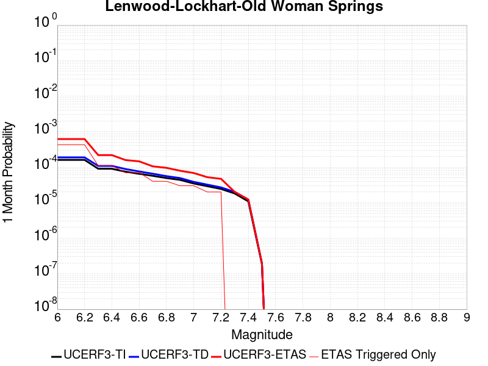
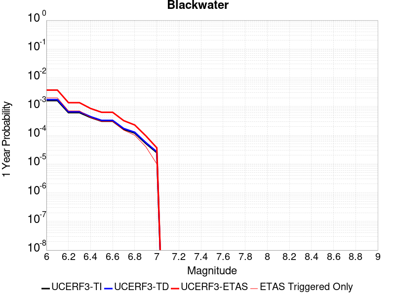
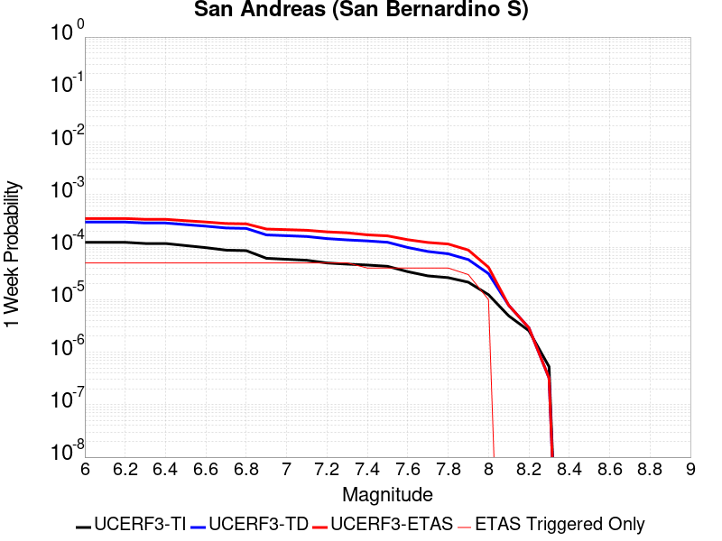
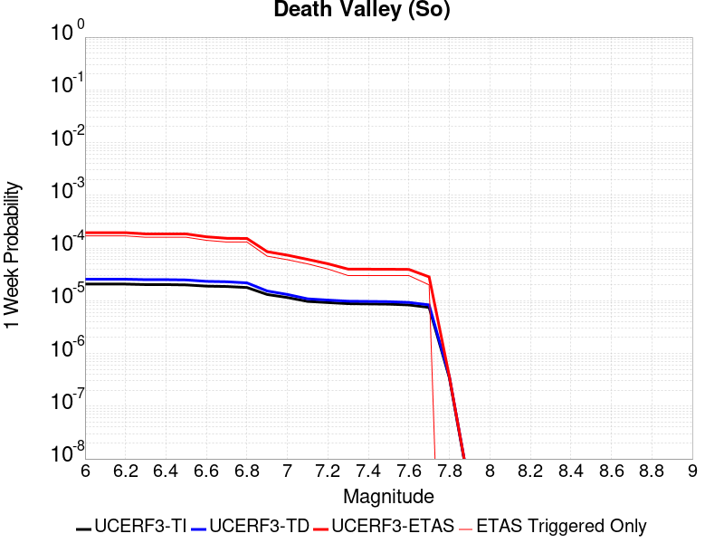

# Parent Section Magnitude-Probability Distributions

Only fault sections with at least one triggered aftershock are plotted. Sections are sorted by total supraseismogenic trigger rate (decreasing)

## Table Of Contents

* [Garlock (Central)](#garlock-central)
* [Tank Canyon](#tank-canyon)
* [Owl Lake](#owl-lake)
* [Little Lake](#little-lake)
* [Garlock (East)](#garlock-east)
* [Panamint Valley](#panamint-valley)
* [Garlock (West)](#garlock-west)
* [Coyote Canyon](#coyote-canyon)
* [Lenwood-Lockhart-Old Woman Springs](#lenwood-lockhart-old-woman-springs)
* [Ash Hill](#ash-hill)
* [San Andreas (Mojave S)](#san-andreas-mojave-s)
* [So Sierra Nevada](#so-sierra-nevada)
* [Blackwater](#blackwater)
* [San Andreas (Mojave N)](#san-andreas-mojave-n)
* [San Andreas (San Bernardino N)](#san-andreas-san-bernardino-n)
* [San Andreas (San Bernardino S)](#san-andreas-san-bernardino-s)
* [McLean Lake](#mclean-lake)
* [Gravel Hills-Harper Lk](#gravel-hills-harper-lk)
* [Airport Lake](#airport-lake)
* [Kern Canyon (Lake Isabella) 2011](#kern-canyon-lake-isabella-2011)
* [Bicycle Lake](#bicycle-lake)
* [Hunter Mountain-Saline Valley](#hunter-mountain-saline-valley)
* [Death Valley (So)](#death-valley-so)
* [Nelson Lake](#nelson-lake)
* [Goldstone Lake](#goldstone-lake)
* [Paradise](#paradise)
* [San Andreas (San Gorgonio Pass-Garnet HIll)](#san-andreas-san-gorgonio-pass-garnet-hill)

## Garlock (Central)
*[(top)](#table-of-contents)*

| 1 Week | 1 Month | 1 Year | 10 Year |
|-----|-----|-----|-----|
|  |  |  |  |

| Magnitude | 1 wk TI Prob | 1 wk TD Prob | 1 wk ETAS Prob | 1 wk ETAS/TD Gain | 1 wk ETAS Triggered Only | 1 mo TI Prob | 1 mo TD Prob | 1 mo ETAS Prob | 1 mo ETAS/TD Gain | 1 mo ETAS Triggered Only | 1 yr TI Prob | 1 yr TD Prob | 1 yr ETAS Prob | 1 yr ETAS/TD Gain | 1 yr ETAS Triggered Only | 10 yr TI Prob | 10 yr TD Prob | 10 yr ETAS Prob | 10 yr ETAS/TD Gain | 10 yr ETAS Triggered Only |
|-----|-----|-----|-----|-----|-----|-----|-----|-----|-----|-----|-----|-----|-----|-----|-----|-----|-----|-----|-----|-----|
| 6.0 | 5.5131142E-5 | 7.024558E-5 | 0.0069224318 | 98.54615 | 0.006852668 | 2.3625491E-4 | 3.0101812E-4 | 0.007151623 | 23.758114 | 0.006852668 | 0.0028726095 | 0.0036588025 | 0.016826307 | 4.5988564 | 0.013215859 | 0.028357591 | 0.03607921 | 0.052120965 | 1.444626 | 0.016642192 |
| 6.1 | 5.5131142E-5 | 7.024558E-5 | 0.0069224318 | 98.54615 | 0.006852668 | 2.3625491E-4 | 3.0101812E-4 | 0.007151623 | 23.758114 | 0.006852668 | 0.0028726095 | 0.0036588025 | 0.016826307 | 4.5988564 | 0.013215859 | 0.028357591 | 0.03607921 | 0.052120965 | 1.444626 | 0.016642192 |
| 6.2 | 4.216245E-5 | 5.1660383E-5 | 0.00494617 | 95.74397 | 0.0048947628 | 1.806837E-4 | 2.2138303E-4 | 0.005115062 | 23.105032 | 0.0048947628 | 0.0021976046 | 0.0026920384 | 0.0114788925 | 4.264015 | 0.008810572 | 0.021759989 | 0.02668921 | 0.038599525 | 1.4462595 | 0.012236906 |
| 6.3 | 4.216245E-5 | 5.1660383E-5 | 0.00494617 | 95.74397 | 0.0048947628 | 1.806837E-4 | 2.2138303E-4 | 0.005115062 | 23.105032 | 0.0048947628 | 0.0021976046 | 0.0026920384 | 0.0114788925 | 4.264015 | 0.008810572 | 0.021759989 | 0.02668921 | 0.038599525 | 1.4462595 | 0.012236906 |
| 6.4 | 3.6858168E-5 | 4.4109474E-5 | 0.003959747 | 89.77089 | 0.00391581 | 1.5795401E-4 | 1.8902705E-4 | 0.004104097 | 21.71169 | 0.00391581 | 0.0019213937 | 0.0022990005 | 0.008159212 | 3.5490258 | 0.005873715 | 0.019048655 | 0.022848397 | 0.030501077 | 1.3349329 | 0.00783162 |
| 6.5 | 3.39199E-5 | 4.001704E-5 | 0.002976757 | 74.387245 | 0.0029368575 | 1.453629E-4 | 1.7149044E-4 | 0.0031078444 | 18.122551 | 0.0029368575 | 0.0017683565 | 0.0020859186 | 0.0069704712 | 3.3416793 | 0.0048947628 | 0.017543508 | 0.02075933 | 0.027469741 | 1.3232479 | 0.006852668 |
| 6.6 | 3.3571985E-5 | 3.947123E-5 | 0.0029762129 | 75.402084 | 0.0029368575 | 1.4387199E-4 | 1.6915156E-4 | 0.0031055124 | 18.359346 | 0.0029368575 | 0.0017502342 | 0.002057497 | 0.0069421884 | 3.3740945 | 0.0048947628 | 0.017365133 | 0.020480646 | 0.027192967 | 1.3277397 | 0.006852668 |
| 6.7 | 3.2580007E-5 | 3.8087666E-5 | 0.0029748334 | 78.104904 | 0.0029368575 | 1.3962112E-4 | 1.6322276E-4 | 0.003099601 | 18.990004 | 0.0029368575 | 0.0016985617 | 0.0019854472 | 0.0068704914 | 3.4604251 | 0.0048947628 | 0.016856372 | 0.019773284 | 0.026490452 | 1.3397093 | 0.006852668 |
| 6.8 | 3.2185937E-5 | 3.751489E-5 | 0.0029742622 | 79.28219 | 0.0029368575 | 1.3793244E-4 | 1.607683E-4 | 0.0030971537 | 19.264704 | 0.0029368575 | 0.0016780337 | 0.0019556184 | 0.0063522896 | 3.2482257 | 0.004405286 | 0.016654192 | 0.019480087 | 0.025719322 | 1.320288 | 0.006363191 |
| 6.9 | 3.165394E-5 | 3.6719477E-5 | 0.0029734692 | 80.97798 | 0.0029368575 | 1.3565269E-4 | 1.5735981E-4 | 0.0030937553 | 19.660389 | 0.0029368575 | 0.0016503202 | 0.0019141936 | 0.0063110474 | 3.2969744 | 0.004405286 | 0.01638118 | 0.01907272 | 0.025314549 | 1.3272647 | 0.006363191 |
| 7.0 | 3.0903822E-5 | 3.5624747E-5 | 0.0029723777 | 83.43576 | 0.0029368575 | 1.3243823E-4 | 1.5266867E-4 | 0.0030890778 | 20.23387 | 0.0029368575 | 0.0016112428 | 0.0018571776 | 0.0062542823 | 3.3676276 | 0.004405286 | 0.015996104 | 0.018511891 | 0.024757288 | 1.3373722 | 0.006363191 |
| 7.1 | 3.0069863E-5 | 3.439106E-5 | 0.0024816883 | 72.16085 | 0.0024473814 | 1.2886449E-4 | 1.4738206E-4 | 0.0025944028 | 17.603247 | 0.0024473814 | 0.0015677959 | 0.0017929208 | 0.00570171 | 3.1801238 | 0.00391581 | 0.01556781 | 0.017879559 | 0.023648253 | 1.322642 | 0.005873715 |
| 7.2 | 2.7957109E-5 | 3.1280466E-5 | 0.0019891243 | 63.58998 | 0.001957905 | 1.1981068E-4 | 1.3405236E-4 | 0.0020916949 | 15.603567 | 0.001957905 | 0.0014577188 | 0.0016308852 | 0.005051631 | 3.0974782 | 0.003426334 | 0.014481937 | 0.016283188 | 0.020616742 | 1.2661368 | 0.004405286 |
| 7.3 | 2.4519275E-5 | 2.6713868E-5 | 0.0019845667 | 74.28976 | 0.001957905 | 1.0507837E-4 | 1.1448306E-4 | 0.0020721639 | 18.10018 | 0.001957905 | 0.0012785783 | 0.0013929547 | 0.0043257214 | 3.1054285 | 0.0029368575 | 0.012712469 | 0.013927576 | 0.01730619 | 1.2425845 | 0.003426334 |
| 7.4 | 2.3225532E-5 | 2.5198491E-5 | 0.0019830542 | 78.69734 | 0.001957905 | 9.95342E-5 | 1.07989144E-4 | 0.0020656828 | 19.128614 | 0.001957905 | 0.0012111551 | 0.0013139893 | 0.004246988 | 3.232133 | 0.0029368575 | 0.012045753 | 0.013145258 | 0.016526552 | 1.2572254 | 0.003426334 |
| 7.5 | 2.097765E-5 | 2.2482824E-5 | 0.0019803438 | 88.08252 | 0.001957905 | 8.9901114E-5 | 9.635147E-5 | 0.0020540678 | 21.318491 | 0.001957905 | 0.0010939965 | 0.0011724597 | 0.004105874 | 3.501932 | 0.0029368575 | 0.010886264 | 0.01173992 | 0.015126029 | 1.2884269 | 0.003426334 |
| 7.6 | 1.511254E-5 | 1.5990528E-5 | 9.949274E-4 | 62.219795 | 9.789525E-4 | 6.476642E-5 | 6.852908E-5 | 0.0010474145 | 15.284234 | 9.789525E-4 | 7.882459E-4 | 8.3403E-4 | 0.002301234 | 2.759174 | 0.0014684288 | 0.007854558 | 0.008383143 | 0.009839262 | 1.173696 | 0.0014684288 |
| 7.7 | 9.934069E-6 | 1.0678047E-5 | 9.896201E-4 | 92.67801 | 9.789525E-4 | 4.2573887E-5 | 4.576226E-5 | 0.00102467 | 22.39116 | 9.789525E-4 | 5.182138E-4 | 5.5701344E-4 | 0.0015354207 | 2.7565236 | 9.789525E-4 | 0.00517007 | 0.0056272964 | 0.0066007404 | 1.172986 | 9.789525E-4 |
| 7.8 | 6.7562896E-6 | 8.427841E-6 | 9.873721E-4 | 117.156006 | 9.789525E-4 | 2.8955206E-5 | 3.6118818E-5 | 0.001015036 | 28.102692 | 9.789525E-4 | 3.5247262E-4 | 4.3965803E-4 | 0.0014181802 | 3.2256436 | 9.789525E-4 | 0.0035191406 | 0.0044463384 | 0.005420938 | 1.2191916 | 9.789525E-4 |
| 7.9 | 3.975453E-6 | 5.3706585E-6 | 9.84318E-4 | 183.27695 | 9.789525E-4 | 1.7037546E-5 | 2.3016906E-5 | 0.0010019469 | 43.53091 | 9.789525E-4 | 2.0741238E-4 | 2.801949E-4 | 0.0012588731 | 4.4928484 | 9.789525E-4 | 0.002072189 | 0.002833435 | 0.0038096139 | 1.3445213 | 9.789525E-4 |
| 8.0 | 1.6729537E-6 | 2.0773857E-6 | 2.0773857E-6 | 1.0 | 0.0 | 7.169782E-6 | 8.903051E-6 | 8.903051E-6 | 1.0 | 0.0 | 8.7288594E-5 | 1.08389286E-4 | 1.08389286E-4 | 1.0 | 0.0 | 8.7254314E-4 | 0.0010968668 | 0.0010968668 | 1.0 | 0.0 |
| 8.1 | 3.6733252E-7 | 3.148811E-7 | 3.148811E-7 | 1.0 | 0.0 | 1.5742813E-6 | 1.3494899E-6 | 1.3494899E-6 | 1.0 | 0.0 | 1.9166706E-5 | 1.6429933E-5 | 1.6429933E-5 | 1.0 | 0.0 | 1.9165053E-4 | 1.6637788E-4 | 1.6637788E-4 | 1.0 | 0.0 |

## Tank Canyon
*[(top)](#table-of-contents)*

| 1 Week | 1 Month | 1 Year | 10 Year |
|-----|-----|-----|-----|
|  |  |  |  |

| Magnitude | 1 wk TI Prob | 1 wk TD Prob | 1 wk ETAS Prob | 1 wk ETAS/TD Gain | 1 wk ETAS Triggered Only | 1 mo TI Prob | 1 mo TD Prob | 1 mo ETAS Prob | 1 mo ETAS/TD Gain | 1 mo ETAS Triggered Only | 1 yr TI Prob | 1 yr TD Prob | 1 yr ETAS Prob | 1 yr ETAS/TD Gain | 1 yr ETAS Triggered Only | 10 yr TI Prob | 10 yr TD Prob | 10 yr ETAS Prob | 10 yr ETAS/TD Gain | 10 yr ETAS Triggered Only |
|-----|-----|-----|-----|-----|-----|-----|-----|-----|-----|-----|-----|-----|-----|-----|-----|-----|-----|-----|-----|-----|
| 6.0 | 4.8284557E-5 | 5.7964517E-5 | 0.0054418915 | 93.88315 | 0.005384239 | 2.0691741E-4 | 2.4839956E-4 | 0.007099365 | 28.580427 | 0.006852668 | 0.0025163088 | 0.0030207448 | 0.012292701 | 4.069427 | 0.009300049 | 0.02488006 | 0.029863482 | 0.04220981 | 1.4134257 | 0.012726382 |
| 6.1 | 1.7796336E-5 | 2.0873225E-5 | 2.0873225E-5 | 1.0 | 0.0 | 7.626778E-5 | 8.945383E-5 | 5.788863E-4 | 6.4713416 | 4.8947625E-4 | 9.281647E-4 | 0.0010885935 | 0.0020664805 | 1.898303 | 9.789525E-4 | 0.009242975 | 0.010836697 | 0.0132575575 | 1.2233946 | 0.0024473814 |
| 6.2 | 1.7796336E-5 | 2.0873225E-5 | 2.0873225E-5 | 1.0 | 0.0 | 7.626778E-5 | 8.945383E-5 | 5.788863E-4 | 6.4713416 | 4.8947625E-4 | 9.281647E-4 | 0.0010885935 | 0.0020664805 | 1.898303 | 9.789525E-4 | 0.009242975 | 0.010836697 | 0.0132575575 | 1.2233946 | 0.0024473814 |
| 6.3 | 1.3515912E-5 | 1.57595E-5 | 1.57595E-5 | 1.0 | 0.0 | 5.792405E-5 | 6.7539106E-5 | 5.569823E-4 | 8.246812 | 4.8947625E-4 | 7.049971E-4 | 8.220024E-4 | 0.0018001503 | 2.1899574 | 9.789525E-4 | 0.007027647 | 0.008192232 | 0.010134097 | 1.2370374 | 0.001957905 |
| 6.4 | 1.0870146E-5 | 1.2617973E-5 | 1.2617973E-5 | 1.0 | 0.0 | 4.658551E-5 | 5.407601E-5 | 5.435258E-4 | 10.051146 | 4.8947625E-4 | 5.67031E-4 | 6.581944E-4 | 0.0011473486 | 1.7431756 | 4.8947625E-4 | 0.005655863 | 0.006564466 | 0.0080232555 | 1.2222252 | 0.0014684288 |
| 6.5 | 7.964826E-6 | 9.196063E-6 | 9.196063E-6 | 1.0 | 0.0 | 3.4134522E-5 | 3.941116E-5 | 5.288681E-4 | 13.419248 | 4.8947625E-4 | 4.1550855E-4 | 4.797359E-4 | 9.6897734E-4 | 2.019814 | 4.8947625E-4 | 0.0041473247 | 0.0047883047 | 0.006249702 | 1.3052014 | 0.0014684288 |
| 6.6 | 6.6317E-6 | 7.6122747E-6 | 7.6122747E-6 | 1.0 | 0.0 | 2.8421264E-5 | 3.2623677E-5 | 5.2208395E-4 | 16.003222 | 4.8947625E-4 | 3.4597394E-4 | 3.9713003E-4 | 8.864119E-4 | 2.2320445 | 4.8947625E-4 | 0.0034543579 | 0.0039653555 | 0.004940426 | 1.2458974 | 9.789525E-4 |
| 6.7 | 4.793663E-6 | 5.430772E-6 | 5.430772E-6 | 1.0 | 0.0 | 2.0544108E-5 | 2.3274553E-5 | 5.127394E-4 | 22.030043 | 4.8947625E-4 | 2.500958E-4 | 2.8333522E-4 | 7.726728E-4 | 2.7270622 | 4.8947625E-4 | 0.0024981452 | 0.0028304325 | 0.003806614 | 1.3448879 | 9.789525E-4 |
| 6.8 | 4.382823E-6 | 4.969245E-6 | 4.969245E-6 | 1.0 | 0.0 | 1.8783392E-5 | 2.1296615E-5 | 5.1076245E-4 | 23.983269 | 4.8947625E-4 | 2.286638E-4 | 2.5925972E-4 | 7.486091E-4 | 2.8874872 | 4.8947625E-4 | 0.0022842865 | 0.0025902467 | 0.0035666635 | 1.376959 | 9.789525E-4 |
| 6.9 | 2.729601E-6 | 3.0735362E-6 | 3.0735362E-6 | 1.0 | 0.0 | 1.1698237E-5 | 1.3172238E-5 | 5.0264207E-4 | 38.1592 | 4.8947625E-4 | 1.4241673E-4 | 1.6036142E-4 | 6.497592E-4 | 4.051842 | 4.8947625E-4 | 0.001423255 | 0.0016026229 | 0.0020913149 | 1.3049325 | 4.8947625E-4 |
| 7.0 | 1.8987357E-6 | 2.1269361E-6 | 2.1269361E-6 | 1.0 | 0.0 | 8.137413E-6 | 9.1154125E-6 | 9.1154125E-6 | 1.0 | 0.0 | 9.90685E-5 | 1.1097519E-4 | 1.1097519E-4 | 1.0 | 0.0 | 9.902435E-4 | 0.0011092664 | 0.0011092664 | 1.0 | 0.0 |
| 7.1 | 1.4928986E-6 | 1.6641251E-6 | 1.6641251E-6 | 1.0 | 0.0 | 6.398121E-6 | 7.1319487E-6 | 7.1319487E-6 | 1.0 | 0.0 | 7.789434E-5 | 8.682861E-5 | 8.682861E-5 | 1.0 | 0.0 | 7.786704E-4 | 8.680047E-4 | 8.680047E-4 | 1.0 | 0.0 |
| 7.2 | 1.069082E-6 | 1.182856E-6 | 1.182856E-6 | 1.0 | 0.0 | 4.581772E-6 | 5.0693757E-6 | 5.0693757E-6 | 1.0 | 0.0 | 5.5781646E-5 | 6.1718434E-5 | 6.1718434E-5 | 1.0 | 0.0 | 5.576765E-4 | 6.1706523E-4 | 6.1706523E-4 | 1.0 | 0.0 |
| 7.3 | 8.776551E-7 | 9.769996E-7 | 9.769996E-7 | 1.0 | 0.0 | 3.7613736E-6 | 4.187137E-6 | 4.187137E-6 | 1.0 | 0.0 | 4.579376E-5 | 5.097772E-5 | 5.097772E-5 | 1.0 | 0.0 | 4.5784327E-4 | 5.097113E-4 | 5.097113E-4 | 1.0 | 0.0 |
| 7.4 | 7.55721E-7 | 8.5102363E-7 | 8.5102363E-7 | 1.0 | 0.0 | 3.2388E-6 | 3.647242E-6 | 3.647242E-6 | 1.0 | 0.0 | 3.9431678E-5 | 4.4404784E-5 | 4.4404784E-5 | 1.0 | 0.0 | 3.942468E-4 | 4.4401E-4 | 4.4401E-4 | 1.0 | 0.0 |
| 7.5 | 5.587665E-7 | 6.305613E-7 | 6.305613E-7 | 1.0 | 0.0 | 2.3947114E-6 | 2.7024057E-6 | 2.7024057E-6 | 1.0 | 0.0 | 2.915522E-5 | 3.290179E-5 | 3.290179E-5 | 1.0 | 0.0 | 2.9151395E-4 | 3.2901787E-4 | 3.2901787E-4 | 1.0 | 0.0 |

## Owl Lake
*[(top)](#table-of-contents)*

| 1 Week | 1 Month | 1 Year | 10 Year |
|-----|-----|-----|-----|
|  |  |  |  |

| Magnitude | 1 wk TI Prob | 1 wk TD Prob | 1 wk ETAS Prob | 1 wk ETAS/TD Gain | 1 wk ETAS Triggered Only | 1 mo TI Prob | 1 mo TD Prob | 1 mo ETAS Prob | 1 mo ETAS/TD Gain | 1 mo ETAS Triggered Only | 1 yr TI Prob | 1 yr TD Prob | 1 yr ETAS Prob | 1 yr ETAS/TD Gain | 1 yr ETAS Triggered Only | 10 yr TI Prob | 10 yr TD Prob | 10 yr ETAS Prob | 10 yr ETAS/TD Gain | 10 yr ETAS Triggered Only |
|-----|-----|-----|-----|-----|-----|-----|-----|-----|-----|-----|-----|-----|-----|-----|-----|-----|-----|-----|-----|-----|
| 6.0 | 5.0320643E-5 | 6.635748E-5 | 0.0025135763 | 37.87932 | 0.0024473814 | 2.1564208E-4 | 2.843645E-4 | 0.00273105 | 9.604047 | 0.0024473814 | 0.0026222812 | 0.0034577043 | 0.0073599746 | 2.1285725 | 0.00391581 | 0.02591553 | 0.0341404 | 0.040286347 | 1.1800199 | 0.006363191 |
| 6.1 | 5.0320643E-5 | 6.635748E-5 | 0.0025135763 | 37.87932 | 0.0024473814 | 2.1564208E-4 | 2.843645E-4 | 0.00273105 | 9.604047 | 0.0024473814 | 0.0026222812 | 0.0034577043 | 0.0073599746 | 2.1285725 | 0.00391581 | 0.02591553 | 0.0341404 | 0.040286347 | 1.1800199 | 0.006363191 |
| 6.2 | 2.4125871E-5 | 3.0980704E-5 | 0.0019888252 | 64.19561 | 0.001957905 | 1.0339249E-4 | 1.3276885E-4 | 0.002090414 | 15.744761 | 0.001957905 | 0.0012580766 | 0.0016154221 | 0.005036221 | 3.1175883 | 0.003426334 | 0.012509781 | 0.016070297 | 0.02136801 | 1.3296586 | 0.005384239 |
| 6.3 | 1.7433485E-5 | 2.2355249E-5 | 0.0019802165 | 88.57949 | 0.001957905 | 7.471279E-5 | 9.580558E-5 | 0.002053523 | 21.434275 | 0.001957905 | 9.0924866E-4 | 0.0011659606 | 0.0040993937 | 3.5158942 | 0.0029368575 | 0.009055373 | 0.011628761 | 0.016466603 | 1.416024 | 0.0048947628 |
| 6.4 | 1.7433485E-5 | 2.2355249E-5 | 0.0019802165 | 88.57949 | 0.001957905 | 7.471279E-5 | 9.580558E-5 | 0.002053523 | 21.434275 | 0.001957905 | 9.0924866E-4 | 0.0011659606 | 0.0040993937 | 3.5158942 | 0.0029368575 | 0.009055373 | 0.011628761 | 0.016466603 | 1.416024 | 0.0048947628 |
| 6.5 | 1.5182742E-5 | 1.9428902E-5 | 0.0019772958 | 101.77085 | 0.001957905 | 6.506727E-5 | 8.326492E-5 | 0.002041007 | 24.512207 | 0.001957905 | 7.919061E-4 | 0.0010134302 | 0.0029693511 | 2.9300005 | 0.001957905 | 0.0078909 | 0.010118305 | 0.0139944935 | 1.3830868 | 0.00391581 |
| 6.6 | 6.7271576E-6 | 8.547201E-6 | 9.874913E-4 | 115.53389 | 9.789525E-4 | 2.8830356E-5 | 3.663038E-5 | 0.0010155471 | 27.724174 | 9.789525E-4 | 3.5095305E-4 | 4.4588925E-4 | 0.0014244053 | 3.194527 | 9.789525E-4 | 0.0035039932 | 0.0044677295 | 0.007391466 | 1.6544122 | 0.0029368575 |
| 6.7 | 6.682835E-6 | 8.4796475E-6 | 9.874238E-4 | 116.446335 | 9.789525E-4 | 2.8640408E-5 | 3.6340873E-5 | 0.0010152578 | 27.93708 | 9.789525E-4 | 3.4864116E-4 | 4.4236594E-4 | 0.0014208854 | 3.2120135 | 9.789525E-4 | 0.003480947 | 0.004432656 | 0.0073564956 | 1.6596135 | 0.0029368575 |
| 6.8 | 6.5774975E-6 | 8.326121E-6 | 9.872705E-4 | 118.57507 | 9.789525E-4 | 2.8188972E-5 | 3.5682922E-5 | 0.0010146005 | 28.433784 | 9.789525E-4 | 3.4314668E-4 | 4.343586E-4 | 0.001412886 | 3.2528098 | 9.789525E-4 | 0.0034261728 | 0.0043528024 | 0.0072768764 | 1.6717682 | 0.0029368575 |
| 6.9 | 6.363419E-6 | 7.999298E-6 | 9.86944E-4 | 123.37883 | 9.789525E-4 | 2.727151E-5 | 3.4282286E-5 | 0.0010132012 | 29.554659 | 9.789525E-4 | 3.3198006E-4 | 4.1731246E-4 | 0.0013958565 | 3.3448713 | 9.789525E-4 | 0.0033148455 | 0.004182795 | 0.007107368 | 1.6991911 | 0.0029368575 |
| 7.0 | 6.1342453E-6 | 7.631501E-6 | 9.865765E-4 | 129.27687 | 9.789525E-4 | 2.6289357E-5 | 3.2706055E-5 | 0.0010116266 | 30.930864 | 9.789525E-4 | 3.2002592E-4 | 3.9812896E-4 | 0.0013766917 | 3.457904 | 9.789525E-4 | 0.0031956544 | 0.00399149 | 0.0069166254 | 1.7328428 | 0.0029368575 |
| 7.1 | 5.842926E-6 | 7.1420604E-6 | 9.860876E-4 | 138.06766 | 9.789525E-4 | 2.504087E-5 | 3.0608502E-5 | 0.0010095311 | 32.982048 | 9.789525E-4 | 3.0482994E-4 | 3.7260022E-4 | 0.0013511879 | 3.6263747 | 9.789525E-4 | 0.0030441214 | 0.0037369546 | 0.006662837 | 1.7829591 | 0.0029368575 |
| 7.2 | 4.77173E-6 | 5.3583467E-6 | 4.94832E-4 | 92.347885 | 4.8947625E-4 | 2.045011E-5 | 2.2964163E-5 | 5.1242916E-4 | 22.314299 | 4.8947625E-4 | 2.4895166E-4 | 2.7955687E-4 | 7.688963E-4 | 2.750411 | 4.8947625E-4 | 0.0024867293 | 0.002808574 | 0.004272878 | 1.5213695 | 0.0014684288 |
| 7.3 | 3.0494948E-6 | 2.7103622E-6 | 4.921853E-4 | 181.59393 | 4.8947625E-4 | 1.3069198E-5 | 1.1615787E-5 | 5.0108635E-4 | 43.138393 | 4.8947625E-4 | 1.5910587E-4 | 1.4141318E-4 | 6.308202E-4 | 4.46083 | 4.8947625E-4 | 0.0015899199 | 0.0014231888 | 0.002400748 | 1.6868795 | 9.789525E-4 |
| 7.4 | 2.7263884E-6 | 2.3055816E-6 | 4.917807E-4 | 213.30008 | 4.8947625E-4 | 1.1684469E-5 | 9.881027E-6 | 4.9935246E-4 | 50.53649 | 4.8947625E-4 | 1.4224913E-4 | 1.20294964E-4 | 6.097123E-4 | 5.0684776 | 4.8947625E-4 | 0.0014215811 | 0.0012111744 | 0.0021889412 | 1.8072883 | 9.789525E-4 |
| 7.5 | 2.6090431E-6 | 2.1655203E-6 | 4.916407E-4 | 227.03122 | 4.8947625E-4 | 1.1181565E-5 | 9.280769E-6 | 4.9875246E-4 | 53.74043 | 4.8947625E-4 | 1.3612706E-4 | 1.129876E-4 | 6.0240855E-4 | 5.3316345 | 4.8947625E-4 | 0.001360437 | 0.0011379321 | 0.0021157707 | 1.8593118 | 9.789525E-4 |
| 7.6 | 2.3008756E-6 | 1.872704E-6 | 1.872704E-6 | 1.0 | 0.0 | 9.860858E-6 | 8.025851E-6 | 8.025851E-6 | 1.0 | 0.0 | 1.20049335E-4 | 9.771043E-5 | 9.771043E-5 | 1.0 | 0.0 | 0.001199845 | 9.849465E-4 | 9.849465E-4 | 1.0 | 0.0 |
| 7.7 | 1.7184348E-6 | 1.3418345E-6 | 1.3418345E-6 | 1.0 | 0.0 | 7.3646997E-6 | 5.750707E-6 | 5.750707E-6 | 1.0 | 0.0 | 8.966153E-5 | 7.001265E-5 | 7.001265E-5 | 1.0 | 0.0 | 8.962536E-4 | 7.077913E-4 | 7.077913E-4 | 1.0 | 0.0 |
| 7.8 | 8.4612907E-7 | 8.4052675E-7 | 8.4052675E-7 | 1.0 | 0.0 | 3.6262625E-6 | 3.6022527E-6 | 3.6022527E-6 | 1.0 | 0.0 | 4.4148852E-5 | 4.3856566E-5 | 4.3856566E-5 | 1.0 | 0.0 | 4.414008E-4 | 4.4395277E-4 | 4.4395277E-4 | 1.0 | 0.0 |
| 7.9 | 2.716738E-7 | 3.767845E-7 | 3.767845E-7 | 1.0 | 0.0 | 1.1643157E-6 | 1.6147899E-6 | 1.6147899E-6 | 1.0 | 0.0 | 1.4175452E-5 | 1.96599E-5 | 1.96599E-5 | 1.0 | 0.0 | 1.4174548E-4 | 1.9835318E-4 | 1.9835318E-4 | 1.0 | 0.0 |
| 8.0 | 2.1995428E-8 | 3.38465E-8 | 3.38465E-8 | 1.0 | 0.0 | 9.426611E-8 | 1.4505643E-7 | 1.4505643E-7 | 1.0 | 0.0 | 1.1476893E-6 | 1.7660612E-6 | 1.7660612E-6 | 1.0 | 0.0 | 1.14768345E-5 | 1.796186E-5 | 1.796186E-5 | 1.0 | 0.0 |

## Little Lake
*[(top)](#table-of-contents)*

| 1 Week | 1 Month | 1 Year | 10 Year |
|-----|-----|-----|-----|
|  |  |  |  |

| Magnitude | 1 wk TI Prob | 1 wk TD Prob | 1 wk ETAS Prob | 1 wk ETAS/TD Gain | 1 wk ETAS Triggered Only | 1 mo TI Prob | 1 mo TD Prob | 1 mo ETAS Prob | 1 mo ETAS/TD Gain | 1 mo ETAS Triggered Only | 1 yr TI Prob | 1 yr TD Prob | 1 yr ETAS Prob | 1 yr ETAS/TD Gain | 1 yr ETAS Triggered Only | 10 yr TI Prob | 10 yr TD Prob | 10 yr ETAS Prob | 10 yr ETAS/TD Gain | 10 yr ETAS Triggered Only |
|-----|-----|-----|-----|-----|-----|-----|-----|-----|-----|-----|-----|-----|-----|-----|-----|-----|-----|-----|-----|-----|
| 6.0 | 2.8424427E-5 | 3.1205633E-5 | 0.0034574326 | 110.79514 | 0.003426334 | 1.2181328E-4 | 1.3373232E-4 | 0.004049019 | 30.277039 | 0.00391581 | 0.0014820677 | 0.0016271081 | 0.006025227 | 3.7030277 | 0.004405286 | 0.014722223 | 0.016165355 | 0.020980993 | 1.2978987 | 0.0048947628 |
| 6.1 | 2.8424427E-5 | 3.1205633E-5 | 0.0034574326 | 110.79514 | 0.003426334 | 1.2181328E-4 | 1.3373232E-4 | 0.004049019 | 30.277039 | 0.00391581 | 0.0014820677 | 0.0016271081 | 0.006025227 | 3.7030277 | 0.004405286 | 0.014722223 | 0.016165355 | 0.020980993 | 1.2978987 | 0.0048947628 |
| 6.2 | 2.8424427E-5 | 3.1205633E-5 | 0.0034574326 | 110.79514 | 0.003426334 | 1.2181328E-4 | 1.3373232E-4 | 0.004049019 | 30.277039 | 0.00391581 | 0.0014820677 | 0.0016271081 | 0.006025227 | 3.7030277 | 0.004405286 | 0.014722223 | 0.016165355 | 0.020980993 | 1.2978987 | 0.0048947628 |
| 6.3 | 1.48860645E-5 | 1.6081349E-5 | 0.001973955 | 122.74809 | 0.001957905 | 6.379586E-5 | 6.89184E-5 | 0.0020266885 | 29.407072 | 0.001957905 | 7.7643775E-4 | 8.387868E-4 | 0.0027950495 | 3.3322527 | 0.001957905 | 0.007737305 | 0.008359027 | 0.0103005655 | 1.2322686 | 0.001957905 |
| 6.4 | 1.48860645E-5 | 1.6081349E-5 | 0.001973955 | 122.74809 | 0.001957905 | 6.379586E-5 | 6.89184E-5 | 0.0020266885 | 29.407072 | 0.001957905 | 7.7643775E-4 | 8.387868E-4 | 0.0027950495 | 3.3322527 | 0.001957905 | 0.007737305 | 0.008359027 | 0.0103005655 | 1.2322686 | 0.001957905 |
| 6.5 | 1.2797581E-5 | 1.3765531E-5 | 0.0014821741 | 107.67287 | 0.0014684288 | 5.4845623E-5 | 5.899394E-5 | 0.0015273361 | 25.889711 | 0.0014684288 | 6.675408E-4 | 7.180402E-4 | 0.0021854145 | 3.0435824 | 0.0014684288 | 0.006655392 | 0.0071597523 | 0.0086176675 | 1.2036265 | 0.0014684288 |
| 6.6 | 9.661896E-6 | 1.02890135E-5 | 9.892315E-4 | 96.14444 | 9.789525E-4 | 4.1407468E-5 | 4.409512E-5 | 0.0010230045 | 23.19995 | 9.789525E-4 | 5.040193E-4 | 5.3674204E-4 | 0.0015151692 | 2.8229 | 9.789525E-4 | 0.005028777 | 0.0053560617 | 0.006329771 | 1.1817957 | 9.789525E-4 |
| 6.7 | 7.767871E-6 | 8.199668E-6 | 4.976719E-4 | 60.694153 | 4.8947625E-4 | 3.329045E-5 | 3.5141038E-5 | 5.246001E-4 | 14.928417 | 4.8947625E-4 | 4.0523586E-4 | 4.2777188E-4 | 9.1703876E-4 | 2.1437564 | 4.8947625E-4 | 0.004044977 | 0.0042708362 | 0.004758222 | 1.1141195 | 4.8947625E-4 |
| 6.8 | 6.4235196E-6 | 6.7357296E-6 | 4.9620867E-4 | 73.668144 | 4.8947625E-4 | 2.752908E-5 | 2.8867165E-5 | 5.1832927E-4 | 17.95567 | 4.8947625E-4 | 3.35115E-4 | 3.5141388E-4 | 8.4071816E-4 | 2.3923874 | 4.8947625E-4 | 0.003346101 | 0.0035098423 | 0.0039976006 | 1.1389687 | 4.8947625E-4 |
| 6.9 | 3.1283696E-6 | 3.1121751E-6 | 4.925869E-4 | 158.27737 | 4.8947625E-4 | 1.3407229E-5 | 1.33378335E-5 | 5.0280755E-4 | 37.69784 | 4.8947625E-4 | 1.6322079E-4 | 1.6237753E-4 | 6.517743E-4 | 4.0139437 | 4.8947625E-4 | 0.0016310095 | 0.0016227373 | 0.002111419 | 1.3011467 | 4.8947625E-4 |
| 7.0 | 2.290603E-6 | 2.2286777E-6 | 2.2286777E-6 | 1.0 | 0.0 | 9.816834E-6 | 9.551446E-6 | 9.551446E-6 | 1.0 | 0.0 | 1.19513395E-4 | 1.1628369E-4 | 1.1628369E-4 | 1.0 | 0.0 | 0.0011944914 | 0.0011623306 | 0.0011623306 | 1.0 | 0.0 |
| 7.1 | 1.293693E-6 | 1.1776802E-6 | 1.1776802E-6 | 1.0 | 0.0 | 5.5443866E-6 | 5.0471954E-6 | 5.0471954E-6 | 1.0 | 0.0 | 6.750081E-5 | 6.144857E-5 | 6.144857E-5 | 1.0 | 0.0 | 6.7480316E-4 | 6.1438425E-4 | 6.1438425E-4 | 1.0 | 0.0 |
| 7.2 | 4.715842E-7 | 3.091774E-7 | 3.091774E-7 | 1.0 | 0.0 | 2.0210737E-6 | 1.3250453E-6 | 1.3250453E-6 | 1.0 | 0.0 | 2.4606294E-5 | 1.6132313E-5 | 1.6132313E-5 | 1.0 | 0.0 | 2.460357E-4 | 1.6131197E-4 | 1.6131197E-4 | 1.0 | 0.0 |
| 7.3 | 3.9430947E-7 | 2.309738E-7 | 2.309738E-7 | 1.0 | 0.0 | 1.6898966E-6 | 9.898873E-7 | 9.898873E-7 | 1.0 | 0.0 | 2.0574296E-5 | 1.20518125E-5 | 1.20518125E-5 | 1.0 | 0.0 | 2.0572392E-4 | 1.2051166E-4 | 1.2051166E-4 | 1.0 | 0.0 |
| 7.4 | 3.547123E-7 | 1.9679035E-7 | 1.9679035E-7 | 1.0 | 0.0 | 1.5201948E-6 | 8.4338694E-7 | 8.4338694E-7 | 1.0 | 0.0 | 1.8508214E-5 | 1.0268188E-5 | 1.0268188E-5 | 1.0 | 0.0 | 1.8506673E-4 | 1.026772E-4 | 1.026772E-4 | 1.0 | 0.0 |
| 7.5 | 2.6354266E-7 | 1.4423068E-7 | 1.4423068E-7 | 1.0 | 0.0 | 1.129468E-6 | 6.1813137E-7 | 6.1813137E-7 | 1.0 | 0.0 | 1.3751187E-5 | 7.5257235E-6 | 7.5257235E-6 | 1.0 | 0.0 | 1.3750336E-4 | 7.525474E-5 | 7.525474E-5 | 1.0 | 0.0 |
| 7.6 | 1.269913E-7 | 7.572526E-8 | 7.572526E-8 | 1.0 | 0.0 | 5.4424834E-7 | 3.245368E-7 | 3.245368E-7 | 1.0 | 0.0 | 6.6262032E-6 | 3.951229E-6 | 3.951229E-6 | 1.0 | 0.0 | 6.626006E-5 | 3.9511622E-5 | 3.9511622E-5 | 1.0 | 0.0 |

## Garlock (East)
*[(top)](#table-of-contents)*

| 1 Week | 1 Month | 1 Year | 10 Year |
|-----|-----|-----|-----|
|  |  |  |  |

| Magnitude | 1 wk TI Prob | 1 wk TD Prob | 1 wk ETAS Prob | 1 wk ETAS/TD Gain | 1 wk ETAS Triggered Only | 1 mo TI Prob | 1 mo TD Prob | 1 mo ETAS Prob | 1 mo ETAS/TD Gain | 1 mo ETAS Triggered Only | 1 yr TI Prob | 1 yr TD Prob | 1 yr ETAS Prob | 1 yr ETAS/TD Gain | 1 yr ETAS Triggered Only | 10 yr TI Prob | 10 yr TD Prob | 10 yr ETAS Prob | 10 yr ETAS/TD Gain | 10 yr ETAS Triggered Only |
|-----|-----|-----|-----|-----|-----|-----|-----|-----|-----|-----|-----|-----|-----|-----|-----|-----|-----|-----|-----|-----|
| 6.0 | 4.5092507E-5 | 6.290254E-5 | 0.0015312389 | 24.343039 | 0.0014684288 | 1.9323928E-4 | 2.6955697E-4 | 0.00173759 | 6.4460955 | 0.0014684288 | 0.0023501497 | 0.003277363 | 0.0057167234 | 1.7443058 | 0.0024473814 | 0.023254504 | 0.032351483 | 0.03519333 | 1.0878428 | 0.0029368575 |
| 6.1 | 4.5092507E-5 | 6.290254E-5 | 0.0015312389 | 24.343039 | 0.0014684288 | 1.9323928E-4 | 2.6955697E-4 | 0.00173759 | 6.4460955 | 0.0014684288 | 0.0023501497 | 0.003277363 | 0.0057167234 | 1.7443058 | 0.0024473814 | 0.023254504 | 0.032351483 | 0.03519333 | 1.0878428 | 0.0029368575 |
| 6.2 | 2.6674514E-5 | 3.450911E-5 | 0.0015028872 | 43.550446 | 0.0014684288 | 1.1431433E-4 | 1.4788799E-4 | 0.0016160996 | 10.927862 | 0.0014684288 | 0.0013908884 | 0.0017990824 | 0.0042420607 | 2.3579023 | 0.0024473814 | 0.01382215 | 0.01789001 | 0.020293608 | 1.1343542 | 0.0024473814 |
| 6.3 | 2.6674514E-5 | 3.450911E-5 | 0.0015028872 | 43.550446 | 0.0014684288 | 1.1431433E-4 | 1.4788799E-4 | 0.0016160996 | 10.927862 | 0.0014684288 | 0.0013908884 | 0.0017990824 | 0.0042420607 | 2.3579023 | 0.0024473814 | 0.01382215 | 0.01789001 | 0.020293608 | 1.1343542 | 0.0024473814 |
| 6.4 | 2.5312667E-5 | 3.233838E-5 | 0.0015007197 | 46.40677 | 0.0014684288 | 1.0847834E-4 | 1.3858585E-4 | 0.0016068112 | 11.594337 | 0.0014684288 | 0.0013199237 | 0.0016860063 | 0.0041292612 | 2.4491374 | 0.0024473814 | 0.013121112 | 0.016778054 | 0.019184373 | 1.1434206 | 0.0024473814 |
| 6.5 | 2.5312667E-5 | 3.233838E-5 | 0.0015007197 | 46.40677 | 0.0014684288 | 1.0847834E-4 | 1.3858585E-4 | 0.0016068112 | 11.594337 | 0.0014684288 | 0.0013199237 | 0.0016860063 | 0.0041292612 | 2.4491374 | 0.0024473814 | 0.013121112 | 0.016778054 | 0.019184373 | 1.1434206 | 0.0024473814 |
| 6.6 | 2.246556E-5 | 2.8133245E-5 | 0.0014965207 | 53.19403 | 0.0014684288 | 9.627742E-5 | 1.20565615E-4 | 0.0015888173 | 13.178031 | 0.0014684288 | 0.0011715472 | 0.0014669215 | 0.003910713 | 2.665932 | 0.0024473814 | 0.011653901 | 0.014618388 | 0.017029993 | 1.1649706 | 0.0024473814 |
| 6.7 | 2.2241198E-5 | 2.780299E-5 | 0.0014961909 | 53.81403 | 0.0014684288 | 9.531594E-5 | 1.1915036E-4 | 0.0015874042 | 13.322698 | 0.0014684288 | 0.0011598538 | 0.0014497138 | 0.0038935472 | 2.685735 | 0.0024473814 | 0.011538187 | 0.014448582 | 0.016860602 | 1.1669382 | 0.0024473814 |
| 6.8 | 1.9528685E-5 | 2.3897695E-5 | 0.0014922913 | 62.44499 | 0.0014684288 | 8.369167E-5 | 1.02414786E-4 | 0.0015706932 | 15.336586 | 0.0014684288 | 0.0010184698 | 0.0012462065 | 0.0032016716 | 2.569134 | 0.001957905 | 0.010138147 | 0.012436173 | 0.014369729 | 1.1554784 | 0.001957905 |
| 6.9 | 1.3318621E-5 | 1.5198458E-5 | 0.0014836049 | 97.615486 | 0.0014684288 | 5.7078556E-5 | 6.5134656E-5 | 0.0015334678 | 23.54304 | 0.0014684288 | 6.9470983E-4 | 7.927316E-4 | 0.0027490845 | 3.4678628 | 0.001957905 | 0.0069254204 | 0.007939667 | 0.009882027 | 1.24464 | 0.001957905 |
| 7.0 | 1.1760853E-5 | 1.31073775E-5 | 0.0014815169 | 113.02924 | 0.0014684288 | 5.0402683E-5 | 5.6173292E-5 | 0.0015245196 | 27.13958 | 0.0014684288 | 6.134799E-4 | 6.8370026E-4 | 0.0026402667 | 3.8617313 | 0.001957905 | 0.0061178906 | 0.006856307 | 0.008800788 | 1.2836047 | 0.001957905 |
| 7.1 | 1.0064758E-5 | 1.0902532E-5 | 0.0014793153 | 135.68547 | 0.0014684288 | 4.3133965E-5 | 4.6724323E-5 | 0.0015150845 | 32.426033 | 0.0014684288 | 5.2502943E-4 | 5.6872366E-4 | 0.0025255152 | 4.440672 | 0.001957905 | 0.005237907 | 0.0057127923 | 0.007659512 | 1.340765 | 0.001957905 |
| 7.2 | 9.768808E-6 | 1.0498412E-5 | 0.0014789117 | 140.87004 | 0.0014684288 | 4.186565E-5 | 4.4992437E-5 | 0.0015133552 | 33.63577 | 0.0014684288 | 5.095951E-4 | 5.4764876E-4 | 0.0025044815 | 4.573153 | 0.001957905 | 0.0050842804 | 0.00550306 | 0.0074501904 | 1.3538269 | 0.001957905 |
| 7.3 | 9.344516E-6 | 9.94408E-6 | 0.0014783583 | 148.66718 | 0.0014684288 | 4.004731E-5 | 4.2616808E-5 | 0.001510983 | 35.455093 | 0.0014684288 | 4.8746695E-4 | 5.187396E-4 | 0.002475629 | 4.7723927 | 0.001957905 | 0.0048639905 | 0.0052147433 | 0.0071624387 | 1.3734977 | 0.001957905 |
| 7.4 | 9.023491E-6 | 9.490282E-6 | 0.0014779051 | 155.72827 | 0.0014684288 | 3.867153E-5 | 4.067202E-5 | 0.0015090411 | 37.102684 | 0.0014684288 | 4.7072413E-4 | 4.950727E-4 | 0.0024520084 | 4.952825 | 0.001957905 | 0.004697283 | 0.0049782004 | 0.0069263587 | 1.3913379 | 0.001957905 |
| 7.5 | 7.081253E-6 | 7.0873343E-6 | 0.0014755058 | 208.18909 | 0.0014684288 | 3.0347876E-5 | 3.037394E-5 | 0.0014987581 | 49.34355 | 0.0014684288 | 3.6942272E-4 | 3.697407E-4 | 0.0023269218 | 6.2933884 | 0.001957905 | 0.003688092 | 0.0037241387 | 0.005674752 | 1.5237758 | 0.001957905 |
| 7.6 | 6.116396E-6 | 5.958924E-6 | 9.849056E-4 | 165.28247 | 9.789525E-4 | 2.6212863E-5 | 2.5537996E-5 | 0.0010044655 | 39.3322 | 9.789525E-4 | 3.1909486E-4 | 3.10881E-4 | 0.0012895291 | 4.147983 | 9.789525E-4 | 0.0031863707 | 0.003135588 | 0.004111471 | 1.311228 | 9.789525E-4 |
| 7.7 | 4.797145E-6 | 4.7569774E-6 | 9.837048E-4 | 206.79199 | 9.789525E-4 | 2.055903E-5 | 2.0386888E-5 | 9.993195E-4 | 49.017757 | 9.789525E-4 | 2.5027743E-4 | 2.4818222E-4 | 0.0012268918 | 4.9435124 | 9.789525E-4 | 0.0024999576 | 0.0025091893 | 0.0034856854 | 1.389168 | 9.789525E-4 |
| 7.8 | 3.4028885E-6 | 3.9781908E-6 | 9.829268E-4 | 247.07884 | 9.789525E-4 | 1.4583726E-5 | 1.7049279E-5 | 9.959851E-4 | 58.418022 | 9.789525E-4 | 1.775424E-4 | 2.0755526E-4 | 0.0011863046 | 5.715608 | 9.789525E-4 | 0.0017740062 | 0.0021010821 | 0.0030779778 | 1.4649488 | 9.789525E-4 |
| 7.9 | 2.5928412E-6 | 3.37222E-6 | 9.823214E-4 | 291.29816 | 9.789525E-4 | 1.1112129E-5 | 1.4452292E-5 | 9.933907E-4 | 68.735855 | 9.789525E-4 | 1.3528178E-4 | 1.759425E-4 | 0.0011547228 | 6.563069 | 9.789525E-4 | 0.0013519945 | 0.0017811217 | 0.0027583307 | 1.548648 | 9.789525E-4 |
| 8.0 | 1.3743648E-6 | 1.6733709E-6 | 1.6733709E-6 | 1.0 | 0.0 | 5.8901214E-6 | 7.17157E-6 | 7.17157E-6 | 1.0 | 0.0 | 7.1709874E-5 | 8.731039E-5 | 8.731039E-5 | 1.0 | 0.0 | 7.1686733E-4 | 8.8366936E-4 | 8.8366936E-4 | 1.0 | 0.0 |
| 8.1 | 3.6733252E-7 | 3.148811E-7 | 3.148811E-7 | 1.0 | 0.0 | 1.5742813E-6 | 1.3494899E-6 | 1.3494899E-6 | 1.0 | 0.0 | 1.9166706E-5 | 1.6429933E-5 | 1.6429933E-5 | 1.0 | 0.0 | 1.9165053E-4 | 1.6637788E-4 | 1.6637788E-4 | 1.0 | 0.0 |

## Panamint Valley
*[(top)](#table-of-contents)*

| 1 Week | 1 Month | 1 Year | 10 Year |
|-----|-----|-----|-----|
|  |  |  |  |

| Magnitude | 1 wk TI Prob | 1 wk TD Prob | 1 wk ETAS Prob | 1 wk ETAS/TD Gain | 1 wk ETAS Triggered Only | 1 mo TI Prob | 1 mo TD Prob | 1 mo ETAS Prob | 1 mo ETAS/TD Gain | 1 mo ETAS Triggered Only | 1 yr TI Prob | 1 yr TD Prob | 1 yr ETAS Prob | 1 yr ETAS/TD Gain | 1 yr ETAS Triggered Only | 10 yr TI Prob | 10 yr TD Prob | 10 yr ETAS Prob | 10 yr ETAS/TD Gain | 10 yr ETAS Triggered Only |
|-----|-----|-----|-----|-----|-----|-----|-----|-----|-----|-----|-----|-----|-----|-----|-----|-----|-----|-----|-----|-----|
| 6.0 | 3.0211835E-5 | 3.398435E-5 | 3.398435E-5 | 1.0 | 0.0 | 1.2947287E-4 | 1.4563925E-4 | 6.3504424E-4 | 4.360392 | 4.8947625E-4 | 0.0015751923 | 0.0017717453 | 0.0032375725 | 1.8273351 | 0.0014684288 | 0.015640736 | 0.017583055 | 0.019987402 | 1.1367424 | 0.0024473814 |
| 6.1 | 3.0211835E-5 | 3.398435E-5 | 3.398435E-5 | 1.0 | 0.0 | 1.2947287E-4 | 1.4563925E-4 | 6.3504424E-4 | 4.360392 | 4.8947625E-4 | 0.0015751923 | 0.0017717453 | 0.0032375725 | 1.8273351 | 0.0014684288 | 0.015640736 | 0.017583055 | 0.019987402 | 1.1367424 | 0.0024473814 |
| 6.2 | 3.0211835E-5 | 3.398435E-5 | 3.398435E-5 | 1.0 | 0.0 | 1.2947287E-4 | 1.4563925E-4 | 6.3504424E-4 | 4.360392 | 4.8947625E-4 | 0.0015751923 | 0.0017717453 | 0.0032375725 | 1.8273351 | 0.0014684288 | 0.015640736 | 0.017583055 | 0.019987402 | 1.1367424 | 0.0024473814 |
| 6.3 | 2.8573924E-5 | 3.2102525E-5 | 3.2102525E-5 | 1.0 | 0.0 | 1.2245393E-4 | 1.3757516E-4 | 6.2698405E-4 | 4.557393 | 4.8947625E-4 | 0.001489857 | 0.0016737186 | 0.0031396896 | 1.8758767 | 0.0014684288 | 0.01479908 | 0.016617723 | 0.019024434 | 1.144828 | 0.0024473814 |
| 6.4 | 2.8573924E-5 | 3.2102525E-5 | 3.2102525E-5 | 1.0 | 0.0 | 1.2245393E-4 | 1.3757516E-4 | 6.2698405E-4 | 4.557393 | 4.8947625E-4 | 0.001489857 | 0.0016737186 | 0.0031396896 | 1.8758767 | 0.0014684288 | 0.01479908 | 0.016617723 | 0.019024434 | 1.144828 | 0.0024473814 |
| 6.5 | 2.7468774E-5 | 3.0828287E-5 | 3.0828287E-5 | 1.0 | 0.0 | 1.1771801E-4 | 1.321147E-4 | 6.2152627E-4 | 4.704445 | 4.8947625E-4 | 0.0014322745 | 0.0016073369 | 0.0030734055 | 1.9121102 | 0.0014684288 | 0.014230782 | 0.015963601 | 0.018371914 | 1.1508627 | 0.0024473814 |
| 6.6 | 2.6135967E-5 | 2.925234E-5 | 2.925234E-5 | 1.0 | 0.0 | 1.1200648E-4 | 1.253613E-4 | 6.147762E-4 | 4.904035 | 4.8947625E-4 | 0.0013628257 | 0.0015252318 | 0.002991421 | 1.9612894 | 0.0014684288 | 0.013544982 | 0.0151539715 | 0.017564265 | 1.1590536 | 0.0024473814 |
| 6.7 | 2.4498746E-5 | 2.73412E-5 | 2.73412E-5 | 1.0 | 0.0 | 1.04990395E-4 | 1.17171454E-4 | 6.0659036E-4 | 5.1769466 | 4.8947625E-4 | 0.0012775084 | 0.0014256539 | 0.0028919892 | 2.0285351 | 0.0014684288 | 0.012701893 | 0.014171205 | 0.016583905 | 1.1702536 | 0.0024473814 |
| 6.8 | 2.2244329E-5 | 2.4935298E-5 | 2.4935298E-5 | 1.0 | 0.0 | 9.532935E-5 | 1.0686131E-4 | 5.962853E-4 | 5.5799923 | 4.8947625E-4 | 0.0011600169 | 0.0013002817 | 0.0027668013 | 2.1278474 | 0.0014684288 | 0.011539802 | 0.012932454 | 0.014865039 | 1.1494368 | 0.001957905 |
| 6.9 | 1.9902658E-5 | 2.229015E-5 | 2.229015E-5 | 1.0 | 0.0 | 8.529431E-5 | 9.552582E-5 | 5.849553E-4 | 6.123531 | 4.8947625E-4 | 0.0010379635 | 0.0011624249 | 0.0026291467 | 2.2617776 | 0.0014684288 | 0.010331288 | 0.011568548 | 0.013019989 | 1.1254644 | 0.0014684288 |
| 7.0 | 1.8353881E-5 | 2.0566078E-5 | 2.0566078E-5 | 1.0 | 0.0 | 7.865712E-5 | 8.813745E-5 | 8.813745E-5 | 1.0 | 0.0 | 9.5722964E-4 | 0.001072563 | 0.0020504654 | 1.9117438 | 9.789525E-4 | 0.009531168 | 0.010678793 | 0.0116472915 | 1.0906936 | 9.789525E-4 |
| 7.1 | 1.7667631E-5 | 1.9772506E-5 | 1.9772506E-5 | 1.0 | 0.0 | 7.571623E-5 | 8.473666E-5 | 8.473666E-5 | 1.0 | 0.0 | 9.2145515E-4 | 0.0010311981 | 0.002009141 | 1.9483562 | 9.789525E-4 | 0.009176437 | 0.010269018 | 0.0112379175 | 1.0943518 | 9.789525E-4 |
| 7.2 | 1.6381597E-5 | 1.815815E-5 | 1.815815E-5 | 1.0 | 0.0 | 7.020495E-5 | 7.7818426E-5 | 7.7818426E-5 | 1.0 | 0.0 | 8.544101E-4 | 9.4704475E-4 | 0.0019250702 | 2.032713 | 9.789525E-4 | 0.008511325 | 0.009434741 | 0.010404457 | 1.1027814 | 9.789525E-4 |
| 7.3 | 1.4520491E-5 | 1.5966394E-5 | 1.5966394E-5 | 1.0 | 0.0 | 6.222919E-5 | 6.84257E-5 | 6.84257E-5 | 1.0 | 0.0 | 7.57377E-4 | 8.327807E-4 | 0.0013218493 | 1.5872718 | 4.8947625E-4 | 0.0075480095 | 0.008299708 | 0.008785122 | 1.0584856 | 4.8947625E-4 |
| 7.4 | 1.2852287E-5 | 1.4145337E-5 | 1.4145337E-5 | 1.0 | 0.0 | 5.5080065E-5 | 6.0621558E-5 | 6.0621558E-5 | 1.0 | 0.0 | 6.7039346E-4 | 7.378333E-4 | 0.0012269485 | 1.6629074 | 4.8947625E-4 | 0.0066837464 | 0.0073567564 | 0.007842632 | 1.0660448 | 4.8947625E-4 |
| 7.5 | 1.1637851E-5 | 1.2836727E-5 | 1.2836727E-5 | 1.0 | 0.0 | 4.987555E-5 | 5.5013472E-5 | 5.5013472E-5 | 1.0 | 0.0 | 6.070656E-4 | 6.6959887E-4 | 0.0011587474 | 1.7305098 | 4.8947625E-4 | 0.006054099 | 0.0066787098 | 0.007164917 | 1.0727996 | 4.8947625E-4 |
| 7.6 | 3.0068115E-6 | 3.3330039E-6 | 3.3330039E-6 | 1.0 | 0.0 | 1.2886271E-5 | 1.42842655E-5 | 1.42842655E-5 | 1.0 | 0.0 | 1.5687906E-4 | 1.7390434E-4 | 6.6329545E-4 | 3.81414 | 4.8947625E-4 | 0.0015676835 | 0.0017391219 | 0.0022277469 | 1.2809608 | 4.8947625E-4 |

## Garlock (West)
*[(top)](#table-of-contents)*

| 1 Week | 1 Month | 1 Year | 10 Year |
|-----|-----|-----|-----|
|  |  |  |  |

| Magnitude | 1 wk TI Prob | 1 wk TD Prob | 1 wk ETAS Prob | 1 wk ETAS/TD Gain | 1 wk ETAS Triggered Only | 1 mo TI Prob | 1 mo TD Prob | 1 mo ETAS Prob | 1 mo ETAS/TD Gain | 1 mo ETAS Triggered Only | 1 yr TI Prob | 1 yr TD Prob | 1 yr ETAS Prob | 1 yr ETAS/TD Gain | 1 yr ETAS Triggered Only | 10 yr TI Prob | 10 yr TD Prob | 10 yr ETAS Prob | 10 yr ETAS/TD Gain | 10 yr ETAS Triggered Only |
|-----|-----|-----|-----|-----|-----|-----|-----|-----|-----|-----|-----|-----|-----|-----|-----|-----|-----|-----|-----|-----|
| 6.0 | 2.5181727E-5 | 2.5196328E-5 | 0.0019830521 | 78.70401 | 0.001957905 | 1.0791722E-4 | 1.0797982E-4 | 0.0020656735 | 19.130182 | 0.001957905 | 0.0013131002 | 0.0013138648 | 0.0037580307 | 2.860287 | 0.0024473814 | 0.013053683 | 0.0131414775 | 0.01603974 | 1.2205431 | 0.0029368575 |
| 6.1 | 2.5077732E-5 | 2.50974E-5 | 0.0019829534 | 79.01031 | 0.001957905 | 1.0747157E-4 | 1.07555876E-4 | 0.0020652504 | 19.20165 | 0.001957905 | 0.001307681 | 0.0013087096 | 0.003752888 | 2.8676248 | 0.0024473814 | 0.013000126 | 0.013090534 | 0.015988946 | 1.2214129 | 0.0029368575 |
| 6.2 | 2.494612E-5 | 2.497908E-5 | 0.0019828351 | 79.37984 | 0.001957905 | 1.0690756E-4 | 1.0704882E-4 | 0.0020647442 | 19.287874 | 0.001957905 | 0.0013008224 | 0.0013025437 | 0.003746737 | 2.8764772 | 0.0024473814 | 0.012932341 | 0.013029599 | 0.01592819 | 1.222462 | 0.0029368575 |
| 6.3 | 2.4733758E-5 | 2.479845E-5 | 0.001982655 | 79.95076 | 0.001957905 | 1.0599751E-4 | 1.0627476E-4 | 0.0020639717 | 19.421091 | 0.001957905 | 0.0012897556 | 0.0012931306 | 0.0037373472 | 2.8901544 | 0.0024473814 | 0.012822957 | 0.012936569 | 0.015835434 | 1.224083 | 0.0029368575 |
| 6.4 | 2.3237335E-5 | 2.3177769E-5 | 0.0019810374 | 85.47145 | 0.001957905 | 9.958477E-5 | 9.9329525E-5 | 0.00205704 | 20.709251 | 0.001957905 | 0.0012117702 | 0.0012086688 | 0.003653092 | 3.0224094 | 0.0024473814 | 0.012051838 | 0.012101421 | 0.015002739 | 1.2397501 | 0.0029368575 |
| 6.5 | 2.2732203E-5 | 2.299234E-5 | 0.0019808523 | 86.15271 | 0.001957905 | 9.742009E-5 | 9.8534896E-5 | 0.002056247 | 20.868212 | 0.001957905 | 0.0011854442 | 0.0011990049 | 0.0036434517 | 3.0387297 | 0.0024473814 | 0.011791403 | 0.01200583 | 0.014907428 | 1.2416824 | 0.0029368575 |
| 6.6 | 2.1319436E-5 | 2.177255E-5 | 0.0019796349 | 90.92343 | 0.001957905 | 9.136581E-5 | 9.33076E-5 | 0.00205103 | 21.98138 | 0.001957905 | 0.001111811 | 0.0011354303 | 0.0035800328 | 3.1530185 | 0.0024473814 | 0.011062649 | 0.011376739 | 0.014280184 | 1.255209 | 0.0029368575 |
| 6.7 | 1.970802E-5 | 2.0392457E-5 | 0.0019782577 | 97.009285 | 0.001957905 | 8.446021E-5 | 8.7393324E-5 | 0.0020451273 | 23.401413 | 0.001957905 | 0.001027818 | 0.0010634961 | 0.0035082747 | 3.2988129 | 0.0024473814 | 0.010230771 | 0.010664482 | 0.013570019 | 1.27245 | 0.0029368575 |
| 6.8 | 1.8744462E-5 | 1.9900112E-5 | 0.0019777662 | 99.38468 | 0.001957905 | 8.033094E-5 | 8.528341E-5 | 0.0020430214 | 23.955673 | 0.001957905 | 9.775903E-4 | 0.0010378326 | 0.003482674 | 3.3557184 | 0.0024473814 | 0.009733009 | 0.010410271 | 0.013316554 | 1.2791747 | 0.0029368575 |
| 6.9 | 1.7559682E-5 | 1.8952487E-5 | 0.0019768204 | 104.30401 | 0.001957905 | 7.5253614E-5 | 8.1222424E-5 | 0.0020389685 | 25.103516 | 0.001957905 | 9.158276E-4 | 9.884358E-4 | 0.003433398 | 3.473567 | 0.0024473814 | 0.0091206245 | 0.009920754 | 0.012828476 | 1.2930949 | 0.0029368575 |
| 7.0 | 1.6794445E-5 | 1.8215316E-5 | 0.0019760847 | 108.48479 | 0.001957905 | 7.197421E-5 | 7.806331E-5 | 0.0020358155 | 26.079031 | 0.001957905 | 8.759337E-4 | 9.500078E-4 | 0.003395064 | 3.5737224 | 0.0024473814 | 0.008724891 | 0.009539667 | 0.012448507 | 1.3049206 | 0.0029368575 |
| 7.1 | 1.6337795E-5 | 1.771613E-5 | 0.0019755864 | 111.513435 | 0.001957905 | 7.0017246E-5 | 7.5924065E-5 | 0.0020336804 | 26.785715 | 0.001957905 | 8.521265E-4 | 9.2398486E-4 | 0.0033691048 | 3.6462772 | 0.0024473814 | 0.008488664 | 0.009281524 | 0.012191123 | 1.3134829 | 0.0029368575 |
| 7.2 | 1.5780008E-5 | 1.7164773E-5 | 0.0019750362 | 115.06334 | 0.001957905 | 6.762685E-5 | 7.356125E-5 | 0.0020313223 | 27.614025 | 0.001957905 | 8.2304585E-4 | 8.952415E-4 | 0.003340432 | 3.7313192 | 0.0024473814 | 0.008200042 | 0.008996368 | 0.0119068045 | 1.3235124 | 0.0029368575 |
| 7.3 | 1.5058865E-5 | 1.6617856E-5 | 0.0019744905 | 118.81739 | 0.001957905 | 6.45364E-5 | 7.121745E-5 | 0.002028983 | 28.489971 | 0.001957905 | 7.854473E-4 | 8.667287E-4 | 0.003311989 | 3.8212519 | 0.0024473814 | 0.00782677 | 0.008713072 | 0.01162434 | 1.3341266 | 0.0029368575 |
| 7.4 | 1.4887923E-5 | 1.6453829E-5 | 0.0019743266 | 119.99192 | 0.001957905 | 6.380382E-5 | 7.0514514E-5 | 0.0020282816 | 28.764029 | 0.001957905 | 7.7653467E-4 | 8.5817726E-4 | 0.0033034582 | 3.8493893 | 0.0024473814 | 0.0077382675 | 0.008627934 | 0.011539453 | 1.3374525 | 0.0029368575 |
| 7.5 | 1.4509299E-5 | 1.6045851E-5 | 0.0019739196 | 123.01743 | 0.001957905 | 6.218123E-5 | 6.876613E-5 | 0.0020265365 | 29.46998 | 0.001957905 | 7.567935E-4 | 8.3690725E-4 | 0.0032822404 | 3.9218688 | 0.0024473814 | 0.0075422134 | 0.008416242 | 0.011328382 | 1.3460143 | 0.0029368575 |
| 7.6 | 1.2756717E-5 | 1.4049988E-5 | 9.929887E-4 | 70.675415 | 9.789525E-4 | 5.4670498E-5 | 6.021285E-5 | 0.0010391064 | 17.257221 | 9.789525E-4 | 6.6541E-4 | 7.328455E-4 | 0.0017110805 | 2.3348448 | 9.789525E-4 | 0.006634211 | 0.0073812436 | 0.00835297 | 1.1316481 | 9.789525E-4 |
| 7.7 | 1.0328985E-5 | 1.145975E-5 | 9.90401E-4 | 86.42432 | 9.789525E-4 | 4.4266326E-5 | 4.9112292E-5 | 0.0010280168 | 20.931965 | 9.789525E-4 | 5.388092E-4 | 5.9777853E-4 | 0.0015761459 | 2.636672 | 9.789525E-4 | 0.0053750467 | 0.0060380935 | 0.007011135 | 1.1611505 | 9.789525E-4 |
| 7.8 | 7.0306583E-6 | 8.8989555E-6 | 9.878428E-4 | 111.00659 | 9.789525E-4 | 3.0131043E-5 | 3.8137823E-5 | 0.001017053 | 26.66783 | 9.789525E-4 | 3.667837E-4 | 4.6422923E-4 | 0.0014427273 | 3.1077907 | 9.789525E-4 | 0.003661789 | 0.0046949377 | 0.005669294 | 1.2075334 | 9.789525E-4 |
| 7.9 | 4.060633E-6 | 5.4650154E-6 | 9.844122E-4 | 180.12982 | 9.789525E-4 | 1.7402595E-5 | 2.3421284E-5 | 0.0010023508 | 42.79658 | 9.789525E-4 | 2.11856E-4 | 2.8511693E-4 | 0.0012637903 | 4.4325337 | 9.789525E-4 | 0.0021165414 | 0.0028840043 | 0.0038601335 | 1.3384632 | 9.789525E-4 |
| 8.0 | 1.6729537E-6 | 2.0773857E-6 | 2.0773857E-6 | 1.0 | 0.0 | 7.169782E-6 | 8.903051E-6 | 8.903051E-6 | 1.0 | 0.0 | 8.7288594E-5 | 1.08389286E-4 | 1.08389286E-4 | 1.0 | 0.0 | 8.7254314E-4 | 0.0010968668 | 0.0010968668 | 1.0 | 0.0 |
| 8.1 | 3.6733252E-7 | 3.148811E-7 | 3.148811E-7 | 1.0 | 0.0 | 1.5742813E-6 | 1.3494899E-6 | 1.3494899E-6 | 1.0 | 0.0 | 1.9166706E-5 | 1.6429933E-5 | 1.6429933E-5 | 1.0 | 0.0 | 1.9165053E-4 | 1.6637788E-4 | 1.6637788E-4 | 1.0 | 0.0 |

## Coyote Canyon
*[(top)](#table-of-contents)*

| 1 Week | 1 Month | 1 Year | 10 Year |
|-----|-----|-----|-----|
|  |  |  |  |

| Magnitude | 1 wk TI Prob | 1 wk TD Prob | 1 wk ETAS Prob | 1 wk ETAS/TD Gain | 1 wk ETAS Triggered Only | 1 mo TI Prob | 1 mo TD Prob | 1 mo ETAS Prob | 1 mo ETAS/TD Gain | 1 mo ETAS Triggered Only | 1 yr TI Prob | 1 yr TD Prob | 1 yr ETAS Prob | 1 yr ETAS/TD Gain | 1 yr ETAS Triggered Only | 10 yr TI Prob | 10 yr TD Prob | 10 yr ETAS Prob | 10 yr ETAS/TD Gain | 10 yr ETAS Triggered Only |
|-----|-----|-----|-----|-----|-----|-----|-----|-----|-----|-----|-----|-----|-----|-----|-----|-----|-----|-----|-----|-----|
| 6.0 | 3.5090034E-5 | 4.036416E-5 | 5.298207E-4 | 13.126017 | 4.8947625E-4 | 1.503772E-4 | 1.7297924E-4 | 6.623708E-4 | 3.8291924 | 4.8947625E-4 | 0.0018293047 | 0.0021042444 | 0.0030811368 | 1.4642487 | 9.789525E-4 | 0.018143194 | 0.02086912 | 0.021827642 | 1.0459301 | 9.789525E-4 |
| 6.1 | 3.5090034E-5 | 4.036416E-5 | 5.298207E-4 | 13.126017 | 4.8947625E-4 | 1.503772E-4 | 1.7297924E-4 | 6.623708E-4 | 3.8291924 | 4.8947625E-4 | 0.0018293047 | 0.0021042444 | 0.0030811368 | 1.4642487 | 9.789525E-4 | 0.018143194 | 0.02086912 | 0.021827642 | 1.0459301 | 9.789525E-4 |
| 6.2 | 1.841879E-5 | 2.1059714E-5 | 2.1059714E-5 | 1.0 | 0.0 | 7.8935285E-5 | 9.0253365E-5 | 9.0253365E-5 | 1.0 | 0.0 | 9.606133E-4 | 0.0010983828 | 0.0010983828 | 1.0 | 0.0 | 0.0095647145 | 0.010939625 | 0.011423747 | 1.044254 | 4.8947625E-4 |
| 6.3 | 1.841879E-5 | 2.1059714E-5 | 2.1059714E-5 | 1.0 | 0.0 | 7.8935285E-5 | 9.0253365E-5 | 9.0253365E-5 | 1.0 | 0.0 | 9.606133E-4 | 0.0010983828 | 0.0010983828 | 1.0 | 0.0 | 0.0095647145 | 0.010939625 | 0.011423747 | 1.044254 | 4.8947625E-4 |
| 6.4 | 1.712201E-5 | 1.9565137E-5 | 1.9565137E-5 | 1.0 | 0.0 | 7.337798E-5 | 8.384846E-5 | 8.384846E-5 | 1.0 | 0.0 | 8.930107E-4 | 0.0010204774 | 0.0010204774 | 1.0 | 0.0 | 0.008894307 | 0.010167832 | 0.010652332 | 1.0476502 | 4.8947625E-4 |
| 6.5 | 1.4744935E-5 | 1.6836908E-5 | 1.6836908E-5 | 1.0 | 0.0 | 6.3191044E-5 | 7.2156705E-5 | 7.2156705E-5 | 1.0 | 0.0 | 7.6907943E-4 | 8.782473E-4 | 8.782473E-4 | 1.0 | 0.0 | 0.007664232 | 0.008756962 | 0.009242151 | 1.0554062 | 4.8947625E-4 |
| 6.6 | 1.2017839E-5 | 1.3724038E-5 | 1.3724038E-5 | 1.0 | 0.0 | 5.150401E-5 | 5.8816477E-5 | 5.8816477E-5 | 1.0 | 0.0 | 6.268809E-4 | 7.1594387E-4 | 7.1594387E-4 | 1.0 | 0.0 | 0.0062511545 | 0.0071450667 | 0.0076310458 | 1.068016 | 4.8947625E-4 |
| 6.7 | 1.00956095E-5 | 1.1533472E-5 | 1.1533472E-5 | 1.0 | 0.0 | 4.326618E-5 | 4.9428723E-5 | 4.9428723E-5 | 1.0 | 0.0 | 5.266384E-4 | 6.017155E-4 | 6.017155E-4 | 1.0 | 0.0 | 0.005253921 | 0.0060093896 | 0.0064959247 | 1.0809624 | 4.8947625E-4 |

## Lenwood-Lockhart-Old Woman Springs
*[(top)](#table-of-contents)*

| 1 Week | 1 Month | 1 Year | 10 Year |
|-----|-----|-----|-----|
|  |  |  |  |

| Magnitude | 1 wk TI Prob | 1 wk TD Prob | 1 wk ETAS Prob | 1 wk ETAS/TD Gain | 1 wk ETAS Triggered Only | 1 mo TI Prob | 1 mo TD Prob | 1 mo ETAS Prob | 1 mo ETAS/TD Gain | 1 mo ETAS Triggered Only | 1 yr TI Prob | 1 yr TD Prob | 1 yr ETAS Prob | 1 yr ETAS/TD Gain | 1 yr ETAS Triggered Only | 10 yr TI Prob | 10 yr TD Prob | 10 yr ETAS Prob | 10 yr ETAS/TD Gain | 10 yr ETAS Triggered Only |
|-----|-----|-----|-----|-----|-----|-----|-----|-----|-----|-----|-----|-----|-----|-----|-----|-----|-----|-----|-----|-----|
| 6.0 | 3.744542E-5 | 4.396243E-5 | 0.0010228719 | 23.266956 | 9.789525E-4 | 1.604705E-4 | 1.8839778E-4 | 0.0016565499 | 8.792831 | 0.0014684288 | 0.0019519776 | 0.0022915022 | 0.003756566 | 1.6393465 | 0.0014684288 | 0.019349206 | 0.02269674 | 0.024131842 | 1.0632293 | 0.0014684288 |
| 6.1 | 3.744542E-5 | 4.396243E-5 | 0.0010228719 | 23.266956 | 9.789525E-4 | 1.604705E-4 | 1.8839778E-4 | 0.0016565499 | 8.792831 | 0.0014684288 | 0.0019519776 | 0.0022915022 | 0.003756566 | 1.6393465 | 0.0014684288 | 0.019349206 | 0.02269674 | 0.024131842 | 1.0632293 | 0.0014684288 |
| 6.2 | 3.744542E-5 | 4.396243E-5 | 0.0010228719 | 23.266956 | 9.789525E-4 | 1.604705E-4 | 1.8839778E-4 | 0.0016565499 | 8.792831 | 0.0014684288 | 0.0019519776 | 0.0022915022 | 0.003756566 | 1.6393465 | 0.0014684288 | 0.019349206 | 0.02269674 | 0.024131842 | 1.0632293 | 0.0014684288 |
| 6.3 | 2.1079984E-5 | 2.5353402E-5 | 5.1481725E-4 | 20.305649 | 4.8947625E-4 | 9.0339665E-5 | 1.0865302E-4 | 0.0010874992 | 10.008918 | 9.789525E-4 | 0.0010993304 | 0.0013220677 | 0.002299726 | 1.7394918 | 9.789525E-4 | 0.010939079 | 0.013144241 | 0.014110326 | 1.0734987 | 9.789525E-4 |
| 6.4 | 2.1079984E-5 | 2.5353402E-5 | 5.1481725E-4 | 20.305649 | 4.8947625E-4 | 9.0339665E-5 | 1.0865302E-4 | 0.0010874992 | 10.008918 | 9.789525E-4 | 0.0010993304 | 0.0013220677 | 0.002299726 | 1.7394918 | 9.789525E-4 | 0.010939079 | 0.013144241 | 0.014110326 | 1.0734987 | 9.789525E-4 |
| 6.5 | 1.7397282E-5 | 2.0662384E-5 | 2.0662384E-5 | 1.0 | 0.0 | 7.455765E-5 | 8.8550136E-5 | 8.8550136E-5 | 1.0 | 0.0 | 9.073613E-4 | 0.0010775764 | 0.0010775764 | 1.0 | 0.0 | 0.009036654 | 0.010724808 | 0.010724808 | 1.0 | 0.0 |
| 6.6 | 1.52050325E-5 | 1.7679673E-5 | 1.7679673E-5 | 1.0 | 0.0 | 6.51628E-5 | 7.576787E-5 | 7.576787E-5 | 1.0 | 0.0 | 7.9306826E-4 | 9.220913E-4 | 9.220913E-4 | 1.0 | 0.0 | 0.007902439 | 0.009183516 | 0.009183516 | 1.0 | 0.0 |
| 6.7 | 1.332523E-5 | 1.5263984E-5 | 1.5263984E-5 | 1.0 | 0.0 | 5.7106878E-5 | 6.541547E-5 | 6.541547E-5 | 1.0 | 0.0 | 6.950544E-4 | 7.9614815E-4 | 7.9614815E-4 | 1.0 | 0.0 | 0.006928845 | 0.00793359 | 0.00793359 | 1.0 | 0.0 |
| 6.8 | 1.1525329E-5 | 1.30309645E-5 | 1.30309645E-5 | 1.0 | 0.0 | 4.9393333E-5 | 5.584582E-5 | 5.584582E-5 | 1.0 | 0.0 | 6.011979E-4 | 6.79715E-4 | 6.79715E-4 | 1.0 | 0.0 | 0.00599574 | 0.0067768116 | 0.0067768116 | 1.0 | 0.0 |
| 6.9 | 1.0253909E-5 | 1.1514427E-5 | 1.1514427E-5 | 1.0 | 0.0 | 4.3944583E-5 | 4.9346632E-5 | 4.9346632E-5 | 1.0 | 0.0 | 5.3489394E-4 | 6.006332E-4 | 6.006332E-4 | 1.0 | 0.0 | 0.0053360825 | 0.005990478 | 0.005990478 | 1.0 | 0.0 |
| 7.0 | 8.104563E-6 | 8.99127E-6 | 8.99127E-6 | 1.0 | 0.0 | 3.4733377E-5 | 3.853346E-5 | 3.853346E-5 | 1.0 | 0.0 | 4.2279682E-4 | 4.690463E-4 | 4.690463E-4 | 1.0 | 0.0 | 0.0042199334 | 0.0046808114 | 0.0046808114 | 1.0 | 0.0 |
| 7.1 | 6.7986157E-6 | 7.515809E-6 | 7.515809E-6 | 1.0 | 0.0 | 2.91366E-5 | 3.2210224E-5 | 3.2210224E-5 | 1.0 | 0.0 | 3.5468035E-4 | 3.9209108E-4 | 3.9209108E-4 | 1.0 | 0.0 | 0.003541148 | 0.003914209 | 0.003914209 | 1.0 | 0.0 |
| 7.2 | 5.6893327E-6 | 6.2800086E-6 | 6.2800086E-6 | 1.0 | 0.0 | 2.4382627E-5 | 2.6914056E-5 | 2.6914056E-5 | 1.0 | 0.0 | 2.9681803E-4 | 3.2763137E-4 | 3.2763137E-4 | 1.0 | 0.0 | 0.002964219 | 0.003271682 | 0.003271682 | 1.0 | 0.0 |
| 7.3 | 4.253348E-6 | 4.706907E-6 | 4.706907E-6 | 1.0 | 0.0 | 1.8228506E-5 | 2.0172314E-5 | 2.0172314E-5 | 1.0 | 0.0 | 2.2190946E-4 | 2.4557207E-4 | 2.4557207E-4 | 1.0 | 0.0 | 0.00221688 | 0.002453188 | 0.002453188 | 1.0 | 0.0 |
| 7.4 | 2.5448119E-6 | 2.8520433E-6 | 2.8520433E-6 | 1.0 | 0.0 | 1.0906291E-5 | 1.2222995E-5 | 1.2222995E-5 | 1.0 | 0.0 | 1.3277601E-4 | 1.4880644E-4 | 1.4880644E-4 | 1.0 | 0.0 | 0.001326967 | 0.0014872303 | 0.0014872303 | 1.0 | 0.0 |
| 7.5 | 4.3706837E-8 | 4.5629037E-8 | 4.5629037E-8 | 1.0 | 0.0 | 1.8731501E-7 | 1.9555301E-7 | 1.9555301E-7 | 1.0 | 0.0 | 2.2805577E-6 | 2.380856E-6 | 2.380856E-6 | 1.0 | 0.0 | 2.2805343E-5 | 2.3808358E-5 | 2.3808358E-5 | 1.0 | 0.0 |

## Ash Hill
*[(top)](#table-of-contents)*

| 1 Week | 1 Month | 1 Year | 10 Year |
|-----|-----|-----|-----|
|  |  |  |  |

| Magnitude | 1 wk TI Prob | 1 wk TD Prob | 1 wk ETAS Prob | 1 wk ETAS/TD Gain | 1 wk ETAS Triggered Only | 1 mo TI Prob | 1 mo TD Prob | 1 mo ETAS Prob | 1 mo ETAS/TD Gain | 1 mo ETAS Triggered Only | 1 yr TI Prob | 1 yr TD Prob | 1 yr ETAS Prob | 1 yr ETAS/TD Gain | 1 yr ETAS Triggered Only | 10 yr TI Prob | 10 yr TD Prob | 10 yr ETAS Prob | 10 yr ETAS/TD Gain | 10 yr ETAS Triggered Only |
|-----|-----|-----|-----|-----|-----|-----|-----|-----|-----|-----|-----|-----|-----|-----|-----|-----|-----|-----|-----|-----|
| 6.0 | 2.1545662E-5 | 2.31944E-5 | 0.0010021242 | 43.20544 | 9.789525E-4 | 9.2335285E-5 | 9.940123E-5 | 0.0010782564 | 10.847516 | 9.789525E-4 | 0.0011236023 | 0.001209618 | 0.0021873864 | 1.8083282 | 9.789525E-4 | 0.011179381 | 0.012038324 | 0.013489076 | 1.120511 | 0.0014684288 |
| 6.1 | 2.1545662E-5 | 2.31944E-5 | 0.0010021242 | 43.20544 | 9.789525E-4 | 9.2335285E-5 | 9.940123E-5 | 0.0010782564 | 10.847516 | 9.789525E-4 | 0.0011236023 | 0.001209618 | 0.0021873864 | 1.8083282 | 9.789525E-4 | 0.011179381 | 0.012038324 | 0.013489076 | 1.120511 | 0.0014684288 |
| 6.2 | 2.1545662E-5 | 2.31944E-5 | 0.0010021242 | 43.20544 | 9.789525E-4 | 9.2335285E-5 | 9.940123E-5 | 0.0010782564 | 10.847516 | 9.789525E-4 | 0.0011236023 | 0.001209618 | 0.0021873864 | 1.8083282 | 9.789525E-4 | 0.011179381 | 0.012038324 | 0.013489076 | 1.120511 | 0.0014684288 |
| 6.3 | 1.0025529E-5 | 1.0746914E-5 | 5.002179E-4 | 46.54526 | 4.8947625E-4 | 4.2965847E-5 | 4.6057463E-5 | 5.355112E-4 | 11.627023 | 4.8947625E-4 | 5.229836E-4 | 5.606186E-4 | 0.0010498205 | 1.8726108 | 4.8947625E-4 | 0.005217545 | 0.0055933557 | 0.0065668323 | 1.1740416 | 9.789525E-4 |
| 6.4 | 1.0025529E-5 | 1.0746914E-5 | 5.002179E-4 | 46.54526 | 4.8947625E-4 | 4.2965847E-5 | 4.6057463E-5 | 5.355112E-4 | 11.627023 | 4.8947625E-4 | 5.229836E-4 | 5.606186E-4 | 0.0010498205 | 1.8726108 | 4.8947625E-4 | 0.005217545 | 0.0055933557 | 0.0065668323 | 1.1740416 | 9.789525E-4 |
| 6.5 | 6.9617327E-6 | 7.45662E-6 | 4.969292E-4 | 66.64269 | 4.8947625E-4 | 2.9835655E-5 | 3.19566E-5 | 5.2141724E-4 | 16.316418 | 4.8947625E-4 | 3.6318856E-4 | 3.8901082E-4 | 8.782967E-4 | 2.2577693 | 4.8947625E-4 | 0.0036259557 | 0.003884153 | 0.004859303 | 1.2510586 | 9.789525E-4 |
| 6.6 | 4.9919777E-6 | 5.3466783E-6 | 4.948203E-4 | 92.54724 | 4.8947625E-4 | 2.1394015E-5 | 2.2914171E-5 | 5.123792E-4 | 22.3608 | 4.8947625E-4 | 2.60441E-4 | 2.7895102E-4 | 7.682908E-4 | 2.7542138 | 4.8947625E-4 | 0.0026013597 | 0.0027866673 | 0.0037628917 | 1.3503197 | 9.789525E-4 |
| 6.7 | 3.6630722E-6 | 3.924616E-6 | 4.93399E-4 | 125.71903 | 4.8947625E-4 | 1.5698786E-5 | 1.6819708E-5 | 5.0628773E-4 | 30.100864 | 4.8947625E-4 | 1.9111596E-4 | 2.0476643E-4 | 6.941425E-4 | 3.389923 | 4.8947625E-4 | 0.0019095168 | 0.0020463406 | 0.0030232898 | 1.4774128 | 9.789525E-4 |
| 6.8 | 2.5599613E-6 | 2.7449198E-6 | 4.922198E-4 | 179.3203 | 4.8947625E-4 | 1.0971216E-5 | 1.17639165E-5 | 5.0123443E-4 | 42.607784 | 4.8947625E-4 | 1.3356637E-4 | 1.4322122E-4 | 6.326274E-4 | 4.4171343 | 4.8947625E-4 | 0.0013348613 | 0.0014317741 | 0.002409325 | 1.682755 | 9.789525E-4 |
| 6.9 | 1.7684905E-6 | 1.896867E-6 | 1.896867E-6 | 1.0 | 0.0 | 7.579223E-6 | 8.12943E-6 | 8.12943E-6 | 1.0 | 0.0 | 9.2273134E-5 | 9.897581E-5 | 9.897581E-5 | 1.0 | 0.0 | 9.223483E-4 | 9.897582E-4 | 0.0014787499 | 1.4940518 | 4.8947625E-4 |

## San Andreas (Mojave S)
*[(top)](#table-of-contents)*

| 1 Week | 1 Month | 1 Year | 10 Year |
|-----|-----|-----|-----|
|  |  |  |  |

| Magnitude | 1 wk TI Prob | 1 wk TD Prob | 1 wk ETAS Prob | 1 wk ETAS/TD Gain | 1 wk ETAS Triggered Only | 1 mo TI Prob | 1 mo TD Prob | 1 mo ETAS Prob | 1 mo ETAS/TD Gain | 1 mo ETAS Triggered Only | 1 yr TI Prob | 1 yr TD Prob | 1 yr ETAS Prob | 1 yr ETAS/TD Gain | 1 yr ETAS Triggered Only | 10 yr TI Prob | 10 yr TD Prob | 10 yr ETAS Prob | 10 yr ETAS/TD Gain | 10 yr ETAS Triggered Only |
|-----|-----|-----|-----|-----|-----|-----|-----|-----|-----|-----|-----|-----|-----|-----|-----|-----|-----|-----|-----|-----|
| 6.0 | 3.1064058E-4 | 6.74589E-4 | 0.0021420273 | 3.175307 | 0.0014684288 | 0.0013306376 | 0.0028880206 | 0.0043522087 | 1.5069866 | 0.0014684288 | 0.016080605 | 0.03462137 | 0.036038958 | 1.0409455 | 0.0014684288 | 0.1496549 | 0.286598 | 0.28764558 | 1.0036552 | 0.0014684288 |
| 6.1 | 3.1064058E-4 | 6.74589E-4 | 0.0021420273 | 3.175307 | 0.0014684288 | 0.0013306376 | 0.0028880206 | 0.0043522087 | 1.5069866 | 0.0014684288 | 0.016080605 | 0.03462137 | 0.036038958 | 1.0409455 | 0.0014684288 | 0.1496549 | 0.286598 | 0.28764558 | 1.0036552 | 0.0014684288 |
| 6.2 | 3.1064058E-4 | 6.74589E-4 | 0.0021420273 | 3.175307 | 0.0014684288 | 0.0013306376 | 0.0028880206 | 0.0043522087 | 1.5069866 | 0.0014684288 | 0.016080605 | 0.03462137 | 0.036038958 | 1.0409455 | 0.0014684288 | 0.1496549 | 0.286598 | 0.28764558 | 1.0036552 | 0.0014684288 |
| 6.3 | 3.1064058E-4 | 6.74589E-4 | 0.0021420273 | 3.175307 | 0.0014684288 | 0.0013306376 | 0.0028880206 | 0.0043522087 | 1.5069866 | 0.0014684288 | 0.016080605 | 0.03462137 | 0.036038958 | 1.0409455 | 0.0014684288 | 0.1496549 | 0.286598 | 0.28764558 | 1.0036552 | 0.0014684288 |
| 6.4 | 1.9872203E-4 | 4.317752E-4 | 0.00189957 | 4.399442 | 0.0014684288 | 8.5138786E-4 | 0.001849181 | 0.0033148944 | 1.7926284 | 0.0014684288 | 0.010316478 | 0.022287503 | 0.023723204 | 1.0644174 | 0.0014684288 | 0.098504856 | 0.19699045 | 0.1981696 | 1.0059859 | 0.0014684288 |
| 6.5 | 1.291105E-4 | 2.875093E-4 | 0.0012661803 | 4.4039636 | 9.789525E-4 | 5.5321335E-4 | 0.0012316036 | 0.0022093505 | 1.7938812 | 9.789525E-4 | 0.006714592 | 0.014892505 | 0.015856879 | 1.0647557 | 9.789525E-4 | 0.065152965 | 0.13802715 | 0.13887097 | 1.0061135 | 9.789525E-4 |
| 6.6 | 1.291105E-4 | 2.875093E-4 | 0.0012661803 | 4.4039636 | 9.789525E-4 | 5.5321335E-4 | 0.0012316036 | 0.0022093505 | 1.7938812 | 9.789525E-4 | 0.006714592 | 0.014892505 | 0.015856879 | 1.0647557 | 9.789525E-4 | 0.065152965 | 0.13802715 | 0.13887097 | 1.0061135 | 9.789525E-4 |
| 6.7 | 1.08001186E-4 | 2.4332175E-4 | 0.0012220361 | 5.022305 | 9.789525E-4 | 4.6278012E-4 | 0.0010423913 | 0.0020203234 | 1.9381622 | 9.789525E-4 | 0.0056198016 | 0.012617563 | 0.013584163 | 1.0766076 | 9.789525E-4 | 0.054797906 | 0.119169496 | 0.12003179 | 1.0072359 | 9.789525E-4 |
| 6.8 | 1.0624356E-4 | 2.3849847E-4 | 0.0012172175 | 5.10367 | 9.789525E-4 | 4.5525006E-4 | 0.0010217364 | 0.0019996886 | 1.9571474 | 9.789525E-4 | 0.0055285925 | 0.012368962 | 0.013335806 | 1.078167 | 9.789525E-4 | 0.053930566 | 0.117118634 | 0.11798293 | 1.0073797 | 9.789525E-4 |
| 6.9 | 1.0393785E-4 | 2.3220196E-4 | 0.0012109271 | 5.214974 | 9.789525E-4 | 4.4537184E-4 | 9.947722E-4 | 0.001972751 | 1.9831183 | 9.789525E-4 | 0.0054089287 | 0.012044343 | 0.013011505 | 1.0803001 | 9.789525E-4 | 0.05279156 | 0.11441608 | 0.11528302 | 1.0075772 | 9.789525E-4 |
| 7.0 | 1.0155622E-4 | 2.258978E-4 | 0.0012046292 | 5.3326287 | 9.789525E-4 | 4.3516833E-4 | 9.6777466E-4 | 0.0019457798 | 2.010571 | 9.789525E-4 | 0.005285311 | 0.011719226 | 0.012686705 | 1.0825549 | 9.789525E-4 | 0.05161361 | 0.111676484 | 0.11254611 | 1.007787 | 9.789525E-4 |
| 7.1 | 9.885595E-5 | 2.1878199E-4 | 0.0011975203 | 5.473578 | 9.789525E-4 | 4.2359953E-4 | 9.373005E-4 | 0.0019153354 | 2.0434594 | 9.789525E-4 | 0.0051451353 | 0.011352123 | 0.0123199625 | 1.0852562 | 9.789525E-4 | 0.05027629 | 0.10856094 | 0.10943361 | 1.0080386 | 9.789525E-4 |
| 7.2 | 9.6411415E-5 | 2.1241202E-4 | 0.0011911566 | 5.6077647 | 9.789525E-4 | 4.1312634E-4 | 9.1001997E-4 | 0.0018880817 | 2.0747695 | 9.789525E-4 | 0.005018219 | 0.011023389 | 0.01199155 | 1.0878279 | 9.789525E-4 | 0.049064007 | 0.10575075 | 0.106626175 | 1.0082783 | 9.789525E-4 |
| 7.3 | 9.1180635E-5 | 1.9469624E-4 | 0.0011734582 | 6.0271225 | 9.789525E-4 | 3.907156E-4 | 8.3414576E-4 | 0.0018122817 | 2.1726198 | 9.789525E-4 | 0.004746591 | 0.010108546 | 0.011077603 | 1.0958651 | 9.789525E-4 | 0.046464786 | 0.097944014 | 0.09882709 | 1.009016 | 9.789525E-4 |
| 7.4 | 8.887388E-5 | 1.8718264E-4 | 0.001165952 | 6.2289534 | 9.789525E-4 | 3.8083247E-4 | 8.019648E-4 | 0.0017801322 | 2.2197137 | 9.789525E-4 | 0.0046267817 | 0.009720306 | 0.010689743 | 1.0997331 | 9.789525E-4 | 0.045316286 | 0.094579056 | 0.09546542 | 1.0093716 | 9.789525E-4 |
| 7.5 | 8.6750515E-5 | 1.804986E-4 | 0.0011592744 | 6.4226227 | 9.789525E-4 | 3.7173493E-4 | 7.7333616E-4 | 0.0017515316 | 2.2649033 | 9.789525E-4 | 0.004516484 | 0.009374807 | 0.010344582 | 1.1034448 | 9.789525E-4 | 0.04425787 | 0.091542855 | 0.09243219 | 1.009715 | 9.789525E-4 |
| 7.6 | 8.453092E-5 | 1.7437496E-4 | 0.0011531567 | 6.6130867 | 9.789525E-4 | 3.6222505E-4 | 7.4710726E-4 | 0.0017253284 | 2.309345 | 9.789525E-4 | 0.0044011753 | 0.009058169 | 0.010028254 | 1.107095 | 9.789525E-4 | 0.04315024 | 0.08870201 | 0.089594126 | 1.0100574 | 9.789525E-4 |
| 7.7 | 8.259102E-5 | 1.6959656E-4 | 0.001148383 | 6.7712636 | 9.789525E-4 | 3.539135E-4 | 7.2664E-4 | 0.0017048812 | 2.346253 | 9.789525E-4 | 0.004300386 | 0.008811024 | 0.009781351 | 1.1101265 | 9.789525E-4 | 0.042181134 | 0.08645291 | 0.08734723 | 1.0103446 | 9.789525E-4 |
| 7.8 | 7.444844E-5 | 1.5282084E-4 | 0.0011316238 | 7.404905 | 9.789525E-4 | 3.1902574E-4 | 6.5478205E-4 | 0.0016330936 | 2.4941025 | 9.789525E-4 | 0.0038772223 | 0.007942881 | 0.008914058 | 1.1222701 | 9.789525E-4 | 0.03810269 | 0.07828439 | 0.07918671 | 1.0115261 | 9.789525E-4 |
| 7.9 | 5.2586525E-5 | 1.0005448E-4 | 0.001078909 | 10.783216 | 9.789525E-4 | 2.2535135E-4 | 4.2873443E-4 | 0.0014072673 | 3.282375 | 9.789525E-4 | 0.0027402006 | 0.00520736 | 0.0061812145 | 1.187015 | 9.789525E-4 | 0.027066574 | 0.0521955 | 0.05312336 | 1.0177765 | 9.789525E-4 |
| 8.0 | 3.379877E-5 | 5.4068532E-5 | 5.4068532E-5 | 1.0 | 0.0 | 1.4484383E-4 | 2.317017E-4 | 2.317017E-4 | 1.0 | 0.0 | 0.0017620471 | 0.0028173209 | 0.0028173209 | 1.0 | 0.0 | 0.017481409 | 0.028832143 | 0.028832143 | 1.0 | 0.0 |
| 8.1 | 1.8668277E-5 | 1.9306746E-5 | 1.9306746E-5 | 1.0 | 0.0 | 8.000444E-5 | 8.2740575E-5 | 8.2740575E-5 | 1.0 | 0.0 | 9.736188E-4 | 0.0010069016 | 0.0010069016 | 1.0 | 0.0 | 0.009693642 | 0.0107975025 | 0.0107975025 | 1.0 | 0.0 |
| 8.2 | 8.541571E-6 | 5.4598204E-6 | 5.4598204E-6 | 1.0 | 0.0 | 3.660622E-5 | 2.3399021E-5 | 2.3399021E-5 | 1.0 | 0.0 | 4.455896E-4 | 2.8484594E-4 | 2.8484594E-4 | 1.0 | 0.0 | 0.0044469717 | 0.0032402598 | 0.0032402598 | 1.0 | 0.0 |
| 8.3 | 1.983087E-6 | 7.658221E-7 | 7.658221E-7 | 1.0 | 0.0 | 8.498917E-6 | 3.2820906E-6 | 3.2820906E-6 | 1.0 | 0.0 | 1.034694E-4 | 3.9958737E-5 | 3.9958737E-5 | 1.0 | 0.0 | 0.0010342124 | 4.7187202E-4 | 4.7187202E-4 | 1.0 | 0.0 |

## So Sierra Nevada
*[(top)](#table-of-contents)*

| 1 Week | 1 Month | 1 Year | 10 Year |
|-----|-----|-----|-----|
|  |  |  |  |

| Magnitude | 1 wk TI Prob | 1 wk TD Prob | 1 wk ETAS Prob | 1 wk ETAS/TD Gain | 1 wk ETAS Triggered Only | 1 mo TI Prob | 1 mo TD Prob | 1 mo ETAS Prob | 1 mo ETAS/TD Gain | 1 mo ETAS Triggered Only | 1 yr TI Prob | 1 yr TD Prob | 1 yr ETAS Prob | 1 yr ETAS/TD Gain | 1 yr ETAS Triggered Only | 10 yr TI Prob | 10 yr TD Prob | 10 yr ETAS Prob | 10 yr ETAS/TD Gain | 10 yr ETAS Triggered Only |
|-----|-----|-----|-----|-----|-----|-----|-----|-----|-----|-----|-----|-----|-----|-----|-----|-----|-----|-----|-----|-----|
| 6.0 | 1.15488665E-5 | 1.1079626E-5 | 1.1079626E-5 | 1.0 | 0.0 | 4.9494203E-5 | 4.748332E-5 | 4.748332E-5 | 1.0 | 0.0 | 6.024253E-4 | 5.7796884E-4 | 0.0010671623 | 1.8464009 | 4.8947625E-4 | 0.006007948 | 0.0057659256 | 0.007225888 | 1.2532051 | 0.0014684288 |
| 6.1 | 1.15488665E-5 | 1.1079626E-5 | 1.1079626E-5 | 1.0 | 0.0 | 4.9494203E-5 | 4.748332E-5 | 4.748332E-5 | 1.0 | 0.0 | 6.024253E-4 | 5.7796884E-4 | 0.0010671623 | 1.8464009 | 4.8947625E-4 | 0.006007948 | 0.0057659256 | 0.007225888 | 1.2532051 | 0.0014684288 |
| 6.2 | 1.15488665E-5 | 1.1079626E-5 | 1.1079626E-5 | 1.0 | 0.0 | 4.9494203E-5 | 4.748332E-5 | 4.748332E-5 | 1.0 | 0.0 | 6.024253E-4 | 5.7796884E-4 | 0.0010671623 | 1.8464009 | 4.8947625E-4 | 0.006007948 | 0.0057659256 | 0.007225888 | 1.2532051 | 0.0014684288 |
| 6.3 | 1.15488665E-5 | 1.1079626E-5 | 1.1079626E-5 | 1.0 | 0.0 | 4.9494203E-5 | 4.748332E-5 | 4.748332E-5 | 1.0 | 0.0 | 6.024253E-4 | 5.7796884E-4 | 0.0010671623 | 1.8464009 | 4.8947625E-4 | 0.006007948 | 0.0057659256 | 0.007225888 | 1.2532051 | 0.0014684288 |
| 6.4 | 1.15488665E-5 | 1.1079626E-5 | 1.1079626E-5 | 1.0 | 0.0 | 4.9494203E-5 | 4.748332E-5 | 4.748332E-5 | 1.0 | 0.0 | 6.024253E-4 | 5.7796884E-4 | 0.0010671623 | 1.8464009 | 4.8947625E-4 | 0.006007948 | 0.0057659256 | 0.007225888 | 1.2532051 | 0.0014684288 |
| 6.5 | 1.15488665E-5 | 1.1079626E-5 | 1.1079626E-5 | 1.0 | 0.0 | 4.9494203E-5 | 4.748332E-5 | 4.748332E-5 | 1.0 | 0.0 | 6.024253E-4 | 5.7796884E-4 | 0.0010671623 | 1.8464009 | 4.8947625E-4 | 0.006007948 | 0.0057659256 | 0.007225888 | 1.2532051 | 0.0014684288 |
| 6.6 | 7.587044E-6 | 6.9356242E-6 | 6.9356242E-6 | 1.0 | 0.0 | 3.2515498E-5 | 2.9723782E-5 | 2.9723782E-5 | 1.0 | 0.0 | 3.9580427E-4 | 3.6182988E-4 | 8.51129E-4 | 2.3522906 | 4.8947625E-4 | 0.003951 | 0.0036126992 | 0.004588115 | 1.2699964 | 9.789525E-4 |
| 6.7 | 7.587044E-6 | 6.9356242E-6 | 6.9356242E-6 | 1.0 | 0.0 | 3.2515498E-5 | 2.9723782E-5 | 2.9723782E-5 | 1.0 | 0.0 | 3.9580427E-4 | 3.6182988E-4 | 8.51129E-4 | 2.3522906 | 4.8947625E-4 | 0.003951 | 0.0036126992 | 0.004588115 | 1.2699964 | 9.789525E-4 |
| 6.8 | 5.9026956E-6 | 5.179384E-6 | 5.179384E-6 | 1.0 | 0.0 | 2.5297022E-5 | 2.2197177E-5 | 2.2197177E-5 | 1.0 | 0.0 | 3.0794772E-4 | 2.702183E-4 | 2.702183E-4 | 1.0 | 0.0 | 0.0030752132 | 0.0026990133 | 0.0026990133 | 1.0 | 0.0 |
| 6.9 | 5.0118915E-6 | 4.2524175E-6 | 4.2524175E-6 | 1.0 | 0.0 | 2.1479358E-5 | 1.8224524E-5 | 1.8224524E-5 | 1.0 | 0.0 | 2.614798E-4 | 2.218617E-4 | 2.218617E-4 | 1.0 | 0.0 | 0.0026117235 | 0.0022164746 | 0.0022164746 | 1.0 | 0.0 |
| 7.0 | 4.4924795E-6 | 3.7139105E-6 | 3.7139105E-6 | 1.0 | 0.0 | 1.925334E-5 | 1.5916665E-5 | 1.5916665E-5 | 1.0 | 0.0 | 2.3438422E-4 | 1.937688E-4 | 1.937688E-4 | 1.0 | 0.0 | 0.0023413717 | 0.0019360614 | 0.0019360614 | 1.0 | 0.0 |
| 7.1 | 3.9118436E-6 | 3.111971E-6 | 3.111971E-6 | 1.0 | 0.0 | 1.6764936E-5 | 1.3336953E-5 | 1.3336953E-5 | 1.0 | 0.0 | 2.0409399E-4 | 1.6236588E-4 | 1.6236588E-4 | 1.0 | 0.0 | 0.0020390663 | 0.0016225285 | 0.0016225285 | 1.0 | 0.0 |
| 7.2 | 3.4200818E-6 | 2.6054481E-6 | 2.6054481E-6 | 1.0 | 0.0 | 1.4657411E-5 | 1.1166161E-5 | 1.1166161E-5 | 1.0 | 0.0 | 1.7843937E-4 | 1.3594003E-4 | 1.3594003E-4 | 1.0 | 0.0 | 0.0017829615 | 0.0013586186 | 0.0013586186 | 1.0 | 0.0 |
| 7.3 | 2.6593618E-6 | 1.828415E-6 | 1.828415E-6 | 1.0 | 0.0 | 1.13972155E-5 | 7.836042E-6 | 7.836042E-6 | 1.0 | 0.0 | 1.3875226E-4 | 9.539993E-5 | 9.539993E-5 | 1.0 | 0.0 | 0.0013866565 | 9.5361867E-4 | 9.5361867E-4 | 1.0 | 0.0 |
| 7.4 | 2.2577992E-6 | 1.4364332E-6 | 1.4364332E-6 | 1.0 | 0.0 | 9.676246E-6 | 6.156129E-6 | 6.156129E-6 | 1.0 | 0.0 | 1.1780193E-4 | 7.494855E-5 | 7.494855E-5 | 1.0 | 0.0 | 0.001177395 | 7.4925774E-4 | 7.4925774E-4 | 1.0 | 0.0 |
| 7.5 | 1.489319E-6 | 7.353898E-7 | 7.353898E-7 | 1.0 | 0.0 | 6.3827797E-6 | 3.1516668E-6 | 3.1516668E-6 | 1.0 | 0.0 | 7.770758E-5 | 3.8370872E-5 | 3.8370872E-5 | 1.0 | 0.0 | 7.7680405E-4 | 3.8364288E-4 | 3.8364288E-4 | 1.0 | 0.0 |
| 7.6 | 1.0680322E-6 | 4.6596273E-7 | 4.6596273E-7 | 1.0 | 0.0 | 4.577273E-6 | 1.9969816E-6 | 1.9969816E-6 | 1.0 | 0.0 | 5.5726876E-5 | 2.4312982E-5 | 2.4312982E-5 | 1.0 | 0.0 | 5.5712904E-4 | 2.4310348E-4 | 2.4310348E-4 | 1.0 | 0.0 |
| 7.7 | 5.509146E-7 | 1.5580342E-7 | 1.5580342E-7 | 1.0 | 0.0 | 2.3610605E-6 | 6.677288E-7 | 6.677288E-7 | 1.0 | 0.0 | 2.8745531E-5 | 8.129569E-6 | 8.129569E-6 | 1.0 | 0.0 | 2.8741814E-4 | 8.1292834E-5 | 8.1292834E-5 | 1.0 | 0.0 |

## Blackwater
*[(top)](#table-of-contents)*

| 1 Week | 1 Month | 1 Year | 10 Year |
|-----|-----|-----|-----|
|  |  |  |  |

| Magnitude | 1 wk TI Prob | 1 wk TD Prob | 1 wk ETAS Prob | 1 wk ETAS/TD Gain | 1 wk ETAS Triggered Only | 1 mo TI Prob | 1 mo TD Prob | 1 mo ETAS Prob | 1 mo ETAS/TD Gain | 1 mo ETAS Triggered Only | 1 yr TI Prob | 1 yr TD Prob | 1 yr ETAS Prob | 1 yr ETAS/TD Gain | 1 yr ETAS Triggered Only | 10 yr TI Prob | 10 yr TD Prob | 10 yr ETAS Prob | 10 yr ETAS/TD Gain | 10 yr ETAS Triggered Only |
|-----|-----|-----|-----|-----|-----|-----|-----|-----|-----|-----|-----|-----|-----|-----|-----|-----|-----|-----|-----|-----|
| 6.0 | 3.0708583E-5 | 3.309578E-5 | 3.309578E-5 | 1.0 | 0.0 | 1.3160157E-4 | 1.4183212E-4 | 1.4183212E-4 | 1.0 | 0.0 | 0.0016010714 | 0.001725575 | 0.0022142066 | 1.2831703 | 4.8947625E-4 | 0.015895851 | 0.017135598 | 0.018578865 | 1.0842263 | 0.0014684288 |
| 6.1 | 3.0708583E-5 | 3.309578E-5 | 3.309578E-5 | 1.0 | 0.0 | 1.3160157E-4 | 1.4183212E-4 | 1.4183212E-4 | 1.0 | 0.0 | 0.0016010714 | 0.001725575 | 0.0022142066 | 1.2831703 | 4.8947625E-4 | 0.015895851 | 0.017135598 | 0.018578865 | 1.0842263 | 0.0014684288 |
| 6.2 | 1.1707779E-5 | 1.2545098E-5 | 1.2545098E-5 | 1.0 | 0.0 | 5.017523E-5 | 5.376365E-5 | 5.376365E-5 | 1.0 | 0.0 | 6.107122E-4 | 6.543855E-4 | 6.543855E-4 | 1.0 | 0.0 | 0.006090366 | 0.006525557 | 0.006525557 | 1.0 | 0.0 |
| 6.3 | 1.1707779E-5 | 1.2545098E-5 | 1.2545098E-5 | 1.0 | 0.0 | 5.017523E-5 | 5.376365E-5 | 5.376365E-5 | 1.0 | 0.0 | 6.107122E-4 | 6.543855E-4 | 6.543855E-4 | 1.0 | 0.0 | 0.006090366 | 0.006525557 | 0.006525557 | 1.0 | 0.0 |
| 6.4 | 7.929244E-6 | 8.480082E-6 | 8.480082E-6 | 1.0 | 0.0 | 3.3982033E-5 | 3.6342728E-5 | 3.6342728E-5 | 1.0 | 0.0 | 4.136527E-4 | 4.423869E-4 | 4.423869E-4 | 1.0 | 0.0 | 0.0041288356 | 0.004415468 | 0.004415468 | 1.0 | 0.0 |
| 6.5 | 5.8832115E-6 | 6.2859795E-6 | 6.2859795E-6 | 1.0 | 0.0 | 2.521352E-5 | 2.6939648E-5 | 2.6939648E-5 | 1.0 | 0.0 | 3.0693135E-4 | 3.279434E-4 | 3.279434E-4 | 1.0 | 0.0 | 0.0030650778 | 0.0032748478 | 0.0032748478 | 1.0 | 0.0 |
| 6.6 | 5.8832115E-6 | 6.2859795E-6 | 6.2859795E-6 | 1.0 | 0.0 | 2.521352E-5 | 2.6939648E-5 | 2.6939648E-5 | 1.0 | 0.0 | 3.0693135E-4 | 3.279434E-4 | 3.279434E-4 | 1.0 | 0.0 | 0.0030650778 | 0.0032748478 | 0.0032748478 | 1.0 | 0.0 |
| 6.7 | 3.0715053E-6 | 3.2814603E-6 | 3.2814603E-6 | 1.0 | 0.0 | 1.3163528E-5 | 1.4063332E-5 | 1.4063332E-5 | 1.0 | 0.0 | 1.6025416E-4 | 1.7120877E-4 | 1.7120877E-4 | 1.0 | 0.0 | 0.0016013865 | 0.0017108832 | 0.0017108832 | 1.0 | 0.0 |
| 6.8 | 2.2722281E-6 | 2.4287492E-6 | 2.4287492E-6 | 1.0 | 0.0 | 9.738084E-6 | 1.0408889E-5 | 1.0408889E-5 | 1.0 | 0.0 | 1.1855473E-4 | 1.2672177E-4 | 1.2672177E-4 | 1.0 | 0.0 | 0.001184915 | 0.0012665853 | 0.0012665853 | 1.0 | 0.0 |
| 6.9 | 9.952399E-7 | 1.0653469E-6 | 1.0653469E-6 | 1.0 | 0.0 | 4.265307E-6 | 4.565767E-6 | 4.565767E-6 | 1.0 | 0.0 | 5.1928873E-5 | 5.5587312E-5 | 5.5587312E-5 | 1.0 | 0.0 | 5.191674E-4 | 5.5578473E-4 | 5.5578473E-4 | 1.0 | 0.0 |
| 7.0 | 4.7385504E-7 | 5.07555E-7 | 5.07555E-7 | 1.0 | 0.0 | 2.0308057E-6 | 2.1752357E-6 | 2.1752357E-6 | 1.0 | 0.0 | 2.4724779E-5 | 2.6483494E-5 | 2.6483494E-5 | 1.0 | 0.0 | 2.4722028E-4 | 2.6483493E-4 | 2.6483493E-4 | 1.0 | 0.0 |

## San Andreas (Mojave N)
*[(top)](#table-of-contents)*

| 1 Week | 1 Month | 1 Year | 10 Year |
|-----|-----|-----|-----|
|  |  |  |  |

| Magnitude | 1 wk TI Prob | 1 wk TD Prob | 1 wk ETAS Prob | 1 wk ETAS/TD Gain | 1 wk ETAS Triggered Only | 1 mo TI Prob | 1 mo TD Prob | 1 mo ETAS Prob | 1 mo ETAS/TD Gain | 1 mo ETAS Triggered Only | 1 yr TI Prob | 1 yr TD Prob | 1 yr ETAS Prob | 1 yr ETAS/TD Gain | 1 yr ETAS Triggered Only | 10 yr TI Prob | 10 yr TD Prob | 10 yr ETAS Prob | 10 yr ETAS/TD Gain | 10 yr ETAS Triggered Only |
|-----|-----|-----|-----|-----|-----|-----|-----|-----|-----|-----|-----|-----|-----|-----|-----|-----|-----|-----|-----|-----|
| 6.0 | 9.877682E-5 | 1.9398969E-4 | 0.0011727524 | 6.0454364 | 9.789525E-4 | 4.2326056E-4 | 8.3111966E-4 | 0.0018092586 | 2.176893 | 9.789525E-4 | 0.0051410277 | 0.010072061 | 0.011041153 | 1.096216 | 9.789525E-4 | 0.05023708 | 0.09830668 | 0.09918939 | 1.0089792 | 9.789525E-4 |
| 6.1 | 9.877682E-5 | 1.9398969E-4 | 0.0011727524 | 6.0454364 | 9.789525E-4 | 4.2326056E-4 | 8.3111966E-4 | 0.0018092586 | 2.176893 | 9.789525E-4 | 0.0051410277 | 0.010072061 | 0.011041153 | 1.096216 | 9.789525E-4 | 0.05023708 | 0.09830668 | 0.09918939 | 1.0089792 | 9.789525E-4 |
| 6.2 | 9.877682E-5 | 1.9398969E-4 | 0.0011727524 | 6.0454364 | 9.789525E-4 | 4.2326056E-4 | 8.3111966E-4 | 0.0018092586 | 2.176893 | 9.789525E-4 | 0.0051410277 | 0.010072061 | 0.011041153 | 1.096216 | 9.789525E-4 | 0.05023708 | 0.09830668 | 0.09918939 | 1.0089792 | 9.789525E-4 |
| 6.3 | 9.877682E-5 | 1.9398969E-4 | 0.0011727524 | 6.0454364 | 9.789525E-4 | 4.2326056E-4 | 8.3111966E-4 | 0.0018092586 | 2.176893 | 9.789525E-4 | 0.0051410277 | 0.010072061 | 0.011041153 | 1.096216 | 9.789525E-4 | 0.05023708 | 0.09830668 | 0.09918939 | 1.0089792 | 9.789525E-4 |
| 6.4 | 9.877682E-5 | 1.9398969E-4 | 0.0011727524 | 6.0454364 | 9.789525E-4 | 4.2326056E-4 | 8.3111966E-4 | 0.0018092586 | 2.176893 | 9.789525E-4 | 0.0051410277 | 0.010072061 | 0.011041153 | 1.096216 | 9.789525E-4 | 0.05023708 | 0.09830668 | 0.09918939 | 1.0089792 | 9.789525E-4 |
| 6.5 | 9.861474E-5 | 1.9372735E-4 | 0.0011724902 | 6.05227 | 9.789525E-4 | 4.2256617E-4 | 8.299961E-4 | 0.0018081361 | 2.1784875 | 9.789525E-4 | 0.0051326132 | 0.010058507 | 0.011027614 | 1.0963469 | 9.789525E-4 | 0.050156746 | 0.098184474 | 0.09906731 | 1.0089916 | 9.789525E-4 |
| 6.6 | 9.861474E-5 | 1.9372735E-4 | 0.0011724902 | 6.05227 | 9.789525E-4 | 4.2256617E-4 | 8.299961E-4 | 0.0018081361 | 2.1784875 | 9.789525E-4 | 0.0051326132 | 0.010058507 | 0.011027614 | 1.0963469 | 9.789525E-4 | 0.050156746 | 0.098184474 | 0.09906731 | 1.0089916 | 9.789525E-4 |
| 6.7 | 9.8552715E-5 | 1.9362688E-4 | 0.0011723898 | 6.0548916 | 9.789525E-4 | 4.223004E-4 | 8.295658E-4 | 0.0018077062 | 2.1790993 | 9.789525E-4 | 0.0051293927 | 0.010053317 | 0.011022428 | 1.0963972 | 9.789525E-4 | 0.050125998 | 0.09813766 | 0.09902054 | 1.0089964 | 9.789525E-4 |
| 6.8 | 9.8464974E-5 | 1.9347853E-4 | 0.0011722416 | 6.0587687 | 9.789525E-4 | 4.219245E-4 | 8.2893035E-4 | 0.0018070714 | 2.180004 | 9.789525E-4 | 0.0051248376 | 0.010045652 | 0.01101477 | 1.0964714 | 9.789525E-4 | 0.05008251 | 0.098067686 | 0.09895064 | 1.0090035 | 9.789525E-4 |
| 6.9 | 9.825824E-5 | 1.9315863E-4 | 0.0011719221 | 6.067148 | 9.789525E-4 | 4.2103877E-4 | 8.2756026E-4 | 0.0018057027 | 2.1819592 | 9.789525E-4 | 0.0051141046 | 0.010029125 | 0.010998259 | 1.096632 | 9.789525E-4 | 0.049980022 | 0.09791679 | 0.098799884 | 1.0090189 | 9.789525E-4 |
| 7.0 | 9.781462E-5 | 1.924723E-4 | 0.0011712364 | 6.0852203 | 9.789525E-4 | 4.1913814E-4 | 8.246208E-4 | 0.001802766 | 2.1861758 | 9.789525E-4 | 0.005091073 | 0.009993665 | 0.010962835 | 1.0969783 | 9.789525E-4 | 0.04976007 | 0.09759319 | 0.0984766 | 1.009052 | 9.789525E-4 |
| 7.1 | 9.7121134E-5 | 1.9148945E-4 | 0.0011702545 | 6.111326 | 9.789525E-4 | 4.1616702E-4 | 8.2041114E-4 | 0.0017985605 | 2.1922672 | 9.789525E-4 | 0.005055068 | 0.009942883 | 0.010912101 | 1.0974786 | 9.789525E-4 | 0.04941613 | 0.09712971 | 0.09801358 | 1.0090998 | 9.789525E-4 |
| 7.2 | 9.663819E-5 | 1.9079732E-4 | 0.001169563 | 6.1298714 | 9.789525E-4 | 4.1409794E-4 | 8.1744674E-4 | 0.001795599 | 2.1965945 | 9.789525E-4 | 0.0050299936 | 0.00990712 | 0.010876373 | 1.0978341 | 9.789525E-4 | 0.049176537 | 0.09680298 | 0.09768717 | 1.0091339 | 9.789525E-4 |
| 7.3 | 9.6277574E-5 | 1.9032248E-4 | 0.0011690886 | 6.1426725 | 9.789525E-4 | 4.125529E-4 | 8.1541296E-4 | 0.0017935672 | 2.1995814 | 9.789525E-4 | 0.0050112694 | 0.009882583 | 0.010851861 | 1.0980794 | 9.789525E-4 | 0.04899759 | 0.09657645 | 0.09746086 | 1.0091577 | 9.789525E-4 |
| 7.4 | 9.593308E-5 | 1.8972032E-4 | 0.0011684871 | 6.1589985 | 9.789525E-4 | 4.1107697E-4 | 8.128339E-4 | 0.0017909907 | 2.2033908 | 9.789525E-4 | 0.0049933824 | 0.009851467 | 0.010820775 | 1.0983922 | 9.789525E-4 | 0.04882661 | 0.096294634 | 0.09717932 | 1.0091872 | 9.789525E-4 |
| 7.5 | 9.561707E-5 | 1.8918114E-4 | 0.0011679485 | 6.173704 | 9.789525E-4 | 4.0972308E-4 | 8.105246E-4 | 0.0017886837 | 2.2068222 | 9.789525E-4 | 0.0049769743 | 0.009823605 | 0.010792942 | 1.0986742 | 9.789525E-4 | 0.048669744 | 0.09604082 | 0.09692576 | 1.0092142 | 9.789525E-4 |
| 7.6 | 9.418194E-5 | 1.8570402E-4 | 0.0011644748 | 6.270595 | 9.789525E-4 | 4.0357444E-4 | 7.956318E-4 | 0.0017738055 | 2.22943 | 9.789525E-4 | 0.004902454 | 0.009643905 | 0.010613416 | 1.100531 | 9.789525E-4 | 0.047957025 | 0.0944232 | 0.09530971 | 1.0093888 | 9.789525E-4 |
| 7.7 | 8.202141E-5 | 1.6019761E-4 | 0.0011389933 | 7.109927 | 9.789525E-4 | 3.51473E-4 | 6.863806E-4 | 0.0016646612 | 2.4252744 | 9.789525E-4 | 0.00427079 | 0.00832472 | 0.009295523 | 1.1166168 | 9.789525E-4 | 0.04189639 | 0.08222524 | 0.0831237 | 1.0109268 | 9.789525E-4 |
| 7.8 | 7.2859846E-5 | 1.4515074E-4 | 0.0011239612 | 7.7434063 | 9.789525E-4 | 3.1221908E-4 | 6.2192633E-4 | 0.00160027 | 2.573086 | 9.789525E-4 | 0.003794643 | 0.007545706 | 0.008517272 | 1.1287575 | 9.789525E-4 | 0.037304975 | 0.07471838 | 0.07562419 | 1.012123 | 9.789525E-4 |
| 7.9 | 5.3874453E-5 | 1.0044695E-4 | 0.0010793011 | 10.744987 | 9.789525E-4 | 2.3087008E-4 | 4.3041594E-4 | 0.001408947 | 3.273455 | 9.789525E-4 | 0.0028072202 | 0.005227734 | 0.0062015685 | 1.1862824 | 9.789525E-4 | 0.02772022 | 0.052419845 | 0.05334748 | 1.0176963 | 9.789525E-4 |
| 8.0 | 3.468538E-5 | 5.4254586E-5 | 5.4254586E-5 | 1.0 | 0.0 | 1.4864317E-4 | 2.3249893E-4 | 2.3249893E-4 | 1.0 | 0.0 | 0.0018082283 | 0.002827002 | 0.002827002 | 1.0 | 0.0 | 0.017935853 | 0.028944723 | 0.028944723 | 1.0 | 0.0 |
| 8.1 | 1.9152367E-5 | 1.9399953E-5 | 1.9399953E-5 | 1.0 | 0.0 | 8.207899E-5 | 8.314001E-5 | 8.314001E-5 | 1.0 | 0.0 | 9.988535E-4 | 0.0010117602 | 0.0010117602 | 1.0 | 0.0 | 0.009943757 | 0.01085485 | 0.01085485 | 1.0 | 0.0 |
| 8.2 | 8.643924E-6 | 5.4738607E-6 | 5.4738607E-6 | 1.0 | 0.0 | 3.704486E-5 | 2.3459192E-5 | 2.3459192E-5 | 1.0 | 0.0 | 4.5092785E-4 | 2.855783E-4 | 2.855783E-4 | 1.0 | 0.0 | 0.0045001395 | 0.0032481598 | 0.0032481598 | 1.0 | 0.0 |
| 8.3 | 1.983087E-6 | 7.658221E-7 | 7.658221E-7 | 1.0 | 0.0 | 8.498917E-6 | 3.2820906E-6 | 3.2820906E-6 | 1.0 | 0.0 | 1.034694E-4 | 3.9958737E-5 | 3.9958737E-5 | 1.0 | 0.0 | 0.0010342124 | 4.7187202E-4 | 4.7187202E-4 | 1.0 | 0.0 |

## San Andreas (San Bernardino N)
*[(top)](#table-of-contents)*

| 1 Week | 1 Month | 1 Year | 10 Year |
|-----|-----|-----|-----|
|  |  |  |  |

| Magnitude | 1 wk TI Prob | 1 wk TD Prob | 1 wk ETAS Prob | 1 wk ETAS/TD Gain | 1 wk ETAS Triggered Only | 1 mo TI Prob | 1 mo TD Prob | 1 mo ETAS Prob | 1 mo ETAS/TD Gain | 1 mo ETAS Triggered Only | 1 yr TI Prob | 1 yr TD Prob | 1 yr ETAS Prob | 1 yr ETAS/TD Gain | 1 yr ETAS Triggered Only | 10 yr TI Prob | 10 yr TD Prob | 10 yr ETAS Prob | 10 yr ETAS/TD Gain | 10 yr ETAS Triggered Only |
|-----|-----|-----|-----|-----|-----|-----|-----|-----|-----|-----|-----|-----|-----|-----|-----|-----|-----|-----|-----|-----|
| 6.0 | 1.4273766E-4 | 3.160502E-4 | 0.0012946933 | 4.09648 | 9.789525E-4 | 6.115894E-4 | 0.0013538037 | 0.0023314308 | 1.7221336 | 9.789525E-4 | 0.0074207084 | 0.016359491 | 0.017322429 | 1.0588611 | 9.789525E-4 | 0.07177748 | 0.1502609 | 0.15109275 | 1.0055361 | 9.789525E-4 |
| 6.1 | 1.4273766E-4 | 3.160502E-4 | 0.0012946933 | 4.09648 | 9.789525E-4 | 6.115894E-4 | 0.0013538037 | 0.0023314308 | 1.7221336 | 9.789525E-4 | 0.0074207084 | 0.016359491 | 0.017322429 | 1.0588611 | 9.789525E-4 | 0.07177748 | 0.1502609 | 0.15109275 | 1.0055361 | 9.789525E-4 |
| 6.2 | 1.4273766E-4 | 3.160502E-4 | 0.0012946933 | 4.09648 | 9.789525E-4 | 6.115894E-4 | 0.0013538037 | 0.0023314308 | 1.7221336 | 9.789525E-4 | 0.0074207084 | 0.016359491 | 0.017322429 | 1.0588611 | 9.789525E-4 | 0.07177748 | 0.1502609 | 0.15109275 | 1.0055361 | 9.789525E-4 |
| 6.3 | 1.3730655E-4 | 3.050988E-4 | 0.0012837526 | 4.207662 | 9.789525E-4 | 5.883239E-4 | 0.0013069167 | 0.00228459 | 1.7480761 | 9.789525E-4 | 0.0071393442 | 0.015797025 | 0.016760511 | 1.0609918 | 9.789525E-4 | 0.06914291 | 0.14556077 | 0.14639723 | 1.0057465 | 9.789525E-4 |
| 6.4 | 1.3730655E-4 | 3.050988E-4 | 0.0012837526 | 4.207662 | 9.789525E-4 | 5.883239E-4 | 0.0013069167 | 0.00228459 | 1.7480761 | 9.789525E-4 | 0.0071393442 | 0.015797025 | 0.016760511 | 1.0609918 | 9.789525E-4 | 0.06914291 | 0.14556077 | 0.14639723 | 1.0057465 | 9.789525E-4 |
| 6.5 | 1.2942807E-4 | 2.8924362E-4 | 0.001267913 | 4.383547 | 9.789525E-4 | 5.545738E-4 | 0.0012390317 | 0.0022167712 | 1.7891159 | 9.789525E-4 | 0.0067310524 | 0.014982116 | 0.015946401 | 1.0643624 | 9.789525E-4 | 0.06530788 | 0.13870342 | 0.13954659 | 1.006079 | 9.789525E-4 |
| 6.6 | 1.1125901E-4 | 2.53633E-4 | 0.0012323372 | 4.8587413 | 9.789525E-4 | 4.767372E-4 | 0.0010865482 | 0.002064437 | 1.8999959 | 9.789525E-4 | 0.005788839 | 0.013149117 | 0.014115197 | 1.0734711 | 9.789525E-4 | 0.056403454 | 0.122993305 | 0.12385186 | 1.0069804 | 9.789525E-4 |
| 6.7 | 1.02209575E-4 | 2.3498294E-4 | 0.0012137054 | 5.1650786 | 9.789525E-4 | 4.3796748E-4 | 0.0010066825 | 0.0019846496 | 1.9714751 | 9.789525E-4 | 0.0053192247 | 0.012187905 | 0.013154926 | 1.0793427 | 9.789525E-4 | 0.051936906 | 0.11478492 | 0.1156515 | 1.0075496 | 9.789525E-4 |
| 6.8 | 9.610582E-5 | 2.2024135E-4 | 0.0011989783 | 5.443929 | 9.789525E-4 | 4.1181705E-4 | 9.435507E-4 | 0.0019215796 | 2.0365407 | 9.789525E-4 | 0.0050023515 | 0.011427486 | 0.012395252 | 1.0846875 | 9.789525E-4 | 0.048912346 | 0.10818693 | 0.109059975 | 1.0080698 | 9.789525E-4 |
| 6.9 | 9.3877505E-5 | 2.1479696E-4 | 0.0011935392 | 5.5565925 | 9.789525E-4 | 4.0227012E-4 | 9.202343E-4 | 0.0018982859 | 2.062829 | 9.789525E-4 | 0.0048866454 | 0.011146543 | 0.0121145835 | 1.0868467 | 9.789525E-4 | 0.04780577 | 0.10577726 | 0.10665267 | 1.0082759 | 9.789525E-4 |
| 7.0 | 9.1019785E-5 | 2.080665E-4 | 0.0011868153 | 5.704019 | 9.789525E-4 | 3.900265E-4 | 8.9140947E-4 | 0.0018694893 | 2.0972285 | 9.789525E-4 | 0.0047382377 | 0.010799129 | 0.011767509 | 1.0896721 | 9.789525E-4 | 0.046384744 | 0.102747776 | 0.10362614 | 1.0085487 | 9.789525E-4 |
| 7.1 | 8.771155E-5 | 1.9981233E-4 | 0.0011785693 | 5.8983808 | 9.789525E-4 | 3.758525E-4 | 8.560581E-4 | 0.0018341725 | 2.1425796 | 9.789525E-4 | 0.0045664064 | 0.010372897 | 0.011341694 | 1.093397 | 9.789525E-4 | 0.044737056 | 0.099059336 | 0.09994131 | 1.0089035 | 9.789525E-4 |
| 7.2 | 8.0830236E-5 | 1.8386859E-4 | 0.0011626411 | 6.323218 | 9.789525E-4 | 3.4636928E-4 | 7.877704E-4 | 0.0017659517 | 2.2417088 | 9.789525E-4 | 0.0042088944 | 0.009549032 | 0.010518637 | 1.1015396 | 9.789525E-4 | 0.041300658 | 0.091790274 | 0.09267937 | 1.0096861 | 9.789525E-4 |
| 7.3 | 7.7668235E-5 | 1.7330446E-4 | 0.0011520874 | 6.647765 | 9.789525E-4 | 3.328214E-4 | 7.4252207E-4 | 0.0017207477 | 2.3174365 | 9.789525E-4 | 0.0040445733 | 0.009002813 | 0.009972952 | 1.1077596 | 9.789525E-4 | 0.03971748 | 0.08705745 | 0.087951176 | 1.010266 | 9.789525E-4 |
| 7.4 | 7.520177E-5 | 1.65506E-4 | 0.0011442965 | 6.9139276 | 9.789525E-4 | 3.2225347E-4 | 7.0911867E-4 | 0.001687377 | 2.3795412 | 9.789525E-4 | 0.0039163795 | 0.00859941 | 0.009569944 | 1.1128606 | 9.789525E-4 | 0.038480744 | 0.08351379 | 0.08441098 | 1.0107431 | 9.789525E-4 |
| 7.5 | 7.274697E-5 | 1.5838286E-4 | 0.0011371804 | 7.179946 | 9.789525E-4 | 3.1173544E-4 | 6.7860715E-4 | 0.0016568953 | 2.441612 | 9.789525E-4 | 0.003788775 | 0.0082308 | 0.009201695 | 1.1179588 | 9.789525E-4 | 0.03724827 | 0.08023059 | 0.081131004 | 1.0112228 | 9.789525E-4 |
| 7.6 | 7.1185845E-5 | 1.5408162E-4 | 0.0011328832 | 7.3524885 | 9.789525E-4 | 3.0504653E-4 | 6.6018273E-4 | 0.001638489 | 2.4818718 | 9.789525E-4 | 0.0037076178 | 0.008008154 | 0.008979267 | 1.1212655 | 9.789525E-4 | 0.036463667 | 0.0782203 | 0.07912268 | 1.0115364 | 9.789525E-4 |
| 7.7 | 6.709961E-5 | 1.4317075E-4 | 0.0011219832 | 7.836678 | 9.789525E-4 | 2.8753807E-4 | 6.1344466E-4 | 0.0015917966 | 2.5948496 | 9.789525E-4 | 0.003495157 | 0.007443151 | 0.008414817 | 1.130545 | 9.789525E-4 | 0.034406938 | 0.07304912 | 0.073956564 | 1.0124223 | 9.789525E-4 |
| 7.8 | 6.300812E-5 | 1.3201238E-4 | 0.0011108357 | 8.414632 | 9.789525E-4 | 2.7000686E-4 | 5.656447E-4 | 0.0015440435 | 2.7297056 | 9.789525E-4 | 0.0032823787 | 0.0068650073 | 0.00783724 | 1.1416214 | 9.789525E-4 | 0.032343175 | 0.06770821 | 0.06862088 | 1.0134795 | 9.789525E-4 |
| 7.9 | 4.983037E-5 | 9.722561E-5 | 0.0010760829 | 11.067897 | 9.789525E-4 | 2.1354125E-4 | 4.1661464E-4 | 0.0013951593 | 3.3488004 | 9.789525E-4 | 0.0025967648 | 0.0050604967 | 0.0060344953 | 1.1924709 | 9.789525E-4 | 0.025666296 | 0.05064454 | 0.051573914 | 1.018351 | 9.789525E-4 |
| 8.0 | 3.2211527E-5 | 5.329913E-5 | 5.329913E-5 | 1.0 | 0.0 | 1.380421E-4 | 2.2840484E-4 | 2.2840484E-4 | 1.0 | 0.0 | 0.0016793669 | 0.0027772845 | 0.0027772845 | 1.0 | 0.0 | 0.016667323 | 0.028358717 | 0.028358717 | 1.0 | 0.0 |
| 8.1 | 1.743376E-5 | 1.8821896E-5 | 1.8821896E-5 | 1.0 | 0.0 | 7.471398E-5 | 8.066278E-5 | 8.066278E-5 | 1.0 | 0.0 | 9.0926304E-4 | 9.816275E-4 | 9.816275E-4 | 1.0 | 0.0 | 0.009055517 | 0.01048279 | 0.01048279 | 1.0 | 0.0 |
| 8.2 | 7.831616E-6 | 5.1541824E-6 | 5.1541824E-6 | 1.0 | 0.0 | 3.3563636E-5 | 2.2089165E-5 | 2.2089165E-5 | 1.0 | 0.0 | 4.0856065E-4 | 2.6890248E-4 | 2.6890248E-4 | 1.0 | 0.0 | 0.004078103 | 0.0030413123 | 0.0030413123 | 1.0 | 0.0 |
| 8.3 | 1.983087E-6 | 7.658221E-7 | 7.658221E-7 | 1.0 | 0.0 | 8.498917E-6 | 3.2820906E-6 | 3.2820906E-6 | 1.0 | 0.0 | 1.034694E-4 | 3.9958737E-5 | 3.9958737E-5 | 1.0 | 0.0 | 0.0010342124 | 4.7187202E-4 | 4.7187202E-4 | 1.0 | 0.0 |

## San Andreas (San Bernardino S)
*[(top)](#table-of-contents)*

| 1 Week | 1 Month | 1 Year | 10 Year |
|-----|-----|-----|-----|
|  |  |  |  |

| Magnitude | 1 wk TI Prob | 1 wk TD Prob | 1 wk ETAS Prob | 1 wk ETAS/TD Gain | 1 wk ETAS Triggered Only | 1 mo TI Prob | 1 mo TD Prob | 1 mo ETAS Prob | 1 mo ETAS/TD Gain | 1 mo ETAS Triggered Only | 1 yr TI Prob | 1 yr TD Prob | 1 yr ETAS Prob | 1 yr ETAS/TD Gain | 1 yr ETAS Triggered Only | 10 yr TI Prob | 10 yr TD Prob | 10 yr ETAS Prob | 10 yr ETAS/TD Gain | 10 yr ETAS Triggered Only |
|-----|-----|-----|-----|-----|-----|-----|-----|-----|-----|-----|-----|-----|-----|-----|-----|-----|-----|-----|-----|-----|
| 6.0 | 1.2336002E-4 | 3.0003127E-4 | 0.0012786901 | 4.261856 | 9.789525E-4 | 5.2857865E-4 | 0.0012852408 | 0.002262935 | 1.760709 | 9.789525E-4 | 0.006416472 | 0.015540493 | 0.016504232 | 1.0620147 | 9.789525E-4 | 0.06234337 | 0.14283332 | 0.14367245 | 1.0058749 | 9.789525E-4 |
| 6.1 | 1.2336002E-4 | 3.0003127E-4 | 0.0012786901 | 4.261856 | 9.789525E-4 | 5.2857865E-4 | 0.0012852408 | 0.002262935 | 1.760709 | 9.789525E-4 | 0.006416472 | 0.015540493 | 0.016504232 | 1.0620147 | 9.789525E-4 | 0.06234337 | 0.14283332 | 0.14367245 | 1.0058749 | 9.789525E-4 |
| 6.2 | 1.2336002E-4 | 3.0003127E-4 | 0.0012786901 | 4.261856 | 9.789525E-4 | 5.2857865E-4 | 0.0012852408 | 0.002262935 | 1.760709 | 9.789525E-4 | 0.006416472 | 0.015540493 | 0.016504232 | 1.0620147 | 9.789525E-4 | 0.06234337 | 0.14283332 | 0.14367245 | 1.0058749 | 9.789525E-4 |
| 6.3 | 1.1712257E-4 | 2.879145E-4 | 0.0012665852 | 4.3991714 | 9.789525E-4 | 5.018573E-4 | 0.0012333614 | 0.0022111065 | 1.7927482 | 9.789525E-4 | 0.006093008 | 0.014917629 | 0.015881978 | 1.0646449 | 9.789525E-4 | 0.059286322 | 0.1375418 | 0.1383861 | 1.0061386 | 9.789525E-4 |
| 6.4 | 1.1712257E-4 | 2.879145E-4 | 0.0012665852 | 4.3991714 | 9.789525E-4 | 5.018573E-4 | 0.0012333614 | 0.0022111065 | 1.7927482 | 9.789525E-4 | 0.006093008 | 0.014917629 | 0.015881978 | 1.0646449 | 9.789525E-4 | 0.059286322 | 0.1375418 | 0.1383861 | 1.0061386 | 9.789525E-4 |
| 6.5 | 1.0689076E-4 | 2.6804334E-4 | 0.0012467335 | 4.6512384 | 9.789525E-4 | 4.5802278E-4 | 0.0011482761 | 0.0021261044 | 1.851562 | 9.789525E-4 | 0.0055621783 | 0.013895263 | 0.014860612 | 1.0694733 | 9.789525E-4 | 0.05425003 | 0.12878914 | 0.12964202 | 1.0066222 | 9.789525E-4 |
| 6.6 | 9.7648895E-5 | 2.5049172E-4 | 0.001229199 | 4.9071445 | 9.789525E-4 | 4.1842813E-4 | 0.0010731178 | 0.0020510198 | 1.9112718 | 9.789525E-4 | 0.005082469 | 0.012991305 | 0.0139575405 | 1.0743755 | 9.789525E-4 | 0.049677886 | 0.12094915 | 0.1218097 | 1.007115 | 9.789525E-4 |
| 6.7 | 8.757013E-5 | 2.3119988E-4 | 0.0012099261 | 5.233247 | 9.789525E-4 | 3.7524657E-4 | 9.905027E-4 | 0.0019684855 | 1.9873601 | 9.789525E-4 | 0.00455906 | 0.011996774 | 0.012963982 | 1.0806223 | 9.789525E-4 | 0.04466656 | 0.11225749 | 0.113126546 | 1.0077417 | 9.789525E-4 |
| 6.8 | 8.562978E-5 | 2.2679876E-4 | 0.0012055292 | 5.315414 | 9.789525E-4 | 3.6693315E-4 | 9.7165484E-4 | 0.0019496562 | 2.0065317 | 9.789525E-4 | 0.004458263 | 0.011769796 | 0.012737226 | 1.082196 | 9.789525E-4 | 0.043698758 | 0.11026781 | 0.11113881 | 1.007899 | 9.789525E-4 |
| 6.9 | 6.124075E-5 | 1.7064936E-4 | 0.0011494348 | 6.735653 | 9.789525E-4 | 2.6243398E-4 | 7.311502E-4 | 0.0017093869 | 2.3379421 | 9.789525E-4 | 0.0031904527 | 0.008865628 | 0.009835902 | 1.1094421 | 9.789525E-4 | 0.031450346 | 0.08417915 | 0.08507569 | 1.0106504 | 9.789525E-4 |
| 7.0 | 5.8598747E-5 | 1.6493963E-4 | 0.0011437307 | 6.934238 | 9.789525E-4 | 2.5111332E-4 | 7.0669345E-4 | 0.0016849542 | 2.3842788 | 9.789525E-4 | 0.0030530186 | 0.008570245 | 0.009540807 | 1.113248 | 9.789525E-4 | 0.03011414 | 0.08149692 | 0.08239608 | 1.0110332 | 9.789525E-4 |
| 7.1 | 5.613814E-5 | 1.5912524E-4 | 0.0011379219 | 7.1511097 | 9.789525E-4 | 2.4056983E-4 | 6.817878E-4 | 0.0016600728 | 2.4348822 | 9.789525E-4 | 0.0029250039 | 0.008269355 | 0.009240212 | 1.1174042 | 9.789525E-4 | 0.028868021 | 0.07879588 | 0.07969769 | 1.0114449 | 9.789525E-4 |
| 7.2 | 4.991222E-5 | 1.4519015E-4 | 0.0011240005 | 7.7415757 | 9.789525E-4 | 2.1389198E-4 | 6.220955E-4 | 0.0016004391 | 2.572658 | 9.789525E-4 | 0.002601025 | 0.007547813 | 0.008519377 | 1.1287212 | 9.789525E-4 | 0.025707912 | 0.072249845 | 0.07315807 | 1.0125706 | 9.789525E-4 |
| 7.3 | 4.7410045E-5 | 1.371324E-4 | 0.0011159506 | 8.13776 | 9.789525E-4 | 2.0317009E-4 | 5.875783E-4 | 0.0015659556 | 2.6651013 | 9.789525E-4 | 0.0024707897 | 0.007130386 | 0.008102358 | 1.1363142 | 9.789525E-4 | 0.024434982 | 0.06853227 | 0.069444135 | 1.0133055 | 9.789525E-4 |
| 7.4 | 4.5556746E-5 | 1.3121162E-4 | 0.0011100357 | 8.459888 | 9.789525E-4 | 1.952286E-4 | 5.6221464E-4 | 0.0015406167 | 2.7402644 | 9.789525E-4 | 0.002374317 | 0.006823559 | 0.0077958317 | 1.1424876 | 9.789525E-4 | 0.023491086 | 0.06578475 | 0.0666993 | 1.0139022 | 9.789525E-4 |
| 7.5 | 4.3084514E-5 | 1.2356513E-4 | 0.0011023966 | 8.921584 | 9.789525E-4 | 1.8463485E-4 | 5.2945764E-4 | 0.0015078919 | 2.8479934 | 9.789525E-4 | 0.0022456115 | 0.006427166 | 0.007399827 | 1.1513358 | 9.789525E-4 | 0.022230545 | 0.062185578 | 0.06310365 | 1.0147635 | 9.789525E-4 |
| 7.6 | 3.408608E-5 | 9.834847E-5 | 0.0010772047 | 10.952938 | 9.789525E-4 | 1.4607502E-4 | 4.2142547E-4 | 0.0013999654 | 3.3219764 | 9.789525E-4 | 0.0017770125 | 0.00511881 | 0.0060927514 | 1.1902672 | 9.789525E-4 | 0.017628696 | 0.050017312 | 0.0509473 | 1.0185933 | 9.789525E-4 |
| 7.7 | 2.8315713E-5 | 8.2480474E-5 | 0.0010613522 | 12.867921 | 9.789525E-4 | 1.2134742E-4 | 3.534399E-4 | 0.0013320465 | 3.768806 | 9.789525E-4 | 0.0014764034 | 0.004294649 | 0.0052693975 | 1.226968 | 9.789525E-4 | 0.01466633 | 0.04226858 | 0.043206155 | 1.0221814 | 9.789525E-4 |
| 7.8 | 2.6222975E-5 | 7.462497E-5 | 0.0010535044 | 14.117317 | 9.789525E-4 | 1.1237934E-4 | 3.1978212E-4 | 0.0012984216 | 4.060332 | 9.789525E-4 | 0.0013673597 | 0.003886403 | 0.004861551 | 1.2509127 | 9.789525E-4 | 0.013589768 | 0.038434092 | 0.03937542 | 1.024492 | 9.789525E-4 |
| 7.9 | 2.1469694E-5 | 5.7873713E-5 | 0.0010367696 | 17.914343 | 9.789525E-4 | 9.200973E-5 | 2.4800663E-4 | 0.0012267163 | 4.946305 | 9.789525E-4 | 0.0011196428 | 0.003015303 | 0.0039913035 | 1.3236824 | 9.789525E-4 | 0.011140184 | 0.03014987 | 0.031099306 | 1.0314906 | 9.789525E-4 |
| 8.0 | 1.2420249E-5 | 3.1316227E-5 | 3.1316227E-5 | 1.0 | 0.0 | 5.322855E-5 | 1.342055E-4 | 1.342055E-4 | 1.0 | 0.0 | 6.478649E-4 | 0.0016327285 | 0.0016327285 | 1.0 | 0.0 | 0.0064597935 | 0.01652123 | 0.01652123 | 1.0 | 0.0 |
| 8.1 | 4.9197724E-6 | 7.82136E-6 | 7.82136E-6 | 1.0 | 0.0 | 2.1084568E-5 | 3.3519682E-5 | 3.3519682E-5 | 1.0 | 0.0 | 2.566744E-4 | 4.0802584E-4 | 4.0802584E-4 | 1.0 | 0.0 | 0.002563781 | 0.004383873 | 0.004383873 | 1.0 | 0.0 |
| 8.2 | 2.5634774E-6 | 2.9062624E-6 | 2.9062624E-6 | 1.0 | 0.0 | 1.0986286E-5 | 1.2455351E-5 | 1.2455351E-5 | 1.0 | 0.0 | 1.3374983E-4 | 1.5163339E-4 | 1.5163339E-4 | 1.0 | 0.0 | 0.0013366934 | 0.001704734 | 0.001704734 | 1.0 | 0.0 |
| 8.3 | 5.2850464E-7 | 3.2082596E-7 | 3.2082596E-7 | 1.0 | 0.0 | 2.2650179E-6 | 1.3749678E-6 | 1.3749678E-6 | 1.0 | 0.0 | 2.7576245E-5 | 1.6740116E-5 | 1.6740116E-5 | 1.0 | 0.0 | 2.7572823E-4 | 1.9866871E-4 | 1.9866871E-4 | 1.0 | 0.0 |

## McLean Lake
*[(top)](#table-of-contents)*

| 1 Week | 1 Month | 1 Year | 10 Year |
|-----|-----|-----|-----|
|  |  |  |  |

| Magnitude | 1 wk TI Prob | 1 wk TD Prob | 1 wk ETAS Prob | 1 wk ETAS/TD Gain | 1 wk ETAS Triggered Only | 1 mo TI Prob | 1 mo TD Prob | 1 mo ETAS Prob | 1 mo ETAS/TD Gain | 1 mo ETAS Triggered Only | 1 yr TI Prob | 1 yr TD Prob | 1 yr ETAS Prob | 1 yr ETAS/TD Gain | 1 yr ETAS Triggered Only | 10 yr TI Prob | 10 yr TD Prob | 10 yr ETAS Prob | 10 yr ETAS/TD Gain | 10 yr ETAS Triggered Only |
|-----|-----|-----|-----|-----|-----|-----|-----|-----|-----|-----|-----|-----|-----|-----|-----|-----|-----|-----|-----|-----|
| 6.0 | 1.7360222E-5 | 1.8501594E-5 | 1.8501594E-5 | 1.0 | 0.0 | 7.439883E-5 | 7.929042E-5 | 7.929042E-5 | 1.0 | 0.0 | 9.0542925E-4 | 9.6498185E-4 | 0.0014539858 | 1.5067494 | 4.8947625E-4 | 0.009017491 | 0.009612758 | 0.0105823 | 1.1008599 | 9.789525E-4 |
| 6.1 | 9.062689E-6 | 9.592179E-6 | 9.592179E-6 | 1.0 | 0.0 | 3.8839516E-5 | 4.110874E-5 | 4.110874E-5 | 1.0 | 0.0 | 4.727685E-4 | 5.0039287E-4 | 9.896242E-4 | 1.9776945 | 4.8947625E-4 | 0.0047176396 | 0.004993544 | 0.005480576 | 1.0975324 | 4.8947625E-4 |
| 6.2 | 9.062689E-6 | 9.592179E-6 | 9.592179E-6 | 1.0 | 0.0 | 3.8839516E-5 | 4.110874E-5 | 4.110874E-5 | 1.0 | 0.0 | 4.727685E-4 | 5.0039287E-4 | 9.896242E-4 | 1.9776945 | 4.8947625E-4 | 0.0047176396 | 0.004993544 | 0.005480576 | 1.0975324 | 4.8947625E-4 |
| 6.3 | 7.2575485E-6 | 7.667698E-6 | 7.667698E-6 | 1.0 | 0.0 | 3.110341E-5 | 3.286119E-5 | 3.286119E-5 | 1.0 | 0.0 | 3.786182E-4 | 4.0001865E-4 | 4.0001865E-4 | 1.0 | 0.0 | 0.0037797375 | 0.003993691 | 0.003993691 | 1.0 | 0.0 |
| 6.4 | 7.2575485E-6 | 7.667698E-6 | 7.667698E-6 | 1.0 | 0.0 | 3.110341E-5 | 3.286119E-5 | 3.286119E-5 | 1.0 | 0.0 | 3.786182E-4 | 4.0001865E-4 | 4.0001865E-4 | 1.0 | 0.0 | 0.0037797375 | 0.003993691 | 0.003993691 | 1.0 | 0.0 |
| 6.5 | 6.06582E-6 | 6.4038677E-6 | 6.4038677E-6 | 1.0 | 0.0 | 2.5996113E-5 | 2.7444894E-5 | 2.7444894E-5 | 1.0 | 0.0 | 3.164567E-4 | 3.3409684E-4 | 3.3409684E-4 | 1.0 | 0.0 | 0.0031600643 | 0.0033365842 | 0.0033365842 | 1.0 | 0.0 |
| 6.6 | 5.598744E-6 | 5.9102535E-6 | 5.9102535E-6 | 1.0 | 0.0 | 2.3994397E-5 | 2.5329447E-5 | 2.5329447E-5 | 1.0 | 0.0 | 2.9209262E-4 | 3.0834877E-4 | 3.0834877E-4 | 1.0 | 0.0 | 0.0029170897 | 0.0030798386 | 0.0030798386 | 1.0 | 0.0 |
| 6.7 | 5.246996E-6 | 5.539154E-6 | 5.539154E-6 | 1.0 | 0.0 | 2.2486933E-5 | 2.373905E-5 | 2.373905E-5 | 1.0 | 0.0 | 2.73744E-4 | 2.8899097E-4 | 2.8899097E-4 | 1.0 | 0.0 | 0.0027340704 | 0.0028867754 | 0.0028867754 | 1.0 | 0.0 |
| 6.8 | 4.02324E-6 | 4.2468982E-6 | 4.2468982E-6 | 1.0 | 0.0 | 1.7242342E-5 | 1.8200899E-5 | 1.8200899E-5 | 1.0 | 0.0 | 2.099053E-4 | 2.2157936E-4 | 2.2157936E-4 | 1.0 | 0.0 | 0.0020970714 | 0.0022141687 | 0.0022141687 | 1.0 | 0.0 |
| 6.9 | 6.835972E-7 | 7.13992E-7 | 7.13992E-7 | 1.0 | 0.0 | 2.9296991E-6 | 3.0599638E-6 | 3.0599638E-6 | 1.0 | 0.0 | 3.56685E-5 | 3.725474E-5 | 3.725474E-5 | 1.0 | 0.0 | 3.5662777E-4 | 3.7251622E-4 | 3.7251622E-4 | 1.0 | 0.0 |

## Gravel Hills-Harper Lk
*[(top)](#table-of-contents)*

| 1 Week | 1 Month | 1 Year | 10 Year |
|-----|-----|-----|-----|
|  |  |  |  |

| Magnitude | 1 wk TI Prob | 1 wk TD Prob | 1 wk ETAS Prob | 1 wk ETAS/TD Gain | 1 wk ETAS Triggered Only | 1 mo TI Prob | 1 mo TD Prob | 1 mo ETAS Prob | 1 mo ETAS/TD Gain | 1 mo ETAS Triggered Only | 1 yr TI Prob | 1 yr TD Prob | 1 yr ETAS Prob | 1 yr ETAS/TD Gain | 1 yr ETAS Triggered Only | 10 yr TI Prob | 10 yr TD Prob | 10 yr ETAS Prob | 10 yr ETAS/TD Gain | 10 yr ETAS Triggered Only |
|-----|-----|-----|-----|-----|-----|-----|-----|-----|-----|-----|-----|-----|-----|-----|-----|-----|-----|-----|-----|-----|
| 6.0 | 3.0679566E-5 | 3.1464537E-5 | 5.209254E-4 | 16.555952 | 4.8947625E-4 | 1.3147724E-4 | 1.3484228E-4 | 6.2425254E-4 | 4.629502 | 4.8947625E-4 | 0.0015995599 | 0.001640685 | 0.0021293582 | 1.297847 | 4.8947625E-4 | 0.015880952 | 0.016307283 | 0.01727027 | 1.0590527 | 9.789525E-4 |
| 6.1 | 3.0679566E-5 | 3.1464537E-5 | 5.209254E-4 | 16.555952 | 4.8947625E-4 | 1.3147724E-4 | 1.3484228E-4 | 6.2425254E-4 | 4.629502 | 4.8947625E-4 | 0.0015995599 | 0.001640685 | 0.0021293582 | 1.297847 | 4.8947625E-4 | 0.015880952 | 0.016307283 | 0.01727027 | 1.0590527 | 9.789525E-4 |
| 6.2 | 1.514536E-5 | 1.3635169E-5 | 1.3635169E-5 | 1.0 | 0.0 | 6.490707E-5 | 5.84352E-5 | 5.84352E-5 | 1.0 | 0.0 | 7.8995706E-4 | 7.112282E-4 | 7.112282E-4 | 1.0 | 0.0 | 0.007871548 | 0.0070907213 | 0.0070907213 | 1.0 | 0.0 |
| 6.3 | 1.514536E-5 | 1.3635169E-5 | 1.3635169E-5 | 1.0 | 0.0 | 6.490707E-5 | 5.84352E-5 | 5.84352E-5 | 1.0 | 0.0 | 7.8995706E-4 | 7.112282E-4 | 7.112282E-4 | 1.0 | 0.0 | 0.007871548 | 0.0070907213 | 0.0070907213 | 1.0 | 0.0 |
| 6.4 | 1.2532521E-5 | 1.0689663E-5 | 1.0689663E-5 | 1.0 | 0.0 | 5.37097E-5 | 4.5812074E-5 | 4.5812074E-5 | 1.0 | 0.0 | 6.537194E-4 | 5.576251E-4 | 5.576251E-4 | 1.0 | 0.0 | 0.0065179965 | 0.005562849 | 0.005562849 | 1.0 | 0.0 |
| 6.5 | 1.1094058E-5 | 9.083641E-6 | 9.083641E-6 | 1.0 | 0.0 | 4.7545094E-5 | 3.8929335E-5 | 3.8929335E-5 | 1.0 | 0.0 | 5.787078E-4 | 4.738656E-4 | 4.738656E-4 | 1.0 | 0.0 | 0.0057720304 | 0.004728959 | 0.004728959 | 1.0 | 0.0 |
| 6.6 | 9.688328E-6 | 7.531677E-6 | 7.531677E-6 | 1.0 | 0.0 | 4.1520743E-5 | 3.2278233E-5 | 3.2278233E-5 | 1.0 | 0.0 | 5.053978E-4 | 3.9291914E-4 | 3.9291914E-4 | 1.0 | 0.0 | 0.0050424994 | 0.003922501 | 0.003922501 | 1.0 | 0.0 |
| 6.7 | 8.974824E-6 | 6.749397E-6 | 6.749397E-6 | 1.0 | 0.0 | 3.8462964E-5 | 2.892568E-5 | 2.892568E-5 | 1.0 | 0.0 | 4.6818596E-4 | 3.5211546E-4 | 3.5211546E-4 | 1.0 | 0.0 | 0.004672008 | 0.0035157963 | 0.0035157963 | 1.0 | 0.0 |
| 6.8 | 7.4780046E-6 | 5.1161815E-6 | 5.1161815E-6 | 1.0 | 0.0 | 3.20482E-5 | 2.1926315E-5 | 2.1926315E-5 | 1.0 | 0.0 | 3.9011694E-4 | 2.669216E-4 | 2.669216E-4 | 1.0 | 0.0 | 0.0038943281 | 0.002666148 | 0.002666148 | 1.0 | 0.0 |
| 6.9 | 6.3409307E-6 | 3.9074876E-6 | 3.9074876E-6 | 1.0 | 0.0 | 2.7175134E-5 | 1.6746273E-5 | 1.6746273E-5 | 1.0 | 0.0 | 3.3080703E-4 | 2.0386779E-4 | 2.0386779E-4 | 1.0 | 0.0 | 0.0033031502 | 0.0020369058 | 0.0020369058 | 1.0 | 0.0 |
| 7.0 | 5.1239335E-6 | 2.60585E-6 | 2.60585E-6 | 1.0 | 0.0 | 2.195953E-5 | 1.1167882E-5 | 1.1167882E-5 | 1.0 | 0.0 | 2.6732447E-4 | 1.3596074E-4 | 1.3596074E-4 | 1.0 | 0.0 | 0.0026700313 | 0.0013588008 | 0.0013588008 | 1.0 | 0.0 |
| 7.1 | 4.438899E-6 | 2.0984673E-6 | 2.0984673E-6 | 1.0 | 0.0 | 1.9023713E-5 | 8.993402E-6 | 8.993402E-6 | 1.0 | 0.0 | 2.315891E-4 | 1.0948939E-4 | 1.0948939E-4 | 1.0 | 0.0 | 0.002313479 | 0.0010943763 | 0.0010943763 | 1.0 | 0.0 |
| 7.2 | 3.50367E-6 | 1.2615677E-6 | 1.2615677E-6 | 1.0 | 0.0 | 1.5015643E-5 | 5.4067077E-6 | 5.4067077E-6 | 1.0 | 0.0 | 1.8280011E-4 | 6.5824766E-5 | 6.5824766E-5 | 1.0 | 0.0 | 0.0018264982 | 6.580609E-4 | 6.580609E-4 | 1.0 | 0.0 |
| 7.3 | 2.561638E-6 | 7.119129E-7 | 7.119129E-7 | 1.0 | 0.0 | 1.0978401E-5 | 3.0510516E-6 | 3.0510516E-6 | 1.0 | 0.0 | 1.3365384E-4 | 3.7145943E-5 | 3.7145943E-5 | 1.0 | 0.0 | 0.0013357349 | 3.7139934E-4 | 3.7139934E-4 | 1.0 | 0.0 |
| 7.4 | 2.0368864E-6 | 5.304814E-7 | 5.304814E-7 | 1.0 | 0.0 | 8.729483E-6 | 2.2734896E-6 | 2.2734896E-6 | 1.0 | 0.0 | 1.06276275E-4 | 2.7679389E-5 | 2.7679389E-5 | 1.0 | 0.0 | 0.0010622547 | 2.7675997E-4 | 2.7675997E-4 | 1.0 | 0.0 |
| 7.5 | 1.1681728E-6 | 3.6030443E-7 | 3.6030443E-7 | 1.0 | 0.0 | 5.0064455E-6 | 1.544161E-6 | 1.544161E-6 | 1.0 | 0.0 | 6.0951766E-5 | 1.8800003E-5 | 1.8800003E-5 | 1.0 | 0.0 | 6.093505E-4 | 1.879846E-4 | 1.879846E-4 | 1.0 | 0.0 |
| 7.6 | 1.3154387E-7 | 7.1197206E-8 | 7.1197206E-8 | 1.0 | 0.0 | 5.6375933E-7 | 3.0513087E-7 | 3.0513087E-7 | 1.0 | 0.0 | 6.863748E-6 | 3.7149634E-6 | 3.7149634E-6 | 1.0 | 0.0 | 6.863536E-5 | 3.714917E-5 | 3.714917E-5 | 1.0 | 0.0 |

## Airport Lake
*[(top)](#table-of-contents)*

| 1 Week | 1 Month | 1 Year | 10 Year |
|-----|-----|-----|-----|
|  |  |  |  |

| Magnitude | 1 wk TI Prob | 1 wk TD Prob | 1 wk ETAS Prob | 1 wk ETAS/TD Gain | 1 wk ETAS Triggered Only | 1 mo TI Prob | 1 mo TD Prob | 1 mo ETAS Prob | 1 mo ETAS/TD Gain | 1 mo ETAS Triggered Only | 1 yr TI Prob | 1 yr TD Prob | 1 yr ETAS Prob | 1 yr ETAS/TD Gain | 1 yr ETAS Triggered Only | 10 yr TI Prob | 10 yr TD Prob | 10 yr ETAS Prob | 10 yr ETAS/TD Gain | 10 yr ETAS Triggered Only |
|-----|-----|-----|-----|-----|-----|-----|-----|-----|-----|-----|-----|-----|-----|-----|-----|-----|-----|-----|-----|-----|
| 6.0 | 1.2387061E-5 | 1.3103137E-5 | 5.02573E-4 | 38.355167 | 4.8947625E-4 | 5.3086325E-5 | 5.615525E-5 | 5.4560404E-4 | 9.715993 | 4.8947625E-4 | 6.461343E-4 | 6.835041E-4 | 0.0011726458 | 1.7156383 | 4.8947625E-4 | 0.0064425888 | 0.0068168286 | 0.007789108 | 1.1426293 | 9.789525E-4 |
| 6.1 | 1.2387061E-5 | 1.3103137E-5 | 5.02573E-4 | 38.355167 | 4.8947625E-4 | 5.3086325E-5 | 5.615525E-5 | 5.4560404E-4 | 9.715993 | 4.8947625E-4 | 6.461343E-4 | 6.835041E-4 | 0.0011726458 | 1.7156383 | 4.8947625E-4 | 0.0064425888 | 0.0068168286 | 0.007789108 | 1.1426293 | 9.789525E-4 |
| 6.2 | 1.2387061E-5 | 1.3103137E-5 | 5.02573E-4 | 38.355167 | 4.8947625E-4 | 5.3086325E-5 | 5.615525E-5 | 5.4560404E-4 | 9.715993 | 4.8947625E-4 | 6.461343E-4 | 6.835041E-4 | 0.0011726458 | 1.7156383 | 4.8947625E-4 | 0.0064425888 | 0.0068168286 | 0.007789108 | 1.1426293 | 9.789525E-4 |
| 6.3 | 1.2387061E-5 | 1.3103137E-5 | 5.02573E-4 | 38.355167 | 4.8947625E-4 | 5.3086325E-5 | 5.615525E-5 | 5.4560404E-4 | 9.715993 | 4.8947625E-4 | 6.461343E-4 | 6.835041E-4 | 0.0011726458 | 1.7156383 | 4.8947625E-4 | 0.0064425888 | 0.0068168286 | 0.007789108 | 1.1426293 | 9.789525E-4 |
| 6.4 | 1.2387061E-5 | 1.3103137E-5 | 5.02573E-4 | 38.355167 | 4.8947625E-4 | 5.3086325E-5 | 5.615525E-5 | 5.4560404E-4 | 9.715993 | 4.8947625E-4 | 6.461343E-4 | 6.835041E-4 | 0.0011726458 | 1.7156383 | 4.8947625E-4 | 0.0064425888 | 0.0068168286 | 0.007789108 | 1.1426293 | 9.789525E-4 |
| 6.5 | 6.9922594E-6 | 7.384914E-6 | 4.9685757E-4 | 67.280075 | 4.8947625E-4 | 2.996648E-5 | 3.1649277E-5 | 5.2111E-4 | 16.465147 | 4.8947625E-4 | 3.6478083E-4 | 3.8526725E-4 | 8.74555E-4 | 2.2699955 | 4.8947625E-4 | 0.003641826 | 0.0038465308 | 0.0043341243 | 1.1267619 | 4.8947625E-4 |
| 6.6 | 6.9922594E-6 | 7.384914E-6 | 4.9685757E-4 | 67.280075 | 4.8947625E-4 | 2.996648E-5 | 3.1649277E-5 | 5.2111E-4 | 16.465147 | 4.8947625E-4 | 3.6478083E-4 | 3.8526725E-4 | 8.74555E-4 | 2.2699955 | 4.8947625E-4 | 0.003641826 | 0.0038465308 | 0.0043341243 | 1.1267619 | 4.8947625E-4 |
| 6.7 | 5.477277E-6 | 5.78606E-6 | 4.952595E-4 | 85.59529 | 4.8947625E-4 | 2.3473833E-5 | 2.4797186E-5 | 5.142613E-4 | 20.738697 | 4.8947625E-4 | 2.8575645E-4 | 3.0186778E-4 | 7.911963E-4 | 2.6210027 | 4.8947625E-4 | 0.0028538927 | 0.0030149613 | 0.003502962 | 1.1618596 | 4.8947625E-4 |
| 6.8 | 3.9950432E-6 | 4.219081E-6 | 4.936933E-4 | 117.01442 | 4.8947625E-4 | 1.7121502E-5 | 1.8081664E-5 | 5.075491E-4 | 28.06982 | 4.8947625E-4 | 2.0843433E-4 | 2.2012478E-4 | 7.094933E-4 | 3.2231414 | 4.8947625E-4 | 0.0020823893 | 0.0021993385 | 0.0026877383 | 1.2220666 | 4.8947625E-4 |
| 6.9 | 2.95695E-6 | 3.1230197E-6 | 4.9259776E-4 | 157.73123 | 4.8947625E-4 | 1.2672582E-5 | 1.3384314E-5 | 5.02854E-4 | 37.5704 | 4.8947625E-4 | 1.5427776E-4 | 1.629441E-4 | 6.523406E-4 | 4.0034623 | 4.8947625E-4 | 0.001541707 | 0.0016284687 | 0.002117148 | 1.3000851 | 4.8947625E-4 |
| 7.0 | 1.456072E-6 | 1.5408096E-6 | 1.5408096E-6 | 1.0 | 0.0 | 6.2402937E-6 | 6.6034586E-6 | 6.6034586E-6 | 1.0 | 0.0 | 7.597293E-5 | 8.0395155E-5 | 8.0395155E-5 | 1.0 | 0.0 | 7.594696E-4 | 8.0375955E-4 | 8.0375955E-4 | 1.0 | 0.0 |
| 7.1 | 6.995192E-7 | 7.4089627E-7 | 7.4089627E-7 | 1.0 | 0.0 | 2.997936E-6 | 3.1752697E-6 | 3.1752697E-6 | 1.0 | 0.0 | 3.649926E-5 | 3.865891E-5 | 3.865891E-5 | 1.0 | 0.0 | 3.6493264E-4 | 3.865891E-4 | 3.865891E-4 | 1.0 | 0.0 |

## Kern Canyon (Lake Isabella) 2011
*[(top)](#table-of-contents)*

| 1 Week | 1 Month | 1 Year | 10 Year |
|-----|-----|-----|-----|
|  |  |  |  |

| Magnitude | 1 wk TI Prob | 1 wk TD Prob | 1 wk ETAS Prob | 1 wk ETAS/TD Gain | 1 wk ETAS Triggered Only | 1 mo TI Prob | 1 mo TD Prob | 1 mo ETAS Prob | 1 mo ETAS/TD Gain | 1 mo ETAS Triggered Only | 1 yr TI Prob | 1 yr TD Prob | 1 yr ETAS Prob | 1 yr ETAS/TD Gain | 1 yr ETAS Triggered Only | 10 yr TI Prob | 10 yr TD Prob | 10 yr ETAS Prob | 10 yr ETAS/TD Gain | 10 yr ETAS Triggered Only |
|-----|-----|-----|-----|-----|-----|-----|-----|-----|-----|-----|-----|-----|-----|-----|-----|-----|-----|-----|-----|-----|
| 6.0 | 4.2387383E-6 | 4.001636E-6 | 4.9347593E-4 | 123.31854 | 4.8947625E-4 | 1.8165894E-5 | 1.7149767E-5 | 5.0661765E-4 | 29.540787 | 4.8947625E-4 | 2.2114732E-4 | 2.0878029E-4 | 6.981543E-4 | 3.343967 | 4.8947625E-4 | 0.0022092736 | 0.0020860252 | 0.0025744804 | 1.2341559 | 4.8947625E-4 |
| 6.1 | 4.2387383E-6 | 4.001636E-6 | 4.9347593E-4 | 123.31854 | 4.8947625E-4 | 1.8165894E-5 | 1.7149767E-5 | 5.0661765E-4 | 29.540787 | 4.8947625E-4 | 2.2114732E-4 | 2.0878029E-4 | 6.981543E-4 | 3.343967 | 4.8947625E-4 | 0.0022092736 | 0.0020860252 | 0.0025744804 | 1.2341559 | 4.8947625E-4 |
| 6.2 | 4.2387383E-6 | 4.001636E-6 | 4.9347593E-4 | 123.31854 | 4.8947625E-4 | 1.8165894E-5 | 1.7149767E-5 | 5.0661765E-4 | 29.540787 | 4.8947625E-4 | 2.2114732E-4 | 2.0878029E-4 | 6.981543E-4 | 3.343967 | 4.8947625E-4 | 0.0022092736 | 0.0020860252 | 0.0025744804 | 1.2341559 | 4.8947625E-4 |
| 6.3 | 4.2387383E-6 | 4.001636E-6 | 4.9347593E-4 | 123.31854 | 4.8947625E-4 | 1.8165894E-5 | 1.7149767E-5 | 5.0661765E-4 | 29.540787 | 4.8947625E-4 | 2.2114732E-4 | 2.0878029E-4 | 6.981543E-4 | 3.343967 | 4.8947625E-4 | 0.0022092736 | 0.0020860252 | 0.0025744804 | 1.2341559 | 4.8947625E-4 |
| 6.4 | 4.2387383E-6 | 4.001636E-6 | 4.9347593E-4 | 123.31854 | 4.8947625E-4 | 1.8165894E-5 | 1.7149767E-5 | 5.0661765E-4 | 29.540787 | 4.8947625E-4 | 2.2114732E-4 | 2.0878029E-4 | 6.981543E-4 | 3.343967 | 4.8947625E-4 | 0.0022092736 | 0.0020860252 | 0.0025744804 | 1.2341559 | 4.8947625E-4 |
| 6.5 | 2.7857532E-6 | 2.5178654E-6 | 2.5178654E-6 | 1.0 | 0.0 | 1.1938888E-5 | 1.0790809E-5 | 1.0790809E-5 | 1.0 | 0.0 | 1.4534626E-4 | 1.313705E-4 | 1.313705E-4 | 1.0 | 0.0 | 0.0014525123 | 0.0013129612 | 0.0013129612 | 1.0 | 0.0 |
| 6.6 | 2.2233348E-6 | 1.9441222E-6 | 1.9441222E-6 | 1.0 | 0.0 | 9.528543E-6 | 8.331926E-6 | 8.331926E-6 | 1.0 | 0.0 | 1.1600384E-4 | 1.0143657E-4 | 1.0143657E-4 | 1.0 | 0.0 | 0.001159433 | 0.0010139113 | 0.0010139113 | 1.0 | 0.0 |
| 6.7 | 2.1635126E-6 | 1.8835024E-6 | 1.8835024E-6 | 1.0 | 0.0 | 9.272164E-6 | 8.072128E-6 | 8.072128E-6 | 1.0 | 0.0 | 1.1288274E-4 | 9.827381E-5 | 9.827381E-5 | 1.0 | 0.0 | 0.0011282542 | 9.823117E-4 | 9.823117E-4 | 1.0 | 0.0 |
| 6.8 | 1.8685711E-6 | 1.5831414E-6 | 1.5831414E-6 | 1.0 | 0.0 | 8.008137E-6 | 6.7848746E-6 | 6.7848746E-6 | 1.0 | 0.0 | 9.74947E-5 | 8.260277E-5 | 8.260277E-5 | 1.0 | 0.0 | 9.745194E-4 | 8.2572555E-4 | 8.2572555E-4 | 1.0 | 0.0 |
| 6.9 | 1.5815071E-6 | 1.3064919E-6 | 1.3064919E-6 | 1.0 | 0.0 | 6.77787E-6 | 5.599239E-6 | 5.599239E-6 | 1.0 | 0.0 | 8.251744E-5 | 6.816863E-5 | 6.816863E-5 | 1.0 | 0.0 | 8.248681E-4 | 6.8147987E-4 | 6.8147987E-4 | 1.0 | 0.0 |
| 7.0 | 1.3772564E-6 | 1.121071E-6 | 1.121071E-6 | 1.0 | 0.0 | 5.9025137E-6 | 4.8045813E-6 | 4.8045813E-6 | 1.0 | 0.0 | 7.186073E-5 | 5.8494225E-5 | 5.8494225E-5 | 1.0 | 0.0 | 7.18375E-4 | 5.8479037E-4 | 5.8479037E-4 | 1.0 | 0.0 |
| 7.1 | 1.0916998E-6 | 8.763771E-7 | 8.763771E-7 | 1.0 | 0.0 | 4.678705E-6 | 3.7558964E-6 | 3.7558964E-6 | 1.0 | 0.0 | 5.6961744E-5 | 4.5727094E-5 | 4.5727094E-5 | 1.0 | 0.0 | 5.6947145E-4 | 4.571782E-4 | 4.571782E-4 | 1.0 | 0.0 |
| 7.2 | 7.6277024E-7 | 5.90145E-7 | 5.90145E-7 | 1.0 | 0.0 | 3.2690114E-6 | 2.5291904E-6 | 2.5291904E-6 | 1.0 | 0.0 | 3.9799485E-5 | 3.0792464E-5 | 3.0792464E-5 | 1.0 | 0.0 | 3.9792358E-4 | 3.0788258E-4 | 3.0788258E-4 | 1.0 | 0.0 |
| 7.3 | 5.3265916E-7 | 4.3824386E-7 | 4.3824386E-7 | 1.0 | 0.0 | 2.282823E-6 | 1.8781866E-6 | 1.8781866E-6 | 1.0 | 0.0 | 2.7793016E-5 | 2.2866687E-5 | 2.2866687E-5 | 1.0 | 0.0 | 2.778954E-4 | 2.2864371E-4 | 2.2864371E-4 | 1.0 | 0.0 |
| 7.4 | 3.4946007E-7 | 3.006569E-7 | 3.006569E-7 | 1.0 | 0.0 | 1.497685E-6 | 1.2885289E-6 | 1.2885289E-6 | 1.0 | 0.0 | 1.8234163E-5 | 1.5687729E-5 | 1.5687729E-5 | 1.0 | 0.0 | 1.8232666E-4 | 1.5686643E-4 | 1.5686643E-4 | 1.0 | 0.0 |
| 7.5 | 1.8317026E-7 | 1.42448E-7 | 1.42448E-7 | 1.0 | 0.0 | 7.850152E-7 | 6.104913E-7 | 6.104913E-7 | 1.0 | 0.0 | 9.557518E-6 | 7.432707E-6 | 7.432707E-6 | 1.0 | 0.0 | 9.5571064E-5 | 7.4324664E-5 | 7.4324664E-5 | 1.0 | 0.0 |
| 7.6 | 2.572245E-8 | 1.7352539E-8 | 1.7352539E-8 | 1.0 | 0.0 | 1.10239064E-7 | 7.436802E-8 | 7.436802E-8 | 1.0 | 0.0 | 1.3421597E-6 | 9.0543034E-7 | 9.0543034E-7 | 1.0 | 0.0 | 1.3421517E-5 | 9.054272E-6 | 9.054272E-6 | 1.0 | 0.0 |

## Bicycle Lake
*[(top)](#table-of-contents)*

| 1 Week | 1 Month | 1 Year | 10 Year |
|-----|-----|-----|-----|
|  |  |  |  |

| Magnitude | 1 wk TI Prob | 1 wk TD Prob | 1 wk ETAS Prob | 1 wk ETAS/TD Gain | 1 wk ETAS Triggered Only | 1 mo TI Prob | 1 mo TD Prob | 1 mo ETAS Prob | 1 mo ETAS/TD Gain | 1 mo ETAS Triggered Only | 1 yr TI Prob | 1 yr TD Prob | 1 yr ETAS Prob | 1 yr ETAS/TD Gain | 1 yr ETAS Triggered Only | 10 yr TI Prob | 10 yr TD Prob | 10 yr ETAS Prob | 10 yr ETAS/TD Gain | 10 yr ETAS Triggered Only |
|-----|-----|-----|-----|-----|-----|-----|-----|-----|-----|-----|-----|-----|-----|-----|-----|-----|-----|-----|-----|-----|
| 6.0 | 1.9621975E-5 | 2.2097003E-5 | 5.1156245E-4 | 23.15076 | 4.8947625E-4 | 8.4091465E-5 | 9.469877E-5 | 5.8412866E-4 | 6.1682816 | 4.8947625E-4 | 0.0010233327 | 0.0011524827 | 0.0016413948 | 1.4242252 | 4.8947625E-4 | 0.01018633 | 0.011478369 | 0.0119622275 | 1.0421538 | 4.8947625E-4 |
| 6.1 | 1.9621975E-5 | 2.2097003E-5 | 5.1156245E-4 | 23.15076 | 4.8947625E-4 | 8.4091465E-5 | 9.469877E-5 | 5.8412866E-4 | 6.1682816 | 4.8947625E-4 | 0.0010233327 | 0.0011524827 | 0.0016413948 | 1.4242252 | 4.8947625E-4 | 0.01018633 | 0.011478369 | 0.0119622275 | 1.0421538 | 4.8947625E-4 |
| 6.2 | 9.9971285E-6 | 1.1255602E-5 | 5.0072634E-4 | 44.48686 | 4.8947625E-4 | 4.2844134E-5 | 4.8237693E-5 | 5.3769036E-4 | 11.146684 | 4.8947625E-4 | 5.2150246E-4 | 5.871877E-4 | 0.0010763765 | 1.8331047 | 4.8947625E-4 | 0.0052028033 | 0.0058614668 | 0.006348074 | 1.083018 | 4.8947625E-4 |
| 6.3 | 9.589428E-6 | 1.079831E-5 | 5.002693E-4 | 46.32848 | 4.8947625E-4 | 4.10969E-5 | 4.6277943E-5 | 5.3573155E-4 | 11.576391 | 4.8947625E-4 | 5.002399E-4 | 5.6334015E-4 | 0.0010525407 | 1.8683928 | 4.8947625E-4 | 0.0049911533 | 0.005624211 | 0.006110934 | 1.0865407 | 4.8947625E-4 |
| 6.4 | 9.589428E-6 | 1.079831E-5 | 5.002693E-4 | 46.32848 | 4.8947625E-4 | 4.10969E-5 | 4.6277943E-5 | 5.3573155E-4 | 11.576391 | 4.8947625E-4 | 5.002399E-4 | 5.6334015E-4 | 0.0010525407 | 1.8683928 | 4.8947625E-4 | 0.0049911533 | 0.005624211 | 0.006110934 | 1.0865407 | 4.8947625E-4 |
| 6.5 | 5.557707E-6 | 6.2855797E-6 | 6.2855797E-6 | 1.0 | 0.0 | 2.3818526E-5 | 2.693807E-5 | 2.693807E-5 | 1.0 | 0.0 | 2.8995197E-4 | 3.2794854E-4 | 3.2794854E-4 | 1.0 | 0.0 | 0.0028957394 | 0.003277282 | 0.003277282 | 1.0 | 0.0 |
| 6.6 | 4.8742945E-6 | 5.5132705E-6 | 5.5132705E-6 | 1.0 | 0.0 | 2.0889667E-5 | 2.3628236E-5 | 2.3628236E-5 | 1.0 | 0.0 | 2.54302E-4 | 2.87662E-4 | 2.87662E-4 | 1.0 | 0.0 | 0.002540112 | 0.0028754652 | 0.0028754652 | 1.0 | 0.0 |
| 6.7 | 3.991108E-6 | 4.5158945E-6 | 4.5158945E-6 | 1.0 | 0.0 | 1.7104636E-5 | 1.9353833E-5 | 1.9353833E-5 | 1.0 | 0.0 | 2.0822904E-4 | 2.3563292E-4 | 2.3563292E-4 | 1.0 | 0.0 | 0.0020803404 | 0.0023563292 | 0.0023563292 | 1.0 | 0.0 |

## Hunter Mountain-Saline Valley
*[(top)](#table-of-contents)*

| 1 Week | 1 Month | 1 Year | 10 Year |
|-----|-----|-----|-----|
|  |  |  |  |

| Magnitude | 1 wk TI Prob | 1 wk TD Prob | 1 wk ETAS Prob | 1 wk ETAS/TD Gain | 1 wk ETAS Triggered Only | 1 mo TI Prob | 1 mo TD Prob | 1 mo ETAS Prob | 1 mo ETAS/TD Gain | 1 mo ETAS Triggered Only | 1 yr TI Prob | 1 yr TD Prob | 1 yr ETAS Prob | 1 yr ETAS/TD Gain | 1 yr ETAS Triggered Only | 10 yr TI Prob | 10 yr TD Prob | 10 yr ETAS Prob | 10 yr ETAS/TD Gain | 10 yr ETAS Triggered Only |
|-----|-----|-----|-----|-----|-----|-----|-----|-----|-----|-----|-----|-----|-----|-----|-----|-----|-----|-----|-----|-----|
| 6.0 | 4.5103672E-5 | 5.4569828E-5 | 5.4569828E-5 | 1.0 | 0.0 | 1.9328714E-4 | 2.3385094E-4 | 2.3385094E-4 | 1.0 | 0.0 | 0.002350731 | 0.002843498 | 0.0033315825 | 1.1716493 | 4.8947625E-4 | 0.023260195 | 0.028091714 | 0.02856744 | 1.0169348 | 4.8947625E-4 |
| 6.1 | 4.5103672E-5 | 5.4569828E-5 | 5.4569828E-5 | 1.0 | 0.0 | 1.9328714E-4 | 2.3385094E-4 | 2.3385094E-4 | 1.0 | 0.0 | 0.002350731 | 0.002843498 | 0.0033315825 | 1.1716493 | 4.8947625E-4 | 0.023260195 | 0.028091714 | 0.02856744 | 1.0169348 | 4.8947625E-4 |
| 6.2 | 3.9363465E-5 | 4.7063084E-5 | 4.7063084E-5 | 1.0 | 0.0 | 1.6868966E-4 | 2.0168422E-4 | 2.0168422E-4 | 1.0 | 0.0 | 0.002051862 | 0.002452803 | 0.0029410787 | 1.1990684 | 4.8947625E-4 | 0.020330196 | 0.024273338 | 0.024750933 | 1.0196757 | 4.8947625E-4 |
| 6.3 | 3.9363465E-5 | 4.7063084E-5 | 4.7063084E-5 | 1.0 | 0.0 | 1.6868966E-4 | 2.0168422E-4 | 2.0168422E-4 | 1.0 | 0.0 | 0.002051862 | 0.002452803 | 0.0029410787 | 1.1990684 | 4.8947625E-4 | 0.020330196 | 0.024273338 | 0.024750933 | 1.0196757 | 4.8947625E-4 |
| 6.4 | 3.2311684E-5 | 3.7950776E-5 | 3.7950776E-5 | 1.0 | 0.0 | 1.384713E-4 | 1.6263645E-4 | 1.6263645E-4 | 1.0 | 0.0 | 0.0016845843 | 0.0019783732 | 0.0024668812 | 1.246924 | 4.8947625E-4 | 0.016718714 | 0.019616365 | 0.020096239 | 1.0244629 | 4.8947625E-4 |
| 6.5 | 3.2311684E-5 | 3.7950776E-5 | 3.7950776E-5 | 1.0 | 0.0 | 1.384713E-4 | 1.6263645E-4 | 1.6263645E-4 | 1.0 | 0.0 | 0.0016845843 | 0.0019783732 | 0.0024668812 | 1.246924 | 4.8947625E-4 | 0.016718714 | 0.019616365 | 0.020096239 | 1.0244629 | 4.8947625E-4 |
| 6.6 | 2.9305844E-5 | 3.418164E-5 | 3.418164E-5 | 1.0 | 0.0 | 1.2559042E-4 | 1.4648488E-4 | 1.4648488E-4 | 1.0 | 0.0 | 0.0015279909 | 0.0017820572 | 0.002270661 | 1.2741797 | 4.8947625E-4 | 0.015175272 | 0.017685594 | 0.018166414 | 1.0271871 | 4.8947625E-4 |
| 6.7 | 2.7826512E-5 | 3.2344098E-5 | 3.2344098E-5 | 1.0 | 0.0 | 1.19251024E-4 | 1.3861054E-4 | 1.3861054E-4 | 1.0 | 0.0 | 0.0014509142 | 0.0016863372 | 0.0021749882 | 1.2897705 | 4.8947625E-4 | 0.014414776 | 0.016743096 | 0.017224377 | 1.028745 | 4.8947625E-4 |
| 6.8 | 2.3389874E-5 | 2.6866572E-5 | 2.6866572E-5 | 1.0 | 0.0 | 1.0023846E-4 | 1.15137635E-4 | 1.15137635E-4 | 1.0 | 0.0 | 0.00121972 | 0.0014009465 | 0.0018897371 | 1.3489002 | 4.8947625E-4 | 0.01213047 | 0.01392736 | 0.01441002 | 1.0346555 | 4.8947625E-4 |
| 6.9 | 2.069209E-5 | 2.3569908E-5 | 2.3569908E-5 | 1.0 | 0.0 | 8.867737E-5 | 1.01010184E-4 | 1.01010184E-4 | 1.0 | 0.0 | 0.0010791123 | 0.0012291414 | 0.001718016 | 1.3977367 | 4.8947625E-4 | 0.010738871 | 0.01222846 | 0.012711951 | 1.0395381 | 4.8947625E-4 |
| 7.0 | 1.7462342E-5 | 1.9633446E-5 | 1.9633446E-5 | 1.0 | 0.0 | 7.483646E-5 | 8.414075E-5 | 8.414075E-5 | 1.0 | 0.0 | 9.1075303E-4 | 0.0010239548 | 0.0015129299 | 1.4775357 | 4.8947625E-4 | 0.009070295 | 0.010196 | 0.010680486 | 1.0475172 | 4.8947625E-4 |
| 7.1 | 1.4807709E-5 | 1.6441667E-5 | 1.6441667E-5 | 1.0 | 0.0 | 6.3460066E-5 | 7.0462476E-5 | 7.0462476E-5 | 1.0 | 0.0 | 7.723524E-4 | 8.5755944E-4 | 0.001346616 | 1.5702888 | 4.8947625E-4 | 0.007696735 | 0.008545489 | 0.009030783 | 1.0567894 | 4.8947625E-4 |
| 7.2 | 1.4180048E-5 | 1.5698257E-5 | 1.5698257E-5 | 1.0 | 0.0 | 6.077022E-5 | 6.72766E-5 | 6.72766E-5 | 1.0 | 0.0 | 7.396263E-4 | 8.18801E-4 | 0.0013078764 | 1.5973068 | 4.8947625E-4 | 0.0073716943 | 0.008160792 | 0.008646274 | 1.0594895 | 4.8947625E-4 |
| 7.3 | 1.3730402E-5 | 1.5171999E-5 | 1.5171999E-5 | 1.0 | 0.0 | 5.8843252E-5 | 6.502132E-5 | 6.502132E-5 | 1.0 | 0.0 | 7.161811E-4 | 7.913631E-4 | 0.001280452 | 1.6180335 | 4.8947625E-4 | 0.007138774 | 0.007888383 | 0.008373998 | 1.0615608 | 4.8947625E-4 |
| 7.4 | 1.2810095E-5 | 1.4109204E-5 | 1.4109204E-5 | 1.0 | 0.0 | 5.489925E-5 | 6.0466708E-5 | 6.0466708E-5 | 1.0 | 0.0 | 6.681934E-4 | 7.359493E-4 | 0.0012250653 | 1.6646056 | 4.8947625E-4 | 0.006661878 | 0.0073380154 | 0.0078239 | 1.0662147 | 4.8947625E-4 |
| 7.5 | 1.1595659E-5 | 1.2800594E-5 | 1.2800594E-5 | 1.0 | 0.0 | 4.9694736E-5 | 5.485862E-5 | 5.485862E-5 | 1.0 | 0.0 | 6.0486543E-4 | 6.677147E-4 | 0.0011568641 | 1.7325724 | 4.8947625E-4 | 0.006032217 | 0.0066599557 | 0.007146172 | 1.0730059 | 4.8947625E-4 |
| 7.6 | 2.997694E-6 | 3.3251304E-6 | 3.3251304E-6 | 1.0 | 0.0 | 1.28471975E-5 | 1.4250522E-5 | 1.4250522E-5 | 1.0 | 0.0 | 1.564034E-4 | 1.7349358E-4 | 6.628849E-4 | 3.8208039 | 4.8947625E-4 | 0.0015629337 | 0.0017350167 | 0.0022236437 | 1.2816267 | 4.8947625E-4 |

## Death Valley (So)
*[(top)](#table-of-contents)*

| 1 Week | 1 Month | 1 Year | 10 Year |
|-----|-----|-----|-----|
|  |  |  |  |

| Magnitude | 1 wk TI Prob | 1 wk TD Prob | 1 wk ETAS Prob | 1 wk ETAS/TD Gain | 1 wk ETAS Triggered Only | 1 mo TI Prob | 1 mo TD Prob | 1 mo ETAS Prob | 1 mo ETAS/TD Gain | 1 mo ETAS Triggered Only | 1 yr TI Prob | 1 yr TD Prob | 1 yr ETAS Prob | 1 yr ETAS/TD Gain | 1 yr ETAS Triggered Only | 10 yr TI Prob | 10 yr TD Prob | 10 yr ETAS Prob | 10 yr ETAS/TD Gain | 10 yr ETAS Triggered Only |
|-----|-----|-----|-----|-----|-----|-----|-----|-----|-----|-----|-----|-----|-----|-----|-----|-----|-----|-----|-----|-----|
| 6.0 | 2.0684236E-5 | 2.5617646E-5 | 2.5617646E-5 | 1.0 | 0.0 | 8.864371E-5 | 1.0978539E-4 | 1.0978539E-4 | 1.0 | 0.0 | 0.0010787029 | 0.0013358344 | 0.0018246569 | 1.3659304 | 4.8947625E-4 | 0.010734817 | 0.0132813305 | 0.013764305 | 1.036365 | 4.8947625E-4 |
| 6.1 | 2.0684236E-5 | 2.5617646E-5 | 2.5617646E-5 | 1.0 | 0.0 | 8.864371E-5 | 1.0978539E-4 | 1.0978539E-4 | 1.0 | 0.0 | 0.0010787029 | 0.0013358344 | 0.0018246569 | 1.3659304 | 4.8947625E-4 | 0.010734817 | 0.0132813305 | 0.013764305 | 1.036365 | 4.8947625E-4 |
| 6.2 | 2.0684236E-5 | 2.5617646E-5 | 2.5617646E-5 | 1.0 | 0.0 | 8.864371E-5 | 1.0978539E-4 | 1.0978539E-4 | 1.0 | 0.0 | 0.0010787029 | 0.0013358344 | 0.0018246569 | 1.3659304 | 4.8947625E-4 | 0.010734817 | 0.0132813305 | 0.013764305 | 1.036365 | 4.8947625E-4 |
| 6.3 | 2.0240292E-5 | 2.5117732E-5 | 2.5117732E-5 | 1.0 | 0.0 | 8.6741224E-5 | 1.0764308E-4 | 1.0764308E-4 | 1.0 | 0.0 | 0.0010555626 | 0.0013097833 | 0.0017986185 | 1.3732183 | 4.8947625E-4 | 0.010505628 | 0.013023891 | 0.013506992 | 1.0370935 | 4.8947625E-4 |
| 6.4 | 2.0240292E-5 | 2.5117732E-5 | 2.5117732E-5 | 1.0 | 0.0 | 8.6741224E-5 | 1.0764308E-4 | 1.0764308E-4 | 1.0 | 0.0 | 0.0010555626 | 0.0013097833 | 0.0017986185 | 1.3732183 | 4.8947625E-4 | 0.010505628 | 0.013023891 | 0.013506992 | 1.0370935 | 4.8947625E-4 |
| 6.5 | 1.9962767E-5 | 2.4806986E-5 | 2.4806986E-5 | 1.0 | 0.0 | 8.55519E-5 | 1.0631142E-4 | 1.0631142E-4 | 1.0 | 0.0 | 0.0010410968 | 0.0012935897 | 0.0017824328 | 1.3778965 | 4.8947625E-4 | 0.010362327 | 0.012863837 | 0.013347017 | 1.037561 | 4.8947625E-4 |
| 6.6 | 1.8937297E-5 | 2.3310844E-5 | 2.3310844E-5 | 1.0 | 0.0 | 8.115732E-5 | 9.989987E-5 | 9.989987E-5 | 1.0 | 0.0 | 9.876423E-4 | 0.0012156168 | 0.0017044981 | 1.4021672 | 4.8947625E-4 | 0.009832645 | 0.012092726 | 0.012576283 | 1.0399874 | 4.8947625E-4 |
| 6.7 | 1.8621096E-5 | 2.2911487E-5 | 2.2911487E-5 | 1.0 | 0.0 | 7.980225E-5 | 9.818847E-5 | 9.818847E-5 | 1.0 | 0.0 | 9.711593E-4 | 0.0011948035 | 0.001683695 | 1.4091815 | 4.8947625E-4 | 0.009669261 | 0.011886842 | 0.0123705 | 1.0406885 | 4.8947625E-4 |
| 6.8 | 1.7830353E-5 | 2.1805576E-5 | 2.1805576E-5 | 1.0 | 0.0 | 7.641356E-5 | 9.34492E-5 | 9.34492E-5 | 1.0 | 0.0 | 9.29938E-4 | 0.0011371642 | 0.0016260839 | 1.4299464 | 4.8947625E-4 | 0.009260561 | 0.011316297 | 0.011800234 | 1.0427647 | 4.8947625E-4 |
| 6.9 | 1.3135183E-5 | 1.5303862E-5 | 1.5303862E-5 | 1.0 | 0.0 | 5.6292425E-5 | 6.558636E-5 | 6.558636E-5 | 1.0 | 0.0 | 6.8514474E-4 | 7.982279E-4 | 0.0012873134 | 1.6127142 | 4.8947625E-4 | 0.006830362 | 0.007954616 | 0.008440198 | 1.0610441 | 4.8947625E-4 |
| 7.0 | 1.1507512E-5 | 1.315415E-5 | 1.315415E-5 | 1.0 | 0.0 | 4.9316975E-5 | 5.6373745E-5 | 5.6373745E-5 | 1.0 | 0.0 | 6.002687E-4 | 6.8614E-4 | 0.0011752804 | 1.7128872 | 4.8947625E-4 | 0.0059864987 | 0.006840916 | 0.007327044 | 1.0710618 | 4.8947625E-4 |
| 7.1 | 9.715903E-6 | 1.0865243E-5 | 1.0865243E-5 | 1.0 | 0.0 | 4.1638916E-5 | 4.656452E-5 | 4.656452E-5 | 1.0 | 0.0 | 5.068359E-4 | 5.667798E-4 | 5.667798E-4 | 1.0 | 0.0 | 0.0050568148 | 0.0056537963 | 0.0056537963 | 1.0 | 0.0 |
| 7.2 | 9.233269E-6 | 1.0286278E-5 | 1.0286278E-5 | 1.0 | 0.0 | 3.9570554E-5 | 4.4083325E-5 | 4.4083325E-5 | 1.0 | 0.0 | 4.81665E-4 | 5.3658657E-4 | 5.3658657E-4 | 1.0 | 0.0 | 0.0048062233 | 0.005353341 | 0.005353341 | 1.0 | 0.0 |
| 7.3 | 8.8041315E-6 | 9.808134E-6 | 9.808134E-6 | 1.0 | 0.0 | 3.7731446E-5 | 4.2034208E-5 | 4.2034208E-5 | 1.0 | 0.0 | 4.592835E-4 | 5.116505E-4 | 5.116505E-4 | 1.0 | 0.0 | 0.0045833546 | 0.005105152 | 0.005105152 | 1.0 | 0.0 |
| 7.4 | 8.708749E-6 | 9.707145E-6 | 9.707145E-6 | 1.0 | 0.0 | 3.7322676E-5 | 4.160141E-5 | 4.160141E-5 | 1.0 | 0.0 | 4.5430884E-4 | 5.0638366E-4 | 5.0638366E-4 | 1.0 | 0.0 | 0.004533812 | 0.0050527244 | 0.0050527244 | 1.0 | 0.0 |
| 7.5 | 8.612678E-6 | 9.604788E-6 | 9.604788E-6 | 1.0 | 0.0 | 3.6910955E-5 | 4.116275E-5 | 4.116275E-5 | 1.0 | 0.0 | 4.492982E-4 | 5.0104543E-4 | 5.0104543E-4 | 1.0 | 0.0 | 0.004483909 | 0.004999583 | 0.004999583 | 1.0 | 0.0 |
| 7.6 | 8.319024E-6 | 9.283887E-6 | 9.283887E-6 | 1.0 | 0.0 | 3.5652476E-5 | 3.9787505E-5 | 3.9787505E-5 | 1.0 | 0.0 | 4.3398244E-4 | 4.8430942E-4 | 4.8430942E-4 | 1.0 | 0.0 | 0.0043313587 | 0.0048329635 | 0.0048329635 | 1.0 | 0.0 |
| 7.7 | 7.4718328E-6 | 8.345144E-6 | 8.345144E-6 | 1.0 | 0.0 | 3.2021748E-5 | 3.5764435E-5 | 3.5764435E-5 | 1.0 | 0.0 | 3.8979502E-4 | 4.3534904E-4 | 4.3534904E-4 | 1.0 | 0.0 | 0.00389112 | 0.004345367 | 0.004345367 | 1.0 | 0.0 |
| 7.8 | 3.4586725E-7 | 3.648256E-7 | 3.648256E-7 | 1.0 | 0.0 | 1.4822873E-6 | 1.5635374E-6 | 1.5635374E-6 | 1.0 | 0.0 | 1.80467E-5 | 1.9035906E-5 | 1.9035906E-5 | 1.0 | 0.0 | 1.8045233E-4 | 1.903432E-4 | 1.903432E-4 | 1.0 | 0.0 |
| 7.9 | 2.5591178E-9 | 2.6696687E-9 | 2.6696687E-9 | 1.0 | 0.0 | 1.0967647E-8 | 1.1441437E-8 | 1.1441437E-8 | 1.0 | 0.0 | 1.335311E-7 | 1.392995E-7 | 1.392995E-7 | 1.0 | 0.0 | 1.3353102E-6 | 1.3929949E-6 | 1.3929949E-6 | 1.0 | 0.0 |

## Nelson Lake
*[(top)](#table-of-contents)*

| 1 Week | 1 Month | 1 Year | 10 Year |
|-----|-----|-----|-----|
|  |  |  |  |

| Magnitude | 1 wk TI Prob | 1 wk TD Prob | 1 wk ETAS Prob | 1 wk ETAS/TD Gain | 1 wk ETAS Triggered Only | 1 mo TI Prob | 1 mo TD Prob | 1 mo ETAS Prob | 1 mo ETAS/TD Gain | 1 mo ETAS Triggered Only | 1 yr TI Prob | 1 yr TD Prob | 1 yr ETAS Prob | 1 yr ETAS/TD Gain | 1 yr ETAS Triggered Only | 10 yr TI Prob | 10 yr TD Prob | 10 yr ETAS Prob | 10 yr ETAS/TD Gain | 10 yr ETAS Triggered Only |
|-----|-----|-----|-----|-----|-----|-----|-----|-----|-----|-----|-----|-----|-----|-----|-----|-----|-----|-----|-----|-----|
| 6.0 | 9.913453E-6 | 1.0192248E-5 | 1.0192248E-5 | 1.0 | 0.0 | 4.2485535E-5 | 4.368039E-5 | 4.368039E-5 | 1.0 | 0.0 | 5.1713863E-4 | 5.316893E-4 | 5.316893E-4 | 1.0 | 0.0 | 0.0051593683 | 0.0053052 | 0.0057920795 | 1.091774 | 4.8947625E-4 |
| 6.1 | 9.913453E-6 | 1.0192248E-5 | 1.0192248E-5 | 1.0 | 0.0 | 4.2485535E-5 | 4.368039E-5 | 4.368039E-5 | 1.0 | 0.0 | 5.1713863E-4 | 5.316893E-4 | 5.316893E-4 | 1.0 | 0.0 | 0.0051593683 | 0.0053052 | 0.0057920795 | 1.091774 | 4.8947625E-4 |
| 6.2 | 4.5596407E-6 | 4.696309E-6 | 4.696309E-6 | 1.0 | 0.0 | 1.954117E-5 | 2.0126892E-5 | 2.0126892E-5 | 1.0 | 0.0 | 2.3788778E-4 | 2.4501863E-4 | 2.4501863E-4 | 1.0 | 0.0 | 0.0023763329 | 0.002447611 | 0.0029358892 | 1.1994917 | 4.8947625E-4 |
| 6.3 | 4.5596407E-6 | 4.696309E-6 | 4.696309E-6 | 1.0 | 0.0 | 1.954117E-5 | 2.0126892E-5 | 2.0126892E-5 | 1.0 | 0.0 | 2.3788778E-4 | 2.4501863E-4 | 2.4501863E-4 | 1.0 | 0.0 | 0.0023763329 | 0.002447611 | 0.0029358892 | 1.1994917 | 4.8947625E-4 |
| 6.4 | 3.4025713E-6 | 3.5098942E-6 | 3.5098942E-6 | 1.0 | 0.0 | 1.4582367E-5 | 1.5042322E-5 | 1.5042322E-5 | 1.0 | 0.0 | 1.7752586E-4 | 1.8312573E-4 | 1.8312573E-4 | 1.0 | 0.0 | 0.001773841 | 0.0018298312 | 0.0018298312 | 1.0 | 0.0 |
| 6.5 | 2.8352947E-6 | 2.9278535E-6 | 2.9278535E-6 | 1.0 | 0.0 | 1.2151207E-5 | 1.2547887E-5 | 1.2547887E-5 | 1.0 | 0.0 | 1.479309E-4 | 1.5276058E-4 | 1.5276058E-4 | 1.0 | 0.0 | 0.0014783246 | 0.0015266296 | 0.0015266296 | 1.0 | 0.0 |
| 6.6 | 2.251518E-6 | 2.3290654E-6 | 2.3290654E-6 | 1.0 | 0.0 | 9.649328E-6 | 9.981674E-6 | 9.981674E-6 | 1.0 | 0.0 | 1.1747423E-4 | 1.2152074E-4 | 1.2152074E-4 | 1.0 | 0.0 | 0.0011741214 | 0.0012146046 | 0.0012146046 | 1.0 | 0.0 |
| 6.7 | 1.8911853E-6 | 1.9591378E-6 | 1.9591378E-6 | 1.0 | 0.0 | 8.105055E-6 | 8.396281E-6 | 8.396281E-6 | 1.0 | 0.0 | 9.867457E-5 | 1.0222051E-4 | 1.0222051E-4 | 1.0 | 0.0 | 9.863076E-4 | 0.0010217924 | 0.0010217924 | 1.0 | 0.0 |
| 6.8 | 1.4874814E-6 | 1.543829E-6 | 1.543829E-6 | 1.0 | 0.0 | 6.374905E-6 | 6.6163957E-6 | 6.6163957E-6 | 1.0 | 0.0 | 7.76117E-5 | 8.055216E-5 | 8.055216E-5 | 1.0 | 0.0 | 7.75846E-4 | 8.0528075E-4 | 8.0528075E-4 | 1.0 | 0.0 |
| 6.9 | 6.835972E-7 | 7.13992E-7 | 7.13992E-7 | 1.0 | 0.0 | 2.9296991E-6 | 3.0599638E-6 | 3.0599638E-6 | 1.0 | 0.0 | 3.56685E-5 | 3.725474E-5 | 3.725474E-5 | 1.0 | 0.0 | 3.5662777E-4 | 3.7251622E-4 | 3.7251622E-4 | 1.0 | 0.0 |

## Goldstone Lake
*[(top)](#table-of-contents)*

| 1 Week | 1 Month | 1 Year | 10 Year |
|-----|-----|-----|-----|
|  |  |  |  |

| Magnitude | 1 wk TI Prob | 1 wk TD Prob | 1 wk ETAS Prob | 1 wk ETAS/TD Gain | 1 wk ETAS Triggered Only | 1 mo TI Prob | 1 mo TD Prob | 1 mo ETAS Prob | 1 mo ETAS/TD Gain | 1 mo ETAS Triggered Only | 1 yr TI Prob | 1 yr TD Prob | 1 yr ETAS Prob | 1 yr ETAS/TD Gain | 1 yr ETAS Triggered Only | 10 yr TI Prob | 10 yr TD Prob | 10 yr ETAS Prob | 10 yr ETAS/TD Gain | 10 yr ETAS Triggered Only |
|-----|-----|-----|-----|-----|-----|-----|-----|-----|-----|-----|-----|-----|-----|-----|-----|-----|-----|-----|-----|-----|
| 6.0 | 2.671352E-5 | 3.037598E-5 | 3.037598E-5 | 1.0 | 0.0 | 1.1448149E-4 | 1.3017739E-4 | 1.3017739E-4 | 1.0 | 0.0 | 0.001392921 | 0.0015839539 | 0.0015839539 | 1.0 | 0.0 | 0.013842222 | 0.01574614 | 0.016227908 | 1.030596 | 4.8947625E-4 |
| 6.1 | 2.671352E-5 | 3.037598E-5 | 3.037598E-5 | 1.0 | 0.0 | 1.1448149E-4 | 1.3017739E-4 | 1.3017739E-4 | 1.0 | 0.0 | 0.001392921 | 0.0015839539 | 0.0015839539 | 1.0 | 0.0 | 0.013842222 | 0.01574614 | 0.016227908 | 1.030596 | 4.8947625E-4 |
| 6.2 | 1.4197047E-5 | 1.609619E-5 | 1.609619E-5 | 1.0 | 0.0 | 6.0843064E-5 | 6.89824E-5 | 6.89824E-5 | 1.0 | 0.0 | 7.4051257E-4 | 8.396358E-4 | 8.396358E-4 | 1.0 | 0.0 | 0.007380498 | 0.008374331 | 0.008859708 | 1.0579602 | 4.8947625E-4 |
| 6.3 | 1.4197047E-5 | 1.609619E-5 | 1.609619E-5 | 1.0 | 0.0 | 6.0843064E-5 | 6.89824E-5 | 6.89824E-5 | 1.0 | 0.0 | 7.4051257E-4 | 8.396358E-4 | 8.396358E-4 | 1.0 | 0.0 | 0.007380498 | 0.008374331 | 0.008859708 | 1.0579602 | 4.8947625E-4 |
| 6.4 | 1.3238931E-5 | 1.5008409E-5 | 1.5008409E-5 | 1.0 | 0.0 | 5.6737044E-5 | 6.432072E-5 | 6.432072E-5 | 1.0 | 0.0 | 6.9055456E-4 | 7.829214E-4 | 7.829214E-4 | 1.0 | 0.0 | 0.006884126 | 0.007811257 | 0.00829691 | 1.0621735 | 4.8947625E-4 |
| 6.5 | 1.3238931E-5 | 1.5008409E-5 | 1.5008409E-5 | 1.0 | 0.0 | 5.6737044E-5 | 6.432072E-5 | 6.432072E-5 | 1.0 | 0.0 | 6.9055456E-4 | 7.829214E-4 | 7.829214E-4 | 1.0 | 0.0 | 0.006884126 | 0.007811257 | 0.00829691 | 1.0621735 | 4.8947625E-4 |
| 6.6 | 1.1328278E-5 | 1.2855122E-5 | 1.2855122E-5 | 1.0 | 0.0 | 4.8548856E-5 | 5.5092758E-5 | 5.5092758E-5 | 1.0 | 0.0 | 5.90922E-4 | 6.706436E-4 | 6.706436E-4 | 1.0 | 0.0 | 0.0058935313 | 0.006695586 | 0.006695586 | 1.0 | 0.0 |
| 6.7 | 8.651175E-6 | 9.824532E-6 | 9.824532E-6 | 1.0 | 0.0 | 3.707594E-5 | 4.2104966E-5 | 4.2104966E-5 | 1.0 | 0.0 | 4.5130608E-4 | 5.125979E-4 | 5.125979E-4 | 1.0 | 0.0 | 0.0045039062 | 0.005123034 | 0.005123034 | 1.0 | 0.0 |
| 6.8 | 1.0215377E-6 | 1.1754685E-6 | 1.1754685E-6 | 1.0 | 0.0 | 4.378012E-6 | 5.0377125E-6 | 5.0377125E-6 | 1.0 | 0.0 | 5.3300988E-5 | 6.133254E-5 | 6.133254E-5 | 1.0 | 0.0 | 5.3288206E-4 | 6.131674E-4 | 6.131674E-4 | 1.0 | 0.0 |
| 6.9 | 7.9360774E-7 | 9.283384E-7 | 9.283384E-7 | 1.0 | 0.0 | 3.4011714E-6 | 3.9785873E-6 | 3.9785873E-6 | 1.0 | 0.0 | 4.1408475E-5 | 4.8438294E-5 | 4.8438294E-5 | 1.0 | 0.0 | 4.140076E-4 | 4.842844E-4 | 4.842844E-4 | 1.0 | 0.0 |
| 7.0 | 7.4382757E-7 | 8.747317E-7 | 8.747317E-7 | 1.0 | 0.0 | 3.1878285E-6 | 3.748845E-6 | 3.748845E-6 | 1.0 | 0.0 | 3.8811122E-5 | 4.56413E-5 | 4.56413E-5 | 1.0 | 0.0 | 3.8804344E-4 | 4.563259E-4 | 4.563259E-4 | 1.0 | 0.0 |
| 7.1 | 6.4709513E-7 | 7.71129E-7 | 7.71129E-7 | 1.0 | 0.0 | 2.773262E-6 | 3.304835E-6 | 3.304835E-6 | 1.0 | 0.0 | 3.376394E-5 | 4.023568E-5 | 4.023568E-5 | 1.0 | 0.0 | 3.375881E-4 | 4.0228994E-4 | 4.0228994E-4 | 1.0 | 0.0 |
| 7.2 | 6.356704E-7 | 7.5883503E-7 | 7.5883503E-7 | 1.0 | 0.0 | 2.7242988E-6 | 3.2521464E-6 | 3.2521464E-6 | 1.0 | 0.0 | 3.3167835E-5 | 3.9594222E-5 | 3.9594222E-5 | 1.0 | 0.0 | 3.3162883E-4 | 3.9587764E-4 | 3.9587764E-4 | 1.0 | 0.0 |
| 7.3 | 5.7695723E-7 | 6.896557E-7 | 6.896557E-7 | 1.0 | 0.0 | 2.4726714E-6 | 2.955664E-6 | 2.955664E-6 | 1.0 | 0.0 | 3.0104358E-5 | 3.5984674E-5 | 3.5984674E-5 | 1.0 | 0.0 | 3.0100282E-4 | 3.597942E-4 | 3.597942E-4 | 1.0 | 0.0 |
| 7.4 | 5.209647E-7 | 6.1935066E-7 | 6.1935066E-7 | 1.0 | 0.0 | 2.232704E-6 | 2.6543576E-6 | 2.6543576E-6 | 1.0 | 0.0 | 2.718283E-5 | 3.231638E-5 | 3.231638E-5 | 1.0 | 0.0 | 2.7179506E-4 | 3.2312237E-4 | 3.2312237E-4 | 1.0 | 0.0 |
| 7.5 | 4.512955E-7 | 5.348879E-7 | 5.348879E-7 | 1.0 | 0.0 | 1.934122E-6 | 2.292375E-6 | 2.292375E-6 | 1.0 | 0.0 | 2.3547682E-5 | 2.7909362E-5 | 2.7909362E-5 | 1.0 | 0.0 | 2.3545188E-4 | 2.7906388E-4 | 2.7906388E-4 | 1.0 | 0.0 |
| 7.6 | 2.21172E-7 | 2.603958E-7 | 2.603958E-7 | 1.0 | 0.0 | 9.478797E-7 | 1.1159817E-6 | 1.1159817E-6 | 1.0 | 0.0 | 1.1540374E-5 | 1.3587022E-5 | 1.3587022E-5 | 1.0 | 0.0 | 1.1539775E-4 | 1.3586473E-4 | 1.3586473E-4 | 1.0 | 0.0 |

## Paradise
*[(top)](#table-of-contents)*

| 1 Week | 1 Month | 1 Year | 10 Year |
|-----|-----|-----|-----|
|  |  |  |  |

| Magnitude | 1 wk TI Prob | 1 wk TD Prob | 1 wk ETAS Prob | 1 wk ETAS/TD Gain | 1 wk ETAS Triggered Only | 1 mo TI Prob | 1 mo TD Prob | 1 mo ETAS Prob | 1 mo ETAS/TD Gain | 1 mo ETAS Triggered Only | 1 yr TI Prob | 1 yr TD Prob | 1 yr ETAS Prob | 1 yr ETAS/TD Gain | 1 yr ETAS Triggered Only | 10 yr TI Prob | 10 yr TD Prob | 10 yr ETAS Prob | 10 yr ETAS/TD Gain | 10 yr ETAS Triggered Only |
|-----|-----|-----|-----|-----|-----|-----|-----|-----|-----|-----|-----|-----|-----|-----|-----|-----|-----|-----|-----|-----|
| 6.0 | 1.4851273E-5 | 1.669466E-5 | 1.669466E-5 | 1.0 | 0.0 | 6.364676E-5 | 7.154671E-5 | 7.154671E-5 | 1.0 | 0.0 | 7.7462377E-4 | 8.707567E-4 | 8.707567E-4 | 1.0 | 0.0 | 0.0077192914 | 0.008675828 | 0.009161057 | 1.055929 | 4.8947625E-4 |
| 6.1 | 1.4851273E-5 | 1.669466E-5 | 1.669466E-5 | 1.0 | 0.0 | 6.364676E-5 | 7.154671E-5 | 7.154671E-5 | 1.0 | 0.0 | 7.7462377E-4 | 8.707567E-4 | 8.707567E-4 | 1.0 | 0.0 | 0.0077192914 | 0.008675828 | 0.009161057 | 1.055929 | 4.8947625E-4 |
| 6.2 | 1.4851273E-5 | 1.669466E-5 | 1.669466E-5 | 1.0 | 0.0 | 6.364676E-5 | 7.154671E-5 | 7.154671E-5 | 1.0 | 0.0 | 7.7462377E-4 | 8.707567E-4 | 8.707567E-4 | 1.0 | 0.0 | 0.0077192914 | 0.008675828 | 0.009161057 | 1.055929 | 4.8947625E-4 |
| 6.3 | 1.0426831E-5 | 1.1888599E-5 | 1.1888599E-5 | 1.0 | 0.0 | 4.4685654E-5 | 5.0950177E-5 | 5.0950177E-5 | 1.0 | 0.0 | 5.43912E-4 | 6.201478E-4 | 6.201478E-4 | 1.0 | 0.0 | 0.0054258266 | 0.0061847805 | 0.0066712294 | 1.0786526 | 4.8947625E-4 |
| 6.4 | 1.0426831E-5 | 1.1888599E-5 | 1.1888599E-5 | 1.0 | 0.0 | 4.4685654E-5 | 5.0950177E-5 | 5.0950177E-5 | 1.0 | 0.0 | 5.43912E-4 | 6.201478E-4 | 6.201478E-4 | 1.0 | 0.0 | 0.0054258266 | 0.0061847805 | 0.0066712294 | 1.0786526 | 4.8947625E-4 |
| 6.5 | 9.25027E-6 | 1.061994E-5 | 1.061994E-5 | 1.0 | 0.0 | 3.964341E-5 | 4.5513265E-5 | 4.5513265E-5 | 1.0 | 0.0 | 4.8255164E-4 | 5.5398804E-4 | 5.5398804E-4 | 1.0 | 0.0 | 0.0048150513 | 0.0055265697 | 0.006013341 | 1.0880784 | 4.8947625E-4 |
| 6.6 | 7.904275E-6 | 9.159509E-6 | 9.159509E-6 | 1.0 | 0.0 | 3.3875025E-5 | 3.925447E-5 | 3.925447E-5 | 1.0 | 0.0 | 4.1235037E-4 | 4.7782232E-4 | 4.7782232E-4 | 1.0 | 0.0 | 0.0041158604 | 0.0047683464 | 0.0052554887 | 1.1021616 | 4.8947625E-4 |
| 6.7 | 7.2061953E-6 | 8.407234E-6 | 8.407234E-6 | 1.0 | 0.0 | 3.088333E-5 | 3.6030528E-5 | 3.6030528E-5 | 1.0 | 0.0 | 3.7593965E-4 | 4.3858704E-4 | 4.3858704E-4 | 1.0 | 0.0 | 0.003753043 | 0.0043775835 | 0.004864917 | 1.1113248 | 4.8947625E-4 |
| 6.8 | 6.6948724E-6 | 7.842153E-6 | 7.842153E-6 | 1.0 | 0.0 | 2.8691995E-5 | 3.3608812E-5 | 3.3608812E-5 | 1.0 | 0.0 | 3.4926904E-4 | 4.0911406E-4 | 4.0911406E-4 | 1.0 | 0.0 | 0.003487206 | 0.0040839664 | 0.004571444 | 1.1193637 | 4.8947625E-4 |
| 6.9 | 6.0421025E-6 | 7.1306094E-6 | 7.1306094E-6 | 1.0 | 0.0 | 2.5894467E-5 | 3.0559415E-5 | 3.0559415E-5 | 1.0 | 0.0 | 3.1521954E-4 | 3.7200077E-4 | 3.7200077E-4 | 1.0 | 0.0 | 0.0031477278 | 0.0037141186 | 0.004201777 | 1.1312985 | 4.8947625E-4 |
| 7.0 | 4.134091E-6 | 5.080301E-6 | 5.080301E-6 | 1.0 | 0.0 | 1.7717413E-5 | 2.1772545E-5 | 2.1772545E-5 | 1.0 | 0.0 | 2.1568815E-4 | 2.6505004E-4 | 2.6505004E-4 | 1.0 | 0.0 | 0.0021547892 | 0.002647492 | 0.002647492 | 1.0 | 0.0 |
| 7.1 | 3.7674888E-6 | 4.6318623E-6 | 4.6318623E-6 | 1.0 | 0.0 | 1.6146281E-5 | 1.9850695E-5 | 1.9850695E-5 | 1.0 | 0.0 | 1.9656324E-4 | 2.4165693E-4 | 2.4165693E-4 | 1.0 | 0.0 | 0.0019638946 | 0.0024140922 | 0.0024140922 | 1.0 | 0.0 |
| 7.2 | 3.4065345E-6 | 4.156717E-6 | 4.156717E-6 | 1.0 | 0.0 | 1.4599351E-5 | 1.7814387E-5 | 1.7814387E-5 | 1.0 | 0.0 | 1.777326E-4 | 2.1687007E-4 | 2.1687007E-4 | 1.0 | 0.0 | 0.0017759053 | 0.0021667324 | 0.0021667324 | 1.0 | 0.0 |
| 7.3 | 2.9934936E-6 | 3.6293113E-6 | 3.6293113E-6 | 1.0 | 0.0 | 1.2829195E-5 | 1.5554107E-5 | 1.5554107E-5 | 1.0 | 0.0 | 1.5618425E-4 | 1.8935627E-4 | 1.8935627E-4 | 1.0 | 0.0 | 0.0015607453 | 0.0018920946 | 0.0018920946 | 1.0 | 0.0 |
| 7.4 | 2.4049796E-6 | 2.8889801E-6 | 2.8889801E-6 | 1.0 | 0.0 | 1.0307015E-5 | 1.2381293E-5 | 1.2381293E-5 | 1.0 | 0.0 | 1.2548068E-4 | 1.5073326E-4 | 1.5073326E-4 | 1.0 | 0.0 | 0.0012540985 | 0.0015064516 | 0.0015064516 | 1.0 | 0.0 |
| 7.5 | 1.2710091E-6 | 1.5134664E-6 | 1.5134664E-6 | 1.0 | 0.0 | 5.44717E-6 | 6.486275E-6 | 6.486275E-6 | 1.0 | 0.0 | 6.631728E-5 | 7.896879E-5 | 7.896879E-5 | 1.0 | 0.0 | 6.6297496E-4 | 7.8952993E-4 | 7.8952993E-4 | 1.0 | 0.0 |
| 7.6 | 2.21172E-7 | 2.603958E-7 | 2.603958E-7 | 1.0 | 0.0 | 9.478797E-7 | 1.1159817E-6 | 1.1159817E-6 | 1.0 | 0.0 | 1.1540374E-5 | 1.3587022E-5 | 1.3587022E-5 | 1.0 | 0.0 | 1.1539775E-4 | 1.3586473E-4 | 1.3586473E-4 | 1.0 | 0.0 |

## San Andreas (San Gorgonio Pass-Garnet HIll)
*[(top)](#table-of-contents)*

| 1 Week | 1 Month | 1 Year | 10 Year |
|-----|-----|-----|-----|
|  |  |  |  |

| Magnitude | 1 wk TI Prob | 1 wk TD Prob | 1 wk ETAS Prob | 1 wk ETAS/TD Gain | 1 wk ETAS Triggered Only | 1 mo TI Prob | 1 mo TD Prob | 1 mo ETAS Prob | 1 mo ETAS/TD Gain | 1 mo ETAS Triggered Only | 1 yr TI Prob | 1 yr TD Prob | 1 yr ETAS Prob | 1 yr ETAS/TD Gain | 1 yr ETAS Triggered Only | 10 yr TI Prob | 10 yr TD Prob | 10 yr ETAS Prob | 10 yr ETAS/TD Gain | 10 yr ETAS Triggered Only |
|-----|-----|-----|-----|-----|-----|-----|-----|-----|-----|-----|-----|-----|-----|-----|-----|-----|-----|-----|-----|-----|
| 6.0 | 8.31567E-5 | 2.3376173E-4 | 7.2312355E-4 | 3.0934215 | 4.8947625E-4 | 3.5633717E-4 | 0.0010014536 | 0.0014904396 | 1.4882764 | 4.8947625E-4 | 0.004329778 | 0.012124644 | 0.012608185 | 1.0398809 | 4.8947625E-4 | 0.042463828 | 0.11255409 | 0.11298847 | 1.0038593 | 4.8947625E-4 |
| 6.1 | 8.31567E-5 | 2.3376173E-4 | 7.2312355E-4 | 3.0934215 | 4.8947625E-4 | 3.5633717E-4 | 0.0010014536 | 0.0014904396 | 1.4882764 | 4.8947625E-4 | 0.004329778 | 0.012124644 | 0.012608185 | 1.0398809 | 4.8947625E-4 | 0.042463828 | 0.11255409 | 0.11298847 | 1.0038593 | 4.8947625E-4 |
| 6.2 | 8.31567E-5 | 2.3376173E-4 | 7.2312355E-4 | 3.0934215 | 4.8947625E-4 | 3.5633717E-4 | 0.0010014536 | 0.0014904396 | 1.4882764 | 4.8947625E-4 | 0.004329778 | 0.012124644 | 0.012608185 | 1.0398809 | 4.8947625E-4 | 0.042463828 | 0.11255409 | 0.11298847 | 1.0038593 | 4.8947625E-4 |
| 6.3 | 8.31567E-5 | 2.3376173E-4 | 7.2312355E-4 | 3.0934215 | 4.8947625E-4 | 3.5633717E-4 | 0.0010014536 | 0.0014904396 | 1.4882764 | 4.8947625E-4 | 0.004329778 | 0.012124644 | 0.012608185 | 1.0398809 | 4.8947625E-4 | 0.042463828 | 0.11255409 | 0.11298847 | 1.0038593 | 4.8947625E-4 |
| 6.4 | 8.059055E-5 | 2.2934518E-4 | 7.187092E-4 | 3.1337445 | 4.8947625E-4 | 3.4534236E-4 | 9.825402E-4 | 0.0014715355 | 1.4976848 | 4.8947625E-4 | 0.0041964394 | 0.011896912 | 0.012380565 | 1.0406537 | 4.8947625E-4 | 0.041180745 | 0.11053528 | 0.11097065 | 1.0039388 | 4.8947625E-4 |
| 6.5 | 8.059055E-5 | 2.2934518E-4 | 7.187092E-4 | 3.1337445 | 4.8947625E-4 | 3.4534236E-4 | 9.825402E-4 | 0.0014715355 | 1.4976848 | 4.8947625E-4 | 0.0041964394 | 0.011896912 | 0.012380565 | 1.0406537 | 4.8947625E-4 | 0.041180745 | 0.11053528 | 0.11097065 | 1.0039388 | 4.8947625E-4 |
| 6.6 | 7.619237E-5 | 2.2178894E-4 | 7.1115664E-4 | 3.2064567 | 4.8947625E-4 | 3.2649786E-4 | 9.5018005E-4 | 0.0014391913 | 1.5146511 | 4.8947625E-4 | 0.0039678677 | 0.011507631 | 0.011991475 | 1.0420455 | 4.8947625E-4 | 0.03897764 | 0.1070719 | 0.107508965 | 1.004082 | 4.8947625E-4 |
| 6.7 | 7.440636E-5 | 2.1854721E-4 | 7.079165E-4 | 3.2391925 | 4.8947625E-4 | 3.188454E-4 | 9.36297E-4 | 0.0014253149 | 1.5222894 | 4.8947625E-4 | 0.0038750346 | 0.0113403695 | 0.011824295 | 1.0426728 | 4.8947625E-4 | 0.038081564 | 0.10558031 | 0.1060181 | 1.0041466 | 4.8947625E-4 |
| 6.8 | 7.3735864E-5 | 2.1701894E-4 | 7.0638896E-4 | 3.2549646 | 4.8947625E-4 | 3.1597257E-4 | 9.2975196E-4 | 0.0014187731 | 1.5259695 | 4.8947625E-4 | 0.0038401815 | 0.011261511 | 0.011745475 | 1.0429751 | 4.8947625E-4 | 0.03774495 | 0.104881845 | 0.105319984 | 1.0041775 | 4.8947625E-4 |
| 6.9 | 7.27575E-5 | 2.1470869E-4 | 7.0407987E-4 | 3.2792332 | 4.8947625E-4 | 3.117806E-4 | 9.198579E-4 | 0.0014088838 | 1.5316322 | 4.8947625E-4 | 0.003789323 | 0.011142288 | 0.011626311 | 1.0434401 | 4.8947625E-4 | 0.037253562 | 0.103829734 | 0.10426839 | 1.0042248 | 4.8947625E-4 |
| 7.0 | 7.102591E-5 | 2.1054916E-4 | 6.999223E-4 | 3.3242705 | 4.8947625E-4 | 3.0436125E-4 | 9.020437E-4 | 0.0013910785 | 1.5421408 | 4.8947625E-4 | 0.003699303 | 0.010927594 | 0.011411722 | 1.0443032 | 4.8947625E-4 | 0.03638325 | 0.1019319 | 0.102371484 | 1.0043125 | 4.8947625E-4 |
| 7.1 | 7.028513E-5 | 2.0890564E-4 | 6.9827965E-4 | 3.34256 | 4.8947625E-4 | 3.0118722E-4 | 8.950049E-4 | 0.001384043 | 1.5464084 | 4.8947625E-4 | 0.0036607897 | 0.010842753 | 0.011326922 | 1.0446537 | 4.8947625E-4 | 0.036010686 | 0.10117493 | 0.10161488 | 1.0043484 | 4.8947625E-4 |
| 7.2 | 6.8498244E-5 | 2.0498442E-4 | 6.9436035E-4 | 3.387381 | 4.8947625E-4 | 2.9353087E-4 | 8.782111E-4 | 0.0013672576 | 1.5568665 | 4.8947625E-4 | 0.003567883 | 0.010640301 | 0.011124569 | 1.0455127 | 4.8947625E-4 | 0.035111405 | 0.099366926 | 0.09980776 | 1.0044365 | 4.8947625E-4 |
| 7.3 | 6.622592E-5 | 1.9725891E-4 | 6.8663864E-4 | 3.4809005 | 4.8947625E-4 | 2.8379448E-4 | 8.4512355E-4 | 0.0013341862 | 1.5786877 | 4.8947625E-4 | 0.0034497243 | 0.010241316 | 0.010725779 | 1.0473047 | 4.8947625E-4 | 0.033966612 | 0.09586389 | 0.09630645 | 1.0046165 | 4.8947625E-4 |
| 7.4 | 5.1050705E-5 | 1.468621E-4 | 6.362665E-4 | 4.3324075 | 4.8947625E-4 | 2.1877038E-4 | 6.292581E-4 | 0.0011184263 | 1.777373 | 4.8947625E-4 | 0.002660276 | 0.0076344977 | 0.008120237 | 1.0636243 | 4.8947625E-4 | 0.02628654 | 0.07285113 | 0.073304944 | 1.0062294 | 4.8947625E-4 |
| 7.5 | 3.9302922E-5 | 1.1129282E-4 | 6.007146E-4 | 5.397604 | 4.8947625E-4 | 1.6843023E-4 | 4.768824E-4 | 9.661252E-4 | 2.0259194 | 4.8947625E-4 | 0.0020487092 | 0.005790656 | 0.0062772976 | 1.0840392 | 4.8947625E-4 | 0.020299247 | 0.05600702 | 0.05646908 | 1.0082501 | 4.8947625E-4 |
| 7.6 | 2.9851626E-5 | 8.494473E-5 | 5.743794E-4 | 6.7618017 | 4.8947625E-4 | 1.2792926E-4 | 3.6399817E-4 | 8.5329625E-4 | 2.3442323 | 4.8947625E-4 | 0.0015564259 | 0.0044226977 | 0.0049100094 | 1.1101842 | 4.8947625E-4 | 0.0154556995 | 0.043191496 | 0.04365983 | 1.0108433 | 4.8947625E-4 |
| 7.7 | 2.1135214E-5 | 6.352455E-5 | 5.529697E-4 | 8.704819 | 4.8947625E-4 | 9.0576345E-5 | 2.7221968E-4 | 7.615627E-4 | 2.7976034 | 4.8947625E-4 | 0.0011022091 | 0.0033092434 | 0.0037970997 | 1.1474223 | 4.8947625E-4 | 0.010967582 | 0.03258059 | 0.033054117 | 1.0145341 | 4.8947625E-4 |
| 7.8 | 1.883379E-5 | 5.56362E-5 | 5.4508523E-4 | 9.797313 | 4.8947625E-4 | 8.0713755E-5 | 2.3841907E-4 | 7.2777865E-4 | 3.0525186 | 4.8947625E-4 | 9.822468E-4 | 0.0028988915 | 0.0033869487 | 1.16836 | 4.8947625E-4 | 0.0097791655 | 0.02869336 | 0.02916879 | 1.0165694 | 4.8947625E-4 |
| 7.9 | 1.5156185E-5 | 4.165507E-5 | 5.311109E-4 | 12.750212 | 4.8947625E-4 | 6.495346E-5 | 1.7850952E-4 | 6.678984E-4 | 3.7415283 | 4.8947625E-4 | 7.9052144E-4 | 0.0021711884 | 0.002659602 | 1.2249521 | 4.8947625E-4 | 0.007877152 | 0.021757882 | 0.022236709 | 1.022007 | 4.8947625E-4 |
| 8.0 | 1.1405907E-5 | 2.9971703E-5 | 2.9971703E-5 | 1.0 | 0.0 | 4.8881542E-5 | 1.2844383E-4 | 1.2844383E-4 | 1.0 | 0.0 | 5.9497025E-4 | 0.001562683 | 0.001562683 | 1.0 | 0.0 | 0.005933798 | 0.015771678 | 0.015771678 | 1.0 | 0.0 |
| 8.1 | 4.3511436E-6 | 7.36832E-6 | 7.36832E-6 | 1.0 | 0.0 | 1.8647626E-5 | 3.1578133E-5 | 3.1578133E-5 | 1.0 | 0.0 | 2.2701119E-4 | 3.8439606E-4 | 3.8439606E-4 | 1.0 | 0.0 | 0.0022677942 | 0.004115886 | 0.004115886 | 1.0 | 0.0 |
| 8.2 | 2.3042528E-6 | 2.7325216E-6 | 2.7325216E-6 | 1.0 | 0.0 | 9.875332E-6 | 1.1710755E-5 | 1.1710755E-5 | 1.0 | 0.0 | 1.2022553E-4 | 1.4256914E-4 | 1.4256914E-4 | 1.0 | 0.0 | 0.0012016051 | 0.0015977593 | 0.0015977593 | 1.0 | 0.0 |
| 8.3 | 5.202968E-7 | 3.1592276E-7 | 3.1592276E-7 | 1.0 | 0.0 | 2.2298414E-6 | 1.3539541E-6 | 1.3539541E-6 | 1.0 | 0.0 | 2.714798E-5 | 1.6484279E-5 | 1.6484279E-5 | 1.0 | 0.0 | 2.7144665E-4 | 1.9559723E-4 | 1.9559723E-4 | 1.0 | 0.0 |

