# Parent Section Magnitude-Probability Distributions

Only fault sections with at least one triggered aftershock are plotted. Sections are sorted by total supraseismogenic trigger rate (decreasing)

## Table Of Contents

* [Tank Canyon](#tank-canyon)
* [Garlock (Central)](#garlock-central)
* [Owl Lake](#owl-lake)
* [Garlock (East)](#garlock-east)
* [Little Lake](#little-lake)
* [Panamint Valley](#panamint-valley)
* [Blackwater](#blackwater)
* [Garlock (West)](#garlock-west)
* [Hunter Mountain-Saline Valley](#hunter-mountain-saline-valley)
* [Gravel Hills-Harper Lk](#gravel-hills-harper-lk)
* [Ash Hill](#ash-hill)
* [Airport Lake](#airport-lake)
* [McLean Lake](#mclean-lake)
* [Goldstone Lake](#goldstone-lake)
* [Coyote Canyon](#coyote-canyon)
* [So Sierra Nevada](#so-sierra-nevada)
* [Death Valley (So)](#death-valley-so)
* [Nelson Lake](#nelson-lake)
* [San Andreas (Mojave N)](#san-andreas-mojave-n)
* [Lenwood-Lockhart-Old Woman Springs](#lenwood-lockhart-old-woman-springs)
* [San Andreas (Mojave S)](#san-andreas-mojave-s)
* [Bicycle Lake](#bicycle-lake)
* [San Andreas (San Bernardino N)](#san-andreas-san-bernardino-n)
* [Towne Pass](#towne-pass)
* [Paradise](#paradise)
* [Garlic Springs](#garlic-springs)
* [Death Valley (Black Mtns Frontal)](#death-valley-black-mtns-frontal)
* [Coyote Lake](#coyote-lake)
* [Death Valley (No)](#death-valley-no)
* [Death Valley (Fish Lake Valley)](#death-valley-fish-lake-valley)
* [Baker](#baker)
* [San Andreas (San Bernardino S)](#san-andreas-san-bernardino-s)
* [San Andreas (Parkfield)](#san-andreas-parkfield)
* [Red Pass](#red-pass)
* [Helendale-So Lockhart](#helendale-so-lockhart)
* [Brawley (Seismic Zone) alt 1](#brawley-seismic-zone-alt-1)
* [San Pedro Basin](#san-pedro-basin)
* [San Gabriel](#san-gabriel)
* [San Andreas (Big Bend)](#san-andreas-big-bend)
* [Big Pine (East)](#big-pine-east)
* [Santa Rosa Island](#santa-rosa-island)
* [San Andreas (San Gorgonio Pass-Garnet HIll)](#san-andreas-san-gorgonio-pass-garnet-hill)
* [Lost Hills](#lost-hills)
* [Palos Verdes](#palos-verdes)
* [Elsinore (Glen Ivy) rev](#elsinore-glen-ivy-rev)
* [San Andreas (Coachella) rev](#san-andreas-coachella-rev)
* [Kern Canyon (South Kern) 2011](#kern-canyon-south-kern-2011)
* [Kern Canyon (Lake Isabella) 2011](#kern-canyon-lake-isabella-2011)
* [Eureka Peak](#eureka-peak)
* [Santa Cruz Island](#santa-cruz-island)
* [San Andreas (Creeping Section) 2011 CFM](#san-andreas-creeping-section-2011-cfm)
* [Almanor 2011 CFM](#almanor-2011-cfm)
* [Channel Islands Western Deep Ramp](#channel-islands-western-deep-ramp)
* [Great Valley 03a Dunnigan Hills](#great-valley-03a-dunnigan-hills)
* [Imperial](#imperial)
* [San Andreas (Carrizo) rev](#san-andreas-carrizo-rev)
* [West Tahoe](#west-tahoe)
* [San Jacinto (San Bernardino)](#san-jacinto-san-bernardino)
* [Cleghorn Lake](#cleghorn-lake)
* [Channel Islands Thrust](#channel-islands-thrust)
* [Morales (West)](#morales-west)
* [San Andreas (Cholame) rev](#san-andreas-cholame-rev)
* [Great Valley 07 (Orestimba)](#great-valley-07-orestimba)
* [Tin Mountain](#tin-mountain)
* [Davis Creek](#davis-creek)
* [Santa Cruz Catalina Ridge alt1](#santa-cruz-catalina-ridge-alt1)
* [Independence rev 2011](#independence-rev-2011)
* [White Mountains](#white-mountains)

## Tank Canyon
*[(top)](#table-of-contents)*

| 1 Week | 1 Month | 1 Year | 10 Year |
|-----|-----|-----|-----|
|  |  |  | 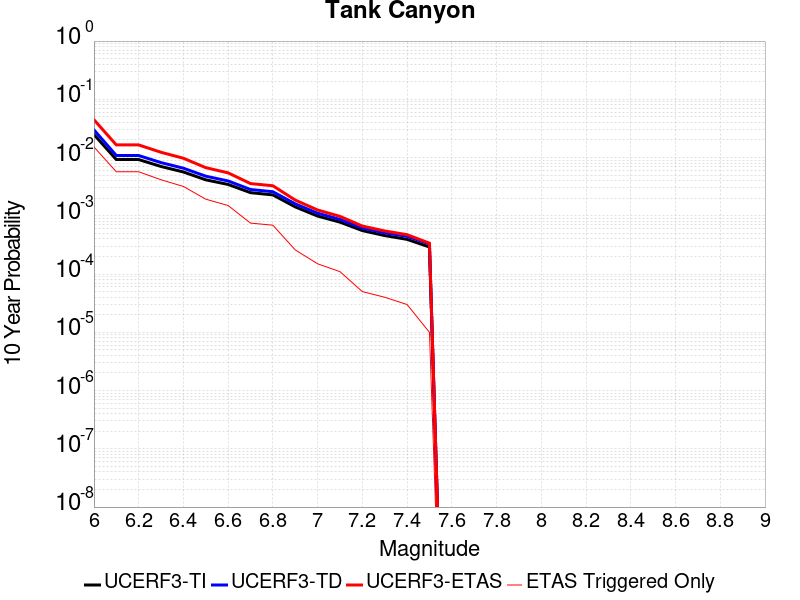 |

| Magnitude | 1 wk TI Prob | 1 wk TD Prob | 1 wk ETAS Prob | 1 wk ETAS/TD Gain | 1 wk ETAS Triggered Only | 1 mo TI Prob | 1 mo TD Prob | 1 mo ETAS Prob | 1 mo ETAS/TD Gain | 1 mo ETAS Triggered Only | 1 yr TI Prob | 1 yr TD Prob | 1 yr ETAS Prob | 1 yr ETAS/TD Gain | 1 yr ETAS Triggered Only | 10 yr TI Prob | 10 yr TD Prob | 10 yr ETAS Prob | 10 yr ETAS/TD Gain | 10 yr ETAS Triggered Only |
|-----|-----|-----|-----|-----|-----|-----|-----|-----|-----|-----|-----|-----|-----|-----|-----|-----|-----|-----|-----|-----|
| 6.0 | 4.8284557E-5 | 5.7964517E-5 | 0.0056903507 | 98.169556 | 0.0056327125 | 2.0691741E-4 | 2.4839956E-4 | 0.007857121 | 31.63098 | 0.007610612 | 0.0025163088 | 0.0030207448 | 0.014595084 | 4.831618 | 0.011609408 | 0.02488006 | 0.029863482 | 0.045297567 | 1.5168214 | 0.01590919 |
| 6.1 | 1.7796336E-5 | 2.0873225E-5 | 0.002041728 | 97.81564 | 0.0020208969 | 7.626778E-5 | 8.945383E-5 | 0.0027120854 | 30.31827 | 0.0026228663 | 9.281647E-4 | 0.0010885935 | 0.0050400854 | 4.6299057 | 0.003955798 | 0.009242975 | 0.010836697 | 0.01687622 | 1.5573214 | 0.0061056884 |
| 6.2 | 1.7796336E-5 | 2.0873225E-5 | 0.002041728 | 97.81564 | 0.0020208969 | 7.626778E-5 | 8.945383E-5 | 0.0027120854 | 30.31827 | 0.0026228663 | 9.281647E-4 | 0.0010885935 | 0.0050400854 | 4.6299057 | 0.003955798 | 0.009242975 | 0.010836697 | 0.01687622 | 1.5573214 | 0.0061056884 |
| 6.3 | 1.3515912E-5 | 1.57595E-5 | 0.0014346648 | 91.03491 | 0.0014189277 | 5.792405E-5 | 6.7539106E-5 | 0.0020023098 | 29.646671 | 0.0019349013 | 7.049971E-4 | 8.220024E-4 | 0.00374345 | 4.554062 | 0.002923851 | 0.007027647 | 0.008192232 | 0.012670015 | 1.546589 | 0.0045147697 |
| 6.4 | 1.0870146E-5 | 1.2617973E-5 | 0.0010875496 | 86.19051 | 0.0010749452 | 4.658551E-5 | 5.407601E-5 | 0.0014299314 | 26.442991 | 0.0013759298 | 5.67031E-4 | 6.581944E-4 | 0.0028496392 | 4.329479 | 0.0021928882 | 0.005655863 | 0.006564466 | 0.009938994 | 1.5140599 | 0.0033968268 |
| 6.5 | 7.964826E-6 | 9.196063E-6 | 6.1115983E-4 | 66.45886 | 6.019693E-4 | 3.4134522E-5 | 3.941116E-5 | 9.423295E-4 | 23.91022 | 9.0295397E-4 | 4.1550855E-4 | 4.797359E-4 | 0.0018979828 | 3.9563076 | 0.0014189277 | 0.0041473247 | 0.0047883047 | 0.0070990683 | 1.482585 | 0.0023218815 |
| 6.6 | 6.6317E-6 | 7.6122747E-6 | 4.8058454E-4 | 63.132843 | 4.7297587E-4 | 2.8421264E-5 | 3.2623677E-5 | 8.0655894E-4 | 24.723116 | 7.7396055E-4 | 3.4597394E-4 | 3.9713003E-4 | 0.001514629 | 3.8139374 | 0.001117943 | 0.0034543579 | 0.0039653555 | 0.0056356206 | 1.4212145 | 0.0016769145 |
| 6.7 | 4.793663E-6 | 5.430772E-6 | 1.7742107E-4 | 32.669586 | 1.7199123E-4 | 2.0544108E-5 | 2.3274553E-5 | 2.812554E-4 | 12.084245 | 2.5798683E-4 | 2.500958E-4 | 2.8333522E-4 | 7.1319146E-4 | 2.5171297 | 4.2997807E-4 | 0.0024981452 | 0.0028304325 | 0.003473574 | 1.2272238 | 6.4496713E-4 |
| 6.8 | 4.382823E-6 | 4.969245E-6 | 1.7695961E-4 | 35.610966 | 1.7199123E-4 | 1.8783392E-5 | 2.1296615E-5 | 2.7927797E-4 | 13.113726 | 2.5798683E-4 | 2.286638E-4 | 2.5925972E-4 | 6.461396E-4 | 2.4922485 | 3.8698027E-4 | 0.0022842865 | 0.0025902467 | 0.0031477704 | 1.2152395 | 5.589715E-4 |
| 6.9 | 2.729601E-6 | 3.0735362E-6 | 4.607121E-5 | 14.989643 | 4.2997806E-5 | 1.1698237E-5 | 1.3172238E-5 | 1.4216396E-4 | 10.792696 | 1.2899342E-4 | 1.4241673E-4 | 1.6036142E-4 | 3.7531598E-4 | 2.3404381 | 2.1498904E-4 | 0.001423255 | 0.0016026229 | 0.0019031252 | 1.1875066 | 3.0098466E-4 |
| 7.0 | 1.8987357E-6 | 2.1269361E-6 | 2.1269361E-6 | 1.0 | 0.0 | 8.137413E-6 | 9.1154125E-6 | 5.2112828E-5 | 5.717002 | 4.2997806E-5 | 9.90685E-5 | 1.1097519E-4 | 1.9696126E-4 | 1.7748225 | 8.599561E-5 | 9.902435E-4 | 0.0011092664 | 0.0011951666 | 1.0774387 | 8.599561E-5 |
| 7.1 | 1.4928986E-6 | 1.6641251E-6 | 1.6641251E-6 | 1.0 | 0.0 | 6.398121E-6 | 7.1319487E-6 | 5.012945E-5 | 7.028857 | 4.2997806E-5 | 7.789434E-5 | 8.682861E-5 | 1.7281676E-4 | 1.9903204 | 8.599561E-5 | 7.786704E-4 | 8.680047E-4 | 9.5392566E-4 | 1.0989867 | 8.599561E-5 |
| 7.2 | 1.069082E-6 | 1.182856E-6 | 1.182856E-6 | 1.0 | 0.0 | 4.581772E-6 | 5.0693757E-6 | 5.0693757E-6 | 1.0 | 0.0 | 5.5781646E-5 | 6.1718434E-5 | 1.0471359E-4 | 1.6966339 | 4.2997806E-5 | 5.576765E-4 | 6.1706523E-4 | 6.6003646E-4 | 1.0696381 | 4.2997806E-5 |
| 7.3 | 8.776551E-7 | 9.769996E-7 | 9.769996E-7 | 1.0 | 0.0 | 3.7613736E-6 | 4.187137E-6 | 4.187137E-6 | 1.0 | 0.0 | 4.579376E-5 | 5.097772E-5 | 9.3973336E-5 | 1.8434197 | 4.2997806E-5 | 4.5784327E-4 | 5.097113E-4 | 5.5268715E-4 | 1.0843142 | 4.2997806E-5 |
| 7.4 | 7.55721E-7 | 8.5102363E-7 | 8.5102363E-7 | 1.0 | 0.0 | 3.2388E-6 | 3.647242E-6 | 3.647242E-6 | 1.0 | 0.0 | 3.9431678E-5 | 4.4404784E-5 | 8.740068E-5 | 1.9682717 | 4.2997806E-5 | 3.942468E-4 | 4.4401E-4 | 4.869887E-4 | 1.0967968 | 4.2997806E-5 |
| 7.5 | 5.587665E-7 | 6.305613E-7 | 6.305613E-7 | 1.0 | 0.0 | 2.3947114E-6 | 2.7024057E-6 | 2.7024057E-6 | 1.0 | 0.0 | 2.915522E-5 | 3.290179E-5 | 7.5898184E-5 | 2.3068101 | 4.2997806E-5 | 2.9151395E-4 | 3.2901787E-4 | 3.7200155E-4 | 1.1306423 | 4.2997806E-5 |

## Garlock (Central)
*[(top)](#table-of-contents)*

| 1 Week | 1 Month | 1 Year | 10 Year |
|-----|-----|-----|-----|
|  |  |  |  |

| Magnitude | 1 wk TI Prob | 1 wk TD Prob | 1 wk ETAS Prob | 1 wk ETAS/TD Gain | 1 wk ETAS Triggered Only | 1 mo TI Prob | 1 mo TD Prob | 1 mo ETAS Prob | 1 mo ETAS/TD Gain | 1 mo ETAS Triggered Only | 1 yr TI Prob | 1 yr TD Prob | 1 yr ETAS Prob | 1 yr ETAS/TD Gain | 1 yr ETAS Triggered Only | 10 yr TI Prob | 10 yr TD Prob | 10 yr ETAS Prob | 10 yr ETAS/TD Gain | 10 yr ETAS Triggered Only |
|-----|-----|-----|-----|-----|-----|-----|-----|-----|-----|-----|-----|-----|-----|-----|-----|-----|-----|-----|-----|-----|
| 6.0 | 5.5131142E-5 | 7.024558E-5 | 0.006992406 | 99.54229 | 0.006922647 | 2.3625491E-4 | 3.0101812E-4 | 0.0091559 | 30.416441 | 0.008857548 | 0.0028726095 | 0.0036588025 | 0.016810833 | 4.594627 | 0.013200327 | 0.028357591 | 0.03607921 | 0.053196605 | 1.4744394 | 0.017758094 |
| 6.1 | 5.5131142E-5 | 7.024558E-5 | 0.006992406 | 99.54229 | 0.006922647 | 2.3625491E-4 | 3.0101812E-4 | 0.0091559 | 30.416441 | 0.008857548 | 0.0028726095 | 0.0036588025 | 0.016810833 | 4.594627 | 0.013200327 | 0.028357591 | 0.03607921 | 0.053196605 | 1.4744394 | 0.017758094 |
| 6.2 | 4.216245E-5 | 5.1660383E-5 | 0.004566197 | 88.388756 | 0.0045147697 | 1.806837E-4 | 2.2138303E-4 | 0.00632572 | 28.573645 | 0.0061056884 | 0.0021976046 | 0.0026920384 | 0.011868798 | 4.4088516 | 0.00920153 | 0.021759989 | 0.02668921 | 0.038616527 | 1.4468966 | 0.012254375 |
| 6.3 | 4.216245E-5 | 5.1660383E-5 | 0.004566197 | 88.388756 | 0.0045147697 | 1.806837E-4 | 2.2138303E-4 | 0.00632572 | 28.573645 | 0.0061056884 | 0.0021976046 | 0.0026920384 | 0.011868798 | 4.4088516 | 0.00920153 | 0.021759989 | 0.02668921 | 0.038616527 | 1.4468966 | 0.012254375 |
| 6.4 | 3.6858168E-5 | 4.4109474E-5 | 0.003569774 | 80.92987 | 0.00352582 | 1.5795401E-4 | 1.8902705E-4 | 0.005046861 | 26.699144 | 0.0048587522 | 0.0019213937 | 0.0022990005 | 0.009506025 | 4.134851 | 0.0072236317 | 0.019048655 | 0.022848397 | 0.032343872 | 1.415586 | 0.0097175045 |
| 6.5 | 3.39199E-5 | 4.001704E-5 | 0.0032217274 | 80.508896 | 0.0031818377 | 1.453629E-4 | 1.7149044E-4 | 0.004599505 | 26.820766 | 0.004428774 | 0.0017683565 | 0.0020859186 | 0.008565044 | 4.106126 | 0.0064926688 | 0.017543508 | 0.02075933 | 0.029433 | 1.4178205 | 0.008857548 |
| 6.6 | 3.3571985E-5 | 3.947123E-5 | 0.0032211833 | 81.60838 | 0.0031818377 | 1.4387199E-4 | 1.6915156E-4 | 0.0045971763 | 27.177855 | 0.004428774 | 0.0017502342 | 0.002057497 | 0.008536807 | 4.1491227 | 0.0064926688 | 0.017365133 | 0.020480646 | 0.029156785 | 1.4236263 | 0.008857548 |
| 6.7 | 3.2580007E-5 | 3.8087666E-5 | 0.0031338118 | 82.278915 | 0.0030958422 | 1.3962112E-4 | 1.6322276E-4 | 0.0044623017 | 27.338722 | 0.004299781 | 0.0016985617 | 0.0019854472 | 0.0082077505 | 4.1339555 | 0.006234682 | 0.016856372 | 0.019773284 | 0.028160656 | 1.4241769 | 0.008556563 |
| 6.8 | 3.2185937E-5 | 3.751489E-5 | 0.0031332409 | 83.519936 | 0.0030958422 | 1.3793244E-4 | 1.607683E-4 | 0.0044168667 | 27.473494 | 0.004256783 | 0.0016780337 | 0.0019556184 | 0.0080922805 | 4.137965 | 0.0061486866 | 0.016654192 | 0.019480087 | 0.027659167 | 1.4198688 | 0.008341575 |
| 6.9 | 3.165394E-5 | 3.6719477E-5 | 0.0030894517 | 84.13659 | 0.0030528442 | 1.3565269E-4 | 1.5735981E-4 | 0.004327491 | 27.500608 | 0.0041707875 | 0.0016503202 | 0.0019141936 | 0.00796528 | 4.161167 | 0.0060626906 | 0.01638118 | 0.01907272 | 0.027128667 | 1.4223804 | 0.008212581 |
| 7.0 | 3.0903822E-5 | 3.5624747E-5 | 0.003045364 | 85.48451 | 0.0030098464 | 1.3243823E-4 | 1.5266867E-4 | 0.004236837 | 27.751842 | 0.0040847915 | 0.0016112428 | 0.0018571776 | 0.0077798553 | 4.1890745 | 0.0059336973 | 0.015996104 | 0.018511891 | 0.026403636 | 1.4263067 | 0.00804059 |
| 7.1 | 3.0069863E-5 | 3.439106E-5 | 0.0028291524 | 82.26418 | 0.0027948574 | 1.2886449E-4 | 1.4738206E-4 | 0.0040166145 | 27.253077 | 0.0038698027 | 0.0015677959 | 0.0017929208 | 0.0073726135 | 4.112069 | 0.0055897147 | 0.01556781 | 0.017879559 | 0.025396325 | 1.4204112 | 0.00765361 |
| 7.2 | 2.7957109E-5 | 3.1280466E-5 | 0.0024390824 | 77.97462 | 0.0024078772 | 1.1981068E-4 | 1.3405236E-4 | 0.0034444397 | 25.694735 | 0.0033108313 | 0.0014577188 | 0.0016308852 | 0.0065675685 | 4.0269966 | 0.004944748 | 0.014481937 | 0.016283188 | 0.022797028 | 1.4000347 | 0.0066216625 |
| 7.3 | 2.4519275E-5 | 2.6713868E-5 | 0.0016175902 | 60.552456 | 0.0015909189 | 1.0507837E-4 | 1.1448306E-4 | 0.0024360989 | 21.279121 | 0.0023218815 | 0.0012785783 | 0.0013929547 | 0.004827988 | 3.4660048 | 0.0034398246 | 0.012712469 | 0.013927576 | 0.018506663 | 1.3287784 | 0.004643763 |
| 7.4 | 2.3225532E-5 | 2.5198491E-5 | 0.0015300838 | 60.72125 | 0.0015049232 | 9.95342E-5 | 1.07989144E-4 | 0.0023006406 | 21.304369 | 0.0021928882 | 0.0012111551 | 0.0013139893 | 0.0045345873 | 3.4510078 | 0.0032248355 | 0.012045753 | 0.013145258 | 0.017388517 | 1.3227977 | 0.004299781 |
| 7.5 | 2.097765E-5 | 2.2482824E-5 | 0.0012263943 | 54.548058 | 0.0012039386 | 8.9901114E-5 | 9.635147E-5 | 0.0019020854 | 19.741114 | 0.0018059079 | 0.0010939965 | 0.0011724597 | 0.0037493033 | 3.1978102 | 0.0025798685 | 0.010886264 | 0.01173992 | 0.01526684 | 1.3004211 | 0.003568818 |
| 7.6 | 1.511254E-5 | 1.5990528E-5 | 6.6094735E-4 | 41.333675 | 6.4496713E-4 | 6.476642E-5 | 6.852908E-5 | 0.0010574108 | 15.430104 | 9.889496E-4 | 7.882459E-4 | 8.3403E-4 | 0.00238066 | 2.8544056 | 0.0015479211 | 0.007854558 | 0.008383143 | 0.010770834 | 1.2848206 | 0.0024078772 |
| 7.7 | 9.934069E-6 | 1.0678047E-5 | 1.8266744E-4 | 17.106821 | 1.7199123E-4 | 4.2573887E-5 | 4.576226E-5 | 3.4673314E-4 | 7.576836 | 3.0098466E-4 | 5.182138E-4 | 5.5701344E-4 | 9.4377814E-4 | 1.6943544 | 3.8698027E-4 | 0.00517007 | 0.0056272964 | 0.0062258784 | 1.1063712 | 6.019693E-4 |
| 7.8 | 6.7562896E-6 | 8.427841E-6 | 1.3742018E-4 | 16.305502 | 1.2899342E-4 | 2.8955206E-5 | 3.6118818E-5 | 2.0810384E-4 | 5.761646 | 1.7199123E-4 | 3.5247262E-4 | 4.3965803E-4 | 6.1157363E-4 | 1.3910213 | 1.7199123E-4 | 0.0035191406 | 0.0044463384 | 0.0047887913 | 1.0770191 | 3.4398245E-4 |
| 7.9 | 3.975453E-6 | 5.3706585E-6 | 9.136581E-5 | 17.012032 | 8.599561E-5 | 1.7037546E-5 | 2.3016906E-5 | 1.0901054E-4 | 4.7361073 | 8.599561E-5 | 2.0741238E-4 | 2.801949E-4 | 3.661664E-4 | 1.3068275 | 8.599561E-5 | 0.002072189 | 0.002833435 | 0.002962063 | 1.0453964 | 1.2899342E-4 |
| 8.0 | 1.6729537E-6 | 2.0773857E-6 | 2.0773857E-6 | 1.0 | 0.0 | 7.169782E-6 | 8.903051E-6 | 8.903051E-6 | 1.0 | 0.0 | 8.7288594E-5 | 1.08389286E-4 | 1.08389286E-4 | 1.0 | 0.0 | 8.7254314E-4 | 0.0010968668 | 0.0010968668 | 1.0 | 0.0 |
| 8.1 | 3.6733252E-7 | 3.148811E-7 | 3.148811E-7 | 1.0 | 0.0 | 1.5742813E-6 | 1.3494899E-6 | 1.3494899E-6 | 1.0 | 0.0 | 1.9166706E-5 | 1.6429933E-5 | 1.6429933E-5 | 1.0 | 0.0 | 1.9165053E-4 | 1.6637788E-4 | 1.6637788E-4 | 1.0 | 0.0 |

## Owl Lake
*[(top)](#table-of-contents)*

| 1 Week | 1 Month | 1 Year | 10 Year |
|-----|-----|-----|-----|
|  |  |  |  |

| Magnitude | 1 wk TI Prob | 1 wk TD Prob | 1 wk ETAS Prob | 1 wk ETAS/TD Gain | 1 wk ETAS Triggered Only | 1 mo TI Prob | 1 mo TD Prob | 1 mo ETAS Prob | 1 mo ETAS/TD Gain | 1 mo ETAS Triggered Only | 1 yr TI Prob | 1 yr TD Prob | 1 yr ETAS Prob | 1 yr ETAS/TD Gain | 1 yr ETAS Triggered Only | 10 yr TI Prob | 10 yr TD Prob | 10 yr ETAS Prob | 10 yr ETAS/TD Gain | 10 yr ETAS Triggered Only |
|-----|-----|-----|-----|-----|-----|-----|-----|-----|-----|-----|-----|-----|-----|-----|-----|-----|-----|-----|-----|-----|
| 6.0 | 5.0320643E-5 | 6.635748E-5 | 0.0021731101 | 32.74853 | 0.0021068926 | 2.1564208E-4 | 2.843645E-4 | 0.0032503696 | 11.430293 | 0.0029668487 | 0.0026222812 | 0.0034577043 | 0.007785467 | 2.2516289 | 0.0043427786 | 0.02591553 | 0.0341404 | 0.040619057 | 1.1897651 | 0.006707658 |
| 6.1 | 5.0320643E-5 | 6.635748E-5 | 0.0021731101 | 32.74853 | 0.0021068926 | 2.1564208E-4 | 2.843645E-4 | 0.0032503696 | 11.430293 | 0.0029668487 | 0.0026222812 | 0.0034577043 | 0.007785467 | 2.2516289 | 0.0043427786 | 0.02591553 | 0.0341404 | 0.040619057 | 1.1897651 | 0.006707658 |
| 6.2 | 2.4125871E-5 | 3.0980704E-5 | 0.0015358573 | 49.574642 | 0.0015049232 | 1.0339249E-4 | 1.3276885E-4 | 0.0022393817 | 16.86677 | 0.0021068926 | 0.0012580766 | 0.0016154221 | 0.004706263 | 2.9133334 | 0.0030958422 | 0.012509781 | 0.016070297 | 0.020597126 | 1.2816893 | 0.004600765 |
| 6.3 | 1.7433485E-5 | 2.2355249E-5 | 0.0013122606 | 58.700336 | 0.0012899343 | 7.471279E-5 | 9.580558E-5 | 0.0019015404 | 19.84791 | 0.0018059079 | 9.0924866E-4 | 0.0011659606 | 0.003742821 | 3.2100751 | 0.0025798685 | 0.009055373 | 0.011628761 | 0.015326069 | 1.3179451 | 0.0037408092 |
| 6.4 | 1.7433485E-5 | 2.2355249E-5 | 0.0013122606 | 58.700336 | 0.0012899343 | 7.471279E-5 | 9.580558E-5 | 0.0019015404 | 19.84791 | 0.0018059079 | 9.0924866E-4 | 0.0011659606 | 0.003742821 | 3.2100751 | 0.0025798685 | 0.009055373 | 0.011628761 | 0.015326069 | 1.3179451 | 0.0037408092 |
| 6.5 | 1.5182742E-5 | 1.9428902E-5 | 0.0012663411 | 65.178215 | 0.0012469364 | 6.506727E-5 | 8.326492E-5 | 0.0018460283 | 22.17054 | 0.00176291 | 7.919061E-4 | 0.0010134302 | 0.0033329588 | 3.2887895 | 0.0023218815 | 0.0078909 | 0.010118305 | 0.013395635 | 1.3239012 | 0.0033108313 |
| 6.6 | 6.7271576E-6 | 8.547201E-6 | 0.0010404858 | 121.73409 | 0.0010319473 | 2.8830356E-5 | 3.663038E-5 | 0.0014985022 | 40.90873 | 0.0014619255 | 3.5095305E-4 | 4.4588925E-4 | 0.0022939707 | 5.144709 | 0.0018489057 | 0.0035039932 | 0.0044677295 | 0.0070788777 | 1.5844463 | 0.0026228663 |
| 6.7 | 6.682835E-6 | 8.4796475E-6 | 0.0010404183 | 122.69594 | 0.0010319473 | 2.8640408E-5 | 3.6340873E-5 | 0.0014982132 | 41.226673 | 0.0014619255 | 3.4864116E-4 | 4.4236594E-4 | 0.0022904538 | 5.1777353 | 0.0018489057 | 0.003480947 | 0.004432656 | 0.007043896 | 1.5890915 | 0.0026228663 |
| 6.8 | 6.5774975E-6 | 8.326121E-6 | 0.0010402648 | 124.93991 | 0.0010319473 | 2.8188972E-5 | 3.5682922E-5 | 0.0014975562 | 41.96843 | 0.0014619255 | 3.4314668E-4 | 4.343586E-4 | 0.0022824612 | 5.254785 | 0.0018489057 | 0.0034261728 | 0.0043528024 | 0.006964252 | 1.5999467 | 0.0026228663 |
| 6.9 | 6.363419E-6 | 7.999298E-6 | 0.0010399384 | 130.00372 | 0.0010319473 | 2.727151E-5 | 3.4282286E-5 | 0.0014531612 | 42.38811 | 0.0014189277 | 3.3198006E-4 | 4.1731246E-4 | 0.0022224667 | 5.325666 | 0.0018059079 | 0.0033148455 | 0.004182795 | 0.0067518726 | 1.6142011 | 0.0025798685 |
| 7.0 | 6.1342453E-6 | 7.631501E-6 | 0.001039571 | 136.22104 | 0.0010319473 | 2.6289357E-5 | 3.2706055E-5 | 0.0014515873 | 44.38283 | 0.0014189277 | 3.2002592E-4 | 3.9812896E-4 | 0.0022033178 | 5.5341816 | 0.0018059079 | 0.0031956544 | 0.00399149 | 0.0065610614 | 1.6437622 | 0.0025798685 |
| 7.1 | 5.842926E-6 | 7.1420604E-6 | 0.0010390821 | 145.48772 | 0.0010319473 | 2.504087E-5 | 3.0608502E-5 | 0.0014494928 | 47.355885 | 0.0014189277 | 3.0482994E-4 | 3.7260022E-4 | 0.0021778352 | 5.844965 | 0.0018059079 | 0.0030441214 | 0.0037369546 | 0.0062643453 | 1.6763235 | 0.0025368705 |
| 7.2 | 4.77173E-6 | 5.3583467E-6 | 7.3631713E-4 | 137.415 | 7.309627E-4 | 2.045011E-5 | 2.2964163E-5 | 9.258974E-4 | 40.31923 | 9.0295397E-4 | 2.4895166E-4 | 2.7955687E-4 | 0.0014831589 | 5.3053923 | 0.0012039386 | 0.0024867293 | 0.002808574 | 0.0045236554 | 1.6106594 | 0.0017199123 |
| 7.3 | 3.0494948E-6 | 2.7103622E-6 | 1.3170343E-4 | 48.59256 | 1.2899342E-4 | 1.3069198E-5 | 1.1615787E-5 | 1.8360502E-4 | 15.806507 | 1.7199123E-4 | 1.5910587E-4 | 1.4141318E-4 | 3.5637183E-4 | 2.5200748 | 2.1498904E-4 | 0.0015899199 | 0.0014231888 | 0.001852555 | 1.3016931 | 4.2997807E-4 |
| 7.4 | 2.7263884E-6 | 2.3055816E-6 | 1.312987E-4 | 56.948193 | 1.2899342E-4 | 1.1684469E-5 | 9.881027E-6 | 1.8187055E-4 | 18.406038 | 1.7199123E-4 | 1.4224913E-4 | 1.20294964E-4 | 3.3525814E-4 | 2.7869673 | 2.1498904E-4 | 0.0014215811 | 0.0012111744 | 0.0016406317 | 1.3545792 | 4.2997807E-4 |
| 7.5 | 2.6090431E-6 | 2.1655203E-6 | 1.3115867E-4 | 60.566814 | 1.2899342E-4 | 1.1181565E-5 | 9.280769E-6 | 1.812704E-4 | 19.53183 | 1.7199123E-4 | 1.3612706E-4 | 1.129876E-4 | 3.2795235E-4 | 2.9025517 | 2.1498904E-4 | 0.001360437 | 0.0011379321 | 0.0015674209 | 1.3774291 | 4.2997807E-4 |
| 7.6 | 2.3008756E-6 | 1.872704E-6 | 8.786816E-5 | 46.92047 | 8.599561E-5 | 9.860858E-6 | 8.025851E-6 | 1.3701824E-4 | 17.072115 | 1.2899342E-4 | 1.20049335E-4 | 9.771043E-5 | 2.6968485E-4 | 2.7600417 | 1.7199123E-4 | 0.001199845 | 9.849465E-4 | 0.0012856347 | 1.3052838 | 3.0098466E-4 |
| 7.7 | 1.7184348E-6 | 1.3418345E-6 | 1.3418345E-6 | 1.0 | 0.0 | 7.3646997E-6 | 5.750707E-6 | 5.750707E-6 | 1.0 | 0.0 | 8.966153E-5 | 7.001265E-5 | 7.001265E-5 | 1.0 | 0.0 | 8.962536E-4 | 7.077913E-4 | 7.507586E-4 | 1.0607063 | 4.2997806E-5 |
| 7.8 | 8.4612907E-7 | 8.4052675E-7 | 8.4052675E-7 | 1.0 | 0.0 | 3.6262625E-6 | 3.6022527E-6 | 3.6022527E-6 | 1.0 | 0.0 | 4.4148852E-5 | 4.3856566E-5 | 4.3856566E-5 | 1.0 | 0.0 | 4.414008E-4 | 4.4395277E-4 | 4.869315E-4 | 1.0968093 | 4.2997806E-5 |
| 7.9 | 2.716738E-7 | 3.767845E-7 | 3.767845E-7 | 1.0 | 0.0 | 1.1643157E-6 | 1.6147899E-6 | 1.6147899E-6 | 1.0 | 0.0 | 1.4175452E-5 | 1.96599E-5 | 1.96599E-5 | 1.0 | 0.0 | 1.4174548E-4 | 1.9835318E-4 | 1.9835318E-4 | 1.0 | 0.0 |
| 8.0 | 2.1995428E-8 | 3.38465E-8 | 3.38465E-8 | 1.0 | 0.0 | 9.426611E-8 | 1.4505643E-7 | 1.4505643E-7 | 1.0 | 0.0 | 1.1476893E-6 | 1.7660612E-6 | 1.7660612E-6 | 1.0 | 0.0 | 1.14768345E-5 | 1.796186E-5 | 1.796186E-5 | 1.0 | 0.0 |

## Garlock (East)
*[(top)](#table-of-contents)*

| 1 Week | 1 Month | 1 Year | 10 Year |
|-----|-----|-----|-----|
|  |  |  |  |

| Magnitude | 1 wk TI Prob | 1 wk TD Prob | 1 wk ETAS Prob | 1 wk ETAS/TD Gain | 1 wk ETAS Triggered Only | 1 mo TI Prob | 1 mo TD Prob | 1 mo ETAS Prob | 1 mo ETAS/TD Gain | 1 mo ETAS Triggered Only | 1 yr TI Prob | 1 yr TD Prob | 1 yr ETAS Prob | 1 yr ETAS/TD Gain | 1 yr ETAS Triggered Only | 10 yr TI Prob | 10 yr TD Prob | 10 yr ETAS Prob | 10 yr ETAS/TD Gain | 10 yr ETAS Triggered Only |
|-----|-----|-----|-----|-----|-----|-----|-----|-----|-----|-----|-----|-----|-----|-----|-----|-----|-----|-----|-----|-----|
| 6.0 | 4.5092507E-5 | 6.290254E-5 | 0.0013097605 | 20.822062 | 0.0012469364 | 1.9323928E-4 | 2.6955697E-4 | 0.0021179642 | 7.857205 | 0.0018489057 | 0.0023501497 | 0.003277363 | 0.0062344884 | 1.902288 | 0.0029668487 | 0.023254504 | 0.032351483 | 0.03692823 | 1.1414694 | 0.004729759 |
| 6.1 | 4.5092507E-5 | 6.290254E-5 | 0.0013097605 | 20.822062 | 0.0012469364 | 1.9323928E-4 | 2.6955697E-4 | 0.0021179642 | 7.857205 | 0.0018489057 | 0.0023501497 | 0.003277363 | 0.0062344884 | 1.902288 | 0.0029668487 | 0.023254504 | 0.032351483 | 0.03692823 | 1.1414694 | 0.004729759 |
| 6.2 | 2.6674514E-5 | 3.450911E-5 | 0.0010234246 | 29.656649 | 9.889496E-4 | 1.1431433E-4 | 1.4788799E-4 | 0.0016095972 | 10.883894 | 0.0014619255 | 0.0013908884 | 0.0017990824 | 0.004245548 | 2.3598409 | 0.002450875 | 0.01382215 | 0.01789001 | 0.021437211 | 1.1982783 | 0.0036118159 |
| 6.3 | 2.6674514E-5 | 3.450911E-5 | 0.0010234246 | 29.656649 | 9.889496E-4 | 1.1431433E-4 | 1.4788799E-4 | 0.0016095972 | 10.883894 | 0.0014619255 | 0.0013908884 | 0.0017990824 | 0.004245548 | 2.3598409 | 0.002450875 | 0.01382215 | 0.01789001 | 0.021437211 | 1.1982783 | 0.0036118159 |
| 6.4 | 2.5312667E-5 | 3.233838E-5 | 0.001021256 | 31.580309 | 9.889496E-4 | 1.0847834E-4 | 1.3858585E-4 | 0.0016003087 | 11.547418 | 0.0014619255 | 0.0013199237 | 0.0016860063 | 0.004089824 | 2.4257464 | 0.0024078772 | 0.013121112 | 0.016778054 | 0.020286994 | 1.2091388 | 0.003568818 |
| 6.5 | 2.5312667E-5 | 3.233838E-5 | 0.001021256 | 31.580309 | 9.889496E-4 | 1.0847834E-4 | 1.3858585E-4 | 0.0016003087 | 11.547418 | 0.0014619255 | 0.0013199237 | 0.0016860063 | 0.004089824 | 2.4257464 | 0.0024078772 | 0.013121112 | 0.016778054 | 0.020286994 | 1.2091388 | 0.003568818 |
| 6.6 | 2.246556E-5 | 2.8133245E-5 | 9.740584E-4 | 34.623035 | 9.4595173E-4 | 9.627742E-5 | 1.20565615E-4 | 0.0014963296 | 12.410914 | 0.0013759298 | 0.0011715472 | 0.0014669215 | 0.0037853972 | 2.5805042 | 0.0023218815 | 0.011653901 | 0.014618388 | 0.01792319 | 1.2260715 | 0.003353829 |
| 6.7 | 2.2241198E-5 | 2.780299E-5 | 9.737284E-4 | 35.022438 | 9.4595173E-4 | 9.531594E-5 | 1.1915036E-4 | 0.0014949163 | 12.546469 | 0.0013759298 | 0.0011598538 | 0.0014497138 | 0.0037682294 | 2.5992918 | 0.0023218815 | 0.011538187 | 0.014448582 | 0.017753953 | 1.2287679 | 0.003353829 |
| 6.8 | 1.9528685E-5 | 2.3897695E-5 | 8.838333E-4 | 36.984035 | 8.5995614E-4 | 8.369167E-5 | 1.02414786E-4 | 0.0013922169 | 13.5939045 | 0.0012899343 | 0.0010184698 | 0.0012462065 | 0.0033075293 | 2.654078 | 0.0020638946 | 0.010138147 | 0.012436173 | 0.015366125 | 1.2355992 | 0.0029668487 |
| 6.9 | 1.3318621E-5 | 1.5198458E-5 | 8.321444E-4 | 54.751896 | 8.169583E-4 | 5.7078556E-5 | 6.5134656E-5 | 0.0012689949 | 19.482637 | 0.0012039386 | 6.9470983E-4 | 7.927316E-4 | 0.002726099 | 3.4388676 | 0.0019349013 | 0.0069254204 | 0.007939667 | 0.010541708 | 1.3277268 | 0.0026228663 |
| 7.0 | 1.1760853E-5 | 1.31073775E-5 | 8.30055E-4 | 63.327312 | 8.169583E-4 | 5.0402683E-5 | 5.6173292E-5 | 0.0012170488 | 21.66597 | 0.0011609407 | 6.134799E-4 | 6.8370026E-4 | 0.0025743102 | 3.7652614 | 0.0018919035 | 0.0061178906 | 0.006856307 | 0.009418487 | 1.3736968 | 0.0025798685 |
| 7.1 | 1.0064758E-5 | 1.0902532E-5 | 8.2785194E-4 | 75.932076 | 8.169583E-4 | 4.3133965E-5 | 4.6724323E-5 | 0.0012076108 | 25.845444 | 0.0011609407 | 5.2502943E-4 | 5.6872366E-4 | 0.002416578 | 4.249125 | 0.0018489057 | 0.005237907 | 0.0057127923 | 0.008106913 | 1.4190807 | 0.0024078772 |
| 7.2 | 9.768808E-6 | 1.0498412E-5 | 8.2744815E-4 | 78.816505 | 8.169583E-4 | 4.186565E-5 | 4.4992437E-5 | 0.001205881 | 26.801859 | 0.0011609407 | 5.095951E-4 | 5.4764876E-4 | 0.0023955419 | 4.374231 | 0.0018489057 | 0.0050842804 | 0.00550306 | 0.007897686 | 1.4351445 | 0.0024078772 |
| 7.3 | 9.344516E-6 | 9.94408E-6 | 6.979022E-4 | 70.18268 | 6.879649E-4 | 4.004731E-5 | 4.2616808E-5 | 0.0010745202 | 25.21353 | 0.0010319473 | 4.8746695E-4 | 5.187396E-4 | 0.002194784 | 4.230994 | 0.0016769145 | 0.0048639905 | 0.0052147433 | 0.0073961965 | 1.4183241 | 0.0021928882 |
| 7.4 | 9.023491E-6 | 9.490282E-6 | 6.1145384E-4 | 64.429474 | 6.019693E-4 | 3.867153E-5 | 4.067202E-5 | 9.4358926E-4 | 23.19996 | 9.0295397E-4 | 4.7072413E-4 | 4.950727E-4 | 0.0019562743 | 3.9514892 | 0.0014619255 | 0.004697283 | 0.0049782004 | 0.006817902 | 1.3695515 | 0.0018489057 |
| 7.5 | 7.081253E-6 | 7.0873343E-6 | 3.5106734E-4 | 49.53447 | 3.4398245E-4 | 3.0347876E-5 | 3.037394E-5 | 5.8932847E-4 | 19.402437 | 5.589715E-4 | 3.6942272E-4 | 3.697407E-4 | 0.0012293789 | 3.3249757 | 8.5995614E-4 | 0.003688092 | 0.0037241387 | 0.0048807557 | 1.3105731 | 0.0011609407 |
| 7.6 | 6.116396E-6 | 5.958924E-6 | 1.7794913E-4 | 29.862629 | 1.7199123E-4 | 2.6212863E-5 | 2.5537996E-5 | 3.2651497E-4 | 12.785458 | 3.0098466E-4 | 3.1909486E-4 | 3.10881E-4 | 8.2669425E-4 | 2.6591985 | 5.1597366E-4 | 0.0031863707 | 0.003135588 | 0.0039071217 | 1.2460572 | 7.7396055E-4 |
| 7.7 | 4.797145E-6 | 4.7569774E-6 | 9.075218E-5 | 19.0777 | 8.599561E-5 | 2.055903E-5 | 2.0386888E-5 | 1.923746E-4 | 9.436193 | 1.7199123E-4 | 2.5027743E-4 | 2.4818222E-4 | 5.06105E-4 | 2.0392478 | 2.5798683E-4 | 0.0024999576 | 0.0025091893 | 0.0028094186 | 1.1196519 | 3.0098466E-4 |
| 7.8 | 3.4028885E-6 | 3.9781908E-6 | 8.9973466E-5 | 22.616678 | 8.599561E-5 | 1.4583726E-5 | 1.7049279E-5 | 1.0304343E-4 | 6.0438585 | 8.599561E-5 | 1.775424E-4 | 2.0755526E-4 | 2.9353303E-4 | 1.4142404 | 8.599561E-5 | 0.0017740062 | 0.0021010821 | 0.002186897 | 1.0408432 | 8.599561E-5 |
| 7.9 | 2.5928412E-6 | 3.37222E-6 | 8.9367546E-5 | 26.501102 | 8.599561E-5 | 1.1112129E-5 | 1.4452292E-5 | 1.0044666E-4 | 6.950224 | 8.599561E-5 | 1.3528178E-4 | 1.759425E-4 | 2.6192298E-4 | 1.4886851 | 8.599561E-5 | 0.0013519945 | 0.0017811217 | 0.0018669642 | 1.0481957 | 8.599561E-5 |
| 8.0 | 1.3743648E-6 | 1.6733709E-6 | 1.6733709E-6 | 1.0 | 0.0 | 5.8901214E-6 | 7.17157E-6 | 7.17157E-6 | 1.0 | 0.0 | 7.1709874E-5 | 8.731039E-5 | 8.731039E-5 | 1.0 | 0.0 | 7.1686733E-4 | 8.8366936E-4 | 8.8366936E-4 | 1.0 | 0.0 |
| 8.1 | 3.6733252E-7 | 3.148811E-7 | 3.148811E-7 | 1.0 | 0.0 | 1.5742813E-6 | 1.3494899E-6 | 1.3494899E-6 | 1.0 | 0.0 | 1.9166706E-5 | 1.6429933E-5 | 1.6429933E-5 | 1.0 | 0.0 | 1.9165053E-4 | 1.6637788E-4 | 1.6637788E-4 | 1.0 | 0.0 |

## Little Lake
*[(top)](#table-of-contents)*

| 1 Week | 1 Month | 1 Year | 10 Year |
|-----|-----|-----|-----|
|  |  |  |  |

| Magnitude | 1 wk TI Prob | 1 wk TD Prob | 1 wk ETAS Prob | 1 wk ETAS/TD Gain | 1 wk ETAS Triggered Only | 1 mo TI Prob | 1 mo TD Prob | 1 mo ETAS Prob | 1 mo ETAS/TD Gain | 1 mo ETAS Triggered Only | 1 yr TI Prob | 1 yr TD Prob | 1 yr ETAS Prob | 1 yr ETAS/TD Gain | 1 yr ETAS Triggered Only | 10 yr TI Prob | 10 yr TD Prob | 10 yr ETAS Prob | 10 yr ETAS/TD Gain | 10 yr ETAS Triggered Only |
|-----|-----|-----|-----|-----|-----|-----|-----|-----|-----|-----|-----|-----|-----|-----|-----|-----|-----|-----|-----|-----|
| 6.0 | 2.8424427E-5 | 3.1205633E-5 | 0.0023960113 | 76.78137 | 0.0023648795 | 1.2181328E-4 | 1.3373232E-4 | 0.0031001843 | 23.182013 | 0.0029668487 | 0.0014820677 | 0.0016271081 | 0.005233047 | 3.2161644 | 0.0036118159 | 0.014722223 | 0.016165355 | 0.020987866 | 1.2983239 | 0.00490175 |
| 6.1 | 2.8424427E-5 | 3.1205633E-5 | 0.0023960113 | 76.78137 | 0.0023648795 | 1.2181328E-4 | 1.3373232E-4 | 0.0031001843 | 23.182013 | 0.0029668487 | 0.0014820677 | 0.0016271081 | 0.005233047 | 3.2161644 | 0.0036118159 | 0.014722223 | 0.016165355 | 0.020987866 | 1.2983239 | 0.00490175 |
| 6.2 | 2.8424427E-5 | 3.1205633E-5 | 0.0023960113 | 76.78137 | 0.0023648795 | 1.2181328E-4 | 1.3373232E-4 | 0.0031001843 | 23.182013 | 0.0029668487 | 0.0014820677 | 0.0016271081 | 0.005233047 | 3.2161644 | 0.0036118159 | 0.014722223 | 0.016165355 | 0.020987866 | 1.2983239 | 0.00490175 |
| 6.3 | 1.48860645E-5 | 1.6081349E-5 | 0.0010480122 | 65.16942 | 0.0010319473 | 6.379586E-5 | 6.89184E-5 | 0.0012297792 | 17.843988 | 0.0011609407 | 7.7643775E-4 | 8.387868E-4 | 0.0022565243 | 2.690224 | 0.0014189277 | 0.007737305 | 0.008359027 | 0.010490946 | 1.255044 | 0.0021498904 |
| 6.4 | 1.48860645E-5 | 1.6081349E-5 | 0.0010480122 | 65.16942 | 0.0010319473 | 6.379586E-5 | 6.89184E-5 | 0.0012297792 | 17.843988 | 0.0011609407 | 7.7643775E-4 | 8.387868E-4 | 0.0022565243 | 2.690224 | 0.0014189277 | 0.007737305 | 0.008359027 | 0.010490946 | 1.255044 | 0.0021498904 |
| 6.5 | 1.2797581E-5 | 1.3765531E-5 | 0.0010027015 | 72.84147 | 9.889496E-4 | 5.4845623E-5 | 5.899394E-5 | 0.0010908805 | 18.491398 | 0.0010319473 | 6.675408E-4 | 7.180402E-4 | 0.0019640813 | 2.735336 | 0.0012469364 | 0.006655392 | 0.0071597523 | 0.00903811 | 1.2623496 | 0.0018919035 |
| 6.6 | 9.661896E-6 | 1.02890135E-5 | 9.1323367E-4 | 88.75814 | 9.0295397E-4 | 4.1407468E-5 | 4.409512E-5 | 9.4700925E-4 | 21.476511 | 9.0295397E-4 | 5.040193E-4 | 5.3674204E-4 | 0.001654085 | 3.081713 | 0.001117943 | 0.005028777 | 0.0053560617 | 0.00710953 | 1.3273801 | 0.00176291 |
| 6.7 | 7.767871E-6 | 8.199668E-6 | 8.251513E-4 | 100.63228 | 8.169583E-4 | 3.329045E-5 | 3.5141038E-5 | 8.520707E-4 | 24.247168 | 8.169583E-4 | 4.0523586E-4 | 4.2777188E-4 | 0.001373319 | 3.2104003 | 9.4595173E-4 | 0.004044977 | 0.0042708362 | 0.0058121467 | 1.3608918 | 0.0015479211 |
| 6.8 | 6.4235196E-6 | 6.7357296E-6 | 4.7970843E-4 | 71.21848 | 4.7297587E-4 | 2.752908E-5 | 2.8867165E-5 | 5.018294E-4 | 17.38409 | 4.7297587E-4 | 3.35115E-4 | 3.5141388E-4 | 9.5317164E-4 | 2.7123904 | 6.019693E-4 | 0.003346101 | 0.0035098423 | 0.0046667084 | 1.3296063 | 0.0011609407 |
| 6.9 | 3.1283696E-6 | 3.1121751E-6 | 2.610982E-4 | 83.89573 | 2.5798683E-4 | 1.3407229E-5 | 1.33378335E-5 | 2.7132125E-4 | 20.342226 | 2.5798683E-4 | 1.6322079E-4 | 1.6237753E-4 | 4.633133E-4 | 2.8533092 | 3.0098466E-4 | 0.0016310095 | 0.0016227373 | 0.0020949456 | 1.290995 | 4.7297587E-4 |
| 7.0 | 2.290603E-6 | 2.2286777E-6 | 8.82241E-5 | 39.585854 | 8.599561E-5 | 9.816834E-6 | 9.551446E-6 | 9.554624E-5 | 10.003327 | 8.599561E-5 | 1.19513395E-4 | 1.1628369E-4 | 2.452621E-4 | 2.1091704 | 1.2899342E-4 | 0.0011944914 | 0.0011623306 | 0.0013770697 | 1.1847488 | 2.1498904E-4 |
| 7.1 | 1.293693E-6 | 1.1776802E-6 | 4.417544E-5 | 37.51055 | 4.2997806E-5 | 5.5443866E-6 | 5.0471954E-6 | 4.8044785E-5 | 9.519106 | 4.2997806E-5 | 6.750081E-5 | 6.144857E-5 | 1.0444374E-4 | 1.6996934 | 4.2997806E-5 | 6.7480316E-4 | 6.1438425E-4 | 7.4329844E-4 | 1.2098266 | 1.2899342E-4 |
| 7.2 | 4.715842E-7 | 3.091774E-7 | 3.091774E-7 | 1.0 | 0.0 | 2.0210737E-6 | 1.3250453E-6 | 1.3250453E-6 | 1.0 | 0.0 | 2.4606294E-5 | 1.6132313E-5 | 1.6132313E-5 | 1.0 | 0.0 | 2.460357E-4 | 1.6131197E-4 | 1.6131197E-4 | 1.0 | 0.0 |
| 7.3 | 3.9430947E-7 | 2.309738E-7 | 2.309738E-7 | 1.0 | 0.0 | 1.6898966E-6 | 9.898873E-7 | 9.898873E-7 | 1.0 | 0.0 | 2.0574296E-5 | 1.20518125E-5 | 1.20518125E-5 | 1.0 | 0.0 | 2.0572392E-4 | 1.2051166E-4 | 1.2051166E-4 | 1.0 | 0.0 |
| 7.4 | 3.547123E-7 | 1.9679035E-7 | 1.9679035E-7 | 1.0 | 0.0 | 1.5201948E-6 | 8.4338694E-7 | 8.4338694E-7 | 1.0 | 0.0 | 1.8508214E-5 | 1.0268188E-5 | 1.0268188E-5 | 1.0 | 0.0 | 1.8506673E-4 | 1.026772E-4 | 1.026772E-4 | 1.0 | 0.0 |
| 7.5 | 2.6354266E-7 | 1.4423068E-7 | 1.4423068E-7 | 1.0 | 0.0 | 1.129468E-6 | 6.1813137E-7 | 6.1813137E-7 | 1.0 | 0.0 | 1.3751187E-5 | 7.5257235E-6 | 7.5257235E-6 | 1.0 | 0.0 | 1.3750336E-4 | 7.525474E-5 | 7.525474E-5 | 1.0 | 0.0 |
| 7.6 | 1.269913E-7 | 7.572526E-8 | 7.572526E-8 | 1.0 | 0.0 | 5.4424834E-7 | 3.245368E-7 | 3.245368E-7 | 1.0 | 0.0 | 6.6262032E-6 | 3.951229E-6 | 3.951229E-6 | 1.0 | 0.0 | 6.626006E-5 | 3.9511622E-5 | 3.9511622E-5 | 1.0 | 0.0 |

## Panamint Valley
*[(top)](#table-of-contents)*

| 1 Week | 1 Month | 1 Year | 10 Year |
|-----|-----|-----|-----|
|  |  |  |  |

| Magnitude | 1 wk TI Prob | 1 wk TD Prob | 1 wk ETAS Prob | 1 wk ETAS/TD Gain | 1 wk ETAS Triggered Only | 1 mo TI Prob | 1 mo TD Prob | 1 mo ETAS Prob | 1 mo ETAS/TD Gain | 1 mo ETAS Triggered Only | 1 yr TI Prob | 1 yr TD Prob | 1 yr ETAS Prob | 1 yr ETAS/TD Gain | 1 yr ETAS Triggered Only | 10 yr TI Prob | 10 yr TD Prob | 10 yr ETAS Prob | 10 yr ETAS/TD Gain | 10 yr ETAS Triggered Only |
|-----|-----|-----|-----|-----|-----|-----|-----|-----|-----|-----|-----|-----|-----|-----|-----|-----|-----|-----|-----|-----|
| 6.0 | 3.0211835E-5 | 3.398435E-5 | 0.0013238747 | 38.95542 | 0.0012899343 | 1.2947287E-4 | 1.4563925E-4 | 0.0020372672 | 13.988449 | 0.0018919035 | 0.0015751923 | 0.0017717453 | 0.0049479455 | 2.7926958 | 0.0031818377 | 0.015640736 | 0.017583055 | 0.02201844 | 1.2522534 | 0.0045147697 |
| 6.1 | 3.0211835E-5 | 3.398435E-5 | 0.0013238747 | 38.95542 | 0.0012899343 | 1.2947287E-4 | 1.4563925E-4 | 0.0020372672 | 13.988449 | 0.0018919035 | 0.0015751923 | 0.0017717453 | 0.0049479455 | 2.7926958 | 0.0031818377 | 0.015640736 | 0.017583055 | 0.02201844 | 1.2522534 | 0.0045147697 |
| 6.2 | 3.0211835E-5 | 3.398435E-5 | 0.0013238747 | 38.95542 | 0.0012899343 | 1.2947287E-4 | 1.4563925E-4 | 0.0020372672 | 13.988449 | 0.0018919035 | 0.0015751923 | 0.0017717453 | 0.0049479455 | 2.7926958 | 0.0031818377 | 0.015640736 | 0.017583055 | 0.02201844 | 1.2522534 | 0.0045147697 |
| 6.3 | 2.8573924E-5 | 3.2102525E-5 | 0.0013219953 | 41.180412 | 0.0012899343 | 1.2245393E-4 | 1.3757516E-4 | 0.0019862265 | 14.437392 | 0.0018489057 | 0.001489857 | 0.0016737186 | 0.0047214534 | 2.8209362 | 0.0030528442 | 0.01479908 | 0.016617723 | 0.02084605 | 1.2544469 | 0.004299781 |
| 6.4 | 2.8573924E-5 | 3.2102525E-5 | 0.0013219953 | 41.180412 | 0.0012899343 | 1.2245393E-4 | 1.3757516E-4 | 0.0019862265 | 14.437392 | 0.0018489057 | 0.001489857 | 0.0016737186 | 0.0047214534 | 2.8209362 | 0.0030528442 | 0.01479908 | 0.016617723 | 0.02084605 | 1.2544469 | 0.004299781 |
| 6.5 | 2.7468774E-5 | 3.0828287E-5 | 0.0013207227 | 42.841263 | 0.0012899343 | 1.1771801E-4 | 1.321147E-4 | 0.0019807762 | 14.992852 | 0.0018489057 | 0.0014322745 | 0.0016073369 | 0.0046123457 | 2.8695574 | 0.0030098464 | 0.014230782 | 0.015963601 | 0.020152431 | 1.2623987 | 0.004256783 |
| 6.6 | 2.6135967E-5 | 2.925234E-5 | 0.0012761523 | 43.625645 | 0.0012469364 | 1.1200648E-4 | 1.253613E-4 | 0.0019310428 | 15.403819 | 0.0018059079 | 0.0013628257 | 0.0015252318 | 0.0044875555 | 2.942212 | 0.0029668487 | 0.013544982 | 0.0151539715 | 0.019261556 | 1.2710565 | 0.0041707875 |
| 6.7 | 2.4498746E-5 | 2.73412E-5 | 0.0012742435 | 46.60525 | 0.0012469364 | 1.04990395E-4 | 1.17171454E-4 | 0.0019228677 | 16.410719 | 0.0018059079 | 0.0012775084 | 0.0014256539 | 0.0043453365 | 3.0479603 | 0.002923851 | 0.012701893 | 0.014171205 | 0.01819811 | 1.2841611 | 0.0040847915 |
| 6.8 | 2.2244329E-5 | 2.4935298E-5 | 0.0011428504 | 45.832634 | 0.001117943 | 9.532935E-5 | 1.0686131E-4 | 0.0017835966 | 16.690762 | 0.0016769145 | 0.0011600169 | 0.0013002817 | 0.0038767955 | 2.9815042 | 0.0025798685 | 0.011539802 | 0.012932454 | 0.016370235 | 1.2658259 | 0.0034828223 |
| 6.9 | 1.9902658E-5 | 2.229015E-5 | 0.0010112177 | 45.36612 | 9.889496E-4 | 8.529431E-5 | 9.552582E-5 | 0.001643299 | 17.202667 | 0.0015479211 | 0.0010379635 | 0.0011624249 | 0.003567503 | 3.0690181 | 0.0024078772 | 0.010331288 | 0.011568548 | 0.014713576 | 1.2718602 | 0.0031818377 |
| 7.0 | 1.8353881E-5 | 2.0566078E-5 | 9.2350144E-4 | 44.904114 | 9.0295397E-4 | 7.865712E-5 | 8.813745E-5 | 0.001463946 | 16.609806 | 0.0013759298 | 9.5722964E-4 | 0.001072563 | 0.0031342441 | 2.9222004 | 0.0020638946 | 0.009531168 | 0.010678793 | 0.013358727 | 1.2509586 | 0.0027088618 |
| 7.1 | 1.7667631E-5 | 1.9772506E-5 | 9.227086E-4 | 46.666245 | 9.0295397E-4 | 7.571623E-5 | 8.473666E-5 | 0.0014605499 | 17.236341 | 0.0013759298 | 9.2145515E-4 | 0.0010311981 | 0.0030929646 | 2.9993894 | 0.0020638946 | 0.009176437 | 0.010269018 | 0.012950062 | 1.2610809 | 0.0027088618 |
| 7.2 | 1.6381597E-5 | 1.815815E-5 | 8.3510164E-4 | 45.990456 | 8.169583E-4 | 7.020495E-5 | 7.7818426E-5 | 0.0013246578 | 17.022419 | 0.0012469364 | 8.544101E-4 | 9.4704475E-4 | 0.0028801137 | 3.041159 | 0.0019349013 | 0.008511325 | 0.009434741 | 0.0118199 | 1.2528061 | 0.0024078772 |
| 7.3 | 1.4520491E-5 | 1.5966394E-5 | 7.039203E-4 | 44.08762 | 6.879649E-4 | 6.222919E-5 | 6.84257E-5 | 0.0011432973 | 16.708595 | 0.0010749452 | 7.57377E-4 | 8.327807E-4 | 0.0023794128 | 2.85719 | 0.0015479211 | 0.0075480095 | 0.008299708 | 0.01017591 | 1.2260563 | 0.0018919035 |
| 7.4 | 1.2852287E-5 | 1.4145337E-5 | 6.5910333E-4 | 46.595093 | 6.4496713E-4 | 5.5080065E-5 | 6.0621558E-5 | 0.0010925063 | 18.021748 | 0.0010319473 | 6.7039346E-4 | 7.378333E-4 | 0.0022416462 | 3.0381472 | 0.0015049232 | 0.0066837464 | 0.0073567564 | 0.009192061 | 1.2494719 | 0.0018489057 |
| 7.5 | 1.1637851E-5 | 1.2836727E-5 | 6.577956E-4 | 51.243244 | 6.4496713E-4 | 4.987555E-5 | 5.5013472E-5 | 0.0010869041 | 19.757053 | 0.0010319473 | 6.070656E-4 | 6.6959887E-4 | 0.0021735143 | 3.2459948 | 0.0015049232 | 0.006054099 | 0.0066787098 | 0.008515267 | 1.2749869 | 0.0018489057 |
| 7.6 | 3.0068115E-6 | 3.3330039E-6 | 3.0431664E-4 | 91.304016 | 3.0098466E-4 | 1.2886271E-5 | 1.42842655E-5 | 4.442562E-4 | 31.101088 | 4.2997807E-4 | 1.5687906E-4 | 1.7390434E-4 | 9.0473995E-4 | 5.202515 | 7.309627E-4 | 0.0015676835 | 0.0017391219 | 0.0027692746 | 1.5923407 | 0.0010319473 |

## Blackwater
*[(top)](#table-of-contents)*

| 1 Week | 1 Month | 1 Year | 10 Year |
|-----|-----|-----|-----|
|  |  |  |  |

| Magnitude | 1 wk TI Prob | 1 wk TD Prob | 1 wk ETAS Prob | 1 wk ETAS/TD Gain | 1 wk ETAS Triggered Only | 1 mo TI Prob | 1 mo TD Prob | 1 mo ETAS Prob | 1 mo ETAS/TD Gain | 1 mo ETAS Triggered Only | 1 yr TI Prob | 1 yr TD Prob | 1 yr ETAS Prob | 1 yr ETAS/TD Gain | 1 yr ETAS Triggered Only | 10 yr TI Prob | 10 yr TD Prob | 10 yr ETAS Prob | 10 yr ETAS/TD Gain | 10 yr ETAS Triggered Only |
|-----|-----|-----|-----|-----|-----|-----|-----|-----|-----|-----|-----|-----|-----|-----|-----|-----|-----|-----|-----|-----|
| 6.0 | 3.0708583E-5 | 3.309578E-5 | 0.0011510018 | 34.7779 | 0.001117943 | 1.3160157E-4 | 1.4183212E-4 | 0.0017325253 | 12.215324 | 0.0015909189 | 0.0016010714 | 0.001725575 | 0.00404345 | 2.343248 | 0.0023218815 | 0.015895851 | 0.017135598 | 0.020474218 | 1.1948353 | 0.0033968268 |
| 6.1 | 3.0708583E-5 | 3.309578E-5 | 0.0011510018 | 34.7779 | 0.001117943 | 1.3160157E-4 | 1.4183212E-4 | 0.0017325253 | 12.215324 | 0.0015909189 | 0.0016010714 | 0.001725575 | 0.00404345 | 2.343248 | 0.0023218815 | 0.015895851 | 0.017135598 | 0.020474218 | 1.1948353 | 0.0033968268 |
| 6.2 | 1.1707779E-5 | 1.2545098E-5 | 4.8551505E-4 | 38.701572 | 4.7297587E-4 | 5.017523E-5 | 5.376365E-5 | 7.4169156E-4 | 13.795409 | 6.879649E-4 | 6.107122E-4 | 6.543855E-4 | 0.0014708092 | 2.247619 | 8.169583E-4 | 0.006090366 | 0.006525557 | 0.007849791 | 1.2029305 | 0.001332932 |
| 6.3 | 1.1707779E-5 | 1.2545098E-5 | 4.8551505E-4 | 38.701572 | 4.7297587E-4 | 5.017523E-5 | 5.376365E-5 | 7.4169156E-4 | 13.795409 | 6.879649E-4 | 6.107122E-4 | 6.543855E-4 | 0.0014708092 | 2.247619 | 8.169583E-4 | 0.006090366 | 0.006525557 | 0.007849791 | 1.2029305 | 0.001332932 |
| 6.4 | 7.929244E-6 | 8.480082E-6 | 2.234673E-4 | 26.35202 | 2.1498904E-4 | 3.3982033E-5 | 3.6342728E-5 | 3.8031267E-4 | 10.464616 | 3.4398245E-4 | 4.136527E-4 | 4.423869E-4 | 8.7217474E-4 | 1.9715203 | 4.2997807E-4 | 0.0041288356 | 0.004415468 | 0.005228819 | 1.1842049 | 8.169583E-4 |
| 6.5 | 5.8832115E-6 | 6.2859795E-6 | 2.2127366E-4 | 35.201145 | 2.1498904E-4 | 2.521352E-5 | 2.6939648E-5 | 3.2791618E-4 | 12.172253 | 3.0098466E-4 | 3.0693135E-4 | 3.279434E-4 | 7.1479677E-4 | 2.1796346 | 3.8698027E-4 | 0.0030650778 | 0.0032748478 | 0.0039605596 | 1.2093874 | 6.879649E-4 |
| 6.6 | 5.8832115E-6 | 6.2859795E-6 | 2.2127366E-4 | 35.201145 | 2.1498904E-4 | 2.521352E-5 | 2.6939648E-5 | 3.2791618E-4 | 12.172253 | 3.0098466E-4 | 3.0693135E-4 | 3.279434E-4 | 7.1479677E-4 | 2.1796346 | 3.8698027E-4 | 0.0030650778 | 0.0032748478 | 0.0039605596 | 1.2093874 | 6.879649E-4 |
| 6.7 | 3.0715053E-6 | 3.2814603E-6 | 1.3227446E-4 | 40.309635 | 1.2899342E-4 | 1.3163528E-5 | 1.4063332E-5 | 1.4305495E-4 | 10.1721945 | 1.2899342E-4 | 1.6025416E-4 | 1.7120877E-4 | 3.86161E-4 | 2.2554977 | 2.1498904E-4 | 0.0016013865 | 0.0017108832 | 0.002054277 | 1.2007115 | 3.4398245E-4 |
| 6.8 | 2.2722281E-6 | 2.4287492E-6 | 1.3142185E-4 | 54.11092 | 1.2899342E-4 | 9.738084E-6 | 1.0408889E-5 | 1.3940097E-4 | 13.392492 | 1.2899342E-4 | 1.1855473E-4 | 1.2672177E-4 | 3.4168357E-4 | 2.6963289 | 2.1498904E-4 | 0.001184915 | 0.0012665853 | 0.0015671887 | 1.2373338 | 3.0098466E-4 |
| 6.9 | 9.952399E-7 | 1.0653469E-6 | 8.706087E-5 | 81.72068 | 8.599561E-5 | 4.265307E-6 | 4.565767E-6 | 9.056099E-5 | 19.83478 | 8.599561E-5 | 5.1928873E-5 | 5.5587312E-5 | 2.2756898E-4 | 4.0939016 | 1.7199123E-4 | 5.191674E-4 | 5.5578473E-4 | 7.7065424E-4 | 1.3866057 | 2.1498904E-4 |
| 7.0 | 4.7385504E-7 | 5.07555E-7 | 5.07555E-7 | 1.0 | 0.0 | 2.0308057E-6 | 2.1752357E-6 | 2.1752357E-6 | 1.0 | 0.0 | 2.4724779E-5 | 2.6483494E-5 | 6.9480164E-5 | 2.623527 | 4.2997806E-5 | 2.4722028E-4 | 2.6483493E-4 | 3.0782135E-4 | 1.162314 | 4.2997806E-5 |

## Garlock (West)
*[(top)](#table-of-contents)*

| 1 Week | 1 Month | 1 Year | 10 Year |
|-----|-----|-----|-----|
| 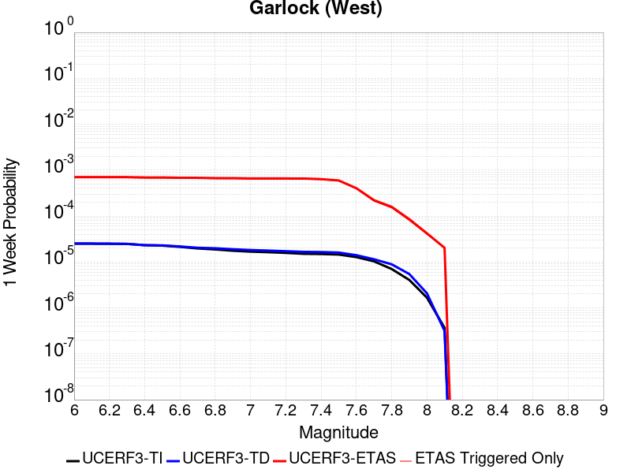 |  |  |  |

| Magnitude | 1 wk TI Prob | 1 wk TD Prob | 1 wk ETAS Prob | 1 wk ETAS/TD Gain | 1 wk ETAS Triggered Only | 1 mo TI Prob | 1 mo TD Prob | 1 mo ETAS Prob | 1 mo ETAS/TD Gain | 1 mo ETAS Triggered Only | 1 yr TI Prob | 1 yr TD Prob | 1 yr ETAS Prob | 1 yr ETAS/TD Gain | 1 yr ETAS Triggered Only | 10 yr TI Prob | 10 yr TD Prob | 10 yr ETAS Prob | 10 yr ETAS/TD Gain | 10 yr ETAS Triggered Only |
|-----|-----|-----|-----|-----|-----|-----|-----|-----|-----|-----|-----|-----|-----|-----|-----|-----|-----|-----|-----|-----|
| 6.0 | 2.5181727E-5 | 2.5196328E-5 | 6.2715047E-4 | 24.89055 | 6.019693E-4 | 1.0791722E-4 | 1.0797982E-4 | 0.0010108362 | 9.361344 | 9.0295397E-4 | 0.0013131002 | 0.0013138648 | 0.0026021043 | 1.9804962 | 0.0012899343 | 0.013053683 | 0.0131414775 | 0.015093384 | 1.1485302 | 0.001977899 |
| 6.1 | 2.5077732E-5 | 2.50974E-5 | 6.270516E-4 | 24.984722 | 6.019693E-4 | 1.0747157E-4 | 1.07555876E-4 | 0.0010104127 | 9.394305 | 9.0295397E-4 | 0.001307681 | 0.0013087096 | 0.0025969557 | 1.9843636 | 0.0012899343 | 0.013000126 | 0.013090534 | 0.015042542 | 1.1491159 | 0.001977899 |
| 6.2 | 2.494612E-5 | 2.497908E-5 | 6.2693335E-4 | 25.098337 | 6.019693E-4 | 1.0690756E-4 | 1.0704882E-4 | 0.0010099061 | 9.43407 | 9.0295397E-4 | 0.0013008224 | 0.0013025437 | 0.0025907976 | 1.9890294 | 0.0012899343 | 0.012932341 | 0.013029599 | 0.014981727 | 1.1498226 | 0.001977899 |
| 6.3 | 2.4733758E-5 | 2.479845E-5 | 6.267528E-4 | 25.27387 | 6.019693E-4 | 1.0599751E-4 | 1.0627476E-4 | 0.0010091327 | 9.495507 | 9.0295397E-4 | 0.0012897556 | 0.0012931306 | 0.0025813968 | 1.9962382 | 0.0012899343 | 0.012822957 | 0.012936569 | 0.014888881 | 1.1509142 | 0.001977899 |
| 6.4 | 2.3237335E-5 | 2.3177769E-5 | 6.251331E-4 | 26.97124 | 6.019693E-4 | 9.958477E-5 | 9.9329525E-5 | 0.0010021938 | 10.089586 | 9.0295397E-4 | 0.0012117702 | 0.0012086688 | 0.002497044 | 2.0659454 | 0.0012899343 | 0.012051838 | 0.012101421 | 0.014055385 | 1.1614656 | 0.001977899 |
| 6.5 | 2.2732203E-5 | 2.299234E-5 | 6.249478E-4 | 27.180695 | 6.019693E-4 | 9.742009E-5 | 9.8534896E-5 | 0.0010013998 | 10.162896 | 9.0295397E-4 | 0.0011854442 | 0.0011990049 | 0.0024873924 | 2.0745473 | 0.0012899343 | 0.011791403 | 0.01200583 | 0.013959983 | 1.1627669 | 0.001977899 |
| 6.6 | 2.1319436E-5 | 2.177255E-5 | 6.2372873E-4 | 28.647482 | 6.019693E-4 | 9.136581E-5 | 9.33076E-5 | 9.961773E-4 | 10.676271 | 9.0295397E-4 | 0.001111811 | 0.0011354303 | 0.0024239 | 2.1347852 | 0.0012899343 | 0.011062649 | 0.011376739 | 0.013332135 | 1.1718768 | 0.001977899 |
| 6.7 | 1.970802E-5 | 2.0392457E-5 | 6.223495E-4 | 30.518612 | 6.019693E-4 | 8.446021E-5 | 8.7393324E-5 | 9.902683E-4 | 11.331167 | 9.0295397E-4 | 0.001027818 | 0.0010634961 | 0.0023520584 | 2.2116287 | 0.0012899343 | 0.010230771 | 0.010664482 | 0.012621287 | 1.1834881 | 0.001977899 |
| 6.8 | 1.8744462E-5 | 1.9900112E-5 | 6.218574E-4 | 31.248943 | 6.019693E-4 | 8.033094E-5 | 8.528341E-5 | 9.881604E-4 | 11.586782 | 9.0295397E-4 | 9.775903E-4 | 0.0010378326 | 0.002326428 | 2.2416217 | 0.0012899343 | 0.009733009 | 0.010410271 | 0.012367579 | 1.1880171 | 0.001977899 |
| 6.9 | 1.7559682E-5 | 1.8952487E-5 | 6.209104E-4 | 32.76142 | 6.019693E-4 | 7.5253614E-5 | 8.1222424E-5 | 9.841031E-4 | 12.11615 | 9.0295397E-4 | 9.158276E-4 | 9.884358E-4 | 0.002277095 | 2.3037357 | 0.0012899343 | 0.0091206245 | 0.009920754 | 0.011879031 | 1.197392 | 0.001977899 |
| 7.0 | 1.6794445E-5 | 1.8215316E-5 | 6.2017364E-4 | 34.04682 | 6.019693E-4 | 7.197421E-5 | 7.806331E-5 | 9.809468E-4 | 12.566041 | 9.0295397E-4 | 8.759337E-4 | 9.500078E-4 | 0.0022387167 | 2.3565245 | 0.0012899343 | 0.008724891 | 0.009539667 | 0.011498697 | 1.2053564 | 0.001977899 |
| 7.1 | 1.6337795E-5 | 1.771613E-5 | 6.1967474E-4 | 34.978 | 6.019693E-4 | 7.0017246E-5 | 7.5924065E-5 | 9.788094E-4 | 12.8919525 | 9.0295397E-4 | 8.521265E-4 | 9.2398486E-4 | 0.0022127272 | 2.3947656 | 0.0012899343 | 0.008488664 | 0.009281524 | 0.011241065 | 1.2111228 | 0.001977899 |
| 7.2 | 1.5780008E-5 | 1.7164773E-5 | 6.1912375E-4 | 36.06944 | 6.019693E-4 | 6.762685E-5 | 7.356125E-5 | 9.7644876E-4 | 13.273955 | 9.0295397E-4 | 8.2304585E-4 | 8.952415E-4 | 0.002184021 | 2.4395885 | 0.0012899343 | 0.008200042 | 0.008996368 | 0.010956474 | 1.2178774 | 0.001977899 |
| 7.3 | 1.5058865E-5 | 1.6617856E-5 | 6.185772E-4 | 37.22364 | 6.019693E-4 | 6.45364E-5 | 7.121745E-5 | 9.7410707E-4 | 13.677927 | 9.0295397E-4 | 7.854473E-4 | 8.667287E-4 | 0.002155545 | 2.4869893 | 0.0012899343 | 0.00782677 | 0.008713072 | 0.010673737 | 1.2250258 | 0.001977899 |
| 7.4 | 1.4887923E-5 | 1.6453829E-5 | 6.184132E-4 | 37.58476 | 6.019693E-4 | 6.380382E-5 | 7.0514514E-5 | 9.734048E-4 | 13.804318 | 9.0295397E-4 | 7.7653467E-4 | 8.5817726E-4 | 0.0021470045 | 2.5018194 | 0.0012899343 | 0.0077382675 | 0.008627934 | 0.010588768 | 1.2272657 | 0.001977899 |
| 7.5 | 1.4509299E-5 | 1.6045851E-5 | 5.750084E-4 | 35.835327 | 5.589715E-4 | 6.218123E-5 | 6.876613E-5 | 9.286631E-4 | 13.504659 | 8.5995614E-4 | 7.567935E-4 | 8.3690725E-4 | 0.0020398383 | 2.437353 | 0.0012039386 | 0.0075422134 | 0.008416242 | 0.010292223 | 1.2229 | 0.0018919035 |
| 7.6 | 1.2756717E-5 | 1.4049988E-5 | 3.580276E-4 | 25.482414 | 3.4398245E-4 | 5.4670498E-5 | 6.021285E-5 | 6.191507E-4 | 10.282701 | 5.589715E-4 | 6.6541E-4 | 7.328455E-4 | 0.0015492052 | 2.1139586 | 8.169583E-4 | 0.006634211 | 0.0073812436 | 0.008747017 | 1.185033 | 0.0013759298 |
| 7.7 | 1.0328985E-5 | 1.145975E-5 | 1.8344901E-4 | 16.008116 | 1.7199123E-4 | 4.4266326E-5 | 4.9112292E-5 | 3.5008215E-4 | 7.128198 | 3.0098466E-4 | 5.388092E-4 | 5.9777853E-4 | 9.845274E-4 | 1.646977 | 3.8698027E-4 | 0.0053750467 | 0.0060380935 | 0.006636428 | 1.0990933 | 6.019693E-4 |
| 7.8 | 7.0306583E-6 | 8.8989555E-6 | 1.3789123E-4 | 15.495214 | 1.2899342E-4 | 3.0131043E-5 | 3.8137823E-5 | 2.101225E-4 | 5.5095563 | 1.7199123E-4 | 3.667837E-4 | 4.6422923E-4 | 6.3614064E-4 | 1.3703157 | 1.7199123E-4 | 0.003661789 | 0.0046949377 | 0.0050373054 | 1.0729227 | 3.4398245E-4 |
| 7.9 | 4.060633E-6 | 5.4650154E-6 | 9.146016E-5 | 16.735573 | 8.599561E-5 | 1.7402595E-5 | 2.3421284E-5 | 1.0941488E-4 | 4.6716003 | 8.599561E-5 | 2.11856E-4 | 2.8511693E-4 | 3.71088E-4 | 1.3015293 | 8.599561E-5 | 0.0021165414 | 0.0028840043 | 0.0030126257 | 1.0445982 | 1.2899342E-4 |
| 8.0 | 1.6729537E-6 | 2.0773857E-6 | 2.0773857E-6 | 1.0 | 0.0 | 7.169782E-6 | 8.903051E-6 | 8.903051E-6 | 1.0 | 0.0 | 8.7288594E-5 | 1.08389286E-4 | 1.08389286E-4 | 1.0 | 0.0 | 8.7254314E-4 | 0.0010968668 | 0.0010968668 | 1.0 | 0.0 |
| 8.1 | 3.6733252E-7 | 3.148811E-7 | 3.148811E-7 | 1.0 | 0.0 | 1.5742813E-6 | 1.3494899E-6 | 1.3494899E-6 | 1.0 | 0.0 | 1.9166706E-5 | 1.6429933E-5 | 1.6429933E-5 | 1.0 | 0.0 | 1.9165053E-4 | 1.6637788E-4 | 1.6637788E-4 | 1.0 | 0.0 |

## Hunter Mountain-Saline Valley
*[(top)](#table-of-contents)*

| 1 Week | 1 Month | 1 Year | 10 Year |
|-----|-----|-----|-----|
|  | 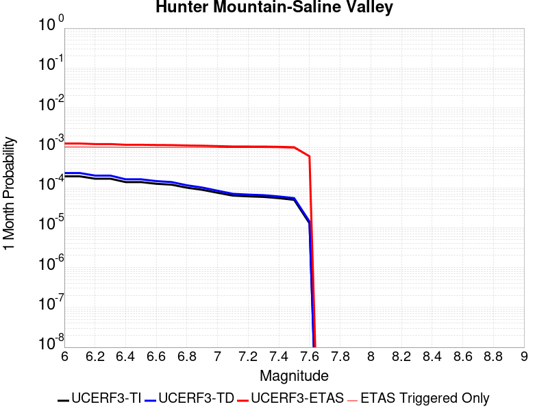 |  |  |

| Magnitude | 1 wk TI Prob | 1 wk TD Prob | 1 wk ETAS Prob | 1 wk ETAS/TD Gain | 1 wk ETAS Triggered Only | 1 mo TI Prob | 1 mo TD Prob | 1 mo ETAS Prob | 1 mo ETAS/TD Gain | 1 mo ETAS Triggered Only | 1 yr TI Prob | 1 yr TD Prob | 1 yr ETAS Prob | 1 yr ETAS/TD Gain | 1 yr ETAS Triggered Only | 10 yr TI Prob | 10 yr TD Prob | 10 yr ETAS Prob | 10 yr ETAS/TD Gain | 10 yr ETAS Triggered Only |
|-----|-----|-----|-----|-----|-----|-----|-----|-----|-----|-----|-----|-----|-----|-----|-----|-----|-----|-----|-----|-----|
| 6.0 | 4.5103672E-5 | 5.4569828E-5 | 7.8549265E-4 | 14.394267 | 7.309627E-4 | 1.9328714E-4 | 2.3385094E-4 | 0.0013515325 | 5.7794614 | 0.001117943 | 0.002350731 | 0.002843498 | 0.004429893 | 1.5579027 | 0.0015909189 | 0.023260195 | 0.028091714 | 0.02997226 | 1.066943 | 0.0019349013 |
| 6.1 | 4.5103672E-5 | 5.4569828E-5 | 7.8549265E-4 | 14.394267 | 7.309627E-4 | 1.9328714E-4 | 2.3385094E-4 | 0.0013515325 | 5.7794614 | 0.001117943 | 0.002350731 | 0.002843498 | 0.004429893 | 1.5579027 | 0.0015909189 | 0.023260195 | 0.028091714 | 0.02997226 | 1.066943 | 0.0019349013 |
| 6.2 | 3.9363465E-5 | 4.7063084E-5 | 7.7799143E-4 | 16.53082 | 7.309627E-4 | 1.6868966E-4 | 2.0168422E-4 | 0.0013194018 | 6.5419188 | 0.001117943 | 0.002051862 | 0.002452803 | 0.00403982 | 1.6470217 | 0.0015909189 | 0.020330196 | 0.024273338 | 0.026161272 | 1.0777781 | 0.0019349013 |
| 6.3 | 3.9363465E-5 | 4.7063084E-5 | 7.7799143E-4 | 16.53082 | 7.309627E-4 | 1.6868966E-4 | 2.0168422E-4 | 0.0013194018 | 6.5419188 | 0.001117943 | 0.002051862 | 0.002452803 | 0.00403982 | 1.6470217 | 0.0015909189 | 0.020330196 | 0.024273338 | 0.026161272 | 1.0777781 | 0.0019349013 |
| 6.4 | 3.2311684E-5 | 3.7950776E-5 | 7.258896E-4 | 19.127134 | 6.879649E-4 | 1.384713E-4 | 1.6263645E-4 | 0.0012374067 | 7.6084223 | 0.0010749452 | 0.0016845843 | 0.0019783732 | 0.003523232 | 1.7808733 | 0.0015479211 | 0.016718714 | 0.019616365 | 0.021471156 | 1.0945532 | 0.0018919035 |
| 6.5 | 3.2311684E-5 | 3.7950776E-5 | 7.258896E-4 | 19.127134 | 6.879649E-4 | 1.384713E-4 | 1.6263645E-4 | 0.0012374067 | 7.6084223 | 0.0010749452 | 0.0016845843 | 0.0019783732 | 0.003523232 | 1.7808733 | 0.0015479211 | 0.016718714 | 0.019616365 | 0.021471156 | 1.0945532 | 0.0018919035 |
| 6.6 | 2.9305844E-5 | 3.418164E-5 | 7.22123E-4 | 21.126049 | 6.879649E-4 | 1.2559042E-4 | 1.4648488E-4 | 0.0012212726 | 8.337192 | 0.0010749452 | 0.0015279909 | 0.0017820572 | 0.0033272197 | 1.8670667 | 0.0015479211 | 0.015175272 | 0.017685594 | 0.019544039 | 1.1050824 | 0.0018919035 |
| 6.7 | 2.7826512E-5 | 3.2344098E-5 | 7.2028674E-4 | 22.269495 | 6.879649E-4 | 1.19251024E-4 | 1.3861054E-4 | 0.0012134067 | 8.754072 | 0.0010749452 | 0.0014509142 | 0.0016863372 | 0.003231648 | 1.9163711 | 0.0015479211 | 0.014414776 | 0.016743096 | 0.018603323 | 1.1111041 | 0.0018919035 |
| 6.8 | 2.3389874E-5 | 2.6866572E-5 | 7.14813E-4 | 26.606037 | 6.879649E-4 | 1.0023846E-4 | 1.15137635E-4 | 0.001189959 | 10.335101 | 0.0010749452 | 0.00121972 | 0.0014009465 | 0.002946699 | 2.103363 | 0.0015479211 | 0.01213047 | 0.01392736 | 0.015792914 | 1.1339489 | 0.0018919035 |
| 6.9 | 2.069209E-5 | 2.3569908E-5 | 7.1151863E-4 | 30.187586 | 6.879649E-4 | 8.867737E-5 | 1.01010184E-4 | 0.0011758468 | 11.640874 | 0.0010749452 | 0.0010791123 | 0.0012291414 | 0.00277516 | 2.2578037 | 0.0015479211 | 0.010738871 | 0.01222846 | 0.014097229 | 1.1528213 | 0.0018919035 |
| 7.0 | 1.7462342E-5 | 1.9633446E-5 | 7.0758484E-4 | 36.03977 | 6.879649E-4 | 7.483646E-5 | 8.414075E-5 | 0.0011589954 | 13.774485 | 0.0010749452 | 9.1075303E-4 | 0.0010239548 | 0.0025702908 | 2.5101604 | 0.0015479211 | 0.009070295 | 0.010196 | 0.012068614 | 1.1836616 | 0.0018919035 |
| 7.1 | 1.4807709E-5 | 1.6441667E-5 | 7.043953E-4 | 42.842087 | 6.879649E-4 | 6.3460066E-5 | 7.0462476E-5 | 0.0011453319 | 16.254496 | 0.0010749452 | 7.723524E-4 | 8.5755944E-4 | 0.002404153 | 2.8034828 | 0.0015479211 | 0.007696735 | 0.008545489 | 0.010421225 | 1.2195002 | 0.0018919035 |
| 7.2 | 1.4180048E-5 | 1.5698257E-5 | 7.036524E-4 | 44.8236 | 6.879649E-4 | 6.077022E-5 | 6.72766E-5 | 0.0011421494 | 16.97692 | 0.0010749452 | 7.396263E-4 | 8.18801E-4 | 0.0023654546 | 2.8889248 | 0.0015479211 | 0.0073716943 | 0.008160792 | 0.010037256 | 1.2299365 | 0.0018919035 |
| 7.3 | 1.3730402E-5 | 1.5171999E-5 | 7.031265E-4 | 46.343697 | 6.879649E-4 | 5.8843252E-5 | 6.502132E-5 | 0.0011398966 | 17.53112 | 0.0010749452 | 7.161811E-4 | 7.913631E-4 | 0.0023380592 | 2.9544706 | 0.0015479211 | 0.007138774 | 0.007888383 | 0.009765362 | 1.2379422 | 0.0018919035 |
| 7.4 | 1.2810095E-5 | 1.4109204E-5 | 6.590672E-4 | 46.71186 | 6.4496713E-4 | 5.489925E-5 | 6.0466708E-5 | 0.0010923516 | 18.065342 | 0.0010319473 | 6.681934E-4 | 7.359493E-4 | 0.002239765 | 3.0433686 | 0.0015049232 | 0.006661878 | 0.0073380154 | 0.009173354 | 1.2501137 | 0.0018489057 |
| 7.5 | 1.1595659E-5 | 1.2800594E-5 | 6.5775943E-4 | 51.385075 | 6.4496713E-4 | 4.9694736E-5 | 5.485862E-5 | 0.0010867494 | 19.810001 | 0.0010319473 | 6.0486543E-4 | 6.677147E-4 | 0.002171633 | 3.2523367 | 0.0015049232 | 0.006032217 | 0.0066599557 | 0.008496548 | 1.2757664 | 0.0018489057 |
| 7.6 | 2.997694E-6 | 3.3251304E-6 | 3.0430878E-4 | 91.517845 | 3.0098466E-4 | 1.28471975E-5 | 1.4250522E-5 | 4.4422247E-4 | 31.172363 | 4.2997807E-4 | 1.564034E-4 | 1.7349358E-4 | 9.0432947E-4 | 5.2124667 | 7.309627E-4 | 0.0015629337 | 0.0017350167 | 0.0027651736 | 1.5937446 | 0.0010319473 |

## Gravel Hills-Harper Lk
*[(top)](#table-of-contents)*

| 1 Week | 1 Month | 1 Year | 10 Year |
|-----|-----|-----|-----|
| 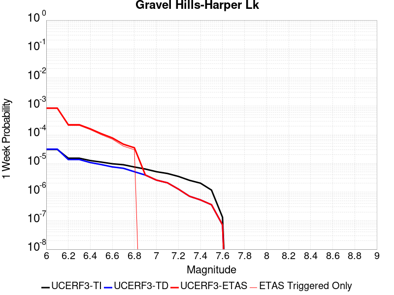 |  |  | 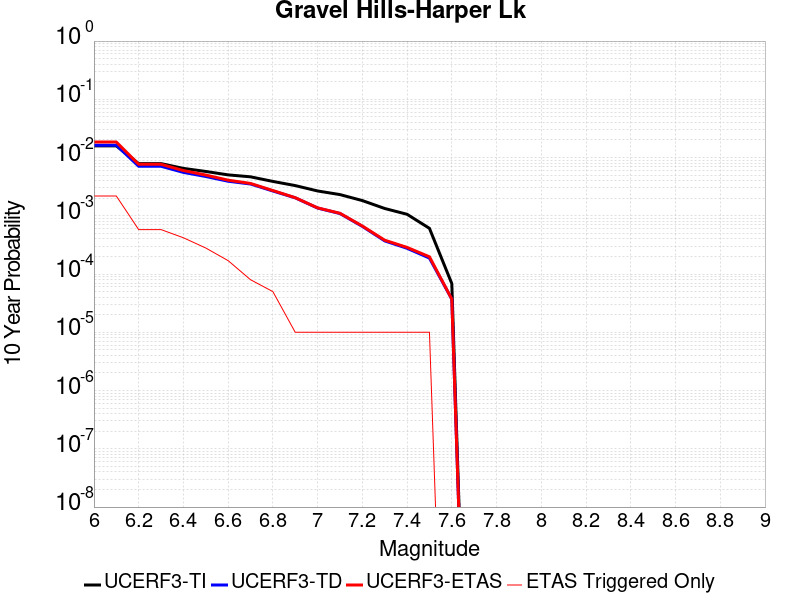 |

| Magnitude | 1 wk TI Prob | 1 wk TD Prob | 1 wk ETAS Prob | 1 wk ETAS/TD Gain | 1 wk ETAS Triggered Only | 1 mo TI Prob | 1 mo TD Prob | 1 mo ETAS Prob | 1 mo ETAS/TD Gain | 1 mo ETAS Triggered Only | 1 yr TI Prob | 1 yr TD Prob | 1 yr ETAS Prob | 1 yr ETAS/TD Gain | 1 yr ETAS Triggered Only | 10 yr TI Prob | 10 yr TD Prob | 10 yr ETAS Prob | 10 yr ETAS/TD Gain | 10 yr ETAS Triggered Only |
|-----|-----|-----|-----|-----|-----|-----|-----|-----|-----|-----|-----|-----|-----|-----|-----|-----|-----|-----|-----|-----|
| 6.0 | 3.0679566E-5 | 3.1464537E-5 | 0.001020383 | 32.42962 | 9.889496E-4 | 1.3147724E-4 | 1.3484228E-4 | 0.0012526346 | 9.289628 | 0.001117943 | 0.0015995599 | 0.001640685 | 0.00297143 | 1.8110912 | 0.001332932 | 0.015880952 | 0.016307283 | 0.018083742 | 1.1089365 | 0.0018059079 |
| 6.1 | 3.0679566E-5 | 3.1464537E-5 | 0.001020383 | 32.42962 | 9.889496E-4 | 1.3147724E-4 | 1.3484228E-4 | 0.0012526346 | 9.289628 | 0.001117943 | 0.0015995599 | 0.001640685 | 0.00297143 | 1.8110912 | 0.001332932 | 0.015880952 | 0.016307283 | 0.018083742 | 1.1089365 | 0.0018059079 |
| 6.2 | 1.514536E-5 | 1.3635169E-5 | 2.7161848E-4 | 19.920435 | 2.5798683E-4 | 6.490707E-5 | 5.84352E-5 | 3.1640698E-4 | 5.414664 | 2.5798683E-4 | 7.8995706E-4 | 7.112282E-4 | 0.0010119987 | 1.422889 | 3.0098466E-4 | 0.007871548 | 0.0070907213 | 0.0075176503 | 1.0602095 | 4.2997807E-4 |
| 6.3 | 1.514536E-5 | 1.3635169E-5 | 2.7161848E-4 | 19.920435 | 2.5798683E-4 | 6.490707E-5 | 5.84352E-5 | 3.1640698E-4 | 5.414664 | 2.5798683E-4 | 7.8995706E-4 | 7.112282E-4 | 0.0010119987 | 1.422889 | 3.0098466E-4 | 0.007871548 | 0.0070907213 | 0.0075176503 | 1.0602095 | 4.2997807E-4 |
| 6.4 | 1.2532521E-5 | 1.0689663E-5 | 1.8267905E-4 | 17.089317 | 1.7199123E-4 | 5.37097E-5 | 4.5812074E-5 | 2.1779542E-4 | 4.7541056 | 1.7199123E-4 | 6.537194E-4 | 5.576251E-4 | 7.7249424E-4 | 1.3853291 | 2.1498904E-4 | 0.0065179965 | 0.005562849 | 0.0059049176 | 1.0614917 | 3.4398245E-4 |
| 6.5 | 1.1094058E-5 | 9.083641E-6 | 9.5078474E-5 | 10.467 | 8.599561E-5 | 4.7545094E-5 | 3.8929335E-5 | 1.249216E-4 | 3.2089324 | 8.599561E-5 | 5.787078E-4 | 4.738656E-4 | 5.5982044E-4 | 1.1813908 | 8.599561E-5 | 0.0057720304 | 0.004728959 | 0.0049429312 | 1.0452472 | 2.1498904E-4 |
| 6.6 | 9.688328E-6 | 7.531677E-6 | 9.352664E-5 | 12.417771 | 8.599561E-5 | 4.1520743E-5 | 3.2278233E-5 | 1.1827107E-4 | 3.6641123 | 8.599561E-5 | 5.053978E-4 | 3.9291914E-4 | 4.7888097E-4 | 1.2187774 | 8.599561E-5 | 0.0050424994 | 0.003922501 | 0.0040081595 | 1.0218377 | 8.599561E-5 |
| 6.7 | 8.974824E-6 | 6.749397E-6 | 4.9746915E-5 | 7.3705716 | 4.2997806E-5 | 3.8462964E-5 | 2.892568E-5 | 7.1922244E-5 | 2.4864495 | 4.2997806E-5 | 4.6818596E-4 | 3.5211546E-4 | 3.9509812E-4 | 1.1220698 | 4.2997806E-5 | 0.004672008 | 0.0035157963 | 0.003558643 | 1.0121869 | 4.2997806E-5 |
| 6.8 | 7.4780046E-6 | 5.1161815E-6 | 4.811377E-5 | 9.404234 | 4.2997806E-5 | 3.20482E-5 | 2.1926315E-5 | 6.492318E-5 | 2.9609709 | 4.2997806E-5 | 3.9011694E-4 | 2.669216E-4 | 3.0990792E-4 | 1.1610448 | 4.2997806E-5 | 0.0038943281 | 0.002666148 | 0.002709031 | 1.0160843 | 4.2997806E-5 |
| 6.9 | 6.3409307E-6 | 3.9074876E-6 | 3.9074876E-6 | 1.0 | 0.0 | 2.7175134E-5 | 1.6746273E-5 | 1.6746273E-5 | 1.0 | 0.0 | 3.3080703E-4 | 2.0386779E-4 | 2.0386779E-4 | 1.0 | 0.0 | 0.0033031502 | 0.0020369058 | 0.0020369058 | 1.0 | 0.0 |
| 7.0 | 5.1239335E-6 | 2.60585E-6 | 2.60585E-6 | 1.0 | 0.0 | 2.195953E-5 | 1.1167882E-5 | 1.1167882E-5 | 1.0 | 0.0 | 2.6732447E-4 | 1.3596074E-4 | 1.3596074E-4 | 1.0 | 0.0 | 0.0026700313 | 0.0013588008 | 0.0013588008 | 1.0 | 0.0 |
| 7.1 | 4.438899E-6 | 2.0984673E-6 | 2.0984673E-6 | 1.0 | 0.0 | 1.9023713E-5 | 8.993402E-6 | 8.993402E-6 | 1.0 | 0.0 | 2.315891E-4 | 1.0948939E-4 | 1.0948939E-4 | 1.0 | 0.0 | 0.002313479 | 0.0010943763 | 0.0010943763 | 1.0 | 0.0 |
| 7.2 | 3.50367E-6 | 1.2615677E-6 | 1.2615677E-6 | 1.0 | 0.0 | 1.5015643E-5 | 5.4067077E-6 | 5.4067077E-6 | 1.0 | 0.0 | 1.8280011E-4 | 6.5824766E-5 | 6.5824766E-5 | 1.0 | 0.0 | 0.0018264982 | 6.580609E-4 | 6.580609E-4 | 1.0 | 0.0 |
| 7.3 | 2.561638E-6 | 7.119129E-7 | 7.119129E-7 | 1.0 | 0.0 | 1.0978401E-5 | 3.0510516E-6 | 3.0510516E-6 | 1.0 | 0.0 | 1.3365384E-4 | 3.7145943E-5 | 3.7145943E-5 | 1.0 | 0.0 | 0.0013357349 | 3.7139934E-4 | 3.7139934E-4 | 1.0 | 0.0 |
| 7.4 | 2.0368864E-6 | 5.304814E-7 | 5.304814E-7 | 1.0 | 0.0 | 8.729483E-6 | 2.2734896E-6 | 2.2734896E-6 | 1.0 | 0.0 | 1.06276275E-4 | 2.7679389E-5 | 2.7679389E-5 | 1.0 | 0.0 | 0.0010622547 | 2.7675997E-4 | 2.7675997E-4 | 1.0 | 0.0 |
| 7.5 | 1.1681728E-6 | 3.6030443E-7 | 3.6030443E-7 | 1.0 | 0.0 | 5.0064455E-6 | 1.544161E-6 | 1.544161E-6 | 1.0 | 0.0 | 6.0951766E-5 | 1.8800003E-5 | 1.8800003E-5 | 1.0 | 0.0 | 6.093505E-4 | 1.879846E-4 | 1.879846E-4 | 1.0 | 0.0 |
| 7.6 | 1.3154387E-7 | 7.1197206E-8 | 7.1197206E-8 | 1.0 | 0.0 | 5.6375933E-7 | 3.0513087E-7 | 3.0513087E-7 | 1.0 | 0.0 | 6.863748E-6 | 3.7149634E-6 | 3.7149634E-6 | 1.0 | 0.0 | 6.863536E-5 | 3.714917E-5 | 3.714917E-5 | 1.0 | 0.0 |

## Ash Hill
*[(top)](#table-of-contents)*

| 1 Week | 1 Month | 1 Year | 10 Year |
|-----|-----|-----|-----|
|  |  |  |  |

| Magnitude | 1 wk TI Prob | 1 wk TD Prob | 1 wk ETAS Prob | 1 wk ETAS/TD Gain | 1 wk ETAS Triggered Only | 1 mo TI Prob | 1 mo TD Prob | 1 mo ETAS Prob | 1 mo ETAS/TD Gain | 1 mo ETAS Triggered Only | 1 yr TI Prob | 1 yr TD Prob | 1 yr ETAS Prob | 1 yr ETAS/TD Gain | 1 yr ETAS Triggered Only | 10 yr TI Prob | 10 yr TD Prob | 10 yr ETAS Prob | 10 yr ETAS/TD Gain | 10 yr ETAS Triggered Only |
|-----|-----|-----|-----|-----|-----|-----|-----|-----|-----|-----|-----|-----|-----|-----|-----|-----|-----|-----|-----|-----|
| 6.0 | 2.1545662E-5 | 2.31944E-5 | 4.531625E-4 | 19.537582 | 4.2997807E-4 | 9.2335285E-5 | 9.940123E-5 | 8.302913E-4 | 8.352927 | 7.309627E-4 | 0.0011236023 | 0.001209618 | 0.0023691547 | 1.9585972 | 0.0011609407 | 0.011179381 | 0.012038324 | 0.013610091 | 1.1305636 | 0.0015909189 |
| 6.1 | 2.1545662E-5 | 2.31944E-5 | 4.531625E-4 | 19.537582 | 4.2997807E-4 | 9.2335285E-5 | 9.940123E-5 | 8.302913E-4 | 8.352927 | 7.309627E-4 | 0.0011236023 | 0.001209618 | 0.0023691547 | 1.9585972 | 0.0011609407 | 0.011179381 | 0.012038324 | 0.013610091 | 1.1305636 | 0.0015909189 |
| 6.2 | 2.1545662E-5 | 2.31944E-5 | 4.531625E-4 | 19.537582 | 4.2997807E-4 | 9.2335285E-5 | 9.940123E-5 | 8.302913E-4 | 8.352927 | 7.309627E-4 | 0.0011236023 | 0.001209618 | 0.0023691547 | 1.9585972 | 0.0011609407 | 0.011179381 | 0.012038324 | 0.013610091 | 1.1305636 | 0.0015909189 |
| 6.3 | 1.0025529E-5 | 1.0746914E-5 | 3.1172833E-4 | 29.006311 | 3.0098466E-4 | 4.2965847E-5 | 4.6057463E-5 | 5.6200736E-4 | 12.202309 | 5.1597366E-4 | 5.229836E-4 | 5.606186E-4 | 0.0012911715 | 2.3031194 | 7.309627E-4 | 0.005217545 | 0.0055933557 | 0.0064057442 | 1.1452417 | 8.169583E-4 |
| 6.4 | 1.0025529E-5 | 1.0746914E-5 | 3.1172833E-4 | 29.006311 | 3.0098466E-4 | 4.2965847E-5 | 4.6057463E-5 | 5.6200736E-4 | 12.202309 | 5.1597366E-4 | 5.229836E-4 | 5.606186E-4 | 0.0012911715 | 2.3031194 | 7.309627E-4 | 0.005217545 | 0.0055933557 | 0.0064057442 | 1.1452417 | 8.169583E-4 |
| 6.5 | 6.9617327E-6 | 7.45662E-6 | 2.2244405E-4 | 29.831755 | 2.1498904E-4 | 2.9835655E-5 | 3.19566E-5 | 4.189245E-4 | 13.10917 | 3.8698027E-4 | 3.6318856E-4 | 3.8901082E-4 | 8.618027E-4 | 2.2153695 | 4.7297587E-4 | 0.0036259557 | 0.003884153 | 0.0044409535 | 1.1433518 | 5.589715E-4 |
| 6.6 | 4.9919777E-6 | 5.3466783E-6 | 1.7733699E-4 | 33.167694 | 1.7199123E-4 | 2.1394015E-5 | 2.2914171E-5 | 3.6688874E-4 | 16.011435 | 3.4398245E-4 | 2.60441E-4 | 2.7895102E-4 | 6.6582335E-4 | 2.3868825 | 3.8698027E-4 | 0.0026013597 | 0.0027866673 | 0.0032154473 | 1.1538683 | 4.2997807E-4 |
| 6.7 | 3.6630722E-6 | 3.924616E-6 | 1.7591516E-4 | 44.823536 | 1.7199123E-4 | 1.5698786E-5 | 1.6819708E-5 | 3.6079637E-4 | 21.450811 | 3.4398245E-4 | 1.9111596E-4 | 2.0476643E-4 | 5.916675E-4 | 2.8894749 | 3.8698027E-4 | 0.0019095168 | 0.0020463406 | 0.0024754389 | 1.2096905 | 4.2997807E-4 |
| 6.8 | 2.5599613E-6 | 2.7449198E-6 | 1.7473567E-4 | 63.657845 | 1.7199123E-4 | 1.0971216E-5 | 1.17639165E-5 | 3.5574232E-4 | 30.240126 | 3.4398245E-4 | 1.3356637E-4 | 1.4322122E-4 | 5.3014606E-4 | 3.7015889 | 3.8698027E-4 | 0.0013348613 | 0.0014317741 | 0.0018611366 | 1.2998815 | 4.2997807E-4 |
| 6.9 | 1.7684905E-6 | 1.896867E-6 | 1.3089004E-4 | 69.00328 | 1.2899342E-4 | 7.579223E-6 | 8.12943E-6 | 2.6611416E-4 | 32.734665 | 2.5798683E-4 | 9.2273134E-5 | 9.897581E-5 | 3.9993066E-4 | 4.040691 | 3.0098466E-4 | 9.223483E-4 | 9.897582E-4 | 0.0013334001 | 1.347198 | 3.4398245E-4 |

## Airport Lake
*[(top)](#table-of-contents)*

| 1 Week | 1 Month | 1 Year | 10 Year |
|-----|-----|-----|-----|
|  |  |  |  |

| Magnitude | 1 wk TI Prob | 1 wk TD Prob | 1 wk ETAS Prob | 1 wk ETAS/TD Gain | 1 wk ETAS Triggered Only | 1 mo TI Prob | 1 mo TD Prob | 1 mo ETAS Prob | 1 mo ETAS/TD Gain | 1 mo ETAS Triggered Only | 1 yr TI Prob | 1 yr TD Prob | 1 yr ETAS Prob | 1 yr ETAS/TD Gain | 1 yr ETAS Triggered Only | 10 yr TI Prob | 10 yr TD Prob | 10 yr ETAS Prob | 10 yr ETAS/TD Gain | 10 yr ETAS Triggered Only |
|-----|-----|-----|-----|-----|-----|-----|-----|-----|-----|-----|-----|-----|-----|-----|-----|-----|-----|-----|-----|-----|
| 6.0 | 1.2387061E-5 | 1.3103137E-5 | 7.440563E-4 | 56.78459 | 7.309627E-4 | 5.3086325E-5 | 5.615525E-5 | 7.8707695E-4 | 14.016088 | 7.309627E-4 | 6.461343E-4 | 6.835041E-4 | 0.0014999041 | 2.1944332 | 8.169583E-4 | 0.0064425888 | 0.0068168286 | 0.008226084 | 1.2067318 | 0.0014189277 |
| 6.1 | 1.2387061E-5 | 1.3103137E-5 | 7.440563E-4 | 56.78459 | 7.309627E-4 | 5.3086325E-5 | 5.615525E-5 | 7.8707695E-4 | 14.016088 | 7.309627E-4 | 6.461343E-4 | 6.835041E-4 | 0.0014999041 | 2.1944332 | 8.169583E-4 | 0.0064425888 | 0.0068168286 | 0.008226084 | 1.2067318 | 0.0014189277 |
| 6.2 | 1.2387061E-5 | 1.3103137E-5 | 7.440563E-4 | 56.78459 | 7.309627E-4 | 5.3086325E-5 | 5.615525E-5 | 7.8707695E-4 | 14.016088 | 7.309627E-4 | 6.461343E-4 | 6.835041E-4 | 0.0014999041 | 2.1944332 | 8.169583E-4 | 0.0064425888 | 0.0068168286 | 0.008226084 | 1.2067318 | 0.0014189277 |
| 6.3 | 1.2387061E-5 | 1.3103137E-5 | 7.440563E-4 | 56.78459 | 7.309627E-4 | 5.3086325E-5 | 5.615525E-5 | 7.8707695E-4 | 14.016088 | 7.309627E-4 | 6.461343E-4 | 6.835041E-4 | 0.0014999041 | 2.1944332 | 8.169583E-4 | 0.0064425888 | 0.0068168286 | 0.008226084 | 1.2067318 | 0.0014189277 |
| 6.4 | 1.2387061E-5 | 1.3103137E-5 | 7.440563E-4 | 56.78459 | 7.309627E-4 | 5.3086325E-5 | 5.615525E-5 | 7.8707695E-4 | 14.016088 | 7.309627E-4 | 6.461343E-4 | 6.835041E-4 | 0.0014999041 | 2.1944332 | 8.169583E-4 | 0.0064425888 | 0.0068168286 | 0.008226084 | 1.2067318 | 0.0014189277 |
| 6.5 | 6.9922594E-6 | 7.384914E-6 | 6.523473E-4 | 88.33512 | 6.4496713E-4 | 2.996648E-5 | 3.1649277E-5 | 6.7659596E-4 | 21.377928 | 6.4496713E-4 | 3.6478083E-4 | 3.8526725E-4 | 0.0010729671 | 2.7849944 | 6.879649E-4 | 0.003641826 | 0.0038465308 | 0.0049601737 | 1.2895187 | 0.001117943 |
| 6.6 | 6.9922594E-6 | 7.384914E-6 | 6.523473E-4 | 88.33512 | 6.4496713E-4 | 2.996648E-5 | 3.1649277E-5 | 6.7659596E-4 | 21.377928 | 6.4496713E-4 | 3.6478083E-4 | 3.8526725E-4 | 0.0010729671 | 2.7849944 | 6.879649E-4 | 0.003641826 | 0.0038465308 | 0.0049601737 | 1.2895187 | 0.001117943 |
| 6.7 | 5.477277E-6 | 5.78606E-6 | 6.507494E-4 | 112.4685 | 6.4496713E-4 | 2.3473833E-5 | 2.4797186E-5 | 6.697483E-4 | 27.009045 | 6.4496713E-4 | 2.8575645E-4 | 3.0186778E-4 | 9.89625E-4 | 3.2783391 | 6.879649E-4 | 0.0028538927 | 0.0030149613 | 0.004086666 | 1.3554621 | 0.0010749452 |
| 6.8 | 3.9950432E-6 | 4.219081E-6 | 3.482001E-4 | 82.52985 | 3.4398245E-4 | 1.7121502E-5 | 1.8081664E-5 | 3.620579E-4 | 20.023483 | 3.4398245E-4 | 2.0843433E-4 | 2.2012478E-4 | 6.070199E-4 | 2.757617 | 3.8698027E-4 | 0.0020823893 | 0.0021993385 | 0.0029286935 | 1.3316247 | 7.309627E-4 |
| 6.9 | 2.95695E-6 | 3.1230197E-6 | 2.6110906E-4 | 83.60788 | 2.5798683E-4 | 1.2672582E-5 | 1.3384314E-5 | 2.713677E-4 | 20.275055 | 2.5798683E-4 | 1.5427776E-4 | 1.629441E-4 | 4.638797E-4 | 2.846864 | 3.0098466E-4 | 0.001541707 | 0.0016284687 | 0.0020577465 | 1.2636083 | 4.2997807E-4 |
| 7.0 | 1.456072E-6 | 1.5408096E-6 | 8.753629E-5 | 56.811882 | 8.599561E-5 | 6.2402937E-6 | 6.6034586E-6 | 9.259851E-5 | 14.022728 | 8.599561E-5 | 7.597293E-5 | 8.0395155E-5 | 2.0937821E-4 | 2.6043634 | 1.2899342E-4 | 7.594696E-4 | 8.0375955E-4 | 9.7561255E-4 | 1.2138114 | 1.7199123E-4 |
| 7.1 | 6.995192E-7 | 7.4089627E-7 | 4.373867E-5 | 59.034813 | 4.2997806E-5 | 2.997936E-6 | 3.1752697E-6 | 4.617294E-5 | 14.541423 | 4.2997806E-5 | 3.649926E-5 | 3.865891E-5 | 8.165505E-5 | 2.1121924 | 4.2997806E-5 | 3.6493264E-4 | 3.865891E-4 | 4.7255147E-4 | 1.2223611 | 8.599561E-5 |

## McLean Lake
*[(top)](#table-of-contents)*

| 1 Week | 1 Month | 1 Year | 10 Year |
|-----|-----|-----|-----|
|  |  |  |  |

| Magnitude | 1 wk TI Prob | 1 wk TD Prob | 1 wk ETAS Prob | 1 wk ETAS/TD Gain | 1 wk ETAS Triggered Only | 1 mo TI Prob | 1 mo TD Prob | 1 mo ETAS Prob | 1 mo ETAS/TD Gain | 1 mo ETAS Triggered Only | 1 yr TI Prob | 1 yr TD Prob | 1 yr ETAS Prob | 1 yr ETAS/TD Gain | 1 yr ETAS Triggered Only | 10 yr TI Prob | 10 yr TD Prob | 10 yr ETAS Prob | 10 yr ETAS/TD Gain | 10 yr ETAS Triggered Only |
|-----|-----|-----|-----|-----|-----|-----|-----|-----|-----|-----|-----|-----|-----|-----|-----|-----|-----|-----|-----|-----|
| 6.0 | 1.7360222E-5 | 1.8501594E-5 | 2.7648365E-4 | 14.943774 | 2.5798683E-4 | 7.439883E-5 | 7.929042E-5 | 4.6624E-4 | 5.880156 | 3.8698027E-4 | 9.0542925E-4 | 9.6498185E-4 | 0.0016522829 | 1.7122425 | 6.879649E-4 | 0.009017491 | 0.009612758 | 0.010932877 | 1.1373299 | 0.001332932 |
| 6.1 | 9.062689E-6 | 9.592179E-6 | 2.2457915E-4 | 23.412737 | 2.1498904E-4 | 3.8839516E-5 | 4.110874E-5 | 2.99085E-4 | 7.27546 | 2.5798683E-4 | 4.727685E-4 | 5.0039287E-4 | 0.0010161083 | 2.0306213 | 5.1597366E-4 | 0.0047176396 | 0.004993544 | 0.005934772 | 1.188489 | 9.4595173E-4 |
| 6.2 | 9.062689E-6 | 9.592179E-6 | 2.2457915E-4 | 23.412737 | 2.1498904E-4 | 3.8839516E-5 | 4.110874E-5 | 2.99085E-4 | 7.27546 | 2.5798683E-4 | 4.727685E-4 | 5.0039287E-4 | 0.0010161083 | 2.0306213 | 5.1597366E-4 | 0.0047176396 | 0.004993544 | 0.005934772 | 1.188489 | 9.4595173E-4 |
| 6.3 | 7.2575485E-6 | 7.667698E-6 | 1.7965761E-4 | 23.43045 | 1.7199123E-4 | 3.110341E-5 | 3.286119E-5 | 2.4784316E-4 | 7.5421243 | 2.1498904E-4 | 3.786182E-4 | 4.0001865E-4 | 7.868441E-4 | 1.9670186 | 3.8698027E-4 | 0.0037797375 | 0.003993691 | 0.0046789083 | 1.171575 | 6.879649E-4 |
| 6.4 | 7.2575485E-6 | 7.667698E-6 | 1.7965761E-4 | 23.43045 | 1.7199123E-4 | 3.110341E-5 | 3.286119E-5 | 2.4784316E-4 | 7.5421243 | 2.1498904E-4 | 3.786182E-4 | 4.0001865E-4 | 7.868441E-4 | 1.9670186 | 3.8698027E-4 | 0.0037797375 | 0.003993691 | 0.0046789083 | 1.171575 | 6.879649E-4 |
| 6.5 | 6.06582E-6 | 6.4038677E-6 | 1.78394E-4 | 27.857227 | 1.7199123E-4 | 2.5996113E-5 | 2.7444894E-5 | 1.9943141E-4 | 7.266612 | 1.7199123E-4 | 3.164567E-4 | 3.3409684E-4 | 6.7796436E-4 | 2.0292451 | 3.4398245E-4 | 0.0031600643 | 0.0033365842 | 0.003936545 | 1.1798129 | 6.019693E-4 |
| 6.6 | 5.598744E-6 | 5.9102535E-6 | 1.7790047E-4 | 30.100311 | 1.7199123E-4 | 2.3994397E-5 | 2.5329447E-5 | 1.9731632E-4 | 7.789997 | 1.7199123E-4 | 2.9209262E-4 | 3.0834877E-4 | 6.5222516E-4 | 2.1152189 | 3.4398245E-4 | 0.0029170897 | 0.0030798386 | 0.0036799537 | 1.1948528 | 6.019693E-4 |
| 6.7 | 5.246996E-6 | 5.539154E-6 | 1.7752944E-4 | 32.04992 | 1.7199123E-4 | 2.2486933E-5 | 2.373905E-5 | 1.957262E-4 | 8.2449045 | 1.7199123E-4 | 2.73744E-4 | 2.8899097E-4 | 6.32874E-4 | 2.189944 | 3.4398245E-4 | 0.0027340704 | 0.0028867754 | 0.0034012594 | 1.1782211 | 5.1597366E-4 |
| 6.8 | 4.02324E-6 | 4.2468982E-6 | 1.3323977E-4 | 31.373432 | 1.2899342E-4 | 1.7242342E-5 | 1.8200899E-5 | 1.4719197E-4 | 8.087071 | 1.2899342E-4 | 2.099053E-4 | 2.2157936E-4 | 4.3652076E-4 | 1.9700425 | 2.1498904E-4 | 0.0020970714 | 0.0022141687 | 0.0025573894 | 1.1550112 | 3.4398245E-4 |
| 6.9 | 6.835972E-7 | 7.13992E-7 | 7.13992E-7 | 1.0 | 0.0 | 2.9296991E-6 | 3.0599638E-6 | 3.0599638E-6 | 1.0 | 0.0 | 3.56685E-5 | 3.725474E-5 | 3.725474E-5 | 1.0 | 0.0 | 3.5662777E-4 | 3.7251622E-4 | 3.7251622E-4 | 1.0 | 0.0 |

## Goldstone Lake
*[(top)](#table-of-contents)*

| 1 Week | 1 Month | 1 Year | 10 Year |
|-----|-----|-----|-----|
|  |  |  |  |

| Magnitude | 1 wk TI Prob | 1 wk TD Prob | 1 wk ETAS Prob | 1 wk ETAS/TD Gain | 1 wk ETAS Triggered Only | 1 mo TI Prob | 1 mo TD Prob | 1 mo ETAS Prob | 1 mo ETAS/TD Gain | 1 mo ETAS Triggered Only | 1 yr TI Prob | 1 yr TD Prob | 1 yr ETAS Prob | 1 yr ETAS/TD Gain | 1 yr ETAS Triggered Only | 10 yr TI Prob | 10 yr TD Prob | 10 yr ETAS Prob | 10 yr ETAS/TD Gain | 10 yr ETAS Triggered Only |
|-----|-----|-----|-----|-----|-----|-----|-----|-----|-----|-----|-----|-----|-----|-----|-----|-----|-----|-----|-----|-----|
| 6.0 | 2.671352E-5 | 3.037598E-5 | 3.3135148E-4 | 10.908339 | 3.0098466E-4 | 1.1448149E-4 | 1.3017739E-4 | 6.0309167E-4 | 4.6328454 | 4.7297587E-4 | 0.001392921 | 0.0015839539 | 0.0022278994 | 1.4065431 | 6.4496713E-4 | 0.013842222 | 0.01574614 | 0.016931122 | 1.0752554 | 0.0012039386 |
| 6.1 | 2.671352E-5 | 3.037598E-5 | 3.3135148E-4 | 10.908339 | 3.0098466E-4 | 1.1448149E-4 | 1.3017739E-4 | 6.0309167E-4 | 4.6328454 | 4.7297587E-4 | 0.001392921 | 0.0015839539 | 0.0022278994 | 1.4065431 | 6.4496713E-4 | 0.013842222 | 0.01574614 | 0.016931122 | 1.0752554 | 0.0012039386 |
| 6.2 | 1.4197047E-5 | 1.609619E-5 | 1.8808465E-4 | 11.685041 | 1.7199123E-4 | 6.0843064E-5 | 6.89824E-5 | 4.1294112E-4 | 5.986181 | 3.4398245E-4 | 7.4051257E-4 | 8.396358E-4 | 0.0013122145 | 1.5628378 | 4.7297587E-4 | 0.007380498 | 0.008374331 | 0.0090991715 | 1.0865551 | 7.309627E-4 |
| 6.3 | 1.4197047E-5 | 1.609619E-5 | 1.8808465E-4 | 11.685041 | 1.7199123E-4 | 6.0843064E-5 | 6.89824E-5 | 4.1294112E-4 | 5.986181 | 3.4398245E-4 | 7.4051257E-4 | 8.396358E-4 | 0.0013122145 | 1.5628378 | 4.7297587E-4 | 0.007380498 | 0.008374331 | 0.0090991715 | 1.0865551 | 7.309627E-4 |
| 6.4 | 1.3238931E-5 | 1.5008409E-5 | 1.8699706E-4 | 12.459486 | 1.7199123E-4 | 5.6737044E-5 | 6.432072E-5 | 4.0828105E-4 | 6.3475823 | 3.4398245E-4 | 6.9055456E-4 | 7.829214E-4 | 0.001255527 | 1.6036437 | 4.7297587E-4 | 0.006884126 | 0.007811257 | 0.00853651 | 1.0928471 | 7.309627E-4 |
| 6.5 | 1.3238931E-5 | 1.5008409E-5 | 1.8699706E-4 | 12.459486 | 1.7199123E-4 | 5.6737044E-5 | 6.432072E-5 | 4.0828105E-4 | 6.3475823 | 3.4398245E-4 | 6.9055456E-4 | 7.829214E-4 | 0.001255527 | 1.6036437 | 4.7297587E-4 | 0.006884126 | 0.007811257 | 0.00853651 | 1.0928471 | 7.309627E-4 |
| 6.6 | 1.1328278E-5 | 1.2855122E-5 | 1.4184689E-4 | 11.034269 | 1.2899342E-4 | 4.8548856E-5 | 5.5092758E-5 | 3.130654E-4 | 5.6825147 | 2.5798683E-4 | 5.90922E-4 | 6.706436E-4 | 9.714264E-4 | 1.4484987 | 3.0098466E-4 | 0.0058935313 | 0.006695586 | 0.007165395 | 1.070167 | 4.7297587E-4 |
| 6.7 | 8.651175E-6 | 9.824532E-6 | 1.3881669E-4 | 14.129598 | 1.2899342E-4 | 3.707594E-5 | 4.2104966E-5 | 3.0008095E-4 | 7.1269727 | 2.5798683E-4 | 4.5130608E-4 | 5.125979E-4 | 7.7045255E-4 | 1.5030348 | 2.5798683E-4 | 0.0045039062 | 0.005123034 | 0.0054224767 | 1.0584502 | 3.0098466E-4 |
| 6.8 | 1.0215377E-6 | 1.1754685E-6 | 1.1754685E-6 | 1.0 | 0.0 | 4.378012E-6 | 5.0377125E-6 | 5.0377125E-6 | 1.0 | 0.0 | 5.3300988E-5 | 6.133254E-5 | 6.133254E-5 | 1.0 | 0.0 | 5.3288206E-4 | 6.131674E-4 | 6.131674E-4 | 1.0 | 0.0 |
| 6.9 | 7.9360774E-7 | 9.283384E-7 | 9.283384E-7 | 1.0 | 0.0 | 3.4011714E-6 | 3.9785873E-6 | 3.9785873E-6 | 1.0 | 0.0 | 4.1408475E-5 | 4.8438294E-5 | 4.8438294E-5 | 1.0 | 0.0 | 4.140076E-4 | 4.842844E-4 | 4.842844E-4 | 1.0 | 0.0 |
| 7.0 | 7.4382757E-7 | 8.747317E-7 | 8.747317E-7 | 1.0 | 0.0 | 3.1878285E-6 | 3.748845E-6 | 3.748845E-6 | 1.0 | 0.0 | 3.8811122E-5 | 4.56413E-5 | 4.56413E-5 | 1.0 | 0.0 | 3.8804344E-4 | 4.563259E-4 | 4.563259E-4 | 1.0 | 0.0 |
| 7.1 | 6.4709513E-7 | 7.71129E-7 | 7.71129E-7 | 1.0 | 0.0 | 2.773262E-6 | 3.304835E-6 | 3.304835E-6 | 1.0 | 0.0 | 3.376394E-5 | 4.023568E-5 | 4.023568E-5 | 1.0 | 0.0 | 3.375881E-4 | 4.0228994E-4 | 4.0228994E-4 | 1.0 | 0.0 |
| 7.2 | 6.356704E-7 | 7.5883503E-7 | 7.5883503E-7 | 1.0 | 0.0 | 2.7242988E-6 | 3.2521464E-6 | 3.2521464E-6 | 1.0 | 0.0 | 3.3167835E-5 | 3.9594222E-5 | 3.9594222E-5 | 1.0 | 0.0 | 3.3162883E-4 | 3.9587764E-4 | 3.9587764E-4 | 1.0 | 0.0 |
| 7.3 | 5.7695723E-7 | 6.896557E-7 | 6.896557E-7 | 1.0 | 0.0 | 2.4726714E-6 | 2.955664E-6 | 2.955664E-6 | 1.0 | 0.0 | 3.0104358E-5 | 3.5984674E-5 | 3.5984674E-5 | 1.0 | 0.0 | 3.0100282E-4 | 3.597942E-4 | 3.597942E-4 | 1.0 | 0.0 |
| 7.4 | 5.209647E-7 | 6.1935066E-7 | 6.1935066E-7 | 1.0 | 0.0 | 2.232704E-6 | 2.6543576E-6 | 2.6543576E-6 | 1.0 | 0.0 | 2.718283E-5 | 3.231638E-5 | 3.231638E-5 | 1.0 | 0.0 | 2.7179506E-4 | 3.2312237E-4 | 3.2312237E-4 | 1.0 | 0.0 |
| 7.5 | 4.512955E-7 | 5.348879E-7 | 5.348879E-7 | 1.0 | 0.0 | 1.934122E-6 | 2.292375E-6 | 2.292375E-6 | 1.0 | 0.0 | 2.3547682E-5 | 2.7909362E-5 | 2.7909362E-5 | 1.0 | 0.0 | 2.3545188E-4 | 2.7906388E-4 | 2.7906388E-4 | 1.0 | 0.0 |
| 7.6 | 2.21172E-7 | 2.603958E-7 | 2.603958E-7 | 1.0 | 0.0 | 9.478797E-7 | 1.1159817E-6 | 1.1159817E-6 | 1.0 | 0.0 | 1.1540374E-5 | 1.3587022E-5 | 1.3587022E-5 | 1.0 | 0.0 | 1.1539775E-4 | 1.3586473E-4 | 1.3586473E-4 | 1.0 | 0.0 |

## Coyote Canyon
*[(top)](#table-of-contents)*

| 1 Week | 1 Month | 1 Year | 10 Year |
|-----|-----|-----|-----|
|  |  |  |  |

| Magnitude | 1 wk TI Prob | 1 wk TD Prob | 1 wk ETAS Prob | 1 wk ETAS/TD Gain | 1 wk ETAS Triggered Only | 1 mo TI Prob | 1 mo TD Prob | 1 mo ETAS Prob | 1 mo ETAS/TD Gain | 1 mo ETAS Triggered Only | 1 yr TI Prob | 1 yr TD Prob | 1 yr ETAS Prob | 1 yr ETAS/TD Gain | 1 yr ETAS Triggered Only | 10 yr TI Prob | 10 yr TD Prob | 10 yr ETAS Prob | 10 yr ETAS/TD Gain | 10 yr ETAS Triggered Only |
|-----|-----|-----|-----|-----|-----|-----|-----|-----|-----|-----|-----|-----|-----|-----|-----|-----|-----|-----|-----|-----|
| 6.0 | 3.5090034E-5 | 4.036416E-5 | 2.1234844E-4 | 5.2608166 | 1.7199123E-4 | 1.503772E-4 | 1.7297924E-4 | 4.3092147E-4 | 2.4911745 | 2.5798683E-4 | 0.0018293047 | 0.0021042444 | 0.0025333175 | 1.2039084 | 4.2997807E-4 | 0.018143194 | 0.02086912 | 0.02175323 | 1.0423645 | 9.0295397E-4 |
| 6.1 | 3.5090034E-5 | 4.036416E-5 | 2.1234844E-4 | 5.2608166 | 1.7199123E-4 | 1.503772E-4 | 1.7297924E-4 | 4.3092147E-4 | 2.4911745 | 2.5798683E-4 | 0.0018293047 | 0.0021042444 | 0.0025333175 | 1.2039084 | 4.2997807E-4 | 0.018143194 | 0.02086912 | 0.02175323 | 1.0423645 | 9.0295397E-4 |
| 6.2 | 1.841879E-5 | 2.1059714E-5 | 6.4056614E-5 | 3.041666 | 4.2997806E-5 | 7.8935285E-5 | 9.0253365E-5 | 1.7624121E-4 | 1.9527385 | 8.599561E-5 | 9.606133E-4 | 0.0010983828 | 0.0012701851 | 1.1564139 | 1.7199123E-4 | 0.0095647145 | 0.010939625 | 0.0113649 | 1.0388746 | 4.2997807E-4 |
| 6.3 | 1.841879E-5 | 2.1059714E-5 | 6.4056614E-5 | 3.041666 | 4.2997806E-5 | 7.8935285E-5 | 9.0253365E-5 | 1.7624121E-4 | 1.9527385 | 8.599561E-5 | 9.606133E-4 | 0.0010983828 | 0.0012701851 | 1.1564139 | 1.7199123E-4 | 0.0095647145 | 0.010939625 | 0.0113649 | 1.0388746 | 4.2997807E-4 |
| 6.4 | 1.712201E-5 | 1.9565137E-5 | 6.25621E-5 | 3.1976316 | 4.2997806E-5 | 7.337798E-5 | 8.384846E-5 | 1.6983686E-4 | 2.0255215 | 8.599561E-5 | 8.930107E-4 | 0.0010204774 | 0.0011922931 | 1.168368 | 1.7199123E-4 | 0.008894307 | 0.010167832 | 0.0105934385 | 1.0418581 | 4.2997807E-4 |
| 6.5 | 1.4744935E-5 | 1.6836908E-5 | 5.983399E-5 | 3.5537398 | 4.2997806E-5 | 6.3191044E-5 | 7.2156705E-5 | 1.5814611E-4 | 2.1917036 | 8.599561E-5 | 7.6907943E-4 | 8.782473E-4 | 0.0010500875 | 1.1956626 | 1.7199123E-4 | 0.007664232 | 0.008756962 | 0.009183174 | 1.0486714 | 4.2997807E-4 |
| 6.6 | 1.2017839E-5 | 1.3724038E-5 | 5.6721256E-5 | 4.132986 | 4.2997806E-5 | 5.150401E-5 | 5.8816477E-5 | 1.4480703E-4 | 2.4620147 | 8.599561E-5 | 6.268809E-4 | 7.1594387E-4 | 8.87812E-4 | 1.2400581 | 1.7199123E-4 | 0.0062511545 | 0.0071450667 | 0.0075719724 | 1.0597483 | 4.2997807E-4 |
| 6.7 | 1.00956095E-5 | 1.1533472E-5 | 5.4530785E-5 | 4.7280455 | 4.2997806E-5 | 4.326618E-5 | 4.9428723E-5 | 1.3542008E-4 | 2.7397044 | 8.599561E-5 | 5.266384E-4 | 6.017155E-4 | 7.306313E-4 | 1.2142471 | 1.2899342E-4 | 0.005253921 | 0.0060093896 | 0.006351305 | 1.0568968 | 3.4398245E-4 |

## So Sierra Nevada
*[(top)](#table-of-contents)*

| 1 Week | 1 Month | 1 Year | 10 Year |
|-----|-----|-----|-----|
|  |  | 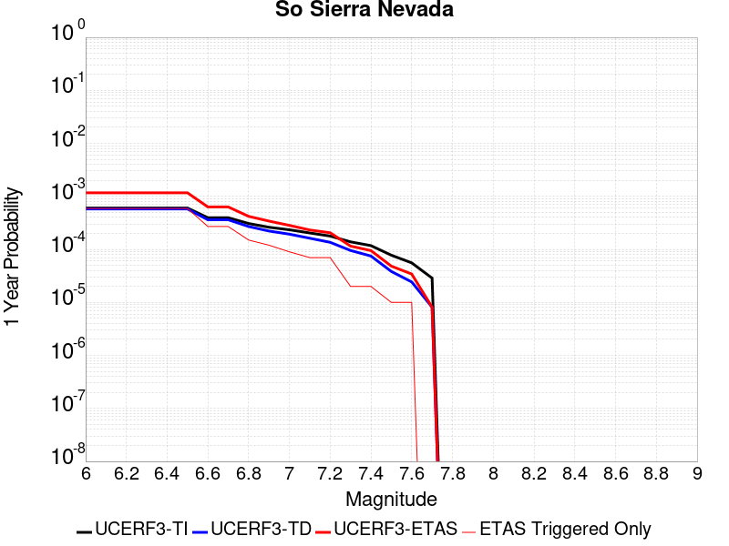 |  |

| Magnitude | 1 wk TI Prob | 1 wk TD Prob | 1 wk ETAS Prob | 1 wk ETAS/TD Gain | 1 wk ETAS Triggered Only | 1 mo TI Prob | 1 mo TD Prob | 1 mo ETAS Prob | 1 mo ETAS/TD Gain | 1 mo ETAS Triggered Only | 1 yr TI Prob | 1 yr TD Prob | 1 yr ETAS Prob | 1 yr ETAS/TD Gain | 1 yr ETAS Triggered Only | 10 yr TI Prob | 10 yr TD Prob | 10 yr ETAS Prob | 10 yr ETAS/TD Gain | 10 yr ETAS Triggered Only |
|-----|-----|-----|-----|-----|-----|-----|-----|-----|-----|-----|-----|-----|-----|-----|-----|-----|-----|-----|-----|-----|
| 6.0 | 1.15488665E-5 | 1.1079626E-5 | 2.2606627E-4 | 20.403782 | 2.1498904E-4 | 4.9494203E-5 | 4.748332E-5 | 3.054579E-4 | 6.432952 | 2.5798683E-4 | 6.024253E-4 | 5.7796884E-4 | 0.0012225632 | 2.1152751 | 6.4496713E-4 | 0.006007948 | 0.0057659256 | 0.006749173 | 1.1705272 | 9.889496E-4 |
| 6.1 | 1.15488665E-5 | 1.1079626E-5 | 2.2606627E-4 | 20.403782 | 2.1498904E-4 | 4.9494203E-5 | 4.748332E-5 | 3.054579E-4 | 6.432952 | 2.5798683E-4 | 6.024253E-4 | 5.7796884E-4 | 0.0012225632 | 2.1152751 | 6.4496713E-4 | 0.006007948 | 0.0057659256 | 0.006749173 | 1.1705272 | 9.889496E-4 |
| 6.2 | 1.15488665E-5 | 1.1079626E-5 | 2.2606627E-4 | 20.403782 | 2.1498904E-4 | 4.9494203E-5 | 4.748332E-5 | 3.054579E-4 | 6.432952 | 2.5798683E-4 | 6.024253E-4 | 5.7796884E-4 | 0.0012225632 | 2.1152751 | 6.4496713E-4 | 0.006007948 | 0.0057659256 | 0.006749173 | 1.1705272 | 9.889496E-4 |
| 6.3 | 1.15488665E-5 | 1.1079626E-5 | 2.2606627E-4 | 20.403782 | 2.1498904E-4 | 4.9494203E-5 | 4.748332E-5 | 3.054579E-4 | 6.432952 | 2.5798683E-4 | 6.024253E-4 | 5.7796884E-4 | 0.0012225632 | 2.1152751 | 6.4496713E-4 | 0.006007948 | 0.0057659256 | 0.006749173 | 1.1705272 | 9.889496E-4 |
| 6.4 | 1.15488665E-5 | 1.1079626E-5 | 2.2606627E-4 | 20.403782 | 2.1498904E-4 | 4.9494203E-5 | 4.748332E-5 | 3.054579E-4 | 6.432952 | 2.5798683E-4 | 6.024253E-4 | 5.7796884E-4 | 0.0012225632 | 2.1152751 | 6.4496713E-4 | 0.006007948 | 0.0057659256 | 0.006749173 | 1.1705272 | 9.889496E-4 |
| 6.5 | 1.15488665E-5 | 1.1079626E-5 | 2.2606627E-4 | 20.403782 | 2.1498904E-4 | 4.9494203E-5 | 4.748332E-5 | 3.054579E-4 | 6.432952 | 2.5798683E-4 | 6.024253E-4 | 5.7796884E-4 | 0.0012225632 | 2.1152751 | 6.4496713E-4 | 0.006007948 | 0.0057659256 | 0.006749173 | 1.1705272 | 9.889496E-4 |
| 6.6 | 7.587044E-6 | 6.9356242E-6 | 9.293064E-5 | 13.399031 | 8.599561E-5 | 3.2515498E-5 | 2.9723782E-5 | 1.1571684E-4 | 3.8930726 | 8.599561E-5 | 3.9580427E-4 | 3.6182988E-4 | 5.767411E-4 | 1.5939566 | 2.1498904E-4 | 0.003951 | 0.0036126992 | 0.0040839664 | 1.1304474 | 4.7297587E-4 |
| 6.7 | 7.587044E-6 | 6.9356242E-6 | 9.293064E-5 | 13.399031 | 8.599561E-5 | 3.2515498E-5 | 2.9723782E-5 | 1.1571684E-4 | 3.8930726 | 8.599561E-5 | 3.9580427E-4 | 3.6182988E-4 | 5.767411E-4 | 1.5939566 | 2.1498904E-4 | 0.003951 | 0.0036126992 | 0.0040839664 | 1.1304474 | 4.7297587E-4 |
| 6.8 | 5.9026956E-6 | 5.179384E-6 | 9.117455E-5 | 17.60336 | 8.599561E-5 | 2.5297022E-5 | 2.2197177E-5 | 1.08190885E-4 | 4.874083 | 8.599561E-5 | 3.0794772E-4 | 2.702183E-4 | 4.4216303E-4 | 1.636318 | 1.7199123E-4 | 0.0030752132 | 0.0026990133 | 0.0029134222 | 1.0794396 | 2.1498904E-4 |
| 6.9 | 5.0118915E-6 | 4.2524175E-6 | 4.7250043E-5 | 11.111337 | 4.2997806E-5 | 2.1479358E-5 | 1.8224524E-5 | 6.1221544E-5 | 3.359295 | 4.2997806E-5 | 2.614798E-4 | 2.218617E-4 | 3.0783823E-4 | 1.387523 | 8.599561E-5 | 0.0026117235 | 0.0022164746 | 0.0023451822 | 1.0580685 | 1.2899342E-4 |
| 7.0 | 4.4924795E-6 | 3.7139105E-6 | 3.7139105E-6 | 1.0 | 0.0 | 1.925334E-5 | 1.5916665E-5 | 1.5916665E-5 | 1.0 | 0.0 | 2.3438422E-4 | 1.937688E-4 | 2.3675828E-4 | 1.2218597 | 4.2997806E-5 | 0.0023413717 | 0.0019360614 | 0.0020218906 | 1.0443318 | 8.599561E-5 |
| 7.1 | 3.9118436E-6 | 3.111971E-6 | 3.111971E-6 | 1.0 | 0.0 | 1.6764936E-5 | 1.3336953E-5 | 1.3336953E-5 | 1.0 | 0.0 | 2.0409399E-4 | 1.6236588E-4 | 2.053567E-4 | 1.2647774 | 4.2997806E-5 | 0.0020390663 | 0.0016225285 | 0.0017083847 | 1.052915 | 8.599561E-5 |
| 7.2 | 3.4200818E-6 | 2.6054481E-6 | 2.6054481E-6 | 1.0 | 0.0 | 1.4657411E-5 | 1.1166161E-5 | 1.1166161E-5 | 1.0 | 0.0 | 1.7843937E-4 | 1.3594003E-4 | 1.7893201E-4 | 1.3162568 | 4.2997806E-5 | 0.0017829615 | 0.0013586186 | 0.0014015579 | 1.0316051 | 4.2997806E-5 |
| 7.3 | 2.6593618E-6 | 1.828415E-6 | 1.828415E-6 | 1.0 | 0.0 | 1.13972155E-5 | 7.836042E-6 | 7.836042E-6 | 1.0 | 0.0 | 1.3875226E-4 | 9.539993E-5 | 9.539993E-5 | 1.0 | 0.0 | 0.0013866565 | 9.5361867E-4 | 9.5361867E-4 | 1.0 | 0.0 |
| 7.4 | 2.2577992E-6 | 1.4364332E-6 | 1.4364332E-6 | 1.0 | 0.0 | 9.676246E-6 | 6.156129E-6 | 6.156129E-6 | 1.0 | 0.0 | 1.1780193E-4 | 7.494855E-5 | 7.494855E-5 | 1.0 | 0.0 | 0.001177395 | 7.4925774E-4 | 7.4925774E-4 | 1.0 | 0.0 |
| 7.5 | 1.489319E-6 | 7.353898E-7 | 7.353898E-7 | 1.0 | 0.0 | 6.3827797E-6 | 3.1516668E-6 | 3.1516668E-6 | 1.0 | 0.0 | 7.770758E-5 | 3.8370872E-5 | 3.8370872E-5 | 1.0 | 0.0 | 7.7680405E-4 | 3.8364288E-4 | 3.8364288E-4 | 1.0 | 0.0 |
| 7.6 | 1.0680322E-6 | 4.6596273E-7 | 4.6596273E-7 | 1.0 | 0.0 | 4.577273E-6 | 1.9969816E-6 | 1.9969816E-6 | 1.0 | 0.0 | 5.5726876E-5 | 2.4312982E-5 | 2.4312982E-5 | 1.0 | 0.0 | 5.5712904E-4 | 2.4310348E-4 | 2.4310348E-4 | 1.0 | 0.0 |
| 7.7 | 5.509146E-7 | 1.5580342E-7 | 1.5580342E-7 | 1.0 | 0.0 | 2.3610605E-6 | 6.677288E-7 | 6.677288E-7 | 1.0 | 0.0 | 2.8745531E-5 | 8.129569E-6 | 8.129569E-6 | 1.0 | 0.0 | 2.8741814E-4 | 8.1292834E-5 | 8.1292834E-5 | 1.0 | 0.0 |

## Death Valley (So)
*[(top)](#table-of-contents)*

| 1 Week | 1 Month | 1 Year | 10 Year |
|-----|-----|-----|-----|
|  |  |  |  |

| Magnitude | 1 wk TI Prob | 1 wk TD Prob | 1 wk ETAS Prob | 1 wk ETAS/TD Gain | 1 wk ETAS Triggered Only | 1 mo TI Prob | 1 mo TD Prob | 1 mo ETAS Prob | 1 mo ETAS/TD Gain | 1 mo ETAS Triggered Only | 1 yr TI Prob | 1 yr TD Prob | 1 yr ETAS Prob | 1 yr ETAS/TD Gain | 1 yr ETAS Triggered Only | 10 yr TI Prob | 10 yr TD Prob | 10 yr ETAS Prob | 10 yr ETAS/TD Gain | 10 yr ETAS Triggered Only |
|-----|-----|-----|-----|-----|-----|-----|-----|-----|-----|-----|-----|-----|-----|-----|-----|-----|-----|-----|-----|-----|
| 6.0 | 2.0684236E-5 | 2.5617646E-5 | 1.1161106E-4 | 4.356804 | 8.599561E-5 | 8.864371E-5 | 1.0978539E-4 | 3.247508E-4 | 2.9580514 | 2.1498904E-4 | 0.0010787029 | 0.0013358344 | 0.0018511189 | 1.3857398 | 5.1597366E-4 | 0.010734817 | 0.0132813305 | 0.014214719 | 1.0702782 | 9.4595173E-4 |
| 6.1 | 2.0684236E-5 | 2.5617646E-5 | 1.1161106E-4 | 4.356804 | 8.599561E-5 | 8.864371E-5 | 1.0978539E-4 | 3.247508E-4 | 2.9580514 | 2.1498904E-4 | 0.0010787029 | 0.0013358344 | 0.0018511189 | 1.3857398 | 5.1597366E-4 | 0.010734817 | 0.0132813305 | 0.014214719 | 1.0702782 | 9.4595173E-4 |
| 6.2 | 2.0684236E-5 | 2.5617646E-5 | 1.1161106E-4 | 4.356804 | 8.599561E-5 | 8.864371E-5 | 1.0978539E-4 | 3.247508E-4 | 2.9580514 | 2.1498904E-4 | 0.0010787029 | 0.0013358344 | 0.0018511189 | 1.3857398 | 5.1597366E-4 | 0.010734817 | 0.0132813305 | 0.014214719 | 1.0702782 | 9.4595173E-4 |
| 6.3 | 2.0240292E-5 | 2.5117732E-5 | 1.11111185E-4 | 4.4236155 | 8.599561E-5 | 8.6741224E-5 | 1.0764308E-4 | 3.2260898E-4 | 2.9970248 | 2.1498904E-4 | 0.0010555626 | 0.0013097833 | 0.0017821396 | 1.3606371 | 4.7297587E-4 | 0.010505628 | 0.013023891 | 0.013915084 | 1.0684277 | 9.0295397E-4 |
| 6.4 | 2.0240292E-5 | 2.5117732E-5 | 1.11111185E-4 | 4.4236155 | 8.599561E-5 | 8.6741224E-5 | 1.0764308E-4 | 3.2260898E-4 | 2.9970248 | 2.1498904E-4 | 0.0010555626 | 0.0013097833 | 0.0017821396 | 1.3606371 | 4.7297587E-4 | 0.010505628 | 0.013023891 | 0.013915084 | 1.0684277 | 9.0295397E-4 |
| 6.5 | 1.9962767E-5 | 2.4806986E-5 | 1.10800465E-4 | 4.4665027 | 8.599561E-5 | 8.55519E-5 | 1.0631142E-4 | 3.212776E-4 | 3.0220423 | 2.1498904E-4 | 0.0010410968 | 0.0012935897 | 0.0017659537 | 1.3651576 | 4.7297587E-4 | 0.010362327 | 0.012863837 | 0.013755176 | 1.0692903 | 9.0295397E-4 |
| 6.6 | 1.8937297E-5 | 2.3310844E-5 | 6.630765E-5 | 2.844498 | 4.2997806E-5 | 8.115732E-5 | 9.989987E-5 | 2.2888041E-4 | 2.291098 | 1.2899342E-4 | 9.876423E-4 | 0.0012156168 | 0.0016021266 | 1.3179537 | 3.8698027E-4 | 0.009832645 | 0.012092726 | 0.012899805 | 1.0667409 | 8.169583E-4 |
| 6.7 | 1.8621096E-5 | 2.2911487E-5 | 6.590831E-5 | 2.8766491 | 4.2997806E-5 | 7.980225E-5 | 9.818847E-5 | 2.2716922E-4 | 2.3136039 | 1.2899342E-4 | 9.711593E-4 | 0.0011948035 | 0.0015813215 | 1.3234991 | 3.8698027E-4 | 0.009669261 | 0.011886842 | 0.01269409 | 1.067911 | 8.169583E-4 |
| 6.8 | 1.7830353E-5 | 2.1805576E-5 | 6.480244E-5 | 2.9718292 | 4.2997806E-5 | 7.641356E-5 | 9.34492E-5 | 1.7943677E-4 | 1.9201531 | 8.599561E-5 | 9.29938E-4 | 0.0011371642 | 0.0014807555 | 1.3021475 | 3.4398245E-4 | 0.009260561 | 0.011316297 | 0.012038987 | 1.0638628 | 7.309627E-4 |
| 6.9 | 1.3135183E-5 | 1.5303862E-5 | 1.5303862E-5 | 1.0 | 0.0 | 5.6292425E-5 | 6.558636E-5 | 1.0858135E-4 | 1.6555476 | 4.2997806E-5 | 6.8514474E-4 | 7.982279E-4 | 0.0010560089 | 1.3229415 | 2.5798683E-4 | 0.006830362 | 0.007954616 | 0.008466485 | 1.0643487 | 5.1597366E-4 |
| 7.0 | 1.1507512E-5 | 1.315415E-5 | 1.315415E-5 | 1.0 | 0.0 | 4.9316975E-5 | 5.6373745E-5 | 5.6373745E-5 | 1.0 | 0.0 | 6.002687E-4 | 6.8614E-4 | 9.009815E-4 | 1.3131162 | 2.1498904E-4 | 0.0059864987 | 0.006840916 | 0.0073106564 | 1.0686663 | 4.7297587E-4 |
| 7.1 | 9.715903E-6 | 1.0865243E-5 | 1.0865243E-5 | 1.0 | 0.0 | 4.1638916E-5 | 4.656452E-5 | 4.656452E-5 | 1.0 | 0.0 | 5.068359E-4 | 5.667798E-4 | 6.957001E-4 | 1.227461 | 1.2899342E-4 | 0.0050568148 | 0.0056537963 | 0.0059103244 | 1.0453727 | 2.5798683E-4 |
| 7.2 | 9.233269E-6 | 1.0286278E-5 | 1.0286278E-5 | 1.0 | 0.0 | 3.9570554E-5 | 4.4083325E-5 | 4.4083325E-5 | 1.0 | 0.0 | 4.81665E-4 | 5.3658657E-4 | 6.655108E-4 | 1.2402673 | 1.2899342E-4 | 0.0048062233 | 0.005353341 | 0.005567179 | 1.0399448 | 2.1498904E-4 |
| 7.3 | 8.8041315E-6 | 9.808134E-6 | 9.808134E-6 | 1.0 | 0.0 | 3.7731446E-5 | 4.2034208E-5 | 4.2034208E-5 | 1.0 | 0.0 | 4.592835E-4 | 5.116505E-4 | 6.405779E-4 | 1.2519834 | 1.2899342E-4 | 0.0045833546 | 0.005105152 | 0.005319043 | 1.0418972 | 2.1498904E-4 |
| 7.4 | 8.708749E-6 | 9.707145E-6 | 9.707145E-6 | 1.0 | 0.0 | 3.7322676E-5 | 4.160141E-5 | 4.160141E-5 | 1.0 | 0.0 | 4.5430884E-4 | 5.0638366E-4 | 5.9233577E-4 | 1.1697371 | 8.599561E-5 | 0.004533812 | 0.0050527244 | 0.0052238465 | 1.0338674 | 1.7199123E-4 |
| 7.5 | 8.612678E-6 | 9.604788E-6 | 9.604788E-6 | 1.0 | 0.0 | 3.6910955E-5 | 4.116275E-5 | 4.116275E-5 | 1.0 | 0.0 | 4.492982E-4 | 5.0104543E-4 | 5.8699795E-4 | 1.1715463 | 8.599561E-5 | 0.004483909 | 0.004999583 | 0.0051707146 | 1.0342292 | 1.7199123E-4 |
| 7.6 | 8.319024E-6 | 9.283887E-6 | 9.283887E-6 | 1.0 | 0.0 | 3.5652476E-5 | 3.9787505E-5 | 3.9787505E-5 | 1.0 | 0.0 | 4.3398244E-4 | 4.8430942E-4 | 5.7026336E-4 | 1.1774774 | 8.599561E-5 | 0.0043313587 | 0.0048329635 | 0.0050041233 | 1.0354152 | 1.7199123E-4 |
| 7.7 | 7.4718328E-6 | 8.345144E-6 | 8.345144E-6 | 1.0 | 0.0 | 3.2021748E-5 | 3.5764435E-5 | 3.5764435E-5 | 1.0 | 0.0 | 3.8979502E-4 | 4.3534904E-4 | 5.213072E-4 | 1.1974466 | 8.599561E-5 | 0.00389112 | 0.004345367 | 0.004516611 | 1.0394083 | 1.7199123E-4 |
| 7.8 | 3.4586725E-7 | 3.648256E-7 | 3.648256E-7 | 1.0 | 0.0 | 1.4822873E-6 | 1.5635374E-6 | 1.5635374E-6 | 1.0 | 0.0 | 1.80467E-5 | 1.9035906E-5 | 6.2032894E-5 | 3.258731 | 4.2997806E-5 | 1.8045233E-4 | 1.903432E-4 | 2.3333282E-4 | 1.2258532 | 4.2997806E-5 |
| 7.9 | 2.5591178E-9 | 2.6696687E-9 | 2.6696687E-9 | 1.0 | 0.0 | 1.0967647E-8 | 1.1441437E-8 | 1.1441437E-8 | 1.0 | 0.0 | 1.335311E-7 | 1.392995E-7 | 1.392995E-7 | 1.0 | 0.0 | 1.3353102E-6 | 1.3929949E-6 | 1.3929949E-6 | 1.0 | 0.0 |

## Nelson Lake
*[(top)](#table-of-contents)*

| 1 Week | 1 Month | 1 Year | 10 Year |
|-----|-----|-----|-----|
|  |  |  |  |

| Magnitude | 1 wk TI Prob | 1 wk TD Prob | 1 wk ETAS Prob | 1 wk ETAS/TD Gain | 1 wk ETAS Triggered Only | 1 mo TI Prob | 1 mo TD Prob | 1 mo ETAS Prob | 1 mo ETAS/TD Gain | 1 mo ETAS Triggered Only | 1 yr TI Prob | 1 yr TD Prob | 1 yr ETAS Prob | 1 yr ETAS/TD Gain | 1 yr ETAS Triggered Only | 10 yr TI Prob | 10 yr TD Prob | 10 yr ETAS Prob | 10 yr ETAS/TD Gain | 10 yr ETAS Triggered Only |
|-----|-----|-----|-----|-----|-----|-----|-----|-----|-----|-----|-----|-----|-----|-----|-----|-----|-----|-----|-----|-----|
| 6.0 | 9.913453E-6 | 1.0192248E-5 | 1.3918435E-4 | 13.655904 | 1.2899342E-4 | 4.2485535E-5 | 4.368039E-5 | 2.156641E-4 | 4.937321 | 1.7199123E-4 | 5.1713863E-4 | 5.316893E-4 | 9.184638E-4 | 1.7274446 | 3.8698027E-4 | 0.0051593683 | 0.0053052 | 0.006032285 | 1.1370513 | 7.309627E-4 |
| 6.1 | 9.913453E-6 | 1.0192248E-5 | 1.3918435E-4 | 13.655904 | 1.2899342E-4 | 4.2485535E-5 | 4.368039E-5 | 2.156641E-4 | 4.937321 | 1.7199123E-4 | 5.1713863E-4 | 5.316893E-4 | 9.184638E-4 | 1.7274446 | 3.8698027E-4 | 0.0051593683 | 0.0053052 | 0.006032285 | 1.1370513 | 7.309627E-4 |
| 6.2 | 4.5596407E-6 | 4.696309E-6 | 4.696309E-6 | 1.0 | 0.0 | 1.954117E-5 | 2.0126892E-5 | 6.3123836E-5 | 3.1362932 | 4.2997806E-5 | 2.3788778E-4 | 2.4501863E-4 | 4.169677E-4 | 1.7017797 | 1.7199123E-4 | 0.0023763329 | 0.002447611 | 0.0028765365 | 1.1752425 | 4.2997807E-4 |
| 6.3 | 4.5596407E-6 | 4.696309E-6 | 4.696309E-6 | 1.0 | 0.0 | 1.954117E-5 | 2.0126892E-5 | 6.3123836E-5 | 3.1362932 | 4.2997806E-5 | 2.3788778E-4 | 2.4501863E-4 | 4.169677E-4 | 1.7017797 | 1.7199123E-4 | 0.0023763329 | 0.002447611 | 0.0028765365 | 1.1752425 | 4.2997807E-4 |
| 6.4 | 3.4025713E-6 | 3.5098942E-6 | 3.5098942E-6 | 1.0 | 0.0 | 1.4582367E-5 | 1.5042322E-5 | 5.803948E-5 | 3.8584125 | 4.2997806E-5 | 1.7752586E-4 | 1.8312573E-4 | 3.120955E-4 | 1.7042692 | 1.2899342E-4 | 0.001773841 | 0.0018298312 | 0.002130265 | 1.1641867 | 3.0098466E-4 |
| 6.5 | 2.8352947E-6 | 2.9278535E-6 | 2.9278535E-6 | 1.0 | 0.0 | 1.2151207E-5 | 1.2547887E-5 | 5.5545155E-5 | 4.426654 | 4.2997806E-5 | 1.479309E-4 | 1.5276058E-4 | 2.3874304E-4 | 1.5628577 | 8.599561E-5 | 0.0014783246 | 0.0015266296 | 0.0017842225 | 1.1687331 | 2.5798683E-4 |
| 6.6 | 2.251518E-6 | 2.3290654E-6 | 2.3290654E-6 | 1.0 | 0.0 | 9.649328E-6 | 9.981674E-6 | 5.2979052E-5 | 5.307632 | 4.2997806E-5 | 1.1747423E-4 | 1.2152074E-4 | 2.075059E-4 | 1.707576 | 8.599561E-5 | 0.0011741214 | 0.0012146046 | 0.0014293325 | 1.1767883 | 2.1498904E-4 |
| 6.7 | 1.8911853E-6 | 1.9591378E-6 | 1.9591378E-6 | 1.0 | 0.0 | 8.105055E-6 | 8.396281E-6 | 5.1393727E-5 | 6.121011 | 4.2997806E-5 | 9.867457E-5 | 1.0222051E-4 | 1.8820734E-4 | 1.8411895 | 8.599561E-5 | 9.863076E-4 | 0.0010217924 | 0.0012365618 | 1.2101889 | 2.1498904E-4 |
| 6.8 | 1.4874814E-6 | 1.543829E-6 | 1.543829E-6 | 1.0 | 0.0 | 6.374905E-6 | 6.6163957E-6 | 4.961392E-5 | 7.498632 | 4.2997806E-5 | 7.76117E-5 | 8.055216E-5 | 1.6654085E-4 | 2.0674908 | 8.599561E-5 | 7.75846E-4 | 8.0528075E-4 | 9.3417027E-4 | 1.1600554 | 1.2899342E-4 |
| 6.9 | 6.835972E-7 | 7.13992E-7 | 7.13992E-7 | 1.0 | 0.0 | 2.9296991E-6 | 3.0599638E-6 | 3.0599638E-6 | 1.0 | 0.0 | 3.56685E-5 | 3.725474E-5 | 3.725474E-5 | 1.0 | 0.0 | 3.5662777E-4 | 3.7251622E-4 | 3.7251622E-4 | 1.0 | 0.0 |

## San Andreas (Mojave N)
*[(top)](#table-of-contents)*

| 1 Week | 1 Month | 1 Year | 10 Year |
|-----|-----|-----|-----|
| 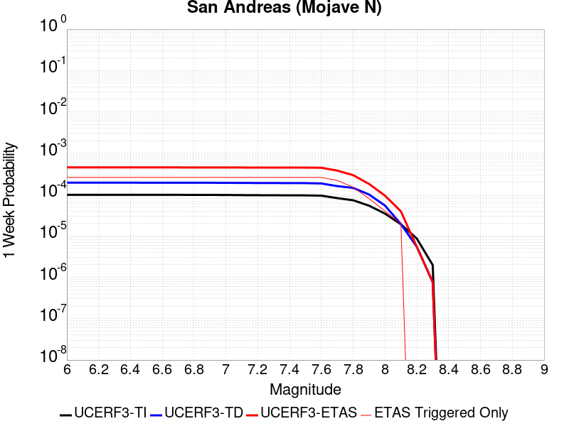 |  |  |  |

| Magnitude | 1 wk TI Prob | 1 wk TD Prob | 1 wk ETAS Prob | 1 wk ETAS/TD Gain | 1 wk ETAS Triggered Only | 1 mo TI Prob | 1 mo TD Prob | 1 mo ETAS Prob | 1 mo ETAS/TD Gain | 1 mo ETAS Triggered Only | 1 yr TI Prob | 1 yr TD Prob | 1 yr ETAS Prob | 1 yr ETAS/TD Gain | 1 yr ETAS Triggered Only | 10 yr TI Prob | 10 yr TD Prob | 10 yr ETAS Prob | 10 yr ETAS/TD Gain | 10 yr ETAS Triggered Only |
|-----|-----|-----|-----|-----|-----|-----|-----|-----|-----|-----|-----|-----|-----|-----|-----|-----|-----|-----|-----|-----|
| 6.0 | 9.877682E-5 | 1.9398969E-4 | 4.519265E-4 | 2.3296418 | 2.5798683E-4 | 4.2326056E-4 | 8.3111966E-4 | 0.0012607403 | 1.516918 | 4.2997807E-4 | 0.0051410277 | 0.010072061 | 0.010582837 | 1.0507122 | 5.1597366E-4 | 0.05023708 | 0.09830668 | 0.099043325 | 1.0074934 | 8.169583E-4 |
| 6.1 | 9.877682E-5 | 1.9398969E-4 | 4.519265E-4 | 2.3296418 | 2.5798683E-4 | 4.2326056E-4 | 8.3111966E-4 | 0.0012607403 | 1.516918 | 4.2997807E-4 | 0.0051410277 | 0.010072061 | 0.010582837 | 1.0507122 | 5.1597366E-4 | 0.05023708 | 0.09830668 | 0.099043325 | 1.0074934 | 8.169583E-4 |
| 6.2 | 9.877682E-5 | 1.9398969E-4 | 4.519265E-4 | 2.3296418 | 2.5798683E-4 | 4.2326056E-4 | 8.3111966E-4 | 0.0012607403 | 1.516918 | 4.2997807E-4 | 0.0051410277 | 0.010072061 | 0.010582837 | 1.0507122 | 5.1597366E-4 | 0.05023708 | 0.09830668 | 0.099043325 | 1.0074934 | 8.169583E-4 |
| 6.3 | 9.877682E-5 | 1.9398969E-4 | 4.519265E-4 | 2.3296418 | 2.5798683E-4 | 4.2326056E-4 | 8.3111966E-4 | 0.0012607403 | 1.516918 | 4.2997807E-4 | 0.0051410277 | 0.010072061 | 0.010582837 | 1.0507122 | 5.1597366E-4 | 0.05023708 | 0.09830668 | 0.099043325 | 1.0074934 | 8.169583E-4 |
| 6.4 | 9.877682E-5 | 1.9398969E-4 | 4.519265E-4 | 2.3296418 | 2.5798683E-4 | 4.2326056E-4 | 8.3111966E-4 | 0.0012607403 | 1.516918 | 4.2997807E-4 | 0.0051410277 | 0.010072061 | 0.010582837 | 1.0507122 | 5.1597366E-4 | 0.05023708 | 0.09830668 | 0.099043325 | 1.0074934 | 8.169583E-4 |
| 6.5 | 9.861474E-5 | 1.9372735E-4 | 4.516642E-4 | 2.3314426 | 2.5798683E-4 | 4.2256617E-4 | 8.299961E-4 | 0.0012596173 | 1.5176183 | 4.2997807E-4 | 0.0051326132 | 0.010058507 | 0.010569291 | 1.0507812 | 5.1597366E-4 | 0.050156746 | 0.098184474 | 0.098921224 | 1.0075037 | 8.169583E-4 |
| 6.6 | 9.861474E-5 | 1.9372735E-4 | 4.516642E-4 | 2.3314426 | 2.5798683E-4 | 4.2256617E-4 | 8.299961E-4 | 0.0012596173 | 1.5176183 | 4.2997807E-4 | 0.0051326132 | 0.010058507 | 0.010569291 | 1.0507812 | 5.1597366E-4 | 0.050156746 | 0.098184474 | 0.098921224 | 1.0075037 | 8.169583E-4 |
| 6.7 | 9.8552715E-5 | 1.9362688E-4 | 4.5156377E-4 | 2.3321335 | 2.5798683E-4 | 4.223004E-4 | 8.295658E-4 | 0.0012591871 | 1.517887 | 4.2997807E-4 | 0.0051293927 | 0.010053317 | 0.010564104 | 1.0508077 | 5.1597366E-4 | 0.050125998 | 0.09813766 | 0.09887445 | 1.0075077 | 8.169583E-4 |
| 6.8 | 9.8464974E-5 | 1.9347853E-4 | 4.5141546E-4 | 2.3331554 | 2.5798683E-4 | 4.219245E-4 | 8.2893035E-4 | 0.001258552 | 1.5182843 | 4.2997807E-4 | 0.0051248376 | 0.010045652 | 0.010556443 | 1.0508469 | 5.1597366E-4 | 0.05008251 | 0.098067686 | 0.09880453 | 1.0075136 | 8.169583E-4 |
| 6.9 | 9.825824E-5 | 1.9315863E-4 | 4.5109564E-4 | 2.3353636 | 2.5798683E-4 | 4.2103877E-4 | 8.2756026E-4 | 0.0012571824 | 1.5191431 | 4.2997807E-4 | 0.0051141046 | 0.010029125 | 0.010539924 | 1.0509316 | 5.1597366E-4 | 0.049980022 | 0.09791679 | 0.098653756 | 1.0075264 | 8.169583E-4 |
| 7.0 | 9.781462E-5 | 1.924723E-4 | 4.504095E-4 | 2.3401263 | 2.5798683E-4 | 4.1913814E-4 | 8.246208E-4 | 0.0012542442 | 1.5209953 | 4.2997807E-4 | 0.005091073 | 0.009993665 | 0.010504482 | 1.0511141 | 5.1597366E-4 | 0.04976007 | 0.09759319 | 0.09833042 | 1.007554 | 8.169583E-4 |
| 7.1 | 9.7121134E-5 | 1.9148945E-4 | 4.494269E-4 | 2.347006 | 2.5798683E-4 | 4.1616702E-4 | 8.2041114E-4 | 0.0012500365 | 1.5236707 | 4.2997807E-4 | 0.005055068 | 0.009942883 | 0.010453725 | 1.0513778 | 5.1597366E-4 | 0.04941613 | 0.09712971 | 0.09786732 | 1.007594 | 8.169583E-4 |
| 7.2 | 9.663819E-5 | 1.9079732E-4 | 4.4873494E-4 | 2.3518932 | 2.5798683E-4 | 4.1409794E-4 | 8.1744674E-4 | 0.0012470734 | 1.5255713 | 4.2997807E-4 | 0.0050299936 | 0.00990712 | 0.010417981 | 1.0515652 | 5.1597366E-4 | 0.049176537 | 0.09680298 | 0.097540855 | 1.0076225 | 8.169583E-4 |
| 7.3 | 9.6277574E-5 | 1.9032248E-4 | 4.4826022E-4 | 2.3552668 | 2.5798683E-4 | 4.125529E-4 | 8.1541296E-4 | 0.0012450404 | 1.5268832 | 4.2997807E-4 | 0.0050112694 | 0.009882583 | 0.0103934575 | 1.0516944 | 5.1597366E-4 | 0.04899759 | 0.09657645 | 0.09731451 | 1.0076423 | 8.169583E-4 |
| 7.4 | 9.593308E-5 | 1.8972032E-4 | 4.476582E-4 | 2.3595693 | 2.5798683E-4 | 4.1107697E-4 | 8.128339E-4 | 0.0012424624 | 1.5285565 | 4.2997807E-4 | 0.0049933824 | 0.009851467 | 0.010362358 | 1.0518594 | 5.1597366E-4 | 0.04882661 | 0.096294634 | 0.09703293 | 1.007667 | 8.169583E-4 |
| 7.5 | 9.561707E-5 | 1.8918114E-4 | 4.4711918E-4 | 2.3634448 | 2.5798683E-4 | 4.0972308E-4 | 8.105246E-4 | 0.0012401541 | 1.5300635 | 4.2997807E-4 | 0.0049769743 | 0.009823605 | 0.01033451 | 1.0520079 | 5.1597366E-4 | 0.048669744 | 0.09604082 | 0.096779324 | 1.0076894 | 8.169583E-4 |
| 7.6 | 9.418194E-5 | 1.8570402E-4 | 4.4364296E-4 | 2.3889787 | 2.5798683E-4 | 4.0357444E-4 | 7.956318E-4 | 0.0012252678 | 1.5399934 | 4.2997807E-4 | 0.004902454 | 0.009643905 | 0.010154902 | 1.0529866 | 5.1597366E-4 | 0.047957025 | 0.0944232 | 0.09516301 | 1.0078351 | 8.169583E-4 |
| 7.7 | 8.202141E-5 | 1.6019761E-4 | 3.7515222E-4 | 2.341809 | 2.1498904E-4 | 3.51473E-4 | 6.863806E-4 | 0.0010301269 | 1.5008101 | 3.4398245E-4 | 0.00427079 | 0.00832472 | 0.008751119 | 1.0512208 | 4.2997807E-4 | 0.04189639 | 0.08222524 | 0.08285663 | 1.0076789 | 6.879649E-4 |
| 7.8 | 7.2859846E-5 | 1.4515074E-4 | 2.7412546E-4 | 1.888557 | 1.2899342E-4 | 3.1221908E-4 | 6.2192633E-4 | 7.9381064E-4 | 1.276374 | 1.7199123E-4 | 0.003794643 | 0.007545706 | 0.0077163996 | 1.0226213 | 1.7199123E-4 | 0.037304975 | 0.07471838 | 0.075076446 | 1.0047922 | 3.8698027E-4 |
| 7.9 | 5.3874453E-5 | 1.0044695E-4 | 1.8643393E-4 | 1.8560437 | 8.599561E-5 | 2.3087008E-4 | 4.3041594E-4 | 5.1637454E-4 | 1.1997105 | 8.599561E-5 | 0.0028072202 | 0.005227734 | 0.00531328 | 1.0163639 | 8.599561E-5 | 0.02772022 | 0.052419845 | 0.05258282 | 1.0031091 | 1.7199123E-4 |
| 8.0 | 3.468538E-5 | 5.4254586E-5 | 5.4254586E-5 | 1.0 | 0.0 | 1.4864317E-4 | 2.3249893E-4 | 2.3249893E-4 | 1.0 | 0.0 | 0.0018082283 | 0.002827002 | 0.002827002 | 1.0 | 0.0 | 0.017935853 | 0.028944723 | 0.028944723 | 1.0 | 0.0 |
| 8.1 | 1.9152367E-5 | 1.9399953E-5 | 1.9399953E-5 | 1.0 | 0.0 | 8.207899E-5 | 8.314001E-5 | 8.314001E-5 | 1.0 | 0.0 | 9.988535E-4 | 0.0010117602 | 0.0010117602 | 1.0 | 0.0 | 0.009943757 | 0.01085485 | 0.01085485 | 1.0 | 0.0 |
| 8.2 | 8.643924E-6 | 5.4738607E-6 | 5.4738607E-6 | 1.0 | 0.0 | 3.704486E-5 | 2.3459192E-5 | 2.3459192E-5 | 1.0 | 0.0 | 4.5092785E-4 | 2.855783E-4 | 2.855783E-4 | 1.0 | 0.0 | 0.0045001395 | 0.0032481598 | 0.0032481598 | 1.0 | 0.0 |
| 8.3 | 1.983087E-6 | 7.658221E-7 | 7.658221E-7 | 1.0 | 0.0 | 8.498917E-6 | 3.2820906E-6 | 3.2820906E-6 | 1.0 | 0.0 | 1.034694E-4 | 3.9958737E-5 | 3.9958737E-5 | 1.0 | 0.0 | 0.0010342124 | 4.7187202E-4 | 4.7187202E-4 | 1.0 | 0.0 |

## Lenwood-Lockhart-Old Woman Springs
*[(top)](#table-of-contents)*

| 1 Week | 1 Month | 1 Year | 10 Year |
|-----|-----|-----|-----|
|  |  |  |  |

| Magnitude | 1 wk TI Prob | 1 wk TD Prob | 1 wk ETAS Prob | 1 wk ETAS/TD Gain | 1 wk ETAS Triggered Only | 1 mo TI Prob | 1 mo TD Prob | 1 mo ETAS Prob | 1 mo ETAS/TD Gain | 1 mo ETAS Triggered Only | 1 yr TI Prob | 1 yr TD Prob | 1 yr ETAS Prob | 1 yr ETAS/TD Gain | 1 yr ETAS Triggered Only | 10 yr TI Prob | 10 yr TD Prob | 10 yr ETAS Prob | 10 yr ETAS/TD Gain | 10 yr ETAS Triggered Only |
|-----|-----|-----|-----|-----|-----|-----|-----|-----|-----|-----|-----|-----|-----|-----|-----|-----|-----|-----|-----|-----|
| 6.0 | 3.744542E-5 | 4.396243E-5 | 2.5894202E-4 | 5.890075 | 2.1498904E-4 | 1.604705E-4 | 1.8839778E-4 | 4.893257E-4 | 2.597301 | 3.0098466E-4 | 0.0019519776 | 0.0022915022 | 0.002720495 | 1.1872103 | 4.2997807E-4 | 0.019349206 | 0.02269674 | 0.02332707 | 1.0277717 | 6.4496713E-4 |
| 6.1 | 3.744542E-5 | 4.396243E-5 | 2.5894202E-4 | 5.890075 | 2.1498904E-4 | 1.604705E-4 | 1.8839778E-4 | 4.893257E-4 | 2.597301 | 3.0098466E-4 | 0.0019519776 | 0.0022915022 | 0.002720495 | 1.1872103 | 4.2997807E-4 | 0.019349206 | 0.02269674 | 0.02332707 | 1.0277717 | 6.4496713E-4 |
| 6.2 | 3.744542E-5 | 4.396243E-5 | 2.5894202E-4 | 5.890075 | 2.1498904E-4 | 1.604705E-4 | 1.8839778E-4 | 4.893257E-4 | 2.597301 | 3.0098466E-4 | 0.0019519776 | 0.0022915022 | 0.002720495 | 1.1872103 | 4.2997807E-4 | 0.019349206 | 0.02269674 | 0.02332707 | 1.0277717 | 6.4496713E-4 |
| 6.3 | 2.1079984E-5 | 2.5353402E-5 | 6.835012E-5 | 2.6958954 | 4.2997806E-5 | 9.0339665E-5 | 1.0865302E-4 | 2.3763243E-4 | 2.187076 | 1.2899342E-4 | 0.0010993304 | 0.0013220677 | 0.0014938316 | 1.1299206 | 1.7199123E-4 | 0.010939079 | 0.013144241 | 0.013441269 | 1.0225976 | 3.0098466E-4 |
| 6.4 | 2.1079984E-5 | 2.5353402E-5 | 6.835012E-5 | 2.6958954 | 4.2997806E-5 | 9.0339665E-5 | 1.0865302E-4 | 2.3763243E-4 | 2.187076 | 1.2899342E-4 | 0.0010993304 | 0.0013220677 | 0.0014938316 | 1.1299206 | 1.7199123E-4 | 0.010939079 | 0.013144241 | 0.013441269 | 1.0225976 | 3.0098466E-4 |
| 6.5 | 1.7397282E-5 | 2.0662384E-5 | 2.0662384E-5 | 1.0 | 0.0 | 7.455765E-5 | 8.8550136E-5 | 8.8550136E-5 | 1.0 | 0.0 | 9.073613E-4 | 0.0010775764 | 0.001120528 | 1.0398593 | 4.2997806E-5 | 0.009036654 | 0.010724808 | 0.010852418 | 1.0118986 | 1.2899342E-4 |
| 6.6 | 1.52050325E-5 | 1.7679673E-5 | 1.7679673E-5 | 1.0 | 0.0 | 6.51628E-5 | 7.576787E-5 | 7.576787E-5 | 1.0 | 0.0 | 7.9306826E-4 | 9.220913E-4 | 9.6504943E-4 | 1.0465877 | 4.2997806E-5 | 0.007902439 | 0.009183516 | 0.009268722 | 1.0092782 | 8.599561E-5 |
| 6.7 | 1.332523E-5 | 1.5263984E-5 | 1.5263984E-5 | 1.0 | 0.0 | 5.7106878E-5 | 6.541547E-5 | 6.541547E-5 | 1.0 | 0.0 | 6.950544E-4 | 7.9614815E-4 | 8.3911174E-4 | 1.0539643 | 4.2997806E-5 | 0.006928845 | 0.00793359 | 0.0080189025 | 1.0107534 | 8.599561E-5 |
| 6.8 | 1.1525329E-5 | 1.30309645E-5 | 1.30309645E-5 | 1.0 | 0.0 | 4.9393333E-5 | 5.584582E-5 | 5.584582E-5 | 1.0 | 0.0 | 6.011979E-4 | 6.79715E-4 | 6.79715E-4 | 1.0 | 0.0 | 0.00599574 | 0.0067768116 | 0.0068195183 | 1.0063019 | 4.2997806E-5 |
| 6.9 | 1.0253909E-5 | 1.1514427E-5 | 1.1514427E-5 | 1.0 | 0.0 | 4.3944583E-5 | 4.9346632E-5 | 4.9346632E-5 | 1.0 | 0.0 | 5.3489394E-4 | 6.006332E-4 | 6.006332E-4 | 1.0 | 0.0 | 0.0053360825 | 0.005990478 | 0.0060332185 | 1.0071347 | 4.2997806E-5 |
| 7.0 | 8.104563E-6 | 8.99127E-6 | 8.99127E-6 | 1.0 | 0.0 | 3.4733377E-5 | 3.853346E-5 | 3.853346E-5 | 1.0 | 0.0 | 4.2279682E-4 | 4.690463E-4 | 4.690463E-4 | 1.0 | 0.0 | 0.0042199334 | 0.0046808114 | 0.004723608 | 1.009143 | 4.2997806E-5 |
| 7.1 | 6.7986157E-6 | 7.515809E-6 | 7.515809E-6 | 1.0 | 0.0 | 2.91366E-5 | 3.2210224E-5 | 3.2210224E-5 | 1.0 | 0.0 | 3.5468035E-4 | 3.9209108E-4 | 3.9209108E-4 | 1.0 | 0.0 | 0.003541148 | 0.003914209 | 0.003914209 | 1.0 | 0.0 |
| 7.2 | 5.6893327E-6 | 6.2800086E-6 | 6.2800086E-6 | 1.0 | 0.0 | 2.4382627E-5 | 2.6914056E-5 | 2.6914056E-5 | 1.0 | 0.0 | 2.9681803E-4 | 3.2763137E-4 | 3.2763137E-4 | 1.0 | 0.0 | 0.002964219 | 0.003271682 | 0.003271682 | 1.0 | 0.0 |
| 7.3 | 4.253348E-6 | 4.706907E-6 | 4.706907E-6 | 1.0 | 0.0 | 1.8228506E-5 | 2.0172314E-5 | 2.0172314E-5 | 1.0 | 0.0 | 2.2190946E-4 | 2.4557207E-4 | 2.4557207E-4 | 1.0 | 0.0 | 0.00221688 | 0.002453188 | 0.002453188 | 1.0 | 0.0 |
| 7.4 | 2.5448119E-6 | 2.8520433E-6 | 2.8520433E-6 | 1.0 | 0.0 | 1.0906291E-5 | 1.2222995E-5 | 1.2222995E-5 | 1.0 | 0.0 | 1.3277601E-4 | 1.4880644E-4 | 1.4880644E-4 | 1.0 | 0.0 | 0.001326967 | 0.0014872303 | 0.0014872303 | 1.0 | 0.0 |
| 7.5 | 4.3706837E-8 | 4.5629037E-8 | 4.5629037E-8 | 1.0 | 0.0 | 1.8731501E-7 | 1.9555301E-7 | 1.9555301E-7 | 1.0 | 0.0 | 2.2805577E-6 | 2.380856E-6 | 2.380856E-6 | 1.0 | 0.0 | 2.2805343E-5 | 2.3808358E-5 | 2.3808358E-5 | 1.0 | 0.0 |

## San Andreas (Mojave S)
*[(top)](#table-of-contents)*

| 1 Week | 1 Month | 1 Year | 10 Year |
|-----|-----|-----|-----|
|  |  |  |  |

| Magnitude | 1 wk TI Prob | 1 wk TD Prob | 1 wk ETAS Prob | 1 wk ETAS/TD Gain | 1 wk ETAS Triggered Only | 1 mo TI Prob | 1 mo TD Prob | 1 mo ETAS Prob | 1 mo ETAS/TD Gain | 1 mo ETAS Triggered Only | 1 yr TI Prob | 1 yr TD Prob | 1 yr ETAS Prob | 1 yr ETAS/TD Gain | 1 yr ETAS Triggered Only | 10 yr TI Prob | 10 yr TD Prob | 10 yr ETAS Prob | 10 yr ETAS/TD Gain | 10 yr ETAS Triggered Only |
|-----|-----|-----|-----|-----|-----|-----|-----|-----|-----|-----|-----|-----|-----|-----|-----|-----|-----|-----|-----|-----|
| 6.0 | 3.1064058E-4 | 6.74589E-4 | 9.324018E-4 | 1.3821776 | 2.5798683E-4 | 0.0013306376 | 0.0028880206 | 0.003188136 | 1.1039174 | 3.0098466E-4 | 0.016080605 | 0.03462137 | 0.034994952 | 1.0107905 | 3.8698027E-4 | 0.1496549 | 0.286598 | 0.28705812 | 1.0016055 | 6.4496713E-4 |
| 6.1 | 3.1064058E-4 | 6.74589E-4 | 9.324018E-4 | 1.3821776 | 2.5798683E-4 | 0.0013306376 | 0.0028880206 | 0.003188136 | 1.1039174 | 3.0098466E-4 | 0.016080605 | 0.03462137 | 0.034994952 | 1.0107905 | 3.8698027E-4 | 0.1496549 | 0.286598 | 0.28705812 | 1.0016055 | 6.4496713E-4 |
| 6.2 | 3.1064058E-4 | 6.74589E-4 | 9.324018E-4 | 1.3821776 | 2.5798683E-4 | 0.0013306376 | 0.0028880206 | 0.003188136 | 1.1039174 | 3.0098466E-4 | 0.016080605 | 0.03462137 | 0.034994952 | 1.0107905 | 3.8698027E-4 | 0.1496549 | 0.286598 | 0.28705812 | 1.0016055 | 6.4496713E-4 |
| 6.3 | 3.1064058E-4 | 6.74589E-4 | 9.324018E-4 | 1.3821776 | 2.5798683E-4 | 0.0013306376 | 0.0028880206 | 0.003188136 | 1.1039174 | 3.0098466E-4 | 0.016080605 | 0.03462137 | 0.034994952 | 1.0107905 | 3.8698027E-4 | 0.1496549 | 0.286598 | 0.28705812 | 1.0016055 | 6.4496713E-4 |
| 6.4 | 1.9872203E-4 | 4.317752E-4 | 6.8965065E-4 | 1.5972447 | 2.5798683E-4 | 8.5138786E-4 | 0.001849181 | 0.0021496092 | 1.1624655 | 3.0098466E-4 | 0.010316478 | 0.022287503 | 0.022623818 | 1.0150899 | 3.4398245E-4 | 0.098504856 | 0.19699045 | 0.1974393 | 1.0022786 | 5.589715E-4 |
| 6.5 | 1.291105E-4 | 2.875093E-4 | 4.5945105E-4 | 1.598039 | 1.7199123E-4 | 5.5321335E-4 | 0.0012316036 | 0.0014463278 | 1.1743453 | 2.1498904E-4 | 0.006714592 | 0.014892505 | 0.015146649 | 1.0170653 | 2.5798683E-4 | 0.065152965 | 0.13802715 | 0.13843483 | 1.0029538 | 4.7297587E-4 |
| 6.6 | 1.291105E-4 | 2.875093E-4 | 4.5945105E-4 | 1.598039 | 1.7199123E-4 | 5.5321335E-4 | 0.0012316036 | 0.0014463278 | 1.1743453 | 2.1498904E-4 | 0.006714592 | 0.014892505 | 0.015146649 | 1.0170653 | 2.5798683E-4 | 0.065152965 | 0.13802715 | 0.13843483 | 1.0029538 | 4.7297587E-4 |
| 6.7 | 1.08001186E-4 | 2.4332175E-4 | 4.1527112E-4 | 1.7066749 | 1.7199123E-4 | 4.6278012E-4 | 0.0010423913 | 0.0012571563 | 1.206031 | 2.1498904E-4 | 0.0056198016 | 0.012617563 | 0.0128722945 | 1.0201887 | 2.5798683E-4 | 0.054797906 | 0.119169496 | 0.11958611 | 1.0034959 | 4.7297587E-4 |
| 6.8 | 1.0624356E-4 | 2.3849847E-4 | 4.1044867E-4 | 1.7209699 | 1.7199123E-4 | 4.5525006E-4 | 0.0010217364 | 0.0012365058 | 1.2102004 | 2.1498904E-4 | 0.0055285925 | 0.012368962 | 0.012623758 | 1.0205996 | 2.5798683E-4 | 0.053930566 | 0.117118634 | 0.11753622 | 1.0035654 | 4.7297587E-4 |
| 6.9 | 1.0393785E-4 | 2.3220196E-4 | 4.0415325E-4 | 1.7405246 | 1.7199123E-4 | 4.4537184E-4 | 9.947722E-4 | 0.0012095474 | 1.2159039 | 2.1498904E-4 | 0.0054089287 | 0.012044343 | 0.012299223 | 1.0211618 | 2.5798683E-4 | 0.05279156 | 0.11441608 | 0.114834934 | 1.0036608 | 4.7297587E-4 |
| 7.0 | 1.0155622E-4 | 2.258978E-4 | 3.9785018E-4 | 1.7611954 | 1.7199123E-4 | 4.3516833E-4 | 9.6777466E-4 | 0.0011825557 | 1.2219329 | 2.1498904E-4 | 0.005285311 | 0.011719226 | 0.011974189 | 1.021756 | 2.5798683E-4 | 0.05161361 | 0.111676484 | 0.11209664 | 1.0037622 | 4.7297587E-4 |
| 7.1 | 9.885595E-5 | 2.1878199E-4 | 3.907356E-4 | 1.7859586 | 1.7199123E-4 | 4.2359953E-4 | 9.373005E-4 | 0.001152088 | 1.2291554 | 2.1498904E-4 | 0.0051451353 | 0.011352123 | 0.011607181 | 1.0224679 | 2.5798683E-4 | 0.05027629 | 0.10856094 | 0.10898257 | 1.0038838 | 4.7297587E-4 |
| 7.2 | 9.6411415E-5 | 2.1241202E-4 | 3.8436672E-4 | 1.8095337 | 1.7199123E-4 | 4.1312634E-4 | 9.1001997E-4 | 0.0011248133 | 1.2360315 | 2.1498904E-4 | 0.005018219 | 0.011023389 | 0.011278532 | 1.0231456 | 2.5798683E-4 | 0.049064007 | 0.10575075 | 0.10617371 | 1.0039996 | 4.7297587E-4 |
| 7.3 | 9.1180635E-5 | 1.9469624E-4 | 3.6665399E-4 | 1.8832103 | 1.7199123E-4 | 3.907156E-4 | 8.3414576E-4 | 0.0010489555 | 1.2575206 | 2.1498904E-4 | 0.004746591 | 0.010108546 | 0.010363925 | 1.0252637 | 2.5798683E-4 | 0.046464786 | 0.097944014 | 0.098370664 | 1.004356 | 4.7297587E-4 |
| 7.4 | 8.887388E-5 | 1.8718264E-4 | 3.5914168E-4 | 1.9186698 | 1.7199123E-4 | 3.8083247E-4 | 8.019648E-4 | 0.0010167814 | 1.2678629 | 2.1498904E-4 | 0.0046267817 | 0.009720306 | 0.009975785 | 1.026283 | 2.5798683E-4 | 0.045316286 | 0.094579056 | 0.0950073 | 1.0045279 | 4.7297587E-4 |
| 7.5 | 8.6750515E-5 | 1.804986E-4 | 3.524588E-4 | 1.9526954 | 1.7199123E-4 | 3.7173493E-4 | 7.7333616E-4 | 9.88159E-4 | 1.2777871 | 2.1498904E-4 | 0.004516484 | 0.009374807 | 0.009630375 | 1.0272611 | 2.5798683E-4 | 0.04425787 | 0.091542855 | 0.09197253 | 1.0046937 | 4.7297587E-4 |
| 7.6 | 8.453092E-5 | 1.7437496E-4 | 3.463362E-4 | 1.9861579 | 1.7199123E-4 | 3.6222505E-4 | 7.4710726E-4 | 9.619357E-4 | 1.287547 | 2.1498904E-4 | 0.0044011753 | 0.009058169 | 0.009313819 | 1.0282232 | 2.5798683E-4 | 0.04315024 | 0.08870201 | 0.08913303 | 1.0048592 | 4.7297587E-4 |
| 7.7 | 8.259102E-5 | 1.6959656E-4 | 3.4155863E-4 | 2.0139477 | 1.7199123E-4 | 3.539135E-4 | 7.2664E-4 | 9.414728E-4 | 1.2956524 | 2.1498904E-4 | 0.004300386 | 0.008811024 | 0.009066738 | 1.029022 | 2.5798683E-4 | 0.042181134 | 0.08645291 | 0.086885 | 1.004998 | 4.7297587E-4 |
| 7.8 | 7.444844E-5 | 1.5282084E-4 | 2.8179455E-4 | 1.8439537 | 1.2899342E-4 | 3.1902574E-4 | 6.5478205E-4 | 8.266607E-4 | 1.2624974 | 1.7199123E-4 | 0.0038772223 | 0.007942881 | 0.008113506 | 1.0214815 | 1.7199123E-4 | 0.03810269 | 0.07828439 | 0.07864107 | 1.0045563 | 3.8698027E-4 |
| 7.9 | 5.2586525E-5 | 1.0005448E-4 | 1.8604149E-4 | 1.859402 | 8.599561E-5 | 2.2535135E-4 | 4.2873443E-4 | 5.146932E-4 | 1.2004942 | 8.599561E-5 | 0.0027402006 | 0.00520736 | 0.005292908 | 1.0164282 | 8.599561E-5 | 0.027066574 | 0.0521955 | 0.052358516 | 1.0031232 | 1.7199123E-4 |
| 8.0 | 3.379877E-5 | 5.4068532E-5 | 5.4068532E-5 | 1.0 | 0.0 | 1.4484383E-4 | 2.317017E-4 | 2.317017E-4 | 1.0 | 0.0 | 0.0017620471 | 0.0028173209 | 0.0028173209 | 1.0 | 0.0 | 0.017481409 | 0.028832143 | 0.028832143 | 1.0 | 0.0 |
| 8.1 | 1.8668277E-5 | 1.9306746E-5 | 1.9306746E-5 | 1.0 | 0.0 | 8.000444E-5 | 8.2740575E-5 | 8.2740575E-5 | 1.0 | 0.0 | 9.736188E-4 | 0.0010069016 | 0.0010069016 | 1.0 | 0.0 | 0.009693642 | 0.0107975025 | 0.0107975025 | 1.0 | 0.0 |
| 8.2 | 8.541571E-6 | 5.4598204E-6 | 5.4598204E-6 | 1.0 | 0.0 | 3.660622E-5 | 2.3399021E-5 | 2.3399021E-5 | 1.0 | 0.0 | 4.455896E-4 | 2.8484594E-4 | 2.8484594E-4 | 1.0 | 0.0 | 0.0044469717 | 0.0032402598 | 0.0032402598 | 1.0 | 0.0 |
| 8.3 | 1.983087E-6 | 7.658221E-7 | 7.658221E-7 | 1.0 | 0.0 | 8.498917E-6 | 3.2820906E-6 | 3.2820906E-6 | 1.0 | 0.0 | 1.034694E-4 | 3.9958737E-5 | 3.9958737E-5 | 1.0 | 0.0 | 0.0010342124 | 4.7187202E-4 | 4.7187202E-4 | 1.0 | 0.0 |

## Bicycle Lake
*[(top)](#table-of-contents)*

| 1 Week | 1 Month | 1 Year | 10 Year |
|-----|-----|-----|-----|
|  |  |  |  |

| Magnitude | 1 wk TI Prob | 1 wk TD Prob | 1 wk ETAS Prob | 1 wk ETAS/TD Gain | 1 wk ETAS Triggered Only | 1 mo TI Prob | 1 mo TD Prob | 1 mo ETAS Prob | 1 mo ETAS/TD Gain | 1 mo ETAS Triggered Only | 1 yr TI Prob | 1 yr TD Prob | 1 yr ETAS Prob | 1 yr ETAS/TD Gain | 1 yr ETAS Triggered Only | 10 yr TI Prob | 10 yr TD Prob | 10 yr ETAS Prob | 10 yr ETAS/TD Gain | 10 yr ETAS Triggered Only |
|-----|-----|-----|-----|-----|-----|-----|-----|-----|-----|-----|-----|-----|-----|-----|-----|-----|-----|-----|-----|-----|
| 6.0 | 1.9621975E-5 | 2.2097003E-5 | 1.5108757E-4 | 6.837469 | 1.2899342E-4 | 8.4091465E-5 | 9.469877E-5 | 2.2367998E-4 | 2.3620157 | 1.2899342E-4 | 0.0010233327 | 0.0011524827 | 0.0013672239 | 1.1863292 | 2.1498904E-4 | 0.01018633 | 0.011478369 | 0.011988421 | 1.0444359 | 5.1597366E-4 |
| 6.1 | 1.9621975E-5 | 2.2097003E-5 | 1.5108757E-4 | 6.837469 | 1.2899342E-4 | 8.4091465E-5 | 9.469877E-5 | 2.2367998E-4 | 2.3620157 | 1.2899342E-4 | 0.0010233327 | 0.0011524827 | 0.0013672239 | 1.1863292 | 2.1498904E-4 | 0.01018633 | 0.011478369 | 0.011988421 | 1.0444359 | 5.1597366E-4 |
| 6.2 | 9.9971285E-6 | 1.1255602E-5 | 1.4024758E-4 | 12.460246 | 1.2899342E-4 | 4.2844134E-5 | 4.8237693E-5 | 1.772249E-4 | 3.6739917 | 1.2899342E-4 | 5.2150246E-4 | 5.871877E-4 | 8.0205046E-4 | 1.3659184 | 2.1498904E-4 | 0.0052028033 | 0.0058614668 | 0.006203433 | 1.0583414 | 3.4398245E-4 |
| 6.3 | 9.589428E-6 | 1.079831E-5 | 1.3979034E-4 | 12.945576 | 1.2899342E-4 | 4.10969E-5 | 4.6277943E-5 | 1.7526539E-4 | 3.787234 | 1.2899342E-4 | 5.002399E-4 | 5.6334015E-4 | 7.3523447E-4 | 1.3051342 | 1.7199123E-4 | 0.0049911533 | 0.005624211 | 0.0059235026 | 1.0532149 | 3.0098466E-4 |
| 6.4 | 9.589428E-6 | 1.079831E-5 | 1.3979034E-4 | 12.945576 | 1.2899342E-4 | 4.10969E-5 | 4.6277943E-5 | 1.7526539E-4 | 3.787234 | 1.2899342E-4 | 5.002399E-4 | 5.6334015E-4 | 7.3523447E-4 | 1.3051342 | 1.7199123E-4 | 0.0049911533 | 0.005624211 | 0.0059235026 | 1.0532149 | 3.0098466E-4 |
| 6.5 | 5.557707E-6 | 6.2855797E-6 | 4.9283117E-5 | 7.840664 | 4.2997806E-5 | 2.3818526E-5 | 2.693807E-5 | 6.993472E-5 | 2.5961294 | 4.2997806E-5 | 2.8995197E-4 | 3.2794854E-4 | 4.1391596E-4 | 1.2621369 | 8.599561E-5 | 0.0028957394 | 0.003277282 | 0.0034915665 | 1.0653849 | 2.1498904E-4 |
| 6.6 | 4.8742945E-6 | 5.5132705E-6 | 4.851084E-5 | 8.798923 | 4.2997806E-5 | 2.0889667E-5 | 2.3628236E-5 | 6.662503E-5 | 2.8197207 | 4.2997806E-5 | 2.54302E-4 | 2.87662E-4 | 3.7363288E-4 | 1.2988608 | 8.599561E-5 | 0.002540112 | 0.0028754652 | 0.003089836 | 1.0745517 | 2.1498904E-4 |
| 6.7 | 3.991108E-6 | 4.5158945E-6 | 4.7513506E-5 | 10.521395 | 4.2997806E-5 | 1.7104636E-5 | 1.9353833E-5 | 6.235081E-5 | 3.2216258 | 4.2997806E-5 | 2.0822904E-4 | 2.3563292E-4 | 2.786206E-4 | 1.1824349 | 4.2997806E-5 | 0.0020803404 | 0.0023563292 | 0.0024850187 | 1.0546144 | 1.2899342E-4 |

## San Andreas (San Bernardino N)
*[(top)](#table-of-contents)*

| 1 Week | 1 Month | 1 Year | 10 Year |
|-----|-----|-----|-----|
|  |  |  |  |

| Magnitude | 1 wk TI Prob | 1 wk TD Prob | 1 wk ETAS Prob | 1 wk ETAS/TD Gain | 1 wk ETAS Triggered Only | 1 mo TI Prob | 1 mo TD Prob | 1 mo ETAS Prob | 1 mo ETAS/TD Gain | 1 mo ETAS Triggered Only | 1 yr TI Prob | 1 yr TD Prob | 1 yr ETAS Prob | 1 yr ETAS/TD Gain | 1 yr ETAS Triggered Only | 10 yr TI Prob | 10 yr TD Prob | 10 yr ETAS Prob | 10 yr ETAS/TD Gain | 10 yr ETAS Triggered Only |
|-----|-----|-----|-----|-----|-----|-----|-----|-----|-----|-----|-----|-----|-----|-----|-----|-----|-----|-----|-----|-----|
| 6.0 | 1.4273766E-4 | 3.160502E-4 | 4.4500284E-4 | 1.4080132 | 1.2899342E-4 | 6.115894E-4 | 0.0013538037 | 0.0015685017 | 1.1585888 | 2.1498904E-4 | 0.0074207084 | 0.016359491 | 0.016570963 | 1.0129266 | 2.1498904E-4 | 0.07177748 | 0.1502609 | 0.15058972 | 1.0021884 | 3.8698027E-4 |
| 6.1 | 1.4273766E-4 | 3.160502E-4 | 4.4500284E-4 | 1.4080132 | 1.2899342E-4 | 6.115894E-4 | 0.0013538037 | 0.0015685017 | 1.1585888 | 2.1498904E-4 | 0.0074207084 | 0.016359491 | 0.016570963 | 1.0129266 | 2.1498904E-4 | 0.07177748 | 0.1502609 | 0.15058972 | 1.0021884 | 3.8698027E-4 |
| 6.2 | 1.4273766E-4 | 3.160502E-4 | 4.4500284E-4 | 1.4080132 | 1.2899342E-4 | 6.115894E-4 | 0.0013538037 | 0.0015685017 | 1.1585888 | 2.1498904E-4 | 0.0074207084 | 0.016359491 | 0.016570963 | 1.0129266 | 2.1498904E-4 | 0.07177748 | 0.1502609 | 0.15058972 | 1.0021884 | 3.8698027E-4 |
| 6.3 | 1.3730655E-4 | 3.050988E-4 | 4.3405287E-4 | 1.4226633 | 1.2899342E-4 | 5.883239E-4 | 0.0013069167 | 0.0015216249 | 1.1642859 | 2.1498904E-4 | 0.0071393442 | 0.015797025 | 0.016008617 | 1.0133945 | 2.1498904E-4 | 0.06914291 | 0.14556077 | 0.14589143 | 1.0022715 | 3.8698027E-4 |
| 6.4 | 1.3730655E-4 | 3.050988E-4 | 4.3405287E-4 | 1.4226633 | 1.2899342E-4 | 5.883239E-4 | 0.0013069167 | 0.0015216249 | 1.1642859 | 2.1498904E-4 | 0.0071393442 | 0.015797025 | 0.016008617 | 1.0133945 | 2.1498904E-4 | 0.06914291 | 0.14556077 | 0.14589143 | 1.0022715 | 3.8698027E-4 |
| 6.5 | 1.2942807E-4 | 2.8924362E-4 | 4.1819972E-4 | 1.445839 | 1.2899342E-4 | 5.545738E-4 | 0.0012390317 | 0.0014108098 | 1.138639 | 1.7199123E-4 | 0.0067310524 | 0.014982116 | 0.0151515305 | 1.0113078 | 1.7199123E-4 | 0.06530788 | 0.13870342 | 0.1389997 | 1.002136 | 3.4398245E-4 |
| 6.6 | 1.1125901E-4 | 2.53633E-4 | 3.8259372E-4 | 1.508454 | 1.2899342E-4 | 4.767372E-4 | 0.0010865482 | 0.0012583525 | 1.1581194 | 1.7199123E-4 | 0.005788839 | 0.013149117 | 0.013318847 | 1.0129081 | 1.7199123E-4 | 0.056403454 | 0.122993305 | 0.12329499 | 1.0024527 | 3.4398245E-4 |
| 6.7 | 1.02209575E-4 | 2.3498294E-4 | 3.6394605E-4 | 1.5488191 | 1.2899342E-4 | 4.3796748E-4 | 0.0010066825 | 0.0011785006 | 1.1706775 | 1.7199123E-4 | 0.0053192247 | 0.012187905 | 0.012357799 | 1.0139396 | 1.7199123E-4 | 0.051936906 | 0.11478492 | 0.115089424 | 1.0026528 | 3.4398245E-4 |
| 6.8 | 9.610582E-5 | 2.2024135E-4 | 3.4920636E-4 | 1.5855622 | 1.2899342E-4 | 4.1181705E-4 | 9.435507E-4 | 0.0011153796 | 1.1821089 | 1.7199123E-4 | 0.0050023515 | 0.011427486 | 0.011597511 | 1.0148786 | 1.7199123E-4 | 0.048912346 | 0.10818693 | 0.1084937 | 1.0028355 | 3.4398245E-4 |
| 6.9 | 9.3877505E-5 | 2.1479696E-4 | 3.437627E-4 | 1.6004075 | 1.2899342E-4 | 4.0227012E-4 | 9.202343E-4 | 0.0010920672 | 1.1867274 | 1.7199123E-4 | 0.0048866454 | 0.011146543 | 0.011316617 | 1.0152581 | 1.7199123E-4 | 0.04780577 | 0.10577726 | 0.10608486 | 1.002908 | 3.4398245E-4 |
| 7.0 | 9.1019785E-5 | 2.080665E-4 | 3.370331E-4 | 1.6198335 | 1.2899342E-4 | 3.900265E-4 | 8.9140947E-4 | 0.0010632474 | 1.1927711 | 1.7199123E-4 | 0.0047382377 | 0.010799129 | 0.010969263 | 1.0157545 | 1.7199123E-4 | 0.046384744 | 0.102747776 | 0.103056416 | 1.0030038 | 3.4398245E-4 |
| 7.1 | 8.771155E-5 | 1.9981233E-4 | 3.2877998E-4 | 1.6454439 | 1.2899342E-4 | 3.758525E-4 | 8.560581E-4 | 0.001027902 | 1.2007387 | 1.7199123E-4 | 0.0045664064 | 0.010372897 | 0.010543103 | 1.0164088 | 1.7199123E-4 | 0.044737056 | 0.099059336 | 0.09936924 | 1.0031285 | 3.4398245E-4 |
| 7.2 | 8.0830236E-5 | 1.8386859E-4 | 3.128383E-4 | 1.7014233 | 1.2899342E-4 | 3.4636928E-4 | 7.877704E-4 | 9.596261E-4 | 1.2181545 | 1.7199123E-4 | 0.0042088944 | 0.009549032 | 0.009719381 | 1.0178394 | 1.7199123E-4 | 0.041300658 | 0.091790274 | 0.092102684 | 1.0034035 | 3.4398245E-4 |
| 7.3 | 7.7668235E-5 | 1.7330446E-4 | 3.0227553E-4 | 1.7441878 | 1.2899342E-4 | 3.328214E-4 | 7.4252207E-4 | 9.143856E-4 | 1.2314591 | 1.7199123E-4 | 0.0040445733 | 0.009002813 | 0.009173256 | 1.0189322 | 1.7199123E-4 | 0.03971748 | 0.08705745 | 0.08737148 | 1.0036073 | 3.4398245E-4 |
| 7.4 | 7.520177E-5 | 1.65506E-4 | 2.944781E-4 | 1.7792592 | 1.2899342E-4 | 3.2225347E-4 | 7.0911867E-4 | 8.8098797E-4 | 1.2423702 | 1.7199123E-4 | 0.0039163795 | 0.00859941 | 0.008769922 | 1.0198283 | 1.7199123E-4 | 0.038480744 | 0.08351379 | 0.083829045 | 1.0037749 | 3.4398245E-4 |
| 7.5 | 7.274697E-5 | 1.5838286E-4 | 2.8735586E-4 | 1.8143116 | 1.2899342E-4 | 3.1173544E-4 | 6.7860715E-4 | 8.504816E-4 | 1.2532754 | 1.7199123E-4 | 0.003788775 | 0.0082308 | 0.008401375 | 1.020724 | 1.7199123E-4 | 0.03724827 | 0.08023059 | 0.08054698 | 1.0039434 | 3.4398245E-4 |
| 7.6 | 7.1185845E-5 | 1.5408162E-4 | 2.8305515E-4 | 1.837047 | 1.2899342E-4 | 3.0504653E-4 | 6.6018273E-4 | 8.320604E-4 | 1.2603487 | 1.7199123E-4 | 0.0037076178 | 0.008008154 | 0.008178769 | 1.021305 | 1.7199123E-4 | 0.036463667 | 0.0782203 | 0.078537375 | 1.0040536 | 3.4398245E-4 |
| 7.7 | 6.709961E-5 | 1.4317075E-4 | 2.721457E-4 | 1.9008471 | 1.2899342E-4 | 2.8753807E-4 | 6.1344466E-4 | 7.853304E-4 | 1.2801976 | 1.7199123E-4 | 0.003495157 | 0.007443151 | 0.0076138624 | 1.0229353 | 1.7199123E-4 | 0.034406938 | 0.07304912 | 0.073367976 | 1.004365 | 3.4398245E-4 |
| 7.8 | 6.300812E-5 | 1.3201238E-4 | 2.6098877E-4 | 1.9770023 | 1.2899342E-4 | 2.7000686E-4 | 5.656447E-4 | 7.375387E-4 | 1.3038903 | 1.7199123E-4 | 0.0032823787 | 0.0068650073 | 0.0070358175 | 1.0248814 | 1.7199123E-4 | 0.032343175 | 0.06770821 | 0.068028904 | 1.0047364 | 3.4398245E-4 |
| 7.9 | 4.983037E-5 | 9.722561E-5 | 1.8321286E-4 | 1.8844095 | 8.599561E-5 | 2.1354125E-4 | 4.1661464E-4 | 5.0257443E-4 | 1.2063292 | 8.599561E-5 | 0.0025967648 | 0.0050604967 | 0.0051460573 | 1.0169076 | 8.599561E-5 | 0.025666296 | 0.05064454 | 0.05080782 | 1.003224 | 1.7199123E-4 |
| 8.0 | 3.2211527E-5 | 5.329913E-5 | 5.329913E-5 | 1.0 | 0.0 | 1.380421E-4 | 2.2840484E-4 | 2.2840484E-4 | 1.0 | 0.0 | 0.0016793669 | 0.0027772845 | 0.0027772845 | 1.0 | 0.0 | 0.016667323 | 0.028358717 | 0.028358717 | 1.0 | 0.0 |
| 8.1 | 1.743376E-5 | 1.8821896E-5 | 1.8821896E-5 | 1.0 | 0.0 | 7.471398E-5 | 8.066278E-5 | 8.066278E-5 | 1.0 | 0.0 | 9.0926304E-4 | 9.816275E-4 | 9.816275E-4 | 1.0 | 0.0 | 0.009055517 | 0.01048279 | 0.01048279 | 1.0 | 0.0 |
| 8.2 | 7.831616E-6 | 5.1541824E-6 | 5.1541824E-6 | 1.0 | 0.0 | 3.3563636E-5 | 2.2089165E-5 | 2.2089165E-5 | 1.0 | 0.0 | 4.0856065E-4 | 2.6890248E-4 | 2.6890248E-4 | 1.0 | 0.0 | 0.004078103 | 0.0030413123 | 0.0030413123 | 1.0 | 0.0 |
| 8.3 | 1.983087E-6 | 7.658221E-7 | 7.658221E-7 | 1.0 | 0.0 | 8.498917E-6 | 3.2820906E-6 | 3.2820906E-6 | 1.0 | 0.0 | 1.034694E-4 | 3.9958737E-5 | 3.9958737E-5 | 1.0 | 0.0 | 0.0010342124 | 4.7187202E-4 | 4.7187202E-4 | 1.0 | 0.0 |

## Towne Pass
*[(top)](#table-of-contents)*

| 1 Week | 1 Month | 1 Year | 10 Year |
|-----|-----|-----|-----|
|  |  |  |  |

| Magnitude | 1 wk TI Prob | 1 wk TD Prob | 1 wk ETAS Prob | 1 wk ETAS/TD Gain | 1 wk ETAS Triggered Only | 1 mo TI Prob | 1 mo TD Prob | 1 mo ETAS Prob | 1 mo ETAS/TD Gain | 1 mo ETAS Triggered Only | 1 yr TI Prob | 1 yr TD Prob | 1 yr ETAS Prob | 1 yr ETAS/TD Gain | 1 yr ETAS Triggered Only | 10 yr TI Prob | 10 yr TD Prob | 10 yr ETAS Prob | 10 yr ETAS/TD Gain | 10 yr ETAS Triggered Only |
|-----|-----|-----|-----|-----|-----|-----|-----|-----|-----|-----|-----|-----|-----|-----|-----|-----|-----|-----|-----|-----|
| 6.0 | 3.849728E-6 | 3.8945395E-6 | 2.6188037E-4 | 67.24296 | 2.5798683E-4 | 1.649873E-5 | 1.6690803E-5 | 3.1767043E-4 | 19.032663 | 3.0098466E-4 | 2.0085352E-4 | 2.0319594E-4 | 5.471085E-4 | 2.6925168 | 3.4398245E-4 | 0.0020067208 | 0.0020305307 | 0.0025454566 | 1.2535919 | 5.1597366E-4 |
| 6.1 | 3.849728E-6 | 3.8945395E-6 | 2.6188037E-4 | 67.24296 | 2.5798683E-4 | 1.649873E-5 | 1.6690803E-5 | 3.1767043E-4 | 19.032663 | 3.0098466E-4 | 2.0085352E-4 | 2.0319594E-4 | 5.471085E-4 | 2.6925168 | 3.4398245E-4 | 0.0020067208 | 0.0020305307 | 0.0025454566 | 1.2535919 | 5.1597366E-4 |
| 6.2 | 3.849728E-6 | 3.8945395E-6 | 2.6188037E-4 | 67.24296 | 2.5798683E-4 | 1.649873E-5 | 1.6690803E-5 | 3.1767043E-4 | 19.032663 | 3.0098466E-4 | 2.0085352E-4 | 2.0319594E-4 | 5.471085E-4 | 2.6925168 | 3.4398245E-4 | 0.0020067208 | 0.0020305307 | 0.0025454566 | 1.2535919 | 5.1597366E-4 |
| 6.3 | 3.849728E-6 | 3.8945395E-6 | 2.6188037E-4 | 67.24296 | 2.5798683E-4 | 1.649873E-5 | 1.6690803E-5 | 3.1767043E-4 | 19.032663 | 3.0098466E-4 | 2.0085352E-4 | 2.0319594E-4 | 5.471085E-4 | 2.6925168 | 3.4398245E-4 | 0.0020067208 | 0.0020305307 | 0.0025454566 | 1.2535919 | 5.1597366E-4 |
| 6.4 | 3.849728E-6 | 3.8945395E-6 | 2.6188037E-4 | 67.24296 | 2.5798683E-4 | 1.649873E-5 | 1.6690803E-5 | 3.1767043E-4 | 19.032663 | 3.0098466E-4 | 2.0085352E-4 | 2.0319594E-4 | 5.471085E-4 | 2.6925168 | 3.4398245E-4 | 0.0020067208 | 0.0020305307 | 0.0025454566 | 1.2535919 | 5.1597366E-4 |
| 6.5 | 1.1953545E-6 | 1.2030514E-6 | 1.3019632E-4 | 108.22174 | 1.2899342E-4 | 5.1229376E-6 | 5.155925E-6 | 1.3414868E-4 | 26.018354 | 1.2899342E-4 | 6.236998E-5 | 6.2771695E-5 | 1.9175702E-4 | 3.0548325 | 1.2899342E-4 | 6.235248E-4 | 6.275514E-4 | 7.5646385E-4 | 1.2054213 | 1.2899342E-4 |
| 6.6 | 1.1953545E-6 | 1.2030514E-6 | 1.3019632E-4 | 108.22174 | 1.2899342E-4 | 5.1229376E-6 | 5.155925E-6 | 1.3414868E-4 | 26.018354 | 1.2899342E-4 | 6.236998E-5 | 6.2771695E-5 | 1.9175702E-4 | 3.0548325 | 1.2899342E-4 | 6.235248E-4 | 6.275514E-4 | 7.5646385E-4 | 1.2054213 | 1.2899342E-4 |
| 6.7 | 8.375951E-7 | 8.410665E-7 | 4.3838838E-5 | 52.122913 | 4.2997806E-5 | 3.5896885E-6 | 3.604566E-6 | 4.6602217E-5 | 12.928662 | 4.2997806E-5 | 4.370358E-5 | 4.3884767E-5 | 8.688069E-5 | 1.9797459 | 4.2997806E-5 | 4.3694986E-4 | 4.387667E-4 | 4.8174566E-4 | 1.0979539 | 4.2997806E-5 |
| 6.8 | 6.38041E-7 | 6.3921516E-7 | 4.3636996E-5 | 68.26652 | 4.2997806E-5 | 2.7344586E-6 | 2.7394908E-6 | 4.573718E-5 | 16.695503 | 4.2997806E-5 | 3.3291526E-5 | 3.335283E-5 | 7.6349206E-5 | 2.2891371 | 4.2997806E-5 | 3.3286537E-4 | 3.3348205E-4 | 3.7646553E-4 | 1.1288929 | 4.2997806E-5 |
| 6.9 | 5.3460053E-7 | 5.345329E-7 | 4.3532316E-5 | 81.439926 | 4.2997806E-5 | 2.2911431E-6 | 2.2908532E-6 | 4.528856E-5 | 19.769299 | 4.2997806E-5 | 2.789431E-5 | 2.7890816E-5 | 7.088742E-5 | 2.5416045 | 4.2997806E-5 | 2.789081E-4 | 2.7887648E-4 | 3.218623E-4 | 1.1541393 | 4.2997806E-5 |
| 7.0 | 3.557783E-7 | 3.532419E-7 | 3.532419E-7 | 1.0 | 0.0 | 1.5247632E-6 | 1.5138929E-6 | 1.5138929E-6 | 1.0 | 0.0 | 1.8563835E-5 | 1.84315E-5 | 1.84315E-5 | 1.0 | 0.0 | 1.8562283E-4 | 1.8430054E-4 | 1.8430054E-4 | 1.0 | 0.0 |
| 7.1 | 3.037942E-7 | 3.0002184E-7 | 3.0002184E-7 | 1.0 | 0.0 | 1.3019744E-6 | 1.2858072E-6 | 1.2858072E-6 | 1.0 | 0.0 | 1.5851423E-5 | 1.56546E-5 | 1.56546E-5 | 1.0 | 0.0 | 1.5850292E-4 | 1.5653571E-4 | 1.5653571E-4 | 1.0 | 0.0 |
| 7.2 | 2.0808248E-7 | 2.0217661E-7 | 2.0217661E-7 | 1.0 | 0.0 | 8.917818E-7 | 8.664709E-7 | 8.664709E-7 | 1.0 | 0.0 | 1.0857389E-5 | 1.0549237E-5 | 1.0549237E-5 | 1.0 | 0.0 | 1.0856859E-4 | 1.0548782E-4 | 1.0548782E-4 | 1.0 | 0.0 |
| 7.3 | 1.1162073E-7 | 1.0636875E-7 | 1.0636875E-7 | 1.0 | 0.0 | 4.7837443E-7 | 4.5586603E-7 | 4.5586603E-7 | 1.0 | 0.0 | 5.8241935E-6 | 5.550157E-6 | 5.550157E-6 | 1.0 | 0.0 | 5.8240406E-5 | 5.5500383E-5 | 5.5500383E-5 | 1.0 | 0.0 |

## Paradise
*[(top)](#table-of-contents)*

| 1 Week | 1 Month | 1 Year | 10 Year |
|-----|-----|-----|-----|
|  |  |  |  |

| Magnitude | 1 wk TI Prob | 1 wk TD Prob | 1 wk ETAS Prob | 1 wk ETAS/TD Gain | 1 wk ETAS Triggered Only | 1 mo TI Prob | 1 mo TD Prob | 1 mo ETAS Prob | 1 mo ETAS/TD Gain | 1 mo ETAS Triggered Only | 1 yr TI Prob | 1 yr TD Prob | 1 yr ETAS Prob | 1 yr ETAS/TD Gain | 1 yr ETAS Triggered Only | 10 yr TI Prob | 10 yr TD Prob | 10 yr ETAS Prob | 10 yr ETAS/TD Gain | 10 yr ETAS Triggered Only |
|-----|-----|-----|-----|-----|-----|-----|-----|-----|-----|-----|-----|-----|-----|-----|-----|-----|-----|-----|-----|-----|
| 6.0 | 1.4851273E-5 | 1.669466E-5 | 1.4568593E-4 | 8.7265 | 1.2899342E-4 | 6.364676E-5 | 7.154671E-5 | 2.4352563E-4 | 3.4037294 | 1.7199123E-4 | 7.7462377E-4 | 8.707567E-4 | 0.0010425982 | 1.1973473 | 1.7199123E-4 | 0.0077192914 | 0.008675828 | 0.009102075 | 1.0491304 | 4.2997807E-4 |
| 6.1 | 1.4851273E-5 | 1.669466E-5 | 1.4568593E-4 | 8.7265 | 1.2899342E-4 | 6.364676E-5 | 7.154671E-5 | 2.4352563E-4 | 3.4037294 | 1.7199123E-4 | 7.7462377E-4 | 8.707567E-4 | 0.0010425982 | 1.1973473 | 1.7199123E-4 | 0.0077192914 | 0.008675828 | 0.009102075 | 1.0491304 | 4.2997807E-4 |
| 6.2 | 1.4851273E-5 | 1.669466E-5 | 1.4568593E-4 | 8.7265 | 1.2899342E-4 | 6.364676E-5 | 7.154671E-5 | 2.4352563E-4 | 3.4037294 | 1.7199123E-4 | 7.7462377E-4 | 8.707567E-4 | 0.0010425982 | 1.1973473 | 1.7199123E-4 | 0.0077192914 | 0.008675828 | 0.009102075 | 1.0491304 | 4.2997807E-4 |
| 6.3 | 1.0426831E-5 | 1.1888599E-5 | 9.788319E-5 | 8.233367 | 8.599561E-5 | 4.4685654E-5 | 5.0950177E-5 | 1.7993702E-4 | 3.5316272 | 1.2899342E-4 | 5.43912E-4 | 6.201478E-4 | 7.490612E-4 | 1.2078754 | 1.2899342E-4 | 0.0054258266 | 0.0061847805 | 0.0064411717 | 1.0414551 | 2.5798683E-4 |
| 6.4 | 1.0426831E-5 | 1.1888599E-5 | 9.788319E-5 | 8.233367 | 8.599561E-5 | 4.4685654E-5 | 5.0950177E-5 | 1.7993702E-4 | 3.5316272 | 1.2899342E-4 | 5.43912E-4 | 6.201478E-4 | 7.490612E-4 | 1.2078754 | 1.2899342E-4 | 0.0054258266 | 0.0061847805 | 0.0064411717 | 1.0414551 | 2.5798683E-4 |
| 6.5 | 9.25027E-6 | 1.061994E-5 | 9.661464E-5 | 9.097474 | 8.599561E-5 | 3.964341E-5 | 4.5513265E-5 | 1.7450082E-4 | 3.834065 | 1.2899342E-4 | 4.8255164E-4 | 5.5398804E-4 | 6.8291E-4 | 1.2327162 | 1.2899342E-4 | 0.0048150513 | 0.0055265697 | 0.00574037 | 1.038686 | 2.1498904E-4 |
| 6.6 | 7.904275E-6 | 9.159509E-6 | 9.159509E-6 | 1.0 | 0.0 | 3.3875025E-5 | 3.925447E-5 | 8.225059E-5 | 2.0953178 | 4.2997806E-5 | 4.1235037E-4 | 4.7782232E-4 | 5.207996E-4 | 1.089944 | 4.2997806E-5 | 0.0041158604 | 0.0047683464 | 0.0048967246 | 1.0269231 | 1.2899342E-4 |
| 6.7 | 7.2061953E-6 | 8.407234E-6 | 8.407234E-6 | 1.0 | 0.0 | 3.088333E-5 | 3.6030528E-5 | 7.902679E-5 | 2.1933286 | 4.2997806E-5 | 3.7593965E-4 | 4.3858704E-4 | 4.81566E-4 | 1.0979941 | 4.2997806E-5 | 0.003753043 | 0.0043775835 | 0.0045060124 | 1.0293378 | 1.2899342E-4 |
| 6.8 | 6.6948724E-6 | 7.842153E-6 | 7.842153E-6 | 1.0 | 0.0 | 2.8691995E-5 | 3.3608812E-5 | 3.3608812E-5 | 1.0 | 0.0 | 3.4926904E-4 | 4.0911406E-4 | 4.0911406E-4 | 1.0 | 0.0 | 0.003487206 | 0.0040839664 | 0.004169611 | 1.020971 | 8.599561E-5 |
| 6.9 | 6.0421025E-6 | 7.1306094E-6 | 7.1306094E-6 | 1.0 | 0.0 | 2.5894467E-5 | 3.0559415E-5 | 3.0559415E-5 | 1.0 | 0.0 | 3.1521954E-4 | 3.7200077E-4 | 3.7200077E-4 | 1.0 | 0.0 | 0.0031477278 | 0.0037141186 | 0.003799795 | 1.0230677 | 8.599561E-5 |
| 7.0 | 4.134091E-6 | 5.080301E-6 | 5.080301E-6 | 1.0 | 0.0 | 1.7717413E-5 | 2.1772545E-5 | 2.1772545E-5 | 1.0 | 0.0 | 2.1568815E-4 | 2.6505004E-4 | 2.6505004E-4 | 1.0 | 0.0 | 0.0021547892 | 0.002647492 | 0.002647492 | 1.0 | 0.0 |
| 7.1 | 3.7674888E-6 | 4.6318623E-6 | 4.6318623E-6 | 1.0 | 0.0 | 1.6146281E-5 | 1.9850695E-5 | 1.9850695E-5 | 1.0 | 0.0 | 1.9656324E-4 | 2.4165693E-4 | 2.4165693E-4 | 1.0 | 0.0 | 0.0019638946 | 0.0024140922 | 0.0024140922 | 1.0 | 0.0 |
| 7.2 | 3.4065345E-6 | 4.156717E-6 | 4.156717E-6 | 1.0 | 0.0 | 1.4599351E-5 | 1.7814387E-5 | 1.7814387E-5 | 1.0 | 0.0 | 1.777326E-4 | 2.1687007E-4 | 2.1687007E-4 | 1.0 | 0.0 | 0.0017759053 | 0.0021667324 | 0.0021667324 | 1.0 | 0.0 |
| 7.3 | 2.9934936E-6 | 3.6293113E-6 | 3.6293113E-6 | 1.0 | 0.0 | 1.2829195E-5 | 1.5554107E-5 | 1.5554107E-5 | 1.0 | 0.0 | 1.5618425E-4 | 1.8935627E-4 | 1.8935627E-4 | 1.0 | 0.0 | 0.0015607453 | 0.0018920946 | 0.0018920946 | 1.0 | 0.0 |
| 7.4 | 2.4049796E-6 | 2.8889801E-6 | 2.8889801E-6 | 1.0 | 0.0 | 1.0307015E-5 | 1.2381293E-5 | 1.2381293E-5 | 1.0 | 0.0 | 1.2548068E-4 | 1.5073326E-4 | 1.5073326E-4 | 1.0 | 0.0 | 0.0012540985 | 0.0015064516 | 0.0015064516 | 1.0 | 0.0 |
| 7.5 | 1.2710091E-6 | 1.5134664E-6 | 1.5134664E-6 | 1.0 | 0.0 | 5.44717E-6 | 6.486275E-6 | 6.486275E-6 | 1.0 | 0.0 | 6.631728E-5 | 7.896879E-5 | 7.896879E-5 | 1.0 | 0.0 | 6.6297496E-4 | 7.8952993E-4 | 7.8952993E-4 | 1.0 | 0.0 |
| 7.6 | 2.21172E-7 | 2.603958E-7 | 2.603958E-7 | 1.0 | 0.0 | 9.478797E-7 | 1.1159817E-6 | 1.1159817E-6 | 1.0 | 0.0 | 1.1540374E-5 | 1.3587022E-5 | 1.3587022E-5 | 1.0 | 0.0 | 1.1539775E-4 | 1.3586473E-4 | 1.3586473E-4 | 1.0 | 0.0 |

## Garlic Springs
*[(top)](#table-of-contents)*

| 1 Week | 1 Month | 1 Year | 10 Year |
|-----|-----|-----|-----|
|  |  |  |  |

| Magnitude | 1 wk TI Prob | 1 wk TD Prob | 1 wk ETAS Prob | 1 wk ETAS/TD Gain | 1 wk ETAS Triggered Only | 1 mo TI Prob | 1 mo TD Prob | 1 mo ETAS Prob | 1 mo ETAS/TD Gain | 1 mo ETAS Triggered Only | 1 yr TI Prob | 1 yr TD Prob | 1 yr ETAS Prob | 1 yr ETAS/TD Gain | 1 yr ETAS Triggered Only | 10 yr TI Prob | 10 yr TD Prob | 10 yr ETAS Prob | 10 yr ETAS/TD Gain | 10 yr ETAS Triggered Only |
|-----|-----|-----|-----|-----|-----|-----|-----|-----|-----|-----|-----|-----|-----|-----|-----|-----|-----|-----|-----|-----|
| 6.0 | 1.6760017E-5 | 1.8776773E-5 | 1.4776777E-4 | 7.869711 | 1.2899342E-4 | 7.182667E-5 | 8.047006E-5 | 2.5244744E-4 | 3.1371598 | 1.7199123E-4 | 8.7413884E-4 | 9.794E-4 | 0.0012800898 | 1.3070143 | 3.0098466E-4 | 0.008707083 | 0.009762381 | 0.010188162 | 1.0436144 | 4.2997807E-4 |
| 6.1 | 9.852767E-6 | 1.0973554E-5 | 5.397089E-5 | 4.918269 | 4.2997806E-5 | 4.222546E-5 | 4.702907E-5 | 1.3302064E-4 | 2.8284771 | 8.599561E-5 | 5.139737E-4 | 5.724994E-4 | 6.584458E-4 | 1.1501248 | 8.599561E-5 | 0.005127866 | 0.005717204 | 0.005802708 | 1.0149555 | 8.599561E-5 |
| 6.2 | 9.852767E-6 | 1.0973554E-5 | 5.397089E-5 | 4.918269 | 4.2997806E-5 | 4.222546E-5 | 4.702907E-5 | 1.3302064E-4 | 2.8284771 | 8.599561E-5 | 5.139737E-4 | 5.724994E-4 | 6.584458E-4 | 1.1501248 | 8.599561E-5 | 0.005127866 | 0.005717204 | 0.005802708 | 1.0149555 | 8.599561E-5 |
| 6.3 | 4.3167724E-6 | 4.778015E-6 | 4.778015E-6 | 1.0 | 0.0 | 1.8500323E-5 | 2.0477177E-5 | 6.34741E-5 | 3.0997488 | 4.2997806E-5 | 2.2521814E-4 | 2.4930414E-4 | 2.9229122E-4 | 1.1724283 | 4.2997806E-5 | 0.0022499003 | 0.0024925028 | 0.0025353935 | 1.0172079 | 4.2997806E-5 |
| 6.4 | 4.3167724E-6 | 4.778015E-6 | 4.778015E-6 | 1.0 | 0.0 | 1.8500323E-5 | 2.0477177E-5 | 6.34741E-5 | 3.0997488 | 4.2997806E-5 | 2.2521814E-4 | 2.4930414E-4 | 2.9229122E-4 | 1.1724283 | 4.2997806E-5 | 0.0022499003 | 0.0024925028 | 0.0025353935 | 1.0172079 | 4.2997806E-5 |
| 6.5 | 4.3167724E-6 | 4.778015E-6 | 4.778015E-6 | 1.0 | 0.0 | 1.8500323E-5 | 2.0477177E-5 | 6.34741E-5 | 3.0997488 | 4.2997806E-5 | 2.2521814E-4 | 2.4930414E-4 | 2.9229122E-4 | 1.1724283 | 4.2997806E-5 | 0.0022499003 | 0.0024925028 | 0.0025353935 | 1.0172079 | 4.2997806E-5 |
| 6.6 | 4.301311E-6 | 4.7608837E-6 | 4.7608837E-6 | 1.0 | 0.0 | 1.8434059E-5 | 2.0403757E-5 | 6.340069E-5 | 3.1073046 | 4.2997806E-5 | 2.2441156E-4 | 2.4841045E-4 | 2.9139756E-4 | 1.1730487 | 4.2997806E-5 | 0.0022418506 | 0.002483586 | 0.002526477 | 1.0172698 | 4.2997806E-5 |
| 6.7 | 3.8599724E-6 | 4.2710476E-6 | 4.2710476E-6 | 1.0 | 0.0 | 1.6542634E-5 | 1.830449E-5 | 6.130151E-5 | 3.3489876 | 4.2997806E-5 | 2.0138794E-4 | 2.2285717E-4 | 2.658454E-4 | 1.1928959 | 4.2997806E-5 | 0.0020120554 | 0.0022285716 | 0.0022714736 | 1.0192509 | 4.2997806E-5 |

## Death Valley (Black Mtns Frontal)
*[(top)](#table-of-contents)*

| 1 Week | 1 Month | 1 Year | 10 Year |
|-----|-----|-----|-----|
|  |  |  |  |

| Magnitude | 1 wk TI Prob | 1 wk TD Prob | 1 wk ETAS Prob | 1 wk ETAS/TD Gain | 1 wk ETAS Triggered Only | 1 mo TI Prob | 1 mo TD Prob | 1 mo ETAS Prob | 1 mo ETAS/TD Gain | 1 mo ETAS Triggered Only | 1 yr TI Prob | 1 yr TD Prob | 1 yr ETAS Prob | 1 yr ETAS/TD Gain | 1 yr ETAS Triggered Only | 10 yr TI Prob | 10 yr TD Prob | 10 yr ETAS Prob | 10 yr ETAS/TD Gain | 10 yr ETAS Triggered Only |
|-----|-----|-----|-----|-----|-----|-----|-----|-----|-----|-----|-----|-----|-----|-----|-----|-----|-----|-----|-----|-----|
| 6.0 | 1.6707214E-5 | 1.867021E-5 | 6.166721E-5 | 3.3029737 | 4.2997806E-5 | 7.160038E-5 | 8.0012775E-5 | 1.2300714E-4 | 1.5373437 | 4.2997806E-5 | 8.71386E-4 | 9.737278E-4 | 0.0011455516 | 1.1764598 | 1.7199123E-4 | 0.00867977 | 0.009695467 | 0.009993533 | 1.0307429 | 3.0098466E-4 |
| 6.1 | 1.6707214E-5 | 1.867021E-5 | 6.166721E-5 | 3.3029737 | 4.2997806E-5 | 7.160038E-5 | 8.0012775E-5 | 1.2300714E-4 | 1.5373437 | 4.2997806E-5 | 8.71386E-4 | 9.737278E-4 | 0.0011455516 | 1.1764598 | 1.7199123E-4 | 0.00867977 | 0.009695467 | 0.009993533 | 1.0307429 | 3.0098466E-4 |
| 6.2 | 1.6707214E-5 | 1.867021E-5 | 6.166721E-5 | 3.3029737 | 4.2997806E-5 | 7.160038E-5 | 8.0012775E-5 | 1.2300714E-4 | 1.5373437 | 4.2997806E-5 | 8.71386E-4 | 9.737278E-4 | 0.0011455516 | 1.1764598 | 1.7199123E-4 | 0.00867977 | 0.009695467 | 0.009993533 | 1.0307429 | 3.0098466E-4 |
| 6.3 | 1.6707214E-5 | 1.867021E-5 | 6.166721E-5 | 3.3029737 | 4.2997806E-5 | 7.160038E-5 | 8.0012775E-5 | 1.2300714E-4 | 1.5373437 | 4.2997806E-5 | 8.71386E-4 | 9.737278E-4 | 0.0011455516 | 1.1764598 | 1.7199123E-4 | 0.00867977 | 0.009695467 | 0.009993533 | 1.0307429 | 3.0098466E-4 |
| 6.4 | 1.5515609E-5 | 1.733816E-5 | 1.733816E-5 | 1.0 | 0.0 | 6.649377E-5 | 7.430431E-5 | 7.430431E-5 | 1.0 | 0.0 | 8.0926094E-4 | 9.0428564E-4 | 0.0010331625 | 1.1425178 | 1.2899342E-4 | 0.008063202 | 0.009006744 | 0.009262408 | 1.0283858 | 2.5798683E-4 |
| 6.5 | 1.5515609E-5 | 1.733816E-5 | 1.733816E-5 | 1.0 | 0.0 | 6.649377E-5 | 7.430431E-5 | 7.430431E-5 | 1.0 | 0.0 | 8.0926094E-4 | 9.0428564E-4 | 0.0010331625 | 1.1425178 | 1.2899342E-4 | 0.008063202 | 0.009006744 | 0.009262408 | 1.0283858 | 2.5798683E-4 |
| 6.6 | 1.5041828E-5 | 1.6809092E-5 | 1.6809092E-5 | 1.0 | 0.0 | 6.4463384E-5 | 7.203701E-5 | 7.203701E-5 | 1.0 | 0.0 | 7.8455906E-4 | 8.767036E-4 | 0.0010055839 | 1.1470056 | 1.2899342E-4 | 0.00781795 | 0.008733105 | 0.008988839 | 1.0292833 | 2.5798683E-4 |
| 6.7 | 1.4634985E-5 | 1.6355965E-5 | 1.6355965E-5 | 1.0 | 0.0 | 6.271985E-5 | 7.009514E-5 | 7.009514E-5 | 1.0 | 0.0 | 7.6334673E-4 | 8.5307995E-4 | 9.819634E-4 | 1.15108 | 1.2899342E-4 | 0.007607299 | 0.008498689 | 0.008754483 | 1.0300981 | 2.5798683E-4 |
| 6.8 | 1.4209158E-5 | 1.5881998E-5 | 1.5881998E-5 | 1.0 | 0.0 | 6.089497E-5 | 6.806396E-5 | 6.806396E-5 | 1.0 | 0.0 | 7.4114406E-4 | 8.283693E-4 | 9.5725583E-4 | 1.1555908 | 1.2899342E-4 | 0.007386771 | 0.00825343 | 0.008509288 | 1.0310001 | 2.5798683E-4 |
| 6.9 | 1.3780098E-5 | 1.5404545E-5 | 1.5404545E-5 | 1.0 | 0.0 | 5.9056227E-5 | 6.6017834E-5 | 6.6017834E-5 | 1.0 | 0.0 | 7.1877235E-4 | 8.034762E-4 | 9.32366E-4 | 1.1604152 | 1.2899342E-4 | 0.0071645193 | 0.008006307 | 0.008262229 | 1.031965 | 2.5798683E-4 |
| 7.0 | 1.3585064E-5 | 1.5188108E-5 | 1.5188108E-5 | 1.0 | 0.0 | 5.8220405E-5 | 6.5090295E-5 | 6.5090295E-5 | 1.0 | 0.0 | 7.086029E-4 | 7.9219165E-4 | 9.210829E-4 | 1.1627021 | 1.2899342E-4 | 0.007063476 | 0.007894269 | 0.008150219 | 1.0324223 | 2.5798683E-4 |
| 7.1 | 1.3398601E-5 | 1.4981292E-5 | 1.4981292E-5 | 1.0 | 0.0 | 5.742131E-5 | 6.420399E-5 | 6.420399E-5 | 1.0 | 0.0 | 6.9888023E-4 | 7.814087E-4 | 9.103013E-4 | 1.164949 | 1.2899342E-4 | 0.0069668638 | 0.0077871997 | 0.008043177 | 1.0328716 | 2.5798683E-4 |
| 7.2 | 1.3126312E-5 | 1.4679515E-5 | 1.4679515E-5 | 1.0 | 0.0 | 5.6254412E-5 | 6.2910716E-5 | 6.2910716E-5 | 1.0 | 0.0 | 6.846822E-4 | 7.656743E-4 | 8.945689E-4 | 1.1683414 | 1.2899342E-4 | 0.006825765 | 0.007630946 | 0.007844294 | 1.0279583 | 2.1498904E-4 |
| 7.3 | 1.2922429E-5 | 1.4453743E-5 | 1.4453743E-5 | 1.0 | 0.0 | 5.5380664E-5 | 6.194317E-5 | 6.194317E-5 | 1.0 | 0.0 | 6.74051E-4 | 7.5390254E-4 | 8.8279875E-4 | 1.1709719 | 1.2899342E-4 | 0.006720101 | 0.007514031 | 0.0077274046 | 1.0283967 | 2.1498904E-4 |
| 7.4 | 1.2768878E-5 | 1.4283726E-5 | 1.4283726E-5 | 1.0 | 0.0 | 5.4722615E-5 | 6.121456E-5 | 6.121456E-5 | 1.0 | 0.0 | 6.660441E-4 | 7.4503786E-4 | 8.309694E-4 | 1.1153384 | 8.599561E-5 | 0.0066405144 | 0.00742598 | 0.007596694 | 1.0229888 | 1.7199123E-4 |
| 7.5 | 1.2521929E-5 | 1.401197E-5 | 1.401197E-5 | 1.0 | 0.0 | 5.366431E-5 | 6.004995E-5 | 6.004995E-5 | 1.0 | 0.0 | 6.531671E-4 | 7.308683E-4 | 8.168011E-4 | 1.1175762 | 8.599561E-5 | 0.006512506 | 0.007285223 | 0.007455961 | 1.0234362 | 1.7199123E-4 |
| 7.6 | 1.1301089E-5 | 1.2648108E-5 | 1.2648108E-5 | 1.0 | 0.0 | 4.8432343E-5 | 5.4205084E-5 | 5.4205084E-5 | 1.0 | 0.0 | 5.895042E-4 | 6.5975235E-4 | 7.4569124E-4 | 1.1302593 | 8.599561E-5 | 0.0058794282 | 0.006578489 | 0.006749349 | 1.0259725 | 1.7199123E-4 |
| 7.7 | 9.189108E-6 | 1.02833255E-5 | 1.02833255E-5 | 1.0 | 0.0 | 3.93813E-5 | 4.407068E-5 | 4.407068E-5 | 1.0 | 0.0 | 4.7936183E-4 | 5.364335E-4 | 6.2238297E-4 | 1.160224 | 8.599561E-5 | 0.004783291 | 0.005351897 | 0.005522968 | 1.0319645 | 1.7199123E-4 |
| 7.8 | 3.4586725E-7 | 3.648256E-7 | 3.648256E-7 | 1.0 | 0.0 | 1.4822873E-6 | 1.5635374E-6 | 1.5635374E-6 | 1.0 | 0.0 | 1.80467E-5 | 1.9035906E-5 | 6.2032894E-5 | 3.258731 | 4.2997806E-5 | 1.8045233E-4 | 1.903432E-4 | 2.3333282E-4 | 1.2258532 | 4.2997806E-5 |
| 7.9 | 2.5591178E-9 | 2.6696687E-9 | 2.6696687E-9 | 1.0 | 0.0 | 1.0967647E-8 | 1.1441437E-8 | 1.1441437E-8 | 1.0 | 0.0 | 1.335311E-7 | 1.392995E-7 | 1.392995E-7 | 1.0 | 0.0 | 1.3353102E-6 | 1.3929949E-6 | 1.3929949E-6 | 1.0 | 0.0 |

## Coyote Lake
*[(top)](#table-of-contents)*

| 1 Week | 1 Month | 1 Year | 10 Year |
|-----|-----|-----|-----|
|  |  |  |  |

| Magnitude | 1 wk TI Prob | 1 wk TD Prob | 1 wk ETAS Prob | 1 wk ETAS/TD Gain | 1 wk ETAS Triggered Only | 1 mo TI Prob | 1 mo TD Prob | 1 mo ETAS Prob | 1 mo ETAS/TD Gain | 1 mo ETAS Triggered Only | 1 yr TI Prob | 1 yr TD Prob | 1 yr ETAS Prob | 1 yr ETAS/TD Gain | 1 yr ETAS Triggered Only | 10 yr TI Prob | 10 yr TD Prob | 10 yr ETAS Prob | 10 yr ETAS/TD Gain | 10 yr ETAS Triggered Only |
|-----|-----|-----|-----|-----|-----|-----|-----|-----|-----|-----|-----|-----|-----|-----|-----|-----|-----|-----|-----|-----|
| 6.0 | 1.980352E-5 | 2.170669E-5 | 2.170669E-5 | 1.0 | 0.0 | 8.486947E-5 | 9.302576E-5 | 2.2200718E-4 | 2.386513 | 1.2899342E-4 | 0.0010327959 | 0.0011320722 | 0.0013038687 | 1.151754 | 1.7199123E-4 | 0.010280091 | 0.01127023 | 0.011482796 | 1.0188608 | 2.1498904E-4 |
| 6.1 | 1.980352E-5 | 2.170669E-5 | 2.170669E-5 | 1.0 | 0.0 | 8.486947E-5 | 9.302576E-5 | 2.2200718E-4 | 2.386513 | 1.2899342E-4 | 0.0010327959 | 0.0011320722 | 0.0013038687 | 1.151754 | 1.7199123E-4 | 0.010280091 | 0.01127023 | 0.011482796 | 1.0188608 | 2.1498904E-4 |
| 6.2 | 1.980352E-5 | 2.170669E-5 | 2.170669E-5 | 1.0 | 0.0 | 8.486947E-5 | 9.302576E-5 | 2.2200718E-4 | 2.386513 | 1.2899342E-4 | 0.0010327959 | 0.0011320722 | 0.0013038687 | 1.151754 | 1.7199123E-4 | 0.010280091 | 0.01127023 | 0.011482796 | 1.0188608 | 2.1498904E-4 |
| 6.3 | 1.5344787E-5 | 1.6820626E-5 | 1.6820626E-5 | 1.0 | 0.0 | 6.576172E-5 | 7.2086754E-5 | 1.5807616E-4 | 2.1928601 | 8.599561E-5 | 8.003548E-4 | 8.77364E-4 | 9.6328417E-4 | 1.09793 | 8.599561E-5 | 0.007974784 | 0.008745047 | 0.00883029 | 1.0097476 | 8.599561E-5 |
| 6.4 | 1.5344787E-5 | 1.6820626E-5 | 1.6820626E-5 | 1.0 | 0.0 | 6.576172E-5 | 7.2086754E-5 | 1.5807616E-4 | 2.1928601 | 8.599561E-5 | 8.003548E-4 | 8.77364E-4 | 9.6328417E-4 | 1.09793 | 8.599561E-5 | 0.007974784 | 0.008745047 | 0.00883029 | 1.0097476 | 8.599561E-5 |
| 6.5 | 1.4189697E-5 | 1.5557947E-5 | 1.5557947E-5 | 1.0 | 0.0 | 6.081157E-5 | 6.667555E-5 | 1.5266544E-4 | 2.2896764 | 8.599561E-5 | 7.401293E-4 | 8.115328E-4 | 8.9745864E-4 | 1.1058809 | 8.599561E-5 | 0.0073766913 | 0.008091635 | 0.008176935 | 1.0105417 | 8.599561E-5 |
| 6.6 | 1.3469301E-5 | 1.4771539E-5 | 1.4771539E-5 | 1.0 | 0.0 | 5.7724297E-5 | 6.33054E-5 | 1.4929556E-4 | 2.3583386 | 8.599561E-5 | 7.025667E-4 | 7.7053066E-4 | 8.5646E-4 | 1.1115197 | 8.599561E-5 | 0.0070034964 | 0.0076844944 | 0.007769829 | 1.0111048 | 8.599561E-5 |
| 6.7 | 1.3027966E-5 | 1.4281708E-5 | 1.4281708E-5 | 1.0 | 0.0 | 5.5832945E-5 | 6.120622E-5 | 1.4719657E-4 | 2.4049282 | 8.599561E-5 | 6.7955407E-4 | 7.449907E-4 | 8.309223E-4 | 1.1153458 | 8.599561E-5 | 0.006774798 | 0.0074308095 | 0.007516166 | 1.0114869 | 8.599561E-5 |
| 6.8 | 5.695434E-6 | 6.2244026E-6 | 6.2244026E-6 | 1.0 | 0.0 | 2.4408775E-5 | 2.6675907E-5 | 6.967257E-5 | 2.6118162 | 4.2997806E-5 | 2.971363E-4 | 3.2476074E-4 | 3.677446E-4 | 1.1323555 | 4.2997806E-5 | 0.0029673933 | 0.0032458024 | 0.0032886607 | 1.0132042 | 4.2997806E-5 |
| 6.9 | 4.385688E-6 | 4.7930434E-6 | 4.7930434E-6 | 1.0 | 0.0 | 1.879567E-5 | 2.0541615E-5 | 6.353854E-5 | 3.0931618 | 4.2997806E-5 | 2.2881327E-4 | 2.5009416E-4 | 2.9308122E-4 | 1.1718835 | 4.2997806E-5 | 0.002285778 | 0.0025009417 | 0.002543832 | 1.0171497 | 4.2997806E-5 |

## Death Valley (No)
*[(top)](#table-of-contents)*

| 1 Week | 1 Month | 1 Year | 10 Year |
|-----|-----|-----|-----|
|  |  |  |  |

| Magnitude | 1 wk TI Prob | 1 wk TD Prob | 1 wk ETAS Prob | 1 wk ETAS/TD Gain | 1 wk ETAS Triggered Only | 1 mo TI Prob | 1 mo TD Prob | 1 mo ETAS Prob | 1 mo ETAS/TD Gain | 1 mo ETAS Triggered Only | 1 yr TI Prob | 1 yr TD Prob | 1 yr ETAS Prob | 1 yr ETAS/TD Gain | 1 yr ETAS Triggered Only | 10 yr TI Prob | 10 yr TD Prob | 10 yr ETAS Prob | 10 yr ETAS/TD Gain | 10 yr ETAS Triggered Only |
|-----|-----|-----|-----|-----|-----|-----|-----|-----|-----|-----|-----|-----|-----|-----|-----|-----|-----|-----|-----|-----|
| 6.0 | 2.0074807E-5 | 2.2500011E-5 | 2.2500011E-5 | 1.0 | 0.0 | 8.603206E-5 | 9.6425094E-5 | 9.6425094E-5 | 1.0 | 0.0 | 0.001046937 | 0.0011733507 | 0.0012592454 | 1.0732046 | 8.599561E-5 | 0.010420183 | 0.011672469 | 0.011842453 | 1.0145628 | 1.7199123E-4 |
| 6.1 | 2.0074807E-5 | 2.2500011E-5 | 2.2500011E-5 | 1.0 | 0.0 | 8.603206E-5 | 9.6425094E-5 | 9.6425094E-5 | 1.0 | 0.0 | 0.001046937 | 0.0011733507 | 0.0012592454 | 1.0732046 | 8.599561E-5 | 0.010420183 | 0.011672469 | 0.011842453 | 1.0145628 | 1.7199123E-4 |
| 6.2 | 2.0074807E-5 | 2.2500011E-5 | 2.2500011E-5 | 1.0 | 0.0 | 8.603206E-5 | 9.6425094E-5 | 9.6425094E-5 | 1.0 | 0.0 | 0.001046937 | 0.0011733507 | 0.0012592454 | 1.0732046 | 8.599561E-5 | 0.010420183 | 0.011672469 | 0.011842453 | 1.0145628 | 1.7199123E-4 |
| 6.3 | 1.9050609E-5 | 2.1336878E-5 | 2.1336878E-5 | 1.0 | 0.0 | 8.164292E-5 | 9.14406E-5 | 9.14406E-5 | 1.0 | 0.0 | 9.935491E-4 | 0.0011127274 | 0.0011986274 | 1.0771977 | 8.599561E-5 | 0.009891188 | 0.011072383 | 0.01124247 | 1.0153613 | 1.7199123E-4 |
| 6.4 | 1.9050609E-5 | 2.1336878E-5 | 2.1336878E-5 | 1.0 | 0.0 | 8.164292E-5 | 9.14406E-5 | 9.14406E-5 | 1.0 | 0.0 | 9.935491E-4 | 0.0011127274 | 0.0011986274 | 1.0771977 | 8.599561E-5 | 0.009891188 | 0.011072383 | 0.01124247 | 1.0153613 | 1.7199123E-4 |
| 6.5 | 1.8367004E-5 | 2.0560943E-5 | 2.0560943E-5 | 1.0 | 0.0 | 7.8713354E-5 | 8.811538E-5 | 8.811538E-5 | 1.0 | 0.0 | 9.5791375E-4 | 0.0010722834 | 0.0011581868 | 1.0801126 | 8.599561E-5 | 0.009537951 | 0.010671882 | 0.010842037 | 1.0159444 | 1.7199123E-4 |
| 6.6 | 1.779439E-5 | 1.9910865E-5 | 1.9910865E-5 | 1.0 | 0.0 | 7.625944E-5 | 8.532952E-5 | 8.532952E-5 | 1.0 | 0.0 | 9.280632E-4 | 0.0010383982 | 0.0011243045 | 1.0827297 | 8.599561E-5 | 0.009241969 | 0.01033622 | 0.010506433 | 1.0164677 | 1.7199123E-4 |
| 6.7 | 1.7025437E-5 | 1.9043366E-5 | 1.9043366E-5 | 1.0 | 0.0 | 7.296412E-5 | 8.16119E-5 | 8.16119E-5 | 1.0 | 0.0 | 8.87976E-4 | 9.931781E-4 | 0.0010790883 | 1.0865003 | 8.599561E-5 | 0.008844362 | 0.009888114 | 0.010058405 | 1.0172217 | 1.7199123E-4 |
| 6.8 | 1.6545107E-5 | 1.8512486E-5 | 1.8512486E-5 | 1.0 | 0.0 | 7.090568E-5 | 7.933685E-5 | 7.933685E-5 | 1.0 | 0.0 | 8.629347E-4 | 9.655042E-4 | 0.0010514169 | 1.0889821 | 8.599561E-5 | 0.008595915 | 0.009613798 | 0.009784136 | 1.0177181 | 1.7199123E-4 |
| 6.9 | 1.615478E-5 | 1.8087536E-5 | 1.8087536E-5 | 1.0 | 0.0 | 6.9232934E-5 | 7.7515746E-5 | 7.7515746E-5 | 1.0 | 0.0 | 8.4258494E-4 | 9.4335165E-4 | 0.0010292662 | 1.0910736 | 8.599561E-5 | 0.008393973 | 0.009394166 | 0.009564541 | 1.0181363 | 1.7199123E-4 |
| 7.0 | 1.5894311E-5 | 1.7805492E-5 | 1.7805492E-5 | 1.0 | 0.0 | 6.81167E-5 | 7.630706E-5 | 7.630706E-5 | 1.0 | 0.0 | 8.2900526E-4 | 9.286485E-4 | 0.0010145643 | 1.092517 | 8.599561E-5 | 0.008259195 | 0.0092483675 | 0.009418769 | 1.018425 | 1.7199123E-4 |
| 7.1 | 1.5602263E-5 | 1.7483448E-5 | 1.7483448E-5 | 1.0 | 0.0 | 6.6865134E-5 | 7.492694E-5 | 7.492694E-5 | 1.0 | 0.0 | 8.137789E-4 | 9.118598E-4 | 9.97777E-4 | 1.094222 | 8.599561E-5 | 0.008108052 | 0.009081865 | 0.009252294 | 1.0187659 | 1.7199123E-4 |
| 7.2 | 1.5323829E-5 | 1.7170574E-5 | 1.7170574E-5 | 1.0 | 0.0 | 6.56719E-5 | 7.358614E-5 | 7.358614E-5 | 1.0 | 0.0 | 7.99262E-4 | 8.95549E-4 | 9.814677E-4 | 1.0959396 | 8.599561E-5 | 0.007963934 | 0.008920078 | 0.009090535 | 1.0191094 | 1.7199123E-4 |
| 7.3 | 1.4556212E-5 | 1.6302403E-5 | 1.6302403E-5 | 1.0 | 0.0 | 6.238227E-5 | 6.98656E-5 | 6.98656E-5 | 1.0 | 0.0 | 7.592395E-4 | 8.502876E-4 | 9.362101E-4 | 1.1010511 | 8.599561E-5 | 0.0075665074 | 0.008470987 | 0.008641521 | 1.0201316 | 1.7199123E-4 |
| 7.4 | 1.411725E-5 | 1.580791E-5 | 1.580791E-5 | 1.0 | 0.0 | 6.0501097E-5 | 6.7746456E-5 | 6.7746456E-5 | 1.0 | 0.0 | 7.363519E-4 | 8.245068E-4 | 9.104315E-4 | 1.1042135 | 8.599561E-5 | 0.0073391674 | 0.008215112 | 0.00838569 | 1.020764 | 1.7199123E-4 |
| 7.5 | 1.3503312E-5 | 1.512624E-5 | 1.512624E-5 | 1.0 | 0.0 | 5.7870053E-5 | 6.4825166E-5 | 6.4825166E-5 | 1.0 | 0.0 | 7.043401E-4 | 7.889664E-4 | 8.748942E-4 | 1.1089119 | 8.599561E-5 | 0.007021119 | 0.007862279 | 0.008032918 | 1.0217035 | 1.7199123E-4 |
| 7.6 | 1.1279839E-5 | 1.2626287E-5 | 1.2626287E-5 | 1.0 | 0.0 | 4.834127E-5 | 5.4111566E-5 | 5.4111566E-5 | 1.0 | 0.0 | 5.88396E-4 | 6.5861444E-4 | 7.4455346E-4 | 1.1304845 | 8.599561E-5 | 0.005868405 | 0.006567178 | 0.006738039 | 1.0260175 | 1.7199123E-4 |
| 7.7 | 9.189108E-6 | 1.02833255E-5 | 1.02833255E-5 | 1.0 | 0.0 | 3.93813E-5 | 4.407068E-5 | 4.407068E-5 | 1.0 | 0.0 | 4.7936183E-4 | 5.364335E-4 | 6.2238297E-4 | 1.160224 | 8.599561E-5 | 0.004783291 | 0.005351897 | 0.005522968 | 1.0319645 | 1.7199123E-4 |
| 7.8 | 3.4586725E-7 | 3.648256E-7 | 3.648256E-7 | 1.0 | 0.0 | 1.4822873E-6 | 1.5635374E-6 | 1.5635374E-6 | 1.0 | 0.0 | 1.80467E-5 | 1.9035906E-5 | 6.2032894E-5 | 3.258731 | 4.2997806E-5 | 1.8045233E-4 | 1.903432E-4 | 2.3333282E-4 | 1.2258532 | 4.2997806E-5 |
| 7.9 | 2.5591178E-9 | 2.6696687E-9 | 2.6696687E-9 | 1.0 | 0.0 | 1.0967647E-8 | 1.1441437E-8 | 1.1441437E-8 | 1.0 | 0.0 | 1.335311E-7 | 1.392995E-7 | 1.392995E-7 | 1.0 | 0.0 | 1.3353102E-6 | 1.3929949E-6 | 1.3929949E-6 | 1.0 | 0.0 |

## Death Valley (Fish Lake Valley)
*[(top)](#table-of-contents)*

| 1 Week | 1 Month | 1 Year | 10 Year |
|-----|-----|-----|-----|
|  |  | 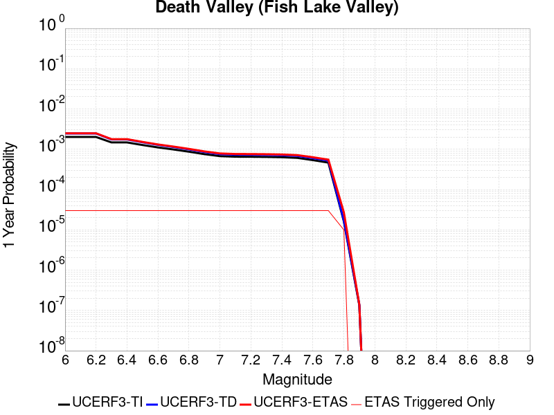 |  |

| Magnitude | 1 wk TI Prob | 1 wk TD Prob | 1 wk ETAS Prob | 1 wk ETAS/TD Gain | 1 wk ETAS Triggered Only | 1 mo TI Prob | 1 mo TD Prob | 1 mo ETAS Prob | 1 mo ETAS/TD Gain | 1 mo ETAS Triggered Only | 1 yr TI Prob | 1 yr TD Prob | 1 yr ETAS Prob | 1 yr ETAS/TD Gain | 1 yr ETAS Triggered Only | 10 yr TI Prob | 10 yr TD Prob | 10 yr ETAS Prob | 10 yr ETAS/TD Gain | 10 yr ETAS Triggered Only |
|-----|-----|-----|-----|-----|-----|-----|-----|-----|-----|-----|-----|-----|-----|-----|-----|-----|-----|-----|-----|-----|
| 6.0 | 3.872328E-5 | 4.7267185E-5 | 4.7267185E-5 | 1.0 | 0.0 | 1.6594635E-4 | 2.0255962E-4 | 2.0255962E-4 | 1.0 | 0.0 | 0.0020185246 | 0.00246352 | 0.0025493037 | 1.0348216 | 8.599561E-5 | 0.02000288 | 0.02438804 | 0.024555836 | 1.0068803 | 1.7199123E-4 |
| 6.1 | 3.872328E-5 | 4.7267185E-5 | 4.7267185E-5 | 1.0 | 0.0 | 1.6594635E-4 | 2.0255962E-4 | 2.0255962E-4 | 1.0 | 0.0 | 0.0020185246 | 0.00246352 | 0.0025493037 | 1.0348216 | 8.599561E-5 | 0.02000288 | 0.02438804 | 0.024555836 | 1.0068803 | 1.7199123E-4 |
| 6.2 | 3.872328E-5 | 4.7267185E-5 | 4.7267185E-5 | 1.0 | 0.0 | 1.6594635E-4 | 2.0255962E-4 | 2.0255962E-4 | 1.0 | 0.0 | 0.0020185246 | 0.00246352 | 0.0025493037 | 1.0348216 | 8.599561E-5 | 0.02000288 | 0.02438804 | 0.024555836 | 1.0068803 | 1.7199123E-4 |
| 6.3 | 2.8356371E-5 | 3.3609682E-5 | 3.3609682E-5 | 1.0 | 0.0 | 1.2152165E-4 | 1.4403398E-4 | 1.4403398E-4 | 1.0 | 0.0 | 0.0014785219 | 0.0017522823 | 0.0018381272 | 1.0489904 | 8.599561E-5 | 0.014687235 | 0.017391697 | 0.017560696 | 1.0097172 | 1.7199123E-4 |
| 6.4 | 2.8356371E-5 | 3.3609682E-5 | 3.3609682E-5 | 1.0 | 0.0 | 1.2152165E-4 | 1.4403398E-4 | 1.4403398E-4 | 1.0 | 0.0 | 0.0014785219 | 0.0017522823 | 0.0018381272 | 1.0489904 | 8.599561E-5 | 0.014687235 | 0.017391697 | 0.017560696 | 1.0097172 | 1.7199123E-4 |
| 6.5 | 2.4448687E-5 | 2.8607421E-5 | 2.8607421E-5 | 1.0 | 0.0 | 1.0477588E-4 | 1.2259776E-4 | 1.2259776E-4 | 1.0 | 0.0 | 0.0012748998 | 0.0014916563 | 0.0015775235 | 1.0575651 | 8.599561E-5 | 0.012676105 | 0.01482131 | 0.014990752 | 1.0114323 | 1.7199123E-4 |
| 6.6 | 2.1298161E-5 | 2.465998E-5 | 2.465998E-5 | 1.0 | 0.0 | 9.127464E-5 | 1.0568153E-4 | 1.0568153E-4 | 1.0 | 0.0 | 0.0011107022 | 0.001285947 | 0.0013718321 | 1.0667874 | 8.599561E-5 | 0.011051672 | 0.012788472 | 0.012958263 | 1.0132769 | 1.7199123E-4 |
| 6.7 | 1.8959729E-5 | 2.1780937E-5 | 2.1780937E-5 | 1.0 | 0.0 | 8.125345E-5 | 9.334368E-5 | 9.334368E-5 | 1.0 | 0.0 | 9.888117E-4 | 0.0011358924 | 0.0012217903 | 1.0756215 | 8.599561E-5 | 0.009844234 | 0.0113035245 | 0.011473572 | 1.0150437 | 1.7199123E-4 |
| 6.8 | 1.6691629E-5 | 1.901828E-5 | 1.901828E-5 | 1.0 | 0.0 | 7.153359E-5 | 8.150447E-5 | 8.150447E-5 | 1.0 | 0.0 | 8.7057345E-4 | 9.918819E-4 | 0.0010777923 | 1.0866134 | 8.599561E-5 | 0.008671708 | 0.009876307 | 0.010046599 | 1.0172426 | 1.7199123E-4 |
| 6.9 | 1.450505E-5 | 1.6389482E-5 | 1.6389482E-5 | 1.0 | 0.0 | 6.216302E-5 | 7.02388E-5 | 7.02388E-5 | 1.0 | 0.0 | 7.5657194E-4 | 8.5483067E-4 | 9.4075274E-4 | 1.1005136 | 8.599561E-5 | 0.007540013 | 0.008516356 | 0.008686882 | 1.0200235 | 1.7199123E-4 |
| 7.0 | 1.2940855E-5 | 1.4537924E-5 | 1.4537924E-5 | 1.0 | 0.0 | 5.545963E-5 | 6.230393E-5 | 6.230393E-5 | 1.0 | 0.0 | 6.750118E-4 | 7.5829215E-4 | 8.442226E-4 | 1.113321 | 8.599561E-5 | 0.006729651 | 0.007557665 | 0.0077283564 | 1.0225852 | 1.7199123E-4 |
| 7.1 | 1.2544658E-5 | 1.4078161E-5 | 1.4078161E-5 | 1.0 | 0.0 | 5.3761712E-5 | 6.0333616E-5 | 6.0333616E-5 | 1.0 | 0.0 | 6.5435225E-4 | 7.343198E-4 | 8.2025223E-4 | 1.1170232 | 8.599561E-5 | 0.006524288 | 0.007319527 | 0.0074902596 | 1.0233256 | 1.7199123E-4 |
| 7.2 | 1.2489416E-5 | 1.4015628E-5 | 1.4015628E-5 | 1.0 | 0.0 | 5.3524967E-5 | 6.0065628E-5 | 6.0065628E-5 | 1.0 | 0.0 | 6.514716E-4 | 7.3105923E-4 | 8.16992E-4 | 1.1175455 | 8.599561E-5 | 0.006495651 | 0.007287136 | 0.007457874 | 1.02343 | 1.7199123E-4 |
| 7.3 | 1.2368307E-5 | 1.3879767E-5 | 1.3879767E-5 | 1.0 | 0.0 | 5.3005948E-5 | 5.948339E-5 | 5.948339E-5 | 1.0 | 0.0 | 6.451563E-4 | 7.2397524E-4 | 8.099086E-4 | 1.1186966 | 8.599561E-5 | 0.0064328653 | 0.0072167586 | 0.007387508 | 1.0236602 | 1.7199123E-4 |
| 7.4 | 1.2161707E-5 | 1.3647823E-5 | 1.3647823E-5 | 1.0 | 0.0 | 5.212056E-5 | 5.8489393E-5 | 5.8489393E-5 | 1.0 | 0.0 | 6.3438306E-4 | 7.1188126E-4 | 7.978157E-4 | 1.1207145 | 8.599561E-5 | 0.006325751 | 0.0070965975 | 0.007267368 | 1.0240637 | 1.7199123E-4 |
| 7.5 | 1.1707948E-5 | 1.3145472E-5 | 1.3145472E-5 | 1.0 | 0.0 | 5.0175953E-5 | 5.633655E-5 | 5.633655E-5 | 1.0 | 0.0 | 6.10721E-4 | 6.8568724E-4 | 7.716239E-4 | 1.1253293 | 8.599561E-5 | 0.0060904534 | 0.006836299 | 0.007007114 | 1.0249865 | 1.7199123E-4 |
| 7.6 | 1.0319538E-5 | 1.1579585E-5 | 1.1579585E-5 | 1.0 | 0.0 | 4.4225842E-5 | 4.9625876E-5 | 4.9625876E-5 | 1.0 | 0.0 | 5.383166E-4 | 6.040327E-4 | 6.899764E-4 | 1.1422831 | 8.599561E-5 | 0.0053701443 | 0.0060244408 | 0.0061953957 | 1.0283769 | 1.7199123E-4 |
| 7.7 | 8.937764E-6 | 1.0022746E-5 | 1.0022746E-5 | 1.0 | 0.0 | 3.830414E-5 | 4.295395E-5 | 4.295395E-5 | 1.0 | 0.0 | 4.6625308E-4 | 5.228439E-4 | 6.0879457E-4 | 1.1643907 | 8.599561E-5 | 0.0046527605 | 0.0052166474 | 0.0053877416 | 1.0327977 | 1.7199123E-4 |
| 7.8 | 3.108007E-7 | 3.284649E-7 | 3.284649E-7 | 1.0 | 0.0 | 1.3320023E-6 | 1.407706E-6 | 1.407706E-6 | 1.0 | 0.0 | 1.6217007E-5 | 1.713869E-5 | 6.013576E-5 | 3.5087724 | 4.2997806E-5 | 1.6215823E-4 | 1.7137405E-4 | 2.143645E-4 | 1.2508574 | 4.2997806E-5 |
| 7.9 | 2.5591178E-9 | 2.6696687E-9 | 2.6696687E-9 | 1.0 | 0.0 | 1.0967647E-8 | 1.1441437E-8 | 1.1441437E-8 | 1.0 | 0.0 | 1.335311E-7 | 1.392995E-7 | 1.392995E-7 | 1.0 | 0.0 | 1.3353102E-6 | 1.3929949E-6 | 1.3929949E-6 | 1.0 | 0.0 |

## Baker
*[(top)](#table-of-contents)*

| 1 Week | 1 Month | 1 Year | 10 Year |
|-----|-----|-----|-----|
|  |  |  |  |

| Magnitude | 1 wk TI Prob | 1 wk TD Prob | 1 wk ETAS Prob | 1 wk ETAS/TD Gain | 1 wk ETAS Triggered Only | 1 mo TI Prob | 1 mo TD Prob | 1 mo ETAS Prob | 1 mo ETAS/TD Gain | 1 mo ETAS Triggered Only | 1 yr TI Prob | 1 yr TD Prob | 1 yr ETAS Prob | 1 yr ETAS/TD Gain | 1 yr ETAS Triggered Only | 10 yr TI Prob | 10 yr TD Prob | 10 yr ETAS Prob | 10 yr ETAS/TD Gain | 10 yr ETAS Triggered Only |
|-----|-----|-----|-----|-----|-----|-----|-----|-----|-----|-----|-----|-----|-----|-----|-----|-----|-----|-----|-----|-----|
| 6.0 | 5.695525E-6 | 5.8348332E-6 | 5.8348332E-6 | 1.0 | 0.0 | 2.4409164E-5 | 2.5006211E-5 | 6.800294E-5 | 2.7194421 | 4.2997806E-5 | 2.9714106E-4 | 3.044121E-4 | 4.3336625E-4 | 1.423617 | 1.2899342E-4 | 0.0029674405 | 0.0030403468 | 0.0032118151 | 1.0563977 | 1.7199123E-4 |
| 6.1 | 5.695525E-6 | 5.8348332E-6 | 5.8348332E-6 | 1.0 | 0.0 | 2.4409164E-5 | 2.5006211E-5 | 6.800294E-5 | 2.7194421 | 4.2997806E-5 | 2.9714106E-4 | 3.044121E-4 | 4.3336625E-4 | 1.423617 | 1.2899342E-4 | 0.0029674405 | 0.0030403468 | 0.0032118151 | 1.0563977 | 1.7199123E-4 |
| 6.2 | 5.695525E-6 | 5.8348332E-6 | 5.8348332E-6 | 1.0 | 0.0 | 2.4409164E-5 | 2.5006211E-5 | 6.800294E-5 | 2.7194421 | 4.2997806E-5 | 2.9714106E-4 | 3.044121E-4 | 4.3336625E-4 | 1.423617 | 1.2899342E-4 | 0.0029674405 | 0.0030403468 | 0.0032118151 | 1.0563977 | 1.7199123E-4 |
| 6.3 | 3.2995713E-6 | 3.3836648E-6 | 3.3836648E-6 | 1.0 | 0.0 | 1.4140943E-5 | 1.4501343E-5 | 1.4501343E-5 | 1.0 | 0.0 | 1.7215237E-4 | 1.7654001E-4 | 2.6252045E-4 | 1.4870309 | 8.599561E-5 | 0.0017201907 | 0.0017640449 | 0.0018498887 | 1.0486631 | 8.599561E-5 |
| 6.4 | 3.2995713E-6 | 3.3836648E-6 | 3.3836648E-6 | 1.0 | 0.0 | 1.4140943E-5 | 1.4501343E-5 | 1.4501343E-5 | 1.0 | 0.0 | 1.7215237E-4 | 1.7654001E-4 | 2.6252045E-4 | 1.4870309 | 8.599561E-5 | 0.0017201907 | 0.0017640449 | 0.0018498887 | 1.0486631 | 8.599561E-5 |
| 6.5 | 2.782202E-6 | 2.8558384E-6 | 2.8558384E-6 | 1.0 | 0.0 | 1.1923668E-5 | 1.2239252E-5 | 1.2239252E-5 | 1.0 | 0.0 | 1.4516099E-4 | 1.4900303E-4 | 2.3498583E-4 | 1.577054 | 8.599561E-5 | 0.001450662 | 0.001489064 | 0.0015749315 | 1.0576655 | 8.599561E-5 |
| 6.6 | 2.3163404E-6 | 2.3809182E-6 | 2.3809182E-6 | 1.0 | 0.0 | 9.927136E-6 | 1.0203897E-5 | 1.0203897E-5 | 1.0 | 0.0 | 1.20856166E-4 | 1.2422555E-4 | 2.1021049E-4 | 1.6921678 | 8.599561E-5 | 0.0012079047 | 0.0012415814 | 0.0013274702 | 1.069177 | 8.599561E-5 |
| 6.7 | 2.037056E-6 | 2.0964987E-6 | 2.0964987E-6 | 1.0 | 0.0 | 8.7302105E-6 | 8.984965E-6 | 8.984965E-6 | 1.0 | 0.0 | 1.0628513E-4 | 1.09386616E-4 | 1.9537282E-4 | 1.7860761 | 8.599561E-5 | 0.0010623431 | 0.0010933438 | 0.0011792454 | 1.0785677 | 8.599561E-5 |
| 6.8 | 1.8356744E-6 | 1.8915271E-6 | 1.8915271E-6 | 1.0 | 0.0 | 7.867153E-6 | 8.10652E-6 | 8.10652E-6 | 1.0 | 0.0 | 9.577837E-5 | 9.869256E-5 | 1.8467968E-4 | 1.8712626 | 8.599561E-5 | 9.57371E-4 | 9.865012E-4 | 0.001072412 | 1.0870863 | 8.599561E-5 |
| 6.9 | 1.6310546E-6 | 1.6832057E-6 | 1.6832057E-6 | 1.0 | 0.0 | 6.9902153E-6 | 7.2137195E-6 | 7.2137195E-6 | 1.0 | 0.0 | 8.510255E-5 | 8.782361E-5 | 1.7381167E-4 | 1.9790996 | 8.599561E-5 | 8.5069967E-4 | 8.779003E-4 | 9.6382044E-4 | 1.09787 | 8.599561E-5 |
| 7.0 | 1.2058036E-6 | 1.2508652E-6 | 1.2508652E-6 | 1.0 | 0.0 | 5.1677193E-6 | 5.3608405E-6 | 5.3608405E-6 | 1.0 | 0.0 | 6.291517E-5 | 6.52663E-5 | 1.512563E-4 | 2.3175254 | 8.599561E-5 | 6.289736E-4 | 6.5247365E-4 | 7.3841313E-4 | 1.1317134 | 8.599561E-5 |
| 7.1 | 1.052382E-6 | 1.0951596E-6 | 1.0951596E-6 | 1.0 | 0.0 | 4.5102006E-6 | 4.693533E-6 | 4.693533E-6 | 1.0 | 0.0 | 5.491031E-5 | 5.7142275E-5 | 1.4313297E-4 | 2.5048525 | 8.599561E-5 | 5.4896745E-4 | 5.712767E-4 | 6.5722317E-4 | 1.1504463 | 8.599561E-5 |
| 7.2 | 1.0067454E-6 | 1.0487698E-6 | 1.0487698E-6 | 1.0 | 0.0 | 4.3146156E-6 | 4.4947205E-6 | 4.4947205E-6 | 1.0 | 0.0 | 5.252918E-5 | 5.4721855E-5 | 1.4071276E-4 | 2.571418 | 8.599561E-5 | 5.251676E-4 | 5.4708467E-4 | 6.330332E-4 | 1.1571028 | 8.599561E-5 |
| 7.3 | 9.3596316E-7 | 9.767712E-7 | 9.767712E-7 | 1.0 | 0.0 | 4.0112645E-6 | 4.1861554E-6 | 4.1861554E-6 | 1.0 | 0.0 | 4.8836053E-5 | 5.096526E-5 | 1.3695649E-4 | 2.6872518 | 8.599561E-5 | 4.8825322E-4 | 5.095365E-4 | 5.954883E-4 | 1.1686863 | 8.599561E-5 |
| 7.4 | 8.8117395E-7 | 9.207652E-7 | 9.207652E-7 | 1.0 | 0.0 | 3.7764542E-6 | 3.9461306E-6 | 3.9461306E-6 | 1.0 | 0.0 | 4.5977362E-5 | 4.804309E-5 | 9.103883E-5 | 1.8949412 | 4.2997806E-5 | 4.596785E-4 | 4.803278E-4 | 5.23305E-4 | 1.0894747 | 4.2997806E-5 |
| 7.5 | 8.292386E-7 | 8.674585E-7 | 8.674585E-7 | 1.0 | 0.0 | 3.5538749E-6 | 3.717674E-6 | 3.717674E-6 | 1.0 | 0.0 | 4.326757E-5 | 4.526175E-5 | 8.8257606E-5 | 1.9499382 | 4.2997806E-5 | 4.3259145E-4 | 4.5252603E-4 | 4.955044E-4 | 1.0949743 | 4.2997806E-5 |
| 7.6 | 7.553842E-7 | 7.9144604E-7 | 7.9144604E-7 | 1.0 | 0.0 | 3.2373566E-6 | 3.3919073E-6 | 3.3919073E-6 | 1.0 | 0.0 | 3.9414106E-5 | 4.1295694E-5 | 8.429173E-5 | 2.0411747 | 4.2997806E-5 | 3.9407116E-4 | 4.128809E-4 | 4.5586098E-4 | 1.104098 | 4.2997806E-5 |
| 7.7 | 6.5285366E-7 | 6.8527874E-7 | 6.8527874E-7 | 1.0 | 0.0 | 2.797941E-6 | 2.9369057E-6 | 2.9369057E-6 | 1.0 | 0.0 | 3.40644E-5 | 3.5756246E-5 | 7.875251E-5 | 2.2024827 | 4.2997806E-5 | 3.405918E-4 | 3.575056E-4 | 4.0048803E-4 | 1.1202286 | 4.2997806E-5 |
| 7.8 | 3.4586725E-7 | 3.648256E-7 | 3.648256E-7 | 1.0 | 0.0 | 1.4822873E-6 | 1.5635374E-6 | 1.5635374E-6 | 1.0 | 0.0 | 1.80467E-5 | 1.9035906E-5 | 6.2032894E-5 | 3.258731 | 4.2997806E-5 | 1.8045233E-4 | 1.903432E-4 | 2.3333282E-4 | 1.2258532 | 4.2997806E-5 |
| 7.9 | 2.5591178E-9 | 2.6696687E-9 | 2.6696687E-9 | 1.0 | 0.0 | 1.0967647E-8 | 1.1441437E-8 | 1.1441437E-8 | 1.0 | 0.0 | 1.335311E-7 | 1.392995E-7 | 1.392995E-7 | 1.0 | 0.0 | 1.3353102E-6 | 1.3929949E-6 | 1.3929949E-6 | 1.0 | 0.0 |

## San Andreas (San Bernardino S)
*[(top)](#table-of-contents)*

| 1 Week | 1 Month | 1 Year | 10 Year |
|-----|-----|-----|-----|
|  |  |  |  |

| Magnitude | 1 wk TI Prob | 1 wk TD Prob | 1 wk ETAS Prob | 1 wk ETAS/TD Gain | 1 wk ETAS Triggered Only | 1 mo TI Prob | 1 mo TD Prob | 1 mo ETAS Prob | 1 mo ETAS/TD Gain | 1 mo ETAS Triggered Only | 1 yr TI Prob | 1 yr TD Prob | 1 yr ETAS Prob | 1 yr ETAS/TD Gain | 1 yr ETAS Triggered Only | 10 yr TI Prob | 10 yr TD Prob | 10 yr ETAS Prob | 10 yr ETAS/TD Gain | 10 yr ETAS Triggered Only |
|-----|-----|-----|-----|-----|-----|-----|-----|-----|-----|-----|-----|-----|-----|-----|-----|-----|-----|-----|-----|-----|
| 6.0 | 1.2336002E-4 | 3.0003127E-4 | 3.8600108E-4 | 1.2865362 | 8.599561E-5 | 5.2857865E-4 | 0.0012852408 | 0.0013711258 | 1.0668241 | 8.599561E-5 | 0.006416472 | 0.015540493 | 0.015625153 | 1.0054476 | 8.599561E-5 | 0.06234337 | 0.14283332 | 0.14298075 | 1.0010321 | 1.7199123E-4 |
| 6.1 | 1.2336002E-4 | 3.0003127E-4 | 3.8600108E-4 | 1.2865362 | 8.599561E-5 | 5.2857865E-4 | 0.0012852408 | 0.0013711258 | 1.0668241 | 8.599561E-5 | 0.006416472 | 0.015540493 | 0.015625153 | 1.0054476 | 8.599561E-5 | 0.06234337 | 0.14283332 | 0.14298075 | 1.0010321 | 1.7199123E-4 |
| 6.2 | 1.2336002E-4 | 3.0003127E-4 | 3.8600108E-4 | 1.2865362 | 8.599561E-5 | 5.2857865E-4 | 0.0012852408 | 0.0013711258 | 1.0668241 | 8.599561E-5 | 0.006416472 | 0.015540493 | 0.015625153 | 1.0054476 | 8.599561E-5 | 0.06234337 | 0.14283332 | 0.14298075 | 1.0010321 | 1.7199123E-4 |
| 6.3 | 1.1712257E-4 | 2.879145E-4 | 3.7388536E-4 | 1.2985985 | 8.599561E-5 | 5.018573E-4 | 0.0012333614 | 0.001319251 | 1.0696386 | 8.599561E-5 | 0.006093008 | 0.014917629 | 0.015002342 | 1.0056787 | 8.599561E-5 | 0.059286322 | 0.1375418 | 0.13769013 | 1.0010785 | 1.7199123E-4 |
| 6.4 | 1.1712257E-4 | 2.879145E-4 | 3.7388536E-4 | 1.2985985 | 8.599561E-5 | 5.018573E-4 | 0.0012333614 | 0.001319251 | 1.0696386 | 8.599561E-5 | 0.006093008 | 0.014917629 | 0.015002342 | 1.0056787 | 8.599561E-5 | 0.059286322 | 0.1375418 | 0.13769013 | 1.0010785 | 1.7199123E-4 |
| 6.5 | 1.0689076E-4 | 2.6804334E-4 | 3.5401588E-4 | 1.3207413 | 8.599561E-5 | 4.5802278E-4 | 0.0011482761 | 0.001234173 | 1.074805 | 8.599561E-5 | 0.0055621783 | 0.013895263 | 0.013980064 | 1.0061028 | 8.599561E-5 | 0.05425003 | 0.12878914 | 0.12893899 | 1.0011635 | 1.7199123E-4 |
| 6.6 | 9.7648895E-5 | 2.5049172E-4 | 3.3646578E-4 | 1.3432212 | 8.599561E-5 | 4.1842813E-4 | 0.0010731178 | 0.0011590212 | 1.0800502 | 8.599561E-5 | 0.005082469 | 0.012991305 | 0.013076184 | 1.0065335 | 8.599561E-5 | 0.049677886 | 0.12094915 | 0.121100344 | 1.00125 | 1.7199123E-4 |
| 6.7 | 8.757013E-5 | 2.3119988E-4 | 3.171756E-4 | 1.3718675 | 8.599561E-5 | 3.7524657E-4 | 9.905027E-4 | 0.0010764131 | 1.0867342 | 8.599561E-5 | 0.00455906 | 0.011996774 | 0.012081738 | 1.0070822 | 8.599561E-5 | 0.04466656 | 0.11225749 | 0.11241017 | 1.0013602 | 1.7199123E-4 |
| 6.8 | 8.562978E-5 | 2.2679876E-4 | 3.1277488E-4 | 1.3790854 | 8.599561E-5 | 3.6693315E-4 | 9.7165484E-4 | 0.0010575668 | 1.0884182 | 8.599561E-5 | 0.004458263 | 0.011769796 | 0.011854779 | 1.0072205 | 8.599561E-5 | 0.043698758 | 0.11026781 | 0.11042084 | 1.0013877 | 1.7199123E-4 |
| 6.9 | 6.124075E-5 | 1.7064936E-4 | 2.566303E-4 | 1.5038457 | 8.599561E-5 | 2.6243398E-4 | 7.311502E-4 | 8.17083E-4 | 1.117531 | 8.599561E-5 | 0.0031904527 | 0.008865628 | 0.008950861 | 1.0096139 | 8.599561E-5 | 0.031450346 | 0.08417915 | 0.08433666 | 1.0018711 | 1.7199123E-4 |
| 7.0 | 5.8598747E-5 | 1.6493963E-4 | 2.5092106E-4 | 1.5212903 | 8.599561E-5 | 2.5111332E-4 | 7.0669345E-4 | 7.9262827E-4 | 1.1216013 | 8.599561E-5 | 0.0030530186 | 0.008570245 | 0.008655503 | 1.0099483 | 8.599561E-5 | 0.03011414 | 0.08149692 | 0.08165489 | 1.0019385 | 1.7199123E-4 |
| 7.1 | 5.613814E-5 | 1.5912524E-4 | 2.4510716E-4 | 1.5403413 | 8.599561E-5 | 2.4056983E-4 | 6.817878E-4 | 7.6772476E-4 | 1.1260465 | 8.599561E-5 | 0.0029250039 | 0.008269355 | 0.00835464 | 1.0103133 | 8.599561E-5 | 0.028868021 | 0.07879588 | 0.07895432 | 1.0020107 | 1.7199123E-4 |
| 7.2 | 4.991222E-5 | 1.4519015E-4 | 2.3117328E-4 | 1.5922105 | 8.599561E-5 | 2.1389198E-4 | 6.220955E-4 | 7.0803764E-4 | 1.1381494 | 8.599561E-5 | 0.002601025 | 0.007547813 | 0.0076331594 | 1.0113075 | 8.599561E-5 | 0.025707912 | 0.072249845 | 0.07240941 | 1.0022085 | 1.7199123E-4 |
| 7.3 | 4.7410045E-5 | 1.371324E-4 | 2.2311622E-4 | 1.6270132 | 8.599561E-5 | 2.0317009E-4 | 5.875783E-4 | 6.7352335E-4 | 1.14627 | 8.599561E-5 | 0.0024707897 | 0.007130386 | 0.0072157686 | 1.0119745 | 8.599561E-5 | 0.024434982 | 0.06853227 | 0.068692476 | 1.0023377 | 1.7199123E-4 |
| 7.4 | 4.5556746E-5 | 1.3121162E-4 | 2.1719595E-4 | 1.6553104 | 8.599561E-5 | 1.952286E-4 | 5.6221464E-4 | 6.481619E-4 | 1.1528727 | 8.599561E-5 | 0.002374317 | 0.006823559 | 0.0069089676 | 1.0125167 | 8.599561E-5 | 0.023491086 | 0.06578475 | 0.065945424 | 1.0024425 | 1.7199123E-4 |
| 7.5 | 4.3084514E-5 | 1.2356513E-4 | 2.0955013E-4 | 1.6958678 | 8.599561E-5 | 1.8463485E-4 | 5.2945764E-4 | 6.154078E-4 | 1.1623361 | 8.599561E-5 | 0.0022456115 | 0.006427166 | 0.0065126093 | 1.013294 | 8.599561E-5 | 0.022230545 | 0.062185578 | 0.062346872 | 1.0025938 | 1.7199123E-4 |
| 7.6 | 3.408608E-5 | 9.834847E-5 | 1.8433563E-4 | 1.8743111 | 8.599561E-5 | 1.4607502E-4 | 4.2142547E-4 | 5.0738483E-4 | 1.2039729 | 8.599561E-5 | 0.0017770125 | 0.00511881 | 0.005204365 | 1.016714 | 8.599561E-5 | 0.017628696 | 0.050017312 | 0.050180703 | 1.0032667 | 1.7199123E-4 |
| 7.7 | 2.8315713E-5 | 8.2480474E-5 | 1.6846899E-4 | 2.0425317 | 8.599561E-5 | 1.2134742E-4 | 3.534399E-4 | 4.3940512E-4 | 1.2432244 | 8.599561E-5 | 0.0014764034 | 0.004294649 | 0.0043802755 | 1.0199379 | 8.599561E-5 | 0.01466633 | 0.04226858 | 0.042433307 | 1.0038971 | 1.7199123E-4 |
| 7.8 | 2.6222975E-5 | 7.462497E-5 | 1.6061417E-4 | 2.1522844 | 8.599561E-5 | 1.1237934E-4 | 3.1978212E-4 | 4.0575024E-4 | 1.2688334 | 8.599561E-5 | 0.0013673597 | 0.003886403 | 0.0039720647 | 1.0220413 | 8.599561E-5 | 0.013589768 | 0.038434092 | 0.038599472 | 1.004303 | 1.7199123E-4 |
| 7.9 | 2.1469694E-5 | 5.7873713E-5 | 1.4386435E-4 | 2.4858325 | 8.599561E-5 | 9.200973E-5 | 2.4800663E-4 | 3.3398092E-4 | 1.3466612 | 8.599561E-5 | 0.0011196428 | 0.003015303 | 0.0031010392 | 1.0284337 | 8.599561E-5 | 0.011140184 | 0.03014987 | 0.030316675 | 1.0055325 | 1.7199123E-4 |
| 8.0 | 1.2420249E-5 | 3.1316227E-5 | 3.1316227E-5 | 1.0 | 0.0 | 5.322855E-5 | 1.342055E-4 | 1.342055E-4 | 1.0 | 0.0 | 6.478649E-4 | 0.0016327285 | 0.0016327285 | 1.0 | 0.0 | 0.0064597935 | 0.01652123 | 0.01652123 | 1.0 | 0.0 |
| 8.1 | 4.9197724E-6 | 7.82136E-6 | 7.82136E-6 | 1.0 | 0.0 | 2.1084568E-5 | 3.3519682E-5 | 3.3519682E-5 | 1.0 | 0.0 | 2.566744E-4 | 4.0802584E-4 | 4.0802584E-4 | 1.0 | 0.0 | 0.002563781 | 0.004383873 | 0.004383873 | 1.0 | 0.0 |
| 8.2 | 2.5634774E-6 | 2.9062624E-6 | 2.9062624E-6 | 1.0 | 0.0 | 1.0986286E-5 | 1.2455351E-5 | 1.2455351E-5 | 1.0 | 0.0 | 1.3374983E-4 | 1.5163339E-4 | 1.5163339E-4 | 1.0 | 0.0 | 0.0013366934 | 0.001704734 | 0.001704734 | 1.0 | 0.0 |
| 8.3 | 5.2850464E-7 | 3.2082596E-7 | 3.2082596E-7 | 1.0 | 0.0 | 2.2650179E-6 | 1.3749678E-6 | 1.3749678E-6 | 1.0 | 0.0 | 2.7576245E-5 | 1.6740116E-5 | 1.6740116E-5 | 1.0 | 0.0 | 2.7572823E-4 | 1.9866871E-4 | 1.9866871E-4 | 1.0 | 0.0 |

## San Andreas (Parkfield)
*[(top)](#table-of-contents)*

| 1 Week | 1 Month | 1 Year | 10 Year |
|-----|-----|-----|-----|
|  |  |  |  |

| Magnitude | 1 wk TI Prob | 1 wk TD Prob | 1 wk ETAS Prob | 1 wk ETAS/TD Gain | 1 wk ETAS Triggered Only | 1 mo TI Prob | 1 mo TD Prob | 1 mo ETAS Prob | 1 mo ETAS/TD Gain | 1 mo ETAS Triggered Only | 1 yr TI Prob | 1 yr TD Prob | 1 yr ETAS Prob | 1 yr ETAS/TD Gain | 1 yr ETAS Triggered Only | 10 yr TI Prob | 10 yr TD Prob | 10 yr ETAS Prob | 10 yr ETAS/TD Gain | 10 yr ETAS Triggered Only |
|-----|-----|-----|-----|-----|-----|-----|-----|-----|-----|-----|-----|-----|-----|-----|-----|-----|-----|-----|-----|-----|
| 6.0 | 5.556969E-4 | 7.776195E-4 | 8.205839E-4 | 1.0552511 | 4.2997806E-5 | 0.0023793848 | 0.003328946 | 0.0033718005 | 1.0128733 | 4.2997806E-5 | 0.028586963 | 0.04018152 | 0.04026406 | 1.0020542 | 8.599561E-5 | 0.25176284 | 0.33713356 | 0.33721906 | 1.0002537 | 1.2899342E-4 |
| 6.1 | 1.925858E-4 | 3.027076E-4 | 3.456924E-4 | 1.142001 | 4.2997806E-5 | 8.2510663E-4 | 0.001296767 | 0.001339709 | 1.0331147 | 4.2997806E-5 | 0.0099994885 | 0.01577525 | 0.01581757 | 1.0026827 | 4.2997806E-5 | 0.095613256 | 0.14970991 | 0.14974646 | 1.0002443 | 4.2997806E-5 |
| 6.2 | 9.4306815E-5 | 1.824128E-4 | 2.2540276E-4 | 1.235674 | 4.2997806E-5 | 4.0410945E-4 | 7.8153616E-4 | 8.2450034E-4 | 1.0549741 | 4.2997806E-5 | 0.0049089384 | 0.009473897 | 0.009516487 | 1.0044955 | 4.2997806E-5 | 0.048019063 | 0.09184752 | 0.091886565 | 1.0004251 | 4.2997806E-5 |
| 6.3 | 9.283051E-5 | 1.793781E-4 | 2.2236818E-4 | 1.2396619 | 4.2997806E-5 | 3.9778434E-4 | 7.68538E-4 | 8.1150274E-4 | 1.0559045 | 4.2997806E-5 | 0.0048322747 | 0.009317007 | 0.009359605 | 1.004572 | 4.2997806E-5 | 0.047285385 | 0.09050047 | 0.090539575 | 1.0004321 | 4.2997806E-5 |
| 6.4 | 9.138826E-5 | 1.7700029E-4 | 2.1999048E-4 | 1.242882 | 4.2997806E-5 | 3.916052E-4 | 7.5835333E-4 | 8.0131856E-4 | 1.0566559 | 4.2997806E-5 | 0.0047573745 | 0.009194063 | 0.009236665 | 1.0046337 | 4.2997806E-5 | 0.046568092 | 0.089402735 | 0.08944189 | 1.000438 | 4.2997806E-5 |
| 6.5 | 9.000255E-5 | 1.7458084E-4 | 2.1757114E-4 | 1.2462487 | 4.2997806E-5 | 3.8566816E-4 | 7.479902E-4 | 7.9095585E-4 | 1.0574415 | 4.2997806E-5 | 0.0046854047 | 0.00906896 | 0.009111567 | 1.0046982 | 4.2997806E-5 | 0.045878403 | 0.08828856 | 0.08832776 | 1.000444 | 4.2997806E-5 |
| 6.6 | 8.8109264E-5 | 1.7139279E-4 | 2.1438322E-4 | 1.2508299 | 4.2997806E-5 | 3.7755648E-4 | 7.343349E-4 | 7.7730115E-4 | 1.0585104 | 4.2997806E-5 | 0.0045870654 | 0.008904092 | 0.008946707 | 1.004786 | 4.2997806E-5 | 0.04493529 | 0.08682025 | 0.08685952 | 1.0004523 | 4.2997806E-5 |
| 6.7 | 8.738073E-5 | 1.7006363E-4 | 2.1305413E-4 | 1.2527907 | 4.2997806E-5 | 3.7443507E-4 | 7.286417E-4 | 7.716082E-4 | 1.058968 | 4.2997806E-5 | 0.0045492216 | 0.008835384 | 0.008878001 | 1.0048236 | 4.2997806E-5 | 0.04457213 | 0.08622064 | 0.08625993 | 1.0004557 | 4.2997806E-5 |
| 6.8 | 8.710195E-5 | 1.695187E-4 | 2.1250921E-4 | 1.2536035 | 4.2997806E-5 | 3.7324068E-4 | 7.263075E-4 | 7.6927413E-4 | 1.0591576 | 4.2997806E-5 | 0.0045347405 | 0.008807203 | 0.008849822 | 1.0048391 | 4.2997806E-5 | 0.04443313 | 0.085968256 | 0.08600755 | 1.0004572 | 4.2997806E-5 |
| 6.9 | 8.6801556E-5 | 1.6892828E-4 | 2.1191881E-4 | 1.2544899 | 4.2997806E-5 | 3.7195362E-4 | 7.237786E-4 | 7.667453E-4 | 1.0593644 | 4.2997806E-5 | 0.0045191357 | 0.008776662 | 0.008819282 | 1.0048561 | 4.2997806E-5 | 0.044283327 | 0.08569433 | 0.08573364 | 1.0004587 | 4.2997806E-5 |
| 7.0 | 8.5571606E-5 | 1.6645678E-4 | 2.0944742E-4 | 1.2582692 | 4.2997806E-5 | 3.6668387E-4 | 7.131923E-4 | 7.561594E-4 | 1.0602462 | 4.2997806E-5 | 0.004455241 | 0.008648803 | 0.008691429 | 1.0049286 | 4.2997806E-5 | 0.043669727 | 0.08454277 | 0.084582135 | 1.0004656 | 4.2997806E-5 |
| 7.1 | 7.82589E-5 | 1.5126738E-4 | 1.9425868E-4 | 1.2842073 | 4.2997806E-5 | 3.3535215E-4 | 6.4812845E-4 | 6.910984E-4 | 1.0662985 | 4.2997806E-5 | 0.0040752706 | 0.007862584 | 0.007905243 | 1.0054257 | 4.2997806E-5 | 0.040013418 | 0.07745491 | 0.07749458 | 1.0005121 | 4.2997806E-5 |
| 7.2 | 7.690929E-5 | 1.4864003E-4 | 1.9163144E-4 | 1.2892318 | 4.2997806E-5 | 3.2956956E-4 | 6.368739E-4 | 6.798443E-4 | 1.0674709 | 4.2997806E-5 | 0.004005129 | 0.007726539 | 0.007769204 | 1.0055219 | 4.2997806E-5 | 0.0393371 | 0.0762281 | 0.076267816 | 1.0005211 | 4.2997806E-5 |
| 7.3 | 7.5543794E-5 | 1.4560606E-4 | 1.8859761E-4 | 1.2952594 | 4.2997806E-5 | 3.2371894E-4 | 6.2387745E-4 | 6.6684844E-4 | 1.0688772 | 4.2997806E-5 | 0.003934157 | 0.007569417 | 0.007612089 | 1.0056375 | 4.2997806E-5 | 0.038652334 | 0.07479123 | 0.07483102 | 1.0005319 | 4.2997806E-5 |
| 7.4 | 7.4214564E-5 | 1.4261607E-4 | 1.8560776E-4 | 1.3014504 | 4.2997806E-5 | 3.1802364E-4 | 6.110693E-4 | 6.5404084E-4 | 1.0703219 | 4.2997806E-5 | 0.003865065 | 0.0074145487 | 0.007457228 | 1.0057561 | 4.2997806E-5 | 0.03798529 | 0.07336518 | 0.07340503 | 1.0005431 | 4.2997806E-5 |
| 7.5 | 6.149578E-5 | 1.11895584E-4 | 1.5488858E-4 | 1.3842242 | 4.2997806E-5 | 2.6352672E-4 | 4.7946448E-4 | 5.224417E-4 | 1.0896358 | 4.2997806E-5 | 0.0032037178 | 0.0058218874 | 0.0058646346 | 1.0073426 | 4.2997806E-5 | 0.03157923 | 0.05855221 | 0.05859269 | 1.0006913 | 4.2997806E-5 |
| 7.6 | 6.0643448E-5 | 1.10182256E-4 | 1.5317532E-4 | 1.3901995 | 4.2997806E-5 | 2.598746E-4 | 4.7212432E-4 | 5.151018E-4 | 1.0910301 | 4.2997806E-5 | 0.0031593828 | 0.005732995 | 0.005775746 | 1.007457 | 4.2997806E-5 | 0.031148417 | 0.057713263 | 0.05775378 | 1.000702 | 4.2997806E-5 |
| 7.7 | 5.1652263E-5 | 9.173663E-5 | 1.347305E-4 | 1.4686663 | 4.2997806E-5 | 2.2134806E-4 | 3.9309775E-4 | 4.3607867E-4 | 1.109339 | 4.2997806E-5 | 0.002691582 | 0.0047754725 | 0.0048182653 | 1.0089608 | 4.2997806E-5 | 0.026592141 | 0.048531387 | 0.0485723 | 1.0008429 | 4.2997806E-5 |
| 7.8 | 4.8090482E-5 | 8.558682E-5 | 8.558682E-5 | 1.0 | 0.0 | 2.060858E-4 | 3.6674913E-4 | 3.6674913E-4 | 1.0 | 0.0 | 0.0025062072 | 0.0044560367 | 0.0044560367 | 1.0 | 0.0 | 0.024781305 | 0.045297977 | 0.045297977 | 1.0 | 0.0 |
| 7.9 | 3.970278E-5 | 6.749683E-5 | 6.749683E-5 | 1.0 | 0.0 | 1.7014367E-4 | 2.8924007E-4 | 2.8924007E-4 | 1.0 | 0.0 | 0.002069531 | 0.0035158154 | 0.0035158154 | 1.0 | 0.0 | 0.020503636 | 0.03587781 | 0.03587781 | 1.0 | 0.0 |
| 8.0 | 2.8982335E-5 | 4.0693238E-5 | 4.0693238E-5 | 1.0 | 0.0 | 1.2420409E-4 | 1.7438793E-4 | 1.7438793E-4 | 1.0 | 0.0 | 0.0015111357 | 0.0021211067 | 0.0021211067 | 1.0 | 0.0 | 0.015009012 | 0.022008339 | 0.022008339 | 1.0 | 0.0 |
| 8.1 | 1.8836186E-5 | 1.8678496E-5 | 1.8678496E-5 | 1.0 | 0.0 | 8.0724014E-5 | 8.0048245E-5 | 8.0048245E-5 | 1.0 | 0.0 | 9.823717E-4 | 9.7415224E-4 | 9.7415224E-4 | 1.0 | 0.0 | 0.009780403 | 0.010486731 | 0.010486731 | 1.0 | 0.0 |
| 8.2 | 8.643924E-6 | 5.4738607E-6 | 5.4738607E-6 | 1.0 | 0.0 | 3.704486E-5 | 2.3459192E-5 | 2.3459192E-5 | 1.0 | 0.0 | 4.5092785E-4 | 2.855783E-4 | 2.855783E-4 | 1.0 | 0.0 | 0.0045001395 | 0.0032481598 | 0.0032481598 | 1.0 | 0.0 |
| 8.3 | 1.983087E-6 | 7.658221E-7 | 7.658221E-7 | 1.0 | 0.0 | 8.498917E-6 | 3.2820906E-6 | 3.2820906E-6 | 1.0 | 0.0 | 1.034694E-4 | 3.9958737E-5 | 3.9958737E-5 | 1.0 | 0.0 | 0.0010342124 | 4.7187202E-4 | 4.7187202E-4 | 1.0 | 0.0 |

## Red Pass
*[(top)](#table-of-contents)*

| 1 Week | 1 Month | 1 Year | 10 Year |
|-----|-----|-----|-----|
|  |  |  |  |

| Magnitude | 1 wk TI Prob | 1 wk TD Prob | 1 wk ETAS Prob | 1 wk ETAS/TD Gain | 1 wk ETAS Triggered Only | 1 mo TI Prob | 1 mo TD Prob | 1 mo ETAS Prob | 1 mo ETAS/TD Gain | 1 mo ETAS Triggered Only | 1 yr TI Prob | 1 yr TD Prob | 1 yr ETAS Prob | 1 yr ETAS/TD Gain | 1 yr ETAS Triggered Only | 10 yr TI Prob | 10 yr TD Prob | 10 yr ETAS Prob | 10 yr ETAS/TD Gain | 10 yr ETAS Triggered Only |
|-----|-----|-----|-----|-----|-----|-----|-----|-----|-----|-----|-----|-----|-----|-----|-----|-----|-----|-----|-----|-----|
| 6.0 | 8.258278E-6 | 8.5512565E-6 | 5.1548697E-5 | 6.028201 | 4.2997806E-5 | 3.539214E-5 | 3.664783E-5 | 7.964406E-5 | 2.1732273 | 4.2997806E-5 | 4.308141E-4 | 4.4611385E-4 | 5.320711E-4 | 1.1926801 | 8.599561E-5 | 0.0042997985 | 0.004453941 | 0.0045823595 | 1.0288327 | 1.2899342E-4 |
| 6.1 | 3.649988E-6 | 3.7753127E-6 | 3.7753127E-6 | 1.0 | 0.0 | 1.5642712E-5 | 1.6179838E-5 | 1.6179838E-5 | 1.0 | 0.0 | 1.9043336E-4 | 1.9697649E-4 | 1.9697649E-4 | 1.0 | 0.0 | 0.0019027026 | 0.0019684862 | 0.0019684862 | 1.0 | 0.0 |
| 6.2 | 3.649988E-6 | 3.7753127E-6 | 3.7753127E-6 | 1.0 | 0.0 | 1.5642712E-5 | 1.6179838E-5 | 1.6179838E-5 | 1.0 | 0.0 | 1.9043336E-4 | 1.9697649E-4 | 1.9697649E-4 | 1.0 | 0.0 | 0.0019027026 | 0.0019684862 | 0.0019684862 | 1.0 | 0.0 |
| 6.3 | 1.3924937E-6 | 1.4411153E-6 | 1.4411153E-6 | 1.0 | 0.0 | 5.9678164E-6 | 6.1762016E-6 | 6.1762016E-6 | 1.0 | 0.0 | 7.265574E-5 | 7.5194075E-5 | 7.5194075E-5 | 1.0 | 0.0 | 7.263199E-4 | 7.518251E-4 | 7.518251E-4 | 1.0 | 0.0 |
| 6.4 | 1.3924937E-6 | 1.4411153E-6 | 1.4411153E-6 | 1.0 | 0.0 | 5.9678164E-6 | 6.1762016E-6 | 6.1762016E-6 | 1.0 | 0.0 | 7.265574E-5 | 7.5194075E-5 | 7.5194075E-5 | 1.0 | 0.0 | 7.263199E-4 | 7.518251E-4 | 7.518251E-4 | 1.0 | 0.0 |
| 6.5 | 9.876812E-7 | 1.0221903E-6 | 1.0221903E-6 | 1.0 | 0.0 | 4.2329125E-6 | 4.3808154E-6 | 4.3808154E-6 | 1.0 | 0.0 | 5.153449E-5 | 5.333643E-5 | 5.333643E-5 | 1.0 | 0.0 | 5.1522546E-4 | 5.3336425E-4 | 5.3336425E-4 | 1.0 | 0.0 |

## Helendale-So Lockhart
*[(top)](#table-of-contents)*

| 1 Week | 1 Month | 1 Year | 10 Year |
|-----|-----|-----|-----|
|  |  |  |  |

| Magnitude | 1 wk TI Prob | 1 wk TD Prob | 1 wk ETAS Prob | 1 wk ETAS/TD Gain | 1 wk ETAS Triggered Only | 1 mo TI Prob | 1 mo TD Prob | 1 mo ETAS Prob | 1 mo ETAS/TD Gain | 1 mo ETAS Triggered Only | 1 yr TI Prob | 1 yr TD Prob | 1 yr ETAS Prob | 1 yr ETAS/TD Gain | 1 yr ETAS Triggered Only | 10 yr TI Prob | 10 yr TD Prob | 10 yr ETAS Prob | 10 yr ETAS/TD Gain | 10 yr ETAS Triggered Only |
|-----|-----|-----|-----|-----|-----|-----|-----|-----|-----|-----|-----|-----|-----|-----|-----|-----|-----|-----|-----|-----|
| 6.0 | 1.7296055E-5 | 1.8103707E-5 | 1.8103707E-5 | 1.0 | 0.0 | 7.412385E-5 | 7.758512E-5 | 7.758512E-5 | 1.0 | 0.0 | 9.0208417E-4 | 9.442103E-4 | 0.0010301247 | 1.0909908 | 8.599561E-5 | 0.008984311 | 0.009404104 | 0.009531885 | 1.0135877 | 1.2899342E-4 |
| 6.1 | 1.7296055E-5 | 1.8103707E-5 | 1.8103707E-5 | 1.0 | 0.0 | 7.412385E-5 | 7.758512E-5 | 7.758512E-5 | 1.0 | 0.0 | 9.0208417E-4 | 9.442103E-4 | 0.0010301247 | 1.0909908 | 8.599561E-5 | 0.008984311 | 0.009404104 | 0.009531885 | 1.0135877 | 1.2899342E-4 |
| 6.2 | 1.7296055E-5 | 1.8103707E-5 | 1.8103707E-5 | 1.0 | 0.0 | 7.412385E-5 | 7.758512E-5 | 7.758512E-5 | 1.0 | 0.0 | 9.0208417E-4 | 9.442103E-4 | 0.0010301247 | 1.0909908 | 8.599561E-5 | 0.008984311 | 0.009404104 | 0.009531885 | 1.0135877 | 1.2899342E-4 |
| 6.3 | 1.0669118E-5 | 1.1135411E-5 | 1.1135411E-5 | 1.0 | 0.0 | 4.5723988E-5 | 4.7722333E-5 | 4.7722333E-5 | 1.0 | 0.0 | 5.5654737E-4 | 5.8086734E-4 | 6.2384014E-4 | 1.0739805 | 4.2997806E-5 | 0.0055515557 | 0.0057937866 | 0.0058792843 | 1.0147567 | 8.599561E-5 |
| 6.4 | 1.0669118E-5 | 1.1135411E-5 | 1.1135411E-5 | 1.0 | 0.0 | 4.5723988E-5 | 4.7722333E-5 | 4.7722333E-5 | 1.0 | 0.0 | 5.5654737E-4 | 5.8086734E-4 | 6.2384014E-4 | 1.0739805 | 4.2997806E-5 | 0.0055515557 | 0.0057937866 | 0.0058792843 | 1.0147567 | 8.599561E-5 |
| 6.5 | 8.790038E-6 | 9.170186E-6 | 9.170186E-6 | 1.0 | 0.0 | 3.767105E-5 | 3.9300216E-5 | 3.9300216E-5 | 1.0 | 0.0 | 4.585485E-4 | 4.783766E-4 | 4.783766E-4 | 1.0 | 0.0 | 0.0045760344 | 0.004773633 | 0.0048164255 | 1.0089643 | 4.2997806E-5 |
| 6.6 | 7.396949E-6 | 7.715528E-6 | 7.715528E-6 | 1.0 | 0.0 | 3.1700827E-5 | 3.3066135E-5 | 3.3066135E-5 | 1.0 | 0.0 | 3.858892E-4 | 4.0250685E-4 | 4.0250685E-4 | 1.0 | 0.0 | 0.003852198 | 0.0040178853 | 0.0040607103 | 1.0106586 | 4.2997806E-5 |
| 6.7 | 6.4600285E-6 | 6.7380233E-6 | 6.7380233E-6 | 1.0 | 0.0 | 2.7685543E-5 | 2.8876928E-5 | 2.8876928E-5 | 1.0 | 0.0 | 3.3701936E-4 | 3.5152066E-4 | 3.5152066E-4 | 1.0 | 0.0 | 0.0033650869 | 0.003509728 | 0.003552575 | 1.012208 | 4.2997806E-5 |
| 6.8 | 5.600104E-6 | 5.836003E-6 | 5.836003E-6 | 1.0 | 0.0 | 2.4000226E-5 | 2.5011204E-5 | 2.5011204E-5 | 1.0 | 0.0 | 2.9216358E-4 | 3.0446946E-4 | 3.0446946E-4 | 1.0 | 0.0 | 0.0029177975 | 0.0030405847 | 0.0030834517 | 1.0140983 | 4.2997806E-5 |
| 6.9 | 4.839122E-6 | 5.039504E-6 | 5.039504E-6 | 1.0 | 0.0 | 2.0738931E-5 | 2.1597696E-5 | 2.1597696E-5 | 1.0 | 0.0 | 2.5246723E-4 | 2.629207E-4 | 2.629207E-4 | 1.0 | 0.0 | 0.002521806 | 0.0026261439 | 0.0026690287 | 1.01633 | 4.2997806E-5 |
| 7.0 | 3.6937633E-6 | 3.845204E-6 | 3.845204E-6 | 1.0 | 0.0 | 1.5830317E-5 | 1.6479342E-5 | 1.6479342E-5 | 1.0 | 0.0 | 1.9271708E-4 | 2.0061784E-4 | 2.0061784E-4 | 1.0 | 0.0 | 0.0019255003 | 0.0020043987 | 0.0020473104 | 1.0214087 | 4.2997806E-5 |
| 7.1 | 2.7858857E-6 | 2.8978507E-6 | 2.8978507E-6 | 1.0 | 0.0 | 1.1939455E-5 | 1.2419302E-5 | 1.2419302E-5 | 1.0 | 0.0 | 1.4535317E-4 | 1.5119473E-4 | 1.5119473E-4 | 1.0 | 0.0 | 0.0014525814 | 0.0015109401 | 0.0015109401 | 1.0 | 0.0 |
| 7.2 | 2.1672065E-6 | 2.2540103E-6 | 2.2540103E-6 | 1.0 | 0.0 | 9.2879945E-6 | 9.66001E-6 | 9.66001E-6 | 1.0 | 0.0 | 1.1307546E-4 | 1.1760445E-4 | 1.1760445E-4 | 1.0 | 0.0 | 0.0011301794 | 0.0011754404 | 0.0011754404 | 1.0 | 0.0 |
| 7.3 | 1.4823496E-6 | 1.5422086E-6 | 1.5422086E-6 | 1.0 | 0.0 | 6.3529114E-6 | 6.6094494E-6 | 6.6094494E-6 | 1.0 | 0.0 | 7.734395E-5 | 8.046723E-5 | 8.046723E-5 | 1.0 | 0.0 | 7.731704E-4 | 8.04396E-4 | 8.04396E-4 | 1.0 | 0.0 |
| 7.4 | 4.2321457E-7 | 4.4108717E-7 | 4.4108717E-7 | 1.0 | 0.0 | 1.8137755E-6 | 1.8903725E-6 | 1.8903725E-6 | 1.0 | 0.0 | 2.2082493E-5 | 2.3015087E-5 | 2.3015087E-5 | 1.0 | 0.0 | 2.2080299E-4 | 2.3013157E-4 | 2.3013157E-4 | 1.0 | 0.0 |
| 7.5 | 5.6942316E-8 | 5.9415576E-8 | 5.9415576E-8 | 1.0 | 0.0 | 2.440385E-7 | 2.5463817E-7 | 2.5463817E-7 | 1.0 | 0.0 | 2.9711643E-6 | 3.1002162E-6 | 3.1002162E-6 | 1.0 | 0.0 | 2.9711247E-5 | 3.1001808E-5 | 3.1001808E-5 | 1.0 | 0.0 |

## Brawley (Seismic Zone) alt 1
*[(top)](#table-of-contents)*

| 1 Week | 1 Month | 1 Year | 10 Year |
|-----|-----|-----|-----|
|  |  |  |  |

| Magnitude | 1 wk TI Prob | 1 wk TD Prob | 1 wk ETAS Prob | 1 wk ETAS/TD Gain | 1 wk ETAS Triggered Only | 1 mo TI Prob | 1 mo TD Prob | 1 mo ETAS Prob | 1 mo ETAS/TD Gain | 1 mo ETAS Triggered Only | 1 yr TI Prob | 1 yr TD Prob | 1 yr ETAS Prob | 1 yr ETAS/TD Gain | 1 yr ETAS Triggered Only | 10 yr TI Prob | 10 yr TD Prob | 10 yr ETAS Prob | 10 yr ETAS/TD Gain | 10 yr ETAS Triggered Only |
|-----|-----|-----|-----|-----|-----|-----|-----|-----|-----|-----|-----|-----|-----|-----|-----|-----|-----|-----|-----|-----|
| 6.0 | 2.2521618E-4 | 4.7625226E-4 | 5.1922956E-4 | 1.0902407 | 4.2997806E-5 | 9.6485513E-4 | 0.0020395215 | 0.0020824317 | 1.0210392 | 4.2997806E-5 | 0.011683988 | 0.024542542 | 0.024584483 | 1.001709 | 4.2997806E-5 | 0.11088423 | 0.21347483 | 0.21354246 | 1.0003169 | 8.599561E-5 |
| 6.1 | 2.2521618E-4 | 4.7625226E-4 | 5.1922956E-4 | 1.0902407 | 4.2997806E-5 | 9.6485513E-4 | 0.0020395215 | 0.0020824317 | 1.0210392 | 4.2997806E-5 | 0.011683988 | 0.024542542 | 0.024584483 | 1.001709 | 4.2997806E-5 | 0.11088423 | 0.21347483 | 0.21354246 | 1.0003169 | 8.599561E-5 |
| 6.2 | 2.198148E-4 | 4.6709873E-4 | 5.1007647E-4 | 1.0920099 | 4.2997806E-5 | 9.417233E-4 | 0.0020003526 | 0.0020432642 | 1.0214521 | 4.2997806E-5 | 0.011405343 | 0.024076827 | 0.024118789 | 1.0017428 | 4.2997806E-5 | 0.10837428 | 0.20991138 | 0.20997933 | 1.0003237 | 8.599561E-5 |
| 6.3 | 2.1704129E-4 | 4.6145564E-4 | 5.044336E-4 | 1.0931356 | 4.2997806E-5 | 9.298453E-4 | 0.0019762046 | 0.0020191176 | 1.0217148 | 4.2997806E-5 | 0.011262234 | 0.023789987 | 0.023831962 | 1.0017644 | 4.2997806E-5 | 0.107082725 | 0.2078023 | 0.20787042 | 1.0003278 | 8.599561E-5 |
| 6.4 | 1.876142E-4 | 4.0037738E-4 | 4.4335797E-4 | 1.1073502 | 4.2997806E-5 | 8.038131E-4 | 0.001714789 | 0.001757713 | 1.0250317 | 4.2997806E-5 | 0.00974259 | 0.02067674 | 0.020718848 | 1.0020366 | 4.2997806E-5 | 0.093263686 | 0.18455231 | 0.18462244 | 1.0003799 | 8.599561E-5 |
| 6.5 | 1.7390939E-4 | 3.746997E-4 | 4.1768138E-4 | 1.1147097 | 4.2997806E-5 | 7.45113E-4 | 0.0016048797 | 0.0016478085 | 1.0267489 | 4.2997806E-5 | 0.009034078 | 0.019365085 | 0.019407252 | 1.0021774 | 4.2997806E-5 | 0.086755216 | 0.17437433 | 0.17444533 | 1.0004072 | 8.599561E-5 |
| 6.6 | 1.591791E-4 | 3.4884937E-4 | 3.9183217E-4 | 1.123213 | 4.2997806E-5 | 6.8201777E-4 | 0.0014942222 | 0.0015371557 | 1.028733 | 4.2997806E-5 | 0.008271996 | 0.018041968 | 0.01808419 | 1.0023402 | 4.2997806E-5 | 0.07970774 | 0.16378246 | 0.16385438 | 1.000439 | 8.599561E-5 |
| 6.7 | 1.4268003E-4 | 3.2051268E-4 | 3.634967E-4 | 1.1341102 | 4.2997806E-5 | 6.1134255E-4 | 0.0013729108 | 0.0014158497 | 1.0312757 | 4.2997806E-5 | 0.007417723 | 0.016589044 | 0.016631328 | 1.0025489 | 4.2997806E-5 | 0.07174956 | 0.15190692 | 0.15197986 | 1.00048 | 8.599561E-5 |
| 6.8 | 1.239713E-4 | 2.904694E-4 | 3.3345472E-4 | 1.1479857 | 4.2997806E-5 | 5.3119735E-4 | 0.0012442812 | 0.0012872255 | 1.0345134 | 4.2997806E-5 | 0.0064481674 | 0.015045324 | 0.015087675 | 1.0028149 | 4.2997806E-5 | 0.06264243 | 0.13835184 | 0.13842593 | 1.0005356 | 8.599561E-5 |
| 6.9 | 1.0180238E-4 | 2.624795E-4 | 3.05466E-4 | 1.1637709 | 4.2997806E-5 | 4.3622297E-4 | 0.0011244314 | 0.0011673808 | 1.0381966 | 4.2997806E-5 | 0.005298089 | 0.013605019 | 0.013647432 | 1.0031174 | 4.2997806E-5 | 0.05173543 | 0.124936566 | 0.12501182 | 1.0006024 | 8.599561E-5 |
| 7.0 | 7.6619996E-5 | 2.2393082E-4 | 2.66919E-4 | 1.1919708 | 4.2997806E-5 | 3.283301E-4 | 9.593537E-4 | 0.0010023103 | 1.0447766 | 4.2997806E-5 | 0.0039900932 | 0.011618287 | 0.011660785 | 1.0036578 | 4.2997806E-5 | 0.039192066 | 0.1072422 | 0.10731897 | 1.0007159 | 8.599561E-5 |
| 7.1 | 7.5127435E-5 | 2.2076255E-4 | 2.6375087E-4 | 1.1947265 | 4.2997806E-5 | 3.2193496E-4 | 9.457853E-4 | 9.887425E-4 | 1.0454196 | 4.2997806E-5 | 0.0039125155 | 0.01145484 | 0.011497346 | 1.0037106 | 4.2997806E-5 | 0.038443442 | 0.10580618 | 0.10588308 | 1.0007268 | 8.599561E-5 |
| 7.2 | 6.788582E-5 | 2.0204009E-4 | 2.4502922E-4 | 1.2127752 | 4.2997806E-5 | 2.9090676E-4 | 8.6560176E-4 | 9.085624E-4 | 1.0496309 | 4.2997806E-5 | 0.0035360386 | 0.010488416 | 0.010530963 | 1.0040566 | 4.2997806E-5 | 0.034803 | 0.097476505 | 0.09755412 | 1.0007962 | 8.599561E-5 |
| 7.3 | 6.399602E-5 | 1.8835113E-4 | 1.8835113E-4 | 1.0 | 0.0 | 2.7423984E-4 | 8.0697227E-4 | 8.0697227E-4 | 1.0 | 0.0 | 0.0033337586 | 0.009781217 | 0.009781217 | 1.0 | 0.0 | 0.03284188 | 0.09137183 | 0.09141089 | 1.0004276 | 4.2997806E-5 |
| 7.4 | 4.506759E-5 | 1.2526519E-4 | 1.2526519E-4 | 1.0 | 0.0 | 1.9313251E-4 | 5.367412E-4 | 5.367412E-4 | 1.0 | 0.0 | 0.0023488526 | 0.006515418 | 0.006515418 | 1.0 | 0.0 | 0.023241805 | 0.062352248 | 0.062392566 | 1.0006466 | 4.2997806E-5 |
| 7.5 | 3.43289E-5 | 9.334972E-5 | 9.334972E-5 | 1.0 | 0.0 | 1.4711556E-4 | 4.0000922E-4 | 4.0000922E-4 | 1.0 | 0.0 | 0.0017896603 | 0.004859299 | 0.004859299 | 1.0 | 0.0 | 0.01775316 | 0.04705323 | 0.047094204 | 1.0008708 | 4.2997806E-5 |
| 7.6 | 2.5980507E-5 | 7.0527196E-5 | 7.0527196E-5 | 1.0 | 0.0 | 1.1134028E-4 | 3.022245E-4 | 3.022245E-4 | 1.0 | 0.0 | 0.001354725 | 0.0036733993 | 0.0036733993 | 1.0 | 0.0 | 0.013464959 | 0.035839107 | 0.035880566 | 1.0011568 | 4.2997806E-5 |
| 7.7 | 1.7292105E-5 | 4.940404E-5 | 4.940404E-5 | 1.0 | 0.0 | 7.4106916E-5 | 2.1171445E-4 | 2.1171445E-4 | 1.0 | 0.0 | 9.018782E-4 | 0.0025745821 | 0.0025745821 | 1.0 | 0.0 | 0.008982267 | 0.025288915 | 0.025330827 | 1.0016572 | 4.2997806E-5 |
| 7.8 | 1.2927471E-5 | 3.9690432E-5 | 3.9690432E-5 | 1.0 | 0.0 | 5.5402274E-5 | 1.7009077E-4 | 1.7009077E-4 | 1.0 | 0.0 | 6.743139E-4 | 0.002068891 | 0.002068891 | 1.0 | 0.0 | 0.0067227143 | 0.020430436 | 0.020472556 | 1.0020616 | 4.2997806E-5 |
| 7.9 | 1.0200774E-5 | 2.8743396E-5 | 2.8743396E-5 | 1.0 | 0.0 | 4.371687E-5 | 1.2318017E-4 | 1.2318017E-4 | 1.0 | 0.0 | 5.321229E-4 | 0.001498688 | 0.001498688 | 1.0 | 0.0 | 0.005308505 | 0.014990583 | 0.015032936 | 1.0028254 | 4.2997806E-5 |
| 8.0 | 8.650396E-6 | 2.3275401E-5 | 2.3275401E-5 | 1.0 | 0.0 | 3.70726E-5 | 9.974791E-5 | 9.974791E-5 | 1.0 | 0.0 | 4.5126543E-4 | 0.0012137551 | 0.0012137551 | 1.0 | 0.0 | 0.0045035016 | 0.012210181 | 0.012210181 | 1.0 | 0.0 |
| 8.1 | 3.9368224E-6 | 7.3271426E-6 | 7.3271426E-6 | 1.0 | 0.0 | 1.6871985E-5 | 3.1401665E-5 | 3.1401665E-5 | 1.0 | 0.0 | 2.0539707E-4 | 3.822483E-4 | 3.822483E-4 | 1.0 | 0.0 | 0.0020520731 | 0.004000768 | 0.004000768 | 1.0 | 0.0 |
| 8.2 | 1.7101195E-6 | 2.2175473E-6 | 2.2175473E-6 | 1.0 | 0.0 | 7.329063E-6 | 9.50374E-6 | 9.50374E-6 | 1.0 | 0.0 | 8.922769E-5 | 1.1570192E-4 | 1.1570192E-4 | 1.0 | 0.0 | 8.9191867E-4 | 0.0012665088 | 0.0012665088 | 1.0 | 0.0 |
| 8.3 | 3.0346666E-8 | 1.72124E-8 | 1.72124E-8 | 1.0 | 0.0 | 1.3005713E-7 | 7.3767424E-8 | 7.3767424E-8 | 1.0 | 0.0 | 1.5834444E-6 | 8.9811834E-7 | 8.9811834E-7 | 1.0 | 0.0 | 1.5834332E-5 | 9.365885E-6 | 9.365885E-6 | 1.0 | 0.0 |

## San Pedro Basin
*[(top)](#table-of-contents)*

| 1 Week | 1 Month | 1 Year | 10 Year |
|-----|-----|-----|-----|
|  |  |  |  |

| Magnitude | 1 wk TI Prob | 1 wk TD Prob | 1 wk ETAS Prob | 1 wk ETAS/TD Gain | 1 wk ETAS Triggered Only | 1 mo TI Prob | 1 mo TD Prob | 1 mo ETAS Prob | 1 mo ETAS/TD Gain | 1 mo ETAS Triggered Only | 1 yr TI Prob | 1 yr TD Prob | 1 yr ETAS Prob | 1 yr ETAS/TD Gain | 1 yr ETAS Triggered Only | 10 yr TI Prob | 10 yr TD Prob | 10 yr ETAS Prob | 10 yr ETAS/TD Gain | 10 yr ETAS Triggered Only |
|-----|-----|-----|-----|-----|-----|-----|-----|-----|-----|-----|-----|-----|-----|-----|-----|-----|-----|-----|-----|-----|
| 6.0 | 5.3449043E-5 | 6.336922E-5 | 1.4935939E-4 | 2.3569705 | 8.599561E-5 | 2.2904722E-4 | 2.7155754E-4 | 3.5752982E-4 | 1.3165895 | 8.599561E-5 | 0.0027850836 | 0.0033018088 | 0.0033875203 | 1.025959 | 8.599561E-5 | 0.027504366 | 0.03258929 | 0.032672483 | 1.0025527 | 8.599561E-5 |
| 6.1 | 5.3449043E-5 | 6.336922E-5 | 1.4935939E-4 | 2.3569705 | 8.599561E-5 | 2.2904722E-4 | 2.7155754E-4 | 3.5752982E-4 | 1.3165895 | 8.599561E-5 | 0.0027850836 | 0.0033018088 | 0.0033875203 | 1.025959 | 8.599561E-5 | 0.027504366 | 0.03258929 | 0.032672483 | 1.0025527 | 8.599561E-5 |
| 6.2 | 2.3189454E-5 | 2.6642689E-5 | 2.6642689E-5 | 1.0 | 0.0 | 9.9379584E-5 | 1.1417822E-4 | 1.1417822E-4 | 1.0 | 0.0 | 0.0012092749 | 0.0013892808 | 0.0013892808 | 1.0 | 0.0 | 0.012027155 | 0.013810828 | 0.013810828 | 1.0 | 0.0 |
| 6.3 | 2.3189454E-5 | 2.6642689E-5 | 2.6642689E-5 | 1.0 | 0.0 | 9.9379584E-5 | 1.1417822E-4 | 1.1417822E-4 | 1.0 | 0.0 | 0.0012092749 | 0.0013892808 | 0.0013892808 | 1.0 | 0.0 | 0.012027155 | 0.013810828 | 0.013810828 | 1.0 | 0.0 |
| 6.4 | 1.966056E-5 | 2.2463326E-5 | 2.2463326E-5 | 1.0 | 0.0 | 8.425682E-5 | 9.626807E-5 | 9.626807E-5 | 1.0 | 0.0 | 0.001025344 | 0.0011714738 | 0.0011714738 | 1.0 | 0.0 | 0.010206259 | 0.011657071 | 0.011657071 | 1.0 | 0.0 |
| 6.5 | 1.7342953E-5 | 1.9745074E-5 | 1.9745074E-5 | 1.0 | 0.0 | 7.4324824E-5 | 8.4619205E-5 | 8.4619205E-5 | 1.0 | 0.0 | 9.04529E-4 | 0.0010297889 | 0.0010297889 | 1.0 | 0.0 | 0.009008561 | 0.010253892 | 0.010253892 | 1.0 | 0.0 |
| 6.6 | 1.439804E-5 | 1.6322656E-5 | 1.6322656E-5 | 1.0 | 0.0 | 6.170443E-5 | 6.995254E-5 | 6.995254E-5 | 1.0 | 0.0 | 7.509924E-4 | 8.5137156E-4 | 8.5137156E-4 | 1.0 | 0.0 | 0.0074845953 | 0.008484301 | 0.008484301 | 1.0 | 0.0 |
| 6.7 | 1.2634884E-5 | 1.4285245E-5 | 1.4285245E-5 | 1.0 | 0.0 | 5.414838E-5 | 6.122122E-5 | 6.122122E-5 | 1.0 | 0.0 | 6.590571E-4 | 7.4514386E-4 | 7.4514386E-4 | 1.0 | 0.0 | 0.006571059 | 0.0074294745 | 0.0074294745 | 1.0 | 0.0 |
| 6.8 | 1.146091E-5 | 1.2933146E-5 | 1.2933146E-5 | 1.0 | 0.0 | 4.911726E-5 | 5.5426757E-5 | 5.5426757E-5 | 1.0 | 0.0 | 5.9783855E-4 | 6.746416E-4 | 6.746416E-4 | 1.0 | 0.0 | 0.0059623276 | 0.006728875 | 0.006728875 | 1.0 | 0.0 |
| 6.9 | 9.109035E-6 | 1.0234976E-5 | 1.0234976E-5 | 1.0 | 0.0 | 3.9038136E-5 | 4.3863605E-5 | 4.3863605E-5 | 1.0 | 0.0 | 4.7518566E-4 | 5.339365E-4 | 5.339365E-4 | 1.0 | 0.0 | 0.0047417083 | 0.0053292904 | 0.0053292904 | 1.0 | 0.0 |
| 7.0 | 5.9351028E-6 | 6.583943E-6 | 6.583943E-6 | 1.0 | 0.0 | 2.5435906E-5 | 2.8216728E-5 | 2.8216728E-5 | 1.0 | 0.0 | 3.0963816E-4 | 3.4350812E-4 | 3.4350812E-4 | 1.0 | 0.0 | 0.0030920706 | 0.0034320883 | 0.0034320883 | 1.0 | 0.0 |
| 7.1 | 2.1557585E-6 | 2.2096456E-6 | 2.2096456E-6 | 1.0 | 0.0 | 9.238933E-6 | 9.469876E-6 | 9.469876E-6 | 1.0 | 0.0 | 1.1247819E-4 | 1.152898E-4 | 1.152898E-4 | 1.0 | 0.0 | 0.0011242128 | 0.0011523152 | 0.0011523152 | 1.0 | 0.0 |
| 7.2 | 2.1251979E-6 | 2.1779917E-6 | 2.1779917E-6 | 1.0 | 0.0 | 9.107958E-6 | 9.334219E-6 | 9.334219E-6 | 1.0 | 0.0 | 1.1088375E-4 | 1.13638336E-4 | 1.13638336E-4 | 1.0 | 0.0 | 0.0011082845 | 0.0011358176 | 0.0011358176 | 1.0 | 0.0 |
| 7.3 | 1.7145798E-6 | 1.7442856E-6 | 1.7442856E-6 | 1.0 | 0.0 | 7.3481783E-6 | 7.4754885E-6 | 7.4754885E-6 | 1.0 | 0.0 | 8.94604E-5 | 9.101036E-5 | 9.101036E-5 | 1.0 | 0.0 | 8.9424395E-4 | 9.0974005E-4 | 9.0974005E-4 | 1.0 | 0.0 |
| 7.4 | 1.4467993E-6 | 1.4641852E-6 | 1.4641852E-6 | 1.0 | 0.0 | 6.200554E-6 | 6.2750646E-6 | 6.2750646E-6 | 1.0 | 0.0 | 7.548913E-5 | 7.639631E-5 | 7.639631E-5 | 1.0 | 0.0 | 7.546349E-4 | 7.6370774E-4 | 7.6370774E-4 | 1.0 | 0.0 |
| 7.5 | 1.2803735E-6 | 1.2931483E-6 | 1.2931483E-6 | 1.0 | 0.0 | 5.487303E-6 | 5.542053E-6 | 5.542053E-6 | 1.0 | 0.0 | 6.680587E-5 | 6.747247E-5 | 6.747247E-5 | 1.0 | 0.0 | 6.678579E-4 | 6.7452696E-4 | 6.7452696E-4 | 1.0 | 0.0 |
| 7.6 | 6.755009E-7 | 6.7694583E-7 | 6.7694583E-7 | 1.0 | 0.0 | 2.8950008E-6 | 2.9011935E-6 | 2.9011935E-6 | 1.0 | 0.0 | 3.5246063E-5 | 3.532152E-5 | 3.532152E-5 | 1.0 | 0.0 | 3.5240475E-4 | 3.5316474E-4 | 3.5316474E-4 | 1.0 | 0.0 |
| 7.7 | 6.211885E-8 | 4.5699466E-8 | 4.5699466E-8 | 1.0 | 0.0 | 2.6622362E-7 | 1.9585484E-7 | 1.9585484E-7 | 1.0 | 0.0 | 3.2412677E-6 | 2.3845303E-6 | 2.3845303E-6 | 1.0 | 0.0 | 3.2412205E-5 | 2.3845067E-5 | 2.3845067E-5 | 1.0 | 0.0 |
| 7.8 | 2.6580573E-9 | 1.5138059E-9 | 1.5138059E-9 | 1.0 | 0.0 | 1.1391674E-8 | 6.4877392E-9 | 6.4877392E-9 | 1.0 | 0.0 | 1.3869362E-7 | 7.898823E-8 | 7.898823E-8 | 1.0 | 0.0 | 1.3869354E-6 | 7.898823E-7 | 7.898823E-7 | 1.0 | 0.0 |

## San Gabriel
*[(top)](#table-of-contents)*

| 1 Week | 1 Month | 1 Year | 10 Year |
|-----|-----|-----|-----|
|  |  |  | 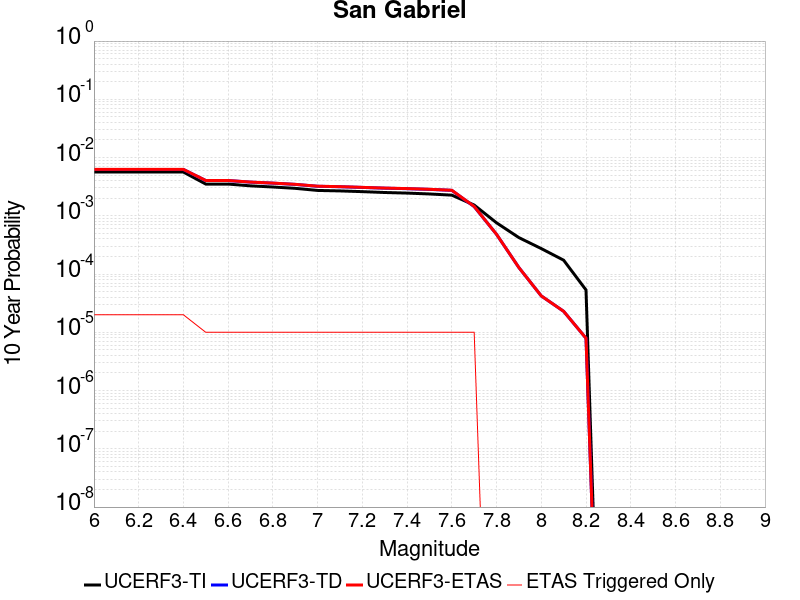 |

| Magnitude | 1 wk TI Prob | 1 wk TD Prob | 1 wk ETAS Prob | 1 wk ETAS/TD Gain | 1 wk ETAS Triggered Only | 1 mo TI Prob | 1 mo TD Prob | 1 mo ETAS Prob | 1 mo ETAS/TD Gain | 1 mo ETAS Triggered Only | 1 yr TI Prob | 1 yr TD Prob | 1 yr ETAS Prob | 1 yr ETAS/TD Gain | 1 yr ETAS Triggered Only | 10 yr TI Prob | 10 yr TD Prob | 10 yr ETAS Prob | 10 yr ETAS/TD Gain | 10 yr ETAS Triggered Only |
|-----|-----|-----|-----|-----|-----|-----|-----|-----|-----|-----|-----|-----|-----|-----|-----|-----|-----|-----|-----|-----|
| 6.0 | 1.083775E-5 | 1.1984758E-5 | 9.797934E-5 | 8.175329 | 8.599561E-5 | 4.6446676E-5 | 5.13623E-5 | 1.373535E-4 | 2.6742084 | 8.599561E-5 | 5.653415E-4 | 6.251679E-4 | 7.111098E-4 | 1.13747 | 8.599561E-5 | 0.0056390543 | 0.0062461873 | 0.0063316454 | 1.0136817 | 8.599561E-5 |
| 6.1 | 1.083775E-5 | 1.1984758E-5 | 9.797934E-5 | 8.175329 | 8.599561E-5 | 4.6446676E-5 | 5.13623E-5 | 1.373535E-4 | 2.6742084 | 8.599561E-5 | 5.653415E-4 | 6.251679E-4 | 7.111098E-4 | 1.13747 | 8.599561E-5 | 0.0056390543 | 0.0062461873 | 0.0063316454 | 1.0136817 | 8.599561E-5 |
| 6.2 | 1.083775E-5 | 1.1984758E-5 | 9.797934E-5 | 8.175329 | 8.599561E-5 | 4.6446676E-5 | 5.13623E-5 | 1.373535E-4 | 2.6742084 | 8.599561E-5 | 5.653415E-4 | 6.251679E-4 | 7.111098E-4 | 1.13747 | 8.599561E-5 | 0.0056390543 | 0.0062461873 | 0.0063316454 | 1.0136817 | 8.599561E-5 |
| 6.3 | 1.083775E-5 | 1.1984758E-5 | 9.797934E-5 | 8.175329 | 8.599561E-5 | 4.6446676E-5 | 5.13623E-5 | 1.373535E-4 | 2.6742084 | 8.599561E-5 | 5.653415E-4 | 6.251679E-4 | 7.111098E-4 | 1.13747 | 8.599561E-5 | 0.0056390543 | 0.0062461873 | 0.0063316454 | 1.0136817 | 8.599561E-5 |
| 6.4 | 1.083775E-5 | 1.1984758E-5 | 9.797934E-5 | 8.175329 | 8.599561E-5 | 4.6446676E-5 | 5.13623E-5 | 1.373535E-4 | 2.6742084 | 8.599561E-5 | 5.653415E-4 | 6.251679E-4 | 7.111098E-4 | 1.13747 | 8.599561E-5 | 0.0056390543 | 0.0062461873 | 0.0063316454 | 1.0136817 | 8.599561E-5 |
| 6.5 | 6.7317824E-6 | 7.7165205E-6 | 5.0713996E-5 | 6.572133 | 4.2997806E-5 | 2.8850178E-5 | 3.3070388E-5 | 7.6066775E-5 | 2.3001475 | 4.2997806E-5 | 3.511943E-4 | 4.0255862E-4 | 4.4553913E-4 | 1.1067683 | 4.2997806E-5 | 0.003506398 | 0.0040293895 | 0.004072214 | 1.0106281 | 4.2997806E-5 |
| 6.6 | 6.7317824E-6 | 7.7165205E-6 | 5.0713996E-5 | 6.572133 | 4.2997806E-5 | 2.8850178E-5 | 3.3070388E-5 | 7.6066775E-5 | 2.3001475 | 4.2997806E-5 | 3.511943E-4 | 4.0255862E-4 | 4.4553913E-4 | 1.1067683 | 4.2997806E-5 | 0.003506398 | 0.0040293895 | 0.004072214 | 1.0106281 | 4.2997806E-5 |
| 6.7 | 6.274881E-6 | 7.2454404E-6 | 5.0242936E-5 | 6.934421 | 4.2997806E-5 | 2.6892068E-5 | 3.1051524E-5 | 7.4047995E-5 | 2.3846815 | 4.2997806E-5 | 3.2736175E-4 | 3.779877E-4 | 4.2096924E-4 | 1.1137115 | 4.2997806E-5 | 0.0032687993 | 0.0037845364 | 0.0038273714 | 1.0113184 | 4.2997806E-5 |
| 6.8 | 5.996209E-6 | 6.958161E-6 | 4.995567E-5 | 7.1794357 | 4.2997806E-5 | 2.5697784E-5 | 2.9820354E-5 | 7.281688E-5 | 2.4418516 | 4.2997806E-5 | 3.128256E-4 | 3.6300326E-4 | 4.0598545E-4 | 1.1184072 | 4.2997806E-5 | 0.003123856 | 0.0036351893 | 0.0036780308 | 1.0117853 | 4.2997806E-5 |
| 6.9 | 5.686331E-6 | 6.623209E-6 | 4.9620732E-5 | 7.4919467 | 4.2997806E-5 | 2.4369761E-5 | 2.8384879E-5 | 7.1381466E-5 | 2.5147707 | 4.2997806E-5 | 2.9666146E-4 | 3.45532E-4 | 3.8851495E-4 | 1.1243964 | 4.2997806E-5 | 0.0029626573 | 0.0034610324 | 0.0035038814 | 1.0123804 | 4.2997806E-5 |
| 7.0 | 5.2329838E-6 | 6.147093E-6 | 4.9144637E-5 | 7.9947767 | 4.2997806E-5 | 2.242688E-5 | 2.6344422E-5 | 6.93411E-5 | 2.632098 | 4.2997806E-5 | 2.7301308E-4 | 3.2069688E-4 | 3.636809E-4 | 1.1340332 | 4.2997806E-5 | 0.002726779 | 0.0032134135 | 0.0032562732 | 1.0133377 | 4.2997806E-5 |
| 7.1 | 5.135671E-6 | 6.03722E-6 | 4.9034767E-5 | 8.122077 | 4.2997806E-5 | 2.2009834E-5 | 2.5873547E-5 | 6.887024E-5 | 2.6618013 | 4.2997806E-5 | 2.6793676E-4 | 3.1496567E-4 | 3.5794993E-4 | 1.1364728 | 4.2997806E-5 | 0.0026761394 | 0.0031562652 | 0.0031991275 | 1.01358 | 4.2997806E-5 |
| 7.2 | 4.989062E-6 | 5.8706023E-6 | 4.8868158E-5 | 8.324216 | 4.2997806E-5 | 2.1381518E-5 | 2.5159485E-5 | 6.815621E-5 | 2.7089667 | 4.2997806E-5 | 2.6028889E-4 | 3.0627442E-4 | 3.4925906E-4 | 1.1403468 | 4.2997806E-5 | 0.0025998424 | 0.003069596 | 0.0031124617 | 1.0139647 | 4.2997806E-5 |
| 7.3 | 4.8219395E-6 | 5.7021575E-6 | 4.869972E-5 | 8.540578 | 4.2997806E-5 | 2.0665291E-5 | 2.4437593E-5 | 6.7434354E-5 | 2.7594514 | 4.2997806E-5 | 2.5157086E-4 | 2.9748783E-4 | 3.4047285E-4 | 1.1444933 | 4.2997806E-5 | 0.0025128627 | 0.0029819692 | 0.0030248386 | 1.0143763 | 4.2997806E-5 |
| 7.4 | 4.7118383E-6 | 5.590718E-6 | 4.8588285E-5 | 8.690885 | 4.2997806E-5 | 2.0193436E-5 | 2.3960005E-5 | 6.695678E-5 | 2.794523 | 4.2997806E-5 | 2.4582737E-4 | 2.9167475E-4 | 3.3466003E-4 | 1.1473739 | 4.2997806E-5 | 0.002455556 | 0.0029239913 | 0.0029668633 | 1.0146621 | 4.2997806E-5 |
| 7.5 | 4.5506545E-6 | 5.4360885E-6 | 4.8433663E-5 | 8.909653 | 4.2997806E-5 | 1.9502659E-5 | 2.3297318E-5 | 6.6294124E-5 | 2.845569 | 4.2997806E-5 | 2.37419E-4 | 2.8360868E-4 | 3.2659428E-4 | 1.1515666 | 4.2997806E-5 | 0.002371655 | 0.0028435385 | 0.0028864143 | 1.0150782 | 4.2997806E-5 |
| 7.6 | 4.343636E-6 | 5.2289724E-6 | 4.8226553E-5 | 9.222951 | 4.2997806E-5 | 1.861545E-5 | 2.2409693E-5 | 6.540654E-5 | 2.9186716 | 4.2997806E-5 | 2.2661954E-4 | 2.728046E-4 | 3.1579068E-4 | 1.157571 | 4.2997806E-5 | 0.0022638857 | 0.0027357598 | 0.00277864 | 1.015674 | 4.2997806E-5 |
| 7.7 | 2.936235E-6 | 2.7437704E-6 | 4.574146E-5 | 16.671022 | 4.2997806E-5 | 1.2583803E-5 | 1.1758963E-5 | 5.4756263E-5 | 4.6565557 | 4.2997806E-5 | 1.5319703E-4 | 1.4315601E-4 | 1.8614766E-4 | 1.3003134 | 4.2997806E-5 | 0.0015309147 | 0.0014379307 | 0.0014808667 | 1.0298595 | 4.2997806E-5 |
| 7.8 | 1.4541639E-6 | 9.122594E-7 | 9.122594E-7 | 1.0 | 0.0 | 6.232116E-6 | 3.909677E-6 | 3.909677E-6 | 1.0 | 0.0 | 7.587337E-5 | 4.7599282E-5 | 4.7599282E-5 | 1.0 | 0.0 | 7.584747E-4 | 4.80793E-4 | 4.80793E-4 | 1.0 | 0.0 |
| 7.9 | 8.098958E-7 | 2.4170984E-7 | 2.4170984E-7 | 1.0 | 0.0 | 3.4709774E-6 | 1.0358989E-6 | 1.0358989E-6 | 1.0 | 0.0 | 4.225833E-5 | 1.2611996E-5 | 1.2611996E-5 | 1.0 | 0.0 | 4.2250296E-4 | 1.2919492E-4 | 1.2919492E-4 | 1.0 | 0.0 |
| 8.0 | 5.2473234E-7 | 7.677202E-8 | 7.677202E-8 | 1.0 | 0.0 | 2.248851E-6 | 3.290229E-7 | 3.290229E-7 | 1.0 | 0.0 | 2.7379416E-5 | 4.005846E-6 | 4.005846E-6 | 1.0 | 0.0 | 2.7376044E-4 | 4.2180836E-5 | 4.2180836E-5 | 1.0 | 0.0 |
| 8.1 | 3.3162388E-7 | 4.1485006E-8 | 4.1485006E-8 | 1.0 | 0.0 | 1.4212444E-6 | 1.7779287E-7 | 1.7779287E-7 | 1.0 | 0.0 | 1.7303513E-5 | 2.164626E-6 | 2.164626E-6 | 1.0 | 0.0 | 1.7302166E-4 | 2.295942E-5 | 2.295942E-5 | 1.0 | 0.0 |
| 8.2 | 1.0235345E-7 | 1.4039964E-8 | 1.4039964E-8 | 1.0 | 0.0 | 4.3865757E-7 | 6.0171274E-8 | 6.0171274E-8 | 1.0 | 0.0 | 5.340643E-6 | 7.3258497E-7 | 7.3258497E-7 | 1.0 | 0.0 | 5.3405143E-5 | 7.925429E-6 | 7.925429E-6 | 1.0 | 0.0 |

## San Andreas (Big Bend)
*[(top)](#table-of-contents)*

| 1 Week | 1 Month | 1 Year | 10 Year |
|-----|-----|-----|-----|
|  |  |  |  |

| Magnitude | 1 wk TI Prob | 1 wk TD Prob | 1 wk ETAS Prob | 1 wk ETAS/TD Gain | 1 wk ETAS Triggered Only | 1 mo TI Prob | 1 mo TD Prob | 1 mo ETAS Prob | 1 mo ETAS/TD Gain | 1 mo ETAS Triggered Only | 1 yr TI Prob | 1 yr TD Prob | 1 yr ETAS Prob | 1 yr ETAS/TD Gain | 1 yr ETAS Triggered Only | 10 yr TI Prob | 10 yr TD Prob | 10 yr ETAS Prob | 10 yr ETAS/TD Gain | 10 yr ETAS Triggered Only |
|-----|-----|-----|-----|-----|-----|-----|-----|-----|-----|-----|-----|-----|-----|-----|-----|-----|-----|-----|-----|-----|
| 6.0 | 1.0179969E-4 | 2.0070563E-4 | 2.4369481E-4 | 1.2141902 | 4.2997806E-5 | 4.362114E-4 | 8.598845E-4 | 9.028453E-4 | 1.0499612 | 4.2997806E-5 | 0.0052979486 | 0.010419123 | 0.010461673 | 1.0040839 | 4.2997806E-5 | 0.051734097 | 0.10144164 | 0.101518914 | 1.0007617 | 8.599561E-5 |
| 6.1 | 1.0179969E-4 | 2.0070563E-4 | 2.4369481E-4 | 1.2141902 | 4.2997806E-5 | 4.362114E-4 | 8.598845E-4 | 9.028453E-4 | 1.0499612 | 4.2997806E-5 | 0.0052979486 | 0.010419123 | 0.010461673 | 1.0040839 | 4.2997806E-5 | 0.051734097 | 0.10144164 | 0.101518914 | 1.0007617 | 8.599561E-5 |
| 6.2 | 1.0179969E-4 | 2.0070563E-4 | 2.4369481E-4 | 1.2141902 | 4.2997806E-5 | 4.362114E-4 | 8.598845E-4 | 9.028453E-4 | 1.0499612 | 4.2997806E-5 | 0.0052979486 | 0.010419123 | 0.010461673 | 1.0040839 | 4.2997806E-5 | 0.051734097 | 0.10144164 | 0.101518914 | 1.0007617 | 8.599561E-5 |
| 6.3 | 1.0179969E-4 | 2.0070563E-4 | 2.4369481E-4 | 1.2141902 | 4.2997806E-5 | 4.362114E-4 | 8.598845E-4 | 9.028453E-4 | 1.0499612 | 4.2997806E-5 | 0.0052979486 | 0.010419123 | 0.010461673 | 1.0040839 | 4.2997806E-5 | 0.051734097 | 0.10144164 | 0.101518914 | 1.0007617 | 8.599561E-5 |
| 6.4 | 9.1639464E-5 | 1.842787E-4 | 2.2726858E-4 | 1.2332873 | 4.2997806E-5 | 3.9268145E-4 | 7.89527E-4 | 8.324909E-4 | 1.0544173 | 4.2997806E-5 | 0.0047704205 | 0.009570243 | 0.009612829 | 1.0044498 | 4.2997806E-5 | 0.046693064 | 0.09376797 | 0.093845904 | 1.0008311 | 8.599561E-5 |
| 6.5 | 9.1639464E-5 | 1.842787E-4 | 2.2726858E-4 | 1.2332873 | 4.2997806E-5 | 3.9268145E-4 | 7.89527E-4 | 8.324909E-4 | 1.0544173 | 4.2997806E-5 | 0.0047704205 | 0.009570243 | 0.009612829 | 1.0044498 | 4.2997806E-5 | 0.046693064 | 0.09376797 | 0.093845904 | 1.0008311 | 8.599561E-5 |
| 6.6 | 9.042622E-5 | 1.8234932E-4 | 2.2533929E-4 | 1.2357562 | 4.2997806E-5 | 3.8748336E-4 | 7.812632E-4 | 8.2422746E-4 | 1.0549933 | 4.2997806E-5 | 0.0047074095 | 0.009470508 | 0.009513099 | 1.0044972 | 4.2997806E-5 | 0.046089325 | 0.09286199 | 0.092939995 | 1.0008401 | 8.599561E-5 |
| 6.7 | 8.9836685E-5 | 1.814927E-4 | 2.244827E-4 | 1.2368691 | 4.2997806E-5 | 3.8495753E-4 | 7.7759416E-4 | 8.205586E-4 | 1.0552529 | 4.2997806E-5 | 0.00467679 | 0.009426224 | 0.009468816 | 1.0045185 | 4.2997806E-5 | 0.045795817 | 0.09245627 | 0.09253431 | 1.0008441 | 8.599561E-5 |
| 6.8 | 8.9471854E-5 | 1.8096055E-4 | 2.2395057E-4 | 1.2375658 | 4.2997806E-5 | 3.8339442E-4 | 7.7531487E-4 | 8.1827934E-4 | 1.0554155 | 4.2997806E-5 | 0.004657841 | 0.009398713 | 0.009441307 | 1.0045319 | 4.2997806E-5 | 0.04561414 | 0.092203476 | 0.09228154 | 1.0008466 | 8.599561E-5 |
| 6.9 | 8.858234E-5 | 1.797803E-4 | 2.2277037E-4 | 1.2391256 | 4.2997806E-5 | 3.7958333E-4 | 7.7025965E-4 | 8.1322435E-4 | 1.0557795 | 4.2997806E-5 | 0.004611638 | 0.009337694 | 0.009380291 | 1.0045618 | 4.2997806E-5 | 0.04517103 | 0.0916436 | 0.09172171 | 1.0008523 | 8.599561E-5 |
| 7.0 | 8.7433385E-5 | 1.7816834E-4 | 2.2115848E-4 | 1.2412895 | 4.2997806E-5 | 3.746607E-4 | 7.633553E-4 | 8.063203E-4 | 1.0562844 | 4.2997806E-5 | 0.004551957 | 0.009254351 | 0.009296951 | 1.0046033 | 4.2997806E-5 | 0.044598386 | 0.090878054 | 0.09095624 | 1.0008603 | 8.599561E-5 |
| 7.1 | 8.684964E-5 | 1.7728789E-4 | 2.2027807E-4 | 1.242488 | 4.2997806E-5 | 3.7215967E-4 | 7.595842E-4 | 8.0254936E-4 | 1.0565641 | 4.2997806E-5 | 0.0045216335 | 0.009208827 | 0.009251429 | 1.0046262 | 4.2997806E-5 | 0.04430731 | 0.09045961 | 0.090537824 | 1.0008646 | 8.599561E-5 |
| 7.2 | 8.606521E-5 | 1.7619408E-4 | 2.1918431E-4 | 1.2439936 | 4.2997806E-5 | 3.6879873E-4 | 7.548991E-4 | 7.9786446E-4 | 1.0569154 | 4.2997806E-5 | 0.0044808835 | 0.009152266 | 0.0091948705 | 1.004655 | 4.2997806E-5 | 0.043916024 | 0.08994013 | 0.09001839 | 1.0008701 | 8.599561E-5 |
| 7.3 | 8.568266E-5 | 1.7561417E-4 | 2.1860443E-4 | 1.2447995 | 4.2997806E-5 | 3.6715972E-4 | 7.524153E-4 | 7.9538074E-4 | 1.0571034 | 4.2997806E-5 | 0.0044610105 | 0.0091222795 | 0.009164885 | 1.0046705 | 4.2997806E-5 | 0.043725148 | 0.0896613 | 0.08973958 | 1.0008731 | 8.599561E-5 |
| 7.4 | 8.5432206E-5 | 1.7524007E-4 | 2.1823034E-4 | 1.2453221 | 4.2997806E-5 | 3.6608664E-4 | 7.508129E-4 | 7.937784E-4 | 1.0572253 | 4.2997806E-5 | 0.004447999 | 0.009102933 | 0.00914554 | 1.0046805 | 4.2997806E-5 | 0.043600157 | 0.08948149 | 0.089559786 | 1.000875 | 8.599561E-5 |
| 7.5 | 8.4791965E-5 | 1.7393343E-4 | 2.1692376E-4 | 1.2471654 | 4.2997806E-5 | 3.633435E-4 | 7.452162E-4 | 7.8818196E-4 | 1.0576555 | 4.2997806E-5 | 0.0044147377 | 0.009035361 | 0.00907797 | 1.0047158 | 4.2997806E-5 | 0.043280575 | 0.08885915 | 0.0889375 | 1.0008818 | 8.599561E-5 |
| 7.6 | 8.241105E-5 | 1.68388E-4 | 2.1137857E-4 | 1.2553066 | 4.2997806E-5 | 3.531424E-4 | 7.2146347E-4 | 7.644302E-4 | 1.059555 | 4.2997806E-5 | 0.0042910352 | 0.0087485295 | 0.0087911505 | 1.0048718 | 4.2997806E-5 | 0.042091176 | 0.086236194 | 0.08631477 | 1.0009112 | 8.599561E-5 |
| 7.7 | 7.00432E-5 | 1.4203055E-4 | 1.8502225E-4 | 1.3026934 | 4.2997806E-5 | 3.001506E-4 | 6.085604E-4 | 6.51532E-4 | 1.070612 | 4.2997806E-5 | 0.0036482112 | 0.0073840916 | 0.007426772 | 1.00578 | 4.2997806E-5 | 0.035888977 | 0.07351081 | 0.07359049 | 1.0010839 | 8.599561E-5 |
| 7.8 | 6.415362E-5 | 1.2967631E-4 | 1.2967631E-4 | 1.0 | 0.0 | 2.749151E-4 | 5.5563723E-4 | 5.5563723E-4 | 1.0 | 0.0 | 0.0033419547 | 0.00674393 | 0.00674393 | 1.0 | 0.0 | 0.03292141 | 0.067246385 | 0.06728649 | 1.0005964 | 4.2997806E-5 |
| 7.9 | 4.939911E-5 | 9.340218E-5 | 9.340218E-5 | 1.0 | 0.0 | 2.116933E-4 | 4.0023366E-4 | 4.0023366E-4 | 1.0 | 0.0 | 0.0025743195 | 0.0048619667 | 0.0048619667 | 1.0 | 0.0 | 0.025447013 | 0.04891005 | 0.048950948 | 1.0008361 | 4.2997806E-5 |
| 8.0 | 3.344983E-5 | 5.222126E-5 | 5.222126E-5 | 1.0 | 0.0 | 1.4334853E-4 | 2.2378622E-4 | 2.2378622E-4 | 1.0 | 0.0 | 0.0017438711 | 0.0027211946 | 0.0027211946 | 1.0 | 0.0 | 0.017302496 | 0.027919443 | 0.027919443 | 1.0 | 0.0 |
| 8.1 | 1.9104898E-5 | 1.917038E-5 | 1.917038E-5 | 1.0 | 0.0 | 8.1875565E-5 | 8.215619E-5 | 8.215619E-5 | 1.0 | 0.0 | 9.963791E-4 | 9.997933E-4 | 9.997933E-4 | 1.0 | 0.0 | 0.009919235 | 0.010748395 | 0.010748395 | 1.0 | 0.0 |
| 8.2 | 8.643924E-6 | 5.4738607E-6 | 5.4738607E-6 | 1.0 | 0.0 | 3.704486E-5 | 2.3459192E-5 | 2.3459192E-5 | 1.0 | 0.0 | 4.5092785E-4 | 2.855783E-4 | 2.855783E-4 | 1.0 | 0.0 | 0.0045001395 | 0.0032481598 | 0.0032481598 | 1.0 | 0.0 |
| 8.3 | 1.983087E-6 | 7.658221E-7 | 7.658221E-7 | 1.0 | 0.0 | 8.498917E-6 | 3.2820906E-6 | 3.2820906E-6 | 1.0 | 0.0 | 1.034694E-4 | 3.9958737E-5 | 3.9958737E-5 | 1.0 | 0.0 | 0.0010342124 | 4.7187202E-4 | 4.7187202E-4 | 1.0 | 0.0 |

## Big Pine (East)
*[(top)](#table-of-contents)*

| 1 Week | 1 Month | 1 Year | 10 Year |
|-----|-----|-----|-----|
|  |  | 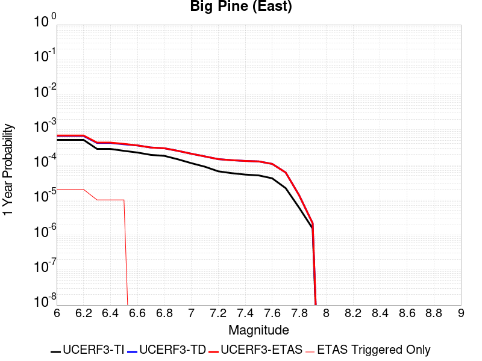 |  |

| Magnitude | 1 wk TI Prob | 1 wk TD Prob | 1 wk ETAS Prob | 1 wk ETAS/TD Gain | 1 wk ETAS Triggered Only | 1 mo TI Prob | 1 mo TD Prob | 1 mo ETAS Prob | 1 mo ETAS/TD Gain | 1 mo ETAS Triggered Only | 1 yr TI Prob | 1 yr TD Prob | 1 yr ETAS Prob | 1 yr ETAS/TD Gain | 1 yr ETAS Triggered Only | 10 yr TI Prob | 10 yr TD Prob | 10 yr ETAS Prob | 10 yr ETAS/TD Gain | 10 yr ETAS Triggered Only |
|-----|-----|-----|-----|-----|-----|-----|-----|-----|-----|-----|-----|-----|-----|-----|-----|-----|-----|-----|-----|-----|
| 6.0 | 9.916913E-6 | 1.2816734E-5 | 9.8811244E-5 | 7.7095494 | 8.599561E-5 | 4.250036E-5 | 5.4927827E-5 | 1.4091872E-4 | 2.565525 | 8.599561E-5 | 5.173191E-4 | 6.6856324E-4 | 7.545013E-4 | 1.1285415 | 8.599561E-5 | 0.0051611643 | 0.0066703134 | 0.0067557353 | 1.0128063 | 8.599561E-5 |
| 6.1 | 9.916913E-6 | 1.2816734E-5 | 9.8811244E-5 | 7.7095494 | 8.599561E-5 | 4.250036E-5 | 5.4927827E-5 | 1.4091872E-4 | 2.565525 | 8.599561E-5 | 5.173191E-4 | 6.6856324E-4 | 7.545013E-4 | 1.1285415 | 8.599561E-5 | 0.0051611643 | 0.0066703134 | 0.0067557353 | 1.0128063 | 8.599561E-5 |
| 6.2 | 9.916913E-6 | 1.2816734E-5 | 9.8811244E-5 | 7.7095494 | 8.599561E-5 | 4.250036E-5 | 5.4927827E-5 | 1.4091872E-4 | 2.565525 | 8.599561E-5 | 5.173191E-4 | 6.6856324E-4 | 7.545013E-4 | 1.1285415 | 8.599561E-5 | 0.0051611643 | 0.0066703134 | 0.0067557353 | 1.0128063 | 8.599561E-5 |
| 6.3 | 5.479711E-6 | 8.112708E-6 | 5.1110168E-5 | 6.3000126 | 4.2997806E-5 | 2.3484265E-5 | 3.4768305E-5 | 7.776462E-5 | 2.2366526 | 4.2997806E-5 | 2.858834E-4 | 4.2322508E-4 | 4.6620468E-4 | 1.1015526 | 4.2997806E-5 | 0.0028551589 | 0.0042271195 | 0.0042699357 | 1.0101289 | 4.2997806E-5 |
| 6.4 | 5.465009E-6 | 8.097002E-6 | 5.109446E-5 | 6.3102937 | 4.2997806E-5 | 2.3421257E-5 | 3.470099E-5 | 7.769731E-5 | 2.2390513 | 4.2997806E-5 | 2.851165E-4 | 4.224059E-4 | 4.6538553E-4 | 1.1017497 | 4.2997806E-5 | 0.0028475097 | 0.0042189583 | 0.004261775 | 1.0101485 | 4.2997806E-5 |
| 6.5 | 4.826767E-6 | 7.4220593E-6 | 5.041955E-5 | 6.793202 | 4.2997806E-5 | 2.068598E-5 | 3.1808453E-5 | 7.480489E-5 | 2.3517299 | 4.2997806E-5 | 2.518227E-4 | 3.8720187E-4 | 4.3018302E-4 | 1.1110045 | 4.2997806E-5 | 0.0025153751 | 0.0038681594 | 0.003910991 | 1.0110729 | 4.2997806E-5 |
| 6.6 | 4.3146847E-6 | 6.881996E-6 | 6.881996E-6 | 1.0 | 0.0 | 1.8491375E-5 | 2.949395E-5 | 2.949395E-5 | 1.0 | 0.0 | 2.2510924E-4 | 3.590321E-4 | 3.590321E-4 | 1.0 | 0.0 | 0.0022488134 | 0.0035873752 | 0.0035873752 | 1.0 | 0.0 |
| 6.7 | 3.6968106E-6 | 5.995246E-6 | 5.995246E-6 | 1.0 | 0.0 | 1.5843378E-5 | 2.5693666E-5 | 2.5693666E-5 | 1.0 | 0.0 | 1.9287605E-4 | 3.12777E-4 | 3.12777E-4 | 1.0 | 0.0 | 0.0019270873 | 0.0031261323 | 0.0031261323 | 1.0 | 0.0 |
| 6.8 | 3.4671132E-6 | 5.7019565E-6 | 5.7019565E-6 | 1.0 | 0.0 | 1.4858972E-5 | 2.4436735E-5 | 2.4436735E-5 | 1.0 | 0.0 | 1.8089297E-4 | 2.9747808E-4 | 2.9747808E-4 | 1.0 | 0.0 | 0.0018074579 | 0.0029735544 | 0.0029735544 | 1.0 | 0.0 |
| 6.9 | 2.7686972E-6 | 4.8250195E-6 | 4.8250195E-6 | 1.0 | 0.0 | 1.1865792E-5 | 2.0678495E-5 | 2.0678495E-5 | 1.0 | 0.0 | 1.4445644E-4 | 2.5173233E-4 | 2.5173233E-4 | 1.0 | 0.0 | 0.0014436257 | 0.0025171598 | 0.0025171598 | 1.0 | 0.0 |
| 7.0 | 2.1472624E-6 | 3.9848555E-6 | 3.9848555E-6 | 1.0 | 0.0 | 9.20252E-6 | 1.7077842E-5 | 1.7077842E-5 | 1.0 | 0.0 | 1.12034926E-4 | 2.0790343E-4 | 2.0790343E-4 | 1.0 | 0.0 | 0.0011197845 | 0.002079745 | 0.002079745 | 1.0 | 0.0 |
| 7.1 | 1.7018335E-6 | 3.3447075E-6 | 3.3447075E-6 | 1.0 | 0.0 | 7.293552E-6 | 1.4334384E-5 | 1.4334384E-5 | 1.0 | 0.0 | 8.879537E-5 | 1.745075E-4 | 1.745075E-4 | 1.0 | 0.0 | 8.87599E-4 | 0.0017463288 | 0.0017463288 | 1.0 | 0.0 |
| 7.2 | 1.25603E-6 | 2.794325E-6 | 2.794325E-6 | 1.0 | 0.0 | 5.3829745E-6 | 1.1975625E-5 | 1.1975625E-5 | 1.0 | 0.0 | 6.553574E-5 | 1.457937E-4 | 1.457937E-4 | 1.0 | 0.0 | 6.551642E-4 | 0.0014595803 | 0.0014595803 | 1.0 | 0.0 |
| 7.3 | 1.112297E-6 | 2.6101818E-6 | 2.6101818E-6 | 1.0 | 0.0 | 4.7669787E-6 | 1.11864465E-5 | 1.11864465E-5 | 1.0 | 0.0 | 5.803642E-5 | 1.3618669E-4 | 1.3618669E-4 | 1.0 | 0.0 | 5.802127E-4 | 0.0013634646 | 0.0013634646 | 1.0 | 0.0 |
| 7.4 | 1.0137181E-6 | 2.483348E-6 | 2.483348E-6 | 1.0 | 0.0 | 4.3444993E-6 | 1.0642877E-5 | 1.0642877E-5 | 1.0 | 0.0 | 5.2892992E-5 | 1.2956954E-4 | 1.2956954E-4 | 1.0 | 0.0 | 5.288041E-4 | 0.0012971561 | 0.0012971561 | 1.0 | 0.0 |
| 7.5 | 9.598608E-7 | 2.4070087E-6 | 2.4070087E-6 | 1.0 | 0.0 | 4.1136827E-6 | 1.0315712E-5 | 1.0315712E-5 | 1.0 | 0.0 | 5.0082934E-5 | 1.2558677E-4 | 1.2558677E-4 | 1.0 | 0.0 | 5.007165E-4 | 0.001257182 | 0.001257182 | 1.0 | 0.0 |
| 7.6 | 7.929459E-7 | 2.0447355E-6 | 2.0447355E-6 | 1.0 | 0.0 | 3.3983351E-6 | 8.763124E-6 | 8.763124E-6 | 1.0 | 0.0 | 4.1373947E-5 | 1.06685984E-4 | 1.06685984E-4 | 1.0 | 0.0 | 4.1366243E-4 | 0.0010684599 | 0.0010684599 | 1.0 | 0.0 |
| 7.7 | 4.155788E-7 | 1.1604716E-6 | 1.1604716E-6 | 1.0 | 0.0 | 1.7810507E-6 | 4.9734404E-6 | 4.9734404E-6 | 1.0 | 0.0 | 2.1684076E-5 | 6.054999E-5 | 6.054999E-5 | 1.0 | 0.0 | 2.1681961E-4 | 6.0852885E-4 | 6.0852885E-4 | 1.0 | 0.0 |
| 7.8 | 1.14666925E-7 | 2.5918186E-7 | 2.5918186E-7 | 1.0 | 0.0 | 4.914296E-7 | 1.110779E-6 | 1.110779E-6 | 1.0 | 0.0 | 5.9831386E-6 | 1.3523654E-5 | 1.3523654E-5 | 1.0 | 0.0 | 5.9829777E-5 | 1.3633117E-4 | 1.3633117E-4 | 1.0 | 0.0 |
| 7.9 | 2.9231824E-8 | 4.1460694E-8 | 4.1460694E-8 | 1.0 | 0.0 | 1.2527924E-7 | 1.7768868E-7 | 1.7768868E-7 | 1.0 | 0.0 | 1.5252737E-6 | 2.1633577E-6 | 2.1633577E-6 | 1.0 | 0.0 | 1.5252632E-5 | 2.1966041E-5 | 2.1966041E-5 | 1.0 | 0.0 |

## Santa Rosa Island
*[(top)](#table-of-contents)*

| 1 Week | 1 Month | 1 Year | 10 Year |
|-----|-----|-----|-----|
|  |  |  |  |

| Magnitude | 1 wk TI Prob | 1 wk TD Prob | 1 wk ETAS Prob | 1 wk ETAS/TD Gain | 1 wk ETAS Triggered Only | 1 mo TI Prob | 1 mo TD Prob | 1 mo ETAS Prob | 1 mo ETAS/TD Gain | 1 mo ETAS Triggered Only | 1 yr TI Prob | 1 yr TD Prob | 1 yr ETAS Prob | 1 yr ETAS/TD Gain | 1 yr ETAS Triggered Only | 10 yr TI Prob | 10 yr TD Prob | 10 yr ETAS Prob | 10 yr ETAS/TD Gain | 10 yr ETAS Triggered Only |
|-----|-----|-----|-----|-----|-----|-----|-----|-----|-----|-----|-----|-----|-----|-----|-----|-----|-----|-----|-----|-----|
| 6.0 | 4.1143165E-5 | 4.709095E-5 | 4.709095E-5 | 1.0 | 0.0 | 1.7631594E-4 | 2.0180386E-4 | 2.44793E-4 | 1.2130243 | 4.2997806E-5 | 0.002144533 | 0.0024543905 | 0.002540175 | 1.0349514 | 8.599561E-5 | 0.021239553 | 0.024293458 | 0.024377365 | 1.0034539 | 8.599561E-5 |
| 6.1 | 2.1061249E-5 | 2.3864874E-5 | 2.3864874E-5 | 1.0 | 0.0 | 9.0259375E-5 | 1.02274185E-4 | 1.452676E-4 | 1.420374 | 4.2997806E-5 | 0.0010983539 | 0.0012445059 | 0.0013303945 | 1.0690142 | 8.599561E-5 | 0.01092941 | 0.012378404 | 0.012463336 | 1.0068612 | 8.599561E-5 |
| 6.2 | 2.1061249E-5 | 2.3864874E-5 | 2.3864874E-5 | 1.0 | 0.0 | 9.0259375E-5 | 1.02274185E-4 | 1.452676E-4 | 1.420374 | 4.2997806E-5 | 0.0010983539 | 0.0012445059 | 0.0013303945 | 1.0690142 | 8.599561E-5 | 0.01092941 | 0.012378404 | 0.012463336 | 1.0068612 | 8.599561E-5 |
| 6.3 | 1.5158236E-5 | 1.707436E-5 | 1.707436E-5 | 1.0 | 0.0 | 6.496225E-5 | 7.317385E-5 | 1.1616851E-4 | 1.5875686 | 4.2997806E-5 | 7.906284E-4 | 8.9053944E-4 | 9.764584E-4 | 1.0964798 | 8.599561E-5 | 0.007878214 | 0.008870959 | 0.008956192 | 1.009608 | 8.599561E-5 |
| 6.4 | 1.2341918E-5 | 1.3852871E-5 | 1.3852871E-5 | 1.0 | 0.0 | 5.2892858E-5 | 5.9368143E-5 | 1.02363396E-4 | 1.7242142 | 4.2997806E-5 | 6.437803E-4 | 7.225755E-4 | 8.08509E-4 | 1.1189266 | 8.599561E-5 | 0.006419184 | 0.0072030975 | 0.0072884737 | 1.0118527 | 8.599561E-5 |
| 6.5 | 9.061158E-6 | 1.0116999E-5 | 1.0116999E-5 | 1.0 | 0.0 | 3.883296E-5 | 4.335788E-5 | 8.635382E-5 | 1.9916524 | 4.2997806E-5 | 4.726887E-4 | 5.277596E-4 | 6.1370985E-4 | 1.1628586 | 8.599561E-5 | 0.004716845 | 0.005265601 | 0.005351144 | 1.0162456 | 8.599561E-5 |
| 6.6 | 7.5461685E-6 | 8.400708E-6 | 8.400708E-6 | 1.0 | 0.0 | 3.2340322E-5 | 3.6002562E-5 | 7.899882E-5 | 2.1942556 | 4.2997806E-5 | 3.936723E-4 | 4.382473E-4 | 5.242053E-4 | 1.1961402 | 8.599561E-5 | 0.003929756 | 0.0043742605 | 0.00445988 | 1.0195735 | 8.599561E-5 |
| 6.7 | 5.5023775E-6 | 6.087363E-6 | 6.087363E-6 | 1.0 | 0.0 | 2.3581404E-5 | 2.6088457E-5 | 2.6088457E-5 | 1.0 | 0.0 | 2.8706578E-4 | 3.175839E-4 | 3.6056808E-4 | 1.1353474 | 4.2997806E-5 | 0.0028669522 | 0.0031716223 | 0.0032144838 | 1.013514 | 4.2997806E-5 |
| 6.8 | 3.7351679E-6 | 4.08313E-6 | 4.08313E-6 | 1.0 | 0.0 | 1.6007763E-5 | 1.7499025E-5 | 1.7499025E-5 | 1.0 | 0.0 | 1.948771E-4 | 2.130323E-4 | 2.5602095E-4 | 1.201794 | 4.2997806E-5 | 0.0019470629 | 0.002128526 | 0.0021714324 | 1.0201577 | 4.2997806E-5 |
| 6.9 | 2.456366E-6 | 2.6292655E-6 | 2.6292655E-6 | 1.0 | 0.0 | 1.0527241E-5 | 1.1268233E-5 | 1.1268233E-5 | 1.0 | 0.0 | 1.2816161E-4 | 1.3718211E-4 | 1.8017403E-4 | 1.313393 | 4.2997806E-5 | 0.0012808773 | 0.0013709773 | 0.0014139161 | 1.0313199 | 4.2997806E-5 |
| 7.0 | 2.3245157E-6 | 2.4827737E-6 | 2.4827737E-6 | 1.0 | 0.0 | 9.962172E-6 | 1.0640416E-5 | 1.0640416E-5 | 1.0 | 0.0 | 1.2128269E-4 | 1.2953937E-4 | 1.2953937E-4 | 1.0 | 0.0 | 0.0012121652 | 0.0012946409 | 0.0012946409 | 1.0 | 0.0 |
| 7.1 | 2.2248344E-6 | 2.3732457E-6 | 2.3732457E-6 | 1.0 | 0.0 | 9.53497E-6 | 1.0171014E-5 | 1.0171014E-5 | 1.0 | 0.0 | 1.1608207E-4 | 1.2382507E-4 | 1.2382507E-4 | 1.0 | 0.0 | 0.0011602144 | 0.0012375627 | 0.0012375627 | 1.0 | 0.0 |
| 7.2 | 2.1350402E-6 | 2.2761499E-6 | 2.2761499E-6 | 1.0 | 0.0 | 9.150141E-6 | 9.754892E-6 | 9.754892E-6 | 1.0 | 0.0 | 1.1139726E-4 | 1.1875935E-4 | 1.1875935E-4 | 1.0 | 0.0 | 0.0011134144 | 0.0011869607 | 0.0011869607 | 1.0 | 0.0 |
| 7.3 | 1.9793572E-6 | 2.1087153E-6 | 2.1087153E-6 | 1.0 | 0.0 | 8.482932E-6 | 9.0373205E-6 | 9.0373205E-6 | 1.0 | 0.0 | 1.032748E-4 | 1.1002384E-4 | 1.1002384E-4 | 1.0 | 0.0 | 0.0010322682 | 0.0010996955 | 0.0010996955 | 1.0 | 0.0 |
| 7.4 | 1.6951194E-6 | 1.8045702E-6 | 1.8045702E-6 | 1.0 | 0.0 | 7.264777E-6 | 7.733849E-6 | 7.733849E-6 | 1.0 | 0.0 | 8.844508E-5 | 9.415556E-5 | 9.415556E-5 | 1.0 | 0.0 | 8.840988E-4 | 9.411584E-4 | 9.411584E-4 | 1.0 | 0.0 |
| 7.5 | 8.987207E-7 | 9.5121993E-7 | 9.5121993E-7 | 1.0 | 0.0 | 3.8516546E-6 | 4.0766504E-6 | 4.0766504E-6 | 1.0 | 0.0 | 4.6892885E-5 | 4.96321E-5 | 4.96321E-5 | 1.0 | 0.0 | 4.688299E-4 | 4.9621135E-4 | 4.9621135E-4 | 1.0 | 0.0 |
| 7.6 | 3.8783037E-7 | 4.052927E-7 | 4.052927E-7 | 1.0 | 0.0 | 1.6621291E-6 | 1.7369675E-6 | 1.7369675E-6 | 1.0 | 0.0 | 2.0236233E-5 | 2.1147382E-5 | 2.1147382E-5 | 1.0 | 0.0 | 2.023439E-4 | 2.1145435E-4 | 2.1145435E-4 | 1.0 | 0.0 |
| 7.7 | 6.181804E-8 | 6.339029E-8 | 6.339029E-8 | 1.0 | 0.0 | 2.6493444E-7 | 2.7167263E-7 | 2.7167263E-7 | 1.0 | 0.0 | 3.225572E-6 | 3.3076094E-6 | 3.3076094E-6 | 1.0 | 0.0 | 3.225525E-5 | 3.307561E-5 | 3.307561E-5 | 1.0 | 0.0 |
| 7.8 | 1.3704449E-9 | 1.3964147E-9 | 1.3964147E-9 | 1.0 | 0.0 | 5.873335E-9 | 5.984634E-9 | 5.984634E-9 | 1.0 | 0.0 | 7.1507856E-8 | 7.286292E-8 | 7.286292E-8 | 1.0 | 0.0 | 7.1507833E-7 | 7.28629E-7 | 7.28629E-7 | 1.0 | 0.0 |

## San Andreas (San Gorgonio Pass-Garnet HIll)
*[(top)](#table-of-contents)*

| 1 Week | 1 Month | 1 Year | 10 Year |
|-----|-----|-----|-----|
|  | 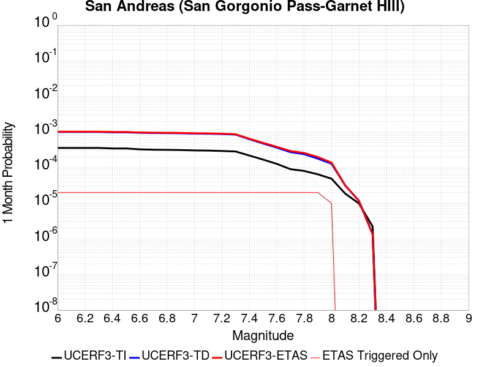 |  |  |

| Magnitude | 1 wk TI Prob | 1 wk TD Prob | 1 wk ETAS Prob | 1 wk ETAS/TD Gain | 1 wk ETAS Triggered Only | 1 mo TI Prob | 1 mo TD Prob | 1 mo ETAS Prob | 1 mo ETAS/TD Gain | 1 mo ETAS Triggered Only | 1 yr TI Prob | 1 yr TD Prob | 1 yr ETAS Prob | 1 yr ETAS/TD Gain | 1 yr ETAS Triggered Only | 10 yr TI Prob | 10 yr TD Prob | 10 yr ETAS Prob | 10 yr ETAS/TD Gain | 10 yr ETAS Triggered Only |
|-----|-----|-----|-----|-----|-----|-----|-----|-----|-----|-----|-----|-----|-----|-----|-----|-----|-----|-----|-----|-----|
| 6.0 | 8.31567E-5 | 2.3376173E-4 | 2.767495E-4 | 1.1838956 | 4.2997806E-5 | 3.5633717E-4 | 0.0010014536 | 0.0010444084 | 1.0428925 | 4.2997806E-5 | 0.004329778 | 0.012124644 | 0.01216712 | 1.0035033 | 4.2997806E-5 | 0.042463828 | 0.11255409 | 0.112630405 | 1.0006781 | 8.599561E-5 |
| 6.1 | 8.31567E-5 | 2.3376173E-4 | 2.767495E-4 | 1.1838956 | 4.2997806E-5 | 3.5633717E-4 | 0.0010014536 | 0.0010444084 | 1.0428925 | 4.2997806E-5 | 0.004329778 | 0.012124644 | 0.01216712 | 1.0035033 | 4.2997806E-5 | 0.042463828 | 0.11255409 | 0.112630405 | 1.0006781 | 8.599561E-5 |
| 6.2 | 8.31567E-5 | 2.3376173E-4 | 2.767495E-4 | 1.1838956 | 4.2997806E-5 | 3.5633717E-4 | 0.0010014536 | 0.0010444084 | 1.0428925 | 4.2997806E-5 | 0.004329778 | 0.012124644 | 0.01216712 | 1.0035033 | 4.2997806E-5 | 0.042463828 | 0.11255409 | 0.112630405 | 1.0006781 | 8.599561E-5 |
| 6.3 | 8.31567E-5 | 2.3376173E-4 | 2.767495E-4 | 1.1838956 | 4.2997806E-5 | 3.5633717E-4 | 0.0010014536 | 0.0010444084 | 1.0428925 | 4.2997806E-5 | 0.004329778 | 0.012124644 | 0.01216712 | 1.0035033 | 4.2997806E-5 | 0.042463828 | 0.11255409 | 0.112630405 | 1.0006781 | 8.599561E-5 |
| 6.4 | 8.059055E-5 | 2.2934518E-4 | 2.7233313E-4 | 1.1874378 | 4.2997806E-5 | 3.4534236E-4 | 9.825402E-4 | 0.0010254957 | 1.0437189 | 4.2997806E-5 | 0.0041964394 | 0.011896912 | 0.011939398 | 1.0035712 | 4.2997806E-5 | 0.041180745 | 0.11053528 | 0.11061177 | 1.000692 | 8.599561E-5 |
| 6.5 | 8.059055E-5 | 2.2934518E-4 | 2.7233313E-4 | 1.1874378 | 4.2997806E-5 | 3.4534236E-4 | 9.825402E-4 | 0.0010254957 | 1.0437189 | 4.2997806E-5 | 0.0041964394 | 0.011896912 | 0.011939398 | 1.0035712 | 4.2997806E-5 | 0.041180745 | 0.11053528 | 0.11061177 | 1.000692 | 8.599561E-5 |
| 6.6 | 7.619237E-5 | 2.2178894E-4 | 2.6477722E-4 | 1.1938251 | 4.2997806E-5 | 3.2649786E-4 | 9.5018005E-4 | 9.93137E-4 | 1.0452093 | 4.2997806E-5 | 0.0039678677 | 0.011507631 | 0.011550134 | 1.0036935 | 4.2997806E-5 | 0.03897764 | 0.1070719 | 0.107148685 | 1.0007172 | 8.599561E-5 |
| 6.7 | 7.440636E-5 | 2.1854721E-4 | 2.6153564E-4 | 1.1967008 | 4.2997806E-5 | 3.188454E-4 | 9.36297E-4 | 9.792545E-4 | 1.0458803 | 4.2997806E-5 | 0.0038750346 | 0.0113403695 | 0.01138288 | 1.0037485 | 4.2997806E-5 | 0.038081564 | 0.10558031 | 0.10565723 | 1.0007285 | 8.599561E-5 |
| 6.8 | 7.3735864E-5 | 2.1701894E-4 | 2.6000742E-4 | 1.1980863 | 4.2997806E-5 | 3.1597257E-4 | 9.2975196E-4 | 9.727098E-4 | 1.0462035 | 4.2997806E-5 | 0.0038401815 | 0.011261511 | 0.011304025 | 1.0037751 | 4.2997806E-5 | 0.03774495 | 0.104881845 | 0.10495882 | 1.000734 | 8.599561E-5 |
| 6.9 | 7.27575E-5 | 2.1470869E-4 | 2.5769728E-4 | 1.2002182 | 4.2997806E-5 | 3.117806E-4 | 9.198579E-4 | 9.628161E-4 | 1.046701 | 4.2997806E-5 | 0.003789323 | 0.011142288 | 0.011184807 | 1.003816 | 4.2997806E-5 | 0.037253562 | 0.103829734 | 0.1039068 | 1.0007422 | 8.599561E-5 |
| 7.0 | 7.102591E-5 | 2.1054916E-4 | 2.535379E-4 | 1.2041744 | 4.2997806E-5 | 3.0436125E-4 | 9.020437E-4 | 9.450027E-4 | 1.0476241 | 4.2997806E-5 | 0.003699303 | 0.010927594 | 0.010970122 | 1.0038918 | 4.2997806E-5 | 0.03638325 | 0.1019319 | 0.10200913 | 1.0007577 | 8.599561E-5 |
| 7.1 | 7.028513E-5 | 2.0890564E-4 | 2.5189447E-4 | 1.2057811 | 4.2997806E-5 | 3.0118722E-4 | 8.950049E-4 | 9.3796424E-4 | 1.047999 | 4.2997806E-5 | 0.0036607897 | 0.010842753 | 0.010885284 | 1.0039226 | 4.2997806E-5 | 0.036010686 | 0.10117493 | 0.10125222 | 1.000764 | 8.599561E-5 |
| 7.2 | 6.8498244E-5 | 2.0498442E-4 | 2.4797342E-4 | 1.2097183 | 4.2997806E-5 | 2.9353087E-4 | 8.782111E-4 | 9.2117116E-4 | 1.0489177 | 4.2997806E-5 | 0.003567883 | 0.010640301 | 0.010682842 | 1.003998 | 4.2997806E-5 | 0.035111405 | 0.099366926 | 0.099444374 | 1.0007794 | 8.599561E-5 |
| 7.3 | 6.622592E-5 | 1.9725891E-4 | 2.4024824E-4 | 1.2179335 | 4.2997806E-5 | 2.8379448E-4 | 8.4512355E-4 | 8.8808505E-4 | 1.0508345 | 4.2997806E-5 | 0.0034497243 | 0.010241316 | 0.010283873 | 1.0041555 | 4.2997806E-5 | 0.033966612 | 0.09586389 | 0.09594165 | 1.0008111 | 8.599561E-5 |
| 7.4 | 5.1050705E-5 | 1.468621E-4 | 1.898536E-4 | 1.2927337 | 4.2997806E-5 | 2.1877038E-4 | 6.292581E-4 | 6.7222887E-4 | 1.068288 | 4.2997806E-5 | 0.002660276 | 0.0076344977 | 0.0076771677 | 1.005589 | 4.2997806E-5 | 0.02628654 | 0.07285113 | 0.07293086 | 1.0010945 | 8.599561E-5 |
| 7.5 | 3.9302922E-5 | 1.1129282E-4 | 1.5428584E-4 | 1.3863055 | 4.2997806E-5 | 1.6843023E-4 | 4.768824E-4 | 5.1985966E-4 | 1.0901214 | 4.2997806E-5 | 0.0020487092 | 0.005790656 | 0.0058334046 | 1.0073824 | 4.2997806E-5 | 0.020299247 | 0.05600702 | 0.056088198 | 1.0014495 | 8.599561E-5 |
| 7.6 | 2.9851626E-5 | 8.494473E-5 | 1.2793888E-4 | 1.5061427 | 4.2997806E-5 | 1.2792926E-4 | 3.6399817E-4 | 4.069803E-4 | 1.1180835 | 4.2997806E-5 | 0.0015564259 | 0.0044226977 | 0.0044655055 | 1.0096791 | 4.2997806E-5 | 0.0154556995 | 0.043191496 | 0.043273777 | 1.0019051 | 8.599561E-5 |
| 7.7 | 2.1135214E-5 | 6.352455E-5 | 1.0651963E-4 | 1.6768261 | 4.2997806E-5 | 9.0576345E-5 | 2.7221968E-4 | 3.152058E-4 | 1.1579096 | 4.2997806E-5 | 0.0011022091 | 0.0033092434 | 0.0033520989 | 1.0129503 | 4.2997806E-5 | 0.010967582 | 0.03258059 | 0.032663785 | 1.0025535 | 8.599561E-5 |
| 7.8 | 1.883379E-5 | 5.56362E-5 | 9.8631615E-5 | 1.7727957 | 4.2997806E-5 | 8.0713755E-5 | 2.3841907E-4 | 2.8140662E-4 | 1.1803025 | 4.2997806E-5 | 9.822468E-4 | 0.0028988915 | 0.0029417647 | 1.0147895 | 4.2997806E-5 | 0.0097791655 | 0.02869336 | 0.028776888 | 1.0029111 | 8.599561E-5 |
| 7.9 | 1.5156185E-5 | 4.165507E-5 | 8.465109E-5 | 2.0321918 | 4.2997806E-5 | 6.495346E-5 | 1.7850952E-4 | 2.2149965E-4 | 1.2408283 | 4.2997806E-5 | 7.9052144E-4 | 0.0021711884 | 0.002214093 | 1.0197608 | 4.2997806E-5 | 0.007877152 | 0.021757882 | 0.021842007 | 1.0038664 | 8.599561E-5 |
| 8.0 | 1.1405907E-5 | 2.9971703E-5 | 2.9971703E-5 | 1.0 | 0.0 | 4.8881542E-5 | 1.2844383E-4 | 1.2844383E-4 | 1.0 | 0.0 | 5.9497025E-4 | 0.001562683 | 0.001562683 | 1.0 | 0.0 | 0.005933798 | 0.015771678 | 0.015771678 | 1.0 | 0.0 |
| 8.1 | 4.3511436E-6 | 7.36832E-6 | 7.36832E-6 | 1.0 | 0.0 | 1.8647626E-5 | 3.1578133E-5 | 3.1578133E-5 | 1.0 | 0.0 | 2.2701119E-4 | 3.8439606E-4 | 3.8439606E-4 | 1.0 | 0.0 | 0.0022677942 | 0.004115886 | 0.004115886 | 1.0 | 0.0 |
| 8.2 | 2.3042528E-6 | 2.7325216E-6 | 2.7325216E-6 | 1.0 | 0.0 | 9.875332E-6 | 1.1710755E-5 | 1.1710755E-5 | 1.0 | 0.0 | 1.2022553E-4 | 1.4256914E-4 | 1.4256914E-4 | 1.0 | 0.0 | 0.0012016051 | 0.0015977593 | 0.0015977593 | 1.0 | 0.0 |
| 8.3 | 5.202968E-7 | 3.1592276E-7 | 3.1592276E-7 | 1.0 | 0.0 | 2.2298414E-6 | 1.3539541E-6 | 1.3539541E-6 | 1.0 | 0.0 | 2.714798E-5 | 1.6484279E-5 | 1.6484279E-5 | 1.0 | 0.0 | 2.7144665E-4 | 1.9559723E-4 | 1.9559723E-4 | 1.0 | 0.0 |

## Lost Hills
*[(top)](#table-of-contents)*

| 1 Week | 1 Month | 1 Year | 10 Year |
|-----|-----|-----|-----|
|  | 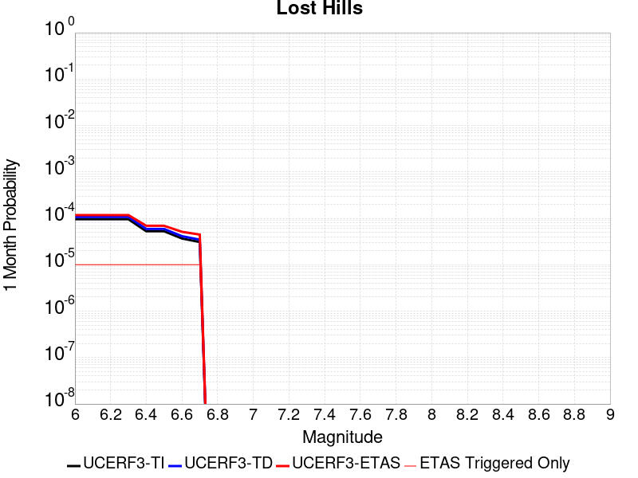 |  |  |

| Magnitude | 1 wk TI Prob | 1 wk TD Prob | 1 wk ETAS Prob | 1 wk ETAS/TD Gain | 1 wk ETAS Triggered Only | 1 mo TI Prob | 1 mo TD Prob | 1 mo ETAS Prob | 1 mo ETAS/TD Gain | 1 mo ETAS Triggered Only | 1 yr TI Prob | 1 yr TD Prob | 1 yr ETAS Prob | 1 yr ETAS/TD Gain | 1 yr ETAS Triggered Only | 10 yr TI Prob | 10 yr TD Prob | 10 yr ETAS Prob | 10 yr ETAS/TD Gain | 10 yr ETAS Triggered Only |
|-----|-----|-----|-----|-----|-----|-----|-----|-----|-----|-----|-----|-----|-----|-----|-----|-----|-----|-----|-----|-----|
| 6.0 | 2.233523E-5 | 2.51065E-5 | 6.8103225E-5 | 2.7125735 | 4.2997806E-5 | 9.571891E-5 | 1.0759579E-4 | 1.5058898E-4 | 1.3995805 | 4.2997806E-5 | 0.0011647546 | 0.0013093597 | 0.0013952428 | 1.0655916 | 8.599561E-5 | 0.011586686 | 0.013033048 | 0.0131179225 | 1.0065123 | 8.599561E-5 |
| 6.1 | 2.233523E-5 | 2.51065E-5 | 6.8103225E-5 | 2.7125735 | 4.2997806E-5 | 9.571891E-5 | 1.0759579E-4 | 1.5058898E-4 | 1.3995805 | 4.2997806E-5 | 0.0011647546 | 0.0013093597 | 0.0013952428 | 1.0655916 | 8.599561E-5 | 0.011586686 | 0.013033048 | 0.0131179225 | 1.0065123 | 8.599561E-5 |
| 6.2 | 2.233523E-5 | 2.51065E-5 | 6.8103225E-5 | 2.7125735 | 4.2997806E-5 | 9.571891E-5 | 1.0759579E-4 | 1.5058898E-4 | 1.3995805 | 4.2997806E-5 | 0.0011647546 | 0.0013093597 | 0.0013952428 | 1.0655916 | 8.599561E-5 | 0.011586686 | 0.013033048 | 0.0131179225 | 1.0065123 | 8.599561E-5 |
| 6.3 | 2.233523E-5 | 2.51065E-5 | 6.8103225E-5 | 2.7125735 | 4.2997806E-5 | 9.571891E-5 | 1.0759579E-4 | 1.5058898E-4 | 1.3995805 | 4.2997806E-5 | 0.0011647546 | 0.0013093597 | 0.0013952428 | 1.0655916 | 8.599561E-5 | 0.011586686 | 0.013033048 | 0.0131179225 | 1.0065123 | 8.599561E-5 |
| 6.4 | 1.2288092E-5 | 1.3781063E-5 | 5.6778277E-5 | 4.120022 | 4.2997806E-5 | 5.2662188E-5 | 5.906089E-5 | 1.02056154E-4 | 1.727982 | 4.2997806E-5 | 6.409735E-4 | 7.189229E-4 | 8.048567E-4 | 1.1195313 | 8.599561E-5 | 0.006391279 | 0.0071751773 | 0.0072605563 | 1.0118991 | 8.599561E-5 |
| 6.5 | 1.2288092E-5 | 1.3781063E-5 | 5.6778277E-5 | 4.120022 | 4.2997806E-5 | 5.2662188E-5 | 5.906089E-5 | 1.02056154E-4 | 1.727982 | 4.2997806E-5 | 6.409735E-4 | 7.189229E-4 | 8.048567E-4 | 1.1195313 | 8.599561E-5 | 0.006391279 | 0.0071751773 | 0.0072605563 | 1.0118991 | 8.599561E-5 |
| 6.6 | 8.58281E-6 | 9.633739E-6 | 5.263113E-5 | 5.4632096 | 4.2997806E-5 | 3.6782953E-5 | 4.1287265E-5 | 8.4283296E-5 | 2.0413873 | 4.2997806E-5 | 4.4774043E-4 | 5.0263974E-4 | 5.456159E-4 | 1.085501 | 4.2997806E-5 | 0.0044683935 | 0.005023189 | 0.0050659706 | 1.0085169 | 4.2997806E-5 |
| 6.7 | 7.205685E-6 | 8.0882755E-6 | 5.1085735E-5 | 6.3160233 | 4.2997806E-5 | 3.088114E-5 | 3.4664037E-5 | 7.7660356E-5 | 2.2403724 | 4.2997806E-5 | 3.7591302E-4 | 4.2203465E-4 | 4.650143E-4 | 1.1018392 | 4.2997806E-5 | 0.0037527776 | 0.0042203465 | 0.004263163 | 1.0101452 | 4.2997806E-5 |

## Palos Verdes
*[(top)](#table-of-contents)*

| 1 Week | 1 Month | 1 Year | 10 Year |
|-----|-----|-----|-----|
|  |  |  |  |

| Magnitude | 1 wk TI Prob | 1 wk TD Prob | 1 wk ETAS Prob | 1 wk ETAS/TD Gain | 1 wk ETAS Triggered Only | 1 mo TI Prob | 1 mo TD Prob | 1 mo ETAS Prob | 1 mo ETAS/TD Gain | 1 mo ETAS Triggered Only | 1 yr TI Prob | 1 yr TD Prob | 1 yr ETAS Prob | 1 yr ETAS/TD Gain | 1 yr ETAS Triggered Only | 10 yr TI Prob | 10 yr TD Prob | 10 yr ETAS Prob | 10 yr ETAS/TD Gain | 10 yr ETAS Triggered Only |
|-----|-----|-----|-----|-----|-----|-----|-----|-----|-----|-----|-----|-----|-----|-----|-----|-----|-----|-----|-----|-----|
| 6.0 | 6.126063E-5 | 7.622562E-5 | 7.622562E-5 | 1.0 | 0.0 | 2.6251914E-4 | 3.2664367E-4 | 3.2664367E-4 | 1.0 | 0.0 | 0.0031914865 | 0.003970149 | 0.0040129763 | 1.0107872 | 4.2997806E-5 | 0.031460393 | 0.03904865 | 0.039131287 | 1.0021163 | 8.599561E-5 |
| 6.1 | 6.126063E-5 | 7.622562E-5 | 7.622562E-5 | 1.0 | 0.0 | 2.6251914E-4 | 3.2664367E-4 | 3.2664367E-4 | 1.0 | 0.0 | 0.0031914865 | 0.003970149 | 0.0040129763 | 1.0107872 | 4.2997806E-5 | 0.031460393 | 0.03904865 | 0.039131287 | 1.0021163 | 8.599561E-5 |
| 6.2 | 6.126063E-5 | 7.622562E-5 | 7.622562E-5 | 1.0 | 0.0 | 2.6251914E-4 | 3.2664367E-4 | 3.2664367E-4 | 1.0 | 0.0 | 0.0031914865 | 0.003970149 | 0.0040129763 | 1.0107872 | 4.2997806E-5 | 0.031460393 | 0.03904865 | 0.039131287 | 1.0021163 | 8.599561E-5 |
| 6.3 | 4.0838047E-5 | 4.9749142E-5 | 4.9749142E-5 | 1.0 | 0.0 | 1.7500846E-4 | 2.1319446E-4 | 2.1319446E-4 | 1.0 | 0.0 | 0.0021286458 | 0.0025927671 | 0.0026356534 | 1.0165408 | 4.2997806E-5 | 0.021083709 | 0.025646534 | 0.025730323 | 1.0032672 | 8.599561E-5 |
| 6.4 | 4.0838047E-5 | 4.9749142E-5 | 4.9749142E-5 | 1.0 | 0.0 | 1.7500846E-4 | 2.1319446E-4 | 2.1319446E-4 | 1.0 | 0.0 | 0.0021286458 | 0.0025927671 | 0.0026356534 | 1.0165408 | 4.2997806E-5 | 0.021083709 | 0.025646534 | 0.025730323 | 1.0032672 | 8.599561E-5 |
| 6.5 | 3.0512005E-5 | 3.656143E-5 | 3.656143E-5 | 1.0 | 0.0 | 1.3075917E-4 | 1.5668309E-4 | 1.5668309E-4 | 1.0 | 0.0 | 0.0015908304 | 0.0019060666 | 0.0019489824 | 1.0225154 | 4.2997806E-5 | 0.015794903 | 0.018909054 | 0.018951239 | 1.0022309 | 4.2997806E-5 |
| 6.6 | 2.9255087E-5 | 3.515423E-5 | 3.515423E-5 | 1.0 | 0.0 | 1.2537291E-4 | 1.5065294E-4 | 1.5065294E-4 | 1.0 | 0.0 | 0.0015253464 | 0.001832773 | 0.0018756919 | 1.0234175 | 4.2997806E-5 | 0.015149189 | 0.018188128 | 0.018230343 | 1.002321 | 4.2997806E-5 |
| 6.7 | 2.287198E-5 | 2.7248137E-5 | 2.7248137E-5 | 1.0 | 0.0 | 9.801909E-5 | 1.1677302E-4 | 1.1677302E-4 | 1.0 | 0.0 | 0.001192729 | 0.001420876 | 0.0014638128 | 1.0302185 | 4.2997806E-5 | 0.011863477 | 0.014127145 | 0.014169536 | 1.0030006 | 4.2997806E-5 |
| 6.8 | 2.1325764E-5 | 2.5431746E-5 | 2.5431746E-5 | 1.0 | 0.0 | 9.139293E-5 | 1.0898915E-4 | 1.0898915E-4 | 1.0 | 0.0 | 0.001112141 | 0.0013262255 | 0.0013691662 | 1.0323782 | 4.2997806E-5 | 0.011065915 | 0.013192143 | 0.013234573 | 1.0032164 | 4.2997806E-5 |
| 6.9 | 1.9009392E-5 | 2.2613433E-5 | 2.2613433E-5 | 1.0 | 0.0 | 8.1466285E-5 | 9.69116E-5 | 9.69116E-5 | 1.0 | 0.0 | 9.914007E-4 | 0.0011793474 | 0.0012222945 | 1.0364159 | 4.2997806E-5 | 0.009869894 | 0.0117395725 | 0.011782066 | 1.0036197 | 4.2997806E-5 |
| 7.0 | 1.7098473E-5 | 2.0319252E-5 | 2.0319252E-5 | 1.0 | 0.0 | 7.3277115E-5 | 8.708009E-5 | 8.708009E-5 | 1.0 | 0.0 | 8.917837E-4 | 0.0010597695 | 0.0011027218 | 1.0405298 | 4.2997806E-5 | 0.008882134 | 0.010555593 | 0.010598137 | 1.0040305 | 4.2997806E-5 |
| 7.1 | 1.5982785E-5 | 1.8994664E-5 | 1.8994664E-5 | 1.0 | 0.0 | 6.849585E-5 | 8.140364E-5 | 8.140364E-5 | 1.0 | 0.0 | 8.336179E-4 | 9.907234E-4 | 0.0010336787 | 1.0433574 | 4.2997806E-5 | 0.008304977 | 0.00987143 | 0.009914003 | 1.0043128 | 4.2997806E-5 |
| 7.2 | 1.4468002E-5 | 1.719715E-5 | 1.719715E-5 | 1.0 | 0.0 | 6.200425E-5 | 7.370046E-5 | 7.370046E-5 | 1.0 | 0.0 | 7.546402E-4 | 8.9701766E-4 | 9.399769E-4 | 1.0478911 | 4.2997806E-5 | 0.007520827 | 0.008942238 | 0.008984852 | 1.0047654 | 4.2997806E-5 |
| 7.3 | 5.288233E-6 | 6.203645E-6 | 6.203645E-6 | 1.0 | 0.0 | 2.2663658E-5 | 2.6586977E-5 | 2.6586977E-5 | 1.0 | 0.0 | 2.7589512E-4 | 3.2368326E-4 | 3.2368326E-4 | 1.0 | 0.0 | 0.0027555283 | 0.0032355408 | 0.0032355408 | 1.0 | 0.0 |
| 7.4 | 8.279556E-7 | 8.4083433E-7 | 8.4083433E-7 | 1.0 | 0.0 | 3.5483763E-6 | 3.603571E-6 | 3.603571E-6 | 1.0 | 0.0 | 4.3200624E-5 | 4.3872667E-5 | 4.3872667E-5 | 1.0 | 0.0 | 4.3192226E-4 | 4.386473E-4 | 4.386473E-4 | 1.0 | 0.0 |
| 7.5 | 6.559831E-7 | 6.667226E-7 | 6.667226E-7 | 1.0 | 0.0 | 2.8113532E-6 | 2.8573797E-6 | 2.8573797E-6 | 1.0 | 0.0 | 3.4227687E-5 | 3.478811E-5 | 3.478811E-5 | 1.0 | 0.0 | 3.4222414E-4 | 3.478333E-4 | 3.478333E-4 | 1.0 | 0.0 |
| 7.6 | 3.5018968E-7 | 3.5620013E-7 | 3.5620013E-7 | 1.0 | 0.0 | 1.500812E-6 | 1.5265713E-6 | 1.5265713E-6 | 1.0 | 0.0 | 1.8272232E-5 | 1.8585893E-5 | 1.8585893E-5 | 1.0 | 0.0 | 1.8270731E-4 | 1.85848E-4 | 1.85848E-4 | 1.0 | 0.0 |
| 7.7 | 1.1986104E-7 | 1.219837E-7 | 1.219837E-7 | 1.0 | 0.0 | 5.1369005E-7 | 5.227872E-7 | 5.227872E-7 | 1.0 | 0.0 | 6.2541585E-6 | 6.3649163E-6 | 6.3649163E-6 | 1.0 | 0.0 | 6.2539824E-5 | 6.364738E-5 | 6.364738E-5 | 1.0 | 0.0 |
| 7.8 | 3.0445005E-8 | 3.1027568E-8 | 3.1027568E-8 | 1.0 | 0.0 | 1.3047858E-7 | 1.3297529E-7 | 1.3297529E-7 | 1.0 | 0.0 | 1.5885756E-6 | 1.6189731E-6 | 1.6189731E-6 | 1.0 | 0.0 | 1.5885644E-5 | 1.6189633E-5 | 1.6189633E-5 | 1.0 | 0.0 |

## Elsinore (Glen Ivy) rev
*[(top)](#table-of-contents)*

| 1 Week | 1 Month | 1 Year | 10 Year |
|-----|-----|-----|-----|
|  | 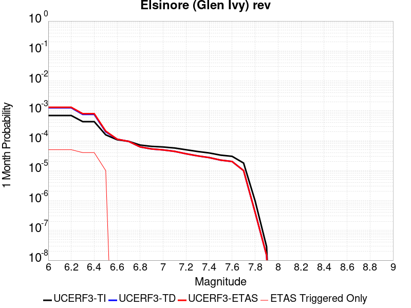 |  |  |

| Magnitude | 1 wk TI Prob | 1 wk TD Prob | 1 wk ETAS Prob | 1 wk ETAS/TD Gain | 1 wk ETAS Triggered Only | 1 mo TI Prob | 1 mo TD Prob | 1 mo ETAS Prob | 1 mo ETAS/TD Gain | 1 mo ETAS Triggered Only | 1 yr TI Prob | 1 yr TD Prob | 1 yr ETAS Prob | 1 yr ETAS/TD Gain | 1 yr ETAS Triggered Only | 10 yr TI Prob | 10 yr TD Prob | 10 yr ETAS Prob | 10 yr ETAS/TD Gain | 10 yr ETAS Triggered Only |
|-----|-----|-----|-----|-----|-----|-----|-----|-----|-----|-----|-----|-----|-----|-----|-----|-----|-----|-----|-----|-----|
| 6.0 | 1.6204086E-4 | 2.9360445E-4 | 3.365896E-4 | 1.1464051 | 4.2997806E-5 | 6.94276E-4 | 0.0012578527 | 0.0013437402 | 1.068281 | 8.599561E-5 | 0.008420097 | 0.01523435 | 0.015319035 | 1.0055588 | 8.599561E-5 | 0.081081145 | 0.139691 | 0.13976498 | 1.0005296 | 8.599561E-5 |
| 6.1 | 1.6204086E-4 | 2.9360445E-4 | 3.365896E-4 | 1.1464051 | 4.2997806E-5 | 6.94276E-4 | 0.0012578527 | 0.0013437402 | 1.068281 | 8.599561E-5 | 0.008420097 | 0.01523435 | 0.015319035 | 1.0055588 | 8.599561E-5 | 0.081081145 | 0.139691 | 0.13976498 | 1.0005296 | 8.599561E-5 |
| 6.2 | 1.6204086E-4 | 2.9360445E-4 | 3.365896E-4 | 1.1464051 | 4.2997806E-5 | 6.94276E-4 | 0.0012578527 | 0.0013437402 | 1.068281 | 8.599561E-5 | 0.008420097 | 0.01523435 | 0.015319035 | 1.0055588 | 8.599561E-5 | 0.081081145 | 0.139691 | 0.13976498 | 1.0005296 | 8.599561E-5 |
| 6.3 | 1.0111737E-4 | 1.7703307E-4 | 2.2002326E-4 | 1.2428371 | 4.2997806E-5 | 4.332882E-4 | 7.586092E-4 | 8.015744E-4 | 1.0566368 | 4.2997806E-5 | 0.005262531 | 0.009217643 | 0.009260245 | 1.0046217 | 4.2997806E-5 | 0.0513964 | 0.087018766 | 0.08705802 | 1.0004511 | 4.2997806E-5 |
| 6.4 | 1.0111737E-4 | 1.7703307E-4 | 2.2002326E-4 | 1.2428371 | 4.2997806E-5 | 4.332882E-4 | 7.586092E-4 | 8.015744E-4 | 1.0566368 | 4.2997806E-5 | 0.005262531 | 0.009217643 | 0.009260245 | 1.0046217 | 4.2997806E-5 | 0.0513964 | 0.087018766 | 0.08705802 | 1.0004511 | 4.2997806E-5 |
| 6.5 | 3.6624708E-5 | 4.639072E-5 | 4.639072E-5 | 1.0 | 0.0 | 1.569536E-4 | 1.9880426E-4 | 1.9880426E-4 | 1.0 | 0.0 | 0.001909235 | 0.002418118 | 0.002418118 | 1.0 | 0.0 | 0.01892915 | 0.023739774 | 0.023739774 | 1.0 | 0.0 |
| 6.6 | 2.5051324E-5 | 2.6147469E-5 | 2.6147469E-5 | 1.0 | 0.0 | 1.073584E-4 | 1.1205602E-4 | 1.1205602E-4 | 1.0 | 0.0 | 0.0013063047 | 0.0013634728 | 0.0013634728 | 1.0 | 0.0 | 0.012986525 | 0.01356449 | 0.01356449 | 1.0 | 0.0 |
| 6.7 | 2.2189772E-5 | 2.2072634E-5 | 2.2072634E-5 | 1.0 | 0.0 | 9.509556E-5 | 9.459378E-5 | 9.459378E-5 | 1.0 | 0.0 | 0.0011571734 | 0.0011511071 | 0.0011511071 | 1.0 | 0.0 | 0.011511663 | 0.011465305 | 0.011465305 | 1.0 | 0.0 |
| 6.8 | 1.6654378E-5 | 1.443758E-5 | 1.443758E-5 | 1.0 | 0.0 | 7.137396E-5 | 6.18739E-5 | 6.18739E-5 | 1.0 | 0.0 | 8.686314E-4 | 7.530596E-4 | 7.530596E-4 | 1.0 | 0.0 | 0.008652439 | 0.0075104153 | 0.0075104153 | 1.0 | 0.0 |
| 6.9 | 1.5042909E-5 | 1.2331914E-5 | 1.2331914E-5 | 1.0 | 0.0 | 6.446802E-5 | 5.285001E-5 | 5.285001E-5 | 1.0 | 0.0 | 7.8461546E-4 | 6.4326206E-4 | 6.4326206E-4 | 1.0 | 0.0 | 0.007818509 | 0.006418224 | 0.006418224 | 1.0 | 0.0 |
| 7.0 | 1.4361385E-5 | 1.1451223E-5 | 1.1451223E-5 | 1.0 | 0.0 | 6.154734E-5 | 4.9075763E-5 | 4.9075763E-5 | 1.0 | 0.0 | 7.490812E-4 | 5.973365E-4 | 5.973365E-4 | 1.0 | 0.0 | 0.007465612 | 0.005961301 | 0.005961301 | 1.0 | 0.0 |
| 7.1 | 1.3265571E-5 | 1.0244836E-5 | 1.0244836E-5 | 1.0 | 0.0 | 5.6851208E-5 | 4.390571E-5 | 4.390571E-5 | 1.0 | 0.0 | 6.919436E-4 | 5.3442345E-4 | 5.3442345E-4 | 1.0 | 0.0 | 0.006897931 | 0.0053347396 | 0.0053347396 | 1.0 | 0.0 |
| 7.2 | 1.1596403E-5 | 8.504992E-6 | 8.504992E-6 | 1.0 | 0.0 | 4.9697923E-5 | 3.6449466E-5 | 3.6449466E-5 | 1.0 | 0.0 | 6.049042E-4 | 4.436836E-4 | 4.436836E-4 | 1.0 | 0.0 | 0.006032603 | 0.004429393 | 0.004429393 | 1.0 | 0.0 |
| 7.3 | 1.0150827E-5 | 7.2386983E-6 | 7.2386983E-6 | 1.0 | 0.0 | 4.3502816E-5 | 3.102263E-5 | 3.102263E-5 | 1.0 | 0.0 | 5.2951806E-4 | 3.7763652E-4 | 3.7763652E-4 | 1.0 | 0.0 | 0.005282581 | 0.0037703344 | 0.0037703344 | 1.0 | 0.0 |
| 7.4 | 9.080705E-6 | 6.3524662E-6 | 6.3524662E-6 | 1.0 | 0.0 | 3.8916725E-5 | 2.7224578E-5 | 2.7224578E-5 | 1.0 | 0.0 | 4.7370812E-4 | 3.3141018E-4 | 3.3141018E-4 | 1.0 | 0.0 | 0.004726996 | 0.0033093104 | 0.0033093104 | 1.0 | 0.0 |
| 7.5 | 7.671649E-6 | 5.22559E-6 | 5.22559E-6 | 1.0 | 0.0 | 3.287808E-5 | 2.2395201E-5 | 2.2395201E-5 | 1.0 | 0.0 | 4.0021708E-4 | 2.726287E-4 | 2.726287E-4 | 1.0 | 0.0 | 0.0039949706 | 0.0027230675 | 0.0027230675 | 1.0 | 0.0 |
| 7.6 | 6.990086E-6 | 4.687506E-6 | 4.687506E-6 | 1.0 | 0.0 | 2.9957167E-5 | 2.0089165E-5 | 2.0089165E-5 | 1.0 | 0.0 | 3.6466747E-4 | 2.4455928E-4 | 2.4455928E-4 | 1.0 | 0.0 | 0.0036406964 | 0.002443018 | 0.002443018 | 1.0 | 0.0 |
| 7.7 | 4.163505E-6 | 2.3295113E-6 | 2.3295113E-6 | 1.0 | 0.0 | 1.7843471E-5 | 9.983586E-6 | 9.983586E-6 | 1.0 | 0.0 | 2.172226E-4 | 1.2154412E-4 | 1.2154412E-4 | 1.0 | 0.0 | 0.0021701038 | 0.0012148495 | 0.0012148495 | 1.0 | 0.0 |
| 7.8 | 2.2692414E-7 | 9.385374E-8 | 9.385374E-8 | 1.0 | 0.0 | 9.725317E-7 | 4.0223028E-7 | 4.0223028E-7 | 1.0 | 0.0 | 1.1840509E-5 | 4.897146E-6 | 4.897146E-6 | 1.0 | 0.0 | 1.1839878E-4 | 4.897071E-5 | 4.897071E-5 | 1.0 | 0.0 |
| 7.9 | 6.676829E-9 | 3.439828E-9 | 3.439828E-9 | 1.0 | 0.0 | 2.861498E-8 | 1.47421195E-8 | 1.47421195E-8 | 1.0 | 0.0 | 3.4838732E-7 | 1.7948528E-7 | 1.7948528E-7 | 1.0 | 0.0 | 3.4838679E-6 | 1.7948516E-6 | 1.7948516E-6 | 1.0 | 0.0 |

## San Andreas (Coachella) rev
*[(top)](#table-of-contents)*

| 1 Week | 1 Month | 1 Year | 10 Year |
|-----|-----|-----|-----|
| 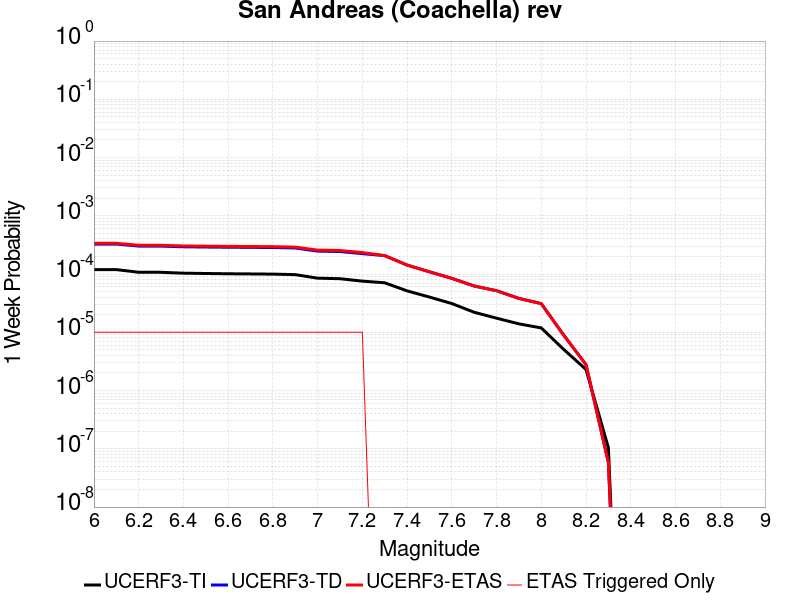 | 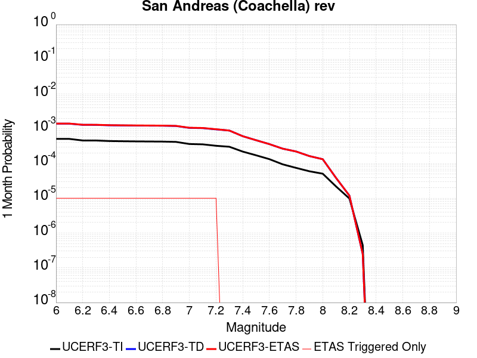 |  |  |

| Magnitude | 1 wk TI Prob | 1 wk TD Prob | 1 wk ETAS Prob | 1 wk ETAS/TD Gain | 1 wk ETAS Triggered Only | 1 mo TI Prob | 1 mo TD Prob | 1 mo ETAS Prob | 1 mo ETAS/TD Gain | 1 mo ETAS Triggered Only | 1 yr TI Prob | 1 yr TD Prob | 1 yr ETAS Prob | 1 yr ETAS/TD Gain | 1 yr ETAS Triggered Only | 10 yr TI Prob | 10 yr TD Prob | 10 yr ETAS Prob | 10 yr ETAS/TD Gain | 10 yr ETAS Triggered Only |
|-----|-----|-----|-----|-----|-----|-----|-----|-----|-----|-----|-----|-----|-----|-----|-----|-----|-----|-----|-----|-----|
| 6.0 | 1.1925945E-4 | 3.2723017E-4 | 3.702139E-4 | 1.1313562 | 4.2997806E-5 | 5.110118E-4 | 0.001401666 | 0.0014446035 | 1.0306332 | 4.2997806E-5 | 0.0062038354 | 0.016933087 | 0.016975356 | 1.0024962 | 4.2997806E-5 | 0.060334753 | 0.15262908 | 0.15270196 | 1.0004774 | 8.599561E-5 |
| 6.1 | 1.1925945E-4 | 3.2723017E-4 | 3.702139E-4 | 1.1313562 | 4.2997806E-5 | 5.110118E-4 | 0.001401666 | 0.0014446035 | 1.0306332 | 4.2997806E-5 | 0.0062038354 | 0.016933087 | 0.016975356 | 1.0024962 | 4.2997806E-5 | 0.060334753 | 0.15262908 | 0.15270196 | 1.0004774 | 8.599561E-5 |
| 6.2 | 1.07432395E-4 | 3.0223778E-4 | 3.452226E-4 | 1.1422218 | 4.2997806E-5 | 4.603433E-4 | 0.0012946657 | 0.0013376079 | 1.0331686 | 4.2997806E-5 | 0.005590286 | 0.01564973 | 0.015692055 | 1.0027045 | 4.2997806E-5 | 0.05451731 | 0.1417999 | 0.14187369 | 1.0005205 | 8.599561E-5 |
| 6.3 | 1.0718766E-4 | 3.0169083E-4 | 3.4467567E-4 | 1.1424798 | 4.2997806E-5 | 4.592948E-4 | 0.001292324 | 0.0013352663 | 1.0332286 | 4.2997806E-5 | 0.005577586 | 0.01562163 | 0.015663955 | 1.0027095 | 4.2997806E-5 | 0.054396555 | 0.14156814 | 0.14164196 | 1.0005214 | 8.599561E-5 |
| 6.4 | 1.0355944E-4 | 2.9377177E-4 | 3.3675693E-4 | 1.1463217 | 4.2997806E-5 | 4.4375064E-4 | 0.0012584183 | 0.001301362 | 1.0341251 | 4.2997806E-5 | 0.0053892885 | 0.015214663 | 0.0152570065 | 1.0027831 | 4.2997806E-5 | 0.052604496 | 0.13812812 | 0.13820224 | 1.0005366 | 8.599561E-5 |
| 6.5 | 1.0227914E-4 | 2.909661E-4 | 3.339514E-4 | 1.147733 | 4.2997806E-5 | 4.382655E-4 | 0.0012464056 | 0.0012893497 | 1.0344545 | 4.2997806E-5 | 0.0053228354 | 0.015070442 | 0.015112791 | 1.0028101 | 4.2997806E-5 | 0.051971316 | 0.13690725 | 0.13698147 | 1.0005422 | 8.599561E-5 |
| 6.6 | 1.0116757E-4 | 2.8862362E-4 | 3.3160902E-4 | 1.1489323 | 4.2997806E-5 | 4.3350324E-4 | 0.0012363759 | 0.0012793206 | 1.0347342 | 4.2997806E-5 | 0.0052651367 | 0.014950012 | 0.014992367 | 1.0028331 | 4.2997806E-5 | 0.051421247 | 0.1358854 | 0.13595971 | 1.0005468 | 8.599561E-5 |
| 6.7 | 1.0050676E-4 | 2.8720926E-4 | 3.301947E-4 | 1.149666 | 4.2997806E-5 | 4.3067214E-4 | 0.0012303201 | 0.001273265 | 1.0349054 | 4.2997806E-5 | 0.005230834 | 0.014877291 | 0.01491965 | 1.0028472 | 4.2997806E-5 | 0.051094085 | 0.1352701 | 0.13534446 | 1.0005498 | 8.599561E-5 |
| 6.8 | 9.976819E-5 | 2.8524583E-4 | 3.2823137E-4 | 1.1506965 | 4.2997806E-5 | 4.2750788E-4 | 0.0012219134 | 0.0012648586 | 1.0351459 | 4.2997806E-5 | 0.0051924936 | 0.014776332 | 0.014818695 | 1.0028669 | 4.2997806E-5 | 0.050728295 | 0.13442177 | 0.13449621 | 1.0005537 | 8.599561E-5 |
| 6.9 | 9.77719E-5 | 2.8021506E-4 | 3.232008E-4 | 1.1534027 | 4.2997806E-5 | 4.1895514E-4 | 0.0012003728 | 0.001243319 | 1.0357773 | 4.2997806E-5 | 0.0050888555 | 0.014517602 | 0.014559975 | 1.0029187 | 4.2997806E-5 | 0.049738888 | 0.13225023 | 0.13232486 | 1.0005642 | 8.599561E-5 |
| 7.0 | 8.500761E-5 | 2.4756166E-4 | 2.905488E-4 | 1.1736423 | 4.2997806E-5 | 3.6426744E-4 | 0.0010605503 | 0.0011035026 | 1.0404999 | 4.2997806E-5 | 0.0044259406 | 0.012836529 | 0.012878975 | 1.0033066 | 4.2997806E-5 | 0.04338823 | 0.11810792 | 0.11818376 | 1.0006421 | 8.599561E-5 |
| 7.1 | 8.319876E-5 | 2.4358921E-4 | 2.8657654E-4 | 1.1764747 | 4.2997806E-5 | 3.5651738E-4 | 0.0010435393 | 0.0010864922 | 1.0411608 | 4.2997806E-5 | 0.004331963 | 0.01263184 | 0.012674294 | 1.0033609 | 4.2997806E-5 | 0.042484846 | 0.11632819 | 0.11640418 | 1.0006533 | 8.599561E-5 |
| 7.2 | 7.563917E-5 | 2.2407399E-4 | 2.6706216E-4 | 1.1918482 | 4.2997806E-5 | 3.2412758E-4 | 9.599667E-4 | 0.0010029232 | 1.044748 | 4.2997806E-5 | 0.0039391145 | 0.01162565 | 0.011668148 | 1.0036556 | 4.2997806E-5 | 0.03870018 | 0.10773429 | 0.10781103 | 1.0007123 | 8.599561E-5 |
| 7.3 | 7.082985E-5 | 2.0723743E-4 | 2.0723743E-4 | 1.0 | 0.0 | 3.0352117E-4 | 8.87861E-4 | 8.87861E-4 | 1.0 | 0.0 | 0.0036891096 | 0.010756755 | 0.010756755 | 1.0 | 0.0 | 0.03628465 | 0.10025747 | 0.10029616 | 1.0003859 | 4.2997806E-5 |
| 7.4 | 5.146215E-5 | 1.4271007E-4 | 1.4271007E-4 | 1.0 | 0.0 | 2.2053342E-4 | 6.1147206E-4 | 6.1147206E-4 | 1.0 | 0.0 | 0.0026816884 | 0.007419449 | 0.007419449 | 1.0 | 0.0 | 0.02649557 | 0.070837796 | 0.070877746 | 1.000564 | 4.2997806E-5 |
| 7.5 | 4.0285166E-5 | 1.0941066E-4 | 1.0941066E-4 | 1.0 | 0.0 | 1.7263928E-4 | 4.688189E-4 | 4.688189E-4 | 1.0 | 0.0 | 0.002099857 | 0.005693001 | 0.005693001 | 1.0 | 0.0 | 0.020801254 | 0.055008773 | 0.055049405 | 1.0007386 | 4.2997806E-5 |
| 7.6 | 3.1168736E-5 | 8.438435E-5 | 8.438435E-5 | 1.0 | 0.0 | 1.3357346E-4 | 3.6159722E-4 | 3.6159722E-4 | 1.0 | 0.0 | 0.0016250437 | 0.004393586 | 0.004393586 | 1.0 | 0.0 | 0.016132116 | 0.04280791 | 0.042849068 | 1.0009614 | 4.2997806E-5 |
| 7.7 | 2.2100989E-5 | 6.2383384E-5 | 6.2383384E-5 | 1.0 | 0.0 | 9.4715084E-5 | 2.6733E-4 | 2.6733E-4 | 1.0 | 0.0 | 0.001152546 | 0.0032498916 | 0.0032498916 | 1.0 | 0.0 | 0.011465867 | 0.031898305 | 0.03193993 | 1.001305 | 4.2997806E-5 |
| 7.8 | 1.7484861E-5 | 5.1792E-5 | 5.1792E-5 | 1.0 | 0.0 | 7.493296E-5 | 2.2194686E-4 | 2.2194686E-4 | 1.0 | 0.0 | 9.1192697E-4 | 0.0026988573 | 0.0026988573 | 1.0 | 0.0 | 0.009081938 | 0.026638424 | 0.026680276 | 1.0015712 | 4.2997806E-5 |
| 7.9 | 1.3967285E-5 | 3.8219507E-5 | 3.8219507E-5 | 1.0 | 0.0 | 5.985842E-5 | 1.6378761E-4 | 1.6378761E-4 | 1.0 | 0.0 | 7.2853256E-4 | 0.0019922915 | 0.0019922915 | 1.0 | 0.0 | 0.0072614877 | 0.01990803 | 0.019950172 | 1.0021168 | 4.2997806E-5 |
| 8.0 | 1.1887396E-5 | 3.10626E-5 | 3.10626E-5 | 1.0 | 0.0 | 5.094499E-5 | 1.3311864E-4 | 1.3311864E-4 | 1.0 | 0.0 | 6.200787E-4 | 0.0016195155 | 0.0016195155 | 1.0 | 0.0 | 0.006183513 | 0.016278049 | 0.016278049 | 1.0 | 0.0 |
| 8.1 | 5.100864E-6 | 8.972364E-6 | 8.972364E-6 | 1.0 | 0.0 | 2.1860664E-5 | 3.8452425E-5 | 3.8452425E-5 | 1.0 | 0.0 | 2.6612106E-4 | 4.680578E-4 | 4.680578E-4 | 1.0 | 0.0 | 0.002658026 | 0.004917206 | 0.004917206 | 1.0 | 0.0 |
| 8.2 | 2.3004484E-6 | 2.7860247E-6 | 2.7860247E-6 | 1.0 | 0.0 | 9.859027E-6 | 1.1940051E-5 | 1.1940051E-5 | 1.0 | 0.0 | 1.2002704E-4 | 1.4536046E-4 | 1.4536046E-4 | 1.0 | 0.0 | 0.0011996223 | 0.0015971722 | 0.0015971722 | 1.0 | 0.0 |
| 8.3 | 1.0424446E-7 | 5.814984E-8 | 5.814984E-8 | 1.0 | 0.0 | 4.4676187E-7 | 2.4921357E-7 | 2.4921357E-7 | 1.0 | 0.0 | 5.439312E-6 | 3.0341714E-6 | 3.0341714E-6 | 1.0 | 0.0 | 5.4391792E-5 | 3.1900923E-5 | 3.1900923E-5 | 1.0 | 0.0 |

## Kern Canyon (South Kern) 2011
*[(top)](#table-of-contents)*

| 1 Week | 1 Month | 1 Year | 10 Year |
|-----|-----|-----|-----|
| 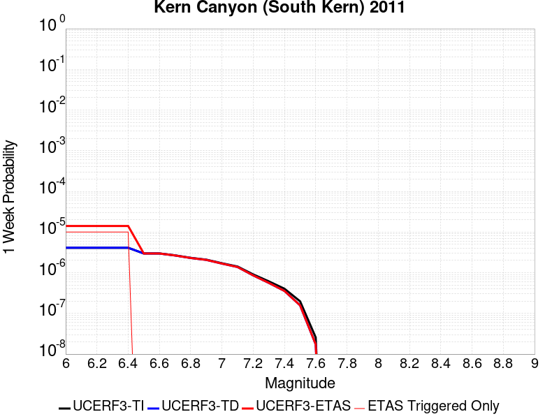 |  |  |  |

| Magnitude | 1 wk TI Prob | 1 wk TD Prob | 1 wk ETAS Prob | 1 wk ETAS/TD Gain | 1 wk ETAS Triggered Only | 1 mo TI Prob | 1 mo TD Prob | 1 mo ETAS Prob | 1 mo ETAS/TD Gain | 1 mo ETAS Triggered Only | 1 yr TI Prob | 1 yr TD Prob | 1 yr ETAS Prob | 1 yr ETAS/TD Gain | 1 yr ETAS Triggered Only | 10 yr TI Prob | 10 yr TD Prob | 10 yr ETAS Prob | 10 yr ETAS/TD Gain | 10 yr ETAS Triggered Only |
|-----|-----|-----|-----|-----|-----|-----|-----|-----|-----|-----|-----|-----|-----|-----|-----|-----|-----|-----|-----|-----|
| 6.0 | 4.105075E-6 | 4.1137246E-6 | 4.7111356E-5 | 11.452239 | 4.2997806E-5 | 1.7593058E-5 | 1.7630131E-5 | 6.0627182E-5 | 3.4388387 | 4.2997806E-5 | 2.1417443E-4 | 2.1462636E-4 | 2.5761494E-4 | 1.200295 | 4.2997806E-5 | 0.0021396813 | 0.0021442545 | 0.0021871603 | 1.0200095 | 4.2997806E-5 |
| 6.1 | 4.105075E-6 | 4.1137246E-6 | 4.7111356E-5 | 11.452239 | 4.2997806E-5 | 1.7593058E-5 | 1.7630131E-5 | 6.0627182E-5 | 3.4388387 | 4.2997806E-5 | 2.1417443E-4 | 2.1462636E-4 | 2.5761494E-4 | 1.200295 | 4.2997806E-5 | 0.0021396813 | 0.0021442545 | 0.0021871603 | 1.0200095 | 4.2997806E-5 |
| 6.2 | 4.105075E-6 | 4.1137246E-6 | 4.7111356E-5 | 11.452239 | 4.2997806E-5 | 1.7593058E-5 | 1.7630131E-5 | 6.0627182E-5 | 3.4388387 | 4.2997806E-5 | 2.1417443E-4 | 2.1462636E-4 | 2.5761494E-4 | 1.200295 | 4.2997806E-5 | 0.0021396813 | 0.0021442545 | 0.0021871603 | 1.0200095 | 4.2997806E-5 |
| 6.3 | 4.105075E-6 | 4.1137246E-6 | 4.7111356E-5 | 11.452239 | 4.2997806E-5 | 1.7593058E-5 | 1.7630131E-5 | 6.0627182E-5 | 3.4388387 | 4.2997806E-5 | 2.1417443E-4 | 2.1462636E-4 | 2.5761494E-4 | 1.200295 | 4.2997806E-5 | 0.0021396813 | 0.0021442545 | 0.0021871603 | 1.0200095 | 4.2997806E-5 |
| 6.4 | 4.105075E-6 | 4.1137246E-6 | 4.7111356E-5 | 11.452239 | 4.2997806E-5 | 1.7593058E-5 | 1.7630131E-5 | 6.0627182E-5 | 3.4388387 | 4.2997806E-5 | 2.1417443E-4 | 2.1462636E-4 | 2.5761494E-4 | 1.200295 | 4.2997806E-5 | 0.0021396813 | 0.0021442545 | 0.0021871603 | 1.0200095 | 4.2997806E-5 |
| 6.5 | 2.9849807E-6 | 2.9731532E-6 | 2.9731532E-6 | 1.0 | 0.0 | 1.2792712E-5 | 1.27420235E-5 | 1.27420235E-5 | 1.0 | 0.0 | 1.5574014E-4 | 1.5512324E-4 | 1.5512324E-4 | 1.0 | 0.0 | 0.0015563103 | 0.0015501648 | 0.0015501648 | 1.0 | 0.0 |
| 6.6 | 2.9849807E-6 | 2.9731532E-6 | 2.9731532E-6 | 1.0 | 0.0 | 1.2792712E-5 | 1.27420235E-5 | 1.27420235E-5 | 1.0 | 0.0 | 1.5574014E-4 | 1.5512324E-4 | 1.5512324E-4 | 1.0 | 0.0 | 0.0015563103 | 0.0015501648 | 0.0015501648 | 1.0 | 0.0 |
| 6.7 | 2.6756725E-6 | 2.6582195E-6 | 2.6582195E-6 | 1.0 | 0.0 | 1.1467117E-5 | 1.139232E-5 | 1.139232E-5 | 1.0 | 0.0 | 1.396032E-4 | 1.3869278E-4 | 1.3869278E-4 | 1.0 | 0.0 | 0.0013951553 | 0.0013860731 | 0.0013860731 | 1.0 | 0.0 |
| 6.8 | 2.3283721E-6 | 2.3047776E-6 | 2.3047776E-6 | 1.0 | 0.0 | 9.9787E-6 | 9.877582E-6 | 9.877582E-6 | 1.0 | 0.0 | 1.214839E-4 | 1.2025299E-4 | 1.2025299E-4 | 1.0 | 0.0 | 0.001214175 | 0.0012018867 | 0.0012018867 | 1.0 | 0.0 |
| 6.9 | 2.0972677E-6 | 2.06964E-6 | 2.06964E-6 | 1.0 | 0.0 | 8.988259E-6 | 8.869856E-6 | 8.869856E-6 | 1.0 | 0.0 | 1.0942656E-4 | 1.079852E-4 | 1.079852E-4 | 1.0 | 0.0 | 0.0010937268 | 0.0010793331 | 0.0010793331 | 1.0 | 0.0 |
| 7.0 | 1.7132242E-6 | 1.6787027E-6 | 1.6787027E-6 | 1.0 | 0.0 | 7.3423685E-6 | 7.1944205E-6 | 7.1944205E-6 | 1.0 | 0.0 | 8.938967E-5 | 8.758859E-5 | 8.758859E-5 | 1.0 | 0.0 | 8.935372E-4 | 8.755445E-4 | 8.755445E-4 | 1.0 | 0.0 |
| 7.1 | 1.4215541E-6 | 1.3815744E-6 | 1.3815744E-6 | 1.0 | 0.0 | 6.0923603E-6 | 5.92102E-6 | 5.92102E-6 | 1.0 | 0.0 | 7.417196E-5 | 7.208606E-5 | 7.208606E-5 | 1.0 | 0.0 | 7.414721E-4 | 7.2062947E-4 | 7.2062947E-4 | 1.0 | 0.0 |
| 7.2 | 9.097853E-7 | 8.6037704E-7 | 8.6037704E-7 | 1.0 | 0.0 | 3.899074E-6 | 3.687325E-6 | 3.687325E-6 | 1.0 | 0.0 | 4.7470192E-5 | 4.489227E-5 | 4.489227E-5 | 1.0 | 0.0 | 4.7460053E-4 | 4.488331E-4 | 4.488331E-4 | 1.0 | 0.0 |
| 7.3 | 6.144169E-7 | 5.628203E-7 | 5.628203E-7 | 1.0 | 0.0 | 2.6332125E-6 | 2.4120848E-6 | 2.4120848E-6 | 1.0 | 0.0 | 3.205889E-5 | 2.9366742E-5 | 2.9366742E-5 | 1.0 | 0.0 | 3.2054266E-4 | 2.9362913E-4 | 2.9362913E-4 | 1.0 | 0.0 |
| 7.4 | 4.049844E-7 | 3.5728291E-7 | 3.5728291E-7 | 1.0 | 0.0 | 1.7356463E-6 | 1.5312115E-6 | 1.5312115E-6 | 1.0 | 0.0 | 2.1131287E-5 | 1.8642344E-5 | 1.8642344E-5 | 1.0 | 0.0 | 2.1129279E-4 | 1.8640806E-4 | 1.8640806E-4 | 1.0 | 0.0 |
| 7.5 | 1.9871162E-7 | 1.5830427E-7 | 1.5830427E-7 | 1.0 | 0.0 | 8.5162094E-7 | 6.784467E-7 | 6.784467E-7 | 1.0 | 0.0 | 1.0368436E-5 | 8.260059E-6 | 8.260059E-6 | 1.0 | 0.0 | 1.0367952E-4 | 8.25976E-5 | 8.25976E-5 | 1.0 | 0.0 |
| 7.6 | 2.572245E-8 | 1.7352539E-8 | 1.7352539E-8 | 1.0 | 0.0 | 1.10239064E-7 | 7.436802E-8 | 7.436802E-8 | 1.0 | 0.0 | 1.3421597E-6 | 9.0543034E-7 | 9.0543034E-7 | 1.0 | 0.0 | 1.3421517E-5 | 9.054272E-6 | 9.054272E-6 | 1.0 | 0.0 |

## Kern Canyon (Lake Isabella) 2011
*[(top)](#table-of-contents)*

| 1 Week | 1 Month | 1 Year | 10 Year |
|-----|-----|-----|-----|
|  |  |  |  |

| Magnitude | 1 wk TI Prob | 1 wk TD Prob | 1 wk ETAS Prob | 1 wk ETAS/TD Gain | 1 wk ETAS Triggered Only | 1 mo TI Prob | 1 mo TD Prob | 1 mo ETAS Prob | 1 mo ETAS/TD Gain | 1 mo ETAS Triggered Only | 1 yr TI Prob | 1 yr TD Prob | 1 yr ETAS Prob | 1 yr ETAS/TD Gain | 1 yr ETAS Triggered Only | 10 yr TI Prob | 10 yr TD Prob | 10 yr ETAS Prob | 10 yr ETAS/TD Gain | 10 yr ETAS Triggered Only |
|-----|-----|-----|-----|-----|-----|-----|-----|-----|-----|-----|-----|-----|-----|-----|-----|-----|-----|-----|-----|-----|
| 6.0 | 4.2387383E-6 | 4.001636E-6 | 4.699927E-5 | 11.745013 | 4.2997806E-5 | 1.8165894E-5 | 1.7149767E-5 | 6.014684E-5 | 3.5071518 | 4.2997806E-5 | 2.2114732E-4 | 2.0878029E-4 | 2.5176912E-4 | 1.2059046 | 4.2997806E-5 | 0.0022092736 | 0.0020860252 | 0.0021289333 | 1.0205693 | 4.2997806E-5 |
| 6.1 | 4.2387383E-6 | 4.001636E-6 | 4.699927E-5 | 11.745013 | 4.2997806E-5 | 1.8165894E-5 | 1.7149767E-5 | 6.014684E-5 | 3.5071518 | 4.2997806E-5 | 2.2114732E-4 | 2.0878029E-4 | 2.5176912E-4 | 1.2059046 | 4.2997806E-5 | 0.0022092736 | 0.0020860252 | 0.0021289333 | 1.0205693 | 4.2997806E-5 |
| 6.2 | 4.2387383E-6 | 4.001636E-6 | 4.699927E-5 | 11.745013 | 4.2997806E-5 | 1.8165894E-5 | 1.7149767E-5 | 6.014684E-5 | 3.5071518 | 4.2997806E-5 | 2.2114732E-4 | 2.0878029E-4 | 2.5176912E-4 | 1.2059046 | 4.2997806E-5 | 0.0022092736 | 0.0020860252 | 0.0021289333 | 1.0205693 | 4.2997806E-5 |
| 6.3 | 4.2387383E-6 | 4.001636E-6 | 4.699927E-5 | 11.745013 | 4.2997806E-5 | 1.8165894E-5 | 1.7149767E-5 | 6.014684E-5 | 3.5071518 | 4.2997806E-5 | 2.2114732E-4 | 2.0878029E-4 | 2.5176912E-4 | 1.2059046 | 4.2997806E-5 | 0.0022092736 | 0.0020860252 | 0.0021289333 | 1.0205693 | 4.2997806E-5 |
| 6.4 | 4.2387383E-6 | 4.001636E-6 | 4.699927E-5 | 11.745013 | 4.2997806E-5 | 1.8165894E-5 | 1.7149767E-5 | 6.014684E-5 | 3.5071518 | 4.2997806E-5 | 2.2114732E-4 | 2.0878029E-4 | 2.5176912E-4 | 1.2059046 | 4.2997806E-5 | 0.0022092736 | 0.0020860252 | 0.0021289333 | 1.0205693 | 4.2997806E-5 |
| 6.5 | 2.7857532E-6 | 2.5178654E-6 | 2.5178654E-6 | 1.0 | 0.0 | 1.1938888E-5 | 1.0790809E-5 | 1.0790809E-5 | 1.0 | 0.0 | 1.4534626E-4 | 1.313705E-4 | 1.313705E-4 | 1.0 | 0.0 | 0.0014525123 | 0.0013129612 | 0.0013129612 | 1.0 | 0.0 |
| 6.6 | 2.2233348E-6 | 1.9441222E-6 | 1.9441222E-6 | 1.0 | 0.0 | 9.528543E-6 | 8.331926E-6 | 8.331926E-6 | 1.0 | 0.0 | 1.1600384E-4 | 1.0143657E-4 | 1.0143657E-4 | 1.0 | 0.0 | 0.001159433 | 0.0010139113 | 0.0010139113 | 1.0 | 0.0 |
| 6.7 | 2.1635126E-6 | 1.8835024E-6 | 1.8835024E-6 | 1.0 | 0.0 | 9.272164E-6 | 8.072128E-6 | 8.072128E-6 | 1.0 | 0.0 | 1.1288274E-4 | 9.827381E-5 | 9.827381E-5 | 1.0 | 0.0 | 0.0011282542 | 9.823117E-4 | 9.823117E-4 | 1.0 | 0.0 |
| 6.8 | 1.8685711E-6 | 1.5831414E-6 | 1.5831414E-6 | 1.0 | 0.0 | 8.008137E-6 | 6.7848746E-6 | 6.7848746E-6 | 1.0 | 0.0 | 9.74947E-5 | 8.260277E-5 | 8.260277E-5 | 1.0 | 0.0 | 9.745194E-4 | 8.2572555E-4 | 8.2572555E-4 | 1.0 | 0.0 |
| 6.9 | 1.5815071E-6 | 1.3064919E-6 | 1.3064919E-6 | 1.0 | 0.0 | 6.77787E-6 | 5.599239E-6 | 5.599239E-6 | 1.0 | 0.0 | 8.251744E-5 | 6.816863E-5 | 6.816863E-5 | 1.0 | 0.0 | 8.248681E-4 | 6.8147987E-4 | 6.8147987E-4 | 1.0 | 0.0 |
| 7.0 | 1.3772564E-6 | 1.121071E-6 | 1.121071E-6 | 1.0 | 0.0 | 5.9025137E-6 | 4.8045813E-6 | 4.8045813E-6 | 1.0 | 0.0 | 7.186073E-5 | 5.8494225E-5 | 5.8494225E-5 | 1.0 | 0.0 | 7.18375E-4 | 5.8479037E-4 | 5.8479037E-4 | 1.0 | 0.0 |
| 7.1 | 1.0916998E-6 | 8.763771E-7 | 8.763771E-7 | 1.0 | 0.0 | 4.678705E-6 | 3.7558964E-6 | 3.7558964E-6 | 1.0 | 0.0 | 5.6961744E-5 | 4.5727094E-5 | 4.5727094E-5 | 1.0 | 0.0 | 5.6947145E-4 | 4.571782E-4 | 4.571782E-4 | 1.0 | 0.0 |
| 7.2 | 7.6277024E-7 | 5.90145E-7 | 5.90145E-7 | 1.0 | 0.0 | 3.2690114E-6 | 2.5291904E-6 | 2.5291904E-6 | 1.0 | 0.0 | 3.9799485E-5 | 3.0792464E-5 | 3.0792464E-5 | 1.0 | 0.0 | 3.9792358E-4 | 3.0788258E-4 | 3.0788258E-4 | 1.0 | 0.0 |
| 7.3 | 5.3265916E-7 | 4.3824386E-7 | 4.3824386E-7 | 1.0 | 0.0 | 2.282823E-6 | 1.8781866E-6 | 1.8781866E-6 | 1.0 | 0.0 | 2.7793016E-5 | 2.2866687E-5 | 2.2866687E-5 | 1.0 | 0.0 | 2.778954E-4 | 2.2864371E-4 | 2.2864371E-4 | 1.0 | 0.0 |
| 7.4 | 3.4946007E-7 | 3.006569E-7 | 3.006569E-7 | 1.0 | 0.0 | 1.497685E-6 | 1.2885289E-6 | 1.2885289E-6 | 1.0 | 0.0 | 1.8234163E-5 | 1.5687729E-5 | 1.5687729E-5 | 1.0 | 0.0 | 1.8232666E-4 | 1.5686643E-4 | 1.5686643E-4 | 1.0 | 0.0 |
| 7.5 | 1.8317026E-7 | 1.42448E-7 | 1.42448E-7 | 1.0 | 0.0 | 7.850152E-7 | 6.104913E-7 | 6.104913E-7 | 1.0 | 0.0 | 9.557518E-6 | 7.432707E-6 | 7.432707E-6 | 1.0 | 0.0 | 9.5571064E-5 | 7.4324664E-5 | 7.4324664E-5 | 1.0 | 0.0 |
| 7.6 | 2.572245E-8 | 1.7352539E-8 | 1.7352539E-8 | 1.0 | 0.0 | 1.10239064E-7 | 7.436802E-8 | 7.436802E-8 | 1.0 | 0.0 | 1.3421597E-6 | 9.0543034E-7 | 9.0543034E-7 | 1.0 | 0.0 | 1.3421517E-5 | 9.054272E-6 | 9.054272E-6 | 1.0 | 0.0 |

## Eureka Peak
*[(top)](#table-of-contents)*

| 1 Week | 1 Month | 1 Year | 10 Year |
|-----|-----|-----|-----|
|  |  |  |  |

| Magnitude | 1 wk TI Prob | 1 wk TD Prob | 1 wk ETAS Prob | 1 wk ETAS/TD Gain | 1 wk ETAS Triggered Only | 1 mo TI Prob | 1 mo TD Prob | 1 mo ETAS Prob | 1 mo ETAS/TD Gain | 1 mo ETAS Triggered Only | 1 yr TI Prob | 1 yr TD Prob | 1 yr ETAS Prob | 1 yr ETAS/TD Gain | 1 yr ETAS Triggered Only | 10 yr TI Prob | 10 yr TD Prob | 10 yr ETAS Prob | 10 yr ETAS/TD Gain | 10 yr ETAS Triggered Only |
|-----|-----|-----|-----|-----|-----|-----|-----|-----|-----|-----|-----|-----|-----|-----|-----|-----|-----|-----|-----|-----|
| 6.0 | 3.1949054E-5 | 9.310349E-6 | 5.2307758E-5 | 5.6182375 | 4.2997806E-5 | 1.3691733E-4 | 3.9901326E-5 | 8.289742E-5 | 2.0775604 | 4.2997806E-5 | 0.0016656938 | 4.8576848E-4 | 5.287454E-4 | 1.088472 | 4.2997806E-5 | 0.016532637 | 0.004924774 | 0.00496756 | 1.008688 | 4.2997806E-5 |
| 6.1 | 3.1949054E-5 | 9.310349E-6 | 5.2307758E-5 | 5.6182375 | 4.2997806E-5 | 1.3691733E-4 | 3.9901326E-5 | 8.289742E-5 | 2.0775604 | 4.2997806E-5 | 0.0016656938 | 4.8576848E-4 | 5.287454E-4 | 1.088472 | 4.2997806E-5 | 0.016532637 | 0.004924774 | 0.00496756 | 1.008688 | 4.2997806E-5 |
| 6.2 | 3.1949054E-5 | 9.310349E-6 | 5.2307758E-5 | 5.6182375 | 4.2997806E-5 | 1.3691733E-4 | 3.9901326E-5 | 8.289742E-5 | 2.0775604 | 4.2997806E-5 | 0.0016656938 | 4.8576848E-4 | 5.287454E-4 | 1.088472 | 4.2997806E-5 | 0.016532637 | 0.004924774 | 0.00496756 | 1.008688 | 4.2997806E-5 |
| 6.3 | 2.7339745E-5 | 7.980512E-6 | 5.0977975E-5 | 6.3878074 | 4.2997806E-5 | 1.1716507E-4 | 3.4202174E-5 | 7.7198514E-5 | 2.257123 | 4.2997806E-5 | 0.0014255513 | 4.164078E-4 | 4.5938772E-4 | 1.1032159 | 4.2997806E-5 | 0.0141644105 | 0.004228261 | 0.004271077 | 1.0101261 | 4.2997806E-5 |
| 6.4 | 2.7339745E-5 | 7.980512E-6 | 5.0977975E-5 | 6.3878074 | 4.2997806E-5 | 1.1716507E-4 | 3.4202174E-5 | 7.7198514E-5 | 2.257123 | 4.2997806E-5 | 0.0014255513 | 4.164078E-4 | 4.5938772E-4 | 1.1032159 | 4.2997806E-5 | 0.0141644105 | 0.004228261 | 0.004271077 | 1.0101261 | 4.2997806E-5 |
| 6.5 | 9.738388E-8 | 1.8618802E-7 | 1.8618802E-7 | 1.0 | 0.0 | 4.1735944E-7 | 7.979484E-7 | 7.979484E-7 | 1.0 | 0.0 | 5.081339E-6 | 9.71498E-6 | 9.71498E-6 | 1.0 | 0.0 | 5.0812232E-5 | 9.7145625E-5 | 9.7145625E-5 | 1.0 | 0.0 |
| 6.6 | 9.3495956E-8 | 1.8327636E-7 | 1.8327636E-7 | 1.0 | 0.0 | 4.0069688E-7 | 7.8546987E-7 | 7.8546987E-7 | 1.0 | 0.0 | 4.8784736E-6 | 9.563055E-6 | 9.563055E-6 | 1.0 | 0.0 | 4.8783666E-5 | 9.5626514E-5 | 9.5626514E-5 | 1.0 | 0.0 |
| 6.7 | 9.3495956E-8 | 1.8327636E-7 | 1.8327636E-7 | 1.0 | 0.0 | 4.0069688E-7 | 7.8546987E-7 | 7.8546987E-7 | 1.0 | 0.0 | 4.8784736E-6 | 9.563055E-6 | 9.563055E-6 | 1.0 | 0.0 | 4.8783666E-5 | 9.5626514E-5 | 9.5626514E-5 | 1.0 | 0.0 |
| 6.8 | 8.591428E-8 | 1.8020607E-7 | 1.8020607E-7 | 1.0 | 0.0 | 3.68204E-7 | 7.723115E-7 | 7.723115E-7 | 1.0 | 0.0 | 4.4828744E-6 | 9.402853E-6 | 9.402853E-6 | 1.0 | 0.0 | 4.482784E-5 | 9.4024625E-5 | 9.4024625E-5 | 1.0 | 0.0 |
| 6.9 | 7.749723E-8 | 1.7438616E-7 | 1.7438616E-7 | 1.0 | 0.0 | 3.3213098E-7 | 7.473691E-7 | 7.473691E-7 | 1.0 | 0.0 | 4.043687E-6 | 9.099182E-6 | 9.099182E-6 | 1.0 | 0.0 | 4.0436134E-5 | 9.0988164E-5 | 9.0988164E-5 | 1.0 | 0.0 |
| 7.0 | 6.897872E-8 | 1.6414864E-7 | 1.6414864E-7 | 1.0 | 0.0 | 2.9562307E-7 | 7.0349404E-7 | 7.0349404E-7 | 1.0 | 0.0 | 3.5992048E-6 | 8.565007E-6 | 8.565007E-6 | 1.0 | 0.0 | 3.5991467E-5 | 8.564684E-5 | 8.564684E-5 | 1.0 | 0.0 |
| 7.1 | 5.859318E-8 | 1.4786792E-7 | 1.4786792E-7 | 1.0 | 0.0 | 2.5111362E-7 | 6.3371954E-7 | 6.3371954E-7 | 1.0 | 0.0 | 3.057304E-6 | 7.715508E-6 | 7.715508E-6 | 1.0 | 0.0 | 3.0572617E-5 | 7.715247E-5 | 7.715247E-5 | 1.0 | 0.0 |
| 7.2 | 5.1375338E-8 | 1.3420691E-7 | 1.3420691E-7 | 1.0 | 0.0 | 2.2018E-7 | 5.7517235E-7 | 5.7517235E-7 | 1.0 | 0.0 | 2.680688E-6 | 7.0027013E-6 | 7.0027013E-6 | 1.0 | 0.0 | 2.6806558E-5 | 7.0024864E-5 | 7.0024864E-5 | 1.0 | 0.0 |
| 7.3 | 4.5441396E-8 | 1.1635977E-7 | 1.1635977E-7 | 1.0 | 0.0 | 1.9474882E-7 | 4.9868464E-7 | 4.9868464E-7 | 1.0 | 0.0 | 2.3710643E-6 | 6.071469E-6 | 6.071469E-6 | 1.0 | 0.0 | 2.371039E-5 | 6.0713086E-5 | 6.0713086E-5 | 1.0 | 0.0 |
| 7.4 | 2.981918E-8 | 6.9110754E-8 | 6.9110754E-8 | 1.0 | 0.0 | 1.2779647E-7 | 2.9618892E-7 | 2.9618892E-7 | 1.0 | 0.0 | 1.5559209E-6 | 3.6060947E-6 | 3.6060947E-6 | 1.0 | 0.0 | 1.55591E-5 | 3.6060403E-5 | 3.6060403E-5 | 1.0 | 0.0 |
| 7.5 | 4.24214E-9 | 8.342036E-9 | 8.342036E-9 | 1.0 | 0.0 | 1.81806E-8 | 3.5751587E-8 | 3.5751587E-8 | 1.0 | 0.0 | 2.213488E-7 | 4.3527552E-7 | 4.3527552E-7 | 1.0 | 0.0 | 2.2134857E-6 | 4.352753E-6 | 4.352753E-6 | 1.0 | 0.0 |

## Santa Cruz Island
*[(top)](#table-of-contents)*

| 1 Week | 1 Month | 1 Year | 10 Year |
|-----|-----|-----|-----|
| 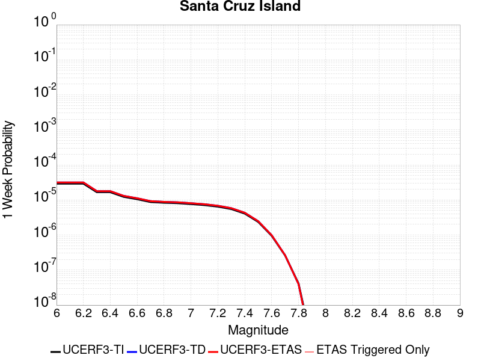 |  |  |  |

| Magnitude | 1 wk TI Prob | 1 wk TD Prob | 1 wk ETAS Prob | 1 wk ETAS/TD Gain | 1 wk ETAS Triggered Only | 1 mo TI Prob | 1 mo TD Prob | 1 mo ETAS Prob | 1 mo ETAS/TD Gain | 1 mo ETAS Triggered Only | 1 yr TI Prob | 1 yr TD Prob | 1 yr ETAS Prob | 1 yr ETAS/TD Gain | 1 yr ETAS Triggered Only | 10 yr TI Prob | 10 yr TD Prob | 10 yr ETAS Prob | 10 yr ETAS/TD Gain | 10 yr ETAS Triggered Only |
|-----|-----|-----|-----|-----|-----|-----|-----|-----|-----|-----|-----|-----|-----|-----|-----|-----|-----|-----|-----|-----|
| 6.0 | 2.9164563E-5 | 3.1599673E-5 | 3.1599673E-5 | 1.0 | 0.0 | 1.2498499E-4 | 1.3542091E-4 | 1.3542091E-4 | 1.0 | 0.0 | 0.0015206301 | 0.0016476389 | 0.0016905658 | 1.0260537 | 4.2997806E-5 | 0.015102667 | 0.016367963 | 0.016410256 | 1.002584 | 4.2997806E-5 |
| 6.1 | 2.9164563E-5 | 3.1599673E-5 | 3.1599673E-5 | 1.0 | 0.0 | 1.2498499E-4 | 1.3542091E-4 | 1.3542091E-4 | 1.0 | 0.0 | 0.0015206301 | 0.0016476389 | 0.0016905658 | 1.0260537 | 4.2997806E-5 | 0.015102667 | 0.016367963 | 0.016410256 | 1.002584 | 4.2997806E-5 |
| 6.2 | 2.9164563E-5 | 3.1599673E-5 | 3.1599673E-5 | 1.0 | 0.0 | 1.2498499E-4 | 1.3542091E-4 | 1.3542091E-4 | 1.0 | 0.0 | 0.0015206301 | 0.0016476389 | 0.0016905658 | 1.0260537 | 4.2997806E-5 | 0.015102667 | 0.016367963 | 0.016410256 | 1.002584 | 4.2997806E-5 |
| 6.3 | 1.6635553E-5 | 1.7804325E-5 | 1.7804325E-5 | 1.0 | 0.0 | 7.1293274E-5 | 7.630212E-5 | 7.630212E-5 | 1.0 | 0.0 | 8.6765E-4 | 9.286006E-4 | 9.715585E-4 | 1.0462608 | 4.2997806E-5 | 0.008642701 | 0.009249076 | 0.009291676 | 1.0046059 | 4.2997806E-5 |
| 6.4 | 1.6635553E-5 | 1.7804325E-5 | 1.7804325E-5 | 1.0 | 0.0 | 7.1293274E-5 | 7.630212E-5 | 7.630212E-5 | 1.0 | 0.0 | 8.6765E-4 | 9.286006E-4 | 9.715585E-4 | 1.0462608 | 4.2997806E-5 | 0.008642701 | 0.009249076 | 0.009291676 | 1.0046059 | 4.2997806E-5 |
| 6.5 | 1.2238748E-5 | 1.3042973E-5 | 1.3042973E-5 | 1.0 | 0.0 | 5.2450723E-5 | 5.5897275E-5 | 5.5897275E-5 | 1.0 | 0.0 | 6.3840044E-4 | 6.803405E-4 | 7.233091E-4 | 1.0631574 | 4.2997806E-5 | 0.0063656955 | 0.006782976 | 0.006825682 | 1.006296 | 4.2997806E-5 |
| 6.6 | 1.0489767E-5 | 1.1156617E-5 | 1.1156617E-5 | 1.0 | 0.0 | 4.495537E-5 | 4.7813206E-5 | 4.7813206E-5 | 1.0 | 0.0 | 5.4719415E-4 | 5.8197253E-4 | 6.249453E-4 | 1.0738399 | 4.2997806E-5 | 0.005458487 | 0.005804726 | 0.005847474 | 1.0073644 | 4.2997806E-5 |
| 6.7 | 8.699222E-6 | 9.236766E-6 | 9.236766E-6 | 1.0 | 0.0 | 3.7281847E-5 | 3.9585546E-5 | 3.9585546E-5 | 1.0 | 0.0 | 4.5381195E-4 | 4.8184796E-4 | 5.2482507E-4 | 1.0891923 | 4.2997806E-5 | 0.0045288634 | 0.0048081 | 0.004850891 | 1.0088998 | 4.2997806E-5 |
| 6.8 | 8.307732E-6 | 8.816889E-6 | 8.816889E-6 | 1.0 | 0.0 | 3.560408E-5 | 3.7786125E-5 | 3.7786125E-5 | 1.0 | 0.0 | 4.3339343E-4 | 4.5994937E-4 | 5.029274E-4 | 1.0934408 | 4.2997806E-5 | 0.004325492 | 0.0045900275 | 0.0046328283 | 1.0093247 | 4.2997806E-5 |
| 6.9 | 8.073121E-6 | 8.564924E-6 | 8.564924E-6 | 1.0 | 0.0 | 3.459863E-5 | 3.6706308E-5 | 3.6706308E-5 | 1.0 | 0.0 | 4.2115687E-4 | 4.4680806E-4 | 4.897867E-4 | 1.0961903 | 4.2997806E-5 | 0.004203596 | 0.0044591487 | 0.0045019547 | 1.0095996 | 4.2997806E-5 |
| 7.0 | 7.617019E-6 | 8.074651E-6 | 8.074651E-6 | 1.0 | 0.0 | 3.264396E-5 | 3.460519E-5 | 3.460519E-5 | 1.0 | 0.0 | 3.9736772E-4 | 4.2123714E-4 | 4.2123714E-4 | 1.0 | 0.0 | 0.003966579 | 0.0042044343 | 0.0042044343 | 1.0 | 0.0 |
| 7.1 | 7.1224836E-6 | 7.5457756E-6 | 7.5457756E-6 | 1.0 | 0.0 | 3.052457E-5 | 3.2338638E-5 | 3.2338638E-5 | 1.0 | 0.0 | 3.715733E-4 | 3.9365215E-4 | 3.9365215E-4 | 1.0 | 0.0 | 0.003709526 | 0.0039295917 | 0.0039295917 | 1.0 | 0.0 |
| 7.2 | 6.441115E-6 | 6.827372E-6 | 6.827372E-6 | 1.0 | 0.0 | 2.7604487E-5 | 2.925984E-5 | 2.925984E-5 | 1.0 | 0.0 | 3.360328E-4 | 3.5618054E-4 | 3.5618054E-4 | 1.0 | 0.0 | 0.0033552512 | 0.003556125 | 0.003556125 | 1.0 | 0.0 |
| 7.3 | 5.494274E-6 | 5.819985E-6 | 5.819985E-6 | 1.0 | 0.0 | 2.3546674E-5 | 2.4942556E-5 | 2.4942556E-5 | 1.0 | 0.0 | 2.8664304E-4 | 3.0363348E-4 | 3.0363348E-4 | 1.0 | 0.0 | 0.002862736 | 0.0030322094 | 0.0030322094 | 1.0 | 0.0 |
| 7.4 | 4.0802624E-6 | 4.3122495E-6 | 4.3122495E-6 | 1.0 | 0.0 | 1.7486722E-5 | 1.8480938E-5 | 1.8480938E-5 | 1.0 | 0.0 | 2.1288003E-4 | 2.2498227E-4 | 2.2498227E-4 | 1.0 | 0.0 | 0.0021267622 | 0.002247554 | 0.002247554 | 1.0 | 0.0 |
| 7.5 | 2.3584746E-6 | 2.475306E-6 | 2.475306E-6 | 1.0 | 0.0 | 1.0107709E-5 | 1.0608412E-5 | 1.0608412E-5 | 1.0 | 0.0 | 1.2305441E-4 | 1.291498E-4 | 1.291498E-4 | 1.0 | 0.0 | 0.0012298629 | 0.0012907526 | 0.0012907526 | 1.0 | 0.0 |
| 7.6 | 9.4981914E-7 | 9.860919E-7 | 9.860919E-7 | 1.0 | 0.0 | 4.0706473E-6 | 4.2261013E-6 | 4.2261013E-6 | 1.0 | 0.0 | 4.9559E-5 | 5.145158E-5 | 5.145158E-5 | 1.0 | 0.0 | 4.954795E-4 | 5.14398E-4 | 5.14398E-4 | 1.0 | 0.0 |
| 7.7 | 2.6013532E-7 | 2.641658E-7 | 2.641658E-7 | 1.0 | 0.0 | 1.1148652E-6 | 1.1321387E-6 | 1.1321387E-6 | 1.0 | 0.0 | 1.3573399E-5 | 1.3783702E-5 | 1.3783702E-5 | 1.0 | 0.0 | 1.357257E-4 | 1.3782854E-4 | 1.3782854E-4 | 1.0 | 0.0 |
| 7.8 | 4.1522263E-8 | 3.965676E-8 | 3.965676E-8 | 1.0 | 0.0 | 1.7795254E-7 | 1.6995754E-7 | 1.6995754E-7 | 1.0 | 0.0 | 2.16657E-6 | 2.0692314E-6 | 2.0692314E-6 | 1.0 | 0.0 | 2.1665488E-5 | 2.0692141E-5 | 2.0692141E-5 | 1.0 | 0.0 |
| 7.9 | 7.7242046E-10 | 5.946812E-10 | 5.946812E-10 | 1.0 | 0.0 | 3.3103735E-9 | 2.5486335E-9 | 2.5486335E-9 | 1.0 | 0.0 | 4.0303796E-8 | 3.1029614E-8 | 3.1029614E-8 | 1.0 | 0.0 | 4.030379E-7 | 3.102961E-7 | 3.102961E-7 | 1.0 | 0.0 |

## San Andreas (Creeping Section) 2011 CFM
*[(top)](#table-of-contents)*

| 1 Week | 1 Month | 1 Year | 10 Year |
|-----|-----|-----|-----|
|  | 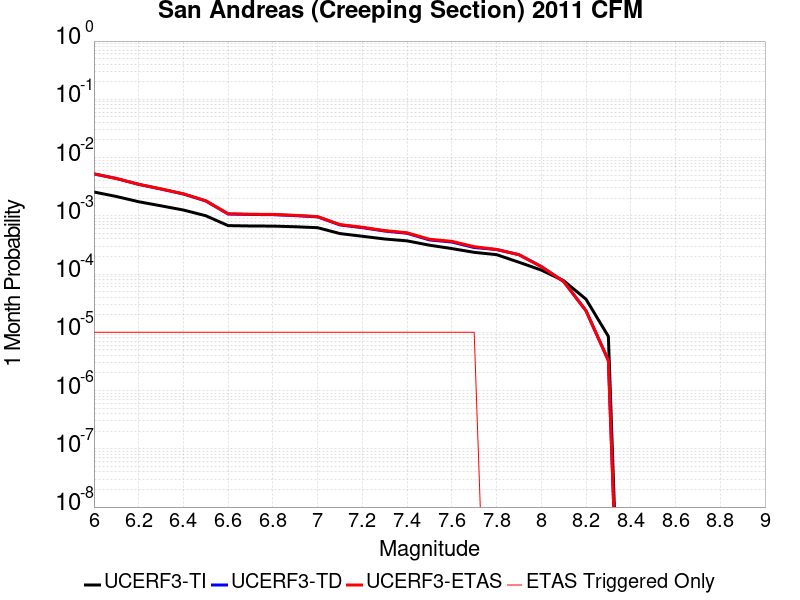 |  |  |

| Magnitude | 1 wk TI Prob | 1 wk TD Prob | 1 wk ETAS Prob | 1 wk ETAS/TD Gain | 1 wk ETAS Triggered Only | 1 mo TI Prob | 1 mo TD Prob | 1 mo ETAS Prob | 1 mo ETAS/TD Gain | 1 mo ETAS Triggered Only | 1 yr TI Prob | 1 yr TD Prob | 1 yr ETAS Prob | 1 yr ETAS/TD Gain | 1 yr ETAS Triggered Only | 10 yr TI Prob | 10 yr TD Prob | 10 yr ETAS Prob | 10 yr ETAS/TD Gain | 10 yr ETAS Triggered Only |
|-----|-----|-----|-----|-----|-----|-----|-----|-----|-----|-----|-----|-----|-----|-----|-----|-----|-----|-----|-----|-----|
| 6.0 | 5.986481E-4 | 0.0012286972 | 0.0012716423 | 1.0349517 | 4.2997806E-5 | 0.0025631124 | 0.00524696 | 0.005289732 | 1.0081518 | 4.2997806E-5 | 0.030762846 | 0.061202604 | 0.06124297 | 1.0006596 | 4.2997806E-5 | 0.26835477 | 0.42592302 | 0.4259477 | 1.0000579 | 4.2997806E-5 |
| 6.1 | 5.015945E-4 | 0.0010229645 | 0.0010659182 | 1.0419896 | 4.2997806E-5 | 0.00214792 | 0.004369588 | 0.004412398 | 1.0097972 | 4.2997806E-5 | 0.025839351 | 0.051246066 | 0.051286858 | 1.0007961 | 4.2997806E-5 | 0.23032776 | 0.37284485 | 0.37287182 | 1.0000724 | 4.2997806E-5 |
| 6.2 | 4.073338E-4 | 8.115361E-4 | 8.54499E-4 | 1.0529402 | 4.2997806E-5 | 0.0017445484 | 0.003468385 | 0.0035112337 | 1.012354 | 4.2997806E-5 | 0.021034058 | 0.040931217 | 0.040972453 | 1.0010074 | 4.2997806E-5 | 0.19150782 | 0.31302088 | 0.31305045 | 1.0000944 | 4.2997806E-5 |
| 6.3 | 3.464099E-4 | 6.745419E-4 | 7.1751076E-4 | 1.0637007 | 4.2997806E-5 | 0.0014837692 | 0.002883343 | 0.002926217 | 1.0148695 | 4.2997806E-5 | 0.017915873 | 0.034187317 | 0.034228843 | 1.0012147 | 4.2997806E-5 | 0.16538359 | 0.2713031 | 0.2713344 | 1.0001155 | 4.2997806E-5 |
| 6.4 | 2.935057E-4 | 5.551342E-4 | 5.9810816E-4 | 1.0774118 | 4.2997806E-5 | 0.0012572751 | 0.002372886 | 0.0024157818 | 1.0180775 | 4.2997806E-5 | 0.015200248 | 0.028262215 | 0.028303998 | 1.0014784 | 4.2997806E-5 | 0.14201577 | 0.23297104 | 0.23300402 | 1.0001416 | 4.2997806E-5 |
| 6.5 | 2.3409708E-4 | 4.2130658E-4 | 4.6428628E-4 | 1.1020153 | 4.2997806E-5 | 0.0010028875 | 0.0018018549 | 0.0018447753 | 1.02382 | 4.2997806E-5 | 0.012141965 | 0.021585694 | 0.021627763 | 1.001949 | 4.2997806E-5 | 0.11499573 | 0.18680891 | 0.18684389 | 1.0001872 | 4.2997806E-5 |
| 6.6 | 1.5842178E-4 | 2.5067228E-4 | 2.936593E-4 | 1.171487 | 4.2997806E-5 | 6.7877385E-4 | 0.0010738597 | 0.0011168113 | 1.0399975 | 4.2997806E-5 | 0.0082328 | 0.012994494 | 0.013036933 | 1.003266 | 4.2997806E-5 | 0.07934396 | 0.1231311 | 0.1231688 | 1.0003062 | 4.2997806E-5 |
| 6.7 | 1.5616413E-4 | 2.4603796E-4 | 2.890252E-4 | 1.1747179 | 4.2997806E-5 | 6.691031E-4 | 0.0010540152 | 0.0010969677 | 1.0407513 | 4.2997806E-5 | 0.0081159435 | 0.012756367 | 0.012798816 | 1.0033277 | 4.2997806E-5 | 0.0782586 | 0.12115822 | 0.121196 | 1.0003119 | 4.2997806E-5 |
| 6.8 | 1.5538467E-4 | 2.442769E-4 | 2.872642E-4 | 1.1759778 | 4.2997806E-5 | 6.6576427E-4 | 0.0010464739 | 0.0010894267 | 1.0410453 | 4.2997806E-5 | 0.008075596 | 0.012665753 | 0.012708207 | 1.0033518 | 4.2997806E-5 | 0.07788358 | 0.12038911 | 0.12042694 | 1.0003141 | 4.2997806E-5 |
| 6.9 | 1.5153569E-4 | 2.3536953E-4 | 2.783572E-4 | 1.1826391 | 4.2997806E-5 | 6.49277E-4 | 0.0010083386 | 0.0010512931 | 1.0425992 | 4.2997806E-5 | 0.007876333 | 0.012207948 | 0.012250421 | 1.0034791 | 4.2997806E-5 | 0.07602952 | 0.11645927 | 0.11649726 | 1.0003262 | 4.2997806E-5 |
| 7.0 | 1.4588932E-4 | 2.239424E-4 | 2.6693058E-4 | 1.1919608 | 4.2997806E-5 | 6.250901E-4 | 9.594021E-4 | 0.0010023586 | 1.0447743 | 4.2997806E-5 | 0.0075839474 | 0.011618658 | 0.011661156 | 1.0036577 | 4.2997806E-5 | 0.073302895 | 0.11130563 | 0.111343846 | 1.0003433 | 4.2997806E-5 |
| 7.1 | 1.1565079E-4 | 1.6279978E-4 | 2.057906E-4 | 1.2640716 | 4.2997806E-5 | 4.955521E-4 | 6.9752766E-4 | 7.4049545E-4 | 1.0616002 | 4.2997806E-5 | 0.006016669 | 0.008459533 | 0.008502167 | 1.0050398 | 4.2997806E-5 | 0.058563538 | 0.08365876 | 0.08369816 | 1.000471 | 4.2997806E-5 |
| 7.2 | 1.0393792E-4 | 1.4614112E-4 | 1.8913264E-4 | 1.2941781 | 4.2997806E-5 | 4.4537216E-4 | 6.261695E-4 | 6.691404E-4 | 1.068625 | 4.2997806E-5 | 0.005408933 | 0.007597135 | 0.0076398063 | 1.0056168 | 4.2997806E-5 | 0.052791595 | 0.075609244 | 0.07564899 | 1.0005257 | 4.2997806E-5 |
| 7.3 | 9.332884E-5 | 1.277942E-4 | 1.7078653E-4 | 1.3364183 | 4.2997806E-5 | 3.999194E-4 | 5.475752E-4 | 5.9054943E-4 | 1.0784811 | 4.2997806E-5 | 0.0048581534 | 0.006646483 | 0.0066891955 | 1.0064262 | 4.2997806E-5 | 0.047533102 | 0.06647413 | 0.06651427 | 1.0006038 | 4.2997806E-5 |
| 7.4 | 8.670252E-5 | 1.1701832E-4 | 1.6001108E-4 | 1.3674021 | 4.2997806E-5 | 3.715293E-4 | 5.0141127E-4 | 5.443875E-4 | 1.0857105 | 4.2997806E-5 | 0.004513991 | 0.0060877153 | 0.0061304513 | 1.00702 | 4.2997806E-5 | 0.044233937 | 0.061143413 | 0.06118378 | 1.0006602 | 4.2997806E-5 |
| 7.5 | 7.3036405E-5 | 9.004733E-5 | 1.3304126E-4 | 1.4774593 | 4.2997806E-5 | 3.129756E-4 | 3.8586016E-4 | 4.2884136E-4 | 1.1113907 | 4.2997806E-5 | 0.0038038217 | 0.0046877493 | 0.0047305455 | 1.0091294 | 4.2997806E-5 | 0.03739367 | 0.047871016 | 0.047911953 | 1.0008552 | 4.2997806E-5 |
| 7.6 | 6.3935775E-5 | 8.279309E-5 | 1.2578734E-4 | 1.5192975 | 4.2997806E-5 | 2.7398168E-4 | 3.5477936E-4 | 3.977619E-4 | 1.1211529 | 4.2997806E-5 | 0.0033306254 | 0.0043109027 | 0.004353715 | 1.0099312 | 4.2997806E-5 | 0.032811474 | 0.04398585 | 0.044026956 | 1.0009345 | 4.2997806E-5 |
| 7.7 | 5.5050095E-5 | 6.66093E-5 | 1.0960424E-4 | 1.6454796 | 4.2997806E-5 | 2.3590765E-4 | 2.854372E-4 | 3.2842276E-4 | 1.1505954 | 4.2997806E-5 | 0.0028683927 | 0.0034696644 | 0.0035125131 | 1.0123495 | 4.2997806E-5 | 0.0283165 | 0.035791222 | 0.03583268 | 1.0011584 | 4.2997806E-5 |
| 7.8 | 5.027131E-5 | 6.1620405E-5 | 6.1620405E-5 | 1.0 | 0.0 | 2.1543067E-4 | 2.640607E-4 | 2.640607E-4 | 1.0 | 0.0 | 0.0026197135 | 0.0032102033 | 0.0032102033 | 1.0 | 0.0 | 0.025890453 | 0.03312217 | 0.03312217 | 1.0 | 0.0 |
| 7.9 | 3.7271806E-5 | 5.0218474E-5 | 5.0218474E-5 | 1.0 | 0.0 | 1.5972654E-4 | 2.1520429E-4 | 2.1520429E-4 | 1.0 | 0.0 | 0.0019429359 | 0.002616966 | 0.002616966 | 1.0 | 0.0 | 0.019260362 | 0.027063787 | 0.027063787 | 1.0 | 0.0 |
| 8.0 | 2.7310243E-5 | 3.1424468E-5 | 3.1424468E-5 | 1.0 | 0.0 | 1.17038646E-4 | 1.3466935E-4 | 1.3466935E-4 | 1.0 | 0.0 | 0.0014240141 | 0.0016383671 | 0.0016383671 | 1.0 | 0.0 | 0.014149235 | 0.017211871 | 0.017211871 | 1.0 | 0.0 |
| 8.1 | 1.7940547E-5 | 1.7398293E-5 | 1.7398293E-5 | 1.0 | 0.0 | 7.688579E-5 | 7.456199E-5 | 7.456199E-5 | 1.0 | 0.0 | 9.3568244E-4 | 9.074147E-4 | 9.074147E-4 | 1.0 | 0.0 | 0.009317525 | 0.009797759 | 0.009797759 | 1.0 | 0.0 |
| 8.2 | 8.643924E-6 | 5.4738607E-6 | 5.4738607E-6 | 1.0 | 0.0 | 3.704486E-5 | 2.3459192E-5 | 2.3459192E-5 | 1.0 | 0.0 | 4.5092785E-4 | 2.855783E-4 | 2.855783E-4 | 1.0 | 0.0 | 0.0045001395 | 0.0032481598 | 0.0032481598 | 1.0 | 0.0 |
| 8.3 | 1.983087E-6 | 7.658221E-7 | 7.658221E-7 | 1.0 | 0.0 | 8.498917E-6 | 3.2820906E-6 | 3.2820906E-6 | 1.0 | 0.0 | 1.034694E-4 | 3.9958737E-5 | 3.9958737E-5 | 1.0 | 0.0 | 0.0010342124 | 4.7187202E-4 | 4.7187202E-4 | 1.0 | 0.0 |

## Almanor 2011 CFM
*[(top)](#table-of-contents)*

| 1 Week | 1 Month | 1 Year | 10 Year |
|-----|-----|-----|-----|
|  |  |  |  |

| Magnitude | 1 wk TI Prob | 1 wk TD Prob | 1 wk ETAS Prob | 1 wk ETAS/TD Gain | 1 wk ETAS Triggered Only | 1 mo TI Prob | 1 mo TD Prob | 1 mo ETAS Prob | 1 mo ETAS/TD Gain | 1 mo ETAS Triggered Only | 1 yr TI Prob | 1 yr TD Prob | 1 yr ETAS Prob | 1 yr ETAS/TD Gain | 1 yr ETAS Triggered Only | 10 yr TI Prob | 10 yr TD Prob | 10 yr ETAS Prob | 10 yr ETAS/TD Gain | 10 yr ETAS Triggered Only |
|-----|-----|-----|-----|-----|-----|-----|-----|-----|-----|-----|-----|-----|-----|-----|-----|-----|-----|-----|-----|-----|
| 6.0 | 6.1479834E-5 | 8.32779E-5 | 8.32779E-5 | 1.0 | 0.0 | 2.6345838E-4 | 3.5686235E-4 | 3.5686235E-4 | 1.0 | 0.0 | 0.0032028882 | 0.0043365774 | 0.0043365774 | 1.0 | 0.0 | 0.031571172 | 0.04258541 | 0.042626575 | 1.0009667 | 4.2997806E-5 |
| 6.1 | 4.4387216E-5 | 5.9769885E-5 | 5.9769885E-5 | 1.0 | 0.0 | 1.9021705E-4 | 2.561357E-4 | 2.561357E-4 | 1.0 | 0.0 | 0.0023134327 | 0.0031144004 | 0.0031144004 | 1.0 | 0.0 | 0.022894967 | 0.030754777 | 0.030796453 | 1.001355 | 4.2997806E-5 |
| 6.2 | 4.4387216E-5 | 5.9769885E-5 | 5.9769885E-5 | 1.0 | 0.0 | 1.9021705E-4 | 2.561357E-4 | 2.561357E-4 | 1.0 | 0.0 | 0.0023134327 | 0.0031144004 | 0.0031144004 | 1.0 | 0.0 | 0.022894967 | 0.030754777 | 0.030796453 | 1.001355 | 4.2997806E-5 |
| 6.3 | 2.9523822E-5 | 3.9546827E-5 | 3.9546827E-5 | 1.0 | 0.0 | 1.2652454E-4 | 1.6947828E-4 | 1.6947828E-4 | 1.0 | 0.0 | 0.0015393476 | 0.002061856 | 0.002061856 | 1.0 | 0.0 | 0.015287281 | 0.020460624 | 0.020460624 | 1.0 | 0.0 |
| 6.4 | 2.0512744E-5 | 2.7431366E-5 | 2.7431366E-5 | 1.0 | 0.0 | 8.79088E-5 | 1.1756013E-4 | 1.1756013E-4 | 1.0 | 0.0 | 0.001069764 | 0.0014307296 | 0.0014307296 | 1.0 | 0.0 | 0.010646289 | 0.014244295 | 0.014244295 | 1.0 | 0.0 |
| 6.5 | 1.6750226E-5 | 2.2391096E-5 | 2.2391096E-5 | 1.0 | 0.0 | 7.178471E-5 | 9.596065E-5 | 9.596065E-5 | 1.0 | 0.0 | 8.7362836E-4 | 0.0011680545 | 0.0011680545 | 1.0 | 0.0 | 0.008702018 | 0.011648942 | 0.011648942 | 1.0 | 0.0 |
| 6.6 | 1.4745303E-5 | 1.9707772E-5 | 1.9707772E-5 | 1.0 | 0.0 | 6.319262E-5 | 8.4461455E-5 | 8.4461455E-5 | 1.0 | 0.0 | 7.690986E-4 | 0.0010281889 | 0.0010281889 | 1.0 | 0.0 | 0.0076644225 | 0.010264887 | 0.010264887 | 1.0 | 0.0 |
| 6.7 | 9.951145E-7 | 1.1616295E-6 | 1.1616295E-6 | 1.0 | 0.0 | 4.26477E-6 | 4.9784035E-6 | 4.9784035E-6 | 1.0 | 0.0 | 5.1922336E-5 | 6.0610553E-5 | 6.0610553E-5 | 1.0 | 0.0 | 5.1910203E-4 | 6.0595747E-4 | 6.0595747E-4 | 1.0 | 0.0 |
| 6.8 | 5.866312E-7 | 6.8493534E-7 | 6.8493534E-7 | 1.0 | 0.0 | 2.5141312E-6 | 2.9354346E-6 | 2.9354346E-6 | 1.0 | 0.0 | 3.0609117E-5 | 3.5738463E-5 | 3.5738463E-5 | 1.0 | 0.0 | 3.06049E-4 | 3.5733997E-4 | 3.5733997E-4 | 1.0 | 0.0 |

## Channel Islands Western Deep Ramp
*[(top)](#table-of-contents)*

| 1 Week | 1 Month | 1 Year | 10 Year |
|-----|-----|-----|-----|
|  |  |  |  |

| Magnitude | 1 wk TI Prob | 1 wk TD Prob | 1 wk ETAS Prob | 1 wk ETAS/TD Gain | 1 wk ETAS Triggered Only | 1 mo TI Prob | 1 mo TD Prob | 1 mo ETAS Prob | 1 mo ETAS/TD Gain | 1 mo ETAS Triggered Only | 1 yr TI Prob | 1 yr TD Prob | 1 yr ETAS Prob | 1 yr ETAS/TD Gain | 1 yr ETAS Triggered Only | 10 yr TI Prob | 10 yr TD Prob | 10 yr ETAS Prob | 10 yr ETAS/TD Gain | 10 yr ETAS Triggered Only |
|-----|-----|-----|-----|-----|-----|-----|-----|-----|-----|-----|-----|-----|-----|-----|-----|-----|-----|-----|-----|-----|
| 6.0 | 6.0213506E-6 | 6.254862E-6 | 6.254862E-6 | 1.0 | 0.0 | 2.5805533E-5 | 2.6806301E-5 | 2.6806301E-5 | 1.0 | 0.0 | 3.1413708E-4 | 3.263223E-4 | 3.263223E-4 | 1.0 | 0.0 | 0.0031369338 | 0.003258873 | 0.0033017306 | 1.013151 | 4.2997806E-5 |
| 6.1 | 6.0213506E-6 | 6.254862E-6 | 6.254862E-6 | 1.0 | 0.0 | 2.5805533E-5 | 2.6806301E-5 | 2.6806301E-5 | 1.0 | 0.0 | 3.1413708E-4 | 3.263223E-4 | 3.263223E-4 | 1.0 | 0.0 | 0.0031369338 | 0.003258873 | 0.0033017306 | 1.013151 | 4.2997806E-5 |
| 6.2 | 6.0213506E-6 | 6.254862E-6 | 6.254862E-6 | 1.0 | 0.0 | 2.5805533E-5 | 2.6806301E-5 | 2.6806301E-5 | 1.0 | 0.0 | 3.1413708E-4 | 3.263223E-4 | 3.263223E-4 | 1.0 | 0.0 | 0.0031369338 | 0.003258873 | 0.0033017306 | 1.013151 | 4.2997806E-5 |
| 6.3 | 6.0213506E-6 | 6.254862E-6 | 6.254862E-6 | 1.0 | 0.0 | 2.5805533E-5 | 2.6806301E-5 | 2.6806301E-5 | 1.0 | 0.0 | 3.1413708E-4 | 3.263223E-4 | 3.263223E-4 | 1.0 | 0.0 | 0.0031369338 | 0.003258873 | 0.0033017306 | 1.013151 | 4.2997806E-5 |
| 6.4 | 6.0213506E-6 | 6.254862E-6 | 6.254862E-6 | 1.0 | 0.0 | 2.5805533E-5 | 2.6806301E-5 | 2.6806301E-5 | 1.0 | 0.0 | 3.1413708E-4 | 3.263223E-4 | 3.263223E-4 | 1.0 | 0.0 | 0.0031369338 | 0.003258873 | 0.0033017306 | 1.013151 | 4.2997806E-5 |
| 6.5 | 6.0213506E-6 | 6.254862E-6 | 6.254862E-6 | 1.0 | 0.0 | 2.5805533E-5 | 2.6806301E-5 | 2.6806301E-5 | 1.0 | 0.0 | 3.1413708E-4 | 3.263223E-4 | 3.263223E-4 | 1.0 | 0.0 | 0.0031369338 | 0.003258873 | 0.0033017306 | 1.013151 | 4.2997806E-5 |
| 6.6 | 6.0213506E-6 | 6.254862E-6 | 6.254862E-6 | 1.0 | 0.0 | 2.5805533E-5 | 2.6806301E-5 | 2.6806301E-5 | 1.0 | 0.0 | 3.1413708E-4 | 3.263223E-4 | 3.263223E-4 | 1.0 | 0.0 | 0.0031369338 | 0.003258873 | 0.0033017306 | 1.013151 | 4.2997806E-5 |
| 6.7 | 5.313309E-6 | 5.5252344E-6 | 5.5252344E-6 | 1.0 | 0.0 | 2.2771126E-5 | 2.3679384E-5 | 2.3679384E-5 | 1.0 | 0.0 | 2.772032E-4 | 2.8826247E-4 | 2.8826247E-4 | 1.0 | 0.0 | 0.0027685766 | 0.0028792885 | 0.0029221626 | 1.0148904 | 4.2997806E-5 |
| 6.8 | 5.313309E-6 | 5.5252344E-6 | 5.5252344E-6 | 1.0 | 0.0 | 2.2771126E-5 | 2.3679384E-5 | 2.3679384E-5 | 1.0 | 0.0 | 2.772032E-4 | 2.8826247E-4 | 2.8826247E-4 | 1.0 | 0.0 | 0.0027685766 | 0.0028792885 | 0.0029221626 | 1.0148904 | 4.2997806E-5 |
| 6.9 | 4.744377E-6 | 4.9394253E-6 | 4.9394253E-6 | 1.0 | 0.0 | 2.0332885E-5 | 2.1168813E-5 | 2.1168813E-5 | 1.0 | 0.0 | 2.4752476E-4 | 2.5770356E-4 | 2.5770356E-4 | 1.0 | 0.0 | 0.0024724922 | 0.0025744147 | 0.0026173017 | 1.016659 | 4.2997806E-5 |
| 7.0 | 4.722209E-6 | 4.916468E-6 | 4.916468E-6 | 1.0 | 0.0 | 2.0237881E-5 | 2.1070427E-5 | 2.1070427E-5 | 1.0 | 0.0 | 2.4636835E-4 | 2.5650597E-4 | 2.5650597E-4 | 1.0 | 0.0 | 0.002460954 | 0.0025624665 | 0.0026053542 | 1.0167369 | 4.2997806E-5 |
| 7.1 | 4.611174E-6 | 4.8014035E-6 | 4.8014035E-6 | 1.0 | 0.0 | 1.9762025E-5 | 2.0577303E-5 | 2.0577303E-5 | 1.0 | 0.0 | 2.4057609E-4 | 2.505036E-4 | 2.505036E-4 | 1.0 | 0.0 | 0.002403158 | 0.0025025792 | 0.0025454694 | 1.0171384 | 4.2997806E-5 |
| 7.2 | 4.043994E-6 | 4.212022E-6 | 4.212022E-6 | 1.0 | 0.0 | 1.7331287E-5 | 1.8051418E-5 | 1.8051418E-5 | 1.0 | 0.0 | 2.10988E-4 | 2.1975742E-4 | 2.1975742E-4 | 1.0 | 0.0 | 0.002107878 | 0.0021957518 | 0.0022386552 | 1.0195392 | 4.2997806E-5 |
| 7.3 | 2.1233036E-6 | 2.2297845E-6 | 2.2297845E-6 | 1.0 | 0.0 | 9.099841E-6 | 9.5561845E-6 | 9.5561845E-6 | 1.0 | 0.0 | 1.1078493E-4 | 1.1634039E-4 | 1.1634039E-4 | 1.0 | 0.0 | 0.0011072971 | 0.0011628004 | 0.0011628004 | 1.0 | 0.0 |
| 7.4 | 1.9051884E-6 | 2.0014945E-6 | 2.0014945E-6 | 1.0 | 0.0 | 8.165067E-6 | 8.577806E-6 | 8.577806E-6 | 1.0 | 0.0 | 9.940516E-5 | 1.0442983E-4 | 1.0442983E-4 | 1.0 | 0.0 | 9.93607E-4 | 0.001043813 | 0.001043813 | 1.0 | 0.0 |
| 7.5 | 1.2408497E-6 | 1.3038822E-6 | 1.3038822E-6 | 1.0 | 0.0 | 5.317916E-6 | 5.5880546E-6 | 5.5880546E-6 | 1.0 | 0.0 | 6.4743705E-5 | 6.803246E-5 | 6.803246E-5 | 1.0 | 0.0 | 6.4724847E-4 | 6.801185E-4 | 6.801185E-4 | 1.0 | 0.0 |
| 7.6 | 6.5440025E-7 | 6.886708E-7 | 6.886708E-7 | 1.0 | 0.0 | 2.8045695E-6 | 2.951443E-6 | 2.951443E-6 | 1.0 | 0.0 | 3.4145098E-5 | 3.593324E-5 | 3.593324E-5 | 1.0 | 0.0 | 3.4139853E-4 | 3.5927573E-4 | 3.5927573E-4 | 1.0 | 0.0 |
| 7.7 | 3.985963E-7 | 4.193073E-7 | 4.193073E-7 | 1.0 | 0.0 | 1.7082689E-6 | 1.7970301E-6 | 1.7970301E-6 | 1.0 | 0.0 | 2.0797976E-5 | 2.1878634E-5 | 2.1878634E-5 | 1.0 | 0.0 | 2.0796029E-4 | 2.1876597E-4 | 2.1876597E-4 | 1.0 | 0.0 |
| 7.8 | 3.706329E-8 | 3.8591754E-8 | 3.8591754E-8 | 1.0 | 0.0 | 1.5884267E-7 | 1.6539322E-7 | 1.6539322E-7 | 1.0 | 0.0 | 1.9339077E-6 | 2.0136606E-6 | 2.0136606E-6 | 1.0 | 0.0 | 1.933891E-5 | 2.0136436E-5 | 2.0136436E-5 | 1.0 | 0.0 |

## Great Valley 03a Dunnigan Hills
*[(top)](#table-of-contents)*

| 1 Week | 1 Month | 1 Year | 10 Year |
|-----|-----|-----|-----|
|  |  |  |  |

| Magnitude | 1 wk TI Prob | 1 wk TD Prob | 1 wk ETAS Prob | 1 wk ETAS/TD Gain | 1 wk ETAS Triggered Only | 1 mo TI Prob | 1 mo TD Prob | 1 mo ETAS Prob | 1 mo ETAS/TD Gain | 1 mo ETAS Triggered Only | 1 yr TI Prob | 1 yr TD Prob | 1 yr ETAS Prob | 1 yr ETAS/TD Gain | 1 yr ETAS Triggered Only | 10 yr TI Prob | 10 yr TD Prob | 10 yr ETAS Prob | 10 yr ETAS/TD Gain | 10 yr ETAS Triggered Only |
|-----|-----|-----|-----|-----|-----|-----|-----|-----|-----|-----|-----|-----|-----|-----|-----|-----|-----|-----|-----|-----|
| 6.0 | 1.6591328E-5 | 1.810791E-5 | 6.110494E-5 | 3.3744888 | 4.2997806E-5 | 7.110376E-5 | 7.760341E-5 | 1.2059788E-4 | 1.5540282 | 4.2997806E-5 | 8.6534437E-4 | 9.444811E-4 | 9.874383E-4 | 1.0454823 | 4.2997806E-5 | 0.008619824 | 0.009411503 | 0.009454096 | 1.0045257 | 4.2997806E-5 |
| 6.1 | 8.041125E-6 | 8.769705E-6 | 5.1767136E-5 | 5.9029503 | 4.2997806E-5 | 3.4461507E-5 | 3.7584025E-5 | 8.058022E-5 | 2.1440017 | 4.2997806E-5 | 4.194881E-4 | 4.5750974E-4 | 5.0048786E-4 | 1.0939393 | 4.2997806E-5 | 0.004186971 | 0.004567676 | 0.0046104775 | 1.0093704 | 4.2997806E-5 |
| 6.2 | 3.2807004E-6 | 3.5795601E-6 | 3.5795601E-6 | 1.0 | 0.0 | 1.4060069E-5 | 1.5340906E-5 | 1.5340906E-5 | 1.0 | 0.0 | 1.7116789E-4 | 1.8676367E-4 | 1.8676367E-4 | 1.0 | 0.0 | 0.0017103611 | 0.0018664751 | 0.0018664751 | 1.0 | 0.0 |
| 6.3 | 1.9339366E-6 | 2.1103756E-6 | 2.1103756E-6 | 1.0 | 0.0 | 8.288273E-6 | 9.044452E-6 | 9.044452E-6 | 1.0 | 0.0 | 1.00905054E-4 | 1.10113484E-4 | 1.10113484E-4 | 1.0 | 0.0 | 0.0010085925 | 0.0011008692 | 0.0011008692 | 1.0 | 0.0 |
| 6.4 | 1.3142635E-6 | 1.4339831E-6 | 1.4339831E-6 | 1.0 | 0.0 | 5.6325457E-6 | 6.145642E-6 | 6.145642E-6 | 1.0 | 0.0 | 6.857408E-5 | 7.482319E-5 | 7.482319E-5 | 1.0 | 0.0 | 6.8552926E-4 | 7.4823195E-4 | 7.4823195E-4 | 1.0 | 0.0 |

## Imperial
*[(top)](#table-of-contents)*

| 1 Week | 1 Month | 1 Year | 10 Year |
|-----|-----|-----|-----|
|  |  |  |  |

| Magnitude | 1 wk TI Prob | 1 wk TD Prob | 1 wk ETAS Prob | 1 wk ETAS/TD Gain | 1 wk ETAS Triggered Only | 1 mo TI Prob | 1 mo TD Prob | 1 mo ETAS Prob | 1 mo ETAS/TD Gain | 1 mo ETAS Triggered Only | 1 yr TI Prob | 1 yr TD Prob | 1 yr ETAS Prob | 1 yr ETAS/TD Gain | 1 yr ETAS Triggered Only | 10 yr TI Prob | 10 yr TD Prob | 10 yr ETAS Prob | 10 yr ETAS/TD Gain | 10 yr ETAS Triggered Only |
|-----|-----|-----|-----|-----|-----|-----|-----|-----|-----|-----|-----|-----|-----|-----|-----|-----|-----|-----|-----|-----|
| 6.0 | 2.7496446E-4 | 5.054469E-4 | 5.48423E-4 | 1.0850259 | 4.2997806E-5 | 0.0011778869 | 0.002164442 | 0.0022073467 | 1.0198226 | 4.2997806E-5 | 0.0142467655 | 0.026034584 | 0.026076462 | 1.0016086 | 4.2997806E-5 | 0.13367249 | 0.22801645 | 0.22804965 | 1.0001456 | 4.2997806E-5 |
| 6.1 | 2.5356023E-4 | 4.864905E-4 | 5.2946736E-4 | 1.0883406 | 4.2997806E-5 | 0.001086234 | 0.0020833316 | 0.0021262397 | 1.0205959 | 4.2997806E-5 | 0.013144928 | 0.02506727 | 0.02510919 | 1.0016723 | 4.2997806E-5 | 0.123940155 | 0.21945325 | 0.2194868 | 1.000153 | 4.2997806E-5 |
| 6.2 | 2.4820742E-4 | 4.7744514E-4 | 5.204224E-4 | 1.0900152 | 4.2997806E-5 | 0.0010633124 | 0.0020446267 | 0.0020875365 | 1.0209867 | 4.2997806E-5 | 0.01286919 | 0.024607308 | 0.02464925 | 1.0017043 | 4.2997806E-5 | 0.12148927 | 0.21595894 | 0.21599266 | 1.000156 | 4.2997806E-5 |
| 6.3 | 2.3205351E-4 | 4.588303E-4 | 5.0180836E-4 | 1.0936688 | 4.2997806E-5 | 9.94136E-4 | 0.0019649705 | 0.0020078837 | 1.0218391 | 4.2997806E-5 | 0.012036599 | 0.023657534 | 0.023699515 | 1.0017745 | 4.2997806E-5 | 0.11405133 | 0.20790851 | 0.20794258 | 1.0001638 | 4.2997806E-5 |
| 6.4 | 2.0304754E-4 | 3.9869116E-4 | 4.4167184E-4 | 1.1078044 | 4.2997806E-5 | 8.6991355E-4 | 0.0017075721 | 0.0017504966 | 1.0251377 | 4.2997806E-5 | 0.010539869 | 0.020591887 | 0.020634 | 1.0020452 | 4.2997806E-5 | 0.100537635 | 0.18504018 | 0.18507522 | 1.0001894 | 4.2997806E-5 |
| 6.5 | 1.854992E-4 | 3.6981583E-4 | 4.1279776E-4 | 1.1162251 | 4.2997806E-5 | 7.9475436E-4 | 0.0015839747 | 0.0016269044 | 1.0271025 | 4.2997806E-5 | 0.009633281 | 0.01911576 | 0.019157937 | 1.0022063 | 4.2997806E-5 | 0.0922623 | 0.17327131 | 0.17330687 | 1.0002052 | 4.2997806E-5 |
| 6.6 | 1.6586106E-4 | 3.4027954E-4 | 3.832627E-4 | 1.1263173 | 4.2997806E-5 | 7.106394E-4 | 0.0014575359 | 0.001500471 | 1.0294573 | 4.2997806E-5 | 0.008617763 | 0.017602775 | 0.017645016 | 1.0023997 | 4.2997806E-5 | 0.08291132 | 0.16074891 | 0.160785 | 1.0002245 | 4.2997806E-5 |
| 6.7 | 1.4224656E-4 | 3.0760013E-4 | 3.505847E-4 | 1.1397418 | 4.2997806E-5 | 6.094856E-4 | 0.0013176284 | 0.0013605696 | 1.0325897 | 4.2997806E-5 | 0.0073952693 | 0.01592603 | 0.015968343 | 1.0026568 | 4.2997806E-5 | 0.07153955 | 0.14645793 | 0.14649463 | 1.0002506 | 4.2997806E-5 |
| 6.8 | 1.2317259E-4 | 2.7784536E-4 | 3.2083123E-4 | 1.1547115 | 4.2997806E-5 | 5.2777573E-4 | 0.0011902286 | 0.0012331753 | 1.0360826 | 4.2997806E-5 | 0.0064067547 | 0.014396132 | 0.014438511 | 1.0029438 | 4.2997806E-5 | 0.06225166 | 0.13291098 | 0.13294826 | 1.0002805 | 4.2997806E-5 |
| 6.9 | 9.859898E-5 | 2.500792E-4 | 2.9306626E-4 | 1.1718937 | 4.2997806E-5 | 4.2249862E-4 | 0.001071332 | 0.0011142838 | 1.0400919 | 4.2997806E-5 | 0.0051317946 | 0.012966422 | 0.013008863 | 1.0032731 | 4.2997806E-5 | 0.05014893 | 0.11938127 | 0.119419135 | 1.0003172 | 4.2997806E-5 |
| 7.0 | 7.3191884E-5 | 2.1260617E-4 | 2.5559484E-4 | 1.2021986 | 4.2997806E-5 | 3.136418E-4 | 9.108543E-4 | 9.538129E-4 | 1.047163 | 4.2997806E-5 | 0.003811904 | 0.011033948 | 0.011076472 | 1.0038539 | 4.2997806E-5 | 0.037471764 | 0.10204036 | 0.10207897 | 1.0003784 | 4.2997806E-5 |
| 7.1 | 7.1760296E-5 | 2.0961992E-4 | 2.526087E-4 | 1.2050797 | 4.2997806E-5 | 3.0750787E-4 | 8.980649E-4 | 9.4102416E-4 | 1.0478352 | 4.2997806E-5 | 0.003737482 | 0.0108798025 | 0.010922333 | 1.0039091 | 4.2997806E-5 | 0.03675245 | 0.10067689 | 0.100715555 | 1.0003841 | 4.2997806E-5 |
| 7.2 | 6.46614E-5 | 1.913056E-4 | 2.3429518E-4 | 1.2247168 | 4.2997806E-5 | 2.7709085E-4 | 8.1962656E-4 | 8.625891E-4 | 1.0524173 | 4.2997806E-5 | 0.0033683628 | 0.009933916 | 0.009976487 | 1.0042853 | 4.2997806E-5 | 0.033177625 | 0.09248428 | 0.09252331 | 1.0004219 | 4.2997806E-5 |
| 7.3 | 6.088115E-5 | 1.7802432E-4 | 1.7802432E-4 | 1.0 | 0.0 | 2.6089314E-4 | 7.6274114E-4 | 7.6274114E-4 | 1.0 | 0.0 | 0.0031717476 | 0.009247407 | 0.009247407 | 1.0 | 0.0 | 0.031268585 | 0.08653566 | 0.08653566 | 1.0 | 0.0 |
| 7.4 | 4.199346E-5 | 1.1507733E-4 | 1.1507733E-4 | 1.0 | 0.0 | 1.7995955E-4 | 4.930962E-4 | 4.930962E-4 | 1.0 | 0.0 | 0.0021888057 | 0.00598709 | 0.00598709 | 1.0 | 0.0 | 0.02167372 | 0.057428524 | 0.057428524 | 1.0 | 0.0 |
| 7.5 | 3.130448E-5 | 8.332899E-5 | 8.332899E-5 | 1.0 | 0.0 | 1.3415517E-4 | 3.5707568E-4 | 3.5707568E-4 | 1.0 | 0.0 | 0.0016321153 | 0.00433879 | 0.00433879 | 1.0 | 0.0 | 0.016201803 | 0.042130288 | 0.042130288 | 1.0 | 0.0 |
| 7.6 | 2.3074248E-5 | 6.0841397E-5 | 6.0841397E-5 | 1.0 | 0.0 | 9.888588E-5 | 2.607229E-4 | 2.607229E-4 | 1.0 | 0.0 | 0.0012032706 | 0.0031697042 | 0.0031697042 | 1.0 | 0.0 | 0.011967761 | 0.03102491 | 0.03102491 | 1.0 | 0.0 |
| 7.7 | 1.45864815E-5 | 4.0122002E-5 | 4.0122002E-5 | 1.0 | 0.0 | 6.2511994E-5 | 1.7194013E-4 | 1.7194013E-4 | 1.0 | 0.0 | 7.608177E-4 | 0.0020913668 | 0.0020913668 | 1.0 | 0.0 | 0.007582182 | 0.020626526 | 0.020626526 | 1.0 | 0.0 |
| 7.8 | 1.0352979E-5 | 3.0958607E-5 | 3.0958607E-5 | 1.0 | 0.0 | 4.4369157E-5 | 1.3267301E-4 | 1.3267301E-4 | 1.0 | 0.0 | 5.400606E-4 | 0.0016140995 | 0.0016140995 | 1.0 | 0.0 | 0.0053875 | 0.016015781 | 0.016015781 | 1.0 | 0.0 |
| 7.9 | 8.137906E-6 | 2.214726E-5 | 2.214726E-5 | 1.0 | 0.0 | 3.4876273E-5 | 9.491338E-5 | 9.491338E-5 | 1.0 | 0.0 | 4.2453592E-4 | 0.0011549587 | 0.0011549587 | 1.0 | 0.0 | 0.004237258 | 0.011617044 | 0.011617044 | 1.0 | 0.0 |
| 8.0 | 6.93792E-6 | 1.800718E-5 | 1.800718E-5 | 1.0 | 0.0 | 2.9733603E-5 | 7.717135E-5 | 7.717135E-5 | 1.0 | 0.0 | 3.6194647E-4 | 9.39157E-4 | 9.39157E-4 | 1.0 | 0.0 | 0.0036135751 | 0.009500807 | 0.009500807 | 1.0 | 0.0 |
| 8.1 | 3.4286315E-6 | 6.3791363E-6 | 6.3791363E-6 | 1.0 | 0.0 | 1.4694053E-5 | 2.7338869E-5 | 2.7338869E-5 | 1.0 | 0.0 | 1.7888541E-4 | 3.328E-4 | 3.328E-4 | 1.0 | 0.0 | 0.0017874148 | 0.0034856654 | 0.0034856654 | 1.0 | 0.0 |
| 8.2 | 1.4906886E-6 | 1.936376E-6 | 1.936376E-6 | 1.0 | 0.0 | 6.3886496E-6 | 8.298728E-6 | 8.298728E-6 | 1.0 | 0.0 | 7.7779034E-5 | 1.0103236E-4 | 1.0103236E-4 | 1.0 | 0.0 | 7.775182E-4 | 0.001107385 | 0.001107385 | 1.0 | 0.0 |
| 8.3 | 2.5758007E-8 | 1.449717E-8 | 1.449717E-8 | 1.0 | 0.0 | 1.10391454E-7 | 6.2130724E-8 | 6.2130724E-8 | 1.0 | 0.0 | 1.3440151E-6 | 7.564416E-7 | 7.564416E-7 | 1.0 | 0.0 | 1.344007E-5 | 7.8862E-6 | 7.8862E-6 | 1.0 | 0.0 |

## San Andreas (Carrizo) rev
*[(top)](#table-of-contents)*

| 1 Week | 1 Month | 1 Year | 10 Year |
|-----|-----|-----|-----|
|  |  |  |  |

| Magnitude | 1 wk TI Prob | 1 wk TD Prob | 1 wk ETAS Prob | 1 wk ETAS/TD Gain | 1 wk ETAS Triggered Only | 1 mo TI Prob | 1 mo TD Prob | 1 mo ETAS Prob | 1 mo ETAS/TD Gain | 1 mo ETAS Triggered Only | 1 yr TI Prob | 1 yr TD Prob | 1 yr ETAS Prob | 1 yr ETAS/TD Gain | 1 yr ETAS Triggered Only | 10 yr TI Prob | 10 yr TD Prob | 10 yr ETAS Prob | 10 yr ETAS/TD Gain | 10 yr ETAS Triggered Only |
|-----|-----|-----|-----|-----|-----|-----|-----|-----|-----|-----|-----|-----|-----|-----|-----|-----|-----|-----|-----|-----|
| 6.0 | 1.1674632E-4 | 2.4321114E-4 | 2.8619848E-4 | 1.1767491 | 4.2997806E-5 | 5.002454E-4 | 0.0010419186 | 0.0010848717 | 1.041225 | 4.2997806E-5 | 0.006073493 | 0.01261206 | 0.012654515 | 1.0033662 | 4.2997806E-5 | 0.0591016 | 0.12060616 | 0.12064397 | 1.0003135 | 4.2997806E-5 |
| 6.1 | 1.1674632E-4 | 2.4321114E-4 | 2.8619848E-4 | 1.1767491 | 4.2997806E-5 | 5.002454E-4 | 0.0010419186 | 0.0010848717 | 1.041225 | 4.2997806E-5 | 0.006073493 | 0.01261206 | 0.012654515 | 1.0033662 | 4.2997806E-5 | 0.0591016 | 0.12060616 | 0.12064397 | 1.0003135 | 4.2997806E-5 |
| 6.2 | 1.1674632E-4 | 2.4321114E-4 | 2.8619848E-4 | 1.1767491 | 4.2997806E-5 | 5.002454E-4 | 0.0010419186 | 0.0010848717 | 1.041225 | 4.2997806E-5 | 0.006073493 | 0.01261206 | 0.012654515 | 1.0033662 | 4.2997806E-5 | 0.0591016 | 0.12060616 | 0.12064397 | 1.0003135 | 4.2997806E-5 |
| 6.3 | 1.1674632E-4 | 2.4321114E-4 | 2.8619848E-4 | 1.1767491 | 4.2997806E-5 | 5.002454E-4 | 0.0010419186 | 0.0010848717 | 1.041225 | 4.2997806E-5 | 0.006073493 | 0.01261206 | 0.012654515 | 1.0033662 | 4.2997806E-5 | 0.0591016 | 0.12060616 | 0.12064397 | 1.0003135 | 4.2997806E-5 |
| 6.4 | 1.1674632E-4 | 2.4321114E-4 | 2.8619848E-4 | 1.1767491 | 4.2997806E-5 | 5.002454E-4 | 0.0010419186 | 0.0010848717 | 1.041225 | 4.2997806E-5 | 0.006073493 | 0.01261206 | 0.012654515 | 1.0033662 | 4.2997806E-5 | 0.0591016 | 0.12060616 | 0.12064397 | 1.0003135 | 4.2997806E-5 |
| 6.5 | 1.13136164E-4 | 2.3641133E-4 | 2.7939898E-4 | 1.1818341 | 4.2997806E-5 | 4.847792E-4 | 0.0010127996 | 0.0010557538 | 1.0424114 | 4.2997806E-5 | 0.0058862255 | 0.012261566 | 0.012304036 | 1.0034637 | 4.2997806E-5 | 0.057327334 | 0.11757754 | 0.11761548 | 1.0003227 | 4.2997806E-5 |
| 6.6 | 1.13136164E-4 | 2.3641133E-4 | 2.7939898E-4 | 1.1818341 | 4.2997806E-5 | 4.847792E-4 | 0.0010127996 | 0.0010557538 | 1.0424114 | 4.2997806E-5 | 0.0058862255 | 0.012261566 | 0.012304036 | 1.0034637 | 4.2997806E-5 | 0.057327334 | 0.11757754 | 0.11761548 | 1.0003227 | 4.2997806E-5 |
| 6.7 | 1.1149675E-4 | 2.3332359E-4 | 2.7631136E-4 | 1.184241 | 4.2997806E-5 | 4.777557E-4 | 9.995765E-4 | 0.0010425313 | 1.042973 | 4.2997806E-5 | 0.0058011734 | 0.012102372 | 0.01214485 | 1.0035099 | 4.2997806E-5 | 0.05652051 | 0.11619909 | 0.1162371 | 1.000327 | 4.2997806E-5 |
| 6.8 | 1.1103589E-4 | 2.323452E-4 | 2.7533303E-4 | 1.185017 | 4.2997806E-5 | 4.7578133E-4 | 9.953866E-4 | 0.0010383417 | 1.0431541 | 4.2997806E-5 | 0.005777263 | 0.012051926 | 0.0120944055 | 1.0035247 | 4.2997806E-5 | 0.056293584 | 0.115759395 | 0.115797415 | 1.0003284 | 4.2997806E-5 |
| 6.9 | 1.1053259E-4 | 2.3126906E-4 | 2.7425692E-4 | 1.1858782 | 4.2997806E-5 | 4.7362508E-4 | 9.907781E-4 | 0.0010337334 | 1.043355 | 4.2997806E-5 | 0.0057511497 | 0.011996436 | 0.012038918 | 1.0035412 | 4.2997806E-5 | 0.05604569 | 0.1152756 | 0.11531364 | 1.00033 | 4.2997806E-5 |
| 7.0 | 1.1005377E-4 | 2.3027751E-4 | 2.732654E-4 | 1.1866786 | 4.2997806E-5 | 4.7157376E-4 | 9.865318E-4 | 0.0010294872 | 1.0435418 | 4.2997806E-5 | 0.0057263062 | 0.011945305 | 0.0119877895 | 1.0035566 | 4.2997806E-5 | 0.055809796 | 0.11482792 | 0.11486598 | 1.0003314 | 4.2997806E-5 |
| 7.1 | 1.0308142E-4 | 2.1537494E-4 | 2.5836346E-4 | 1.1995987 | 4.2997806E-5 | 4.417027E-4 | 9.2270994E-4 | 9.6566806E-4 | 1.0465565 | 4.2997806E-5 | 0.0053644776 | 0.011176443 | 0.011218959 | 1.0038042 | 4.2997806E-5 | 0.052368138 | 0.10808435 | 0.1081227 | 1.0003548 | 4.2997806E-5 |
| 7.2 | 1.0027479E-4 | 2.0945404E-4 | 2.5244284E-4 | 1.2052422 | 4.2997806E-5 | 4.296783E-4 | 8.973524E-4 | 9.4031164E-4 | 1.0478733 | 4.2997806E-5 | 0.0052187922 | 0.010870834 | 0.010913365 | 1.0039123 | 4.2997806E-5 | 0.050979212 | 0.10538838 | 0.10542685 | 1.000365 | 4.2997806E-5 |
| 7.3 | 9.816942E-5 | 2.0420653E-4 | 2.4719557E-4 | 1.2105174 | 4.2997806E-5 | 4.2065824E-4 | 8.748783E-4 | 9.1783854E-4 | 1.0491042 | 4.2997806E-5 | 0.005109493 | 0.010599907 | 0.010642449 | 1.0040134 | 4.2997806E-5 | 0.049935985 | 0.10297221 | 0.10301078 | 1.0003746 | 4.2997806E-5 |
| 7.4 | 9.5634205E-5 | 1.9790219E-4 | 2.4089149E-4 | 1.217225 | 4.2997806E-5 | 4.0979648E-4 | 8.478775E-4 | 8.9083886E-4 | 1.0506693 | 4.2997806E-5 | 0.0049778637 | 0.010274311 | 0.010316867 | 1.0041419 | 4.2997806E-5 | 0.048678253 | 0.10005864 | 0.100097336 | 1.0003867 | 4.2997806E-5 |
| 7.5 | 8.052417E-5 | 1.611105E-4 | 2.0410138E-4 | 1.2668409 | 4.2997806E-5 | 3.4505792E-4 | 6.90291E-4 | 7.3325913E-4 | 1.0622464 | 4.2997806E-5 | 0.0041929903 | 0.008371988 | 0.008414626 | 1.0050929 | 4.2997806E-5 | 0.04114753 | 0.08280355 | 0.08284299 | 1.0004762 | 4.2997806E-5 |
| 7.6 | 7.897024E-5 | 1.5764312E-4 | 2.0063415E-4 | 1.2727112 | 4.2997806E-5 | 3.384E-4 | 6.754386E-4 | 7.184074E-4 | 1.063616 | 4.2997806E-5 | 0.0041122385 | 0.008192535 | 0.00823518 | 1.0052054 | 4.2997806E-5 | 0.040369697 | 0.08114483 | 0.08118434 | 1.0004869 | 4.2997806E-5 |
| 7.7 | 6.707427E-5 | 1.3274715E-4 | 1.7573925E-4 | 1.3238646 | 4.2997806E-5 | 2.8742946E-4 | 5.6879234E-4 | 6.117657E-4 | 1.0755519 | 4.2997806E-5 | 0.003493839 | 0.0069030905 | 0.0069457917 | 1.0061858 | 4.2997806E-5 | 0.034394164 | 0.06904176 | 0.06908179 | 1.0005798 | 4.2997806E-5 |
| 7.8 | 6.147705E-5 | 1.219623E-4 | 1.219623E-4 | 1.0 | 0.0 | 2.6344648E-4 | 5.225909E-4 | 5.225909E-4 | 1.0 | 0.0 | 0.0032027436 | 0.0063440073 | 0.0063440073 | 1.0 | 0.0 | 0.031569764 | 0.06350883 | 0.06350883 | 1.0 | 0.0 |
| 7.9 | 4.7636717E-5 | 8.8788634E-5 | 8.8788634E-5 | 1.0 | 0.0 | 2.0414138E-4 | 3.8046725E-4 | 3.8046725E-4 | 1.0 | 0.0 | 0.0024825884 | 0.004622358 | 0.004622358 | 1.0 | 0.0 | 0.024550365 | 0.04662383 | 0.04662383 | 1.0 | 0.0 |
| 8.0 | 3.3554235E-5 | 5.213132E-5 | 5.213132E-5 | 1.0 | 0.0 | 1.4379594E-4 | 2.2340081E-4 | 2.2340081E-4 | 1.0 | 0.0 | 0.0017493097 | 0.002716514 | 0.002716514 | 1.0 | 0.0 | 0.017356034 | 0.027878206 | 0.027878206 | 1.0 | 0.0 |
| 8.1 | 1.9175432E-5 | 1.918229E-5 | 1.918229E-5 | 1.0 | 0.0 | 8.217783E-5 | 8.2207225E-5 | 8.2207225E-5 | 1.0 | 0.0 | 0.0010000558 | 0.001000414 | 0.001000414 | 1.0 | 0.0 | 0.009955673 | 0.010756618 | 0.010756618 | 1.0 | 0.0 |
| 8.2 | 8.643924E-6 | 5.4738607E-6 | 5.4738607E-6 | 1.0 | 0.0 | 3.704486E-5 | 2.3459192E-5 | 2.3459192E-5 | 1.0 | 0.0 | 4.5092785E-4 | 2.855783E-4 | 2.855783E-4 | 1.0 | 0.0 | 0.0045001395 | 0.0032481598 | 0.0032481598 | 1.0 | 0.0 |
| 8.3 | 1.983087E-6 | 7.658221E-7 | 7.658221E-7 | 1.0 | 0.0 | 8.498917E-6 | 3.2820906E-6 | 3.2820906E-6 | 1.0 | 0.0 | 1.034694E-4 | 3.9958737E-5 | 3.9958737E-5 | 1.0 | 0.0 | 0.0010342124 | 4.7187202E-4 | 4.7187202E-4 | 1.0 | 0.0 |

## West Tahoe
*[(top)](#table-of-contents)*

| 1 Week | 1 Month | 1 Year | 10 Year |
|-----|-----|-----|-----|
|  |  |  |  |

| Magnitude | 1 wk TI Prob | 1 wk TD Prob | 1 wk ETAS Prob | 1 wk ETAS/TD Gain | 1 wk ETAS Triggered Only | 1 mo TI Prob | 1 mo TD Prob | 1 mo ETAS Prob | 1 mo ETAS/TD Gain | 1 mo ETAS Triggered Only | 1 yr TI Prob | 1 yr TD Prob | 1 yr ETAS Prob | 1 yr ETAS/TD Gain | 1 yr ETAS Triggered Only | 10 yr TI Prob | 10 yr TD Prob | 10 yr ETAS Prob | 10 yr ETAS/TD Gain | 10 yr ETAS Triggered Only |
|-----|-----|-----|-----|-----|-----|-----|-----|-----|-----|-----|-----|-----|-----|-----|-----|-----|-----|-----|-----|-----|
| 6.0 | 1.952444E-5 | 2.1183121E-5 | 6.418002E-5 | 3.0297716 | 4.2997806E-5 | 8.367348E-5 | 9.0781956E-5 | 1.3377586E-4 | 1.4735953 | 4.2997806E-5 | 0.0010182485 | 0.0011047646 | 0.0011477149 | 1.0388774 | 4.2997806E-5 | 0.010135954 | 0.010998211 | 0.011040736 | 1.0038666 | 4.2997806E-5 |
| 6.1 | 1.952444E-5 | 2.1183121E-5 | 6.418002E-5 | 3.0297716 | 4.2997806E-5 | 8.367348E-5 | 9.0781956E-5 | 1.3377586E-4 | 1.4735953 | 4.2997806E-5 | 0.0010182485 | 0.0011047646 | 0.0011477149 | 1.0388774 | 4.2997806E-5 | 0.010135954 | 0.010998211 | 0.011040736 | 1.0038666 | 4.2997806E-5 |
| 6.2 | 1.952444E-5 | 2.1183121E-5 | 6.418002E-5 | 3.0297716 | 4.2997806E-5 | 8.367348E-5 | 9.0781956E-5 | 1.3377586E-4 | 1.4735953 | 4.2997806E-5 | 0.0010182485 | 0.0011047646 | 0.0011477149 | 1.0388774 | 4.2997806E-5 | 0.010135954 | 0.010998211 | 0.011040736 | 1.0038666 | 4.2997806E-5 |
| 6.3 | 1.952444E-5 | 2.1183121E-5 | 6.418002E-5 | 3.0297716 | 4.2997806E-5 | 8.367348E-5 | 9.0781956E-5 | 1.3377586E-4 | 1.4735953 | 4.2997806E-5 | 0.0010182485 | 0.0011047646 | 0.0011477149 | 1.0388774 | 4.2997806E-5 | 0.010135954 | 0.010998211 | 0.011040736 | 1.0038666 | 4.2997806E-5 |
| 6.4 | 1.952444E-5 | 2.1183121E-5 | 6.418002E-5 | 3.0297716 | 4.2997806E-5 | 8.367348E-5 | 9.0781956E-5 | 1.3377586E-4 | 1.4735953 | 4.2997806E-5 | 0.0010182485 | 0.0011047646 | 0.0011477149 | 1.0388774 | 4.2997806E-5 | 0.010135954 | 0.010998211 | 0.011040736 | 1.0038666 | 4.2997806E-5 |
| 6.5 | 1.2685271E-5 | 1.3690598E-5 | 5.668782E-5 | 4.1406384 | 4.2997806E-5 | 5.4364315E-5 | 5.867277E-5 | 1.01668054E-4 | 1.732798 | 4.2997806E-5 | 6.616845E-4 | 7.141233E-4 | 7.570904E-4 | 1.0601677 | 4.2997806E-5 | 0.0065971776 | 0.0071199345 | 0.0071626264 | 1.0059961 | 4.2997806E-5 |
| 6.6 | 1.2685271E-5 | 1.3690598E-5 | 5.668782E-5 | 4.1406384 | 4.2997806E-5 | 5.4364315E-5 | 5.867277E-5 | 1.01668054E-4 | 1.732798 | 4.2997806E-5 | 6.616845E-4 | 7.141233E-4 | 7.570904E-4 | 1.0601677 | 4.2997806E-5 | 0.0065971776 | 0.0071199345 | 0.0071626264 | 1.0059961 | 4.2997806E-5 |
| 6.7 | 9.117886E-6 | 9.809826E-6 | 5.2807212E-5 | 5.3830934 | 4.2997806E-5 | 3.9076072E-5 | 4.2041476E-5 | 8.503748E-5 | 2.0227044 | 4.2997806E-5 | 4.756473E-4 | 5.1174196E-4 | 5.547178E-4 | 1.0839795 | 4.2997806E-5 | 0.0047463053 | 0.005106353 | 0.0051491316 | 1.0083774 | 4.2997806E-5 |
| 6.8 | 8.786828E-6 | 9.457844E-6 | 5.2455245E-5 | 5.546216 | 4.2997806E-5 | 3.7657293E-5 | 4.0533025E-5 | 8.352909E-5 | 2.0607662 | 4.2997806E-5 | 4.5838108E-4 | 4.933849E-4 | 5.363615E-4 | 1.0871056 | 4.2997806E-5 | 0.0045743673 | 0.004923596 | 0.0049663824 | 1.00869 | 4.2997806E-5 |
| 6.9 | 6.7562123E-6 | 7.263794E-6 | 7.263794E-6 | 1.0 | 0.0 | 2.8954875E-5 | 3.1130203E-5 | 3.1130203E-5 | 1.0 | 0.0 | 3.5246857E-4 | 3.7894904E-4 | 3.7894904E-4 | 1.0 | 0.0 | 0.0035191004 | 0.0037835005 | 0.0037835005 | 1.0 | 0.0 |
| 7.0 | 5.1792854E-6 | 5.567327E-6 | 5.567327E-6 | 1.0 | 0.0 | 2.2196748E-5 | 2.3859777E-5 | 2.3859777E-5 | 1.0 | 0.0 | 2.702119E-4 | 2.9045786E-4 | 2.9045786E-4 | 1.0 | 0.0 | 0.0026988357 | 0.0029011576 | 0.0029011576 | 1.0 | 0.0 |
| 7.1 | 4.090765E-6 | 4.3974137E-6 | 4.3974137E-6 | 1.0 | 0.0 | 1.7531731E-5 | 1.8845942E-5 | 1.8845942E-5 | 1.0 | 0.0 | 2.134279E-4 | 2.2942858E-4 | 2.2942858E-4 | 1.0 | 0.0 | 0.0021322304 | 0.0022922517 | 0.0022922517 | 1.0 | 0.0 |
| 7.2 | 2.2356758E-6 | 2.4023636E-6 | 2.4023636E-6 | 1.0 | 0.0 | 9.581432E-6 | 1.0295814E-5 | 1.0295814E-5 | 1.0 | 0.0 | 1.1664769E-4 | 1.2534621E-4 | 1.2534621E-4 | 1.0 | 0.0 | 0.0011658648 | 0.001252941 | 0.001252941 | 1.0 | 0.0 |

## San Jacinto (San Bernardino)
*[(top)](#table-of-contents)*

| 1 Week | 1 Month | 1 Year | 10 Year |
|-----|-----|-----|-----|
|  |  |  |  |

| Magnitude | 1 wk TI Prob | 1 wk TD Prob | 1 wk ETAS Prob | 1 wk ETAS/TD Gain | 1 wk ETAS Triggered Only | 1 mo TI Prob | 1 mo TD Prob | 1 mo ETAS Prob | 1 mo ETAS/TD Gain | 1 mo ETAS Triggered Only | 1 yr TI Prob | 1 yr TD Prob | 1 yr ETAS Prob | 1 yr ETAS/TD Gain | 1 yr ETAS Triggered Only | 10 yr TI Prob | 10 yr TD Prob | 10 yr ETAS Prob | 10 yr ETAS/TD Gain | 10 yr ETAS Triggered Only |
|-----|-----|-----|-----|-----|-----|-----|-----|-----|-----|-----|-----|-----|-----|-----|-----|-----|-----|-----|-----|-----|
| 6.0 | 3.409352E-5 | 3.597972E-5 | 3.597972E-5 | 1.0 | 0.0 | 1.461069E-4 | 1.541897E-4 | 1.541897E-4 | 1.0 | 0.0 | 0.0017774 | 0.0018756451 | 0.0018756451 | 1.0 | 0.0 | 0.01763251 | 0.019346429 | 0.019388594 | 1.0021795 | 4.2997806E-5 |
| 6.1 | 3.409352E-5 | 3.597972E-5 | 3.597972E-5 | 1.0 | 0.0 | 1.461069E-4 | 1.541897E-4 | 1.541897E-4 | 1.0 | 0.0 | 0.0017774 | 0.0018756451 | 0.0018756451 | 1.0 | 0.0 | 0.01763251 | 0.019346429 | 0.019388594 | 1.0021795 | 4.2997806E-5 |
| 6.2 | 3.409352E-5 | 3.597972E-5 | 3.597972E-5 | 1.0 | 0.0 | 1.461069E-4 | 1.541897E-4 | 1.541897E-4 | 1.0 | 0.0 | 0.0017774 | 0.0018756451 | 0.0018756451 | 1.0 | 0.0 | 0.01763251 | 0.019346429 | 0.019388594 | 1.0021795 | 4.2997806E-5 |
| 6.3 | 3.409352E-5 | 3.597972E-5 | 3.597972E-5 | 1.0 | 0.0 | 1.461069E-4 | 1.541897E-4 | 1.541897E-4 | 1.0 | 0.0 | 0.0017774 | 0.0018756451 | 0.0018756451 | 1.0 | 0.0 | 0.01763251 | 0.019346429 | 0.019388594 | 1.0021795 | 4.2997806E-5 |
| 6.4 | 3.400795E-5 | 3.5872385E-5 | 3.5872385E-5 | 1.0 | 0.0 | 1.4574021E-4 | 1.5372974E-4 | 1.5372974E-4 | 1.0 | 0.0 | 0.0017729428 | 0.0018700549 | 0.0018700549 | 1.0 | 0.0 | 0.017588645 | 0.01929151 | 0.01933368 | 1.0021858 | 4.2997806E-5 |
| 6.5 | 3.341482E-5 | 3.5133027E-5 | 3.5133027E-5 | 1.0 | 0.0 | 1.4319851E-4 | 1.5056143E-4 | 1.5056143E-4 | 1.0 | 0.0 | 0.0017420477 | 0.0018315457 | 0.0018315457 | 1.0 | 0.0 | 0.017284546 | 0.018913053 | 0.018955238 | 1.0022304 | 4.2997806E-5 |
| 6.6 | 3.3364955E-5 | 3.5070247E-5 | 3.5070247E-5 | 1.0 | 0.0 | 1.4298483E-4 | 1.5029241E-4 | 1.5029241E-4 | 1.0 | 0.0 | 0.0017394501 | 0.0018282757 | 0.0018282757 | 1.0 | 0.0 | 0.017258976 | 0.018880919 | 0.018923104 | 1.0022343 | 4.2997806E-5 |
| 6.7 | 3.335922E-5 | 3.506002E-5 | 3.506002E-5 | 1.0 | 0.0 | 1.4296026E-4 | 1.5024858E-4 | 1.5024858E-4 | 1.0 | 0.0 | 0.0017391514 | 0.0018277431 | 0.0018277431 | 1.0 | 0.0 | 0.017256035 | 0.018875709 | 0.018917896 | 1.0022349 | 4.2997806E-5 |
| 6.8 | 3.327683E-5 | 3.495409E-5 | 3.495409E-5 | 1.0 | 0.0 | 1.4260718E-4 | 1.4979464E-4 | 1.4979464E-4 | 1.0 | 0.0 | 0.0017348597 | 0.0018222256 | 0.0018222256 | 1.0 | 0.0 | 0.017213784 | 0.018821482 | 0.01886367 | 1.0022415 | 4.2997806E-5 |
| 6.9 | 3.3235785E-5 | 3.489504E-5 | 3.489504E-5 | 1.0 | 0.0 | 1.4243131E-4 | 1.4954162E-4 | 1.4954162E-4 | 1.0 | 0.0 | 0.0017327217 | 0.0018191502 | 0.0018191502 | 1.0 | 0.0 | 0.017192734 | 0.01879135 | 0.01883354 | 1.0022452 | 4.2997806E-5 |
| 7.0 | 3.3197095E-5 | 3.4834975E-5 | 3.4834975E-5 | 1.0 | 0.0 | 1.422655E-4 | 1.4928421E-4 | 1.4928421E-4 | 1.0 | 0.0 | 0.0017307063 | 0.0018160215 | 0.0018160215 | 1.0 | 0.0 | 0.017172894 | 0.018760728 | 0.018802918 | 1.0022489 | 4.2997806E-5 |
| 7.1 | 3.3129716E-5 | 3.4715187E-5 | 3.4715187E-5 | 1.0 | 0.0 | 1.4197677E-4 | 1.487709E-4 | 1.487709E-4 | 1.0 | 0.0 | 0.0017271966 | 0.0018097822 | 0.0018097822 | 1.0 | 0.0 | 0.017138338 | 0.018699808 | 0.018742 | 1.0022564 | 4.2997806E-5 |
| 7.2 | 3.3034008E-5 | 3.4582634E-5 | 3.4582634E-5 | 1.0 | 0.0 | 1.4156665E-4 | 1.4820287E-4 | 1.4820287E-4 | 1.0 | 0.0 | 0.0017222111 | 0.0018028781 | 0.0018028781 | 1.0 | 0.0 | 0.017089253 | 0.018632201 | 0.018674398 | 1.0022647 | 4.2997806E-5 |
| 7.3 | 3.2956614E-5 | 3.4450393E-5 | 3.4450393E-5 | 1.0 | 0.0 | 1.4123498E-4 | 1.476362E-4 | 1.476362E-4 | 1.0 | 0.0 | 0.0017181796 | 0.0017959902 | 0.0017959902 | 1.0 | 0.0 | 0.017049557 | 0.018564949 | 0.018607149 | 1.0022731 | 4.2997806E-5 |
| 7.4 | 3.2915937E-5 | 3.437212E-5 | 3.437212E-5 | 1.0 | 0.0 | 1.4106068E-4 | 1.4730077E-4 | 1.4730077E-4 | 1.0 | 0.0 | 0.0017160608 | 0.0017919131 | 0.0017919131 | 1.0 | 0.0 | 0.017028693 | 0.01852523 | 0.018567432 | 1.0022781 | 4.2997806E-5 |
| 7.5 | 3.281791E-5 | 3.4237073E-5 | 3.4237073E-5 | 1.0 | 0.0 | 1.406406E-4 | 1.4672207E-4 | 1.4672207E-4 | 1.0 | 0.0 | 0.0017109542 | 0.0017848789 | 0.0017848789 | 1.0 | 0.0 | 0.016978411 | 0.018456137 | 0.01849834 | 1.0022867 | 4.2997806E-5 |
| 7.6 | 3.2521442E-5 | 3.3962282E-5 | 3.3962282E-5 | 1.0 | 0.0 | 1.3937015E-4 | 1.4554452E-4 | 1.4554452E-4 | 1.0 | 0.0 | 0.0016955109 | 0.0017705658 | 0.0017705658 | 1.0 | 0.0 | 0.016826328 | 0.018313898 | 0.018356109 | 1.0023048 | 4.2997806E-5 |
| 7.7 | 3.0287873E-5 | 3.2449603E-5 | 3.2449603E-5 | 1.0 | 0.0 | 1.297987E-4 | 1.3906232E-4 | 1.3906232E-4 | 1.0 | 0.0 | 0.0015791537 | 0.00169177 | 0.00169177 | 1.0 | 0.0 | 0.01567979 | 0.017526472 | 0.017568717 | 1.0024103 | 4.2997806E-5 |
| 7.8 | 2.6316151E-5 | 2.9660547E-5 | 2.9660547E-5 | 1.0 | 0.0 | 1.1277862E-4 | 1.2711044E-4 | 1.2711044E-4 | 1.0 | 0.0 | 0.0013722149 | 0.001546472 | 0.001546472 | 1.0 | 0.0 | 0.013637724 | 0.016068073 | 0.01611038 | 1.002633 | 4.2997806E-5 |
| 7.9 | 2.0761147E-5 | 2.341544E-5 | 2.341544E-5 | 1.0 | 0.0 | 8.897331E-5 | 1.0034803E-4 | 1.0034803E-4 | 1.0 | 0.0 | 0.0010827117 | 0.0012210533 | 0.0012210533 | 1.0 | 0.0 | 0.010774517 | 0.012791798 | 0.012791798 | 1.0 | 0.0 |
| 8.0 | 1.5738568E-5 | 1.6031558E-5 | 1.6031558E-5 | 1.0 | 0.0 | 6.744926E-5 | 6.8704874E-5 | 6.8704874E-5 | 1.0 | 0.0 | 8.2088535E-4 | 8.361615E-4 | 8.361615E-4 | 1.0 | 0.0 | 0.008178596 | 0.008864859 | 0.008864859 | 1.0 | 0.0 |
| 8.1 | 1.0105832E-5 | 8.329329E-6 | 8.329329E-6 | 1.0 | 0.0 | 4.3309992E-5 | 3.5696637E-5 | 3.5696637E-5 | 1.0 | 0.0 | 5.2717153E-4 | 4.3452042E-4 | 4.3452042E-4 | 1.0 | 0.0 | 0.005259227 | 0.0046766037 | 0.0046766037 | 1.0 | 0.0 |
| 8.2 | 4.189207E-6 | 1.5781004E-6 | 1.5781004E-6 | 1.0 | 0.0 | 1.7953622E-5 | 6.76327E-6 | 6.76327E-6 | 1.0 | 0.0 | 2.1856341E-4 | 8.233973E-5 | 8.233973E-5 | 1.0 | 0.0 | 0.0021834858 | 9.5639535E-4 | 9.5639535E-4 | 1.0 | 0.0 |
| 8.3 | 1.2758221E-6 | 3.6140935E-7 | 3.6140935E-7 | 1.0 | 0.0 | 5.4677976E-6 | 1.5488963E-6 | 1.5488963E-6 | 1.0 | 0.0 | 6.65684E-5 | 1.8857654E-5 | 1.8857654E-5 | 1.0 | 0.0 | 6.6548464E-4 | 2.2746001E-4 | 2.2746001E-4 | 1.0 | 0.0 |

## Cleghorn Lake
*[(top)](#table-of-contents)*

| 1 Week | 1 Month | 1 Year | 10 Year |
|-----|-----|-----|-----|
|  |  |  |  |

| Magnitude | 1 wk TI Prob | 1 wk TD Prob | 1 wk ETAS Prob | 1 wk ETAS/TD Gain | 1 wk ETAS Triggered Only | 1 mo TI Prob | 1 mo TD Prob | 1 mo ETAS Prob | 1 mo ETAS/TD Gain | 1 mo ETAS Triggered Only | 1 yr TI Prob | 1 yr TD Prob | 1 yr ETAS Prob | 1 yr ETAS/TD Gain | 1 yr ETAS Triggered Only | 10 yr TI Prob | 10 yr TD Prob | 10 yr ETAS Prob | 10 yr ETAS/TD Gain | 10 yr ETAS Triggered Only |
|-----|-----|-----|-----|-----|-----|-----|-----|-----|-----|-----|-----|-----|-----|-----|-----|-----|-----|-----|-----|-----|
| 6.0 | 1.5467183E-5 | 1.6794165E-5 | 5.979125E-5 | 3.5602396 | 4.2997806E-5 | 6.6286244E-5 | 7.1973314E-5 | 1.1496803E-4 | 1.5973701 | 4.2997806E-5 | 8.067362E-4 | 8.7597774E-4 | 9.1893785E-4 | 1.0490425 | 4.2997806E-5 | 0.008038137 | 0.008730675 | 0.008773298 | 1.0048819 | 4.2997806E-5 |
| 6.1 | 1.5467183E-5 | 1.6794165E-5 | 5.979125E-5 | 3.5602396 | 4.2997806E-5 | 6.6286244E-5 | 7.1973314E-5 | 1.1496803E-4 | 1.5973701 | 4.2997806E-5 | 8.067362E-4 | 8.7597774E-4 | 9.1893785E-4 | 1.0490425 | 4.2997806E-5 | 0.008038137 | 0.008730675 | 0.008773298 | 1.0048819 | 4.2997806E-5 |
| 6.2 | 1.2624631E-5 | 1.3681514E-5 | 5.667873E-5 | 4.1427236 | 4.2997806E-5 | 5.410444E-5 | 5.8634017E-5 | 1.016293E-4 | 1.7332823 | 4.2997806E-5 | 6.585225E-4 | 7.13684E-4 | 7.5665116E-4 | 1.0602046 | 4.2997806E-5 | 0.0065657445 | 0.007118716 | 0.0071614077 | 1.0059971 | 4.2997806E-5 |
| 6.3 | 1.2624631E-5 | 1.3681514E-5 | 5.667873E-5 | 4.1427236 | 4.2997806E-5 | 5.410444E-5 | 5.8634017E-5 | 1.016293E-4 | 1.7332823 | 4.2997806E-5 | 6.585225E-4 | 7.13684E-4 | 7.5665116E-4 | 1.0602046 | 4.2997806E-5 | 0.0065657445 | 0.007118716 | 0.0071614077 | 1.0059971 | 4.2997806E-5 |
| 6.4 | 9.417684E-6 | 1.0170096E-5 | 5.3167467E-5 | 5.2278233 | 4.2997806E-5 | 4.036088E-5 | 4.3585627E-5 | 8.658156E-5 | 1.9864705 | 4.2997806E-5 | 4.912829E-4 | 5.305669E-4 | 5.735419E-4 | 1.0809983 | 4.2997806E-5 | 0.004901982 | 0.005297038 | 0.005339808 | 1.0080743 | 4.2997806E-5 |
| 6.5 | 9.368219E-6 | 1.0117523E-5 | 5.3114894E-5 | 5.2497926 | 4.2997806E-5 | 4.014889E-5 | 4.3360324E-5 | 8.635627E-5 | 1.9915965 | 4.2997806E-5 | 4.8870314E-4 | 5.2782515E-4 | 5.708003E-4 | 1.0814192 | 4.2997806E-5 | 0.004876298 | 0.00526975 | 0.0053125215 | 1.0081164 | 4.2997806E-5 |
| 6.6 | 7.803798E-6 | 8.4418125E-6 | 5.1439256E-5 | 6.09339 | 4.2997806E-5 | 3.3444423E-5 | 3.617892E-5 | 7.917517E-5 | 2.188434 | 4.2997806E-5 | 4.0710976E-4 | 4.4042926E-4 | 4.834081E-4 | 1.097584 | 4.2997806E-5 | 0.0040636472 | 0.0043994808 | 0.0044422895 | 1.0097303 | 4.2997806E-5 |
| 6.7 | 2.3108669E-6 | 2.44383E-6 | 2.44383E-6 | 1.0 | 0.0 | 9.903678E-6 | 1.0473515E-5 | 1.0473515E-5 | 1.0 | 0.0 | 1.205706E-4 | 1.2750778E-4 | 1.2750778E-4 | 1.0 | 0.0 | 0.001205052 | 0.0012743649 | 0.0012743649 | 1.0 | 0.0 |
| 6.8 | 2.0882828E-6 | 2.2062789E-6 | 2.2062789E-6 | 1.0 | 0.0 | 8.949753E-6 | 9.455448E-6 | 9.455448E-6 | 1.0 | 0.0 | 1.08957785E-4 | 1.1511416E-4 | 1.1511416E-4 | 1.0 | 0.0 | 0.0010890438 | 0.0011505622 | 0.0011505622 | 1.0 | 0.0 |
| 6.9 | 1.876935E-6 | 1.9810482E-6 | 1.9810482E-6 | 1.0 | 0.0 | 8.043982E-6 | 8.490179E-6 | 8.490179E-6 | 1.0 | 0.0 | 9.7931086E-5 | 1.0336319E-4 | 1.0336319E-4 | 1.0 | 0.0 | 9.788794E-4 | 0.0010331671 | 0.0010331671 | 1.0 | 0.0 |
| 7.0 | 1.5357559E-6 | 1.6202783E-6 | 1.6202783E-6 | 1.0 | 0.0 | 6.5817944E-6 | 6.944032E-6 | 6.944032E-6 | 1.0 | 0.0 | 8.01304E-5 | 8.4540436E-5 | 8.4540436E-5 | 1.0 | 0.0 | 8.010151E-4 | 8.4509526E-4 | 8.4509526E-4 | 1.0 | 0.0 |
| 7.1 | 1.0905424E-6 | 1.1497604E-6 | 1.1497604E-6 | 1.0 | 0.0 | 4.6737446E-6 | 4.9275354E-6 | 4.9275354E-6 | 1.0 | 0.0 | 5.6901354E-5 | 5.999119E-5 | 5.999119E-5 | 1.0 | 0.0 | 5.6886784E-4 | 5.9975975E-4 | 5.9975975E-4 | 1.0 | 0.0 |
| 7.2 | 6.06668E-7 | 6.387269E-7 | 6.387269E-7 | 1.0 | 0.0 | 2.600003E-6 | 2.7373983E-6 | 2.7373983E-6 | 1.0 | 0.0 | 3.1654577E-5 | 3.3327386E-5 | 3.3327386E-5 | 1.0 | 0.0 | 3.1650066E-4 | 3.332307E-4 | 3.332307E-4 | 1.0 | 0.0 |

## Channel Islands Thrust
*[(top)](#table-of-contents)*

| 1 Week | 1 Month | 1 Year | 10 Year |
|-----|-----|-----|-----|
|  |  |  |  |

| Magnitude | 1 wk TI Prob | 1 wk TD Prob | 1 wk ETAS Prob | 1 wk ETAS/TD Gain | 1 wk ETAS Triggered Only | 1 mo TI Prob | 1 mo TD Prob | 1 mo ETAS Prob | 1 mo ETAS/TD Gain | 1 mo ETAS Triggered Only | 1 yr TI Prob | 1 yr TD Prob | 1 yr ETAS Prob | 1 yr ETAS/TD Gain | 1 yr ETAS Triggered Only | 10 yr TI Prob | 10 yr TD Prob | 10 yr ETAS Prob | 10 yr ETAS/TD Gain | 10 yr ETAS Triggered Only |
|-----|-----|-----|-----|-----|-----|-----|-----|-----|-----|-----|-----|-----|-----|-----|-----|-----|-----|-----|-----|-----|
| 6.0 | 2.2156251E-5 | 2.4091965E-5 | 2.4091965E-5 | 1.0 | 0.0 | 9.495191E-5 | 1.03247796E-4 | 1.03247796E-4 | 1.0 | 0.0 | 0.0011554264 | 0.0012564235 | 0.0012993673 | 1.0341793 | 4.2997806E-5 | 0.011494373 | 0.012503792 | 0.0125462515 | 1.0033958 | 4.2997806E-5 |
| 6.1 | 2.2156251E-5 | 2.4091965E-5 | 2.4091965E-5 | 1.0 | 0.0 | 9.495191E-5 | 1.03247796E-4 | 1.03247796E-4 | 1.0 | 0.0 | 0.0011554264 | 0.0012564235 | 0.0012993673 | 1.0341793 | 4.2997806E-5 | 0.011494373 | 0.012503792 | 0.0125462515 | 1.0033958 | 4.2997806E-5 |
| 6.2 | 2.2156251E-5 | 2.4091965E-5 | 2.4091965E-5 | 1.0 | 0.0 | 9.495191E-5 | 1.03247796E-4 | 1.03247796E-4 | 1.0 | 0.0 | 0.0011554264 | 0.0012564235 | 0.0012993673 | 1.0341793 | 4.2997806E-5 | 0.011494373 | 0.012503792 | 0.0125462515 | 1.0033958 | 4.2997806E-5 |
| 6.3 | 2.2156251E-5 | 2.4091965E-5 | 2.4091965E-5 | 1.0 | 0.0 | 9.495191E-5 | 1.03247796E-4 | 1.03247796E-4 | 1.0 | 0.0 | 0.0011554264 | 0.0012564235 | 0.0012993673 | 1.0341793 | 4.2997806E-5 | 0.011494373 | 0.012503792 | 0.0125462515 | 1.0033958 | 4.2997806E-5 |
| 6.4 | 2.2156251E-5 | 2.4091965E-5 | 2.4091965E-5 | 1.0 | 0.0 | 9.495191E-5 | 1.03247796E-4 | 1.03247796E-4 | 1.0 | 0.0 | 0.0011554264 | 0.0012564235 | 0.0012993673 | 1.0341793 | 4.2997806E-5 | 0.011494373 | 0.012503792 | 0.0125462515 | 1.0033958 | 4.2997806E-5 |
| 6.5 | 2.2156251E-5 | 2.4091965E-5 | 2.4091965E-5 | 1.0 | 0.0 | 9.495191E-5 | 1.03247796E-4 | 1.03247796E-4 | 1.0 | 0.0 | 0.0011554264 | 0.0012564235 | 0.0012993673 | 1.0341793 | 4.2997806E-5 | 0.011494373 | 0.012503792 | 0.0125462515 | 1.0033958 | 4.2997806E-5 |
| 6.6 | 2.2156251E-5 | 2.4091965E-5 | 2.4091965E-5 | 1.0 | 0.0 | 9.495191E-5 | 1.03247796E-4 | 1.03247796E-4 | 1.0 | 0.0 | 0.0011554264 | 0.0012564235 | 0.0012993673 | 1.0341793 | 4.2997806E-5 | 0.011494373 | 0.012503792 | 0.0125462515 | 1.0033958 | 4.2997806E-5 |
| 6.7 | 1.0601296E-5 | 1.1379521E-5 | 1.1379521E-5 | 1.0 | 0.0 | 4.5433335E-5 | 4.8768492E-5 | 4.8768492E-5 | 1.0 | 0.0 | 5.5301044E-4 | 5.935995E-4 | 6.365718E-4 | 1.0723927 | 4.2997806E-5 | 0.005516363 | 0.0059206416 | 0.0059633846 | 1.0072193 | 4.2997806E-5 |
| 6.8 | 1.0246747E-5 | 1.0996647E-5 | 1.0996647E-5 | 1.0 | 0.0 | 4.391389E-5 | 4.712766E-5 | 4.712766E-5 | 1.0 | 0.0 | 5.345204E-4 | 5.73633E-4 | 6.1660615E-4 | 1.074914 | 4.2997806E-5 | 0.0053323656 | 0.0057220133 | 0.005764765 | 1.0074714 | 4.2997806E-5 |
| 6.9 | 9.049551E-6 | 9.6996255E-6 | 9.6996255E-6 | 1.0 | 0.0 | 3.878322E-5 | 4.1569183E-5 | 4.1569183E-5 | 1.0 | 0.0 | 4.7208337E-4 | 5.059914E-4 | 5.4896745E-4 | 1.0849344 | 4.2997806E-5 | 0.0047108172 | 0.0050488105 | 0.0050915913 | 1.0084734 | 4.2997806E-5 |
| 7.0 | 8.6542195E-6 | 9.274585E-6 | 9.274585E-6 | 1.0 | 0.0 | 3.7088983E-5 | 3.974764E-5 | 3.974764E-5 | 1.0 | 0.0 | 4.5146482E-4 | 4.8382411E-4 | 5.268011E-4 | 1.0888277 | 4.2997806E-5 | 0.004505487 | 0.0048281197 | 0.00487091 | 1.0088627 | 4.2997806E-5 |
| 7.1 | 8.391028E-6 | 8.992907E-6 | 8.992907E-6 | 1.0 | 0.0 | 3.5961057E-5 | 3.8540486E-5 | 3.8540486E-5 | 1.0 | 0.0 | 4.3773788E-4 | 4.6913346E-4 | 5.1211106E-4 | 1.0916107 | 4.2997806E-5 | 0.004368766 | 0.004681841 | 0.0047246376 | 1.009141 | 4.2997806E-5 |
| 7.2 | 5.965188E-6 | 6.3716834E-6 | 6.3716834E-6 | 1.0 | 0.0 | 2.556484E-5 | 2.7306933E-5 | 2.7306933E-5 | 1.0 | 0.0 | 3.1120746E-4 | 3.3241173E-4 | 3.7539523E-4 | 1.1293081 | 4.2997806E-5 | 0.00310772 | 0.0033192032 | 0.0033620582 | 1.0129112 | 4.2997806E-5 |
| 7.3 | 4.877518E-6 | 5.205997E-6 | 5.205997E-6 | 1.0 | 0.0 | 2.0903482E-5 | 2.2311227E-5 | 2.2311227E-5 | 1.0 | 0.0 | 2.5447016E-4 | 2.7160576E-4 | 3.1459192E-4 | 1.1582667 | 4.2997806E-5 | 0.0025417898 | 0.0027127846 | 0.0027556657 | 1.015807 | 4.2997806E-5 |
| 7.4 | 3.8829853E-6 | 4.1418552E-6 | 4.1418552E-6 | 1.0 | 0.0 | 1.664126E-5 | 1.775069E-5 | 1.775069E-5 | 1.0 | 0.0 | 2.0258849E-4 | 2.1609363E-4 | 2.1609363E-4 | 1.0 | 0.0 | 0.002024039 | 0.0021588767 | 0.0021588767 | 1.0 | 0.0 |
| 7.5 | 1.3489616E-6 | 1.4277878E-6 | 1.4277878E-6 | 1.0 | 0.0 | 5.7812517E-6 | 6.1190767E-6 | 6.1190767E-6 | 1.0 | 0.0 | 7.038446E-5 | 7.449725E-5 | 7.449725E-5 | 1.0 | 0.0 | 7.036218E-4 | 7.4472674E-4 | 7.4472674E-4 | 1.0 | 0.0 |
| 7.6 | 6.058192E-7 | 6.353767E-7 | 6.353767E-7 | 1.0 | 0.0 | 2.5963652E-6 | 2.7230403E-6 | 2.7230403E-6 | 1.0 | 0.0 | 3.161029E-5 | 3.3152526E-5 | 3.3152526E-5 | 1.0 | 0.0 | 3.1605794E-4 | 3.3147744E-4 | 3.3147744E-4 | 1.0 | 0.0 |
| 7.7 | 2.2170494E-7 | 2.2607867E-7 | 2.2607867E-7 | 1.0 | 0.0 | 9.5016367E-7 | 9.689082E-7 | 9.689082E-7 | 1.0 | 0.0 | 1.1568181E-5 | 1.17964055E-5 | 1.17964055E-5 | 1.0 | 0.0 | 1.1567579E-4 | 1.1795891E-4 | 1.1795891E-4 | 1.0 | 0.0 |
| 7.8 | 2.1613102E-8 | 1.546666E-8 | 1.546666E-8 | 1.0 | 0.0 | 9.262757E-8 | 6.6285686E-8 | 6.6285686E-8 | 1.0 | 0.0 | 1.1277401E-6 | 8.0702796E-7 | 8.0702796E-7 | 1.0 | 0.0 | 1.1277344E-5 | 8.070258E-6 | 8.070258E-6 | 1.0 | 0.0 |

## Morales (West)
*[(top)](#table-of-contents)*

| 1 Week | 1 Month | 1 Year | 10 Year |
|-----|-----|-----|-----|
|  |  |  |  |

| Magnitude | 1 wk TI Prob | 1 wk TD Prob | 1 wk ETAS Prob | 1 wk ETAS/TD Gain | 1 wk ETAS Triggered Only | 1 mo TI Prob | 1 mo TD Prob | 1 mo ETAS Prob | 1 mo ETAS/TD Gain | 1 mo ETAS Triggered Only | 1 yr TI Prob | 1 yr TD Prob | 1 yr ETAS Prob | 1 yr ETAS/TD Gain | 1 yr ETAS Triggered Only | 10 yr TI Prob | 10 yr TD Prob | 10 yr ETAS Prob | 10 yr ETAS/TD Gain | 10 yr ETAS Triggered Only |
|-----|-----|-----|-----|-----|-----|-----|-----|-----|-----|-----|-----|-----|-----|-----|-----|-----|-----|-----|-----|-----|
| 6.0 | 1.4027072E-6 | 1.479141E-6 | 1.479141E-6 | 1.0 | 0.0 | 6.0115885E-6 | 6.3391644E-6 | 6.3391644E-6 | 1.0 | 0.0 | 7.318863E-5 | 7.717729E-5 | 1.2017178E-4 | 1.5570873 | 4.2997806E-5 | 7.316453E-4 | 7.7157345E-4 | 8.145381E-4 | 1.0556844 | 4.2997806E-5 |
| 6.1 | 1.4027072E-6 | 1.479141E-6 | 1.479141E-6 | 1.0 | 0.0 | 6.0115885E-6 | 6.3391644E-6 | 6.3391644E-6 | 1.0 | 0.0 | 7.318863E-5 | 7.717729E-5 | 1.2017178E-4 | 1.5570873 | 4.2997806E-5 | 7.316453E-4 | 7.7157345E-4 | 8.145381E-4 | 1.0556844 | 4.2997806E-5 |
| 6.2 | 1.4027072E-6 | 1.479141E-6 | 1.479141E-6 | 1.0 | 0.0 | 6.0115885E-6 | 6.3391644E-6 | 6.3391644E-6 | 1.0 | 0.0 | 7.318863E-5 | 7.717729E-5 | 1.2017178E-4 | 1.5570873 | 4.2997806E-5 | 7.316453E-4 | 7.7157345E-4 | 8.145381E-4 | 1.0556844 | 4.2997806E-5 |
| 6.3 | 1.4027072E-6 | 1.479141E-6 | 1.479141E-6 | 1.0 | 0.0 | 6.0115885E-6 | 6.3391644E-6 | 6.3391644E-6 | 1.0 | 0.0 | 7.318863E-5 | 7.717729E-5 | 1.2017178E-4 | 1.5570873 | 4.2997806E-5 | 7.316453E-4 | 7.7157345E-4 | 8.145381E-4 | 1.0556844 | 4.2997806E-5 |
| 6.4 | 6.504502E-7 | 7.203718E-7 | 7.203718E-7 | 1.0 | 0.0 | 2.7876408E-6 | 3.0873043E-6 | 3.0873043E-6 | 1.0 | 0.0 | 3.3939E-5 | 3.758729E-5 | 3.758729E-5 | 1.0 | 0.0 | 3.3933815E-4 | 3.7581054E-4 | 3.7581054E-4 | 1.0 | 0.0 |
| 6.5 | 6.504502E-7 | 7.203718E-7 | 7.203718E-7 | 1.0 | 0.0 | 2.7876408E-6 | 3.0873043E-6 | 3.0873043E-6 | 1.0 | 0.0 | 3.3939E-5 | 3.758729E-5 | 3.758729E-5 | 1.0 | 0.0 | 3.3933815E-4 | 3.7581054E-4 | 3.7581054E-4 | 1.0 | 0.0 |
| 6.6 | 5.8056526E-7 | 6.4999784E-7 | 6.4999784E-7 | 1.0 | 0.0 | 2.4881344E-6 | 2.785702E-6 | 2.785702E-6 | 1.0 | 0.0 | 3.0292615E-5 | 3.3915403E-5 | 3.3915403E-5 | 1.0 | 0.0 | 3.0288487E-4 | 3.3910287E-4 | 3.3910287E-4 | 1.0 | 0.0 |
| 6.7 | 5.741448E-7 | 6.4352895E-7 | 6.4352895E-7 | 1.0 | 0.0 | 2.4606184E-6 | 2.7579783E-6 | 2.7579783E-6 | 1.0 | 0.0 | 2.9957617E-5 | 3.3577875E-5 | 3.3577875E-5 | 1.0 | 0.0 | 2.9953578E-4 | 3.3572863E-4 | 3.3572863E-4 | 1.0 | 0.0 |
| 6.8 | 5.299428E-7 | 5.8907443E-7 | 5.8907443E-7 | 1.0 | 0.0 | 2.2711813E-6 | 2.5246022E-6 | 2.5246022E-6 | 1.0 | 0.0 | 2.7651282E-5 | 3.0736603E-5 | 3.0736603E-5 | 1.0 | 0.0 | 2.7647841E-4 | 3.0732402E-4 | 3.0732402E-4 | 1.0 | 0.0 |
| 6.9 | 4.82394E-7 | 5.3415266E-7 | 5.3415266E-7 | 1.0 | 0.0 | 2.0674013E-6 | 2.2892236E-6 | 2.2892236E-6 | 1.0 | 0.0 | 2.517032E-5 | 2.7870947E-5 | 2.7870947E-5 | 1.0 | 0.0 | 2.516747E-4 | 2.786749E-4 | 2.786749E-4 | 1.0 | 0.0 |
| 7.0 | 4.3264512E-7 | 4.7597155E-7 | 4.7597155E-7 | 1.0 | 0.0 | 1.8541921E-6 | 2.0398766E-6 | 2.0398766E-6 | 1.0 | 0.0 | 2.2574555E-5 | 2.4835217E-5 | 2.4835217E-5 | 1.0 | 0.0 | 2.2572262E-4 | 2.4832474E-4 | 2.4832474E-4 | 1.0 | 0.0 |
| 7.1 | 3.7388565E-7 | 4.000246E-7 | 4.000246E-7 | 1.0 | 0.0 | 1.6023661E-6 | 1.71439E-6 | 1.71439E-6 | 1.0 | 0.0 | 1.9508632E-5 | 2.08725E-5 | 2.08725E-5 | 1.0 | 0.0 | 1.950692E-4 | 2.0870563E-4 | 2.0870563E-4 | 1.0 | 0.0 |
| 7.2 | 3.1592543E-7 | 3.319775E-7 | 3.319775E-7 | 1.0 | 0.0 | 1.3539654E-6 | 1.42276E-6 | 1.42276E-6 | 1.0 | 0.0 | 1.6484404E-5 | 1.7321965E-5 | 1.7321965E-5 | 1.0 | 0.0 | 1.6483181E-4 | 1.7320634E-4 | 1.7320634E-4 | 1.0 | 0.0 |
| 7.3 | 2.2677783E-7 | 2.1792783E-7 | 2.1792783E-7 | 1.0 | 0.0 | 9.719047E-7 | 9.339761E-7 | 9.339761E-7 | 1.0 | 0.0 | 1.1832874E-5 | 1.13711E-5 | 1.13711E-5 | 1.0 | 0.0 | 1.18322445E-4 | 1.1370523E-4 | 1.1370523E-4 | 1.0 | 0.0 |
| 7.4 | 1.2295531E-7 | 8.350286E-8 | 8.350286E-8 | 1.0 | 0.0 | 5.269512E-7 | 3.5786937E-7 | 3.5786937E-7 | 1.0 | 0.0 | 6.4156125E-6 | 4.357051E-6 | 4.357051E-6 | 1.0 | 0.0 | 6.415427E-5 | 4.356966E-5 | 4.356966E-5 | 1.0 | 0.0 |
| 7.5 | 9.9632544E-8 | 5.4427467E-8 | 5.4427467E-8 | 1.0 | 0.0 | 4.2699656E-7 | 2.3326055E-7 | 2.3326055E-7 | 1.0 | 0.0 | 5.198671E-6 | 2.8399436E-6 | 2.8399436E-6 | 1.0 | 0.0 | 5.198549E-5 | 2.8399078E-5 | 2.8399078E-5 | 1.0 | 0.0 |
| 7.6 | 8.125894E-8 | 3.5947004E-8 | 3.5947004E-8 | 1.0 | 0.0 | 3.4825257E-7 | 1.5405858E-7 | 1.5405858E-7 | 1.0 | 0.0 | 4.2399665E-6 | 1.8756616E-6 | 1.8756616E-6 | 1.0 | 0.0 | 4.2398857E-5 | 1.8756462E-5 | 1.8756462E-5 | 1.0 | 0.0 |
| 7.7 | 5.1810765E-8 | 1.1641282E-8 | 1.1641282E-8 | 1.0 | 0.0 | 2.2204613E-7 | 4.9891206E-8 | 4.9891206E-8 | 1.0 | 0.0 | 2.7034082E-6 | 6.0742525E-7 | 6.0742525E-7 | 1.0 | 0.0 | 2.7033753E-5 | 6.0742386E-6 | 6.0742386E-6 | 1.0 | 0.0 |
| 7.8 | 2.6315043E-8 | 2.3379152E-9 | 2.3379152E-9 | 1.0 | 0.0 | 1.1277875E-7 | 1.0019637E-8 | 1.0019637E-8 | 1.0 | 0.0 | 1.3730804E-6 | 1.2198906E-7 | 1.2198906E-7 | 1.0 | 0.0 | 1.3730719E-5 | 1.2198927E-6 | 1.2198927E-6 | 1.0 | 0.0 |
| 7.9 | 1.24281545E-8 | 4.2060355E-10 | 4.2060355E-10 | 1.0 | 0.0 | 5.3263516E-8 | 1.8025851E-9 | 1.8025851E-9 | 1.0 | 0.0 | 6.4848314E-7 | 2.194647E-8 | 2.194647E-8 | 1.0 | 0.0 | 6.4848123E-6 | 2.1946745E-7 | 2.1946745E-7 | 1.0 | 0.0 |
| 8.0 | 5.954214E-9 | 1.8503676E-10 | 1.8503676E-10 | 1.0 | 0.0 | 2.551806E-8 | 7.930142E-10 | 7.930142E-10 | 1.0 | 0.0 | 3.1068234E-7 | 9.654945E-9 | 9.654945E-9 | 1.0 | 0.0 | 3.1068191E-6 | 9.655223E-8 | 9.655223E-8 | 1.0 | 0.0 |
| 8.1 | 1.2586262E-9 | 8.344392E-11 | 8.344392E-11 | 1.0 | 0.0 | 5.3941123E-9 | 3.576165E-10 | 3.576165E-10 | 1.0 | 0.0 | 6.567332E-8 | 4.3539803E-9 | 4.3539803E-9 | 1.0 | 0.0 | 6.56733E-7 | 4.3542578E-8 | 4.3542578E-8 | 1.0 | 0.0 |

## San Andreas (Cholame) rev
*[(top)](#table-of-contents)*

| 1 Week | 1 Month | 1 Year | 10 Year |
|-----|-----|-----|-----|
|  |  |  |  |

| Magnitude | 1 wk TI Prob | 1 wk TD Prob | 1 wk ETAS Prob | 1 wk ETAS/TD Gain | 1 wk ETAS Triggered Only | 1 mo TI Prob | 1 mo TD Prob | 1 mo ETAS Prob | 1 mo ETAS/TD Gain | 1 mo ETAS Triggered Only | 1 yr TI Prob | 1 yr TD Prob | 1 yr ETAS Prob | 1 yr ETAS/TD Gain | 1 yr ETAS Triggered Only | 10 yr TI Prob | 10 yr TD Prob | 10 yr ETAS Prob | 10 yr ETAS/TD Gain | 10 yr ETAS Triggered Only |
|-----|-----|-----|-----|-----|-----|-----|-----|-----|-----|-----|-----|-----|-----|-----|-----|-----|-----|-----|-----|-----|
| 6.0 | 1.2302514E-4 | 2.520236E-4 | 2.9501057E-4 | 1.1705673 | 4.2997806E-5 | 5.27144E-4 | 0.0010796557 | 0.0011226072 | 1.0397825 | 4.2997806E-5 | 0.0063991086 | 0.013066091 | 0.013108526 | 1.0032477 | 4.2997806E-5 | 0.06217949 | 0.124382704 | 0.12442036 | 1.0003027 | 4.2997806E-5 |
| 6.1 | 1.2302514E-4 | 2.520236E-4 | 2.9501057E-4 | 1.1705673 | 4.2997806E-5 | 5.27144E-4 | 0.0010796557 | 0.0011226072 | 1.0397825 | 4.2997806E-5 | 0.0063991086 | 0.013066091 | 0.013108526 | 1.0032477 | 4.2997806E-5 | 0.06217949 | 0.124382704 | 0.12442036 | 1.0003027 | 4.2997806E-5 |
| 6.2 | 1.2203569E-4 | 2.501916E-4 | 2.9317866E-4 | 1.1718165 | 4.2997806E-5 | 5.2290526E-4 | 0.0010718107 | 0.0011147624 | 1.040074 | 4.2997806E-5 | 0.006347804 | 0.012971719 | 0.013014158 | 1.0032717 | 4.2997806E-5 | 0.061695136 | 0.123568885 | 0.12360657 | 1.0003049 | 4.2997806E-5 |
| 6.3 | 1.2142645E-4 | 2.4905134E-4 | 2.9203843E-4 | 1.1726034 | 4.2997806E-5 | 5.202953E-4 | 0.0010669279 | 0.0011098798 | 1.0402576 | 4.2997806E-5 | 0.006316212 | 0.012912977 | 0.012955419 | 1.0032868 | 4.2997806E-5 | 0.06139677 | 0.12306301 | 0.12310072 | 1.0003064 | 4.2997806E-5 |
| 6.4 | 1.1865206E-4 | 2.4410691E-4 | 2.870942E-4 | 1.1761004 | 4.2997806E-5 | 5.0840975E-4 | 0.0010457546 | 0.0010887075 | 1.0410736 | 4.2997806E-5 | 0.006172335 | 0.012658212 | 0.012700666 | 1.0033538 | 4.2997806E-5 | 0.060036868 | 0.120855816 | 0.12089361 | 1.0003128 | 4.2997806E-5 |
| 6.5 | 1.17443946E-4 | 2.4204017E-4 | 2.8502758E-4 | 1.1776044 | 4.2997806E-5 | 5.032341E-4 | 0.0010369042 | 0.0010798575 | 1.0414245 | 4.2997806E-5 | 0.006109677 | 0.012551703 | 0.012594161 | 1.0033827 | 4.2997806E-5 | 0.059444077 | 0.11993009 | 0.11996793 | 1.0003155 | 4.2997806E-5 |
| 6.6 | 1.13579066E-4 | 2.3513076E-4 | 2.7811844E-4 | 1.1828246 | 4.2997806E-5 | 4.866766E-4 | 0.0010073156 | 0.00105027 | 1.0426426 | 4.2997806E-5 | 0.0059092017 | 0.012195546 | 0.01223802 | 1.0034827 | 4.2997806E-5 | 0.057545185 | 0.11684424 | 0.11688221 | 1.000325 | 4.2997806E-5 |
| 6.7 | 1.1271412E-4 | 2.3357396E-4 | 2.765617E-4 | 1.1840435 | 4.2997806E-5 | 4.829711E-4 | 0.0010006487 | 0.0010436035 | 1.0429269 | 4.2997806E-5 | 0.005864331 | 0.012115283 | 0.01215776 | 1.0035061 | 4.2997806E-5 | 0.057119697 | 0.116147816 | 0.11618582 | 1.0003272 | 4.2997806E-5 |
| 6.8 | 1.1217975E-4 | 2.3245826E-4 | 2.7544607E-4 | 1.184927 | 4.2997806E-5 | 4.8068175E-4 | 9.958708E-4 | 0.0010388258 | 1.0431331 | 4.2997806E-5 | 0.005836608 | 0.012057758 | 0.0121002365 | 1.003523 | 4.2997806E-5 | 0.056856725 | 0.11564609 | 0.11568411 | 1.0003288 | 4.2997806E-5 |
| 6.9 | 1.1146753E-4 | 2.309458E-4 | 2.739337E-4 | 1.1861384 | 4.2997806E-5 | 4.7763053E-4 | 9.893938E-4 | 0.0010323491 | 1.0434158 | 4.2997806E-5 | 0.0057996577 | 0.01197977 | 0.012022253 | 1.0035462 | 4.2997806E-5 | 0.056506127 | 0.11496652 | 0.11500458 | 1.000331 | 4.2997806E-5 |
| 7.0 | 1.0965793E-4 | 2.2717941E-4 | 2.7016745E-4 | 1.1892251 | 4.2997806E-5 | 4.698779E-4 | 9.732642E-4 | 0.0010162202 | 1.0441359 | 4.2997806E-5 | 0.005705768 | 0.011785533 | 0.011828024 | 1.0036054 | 4.2997806E-5 | 0.055614736 | 0.113268144 | 0.11330627 | 1.0003366 | 4.2997806E-5 |
| 7.1 | 9.927982E-5 | 2.0537146E-4 | 2.4836042E-4 | 1.209323 | 4.2997806E-5 | 4.2541555E-4 | 8.798675E-4 | 9.2282746E-4 | 1.0488255 | 4.2997806E-5 | 0.0051671406 | 0.0106600635 | 0.010702603 | 1.0039905 | 4.2997806E-5 | 0.05048634 | 0.10336296 | 0.10340152 | 1.000373 | 4.2997806E-5 |
| 7.2 | 9.696786E-5 | 2.0041419E-4 | 2.4340338E-4 | 1.2145017 | 4.2997806E-5 | 4.1551032E-4 | 8.586362E-4 | 9.0159714E-4 | 1.0500338 | 4.2997806E-5 | 0.00504711 | 0.010404069 | 0.010446619 | 1.0040898 | 4.2997806E-5 | 0.04934009 | 0.101101 | 0.10113965 | 1.0003823 | 4.2997806E-5 |
| 7.3 | 9.4727984E-5 | 1.9470732E-4 | 2.3769676E-4 | 1.22079 | 4.2997806E-5 | 4.0591392E-4 | 8.3419407E-4 | 8.77156E-4 | 1.0515012 | 4.2997806E-5 | 0.0049308087 | 0.010109286 | 0.010151848 | 1.0042104 | 4.2997806E-5 | 0.048228268 | 0.09847201 | 0.098510765 | 1.0003936 | 4.2997806E-5 |
| 7.4 | 9.220358E-5 | 1.8841372E-4 | 2.3140342E-4 | 1.2281666 | 4.2997806E-5 | 3.9509835E-4 | 8.072384E-4 | 8.502015E-4 | 1.0532223 | 4.2997806E-5 | 0.004799717 | 0.009784087 | 0.009826663 | 1.0043516 | 4.2997806E-5 | 0.046973653 | 0.0955501 | 0.09558898 | 1.000407 | 4.2997806E-5 |
| 7.5 | 7.71631E-5 | 1.5176479E-4 | 1.9475607E-4 | 1.2832757 | 4.2997806E-5 | 3.306571E-4 | 6.5025856E-4 | 6.932284E-4 | 1.0660812 | 4.2997806E-5 | 0.0040183207 | 0.007888231 | 0.00793089 | 1.0054079 | 4.2997806E-5 | 0.03946433 | 0.078278646 | 0.078318276 | 1.0005063 | 4.2997806E-5 |
| 7.6 | 7.5634416E-5 | 1.483597E-4 | 1.9135114E-4 | 1.2897784 | 4.2997806E-5 | 3.241072E-4 | 6.3567254E-4 | 6.78643E-4 | 1.0675985 | 4.2997806E-5 | 0.0039388672 | 0.007711917 | 0.0077545834 | 1.0055325 | 4.2997806E-5 | 0.038697794 | 0.076642126 | 0.07668183 | 1.000518 | 4.2997806E-5 |
| 7.7 | 6.3783E-5 | 1.2357405E-4 | 1.6656653E-4 | 1.3479087 | 4.2997806E-5 | 2.7332708E-4 | 5.294956E-4 | 5.7247066E-4 | 1.0811622 | 4.2997806E-5 | 0.0033226798 | 0.00642758 | 0.0064703017 | 1.0066466 | 4.2997806E-5 | 0.032734364 | 0.064534284 | 0.0645745 | 1.0006232 | 4.2997806E-5 |
| 7.8 | 5.863422E-5 | 1.1414911E-4 | 1.1414911E-4 | 1.0 | 0.0 | 2.512653E-4 | 4.891188E-4 | 4.891188E-4 | 1.0 | 0.0 | 0.003054864 | 0.005938782 | 0.005938782 | 1.0 | 0.0 | 0.030132094 | 0.059653696 | 0.059653696 | 1.0 | 0.0 |
| 7.9 | 4.595283E-5 | 8.425456E-5 | 8.425456E-5 | 1.0 | 0.0 | 1.9692584E-4 | 3.6104105E-4 | 3.6104105E-4 | 1.0 | 0.0 | 0.0023949358 | 0.0043868218 | 0.0043868218 | 1.0 | 0.0 | 0.023692891 | 0.044357877 | 0.044357877 | 1.0 | 0.0 |
| 8.0 | 3.2950178E-5 | 5.076746E-5 | 5.076746E-5 | 1.0 | 0.0 | 1.412074E-4 | 2.1755669E-4 | 2.1755669E-4 | 1.0 | 0.0 | 0.0017178444 | 0.002645537 | 0.002645537 | 1.0 | 0.0 | 0.017046256 | 0.027177438 | 0.027177438 | 1.0 | 0.0 |
| 8.1 | 1.9177472E-5 | 1.9182458E-5 | 1.9182458E-5 | 1.0 | 0.0 | 8.218658E-5 | 8.220795E-5 | 8.220795E-5 | 1.0 | 0.0 | 0.0010001622 | 0.0010004229 | 0.0010004229 | 1.0 | 0.0 | 0.009956728 | 0.010756734 | 0.010756734 | 1.0 | 0.0 |
| 8.2 | 8.643924E-6 | 5.4738607E-6 | 5.4738607E-6 | 1.0 | 0.0 | 3.704486E-5 | 2.3459192E-5 | 2.3459192E-5 | 1.0 | 0.0 | 4.5092785E-4 | 2.855783E-4 | 2.855783E-4 | 1.0 | 0.0 | 0.0045001395 | 0.0032481598 | 0.0032481598 | 1.0 | 0.0 |
| 8.3 | 1.983087E-6 | 7.658221E-7 | 7.658221E-7 | 1.0 | 0.0 | 8.498917E-6 | 3.2820906E-6 | 3.2820906E-6 | 1.0 | 0.0 | 1.034694E-4 | 3.9958737E-5 | 3.9958737E-5 | 1.0 | 0.0 | 0.0010342124 | 4.7187202E-4 | 4.7187202E-4 | 1.0 | 0.0 |

## Great Valley 07 (Orestimba)
*[(top)](#table-of-contents)*

| 1 Week | 1 Month | 1 Year | 10 Year |
|-----|-----|-----|-----|
| 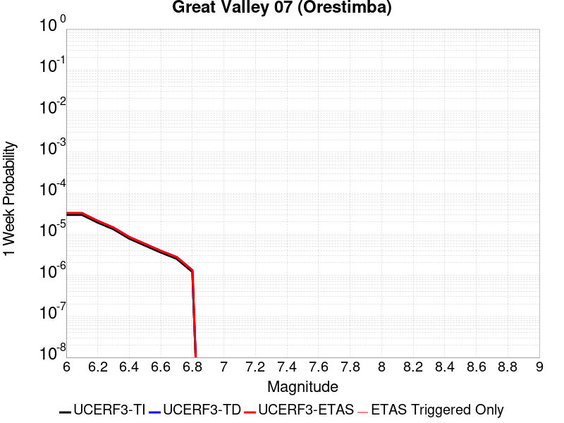 |  |  | 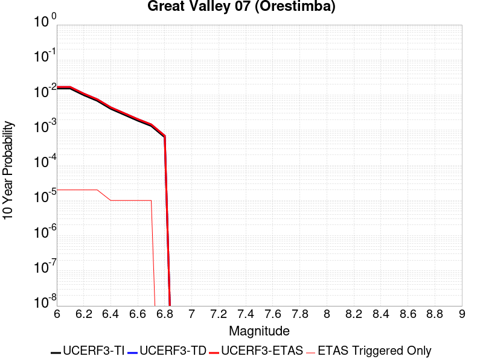 |

| Magnitude | 1 wk TI Prob | 1 wk TD Prob | 1 wk ETAS Prob | 1 wk ETAS/TD Gain | 1 wk ETAS Triggered Only | 1 mo TI Prob | 1 mo TD Prob | 1 mo ETAS Prob | 1 mo ETAS/TD Gain | 1 mo ETAS Triggered Only | 1 yr TI Prob | 1 yr TD Prob | 1 yr ETAS Prob | 1 yr ETAS/TD Gain | 1 yr ETAS Triggered Only | 10 yr TI Prob | 10 yr TD Prob | 10 yr ETAS Prob | 10 yr ETAS/TD Gain | 10 yr ETAS Triggered Only |
|-----|-----|-----|-----|-----|-----|-----|-----|-----|-----|-----|-----|-----|-----|-----|-----|-----|-----|-----|-----|-----|
| 6.0 | 2.9687902E-5 | 3.275741E-5 | 3.275741E-5 | 1.0 | 0.0 | 1.2722766E-4 | 1.4038174E-4 | 1.4038174E-4 | 1.0 | 0.0 | 0.0015478961 | 0.0017078797 | 0.0017508041 | 1.0251331 | 4.2997806E-5 | 0.015371585 | 0.016955089 | 0.016997358 | 1.002493 | 4.2997806E-5 |
| 6.1 | 2.9687902E-5 | 3.275741E-5 | 3.275741E-5 | 1.0 | 0.0 | 1.2722766E-4 | 1.4038174E-4 | 1.4038174E-4 | 1.0 | 0.0 | 0.0015478961 | 0.0017078797 | 0.0017508041 | 1.0251331 | 4.2997806E-5 | 0.015371585 | 0.016955089 | 0.016997358 | 1.002493 | 4.2997806E-5 |
| 6.2 | 1.9231524E-5 | 2.1159109E-5 | 2.1159109E-5 | 1.0 | 0.0 | 8.2418206E-5 | 9.067888E-5 | 9.067888E-5 | 1.0 | 0.0 | 0.0010029797 | 0.0011034793 | 0.0011464297 | 1.0389227 | 4.2997806E-5 | 0.00998465 | 0.010982411 | 0.011024937 | 1.0038722 | 4.2997806E-5 |
| 6.3 | 1.324766E-5 | 1.45484955E-5 | 1.45484955E-5 | 1.0 | 0.0 | 5.6774446E-5 | 6.234925E-5 | 6.234925E-5 | 1.0 | 0.0 | 6.910097E-4 | 7.58847E-4 | 8.0181216E-4 | 1.056619 | 4.2997806E-5 | 0.006888649 | 0.007563504 | 0.0076061767 | 1.0056419 | 4.2997806E-5 |
| 6.4 | 7.818645E-6 | 8.572818E-6 | 8.572818E-6 | 1.0 | 0.0 | 3.3508048E-5 | 3.674015E-5 | 3.674015E-5 | 1.0 | 0.0 | 4.078841E-4 | 4.4722288E-4 | 4.9020146E-4 | 1.096101 | 4.2997806E-5 | 0.004071363 | 0.0044635693 | 0.004506375 | 1.00959 | 4.2997806E-5 |
| 6.5 | 5.3076565E-6 | 5.8177857E-6 | 5.8177857E-6 | 1.0 | 0.0 | 2.27469E-5 | 2.4933142E-5 | 2.4933142E-5 | 1.0 | 0.0 | 2.7690834E-4 | 3.0352082E-4 | 3.4650558E-4 | 1.1416204 | 4.2997806E-5 | 0.0027656353 | 0.0030312722 | 0.0030741396 | 1.0141418 | 4.2997806E-5 |
| 6.6 | 3.6003578E-6 | 3.9484853E-6 | 3.9484853E-6 | 1.0 | 0.0 | 1.5430012E-5 | 1.6921978E-5 | 1.6921978E-5 | 1.0 | 0.0 | 1.8784421E-4 | 2.0600717E-4 | 2.4899613E-4 | 1.2086769 | 4.2997806E-5 | 0.0018768552 | 0.002058316 | 0.0021012255 | 1.0208468 | 4.2997806E-5 |
| 6.7 | 2.5361826E-6 | 2.7834608E-6 | 2.7834608E-6 | 1.0 | 0.0 | 1.0869308E-5 | 1.192907E-5 | 1.192907E-5 | 1.0 | 0.0 | 1.3232579E-4 | 1.4522807E-4 | 1.8821964E-4 | 1.2960279 | 4.2997806E-5 | 0.0013224703 | 0.0014514616 | 0.001494397 | 1.0295808 | 4.2997806E-5 |
| 6.8 | 1.2115831E-6 | 1.3313763E-6 | 1.3313763E-6 | 1.0 | 0.0 | 5.1924885E-6 | 5.7058915E-6 | 5.7058915E-6 | 1.0 | 0.0 | 6.3216714E-5 | 6.9467984E-5 | 6.9467984E-5 | 1.0 | 0.0 | 6.3198735E-4 | 6.945578E-4 | 6.945578E-4 | 1.0 | 0.0 |

## Tin Mountain
*[(top)](#table-of-contents)*

| 1 Week | 1 Month | 1 Year | 10 Year |
|-----|-----|-----|-----|
|  |  |  |  |

| Magnitude | 1 wk TI Prob | 1 wk TD Prob | 1 wk ETAS Prob | 1 wk ETAS/TD Gain | 1 wk ETAS Triggered Only | 1 mo TI Prob | 1 mo TD Prob | 1 mo ETAS Prob | 1 mo ETAS/TD Gain | 1 mo ETAS Triggered Only | 1 yr TI Prob | 1 yr TD Prob | 1 yr ETAS Prob | 1 yr ETAS/TD Gain | 1 yr ETAS Triggered Only | 10 yr TI Prob | 10 yr TD Prob | 10 yr ETAS Prob | 10 yr ETAS/TD Gain | 10 yr ETAS Triggered Only |
|-----|-----|-----|-----|-----|-----|-----|-----|-----|-----|-----|-----|-----|-----|-----|-----|-----|-----|-----|-----|-----|
| 6.0 | 4.083776E-6 | 4.181534E-6 | 4.181534E-6 | 1.0 | 0.0 | 1.750178E-5 | 1.7920758E-5 | 6.0917795E-5 | 3.3992867 | 4.2997806E-5 | 2.1306332E-4 | 2.181671E-4 | 2.6115554E-4 | 1.1970435 | 4.2997806E-5 | 0.0021285915 | 0.002179895 | 0.002222799 | 1.0196817 | 4.2997806E-5 |
| 6.1 | 4.083776E-6 | 4.181534E-6 | 4.181534E-6 | 1.0 | 0.0 | 1.750178E-5 | 1.7920758E-5 | 6.0917795E-5 | 3.3992867 | 4.2997806E-5 | 2.1306332E-4 | 2.181671E-4 | 2.6115554E-4 | 1.1970435 | 4.2997806E-5 | 0.0021285915 | 0.002179895 | 0.002222799 | 1.0196817 | 4.2997806E-5 |
| 6.2 | 4.083776E-6 | 4.181534E-6 | 4.181534E-6 | 1.0 | 0.0 | 1.750178E-5 | 1.7920758E-5 | 6.0917795E-5 | 3.3992867 | 4.2997806E-5 | 2.1306332E-4 | 2.181671E-4 | 2.6115554E-4 | 1.1970435 | 4.2997806E-5 | 0.0021285915 | 0.002179895 | 0.002222799 | 1.0196817 | 4.2997806E-5 |
| 6.3 | 4.083776E-6 | 4.181534E-6 | 4.181534E-6 | 1.0 | 0.0 | 1.750178E-5 | 1.7920758E-5 | 6.0917795E-5 | 3.3992867 | 4.2997806E-5 | 2.1306332E-4 | 2.181671E-4 | 2.6115554E-4 | 1.1970435 | 4.2997806E-5 | 0.0021285915 | 0.002179895 | 0.002222799 | 1.0196817 | 4.2997806E-5 |
| 6.4 | 4.083776E-6 | 4.181534E-6 | 4.181534E-6 | 1.0 | 0.0 | 1.750178E-5 | 1.7920758E-5 | 6.0917795E-5 | 3.3992867 | 4.2997806E-5 | 2.1306332E-4 | 2.181671E-4 | 2.6115554E-4 | 1.1970435 | 4.2997806E-5 | 0.0021285915 | 0.002179895 | 0.002222799 | 1.0196817 | 4.2997806E-5 |
| 6.5 | 2.3143427E-6 | 2.3731554E-6 | 2.3731554E-6 | 1.0 | 0.0 | 9.9185745E-6 | 1.0170631E-5 | 1.0170631E-5 | 1.0 | 0.0 | 1.2075195E-4 | 1.2382117E-4 | 1.2382117E-4 | 1.0 | 0.0 | 0.0012068636 | 0.0012375978 | 0.0012375978 | 1.0 | 0.0 |
| 6.6 | 2.3143427E-6 | 2.3731554E-6 | 2.3731554E-6 | 1.0 | 0.0 | 9.9185745E-6 | 1.0170631E-5 | 1.0170631E-5 | 1.0 | 0.0 | 1.2075195E-4 | 1.2382117E-4 | 1.2382117E-4 | 1.0 | 0.0 | 0.0012068636 | 0.0012375978 | 0.0012375978 | 1.0 | 0.0 |
| 6.7 | 1.7029532E-6 | 1.7497902E-6 | 1.7497902E-6 | 1.0 | 0.0 | 7.2983503E-6 | 7.499082E-6 | 7.499082E-6 | 1.0 | 0.0 | 8.885379E-5 | 9.129804E-5 | 9.129804E-5 | 1.0 | 0.0 | 8.881827E-4 | 9.1265794E-4 | 9.1265794E-4 | 1.0 | 0.0 |
| 6.8 | 1.2914646E-6 | 1.3299368E-6 | 1.3299368E-6 | 1.0 | 0.0 | 5.534837E-6 | 5.699719E-6 | 5.699719E-6 | 1.0 | 0.0 | 6.738455E-5 | 6.9392314E-5 | 6.9392314E-5 | 1.0 | 0.0 | 6.736412E-4 | 6.937498E-4 | 6.937498E-4 | 1.0 | 0.0 |
| 6.9 | 5.8708974E-7 | 6.116987E-7 | 6.116987E-7 | 1.0 | 0.0 | 2.5160964E-6 | 2.6215635E-6 | 2.6215635E-6 | 1.0 | 0.0 | 3.0633044E-5 | 3.191711E-5 | 3.191711E-5 | 1.0 | 0.0 | 3.0628822E-4 | 3.1912935E-4 | 3.1912935E-4 | 1.0 | 0.0 |
| 7.0 | 4.6248786E-7 | 4.8320095E-7 | 4.8320095E-7 | 1.0 | 0.0 | 1.9820893E-6 | 2.0708599E-6 | 2.0708599E-6 | 1.0 | 0.0 | 2.413167E-5 | 2.5212465E-5 | 2.5212465E-5 | 1.0 | 0.0 | 2.412905E-4 | 2.5209974E-4 | 2.5209974E-4 | 1.0 | 0.0 |
| 7.1 | 3.804606E-7 | 3.9871418E-7 | 3.9871418E-7 | 1.0 | 0.0 | 1.6305444E-6 | 1.7087742E-6 | 1.7087742E-6 | 1.0 | 0.0 | 1.9851697E-5 | 2.0804162E-5 | 2.0804162E-5 | 1.0 | 0.0 | 1.9849923E-4 | 2.0802549E-4 | 2.0802549E-4 | 1.0 | 0.0 |
| 7.2 | 3.5864858E-7 | 3.7616815E-7 | 3.7616815E-7 | 1.0 | 0.0 | 1.5370645E-6 | 1.6121484E-6 | 1.6121484E-6 | 1.0 | 0.0 | 1.87136E-5 | 1.9627763E-5 | 1.9627763E-5 | 1.0 | 0.0 | 1.8712023E-4 | 1.9626362E-4 | 1.9626362E-4 | 1.0 | 0.0 |
| 7.3 | 3.342063E-7 | 3.5063425E-7 | 3.5063425E-7 | 1.0 | 0.0 | 1.4323119E-6 | 1.5027176E-6 | 1.5027176E-6 | 1.0 | 0.0 | 1.7438259E-5 | 1.8295466E-5 | 1.8295466E-5 | 1.0 | 0.0 | 1.743689E-4 | 1.8294291E-4 | 1.8294291E-4 | 1.0 | 0.0 |
| 7.4 | 2.971242E-7 | 3.1165777E-7 | 3.1165777E-7 | 1.0 | 0.0 | 1.2733886E-6 | 1.3356756E-6 | 1.3356756E-6 | 1.0 | 0.0 | 1.5503398E-5 | 1.6261763E-5 | 1.6261763E-5 | 1.0 | 0.0 | 1.5502315E-4 | 1.6260901E-4 | 1.6260901E-4 | 1.0 | 0.0 |
| 7.5 | 1.4326713E-7 | 1.5012505E-7 | 1.5012505E-7 | 1.0 | 0.0 | 6.140018E-7 | 6.433931E-7 | 6.433931E-7 | 1.0 | 0.0 | 7.4754466E-6 | 7.8333105E-6 | 7.8333105E-6 | 1.0 | 0.0 | 7.475195E-5 | 7.8333105E-5 | 7.8333105E-5 | 1.0 | 0.0 |

## Davis Creek
*[(top)](#table-of-contents)*

| 1 Week | 1 Month | 1 Year | 10 Year |
|-----|-----|-----|-----|
|  |  |  |  |

| Magnitude | 1 wk TI Prob | 1 wk TD Prob | 1 wk ETAS Prob | 1 wk ETAS/TD Gain | 1 wk ETAS Triggered Only | 1 mo TI Prob | 1 mo TD Prob | 1 mo ETAS Prob | 1 mo ETAS/TD Gain | 1 mo ETAS Triggered Only | 1 yr TI Prob | 1 yr TD Prob | 1 yr ETAS Prob | 1 yr ETAS/TD Gain | 1 yr ETAS Triggered Only | 10 yr TI Prob | 10 yr TD Prob | 10 yr ETAS Prob | 10 yr ETAS/TD Gain | 10 yr ETAS Triggered Only |
|-----|-----|-----|-----|-----|-----|-----|-----|-----|-----|-----|-----|-----|-----|-----|-----|-----|-----|-----|-----|-----|
| 6.0 | 2.331472E-5 | 2.5417152E-5 | 6.8413865E-5 | 2.6916416 | 4.2997806E-5 | 9.99164E-5 | 1.08926775E-4 | 1.519199E-4 | 1.3946974 | 4.2997806E-5 | 0.0012158032 | 0.0013254952 | 0.0013684359 | 1.0323961 | 4.2997806E-5 | 0.01209173 | 0.013187673 | 0.013230103 | 1.0032175 | 4.2997806E-5 |
| 6.1 | 1.0407654E-5 | 1.131696E-5 | 1.131696E-5 | 1.0 | 0.0 | 4.4603472E-5 | 4.8500508E-5 | 4.8500508E-5 | 1.0 | 0.0 | 5.4291193E-4 | 5.9036084E-4 | 5.9036084E-4 | 1.0 | 0.0 | 0.0054158745 | 0.0058905976 | 0.0058905976 | 1.0 | 0.0 |
| 6.2 | 1.0407654E-5 | 1.131696E-5 | 1.131696E-5 | 1.0 | 0.0 | 4.4603472E-5 | 4.8500508E-5 | 4.8500508E-5 | 1.0 | 0.0 | 5.4291193E-4 | 5.9036084E-4 | 5.9036084E-4 | 1.0 | 0.0 | 0.0054158745 | 0.0058905976 | 0.0058905976 | 1.0 | 0.0 |
| 6.3 | 5.1323277E-6 | 5.568543E-6 | 5.568543E-6 | 1.0 | 0.0 | 2.1995505E-5 | 2.3865015E-5 | 2.3865015E-5 | 1.0 | 0.0 | 2.6776237E-4 | 2.9052646E-4 | 2.9052646E-4 | 1.0 | 0.0 | 0.0026743996 | 0.0029023124 | 0.0029023124 | 1.0 | 0.0 |
| 6.4 | 2.4985154E-6 | 2.704532E-6 | 2.704532E-6 | 1.0 | 0.0 | 1.07078795E-5 | 1.1590821E-5 | 1.1590821E-5 | 1.0 | 0.0 | 1.3036063E-4 | 1.4111272E-4 | 1.4111272E-4 | 1.0 | 0.0 | 0.0013028418 | 0.001410586 | 0.001410586 | 1.0 | 0.0 |
| 6.5 | 2.4846438E-6 | 2.6904663E-6 | 2.6904663E-6 | 1.0 | 0.0 | 1.064843E-5 | 1.1530539E-5 | 1.1530539E-5 | 1.0 | 0.0 | 1.2963692E-4 | 1.4037889E-4 | 1.4037889E-4 | 1.0 | 0.0 | 0.0012956132 | 0.0014032569 | 0.0014032569 | 1.0 | 0.0 |
| 6.6 | 2.072566E-7 | 2.1018079E-7 | 2.1018079E-7 | 1.0 | 0.0 | 8.882423E-7 | 9.007745E-7 | 9.007745E-7 | 1.0 | 0.0 | 1.0814296E-5 | 1.0966876E-5 | 1.0966876E-5 | 1.0 | 0.0 | 1.081377E-4 | 1.0966354E-4 | 1.0966354E-4 | 1.0 | 0.0 |
| 6.7 | 1.7544528E-7 | 1.7790819E-7 | 1.7790819E-7 | 1.0 | 0.0 | 7.5190815E-7 | 7.6246346E-7 | 7.6246346E-7 | 1.0 | 0.0 | 9.154443E-6 | 9.282955E-6 | 9.282955E-6 | 1.0 | 0.0 | 9.1540656E-5 | 9.282582E-5 | 9.282582E-5 | 1.0 | 0.0 |
| 6.8 | 1.2320395E-7 | 1.2481134E-7 | 1.2481134E-7 | 1.0 | 0.0 | 5.280168E-7 | 5.349056E-7 | 5.349056E-7 | 1.0 | 0.0 | 6.428586E-6 | 6.5124573E-6 | 6.5124573E-6 | 1.0 | 0.0 | 6.4284E-5 | 6.512278E-5 | 6.512278E-5 | 1.0 | 0.0 |
| 6.9 | 6.399997E-8 | 6.486056E-8 | 6.486056E-8 | 1.0 | 0.0 | 2.7428555E-7 | 2.7797378E-7 | 2.7797378E-7 | 1.0 | 0.0 | 3.3394215E-6 | 3.3843262E-6 | 3.3843262E-6 | 1.0 | 0.0 | 3.3393713E-5 | 3.384281E-5 | 3.384281E-5 | 1.0 | 0.0 |
| 7.0 | 6.4455685E-9 | 6.5352617E-9 | 6.5352617E-9 | 1.0 | 0.0 | 2.7623864E-8 | 2.8008264E-8 | 2.8008264E-8 | 1.0 | 0.0 | 3.3632048E-7 | 3.4100063E-7 | 3.4100063E-7 | 1.0 | 0.0 | 3.3631998E-6 | 3.4100062E-6 | 3.4100062E-6 | 1.0 | 0.0 |

## Santa Cruz Catalina Ridge alt1
*[(top)](#table-of-contents)*

| 1 Week | 1 Month | 1 Year | 10 Year |
|-----|-----|-----|-----|
|  |  |  |  |

| Magnitude | 1 wk TI Prob | 1 wk TD Prob | 1 wk ETAS Prob | 1 wk ETAS/TD Gain | 1 wk ETAS Triggered Only | 1 mo TI Prob | 1 mo TD Prob | 1 mo ETAS Prob | 1 mo ETAS/TD Gain | 1 mo ETAS Triggered Only | 1 yr TI Prob | 1 yr TD Prob | 1 yr ETAS Prob | 1 yr ETAS/TD Gain | 1 yr ETAS Triggered Only | 10 yr TI Prob | 10 yr TD Prob | 10 yr ETAS Prob | 10 yr ETAS/TD Gain | 10 yr ETAS Triggered Only |
|-----|-----|-----|-----|-----|-----|-----|-----|-----|-----|-----|-----|-----|-----|-----|-----|-----|-----|-----|-----|-----|
| 6.0 | 3.2833184E-5 | 3.6558286E-5 | 3.6558286E-5 | 1.0 | 0.0 | 1.4070606E-4 | 1.566699E-4 | 1.566699E-4 | 1.0 | 0.0 | 0.00171175 | 0.0019059537 | 0.0019488696 | 1.0225167 | 4.2997806E-5 | 0.016986247 | 0.018912971 | 0.018955156 | 1.0022304 | 4.2997806E-5 |
| 6.1 | 1.9835548E-5 | 2.165945E-5 | 2.165945E-5 | 1.0 | 0.0 | 8.500672E-5 | 9.282303E-5 | 9.282303E-5 | 1.0 | 0.0 | 0.0010344655 | 0.0011295547 | 0.0011725039 | 1.0380231 | 4.2997806E-5 | 0.010296632 | 0.011240268 | 0.011282782 | 1.0037824 | 4.2997806E-5 |
| 6.2 | 1.9835548E-5 | 2.165945E-5 | 2.165945E-5 | 1.0 | 0.0 | 8.500672E-5 | 9.282303E-5 | 9.282303E-5 | 1.0 | 0.0 | 0.0010344655 | 0.0011295547 | 0.0011725039 | 1.0380231 | 4.2997806E-5 | 0.010296632 | 0.011240268 | 0.011282782 | 1.0037824 | 4.2997806E-5 |
| 6.3 | 1.5728183E-5 | 1.7033912E-5 | 1.7033912E-5 | 1.0 | 0.0 | 6.7404755E-5 | 7.300047E-5 | 7.300047E-5 | 1.0 | 0.0 | 8.2034385E-4 | 8.884244E-4 | 9.3138404E-4 | 1.0483549 | 4.2997806E-5 | 0.008173222 | 0.008849408 | 0.008892025 | 1.0048158 | 4.2997806E-5 |
| 6.4 | 1.5728183E-5 | 1.7033912E-5 | 1.7033912E-5 | 1.0 | 0.0 | 6.7404755E-5 | 7.300047E-5 | 7.300047E-5 | 1.0 | 0.0 | 8.2034385E-4 | 8.884244E-4 | 9.3138404E-4 | 1.0483549 | 4.2997806E-5 | 0.008173222 | 0.008849408 | 0.008892025 | 1.0048158 | 4.2997806E-5 |
| 6.5 | 1.3707734E-5 | 1.479449E-5 | 1.479449E-5 | 1.0 | 0.0 | 5.8746107E-5 | 6.340344E-5 | 6.340344E-5 | 1.0 | 0.0 | 7.1499916E-4 | 7.71667E-4 | 8.1463164E-4 | 1.0556777 | 4.2997806E-5 | 0.0071270303 | 0.007690273 | 0.0077329404 | 1.0055482 | 4.2997806E-5 |
| 6.6 | 1.2539813E-5 | 1.3510192E-5 | 1.3510192E-5 | 1.0 | 0.0 | 5.3740947E-5 | 5.789955E-5 | 5.789955E-5 | 1.0 | 0.0 | 6.540996E-4 | 7.047017E-4 | 7.476692E-4 | 1.0609726 | 4.2997806E-5 | 0.0065217763 | 0.007024974 | 0.0070676696 | 1.0060778 | 4.2997806E-5 |
| 6.7 | 1.1504083E-5 | 1.237735E-5 | 1.237735E-5 | 1.0 | 0.0 | 4.930228E-5 | 5.3044718E-5 | 5.3044718E-5 | 1.0 | 0.0 | 6.0008996E-4 | 6.4563006E-4 | 6.886001E-4 | 1.0665553 | 4.2997806E-5 | 0.005984721 | 0.006437773 | 0.006480494 | 1.006636 | 4.2997806E-5 |
| 6.8 | 1.012739E-5 | 1.087705E-5 | 1.087705E-5 | 1.0 | 0.0 | 4.340238E-5 | 4.6615103E-5 | 4.6615103E-5 | 1.0 | 0.0 | 5.282958E-4 | 5.673926E-4 | 6.10366E-4 | 1.0757384 | 4.2997806E-5 | 0.0052704164 | 0.0056596086 | 0.005702363 | 1.0075543 | 4.2997806E-5 |
| 6.9 | 8.9607865E-6 | 9.609099E-6 | 9.609099E-6 | 1.0 | 0.0 | 3.8402806E-5 | 4.1181207E-5 | 4.1181207E-5 | 1.0 | 0.0 | 4.6745385E-4 | 5.012669E-4 | 5.442432E-4 | 1.0857353 | 4.2997806E-5 | 0.0046647177 | 0.005001482 | 0.0050442647 | 1.008554 | 4.2997806E-5 |
| 7.0 | 8.046829E-6 | 8.61973E-6 | 8.61973E-6 | 1.0 | 0.0 | 3.4485955E-5 | 3.694118E-5 | 3.694118E-5 | 1.0 | 0.0 | 4.1978562E-4 | 4.4966684E-4 | 4.926453E-4 | 1.0955784 | 4.2997806E-5 | 0.004189935 | 0.0044876602 | 0.004530465 | 1.0095383 | 4.2997806E-5 |
| 7.1 | 7.136131E-6 | 7.637642E-6 | 7.637642E-6 | 1.0 | 0.0 | 3.0583058E-5 | 3.2732343E-5 | 3.2732343E-5 | 1.0 | 0.0 | 3.7228514E-4 | 3.984441E-4 | 4.4142478E-4 | 1.1078713 | 4.2997806E-5 | 0.0037166206 | 0.0039773737 | 0.0040202006 | 1.0107676 | 4.2997806E-5 |
| 7.2 | 6.362014E-6 | 6.8049458E-6 | 6.8049458E-6 | 1.0 | 0.0 | 2.726549E-5 | 2.9163732E-5 | 2.9163732E-5 | 1.0 | 0.0 | 3.3190678E-4 | 3.5501123E-4 | 3.9799378E-4 | 1.1210737 | 4.2997806E-5 | 0.0033141149 | 0.0035445094 | 0.003587355 | 1.0120878 | 4.2997806E-5 |
| 7.3 | 5.004101E-6 | 5.351705E-6 | 5.351705E-6 | 1.0 | 0.0 | 2.1445969E-5 | 2.2935681E-5 | 2.2935681E-5 | 1.0 | 0.0 | 2.6107338E-4 | 2.7920667E-4 | 3.2219247E-4 | 1.1539569 | 4.2997806E-5 | 0.002607669 | 0.0027886136 | 0.0028314914 | 1.0153761 | 4.2997806E-5 |
| 7.4 | 3.4901443E-6 | 3.7320456E-6 | 3.7320456E-6 | 1.0 | 0.0 | 1.4957676E-5 | 1.5994385E-5 | 1.5994385E-5 | 1.0 | 0.0 | 1.8209449E-4 | 1.9471462E-4 | 1.9471462E-4 | 1.0 | 0.0 | 0.0018194534 | 0.0019454787 | 0.0019454787 | 1.0 | 0.0 |
| 7.5 | 1.1215045E-6 | 1.1893851E-6 | 1.1893851E-6 | 1.0 | 0.0 | 4.806439E-6 | 5.097355E-6 | 5.097355E-6 | 1.0 | 0.0 | 5.851682E-5 | 6.205856E-5 | 6.205856E-5 | 1.0 | 0.0 | 5.850142E-4 | 6.204154E-4 | 6.204154E-4 | 1.0 | 0.0 |
| 7.6 | 2.8599047E-7 | 2.9951954E-7 | 2.9951954E-7 | 1.0 | 0.0 | 1.2256729E-6 | 1.2836546E-6 | 1.2836546E-6 | 1.0 | 0.0 | 1.4922465E-5 | 1.5628384E-5 | 1.5628384E-5 | 1.0 | 0.0 | 1.4921463E-4 | 1.5627299E-4 | 1.5627299E-4 | 1.0 | 0.0 |
| 7.7 | 2.0781519E-7 | 2.1744296E-7 | 2.1744296E-7 | 1.0 | 0.0 | 8.906362E-7 | 9.3189806E-7 | 9.3189806E-7 | 1.0 | 0.0 | 1.08434415E-5 | 1.1345801E-5 | 1.1345801E-5 | 1.0 | 0.0 | 1.0842913E-4 | 1.1345231E-4 | 1.1345231E-4 | 1.0 | 0.0 |
| 7.8 | 3.614776E-8 | 3.7640977E-8 | 3.7640977E-8 | 1.0 | 0.0 | 1.5491896E-7 | 1.6131847E-7 | 1.6131847E-7 | 1.0 | 0.0 | 1.8861368E-6 | 1.9640506E-6 | 1.9640506E-6 | 1.0 | 0.0 | 1.8861208E-5 | 1.9640345E-5 | 1.9640345E-5 | 1.0 | 0.0 |

## Independence rev 2011
*[(top)](#table-of-contents)*

| 1 Week | 1 Month | 1 Year | 10 Year |
|-----|-----|-----|-----|
|  |  |  |  |

| Magnitude | 1 wk TI Prob | 1 wk TD Prob | 1 wk ETAS Prob | 1 wk ETAS/TD Gain | 1 wk ETAS Triggered Only | 1 mo TI Prob | 1 mo TD Prob | 1 mo ETAS Prob | 1 mo ETAS/TD Gain | 1 mo ETAS Triggered Only | 1 yr TI Prob | 1 yr TD Prob | 1 yr ETAS Prob | 1 yr ETAS/TD Gain | 1 yr ETAS Triggered Only | 10 yr TI Prob | 10 yr TD Prob | 10 yr ETAS Prob | 10 yr ETAS/TD Gain | 10 yr ETAS Triggered Only |
|-----|-----|-----|-----|-----|-----|-----|-----|-----|-----|-----|-----|-----|-----|-----|-----|-----|-----|-----|-----|-----|
| 6.0 | 4.422171E-6 | 4.3262235E-6 | 4.3262235E-6 | 1.0 | 0.0 | 1.8952025E-5 | 1.8540843E-5 | 6.153785E-5 | 3.319043 | 4.2997806E-5 | 2.3071647E-4 | 2.2571435E-4 | 2.6870245E-4 | 1.1904535 | 4.2997806E-5 | 0.0023047708 | 0.0022551445 | 0.0022980454 | 1.0190235 | 4.2997806E-5 |
| 6.1 | 4.422171E-6 | 4.3262235E-6 | 4.3262235E-6 | 1.0 | 0.0 | 1.8952025E-5 | 1.8540843E-5 | 6.153785E-5 | 3.319043 | 4.2997806E-5 | 2.3071647E-4 | 2.2571435E-4 | 2.6870245E-4 | 1.1904535 | 4.2997806E-5 | 0.0023047708 | 0.0022551445 | 0.0022980454 | 1.0190235 | 4.2997806E-5 |
| 6.2 | 4.422171E-6 | 4.3262235E-6 | 4.3262235E-6 | 1.0 | 0.0 | 1.8952025E-5 | 1.8540843E-5 | 6.153785E-5 | 3.319043 | 4.2997806E-5 | 2.3071647E-4 | 2.2571435E-4 | 2.6870245E-4 | 1.1904535 | 4.2997806E-5 | 0.0023047708 | 0.0022551445 | 0.0022980454 | 1.0190235 | 4.2997806E-5 |
| 6.3 | 4.422171E-6 | 4.3262235E-6 | 4.3262235E-6 | 1.0 | 0.0 | 1.8952025E-5 | 1.8540843E-5 | 6.153785E-5 | 3.319043 | 4.2997806E-5 | 2.3071647E-4 | 2.2571435E-4 | 2.6870245E-4 | 1.1904535 | 4.2997806E-5 | 0.0023047708 | 0.0022551445 | 0.0022980454 | 1.0190235 | 4.2997806E-5 |
| 6.4 | 4.422171E-6 | 4.3262235E-6 | 4.3262235E-6 | 1.0 | 0.0 | 1.8952025E-5 | 1.8540843E-5 | 6.153785E-5 | 3.319043 | 4.2997806E-5 | 2.3071647E-4 | 2.2571435E-4 | 2.6870245E-4 | 1.1904535 | 4.2997806E-5 | 0.0023047708 | 0.0022551445 | 0.0022980454 | 1.0190235 | 4.2997806E-5 |
| 6.5 | 4.422171E-6 | 4.3262235E-6 | 4.3262235E-6 | 1.0 | 0.0 | 1.8952025E-5 | 1.8540843E-5 | 6.153785E-5 | 3.319043 | 4.2997806E-5 | 2.3071647E-4 | 2.2571435E-4 | 2.6870245E-4 | 1.1904535 | 4.2997806E-5 | 0.0023047708 | 0.0022551445 | 0.0022980454 | 1.0190235 | 4.2997806E-5 |
| 6.6 | 2.663744E-6 | 2.5319835E-6 | 2.5319835E-6 | 1.0 | 0.0 | 1.1415996E-5 | 1.0851315E-5 | 5.3848657E-5 | 4.962408 | 4.2997806E-5 | 1.3898089E-4 | 1.3210725E-4 | 1.7509937E-4 | 1.3254335 | 4.2997806E-5 | 0.0013889399 | 0.0013203353 | 0.0013632764 | 1.0325228 | 4.2997806E-5 |
| 6.7 | 2.663744E-6 | 2.5319835E-6 | 2.5319835E-6 | 1.0 | 0.0 | 1.1415996E-5 | 1.0851315E-5 | 5.3848657E-5 | 4.962408 | 4.2997806E-5 | 1.3898089E-4 | 1.3210725E-4 | 1.7509937E-4 | 1.3254335 | 4.2997806E-5 | 0.0013889399 | 0.0013203353 | 0.0013632764 | 1.0325228 | 4.2997806E-5 |
| 6.8 | 1.9716529E-6 | 1.8322561E-6 | 1.8322561E-6 | 1.0 | 0.0 | 8.449913E-6 | 7.852504E-6 | 7.852504E-6 | 1.0 | 0.0 | 1.0287284E-4 | 9.560016E-5 | 9.560016E-5 | 1.0 | 0.0 | 0.0010282523 | 9.5560326E-4 | 9.5560326E-4 | 1.0 | 0.0 |
| 6.9 | 1.8788617E-6 | 1.742997E-6 | 1.742997E-6 | 1.0 | 0.0 | 8.0522395E-6 | 7.469967E-6 | 7.469967E-6 | 1.0 | 0.0 | 9.80316E-5 | 9.094317E-5 | 9.094317E-5 | 1.0 | 0.0 | 9.798837E-4 | 9.090716E-4 | 9.090716E-4 | 1.0 | 0.0 |
| 7.0 | 1.5045488E-6 | 1.3849485E-6 | 1.3849485E-6 | 1.0 | 0.0 | 6.44805E-6 | 5.9354807E-6 | 5.9354807E-6 | 1.0 | 0.0 | 7.8502184E-5 | 7.226213E-5 | 7.226213E-5 | 1.0 | 0.0 | 7.8474457E-4 | 7.223915E-4 | 7.223915E-4 | 1.0 | 0.0 |
| 7.1 | 1.272341E-6 | 1.162508E-6 | 1.162508E-6 | 1.0 | 0.0 | 5.4528787E-6 | 4.9821683E-6 | 4.9821683E-6 | 1.0 | 0.0 | 6.6386776E-5 | 6.0656243E-5 | 6.0656243E-5 | 1.0 | 0.0 | 6.636695E-4 | 6.064001E-4 | 6.064001E-4 | 1.0 | 0.0 |
| 7.2 | 1.0416892E-6 | 9.4098664E-7 | 9.4098664E-7 | 1.0 | 0.0 | 4.464375E-6 | 4.0327936E-6 | 4.0327936E-6 | 1.0 | 0.0 | 5.4352407E-5 | 4.9098177E-5 | 4.9098177E-5 | 1.0 | 0.0 | 5.4339116E-4 | 4.9087516E-4 | 4.9087516E-4 | 1.0 | 0.0 |
| 7.3 | 7.9450155E-7 | 7.234991E-7 | 7.234991E-7 | 1.0 | 0.0 | 3.4050022E-6 | 3.100707E-6 | 3.100707E-6 | 1.0 | 0.0 | 4.1455114E-5 | 3.7750466E-5 | 3.7750466E-5 | 1.0 | 0.0 | 4.144738E-4 | 3.7744164E-4 | 3.7744164E-4 | 1.0 | 0.0 |
| 7.4 | 5.3893444E-7 | 5.019506E-7 | 5.019506E-7 | 1.0 | 0.0 | 2.309717E-6 | 2.151215E-6 | 2.151215E-6 | 1.0 | 0.0 | 2.8120441E-5 | 2.6190733E-5 | 2.6190733E-5 | 1.0 | 0.0 | 2.8116882E-4 | 2.618769E-4 | 2.618769E-4 | 1.0 | 0.0 |
| 7.5 | 3.8852085E-7 | 3.6825497E-7 | 3.6825497E-7 | 1.0 | 0.0 | 1.6650882E-6 | 1.5782347E-6 | 1.5782347E-6 | 1.0 | 0.0 | 2.027226E-5 | 1.921484E-5 | 1.921484E-5 | 1.0 | 0.0 | 2.0270412E-4 | 1.9213199E-4 | 1.9213199E-4 | 1.0 | 0.0 |
| 7.6 | 2.414929E-7 | 2.3457528E-7 | 2.3457528E-7 | 1.0 | 0.0 | 1.0349692E-6 | 1.0053222E-6 | 1.0053222E-6 | 1.0 | 0.0 | 1.2600677E-5 | 1.2239731E-5 | 1.2239731E-5 | 1.0 | 0.0 | 1.2599962E-4 | 1.2239069E-4 | 1.2239069E-4 | 1.0 | 0.0 |
| 7.7 | 6.8298014E-8 | 6.858965E-8 | 6.858965E-8 | 1.0 | 0.0 | 2.9270575E-7 | 2.9395562E-7 | 2.9395562E-7 | 1.0 | 0.0 | 3.5636867E-6 | 3.5789042E-6 | 3.5789042E-6 | 1.0 | 0.0 | 3.5636294E-5 | 3.5788515E-5 | 3.5788515E-5 | 1.0 | 0.0 |

## White Mountains
*[(top)](#table-of-contents)*

| 1 Week | 1 Month | 1 Year | 10 Year |
|-----|-----|-----|-----|
|  |  |  |  |

| Magnitude | 1 wk TI Prob | 1 wk TD Prob | 1 wk ETAS Prob | 1 wk ETAS/TD Gain | 1 wk ETAS Triggered Only | 1 mo TI Prob | 1 mo TD Prob | 1 mo ETAS Prob | 1 mo ETAS/TD Gain | 1 mo ETAS Triggered Only | 1 yr TI Prob | 1 yr TD Prob | 1 yr ETAS Prob | 1 yr ETAS/TD Gain | 1 yr ETAS Triggered Only | 10 yr TI Prob | 10 yr TD Prob | 10 yr ETAS Prob | 10 yr ETAS/TD Gain | 10 yr ETAS Triggered Only |
|-----|-----|-----|-----|-----|-----|-----|-----|-----|-----|-----|-----|-----|-----|-----|-----|-----|-----|-----|-----|-----|
| 6.0 | 3.503579E-5 | 3.3783974E-5 | 7.678033E-5 | 2.2726848 | 4.2997806E-5 | 1.5014476E-4 | 1.4478111E-4 | 1.8777269E-4 | 1.2969419 | 4.2997806E-5 | 0.0018264796 | 0.0017614056 | 0.0018043277 | 1.024368 | 4.2997806E-5 | 0.018115403 | 0.017486779 | 0.017529026 | 1.0024159 | 4.2997806E-5 |
| 6.1 | 3.503579E-5 | 3.3783974E-5 | 7.678033E-5 | 2.2726848 | 4.2997806E-5 | 1.5014476E-4 | 1.4478111E-4 | 1.8777269E-4 | 1.2969419 | 4.2997806E-5 | 0.0018264796 | 0.0017614056 | 0.0018043277 | 1.024368 | 4.2997806E-5 | 0.018115403 | 0.017486779 | 0.017529026 | 1.0024159 | 4.2997806E-5 |
| 6.2 | 3.503579E-5 | 3.3783974E-5 | 7.678033E-5 | 2.2726848 | 4.2997806E-5 | 1.5014476E-4 | 1.4478111E-4 | 1.8777269E-4 | 1.2969419 | 4.2997806E-5 | 0.0018264796 | 0.0017614056 | 0.0018043277 | 1.024368 | 4.2997806E-5 | 0.018115403 | 0.017486779 | 0.017529026 | 1.0024159 | 4.2997806E-5 |
| 6.3 | 1.7818425E-5 | 1.591604E-5 | 1.591604E-5 | 1.0 | 0.0 | 7.636245E-5 | 6.8209905E-5 | 6.8209905E-5 | 1.0 | 0.0 | 9.293162E-4 | 8.301534E-4 | 8.301534E-4 | 1.0 | 0.0 | 0.009254395 | 0.008271982 | 0.008271982 | 1.0 | 0.0 |
| 6.4 | 1.7818425E-5 | 1.591604E-5 | 1.591604E-5 | 1.0 | 0.0 | 7.636245E-5 | 6.8209905E-5 | 6.8209905E-5 | 1.0 | 0.0 | 9.293162E-4 | 8.301534E-4 | 8.301534E-4 | 1.0 | 0.0 | 0.009254395 | 0.008271982 | 0.008271982 | 1.0 | 0.0 |
| 6.5 | 1.3397557E-5 | 1.1336246E-5 | 1.1336246E-5 | 1.0 | 0.0 | 5.741684E-5 | 4.8583046E-5 | 4.8583046E-5 | 1.0 | 0.0 | 6.988258E-4 | 5.91345E-4 | 5.91345E-4 | 1.0 | 0.0 | 0.006966323 | 0.0058984202 | 0.0058984202 | 1.0 | 0.0 |
| 6.6 | 1.0818695E-5 | 8.6253485E-6 | 8.6253485E-6 | 1.0 | 0.0 | 4.6365014E-5 | 3.696528E-5 | 3.696528E-5 | 1.0 | 0.0 | 5.6434784E-4 | 4.4996373E-4 | 4.4996373E-4 | 1.0 | 0.0 | 0.005629168 | 0.004490963 | 0.004490963 | 1.0 | 0.0 |
| 6.7 | 9.067908E-6 | 6.8024283E-6 | 6.8024283E-6 | 1.0 | 0.0 | 3.8861883E-5 | 2.9152956E-5 | 2.9152956E-5 | 1.0 | 0.0 | 4.7304068E-4 | 3.5488262E-4 | 3.5488262E-4 | 1.0 | 0.0 | 0.00472035 | 0.003543476 | 0.003543476 | 1.0 | 0.0 |
| 6.8 | 7.295947E-6 | 4.9363807E-6 | 4.9363807E-6 | 1.0 | 0.0 | 3.126797E-5 | 2.1155753E-5 | 2.1155753E-5 | 1.0 | 0.0 | 3.8062103E-4 | 2.5754198E-4 | 2.5754198E-4 | 1.0 | 0.0 | 0.0037996976 | 0.002572548 | 0.002572548 | 1.0 | 0.0 |
| 6.9 | 6.2243444E-6 | 3.8322046E-6 | 3.8322046E-6 | 1.0 | 0.0 | 2.6675489E-5 | 1.6423633E-5 | 1.6423633E-5 | 1.0 | 0.0 | 3.2472567E-4 | 1.9993992E-4 | 1.9993992E-4 | 1.0 | 0.0 | 0.0032425157 | 0.0019976532 | 0.0019976532 | 1.0 | 0.0 |
| 7.0 | 4.9878413E-6 | 2.679527E-6 | 2.679527E-6 | 1.0 | 0.0 | 2.1376287E-5 | 1.1483638E-5 | 1.1483638E-5 | 1.0 | 0.0 | 2.602252E-4 | 1.3980459E-4 | 1.3980459E-4 | 1.0 | 0.0 | 0.002599207 | 0.0013971926 | 0.0013971926 | 1.0 | 0.0 |
| 7.1 | 4.0252844E-6 | 1.8857509E-6 | 1.8857509E-6 | 1.0 | 0.0 | 1.7251105E-5 | 8.081765E-6 | 8.081765E-6 | 1.0 | 0.0 | 2.1001195E-4 | 9.8391174E-5 | 9.8391174E-5 | 1.0 | 0.0 | 0.0020981359 | 9.83489E-4 | 9.83489E-4 | 1.0 | 0.0 |
| 7.2 | 3.3284066E-6 | 1.281958E-6 | 1.281958E-6 | 1.0 | 0.0 | 1.4264522E-5 | 5.4940947E-6 | 5.4940947E-6 | 1.0 | 0.0 | 1.736567E-4 | 6.688865E-5 | 6.688865E-5 | 1.0 | 0.0 | 0.0017352107 | 6.6869525E-4 | 6.6869525E-4 | 1.0 | 0.0 |
| 7.3 | 2.458226E-6 | 6.0571654E-7 | 6.0571654E-7 | 1.0 | 0.0 | 1.0535211E-5 | 2.5959255E-6 | 2.5959255E-6 | 1.0 | 0.0 | 1.2825865E-4 | 3.1604974E-5 | 3.1604974E-5 | 1.0 | 0.0 | 0.0012818464 | 3.1600855E-4 | 3.1600855E-4 | 1.0 | 0.0 |
| 7.4 | 1.965953E-6 | 3.1088828E-7 | 3.1088828E-7 | 1.0 | 0.0 | 8.425486E-6 | 1.3323777E-6 | 1.3323777E-6 | 1.0 | 0.0 | 1.0257547E-4 | 1.6221578E-5 | 1.6221578E-5 | 1.0 | 0.0 | 0.0010252813 | 1.6220407E-4 | 1.6220407E-4 | 1.0 | 0.0 |
| 7.5 | 1.2014192E-6 | 1.8243925E-7 | 1.8243925E-7 | 1.0 | 0.0 | 5.148929E-6 | 7.8188225E-7 | 7.8188225E-7 | 1.0 | 0.0 | 6.2686406E-5 | 9.519375E-6 | 9.519375E-6 | 1.0 | 0.0 | 6.266873E-4 | 9.518977E-5 | 9.518977E-5 | 1.0 | 0.0 |
| 7.6 | 2.5612175E-7 | 4.894561E-8 | 4.894561E-8 | 1.0 | 0.0 | 1.0976642E-6 | 2.0976687E-7 | 2.0976687E-7 | 1.0 | 0.0 | 1.3363979E-5 | 2.553909E-6 | 2.553909E-6 | 1.0 | 0.0 | 1.3363175E-4 | 2.5538833E-5 | 2.5538833E-5 | 1.0 | 0.0 |

