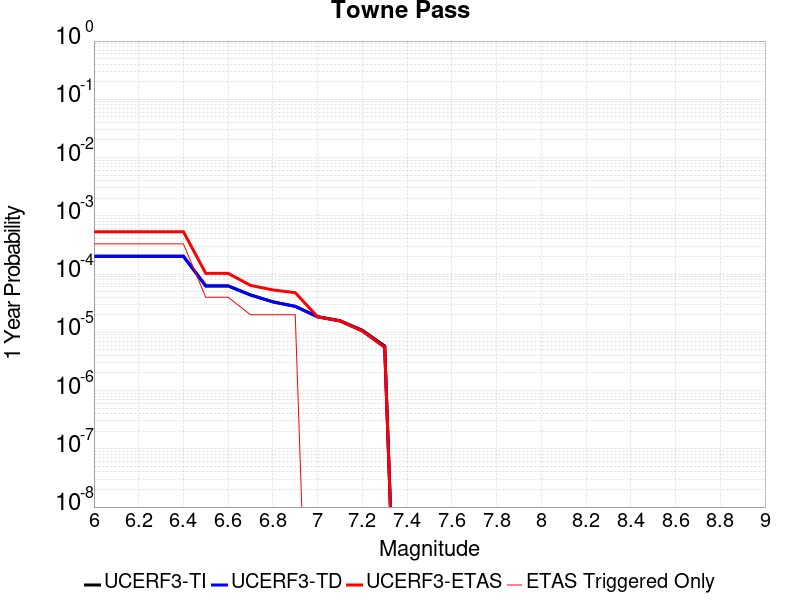
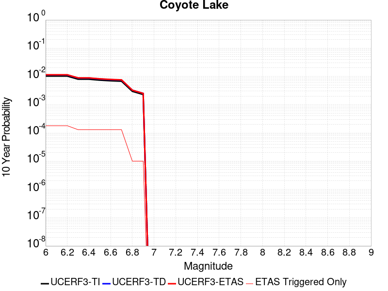
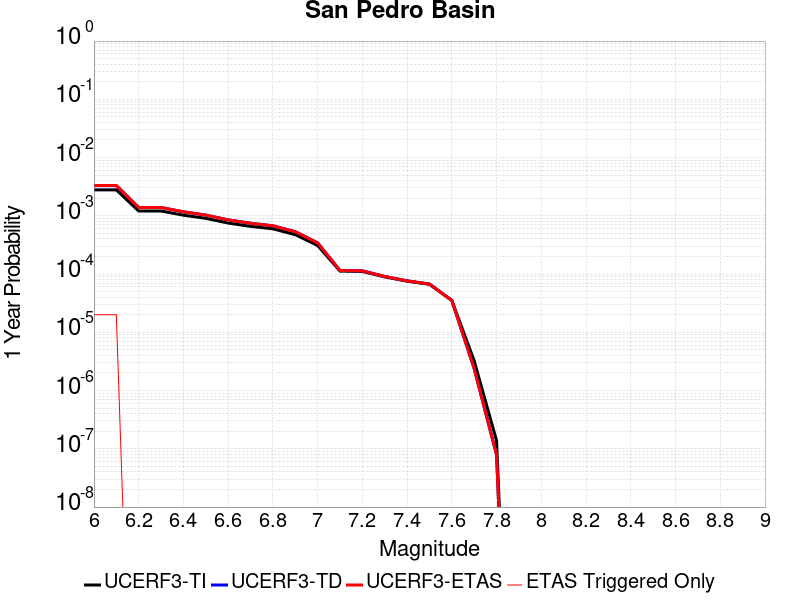
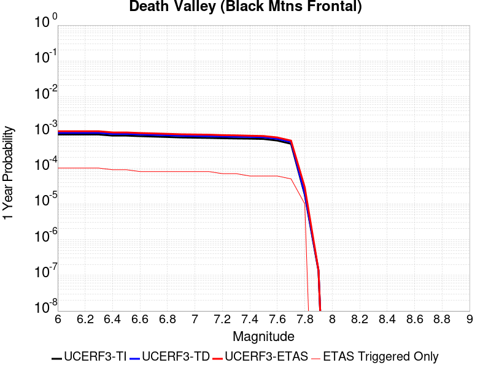
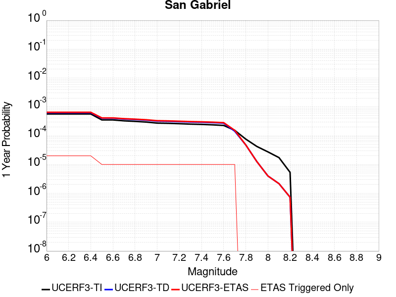
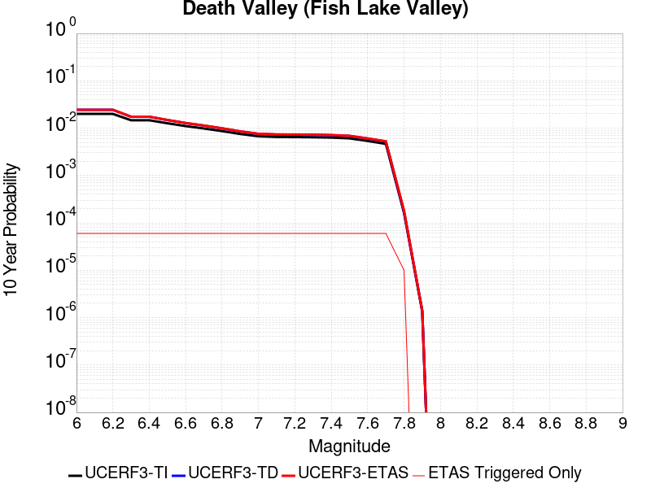
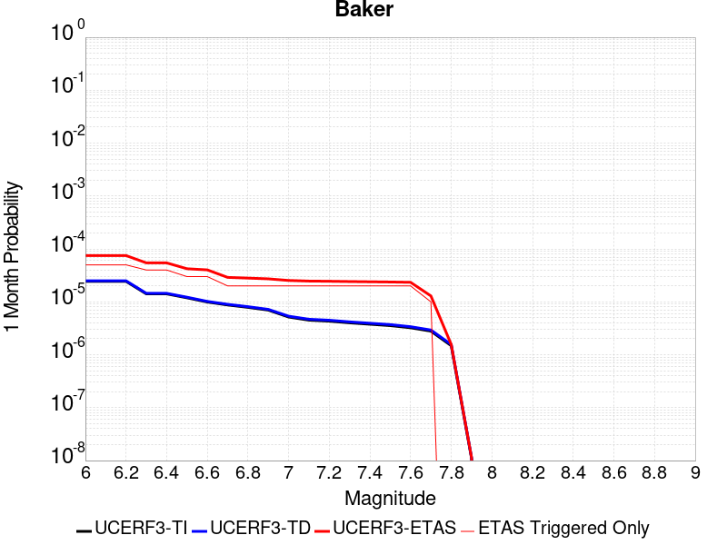

# Parent Section Magnitude-Probability Distributions

Only fault sections with at least one triggered aftershock are plotted. Sections are sorted by total supraseismogenic trigger rate (decreasing)

## Table Of Contents

* [Tank Canyon](#tank-canyon)
* [Garlock (Central)](#garlock-central)
* [Owl Lake](#owl-lake)
* [Garlock (East)](#garlock-east)
* [Little Lake](#little-lake)
* [Panamint Valley](#panamint-valley)
* [Blackwater](#blackwater)
* [Gravel Hills-Harper Lk](#gravel-hills-harper-lk)
* [Garlock (West)](#garlock-west)
* [Ash Hill](#ash-hill)
* [Hunter Mountain-Saline Valley](#hunter-mountain-saline-valley)
* [Airport Lake](#airport-lake)
* [So Sierra Nevada](#so-sierra-nevada)
* [McLean Lake](#mclean-lake)
* [Goldstone Lake](#goldstone-lake)
* [Coyote Canyon](#coyote-canyon)
* [Nelson Lake](#nelson-lake)
* [San Andreas (Mojave N)](#san-andreas-mojave-n)
* [San Andreas (San Bernardino N)](#san-andreas-san-bernardino-n)
* [San Andreas (Mojave S)](#san-andreas-mojave-s)
* [Death Valley (So)](#death-valley-so)
* [Towne Pass](#towne-pass)
* [Lenwood-Lockhart-Old Woman Springs](#lenwood-lockhart-old-woman-springs)
* [Paradise](#paradise)
* [Bicycle Lake](#bicycle-lake)
* [San Andreas (San Bernardino S)](#san-andreas-san-bernardino-s)
* [Garlic Springs](#garlic-springs)
* [Coyote Lake](#coyote-lake)
* [San Pedro Basin](#san-pedro-basin)
* [Death Valley (Black Mtns Frontal)](#death-valley-black-mtns-frontal)
* [Red Pass](#red-pass)
* [San Andreas (San Gorgonio Pass-Garnet HIll)](#san-andreas-san-gorgonio-pass-garnet-hill)
* [Lost Hills](#lost-hills)
* [Kern Canyon (Lake Isabella) 2011](#kern-canyon-lake-isabella-2011)
* [San Andreas (Parkfield)](#san-andreas-parkfield)
* [Brawley (Seismic Zone) alt 1](#brawley-seismic-zone-alt-1)
* [Eureka Peak](#eureka-peak)
* [Santa Cruz Island](#santa-cruz-island)
* [San Gabriel](#san-gabriel)
* [San Andreas (Big Bend)](#san-andreas-big-bend)
* [Channel Islands Western Deep Ramp](#channel-islands-western-deep-ramp)
* [Great Valley 03a Dunnigan Hills](#great-valley-03a-dunnigan-hills)
* [Santa Rosa Island](#santa-rosa-island)
* [Death Valley (No)](#death-valley-no)
* [Death Valley (Fish Lake Valley)](#death-valley-fish-lake-valley)
* [San Jacinto (San Bernardino)](#san-jacinto-san-bernardino)
* [Cleghorn Lake](#cleghorn-lake)
* [Channel Islands Thrust](#channel-islands-thrust)
* [Baker](#baker)
* [Palos Verdes](#palos-verdes)
* [Elsinore (Glen Ivy) rev](#elsinore-glen-ivy-rev)
* [San Andreas (Coachella) rev](#san-andreas-coachella-rev)
* [Helendale-So Lockhart](#helendale-so-lockhart)
* [Santa Cruz Catalina Ridge alt1](#santa-cruz-catalina-ridge-alt1)
* [White Mountains](#white-mountains)

## Tank Canyon
*[(top)](#table-of-contents)*

| 1 Week | 1 Month | 1 Year | 10 Year |
|-----|-----|-----|-----|
|  |  |  |  |

| Magnitude | 1 wk TI Prob | 1 wk TD Prob | 1 wk ETAS Prob | 1 wk ETAS/TD Gain | 1 wk ETAS Triggered Only | 1 mo TI Prob | 1 mo TD Prob | 1 mo ETAS Prob | 1 mo ETAS/TD Gain | 1 mo ETAS Triggered Only | 1 yr TI Prob | 1 yr TD Prob | 1 yr ETAS Prob | 1 yr ETAS/TD Gain | 1 yr ETAS Triggered Only | 10 yr TI Prob | 10 yr TD Prob | 10 yr ETAS Prob | 10 yr ETAS/TD Gain | 10 yr ETAS Triggered Only |
|-----|-----|-----|-----|-----|-----|-----|-----|-----|-----|-----|-----|-----|-----|-----|-----|-----|-----|-----|-----|-----|
| 6.0 | 4.8284557E-5 | 5.7964517E-5 | 0.0063308985 | 109.22024 | 0.0062732976 | 2.0691741E-4 | 2.4839956E-4 | 0.008701613 | 35.030712 | 0.008455314 | 0.0025163088 | 0.0030207448 | 0.015348154 | 5.0809174 | 0.01236476 | 0.02488006 | 0.029863482 | 0.045210674 | 1.5139116 | 0.01581962 |
| 6.1 | 1.7796336E-5 | 2.0873225E-5 | 0.0021119288 | 101.17884 | 0.0020910993 | 7.626778E-5 | 8.945383E-5 | 0.0028167304 | 31.488092 | 0.0027275207 | 9.281647E-4 | 0.0010885935 | 0.0048121475 | 4.420518 | 0.0037276116 | 0.009242975 | 0.010836697 | 0.016232625 | 1.4979309 | 0.0054550413 |
| 6.2 | 1.7796336E-5 | 2.0873225E-5 | 0.0021119288 | 101.17884 | 0.0020910993 | 7.626778E-5 | 8.945383E-5 | 0.0028167304 | 31.488092 | 0.0027275207 | 9.281647E-4 | 0.0010885935 | 0.0048121475 | 4.420518 | 0.0037276116 | 0.009242975 | 0.010836697 | 0.016232625 | 1.4979309 | 0.0054550413 |
| 6.3 | 1.3515912E-5 | 1.57595E-5 | 0.0011976665 | 75.996475 | 0.0011819256 | 5.792405E-5 | 6.7539106E-5 | 0.0017948522 | 26.575006 | 0.0017274298 | 7.049971E-4 | 8.220024E-4 | 0.0030022254 | 3.6523314 | 0.0021820166 | 0.007027647 | 0.008192232 | 0.011618788 | 1.418269 | 0.0034548596 |
| 6.4 | 1.0870146E-5 | 1.2617973E-5 | 8.3086384E-4 | 65.84765 | 8.1825623E-4 | 4.658551E-5 | 5.407601E-5 | 0.0011450252 | 21.174368 | 0.0010910083 | 5.67031E-4 | 6.581944E-4 | 0.0021119146 | 3.2086487 | 0.0014546777 | 0.005655863 | 0.006564466 | 0.0090031205 | 1.3714932 | 0.0024547686 |
| 6.5 | 7.964826E-6 | 9.196063E-6 | 3.7286215E-4 | 40.54585 | 3.6366942E-4 | 3.4134522E-5 | 3.941116E-5 | 6.758076E-4 | 17.14762 | 6.364215E-4 | 4.1550855E-4 | 4.797359E-4 | 0.0013884733 | 2.8942451 | 9.0917357E-4 | 0.0041473247 | 0.0047883047 | 0.006416981 | 1.3401363 | 0.0016365125 |
| 6.6 | 6.6317E-6 | 7.6122747E-6 | 2.8036226E-4 | 36.830288 | 2.7275208E-4 | 2.8421264E-5 | 3.2623677E-5 | 5.7811E-4 | 17.720566 | 5.4550415E-4 | 3.4597394E-4 | 3.9713003E-4 | 0.0010332988 | 2.6019156 | 6.364215E-4 | 0.0034543579 | 0.0039653555 | 0.0048709237 | 1.2283701 | 9.0917357E-4 |
| 6.7 | 4.793663E-6 | 5.430772E-6 | 9.6347634E-5 | 17.741056 | 9.0917354E-5 | 2.0544108E-5 | 2.3274553E-5 | 2.0510504E-4 | 8.812415 | 1.8183471E-4 | 2.500958E-4 | 2.8333522E-4 | 4.651184E-4 | 1.6415834 | 1.8183471E-4 | 0.0024981452 | 0.0028304325 | 0.0031930725 | 1.1281217 | 3.6366942E-4 |
| 6.8 | 4.382823E-6 | 4.969245E-6 | 9.588615E-5 | 19.29592 | 9.0917354E-5 | 1.8783392E-5 | 2.1296615E-5 | 2.0312745E-4 | 9.538016 | 1.8183471E-4 | 2.286638E-4 | 2.5925972E-4 | 4.4104728E-4 | 1.7011794 | 1.8183471E-4 | 0.0022842865 | 0.0025902467 | 0.002952974 | 1.1400359 | 3.6366942E-4 |
| 6.9 | 2.729601E-6 | 3.0735362E-6 | 3.0735362E-6 | 1.0 | 0.0 | 1.1698237E-5 | 1.3172238E-5 | 1.04088394E-4 | 7.902104 | 9.0917354E-5 | 1.4241673E-4 | 1.6036142E-4 | 2.512642E-4 | 1.5668619 | 9.0917354E-5 | 0.001423255 | 0.0016026229 | 0.0017841662 | 1.1132789 | 1.8183471E-4 |
| 7.0 | 1.8987357E-6 | 2.1269361E-6 | 2.1269361E-6 | 1.0 | 0.0 | 8.137413E-6 | 9.1154125E-6 | 9.1154125E-6 | 1.0 | 0.0 | 9.90685E-5 | 1.1097519E-4 | 1.1097519E-4 | 1.0 | 0.0 | 9.902435E-4 | 0.0011092664 | 0.0011092664 | 1.0 | 0.0 |
| 7.1 | 1.4928986E-6 | 1.6641251E-6 | 1.6641251E-6 | 1.0 | 0.0 | 6.398121E-6 | 7.1319487E-6 | 7.1319487E-6 | 1.0 | 0.0 | 7.789434E-5 | 8.682861E-5 | 8.682861E-5 | 1.0 | 0.0 | 7.786704E-4 | 8.680047E-4 | 8.680047E-4 | 1.0 | 0.0 |
| 7.2 | 1.069082E-6 | 1.182856E-6 | 1.182856E-6 | 1.0 | 0.0 | 4.581772E-6 | 5.0693757E-6 | 5.0693757E-6 | 1.0 | 0.0 | 5.5781646E-5 | 6.1718434E-5 | 6.1718434E-5 | 1.0 | 0.0 | 5.576765E-4 | 6.1706523E-4 | 6.1706523E-4 | 1.0 | 0.0 |
| 7.3 | 8.776551E-7 | 9.769996E-7 | 9.769996E-7 | 1.0 | 0.0 | 3.7613736E-6 | 4.187137E-6 | 4.187137E-6 | 1.0 | 0.0 | 4.579376E-5 | 5.097772E-5 | 5.097772E-5 | 1.0 | 0.0 | 4.5784327E-4 | 5.097113E-4 | 5.097113E-4 | 1.0 | 0.0 |
| 7.4 | 7.55721E-7 | 8.5102363E-7 | 8.5102363E-7 | 1.0 | 0.0 | 3.2388E-6 | 3.647242E-6 | 3.647242E-6 | 1.0 | 0.0 | 3.9431678E-5 | 4.4404784E-5 | 4.4404784E-5 | 1.0 | 0.0 | 3.942468E-4 | 4.4401E-4 | 4.4401E-4 | 1.0 | 0.0 |
| 7.5 | 5.587665E-7 | 6.305613E-7 | 6.305613E-7 | 1.0 | 0.0 | 2.3947114E-6 | 2.7024057E-6 | 2.7024057E-6 | 1.0 | 0.0 | 2.915522E-5 | 3.290179E-5 | 3.290179E-5 | 1.0 | 0.0 | 2.9151395E-4 | 3.2901787E-4 | 3.2901787E-4 | 1.0 | 0.0 |

## Garlock (Central)
*[(top)](#table-of-contents)*

| 1 Week | 1 Month | 1 Year | 10 Year |
|-----|-----|-----|-----|
|  |  |  |  |

| Magnitude | 1 wk TI Prob | 1 wk TD Prob | 1 wk ETAS Prob | 1 wk ETAS/TD Gain | 1 wk ETAS Triggered Only | 1 mo TI Prob | 1 mo TD Prob | 1 mo ETAS Prob | 1 mo ETAS/TD Gain | 1 mo ETAS Triggered Only | 1 yr TI Prob | 1 yr TD Prob | 1 yr ETAS Prob | 1 yr ETAS/TD Gain | 1 yr ETAS Triggered Only | 10 yr TI Prob | 10 yr TD Prob | 10 yr ETAS Prob | 10 yr ETAS/TD Gain | 10 yr ETAS Triggered Only |
|-----|-----|-----|-----|-----|-----|-----|-----|-----|-----|-----|-----|-----|-----|-----|-----|-----|-----|-----|-----|-----|
| 6.0 | 5.5131142E-5 | 7.024558E-5 | 0.007343123 | 104.53502 | 0.0072733886 | 2.3625491E-4 | 3.0101812E-4 | 0.009026457 | 29.986423 | 0.008728066 | 0.0028726095 | 0.0036588025 | 0.017246509 | 4.713703 | 0.013637603 | 0.028357591 | 0.03607921 | 0.052993175 | 1.4688009 | 0.01754705 |
| 6.1 | 5.5131142E-5 | 7.024558E-5 | 0.007343123 | 104.53502 | 0.0072733886 | 2.3625491E-4 | 3.0101812E-4 | 0.009026457 | 29.986423 | 0.008728066 | 0.0028726095 | 0.0036588025 | 0.017246509 | 4.713703 | 0.013637603 | 0.028357591 | 0.03607921 | 0.052993175 | 1.4688009 | 0.01754705 |
| 6.2 | 4.216245E-5 | 5.1660383E-5 | 0.0047791186 | 92.51032 | 0.0047277026 | 1.806837E-4 | 2.2138303E-4 | 0.006311497 | 28.5094 | 0.006091463 | 0.0021976046 | 0.0026920384 | 0.012212662 | 4.5365853 | 0.009546323 | 0.021759989 | 0.02668921 | 0.038546983 | 1.4442909 | 0.012182926 |
| 6.3 | 4.216245E-5 | 5.1660383E-5 | 0.0047791186 | 92.51032 | 0.0047277026 | 1.806837E-4 | 2.2138303E-4 | 0.006311497 | 28.5094 | 0.006091463 | 0.0021976046 | 0.0026920384 | 0.012212662 | 4.5365853 | 0.009546323 | 0.021759989 | 0.02668921 | 0.038546983 | 1.4442909 | 0.012182926 |
| 6.4 | 3.6858168E-5 | 4.4109474E-5 | 0.0039533833 | 89.626625 | 0.0039094463 | 1.5795401E-4 | 1.8902705E-4 | 0.0052794367 | 27.92953 | 0.005091372 | 0.0019213937 | 0.0022990005 | 0.009827793 | 4.274811 | 0.0075461403 | 0.019048655 | 0.022848397 | 0.03235428 | 1.4160416 | 0.009728157 |
| 6.5 | 3.39199E-5 | 4.001704E-5 | 0.003585652 | 89.603134 | 0.003545777 | 1.453629E-4 | 1.7149044E-4 | 0.0048074806 | 28.033518 | 0.004636785 | 0.0017683565 | 0.0020859186 | 0.008890497 | 4.2621493 | 0.0068188016 | 0.017543508 | 0.02075933 | 0.029484266 | 1.4202899 | 0.008909901 |
| 6.6 | 3.3571985E-5 | 3.947123E-5 | 0.003585108 | 90.82839 | 0.003545777 | 1.4387199E-4 | 1.6915156E-4 | 0.0048051523 | 28.407377 | 0.004636785 | 0.0017502342 | 0.002057497 | 0.008862269 | 4.3073063 | 0.0068188016 | 0.017365133 | 0.020480646 | 0.029208066 | 1.4261302 | 0.008909901 |
| 6.7 | 3.2580007E-5 | 3.8087666E-5 | 0.0034928157 | 91.704636 | 0.0034548596 | 1.3962112E-4 | 1.6322276E-4 | 0.004708349 | 28.846151 | 0.004545868 | 0.0016985617 | 0.0019854472 | 0.0085185 | 4.290469 | 0.00654605 | 0.016856372 | 0.019773284 | 0.028239649 | 1.4281719 | 0.008637149 |
| 6.8 | 3.2185937E-5 | 3.751489E-5 | 0.0034922448 | 93.08957 | 0.0034548596 | 1.3793244E-4 | 1.607683E-4 | 0.0047059054 | 29.27135 | 0.004545868 | 0.0016780337 | 0.0019556184 | 0.008398127 | 4.2943587 | 0.0064551323 | 0.016654192 | 0.019480087 | 0.027859837 | 1.43017 | 0.008546231 |
| 6.9 | 3.165394E-5 | 3.6719477E-5 | 0.0034914522 | 95.08447 | 0.0034548596 | 1.3565269E-4 | 1.5735981E-4 | 0.004702512 | 29.88382 | 0.004545868 | 0.0016503202 | 0.0019141936 | 0.00835697 | 4.3657913 | 0.0064551323 | 0.01638118 | 0.01907272 | 0.027455954 | 1.4395404 | 0.008546231 |
| 7.0 | 3.0903822E-5 | 3.5624747E-5 | 0.003399447 | 95.42375 | 0.0033639423 | 1.3243823E-4 | 1.5266867E-4 | 0.0045160353 | 29.580631 | 0.004364033 | 0.0016112428 | 0.0018571776 | 0.008028076 | 4.322729 | 0.00618238 | 0.015996104 | 0.018511891 | 0.026632214 | 1.4386543 | 0.0082734795 |
| 7.1 | 3.0069863E-5 | 3.439106E-5 | 0.003216389 | 93.52399 | 0.0031821073 | 1.2886449E-4 | 1.4738206E-4 | 0.0043289643 | 29.372396 | 0.0041821986 | 0.0015677959 | 0.0017929208 | 0.0076919533 | 4.29018 | 0.0059096282 | 0.01556781 | 0.017879559 | 0.025647944 | 1.4344842 | 0.00790981 |
| 7.2 | 2.7957109E-5 | 3.1280466E-5 | 0.0027587158 | 88.192924 | 0.0027275207 | 1.1981068E-4 | 1.3405236E-4 | 0.003679354 | 27.44714 | 0.003545777 | 0.0014577188 | 0.0016308852 | 0.006895492 | 4.228067 | 0.0052732066 | 0.014481937 | 0.016283188 | 0.022990957 | 1.4119445 | 0.0068188016 |
| 7.3 | 2.4519275E-5 | 2.6713868E-5 | 0.0020268422 | 75.87229 | 0.002000182 | 1.0507837E-4 | 1.1448306E-4 | 0.0029325983 | 25.616003 | 0.002818438 | 0.0012785783 | 0.0013929547 | 0.0054785367 | 3.933033 | 0.004091281 | 0.012712469 | 0.013927576 | 0.018948037 | 1.3604691 | 0.005091372 |
| 7.4 | 2.3225532E-5 | 2.5198491E-5 | 0.0019344148 | 76.76709 | 0.0019092645 | 9.95342E-5 | 1.07989144E-4 | 0.0027443077 | 25.412811 | 0.0026366033 | 0.0012111551 | 0.0013139893 | 0.0052182986 | 3.9713404 | 0.0039094463 | 0.012045753 | 0.013145258 | 0.017990258 | 1.368574 | 0.0049095373 |
| 7.5 | 2.097765E-5 | 2.2482824E-5 | 0.0014771278 | 65.70028 | 0.0014546777 | 8.9901114E-5 | 9.635147E-5 | 0.0020963405 | 21.757225 | 0.002000182 | 0.0010939965 | 0.0011724597 | 0.004078404 | 3.4785025 | 0.0029093553 | 0.010886264 | 0.01173992 | 0.01542377 | 1.3137883 | 0.0037276116 |
| 7.6 | 1.511254E-5 | 1.5990528E-5 | 8.3423365E-4 | 52.170486 | 8.1825623E-4 | 6.476642E-5 | 6.852908E-5 | 0.0012503737 | 18.245884 | 0.0011819256 | 7.882459E-4 | 8.3403E-4 | 0.002560019 | 3.0694568 | 0.0017274298 | 0.007854558 | 0.008383143 | 0.010727177 | 1.2796129 | 0.0023638513 |
| 7.7 | 9.934069E-6 | 1.0678047E-5 | 3.743436E-4 | 35.05731 | 3.6366942E-4 | 4.2573887E-5 | 4.576226E-5 | 5.912414E-4 | 12.919848 | 5.4550415E-4 | 5.182138E-4 | 5.5701344E-4 | 0.0011930804 | 2.141924 | 6.364215E-4 | 0.00517007 | 0.0056272964 | 0.006531354 | 1.1606557 | 9.0917357E-4 |
| 7.8 | 6.7562896E-6 | 8.427841E-6 | 2.811776E-4 | 33.36295 | 2.7275208E-4 | 2.8955206E-5 | 3.6118818E-5 | 3.0886102E-4 | 8.5512495 | 2.7275208E-4 | 3.5247262E-4 | 4.3965803E-4 | 7.122902E-4 | 1.6201005 | 2.7275208E-4 | 0.0035191406 | 0.0044463384 | 0.004898904 | 1.1017839 | 4.5458679E-4 |
| 7.9 | 3.975453E-6 | 5.3706585E-6 | 1.872044E-4 | 34.85688 | 1.8183471E-4 | 1.7037546E-5 | 2.3016906E-5 | 2.0484743E-4 | 8.899868 | 1.8183471E-4 | 2.0741238E-4 | 2.801949E-4 | 4.6197866E-4 | 1.6487762 | 1.8183471E-4 | 0.002072189 | 0.002833435 | 0.0031054143 | 1.0959892 | 2.7275208E-4 |
| 8.0 | 1.6729537E-6 | 2.0773857E-6 | 2.0773857E-6 | 1.0 | 0.0 | 7.169782E-6 | 8.903051E-6 | 8.903051E-6 | 1.0 | 0.0 | 8.7288594E-5 | 1.08389286E-4 | 1.08389286E-4 | 1.0 | 0.0 | 8.7254314E-4 | 0.0010968668 | 0.0010968668 | 1.0 | 0.0 |
| 8.1 | 3.6733252E-7 | 3.148811E-7 | 3.148811E-7 | 1.0 | 0.0 | 1.5742813E-6 | 1.3494899E-6 | 1.3494899E-6 | 1.0 | 0.0 | 1.9166706E-5 | 1.6429933E-5 | 1.6429933E-5 | 1.0 | 0.0 | 1.9165053E-4 | 1.6637788E-4 | 1.6637788E-4 | 1.0 | 0.0 |

## Owl Lake
*[(top)](#table-of-contents)*

| 1 Week | 1 Month | 1 Year | 10 Year |
|-----|-----|-----|-----|
|  |  |  |  |

| Magnitude | 1 wk TI Prob | 1 wk TD Prob | 1 wk ETAS Prob | 1 wk ETAS/TD Gain | 1 wk ETAS Triggered Only | 1 mo TI Prob | 1 mo TD Prob | 1 mo ETAS Prob | 1 mo ETAS/TD Gain | 1 mo ETAS Triggered Only | 1 yr TI Prob | 1 yr TD Prob | 1 yr ETAS Prob | 1 yr ETAS/TD Gain | 1 yr ETAS Triggered Only | 10 yr TI Prob | 10 yr TD Prob | 10 yr ETAS Prob | 10 yr ETAS/TD Gain | 10 yr ETAS Triggered Only |
|-----|-----|-----|-----|-----|-----|-----|-----|-----|-----|-----|-----|-----|-----|-----|-----|-----|-----|-----|-----|-----|
| 6.0 | 5.0320643E-5 | 6.635748E-5 | 0.0023391405 | 35.25059 | 0.002272934 | 2.1564208E-4 | 2.843645E-4 | 0.0033746755 | 11.867429 | 0.00309119 | 0.0026222812 | 0.0034577043 | 0.007897251 | 2.2839577 | 0.0044549503 | 0.02591553 | 0.0341404 | 0.04107766 | 1.203198 | 0.007182471 |
| 6.1 | 5.0320643E-5 | 6.635748E-5 | 0.0023391405 | 35.25059 | 0.002272934 | 2.1564208E-4 | 2.843645E-4 | 0.0033746755 | 11.867429 | 0.00309119 | 0.0026222812 | 0.0034577043 | 0.007897251 | 2.2839577 | 0.0044549503 | 0.02591553 | 0.0341404 | 0.04107766 | 1.203198 | 0.007182471 |
| 6.2 | 2.4125871E-5 | 3.0980704E-5 | 0.0016674424 | 53.821968 | 0.0016365125 | 1.0339249E-4 | 1.3276885E-4 | 0.0022235904 | 16.747831 | 0.0020910993 | 0.0012580766 | 0.0016154221 | 0.0047016186 | 2.9104583 | 0.00309119 | 0.012509781 | 0.016070297 | 0.020632567 | 1.2838947 | 0.004636785 |
| 6.3 | 1.7433485E-5 | 2.2355249E-5 | 0.0013860851 | 62.00267 | 0.0013637603 | 7.471279E-5 | 9.580558E-5 | 0.0017321612 | 18.079962 | 0.0016365125 | 9.0924866E-4 | 0.0011659606 | 0.0035270557 | 3.0250213 | 0.0023638513 | 0.009055373 | 0.011628761 | 0.015223164 | 1.3090961 | 0.0036366943 |
| 6.4 | 1.7433485E-5 | 2.2355249E-5 | 0.0013860851 | 62.00267 | 0.0013637603 | 7.471279E-5 | 9.580558E-5 | 0.0017321612 | 18.079962 | 0.0016365125 | 9.0924866E-4 | 0.0011659606 | 0.0035270557 | 3.0250213 | 0.0023638513 | 0.009055373 | 0.011628761 | 0.015223164 | 1.3090961 | 0.0036366943 |
| 6.5 | 1.5182742E-5 | 1.9428902E-5 | 0.0012922472 | 66.51159 | 0.001272843 | 6.506727E-5 | 8.326492E-5 | 0.0016287313 | 19.560835 | 0.001545595 | 7.919061E-4 | 0.0010134302 | 0.003011585 | 2.9716747 | 0.002000182 | 0.0078909 | 0.010118305 | 0.01308822 | 1.293519 | 0.0030002727 |
| 6.6 | 6.7271576E-6 | 8.547201E-6 | 0.0010086296 | 118.007 | 0.001000091 | 2.8830356E-5 | 3.663038E-5 | 0.0013094267 | 35.747017 | 0.001272843 | 3.5095305E-4 | 4.4588925E-4 | 0.0019907951 | 4.4647746 | 0.001545595 | 0.0035039932 | 0.0044677295 | 0.0068210196 | 1.5267307 | 0.0023638513 |
| 6.7 | 6.682835E-6 | 8.4796475E-6 | 0.001008562 | 118.939156 | 0.001000091 | 2.8640408E-5 | 3.6340873E-5 | 0.0013091376 | 36.023838 | 0.001272843 | 3.4864116E-4 | 4.4236594E-4 | 0.0019872773 | 4.492383 | 0.001545595 | 0.003480947 | 0.004432656 | 0.0067860293 | 1.5309172 | 0.0023638513 |
| 6.8 | 6.5774975E-6 | 8.326121E-6 | 0.0010084087 | 121.11386 | 0.001000091 | 2.8188972E-5 | 3.5682922E-5 | 0.0013084805 | 36.669655 | 0.001272843 | 3.4314668E-4 | 4.343586E-4 | 0.0019792824 | 4.556793 | 0.001545595 | 0.0034261728 | 0.0043528024 | 0.006706364 | 1.5407004 | 0.0023638513 |
| 6.9 | 6.363419E-6 | 7.999298E-6 | 0.0010080822 | 126.02134 | 0.001000091 | 2.727151E-5 | 3.4282286E-5 | 0.0013070817 | 38.12703 | 0.001272843 | 3.3198006E-4 | 4.1731246E-4 | 0.0019622624 | 4.7021422 | 0.001545595 | 0.0033148455 | 0.004182795 | 0.006536759 | 1.5627729 | 0.0023638513 |
| 7.0 | 6.1342453E-6 | 7.631501E-6 | 0.0010077148 | 132.04674 | 0.001000091 | 2.6289357E-5 | 3.2706055E-5 | 0.0013055074 | 39.91638 | 0.001272843 | 3.2002592E-4 | 3.9812896E-4 | 0.0019431086 | 4.8806014 | 0.001545595 | 0.0031956544 | 0.00399149 | 0.0063459063 | 1.5898589 | 0.0023638513 |
| 7.1 | 5.842926E-6 | 7.1420604E-6 | 0.0010072258 | 141.02734 | 0.001000091 | 2.504087E-5 | 3.0608502E-5 | 0.0013034125 | 42.583347 | 0.001272843 | 3.0482994E-4 | 3.7260022E-4 | 0.0019176194 | 5.146587 | 0.001545595 | 0.0030441214 | 0.0037369546 | 0.0060013947 | 1.6059587 | 0.002272934 |
| 7.2 | 4.77173E-6 | 5.3583467E-6 | 7.326933E-4 | 136.7387 | 7.2733883E-4 | 2.045011E-5 | 2.2964163E-5 | 8.412016E-4 | 36.631058 | 8.1825623E-4 | 2.4895166E-4 | 2.7955687E-4 | 0.0013702601 | 4.9015436 | 0.0010910083 | 0.0024867293 | 0.002808574 | 0.0043498278 | 1.5487676 | 0.001545595 |
| 7.3 | 3.0494948E-6 | 2.7103622E-6 | 1.8454458E-4 | 68.08853 | 1.8183471E-4 | 1.3069198E-5 | 1.1615787E-5 | 2.8436468E-4 | 24.48088 | 2.7275208E-4 | 1.5910587E-4 | 1.4141318E-4 | 5.050312E-4 | 3.571316 | 3.6366942E-4 | 0.0015899199 | 0.0014231888 | 0.0018771286 | 1.3189597 | 4.5458679E-4 |
| 7.4 | 2.7263884E-6 | 2.3055816E-6 | 1.8413988E-4 | 79.867 | 1.8183471E-4 | 1.1684469E-5 | 9.881027E-6 | 2.826304E-4 | 28.603342 | 2.7275208E-4 | 1.4224913E-4 | 1.20294964E-4 | 4.8392065E-4 | 4.0227838 | 3.6366942E-4 | 0.0014215811 | 0.0012111744 | 0.0016652106 | 1.3748727 | 4.5458679E-4 |
| 7.5 | 2.6090431E-6 | 2.1655203E-6 | 1.8399984E-4 | 84.96796 | 1.8183471E-4 | 1.1181565E-5 | 9.280769E-6 | 2.8203032E-4 | 30.38868 | 2.7275208E-4 | 1.3612706E-4 | 1.129876E-4 | 4.7661594E-4 | 4.218303 | 3.6366942E-4 | 0.001360437 | 0.0011379321 | 0.0015920016 | 1.3990304 | 4.5458679E-4 |
| 7.6 | 2.3008756E-6 | 1.872704E-6 | 9.278989E-5 | 49.548615 | 9.0917354E-5 | 9.860858E-6 | 8.025851E-6 | 1.898591E-4 | 23.655949 | 1.8183471E-4 | 1.20049335E-4 | 9.771043E-5 | 3.7043585E-4 | 3.7911599 | 2.7275208E-4 | 0.001199845 | 9.849465E-4 | 0.00125743 | 1.2766479 | 2.7275208E-4 |
| 7.7 | 1.7184348E-6 | 1.3418345E-6 | 1.3418345E-6 | 1.0 | 0.0 | 7.3646997E-6 | 5.750707E-6 | 5.750707E-6 | 1.0 | 0.0 | 8.966153E-5 | 7.001265E-5 | 7.001265E-5 | 1.0 | 0.0 | 8.962536E-4 | 7.077913E-4 | 7.077913E-4 | 1.0 | 0.0 |
| 7.8 | 8.4612907E-7 | 8.4052675E-7 | 8.4052675E-7 | 1.0 | 0.0 | 3.6262625E-6 | 3.6022527E-6 | 3.6022527E-6 | 1.0 | 0.0 | 4.4148852E-5 | 4.3856566E-5 | 4.3856566E-5 | 1.0 | 0.0 | 4.414008E-4 | 4.4395277E-4 | 4.4395277E-4 | 1.0 | 0.0 |
| 7.9 | 2.716738E-7 | 3.767845E-7 | 3.767845E-7 | 1.0 | 0.0 | 1.1643157E-6 | 1.6147899E-6 | 1.6147899E-6 | 1.0 | 0.0 | 1.4175452E-5 | 1.96599E-5 | 1.96599E-5 | 1.0 | 0.0 | 1.4174548E-4 | 1.9835318E-4 | 1.9835318E-4 | 1.0 | 0.0 |
| 8.0 | 2.1995428E-8 | 3.38465E-8 | 3.38465E-8 | 1.0 | 0.0 | 9.426611E-8 | 1.4505643E-7 | 1.4505643E-7 | 1.0 | 0.0 | 1.1476893E-6 | 1.7660612E-6 | 1.7660612E-6 | 1.0 | 0.0 | 1.14768345E-5 | 1.796186E-5 | 1.796186E-5 | 1.0 | 0.0 |

## Garlock (East)
*[(top)](#table-of-contents)*

| 1 Week | 1 Month | 1 Year | 10 Year |
|-----|-----|-----|-----|
|  |  |  |  |

| Magnitude | 1 wk TI Prob | 1 wk TD Prob | 1 wk ETAS Prob | 1 wk ETAS/TD Gain | 1 wk ETAS Triggered Only | 1 mo TI Prob | 1 mo TD Prob | 1 mo ETAS Prob | 1 mo ETAS/TD Gain | 1 mo ETAS Triggered Only | 1 yr TI Prob | 1 yr TD Prob | 1 yr ETAS Prob | 1 yr ETAS/TD Gain | 1 yr ETAS Triggered Only | 10 yr TI Prob | 10 yr TD Prob | 10 yr ETAS Prob | 10 yr ETAS/TD Gain | 10 yr ETAS Triggered Only |
|-----|-----|-----|-----|-----|-----|-----|-----|-----|-----|-----|-----|-----|-----|-----|-----|-----|-----|-----|-----|-----|
| 6.0 | 4.5092507E-5 | 6.290254E-5 | 0.0015174887 | 24.124443 | 0.0014546777 | 1.9323928E-4 | 2.6955697E-4 | 0.002632771 | 9.767031 | 0.0023638513 | 0.0023501497 | 0.003277363 | 0.006539661 | 1.9954033 | 0.003273025 | 0.023254504 | 0.032351483 | 0.036838263 | 1.1386884 | 0.004636785 |
| 6.1 | 4.5092507E-5 | 6.290254E-5 | 0.0015174887 | 24.124443 | 0.0014546777 | 1.9323928E-4 | 2.6955697E-4 | 0.002632771 | 9.767031 | 0.0023638513 | 0.0023501497 | 0.003277363 | 0.006539661 | 1.9954033 | 0.003273025 | 0.023254504 | 0.032351483 | 0.036838263 | 1.1386884 | 0.004636785 |
| 6.2 | 2.6674514E-5 | 3.450911E-5 | 0.0013073082 | 37.882988 | 0.001272843 | 1.1431433E-4 | 1.4788799E-4 | 0.002147774 | 14.522978 | 0.002000182 | 0.0013908884 | 0.0017990824 | 0.00461245 | 2.563779 | 0.002818438 | 0.01382215 | 0.01789001 | 0.021818807 | 1.2196084 | 0.004000364 |
| 6.3 | 2.6674514E-5 | 3.450911E-5 | 0.0013073082 | 37.882988 | 0.001272843 | 1.1431433E-4 | 1.4788799E-4 | 0.002147774 | 14.522978 | 0.002000182 | 0.0013908884 | 0.0017990824 | 0.00461245 | 2.563779 | 0.002818438 | 0.01382215 | 0.01789001 | 0.021818807 | 1.2196084 | 0.004000364 |
| 6.4 | 2.5312667E-5 | 3.233838E-5 | 0.0013051402 | 40.358864 | 0.001272843 | 1.0847834E-4 | 1.3858585E-4 | 0.0021384906 | 15.4307995 | 0.002000182 | 0.0013199237 | 0.0016860063 | 0.0044996925 | 2.6688468 | 0.002818438 | 0.013121112 | 0.016778054 | 0.020711299 | 1.234428 | 0.004000364 |
| 6.5 | 2.5312667E-5 | 3.233838E-5 | 0.0013051402 | 40.358864 | 0.001272843 | 1.0847834E-4 | 1.3858585E-4 | 0.0021384906 | 15.4307995 | 0.002000182 | 0.0013199237 | 0.0016860063 | 0.0044996925 | 2.6688468 | 0.002818438 | 0.013121112 | 0.016778054 | 0.020711299 | 1.234428 | 0.004000364 |
| 6.6 | 2.246556E-5 | 2.8133245E-5 | 0.0013009404 | 46.242104 | 0.001272843 | 9.627742E-5 | 1.20565615E-4 | 0.0020295999 | 16.833986 | 0.0019092645 | 0.0011715472 | 0.0014669215 | 0.004190441 | 2.8566227 | 0.0027275207 | 0.011653901 | 0.014618388 | 0.018291509 | 1.2512671 | 0.0037276116 |
| 6.7 | 2.2241198E-5 | 2.780299E-5 | 0.0013006106 | 46.779522 | 0.001272843 | 9.531594E-5 | 1.1915036E-4 | 0.0020281873 | 17.022083 | 0.0019092645 | 0.0011598538 | 0.0014497138 | 0.00417328 | 2.8786926 | 0.0027275207 | 0.011538187 | 0.014448582 | 0.018122334 | 1.2542639 | 0.0037276116 |
| 6.8 | 1.9528685E-5 | 2.3897695E-5 | 0.0012057951 | 50.45654 | 0.0011819256 | 8.369167E-5 | 1.02414786E-4 | 0.0019205757 | 18.752914 | 0.0018183471 | 0.0010184698 | 0.0012462065 | 0.003697916 | 2.967338 | 0.0024547686 | 0.010138147 | 0.012436173 | 0.015578707 | 1.252693 | 0.0031821073 |
| 6.9 | 1.3318621E-5 | 1.5198458E-5 | 0.0011971061 | 78.76497 | 0.0011819256 | 5.7078556E-5 | 6.5134656E-5 | 0.001792452 | 27.519175 | 0.0017274298 | 6.9470983E-4 | 7.927316E-4 | 0.003154709 | 3.9795423 | 0.0023638513 | 0.0069254204 | 0.007939667 | 0.010735728 | 1.3521634 | 0.002818438 |
| 7.0 | 1.1760853E-5 | 1.31073775E-5 | 0.0011950175 | 91.171364 | 0.0011819256 | 5.0402683E-5 | 5.6173292E-5 | 0.0016925938 | 30.131645 | 0.0016365125 | 6.134799E-4 | 6.8370026E-4 | 0.0029550802 | 4.3221865 | 0.002272934 | 0.0061178906 | 0.006856307 | 0.009565127 | 1.3950844 | 0.0027275207 |
| 7.1 | 1.0064758E-5 | 1.0902532E-5 | 0.0011928153 | 109.40717 | 0.0011819256 | 4.3133965E-5 | 4.6724323E-5 | 0.0016831603 | 36.023212 | 0.0016365125 | 5.2502943E-4 | 5.6872366E-4 | 0.0028403648 | 4.9942794 | 0.002272934 | 0.005237907 | 0.0057127923 | 0.008424731 | 1.4747133 | 0.0027275207 |
| 7.2 | 9.768808E-6 | 1.0498412E-5 | 0.0011924116 | 113.58019 | 0.0011819256 | 4.186565E-5 | 4.4992437E-5 | 0.0016814312 | 37.371418 | 0.0016365125 | 5.095951E-4 | 5.4764876E-4 | 0.0028193379 | 5.148077 | 0.002272934 | 0.0050842804 | 0.00550306 | 0.008215571 | 1.4929096 | 0.0027275207 |
| 7.3 | 9.344516E-6 | 9.94408E-6 | 0.0011009416 | 110.71326 | 0.0010910083 | 4.004731E-5 | 4.2616808E-5 | 0.001588146 | 37.265717 | 0.001545595 | 4.8746695E-4 | 5.187396E-4 | 0.0026996243 | 5.2041993 | 0.0021820166 | 0.0048639905 | 0.0052147433 | 0.007747154 | 1.4856253 | 0.002545686 |
| 7.4 | 9.023491E-6 | 9.490282E-6 | 0.0010095717 | 106.37953 | 0.001000091 | 3.867153E-5 | 4.067202E-5 | 0.0014043769 | 34.529312 | 0.0013637603 | 4.7072413E-4 | 4.950727E-4 | 0.0024942642 | 5.038178 | 0.002000182 | 0.004697283 | 0.0049782004 | 0.007330284 | 1.4724767 | 0.0023638513 |
| 7.5 | 7.081253E-6 | 7.0873343E-6 | 6.435043E-4 | 90.79638 | 6.364215E-4 | 3.0347876E-5 | 3.037394E-5 | 8.486053E-4 | 27.938597 | 8.1825623E-4 | 3.6942272E-4 | 3.697407E-4 | 0.0014603456 | 3.949648 | 0.0010910083 | 0.003688092 | 0.0037241387 | 0.0049922415 | 1.340509 | 0.001272843 |
| 7.6 | 6.116396E-6 | 5.958924E-6 | 2.7870937E-4 | 46.771763 | 2.7275208E-4 | 2.6212863E-5 | 2.5537996E-5 | 4.8011317E-4 | 18.799955 | 4.5458679E-4 | 3.1909486E-4 | 3.10881E-4 | 8.5621554E-4 | 2.7541585 | 5.4550415E-4 | 0.0031863707 | 0.003135588 | 0.0038606464 | 1.2312351 | 7.2733883E-4 |
| 7.7 | 4.797145E-6 | 4.7569774E-6 | 1.8659083E-4 | 39.224663 | 1.8183471E-4 | 2.055903E-5 | 2.0386888E-5 | 3.840489E-4 | 18.838036 | 3.6366942E-4 | 2.5027743E-4 | 2.4818222E-4 | 7.0265617E-4 | 2.8312109 | 4.5458679E-4 | 0.0024999576 | 0.0025091893 | 0.0030533245 | 1.2168571 | 5.4550415E-4 |
| 7.8 | 3.4028885E-6 | 3.9781908E-6 | 1.8581218E-4 | 46.70771 | 1.8183471E-4 | 1.4583726E-5 | 1.7049279E-5 | 1.988809E-4 | 11.665062 | 1.8183471E-4 | 1.775424E-4 | 2.0755526E-4 | 3.8935224E-4 | 1.8758967 | 1.8183471E-4 | 0.0017740062 | 0.0021010821 | 0.0022825347 | 1.0863615 | 1.8183471E-4 |
| 7.9 | 2.5928412E-6 | 3.37222E-6 | 1.8520631E-4 | 54.921185 | 1.8183471E-4 | 1.1112129E-5 | 1.4452292E-5 | 1.9628438E-4 | 13.58154 | 1.8183471E-4 | 1.3528178E-4 | 1.759425E-4 | 3.5774522E-4 | 2.0333076 | 1.8183471E-4 | 0.0013519945 | 0.0017811217 | 0.0019626326 | 1.1019082 | 1.8183471E-4 |
| 8.0 | 1.3743648E-6 | 1.6733709E-6 | 1.6733709E-6 | 1.0 | 0.0 | 5.8901214E-6 | 7.17157E-6 | 7.17157E-6 | 1.0 | 0.0 | 7.1709874E-5 | 8.731039E-5 | 8.731039E-5 | 1.0 | 0.0 | 7.1686733E-4 | 8.8366936E-4 | 8.8366936E-4 | 1.0 | 0.0 |
| 8.1 | 3.6733252E-7 | 3.148811E-7 | 3.148811E-7 | 1.0 | 0.0 | 1.5742813E-6 | 1.3494899E-6 | 1.3494899E-6 | 1.0 | 0.0 | 1.9166706E-5 | 1.6429933E-5 | 1.6429933E-5 | 1.0 | 0.0 | 1.9165053E-4 | 1.6637788E-4 | 1.6637788E-4 | 1.0 | 0.0 |

## Little Lake
*[(top)](#table-of-contents)*

| 1 Week | 1 Month | 1 Year | 10 Year |
|-----|-----|-----|-----|
|  |  |  |  |

| Magnitude | 1 wk TI Prob | 1 wk TD Prob | 1 wk ETAS Prob | 1 wk ETAS/TD Gain | 1 wk ETAS Triggered Only | 1 mo TI Prob | 1 mo TD Prob | 1 mo ETAS Prob | 1 mo ETAS/TD Gain | 1 mo ETAS Triggered Only | 1 yr TI Prob | 1 yr TD Prob | 1 yr ETAS Prob | 1 yr ETAS/TD Gain | 1 yr ETAS Triggered Only | 10 yr TI Prob | 10 yr TD Prob | 10 yr ETAS Prob | 10 yr ETAS/TD Gain | 10 yr ETAS Triggered Only |
|-----|-----|-----|-----|-----|-----|-----|-----|-----|-----|-----|-----|-----|-----|-----|-----|-----|-----|-----|-----|-----|
| 6.0 | 2.8424427E-5 | 3.1205633E-5 | 0.0026677267 | 85.488625 | 0.0026366033 | 1.2181328E-4 | 1.3373232E-4 | 0.0031336038 | 23.431911 | 0.0030002727 | 0.0014820677 | 0.0016271081 | 0.005257885 | 3.2314293 | 0.0036366943 | 0.014722223 | 0.016165355 | 0.021084975 | 1.3043311 | 0.0050004544 |
| 6.1 | 2.8424427E-5 | 3.1205633E-5 | 0.0026677267 | 85.488625 | 0.0026366033 | 1.2181328E-4 | 1.3373232E-4 | 0.0031336038 | 23.431911 | 0.0030002727 | 0.0014820677 | 0.0016271081 | 0.005257885 | 3.2314293 | 0.0036366943 | 0.014722223 | 0.016165355 | 0.021084975 | 1.3043311 | 0.0050004544 |
| 6.2 | 2.8424427E-5 | 3.1205633E-5 | 0.0026677267 | 85.488625 | 0.0026366033 | 1.2181328E-4 | 1.3373232E-4 | 0.0031336038 | 23.431911 | 0.0030002727 | 0.0014820677 | 0.0016271081 | 0.005257885 | 3.2314293 | 0.0036366943 | 0.014722223 | 0.016165355 | 0.021084975 | 1.3043311 | 0.0050004544 |
| 6.3 | 1.48860645E-5 | 1.6081349E-5 | 0.0014707356 | 91.45599 | 0.0014546777 | 6.379586E-5 | 6.89184E-5 | 0.0016144069 | 23.424904 | 0.001545595 | 7.7643775E-4 | 8.387868E-4 | 0.0025647676 | 3.0577111 | 0.0017274298 | 0.007737305 | 0.008359027 | 0.0107031185 | 1.2804264 | 0.0023638513 |
| 6.4 | 1.48860645E-5 | 1.6081349E-5 | 0.0014707356 | 91.45599 | 0.0014546777 | 6.379586E-5 | 6.89184E-5 | 0.0016144069 | 23.424904 | 0.001545595 | 7.7643775E-4 | 8.387868E-4 | 0.0025647676 | 3.0577111 | 0.0017274298 | 0.007737305 | 0.008359027 | 0.0107031185 | 1.2804264 | 0.0023638513 |
| 6.5 | 1.2797581E-5 | 1.3765531E-5 | 0.0013775071 | 100.069305 | 0.0013637603 | 5.4845623E-5 | 5.899394E-5 | 0.0015135858 | 25.656631 | 0.0014546777 | 6.675408E-4 | 7.180402E-4 | 0.0023533776 | 3.2775009 | 0.0016365125 | 0.006655392 | 0.0071597523 | 0.009326146 | 1.3025794 | 0.0021820166 |
| 6.6 | 9.661896E-6 | 1.02890135E-5 | 0.0011922024 | 115.87141 | 0.0011819256 | 4.1407468E-5 | 4.409512E-5 | 0.0012259686 | 27.80282 | 0.0011819256 | 5.040193E-4 | 5.3674204E-4 | 0.0018997705 | 3.5394475 | 0.0013637603 | 0.005028777 | 0.0053560617 | 0.0072551 | 1.3545587 | 0.0019092645 |
| 6.7 | 7.767871E-6 | 8.199668E-6 | 0.0010991989 | 134.05408 | 0.0010910083 | 3.329045E-5 | 3.5141038E-5 | 0.001126111 | 32.045467 | 0.0010910083 | 4.0523586E-4 | 4.2777188E-4 | 0.0016091919 | 3.761799 | 0.0011819256 | 0.004044977 | 0.0042708362 | 0.0059908885 | 1.4027437 | 0.0017274298 |
| 6.8 | 6.4235196E-6 | 6.7357296E-6 | 6.431529E-4 | 95.48378 | 6.364215E-4 | 2.752908E-5 | 2.8867165E-5 | 6.6527026E-4 | 23.045918 | 6.364215E-4 | 3.35115E-4 | 3.5141388E-4 | 0.0010784972 | 3.0690227 | 7.2733883E-4 | 0.003346101 | 0.0035098423 | 0.0046876194 | 1.3355641 | 0.0011819256 |
| 6.9 | 3.1283696E-6 | 3.1121751E-6 | 3.6678047E-4 | 117.85342 | 3.6366942E-4 | 1.3407229E-5 | 1.33378335E-5 | 3.770024E-4 | 28.26564 | 3.6366942E-4 | 1.6322079E-4 | 1.6237753E-4 | 5.259879E-4 | 3.23929 | 3.6366942E-4 | 0.0016310095 | 0.0016227373 | 0.0020765862 | 1.2796812 | 4.5458679E-4 |
| 7.0 | 2.290603E-6 | 2.2286777E-6 | 2.2286777E-6 | 1.0 | 0.0 | 9.816834E-6 | 9.551446E-6 | 9.551446E-6 | 1.0 | 0.0 | 1.19513395E-4 | 1.1628369E-4 | 1.1628369E-4 | 1.0 | 0.0 | 0.0011944914 | 0.0011623306 | 0.0012531423 | 1.0781289 | 9.0917354E-5 |
| 7.1 | 1.293693E-6 | 1.1776802E-6 | 1.1776802E-6 | 1.0 | 0.0 | 5.5443866E-6 | 5.0471954E-6 | 5.0471954E-6 | 1.0 | 0.0 | 6.750081E-5 | 6.144857E-5 | 6.144857E-5 | 1.0 | 0.0 | 6.7480316E-4 | 6.1438425E-4 | 7.0524577E-4 | 1.1478903 | 9.0917354E-5 |
| 7.2 | 4.715842E-7 | 3.091774E-7 | 3.091774E-7 | 1.0 | 0.0 | 2.0210737E-6 | 1.3250453E-6 | 1.3250453E-6 | 1.0 | 0.0 | 2.4606294E-5 | 1.6132313E-5 | 1.6132313E-5 | 1.0 | 0.0 | 2.460357E-4 | 1.6131197E-4 | 1.6131197E-4 | 1.0 | 0.0 |
| 7.3 | 3.9430947E-7 | 2.309738E-7 | 2.309738E-7 | 1.0 | 0.0 | 1.6898966E-6 | 9.898873E-7 | 9.898873E-7 | 1.0 | 0.0 | 2.0574296E-5 | 1.20518125E-5 | 1.20518125E-5 | 1.0 | 0.0 | 2.0572392E-4 | 1.2051166E-4 | 1.2051166E-4 | 1.0 | 0.0 |
| 7.4 | 3.547123E-7 | 1.9679035E-7 | 1.9679035E-7 | 1.0 | 0.0 | 1.5201948E-6 | 8.4338694E-7 | 8.4338694E-7 | 1.0 | 0.0 | 1.8508214E-5 | 1.0268188E-5 | 1.0268188E-5 | 1.0 | 0.0 | 1.8506673E-4 | 1.026772E-4 | 1.026772E-4 | 1.0 | 0.0 |
| 7.5 | 2.6354266E-7 | 1.4423068E-7 | 1.4423068E-7 | 1.0 | 0.0 | 1.129468E-6 | 6.1813137E-7 | 6.1813137E-7 | 1.0 | 0.0 | 1.3751187E-5 | 7.5257235E-6 | 7.5257235E-6 | 1.0 | 0.0 | 1.3750336E-4 | 7.525474E-5 | 7.525474E-5 | 1.0 | 0.0 |
| 7.6 | 1.269913E-7 | 7.572526E-8 | 7.572526E-8 | 1.0 | 0.0 | 5.4424834E-7 | 3.245368E-7 | 3.245368E-7 | 1.0 | 0.0 | 6.6262032E-6 | 3.951229E-6 | 3.951229E-6 | 1.0 | 0.0 | 6.626006E-5 | 3.9511622E-5 | 3.9511622E-5 | 1.0 | 0.0 |

## Panamint Valley
*[(top)](#table-of-contents)*

| 1 Week | 1 Month | 1 Year | 10 Year |
|-----|-----|-----|-----|
|  |  |  |  |

| Magnitude | 1 wk TI Prob | 1 wk TD Prob | 1 wk ETAS Prob | 1 wk ETAS/TD Gain | 1 wk ETAS Triggered Only | 1 mo TI Prob | 1 mo TD Prob | 1 mo ETAS Prob | 1 mo ETAS/TD Gain | 1 mo ETAS Triggered Only | 1 yr TI Prob | 1 yr TD Prob | 1 yr ETAS Prob | 1 yr ETAS/TD Gain | 1 yr ETAS Triggered Only | 10 yr TI Prob | 10 yr TD Prob | 10 yr ETAS Prob | 10 yr ETAS/TD Gain | 10 yr ETAS Triggered Only |
|-----|-----|-----|-----|-----|-----|-----|-----|-----|-----|-----|-----|-----|-----|-----|-----|-----|-----|-----|-----|-----|
| 6.0 | 3.0211835E-5 | 3.398435E-5 | 0.0010340413 | 30.426983 | 0.001000091 | 1.2947287E-4 | 1.4563925E-4 | 0.0016001051 | 10.986771 | 0.0014546777 | 0.0015751923 | 0.0017717453 | 0.0044036773 | 2.4855025 | 0.0026366033 | 0.015640736 | 0.017583055 | 0.021334441 | 1.2133524 | 0.003818529 |
| 6.1 | 3.0211835E-5 | 3.398435E-5 | 0.0010340413 | 30.426983 | 0.001000091 | 1.2947287E-4 | 1.4563925E-4 | 0.0016001051 | 10.986771 | 0.0014546777 | 0.0015751923 | 0.0017717453 | 0.0044036773 | 2.4855025 | 0.0026366033 | 0.015640736 | 0.017583055 | 0.021334441 | 1.2133524 | 0.003818529 |
| 6.2 | 3.0211835E-5 | 3.398435E-5 | 0.0010340413 | 30.426983 | 0.001000091 | 1.2947287E-4 | 1.4563925E-4 | 0.0016001051 | 10.986771 | 0.0014546777 | 0.0015751923 | 0.0017717453 | 0.0044036773 | 2.4855025 | 0.0026366033 | 0.015640736 | 0.017583055 | 0.021334441 | 1.2133524 | 0.003818529 |
| 6.3 | 2.8573924E-5 | 3.2102525E-5 | 0.0010321613 | 32.152027 | 0.001000091 | 1.2245393E-4 | 1.3757516E-4 | 0.0015011479 | 10.911475 | 0.0013637603 | 0.001489857 | 0.0016737186 | 0.0041243783 | 2.4642007 | 0.0024547686 | 0.01479908 | 0.016617723 | 0.020193983 | 1.2152076 | 0.0036366943 |
| 6.4 | 2.8573924E-5 | 3.2102525E-5 | 0.0010321613 | 32.152027 | 0.001000091 | 1.2245393E-4 | 1.3757516E-4 | 0.0015011479 | 10.911475 | 0.0013637603 | 0.001489857 | 0.0016737186 | 0.0041243783 | 2.4642007 | 0.0024547686 | 0.01479908 | 0.016617723 | 0.020193983 | 1.2152076 | 0.0036366943 |
| 6.5 | 2.7468774E-5 | 3.0828287E-5 | 0.0010308884 | 33.43969 | 0.001000091 | 1.1771801E-4 | 1.321147E-4 | 0.0014956949 | 11.321185 | 0.0013637603 | 0.0014322745 | 0.0016073369 | 0.0039673885 | 2.4682994 | 0.0023638513 | 0.014230782 | 0.015963601 | 0.019452775 | 1.2185706 | 0.003545777 |
| 6.6 | 2.6135967E-5 | 2.925234E-5 | 0.001029314 | 35.187405 | 0.001000091 | 1.1200648E-4 | 1.253613E-4 | 0.0014889507 | 11.877275 | 0.0013637603 | 0.0013628257 | 0.0015252318 | 0.0038854775 | 2.547467 | 0.0023638513 | 0.013544982 | 0.0151539715 | 0.018646017 | 1.2304375 | 0.003545777 |
| 6.7 | 2.4498746E-5 | 2.73412E-5 | 0.0010274048 | 37.577164 | 0.001000091 | 1.04990395E-4 | 1.17171454E-4 | 0.001480772 | 12.637651 | 0.0013637603 | 0.0012775084 | 0.0014256539 | 0.0037861352 | 2.6557183 | 0.0023638513 | 0.012701893 | 0.014171205 | 0.017577106 | 1.2403395 | 0.0034548596 |
| 6.8 | 2.2244329E-5 | 2.4935298E-5 | 9.340862E-4 | 37.460396 | 9.0917357E-4 | 9.532935E-5 | 1.0686131E-4 | 0.0013795682 | 12.909895 | 0.001272843 | 0.0011600169 | 0.0013002817 | 0.003479461 | 2.6759286 | 0.0021820166 | 0.011539802 | 0.012932454 | 0.015893927 | 1.2289953 | 0.0030002727 |
| 6.9 | 1.9902658E-5 | 2.229015E-5 | 8.405281E-4 | 37.7085 | 8.1825623E-4 | 8.529431E-5 | 9.552582E-5 | 0.0012773386 | 13.371656 | 0.0011819256 | 0.0010379635 | 0.0011624249 | 0.0032510934 | 2.7968202 | 0.0020910993 | 0.010331288 | 0.011568548 | 0.014354381 | 1.240811 | 0.002818438 |
| 7.0 | 1.8353881E-5 | 2.0566078E-5 | 8.3880546E-4 | 40.785873 | 8.1825623E-4 | 7.865712E-5 | 8.813745E-5 | 0.0011790496 | 13.377396 | 0.0010910083 | 9.5722964E-4 | 0.001072563 | 0.0029797796 | 2.7781863 | 0.0019092645 | 0.009531168 | 0.010678793 | 0.013197294 | 1.2358414 | 0.002545686 |
| 7.1 | 1.7667631E-5 | 1.9772506E-5 | 8.3801255E-4 | 42.382717 | 8.1825623E-4 | 7.571623E-5 | 8.473666E-5 | 0.0011756525 | 13.87419 | 0.0010910083 | 9.2145515E-4 | 0.0010311981 | 0.0029384939 | 2.849592 | 0.0019092645 | 0.009176437 | 0.010269018 | 0.012788562 | 1.2453539 | 0.002545686 |
| 7.2 | 1.6381597E-5 | 1.815815E-5 | 6.545681E-4 | 36.04817 | 6.364215E-4 | 7.020495E-5 | 7.7818426E-5 | 9.869213E-4 | 12.68236 | 9.0917357E-4 | 8.544101E-4 | 9.4704475E-4 | 0.0026728385 | 2.8222938 | 0.0017274298 | 0.008511325 | 0.009434741 | 0.011596171 | 1.2290926 | 0.0021820166 |
| 7.3 | 1.4520491E-5 | 1.5966394E-5 | 5.6146184E-4 | 35.165222 | 5.4550415E-4 | 6.222919E-5 | 6.84257E-5 | 8.866259E-4 | 12.957499 | 8.1825623E-4 | 7.57377E-4 | 8.327807E-4 | 0.0021954053 | 2.6362348 | 0.0013637603 | 0.0075480095 | 0.008299708 | 0.010012801 | 1.206404 | 0.0017274298 |
| 7.4 | 1.2852287E-5 | 1.4145337E-5 | 4.687257E-4 | 33.13641 | 4.5458679E-4 | 5.5080065E-5 | 6.0621558E-5 | 7.879163E-4 | 12.997296 | 7.2733883E-4 | 6.7039346E-4 | 7.378333E-4 | 0.002009737 | 2.7238362 | 0.001272843 | 0.0066837464 | 0.0073567564 | 0.00898123 | 1.2208138 | 0.0016365125 |
| 7.5 | 1.1637851E-5 | 1.2836727E-5 | 4.6741767E-4 | 36.41253 | 4.5458679E-4 | 4.987555E-5 | 5.5013472E-5 | 7.823123E-4 | 14.220377 | 7.2733883E-4 | 6.070656E-4 | 6.6959887E-4 | 0.0019415895 | 2.8996308 | 0.001272843 | 0.006054099 | 0.0066787098 | 0.008304292 | 1.2433977 | 0.0016365125 |
| 7.6 | 3.0068115E-6 | 3.3330039E-6 | 2.7608417E-4 | 82.833435 | 2.7275208E-4 | 1.2886271E-5 | 1.42842655E-5 | 3.7794848E-4 | 26.459078 | 3.6366942E-4 | 1.5687906E-4 | 1.7390434E-4 | 9.011167E-4 | 5.1816807 | 7.2733883E-4 | 0.0015676835 | 0.0017391219 | 0.0027374735 | 1.574055 | 0.001000091 |

## Blackwater
*[(top)](#table-of-contents)*

| 1 Week | 1 Month | 1 Year | 10 Year |
|-----|-----|-----|-----|
|  |  |  |  |

| Magnitude | 1 wk TI Prob | 1 wk TD Prob | 1 wk ETAS Prob | 1 wk ETAS/TD Gain | 1 wk ETAS Triggered Only | 1 mo TI Prob | 1 mo TD Prob | 1 mo ETAS Prob | 1 mo ETAS/TD Gain | 1 mo ETAS Triggered Only | 1 yr TI Prob | 1 yr TD Prob | 1 yr ETAS Prob | 1 yr ETAS/TD Gain | 1 yr ETAS Triggered Only | 10 yr TI Prob | 10 yr TD Prob | 10 yr ETAS Prob | 10 yr ETAS/TD Gain | 10 yr ETAS Triggered Only |
|-----|-----|-----|-----|-----|-----|-----|-----|-----|-----|-----|-----|-----|-----|-----|-----|-----|-----|-----|-----|-----|
| 6.0 | 3.0708583E-5 | 3.309578E-5 | 0.0011240679 | 33.96409 | 0.0010910083 | 1.3160157E-4 | 1.4183212E-4 | 0.001505399 | 10.613951 | 0.0013637603 | 0.0016010714 | 0.001725575 | 0.0036315448 | 2.104542 | 0.0019092645 | 0.015895851 | 0.017135598 | 0.019995099 | 1.1668749 | 0.0029093553 |
| 6.1 | 3.0708583E-5 | 3.309578E-5 | 0.0011240679 | 33.96409 | 0.0010910083 | 1.3160157E-4 | 1.4183212E-4 | 0.001505399 | 10.613951 | 0.0013637603 | 0.0016010714 | 0.001725575 | 0.0036315448 | 2.104542 | 0.0019092645 | 0.015895851 | 0.017135598 | 0.019995099 | 1.1668749 | 0.0029093553 |
| 6.2 | 1.1707779E-5 | 1.2545098E-5 | 4.6712617E-4 | 37.235752 | 4.5458679E-4 | 5.017523E-5 | 5.376365E-5 | 7.810634E-4 | 14.527721 | 7.2733883E-4 | 6.107122E-4 | 6.543855E-4 | 0.001562964 | 2.3884456 | 9.0917357E-4 | 0.006090366 | 0.006525557 | 0.007970742 | 1.2214653 | 0.0014546777 |
| 6.3 | 1.1707779E-5 | 1.2545098E-5 | 4.6712617E-4 | 37.235752 | 4.5458679E-4 | 5.017523E-5 | 5.376365E-5 | 7.810634E-4 | 14.527721 | 7.2733883E-4 | 6.107122E-4 | 6.543855E-4 | 0.001562964 | 2.3884456 | 9.0917357E-4 | 0.006090366 | 0.006525557 | 0.007970742 | 1.2214653 | 0.0014546777 |
| 6.4 | 7.929244E-6 | 8.480082E-6 | 1.9031325E-4 | 22.442383 | 1.8183471E-4 | 3.3982033E-5 | 3.6342728E-5 | 3.9999894E-4 | 11.0063 | 3.6366942E-4 | 4.136527E-4 | 4.423869E-4 | 9.876497E-4 | 2.2325473 | 5.4550415E-4 | 0.0041288356 | 0.004415468 | 0.005320627 | 1.2049973 | 9.0917357E-4 |
| 6.5 | 5.8832115E-6 | 6.2859795E-6 | 1.8811955E-4 | 29.926847 | 1.8183471E-4 | 2.521352E-5 | 2.6939648E-5 | 2.9968435E-4 | 11.124287 | 2.7275208E-4 | 3.0693135E-4 | 3.279434E-4 | 7.823811E-4 | 2.38572 | 4.5458679E-4 | 0.0030650778 | 0.0032748478 | 0.0039998046 | 1.2213712 | 7.2733883E-4 |
| 6.6 | 5.8832115E-6 | 6.2859795E-6 | 1.8811955E-4 | 29.926847 | 1.8183471E-4 | 2.521352E-5 | 2.6939648E-5 | 2.9968435E-4 | 11.124287 | 2.7275208E-4 | 3.0693135E-4 | 3.279434E-4 | 7.823811E-4 | 2.38572 | 4.5458679E-4 | 0.0030650778 | 0.0032748478 | 0.0039998046 | 1.2213712 | 7.2733883E-4 |
| 6.7 | 3.0715053E-6 | 3.2814603E-6 | 9.419852E-5 | 28.706282 | 9.0917354E-5 | 1.3163528E-5 | 1.4063332E-5 | 1.0497941E-4 | 7.464761 | 9.0917354E-5 | 1.6025416E-4 | 1.7120877E-4 | 4.4391415E-4 | 2.5928235 | 2.7275208E-4 | 0.0016013865 | 0.0017108832 | 0.0020739306 | 1.2121987 | 3.6366942E-4 |
| 6.8 | 2.2722281E-6 | 2.4287492E-6 | 9.334589E-5 | 38.433727 | 9.0917354E-5 | 9.738084E-6 | 1.0408889E-5 | 1.013253E-4 | 9.734497 | 9.0917354E-5 | 1.1855473E-4 | 1.2672177E-4 | 3.9943928E-4 | 3.1520967 | 2.7275208E-4 | 0.001184915 | 0.0012665853 | 0.001629794 | 1.2867622 | 3.6366942E-4 |
| 6.9 | 9.952399E-7 | 1.0653469E-6 | 9.1982605E-5 | 86.34052 | 9.0917354E-5 | 4.265307E-6 | 4.565767E-6 | 9.5482705E-5 | 20.91274 | 9.0917354E-5 | 5.1928873E-5 | 5.5587312E-5 | 3.283242E-4 | 5.90646 | 2.7275208E-4 | 5.191674E-4 | 5.5578473E-4 | 8.283852E-4 | 1.4904785 | 2.7275208E-4 |
| 7.0 | 4.7385504E-7 | 5.07555E-7 | 5.07555E-7 | 1.0 | 0.0 | 2.0308057E-6 | 2.1752357E-6 | 2.1752357E-6 | 1.0 | 0.0 | 2.4724779E-5 | 2.6483494E-5 | 1.1739844E-4 | 4.432891 | 9.0917354E-5 | 2.4722028E-4 | 2.6483493E-4 | 3.5572823E-4 | 1.3432072 | 9.0917354E-5 |

## Gravel Hills-Harper Lk
*[(top)](#table-of-contents)*

| 1 Week | 1 Month | 1 Year | 10 Year |
|-----|-----|-----|-----|
|  |  |  |  |

| Magnitude | 1 wk TI Prob | 1 wk TD Prob | 1 wk ETAS Prob | 1 wk ETAS/TD Gain | 1 wk ETAS Triggered Only | 1 mo TI Prob | 1 mo TD Prob | 1 mo ETAS Prob | 1 mo ETAS/TD Gain | 1 mo ETAS Triggered Only | 1 yr TI Prob | 1 yr TD Prob | 1 yr ETAS Prob | 1 yr ETAS/TD Gain | 1 yr ETAS Triggered Only | 10 yr TI Prob | 10 yr TD Prob | 10 yr ETAS Prob | 10 yr ETAS/TD Gain | 10 yr ETAS Triggered Only |
|-----|-----|-----|-----|-----|-----|-----|-----|-----|-----|-----|-----|-----|-----|-----|-----|-----|-----|-----|-----|-----|
| 6.0 | 3.0679566E-5 | 3.1464537E-5 | 0.001213353 | 38.562553 | 0.0011819256 | 1.3147724E-4 | 1.3484228E-4 | 0.0014984187 | 11.112381 | 0.0013637603 | 0.0015995599 | 0.001640685 | 0.0031837441 | 1.9404969 | 0.001545595 | 0.015880952 | 0.016307283 | 0.018632585 | 1.1425929 | 0.0023638513 |
| 6.1 | 3.0679566E-5 | 3.1464537E-5 | 0.001213353 | 38.562553 | 0.0011819256 | 1.3147724E-4 | 1.3484228E-4 | 0.0014984187 | 11.112381 | 0.0013637603 | 0.0015995599 | 0.001640685 | 0.0031837441 | 1.9404969 | 0.001545595 | 0.015880952 | 0.016307283 | 0.018632585 | 1.1425929 | 0.0023638513 |
| 6.2 | 1.514536E-5 | 1.3635169E-5 | 4.6821576E-4 | 34.33883 | 4.5458679E-4 | 6.490707E-5 | 5.84352E-5 | 5.129954E-4 | 8.778877 | 4.5458679E-4 | 7.8995706E-4 | 7.112282E-4 | 0.0012563444 | 1.7664434 | 5.4550415E-4 | 0.007871548 | 0.0070907213 | 0.007812902 | 1.1018488 | 7.2733883E-4 |
| 6.3 | 1.514536E-5 | 1.3635169E-5 | 4.6821576E-4 | 34.33883 | 4.5458679E-4 | 6.490707E-5 | 5.84352E-5 | 5.129954E-4 | 8.778877 | 4.5458679E-4 | 7.8995706E-4 | 7.112282E-4 | 0.0012563444 | 1.7664434 | 5.4550415E-4 | 0.007871548 | 0.0070907213 | 0.007812902 | 1.1018488 | 7.2733883E-4 |
| 6.4 | 1.2532521E-5 | 1.0689663E-5 | 3.743552E-4 | 35.020298 | 3.6366942E-4 | 5.37097E-5 | 4.5812074E-5 | 4.0946485E-4 | 8.937924 | 3.6366942E-4 | 6.537194E-4 | 5.576251E-4 | 0.0010119583 | 1.8147649 | 4.5458679E-4 | 0.0065179965 | 0.005562849 | 0.00619573 | 1.1137693 | 6.364215E-4 |
| 6.5 | 1.1094058E-5 | 9.083641E-6 | 1.909167E-4 | 21.01764 | 1.8183471E-4 | 4.7545094E-5 | 3.8929335E-5 | 2.2075696E-4 | 5.67071 | 1.8183471E-4 | 5.787078E-4 | 4.738656E-4 | 6.5561413E-4 | 1.3835446 | 1.8183471E-4 | 0.0057720304 | 0.004728959 | 0.0050909086 | 1.0765389 | 3.6366942E-4 |
| 6.6 | 9.688328E-6 | 7.531677E-6 | 1.8936502E-4 | 25.142477 | 1.8183471E-4 | 4.1520743E-5 | 3.2278233E-5 | 2.1410707E-4 | 6.6331725 | 1.8183471E-4 | 5.053978E-4 | 3.9291914E-4 | 5.7468243E-4 | 1.4625971 | 1.8183471E-4 | 0.0050424994 | 0.003922501 | 0.004103623 | 1.046175 | 1.8183471E-4 |
| 6.7 | 8.974824E-6 | 6.749397E-6 | 9.766614E-5 | 14.47035 | 9.0917354E-5 | 3.8462964E-5 | 2.892568E-5 | 1.19840406E-4 | 4.1430454 | 9.0917354E-5 | 4.6818596E-4 | 3.5211546E-4 | 4.4300078E-4 | 1.2581123 | 9.0917354E-5 | 0.004672008 | 0.0035157963 | 0.003606394 | 1.0257688 | 9.0917354E-5 |
| 6.8 | 7.4780046E-6 | 5.1161815E-6 | 9.603307E-5 | 18.770458 | 9.0917354E-5 | 3.20482E-5 | 2.1926315E-5 | 1.1284168E-4 | 5.1464043 | 9.0917354E-5 | 3.9011694E-4 | 2.669216E-4 | 3.5781466E-4 | 1.3405236 | 9.0917354E-5 | 0.0038943281 | 0.002666148 | 0.0027568229 | 1.0340097 | 9.0917354E-5 |
| 6.9 | 6.3409307E-6 | 3.9074876E-6 | 3.9074876E-6 | 1.0 | 0.0 | 2.7175134E-5 | 1.6746273E-5 | 1.6746273E-5 | 1.0 | 0.0 | 3.3080703E-4 | 2.0386779E-4 | 2.0386779E-4 | 1.0 | 0.0 | 0.0033031502 | 0.0020369058 | 0.0020369058 | 1.0 | 0.0 |
| 7.0 | 5.1239335E-6 | 2.60585E-6 | 2.60585E-6 | 1.0 | 0.0 | 2.195953E-5 | 1.1167882E-5 | 1.1167882E-5 | 1.0 | 0.0 | 2.6732447E-4 | 1.3596074E-4 | 1.3596074E-4 | 1.0 | 0.0 | 0.0026700313 | 0.0013588008 | 0.0013588008 | 1.0 | 0.0 |
| 7.1 | 4.438899E-6 | 2.0984673E-6 | 2.0984673E-6 | 1.0 | 0.0 | 1.9023713E-5 | 8.993402E-6 | 8.993402E-6 | 1.0 | 0.0 | 2.315891E-4 | 1.0948939E-4 | 1.0948939E-4 | 1.0 | 0.0 | 0.002313479 | 0.0010943763 | 0.0010943763 | 1.0 | 0.0 |
| 7.2 | 3.50367E-6 | 1.2615677E-6 | 1.2615677E-6 | 1.0 | 0.0 | 1.5015643E-5 | 5.4067077E-6 | 5.4067077E-6 | 1.0 | 0.0 | 1.8280011E-4 | 6.5824766E-5 | 6.5824766E-5 | 1.0 | 0.0 | 0.0018264982 | 6.580609E-4 | 6.580609E-4 | 1.0 | 0.0 |
| 7.3 | 2.561638E-6 | 7.119129E-7 | 7.119129E-7 | 1.0 | 0.0 | 1.0978401E-5 | 3.0510516E-6 | 3.0510516E-6 | 1.0 | 0.0 | 1.3365384E-4 | 3.7145943E-5 | 3.7145943E-5 | 1.0 | 0.0 | 0.0013357349 | 3.7139934E-4 | 3.7139934E-4 | 1.0 | 0.0 |
| 7.4 | 2.0368864E-6 | 5.304814E-7 | 5.304814E-7 | 1.0 | 0.0 | 8.729483E-6 | 2.2734896E-6 | 2.2734896E-6 | 1.0 | 0.0 | 1.06276275E-4 | 2.7679389E-5 | 2.7679389E-5 | 1.0 | 0.0 | 0.0010622547 | 2.7675997E-4 | 2.7675997E-4 | 1.0 | 0.0 |
| 7.5 | 1.1681728E-6 | 3.6030443E-7 | 3.6030443E-7 | 1.0 | 0.0 | 5.0064455E-6 | 1.544161E-6 | 1.544161E-6 | 1.0 | 0.0 | 6.0951766E-5 | 1.8800003E-5 | 1.8800003E-5 | 1.0 | 0.0 | 6.093505E-4 | 1.879846E-4 | 1.879846E-4 | 1.0 | 0.0 |
| 7.6 | 1.3154387E-7 | 7.1197206E-8 | 7.1197206E-8 | 1.0 | 0.0 | 5.6375933E-7 | 3.0513087E-7 | 3.0513087E-7 | 1.0 | 0.0 | 6.863748E-6 | 3.7149634E-6 | 3.7149634E-6 | 1.0 | 0.0 | 6.863536E-5 | 3.714917E-5 | 3.714917E-5 | 1.0 | 0.0 |

## Garlock (West)
*[(top)](#table-of-contents)*

| 1 Week | 1 Month | 1 Year | 10 Year |
|-----|-----|-----|-----|
|  |  |  |  |

| Magnitude | 1 wk TI Prob | 1 wk TD Prob | 1 wk ETAS Prob | 1 wk ETAS/TD Gain | 1 wk ETAS Triggered Only | 1 mo TI Prob | 1 mo TD Prob | 1 mo ETAS Prob | 1 mo ETAS/TD Gain | 1 mo ETAS Triggered Only | 1 yr TI Prob | 1 yr TD Prob | 1 yr ETAS Prob | 1 yr ETAS/TD Gain | 1 yr ETAS Triggered Only | 10 yr TI Prob | 10 yr TD Prob | 10 yr ETAS Prob | 10 yr ETAS/TD Gain | 10 yr ETAS Triggered Only |
|-----|-----|-----|-----|-----|-----|-----|-----|-----|-----|-----|-----|-----|-----|-----|-----|-----|-----|-----|-----|-----|
| 6.0 | 2.5181727E-5 | 2.5196328E-5 | 0.0011161771 | 44.2992 | 0.0010910083 | 1.0791722E-4 | 1.0797982E-4 | 0.0014715929 | 13.6284075 | 0.0013637603 | 0.0013131002 | 0.0013138648 | 0.003129823 | 2.38215 | 0.0018183471 | 0.013053683 | 0.0131414775 | 0.015384542 | 1.1706859 | 0.002272934 |
| 6.1 | 2.5077732E-5 | 2.50974E-5 | 0.0011160783 | 44.469875 | 0.0010910083 | 1.0747157E-4 | 1.07555876E-4 | 0.0014711695 | 13.678188 | 0.0013637603 | 0.001307681 | 0.0013087096 | 0.003124677 | 2.3876016 | 0.0018183471 | 0.013000126 | 0.013090534 | 0.015333714 | 1.171359 | 0.002272934 |
| 6.2 | 2.494612E-5 | 2.497908E-5 | 0.0011159601 | 44.67579 | 0.0010910083 | 1.0690756E-4 | 1.0704882E-4 | 0.0014706632 | 13.738247 | 0.0013637603 | 0.0013008224 | 0.0013025437 | 0.0031185222 | 2.3941786 | 0.0018183471 | 0.012932341 | 0.013029599 | 0.015272917 | 1.172171 | 0.002272934 |
| 6.3 | 2.4733758E-5 | 2.479845E-5 | 0.0011157796 | 44.993927 | 0.0010910083 | 1.0599751E-4 | 1.0627476E-4 | 0.0014698901 | 13.8310375 | 0.0013637603 | 0.0012897556 | 0.0012931306 | 0.0031091264 | 2.4043405 | 0.0018183471 | 0.012822957 | 0.012936569 | 0.015180099 | 1.1734254 | 0.002272934 |
| 6.4 | 2.3237335E-5 | 2.3177769E-5 | 0.0011141608 | 48.070236 | 0.0010910083 | 9.958477E-5 | 9.9329525E-5 | 0.0014629544 | 14.728293 | 0.0013637603 | 0.0012117702 | 0.0012086688 | 0.0030248181 | 2.5026028 | 0.0018183471 | 0.012051838 | 0.012101421 | 0.014346849 | 1.1855508 | 0.002272934 |
| 6.5 | 2.2732203E-5 | 2.299234E-5 | 0.0011139755 | 48.449856 | 0.0010910083 | 9.742009E-5 | 9.8534896E-5 | 0.0014621608 | 14.839016 | 0.0013637603 | 0.0011854442 | 0.0011990049 | 0.0030151717 | 2.5147285 | 0.0018183471 | 0.011791403 | 0.01200583 | 0.014251476 | 1.1870463 | 0.002272934 |
| 6.6 | 2.1319436E-5 | 2.177255E-5 | 0.001112757 | 51.108257 | 0.0010910083 | 9.136581E-5 | 9.33076E-5 | 0.0014569407 | 15.614384 | 0.0013637603 | 0.001111811 | 0.0011354303 | 0.0029517128 | 2.5996423 | 0.0018183471 | 0.011062649 | 0.011376739 | 0.013623814 | 1.1975149 | 0.002272934 |
| 6.7 | 1.970802E-5 | 2.0392457E-5 | 0.0011113784 | 54.49949 | 0.0010910083 | 8.446021E-5 | 8.7393324E-5 | 0.0014510344 | 16.603493 | 0.0013637603 | 0.001027818 | 0.0010634961 | 0.0028799095 | 2.7079642 | 0.0018183471 | 0.010230771 | 0.010664482 | 0.012913176 | 1.2108583 | 0.002272934 |
| 6.8 | 1.8744462E-5 | 1.9900112E-5 | 0.0011108867 | 55.82314 | 0.0010910083 | 8.033094E-5 | 8.528341E-5 | 0.0014489274 | 16.989557 | 0.0013637603 | 9.775903E-4 | 0.0010378326 | 0.0028542925 | 2.7502437 | 0.0018183471 | 0.009733009 | 0.010410271 | 0.012659542 | 1.2160628 | 0.002272934 |
| 6.9 | 1.7559682E-5 | 1.8952487E-5 | 0.0011099401 | 58.56435 | 0.0010910083 | 7.5253614E-5 | 8.1222424E-5 | 0.001444872 | 17.789078 | 0.0013637603 | 9.158276E-4 | 9.884358E-4 | 0.0028049857 | 2.8378024 | 0.0018183471 | 0.0091206245 | 0.009920754 | 0.012171139 | 1.2268361 | 0.002272934 |
| 7.0 | 1.6794445E-5 | 1.8215316E-5 | 0.0011092037 | 60.894012 | 0.0010910083 | 7.197421E-5 | 7.806331E-5 | 0.0014417171 | 18.468563 | 0.0013637603 | 8.759337E-4 | 9.500078E-4 | 0.0027666276 | 2.9122155 | 0.0018183471 | 0.008724891 | 0.009539667 | 0.011790917 | 1.2359884 | 0.002272934 |
| 7.1 | 1.6337795E-5 | 1.771613E-5 | 0.0011087051 | 62.581676 | 0.0010910083 | 7.0017246E-5 | 7.5924065E-5 | 0.0014395808 | 18.960798 | 0.0013637603 | 8.521265E-4 | 9.2398486E-4 | 0.0027406518 | 2.9661222 | 0.0018183471 | 0.008488664 | 0.009281524 | 0.011533362 | 1.2426151 | 0.002272934 |
| 7.2 | 1.5780008E-5 | 1.7164773E-5 | 0.0011081543 | 64.5598 | 0.0010910083 | 6.762685E-5 | 7.356125E-5 | 0.0014372213 | 19.537748 | 0.0013637603 | 8.2304585E-4 | 8.952415E-4 | 0.0027119608 | 3.0293062 | 0.0018183471 | 0.008200042 | 0.008996368 | 0.011248854 | 1.2503772 | 0.002272934 |
| 7.3 | 1.5058865E-5 | 1.6617856E-5 | 0.001107608 | 66.65167 | 0.0010910083 | 6.45364E-5 | 7.121745E-5 | 0.0014348807 | 20.14788 | 0.0013637603 | 7.854473E-4 | 8.667287E-4 | 0.0026834998 | 3.0961244 | 0.0018183471 | 0.00782677 | 0.008713072 | 0.010966201 | 1.2585919 | 0.002272934 |
| 7.4 | 1.4887923E-5 | 1.6453829E-5 | 0.0011074442 | 67.30617 | 0.0010910083 | 6.380382E-5 | 7.0514514E-5 | 0.0014341787 | 20.338774 | 0.0013637603 | 7.7653467E-4 | 8.5817726E-4 | 0.0026749638 | 3.1170297 | 0.0018183471 | 0.0077382675 | 0.008627934 | 0.010881257 | 1.261166 | 0.002272934 |
| 7.5 | 1.4509299E-5 | 1.6045851E-5 | 0.0010161208 | 63.32607 | 0.001000091 | 6.218123E-5 | 6.876613E-5 | 0.0013415216 | 19.508463 | 0.001272843 | 7.567935E-4 | 8.3690725E-4 | 0.00247205 | 2.953792 | 0.0016365125 | 0.0075422134 | 0.008416242 | 0.010489742 | 1.2463689 | 0.0020910993 |
| 7.6 | 1.2756717E-5 | 1.4049988E-5 | 5.5954646E-4 | 39.825405 | 5.4550415E-4 | 5.4670498E-5 | 6.021285E-5 | 8.784198E-4 | 14.588577 | 8.1825623E-4 | 6.6541E-4 | 7.328455E-4 | 0.0017322035 | 2.363668 | 0.001000091 | 0.006634211 | 0.0073812436 | 0.008734938 | 1.1833965 | 0.0013637603 |
| 7.7 | 1.0328985E-5 | 1.145975E-5 | 3.75125E-4 | 32.734135 | 3.6366942E-4 | 4.4266326E-5 | 4.9112292E-5 | 5.945896E-4 | 12.106738 | 5.4550415E-4 | 5.388092E-4 | 5.9777853E-4 | 0.0012338195 | 2.064008 | 6.364215E-4 | 0.0053750467 | 0.0060380935 | 0.006941777 | 1.1496638 | 9.0917357E-4 |
| 7.8 | 7.0306583E-6 | 8.8989555E-6 | 2.816486E-4 | 31.649624 | 2.7275208E-4 | 3.0131043E-5 | 3.8137823E-5 | 3.108795E-4 | 8.151474 | 2.7275208E-4 | 3.667837E-4 | 4.6422923E-4 | 7.368547E-4 | 1.5872647 | 2.7275208E-4 | 0.003661789 | 0.0046949377 | 0.00514739 | 1.0963703 | 4.5458679E-4 |
| 7.9 | 4.060633E-6 | 5.4650154E-6 | 1.8729873E-4 | 34.272316 | 1.8183471E-4 | 1.7402595E-5 | 2.3421284E-5 | 2.0525174E-4 | 8.763471 | 1.8183471E-4 | 2.11856E-4 | 2.8511693E-4 | 4.668998E-4 | 1.637573 | 1.8183471E-4 | 0.0021165414 | 0.0028840043 | 0.0031559698 | 1.0943013 | 2.7275208E-4 |
| 8.0 | 1.6729537E-6 | 2.0773857E-6 | 2.0773857E-6 | 1.0 | 0.0 | 7.169782E-6 | 8.903051E-6 | 8.903051E-6 | 1.0 | 0.0 | 8.7288594E-5 | 1.08389286E-4 | 1.08389286E-4 | 1.0 | 0.0 | 8.7254314E-4 | 0.0010968668 | 0.0010968668 | 1.0 | 0.0 |
| 8.1 | 3.6733252E-7 | 3.148811E-7 | 3.148811E-7 | 1.0 | 0.0 | 1.5742813E-6 | 1.3494899E-6 | 1.3494899E-6 | 1.0 | 0.0 | 1.9166706E-5 | 1.6429933E-5 | 1.6429933E-5 | 1.0 | 0.0 | 1.9165053E-4 | 1.6637788E-4 | 1.6637788E-4 | 1.0 | 0.0 |

## Ash Hill
*[(top)](#table-of-contents)*

| 1 Week | 1 Month | 1 Year | 10 Year |
|-----|-----|-----|-----|
|  |  |  |  |

| Magnitude | 1 wk TI Prob | 1 wk TD Prob | 1 wk ETAS Prob | 1 wk ETAS/TD Gain | 1 wk ETAS Triggered Only | 1 mo TI Prob | 1 mo TD Prob | 1 mo ETAS Prob | 1 mo ETAS/TD Gain | 1 mo ETAS Triggered Only | 1 yr TI Prob | 1 yr TD Prob | 1 yr ETAS Prob | 1 yr ETAS/TD Gain | 1 yr ETAS Triggered Only | 10 yr TI Prob | 10 yr TD Prob | 10 yr ETAS Prob | 10 yr ETAS/TD Gain | 10 yr ETAS Triggered Only |
|-----|-----|-----|-----|-----|-----|-----|-----|-----|-----|-----|-----|-----|-----|-----|-----|-----|-----|-----|-----|-----|
| 6.0 | 2.1545662E-5 | 2.31944E-5 | 5.686859E-4 | 24.518242 | 5.4550415E-4 | 9.2335285E-5 | 9.940123E-5 | 9.175761E-4 | 9.231033 | 8.1825623E-4 | 0.0011236023 | 0.001209618 | 0.0023901141 | 1.9759245 | 0.0011819256 | 0.011179381 | 0.012038324 | 0.013834781 | 1.1492282 | 0.0018183471 |
| 6.1 | 2.1545662E-5 | 2.31944E-5 | 5.686859E-4 | 24.518242 | 5.4550415E-4 | 9.2335285E-5 | 9.940123E-5 | 9.175761E-4 | 9.231033 | 8.1825623E-4 | 0.0011236023 | 0.001209618 | 0.0023901141 | 1.9759245 | 0.0011819256 | 0.011179381 | 0.012038324 | 0.013834781 | 1.1492282 | 0.0018183471 |
| 6.2 | 2.1545662E-5 | 2.31944E-5 | 5.686859E-4 | 24.518242 | 5.4550415E-4 | 9.2335285E-5 | 9.940123E-5 | 9.175761E-4 | 9.231033 | 8.1825623E-4 | 0.0011236023 | 0.001209618 | 0.0023901141 | 1.9759245 | 0.0011819256 | 0.011179381 | 0.012038324 | 0.013834781 | 1.1492282 | 0.0018183471 |
| 6.3 | 1.0025529E-5 | 1.0746914E-5 | 3.7441243E-4 | 34.839066 | 3.6366942E-4 | 4.2965847E-5 | 4.6057463E-5 | 5.9153646E-4 | 12.843445 | 5.4550415E-4 | 5.229836E-4 | 5.606186E-4 | 0.0012875496 | 2.296659 | 7.2733883E-4 | 0.005217545 | 0.0055933557 | 0.0064974437 | 1.1616361 | 9.0917357E-4 |
| 6.4 | 1.0025529E-5 | 1.0746914E-5 | 3.7441243E-4 | 34.839066 | 3.6366942E-4 | 4.2965847E-5 | 4.6057463E-5 | 5.9153646E-4 | 12.843445 | 5.4550415E-4 | 5.229836E-4 | 5.606186E-4 | 0.0012875496 | 2.296659 | 7.2733883E-4 | 0.005217545 | 0.0055933557 | 0.0064974437 | 1.1616361 | 9.0917357E-4 |
| 6.5 | 6.9617327E-6 | 7.45662E-6 | 1.8928997E-4 | 25.385494 | 1.8183471E-4 | 2.9835655E-5 | 3.19566E-5 | 3.0469996E-4 | 9.534805 | 2.7275208E-4 | 3.6318856E-4 | 3.8901082E-4 | 7.525388E-4 | 1.9344932 | 3.6366942E-4 | 0.0036259557 | 0.003884153 | 0.0044275383 | 1.1398981 | 5.4550415E-4 |
| 6.6 | 4.9919777E-6 | 5.3466783E-6 | 1.8718041E-4 | 35.00873 | 1.8183471E-4 | 2.1394015E-5 | 2.2914171E-5 | 2.9566E-4 | 12.902932 | 2.7275208E-4 | 2.60441E-4 | 2.7895102E-4 | 6.42519E-4 | 2.3033397 | 3.6366942E-4 | 0.0026013597 | 0.0027866673 | 0.0032399874 | 1.1626745 | 4.5458679E-4 |
| 6.7 | 3.6630722E-6 | 3.924616E-6 | 1.8575862E-4 | 47.331665 | 1.8183471E-4 | 1.5698786E-5 | 1.6819708E-5 | 2.895672E-4 | 17.215946 | 2.7275208E-4 | 1.9111596E-4 | 2.0476643E-4 | 5.6836137E-4 | 2.775657 | 3.6366942E-4 | 0.0019095168 | 0.0020463406 | 0.0024999972 | 1.2216916 | 4.5458679E-4 |
| 6.8 | 2.5599613E-6 | 2.7449198E-6 | 1.8457913E-4 | 67.243904 | 1.8183471E-4 | 1.0971216E-5 | 1.17639165E-5 | 2.845128E-4 | 24.185207 | 2.7275208E-4 | 1.3356637E-4 | 1.4322122E-4 | 5.0683855E-4 | 3.538851 | 3.6366942E-4 | 0.0013348613 | 0.0014317741 | 0.00188571 | 1.3170444 | 4.5458679E-4 |
| 6.9 | 1.7684905E-6 | 1.896867E-6 | 9.281405E-5 | 48.930183 | 9.0917354E-5 | 7.579223E-6 | 8.12943E-6 | 1.8996267E-4 | 23.36728 | 1.8183471E-4 | 9.2273134E-5 | 9.897581E-5 | 3.7170088E-4 | 3.755472 | 2.7275208E-4 | 9.223483E-4 | 9.897582E-4 | 0.0013530676 | 1.367069 | 3.6366942E-4 |

## Hunter Mountain-Saline Valley
*[(top)](#table-of-contents)*

| 1 Week | 1 Month | 1 Year | 10 Year |
|-----|-----|-----|-----|
|  |  |  |  |

| Magnitude | 1 wk TI Prob | 1 wk TD Prob | 1 wk ETAS Prob | 1 wk ETAS/TD Gain | 1 wk ETAS Triggered Only | 1 mo TI Prob | 1 mo TD Prob | 1 mo ETAS Prob | 1 mo ETAS/TD Gain | 1 mo ETAS Triggered Only | 1 yr TI Prob | 1 yr TD Prob | 1 yr ETAS Prob | 1 yr ETAS/TD Gain | 1 yr ETAS Triggered Only | 10 yr TI Prob | 10 yr TD Prob | 10 yr ETAS Prob | 10 yr ETAS/TD Gain | 10 yr ETAS Triggered Only |
|-----|-----|-----|-----|-----|-----|-----|-----|-----|-----|-----|-----|-----|-----|-----|-----|-----|-----|-----|-----|-----|
| 6.0 | 4.5103672E-5 | 5.4569828E-5 | 6.000442E-4 | 10.995896 | 5.4550415E-4 | 1.9328714E-4 | 2.3385094E-4 | 0.0010519158 | 4.4982324 | 8.1825623E-4 | 0.002350731 | 0.002843498 | 0.0042033806 | 1.4782429 | 0.0013637603 | 0.023260195 | 0.028091714 | 0.029770618 | 1.0597651 | 0.0017274298 |
| 6.1 | 4.5103672E-5 | 5.4569828E-5 | 6.000442E-4 | 10.995896 | 5.4550415E-4 | 1.9328714E-4 | 2.3385094E-4 | 0.0010519158 | 4.4982324 | 8.1825623E-4 | 0.002350731 | 0.002843498 | 0.0042033806 | 1.4782429 | 0.0013637603 | 0.023260195 | 0.028091714 | 0.029770618 | 1.0597651 | 0.0017274298 |
| 6.2 | 3.9363465E-5 | 4.7063084E-5 | 5.9254153E-4 | 12.590368 | 5.4550415E-4 | 1.6868966E-4 | 2.0168422E-4 | 0.0010197754 | 5.0562973 | 8.1825623E-4 | 0.002051862 | 0.002452803 | 0.0038132183 | 1.554637 | 0.0013637603 | 0.020330196 | 0.024273338 | 0.025958838 | 1.0694383 | 0.0017274298 |
| 6.3 | 3.9363465E-5 | 4.7063084E-5 | 5.9254153E-4 | 12.590368 | 5.4550415E-4 | 1.6868966E-4 | 2.0168422E-4 | 0.0010197754 | 5.0562973 | 8.1825623E-4 | 0.002051862 | 0.002452803 | 0.0038132183 | 1.554637 | 0.0013637603 | 0.020330196 | 0.024273338 | 0.025958838 | 1.0694383 | 0.0017274298 |
| 6.4 | 3.2311684E-5 | 3.7950776E-5 | 5.834342E-4 | 15.373446 | 5.4550415E-4 | 1.384713E-4 | 1.6263645E-4 | 9.807596E-4 | 6.03038 | 8.1825623E-4 | 0.0016845843 | 0.0019783732 | 0.0033394354 | 1.6879704 | 0.0013637603 | 0.016718714 | 0.019616365 | 0.021309908 | 1.0863333 | 0.0017274298 |
| 6.5 | 3.2311684E-5 | 3.7950776E-5 | 5.834342E-4 | 15.373446 | 5.4550415E-4 | 1.384713E-4 | 1.6263645E-4 | 9.807596E-4 | 6.03038 | 8.1825623E-4 | 0.0016845843 | 0.0019783732 | 0.0033394354 | 1.6879704 | 0.0013637603 | 0.016718714 | 0.019616365 | 0.021309908 | 1.0863333 | 0.0017274298 |
| 6.6 | 2.9305844E-5 | 3.418164E-5 | 5.7966716E-4 | 16.958433 | 5.4550415E-4 | 1.2559042E-4 | 1.4648488E-4 | 9.646212E-4 | 6.585125 | 8.1825623E-4 | 0.0015279909 | 0.0017820572 | 0.0031433871 | 1.7639093 | 0.0013637603 | 0.015175272 | 0.017685594 | 0.019382473 | 1.0959469 | 0.0017274298 |
| 6.7 | 2.7826512E-5 | 3.2344098E-5 | 5.778306E-4 | 17.8651 | 5.4550415E-4 | 1.19251024E-4 | 1.3861054E-4 | 9.567533E-4 | 6.902457 | 8.1825623E-4 | 0.0014509142 | 0.0016863372 | 0.0030477978 | 1.8073478 | 0.0013637603 | 0.014414776 | 0.016743096 | 0.018441603 | 1.1014452 | 0.0017274298 |
| 6.8 | 2.3389874E-5 | 2.6866572E-5 | 5.7235605E-4 | 21.30365 | 5.4550415E-4 | 1.0023846E-4 | 1.15137635E-4 | 9.332996E-4 | 8.1059475 | 8.1825623E-4 | 0.00121972 | 0.0014009465 | 0.0027627964 | 1.9720926 | 0.0013637603 | 0.01213047 | 0.01392736 | 0.015630731 | 1.122304 | 0.0017274298 |
| 6.9 | 2.069209E-5 | 2.3569908E-5 | 5.690612E-4 | 24.143547 | 5.4550415E-4 | 8.867737E-5 | 1.01010184E-4 | 9.191837E-4 | 9.099912 | 8.1825623E-4 | 0.0010791123 | 0.0012291414 | 0.0025912253 | 2.108159 | 0.0013637603 | 0.010738871 | 0.01222846 | 0.013934766 | 1.1395357 | 0.0017274298 |
| 7.0 | 1.7462342E-5 | 1.9633446E-5 | 5.651269E-4 | 28.783886 | 5.4550415E-4 | 7.483646E-5 | 8.414075E-5 | 9.023281E-4 | 10.724032 | 8.1825623E-4 | 9.1075303E-4 | 0.0010239548 | 0.0023863188 | 2.3304923 | 0.0013637603 | 0.009070295 | 0.010196 | 0.011905817 | 1.1676948 | 0.0017274298 |
| 7.1 | 1.4807709E-5 | 1.6441667E-5 | 5.619368E-4 | 34.17761 | 5.4550415E-4 | 6.3460066E-5 | 7.0462476E-5 | 8.88661E-4 | 12.611834 | 8.1825623E-4 | 7.723524E-4 | 8.5755944E-4 | 0.0022201503 | 2.588917 | 0.0013637603 | 0.007696735 | 0.008545489 | 0.010258157 | 1.2004178 | 0.0017274298 |
| 7.2 | 1.4180048E-5 | 1.5698257E-5 | 5.6119385E-4 | 35.7488 | 5.4550415E-4 | 6.077022E-5 | 6.72766E-5 | 8.8547776E-4 | 13.16175 | 8.1825623E-4 | 7.396263E-4 | 8.18801E-4 | 0.0021814448 | 2.6641939 | 0.0013637603 | 0.0073716943 | 0.008160792 | 0.009874125 | 1.2099469 | 0.0017274298 |
| 7.3 | 1.3730402E-5 | 1.5171999E-5 | 5.6066783E-4 | 36.95412 | 5.4550415E-4 | 5.8843252E-5 | 6.502132E-5 | 8.832243E-4 | 13.5836115 | 8.1825623E-4 | 7.161811E-4 | 7.913631E-4 | 0.0021540443 | 2.7219417 | 0.0013637603 | 0.007138774 | 0.007888383 | 0.009602186 | 1.2172565 | 0.0017274298 |
| 7.4 | 1.2810095E-5 | 1.4109204E-5 | 4.6868957E-4 | 33.21871 | 4.5458679E-4 | 5.489925E-5 | 6.0466708E-5 | 7.877616E-4 | 13.028022 | 7.2733883E-4 | 6.681934E-4 | 7.359493E-4 | 0.0020078556 | 2.7282524 | 0.001272843 | 0.006661878 | 0.0073380154 | 0.0089625195 | 1.2213819 | 0.0016365125 |
| 7.5 | 1.1595659E-5 | 1.2800594E-5 | 4.6738156E-4 | 36.51249 | 4.5458679E-4 | 4.9694736E-5 | 5.485862E-5 | 7.821576E-4 | 14.257696 | 7.2733883E-4 | 6.0486543E-4 | 6.677147E-4 | 0.0019397078 | 2.9049947 | 0.001272843 | 0.006032217 | 0.0066599557 | 0.008285569 | 1.2440877 | 0.0016365125 |
| 7.6 | 2.997694E-6 | 3.3251304E-6 | 2.760763E-4 | 83.02721 | 2.7275208E-4 | 1.28471975E-5 | 1.4250522E-5 | 3.7791475E-4 | 26.519363 | 3.6366942E-4 | 1.564034E-4 | 1.7349358E-4 | 9.007062E-4 | 5.1915827 | 7.2733883E-4 | 0.0015629337 | 0.0017350167 | 0.0027333724 | 1.5754156 | 0.001000091 |

## Airport Lake
*[(top)](#table-of-contents)*

| 1 Week | 1 Month | 1 Year | 10 Year |
|-----|-----|-----|-----|
|  |  |  |  |

| Magnitude | 1 wk TI Prob | 1 wk TD Prob | 1 wk ETAS Prob | 1 wk ETAS/TD Gain | 1 wk ETAS Triggered Only | 1 mo TI Prob | 1 mo TD Prob | 1 mo ETAS Prob | 1 mo ETAS/TD Gain | 1 mo ETAS Triggered Only | 1 yr TI Prob | 1 yr TD Prob | 1 yr ETAS Prob | 1 yr ETAS/TD Gain | 1 yr ETAS Triggered Only | 10 yr TI Prob | 10 yr TD Prob | 10 yr ETAS Prob | 10 yr ETAS/TD Gain | 10 yr ETAS Triggered Only |
|-----|-----|-----|-----|-----|-----|-----|-----|-----|-----|-----|-----|-----|-----|-----|-----|-----|-----|-----|-----|-----|
| 6.0 | 1.2387061E-5 | 1.3103137E-5 | 0.0010131809 | 77.32354 | 0.001000091 | 5.3086325E-5 | 5.615525E-5 | 0.00105619 | 18.808393 | 0.001000091 | 6.461343E-4 | 6.835041E-4 | 0.0016829114 | 2.4621818 | 0.001000091 | 0.0064425888 | 0.0068168286 | 0.008442186 | 1.238433 | 0.0016365125 |
| 6.1 | 1.2387061E-5 | 1.3103137E-5 | 0.0010131809 | 77.32354 | 0.001000091 | 5.3086325E-5 | 5.615525E-5 | 0.00105619 | 18.808393 | 0.001000091 | 6.461343E-4 | 6.835041E-4 | 0.0016829114 | 2.4621818 | 0.001000091 | 0.0064425888 | 0.0068168286 | 0.008442186 | 1.238433 | 0.0016365125 |
| 6.2 | 1.2387061E-5 | 1.3103137E-5 | 0.0010131809 | 77.32354 | 0.001000091 | 5.3086325E-5 | 5.615525E-5 | 0.00105619 | 18.808393 | 0.001000091 | 6.461343E-4 | 6.835041E-4 | 0.0016829114 | 2.4621818 | 0.001000091 | 0.0064425888 | 0.0068168286 | 0.008442186 | 1.238433 | 0.0016365125 |
| 6.3 | 1.2387061E-5 | 1.3103137E-5 | 0.0010131809 | 77.32354 | 0.001000091 | 5.3086325E-5 | 5.615525E-5 | 0.00105619 | 18.808393 | 0.001000091 | 6.461343E-4 | 6.835041E-4 | 0.0016829114 | 2.4621818 | 0.001000091 | 0.0064425888 | 0.0068168286 | 0.008442186 | 1.238433 | 0.0016365125 |
| 6.4 | 1.2387061E-5 | 1.3103137E-5 | 0.0010131809 | 77.32354 | 0.001000091 | 5.3086325E-5 | 5.615525E-5 | 0.00105619 | 18.808393 | 0.001000091 | 6.461343E-4 | 6.835041E-4 | 0.0016829114 | 2.4621818 | 0.001000091 | 0.0064425888 | 0.0068168286 | 0.008442186 | 1.238433 | 0.0016365125 |
| 6.5 | 6.9922594E-6 | 7.384914E-6 | 9.1655174E-4 | 124.11137 | 9.0917357E-4 | 2.996648E-5 | 3.1649277E-5 | 9.4079407E-4 | 29.725609 | 9.0917357E-4 | 3.6478083E-4 | 3.8526725E-4 | 0.0012940905 | 3.3589425 | 9.0917357E-4 | 0.003641826 | 0.0038465308 | 0.0052050455 | 1.3531792 | 0.0013637603 |
| 6.6 | 6.9922594E-6 | 7.384914E-6 | 9.1655174E-4 | 124.11137 | 9.0917357E-4 | 2.996648E-5 | 3.1649277E-5 | 9.4079407E-4 | 29.725609 | 9.0917357E-4 | 3.6478083E-4 | 3.8526725E-4 | 0.0012940905 | 3.3589425 | 9.0917357E-4 | 0.003641826 | 0.0038465308 | 0.0052050455 | 1.3531792 | 0.0013637603 |
| 6.7 | 5.477277E-6 | 5.78606E-6 | 9.1495435E-4 | 158.13081 | 9.0917357E-4 | 2.3473833E-5 | 2.4797186E-5 | 9.339482E-4 | 37.663475 | 9.0917357E-4 | 2.8575645E-4 | 3.0186778E-4 | 0.001210767 | 4.0109177 | 9.0917357E-4 | 0.0028538927 | 0.0030149613 | 0.00437461 | 1.4509672 | 0.0013637603 |
| 6.8 | 3.9950432E-6 | 4.219081E-6 | 5.497209E-4 | 130.294 | 5.4550415E-4 | 1.7121502E-5 | 1.8081664E-5 | 5.6357594E-4 | 31.168365 | 5.4550415E-4 | 2.0843433E-4 | 2.2012478E-4 | 7.6550886E-4 | 3.4776132 | 5.4550415E-4 | 0.0020823893 | 0.0021993385 | 0.0031065124 | 1.4124758 | 9.0917357E-4 |
| 6.9 | 2.95695E-6 | 3.1230197E-6 | 3.667913E-4 | 117.44765 | 3.6366942E-4 | 1.2672582E-5 | 1.3384314E-5 | 3.7704888E-4 | 28.170952 | 3.6366942E-4 | 1.5427776E-4 | 1.629441E-4 | 5.2655424E-4 | 3.2315025 | 3.6366942E-4 | 0.001541707 | 0.0016284687 | 0.0020823153 | 1.2786952 | 4.5458679E-4 |
| 7.0 | 1.456072E-6 | 1.5408096E-6 | 1.5408096E-6 | 1.0 | 0.0 | 6.2402937E-6 | 6.6034586E-6 | 6.6034586E-6 | 1.0 | 0.0 | 7.597293E-5 | 8.0395155E-5 | 8.0395155E-5 | 1.0 | 0.0 | 7.594696E-4 | 8.0375955E-4 | 8.9460384E-4 | 1.1130242 | 9.0917354E-5 |
| 7.1 | 6.995192E-7 | 7.4089627E-7 | 7.4089627E-7 | 1.0 | 0.0 | 2.997936E-6 | 3.1752697E-6 | 3.1752697E-6 | 1.0 | 0.0 | 3.649926E-5 | 3.865891E-5 | 3.865891E-5 | 1.0 | 0.0 | 3.6493264E-4 | 3.865891E-4 | 4.774713E-4 | 1.2350874 | 9.0917354E-5 |

## So Sierra Nevada
*[(top)](#table-of-contents)*

| 1 Week | 1 Month | 1 Year | 10 Year |
|-----|-----|-----|-----|
|  |  |  |  |

| Magnitude | 1 wk TI Prob | 1 wk TD Prob | 1 wk ETAS Prob | 1 wk ETAS/TD Gain | 1 wk ETAS Triggered Only | 1 mo TI Prob | 1 mo TD Prob | 1 mo ETAS Prob | 1 mo ETAS/TD Gain | 1 mo ETAS Triggered Only | 1 yr TI Prob | 1 yr TD Prob | 1 yr ETAS Prob | 1 yr ETAS/TD Gain | 1 yr ETAS Triggered Only | 10 yr TI Prob | 10 yr TD Prob | 10 yr ETAS Prob | 10 yr ETAS/TD Gain | 10 yr ETAS Triggered Only |
|-----|-----|-----|-----|-----|-----|-----|-----|-----|-----|-----|-----|-----|-----|-----|-----|-----|-----|-----|-----|-----|
| 6.0 | 1.15488665E-5 | 1.1079626E-5 | 3.7474502E-4 | 33.822895 | 3.6366942E-4 | 4.9494203E-5 | 4.748332E-5 | 4.1113546E-4 | 8.6585245 | 3.6366942E-4 | 6.024253E-4 | 5.7796884E-4 | 0.0017592113 | 3.0437822 | 0.0011819256 | 0.006007948 | 0.0057659256 | 0.007393002 | 1.2821882 | 0.0016365125 |
| 6.1 | 1.15488665E-5 | 1.1079626E-5 | 3.7474502E-4 | 33.822895 | 3.6366942E-4 | 4.9494203E-5 | 4.748332E-5 | 4.1113546E-4 | 8.6585245 | 3.6366942E-4 | 6.024253E-4 | 5.7796884E-4 | 0.0017592113 | 3.0437822 | 0.0011819256 | 0.006007948 | 0.0057659256 | 0.007393002 | 1.2821882 | 0.0016365125 |
| 6.2 | 1.15488665E-5 | 1.1079626E-5 | 3.7474502E-4 | 33.822895 | 3.6366942E-4 | 4.9494203E-5 | 4.748332E-5 | 4.1113546E-4 | 8.6585245 | 3.6366942E-4 | 6.024253E-4 | 5.7796884E-4 | 0.0017592113 | 3.0437822 | 0.0011819256 | 0.006007948 | 0.0057659256 | 0.007393002 | 1.2821882 | 0.0016365125 |
| 6.3 | 1.15488665E-5 | 1.1079626E-5 | 3.7474502E-4 | 33.822895 | 3.6366942E-4 | 4.9494203E-5 | 4.748332E-5 | 4.1113546E-4 | 8.6585245 | 3.6366942E-4 | 6.024253E-4 | 5.7796884E-4 | 0.0017592113 | 3.0437822 | 0.0011819256 | 0.006007948 | 0.0057659256 | 0.007393002 | 1.2821882 | 0.0016365125 |
| 6.4 | 1.15488665E-5 | 1.1079626E-5 | 3.7474502E-4 | 33.822895 | 3.6366942E-4 | 4.9494203E-5 | 4.748332E-5 | 4.1113546E-4 | 8.6585245 | 3.6366942E-4 | 6.024253E-4 | 5.7796884E-4 | 0.0017592113 | 3.0437822 | 0.0011819256 | 0.006007948 | 0.0057659256 | 0.007393002 | 1.2821882 | 0.0016365125 |
| 6.5 | 1.15488665E-5 | 1.1079626E-5 | 3.7474502E-4 | 33.822895 | 3.6366942E-4 | 4.9494203E-5 | 4.748332E-5 | 4.1113546E-4 | 8.6585245 | 3.6366942E-4 | 6.024253E-4 | 5.7796884E-4 | 0.0017592113 | 3.0437822 | 0.0011819256 | 0.006007948 | 0.0057659256 | 0.007393002 | 1.2821882 | 0.0016365125 |
| 6.6 | 7.587044E-6 | 6.9356242E-6 | 1.8876907E-4 | 27.217316 | 1.8183471E-4 | 3.2515498E-5 | 2.9723782E-5 | 2.115531E-4 | 7.1173005 | 1.8183471E-4 | 3.9580427E-4 | 3.6182988E-4 | 8.162522E-4 | 2.2559004 | 4.5458679E-4 | 0.003951 | 0.0036126992 | 0.0043374104 | 1.200601 | 7.2733883E-4 |
| 6.7 | 7.587044E-6 | 6.9356242E-6 | 1.8876907E-4 | 27.217316 | 1.8183471E-4 | 3.2515498E-5 | 2.9723782E-5 | 2.115531E-4 | 7.1173005 | 1.8183471E-4 | 3.9580427E-4 | 3.6182988E-4 | 8.162522E-4 | 2.2559004 | 4.5458679E-4 | 0.003951 | 0.0036126992 | 0.0043374104 | 1.200601 | 7.2733883E-4 |
| 6.8 | 5.9026956E-6 | 5.179384E-6 | 1.8701315E-4 | 36.10722 | 1.8183471E-4 | 2.5297022E-5 | 2.2197177E-5 | 2.0402785E-4 | 9.191612 | 1.8183471E-4 | 3.0794772E-4 | 2.702183E-4 | 6.3378946E-4 | 2.345472 | 3.6366942E-4 | 0.0030752132 | 0.0026990133 | 0.0030617013 | 1.134378 | 3.6366942E-4 |
| 6.9 | 5.0118915E-6 | 4.2524175E-6 | 9.516939E-5 | 22.380066 | 9.0917354E-5 | 2.1479358E-5 | 1.8224524E-5 | 1.0914022E-4 | 5.988646 | 9.0917354E-5 | 2.614798E-4 | 2.218617E-4 | 4.0365607E-4 | 1.819404 | 1.8183471E-4 | 0.0026117235 | 0.0022164746 | 0.0023979063 | 1.081856 | 1.8183471E-4 |
| 7.0 | 4.4924795E-6 | 3.7139105E-6 | 3.7139105E-6 | 1.0 | 0.0 | 1.925334E-5 | 1.5916665E-5 | 1.5916665E-5 | 1.0 | 0.0 | 2.3438422E-4 | 1.937688E-4 | 2.8466855E-4 | 1.4691144 | 9.0917354E-5 | 0.0023413717 | 0.0019360614 | 0.0020268029 | 1.046869 | 9.0917354E-5 |
| 7.1 | 3.9118436E-6 | 3.111971E-6 | 3.111971E-6 | 1.0 | 0.0 | 1.6764936E-5 | 1.3336953E-5 | 1.3336953E-5 | 1.0 | 0.0 | 2.0409399E-4 | 1.6236588E-4 | 2.5326846E-4 | 1.5598627 | 9.0917354E-5 | 0.0020390663 | 0.0016225285 | 0.0017132984 | 1.0559435 | 9.0917354E-5 |
| 7.2 | 3.4200818E-6 | 2.6054481E-6 | 2.6054481E-6 | 1.0 | 0.0 | 1.4657411E-5 | 1.1166161E-5 | 1.1166161E-5 | 1.0 | 0.0 | 1.7843937E-4 | 1.3594003E-4 | 2.2684503E-4 | 1.6687139 | 9.0917354E-5 | 0.0017829615 | 0.0013586186 | 0.0014494124 | 1.066828 | 9.0917354E-5 |
| 7.3 | 2.6593618E-6 | 1.828415E-6 | 1.828415E-6 | 1.0 | 0.0 | 1.13972155E-5 | 7.836042E-6 | 7.836042E-6 | 1.0 | 0.0 | 1.3875226E-4 | 9.539993E-5 | 9.539993E-5 | 1.0 | 0.0 | 0.0013866565 | 9.5361867E-4 | 9.5361867E-4 | 1.0 | 0.0 |
| 7.4 | 2.2577992E-6 | 1.4364332E-6 | 1.4364332E-6 | 1.0 | 0.0 | 9.676246E-6 | 6.156129E-6 | 6.156129E-6 | 1.0 | 0.0 | 1.1780193E-4 | 7.494855E-5 | 7.494855E-5 | 1.0 | 0.0 | 0.001177395 | 7.4925774E-4 | 7.4925774E-4 | 1.0 | 0.0 |
| 7.5 | 1.489319E-6 | 7.353898E-7 | 7.353898E-7 | 1.0 | 0.0 | 6.3827797E-6 | 3.1516668E-6 | 3.1516668E-6 | 1.0 | 0.0 | 7.770758E-5 | 3.8370872E-5 | 3.8370872E-5 | 1.0 | 0.0 | 7.7680405E-4 | 3.8364288E-4 | 3.8364288E-4 | 1.0 | 0.0 |
| 7.6 | 1.0680322E-6 | 4.6596273E-7 | 4.6596273E-7 | 1.0 | 0.0 | 4.577273E-6 | 1.9969816E-6 | 1.9969816E-6 | 1.0 | 0.0 | 5.5726876E-5 | 2.4312982E-5 | 2.4312982E-5 | 1.0 | 0.0 | 5.5712904E-4 | 2.4310348E-4 | 2.4310348E-4 | 1.0 | 0.0 |
| 7.7 | 5.509146E-7 | 1.5580342E-7 | 1.5580342E-7 | 1.0 | 0.0 | 2.3610605E-6 | 6.677288E-7 | 6.677288E-7 | 1.0 | 0.0 | 2.8745531E-5 | 8.129569E-6 | 8.129569E-6 | 1.0 | 0.0 | 2.8741814E-4 | 8.1292834E-5 | 8.1292834E-5 | 1.0 | 0.0 |

## McLean Lake
*[(top)](#table-of-contents)*

| 1 Week | 1 Month | 1 Year | 10 Year |
|-----|-----|-----|-----|
|  |  |  |  |

| Magnitude | 1 wk TI Prob | 1 wk TD Prob | 1 wk ETAS Prob | 1 wk ETAS/TD Gain | 1 wk ETAS Triggered Only | 1 mo TI Prob | 1 mo TD Prob | 1 mo ETAS Prob | 1 mo ETAS/TD Gain | 1 mo ETAS Triggered Only | 1 yr TI Prob | 1 yr TD Prob | 1 yr ETAS Prob | 1 yr ETAS/TD Gain | 1 yr ETAS Triggered Only | 10 yr TI Prob | 10 yr TD Prob | 10 yr ETAS Prob | 10 yr ETAS/TD Gain | 10 yr ETAS Triggered Only |
|-----|-----|-----|-----|-----|-----|-----|-----|-----|-----|-----|-----|-----|-----|-----|-----|-----|-----|-----|-----|-----|
| 6.0 | 1.7360222E-5 | 1.8501594E-5 | 2.0033294E-4 | 10.827874 | 1.8183471E-4 | 7.439883E-5 | 7.929042E-5 | 4.42931E-4 | 5.586186 | 3.6366942E-4 | 9.0542925E-4 | 9.6498185E-4 | 0.0017824485 | 1.8471316 | 8.1825623E-4 | 0.009017491 | 0.009612758 | 0.011143495 | 1.1592402 | 0.001545595 |
| 6.1 | 9.062689E-6 | 9.592179E-6 | 1.9142515E-4 | 19.956379 | 1.8183471E-4 | 3.8839516E-5 | 4.110874E-5 | 3.138496E-4 | 7.6346197 | 2.7275208E-4 | 4.727685E-4 | 5.0039287E-4 | 0.0012273678 | 2.4528084 | 7.2733883E-4 | 0.0047176396 | 0.004993544 | 0.0061695674 | 1.2355088 | 0.0011819256 |
| 6.2 | 9.062689E-6 | 9.592179E-6 | 1.9142515E-4 | 19.956379 | 1.8183471E-4 | 3.8839516E-5 | 4.110874E-5 | 3.138496E-4 | 7.6346197 | 2.7275208E-4 | 4.727685E-4 | 5.0039287E-4 | 0.0012273678 | 2.4528084 | 7.2733883E-4 | 0.0047176396 | 0.004993544 | 0.0061695674 | 1.2355088 | 0.0011819256 |
| 6.3 | 7.2575485E-6 | 7.667698E-6 | 1.8950102E-4 | 24.7142 | 1.8183471E-4 | 3.110341E-5 | 3.286119E-5 | 3.056043E-4 | 9.299855 | 2.7275208E-4 | 3.786182E-4 | 4.0001865E-4 | 9.453046E-4 | 2.3631513 | 5.4550415E-4 | 0.0037797375 | 0.003993691 | 0.004899233 | 1.2267433 | 9.0917357E-4 |
| 6.4 | 7.2575485E-6 | 7.667698E-6 | 1.8950102E-4 | 24.7142 | 1.8183471E-4 | 3.110341E-5 | 3.286119E-5 | 3.056043E-4 | 9.299855 | 2.7275208E-4 | 3.786182E-4 | 4.0001865E-4 | 9.453046E-4 | 2.3631513 | 5.4550415E-4 | 0.0037797375 | 0.003993691 | 0.004899233 | 1.2267433 | 9.0917357E-4 |
| 6.5 | 6.06582E-6 | 6.4038677E-6 | 1.8823742E-4 | 29.394333 | 1.8183471E-4 | 2.5996113E-5 | 2.7444894E-5 | 2.0927461E-4 | 7.6252656 | 1.8183471E-4 | 3.164567E-4 | 3.3409684E-4 | 7.8853173E-4 | 2.3601892 | 4.5458679E-4 | 0.0031600643 | 0.0033365842 | 0.0041521103 | 1.2444195 | 8.1825623E-4 |
| 6.6 | 5.598744E-6 | 5.9102535E-6 | 1.8774389E-4 | 31.765793 | 1.8183471E-4 | 2.3994397E-5 | 2.5329447E-5 | 2.0715955E-4 | 8.178605 | 1.8183471E-4 | 2.9209262E-4 | 3.0834877E-4 | 7.627954E-4 | 2.473807 | 4.5458679E-4 | 0.0029170897 | 0.0030798386 | 0.0038955747 | 1.2648633 | 8.1825623E-4 |
| 6.7 | 5.246996E-6 | 5.539154E-6 | 1.8737286E-4 | 33.82698 | 1.8183471E-4 | 2.2486933E-5 | 2.373905E-5 | 2.0556945E-4 | 8.659548 | 1.8183471E-4 | 2.73744E-4 | 2.8899097E-4 | 7.4344635E-4 | 2.5725594 | 4.5458679E-4 | 0.0027340704 | 0.0028867754 | 0.0036120145 | 1.2512281 | 7.2733883E-4 |
| 6.8 | 4.02324E-6 | 4.2468982E-6 | 9.5163865E-5 | 22.407852 | 9.0917354E-5 | 1.7242342E-5 | 1.8200899E-5 | 1.091166E-4 | 5.9951215 | 9.0917354E-5 | 2.099053E-4 | 2.2157936E-4 | 4.94271E-4 | 2.2306726 | 2.7275208E-4 | 0.0020970714 | 0.0022141687 | 0.0026677488 | 1.2048535 | 4.5458679E-4 |
| 6.9 | 6.835972E-7 | 7.13992E-7 | 7.13992E-7 | 1.0 | 0.0 | 2.9296991E-6 | 3.0599638E-6 | 3.0599638E-6 | 1.0 | 0.0 | 3.56685E-5 | 3.725474E-5 | 3.725474E-5 | 1.0 | 0.0 | 3.5662777E-4 | 3.7251622E-4 | 3.7251622E-4 | 1.0 | 0.0 |

## Goldstone Lake
*[(top)](#table-of-contents)*

| 1 Week | 1 Month | 1 Year | 10 Year |
|-----|-----|-----|-----|
|  |  |  |  |

| Magnitude | 1 wk TI Prob | 1 wk TD Prob | 1 wk ETAS Prob | 1 wk ETAS/TD Gain | 1 wk ETAS Triggered Only | 1 mo TI Prob | 1 mo TD Prob | 1 mo ETAS Prob | 1 mo ETAS/TD Gain | 1 mo ETAS Triggered Only | 1 yr TI Prob | 1 yr TD Prob | 1 yr ETAS Prob | 1 yr ETAS/TD Gain | 1 yr ETAS Triggered Only | 10 yr TI Prob | 10 yr TD Prob | 10 yr ETAS Prob | 10 yr ETAS/TD Gain | 10 yr ETAS Triggered Only |
|-----|-----|-----|-----|-----|-----|-----|-----|-----|-----|-----|-----|-----|-----|-----|-----|-----|-----|-----|-----|-----|
| 6.0 | 2.671352E-5 | 3.037598E-5 | 3.9403434E-4 | 12.971906 | 3.6366942E-4 | 1.1448149E-4 | 1.3017739E-4 | 7.66516E-4 | 5.8882427 | 6.364215E-4 | 0.001392921 | 0.0015839539 | 0.002400914 | 1.5157727 | 8.1825623E-4 | 0.013842222 | 0.01574614 | 0.017088426 | 1.0852454 | 0.0013637603 |
| 6.1 | 2.671352E-5 | 3.037598E-5 | 3.9403434E-4 | 12.971906 | 3.6366942E-4 | 1.1448149E-4 | 1.3017739E-4 | 7.66516E-4 | 5.8882427 | 6.364215E-4 | 0.001392921 | 0.0015839539 | 0.002400914 | 1.5157727 | 8.1825623E-4 | 0.013842222 | 0.01574614 | 0.017088426 | 1.0852454 | 0.0013637603 |
| 6.2 | 1.4197047E-5 | 1.609619E-5 | 1.9792798E-4 | 12.296573 | 1.8183471E-4 | 6.0843064E-5 | 6.89824E-5 | 5.235378E-4 | 7.5894403 | 4.5458679E-4 | 7.4051257E-4 | 8.396358E-4 | 0.0013846819 | 1.6491458 | 5.4550415E-4 | 0.007380498 | 0.008374331 | 0.00927589 | 1.1076576 | 9.0917357E-4 |
| 6.3 | 1.4197047E-5 | 1.609619E-5 | 1.9792798E-4 | 12.296573 | 1.8183471E-4 | 6.0843064E-5 | 6.89824E-5 | 5.235378E-4 | 7.5894403 | 4.5458679E-4 | 7.4051257E-4 | 8.396358E-4 | 0.0013846819 | 1.6491458 | 5.4550415E-4 | 0.007380498 | 0.008374331 | 0.00927589 | 1.1076576 | 9.0917357E-4 |
| 6.4 | 1.3238931E-5 | 1.5008409E-5 | 1.968404E-4 | 13.11534 | 1.8183471E-4 | 5.6737044E-5 | 6.432072E-5 | 5.188783E-4 | 8.067047 | 4.5458679E-4 | 6.9055456E-4 | 7.829214E-4 | 0.0013279985 | 1.6962092 | 5.4550415E-4 | 0.006884126 | 0.007811257 | 0.008713329 | 1.1154835 | 9.0917357E-4 |
| 6.5 | 1.3238931E-5 | 1.5008409E-5 | 1.968404E-4 | 13.11534 | 1.8183471E-4 | 5.6737044E-5 | 6.432072E-5 | 5.188783E-4 | 8.067047 | 4.5458679E-4 | 6.9055456E-4 | 7.829214E-4 | 0.0013279985 | 1.6962092 | 5.4550415E-4 | 0.006884126 | 0.007811257 | 0.008713329 | 1.1154835 | 9.0917357E-4 |
| 6.6 | 1.1328278E-5 | 1.2855122E-5 | 1.0377131E-4 | 8.072371 | 9.0917354E-5 | 4.8548856E-5 | 5.5092758E-5 | 3.278298E-4 | 5.950506 | 2.7275208E-4 | 5.90922E-4 | 6.706436E-4 | 9.432127E-4 | 1.4064292 | 2.7275208E-4 | 0.0058935313 | 0.006695586 | 0.0072374376 | 1.0809267 | 5.4550415E-4 |
| 6.7 | 8.651175E-6 | 9.824532E-6 | 1.00740996E-4 | 10.2540245 | 9.0917354E-5 | 3.707594E-5 | 4.2104966E-5 | 3.1484556E-4 | 7.4776344 | 2.7275208E-4 | 4.5130608E-4 | 5.125979E-4 | 7.8521017E-4 | 1.5318247 | 2.7275208E-4 | 0.0045039062 | 0.005123034 | 0.0054848404 | 1.0706234 | 3.6366942E-4 |
| 6.8 | 1.0215377E-6 | 1.1754685E-6 | 1.1754685E-6 | 1.0 | 0.0 | 4.378012E-6 | 5.0377125E-6 | 5.0377125E-6 | 1.0 | 0.0 | 5.3300988E-5 | 6.133254E-5 | 6.133254E-5 | 1.0 | 0.0 | 5.3288206E-4 | 6.131674E-4 | 6.131674E-4 | 1.0 | 0.0 |
| 6.9 | 7.9360774E-7 | 9.283384E-7 | 9.283384E-7 | 1.0 | 0.0 | 3.4011714E-6 | 3.9785873E-6 | 3.9785873E-6 | 1.0 | 0.0 | 4.1408475E-5 | 4.8438294E-5 | 4.8438294E-5 | 1.0 | 0.0 | 4.140076E-4 | 4.842844E-4 | 4.842844E-4 | 1.0 | 0.0 |
| 7.0 | 7.4382757E-7 | 8.747317E-7 | 8.747317E-7 | 1.0 | 0.0 | 3.1878285E-6 | 3.748845E-6 | 3.748845E-6 | 1.0 | 0.0 | 3.8811122E-5 | 4.56413E-5 | 4.56413E-5 | 1.0 | 0.0 | 3.8804344E-4 | 4.563259E-4 | 4.563259E-4 | 1.0 | 0.0 |
| 7.1 | 6.4709513E-7 | 7.71129E-7 | 7.71129E-7 | 1.0 | 0.0 | 2.773262E-6 | 3.304835E-6 | 3.304835E-6 | 1.0 | 0.0 | 3.376394E-5 | 4.023568E-5 | 4.023568E-5 | 1.0 | 0.0 | 3.375881E-4 | 4.0228994E-4 | 4.0228994E-4 | 1.0 | 0.0 |
| 7.2 | 6.356704E-7 | 7.5883503E-7 | 7.5883503E-7 | 1.0 | 0.0 | 2.7242988E-6 | 3.2521464E-6 | 3.2521464E-6 | 1.0 | 0.0 | 3.3167835E-5 | 3.9594222E-5 | 3.9594222E-5 | 1.0 | 0.0 | 3.3162883E-4 | 3.9587764E-4 | 3.9587764E-4 | 1.0 | 0.0 |
| 7.3 | 5.7695723E-7 | 6.896557E-7 | 6.896557E-7 | 1.0 | 0.0 | 2.4726714E-6 | 2.955664E-6 | 2.955664E-6 | 1.0 | 0.0 | 3.0104358E-5 | 3.5984674E-5 | 3.5984674E-5 | 1.0 | 0.0 | 3.0100282E-4 | 3.597942E-4 | 3.597942E-4 | 1.0 | 0.0 |
| 7.4 | 5.209647E-7 | 6.1935066E-7 | 6.1935066E-7 | 1.0 | 0.0 | 2.232704E-6 | 2.6543576E-6 | 2.6543576E-6 | 1.0 | 0.0 | 2.718283E-5 | 3.231638E-5 | 3.231638E-5 | 1.0 | 0.0 | 2.7179506E-4 | 3.2312237E-4 | 3.2312237E-4 | 1.0 | 0.0 |
| 7.5 | 4.512955E-7 | 5.348879E-7 | 5.348879E-7 | 1.0 | 0.0 | 1.934122E-6 | 2.292375E-6 | 2.292375E-6 | 1.0 | 0.0 | 2.3547682E-5 | 2.7909362E-5 | 2.7909362E-5 | 1.0 | 0.0 | 2.3545188E-4 | 2.7906388E-4 | 2.7906388E-4 | 1.0 | 0.0 |
| 7.6 | 2.21172E-7 | 2.603958E-7 | 2.603958E-7 | 1.0 | 0.0 | 9.478797E-7 | 1.1159817E-6 | 1.1159817E-6 | 1.0 | 0.0 | 1.1540374E-5 | 1.3587022E-5 | 1.3587022E-5 | 1.0 | 0.0 | 1.1539775E-4 | 1.3586473E-4 | 1.3586473E-4 | 1.0 | 0.0 |

## Coyote Canyon
*[(top)](#table-of-contents)*

| 1 Week | 1 Month | 1 Year | 10 Year |
|-----|-----|-----|-----|
|  |  |  |  |

| Magnitude | 1 wk TI Prob | 1 wk TD Prob | 1 wk ETAS Prob | 1 wk ETAS/TD Gain | 1 wk ETAS Triggered Only | 1 mo TI Prob | 1 mo TD Prob | 1 mo ETAS Prob | 1 mo ETAS/TD Gain | 1 mo ETAS Triggered Only | 1 yr TI Prob | 1 yr TD Prob | 1 yr ETAS Prob | 1 yr ETAS/TD Gain | 1 yr ETAS Triggered Only | 10 yr TI Prob | 10 yr TD Prob | 10 yr ETAS Prob | 10 yr ETAS/TD Gain | 10 yr ETAS Triggered Only |
|-----|-----|-----|-----|-----|-----|-----|-----|-----|-----|-----|-----|-----|-----|-----|-----|-----|-----|-----|-----|-----|
| 6.0 | 3.5090034E-5 | 4.036416E-5 | 2.2219153E-4 | 5.5046735 | 1.8183471E-4 | 1.503772E-4 | 1.7297924E-4 | 4.4568413E-4 | 2.576518 | 2.7275208E-4 | 0.0018293047 | 0.0021042444 | 0.0026486006 | 1.2586944 | 5.4550415E-4 | 0.018143194 | 0.02086912 | 0.022026379 | 1.0554532 | 0.0011819256 |
| 6.1 | 3.5090034E-5 | 4.036416E-5 | 2.2219153E-4 | 5.5046735 | 1.8183471E-4 | 1.503772E-4 | 1.7297924E-4 | 4.4568413E-4 | 2.576518 | 2.7275208E-4 | 0.0018293047 | 0.0021042444 | 0.0026486006 | 1.2586944 | 5.4550415E-4 | 0.018143194 | 0.02086912 | 0.022026379 | 1.0554532 | 0.0011819256 |
| 6.2 | 1.841879E-5 | 2.1059714E-5 | 2.1059714E-5 | 1.0 | 0.0 | 7.8935285E-5 | 9.0253365E-5 | 9.0253365E-5 | 1.0 | 0.0 | 9.606133E-4 | 0.0010983828 | 0.0011892002 | 1.082683 | 9.0917354E-5 | 0.0095647145 | 0.010939625 | 0.011299317 | 1.0328796 | 3.6366942E-4 |
| 6.3 | 1.841879E-5 | 2.1059714E-5 | 2.1059714E-5 | 1.0 | 0.0 | 7.8935285E-5 | 9.0253365E-5 | 9.0253365E-5 | 1.0 | 0.0 | 9.606133E-4 | 0.0010983828 | 0.0011892002 | 1.082683 | 9.0917354E-5 | 0.0095647145 | 0.010939625 | 0.011299317 | 1.0328796 | 3.6366942E-4 |
| 6.4 | 1.712201E-5 | 1.9565137E-5 | 1.9565137E-5 | 1.0 | 0.0 | 7.337798E-5 | 8.384846E-5 | 8.384846E-5 | 1.0 | 0.0 | 8.930107E-4 | 0.0010204774 | 0.0011113021 | 1.089002 | 9.0917354E-5 | 0.008894307 | 0.010167832 | 0.010527804 | 1.035403 | 3.6366942E-4 |
| 6.5 | 1.4744935E-5 | 1.6836908E-5 | 1.6836908E-5 | 1.0 | 0.0 | 6.3191044E-5 | 7.2156705E-5 | 7.2156705E-5 | 1.0 | 0.0 | 7.6907943E-4 | 8.782473E-4 | 9.6908485E-4 | 1.1034304 | 9.0917354E-5 | 0.007664232 | 0.008756962 | 0.009117446 | 1.0411655 | 3.6366942E-4 |
| 6.6 | 1.2017839E-5 | 1.3724038E-5 | 1.3724038E-5 | 1.0 | 0.0 | 5.150401E-5 | 5.8816477E-5 | 5.8816477E-5 | 1.0 | 0.0 | 6.268809E-4 | 7.1594387E-4 | 8.0679613E-4 | 1.1268985 | 9.0917354E-5 | 0.0062511545 | 0.0071450667 | 0.0075061377 | 1.0505342 | 3.6366942E-4 |
| 6.7 | 1.00956095E-5 | 1.1533472E-5 | 1.1533472E-5 | 1.0 | 0.0 | 4.326618E-5 | 4.9428723E-5 | 4.9428723E-5 | 1.0 | 0.0 | 5.266384E-4 | 6.017155E-4 | 6.9257815E-4 | 1.151006 | 9.0917354E-5 | 0.005253921 | 0.0060093896 | 0.0063708737 | 1.0601532 | 3.6366942E-4 |

## Nelson Lake
*[(top)](#table-of-contents)*

| 1 Week | 1 Month | 1 Year | 10 Year |
|-----|-----|-----|-----|
|  |  |  |  |

| Magnitude | 1 wk TI Prob | 1 wk TD Prob | 1 wk ETAS Prob | 1 wk ETAS/TD Gain | 1 wk ETAS Triggered Only | 1 mo TI Prob | 1 mo TD Prob | 1 mo ETAS Prob | 1 mo ETAS/TD Gain | 1 mo ETAS Triggered Only | 1 yr TI Prob | 1 yr TD Prob | 1 yr ETAS Prob | 1 yr ETAS/TD Gain | 1 yr ETAS Triggered Only | 10 yr TI Prob | 10 yr TD Prob | 10 yr ETAS Prob | 10 yr ETAS/TD Gain | 10 yr ETAS Triggered Only |
|-----|-----|-----|-----|-----|-----|-----|-----|-----|-----|-----|-----|-----|-----|-----|-----|-----|-----|-----|-----|-----|
| 6.0 | 9.913453E-6 | 1.0192248E-5 | 2.8294153E-4 | 27.760466 | 2.7275208E-4 | 4.2485535E-5 | 4.368039E-5 | 4.0733392E-4 | 9.325328 | 3.6366942E-4 | 5.1713863E-4 | 5.316893E-4 | 0.0010769034 | 2.0254374 | 5.4550415E-4 | 0.0051593683 | 0.0053052 | 0.0062095504 | 1.1704649 | 9.0917357E-4 |
| 6.1 | 9.913453E-6 | 1.0192248E-5 | 2.8294153E-4 | 27.760466 | 2.7275208E-4 | 4.2485535E-5 | 4.368039E-5 | 4.0733392E-4 | 9.325328 | 3.6366942E-4 | 5.1713863E-4 | 5.316893E-4 | 0.0010769034 | 2.0254374 | 5.4550415E-4 | 0.0051593683 | 0.0053052 | 0.0062095504 | 1.1704649 | 9.0917357E-4 |
| 6.2 | 4.5596407E-6 | 4.696309E-6 | 4.696309E-6 | 1.0 | 0.0 | 1.954117E-5 | 2.0126892E-5 | 1.1104242E-4 | 5.517117 | 9.0917354E-5 | 2.3788778E-4 | 2.4501863E-4 | 4.2680878E-4 | 1.7419442 | 1.8183471E-4 | 0.0023763329 | 0.002447611 | 0.002901085 | 1.1852721 | 4.5458679E-4 |
| 6.3 | 4.5596407E-6 | 4.696309E-6 | 4.696309E-6 | 1.0 | 0.0 | 1.954117E-5 | 2.0126892E-5 | 1.1104242E-4 | 5.517117 | 9.0917354E-5 | 2.3788778E-4 | 2.4501863E-4 | 4.2680878E-4 | 1.7419442 | 1.8183471E-4 | 0.0023763329 | 0.002447611 | 0.002901085 | 1.1852721 | 4.5458679E-4 |
| 6.4 | 3.4025713E-6 | 3.5098942E-6 | 3.5098942E-6 | 1.0 | 0.0 | 1.4582367E-5 | 1.5042322E-5 | 1.0595831E-4 | 7.044013 | 9.0917354E-5 | 1.7752586E-4 | 1.8312573E-4 | 3.6492714E-4 | 1.9927683 | 1.8183471E-4 | 0.001773841 | 0.0018298312 | 0.002102084 | 1.1487858 | 2.7275208E-4 |
| 6.5 | 2.8352947E-6 | 2.9278535E-6 | 2.9278535E-6 | 1.0 | 0.0 | 1.2151207E-5 | 1.2547887E-5 | 1.034641E-4 | 8.24554 | 9.0917354E-5 | 1.479309E-4 | 1.5276058E-4 | 3.345675E-4 | 2.190143 | 1.8183471E-4 | 0.0014783246 | 0.0015266296 | 0.0017989652 | 1.1783901 | 2.7275208E-4 |
| 6.6 | 2.251518E-6 | 2.3290654E-6 | 2.3290654E-6 | 1.0 | 0.0 | 9.649328E-6 | 9.981674E-6 | 1.0089812E-4 | 10.108336 | 9.0917354E-5 | 1.1747423E-4 | 1.2152074E-4 | 3.0333336E-4 | 2.4961448 | 1.8183471E-4 | 0.0011741214 | 0.0012146046 | 0.0014870254 | 1.2242876 | 2.7275208E-4 |
| 6.7 | 1.8911853E-6 | 1.9591378E-6 | 1.9591378E-6 | 1.0 | 0.0 | 8.105055E-6 | 8.396281E-6 | 9.931287E-5 | 11.8281975 | 9.0917354E-5 | 9.867457E-5 | 1.0222051E-4 | 2.8403665E-4 | 2.7786658 | 1.8183471E-4 | 9.863076E-4 | 0.0010217924 | 0.0012942659 | 1.2666621 | 2.7275208E-4 |
| 6.8 | 1.4874814E-6 | 1.543829E-6 | 1.543829E-6 | 1.0 | 0.0 | 6.374905E-6 | 6.6163957E-6 | 9.753315E-5 | 14.74113 | 9.0917354E-5 | 7.76117E-5 | 8.055216E-5 | 2.6237222E-4 | 3.2571716 | 1.8183471E-4 | 7.75846E-4 | 8.0528075E-4 | 9.86969E-4 | 1.2256211 | 1.8183471E-4 |
| 6.9 | 6.835972E-7 | 7.13992E-7 | 7.13992E-7 | 1.0 | 0.0 | 2.9296991E-6 | 3.0599638E-6 | 3.0599638E-6 | 1.0 | 0.0 | 3.56685E-5 | 3.725474E-5 | 3.725474E-5 | 1.0 | 0.0 | 3.5662777E-4 | 3.7251622E-4 | 3.7251622E-4 | 1.0 | 0.0 |

## San Andreas (Mojave N)
*[(top)](#table-of-contents)*

| 1 Week | 1 Month | 1 Year | 10 Year |
|-----|-----|-----|-----|
|  |  |  |  |

| Magnitude | 1 wk TI Prob | 1 wk TD Prob | 1 wk ETAS Prob | 1 wk ETAS/TD Gain | 1 wk ETAS Triggered Only | 1 mo TI Prob | 1 mo TD Prob | 1 mo ETAS Prob | 1 mo ETAS/TD Gain | 1 mo ETAS Triggered Only | 1 yr TI Prob | 1 yr TD Prob | 1 yr ETAS Prob | 1 yr ETAS/TD Gain | 1 yr ETAS Triggered Only | 10 yr TI Prob | 10 yr TD Prob | 10 yr ETAS Prob | 10 yr ETAS/TD Gain | 10 yr ETAS Triggered Only |
|-----|-----|-----|-----|-----|-----|-----|-----|-----|-----|-----|-----|-----|-----|-----|-----|-----|-----|-----|-----|-----|
| 6.0 | 9.877682E-5 | 1.9398969E-4 | 5.575886E-4 | 2.8743207 | 3.6366942E-4 | 4.2326056E-4 | 8.3111966E-4 | 0.0014670122 | 1.7651035 | 6.364215E-4 | 0.0051410277 | 0.010072061 | 0.010792074 | 1.0714861 | 7.2733883E-4 | 0.05023708 | 0.09830668 | 0.09929044 | 1.010007 | 0.0010910083 |
| 6.1 | 9.877682E-5 | 1.9398969E-4 | 5.575886E-4 | 2.8743207 | 3.6366942E-4 | 4.2326056E-4 | 8.3111966E-4 | 0.0014670122 | 1.7651035 | 6.364215E-4 | 0.0051410277 | 0.010072061 | 0.010792074 | 1.0714861 | 7.2733883E-4 | 0.05023708 | 0.09830668 | 0.09929044 | 1.010007 | 0.0010910083 |
| 6.2 | 9.877682E-5 | 1.9398969E-4 | 5.575886E-4 | 2.8743207 | 3.6366942E-4 | 4.2326056E-4 | 8.3111966E-4 | 0.0014670122 | 1.7651035 | 6.364215E-4 | 0.0051410277 | 0.010072061 | 0.010792074 | 1.0714861 | 7.2733883E-4 | 0.05023708 | 0.09830668 | 0.09929044 | 1.010007 | 0.0010910083 |
| 6.3 | 9.877682E-5 | 1.9398969E-4 | 5.575886E-4 | 2.8743207 | 3.6366942E-4 | 4.2326056E-4 | 8.3111966E-4 | 0.0014670122 | 1.7651035 | 6.364215E-4 | 0.0051410277 | 0.010072061 | 0.010792074 | 1.0714861 | 7.2733883E-4 | 0.05023708 | 0.09830668 | 0.09929044 | 1.010007 | 0.0010910083 |
| 6.4 | 9.877682E-5 | 1.9398969E-4 | 5.575886E-4 | 2.8743207 | 3.6366942E-4 | 4.2326056E-4 | 8.3111966E-4 | 0.0014670122 | 1.7651035 | 6.364215E-4 | 0.0051410277 | 0.010072061 | 0.010792074 | 1.0714861 | 7.2733883E-4 | 0.05023708 | 0.09830668 | 0.09929044 | 1.010007 | 0.0010910083 |
| 6.5 | 9.861474E-5 | 1.9372735E-4 | 5.573263E-4 | 2.8768592 | 3.6366942E-4 | 4.2256617E-4 | 8.299961E-4 | 0.0014658894 | 1.7661401 | 6.364215E-4 | 0.0051326132 | 0.010058507 | 0.0107785305 | 1.0715835 | 7.2733883E-4 | 0.050156746 | 0.098184474 | 0.09916836 | 1.0100209 | 0.0010910083 |
| 6.6 | 9.861474E-5 | 1.9372735E-4 | 5.573263E-4 | 2.8768592 | 3.6366942E-4 | 4.2256617E-4 | 8.299961E-4 | 0.0014658894 | 1.7661401 | 6.364215E-4 | 0.0051326132 | 0.010058507 | 0.0107785305 | 1.0715835 | 7.2733883E-4 | 0.050156746 | 0.098184474 | 0.09916836 | 1.0100209 | 0.0010910083 |
| 6.7 | 9.8552715E-5 | 1.9362688E-4 | 5.572259E-4 | 2.8778334 | 3.6366942E-4 | 4.223004E-4 | 8.295658E-4 | 0.0014654594 | 1.7665378 | 6.364215E-4 | 0.0051293927 | 0.010053317 | 0.010773344 | 1.0716208 | 7.2733883E-4 | 0.050125998 | 0.09813766 | 0.0991216 | 1.0100261 | 0.0010910083 |
| 6.8 | 9.8464974E-5 | 1.9347853E-4 | 5.570776E-4 | 2.8792734 | 3.6366942E-4 | 4.219245E-4 | 8.2893035E-4 | 0.0014648243 | 1.7671258 | 6.364215E-4 | 0.0051248376 | 0.010045652 | 0.010765684 | 1.071676 | 7.2733883E-4 | 0.05008251 | 0.098067686 | 0.09905171 | 1.0100341 | 0.0010910083 |
| 6.9 | 9.825824E-5 | 1.9315863E-4 | 5.567578E-4 | 2.8823864 | 3.6366942E-4 | 4.2103877E-4 | 8.2756026E-4 | 0.001463455 | 1.768397 | 6.364215E-4 | 0.0051141046 | 0.010029125 | 0.010749169 | 1.0717953 | 7.2733883E-4 | 0.049980022 | 0.09791679 | 0.098900974 | 1.0100511 | 0.0010910083 |
| 7.0 | 9.781462E-5 | 1.924723E-4 | 5.5607175E-4 | 2.8890998 | 3.6366942E-4 | 4.1913814E-4 | 8.246208E-4 | 0.0014605174 | 1.7711383 | 6.364215E-4 | 0.005091073 | 0.009993665 | 0.010713735 | 1.0720526 | 7.2733883E-4 | 0.04976007 | 0.09759319 | 0.09857772 | 1.0100881 | 0.0010910083 |
| 7.1 | 9.7121134E-5 | 1.9148945E-4 | 5.5508927E-4 | 2.898798 | 3.6366942E-4 | 4.1616702E-4 | 8.2041114E-4 | 0.0014563105 | 1.7750983 | 6.364215E-4 | 0.005055068 | 0.009942883 | 0.01066299 | 1.0724244 | 7.2733883E-4 | 0.04941613 | 0.09712971 | 0.09811475 | 1.0101415 | 0.0010910083 |
| 7.2 | 9.663819E-5 | 1.9079732E-4 | 5.5439735E-4 | 2.9056873 | 3.6366942E-4 | 4.1409794E-4 | 8.1744674E-4 | 0.001453348 | 1.7779115 | 6.364215E-4 | 0.0050299936 | 0.00990712 | 0.010627253 | 1.0726885 | 7.2733883E-4 | 0.049176537 | 0.09680298 | 0.09778838 | 1.0101794 | 0.0010910083 |
| 7.3 | 9.6277574E-5 | 1.9032248E-4 | 5.5392267E-4 | 2.9104428 | 3.6366942E-4 | 4.125529E-4 | 8.1541296E-4 | 0.0014513155 | 1.7798533 | 6.364215E-4 | 0.0050112694 | 0.009882583 | 0.010602734 | 1.0728707 | 7.2733883E-4 | 0.04899759 | 0.09657645 | 0.09756209 | 1.0102059 | 0.0010910083 |
| 7.4 | 9.593308E-5 | 1.8972032E-4 | 5.5332074E-4 | 2.9165077 | 3.6366942E-4 | 4.1107697E-4 | 8.128339E-4 | 0.001448738 | 1.7823298 | 6.364215E-4 | 0.0049933824 | 0.009851467 | 0.010571641 | 1.0731032 | 7.2733883E-4 | 0.04882661 | 0.096294634 | 0.097280584 | 1.0102389 | 0.0010910083 |
| 7.5 | 9.561707E-5 | 1.8918114E-4 | 5.527818E-4 | 2.9219706 | 3.6366942E-4 | 4.0972308E-4 | 8.105246E-4 | 0.0014464302 | 1.7845606 | 6.364215E-4 | 0.0049769743 | 0.009823605 | 0.010543799 | 1.0733125 | 7.2733883E-4 | 0.048669744 | 0.09604082 | 0.09702705 | 1.0102688 | 0.0010910083 |
| 7.6 | 9.418194E-5 | 1.8570402E-4 | 5.493059E-4 | 2.9579644 | 3.6366942E-4 | 4.0357444E-4 | 7.956318E-4 | 0.001431547 | 1.7992581 | 6.364215E-4 | 0.004902454 | 0.009643905 | 0.010364229 | 1.0746922 | 7.2733883E-4 | 0.047957025 | 0.0944232 | 0.09541119 | 1.0104635 | 0.0010910083 |
| 7.7 | 8.202141E-5 | 1.6019761E-4 | 5.2380876E-4 | 3.2697666 | 3.6366942E-4 | 3.51473E-4 | 6.863806E-4 | 0.0012315103 | 1.7942091 | 5.4550415E-4 | 0.00427079 | 0.00832472 | 0.008955844 | 1.0758132 | 6.364215E-4 | 0.04189639 | 0.08222524 | 0.0831431 | 1.0111628 | 0.001000091 |
| 7.8 | 7.2859846E-5 | 1.4515074E-4 | 4.1786322E-4 | 2.8788223 | 2.7275208E-4 | 3.1221908E-4 | 6.2192633E-4 | 8.945088E-4 | 1.4382874 | 2.7275208E-4 | 0.003794643 | 0.007545706 | 0.0078164 | 1.0358739 | 2.7275208E-4 | 0.037304975 | 0.07471838 | 0.075223126 | 1.0067554 | 5.4550415E-4 |
| 7.9 | 5.3874453E-5 | 1.0044695E-4 | 2.822634E-4 | 2.8100743 | 1.8183471E-4 | 2.3087008E-4 | 4.3041594E-4 | 6.1217236E-4 | 1.4222809 | 1.8183471E-4 | 0.0028072202 | 0.005227734 | 0.005408618 | 1.0346009 | 1.8183471E-4 | 0.02772022 | 0.052419845 | 0.052764453 | 1.0065739 | 3.6366942E-4 |
| 8.0 | 3.468538E-5 | 5.4254586E-5 | 5.4254586E-5 | 1.0 | 0.0 | 1.4864317E-4 | 2.3249893E-4 | 2.3249893E-4 | 1.0 | 0.0 | 0.0018082283 | 0.002827002 | 0.002827002 | 1.0 | 0.0 | 0.017935853 | 0.028944723 | 0.028944723 | 1.0 | 0.0 |
| 8.1 | 1.9152367E-5 | 1.9399953E-5 | 1.9399953E-5 | 1.0 | 0.0 | 8.207899E-5 | 8.314001E-5 | 8.314001E-5 | 1.0 | 0.0 | 9.988535E-4 | 0.0010117602 | 0.0010117602 | 1.0 | 0.0 | 0.009943757 | 0.01085485 | 0.01085485 | 1.0 | 0.0 |
| 8.2 | 8.643924E-6 | 5.4738607E-6 | 5.4738607E-6 | 1.0 | 0.0 | 3.704486E-5 | 2.3459192E-5 | 2.3459192E-5 | 1.0 | 0.0 | 4.5092785E-4 | 2.855783E-4 | 2.855783E-4 | 1.0 | 0.0 | 0.0045001395 | 0.0032481598 | 0.0032481598 | 1.0 | 0.0 |
| 8.3 | 1.983087E-6 | 7.658221E-7 | 7.658221E-7 | 1.0 | 0.0 | 8.498917E-6 | 3.2820906E-6 | 3.2820906E-6 | 1.0 | 0.0 | 1.034694E-4 | 3.9958737E-5 | 3.9958737E-5 | 1.0 | 0.0 | 0.0010342124 | 4.7187202E-4 | 4.7187202E-4 | 1.0 | 0.0 |

## San Andreas (San Bernardino N)
*[(top)](#table-of-contents)*

| 1 Week | 1 Month | 1 Year | 10 Year |
|-----|-----|-----|-----|
|  |  |  |  |

| Magnitude | 1 wk TI Prob | 1 wk TD Prob | 1 wk ETAS Prob | 1 wk ETAS/TD Gain | 1 wk ETAS Triggered Only | 1 mo TI Prob | 1 mo TD Prob | 1 mo ETAS Prob | 1 mo ETAS/TD Gain | 1 mo ETAS Triggered Only | 1 yr TI Prob | 1 yr TD Prob | 1 yr ETAS Prob | 1 yr ETAS/TD Gain | 1 yr ETAS Triggered Only | 10 yr TI Prob | 10 yr TD Prob | 10 yr ETAS Prob | 10 yr ETAS/TD Gain | 10 yr ETAS Triggered Only |
|-----|-----|-----|-----|-----|-----|-----|-----|-----|-----|-----|-----|-----|-----|-----|-----|-----|-----|-----|-----|-----|
| 6.0 | 1.4273766E-4 | 3.160502E-4 | 5.8871607E-4 | 1.8627297 | 2.7275208E-4 | 6.115894E-4 | 0.0013538037 | 0.0017169807 | 1.2682642 | 3.6366942E-4 | 0.0074207084 | 0.016359491 | 0.01671721 | 1.0218662 | 3.6366942E-4 | 0.07177748 | 0.1502609 | 0.15080169 | 1.003599 | 6.364215E-4 |
| 6.1 | 1.4273766E-4 | 3.160502E-4 | 5.8871607E-4 | 1.8627297 | 2.7275208E-4 | 6.115894E-4 | 0.0013538037 | 0.0017169807 | 1.2682642 | 3.6366942E-4 | 0.0074207084 | 0.016359491 | 0.01671721 | 1.0218662 | 3.6366942E-4 | 0.07177748 | 0.1502609 | 0.15080169 | 1.003599 | 6.364215E-4 |
| 6.2 | 1.4273766E-4 | 3.160502E-4 | 5.8871607E-4 | 1.8627297 | 2.7275208E-4 | 6.115894E-4 | 0.0013538037 | 0.0017169807 | 1.2682642 | 3.6366942E-4 | 0.0074207084 | 0.016359491 | 0.01671721 | 1.0218662 | 3.6366942E-4 | 0.07177748 | 0.1502609 | 0.15080169 | 1.003599 | 6.364215E-4 |
| 6.3 | 1.3730655E-4 | 3.050988E-4 | 5.7776767E-4 | 1.8937067 | 2.7275208E-4 | 5.883239E-4 | 0.0013069167 | 0.0016701109 | 1.2779015 | 3.6366942E-4 | 0.0071393442 | 0.015797025 | 0.016154949 | 1.0226578 | 3.6366942E-4 | 0.06914291 | 0.14556077 | 0.14610456 | 1.0037358 | 6.364215E-4 |
| 6.4 | 1.3730655E-4 | 3.050988E-4 | 5.7776767E-4 | 1.8937067 | 2.7275208E-4 | 5.883239E-4 | 0.0013069167 | 0.0016701109 | 1.2779015 | 3.6366942E-4 | 0.0071393442 | 0.015797025 | 0.016154949 | 1.0226578 | 3.6366942E-4 | 0.06914291 | 0.14556077 | 0.14610456 | 1.0037358 | 6.364215E-4 |
| 6.5 | 1.2942807E-4 | 2.8924362E-4 | 5.619168E-4 | 1.9427111 | 2.7275208E-4 | 5.545738E-4 | 0.0012390317 | 0.0015114459 | 1.2198604 | 2.7275208E-4 | 0.0067310524 | 0.014982116 | 0.0152507825 | 1.0179324 | 2.7275208E-4 | 0.06530788 | 0.13870342 | 0.13917327 | 1.0033873 | 5.4550415E-4 |
| 6.6 | 1.1125901E-4 | 2.53633E-4 | 5.263159E-4 | 2.075108 | 2.7275208E-4 | 4.767372E-4 | 0.0010865482 | 0.0013590038 | 1.2507534 | 2.7275208E-4 | 0.005788839 | 0.013149117 | 0.013418282 | 1.0204703 | 2.7275208E-4 | 0.056403454 | 0.122993305 | 0.12347172 | 1.0038897 | 5.4550415E-4 |
| 6.7 | 1.02209575E-4 | 2.3498294E-4 | 5.076709E-4 | 2.1604586 | 2.7275208E-4 | 4.3796748E-4 | 0.0010066825 | 0.00127916 | 1.2706687 | 2.7275208E-4 | 0.0053192247 | 0.012187905 | 0.012457333 | 1.0221062 | 2.7275208E-4 | 0.051936906 | 0.11478492 | 0.11526781 | 1.0042069 | 5.4550415E-4 |
| 6.8 | 9.610582E-5 | 2.2024135E-4 | 4.929333E-4 | 2.2381508 | 2.7275208E-4 | 4.1181705E-4 | 9.435507E-4 | 0.0012160455 | 1.2887971 | 2.7275208E-4 | 0.0050023515 | 0.011427486 | 0.011697121 | 1.0235953 | 2.7275208E-4 | 0.048912346 | 0.10818693 | 0.108673416 | 1.0044967 | 5.4550415E-4 |
| 6.9 | 9.3877505E-5 | 2.1479696E-4 | 4.8749044E-4 | 2.2695405 | 2.7275208E-4 | 4.0227012E-4 | 9.202343E-4 | 0.0011927354 | 1.2961214 | 2.7275208E-4 | 0.0048866454 | 0.011146543 | 0.011416255 | 1.0241969 | 2.7275208E-4 | 0.04780577 | 0.10577726 | 0.10626507 | 1.0046116 | 5.4550415E-4 |
| 7.0 | 9.1019785E-5 | 2.080665E-4 | 4.8076184E-4 | 2.310616 | 2.7275208E-4 | 3.900265E-4 | 8.9140947E-4 | 0.0011639184 | 1.3057057 | 2.7275208E-4 | 0.0047382377 | 0.010799129 | 0.0110689355 | 1.0249841 | 2.7275208E-4 | 0.046384744 | 0.102747776 | 0.10323723 | 1.0047636 | 5.4550415E-4 |
| 7.1 | 8.771155E-5 | 1.9981233E-4 | 4.725099E-4 | 2.3647685 | 2.7275208E-4 | 3.758525E-4 | 8.560581E-4 | 0.0011285767 | 1.3183413 | 2.7275208E-4 | 0.0045664064 | 0.010372897 | 0.010642819 | 1.026022 | 2.7275208E-4 | 0.044737056 | 0.099059336 | 0.099550806 | 1.0049614 | 5.4550415E-4 |
| 7.2 | 8.0830236E-5 | 1.8386859E-4 | 4.565705E-4 | 2.483135 | 2.7275208E-4 | 3.4636928E-4 | 7.877704E-4 | 0.0010603076 | 1.3459603 | 2.7275208E-4 | 0.0042088944 | 0.009549032 | 0.00981918 | 1.0282905 | 2.7275208E-4 | 0.041300658 | 0.091790274 | 0.09228571 | 1.0053974 | 5.4550415E-4 |
| 7.3 | 7.7668235E-5 | 1.7330446E-4 | 4.4600925E-4 | 2.573559 | 2.7275208E-4 | 3.328214E-4 | 7.4252207E-4 | 0.0010150716 | 1.3670592 | 2.7275208E-4 | 0.0040445733 | 0.009002813 | 0.00927311 | 1.0300236 | 2.7275208E-4 | 0.03971748 | 0.08705745 | 0.08755546 | 1.0057205 | 5.4550415E-4 |
| 7.4 | 7.520177E-5 | 1.65506E-4 | 4.3821294E-4 | 2.6477163 | 2.7275208E-4 | 3.2225347E-4 | 7.0911867E-4 | 9.816773E-4 | 1.3843626 | 2.7275208E-4 | 0.0039163795 | 0.00859941 | 0.008869817 | 1.0314448 | 2.7275208E-4 | 0.038480744 | 0.08351379 | 0.08401373 | 1.0059865 | 5.4550415E-4 |
| 7.5 | 7.274697E-5 | 1.5838286E-4 | 4.3109173E-4 | 2.7218332 | 2.7275208E-4 | 3.1173544E-4 | 6.7860715E-4 | 9.511741E-4 | 1.4016565 | 2.7275208E-4 | 0.003788775 | 0.0082308 | 0.008501307 | 1.0328652 | 2.7275208E-4 | 0.03724827 | 0.08023059 | 0.08073233 | 1.0062537 | 5.4550415E-4 |
| 7.6 | 7.1185845E-5 | 1.5408162E-4 | 4.2679167E-4 | 2.7699065 | 2.7275208E-4 | 3.0504653E-4 | 6.6018273E-4 | 9.327547E-4 | 1.4128736 | 2.7275208E-4 | 0.0037076178 | 0.008008154 | 0.008278722 | 1.0337865 | 2.7275208E-4 | 0.036463667 | 0.0782203 | 0.07872313 | 1.0064285 | 5.4550415E-4 |
| 7.7 | 6.709961E-5 | 1.4317075E-4 | 4.1588378E-4 | 2.9048095 | 2.7275208E-4 | 2.8753807E-4 | 6.1344466E-4 | 8.8602945E-4 | 1.444351 | 2.7275208E-4 | 0.003495157 | 0.007443151 | 0.007713873 | 1.036372 | 2.7275208E-4 | 0.034406938 | 0.07304912 | 0.07355478 | 1.0069221 | 5.4550415E-4 |
| 7.8 | 6.300812E-5 | 1.3201238E-4 | 4.0472846E-4 | 3.065837 | 2.7275208E-4 | 2.7000686E-4 | 5.656447E-4 | 8.382425E-4 | 1.481924 | 2.7275208E-4 | 0.0032823787 | 0.0068650073 | 0.0071358867 | 1.039458 | 2.7275208E-4 | 0.032343175 | 0.06770821 | 0.06821678 | 1.0075111 | 5.4550415E-4 |
| 7.9 | 4.983037E-5 | 9.722561E-5 | 2.7904264E-4 | 2.870053 | 1.8183471E-4 | 2.1354125E-4 | 4.1661464E-4 | 5.983736E-4 | 1.436276 | 1.8183471E-4 | 0.0025967648 | 0.0050604967 | 0.0052414113 | 1.0357504 | 1.8183471E-4 | 0.025666296 | 0.05064454 | 0.05098979 | 1.0068171 | 3.6366942E-4 |
| 8.0 | 3.2211527E-5 | 5.329913E-5 | 5.329913E-5 | 1.0 | 0.0 | 1.380421E-4 | 2.2840484E-4 | 2.2840484E-4 | 1.0 | 0.0 | 0.0016793669 | 0.0027772845 | 0.0027772845 | 1.0 | 0.0 | 0.016667323 | 0.028358717 | 0.028358717 | 1.0 | 0.0 |
| 8.1 | 1.743376E-5 | 1.8821896E-5 | 1.8821896E-5 | 1.0 | 0.0 | 7.471398E-5 | 8.066278E-5 | 8.066278E-5 | 1.0 | 0.0 | 9.0926304E-4 | 9.816275E-4 | 9.816275E-4 | 1.0 | 0.0 | 0.009055517 | 0.01048279 | 0.01048279 | 1.0 | 0.0 |
| 8.2 | 7.831616E-6 | 5.1541824E-6 | 5.1541824E-6 | 1.0 | 0.0 | 3.3563636E-5 | 2.2089165E-5 | 2.2089165E-5 | 1.0 | 0.0 | 4.0856065E-4 | 2.6890248E-4 | 2.6890248E-4 | 1.0 | 0.0 | 0.004078103 | 0.0030413123 | 0.0030413123 | 1.0 | 0.0 |
| 8.3 | 1.983087E-6 | 7.658221E-7 | 7.658221E-7 | 1.0 | 0.0 | 8.498917E-6 | 3.2820906E-6 | 3.2820906E-6 | 1.0 | 0.0 | 1.034694E-4 | 3.9958737E-5 | 3.9958737E-5 | 1.0 | 0.0 | 0.0010342124 | 4.7187202E-4 | 4.7187202E-4 | 1.0 | 0.0 |

## San Andreas (Mojave S)
*[(top)](#table-of-contents)*

| 1 Week | 1 Month | 1 Year | 10 Year |
|-----|-----|-----|-----|
|  |  |  |  |

| Magnitude | 1 wk TI Prob | 1 wk TD Prob | 1 wk ETAS Prob | 1 wk ETAS/TD Gain | 1 wk ETAS Triggered Only | 1 mo TI Prob | 1 mo TD Prob | 1 mo ETAS Prob | 1 mo ETAS/TD Gain | 1 mo ETAS Triggered Only | 1 yr TI Prob | 1 yr TD Prob | 1 yr ETAS Prob | 1 yr ETAS/TD Gain | 1 yr ETAS Triggered Only | 10 yr TI Prob | 10 yr TD Prob | 10 yr ETAS Prob | 10 yr ETAS/TD Gain | 10 yr ETAS Triggered Only |
|-----|-----|-----|-----|-----|-----|-----|-----|-----|-----|-----|-----|-----|-----|-----|-----|-----|-----|-----|-----|-----|
| 6.0 | 3.1064058E-4 | 6.74589E-4 | 0.0011288691 | 1.6734177 | 4.5458679E-4 | 0.0013306376 | 0.0028880206 | 0.0033412946 | 1.1569496 | 4.5458679E-4 | 0.016080605 | 0.03462137 | 0.03506022 | 1.0126756 | 4.5458679E-4 | 0.1496549 | 0.286598 | 0.28718174 | 1.0020368 | 8.1825623E-4 |
| 6.1 | 3.1064058E-4 | 6.74589E-4 | 0.0011288691 | 1.6734177 | 4.5458679E-4 | 0.0013306376 | 0.0028880206 | 0.0033412946 | 1.1569496 | 4.5458679E-4 | 0.016080605 | 0.03462137 | 0.03506022 | 1.0126756 | 4.5458679E-4 | 0.1496549 | 0.286598 | 0.28718174 | 1.0020368 | 8.1825623E-4 |
| 6.2 | 3.1064058E-4 | 6.74589E-4 | 0.0011288691 | 1.6734177 | 4.5458679E-4 | 0.0013306376 | 0.0028880206 | 0.0033412946 | 1.1569496 | 4.5458679E-4 | 0.016080605 | 0.03462137 | 0.03506022 | 1.0126756 | 4.5458679E-4 | 0.1496549 | 0.286598 | 0.28718174 | 1.0020368 | 8.1825623E-4 |
| 6.3 | 3.1064058E-4 | 6.74589E-4 | 0.0011288691 | 1.6734177 | 4.5458679E-4 | 0.0013306376 | 0.0028880206 | 0.0033412946 | 1.1569496 | 4.5458679E-4 | 0.016080605 | 0.03462137 | 0.03506022 | 1.0126756 | 4.5458679E-4 | 0.1496549 | 0.286598 | 0.28718174 | 1.0020368 | 8.1825623E-4 |
| 6.4 | 1.9872203E-4 | 4.317752E-4 | 8.861657E-4 | 2.0523775 | 4.5458679E-4 | 8.5138786E-4 | 0.001849181 | 0.0023029272 | 1.2453768 | 4.5458679E-4 | 0.010316478 | 0.022287503 | 0.022731958 | 1.0199419 | 4.5458679E-4 | 0.098504856 | 0.19699045 | 0.1975745 | 1.002965 | 7.2733883E-4 |
| 6.5 | 1.291105E-4 | 2.875093E-4 | 6.5107417E-4 | 2.2645326 | 3.6366942E-4 | 5.5321335E-4 | 0.0012316036 | 0.0015948251 | 1.2949176 | 3.6366942E-4 | 0.006714592 | 0.014892505 | 0.015250758 | 1.024056 | 3.6366942E-4 | 0.065152965 | 0.13802715 | 0.13857572 | 1.0039744 | 6.364215E-4 |
| 6.6 | 1.291105E-4 | 2.875093E-4 | 6.5107417E-4 | 2.2645326 | 3.6366942E-4 | 5.5321335E-4 | 0.0012316036 | 0.0015948251 | 1.2949176 | 3.6366942E-4 | 0.006714592 | 0.014892505 | 0.015250758 | 1.024056 | 3.6366942E-4 | 0.065152965 | 0.13802715 | 0.13857572 | 1.0039744 | 6.364215E-4 |
| 6.7 | 1.08001186E-4 | 2.4332175E-4 | 6.069027E-4 | 2.4942393 | 3.6366942E-4 | 4.6278012E-4 | 0.0010423913 | 0.0014056816 | 1.3485162 | 3.6366942E-4 | 0.0056198016 | 0.012617563 | 0.012976644 | 1.0284588 | 3.6366942E-4 | 0.054797906 | 0.119169496 | 0.11973008 | 1.004704 | 6.364215E-4 |
| 6.8 | 1.0624356E-4 | 2.3849847E-4 | 6.020811E-4 | 2.5244656 | 3.6366942E-4 | 4.5525006E-4 | 0.0010217364 | 0.0013850342 | 1.355569 | 3.6366942E-4 | 0.0055285925 | 0.012368962 | 0.012728134 | 1.0290381 | 3.6366942E-4 | 0.053930566 | 0.117118634 | 0.11768052 | 1.0047976 | 6.364215E-4 |
| 6.9 | 1.0393785E-4 | 2.3220196E-4 | 5.9578696E-4 | 2.5658135 | 3.6366942E-4 | 4.4537184E-4 | 9.947722E-4 | 0.0013580798 | 1.365217 | 3.6366942E-4 | 0.0054089287 | 0.012044343 | 0.0124036325 | 1.0298306 | 3.6366942E-4 | 0.05279156 | 0.11441608 | 0.114979684 | 1.004926 | 6.364215E-4 |
| 7.0 | 1.0155622E-4 | 2.258978E-4 | 5.894851E-4 | 2.609521 | 3.6366942E-4 | 4.3516833E-4 | 9.6777466E-4 | 0.0013310921 | 1.3754153 | 3.6366942E-4 | 0.005285311 | 0.011719226 | 0.0120786335 | 1.0306681 | 3.6366942E-4 | 0.05161361 | 0.111676484 | 0.112241834 | 1.0050623 | 6.364215E-4 |
| 7.1 | 9.885595E-5 | 2.1878199E-4 | 5.8237184E-4 | 2.661882 | 3.6366942E-4 | 4.2359953E-4 | 9.373005E-4 | 0.0013006291 | 1.387633 | 3.6366942E-4 | 0.0051451353 | 0.011352123 | 0.011711664 | 1.0316716 | 3.6366942E-4 | 0.05027629 | 0.10856094 | 0.109128274 | 1.0052259 | 6.364215E-4 |
| 7.2 | 9.6411415E-5 | 2.1241202E-4 | 5.760042E-4 | 2.7117307 | 3.6366942E-4 | 4.1312634E-4 | 9.1001997E-4 | 0.0012733585 | 1.3992643 | 3.6366942E-4 | 0.005018219 | 0.011023389 | 0.01138305 | 1.032627 | 3.6366942E-4 | 0.049064007 | 0.10575075 | 0.10631987 | 1.0053817 | 6.364215E-4 |
| 7.3 | 9.1180635E-5 | 1.9469624E-4 | 5.582949E-4 | 2.8675172 | 3.6366942E-4 | 3.907156E-4 | 8.3414576E-4 | 0.0011975118 | 1.4356146 | 3.6366942E-4 | 0.004746591 | 0.010108546 | 0.01046854 | 1.0356128 | 3.6366942E-4 | 0.046464786 | 0.097944014 | 0.0985181 | 1.0058614 | 6.364215E-4 |
| 7.4 | 8.887388E-5 | 1.8718264E-4 | 5.50784E-4 | 2.942495 | 3.6366942E-4 | 3.8083247E-4 | 8.019648E-4 | 0.0011653425 | 1.4531094 | 3.6366942E-4 | 0.0046267817 | 0.009720306 | 0.010080441 | 1.0370497 | 3.6366942E-4 | 0.045316286 | 0.094579056 | 0.09515529 | 1.0060925 | 6.364215E-4 |
| 7.5 | 8.6750515E-5 | 1.804986E-4 | 5.441024E-4 | 3.014441 | 3.6366942E-4 | 3.7173493E-4 | 7.7333616E-4 | 0.0011367244 | 1.4698968 | 3.6366942E-4 | 0.004516484 | 0.009374807 | 0.009735066 | 1.0384285 | 3.6366942E-4 | 0.04425787 | 0.091542855 | 0.09212101 | 1.0063157 | 6.364215E-4 |
| 7.6 | 8.453092E-5 | 1.7437496E-4 | 5.37981E-4 | 3.0851963 | 3.6366942E-4 | 3.6222505E-4 | 7.4710726E-4 | 0.001110505 | 1.4864063 | 3.6366942E-4 | 0.0044011753 | 0.009058169 | 0.009418544 | 1.0397846 | 3.6366942E-4 | 0.04315024 | 0.08870201 | 0.089281976 | 1.0065384 | 6.364215E-4 |
| 7.7 | 8.259102E-5 | 1.6959656E-4 | 5.332043E-4 | 3.143957 | 3.6366942E-4 | 3.539135E-4 | 7.2664E-4 | 0.0010900452 | 1.5001172 | 3.6366942E-4 | 0.004300386 | 0.008811024 | 0.00917149 | 1.0409107 | 3.6366942E-4 | 0.042181134 | 0.08645291 | 0.08703431 | 1.0067251 | 6.364215E-4 |
| 7.8 | 7.444844E-5 | 1.5282084E-4 | 4.255312E-4 | 2.7845106 | 2.7275208E-4 | 3.1902574E-4 | 6.5478205E-4 | 9.2735555E-4 | 1.4162812 | 2.7275208E-4 | 0.0038772223 | 0.007942881 | 0.008213467 | 1.0340664 | 2.7275208E-4 | 0.03810269 | 0.07828439 | 0.078787185 | 1.0064228 | 5.4550415E-4 |
| 7.9 | 5.2586525E-5 | 1.0005448E-4 | 2.81871E-4 | 2.8171751 | 1.8183471E-4 | 2.2535135E-4 | 4.2873443E-4 | 6.104912E-4 | 1.4239378 | 1.8183471E-4 | 0.0027402006 | 0.00520736 | 0.005388248 | 1.034737 | 1.8183471E-4 | 0.027066574 | 0.0521955 | 0.05254019 | 1.0066038 | 3.6366942E-4 |
| 8.0 | 3.379877E-5 | 5.4068532E-5 | 5.4068532E-5 | 1.0 | 0.0 | 1.4484383E-4 | 2.317017E-4 | 2.317017E-4 | 1.0 | 0.0 | 0.0017620471 | 0.0028173209 | 0.0028173209 | 1.0 | 0.0 | 0.017481409 | 0.028832143 | 0.028832143 | 1.0 | 0.0 |
| 8.1 | 1.8668277E-5 | 1.9306746E-5 | 1.9306746E-5 | 1.0 | 0.0 | 8.000444E-5 | 8.2740575E-5 | 8.2740575E-5 | 1.0 | 0.0 | 9.736188E-4 | 0.0010069016 | 0.0010069016 | 1.0 | 0.0 | 0.009693642 | 0.0107975025 | 0.0107975025 | 1.0 | 0.0 |
| 8.2 | 8.541571E-6 | 5.4598204E-6 | 5.4598204E-6 | 1.0 | 0.0 | 3.660622E-5 | 2.3399021E-5 | 2.3399021E-5 | 1.0 | 0.0 | 4.455896E-4 | 2.8484594E-4 | 2.8484594E-4 | 1.0 | 0.0 | 0.0044469717 | 0.0032402598 | 0.0032402598 | 1.0 | 0.0 |
| 8.3 | 1.983087E-6 | 7.658221E-7 | 7.658221E-7 | 1.0 | 0.0 | 8.498917E-6 | 3.2820906E-6 | 3.2820906E-6 | 1.0 | 0.0 | 1.034694E-4 | 3.9958737E-5 | 3.9958737E-5 | 1.0 | 0.0 | 0.0010342124 | 4.7187202E-4 | 4.7187202E-4 | 1.0 | 0.0 |

## Death Valley (So)
*[(top)](#table-of-contents)*

| 1 Week | 1 Month | 1 Year | 10 Year |
|-----|-----|-----|-----|
|  |  |  |  |

| Magnitude | 1 wk TI Prob | 1 wk TD Prob | 1 wk ETAS Prob | 1 wk ETAS/TD Gain | 1 wk ETAS Triggered Only | 1 mo TI Prob | 1 mo TD Prob | 1 mo ETAS Prob | 1 mo ETAS/TD Gain | 1 mo ETAS Triggered Only | 1 yr TI Prob | 1 yr TD Prob | 1 yr ETAS Prob | 1 yr ETAS/TD Gain | 1 yr ETAS Triggered Only | 10 yr TI Prob | 10 yr TD Prob | 10 yr ETAS Prob | 10 yr ETAS/TD Gain | 10 yr ETAS Triggered Only |
|-----|-----|-----|-----|-----|-----|-----|-----|-----|-----|-----|-----|-----|-----|-----|-----|-----|-----|-----|-----|-----|
| 6.0 | 2.0684236E-5 | 2.5617646E-5 | 1.16532676E-4 | 4.548922 | 9.0917354E-5 | 8.864371E-5 | 1.0978539E-4 | 3.825075E-4 | 3.4841387 | 2.7275208E-4 | 0.0010787029 | 0.0013358344 | 0.001789814 | 1.3398472 | 4.5458679E-4 | 0.010734817 | 0.0132813305 | 0.013999009 | 1.0540366 | 7.2733883E-4 |
| 6.1 | 2.0684236E-5 | 2.5617646E-5 | 1.16532676E-4 | 4.548922 | 9.0917354E-5 | 8.864371E-5 | 1.0978539E-4 | 3.825075E-4 | 3.4841387 | 2.7275208E-4 | 0.0010787029 | 0.0013358344 | 0.001789814 | 1.3398472 | 4.5458679E-4 | 0.010734817 | 0.0132813305 | 0.013999009 | 1.0540366 | 7.2733883E-4 |
| 6.2 | 2.0684236E-5 | 2.5617646E-5 | 1.16532676E-4 | 4.548922 | 9.0917354E-5 | 8.864371E-5 | 1.0978539E-4 | 3.825075E-4 | 3.4841387 | 2.7275208E-4 | 0.0010787029 | 0.0013358344 | 0.001789814 | 1.3398472 | 4.5458679E-4 | 0.010734817 | 0.0132813305 | 0.013999009 | 1.0540366 | 7.2733883E-4 |
| 6.3 | 2.0240292E-5 | 2.5117732E-5 | 1.160328E-4 | 4.6195574 | 9.0917354E-5 | 8.6741224E-5 | 1.0764308E-4 | 3.803658E-4 | 3.5335834 | 2.7275208E-4 | 0.0010555626 | 0.0013097833 | 0.0017637747 | 1.3466157 | 4.5458679E-4 | 0.010505628 | 0.013023891 | 0.013741757 | 1.0551192 | 7.2733883E-4 |
| 6.4 | 2.0240292E-5 | 2.5117732E-5 | 1.160328E-4 | 4.6195574 | 9.0917354E-5 | 8.6741224E-5 | 1.0764308E-4 | 3.803658E-4 | 3.5335834 | 2.7275208E-4 | 0.0010555626 | 0.0013097833 | 0.0017637747 | 1.3466157 | 4.5458679E-4 | 0.010505628 | 0.013023891 | 0.013741757 | 1.0551192 | 7.2733883E-4 |
| 6.5 | 1.9962767E-5 | 2.4806986E-5 | 1.1572209E-4 | 4.664899 | 9.0917354E-5 | 8.55519E-5 | 1.0631142E-4 | 3.790345E-4 | 3.5653224 | 2.7275208E-4 | 0.0010410968 | 0.0012935897 | 0.0017475884 | 1.3509604 | 4.5458679E-4 | 0.010362327 | 0.012863837 | 0.01358182 | 1.055814 | 7.2733883E-4 |
| 6.6 | 1.8937297E-5 | 2.3310844E-5 | 1.1422608E-4 | 4.9001265 | 9.0917354E-5 | 8.115732E-5 | 9.989987E-5 | 3.726247E-4 | 3.7299817 | 2.7275208E-4 | 9.876423E-4 | 0.0012156168 | 0.001669651 | 1.3735011 | 4.5458679E-4 | 0.009832645 | 0.012092726 | 0.01281127 | 1.0594195 | 7.2733883E-4 |
| 6.7 | 1.8621096E-5 | 2.2911487E-5 | 1.1382676E-4 | 4.968109 | 9.0917354E-5 | 7.980225E-5 | 9.818847E-5 | 3.7091377E-4 | 3.7775693 | 2.7275208E-4 | 9.711593E-4 | 0.0011948035 | 0.0016488471 | 1.3800153 | 4.5458679E-4 | 0.009669261 | 0.011886842 | 0.012605535 | 1.0604613 | 7.2733883E-4 |
| 6.8 | 1.7830353E-5 | 2.1805576E-5 | 1.1272095E-4 | 5.1693635 | 9.0917354E-5 | 7.641356E-5 | 9.34492E-5 | 2.752669E-4 | 2.9456317 | 1.8183471E-4 | 9.29938E-4 | 0.0011371642 | 0.00150042 | 1.3194401 | 3.6366942E-4 | 0.009260561 | 0.011316297 | 0.011855627 | 1.0476596 | 5.4550415E-4 |
| 6.9 | 1.3135183E-5 | 1.5303862E-5 | 1.5303862E-5 | 1.0 | 0.0 | 5.6292425E-5 | 6.558636E-5 | 1.5649776E-4 | 2.3861325 | 9.0917354E-5 | 6.8514474E-4 | 7.982279E-4 | 0.0010707623 | 1.3414242 | 2.7275208E-4 | 0.006830362 | 0.007954616 | 0.008225198 | 1.0340158 | 2.7275208E-4 |
| 7.0 | 1.1507512E-5 | 1.315415E-5 | 1.315415E-5 | 1.0 | 0.0 | 4.9316975E-5 | 5.6373745E-5 | 5.6373745E-5 | 1.0 | 0.0 | 6.002687E-4 | 6.8614E-4 | 8.678499E-4 | 1.2648293 | 1.8183471E-4 | 0.0059864987 | 0.006840916 | 0.007021507 | 1.0263987 | 1.8183471E-4 |
| 7.1 | 9.715903E-6 | 1.0865243E-5 | 1.0865243E-5 | 1.0 | 0.0 | 4.1638916E-5 | 4.656452E-5 | 4.656452E-5 | 1.0 | 0.0 | 5.068359E-4 | 5.667798E-4 | 6.5764564E-4 | 1.1603194 | 9.0917354E-5 | 0.0050568148 | 0.0056537963 | 0.0057441997 | 1.0159899 | 9.0917354E-5 |
| 7.2 | 9.233269E-6 | 1.0286278E-5 | 1.0286278E-5 | 1.0 | 0.0 | 3.9570554E-5 | 4.4083325E-5 | 4.4083325E-5 | 1.0 | 0.0 | 4.81665E-4 | 5.3658657E-4 | 6.274551E-4 | 1.1693456 | 9.0917354E-5 | 0.0048062233 | 0.005353341 | 0.0054437714 | 1.0168924 | 9.0917354E-5 |
| 7.3 | 8.8041315E-6 | 9.808134E-6 | 9.808134E-6 | 1.0 | 0.0 | 3.7731446E-5 | 4.2034208E-5 | 4.2034208E-5 | 1.0 | 0.0 | 4.592835E-4 | 5.116505E-4 | 6.0252135E-4 | 1.1776034 | 9.0917354E-5 | 0.0045833546 | 0.005105152 | 0.0051956046 | 1.0177181 | 9.0917354E-5 |
| 7.4 | 8.708749E-6 | 9.707145E-6 | 9.707145E-6 | 1.0 | 0.0 | 3.7322676E-5 | 4.160141E-5 | 4.160141E-5 | 1.0 | 0.0 | 4.5430884E-4 | 5.0638366E-4 | 5.97255E-4 | 1.1794515 | 9.0917354E-5 | 0.004533812 | 0.0050527244 | 0.0051431824 | 1.0179029 | 9.0917354E-5 |
| 7.5 | 8.612678E-6 | 9.604788E-6 | 9.604788E-6 | 1.0 | 0.0 | 3.6910955E-5 | 4.116275E-5 | 4.116275E-5 | 1.0 | 0.0 | 4.492982E-4 | 5.0104543E-4 | 5.9191725E-4 | 1.1813644 | 9.0917354E-5 | 0.004483909 | 0.004999583 | 0.005090046 | 1.0180941 | 9.0917354E-5 |
| 7.6 | 8.319024E-6 | 9.283887E-6 | 9.283887E-6 | 1.0 | 0.0 | 3.5652476E-5 | 3.9787505E-5 | 3.9787505E-5 | 1.0 | 0.0 | 4.3398244E-4 | 4.8430942E-4 | 5.751827E-4 | 1.1876348 | 9.0917354E-5 | 0.0043313587 | 0.0048329635 | 0.0049234414 | 1.018721 | 9.0917354E-5 |
| 7.7 | 7.4718328E-6 | 8.345144E-6 | 8.345144E-6 | 1.0 | 0.0 | 3.2021748E-5 | 3.5764435E-5 | 3.5764435E-5 | 1.0 | 0.0 | 3.8979502E-4 | 4.3534904E-4 | 5.262268E-4 | 1.2087469 | 9.0917354E-5 | 0.00389112 | 0.004345367 | 0.0044358894 | 1.020832 | 9.0917354E-5 |
| 7.8 | 3.4586725E-7 | 3.648256E-7 | 3.648256E-7 | 1.0 | 0.0 | 1.4822873E-6 | 1.5635374E-6 | 1.5635374E-6 | 1.0 | 0.0 | 1.80467E-5 | 1.9035906E-5 | 1.0995153E-4 | 5.776007 | 9.0917354E-5 | 1.8045233E-4 | 1.903432E-4 | 2.8124324E-4 | 1.4775587 | 9.0917354E-5 |
| 7.9 | 2.5591178E-9 | 2.6696687E-9 | 2.6696687E-9 | 1.0 | 0.0 | 1.0967647E-8 | 1.1441437E-8 | 1.1441437E-8 | 1.0 | 0.0 | 1.335311E-7 | 1.392995E-7 | 1.392995E-7 | 1.0 | 0.0 | 1.3353102E-6 | 1.3929949E-6 | 1.3929949E-6 | 1.0 | 0.0 |

## Towne Pass
*[(top)](#table-of-contents)*

| 1 Week | 1 Month | 1 Year | 10 Year |
|-----|-----|-----|-----|
|  |  |  |  |

| Magnitude | 1 wk TI Prob | 1 wk TD Prob | 1 wk ETAS Prob | 1 wk ETAS/TD Gain | 1 wk ETAS Triggered Only | 1 mo TI Prob | 1 mo TD Prob | 1 mo ETAS Prob | 1 mo ETAS/TD Gain | 1 mo ETAS Triggered Only | 1 yr TI Prob | 1 yr TD Prob | 1 yr ETAS Prob | 1 yr ETAS/TD Gain | 1 yr ETAS Triggered Only | 10 yr TI Prob | 10 yr TD Prob | 10 yr ETAS Prob | 10 yr ETAS/TD Gain | 10 yr ETAS Triggered Only |
|-----|-----|-----|-----|-----|-----|-----|-----|-----|-----|-----|-----|-----|-----|-----|-----|-----|-----|-----|-----|-----|
| 6.0 | 3.849728E-6 | 3.8945395E-6 | 4.5847954E-4 | 117.72368 | 4.5458679E-4 | 1.649873E-5 | 1.6690803E-5 | 4.7127E-4 | 28.235312 | 4.5458679E-4 | 2.0085352E-4 | 2.0319594E-4 | 7.485892E-4 | 3.6840758 | 5.4550415E-4 | 0.0020067208 | 0.0020305307 | 0.0027563926 | 1.3574741 | 7.2733883E-4 |
| 6.1 | 3.849728E-6 | 3.8945395E-6 | 4.5847954E-4 | 117.72368 | 4.5458679E-4 | 1.649873E-5 | 1.6690803E-5 | 4.7127E-4 | 28.235312 | 4.5458679E-4 | 2.0085352E-4 | 2.0319594E-4 | 7.485892E-4 | 3.6840758 | 5.4550415E-4 | 0.0020067208 | 0.0020305307 | 0.0027563926 | 1.3574741 | 7.2733883E-4 |
| 6.2 | 3.849728E-6 | 3.8945395E-6 | 4.5847954E-4 | 117.72368 | 4.5458679E-4 | 1.649873E-5 | 1.6690803E-5 | 4.7127E-4 | 28.235312 | 4.5458679E-4 | 2.0085352E-4 | 2.0319594E-4 | 7.485892E-4 | 3.6840758 | 5.4550415E-4 | 0.0020067208 | 0.0020305307 | 0.0027563926 | 1.3574741 | 7.2733883E-4 |
| 6.3 | 3.849728E-6 | 3.8945395E-6 | 4.5847954E-4 | 117.72368 | 4.5458679E-4 | 1.649873E-5 | 1.6690803E-5 | 4.7127E-4 | 28.235312 | 4.5458679E-4 | 2.0085352E-4 | 2.0319594E-4 | 7.485892E-4 | 3.6840758 | 5.4550415E-4 | 0.0020067208 | 0.0020305307 | 0.0027563926 | 1.3574741 | 7.2733883E-4 |
| 6.4 | 3.849728E-6 | 3.8945395E-6 | 4.5847954E-4 | 117.72368 | 4.5458679E-4 | 1.649873E-5 | 1.6690803E-5 | 4.7127E-4 | 28.235312 | 4.5458679E-4 | 2.0085352E-4 | 2.0319594E-4 | 7.485892E-4 | 3.6840758 | 5.4550415E-4 | 0.0020067208 | 0.0020305307 | 0.0027563926 | 1.3574741 | 7.2733883E-4 |
| 6.5 | 1.1953545E-6 | 1.2030514E-6 | 1.8303754E-4 | 152.14441 | 1.8183471E-4 | 5.1229376E-6 | 5.155925E-6 | 1.869897E-4 | 36.266956 | 1.8183471E-4 | 6.236998E-5 | 6.2771695E-5 | 2.44595E-4 | 3.896581 | 1.8183471E-4 | 6.235248E-4 | 6.275514E-4 | 8.09272E-4 | 1.2895709 | 1.8183471E-4 |
| 6.6 | 1.1953545E-6 | 1.2030514E-6 | 1.8303754E-4 | 152.14441 | 1.8183471E-4 | 5.1229376E-6 | 5.155925E-6 | 1.869897E-4 | 36.266956 | 1.8183471E-4 | 6.236998E-5 | 6.2771695E-5 | 2.44595E-4 | 3.896581 | 1.8183471E-4 | 6.235248E-4 | 6.275514E-4 | 8.09272E-4 | 1.2895709 | 1.8183471E-4 |
| 6.7 | 8.375951E-7 | 8.410665E-7 | 8.410665E-7 | 1.0 | 0.0 | 3.5896885E-6 | 3.604566E-6 | 3.604566E-6 | 1.0 | 0.0 | 4.370358E-5 | 4.3884767E-5 | 4.3884767E-5 | 1.0 | 0.0 | 4.3694986E-4 | 4.387667E-4 | 4.387667E-4 | 1.0 | 0.0 |
| 6.8 | 6.38041E-7 | 6.3921516E-7 | 6.3921516E-7 | 1.0 | 0.0 | 2.7344586E-6 | 2.7394908E-6 | 2.7394908E-6 | 1.0 | 0.0 | 3.3291526E-5 | 3.335283E-5 | 3.335283E-5 | 1.0 | 0.0 | 3.3286537E-4 | 3.3348205E-4 | 3.3348205E-4 | 1.0 | 0.0 |
| 6.9 | 5.3460053E-7 | 5.345329E-7 | 5.345329E-7 | 1.0 | 0.0 | 2.2911431E-6 | 2.2908532E-6 | 2.2908532E-6 | 1.0 | 0.0 | 2.789431E-5 | 2.7890816E-5 | 2.7890816E-5 | 1.0 | 0.0 | 2.789081E-4 | 2.7887648E-4 | 2.7887648E-4 | 1.0 | 0.0 |
| 7.0 | 3.557783E-7 | 3.532419E-7 | 3.532419E-7 | 1.0 | 0.0 | 1.5247632E-6 | 1.5138929E-6 | 1.5138929E-6 | 1.0 | 0.0 | 1.8563835E-5 | 1.84315E-5 | 1.84315E-5 | 1.0 | 0.0 | 1.8562283E-4 | 1.8430054E-4 | 1.8430054E-4 | 1.0 | 0.0 |
| 7.1 | 3.037942E-7 | 3.0002184E-7 | 3.0002184E-7 | 1.0 | 0.0 | 1.3019744E-6 | 1.2858072E-6 | 1.2858072E-6 | 1.0 | 0.0 | 1.5851423E-5 | 1.56546E-5 | 1.56546E-5 | 1.0 | 0.0 | 1.5850292E-4 | 1.5653571E-4 | 1.5653571E-4 | 1.0 | 0.0 |
| 7.2 | 2.0808248E-7 | 2.0217661E-7 | 2.0217661E-7 | 1.0 | 0.0 | 8.917818E-7 | 8.664709E-7 | 8.664709E-7 | 1.0 | 0.0 | 1.0857389E-5 | 1.0549237E-5 | 1.0549237E-5 | 1.0 | 0.0 | 1.0856859E-4 | 1.0548782E-4 | 1.0548782E-4 | 1.0 | 0.0 |
| 7.3 | 1.1162073E-7 | 1.0636875E-7 | 1.0636875E-7 | 1.0 | 0.0 | 4.7837443E-7 | 4.5586603E-7 | 4.5586603E-7 | 1.0 | 0.0 | 5.8241935E-6 | 5.550157E-6 | 5.550157E-6 | 1.0 | 0.0 | 5.8240406E-5 | 5.5500383E-5 | 5.5500383E-5 | 1.0 | 0.0 |

## Lenwood-Lockhart-Old Woman Springs
*[(top)](#table-of-contents)*

| 1 Week | 1 Month | 1 Year | 10 Year |
|-----|-----|-----|-----|
|  |  |  |  |

| Magnitude | 1 wk TI Prob | 1 wk TD Prob | 1 wk ETAS Prob | 1 wk ETAS/TD Gain | 1 wk ETAS Triggered Only | 1 mo TI Prob | 1 mo TD Prob | 1 mo ETAS Prob | 1 mo ETAS/TD Gain | 1 mo ETAS Triggered Only | 1 yr TI Prob | 1 yr TD Prob | 1 yr ETAS Prob | 1 yr ETAS/TD Gain | 1 yr ETAS Triggered Only | 10 yr TI Prob | 10 yr TD Prob | 10 yr ETAS Prob | 10 yr ETAS/TD Gain | 10 yr ETAS Triggered Only |
|-----|-----|-----|-----|-----|-----|-----|-----|-----|-----|-----|-----|-----|-----|-----|-----|-----|-----|-----|-----|-----|
| 6.0 | 3.744542E-5 | 4.396243E-5 | 4.0761588E-4 | 9.271914 | 3.6366942E-4 | 1.604705E-4 | 1.8839778E-4 | 7.337991E-4 | 3.8949459 | 5.4550415E-4 | 0.0019519776 | 0.0022915022 | 0.0028357562 | 1.2375097 | 5.4550415E-4 | 0.019349206 | 0.02269674 | 0.02331872 | 1.0274038 | 6.364215E-4 |
| 6.1 | 3.744542E-5 | 4.396243E-5 | 4.0761588E-4 | 9.271914 | 3.6366942E-4 | 1.604705E-4 | 1.8839778E-4 | 7.337991E-4 | 3.8949459 | 5.4550415E-4 | 0.0019519776 | 0.0022915022 | 0.0028357562 | 1.2375097 | 5.4550415E-4 | 0.019349206 | 0.02269674 | 0.02331872 | 1.0274038 | 6.364215E-4 |
| 6.2 | 3.744542E-5 | 4.396243E-5 | 4.0761588E-4 | 9.271914 | 3.6366942E-4 | 1.604705E-4 | 1.8839778E-4 | 7.337991E-4 | 3.8949459 | 5.4550415E-4 | 0.0019519776 | 0.0022915022 | 0.0028357562 | 1.2375097 | 5.4550415E-4 | 0.019349206 | 0.02269674 | 0.02331872 | 1.0274038 | 6.364215E-4 |
| 6.3 | 2.1079984E-5 | 2.5353402E-5 | 1.1626845E-4 | 4.5859113 | 9.0917354E-5 | 9.0339665E-5 | 1.0865302E-4 | 3.8137546E-4 | 3.5100307 | 2.7275208E-4 | 0.0010993304 | 0.0013220677 | 0.0015944592 | 1.2060344 | 2.7275208E-4 | 0.010939079 | 0.013144241 | 0.013413408 | 1.0204779 | 2.7275208E-4 |
| 6.4 | 2.1079984E-5 | 2.5353402E-5 | 1.1626845E-4 | 4.5859113 | 9.0917354E-5 | 9.0339665E-5 | 1.0865302E-4 | 3.8137546E-4 | 3.5100307 | 2.7275208E-4 | 0.0010993304 | 0.0013220677 | 0.0015944592 | 1.2060344 | 2.7275208E-4 | 0.010939079 | 0.013144241 | 0.013413408 | 1.0204779 | 2.7275208E-4 |
| 6.5 | 1.7397282E-5 | 2.0662384E-5 | 2.0662384E-5 | 1.0 | 0.0 | 7.455765E-5 | 8.8550136E-5 | 8.8550136E-5 | 1.0 | 0.0 | 9.073613E-4 | 0.0010775764 | 0.0010775764 | 1.0 | 0.0 | 0.009036654 | 0.010724808 | 0.010724808 | 1.0 | 0.0 |
| 6.6 | 1.52050325E-5 | 1.7679673E-5 | 1.7679673E-5 | 1.0 | 0.0 | 6.51628E-5 | 7.576787E-5 | 7.576787E-5 | 1.0 | 0.0 | 7.9306826E-4 | 9.220913E-4 | 9.220913E-4 | 1.0 | 0.0 | 0.007902439 | 0.009183516 | 0.009183516 | 1.0 | 0.0 |
| 6.7 | 1.332523E-5 | 1.5263984E-5 | 1.5263984E-5 | 1.0 | 0.0 | 5.7106878E-5 | 6.541547E-5 | 6.541547E-5 | 1.0 | 0.0 | 6.950544E-4 | 7.9614815E-4 | 7.9614815E-4 | 1.0 | 0.0 | 0.006928845 | 0.00793359 | 0.00793359 | 1.0 | 0.0 |
| 6.8 | 1.1525329E-5 | 1.30309645E-5 | 1.30309645E-5 | 1.0 | 0.0 | 4.9393333E-5 | 5.584582E-5 | 5.584582E-5 | 1.0 | 0.0 | 6.011979E-4 | 6.79715E-4 | 6.79715E-4 | 1.0 | 0.0 | 0.00599574 | 0.0067768116 | 0.0067768116 | 1.0 | 0.0 |
| 6.9 | 1.0253909E-5 | 1.1514427E-5 | 1.1514427E-5 | 1.0 | 0.0 | 4.3944583E-5 | 4.9346632E-5 | 4.9346632E-5 | 1.0 | 0.0 | 5.3489394E-4 | 6.006332E-4 | 6.006332E-4 | 1.0 | 0.0 | 0.0053360825 | 0.005990478 | 0.005990478 | 1.0 | 0.0 |
| 7.0 | 8.104563E-6 | 8.99127E-6 | 8.99127E-6 | 1.0 | 0.0 | 3.4733377E-5 | 3.853346E-5 | 3.853346E-5 | 1.0 | 0.0 | 4.2279682E-4 | 4.690463E-4 | 4.690463E-4 | 1.0 | 0.0 | 0.0042199334 | 0.0046808114 | 0.0046808114 | 1.0 | 0.0 |
| 7.1 | 6.7986157E-6 | 7.515809E-6 | 7.515809E-6 | 1.0 | 0.0 | 2.91366E-5 | 3.2210224E-5 | 3.2210224E-5 | 1.0 | 0.0 | 3.5468035E-4 | 3.9209108E-4 | 3.9209108E-4 | 1.0 | 0.0 | 0.003541148 | 0.003914209 | 0.003914209 | 1.0 | 0.0 |
| 7.2 | 5.6893327E-6 | 6.2800086E-6 | 6.2800086E-6 | 1.0 | 0.0 | 2.4382627E-5 | 2.6914056E-5 | 2.6914056E-5 | 1.0 | 0.0 | 2.9681803E-4 | 3.2763137E-4 | 3.2763137E-4 | 1.0 | 0.0 | 0.002964219 | 0.003271682 | 0.003271682 | 1.0 | 0.0 |
| 7.3 | 4.253348E-6 | 4.706907E-6 | 4.706907E-6 | 1.0 | 0.0 | 1.8228506E-5 | 2.0172314E-5 | 2.0172314E-5 | 1.0 | 0.0 | 2.2190946E-4 | 2.4557207E-4 | 2.4557207E-4 | 1.0 | 0.0 | 0.00221688 | 0.002453188 | 0.002453188 | 1.0 | 0.0 |
| 7.4 | 2.5448119E-6 | 2.8520433E-6 | 2.8520433E-6 | 1.0 | 0.0 | 1.0906291E-5 | 1.2222995E-5 | 1.2222995E-5 | 1.0 | 0.0 | 1.3277601E-4 | 1.4880644E-4 | 1.4880644E-4 | 1.0 | 0.0 | 0.001326967 | 0.0014872303 | 0.0014872303 | 1.0 | 0.0 |
| 7.5 | 4.3706837E-8 | 4.5629037E-8 | 4.5629037E-8 | 1.0 | 0.0 | 1.8731501E-7 | 1.9555301E-7 | 1.9555301E-7 | 1.0 | 0.0 | 2.2805577E-6 | 2.380856E-6 | 2.380856E-6 | 1.0 | 0.0 | 2.2805343E-5 | 2.3808358E-5 | 2.3808358E-5 | 1.0 | 0.0 |

## Paradise
*[(top)](#table-of-contents)*

| 1 Week | 1 Month | 1 Year | 10 Year |
|-----|-----|-----|-----|
|  |  |  |  |

| Magnitude | 1 wk TI Prob | 1 wk TD Prob | 1 wk ETAS Prob | 1 wk ETAS/TD Gain | 1 wk ETAS Triggered Only | 1 mo TI Prob | 1 mo TD Prob | 1 mo ETAS Prob | 1 mo ETAS/TD Gain | 1 mo ETAS Triggered Only | 1 yr TI Prob | 1 yr TD Prob | 1 yr ETAS Prob | 1 yr ETAS/TD Gain | 1 yr ETAS Triggered Only | 10 yr TI Prob | 10 yr TD Prob | 10 yr ETAS Prob | 10 yr ETAS/TD Gain | 10 yr ETAS Triggered Only |
|-----|-----|-----|-----|-----|-----|-----|-----|-----|-----|-----|-----|-----|-----|-----|-----|-----|-----|-----|-----|-----|
| 6.0 | 1.4851273E-5 | 1.669466E-5 | 1.07610496E-4 | 6.445804 | 9.0917354E-5 | 6.364676E-5 | 7.154671E-5 | 2.533684E-4 | 3.5413008 | 1.8183471E-4 | 7.7462377E-4 | 8.707567E-4 | 0.001052433 | 1.208642 | 1.8183471E-4 | 0.0077192914 | 0.008675828 | 0.009216599 | 1.0623308 | 5.4550415E-4 |
| 6.1 | 1.4851273E-5 | 1.669466E-5 | 1.07610496E-4 | 6.445804 | 9.0917354E-5 | 6.364676E-5 | 7.154671E-5 | 2.533684E-4 | 3.5413008 | 1.8183471E-4 | 7.7462377E-4 | 8.707567E-4 | 0.001052433 | 1.208642 | 1.8183471E-4 | 0.0077192914 | 0.008675828 | 0.009216599 | 1.0623308 | 5.4550415E-4 |
| 6.2 | 1.4851273E-5 | 1.669466E-5 | 1.07610496E-4 | 6.445804 | 9.0917354E-5 | 6.364676E-5 | 7.154671E-5 | 2.533684E-4 | 3.5413008 | 1.8183471E-4 | 7.7462377E-4 | 8.707567E-4 | 0.001052433 | 1.208642 | 1.8183471E-4 | 0.0077192914 | 0.008675828 | 0.009216599 | 1.0623308 | 5.4550415E-4 |
| 6.3 | 1.0426831E-5 | 1.1888599E-5 | 1.0280487E-4 | 8.64735 | 9.0917354E-5 | 4.4685654E-5 | 5.0950177E-5 | 2.3277562E-4 | 4.5686913 | 1.8183471E-4 | 5.43912E-4 | 6.201478E-4 | 8.018697E-4 | 1.29303 | 1.8183471E-4 | 0.0054258266 | 0.0061847805 | 0.0064558457 | 1.0438278 | 2.7275208E-4 |
| 6.4 | 1.0426831E-5 | 1.1888599E-5 | 1.0280487E-4 | 8.64735 | 9.0917354E-5 | 4.4685654E-5 | 5.0950177E-5 | 2.3277562E-4 | 4.5686913 | 1.8183471E-4 | 5.43912E-4 | 6.201478E-4 | 8.018697E-4 | 1.29303 | 1.8183471E-4 | 0.0054258266 | 0.0061847805 | 0.0064558457 | 1.0438278 | 2.7275208E-4 |
| 6.5 | 9.25027E-6 | 1.061994E-5 | 1.0153633E-4 | 9.560913 | 9.0917354E-5 | 3.964341E-5 | 4.5513265E-5 | 2.273397E-4 | 4.995021 | 1.8183471E-4 | 4.8255164E-4 | 5.5398804E-4 | 7.35722E-4 | 1.3280468 | 1.8183471E-4 | 0.0048150513 | 0.0055265697 | 0.005797814 | 1.0490801 | 2.7275208E-4 |
| 6.6 | 7.904275E-6 | 9.159509E-6 | 9.159509E-6 | 1.0 | 0.0 | 3.3875025E-5 | 3.925447E-5 | 1.3016826E-4 | 3.316011 | 9.0917354E-5 | 4.1235037E-4 | 4.7782232E-4 | 5.6869624E-4 | 1.1901835 | 9.0917354E-5 | 0.0041158604 | 0.0047683464 | 0.004949314 | 1.0379518 | 1.8183471E-4 |
| 6.7 | 7.2061953E-6 | 8.407234E-6 | 8.407234E-6 | 1.0 | 0.0 | 3.088333E-5 | 3.6030528E-5 | 1.2694461E-4 | 3.5232515 | 9.0917354E-5 | 3.7593965E-4 | 4.3858704E-4 | 5.294645E-4 | 1.2072052 | 9.0917354E-5 | 0.003753043 | 0.0043775835 | 0.0045586224 | 1.0413558 | 1.8183471E-4 |
| 6.8 | 6.6948724E-6 | 7.842153E-6 | 7.842153E-6 | 1.0 | 0.0 | 2.8691995E-5 | 3.3608812E-5 | 3.3608812E-5 | 1.0 | 0.0 | 3.4926904E-4 | 4.0911406E-4 | 4.0911406E-4 | 1.0 | 0.0 | 0.003487206 | 0.0040839664 | 0.0041745123 | 1.0221711 | 9.0917354E-5 |
| 6.9 | 6.0421025E-6 | 7.1306094E-6 | 7.1306094E-6 | 1.0 | 0.0 | 2.5894467E-5 | 3.0559415E-5 | 3.0559415E-5 | 1.0 | 0.0 | 3.1521954E-4 | 3.7200077E-4 | 3.7200077E-4 | 1.0 | 0.0 | 0.0031477278 | 0.0037141186 | 0.0038046984 | 1.024388 | 9.0917354E-5 |
| 7.0 | 4.134091E-6 | 5.080301E-6 | 5.080301E-6 | 1.0 | 0.0 | 1.7717413E-5 | 2.1772545E-5 | 2.1772545E-5 | 1.0 | 0.0 | 2.1568815E-4 | 2.6505004E-4 | 2.6505004E-4 | 1.0 | 0.0 | 0.0021547892 | 0.002647492 | 0.002647492 | 1.0 | 0.0 |
| 7.1 | 3.7674888E-6 | 4.6318623E-6 | 4.6318623E-6 | 1.0 | 0.0 | 1.6146281E-5 | 1.9850695E-5 | 1.9850695E-5 | 1.0 | 0.0 | 1.9656324E-4 | 2.4165693E-4 | 2.4165693E-4 | 1.0 | 0.0 | 0.0019638946 | 0.0024140922 | 0.0024140922 | 1.0 | 0.0 |
| 7.2 | 3.4065345E-6 | 4.156717E-6 | 4.156717E-6 | 1.0 | 0.0 | 1.4599351E-5 | 1.7814387E-5 | 1.7814387E-5 | 1.0 | 0.0 | 1.777326E-4 | 2.1687007E-4 | 2.1687007E-4 | 1.0 | 0.0 | 0.0017759053 | 0.0021667324 | 0.0021667324 | 1.0 | 0.0 |
| 7.3 | 2.9934936E-6 | 3.6293113E-6 | 3.6293113E-6 | 1.0 | 0.0 | 1.2829195E-5 | 1.5554107E-5 | 1.5554107E-5 | 1.0 | 0.0 | 1.5618425E-4 | 1.8935627E-4 | 1.8935627E-4 | 1.0 | 0.0 | 0.0015607453 | 0.0018920946 | 0.0018920946 | 1.0 | 0.0 |
| 7.4 | 2.4049796E-6 | 2.8889801E-6 | 2.8889801E-6 | 1.0 | 0.0 | 1.0307015E-5 | 1.2381293E-5 | 1.2381293E-5 | 1.0 | 0.0 | 1.2548068E-4 | 1.5073326E-4 | 1.5073326E-4 | 1.0 | 0.0 | 0.0012540985 | 0.0015064516 | 0.0015064516 | 1.0 | 0.0 |
| 7.5 | 1.2710091E-6 | 1.5134664E-6 | 1.5134664E-6 | 1.0 | 0.0 | 5.44717E-6 | 6.486275E-6 | 6.486275E-6 | 1.0 | 0.0 | 6.631728E-5 | 7.896879E-5 | 7.896879E-5 | 1.0 | 0.0 | 6.6297496E-4 | 7.8952993E-4 | 7.8952993E-4 | 1.0 | 0.0 |
| 7.6 | 2.21172E-7 | 2.603958E-7 | 2.603958E-7 | 1.0 | 0.0 | 9.478797E-7 | 1.1159817E-6 | 1.1159817E-6 | 1.0 | 0.0 | 1.1540374E-5 | 1.3587022E-5 | 1.3587022E-5 | 1.0 | 0.0 | 1.1539775E-4 | 1.3586473E-4 | 1.3586473E-4 | 1.0 | 0.0 |

## Bicycle Lake
*[(top)](#table-of-contents)*

| 1 Week | 1 Month | 1 Year | 10 Year |
|-----|-----|-----|-----|
|  |  |  |  |

| Magnitude | 1 wk TI Prob | 1 wk TD Prob | 1 wk ETAS Prob | 1 wk ETAS/TD Gain | 1 wk ETAS Triggered Only | 1 mo TI Prob | 1 mo TD Prob | 1 mo ETAS Prob | 1 mo ETAS/TD Gain | 1 mo ETAS Triggered Only | 1 yr TI Prob | 1 yr TD Prob | 1 yr ETAS Prob | 1 yr ETAS/TD Gain | 1 yr ETAS Triggered Only | 10 yr TI Prob | 10 yr TD Prob | 10 yr ETAS Prob | 10 yr ETAS/TD Gain | 10 yr ETAS Triggered Only |
|-----|-----|-----|-----|-----|-----|-----|-----|-----|-----|-----|-----|-----|-----|-----|-----|-----|-----|-----|-----|-----|
| 6.0 | 1.9621975E-5 | 2.2097003E-5 | 1.1301235E-4 | 5.1143746 | 9.0917354E-5 | 8.4091465E-5 | 9.469877E-5 | 1.8560751E-4 | 1.9599781 | 9.0917354E-5 | 0.0010233327 | 0.0011524827 | 0.0013341078 | 1.1575947 | 1.8183471E-4 | 0.01018633 | 0.011478369 | 0.011927739 | 1.0391492 | 4.5458679E-4 |
| 6.1 | 1.9621975E-5 | 2.2097003E-5 | 1.1301235E-4 | 5.1143746 | 9.0917354E-5 | 8.4091465E-5 | 9.469877E-5 | 1.8560751E-4 | 1.9599781 | 9.0917354E-5 | 0.0010233327 | 0.0011524827 | 0.0013341078 | 1.1575947 | 1.8183471E-4 | 0.01018633 | 0.011478369 | 0.011927739 | 1.0391492 | 4.5458679E-4 |
| 6.2 | 9.9971285E-6 | 1.1255602E-5 | 1.02171936E-4 | 9.07743 | 9.0917354E-5 | 4.2844134E-5 | 4.8237693E-5 | 1.3915067E-4 | 2.8846874 | 9.0917354E-5 | 5.2150246E-4 | 5.871877E-4 | 7.6891563E-4 | 1.3094887 | 1.8183471E-4 | 0.0052028033 | 0.0058614668 | 0.0061326204 | 1.0462604 | 2.7275208E-4 |
| 6.3 | 9.589428E-6 | 1.079831E-5 | 1.01714686E-4 | 9.4195 | 9.0917354E-5 | 4.10969E-5 | 4.6277943E-5 | 1.3719109E-4 | 2.9645028 | 9.0917354E-5 | 5.002399E-4 | 5.6334015E-4 | 6.5420626E-4 | 1.1612989 | 9.0917354E-5 | 0.0049911533 | 0.005624211 | 0.0058050225 | 1.0321488 | 1.8183471E-4 |
| 6.4 | 9.589428E-6 | 1.079831E-5 | 1.01714686E-4 | 9.4195 | 9.0917354E-5 | 4.10969E-5 | 4.6277943E-5 | 1.3719109E-4 | 2.9645028 | 9.0917354E-5 | 5.002399E-4 | 5.6334015E-4 | 6.5420626E-4 | 1.1612989 | 9.0917354E-5 | 0.0049911533 | 0.005624211 | 0.0058050225 | 1.0321488 | 1.8183471E-4 |
| 6.5 | 5.557707E-6 | 6.2855797E-6 | 6.2855797E-6 | 1.0 | 0.0 | 2.3818526E-5 | 2.693807E-5 | 2.693807E-5 | 1.0 | 0.0 | 2.8995197E-4 | 3.2794854E-4 | 3.2794854E-4 | 1.0 | 0.0 | 0.0028957394 | 0.003277282 | 0.0033679013 | 1.0276508 | 9.0917354E-5 |
| 6.6 | 4.8742945E-6 | 5.5132705E-6 | 5.5132705E-6 | 1.0 | 0.0 | 2.0889667E-5 | 2.3628236E-5 | 2.3628236E-5 | 1.0 | 0.0 | 2.54302E-4 | 2.87662E-4 | 2.87662E-4 | 1.0 | 0.0 | 0.002540112 | 0.0028754652 | 0.002966121 | 1.0315274 | 9.0917354E-5 |
| 6.7 | 3.991108E-6 | 4.5158945E-6 | 4.5158945E-6 | 1.0 | 0.0 | 1.7104636E-5 | 1.9353833E-5 | 1.9353833E-5 | 1.0 | 0.0 | 2.0822904E-4 | 2.3563292E-4 | 2.3563292E-4 | 1.0 | 0.0 | 0.0020803404 | 0.0023563292 | 0.0024470324 | 1.0384934 | 9.0917354E-5 |

## San Andreas (San Bernardino S)
*[(top)](#table-of-contents)*

| 1 Week | 1 Month | 1 Year | 10 Year |
|-----|-----|-----|-----|
|  |  |  |  |

| Magnitude | 1 wk TI Prob | 1 wk TD Prob | 1 wk ETAS Prob | 1 wk ETAS/TD Gain | 1 wk ETAS Triggered Only | 1 mo TI Prob | 1 mo TD Prob | 1 mo ETAS Prob | 1 mo ETAS/TD Gain | 1 mo ETAS Triggered Only | 1 yr TI Prob | 1 yr TD Prob | 1 yr ETAS Prob | 1 yr ETAS/TD Gain | 1 yr ETAS Triggered Only | 10 yr TI Prob | 10 yr TD Prob | 10 yr ETAS Prob | 10 yr ETAS/TD Gain | 10 yr ETAS Triggered Only |
|-----|-----|-----|-----|-----|-----|-----|-----|-----|-----|-----|-----|-----|-----|-----|-----|-----|-----|-----|-----|-----|
| 6.0 | 1.2336002E-4 | 3.0003127E-4 | 4.8181144E-4 | 1.6058707 | 1.8183471E-4 | 5.2857865E-4 | 0.0012852408 | 0.0014668418 | 1.1412972 | 1.8183471E-4 | 0.006416472 | 0.015540493 | 0.015719501 | 1.0115188 | 1.8183471E-4 | 0.06234337 | 0.14283332 | 0.14314505 | 1.0021825 | 3.6366942E-4 |
| 6.1 | 1.2336002E-4 | 3.0003127E-4 | 4.8181144E-4 | 1.6058707 | 1.8183471E-4 | 5.2857865E-4 | 0.0012852408 | 0.0014668418 | 1.1412972 | 1.8183471E-4 | 0.006416472 | 0.015540493 | 0.015719501 | 1.0115188 | 1.8183471E-4 | 0.06234337 | 0.14283332 | 0.14314505 | 1.0021825 | 3.6366942E-4 |
| 6.2 | 1.2336002E-4 | 3.0003127E-4 | 4.8181144E-4 | 1.6058707 | 1.8183471E-4 | 5.2857865E-4 | 0.0012852408 | 0.0014668418 | 1.1412972 | 1.8183471E-4 | 0.006416472 | 0.015540493 | 0.015719501 | 1.0115188 | 1.8183471E-4 | 0.06234337 | 0.14283332 | 0.14314505 | 1.0021825 | 3.6366942E-4 |
| 6.3 | 1.1712257E-4 | 2.879145E-4 | 4.6969685E-4 | 1.6313761 | 1.8183471E-4 | 5.018573E-4 | 0.0012333614 | 0.0014149719 | 1.1472484 | 1.8183471E-4 | 0.006093008 | 0.014917629 | 0.015096751 | 1.0120075 | 1.8183471E-4 | 0.059286322 | 0.1375418 | 0.13785544 | 1.0022804 | 3.6366942E-4 |
| 6.4 | 1.1712257E-4 | 2.879145E-4 | 4.6969685E-4 | 1.6313761 | 1.8183471E-4 | 5.018573E-4 | 0.0012333614 | 0.0014149719 | 1.1472484 | 1.8183471E-4 | 0.006093008 | 0.014917629 | 0.015096751 | 1.0120075 | 1.8183471E-4 | 0.059286322 | 0.1375418 | 0.13785544 | 1.0022804 | 3.6366942E-4 |
| 6.5 | 1.0689076E-4 | 2.6804334E-4 | 4.498293E-4 | 1.6781962 | 1.8183471E-4 | 4.5802278E-4 | 0.0011482761 | 0.0013299021 | 1.1581727 | 1.8183471E-4 | 0.0055621783 | 0.013895263 | 0.0140745705 | 1.0129043 | 1.8183471E-4 | 0.05425003 | 0.12878914 | 0.12910599 | 1.0024601 | 3.6366942E-4 |
| 6.6 | 9.7648895E-5 | 2.5049172E-4 | 4.3228088E-4 | 1.7257292 | 1.8183471E-4 | 4.1842813E-4 | 0.0010731178 | 0.0012547574 | 1.1692634 | 1.8183471E-4 | 0.005082469 | 0.012991305 | 0.013170779 | 1.0138148 | 1.8183471E-4 | 0.049677886 | 0.12094915 | 0.12126884 | 1.0026431 | 3.6366942E-4 |
| 6.7 | 8.757013E-5 | 2.3119988E-4 | 4.1299255E-4 | 1.7863009 | 1.8183471E-4 | 3.7524657E-4 | 9.905027E-4 | 0.0011721572 | 1.1833963 | 1.8183471E-4 | 0.00455906 | 0.011996774 | 0.012176427 | 1.0149752 | 1.8183471E-4 | 0.04466656 | 0.11225749 | 0.11258033 | 1.0028759 | 3.6366942E-4 |
| 6.8 | 8.562978E-5 | 2.2679876E-4 | 4.0859223E-4 | 1.8015629 | 1.8183471E-4 | 3.6693315E-4 | 9.7165484E-4 | 0.0011533129 | 1.1869574 | 1.8183471E-4 | 0.004458263 | 0.011769796 | 0.01194949 | 1.0152675 | 1.8183471E-4 | 0.043698758 | 0.11026781 | 0.110591374 | 1.0029343 | 3.6366942E-4 |
| 6.9 | 6.124075E-5 | 1.7064936E-4 | 3.5245303E-4 | 2.065364 | 1.8183471E-4 | 2.6243398E-4 | 7.311502E-4 | 9.12852E-4 | 1.2485149 | 1.8183471E-4 | 0.0031904527 | 0.008865628 | 0.0090458505 | 1.0203283 | 1.8183471E-4 | 0.031450346 | 0.08417915 | 0.084512204 | 1.0039566 | 3.6366942E-4 |
| 7.0 | 5.8598747E-5 | 1.6493963E-4 | 3.4674435E-4 | 2.10225 | 1.8183471E-4 | 2.5111332E-4 | 7.0669345E-4 | 8.8839966E-4 | 1.2571217 | 1.8183471E-4 | 0.0030530186 | 0.008570245 | 0.008750522 | 1.0210352 | 1.8183471E-4 | 0.03011414 | 0.08149692 | 0.08183095 | 1.0040987 | 3.6366942E-4 |
| 7.1 | 5.613814E-5 | 1.5912524E-4 | 3.40931E-4 | 2.1425326 | 1.8183471E-4 | 2.4056983E-4 | 6.817878E-4 | 8.6349854E-4 | 1.266521 | 1.8183471E-4 | 0.0029250039 | 0.008269355 | 0.008449686 | 1.0218072 | 1.8183471E-4 | 0.028868021 | 0.07879588 | 0.079130895 | 1.0042517 | 3.6366942E-4 |
| 7.2 | 4.991222E-5 | 1.4519015E-4 | 3.2699847E-4 | 2.2522082 | 1.8183471E-4 | 2.1389198E-4 | 6.220955E-4 | 8.038171E-4 | 1.292112 | 1.8183471E-4 | 0.002601025 | 0.007547813 | 0.0077282754 | 1.0239092 | 1.8183471E-4 | 0.025707912 | 0.072249845 | 0.07258724 | 1.0046698 | 3.6366942E-4 |
| 7.3 | 4.7410045E-5 | 1.371324E-4 | 3.1894218E-4 | 2.3257973 | 1.8183471E-4 | 2.0317009E-4 | 5.875783E-4 | 7.6930615E-4 | 1.3092828 | 1.8183471E-4 | 0.0024707897 | 0.007130386 | 0.007310924 | 1.0253196 | 1.8183471E-4 | 0.024434982 | 0.06853227 | 0.068871014 | 1.0049429 | 3.6366942E-4 |
| 7.4 | 4.5556746E-5 | 1.3121162E-4 | 3.1302246E-4 | 2.3856308 | 1.8183471E-4 | 1.952286E-4 | 5.6221464E-4 | 7.439471E-4 | 1.323244 | 1.8183471E-4 | 0.002374317 | 0.006823559 | 0.007004153 | 1.0264663 | 1.8183471E-4 | 0.023491086 | 0.06578475 | 0.0661245 | 1.0051645 | 3.6366942E-4 |
| 7.5 | 4.3084514E-5 | 1.2356513E-4 | 3.0537738E-4 | 2.4713879 | 1.8183471E-4 | 1.8463485E-4 | 5.2945764E-4 | 7.111961E-4 | 1.343254 | 1.8183471E-4 | 0.0022456115 | 0.006427166 | 0.0066078324 | 1.0281098 | 1.8183471E-4 | 0.022230545 | 0.062185578 | 0.06252663 | 1.0054845 | 3.6366942E-4 |
| 7.6 | 3.408608E-5 | 9.834847E-5 | 2.801653E-4 | 2.8487 | 1.8183471E-4 | 1.4607502E-4 | 4.2142547E-4 | 6.031835E-4 | 1.4312936 | 1.8183471E-4 | 0.0017770125 | 0.00511881 | 0.005299714 | 1.035341 | 1.8183471E-4 | 0.017628696 | 0.050017312 | 0.050362792 | 1.0069072 | 3.6366942E-4 |
| 7.7 | 2.8315713E-5 | 8.2480474E-5 | 2.6430018E-4 | 3.204397 | 1.8183471E-4 | 1.2134742E-4 | 3.534399E-4 | 5.3521036E-4 | 1.5142895 | 1.8183471E-4 | 0.0014764034 | 0.004294649 | 0.004475703 | 1.042158 | 1.8183471E-4 | 0.01466633 | 0.04226858 | 0.04261688 | 1.0082401 | 3.6366942E-4 |
| 7.8 | 2.6222975E-5 | 7.462497E-5 | 2.564461E-4 | 3.436465 | 1.8183471E-4 | 1.1237934E-4 | 3.1978212E-4 | 5.015587E-4 | 1.5684388 | 1.8183471E-4 | 0.0013673597 | 0.003886403 | 0.0040675313 | 1.0466056 | 1.8183471E-4 | 0.013589768 | 0.038434092 | 0.038783785 | 1.0090985 | 3.6366942E-4 |
| 7.9 | 2.1469694E-5 | 5.7873713E-5 | 2.396979E-4 | 4.1417403 | 1.8183471E-4 | 9.200973E-5 | 2.4800663E-4 | 4.2979626E-4 | 1.733003 | 1.8183471E-4 | 0.0011196428 | 0.003015303 | 0.0031965894 | 1.0601221 | 1.8183471E-4 | 0.011140184 | 0.03014987 | 0.030502575 | 1.0116984 | 3.6366942E-4 |
| 8.0 | 1.2420249E-5 | 3.1316227E-5 | 3.1316227E-5 | 1.0 | 0.0 | 5.322855E-5 | 1.342055E-4 | 1.342055E-4 | 1.0 | 0.0 | 6.478649E-4 | 0.0016327285 | 0.0016327285 | 1.0 | 0.0 | 0.0064597935 | 0.01652123 | 0.01652123 | 1.0 | 0.0 |
| 8.1 | 4.9197724E-6 | 7.82136E-6 | 7.82136E-6 | 1.0 | 0.0 | 2.1084568E-5 | 3.3519682E-5 | 3.3519682E-5 | 1.0 | 0.0 | 2.566744E-4 | 4.0802584E-4 | 4.0802584E-4 | 1.0 | 0.0 | 0.002563781 | 0.004383873 | 0.004383873 | 1.0 | 0.0 |
| 8.2 | 2.5634774E-6 | 2.9062624E-6 | 2.9062624E-6 | 1.0 | 0.0 | 1.0986286E-5 | 1.2455351E-5 | 1.2455351E-5 | 1.0 | 0.0 | 1.3374983E-4 | 1.5163339E-4 | 1.5163339E-4 | 1.0 | 0.0 | 0.0013366934 | 0.001704734 | 0.001704734 | 1.0 | 0.0 |
| 8.3 | 5.2850464E-7 | 3.2082596E-7 | 3.2082596E-7 | 1.0 | 0.0 | 2.2650179E-6 | 1.3749678E-6 | 1.3749678E-6 | 1.0 | 0.0 | 2.7576245E-5 | 1.6740116E-5 | 1.6740116E-5 | 1.0 | 0.0 | 2.7572823E-4 | 1.9866871E-4 | 1.9866871E-4 | 1.0 | 0.0 |

## Garlic Springs
*[(top)](#table-of-contents)*

| 1 Week | 1 Month | 1 Year | 10 Year |
|-----|-----|-----|-----|
|  |  |  |  |

| Magnitude | 1 wk TI Prob | 1 wk TD Prob | 1 wk ETAS Prob | 1 wk ETAS/TD Gain | 1 wk ETAS Triggered Only | 1 mo TI Prob | 1 mo TD Prob | 1 mo ETAS Prob | 1 mo ETAS/TD Gain | 1 mo ETAS Triggered Only | 1 yr TI Prob | 1 yr TD Prob | 1 yr ETAS Prob | 1 yr ETAS/TD Gain | 1 yr ETAS Triggered Only | 10 yr TI Prob | 10 yr TD Prob | 10 yr ETAS Prob | 10 yr ETAS/TD Gain | 10 yr ETAS Triggered Only |
|-----|-----|-----|-----|-----|-----|-----|-----|-----|-----|-----|-----|-----|-----|-----|-----|-----|-----|-----|-----|-----|
| 6.0 | 1.6760017E-5 | 1.8776773E-5 | 1.09692424E-4 | 5.841921 | 9.0917354E-5 | 7.182667E-5 | 8.047006E-5 | 1.713801E-4 | 2.1297374 | 9.0917354E-5 | 8.7413884E-4 | 9.794E-4 | 0.0011610567 | 1.1854775 | 1.8183471E-4 | 0.008707083 | 0.009762381 | 0.010032471 | 1.0276663 | 2.7275208E-4 |
| 6.1 | 9.852767E-6 | 1.0973554E-5 | 1.0973554E-5 | 1.0 | 0.0 | 4.222546E-5 | 4.702907E-5 | 4.702907E-5 | 1.0 | 0.0 | 5.139737E-4 | 5.724994E-4 | 5.724994E-4 | 1.0 | 0.0 | 0.005127866 | 0.005717204 | 0.005717204 | 1.0 | 0.0 |
| 6.2 | 9.852767E-6 | 1.0973554E-5 | 1.0973554E-5 | 1.0 | 0.0 | 4.222546E-5 | 4.702907E-5 | 4.702907E-5 | 1.0 | 0.0 | 5.139737E-4 | 5.724994E-4 | 5.724994E-4 | 1.0 | 0.0 | 0.005127866 | 0.005717204 | 0.005717204 | 1.0 | 0.0 |
| 6.3 | 4.3167724E-6 | 4.778015E-6 | 4.778015E-6 | 1.0 | 0.0 | 1.8500323E-5 | 2.0477177E-5 | 2.0477177E-5 | 1.0 | 0.0 | 2.2521814E-4 | 2.4930414E-4 | 2.4930414E-4 | 1.0 | 0.0 | 0.0022499003 | 0.0024925028 | 0.0024925028 | 1.0 | 0.0 |
| 6.4 | 4.3167724E-6 | 4.778015E-6 | 4.778015E-6 | 1.0 | 0.0 | 1.8500323E-5 | 2.0477177E-5 | 2.0477177E-5 | 1.0 | 0.0 | 2.2521814E-4 | 2.4930414E-4 | 2.4930414E-4 | 1.0 | 0.0 | 0.0022499003 | 0.0024925028 | 0.0024925028 | 1.0 | 0.0 |
| 6.5 | 4.3167724E-6 | 4.778015E-6 | 4.778015E-6 | 1.0 | 0.0 | 1.8500323E-5 | 2.0477177E-5 | 2.0477177E-5 | 1.0 | 0.0 | 2.2521814E-4 | 2.4930414E-4 | 2.4930414E-4 | 1.0 | 0.0 | 0.0022499003 | 0.0024925028 | 0.0024925028 | 1.0 | 0.0 |
| 6.6 | 4.301311E-6 | 4.7608837E-6 | 4.7608837E-6 | 1.0 | 0.0 | 1.8434059E-5 | 2.0403757E-5 | 2.0403757E-5 | 1.0 | 0.0 | 2.2441156E-4 | 2.4841045E-4 | 2.4841045E-4 | 1.0 | 0.0 | 0.0022418506 | 0.002483586 | 0.002483586 | 1.0 | 0.0 |
| 6.7 | 3.8599724E-6 | 4.2710476E-6 | 4.2710476E-6 | 1.0 | 0.0 | 1.6542634E-5 | 1.830449E-5 | 1.830449E-5 | 1.0 | 0.0 | 2.0138794E-4 | 2.2285717E-4 | 2.2285717E-4 | 1.0 | 0.0 | 0.0020120554 | 0.0022285716 | 0.0022285716 | 1.0 | 0.0 |

## Coyote Lake
*[(top)](#table-of-contents)*

| 1 Week | 1 Month | 1 Year | 10 Year |
|-----|-----|-----|-----|
|  |  |  |  |

| Magnitude | 1 wk TI Prob | 1 wk TD Prob | 1 wk ETAS Prob | 1 wk ETAS/TD Gain | 1 wk ETAS Triggered Only | 1 mo TI Prob | 1 mo TD Prob | 1 mo ETAS Prob | 1 mo ETAS/TD Gain | 1 mo ETAS Triggered Only | 1 yr TI Prob | 1 yr TD Prob | 1 yr ETAS Prob | 1 yr ETAS/TD Gain | 1 yr ETAS Triggered Only | 10 yr TI Prob | 10 yr TD Prob | 10 yr ETAS Prob | 10 yr ETAS/TD Gain | 10 yr ETAS Triggered Only |
|-----|-----|-----|-----|-----|-----|-----|-----|-----|-----|-----|-----|-----|-----|-----|-----|-----|-----|-----|-----|-----|
| 6.0 | 1.980352E-5 | 2.170669E-5 | 2.170669E-5 | 1.0 | 0.0 | 8.486947E-5 | 9.302576E-5 | 2.7484357E-4 | 2.9544888 | 1.8183471E-4 | 0.0010327959 | 0.0011320722 | 0.0014045155 | 1.240659 | 2.7275208E-4 | 0.010280091 | 0.01127023 | 0.011539907 | 1.0239284 | 2.7275208E-4 |
| 6.1 | 1.980352E-5 | 2.170669E-5 | 2.170669E-5 | 1.0 | 0.0 | 8.486947E-5 | 9.302576E-5 | 2.7484357E-4 | 2.9544888 | 1.8183471E-4 | 0.0010327959 | 0.0011320722 | 0.0014045155 | 1.240659 | 2.7275208E-4 | 0.010280091 | 0.01127023 | 0.011539907 | 1.0239284 | 2.7275208E-4 |
| 6.2 | 1.980352E-5 | 2.170669E-5 | 2.170669E-5 | 1.0 | 0.0 | 8.486947E-5 | 9.302576E-5 | 2.7484357E-4 | 2.9544888 | 1.8183471E-4 | 0.0010327959 | 0.0011320722 | 0.0014045155 | 1.240659 | 2.7275208E-4 | 0.010280091 | 0.01127023 | 0.011539907 | 1.0239284 | 2.7275208E-4 |
| 6.3 | 1.5344787E-5 | 1.6820626E-5 | 1.6820626E-5 | 1.0 | 0.0 | 6.576172E-5 | 7.2086754E-5 | 1.6299756E-4 | 2.2611306 | 9.0917354E-5 | 8.003548E-4 | 8.77364E-4 | 9.682016E-4 | 1.1035347 | 9.0917354E-5 | 0.007974784 | 0.008745047 | 0.0088351695 | 1.0103055 | 9.0917354E-5 |
| 6.4 | 1.5344787E-5 | 1.6820626E-5 | 1.6820626E-5 | 1.0 | 0.0 | 6.576172E-5 | 7.2086754E-5 | 1.6299756E-4 | 2.2611306 | 9.0917354E-5 | 8.003548E-4 | 8.77364E-4 | 9.682016E-4 | 1.1035347 | 9.0917354E-5 | 0.007974784 | 0.008745047 | 0.0088351695 | 1.0103055 | 9.0917354E-5 |
| 6.5 | 1.4189697E-5 | 1.5557947E-5 | 1.5557947E-5 | 1.0 | 0.0 | 6.081157E-5 | 6.667555E-5 | 1.5758685E-4 | 2.3634877 | 9.0917354E-5 | 7.401293E-4 | 8.115328E-4 | 9.0237637E-4 | 1.1119407 | 9.0917354E-5 | 0.0073766913 | 0.008091635 | 0.008181817 | 1.011145 | 9.0917354E-5 |
| 6.6 | 1.3469301E-5 | 1.4771539E-5 | 1.4771539E-5 | 1.0 | 0.0 | 5.7724297E-5 | 6.33054E-5 | 1.5421699E-4 | 2.4360797 | 9.0917354E-5 | 7.025667E-4 | 7.7053066E-4 | 8.61378E-4 | 1.1179023 | 9.0917354E-5 | 0.0070034964 | 0.0076844944 | 0.007774713 | 1.0117403 | 9.0917354E-5 |
| 6.7 | 1.3027966E-5 | 1.4281708E-5 | 1.4281708E-5 | 1.0 | 0.0 | 5.5832945E-5 | 6.120622E-5 | 1.5211801E-4 | 2.4853358 | 9.0917354E-5 | 6.7955407E-4 | 7.449907E-4 | 8.3584036E-4 | 1.1219473 | 9.0917354E-5 | 0.006774798 | 0.0074308095 | 0.0075210514 | 1.0121443 | 9.0917354E-5 |
| 6.8 | 5.695434E-6 | 6.2244026E-6 | 6.2244026E-6 | 1.0 | 0.0 | 2.4408775E-5 | 2.6675907E-5 | 1.1759084E-4 | 4.408129 | 9.0917354E-5 | 2.971363E-4 | 3.2476074E-4 | 4.1564857E-4 | 1.2798609 | 9.0917354E-5 | 0.0029673933 | 0.0032458024 | 0.0033364247 | 1.0279199 | 9.0917354E-5 |
| 6.9 | 4.385688E-6 | 4.7930434E-6 | 4.7930434E-6 | 1.0 | 0.0 | 1.879567E-5 | 2.0541615E-5 | 1.11457106E-4 | 5.425917 | 9.0917354E-5 | 2.2881327E-4 | 2.5009416E-4 | 3.4098877E-4 | 1.3634416 | 9.0917354E-5 | 0.002285778 | 0.0025009417 | 0.0025916316 | 1.0362623 | 9.0917354E-5 |

## San Pedro Basin
*[(top)](#table-of-contents)*

| 1 Week | 1 Month | 1 Year | 10 Year |
|-----|-----|-----|-----|
|  |  |  |  |

| Magnitude | 1 wk TI Prob | 1 wk TD Prob | 1 wk ETAS Prob | 1 wk ETAS/TD Gain | 1 wk ETAS Triggered Only | 1 mo TI Prob | 1 mo TD Prob | 1 mo ETAS Prob | 1 mo ETAS/TD Gain | 1 mo ETAS Triggered Only | 1 yr TI Prob | 1 yr TD Prob | 1 yr ETAS Prob | 1 yr ETAS/TD Gain | 1 yr ETAS Triggered Only | 10 yr TI Prob | 10 yr TD Prob | 10 yr ETAS Prob | 10 yr ETAS/TD Gain | 10 yr ETAS Triggered Only |
|-----|-----|-----|-----|-----|-----|-----|-----|-----|-----|-----|-----|-----|-----|-----|-----|-----|-----|-----|-----|-----|
| 6.0 | 5.3449043E-5 | 6.336922E-5 | 2.451924E-4 | 3.8692667 | 1.8183471E-4 | 2.2904722E-4 | 2.7155754E-4 | 4.533429E-4 | 1.6694174 | 1.8183471E-4 | 0.0027850836 | 0.0033018088 | 0.003483043 | 1.0548894 | 1.8183471E-4 | 0.027504366 | 0.03258929 | 0.0327652 | 1.0053978 | 1.8183471E-4 |
| 6.1 | 5.3449043E-5 | 6.336922E-5 | 2.451924E-4 | 3.8692667 | 1.8183471E-4 | 2.2904722E-4 | 2.7155754E-4 | 4.533429E-4 | 1.6694174 | 1.8183471E-4 | 0.0027850836 | 0.0033018088 | 0.003483043 | 1.0548894 | 1.8183471E-4 | 0.027504366 | 0.03258929 | 0.0327652 | 1.0053978 | 1.8183471E-4 |
| 6.2 | 2.3189454E-5 | 2.6642689E-5 | 2.6642689E-5 | 1.0 | 0.0 | 9.9379584E-5 | 1.1417822E-4 | 1.1417822E-4 | 1.0 | 0.0 | 0.0012092749 | 0.0013892808 | 0.0013892808 | 1.0 | 0.0 | 0.012027155 | 0.013810828 | 0.013810828 | 1.0 | 0.0 |
| 6.3 | 2.3189454E-5 | 2.6642689E-5 | 2.6642689E-5 | 1.0 | 0.0 | 9.9379584E-5 | 1.1417822E-4 | 1.1417822E-4 | 1.0 | 0.0 | 0.0012092749 | 0.0013892808 | 0.0013892808 | 1.0 | 0.0 | 0.012027155 | 0.013810828 | 0.013810828 | 1.0 | 0.0 |
| 6.4 | 1.966056E-5 | 2.2463326E-5 | 2.2463326E-5 | 1.0 | 0.0 | 8.425682E-5 | 9.626807E-5 | 9.626807E-5 | 1.0 | 0.0 | 0.001025344 | 0.0011714738 | 0.0011714738 | 1.0 | 0.0 | 0.010206259 | 0.011657071 | 0.011657071 | 1.0 | 0.0 |
| 6.5 | 1.7342953E-5 | 1.9745074E-5 | 1.9745074E-5 | 1.0 | 0.0 | 7.4324824E-5 | 8.4619205E-5 | 8.4619205E-5 | 1.0 | 0.0 | 9.04529E-4 | 0.0010297889 | 0.0010297889 | 1.0 | 0.0 | 0.009008561 | 0.010253892 | 0.010253892 | 1.0 | 0.0 |
| 6.6 | 1.439804E-5 | 1.6322656E-5 | 1.6322656E-5 | 1.0 | 0.0 | 6.170443E-5 | 6.995254E-5 | 6.995254E-5 | 1.0 | 0.0 | 7.509924E-4 | 8.5137156E-4 | 8.5137156E-4 | 1.0 | 0.0 | 0.0074845953 | 0.008484301 | 0.008484301 | 1.0 | 0.0 |
| 6.7 | 1.2634884E-5 | 1.4285245E-5 | 1.4285245E-5 | 1.0 | 0.0 | 5.414838E-5 | 6.122122E-5 | 6.122122E-5 | 1.0 | 0.0 | 6.590571E-4 | 7.4514386E-4 | 7.4514386E-4 | 1.0 | 0.0 | 0.006571059 | 0.0074294745 | 0.0074294745 | 1.0 | 0.0 |
| 6.8 | 1.146091E-5 | 1.2933146E-5 | 1.2933146E-5 | 1.0 | 0.0 | 4.911726E-5 | 5.5426757E-5 | 5.5426757E-5 | 1.0 | 0.0 | 5.9783855E-4 | 6.746416E-4 | 6.746416E-4 | 1.0 | 0.0 | 0.0059623276 | 0.006728875 | 0.006728875 | 1.0 | 0.0 |
| 6.9 | 9.109035E-6 | 1.0234976E-5 | 1.0234976E-5 | 1.0 | 0.0 | 3.9038136E-5 | 4.3863605E-5 | 4.3863605E-5 | 1.0 | 0.0 | 4.7518566E-4 | 5.339365E-4 | 5.339365E-4 | 1.0 | 0.0 | 0.0047417083 | 0.0053292904 | 0.0053292904 | 1.0 | 0.0 |
| 7.0 | 5.9351028E-6 | 6.583943E-6 | 6.583943E-6 | 1.0 | 0.0 | 2.5435906E-5 | 2.8216728E-5 | 2.8216728E-5 | 1.0 | 0.0 | 3.0963816E-4 | 3.4350812E-4 | 3.4350812E-4 | 1.0 | 0.0 | 0.0030920706 | 0.0034320883 | 0.0034320883 | 1.0 | 0.0 |
| 7.1 | 2.1557585E-6 | 2.2096456E-6 | 2.2096456E-6 | 1.0 | 0.0 | 9.238933E-6 | 9.469876E-6 | 9.469876E-6 | 1.0 | 0.0 | 1.1247819E-4 | 1.152898E-4 | 1.152898E-4 | 1.0 | 0.0 | 0.0011242128 | 0.0011523152 | 0.0011523152 | 1.0 | 0.0 |
| 7.2 | 2.1251979E-6 | 2.1779917E-6 | 2.1779917E-6 | 1.0 | 0.0 | 9.107958E-6 | 9.334219E-6 | 9.334219E-6 | 1.0 | 0.0 | 1.1088375E-4 | 1.13638336E-4 | 1.13638336E-4 | 1.0 | 0.0 | 0.0011082845 | 0.0011358176 | 0.0011358176 | 1.0 | 0.0 |
| 7.3 | 1.7145798E-6 | 1.7442856E-6 | 1.7442856E-6 | 1.0 | 0.0 | 7.3481783E-6 | 7.4754885E-6 | 7.4754885E-6 | 1.0 | 0.0 | 8.94604E-5 | 9.101036E-5 | 9.101036E-5 | 1.0 | 0.0 | 8.9424395E-4 | 9.0974005E-4 | 9.0974005E-4 | 1.0 | 0.0 |
| 7.4 | 1.4467993E-6 | 1.4641852E-6 | 1.4641852E-6 | 1.0 | 0.0 | 6.200554E-6 | 6.2750646E-6 | 6.2750646E-6 | 1.0 | 0.0 | 7.548913E-5 | 7.639631E-5 | 7.639631E-5 | 1.0 | 0.0 | 7.546349E-4 | 7.6370774E-4 | 7.6370774E-4 | 1.0 | 0.0 |
| 7.5 | 1.2803735E-6 | 1.2931483E-6 | 1.2931483E-6 | 1.0 | 0.0 | 5.487303E-6 | 5.542053E-6 | 5.542053E-6 | 1.0 | 0.0 | 6.680587E-5 | 6.747247E-5 | 6.747247E-5 | 1.0 | 0.0 | 6.678579E-4 | 6.7452696E-4 | 6.7452696E-4 | 1.0 | 0.0 |
| 7.6 | 6.755009E-7 | 6.7694583E-7 | 6.7694583E-7 | 1.0 | 0.0 | 2.8950008E-6 | 2.9011935E-6 | 2.9011935E-6 | 1.0 | 0.0 | 3.5246063E-5 | 3.532152E-5 | 3.532152E-5 | 1.0 | 0.0 | 3.5240475E-4 | 3.5316474E-4 | 3.5316474E-4 | 1.0 | 0.0 |
| 7.7 | 6.211885E-8 | 4.5699466E-8 | 4.5699466E-8 | 1.0 | 0.0 | 2.6622362E-7 | 1.9585484E-7 | 1.9585484E-7 | 1.0 | 0.0 | 3.2412677E-6 | 2.3845303E-6 | 2.3845303E-6 | 1.0 | 0.0 | 3.2412205E-5 | 2.3845067E-5 | 2.3845067E-5 | 1.0 | 0.0 |
| 7.8 | 2.6580573E-9 | 1.5138059E-9 | 1.5138059E-9 | 1.0 | 0.0 | 1.1391674E-8 | 6.4877392E-9 | 6.4877392E-9 | 1.0 | 0.0 | 1.3869362E-7 | 7.898823E-8 | 7.898823E-8 | 1.0 | 0.0 | 1.3869354E-6 | 7.898823E-7 | 7.898823E-7 | 1.0 | 0.0 |

## Death Valley (Black Mtns Frontal)
*[(top)](#table-of-contents)*

| 1 Week | 1 Month | 1 Year | 10 Year |
|-----|-----|-----|-----|
|  |  |  |  |

| Magnitude | 1 wk TI Prob | 1 wk TD Prob | 1 wk ETAS Prob | 1 wk ETAS/TD Gain | 1 wk ETAS Triggered Only | 1 mo TI Prob | 1 mo TD Prob | 1 mo ETAS Prob | 1 mo ETAS/TD Gain | 1 mo ETAS Triggered Only | 1 yr TI Prob | 1 yr TD Prob | 1 yr ETAS Prob | 1 yr ETAS/TD Gain | 1 yr ETAS Triggered Only | 10 yr TI Prob | 10 yr TD Prob | 10 yr ETAS Prob | 10 yr ETAS/TD Gain | 10 yr ETAS Triggered Only |
|-----|-----|-----|-----|-----|-----|-----|-----|-----|-----|-----|-----|-----|-----|-----|-----|-----|-----|-----|-----|-----|
| 6.0 | 1.6707214E-5 | 1.867021E-5 | 1.0958587E-4 | 5.8695574 | 9.0917354E-5 | 7.160038E-5 | 8.0012775E-5 | 1.7092285E-4 | 2.1361947 | 9.0917354E-5 | 8.71386E-4 | 9.737278E-4 | 0.0011553854 | 1.186559 | 1.8183471E-4 | 0.00867977 | 0.009695467 | 0.009875538 | 1.0185728 | 1.8183471E-4 |
| 6.1 | 1.6707214E-5 | 1.867021E-5 | 1.0958587E-4 | 5.8695574 | 9.0917354E-5 | 7.160038E-5 | 8.0012775E-5 | 1.7092285E-4 | 2.1361947 | 9.0917354E-5 | 8.71386E-4 | 9.737278E-4 | 0.0011553854 | 1.186559 | 1.8183471E-4 | 0.00867977 | 0.009695467 | 0.009875538 | 1.0185728 | 1.8183471E-4 |
| 6.2 | 1.6707214E-5 | 1.867021E-5 | 1.0958587E-4 | 5.8695574 | 9.0917354E-5 | 7.160038E-5 | 8.0012775E-5 | 1.7092285E-4 | 2.1361947 | 9.0917354E-5 | 8.71386E-4 | 9.737278E-4 | 0.0011553854 | 1.186559 | 1.8183471E-4 | 0.00867977 | 0.009695467 | 0.009875538 | 1.0185728 | 1.8183471E-4 |
| 6.3 | 1.6707214E-5 | 1.867021E-5 | 1.0958587E-4 | 5.8695574 | 9.0917354E-5 | 7.160038E-5 | 8.0012775E-5 | 1.7092285E-4 | 2.1361947 | 9.0917354E-5 | 8.71386E-4 | 9.737278E-4 | 0.0011553854 | 1.186559 | 1.8183471E-4 | 0.00867977 | 0.009695467 | 0.009875538 | 1.0185728 | 1.8183471E-4 |
| 6.4 | 1.5515609E-5 | 1.733816E-5 | 1.733816E-5 | 1.0 | 0.0 | 6.649377E-5 | 7.430431E-5 | 7.430431E-5 | 1.0 | 0.0 | 8.0926094E-4 | 9.0428564E-4 | 9.951208E-4 | 1.1004496 | 9.0917354E-5 | 0.008063202 | 0.009006744 | 0.009096843 | 1.0100034 | 9.0917354E-5 |
| 6.5 | 1.5515609E-5 | 1.733816E-5 | 1.733816E-5 | 1.0 | 0.0 | 6.649377E-5 | 7.430431E-5 | 7.430431E-5 | 1.0 | 0.0 | 8.0926094E-4 | 9.0428564E-4 | 9.951208E-4 | 1.1004496 | 9.0917354E-5 | 0.008063202 | 0.009006744 | 0.009096843 | 1.0100034 | 9.0917354E-5 |
| 6.6 | 1.5041828E-5 | 1.6809092E-5 | 1.6809092E-5 | 1.0 | 0.0 | 6.4463384E-5 | 7.203701E-5 | 7.203701E-5 | 1.0 | 0.0 | 7.8455906E-4 | 8.767036E-4 | 9.6754124E-4 | 1.1036128 | 9.0917354E-5 | 0.00781795 | 0.008733105 | 0.008823228 | 1.0103197 | 9.0917354E-5 |
| 6.7 | 1.4634985E-5 | 1.6355965E-5 | 1.6355965E-5 | 1.0 | 0.0 | 6.271985E-5 | 7.009514E-5 | 7.009514E-5 | 1.0 | 0.0 | 7.6334673E-4 | 8.5307995E-4 | 9.4391976E-4 | 1.1064845 | 9.0917354E-5 | 0.007607299 | 0.008498689 | 0.008588834 | 1.0106069 | 9.0917354E-5 |
| 6.8 | 1.4209158E-5 | 1.5881998E-5 | 1.5881998E-5 | 1.0 | 0.0 | 6.089497E-5 | 6.806396E-5 | 6.806396E-5 | 1.0 | 0.0 | 7.4114406E-4 | 8.283693E-4 | 9.192113E-4 | 1.1096637 | 9.0917354E-5 | 0.007386771 | 0.00825343 | 0.008343597 | 1.0109248 | 9.0917354E-5 |
| 6.9 | 1.3780098E-5 | 1.5404545E-5 | 1.5404545E-5 | 1.0 | 0.0 | 5.9056227E-5 | 6.6017834E-5 | 6.6017834E-5 | 1.0 | 0.0 | 7.1877235E-4 | 8.034762E-4 | 8.9432055E-4 | 1.113064 | 9.0917354E-5 | 0.0071645193 | 0.008006307 | 0.008096497 | 1.0112648 | 9.0917354E-5 |
| 7.0 | 1.3585064E-5 | 1.5188108E-5 | 1.5188108E-5 | 1.0 | 0.0 | 5.8220405E-5 | 6.5090295E-5 | 6.5090295E-5 | 1.0 | 0.0 | 7.086029E-4 | 7.9219165E-4 | 8.83037E-4 | 1.114676 | 9.0917354E-5 | 0.007063476 | 0.007894269 | 0.007984469 | 1.011426 | 9.0917354E-5 |
| 7.1 | 1.3398601E-5 | 1.4981292E-5 | 1.4981292E-5 | 1.0 | 0.0 | 5.742131E-5 | 6.420399E-5 | 6.420399E-5 | 1.0 | 0.0 | 6.9888023E-4 | 7.814087E-4 | 8.7225495E-4 | 1.1162597 | 9.0917354E-5 | 0.0069668638 | 0.0077871997 | 0.0078774085 | 1.0115843 | 9.0917354E-5 |
| 7.2 | 1.3126312E-5 | 1.4679515E-5 | 1.4679515E-5 | 1.0 | 0.0 | 5.6254412E-5 | 6.2910716E-5 | 6.2910716E-5 | 1.0 | 0.0 | 6.846822E-4 | 7.656743E-4 | 8.56522E-4 | 1.1186507 | 9.0917354E-5 | 0.006825765 | 0.007630946 | 0.0077211694 | 1.0118234 | 9.0917354E-5 |
| 7.3 | 1.2922429E-5 | 1.4453743E-5 | 1.4453743E-5 | 1.0 | 0.0 | 5.5380664E-5 | 6.194317E-5 | 6.194317E-5 | 1.0 | 0.0 | 6.74051E-4 | 7.5390254E-4 | 8.4475137E-4 | 1.1205047 | 9.0917354E-5 | 0.006720101 | 0.007514031 | 0.007604265 | 1.0120088 | 9.0917354E-5 |
| 7.4 | 1.2768878E-5 | 1.4283726E-5 | 1.4283726E-5 | 1.0 | 0.0 | 5.4722615E-5 | 6.121456E-5 | 6.121456E-5 | 1.0 | 0.0 | 6.660441E-4 | 7.4503786E-4 | 8.358875E-4 | 1.1219395 | 9.0917354E-5 | 0.0066405144 | 0.00742598 | 0.007516222 | 1.0121522 | 9.0917354E-5 |
| 7.5 | 1.2521929E-5 | 1.401197E-5 | 1.401197E-5 | 1.0 | 0.0 | 5.366431E-5 | 6.004995E-5 | 6.004995E-5 | 1.0 | 0.0 | 6.531671E-4 | 7.308683E-4 | 8.2171924E-4 | 1.1243055 | 9.0917354E-5 | 0.006512506 | 0.007285223 | 0.007375478 | 1.0123888 | 9.0917354E-5 |
| 7.6 | 1.1301089E-5 | 1.2648108E-5 | 1.2648108E-5 | 1.0 | 0.0 | 4.8432343E-5 | 5.4205084E-5 | 5.4205084E-5 | 1.0 | 0.0 | 5.895042E-4 | 6.5975235E-4 | 7.5060973E-4 | 1.1377144 | 9.0917354E-5 | 0.0058794282 | 0.006578489 | 0.006668809 | 1.0137295 | 9.0917354E-5 |
| 7.7 | 9.189108E-6 | 1.02833255E-5 | 1.02833255E-5 | 1.0 | 0.0 | 3.93813E-5 | 4.407068E-5 | 4.407068E-5 | 1.0 | 0.0 | 4.7936183E-4 | 5.364335E-4 | 6.2730204E-4 | 1.1693939 | 9.0917354E-5 | 0.004783291 | 0.005351897 | 0.005442328 | 1.016897 | 9.0917354E-5 |
| 7.8 | 3.4586725E-7 | 3.648256E-7 | 3.648256E-7 | 1.0 | 0.0 | 1.4822873E-6 | 1.5635374E-6 | 1.5635374E-6 | 1.0 | 0.0 | 1.80467E-5 | 1.9035906E-5 | 1.0995153E-4 | 5.776007 | 9.0917354E-5 | 1.8045233E-4 | 1.903432E-4 | 2.8124324E-4 | 1.4775587 | 9.0917354E-5 |
| 7.9 | 2.5591178E-9 | 2.6696687E-9 | 2.6696687E-9 | 1.0 | 0.0 | 1.0967647E-8 | 1.1441437E-8 | 1.1441437E-8 | 1.0 | 0.0 | 1.335311E-7 | 1.392995E-7 | 1.392995E-7 | 1.0 | 0.0 | 1.3353102E-6 | 1.3929949E-6 | 1.3929949E-6 | 1.0 | 0.0 |

## Red Pass
*[(top)](#table-of-contents)*

| 1 Week | 1 Month | 1 Year | 10 Year |
|-----|-----|-----|-----|
|  |  |  |  |

| Magnitude | 1 wk TI Prob | 1 wk TD Prob | 1 wk ETAS Prob | 1 wk ETAS/TD Gain | 1 wk ETAS Triggered Only | 1 mo TI Prob | 1 mo TD Prob | 1 mo ETAS Prob | 1 mo ETAS/TD Gain | 1 mo ETAS Triggered Only | 1 yr TI Prob | 1 yr TD Prob | 1 yr ETAS Prob | 1 yr ETAS/TD Gain | 1 yr ETAS Triggered Only | 10 yr TI Prob | 10 yr TD Prob | 10 yr ETAS Prob | 10 yr ETAS/TD Gain | 10 yr ETAS Triggered Only |
|-----|-----|-----|-----|-----|-----|-----|-----|-----|-----|-----|-----|-----|-----|-----|-----|-----|-----|-----|-----|-----|
| 6.0 | 8.258278E-6 | 8.5512565E-6 | 9.9467834E-5 | 11.631955 | 9.0917354E-5 | 3.539214E-5 | 3.664783E-5 | 1.2756186E-4 | 3.480748 | 9.0917354E-5 | 4.308141E-4 | 4.4611385E-4 | 6.2786747E-4 | 1.4074153 | 1.8183471E-4 | 0.0042997985 | 0.004453941 | 0.0046349657 | 1.0406437 | 1.8183471E-4 |
| 6.1 | 3.649988E-6 | 3.7753127E-6 | 3.7753127E-6 | 1.0 | 0.0 | 1.5642712E-5 | 1.6179838E-5 | 1.6179838E-5 | 1.0 | 0.0 | 1.9043336E-4 | 1.9697649E-4 | 1.9697649E-4 | 1.0 | 0.0 | 0.0019027026 | 0.0019684862 | 0.0019684862 | 1.0 | 0.0 |
| 6.2 | 3.649988E-6 | 3.7753127E-6 | 3.7753127E-6 | 1.0 | 0.0 | 1.5642712E-5 | 1.6179838E-5 | 1.6179838E-5 | 1.0 | 0.0 | 1.9043336E-4 | 1.9697649E-4 | 1.9697649E-4 | 1.0 | 0.0 | 0.0019027026 | 0.0019684862 | 0.0019684862 | 1.0 | 0.0 |
| 6.3 | 1.3924937E-6 | 1.4411153E-6 | 1.4411153E-6 | 1.0 | 0.0 | 5.9678164E-6 | 6.1762016E-6 | 6.1762016E-6 | 1.0 | 0.0 | 7.265574E-5 | 7.5194075E-5 | 7.5194075E-5 | 1.0 | 0.0 | 7.263199E-4 | 7.518251E-4 | 7.518251E-4 | 1.0 | 0.0 |
| 6.4 | 1.3924937E-6 | 1.4411153E-6 | 1.4411153E-6 | 1.0 | 0.0 | 5.9678164E-6 | 6.1762016E-6 | 6.1762016E-6 | 1.0 | 0.0 | 7.265574E-5 | 7.5194075E-5 | 7.5194075E-5 | 1.0 | 0.0 | 7.263199E-4 | 7.518251E-4 | 7.518251E-4 | 1.0 | 0.0 |
| 6.5 | 9.876812E-7 | 1.0221903E-6 | 1.0221903E-6 | 1.0 | 0.0 | 4.2329125E-6 | 4.3808154E-6 | 4.3808154E-6 | 1.0 | 0.0 | 5.153449E-5 | 5.333643E-5 | 5.333643E-5 | 1.0 | 0.0 | 5.1522546E-4 | 5.3336425E-4 | 5.3336425E-4 | 1.0 | 0.0 |

## San Andreas (San Gorgonio Pass-Garnet HIll)
*[(top)](#table-of-contents)*

| 1 Week | 1 Month | 1 Year | 10 Year |
|-----|-----|-----|-----|
|  |  |  |  |

| Magnitude | 1 wk TI Prob | 1 wk TD Prob | 1 wk ETAS Prob | 1 wk ETAS/TD Gain | 1 wk ETAS Triggered Only | 1 mo TI Prob | 1 mo TD Prob | 1 mo ETAS Prob | 1 mo ETAS/TD Gain | 1 mo ETAS Triggered Only | 1 yr TI Prob | 1 yr TD Prob | 1 yr ETAS Prob | 1 yr ETAS/TD Gain | 1 yr ETAS Triggered Only | 10 yr TI Prob | 10 yr TD Prob | 10 yr ETAS Prob | 10 yr ETAS/TD Gain | 10 yr ETAS Triggered Only |
|-----|-----|-----|-----|-----|-----|-----|-----|-----|-----|-----|-----|-----|-----|-----|-----|-----|-----|-----|-----|-----|
| 6.0 | 8.31567E-5 | 2.3376173E-4 | 3.2465783E-4 | 1.3888408 | 9.0917354E-5 | 3.5633717E-4 | 0.0010014536 | 0.0010922799 | 1.0906944 | 9.0917354E-5 | 0.004329778 | 0.012124644 | 0.0122144595 | 1.0074077 | 9.0917354E-5 | 0.042463828 | 0.11255409 | 0.11271545 | 1.0014337 | 1.8183471E-4 |
| 6.1 | 8.31567E-5 | 2.3376173E-4 | 3.2465783E-4 | 1.3888408 | 9.0917354E-5 | 3.5633717E-4 | 0.0010014536 | 0.0010922799 | 1.0906944 | 9.0917354E-5 | 0.004329778 | 0.012124644 | 0.0122144595 | 1.0074077 | 9.0917354E-5 | 0.042463828 | 0.11255409 | 0.11271545 | 1.0014337 | 1.8183471E-4 |
| 6.2 | 8.31567E-5 | 2.3376173E-4 | 3.2465783E-4 | 1.3888408 | 9.0917354E-5 | 3.5633717E-4 | 0.0010014536 | 0.0010922799 | 1.0906944 | 9.0917354E-5 | 0.004329778 | 0.012124644 | 0.0122144595 | 1.0074077 | 9.0917354E-5 | 0.042463828 | 0.11255409 | 0.11271545 | 1.0014337 | 1.8183471E-4 |
| 6.3 | 8.31567E-5 | 2.3376173E-4 | 3.2465783E-4 | 1.3888408 | 9.0917354E-5 | 3.5633717E-4 | 0.0010014536 | 0.0010922799 | 1.0906944 | 9.0917354E-5 | 0.004329778 | 0.012124644 | 0.0122144595 | 1.0074077 | 9.0917354E-5 | 0.042463828 | 0.11255409 | 0.11271545 | 1.0014337 | 1.8183471E-4 |
| 6.4 | 8.059055E-5 | 2.2934518E-4 | 3.202417E-4 | 1.3963306 | 9.0917354E-5 | 3.4534236E-4 | 9.825402E-4 | 0.0010733682 | 1.092442 | 9.0917354E-5 | 0.0041964394 | 0.011896912 | 0.011986747 | 1.0075512 | 9.0917354E-5 | 0.041180745 | 0.11053528 | 0.110697016 | 1.0014632 | 1.8183471E-4 |
| 6.5 | 8.059055E-5 | 2.2934518E-4 | 3.202417E-4 | 1.3963306 | 9.0917354E-5 | 3.4534236E-4 | 9.825402E-4 | 0.0010733682 | 1.092442 | 9.0917354E-5 | 0.0041964394 | 0.011896912 | 0.011986747 | 1.0075512 | 9.0917354E-5 | 0.041180745 | 0.11053528 | 0.110697016 | 1.0014632 | 1.8183471E-4 |
| 6.6 | 7.619237E-5 | 2.2178894E-4 | 3.1268614E-4 | 1.4098364 | 9.0917354E-5 | 3.2649786E-4 | 9.5018005E-4 | 0.0010410111 | 1.0955935 | 9.0917354E-5 | 0.0039678677 | 0.011507631 | 0.011597503 | 1.0078096 | 9.0917354E-5 | 0.03897764 | 0.1070719 | 0.10723426 | 1.0015165 | 1.8183471E-4 |
| 6.7 | 7.440636E-5 | 2.1854721E-4 | 3.094447E-4 | 1.4159169 | 9.0917354E-5 | 3.188454E-4 | 9.36297E-4 | 0.0010271292 | 1.0970122 | 9.0917354E-5 | 0.0038750346 | 0.0113403695 | 0.011430256 | 1.0079262 | 9.0917354E-5 | 0.038081564 | 0.10558031 | 0.105742946 | 1.0015404 | 1.8183471E-4 |
| 6.8 | 7.3735864E-5 | 2.1701894E-4 | 3.0791658E-4 | 1.4188465 | 9.0917354E-5 | 3.1597257E-4 | 9.2975196E-4 | 0.0010205847 | 1.0976957 | 9.0917354E-5 | 0.0038401815 | 0.011261511 | 0.011351405 | 1.0079824 | 9.0917354E-5 | 0.03774495 | 0.104881845 | 0.10504461 | 1.0015519 | 1.8183471E-4 |
| 6.9 | 7.27575E-5 | 2.1470869E-4 | 3.0560652E-4 | 1.4233543 | 9.0917354E-5 | 3.117806E-4 | 9.198579E-4 | 0.0010106916 | 1.0987476 | 9.0917354E-5 | 0.003789323 | 0.011142288 | 0.011232193 | 1.0080688 | 9.0917354E-5 | 0.037253562 | 0.103829734 | 0.10399269 | 1.0015694 | 1.8183471E-4 |
| 7.0 | 7.102591E-5 | 2.1054916E-4 | 3.0144738E-4 | 1.4317197 | 9.0917354E-5 | 3.0436125E-4 | 9.020437E-4 | 9.92879E-4 | 1.1006995 | 9.0917354E-5 | 0.003699303 | 0.010927594 | 0.011017518 | 1.008229 | 9.0917354E-5 | 0.03638325 | 0.1019319 | 0.1020952 | 1.001602 | 1.8183471E-4 |
| 7.1 | 7.028513E-5 | 2.0890564E-4 | 2.99804E-4 | 1.4351169 | 9.0917354E-5 | 3.0118722E-4 | 8.950049E-4 | 9.858409E-4 | 1.1014922 | 9.0917354E-5 | 0.0036607897 | 0.010842753 | 0.010932685 | 1.0082941 | 9.0917354E-5 | 0.036010686 | 0.10117493 | 0.101338364 | 1.0016154 | 1.8183471E-4 |
| 7.2 | 6.8498244E-5 | 2.0498442E-4 | 2.9588313E-4 | 1.4434421 | 9.0917354E-5 | 2.9353087E-4 | 8.782111E-4 | 9.6904865E-4 | 1.1034347 | 9.0917354E-5 | 0.003567883 | 0.010640301 | 0.010730251 | 1.0084537 | 9.0917354E-5 | 0.035111405 | 0.099366926 | 0.09953069 | 1.0016481 | 1.8183471E-4 |
| 7.3 | 6.622592E-5 | 1.9725891E-4 | 2.8815834E-4 | 1.4608128 | 9.0917354E-5 | 2.8379448E-4 | 8.4512355E-4 | 9.359641E-4 | 1.1074878 | 9.0917354E-5 | 0.0034497243 | 0.010241316 | 0.010331302 | 1.0087866 | 9.0917354E-5 | 0.033966612 | 0.09586389 | 0.0960283 | 1.001715 | 1.8183471E-4 |
| 7.4 | 5.1050705E-5 | 1.468621E-4 | 2.3776611E-4 | 1.6189752 | 9.0917354E-5 | 2.1877038E-4 | 6.292581E-4 | 7.2011823E-4 | 1.1443925 | 9.0917354E-5 | 0.002660276 | 0.0076344977 | 0.007724721 | 1.0118178 | 9.0917354E-5 | 0.02628654 | 0.07285113 | 0.07301972 | 1.0023141 | 1.8183471E-4 |
| 7.5 | 3.9302922E-5 | 1.1129282E-4 | 2.0220006E-4 | 1.8168293 | 9.0917354E-5 | 1.6843023E-4 | 4.768824E-4 | 5.6775636E-4 | 1.1905586 | 9.0917354E-5 | 0.0020487092 | 0.005790656 | 0.005881047 | 1.0156097 | 9.0917354E-5 | 0.020299247 | 0.05600702 | 0.05617867 | 1.0030648 | 1.8183471E-4 |
| 7.6 | 2.9851626E-5 | 8.494473E-5 | 1.7585437E-4 | 2.070221 | 9.0917354E-5 | 1.2792926E-4 | 3.6399817E-4 | 4.5488242E-4 | 1.2496833 | 9.0917354E-5 | 0.0015564259 | 0.0044226977 | 0.0045132134 | 1.0204661 | 9.0917354E-5 | 0.0154556995 | 0.043191496 | 0.043365475 | 1.0040281 | 1.8183471E-4 |
| 7.7 | 2.1135214E-5 | 6.352455E-5 | 1.5443613E-4 | 2.4311252 | 9.0917354E-5 | 9.0576345E-5 | 2.7221968E-4 | 3.6311228E-4 | 1.3338944 | 9.0917354E-5 | 0.0011022091 | 0.0033092434 | 0.0033998596 | 1.0273829 | 9.0917354E-5 | 0.010967582 | 0.03258059 | 0.0327565 | 1.0053992 | 1.8183471E-4 |
| 7.8 | 1.883379E-5 | 5.56362E-5 | 1.465485E-4 | 2.6340494 | 9.0917354E-5 | 8.0713755E-5 | 2.3841907E-4 | 3.2931476E-4 | 1.3812433 | 9.0917354E-5 | 9.822468E-4 | 0.0028988915 | 0.0029895452 | 1.0312719 | 9.0917354E-5 | 0.0097791655 | 0.02869336 | 0.028869977 | 1.0061554 | 1.8183471E-4 |
| 7.9 | 1.5156185E-5 | 4.165507E-5 | 1.3256863E-4 | 3.182533 | 9.0917354E-5 | 6.495346E-5 | 1.7850952E-4 | 2.6941064E-4 | 1.5092229 | 9.0917354E-5 | 7.9052144E-4 | 0.0021711884 | 0.0022619085 | 1.0417836 | 9.0917354E-5 | 0.007877152 | 0.021757882 | 0.021935761 | 1.0081754 | 1.8183471E-4 |
| 8.0 | 1.1405907E-5 | 2.9971703E-5 | 2.9971703E-5 | 1.0 | 0.0 | 4.8881542E-5 | 1.2844383E-4 | 1.2844383E-4 | 1.0 | 0.0 | 5.9497025E-4 | 0.001562683 | 0.001562683 | 1.0 | 0.0 | 0.005933798 | 0.015771678 | 0.015771678 | 1.0 | 0.0 |
| 8.1 | 4.3511436E-6 | 7.36832E-6 | 7.36832E-6 | 1.0 | 0.0 | 1.8647626E-5 | 3.1578133E-5 | 3.1578133E-5 | 1.0 | 0.0 | 2.2701119E-4 | 3.8439606E-4 | 3.8439606E-4 | 1.0 | 0.0 | 0.0022677942 | 0.004115886 | 0.004115886 | 1.0 | 0.0 |
| 8.2 | 2.3042528E-6 | 2.7325216E-6 | 2.7325216E-6 | 1.0 | 0.0 | 9.875332E-6 | 1.1710755E-5 | 1.1710755E-5 | 1.0 | 0.0 | 1.2022553E-4 | 1.4256914E-4 | 1.4256914E-4 | 1.0 | 0.0 | 0.0012016051 | 0.0015977593 | 0.0015977593 | 1.0 | 0.0 |
| 8.3 | 5.202968E-7 | 3.1592276E-7 | 3.1592276E-7 | 1.0 | 0.0 | 2.2298414E-6 | 1.3539541E-6 | 1.3539541E-6 | 1.0 | 0.0 | 2.714798E-5 | 1.6484279E-5 | 1.6484279E-5 | 1.0 | 0.0 | 2.7144665E-4 | 1.9559723E-4 | 1.9559723E-4 | 1.0 | 0.0 |

## Lost Hills
*[(top)](#table-of-contents)*

| 1 Week | 1 Month | 1 Year | 10 Year |
|-----|-----|-----|-----|
|  |  |  |  |

| Magnitude | 1 wk TI Prob | 1 wk TD Prob | 1 wk ETAS Prob | 1 wk ETAS/TD Gain | 1 wk ETAS Triggered Only | 1 mo TI Prob | 1 mo TD Prob | 1 mo ETAS Prob | 1 mo ETAS/TD Gain | 1 mo ETAS Triggered Only | 1 yr TI Prob | 1 yr TD Prob | 1 yr ETAS Prob | 1 yr ETAS/TD Gain | 1 yr ETAS Triggered Only | 10 yr TI Prob | 10 yr TD Prob | 10 yr ETAS Prob | 10 yr ETAS/TD Gain | 10 yr ETAS Triggered Only |
|-----|-----|-----|-----|-----|-----|-----|-----|-----|-----|-----|-----|-----|-----|-----|-----|-----|-----|-----|-----|-----|
| 6.0 | 2.233523E-5 | 2.51065E-5 | 1.16021576E-4 | 4.6211767 | 9.0917354E-5 | 9.571891E-5 | 1.0759579E-4 | 1.9850337E-4 | 1.8448989 | 9.0917354E-5 | 0.0011647546 | 0.0013093597 | 0.0014909563 | 1.1386912 | 1.8183471E-4 | 0.011586686 | 0.013033048 | 0.013212512 | 1.01377 | 1.8183471E-4 |
| 6.1 | 2.233523E-5 | 2.51065E-5 | 1.16021576E-4 | 4.6211767 | 9.0917354E-5 | 9.571891E-5 | 1.0759579E-4 | 1.9850337E-4 | 1.8448989 | 9.0917354E-5 | 0.0011647546 | 0.0013093597 | 0.0014909563 | 1.1386912 | 1.8183471E-4 | 0.011586686 | 0.013033048 | 0.013212512 | 1.01377 | 1.8183471E-4 |
| 6.2 | 2.233523E-5 | 2.51065E-5 | 1.16021576E-4 | 4.6211767 | 9.0917354E-5 | 9.571891E-5 | 1.0759579E-4 | 1.9850337E-4 | 1.8448989 | 9.0917354E-5 | 0.0011647546 | 0.0013093597 | 0.0014909563 | 1.1386912 | 1.8183471E-4 | 0.011586686 | 0.013033048 | 0.013212512 | 1.01377 | 1.8183471E-4 |
| 6.3 | 2.233523E-5 | 2.51065E-5 | 1.16021576E-4 | 4.6211767 | 9.0917354E-5 | 9.571891E-5 | 1.0759579E-4 | 1.9850337E-4 | 1.8448989 | 9.0917354E-5 | 0.0011647546 | 0.0013093597 | 0.0014909563 | 1.1386912 | 1.8183471E-4 | 0.011586686 | 0.013033048 | 0.013212512 | 1.01377 | 1.8183471E-4 |
| 6.4 | 1.2288092E-5 | 1.3781063E-5 | 1.0469717E-4 | 7.5971766 | 9.0917354E-5 | 5.2662188E-5 | 5.906089E-5 | 1.4997288E-4 | 2.5392926 | 9.0917354E-5 | 6.409735E-4 | 7.189229E-4 | 9.006269E-4 | 1.2527448 | 1.8183471E-4 | 0.006391279 | 0.0071751773 | 0.0073557077 | 1.0251603 | 1.8183471E-4 |
| 6.5 | 1.2288092E-5 | 1.3781063E-5 | 1.0469717E-4 | 7.5971766 | 9.0917354E-5 | 5.2662188E-5 | 5.906089E-5 | 1.4997288E-4 | 2.5392926 | 9.0917354E-5 | 6.409735E-4 | 7.189229E-4 | 9.006269E-4 | 1.2527448 | 1.8183471E-4 | 0.006391279 | 0.0071751773 | 0.0073557077 | 1.0251603 | 1.8183471E-4 |
| 6.6 | 8.58281E-6 | 9.633739E-6 | 1.0055022E-4 | 10.4373 | 9.0917354E-5 | 3.6782953E-5 | 4.1287265E-5 | 1.3220088E-4 | 3.2019768 | 9.0917354E-5 | 4.4774043E-4 | 5.0263974E-4 | 5.935114E-4 | 1.1807889 | 9.0917354E-5 | 0.0044683935 | 0.005023189 | 0.005113649 | 1.0180086 | 9.0917354E-5 |
| 6.7 | 7.205685E-6 | 8.0882755E-6 | 9.9004894E-5 | 12.240544 | 9.0917354E-5 | 3.088114E-5 | 3.4664037E-5 | 1.2557824E-4 | 3.622724 | 9.0917354E-5 | 3.7591302E-4 | 4.2203465E-4 | 5.129136E-4 | 1.2153354 | 9.0917354E-5 | 0.0037527776 | 0.0042203465 | 0.0043108803 | 1.0214517 | 9.0917354E-5 |

## Kern Canyon (Lake Isabella) 2011
*[(top)](#table-of-contents)*

| 1 Week | 1 Month | 1 Year | 10 Year |
|-----|-----|-----|-----|
|  |  |  |  |

| Magnitude | 1 wk TI Prob | 1 wk TD Prob | 1 wk ETAS Prob | 1 wk ETAS/TD Gain | 1 wk ETAS Triggered Only | 1 mo TI Prob | 1 mo TD Prob | 1 mo ETAS Prob | 1 mo ETAS/TD Gain | 1 mo ETAS Triggered Only | 1 yr TI Prob | 1 yr TD Prob | 1 yr ETAS Prob | 1 yr ETAS/TD Gain | 1 yr ETAS Triggered Only | 10 yr TI Prob | 10 yr TD Prob | 10 yr ETAS Prob | 10 yr ETAS/TD Gain | 10 yr ETAS Triggered Only |
|-----|-----|-----|-----|-----|-----|-----|-----|-----|-----|-----|-----|-----|-----|-----|-----|-----|-----|-----|-----|-----|
| 6.0 | 4.2387383E-6 | 4.001636E-6 | 9.491863E-5 | 23.719954 | 9.0917354E-5 | 1.8165894E-5 | 1.7149767E-5 | 1.08065564E-4 | 6.3012843 | 9.0917354E-5 | 2.2114732E-4 | 2.0878029E-4 | 2.9967865E-4 | 1.4353782 | 9.0917354E-5 | 0.0022092736 | 0.0020860252 | 0.002176753 | 1.0434932 | 9.0917354E-5 |
| 6.1 | 4.2387383E-6 | 4.001636E-6 | 9.491863E-5 | 23.719954 | 9.0917354E-5 | 1.8165894E-5 | 1.7149767E-5 | 1.08065564E-4 | 6.3012843 | 9.0917354E-5 | 2.2114732E-4 | 2.0878029E-4 | 2.9967865E-4 | 1.4353782 | 9.0917354E-5 | 0.0022092736 | 0.0020860252 | 0.002176753 | 1.0434932 | 9.0917354E-5 |
| 6.2 | 4.2387383E-6 | 4.001636E-6 | 9.491863E-5 | 23.719954 | 9.0917354E-5 | 1.8165894E-5 | 1.7149767E-5 | 1.08065564E-4 | 6.3012843 | 9.0917354E-5 | 2.2114732E-4 | 2.0878029E-4 | 2.9967865E-4 | 1.4353782 | 9.0917354E-5 | 0.0022092736 | 0.0020860252 | 0.002176753 | 1.0434932 | 9.0917354E-5 |
| 6.3 | 4.2387383E-6 | 4.001636E-6 | 9.491863E-5 | 23.719954 | 9.0917354E-5 | 1.8165894E-5 | 1.7149767E-5 | 1.08065564E-4 | 6.3012843 | 9.0917354E-5 | 2.2114732E-4 | 2.0878029E-4 | 2.9967865E-4 | 1.4353782 | 9.0917354E-5 | 0.0022092736 | 0.0020860252 | 0.002176753 | 1.0434932 | 9.0917354E-5 |
| 6.4 | 4.2387383E-6 | 4.001636E-6 | 9.491863E-5 | 23.719954 | 9.0917354E-5 | 1.8165894E-5 | 1.7149767E-5 | 1.08065564E-4 | 6.3012843 | 9.0917354E-5 | 2.2114732E-4 | 2.0878029E-4 | 2.9967865E-4 | 1.4353782 | 9.0917354E-5 | 0.0022092736 | 0.0020860252 | 0.002176753 | 1.0434932 | 9.0917354E-5 |
| 6.5 | 2.7857532E-6 | 2.5178654E-6 | 2.5178654E-6 | 1.0 | 0.0 | 1.1938888E-5 | 1.0790809E-5 | 1.0790809E-5 | 1.0 | 0.0 | 1.4534626E-4 | 1.313705E-4 | 1.313705E-4 | 1.0 | 0.0 | 0.0014525123 | 0.0013129612 | 0.0013129612 | 1.0 | 0.0 |
| 6.6 | 2.2233348E-6 | 1.9441222E-6 | 1.9441222E-6 | 1.0 | 0.0 | 9.528543E-6 | 8.331926E-6 | 8.331926E-6 | 1.0 | 0.0 | 1.1600384E-4 | 1.0143657E-4 | 1.0143657E-4 | 1.0 | 0.0 | 0.001159433 | 0.0010139113 | 0.0010139113 | 1.0 | 0.0 |
| 6.7 | 2.1635126E-6 | 1.8835024E-6 | 1.8835024E-6 | 1.0 | 0.0 | 9.272164E-6 | 8.072128E-6 | 8.072128E-6 | 1.0 | 0.0 | 1.1288274E-4 | 9.827381E-5 | 9.827381E-5 | 1.0 | 0.0 | 0.0011282542 | 9.823117E-4 | 9.823117E-4 | 1.0 | 0.0 |
| 6.8 | 1.8685711E-6 | 1.5831414E-6 | 1.5831414E-6 | 1.0 | 0.0 | 8.008137E-6 | 6.7848746E-6 | 6.7848746E-6 | 1.0 | 0.0 | 9.74947E-5 | 8.260277E-5 | 8.260277E-5 | 1.0 | 0.0 | 9.745194E-4 | 8.2572555E-4 | 8.2572555E-4 | 1.0 | 0.0 |
| 6.9 | 1.5815071E-6 | 1.3064919E-6 | 1.3064919E-6 | 1.0 | 0.0 | 6.77787E-6 | 5.599239E-6 | 5.599239E-6 | 1.0 | 0.0 | 8.251744E-5 | 6.816863E-5 | 6.816863E-5 | 1.0 | 0.0 | 8.248681E-4 | 6.8147987E-4 | 6.8147987E-4 | 1.0 | 0.0 |
| 7.0 | 1.3772564E-6 | 1.121071E-6 | 1.121071E-6 | 1.0 | 0.0 | 5.9025137E-6 | 4.8045813E-6 | 4.8045813E-6 | 1.0 | 0.0 | 7.186073E-5 | 5.8494225E-5 | 5.8494225E-5 | 1.0 | 0.0 | 7.18375E-4 | 5.8479037E-4 | 5.8479037E-4 | 1.0 | 0.0 |
| 7.1 | 1.0916998E-6 | 8.763771E-7 | 8.763771E-7 | 1.0 | 0.0 | 4.678705E-6 | 3.7558964E-6 | 3.7558964E-6 | 1.0 | 0.0 | 5.6961744E-5 | 4.5727094E-5 | 4.5727094E-5 | 1.0 | 0.0 | 5.6947145E-4 | 4.571782E-4 | 4.571782E-4 | 1.0 | 0.0 |
| 7.2 | 7.6277024E-7 | 5.90145E-7 | 5.90145E-7 | 1.0 | 0.0 | 3.2690114E-6 | 2.5291904E-6 | 2.5291904E-6 | 1.0 | 0.0 | 3.9799485E-5 | 3.0792464E-5 | 3.0792464E-5 | 1.0 | 0.0 | 3.9792358E-4 | 3.0788258E-4 | 3.0788258E-4 | 1.0 | 0.0 |
| 7.3 | 5.3265916E-7 | 4.3824386E-7 | 4.3824386E-7 | 1.0 | 0.0 | 2.282823E-6 | 1.8781866E-6 | 1.8781866E-6 | 1.0 | 0.0 | 2.7793016E-5 | 2.2866687E-5 | 2.2866687E-5 | 1.0 | 0.0 | 2.778954E-4 | 2.2864371E-4 | 2.2864371E-4 | 1.0 | 0.0 |
| 7.4 | 3.4946007E-7 | 3.006569E-7 | 3.006569E-7 | 1.0 | 0.0 | 1.497685E-6 | 1.2885289E-6 | 1.2885289E-6 | 1.0 | 0.0 | 1.8234163E-5 | 1.5687729E-5 | 1.5687729E-5 | 1.0 | 0.0 | 1.8232666E-4 | 1.5686643E-4 | 1.5686643E-4 | 1.0 | 0.0 |
| 7.5 | 1.8317026E-7 | 1.42448E-7 | 1.42448E-7 | 1.0 | 0.0 | 7.850152E-7 | 6.104913E-7 | 6.104913E-7 | 1.0 | 0.0 | 9.557518E-6 | 7.432707E-6 | 7.432707E-6 | 1.0 | 0.0 | 9.5571064E-5 | 7.4324664E-5 | 7.4324664E-5 | 1.0 | 0.0 |
| 7.6 | 2.572245E-8 | 1.7352539E-8 | 1.7352539E-8 | 1.0 | 0.0 | 1.10239064E-7 | 7.436802E-8 | 7.436802E-8 | 1.0 | 0.0 | 1.3421597E-6 | 9.0543034E-7 | 9.0543034E-7 | 1.0 | 0.0 | 1.3421517E-5 | 9.054272E-6 | 9.054272E-6 | 1.0 | 0.0 |

## San Andreas (Parkfield)
*[(top)](#table-of-contents)*

| 1 Week | 1 Month | 1 Year | 10 Year |
|-----|-----|-----|-----|
|  |  |  |  |

| Magnitude | 1 wk TI Prob | 1 wk TD Prob | 1 wk ETAS Prob | 1 wk ETAS/TD Gain | 1 wk ETAS Triggered Only | 1 mo TI Prob | 1 mo TD Prob | 1 mo ETAS Prob | 1 mo ETAS/TD Gain | 1 mo ETAS Triggered Only | 1 yr TI Prob | 1 yr TD Prob | 1 yr ETAS Prob | 1 yr ETAS/TD Gain | 1 yr ETAS Triggered Only | 10 yr TI Prob | 10 yr TD Prob | 10 yr ETAS Prob | 10 yr ETAS/TD Gain | 10 yr ETAS Triggered Only |
|-----|-----|-----|-----|-----|-----|-----|-----|-----|-----|-----|-----|-----|-----|-----|-----|-----|-----|-----|-----|-----|
| 6.0 | 5.556969E-4 | 7.776195E-4 | 7.776195E-4 | 1.0 | 0.0 | 0.0023793848 | 0.003328946 | 0.003328946 | 1.0 | 0.0 | 0.028586963 | 0.04018152 | 0.040268783 | 1.0021718 | 9.0917354E-5 | 0.25176284 | 0.33713356 | 0.33719382 | 1.0001788 | 9.0917354E-5 |
| 6.1 | 1.925858E-4 | 3.027076E-4 | 3.027076E-4 | 1.0 | 0.0 | 8.2510663E-4 | 0.001296767 | 0.001296767 | 1.0 | 0.0 | 0.0099994885 | 0.01577525 | 0.01577525 | 1.0 | 0.0 | 0.095613256 | 0.14970991 | 0.14970991 | 1.0 | 0.0 |
| 6.2 | 9.4306815E-5 | 1.824128E-4 | 1.824128E-4 | 1.0 | 0.0 | 4.0410945E-4 | 7.8153616E-4 | 7.8153616E-4 | 1.0 | 0.0 | 0.0049089384 | 0.009473897 | 0.009473897 | 1.0 | 0.0 | 0.048019063 | 0.09184752 | 0.09184752 | 1.0 | 0.0 |
| 6.3 | 9.283051E-5 | 1.793781E-4 | 1.793781E-4 | 1.0 | 0.0 | 3.9778434E-4 | 7.68538E-4 | 7.68538E-4 | 1.0 | 0.0 | 0.0048322747 | 0.009317007 | 0.009317007 | 1.0 | 0.0 | 0.047285385 | 0.09050047 | 0.09050047 | 1.0 | 0.0 |
| 6.4 | 9.138826E-5 | 1.7700029E-4 | 1.7700029E-4 | 1.0 | 0.0 | 3.916052E-4 | 7.5835333E-4 | 7.5835333E-4 | 1.0 | 0.0 | 0.0047573745 | 0.009194063 | 0.009194063 | 1.0 | 0.0 | 0.046568092 | 0.089402735 | 0.089402735 | 1.0 | 0.0 |
| 6.5 | 9.000255E-5 | 1.7458084E-4 | 1.7458084E-4 | 1.0 | 0.0 | 3.8566816E-4 | 7.479902E-4 | 7.479902E-4 | 1.0 | 0.0 | 0.0046854047 | 0.00906896 | 0.00906896 | 1.0 | 0.0 | 0.045878403 | 0.08828856 | 0.08828856 | 1.0 | 0.0 |
| 6.6 | 8.8109264E-5 | 1.7139279E-4 | 1.7139279E-4 | 1.0 | 0.0 | 3.7755648E-4 | 7.343349E-4 | 7.343349E-4 | 1.0 | 0.0 | 0.0045870654 | 0.008904092 | 0.008904092 | 1.0 | 0.0 | 0.04493529 | 0.08682025 | 0.08682025 | 1.0 | 0.0 |
| 6.7 | 8.738073E-5 | 1.7006363E-4 | 1.7006363E-4 | 1.0 | 0.0 | 3.7443507E-4 | 7.286417E-4 | 7.286417E-4 | 1.0 | 0.0 | 0.0045492216 | 0.008835384 | 0.008835384 | 1.0 | 0.0 | 0.04457213 | 0.08622064 | 0.08622064 | 1.0 | 0.0 |
| 6.8 | 8.710195E-5 | 1.695187E-4 | 1.695187E-4 | 1.0 | 0.0 | 3.7324068E-4 | 7.263075E-4 | 7.263075E-4 | 1.0 | 0.0 | 0.0045347405 | 0.008807203 | 0.008807203 | 1.0 | 0.0 | 0.04443313 | 0.085968256 | 0.085968256 | 1.0 | 0.0 |
| 6.9 | 8.6801556E-5 | 1.6892828E-4 | 1.6892828E-4 | 1.0 | 0.0 | 3.7195362E-4 | 7.237786E-4 | 7.237786E-4 | 1.0 | 0.0 | 0.0045191357 | 0.008776662 | 0.008776662 | 1.0 | 0.0 | 0.044283327 | 0.08569433 | 0.08569433 | 1.0 | 0.0 |
| 7.0 | 8.5571606E-5 | 1.6645678E-4 | 1.6645678E-4 | 1.0 | 0.0 | 3.6668387E-4 | 7.131923E-4 | 7.131923E-4 | 1.0 | 0.0 | 0.004455241 | 0.008648803 | 0.008648803 | 1.0 | 0.0 | 0.043669727 | 0.08454277 | 0.08454277 | 1.0 | 0.0 |
| 7.1 | 7.82589E-5 | 1.5126738E-4 | 1.5126738E-4 | 1.0 | 0.0 | 3.3535215E-4 | 6.4812845E-4 | 6.4812845E-4 | 1.0 | 0.0 | 0.0040752706 | 0.007862584 | 0.007862584 | 1.0 | 0.0 | 0.040013418 | 0.07745491 | 0.07745491 | 1.0 | 0.0 |
| 7.2 | 7.690929E-5 | 1.4864003E-4 | 1.4864003E-4 | 1.0 | 0.0 | 3.2956956E-4 | 6.368739E-4 | 6.368739E-4 | 1.0 | 0.0 | 0.004005129 | 0.007726539 | 0.007726539 | 1.0 | 0.0 | 0.0393371 | 0.0762281 | 0.0762281 | 1.0 | 0.0 |
| 7.3 | 7.5543794E-5 | 1.4560606E-4 | 1.4560606E-4 | 1.0 | 0.0 | 3.2371894E-4 | 6.2387745E-4 | 6.2387745E-4 | 1.0 | 0.0 | 0.003934157 | 0.007569417 | 0.007569417 | 1.0 | 0.0 | 0.038652334 | 0.07479123 | 0.07479123 | 1.0 | 0.0 |
| 7.4 | 7.4214564E-5 | 1.4261607E-4 | 1.4261607E-4 | 1.0 | 0.0 | 3.1802364E-4 | 6.110693E-4 | 6.110693E-4 | 1.0 | 0.0 | 0.003865065 | 0.0074145487 | 0.0074145487 | 1.0 | 0.0 | 0.03798529 | 0.07336518 | 0.07336518 | 1.0 | 0.0 |
| 7.5 | 6.149578E-5 | 1.11895584E-4 | 1.11895584E-4 | 1.0 | 0.0 | 2.6352672E-4 | 4.7946448E-4 | 4.7946448E-4 | 1.0 | 0.0 | 0.0032037178 | 0.0058218874 | 0.0058218874 | 1.0 | 0.0 | 0.03157923 | 0.05855221 | 0.05855221 | 1.0 | 0.0 |
| 7.6 | 6.0643448E-5 | 1.10182256E-4 | 1.10182256E-4 | 1.0 | 0.0 | 2.598746E-4 | 4.7212432E-4 | 4.7212432E-4 | 1.0 | 0.0 | 0.0031593828 | 0.005732995 | 0.005732995 | 1.0 | 0.0 | 0.031148417 | 0.057713263 | 0.057713263 | 1.0 | 0.0 |
| 7.7 | 5.1652263E-5 | 9.173663E-5 | 9.173663E-5 | 1.0 | 0.0 | 2.2134806E-4 | 3.9309775E-4 | 3.9309775E-4 | 1.0 | 0.0 | 0.002691582 | 0.0047754725 | 0.0047754725 | 1.0 | 0.0 | 0.026592141 | 0.048531387 | 0.048531387 | 1.0 | 0.0 |
| 7.8 | 4.8090482E-5 | 8.558682E-5 | 8.558682E-5 | 1.0 | 0.0 | 2.060858E-4 | 3.6674913E-4 | 3.6674913E-4 | 1.0 | 0.0 | 0.0025062072 | 0.0044560367 | 0.0044560367 | 1.0 | 0.0 | 0.024781305 | 0.045297977 | 0.045297977 | 1.0 | 0.0 |
| 7.9 | 3.970278E-5 | 6.749683E-5 | 6.749683E-5 | 1.0 | 0.0 | 1.7014367E-4 | 2.8924007E-4 | 2.8924007E-4 | 1.0 | 0.0 | 0.002069531 | 0.0035158154 | 0.0035158154 | 1.0 | 0.0 | 0.020503636 | 0.03587781 | 0.03587781 | 1.0 | 0.0 |
| 8.0 | 2.8982335E-5 | 4.0693238E-5 | 4.0693238E-5 | 1.0 | 0.0 | 1.2420409E-4 | 1.7438793E-4 | 1.7438793E-4 | 1.0 | 0.0 | 0.0015111357 | 0.0021211067 | 0.0021211067 | 1.0 | 0.0 | 0.015009012 | 0.022008339 | 0.022008339 | 1.0 | 0.0 |
| 8.1 | 1.8836186E-5 | 1.8678496E-5 | 1.8678496E-5 | 1.0 | 0.0 | 8.0724014E-5 | 8.0048245E-5 | 8.0048245E-5 | 1.0 | 0.0 | 9.823717E-4 | 9.7415224E-4 | 9.7415224E-4 | 1.0 | 0.0 | 0.009780403 | 0.010486731 | 0.010486731 | 1.0 | 0.0 |
| 8.2 | 8.643924E-6 | 5.4738607E-6 | 5.4738607E-6 | 1.0 | 0.0 | 3.704486E-5 | 2.3459192E-5 | 2.3459192E-5 | 1.0 | 0.0 | 4.5092785E-4 | 2.855783E-4 | 2.855783E-4 | 1.0 | 0.0 | 0.0045001395 | 0.0032481598 | 0.0032481598 | 1.0 | 0.0 |
| 8.3 | 1.983087E-6 | 7.658221E-7 | 7.658221E-7 | 1.0 | 0.0 | 8.498917E-6 | 3.2820906E-6 | 3.2820906E-6 | 1.0 | 0.0 | 1.034694E-4 | 3.9958737E-5 | 3.9958737E-5 | 1.0 | 0.0 | 0.0010342124 | 4.7187202E-4 | 4.7187202E-4 | 1.0 | 0.0 |

## Brawley (Seismic Zone) alt 1
*[(top)](#table-of-contents)*

| 1 Week | 1 Month | 1 Year | 10 Year |
|-----|-----|-----|-----|
|  |  |  |  |

| Magnitude | 1 wk TI Prob | 1 wk TD Prob | 1 wk ETAS Prob | 1 wk ETAS/TD Gain | 1 wk ETAS Triggered Only | 1 mo TI Prob | 1 mo TD Prob | 1 mo ETAS Prob | 1 mo ETAS/TD Gain | 1 mo ETAS Triggered Only | 1 yr TI Prob | 1 yr TD Prob | 1 yr ETAS Prob | 1 yr ETAS/TD Gain | 1 yr ETAS Triggered Only | 10 yr TI Prob | 10 yr TD Prob | 10 yr ETAS Prob | 10 yr ETAS/TD Gain | 10 yr ETAS Triggered Only |
|-----|-----|-----|-----|-----|-----|-----|-----|-----|-----|-----|-----|-----|-----|-----|-----|-----|-----|-----|-----|-----|
| 6.0 | 2.2521618E-4 | 4.7625226E-4 | 4.7625226E-4 | 1.0 | 0.0 | 9.6485513E-4 | 0.0020395215 | 0.0020395215 | 1.0 | 0.0 | 0.011683988 | 0.024542542 | 0.024542542 | 1.0 | 0.0 | 0.11088423 | 0.21347483 | 0.21354634 | 1.000335 | 9.0917354E-5 |
| 6.1 | 2.2521618E-4 | 4.7625226E-4 | 4.7625226E-4 | 1.0 | 0.0 | 9.6485513E-4 | 0.0020395215 | 0.0020395215 | 1.0 | 0.0 | 0.011683988 | 0.024542542 | 0.024542542 | 1.0 | 0.0 | 0.11088423 | 0.21347483 | 0.21354634 | 1.000335 | 9.0917354E-5 |
| 6.2 | 2.198148E-4 | 4.6709873E-4 | 4.6709873E-4 | 1.0 | 0.0 | 9.417233E-4 | 0.0020003526 | 0.0020003526 | 1.0 | 0.0 | 0.011405343 | 0.024076827 | 0.024076827 | 1.0 | 0.0 | 0.10837428 | 0.20991138 | 0.20998321 | 1.0003422 | 9.0917354E-5 |
| 6.3 | 2.1704129E-4 | 4.6145564E-4 | 4.6145564E-4 | 1.0 | 0.0 | 9.298453E-4 | 0.0019762046 | 0.0019762046 | 1.0 | 0.0 | 0.011262234 | 0.023789987 | 0.023789987 | 1.0 | 0.0 | 0.107082725 | 0.2078023 | 0.20787433 | 1.0003467 | 9.0917354E-5 |
| 6.4 | 1.876142E-4 | 4.0037738E-4 | 4.0037738E-4 | 1.0 | 0.0 | 8.038131E-4 | 0.001714789 | 0.001714789 | 1.0 | 0.0 | 0.00974259 | 0.02067674 | 0.02067674 | 1.0 | 0.0 | 0.093263686 | 0.18455231 | 0.18462645 | 1.0004017 | 9.0917354E-5 |
| 6.5 | 1.7390939E-4 | 3.746997E-4 | 3.746997E-4 | 1.0 | 0.0 | 7.45113E-4 | 0.0016048797 | 0.0016048797 | 1.0 | 0.0 | 0.009034078 | 0.019365085 | 0.019365085 | 1.0 | 0.0 | 0.086755216 | 0.17437433 | 0.1744494 | 1.0004305 | 9.0917354E-5 |
| 6.6 | 1.591791E-4 | 3.4884937E-4 | 3.4884937E-4 | 1.0 | 0.0 | 6.8201777E-4 | 0.0014942222 | 0.0014942222 | 1.0 | 0.0 | 0.008271996 | 0.018041968 | 0.018041968 | 1.0 | 0.0 | 0.07970774 | 0.16378246 | 0.16385849 | 1.0004642 | 9.0917354E-5 |
| 6.7 | 1.4268003E-4 | 3.2051268E-4 | 3.2051268E-4 | 1.0 | 0.0 | 6.1134255E-4 | 0.0013729108 | 0.0013729108 | 1.0 | 0.0 | 0.007417723 | 0.016589044 | 0.016589044 | 1.0 | 0.0 | 0.07174956 | 0.15190692 | 0.15198404 | 1.0005076 | 9.0917354E-5 |
| 6.8 | 1.239713E-4 | 2.904694E-4 | 2.904694E-4 | 1.0 | 0.0 | 5.3119735E-4 | 0.0012442812 | 0.0012442812 | 1.0 | 0.0 | 0.0064481674 | 0.015045324 | 0.015045324 | 1.0 | 0.0 | 0.06264243 | 0.13835184 | 0.13843018 | 1.0005662 | 9.0917354E-5 |
| 6.9 | 1.0180238E-4 | 2.624795E-4 | 2.624795E-4 | 1.0 | 0.0 | 4.3622297E-4 | 0.0011244314 | 0.0011244314 | 1.0 | 0.0 | 0.005298089 | 0.013605019 | 0.013605019 | 1.0 | 0.0 | 0.05173543 | 0.124936566 | 0.12501612 | 1.0006368 | 9.0917354E-5 |
| 7.0 | 7.6619996E-5 | 2.2393082E-4 | 2.2393082E-4 | 1.0 | 0.0 | 3.283301E-4 | 9.593537E-4 | 9.593537E-4 | 1.0 | 0.0 | 0.0039900932 | 0.011618287 | 0.011618287 | 1.0 | 0.0 | 0.039192066 | 0.1072422 | 0.10732336 | 1.0007569 | 9.0917354E-5 |
| 7.1 | 7.5127435E-5 | 2.2076255E-4 | 2.2076255E-4 | 1.0 | 0.0 | 3.2193496E-4 | 9.457853E-4 | 9.457853E-4 | 1.0 | 0.0 | 0.0039125155 | 0.01145484 | 0.01145484 | 1.0 | 0.0 | 0.038443442 | 0.10580618 | 0.10588747 | 1.0007684 | 9.0917354E-5 |
| 7.2 | 6.788582E-5 | 2.0204009E-4 | 2.0204009E-4 | 1.0 | 0.0 | 2.9090676E-4 | 8.6560176E-4 | 8.6560176E-4 | 1.0 | 0.0 | 0.0035360386 | 0.010488416 | 0.010488416 | 1.0 | 0.0 | 0.034803 | 0.097476505 | 0.097558565 | 1.0008417 | 9.0917354E-5 |
| 7.3 | 6.399602E-5 | 1.8835113E-4 | 1.8835113E-4 | 1.0 | 0.0 | 2.7423984E-4 | 8.0697227E-4 | 8.0697227E-4 | 1.0 | 0.0 | 0.0033337586 | 0.009781217 | 0.009781217 | 1.0 | 0.0 | 0.03284188 | 0.09137183 | 0.09145443 | 1.0009041 | 9.0917354E-5 |
| 7.4 | 4.506759E-5 | 1.2526519E-4 | 1.2526519E-4 | 1.0 | 0.0 | 1.9313251E-4 | 5.367412E-4 | 5.367412E-4 | 1.0 | 0.0 | 0.0023488526 | 0.006515418 | 0.006515418 | 1.0 | 0.0 | 0.023241805 | 0.062352248 | 0.062437497 | 1.0013672 | 9.0917354E-5 |
| 7.5 | 3.43289E-5 | 9.334972E-5 | 9.334972E-5 | 1.0 | 0.0 | 1.4711556E-4 | 4.0000922E-4 | 4.0000922E-4 | 1.0 | 0.0 | 0.0017896603 | 0.004859299 | 0.004859299 | 1.0 | 0.0 | 0.01775316 | 0.04705323 | 0.04713987 | 1.0018413 | 9.0917354E-5 |
| 7.6 | 2.5980507E-5 | 7.0527196E-5 | 7.0527196E-5 | 1.0 | 0.0 | 1.1134028E-4 | 3.022245E-4 | 3.022245E-4 | 1.0 | 0.0 | 0.001354725 | 0.0036733993 | 0.0036733993 | 1.0 | 0.0 | 0.013464959 | 0.035839107 | 0.035926767 | 1.0024459 | 9.0917354E-5 |
| 7.7 | 1.7292105E-5 | 4.940404E-5 | 4.940404E-5 | 1.0 | 0.0 | 7.4106916E-5 | 2.1171445E-4 | 2.1171445E-4 | 1.0 | 0.0 | 9.018782E-4 | 0.0025745821 | 0.0025745821 | 1.0 | 0.0 | 0.008982267 | 0.025288915 | 0.025377534 | 1.0035043 | 9.0917354E-5 |
| 7.8 | 1.2927471E-5 | 3.9690432E-5 | 3.9690432E-5 | 1.0 | 0.0 | 5.5402274E-5 | 1.7009077E-4 | 1.7009077E-4 | 1.0 | 0.0 | 6.743139E-4 | 0.002068891 | 0.002068891 | 1.0 | 0.0 | 0.0067227143 | 0.020430436 | 0.020519497 | 1.0043591 | 9.0917354E-5 |
| 7.9 | 1.0200774E-5 | 2.8743396E-5 | 2.8743396E-5 | 1.0 | 0.0 | 4.371687E-5 | 1.2318017E-4 | 1.2318017E-4 | 1.0 | 0.0 | 5.321229E-4 | 0.001498688 | 0.001498688 | 1.0 | 0.0 | 0.005308505 | 0.014990583 | 0.015080137 | 1.005974 | 9.0917354E-5 |
| 8.0 | 8.650396E-6 | 2.3275401E-5 | 2.3275401E-5 | 1.0 | 0.0 | 3.70726E-5 | 9.974791E-5 | 9.974791E-5 | 1.0 | 0.0 | 4.5126543E-4 | 0.0012137551 | 0.0012137551 | 1.0 | 0.0 | 0.0045035016 | 0.012210181 | 0.012210181 | 1.0 | 0.0 |
| 8.1 | 3.9368224E-6 | 7.3271426E-6 | 7.3271426E-6 | 1.0 | 0.0 | 1.6871985E-5 | 3.1401665E-5 | 3.1401665E-5 | 1.0 | 0.0 | 2.0539707E-4 | 3.822483E-4 | 3.822483E-4 | 1.0 | 0.0 | 0.0020520731 | 0.004000768 | 0.004000768 | 1.0 | 0.0 |
| 8.2 | 1.7101195E-6 | 2.2175473E-6 | 2.2175473E-6 | 1.0 | 0.0 | 7.329063E-6 | 9.50374E-6 | 9.50374E-6 | 1.0 | 0.0 | 8.922769E-5 | 1.1570192E-4 | 1.1570192E-4 | 1.0 | 0.0 | 8.9191867E-4 | 0.0012665088 | 0.0012665088 | 1.0 | 0.0 |
| 8.3 | 3.0346666E-8 | 1.72124E-8 | 1.72124E-8 | 1.0 | 0.0 | 1.3005713E-7 | 7.3767424E-8 | 7.3767424E-8 | 1.0 | 0.0 | 1.5834444E-6 | 8.9811834E-7 | 8.9811834E-7 | 1.0 | 0.0 | 1.5834332E-5 | 9.365885E-6 | 9.365885E-6 | 1.0 | 0.0 |

## Eureka Peak
*[(top)](#table-of-contents)*

| 1 Week | 1 Month | 1 Year | 10 Year |
|-----|-----|-----|-----|
|  |  |  |  |

| Magnitude | 1 wk TI Prob | 1 wk TD Prob | 1 wk ETAS Prob | 1 wk ETAS/TD Gain | 1 wk ETAS Triggered Only | 1 mo TI Prob | 1 mo TD Prob | 1 mo ETAS Prob | 1 mo ETAS/TD Gain | 1 mo ETAS Triggered Only | 1 yr TI Prob | 1 yr TD Prob | 1 yr ETAS Prob | 1 yr ETAS/TD Gain | 1 yr ETAS Triggered Only | 10 yr TI Prob | 10 yr TD Prob | 10 yr ETAS Prob | 10 yr ETAS/TD Gain | 10 yr ETAS Triggered Only |
|-----|-----|-----|-----|-----|-----|-----|-----|-----|-----|-----|-----|-----|-----|-----|-----|-----|-----|-----|-----|-----|
| 6.0 | 3.1949054E-5 | 9.310349E-6 | 1.0022686E-4 | 10.765101 | 9.0917354E-5 | 1.3691733E-4 | 3.9901326E-5 | 1.3081505E-4 | 3.2784638 | 9.0917354E-5 | 0.0016656938 | 4.8576848E-4 | 5.7664164E-4 | 1.187071 | 9.0917354E-5 | 0.016532637 | 0.004924774 | 0.005015244 | 1.0183703 | 9.0917354E-5 |
| 6.1 | 3.1949054E-5 | 9.310349E-6 | 1.0022686E-4 | 10.765101 | 9.0917354E-5 | 1.3691733E-4 | 3.9901326E-5 | 1.3081505E-4 | 3.2784638 | 9.0917354E-5 | 0.0016656938 | 4.8576848E-4 | 5.7664164E-4 | 1.187071 | 9.0917354E-5 | 0.016532637 | 0.004924774 | 0.005015244 | 1.0183703 | 9.0917354E-5 |
| 6.2 | 3.1949054E-5 | 9.310349E-6 | 1.0022686E-4 | 10.765101 | 9.0917354E-5 | 1.3691733E-4 | 3.9901326E-5 | 1.3081505E-4 | 3.2784638 | 9.0917354E-5 | 0.0016656938 | 4.8576848E-4 | 5.7664164E-4 | 1.187071 | 9.0917354E-5 | 0.016532637 | 0.004924774 | 0.005015244 | 1.0183703 | 9.0917354E-5 |
| 6.3 | 2.7339745E-5 | 7.980512E-6 | 9.8897144E-5 | 12.39233 | 9.0917354E-5 | 1.1716507E-4 | 3.4202174E-5 | 1.2511642E-4 | 3.6581423 | 9.0917354E-5 | 0.0014255513 | 4.164078E-4 | 5.0728733E-4 | 1.2182463 | 9.0917354E-5 | 0.0141644105 | 0.004228261 | 0.004318794 | 1.0214114 | 9.0917354E-5 |
| 6.4 | 2.7339745E-5 | 7.980512E-6 | 9.8897144E-5 | 12.39233 | 9.0917354E-5 | 1.1716507E-4 | 3.4202174E-5 | 1.2511642E-4 | 3.6581423 | 9.0917354E-5 | 0.0014255513 | 4.164078E-4 | 5.0728733E-4 | 1.2182463 | 9.0917354E-5 | 0.0141644105 | 0.004228261 | 0.004318794 | 1.0214114 | 9.0917354E-5 |
| 6.5 | 9.738388E-8 | 1.8618802E-7 | 1.8618802E-7 | 1.0 | 0.0 | 4.1735944E-7 | 7.979484E-7 | 7.979484E-7 | 1.0 | 0.0 | 5.081339E-6 | 9.71498E-6 | 9.71498E-6 | 1.0 | 0.0 | 5.0812232E-5 | 9.7145625E-5 | 9.7145625E-5 | 1.0 | 0.0 |
| 6.6 | 9.3495956E-8 | 1.8327636E-7 | 1.8327636E-7 | 1.0 | 0.0 | 4.0069688E-7 | 7.8546987E-7 | 7.8546987E-7 | 1.0 | 0.0 | 4.8784736E-6 | 9.563055E-6 | 9.563055E-6 | 1.0 | 0.0 | 4.8783666E-5 | 9.5626514E-5 | 9.5626514E-5 | 1.0 | 0.0 |
| 6.7 | 9.3495956E-8 | 1.8327636E-7 | 1.8327636E-7 | 1.0 | 0.0 | 4.0069688E-7 | 7.8546987E-7 | 7.8546987E-7 | 1.0 | 0.0 | 4.8784736E-6 | 9.563055E-6 | 9.563055E-6 | 1.0 | 0.0 | 4.8783666E-5 | 9.5626514E-5 | 9.5626514E-5 | 1.0 | 0.0 |
| 6.8 | 8.591428E-8 | 1.8020607E-7 | 1.8020607E-7 | 1.0 | 0.0 | 3.68204E-7 | 7.723115E-7 | 7.723115E-7 | 1.0 | 0.0 | 4.4828744E-6 | 9.402853E-6 | 9.402853E-6 | 1.0 | 0.0 | 4.482784E-5 | 9.4024625E-5 | 9.4024625E-5 | 1.0 | 0.0 |
| 6.9 | 7.749723E-8 | 1.7438616E-7 | 1.7438616E-7 | 1.0 | 0.0 | 3.3213098E-7 | 7.473691E-7 | 7.473691E-7 | 1.0 | 0.0 | 4.043687E-6 | 9.099182E-6 | 9.099182E-6 | 1.0 | 0.0 | 4.0436134E-5 | 9.0988164E-5 | 9.0988164E-5 | 1.0 | 0.0 |
| 7.0 | 6.897872E-8 | 1.6414864E-7 | 1.6414864E-7 | 1.0 | 0.0 | 2.9562307E-7 | 7.0349404E-7 | 7.0349404E-7 | 1.0 | 0.0 | 3.5992048E-6 | 8.565007E-6 | 8.565007E-6 | 1.0 | 0.0 | 3.5991467E-5 | 8.564684E-5 | 8.564684E-5 | 1.0 | 0.0 |
| 7.1 | 5.859318E-8 | 1.4786792E-7 | 1.4786792E-7 | 1.0 | 0.0 | 2.5111362E-7 | 6.3371954E-7 | 6.3371954E-7 | 1.0 | 0.0 | 3.057304E-6 | 7.715508E-6 | 7.715508E-6 | 1.0 | 0.0 | 3.0572617E-5 | 7.715247E-5 | 7.715247E-5 | 1.0 | 0.0 |
| 7.2 | 5.1375338E-8 | 1.3420691E-7 | 1.3420691E-7 | 1.0 | 0.0 | 2.2018E-7 | 5.7517235E-7 | 5.7517235E-7 | 1.0 | 0.0 | 2.680688E-6 | 7.0027013E-6 | 7.0027013E-6 | 1.0 | 0.0 | 2.6806558E-5 | 7.0024864E-5 | 7.0024864E-5 | 1.0 | 0.0 |
| 7.3 | 4.5441396E-8 | 1.1635977E-7 | 1.1635977E-7 | 1.0 | 0.0 | 1.9474882E-7 | 4.9868464E-7 | 4.9868464E-7 | 1.0 | 0.0 | 2.3710643E-6 | 6.071469E-6 | 6.071469E-6 | 1.0 | 0.0 | 2.371039E-5 | 6.0713086E-5 | 6.0713086E-5 | 1.0 | 0.0 |
| 7.4 | 2.981918E-8 | 6.9110754E-8 | 6.9110754E-8 | 1.0 | 0.0 | 1.2779647E-7 | 2.9618892E-7 | 2.9618892E-7 | 1.0 | 0.0 | 1.5559209E-6 | 3.6060947E-6 | 3.6060947E-6 | 1.0 | 0.0 | 1.55591E-5 | 3.6060403E-5 | 3.6060403E-5 | 1.0 | 0.0 |
| 7.5 | 4.24214E-9 | 8.342036E-9 | 8.342036E-9 | 1.0 | 0.0 | 1.81806E-8 | 3.5751587E-8 | 3.5751587E-8 | 1.0 | 0.0 | 2.213488E-7 | 4.3527552E-7 | 4.3527552E-7 | 1.0 | 0.0 | 2.2134857E-6 | 4.352753E-6 | 4.352753E-6 | 1.0 | 0.0 |

## Santa Cruz Island
*[(top)](#table-of-contents)*

| 1 Week | 1 Month | 1 Year | 10 Year |
|-----|-----|-----|-----|
|  |  |  |  |

| Magnitude | 1 wk TI Prob | 1 wk TD Prob | 1 wk ETAS Prob | 1 wk ETAS/TD Gain | 1 wk ETAS Triggered Only | 1 mo TI Prob | 1 mo TD Prob | 1 mo ETAS Prob | 1 mo ETAS/TD Gain | 1 mo ETAS Triggered Only | 1 yr TI Prob | 1 yr TD Prob | 1 yr ETAS Prob | 1 yr ETAS/TD Gain | 1 yr ETAS Triggered Only | 10 yr TI Prob | 10 yr TD Prob | 10 yr ETAS Prob | 10 yr ETAS/TD Gain | 10 yr ETAS Triggered Only |
|-----|-----|-----|-----|-----|-----|-----|-----|-----|-----|-----|-----|-----|-----|-----|-----|-----|-----|-----|-----|-----|
| 6.0 | 2.9164563E-5 | 3.1599673E-5 | 3.1599673E-5 | 1.0 | 0.0 | 1.2498499E-4 | 1.3542091E-4 | 1.3542091E-4 | 1.0 | 0.0 | 0.0015206301 | 0.0016476389 | 0.0017384064 | 1.0550895 | 9.0917354E-5 | 0.015102667 | 0.016367963 | 0.016457392 | 1.0054637 | 9.0917354E-5 |
| 6.1 | 2.9164563E-5 | 3.1599673E-5 | 3.1599673E-5 | 1.0 | 0.0 | 1.2498499E-4 | 1.3542091E-4 | 1.3542091E-4 | 1.0 | 0.0 | 0.0015206301 | 0.0016476389 | 0.0017384064 | 1.0550895 | 9.0917354E-5 | 0.015102667 | 0.016367963 | 0.016457392 | 1.0054637 | 9.0917354E-5 |
| 6.2 | 2.9164563E-5 | 3.1599673E-5 | 3.1599673E-5 | 1.0 | 0.0 | 1.2498499E-4 | 1.3542091E-4 | 1.3542091E-4 | 1.0 | 0.0 | 0.0015206301 | 0.0016476389 | 0.0017384064 | 1.0550895 | 9.0917354E-5 | 0.015102667 | 0.016367963 | 0.016457392 | 1.0054637 | 9.0917354E-5 |
| 6.3 | 1.6635553E-5 | 1.7804325E-5 | 1.7804325E-5 | 1.0 | 0.0 | 7.1293274E-5 | 7.630212E-5 | 7.630212E-5 | 1.0 | 0.0 | 8.6765E-4 | 9.286006E-4 | 0.0010194336 | 1.097817 | 9.0917354E-5 | 0.008642701 | 0.009249076 | 0.009339153 | 1.0097389 | 9.0917354E-5 |
| 6.4 | 1.6635553E-5 | 1.7804325E-5 | 1.7804325E-5 | 1.0 | 0.0 | 7.1293274E-5 | 7.630212E-5 | 7.630212E-5 | 1.0 | 0.0 | 8.6765E-4 | 9.286006E-4 | 0.0010194336 | 1.097817 | 9.0917354E-5 | 0.008642701 | 0.009249076 | 0.009339153 | 1.0097389 | 9.0917354E-5 |
| 6.5 | 1.2238748E-5 | 1.3042973E-5 | 1.3042973E-5 | 1.0 | 0.0 | 5.2450723E-5 | 5.5897275E-5 | 5.5897275E-5 | 1.0 | 0.0 | 6.3840044E-4 | 6.803405E-4 | 7.7119604E-4 | 1.1335442 | 9.0917354E-5 | 0.0063656955 | 0.006782976 | 0.0068732766 | 1.0133128 | 9.0917354E-5 |
| 6.6 | 1.0489767E-5 | 1.1156617E-5 | 1.1156617E-5 | 1.0 | 0.0 | 4.495537E-5 | 4.7813206E-5 | 4.7813206E-5 | 1.0 | 0.0 | 5.4719415E-4 | 5.8197253E-4 | 6.7283696E-4 | 1.1561319 | 9.0917354E-5 | 0.005458487 | 0.005804726 | 0.0058951154 | 1.0155717 | 9.0917354E-5 |
| 6.7 | 8.699222E-6 | 9.236766E-6 | 9.236766E-6 | 1.0 | 0.0 | 3.7281847E-5 | 3.9585546E-5 | 3.9585546E-5 | 1.0 | 0.0 | 4.5381195E-4 | 4.8184796E-4 | 5.7272153E-4 | 1.1885939 | 9.0917354E-5 | 0.0045288634 | 0.0048081 | 0.0048985803 | 1.0188183 | 9.0917354E-5 |
| 6.8 | 8.307732E-6 | 8.816889E-6 | 8.816889E-6 | 1.0 | 0.0 | 3.560408E-5 | 3.7786125E-5 | 3.7786125E-5 | 1.0 | 0.0 | 4.3339343E-4 | 4.5994937E-4 | 5.508249E-4 | 1.1975772 | 9.0917354E-5 | 0.004325492 | 0.0045900275 | 0.004680528 | 1.0197166 | 9.0917354E-5 |
| 6.9 | 8.073121E-6 | 8.564924E-6 | 8.564924E-6 | 1.0 | 0.0 | 3.459863E-5 | 3.6706308E-5 | 3.6706308E-5 | 1.0 | 0.0 | 4.2115687E-4 | 4.4680806E-4 | 5.3768477E-4 | 1.203391 | 9.0917354E-5 | 0.004203596 | 0.0044591487 | 0.0045496607 | 1.020298 | 9.0917354E-5 |
| 7.0 | 7.617019E-6 | 8.074651E-6 | 8.074651E-6 | 1.0 | 0.0 | 3.264396E-5 | 3.460519E-5 | 3.460519E-5 | 1.0 | 0.0 | 3.9736772E-4 | 4.2123714E-4 | 4.2123714E-4 | 1.0 | 0.0 | 0.003966579 | 0.0042044343 | 0.0042044343 | 1.0 | 0.0 |
| 7.1 | 7.1224836E-6 | 7.5457756E-6 | 7.5457756E-6 | 1.0 | 0.0 | 3.052457E-5 | 3.2338638E-5 | 3.2338638E-5 | 1.0 | 0.0 | 3.715733E-4 | 3.9365215E-4 | 3.9365215E-4 | 1.0 | 0.0 | 0.003709526 | 0.0039295917 | 0.0039295917 | 1.0 | 0.0 |
| 7.2 | 6.441115E-6 | 6.827372E-6 | 6.827372E-6 | 1.0 | 0.0 | 2.7604487E-5 | 2.925984E-5 | 2.925984E-5 | 1.0 | 0.0 | 3.360328E-4 | 3.5618054E-4 | 3.5618054E-4 | 1.0 | 0.0 | 0.0033552512 | 0.003556125 | 0.003556125 | 1.0 | 0.0 |
| 7.3 | 5.494274E-6 | 5.819985E-6 | 5.819985E-6 | 1.0 | 0.0 | 2.3546674E-5 | 2.4942556E-5 | 2.4942556E-5 | 1.0 | 0.0 | 2.8664304E-4 | 3.0363348E-4 | 3.0363348E-4 | 1.0 | 0.0 | 0.002862736 | 0.0030322094 | 0.0030322094 | 1.0 | 0.0 |
| 7.4 | 4.0802624E-6 | 4.3122495E-6 | 4.3122495E-6 | 1.0 | 0.0 | 1.7486722E-5 | 1.8480938E-5 | 1.8480938E-5 | 1.0 | 0.0 | 2.1288003E-4 | 2.2498227E-4 | 2.2498227E-4 | 1.0 | 0.0 | 0.0021267622 | 0.002247554 | 0.002247554 | 1.0 | 0.0 |
| 7.5 | 2.3584746E-6 | 2.475306E-6 | 2.475306E-6 | 1.0 | 0.0 | 1.0107709E-5 | 1.0608412E-5 | 1.0608412E-5 | 1.0 | 0.0 | 1.2305441E-4 | 1.291498E-4 | 1.291498E-4 | 1.0 | 0.0 | 0.0012298629 | 0.0012907526 | 0.0012907526 | 1.0 | 0.0 |
| 7.6 | 9.4981914E-7 | 9.860919E-7 | 9.860919E-7 | 1.0 | 0.0 | 4.0706473E-6 | 4.2261013E-6 | 4.2261013E-6 | 1.0 | 0.0 | 4.9559E-5 | 5.145158E-5 | 5.145158E-5 | 1.0 | 0.0 | 4.954795E-4 | 5.14398E-4 | 5.14398E-4 | 1.0 | 0.0 |
| 7.7 | 2.6013532E-7 | 2.641658E-7 | 2.641658E-7 | 1.0 | 0.0 | 1.1148652E-6 | 1.1321387E-6 | 1.1321387E-6 | 1.0 | 0.0 | 1.3573399E-5 | 1.3783702E-5 | 1.3783702E-5 | 1.0 | 0.0 | 1.357257E-4 | 1.3782854E-4 | 1.3782854E-4 | 1.0 | 0.0 |
| 7.8 | 4.1522263E-8 | 3.965676E-8 | 3.965676E-8 | 1.0 | 0.0 | 1.7795254E-7 | 1.6995754E-7 | 1.6995754E-7 | 1.0 | 0.0 | 2.16657E-6 | 2.0692314E-6 | 2.0692314E-6 | 1.0 | 0.0 | 2.1665488E-5 | 2.0692141E-5 | 2.0692141E-5 | 1.0 | 0.0 |
| 7.9 | 7.7242046E-10 | 5.946812E-10 | 5.946812E-10 | 1.0 | 0.0 | 3.3103735E-9 | 2.5486335E-9 | 2.5486335E-9 | 1.0 | 0.0 | 4.0303796E-8 | 3.1029614E-8 | 3.1029614E-8 | 1.0 | 0.0 | 4.030379E-7 | 3.102961E-7 | 3.102961E-7 | 1.0 | 0.0 |

## San Gabriel
*[(top)](#table-of-contents)*

| 1 Week | 1 Month | 1 Year | 10 Year |
|-----|-----|-----|-----|
|  |  |  |  |

| Magnitude | 1 wk TI Prob | 1 wk TD Prob | 1 wk ETAS Prob | 1 wk ETAS/TD Gain | 1 wk ETAS Triggered Only | 1 mo TI Prob | 1 mo TD Prob | 1 mo ETAS Prob | 1 mo ETAS/TD Gain | 1 mo ETAS Triggered Only | 1 yr TI Prob | 1 yr TD Prob | 1 yr ETAS Prob | 1 yr ETAS/TD Gain | 1 yr ETAS Triggered Only | 10 yr TI Prob | 10 yr TD Prob | 10 yr ETAS Prob | 10 yr ETAS/TD Gain | 10 yr ETAS Triggered Only |
|-----|-----|-----|-----|-----|-----|-----|-----|-----|-----|-----|-----|-----|-----|-----|-----|-----|-----|-----|-----|-----|
| 6.0 | 1.083775E-5 | 1.1984758E-5 | 1.0290102E-4 | 8.585991 | 9.0917354E-5 | 4.6446676E-5 | 5.13623E-5 | 1.4227499E-4 | 2.7700274 | 9.0917354E-5 | 5.653415E-4 | 6.251679E-4 | 7.1602844E-4 | 1.1453378 | 9.0917354E-5 | 0.0056390543 | 0.0062461873 | 0.0063365367 | 1.0144647 | 9.0917354E-5 |
| 6.1 | 1.083775E-5 | 1.1984758E-5 | 1.0290102E-4 | 8.585991 | 9.0917354E-5 | 4.6446676E-5 | 5.13623E-5 | 1.4227499E-4 | 2.7700274 | 9.0917354E-5 | 5.653415E-4 | 6.251679E-4 | 7.1602844E-4 | 1.1453378 | 9.0917354E-5 | 0.0056390543 | 0.0062461873 | 0.0063365367 | 1.0144647 | 9.0917354E-5 |
| 6.2 | 1.083775E-5 | 1.1984758E-5 | 1.0290102E-4 | 8.585991 | 9.0917354E-5 | 4.6446676E-5 | 5.13623E-5 | 1.4227499E-4 | 2.7700274 | 9.0917354E-5 | 5.653415E-4 | 6.251679E-4 | 7.1602844E-4 | 1.1453378 | 9.0917354E-5 | 0.0056390543 | 0.0062461873 | 0.0063365367 | 1.0144647 | 9.0917354E-5 |
| 6.3 | 1.083775E-5 | 1.1984758E-5 | 1.0290102E-4 | 8.585991 | 9.0917354E-5 | 4.6446676E-5 | 5.13623E-5 | 1.4227499E-4 | 2.7700274 | 9.0917354E-5 | 5.653415E-4 | 6.251679E-4 | 7.1602844E-4 | 1.1453378 | 9.0917354E-5 | 0.0056390543 | 0.0062461873 | 0.0063365367 | 1.0144647 | 9.0917354E-5 |
| 6.4 | 1.083775E-5 | 1.1984758E-5 | 1.0290102E-4 | 8.585991 | 9.0917354E-5 | 4.6446676E-5 | 5.13623E-5 | 1.4227499E-4 | 2.7700274 | 9.0917354E-5 | 5.653415E-4 | 6.251679E-4 | 7.1602844E-4 | 1.1453378 | 9.0917354E-5 | 0.0056390543 | 0.0062461873 | 0.0063365367 | 1.0144647 | 9.0917354E-5 |
| 6.5 | 6.7317824E-6 | 7.7165205E-6 | 7.7165205E-6 | 1.0 | 0.0 | 2.8850178E-5 | 3.3070388E-5 | 3.3070388E-5 | 1.0 | 0.0 | 3.511943E-4 | 4.0255862E-4 | 4.0255862E-4 | 1.0 | 0.0 | 0.003506398 | 0.0040293895 | 0.0040293895 | 1.0 | 0.0 |
| 6.6 | 6.7317824E-6 | 7.7165205E-6 | 7.7165205E-6 | 1.0 | 0.0 | 2.8850178E-5 | 3.3070388E-5 | 3.3070388E-5 | 1.0 | 0.0 | 3.511943E-4 | 4.0255862E-4 | 4.0255862E-4 | 1.0 | 0.0 | 0.003506398 | 0.0040293895 | 0.0040293895 | 1.0 | 0.0 |
| 6.7 | 6.274881E-6 | 7.2454404E-6 | 7.2454404E-6 | 1.0 | 0.0 | 2.6892068E-5 | 3.1051524E-5 | 3.1051524E-5 | 1.0 | 0.0 | 3.2736175E-4 | 3.779877E-4 | 3.779877E-4 | 1.0 | 0.0 | 0.0032687993 | 0.0037845364 | 0.0037845364 | 1.0 | 0.0 |
| 6.8 | 5.996209E-6 | 6.958161E-6 | 6.958161E-6 | 1.0 | 0.0 | 2.5697784E-5 | 2.9820354E-5 | 2.9820354E-5 | 1.0 | 0.0 | 3.128256E-4 | 3.6300326E-4 | 3.6300326E-4 | 1.0 | 0.0 | 0.003123856 | 0.0036351893 | 0.0036351893 | 1.0 | 0.0 |
| 6.9 | 5.686331E-6 | 6.623209E-6 | 6.623209E-6 | 1.0 | 0.0 | 2.4369761E-5 | 2.8384879E-5 | 2.8384879E-5 | 1.0 | 0.0 | 2.9666146E-4 | 3.45532E-4 | 3.45532E-4 | 1.0 | 0.0 | 0.0029626573 | 0.0034610324 | 0.0034610324 | 1.0 | 0.0 |
| 7.0 | 5.2329838E-6 | 6.147093E-6 | 6.147093E-6 | 1.0 | 0.0 | 2.242688E-5 | 2.6344422E-5 | 2.6344422E-5 | 1.0 | 0.0 | 2.7301308E-4 | 3.2069688E-4 | 3.2069688E-4 | 1.0 | 0.0 | 0.002726779 | 0.0032134135 | 0.0032134135 | 1.0 | 0.0 |
| 7.1 | 5.135671E-6 | 6.03722E-6 | 6.03722E-6 | 1.0 | 0.0 | 2.2009834E-5 | 2.5873547E-5 | 2.5873547E-5 | 1.0 | 0.0 | 2.6793676E-4 | 3.1496567E-4 | 3.1496567E-4 | 1.0 | 0.0 | 0.0026761394 | 0.0031562652 | 0.0031562652 | 1.0 | 0.0 |
| 7.2 | 4.989062E-6 | 5.8706023E-6 | 5.8706023E-6 | 1.0 | 0.0 | 2.1381518E-5 | 2.5159485E-5 | 2.5159485E-5 | 1.0 | 0.0 | 2.6028889E-4 | 3.0627442E-4 | 3.0627442E-4 | 1.0 | 0.0 | 0.0025998424 | 0.003069596 | 0.003069596 | 1.0 | 0.0 |
| 7.3 | 4.8219395E-6 | 5.7021575E-6 | 5.7021575E-6 | 1.0 | 0.0 | 2.0665291E-5 | 2.4437593E-5 | 2.4437593E-5 | 1.0 | 0.0 | 2.5157086E-4 | 2.9748783E-4 | 2.9748783E-4 | 1.0 | 0.0 | 0.0025128627 | 0.0029819692 | 0.0029819692 | 1.0 | 0.0 |
| 7.4 | 4.7118383E-6 | 5.590718E-6 | 5.590718E-6 | 1.0 | 0.0 | 2.0193436E-5 | 2.3960005E-5 | 2.3960005E-5 | 1.0 | 0.0 | 2.4582737E-4 | 2.9167475E-4 | 2.9167475E-4 | 1.0 | 0.0 | 0.002455556 | 0.0029239913 | 0.0029239913 | 1.0 | 0.0 |
| 7.5 | 4.5506545E-6 | 5.4360885E-6 | 5.4360885E-6 | 1.0 | 0.0 | 1.9502659E-5 | 2.3297318E-5 | 2.3297318E-5 | 1.0 | 0.0 | 2.37419E-4 | 2.8360868E-4 | 2.8360868E-4 | 1.0 | 0.0 | 0.002371655 | 0.0028435385 | 0.0028435385 | 1.0 | 0.0 |
| 7.6 | 4.343636E-6 | 5.2289724E-6 | 5.2289724E-6 | 1.0 | 0.0 | 1.861545E-5 | 2.2409693E-5 | 2.2409693E-5 | 1.0 | 0.0 | 2.2661954E-4 | 2.728046E-4 | 2.728046E-4 | 1.0 | 0.0 | 0.0022638857 | 0.0027357598 | 0.0027357598 | 1.0 | 0.0 |
| 7.7 | 2.936235E-6 | 2.7437704E-6 | 2.7437704E-6 | 1.0 | 0.0 | 1.2583803E-5 | 1.1758963E-5 | 1.1758963E-5 | 1.0 | 0.0 | 1.5319703E-4 | 1.4315601E-4 | 1.4315601E-4 | 1.0 | 0.0 | 0.0015309147 | 0.0014379307 | 0.0014379307 | 1.0 | 0.0 |
| 7.8 | 1.4541639E-6 | 9.122594E-7 | 9.122594E-7 | 1.0 | 0.0 | 6.232116E-6 | 3.909677E-6 | 3.909677E-6 | 1.0 | 0.0 | 7.587337E-5 | 4.7599282E-5 | 4.7599282E-5 | 1.0 | 0.0 | 7.584747E-4 | 4.80793E-4 | 4.80793E-4 | 1.0 | 0.0 |
| 7.9 | 8.098958E-7 | 2.4170984E-7 | 2.4170984E-7 | 1.0 | 0.0 | 3.4709774E-6 | 1.0358989E-6 | 1.0358989E-6 | 1.0 | 0.0 | 4.225833E-5 | 1.2611996E-5 | 1.2611996E-5 | 1.0 | 0.0 | 4.2250296E-4 | 1.2919492E-4 | 1.2919492E-4 | 1.0 | 0.0 |
| 8.0 | 5.2473234E-7 | 7.677202E-8 | 7.677202E-8 | 1.0 | 0.0 | 2.248851E-6 | 3.290229E-7 | 3.290229E-7 | 1.0 | 0.0 | 2.7379416E-5 | 4.005846E-6 | 4.005846E-6 | 1.0 | 0.0 | 2.7376044E-4 | 4.2180836E-5 | 4.2180836E-5 | 1.0 | 0.0 |
| 8.1 | 3.3162388E-7 | 4.1485006E-8 | 4.1485006E-8 | 1.0 | 0.0 | 1.4212444E-6 | 1.7779287E-7 | 1.7779287E-7 | 1.0 | 0.0 | 1.7303513E-5 | 2.164626E-6 | 2.164626E-6 | 1.0 | 0.0 | 1.7302166E-4 | 2.295942E-5 | 2.295942E-5 | 1.0 | 0.0 |
| 8.2 | 1.0235345E-7 | 1.4039964E-8 | 1.4039964E-8 | 1.0 | 0.0 | 4.3865757E-7 | 6.0171274E-8 | 6.0171274E-8 | 1.0 | 0.0 | 5.340643E-6 | 7.3258497E-7 | 7.3258497E-7 | 1.0 | 0.0 | 5.3405143E-5 | 7.925429E-6 | 7.925429E-6 | 1.0 | 0.0 |

## San Andreas (Big Bend)
*[(top)](#table-of-contents)*

| 1 Week | 1 Month | 1 Year | 10 Year |
|-----|-----|-----|-----|
|  |  |  |  |

| Magnitude | 1 wk TI Prob | 1 wk TD Prob | 1 wk ETAS Prob | 1 wk ETAS/TD Gain | 1 wk ETAS Triggered Only | 1 mo TI Prob | 1 mo TD Prob | 1 mo ETAS Prob | 1 mo ETAS/TD Gain | 1 mo ETAS Triggered Only | 1 yr TI Prob | 1 yr TD Prob | 1 yr ETAS Prob | 1 yr ETAS/TD Gain | 1 yr ETAS Triggered Only | 10 yr TI Prob | 10 yr TD Prob | 10 yr ETAS Prob | 10 yr ETAS/TD Gain | 10 yr ETAS Triggered Only |
|-----|-----|-----|-----|-----|-----|-----|-----|-----|-----|-----|-----|-----|-----|-----|-----|-----|-----|-----|-----|-----|
| 6.0 | 1.0179969E-4 | 2.0070563E-4 | 2.0070563E-4 | 1.0 | 0.0 | 4.362114E-4 | 8.598845E-4 | 8.598845E-4 | 1.0 | 0.0 | 0.0052979486 | 0.010419123 | 0.010419123 | 1.0 | 0.0 | 0.051734097 | 0.10144164 | 0.10152333 | 1.0008054 | 9.0917354E-5 |
| 6.1 | 1.0179969E-4 | 2.0070563E-4 | 2.0070563E-4 | 1.0 | 0.0 | 4.362114E-4 | 8.598845E-4 | 8.598845E-4 | 1.0 | 0.0 | 0.0052979486 | 0.010419123 | 0.010419123 | 1.0 | 0.0 | 0.051734097 | 0.10144164 | 0.10152333 | 1.0008054 | 9.0917354E-5 |
| 6.2 | 1.0179969E-4 | 2.0070563E-4 | 2.0070563E-4 | 1.0 | 0.0 | 4.362114E-4 | 8.598845E-4 | 8.598845E-4 | 1.0 | 0.0 | 0.0052979486 | 0.010419123 | 0.010419123 | 1.0 | 0.0 | 0.051734097 | 0.10144164 | 0.10152333 | 1.0008054 | 9.0917354E-5 |
| 6.3 | 1.0179969E-4 | 2.0070563E-4 | 2.0070563E-4 | 1.0 | 0.0 | 4.362114E-4 | 8.598845E-4 | 8.598845E-4 | 1.0 | 0.0 | 0.0052979486 | 0.010419123 | 0.010419123 | 1.0 | 0.0 | 0.051734097 | 0.10144164 | 0.10152333 | 1.0008054 | 9.0917354E-5 |
| 6.4 | 9.1639464E-5 | 1.842787E-4 | 1.842787E-4 | 1.0 | 0.0 | 3.9268145E-4 | 7.89527E-4 | 7.89527E-4 | 1.0 | 0.0 | 0.0047704205 | 0.009570243 | 0.009570243 | 1.0 | 0.0 | 0.046693064 | 0.09376797 | 0.09385037 | 1.0008787 | 9.0917354E-5 |
| 6.5 | 9.1639464E-5 | 1.842787E-4 | 1.842787E-4 | 1.0 | 0.0 | 3.9268145E-4 | 7.89527E-4 | 7.89527E-4 | 1.0 | 0.0 | 0.0047704205 | 0.009570243 | 0.009570243 | 1.0 | 0.0 | 0.046693064 | 0.09376797 | 0.09385037 | 1.0008787 | 9.0917354E-5 |
| 6.6 | 9.042622E-5 | 1.8234932E-4 | 1.8234932E-4 | 1.0 | 0.0 | 3.8748336E-4 | 7.812632E-4 | 7.812632E-4 | 1.0 | 0.0 | 0.0047074095 | 0.009470508 | 0.009470508 | 1.0 | 0.0 | 0.046089325 | 0.09286199 | 0.092944466 | 1.0008881 | 9.0917354E-5 |
| 6.7 | 8.9836685E-5 | 1.814927E-4 | 1.814927E-4 | 1.0 | 0.0 | 3.8495753E-4 | 7.7759416E-4 | 7.7759416E-4 | 1.0 | 0.0 | 0.00467679 | 0.009426224 | 0.009426224 | 1.0 | 0.0 | 0.045795817 | 0.09245627 | 0.092538774 | 1.0008924 | 9.0917354E-5 |
| 6.8 | 8.9471854E-5 | 1.8096055E-4 | 1.8096055E-4 | 1.0 | 0.0 | 3.8339442E-4 | 7.7531487E-4 | 7.7531487E-4 | 1.0 | 0.0 | 0.004657841 | 0.009398713 | 0.009398713 | 1.0 | 0.0 | 0.04561414 | 0.092203476 | 0.09228601 | 1.0008951 | 9.0917354E-5 |
| 6.9 | 8.858234E-5 | 1.797803E-4 | 1.797803E-4 | 1.0 | 0.0 | 3.7958333E-4 | 7.7025965E-4 | 7.7025965E-4 | 1.0 | 0.0 | 0.004611638 | 0.009337694 | 0.009337694 | 1.0 | 0.0 | 0.04517103 | 0.0916436 | 0.091726184 | 1.0009011 | 9.0917354E-5 |
| 7.0 | 8.7433385E-5 | 1.7816834E-4 | 1.7816834E-4 | 1.0 | 0.0 | 3.746607E-4 | 7.633553E-4 | 7.633553E-4 | 1.0 | 0.0 | 0.004551957 | 0.009254351 | 0.009254351 | 1.0 | 0.0 | 0.044598386 | 0.090878054 | 0.09096071 | 1.0009096 | 9.0917354E-5 |
| 7.1 | 8.684964E-5 | 1.7728789E-4 | 1.7728789E-4 | 1.0 | 0.0 | 3.7215967E-4 | 7.595842E-4 | 7.595842E-4 | 1.0 | 0.0 | 0.0045216335 | 0.009208827 | 0.009208827 | 1.0 | 0.0 | 0.04430731 | 0.09045961 | 0.0905423 | 1.0009141 | 9.0917354E-5 |
| 7.2 | 8.606521E-5 | 1.7619408E-4 | 1.7619408E-4 | 1.0 | 0.0 | 3.6879873E-4 | 7.548991E-4 | 7.548991E-4 | 1.0 | 0.0 | 0.0044808835 | 0.009152266 | 0.009152266 | 1.0 | 0.0 | 0.043916024 | 0.08994013 | 0.09002287 | 1.0009199 | 9.0917354E-5 |
| 7.3 | 8.568266E-5 | 1.7561417E-4 | 1.7561417E-4 | 1.0 | 0.0 | 3.6715972E-4 | 7.524153E-4 | 7.524153E-4 | 1.0 | 0.0 | 0.0044610105 | 0.0091222795 | 0.0091222795 | 1.0 | 0.0 | 0.043725148 | 0.0896613 | 0.08974406 | 1.000923 | 9.0917354E-5 |
| 7.4 | 8.5432206E-5 | 1.7524007E-4 | 1.7524007E-4 | 1.0 | 0.0 | 3.6608664E-4 | 7.508129E-4 | 7.508129E-4 | 1.0 | 0.0 | 0.004447999 | 0.009102933 | 0.009102933 | 1.0 | 0.0 | 0.043600157 | 0.08948149 | 0.08956427 | 1.0009252 | 9.0917354E-5 |
| 7.5 | 8.4791965E-5 | 1.7393343E-4 | 1.7393343E-4 | 1.0 | 0.0 | 3.633435E-4 | 7.452162E-4 | 7.452162E-4 | 1.0 | 0.0 | 0.0044147377 | 0.009035361 | 0.009035361 | 1.0 | 0.0 | 0.043280575 | 0.08885915 | 0.088941984 | 1.0009322 | 9.0917354E-5 |
| 7.6 | 8.241105E-5 | 1.68388E-4 | 1.68388E-4 | 1.0 | 0.0 | 3.531424E-4 | 7.2146347E-4 | 7.2146347E-4 | 1.0 | 0.0 | 0.0042910352 | 0.0087485295 | 0.0087485295 | 1.0 | 0.0 | 0.042091176 | 0.086236194 | 0.08631927 | 1.0009633 | 9.0917354E-5 |
| 7.7 | 7.00432E-5 | 1.4203055E-4 | 1.4203055E-4 | 1.0 | 0.0 | 3.001506E-4 | 6.085604E-4 | 6.085604E-4 | 1.0 | 0.0 | 0.0036482112 | 0.0073840916 | 0.0073840916 | 1.0 | 0.0 | 0.035888977 | 0.07351081 | 0.07359505 | 1.0011458 | 9.0917354E-5 |
| 7.8 | 6.415362E-5 | 1.2967631E-4 | 1.2967631E-4 | 1.0 | 0.0 | 2.749151E-4 | 5.5563723E-4 | 5.5563723E-4 | 1.0 | 0.0 | 0.0033419547 | 0.00674393 | 0.00674393 | 1.0 | 0.0 | 0.03292141 | 0.067246385 | 0.06733119 | 1.0012611 | 9.0917354E-5 |
| 7.9 | 4.939911E-5 | 9.340218E-5 | 9.340218E-5 | 1.0 | 0.0 | 2.116933E-4 | 4.0023366E-4 | 4.0023366E-4 | 1.0 | 0.0 | 0.0025743195 | 0.0048619667 | 0.0048619667 | 1.0 | 0.0 | 0.025447013 | 0.04891005 | 0.048996523 | 1.001768 | 9.0917354E-5 |
| 8.0 | 3.344983E-5 | 5.222126E-5 | 5.222126E-5 | 1.0 | 0.0 | 1.4334853E-4 | 2.2378622E-4 | 2.2378622E-4 | 1.0 | 0.0 | 0.0017438711 | 0.0027211946 | 0.0027211946 | 1.0 | 0.0 | 0.017302496 | 0.027919443 | 0.027919443 | 1.0 | 0.0 |
| 8.1 | 1.9104898E-5 | 1.917038E-5 | 1.917038E-5 | 1.0 | 0.0 | 8.1875565E-5 | 8.215619E-5 | 8.215619E-5 | 1.0 | 0.0 | 9.963791E-4 | 9.997933E-4 | 9.997933E-4 | 1.0 | 0.0 | 0.009919235 | 0.010748395 | 0.010748395 | 1.0 | 0.0 |
| 8.2 | 8.643924E-6 | 5.4738607E-6 | 5.4738607E-6 | 1.0 | 0.0 | 3.704486E-5 | 2.3459192E-5 | 2.3459192E-5 | 1.0 | 0.0 | 4.5092785E-4 | 2.855783E-4 | 2.855783E-4 | 1.0 | 0.0 | 0.0045001395 | 0.0032481598 | 0.0032481598 | 1.0 | 0.0 |
| 8.3 | 1.983087E-6 | 7.658221E-7 | 7.658221E-7 | 1.0 | 0.0 | 8.498917E-6 | 3.2820906E-6 | 3.2820906E-6 | 1.0 | 0.0 | 1.034694E-4 | 3.9958737E-5 | 3.9958737E-5 | 1.0 | 0.0 | 0.0010342124 | 4.7187202E-4 | 4.7187202E-4 | 1.0 | 0.0 |

## Channel Islands Western Deep Ramp
*[(top)](#table-of-contents)*

| 1 Week | 1 Month | 1 Year | 10 Year |
|-----|-----|-----|-----|
|  |  |  |  |

| Magnitude | 1 wk TI Prob | 1 wk TD Prob | 1 wk ETAS Prob | 1 wk ETAS/TD Gain | 1 wk ETAS Triggered Only | 1 mo TI Prob | 1 mo TD Prob | 1 mo ETAS Prob | 1 mo ETAS/TD Gain | 1 mo ETAS Triggered Only | 1 yr TI Prob | 1 yr TD Prob | 1 yr ETAS Prob | 1 yr ETAS/TD Gain | 1 yr ETAS Triggered Only | 10 yr TI Prob | 10 yr TD Prob | 10 yr ETAS Prob | 10 yr ETAS/TD Gain | 10 yr ETAS Triggered Only |
|-----|-----|-----|-----|-----|-----|-----|-----|-----|-----|-----|-----|-----|-----|-----|-----|-----|-----|-----|-----|-----|
| 6.0 | 6.0213506E-6 | 6.254862E-6 | 6.254862E-6 | 1.0 | 0.0 | 2.5805533E-5 | 2.6806301E-5 | 2.6806301E-5 | 1.0 | 0.0 | 3.1413708E-4 | 3.263223E-4 | 3.263223E-4 | 1.0 | 0.0 | 0.0031369338 | 0.003258873 | 0.003349494 | 1.0278075 | 9.0917354E-5 |
| 6.1 | 6.0213506E-6 | 6.254862E-6 | 6.254862E-6 | 1.0 | 0.0 | 2.5805533E-5 | 2.6806301E-5 | 2.6806301E-5 | 1.0 | 0.0 | 3.1413708E-4 | 3.263223E-4 | 3.263223E-4 | 1.0 | 0.0 | 0.0031369338 | 0.003258873 | 0.003349494 | 1.0278075 | 9.0917354E-5 |
| 6.2 | 6.0213506E-6 | 6.254862E-6 | 6.254862E-6 | 1.0 | 0.0 | 2.5805533E-5 | 2.6806301E-5 | 2.6806301E-5 | 1.0 | 0.0 | 3.1413708E-4 | 3.263223E-4 | 3.263223E-4 | 1.0 | 0.0 | 0.0031369338 | 0.003258873 | 0.003349494 | 1.0278075 | 9.0917354E-5 |
| 6.3 | 6.0213506E-6 | 6.254862E-6 | 6.254862E-6 | 1.0 | 0.0 | 2.5805533E-5 | 2.6806301E-5 | 2.6806301E-5 | 1.0 | 0.0 | 3.1413708E-4 | 3.263223E-4 | 3.263223E-4 | 1.0 | 0.0 | 0.0031369338 | 0.003258873 | 0.003349494 | 1.0278075 | 9.0917354E-5 |
| 6.4 | 6.0213506E-6 | 6.254862E-6 | 6.254862E-6 | 1.0 | 0.0 | 2.5805533E-5 | 2.6806301E-5 | 2.6806301E-5 | 1.0 | 0.0 | 3.1413708E-4 | 3.263223E-4 | 3.263223E-4 | 1.0 | 0.0 | 0.0031369338 | 0.003258873 | 0.003349494 | 1.0278075 | 9.0917354E-5 |
| 6.5 | 6.0213506E-6 | 6.254862E-6 | 6.254862E-6 | 1.0 | 0.0 | 2.5805533E-5 | 2.6806301E-5 | 2.6806301E-5 | 1.0 | 0.0 | 3.1413708E-4 | 3.263223E-4 | 3.263223E-4 | 1.0 | 0.0 | 0.0031369338 | 0.003258873 | 0.003349494 | 1.0278075 | 9.0917354E-5 |
| 6.6 | 6.0213506E-6 | 6.254862E-6 | 6.254862E-6 | 1.0 | 0.0 | 2.5805533E-5 | 2.6806301E-5 | 2.6806301E-5 | 1.0 | 0.0 | 3.1413708E-4 | 3.263223E-4 | 3.263223E-4 | 1.0 | 0.0 | 0.0031369338 | 0.003258873 | 0.003349494 | 1.0278075 | 9.0917354E-5 |
| 6.7 | 5.313309E-6 | 5.5252344E-6 | 5.5252344E-6 | 1.0 | 0.0 | 2.2771126E-5 | 2.3679384E-5 | 2.3679384E-5 | 1.0 | 0.0 | 2.772032E-4 | 2.8826247E-4 | 2.8826247E-4 | 1.0 | 0.0 | 0.0027685766 | 0.0028792885 | 0.0029699442 | 1.0314854 | 9.0917354E-5 |
| 6.8 | 5.313309E-6 | 5.5252344E-6 | 5.5252344E-6 | 1.0 | 0.0 | 2.2771126E-5 | 2.3679384E-5 | 2.3679384E-5 | 1.0 | 0.0 | 2.772032E-4 | 2.8826247E-4 | 2.8826247E-4 | 1.0 | 0.0 | 0.0027685766 | 0.0028792885 | 0.0029699442 | 1.0314854 | 9.0917354E-5 |
| 6.9 | 4.744377E-6 | 4.9394253E-6 | 4.9394253E-6 | 1.0 | 0.0 | 2.0332885E-5 | 2.1168813E-5 | 2.1168813E-5 | 1.0 | 0.0 | 2.4752476E-4 | 2.5770356E-4 | 2.5770356E-4 | 1.0 | 0.0 | 0.0024724922 | 0.0025744147 | 0.0026650978 | 1.0352248 | 9.0917354E-5 |
| 7.0 | 4.722209E-6 | 4.916468E-6 | 4.916468E-6 | 1.0 | 0.0 | 2.0237881E-5 | 2.1070427E-5 | 2.1070427E-5 | 1.0 | 0.0 | 2.4636835E-4 | 2.5650597E-4 | 2.5650597E-4 | 1.0 | 0.0 | 0.002460954 | 0.0025624665 | 0.0026531508 | 1.0353895 | 9.0917354E-5 |
| 7.1 | 4.611174E-6 | 4.8014035E-6 | 4.8014035E-6 | 1.0 | 0.0 | 1.9762025E-5 | 2.0577303E-5 | 2.0577303E-5 | 1.0 | 0.0 | 2.4057609E-4 | 2.505036E-4 | 2.505036E-4 | 1.0 | 0.0 | 0.002403158 | 0.0025025792 | 0.002593269 | 1.0362386 | 9.0917354E-5 |
| 7.2 | 4.043994E-6 | 4.212022E-6 | 4.212022E-6 | 1.0 | 0.0 | 1.7331287E-5 | 1.8051418E-5 | 1.8051418E-5 | 1.0 | 0.0 | 2.10988E-4 | 2.1975742E-4 | 2.1975742E-4 | 1.0 | 0.0 | 0.002107878 | 0.0021957518 | 0.0022864696 | 1.0413151 | 9.0917354E-5 |
| 7.3 | 2.1233036E-6 | 2.2297845E-6 | 2.2297845E-6 | 1.0 | 0.0 | 9.099841E-6 | 9.5561845E-6 | 9.5561845E-6 | 1.0 | 0.0 | 1.1078493E-4 | 1.1634039E-4 | 1.1634039E-4 | 1.0 | 0.0 | 0.0011072971 | 0.0011628004 | 0.0011628004 | 1.0 | 0.0 |
| 7.4 | 1.9051884E-6 | 2.0014945E-6 | 2.0014945E-6 | 1.0 | 0.0 | 8.165067E-6 | 8.577806E-6 | 8.577806E-6 | 1.0 | 0.0 | 9.940516E-5 | 1.0442983E-4 | 1.0442983E-4 | 1.0 | 0.0 | 9.93607E-4 | 0.001043813 | 0.001043813 | 1.0 | 0.0 |
| 7.5 | 1.2408497E-6 | 1.3038822E-6 | 1.3038822E-6 | 1.0 | 0.0 | 5.317916E-6 | 5.5880546E-6 | 5.5880546E-6 | 1.0 | 0.0 | 6.4743705E-5 | 6.803246E-5 | 6.803246E-5 | 1.0 | 0.0 | 6.4724847E-4 | 6.801185E-4 | 6.801185E-4 | 1.0 | 0.0 |
| 7.6 | 6.5440025E-7 | 6.886708E-7 | 6.886708E-7 | 1.0 | 0.0 | 2.8045695E-6 | 2.951443E-6 | 2.951443E-6 | 1.0 | 0.0 | 3.4145098E-5 | 3.593324E-5 | 3.593324E-5 | 1.0 | 0.0 | 3.4139853E-4 | 3.5927573E-4 | 3.5927573E-4 | 1.0 | 0.0 |
| 7.7 | 3.985963E-7 | 4.193073E-7 | 4.193073E-7 | 1.0 | 0.0 | 1.7082689E-6 | 1.7970301E-6 | 1.7970301E-6 | 1.0 | 0.0 | 2.0797976E-5 | 2.1878634E-5 | 2.1878634E-5 | 1.0 | 0.0 | 2.0796029E-4 | 2.1876597E-4 | 2.1876597E-4 | 1.0 | 0.0 |
| 7.8 | 3.706329E-8 | 3.8591754E-8 | 3.8591754E-8 | 1.0 | 0.0 | 1.5884267E-7 | 1.6539322E-7 | 1.6539322E-7 | 1.0 | 0.0 | 1.9339077E-6 | 2.0136606E-6 | 2.0136606E-6 | 1.0 | 0.0 | 1.933891E-5 | 2.0136436E-5 | 2.0136436E-5 | 1.0 | 0.0 |

## Great Valley 03a Dunnigan Hills
*[(top)](#table-of-contents)*

| 1 Week | 1 Month | 1 Year | 10 Year |
|-----|-----|-----|-----|
|  |  |  |  |

| Magnitude | 1 wk TI Prob | 1 wk TD Prob | 1 wk ETAS Prob | 1 wk ETAS/TD Gain | 1 wk ETAS Triggered Only | 1 mo TI Prob | 1 mo TD Prob | 1 mo ETAS Prob | 1 mo ETAS/TD Gain | 1 mo ETAS Triggered Only | 1 yr TI Prob | 1 yr TD Prob | 1 yr ETAS Prob | 1 yr ETAS/TD Gain | 1 yr ETAS Triggered Only | 10 yr TI Prob | 10 yr TD Prob | 10 yr ETAS Prob | 10 yr ETAS/TD Gain | 10 yr ETAS Triggered Only |
|-----|-----|-----|-----|-----|-----|-----|-----|-----|-----|-----|-----|-----|-----|-----|-----|-----|-----|-----|-----|-----|
| 6.0 | 1.6591328E-5 | 1.810791E-5 | 1.0902362E-4 | 6.0207734 | 9.0917354E-5 | 7.110376E-5 | 7.760341E-5 | 1.6851371E-4 | 2.171473 | 9.0917354E-5 | 8.6534437E-4 | 9.444811E-4 | 0.0010353125 | 1.0961708 | 9.0917354E-5 | 0.008619824 | 0.009411503 | 0.009501564 | 1.0095693 | 9.0917354E-5 |
| 6.1 | 8.041125E-6 | 8.769705E-6 | 9.9686265E-5 | 11.367117 | 9.0917354E-5 | 3.4461507E-5 | 3.7584025E-5 | 1.2849797E-4 | 3.4189517 | 9.0917354E-5 | 4.194881E-4 | 4.5750974E-4 | 5.483855E-4 | 1.1986313 | 9.0917354E-5 | 0.004186971 | 0.004567676 | 0.004658178 | 1.0198135 | 9.0917354E-5 |
| 6.2 | 3.2807004E-6 | 3.5795601E-6 | 3.5795601E-6 | 1.0 | 0.0 | 1.4060069E-5 | 1.5340906E-5 | 1.5340906E-5 | 1.0 | 0.0 | 1.7116789E-4 | 1.8676367E-4 | 1.8676367E-4 | 1.0 | 0.0 | 0.0017103611 | 0.0018664751 | 0.0018664751 | 1.0 | 0.0 |
| 6.3 | 1.9339366E-6 | 2.1103756E-6 | 2.1103756E-6 | 1.0 | 0.0 | 8.288273E-6 | 9.044452E-6 | 9.044452E-6 | 1.0 | 0.0 | 1.00905054E-4 | 1.10113484E-4 | 1.10113484E-4 | 1.0 | 0.0 | 0.0010085925 | 0.0011008692 | 0.0011008692 | 1.0 | 0.0 |
| 6.4 | 1.3142635E-6 | 1.4339831E-6 | 1.4339831E-6 | 1.0 | 0.0 | 5.6325457E-6 | 6.145642E-6 | 6.145642E-6 | 1.0 | 0.0 | 6.857408E-5 | 7.482319E-5 | 7.482319E-5 | 1.0 | 0.0 | 6.8552926E-4 | 7.4823195E-4 | 7.4823195E-4 | 1.0 | 0.0 |

## Santa Rosa Island
*[(top)](#table-of-contents)*

| 1 Week | 1 Month | 1 Year | 10 Year |
|-----|-----|-----|-----|
|  |  |  |  |

| Magnitude | 1 wk TI Prob | 1 wk TD Prob | 1 wk ETAS Prob | 1 wk ETAS/TD Gain | 1 wk ETAS Triggered Only | 1 mo TI Prob | 1 mo TD Prob | 1 mo ETAS Prob | 1 mo ETAS/TD Gain | 1 mo ETAS Triggered Only | 1 yr TI Prob | 1 yr TD Prob | 1 yr ETAS Prob | 1 yr ETAS/TD Gain | 1 yr ETAS Triggered Only | 10 yr TI Prob | 10 yr TD Prob | 10 yr ETAS Prob | 10 yr ETAS/TD Gain | 10 yr ETAS Triggered Only |
|-----|-----|-----|-----|-----|-----|-----|-----|-----|-----|-----|-----|-----|-----|-----|-----|-----|-----|-----|-----|-----|
| 6.0 | 4.1143165E-5 | 4.709095E-5 | 4.709095E-5 | 1.0 | 0.0 | 1.7631594E-4 | 2.0180386E-4 | 2.0180386E-4 | 1.0 | 0.0 | 0.002144533 | 0.0024543905 | 0.0025450846 | 1.0369518 | 9.0917354E-5 | 0.021239553 | 0.024293458 | 0.024382167 | 1.0036515 | 9.0917354E-5 |
| 6.1 | 2.1061249E-5 | 2.3864874E-5 | 2.3864874E-5 | 1.0 | 0.0 | 9.0259375E-5 | 1.02274185E-4 | 1.02274185E-4 | 1.0 | 0.0 | 0.0010983539 | 0.0012445059 | 0.0013353102 | 1.0729641 | 9.0917354E-5 | 0.01092941 | 0.012378404 | 0.012468196 | 1.0072539 | 9.0917354E-5 |
| 6.2 | 2.1061249E-5 | 2.3864874E-5 | 2.3864874E-5 | 1.0 | 0.0 | 9.0259375E-5 | 1.02274185E-4 | 1.02274185E-4 | 1.0 | 0.0 | 0.0010983539 | 0.0012445059 | 0.0013353102 | 1.0729641 | 9.0917354E-5 | 0.01092941 | 0.012378404 | 0.012468196 | 1.0072539 | 9.0917354E-5 |
| 6.3 | 1.5158236E-5 | 1.707436E-5 | 1.707436E-5 | 1.0 | 0.0 | 6.496225E-5 | 7.317385E-5 | 7.317385E-5 | 1.0 | 0.0 | 7.906284E-4 | 8.9053944E-4 | 9.813758E-4 | 1.1020015 | 9.0917354E-5 | 0.007878214 | 0.008870959 | 0.00896107 | 1.010158 | 9.0917354E-5 |
| 6.4 | 1.2341918E-5 | 1.3852871E-5 | 1.3852871E-5 | 1.0 | 0.0 | 5.2892858E-5 | 5.9368143E-5 | 5.9368143E-5 | 1.0 | 0.0 | 6.437803E-4 | 7.225755E-4 | 8.134272E-4 | 1.1257331 | 9.0917354E-5 | 0.006419184 | 0.0072030975 | 0.0072933603 | 1.012531 | 9.0917354E-5 |
| 6.5 | 9.061158E-6 | 1.0116999E-5 | 1.0116999E-5 | 1.0 | 0.0 | 3.883296E-5 | 4.335788E-5 | 4.335788E-5 | 1.0 | 0.0 | 4.726887E-4 | 5.277596E-4 | 6.18629E-4 | 1.1721795 | 9.0917354E-5 | 0.004716845 | 0.005265601 | 0.0053560394 | 1.0171753 | 9.0917354E-5 |
| 6.6 | 7.5461685E-6 | 8.400708E-6 | 8.400708E-6 | 1.0 | 0.0 | 3.2340322E-5 | 3.6002562E-5 | 3.6002562E-5 | 1.0 | 0.0 | 3.936723E-4 | 4.382473E-4 | 5.291248E-4 | 1.2073659 | 9.0917354E-5 | 0.003929756 | 0.0043742605 | 0.00446478 | 1.0206937 | 9.0917354E-5 |
| 6.7 | 5.5023775E-6 | 6.087363E-6 | 6.087363E-6 | 1.0 | 0.0 | 2.3581404E-5 | 2.6088457E-5 | 2.6088457E-5 | 1.0 | 0.0 | 2.8706578E-4 | 3.175839E-4 | 4.084724E-4 | 1.2861873 | 9.0917354E-5 | 0.0028669522 | 0.0031716223 | 0.0032622514 | 1.028575 | 9.0917354E-5 |
| 6.8 | 3.7351679E-6 | 4.08313E-6 | 4.08313E-6 | 1.0 | 0.0 | 1.6007763E-5 | 1.7499025E-5 | 1.7499025E-5 | 1.0 | 0.0 | 1.948771E-4 | 2.130323E-4 | 3.0393028E-4 | 1.4266864 | 9.0917354E-5 | 0.0019470629 | 0.002128526 | 0.00221925 | 1.0426228 | 9.0917354E-5 |
| 6.9 | 2.456366E-6 | 2.6292655E-6 | 2.6292655E-6 | 1.0 | 0.0 | 1.0527241E-5 | 1.1268233E-5 | 1.1268233E-5 | 1.0 | 0.0 | 1.2816161E-4 | 1.3718211E-4 | 2.2808701E-4 | 1.6626585 | 9.0917354E-5 | 0.0012808773 | 0.0013709773 | 0.00146177 | 1.0662248 | 9.0917354E-5 |
| 7.0 | 2.3245157E-6 | 2.4827737E-6 | 2.4827737E-6 | 1.0 | 0.0 | 9.962172E-6 | 1.0640416E-5 | 1.0640416E-5 | 1.0 | 0.0 | 1.2128269E-4 | 1.2953937E-4 | 1.2953937E-4 | 1.0 | 0.0 | 0.0012121652 | 0.0012946409 | 0.0012946409 | 1.0 | 0.0 |
| 7.1 | 2.2248344E-6 | 2.3732457E-6 | 2.3732457E-6 | 1.0 | 0.0 | 9.53497E-6 | 1.0171014E-5 | 1.0171014E-5 | 1.0 | 0.0 | 1.1608207E-4 | 1.2382507E-4 | 1.2382507E-4 | 1.0 | 0.0 | 0.0011602144 | 0.0012375627 | 0.0012375627 | 1.0 | 0.0 |
| 7.2 | 2.1350402E-6 | 2.2761499E-6 | 2.2761499E-6 | 1.0 | 0.0 | 9.150141E-6 | 9.754892E-6 | 9.754892E-6 | 1.0 | 0.0 | 1.1139726E-4 | 1.1875935E-4 | 1.1875935E-4 | 1.0 | 0.0 | 0.0011134144 | 0.0011869607 | 0.0011869607 | 1.0 | 0.0 |
| 7.3 | 1.9793572E-6 | 2.1087153E-6 | 2.1087153E-6 | 1.0 | 0.0 | 8.482932E-6 | 9.0373205E-6 | 9.0373205E-6 | 1.0 | 0.0 | 1.032748E-4 | 1.1002384E-4 | 1.1002384E-4 | 1.0 | 0.0 | 0.0010322682 | 0.0010996955 | 0.0010996955 | 1.0 | 0.0 |
| 7.4 | 1.6951194E-6 | 1.8045702E-6 | 1.8045702E-6 | 1.0 | 0.0 | 7.264777E-6 | 7.733849E-6 | 7.733849E-6 | 1.0 | 0.0 | 8.844508E-5 | 9.415556E-5 | 9.415556E-5 | 1.0 | 0.0 | 8.840988E-4 | 9.411584E-4 | 9.411584E-4 | 1.0 | 0.0 |
| 7.5 | 8.987207E-7 | 9.5121993E-7 | 9.5121993E-7 | 1.0 | 0.0 | 3.8516546E-6 | 4.0766504E-6 | 4.0766504E-6 | 1.0 | 0.0 | 4.6892885E-5 | 4.96321E-5 | 4.96321E-5 | 1.0 | 0.0 | 4.688299E-4 | 4.9621135E-4 | 4.9621135E-4 | 1.0 | 0.0 |
| 7.6 | 3.8783037E-7 | 4.052927E-7 | 4.052927E-7 | 1.0 | 0.0 | 1.6621291E-6 | 1.7369675E-6 | 1.7369675E-6 | 1.0 | 0.0 | 2.0236233E-5 | 2.1147382E-5 | 2.1147382E-5 | 1.0 | 0.0 | 2.023439E-4 | 2.1145435E-4 | 2.1145435E-4 | 1.0 | 0.0 |
| 7.7 | 6.181804E-8 | 6.339029E-8 | 6.339029E-8 | 1.0 | 0.0 | 2.6493444E-7 | 2.7167263E-7 | 2.7167263E-7 | 1.0 | 0.0 | 3.225572E-6 | 3.3076094E-6 | 3.3076094E-6 | 1.0 | 0.0 | 3.225525E-5 | 3.307561E-5 | 3.307561E-5 | 1.0 | 0.0 |
| 7.8 | 1.3704449E-9 | 1.3964147E-9 | 1.3964147E-9 | 1.0 | 0.0 | 5.873335E-9 | 5.984634E-9 | 5.984634E-9 | 1.0 | 0.0 | 7.1507856E-8 | 7.286292E-8 | 7.286292E-8 | 1.0 | 0.0 | 7.1507833E-7 | 7.28629E-7 | 7.28629E-7 | 1.0 | 0.0 |

## Death Valley (No)
*[(top)](#table-of-contents)*

| 1 Week | 1 Month | 1 Year | 10 Year |
|-----|-----|-----|-----|
|  |  |  |  |

| Magnitude | 1 wk TI Prob | 1 wk TD Prob | 1 wk ETAS Prob | 1 wk ETAS/TD Gain | 1 wk ETAS Triggered Only | 1 mo TI Prob | 1 mo TD Prob | 1 mo ETAS Prob | 1 mo ETAS/TD Gain | 1 mo ETAS Triggered Only | 1 yr TI Prob | 1 yr TD Prob | 1 yr ETAS Prob | 1 yr ETAS/TD Gain | 1 yr ETAS Triggered Only | 10 yr TI Prob | 10 yr TD Prob | 10 yr ETAS Prob | 10 yr ETAS/TD Gain | 10 yr ETAS Triggered Only |
|-----|-----|-----|-----|-----|-----|-----|-----|-----|-----|-----|-----|-----|-----|-----|-----|-----|-----|-----|-----|-----|
| 6.0 | 2.0074807E-5 | 2.2500011E-5 | 2.2500011E-5 | 1.0 | 0.0 | 8.603206E-5 | 9.6425094E-5 | 9.6425094E-5 | 1.0 | 0.0 | 0.001046937 | 0.0011733507 | 0.0012641613 | 1.0773944 | 9.0917354E-5 | 0.010420183 | 0.011672469 | 0.011762325 | 1.0076982 | 9.0917354E-5 |
| 6.1 | 2.0074807E-5 | 2.2500011E-5 | 2.2500011E-5 | 1.0 | 0.0 | 8.603206E-5 | 9.6425094E-5 | 9.6425094E-5 | 1.0 | 0.0 | 0.001046937 | 0.0011733507 | 0.0012641613 | 1.0773944 | 9.0917354E-5 | 0.010420183 | 0.011672469 | 0.011762325 | 1.0076982 | 9.0917354E-5 |
| 6.2 | 2.0074807E-5 | 2.2500011E-5 | 2.2500011E-5 | 1.0 | 0.0 | 8.603206E-5 | 9.6425094E-5 | 9.6425094E-5 | 1.0 | 0.0 | 0.001046937 | 0.0011733507 | 0.0012641613 | 1.0773944 | 9.0917354E-5 | 0.010420183 | 0.011672469 | 0.011762325 | 1.0076982 | 9.0917354E-5 |
| 6.3 | 1.9050609E-5 | 2.1336878E-5 | 2.1336878E-5 | 1.0 | 0.0 | 8.164292E-5 | 9.14406E-5 | 9.14406E-5 | 1.0 | 0.0 | 9.935491E-4 | 0.0011127274 | 0.0012035436 | 1.0816158 | 9.0917354E-5 | 0.009891188 | 0.011072383 | 0.011162294 | 1.0081203 | 9.0917354E-5 |
| 6.4 | 1.9050609E-5 | 2.1336878E-5 | 2.1336878E-5 | 1.0 | 0.0 | 8.164292E-5 | 9.14406E-5 | 9.14406E-5 | 1.0 | 0.0 | 9.935491E-4 | 0.0011127274 | 0.0012035436 | 1.0816158 | 9.0917354E-5 | 0.009891188 | 0.011072383 | 0.011162294 | 1.0081203 | 9.0917354E-5 |
| 6.5 | 1.8367004E-5 | 2.0560943E-5 | 2.0560943E-5 | 1.0 | 0.0 | 7.8713354E-5 | 8.811538E-5 | 8.811538E-5 | 1.0 | 0.0 | 9.5791375E-4 | 0.0010722834 | 0.0011631033 | 1.0846976 | 9.0917354E-5 | 0.009537951 | 0.010671882 | 0.010761828 | 1.0084285 | 9.0917354E-5 |
| 6.6 | 1.779439E-5 | 1.9910865E-5 | 1.9910865E-5 | 1.0 | 0.0 | 7.625944E-5 | 8.532952E-5 | 8.532952E-5 | 1.0 | 0.0 | 9.280632E-4 | 0.0010383982 | 0.0011292212 | 1.0874645 | 9.0917354E-5 | 0.009241969 | 0.01033622 | 0.010426197 | 1.008705 | 9.0917354E-5 |
| 6.7 | 1.7025437E-5 | 1.9043366E-5 | 1.9043366E-5 | 1.0 | 0.0 | 7.296412E-5 | 8.16119E-5 | 8.16119E-5 | 1.0 | 0.0 | 8.87976E-4 | 9.931781E-4 | 0.0010840052 | 1.0914509 | 9.0917354E-5 | 0.008844362 | 0.009888114 | 0.009978132 | 1.0091037 | 9.0917354E-5 |
| 6.8 | 1.6545107E-5 | 1.8512486E-5 | 1.8512486E-5 | 1.0 | 0.0 | 7.090568E-5 | 7.933685E-5 | 7.933685E-5 | 1.0 | 0.0 | 8.629347E-4 | 9.655042E-4 | 0.0010563338 | 1.0940747 | 9.0917354E-5 | 0.008595915 | 0.009613798 | 0.009703842 | 1.009366 | 9.0917354E-5 |
| 6.9 | 1.615478E-5 | 1.8087536E-5 | 1.8087536E-5 | 1.0 | 0.0 | 6.9232934E-5 | 7.7515746E-5 | 7.7515746E-5 | 1.0 | 0.0 | 8.4258494E-4 | 9.4335165E-4 | 0.0010341832 | 1.096286 | 9.0917354E-5 | 0.008393973 | 0.009394166 | 0.009484229 | 1.0095872 | 9.0917354E-5 |
| 7.0 | 1.5894311E-5 | 1.7805492E-5 | 1.7805492E-5 | 1.0 | 0.0 | 6.81167E-5 | 7.630706E-5 | 7.630706E-5 | 1.0 | 0.0 | 8.2900526E-4 | 9.286485E-4 | 0.0010194815 | 1.0978119 | 9.0917354E-5 | 0.008259195 | 0.0092483675 | 0.009338444 | 1.0097398 | 9.0917354E-5 |
| 7.1 | 1.5602263E-5 | 1.7483448E-5 | 1.7483448E-5 | 1.0 | 0.0 | 6.6865134E-5 | 7.492694E-5 | 7.492694E-5 | 1.0 | 0.0 | 8.137789E-4 | 9.118598E-4 | 0.0010026942 | 1.0996145 | 9.0917354E-5 | 0.008108052 | 0.009081865 | 0.009171956 | 1.00992 | 9.0917354E-5 |
| 7.2 | 1.5323829E-5 | 1.7170574E-5 | 1.7170574E-5 | 1.0 | 0.0 | 6.56719E-5 | 7.358614E-5 | 7.358614E-5 | 1.0 | 0.0 | 7.99262E-4 | 8.95549E-4 | 9.863849E-4 | 1.1014304 | 9.0917354E-5 | 0.007963934 | 0.008920078 | 0.009010185 | 1.0101016 | 9.0917354E-5 |
| 7.3 | 1.4556212E-5 | 1.6302403E-5 | 1.6302403E-5 | 1.0 | 0.0 | 6.238227E-5 | 6.98656E-5 | 6.98656E-5 | 1.0 | 0.0 | 7.592395E-4 | 8.502876E-4 | 9.4112766E-4 | 1.1068345 | 9.0917354E-5 | 0.0075665074 | 0.008470987 | 0.008561134 | 1.0106419 | 9.0917354E-5 |
| 7.4 | 1.411725E-5 | 1.580791E-5 | 1.580791E-5 | 1.0 | 0.0 | 6.0501097E-5 | 6.7746456E-5 | 6.7746456E-5 | 1.0 | 0.0 | 7.363519E-4 | 8.245068E-4 | 9.1534917E-4 | 1.1101779 | 9.0917354E-5 | 0.0073391674 | 0.008215112 | 0.008305282 | 1.0109762 | 9.0917354E-5 |
| 7.5 | 1.3503312E-5 | 1.512624E-5 | 1.512624E-5 | 1.0 | 0.0 | 5.7870053E-5 | 6.4825166E-5 | 6.4825166E-5 | 1.0 | 0.0 | 7.043401E-4 | 7.889664E-4 | 8.7981205E-4 | 1.1151451 | 9.0917354E-5 | 0.007021119 | 0.007862279 | 0.0079524815 | 1.0114728 | 9.0917354E-5 |
| 7.6 | 1.1279839E-5 | 1.2626287E-5 | 1.2626287E-5 | 1.0 | 0.0 | 4.834127E-5 | 5.4111566E-5 | 5.4111566E-5 | 1.0 | 0.0 | 5.88396E-4 | 6.5861444E-4 | 7.4947195E-4 | 1.1379524 | 9.0917354E-5 | 0.005868405 | 0.006567178 | 0.006657498 | 1.0137533 | 9.0917354E-5 |
| 7.7 | 9.189108E-6 | 1.02833255E-5 | 1.02833255E-5 | 1.0 | 0.0 | 3.93813E-5 | 4.407068E-5 | 4.407068E-5 | 1.0 | 0.0 | 4.7936183E-4 | 5.364335E-4 | 6.2730204E-4 | 1.1693939 | 9.0917354E-5 | 0.004783291 | 0.005351897 | 0.005442328 | 1.016897 | 9.0917354E-5 |
| 7.8 | 3.4586725E-7 | 3.648256E-7 | 3.648256E-7 | 1.0 | 0.0 | 1.4822873E-6 | 1.5635374E-6 | 1.5635374E-6 | 1.0 | 0.0 | 1.80467E-5 | 1.9035906E-5 | 1.0995153E-4 | 5.776007 | 9.0917354E-5 | 1.8045233E-4 | 1.903432E-4 | 2.8124324E-4 | 1.4775587 | 9.0917354E-5 |
| 7.9 | 2.5591178E-9 | 2.6696687E-9 | 2.6696687E-9 | 1.0 | 0.0 | 1.0967647E-8 | 1.1441437E-8 | 1.1441437E-8 | 1.0 | 0.0 | 1.335311E-7 | 1.392995E-7 | 1.392995E-7 | 1.0 | 0.0 | 1.3353102E-6 | 1.3929949E-6 | 1.3929949E-6 | 1.0 | 0.0 |

## Death Valley (Fish Lake Valley)
*[(top)](#table-of-contents)*

| 1 Week | 1 Month | 1 Year | 10 Year |
|-----|-----|-----|-----|
|  |  |  |  |

| Magnitude | 1 wk TI Prob | 1 wk TD Prob | 1 wk ETAS Prob | 1 wk ETAS/TD Gain | 1 wk ETAS Triggered Only | 1 mo TI Prob | 1 mo TD Prob | 1 mo ETAS Prob | 1 mo ETAS/TD Gain | 1 mo ETAS Triggered Only | 1 yr TI Prob | 1 yr TD Prob | 1 yr ETAS Prob | 1 yr ETAS/TD Gain | 1 yr ETAS Triggered Only | 10 yr TI Prob | 10 yr TD Prob | 10 yr ETAS Prob | 10 yr ETAS/TD Gain | 10 yr ETAS Triggered Only |
|-----|-----|-----|-----|-----|-----|-----|-----|-----|-----|-----|-----|-----|-----|-----|-----|-----|-----|-----|-----|-----|
| 6.0 | 3.872328E-5 | 4.7267185E-5 | 4.7267185E-5 | 1.0 | 0.0 | 1.6594635E-4 | 2.0255962E-4 | 2.0255962E-4 | 1.0 | 0.0 | 0.0020185246 | 0.00246352 | 0.0025542134 | 1.0368146 | 9.0917354E-5 | 0.02000288 | 0.02438804 | 0.02447674 | 1.0036371 | 9.0917354E-5 |
| 6.1 | 3.872328E-5 | 4.7267185E-5 | 4.7267185E-5 | 1.0 | 0.0 | 1.6594635E-4 | 2.0255962E-4 | 2.0255962E-4 | 1.0 | 0.0 | 0.0020185246 | 0.00246352 | 0.0025542134 | 1.0368146 | 9.0917354E-5 | 0.02000288 | 0.02438804 | 0.02447674 | 1.0036371 | 9.0917354E-5 |
| 6.2 | 3.872328E-5 | 4.7267185E-5 | 4.7267185E-5 | 1.0 | 0.0 | 1.6594635E-4 | 2.0255962E-4 | 2.0255962E-4 | 1.0 | 0.0 | 0.0020185246 | 0.00246352 | 0.0025542134 | 1.0368146 | 9.0917354E-5 | 0.02000288 | 0.02438804 | 0.02447674 | 1.0036371 | 9.0917354E-5 |
| 6.3 | 2.8356371E-5 | 3.3609682E-5 | 3.3609682E-5 | 1.0 | 0.0 | 1.2152165E-4 | 1.4403398E-4 | 1.4403398E-4 | 1.0 | 0.0 | 0.0014785219 | 0.0017522823 | 0.0018430403 | 1.0517942 | 9.0917354E-5 | 0.014687235 | 0.017391697 | 0.017481033 | 1.0051367 | 9.0917354E-5 |
| 6.4 | 2.8356371E-5 | 3.3609682E-5 | 3.3609682E-5 | 1.0 | 0.0 | 1.2152165E-4 | 1.4403398E-4 | 1.4403398E-4 | 1.0 | 0.0 | 0.0014785219 | 0.0017522823 | 0.0018430403 | 1.0517942 | 9.0917354E-5 | 0.014687235 | 0.017391697 | 0.017481033 | 1.0051367 | 9.0917354E-5 |
| 6.5 | 2.4448687E-5 | 2.8607421E-5 | 2.8607421E-5 | 1.0 | 0.0 | 1.0477588E-4 | 1.2259776E-4 | 1.2259776E-4 | 1.0 | 0.0 | 0.0012748998 | 0.0014916563 | 0.001582438 | 1.0608597 | 9.0917354E-5 | 0.012676105 | 0.01482131 | 0.014910879 | 1.0060433 | 9.0917354E-5 |
| 6.6 | 2.1298161E-5 | 2.465998E-5 | 2.465998E-5 | 1.0 | 0.0 | 9.127464E-5 | 1.0568153E-4 | 1.0568153E-4 | 1.0 | 0.0 | 0.0011107022 | 0.001285947 | 0.0013767475 | 1.0706098 | 9.0917354E-5 | 0.011051672 | 0.012788472 | 0.012878226 | 1.0070184 | 9.0917354E-5 |
| 6.7 | 1.8959729E-5 | 2.1780937E-5 | 2.1780937E-5 | 1.0 | 0.0 | 8.125345E-5 | 9.334368E-5 | 9.334368E-5 | 1.0 | 0.0 | 9.888117E-4 | 0.0011358924 | 0.0012267064 | 1.0799495 | 9.0917354E-5 | 0.009844234 | 0.0113035245 | 0.011393415 | 1.0079523 | 9.0917354E-5 |
| 6.8 | 1.6691629E-5 | 1.901828E-5 | 1.901828E-5 | 1.0 | 0.0 | 7.153359E-5 | 8.150447E-5 | 8.150447E-5 | 1.0 | 0.0 | 8.7057345E-4 | 9.918819E-4 | 0.0010827092 | 1.0915705 | 9.0917354E-5 | 0.008671708 | 0.009876307 | 0.009966326 | 1.0091147 | 9.0917354E-5 |
| 6.9 | 1.450505E-5 | 1.6389482E-5 | 1.6389482E-5 | 1.0 | 0.0 | 6.216302E-5 | 7.02388E-5 | 7.02388E-5 | 1.0 | 0.0 | 7.5657194E-4 | 8.5483067E-4 | 9.456703E-4 | 1.1062663 | 9.0917354E-5 | 0.007540013 | 0.008516356 | 0.008606499 | 1.0105847 | 9.0917354E-5 |
| 7.0 | 1.2940855E-5 | 1.4537924E-5 | 1.4537924E-5 | 1.0 | 0.0 | 5.545963E-5 | 6.230393E-5 | 6.230393E-5 | 1.0 | 0.0 | 6.750118E-4 | 7.5829215E-4 | 8.491406E-4 | 1.1198066 | 9.0917354E-5 | 0.006729651 | 0.007557665 | 0.0076478953 | 1.0119389 | 9.0917354E-5 |
| 7.1 | 1.2544658E-5 | 1.4078161E-5 | 1.4078161E-5 | 1.0 | 0.0 | 5.3761712E-5 | 6.0333616E-5 | 6.0333616E-5 | 1.0 | 0.0 | 6.5435225E-4 | 7.343198E-4 | 8.2517037E-4 | 1.1237208 | 9.0917354E-5 | 0.006524288 | 0.007319527 | 0.007409779 | 1.0123303 | 9.0917354E-5 |
| 7.2 | 1.2489416E-5 | 1.4015628E-5 | 1.4015628E-5 | 1.0 | 0.0 | 5.3524967E-5 | 6.0065628E-5 | 6.0065628E-5 | 1.0 | 0.0 | 6.514716E-4 | 7.3105923E-4 | 8.2191016E-4 | 1.124273 | 9.0917354E-5 | 0.006495651 | 0.007287136 | 0.0073773907 | 1.0123855 | 9.0917354E-5 |
| 7.3 | 1.2368307E-5 | 1.3879767E-5 | 1.3879767E-5 | 1.0 | 0.0 | 5.3005948E-5 | 5.948339E-5 | 5.948339E-5 | 1.0 | 0.0 | 6.451563E-4 | 7.2397524E-4 | 8.148268E-4 | 1.1254898 | 9.0917354E-5 | 0.0064328653 | 0.0072167586 | 0.0073070196 | 1.0125072 | 9.0917354E-5 |
| 7.4 | 1.2161707E-5 | 1.3647823E-5 | 1.3647823E-5 | 1.0 | 0.0 | 5.212056E-5 | 5.8489393E-5 | 5.8489393E-5 | 1.0 | 0.0 | 6.3438306E-4 | 7.1188126E-4 | 8.027339E-4 | 1.1276233 | 9.0917354E-5 | 0.006325751 | 0.0070965975 | 0.0071868696 | 1.0127205 | 9.0917354E-5 |
| 7.5 | 1.1707948E-5 | 1.3145472E-5 | 1.3145472E-5 | 1.0 | 0.0 | 5.0175953E-5 | 5.633655E-5 | 5.633655E-5 | 1.0 | 0.0 | 6.10721E-4 | 6.8568724E-4 | 7.765423E-4 | 1.1325021 | 9.0917354E-5 | 0.0060904534 | 0.006836299 | 0.006926595 | 1.0132083 | 9.0917354E-5 |
| 7.6 | 1.0319538E-5 | 1.1579585E-5 | 1.1579585E-5 | 1.0 | 0.0 | 4.4225842E-5 | 4.9625876E-5 | 4.9625876E-5 | 1.0 | 0.0 | 5.383166E-4 | 6.040327E-4 | 6.9489516E-4 | 1.1504264 | 9.0917354E-5 | 0.0053701443 | 0.0060244408 | 0.0061148102 | 1.0150005 | 9.0917354E-5 |
| 7.7 | 8.937764E-6 | 1.0022746E-5 | 1.0022746E-5 | 1.0 | 0.0 | 3.830414E-5 | 4.295395E-5 | 4.295395E-5 | 1.0 | 0.0 | 4.6625308E-4 | 5.228439E-4 | 6.137137E-4 | 1.1737992 | 9.0917354E-5 | 0.0046527605 | 0.0052166474 | 0.0053070905 | 1.0173374 | 9.0917354E-5 |
| 7.8 | 3.108007E-7 | 3.284649E-7 | 3.284649E-7 | 1.0 | 0.0 | 1.3320023E-6 | 1.407706E-6 | 1.407706E-6 | 1.0 | 0.0 | 1.6217007E-5 | 1.713869E-5 | 1.0805449E-4 | 6.3047113 | 9.0917354E-5 | 1.6215823E-4 | 1.7137405E-4 | 2.6227583E-4 | 1.530429 | 9.0917354E-5 |
| 7.9 | 2.5591178E-9 | 2.6696687E-9 | 2.6696687E-9 | 1.0 | 0.0 | 1.0967647E-8 | 1.1441437E-8 | 1.1441437E-8 | 1.0 | 0.0 | 1.335311E-7 | 1.392995E-7 | 1.392995E-7 | 1.0 | 0.0 | 1.3353102E-6 | 1.3929949E-6 | 1.3929949E-6 | 1.0 | 0.0 |

## San Jacinto (San Bernardino)
*[(top)](#table-of-contents)*

| 1 Week | 1 Month | 1 Year | 10 Year |
|-----|-----|-----|-----|
|  |  |  |  |

| Magnitude | 1 wk TI Prob | 1 wk TD Prob | 1 wk ETAS Prob | 1 wk ETAS/TD Gain | 1 wk ETAS Triggered Only | 1 mo TI Prob | 1 mo TD Prob | 1 mo ETAS Prob | 1 mo ETAS/TD Gain | 1 mo ETAS Triggered Only | 1 yr TI Prob | 1 yr TD Prob | 1 yr ETAS Prob | 1 yr ETAS/TD Gain | 1 yr ETAS Triggered Only | 10 yr TI Prob | 10 yr TD Prob | 10 yr ETAS Prob | 10 yr ETAS/TD Gain | 10 yr ETAS Triggered Only |
|-----|-----|-----|-----|-----|-----|-----|-----|-----|-----|-----|-----|-----|-----|-----|-----|-----|-----|-----|-----|-----|
| 6.0 | 3.409352E-5 | 3.597972E-5 | 3.597972E-5 | 1.0 | 0.0 | 1.461069E-4 | 1.541897E-4 | 1.541897E-4 | 1.0 | 0.0 | 0.0017774 | 0.0018756451 | 0.0018756451 | 1.0 | 0.0 | 0.01763251 | 0.019346429 | 0.019435586 | 1.0046085 | 9.0917354E-5 |
| 6.1 | 3.409352E-5 | 3.597972E-5 | 3.597972E-5 | 1.0 | 0.0 | 1.461069E-4 | 1.541897E-4 | 1.541897E-4 | 1.0 | 0.0 | 0.0017774 | 0.0018756451 | 0.0018756451 | 1.0 | 0.0 | 0.01763251 | 0.019346429 | 0.019435586 | 1.0046085 | 9.0917354E-5 |
| 6.2 | 3.409352E-5 | 3.597972E-5 | 3.597972E-5 | 1.0 | 0.0 | 1.461069E-4 | 1.541897E-4 | 1.541897E-4 | 1.0 | 0.0 | 0.0017774 | 0.0018756451 | 0.0018756451 | 1.0 | 0.0 | 0.01763251 | 0.019346429 | 0.019435586 | 1.0046085 | 9.0917354E-5 |
| 6.3 | 3.409352E-5 | 3.597972E-5 | 3.597972E-5 | 1.0 | 0.0 | 1.461069E-4 | 1.541897E-4 | 1.541897E-4 | 1.0 | 0.0 | 0.0017774 | 0.0018756451 | 0.0018756451 | 1.0 | 0.0 | 0.01763251 | 0.019346429 | 0.019435586 | 1.0046085 | 9.0917354E-5 |
| 6.4 | 3.400795E-5 | 3.5872385E-5 | 3.5872385E-5 | 1.0 | 0.0 | 1.4574021E-4 | 1.5372974E-4 | 1.5372974E-4 | 1.0 | 0.0 | 0.0017729428 | 0.0018700549 | 0.0018700549 | 1.0 | 0.0 | 0.017588645 | 0.01929151 | 0.019380674 | 1.0046219 | 9.0917354E-5 |
| 6.5 | 3.341482E-5 | 3.5133027E-5 | 3.5133027E-5 | 1.0 | 0.0 | 1.4319851E-4 | 1.5056143E-4 | 1.5056143E-4 | 1.0 | 0.0 | 0.0017420477 | 0.0018315457 | 0.0018315457 | 1.0 | 0.0 | 0.017284546 | 0.018913053 | 0.019002251 | 1.0047162 | 9.0917354E-5 |
| 6.6 | 3.3364955E-5 | 3.5070247E-5 | 3.5070247E-5 | 1.0 | 0.0 | 1.4298483E-4 | 1.5029241E-4 | 1.5029241E-4 | 1.0 | 0.0 | 0.0017394501 | 0.0018282757 | 0.0018282757 | 1.0 | 0.0 | 0.017258976 | 0.018880919 | 0.018970119 | 1.0047244 | 9.0917354E-5 |
| 6.7 | 3.335922E-5 | 3.506002E-5 | 3.506002E-5 | 1.0 | 0.0 | 1.4296026E-4 | 1.5024858E-4 | 1.5024858E-4 | 1.0 | 0.0 | 0.0017391514 | 0.0018277431 | 0.0018277431 | 1.0 | 0.0 | 0.017256035 | 0.018875709 | 0.01896491 | 1.0047257 | 9.0917354E-5 |
| 6.8 | 3.327683E-5 | 3.495409E-5 | 3.495409E-5 | 1.0 | 0.0 | 1.4260718E-4 | 1.4979464E-4 | 1.4979464E-4 | 1.0 | 0.0 | 0.0017348597 | 0.0018222256 | 0.0018222256 | 1.0 | 0.0 | 0.017213784 | 0.018821482 | 0.018910687 | 1.0047396 | 9.0917354E-5 |
| 6.9 | 3.3235785E-5 | 3.489504E-5 | 3.489504E-5 | 1.0 | 0.0 | 1.4243131E-4 | 1.4954162E-4 | 1.4954162E-4 | 1.0 | 0.0 | 0.0017327217 | 0.0018191502 | 0.0018191502 | 1.0 | 0.0 | 0.017192734 | 0.01879135 | 0.01888056 | 1.0047474 | 9.0917354E-5 |
| 7.0 | 3.3197095E-5 | 3.4834975E-5 | 3.4834975E-5 | 1.0 | 0.0 | 1.422655E-4 | 1.4928421E-4 | 1.4928421E-4 | 1.0 | 0.0 | 0.0017307063 | 0.0018160215 | 0.0018160215 | 1.0 | 0.0 | 0.017172894 | 0.018760728 | 0.01884994 | 1.0047553 | 9.0917354E-5 |
| 7.1 | 3.3129716E-5 | 3.4715187E-5 | 3.4715187E-5 | 1.0 | 0.0 | 1.4197677E-4 | 1.487709E-4 | 1.487709E-4 | 1.0 | 0.0 | 0.0017271966 | 0.0018097822 | 0.0018097822 | 1.0 | 0.0 | 0.017138338 | 0.018699808 | 0.018789025 | 1.004771 | 9.0917354E-5 |
| 7.2 | 3.3034008E-5 | 3.4582634E-5 | 3.4582634E-5 | 1.0 | 0.0 | 1.4156665E-4 | 1.4820287E-4 | 1.4820287E-4 | 1.0 | 0.0 | 0.0017222111 | 0.0018028781 | 0.0018028781 | 1.0 | 0.0 | 0.017089253 | 0.018632201 | 0.018721424 | 1.0047886 | 9.0917354E-5 |
| 7.3 | 3.2956614E-5 | 3.4450393E-5 | 3.4450393E-5 | 1.0 | 0.0 | 1.4123498E-4 | 1.476362E-4 | 1.476362E-4 | 1.0 | 0.0 | 0.0017181796 | 0.0017959902 | 0.0017959902 | 1.0 | 0.0 | 0.017049557 | 0.018564949 | 0.018654179 | 1.0048064 | 9.0917354E-5 |
| 7.4 | 3.2915937E-5 | 3.437212E-5 | 3.437212E-5 | 1.0 | 0.0 | 1.4106068E-4 | 1.4730077E-4 | 1.4730077E-4 | 1.0 | 0.0 | 0.0017160608 | 0.0017919131 | 0.0017919131 | 1.0 | 0.0 | 0.017028693 | 0.01852523 | 0.018614464 | 1.0048169 | 9.0917354E-5 |
| 7.5 | 3.281791E-5 | 3.4237073E-5 | 3.4237073E-5 | 1.0 | 0.0 | 1.406406E-4 | 1.4672207E-4 | 1.4672207E-4 | 1.0 | 0.0 | 0.0017109542 | 0.0017848789 | 0.0017848789 | 1.0 | 0.0 | 0.016978411 | 0.018456137 | 0.018545376 | 1.0048352 | 9.0917354E-5 |
| 7.6 | 3.2521442E-5 | 3.3962282E-5 | 3.3962282E-5 | 1.0 | 0.0 | 1.3937015E-4 | 1.4554452E-4 | 1.4554452E-4 | 1.0 | 0.0 | 0.0016955109 | 0.0017705658 | 0.0017705658 | 1.0 | 0.0 | 0.016826328 | 0.018313898 | 0.01840315 | 1.0048735 | 9.0917354E-5 |
| 7.7 | 3.0287873E-5 | 3.2449603E-5 | 3.2449603E-5 | 1.0 | 0.0 | 1.297987E-4 | 1.3906232E-4 | 1.3906232E-4 | 1.0 | 0.0 | 0.0015791537 | 0.00169177 | 0.00169177 | 1.0 | 0.0 | 0.01567979 | 0.017526472 | 0.017615797 | 1.0050966 | 9.0917354E-5 |
| 7.8 | 2.6316151E-5 | 2.9660547E-5 | 2.9660547E-5 | 1.0 | 0.0 | 1.1277862E-4 | 1.2711044E-4 | 1.2711044E-4 | 1.0 | 0.0 | 0.0013722149 | 0.001546472 | 0.001546472 | 1.0 | 0.0 | 0.013637724 | 0.016068073 | 0.016157528 | 1.0055673 | 9.0917354E-5 |
| 7.9 | 2.0761147E-5 | 2.341544E-5 | 2.341544E-5 | 1.0 | 0.0 | 8.897331E-5 | 1.0034803E-4 | 1.0034803E-4 | 1.0 | 0.0 | 0.0010827117 | 0.0012210533 | 0.0012210533 | 1.0 | 0.0 | 0.010774517 | 0.012791798 | 0.012791798 | 1.0 | 0.0 |
| 8.0 | 1.5738568E-5 | 1.6031558E-5 | 1.6031558E-5 | 1.0 | 0.0 | 6.744926E-5 | 6.8704874E-5 | 6.8704874E-5 | 1.0 | 0.0 | 8.2088535E-4 | 8.361615E-4 | 8.361615E-4 | 1.0 | 0.0 | 0.008178596 | 0.008864859 | 0.008864859 | 1.0 | 0.0 |
| 8.1 | 1.0105832E-5 | 8.329329E-6 | 8.329329E-6 | 1.0 | 0.0 | 4.3309992E-5 | 3.5696637E-5 | 3.5696637E-5 | 1.0 | 0.0 | 5.2717153E-4 | 4.3452042E-4 | 4.3452042E-4 | 1.0 | 0.0 | 0.005259227 | 0.0046766037 | 0.0046766037 | 1.0 | 0.0 |
| 8.2 | 4.189207E-6 | 1.5781004E-6 | 1.5781004E-6 | 1.0 | 0.0 | 1.7953622E-5 | 6.76327E-6 | 6.76327E-6 | 1.0 | 0.0 | 2.1856341E-4 | 8.233973E-5 | 8.233973E-5 | 1.0 | 0.0 | 0.0021834858 | 9.5639535E-4 | 9.5639535E-4 | 1.0 | 0.0 |
| 8.3 | 1.2758221E-6 | 3.6140935E-7 | 3.6140935E-7 | 1.0 | 0.0 | 5.4677976E-6 | 1.5488963E-6 | 1.5488963E-6 | 1.0 | 0.0 | 6.65684E-5 | 1.8857654E-5 | 1.8857654E-5 | 1.0 | 0.0 | 6.6548464E-4 | 2.2746001E-4 | 2.2746001E-4 | 1.0 | 0.0 |

## Cleghorn Lake
*[(top)](#table-of-contents)*

| 1 Week | 1 Month | 1 Year | 10 Year |
|-----|-----|-----|-----|
|  |  |  |  |

| Magnitude | 1 wk TI Prob | 1 wk TD Prob | 1 wk ETAS Prob | 1 wk ETAS/TD Gain | 1 wk ETAS Triggered Only | 1 mo TI Prob | 1 mo TD Prob | 1 mo ETAS Prob | 1 mo ETAS/TD Gain | 1 mo ETAS Triggered Only | 1 yr TI Prob | 1 yr TD Prob | 1 yr ETAS Prob | 1 yr ETAS/TD Gain | 1 yr ETAS Triggered Only | 10 yr TI Prob | 10 yr TD Prob | 10 yr ETAS Prob | 10 yr ETAS/TD Gain | 10 yr ETAS Triggered Only |
|-----|-----|-----|-----|-----|-----|-----|-----|-----|-----|-----|-----|-----|-----|-----|-----|-----|-----|-----|-----|-----|
| 6.0 | 1.5467183E-5 | 1.6794165E-5 | 1.07709995E-4 | 6.4135365 | 9.0917354E-5 | 6.6286244E-5 | 7.1973314E-5 | 1.6288413E-4 | 2.2631183 | 9.0917354E-5 | 8.067362E-4 | 8.7597774E-4 | 9.6681545E-4 | 1.1036986 | 9.0917354E-5 | 0.008038137 | 0.008730675 | 0.008820799 | 1.0103227 | 9.0917354E-5 |
| 6.1 | 1.5467183E-5 | 1.6794165E-5 | 1.07709995E-4 | 6.4135365 | 9.0917354E-5 | 6.6286244E-5 | 7.1973314E-5 | 1.6288413E-4 | 2.2631183 | 9.0917354E-5 | 8.067362E-4 | 8.7597774E-4 | 9.6681545E-4 | 1.1036986 | 9.0917354E-5 | 0.008038137 | 0.008730675 | 0.008820799 | 1.0103227 | 9.0917354E-5 |
| 6.2 | 1.2624631E-5 | 1.3681514E-5 | 1.04597624E-4 | 7.6451793 | 9.0917354E-5 | 5.410444E-5 | 5.8634017E-5 | 1.4954605E-4 | 2.5504997 | 9.0917354E-5 | 6.585225E-4 | 7.13684E-4 | 8.045365E-4 | 1.1273007 | 9.0917354E-5 | 0.0065657445 | 0.007118716 | 0.007208986 | 1.0126806 | 9.0917354E-5 |
| 6.3 | 1.2624631E-5 | 1.3681514E-5 | 1.04597624E-4 | 7.6451793 | 9.0917354E-5 | 5.410444E-5 | 5.8634017E-5 | 1.4954605E-4 | 2.5504997 | 9.0917354E-5 | 6.585225E-4 | 7.13684E-4 | 8.045365E-4 | 1.1273007 | 9.0917354E-5 | 0.0065657445 | 0.007118716 | 0.007208986 | 1.0126806 | 9.0917354E-5 |
| 6.4 | 9.417684E-6 | 1.0170096E-5 | 1.0108653E-4 | 9.939585 | 9.0917354E-5 | 4.036088E-5 | 4.3585627E-5 | 1.3449902E-4 | 3.0858572 | 9.0917354E-5 | 4.912829E-4 | 5.305669E-4 | 6.2143605E-4 | 1.171268 | 9.0917354E-5 | 0.004901982 | 0.005297038 | 0.0053874734 | 1.0170729 | 9.0917354E-5 |
| 6.5 | 9.368219E-6 | 1.0117523E-5 | 1.0103396E-4 | 9.986037 | 9.0917354E-5 | 4.014889E-5 | 4.3360324E-5 | 1.3427374E-4 | 3.096696 | 9.0917354E-5 | 4.8870314E-4 | 5.2782515E-4 | 6.186945E-4 | 1.1721581 | 9.0917354E-5 | 0.004876298 | 0.00526975 | 0.0053601884 | 1.0171617 | 9.0917354E-5 |
| 6.6 | 7.803798E-6 | 8.4418125E-6 | 9.93584E-5 | 11.769794 | 9.0917354E-5 | 3.3444423E-5 | 3.617892E-5 | 1.27093E-4 | 3.5129015 | 9.0917354E-5 | 4.0710976E-4 | 4.4042926E-4 | 5.3130655E-4 | 1.206338 | 9.0917354E-5 | 0.0040636472 | 0.0043994808 | 0.0044899983 | 1.0205746 | 9.0917354E-5 |
| 6.7 | 2.3108669E-6 | 2.44383E-6 | 2.44383E-6 | 1.0 | 0.0 | 9.903678E-6 | 1.0473515E-5 | 1.0473515E-5 | 1.0 | 0.0 | 1.205706E-4 | 1.2750778E-4 | 1.2750778E-4 | 1.0 | 0.0 | 0.001205052 | 0.0012743649 | 0.0012743649 | 1.0 | 0.0 |
| 6.8 | 2.0882828E-6 | 2.2062789E-6 | 2.2062789E-6 | 1.0 | 0.0 | 8.949753E-6 | 9.455448E-6 | 9.455448E-6 | 1.0 | 0.0 | 1.08957785E-4 | 1.1511416E-4 | 1.1511416E-4 | 1.0 | 0.0 | 0.0010890438 | 0.0011505622 | 0.0011505622 | 1.0 | 0.0 |
| 6.9 | 1.876935E-6 | 1.9810482E-6 | 1.9810482E-6 | 1.0 | 0.0 | 8.043982E-6 | 8.490179E-6 | 8.490179E-6 | 1.0 | 0.0 | 9.7931086E-5 | 1.0336319E-4 | 1.0336319E-4 | 1.0 | 0.0 | 9.788794E-4 | 0.0010331671 | 0.0010331671 | 1.0 | 0.0 |
| 7.0 | 1.5357559E-6 | 1.6202783E-6 | 1.6202783E-6 | 1.0 | 0.0 | 6.5817944E-6 | 6.944032E-6 | 6.944032E-6 | 1.0 | 0.0 | 8.01304E-5 | 8.4540436E-5 | 8.4540436E-5 | 1.0 | 0.0 | 8.010151E-4 | 8.4509526E-4 | 8.4509526E-4 | 1.0 | 0.0 |
| 7.1 | 1.0905424E-6 | 1.1497604E-6 | 1.1497604E-6 | 1.0 | 0.0 | 4.6737446E-6 | 4.9275354E-6 | 4.9275354E-6 | 1.0 | 0.0 | 5.6901354E-5 | 5.999119E-5 | 5.999119E-5 | 1.0 | 0.0 | 5.6886784E-4 | 5.9975975E-4 | 5.9975975E-4 | 1.0 | 0.0 |
| 7.2 | 6.06668E-7 | 6.387269E-7 | 6.387269E-7 | 1.0 | 0.0 | 2.600003E-6 | 2.7373983E-6 | 2.7373983E-6 | 1.0 | 0.0 | 3.1654577E-5 | 3.3327386E-5 | 3.3327386E-5 | 1.0 | 0.0 | 3.1650066E-4 | 3.332307E-4 | 3.332307E-4 | 1.0 | 0.0 |

## Channel Islands Thrust
*[(top)](#table-of-contents)*

| 1 Week | 1 Month | 1 Year | 10 Year |
|-----|-----|-----|-----|
|  |  |  |  |

| Magnitude | 1 wk TI Prob | 1 wk TD Prob | 1 wk ETAS Prob | 1 wk ETAS/TD Gain | 1 wk ETAS Triggered Only | 1 mo TI Prob | 1 mo TD Prob | 1 mo ETAS Prob | 1 mo ETAS/TD Gain | 1 mo ETAS Triggered Only | 1 yr TI Prob | 1 yr TD Prob | 1 yr ETAS Prob | 1 yr ETAS/TD Gain | 1 yr ETAS Triggered Only | 10 yr TI Prob | 10 yr TD Prob | 10 yr ETAS Prob | 10 yr ETAS/TD Gain | 10 yr ETAS Triggered Only |
|-----|-----|-----|-----|-----|-----|-----|-----|-----|-----|-----|-----|-----|-----|-----|-----|-----|-----|-----|-----|-----|
| 6.0 | 2.2156251E-5 | 2.4091965E-5 | 2.4091965E-5 | 1.0 | 0.0 | 9.495191E-5 | 1.03247796E-4 | 1.03247796E-4 | 1.0 | 0.0 | 0.0011554264 | 0.0012564235 | 0.0013472267 | 1.0722711 | 9.0917354E-5 | 0.011494373 | 0.012503792 | 0.012593572 | 1.0071802 | 9.0917354E-5 |
| 6.1 | 2.2156251E-5 | 2.4091965E-5 | 2.4091965E-5 | 1.0 | 0.0 | 9.495191E-5 | 1.03247796E-4 | 1.03247796E-4 | 1.0 | 0.0 | 0.0011554264 | 0.0012564235 | 0.0013472267 | 1.0722711 | 9.0917354E-5 | 0.011494373 | 0.012503792 | 0.012593572 | 1.0071802 | 9.0917354E-5 |
| 6.2 | 2.2156251E-5 | 2.4091965E-5 | 2.4091965E-5 | 1.0 | 0.0 | 9.495191E-5 | 1.03247796E-4 | 1.03247796E-4 | 1.0 | 0.0 | 0.0011554264 | 0.0012564235 | 0.0013472267 | 1.0722711 | 9.0917354E-5 | 0.011494373 | 0.012503792 | 0.012593572 | 1.0071802 | 9.0917354E-5 |
| 6.3 | 2.2156251E-5 | 2.4091965E-5 | 2.4091965E-5 | 1.0 | 0.0 | 9.495191E-5 | 1.03247796E-4 | 1.03247796E-4 | 1.0 | 0.0 | 0.0011554264 | 0.0012564235 | 0.0013472267 | 1.0722711 | 9.0917354E-5 | 0.011494373 | 0.012503792 | 0.012593572 | 1.0071802 | 9.0917354E-5 |
| 6.4 | 2.2156251E-5 | 2.4091965E-5 | 2.4091965E-5 | 1.0 | 0.0 | 9.495191E-5 | 1.03247796E-4 | 1.03247796E-4 | 1.0 | 0.0 | 0.0011554264 | 0.0012564235 | 0.0013472267 | 1.0722711 | 9.0917354E-5 | 0.011494373 | 0.012503792 | 0.012593572 | 1.0071802 | 9.0917354E-5 |
| 6.5 | 2.2156251E-5 | 2.4091965E-5 | 2.4091965E-5 | 1.0 | 0.0 | 9.495191E-5 | 1.03247796E-4 | 1.03247796E-4 | 1.0 | 0.0 | 0.0011554264 | 0.0012564235 | 0.0013472267 | 1.0722711 | 9.0917354E-5 | 0.011494373 | 0.012503792 | 0.012593572 | 1.0071802 | 9.0917354E-5 |
| 6.6 | 2.2156251E-5 | 2.4091965E-5 | 2.4091965E-5 | 1.0 | 0.0 | 9.495191E-5 | 1.03247796E-4 | 1.03247796E-4 | 1.0 | 0.0 | 0.0011554264 | 0.0012564235 | 0.0013472267 | 1.0722711 | 9.0917354E-5 | 0.011494373 | 0.012503792 | 0.012593572 | 1.0071802 | 9.0917354E-5 |
| 6.7 | 1.0601296E-5 | 1.1379521E-5 | 1.1379521E-5 | 1.0 | 0.0 | 4.5433335E-5 | 4.8768492E-5 | 4.8768492E-5 | 1.0 | 0.0 | 5.5301044E-4 | 5.935995E-4 | 6.844629E-4 | 1.1530719 | 9.0917354E-5 | 0.005516363 | 0.0059206416 | 0.006011021 | 1.0152651 | 9.0917354E-5 |
| 6.8 | 1.0246747E-5 | 1.0996647E-5 | 1.0996647E-5 | 1.0 | 0.0 | 4.391389E-5 | 4.712766E-5 | 4.712766E-5 | 1.0 | 0.0 | 5.345204E-4 | 5.73633E-4 | 6.6449825E-4 | 1.158403 | 9.0917354E-5 | 0.0053323656 | 0.0057220133 | 0.0058124107 | 1.0157981 | 9.0917354E-5 |
| 6.9 | 9.049551E-6 | 9.6996255E-6 | 9.6996255E-6 | 1.0 | 0.0 | 3.878322E-5 | 4.1569183E-5 | 4.1569183E-5 | 1.0 | 0.0 | 4.7208337E-4 | 5.059914E-4 | 5.9686275E-4 | 1.1795907 | 9.0917354E-5 | 0.0047108172 | 0.0050488105 | 0.005139269 | 1.0179168 | 9.0917354E-5 |
| 7.0 | 8.6542195E-6 | 9.274585E-6 | 9.274585E-6 | 1.0 | 0.0 | 3.7088983E-5 | 3.974764E-5 | 3.974764E-5 | 1.0 | 0.0 | 4.5146482E-4 | 4.8382411E-4 | 5.746975E-4 | 1.1878232 | 9.0917354E-5 | 0.004505487 | 0.0048281197 | 0.004918598 | 1.0187399 | 9.0917354E-5 |
| 7.1 | 8.391028E-6 | 8.992907E-6 | 8.992907E-6 | 1.0 | 0.0 | 3.5961057E-5 | 3.8540486E-5 | 3.8540486E-5 | 1.0 | 0.0 | 4.3773788E-4 | 4.6913346E-4 | 5.6000816E-4 | 1.1937076 | 9.0917354E-5 | 0.004368766 | 0.004681841 | 0.004772333 | 1.0193282 | 9.0917354E-5 |
| 7.2 | 5.965188E-6 | 6.3716834E-6 | 6.3716834E-6 | 1.0 | 0.0 | 2.556484E-5 | 2.7306933E-5 | 2.7306933E-5 | 1.0 | 0.0 | 3.1120746E-4 | 3.3241173E-4 | 4.2329886E-4 | 1.2734174 | 9.0917354E-5 | 0.00310772 | 0.0033192032 | 0.0034098187 | 1.0273004 | 9.0917354E-5 |
| 7.3 | 4.877518E-6 | 5.205997E-6 | 5.205997E-6 | 1.0 | 0.0 | 2.0903482E-5 | 2.2311227E-5 | 2.2311227E-5 | 1.0 | 0.0 | 2.5447016E-4 | 2.7160576E-4 | 3.6249842E-4 | 1.3346492 | 9.0917354E-5 | 0.0025417898 | 0.0027127846 | 0.0028034553 | 1.0334235 | 9.0917354E-5 |
| 7.4 | 3.8829853E-6 | 4.1418552E-6 | 4.1418552E-6 | 1.0 | 0.0 | 1.664126E-5 | 1.775069E-5 | 1.775069E-5 | 1.0 | 0.0 | 2.0258849E-4 | 2.1609363E-4 | 2.1609363E-4 | 1.0 | 0.0 | 0.002024039 | 0.0021588767 | 0.0021588767 | 1.0 | 0.0 |
| 7.5 | 1.3489616E-6 | 1.4277878E-6 | 1.4277878E-6 | 1.0 | 0.0 | 5.7812517E-6 | 6.1190767E-6 | 6.1190767E-6 | 1.0 | 0.0 | 7.038446E-5 | 7.449725E-5 | 7.449725E-5 | 1.0 | 0.0 | 7.036218E-4 | 7.4472674E-4 | 7.4472674E-4 | 1.0 | 0.0 |
| 7.6 | 6.058192E-7 | 6.353767E-7 | 6.353767E-7 | 1.0 | 0.0 | 2.5963652E-6 | 2.7230403E-6 | 2.7230403E-6 | 1.0 | 0.0 | 3.161029E-5 | 3.3152526E-5 | 3.3152526E-5 | 1.0 | 0.0 | 3.1605794E-4 | 3.3147744E-4 | 3.3147744E-4 | 1.0 | 0.0 |
| 7.7 | 2.2170494E-7 | 2.2607867E-7 | 2.2607867E-7 | 1.0 | 0.0 | 9.5016367E-7 | 9.689082E-7 | 9.689082E-7 | 1.0 | 0.0 | 1.1568181E-5 | 1.17964055E-5 | 1.17964055E-5 | 1.0 | 0.0 | 1.1567579E-4 | 1.1795891E-4 | 1.1795891E-4 | 1.0 | 0.0 |
| 7.8 | 2.1613102E-8 | 1.546666E-8 | 1.546666E-8 | 1.0 | 0.0 | 9.262757E-8 | 6.6285686E-8 | 6.6285686E-8 | 1.0 | 0.0 | 1.1277401E-6 | 8.0702796E-7 | 8.0702796E-7 | 1.0 | 0.0 | 1.1277344E-5 | 8.070258E-6 | 8.070258E-6 | 1.0 | 0.0 |

## Baker
*[(top)](#table-of-contents)*

| 1 Week | 1 Month | 1 Year | 10 Year |
|-----|-----|-----|-----|
|  |  |  |  |

| Magnitude | 1 wk TI Prob | 1 wk TD Prob | 1 wk ETAS Prob | 1 wk ETAS/TD Gain | 1 wk ETAS Triggered Only | 1 mo TI Prob | 1 mo TD Prob | 1 mo ETAS Prob | 1 mo ETAS/TD Gain | 1 mo ETAS Triggered Only | 1 yr TI Prob | 1 yr TD Prob | 1 yr ETAS Prob | 1 yr ETAS/TD Gain | 1 yr ETAS Triggered Only | 10 yr TI Prob | 10 yr TD Prob | 10 yr ETAS Prob | 10 yr ETAS/TD Gain | 10 yr ETAS Triggered Only |
|-----|-----|-----|-----|-----|-----|-----|-----|-----|-----|-----|-----|-----|-----|-----|-----|-----|-----|-----|-----|-----|
| 6.0 | 5.695525E-6 | 5.8348332E-6 | 5.8348332E-6 | 1.0 | 0.0 | 2.4409164E-5 | 2.5006211E-5 | 2.5006211E-5 | 1.0 | 0.0 | 2.9714106E-4 | 3.044121E-4 | 3.953018E-4 | 1.2985744 | 9.0917354E-5 | 0.0029674405 | 0.0030403468 | 0.0031309878 | 1.0298127 | 9.0917354E-5 |
| 6.1 | 5.695525E-6 | 5.8348332E-6 | 5.8348332E-6 | 1.0 | 0.0 | 2.4409164E-5 | 2.5006211E-5 | 2.5006211E-5 | 1.0 | 0.0 | 2.9714106E-4 | 3.044121E-4 | 3.953018E-4 | 1.2985744 | 9.0917354E-5 | 0.0029674405 | 0.0030403468 | 0.0031309878 | 1.0298127 | 9.0917354E-5 |
| 6.2 | 5.695525E-6 | 5.8348332E-6 | 5.8348332E-6 | 1.0 | 0.0 | 2.4409164E-5 | 2.5006211E-5 | 2.5006211E-5 | 1.0 | 0.0 | 2.9714106E-4 | 3.044121E-4 | 3.953018E-4 | 1.2985744 | 9.0917354E-5 | 0.0029674405 | 0.0030403468 | 0.0031309878 | 1.0298127 | 9.0917354E-5 |
| 6.3 | 3.2995713E-6 | 3.3836648E-6 | 3.3836648E-6 | 1.0 | 0.0 | 1.4140943E-5 | 1.4501343E-5 | 1.4501343E-5 | 1.0 | 0.0 | 1.7215237E-4 | 1.7654001E-4 | 2.6744133E-4 | 1.5149049 | 9.0917354E-5 | 0.0017201907 | 0.0017640449 | 0.0018548018 | 1.0514482 | 9.0917354E-5 |
| 6.4 | 3.2995713E-6 | 3.3836648E-6 | 3.3836648E-6 | 1.0 | 0.0 | 1.4140943E-5 | 1.4501343E-5 | 1.4501343E-5 | 1.0 | 0.0 | 1.7215237E-4 | 1.7654001E-4 | 2.6744133E-4 | 1.5149049 | 9.0917354E-5 | 0.0017201907 | 0.0017640449 | 0.0018548018 | 1.0514482 | 9.0917354E-5 |
| 6.5 | 2.782202E-6 | 2.8558384E-6 | 2.8558384E-6 | 1.0 | 0.0 | 1.1923668E-5 | 1.2239252E-5 | 1.2239252E-5 | 1.0 | 0.0 | 1.4516099E-4 | 1.4900303E-4 | 2.3990685E-4 | 1.6100802 | 9.0917354E-5 | 0.001450662 | 0.001489064 | 0.001579846 | 1.0609658 | 9.0917354E-5 |
| 6.6 | 2.3163404E-6 | 2.3809182E-6 | 2.3809182E-6 | 1.0 | 0.0 | 9.927136E-6 | 1.0203897E-5 | 1.0203897E-5 | 1.0 | 0.0 | 1.20856166E-4 | 1.2422555E-4 | 2.1513161E-4 | 1.7317823 | 9.0917354E-5 | 0.0012079047 | 0.0012415814 | 0.0013323858 | 1.0731361 | 9.0917354E-5 |
| 6.7 | 2.037056E-6 | 2.0964987E-6 | 2.0964987E-6 | 1.0 | 0.0 | 8.7302105E-6 | 8.984965E-6 | 8.984965E-6 | 1.0 | 0.0 | 1.0628513E-4 | 1.09386616E-4 | 2.0029403E-4 | 1.8310652 | 9.0917354E-5 | 0.0010623431 | 0.0010933438 | 0.0011841619 | 1.0830644 | 9.0917354E-5 |
| 6.8 | 1.8356744E-6 | 1.8915271E-6 | 1.8915271E-6 | 1.0 | 0.0 | 7.867153E-6 | 8.10652E-6 | 8.10652E-6 | 1.0 | 0.0 | 9.577837E-5 | 9.869256E-5 | 1.8960093E-4 | 1.9211271 | 9.0917354E-5 | 9.57371E-4 | 9.865012E-4 | 0.0010773289 | 1.0920705 | 9.0917354E-5 |
| 6.9 | 1.6310546E-6 | 1.6832057E-6 | 1.6832057E-6 | 1.0 | 0.0 | 6.9902153E-6 | 7.2137195E-6 | 7.2137195E-6 | 1.0 | 0.0 | 8.510255E-5 | 8.782361E-5 | 1.7873298E-4 | 2.035136 | 9.0917354E-5 | 8.5069967E-4 | 8.779003E-4 | 9.687378E-4 | 1.1034714 | 9.0917354E-5 |
| 7.0 | 1.2058036E-6 | 1.2508652E-6 | 1.2508652E-6 | 1.0 | 0.0 | 5.1677193E-6 | 5.3608405E-6 | 5.3608405E-6 | 1.0 | 0.0 | 6.291517E-5 | 6.52663E-5 | 1.5617772E-4 | 2.3929305 | 9.0917354E-5 | 6.289736E-4 | 6.5247365E-4 | 7.433317E-4 | 1.1392517 | 9.0917354E-5 |
| 7.1 | 1.052382E-6 | 1.0951596E-6 | 1.0951596E-6 | 1.0 | 0.0 | 4.5102006E-6 | 4.693533E-6 | 4.693533E-6 | 1.0 | 0.0 | 5.491031E-5 | 5.7142275E-5 | 1.4805443E-4 | 2.590979 | 9.0917354E-5 | 5.4896745E-4 | 5.712767E-4 | 6.621421E-4 | 1.1590568 | 9.0917354E-5 |
| 7.2 | 1.0067454E-6 | 1.0487698E-6 | 1.0487698E-6 | 1.0 | 0.0 | 4.3146156E-6 | 4.4947205E-6 | 4.4947205E-6 | 1.0 | 0.0 | 5.252918E-5 | 5.4721855E-5 | 1.4563423E-4 | 2.661354 | 9.0917354E-5 | 5.251676E-4 | 5.4708467E-4 | 6.379523E-4 | 1.1660943 | 9.0917354E-5 |
| 7.3 | 9.3596316E-7 | 9.767712E-7 | 9.767712E-7 | 1.0 | 0.0 | 4.0112645E-6 | 4.1861554E-6 | 4.1861554E-6 | 1.0 | 0.0 | 4.8836053E-5 | 5.096526E-5 | 1.4187799E-4 | 2.7838175 | 9.0917354E-5 | 4.8825322E-4 | 5.095365E-4 | 6.0040754E-4 | 1.1783406 | 9.0917354E-5 |
| 7.4 | 8.8117395E-7 | 9.207652E-7 | 9.207652E-7 | 1.0 | 0.0 | 3.7764542E-6 | 3.9461306E-6 | 3.9461306E-6 | 1.0 | 0.0 | 4.5977362E-5 | 4.804309E-5 | 1.3895608E-4 | 2.8923218 | 9.0917354E-5 | 4.596785E-4 | 4.803278E-4 | 5.712015E-4 | 1.189191 | 9.0917354E-5 |
| 7.5 | 8.292386E-7 | 8.674585E-7 | 8.674585E-7 | 1.0 | 0.0 | 3.5538749E-6 | 3.717674E-6 | 3.717674E-6 | 1.0 | 0.0 | 4.326757E-5 | 4.526175E-5 | 1.3617499E-4 | 3.008611 | 9.0917354E-5 | 4.3259145E-4 | 4.5252603E-4 | 5.434023E-4 | 1.2008198 | 9.0917354E-5 |
| 7.6 | 7.553842E-7 | 7.9144604E-7 | 7.9144604E-7 | 1.0 | 0.0 | 3.2373566E-6 | 3.3919073E-6 | 3.3919073E-6 | 1.0 | 0.0 | 3.9414106E-5 | 4.1295694E-5 | 1.322093E-4 | 3.2015274 | 9.0917354E-5 | 3.9407116E-4 | 4.128809E-4 | 5.0376076E-4 | 1.2201115 | 9.0917354E-5 |
| 7.7 | 6.5285366E-7 | 6.8527874E-7 | 6.8527874E-7 | 1.0 | 0.0 | 2.797941E-6 | 2.9369057E-6 | 2.9369057E-6 | 1.0 | 0.0 | 3.40644E-5 | 3.5756246E-5 | 1.2667035E-4 | 3.5426075 | 9.0917354E-5 | 3.405918E-4 | 3.575056E-4 | 4.4839046E-4 | 1.2542194 | 9.0917354E-5 |
| 7.8 | 3.4586725E-7 | 3.648256E-7 | 3.648256E-7 | 1.0 | 0.0 | 1.4822873E-6 | 1.5635374E-6 | 1.5635374E-6 | 1.0 | 0.0 | 1.80467E-5 | 1.9035906E-5 | 1.0995153E-4 | 5.776007 | 9.0917354E-5 | 1.8045233E-4 | 1.903432E-4 | 2.8124324E-4 | 1.4775587 | 9.0917354E-5 |
| 7.9 | 2.5591178E-9 | 2.6696687E-9 | 2.6696687E-9 | 1.0 | 0.0 | 1.0967647E-8 | 1.1441437E-8 | 1.1441437E-8 | 1.0 | 0.0 | 1.335311E-7 | 1.392995E-7 | 1.392995E-7 | 1.0 | 0.0 | 1.3353102E-6 | 1.3929949E-6 | 1.3929949E-6 | 1.0 | 0.0 |

## Palos Verdes
*[(top)](#table-of-contents)*

| 1 Week | 1 Month | 1 Year | 10 Year |
|-----|-----|-----|-----|
|  |  |  |  |

| Magnitude | 1 wk TI Prob | 1 wk TD Prob | 1 wk ETAS Prob | 1 wk ETAS/TD Gain | 1 wk ETAS Triggered Only | 1 mo TI Prob | 1 mo TD Prob | 1 mo ETAS Prob | 1 mo ETAS/TD Gain | 1 mo ETAS Triggered Only | 1 yr TI Prob | 1 yr TD Prob | 1 yr ETAS Prob | 1 yr ETAS/TD Gain | 1 yr ETAS Triggered Only | 10 yr TI Prob | 10 yr TD Prob | 10 yr ETAS Prob | 10 yr ETAS/TD Gain | 10 yr ETAS Triggered Only |
|-----|-----|-----|-----|-----|-----|-----|-----|-----|-----|-----|-----|-----|-----|-----|-----|-----|-----|-----|-----|-----|
| 6.0 | 6.126063E-5 | 7.622562E-5 | 7.622562E-5 | 1.0 | 0.0 | 2.6251914E-4 | 3.2664367E-4 | 3.2664367E-4 | 1.0 | 0.0 | 0.0031914865 | 0.003970149 | 0.0040607057 | 1.0228093 | 9.0917354E-5 | 0.031460393 | 0.03904865 | 0.03913602 | 1.0022374 | 9.0917354E-5 |
| 6.1 | 6.126063E-5 | 7.622562E-5 | 7.622562E-5 | 1.0 | 0.0 | 2.6251914E-4 | 3.2664367E-4 | 3.2664367E-4 | 1.0 | 0.0 | 0.0031914865 | 0.003970149 | 0.0040607057 | 1.0228093 | 9.0917354E-5 | 0.031460393 | 0.03904865 | 0.03913602 | 1.0022374 | 9.0917354E-5 |
| 6.2 | 6.126063E-5 | 7.622562E-5 | 7.622562E-5 | 1.0 | 0.0 | 2.6251914E-4 | 3.2664367E-4 | 3.2664367E-4 | 1.0 | 0.0 | 0.0031914865 | 0.003970149 | 0.0040607057 | 1.0228093 | 9.0917354E-5 | 0.031460393 | 0.03904865 | 0.03913602 | 1.0022374 | 9.0917354E-5 |
| 6.3 | 4.0838047E-5 | 4.9749142E-5 | 4.9749142E-5 | 1.0 | 0.0 | 1.7500846E-4 | 2.1319446E-4 | 2.1319446E-4 | 1.0 | 0.0 | 0.0021286458 | 0.0025927671 | 0.0026834486 | 1.0349748 | 9.0917354E-5 | 0.021083709 | 0.025646534 | 0.02573512 | 1.0034541 | 9.0917354E-5 |
| 6.4 | 4.0838047E-5 | 4.9749142E-5 | 4.9749142E-5 | 1.0 | 0.0 | 1.7500846E-4 | 2.1319446E-4 | 2.1319446E-4 | 1.0 | 0.0 | 0.0021286458 | 0.0025927671 | 0.0026834486 | 1.0349748 | 9.0917354E-5 | 0.021083709 | 0.025646534 | 0.02573512 | 1.0034541 | 9.0917354E-5 |
| 6.5 | 3.0512005E-5 | 3.656143E-5 | 3.656143E-5 | 1.0 | 0.0 | 1.3075917E-4 | 1.5668309E-4 | 1.5668309E-4 | 1.0 | 0.0 | 0.0015908304 | 0.0019060666 | 0.0019968105 | 1.047608 | 9.0917354E-5 | 0.015794903 | 0.018909054 | 0.018998252 | 1.0047172 | 9.0917354E-5 |
| 6.6 | 2.9255087E-5 | 3.515423E-5 | 3.515423E-5 | 1.0 | 0.0 | 1.2537291E-4 | 1.5065294E-4 | 1.5065294E-4 | 1.0 | 0.0 | 0.0015253464 | 0.001832773 | 0.0019235236 | 1.0495155 | 9.0917354E-5 | 0.015149189 | 0.018188128 | 0.018277392 | 1.0049078 | 9.0917354E-5 |
| 6.7 | 2.287198E-5 | 2.7248137E-5 | 2.7248137E-5 | 1.0 | 0.0 | 9.801909E-5 | 1.1677302E-4 | 1.1677302E-4 | 1.0 | 0.0 | 0.001192729 | 0.001420876 | 0.0015116642 | 1.063896 | 9.0917354E-5 | 0.011863477 | 0.014127145 | 0.014216778 | 1.0063447 | 9.0917354E-5 |
| 6.8 | 2.1325764E-5 | 2.5431746E-5 | 2.5431746E-5 | 1.0 | 0.0 | 9.139293E-5 | 1.0898915E-4 | 1.0898915E-4 | 1.0 | 0.0 | 0.001112141 | 0.0013262255 | 0.0014170222 | 1.0684626 | 9.0917354E-5 | 0.011065915 | 0.013192143 | 0.013281861 | 1.0068009 | 9.0917354E-5 |
| 6.9 | 1.9009392E-5 | 2.2613433E-5 | 2.2613433E-5 | 1.0 | 0.0 | 8.1466285E-5 | 9.69116E-5 | 9.69116E-5 | 1.0 | 0.0 | 9.914007E-4 | 0.0011793474 | 0.0012701576 | 1.0770004 | 9.0917354E-5 | 0.009869894 | 0.0117395725 | 0.011829423 | 1.0076536 | 9.0917354E-5 |
| 7.0 | 1.7098473E-5 | 2.0319252E-5 | 2.0319252E-5 | 1.0 | 0.0 | 7.3277115E-5 | 8.708009E-5 | 8.708009E-5 | 1.0 | 0.0 | 8.917837E-4 | 0.0010597695 | 0.0011505906 | 1.0856988 | 9.0917354E-5 | 0.008882134 | 0.010555593 | 0.010645551 | 1.0085223 | 9.0917354E-5 |
| 7.1 | 1.5982785E-5 | 1.8994664E-5 | 1.8994664E-5 | 1.0 | 0.0 | 6.849585E-5 | 8.140364E-5 | 8.140364E-5 | 1.0 | 0.0 | 8.336179E-4 | 9.907234E-4 | 0.0010815506 | 1.0916778 | 9.0917354E-5 | 0.008304977 | 0.00987143 | 0.00996145 | 1.0091193 | 9.0917354E-5 |
| 7.2 | 1.4468002E-5 | 1.719715E-5 | 1.719715E-5 | 1.0 | 0.0 | 6.200425E-5 | 7.370046E-5 | 7.370046E-5 | 1.0 | 0.0 | 7.546402E-4 | 8.9701766E-4 | 9.878535E-4 | 1.1012642 | 9.0917354E-5 | 0.007520827 | 0.008942238 | 0.009032343 | 1.0100763 | 9.0917354E-5 |
| 7.3 | 5.288233E-6 | 6.203645E-6 | 6.203645E-6 | 1.0 | 0.0 | 2.2663658E-5 | 2.6586977E-5 | 2.6586977E-5 | 1.0 | 0.0 | 2.7589512E-4 | 3.2368326E-4 | 3.2368326E-4 | 1.0 | 0.0 | 0.0027555283 | 0.0032355408 | 0.0032355408 | 1.0 | 0.0 |
| 7.4 | 8.279556E-7 | 8.4083433E-7 | 8.4083433E-7 | 1.0 | 0.0 | 3.5483763E-6 | 3.603571E-6 | 3.603571E-6 | 1.0 | 0.0 | 4.3200624E-5 | 4.3872667E-5 | 4.3872667E-5 | 1.0 | 0.0 | 4.3192226E-4 | 4.386473E-4 | 4.386473E-4 | 1.0 | 0.0 |
| 7.5 | 6.559831E-7 | 6.667226E-7 | 6.667226E-7 | 1.0 | 0.0 | 2.8113532E-6 | 2.8573797E-6 | 2.8573797E-6 | 1.0 | 0.0 | 3.4227687E-5 | 3.478811E-5 | 3.478811E-5 | 1.0 | 0.0 | 3.4222414E-4 | 3.478333E-4 | 3.478333E-4 | 1.0 | 0.0 |
| 7.6 | 3.5018968E-7 | 3.5620013E-7 | 3.5620013E-7 | 1.0 | 0.0 | 1.500812E-6 | 1.5265713E-6 | 1.5265713E-6 | 1.0 | 0.0 | 1.8272232E-5 | 1.8585893E-5 | 1.8585893E-5 | 1.0 | 0.0 | 1.8270731E-4 | 1.85848E-4 | 1.85848E-4 | 1.0 | 0.0 |
| 7.7 | 1.1986104E-7 | 1.219837E-7 | 1.219837E-7 | 1.0 | 0.0 | 5.1369005E-7 | 5.227872E-7 | 5.227872E-7 | 1.0 | 0.0 | 6.2541585E-6 | 6.3649163E-6 | 6.3649163E-6 | 1.0 | 0.0 | 6.2539824E-5 | 6.364738E-5 | 6.364738E-5 | 1.0 | 0.0 |
| 7.8 | 3.0445005E-8 | 3.1027568E-8 | 3.1027568E-8 | 1.0 | 0.0 | 1.3047858E-7 | 1.3297529E-7 | 1.3297529E-7 | 1.0 | 0.0 | 1.5885756E-6 | 1.6189731E-6 | 1.6189731E-6 | 1.0 | 0.0 | 1.5885644E-5 | 1.6189633E-5 | 1.6189633E-5 | 1.0 | 0.0 |

## Elsinore (Glen Ivy) rev
*[(top)](#table-of-contents)*

| 1 Week | 1 Month | 1 Year | 10 Year |
|-----|-----|-----|-----|
|  |  |  |  |

| Magnitude | 1 wk TI Prob | 1 wk TD Prob | 1 wk ETAS Prob | 1 wk ETAS/TD Gain | 1 wk ETAS Triggered Only | 1 mo TI Prob | 1 mo TD Prob | 1 mo ETAS Prob | 1 mo ETAS/TD Gain | 1 mo ETAS Triggered Only | 1 yr TI Prob | 1 yr TD Prob | 1 yr ETAS Prob | 1 yr ETAS/TD Gain | 1 yr ETAS Triggered Only | 10 yr TI Prob | 10 yr TD Prob | 10 yr ETAS Prob | 10 yr ETAS/TD Gain | 10 yr ETAS Triggered Only |
|-----|-----|-----|-----|-----|-----|-----|-----|-----|-----|-----|-----|-----|-----|-----|-----|-----|-----|-----|-----|-----|
| 6.0 | 1.6204086E-4 | 2.9360445E-4 | 2.9360445E-4 | 1.0 | 0.0 | 6.94276E-4 | 0.0012578527 | 0.0013486557 | 1.0721889 | 9.0917354E-5 | 0.008420097 | 0.01523435 | 0.015323882 | 1.005877 | 9.0917354E-5 | 0.081081145 | 0.139691 | 0.13976921 | 1.0005599 | 9.0917354E-5 |
| 6.1 | 1.6204086E-4 | 2.9360445E-4 | 2.9360445E-4 | 1.0 | 0.0 | 6.94276E-4 | 0.0012578527 | 0.0013486557 | 1.0721889 | 9.0917354E-5 | 0.008420097 | 0.01523435 | 0.015323882 | 1.005877 | 9.0917354E-5 | 0.081081145 | 0.139691 | 0.13976921 | 1.0005599 | 9.0917354E-5 |
| 6.2 | 1.6204086E-4 | 2.9360445E-4 | 2.9360445E-4 | 1.0 | 0.0 | 6.94276E-4 | 0.0012578527 | 0.0013486557 | 1.0721889 | 9.0917354E-5 | 0.008420097 | 0.01523435 | 0.015323882 | 1.005877 | 9.0917354E-5 | 0.081081145 | 0.139691 | 0.13976921 | 1.0005599 | 9.0917354E-5 |
| 6.3 | 1.0111737E-4 | 1.7703307E-4 | 1.7703307E-4 | 1.0 | 0.0 | 4.332882E-4 | 7.586092E-4 | 7.586092E-4 | 1.0 | 0.0 | 0.005262531 | 0.009217643 | 0.009217643 | 1.0 | 0.0 | 0.0513964 | 0.087018766 | 0.087018766 | 1.0 | 0.0 |
| 6.4 | 1.0111737E-4 | 1.7703307E-4 | 1.7703307E-4 | 1.0 | 0.0 | 4.332882E-4 | 7.586092E-4 | 7.586092E-4 | 1.0 | 0.0 | 0.005262531 | 0.009217643 | 0.009217643 | 1.0 | 0.0 | 0.0513964 | 0.087018766 | 0.087018766 | 1.0 | 0.0 |
| 6.5 | 3.6624708E-5 | 4.639072E-5 | 4.639072E-5 | 1.0 | 0.0 | 1.569536E-4 | 1.9880426E-4 | 1.9880426E-4 | 1.0 | 0.0 | 0.001909235 | 0.002418118 | 0.002418118 | 1.0 | 0.0 | 0.01892915 | 0.023739774 | 0.023739774 | 1.0 | 0.0 |
| 6.6 | 2.5051324E-5 | 2.6147469E-5 | 2.6147469E-5 | 1.0 | 0.0 | 1.073584E-4 | 1.1205602E-4 | 1.1205602E-4 | 1.0 | 0.0 | 0.0013063047 | 0.0013634728 | 0.0013634728 | 1.0 | 0.0 | 0.012986525 | 0.01356449 | 0.01356449 | 1.0 | 0.0 |
| 6.7 | 2.2189772E-5 | 2.2072634E-5 | 2.2072634E-5 | 1.0 | 0.0 | 9.509556E-5 | 9.459378E-5 | 9.459378E-5 | 1.0 | 0.0 | 0.0011571734 | 0.0011511071 | 0.0011511071 | 1.0 | 0.0 | 0.011511663 | 0.011465305 | 0.011465305 | 1.0 | 0.0 |
| 6.8 | 1.6654378E-5 | 1.443758E-5 | 1.443758E-5 | 1.0 | 0.0 | 7.137396E-5 | 6.18739E-5 | 6.18739E-5 | 1.0 | 0.0 | 8.686314E-4 | 7.530596E-4 | 7.530596E-4 | 1.0 | 0.0 | 0.008652439 | 0.0075104153 | 0.0075104153 | 1.0 | 0.0 |
| 6.9 | 1.5042909E-5 | 1.2331914E-5 | 1.2331914E-5 | 1.0 | 0.0 | 6.446802E-5 | 5.285001E-5 | 5.285001E-5 | 1.0 | 0.0 | 7.8461546E-4 | 6.4326206E-4 | 6.4326206E-4 | 1.0 | 0.0 | 0.007818509 | 0.006418224 | 0.006418224 | 1.0 | 0.0 |
| 7.0 | 1.4361385E-5 | 1.1451223E-5 | 1.1451223E-5 | 1.0 | 0.0 | 6.154734E-5 | 4.9075763E-5 | 4.9075763E-5 | 1.0 | 0.0 | 7.490812E-4 | 5.973365E-4 | 5.973365E-4 | 1.0 | 0.0 | 0.007465612 | 0.005961301 | 0.005961301 | 1.0 | 0.0 |
| 7.1 | 1.3265571E-5 | 1.0244836E-5 | 1.0244836E-5 | 1.0 | 0.0 | 5.6851208E-5 | 4.390571E-5 | 4.390571E-5 | 1.0 | 0.0 | 6.919436E-4 | 5.3442345E-4 | 5.3442345E-4 | 1.0 | 0.0 | 0.006897931 | 0.0053347396 | 0.0053347396 | 1.0 | 0.0 |
| 7.2 | 1.1596403E-5 | 8.504992E-6 | 8.504992E-6 | 1.0 | 0.0 | 4.9697923E-5 | 3.6449466E-5 | 3.6449466E-5 | 1.0 | 0.0 | 6.049042E-4 | 4.436836E-4 | 4.436836E-4 | 1.0 | 0.0 | 0.006032603 | 0.004429393 | 0.004429393 | 1.0 | 0.0 |
| 7.3 | 1.0150827E-5 | 7.2386983E-6 | 7.2386983E-6 | 1.0 | 0.0 | 4.3502816E-5 | 3.102263E-5 | 3.102263E-5 | 1.0 | 0.0 | 5.2951806E-4 | 3.7763652E-4 | 3.7763652E-4 | 1.0 | 0.0 | 0.005282581 | 0.0037703344 | 0.0037703344 | 1.0 | 0.0 |
| 7.4 | 9.080705E-6 | 6.3524662E-6 | 6.3524662E-6 | 1.0 | 0.0 | 3.8916725E-5 | 2.7224578E-5 | 2.7224578E-5 | 1.0 | 0.0 | 4.7370812E-4 | 3.3141018E-4 | 3.3141018E-4 | 1.0 | 0.0 | 0.004726996 | 0.0033093104 | 0.0033093104 | 1.0 | 0.0 |
| 7.5 | 7.671649E-6 | 5.22559E-6 | 5.22559E-6 | 1.0 | 0.0 | 3.287808E-5 | 2.2395201E-5 | 2.2395201E-5 | 1.0 | 0.0 | 4.0021708E-4 | 2.726287E-4 | 2.726287E-4 | 1.0 | 0.0 | 0.0039949706 | 0.0027230675 | 0.0027230675 | 1.0 | 0.0 |
| 7.6 | 6.990086E-6 | 4.687506E-6 | 4.687506E-6 | 1.0 | 0.0 | 2.9957167E-5 | 2.0089165E-5 | 2.0089165E-5 | 1.0 | 0.0 | 3.6466747E-4 | 2.4455928E-4 | 2.4455928E-4 | 1.0 | 0.0 | 0.0036406964 | 0.002443018 | 0.002443018 | 1.0 | 0.0 |
| 7.7 | 4.163505E-6 | 2.3295113E-6 | 2.3295113E-6 | 1.0 | 0.0 | 1.7843471E-5 | 9.983586E-6 | 9.983586E-6 | 1.0 | 0.0 | 2.172226E-4 | 1.2154412E-4 | 1.2154412E-4 | 1.0 | 0.0 | 0.0021701038 | 0.0012148495 | 0.0012148495 | 1.0 | 0.0 |
| 7.8 | 2.2692414E-7 | 9.385374E-8 | 9.385374E-8 | 1.0 | 0.0 | 9.725317E-7 | 4.0223028E-7 | 4.0223028E-7 | 1.0 | 0.0 | 1.1840509E-5 | 4.897146E-6 | 4.897146E-6 | 1.0 | 0.0 | 1.1839878E-4 | 4.897071E-5 | 4.897071E-5 | 1.0 | 0.0 |
| 7.9 | 6.676829E-9 | 3.439828E-9 | 3.439828E-9 | 1.0 | 0.0 | 2.861498E-8 | 1.47421195E-8 | 1.47421195E-8 | 1.0 | 0.0 | 3.4838732E-7 | 1.7948528E-7 | 1.7948528E-7 | 1.0 | 0.0 | 3.4838679E-6 | 1.7948516E-6 | 1.7948516E-6 | 1.0 | 0.0 |

## San Andreas (Coachella) rev
*[(top)](#table-of-contents)*

| 1 Week | 1 Month | 1 Year | 10 Year |
|-----|-----|-----|-----|
|  |  |  |  |

| Magnitude | 1 wk TI Prob | 1 wk TD Prob | 1 wk ETAS Prob | 1 wk ETAS/TD Gain | 1 wk ETAS Triggered Only | 1 mo TI Prob | 1 mo TD Prob | 1 mo ETAS Prob | 1 mo ETAS/TD Gain | 1 mo ETAS Triggered Only | 1 yr TI Prob | 1 yr TD Prob | 1 yr ETAS Prob | 1 yr ETAS/TD Gain | 1 yr ETAS Triggered Only | 10 yr TI Prob | 10 yr TD Prob | 10 yr ETAS Prob | 10 yr ETAS/TD Gain | 10 yr ETAS Triggered Only |
|-----|-----|-----|-----|-----|-----|-----|-----|-----|-----|-----|-----|-----|-----|-----|-----|-----|-----|-----|-----|-----|
| 6.0 | 1.1925945E-4 | 3.2723017E-4 | 3.2723017E-4 | 1.0 | 0.0 | 5.110118E-4 | 0.001401666 | 0.001401666 | 1.0 | 0.0 | 0.0062038354 | 0.016933087 | 0.016933087 | 1.0 | 0.0 | 0.060334753 | 0.15262908 | 0.15270613 | 1.0005047 | 9.0917354E-5 |
| 6.1 | 1.1925945E-4 | 3.2723017E-4 | 3.2723017E-4 | 1.0 | 0.0 | 5.110118E-4 | 0.001401666 | 0.001401666 | 1.0 | 0.0 | 0.0062038354 | 0.016933087 | 0.016933087 | 1.0 | 0.0 | 0.060334753 | 0.15262908 | 0.15270613 | 1.0005047 | 9.0917354E-5 |
| 6.2 | 1.07432395E-4 | 3.0223778E-4 | 3.0223778E-4 | 1.0 | 0.0 | 4.603433E-4 | 0.0012946657 | 0.0012946657 | 1.0 | 0.0 | 0.005590286 | 0.01564973 | 0.01564973 | 1.0 | 0.0 | 0.05451731 | 0.1417999 | 0.14187792 | 1.0005503 | 9.0917354E-5 |
| 6.3 | 1.0718766E-4 | 3.0169083E-4 | 3.0169083E-4 | 1.0 | 0.0 | 4.592948E-4 | 0.001292324 | 0.001292324 | 1.0 | 0.0 | 0.005577586 | 0.01562163 | 0.01562163 | 1.0 | 0.0 | 0.054396555 | 0.14156814 | 0.14164619 | 1.0005513 | 9.0917354E-5 |
| 6.4 | 1.0355944E-4 | 2.9377177E-4 | 2.9377177E-4 | 1.0 | 0.0 | 4.4375064E-4 | 0.0012584183 | 0.0012584183 | 1.0 | 0.0 | 0.0053892885 | 0.015214663 | 0.015214663 | 1.0 | 0.0 | 0.052604496 | 0.13812812 | 0.13820648 | 1.0005673 | 9.0917354E-5 |
| 6.5 | 1.0227914E-4 | 2.909661E-4 | 2.909661E-4 | 1.0 | 0.0 | 4.382655E-4 | 0.0012464056 | 0.0012464056 | 1.0 | 0.0 | 0.0053228354 | 0.015070442 | 0.015070442 | 1.0 | 0.0 | 0.051971316 | 0.13690725 | 0.13698572 | 1.0005732 | 9.0917354E-5 |
| 6.6 | 1.0116757E-4 | 2.8862362E-4 | 2.8862362E-4 | 1.0 | 0.0 | 4.3350324E-4 | 0.0012363759 | 0.0012363759 | 1.0 | 0.0 | 0.0052651367 | 0.014950012 | 0.014950012 | 1.0 | 0.0 | 0.051421247 | 0.1358854 | 0.13596396 | 1.0005782 | 9.0917354E-5 |
| 6.7 | 1.0050676E-4 | 2.8720926E-4 | 2.8720926E-4 | 1.0 | 0.0 | 4.3067214E-4 | 0.0012303201 | 0.0012303201 | 1.0 | 0.0 | 0.005230834 | 0.014877291 | 0.014877291 | 1.0 | 0.0 | 0.051094085 | 0.1352701 | 0.13534872 | 1.0005811 | 9.0917354E-5 |
| 6.8 | 9.976819E-5 | 2.8524583E-4 | 2.8524583E-4 | 1.0 | 0.0 | 4.2750788E-4 | 0.0012219134 | 0.0012219134 | 1.0 | 0.0 | 0.0051924936 | 0.014776332 | 0.014776332 | 1.0 | 0.0 | 0.050728295 | 0.13442177 | 0.13450047 | 1.0005854 | 9.0917354E-5 |
| 6.9 | 9.77719E-5 | 2.8021506E-4 | 2.8021506E-4 | 1.0 | 0.0 | 4.1895514E-4 | 0.0012003728 | 0.0012003728 | 1.0 | 0.0 | 0.0050888555 | 0.014517602 | 0.014517602 | 1.0 | 0.0 | 0.049738888 | 0.13225023 | 0.13232912 | 1.0005965 | 9.0917354E-5 |
| 7.0 | 8.500761E-5 | 2.4756166E-4 | 2.4756166E-4 | 1.0 | 0.0 | 3.6426744E-4 | 0.0010605503 | 0.0010605503 | 1.0 | 0.0 | 0.0044259406 | 0.012836529 | 0.012836529 | 1.0 | 0.0 | 0.04338823 | 0.11810792 | 0.118188106 | 1.0006789 | 9.0917354E-5 |
| 7.1 | 8.319876E-5 | 2.4358921E-4 | 2.4358921E-4 | 1.0 | 0.0 | 3.5651738E-4 | 0.0010435393 | 0.0010435393 | 1.0 | 0.0 | 0.004331963 | 0.01263184 | 0.01263184 | 1.0 | 0.0 | 0.042484846 | 0.11632819 | 0.116408534 | 1.0006907 | 9.0917354E-5 |
| 7.2 | 7.563917E-5 | 2.2407399E-4 | 2.2407399E-4 | 1.0 | 0.0 | 3.2412758E-4 | 9.599667E-4 | 9.599667E-4 | 1.0 | 0.0 | 0.0039391145 | 0.01162565 | 0.01162565 | 1.0 | 0.0 | 0.03870018 | 0.10773429 | 0.107815415 | 1.000753 | 9.0917354E-5 |
| 7.3 | 7.082985E-5 | 2.0723743E-4 | 2.0723743E-4 | 1.0 | 0.0 | 3.0352117E-4 | 8.87861E-4 | 8.87861E-4 | 1.0 | 0.0 | 0.0036891096 | 0.010756755 | 0.010756755 | 1.0 | 0.0 | 0.03628465 | 0.10025747 | 0.10033928 | 1.0008159 | 9.0917354E-5 |
| 7.4 | 5.146215E-5 | 1.4271007E-4 | 1.4271007E-4 | 1.0 | 0.0 | 2.2053342E-4 | 6.1147206E-4 | 6.1147206E-4 | 1.0 | 0.0 | 0.0026816884 | 0.007419449 | 0.007419449 | 1.0 | 0.0 | 0.02649557 | 0.070837796 | 0.07092227 | 1.0011926 | 9.0917354E-5 |
| 7.5 | 4.0285166E-5 | 1.0941066E-4 | 1.0941066E-4 | 1.0 | 0.0 | 1.7263928E-4 | 4.688189E-4 | 4.688189E-4 | 1.0 | 0.0 | 0.002099857 | 0.005693001 | 0.005693001 | 1.0 | 0.0 | 0.020801254 | 0.055008773 | 0.05509469 | 1.0015619 | 9.0917354E-5 |
| 7.6 | 3.1168736E-5 | 8.438435E-5 | 8.438435E-5 | 1.0 | 0.0 | 1.3357346E-4 | 3.6159722E-4 | 3.6159722E-4 | 1.0 | 0.0 | 0.0016250437 | 0.004393586 | 0.004393586 | 1.0 | 0.0 | 0.016132116 | 0.04280791 | 0.042894937 | 1.0020329 | 9.0917354E-5 |
| 7.7 | 2.2100989E-5 | 6.2383384E-5 | 6.2383384E-5 | 1.0 | 0.0 | 9.4715084E-5 | 2.6733E-4 | 2.6733E-4 | 1.0 | 0.0 | 0.001152546 | 0.0032498916 | 0.0032498916 | 1.0 | 0.0 | 0.011465867 | 0.031898305 | 0.031986322 | 1.0027593 | 9.0917354E-5 |
| 7.8 | 1.7484861E-5 | 5.1792E-5 | 5.1792E-5 | 1.0 | 0.0 | 7.493296E-5 | 2.2194686E-4 | 2.2194686E-4 | 1.0 | 0.0 | 9.1192697E-4 | 0.0026988573 | 0.0026988573 | 1.0 | 0.0 | 0.009081938 | 0.026638424 | 0.026726918 | 1.0033221 | 9.0917354E-5 |
| 7.9 | 1.3967285E-5 | 3.8219507E-5 | 3.8219507E-5 | 1.0 | 0.0 | 5.985842E-5 | 1.6378761E-4 | 1.6378761E-4 | 1.0 | 0.0 | 7.2853256E-4 | 0.0019922915 | 0.0019922915 | 1.0 | 0.0 | 0.0072614877 | 0.01990803 | 0.019997137 | 1.004476 | 9.0917354E-5 |
| 8.0 | 1.1887396E-5 | 3.10626E-5 | 3.10626E-5 | 1.0 | 0.0 | 5.094499E-5 | 1.3311864E-4 | 1.3311864E-4 | 1.0 | 0.0 | 6.200787E-4 | 0.0016195155 | 0.0016195155 | 1.0 | 0.0 | 0.006183513 | 0.016278049 | 0.016278049 | 1.0 | 0.0 |
| 8.1 | 5.100864E-6 | 8.972364E-6 | 8.972364E-6 | 1.0 | 0.0 | 2.1860664E-5 | 3.8452425E-5 | 3.8452425E-5 | 1.0 | 0.0 | 2.6612106E-4 | 4.680578E-4 | 4.680578E-4 | 1.0 | 0.0 | 0.002658026 | 0.004917206 | 0.004917206 | 1.0 | 0.0 |
| 8.2 | 2.3004484E-6 | 2.7860247E-6 | 2.7860247E-6 | 1.0 | 0.0 | 9.859027E-6 | 1.1940051E-5 | 1.1940051E-5 | 1.0 | 0.0 | 1.2002704E-4 | 1.4536046E-4 | 1.4536046E-4 | 1.0 | 0.0 | 0.0011996223 | 0.0015971722 | 0.0015971722 | 1.0 | 0.0 |
| 8.3 | 1.0424446E-7 | 5.814984E-8 | 5.814984E-8 | 1.0 | 0.0 | 4.4676187E-7 | 2.4921357E-7 | 2.4921357E-7 | 1.0 | 0.0 | 5.439312E-6 | 3.0341714E-6 | 3.0341714E-6 | 1.0 | 0.0 | 5.4391792E-5 | 3.1900923E-5 | 3.1900923E-5 | 1.0 | 0.0 |

## Helendale-So Lockhart
*[(top)](#table-of-contents)*

| 1 Week | 1 Month | 1 Year | 10 Year |
|-----|-----|-----|-----|
|  |  |  |  |

| Magnitude | 1 wk TI Prob | 1 wk TD Prob | 1 wk ETAS Prob | 1 wk ETAS/TD Gain | 1 wk ETAS Triggered Only | 1 mo TI Prob | 1 mo TD Prob | 1 mo ETAS Prob | 1 mo ETAS/TD Gain | 1 mo ETAS Triggered Only | 1 yr TI Prob | 1 yr TD Prob | 1 yr ETAS Prob | 1 yr ETAS/TD Gain | 1 yr ETAS Triggered Only | 10 yr TI Prob | 10 yr TD Prob | 10 yr ETAS Prob | 10 yr ETAS/TD Gain | 10 yr ETAS Triggered Only |
|-----|-----|-----|-----|-----|-----|-----|-----|-----|-----|-----|-----|-----|-----|-----|-----|-----|-----|-----|-----|-----|
| 6.0 | 1.7296055E-5 | 1.8103707E-5 | 1.8103707E-5 | 1.0 | 0.0 | 7.412385E-5 | 7.758512E-5 | 7.758512E-5 | 1.0 | 0.0 | 9.0208417E-4 | 9.442103E-4 | 0.0010350418 | 1.0961984 | 9.0917354E-5 | 0.008984311 | 0.009404104 | 0.009494167 | 1.0095769 | 9.0917354E-5 |
| 6.1 | 1.7296055E-5 | 1.8103707E-5 | 1.8103707E-5 | 1.0 | 0.0 | 7.412385E-5 | 7.758512E-5 | 7.758512E-5 | 1.0 | 0.0 | 9.0208417E-4 | 9.442103E-4 | 0.0010350418 | 1.0961984 | 9.0917354E-5 | 0.008984311 | 0.009404104 | 0.009494167 | 1.0095769 | 9.0917354E-5 |
| 6.2 | 1.7296055E-5 | 1.8103707E-5 | 1.8103707E-5 | 1.0 | 0.0 | 7.412385E-5 | 7.758512E-5 | 7.758512E-5 | 1.0 | 0.0 | 9.0208417E-4 | 9.442103E-4 | 0.0010350418 | 1.0961984 | 9.0917354E-5 | 0.008984311 | 0.009404104 | 0.009494167 | 1.0095769 | 9.0917354E-5 |
| 6.3 | 1.0669118E-5 | 1.1135411E-5 | 1.1135411E-5 | 1.0 | 0.0 | 4.5723988E-5 | 4.7722333E-5 | 4.7722333E-5 | 1.0 | 0.0 | 5.5654737E-4 | 5.8086734E-4 | 5.8086734E-4 | 1.0 | 0.0 | 0.0055515557 | 0.0057937866 | 0.0057937866 | 1.0 | 0.0 |
| 6.4 | 1.0669118E-5 | 1.1135411E-5 | 1.1135411E-5 | 1.0 | 0.0 | 4.5723988E-5 | 4.7722333E-5 | 4.7722333E-5 | 1.0 | 0.0 | 5.5654737E-4 | 5.8086734E-4 | 5.8086734E-4 | 1.0 | 0.0 | 0.0055515557 | 0.0057937866 | 0.0057937866 | 1.0 | 0.0 |
| 6.5 | 8.790038E-6 | 9.170186E-6 | 9.170186E-6 | 1.0 | 0.0 | 3.767105E-5 | 3.9300216E-5 | 3.9300216E-5 | 1.0 | 0.0 | 4.585485E-4 | 4.783766E-4 | 4.783766E-4 | 1.0 | 0.0 | 0.0045760344 | 0.004773633 | 0.004773633 | 1.0 | 0.0 |
| 6.6 | 7.396949E-6 | 7.715528E-6 | 7.715528E-6 | 1.0 | 0.0 | 3.1700827E-5 | 3.3066135E-5 | 3.3066135E-5 | 1.0 | 0.0 | 3.858892E-4 | 4.0250685E-4 | 4.0250685E-4 | 1.0 | 0.0 | 0.003852198 | 0.0040178853 | 0.0040178853 | 1.0 | 0.0 |
| 6.7 | 6.4600285E-6 | 6.7380233E-6 | 6.7380233E-6 | 1.0 | 0.0 | 2.7685543E-5 | 2.8876928E-5 | 2.8876928E-5 | 1.0 | 0.0 | 3.3701936E-4 | 3.5152066E-4 | 3.5152066E-4 | 1.0 | 0.0 | 0.0033650869 | 0.003509728 | 0.003509728 | 1.0 | 0.0 |
| 6.8 | 5.600104E-6 | 5.836003E-6 | 5.836003E-6 | 1.0 | 0.0 | 2.4000226E-5 | 2.5011204E-5 | 2.5011204E-5 | 1.0 | 0.0 | 2.9216358E-4 | 3.0446946E-4 | 3.0446946E-4 | 1.0 | 0.0 | 0.0029177975 | 0.0030405847 | 0.0030405847 | 1.0 | 0.0 |
| 6.9 | 4.839122E-6 | 5.039504E-6 | 5.039504E-6 | 1.0 | 0.0 | 2.0738931E-5 | 2.1597696E-5 | 2.1597696E-5 | 1.0 | 0.0 | 2.5246723E-4 | 2.629207E-4 | 2.629207E-4 | 1.0 | 0.0 | 0.002521806 | 0.0026261439 | 0.0026261439 | 1.0 | 0.0 |
| 7.0 | 3.6937633E-6 | 3.845204E-6 | 3.845204E-6 | 1.0 | 0.0 | 1.5830317E-5 | 1.6479342E-5 | 1.6479342E-5 | 1.0 | 0.0 | 1.9271708E-4 | 2.0061784E-4 | 2.0061784E-4 | 1.0 | 0.0 | 0.0019255003 | 0.0020043987 | 0.0020043987 | 1.0 | 0.0 |
| 7.1 | 2.7858857E-6 | 2.8978507E-6 | 2.8978507E-6 | 1.0 | 0.0 | 1.1939455E-5 | 1.2419302E-5 | 1.2419302E-5 | 1.0 | 0.0 | 1.4535317E-4 | 1.5119473E-4 | 1.5119473E-4 | 1.0 | 0.0 | 0.0014525814 | 0.0015109401 | 0.0015109401 | 1.0 | 0.0 |
| 7.2 | 2.1672065E-6 | 2.2540103E-6 | 2.2540103E-6 | 1.0 | 0.0 | 9.2879945E-6 | 9.66001E-6 | 9.66001E-6 | 1.0 | 0.0 | 1.1307546E-4 | 1.1760445E-4 | 1.1760445E-4 | 1.0 | 0.0 | 0.0011301794 | 0.0011754404 | 0.0011754404 | 1.0 | 0.0 |
| 7.3 | 1.4823496E-6 | 1.5422086E-6 | 1.5422086E-6 | 1.0 | 0.0 | 6.3529114E-6 | 6.6094494E-6 | 6.6094494E-6 | 1.0 | 0.0 | 7.734395E-5 | 8.046723E-5 | 8.046723E-5 | 1.0 | 0.0 | 7.731704E-4 | 8.04396E-4 | 8.04396E-4 | 1.0 | 0.0 |
| 7.4 | 4.2321457E-7 | 4.4108717E-7 | 4.4108717E-7 | 1.0 | 0.0 | 1.8137755E-6 | 1.8903725E-6 | 1.8903725E-6 | 1.0 | 0.0 | 2.2082493E-5 | 2.3015087E-5 | 2.3015087E-5 | 1.0 | 0.0 | 2.2080299E-4 | 2.3013157E-4 | 2.3013157E-4 | 1.0 | 0.0 |
| 7.5 | 5.6942316E-8 | 5.9415576E-8 | 5.9415576E-8 | 1.0 | 0.0 | 2.440385E-7 | 2.5463817E-7 | 2.5463817E-7 | 1.0 | 0.0 | 2.9711643E-6 | 3.1002162E-6 | 3.1002162E-6 | 1.0 | 0.0 | 2.9711247E-5 | 3.1001808E-5 | 3.1001808E-5 | 1.0 | 0.0 |

## Santa Cruz Catalina Ridge alt1
*[(top)](#table-of-contents)*

| 1 Week | 1 Month | 1 Year | 10 Year |
|-----|-----|-----|-----|
|  |  |  |  |

| Magnitude | 1 wk TI Prob | 1 wk TD Prob | 1 wk ETAS Prob | 1 wk ETAS/TD Gain | 1 wk ETAS Triggered Only | 1 mo TI Prob | 1 mo TD Prob | 1 mo ETAS Prob | 1 mo ETAS/TD Gain | 1 mo ETAS Triggered Only | 1 yr TI Prob | 1 yr TD Prob | 1 yr ETAS Prob | 1 yr ETAS/TD Gain | 1 yr ETAS Triggered Only | 10 yr TI Prob | 10 yr TD Prob | 10 yr ETAS Prob | 10 yr ETAS/TD Gain | 10 yr ETAS Triggered Only |
|-----|-----|-----|-----|-----|-----|-----|-----|-----|-----|-----|-----|-----|-----|-----|-----|-----|-----|-----|-----|-----|
| 6.0 | 3.2833184E-5 | 3.6558286E-5 | 3.6558286E-5 | 1.0 | 0.0 | 1.4070606E-4 | 1.566699E-4 | 1.566699E-4 | 1.0 | 0.0 | 0.00171175 | 0.0019059537 | 0.0019966979 | 1.0476109 | 9.0917354E-5 | 0.016986247 | 0.018912971 | 0.01900217 | 1.0047163 | 9.0917354E-5 |
| 6.1 | 1.9835548E-5 | 2.165945E-5 | 2.165945E-5 | 1.0 | 0.0 | 8.500672E-5 | 9.282303E-5 | 9.282303E-5 | 1.0 | 0.0 | 0.0010344655 | 0.0011295547 | 0.0012203694 | 1.0803987 | 9.0917354E-5 | 0.010296632 | 0.011240268 | 0.011330163 | 1.0079976 | 9.0917354E-5 |
| 6.2 | 1.9835548E-5 | 2.165945E-5 | 2.165945E-5 | 1.0 | 0.0 | 8.500672E-5 | 9.282303E-5 | 9.282303E-5 | 1.0 | 0.0 | 0.0010344655 | 0.0011295547 | 0.0012203694 | 1.0803987 | 9.0917354E-5 | 0.010296632 | 0.011240268 | 0.011330163 | 1.0079976 | 9.0917354E-5 |
| 6.3 | 1.5728183E-5 | 1.7033912E-5 | 1.7033912E-5 | 1.0 | 0.0 | 6.7404755E-5 | 7.300047E-5 | 7.300047E-5 | 1.0 | 0.0 | 8.2034385E-4 | 8.884244E-4 | 9.79261E-4 | 1.1022446 | 9.0917354E-5 | 0.008173222 | 0.008849408 | 0.00893952 | 1.010183 | 9.0917354E-5 |
| 6.4 | 1.5728183E-5 | 1.7033912E-5 | 1.7033912E-5 | 1.0 | 0.0 | 6.7404755E-5 | 7.300047E-5 | 7.300047E-5 | 1.0 | 0.0 | 8.2034385E-4 | 8.884244E-4 | 9.79261E-4 | 1.1022446 | 9.0917354E-5 | 0.008173222 | 0.008849408 | 0.00893952 | 1.010183 | 9.0917354E-5 |
| 6.5 | 1.3707734E-5 | 1.479449E-5 | 1.479449E-5 | 1.0 | 0.0 | 5.8746107E-5 | 6.340344E-5 | 6.340344E-5 | 1.0 | 0.0 | 7.1499916E-4 | 7.71667E-4 | 8.625142E-4 | 1.1177285 | 9.0917354E-5 | 0.0071270303 | 0.007690273 | 0.0077804914 | 1.0117315 | 9.0917354E-5 |
| 6.6 | 1.2539813E-5 | 1.3510192E-5 | 1.3510192E-5 | 1.0 | 0.0 | 5.3740947E-5 | 5.789955E-5 | 5.789955E-5 | 1.0 | 0.0 | 6.540996E-4 | 7.047017E-4 | 7.95555E-4 | 1.1289245 | 9.0917354E-5 | 0.0065217763 | 0.007024974 | 0.007115253 | 1.0128511 | 9.0917354E-5 |
| 6.7 | 1.1504083E-5 | 1.237735E-5 | 1.237735E-5 | 1.0 | 0.0 | 4.930228E-5 | 5.3044718E-5 | 5.3044718E-5 | 1.0 | 0.0 | 6.0008996E-4 | 6.4563006E-4 | 7.364887E-4 | 1.1407287 | 9.0917354E-5 | 0.005984721 | 0.006437773 | 0.006528105 | 1.0140315 | 9.0917354E-5 |
| 6.8 | 1.012739E-5 | 1.087705E-5 | 1.087705E-5 | 1.0 | 0.0 | 4.340238E-5 | 4.6615103E-5 | 4.6615103E-5 | 1.0 | 0.0 | 5.282958E-4 | 5.673926E-4 | 6.582584E-4 | 1.1601462 | 9.0917354E-5 | 0.0052704164 | 0.0056596086 | 0.005750011 | 1.0159733 | 9.0917354E-5 |
| 6.9 | 8.9607865E-6 | 9.609099E-6 | 9.609099E-6 | 1.0 | 0.0 | 3.8402806E-5 | 4.1181207E-5 | 4.1181207E-5 | 1.0 | 0.0 | 4.6745385E-4 | 5.012669E-4 | 5.9213873E-4 | 1.1812842 | 9.0917354E-5 | 0.0046647177 | 0.005001482 | 0.0050919447 | 1.0180871 | 9.0917354E-5 |
| 7.0 | 8.046829E-6 | 8.61973E-6 | 8.61973E-6 | 1.0 | 0.0 | 3.4485955E-5 | 3.694118E-5 | 3.694118E-5 | 1.0 | 0.0 | 4.1978562E-4 | 4.4966684E-4 | 5.4054335E-4 | 1.2020973 | 9.0917354E-5 | 0.004189935 | 0.0044876602 | 0.00457817 | 1.0201685 | 9.0917354E-5 |
| 7.1 | 7.136131E-6 | 7.637642E-6 | 7.637642E-6 | 1.0 | 0.0 | 3.0583058E-5 | 3.2732343E-5 | 3.2732343E-5 | 1.0 | 0.0 | 3.7228514E-4 | 3.984441E-4 | 4.8932526E-4 | 1.22809 | 9.0917354E-5 | 0.0037166206 | 0.0039773737 | 0.0040679295 | 1.0227678 | 9.0917354E-5 |
| 7.2 | 6.362014E-6 | 6.8049458E-6 | 6.8049458E-6 | 1.0 | 0.0 | 2.726549E-5 | 2.9163732E-5 | 2.9163732E-5 | 1.0 | 0.0 | 3.3190678E-4 | 3.5501123E-4 | 4.458963E-4 | 1.2560062 | 9.0917354E-5 | 0.0033141149 | 0.0035445094 | 0.0036351045 | 1.0255593 | 9.0917354E-5 |
| 7.3 | 5.004101E-6 | 5.351705E-6 | 5.351705E-6 | 1.0 | 0.0 | 2.1445969E-5 | 2.2935681E-5 | 2.2935681E-5 | 1.0 | 0.0 | 2.6107338E-4 | 2.7920667E-4 | 3.7009863E-4 | 1.3255365 | 9.0917354E-5 | 0.002607669 | 0.0027886136 | 0.0028792773 | 1.0325122 | 9.0917354E-5 |
| 7.4 | 3.4901443E-6 | 3.7320456E-6 | 3.7320456E-6 | 1.0 | 0.0 | 1.4957676E-5 | 1.5994385E-5 | 1.5994385E-5 | 1.0 | 0.0 | 1.8209449E-4 | 1.9471462E-4 | 1.9471462E-4 | 1.0 | 0.0 | 0.0018194534 | 0.0019454787 | 0.0019454787 | 1.0 | 0.0 |
| 7.5 | 1.1215045E-6 | 1.1893851E-6 | 1.1893851E-6 | 1.0 | 0.0 | 4.806439E-6 | 5.097355E-6 | 5.097355E-6 | 1.0 | 0.0 | 5.851682E-5 | 6.205856E-5 | 6.205856E-5 | 1.0 | 0.0 | 5.850142E-4 | 6.204154E-4 | 6.204154E-4 | 1.0 | 0.0 |
| 7.6 | 2.8599047E-7 | 2.9951954E-7 | 2.9951954E-7 | 1.0 | 0.0 | 1.2256729E-6 | 1.2836546E-6 | 1.2836546E-6 | 1.0 | 0.0 | 1.4922465E-5 | 1.5628384E-5 | 1.5628384E-5 | 1.0 | 0.0 | 1.4921463E-4 | 1.5627299E-4 | 1.5627299E-4 | 1.0 | 0.0 |
| 7.7 | 2.0781519E-7 | 2.1744296E-7 | 2.1744296E-7 | 1.0 | 0.0 | 8.906362E-7 | 9.3189806E-7 | 9.3189806E-7 | 1.0 | 0.0 | 1.08434415E-5 | 1.1345801E-5 | 1.1345801E-5 | 1.0 | 0.0 | 1.0842913E-4 | 1.1345231E-4 | 1.1345231E-4 | 1.0 | 0.0 |
| 7.8 | 3.614776E-8 | 3.7640977E-8 | 3.7640977E-8 | 1.0 | 0.0 | 1.5491896E-7 | 1.6131847E-7 | 1.6131847E-7 | 1.0 | 0.0 | 1.8861368E-6 | 1.9640506E-6 | 1.9640506E-6 | 1.0 | 0.0 | 1.8861208E-5 | 1.9640345E-5 | 1.9640345E-5 | 1.0 | 0.0 |

## White Mountains
*[(top)](#table-of-contents)*

| 1 Week | 1 Month | 1 Year | 10 Year |
|-----|-----|-----|-----|
|  |  |  |  |

| Magnitude | 1 wk TI Prob | 1 wk TD Prob | 1 wk ETAS Prob | 1 wk ETAS/TD Gain | 1 wk ETAS Triggered Only | 1 mo TI Prob | 1 mo TD Prob | 1 mo ETAS Prob | 1 mo ETAS/TD Gain | 1 mo ETAS Triggered Only | 1 yr TI Prob | 1 yr TD Prob | 1 yr ETAS Prob | 1 yr ETAS/TD Gain | 1 yr ETAS Triggered Only | 10 yr TI Prob | 10 yr TD Prob | 10 yr ETAS Prob | 10 yr ETAS/TD Gain | 10 yr ETAS Triggered Only |
|-----|-----|-----|-----|-----|-----|-----|-----|-----|-----|-----|-----|-----|-----|-----|-----|-----|-----|-----|-----|-----|
| 6.0 | 3.503579E-5 | 3.3783974E-5 | 1.2469826E-4 | 3.6910477 | 9.0917354E-5 | 1.5014476E-4 | 1.4478111E-4 | 2.3568531E-4 | 1.6278733 | 9.0917354E-5 | 0.0018264796 | 0.0017614056 | 0.0018521629 | 1.0515255 | 9.0917354E-5 | 0.018115403 | 0.017486779 | 0.017576108 | 1.0051082 | 9.0917354E-5 |
| 6.1 | 3.503579E-5 | 3.3783974E-5 | 1.2469826E-4 | 3.6910477 | 9.0917354E-5 | 1.5014476E-4 | 1.4478111E-4 | 2.3568531E-4 | 1.6278733 | 9.0917354E-5 | 0.0018264796 | 0.0017614056 | 0.0018521629 | 1.0515255 | 9.0917354E-5 | 0.018115403 | 0.017486779 | 0.017576108 | 1.0051082 | 9.0917354E-5 |
| 6.2 | 3.503579E-5 | 3.3783974E-5 | 1.2469826E-4 | 3.6910477 | 9.0917354E-5 | 1.5014476E-4 | 1.4478111E-4 | 2.3568531E-4 | 1.6278733 | 9.0917354E-5 | 0.0018264796 | 0.0017614056 | 0.0018521629 | 1.0515255 | 9.0917354E-5 | 0.018115403 | 0.017486779 | 0.017576108 | 1.0051082 | 9.0917354E-5 |
| 6.3 | 1.7818425E-5 | 1.591604E-5 | 1.591604E-5 | 1.0 | 0.0 | 7.636245E-5 | 6.8209905E-5 | 6.8209905E-5 | 1.0 | 0.0 | 9.293162E-4 | 8.301534E-4 | 8.301534E-4 | 1.0 | 0.0 | 0.009254395 | 0.008271982 | 0.008271982 | 1.0 | 0.0 |
| 6.4 | 1.7818425E-5 | 1.591604E-5 | 1.591604E-5 | 1.0 | 0.0 | 7.636245E-5 | 6.8209905E-5 | 6.8209905E-5 | 1.0 | 0.0 | 9.293162E-4 | 8.301534E-4 | 8.301534E-4 | 1.0 | 0.0 | 0.009254395 | 0.008271982 | 0.008271982 | 1.0 | 0.0 |
| 6.5 | 1.3397557E-5 | 1.1336246E-5 | 1.1336246E-5 | 1.0 | 0.0 | 5.741684E-5 | 4.8583046E-5 | 4.8583046E-5 | 1.0 | 0.0 | 6.988258E-4 | 5.91345E-4 | 5.91345E-4 | 1.0 | 0.0 | 0.006966323 | 0.0058984202 | 0.0058984202 | 1.0 | 0.0 |
| 6.6 | 1.0818695E-5 | 8.6253485E-6 | 8.6253485E-6 | 1.0 | 0.0 | 4.6365014E-5 | 3.696528E-5 | 3.696528E-5 | 1.0 | 0.0 | 5.6434784E-4 | 4.4996373E-4 | 4.4996373E-4 | 1.0 | 0.0 | 0.005629168 | 0.004490963 | 0.004490963 | 1.0 | 0.0 |
| 6.7 | 9.067908E-6 | 6.8024283E-6 | 6.8024283E-6 | 1.0 | 0.0 | 3.8861883E-5 | 2.9152956E-5 | 2.9152956E-5 | 1.0 | 0.0 | 4.7304068E-4 | 3.5488262E-4 | 3.5488262E-4 | 1.0 | 0.0 | 0.00472035 | 0.003543476 | 0.003543476 | 1.0 | 0.0 |
| 6.8 | 7.295947E-6 | 4.9363807E-6 | 4.9363807E-6 | 1.0 | 0.0 | 3.126797E-5 | 2.1155753E-5 | 2.1155753E-5 | 1.0 | 0.0 | 3.8062103E-4 | 2.5754198E-4 | 2.5754198E-4 | 1.0 | 0.0 | 0.0037996976 | 0.002572548 | 0.002572548 | 1.0 | 0.0 |
| 6.9 | 6.2243444E-6 | 3.8322046E-6 | 3.8322046E-6 | 1.0 | 0.0 | 2.6675489E-5 | 1.6423633E-5 | 1.6423633E-5 | 1.0 | 0.0 | 3.2472567E-4 | 1.9993992E-4 | 1.9993992E-4 | 1.0 | 0.0 | 0.0032425157 | 0.0019976532 | 0.0019976532 | 1.0 | 0.0 |
| 7.0 | 4.9878413E-6 | 2.679527E-6 | 2.679527E-6 | 1.0 | 0.0 | 2.1376287E-5 | 1.1483638E-5 | 1.1483638E-5 | 1.0 | 0.0 | 2.602252E-4 | 1.3980459E-4 | 1.3980459E-4 | 1.0 | 0.0 | 0.002599207 | 0.0013971926 | 0.0013971926 | 1.0 | 0.0 |
| 7.1 | 4.0252844E-6 | 1.8857509E-6 | 1.8857509E-6 | 1.0 | 0.0 | 1.7251105E-5 | 8.081765E-6 | 8.081765E-6 | 1.0 | 0.0 | 2.1001195E-4 | 9.8391174E-5 | 9.8391174E-5 | 1.0 | 0.0 | 0.0020981359 | 9.83489E-4 | 9.83489E-4 | 1.0 | 0.0 |
| 7.2 | 3.3284066E-6 | 1.281958E-6 | 1.281958E-6 | 1.0 | 0.0 | 1.4264522E-5 | 5.4940947E-6 | 5.4940947E-6 | 1.0 | 0.0 | 1.736567E-4 | 6.688865E-5 | 6.688865E-5 | 1.0 | 0.0 | 0.0017352107 | 6.6869525E-4 | 6.6869525E-4 | 1.0 | 0.0 |
| 7.3 | 2.458226E-6 | 6.0571654E-7 | 6.0571654E-7 | 1.0 | 0.0 | 1.0535211E-5 | 2.5959255E-6 | 2.5959255E-6 | 1.0 | 0.0 | 1.2825865E-4 | 3.1604974E-5 | 3.1604974E-5 | 1.0 | 0.0 | 0.0012818464 | 3.1600855E-4 | 3.1600855E-4 | 1.0 | 0.0 |
| 7.4 | 1.965953E-6 | 3.1088828E-7 | 3.1088828E-7 | 1.0 | 0.0 | 8.425486E-6 | 1.3323777E-6 | 1.3323777E-6 | 1.0 | 0.0 | 1.0257547E-4 | 1.6221578E-5 | 1.6221578E-5 | 1.0 | 0.0 | 0.0010252813 | 1.6220407E-4 | 1.6220407E-4 | 1.0 | 0.0 |
| 7.5 | 1.2014192E-6 | 1.8243925E-7 | 1.8243925E-7 | 1.0 | 0.0 | 5.148929E-6 | 7.8188225E-7 | 7.8188225E-7 | 1.0 | 0.0 | 6.2686406E-5 | 9.519375E-6 | 9.519375E-6 | 1.0 | 0.0 | 6.266873E-4 | 9.518977E-5 | 9.518977E-5 | 1.0 | 0.0 |
| 7.6 | 2.5612175E-7 | 4.894561E-8 | 4.894561E-8 | 1.0 | 0.0 | 1.0976642E-6 | 2.0976687E-7 | 2.0976687E-7 | 1.0 | 0.0 | 1.3363979E-5 | 2.553909E-6 | 2.553909E-6 | 1.0 | 0.0 | 1.3363175E-4 | 2.5538833E-5 | 2.5538833E-5 | 1.0 | 0.0 |

