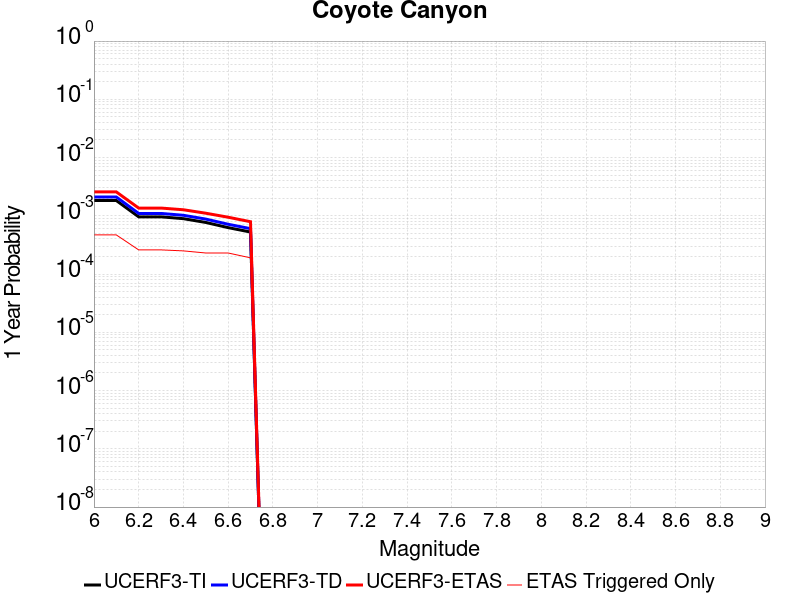
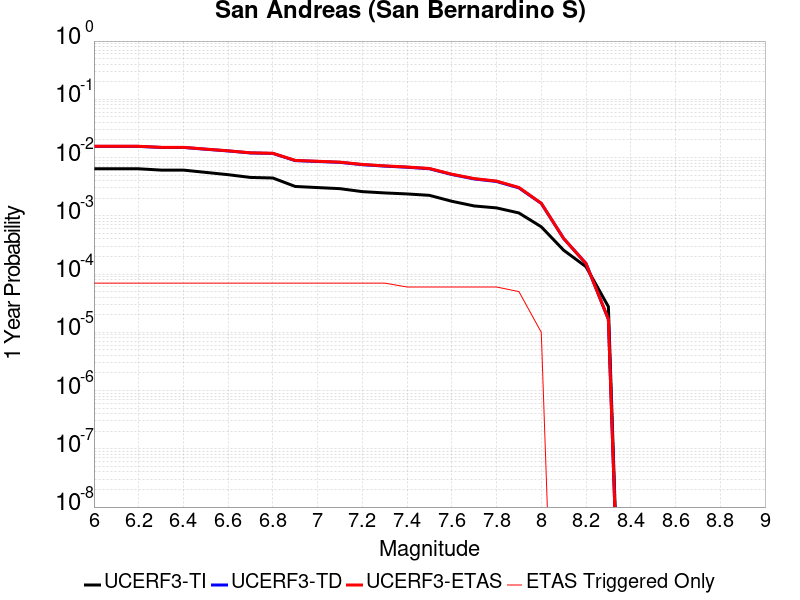
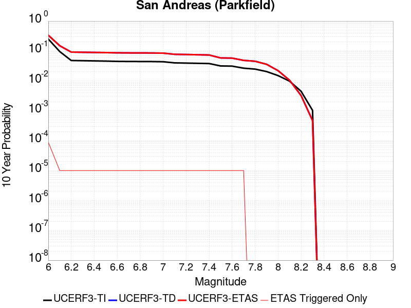
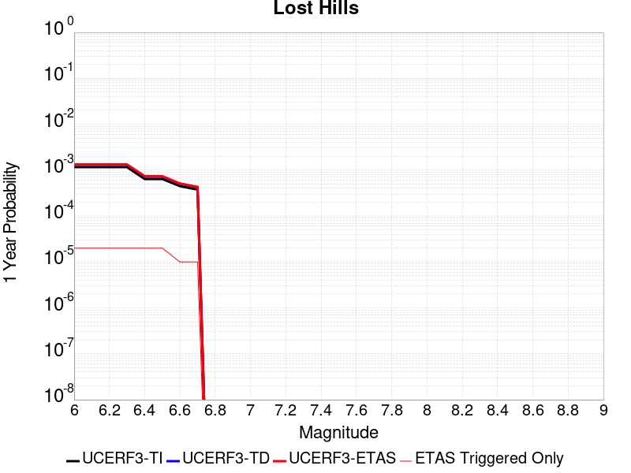
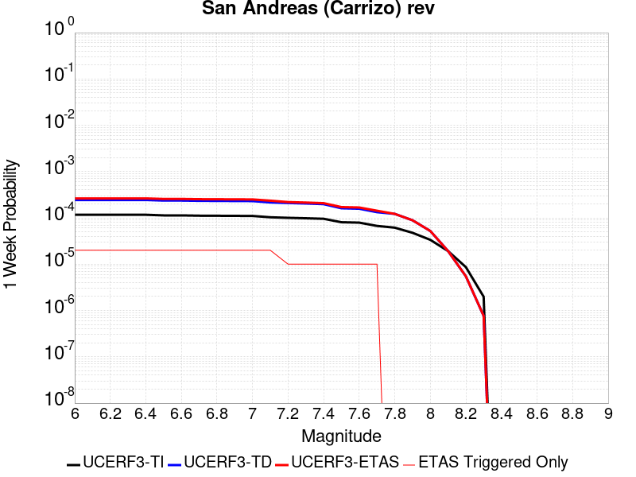
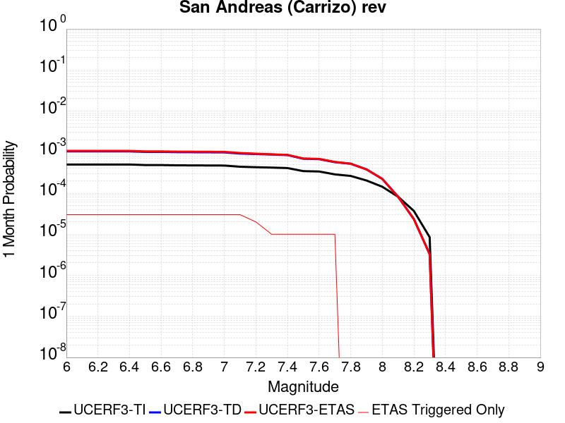
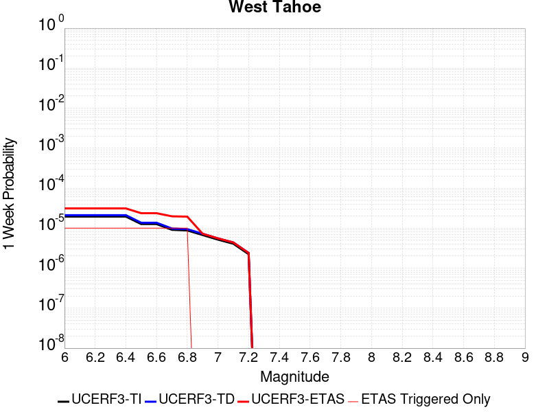
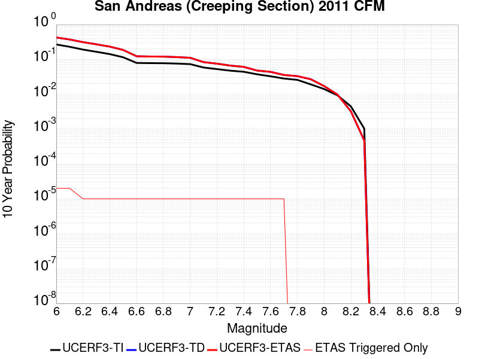

# Parent Section Magnitude-Probability Distributions

Only fault sections with at least one triggered aftershock are plotted. Sections are sorted by total supraseismogenic trigger rate (decreasing)

## Table Of Contents

* [Tank Canyon](#tank-canyon)
* [Garlock (Central)](#garlock-central)
* [Owl Lake](#owl-lake)
* [Garlock (East)](#garlock-east)
* [Little Lake](#little-lake)
* [Panamint Valley](#panamint-valley)
* [Blackwater](#blackwater)
* [Hunter Mountain-Saline Valley](#hunter-mountain-saline-valley)
* [Garlock (West)](#garlock-west)
* [Gravel Hills-Harper Lk](#gravel-hills-harper-lk)
* [Ash Hill](#ash-hill)
* [Airport Lake](#airport-lake)
* [McLean Lake](#mclean-lake)
* [Goldstone Lake](#goldstone-lake)
* [Coyote Canyon](#coyote-canyon)
* [Death Valley (So)](#death-valley-so)
* [So Sierra Nevada](#so-sierra-nevada)
* [Nelson Lake](#nelson-lake)
* [San Andreas (Mojave N)](#san-andreas-mojave-n)
* [Lenwood-Lockhart-Old Woman Springs](#lenwood-lockhart-old-woman-springs)
* [San Andreas (Mojave S)](#san-andreas-mojave-s)
* [Towne Pass](#towne-pass)
* [San Andreas (San Bernardino N)](#san-andreas-san-bernardino-n)
* [Bicycle Lake](#bicycle-lake)
* [Garlic Springs](#garlic-springs)
* [Paradise](#paradise)
* [Death Valley (Black Mtns Frontal)](#death-valley-black-mtns-frontal)
* [Coyote Lake](#coyote-lake)
* [San Andreas (San Bernardino S)](#san-andreas-san-bernardino-s)
* [Death Valley (Fish Lake Valley)](#death-valley-fish-lake-valley)
* [Death Valley (No)](#death-valley-no)
* [Baker](#baker)
* [San Andreas (Coachella) rev](#san-andreas-coachella-rev)
* [Red Pass](#red-pass)
* [San Andreas (Parkfield)](#san-andreas-parkfield)
* [Helendale-So Lockhart](#helendale-so-lockhart)
* [San Andreas (San Gorgonio Pass-Garnet HIll)](#san-andreas-san-gorgonio-pass-garnet-hill)
* [Elsinore (Glen Ivy) rev](#elsinore-glen-ivy-rev)
* [San Andreas (Big Bend)](#san-andreas-big-bend)
* [Santa Rosa Island](#santa-rosa-island)
* [Big Pine (East)](#big-pine-east)
* [Lost Hills](#lost-hills)
* [San Pedro Basin](#san-pedro-basin)
* [Palos Verdes](#palos-verdes)
* [San Gabriel](#san-gabriel)
* [Brawley (Seismic Zone) alt 1](#brawley-seismic-zone-alt-1)
* [San Andreas (Cholame) rev](#san-andreas-cholame-rev)
* [Santa Cruz Catalina Ridge alt1](#santa-cruz-catalina-ridge-alt1)
* [Imperial](#imperial)
* [Davis Creek](#davis-creek)
* [San Andreas (Carrizo) rev](#san-andreas-carrizo-rev)
* [San Diego Trough north alt1](#san-diego-trough-north-alt1)
* [Great Valley 03a Dunnigan Hills](#great-valley-03a-dunnigan-hills)
* [Eureka Peak](#eureka-peak)
* [Tin Mountain](#tin-mountain)
* [Kern Canyon (South Kern) 2011](#kern-canyon-south-kern-2011)
* [Almanor 2011 CFM](#almanor-2011-cfm)
* [Independence rev 2011](#independence-rev-2011)
* [West Tahoe](#west-tahoe)
* [San Andreas (Creeping Section) 2011 CFM](#san-andreas-creeping-section-2011-cfm)
* [San Jacinto (San Bernardino)](#san-jacinto-san-bernardino)
* [Kern Canyon (Lake Isabella) 2011](#kern-canyon-lake-isabella-2011)
* [Santa Cruz Island](#santa-cruz-island)
* [Channel Islands Thrust](#channel-islands-thrust)
* [Channel Islands Western Deep Ramp](#channel-islands-western-deep-ramp)
* [Great Valley 07 (Orestimba)](#great-valley-07-orestimba)
* [Morales (West)](#morales-west)
* [White Mountains](#white-mountains)
* [Cleghorn Lake](#cleghorn-lake)
* [Scodie Lineament](#scodie-lineament)

## Tank Canyon
*[(top)](#table-of-contents)*

| 1 Week | 1 Month | 1 Year | 10 Year |
|-----|-----|-----|-----|
|  |  |  |  |

| Magnitude | 1 wk TI Prob | 1 wk TD Prob | 1 wk ETAS Prob | 1 wk ETAS/TD Gain | 1 wk ETAS Triggered Only | 1 mo TI Prob | 1 mo TD Prob | 1 mo ETAS Prob | 1 mo ETAS/TD Gain | 1 mo ETAS Triggered Only | 1 yr TI Prob | 1 yr TD Prob | 1 yr ETAS Prob | 1 yr ETAS/TD Gain | 1 yr ETAS Triggered Only | 10 yr TI Prob | 10 yr TD Prob | 10 yr ETAS Prob | 10 yr ETAS/TD Gain | 10 yr ETAS Triggered Only |
|-----|-----|-----|-----|-----|-----|-----|-----|-----|-----|-----|-----|-----|-----|-----|-----|-----|-----|-----|-----|-----|
| 6.0 | 4.8284557E-5 | 5.7964517E-5 | 0.0054753297 | 94.46002 | 0.005417679 | 2.0691741E-4 | 2.4839956E-4 | 0.007656032 | 30.821442 | 0.007409473 | 0.0025163088 | 0.0030207448 | 0.014339674 | 4.747066 | 0.0113532245 | 0.02488006 | 0.029863482 | 0.045012806 | 1.507286 | 0.0156156635 |
| 6.1 | 1.7796336E-5 | 2.0873225E-5 | 0.0020126256 | 96.421394 | 0.0019917937 | 7.626778E-5 | 8.945383E-5 | 0.0027183865 | 30.38871 | 0.0026291679 | 9.281647E-4 | 0.0010885935 | 0.0049882596 | 4.582298 | 0.0039039159 | 0.009242975 | 0.010836697 | 0.016707921 | 1.5417908 | 0.0059355455 |
| 6.2 | 1.7796336E-5 | 2.0873225E-5 | 0.0020126256 | 96.421394 | 0.0019917937 | 7.626778E-5 | 8.945383E-5 | 0.0027183865 | 30.38871 | 0.0026291679 | 9.281647E-4 | 0.0010885935 | 0.0049882596 | 4.582298 | 0.0039039159 | 0.009242975 | 0.010836697 | 0.016707921 | 1.5417908 | 0.0059355455 |
| 6.3 | 1.3515912E-5 | 1.57595E-5 | 0.0014099932 | 89.469406 | 0.0013942557 | 5.792405E-5 | 6.7539106E-5 | 0.001979532 | 29.30942 | 0.001912122 | 7.049971E-4 | 8.220024E-4 | 0.0036878278 | 4.4863954 | 0.0028681832 | 0.007027647 | 0.008192232 | 0.01253828 | 1.5305085 | 0.0043819463 |
| 6.4 | 1.0870146E-5 | 1.2617973E-5 | 0.001088173 | 86.23993 | 0.0010755686 | 4.658551E-5 | 5.407601E-5 | 0.0014084226 | 26.045238 | 0.0013544197 | 5.67031E-4 | 6.581944E-4 | 0.0027681063 | 4.2056055 | 0.0021113015 | 0.005655863 | 0.006564466 | 0.009809565 | 1.4943432 | 0.0032665418 |
| 6.5 | 7.964826E-6 | 9.196063E-6 | 6.067287E-4 | 65.97701 | 5.9753814E-4 | 3.4134522E-5 | 3.941116E-5 | 9.157659E-4 | 23.236208 | 8.7638927E-4 | 4.1550855E-4 | 4.797359E-4 | 0.0018335059 | 3.8219068 | 0.0013544197 | 0.0041473247 | 0.0047883047 | 0.007008432 | 1.4636562 | 0.002230809 |
| 6.6 | 6.6317E-6 | 7.6122747E-6 | 4.4580357E-4 | 58.563778 | 4.3819463E-4 | 2.8421264E-5 | 3.2623677E-5 | 7.4964605E-4 | 22.978588 | 7.170458E-4 | 3.4597394E-4 | 3.9713003E-4 | 0.0014324515 | 3.6070087 | 0.0010357328 | 0.0034543579 | 0.0039653555 | 0.005552472 | 1.4002457 | 0.0015934351 |
| 6.7 | 4.793663E-6 | 5.430772E-6 | 1.6477342E-4 | 30.340698 | 1.593435E-4 | 2.0544108E-5 | 2.3274553E-5 | 2.6228424E-4 | 11.269142 | 2.3901525E-4 | 2.500958E-4 | 2.8333522E-4 | 6.815811E-4 | 2.4055643 | 3.9835877E-4 | 0.0024981452 | 0.0028304325 | 0.0034262794 | 1.2105144 | 5.9753814E-4 |
| 6.8 | 4.382823E-6 | 4.969245E-6 | 1.6431196E-4 | 33.06578 | 1.593435E-4 | 1.8783392E-5 | 2.1296615E-5 | 2.6030678E-4 | 12.2229185 | 2.3901525E-4 | 2.286638E-4 | 2.5925972E-4 | 6.176896E-4 | 2.382513 | 3.585229E-4 | 0.0022842865 | 0.0025902467 | 0.0031067717 | 1.1994115 | 5.178664E-4 |
| 6.9 | 2.729601E-6 | 3.0735362E-6 | 4.290929E-5 | 13.960887 | 3.9835875E-5 | 1.1698237E-5 | 1.3172238E-5 | 1.326783E-4 | 10.07257 | 1.19507626E-4 | 1.4241673E-4 | 1.6036142E-4 | 3.5950888E-4 | 2.2418664 | 1.9917938E-4 | 0.001423255 | 0.0016026229 | 0.0018810272 | 1.1737179 | 2.7885113E-4 |
| 7.0 | 1.8987357E-6 | 2.1269361E-6 | 2.1269361E-6 | 1.0 | 0.0 | 8.137413E-6 | 9.1154125E-6 | 4.8950926E-5 | 5.370127 | 3.9835875E-5 | 9.90685E-5 | 1.1097519E-4 | 1.9063811E-4 | 1.7178444 | 7.967175E-5 | 9.902435E-4 | 0.0011092664 | 0.0011888498 | 1.0717442 | 7.967175E-5 |
| 7.1 | 1.4928986E-6 | 1.6641251E-6 | 1.6641251E-6 | 1.0 | 0.0 | 6.398121E-6 | 7.1319487E-6 | 4.696754E-5 | 6.585513 | 3.9835875E-5 | 7.789434E-5 | 8.682861E-5 | 1.6649344E-4 | 1.9174953 | 7.967175E-5 | 7.786704E-4 | 8.680047E-4 | 9.476073E-4 | 1.0917076 | 7.967175E-5 |
| 7.2 | 1.069082E-6 | 1.182856E-6 | 1.182856E-6 | 1.0 | 0.0 | 4.581772E-6 | 5.0693757E-6 | 5.0693757E-6 | 1.0 | 0.0 | 5.5781646E-5 | 6.1718434E-5 | 1.0155185E-4 | 1.6454055 | 3.9835875E-5 | 5.576765E-4 | 6.1706523E-4 | 6.568765E-4 | 1.0645171 | 3.9835875E-5 |
| 7.3 | 8.776551E-7 | 9.769996E-7 | 9.769996E-7 | 1.0 | 0.0 | 3.7613736E-6 | 4.187137E-6 | 4.187137E-6 | 1.0 | 0.0 | 4.579376E-5 | 5.097772E-5 | 9.081157E-5 | 1.7813971 | 3.9835875E-5 | 4.5784327E-4 | 5.097113E-4 | 5.495269E-4 | 1.0781139 | 3.9835875E-5 |
| 7.4 | 7.55721E-7 | 8.5102363E-7 | 8.5102363E-7 | 1.0 | 0.0 | 3.2388E-6 | 3.647242E-6 | 3.647242E-6 | 1.0 | 0.0 | 3.9431678E-5 | 4.4404784E-5 | 8.423889E-5 | 1.8970679 | 3.9835875E-5 | 3.942468E-4 | 4.4401E-4 | 4.8382816E-4 | 1.0896786 | 3.9835875E-5 |
| 7.5 | 5.587665E-7 | 6.305613E-7 | 6.305613E-7 | 1.0 | 0.0 | 2.3947114E-6 | 2.7024057E-6 | 2.7024057E-6 | 1.0 | 0.0 | 2.915522E-5 | 3.290179E-5 | 7.273635E-5 | 2.2107112 | 3.9835875E-5 | 2.9151395E-4 | 3.2901787E-4 | 3.6884064E-4 | 1.1210352 | 3.9835875E-5 |

## Garlock (Central)
*[(top)](#table-of-contents)*

| 1 Week | 1 Month | 1 Year | 10 Year |
|-----|-----|-----|-----|
|  |  |  |  |

| Magnitude | 1 wk TI Prob | 1 wk TD Prob | 1 wk ETAS Prob | 1 wk ETAS/TD Gain | 1 wk ETAS Triggered Only | 1 mo TI Prob | 1 mo TD Prob | 1 mo ETAS Prob | 1 mo ETAS/TD Gain | 1 mo ETAS Triggered Only | 1 yr TI Prob | 1 yr TD Prob | 1 yr ETAS Prob | 1 yr ETAS/TD Gain | 1 yr ETAS Triggered Only | 10 yr TI Prob | 10 yr TD Prob | 10 yr ETAS Prob | 10 yr ETAS/TD Gain | 10 yr ETAS Triggered Only |
|-----|-----|-----|-----|-----|-----|-----|-----|-----|-----|-----|-----|-----|-----|-----|-----|-----|-----|-----|-----|-----|
| 6.0 | 5.5131142E-5 | 7.024558E-5 | 0.0068418686 | 97.39928 | 0.006772099 | 2.3625491E-4 | 3.0101812E-4 | 0.008982625 | 29.84081 | 0.008684221 | 0.0028726095 | 0.0036588025 | 0.016756544 | 4.579789 | 0.013145839 | 0.028357591 | 0.03607921 | 0.053358592 | 1.478929 | 0.017926143 |
| 6.1 | 5.5131142E-5 | 7.024558E-5 | 0.0068418686 | 97.39928 | 0.006772099 | 2.3625491E-4 | 3.0101812E-4 | 0.008982625 | 29.84081 | 0.008684221 | 0.0028726095 | 0.0036588025 | 0.016756544 | 4.579789 | 0.013145839 | 0.028357591 | 0.03607921 | 0.053358592 | 1.478929 | 0.017926143 |
| 6.2 | 4.216245E-5 | 5.1660383E-5 | 0.004473214 | 86.588875 | 0.004421782 | 1.806837E-4 | 2.2138303E-4 | 0.006195442 | 27.98517 | 0.0059753815 | 0.0021976046 | 0.0026920384 | 0.0117898965 | 4.3795424 | 0.009122415 | 0.021759989 | 0.02668921 | 0.038747516 | 1.4518045 | 0.012388958 |
| 6.3 | 4.216245E-5 | 5.1660383E-5 | 0.004473214 | 86.588875 | 0.004421782 | 1.806837E-4 | 2.2138303E-4 | 0.006195442 | 27.98517 | 0.0059753815 | 0.0021976046 | 0.0026920384 | 0.0117898965 | 4.3795424 | 0.009122415 | 0.021759989 | 0.02668921 | 0.038747516 | 1.4518045 | 0.012388958 |
| 6.4 | 3.6858168E-5 | 4.4109474E-5 | 0.003509678 | 79.56744 | 0.0034657212 | 1.5795401E-4 | 1.8902705E-4 | 0.0049286 | 26.073517 | 0.004740469 | 0.0019213937 | 0.0022990005 | 0.009373485 | 4.0772 | 0.007090786 | 0.019048655 | 0.022848397 | 0.03242412 | 1.4190981 | 0.009799626 |
| 6.5 | 3.39199E-5 | 4.001704E-5 | 0.0031869253 | 79.63921 | 0.0031470342 | 1.453629E-4 | 1.7149044E-4 | 0.0045128562 | 26.315498 | 0.0043421104 | 0.0017683565 | 0.0020859186 | 0.008486116 | 4.0682874 | 0.006413576 | 0.017543508 | 0.02075933 | 0.029575344 | 1.4246771 | 0.009002908 |
| 6.6 | 3.3571985E-5 | 3.947123E-5 | 0.0031863812 | 80.72668 | 0.0031470342 | 1.4387199E-4 | 1.6915156E-4 | 0.0045105275 | 26.665598 | 0.0043421104 | 0.0017502342 | 0.002057497 | 0.008457877 | 4.1107607 | 0.006413576 | 0.017365133 | 0.020480646 | 0.029299168 | 1.4305784 | 0.009002908 |
| 6.7 | 3.2580007E-5 | 3.8087666E-5 | 0.0031053333 | 81.531204 | 0.0030673624 | 1.3962112E-4 | 1.6322276E-4 | 0.0043851365 | 26.865961 | 0.004222603 | 0.0016985617 | 0.0019854472 | 0.008147749 | 4.1037345 | 0.0061745606 | 0.016856372 | 0.019773284 | 0.028324839 | 1.4324802 | 0.008724057 |
| 6.8 | 3.2185937E-5 | 3.751489E-5 | 0.0031047622 | 82.7608 | 0.0030673624 | 1.3793244E-4 | 1.607683E-4 | 0.004342863 | 27.01318 | 0.004182767 | 0.0016780337 | 0.0019556184 | 0.008038588 | 4.11051 | 0.0060948892 | 0.016654192 | 0.019480087 | 0.027838899 | 1.4290953 | 0.008524878 |
| 6.9 | 3.165394E-5 | 3.6719477E-5 | 0.0030641349 | 83.44713 | 0.0030275267 | 1.3565269E-4 | 1.5735981E-4 | 0.0042598094 | 27.070503 | 0.0041030953 | 0.0016503202 | 0.0019141936 | 0.007917897 | 4.1364136 | 0.0060152174 | 0.01638118 | 0.01907272 | 0.027317777 | 1.4322958 | 0.00840537 |
| 7.0 | 3.0903822E-5 | 3.5624747E-5 | 0.003023209 | 84.86261 | 0.0029876907 | 1.3243823E-4 | 1.5266867E-4 | 0.004175478 | 27.349934 | 0.0040234234 | 0.0016112428 | 0.0018571776 | 0.007741938 | 4.168658 | 0.0058957096 | 0.015996104 | 0.018511891 | 0.026605269 | 1.4371988 | 0.008246026 |
| 7.1 | 3.0069863E-5 | 3.439106E-5 | 0.0028228066 | 82.07966 | 0.0027885113 | 1.2886449E-4 | 1.4738206E-4 | 0.0039710626 | 26.944004 | 0.003824244 | 0.0015677959 | 0.0017929208 | 0.0073599443 | 4.1050024 | 0.0055770227 | 0.01556781 | 0.017879559 | 0.025626035 | 1.4332589 | 0.007887503 |
| 7.2 | 2.7957109E-5 | 3.1280466E-5 | 0.0023815236 | 76.13454 | 0.0023503166 | 1.1981068E-4 | 1.3405236E-4 | 0.0033204951 | 24.770136 | 0.0031868701 | 0.0014577188 | 0.0016308852 | 0.0064431652 | 3.9507165 | 0.004820141 | 0.014481937 | 0.016283188 | 0.022827454 | 1.4019033 | 0.0066525913 |
| 7.3 | 2.4519275E-5 | 2.6713868E-5 | 0.0015802715 | 59.155476 | 0.0015535991 | 1.0507837E-4 | 1.1448306E-4 | 0.0023450367 | 20.483702 | 0.002230809 | 0.0012785783 | 0.0013929547 | 0.0046549463 | 3.3417788 | 0.0032665418 | 0.012712469 | 0.013927576 | 0.018444898 | 1.3243437 | 0.004581126 |
| 7.4 | 2.3225532E-5 | 2.5198491E-5 | 0.001459254 | 57.91037 | 0.0014340916 | 9.95342E-5 | 1.07989144E-4 | 0.002179231 | 20.180094 | 0.0020714656 | 0.0012111551 | 0.0013139893 | 0.0043375376 | 3.301045 | 0.0030275267 | 0.012045753 | 0.013145258 | 0.017312353 | 1.3170037 | 0.004222603 |
| 7.5 | 2.097765E-5 | 2.2482824E-5 | 0.0011776972 | 52.382088 | 0.0011552405 | 8.9901114E-5 | 9.635147E-5 | 0.0018091291 | 18.776352 | 0.0017129427 | 0.0010939965 | 0.0011724597 | 0.003599599 | 3.070126 | 0.0024299885 | 0.010886264 | 0.01173992 | 0.015125586 | 1.2883892 | 0.0034258855 |
| 7.6 | 1.511254E-5 | 1.5990528E-5 | 6.135191E-4 | 38.367657 | 5.9753814E-4 | 6.476642E-5 | 6.852908E-5 | 9.846914E-4 | 14.3689575 | 9.1622514E-4 | 7.882459E-4 | 8.3403E-4 | 0.0022669255 | 2.7180383 | 0.0014340916 | 0.007854558 | 0.008383143 | 0.010674255 | 1.2732998 | 0.002310481 |
| 7.7 | 9.934069E-6 | 1.0678047E-5 | 1.7001985E-4 | 15.922374 | 1.593435E-4 | 4.2573887E-5 | 4.576226E-5 | 3.2460064E-4 | 7.0931954 | 2.7885113E-4 | 5.182138E-4 | 5.5701344E-4 | 9.153366E-4 | 1.6432936 | 3.585229E-4 | 0.00517007 | 0.0056272964 | 0.0062214723 | 1.1055881 | 5.9753814E-4 |
| 7.8 | 6.7562896E-6 | 8.427841E-6 | 1.2793446E-4 | 15.179981 | 1.19507626E-4 | 2.8955206E-5 | 3.6118818E-5 | 1.9545657E-4 | 5.4114885 | 1.593435E-4 | 3.5247262E-4 | 4.3965803E-4 | 5.9893145E-4 | 1.3622667 | 1.593435E-4 | 0.0035191406 | 0.0044463384 | 0.0048032673 | 1.0802748 | 3.585229E-4 |
| 7.9 | 3.975453E-6 | 5.3706585E-6 | 8.504198E-5 | 15.834554 | 7.967175E-5 | 1.7037546E-5 | 2.3016906E-5 | 1.0268683E-4 | 4.461365 | 7.967175E-5 | 2.0741238E-4 | 2.801949E-4 | 3.5984433E-4 | 1.2842644 | 7.967175E-5 | 0.002072189 | 0.002833435 | 0.002992327 | 1.0560775 | 1.593435E-4 |
| 8.0 | 1.6729537E-6 | 2.0773857E-6 | 2.0773857E-6 | 1.0 | 0.0 | 7.169782E-6 | 8.903051E-6 | 8.903051E-6 | 1.0 | 0.0 | 8.7288594E-5 | 1.08389286E-4 | 1.08389286E-4 | 1.0 | 0.0 | 8.7254314E-4 | 0.0010968668 | 0.001136659 | 1.036278 | 3.9835875E-5 |
| 8.1 | 3.6733252E-7 | 3.148811E-7 | 3.148811E-7 | 1.0 | 0.0 | 1.5742813E-6 | 1.3494899E-6 | 1.3494899E-6 | 1.0 | 0.0 | 1.9166706E-5 | 1.6429933E-5 | 1.6429933E-5 | 1.0 | 0.0 | 1.9165053E-4 | 1.6637788E-4 | 1.6637788E-4 | 1.0 | 0.0 |

## Owl Lake
*[(top)](#table-of-contents)*

| 1 Week | 1 Month | 1 Year | 10 Year |
|-----|-----|-----|-----|
|  |  |  |  |

| Magnitude | 1 wk TI Prob | 1 wk TD Prob | 1 wk ETAS Prob | 1 wk ETAS/TD Gain | 1 wk ETAS Triggered Only | 1 mo TI Prob | 1 mo TD Prob | 1 mo ETAS Prob | 1 mo ETAS/TD Gain | 1 mo ETAS Triggered Only | 1 yr TI Prob | 1 yr TD Prob | 1 yr ETAS Prob | 1 yr ETAS/TD Gain | 1 yr ETAS Triggered Only | 10 yr TI Prob | 10 yr TD Prob | 10 yr ETAS Prob | 10 yr ETAS/TD Gain | 10 yr ETAS Triggered Only |
|-----|-----|-----|-----|-----|-----|-----|-----|-----|-----|-----|-----|-----|-----|-----|-----|-----|-----|-----|-----|-----|
| 6.0 | 5.0320643E-5 | 6.635748E-5 | 0.0022173522 | 33.415253 | 0.0021511372 | 2.1564208E-4 | 2.843645E-4 | 0.0032712056 | 11.503566 | 0.0029876907 | 0.0026222812 | 0.0034577043 | 0.007864198 | 2.2743983 | 0.004421782 | 0.02591553 | 0.0341404 | 0.040796723 | 1.1949692 | 0.0068916064 |
| 6.1 | 5.0320643E-5 | 6.635748E-5 | 0.0022173522 | 33.415253 | 0.0021511372 | 2.1564208E-4 | 2.843645E-4 | 0.0032712056 | 11.503566 | 0.0029876907 | 0.0026222812 | 0.0034577043 | 0.007864198 | 2.2743983 | 0.004421782 | 0.02591553 | 0.0341404 | 0.040796723 | 1.1949692 | 0.0068916064 |
| 6.2 | 2.4125871E-5 | 3.0980704E-5 | 0.0015845317 | 51.145763 | 0.0015535991 | 1.0339249E-4 | 1.3276885E-4 | 0.0022836206 | 17.199972 | 0.0021511372 | 0.0012580766 | 0.0016154221 | 0.0048369155 | 2.9942117 | 0.003226706 | 0.012509781 | 0.016070297 | 0.020852173 | 1.2975599 | 0.004859977 |
| 6.3 | 1.7433485E-5 | 2.2355249E-5 | 0.0013767447 | 61.584858 | 0.0013544197 | 7.471279E-5 | 9.580558E-5 | 0.0019679123 | 20.540686 | 0.0018722862 | 9.0924866E-4 | 0.0011659606 | 0.003911431 | 3.3546855 | 0.0027486754 | 0.009055373 | 0.011628761 | 0.015605397 | 1.3419656 | 0.0040234234 |
| 6.4 | 1.7433485E-5 | 2.2355249E-5 | 0.0013767447 | 61.584858 | 0.0013544197 | 7.471279E-5 | 9.580558E-5 | 0.0019679123 | 20.540686 | 0.0018722862 | 9.0924866E-4 | 0.0011659606 | 0.003911431 | 3.3546855 | 0.0027486754 | 0.009055373 | 0.011628761 | 0.015605397 | 1.3419656 | 0.0040234234 |
| 6.5 | 1.5182742E-5 | 1.9428902E-5 | 0.0013339872 | 68.65994 | 0.0013145839 | 6.506727E-5 | 8.326492E-5 | 0.0019155627 | 23.005638 | 0.0018324503 | 7.919061E-4 | 0.0010134302 | 0.003520547 | 3.473892 | 0.00250966 | 0.0078909 | 0.010118305 | 0.01370669 | 1.354643 | 0.0036250646 |
| 6.6 | 6.7271576E-6 | 8.547201E-6 | 0.0010841066 | 126.83762 | 0.0010755686 | 2.8830356E-5 | 3.663038E-5 | 0.0015503382 | 42.323837 | 0.0015137633 | 3.5095305E-4 | 4.4588925E-4 | 0.002476613 | 5.554323 | 0.0020316297 | 0.0035039932 | 0.0044677295 | 0.007402414 | 1.6568626 | 0.0029478548 |
| 6.7 | 6.682835E-6 | 8.4796475E-6 | 0.0010840392 | 127.840126 | 0.0010755686 | 2.8640408E-5 | 3.6340873E-5 | 0.0015500492 | 42.653053 | 0.0015137633 | 3.4864116E-4 | 4.4236594E-4 | 0.0024730968 | 5.5906134 | 0.0020316297 | 0.003480947 | 0.004432656 | 0.007367444 | 1.6620834 | 0.0029478548 |
| 6.8 | 6.5774975E-6 | 8.326121E-6 | 0.0010838858 | 130.17896 | 0.0010755686 | 2.8188972E-5 | 3.5682922E-5 | 0.0015493922 | 43.421112 | 0.0015137633 | 3.4314668E-4 | 4.343586E-4 | 0.0024651058 | 5.6752777 | 0.0020316297 | 0.0034261728 | 0.0043528024 | 0.0072878255 | 1.6742836 | 0.0029478548 |
| 6.9 | 6.363419E-6 | 7.999298E-6 | 0.0010835594 | 135.45682 | 0.0010755686 | 2.727151E-5 | 3.4282286E-5 | 0.0015081592 | 43.992374 | 0.0014739274 | 3.3198006E-4 | 4.1731246E-4 | 0.0024082751 | 5.7709155 | 0.0019917937 | 0.0033148455 | 0.004182795 | 0.0070786504 | 1.6923254 | 0.0029080189 |
| 7.0 | 6.1342453E-6 | 7.631501E-6 | 0.001083192 | 141.93695 | 0.0010755686 | 2.6289357E-5 | 3.2706055E-5 | 0.0015065853 | 46.064415 | 0.0014739274 | 3.2002592E-4 | 3.9812896E-4 | 0.0023891297 | 6.000894 | 0.0019917937 | 0.0031956544 | 0.00399149 | 0.006887902 | 1.7256466 | 0.0029080189 |
| 7.1 | 5.842926E-6 | 7.1420604E-6 | 0.001082703 | 151.59534 | 0.0010755686 | 2.504087E-5 | 3.0608502E-5 | 0.0015044909 | 49.15271 | 0.0014739274 | 3.0482994E-4 | 3.7260022E-4 | 0.0023636518 | 6.3436675 | 0.0019917937 | 0.0030441214 | 0.0037369546 | 0.0065944195 | 1.7646507 | 0.0028681832 |
| 7.2 | 4.77173E-6 | 5.3583467E-6 | 7.2240026E-4 | 134.81776 | 7.170458E-4 | 2.045011E-5 | 2.2964163E-5 | 8.9933333E-4 | 39.162468 | 8.7638927E-4 | 2.4895166E-4 | 2.7955687E-4 | 0.0015539485 | 5.5586133 | 0.001274748 | 0.0024867293 | 0.002808574 | 0.0046358774 | 1.6506163 | 0.0018324503 |
| 7.3 | 3.0494948E-6 | 2.7103622E-6 | 1.6205343E-4 | 59.790325 | 1.593435E-4 | 1.3069198E-5 | 1.1615787E-5 | 2.1079286E-4 | 18.1471 | 1.9917938E-4 | 1.5910587E-4 | 1.4141318E-4 | 3.8039466E-4 | 2.6899517 | 2.3901525E-4 | 0.0015899199 | 0.0014231888 | 0.001900539 | 1.3354089 | 4.780305E-4 |
| 7.4 | 2.7263884E-6 | 2.3055816E-6 | 1.2181293E-4 | 52.83393 | 1.19507626E-4 | 1.1684469E-5 | 9.881027E-6 | 1.6922296E-4 | 17.126049 | 1.593435E-4 | 1.4224913E-4 | 1.20294964E-4 | 3.194504E-4 | 2.655559 | 1.9917938E-4 | 0.0014215811 | 0.0012111744 | 0.0016488383 | 1.361355 | 4.3819463E-4 |
| 7.5 | 2.6090431E-6 | 2.1655203E-6 | 1.2167289E-4 | 56.186447 | 1.19507626E-4 | 1.1181565E-5 | 9.280769E-6 | 1.6862279E-4 | 18.169054 | 1.593435E-4 | 1.3612706E-4 | 1.129876E-4 | 3.1214446E-4 | 2.7626438 | 1.9917938E-4 | 0.001360437 | 0.0011379321 | 0.0015358375 | 1.3496742 | 3.9835877E-4 |
| 7.6 | 2.3008756E-6 | 1.872704E-6 | 8.1544305E-5 | 43.543617 | 7.967175E-5 | 9.860858E-6 | 8.025851E-6 | 1.2753252E-4 | 15.890219 | 1.19507626E-4 | 1.20049335E-4 | 9.771043E-5 | 2.5703837E-4 | 2.6306133 | 1.593435E-4 | 0.001199845 | 9.849465E-4 | 0.001263523 | 1.282834 | 2.7885113E-4 |
| 7.7 | 1.7184348E-6 | 1.3418345E-6 | 1.3418345E-6 | 1.0 | 0.0 | 7.3646997E-6 | 5.750707E-6 | 5.750707E-6 | 1.0 | 0.0 | 8.966153E-5 | 7.001265E-5 | 7.001265E-5 | 1.0 | 0.0 | 8.962536E-4 | 7.077913E-4 | 7.4759894E-4 | 1.0562421 | 3.9835875E-5 |
| 7.8 | 8.4612907E-7 | 8.4052675E-7 | 8.4052675E-7 | 1.0 | 0.0 | 3.6262625E-6 | 3.6022527E-6 | 3.6022527E-6 | 1.0 | 0.0 | 4.4148852E-5 | 4.3856566E-5 | 4.3856566E-5 | 1.0 | 0.0 | 4.414008E-4 | 4.4395277E-4 | 4.8377097E-4 | 1.0896901 | 3.9835875E-5 |
| 7.9 | 2.716738E-7 | 3.767845E-7 | 3.767845E-7 | 1.0 | 0.0 | 1.1643157E-6 | 1.6147899E-6 | 1.6147899E-6 | 1.0 | 0.0 | 1.4175452E-5 | 1.96599E-5 | 1.96599E-5 | 1.0 | 0.0 | 1.4174548E-4 | 1.9835318E-4 | 1.9835318E-4 | 1.0 | 0.0 |
| 8.0 | 2.1995428E-8 | 3.38465E-8 | 3.38465E-8 | 1.0 | 0.0 | 9.426611E-8 | 1.4505643E-7 | 1.4505643E-7 | 1.0 | 0.0 | 1.1476893E-6 | 1.7660612E-6 | 1.7660612E-6 | 1.0 | 0.0 | 1.14768345E-5 | 1.796186E-5 | 1.796186E-5 | 1.0 | 0.0 |

## Garlock (East)
*[(top)](#table-of-contents)*

| 1 Week | 1 Month | 1 Year | 10 Year |
|-----|-----|-----|-----|
|  |  |  |  |

| Magnitude | 1 wk TI Prob | 1 wk TD Prob | 1 wk ETAS Prob | 1 wk ETAS/TD Gain | 1 wk ETAS Triggered Only | 1 mo TI Prob | 1 mo TD Prob | 1 mo ETAS Prob | 1 mo ETAS/TD Gain | 1 mo ETAS Triggered Only | 1 yr TI Prob | 1 yr TD Prob | 1 yr ETAS Prob | 1 yr ETAS/TD Gain | 1 yr ETAS Triggered Only | 10 yr TI Prob | 10 yr TD Prob | 10 yr ETAS Prob | 10 yr ETAS/TD Gain | 10 yr ETAS Triggered Only |
|-----|-----|-----|-----|-----|-----|-----|-----|-----|-----|-----|-----|-----|-----|-----|-----|-----|-----|-----|-----|-----|
| 6.0 | 4.5092507E-5 | 6.290254E-5 | 0.0013774037 | 21.897427 | 0.0013145839 | 1.9323928E-4 | 2.6955697E-4 | 0.0021413385 | 7.943918 | 0.0018722862 | 0.0023501497 | 0.003277363 | 0.006255262 | 1.9086266 | 0.0029876907 | 0.023254504 | 0.032351483 | 0.037169874 | 1.1489388 | 0.0049794847 |
| 6.1 | 4.5092507E-5 | 6.290254E-5 | 0.0013774037 | 21.897427 | 0.0013145839 | 1.9323928E-4 | 2.6955697E-4 | 0.0021413385 | 7.943918 | 0.0018722862 | 0.0023501497 | 0.003277363 | 0.006255262 | 1.9086266 | 0.0029876907 | 0.023254504 | 0.032351483 | 0.037169874 | 1.1489388 | 0.0049794847 |
| 6.2 | 2.6674514E-5 | 3.450911E-5 | 0.0010303716 | 29.85796 | 9.958969E-4 | 1.1431433E-4 | 1.4788799E-4 | 0.0015817675 | 10.695712 | 0.0014340916 | 0.0013908884 | 0.0017990824 | 0.004224699 | 2.348252 | 0.0024299885 | 0.01382215 | 0.01789001 | 0.021567592 | 1.2055662 | 0.0037445724 |
| 6.3 | 2.6674514E-5 | 3.450911E-5 | 0.0010303716 | 29.85796 | 9.958969E-4 | 1.1431433E-4 | 1.4788799E-4 | 0.0015817675 | 10.695712 | 0.0014340916 | 0.0013908884 | 0.0017990824 | 0.004224699 | 2.348252 | 0.0024299885 | 0.01382215 | 0.01789001 | 0.021567592 | 1.2055662 | 0.0037445724 |
| 6.4 | 2.5312667E-5 | 3.233838E-5 | 0.001028203 | 31.795134 | 9.958969E-4 | 1.0847834E-4 | 1.3858585E-4 | 0.0015724787 | 11.346602 | 0.0014340916 | 0.0013199237 | 0.0016860063 | 0.0040721293 | 2.4152515 | 0.0023901525 | 0.013121112 | 0.016778054 | 0.020420631 | 1.2171037 | 0.0037047365 |
| 6.5 | 2.5312667E-5 | 3.233838E-5 | 0.001028203 | 31.795134 | 9.958969E-4 | 1.0847834E-4 | 1.3858585E-4 | 0.0015724787 | 11.346602 | 0.0014340916 | 0.0013199237 | 0.0016860063 | 0.0040721293 | 2.4152515 | 0.0023901525 | 0.013121112 | 0.016778054 | 0.020420631 | 1.2171037 | 0.0037047365 |
| 6.6 | 2.246556E-5 | 2.8133245E-5 | 9.443326E-4 | 33.56643 | 9.1622514E-4 | 9.627742E-5 | 1.20565615E-4 | 0.001434991 | 11.902159 | 0.0013145839 | 0.0011715472 | 0.0014669215 | 0.0037342357 | 2.5456274 | 0.002270645 | 0.011653901 | 0.014618388 | 0.017994193 | 1.2309287 | 0.0034258855 |
| 6.7 | 2.2241198E-5 | 2.780299E-5 | 9.4400265E-4 | 33.953278 | 9.1622514E-4 | 9.531594E-5 | 1.1915036E-4 | 0.0014335776 | 12.031669 | 0.0013145839 | 0.0011598538 | 0.0014497138 | 0.003717067 | 2.5640006 | 0.002270645 | 0.011538187 | 0.014448582 | 0.017824968 | 1.2336829 | 0.0034258855 |
| 6.8 | 1.9528685E-5 | 2.3897695E-5 | 8.604311E-4 | 36.004772 | 8.365534E-4 | 8.369167E-5 | 1.02414786E-4 | 0.0013372005 | 13.056713 | 0.0012349122 | 0.0010184698 | 0.0012462065 | 0.0032753043 | 2.6282196 | 0.0020316297 | 0.010138147 | 0.012436173 | 0.015426048 | 1.2404177 | 0.0030275267 |
| 6.9 | 1.3318621E-5 | 1.5198458E-5 | 8.1190385E-4 | 53.420147 | 7.9671753E-4 | 5.7078556E-5 | 6.5134656E-5 | 0.0012202999 | 18.735031 | 0.0011552405 | 6.9470983E-4 | 7.927316E-4 | 0.0026237292 | 3.3097322 | 0.0018324503 | 0.0069254204 | 0.007939667 | 0.010468921 | 1.3185592 | 0.002549496 |
| 7.0 | 1.1760853E-5 | 1.31073775E-5 | 8.0981443E-4 | 61.783104 | 7.9671753E-4 | 5.0402683E-5 | 5.6173292E-5 | 0.0011715152 | 20.855375 | 0.0011154045 | 6.134799E-4 | 6.8370026E-4 | 0.0024750892 | 3.6201377 | 0.0017926145 | 0.0061178906 | 0.006856307 | 0.00934876 | 1.363527 | 0.00250966 |
| 7.1 | 1.0064758E-5 | 1.0902532E-5 | 8.076114E-4 | 74.07558 | 7.9671753E-4 | 4.3133965E-5 | 4.6724323E-5 | 0.0011620767 | 24.870916 | 0.0011154045 | 5.2502943E-4 | 5.6872366E-4 | 0.0023205054 | 4.0801983 | 0.0017527785 | 0.005237907 | 0.0057127923 | 0.008049682 | 1.4090626 | 0.0023503166 |
| 7.2 | 9.768808E-6 | 1.0498412E-5 | 8.0720754E-4 | 76.88854 | 7.9671753E-4 | 4.186565E-5 | 4.4992437E-5 | 0.0011603468 | 25.789818 | 0.0011154045 | 5.095951E-4 | 5.4764876E-4 | 0.0022994673 | 4.1987996 | 0.0017527785 | 0.0050842804 | 0.00550306 | 0.0078404425 | 1.4247423 | 0.0023503166 |
| 7.3 | 9.344516E-6 | 9.94408E-6 | 6.4731174E-4 | 65.09519 | 6.37374E-4 | 4.004731E-5 | 4.2616808E-5 | 9.98637E-4 | 23.43294 | 9.56061E-4 | 4.8746695E-4 | 5.187396E-4 | 0.002071533 | 3.9933965 | 0.0015535991 | 0.0048639905 | 0.0052147433 | 0.007315035 | 1.4027603 | 0.0021113015 |
| 7.4 | 9.023491E-6 | 9.490282E-6 | 5.6718726E-4 | 59.76506 | 5.5770227E-4 | 3.867153E-5 | 4.067202E-5 | 8.7719137E-4 | 21.567442 | 8.365534E-4 | 4.7072413E-4 | 4.950727E-4 | 0.0018488219 | 3.7344456 | 0.0013544197 | 0.004697283 | 0.0049782004 | 0.006761891 | 1.3583002 | 0.0017926145 |
| 7.5 | 7.081253E-6 | 7.0873343E-6 | 3.257721E-4 | 45.96539 | 3.18687E-4 | 3.0347876E-5 | 3.037394E-5 | 5.482246E-4 | 18.049175 | 5.178664E-4 | 3.6942272E-4 | 3.697407E-4 | 0.0011661637 | 3.1540039 | 7.9671753E-4 | 0.003688092 | 0.0037241387 | 0.0047957017 | 1.2877345 | 0.0010755686 |
| 7.6 | 6.116396E-6 | 5.958924E-6 | 1.6530148E-4 | 27.740158 | 1.593435E-4 | 2.6212863E-5 | 2.5537996E-5 | 3.04382E-4 | 11.91879 | 2.7885113E-4 | 3.1909486E-4 | 3.10881E-4 | 7.887629E-4 | 2.537186 | 4.780305E-4 | 0.0031863707 | 0.003135588 | 0.0038503855 | 1.2279627 | 7.170458E-4 |
| 7.7 | 4.797145E-6 | 4.7569774E-6 | 8.442835E-5 | 17.74832 | 7.967175E-5 | 2.055903E-5 | 2.0386888E-5 | 1.7972714E-4 | 8.815821 | 1.593435E-4 | 2.5027743E-4 | 2.4818222E-4 | 4.8713814E-4 | 1.9628246 | 2.3901525E-4 | 0.0024999576 | 0.0025091893 | 0.0027873407 | 1.1108531 | 2.7885113E-4 |
| 7.8 | 3.4028885E-6 | 3.9781908E-6 | 8.3649626E-5 | 21.027052 | 7.967175E-5 | 1.4583726E-5 | 1.7049279E-5 | 9.6719676E-5 | 5.6729484 | 7.967175E-5 | 1.775424E-4 | 2.0755526E-4 | 2.8721048E-4 | 1.3837783 | 7.967175E-5 | 0.0017740062 | 0.0021010821 | 0.0021805866 | 1.0378398 | 7.967175E-5 |
| 7.9 | 2.5928412E-6 | 3.37222E-6 | 8.3043706E-5 | 24.625826 | 7.967175E-5 | 1.1112129E-5 | 1.4452292E-5 | 9.4122894E-5 | 6.5126624 | 7.967175E-5 | 1.3528178E-4 | 1.759425E-4 | 2.5560023E-4 | 1.4527487 | 7.967175E-5 | 0.0013519945 | 0.0017811217 | 0.0018606515 | 1.0446515 | 7.967175E-5 |
| 8.0 | 1.3743648E-6 | 1.6733709E-6 | 1.6733709E-6 | 1.0 | 0.0 | 5.8901214E-6 | 7.17157E-6 | 7.17157E-6 | 1.0 | 0.0 | 7.1709874E-5 | 8.731039E-5 | 8.731039E-5 | 1.0 | 0.0 | 7.1686733E-4 | 8.8366936E-4 | 8.8366936E-4 | 1.0 | 0.0 |
| 8.1 | 3.6733252E-7 | 3.148811E-7 | 3.148811E-7 | 1.0 | 0.0 | 1.5742813E-6 | 1.3494899E-6 | 1.3494899E-6 | 1.0 | 0.0 | 1.9166706E-5 | 1.6429933E-5 | 1.6429933E-5 | 1.0 | 0.0 | 1.9165053E-4 | 1.6637788E-4 | 1.6637788E-4 | 1.0 | 0.0 |

## Little Lake
*[(top)](#table-of-contents)*

| 1 Week | 1 Month | 1 Year | 10 Year |
|-----|-----|-----|-----|
|  |  |  |  |

| Magnitude | 1 wk TI Prob | 1 wk TD Prob | 1 wk ETAS Prob | 1 wk ETAS/TD Gain | 1 wk ETAS Triggered Only | 1 mo TI Prob | 1 mo TD Prob | 1 mo ETAS Prob | 1 mo ETAS/TD Gain | 1 mo ETAS Triggered Only | 1 yr TI Prob | 1 yr TD Prob | 1 yr ETAS Prob | 1 yr ETAS/TD Gain | 1 yr ETAS Triggered Only | 10 yr TI Prob | 10 yr TD Prob | 10 yr ETAS Prob | 10 yr ETAS/TD Gain | 10 yr ETAS Triggered Only |
|-----|-----|-----|-----|-----|-----|-----|-----|-----|-----|-----|-----|-----|-----|-----|-----|-----|-----|-----|-----|-----|
| 6.0 | 2.8424427E-5 | 3.1205633E-5 | 0.0023017798 | 73.76167 | 0.002270645 | 1.2181328E-4 | 1.3373232E-4 | 0.0030015318 | 22.444326 | 0.0028681832 | 0.0014820677 | 0.0016271081 | 0.0052860454 | 3.2487364 | 0.0036649005 | 0.014722223 | 0.016165355 | 0.021064345 | 1.3030548 | 0.0049794847 |
| 6.1 | 2.8424427E-5 | 3.1205633E-5 | 0.0023017798 | 73.76167 | 0.002270645 | 1.2181328E-4 | 1.3373232E-4 | 0.0030015318 | 22.444326 | 0.0028681832 | 0.0014820677 | 0.0016271081 | 0.0052860454 | 3.2487364 | 0.0036649005 | 0.014722223 | 0.016165355 | 0.021064345 | 1.3030548 | 0.0049794847 |
| 6.2 | 2.8424427E-5 | 3.1205633E-5 | 0.0023017798 | 73.76167 | 0.002270645 | 1.2181328E-4 | 1.3373232E-4 | 0.0030015318 | 22.444326 | 0.0028681832 | 0.0014820677 | 0.0016271081 | 0.0052860454 | 3.2487364 | 0.0036649005 | 0.014722223 | 0.016165355 | 0.021064345 | 1.3030548 | 0.0049794847 |
| 6.3 | 1.48860645E-5 | 1.6081349E-5 | 0.0010119622 | 62.927696 | 9.958969E-4 | 6.379586E-5 | 6.89184E-5 | 0.001184246 | 17.183308 | 0.0011154045 | 7.7643775E-4 | 8.387868E-4 | 0.0022318729 | 2.6608348 | 0.0013942557 | 0.007737305 | 0.008359027 | 0.010413176 | 1.2457403 | 0.0020714656 |
| 6.4 | 1.48860645E-5 | 1.6081349E-5 | 0.0010119622 | 62.927696 | 9.958969E-4 | 6.379586E-5 | 6.89184E-5 | 0.001184246 | 17.183308 | 0.0011154045 | 7.7643775E-4 | 8.387868E-4 | 0.0022318729 | 2.6608348 | 0.0013942557 | 0.007737305 | 0.008359027 | 0.010413176 | 1.2457403 | 0.0020714656 |
| 6.5 | 1.2797581E-5 | 1.3765531E-5 | 9.698134E-4 | 70.45231 | 9.56061E-4 | 5.4845623E-5 | 5.899394E-5 | 0.0010548321 | 17.880346 | 9.958969E-4 | 6.675408E-4 | 7.180402E-4 | 0.0019122584 | 2.6631632 | 0.0011950763 | 0.006655392 | 0.0071597523 | 0.008939532 | 1.2485812 | 0.0017926145 |
| 6.6 | 9.661896E-6 | 1.02890135E-5 | 8.8666927E-4 | 86.176315 | 8.7638927E-4 | 4.1407468E-5 | 4.409512E-5 | 9.204458E-4 | 20.874096 | 8.7638927E-4 | 5.040193E-4 | 5.3674204E-4 | 0.0016117335 | 3.002808 | 0.0010755686 | 0.005028777 | 0.0053560617 | 0.0070202076 | 1.3107032 | 0.0016731068 |
| 6.7 | 7.767871E-6 | 8.199668E-6 | 7.650751E-4 | 93.30562 | 7.5688167E-4 | 3.329045E-5 | 3.5141038E-5 | 7.919961E-4 | 22.53764 | 7.5688167E-4 | 4.0523586E-4 | 4.2777188E-4 | 0.0013037863 | 3.047854 | 8.7638927E-4 | 0.004044977 | 0.0042708362 | 0.0056988033 | 1.334353 | 0.0014340916 |
| 6.8 | 6.4235196E-6 | 6.7357296E-6 | 4.4492743E-4 | 66.054825 | 4.3819463E-4 | 2.752908E-5 | 2.8867165E-5 | 4.6704916E-4 | 16.179253 | 4.3819463E-4 | 3.35115E-4 | 3.5141388E-4 | 9.089202E-4 | 2.5864663 | 5.5770227E-4 | 0.003346101 | 0.0035098423 | 0.004581636 | 1.3053681 | 0.0010755686 |
| 6.9 | 3.1283696E-6 | 3.1121751E-6 | 2.4212668E-4 | 77.79983 | 2.3901525E-4 | 1.3407229E-5 | 1.33378335E-5 | 2.523499E-4 | 18.919857 | 2.3901525E-4 | 1.6322079E-4 | 1.6237753E-4 | 4.411834E-4 | 2.7170224 | 2.7885113E-4 | 0.0016310095 | 0.0016227373 | 0.0020602208 | 1.2695961 | 4.3819463E-4 |
| 7.0 | 2.290603E-6 | 2.2286777E-6 | 8.190025E-5 | 36.748363 | 7.967175E-5 | 9.816834E-6 | 9.551446E-6 | 8.9222434E-5 | 9.341249 | 7.967175E-5 | 1.19513395E-4 | 1.1628369E-4 | 2.3577742E-4 | 2.0276053 | 1.19507626E-4 | 0.0011944914 | 0.0011623306 | 0.0013612785 | 1.1711628 | 1.9917938E-4 |
| 7.1 | 1.293693E-6 | 1.1776802E-6 | 4.101351E-5 | 34.825672 | 3.9835875E-5 | 5.5443866E-6 | 5.0471954E-6 | 4.4882872E-5 | 8.892635 | 3.9835875E-5 | 6.750081E-5 | 6.144857E-5 | 1.01282E-4 | 1.6482401 | 3.9835875E-5 | 6.7480316E-4 | 6.1438425E-4 | 7.3381845E-4 | 1.1943966 | 1.19507626E-4 |
| 7.2 | 4.715842E-7 | 3.091774E-7 | 3.091774E-7 | 1.0 | 0.0 | 2.0210737E-6 | 1.3250453E-6 | 1.3250453E-6 | 1.0 | 0.0 | 2.4606294E-5 | 1.6132313E-5 | 1.6132313E-5 | 1.0 | 0.0 | 2.460357E-4 | 1.6131197E-4 | 1.6131197E-4 | 1.0 | 0.0 |
| 7.3 | 3.9430947E-7 | 2.309738E-7 | 2.309738E-7 | 1.0 | 0.0 | 1.6898966E-6 | 9.898873E-7 | 9.898873E-7 | 1.0 | 0.0 | 2.0574296E-5 | 1.20518125E-5 | 1.20518125E-5 | 1.0 | 0.0 | 2.0572392E-4 | 1.2051166E-4 | 1.2051166E-4 | 1.0 | 0.0 |
| 7.4 | 3.547123E-7 | 1.9679035E-7 | 1.9679035E-7 | 1.0 | 0.0 | 1.5201948E-6 | 8.4338694E-7 | 8.4338694E-7 | 1.0 | 0.0 | 1.8508214E-5 | 1.0268188E-5 | 1.0268188E-5 | 1.0 | 0.0 | 1.8506673E-4 | 1.026772E-4 | 1.026772E-4 | 1.0 | 0.0 |
| 7.5 | 2.6354266E-7 | 1.4423068E-7 | 1.4423068E-7 | 1.0 | 0.0 | 1.129468E-6 | 6.1813137E-7 | 6.1813137E-7 | 1.0 | 0.0 | 1.3751187E-5 | 7.5257235E-6 | 7.5257235E-6 | 1.0 | 0.0 | 1.3750336E-4 | 7.525474E-5 | 7.525474E-5 | 1.0 | 0.0 |
| 7.6 | 1.269913E-7 | 7.572526E-8 | 7.572526E-8 | 1.0 | 0.0 | 5.4424834E-7 | 3.245368E-7 | 3.245368E-7 | 1.0 | 0.0 | 6.6262032E-6 | 3.951229E-6 | 3.951229E-6 | 1.0 | 0.0 | 6.626006E-5 | 3.9511622E-5 | 3.9511622E-5 | 1.0 | 0.0 |

## Panamint Valley
*[(top)](#table-of-contents)*

| 1 Week | 1 Month | 1 Year | 10 Year |
|-----|-----|-----|-----|
|  |  |  |  |

| Magnitude | 1 wk TI Prob | 1 wk TD Prob | 1 wk ETAS Prob | 1 wk ETAS/TD Gain | 1 wk ETAS Triggered Only | 1 mo TI Prob | 1 mo TD Prob | 1 mo ETAS Prob | 1 mo ETAS/TD Gain | 1 mo ETAS Triggered Only | 1 yr TI Prob | 1 yr TD Prob | 1 yr ETAS Prob | 1 yr ETAS/TD Gain | 1 yr ETAS Triggered Only | 10 yr TI Prob | 10 yr TD Prob | 10 yr ETAS Prob | 10 yr ETAS/TD Gain | 10 yr ETAS Triggered Only |
|-----|-----|-----|-----|-----|-----|-----|-----|-----|-----|-----|-----|-----|-----|-----|-----|-----|-----|-----|-----|-----|
| 6.0 | 3.0211835E-5 | 3.398435E-5 | 0.001308689 | 38.50858 | 0.001274748 | 1.2947287E-4 | 1.4563925E-4 | 0.0019778227 | 13.580286 | 0.0018324503 | 0.0015751923 | 0.0017717453 | 0.0048734383 | 2.7506428 | 0.0031071983 | 0.015640736 | 0.017583055 | 0.021887952 | 1.2448323 | 0.0043819463 |
| 6.1 | 3.0211835E-5 | 3.398435E-5 | 0.001308689 | 38.50858 | 0.001274748 | 1.2947287E-4 | 1.4563925E-4 | 0.0019778227 | 13.580286 | 0.0018324503 | 0.0015751923 | 0.0017717453 | 0.0048734383 | 2.7506428 | 0.0031071983 | 0.015640736 | 0.017583055 | 0.021887952 | 1.2448323 | 0.0043819463 |
| 6.2 | 3.0211835E-5 | 3.398435E-5 | 0.001308689 | 38.50858 | 0.001274748 | 1.2947287E-4 | 1.4563925E-4 | 0.0019778227 | 13.580286 | 0.0018324503 | 0.0015751923 | 0.0017717453 | 0.0048734383 | 2.7506428 | 0.0031071983 | 0.015640736 | 0.017583055 | 0.021887952 | 1.2448323 | 0.0043819463 |
| 6.3 | 2.8573924E-5 | 3.2102525E-5 | 0.0013068096 | 40.707375 | 0.001274748 | 1.2245393E-4 | 1.3757516E-4 | 0.001929943 | 14.02828 | 0.0017926145 | 0.001489857 | 0.0016737186 | 0.0046564084 | 2.782074 | 0.0029876907 | 0.01479908 | 0.016617723 | 0.020730982 | 1.2475225 | 0.004182767 |
| 6.4 | 2.8573924E-5 | 3.2102525E-5 | 0.0013068096 | 40.707375 | 0.001274748 | 1.2245393E-4 | 1.3757516E-4 | 0.001929943 | 14.02828 | 0.0017926145 | 0.001489857 | 0.0016737186 | 0.0046564084 | 2.782074 | 0.0029876907 | 0.01479908 | 0.016617723 | 0.020730982 | 1.2475225 | 0.004182767 |
| 6.5 | 2.7468774E-5 | 3.0828287E-5 | 0.0013055371 | 42.34867 | 0.001274748 | 1.1771801E-4 | 1.321147E-4 | 0.0019244923 | 14.56683 | 0.0017926145 | 0.0014322745 | 0.0016073369 | 0.0045504537 | 2.8310513 | 0.0029478548 | 0.014230782 | 0.015963601 | 0.020040397 | 1.2553806 | 0.004142931 |
| 6.6 | 2.6135967E-5 | 2.925234E-5 | 0.0012641284 | 43.214607 | 0.0012349122 | 1.1200648E-4 | 1.253613E-4 | 0.0018779201 | 14.9800625 | 0.0017527785 | 0.0013628257 | 0.0015252318 | 0.004428815 | 2.9036999 | 0.0029080189 | 0.013544982 | 0.0151539715 | 0.019155657 | 1.2640684 | 0.0040632593 |
| 6.7 | 2.4498746E-5 | 2.73412E-5 | 0.0012622196 | 46.165478 | 0.0012349122 | 1.04990395E-4 | 1.17171454E-4 | 0.0018697446 | 15.957339 | 0.0017527785 | 0.0012775084 | 0.0014256539 | 0.004249969 | 2.9810662 | 0.0028283473 | 0.012701893 | 0.014171205 | 0.01805907 | 1.2743496 | 0.0039437516 |
| 6.8 | 2.2244329E-5 | 2.4935298E-5 | 0.0011004772 | 44.133305 | 0.0010755686 | 9.532935E-5 | 1.0686131E-4 | 0.0017001261 | 15.909651 | 0.0015934351 | 0.0011600169 | 0.0013002817 | 0.0037668946 | 2.8969834 | 0.0024698244 | 0.011539802 | 0.012932454 | 0.016235393 | 1.2553992 | 0.0033462136 |
| 6.9 | 1.9902658E-5 | 2.229015E-5 | 9.783299E-4 | 43.89068 | 9.56061E-4 | 8.529431E-5 | 9.552582E-5 | 0.0015693124 | 16.428148 | 0.0014739274 | 0.0010379635 | 0.0011624249 | 0.00347022 | 2.9853284 | 0.002310481 | 0.010331288 | 0.011568548 | 0.014600425 | 1.2620794 | 0.0030673624 |
| 7.0 | 1.8353881E-5 | 2.0566078E-5 | 8.9693733E-4 | 43.612465 | 8.7638927E-4 | 7.865712E-5 | 8.813745E-5 | 0.0014026056 | 15.913842 | 0.0013145839 | 9.5722964E-4 | 0.001072563 | 0.0030622205 | 2.8550496 | 0.0019917937 | 0.009531168 | 0.010678793 | 0.013279884 | 1.2435755 | 0.0026291679 |
| 7.1 | 1.7667631E-5 | 1.9772506E-5 | 8.961444E-4 | 45.322754 | 8.7638927E-4 | 7.571623E-5 | 8.473666E-5 | 0.0013992091 | 16.512442 | 0.0013145839 | 9.2145515E-4 | 0.0010311981 | 0.003020938 | 2.9295418 | 0.0019917937 | 0.009176437 | 0.010269018 | 0.012871186 | 1.2534 | 0.0026291679 |
| 7.2 | 1.6381597E-5 | 1.815815E-5 | 8.148612E-4 | 44.875782 | 7.9671753E-4 | 7.020495E-5 | 7.7818426E-5 | 0.0012728017 | 16.356047 | 0.0011950763 | 8.544101E-4 | 9.4704475E-4 | 0.002817558 | 2.9751053 | 0.0018722862 | 0.008511325 | 0.009434741 | 0.011762883 | 1.2467626 | 0.0023503166 |
| 7.3 | 1.4520491E-5 | 1.5966394E-5 | 6.9316546E-4 | 43.41403 | 6.772099E-4 | 6.222919E-5 | 6.84257E-5 | 0.0011040876 | 16.135569 | 0.0010357328 | 7.57377E-4 | 8.327807E-4 | 0.0023452833 | 2.8162076 | 0.0015137633 | 0.0075480095 | 0.008299708 | 0.010156455 | 1.2237123 | 0.0018722862 |
| 7.4 | 1.2852287E-5 | 1.4145337E-5 | 6.515103E-4 | 46.058308 | 6.37374E-4 | 5.5080065E-5 | 6.0621558E-5 | 0.0010564581 | 17.427103 | 9.958969E-4 | 6.7039346E-4 | 7.378333E-4 | 0.0022106732 | 2.9961689 | 0.0014739274 | 0.0066837464 | 0.0073567564 | 0.009175726 | 1.2472515 | 0.0018324503 |
| 7.5 | 1.1637851E-5 | 1.2836727E-5 | 6.5020256E-4 | 50.65174 | 6.37374E-4 | 4.987555E-5 | 5.5013472E-5 | 0.0010508556 | 19.101786 | 9.958969E-4 | 6.070656E-4 | 6.6959887E-4 | 0.00210273 | 3.1402833 | 0.0014340916 | 0.006054099 | 0.0066787098 | 0.008459352 | 1.2666147 | 0.0017926145 |
| 7.6 | 3.0068115E-6 | 3.3330039E-6 | 2.821832E-4 | 84.66333 | 2.7885113E-4 | 1.2886271E-5 | 1.42842655E-5 | 4.1263734E-4 | 28.887543 | 3.9835877E-4 | 1.5687906E-4 | 1.7390434E-4 | 8.5099647E-4 | 4.8934746 | 6.772099E-4 | 0.0015676835 | 0.0017391219 | 0.0027332867 | 1.5716476 | 9.958969E-4 |

## Blackwater
*[(top)](#table-of-contents)*

| 1 Week | 1 Month | 1 Year | 10 Year |
|-----|-----|-----|-----|
|  |  |  |  |

| Magnitude | 1 wk TI Prob | 1 wk TD Prob | 1 wk ETAS Prob | 1 wk ETAS/TD Gain | 1 wk ETAS Triggered Only | 1 mo TI Prob | 1 mo TD Prob | 1 mo ETAS Prob | 1 mo ETAS/TD Gain | 1 mo ETAS Triggered Only | 1 yr TI Prob | 1 yr TD Prob | 1 yr ETAS Prob | 1 yr ETAS/TD Gain | 1 yr ETAS Triggered Only | 10 yr TI Prob | 10 yr TD Prob | 10 yr ETAS Prob | 10 yr ETAS/TD Gain | 10 yr ETAS Triggered Only |
|-----|-----|-----|-----|-----|-----|-----|-----|-----|-----|-----|-----|-----|-----|-----|-----|-----|-----|-----|-----|-----|
| 6.0 | 3.0708583E-5 | 3.309578E-5 | 0.0011484633 | 34.701202 | 0.0011154045 | 1.3160157E-4 | 1.4183212E-4 | 0.0016952109 | 11.952236 | 0.0015535991 | 0.0016010714 | 0.001725575 | 0.0039525344 | 2.290561 | 0.002230809 | 0.015895851 | 0.017135598 | 0.020346165 | 1.1873624 | 0.0032665418 |
| 6.1 | 3.0708583E-5 | 3.309578E-5 | 0.0011484633 | 34.701202 | 0.0011154045 | 1.3160157E-4 | 1.4183212E-4 | 0.0016952109 | 11.952236 | 0.0015535991 | 0.0016010714 | 0.001725575 | 0.0039525344 | 2.290561 | 0.002230809 | 0.015895851 | 0.017135598 | 0.020346165 | 1.1873624 | 0.0032665418 |
| 6.2 | 1.1707779E-5 | 1.2545098E-5 | 4.5073425E-4 | 35.92911 | 4.3819463E-4 | 5.017523E-5 | 5.376365E-5 | 6.911034E-4 | 12.854472 | 6.37374E-4 | 6.107122E-4 | 6.543855E-4 | 0.0014107719 | 2.1558728 | 7.5688167E-4 | 0.006090366 | 0.006525557 | 0.0077524106 | 1.1880075 | 0.0012349122 |
| 6.3 | 1.1707779E-5 | 1.2545098E-5 | 4.5073425E-4 | 35.92911 | 4.3819463E-4 | 5.017523E-5 | 5.376365E-5 | 6.911034E-4 | 12.854472 | 6.37374E-4 | 6.107122E-4 | 6.543855E-4 | 0.0014107719 | 2.1558728 | 7.5688167E-4 | 0.006090366 | 0.006525557 | 0.0077524106 | 1.1880075 | 0.0012349122 |
| 6.4 | 7.929244E-6 | 8.480082E-6 | 2.0765778E-4 | 24.487707 | 1.9917938E-4 | 3.3982033E-5 | 3.6342728E-5 | 3.5501816E-4 | 9.768617 | 3.18687E-4 | 4.136527E-4 | 4.423869E-4 | 8.4056944E-4 | 1.9000776 | 3.9835877E-4 | 0.0041288356 | 0.004415468 | 0.0051690075 | 1.1706591 | 7.5688167E-4 |
| 6.5 | 5.8832115E-6 | 6.2859795E-6 | 2.0546411E-4 | 32.686092 | 1.9917938E-4 | 2.521352E-5 | 2.6939648E-5 | 3.0578327E-4 | 11.350678 | 2.7885113E-4 | 3.0693135E-4 | 3.279434E-4 | 6.863487E-4 | 2.0928876 | 3.585229E-4 | 0.0030650778 | 0.0032748478 | 0.0039101345 | 1.1939896 | 6.37374E-4 |
| 6.6 | 5.8832115E-6 | 6.2859795E-6 | 2.0546411E-4 | 32.686092 | 1.9917938E-4 | 2.521352E-5 | 2.6939648E-5 | 3.0578327E-4 | 11.350678 | 2.7885113E-4 | 3.0693135E-4 | 3.279434E-4 | 6.863487E-4 | 2.0928876 | 3.585229E-4 | 0.0030650778 | 0.0032748478 | 0.0039101345 | 1.1939896 | 6.37374E-4 |
| 6.7 | 3.0715053E-6 | 3.2814603E-6 | 1.227887E-4 | 37.41892 | 1.19507626E-4 | 1.3163528E-5 | 1.4063332E-5 | 1.3356928E-4 | 9.497698 | 1.19507626E-4 | 1.6025416E-4 | 1.7120877E-4 | 3.7035404E-4 | 2.1631722 | 1.9917938E-4 | 0.0016013865 | 0.0017108832 | 0.002029025 | 1.1859518 | 3.18687E-4 |
| 6.8 | 2.2722281E-6 | 2.4287492E-6 | 1.21936086E-4 | 50.205303 | 1.19507626E-4 | 9.738084E-6 | 1.0408889E-5 | 1.2991528E-4 | 12.481186 | 1.19507626E-4 | 1.1855473E-4 | 1.2672177E-4 | 3.258759E-4 | 2.571586 | 1.9917938E-4 | 0.001184915 | 0.0012665853 | 0.0015450832 | 1.2198809 | 2.7885113E-4 |
| 6.9 | 9.952399E-7 | 1.0653469E-6 | 8.0737016E-5 | 75.78472 | 7.967175E-5 | 4.265307E-6 | 4.565767E-6 | 8.423716E-5 | 18.449726 | 7.967175E-5 | 5.1928873E-5 | 5.5587312E-5 | 2.1492197E-4 | 3.866385 | 1.593435E-4 | 5.191674E-4 | 5.5578473E-4 | 7.5485336E-4 | 1.3581759 | 1.9917938E-4 |
| 7.0 | 4.7385504E-7 | 5.07555E-7 | 5.07555E-7 | 1.0 | 0.0 | 2.0308057E-6 | 2.1752357E-6 | 2.1752357E-6 | 1.0 | 0.0 | 2.4724779E-5 | 2.6483494E-5 | 6.631832E-5 | 2.5041378 | 3.9835875E-5 | 2.4722028E-4 | 2.6483493E-4 | 3.0466027E-4 | 1.1503779 | 3.9835875E-5 |

## Hunter Mountain-Saline Valley
*[(top)](#table-of-contents)*

| 1 Week | 1 Month | 1 Year | 10 Year |
|-----|-----|-----|-----|
|  |  |  |  |

| Magnitude | 1 wk TI Prob | 1 wk TD Prob | 1 wk ETAS Prob | 1 wk ETAS/TD Gain | 1 wk ETAS Triggered Only | 1 mo TI Prob | 1 mo TD Prob | 1 mo ETAS Prob | 1 mo ETAS/TD Gain | 1 mo ETAS Triggered Only | 1 yr TI Prob | 1 yr TD Prob | 1 yr ETAS Prob | 1 yr ETAS/TD Gain | 1 yr ETAS Triggered Only | 10 yr TI Prob | 10 yr TD Prob | 10 yr ETAS Prob | 10 yr ETAS/TD Gain | 10 yr ETAS Triggered Only |
|-----|-----|-----|-----|-----|-----|-----|-----|-----|-----|-----|-----|-----|-----|-----|-----|-----|-----|-----|-----|-----|
| 6.0 | 4.5103672E-5 | 5.4569828E-5 | 7.715765E-4 | 14.139251 | 7.170458E-4 | 1.9328714E-4 | 2.3385094E-4 | 0.0013091681 | 5.5983014 | 0.0010755686 | 0.002350731 | 0.002843498 | 0.0043926793 | 1.5448154 | 0.0015535991 | 0.023260195 | 0.028091714 | 0.029950121 | 1.066155 | 0.001912122 |
| 6.1 | 4.5103672E-5 | 5.4569828E-5 | 7.715765E-4 | 14.139251 | 7.170458E-4 | 1.9328714E-4 | 2.3385094E-4 | 0.0013091681 | 5.5983014 | 0.0010755686 | 0.002350731 | 0.002843498 | 0.0043926793 | 1.5448154 | 0.0015535991 | 0.023260195 | 0.028091714 | 0.029950121 | 1.066155 | 0.001912122 |
| 6.2 | 3.9363465E-5 | 4.7063084E-5 | 7.640751E-4 | 16.235126 | 7.170458E-4 | 1.6868966E-4 | 2.0168422E-4 | 0.0012770359 | 6.3318586 | 0.0010755686 | 0.002051862 | 0.002452803 | 0.0040025916 | 1.6318438 | 0.0015535991 | 0.020330196 | 0.024273338 | 0.026139047 | 1.0768625 | 0.001912122 |
| 6.3 | 3.9363465E-5 | 4.7063084E-5 | 7.640751E-4 | 16.235126 | 7.170458E-4 | 1.6868966E-4 | 2.0168422E-4 | 0.0012770359 | 6.3318586 | 0.0010755686 | 0.002051862 | 0.002452803 | 0.0040025916 | 1.6318438 | 0.0015535991 | 0.020330196 | 0.024273338 | 0.026139047 | 1.0768625 | 0.001912122 |
| 6.4 | 3.2311684E-5 | 3.7950776E-5 | 7.1513496E-4 | 18.843752 | 6.772099E-4 | 1.384713E-4 | 1.6263645E-4 | 0.0011982007 | 7.367357 | 0.0010357328 | 0.0016845843 | 0.0019783732 | 0.0034891418 | 1.7636418 | 0.0015137633 | 0.016718714 | 0.019616365 | 0.021451924 | 1.0935729 | 0.0018722862 |
| 6.5 | 3.2311684E-5 | 3.7950776E-5 | 7.1513496E-4 | 18.843752 | 6.772099E-4 | 1.384713E-4 | 1.6263645E-4 | 0.0011982007 | 7.367357 | 0.0010357328 | 0.0016845843 | 0.0019783732 | 0.0034891418 | 1.7636418 | 0.0015137633 | 0.016718714 | 0.019616365 | 0.021451924 | 1.0935729 | 0.0018722862 |
| 6.6 | 2.9305844E-5 | 3.418164E-5 | 7.113684E-4 | 20.811417 | 6.772099E-4 | 1.2559042E-4 | 1.4648488E-4 | 0.0011820659 | 8.069542 | 0.0010357328 | 0.0015279909 | 0.0017820572 | 0.0032931229 | 1.8479333 | 0.0015137633 | 0.015175272 | 0.017685594 | 0.019524768 | 1.1039927 | 0.0018722862 |
| 6.7 | 2.7826512E-5 | 3.2344098E-5 | 7.0953206E-4 | 21.936989 | 6.772099E-4 | 1.19251024E-4 | 1.3861054E-4 | 0.0011741997 | 8.471215 | 0.0010357328 | 0.0014509142 | 0.0016863372 | 0.0031975477 | 1.8961498 | 0.0015137633 | 0.014414776 | 0.016743096 | 0.018584033 | 1.1099521 | 0.0018722862 |
| 6.8 | 2.3389874E-5 | 2.6866572E-5 | 7.040583E-4 | 26.205736 | 6.772099E-4 | 1.0023846E-4 | 1.15137635E-4 | 0.0011507511 | 9.99457 | 0.0010357328 | 0.00121972 | 0.0014009465 | 0.002912589 | 2.0790153 | 0.0015137633 | 0.01213047 | 0.01392736 | 0.01577357 | 1.1325599 | 0.0018722862 |
| 6.9 | 2.069209E-5 | 2.3569908E-5 | 7.0076383E-4 | 29.731293 | 6.772099E-4 | 8.867737E-5 | 1.01010184E-4 | 0.0011366383 | 11.25271 | 0.0010357328 | 0.0010791123 | 0.0012291414 | 0.002741044 | 2.230048 | 0.0015137633 | 0.010738871 | 0.01222846 | 0.014077851 | 1.1512367 | 0.0018722862 |
| 7.0 | 1.7462342E-5 | 1.9633446E-5 | 6.9683004E-4 | 35.49199 | 6.772099E-4 | 7.483646E-5 | 8.414075E-5 | 0.0011197864 | 13.308491 | 0.0010357328 | 9.1075303E-4 | 0.0010239548 | 0.002536168 | 2.476836 | 0.0015137633 | 0.009070295 | 0.010196 | 0.012049197 | 1.1817572 | 0.0018722862 |
| 7.1 | 1.4807709E-5 | 1.6441667E-5 | 6.9364044E-4 | 42.187965 | 6.772099E-4 | 6.3460066E-5 | 7.0462476E-5 | 0.0011061223 | 15.698033 | 0.0010357328 | 7.723524E-4 | 8.5755944E-4 | 0.0023700246 | 2.7636855 | 0.0015137633 | 0.007696735 | 0.008545489 | 0.010401775 | 1.2172241 | 0.0018722862 |
| 7.2 | 1.4180048E-5 | 1.5698257E-5 | 6.9289753E-4 | 44.1385 | 6.772099E-4 | 6.077022E-5 | 6.72766E-5 | 0.0011029397 | 16.394106 | 0.0010357328 | 7.396263E-4 | 8.18801E-4 | 0.0023313249 | 2.8472424 | 0.0015137633 | 0.0073716943 | 0.008160792 | 0.010017799 | 1.2275523 | 0.0018722862 |
| 7.3 | 1.3730402E-5 | 1.5171999E-5 | 6.923716E-4 | 45.634834 | 6.772099E-4 | 5.8843252E-5 | 6.502132E-5 | 0.0011006867 | 16.92809 | 0.0010357328 | 7.161811E-4 | 7.913631E-4 | 0.0023039286 | 2.9113417 | 0.0015137633 | 0.007138774 | 0.007888383 | 0.0097459 | 1.235475 | 0.0018722862 |
| 7.4 | 1.2810095E-5 | 1.4109204E-5 | 6.514742E-4 | 46.173706 | 6.37374E-4 | 5.489925E-5 | 6.0466708E-5 | 0.0010563034 | 17.469173 | 9.958969E-4 | 6.681934E-4 | 7.359493E-4 | 0.002208792 | 3.0012827 | 0.0014739274 | 0.006661878 | 0.0073380154 | 0.00915702 | 1.2478877 | 0.0018324503 |
| 7.5 | 1.1595659E-5 | 1.2800594E-5 | 6.501665E-4 | 50.791897 | 6.37374E-4 | 4.9694736E-5 | 5.485862E-5 | 0.0010507009 | 19.152885 | 9.958969E-4 | 6.0486543E-4 | 6.677147E-4 | 0.0021008486 | 3.1463268 | 0.0014340916 | 0.006032217 | 0.0066599557 | 0.008440631 | 1.2673705 | 0.0017926145 |
| 7.6 | 2.997694E-6 | 3.3251304E-6 | 2.8217534E-4 | 84.861435 | 2.7885113E-4 | 1.28471975E-5 | 1.4250522E-5 | 4.126036E-4 | 28.953579 | 3.9835877E-4 | 1.564034E-4 | 1.7349358E-4 | 8.50586E-4 | 4.902694 | 6.772099E-4 | 0.0015629337 | 0.0017350167 | 0.0027291856 | 1.5730026 | 9.958969E-4 |

## Garlock (West)
*[(top)](#table-of-contents)*

| 1 Week | 1 Month | 1 Year | 10 Year |
|-----|-----|-----|-----|
|  |  |  |  |

| Magnitude | 1 wk TI Prob | 1 wk TD Prob | 1 wk ETAS Prob | 1 wk ETAS/TD Gain | 1 wk ETAS Triggered Only | 1 mo TI Prob | 1 mo TD Prob | 1 mo ETAS Prob | 1 mo ETAS/TD Gain | 1 mo ETAS Triggered Only | 1 yr TI Prob | 1 yr TD Prob | 1 yr ETAS Prob | 1 yr ETAS/TD Gain | 1 yr ETAS Triggered Only | 10 yr TI Prob | 10 yr TD Prob | 10 yr ETAS Prob | 10 yr ETAS/TD Gain | 10 yr ETAS Triggered Only |
|-----|-----|-----|-----|-----|-----|-----|-----|-----|-----|-----|-----|-----|-----|-----|-----|-----|-----|-----|-----|-----|
| 6.0 | 2.5181727E-5 | 2.5196328E-5 | 5.8288453E-4 | 23.133709 | 5.5770227E-4 | 1.0791722E-4 | 1.0797982E-4 | 9.444429E-4 | 8.746476 | 8.365534E-4 | 0.0013131002 | 0.0013138648 | 0.002507371 | 1.9083934 | 0.0011950763 | 0.013053683 | 0.0131414775 | 0.015028472 | 1.1435907 | 0.001912122 |
| 6.1 | 2.5077732E-5 | 2.50974E-5 | 5.827857E-4 | 23.220957 | 5.5770227E-4 | 1.0747157E-4 | 1.07555876E-4 | 9.440193E-4 | 8.777013 | 8.365534E-4 | 0.001307681 | 0.0013087096 | 0.0025022218 | 1.9119765 | 0.0011950763 | 0.013000126 | 0.013090534 | 0.014977626 | 1.1441569 | 0.001912122 |
| 6.2 | 2.494612E-5 | 2.497908E-5 | 5.826674E-4 | 23.326216 | 5.5770227E-4 | 1.0690756E-4 | 1.0704882E-4 | 9.4351266E-4 | 8.813853 | 8.365534E-4 | 0.0013008224 | 0.0013025437 | 0.0024960632 | 1.9162991 | 0.0011950763 | 0.012932341 | 0.013029599 | 0.0149168065 | 1.14484 | 0.001912122 |
| 6.3 | 2.4733758E-5 | 2.479845E-5 | 5.824869E-4 | 23.488842 | 5.5770227E-4 | 1.0599751E-4 | 1.0627476E-4 | 9.4273925E-4 | 8.870772 | 8.365534E-4 | 0.0012897556 | 0.0012931306 | 0.0024866615 | 1.9229778 | 0.0011950763 | 0.012822957 | 0.012936569 | 0.014823955 | 1.1458954 | 0.001912122 |
| 6.4 | 2.3237335E-5 | 2.3177769E-5 | 5.808671E-4 | 25.061392 | 5.5770227E-4 | 9.958477E-5 | 9.9329525E-5 | 9.3579985E-4 | 9.4211645 | 8.365534E-4 | 0.0012117702 | 0.0012086688 | 0.0024023007 | 1.9875591 | 0.0011950763 | 0.012051838 | 0.012101421 | 0.013990404 | 1.156096 | 0.001912122 |
| 6.5 | 2.2732203E-5 | 2.299234E-5 | 5.806818E-4 | 25.255445 | 5.5770227E-4 | 9.742009E-5 | 9.8534896E-5 | 9.3500584E-4 | 9.489083 | 8.365534E-4 | 0.0011854442 | 0.0011990049 | 0.0023926483 | 1.9955283 | 0.0011950763 | 0.011791403 | 0.01200583 | 0.013894996 | 1.157354 | 0.001912122 |
| 6.6 | 2.1319436E-5 | 2.177255E-5 | 5.794627E-4 | 26.614368 | 5.5770227E-4 | 9.136581E-5 | 9.33076E-5 | 9.297829E-4 | 9.964707 | 8.365534E-4 | 0.001111811 | 0.0011354303 | 0.0023291497 | 2.0513365 | 0.0011950763 | 0.011062649 | 0.011376739 | 0.013267106 | 1.1661608 | 0.001912122 |
| 6.7 | 1.970802E-5 | 2.0392457E-5 | 5.7808333E-4 | 28.347902 | 5.5770227E-4 | 8.446021E-5 | 8.7393324E-5 | 9.238736E-4 | 10.571444 | 8.365534E-4 | 0.001027818 | 0.0010634961 | 0.0022573015 | 2.122529 | 0.0011950763 | 0.010230771 | 0.010664482 | 0.012556212 | 1.177386 | 0.001912122 |
| 6.8 | 1.8744462E-5 | 1.9900112E-5 | 5.775913E-4 | 29.024527 | 5.5770227E-4 | 8.033094E-5 | 8.528341E-5 | 9.2176546E-4 | 10.808262 | 8.365534E-4 | 9.775903E-4 | 0.0010378326 | 0.0022316687 | 2.1503165 | 0.0011950763 | 0.009733009 | 0.010410271 | 0.012302486 | 1.1817644 | 0.001912122 |
| 6.9 | 1.7559682E-5 | 1.8952487E-5 | 5.766442E-4 | 30.42578 | 5.5770227E-4 | 7.5253614E-5 | 8.1222424E-5 | 9.1770786E-4 | 11.298701 | 8.365534E-4 | 9.158276E-4 | 9.884358E-4 | 0.002182331 | 2.2078629 | 0.0011950763 | 0.0091206245 | 0.009920754 | 0.011813906 | 1.1908275 | 0.001912122 |
| 7.0 | 1.6794445E-5 | 1.8215316E-5 | 5.759074E-4 | 31.616657 | 5.5770227E-4 | 7.197421E-5 | 7.806331E-5 | 9.1455143E-4 | 11.715508 | 8.365534E-4 | 8.759337E-4 | 9.500078E-4 | 0.0021439488 | 2.2567697 | 0.0011950763 | 0.008724891 | 0.009539667 | 0.011433547 | 1.198527 | 0.001912122 |
| 7.1 | 1.6337795E-5 | 1.771613E-5 | 5.754085E-4 | 32.47936 | 5.5770227E-4 | 7.0017246E-5 | 7.5924065E-5 | 9.1241393E-4 | 12.017453 | 8.365534E-4 | 8.521265E-4 | 9.2398486E-4 | 0.002117957 | 2.2921987 | 0.0011950763 | 0.008488664 | 0.009281524 | 0.011175899 | 1.2041017 | 0.001912122 |
| 7.2 | 1.5780008E-5 | 1.7164773E-5 | 5.7485746E-4 | 33.490536 | 5.5770227E-4 | 6.762685E-5 | 7.356125E-5 | 9.100531E-4 | 12.371366 | 8.365534E-4 | 8.2304585E-4 | 8.952415E-4 | 0.002089248 | 2.3337255 | 0.0011950763 | 0.008200042 | 0.008996368 | 0.0108912885 | 1.2106316 | 0.001912122 |
| 7.3 | 1.5058865E-5 | 1.6617856E-5 | 5.7431083E-4 | 34.559864 | 5.5770227E-4 | 6.45364E-5 | 7.121745E-5 | 9.077113E-4 | 12.74563 | 8.365534E-4 | 7.854473E-4 | 8.667287E-4 | 0.0020607691 | 2.3776405 | 0.0011950763 | 0.00782677 | 0.008713072 | 0.010608533 | 1.2175423 | 0.001912122 |
| 7.4 | 1.4887923E-5 | 1.6453829E-5 | 5.741469E-4 | 34.894424 | 5.5770227E-4 | 6.380382E-5 | 7.0514514E-5 | 9.0700894E-4 | 12.862727 | 8.365534E-4 | 7.7653467E-4 | 8.5817726E-4 | 0.002052228 | 2.39138 | 0.0011950763 | 0.0077382675 | 0.008627934 | 0.010523559 | 1.2197078 | 0.001912122 |
| 7.5 | 1.4509299E-5 | 1.6045851E-5 | 5.3390395E-4 | 33.273643 | 5.178664E-4 | 6.218123E-5 | 6.876613E-5 | 8.654289E-4 | 12.585103 | 7.9671753E-4 | 7.567935E-4 | 8.3690725E-4 | 0.0019513783 | 2.3316543 | 0.0011154045 | 0.0075422134 | 0.008416242 | 0.01019377 | 1.211202 | 0.0017926145 |
| 7.6 | 1.2756717E-5 | 1.4049988E-5 | 3.327325E-4 | 23.68205 | 3.18687E-4 | 5.4670498E-5 | 6.021285E-5 | 5.7804806E-4 | 9.600079 | 5.178664E-4 | 6.6541E-4 | 7.328455E-4 | 0.0014891725 | 2.0320415 | 7.5688167E-4 | 0.006634211 | 0.0073812436 | 0.008686124 | 1.1767833 | 0.0013145839 |
| 7.7 | 1.0328985E-5 | 1.145975E-5 | 1.7080143E-4 | 14.904464 | 1.593435E-4 | 4.4266326E-5 | 4.9112292E-5 | 3.2794973E-4 | 6.677549 | 2.7885113E-4 | 5.388092E-4 | 5.9777853E-4 | 9.560871E-4 | 1.5994002 | 3.585229E-4 | 0.0053750467 | 0.0060380935 | 0.0066320235 | 1.0983639 | 5.9753814E-4 |
| 7.8 | 7.0306583E-6 | 8.8989555E-6 | 1.2840552E-4 | 14.42928 | 1.19507626E-4 | 3.0131043E-5 | 3.8137823E-5 | 1.9747525E-4 | 5.177937 | 1.593435E-4 | 3.667837E-4 | 4.6422923E-4 | 6.2349875E-4 | 1.3430837 | 1.593435E-4 | 0.003661789 | 0.0046949377 | 0.005051777 | 1.0760052 | 3.585229E-4 |
| 7.9 | 4.060633E-6 | 5.4650154E-6 | 8.513633E-5 | 15.578425 | 7.967175E-5 | 1.7402595E-5 | 2.3421284E-5 | 1.0309117E-4 | 4.401602 | 7.967175E-5 | 2.11856E-4 | 2.8511693E-4 | 3.6476596E-4 | 1.2793556 | 7.967175E-5 | 0.0021165414 | 0.0028840043 | 0.0030428881 | 1.0550915 | 1.593435E-4 |
| 8.0 | 1.6729537E-6 | 2.0773857E-6 | 2.0773857E-6 | 1.0 | 0.0 | 7.169782E-6 | 8.903051E-6 | 8.903051E-6 | 1.0 | 0.0 | 8.7288594E-5 | 1.08389286E-4 | 1.08389286E-4 | 1.0 | 0.0 | 8.7254314E-4 | 0.0010968668 | 0.001136659 | 1.036278 | 3.9835875E-5 |
| 8.1 | 3.6733252E-7 | 3.148811E-7 | 3.148811E-7 | 1.0 | 0.0 | 1.5742813E-6 | 1.3494899E-6 | 1.3494899E-6 | 1.0 | 0.0 | 1.9166706E-5 | 1.6429933E-5 | 1.6429933E-5 | 1.0 | 0.0 | 1.9165053E-4 | 1.6637788E-4 | 1.6637788E-4 | 1.0 | 0.0 |

## Gravel Hills-Harper Lk
*[(top)](#table-of-contents)*

| 1 Week | 1 Month | 1 Year | 10 Year |
|-----|-----|-----|-----|
|  |  |  |  |

| Magnitude | 1 wk TI Prob | 1 wk TD Prob | 1 wk ETAS Prob | 1 wk ETAS/TD Gain | 1 wk ETAS Triggered Only | 1 mo TI Prob | 1 mo TD Prob | 1 mo ETAS Prob | 1 mo ETAS/TD Gain | 1 mo ETAS Triggered Only | 1 yr TI Prob | 1 yr TD Prob | 1 yr ETAS Prob | 1 yr ETAS/TD Gain | 1 yr ETAS Triggered Only | 10 yr TI Prob | 10 yr TD Prob | 10 yr ETAS Prob | 10 yr ETAS/TD Gain | 10 yr ETAS Triggered Only |
|-----|-----|-----|-----|-----|-----|-----|-----|-----|-----|-----|-----|-----|-----|-----|-----|-----|-----|-----|-----|-----|
| 6.0 | 3.0679566E-5 | 3.1464537E-5 | 9.874955E-4 | 31.384396 | 9.56061E-4 | 1.3147724E-4 | 1.3484228E-4 | 0.0012500964 | 9.270804 | 0.0011154045 | 0.0015995599 | 0.001640685 | 0.0029928826 | 1.8241665 | 0.0013544197 | 0.015880952 | 0.016307283 | 0.01810985 | 1.1105376 | 0.0018324503 |
| 6.1 | 3.0679566E-5 | 3.1464537E-5 | 9.874955E-4 | 31.384396 | 9.56061E-4 | 1.3147724E-4 | 1.3484228E-4 | 0.0012500964 | 9.270804 | 0.0011154045 | 0.0015995599 | 0.001640685 | 0.0029928826 | 1.8241665 | 0.0013544197 | 0.015880952 | 0.016307283 | 0.01810985 | 1.1105376 | 0.0018324503 |
| 6.2 | 1.514536E-5 | 1.3635169E-5 | 2.924825E-4 | 21.450596 | 2.7885113E-4 | 6.490707E-5 | 5.84352E-5 | 3.771036E-4 | 6.4533634 | 3.18687E-4 | 7.8995706E-4 | 7.112282E-4 | 0.0011093037 | 1.5597014 | 3.9835877E-4 | 0.007871548 | 0.0070907213 | 0.0076049156 | 1.0725166 | 5.178664E-4 |
| 6.3 | 1.514536E-5 | 1.3635169E-5 | 2.924825E-4 | 21.450596 | 2.7885113E-4 | 6.490707E-5 | 5.84352E-5 | 3.771036E-4 | 6.4533634 | 3.18687E-4 | 7.8995706E-4 | 7.112282E-4 | 0.0011093037 | 1.5597014 | 3.9835877E-4 | 0.007871548 | 0.0070907213 | 0.0076049156 | 1.0725166 | 5.178664E-4 |
| 6.4 | 1.2532521E-5 | 1.0689663E-5 | 1.7003146E-4 | 15.906157 | 1.593435E-4 | 5.37097E-5 | 4.5812074E-5 | 2.4498234E-4 | 5.3475494 | 1.9917938E-4 | 6.537194E-4 | 5.576251E-4 | 8.363207E-4 | 1.4997903 | 2.7885113E-4 | 0.0065179965 | 0.005562849 | 0.0059589916 | 1.0712122 | 3.9835877E-4 |
| 6.5 | 1.1094058E-5 | 9.083641E-6 | 8.875467E-5 | 9.770825 | 7.967175E-5 | 4.7545094E-5 | 3.8929335E-5 | 1.584323E-4 | 4.0697412 | 1.19507626E-4 | 5.787078E-4 | 4.738656E-4 | 6.331336E-4 | 1.3361038 | 1.593435E-4 | 0.0057720304 | 0.004728959 | 0.005006491 | 1.0586878 | 2.7885113E-4 |
| 6.6 | 9.688328E-6 | 7.531677E-6 | 8.720283E-5 | 11.578142 | 7.967175E-5 | 4.1520743E-5 | 3.2278233E-5 | 1.51782E-4 | 4.7023025 | 1.19507626E-4 | 5.053978E-4 | 3.9291914E-4 | 5.522001E-4 | 1.4053783 | 1.593435E-4 | 0.0050424994 | 0.003922501 | 0.00408122 | 1.0404636 | 1.593435E-4 |
| 6.7 | 8.974824E-6 | 6.749397E-6 | 4.6585006E-5 | 6.9020987 | 3.9835875E-5 | 3.8462964E-5 | 2.892568E-5 | 6.8760404E-5 | 2.3771405 | 3.9835875E-5 | 4.6818596E-4 | 3.5211546E-4 | 3.919373E-4 | 1.1130931 | 3.9835875E-5 | 0.004672008 | 0.0035157963 | 0.003555492 | 1.0112907 | 3.9835875E-5 |
| 6.8 | 7.4780046E-6 | 5.1161815E-6 | 4.4951852E-5 | 8.786212 | 3.9835875E-5 | 3.20482E-5 | 2.1926315E-5 | 6.176132E-5 | 2.8167667 | 3.9835875E-5 | 3.9011694E-4 | 2.669216E-4 | 3.067468E-4 | 1.149202 | 3.9835875E-5 | 0.0038943281 | 0.002666148 | 0.0027058776 | 1.0149015 | 3.9835875E-5 |
| 6.9 | 6.3409307E-6 | 3.9074876E-6 | 3.9074876E-6 | 1.0 | 0.0 | 2.7175134E-5 | 1.6746273E-5 | 1.6746273E-5 | 1.0 | 0.0 | 3.3080703E-4 | 2.0386779E-4 | 2.0386779E-4 | 1.0 | 0.0 | 0.0033031502 | 0.0020369058 | 0.0020369058 | 1.0 | 0.0 |
| 7.0 | 5.1239335E-6 | 2.60585E-6 | 2.60585E-6 | 1.0 | 0.0 | 2.195953E-5 | 1.1167882E-5 | 1.1167882E-5 | 1.0 | 0.0 | 2.6732447E-4 | 1.3596074E-4 | 1.3596074E-4 | 1.0 | 0.0 | 0.0026700313 | 0.0013588008 | 0.0013588008 | 1.0 | 0.0 |
| 7.1 | 4.438899E-6 | 2.0984673E-6 | 2.0984673E-6 | 1.0 | 0.0 | 1.9023713E-5 | 8.993402E-6 | 8.993402E-6 | 1.0 | 0.0 | 2.315891E-4 | 1.0948939E-4 | 1.0948939E-4 | 1.0 | 0.0 | 0.002313479 | 0.0010943763 | 0.0010943763 | 1.0 | 0.0 |
| 7.2 | 3.50367E-6 | 1.2615677E-6 | 1.2615677E-6 | 1.0 | 0.0 | 1.5015643E-5 | 5.4067077E-6 | 5.4067077E-6 | 1.0 | 0.0 | 1.8280011E-4 | 6.5824766E-5 | 6.5824766E-5 | 1.0 | 0.0 | 0.0018264982 | 6.580609E-4 | 6.580609E-4 | 1.0 | 0.0 |
| 7.3 | 2.561638E-6 | 7.119129E-7 | 7.119129E-7 | 1.0 | 0.0 | 1.0978401E-5 | 3.0510516E-6 | 3.0510516E-6 | 1.0 | 0.0 | 1.3365384E-4 | 3.7145943E-5 | 3.7145943E-5 | 1.0 | 0.0 | 0.0013357349 | 3.7139934E-4 | 3.7139934E-4 | 1.0 | 0.0 |
| 7.4 | 2.0368864E-6 | 5.304814E-7 | 5.304814E-7 | 1.0 | 0.0 | 8.729483E-6 | 2.2734896E-6 | 2.2734896E-6 | 1.0 | 0.0 | 1.06276275E-4 | 2.7679389E-5 | 2.7679389E-5 | 1.0 | 0.0 | 0.0010622547 | 2.7675997E-4 | 2.7675997E-4 | 1.0 | 0.0 |
| 7.5 | 1.1681728E-6 | 3.6030443E-7 | 3.6030443E-7 | 1.0 | 0.0 | 5.0064455E-6 | 1.544161E-6 | 1.544161E-6 | 1.0 | 0.0 | 6.0951766E-5 | 1.8800003E-5 | 1.8800003E-5 | 1.0 | 0.0 | 6.093505E-4 | 1.879846E-4 | 1.879846E-4 | 1.0 | 0.0 |
| 7.6 | 1.3154387E-7 | 7.1197206E-8 | 7.1197206E-8 | 1.0 | 0.0 | 5.6375933E-7 | 3.0513087E-7 | 3.0513087E-7 | 1.0 | 0.0 | 6.863748E-6 | 3.7149634E-6 | 3.7149634E-6 | 1.0 | 0.0 | 6.863536E-5 | 3.714917E-5 | 3.714917E-5 | 1.0 | 0.0 |

## Ash Hill
*[(top)](#table-of-contents)*

| 1 Week | 1 Month | 1 Year | 10 Year |
|-----|-----|-----|-----|
|  |  |  |  |

| Magnitude | 1 wk TI Prob | 1 wk TD Prob | 1 wk ETAS Prob | 1 wk ETAS/TD Gain | 1 wk ETAS Triggered Only | 1 mo TI Prob | 1 mo TD Prob | 1 mo ETAS Prob | 1 mo ETAS/TD Gain | 1 mo ETAS Triggered Only | 1 yr TI Prob | 1 yr TD Prob | 1 yr ETAS Prob | 1 yr ETAS/TD Gain | 1 yr ETAS Triggered Only | 10 yr TI Prob | 10 yr TD Prob | 10 yr ETAS Prob | 10 yr ETAS/TD Gain | 10 yr ETAS Triggered Only |
|-----|-----|-----|-----|-----|-----|-----|-----|-----|-----|-----|-----|-----|-----|-----|-----|-----|-----|-----|-----|-----|
| 6.0 | 2.1545662E-5 | 2.31944E-5 | 4.2154393E-4 | 18.174383 | 3.9835877E-4 | 9.2335285E-5 | 9.940123E-5 | 8.163757E-4 | 8.212934 | 7.170458E-4 | 0.0011236023 | 0.001209618 | 0.0023236733 | 1.9209975 | 0.0011154045 | 0.011179381 | 0.012038324 | 0.013573221 | 1.1275009 | 0.0015535991 |
| 6.1 | 2.1545662E-5 | 2.31944E-5 | 4.2154393E-4 | 18.174383 | 3.9835877E-4 | 9.2335285E-5 | 9.940123E-5 | 8.163757E-4 | 8.212934 | 7.170458E-4 | 0.0011236023 | 0.001209618 | 0.0023236733 | 1.9209975 | 0.0011154045 | 0.011179381 | 0.012038324 | 0.013573221 | 1.1275009 | 0.0015535991 |
| 6.2 | 2.1545662E-5 | 2.31944E-5 | 4.2154393E-4 | 18.174383 | 3.9835877E-4 | 9.2335285E-5 | 9.940123E-5 | 8.163757E-4 | 8.212934 | 7.170458E-4 | 0.0011236023 | 0.001209618 | 0.0023236733 | 1.9209975 | 0.0011154045 | 0.011179381 | 0.012038324 | 0.013573221 | 1.1275009 | 0.0015535991 |
| 6.3 | 1.0025529E-5 | 1.0746914E-5 | 2.8959505E-4 | 26.946812 | 2.7885113E-4 | 4.2965847E-5 | 4.6057463E-5 | 5.639E-4 | 12.243402 | 5.178664E-4 | 5.229836E-4 | 5.606186E-4 | 0.0012772623 | 2.278309 | 7.170458E-4 | 0.005217545 | 0.0055933557 | 0.006385617 | 1.1416433 | 7.9671753E-4 |
| 6.4 | 1.0025529E-5 | 1.0746914E-5 | 2.8959505E-4 | 26.946812 | 2.7885113E-4 | 4.2965847E-5 | 4.6057463E-5 | 5.639E-4 | 12.243402 | 5.178664E-4 | 5.229836E-4 | 5.606186E-4 | 0.0012772623 | 2.278309 | 7.170458E-4 | 0.005217545 | 0.0055933557 | 0.006385617 | 1.1416433 | 7.9671753E-4 |
| 6.5 | 6.9617327E-6 | 7.45662E-6 | 2.0663452E-4 | 27.711552 | 1.9917938E-4 | 2.9835655E-5 | 3.19566E-5 | 4.3030264E-4 | 13.4652195 | 3.9835877E-4 | 3.6318856E-4 | 3.8901082E-4 | 8.668554E-4 | 2.228358 | 4.780305E-4 | 0.0036259557 | 0.003884153 | 0.004439689 | 1.1430264 | 5.5770227E-4 |
| 6.6 | 4.9919777E-6 | 5.3466783E-6 | 1.6468934E-4 | 30.802177 | 1.593435E-4 | 2.1394015E-5 | 2.2914171E-5 | 3.8142884E-4 | 16.64598 | 3.585229E-4 | 2.60441E-4 | 2.7895102E-4 | 6.7719864E-4 | 2.4276614 | 3.9835877E-4 | 0.0026013597 | 0.0027866673 | 0.0032236408 | 1.1568086 | 4.3819463E-4 |
| 6.7 | 3.6630722E-6 | 3.924616E-6 | 1.632675E-4 | 41.600883 | 1.593435E-4 | 1.5698786E-5 | 1.6819708E-5 | 3.7533656E-4 | 22.315285 | 3.585229E-4 | 1.9111596E-4 | 2.0476643E-4 | 6.0304365E-4 | 2.9450316 | 3.9835877E-4 | 0.0019095168 | 0.0020463406 | 0.0024836385 | 1.2136976 | 4.3819463E-4 |
| 6.8 | 2.5599613E-6 | 2.7449198E-6 | 1.6208799E-4 | 59.05017 | 1.593435E-4 | 1.0971216E-5 | 1.17639165E-5 | 3.702826E-4 | 31.476131 | 3.585229E-4 | 1.3356637E-4 | 1.4322122E-4 | 5.415229E-4 | 3.7810245 | 3.9835877E-4 | 0.0013348613 | 0.0014317741 | 0.0018693414 | 1.305612 | 4.3819463E-4 |
| 6.9 | 1.7684905E-6 | 1.896867E-6 | 1.2140427E-4 | 64.00252 | 1.19507626E-4 | 7.579223E-6 | 8.12943E-6 | 2.869783E-4 | 35.30116 | 2.7885113E-4 | 9.2273134E-5 | 9.897581E-5 | 4.176313E-4 | 4.2195287 | 3.18687E-4 | 9.223483E-4 | 9.897582E-4 | 0.0013479262 | 1.3618743 | 3.585229E-4 |

## Airport Lake
*[(top)](#table-of-contents)*

| 1 Week | 1 Month | 1 Year | 10 Year |
|-----|-----|-----|-----|
|  |  |  |  |

| Magnitude | 1 wk TI Prob | 1 wk TD Prob | 1 wk ETAS Prob | 1 wk ETAS/TD Gain | 1 wk ETAS Triggered Only | 1 mo TI Prob | 1 mo TD Prob | 1 mo ETAS Prob | 1 mo ETAS/TD Gain | 1 mo ETAS Triggered Only | 1 yr TI Prob | 1 yr TD Prob | 1 yr ETAS Prob | 1 yr ETAS/TD Gain | 1 yr ETAS Triggered Only | 10 yr TI Prob | 10 yr TD Prob | 10 yr ETAS Prob | 10 yr ETAS/TD Gain | 10 yr ETAS Triggered Only |
|-----|-----|-----|-----|-----|-----|-----|-----|-----|-----|-----|-----|-----|-----|-----|-----|-----|-----|-----|-----|-----|
| 6.0 | 1.2387061E-5 | 1.3103137E-5 | 7.301395E-4 | 55.7225 | 7.170458E-4 | 5.3086325E-5 | 5.615525E-5 | 7.731608E-4 | 13.768271 | 7.170458E-4 | 6.461343E-4 | 6.835041E-4 | 0.001479677 | 2.16484 | 7.9671753E-4 | 0.0064425888 | 0.0068168286 | 0.008162016 | 1.1973332 | 0.0013544197 |
| 6.1 | 1.2387061E-5 | 1.3103137E-5 | 7.301395E-4 | 55.7225 | 7.170458E-4 | 5.3086325E-5 | 5.615525E-5 | 7.731608E-4 | 13.768271 | 7.170458E-4 | 6.461343E-4 | 6.835041E-4 | 0.001479677 | 2.16484 | 7.9671753E-4 | 0.0064425888 | 0.0068168286 | 0.008162016 | 1.1973332 | 0.0013544197 |
| 6.2 | 1.2387061E-5 | 1.3103137E-5 | 7.301395E-4 | 55.7225 | 7.170458E-4 | 5.3086325E-5 | 5.615525E-5 | 7.731608E-4 | 13.768271 | 7.170458E-4 | 6.461343E-4 | 6.835041E-4 | 0.001479677 | 2.16484 | 7.9671753E-4 | 0.0064425888 | 0.0068168286 | 0.008162016 | 1.1973332 | 0.0013544197 |
| 6.3 | 1.2387061E-5 | 1.3103137E-5 | 7.301395E-4 | 55.7225 | 7.170458E-4 | 5.3086325E-5 | 5.615525E-5 | 7.731608E-4 | 13.768271 | 7.170458E-4 | 6.461343E-4 | 6.835041E-4 | 0.001479677 | 2.16484 | 7.9671753E-4 | 0.0064425888 | 0.0068168286 | 0.008162016 | 1.1973332 | 0.0013544197 |
| 6.4 | 1.2387061E-5 | 1.3103137E-5 | 7.301395E-4 | 55.7225 | 7.170458E-4 | 5.3086325E-5 | 5.615525E-5 | 7.731608E-4 | 13.768271 | 7.170458E-4 | 6.461343E-4 | 6.835041E-4 | 0.001479677 | 2.16484 | 7.9671753E-4 | 0.0064425888 | 0.0068168286 | 0.008162016 | 1.1973332 | 0.0013544197 |
| 6.5 | 6.9922594E-6 | 7.384914E-6 | 6.447542E-4 | 87.30694 | 6.37374E-4 | 2.996648E-5 | 3.1649277E-5 | 6.690031E-4 | 21.138021 | 6.37374E-4 | 3.6478083E-4 | 3.8526725E-4 | 0.0010622162 | 2.7570894 | 6.772099E-4 | 0.003641826 | 0.0038465308 | 0.0049179625 | 1.2785449 | 0.0010755686 |
| 6.6 | 6.9922594E-6 | 7.384914E-6 | 6.447542E-4 | 87.30694 | 6.37374E-4 | 2.996648E-5 | 3.1649277E-5 | 6.690031E-4 | 21.138021 | 6.37374E-4 | 3.6478083E-4 | 3.8526725E-4 | 0.0010622162 | 2.7570894 | 6.772099E-4 | 0.003641826 | 0.0038465308 | 0.0049179625 | 1.2785449 | 0.0010755686 |
| 6.7 | 5.477277E-6 | 5.78606E-6 | 6.033207E-4 | 104.27143 | 5.9753814E-4 | 2.3473833E-5 | 2.4797186E-5 | 6.223205E-4 | 25.096418 | 5.9753814E-4 | 2.8575645E-4 | 3.0186778E-4 | 9.390494E-4 | 3.110797 | 6.37374E-4 | 0.0028538927 | 0.0030149613 | 0.004007856 | 1.3293225 | 9.958969E-4 |
| 6.8 | 3.9950432E-6 | 4.219081E-6 | 3.2290476E-4 | 76.534386 | 3.18687E-4 | 1.7121502E-5 | 1.8081664E-5 | 3.3676293E-4 | 18.624552 | 3.18687E-4 | 2.0843433E-4 | 2.2012478E-4 | 5.785687E-4 | 2.6283672 | 3.585229E-4 | 0.0020823893 | 0.0021993385 | 0.002875059 | 1.3072381 | 6.772099E-4 |
| 6.9 | 2.95695E-6 | 3.1230197E-6 | 2.4213752E-4 | 77.53314 | 2.3901525E-4 | 1.2672582E-5 | 1.3384314E-5 | 2.5239636E-4 | 18.857624 | 2.3901525E-4 | 1.5427776E-4 | 1.629441E-4 | 4.417498E-4 | 2.7110512 | 2.7885113E-4 | 0.001541707 | 0.0016284687 | 0.0020261786 | 1.2442234 | 3.9835877E-4 |
| 7.0 | 1.456072E-6 | 1.5408096E-6 | 8.121244E-5 | 52.70764 | 7.967175E-5 | 6.2402937E-6 | 6.6034586E-6 | 8.627468E-5 | 13.065075 | 7.967175E-5 | 7.597293E-5 | 8.0395155E-5 | 1.9989317E-4 | 2.4863834 | 1.19507626E-4 | 7.594696E-4 | 8.0375955E-4 | 9.62975E-4 | 1.1980884 | 1.593435E-4 |
| 7.1 | 6.995192E-7 | 7.4089627E-7 | 4.0576742E-5 | 54.767105 | 3.9835875E-5 | 2.997936E-6 | 3.1752697E-6 | 4.301102E-5 | 13.545627 | 3.9835875E-5 | 3.649926E-5 | 3.865891E-5 | 7.849324E-5 | 2.030405 | 3.9835875E-5 | 3.6493264E-4 | 3.865891E-4 | 4.6623003E-4 | 1.2060093 | 7.967175E-5 |

## McLean Lake
*[(top)](#table-of-contents)*

| 1 Week | 1 Month | 1 Year | 10 Year |
|-----|-----|-----|-----|
|  |  |  |  |

| Magnitude | 1 wk TI Prob | 1 wk TD Prob | 1 wk ETAS Prob | 1 wk ETAS/TD Gain | 1 wk ETAS Triggered Only | 1 mo TI Prob | 1 mo TD Prob | 1 mo ETAS Prob | 1 mo ETAS/TD Gain | 1 mo ETAS Triggered Only | 1 yr TI Prob | 1 yr TD Prob | 1 yr ETAS Prob | 1 yr ETAS/TD Gain | 1 yr ETAS Triggered Only | 10 yr TI Prob | 10 yr TD Prob | 10 yr ETAS Prob | 10 yr ETAS/TD Gain | 10 yr ETAS Triggered Only |
|-----|-----|-----|-----|-----|-----|-----|-----|-----|-----|-----|-----|-----|-----|-----|-----|-----|-----|-----|-----|-----|
| 6.0 | 1.7360222E-5 | 1.8501594E-5 | 2.9734758E-4 | 16.071457 | 2.7885113E-4 | 7.439883E-5 | 7.929042E-5 | 4.7761758E-4 | 6.0236487 | 3.9835877E-4 | 9.0542925E-4 | 9.6498185E-4 | 0.0016415382 | 1.7011079 | 6.772099E-4 | 0.009017491 | 0.009612758 | 0.010954157 | 1.1395438 | 0.0013544197 |
| 6.1 | 9.062689E-6 | 9.592179E-6 | 2.4860515E-4 | 25.917484 | 2.3901525E-4 | 3.8839516E-5 | 4.110874E-5 | 3.1994842E-4 | 7.782978 | 2.7885113E-4 | 4.727685E-4 | 5.0039287E-4 | 0.0010180001 | 2.034402 | 5.178664E-4 | 0.0047176396 | 0.004993544 | 0.0059051937 | 1.1825657 | 9.1622514E-4 |
| 6.2 | 9.062689E-6 | 9.592179E-6 | 2.4860515E-4 | 25.917484 | 2.3901525E-4 | 3.8839516E-5 | 4.110874E-5 | 3.1994842E-4 | 7.782978 | 2.7885113E-4 | 4.727685E-4 | 5.0039287E-4 | 0.0010180001 | 2.034402 | 5.178664E-4 | 0.0047176396 | 0.004993544 | 0.0059051937 | 1.1825657 | 9.1622514E-4 |
| 6.3 | 7.2575485E-6 | 7.667698E-6 | 1.6700997E-4 | 21.780981 | 1.593435E-4 | 3.110341E-5 | 3.286119E-5 | 2.3203403E-4 | 7.0610356 | 1.9917938E-4 | 3.786182E-4 | 4.0001865E-4 | 7.583981E-4 | 1.8959069 | 3.585229E-4 | 0.0037797375 | 0.003993691 | 0.004628519 | 1.1589578 | 6.37374E-4 |
| 6.4 | 7.2575485E-6 | 7.667698E-6 | 1.6700997E-4 | 21.780981 | 1.593435E-4 | 3.110341E-5 | 3.286119E-5 | 2.3203403E-4 | 7.0610356 | 1.9917938E-4 | 3.786182E-4 | 4.0001865E-4 | 7.583981E-4 | 1.8959069 | 3.585229E-4 | 0.0037797375 | 0.003993691 | 0.004628519 | 1.1589578 | 6.37374E-4 |
| 6.5 | 6.06582E-6 | 6.4038677E-6 | 1.6574636E-4 | 25.882227 | 1.593435E-4 | 2.5996113E-5 | 2.7444894E-5 | 1.8678403E-4 | 6.805784 | 1.593435E-4 | 3.164567E-4 | 3.3409684E-4 | 6.526774E-4 | 1.9535575 | 3.18687E-4 | 0.0031600643 | 0.0033365842 | 0.0038924257 | 1.16659 | 5.5770227E-4 |
| 6.6 | 5.598744E-6 | 5.9102535E-6 | 1.6525282E-4 | 27.96036 | 1.593435E-4 | 2.3994397E-5 | 2.5329447E-5 | 1.8466891E-4 | 7.290681 | 1.593435E-4 | 2.9209262E-4 | 3.0834877E-4 | 6.2693754E-4 | 2.033209 | 3.18687E-4 | 0.0029170897 | 0.0030798386 | 0.0036358233 | 1.180524 | 5.5770227E-4 |
| 6.7 | 5.246996E-6 | 5.539154E-6 | 1.6488177E-4 | 29.7666 | 1.593435E-4 | 2.2486933E-5 | 2.373905E-5 | 1.8307877E-4 | 7.7121353 | 1.593435E-4 | 2.73744E-4 | 2.8899097E-4 | 6.075859E-4 | 2.1024392 | 3.18687E-4 | 0.0027340704 | 0.0028867754 | 0.0033634258 | 1.1651152 | 4.780305E-4 |
| 6.8 | 4.02324E-6 | 4.2468982E-6 | 1.2375401E-4 | 29.13986 | 1.19507626E-4 | 1.7242342E-5 | 1.8200899E-5 | 1.3770635E-4 | 7.5659094 | 1.19507626E-4 | 2.099053E-4 | 2.2157936E-4 | 4.207146E-4 | 1.8987085 | 1.9917938E-4 | 0.0020970714 | 0.0022141687 | 0.0025321501 | 1.143612 | 3.18687E-4 |
| 6.9 | 6.835972E-7 | 7.13992E-7 | 7.13992E-7 | 1.0 | 0.0 | 2.9296991E-6 | 3.0599638E-6 | 3.0599638E-6 | 1.0 | 0.0 | 3.56685E-5 | 3.725474E-5 | 3.725474E-5 | 1.0 | 0.0 | 3.5662777E-4 | 3.7251622E-4 | 3.7251622E-4 | 1.0 | 0.0 |

## Goldstone Lake
*[(top)](#table-of-contents)*

| 1 Week | 1 Month | 1 Year | 10 Year |
|-----|-----|-----|-----|
|  |  |  |  |

| Magnitude | 1 wk TI Prob | 1 wk TD Prob | 1 wk ETAS Prob | 1 wk ETAS/TD Gain | 1 wk ETAS Triggered Only | 1 mo TI Prob | 1 mo TD Prob | 1 mo ETAS Prob | 1 mo ETAS/TD Gain | 1 mo ETAS Triggered Only | 1 yr TI Prob | 1 yr TD Prob | 1 yr ETAS Prob | 1 yr ETAS/TD Gain | 1 yr ETAS Triggered Only | 10 yr TI Prob | 10 yr TD Prob | 10 yr ETAS Prob | 10 yr ETAS/TD Gain | 10 yr ETAS Triggered Only |
|-----|-----|-----|-----|-----|-----|-----|-----|-----|-----|-----|-----|-----|-----|-----|-----|-----|-----|-----|-----|-----|
| 6.0 | 2.671352E-5 | 3.037598E-5 | 3.0921865E-4 | 10.1797085 | 2.7885113E-4 | 1.1448149E-4 | 1.3017739E-4 | 5.68315E-4 | 4.3656964 | 4.3819463E-4 | 0.001392921 | 0.0015839539 | 0.002260091 | 1.4268668 | 6.772099E-4 | 0.013842222 | 0.01574614 | 0.016961608 | 1.0771915 | 0.0012349122 |
| 6.1 | 2.671352E-5 | 3.037598E-5 | 3.0921865E-4 | 10.1797085 | 2.7885113E-4 | 1.1448149E-4 | 1.3017739E-4 | 5.68315E-4 | 4.3656964 | 4.3819463E-4 | 0.001392921 | 0.0015839539 | 0.002260091 | 1.4268668 | 6.772099E-4 | 0.013842222 | 0.01574614 | 0.016961608 | 1.0771915 | 0.0012349122 |
| 6.2 | 1.4197047E-5 | 1.609619E-5 | 1.7543713E-4 | 10.899296 | 1.593435E-4 | 6.0843064E-5 | 6.89824E-5 | 3.8764742E-4 | 5.6195116 | 3.18687E-4 | 7.4051257E-4 | 8.396358E-4 | 0.0013172649 | 1.5688528 | 4.780305E-4 | 0.007380498 | 0.008374331 | 0.009124874 | 1.0896243 | 7.5688167E-4 |
| 6.3 | 1.4197047E-5 | 1.609619E-5 | 1.7543713E-4 | 10.899296 | 1.593435E-4 | 6.0843064E-5 | 6.89824E-5 | 3.8764742E-4 | 5.6195116 | 3.18687E-4 | 7.4051257E-4 | 8.396358E-4 | 0.0013172649 | 1.5688528 | 4.780305E-4 | 0.007380498 | 0.008374331 | 0.009124874 | 1.0896243 | 7.5688167E-4 |
| 6.4 | 1.3238931E-5 | 1.5008409E-5 | 1.7434952E-4 | 11.616789 | 1.593435E-4 | 5.6737044E-5 | 6.432072E-5 | 3.8298723E-4 | 5.954337 | 3.18687E-4 | 6.9055456E-4 | 7.829214E-4 | 0.0012605777 | 1.6100948 | 4.780305E-4 | 0.006884126 | 0.007811257 | 0.008562227 | 1.0961394 | 7.5688167E-4 |
| 6.5 | 1.3238931E-5 | 1.5008409E-5 | 1.7434952E-4 | 11.616789 | 1.593435E-4 | 5.6737044E-5 | 6.432072E-5 | 3.8298723E-4 | 5.954337 | 3.18687E-4 | 6.9055456E-4 | 7.829214E-4 | 0.0012605777 | 1.6100948 | 4.780305E-4 | 0.006884126 | 0.007811257 | 0.008562227 | 1.0961394 | 7.5688167E-4 |
| 6.6 | 1.1328278E-5 | 1.2855122E-5 | 1.3236121E-4 | 10.296379 | 1.19507626E-4 | 4.8548856E-5 | 5.5092758E-5 | 2.9409485E-4 | 5.3381763 | 2.3901525E-4 | 5.90922E-4 | 6.706436E-4 | 9.493077E-4 | 1.4155174 | 2.7885113E-4 | 0.0058935313 | 0.006695586 | 0.007170416 | 1.0709169 | 4.780305E-4 |
| 6.7 | 8.651175E-6 | 9.824532E-6 | 1.2933099E-4 | 13.164086 | 1.19507626E-4 | 3.707594E-5 | 4.2104966E-5 | 2.8111017E-4 | 6.676413 | 2.3901525E-4 | 4.5130608E-4 | 5.125979E-4 | 7.5149065E-4 | 1.4660431 | 2.3901525E-4 | 0.0045039062 | 0.005123034 | 0.0054004565 | 1.054152 | 2.7885113E-4 |
| 6.8 | 1.0215377E-6 | 1.1754685E-6 | 1.1754685E-6 | 1.0 | 0.0 | 4.378012E-6 | 5.0377125E-6 | 5.0377125E-6 | 1.0 | 0.0 | 5.3300988E-5 | 6.133254E-5 | 6.133254E-5 | 1.0 | 0.0 | 5.3288206E-4 | 6.131674E-4 | 6.131674E-4 | 1.0 | 0.0 |
| 6.9 | 7.9360774E-7 | 9.283384E-7 | 9.283384E-7 | 1.0 | 0.0 | 3.4011714E-6 | 3.9785873E-6 | 3.9785873E-6 | 1.0 | 0.0 | 4.1408475E-5 | 4.8438294E-5 | 4.8438294E-5 | 1.0 | 0.0 | 4.140076E-4 | 4.842844E-4 | 4.842844E-4 | 1.0 | 0.0 |
| 7.0 | 7.4382757E-7 | 8.747317E-7 | 8.747317E-7 | 1.0 | 0.0 | 3.1878285E-6 | 3.748845E-6 | 3.748845E-6 | 1.0 | 0.0 | 3.8811122E-5 | 4.56413E-5 | 4.56413E-5 | 1.0 | 0.0 | 3.8804344E-4 | 4.563259E-4 | 4.563259E-4 | 1.0 | 0.0 |
| 7.1 | 6.4709513E-7 | 7.71129E-7 | 7.71129E-7 | 1.0 | 0.0 | 2.773262E-6 | 3.304835E-6 | 3.304835E-6 | 1.0 | 0.0 | 3.376394E-5 | 4.023568E-5 | 4.023568E-5 | 1.0 | 0.0 | 3.375881E-4 | 4.0228994E-4 | 4.0228994E-4 | 1.0 | 0.0 |
| 7.2 | 6.356704E-7 | 7.5883503E-7 | 7.5883503E-7 | 1.0 | 0.0 | 2.7242988E-6 | 3.2521464E-6 | 3.2521464E-6 | 1.0 | 0.0 | 3.3167835E-5 | 3.9594222E-5 | 3.9594222E-5 | 1.0 | 0.0 | 3.3162883E-4 | 3.9587764E-4 | 3.9587764E-4 | 1.0 | 0.0 |
| 7.3 | 5.7695723E-7 | 6.896557E-7 | 6.896557E-7 | 1.0 | 0.0 | 2.4726714E-6 | 2.955664E-6 | 2.955664E-6 | 1.0 | 0.0 | 3.0104358E-5 | 3.5984674E-5 | 3.5984674E-5 | 1.0 | 0.0 | 3.0100282E-4 | 3.597942E-4 | 3.597942E-4 | 1.0 | 0.0 |
| 7.4 | 5.209647E-7 | 6.1935066E-7 | 6.1935066E-7 | 1.0 | 0.0 | 2.232704E-6 | 2.6543576E-6 | 2.6543576E-6 | 1.0 | 0.0 | 2.718283E-5 | 3.231638E-5 | 3.231638E-5 | 1.0 | 0.0 | 2.7179506E-4 | 3.2312237E-4 | 3.2312237E-4 | 1.0 | 0.0 |
| 7.5 | 4.512955E-7 | 5.348879E-7 | 5.348879E-7 | 1.0 | 0.0 | 1.934122E-6 | 2.292375E-6 | 2.292375E-6 | 1.0 | 0.0 | 2.3547682E-5 | 2.7909362E-5 | 2.7909362E-5 | 1.0 | 0.0 | 2.3545188E-4 | 2.7906388E-4 | 2.7906388E-4 | 1.0 | 0.0 |
| 7.6 | 2.21172E-7 | 2.603958E-7 | 2.603958E-7 | 1.0 | 0.0 | 9.478797E-7 | 1.1159817E-6 | 1.1159817E-6 | 1.0 | 0.0 | 1.1540374E-5 | 1.3587022E-5 | 1.3587022E-5 | 1.0 | 0.0 | 1.1539775E-4 | 1.3586473E-4 | 1.3586473E-4 | 1.0 | 0.0 |

## Coyote Canyon
*[(top)](#table-of-contents)*

| 1 Week | 1 Month | 1 Year | 10 Year |
|-----|-----|-----|-----|
|  |  |  |  |

| Magnitude | 1 wk TI Prob | 1 wk TD Prob | 1 wk ETAS Prob | 1 wk ETAS/TD Gain | 1 wk ETAS Triggered Only | 1 mo TI Prob | 1 mo TD Prob | 1 mo ETAS Prob | 1 mo ETAS/TD Gain | 1 mo ETAS Triggered Only | 1 yr TI Prob | 1 yr TD Prob | 1 yr ETAS Prob | 1 yr ETAS/TD Gain | 1 yr ETAS Triggered Only | 10 yr TI Prob | 10 yr TD Prob | 10 yr ETAS Prob | 10 yr ETAS/TD Gain | 10 yr ETAS Triggered Only |
|-----|-----|-----|-----|-----|-----|-----|-----|-----|-----|-----|-----|-----|-----|-----|-----|-----|-----|-----|-----|-----|
| 6.0 | 3.5090034E-5 | 4.036416E-5 | 1.9970123E-4 | 4.947489 | 1.593435E-4 | 1.503772E-4 | 1.7297924E-4 | 4.1195317E-4 | 2.381518 | 2.3901525E-4 | 0.0018293047 | 0.0021042444 | 0.0025017648 | 1.1889137 | 3.9835877E-4 | 0.018143194 | 0.02086912 | 0.021688214 | 1.0392492 | 8.365534E-4 |
| 6.1 | 3.5090034E-5 | 4.036416E-5 | 1.9970123E-4 | 4.947489 | 1.593435E-4 | 1.503772E-4 | 1.7297924E-4 | 4.1195317E-4 | 2.381518 | 2.3901525E-4 | 0.0018293047 | 0.0021042444 | 0.0025017648 | 1.1889137 | 3.9835877E-4 | 0.018143194 | 0.02086912 | 0.021688214 | 1.0392492 | 8.365534E-4 |
| 6.2 | 1.841879E-5 | 2.1059714E-5 | 6.089475E-5 | 2.8915281 | 3.9835875E-5 | 7.8935285E-5 | 9.0253365E-5 | 1.6991793E-4 | 1.882677 | 7.967175E-5 | 9.606133E-4 | 0.0010983828 | 0.0012575513 | 1.1449116 | 1.593435E-4 | 0.0095647145 | 0.010939625 | 0.011333626 | 1.036016 | 3.9835877E-4 |
| 6.3 | 1.841879E-5 | 2.1059714E-5 | 6.089475E-5 | 2.8915281 | 3.9835875E-5 | 7.8935285E-5 | 9.0253365E-5 | 1.6991793E-4 | 1.882677 | 7.967175E-5 | 9.606133E-4 | 0.0010983828 | 0.0012575513 | 1.1449116 | 1.593435E-4 | 0.0095647145 | 0.010939625 | 0.011333626 | 1.036016 | 3.9835877E-4 |
| 6.4 | 1.712201E-5 | 1.9565137E-5 | 5.9400234E-5 | 3.0360243 | 3.9835875E-5 | 7.337798E-5 | 8.384846E-5 | 1.6351353E-4 | 1.9501077 | 7.967175E-5 | 8.930107E-4 | 0.0010204774 | 0.0011796583 | 1.1559867 | 1.593435E-4 | 0.008894307 | 0.010167832 | 0.0105621405 | 1.03878 | 3.9835877E-4 |
| 6.5 | 1.4744935E-5 | 1.6836908E-5 | 5.6672114E-5 | 3.3659453 | 3.9835875E-5 | 6.3191044E-5 | 7.2156705E-5 | 1.518227E-4 | 2.1040692 | 7.967175E-5 | 7.6907943E-4 | 8.782473E-4 | 0.0010374509 | 1.1812742 | 1.593435E-4 | 0.007664232 | 0.008756962 | 0.009151831 | 1.0450922 | 3.9835877E-4 |
| 6.6 | 1.2017839E-5 | 1.3724038E-5 | 5.3559368E-5 | 3.9025955 | 3.9835875E-5 | 5.150401E-5 | 5.8816477E-5 | 1.3848355E-4 | 2.3545024 | 7.967175E-5 | 6.268809E-4 | 7.1594387E-4 | 8.751733E-4 | 1.2224048 | 1.593435E-4 | 0.0062511545 | 0.0071450667 | 0.007540579 | 1.0553546 | 3.9835877E-4 |
| 6.7 | 1.00956095E-5 | 1.1533472E-5 | 5.136889E-5 | 4.453896 | 3.9835875E-5 | 4.326618E-5 | 4.9428723E-5 | 1.2909653E-4 | 2.6117716 | 7.967175E-5 | 5.266384E-4 | 6.017155E-4 | 7.2115124E-4 | 1.198492 | 1.19507626E-4 | 0.005253921 | 0.0060093896 | 0.006326162 | 1.0527128 | 3.18687E-4 |

## Death Valley (So)
*[(top)](#table-of-contents)*

| 1 Week | 1 Month | 1 Year | 10 Year |
|-----|-----|-----|-----|
|  |  |  |  |

| Magnitude | 1 wk TI Prob | 1 wk TD Prob | 1 wk ETAS Prob | 1 wk ETAS/TD Gain | 1 wk ETAS Triggered Only | 1 mo TI Prob | 1 mo TD Prob | 1 mo ETAS Prob | 1 mo ETAS/TD Gain | 1 mo ETAS Triggered Only | 1 yr TI Prob | 1 yr TD Prob | 1 yr ETAS Prob | 1 yr ETAS/TD Gain | 1 yr ETAS Triggered Only | 10 yr TI Prob | 10 yr TD Prob | 10 yr ETAS Prob | 10 yr ETAS/TD Gain | 10 yr ETAS Triggered Only |
|-----|-----|-----|-----|-----|-----|-----|-----|-----|-----|-----|-----|-----|-----|-----|-----|-----|-----|-----|-----|-----|
| 6.0 | 2.0684236E-5 | 2.5617646E-5 | 1.05287356E-4 | 4.1099544 | 7.967175E-5 | 8.864371E-5 | 1.0978539E-4 | 3.089429E-4 | 2.814062 | 1.9917938E-4 | 0.0010787029 | 0.0013358344 | 0.001853009 | 1.3871547 | 5.178664E-4 | 0.010734817 | 0.0132813305 | 0.014224693 | 1.0710293 | 9.56061E-4 |
| 6.1 | 2.0684236E-5 | 2.5617646E-5 | 1.05287356E-4 | 4.1099544 | 7.967175E-5 | 8.864371E-5 | 1.0978539E-4 | 3.089429E-4 | 2.814062 | 1.9917938E-4 | 0.0010787029 | 0.0013358344 | 0.001853009 | 1.3871547 | 5.178664E-4 | 0.010734817 | 0.0132813305 | 0.014224693 | 1.0710293 | 9.56061E-4 |
| 6.2 | 2.0684236E-5 | 2.5617646E-5 | 1.05287356E-4 | 4.1099544 | 7.967175E-5 | 8.864371E-5 | 1.0978539E-4 | 3.089429E-4 | 2.814062 | 1.9917938E-4 | 0.0010787029 | 0.0013358344 | 0.001853009 | 1.3871547 | 5.178664E-4 | 0.010734817 | 0.0132813305 | 0.014224693 | 1.0710293 | 9.56061E-4 |
| 6.3 | 2.0240292E-5 | 2.5117732E-5 | 1.0478748E-4 | 4.171853 | 7.967175E-5 | 8.6741224E-5 | 1.0764308E-4 | 3.0680103E-4 | 2.8501694 | 1.9917938E-4 | 0.0010555626 | 0.0013097833 | 0.0017871876 | 1.3644911 | 4.780305E-4 | 0.010505628 | 0.013023891 | 0.013928182 | 1.0694333 | 9.1622514E-4 |
| 6.4 | 2.0240292E-5 | 2.5117732E-5 | 1.0478748E-4 | 4.171853 | 7.967175E-5 | 8.6741224E-5 | 1.0764308E-4 | 3.0680103E-4 | 2.8501694 | 1.9917938E-4 | 0.0010555626 | 0.0013097833 | 0.0017871876 | 1.3644911 | 4.780305E-4 | 0.010505628 | 0.013023891 | 0.013928182 | 1.0694333 | 9.1622514E-4 |
| 6.5 | 1.9962767E-5 | 2.4806986E-5 | 1.0447676E-4 | 4.211586 | 7.967175E-5 | 8.55519E-5 | 1.0631142E-4 | 3.054696E-4 | 2.8733473 | 1.9917938E-4 | 0.0010410968 | 0.0012935897 | 0.0017710018 | 1.3690599 | 4.780305E-4 | 0.010362327 | 0.012863837 | 0.013768276 | 1.0703087 | 9.1622514E-4 |
| 6.6 | 1.8937297E-5 | 2.3310844E-5 | 6.314579E-5 | 2.7088592 | 3.9835875E-5 | 8.115732E-5 | 9.989987E-5 | 2.1939556E-4 | 2.1961546 | 1.19507626E-4 | 9.876423E-4 | 0.0012156168 | 0.0016134913 | 1.3273026 | 3.9835877E-4 | 0.009832645 | 0.012092726 | 0.012919163 | 1.0683417 | 8.365534E-4 |
| 6.7 | 1.8621096E-5 | 2.2911487E-5 | 6.274645E-5 | 2.738646 | 3.9835875E-5 | 7.980225E-5 | 9.818847E-5 | 2.1768437E-4 | 2.2170053 | 1.19507626E-4 | 9.711593E-4 | 0.0011948035 | 0.0015926864 | 1.333011 | 3.9835877E-4 | 0.009669261 | 0.011886842 | 0.012713452 | 1.0695399 | 8.365534E-4 |
| 6.8 | 1.7830353E-5 | 2.1805576E-5 | 6.164058E-5 | 2.8268268 | 3.9835875E-5 | 7.641356E-5 | 9.34492E-5 | 1.731135E-4 | 1.8524879 | 7.967175E-5 | 9.29938E-4 | 0.0011371642 | 0.0014952794 | 1.3149195 | 3.585229E-4 | 0.009260561 | 0.011316297 | 0.012064613 | 1.0661273 | 7.5688167E-4 |
| 6.9 | 1.3135183E-5 | 1.5303862E-5 | 1.5303862E-5 | 1.0 | 0.0 | 5.6292425E-5 | 6.558636E-5 | 1.05419625E-4 | 1.6073406 | 3.9835875E-5 | 6.8514474E-4 | 7.982279E-4 | 0.0010370524 | 1.2991934 | 2.3901525E-4 | 0.006830362 | 0.007954616 | 0.008428844 | 1.0596167 | 4.780305E-4 |
| 7.0 | 1.1507512E-5 | 1.315415E-5 | 1.315415E-5 | 1.0 | 0.0 | 4.9316975E-5 | 5.6373745E-5 | 5.6373745E-5 | 1.0 | 0.0 | 6.002687E-4 | 6.8614E-4 | 8.851827E-4 | 1.2900906 | 1.9917938E-4 | 0.0059864987 | 0.006840916 | 0.007276113 | 1.0636168 | 4.3819463E-4 |
| 7.1 | 9.715903E-6 | 1.0865243E-5 | 1.0865243E-5 | 1.0 | 0.0 | 4.1638916E-5 | 4.656452E-5 | 4.656452E-5 | 1.0 | 0.0 | 5.068359E-4 | 5.667798E-4 | 6.862197E-4 | 1.2107342 | 1.19507626E-4 | 0.0050568148 | 0.0056537963 | 0.00589146 | 1.0420362 | 2.3901525E-4 |
| 7.2 | 9.233269E-6 | 1.0286278E-5 | 1.0286278E-5 | 1.0 | 0.0 | 3.9570554E-5 | 4.4083325E-5 | 4.4083325E-5 | 1.0 | 0.0 | 4.81665E-4 | 5.3658657E-4 | 6.5603E-4 | 1.2225988 | 1.19507626E-4 | 0.0048062233 | 0.005353341 | 0.0055514537 | 1.0370073 | 1.9917938E-4 |
| 7.3 | 8.8041315E-6 | 9.808134E-6 | 9.808134E-6 | 1.0 | 0.0 | 3.7731446E-5 | 4.2034208E-5 | 4.2034208E-5 | 1.0 | 0.0 | 4.592835E-4 | 5.116505E-4 | 6.3109695E-4 | 1.2334533 | 1.19507626E-4 | 0.0045833546 | 0.005105152 | 0.005303314 | 1.0388162 | 1.9917938E-4 |
| 7.4 | 8.708749E-6 | 9.707145E-6 | 9.707145E-6 | 1.0 | 0.0 | 3.7322676E-5 | 4.160141E-5 | 4.160141E-5 | 1.0 | 0.0 | 4.5430884E-4 | 5.0638366E-4 | 5.8601506E-4 | 1.157255 | 7.967175E-5 | 0.004533812 | 0.0050527244 | 0.0052112625 | 1.0313768 | 1.593435E-4 |
| 7.5 | 8.612678E-6 | 9.604788E-6 | 9.604788E-6 | 1.0 | 0.0 | 3.6910955E-5 | 4.116275E-5 | 4.116275E-5 | 1.0 | 0.0 | 4.492982E-4 | 5.0104543E-4 | 5.806773E-4 | 1.1589314 | 7.967175E-5 | 0.004483909 | 0.004999583 | 0.00515813 | 1.031712 | 1.593435E-4 |
| 7.6 | 8.319024E-6 | 9.283887E-6 | 9.283887E-6 | 1.0 | 0.0 | 3.5652476E-5 | 3.9787505E-5 | 3.9787505E-5 | 1.0 | 0.0 | 4.3398244E-4 | 4.8430942E-4 | 5.639426E-4 | 1.1644262 | 7.967175E-5 | 0.0043313587 | 0.0048329635 | 0.004991537 | 1.0328108 | 1.593435E-4 |
| 7.7 | 7.4718328E-6 | 8.345144E-6 | 8.345144E-6 | 1.0 | 0.0 | 3.2021748E-5 | 3.5764435E-5 | 3.5764435E-5 | 1.0 | 0.0 | 3.8979502E-4 | 4.3534904E-4 | 5.149861E-4 | 1.1829269 | 7.967175E-5 | 0.00389112 | 0.004345367 | 0.004504018 | 1.0365103 | 1.593435E-4 |
| 7.8 | 3.4586725E-7 | 3.648256E-7 | 3.648256E-7 | 1.0 | 0.0 | 1.4822873E-6 | 1.5635374E-6 | 1.5635374E-6 | 1.0 | 0.0 | 1.80467E-5 | 1.9035906E-5 | 5.8871025E-5 | 3.0926306 | 3.9835875E-5 | 1.8045233E-4 | 1.903432E-4 | 2.3017148E-4 | 1.2092446 | 3.9835875E-5 |
| 7.9 | 2.5591178E-9 | 2.6696687E-9 | 2.6696687E-9 | 1.0 | 0.0 | 1.0967647E-8 | 1.1441437E-8 | 1.1441437E-8 | 1.0 | 0.0 | 1.335311E-7 | 1.392995E-7 | 1.392995E-7 | 1.0 | 0.0 | 1.3353102E-6 | 1.3929949E-6 | 1.3929949E-6 | 1.0 | 0.0 |

## So Sierra Nevada
*[(top)](#table-of-contents)*

| 1 Week | 1 Month | 1 Year | 10 Year |
|-----|-----|-----|-----|
|  |  |  |  |

| Magnitude | 1 wk TI Prob | 1 wk TD Prob | 1 wk ETAS Prob | 1 wk ETAS/TD Gain | 1 wk ETAS Triggered Only | 1 mo TI Prob | 1 mo TD Prob | 1 mo ETAS Prob | 1 mo ETAS/TD Gain | 1 mo ETAS Triggered Only | 1 yr TI Prob | 1 yr TD Prob | 1 yr ETAS Prob | 1 yr ETAS/TD Gain | 1 yr ETAS Triggered Only | 10 yr TI Prob | 10 yr TD Prob | 10 yr ETAS Prob | 10 yr ETAS/TD Gain | 10 yr ETAS Triggered Only |
|-----|-----|-----|-----|-----|-----|-----|-----|-----|-----|-----|-----|-----|-----|-----|-----|-----|-----|-----|-----|-----|
| 6.0 | 1.15488665E-5 | 1.1079626E-5 | 2.102568E-4 | 18.976885 | 1.9917938E-4 | 4.9494203E-5 | 4.748332E-5 | 2.8648722E-4 | 6.0334287 | 2.3901525E-4 | 6.024253E-4 | 5.7796884E-4 | 0.0011751617 | 2.0332613 | 5.9753814E-4 | 0.006007948 | 0.0057659256 | 0.006676868 | 1.1579871 | 9.1622514E-4 |
| 6.1 | 1.15488665E-5 | 1.1079626E-5 | 2.102568E-4 | 18.976885 | 1.9917938E-4 | 4.9494203E-5 | 4.748332E-5 | 2.8648722E-4 | 6.0334287 | 2.3901525E-4 | 6.024253E-4 | 5.7796884E-4 | 0.0011751617 | 2.0332613 | 5.9753814E-4 | 0.006007948 | 0.0057659256 | 0.006676868 | 1.1579871 | 9.1622514E-4 |
| 6.2 | 1.15488665E-5 | 1.1079626E-5 | 2.102568E-4 | 18.976885 | 1.9917938E-4 | 4.9494203E-5 | 4.748332E-5 | 2.8648722E-4 | 6.0334287 | 2.3901525E-4 | 6.024253E-4 | 5.7796884E-4 | 0.0011751617 | 2.0332613 | 5.9753814E-4 | 0.006007948 | 0.0057659256 | 0.006676868 | 1.1579871 | 9.1622514E-4 |
| 6.3 | 1.15488665E-5 | 1.1079626E-5 | 2.102568E-4 | 18.976885 | 1.9917938E-4 | 4.9494203E-5 | 4.748332E-5 | 2.8648722E-4 | 6.0334287 | 2.3901525E-4 | 6.024253E-4 | 5.7796884E-4 | 0.0011751617 | 2.0332613 | 5.9753814E-4 | 0.006007948 | 0.0057659256 | 0.006676868 | 1.1579871 | 9.1622514E-4 |
| 6.4 | 1.15488665E-5 | 1.1079626E-5 | 2.102568E-4 | 18.976885 | 1.9917938E-4 | 4.9494203E-5 | 4.748332E-5 | 2.8648722E-4 | 6.0334287 | 2.3901525E-4 | 6.024253E-4 | 5.7796884E-4 | 0.0011751617 | 2.0332613 | 5.9753814E-4 | 0.006007948 | 0.0057659256 | 0.006676868 | 1.1579871 | 9.1622514E-4 |
| 6.5 | 1.15488665E-5 | 1.1079626E-5 | 2.102568E-4 | 18.976885 | 1.9917938E-4 | 4.9494203E-5 | 4.748332E-5 | 2.8648722E-4 | 6.0334287 | 2.3901525E-4 | 6.024253E-4 | 5.7796884E-4 | 0.0011751617 | 2.0332613 | 5.9753814E-4 | 0.006007948 | 0.0057659256 | 0.006676868 | 1.1579871 | 9.1622514E-4 |
| 6.6 | 7.587044E-6 | 6.9356242E-6 | 8.660682E-5 | 12.487243 | 7.967175E-5 | 3.2515498E-5 | 2.9723782E-5 | 1.09393164E-4 | 3.6803246 | 7.967175E-5 | 3.9580427E-4 | 3.6182988E-4 | 5.609372E-4 | 1.5502788 | 1.9917938E-4 | 0.003951 | 0.0036126992 | 0.004049311 | 1.1208546 | 4.3819463E-4 |
| 6.7 | 7.587044E-6 | 6.9356242E-6 | 8.660682E-5 | 12.487243 | 7.967175E-5 | 3.2515498E-5 | 2.9723782E-5 | 1.09393164E-4 | 3.6803246 | 7.967175E-5 | 3.9580427E-4 | 3.6182988E-4 | 5.609372E-4 | 1.5502788 | 1.9917938E-4 | 0.003951 | 0.0036126992 | 0.004049311 | 1.1208546 | 4.3819463E-4 |
| 6.8 | 5.9026956E-6 | 5.179384E-6 | 8.4850726E-5 | 16.382397 | 7.967175E-5 | 2.5297022E-5 | 2.2197177E-5 | 1.0186716E-4 | 4.5891943 | 7.967175E-5 | 3.0794772E-4 | 2.702183E-4 | 4.2951872E-4 | 1.5895251 | 1.593435E-4 | 0.0030752132 | 0.0026990133 | 0.0028976551 | 1.0735979 | 1.9917938E-4 |
| 6.9 | 5.0118915E-6 | 4.2524175E-6 | 4.4088123E-5 | 10.367779 | 3.9835875E-5 | 2.1479358E-5 | 1.8224524E-5 | 5.8059675E-5 | 3.1857994 | 3.9835875E-5 | 2.614798E-4 | 2.218617E-4 | 3.0151577E-4 | 1.3590258 | 7.967175E-5 | 0.0026117235 | 0.0022164746 | 0.0023357174 | 1.0537984 | 1.19507626E-4 |
| 7.0 | 4.4924795E-6 | 3.7139105E-6 | 3.7139105E-6 | 1.0 | 0.0 | 1.925334E-5 | 1.5916665E-5 | 1.5916665E-5 | 1.0 | 0.0 | 2.3438422E-4 | 1.937688E-4 | 2.3359696E-4 | 1.2055447 | 3.9835875E-5 | 0.0023413717 | 0.0019360614 | 0.002015579 | 1.0410718 | 7.967175E-5 |
| 7.1 | 3.9118436E-6 | 3.111971E-6 | 3.111971E-6 | 1.0 | 0.0 | 1.6764936E-5 | 1.3336953E-5 | 1.3336953E-5 | 1.0 | 0.0 | 2.0409399E-4 | 1.6236588E-4 | 2.0219528E-4 | 1.2453065 | 3.9835875E-5 | 0.0020390663 | 0.0016225285 | 0.001702071 | 1.0490237 | 7.967175E-5 |
| 7.2 | 3.4200818E-6 | 2.6054481E-6 | 2.6054481E-6 | 1.0 | 0.0 | 1.4657411E-5 | 1.1166161E-5 | 1.1166161E-5 | 1.0 | 0.0 | 1.7843937E-4 | 1.3594003E-4 | 1.757705E-4 | 1.2930002 | 3.9835875E-5 | 0.0017829615 | 0.0013586186 | 0.0013984003 | 1.029281 | 3.9835875E-5 |
| 7.3 | 2.6593618E-6 | 1.828415E-6 | 1.828415E-6 | 1.0 | 0.0 | 1.13972155E-5 | 7.836042E-6 | 7.836042E-6 | 1.0 | 0.0 | 1.3875226E-4 | 9.539993E-5 | 9.539993E-5 | 1.0 | 0.0 | 0.0013866565 | 9.5361867E-4 | 9.5361867E-4 | 1.0 | 0.0 |
| 7.4 | 2.2577992E-6 | 1.4364332E-6 | 1.4364332E-6 | 1.0 | 0.0 | 9.676246E-6 | 6.156129E-6 | 6.156129E-6 | 1.0 | 0.0 | 1.1780193E-4 | 7.494855E-5 | 7.494855E-5 | 1.0 | 0.0 | 0.001177395 | 7.4925774E-4 | 7.4925774E-4 | 1.0 | 0.0 |
| 7.5 | 1.489319E-6 | 7.353898E-7 | 7.353898E-7 | 1.0 | 0.0 | 6.3827797E-6 | 3.1516668E-6 | 3.1516668E-6 | 1.0 | 0.0 | 7.770758E-5 | 3.8370872E-5 | 3.8370872E-5 | 1.0 | 0.0 | 7.7680405E-4 | 3.8364288E-4 | 3.8364288E-4 | 1.0 | 0.0 |
| 7.6 | 1.0680322E-6 | 4.6596273E-7 | 4.6596273E-7 | 1.0 | 0.0 | 4.577273E-6 | 1.9969816E-6 | 1.9969816E-6 | 1.0 | 0.0 | 5.5726876E-5 | 2.4312982E-5 | 2.4312982E-5 | 1.0 | 0.0 | 5.5712904E-4 | 2.4310348E-4 | 2.4310348E-4 | 1.0 | 0.0 |
| 7.7 | 5.509146E-7 | 1.5580342E-7 | 1.5580342E-7 | 1.0 | 0.0 | 2.3610605E-6 | 6.677288E-7 | 6.677288E-7 | 1.0 | 0.0 | 2.8745531E-5 | 8.129569E-6 | 8.129569E-6 | 1.0 | 0.0 | 2.8741814E-4 | 8.1292834E-5 | 8.1292834E-5 | 1.0 | 0.0 |

## Nelson Lake
*[(top)](#table-of-contents)*

| 1 Week | 1 Month | 1 Year | 10 Year |
|-----|-----|-----|-----|
|  |  |  |  |

| Magnitude | 1 wk TI Prob | 1 wk TD Prob | 1 wk ETAS Prob | 1 wk ETAS/TD Gain | 1 wk ETAS Triggered Only | 1 mo TI Prob | 1 mo TD Prob | 1 mo ETAS Prob | 1 mo ETAS/TD Gain | 1 mo ETAS Triggered Only | 1 yr TI Prob | 1 yr TD Prob | 1 yr ETAS Prob | 1 yr ETAS/TD Gain | 1 yr ETAS Triggered Only | 10 yr TI Prob | 10 yr TD Prob | 10 yr ETAS Prob | 10 yr ETAS/TD Gain | 10 yr ETAS Triggered Only |
|-----|-----|-----|-----|-----|-----|-----|-----|-----|-----|-----|-----|-----|-----|-----|-----|-----|-----|-----|-----|-----|
| 6.0 | 9.913453E-6 | 1.0192248E-5 | 1.6953413E-4 | 16.633635 | 1.593435E-4 | 4.2485535E-5 | 4.368039E-5 | 2.4285106E-4 | 5.5597277 | 1.9917938E-4 | 5.1713863E-4 | 5.316893E-4 | 9.69651E-4 | 1.8237172 | 4.3819463E-4 | 0.0051593683 | 0.0053052 | 0.006058066 | 1.141911 | 7.5688167E-4 |
| 6.1 | 9.913453E-6 | 1.0192248E-5 | 1.6953413E-4 | 16.633635 | 1.593435E-4 | 4.2485535E-5 | 4.368039E-5 | 2.4285106E-4 | 5.5597277 | 1.9917938E-4 | 5.1713863E-4 | 5.316893E-4 | 9.69651E-4 | 1.8237172 | 4.3819463E-4 | 0.0051593683 | 0.0053052 | 0.006058066 | 1.141911 | 7.5688167E-4 |
| 6.2 | 4.5596407E-6 | 4.696309E-6 | 4.696309E-6 | 1.0 | 0.0 | 1.954117E-5 | 2.0126892E-5 | 5.9961967E-5 | 2.9791965 | 3.9835875E-5 | 2.3788778E-4 | 2.4501863E-4 | 4.441492E-4 | 1.8127161 | 1.9917938E-4 | 0.0023763329 | 0.002447611 | 0.002884733 | 1.1785914 | 4.3819463E-4 |
| 6.3 | 4.5596407E-6 | 4.696309E-6 | 4.696309E-6 | 1.0 | 0.0 | 1.954117E-5 | 2.0126892E-5 | 5.9961967E-5 | 2.9791965 | 3.9835875E-5 | 2.3788778E-4 | 2.4501863E-4 | 4.441492E-4 | 1.8127161 | 1.9917938E-4 | 0.0023763329 | 0.002447611 | 0.002884733 | 1.1785914 | 4.3819463E-4 |
| 6.4 | 3.4025713E-6 | 3.5098942E-6 | 3.5098942E-6 | 1.0 | 0.0 | 1.4582367E-5 | 1.5042322E-5 | 5.48776E-5 | 3.6482134 | 3.9835875E-5 | 1.7752586E-4 | 1.8312573E-4 | 3.4244003E-4 | 1.8699725 | 1.593435E-4 | 0.001773841 | 0.0018298312 | 0.002147935 | 1.1738433 | 3.18687E-4 |
| 6.5 | 2.8352947E-6 | 2.9278535E-6 | 2.9278535E-6 | 1.0 | 0.0 | 1.2151207E-5 | 1.2547887E-5 | 5.2383264E-5 | 4.174668 | 3.9835875E-5 | 1.479309E-4 | 1.5276058E-4 | 2.3242015E-4 | 1.5214669 | 7.967175E-5 | 0.0014783246 | 0.0015266296 | 0.0017652799 | 1.156325 | 2.3901525E-4 |
| 6.6 | 2.251518E-6 | 2.3290654E-6 | 2.3290654E-6 | 1.0 | 0.0 | 9.649328E-6 | 9.981674E-6 | 4.9817154E-5 | 4.9908614 | 3.9835875E-5 | 1.1747423E-4 | 1.2152074E-4 | 2.011828E-4 | 1.655543 | 7.967175E-5 | 0.0011741214 | 0.0012146046 | 0.0014135421 | 1.1637878 | 1.9917938E-4 |
| 6.7 | 1.8911853E-6 | 1.9591378E-6 | 1.9591378E-6 | 1.0 | 0.0 | 8.105055E-6 | 8.396281E-6 | 4.8231825E-5 | 5.7444267 | 3.9835875E-5 | 9.867457E-5 | 1.0222051E-4 | 1.8188413E-4 | 1.779331 | 7.967175E-5 | 9.863076E-4 | 0.0010217924 | 0.0012207683 | 1.1947322 | 1.9917938E-4 |
| 6.8 | 1.4874814E-6 | 1.543829E-6 | 1.543829E-6 | 1.0 | 0.0 | 6.374905E-6 | 6.6163957E-6 | 4.645201E-5 | 7.020742 | 3.9835875E-5 | 7.76117E-5 | 8.055216E-5 | 1.602175E-4 | 1.9889907 | 7.967175E-5 | 7.75846E-4 | 8.0528075E-4 | 9.2469214E-4 | 1.1482854 | 1.19507626E-4 |
| 6.9 | 6.835972E-7 | 7.13992E-7 | 7.13992E-7 | 1.0 | 0.0 | 2.9296991E-6 | 3.0599638E-6 | 3.0599638E-6 | 1.0 | 0.0 | 3.56685E-5 | 3.725474E-5 | 3.725474E-5 | 1.0 | 0.0 | 3.5662777E-4 | 3.7251622E-4 | 3.7251622E-4 | 1.0 | 0.0 |

## San Andreas (Mojave N)
*[(top)](#table-of-contents)*

| 1 Week | 1 Month | 1 Year | 10 Year |
|-----|-----|-----|-----|
|  |  |  |  |

| Magnitude | 1 wk TI Prob | 1 wk TD Prob | 1 wk ETAS Prob | 1 wk ETAS/TD Gain | 1 wk ETAS Triggered Only | 1 mo TI Prob | 1 mo TD Prob | 1 mo ETAS Prob | 1 mo ETAS/TD Gain | 1 mo ETAS Triggered Only | 1 yr TI Prob | 1 yr TD Prob | 1 yr ETAS Prob | 1 yr ETAS/TD Gain | 1 yr ETAS Triggered Only | 10 yr TI Prob | 10 yr TD Prob | 10 yr ETAS Prob | 10 yr ETAS/TD Gain | 10 yr ETAS Triggered Only |
|-----|-----|-----|-----|-----|-----|-----|-----|-----|-----|-----|-----|-----|-----|-----|-----|-----|-----|-----|-----|-----|
| 6.0 | 9.877682E-5 | 1.9398969E-4 | 4.3295856E-4 | 2.231864 | 2.3901525E-4 | 4.2326056E-4 | 8.3111966E-4 | 0.0012291473 | 1.4789054 | 3.9835877E-4 | 0.0051410277 | 0.010072061 | 0.010545276 | 1.046983 | 4.780305E-4 | 0.05023708 | 0.09830668 | 0.09902508 | 1.0073076 | 7.9671753E-4 |
| 6.1 | 9.877682E-5 | 1.9398969E-4 | 4.3295856E-4 | 2.231864 | 2.3901525E-4 | 4.2326056E-4 | 8.3111966E-4 | 0.0012291473 | 1.4789054 | 3.9835877E-4 | 0.0051410277 | 0.010072061 | 0.010545276 | 1.046983 | 4.780305E-4 | 0.05023708 | 0.09830668 | 0.09902508 | 1.0073076 | 7.9671753E-4 |
| 6.2 | 9.877682E-5 | 1.9398969E-4 | 4.3295856E-4 | 2.231864 | 2.3901525E-4 | 4.2326056E-4 | 8.3111966E-4 | 0.0012291473 | 1.4789054 | 3.9835877E-4 | 0.0051410277 | 0.010072061 | 0.010545276 | 1.046983 | 4.780305E-4 | 0.05023708 | 0.09830668 | 0.09902508 | 1.0073076 | 7.9671753E-4 |
| 6.3 | 9.877682E-5 | 1.9398969E-4 | 4.3295856E-4 | 2.231864 | 2.3901525E-4 | 4.2326056E-4 | 8.3111966E-4 | 0.0012291473 | 1.4789054 | 3.9835877E-4 | 0.0051410277 | 0.010072061 | 0.010545276 | 1.046983 | 4.780305E-4 | 0.05023708 | 0.09830668 | 0.09902508 | 1.0073076 | 7.9671753E-4 |
| 6.4 | 9.877682E-5 | 1.9398969E-4 | 4.3295856E-4 | 2.231864 | 2.3901525E-4 | 4.2326056E-4 | 8.3111966E-4 | 0.0012291473 | 1.4789054 | 3.9835877E-4 | 0.0051410277 | 0.010072061 | 0.010545276 | 1.046983 | 4.780305E-4 | 0.05023708 | 0.09830668 | 0.09902508 | 1.0073076 | 7.9671753E-4 |
| 6.5 | 9.861474E-5 | 1.9372735E-4 | 4.326963E-4 | 2.2335324 | 2.3901525E-4 | 4.2256617E-4 | 8.299961E-4 | 0.0012280243 | 1.4795542 | 3.9835877E-4 | 0.0051326132 | 0.010058507 | 0.01053173 | 1.047047 | 4.780305E-4 | 0.050156746 | 0.098184474 | 0.09890297 | 1.0073178 | 7.9671753E-4 |
| 6.6 | 9.861474E-5 | 1.9372735E-4 | 4.326963E-4 | 2.2335324 | 2.3901525E-4 | 4.2256617E-4 | 8.299961E-4 | 0.0012280243 | 1.4795542 | 3.9835877E-4 | 0.0051326132 | 0.010058507 | 0.01053173 | 1.047047 | 4.780305E-4 | 0.050156746 | 0.098184474 | 0.09890297 | 1.0073178 | 7.9671753E-4 |
| 6.7 | 9.8552715E-5 | 1.9362688E-4 | 4.3259587E-4 | 2.2341726 | 2.3901525E-4 | 4.223004E-4 | 8.295658E-4 | 0.0012275941 | 1.4798032 | 3.9835877E-4 | 0.0051293927 | 0.010053317 | 0.010526542 | 1.0470715 | 4.780305E-4 | 0.050125998 | 0.09813766 | 0.09885619 | 1.0073216 | 7.9671753E-4 |
| 6.8 | 9.8464974E-5 | 1.9347853E-4 | 4.3244753E-4 | 2.235119 | 2.3901525E-4 | 4.219245E-4 | 8.2893035E-4 | 0.0012269589 | 1.4801713 | 3.9835877E-4 | 0.0051248376 | 0.010045652 | 0.010518881 | 1.0471078 | 4.780305E-4 | 0.05008251 | 0.098067686 | 0.09878627 | 1.0073274 | 7.9671753E-4 |
| 6.9 | 9.825824E-5 | 1.9315863E-4 | 4.321277E-4 | 2.237165 | 2.3901525E-4 | 4.2103877E-4 | 8.2756026E-4 | 0.0012255893 | 1.4809669 | 3.9835877E-4 | 0.0051141046 | 0.010029125 | 0.010502361 | 1.0471863 | 4.780305E-4 | 0.049980022 | 0.09791679 | 0.098635495 | 1.00734 | 7.9671753E-4 |
| 7.0 | 9.781462E-5 | 1.924723E-4 | 4.3144156E-4 | 2.2415774 | 2.3901525E-4 | 4.1913814E-4 | 8.246208E-4 | 0.001222651 | 1.4826828 | 3.9835877E-4 | 0.005091073 | 0.009993665 | 0.010466918 | 1.0473553 | 4.780305E-4 | 0.04976007 | 0.09759319 | 0.098312154 | 1.0073669 | 7.9671753E-4 |
| 7.1 | 9.7121134E-5 | 1.9148945E-4 | 4.3045895E-4 | 2.2479513 | 2.3901525E-4 | 4.1616702E-4 | 8.2041114E-4 | 0.0012184432 | 1.4851615 | 3.9835877E-4 | 0.005055068 | 0.009942883 | 0.010416159 | 1.0475997 | 4.780305E-4 | 0.04941613 | 0.09712971 | 0.09784904 | 1.0074059 | 7.9671753E-4 |
| 7.2 | 9.663819E-5 | 1.9079732E-4 | 4.2976698E-4 | 2.252479 | 2.3901525E-4 | 4.1409794E-4 | 8.1744674E-4 | 0.0012154799 | 1.4869224 | 3.9835877E-4 | 0.0050299936 | 0.00990712 | 0.010380414 | 1.0477731 | 4.780305E-4 | 0.049176537 | 0.09680298 | 0.09752257 | 1.0074335 | 7.9671753E-4 |
| 7.3 | 9.6277574E-5 | 1.9032248E-4 | 4.2929224E-4 | 2.2556045 | 2.3901525E-4 | 4.125529E-4 | 8.1541296E-4 | 0.001213447 | 1.4881378 | 3.9835877E-4 | 0.0050112694 | 0.009882583 | 0.01035589 | 1.0478929 | 4.780305E-4 | 0.04899759 | 0.09657645 | 0.09729622 | 1.0074528 | 7.9671753E-4 |
| 7.4 | 9.593308E-5 | 1.8972032E-4 | 4.2869023E-4 | 2.2595906 | 2.3901525E-4 | 4.1107697E-4 | 8.128339E-4 | 0.0012108688 | 1.4896879 | 3.9835877E-4 | 0.0049933824 | 0.009851467 | 0.010324788 | 1.0480458 | 4.780305E-4 | 0.04882661 | 0.096294634 | 0.097014636 | 1.007477 | 7.9671753E-4 |
| 7.5 | 9.561707E-5 | 1.8918114E-4 | 4.281512E-4 | 2.263181 | 2.3901525E-4 | 4.0972308E-4 | 8.105246E-4 | 0.0012085605 | 1.4910842 | 3.9835877E-4 | 0.0049769743 | 0.009823605 | 0.01029694 | 1.0481833 | 4.780305E-4 | 0.048669744 | 0.09604082 | 0.096761025 | 1.0074989 | 7.9671753E-4 |
| 7.6 | 9.418194E-5 | 1.8570402E-4 | 4.246749E-4 | 2.2868373 | 2.3901525E-4 | 4.0357444E-4 | 7.956318E-4 | 0.0011936736 | 1.500284 | 3.9835877E-4 | 0.004902454 | 0.009643905 | 0.010117325 | 1.0490901 | 4.780305E-4 | 0.047957025 | 0.0944232 | 0.09514468 | 1.007641 | 7.9671753E-4 |
| 7.7 | 8.202141E-5 | 1.6019761E-4 | 3.5934508E-4 | 2.2431364 | 1.9917938E-4 | 3.51473E-4 | 6.863806E-4 | 0.0010048489 | 1.4639821 | 3.18687E-4 | 0.00427079 | 0.00832472 | 0.008719763 | 1.0474541 | 3.9835877E-4 | 0.04189639 | 0.08222524 | 0.08284677 | 1.0075588 | 6.772099E-4 |
| 7.8 | 7.2859846E-5 | 1.4515074E-4 | 2.64641E-4 | 1.8232151 | 1.19507626E-4 | 3.1221908E-4 | 6.2192633E-4 | 7.8117073E-4 | 1.2560502 | 1.593435E-4 | 0.003794643 | 0.007545706 | 0.0077038473 | 1.0209577 | 1.593435E-4 | 0.037304975 | 0.07471838 | 0.07508697 | 1.0049331 | 3.9835877E-4 |
| 7.9 | 5.3874453E-5 | 1.0044695E-4 | 1.801107E-4 | 1.7930927 | 7.967175E-5 | 2.3087008E-4 | 4.3041594E-4 | 5.100534E-4 | 1.1850244 | 7.967175E-5 | 0.0028072202 | 0.005227734 | 0.005306989 | 1.0151606 | 7.967175E-5 | 0.02772022 | 0.052419845 | 0.052608583 | 1.0036005 | 1.9917938E-4 |
| 8.0 | 3.468538E-5 | 5.4254586E-5 | 5.4254586E-5 | 1.0 | 0.0 | 1.4864317E-4 | 2.3249893E-4 | 2.3249893E-4 | 1.0 | 0.0 | 0.0018082283 | 0.002827002 | 0.002827002 | 1.0 | 0.0 | 0.017935853 | 0.028944723 | 0.028983407 | 1.0013365 | 3.9835875E-5 |
| 8.1 | 1.9152367E-5 | 1.9399953E-5 | 1.9399953E-5 | 1.0 | 0.0 | 8.207899E-5 | 8.314001E-5 | 8.314001E-5 | 1.0 | 0.0 | 9.988535E-4 | 0.0010117602 | 0.0010117602 | 1.0 | 0.0 | 0.009943757 | 0.01085485 | 0.01085485 | 1.0 | 0.0 |
| 8.2 | 8.643924E-6 | 5.4738607E-6 | 5.4738607E-6 | 1.0 | 0.0 | 3.704486E-5 | 2.3459192E-5 | 2.3459192E-5 | 1.0 | 0.0 | 4.5092785E-4 | 2.855783E-4 | 2.855783E-4 | 1.0 | 0.0 | 0.0045001395 | 0.0032481598 | 0.0032481598 | 1.0 | 0.0 |
| 8.3 | 1.983087E-6 | 7.658221E-7 | 7.658221E-7 | 1.0 | 0.0 | 8.498917E-6 | 3.2820906E-6 | 3.2820906E-6 | 1.0 | 0.0 | 1.034694E-4 | 3.9958737E-5 | 3.9958737E-5 | 1.0 | 0.0 | 0.0010342124 | 4.7187202E-4 | 4.7187202E-4 | 1.0 | 0.0 |

## Lenwood-Lockhart-Old Woman Springs
*[(top)](#table-of-contents)*

| 1 Week | 1 Month | 1 Year | 10 Year |
|-----|-----|-----|-----|
|  |  |  |  |

| Magnitude | 1 wk TI Prob | 1 wk TD Prob | 1 wk ETAS Prob | 1 wk ETAS/TD Gain | 1 wk ETAS Triggered Only | 1 mo TI Prob | 1 mo TD Prob | 1 mo ETAS Prob | 1 mo ETAS/TD Gain | 1 mo ETAS Triggered Only | 1 yr TI Prob | 1 yr TD Prob | 1 yr ETAS Prob | 1 yr ETAS/TD Gain | 1 yr ETAS Triggered Only | 10 yr TI Prob | 10 yr TD Prob | 10 yr ETAS Prob | 10 yr ETAS/TD Gain | 10 yr ETAS Triggered Only |
|-----|-----|-----|-----|-----|-----|-----|-----|-----|-----|-----|-----|-----|-----|-----|-----|-----|-----|-----|-----|-----|
| 6.0 | 3.744542E-5 | 4.396243E-5 | 2.4313305E-4 | 5.5304737 | 1.9917938E-4 | 1.604705E-4 | 1.8839778E-4 | 5.0702476E-4 | 2.6912458 | 3.18687E-4 | 0.0019519776 | 0.0022915022 | 0.0027286927 | 1.1907878 | 4.3819463E-4 | 0.019349206 | 0.02269674 | 0.023397513 | 1.0308754 | 7.170458E-4 |
| 6.1 | 3.744542E-5 | 4.396243E-5 | 2.4313305E-4 | 5.5304737 | 1.9917938E-4 | 1.604705E-4 | 1.8839778E-4 | 5.0702476E-4 | 2.6912458 | 3.18687E-4 | 0.0019519776 | 0.0022915022 | 0.0027286927 | 1.1907878 | 4.3819463E-4 | 0.019349206 | 0.02269674 | 0.023397513 | 1.0308754 | 7.170458E-4 |
| 6.2 | 3.744542E-5 | 4.396243E-5 | 2.4313305E-4 | 5.5304737 | 1.9917938E-4 | 1.604705E-4 | 1.8839778E-4 | 5.0702476E-4 | 2.6912458 | 3.18687E-4 | 0.0019519776 | 0.0022915022 | 0.0027286927 | 1.1907878 | 4.3819463E-4 | 0.019349206 | 0.02269674 | 0.023397513 | 1.0308754 | 7.170458E-4 |
| 6.3 | 2.1079984E-5 | 2.5353402E-5 | 6.5188266E-5 | 2.5711844 | 3.9835875E-5 | 9.0339665E-5 | 1.0865302E-4 | 2.2814766E-4 | 2.099782 | 1.19507626E-4 | 0.0010993304 | 0.0013220677 | 0.0014812006 | 1.1203666 | 1.593435E-4 | 0.010939079 | 0.013144241 | 0.013419427 | 1.0209359 | 2.7885113E-4 |
| 6.4 | 2.1079984E-5 | 2.5353402E-5 | 6.5188266E-5 | 2.5711844 | 3.9835875E-5 | 9.0339665E-5 | 1.0865302E-4 | 2.2814766E-4 | 2.099782 | 1.19507626E-4 | 0.0010993304 | 0.0013220677 | 0.0014812006 | 1.1203666 | 1.593435E-4 | 0.010939079 | 0.013144241 | 0.013419427 | 1.0209359 | 2.7885113E-4 |
| 6.5 | 1.7397282E-5 | 2.0662384E-5 | 2.0662384E-5 | 1.0 | 0.0 | 7.455765E-5 | 8.8550136E-5 | 8.8550136E-5 | 1.0 | 0.0 | 9.073613E-4 | 0.0010775764 | 0.0011173694 | 1.0369282 | 3.9835875E-5 | 0.009036654 | 0.010724808 | 0.010843034 | 1.0110236 | 1.19507626E-4 |
| 6.6 | 1.52050325E-5 | 1.7679673E-5 | 1.7679673E-5 | 1.0 | 0.0 | 6.51628E-5 | 7.576787E-5 | 7.576787E-5 | 1.0 | 0.0 | 7.9306826E-4 | 9.220913E-4 | 9.6189044E-4 | 1.0431619 | 3.9835875E-5 | 0.007902439 | 0.009183516 | 0.009262456 | 1.0085958 | 7.967175E-5 |
| 6.7 | 1.332523E-5 | 1.5263984E-5 | 1.5263984E-5 | 1.0 | 0.0 | 5.7106878E-5 | 6.541547E-5 | 6.541547E-5 | 1.0 | 0.0 | 6.950544E-4 | 7.9614815E-4 | 8.3595235E-4 | 1.0499959 | 3.9835875E-5 | 0.006928845 | 0.00793359 | 0.008012629 | 1.0099627 | 7.967175E-5 |
| 6.8 | 1.1525329E-5 | 1.30309645E-5 | 1.30309645E-5 | 1.0 | 0.0 | 4.9393333E-5 | 5.584582E-5 | 5.584582E-5 | 1.0 | 0.0 | 6.011979E-4 | 6.79715E-4 | 6.79715E-4 | 1.0 | 0.0 | 0.00599574 | 0.0067768116 | 0.006816378 | 1.0058384 | 3.9835875E-5 |
| 6.9 | 1.0253909E-5 | 1.1514427E-5 | 1.1514427E-5 | 1.0 | 0.0 | 4.3944583E-5 | 4.9346632E-5 | 4.9346632E-5 | 1.0 | 0.0 | 5.3489394E-4 | 6.006332E-4 | 6.006332E-4 | 1.0 | 0.0 | 0.0053360825 | 0.005990478 | 0.0060300753 | 1.00661 | 3.9835875E-5 |
| 7.0 | 8.104563E-6 | 8.99127E-6 | 8.99127E-6 | 1.0 | 0.0 | 3.4733377E-5 | 3.853346E-5 | 3.853346E-5 | 1.0 | 0.0 | 4.2279682E-4 | 4.690463E-4 | 4.690463E-4 | 1.0 | 0.0 | 0.0042199334 | 0.0046808114 | 0.0047204606 | 1.0084707 | 3.9835875E-5 |
| 7.1 | 6.7986157E-6 | 7.515809E-6 | 7.515809E-6 | 1.0 | 0.0 | 2.91366E-5 | 3.2210224E-5 | 3.2210224E-5 | 1.0 | 0.0 | 3.5468035E-4 | 3.9209108E-4 | 3.9209108E-4 | 1.0 | 0.0 | 0.003541148 | 0.003914209 | 0.003914209 | 1.0 | 0.0 |
| 7.2 | 5.6893327E-6 | 6.2800086E-6 | 6.2800086E-6 | 1.0 | 0.0 | 2.4382627E-5 | 2.6914056E-5 | 2.6914056E-5 | 1.0 | 0.0 | 2.9681803E-4 | 3.2763137E-4 | 3.2763137E-4 | 1.0 | 0.0 | 0.002964219 | 0.003271682 | 0.003271682 | 1.0 | 0.0 |
| 7.3 | 4.253348E-6 | 4.706907E-6 | 4.706907E-6 | 1.0 | 0.0 | 1.8228506E-5 | 2.0172314E-5 | 2.0172314E-5 | 1.0 | 0.0 | 2.2190946E-4 | 2.4557207E-4 | 2.4557207E-4 | 1.0 | 0.0 | 0.00221688 | 0.002453188 | 0.002453188 | 1.0 | 0.0 |
| 7.4 | 2.5448119E-6 | 2.8520433E-6 | 2.8520433E-6 | 1.0 | 0.0 | 1.0906291E-5 | 1.2222995E-5 | 1.2222995E-5 | 1.0 | 0.0 | 1.3277601E-4 | 1.4880644E-4 | 1.4880644E-4 | 1.0 | 0.0 | 0.001326967 | 0.0014872303 | 0.0014872303 | 1.0 | 0.0 |
| 7.5 | 4.3706837E-8 | 4.5629037E-8 | 4.5629037E-8 | 1.0 | 0.0 | 1.8731501E-7 | 1.9555301E-7 | 1.9555301E-7 | 1.0 | 0.0 | 2.2805577E-6 | 2.380856E-6 | 2.380856E-6 | 1.0 | 0.0 | 2.2805343E-5 | 2.3808358E-5 | 2.3808358E-5 | 1.0 | 0.0 |

## San Andreas (Mojave S)
*[(top)](#table-of-contents)*

| 1 Week | 1 Month | 1 Year | 10 Year |
|-----|-----|-----|-----|
|  |  |  |  |

| Magnitude | 1 wk TI Prob | 1 wk TD Prob | 1 wk ETAS Prob | 1 wk ETAS/TD Gain | 1 wk ETAS Triggered Only | 1 mo TI Prob | 1 mo TD Prob | 1 mo ETAS Prob | 1 mo ETAS/TD Gain | 1 mo ETAS Triggered Only | 1 yr TI Prob | 1 yr TD Prob | 1 yr ETAS Prob | 1 yr ETAS/TD Gain | 1 yr ETAS Triggered Only | 10 yr TI Prob | 10 yr TD Prob | 10 yr ETAS Prob | 10 yr ETAS/TD Gain | 10 yr ETAS Triggered Only |
|-----|-----|-----|-----|-----|-----|-----|-----|-----|-----|-----|-----|-----|-----|-----|-----|-----|-----|-----|-----|-----|
| 6.0 | 3.1064058E-4 | 6.74589E-4 | 9.13443E-4 | 1.3540734 | 2.3901525E-4 | 0.0013306376 | 0.0028880206 | 0.0031660665 | 1.0962756 | 2.7885113E-4 | 0.016080605 | 0.03462137 | 0.03500594 | 1.0111078 | 3.9835877E-4 | 0.1496549 | 0.286598 | 0.28708112 | 1.0016857 | 6.772099E-4 |
| 6.1 | 3.1064058E-4 | 6.74589E-4 | 9.13443E-4 | 1.3540734 | 2.3901525E-4 | 0.0013306376 | 0.0028880206 | 0.0031660665 | 1.0962756 | 2.7885113E-4 | 0.016080605 | 0.03462137 | 0.03500594 | 1.0111078 | 3.9835877E-4 | 0.1496549 | 0.286598 | 0.28708112 | 1.0016857 | 6.772099E-4 |
| 6.2 | 3.1064058E-4 | 6.74589E-4 | 9.13443E-4 | 1.3540734 | 2.3901525E-4 | 0.0013306376 | 0.0028880206 | 0.0031660665 | 1.0962756 | 2.7885113E-4 | 0.016080605 | 0.03462137 | 0.03500594 | 1.0111078 | 3.9835877E-4 | 0.1496549 | 0.286598 | 0.28708112 | 1.0016857 | 6.772099E-4 |
| 6.3 | 3.1064058E-4 | 6.74589E-4 | 9.13443E-4 | 1.3540734 | 2.3901525E-4 | 0.0013306376 | 0.0028880206 | 0.0031660665 | 1.0962756 | 2.7885113E-4 | 0.016080605 | 0.03462137 | 0.03500594 | 1.0111078 | 3.9835877E-4 | 0.1496549 | 0.286598 | 0.28708112 | 1.0016857 | 6.772099E-4 |
| 6.4 | 1.9872203E-4 | 4.317752E-4 | 6.7068724E-4 | 1.553325 | 2.3901525E-4 | 8.5138786E-4 | 0.001849181 | 0.0021275165 | 1.1505183 | 2.7885113E-4 | 0.010316478 | 0.022287503 | 0.022638034 | 1.0157278 | 3.585229E-4 | 0.098504856 | 0.19699045 | 0.19747026 | 1.0024358 | 5.9753814E-4 |
| 6.5 | 1.291105E-4 | 2.875093E-4 | 4.4680698E-4 | 1.554061 | 1.593435E-4 | 5.5321335E-4 | 0.0012316036 | 0.0014305377 | 1.1615244 | 1.9917938E-4 | 0.006714592 | 0.014892505 | 0.015127961 | 1.0158104 | 2.3901525E-4 | 0.065152965 | 0.13802715 | 0.1384392 | 1.0029852 | 4.780305E-4 |
| 6.6 | 1.291105E-4 | 2.875093E-4 | 4.4680698E-4 | 1.554061 | 1.593435E-4 | 5.5321335E-4 | 0.0012316036 | 0.0014305377 | 1.1615244 | 1.9917938E-4 | 0.006714592 | 0.014892505 | 0.015127961 | 1.0158104 | 2.3901525E-4 | 0.065152965 | 0.13802715 | 0.1384392 | 1.0029852 | 4.780305E-4 |
| 6.7 | 1.08001186E-4 | 2.4332175E-4 | 4.0262647E-4 | 1.6547081 | 1.593435E-4 | 4.6278012E-4 | 0.0010423913 | 0.001241363 | 1.1908801 | 1.9917938E-4 | 0.0056198016 | 0.012617563 | 0.012853562 | 1.018704 | 2.3901525E-4 | 0.054797906 | 0.119169496 | 0.11959056 | 1.0035334 | 4.780305E-4 |
| 6.8 | 1.0624356E-4 | 2.3849847E-4 | 3.9780396E-4 | 1.667952 | 1.593435E-4 | 4.5525006E-4 | 0.0010217364 | 0.0012207122 | 1.1947429 | 1.9917938E-4 | 0.0055285925 | 0.012368962 | 0.012605022 | 1.0190848 | 2.3901525E-4 | 0.053930566 | 0.117118634 | 0.11754068 | 1.0036036 | 4.780305E-4 |
| 6.9 | 1.0393785E-4 | 2.3220196E-4 | 3.9150848E-4 | 1.6860688 | 1.593435E-4 | 4.4537184E-4 | 9.947722E-4 | 0.0011937534 | 1.200027 | 1.9917938E-4 | 0.0054089287 | 0.012044343 | 0.01228048 | 1.0196056 | 2.3901525E-4 | 0.05279156 | 0.11441608 | 0.11483941 | 1.0037 | 4.780305E-4 |
| 7.0 | 1.0155622E-4 | 2.258978E-4 | 3.8520532E-4 | 1.7052194 | 1.593435E-4 | 4.3516833E-4 | 9.6777466E-4 | 0.0011667613 | 1.2056125 | 1.9917938E-4 | 0.005285311 | 0.011719226 | 0.01195544 | 1.0201561 | 2.3901525E-4 | 0.05161361 | 0.111676484 | 0.11210113 | 1.0038024 | 4.780305E-4 |
| 7.1 | 9.885595E-5 | 2.1878199E-4 | 3.7809063E-4 | 1.7281616 | 1.593435E-4 | 4.2359953E-4 | 9.373005E-4 | 0.0011362932 | 1.212304 | 1.9917938E-4 | 0.0051451353 | 0.011352123 | 0.011588424 | 1.0208156 | 2.3901525E-4 | 0.05027629 | 0.10856094 | 0.10898708 | 1.0039253 | 4.780305E-4 |
| 7.2 | 9.6411415E-5 | 2.1241202E-4 | 3.717217E-4 | 1.750003 | 1.593435E-4 | 4.1312634E-4 | 9.1001997E-4 | 0.0011090181 | 1.2186744 | 1.9917938E-4 | 0.005018219 | 0.011023389 | 0.01125977 | 1.0214435 | 2.3901525E-4 | 0.049064007 | 0.10575075 | 0.10617823 | 1.0040423 | 4.780305E-4 |
| 7.3 | 9.1180635E-5 | 1.9469624E-4 | 3.5400872E-4 | 1.8182617 | 1.593435E-4 | 3.907156E-4 | 8.3414576E-4 | 0.001033159 | 1.2385833 | 1.9917938E-4 | 0.004746591 | 0.010108546 | 0.010345145 | 1.0234059 | 2.3901525E-4 | 0.046464786 | 0.097944014 | 0.09837522 | 1.0044026 | 4.780305E-4 |
| 7.4 | 8.887388E-5 | 1.8718264E-4 | 3.4649632E-4 | 1.8511136 | 1.593435E-4 | 3.8083247E-4 | 8.019648E-4 | 0.0010009845 | 1.2481651 | 1.9917938E-4 | 0.0046267817 | 0.009720306 | 0.009956998 | 1.0243503 | 2.3901525E-4 | 0.045316286 | 0.094579056 | 0.095011875 | 1.0045762 | 4.780305E-4 |
| 7.5 | 8.6750515E-5 | 1.804986E-4 | 3.3981336E-4 | 1.882637 | 1.593435E-4 | 3.7173493E-4 | 7.7333616E-4 | 9.7236154E-4 | 1.2573594 | 1.9917938E-4 | 0.004516484 | 0.009374807 | 0.0096115805 | 1.0252565 | 2.3901525E-4 | 0.04425787 | 0.091542855 | 0.09197713 | 1.0047439 | 4.780305E-4 |
| 7.6 | 8.453092E-5 | 1.7437496E-4 | 3.3369067E-4 | 1.9136387 | 1.593435E-4 | 3.6222505E-4 | 7.4710726E-4 | 9.461379E-4 | 1.2664016 | 1.9917938E-4 | 0.0044011753 | 0.009058169 | 0.009295019 | 1.0261477 | 2.3901525E-4 | 0.04315024 | 0.08870201 | 0.089137636 | 1.0049112 | 4.780305E-4 |
| 7.7 | 8.259102E-5 | 1.6959656E-4 | 3.2891304E-4 | 1.939385 | 1.593435E-4 | 3.539135E-4 | 7.2664E-4 | 9.256747E-4 | 1.273911 | 1.9917938E-4 | 0.004300386 | 0.008811024 | 0.009047934 | 1.0268878 | 2.3901525E-4 | 0.042181134 | 0.08645291 | 0.08688961 | 1.0050514 | 4.780305E-4 |
| 7.8 | 7.444844E-5 | 1.5282084E-4 | 2.723102E-4 | 1.7818918 | 1.19507626E-4 | 3.1902574E-4 | 6.5478205E-4 | 8.140213E-4 | 1.2431941 | 1.593435E-4 | 0.0038772223 | 0.007942881 | 0.0081009595 | 1.0199019 | 1.593435E-4 | 0.03810269 | 0.07828439 | 0.07865156 | 1.0046903 | 3.9835877E-4 |
| 7.9 | 5.2586525E-5 | 1.0005448E-4 | 1.7971826E-4 | 1.7962041 | 7.967175E-5 | 2.2535135E-4 | 4.2873443E-4 | 5.0837203E-4 | 1.1857504 | 7.967175E-5 | 0.0027402006 | 0.00520736 | 0.0052866167 | 1.0152202 | 7.967175E-5 | 0.027066574 | 0.0521955 | 0.052384287 | 1.0036168 | 1.9917938E-4 |
| 8.0 | 3.379877E-5 | 5.4068532E-5 | 5.4068532E-5 | 1.0 | 0.0 | 1.4484383E-4 | 2.317017E-4 | 2.317017E-4 | 1.0 | 0.0 | 0.0017620471 | 0.0028173209 | 0.0028173209 | 1.0 | 0.0 | 0.017481409 | 0.028832143 | 0.02887083 | 1.0013418 | 3.9835875E-5 |
| 8.1 | 1.8668277E-5 | 1.9306746E-5 | 1.9306746E-5 | 1.0 | 0.0 | 8.000444E-5 | 8.2740575E-5 | 8.2740575E-5 | 1.0 | 0.0 | 9.736188E-4 | 0.0010069016 | 0.0010069016 | 1.0 | 0.0 | 0.009693642 | 0.0107975025 | 0.0107975025 | 1.0 | 0.0 |
| 8.2 | 8.541571E-6 | 5.4598204E-6 | 5.4598204E-6 | 1.0 | 0.0 | 3.660622E-5 | 2.3399021E-5 | 2.3399021E-5 | 1.0 | 0.0 | 4.455896E-4 | 2.8484594E-4 | 2.8484594E-4 | 1.0 | 0.0 | 0.0044469717 | 0.0032402598 | 0.0032402598 | 1.0 | 0.0 |
| 8.3 | 1.983087E-6 | 7.658221E-7 | 7.658221E-7 | 1.0 | 0.0 | 8.498917E-6 | 3.2820906E-6 | 3.2820906E-6 | 1.0 | 0.0 | 1.034694E-4 | 3.9958737E-5 | 3.9958737E-5 | 1.0 | 0.0 | 0.0010342124 | 4.7187202E-4 | 4.7187202E-4 | 1.0 | 0.0 |

## Towne Pass
*[(top)](#table-of-contents)*

| 1 Week | 1 Month | 1 Year | 10 Year |
|-----|-----|-----|-----|
|  |  |  |  |

| Magnitude | 1 wk TI Prob | 1 wk TD Prob | 1 wk ETAS Prob | 1 wk ETAS/TD Gain | 1 wk ETAS Triggered Only | 1 mo TI Prob | 1 mo TD Prob | 1 mo ETAS Prob | 1 mo ETAS/TD Gain | 1 mo ETAS Triggered Only | 1 yr TI Prob | 1 yr TD Prob | 1 yr ETAS Prob | 1 yr ETAS/TD Gain | 1 yr ETAS Triggered Only | 10 yr TI Prob | 10 yr TD Prob | 10 yr ETAS Prob | 10 yr ETAS/TD Gain | 10 yr ETAS Triggered Only |
|-----|-----|-----|-----|-----|-----|-----|-----|-----|-----|-----|-----|-----|-----|-----|-----|-----|-----|-----|-----|-----|
| 6.0 | 3.849728E-6 | 3.8945395E-6 | 2.4290886E-4 | 62.37165 | 2.3901525E-4 | 1.649873E-5 | 1.6690803E-5 | 2.955373E-4 | 17.706594 | 2.7885113E-4 | 2.0085352E-4 | 2.0319594E-4 | 6.0147373E-4 | 2.9600677 | 3.9835877E-4 | 0.0020067208 | 0.0020305307 | 0.0025871005 | 1.2741007 | 5.5770227E-4 |
| 6.1 | 3.849728E-6 | 3.8945395E-6 | 2.4290886E-4 | 62.37165 | 2.3901525E-4 | 1.649873E-5 | 1.6690803E-5 | 2.955373E-4 | 17.706594 | 2.7885113E-4 | 2.0085352E-4 | 2.0319594E-4 | 6.0147373E-4 | 2.9600677 | 3.9835877E-4 | 0.0020067208 | 0.0020305307 | 0.0025871005 | 1.2741007 | 5.5770227E-4 |
| 6.2 | 3.849728E-6 | 3.8945395E-6 | 2.4290886E-4 | 62.37165 | 2.3901525E-4 | 1.649873E-5 | 1.6690803E-5 | 2.955373E-4 | 17.706594 | 2.7885113E-4 | 2.0085352E-4 | 2.0319594E-4 | 6.0147373E-4 | 2.9600677 | 3.9835877E-4 | 0.0020067208 | 0.0020305307 | 0.0025871005 | 1.2741007 | 5.5770227E-4 |
| 6.3 | 3.849728E-6 | 3.8945395E-6 | 2.4290886E-4 | 62.37165 | 2.3901525E-4 | 1.649873E-5 | 1.6690803E-5 | 2.955373E-4 | 17.706594 | 2.7885113E-4 | 2.0085352E-4 | 2.0319594E-4 | 6.0147373E-4 | 2.9600677 | 3.9835877E-4 | 0.0020067208 | 0.0020305307 | 0.0025871005 | 1.2741007 | 5.5770227E-4 |
| 6.4 | 3.849728E-6 | 3.8945395E-6 | 2.4290886E-4 | 62.37165 | 2.3901525E-4 | 1.649873E-5 | 1.6690803E-5 | 2.955373E-4 | 17.706594 | 2.7885113E-4 | 2.0085352E-4 | 2.0319594E-4 | 6.0147373E-4 | 2.9600677 | 3.9835877E-4 | 0.0020067208 | 0.0020305307 | 0.0025871005 | 1.2741007 | 5.5770227E-4 |
| 6.5 | 1.1953545E-6 | 1.2030514E-6 | 1.2071054E-4 | 100.336975 | 1.19507626E-4 | 5.1229376E-6 | 5.155925E-6 | 1.2466294E-4 | 24.17858 | 1.19507626E-4 | 6.236998E-5 | 6.2771695E-5 | 1.8227182E-4 | 2.9037263 | 1.19507626E-4 | 6.235248E-4 | 6.275514E-4 | 7.4698403E-4 | 1.1903152 | 1.19507626E-4 |
| 6.6 | 1.1953545E-6 | 1.2030514E-6 | 1.2071054E-4 | 100.336975 | 1.19507626E-4 | 5.1229376E-6 | 5.155925E-6 | 1.2466294E-4 | 24.17858 | 1.19507626E-4 | 6.236998E-5 | 6.2771695E-5 | 1.8227182E-4 | 2.9037263 | 1.19507626E-4 | 6.235248E-4 | 6.275514E-4 | 7.4698403E-4 | 1.1903152 | 1.19507626E-4 |
| 6.7 | 8.375951E-7 | 8.410665E-7 | 4.067691E-5 | 48.363487 | 3.9835875E-5 | 3.5896885E-6 | 3.604566E-6 | 4.3440297E-5 | 12.051464 | 3.9835875E-5 | 4.370358E-5 | 4.3884767E-5 | 8.371889E-5 | 1.9076983 | 3.9835875E-5 | 4.3694986E-4 | 4.387667E-4 | 4.785851E-4 | 1.0907507 | 3.9835875E-5 |
| 6.8 | 6.38041E-7 | 6.3921516E-7 | 4.0475064E-5 | 63.31994 | 3.9835875E-5 | 2.7344586E-6 | 2.7394908E-6 | 4.257526E-5 | 15.541303 | 3.9835875E-5 | 3.3291526E-5 | 3.335283E-5 | 7.318738E-5 | 2.1943378 | 3.9835875E-5 | 3.3286537E-4 | 3.3348205E-4 | 3.7330465E-4 | 1.1194144 | 3.9835875E-5 |
| 6.9 | 5.3460053E-7 | 5.345329E-7 | 4.037039E-5 | 75.52461 | 3.9835875E-5 | 2.2911431E-6 | 2.2908532E-6 | 4.2126638E-5 | 18.38906 | 3.9835875E-5 | 2.789431E-5 | 2.7890816E-5 | 6.772558E-5 | 2.4282396 | 3.9835875E-5 | 2.789081E-4 | 2.7887648E-4 | 3.1870123E-4 | 1.1428044 | 3.9835875E-5 |
| 7.0 | 3.557783E-7 | 3.532419E-7 | 3.532419E-7 | 1.0 | 0.0 | 1.5247632E-6 | 1.5138929E-6 | 1.5138929E-6 | 1.0 | 0.0 | 1.8563835E-5 | 1.84315E-5 | 1.84315E-5 | 1.0 | 0.0 | 1.8562283E-4 | 1.8430054E-4 | 1.8430054E-4 | 1.0 | 0.0 |
| 7.1 | 3.037942E-7 | 3.0002184E-7 | 3.0002184E-7 | 1.0 | 0.0 | 1.3019744E-6 | 1.2858072E-6 | 1.2858072E-6 | 1.0 | 0.0 | 1.5851423E-5 | 1.56546E-5 | 1.56546E-5 | 1.0 | 0.0 | 1.5850292E-4 | 1.5653571E-4 | 1.5653571E-4 | 1.0 | 0.0 |
| 7.2 | 2.0808248E-7 | 2.0217661E-7 | 2.0217661E-7 | 1.0 | 0.0 | 8.917818E-7 | 8.664709E-7 | 8.664709E-7 | 1.0 | 0.0 | 1.0857389E-5 | 1.0549237E-5 | 1.0549237E-5 | 1.0 | 0.0 | 1.0856859E-4 | 1.0548782E-4 | 1.0548782E-4 | 1.0 | 0.0 |
| 7.3 | 1.1162073E-7 | 1.0636875E-7 | 1.0636875E-7 | 1.0 | 0.0 | 4.7837443E-7 | 4.5586603E-7 | 4.5586603E-7 | 1.0 | 0.0 | 5.8241935E-6 | 5.550157E-6 | 5.550157E-6 | 1.0 | 0.0 | 5.8240406E-5 | 5.5500383E-5 | 5.5500383E-5 | 1.0 | 0.0 |

## San Andreas (San Bernardino N)
*[(top)](#table-of-contents)*

| 1 Week | 1 Month | 1 Year | 10 Year |
|-----|-----|-----|-----|
|  |  |  |  |

| Magnitude | 1 wk TI Prob | 1 wk TD Prob | 1 wk ETAS Prob | 1 wk ETAS/TD Gain | 1 wk ETAS Triggered Only | 1 mo TI Prob | 1 mo TD Prob | 1 mo ETAS Prob | 1 mo ETAS/TD Gain | 1 mo ETAS Triggered Only | 1 yr TI Prob | 1 yr TD Prob | 1 yr ETAS Prob | 1 yr ETAS/TD Gain | 1 yr ETAS Triggered Only | 10 yr TI Prob | 10 yr TD Prob | 10 yr ETAS Prob | 10 yr ETAS/TD Gain | 10 yr ETAS Triggered Only |
|-----|-----|-----|-----|-----|-----|-----|-----|-----|-----|-----|-----|-----|-----|-----|-----|-----|-----|-----|-----|-----|
| 6.0 | 1.4273766E-4 | 3.160502E-4 | 4.3552005E-4 | 1.3780091 | 1.19507626E-4 | 6.115894E-4 | 0.0013538037 | 0.0015527135 | 1.1469265 | 1.9917938E-4 | 0.0074207084 | 0.016359491 | 0.016555412 | 1.011976 | 1.9917938E-4 | 0.07177748 | 0.1502609 | 0.15059939 | 1.0022527 | 3.9835877E-4 |
| 6.1 | 1.4273766E-4 | 3.160502E-4 | 4.3552005E-4 | 1.3780091 | 1.19507626E-4 | 6.115894E-4 | 0.0013538037 | 0.0015527135 | 1.1469265 | 1.9917938E-4 | 0.0074207084 | 0.016359491 | 0.016555412 | 1.011976 | 1.9917938E-4 | 0.07177748 | 0.1502609 | 0.15059939 | 1.0022527 | 3.9835877E-4 |
| 6.2 | 1.4273766E-4 | 3.160502E-4 | 4.3552005E-4 | 1.3780091 | 1.19507626E-4 | 6.115894E-4 | 0.0013538037 | 0.0015527135 | 1.1469265 | 1.9917938E-4 | 0.0074207084 | 0.016359491 | 0.016555412 | 1.011976 | 1.9917938E-4 | 0.07177748 | 0.1502609 | 0.15059939 | 1.0022527 | 3.9835877E-4 |
| 6.3 | 1.3730655E-4 | 3.050988E-4 | 4.2456997E-4 | 1.3915819 | 1.19507626E-4 | 5.883239E-4 | 0.0013069167 | 0.0015058358 | 1.1522049 | 1.9917938E-4 | 0.0071393442 | 0.015797025 | 0.015993057 | 1.0124094 | 1.9917938E-4 | 0.06914291 | 0.14556077 | 0.14590114 | 1.0023384 | 3.9835877E-4 |
| 6.4 | 1.3730655E-4 | 3.050988E-4 | 4.2456997E-4 | 1.3915819 | 1.19507626E-4 | 5.883239E-4 | 0.0013069167 | 0.0015058358 | 1.1522049 | 1.9917938E-4 | 0.0071393442 | 0.015797025 | 0.015993057 | 1.0124094 | 1.9917938E-4 | 0.06914291 | 0.14556077 | 0.14590114 | 1.0023384 | 3.9835877E-4 |
| 6.5 | 1.2942807E-4 | 2.8924362E-4 | 4.0871667E-4 | 1.4130534 | 1.19507626E-4 | 5.545738E-4 | 0.0012390317 | 0.0013981778 | 1.128444 | 1.593435E-4 | 0.0067310524 | 0.014982116 | 0.015139072 | 1.0104762 | 1.593435E-4 | 0.06530788 | 0.13870342 | 0.13901222 | 1.0022264 | 3.585229E-4 |
| 6.6 | 1.1125901E-4 | 2.53633E-4 | 3.7311035E-4 | 1.4710637 | 1.19507626E-4 | 4.767372E-4 | 0.0010865482 | 0.0012457186 | 1.1464918 | 1.593435E-4 | 0.005788839 | 0.013149117 | 0.013306365 | 1.0119588 | 1.593435E-4 | 0.056403454 | 0.122993305 | 0.123307735 | 1.0025564 | 3.585229E-4 |
| 6.7 | 1.02209575E-4 | 2.3498294E-4 | 3.5446248E-4 | 1.5084605 | 1.19507626E-4 | 4.3796748E-4 | 0.0010066825 | 0.0011658656 | 1.1581265 | 1.593435E-4 | 0.0053192247 | 0.012187905 | 0.012345306 | 1.0129145 | 1.593435E-4 | 0.051936906 | 0.11478492 | 0.11510229 | 1.0027649 | 3.585229E-4 |
| 6.8 | 9.610582E-5 | 2.2024135E-4 | 3.3972264E-4 | 1.5425017 | 1.19507626E-4 | 4.1181705E-4 | 9.435507E-4 | 0.0011027439 | 1.1687171 | 1.593435E-4 | 0.0050023515 | 0.011427486 | 0.011585008 | 1.0137845 | 1.593435E-4 | 0.048912346 | 0.10818693 | 0.108506665 | 1.0029554 | 3.585229E-4 |
| 6.9 | 9.3877505E-5 | 2.1479696E-4 | 3.342789E-4 | 1.5562553 | 1.19507626E-4 | 4.0227012E-4 | 9.202343E-4 | 0.0010794312 | 1.172996 | 1.593435E-4 | 0.0048866454 | 0.011146543 | 0.01130411 | 1.014136 | 1.593435E-4 | 0.04780577 | 0.10577726 | 0.10609787 | 1.0030309 | 3.585229E-4 |
| 7.0 | 9.1019785E-5 | 2.080665E-4 | 3.2754926E-4 | 1.5742527 | 1.19507626E-4 | 3.900265E-4 | 8.9140947E-4 | 0.0010506109 | 1.1785952 | 1.593435E-4 | 0.0047382377 | 0.010799129 | 0.010956751 | 1.0145959 | 1.593435E-4 | 0.046384744 | 0.102747776 | 0.10306946 | 1.0031308 | 3.585229E-4 |
| 7.1 | 8.771155E-5 | 1.9981233E-4 | 3.192961E-4 | 1.5979799 | 1.19507626E-4 | 3.758525E-4 | 8.560581E-4 | 0.0010152651 | 1.185977 | 1.593435E-4 | 0.0045664064 | 0.010372897 | 0.010530587 | 1.0152022 | 1.593435E-4 | 0.044737056 | 0.099059336 | 0.09938235 | 1.0032607 | 3.585229E-4 |
| 7.2 | 8.0830236E-5 | 1.8386859E-4 | 3.0335423E-4 | 1.6498427 | 1.19507626E-4 | 3.4636928E-4 | 7.877704E-4 | 9.4698835E-4 | 1.2021122 | 1.593435E-4 | 0.0042088944 | 0.009549032 | 0.009706854 | 1.0165275 | 1.593435E-4 | 0.041300658 | 0.091790274 | 0.09211589 | 1.0035473 | 3.585229E-4 |
| 7.3 | 7.7668235E-5 | 1.7330446E-4 | 2.9279137E-4 | 1.6894624 | 1.19507626E-4 | 3.328214E-4 | 7.4252207E-4 | 9.0174726E-4 | 1.2144383 | 1.593435E-4 | 0.0040445733 | 0.009002813 | 0.009160723 | 1.01754 | 1.593435E-4 | 0.03971748 | 0.08705745 | 0.08738476 | 1.0037597 | 3.585229E-4 |
| 7.4 | 7.520177E-5 | 1.65506E-4 | 2.8499385E-4 | 1.7219548 | 1.19507626E-4 | 3.2225347E-4 | 7.0911867E-4 | 8.683492E-4 | 1.224547 | 1.593435E-4 | 0.0039163795 | 0.00859941 | 0.008757384 | 1.0183703 | 1.593435E-4 | 0.038480744 | 0.08351379 | 0.08384237 | 1.0039345 | 3.585229E-4 |
| 7.5 | 7.274697E-5 | 1.5838286E-4 | 2.7787156E-4 | 1.7544296 | 1.19507626E-4 | 3.1173544E-4 | 6.7860715E-4 | 8.378425E-4 | 1.2346503 | 1.593435E-4 | 0.003788775 | 0.0082308 | 0.008388832 | 1.0192001 | 1.593435E-4 | 0.03724827 | 0.08023059 | 0.08056036 | 1.0041101 | 3.585229E-4 |
| 7.6 | 7.1185845E-5 | 1.5408162E-4 | 2.7357083E-4 | 1.775493 | 1.19507626E-4 | 3.0504653E-4 | 6.6018273E-4 | 8.19421E-4 | 1.2412034 | 1.593435E-4 | 0.0037076178 | 0.008008154 | 0.008166222 | 1.0197383 | 1.593435E-4 | 0.036463667 | 0.0782203 | 0.07855078 | 1.004225 | 3.585229E-4 |
| 7.7 | 6.709961E-5 | 1.4317075E-4 | 2.6266128E-4 | 1.8346014 | 1.19507626E-4 | 2.8753807E-4 | 6.1344466E-4 | 7.7269046E-4 | 1.2595927 | 1.593435E-4 | 0.003495157 | 0.007443151 | 0.0076013086 | 1.0212487 | 1.593435E-4 | 0.034406938 | 0.07304912 | 0.073381454 | 1.0045495 | 3.585229E-4 |
| 7.8 | 6.300812E-5 | 1.3201238E-4 | 2.5150424E-4 | 1.9051564 | 1.19507626E-4 | 2.7000686E-4 | 5.656447E-4 | 7.2489807E-4 | 1.2815431 | 1.593435E-4 | 0.0032823787 | 0.0068650073 | 0.0070232567 | 1.0230516 | 1.593435E-4 | 0.032343175 | 0.06770821 | 0.06804246 | 1.0049366 | 3.585229E-4 |
| 7.9 | 4.983037E-5 | 9.722561E-5 | 1.7688962E-4 | 1.8193727 | 7.967175E-5 | 2.1354125E-4 | 4.1661464E-4 | 4.962532E-4 | 1.1911564 | 7.967175E-5 | 0.0025967648 | 0.0050604967 | 0.0051397653 | 1.0156642 | 7.967175E-5 | 0.025666296 | 0.05064454 | 0.05083363 | 1.0037338 | 1.9917938E-4 |
| 8.0 | 3.2211527E-5 | 5.329913E-5 | 5.329913E-5 | 1.0 | 0.0 | 1.380421E-4 | 2.2840484E-4 | 2.2840484E-4 | 1.0 | 0.0 | 0.0016793669 | 0.0027772845 | 0.0027772845 | 1.0 | 0.0 | 0.016667323 | 0.028358717 | 0.028397422 | 1.0013648 | 3.9835875E-5 |
| 8.1 | 1.743376E-5 | 1.8821896E-5 | 1.8821896E-5 | 1.0 | 0.0 | 7.471398E-5 | 8.066278E-5 | 8.066278E-5 | 1.0 | 0.0 | 9.0926304E-4 | 9.816275E-4 | 9.816275E-4 | 1.0 | 0.0 | 0.009055517 | 0.01048279 | 0.01048279 | 1.0 | 0.0 |
| 8.2 | 7.831616E-6 | 5.1541824E-6 | 5.1541824E-6 | 1.0 | 0.0 | 3.3563636E-5 | 2.2089165E-5 | 2.2089165E-5 | 1.0 | 0.0 | 4.0856065E-4 | 2.6890248E-4 | 2.6890248E-4 | 1.0 | 0.0 | 0.004078103 | 0.0030413123 | 0.0030413123 | 1.0 | 0.0 |
| 8.3 | 1.983087E-6 | 7.658221E-7 | 7.658221E-7 | 1.0 | 0.0 | 8.498917E-6 | 3.2820906E-6 | 3.2820906E-6 | 1.0 | 0.0 | 1.034694E-4 | 3.9958737E-5 | 3.9958737E-5 | 1.0 | 0.0 | 0.0010342124 | 4.7187202E-4 | 4.7187202E-4 | 1.0 | 0.0 |

## Bicycle Lake
*[(top)](#table-of-contents)*

| 1 Week | 1 Month | 1 Year | 10 Year |
|-----|-----|-----|-----|
|  |  |  |  |

| Magnitude | 1 wk TI Prob | 1 wk TD Prob | 1 wk ETAS Prob | 1 wk ETAS/TD Gain | 1 wk ETAS Triggered Only | 1 mo TI Prob | 1 mo TD Prob | 1 mo ETAS Prob | 1 mo ETAS/TD Gain | 1 mo ETAS Triggered Only | 1 yr TI Prob | 1 yr TD Prob | 1 yr ETAS Prob | 1 yr ETAS/TD Gain | 1 yr ETAS Triggered Only | 10 yr TI Prob | 10 yr TD Prob | 10 yr ETAS Prob | 10 yr ETAS/TD Gain | 10 yr ETAS Triggered Only |
|-----|-----|-----|-----|-----|-----|-----|-----|-----|-----|-----|-----|-----|-----|-----|-----|-----|-----|-----|-----|-----|
| 6.0 | 1.9621975E-5 | 2.2097003E-5 | 1.41602E-4 | 6.408199 | 1.19507626E-4 | 8.4091465E-5 | 9.469877E-5 | 2.1419508E-4 | 2.261857 | 1.19507626E-4 | 0.0010233327 | 0.0011524827 | 0.0013514325 | 1.1726272 | 1.9917938E-4 | 0.01018633 | 0.011478369 | 0.011950913 | 1.0411682 | 4.780305E-4 |
| 6.1 | 1.9621975E-5 | 2.2097003E-5 | 1.41602E-4 | 6.408199 | 1.19507626E-4 | 8.4091465E-5 | 9.469877E-5 | 2.1419508E-4 | 2.261857 | 1.19507626E-4 | 0.0010233327 | 0.0011524827 | 0.0013514325 | 1.1726272 | 1.9917938E-4 | 0.01018633 | 0.011478369 | 0.011950913 | 1.0411682 | 4.780305E-4 |
| 6.2 | 9.9971285E-6 | 1.1255602E-5 | 1.3076188E-4 | 11.617494 | 1.19507626E-4 | 4.2844134E-5 | 4.8237693E-5 | 1.6773956E-4 | 3.4773543 | 1.19507626E-4 | 5.2150246E-4 | 5.871877E-4 | 7.862501E-4 | 1.3390099 | 1.9917938E-4 | 0.0052028033 | 0.0058614668 | 0.006178286 | 1.0540512 | 3.18687E-4 |
| 6.3 | 9.589428E-6 | 1.079831E-5 | 1.3030464E-4 | 12.067134 | 1.19507626E-4 | 4.10969E-5 | 4.6277943E-5 | 1.6578005E-4 | 3.5822692 | 1.19507626E-4 | 5.002399E-4 | 5.6334015E-4 | 7.225939E-4 | 1.2826955 | 1.593435E-4 | 0.0049911533 | 0.005624211 | 0.0059014936 | 1.0493016 | 2.7885113E-4 |
| 6.4 | 9.589428E-6 | 1.079831E-5 | 1.3030464E-4 | 12.067134 | 1.19507626E-4 | 4.10969E-5 | 4.6277943E-5 | 1.6578005E-4 | 3.5822692 | 1.19507626E-4 | 5.002399E-4 | 5.6334015E-4 | 7.225939E-4 | 1.2826955 | 1.593435E-4 | 0.0049911533 | 0.005624211 | 0.0059014936 | 1.0493016 | 2.7885113E-4 |
| 6.5 | 5.557707E-6 | 6.2855797E-6 | 4.6121204E-5 | 7.3376217 | 3.9835875E-5 | 2.3818526E-5 | 2.693807E-5 | 6.6772875E-5 | 2.4787548 | 3.9835875E-5 | 2.8995197E-4 | 3.2794854E-4 | 4.0759417E-4 | 1.2428601 | 7.967175E-5 | 0.0028957394 | 0.003277282 | 0.0034758085 | 1.0605766 | 1.9917938E-4 |
| 6.6 | 4.8742945E-6 | 5.5132705E-6 | 4.5348927E-5 | 8.225413 | 3.9835875E-5 | 2.0889667E-5 | 2.3628236E-5 | 6.346317E-5 | 2.685904 | 3.9835875E-5 | 2.54302E-4 | 2.87662E-4 | 3.6731083E-4 | 1.2768834 | 7.967175E-5 | 0.002540112 | 0.0028754652 | 0.0030740718 | 1.0690694 | 1.9917938E-4 |
| 6.7 | 3.991108E-6 | 4.5158945E-6 | 4.435159E-5 | 9.821219 | 3.9835875E-5 | 1.7104636E-5 | 1.9353833E-5 | 5.918894E-5 | 3.058254 | 3.9835875E-5 | 2.0822904E-4 | 2.3563292E-4 | 2.754594E-4 | 1.1690192 | 3.9835875E-5 | 0.0020803404 | 0.0023563292 | 0.0024755553 | 1.0505983 | 1.19507626E-4 |

## Garlic Springs
*[(top)](#table-of-contents)*

| 1 Week | 1 Month | 1 Year | 10 Year |
|-----|-----|-----|-----|
|  |  |  |  |

| Magnitude | 1 wk TI Prob | 1 wk TD Prob | 1 wk ETAS Prob | 1 wk ETAS/TD Gain | 1 wk ETAS Triggered Only | 1 mo TI Prob | 1 mo TD Prob | 1 mo ETAS Prob | 1 mo ETAS/TD Gain | 1 mo ETAS Triggered Only | 1 yr TI Prob | 1 yr TD Prob | 1 yr ETAS Prob | 1 yr ETAS/TD Gain | 1 yr ETAS Triggered Only | 10 yr TI Prob | 10 yr TD Prob | 10 yr ETAS Prob | 10 yr ETAS/TD Gain | 10 yr ETAS Triggered Only |
|-----|-----|-----|-----|-----|-----|-----|-----|-----|-----|-----|-----|-----|-----|-----|-----|-----|-----|-----|-----|-----|
| 6.0 | 1.6760017E-5 | 1.8776773E-5 | 1.3828215E-4 | 7.364533 | 1.19507626E-4 | 7.182667E-5 | 8.047006E-5 | 2.3980075E-4 | 2.9799995 | 1.593435E-4 | 8.7413884E-4 | 9.794E-4 | 0.0013375718 | 1.3657053 | 3.585229E-4 | 0.008707083 | 0.009762381 | 0.010235745 | 1.0484885 | 4.780305E-4 |
| 6.1 | 9.852767E-6 | 1.0973554E-5 | 5.0808994E-5 | 4.6301312 | 3.9835875E-5 | 4.222546E-5 | 4.702907E-5 | 1.2669708E-4 | 2.6940162 | 7.967175E-5 | 5.139737E-4 | 5.724994E-4 | 6.919386E-4 | 1.2086277 | 1.19507626E-4 | 0.005127866 | 0.005717204 | 0.0058360286 | 1.0207837 | 1.19507626E-4 |
| 6.2 | 9.852767E-6 | 1.0973554E-5 | 5.0808994E-5 | 4.6301312 | 3.9835875E-5 | 4.222546E-5 | 4.702907E-5 | 1.2669708E-4 | 2.6940162 | 7.967175E-5 | 5.139737E-4 | 5.724994E-4 | 6.919386E-4 | 1.2086277 | 1.19507626E-4 | 0.005127866 | 0.005717204 | 0.0058360286 | 1.0207837 | 1.19507626E-4 |
| 6.3 | 4.3167724E-6 | 4.778015E-6 | 4.778015E-6 | 1.0 | 0.0 | 1.8500323E-5 | 2.0477177E-5 | 6.0312235E-5 | 2.9453394 | 3.9835875E-5 | 2.2521814E-4 | 2.4930414E-4 | 2.8913008E-4 | 1.1597484 | 3.9835875E-5 | 0.0022499003 | 0.0024925028 | 0.0025322395 | 1.0159425 | 3.9835875E-5 |
| 6.4 | 4.3167724E-6 | 4.778015E-6 | 4.778015E-6 | 1.0 | 0.0 | 1.8500323E-5 | 2.0477177E-5 | 6.0312235E-5 | 2.9453394 | 3.9835875E-5 | 2.2521814E-4 | 2.4930414E-4 | 2.8913008E-4 | 1.1597484 | 3.9835875E-5 | 0.0022499003 | 0.0024925028 | 0.0025322395 | 1.0159425 | 3.9835875E-5 |
| 6.5 | 4.3167724E-6 | 4.778015E-6 | 4.778015E-6 | 1.0 | 0.0 | 1.8500323E-5 | 2.0477177E-5 | 6.0312235E-5 | 2.9453394 | 3.9835875E-5 | 2.2521814E-4 | 2.4930414E-4 | 2.8913008E-4 | 1.1597484 | 3.9835875E-5 | 0.0022499003 | 0.0024925028 | 0.0025322395 | 1.0159425 | 3.9835875E-5 |
| 6.6 | 4.301311E-6 | 4.7608837E-6 | 4.7608837E-6 | 1.0 | 0.0 | 1.8434059E-5 | 2.0403757E-5 | 6.023882E-5 | 2.9523396 | 3.9835875E-5 | 2.2441156E-4 | 2.4841045E-4 | 2.8823642E-4 | 1.1603233 | 3.9835875E-5 | 0.0022418506 | 0.002483586 | 0.002523323 | 1.0159998 | 3.9835875E-5 |
| 6.7 | 3.8599724E-6 | 4.2710476E-6 | 4.2710476E-6 | 1.0 | 0.0 | 1.6542634E-5 | 1.830449E-5 | 5.8139638E-5 | 3.17625 | 3.9835875E-5 | 2.0138794E-4 | 2.2285717E-4 | 2.6268416E-4 | 1.1787108 | 3.9835875E-5 | 0.0020120554 | 0.0022285716 | 0.0022683188 | 1.0178353 | 3.9835875E-5 |

## Paradise
*[(top)](#table-of-contents)*

| 1 Week | 1 Month | 1 Year | 10 Year |
|-----|-----|-----|-----|
|  |  |  |  |

| Magnitude | 1 wk TI Prob | 1 wk TD Prob | 1 wk ETAS Prob | 1 wk ETAS/TD Gain | 1 wk ETAS Triggered Only | 1 mo TI Prob | 1 mo TD Prob | 1 mo ETAS Prob | 1 mo ETAS/TD Gain | 1 mo ETAS Triggered Only | 1 yr TI Prob | 1 yr TD Prob | 1 yr ETAS Prob | 1 yr ETAS/TD Gain | 1 yr ETAS Triggered Only | 10 yr TI Prob | 10 yr TD Prob | 10 yr ETAS Prob | 10 yr ETAS/TD Gain | 10 yr ETAS Triggered Only |
|-----|-----|-----|-----|-----|-----|-----|-----|-----|-----|-----|-----|-----|-----|-----|-----|-----|-----|-----|-----|-----|
| 6.0 | 1.4851273E-5 | 1.669466E-5 | 1.362003E-4 | 8.158316 | 1.19507626E-4 | 6.364676E-5 | 7.154671E-5 | 2.3087881E-4 | 3.2269661 | 1.593435E-4 | 7.7462377E-4 | 8.707567E-4 | 0.0010697626 | 1.2285436 | 1.9917938E-4 | 0.0077192914 | 0.008675828 | 0.009149711 | 1.0546211 | 4.780305E-4 |
| 6.1 | 1.4851273E-5 | 1.669466E-5 | 1.362003E-4 | 8.158316 | 1.19507626E-4 | 6.364676E-5 | 7.154671E-5 | 2.3087881E-4 | 3.2269661 | 1.593435E-4 | 7.7462377E-4 | 8.707567E-4 | 0.0010697626 | 1.2285436 | 1.9917938E-4 | 0.0077192914 | 0.008675828 | 0.009149711 | 1.0546211 | 4.780305E-4 |
| 6.2 | 1.4851273E-5 | 1.669466E-5 | 1.362003E-4 | 8.158316 | 1.19507626E-4 | 6.364676E-5 | 7.154671E-5 | 2.3087881E-4 | 3.2269661 | 1.593435E-4 | 7.7462377E-4 | 8.707567E-4 | 0.0010697626 | 1.2285436 | 1.9917938E-4 | 0.0077192914 | 0.008675828 | 0.009149711 | 1.0546211 | 4.780305E-4 |
| 6.3 | 1.0426831E-5 | 1.1888599E-5 | 9.155941E-5 | 7.701446 | 7.967175E-5 | 4.4685654E-5 | 5.0950177E-5 | 1.7045172E-4 | 3.3454587 | 1.19507626E-4 | 5.43912E-4 | 6.201478E-4 | 7.793925E-4 | 1.256785 | 1.593435E-4 | 0.0054258266 | 0.0061847805 | 0.0064619067 | 1.0448078 | 2.7885113E-4 |
| 6.4 | 1.0426831E-5 | 1.1888599E-5 | 9.155941E-5 | 7.701446 | 7.967175E-5 | 4.4685654E-5 | 5.0950177E-5 | 1.7045172E-4 | 3.3454587 | 1.19507626E-4 | 5.43912E-4 | 6.201478E-4 | 7.793925E-4 | 1.256785 | 1.593435E-4 | 0.0054258266 | 0.0061847805 | 0.0064619067 | 1.0448078 | 2.7885113E-4 |
| 6.5 | 9.25027E-6 | 1.061994E-5 | 9.029085E-5 | 8.50201 | 7.967175E-5 | 3.964341E-5 | 4.5513265E-5 | 1.6501546E-4 | 3.6256561 | 1.19507626E-4 | 4.8255164E-4 | 5.5398804E-4 | 7.1324327E-4 | 1.2874706 | 1.593435E-4 | 0.0048150513 | 0.0055265697 | 0.0057642637 | 1.0430094 | 2.3901525E-4 |
| 6.6 | 7.904275E-6 | 9.159509E-6 | 9.159509E-6 | 1.0 | 0.0 | 3.3875025E-5 | 3.925447E-5 | 7.9088786E-5 | 2.0147712 | 3.9835875E-5 | 4.1235037E-4 | 4.7782232E-4 | 5.1763916E-4 | 1.0833298 | 3.9835875E-5 | 0.0041158604 | 0.0047683464 | 0.0048872842 | 1.0249432 | 1.19507626E-4 |
| 6.7 | 7.2061953E-6 | 8.407234E-6 | 8.407234E-6 | 1.0 | 0.0 | 3.088333E-5 | 3.6030528E-5 | 7.586497E-5 | 2.1055748 | 3.9835875E-5 | 3.7593965E-4 | 4.3858704E-4 | 4.7840545E-4 | 1.0907879 | 3.9835875E-5 | 0.003753043 | 0.0043775835 | 0.0044965683 | 1.0271804 | 1.19507626E-4 |
| 6.8 | 6.6948724E-6 | 7.842153E-6 | 7.842153E-6 | 1.0 | 0.0 | 2.8691995E-5 | 3.3608812E-5 | 3.3608812E-5 | 1.0 | 0.0 | 3.4926904E-4 | 4.0911406E-4 | 4.0911406E-4 | 1.0 | 0.0 | 0.003487206 | 0.0040839664 | 0.0041633127 | 1.0194287 | 7.967175E-5 |
| 6.9 | 6.0421025E-6 | 7.1306094E-6 | 7.1306094E-6 | 1.0 | 0.0 | 2.5894467E-5 | 3.0559415E-5 | 3.0559415E-5 | 1.0 | 0.0 | 3.1521954E-4 | 3.7200077E-4 | 3.7200077E-4 | 1.0 | 0.0 | 0.0031477278 | 0.0037141186 | 0.0037934945 | 1.0213714 | 7.967175E-5 |
| 7.0 | 4.134091E-6 | 5.080301E-6 | 5.080301E-6 | 1.0 | 0.0 | 1.7717413E-5 | 2.1772545E-5 | 2.1772545E-5 | 1.0 | 0.0 | 2.1568815E-4 | 2.6505004E-4 | 2.6505004E-4 | 1.0 | 0.0 | 0.0021547892 | 0.002647492 | 0.002647492 | 1.0 | 0.0 |
| 7.1 | 3.7674888E-6 | 4.6318623E-6 | 4.6318623E-6 | 1.0 | 0.0 | 1.6146281E-5 | 1.9850695E-5 | 1.9850695E-5 | 1.0 | 0.0 | 1.9656324E-4 | 2.4165693E-4 | 2.4165693E-4 | 1.0 | 0.0 | 0.0019638946 | 0.0024140922 | 0.0024140922 | 1.0 | 0.0 |
| 7.2 | 3.4065345E-6 | 4.156717E-6 | 4.156717E-6 | 1.0 | 0.0 | 1.4599351E-5 | 1.7814387E-5 | 1.7814387E-5 | 1.0 | 0.0 | 1.777326E-4 | 2.1687007E-4 | 2.1687007E-4 | 1.0 | 0.0 | 0.0017759053 | 0.0021667324 | 0.0021667324 | 1.0 | 0.0 |
| 7.3 | 2.9934936E-6 | 3.6293113E-6 | 3.6293113E-6 | 1.0 | 0.0 | 1.2829195E-5 | 1.5554107E-5 | 1.5554107E-5 | 1.0 | 0.0 | 1.5618425E-4 | 1.8935627E-4 | 1.8935627E-4 | 1.0 | 0.0 | 0.0015607453 | 0.0018920946 | 0.0018920946 | 1.0 | 0.0 |
| 7.4 | 2.4049796E-6 | 2.8889801E-6 | 2.8889801E-6 | 1.0 | 0.0 | 1.0307015E-5 | 1.2381293E-5 | 1.2381293E-5 | 1.0 | 0.0 | 1.2548068E-4 | 1.5073326E-4 | 1.5073326E-4 | 1.0 | 0.0 | 0.0012540985 | 0.0015064516 | 0.0015064516 | 1.0 | 0.0 |
| 7.5 | 1.2710091E-6 | 1.5134664E-6 | 1.5134664E-6 | 1.0 | 0.0 | 5.44717E-6 | 6.486275E-6 | 6.486275E-6 | 1.0 | 0.0 | 6.631728E-5 | 7.896879E-5 | 7.896879E-5 | 1.0 | 0.0 | 6.6297496E-4 | 7.8952993E-4 | 7.8952993E-4 | 1.0 | 0.0 |
| 7.6 | 2.21172E-7 | 2.603958E-7 | 2.603958E-7 | 1.0 | 0.0 | 9.478797E-7 | 1.1159817E-6 | 1.1159817E-6 | 1.0 | 0.0 | 1.1540374E-5 | 1.3587022E-5 | 1.3587022E-5 | 1.0 | 0.0 | 1.1539775E-4 | 1.3586473E-4 | 1.3586473E-4 | 1.0 | 0.0 |

## Death Valley (Black Mtns Frontal)
*[(top)](#table-of-contents)*

| 1 Week | 1 Month | 1 Year | 10 Year |
|-----|-----|-----|-----|
|  |  |  |  |

| Magnitude | 1 wk TI Prob | 1 wk TD Prob | 1 wk ETAS Prob | 1 wk ETAS/TD Gain | 1 wk ETAS Triggered Only | 1 mo TI Prob | 1 mo TD Prob | 1 mo ETAS Prob | 1 mo ETAS/TD Gain | 1 mo ETAS Triggered Only | 1 yr TI Prob | 1 yr TD Prob | 1 yr ETAS Prob | 1 yr ETAS/TD Gain | 1 yr ETAS Triggered Only | 10 yr TI Prob | 10 yr TD Prob | 10 yr ETAS Prob | 10 yr ETAS/TD Gain | 10 yr ETAS Triggered Only |
|-----|-----|-----|-----|-----|-----|-----|-----|-----|-----|-----|-----|-----|-----|-----|-----|-----|-----|-----|-----|-----|
| 6.0 | 1.6707214E-5 | 1.867021E-5 | 5.8505342E-5 | 3.13362 | 3.9835875E-5 | 7.160038E-5 | 8.0012775E-5 | 1.1984546E-4 | 1.4978291 | 3.9835875E-5 | 8.71386E-4 | 9.737278E-4 | 0.0011329161 | 1.1634834 | 1.593435E-4 | 0.00867977 | 0.009695467 | 0.009971614 | 1.0284821 | 2.7885113E-4 |
| 6.1 | 1.6707214E-5 | 1.867021E-5 | 5.8505342E-5 | 3.13362 | 3.9835875E-5 | 7.160038E-5 | 8.0012775E-5 | 1.1984546E-4 | 1.4978291 | 3.9835875E-5 | 8.71386E-4 | 9.737278E-4 | 0.0011329161 | 1.1634834 | 1.593435E-4 | 0.00867977 | 0.009695467 | 0.009971614 | 1.0284821 | 2.7885113E-4 |
| 6.2 | 1.6707214E-5 | 1.867021E-5 | 5.8505342E-5 | 3.13362 | 3.9835875E-5 | 7.160038E-5 | 8.0012775E-5 | 1.1984546E-4 | 1.4978291 | 3.9835875E-5 | 8.71386E-4 | 9.737278E-4 | 0.0011329161 | 1.1634834 | 1.593435E-4 | 0.00867977 | 0.009695467 | 0.009971614 | 1.0284821 | 2.7885113E-4 |
| 6.3 | 1.6707214E-5 | 1.867021E-5 | 5.8505342E-5 | 3.13362 | 3.9835875E-5 | 7.160038E-5 | 8.0012775E-5 | 1.1984546E-4 | 1.4978291 | 3.9835875E-5 | 8.71386E-4 | 9.737278E-4 | 0.0011329161 | 1.1634834 | 1.593435E-4 | 0.00867977 | 0.009695467 | 0.009971614 | 1.0284821 | 2.7885113E-4 |
| 6.4 | 1.5515609E-5 | 1.733816E-5 | 1.733816E-5 | 1.0 | 0.0 | 6.649377E-5 | 7.430431E-5 | 7.430431E-5 | 1.0 | 0.0 | 8.0926094E-4 | 9.0428564E-4 | 0.0010236852 | 1.1320374 | 1.19507626E-4 | 0.008063202 | 0.009006744 | 0.0092436075 | 1.0262984 | 2.3901525E-4 |
| 6.5 | 1.5515609E-5 | 1.733816E-5 | 1.733816E-5 | 1.0 | 0.0 | 6.649377E-5 | 7.430431E-5 | 7.430431E-5 | 1.0 | 0.0 | 8.0926094E-4 | 9.0428564E-4 | 0.0010236852 | 1.1320374 | 1.19507626E-4 | 0.008063202 | 0.009006744 | 0.0092436075 | 1.0262984 | 2.3901525E-4 |
| 6.6 | 1.5041828E-5 | 1.6809092E-5 | 1.6809092E-5 | 1.0 | 0.0 | 6.4463384E-5 | 7.203701E-5 | 7.203701E-5 | 1.0 | 0.0 | 7.8455906E-4 | 8.767036E-4 | 9.961064E-4 | 1.1361953 | 1.19507626E-4 | 0.00781795 | 0.008733105 | 0.008970033 | 1.0271299 | 2.3901525E-4 |
| 6.7 | 1.4634985E-5 | 1.6355965E-5 | 1.6355965E-5 | 1.0 | 0.0 | 6.271985E-5 | 7.009514E-5 | 7.009514E-5 | 1.0 | 0.0 | 7.6334673E-4 | 8.5307995E-4 | 9.7248564E-4 | 1.1399701 | 1.19507626E-4 | 0.007607299 | 0.008498689 | 0.008735673 | 1.0278847 | 2.3901525E-4 |
| 6.8 | 1.4209158E-5 | 1.5881998E-5 | 1.5881998E-5 | 1.0 | 0.0 | 6.089497E-5 | 6.806396E-5 | 6.806396E-5 | 1.0 | 0.0 | 7.4114406E-4 | 8.283693E-4 | 9.477779E-4 | 1.1441491 | 1.19507626E-4 | 0.007386771 | 0.00825343 | 0.008490473 | 1.0287205 | 2.3901525E-4 |
| 6.9 | 1.3780098E-5 | 1.5404545E-5 | 1.5404545E-5 | 1.0 | 0.0 | 5.9056227E-5 | 6.6017834E-5 | 6.6017834E-5 | 1.0 | 0.0 | 7.1877235E-4 | 8.034762E-4 | 9.228878E-4 | 1.1486187 | 1.19507626E-4 | 0.0071645193 | 0.008006307 | 0.008243409 | 1.0296143 | 2.3901525E-4 |
| 7.0 | 1.3585064E-5 | 1.5188108E-5 | 1.5188108E-5 | 1.0 | 0.0 | 5.8220405E-5 | 6.5090295E-5 | 6.5090295E-5 | 1.0 | 0.0 | 7.086029E-4 | 7.9219165E-4 | 9.116046E-4 | 1.1507374 | 1.19507626E-4 | 0.007063476 | 0.007894269 | 0.008131398 | 1.030038 | 2.3901525E-4 |
| 7.1 | 1.3398601E-5 | 1.4981292E-5 | 1.4981292E-5 | 1.0 | 0.0 | 5.742131E-5 | 6.420399E-5 | 6.420399E-5 | 1.0 | 0.0 | 6.9888023E-4 | 7.814087E-4 | 9.008229E-4 | 1.1528192 | 1.19507626E-4 | 0.0069668638 | 0.0077871997 | 0.0080243535 | 1.0304543 | 2.3901525E-4 |
| 7.2 | 1.3126312E-5 | 1.4679515E-5 | 1.4679515E-5 | 1.0 | 0.0 | 5.6254412E-5 | 6.2910716E-5 | 6.2910716E-5 | 1.0 | 0.0 | 6.846822E-4 | 7.656743E-4 | 8.850904E-4 | 1.155962 | 1.19507626E-4 | 0.006825765 | 0.007630946 | 0.007828605 | 1.0259024 | 1.9917938E-4 |
| 7.3 | 1.2922429E-5 | 1.4453743E-5 | 1.4453743E-5 | 1.0 | 0.0 | 5.5380664E-5 | 6.194317E-5 | 6.194317E-5 | 1.0 | 0.0 | 6.74051E-4 | 7.5390254E-4 | 8.733201E-4 | 1.1583991 | 1.19507626E-4 | 0.006720101 | 0.007514031 | 0.0077117137 | 1.0263085 | 1.9917938E-4 |
| 7.4 | 1.2768878E-5 | 1.4283726E-5 | 1.4283726E-5 | 1.0 | 0.0 | 5.4722615E-5 | 6.121456E-5 | 6.121456E-5 | 1.0 | 0.0 | 6.660441E-4 | 7.4503786E-4 | 8.246503E-4 | 1.1068568 | 7.967175E-5 | 0.0066405144 | 0.00742598 | 0.00758414 | 1.0212982 | 1.593435E-4 |
| 7.5 | 1.2521929E-5 | 1.401197E-5 | 1.401197E-5 | 1.0 | 0.0 | 5.366431E-5 | 6.004995E-5 | 6.004995E-5 | 1.0 | 0.0 | 6.531671E-4 | 7.308683E-4 | 8.1048184E-4 | 1.10893 | 7.967175E-5 | 0.006512506 | 0.007285223 | 0.007443405 | 1.0217128 | 1.593435E-4 |
| 7.6 | 1.1301089E-5 | 1.2648108E-5 | 1.2648108E-5 | 1.0 | 0.0 | 4.8432343E-5 | 5.4205084E-5 | 5.4205084E-5 | 1.0 | 0.0 | 5.895042E-4 | 6.5975235E-4 | 7.393716E-4 | 1.1206805 | 7.967175E-5 | 0.0058794282 | 0.006578489 | 0.0067367847 | 1.0240625 | 1.593435E-4 |
| 7.7 | 9.189108E-6 | 1.02833255E-5 | 1.02833255E-5 | 1.0 | 0.0 | 3.93813E-5 | 4.407068E-5 | 4.407068E-5 | 1.0 | 0.0 | 4.7936183E-4 | 5.364335E-4 | 6.160625E-4 | 1.1484416 | 7.967175E-5 | 0.004783291 | 0.005351897 | 0.0055103875 | 1.029614 | 1.593435E-4 |
| 7.8 | 3.4586725E-7 | 3.648256E-7 | 3.648256E-7 | 1.0 | 0.0 | 1.4822873E-6 | 1.5635374E-6 | 1.5635374E-6 | 1.0 | 0.0 | 1.80467E-5 | 1.9035906E-5 | 5.8871025E-5 | 3.0926306 | 3.9835875E-5 | 1.8045233E-4 | 1.903432E-4 | 2.3017148E-4 | 1.2092446 | 3.9835875E-5 |
| 7.9 | 2.5591178E-9 | 2.6696687E-9 | 2.6696687E-9 | 1.0 | 0.0 | 1.0967647E-8 | 1.1441437E-8 | 1.1441437E-8 | 1.0 | 0.0 | 1.335311E-7 | 1.392995E-7 | 1.392995E-7 | 1.0 | 0.0 | 1.3353102E-6 | 1.3929949E-6 | 1.3929949E-6 | 1.0 | 0.0 |

## Coyote Lake
*[(top)](#table-of-contents)*

| 1 Week | 1 Month | 1 Year | 10 Year |
|-----|-----|-----|-----|
|  |  |  |  |

| Magnitude | 1 wk TI Prob | 1 wk TD Prob | 1 wk ETAS Prob | 1 wk ETAS/TD Gain | 1 wk ETAS Triggered Only | 1 mo TI Prob | 1 mo TD Prob | 1 mo ETAS Prob | 1 mo ETAS/TD Gain | 1 mo ETAS Triggered Only | 1 yr TI Prob | 1 yr TD Prob | 1 yr ETAS Prob | 1 yr ETAS/TD Gain | 1 yr ETAS Triggered Only | 10 yr TI Prob | 10 yr TD Prob | 10 yr ETAS Prob | 10 yr ETAS/TD Gain | 10 yr ETAS Triggered Only |
|-----|-----|-----|-----|-----|-----|-----|-----|-----|-----|-----|-----|-----|-----|-----|-----|-----|-----|-----|-----|-----|
| 6.0 | 1.980352E-5 | 2.170669E-5 | 2.170669E-5 | 1.0 | 0.0 | 8.486947E-5 | 9.302576E-5 | 2.1252227E-4 | 2.284553 | 1.19507626E-4 | 0.0010327959 | 0.0011320722 | 0.0012912353 | 1.1405945 | 1.593435E-4 | 0.010280091 | 0.01127023 | 0.011467163 | 1.0174738 | 1.9917938E-4 |
| 6.1 | 1.980352E-5 | 2.170669E-5 | 2.170669E-5 | 1.0 | 0.0 | 8.486947E-5 | 9.302576E-5 | 2.1252227E-4 | 2.284553 | 1.19507626E-4 | 0.0010327959 | 0.0011320722 | 0.0012912353 | 1.1405945 | 1.593435E-4 | 0.010280091 | 0.01127023 | 0.011467163 | 1.0174738 | 1.9917938E-4 |
| 6.2 | 1.980352E-5 | 2.170669E-5 | 2.170669E-5 | 1.0 | 0.0 | 8.486947E-5 | 9.302576E-5 | 2.1252227E-4 | 2.284553 | 1.19507626E-4 | 0.0010327959 | 0.0011320722 | 0.0012912353 | 1.1405945 | 1.593435E-4 | 0.010280091 | 0.01127023 | 0.011467163 | 1.0174738 | 1.9917938E-4 |
| 6.3 | 1.5344787E-5 | 1.6820626E-5 | 1.6820626E-5 | 1.0 | 0.0 | 6.576172E-5 | 7.2086754E-5 | 1.5175276E-4 | 2.1051407 | 7.967175E-5 | 8.003548E-4 | 8.77364E-4 | 9.5696584E-4 | 1.0907284 | 7.967175E-5 | 0.007974784 | 0.008745047 | 0.008824022 | 1.0090308 | 7.967175E-5 |
| 6.4 | 1.5344787E-5 | 1.6820626E-5 | 1.6820626E-5 | 1.0 | 0.0 | 6.576172E-5 | 7.2086754E-5 | 1.5175276E-4 | 2.1051407 | 7.967175E-5 | 8.003548E-4 | 8.77364E-4 | 9.5696584E-4 | 1.0907284 | 7.967175E-5 | 0.007974784 | 0.008745047 | 0.008824022 | 1.0090308 | 7.967175E-5 |
| 6.5 | 1.4189697E-5 | 1.5557947E-5 | 1.5557947E-5 | 1.0 | 0.0 | 6.081157E-5 | 6.667555E-5 | 1.4634199E-4 | 2.1948373 | 7.967175E-5 | 7.401293E-4 | 8.115328E-4 | 8.911399E-4 | 1.0980947 | 7.967175E-5 | 0.0073766913 | 0.008091635 | 0.008170662 | 1.0097665 | 7.967175E-5 |
| 6.6 | 1.3469301E-5 | 1.4771539E-5 | 1.4771539E-5 | 1.0 | 0.0 | 5.7724297E-5 | 6.33054E-5 | 1.429721E-4 | 2.2584505 | 7.967175E-5 | 7.025667E-4 | 7.7053066E-4 | 8.50141E-4 | 1.1033189 | 7.967175E-5 | 0.0070034964 | 0.0076844944 | 0.007763554 | 1.0102882 | 7.967175E-5 |
| 6.7 | 1.3027966E-5 | 1.4281708E-5 | 1.4281708E-5 | 1.0 | 0.0 | 5.5832945E-5 | 6.120622E-5 | 1.408731E-4 | 2.301614 | 7.967175E-5 | 6.7955407E-4 | 7.449907E-4 | 8.2460314E-4 | 1.1068636 | 7.967175E-5 | 0.006774798 | 0.0074308095 | 0.0075098895 | 1.0106422 | 7.967175E-5 |
| 6.8 | 5.695434E-6 | 6.2244026E-6 | 6.2244026E-6 | 1.0 | 0.0 | 2.4408775E-5 | 2.6675907E-5 | 6.651072E-5 | 2.493288 | 3.9835875E-5 | 2.971363E-4 | 3.2476074E-4 | 3.6458368E-4 | 1.1226224 | 3.9835875E-5 | 0.0029673933 | 0.0032458024 | 0.003285509 | 1.0122333 | 3.9835875E-5 |
| 6.9 | 4.385688E-6 | 4.7930434E-6 | 4.7930434E-6 | 1.0 | 0.0 | 1.879567E-5 | 2.0541615E-5 | 6.037667E-5 | 2.9392369 | 3.9835875E-5 | 2.2881327E-4 | 2.5009416E-4 | 2.8992008E-4 | 1.1592437 | 3.9835875E-5 | 0.002285778 | 0.0025009417 | 0.0025406778 | 1.0158886 | 3.9835875E-5 |

## San Andreas (San Bernardino S)
*[(top)](#table-of-contents)*

| 1 Week | 1 Month | 1 Year | 10 Year |
|-----|-----|-----|-----|
|  |  |  |  |

| Magnitude | 1 wk TI Prob | 1 wk TD Prob | 1 wk ETAS Prob | 1 wk ETAS/TD Gain | 1 wk ETAS Triggered Only | 1 mo TI Prob | 1 mo TD Prob | 1 mo ETAS Prob | 1 mo ETAS/TD Gain | 1 mo ETAS Triggered Only | 1 yr TI Prob | 1 yr TD Prob | 1 yr ETAS Prob | 1 yr ETAS/TD Gain | 1 yr ETAS Triggered Only | 10 yr TI Prob | 10 yr TD Prob | 10 yr ETAS Prob | 10 yr ETAS/TD Gain | 10 yr ETAS Triggered Only |
|-----|-----|-----|-----|-----|-----|-----|-----|-----|-----|-----|-----|-----|-----|-----|-----|-----|-----|-----|-----|-----|
| 6.0 | 1.2336002E-4 | 3.0003127E-4 | 3.796791E-4 | 1.2654651 | 7.967175E-5 | 5.2857865E-4 | 0.0012852408 | 0.00136481 | 1.06191 | 7.967175E-5 | 0.006416472 | 0.015540493 | 0.015618927 | 1.0050471 | 7.967175E-5 | 0.06234337 | 0.14283332 | 0.14300406 | 1.0011953 | 1.9917938E-4 |
| 6.1 | 1.2336002E-4 | 3.0003127E-4 | 3.796791E-4 | 1.2654651 | 7.967175E-5 | 5.2857865E-4 | 0.0012852408 | 0.00136481 | 1.06191 | 7.967175E-5 | 0.006416472 | 0.015540493 | 0.015618927 | 1.0050471 | 7.967175E-5 | 0.06234337 | 0.14283332 | 0.14300406 | 1.0011953 | 1.9917938E-4 |
| 6.2 | 1.2336002E-4 | 3.0003127E-4 | 3.796791E-4 | 1.2654651 | 7.967175E-5 | 5.2857865E-4 | 0.0012852408 | 0.00136481 | 1.06191 | 7.967175E-5 | 0.006416472 | 0.015540493 | 0.015618927 | 1.0050471 | 7.967175E-5 | 0.06234337 | 0.14283332 | 0.14300406 | 1.0011953 | 1.9917938E-4 |
| 6.3 | 1.1712257E-4 | 2.879145E-4 | 3.675633E-4 | 1.2766405 | 7.967175E-5 | 5.018573E-4 | 0.0012333614 | 0.0013129349 | 1.0645176 | 7.967175E-5 | 0.006093008 | 0.014917629 | 0.014996112 | 1.0052611 | 7.967175E-5 | 0.059286322 | 0.1375418 | 0.13771358 | 1.001249 | 1.9917938E-4 |
| 6.4 | 1.1712257E-4 | 2.879145E-4 | 3.675633E-4 | 1.2766405 | 7.967175E-5 | 5.018573E-4 | 0.0012333614 | 0.0013129349 | 1.0645176 | 7.967175E-5 | 0.006093008 | 0.014917629 | 0.014996112 | 1.0052611 | 7.967175E-5 | 0.059286322 | 0.1375418 | 0.13771358 | 1.001249 | 1.9917938E-4 |
| 6.5 | 1.0689076E-4 | 2.6804334E-4 | 3.476937E-4 | 1.2971549 | 7.967175E-5 | 4.5802278E-4 | 0.0011482761 | 0.0012278564 | 1.0693041 | 7.967175E-5 | 0.0055621783 | 0.013895263 | 0.0139738275 | 1.0056541 | 7.967175E-5 | 0.05425003 | 0.12878914 | 0.12896268 | 1.0013474 | 1.9917938E-4 |
| 6.6 | 9.7648895E-5 | 2.5049172E-4 | 3.301435E-4 | 1.3179817 | 7.967175E-5 | 4.1842813E-4 | 0.0010731178 | 0.0011527041 | 1.0741636 | 7.967175E-5 | 0.005082469 | 0.012991305 | 0.013069943 | 1.006053 | 7.967175E-5 | 0.049677886 | 0.12094915 | 0.12112424 | 1.0014477 | 1.9917938E-4 |
| 6.7 | 8.757013E-5 | 2.3119988E-4 | 3.108532E-4 | 1.3445215 | 7.967175E-5 | 3.7524657E-4 | 9.905027E-4 | 0.0010700955 | 1.080356 | 7.967175E-5 | 0.00455906 | 0.011996774 | 0.012075489 | 1.0065614 | 7.967175E-5 | 0.04466656 | 0.11225749 | 0.112434305 | 1.0015751 | 1.9917938E-4 |
| 6.8 | 8.562978E-5 | 2.2679876E-4 | 3.0645245E-4 | 1.3512087 | 7.967175E-5 | 3.6693315E-4 | 9.7165484E-4 | 0.0010512491 | 1.0819162 | 7.967175E-5 | 0.004458263 | 0.011769796 | 0.01184853 | 1.0066895 | 7.967175E-5 | 0.043698758 | 0.11026781 | 0.11044502 | 1.0016072 | 1.9917938E-4 |
| 6.9 | 6.124075E-5 | 1.7064936E-4 | 2.5030752E-4 | 1.4667944 | 7.967175E-5 | 2.6243398E-4 | 7.311502E-4 | 8.1076374E-4 | 1.108888 | 7.967175E-5 | 0.0031904527 | 0.008865628 | 0.008944593 | 1.008907 | 7.967175E-5 | 0.031450346 | 0.08417915 | 0.08436156 | 1.002167 | 1.9917938E-4 |
| 7.0 | 5.8598747E-5 | 1.6493963E-4 | 2.4459825E-4 | 1.4829562 | 7.967175E-5 | 2.5111332E-4 | 7.0669345E-4 | 7.863089E-4 | 1.1126591 | 7.967175E-5 | 0.0030530186 | 0.008570245 | 0.008649234 | 1.0092167 | 7.967175E-5 | 0.03011414 | 0.08149692 | 0.08167986 | 1.0022448 | 1.9917938E-4 |
| 7.1 | 5.613814E-5 | 1.5912524E-4 | 2.3878431E-4 | 1.5006062 | 7.967175E-5 | 2.4056983E-4 | 6.817878E-4 | 7.614052E-4 | 1.1167774 | 7.967175E-5 | 0.0029250039 | 0.008269355 | 0.008348368 | 1.0095549 | 7.967175E-5 | 0.028868021 | 0.07879588 | 0.078979366 | 1.0023286 | 1.9917938E-4 |
| 7.2 | 4.991222E-5 | 1.4519015E-4 | 2.2485033E-4 | 1.5486611 | 7.967175E-5 | 2.1389198E-4 | 6.220955E-4 | 7.017177E-4 | 1.1279902 | 7.967175E-5 | 0.002601025 | 0.007547813 | 0.007626883 | 1.010476 | 7.967175E-5 | 0.025707912 | 0.072249845 | 0.072434634 | 1.0025576 | 1.9917938E-4 |
| 7.3 | 4.7410045E-5 | 1.371324E-4 | 2.1679323E-4 | 1.5809045 | 7.967175E-5 | 2.0317009E-4 | 5.875783E-4 | 6.672032E-4 | 1.1355138 | 7.967175E-5 | 0.0024707897 | 0.007130386 | 0.0072094896 | 1.0110939 | 7.967175E-5 | 0.024434982 | 0.06853227 | 0.0687178 | 1.0027071 | 1.9917938E-4 |
| 7.4 | 4.5556746E-5 | 1.3121162E-4 | 2.1087292E-4 | 1.6071208 | 7.967175E-5 | 1.952286E-4 | 5.6221464E-4 | 6.418416E-4 | 1.1416309 | 7.967175E-5 | 0.002374317 | 0.006823559 | 0.0069026873 | 1.0115963 | 7.967175E-5 | 0.023491086 | 0.06578475 | 0.06597083 | 1.0028286 | 1.9917938E-4 |
| 7.5 | 4.3084514E-5 | 1.2356513E-4 | 2.0322704E-4 | 1.6446956 | 7.967175E-5 | 1.8463485E-4 | 5.2945764E-4 | 6.0908723E-4 | 1.1503984 | 7.967175E-5 | 0.0022456115 | 0.006427166 | 0.0065063257 | 1.0123165 | 7.967175E-5 | 0.022230545 | 0.062185578 | 0.06237237 | 1.0030038 | 1.9917938E-4 |
| 7.6 | 3.408608E-5 | 9.834847E-5 | 1.7801239E-4 | 1.8100169 | 7.967175E-5 | 1.4607502E-4 | 4.2142547E-4 | 5.0106365E-4 | 1.1889733 | 7.967175E-5 | 0.0017770125 | 0.00511881 | 0.005198074 | 1.0154848 | 7.967175E-5 | 0.017628696 | 0.050017312 | 0.05020653 | 1.003783 | 1.9917938E-4 |
| 7.7 | 2.8315713E-5 | 8.2480474E-5 | 1.6214566E-4 | 1.9658672 | 7.967175E-5 | 1.2134742E-4 | 3.534399E-4 | 4.3308348E-4 | 1.2253385 | 7.967175E-5 | 0.0014764034 | 0.004294649 | 0.004373979 | 1.0184717 | 7.967175E-5 | 0.01466633 | 0.04226858 | 0.042459343 | 1.004513 | 1.9917938E-4 |
| 7.8 | 2.6222975E-5 | 7.462497E-5 | 1.5429078E-4 | 2.067549 | 7.967175E-5 | 1.1237934E-4 | 3.1978212E-4 | 3.994284E-4 | 1.2490642 | 7.967175E-5 | 0.0013673597 | 0.003886403 | 0.0039657652 | 1.0204204 | 7.967175E-5 | 0.013589768 | 0.038434092 | 0.038625617 | 1.0049832 | 1.9917938E-4 |
| 7.9 | 2.1469694E-5 | 5.7873713E-5 | 1.3754086E-4 | 2.3765688 | 7.967175E-5 | 9.200973E-5 | 2.4800663E-4 | 3.2765864E-4 | 1.3211688 | 7.967175E-5 | 0.0011196428 | 0.003015303 | 0.0030947346 | 1.0263427 | 7.967175E-5 | 0.011140184 | 0.03014987 | 0.030343043 | 1.0064071 | 1.9917938E-4 |
| 8.0 | 1.2420249E-5 | 3.1316227E-5 | 3.1316227E-5 | 1.0 | 0.0 | 5.322855E-5 | 1.342055E-4 | 1.342055E-4 | 1.0 | 0.0 | 6.478649E-4 | 0.0016327285 | 0.0016327285 | 1.0 | 0.0 | 0.0064597935 | 0.01652123 | 0.016560407 | 1.0023713 | 3.9835875E-5 |
| 8.1 | 4.9197724E-6 | 7.82136E-6 | 7.82136E-6 | 1.0 | 0.0 | 2.1084568E-5 | 3.3519682E-5 | 3.3519682E-5 | 1.0 | 0.0 | 2.566744E-4 | 4.0802584E-4 | 4.0802584E-4 | 1.0 | 0.0 | 0.002563781 | 0.004383873 | 0.004383873 | 1.0 | 0.0 |
| 8.2 | 2.5634774E-6 | 2.9062624E-6 | 2.9062624E-6 | 1.0 | 0.0 | 1.0986286E-5 | 1.2455351E-5 | 1.2455351E-5 | 1.0 | 0.0 | 1.3374983E-4 | 1.5163339E-4 | 1.5163339E-4 | 1.0 | 0.0 | 0.0013366934 | 0.001704734 | 0.001704734 | 1.0 | 0.0 |
| 8.3 | 5.2850464E-7 | 3.2082596E-7 | 3.2082596E-7 | 1.0 | 0.0 | 2.2650179E-6 | 1.3749678E-6 | 1.3749678E-6 | 1.0 | 0.0 | 2.7576245E-5 | 1.6740116E-5 | 1.6740116E-5 | 1.0 | 0.0 | 2.7572823E-4 | 1.9866871E-4 | 1.9866871E-4 | 1.0 | 0.0 |

## Death Valley (Fish Lake Valley)
*[(top)](#table-of-contents)*

| 1 Week | 1 Month | 1 Year | 10 Year |
|-----|-----|-----|-----|
|  |  |  |  |

| Magnitude | 1 wk TI Prob | 1 wk TD Prob | 1 wk ETAS Prob | 1 wk ETAS/TD Gain | 1 wk ETAS Triggered Only | 1 mo TI Prob | 1 mo TD Prob | 1 mo ETAS Prob | 1 mo ETAS/TD Gain | 1 mo ETAS Triggered Only | 1 yr TI Prob | 1 yr TD Prob | 1 yr ETAS Prob | 1 yr ETAS/TD Gain | 1 yr ETAS Triggered Only | 10 yr TI Prob | 10 yr TD Prob | 10 yr ETAS Prob | 10 yr ETAS/TD Gain | 10 yr ETAS Triggered Only |
|-----|-----|-----|-----|-----|-----|-----|-----|-----|-----|-----|-----|-----|-----|-----|-----|-----|-----|-----|-----|-----|
| 6.0 | 3.872328E-5 | 4.7267185E-5 | 4.7267185E-5 | 1.0 | 0.0 | 1.6594635E-4 | 2.0255962E-4 | 2.0255962E-4 | 1.0 | 0.0 | 0.0020185246 | 0.00246352 | 0.0025429954 | 1.0322609 | 7.967175E-5 | 0.02000288 | 0.02438804 | 0.024543498 | 1.0063744 | 1.593435E-4 |
| 6.1 | 3.872328E-5 | 4.7267185E-5 | 4.7267185E-5 | 1.0 | 0.0 | 1.6594635E-4 | 2.0255962E-4 | 2.0255962E-4 | 1.0 | 0.0 | 0.0020185246 | 0.00246352 | 0.0025429954 | 1.0322609 | 7.967175E-5 | 0.02000288 | 0.02438804 | 0.024543498 | 1.0063744 | 1.593435E-4 |
| 6.2 | 3.872328E-5 | 4.7267185E-5 | 4.7267185E-5 | 1.0 | 0.0 | 1.6594635E-4 | 2.0255962E-4 | 2.0255962E-4 | 1.0 | 0.0 | 0.0020185246 | 0.00246352 | 0.0025429954 | 1.0322609 | 7.967175E-5 | 0.02000288 | 0.02438804 | 0.024543498 | 1.0063744 | 1.593435E-4 |
| 6.3 | 2.8356371E-5 | 3.3609682E-5 | 3.3609682E-5 | 1.0 | 0.0 | 1.2152165E-4 | 1.4403398E-4 | 1.4403398E-4 | 1.0 | 0.0 | 0.0014785219 | 0.0017522823 | 0.0018318144 | 1.0453877 | 7.967175E-5 | 0.014687235 | 0.017391697 | 0.017548269 | 1.0090027 | 1.593435E-4 |
| 6.4 | 2.8356371E-5 | 3.3609682E-5 | 3.3609682E-5 | 1.0 | 0.0 | 1.2152165E-4 | 1.4403398E-4 | 1.4403398E-4 | 1.0 | 0.0 | 0.0014785219 | 0.0017522823 | 0.0018318144 | 1.0453877 | 7.967175E-5 | 0.014687235 | 0.017391697 | 0.017548269 | 1.0090027 | 1.593435E-4 |
| 6.5 | 2.4448687E-5 | 2.8607421E-5 | 2.8607421E-5 | 1.0 | 0.0 | 1.0477588E-4 | 1.2259776E-4 | 1.2259776E-4 | 1.0 | 0.0 | 0.0012748998 | 0.0014916563 | 0.0015712092 | 1.053332 | 7.967175E-5 | 0.012676105 | 0.01482131 | 0.014978291 | 1.0105916 | 1.593435E-4 |
| 6.6 | 2.1298161E-5 | 2.465998E-5 | 2.465998E-5 | 1.0 | 0.0 | 9.127464E-5 | 1.0568153E-4 | 1.0568153E-4 | 1.0 | 0.0 | 0.0011107022 | 0.001285947 | 0.0013655163 | 1.061876 | 7.967175E-5 | 0.011051672 | 0.012788472 | 0.012945777 | 1.0123006 | 1.593435E-4 |
| 6.7 | 1.8959729E-5 | 2.1780937E-5 | 2.1780937E-5 | 1.0 | 0.0 | 8.125345E-5 | 9.334368E-5 | 9.334368E-5 | 1.0 | 0.0 | 9.888117E-4 | 0.0011358924 | 0.0012154736 | 1.0700606 | 7.967175E-5 | 0.009844234 | 0.0113035245 | 0.011461067 | 1.0139375 | 1.593435E-4 |
| 6.8 | 1.6691629E-5 | 1.901828E-5 | 1.901828E-5 | 1.0 | 0.0 | 7.153359E-5 | 8.150447E-5 | 8.150447E-5 | 1.0 | 0.0 | 8.7057345E-4 | 9.918819E-4 | 0.0010714747 | 1.0802442 | 7.967175E-5 | 0.008671708 | 0.009876307 | 0.010034077 | 1.0159745 | 1.593435E-4 |
| 6.9 | 1.450505E-5 | 1.6389482E-5 | 1.6389482E-5 | 1.0 | 0.0 | 6.216302E-5 | 7.02388E-5 | 7.02388E-5 | 1.0 | 0.0 | 7.5657194E-4 | 8.5483067E-4 | 9.344343E-4 | 1.0931221 | 7.967175E-5 | 0.007540013 | 0.008516356 | 0.008674342 | 1.018551 | 1.593435E-4 |
| 7.0 | 1.2940855E-5 | 1.4537924E-5 | 1.4537924E-5 | 1.0 | 0.0 | 5.545963E-5 | 6.230393E-5 | 6.230393E-5 | 1.0 | 0.0 | 6.750118E-4 | 7.5829215E-4 | 8.379035E-4 | 1.1049877 | 7.967175E-5 | 0.006729651 | 0.007557665 | 0.0077158045 | 1.0209243 | 1.593435E-4 |
| 7.1 | 1.2544658E-5 | 1.4078161E-5 | 1.4078161E-5 | 1.0 | 0.0 | 5.3761712E-5 | 6.0333616E-5 | 6.0333616E-5 | 1.0 | 0.0 | 6.5435225E-4 | 7.343198E-4 | 8.1393303E-4 | 1.1084176 | 7.967175E-5 | 0.006524288 | 0.007319527 | 0.0074777044 | 1.0216103 | 1.593435E-4 |
| 7.2 | 1.2489416E-5 | 1.4015628E-5 | 1.4015628E-5 | 1.0 | 0.0 | 5.3524967E-5 | 6.0065628E-5 | 6.0065628E-5 | 1.0 | 0.0 | 6.514716E-4 | 7.3105923E-4 | 8.1067276E-4 | 1.1089016 | 7.967175E-5 | 0.006495651 | 0.007287136 | 0.007445318 | 1.021707 | 1.593435E-4 |
| 7.3 | 1.2368307E-5 | 1.3879767E-5 | 1.3879767E-5 | 1.0 | 0.0 | 5.3005948E-5 | 5.948339E-5 | 5.948339E-5 | 1.0 | 0.0 | 6.451563E-4 | 7.2397524E-4 | 8.035893E-4 | 1.109968 | 7.967175E-5 | 0.0064328653 | 0.0072167586 | 0.007374952 | 1.0219203 | 1.593435E-4 |
| 7.4 | 1.2161707E-5 | 1.3647823E-5 | 1.3647823E-5 | 1.0 | 0.0 | 5.212056E-5 | 5.8489393E-5 | 5.8489393E-5 | 1.0 | 0.0 | 6.3438306E-4 | 7.1188126E-4 | 7.914963E-4 | 1.1118375 | 7.967175E-5 | 0.006325751 | 0.0070965975 | 0.00725481 | 1.0222942 | 1.593435E-4 |
| 7.5 | 1.1707948E-5 | 1.3145472E-5 | 1.3145472E-5 | 1.0 | 0.0 | 5.0175953E-5 | 5.633655E-5 | 5.633655E-5 | 1.0 | 0.0 | 6.10721E-4 | 6.8568724E-4 | 7.653044E-4 | 1.1161128 | 7.967175E-5 | 0.0060904534 | 0.006836299 | 0.006994553 | 1.0231491 | 1.593435E-4 |
| 7.6 | 1.0319538E-5 | 1.1579585E-5 | 1.1579585E-5 | 1.0 | 0.0 | 4.4225842E-5 | 4.9625876E-5 | 4.9625876E-5 | 1.0 | 0.0 | 5.383166E-4 | 6.040327E-4 | 6.8365637E-4 | 1.1318201 | 7.967175E-5 | 0.0053701443 | 0.0060244408 | 0.0061828243 | 1.0262902 | 1.593435E-4 |
| 7.7 | 8.937764E-6 | 1.0022746E-5 | 1.0022746E-5 | 1.0 | 0.0 | 3.830414E-5 | 4.295395E-5 | 4.295395E-5 | 1.0 | 0.0 | 4.6625308E-4 | 5.228439E-4 | 6.0247397E-4 | 1.1523019 | 7.967175E-5 | 0.0046527605 | 0.0052166474 | 0.0053751594 | 1.0303859 | 1.593435E-4 |
| 7.8 | 3.108007E-7 | 3.284649E-7 | 3.284649E-7 | 1.0 | 0.0 | 1.3320023E-6 | 1.407706E-6 | 1.407706E-6 | 1.0 | 0.0 | 1.6217007E-5 | 1.713869E-5 | 5.6973884E-5 | 3.3242848 | 3.9835875E-5 | 1.6215823E-4 | 1.7137405E-4 | 2.112031E-4 | 1.2324101 | 3.9835875E-5 |
| 7.9 | 2.5591178E-9 | 2.6696687E-9 | 2.6696687E-9 | 1.0 | 0.0 | 1.0967647E-8 | 1.1441437E-8 | 1.1441437E-8 | 1.0 | 0.0 | 1.335311E-7 | 1.392995E-7 | 1.392995E-7 | 1.0 | 0.0 | 1.3353102E-6 | 1.3929949E-6 | 1.3929949E-6 | 1.0 | 0.0 |

## Death Valley (No)
*[(top)](#table-of-contents)*

| 1 Week | 1 Month | 1 Year | 10 Year |
|-----|-----|-----|-----|
|  |  |  |  |

| Magnitude | 1 wk TI Prob | 1 wk TD Prob | 1 wk ETAS Prob | 1 wk ETAS/TD Gain | 1 wk ETAS Triggered Only | 1 mo TI Prob | 1 mo TD Prob | 1 mo ETAS Prob | 1 mo ETAS/TD Gain | 1 mo ETAS Triggered Only | 1 yr TI Prob | 1 yr TD Prob | 1 yr ETAS Prob | 1 yr ETAS/TD Gain | 1 yr ETAS Triggered Only | 10 yr TI Prob | 10 yr TD Prob | 10 yr ETAS Prob | 10 yr ETAS/TD Gain | 10 yr ETAS Triggered Only |
|-----|-----|-----|-----|-----|-----|-----|-----|-----|-----|-----|-----|-----|-----|-----|-----|-----|-----|-----|-----|-----|
| 6.0 | 2.0074807E-5 | 2.2500011E-5 | 2.2500011E-5 | 1.0 | 0.0 | 8.603206E-5 | 9.6425094E-5 | 9.6425094E-5 | 1.0 | 0.0 | 0.001046937 | 0.0011733507 | 0.001252929 | 1.0678214 | 7.967175E-5 | 0.010420183 | 0.011672469 | 0.011829953 | 1.0134919 | 1.593435E-4 |
| 6.1 | 2.0074807E-5 | 2.2500011E-5 | 2.2500011E-5 | 1.0 | 0.0 | 8.603206E-5 | 9.6425094E-5 | 9.6425094E-5 | 1.0 | 0.0 | 0.001046937 | 0.0011733507 | 0.001252929 | 1.0678214 | 7.967175E-5 | 0.010420183 | 0.011672469 | 0.011829953 | 1.0134919 | 1.593435E-4 |
| 6.2 | 2.0074807E-5 | 2.2500011E-5 | 2.2500011E-5 | 1.0 | 0.0 | 8.603206E-5 | 9.6425094E-5 | 9.6425094E-5 | 1.0 | 0.0 | 0.001046937 | 0.0011733507 | 0.001252929 | 1.0678214 | 7.967175E-5 | 0.010420183 | 0.011672469 | 0.011829953 | 1.0134919 | 1.593435E-4 |
| 6.3 | 1.9050609E-5 | 2.1336878E-5 | 2.1336878E-5 | 1.0 | 0.0 | 8.164292E-5 | 9.14406E-5 | 9.14406E-5 | 1.0 | 0.0 | 9.935491E-4 | 0.0011127274 | 0.0011923106 | 1.0715208 | 7.967175E-5 | 0.009891188 | 0.011072383 | 0.011229962 | 1.0142317 | 1.593435E-4 |
| 6.4 | 1.9050609E-5 | 2.1336878E-5 | 2.1336878E-5 | 1.0 | 0.0 | 8.164292E-5 | 9.14406E-5 | 9.14406E-5 | 1.0 | 0.0 | 9.935491E-4 | 0.0011127274 | 0.0011923106 | 1.0715208 | 7.967175E-5 | 0.009891188 | 0.011072383 | 0.011229962 | 1.0142317 | 1.593435E-4 |
| 6.5 | 1.8367004E-5 | 2.0560943E-5 | 2.0560943E-5 | 1.0 | 0.0 | 7.8713354E-5 | 8.811538E-5 | 8.811538E-5 | 1.0 | 0.0 | 9.5791375E-4 | 0.0010722834 | 0.0011518697 | 1.0742214 | 7.967175E-5 | 0.009537951 | 0.010671882 | 0.010829524 | 1.0147718 | 1.593435E-4 |
| 6.6 | 1.779439E-5 | 1.9910865E-5 | 1.9910865E-5 | 1.0 | 0.0 | 7.625944E-5 | 8.532952E-5 | 8.532952E-5 | 1.0 | 0.0 | 9.280632E-4 | 0.0010383982 | 0.0011179872 | 1.076646 | 7.967175E-5 | 0.009241969 | 0.01033622 | 0.010493916 | 1.0152566 | 1.593435E-4 |
| 6.7 | 1.7025437E-5 | 1.9043366E-5 | 1.9043366E-5 | 1.0 | 0.0 | 7.296412E-5 | 8.16119E-5 | 8.16119E-5 | 1.0 | 0.0 | 8.87976E-4 | 9.931781E-4 | 0.0010727708 | 1.0801393 | 7.967175E-5 | 0.008844362 | 0.009888114 | 0.010045882 | 1.0159553 | 1.593435E-4 |
| 6.8 | 1.6545107E-5 | 1.8512486E-5 | 1.8512486E-5 | 1.0 | 0.0 | 7.090568E-5 | 7.933685E-5 | 7.933685E-5 | 1.0 | 0.0 | 8.629347E-4 | 9.655042E-4 | 0.001045099 | 1.0824386 | 7.967175E-5 | 0.008595915 | 0.009613798 | 0.00977161 | 1.0164151 | 1.593435E-4 |
| 6.9 | 1.615478E-5 | 1.8087536E-5 | 1.8087536E-5 | 1.0 | 0.0 | 6.9232934E-5 | 7.7515746E-5 | 7.7515746E-5 | 1.0 | 0.0 | 8.4258494E-4 | 9.4335165E-4 | 0.0010229482 | 1.0843763 | 7.967175E-5 | 0.008393973 | 0.009394166 | 0.009552012 | 1.0168027 | 1.593435E-4 |
| 7.0 | 1.5894311E-5 | 1.7805492E-5 | 1.7805492E-5 | 1.0 | 0.0 | 6.81167E-5 | 7.630706E-5 | 7.630706E-5 | 1.0 | 0.0 | 8.2900526E-4 | 9.286485E-4 | 0.0010082463 | 1.0857135 | 7.967175E-5 | 0.008259195 | 0.0092483675 | 0.009406238 | 1.01707 | 1.593435E-4 |
| 7.1 | 1.5602263E-5 | 1.7483448E-5 | 1.7483448E-5 | 1.0 | 0.0 | 6.6865134E-5 | 7.492694E-5 | 7.492694E-5 | 1.0 | 0.0 | 8.137789E-4 | 9.118598E-4 | 9.914589E-4 | 1.0872931 | 7.967175E-5 | 0.008108052 | 0.009081865 | 0.009239761 | 1.0173858 | 1.593435E-4 |
| 7.2 | 1.5323829E-5 | 1.7170574E-5 | 1.7170574E-5 | 1.0 | 0.0 | 6.56719E-5 | 7.358614E-5 | 7.358614E-5 | 1.0 | 0.0 | 7.99262E-4 | 8.95549E-4 | 9.7514945E-4 | 1.0888845 | 7.967175E-5 | 0.007963934 | 0.008920078 | 0.009078 | 1.0177041 | 1.593435E-4 |
| 7.3 | 1.4556212E-5 | 1.6302403E-5 | 1.6302403E-5 | 1.0 | 0.0 | 6.238227E-5 | 6.98656E-5 | 6.98656E-5 | 1.0 | 0.0 | 7.592395E-4 | 8.502876E-4 | 9.298916E-4 | 1.0936201 | 7.967175E-5 | 0.0075665074 | 0.008470987 | 0.008628981 | 1.0186511 | 1.593435E-4 |
| 7.4 | 1.411725E-5 | 1.580791E-5 | 1.580791E-5 | 1.0 | 0.0 | 6.0501097E-5 | 6.7746456E-5 | 6.7746456E-5 | 1.0 | 0.0 | 7.363519E-4 | 8.245068E-4 | 9.041129E-4 | 1.0965499 | 7.967175E-5 | 0.0073391674 | 0.008215112 | 0.008373147 | 1.019237 | 1.593435E-4 |
| 7.5 | 1.3503312E-5 | 1.512624E-5 | 1.512624E-5 | 1.0 | 0.0 | 5.7870053E-5 | 6.4825166E-5 | 6.4825166E-5 | 1.0 | 0.0 | 7.043401E-4 | 7.889664E-4 | 8.685753E-4 | 1.1009028 | 7.967175E-5 | 0.007021119 | 0.007862279 | 0.00802037 | 1.0201075 | 1.593435E-4 |
| 7.6 | 1.1279839E-5 | 1.2626287E-5 | 1.2626287E-5 | 1.0 | 0.0 | 4.834127E-5 | 5.4111566E-5 | 5.4111566E-5 | 1.0 | 0.0 | 5.88396E-4 | 6.5861444E-4 | 7.3823374E-4 | 1.1208891 | 7.967175E-5 | 0.005868405 | 0.006567178 | 0.0067254747 | 1.0241042 | 1.593435E-4 |
| 7.7 | 9.189108E-6 | 1.02833255E-5 | 1.02833255E-5 | 1.0 | 0.0 | 3.93813E-5 | 4.407068E-5 | 4.407068E-5 | 1.0 | 0.0 | 4.7936183E-4 | 5.364335E-4 | 6.160625E-4 | 1.1484416 | 7.967175E-5 | 0.004783291 | 0.005351897 | 0.0055103875 | 1.029614 | 1.593435E-4 |
| 7.8 | 3.4586725E-7 | 3.648256E-7 | 3.648256E-7 | 1.0 | 0.0 | 1.4822873E-6 | 1.5635374E-6 | 1.5635374E-6 | 1.0 | 0.0 | 1.80467E-5 | 1.9035906E-5 | 5.8871025E-5 | 3.0926306 | 3.9835875E-5 | 1.8045233E-4 | 1.903432E-4 | 2.3017148E-4 | 1.2092446 | 3.9835875E-5 |
| 7.9 | 2.5591178E-9 | 2.6696687E-9 | 2.6696687E-9 | 1.0 | 0.0 | 1.0967647E-8 | 1.1441437E-8 | 1.1441437E-8 | 1.0 | 0.0 | 1.335311E-7 | 1.392995E-7 | 1.392995E-7 | 1.0 | 0.0 | 1.3353102E-6 | 1.3929949E-6 | 1.3929949E-6 | 1.0 | 0.0 |

## Baker
*[(top)](#table-of-contents)*

| 1 Week | 1 Month | 1 Year | 10 Year |
|-----|-----|-----|-----|
|  |  |  |  |

| Magnitude | 1 wk TI Prob | 1 wk TD Prob | 1 wk ETAS Prob | 1 wk ETAS/TD Gain | 1 wk ETAS Triggered Only | 1 mo TI Prob | 1 mo TD Prob | 1 mo ETAS Prob | 1 mo ETAS/TD Gain | 1 mo ETAS Triggered Only | 1 yr TI Prob | 1 yr TD Prob | 1 yr ETAS Prob | 1 yr ETAS/TD Gain | 1 yr ETAS Triggered Only | 10 yr TI Prob | 10 yr TD Prob | 10 yr ETAS Prob | 10 yr ETAS/TD Gain | 10 yr ETAS Triggered Only |
|-----|-----|-----|-----|-----|-----|-----|-----|-----|-----|-----|-----|-----|-----|-----|-----|-----|-----|-----|-----|-----|
| 6.0 | 5.695525E-6 | 5.8348332E-6 | 5.8348332E-6 | 1.0 | 0.0 | 2.4409164E-5 | 2.5006211E-5 | 6.484109E-5 | 2.5929995 | 3.9835875E-5 | 2.9714106E-4 | 3.044121E-4 | 4.2388335E-4 | 1.3924655 | 1.19507626E-4 | 0.0029674405 | 0.0030403468 | 0.0031992057 | 1.0522503 | 1.593435E-4 |
| 6.1 | 5.695525E-6 | 5.8348332E-6 | 5.8348332E-6 | 1.0 | 0.0 | 2.4409164E-5 | 2.5006211E-5 | 6.484109E-5 | 2.5929995 | 3.9835875E-5 | 2.9714106E-4 | 3.044121E-4 | 4.2388335E-4 | 1.3924655 | 1.19507626E-4 | 0.0029674405 | 0.0030403468 | 0.0031992057 | 1.0522503 | 1.593435E-4 |
| 6.2 | 5.695525E-6 | 5.8348332E-6 | 5.8348332E-6 | 1.0 | 0.0 | 2.4409164E-5 | 2.5006211E-5 | 6.484109E-5 | 2.5929995 | 3.9835875E-5 | 2.9714106E-4 | 3.044121E-4 | 4.2388335E-4 | 1.3924655 | 1.19507626E-4 | 0.0029674405 | 0.0030403468 | 0.0031992057 | 1.0522503 | 1.593435E-4 |
| 6.3 | 3.2995713E-6 | 3.3836648E-6 | 3.3836648E-6 | 1.0 | 0.0 | 1.4140943E-5 | 1.4501343E-5 | 1.4501343E-5 | 1.0 | 0.0 | 1.7215237E-4 | 1.7654001E-4 | 2.561977E-4 | 1.4512161 | 7.967175E-5 | 0.0017201907 | 0.0017640449 | 0.001843576 | 1.0450846 | 7.967175E-5 |
| 6.4 | 3.2995713E-6 | 3.3836648E-6 | 3.3836648E-6 | 1.0 | 0.0 | 1.4140943E-5 | 1.4501343E-5 | 1.4501343E-5 | 1.0 | 0.0 | 1.7215237E-4 | 1.7654001E-4 | 2.561977E-4 | 1.4512161 | 7.967175E-5 | 0.0017201907 | 0.0017640449 | 0.001843576 | 1.0450846 | 7.967175E-5 |
| 6.5 | 2.782202E-6 | 2.8558384E-6 | 2.8558384E-6 | 1.0 | 0.0 | 1.1923668E-5 | 1.2239252E-5 | 1.2239252E-5 | 1.0 | 0.0 | 1.4516099E-4 | 1.4900303E-4 | 2.2866292E-4 | 1.5346192 | 7.967175E-5 | 0.001450662 | 0.001489064 | 0.0015686172 | 1.053425 | 7.967175E-5 |
| 6.6 | 2.3163404E-6 | 2.3809182E-6 | 2.3809182E-6 | 1.0 | 0.0 | 9.927136E-6 | 1.0203897E-5 | 1.0203897E-5 | 1.0 | 0.0 | 1.20856166E-4 | 1.2422555E-4 | 2.0388741E-4 | 1.6412678 | 7.967175E-5 | 0.0012079047 | 0.0012415814 | 0.0013211542 | 1.0640899 | 7.967175E-5 |
| 6.7 | 2.037056E-6 | 2.0964987E-6 | 2.0964987E-6 | 1.0 | 0.0 | 8.7302105E-6 | 8.984965E-6 | 8.984965E-6 | 1.0 | 0.0 | 1.0628513E-4 | 1.09386616E-4 | 1.8904965E-4 | 1.7282704 | 7.967175E-5 | 0.0010623431 | 0.0010933438 | 0.0011729285 | 1.0727901 | 7.967175E-5 |
| 6.8 | 1.8356744E-6 | 1.8915271E-6 | 1.8915271E-6 | 1.0 | 0.0 | 7.867153E-6 | 8.10652E-6 | 8.10652E-6 | 1.0 | 0.0 | 9.577837E-5 | 9.869256E-5 | 1.7835645E-4 | 1.8071924 | 7.967175E-5 | 9.57371E-4 | 9.865012E-4 | 0.0010660944 | 1.0806823 | 7.967175E-5 |
| 6.9 | 1.6310546E-6 | 1.6832057E-6 | 1.6832057E-6 | 1.0 | 0.0 | 6.9902153E-6 | 7.2137195E-6 | 7.2137195E-6 | 1.0 | 0.0 | 8.510255E-5 | 8.782361E-5 | 1.6748837E-4 | 1.9070995 | 7.967175E-5 | 8.5069967E-4 | 8.779003E-4 | 9.575021E-4 | 1.090673 | 7.967175E-5 |
| 7.0 | 1.2058036E-6 | 1.2508652E-6 | 1.2508652E-6 | 1.0 | 0.0 | 5.1677193E-6 | 5.3608405E-6 | 5.3608405E-6 | 1.0 | 0.0 | 6.291517E-5 | 6.52663E-5 | 1.4493286E-4 | 2.2206385 | 7.967175E-5 | 6.289736E-4 | 6.5247365E-4 | 7.320934E-4 | 1.1220275 | 7.967175E-5 |
| 7.1 | 1.052382E-6 | 1.0951596E-6 | 1.0951596E-6 | 1.0 | 0.0 | 4.5102006E-6 | 4.693533E-6 | 4.693533E-6 | 1.0 | 0.0 | 5.491031E-5 | 5.7142275E-5 | 1.3680947E-4 | 2.3941903 | 7.967175E-5 | 5.4896745E-4 | 5.712767E-4 | 6.509029E-4 | 1.139383 | 7.967175E-5 |
| 7.2 | 1.0067454E-6 | 1.0487698E-6 | 1.0487698E-6 | 1.0 | 0.0 | 4.3146156E-6 | 4.4947205E-6 | 4.4947205E-6 | 1.0 | 0.0 | 5.252918E-5 | 5.4721855E-5 | 1.3438925E-4 | 2.4558606 | 7.967175E-5 | 5.251676E-4 | 5.4708467E-4 | 6.267128E-4 | 1.14555 | 7.967175E-5 |
| 7.3 | 9.3596316E-7 | 9.767712E-7 | 9.767712E-7 | 1.0 | 0.0 | 4.0112645E-6 | 4.1861554E-6 | 4.1861554E-6 | 1.0 | 0.0 | 4.8836053E-5 | 5.096526E-5 | 1.3063295E-4 | 2.5631764 | 7.967175E-5 | 4.8825322E-4 | 5.095365E-4 | 5.8916764E-4 | 1.1562816 | 7.967175E-5 |
| 7.4 | 8.8117395E-7 | 9.207652E-7 | 9.207652E-7 | 1.0 | 0.0 | 3.7764542E-6 | 3.9461306E-6 | 3.9461306E-6 | 1.0 | 0.0 | 4.5977362E-5 | 4.804309E-5 | 8.787705E-5 | 1.8291299 | 3.9835875E-5 | 4.596785E-4 | 4.803278E-4 | 5.2014453E-4 | 1.0828949 | 3.9835875E-5 |
| 7.5 | 8.292386E-7 | 8.674585E-7 | 8.674585E-7 | 1.0 | 0.0 | 3.5538749E-6 | 3.717674E-6 | 3.717674E-6 | 1.0 | 0.0 | 4.326757E-5 | 4.526175E-5 | 8.5095824E-5 | 1.8800825 | 3.9835875E-5 | 4.3259145E-4 | 4.5252603E-4 | 4.923439E-4 | 1.0879902 | 3.9835875E-5 |
| 7.6 | 7.553842E-7 | 7.9144604E-7 | 7.9144604E-7 | 1.0 | 0.0 | 3.2373566E-6 | 3.3919073E-6 | 3.3919073E-6 | 1.0 | 0.0 | 3.9414106E-5 | 4.1295694E-5 | 8.1129925E-5 | 1.9646097 | 3.9835875E-5 | 3.9407116E-4 | 4.128809E-4 | 4.5270036E-4 | 1.0964429 | 3.9835875E-5 |
| 7.7 | 6.5285366E-7 | 6.8527874E-7 | 6.8527874E-7 | 1.0 | 0.0 | 2.797941E-6 | 2.9369057E-6 | 2.9369057E-6 | 1.0 | 0.0 | 3.40644E-5 | 3.5756246E-5 | 7.55907E-5 | 2.1140556 | 3.9835875E-5 | 3.405918E-4 | 3.575056E-4 | 3.9732724E-4 | 1.1113875 | 3.9835875E-5 |
| 7.8 | 3.4586725E-7 | 3.648256E-7 | 3.648256E-7 | 1.0 | 0.0 | 1.4822873E-6 | 1.5635374E-6 | 1.5635374E-6 | 1.0 | 0.0 | 1.80467E-5 | 1.9035906E-5 | 5.8871025E-5 | 3.0926306 | 3.9835875E-5 | 1.8045233E-4 | 1.903432E-4 | 2.3017148E-4 | 1.2092446 | 3.9835875E-5 |
| 7.9 | 2.5591178E-9 | 2.6696687E-9 | 2.6696687E-9 | 1.0 | 0.0 | 1.0967647E-8 | 1.1441437E-8 | 1.1441437E-8 | 1.0 | 0.0 | 1.335311E-7 | 1.392995E-7 | 1.392995E-7 | 1.0 | 0.0 | 1.3353102E-6 | 1.3929949E-6 | 1.3929949E-6 | 1.0 | 0.0 |

## San Andreas (Coachella) rev
*[(top)](#table-of-contents)*

| 1 Week | 1 Month | 1 Year | 10 Year |
|-----|-----|-----|-----|
|  |  |  |  |

| Magnitude | 1 wk TI Prob | 1 wk TD Prob | 1 wk ETAS Prob | 1 wk ETAS/TD Gain | 1 wk ETAS Triggered Only | 1 mo TI Prob | 1 mo TD Prob | 1 mo ETAS Prob | 1 mo ETAS/TD Gain | 1 mo ETAS Triggered Only | 1 yr TI Prob | 1 yr TD Prob | 1 yr ETAS Prob | 1 yr ETAS/TD Gain | 1 yr ETAS Triggered Only | 10 yr TI Prob | 10 yr TD Prob | 10 yr ETAS Prob | 10 yr ETAS/TD Gain | 10 yr ETAS Triggered Only |
|-----|-----|-----|-----|-----|-----|-----|-----|-----|-----|-----|-----|-----|-----|-----|-----|-----|-----|-----|-----|-----|
| 6.0 | 1.1925945E-4 | 3.2723017E-4 | 3.67053E-4 | 1.1216967 | 3.9835875E-5 | 5.110118E-4 | 0.001401666 | 0.001441446 | 1.0283805 | 3.9835875E-5 | 0.0062038354 | 0.016933087 | 0.01697225 | 1.0023127 | 3.9835875E-5 | 0.060334753 | 0.15262908 | 0.15273035 | 1.0006635 | 1.19507626E-4 |
| 6.1 | 1.1925945E-4 | 3.2723017E-4 | 3.67053E-4 | 1.1216967 | 3.9835875E-5 | 5.110118E-4 | 0.001401666 | 0.001441446 | 1.0283805 | 3.9835875E-5 | 0.0062038354 | 0.016933087 | 0.01697225 | 1.0023127 | 3.9835875E-5 | 0.060334753 | 0.15262908 | 0.15273035 | 1.0006635 | 1.19507626E-4 |
| 6.2 | 1.07432395E-4 | 3.0223778E-4 | 3.4206163E-4 | 1.1317632 | 3.9835875E-5 | 4.603433E-4 | 0.0012946657 | 0.0013344501 | 1.0307294 | 3.9835875E-5 | 0.005590286 | 0.01564973 | 0.015688943 | 1.0025057 | 3.9835875E-5 | 0.05451731 | 0.1417999 | 0.14190246 | 1.0007232 | 1.19507626E-4 |
| 6.3 | 1.0718766E-4 | 3.0169083E-4 | 3.415147E-4 | 1.1320022 | 3.9835875E-5 | 4.592948E-4 | 0.001292324 | 0.0013321084 | 1.0307852 | 3.9835875E-5 | 0.005577586 | 0.01562163 | 0.015660843 | 1.0025102 | 3.9835875E-5 | 0.054396555 | 0.14156814 | 0.14167073 | 1.0007247 | 1.19507626E-4 |
| 6.4 | 1.0355944E-4 | 2.9377177E-4 | 3.3359593E-4 | 1.1355616 | 3.9835875E-5 | 4.4375064E-4 | 0.0012584183 | 0.0012982041 | 1.0316157 | 3.9835875E-5 | 0.0053892885 | 0.015214663 | 0.015253893 | 1.0025784 | 3.9835875E-5 | 0.052604496 | 0.13812812 | 0.13823111 | 1.0007457 | 1.19507626E-4 |
| 6.5 | 1.0227914E-4 | 2.909661E-4 | 3.3079038E-4 | 1.1368692 | 3.9835875E-5 | 4.382655E-4 | 0.0012464056 | 0.0012861919 | 1.0319208 | 3.9835875E-5 | 0.0053228354 | 0.015070442 | 0.015109677 | 1.0026035 | 3.9835875E-5 | 0.051971316 | 0.13690725 | 0.1370104 | 1.0007534 | 1.19507626E-4 |
| 6.6 | 1.0116757E-4 | 2.8862362E-4 | 3.28448E-4 | 1.1379803 | 3.9835875E-5 | 4.3350324E-4 | 0.0012363759 | 0.0012761626 | 1.0321801 | 3.9835875E-5 | 0.0052651367 | 0.014950012 | 0.014989252 | 1.0026248 | 3.9835875E-5 | 0.051421247 | 0.1358854 | 0.13598867 | 1.00076 | 1.19507626E-4 |
| 6.7 | 1.0050676E-4 | 2.8720926E-4 | 3.270337E-4 | 1.13866 | 3.9835875E-5 | 4.3067214E-4 | 0.0012303201 | 0.001270107 | 1.0323386 | 3.9835875E-5 | 0.005230834 | 0.014877291 | 0.014916535 | 1.0026377 | 3.9835875E-5 | 0.051094085 | 0.1352701 | 0.13537344 | 1.000764 | 1.19507626E-4 |
| 6.8 | 9.976819E-5 | 2.8524583E-4 | 3.2507034E-4 | 1.1396147 | 3.9835875E-5 | 4.2750788E-4 | 0.0012219134 | 0.0012617005 | 1.0325614 | 3.9835875E-5 | 0.0051924936 | 0.014776332 | 0.01481558 | 1.0026561 | 3.9835875E-5 | 0.050728295 | 0.13442177 | 0.13452521 | 1.0007695 | 1.19507626E-4 |
| 6.9 | 9.77719E-5 | 2.8021506E-4 | 3.2003978E-4 | 1.1421219 | 3.9835875E-5 | 4.1895514E-4 | 0.0012003728 | 0.0012401609 | 1.0331464 | 3.9835875E-5 | 0.0050888555 | 0.014517602 | 0.014556859 | 1.0027041 | 3.9835875E-5 | 0.049738888 | 0.13225023 | 0.13235393 | 1.0007842 | 1.19507626E-4 |
| 7.0 | 8.500761E-5 | 2.4756166E-4 | 2.8738767E-4 | 1.1608732 | 3.9835875E-5 | 3.6426744E-4 | 0.0010605503 | 0.001100344 | 1.0375217 | 3.9835875E-5 | 0.0044259406 | 0.012836529 | 0.012875853 | 1.0030634 | 3.9835875E-5 | 0.04338823 | 0.11810792 | 0.11821332 | 1.0008924 | 1.19507626E-4 |
| 7.1 | 8.319876E-5 | 2.4358921E-4 | 2.834154E-4 | 1.1634973 | 3.9835875E-5 | 3.5651738E-4 | 0.0010435393 | 0.0010833336 | 1.038134 | 3.9835875E-5 | 0.004331963 | 0.01263184 | 0.012671173 | 1.0031137 | 3.9835875E-5 | 0.042484846 | 0.11632819 | 0.1164338 | 1.0009078 | 1.19507626E-4 |
| 7.2 | 7.563917E-5 | 2.2407399E-4 | 2.6390093E-4 | 1.1777402 | 3.9835875E-5 | 3.2412758E-4 | 9.599667E-4 | 9.997643E-4 | 1.0414573 | 3.9835875E-5 | 0.0039391145 | 0.01162565 | 0.011665023 | 1.0033867 | 3.9835875E-5 | 0.03870018 | 0.10773429 | 0.107840925 | 1.0009898 | 1.19507626E-4 |
| 7.3 | 7.082985E-5 | 2.0723743E-4 | 2.0723743E-4 | 1.0 | 0.0 | 3.0352117E-4 | 8.87861E-4 | 8.87861E-4 | 1.0 | 0.0 | 0.0036891096 | 0.010756755 | 0.010756755 | 1.0 | 0.0 | 0.03628465 | 0.10025747 | 0.10032916 | 1.000715 | 7.967175E-5 |
| 7.4 | 5.146215E-5 | 1.4271007E-4 | 1.4271007E-4 | 1.0 | 0.0 | 2.2053342E-4 | 6.1147206E-4 | 6.1147206E-4 | 1.0 | 0.0 | 0.0026816884 | 0.007419449 | 0.007419449 | 1.0 | 0.0 | 0.02649557 | 0.070837796 | 0.070911825 | 1.001045 | 7.967175E-5 |
| 7.5 | 4.0285166E-5 | 1.0941066E-4 | 1.0941066E-4 | 1.0 | 0.0 | 1.7263928E-4 | 4.688189E-4 | 4.688189E-4 | 1.0 | 0.0 | 0.002099857 | 0.005693001 | 0.005693001 | 1.0 | 0.0 | 0.020801254 | 0.055008773 | 0.05508406 | 1.0013686 | 7.967175E-5 |
| 7.6 | 3.1168736E-5 | 8.438435E-5 | 8.438435E-5 | 1.0 | 0.0 | 1.3357346E-4 | 3.6159722E-4 | 3.6159722E-4 | 1.0 | 0.0 | 0.0016250437 | 0.004393586 | 0.004393586 | 1.0 | 0.0 | 0.016132116 | 0.04280791 | 0.04288417 | 1.0017815 | 7.967175E-5 |
| 7.7 | 2.2100989E-5 | 6.2383384E-5 | 6.2383384E-5 | 1.0 | 0.0 | 9.4715084E-5 | 2.6733E-4 | 2.6733E-4 | 1.0 | 0.0 | 0.001152546 | 0.0032498916 | 0.0032498916 | 1.0 | 0.0 | 0.011465867 | 0.031898305 | 0.031975437 | 1.002418 | 7.967175E-5 |
| 7.8 | 1.7484861E-5 | 5.1792E-5 | 5.1792E-5 | 1.0 | 0.0 | 7.493296E-5 | 2.2194686E-4 | 2.2194686E-4 | 1.0 | 0.0 | 9.1192697E-4 | 0.0026988573 | 0.0026988573 | 1.0 | 0.0 | 0.009081938 | 0.026638424 | 0.026715973 | 1.0029112 | 7.967175E-5 |
| 7.9 | 1.3967285E-5 | 3.8219507E-5 | 3.8219507E-5 | 1.0 | 0.0 | 5.985842E-5 | 1.6378761E-4 | 1.6378761E-4 | 1.0 | 0.0 | 7.2853256E-4 | 0.0019922915 | 0.0019922915 | 1.0 | 0.0 | 0.0072614877 | 0.01990803 | 0.019986115 | 1.0039223 | 7.967175E-5 |
| 8.0 | 1.1887396E-5 | 3.10626E-5 | 3.10626E-5 | 1.0 | 0.0 | 5.094499E-5 | 1.3311864E-4 | 1.3311864E-4 | 1.0 | 0.0 | 6.200787E-4 | 0.0016195155 | 0.0016195155 | 1.0 | 0.0 | 0.006183513 | 0.016278049 | 0.016317237 | 1.0024074 | 3.9835875E-5 |
| 8.1 | 5.100864E-6 | 8.972364E-6 | 8.972364E-6 | 1.0 | 0.0 | 2.1860664E-5 | 3.8452425E-5 | 3.8452425E-5 | 1.0 | 0.0 | 2.6612106E-4 | 4.680578E-4 | 4.680578E-4 | 1.0 | 0.0 | 0.002658026 | 0.004917206 | 0.004917206 | 1.0 | 0.0 |
| 8.2 | 2.3004484E-6 | 2.7860247E-6 | 2.7860247E-6 | 1.0 | 0.0 | 9.859027E-6 | 1.1940051E-5 | 1.1940051E-5 | 1.0 | 0.0 | 1.2002704E-4 | 1.4536046E-4 | 1.4536046E-4 | 1.0 | 0.0 | 0.0011996223 | 0.0015971722 | 0.0015971722 | 1.0 | 0.0 |
| 8.3 | 1.0424446E-7 | 5.814984E-8 | 5.814984E-8 | 1.0 | 0.0 | 4.4676187E-7 | 2.4921357E-7 | 2.4921357E-7 | 1.0 | 0.0 | 5.439312E-6 | 3.0341714E-6 | 3.0341714E-6 | 1.0 | 0.0 | 5.4391792E-5 | 3.1900923E-5 | 3.1900923E-5 | 1.0 | 0.0 |

## Red Pass
*[(top)](#table-of-contents)*

| 1 Week | 1 Month | 1 Year | 10 Year |
|-----|-----|-----|-----|
|  |  |  |  |

| Magnitude | 1 wk TI Prob | 1 wk TD Prob | 1 wk ETAS Prob | 1 wk ETAS/TD Gain | 1 wk ETAS Triggered Only | 1 mo TI Prob | 1 mo TD Prob | 1 mo ETAS Prob | 1 mo ETAS/TD Gain | 1 mo ETAS Triggered Only | 1 yr TI Prob | 1 yr TD Prob | 1 yr ETAS Prob | 1 yr ETAS/TD Gain | 1 yr ETAS Triggered Only | 10 yr TI Prob | 10 yr TD Prob | 10 yr ETAS Prob | 10 yr ETAS/TD Gain | 10 yr ETAS Triggered Only |
|-----|-----|-----|-----|-----|-----|-----|-----|-----|-----|-----|-----|-----|-----|-----|-----|-----|-----|-----|-----|-----|
| 6.0 | 8.258278E-6 | 8.5512565E-6 | 4.838679E-5 | 5.658442 | 3.9835875E-5 | 3.539214E-5 | 3.664783E-5 | 7.648225E-5 | 2.0869515 | 3.9835875E-5 | 4.308141E-4 | 4.4611385E-4 | 5.2575005E-4 | 1.1785109 | 7.967175E-5 | 0.0042997985 | 0.004453941 | 0.004572916 | 1.0267124 | 1.19507626E-4 |
| 6.1 | 3.649988E-6 | 3.7753127E-6 | 3.7753127E-6 | 1.0 | 0.0 | 1.5642712E-5 | 1.6179838E-5 | 1.6179838E-5 | 1.0 | 0.0 | 1.9043336E-4 | 1.9697649E-4 | 1.9697649E-4 | 1.0 | 0.0 | 0.0019027026 | 0.0019684862 | 0.0019684862 | 1.0 | 0.0 |
| 6.2 | 3.649988E-6 | 3.7753127E-6 | 3.7753127E-6 | 1.0 | 0.0 | 1.5642712E-5 | 1.6179838E-5 | 1.6179838E-5 | 1.0 | 0.0 | 1.9043336E-4 | 1.9697649E-4 | 1.9697649E-4 | 1.0 | 0.0 | 0.0019027026 | 0.0019684862 | 0.0019684862 | 1.0 | 0.0 |
| 6.3 | 1.3924937E-6 | 1.4411153E-6 | 1.4411153E-6 | 1.0 | 0.0 | 5.9678164E-6 | 6.1762016E-6 | 6.1762016E-6 | 1.0 | 0.0 | 7.265574E-5 | 7.5194075E-5 | 7.5194075E-5 | 1.0 | 0.0 | 7.263199E-4 | 7.518251E-4 | 7.518251E-4 | 1.0 | 0.0 |
| 6.4 | 1.3924937E-6 | 1.4411153E-6 | 1.4411153E-6 | 1.0 | 0.0 | 5.9678164E-6 | 6.1762016E-6 | 6.1762016E-6 | 1.0 | 0.0 | 7.265574E-5 | 7.5194075E-5 | 7.5194075E-5 | 1.0 | 0.0 | 7.263199E-4 | 7.518251E-4 | 7.518251E-4 | 1.0 | 0.0 |
| 6.5 | 9.876812E-7 | 1.0221903E-6 | 1.0221903E-6 | 1.0 | 0.0 | 4.2329125E-6 | 4.3808154E-6 | 4.3808154E-6 | 1.0 | 0.0 | 5.153449E-5 | 5.333643E-5 | 5.333643E-5 | 1.0 | 0.0 | 5.1522546E-4 | 5.3336425E-4 | 5.3336425E-4 | 1.0 | 0.0 |

## San Andreas (Parkfield)
*[(top)](#table-of-contents)*

| 1 Week | 1 Month | 1 Year | 10 Year |
|-----|-----|-----|-----|
|  |  |  |  |

| Magnitude | 1 wk TI Prob | 1 wk TD Prob | 1 wk ETAS Prob | 1 wk ETAS/TD Gain | 1 wk ETAS Triggered Only | 1 mo TI Prob | 1 mo TD Prob | 1 mo ETAS Prob | 1 mo ETAS/TD Gain | 1 mo ETAS Triggered Only | 1 yr TI Prob | 1 yr TD Prob | 1 yr ETAS Prob | 1 yr ETAS/TD Gain | 1 yr ETAS Triggered Only | 10 yr TI Prob | 10 yr TD Prob | 10 yr ETAS Prob | 10 yr ETAS/TD Gain | 10 yr ETAS Triggered Only |
|-----|-----|-----|-----|-----|-----|-----|-----|-----|-----|-----|-----|-----|-----|-----|-----|-----|-----|-----|-----|-----|
| 6.0 | 5.556969E-4 | 7.776195E-4 | 8.174244E-4 | 1.0511881 | 3.9835875E-5 | 0.0023793848 | 0.003328946 | 0.0033686492 | 1.0119267 | 3.9835875E-5 | 0.028586963 | 0.04018152 | 0.04025799 | 1.0019032 | 7.967175E-5 | 0.25176284 | 0.33713356 | 0.33721277 | 1.000235 | 1.19507626E-4 |
| 6.1 | 1.925858E-4 | 3.027076E-4 | 3.4253142E-4 | 1.1315587 | 3.9835875E-5 | 8.2510663E-4 | 0.001296767 | 0.0013365512 | 1.0306796 | 3.9835875E-5 | 0.0099994885 | 0.01577525 | 0.015814459 | 1.0024854 | 3.9835875E-5 | 0.095613256 | 0.14970991 | 0.14974378 | 1.0002263 | 3.9835875E-5 |
| 6.2 | 9.4306815E-5 | 1.824128E-4 | 2.222414E-4 | 1.2183433 | 3.9835875E-5 | 4.0410945E-4 | 7.8153616E-4 | 8.213409E-4 | 1.0509315 | 3.9835875E-5 | 0.0049089384 | 0.009473897 | 0.009513355 | 1.0041649 | 3.9835875E-5 | 0.048019063 | 0.09184752 | 0.09188369 | 1.0003939 | 3.9835875E-5 |
| 6.3 | 9.283051E-5 | 1.793781E-4 | 2.1920682E-4 | 1.2220379 | 3.9835875E-5 | 3.9778434E-4 | 7.68538E-4 | 8.0834323E-4 | 1.0517935 | 3.9835875E-5 | 0.0048322747 | 0.009317007 | 0.009356472 | 1.0042357 | 3.9835875E-5 | 0.047285385 | 0.09050047 | 0.0905367 | 1.0004003 | 3.9835875E-5 |
| 6.4 | 9.138826E-5 | 1.7700029E-4 | 2.1682912E-4 | 1.2250212 | 3.9835875E-5 | 3.916052E-4 | 7.5835333E-4 | 7.98159E-4 | 1.0524896 | 3.9835875E-5 | 0.0047573745 | 0.009194063 | 0.0092335325 | 1.004293 | 3.9835875E-5 | 0.046568092 | 0.089402735 | 0.08943901 | 1.0004058 | 3.9835875E-5 |
| 6.5 | 9.000255E-5 | 1.7458084E-4 | 2.1440975E-4 | 1.2281402 | 3.9835875E-5 | 3.8566816E-4 | 7.479902E-4 | 7.877963E-4 | 1.0532174 | 3.9835875E-5 | 0.0046854047 | 0.00906896 | 0.009108434 | 1.0043527 | 3.9835875E-5 | 0.045878403 | 0.08828856 | 0.088324875 | 1.0004114 | 3.9835875E-5 |
| 6.6 | 8.8109264E-5 | 1.7139279E-4 | 2.1122184E-4 | 1.2323846 | 3.9835875E-5 | 3.7755648E-4 | 7.343349E-4 | 7.741415E-4 | 1.0542077 | 3.9835875E-5 | 0.0045870654 | 0.008904092 | 0.008943574 | 1.004434 | 3.9835875E-5 | 0.04493529 | 0.08682025 | 0.08685663 | 1.000419 | 3.9835875E-5 |
| 6.7 | 8.738073E-5 | 1.7006363E-4 | 2.0989274E-4 | 1.2342012 | 3.9835875E-5 | 3.7443507E-4 | 7.286417E-4 | 7.684486E-4 | 1.0546316 | 3.9835875E-5 | 0.0045492216 | 0.008835384 | 0.008874867 | 1.0044688 | 3.9835875E-5 | 0.04457213 | 0.08622064 | 0.08625704 | 1.0004222 | 3.9835875E-5 |
| 6.8 | 8.710195E-5 | 1.695187E-4 | 2.0934781E-4 | 1.2349541 | 3.9835875E-5 | 3.7324068E-4 | 7.263075E-4 | 7.661145E-4 | 1.0548073 | 3.9835875E-5 | 0.0045347405 | 0.008807203 | 0.008846688 | 1.0044832 | 3.9835875E-5 | 0.04443313 | 0.085968256 | 0.08600467 | 1.0004236 | 3.9835875E-5 |
| 6.9 | 8.6801556E-5 | 1.6892828E-4 | 2.0875742E-4 | 1.2357755 | 3.9835875E-5 | 3.7195362E-4 | 7.237786E-4 | 7.635857E-4 | 1.0549989 | 3.9835875E-5 | 0.0045191357 | 0.008776662 | 0.008816148 | 1.004499 | 3.9835875E-5 | 0.044283327 | 0.08569433 | 0.08573075 | 1.000425 | 3.9835875E-5 |
| 7.0 | 8.5571606E-5 | 1.6645678E-4 | 2.0628601E-4 | 1.2392768 | 3.9835875E-5 | 3.6668387E-4 | 7.131923E-4 | 7.5299974E-4 | 1.0558159 | 3.9835875E-5 | 0.004455241 | 0.008648803 | 0.008688294 | 1.0045661 | 3.9835875E-5 | 0.043669727 | 0.08454277 | 0.08457924 | 1.0004313 | 3.9835875E-5 |
| 7.1 | 7.82589E-5 | 1.5126738E-4 | 1.9109724E-4 | 1.2633076 | 3.9835875E-5 | 3.3535215E-4 | 6.4812845E-4 | 6.879385E-4 | 1.0614231 | 3.9835875E-5 | 0.0040752706 | 0.007862584 | 0.007902106 | 1.0050267 | 3.9835875E-5 | 0.040013418 | 0.07745491 | 0.077491656 | 1.0004745 | 3.9835875E-5 |
| 7.2 | 7.690929E-5 | 1.4864003E-4 | 1.8846997E-4 | 1.2679626 | 3.9835875E-5 | 3.2956956E-4 | 6.368739E-4 | 6.766844E-4 | 1.0625093 | 3.9835875E-5 | 0.004005129 | 0.007726539 | 0.0077660666 | 1.0051159 | 3.9835875E-5 | 0.0393371 | 0.0762281 | 0.076264895 | 1.0004828 | 3.9835875E-5 |
| 7.3 | 7.5543794E-5 | 1.4560606E-4 | 1.8543613E-4 | 1.2735468 | 3.9835875E-5 | 3.2371894E-4 | 6.2387745E-4 | 6.6368846E-4 | 1.0638123 | 3.9835875E-5 | 0.003934157 | 0.007569417 | 0.007608951 | 1.0052229 | 3.9835875E-5 | 0.038652334 | 0.07479123 | 0.07482809 | 1.0004928 | 3.9835875E-5 |
| 7.4 | 7.4214564E-5 | 1.4261607E-4 | 1.8244628E-4 | 1.2792827 | 3.9835875E-5 | 3.1802364E-4 | 6.110693E-4 | 6.5088086E-4 | 1.0651506 | 3.9835875E-5 | 0.003865065 | 0.0074145487 | 0.0074540894 | 1.0053328 | 3.9835875E-5 | 0.03798529 | 0.07336518 | 0.0734021 | 1.0005032 | 3.9835875E-5 |
| 7.5 | 6.149578E-5 | 1.11895584E-4 | 1.51727E-4 | 1.3559695 | 3.9835875E-5 | 2.6352672E-4 | 4.7946448E-4 | 5.1928125E-4 | 1.0830443 | 3.9835875E-5 | 0.0032037178 | 0.0058218874 | 0.0058614914 | 1.0068026 | 3.9835875E-5 | 0.03157923 | 0.05855221 | 0.05858971 | 1.0006405 | 3.9835875E-5 |
| 7.6 | 6.0643448E-5 | 1.10182256E-4 | 1.5001374E-4 | 1.3615055 | 3.9835875E-5 | 2.598746E-4 | 4.7212432E-4 | 5.119414E-4 | 1.0843359 | 3.9835875E-5 | 0.0031593828 | 0.005732995 | 0.0057726023 | 1.0069087 | 3.9835875E-5 | 0.031148417 | 0.057713263 | 0.0577508 | 1.0006504 | 3.9835875E-5 |
| 7.7 | 5.1652263E-5 | 9.173663E-5 | 1.3156886E-4 | 1.434202 | 3.9835875E-5 | 2.2134806E-4 | 3.9309775E-4 | 4.3291796E-4 | 1.1012985 | 3.9835875E-5 | 0.002691582 | 0.0047754725 | 0.0048151184 | 1.008302 | 3.9835875E-5 | 0.026592141 | 0.048531387 | 0.048569288 | 1.0007809 | 3.9835875E-5 |
| 7.8 | 4.8090482E-5 | 8.558682E-5 | 8.558682E-5 | 1.0 | 0.0 | 2.060858E-4 | 3.6674913E-4 | 3.6674913E-4 | 1.0 | 0.0 | 0.0025062072 | 0.0044560367 | 0.0044560367 | 1.0 | 0.0 | 0.024781305 | 0.045297977 | 0.045297977 | 1.0 | 0.0 |
| 7.9 | 3.970278E-5 | 6.749683E-5 | 6.749683E-5 | 1.0 | 0.0 | 1.7014367E-4 | 2.8924007E-4 | 2.8924007E-4 | 1.0 | 0.0 | 0.002069531 | 0.0035158154 | 0.0035158154 | 1.0 | 0.0 | 0.020503636 | 0.03587781 | 0.03587781 | 1.0 | 0.0 |
| 8.0 | 2.8982335E-5 | 4.0693238E-5 | 4.0693238E-5 | 1.0 | 0.0 | 1.2420409E-4 | 1.7438793E-4 | 1.7438793E-4 | 1.0 | 0.0 | 0.0015111357 | 0.0021211067 | 0.0021211067 | 1.0 | 0.0 | 0.015009012 | 0.022008339 | 0.022008339 | 1.0 | 0.0 |
| 8.1 | 1.8836186E-5 | 1.8678496E-5 | 1.8678496E-5 | 1.0 | 0.0 | 8.0724014E-5 | 8.0048245E-5 | 8.0048245E-5 | 1.0 | 0.0 | 9.823717E-4 | 9.7415224E-4 | 9.7415224E-4 | 1.0 | 0.0 | 0.009780403 | 0.010486731 | 0.010486731 | 1.0 | 0.0 |
| 8.2 | 8.643924E-6 | 5.4738607E-6 | 5.4738607E-6 | 1.0 | 0.0 | 3.704486E-5 | 2.3459192E-5 | 2.3459192E-5 | 1.0 | 0.0 | 4.5092785E-4 | 2.855783E-4 | 2.855783E-4 | 1.0 | 0.0 | 0.0045001395 | 0.0032481598 | 0.0032481598 | 1.0 | 0.0 |
| 8.3 | 1.983087E-6 | 7.658221E-7 | 7.658221E-7 | 1.0 | 0.0 | 8.498917E-6 | 3.2820906E-6 | 3.2820906E-6 | 1.0 | 0.0 | 1.034694E-4 | 3.9958737E-5 | 3.9958737E-5 | 1.0 | 0.0 | 0.0010342124 | 4.7187202E-4 | 4.7187202E-4 | 1.0 | 0.0 |

## Helendale-So Lockhart
*[(top)](#table-of-contents)*

| 1 Week | 1 Month | 1 Year | 10 Year |
|-----|-----|-----|-----|
|  |  |  |  |

| Magnitude | 1 wk TI Prob | 1 wk TD Prob | 1 wk ETAS Prob | 1 wk ETAS/TD Gain | 1 wk ETAS Triggered Only | 1 mo TI Prob | 1 mo TD Prob | 1 mo ETAS Prob | 1 mo ETAS/TD Gain | 1 mo ETAS Triggered Only | 1 yr TI Prob | 1 yr TD Prob | 1 yr ETAS Prob | 1 yr ETAS/TD Gain | 1 yr ETAS Triggered Only | 10 yr TI Prob | 10 yr TD Prob | 10 yr ETAS Prob | 10 yr ETAS/TD Gain | 10 yr ETAS Triggered Only |
|-----|-----|-----|-----|-----|-----|-----|-----|-----|-----|-----|-----|-----|-----|-----|-----|-----|-----|-----|-----|-----|
| 6.0 | 1.7296055E-5 | 1.8103707E-5 | 1.8103707E-5 | 1.0 | 0.0 | 7.412385E-5 | 7.758512E-5 | 7.758512E-5 | 1.0 | 0.0 | 9.0208417E-4 | 9.442103E-4 | 0.0010238067 | 1.0842996 | 7.967175E-5 | 0.008984311 | 0.009404104 | 0.009522488 | 1.0125885 | 1.19507626E-4 |
| 6.1 | 1.7296055E-5 | 1.8103707E-5 | 1.8103707E-5 | 1.0 | 0.0 | 7.412385E-5 | 7.758512E-5 | 7.758512E-5 | 1.0 | 0.0 | 9.0208417E-4 | 9.442103E-4 | 0.0010238067 | 1.0842996 | 7.967175E-5 | 0.008984311 | 0.009404104 | 0.009522488 | 1.0125885 | 1.19507626E-4 |
| 6.2 | 1.7296055E-5 | 1.8103707E-5 | 1.8103707E-5 | 1.0 | 0.0 | 7.412385E-5 | 7.758512E-5 | 7.758512E-5 | 1.0 | 0.0 | 9.0208417E-4 | 9.442103E-4 | 0.0010238067 | 1.0842996 | 7.967175E-5 | 0.008984311 | 0.009404104 | 0.009522488 | 1.0125885 | 1.19507626E-4 |
| 6.3 | 1.0669118E-5 | 1.1135411E-5 | 1.1135411E-5 | 1.0 | 0.0 | 4.5723988E-5 | 4.7722333E-5 | 4.7722333E-5 | 1.0 | 0.0 | 5.5654737E-4 | 5.8086734E-4 | 6.2068005E-4 | 1.0685401 | 3.9835875E-5 | 0.0055515557 | 0.0057937866 | 0.005872997 | 1.0136715 | 7.967175E-5 |
| 6.4 | 1.0669118E-5 | 1.1135411E-5 | 1.1135411E-5 | 1.0 | 0.0 | 4.5723988E-5 | 4.7722333E-5 | 4.7722333E-5 | 1.0 | 0.0 | 5.5654737E-4 | 5.8086734E-4 | 6.2068005E-4 | 1.0685401 | 3.9835875E-5 | 0.0055515557 | 0.0057937866 | 0.005872997 | 1.0136715 | 7.967175E-5 |
| 6.5 | 8.790038E-6 | 9.170186E-6 | 9.170186E-6 | 1.0 | 0.0 | 3.767105E-5 | 3.9300216E-5 | 3.9300216E-5 | 1.0 | 0.0 | 4.585485E-4 | 4.783766E-4 | 4.783766E-4 | 1.0 | 0.0 | 0.0045760344 | 0.004773633 | 0.0048132786 | 1.0083052 | 3.9835875E-5 |
| 6.6 | 7.396949E-6 | 7.715528E-6 | 7.715528E-6 | 1.0 | 0.0 | 3.1700827E-5 | 3.3066135E-5 | 3.3066135E-5 | 1.0 | 0.0 | 3.858892E-4 | 4.0250685E-4 | 4.0250685E-4 | 1.0 | 0.0 | 0.003852198 | 0.0040178853 | 0.004057561 | 1.0098748 | 3.9835875E-5 |
| 6.7 | 6.4600285E-6 | 6.7380233E-6 | 6.7380233E-6 | 1.0 | 0.0 | 2.7685543E-5 | 2.8876928E-5 | 2.8876928E-5 | 1.0 | 0.0 | 3.3701936E-4 | 3.5152066E-4 | 3.5152066E-4 | 1.0 | 0.0 | 0.0033650869 | 0.003509728 | 0.003549424 | 1.0113103 | 3.9835875E-5 |
| 6.8 | 5.600104E-6 | 5.836003E-6 | 5.836003E-6 | 1.0 | 0.0 | 2.4000226E-5 | 2.5011204E-5 | 2.5011204E-5 | 1.0 | 0.0 | 2.9216358E-4 | 3.0446946E-4 | 3.0446946E-4 | 1.0 | 0.0 | 0.0029177975 | 0.0030405847 | 0.0030802994 | 1.0130615 | 3.9835875E-5 |
| 6.9 | 4.839122E-6 | 5.039504E-6 | 5.039504E-6 | 1.0 | 0.0 | 2.0738931E-5 | 2.1597696E-5 | 2.1597696E-5 | 1.0 | 0.0 | 2.5246723E-4 | 2.629207E-4 | 2.629207E-4 | 1.0 | 0.0 | 0.002521806 | 0.0026261439 | 0.0026658752 | 1.0151291 | 3.9835875E-5 |
| 7.0 | 3.6937633E-6 | 3.845204E-6 | 3.845204E-6 | 1.0 | 0.0 | 1.5830317E-5 | 1.6479342E-5 | 1.6479342E-5 | 1.0 | 0.0 | 1.9271708E-4 | 2.0061784E-4 | 2.0061784E-4 | 1.0 | 0.0 | 0.0019255003 | 0.0020043987 | 0.0020441548 | 1.0198344 | 3.9835875E-5 |
| 7.1 | 2.7858857E-6 | 2.8978507E-6 | 2.8978507E-6 | 1.0 | 0.0 | 1.1939455E-5 | 1.2419302E-5 | 1.2419302E-5 | 1.0 | 0.0 | 1.4535317E-4 | 1.5119473E-4 | 1.5119473E-4 | 1.0 | 0.0 | 0.0014525814 | 0.0015109401 | 0.0015109401 | 1.0 | 0.0 |
| 7.2 | 2.1672065E-6 | 2.2540103E-6 | 2.2540103E-6 | 1.0 | 0.0 | 9.2879945E-6 | 9.66001E-6 | 9.66001E-6 | 1.0 | 0.0 | 1.1307546E-4 | 1.1760445E-4 | 1.1760445E-4 | 1.0 | 0.0 | 0.0011301794 | 0.0011754404 | 0.0011754404 | 1.0 | 0.0 |
| 7.3 | 1.4823496E-6 | 1.5422086E-6 | 1.5422086E-6 | 1.0 | 0.0 | 6.3529114E-6 | 6.6094494E-6 | 6.6094494E-6 | 1.0 | 0.0 | 7.734395E-5 | 8.046723E-5 | 8.046723E-5 | 1.0 | 0.0 | 7.731704E-4 | 8.04396E-4 | 8.04396E-4 | 1.0 | 0.0 |
| 7.4 | 4.2321457E-7 | 4.4108717E-7 | 4.4108717E-7 | 1.0 | 0.0 | 1.8137755E-6 | 1.8903725E-6 | 1.8903725E-6 | 1.0 | 0.0 | 2.2082493E-5 | 2.3015087E-5 | 2.3015087E-5 | 1.0 | 0.0 | 2.2080299E-4 | 2.3013157E-4 | 2.3013157E-4 | 1.0 | 0.0 |
| 7.5 | 5.6942316E-8 | 5.9415576E-8 | 5.9415576E-8 | 1.0 | 0.0 | 2.440385E-7 | 2.5463817E-7 | 2.5463817E-7 | 1.0 | 0.0 | 2.9711643E-6 | 3.1002162E-6 | 3.1002162E-6 | 1.0 | 0.0 | 2.9711247E-5 | 3.1001808E-5 | 3.1001808E-5 | 1.0 | 0.0 |

## San Andreas (San Gorgonio Pass-Garnet HIll)
*[(top)](#table-of-contents)*

| 1 Week | 1 Month | 1 Year | 10 Year |
|-----|-----|-----|-----|
|  |  |  |  |

| Magnitude | 1 wk TI Prob | 1 wk TD Prob | 1 wk ETAS Prob | 1 wk ETAS/TD Gain | 1 wk ETAS Triggered Only | 1 mo TI Prob | 1 mo TD Prob | 1 mo ETAS Prob | 1 mo ETAS/TD Gain | 1 mo ETAS Triggered Only | 1 yr TI Prob | 1 yr TD Prob | 1 yr ETAS Prob | 1 yr ETAS/TD Gain | 1 yr ETAS Triggered Only | 10 yr TI Prob | 10 yr TD Prob | 10 yr ETAS Prob | 10 yr ETAS/TD Gain | 10 yr ETAS Triggered Only |
|-----|-----|-----|-----|-----|-----|-----|-----|-----|-----|-----|-----|-----|-----|-----|-----|-----|-----|-----|-----|-----|
| 6.0 | 8.31567E-5 | 2.3376173E-4 | 2.735883E-4 | 1.1703725 | 3.9835875E-5 | 3.5633717E-4 | 0.0010014536 | 0.0010412496 | 1.0397382 | 3.9835875E-5 | 0.004329778 | 0.012124644 | 0.012163997 | 1.0032457 | 3.9835875E-5 | 0.042463828 | 0.11255409 | 0.11266015 | 1.0009422 | 1.19507626E-4 |
| 6.1 | 8.31567E-5 | 2.3376173E-4 | 2.735883E-4 | 1.1703725 | 3.9835875E-5 | 3.5633717E-4 | 0.0010014536 | 0.0010412496 | 1.0397382 | 3.9835875E-5 | 0.004329778 | 0.012124644 | 0.012163997 | 1.0032457 | 3.9835875E-5 | 0.042463828 | 0.11255409 | 0.11266015 | 1.0009422 | 1.19507626E-4 |
| 6.2 | 8.31567E-5 | 2.3376173E-4 | 2.735883E-4 | 1.1703725 | 3.9835875E-5 | 3.5633717E-4 | 0.0010014536 | 0.0010412496 | 1.0397382 | 3.9835875E-5 | 0.004329778 | 0.012124644 | 0.012163997 | 1.0032457 | 3.9835875E-5 | 0.042463828 | 0.11255409 | 0.11266015 | 1.0009422 | 1.19507626E-4 |
| 6.3 | 8.31567E-5 | 2.3376173E-4 | 2.735883E-4 | 1.1703725 | 3.9835875E-5 | 3.5633717E-4 | 0.0010014536 | 0.0010412496 | 1.0397382 | 3.9835875E-5 | 0.004329778 | 0.012124644 | 0.012163997 | 1.0032457 | 3.9835875E-5 | 0.042463828 | 0.11255409 | 0.11266015 | 1.0009422 | 1.19507626E-4 |
| 6.4 | 8.059055E-5 | 2.2934518E-4 | 2.6917193E-4 | 1.1736541 | 3.9835875E-5 | 3.4534236E-4 | 9.825402E-4 | 0.0010223369 | 1.040504 | 3.9835875E-5 | 0.0041964394 | 0.011896912 | 0.011936273 | 1.0033085 | 3.9835875E-5 | 0.041180745 | 0.11053528 | 0.11064158 | 1.0009617 | 1.19507626E-4 |
| 6.5 | 8.059055E-5 | 2.2934518E-4 | 2.6917193E-4 | 1.1736541 | 3.9835875E-5 | 3.4534236E-4 | 9.825402E-4 | 0.0010223369 | 1.040504 | 3.9835875E-5 | 0.0041964394 | 0.011896912 | 0.011936273 | 1.0033085 | 3.9835875E-5 | 0.041180745 | 0.11053528 | 0.11064158 | 1.0009617 | 1.19507626E-4 |
| 6.6 | 7.619237E-5 | 2.2178894E-4 | 2.61616E-4 | 1.1795719 | 3.9835875E-5 | 3.2649786E-4 | 9.5018005E-4 | 9.899781E-4 | 1.0418847 | 3.9835875E-5 | 0.0039678677 | 0.011507631 | 0.0115470085 | 1.0034219 | 3.9835875E-5 | 0.03897764 | 0.1070719 | 0.107178606 | 1.0009966 | 1.19507626E-4 |
| 6.7 | 7.440636E-5 | 2.1854721E-4 | 2.5837438E-4 | 1.182236 | 3.9835875E-5 | 3.188454E-4 | 9.36297E-4 | 9.7609556E-4 | 1.0425063 | 3.9835875E-5 | 0.0038750346 | 0.0113403695 | 0.011379754 | 1.0034729 | 3.9835875E-5 | 0.038081564 | 0.10558031 | 0.1056872 | 1.0010124 | 1.19507626E-4 |
| 6.8 | 7.3735864E-5 | 2.1701894E-4 | 2.5684616E-4 | 1.1835196 | 3.9835875E-5 | 3.1597257E-4 | 9.2975196E-4 | 9.6955075E-4 | 1.0428059 | 3.9835875E-5 | 0.0038401815 | 0.011261511 | 0.011300898 | 1.0034975 | 3.9835875E-5 | 0.03774495 | 0.104881845 | 0.10498882 | 1.00102 | 1.19507626E-4 |
| 6.9 | 7.27575E-5 | 2.1470869E-4 | 2.5453602E-4 | 1.1854947 | 3.9835875E-5 | 3.117806E-4 | 9.198579E-4 | 9.596571E-4 | 1.0432668 | 3.9835875E-5 | 0.003789323 | 0.011142288 | 0.0111816805 | 1.0035354 | 3.9835875E-5 | 0.037253562 | 0.103829734 | 0.103936836 | 1.0010315 | 1.19507626E-4 |
| 7.0 | 7.102591E-5 | 2.1054916E-4 | 2.5037664E-4 | 1.1891601 | 3.9835875E-5 | 3.0436125E-4 | 9.020437E-4 | 9.418436E-4 | 1.044122 | 3.9835875E-5 | 0.003699303 | 0.010927594 | 0.010966995 | 1.0036056 | 3.9835875E-5 | 0.03638325 | 0.1019319 | 0.102039225 | 1.001053 | 1.19507626E-4 |
| 7.1 | 7.028513E-5 | 2.0890564E-4 | 2.4873318E-4 | 1.1906486 | 3.9835875E-5 | 3.0118722E-4 | 8.950049E-4 | 9.3480514E-4 | 1.0444692 | 3.9835875E-5 | 0.0036607897 | 0.010842753 | 0.010882157 | 1.0036341 | 3.9835875E-5 | 0.036010686 | 0.10117493 | 0.10128234 | 1.0010617 | 1.19507626E-4 |
| 7.2 | 6.8498244E-5 | 2.0498442E-4 | 2.4481214E-4 | 1.1942962 | 3.9835875E-5 | 2.9353087E-4 | 8.782111E-4 | 9.18012E-4 | 1.0453204 | 3.9835875E-5 | 0.003567883 | 0.010640301 | 0.010679713 | 1.0037041 | 3.9835875E-5 | 0.035111405 | 0.099366926 | 0.09947456 | 1.0010831 | 1.19507626E-4 |
| 7.3 | 6.622592E-5 | 1.9725891E-4 | 2.3708692E-4 | 1.2019073 | 3.9835875E-5 | 2.8379448E-4 | 8.4512355E-4 | 8.849258E-4 | 1.0470964 | 3.9835875E-5 | 0.0034497243 | 0.010241316 | 0.010280744 | 1.0038499 | 3.9835875E-5 | 0.033966612 | 0.09586389 | 0.09597195 | 1.0011271 | 1.19507626E-4 |
| 7.4 | 5.1050705E-5 | 1.468621E-4 | 1.8669214E-4 | 1.271207 | 3.9835875E-5 | 2.1877038E-4 | 6.292581E-4 | 6.6906895E-4 | 1.0632663 | 3.9835875E-5 | 0.002660276 | 0.0076344977 | 0.0076740296 | 1.0051781 | 3.9835875E-5 | 0.02628654 | 0.07285113 | 0.072961934 | 1.0015209 | 1.19507626E-4 |
| 7.5 | 3.9302922E-5 | 1.1129282E-4 | 1.5112426E-4 | 1.3578976 | 3.9835875E-5 | 1.6843023E-4 | 4.768824E-4 | 5.166993E-4 | 1.0834942 | 3.9835875E-5 | 0.0020487092 | 0.005790656 | 0.005830261 | 1.0068395 | 3.9835875E-5 | 0.020299247 | 0.05600702 | 0.056119833 | 1.0020143 | 1.19507626E-4 |
| 7.6 | 2.9851626E-5 | 8.494473E-5 | 1.2477722E-4 | 1.4689225 | 3.9835875E-5 | 1.2792926E-4 | 3.6399817E-4 | 4.0381955E-4 | 1.1093999 | 3.9835875E-5 | 0.0015564259 | 0.0044226977 | 0.0044623576 | 1.0089673 | 3.9835875E-5 | 0.0154556995 | 0.043191496 | 0.04330584 | 1.0026474 | 1.19507626E-4 |
| 7.7 | 2.1135214E-5 | 6.352455E-5 | 1.03357896E-4 | 1.6270543 | 3.9835875E-5 | 9.0576345E-5 | 2.7221968E-4 | 3.1204472E-4 | 1.1462975 | 3.9835875E-5 | 0.0011022091 | 0.0033092434 | 0.0033489473 | 1.0119979 | 3.9835875E-5 | 0.010967582 | 0.03258059 | 0.032696202 | 1.0035485 | 1.19507626E-4 |
| 7.8 | 1.883379E-5 | 5.56362E-5 | 9.5469855E-5 | 1.7159666 | 3.9835875E-5 | 8.0713755E-5 | 2.3841907E-4 | 2.7824545E-4 | 1.1670436 | 3.9835875E-5 | 9.822468E-4 | 0.0028988915 | 0.002938612 | 1.0137019 | 3.9835875E-5 | 0.0097791655 | 0.02869336 | 0.028809438 | 1.0040455 | 1.19507626E-4 |
| 7.9 | 1.5156185E-5 | 4.165507E-5 | 8.1489285E-5 | 1.9562874 | 3.9835875E-5 | 6.495346E-5 | 1.7850952E-4 | 2.1833829E-4 | 1.2231184 | 3.9835875E-5 | 7.9052144E-4 | 0.0021711884 | 0.002210938 | 1.0183077 | 3.9835875E-5 | 0.007877152 | 0.021757882 | 0.021874791 | 1.0053731 | 1.19507626E-4 |
| 8.0 | 1.1405907E-5 | 2.9971703E-5 | 2.9971703E-5 | 1.0 | 0.0 | 4.8881542E-5 | 1.2844383E-4 | 1.2844383E-4 | 1.0 | 0.0 | 5.9497025E-4 | 0.001562683 | 0.001562683 | 1.0 | 0.0 | 0.005933798 | 0.015771678 | 0.015810885 | 1.002486 | 3.9835875E-5 |
| 8.1 | 4.3511436E-6 | 7.36832E-6 | 7.36832E-6 | 1.0 | 0.0 | 1.8647626E-5 | 3.1578133E-5 | 3.1578133E-5 | 1.0 | 0.0 | 2.2701119E-4 | 3.8439606E-4 | 3.8439606E-4 | 1.0 | 0.0 | 0.0022677942 | 0.004115886 | 0.004115886 | 1.0 | 0.0 |
| 8.2 | 2.3042528E-6 | 2.7325216E-6 | 2.7325216E-6 | 1.0 | 0.0 | 9.875332E-6 | 1.1710755E-5 | 1.1710755E-5 | 1.0 | 0.0 | 1.2022553E-4 | 1.4256914E-4 | 1.4256914E-4 | 1.0 | 0.0 | 0.0012016051 | 0.0015977593 | 0.0015977593 | 1.0 | 0.0 |
| 8.3 | 5.202968E-7 | 3.1592276E-7 | 3.1592276E-7 | 1.0 | 0.0 | 2.2298414E-6 | 1.3539541E-6 | 1.3539541E-6 | 1.0 | 0.0 | 2.714798E-5 | 1.6484279E-5 | 1.6484279E-5 | 1.0 | 0.0 | 2.7144665E-4 | 1.9559723E-4 | 1.9559723E-4 | 1.0 | 0.0 |

## Elsinore (Glen Ivy) rev
*[(top)](#table-of-contents)*

| 1 Week | 1 Month | 1 Year | 10 Year |
|-----|-----|-----|-----|
|  |  |  |  |

| Magnitude | 1 wk TI Prob | 1 wk TD Prob | 1 wk ETAS Prob | 1 wk ETAS/TD Gain | 1 wk ETAS Triggered Only | 1 mo TI Prob | 1 mo TD Prob | 1 mo ETAS Prob | 1 mo ETAS/TD Gain | 1 mo ETAS Triggered Only | 1 yr TI Prob | 1 yr TD Prob | 1 yr ETAS Prob | 1 yr ETAS/TD Gain | 1 yr ETAS Triggered Only | 10 yr TI Prob | 10 yr TD Prob | 10 yr ETAS Prob | 10 yr ETAS/TD Gain | 10 yr ETAS Triggered Only |
|-----|-----|-----|-----|-----|-----|-----|-----|-----|-----|-----|-----|-----|-----|-----|-----|-----|-----|-----|-----|-----|
| 6.0 | 1.6204086E-4 | 2.9360445E-4 | 3.3342862E-4 | 1.1356388 | 3.9835875E-5 | 6.94276E-4 | 0.0012578527 | 0.0013374242 | 1.0632598 | 7.967175E-5 | 0.008420097 | 0.01523435 | 0.015312808 | 1.0051501 | 7.967175E-5 | 0.081081145 | 0.139691 | 0.13975954 | 1.0004907 | 7.967175E-5 |
| 6.1 | 1.6204086E-4 | 2.9360445E-4 | 3.3342862E-4 | 1.1356388 | 3.9835875E-5 | 6.94276E-4 | 0.0012578527 | 0.0013374242 | 1.0632598 | 7.967175E-5 | 0.008420097 | 0.01523435 | 0.015312808 | 1.0051501 | 7.967175E-5 | 0.081081145 | 0.139691 | 0.13975954 | 1.0004907 | 7.967175E-5 |
| 6.2 | 1.6204086E-4 | 2.9360445E-4 | 3.3342862E-4 | 1.1356388 | 3.9835875E-5 | 6.94276E-4 | 0.0012578527 | 0.0013374242 | 1.0632598 | 7.967175E-5 | 0.008420097 | 0.01523435 | 0.015312808 | 1.0051501 | 7.967175E-5 | 0.081081145 | 0.139691 | 0.13975954 | 1.0004907 | 7.967175E-5 |
| 6.3 | 1.0111737E-4 | 1.7703307E-4 | 2.168619E-4 | 1.2249795 | 3.9835875E-5 | 4.332882E-4 | 7.586092E-4 | 7.9841487E-4 | 1.0524719 | 3.9835875E-5 | 0.005262531 | 0.009217643 | 0.009257112 | 1.0042819 | 3.9835875E-5 | 0.0513964 | 0.087018766 | 0.08705513 | 1.000418 | 3.9835875E-5 |
| 6.4 | 1.0111737E-4 | 1.7703307E-4 | 2.168619E-4 | 1.2249795 | 3.9835875E-5 | 4.332882E-4 | 7.586092E-4 | 7.9841487E-4 | 1.0524719 | 3.9835875E-5 | 0.005262531 | 0.009217643 | 0.009257112 | 1.0042819 | 3.9835875E-5 | 0.0513964 | 0.087018766 | 0.08705513 | 1.000418 | 3.9835875E-5 |
| 6.5 | 3.6624708E-5 | 4.639072E-5 | 4.639072E-5 | 1.0 | 0.0 | 1.569536E-4 | 1.9880426E-4 | 1.9880426E-4 | 1.0 | 0.0 | 0.001909235 | 0.002418118 | 0.002418118 | 1.0 | 0.0 | 0.01892915 | 0.023739774 | 0.023739774 | 1.0 | 0.0 |
| 6.6 | 2.5051324E-5 | 2.6147469E-5 | 2.6147469E-5 | 1.0 | 0.0 | 1.073584E-4 | 1.1205602E-4 | 1.1205602E-4 | 1.0 | 0.0 | 0.0013063047 | 0.0013634728 | 0.0013634728 | 1.0 | 0.0 | 0.012986525 | 0.01356449 | 0.01356449 | 1.0 | 0.0 |
| 6.7 | 2.2189772E-5 | 2.2072634E-5 | 2.2072634E-5 | 1.0 | 0.0 | 9.509556E-5 | 9.459378E-5 | 9.459378E-5 | 1.0 | 0.0 | 0.0011571734 | 0.0011511071 | 0.0011511071 | 1.0 | 0.0 | 0.011511663 | 0.011465305 | 0.011465305 | 1.0 | 0.0 |
| 6.8 | 1.6654378E-5 | 1.443758E-5 | 1.443758E-5 | 1.0 | 0.0 | 7.137396E-5 | 6.18739E-5 | 6.18739E-5 | 1.0 | 0.0 | 8.686314E-4 | 7.530596E-4 | 7.530596E-4 | 1.0 | 0.0 | 0.008652439 | 0.0075104153 | 0.0075104153 | 1.0 | 0.0 |
| 6.9 | 1.5042909E-5 | 1.2331914E-5 | 1.2331914E-5 | 1.0 | 0.0 | 6.446802E-5 | 5.285001E-5 | 5.285001E-5 | 1.0 | 0.0 | 7.8461546E-4 | 6.4326206E-4 | 6.4326206E-4 | 1.0 | 0.0 | 0.007818509 | 0.006418224 | 0.006418224 | 1.0 | 0.0 |
| 7.0 | 1.4361385E-5 | 1.1451223E-5 | 1.1451223E-5 | 1.0 | 0.0 | 6.154734E-5 | 4.9075763E-5 | 4.9075763E-5 | 1.0 | 0.0 | 7.490812E-4 | 5.973365E-4 | 5.973365E-4 | 1.0 | 0.0 | 0.007465612 | 0.005961301 | 0.005961301 | 1.0 | 0.0 |
| 7.1 | 1.3265571E-5 | 1.0244836E-5 | 1.0244836E-5 | 1.0 | 0.0 | 5.6851208E-5 | 4.390571E-5 | 4.390571E-5 | 1.0 | 0.0 | 6.919436E-4 | 5.3442345E-4 | 5.3442345E-4 | 1.0 | 0.0 | 0.006897931 | 0.0053347396 | 0.0053347396 | 1.0 | 0.0 |
| 7.2 | 1.1596403E-5 | 8.504992E-6 | 8.504992E-6 | 1.0 | 0.0 | 4.9697923E-5 | 3.6449466E-5 | 3.6449466E-5 | 1.0 | 0.0 | 6.049042E-4 | 4.436836E-4 | 4.436836E-4 | 1.0 | 0.0 | 0.006032603 | 0.004429393 | 0.004429393 | 1.0 | 0.0 |
| 7.3 | 1.0150827E-5 | 7.2386983E-6 | 7.2386983E-6 | 1.0 | 0.0 | 4.3502816E-5 | 3.102263E-5 | 3.102263E-5 | 1.0 | 0.0 | 5.2951806E-4 | 3.7763652E-4 | 3.7763652E-4 | 1.0 | 0.0 | 0.005282581 | 0.0037703344 | 0.0037703344 | 1.0 | 0.0 |
| 7.4 | 9.080705E-6 | 6.3524662E-6 | 6.3524662E-6 | 1.0 | 0.0 | 3.8916725E-5 | 2.7224578E-5 | 2.7224578E-5 | 1.0 | 0.0 | 4.7370812E-4 | 3.3141018E-4 | 3.3141018E-4 | 1.0 | 0.0 | 0.004726996 | 0.0033093104 | 0.0033093104 | 1.0 | 0.0 |
| 7.5 | 7.671649E-6 | 5.22559E-6 | 5.22559E-6 | 1.0 | 0.0 | 3.287808E-5 | 2.2395201E-5 | 2.2395201E-5 | 1.0 | 0.0 | 4.0021708E-4 | 2.726287E-4 | 2.726287E-4 | 1.0 | 0.0 | 0.0039949706 | 0.0027230675 | 0.0027230675 | 1.0 | 0.0 |
| 7.6 | 6.990086E-6 | 4.687506E-6 | 4.687506E-6 | 1.0 | 0.0 | 2.9957167E-5 | 2.0089165E-5 | 2.0089165E-5 | 1.0 | 0.0 | 3.6466747E-4 | 2.4455928E-4 | 2.4455928E-4 | 1.0 | 0.0 | 0.0036406964 | 0.002443018 | 0.002443018 | 1.0 | 0.0 |
| 7.7 | 4.163505E-6 | 2.3295113E-6 | 2.3295113E-6 | 1.0 | 0.0 | 1.7843471E-5 | 9.983586E-6 | 9.983586E-6 | 1.0 | 0.0 | 2.172226E-4 | 1.2154412E-4 | 1.2154412E-4 | 1.0 | 0.0 | 0.0021701038 | 0.0012148495 | 0.0012148495 | 1.0 | 0.0 |
| 7.8 | 2.2692414E-7 | 9.385374E-8 | 9.385374E-8 | 1.0 | 0.0 | 9.725317E-7 | 4.0223028E-7 | 4.0223028E-7 | 1.0 | 0.0 | 1.1840509E-5 | 4.897146E-6 | 4.897146E-6 | 1.0 | 0.0 | 1.1839878E-4 | 4.897071E-5 | 4.897071E-5 | 1.0 | 0.0 |
| 7.9 | 6.676829E-9 | 3.439828E-9 | 3.439828E-9 | 1.0 | 0.0 | 2.861498E-8 | 1.47421195E-8 | 1.47421195E-8 | 1.0 | 0.0 | 3.4838732E-7 | 1.7948528E-7 | 1.7948528E-7 | 1.0 | 0.0 | 3.4838679E-6 | 1.7948516E-6 | 1.7948516E-6 | 1.0 | 0.0 |

## San Andreas (Big Bend)
*[(top)](#table-of-contents)*

| 1 Week | 1 Month | 1 Year | 10 Year |
|-----|-----|-----|-----|
|  |  |  |  |

| Magnitude | 1 wk TI Prob | 1 wk TD Prob | 1 wk ETAS Prob | 1 wk ETAS/TD Gain | 1 wk ETAS Triggered Only | 1 mo TI Prob | 1 mo TD Prob | 1 mo ETAS Prob | 1 mo ETAS/TD Gain | 1 mo ETAS Triggered Only | 1 yr TI Prob | 1 yr TD Prob | 1 yr ETAS Prob | 1 yr ETAS/TD Gain | 1 yr ETAS Triggered Only | 10 yr TI Prob | 10 yr TD Prob | 10 yr ETAS Prob | 10 yr ETAS/TD Gain | 10 yr ETAS Triggered Only |
|-----|-----|-----|-----|-----|-----|-----|-----|-----|-----|-----|-----|-----|-----|-----|-----|-----|-----|-----|-----|-----|
| 6.0 | 1.0179969E-4 | 2.0070563E-4 | 2.4053351E-4 | 1.1984392 | 3.9835875E-5 | 4.362114E-4 | 8.598845E-4 | 8.9968607E-4 | 1.0462872 | 3.9835875E-5 | 0.0052979486 | 0.010419123 | 0.010458544 | 1.0037835 | 3.9835875E-5 | 0.051734097 | 0.10144164 | 0.10151323 | 1.0007057 | 7.967175E-5 |
| 6.1 | 1.0179969E-4 | 2.0070563E-4 | 2.4053351E-4 | 1.1984392 | 3.9835875E-5 | 4.362114E-4 | 8.598845E-4 | 8.9968607E-4 | 1.0462872 | 3.9835875E-5 | 0.0052979486 | 0.010419123 | 0.010458544 | 1.0037835 | 3.9835875E-5 | 0.051734097 | 0.10144164 | 0.10151323 | 1.0007057 | 7.967175E-5 |
| 6.2 | 1.0179969E-4 | 2.0070563E-4 | 2.4053351E-4 | 1.1984392 | 3.9835875E-5 | 4.362114E-4 | 8.598845E-4 | 8.9968607E-4 | 1.0462872 | 3.9835875E-5 | 0.0052979486 | 0.010419123 | 0.010458544 | 1.0037835 | 3.9835875E-5 | 0.051734097 | 0.10144164 | 0.10151323 | 1.0007057 | 7.967175E-5 |
| 6.3 | 1.0179969E-4 | 2.0070563E-4 | 2.4053351E-4 | 1.1984392 | 3.9835875E-5 | 4.362114E-4 | 8.598845E-4 | 8.9968607E-4 | 1.0462872 | 3.9835875E-5 | 0.0052979486 | 0.010419123 | 0.010458544 | 1.0037835 | 3.9835875E-5 | 0.051734097 | 0.10144164 | 0.10151323 | 1.0007057 | 7.967175E-5 |
| 6.4 | 9.1639464E-5 | 1.842787E-4 | 2.2410724E-4 | 1.216132 | 3.9835875E-5 | 3.9268145E-4 | 7.89527E-4 | 8.2933146E-4 | 1.0504155 | 3.9835875E-5 | 0.0047704205 | 0.009570243 | 0.009609697 | 1.0041226 | 3.9835875E-5 | 0.046693064 | 0.09376797 | 0.093840174 | 1.00077 | 7.967175E-5 |
| 6.5 | 9.1639464E-5 | 1.842787E-4 | 2.2410724E-4 | 1.216132 | 3.9835875E-5 | 3.9268145E-4 | 7.89527E-4 | 8.2933146E-4 | 1.0504155 | 3.9835875E-5 | 0.0047704205 | 0.009570243 | 0.009609697 | 1.0041226 | 3.9835875E-5 | 0.046693064 | 0.09376797 | 0.093840174 | 1.00077 | 7.967175E-5 |
| 6.6 | 9.042622E-5 | 1.8234932E-4 | 2.2217793E-4 | 1.2184193 | 3.9835875E-5 | 3.8748336E-4 | 7.812632E-4 | 8.21068E-4 | 1.0509492 | 3.9835875E-5 | 0.0047074095 | 0.009470508 | 0.009509967 | 1.0041665 | 3.9835875E-5 | 0.046089325 | 0.09286199 | 0.09293426 | 1.0007783 | 7.967175E-5 |
| 6.7 | 8.9836685E-5 | 1.814927E-4 | 2.2132134E-4 | 1.2194504 | 3.9835875E-5 | 3.8495753E-4 | 7.7759416E-4 | 8.1739906E-4 | 1.0511898 | 3.9835875E-5 | 0.00467679 | 0.009426224 | 0.009465684 | 1.0041863 | 3.9835875E-5 | 0.045795817 | 0.09245627 | 0.09252857 | 1.000782 | 7.967175E-5 |
| 6.8 | 8.9471854E-5 | 1.8096055E-4 | 2.2078921E-4 | 1.2200959 | 3.9835875E-5 | 3.8339442E-4 | 7.7531487E-4 | 8.151198E-4 | 1.0513405 | 3.9835875E-5 | 0.004657841 | 0.009398713 | 0.009438175 | 1.0041986 | 3.9835875E-5 | 0.04561414 | 0.092203476 | 0.092275806 | 1.0007844 | 7.967175E-5 |
| 6.9 | 8.858234E-5 | 1.797803E-4 | 2.19609E-4 | 1.221541 | 3.9835875E-5 | 3.7958333E-4 | 7.7025965E-4 | 8.1006484E-4 | 1.0516776 | 3.9835875E-5 | 0.004611638 | 0.009337694 | 0.009377158 | 1.0042263 | 3.9835875E-5 | 0.04517103 | 0.0916436 | 0.09171597 | 1.0007896 | 7.967175E-5 |
| 7.0 | 8.7433385E-5 | 1.7816834E-4 | 2.179971E-4 | 1.2235458 | 3.9835875E-5 | 3.746607E-4 | 7.633553E-4 | 8.031608E-4 | 1.0521454 | 3.9835875E-5 | 0.004551957 | 0.009254351 | 0.009293818 | 1.0042647 | 3.9835875E-5 | 0.044598386 | 0.090878054 | 0.09095049 | 1.000797 | 7.967175E-5 |
| 7.1 | 8.684964E-5 | 1.7728789E-4 | 2.1711671E-4 | 1.2246561 | 3.9835875E-5 | 3.7215967E-4 | 7.595842E-4 | 7.9938985E-4 | 1.0524045 | 3.9835875E-5 | 0.0045216335 | 0.009208827 | 0.009248296 | 1.004286 | 3.9835875E-5 | 0.04430731 | 0.09045961 | 0.09053207 | 1.0008011 | 7.967175E-5 |
| 7.2 | 8.606521E-5 | 1.7619408E-4 | 2.1602293E-4 | 1.2260511 | 3.9835875E-5 | 3.6879873E-4 | 7.548991E-4 | 7.9470495E-4 | 1.05273 | 3.9835875E-5 | 0.0044808835 | 0.009152266 | 0.0091917375 | 1.0043128 | 3.9835875E-5 | 0.043916024 | 0.08994013 | 0.09001263 | 1.0008062 | 7.967175E-5 |
| 7.3 | 8.568266E-5 | 1.7561417E-4 | 2.1544305E-4 | 1.2267977 | 3.9835875E-5 | 3.6715972E-4 | 7.524153E-4 | 7.9222117E-4 | 1.0529041 | 3.9835875E-5 | 0.0044610105 | 0.0091222795 | 0.009161752 | 1.004327 | 3.9835875E-5 | 0.043725148 | 0.0896613 | 0.089733824 | 1.000809 | 7.967175E-5 |
| 7.4 | 8.5432206E-5 | 1.7524007E-4 | 2.1506897E-4 | 1.2272819 | 3.9835875E-5 | 3.6608664E-4 | 7.508129E-4 | 7.906188E-4 | 1.0530171 | 3.9835875E-5 | 0.004447999 | 0.009102933 | 0.009142407 | 1.0043364 | 3.9835875E-5 | 0.043600157 | 0.08948149 | 0.08955403 | 1.0008107 | 7.967175E-5 |
| 7.5 | 8.4791965E-5 | 1.7393343E-4 | 2.1376237E-4 | 1.2289896 | 3.9835875E-5 | 3.633435E-4 | 7.452162E-4 | 7.850224E-4 | 1.0534157 | 3.9835875E-5 | 0.0044147377 | 0.009035361 | 0.009074837 | 1.004369 | 3.9835875E-5 | 0.043280575 | 0.08885915 | 0.08893174 | 1.000817 | 7.967175E-5 |
| 7.6 | 8.241105E-5 | 1.68388E-4 | 2.0821717E-4 | 1.2365321 | 3.9835875E-5 | 3.531424E-4 | 7.2146347E-4 | 7.612706E-4 | 1.0551755 | 3.9835875E-5 | 0.0042910352 | 0.0087485295 | 0.008788017 | 1.0045136 | 3.9835875E-5 | 0.042091176 | 0.086236194 | 0.08630899 | 1.0008442 | 7.967175E-5 |
| 7.7 | 7.00432E-5 | 1.4203055E-4 | 1.8186077E-4 | 1.2804341 | 3.9835875E-5 | 3.001506E-4 | 6.085604E-4 | 6.4837205E-4 | 1.0654193 | 3.9835875E-5 | 0.0036482112 | 0.0073840916 | 0.0074236332 | 1.005355 | 3.9835875E-5 | 0.035888977 | 0.07351081 | 0.07358462 | 1.0010041 | 7.967175E-5 |
| 7.8 | 6.415362E-5 | 1.2967631E-4 | 1.2967631E-4 | 1.0 | 0.0 | 2.749151E-4 | 5.5563723E-4 | 5.5563723E-4 | 1.0 | 0.0 | 0.0033419547 | 0.00674393 | 0.00674393 | 1.0 | 0.0 | 0.03292141 | 0.067246385 | 0.06728354 | 1.0005525 | 3.9835875E-5 |
| 7.9 | 4.939911E-5 | 9.340218E-5 | 9.340218E-5 | 1.0 | 0.0 | 2.116933E-4 | 4.0023366E-4 | 4.0023366E-4 | 1.0 | 0.0 | 0.0025743195 | 0.0048619667 | 0.0048619667 | 1.0 | 0.0 | 0.025447013 | 0.04891005 | 0.04894794 | 1.0007746 | 3.9835875E-5 |
| 8.0 | 3.344983E-5 | 5.222126E-5 | 5.222126E-5 | 1.0 | 0.0 | 1.4334853E-4 | 2.2378622E-4 | 2.2378622E-4 | 1.0 | 0.0 | 0.0017438711 | 0.0027211946 | 0.0027211946 | 1.0 | 0.0 | 0.017302496 | 0.027919443 | 0.027919443 | 1.0 | 0.0 |
| 8.1 | 1.9104898E-5 | 1.917038E-5 | 1.917038E-5 | 1.0 | 0.0 | 8.1875565E-5 | 8.215619E-5 | 8.215619E-5 | 1.0 | 0.0 | 9.963791E-4 | 9.997933E-4 | 9.997933E-4 | 1.0 | 0.0 | 0.009919235 | 0.010748395 | 0.010748395 | 1.0 | 0.0 |
| 8.2 | 8.643924E-6 | 5.4738607E-6 | 5.4738607E-6 | 1.0 | 0.0 | 3.704486E-5 | 2.3459192E-5 | 2.3459192E-5 | 1.0 | 0.0 | 4.5092785E-4 | 2.855783E-4 | 2.855783E-4 | 1.0 | 0.0 | 0.0045001395 | 0.0032481598 | 0.0032481598 | 1.0 | 0.0 |
| 8.3 | 1.983087E-6 | 7.658221E-7 | 7.658221E-7 | 1.0 | 0.0 | 8.498917E-6 | 3.2820906E-6 | 3.2820906E-6 | 1.0 | 0.0 | 1.034694E-4 | 3.9958737E-5 | 3.9958737E-5 | 1.0 | 0.0 | 0.0010342124 | 4.7187202E-4 | 4.7187202E-4 | 1.0 | 0.0 |

## Santa Rosa Island
*[(top)](#table-of-contents)*

| 1 Week | 1 Month | 1 Year | 10 Year |
|-----|-----|-----|-----|
|  |  |  |  |

| Magnitude | 1 wk TI Prob | 1 wk TD Prob | 1 wk ETAS Prob | 1 wk ETAS/TD Gain | 1 wk ETAS Triggered Only | 1 mo TI Prob | 1 mo TD Prob | 1 mo ETAS Prob | 1 mo ETAS/TD Gain | 1 mo ETAS Triggered Only | 1 yr TI Prob | 1 yr TD Prob | 1 yr ETAS Prob | 1 yr ETAS/TD Gain | 1 yr ETAS Triggered Only | 10 yr TI Prob | 10 yr TD Prob | 10 yr ETAS Prob | 10 yr ETAS/TD Gain | 10 yr ETAS Triggered Only |
|-----|-----|-----|-----|-----|-----|-----|-----|-----|-----|-----|-----|-----|-----|-----|-----|-----|-----|-----|-----|-----|
| 6.0 | 4.1143165E-5 | 4.709095E-5 | 4.709095E-5 | 1.0 | 0.0 | 1.7631594E-4 | 2.0180386E-4 | 2.416317E-4 | 1.1973591 | 3.9835875E-5 | 0.002144533 | 0.0024543905 | 0.0025338668 | 1.0323813 | 7.967175E-5 | 0.021239553 | 0.024293458 | 0.024371194 | 1.0031999 | 7.967175E-5 |
| 6.1 | 2.1061249E-5 | 2.3864874E-5 | 2.3864874E-5 | 1.0 | 0.0 | 9.0259375E-5 | 1.02274185E-4 | 1.4210599E-4 | 1.3894609 | 3.9835875E-5 | 0.0010983539 | 0.0012445059 | 0.0013240785 | 1.0639391 | 7.967175E-5 | 0.01092941 | 0.012378404 | 0.0124570895 | 1.0063567 | 7.967175E-5 |
| 6.2 | 2.1061249E-5 | 2.3864874E-5 | 2.3864874E-5 | 1.0 | 0.0 | 9.0259375E-5 | 1.02274185E-4 | 1.4210599E-4 | 1.3894609 | 3.9835875E-5 | 0.0010983539 | 0.0012445059 | 0.0013240785 | 1.0639391 | 7.967175E-5 | 0.01092941 | 0.012378404 | 0.0124570895 | 1.0063567 | 7.967175E-5 |
| 6.3 | 1.5158236E-5 | 1.707436E-5 | 1.707436E-5 | 1.0 | 0.0 | 6.496225E-5 | 7.317385E-5 | 1.1300681E-4 | 1.5443606 | 3.9835875E-5 | 7.906284E-4 | 8.9053944E-4 | 9.701402E-4 | 1.0893849 | 7.967175E-5 | 0.007878214 | 0.008870959 | 0.008949924 | 1.0089015 | 7.967175E-5 |
| 6.4 | 1.2341918E-5 | 1.3852871E-5 | 1.3852871E-5 | 1.0 | 0.0 | 5.2892858E-5 | 5.9368143E-5 | 9.920165E-5 | 1.6709577 | 3.9835875E-5 | 6.437803E-4 | 7.225755E-4 | 8.0218975E-4 | 1.1101811 | 7.967175E-5 | 0.006419184 | 0.0072030975 | 0.0072821956 | 1.0109811 | 7.967175E-5 |
| 6.5 | 9.061158E-6 | 1.0116999E-5 | 1.0116999E-5 | 1.0 | 0.0 | 3.883296E-5 | 4.335788E-5 | 8.3192026E-5 | 1.9187292 | 3.9835875E-5 | 4.726887E-4 | 5.277596E-4 | 6.073893E-4 | 1.1508825 | 7.967175E-5 | 0.004716845 | 0.005265601 | 0.0053448533 | 1.0150509 | 7.967175E-5 |
| 6.6 | 7.5461685E-6 | 8.400708E-6 | 8.400708E-6 | 1.0 | 0.0 | 3.2340322E-5 | 3.6002562E-5 | 7.5837E-5 | 2.1064336 | 3.9835875E-5 | 3.936723E-4 | 4.382473E-4 | 5.1788415E-4 | 1.1817167 | 7.967175E-5 | 0.003929756 | 0.0043742605 | 0.0044535836 | 1.0181341 | 7.967175E-5 |
| 6.7 | 5.5023775E-6 | 6.087363E-6 | 6.087363E-6 | 1.0 | 0.0 | 2.3581404E-5 | 2.6088457E-5 | 2.6088457E-5 | 1.0 | 0.0 | 2.8706578E-4 | 3.175839E-4 | 3.5740715E-4 | 1.1253943 | 3.9835875E-5 | 0.0028669522 | 0.0031716223 | 0.003211332 | 1.0125203 | 3.9835875E-5 |
| 6.8 | 3.7351679E-6 | 4.08313E-6 | 4.08313E-6 | 1.0 | 0.0 | 1.6007763E-5 | 1.7499025E-5 | 1.7499025E-5 | 1.0 | 0.0 | 1.948771E-4 | 2.130323E-4 | 2.528597E-4 | 1.1869547 | 3.9835875E-5 | 0.0019470629 | 0.002128526 | 0.002168277 | 1.0186754 | 3.9835875E-5 |
| 6.9 | 2.456366E-6 | 2.6292655E-6 | 2.6292655E-6 | 1.0 | 0.0 | 1.0527241E-5 | 1.1268233E-5 | 1.1268233E-5 | 1.0 | 0.0 | 1.2816161E-4 | 1.3718211E-4 | 1.7701254E-4 | 1.290347 | 3.9835875E-5 | 0.0012808773 | 0.0013709773 | 0.0014107586 | 1.0290167 | 3.9835875E-5 |
| 7.0 | 2.3245157E-6 | 2.4827737E-6 | 2.4827737E-6 | 1.0 | 0.0 | 9.962172E-6 | 1.0640416E-5 | 1.0640416E-5 | 1.0 | 0.0 | 1.2128269E-4 | 1.2953937E-4 | 1.2953937E-4 | 1.0 | 0.0 | 0.0012121652 | 0.0012946409 | 0.0012946409 | 1.0 | 0.0 |
| 7.1 | 2.2248344E-6 | 2.3732457E-6 | 2.3732457E-6 | 1.0 | 0.0 | 9.53497E-6 | 1.0171014E-5 | 1.0171014E-5 | 1.0 | 0.0 | 1.1608207E-4 | 1.2382507E-4 | 1.2382507E-4 | 1.0 | 0.0 | 0.0011602144 | 0.0012375627 | 0.0012375627 | 1.0 | 0.0 |
| 7.2 | 2.1350402E-6 | 2.2761499E-6 | 2.2761499E-6 | 1.0 | 0.0 | 9.150141E-6 | 9.754892E-6 | 9.754892E-6 | 1.0 | 0.0 | 1.1139726E-4 | 1.1875935E-4 | 1.1875935E-4 | 1.0 | 0.0 | 0.0011134144 | 0.0011869607 | 0.0011869607 | 1.0 | 0.0 |
| 7.3 | 1.9793572E-6 | 2.1087153E-6 | 2.1087153E-6 | 1.0 | 0.0 | 8.482932E-6 | 9.0373205E-6 | 9.0373205E-6 | 1.0 | 0.0 | 1.032748E-4 | 1.1002384E-4 | 1.1002384E-4 | 1.0 | 0.0 | 0.0010322682 | 0.0010996955 | 0.0010996955 | 1.0 | 0.0 |
| 7.4 | 1.6951194E-6 | 1.8045702E-6 | 1.8045702E-6 | 1.0 | 0.0 | 7.264777E-6 | 7.733849E-6 | 7.733849E-6 | 1.0 | 0.0 | 8.844508E-5 | 9.415556E-5 | 9.415556E-5 | 1.0 | 0.0 | 8.840988E-4 | 9.411584E-4 | 9.411584E-4 | 1.0 | 0.0 |
| 7.5 | 8.987207E-7 | 9.5121993E-7 | 9.5121993E-7 | 1.0 | 0.0 | 3.8516546E-6 | 4.0766504E-6 | 4.0766504E-6 | 1.0 | 0.0 | 4.6892885E-5 | 4.96321E-5 | 4.96321E-5 | 1.0 | 0.0 | 4.688299E-4 | 4.9621135E-4 | 4.9621135E-4 | 1.0 | 0.0 |
| 7.6 | 3.8783037E-7 | 4.052927E-7 | 4.052927E-7 | 1.0 | 0.0 | 1.6621291E-6 | 1.7369675E-6 | 1.7369675E-6 | 1.0 | 0.0 | 2.0236233E-5 | 2.1147382E-5 | 2.1147382E-5 | 1.0 | 0.0 | 2.023439E-4 | 2.1145435E-4 | 2.1145435E-4 | 1.0 | 0.0 |
| 7.7 | 6.181804E-8 | 6.339029E-8 | 6.339029E-8 | 1.0 | 0.0 | 2.6493444E-7 | 2.7167263E-7 | 2.7167263E-7 | 1.0 | 0.0 | 3.225572E-6 | 3.3076094E-6 | 3.3076094E-6 | 1.0 | 0.0 | 3.225525E-5 | 3.307561E-5 | 3.307561E-5 | 1.0 | 0.0 |
| 7.8 | 1.3704449E-9 | 1.3964147E-9 | 1.3964147E-9 | 1.0 | 0.0 | 5.873335E-9 | 5.984634E-9 | 5.984634E-9 | 1.0 | 0.0 | 7.1507856E-8 | 7.286292E-8 | 7.286292E-8 | 1.0 | 0.0 | 7.1507833E-7 | 7.28629E-7 | 7.28629E-7 | 1.0 | 0.0 |

## Big Pine (East)
*[(top)](#table-of-contents)*

| 1 Week | 1 Month | 1 Year | 10 Year |
|-----|-----|-----|-----|
|  |  |  |  |

| Magnitude | 1 wk TI Prob | 1 wk TD Prob | 1 wk ETAS Prob | 1 wk ETAS/TD Gain | 1 wk ETAS Triggered Only | 1 mo TI Prob | 1 mo TD Prob | 1 mo ETAS Prob | 1 mo ETAS/TD Gain | 1 mo ETAS Triggered Only | 1 yr TI Prob | 1 yr TD Prob | 1 yr ETAS Prob | 1 yr ETAS/TD Gain | 1 yr ETAS Triggered Only | 10 yr TI Prob | 10 yr TD Prob | 10 yr ETAS Prob | 10 yr ETAS/TD Gain | 10 yr ETAS Triggered Only |
|-----|-----|-----|-----|-----|-----|-----|-----|-----|-----|-----|-----|-----|-----|-----|-----|-----|-----|-----|-----|-----|
| 6.0 | 9.916913E-6 | 1.2816734E-5 | 9.248746E-5 | 7.2161493 | 7.967175E-5 | 4.250036E-5 | 5.4927827E-5 | 1.345952E-4 | 2.450401 | 7.967175E-5 | 5.173191E-4 | 6.6856324E-4 | 7.481817E-4 | 1.1190889 | 7.967175E-5 | 0.0051611643 | 0.0066703134 | 0.0067494535 | 1.0118645 | 7.967175E-5 |
| 6.1 | 9.916913E-6 | 1.2816734E-5 | 9.248746E-5 | 7.2161493 | 7.967175E-5 | 4.250036E-5 | 5.4927827E-5 | 1.345952E-4 | 2.450401 | 7.967175E-5 | 5.173191E-4 | 6.6856324E-4 | 7.481817E-4 | 1.1190889 | 7.967175E-5 | 0.0051611643 | 0.0066703134 | 0.0067494535 | 1.0118645 | 7.967175E-5 |
| 6.2 | 9.916913E-6 | 1.2816734E-5 | 9.248746E-5 | 7.2161493 | 7.967175E-5 | 4.250036E-5 | 5.4927827E-5 | 1.345952E-4 | 2.450401 | 7.967175E-5 | 5.173191E-4 | 6.6856324E-4 | 7.481817E-4 | 1.1190889 | 7.967175E-5 | 0.0051611643 | 0.0066703134 | 0.0067494535 | 1.0118645 | 7.967175E-5 |
| 6.3 | 5.479711E-6 | 8.112708E-6 | 4.7948262E-5 | 5.9102654 | 3.9835875E-5 | 2.3484265E-5 | 3.4768305E-5 | 7.4602794E-5 | 2.1457129 | 3.9835875E-5 | 2.858834E-4 | 4.2322508E-4 | 4.630441E-4 | 1.0940847 | 3.9835875E-5 | 0.0028551589 | 0.0042271195 | 0.004266787 | 1.009384 | 3.9835875E-5 |
| 6.4 | 5.465009E-6 | 8.097002E-6 | 4.7932557E-5 | 5.9197907 | 3.9835875E-5 | 2.3421257E-5 | 3.470099E-5 | 7.4535485E-5 | 2.1479352 | 3.9835875E-5 | 2.851165E-4 | 4.224059E-4 | 4.6222494E-4 | 1.0942672 | 3.9835875E-5 | 0.0028475097 | 0.0042189583 | 0.004258626 | 1.0094023 | 3.9835875E-5 |
| 6.5 | 4.826767E-6 | 7.4220593E-6 | 4.725764E-5 | 6.367187 | 3.9835875E-5 | 2.068598E-5 | 3.1808453E-5 | 7.1643066E-5 | 2.2523277 | 3.9835875E-5 | 2.518227E-4 | 3.8720187E-4 | 4.270223E-4 | 1.1028416 | 3.9835875E-5 | 0.0025153751 | 0.0038681594 | 0.003907841 | 1.0102586 | 3.9835875E-5 |
| 6.6 | 4.3146847E-6 | 6.881996E-6 | 6.881996E-6 | 1.0 | 0.0 | 1.8491375E-5 | 2.949395E-5 | 2.949395E-5 | 1.0 | 0.0 | 2.2510924E-4 | 3.590321E-4 | 3.590321E-4 | 1.0 | 0.0 | 0.0022488134 | 0.0035873752 | 0.0035873752 | 1.0 | 0.0 |
| 6.7 | 3.6968106E-6 | 5.995246E-6 | 5.995246E-6 | 1.0 | 0.0 | 1.5843378E-5 | 2.5693666E-5 | 2.5693666E-5 | 1.0 | 0.0 | 1.9287605E-4 | 3.12777E-4 | 3.12777E-4 | 1.0 | 0.0 | 0.0019270873 | 0.0031261323 | 0.0031261323 | 1.0 | 0.0 |
| 6.8 | 3.4671132E-6 | 5.7019565E-6 | 5.7019565E-6 | 1.0 | 0.0 | 1.4858972E-5 | 2.4436735E-5 | 2.4436735E-5 | 1.0 | 0.0 | 1.8089297E-4 | 2.9747808E-4 | 2.9747808E-4 | 1.0 | 0.0 | 0.0018074579 | 0.0029735544 | 0.0029735544 | 1.0 | 0.0 |
| 6.9 | 2.7686972E-6 | 4.8250195E-6 | 4.8250195E-6 | 1.0 | 0.0 | 1.1865792E-5 | 2.0678495E-5 | 2.0678495E-5 | 1.0 | 0.0 | 1.4445644E-4 | 2.5173233E-4 | 2.5173233E-4 | 1.0 | 0.0 | 0.0014436257 | 0.0025171598 | 0.0025171598 | 1.0 | 0.0 |
| 7.0 | 2.1472624E-6 | 3.9848555E-6 | 3.9848555E-6 | 1.0 | 0.0 | 9.20252E-6 | 1.7077842E-5 | 1.7077842E-5 | 1.0 | 0.0 | 1.12034926E-4 | 2.0790343E-4 | 2.0790343E-4 | 1.0 | 0.0 | 0.0011197845 | 0.002079745 | 0.002079745 | 1.0 | 0.0 |
| 7.1 | 1.7018335E-6 | 3.3447075E-6 | 3.3447075E-6 | 1.0 | 0.0 | 7.293552E-6 | 1.4334384E-5 | 1.4334384E-5 | 1.0 | 0.0 | 8.879537E-5 | 1.745075E-4 | 1.745075E-4 | 1.0 | 0.0 | 8.87599E-4 | 0.0017463288 | 0.0017463288 | 1.0 | 0.0 |
| 7.2 | 1.25603E-6 | 2.794325E-6 | 2.794325E-6 | 1.0 | 0.0 | 5.3829745E-6 | 1.1975625E-5 | 1.1975625E-5 | 1.0 | 0.0 | 6.553574E-5 | 1.457937E-4 | 1.457937E-4 | 1.0 | 0.0 | 6.551642E-4 | 0.0014595803 | 0.0014595803 | 1.0 | 0.0 |
| 7.3 | 1.112297E-6 | 2.6101818E-6 | 2.6101818E-6 | 1.0 | 0.0 | 4.7669787E-6 | 1.11864465E-5 | 1.11864465E-5 | 1.0 | 0.0 | 5.803642E-5 | 1.3618669E-4 | 1.3618669E-4 | 1.0 | 0.0 | 5.802127E-4 | 0.0013634646 | 0.0013634646 | 1.0 | 0.0 |
| 7.4 | 1.0137181E-6 | 2.483348E-6 | 2.483348E-6 | 1.0 | 0.0 | 4.3444993E-6 | 1.0642877E-5 | 1.0642877E-5 | 1.0 | 0.0 | 5.2892992E-5 | 1.2956954E-4 | 1.2956954E-4 | 1.0 | 0.0 | 5.288041E-4 | 0.0012971561 | 0.0012971561 | 1.0 | 0.0 |
| 7.5 | 9.598608E-7 | 2.4070087E-6 | 2.4070087E-6 | 1.0 | 0.0 | 4.1136827E-6 | 1.0315712E-5 | 1.0315712E-5 | 1.0 | 0.0 | 5.0082934E-5 | 1.2558677E-4 | 1.2558677E-4 | 1.0 | 0.0 | 5.007165E-4 | 0.001257182 | 0.001257182 | 1.0 | 0.0 |
| 7.6 | 7.929459E-7 | 2.0447355E-6 | 2.0447355E-6 | 1.0 | 0.0 | 3.3983351E-6 | 8.763124E-6 | 8.763124E-6 | 1.0 | 0.0 | 4.1373947E-5 | 1.06685984E-4 | 1.06685984E-4 | 1.0 | 0.0 | 4.1366243E-4 | 0.0010684599 | 0.0010684599 | 1.0 | 0.0 |
| 7.7 | 4.155788E-7 | 1.1604716E-6 | 1.1604716E-6 | 1.0 | 0.0 | 1.7810507E-6 | 4.9734404E-6 | 4.9734404E-6 | 1.0 | 0.0 | 2.1684076E-5 | 6.054999E-5 | 6.054999E-5 | 1.0 | 0.0 | 2.1681961E-4 | 6.0852885E-4 | 6.0852885E-4 | 1.0 | 0.0 |
| 7.8 | 1.14666925E-7 | 2.5918186E-7 | 2.5918186E-7 | 1.0 | 0.0 | 4.914296E-7 | 1.110779E-6 | 1.110779E-6 | 1.0 | 0.0 | 5.9831386E-6 | 1.3523654E-5 | 1.3523654E-5 | 1.0 | 0.0 | 5.9829777E-5 | 1.3633117E-4 | 1.3633117E-4 | 1.0 | 0.0 |
| 7.9 | 2.9231824E-8 | 4.1460694E-8 | 4.1460694E-8 | 1.0 | 0.0 | 1.2527924E-7 | 1.7768868E-7 | 1.7768868E-7 | 1.0 | 0.0 | 1.5252737E-6 | 2.1633577E-6 | 2.1633577E-6 | 1.0 | 0.0 | 1.5252632E-5 | 2.1966041E-5 | 2.1966041E-5 | 1.0 | 0.0 |

## Lost Hills
*[(top)](#table-of-contents)*

| 1 Week | 1 Month | 1 Year | 10 Year |
|-----|-----|-----|-----|
|  |  |  |  |

| Magnitude | 1 wk TI Prob | 1 wk TD Prob | 1 wk ETAS Prob | 1 wk ETAS/TD Gain | 1 wk ETAS Triggered Only | 1 mo TI Prob | 1 mo TD Prob | 1 mo ETAS Prob | 1 mo ETAS/TD Gain | 1 mo ETAS Triggered Only | 1 yr TI Prob | 1 yr TD Prob | 1 yr ETAS Prob | 1 yr ETAS/TD Gain | 1 yr ETAS Triggered Only | 10 yr TI Prob | 10 yr TD Prob | 10 yr ETAS Prob | 10 yr ETAS/TD Gain | 10 yr ETAS Triggered Only |
|-----|-----|-----|-----|-----|-----|-----|-----|-----|-----|-----|-----|-----|-----|-----|-----|-----|-----|-----|-----|-----|
| 6.0 | 2.233523E-5 | 2.51065E-5 | 6.494138E-5 | 2.586636 | 3.9835875E-5 | 9.571891E-5 | 1.0759579E-4 | 1.4742739E-4 | 1.3701966 | 3.9835875E-5 | 0.0011647546 | 0.0013093597 | 0.0013889271 | 1.0607682 | 7.967175E-5 | 0.011586686 | 0.013033048 | 0.013111682 | 1.0060334 | 7.967175E-5 |
| 6.1 | 2.233523E-5 | 2.51065E-5 | 6.494138E-5 | 2.586636 | 3.9835875E-5 | 9.571891E-5 | 1.0759579E-4 | 1.4742739E-4 | 1.3701966 | 3.9835875E-5 | 0.0011647546 | 0.0013093597 | 0.0013889271 | 1.0607682 | 7.967175E-5 | 0.011586686 | 0.013033048 | 0.013111682 | 1.0060334 | 7.967175E-5 |
| 6.2 | 2.233523E-5 | 2.51065E-5 | 6.494138E-5 | 2.586636 | 3.9835875E-5 | 9.571891E-5 | 1.0759579E-4 | 1.4742739E-4 | 1.3701966 | 3.9835875E-5 | 0.0011647546 | 0.0013093597 | 0.0013889271 | 1.0607682 | 7.967175E-5 | 0.011586686 | 0.013033048 | 0.013111682 | 1.0060334 | 7.967175E-5 |
| 6.3 | 2.233523E-5 | 2.51065E-5 | 6.494138E-5 | 2.586636 | 3.9835875E-5 | 9.571891E-5 | 1.0759579E-4 | 1.4742739E-4 | 1.3701966 | 3.9835875E-5 | 0.0011647546 | 0.0013093597 | 0.0013889271 | 1.0607682 | 7.967175E-5 | 0.011586686 | 0.013033048 | 0.013111682 | 1.0060334 | 7.967175E-5 |
| 6.4 | 1.2288092E-5 | 1.3781063E-5 | 5.361639E-5 | 3.8905845 | 3.9835875E-5 | 5.2662188E-5 | 5.906089E-5 | 9.8894416E-5 | 1.6744484 | 3.9835875E-5 | 6.409735E-4 | 7.189229E-4 | 7.985374E-4 | 1.1107414 | 7.967175E-5 | 0.006391279 | 0.0071751773 | 0.007254278 | 1.0110241 | 7.967175E-5 |
| 6.5 | 1.2288092E-5 | 1.3781063E-5 | 5.361639E-5 | 3.8905845 | 3.9835875E-5 | 5.2662188E-5 | 5.906089E-5 | 9.8894416E-5 | 1.6744484 | 3.9835875E-5 | 6.409735E-4 | 7.189229E-4 | 7.985374E-4 | 1.1107414 | 7.967175E-5 | 0.006391279 | 0.0071751773 | 0.007254278 | 1.0110241 | 7.967175E-5 |
| 6.6 | 8.58281E-6 | 9.633739E-6 | 4.9469232E-5 | 5.1349983 | 3.9835875E-5 | 3.6782953E-5 | 4.1287265E-5 | 8.11215E-5 | 1.9648067 | 3.9835875E-5 | 4.4774043E-4 | 5.0263974E-4 | 5.424556E-4 | 1.0792135 | 3.9835875E-5 | 0.0044683935 | 0.005023189 | 0.0050628246 | 1.0078906 | 3.9835875E-5 |
| 6.7 | 7.205685E-6 | 8.0882755E-6 | 4.792383E-5 | 5.925099 | 3.9835875E-5 | 3.088114E-5 | 3.4664037E-5 | 7.449853E-5 | 2.1491592 | 3.9835875E-5 | 3.7591302E-4 | 4.2203465E-4 | 4.6185372E-4 | 1.0943502 | 3.9835875E-5 | 0.0037527776 | 0.0042203465 | 0.0042600143 | 1.0093992 | 3.9835875E-5 |

## San Pedro Basin
*[(top)](#table-of-contents)*

| 1 Week | 1 Month | 1 Year | 10 Year |
|-----|-----|-----|-----|
|  |  |  |  |

| Magnitude | 1 wk TI Prob | 1 wk TD Prob | 1 wk ETAS Prob | 1 wk ETAS/TD Gain | 1 wk ETAS Triggered Only | 1 mo TI Prob | 1 mo TD Prob | 1 mo ETAS Prob | 1 mo ETAS/TD Gain | 1 mo ETAS Triggered Only | 1 yr TI Prob | 1 yr TD Prob | 1 yr ETAS Prob | 1 yr ETAS/TD Gain | 1 yr ETAS Triggered Only | 10 yr TI Prob | 10 yr TD Prob | 10 yr ETAS Prob | 10 yr ETAS/TD Gain | 10 yr ETAS Triggered Only |
|-----|-----|-----|-----|-----|-----|-----|-----|-----|-----|-----|-----|-----|-----|-----|-----|-----|-----|-----|-----|-----|
| 6.0 | 5.3449043E-5 | 6.336922E-5 | 1.4303593E-4 | 2.257183 | 7.967175E-5 | 2.2904722E-4 | 2.7155754E-4 | 3.5120768E-4 | 1.2933084 | 7.967175E-5 | 0.0027850836 | 0.0033018088 | 0.0033812174 | 1.0240501 | 7.967175E-5 | 0.027504366 | 0.03258929 | 0.032666367 | 1.002365 | 7.967175E-5 |
| 6.1 | 5.3449043E-5 | 6.336922E-5 | 1.4303593E-4 | 2.257183 | 7.967175E-5 | 2.2904722E-4 | 2.7155754E-4 | 3.5120768E-4 | 1.2933084 | 7.967175E-5 | 0.0027850836 | 0.0033018088 | 0.0033812174 | 1.0240501 | 7.967175E-5 | 0.027504366 | 0.03258929 | 0.032666367 | 1.002365 | 7.967175E-5 |
| 6.2 | 2.3189454E-5 | 2.6642689E-5 | 2.6642689E-5 | 1.0 | 0.0 | 9.9379584E-5 | 1.1417822E-4 | 1.1417822E-4 | 1.0 | 0.0 | 0.0012092749 | 0.0013892808 | 0.0013892808 | 1.0 | 0.0 | 0.012027155 | 0.013810828 | 0.013810828 | 1.0 | 0.0 |
| 6.3 | 2.3189454E-5 | 2.6642689E-5 | 2.6642689E-5 | 1.0 | 0.0 | 9.9379584E-5 | 1.1417822E-4 | 1.1417822E-4 | 1.0 | 0.0 | 0.0012092749 | 0.0013892808 | 0.0013892808 | 1.0 | 0.0 | 0.012027155 | 0.013810828 | 0.013810828 | 1.0 | 0.0 |
| 6.4 | 1.966056E-5 | 2.2463326E-5 | 2.2463326E-5 | 1.0 | 0.0 | 8.425682E-5 | 9.626807E-5 | 9.626807E-5 | 1.0 | 0.0 | 0.001025344 | 0.0011714738 | 0.0011714738 | 1.0 | 0.0 | 0.010206259 | 0.011657071 | 0.011657071 | 1.0 | 0.0 |
| 6.5 | 1.7342953E-5 | 1.9745074E-5 | 1.9745074E-5 | 1.0 | 0.0 | 7.4324824E-5 | 8.4619205E-5 | 8.4619205E-5 | 1.0 | 0.0 | 9.04529E-4 | 0.0010297889 | 0.0010297889 | 1.0 | 0.0 | 0.009008561 | 0.010253892 | 0.010253892 | 1.0 | 0.0 |
| 6.6 | 1.439804E-5 | 1.6322656E-5 | 1.6322656E-5 | 1.0 | 0.0 | 6.170443E-5 | 6.995254E-5 | 6.995254E-5 | 1.0 | 0.0 | 7.509924E-4 | 8.5137156E-4 | 8.5137156E-4 | 1.0 | 0.0 | 0.0074845953 | 0.008484301 | 0.008484301 | 1.0 | 0.0 |
| 6.7 | 1.2634884E-5 | 1.4285245E-5 | 1.4285245E-5 | 1.0 | 0.0 | 5.414838E-5 | 6.122122E-5 | 6.122122E-5 | 1.0 | 0.0 | 6.590571E-4 | 7.4514386E-4 | 7.4514386E-4 | 1.0 | 0.0 | 0.006571059 | 0.0074294745 | 0.0074294745 | 1.0 | 0.0 |
| 6.8 | 1.146091E-5 | 1.2933146E-5 | 1.2933146E-5 | 1.0 | 0.0 | 4.911726E-5 | 5.5426757E-5 | 5.5426757E-5 | 1.0 | 0.0 | 5.9783855E-4 | 6.746416E-4 | 6.746416E-4 | 1.0 | 0.0 | 0.0059623276 | 0.006728875 | 0.006728875 | 1.0 | 0.0 |
| 6.9 | 9.109035E-6 | 1.0234976E-5 | 1.0234976E-5 | 1.0 | 0.0 | 3.9038136E-5 | 4.3863605E-5 | 4.3863605E-5 | 1.0 | 0.0 | 4.7518566E-4 | 5.339365E-4 | 5.339365E-4 | 1.0 | 0.0 | 0.0047417083 | 0.0053292904 | 0.0053292904 | 1.0 | 0.0 |
| 7.0 | 5.9351028E-6 | 6.583943E-6 | 6.583943E-6 | 1.0 | 0.0 | 2.5435906E-5 | 2.8216728E-5 | 2.8216728E-5 | 1.0 | 0.0 | 3.0963816E-4 | 3.4350812E-4 | 3.4350812E-4 | 1.0 | 0.0 | 0.0030920706 | 0.0034320883 | 0.0034320883 | 1.0 | 0.0 |
| 7.1 | 2.1557585E-6 | 2.2096456E-6 | 2.2096456E-6 | 1.0 | 0.0 | 9.238933E-6 | 9.469876E-6 | 9.469876E-6 | 1.0 | 0.0 | 1.1247819E-4 | 1.152898E-4 | 1.152898E-4 | 1.0 | 0.0 | 0.0011242128 | 0.0011523152 | 0.0011523152 | 1.0 | 0.0 |
| 7.2 | 2.1251979E-6 | 2.1779917E-6 | 2.1779917E-6 | 1.0 | 0.0 | 9.107958E-6 | 9.334219E-6 | 9.334219E-6 | 1.0 | 0.0 | 1.1088375E-4 | 1.13638336E-4 | 1.13638336E-4 | 1.0 | 0.0 | 0.0011082845 | 0.0011358176 | 0.0011358176 | 1.0 | 0.0 |
| 7.3 | 1.7145798E-6 | 1.7442856E-6 | 1.7442856E-6 | 1.0 | 0.0 | 7.3481783E-6 | 7.4754885E-6 | 7.4754885E-6 | 1.0 | 0.0 | 8.94604E-5 | 9.101036E-5 | 9.101036E-5 | 1.0 | 0.0 | 8.9424395E-4 | 9.0974005E-4 | 9.0974005E-4 | 1.0 | 0.0 |
| 7.4 | 1.4467993E-6 | 1.4641852E-6 | 1.4641852E-6 | 1.0 | 0.0 | 6.200554E-6 | 6.2750646E-6 | 6.2750646E-6 | 1.0 | 0.0 | 7.548913E-5 | 7.639631E-5 | 7.639631E-5 | 1.0 | 0.0 | 7.546349E-4 | 7.6370774E-4 | 7.6370774E-4 | 1.0 | 0.0 |
| 7.5 | 1.2803735E-6 | 1.2931483E-6 | 1.2931483E-6 | 1.0 | 0.0 | 5.487303E-6 | 5.542053E-6 | 5.542053E-6 | 1.0 | 0.0 | 6.680587E-5 | 6.747247E-5 | 6.747247E-5 | 1.0 | 0.0 | 6.678579E-4 | 6.7452696E-4 | 6.7452696E-4 | 1.0 | 0.0 |
| 7.6 | 6.755009E-7 | 6.7694583E-7 | 6.7694583E-7 | 1.0 | 0.0 | 2.8950008E-6 | 2.9011935E-6 | 2.9011935E-6 | 1.0 | 0.0 | 3.5246063E-5 | 3.532152E-5 | 3.532152E-5 | 1.0 | 0.0 | 3.5240475E-4 | 3.5316474E-4 | 3.5316474E-4 | 1.0 | 0.0 |
| 7.7 | 6.211885E-8 | 4.5699466E-8 | 4.5699466E-8 | 1.0 | 0.0 | 2.6622362E-7 | 1.9585484E-7 | 1.9585484E-7 | 1.0 | 0.0 | 3.2412677E-6 | 2.3845303E-6 | 2.3845303E-6 | 1.0 | 0.0 | 3.2412205E-5 | 2.3845067E-5 | 2.3845067E-5 | 1.0 | 0.0 |
| 7.8 | 2.6580573E-9 | 1.5138059E-9 | 1.5138059E-9 | 1.0 | 0.0 | 1.1391674E-8 | 6.4877392E-9 | 6.4877392E-9 | 1.0 | 0.0 | 1.3869362E-7 | 7.898823E-8 | 7.898823E-8 | 1.0 | 0.0 | 1.3869354E-6 | 7.898823E-7 | 7.898823E-7 | 1.0 | 0.0 |

## Palos Verdes
*[(top)](#table-of-contents)*

| 1 Week | 1 Month | 1 Year | 10 Year |
|-----|-----|-----|-----|
|  |  |  |  |

| Magnitude | 1 wk TI Prob | 1 wk TD Prob | 1 wk ETAS Prob | 1 wk ETAS/TD Gain | 1 wk ETAS Triggered Only | 1 mo TI Prob | 1 mo TD Prob | 1 mo ETAS Prob | 1 mo ETAS/TD Gain | 1 mo ETAS Triggered Only | 1 yr TI Prob | 1 yr TD Prob | 1 yr ETAS Prob | 1 yr ETAS/TD Gain | 1 yr ETAS Triggered Only | 10 yr TI Prob | 10 yr TD Prob | 10 yr ETAS Prob | 10 yr ETAS/TD Gain | 10 yr ETAS Triggered Only |
|-----|-----|-----|-----|-----|-----|-----|-----|-----|-----|-----|-----|-----|-----|-----|-----|-----|-----|-----|-----|-----|
| 6.0 | 6.126063E-5 | 7.622562E-5 | 7.622562E-5 | 1.0 | 0.0 | 2.6251914E-4 | 3.2664367E-4 | 3.2664367E-4 | 1.0 | 0.0 | 0.0031914865 | 0.003970149 | 0.0040098266 | 1.009994 | 3.9835875E-5 | 0.031460393 | 0.03904865 | 0.03912521 | 1.0019606 | 7.967175E-5 |
| 6.1 | 6.126063E-5 | 7.622562E-5 | 7.622562E-5 | 1.0 | 0.0 | 2.6251914E-4 | 3.2664367E-4 | 3.2664367E-4 | 1.0 | 0.0 | 0.0031914865 | 0.003970149 | 0.0040098266 | 1.009994 | 3.9835875E-5 | 0.031460393 | 0.03904865 | 0.03912521 | 1.0019606 | 7.967175E-5 |
| 6.2 | 6.126063E-5 | 7.622562E-5 | 7.622562E-5 | 1.0 | 0.0 | 2.6251914E-4 | 3.2664367E-4 | 3.2664367E-4 | 1.0 | 0.0 | 0.0031914865 | 0.003970149 | 0.0040098266 | 1.009994 | 3.9835875E-5 | 0.031460393 | 0.03904865 | 0.03912521 | 1.0019606 | 7.967175E-5 |
| 6.3 | 4.0838047E-5 | 4.9749142E-5 | 4.9749142E-5 | 1.0 | 0.0 | 1.7500846E-4 | 2.1319446E-4 | 2.1319446E-4 | 1.0 | 0.0 | 0.0021286458 | 0.0025927671 | 0.0026324997 | 1.0153244 | 3.9835875E-5 | 0.021083709 | 0.025646534 | 0.025724161 | 1.0030268 | 7.967175E-5 |
| 6.4 | 4.0838047E-5 | 4.9749142E-5 | 4.9749142E-5 | 1.0 | 0.0 | 1.7500846E-4 | 2.1319446E-4 | 2.1319446E-4 | 1.0 | 0.0 | 0.0021286458 | 0.0025927671 | 0.0026324997 | 1.0153244 | 3.9835875E-5 | 0.021083709 | 0.025646534 | 0.025724161 | 1.0030268 | 7.967175E-5 |
| 6.5 | 3.0512005E-5 | 3.656143E-5 | 3.656143E-5 | 1.0 | 0.0 | 1.3075917E-4 | 1.5668309E-4 | 1.5668309E-4 | 1.0 | 0.0 | 0.0015908304 | 0.0019060666 | 0.0019458265 | 1.0208597 | 3.9835875E-5 | 0.015794903 | 0.018909054 | 0.018948136 | 1.0020669 | 3.9835875E-5 |
| 6.6 | 2.9255087E-5 | 3.515423E-5 | 3.515423E-5 | 1.0 | 0.0 | 1.2537291E-4 | 1.5065294E-4 | 1.5065294E-4 | 1.0 | 0.0 | 0.0015253464 | 0.001832773 | 0.0018725358 | 1.0216955 | 3.9835875E-5 | 0.015149189 | 0.018188128 | 0.018227238 | 1.0021504 | 3.9835875E-5 |
| 6.7 | 2.287198E-5 | 2.7248137E-5 | 2.7248137E-5 | 1.0 | 0.0 | 9.801909E-5 | 1.1677302E-4 | 1.1677302E-4 | 1.0 | 0.0 | 0.001192729 | 0.001420876 | 0.0014606554 | 1.0279963 | 3.9835875E-5 | 0.011863477 | 0.014127145 | 0.014166418 | 1.00278 | 3.9835875E-5 |
| 6.8 | 2.1325764E-5 | 2.5431746E-5 | 2.5431746E-5 | 1.0 | 0.0 | 9.139293E-5 | 1.0898915E-4 | 1.0898915E-4 | 1.0 | 0.0 | 0.001112141 | 0.0013262255 | 0.0013660084 | 1.0299972 | 3.9835875E-5 | 0.011065915 | 0.013192143 | 0.0132314535 | 1.0029799 | 3.9835875E-5 |
| 6.9 | 1.9009392E-5 | 2.2613433E-5 | 2.2613433E-5 | 1.0 | 0.0 | 8.1466285E-5 | 9.69116E-5 | 9.69116E-5 | 1.0 | 0.0 | 9.914007E-4 | 0.0011793474 | 0.0012191363 | 1.033738 | 3.9835875E-5 | 0.009869894 | 0.0117395725 | 0.011778941 | 1.0033535 | 3.9835875E-5 |
| 7.0 | 1.7098473E-5 | 2.0319252E-5 | 2.0319252E-5 | 1.0 | 0.0 | 7.3277115E-5 | 8.708009E-5 | 8.708009E-5 | 1.0 | 0.0 | 8.917837E-4 | 0.0010597695 | 0.0010995632 | 1.0375494 | 3.9835875E-5 | 0.008882134 | 0.010555593 | 0.010595009 | 1.0037341 | 3.9835875E-5 |
| 7.1 | 1.5982785E-5 | 1.8994664E-5 | 1.8994664E-5 | 1.0 | 0.0 | 6.849585E-5 | 8.140364E-5 | 8.140364E-5 | 1.0 | 0.0 | 8.336179E-4 | 9.907234E-4 | 0.0010305198 | 1.040169 | 3.9835875E-5 | 0.008304977 | 0.00987143 | 0.009910872 | 1.0039957 | 3.9835875E-5 |
| 7.2 | 1.4468002E-5 | 1.719715E-5 | 1.719715E-5 | 1.0 | 0.0 | 6.200425E-5 | 7.370046E-5 | 7.370046E-5 | 1.0 | 0.0 | 7.546402E-4 | 8.9701766E-4 | 9.368178E-4 | 1.0443695 | 3.9835875E-5 | 0.007520827 | 0.008942238 | 0.008981718 | 1.0044149 | 3.9835875E-5 |
| 7.3 | 5.288233E-6 | 6.203645E-6 | 6.203645E-6 | 1.0 | 0.0 | 2.2663658E-5 | 2.6586977E-5 | 2.6586977E-5 | 1.0 | 0.0 | 2.7589512E-4 | 3.2368326E-4 | 3.2368326E-4 | 1.0 | 0.0 | 0.0027555283 | 0.0032355408 | 0.0032355408 | 1.0 | 0.0 |
| 7.4 | 8.279556E-7 | 8.4083433E-7 | 8.4083433E-7 | 1.0 | 0.0 | 3.5483763E-6 | 3.603571E-6 | 3.603571E-6 | 1.0 | 0.0 | 4.3200624E-5 | 4.3872667E-5 | 4.3872667E-5 | 1.0 | 0.0 | 4.3192226E-4 | 4.386473E-4 | 4.386473E-4 | 1.0 | 0.0 |
| 7.5 | 6.559831E-7 | 6.667226E-7 | 6.667226E-7 | 1.0 | 0.0 | 2.8113532E-6 | 2.8573797E-6 | 2.8573797E-6 | 1.0 | 0.0 | 3.4227687E-5 | 3.478811E-5 | 3.478811E-5 | 1.0 | 0.0 | 3.4222414E-4 | 3.478333E-4 | 3.478333E-4 | 1.0 | 0.0 |
| 7.6 | 3.5018968E-7 | 3.5620013E-7 | 3.5620013E-7 | 1.0 | 0.0 | 1.500812E-6 | 1.5265713E-6 | 1.5265713E-6 | 1.0 | 0.0 | 1.8272232E-5 | 1.8585893E-5 | 1.8585893E-5 | 1.0 | 0.0 | 1.8270731E-4 | 1.85848E-4 | 1.85848E-4 | 1.0 | 0.0 |
| 7.7 | 1.1986104E-7 | 1.219837E-7 | 1.219837E-7 | 1.0 | 0.0 | 5.1369005E-7 | 5.227872E-7 | 5.227872E-7 | 1.0 | 0.0 | 6.2541585E-6 | 6.3649163E-6 | 6.3649163E-6 | 1.0 | 0.0 | 6.2539824E-5 | 6.364738E-5 | 6.364738E-5 | 1.0 | 0.0 |
| 7.8 | 3.0445005E-8 | 3.1027568E-8 | 3.1027568E-8 | 1.0 | 0.0 | 1.3047858E-7 | 1.3297529E-7 | 1.3297529E-7 | 1.0 | 0.0 | 1.5885756E-6 | 1.6189731E-6 | 1.6189731E-6 | 1.0 | 0.0 | 1.5885644E-5 | 1.6189633E-5 | 1.6189633E-5 | 1.0 | 0.0 |

## San Gabriel
*[(top)](#table-of-contents)*

| 1 Week | 1 Month | 1 Year | 10 Year |
|-----|-----|-----|-----|
|  |  |  |  |

| Magnitude | 1 wk TI Prob | 1 wk TD Prob | 1 wk ETAS Prob | 1 wk ETAS/TD Gain | 1 wk ETAS Triggered Only | 1 mo TI Prob | 1 mo TD Prob | 1 mo ETAS Prob | 1 mo ETAS/TD Gain | 1 mo ETAS Triggered Only | 1 yr TI Prob | 1 yr TD Prob | 1 yr ETAS Prob | 1 yr ETAS/TD Gain | 1 yr ETAS Triggered Only | 10 yr TI Prob | 10 yr TD Prob | 10 yr ETAS Prob | 10 yr ETAS/TD Gain | 10 yr ETAS Triggered Only |
|-----|-----|-----|-----|-----|-----|-----|-----|-----|-----|-----|-----|-----|-----|-----|-----|-----|-----|-----|-----|-----|
| 6.0 | 1.083775E-5 | 1.1984758E-5 | 9.165556E-5 | 7.6476765 | 7.967175E-5 | 4.6446676E-5 | 5.13623E-5 | 1.3102997E-4 | 2.5510921 | 7.967175E-5 | 5.653415E-4 | 6.251679E-4 | 7.047899E-4 | 1.1273609 | 7.967175E-5 | 0.0056390543 | 0.0062461873 | 0.0063253613 | 1.0126756 | 7.967175E-5 |
| 6.1 | 1.083775E-5 | 1.1984758E-5 | 9.165556E-5 | 7.6476765 | 7.967175E-5 | 4.6446676E-5 | 5.13623E-5 | 1.3102997E-4 | 2.5510921 | 7.967175E-5 | 5.653415E-4 | 6.251679E-4 | 7.047899E-4 | 1.1273609 | 7.967175E-5 | 0.0056390543 | 0.0062461873 | 0.0063253613 | 1.0126756 | 7.967175E-5 |
| 6.2 | 1.083775E-5 | 1.1984758E-5 | 9.165556E-5 | 7.6476765 | 7.967175E-5 | 4.6446676E-5 | 5.13623E-5 | 1.3102997E-4 | 2.5510921 | 7.967175E-5 | 5.653415E-4 | 6.251679E-4 | 7.047899E-4 | 1.1273609 | 7.967175E-5 | 0.0056390543 | 0.0062461873 | 0.0063253613 | 1.0126756 | 7.967175E-5 |
| 6.3 | 1.083775E-5 | 1.1984758E-5 | 9.165556E-5 | 7.6476765 | 7.967175E-5 | 4.6446676E-5 | 5.13623E-5 | 1.3102997E-4 | 2.5510921 | 7.967175E-5 | 5.653415E-4 | 6.251679E-4 | 7.047899E-4 | 1.1273609 | 7.967175E-5 | 0.0056390543 | 0.0062461873 | 0.0063253613 | 1.0126756 | 7.967175E-5 |
| 6.4 | 1.083775E-5 | 1.1984758E-5 | 9.165556E-5 | 7.6476765 | 7.967175E-5 | 4.6446676E-5 | 5.13623E-5 | 1.3102997E-4 | 2.5510921 | 7.967175E-5 | 5.653415E-4 | 6.251679E-4 | 7.047899E-4 | 1.1273609 | 7.967175E-5 | 0.0056390543 | 0.0062461873 | 0.0063253613 | 1.0126756 | 7.967175E-5 |
| 6.5 | 6.7317824E-6 | 7.7165205E-6 | 4.755209E-5 | 6.162375 | 3.9835875E-5 | 2.8850178E-5 | 3.3070388E-5 | 7.290494E-5 | 2.2045386 | 3.9835875E-5 | 3.511943E-4 | 4.0255862E-4 | 4.4237846E-4 | 1.0989169 | 3.9835875E-5 | 0.003506398 | 0.0040293895 | 0.0040690647 | 1.0098464 | 3.9835875E-5 |
| 6.6 | 6.7317824E-6 | 7.7165205E-6 | 4.755209E-5 | 6.162375 | 3.9835875E-5 | 2.8850178E-5 | 3.3070388E-5 | 7.290494E-5 | 2.2045386 | 3.9835875E-5 | 3.511943E-4 | 4.0255862E-4 | 4.4237846E-4 | 1.0989169 | 3.9835875E-5 | 0.003506398 | 0.0040293895 | 0.0040690647 | 1.0098464 | 3.9835875E-5 |
| 6.7 | 6.274881E-6 | 7.2454404E-6 | 4.7081026E-5 | 6.4980216 | 3.9835875E-5 | 2.6892068E-5 | 3.1051524E-5 | 7.088616E-5 | 2.2828562 | 3.9835875E-5 | 3.2736175E-4 | 3.779877E-4 | 4.178085E-4 | 1.1053495 | 3.9835875E-5 | 0.0032687993 | 0.0037845364 | 0.0038242214 | 1.0104861 | 3.9835875E-5 |
| 6.8 | 5.996209E-6 | 6.958161E-6 | 4.679376E-5 | 6.7250185 | 3.9835875E-5 | 2.5697784E-5 | 2.9820354E-5 | 6.965504E-5 | 2.335822 | 3.9835875E-5 | 3.128256E-4 | 3.6300326E-4 | 4.028247E-4 | 1.1096998 | 3.9835875E-5 | 0.003123856 | 0.0036351893 | 0.0036748804 | 1.0109186 | 3.9835875E-5 |
| 6.9 | 5.686331E-6 | 6.623209E-6 | 4.6458823E-5 | 7.0145483 | 3.9835875E-5 | 2.4369761E-5 | 2.8384879E-5 | 6.8219626E-5 | 2.403379 | 3.9835875E-5 | 2.9666146E-4 | 3.45532E-4 | 3.8535413E-4 | 1.1152487 | 3.9835875E-5 | 0.0029626573 | 0.0034610324 | 0.0035007303 | 1.01147 | 3.9835875E-5 |
| 7.0 | 5.2329838E-6 | 6.147093E-6 | 4.5982724E-5 | 7.4804015 | 3.9835875E-5 | 2.242688E-5 | 2.6344422E-5 | 6.617925E-5 | 2.5120783 | 3.9835875E-5 | 2.7301308E-4 | 3.2069688E-4 | 3.6052E-4 | 1.1241767 | 3.9835875E-5 | 0.002726779 | 0.0032134135 | 0.0032531214 | 1.0123569 | 3.9835875E-5 |
| 7.1 | 5.135671E-6 | 6.03722E-6 | 4.5872857E-5 | 7.598341 | 3.9835875E-5 | 2.2009834E-5 | 2.5873547E-5 | 6.5708395E-5 | 2.5395973 | 3.9835875E-5 | 2.6793676E-4 | 3.1496567E-4 | 3.54789E-4 | 1.1264371 | 3.9835875E-5 | 0.0026761394 | 0.0031562652 | 0.0031959754 | 1.0125813 | 3.9835875E-5 |
| 7.2 | 4.989062E-6 | 5.8706023E-6 | 4.5706245E-5 | 7.7856145 | 3.9835875E-5 | 2.1381518E-5 | 2.5159485E-5 | 6.499436E-5 | 2.5832944 | 3.9835875E-5 | 2.6028889E-4 | 3.0627442E-4 | 3.460981E-4 | 1.1300261 | 3.9835875E-5 | 0.0025998424 | 0.003069596 | 0.0031093094 | 1.0129378 | 3.9835875E-5 |
| 7.3 | 4.8219395E-6 | 5.7021575E-6 | 4.5537807E-5 | 7.986066 | 3.9835875E-5 | 2.0665291E-5 | 2.4437593E-5 | 6.42725E-5 | 2.6300664 | 3.9835875E-5 | 2.5157086E-4 | 2.9748783E-4 | 3.3731185E-4 | 1.1338677 | 3.9835875E-5 | 0.0025128627 | 0.0029819692 | 0.003021686 | 1.0133191 | 3.9835875E-5 |
| 7.4 | 4.7118383E-6 | 5.590718E-6 | 4.542637E-5 | 8.1253195 | 3.9835875E-5 | 2.0193436E-5 | 2.3960005E-5 | 6.379493E-5 | 2.662559 | 3.9835875E-5 | 2.4582737E-4 | 2.9167475E-4 | 3.31499E-4 | 1.1365365 | 3.9835875E-5 | 0.002455556 | 0.0029239913 | 0.0029637108 | 1.013584 | 3.9835875E-5 |
| 7.5 | 4.5506545E-6 | 5.4360885E-6 | 4.5271747E-5 | 8.328001 | 3.9835875E-5 | 1.9502659E-5 | 2.3297318E-5 | 6.313227E-5 | 2.7098513 | 3.9835875E-5 | 2.37419E-4 | 2.8360868E-4 | 3.2343325E-4 | 1.1404209 | 3.9835875E-5 | 0.002371655 | 0.0028435385 | 0.0028832613 | 1.0139694 | 3.9835875E-5 |
| 7.6 | 4.343636E-6 | 5.2289724E-6 | 4.506464E-5 | 8.618259 | 3.9835875E-5 | 1.861545E-5 | 2.2409693E-5 | 6.2244675E-5 | 2.7775784 | 3.9835875E-5 | 2.2661954E-4 | 2.728046E-4 | 3.1262962E-4 | 1.1459837 | 3.9835875E-5 | 0.0022638857 | 0.0027357598 | 0.0027754866 | 1.0145214 | 3.9835875E-5 |
| 7.7 | 2.936235E-6 | 2.7437704E-6 | 4.2579537E-5 | 15.518622 | 3.9835875E-5 | 1.2583803E-5 | 1.1758963E-5 | 5.1594372E-5 | 4.3876634 | 3.9835875E-5 | 1.5319703E-4 | 1.4315601E-4 | 1.8298617E-4 | 1.2782291 | 3.9835875E-5 | 0.0015309147 | 0.0014379307 | 0.0014777093 | 1.0276638 | 3.9835875E-5 |
| 7.8 | 1.4541639E-6 | 9.122594E-7 | 9.122594E-7 | 1.0 | 0.0 | 6.232116E-6 | 3.909677E-6 | 3.909677E-6 | 1.0 | 0.0 | 7.587337E-5 | 4.7599282E-5 | 4.7599282E-5 | 1.0 | 0.0 | 7.584747E-4 | 4.80793E-4 | 4.80793E-4 | 1.0 | 0.0 |
| 7.9 | 8.098958E-7 | 2.4170984E-7 | 2.4170984E-7 | 1.0 | 0.0 | 3.4709774E-6 | 1.0358989E-6 | 1.0358989E-6 | 1.0 | 0.0 | 4.225833E-5 | 1.2611996E-5 | 1.2611996E-5 | 1.0 | 0.0 | 4.2250296E-4 | 1.2919492E-4 | 1.2919492E-4 | 1.0 | 0.0 |
| 8.0 | 5.2473234E-7 | 7.677202E-8 | 7.677202E-8 | 1.0 | 0.0 | 2.248851E-6 | 3.290229E-7 | 3.290229E-7 | 1.0 | 0.0 | 2.7379416E-5 | 4.005846E-6 | 4.005846E-6 | 1.0 | 0.0 | 2.7376044E-4 | 4.2180836E-5 | 4.2180836E-5 | 1.0 | 0.0 |
| 8.1 | 3.3162388E-7 | 4.1485006E-8 | 4.1485006E-8 | 1.0 | 0.0 | 1.4212444E-6 | 1.7779287E-7 | 1.7779287E-7 | 1.0 | 0.0 | 1.7303513E-5 | 2.164626E-6 | 2.164626E-6 | 1.0 | 0.0 | 1.7302166E-4 | 2.295942E-5 | 2.295942E-5 | 1.0 | 0.0 |
| 8.2 | 1.0235345E-7 | 1.4039964E-8 | 1.4039964E-8 | 1.0 | 0.0 | 4.3865757E-7 | 6.0171274E-8 | 6.0171274E-8 | 1.0 | 0.0 | 5.340643E-6 | 7.3258497E-7 | 7.3258497E-7 | 1.0 | 0.0 | 5.3405143E-5 | 7.925429E-6 | 7.925429E-6 | 1.0 | 0.0 |

## Brawley (Seismic Zone) alt 1
*[(top)](#table-of-contents)*

| 1 Week | 1 Month | 1 Year | 10 Year |
|-----|-----|-----|-----|
|  |  |  |  |

| Magnitude | 1 wk TI Prob | 1 wk TD Prob | 1 wk ETAS Prob | 1 wk ETAS/TD Gain | 1 wk ETAS Triggered Only | 1 mo TI Prob | 1 mo TD Prob | 1 mo ETAS Prob | 1 mo ETAS/TD Gain | 1 mo ETAS Triggered Only | 1 yr TI Prob | 1 yr TD Prob | 1 yr ETAS Prob | 1 yr ETAS/TD Gain | 1 yr ETAS Triggered Only | 10 yr TI Prob | 10 yr TD Prob | 10 yr ETAS Prob | 10 yr ETAS/TD Gain | 10 yr ETAS Triggered Only |
|-----|-----|-----|-----|-----|-----|-----|-----|-----|-----|-----|-----|-----|-----|-----|-----|-----|-----|-----|-----|-----|
| 6.0 | 2.2521618E-4 | 4.7625226E-4 | 5.160692E-4 | 1.0836047 | 3.9835875E-5 | 9.6485513E-4 | 0.0020395215 | 0.0020792761 | 1.0194921 | 3.9835875E-5 | 0.011683988 | 0.024542542 | 0.024581399 | 1.0015833 | 3.9835875E-5 | 0.11088423 | 0.21347483 | 0.21353748 | 1.0002935 | 7.967175E-5 |
| 6.1 | 2.2521618E-4 | 4.7625226E-4 | 5.160692E-4 | 1.0836047 | 3.9835875E-5 | 9.6485513E-4 | 0.0020395215 | 0.0020792761 | 1.0194921 | 3.9835875E-5 | 0.011683988 | 0.024542542 | 0.024581399 | 1.0015833 | 3.9835875E-5 | 0.11088423 | 0.21347483 | 0.21353748 | 1.0002935 | 7.967175E-5 |
| 6.2 | 2.198148E-4 | 4.6709873E-4 | 5.0691597E-4 | 1.0852438 | 3.9835875E-5 | 9.417233E-4 | 0.0020003526 | 0.0020401087 | 1.0198746 | 3.9835875E-5 | 0.011405343 | 0.024076827 | 0.024115702 | 1.0016147 | 3.9835875E-5 | 0.10837428 | 0.20991138 | 0.20997432 | 1.0002999 | 7.967175E-5 |
| 6.3 | 2.1704129E-4 | 4.6145564E-4 | 5.0127314E-4 | 1.0862867 | 3.9835875E-5 | 9.298453E-4 | 0.0019762046 | 0.0020159618 | 1.0201179 | 3.9835875E-5 | 0.011262234 | 0.023789987 | 0.023828875 | 1.0016346 | 3.9835875E-5 | 0.107082725 | 0.2078023 | 0.20786542 | 1.0003037 | 7.967175E-5 |
| 6.4 | 1.876142E-4 | 4.0037738E-4 | 4.401973E-4 | 1.099456 | 3.9835875E-5 | 8.038131E-4 | 0.001714789 | 0.0017545565 | 1.023191 | 3.9835875E-5 | 0.00974259 | 0.02067674 | 0.02071575 | 1.0018867 | 3.9835875E-5 | 0.093263686 | 0.18455231 | 0.18461728 | 1.000352 | 7.967175E-5 |
| 6.5 | 1.7390939E-4 | 3.746997E-4 | 4.1452065E-4 | 1.1062742 | 3.9835875E-5 | 7.45113E-4 | 0.0016048797 | 0.0016446516 | 1.024782 | 3.9835875E-5 | 0.009034078 | 0.019365085 | 0.01940415 | 1.0020173 | 3.9835875E-5 | 0.086755216 | 0.17437433 | 0.1744401 | 1.0003772 | 7.967175E-5 |
| 6.6 | 1.591791E-4 | 3.4884937E-4 | 3.8867135E-4 | 1.1141523 | 3.9835875E-5 | 6.8201777E-4 | 0.0014942222 | 0.0015339985 | 1.0266201 | 3.9835875E-5 | 0.008271996 | 0.018041968 | 0.018081086 | 1.0021682 | 3.9835875E-5 | 0.07970774 | 0.16378246 | 0.16384909 | 1.0004067 | 7.967175E-5 |
| 6.7 | 1.4268003E-4 | 3.2051268E-4 | 3.6033578E-4 | 1.1242481 | 3.9835875E-5 | 6.1134255E-4 | 0.0013729108 | 0.001412692 | 1.0289758 | 3.9835875E-5 | 0.007417723 | 0.016589044 | 0.016628217 | 1.0023615 | 3.9835875E-5 | 0.07174956 | 0.15190692 | 0.1519745 | 1.0004448 | 7.967175E-5 |
| 6.8 | 1.239713E-4 | 2.904694E-4 | 3.3029373E-4 | 1.1371033 | 3.9835875E-5 | 5.3119735E-4 | 0.0012442812 | 0.0012840675 | 1.0319754 | 3.9835875E-5 | 0.0064481674 | 0.015045324 | 0.015084561 | 1.002608 | 3.9835875E-5 | 0.06264243 | 0.13835184 | 0.13842049 | 1.0004961 | 7.967175E-5 |
| 6.9 | 1.0180238E-4 | 2.624795E-4 | 3.0230492E-4 | 1.1517278 | 3.9835875E-5 | 4.3622297E-4 | 0.0011244314 | 0.0011642225 | 1.0353878 | 3.9835875E-5 | 0.005298089 | 0.013605019 | 0.013644313 | 1.0028882 | 3.9835875E-5 | 0.05173543 | 0.124936566 | 0.12500629 | 1.000558 | 7.967175E-5 |
| 7.0 | 7.6619996E-5 | 2.2393082E-4 | 2.6375777E-4 | 1.1778538 | 3.9835875E-5 | 3.283301E-4 | 9.593537E-4 | 9.991514E-4 | 1.0414839 | 3.9835875E-5 | 0.0039900932 | 0.011618287 | 0.01165766 | 1.0033889 | 3.9835875E-5 | 0.039192066 | 0.1072422 | 0.10731333 | 1.0006633 | 7.967175E-5 |
| 7.1 | 7.5127435E-5 | 2.2076255E-4 | 2.6058964E-4 | 1.1804069 | 3.9835875E-5 | 3.2193496E-4 | 9.457853E-4 | 9.855835E-4 | 1.0420796 | 3.9835875E-5 | 0.0039125155 | 0.01145484 | 0.01149422 | 1.0034378 | 3.9835875E-5 | 0.038443442 | 0.10580618 | 0.10587742 | 1.0006733 | 7.967175E-5 |
| 7.2 | 6.788582E-5 | 2.0204009E-4 | 2.4186792E-4 | 1.1971283 | 3.9835875E-5 | 2.9090676E-4 | 8.6560176E-4 | 9.0540317E-4 | 1.0459812 | 3.9835875E-5 | 0.0035360386 | 0.010488416 | 0.010527834 | 1.0037582 | 3.9835875E-5 | 0.034803 | 0.097476505 | 0.09754841 | 1.0007377 | 7.967175E-5 |
| 7.3 | 6.399602E-5 | 1.8835113E-4 | 1.8835113E-4 | 1.0 | 0.0 | 2.7423984E-4 | 8.0697227E-4 | 8.0697227E-4 | 1.0 | 0.0 | 0.0033337586 | 0.009781217 | 0.009781217 | 1.0 | 0.0 | 0.03284188 | 0.09137183 | 0.09140802 | 1.0003961 | 3.9835875E-5 |
| 7.4 | 4.506759E-5 | 1.2526519E-4 | 1.2526519E-4 | 1.0 | 0.0 | 1.9313251E-4 | 5.367412E-4 | 5.367412E-4 | 1.0 | 0.0 | 0.0023488526 | 0.006515418 | 0.006515418 | 1.0 | 0.0 | 0.023241805 | 0.062352248 | 0.0623896 | 1.000599 | 3.9835875E-5 |
| 7.5 | 3.43289E-5 | 9.334972E-5 | 9.334972E-5 | 1.0 | 0.0 | 1.4711556E-4 | 4.0000922E-4 | 4.0000922E-4 | 1.0 | 0.0 | 0.0017896603 | 0.004859299 | 0.004859299 | 1.0 | 0.0 | 0.01775316 | 0.04705323 | 0.04709119 | 1.0008068 | 3.9835875E-5 |
| 7.6 | 2.5980507E-5 | 7.0527196E-5 | 7.0527196E-5 | 1.0 | 0.0 | 1.1134028E-4 | 3.022245E-4 | 3.022245E-4 | 1.0 | 0.0 | 0.001354725 | 0.0036733993 | 0.0036733993 | 1.0 | 0.0 | 0.013464959 | 0.035839107 | 0.035877515 | 1.0010717 | 3.9835875E-5 |
| 7.7 | 1.7292105E-5 | 4.940404E-5 | 4.940404E-5 | 1.0 | 0.0 | 7.4106916E-5 | 2.1171445E-4 | 2.1171445E-4 | 1.0 | 0.0 | 9.018782E-4 | 0.0025745821 | 0.0025745821 | 1.0 | 0.0 | 0.008982267 | 0.025288915 | 0.025327744 | 1.0015354 | 3.9835875E-5 |
| 7.8 | 1.2927471E-5 | 3.9690432E-5 | 3.9690432E-5 | 1.0 | 0.0 | 5.5402274E-5 | 1.7009077E-4 | 1.7009077E-4 | 1.0 | 0.0 | 6.743139E-4 | 0.002068891 | 0.002068891 | 1.0 | 0.0 | 0.0067227143 | 0.020430436 | 0.020469459 | 1.00191 | 3.9835875E-5 |
| 7.9 | 1.0200774E-5 | 2.8743396E-5 | 2.8743396E-5 | 1.0 | 0.0 | 4.371687E-5 | 1.2318017E-4 | 1.2318017E-4 | 1.0 | 0.0 | 5.321229E-4 | 0.001498688 | 0.001498688 | 1.0 | 0.0 | 0.005308505 | 0.014990583 | 0.015029822 | 1.0026176 | 3.9835875E-5 |
| 8.0 | 8.650396E-6 | 2.3275401E-5 | 2.3275401E-5 | 1.0 | 0.0 | 3.70726E-5 | 9.974791E-5 | 9.974791E-5 | 1.0 | 0.0 | 4.5126543E-4 | 0.0012137551 | 0.0012137551 | 1.0 | 0.0 | 0.0045035016 | 0.012210181 | 0.012210181 | 1.0 | 0.0 |
| 8.1 | 3.9368224E-6 | 7.3271426E-6 | 7.3271426E-6 | 1.0 | 0.0 | 1.6871985E-5 | 3.1401665E-5 | 3.1401665E-5 | 1.0 | 0.0 | 2.0539707E-4 | 3.822483E-4 | 3.822483E-4 | 1.0 | 0.0 | 0.0020520731 | 0.004000768 | 0.004000768 | 1.0 | 0.0 |
| 8.2 | 1.7101195E-6 | 2.2175473E-6 | 2.2175473E-6 | 1.0 | 0.0 | 7.329063E-6 | 9.50374E-6 | 9.50374E-6 | 1.0 | 0.0 | 8.922769E-5 | 1.1570192E-4 | 1.1570192E-4 | 1.0 | 0.0 | 8.9191867E-4 | 0.0012665088 | 0.0012665088 | 1.0 | 0.0 |
| 8.3 | 3.0346666E-8 | 1.72124E-8 | 1.72124E-8 | 1.0 | 0.0 | 1.3005713E-7 | 7.3767424E-8 | 7.3767424E-8 | 1.0 | 0.0 | 1.5834444E-6 | 8.9811834E-7 | 8.9811834E-7 | 1.0 | 0.0 | 1.5834332E-5 | 9.365885E-6 | 9.365885E-6 | 1.0 | 0.0 |

## San Andreas (Cholame) rev
*[(top)](#table-of-contents)*

| 1 Week | 1 Month | 1 Year | 10 Year |
|-----|-----|-----|-----|
|  |  |  |  |

| Magnitude | 1 wk TI Prob | 1 wk TD Prob | 1 wk ETAS Prob | 1 wk ETAS/TD Gain | 1 wk ETAS Triggered Only | 1 mo TI Prob | 1 mo TD Prob | 1 mo ETAS Prob | 1 mo ETAS/TD Gain | 1 mo ETAS Triggered Only | 1 yr TI Prob | 1 yr TD Prob | 1 yr ETAS Prob | 1 yr ETAS/TD Gain | 1 yr ETAS Triggered Only | 10 yr TI Prob | 10 yr TD Prob | 10 yr ETAS Prob | 10 yr ETAS/TD Gain | 10 yr ETAS Triggered Only |
|-----|-----|-----|-----|-----|-----|-----|-----|-----|-----|-----|-----|-----|-----|-----|-----|-----|-----|-----|-----|-----|
| 6.0 | 1.2302514E-4 | 2.520236E-4 | 2.9184946E-4 | 1.1580242 | 3.9835875E-5 | 5.27144E-4 | 0.0010796557 | 0.0011194486 | 1.036857 | 3.9835875E-5 | 0.0063991086 | 0.013066091 | 0.0131054055 | 1.003009 | 3.9835875E-5 | 0.06217949 | 0.124382704 | 0.12441759 | 1.0002804 | 3.9835875E-5 |
| 6.1 | 1.2302514E-4 | 2.520236E-4 | 2.9184946E-4 | 1.1580242 | 3.9835875E-5 | 5.27144E-4 | 0.0010796557 | 0.0011194486 | 1.036857 | 3.9835875E-5 | 0.0063991086 | 0.013066091 | 0.0131054055 | 1.003009 | 3.9835875E-5 | 0.06217949 | 0.124382704 | 0.12441759 | 1.0002804 | 3.9835875E-5 |
| 6.2 | 1.2203569E-4 | 2.501916E-4 | 2.9001752E-4 | 1.1591816 | 3.9835875E-5 | 5.2290526E-4 | 0.0010718107 | 0.0011116039 | 1.037127 | 3.9835875E-5 | 0.006347804 | 0.012971719 | 0.013011037 | 1.0030311 | 3.9835875E-5 | 0.061695136 | 0.123568885 | 0.1236038 | 1.0002825 | 3.9835875E-5 |
| 6.3 | 1.2142645E-4 | 2.4905134E-4 | 2.888773E-4 | 1.1599107 | 3.9835875E-5 | 5.202953E-4 | 0.0010669279 | 0.0011067212 | 1.0372971 | 3.9835875E-5 | 0.006316212 | 0.012912977 | 0.012952298 | 1.0030451 | 3.9835875E-5 | 0.06139677 | 0.12306301 | 0.12309795 | 1.0002838 | 3.9835875E-5 |
| 6.4 | 1.1865206E-4 | 2.4410691E-4 | 2.8393307E-4 | 1.1631504 | 3.9835875E-5 | 5.0840975E-4 | 0.0010457546 | 0.0010855488 | 1.0380532 | 3.9835875E-5 | 0.006172335 | 0.012658212 | 0.012697544 | 1.0031072 | 3.9835875E-5 | 0.060036868 | 0.120855816 | 0.12089083 | 1.0002898 | 3.9835875E-5 |
| 6.5 | 1.17443946E-4 | 2.4204017E-4 | 2.818664E-4 | 1.1645439 | 3.9835875E-5 | 5.032341E-4 | 0.0010369042 | 0.0010766988 | 1.0383782 | 3.9835875E-5 | 0.006109677 | 0.012551703 | 0.012591038 | 1.0031339 | 3.9835875E-5 | 0.059444077 | 0.11993009 | 0.11996514 | 1.0002923 | 3.9835875E-5 |
| 6.6 | 1.13579066E-4 | 2.3513076E-4 | 2.7495727E-4 | 1.1693803 | 3.9835875E-5 | 4.866766E-4 | 0.0010073156 | 0.0010471113 | 1.0395068 | 3.9835875E-5 | 0.0059092017 | 0.012195546 | 0.012234896 | 1.0032266 | 3.9835875E-5 | 0.057545185 | 0.11684424 | 0.11687942 | 1.0003011 | 3.9835875E-5 |
| 6.7 | 1.1271412E-4 | 2.3357396E-4 | 2.734005E-4 | 1.1705095 | 3.9835875E-5 | 4.829711E-4 | 0.0010006487 | 0.0010404447 | 1.0397702 | 3.9835875E-5 | 0.005864331 | 0.012115283 | 0.012154636 | 1.0032482 | 3.9835875E-5 | 0.057119697 | 0.116147816 | 0.11618303 | 1.0003031 | 3.9835875E-5 |
| 6.8 | 1.1217975E-4 | 2.3245826E-4 | 2.7228487E-4 | 1.1713281 | 3.9835875E-5 | 4.8068175E-4 | 9.958708E-4 | 0.001035667 | 1.0399612 | 3.9835875E-5 | 0.005836608 | 0.012057758 | 0.012097113 | 1.003264 | 3.9835875E-5 | 0.056856725 | 0.11564609 | 0.11568131 | 1.0003046 | 3.9835875E-5 |
| 6.9 | 1.1146753E-4 | 2.309458E-4 | 2.707725E-4 | 1.1724503 | 3.9835875E-5 | 4.7763053E-4 | 9.893938E-4 | 0.0010291903 | 1.0402231 | 3.9835875E-5 | 0.0057996577 | 0.01197977 | 0.012019129 | 1.0032854 | 3.9835875E-5 | 0.056506127 | 0.11496652 | 0.115001775 | 1.0003066 | 3.9835875E-5 |
| 7.0 | 1.0965793E-4 | 2.2717941E-4 | 2.6700622E-4 | 1.17531 | 3.9835875E-5 | 4.698779E-4 | 9.732642E-4 | 0.0010130614 | 1.0408903 | 3.9835875E-5 | 0.005705768 | 0.011785533 | 0.011824899 | 1.0033402 | 3.9835875E-5 | 0.055614736 | 0.113268144 | 0.11330347 | 1.0003119 | 3.9835875E-5 |
| 7.1 | 9.927982E-5 | 2.0537146E-4 | 2.4519916E-4 | 1.19393 | 3.9835875E-5 | 4.2541555E-4 | 8.798675E-4 | 9.1966835E-4 | 1.045235 | 3.9835875E-5 | 0.0051671406 | 0.0106600635 | 0.010699474 | 1.003697 | 3.9835875E-5 | 0.05048634 | 0.10336296 | 0.10339868 | 1.0003456 | 3.9835875E-5 |
| 7.2 | 9.696786E-5 | 2.0041419E-4 | 2.4024208E-4 | 1.1987278 | 3.9835875E-5 | 4.1551032E-4 | 8.586362E-4 | 8.984379E-4 | 1.0463545 | 3.9835875E-5 | 0.00504711 | 0.010404069 | 0.010443491 | 1.0037891 | 3.9835875E-5 | 0.04934009 | 0.101101 | 0.10113681 | 1.0003542 | 3.9835875E-5 |
| 7.3 | 9.4727984E-5 | 1.9470732E-4 | 2.3453544E-4 | 1.2045538 | 3.9835875E-5 | 4.0591392E-4 | 8.3419407E-4 | 8.739967E-4 | 1.0477139 | 3.9835875E-5 | 0.0049308087 | 0.010109286 | 0.010148719 | 1.0039006 | 3.9835875E-5 | 0.048228268 | 0.09847201 | 0.09850792 | 1.0003647 | 3.9835875E-5 |
| 7.4 | 9.220358E-5 | 1.8841372E-4 | 2.2824209E-4 | 1.2113879 | 3.9835875E-5 | 3.9509835E-4 | 8.072384E-4 | 8.4704213E-4 | 1.0493085 | 3.9835875E-5 | 0.004799717 | 0.009784087 | 0.009823532 | 1.0040317 | 3.9835875E-5 | 0.046973653 | 0.0955501 | 0.09558613 | 1.000377 | 3.9835875E-5 |
| 7.5 | 7.71631E-5 | 1.5176479E-4 | 1.9159462E-4 | 1.2624445 | 3.9835875E-5 | 3.306571E-4 | 6.5025856E-4 | 6.900685E-4 | 1.0612217 | 3.9835875E-5 | 0.0040183207 | 0.007888231 | 0.007927753 | 1.0050102 | 3.9835875E-5 | 0.03946433 | 0.078278646 | 0.07831536 | 1.0004691 | 3.9835875E-5 |
| 7.6 | 7.5634416E-5 | 1.483597E-4 | 1.8818968E-4 | 1.2684689 | 3.9835875E-5 | 3.241072E-4 | 6.3567254E-4 | 6.754831E-4 | 1.0626274 | 3.9835875E-5 | 0.0039388672 | 0.007711917 | 0.0077514458 | 1.0051256 | 3.9835875E-5 | 0.038697794 | 0.076642126 | 0.07667891 | 1.0004799 | 3.9835875E-5 |
| 7.7 | 6.3783E-5 | 1.2357405E-4 | 1.63405E-4 | 1.3223246 | 3.9835875E-5 | 2.7332708E-4 | 5.294956E-4 | 5.693104E-4 | 1.0751938 | 3.9835875E-5 | 0.0033226798 | 0.00642758 | 0.00646716 | 1.0061578 | 3.9835875E-5 | 0.032734364 | 0.064534284 | 0.064571545 | 1.0005774 | 3.9835875E-5 |
| 7.8 | 5.863422E-5 | 1.1414911E-4 | 1.1414911E-4 | 1.0 | 0.0 | 2.512653E-4 | 4.891188E-4 | 4.891188E-4 | 1.0 | 0.0 | 0.003054864 | 0.005938782 | 0.005938782 | 1.0 | 0.0 | 0.030132094 | 0.059653696 | 0.059653696 | 1.0 | 0.0 |
| 7.9 | 4.595283E-5 | 8.425456E-5 | 8.425456E-5 | 1.0 | 0.0 | 1.9692584E-4 | 3.6104105E-4 | 3.6104105E-4 | 1.0 | 0.0 | 0.0023949358 | 0.0043868218 | 0.0043868218 | 1.0 | 0.0 | 0.023692891 | 0.044357877 | 0.044357877 | 1.0 | 0.0 |
| 8.0 | 3.2950178E-5 | 5.076746E-5 | 5.076746E-5 | 1.0 | 0.0 | 1.412074E-4 | 2.1755669E-4 | 2.1755669E-4 | 1.0 | 0.0 | 0.0017178444 | 0.002645537 | 0.002645537 | 1.0 | 0.0 | 0.017046256 | 0.027177438 | 0.027177438 | 1.0 | 0.0 |
| 8.1 | 1.9177472E-5 | 1.9182458E-5 | 1.9182458E-5 | 1.0 | 0.0 | 8.218658E-5 | 8.220795E-5 | 8.220795E-5 | 1.0 | 0.0 | 0.0010001622 | 0.0010004229 | 0.0010004229 | 1.0 | 0.0 | 0.009956728 | 0.010756734 | 0.010756734 | 1.0 | 0.0 |
| 8.2 | 8.643924E-6 | 5.4738607E-6 | 5.4738607E-6 | 1.0 | 0.0 | 3.704486E-5 | 2.3459192E-5 | 2.3459192E-5 | 1.0 | 0.0 | 4.5092785E-4 | 2.855783E-4 | 2.855783E-4 | 1.0 | 0.0 | 0.0045001395 | 0.0032481598 | 0.0032481598 | 1.0 | 0.0 |
| 8.3 | 1.983087E-6 | 7.658221E-7 | 7.658221E-7 | 1.0 | 0.0 | 8.498917E-6 | 3.2820906E-6 | 3.2820906E-6 | 1.0 | 0.0 | 1.034694E-4 | 3.9958737E-5 | 3.9958737E-5 | 1.0 | 0.0 | 0.0010342124 | 4.7187202E-4 | 4.7187202E-4 | 1.0 | 0.0 |

## Santa Cruz Catalina Ridge alt1
*[(top)](#table-of-contents)*

| 1 Week | 1 Month | 1 Year | 10 Year |
|-----|-----|-----|-----|
|  |  |  |  |

| Magnitude | 1 wk TI Prob | 1 wk TD Prob | 1 wk ETAS Prob | 1 wk ETAS/TD Gain | 1 wk ETAS Triggered Only | 1 mo TI Prob | 1 mo TD Prob | 1 mo ETAS Prob | 1 mo ETAS/TD Gain | 1 mo ETAS Triggered Only | 1 yr TI Prob | 1 yr TD Prob | 1 yr ETAS Prob | 1 yr ETAS/TD Gain | 1 yr ETAS Triggered Only | 10 yr TI Prob | 10 yr TD Prob | 10 yr ETAS Prob | 10 yr ETAS/TD Gain | 10 yr ETAS Triggered Only |
|-----|-----|-----|-----|-----|-----|-----|-----|-----|-----|-----|-----|-----|-----|-----|-----|-----|-----|-----|-----|-----|
| 6.0 | 3.2833184E-5 | 3.6558286E-5 | 3.6558286E-5 | 1.0 | 0.0 | 1.4070606E-4 | 1.566699E-4 | 1.566699E-4 | 1.0 | 0.0 | 0.00171175 | 0.0019059537 | 0.0019457137 | 1.0208609 | 3.9835875E-5 | 0.016986247 | 0.018912971 | 0.018952055 | 1.0020665 | 3.9835875E-5 |
| 6.1 | 1.9835548E-5 | 2.165945E-5 | 2.165945E-5 | 1.0 | 0.0 | 8.500672E-5 | 9.282303E-5 | 9.282303E-5 | 1.0 | 0.0 | 0.0010344655 | 0.0011295547 | 0.0011693456 | 1.0352271 | 3.9835875E-5 | 0.010296632 | 0.011240268 | 0.011279656 | 1.0035042 | 3.9835875E-5 |
| 6.2 | 1.9835548E-5 | 2.165945E-5 | 2.165945E-5 | 1.0 | 0.0 | 8.500672E-5 | 9.282303E-5 | 9.282303E-5 | 1.0 | 0.0 | 0.0010344655 | 0.0011295547 | 0.0011693456 | 1.0352271 | 3.9835875E-5 | 0.010296632 | 0.011240268 | 0.011279656 | 1.0035042 | 3.9835875E-5 |
| 6.3 | 1.5728183E-5 | 1.7033912E-5 | 1.7033912E-5 | 1.0 | 0.0 | 6.7404755E-5 | 7.300047E-5 | 7.300047E-5 | 1.0 | 0.0 | 8.2034385E-4 | 8.884244E-4 | 9.282249E-4 | 1.044799 | 3.9835875E-5 | 0.008173222 | 0.008849408 | 0.008888891 | 1.0044616 | 3.9835875E-5 |
| 6.4 | 1.5728183E-5 | 1.7033912E-5 | 1.7033912E-5 | 1.0 | 0.0 | 6.7404755E-5 | 7.300047E-5 | 7.300047E-5 | 1.0 | 0.0 | 8.2034385E-4 | 8.884244E-4 | 9.282249E-4 | 1.044799 | 3.9835875E-5 | 0.008173222 | 0.008849408 | 0.008888891 | 1.0044616 | 3.9835875E-5 |
| 6.5 | 1.3707734E-5 | 1.479449E-5 | 1.479449E-5 | 1.0 | 0.0 | 5.8746107E-5 | 6.340344E-5 | 6.340344E-5 | 1.0 | 0.0 | 7.1499916E-4 | 7.71667E-4 | 8.114721E-4 | 1.0515833 | 3.9835875E-5 | 0.0071270303 | 0.007690273 | 0.0077298027 | 1.0051402 | 3.9835875E-5 |
| 6.6 | 1.2539813E-5 | 1.3510192E-5 | 1.3510192E-5 | 1.0 | 0.0 | 5.3740947E-5 | 5.789955E-5 | 5.789955E-5 | 1.0 | 0.0 | 6.540996E-4 | 7.047017E-4 | 7.445095E-4 | 1.0564889 | 3.9835875E-5 | 0.0065217763 | 0.007024974 | 0.00706453 | 1.0056307 | 3.9835875E-5 |
| 6.7 | 1.1504083E-5 | 1.237735E-5 | 1.237735E-5 | 1.0 | 0.0 | 4.930228E-5 | 5.3044718E-5 | 5.3044718E-5 | 1.0 | 0.0 | 6.0008996E-4 | 6.4563006E-4 | 6.8544026E-4 | 1.0616609 | 3.9835875E-5 | 0.005984721 | 0.006437773 | 0.006477352 | 1.006148 | 3.9835875E-5 |
| 6.8 | 1.012739E-5 | 1.087705E-5 | 1.087705E-5 | 1.0 | 0.0 | 4.340238E-5 | 4.6615103E-5 | 4.6615103E-5 | 1.0 | 0.0 | 5.282958E-4 | 5.673926E-4 | 6.0720585E-4 | 1.0701689 | 3.9835875E-5 | 0.0052704164 | 0.0056596086 | 0.0056992187 | 1.0069988 | 3.9835875E-5 |
| 6.9 | 8.9607865E-6 | 9.609099E-6 | 9.609099E-6 | 1.0 | 0.0 | 3.8402806E-5 | 4.1181207E-5 | 4.1181207E-5 | 1.0 | 0.0 | 4.6745385E-4 | 5.012669E-4 | 5.410828E-4 | 1.0794306 | 3.9835875E-5 | 0.0046647177 | 0.005001482 | 0.0050411187 | 1.007925 | 3.9835875E-5 |
| 7.0 | 8.046829E-6 | 8.61973E-6 | 8.61973E-6 | 1.0 | 0.0 | 3.4485955E-5 | 3.694118E-5 | 3.694118E-5 | 1.0 | 0.0 | 4.1978562E-4 | 4.4966684E-4 | 4.894848E-4 | 1.08855 | 3.9835875E-5 | 0.004189935 | 0.0044876602 | 0.0045273174 | 1.0088369 | 3.9835875E-5 |
| 7.1 | 7.136131E-6 | 7.637642E-6 | 7.637642E-6 | 1.0 | 0.0 | 3.0583058E-5 | 3.2732343E-5 | 3.2732343E-5 | 1.0 | 0.0 | 3.7228514E-4 | 3.984441E-4 | 4.382641E-4 | 1.0999388 | 3.9835875E-5 | 0.0037166206 | 0.0039773737 | 0.0040170513 | 1.0099758 | 3.9835875E-5 |
| 7.2 | 6.362014E-6 | 6.8049458E-6 | 6.8049458E-6 | 1.0 | 0.0 | 2.726549E-5 | 2.9163732E-5 | 2.9163732E-5 | 1.0 | 0.0 | 3.3190678E-4 | 3.5501123E-4 | 3.9483295E-4 | 1.1121703 | 3.9835875E-5 | 0.0033141149 | 0.0035445094 | 0.003584204 | 1.0111989 | 3.9835875E-5 |
| 7.3 | 5.004101E-6 | 5.351705E-6 | 5.351705E-6 | 1.0 | 0.0 | 2.1445969E-5 | 2.2935681E-5 | 2.2935681E-5 | 1.0 | 0.0 | 2.6107338E-4 | 2.7920667E-4 | 3.1903142E-4 | 1.1426353 | 3.9835875E-5 | 0.002607669 | 0.0027886136 | 0.0028283382 | 1.0142454 | 3.9835875E-5 |
| 7.4 | 3.4901443E-6 | 3.7320456E-6 | 3.7320456E-6 | 1.0 | 0.0 | 1.4957676E-5 | 1.5994385E-5 | 1.5994385E-5 | 1.0 | 0.0 | 1.8209449E-4 | 1.9471462E-4 | 1.9471462E-4 | 1.0 | 0.0 | 0.0018194534 | 0.0019454787 | 0.0019454787 | 1.0 | 0.0 |
| 7.5 | 1.1215045E-6 | 1.1893851E-6 | 1.1893851E-6 | 1.0 | 0.0 | 4.806439E-6 | 5.097355E-6 | 5.097355E-6 | 1.0 | 0.0 | 5.851682E-5 | 6.205856E-5 | 6.205856E-5 | 1.0 | 0.0 | 5.850142E-4 | 6.204154E-4 | 6.204154E-4 | 1.0 | 0.0 |
| 7.6 | 2.8599047E-7 | 2.9951954E-7 | 2.9951954E-7 | 1.0 | 0.0 | 1.2256729E-6 | 1.2836546E-6 | 1.2836546E-6 | 1.0 | 0.0 | 1.4922465E-5 | 1.5628384E-5 | 1.5628384E-5 | 1.0 | 0.0 | 1.4921463E-4 | 1.5627299E-4 | 1.5627299E-4 | 1.0 | 0.0 |
| 7.7 | 2.0781519E-7 | 2.1744296E-7 | 2.1744296E-7 | 1.0 | 0.0 | 8.906362E-7 | 9.3189806E-7 | 9.3189806E-7 | 1.0 | 0.0 | 1.08434415E-5 | 1.1345801E-5 | 1.1345801E-5 | 1.0 | 0.0 | 1.0842913E-4 | 1.1345231E-4 | 1.1345231E-4 | 1.0 | 0.0 |
| 7.8 | 3.614776E-8 | 3.7640977E-8 | 3.7640977E-8 | 1.0 | 0.0 | 1.5491896E-7 | 1.6131847E-7 | 1.6131847E-7 | 1.0 | 0.0 | 1.8861368E-6 | 1.9640506E-6 | 1.9640506E-6 | 1.0 | 0.0 | 1.8861208E-5 | 1.9640345E-5 | 1.9640345E-5 | 1.0 | 0.0 |

## Imperial
*[(top)](#table-of-contents)*

| 1 Week | 1 Month | 1 Year | 10 Year |
|-----|-----|-----|-----|
|  |  |  |  |

| Magnitude | 1 wk TI Prob | 1 wk TD Prob | 1 wk ETAS Prob | 1 wk ETAS/TD Gain | 1 wk ETAS Triggered Only | 1 mo TI Prob | 1 mo TD Prob | 1 mo ETAS Prob | 1 mo ETAS/TD Gain | 1 mo ETAS Triggered Only | 1 yr TI Prob | 1 yr TD Prob | 1 yr ETAS Prob | 1 yr ETAS/TD Gain | 1 yr ETAS Triggered Only | 10 yr TI Prob | 10 yr TD Prob | 10 yr ETAS Prob | 10 yr ETAS/TD Gain | 10 yr ETAS Triggered Only |
|-----|-----|-----|-----|-----|-----|-----|-----|-----|-----|-----|-----|-----|-----|-----|-----|-----|-----|-----|-----|-----|
| 6.0 | 2.7496446E-4 | 5.054469E-4 | 5.4526265E-4 | 1.0787734 | 3.9835875E-5 | 0.0011778869 | 0.002164442 | 0.0022041916 | 1.0183649 | 3.9835875E-5 | 0.0142467655 | 0.026034584 | 0.026073381 | 1.0014902 | 3.9835875E-5 | 0.13367249 | 0.22801645 | 0.2280472 | 1.0001348 | 3.9835875E-5 |
| 6.1 | 2.5356023E-4 | 4.864905E-4 | 5.26307E-4 | 1.0818443 | 3.9835875E-5 | 0.001086234 | 0.0020833316 | 0.0021230844 | 1.0190814 | 3.9835875E-5 | 0.013144928 | 0.02506727 | 0.025106108 | 1.0015494 | 3.9835875E-5 | 0.123940155 | 0.21945325 | 0.21948433 | 1.0001417 | 3.9835875E-5 |
| 6.2 | 2.4820742E-4 | 4.7744514E-4 | 5.17262E-4 | 1.0833957 | 3.9835875E-5 | 0.0010633124 | 0.0020446267 | 0.0020843812 | 1.0194434 | 3.9835875E-5 | 0.01286919 | 0.024607308 | 0.024646165 | 1.001579 | 3.9835875E-5 | 0.12148927 | 0.21595894 | 0.21599017 | 1.0001446 | 3.9835875E-5 |
| 6.3 | 2.3205351E-4 | 4.588303E-4 | 4.986479E-4 | 1.0867807 | 3.9835875E-5 | 9.94136E-4 | 0.0019649705 | 0.0020047282 | 1.0202332 | 3.9835875E-5 | 0.012036599 | 0.023657534 | 0.023696428 | 1.001644 | 3.9835875E-5 | 0.11405133 | 0.20790851 | 0.20794007 | 1.0001518 | 3.9835875E-5 |
| 6.4 | 2.0304754E-4 | 3.9869116E-4 | 4.3851117E-4 | 1.0998768 | 3.9835875E-5 | 8.6991355E-4 | 0.0017075721 | 0.00174734 | 1.0232891 | 3.9835875E-5 | 0.010539869 | 0.020591887 | 0.020630902 | 1.0018947 | 3.9835875E-5 | 0.100537635 | 0.18504018 | 0.18507265 | 1.0001755 | 3.9835875E-5 |
| 6.5 | 1.854992E-4 | 3.6981583E-4 | 4.09637E-4 | 1.1076783 | 3.9835875E-5 | 7.9475436E-4 | 0.0015839747 | 0.0016237474 | 1.0251095 | 3.9835875E-5 | 0.009633281 | 0.01911576 | 0.019154835 | 1.0020441 | 3.9835875E-5 | 0.0922623 | 0.17327131 | 0.17330424 | 1.00019 | 3.9835875E-5 |
| 6.6 | 1.6586106E-4 | 3.4027954E-4 | 3.8010185E-4 | 1.1170282 | 3.9835875E-5 | 7.106394E-4 | 0.0014575359 | 0.0014973137 | 1.0272912 | 3.9835875E-5 | 0.008617763 | 0.017602775 | 0.01764191 | 1.0022233 | 3.9835875E-5 | 0.08291132 | 0.16074891 | 0.16078235 | 1.000208 | 3.9835875E-5 |
| 6.7 | 1.4224656E-4 | 3.0760013E-4 | 3.4742375E-4 | 1.1294656 | 3.9835875E-5 | 6.094856E-4 | 0.0013176284 | 0.0013574118 | 1.0301932 | 3.9835875E-5 | 0.0073952693 | 0.01592603 | 0.01596523 | 1.0024614 | 3.9835875E-5 | 0.07153955 | 0.14645793 | 0.14649193 | 1.0002321 | 3.9835875E-5 |
| 6.8 | 1.2317259E-4 | 2.7784536E-4 | 3.1767017E-4 | 1.1433344 | 3.9835875E-5 | 5.2777573E-4 | 0.0011902286 | 0.001230017 | 1.0334293 | 3.9835875E-5 | 0.0064067547 | 0.014396132 | 0.014435394 | 1.0027273 | 3.9835875E-5 | 0.06225166 | 0.13291098 | 0.13294552 | 1.0002599 | 3.9835875E-5 |
| 6.9 | 9.859898E-5 | 2.500792E-4 | 2.8990512E-4 | 1.1592532 | 3.9835875E-5 | 4.2249862E-4 | 0.001071332 | 0.0011111252 | 1.0371437 | 3.9835875E-5 | 0.0051317946 | 0.012966422 | 0.013005741 | 1.0030324 | 3.9835875E-5 | 0.05014893 | 0.11938127 | 0.11941635 | 1.0002939 | 3.9835875E-5 |
| 7.0 | 7.3191884E-5 | 2.1260617E-4 | 2.524336E-4 | 1.1873295 | 3.9835875E-5 | 3.136418E-4 | 9.108543E-4 | 9.5065386E-4 | 1.0436949 | 3.9835875E-5 | 0.003811904 | 0.011033948 | 0.011073344 | 1.0035704 | 3.9835875E-5 | 0.037471764 | 0.10204036 | 0.10207613 | 1.0003506 | 3.9835875E-5 |
| 7.1 | 7.1760296E-5 | 2.0961992E-4 | 2.4944745E-4 | 1.1899987 | 3.9835875E-5 | 3.0750787E-4 | 8.980649E-4 | 9.3786506E-4 | 1.0443176 | 3.9835875E-5 | 0.003737482 | 0.0108798025 | 0.010919205 | 1.0036216 | 3.9835875E-5 | 0.03675245 | 0.10067689 | 0.10071272 | 1.0003558 | 3.9835875E-5 |
| 7.2 | 6.46614E-5 | 1.913056E-4 | 2.3113386E-4 | 1.2081918 | 3.9835875E-5 | 2.7709085E-4 | 8.1962656E-4 | 8.5942977E-4 | 1.0485626 | 3.9835875E-5 | 0.0033683628 | 0.009933916 | 0.009973356 | 1.0039703 | 3.9835875E-5 | 0.033177625 | 0.09248428 | 0.09252044 | 1.0003909 | 3.9835875E-5 |
| 7.3 | 6.088115E-5 | 1.7802432E-4 | 1.7802432E-4 | 1.0 | 0.0 | 2.6089314E-4 | 7.6274114E-4 | 7.6274114E-4 | 1.0 | 0.0 | 0.0031717476 | 0.009247407 | 0.009247407 | 1.0 | 0.0 | 0.031268585 | 0.08653566 | 0.08653566 | 1.0 | 0.0 |
| 7.4 | 4.199346E-5 | 1.1507733E-4 | 1.1507733E-4 | 1.0 | 0.0 | 1.7995955E-4 | 4.930962E-4 | 4.930962E-4 | 1.0 | 0.0 | 0.0021888057 | 0.00598709 | 0.00598709 | 1.0 | 0.0 | 0.02167372 | 0.057428524 | 0.057428524 | 1.0 | 0.0 |
| 7.5 | 3.130448E-5 | 8.332899E-5 | 8.332899E-5 | 1.0 | 0.0 | 1.3415517E-4 | 3.5707568E-4 | 3.5707568E-4 | 1.0 | 0.0 | 0.0016321153 | 0.00433879 | 0.00433879 | 1.0 | 0.0 | 0.016201803 | 0.042130288 | 0.042130288 | 1.0 | 0.0 |
| 7.6 | 2.3074248E-5 | 6.0841397E-5 | 6.0841397E-5 | 1.0 | 0.0 | 9.888588E-5 | 2.607229E-4 | 2.607229E-4 | 1.0 | 0.0 | 0.0012032706 | 0.0031697042 | 0.0031697042 | 1.0 | 0.0 | 0.011967761 | 0.03102491 | 0.03102491 | 1.0 | 0.0 |
| 7.7 | 1.45864815E-5 | 4.0122002E-5 | 4.0122002E-5 | 1.0 | 0.0 | 6.2511994E-5 | 1.7194013E-4 | 1.7194013E-4 | 1.0 | 0.0 | 7.608177E-4 | 0.0020913668 | 0.0020913668 | 1.0 | 0.0 | 0.007582182 | 0.020626526 | 0.020626526 | 1.0 | 0.0 |
| 7.8 | 1.0352979E-5 | 3.0958607E-5 | 3.0958607E-5 | 1.0 | 0.0 | 4.4369157E-5 | 1.3267301E-4 | 1.3267301E-4 | 1.0 | 0.0 | 5.400606E-4 | 0.0016140995 | 0.0016140995 | 1.0 | 0.0 | 0.0053875 | 0.016015781 | 0.016015781 | 1.0 | 0.0 |
| 7.9 | 8.137906E-6 | 2.214726E-5 | 2.214726E-5 | 1.0 | 0.0 | 3.4876273E-5 | 9.491338E-5 | 9.491338E-5 | 1.0 | 0.0 | 4.2453592E-4 | 0.0011549587 | 0.0011549587 | 1.0 | 0.0 | 0.004237258 | 0.011617044 | 0.011617044 | 1.0 | 0.0 |
| 8.0 | 6.93792E-6 | 1.800718E-5 | 1.800718E-5 | 1.0 | 0.0 | 2.9733603E-5 | 7.717135E-5 | 7.717135E-5 | 1.0 | 0.0 | 3.6194647E-4 | 9.39157E-4 | 9.39157E-4 | 1.0 | 0.0 | 0.0036135751 | 0.009500807 | 0.009500807 | 1.0 | 0.0 |
| 8.1 | 3.4286315E-6 | 6.3791363E-6 | 6.3791363E-6 | 1.0 | 0.0 | 1.4694053E-5 | 2.7338869E-5 | 2.7338869E-5 | 1.0 | 0.0 | 1.7888541E-4 | 3.328E-4 | 3.328E-4 | 1.0 | 0.0 | 0.0017874148 | 0.0034856654 | 0.0034856654 | 1.0 | 0.0 |
| 8.2 | 1.4906886E-6 | 1.936376E-6 | 1.936376E-6 | 1.0 | 0.0 | 6.3886496E-6 | 8.298728E-6 | 8.298728E-6 | 1.0 | 0.0 | 7.7779034E-5 | 1.0103236E-4 | 1.0103236E-4 | 1.0 | 0.0 | 7.775182E-4 | 0.001107385 | 0.001107385 | 1.0 | 0.0 |
| 8.3 | 2.5758007E-8 | 1.449717E-8 | 1.449717E-8 | 1.0 | 0.0 | 1.10391454E-7 | 6.2130724E-8 | 6.2130724E-8 | 1.0 | 0.0 | 1.3440151E-6 | 7.564416E-7 | 7.564416E-7 | 1.0 | 0.0 | 1.344007E-5 | 7.8862E-6 | 7.8862E-6 | 1.0 | 0.0 |

## Davis Creek
*[(top)](#table-of-contents)*

| 1 Week | 1 Month | 1 Year | 10 Year |
|-----|-----|-----|-----|
|  |  |  |  |

| Magnitude | 1 wk TI Prob | 1 wk TD Prob | 1 wk ETAS Prob | 1 wk ETAS/TD Gain | 1 wk ETAS Triggered Only | 1 mo TI Prob | 1 mo TD Prob | 1 mo ETAS Prob | 1 mo ETAS/TD Gain | 1 mo ETAS Triggered Only | 1 yr TI Prob | 1 yr TD Prob | 1 yr ETAS Prob | 1 yr ETAS/TD Gain | 1 yr ETAS Triggered Only | 10 yr TI Prob | 10 yr TD Prob | 10 yr ETAS Prob | 10 yr ETAS/TD Gain | 10 yr ETAS Triggered Only |
|-----|-----|-----|-----|-----|-----|-----|-----|-----|-----|-----|-----|-----|-----|-----|-----|-----|-----|-----|-----|-----|
| 6.0 | 2.331472E-5 | 2.5417152E-5 | 6.525202E-5 | 2.5672433 | 3.9835875E-5 | 9.99164E-5 | 1.08926775E-4 | 1.487583E-4 | 1.3656726 | 3.9835875E-5 | 0.0012158032 | 0.0013254952 | 0.0013652783 | 1.0300138 | 3.9835875E-5 | 0.01209173 | 0.013187673 | 0.013226983 | 1.0029808 | 3.9835875E-5 |
| 6.1 | 1.0407654E-5 | 1.131696E-5 | 1.131696E-5 | 1.0 | 0.0 | 4.4603472E-5 | 4.8500508E-5 | 4.8500508E-5 | 1.0 | 0.0 | 5.4291193E-4 | 5.9036084E-4 | 5.9036084E-4 | 1.0 | 0.0 | 0.0054158745 | 0.0058905976 | 0.0058905976 | 1.0 | 0.0 |
| 6.2 | 1.0407654E-5 | 1.131696E-5 | 1.131696E-5 | 1.0 | 0.0 | 4.4603472E-5 | 4.8500508E-5 | 4.8500508E-5 | 1.0 | 0.0 | 5.4291193E-4 | 5.9036084E-4 | 5.9036084E-4 | 1.0 | 0.0 | 0.0054158745 | 0.0058905976 | 0.0058905976 | 1.0 | 0.0 |
| 6.3 | 5.1323277E-6 | 5.568543E-6 | 5.568543E-6 | 1.0 | 0.0 | 2.1995505E-5 | 2.3865015E-5 | 2.3865015E-5 | 1.0 | 0.0 | 2.6776237E-4 | 2.9052646E-4 | 2.9052646E-4 | 1.0 | 0.0 | 0.0026743996 | 0.0029023124 | 0.0029023124 | 1.0 | 0.0 |
| 6.4 | 2.4985154E-6 | 2.704532E-6 | 2.704532E-6 | 1.0 | 0.0 | 1.07078795E-5 | 1.1590821E-5 | 1.1590821E-5 | 1.0 | 0.0 | 1.3036063E-4 | 1.4111272E-4 | 1.4111272E-4 | 1.0 | 0.0 | 0.0013028418 | 0.001410586 | 0.001410586 | 1.0 | 0.0 |
| 6.5 | 2.4846438E-6 | 2.6904663E-6 | 2.6904663E-6 | 1.0 | 0.0 | 1.064843E-5 | 1.1530539E-5 | 1.1530539E-5 | 1.0 | 0.0 | 1.2963692E-4 | 1.4037889E-4 | 1.4037889E-4 | 1.0 | 0.0 | 0.0012956132 | 0.0014032569 | 0.0014032569 | 1.0 | 0.0 |
| 6.6 | 2.072566E-7 | 2.1018079E-7 | 2.1018079E-7 | 1.0 | 0.0 | 8.882423E-7 | 9.007745E-7 | 9.007745E-7 | 1.0 | 0.0 | 1.0814296E-5 | 1.0966876E-5 | 1.0966876E-5 | 1.0 | 0.0 | 1.081377E-4 | 1.0966354E-4 | 1.0966354E-4 | 1.0 | 0.0 |
| 6.7 | 1.7544528E-7 | 1.7790819E-7 | 1.7790819E-7 | 1.0 | 0.0 | 7.5190815E-7 | 7.6246346E-7 | 7.6246346E-7 | 1.0 | 0.0 | 9.154443E-6 | 9.282955E-6 | 9.282955E-6 | 1.0 | 0.0 | 9.1540656E-5 | 9.282582E-5 | 9.282582E-5 | 1.0 | 0.0 |
| 6.8 | 1.2320395E-7 | 1.2481134E-7 | 1.2481134E-7 | 1.0 | 0.0 | 5.280168E-7 | 5.349056E-7 | 5.349056E-7 | 1.0 | 0.0 | 6.428586E-6 | 6.5124573E-6 | 6.5124573E-6 | 1.0 | 0.0 | 6.4284E-5 | 6.512278E-5 | 6.512278E-5 | 1.0 | 0.0 |
| 6.9 | 6.399997E-8 | 6.486056E-8 | 6.486056E-8 | 1.0 | 0.0 | 2.7428555E-7 | 2.7797378E-7 | 2.7797378E-7 | 1.0 | 0.0 | 3.3394215E-6 | 3.3843262E-6 | 3.3843262E-6 | 1.0 | 0.0 | 3.3393713E-5 | 3.384281E-5 | 3.384281E-5 | 1.0 | 0.0 |
| 7.0 | 6.4455685E-9 | 6.5352617E-9 | 6.5352617E-9 | 1.0 | 0.0 | 2.7623864E-8 | 2.8008264E-8 | 2.8008264E-8 | 1.0 | 0.0 | 3.3632048E-7 | 3.4100063E-7 | 3.4100063E-7 | 1.0 | 0.0 | 3.3631998E-6 | 3.4100062E-6 | 3.4100062E-6 | 1.0 | 0.0 |

## San Andreas (Carrizo) rev
*[(top)](#table-of-contents)*

| 1 Week | 1 Month | 1 Year | 10 Year |
|-----|-----|-----|-----|
|  |  |  |  |

| Magnitude | 1 wk TI Prob | 1 wk TD Prob | 1 wk ETAS Prob | 1 wk ETAS/TD Gain | 1 wk ETAS Triggered Only | 1 mo TI Prob | 1 mo TD Prob | 1 mo ETAS Prob | 1 mo ETAS/TD Gain | 1 mo ETAS Triggered Only | 1 yr TI Prob | 1 yr TD Prob | 1 yr ETAS Prob | 1 yr ETAS/TD Gain | 1 yr ETAS Triggered Only | 10 yr TI Prob | 10 yr TD Prob | 10 yr ETAS Prob | 10 yr ETAS/TD Gain | 10 yr ETAS Triggered Only |
|-----|-----|-----|-----|-----|-----|-----|-----|-----|-----|-----|-----|-----|-----|-----|-----|-----|-----|-----|-----|-----|
| 6.0 | 1.1674632E-4 | 2.4321114E-4 | 2.830373E-4 | 1.1637515 | 3.9835875E-5 | 5.002454E-4 | 0.0010419186 | 0.001081713 | 1.0381933 | 3.9835875E-5 | 0.006073493 | 0.01261206 | 0.012651393 | 1.0031188 | 3.9835875E-5 | 0.0591016 | 0.12060616 | 0.120641194 | 1.0002905 | 3.9835875E-5 |
| 6.1 | 1.1674632E-4 | 2.4321114E-4 | 2.830373E-4 | 1.1637515 | 3.9835875E-5 | 5.002454E-4 | 0.0010419186 | 0.001081713 | 1.0381933 | 3.9835875E-5 | 0.006073493 | 0.01261206 | 0.012651393 | 1.0031188 | 3.9835875E-5 | 0.0591016 | 0.12060616 | 0.120641194 | 1.0002905 | 3.9835875E-5 |
| 6.2 | 1.1674632E-4 | 2.4321114E-4 | 2.830373E-4 | 1.1637515 | 3.9835875E-5 | 5.002454E-4 | 0.0010419186 | 0.001081713 | 1.0381933 | 3.9835875E-5 | 0.006073493 | 0.01261206 | 0.012651393 | 1.0031188 | 3.9835875E-5 | 0.0591016 | 0.12060616 | 0.120641194 | 1.0002905 | 3.9835875E-5 |
| 6.3 | 1.1674632E-4 | 2.4321114E-4 | 2.830373E-4 | 1.1637515 | 3.9835875E-5 | 5.002454E-4 | 0.0010419186 | 0.001081713 | 1.0381933 | 3.9835875E-5 | 0.006073493 | 0.01261206 | 0.012651393 | 1.0031188 | 3.9835875E-5 | 0.0591016 | 0.12060616 | 0.120641194 | 1.0002905 | 3.9835875E-5 |
| 6.4 | 1.1674632E-4 | 2.4321114E-4 | 2.830373E-4 | 1.1637515 | 3.9835875E-5 | 5.002454E-4 | 0.0010419186 | 0.001081713 | 1.0381933 | 3.9835875E-5 | 0.006073493 | 0.01261206 | 0.012651393 | 1.0031188 | 3.9835875E-5 | 0.0591016 | 0.12060616 | 0.120641194 | 1.0002905 | 3.9835875E-5 |
| 6.5 | 1.13136164E-4 | 2.3641133E-4 | 2.7623778E-4 | 1.1684625 | 3.9835875E-5 | 4.847792E-4 | 0.0010127996 | 0.0010525951 | 1.0392926 | 3.9835875E-5 | 0.0058862255 | 0.012261566 | 0.012300913 | 1.003209 | 3.9835875E-5 | 0.057327334 | 0.11757754 | 0.11761269 | 1.000299 | 3.9835875E-5 |
| 6.6 | 1.13136164E-4 | 2.3641133E-4 | 2.7623778E-4 | 1.1684625 | 3.9835875E-5 | 4.847792E-4 | 0.0010127996 | 0.0010525951 | 1.0392926 | 3.9835875E-5 | 0.0058862255 | 0.012261566 | 0.012300913 | 1.003209 | 3.9835875E-5 | 0.057327334 | 0.11757754 | 0.11761269 | 1.000299 | 3.9835875E-5 |
| 6.7 | 1.1149675E-4 | 2.3332359E-4 | 2.731502E-4 | 1.1706924 | 3.9835875E-5 | 4.777557E-4 | 9.995765E-4 | 0.0010393726 | 1.0398129 | 3.9835875E-5 | 0.0058011734 | 0.012102372 | 0.012141726 | 1.0032518 | 3.9835875E-5 | 0.05652051 | 0.11619909 | 0.1162343 | 1.000303 | 3.9835875E-5 |
| 6.8 | 1.1103589E-4 | 2.323452E-4 | 2.7217183E-4 | 1.1714114 | 3.9835875E-5 | 4.7578133E-4 | 9.953866E-4 | 0.0010351829 | 1.0399806 | 3.9835875E-5 | 0.005777263 | 0.012051926 | 0.012091282 | 1.0032655 | 3.9835875E-5 | 0.056293584 | 0.115759395 | 0.11579462 | 1.0003043 | 3.9835875E-5 |
| 6.9 | 1.1053259E-4 | 2.3126906E-4 | 2.7109572E-4 | 1.1722093 | 3.9835875E-5 | 4.7362508E-4 | 9.907781E-4 | 0.0010305746 | 1.0401669 | 3.9835875E-5 | 0.0057511497 | 0.011996436 | 0.012035794 | 1.0032808 | 3.9835875E-5 | 0.05604569 | 0.1152756 | 0.11531084 | 1.0003058 | 3.9835875E-5 |
| 7.0 | 1.1005377E-4 | 2.3027751E-4 | 2.701042E-4 | 1.1729509 | 3.9835875E-5 | 4.7157376E-4 | 9.865318E-4 | 0.0010263284 | 1.0403398 | 3.9835875E-5 | 0.0057263062 | 0.011945305 | 0.011984666 | 1.0032951 | 3.9835875E-5 | 0.055809796 | 0.11482792 | 0.11486318 | 1.0003071 | 3.9835875E-5 |
| 7.1 | 1.0308142E-4 | 2.1537494E-4 | 2.5520223E-4 | 1.1849208 | 3.9835875E-5 | 4.417027E-4 | 9.2270994E-4 | 9.625091E-4 | 1.0431329 | 3.9835875E-5 | 0.0053644776 | 0.011176443 | 0.011215833 | 1.0035244 | 3.9835875E-5 | 0.052368138 | 0.10808435 | 0.10811988 | 1.0003288 | 3.9835875E-5 |
| 7.2 | 1.0027479E-4 | 2.0945404E-4 | 2.4928158E-4 | 1.1901493 | 3.9835875E-5 | 4.296783E-4 | 8.973524E-4 | 9.3715254E-4 | 1.0443529 | 3.9835875E-5 | 0.0052187922 | 0.010870834 | 0.010910237 | 1.0036247 | 3.9835875E-5 | 0.050979212 | 0.10538838 | 0.10542402 | 1.0003382 | 3.9835875E-5 |
| 7.3 | 9.816942E-5 | 2.0420653E-4 | 2.4403428E-4 | 1.1950365 | 3.9835875E-5 | 4.2065824E-4 | 8.748783E-4 | 9.146794E-4 | 1.0454932 | 3.9835875E-5 | 0.005109493 | 0.010599907 | 0.01063932 | 1.0037183 | 3.9835875E-5 | 0.049935985 | 0.10297221 | 0.10300794 | 1.000347 | 3.9835875E-5 |
| 7.4 | 9.5634205E-5 | 1.9790219E-4 | 2.3773019E-4 | 1.2012509 | 3.9835875E-5 | 4.0979648E-4 | 8.478775E-4 | 8.8767963E-4 | 1.0469432 | 3.9835875E-5 | 0.0049778637 | 0.010274311 | 0.010313737 | 1.0038373 | 3.9835875E-5 | 0.048678253 | 0.10005864 | 0.10009449 | 1.0003583 | 3.9835875E-5 |
| 7.5 | 8.052417E-5 | 1.611105E-4 | 2.0093995E-4 | 1.2472183 | 3.9835875E-5 | 3.4505792E-4 | 6.90291E-4 | 7.300994E-4 | 1.0576689 | 3.9835875E-5 | 0.0041929903 | 0.008371988 | 0.00841149 | 1.0047184 | 3.9835875E-5 | 0.04114753 | 0.08280355 | 0.082840085 | 1.0004412 | 3.9835875E-5 |
| 7.6 | 7.897024E-5 | 1.5764312E-4 | 1.9747272E-4 | 1.2526567 | 3.9835875E-5 | 3.384E-4 | 6.754386E-4 | 7.152476E-4 | 1.0589379 | 3.9835875E-5 | 0.0041122385 | 0.008192535 | 0.008232044 | 1.0048226 | 3.9835875E-5 | 0.040369697 | 0.08114483 | 0.08118144 | 1.0004511 | 3.9835875E-5 |
| 7.7 | 6.707427E-5 | 1.3274715E-4 | 1.7257774E-4 | 1.3000486 | 3.9835875E-5 | 2.8742946E-4 | 5.6879234E-4 | 6.0860557E-4 | 1.069996 | 3.9835875E-5 | 0.003493839 | 0.0069030905 | 0.0069426517 | 1.0057309 | 3.9835875E-5 | 0.034394164 | 0.06904176 | 0.06907885 | 1.0005372 | 3.9835875E-5 |
| 7.8 | 6.147705E-5 | 1.219623E-4 | 1.219623E-4 | 1.0 | 0.0 | 2.6344648E-4 | 5.225909E-4 | 5.225909E-4 | 1.0 | 0.0 | 0.0032027436 | 0.0063440073 | 0.0063440073 | 1.0 | 0.0 | 0.031569764 | 0.06350883 | 0.06350883 | 1.0 | 0.0 |
| 7.9 | 4.7636717E-5 | 8.8788634E-5 | 8.8788634E-5 | 1.0 | 0.0 | 2.0414138E-4 | 3.8046725E-4 | 3.8046725E-4 | 1.0 | 0.0 | 0.0024825884 | 0.004622358 | 0.004622358 | 1.0 | 0.0 | 0.024550365 | 0.04662383 | 0.04662383 | 1.0 | 0.0 |
| 8.0 | 3.3554235E-5 | 5.213132E-5 | 5.213132E-5 | 1.0 | 0.0 | 1.4379594E-4 | 2.2340081E-4 | 2.2340081E-4 | 1.0 | 0.0 | 0.0017493097 | 0.002716514 | 0.002716514 | 1.0 | 0.0 | 0.017356034 | 0.027878206 | 0.027878206 | 1.0 | 0.0 |
| 8.1 | 1.9175432E-5 | 1.918229E-5 | 1.918229E-5 | 1.0 | 0.0 | 8.217783E-5 | 8.2207225E-5 | 8.2207225E-5 | 1.0 | 0.0 | 0.0010000558 | 0.001000414 | 0.001000414 | 1.0 | 0.0 | 0.009955673 | 0.010756618 | 0.010756618 | 1.0 | 0.0 |
| 8.2 | 8.643924E-6 | 5.4738607E-6 | 5.4738607E-6 | 1.0 | 0.0 | 3.704486E-5 | 2.3459192E-5 | 2.3459192E-5 | 1.0 | 0.0 | 4.5092785E-4 | 2.855783E-4 | 2.855783E-4 | 1.0 | 0.0 | 0.0045001395 | 0.0032481598 | 0.0032481598 | 1.0 | 0.0 |
| 8.3 | 1.983087E-6 | 7.658221E-7 | 7.658221E-7 | 1.0 | 0.0 | 8.498917E-6 | 3.2820906E-6 | 3.2820906E-6 | 1.0 | 0.0 | 1.034694E-4 | 3.9958737E-5 | 3.9958737E-5 | 1.0 | 0.0 | 0.0010342124 | 4.7187202E-4 | 4.7187202E-4 | 1.0 | 0.0 |

## San Diego Trough north alt1
*[(top)](#table-of-contents)*

| 1 Week | 1 Month | 1 Year | 10 Year |
|-----|-----|-----|-----|
|  |  |  |  |

| Magnitude | 1 wk TI Prob | 1 wk TD Prob | 1 wk ETAS Prob | 1 wk ETAS/TD Gain | 1 wk ETAS Triggered Only | 1 mo TI Prob | 1 mo TD Prob | 1 mo ETAS Prob | 1 mo ETAS/TD Gain | 1 mo ETAS Triggered Only | 1 yr TI Prob | 1 yr TD Prob | 1 yr ETAS Prob | 1 yr ETAS/TD Gain | 1 yr ETAS Triggered Only | 10 yr TI Prob | 10 yr TD Prob | 10 yr ETAS Prob | 10 yr ETAS/TD Gain | 10 yr ETAS Triggered Only |
|-----|-----|-----|-----|-----|-----|-----|-----|-----|-----|-----|-----|-----|-----|-----|-----|-----|-----|-----|-----|-----|
| 6.0 | 7.329252E-5 | 8.8210436E-5 | 8.8210436E-5 | 1.0 | 0.0 | 3.14073E-4 | 3.779936E-4 | 3.779936E-4 | 1.0 | 0.0 | 0.0038171355 | 0.004593001 | 0.004593001 | 1.0 | 0.0 | 0.03752231 | 0.04504475 | 0.045082793 | 1.0008445 | 3.9835875E-5 |
| 6.1 | 3.7940346E-5 | 4.488478E-5 | 4.488478E-5 | 1.0 | 0.0 | 1.6259136E-4 | 1.923497E-4 | 1.923497E-4 | 1.0 | 0.0 | 0.0019777524 | 0.0023394316 | 0.0023394316 | 1.0 | 0.0 | 0.019602431 | 0.023156574 | 0.023156574 | 1.0 | 0.0 |
| 6.2 | 2.8645263E-5 | 3.3296634E-5 | 3.3296634E-5 | 1.0 | 0.0 | 1.2275964E-4 | 1.4269221E-4 | 1.4269221E-4 | 1.0 | 0.0 | 0.0014935739 | 0.0017359114 | 0.0017359114 | 1.0 | 0.0 | 0.0148357535 | 0.017226173 | 0.017226173 | 1.0 | 0.0 |
| 6.3 | 2.8645263E-5 | 3.3296634E-5 | 3.3296634E-5 | 1.0 | 0.0 | 1.2275964E-4 | 1.4269221E-4 | 1.4269221E-4 | 1.0 | 0.0 | 0.0014935739 | 0.0017359114 | 0.0017359114 | 1.0 | 0.0 | 0.0148357535 | 0.017226173 | 0.017226173 | 1.0 | 0.0 |
| 6.4 | 2.2204576E-5 | 2.5448218E-5 | 2.5448218E-5 | 1.0 | 0.0 | 9.5159E-5 | 1.0905929E-4 | 1.0905929E-4 | 1.0 | 0.0 | 0.001157945 | 0.0013269981 | 0.0013269981 | 1.0 | 0.0 | 0.011519298 | 0.013191903 | 0.013191903 | 1.0 | 0.0 |
| 6.5 | 2.1004838E-5 | 2.40246E-5 | 2.40246E-5 | 1.0 | 0.0 | 9.0017624E-5 | 1.0295857E-4 | 1.0295857E-4 | 1.0 | 0.0 | 0.0010954136 | 0.001252809 | 0.001252809 | 1.0 | 0.0 | 0.010900296 | 0.0124585405 | 0.0124585405 | 1.0 | 0.0 |
| 6.6 | 1.820557E-5 | 2.070471E-5 | 2.070471E-5 | 1.0 | 0.0 | 7.802154E-5 | 8.873148E-5 | 8.873148E-5 | 1.0 | 0.0 | 9.4949827E-4 | 0.0010797759 | 0.0010797759 | 1.0 | 0.0 | 0.009454516 | 0.010745965 | 0.010745965 | 1.0 | 0.0 |
| 6.7 | 1.5884485E-5 | 1.7983582E-5 | 1.7983582E-5 | 1.0 | 0.0 | 6.807459E-5 | 7.707023E-5 | 7.707023E-5 | 1.0 | 0.0 | 8.284929E-4 | 9.379289E-4 | 9.379289E-4 | 1.0 | 0.0 | 0.008254109 | 0.00934007 | 0.00934007 | 1.0 | 0.0 |
| 6.8 | 1.4331171E-5 | 1.6201007E-5 | 1.6201007E-5 | 1.0 | 0.0 | 6.141786E-5 | 6.943105E-5 | 6.943105E-5 | 1.0 | 0.0 | 7.4750587E-4 | 8.4499724E-4 | 8.4499724E-4 | 1.0 | 0.0 | 0.0074499645 | 0.008418109 | 0.008418109 | 1.0 | 0.0 |
| 6.9 | 1.2574203E-5 | 1.4205785E-5 | 1.4205785E-5 | 1.0 | 0.0 | 5.3888325E-5 | 6.0880524E-5 | 6.0880524E-5 | 1.0 | 0.0 | 6.558929E-4 | 7.409697E-4 | 7.409697E-4 | 1.0 | 0.0 | 0.0065396037 | 0.0073851775 | 0.0073851775 | 1.0 | 0.0 |
| 7.0 | 1.0883844E-5 | 1.2289219E-5 | 1.2289219E-5 | 1.0 | 0.0 | 4.664421E-5 | 5.2667023E-5 | 5.2667023E-5 | 1.0 | 0.0 | 5.677453E-4 | 6.4103334E-4 | 6.4103334E-4 | 1.0 | 0.0 | 0.00566297 | 0.0063919704 | 0.0063919704 | 1.0 | 0.0 |
| 7.1 | 9.393088E-6 | 1.0606983E-5 | 1.0606983E-5 | 1.0 | 0.0 | 4.025547E-5 | 4.545771E-5 | 4.545771E-5 | 1.0 | 0.0 | 4.900001E-4 | 5.533079E-4 | 5.533079E-4 | 1.0 | 0.0 | 0.0048892107 | 0.005519399 | 0.005519399 | 1.0 | 0.0 |
| 7.2 | 8.190791E-6 | 9.258593E-6 | 9.258593E-6 | 1.0 | 0.0 | 3.510292E-5 | 3.9679086E-5 | 3.9679086E-5 | 1.0 | 0.0 | 4.2729423E-4 | 4.8298645E-4 | 4.8298645E-4 | 1.0 | 0.0 | 0.0042647356 | 0.0048194476 | 0.0048194476 | 1.0 | 0.0 |
| 7.3 | 6.268162E-6 | 7.089691E-6 | 7.089691E-6 | 1.0 | 0.0 | 2.6863276E-5 | 3.0384037E-5 | 3.0384037E-5 | 1.0 | 0.0 | 3.2701128E-4 | 3.6986326E-4 | 3.6986326E-4 | 1.0 | 0.0 | 0.003265305 | 0.0036925229 | 0.0036925229 | 1.0 | 0.0 |
| 7.4 | 4.985186E-6 | 5.6426616E-6 | 5.6426616E-6 | 1.0 | 0.0 | 2.1364907E-5 | 2.4182613E-5 | 2.4182613E-5 | 1.0 | 0.0 | 2.600867E-4 | 2.9438394E-4 | 2.9438394E-4 | 1.0 | 0.0 | 0.002597825 | 0.002939981 | 0.002939981 | 1.0 | 0.0 |
| 7.5 | 1.7489613E-6 | 1.969671E-6 | 1.969671E-6 | 1.0 | 0.0 | 7.495527E-6 | 8.441422E-6 | 8.441422E-6 | 1.0 | 0.0 | 9.125422E-5 | 1.02769685E-4 | 1.02769685E-4 | 1.0 | 0.0 | 9.1216754E-4 | 0.0010272437 | 0.0010272437 | 1.0 | 0.0 |
| 7.6 | 1.6988751E-7 | 1.7533809E-7 | 1.7533809E-7 | 1.0 | 0.0 | 7.2808916E-7 | 7.5144874E-7 | 7.5144874E-7 | 1.0 | 0.0 | 8.864449E-6 | 9.148852E-6 | 9.148852E-6 | 1.0 | 0.0 | 8.8640954E-5 | 9.148495E-5 | 9.148495E-5 | 1.0 | 0.0 |

## Great Valley 03a Dunnigan Hills
*[(top)](#table-of-contents)*

| 1 Week | 1 Month | 1 Year | 10 Year |
|-----|-----|-----|-----|
|  |  |  |  |

| Magnitude | 1 wk TI Prob | 1 wk TD Prob | 1 wk ETAS Prob | 1 wk ETAS/TD Gain | 1 wk ETAS Triggered Only | 1 mo TI Prob | 1 mo TD Prob | 1 mo ETAS Prob | 1 mo ETAS/TD Gain | 1 mo ETAS Triggered Only | 1 yr TI Prob | 1 yr TD Prob | 1 yr ETAS Prob | 1 yr ETAS/TD Gain | 1 yr ETAS Triggered Only | 10 yr TI Prob | 10 yr TD Prob | 10 yr ETAS Prob | 10 yr ETAS/TD Gain | 10 yr ETAS Triggered Only |
|-----|-----|-----|-----|-----|-----|-----|-----|-----|-----|-----|-----|-----|-----|-----|-----|-----|-----|-----|-----|-----|
| 6.0 | 1.6591328E-5 | 1.810791E-5 | 5.7943063E-5 | 3.1998758 | 3.9835875E-5 | 7.110376E-5 | 7.760341E-5 | 1.174362E-4 | 1.5132865 | 3.9835875E-5 | 8.6534437E-4 | 9.444811E-4 | 9.842793E-4 | 1.0421377 | 3.9835875E-5 | 0.008619824 | 0.009411503 | 0.009450963 | 1.0041928 | 3.9835875E-5 |
| 6.1 | 8.041125E-6 | 8.769705E-6 | 4.8605234E-5 | 5.542402 | 3.9835875E-5 | 3.4461507E-5 | 3.7584025E-5 | 7.74184E-5 | 2.0598752 | 3.9835875E-5 | 4.194881E-4 | 4.5750974E-4 | 4.973274E-4 | 1.0870312 | 3.9835875E-5 | 0.004186971 | 0.004567676 | 0.00460733 | 1.0086814 | 3.9835875E-5 |
| 6.2 | 3.2807004E-6 | 3.5795601E-6 | 3.5795601E-6 | 1.0 | 0.0 | 1.4060069E-5 | 1.5340906E-5 | 1.5340906E-5 | 1.0 | 0.0 | 1.7116789E-4 | 1.8676367E-4 | 1.8676367E-4 | 1.0 | 0.0 | 0.0017103611 | 0.0018664751 | 0.0018664751 | 1.0 | 0.0 |
| 6.3 | 1.9339366E-6 | 2.1103756E-6 | 2.1103756E-6 | 1.0 | 0.0 | 8.288273E-6 | 9.044452E-6 | 9.044452E-6 | 1.0 | 0.0 | 1.00905054E-4 | 1.10113484E-4 | 1.10113484E-4 | 1.0 | 0.0 | 0.0010085925 | 0.0011008692 | 0.0011008692 | 1.0 | 0.0 |
| 6.4 | 1.3142635E-6 | 1.4339831E-6 | 1.4339831E-6 | 1.0 | 0.0 | 5.6325457E-6 | 6.145642E-6 | 6.145642E-6 | 1.0 | 0.0 | 6.857408E-5 | 7.482319E-5 | 7.482319E-5 | 1.0 | 0.0 | 6.8552926E-4 | 7.4823195E-4 | 7.4823195E-4 | 1.0 | 0.0 |

## Eureka Peak
*[(top)](#table-of-contents)*

| 1 Week | 1 Month | 1 Year | 10 Year |
|-----|-----|-----|-----|
|  |  |  |  |

| Magnitude | 1 wk TI Prob | 1 wk TD Prob | 1 wk ETAS Prob | 1 wk ETAS/TD Gain | 1 wk ETAS Triggered Only | 1 mo TI Prob | 1 mo TD Prob | 1 mo ETAS Prob | 1 mo ETAS/TD Gain | 1 mo ETAS Triggered Only | 1 yr TI Prob | 1 yr TD Prob | 1 yr ETAS Prob | 1 yr ETAS/TD Gain | 1 yr ETAS Triggered Only | 10 yr TI Prob | 10 yr TD Prob | 10 yr ETAS Prob | 10 yr ETAS/TD Gain | 10 yr ETAS Triggered Only |
|-----|-----|-----|-----|-----|-----|-----|-----|-----|-----|-----|-----|-----|-----|-----|-----|-----|-----|-----|-----|-----|
| 6.0 | 3.1949054E-5 | 9.310349E-6 | 4.9145856E-5 | 5.2786264 | 3.9835875E-5 | 1.3691733E-4 | 3.9901326E-5 | 7.973561E-5 | 1.9983199 | 3.9835875E-5 | 0.0016656938 | 4.8576848E-4 | 5.25585E-4 | 1.081966 | 3.9835875E-5 | 0.016532637 | 0.004924774 | 0.0049644136 | 1.008049 | 3.9835875E-5 |
| 6.1 | 3.1949054E-5 | 9.310349E-6 | 4.9145856E-5 | 5.2786264 | 3.9835875E-5 | 1.3691733E-4 | 3.9901326E-5 | 7.973561E-5 | 1.9983199 | 3.9835875E-5 | 0.0016656938 | 4.8576848E-4 | 5.25585E-4 | 1.081966 | 3.9835875E-5 | 0.016532637 | 0.004924774 | 0.0049644136 | 1.008049 | 3.9835875E-5 |
| 6.2 | 3.1949054E-5 | 9.310349E-6 | 4.9145856E-5 | 5.2786264 | 3.9835875E-5 | 1.3691733E-4 | 3.9901326E-5 | 7.973561E-5 | 1.9983199 | 3.9835875E-5 | 0.0016656938 | 4.8576848E-4 | 5.25585E-4 | 1.081966 | 3.9835875E-5 | 0.016532637 | 0.004924774 | 0.0049644136 | 1.008049 | 3.9835875E-5 |
| 6.3 | 2.7339745E-5 | 7.980512E-6 | 4.781607E-5 | 5.9916043 | 3.9835875E-5 | 1.1716507E-4 | 3.4202174E-5 | 7.403669E-5 | 2.1646779 | 3.9835875E-5 | 0.0014255513 | 4.164078E-4 | 4.562271E-4 | 1.0956258 | 3.9835875E-5 | 0.0141644105 | 0.004228261 | 0.004267928 | 1.0093815 | 3.9835875E-5 |
| 6.4 | 2.7339745E-5 | 7.980512E-6 | 4.781607E-5 | 5.9916043 | 3.9835875E-5 | 1.1716507E-4 | 3.4202174E-5 | 7.403669E-5 | 2.1646779 | 3.9835875E-5 | 0.0014255513 | 4.164078E-4 | 4.562271E-4 | 1.0956258 | 3.9835875E-5 | 0.0141644105 | 0.004228261 | 0.004267928 | 1.0093815 | 3.9835875E-5 |
| 6.5 | 9.738388E-8 | 1.8618802E-7 | 1.8618802E-7 | 1.0 | 0.0 | 4.1735944E-7 | 7.979484E-7 | 7.979484E-7 | 1.0 | 0.0 | 5.081339E-6 | 9.71498E-6 | 9.71498E-6 | 1.0 | 0.0 | 5.0812232E-5 | 9.7145625E-5 | 9.7145625E-5 | 1.0 | 0.0 |
| 6.6 | 9.3495956E-8 | 1.8327636E-7 | 1.8327636E-7 | 1.0 | 0.0 | 4.0069688E-7 | 7.8546987E-7 | 7.8546987E-7 | 1.0 | 0.0 | 4.8784736E-6 | 9.563055E-6 | 9.563055E-6 | 1.0 | 0.0 | 4.8783666E-5 | 9.5626514E-5 | 9.5626514E-5 | 1.0 | 0.0 |
| 6.7 | 9.3495956E-8 | 1.8327636E-7 | 1.8327636E-7 | 1.0 | 0.0 | 4.0069688E-7 | 7.8546987E-7 | 7.8546987E-7 | 1.0 | 0.0 | 4.8784736E-6 | 9.563055E-6 | 9.563055E-6 | 1.0 | 0.0 | 4.8783666E-5 | 9.5626514E-5 | 9.5626514E-5 | 1.0 | 0.0 |
| 6.8 | 8.591428E-8 | 1.8020607E-7 | 1.8020607E-7 | 1.0 | 0.0 | 3.68204E-7 | 7.723115E-7 | 7.723115E-7 | 1.0 | 0.0 | 4.4828744E-6 | 9.402853E-6 | 9.402853E-6 | 1.0 | 0.0 | 4.482784E-5 | 9.4024625E-5 | 9.4024625E-5 | 1.0 | 0.0 |
| 6.9 | 7.749723E-8 | 1.7438616E-7 | 1.7438616E-7 | 1.0 | 0.0 | 3.3213098E-7 | 7.473691E-7 | 7.473691E-7 | 1.0 | 0.0 | 4.043687E-6 | 9.099182E-6 | 9.099182E-6 | 1.0 | 0.0 | 4.0436134E-5 | 9.0988164E-5 | 9.0988164E-5 | 1.0 | 0.0 |
| 7.0 | 6.897872E-8 | 1.6414864E-7 | 1.6414864E-7 | 1.0 | 0.0 | 2.9562307E-7 | 7.0349404E-7 | 7.0349404E-7 | 1.0 | 0.0 | 3.5992048E-6 | 8.565007E-6 | 8.565007E-6 | 1.0 | 0.0 | 3.5991467E-5 | 8.564684E-5 | 8.564684E-5 | 1.0 | 0.0 |
| 7.1 | 5.859318E-8 | 1.4786792E-7 | 1.4786792E-7 | 1.0 | 0.0 | 2.5111362E-7 | 6.3371954E-7 | 6.3371954E-7 | 1.0 | 0.0 | 3.057304E-6 | 7.715508E-6 | 7.715508E-6 | 1.0 | 0.0 | 3.0572617E-5 | 7.715247E-5 | 7.715247E-5 | 1.0 | 0.0 |
| 7.2 | 5.1375338E-8 | 1.3420691E-7 | 1.3420691E-7 | 1.0 | 0.0 | 2.2018E-7 | 5.7517235E-7 | 5.7517235E-7 | 1.0 | 0.0 | 2.680688E-6 | 7.0027013E-6 | 7.0027013E-6 | 1.0 | 0.0 | 2.6806558E-5 | 7.0024864E-5 | 7.0024864E-5 | 1.0 | 0.0 |
| 7.3 | 4.5441396E-8 | 1.1635977E-7 | 1.1635977E-7 | 1.0 | 0.0 | 1.9474882E-7 | 4.9868464E-7 | 4.9868464E-7 | 1.0 | 0.0 | 2.3710643E-6 | 6.071469E-6 | 6.071469E-6 | 1.0 | 0.0 | 2.371039E-5 | 6.0713086E-5 | 6.0713086E-5 | 1.0 | 0.0 |
| 7.4 | 2.981918E-8 | 6.9110754E-8 | 6.9110754E-8 | 1.0 | 0.0 | 1.2779647E-7 | 2.9618892E-7 | 2.9618892E-7 | 1.0 | 0.0 | 1.5559209E-6 | 3.6060947E-6 | 3.6060947E-6 | 1.0 | 0.0 | 1.55591E-5 | 3.6060403E-5 | 3.6060403E-5 | 1.0 | 0.0 |
| 7.5 | 4.24214E-9 | 8.342036E-9 | 8.342036E-9 | 1.0 | 0.0 | 1.81806E-8 | 3.5751587E-8 | 3.5751587E-8 | 1.0 | 0.0 | 2.213488E-7 | 4.3527552E-7 | 4.3527552E-7 | 1.0 | 0.0 | 2.2134857E-6 | 4.352753E-6 | 4.352753E-6 | 1.0 | 0.0 |

## Tin Mountain
*[(top)](#table-of-contents)*

| 1 Week | 1 Month | 1 Year | 10 Year |
|-----|-----|-----|-----|
|  |  |  |  |

| Magnitude | 1 wk TI Prob | 1 wk TD Prob | 1 wk ETAS Prob | 1 wk ETAS/TD Gain | 1 wk ETAS Triggered Only | 1 mo TI Prob | 1 mo TD Prob | 1 mo ETAS Prob | 1 mo ETAS/TD Gain | 1 mo ETAS Triggered Only | 1 yr TI Prob | 1 yr TD Prob | 1 yr ETAS Prob | 1 yr ETAS/TD Gain | 1 yr ETAS Triggered Only | 10 yr TI Prob | 10 yr TD Prob | 10 yr ETAS Prob | 10 yr ETAS/TD Gain | 10 yr ETAS Triggered Only |
|-----|-----|-----|-----|-----|-----|-----|-----|-----|-----|-----|-----|-----|-----|-----|-----|-----|-----|-----|-----|-----|
| 6.0 | 4.083776E-6 | 4.181534E-6 | 4.181534E-6 | 1.0 | 0.0 | 1.750178E-5 | 1.7920758E-5 | 5.775592E-5 | 3.2228503 | 3.9835875E-5 | 2.1306332E-4 | 2.181671E-4 | 2.5799428E-4 | 1.1825535 | 3.9835875E-5 | 0.0021285915 | 0.002179895 | 0.002219644 | 1.0182344 | 3.9835875E-5 |
| 6.1 | 4.083776E-6 | 4.181534E-6 | 4.181534E-6 | 1.0 | 0.0 | 1.750178E-5 | 1.7920758E-5 | 5.775592E-5 | 3.2228503 | 3.9835875E-5 | 2.1306332E-4 | 2.181671E-4 | 2.5799428E-4 | 1.1825535 | 3.9835875E-5 | 0.0021285915 | 0.002179895 | 0.002219644 | 1.0182344 | 3.9835875E-5 |
| 6.2 | 4.083776E-6 | 4.181534E-6 | 4.181534E-6 | 1.0 | 0.0 | 1.750178E-5 | 1.7920758E-5 | 5.775592E-5 | 3.2228503 | 3.9835875E-5 | 2.1306332E-4 | 2.181671E-4 | 2.5799428E-4 | 1.1825535 | 3.9835875E-5 | 0.0021285915 | 0.002179895 | 0.002219644 | 1.0182344 | 3.9835875E-5 |
| 6.3 | 4.083776E-6 | 4.181534E-6 | 4.181534E-6 | 1.0 | 0.0 | 1.750178E-5 | 1.7920758E-5 | 5.775592E-5 | 3.2228503 | 3.9835875E-5 | 2.1306332E-4 | 2.181671E-4 | 2.5799428E-4 | 1.1825535 | 3.9835875E-5 | 0.0021285915 | 0.002179895 | 0.002219644 | 1.0182344 | 3.9835875E-5 |
| 6.4 | 4.083776E-6 | 4.181534E-6 | 4.181534E-6 | 1.0 | 0.0 | 1.750178E-5 | 1.7920758E-5 | 5.775592E-5 | 3.2228503 | 3.9835875E-5 | 2.1306332E-4 | 2.181671E-4 | 2.5799428E-4 | 1.1825535 | 3.9835875E-5 | 0.0021285915 | 0.002179895 | 0.002219644 | 1.0182344 | 3.9835875E-5 |
| 6.5 | 2.3143427E-6 | 2.3731554E-6 | 2.3731554E-6 | 1.0 | 0.0 | 9.9185745E-6 | 1.0170631E-5 | 1.0170631E-5 | 1.0 | 0.0 | 1.2075195E-4 | 1.2382117E-4 | 1.2382117E-4 | 1.0 | 0.0 | 0.0012068636 | 0.0012375978 | 0.0012375978 | 1.0 | 0.0 |
| 6.6 | 2.3143427E-6 | 2.3731554E-6 | 2.3731554E-6 | 1.0 | 0.0 | 9.9185745E-6 | 1.0170631E-5 | 1.0170631E-5 | 1.0 | 0.0 | 1.2075195E-4 | 1.2382117E-4 | 1.2382117E-4 | 1.0 | 0.0 | 0.0012068636 | 0.0012375978 | 0.0012375978 | 1.0 | 0.0 |
| 6.7 | 1.7029532E-6 | 1.7497902E-6 | 1.7497902E-6 | 1.0 | 0.0 | 7.2983503E-6 | 7.499082E-6 | 7.499082E-6 | 1.0 | 0.0 | 8.885379E-5 | 9.129804E-5 | 9.129804E-5 | 1.0 | 0.0 | 8.881827E-4 | 9.1265794E-4 | 9.1265794E-4 | 1.0 | 0.0 |
| 6.8 | 1.2914646E-6 | 1.3299368E-6 | 1.3299368E-6 | 1.0 | 0.0 | 5.534837E-6 | 5.699719E-6 | 5.699719E-6 | 1.0 | 0.0 | 6.738455E-5 | 6.9392314E-5 | 6.9392314E-5 | 1.0 | 0.0 | 6.736412E-4 | 6.937498E-4 | 6.937498E-4 | 1.0 | 0.0 |
| 6.9 | 5.8708974E-7 | 6.116987E-7 | 6.116987E-7 | 1.0 | 0.0 | 2.5160964E-6 | 2.6215635E-6 | 2.6215635E-6 | 1.0 | 0.0 | 3.0633044E-5 | 3.191711E-5 | 3.191711E-5 | 1.0 | 0.0 | 3.0628822E-4 | 3.1912935E-4 | 3.1912935E-4 | 1.0 | 0.0 |
| 7.0 | 4.6248786E-7 | 4.8320095E-7 | 4.8320095E-7 | 1.0 | 0.0 | 1.9820893E-6 | 2.0708599E-6 | 2.0708599E-6 | 1.0 | 0.0 | 2.413167E-5 | 2.5212465E-5 | 2.5212465E-5 | 1.0 | 0.0 | 2.412905E-4 | 2.5209974E-4 | 2.5209974E-4 | 1.0 | 0.0 |
| 7.1 | 3.804606E-7 | 3.9871418E-7 | 3.9871418E-7 | 1.0 | 0.0 | 1.6305444E-6 | 1.7087742E-6 | 1.7087742E-6 | 1.0 | 0.0 | 1.9851697E-5 | 2.0804162E-5 | 2.0804162E-5 | 1.0 | 0.0 | 1.9849923E-4 | 2.0802549E-4 | 2.0802549E-4 | 1.0 | 0.0 |
| 7.2 | 3.5864858E-7 | 3.7616815E-7 | 3.7616815E-7 | 1.0 | 0.0 | 1.5370645E-6 | 1.6121484E-6 | 1.6121484E-6 | 1.0 | 0.0 | 1.87136E-5 | 1.9627763E-5 | 1.9627763E-5 | 1.0 | 0.0 | 1.8712023E-4 | 1.9626362E-4 | 1.9626362E-4 | 1.0 | 0.0 |
| 7.3 | 3.342063E-7 | 3.5063425E-7 | 3.5063425E-7 | 1.0 | 0.0 | 1.4323119E-6 | 1.5027176E-6 | 1.5027176E-6 | 1.0 | 0.0 | 1.7438259E-5 | 1.8295466E-5 | 1.8295466E-5 | 1.0 | 0.0 | 1.743689E-4 | 1.8294291E-4 | 1.8294291E-4 | 1.0 | 0.0 |
| 7.4 | 2.971242E-7 | 3.1165777E-7 | 3.1165777E-7 | 1.0 | 0.0 | 1.2733886E-6 | 1.3356756E-6 | 1.3356756E-6 | 1.0 | 0.0 | 1.5503398E-5 | 1.6261763E-5 | 1.6261763E-5 | 1.0 | 0.0 | 1.5502315E-4 | 1.6260901E-4 | 1.6260901E-4 | 1.0 | 0.0 |
| 7.5 | 1.4326713E-7 | 1.5012505E-7 | 1.5012505E-7 | 1.0 | 0.0 | 6.140018E-7 | 6.433931E-7 | 6.433931E-7 | 1.0 | 0.0 | 7.4754466E-6 | 7.8333105E-6 | 7.8333105E-6 | 1.0 | 0.0 | 7.475195E-5 | 7.8333105E-5 | 7.8333105E-5 | 1.0 | 0.0 |

## Kern Canyon (South Kern) 2011
*[(top)](#table-of-contents)*

| 1 Week | 1 Month | 1 Year | 10 Year |
|-----|-----|-----|-----|
|  |  |  |  |

| Magnitude | 1 wk TI Prob | 1 wk TD Prob | 1 wk ETAS Prob | 1 wk ETAS/TD Gain | 1 wk ETAS Triggered Only | 1 mo TI Prob | 1 mo TD Prob | 1 mo ETAS Prob | 1 mo ETAS/TD Gain | 1 mo ETAS Triggered Only | 1 yr TI Prob | 1 yr TD Prob | 1 yr ETAS Prob | 1 yr ETAS/TD Gain | 1 yr ETAS Triggered Only | 10 yr TI Prob | 10 yr TD Prob | 10 yr ETAS Prob | 10 yr ETAS/TD Gain | 10 yr ETAS Triggered Only |
|-----|-----|-----|-----|-----|-----|-----|-----|-----|-----|-----|-----|-----|-----|-----|-----|-----|-----|-----|-----|-----|
| 6.0 | 4.105075E-6 | 4.1137246E-6 | 4.3949436E-5 | 10.683613 | 3.9835875E-5 | 1.7593058E-5 | 1.7630131E-5 | 5.7465306E-5 | 3.2594938 | 3.9835875E-5 | 2.1417443E-4 | 2.1462636E-4 | 2.5445368E-4 | 1.1855658 | 3.9835875E-5 | 0.0021396813 | 0.0021442545 | 0.002184005 | 1.0185381 | 3.9835875E-5 |
| 6.1 | 4.105075E-6 | 4.1137246E-6 | 4.3949436E-5 | 10.683613 | 3.9835875E-5 | 1.7593058E-5 | 1.7630131E-5 | 5.7465306E-5 | 3.2594938 | 3.9835875E-5 | 2.1417443E-4 | 2.1462636E-4 | 2.5445368E-4 | 1.1855658 | 3.9835875E-5 | 0.0021396813 | 0.0021442545 | 0.002184005 | 1.0185381 | 3.9835875E-5 |
| 6.2 | 4.105075E-6 | 4.1137246E-6 | 4.3949436E-5 | 10.683613 | 3.9835875E-5 | 1.7593058E-5 | 1.7630131E-5 | 5.7465306E-5 | 3.2594938 | 3.9835875E-5 | 2.1417443E-4 | 2.1462636E-4 | 2.5445368E-4 | 1.1855658 | 3.9835875E-5 | 0.0021396813 | 0.0021442545 | 0.002184005 | 1.0185381 | 3.9835875E-5 |
| 6.3 | 4.105075E-6 | 4.1137246E-6 | 4.3949436E-5 | 10.683613 | 3.9835875E-5 | 1.7593058E-5 | 1.7630131E-5 | 5.7465306E-5 | 3.2594938 | 3.9835875E-5 | 2.1417443E-4 | 2.1462636E-4 | 2.5445368E-4 | 1.1855658 | 3.9835875E-5 | 0.0021396813 | 0.0021442545 | 0.002184005 | 1.0185381 | 3.9835875E-5 |
| 6.4 | 4.105075E-6 | 4.1137246E-6 | 4.3949436E-5 | 10.683613 | 3.9835875E-5 | 1.7593058E-5 | 1.7630131E-5 | 5.7465306E-5 | 3.2594938 | 3.9835875E-5 | 2.1417443E-4 | 2.1462636E-4 | 2.5445368E-4 | 1.1855658 | 3.9835875E-5 | 0.0021396813 | 0.0021442545 | 0.002184005 | 1.0185381 | 3.9835875E-5 |
| 6.5 | 2.9849807E-6 | 2.9731532E-6 | 2.9731532E-6 | 1.0 | 0.0 | 1.2792712E-5 | 1.27420235E-5 | 1.27420235E-5 | 1.0 | 0.0 | 1.5574014E-4 | 1.5512324E-4 | 1.5512324E-4 | 1.0 | 0.0 | 0.0015563103 | 0.0015501648 | 0.0015501648 | 1.0 | 0.0 |
| 6.6 | 2.9849807E-6 | 2.9731532E-6 | 2.9731532E-6 | 1.0 | 0.0 | 1.2792712E-5 | 1.27420235E-5 | 1.27420235E-5 | 1.0 | 0.0 | 1.5574014E-4 | 1.5512324E-4 | 1.5512324E-4 | 1.0 | 0.0 | 0.0015563103 | 0.0015501648 | 0.0015501648 | 1.0 | 0.0 |
| 6.7 | 2.6756725E-6 | 2.6582195E-6 | 2.6582195E-6 | 1.0 | 0.0 | 1.1467117E-5 | 1.139232E-5 | 1.139232E-5 | 1.0 | 0.0 | 1.396032E-4 | 1.3869278E-4 | 1.3869278E-4 | 1.0 | 0.0 | 0.0013951553 | 0.0013860731 | 0.0013860731 | 1.0 | 0.0 |
| 6.8 | 2.3283721E-6 | 2.3047776E-6 | 2.3047776E-6 | 1.0 | 0.0 | 9.9787E-6 | 9.877582E-6 | 9.877582E-6 | 1.0 | 0.0 | 1.214839E-4 | 1.2025299E-4 | 1.2025299E-4 | 1.0 | 0.0 | 0.001214175 | 0.0012018867 | 0.0012018867 | 1.0 | 0.0 |
| 6.9 | 2.0972677E-6 | 2.06964E-6 | 2.06964E-6 | 1.0 | 0.0 | 8.988259E-6 | 8.869856E-6 | 8.869856E-6 | 1.0 | 0.0 | 1.0942656E-4 | 1.079852E-4 | 1.079852E-4 | 1.0 | 0.0 | 0.0010937268 | 0.0010793331 | 0.0010793331 | 1.0 | 0.0 |
| 7.0 | 1.7132242E-6 | 1.6787027E-6 | 1.6787027E-6 | 1.0 | 0.0 | 7.3423685E-6 | 7.1944205E-6 | 7.1944205E-6 | 1.0 | 0.0 | 8.938967E-5 | 8.758859E-5 | 8.758859E-5 | 1.0 | 0.0 | 8.935372E-4 | 8.755445E-4 | 8.755445E-4 | 1.0 | 0.0 |
| 7.1 | 1.4215541E-6 | 1.3815744E-6 | 1.3815744E-6 | 1.0 | 0.0 | 6.0923603E-6 | 5.92102E-6 | 5.92102E-6 | 1.0 | 0.0 | 7.417196E-5 | 7.208606E-5 | 7.208606E-5 | 1.0 | 0.0 | 7.414721E-4 | 7.2062947E-4 | 7.2062947E-4 | 1.0 | 0.0 |
| 7.2 | 9.097853E-7 | 8.6037704E-7 | 8.6037704E-7 | 1.0 | 0.0 | 3.899074E-6 | 3.687325E-6 | 3.687325E-6 | 1.0 | 0.0 | 4.7470192E-5 | 4.489227E-5 | 4.489227E-5 | 1.0 | 0.0 | 4.7460053E-4 | 4.488331E-4 | 4.488331E-4 | 1.0 | 0.0 |
| 7.3 | 6.144169E-7 | 5.628203E-7 | 5.628203E-7 | 1.0 | 0.0 | 2.6332125E-6 | 2.4120848E-6 | 2.4120848E-6 | 1.0 | 0.0 | 3.205889E-5 | 2.9366742E-5 | 2.9366742E-5 | 1.0 | 0.0 | 3.2054266E-4 | 2.9362913E-4 | 2.9362913E-4 | 1.0 | 0.0 |
| 7.4 | 4.049844E-7 | 3.5728291E-7 | 3.5728291E-7 | 1.0 | 0.0 | 1.7356463E-6 | 1.5312115E-6 | 1.5312115E-6 | 1.0 | 0.0 | 2.1131287E-5 | 1.8642344E-5 | 1.8642344E-5 | 1.0 | 0.0 | 2.1129279E-4 | 1.8640806E-4 | 1.8640806E-4 | 1.0 | 0.0 |
| 7.5 | 1.9871162E-7 | 1.5830427E-7 | 1.5830427E-7 | 1.0 | 0.0 | 8.5162094E-7 | 6.784467E-7 | 6.784467E-7 | 1.0 | 0.0 | 1.0368436E-5 | 8.260059E-6 | 8.260059E-6 | 1.0 | 0.0 | 1.0367952E-4 | 8.25976E-5 | 8.25976E-5 | 1.0 | 0.0 |
| 7.6 | 2.572245E-8 | 1.7352539E-8 | 1.7352539E-8 | 1.0 | 0.0 | 1.10239064E-7 | 7.436802E-8 | 7.436802E-8 | 1.0 | 0.0 | 1.3421597E-6 | 9.0543034E-7 | 9.0543034E-7 | 1.0 | 0.0 | 1.3421517E-5 | 9.054272E-6 | 9.054272E-6 | 1.0 | 0.0 |

## Almanor 2011 CFM
*[(top)](#table-of-contents)*

| 1 Week | 1 Month | 1 Year | 10 Year |
|-----|-----|-----|-----|
|  |  |  |  |

| Magnitude | 1 wk TI Prob | 1 wk TD Prob | 1 wk ETAS Prob | 1 wk ETAS/TD Gain | 1 wk ETAS Triggered Only | 1 mo TI Prob | 1 mo TD Prob | 1 mo ETAS Prob | 1 mo ETAS/TD Gain | 1 mo ETAS Triggered Only | 1 yr TI Prob | 1 yr TD Prob | 1 yr ETAS Prob | 1 yr ETAS/TD Gain | 1 yr ETAS Triggered Only | 10 yr TI Prob | 10 yr TD Prob | 10 yr ETAS Prob | 10 yr ETAS/TD Gain | 10 yr ETAS Triggered Only |
|-----|-----|-----|-----|-----|-----|-----|-----|-----|-----|-----|-----|-----|-----|-----|-----|-----|-----|-----|-----|-----|
| 6.0 | 6.1479834E-5 | 8.32779E-5 | 8.32779E-5 | 1.0 | 0.0 | 2.6345838E-4 | 3.5686235E-4 | 3.5686235E-4 | 1.0 | 0.0 | 0.0032028882 | 0.0043365774 | 0.0043365774 | 1.0 | 0.0 | 0.031571172 | 0.04258541 | 0.04262355 | 1.0008956 | 3.9835875E-5 |
| 6.1 | 4.4387216E-5 | 5.9769885E-5 | 5.9769885E-5 | 1.0 | 0.0 | 1.9021705E-4 | 2.561357E-4 | 2.561357E-4 | 1.0 | 0.0 | 0.0023134327 | 0.0031144004 | 0.0031144004 | 1.0 | 0.0 | 0.022894967 | 0.030754777 | 0.030793387 | 1.0012554 | 3.9835875E-5 |
| 6.2 | 4.4387216E-5 | 5.9769885E-5 | 5.9769885E-5 | 1.0 | 0.0 | 1.9021705E-4 | 2.561357E-4 | 2.561357E-4 | 1.0 | 0.0 | 0.0023134327 | 0.0031144004 | 0.0031144004 | 1.0 | 0.0 | 0.022894967 | 0.030754777 | 0.030793387 | 1.0012554 | 3.9835875E-5 |
| 6.3 | 2.9523822E-5 | 3.9546827E-5 | 3.9546827E-5 | 1.0 | 0.0 | 1.2652454E-4 | 1.6947828E-4 | 1.6947828E-4 | 1.0 | 0.0 | 0.0015393476 | 0.002061856 | 0.002061856 | 1.0 | 0.0 | 0.015287281 | 0.020460624 | 0.020460624 | 1.0 | 0.0 |
| 6.4 | 2.0512744E-5 | 2.7431366E-5 | 2.7431366E-5 | 1.0 | 0.0 | 8.79088E-5 | 1.1756013E-4 | 1.1756013E-4 | 1.0 | 0.0 | 0.001069764 | 0.0014307296 | 0.0014307296 | 1.0 | 0.0 | 0.010646289 | 0.014244295 | 0.014244295 | 1.0 | 0.0 |
| 6.5 | 1.6750226E-5 | 2.2391096E-5 | 2.2391096E-5 | 1.0 | 0.0 | 7.178471E-5 | 9.596065E-5 | 9.596065E-5 | 1.0 | 0.0 | 8.7362836E-4 | 0.0011680545 | 0.0011680545 | 1.0 | 0.0 | 0.008702018 | 0.011648942 | 0.011648942 | 1.0 | 0.0 |
| 6.6 | 1.4745303E-5 | 1.9707772E-5 | 1.9707772E-5 | 1.0 | 0.0 | 6.319262E-5 | 8.4461455E-5 | 8.4461455E-5 | 1.0 | 0.0 | 7.690986E-4 | 0.0010281889 | 0.0010281889 | 1.0 | 0.0 | 0.0076644225 | 0.010264887 | 0.010264887 | 1.0 | 0.0 |
| 6.7 | 9.951145E-7 | 1.1616295E-6 | 1.1616295E-6 | 1.0 | 0.0 | 4.26477E-6 | 4.9784035E-6 | 4.9784035E-6 | 1.0 | 0.0 | 5.1922336E-5 | 6.0610553E-5 | 6.0610553E-5 | 1.0 | 0.0 | 5.1910203E-4 | 6.0595747E-4 | 6.0595747E-4 | 1.0 | 0.0 |
| 6.8 | 5.866312E-7 | 6.8493534E-7 | 6.8493534E-7 | 1.0 | 0.0 | 2.5141312E-6 | 2.9354346E-6 | 2.9354346E-6 | 1.0 | 0.0 | 3.0609117E-5 | 3.5738463E-5 | 3.5738463E-5 | 1.0 | 0.0 | 3.06049E-4 | 3.5733997E-4 | 3.5733997E-4 | 1.0 | 0.0 |

## Independence rev 2011
*[(top)](#table-of-contents)*

| 1 Week | 1 Month | 1 Year | 10 Year |
|-----|-----|-----|-----|
|  |  |  |  |

| Magnitude | 1 wk TI Prob | 1 wk TD Prob | 1 wk ETAS Prob | 1 wk ETAS/TD Gain | 1 wk ETAS Triggered Only | 1 mo TI Prob | 1 mo TD Prob | 1 mo ETAS Prob | 1 mo ETAS/TD Gain | 1 mo ETAS Triggered Only | 1 yr TI Prob | 1 yr TD Prob | 1 yr ETAS Prob | 1 yr ETAS/TD Gain | 1 yr ETAS Triggered Only | 10 yr TI Prob | 10 yr TD Prob | 10 yr ETAS Prob | 10 yr ETAS/TD Gain | 10 yr ETAS Triggered Only |
|-----|-----|-----|-----|-----|-----|-----|-----|-----|-----|-----|-----|-----|-----|-----|-----|-----|-----|-----|-----|-----|
| 6.0 | 4.422171E-6 | 4.3262235E-6 | 4.3262235E-6 | 1.0 | 0.0 | 1.8952025E-5 | 1.8540843E-5 | 5.837598E-5 | 3.1485074 | 3.9835875E-5 | 2.3071647E-4 | 2.2571435E-4 | 2.6554125E-4 | 1.1764482 | 3.9835875E-5 | 0.0023047708 | 0.0022551445 | 0.0022948906 | 1.0176246 | 3.9835875E-5 |
| 6.1 | 4.422171E-6 | 4.3262235E-6 | 4.3262235E-6 | 1.0 | 0.0 | 1.8952025E-5 | 1.8540843E-5 | 5.837598E-5 | 3.1485074 | 3.9835875E-5 | 2.3071647E-4 | 2.2571435E-4 | 2.6554125E-4 | 1.1764482 | 3.9835875E-5 | 0.0023047708 | 0.0022551445 | 0.0022948906 | 1.0176246 | 3.9835875E-5 |
| 6.2 | 4.422171E-6 | 4.3262235E-6 | 4.3262235E-6 | 1.0 | 0.0 | 1.8952025E-5 | 1.8540843E-5 | 5.837598E-5 | 3.1485074 | 3.9835875E-5 | 2.3071647E-4 | 2.2571435E-4 | 2.6554125E-4 | 1.1764482 | 3.9835875E-5 | 0.0023047708 | 0.0022551445 | 0.0022948906 | 1.0176246 | 3.9835875E-5 |
| 6.3 | 4.422171E-6 | 4.3262235E-6 | 4.3262235E-6 | 1.0 | 0.0 | 1.8952025E-5 | 1.8540843E-5 | 5.837598E-5 | 3.1485074 | 3.9835875E-5 | 2.3071647E-4 | 2.2571435E-4 | 2.6554125E-4 | 1.1764482 | 3.9835875E-5 | 0.0023047708 | 0.0022551445 | 0.0022948906 | 1.0176246 | 3.9835875E-5 |
| 6.4 | 4.422171E-6 | 4.3262235E-6 | 4.3262235E-6 | 1.0 | 0.0 | 1.8952025E-5 | 1.8540843E-5 | 5.837598E-5 | 3.1485074 | 3.9835875E-5 | 2.3071647E-4 | 2.2571435E-4 | 2.6554125E-4 | 1.1764482 | 3.9835875E-5 | 0.0023047708 | 0.0022551445 | 0.0022948906 | 1.0176246 | 3.9835875E-5 |
| 6.5 | 4.422171E-6 | 4.3262235E-6 | 4.3262235E-6 | 1.0 | 0.0 | 1.8952025E-5 | 1.8540843E-5 | 5.837598E-5 | 3.1485074 | 3.9835875E-5 | 2.3071647E-4 | 2.2571435E-4 | 2.6554125E-4 | 1.1764482 | 3.9835875E-5 | 0.0023047708 | 0.0022551445 | 0.0022948906 | 1.0176246 | 3.9835875E-5 |
| 6.6 | 2.663744E-6 | 2.5319835E-6 | 2.5319835E-6 | 1.0 | 0.0 | 1.1415996E-5 | 1.0851315E-5 | 5.068676E-5 | 4.6710243 | 3.9835875E-5 | 1.3898089E-4 | 1.3210725E-4 | 1.7193786E-4 | 1.3015021 | 3.9835875E-5 | 0.0013889399 | 0.0013203353 | 0.0013601186 | 1.0301312 | 3.9835875E-5 |
| 6.7 | 2.663744E-6 | 2.5319835E-6 | 2.5319835E-6 | 1.0 | 0.0 | 1.1415996E-5 | 1.0851315E-5 | 5.068676E-5 | 4.6710243 | 3.9835875E-5 | 1.3898089E-4 | 1.3210725E-4 | 1.7193786E-4 | 1.3015021 | 3.9835875E-5 | 0.0013889399 | 0.0013203353 | 0.0013601186 | 1.0301312 | 3.9835875E-5 |
| 6.8 | 1.9716529E-6 | 1.8322561E-6 | 1.8322561E-6 | 1.0 | 0.0 | 8.449913E-6 | 7.852504E-6 | 7.852504E-6 | 1.0 | 0.0 | 1.0287284E-4 | 9.560016E-5 | 9.560016E-5 | 1.0 | 0.0 | 0.0010282523 | 9.5560326E-4 | 9.5560326E-4 | 1.0 | 0.0 |
| 6.9 | 1.8788617E-6 | 1.742997E-6 | 1.742997E-6 | 1.0 | 0.0 | 8.0522395E-6 | 7.469967E-6 | 7.469967E-6 | 1.0 | 0.0 | 9.80316E-5 | 9.094317E-5 | 9.094317E-5 | 1.0 | 0.0 | 9.798837E-4 | 9.090716E-4 | 9.090716E-4 | 1.0 | 0.0 |
| 7.0 | 1.5045488E-6 | 1.3849485E-6 | 1.3849485E-6 | 1.0 | 0.0 | 6.44805E-6 | 5.9354807E-6 | 5.9354807E-6 | 1.0 | 0.0 | 7.8502184E-5 | 7.226213E-5 | 7.226213E-5 | 1.0 | 0.0 | 7.8474457E-4 | 7.223915E-4 | 7.223915E-4 | 1.0 | 0.0 |
| 7.1 | 1.272341E-6 | 1.162508E-6 | 1.162508E-6 | 1.0 | 0.0 | 5.4528787E-6 | 4.9821683E-6 | 4.9821683E-6 | 1.0 | 0.0 | 6.6386776E-5 | 6.0656243E-5 | 6.0656243E-5 | 1.0 | 0.0 | 6.636695E-4 | 6.064001E-4 | 6.064001E-4 | 1.0 | 0.0 |
| 7.2 | 1.0416892E-6 | 9.4098664E-7 | 9.4098664E-7 | 1.0 | 0.0 | 4.464375E-6 | 4.0327936E-6 | 4.0327936E-6 | 1.0 | 0.0 | 5.4352407E-5 | 4.9098177E-5 | 4.9098177E-5 | 1.0 | 0.0 | 5.4339116E-4 | 4.9087516E-4 | 4.9087516E-4 | 1.0 | 0.0 |
| 7.3 | 7.9450155E-7 | 7.234991E-7 | 7.234991E-7 | 1.0 | 0.0 | 3.4050022E-6 | 3.100707E-6 | 3.100707E-6 | 1.0 | 0.0 | 4.1455114E-5 | 3.7750466E-5 | 3.7750466E-5 | 1.0 | 0.0 | 4.144738E-4 | 3.7744164E-4 | 3.7744164E-4 | 1.0 | 0.0 |
| 7.4 | 5.3893444E-7 | 5.019506E-7 | 5.019506E-7 | 1.0 | 0.0 | 2.309717E-6 | 2.151215E-6 | 2.151215E-6 | 1.0 | 0.0 | 2.8120441E-5 | 2.6190733E-5 | 2.6190733E-5 | 1.0 | 0.0 | 2.8116882E-4 | 2.618769E-4 | 2.618769E-4 | 1.0 | 0.0 |
| 7.5 | 3.8852085E-7 | 3.6825497E-7 | 3.6825497E-7 | 1.0 | 0.0 | 1.6650882E-6 | 1.5782347E-6 | 1.5782347E-6 | 1.0 | 0.0 | 2.027226E-5 | 1.921484E-5 | 1.921484E-5 | 1.0 | 0.0 | 2.0270412E-4 | 1.9213199E-4 | 1.9213199E-4 | 1.0 | 0.0 |
| 7.6 | 2.414929E-7 | 2.3457528E-7 | 2.3457528E-7 | 1.0 | 0.0 | 1.0349692E-6 | 1.0053222E-6 | 1.0053222E-6 | 1.0 | 0.0 | 1.2600677E-5 | 1.2239731E-5 | 1.2239731E-5 | 1.0 | 0.0 | 1.2599962E-4 | 1.2239069E-4 | 1.2239069E-4 | 1.0 | 0.0 |
| 7.7 | 6.8298014E-8 | 6.858965E-8 | 6.858965E-8 | 1.0 | 0.0 | 2.9270575E-7 | 2.9395562E-7 | 2.9395562E-7 | 1.0 | 0.0 | 3.5636867E-6 | 3.5789042E-6 | 3.5789042E-6 | 1.0 | 0.0 | 3.5636294E-5 | 3.5788515E-5 | 3.5788515E-5 | 1.0 | 0.0 |

## West Tahoe
*[(top)](#table-of-contents)*

| 1 Week | 1 Month | 1 Year | 10 Year |
|-----|-----|-----|-----|
|  |  |  |  |

| Magnitude | 1 wk TI Prob | 1 wk TD Prob | 1 wk ETAS Prob | 1 wk ETAS/TD Gain | 1 wk ETAS Triggered Only | 1 mo TI Prob | 1 mo TD Prob | 1 mo ETAS Prob | 1 mo ETAS/TD Gain | 1 mo ETAS Triggered Only | 1 yr TI Prob | 1 yr TD Prob | 1 yr ETAS Prob | 1 yr ETAS/TD Gain | 1 yr ETAS Triggered Only | 10 yr TI Prob | 10 yr TD Prob | 10 yr ETAS Prob | 10 yr ETAS/TD Gain | 10 yr ETAS Triggered Only |
|-----|-----|-----|-----|-----|-----|-----|-----|-----|-----|-----|-----|-----|-----|-----|-----|-----|-----|-----|-----|-----|
| 6.0 | 1.952444E-5 | 2.1183121E-5 | 6.1018156E-5 | 2.8805082 | 3.9835875E-5 | 8.367348E-5 | 9.0781956E-5 | 1.3061422E-4 | 1.4387685 | 3.9835875E-5 | 0.0010182485 | 0.0011047646 | 0.0011445566 | 1.0360184 | 3.9835875E-5 | 0.010135954 | 0.010998211 | 0.011037609 | 1.0035822 | 3.9835875E-5 |
| 6.1 | 1.952444E-5 | 2.1183121E-5 | 6.1018156E-5 | 2.8805082 | 3.9835875E-5 | 8.367348E-5 | 9.0781956E-5 | 1.3061422E-4 | 1.4387685 | 3.9835875E-5 | 0.0010182485 | 0.0011047646 | 0.0011445566 | 1.0360184 | 3.9835875E-5 | 0.010135954 | 0.010998211 | 0.011037609 | 1.0035822 | 3.9835875E-5 |
| 6.2 | 1.952444E-5 | 2.1183121E-5 | 6.1018156E-5 | 2.8805082 | 3.9835875E-5 | 8.367348E-5 | 9.0781956E-5 | 1.3061422E-4 | 1.4387685 | 3.9835875E-5 | 0.0010182485 | 0.0011047646 | 0.0011445566 | 1.0360184 | 3.9835875E-5 | 0.010135954 | 0.010998211 | 0.011037609 | 1.0035822 | 3.9835875E-5 |
| 6.3 | 1.952444E-5 | 2.1183121E-5 | 6.1018156E-5 | 2.8805082 | 3.9835875E-5 | 8.367348E-5 | 9.0781956E-5 | 1.3061422E-4 | 1.4387685 | 3.9835875E-5 | 0.0010182485 | 0.0011047646 | 0.0011445566 | 1.0360184 | 3.9835875E-5 | 0.010135954 | 0.010998211 | 0.011037609 | 1.0035822 | 3.9835875E-5 |
| 6.4 | 1.952444E-5 | 2.1183121E-5 | 6.1018156E-5 | 2.8805082 | 3.9835875E-5 | 8.367348E-5 | 9.0781956E-5 | 1.3061422E-4 | 1.4387685 | 3.9835875E-5 | 0.0010182485 | 0.0011047646 | 0.0011445566 | 1.0360184 | 3.9835875E-5 | 0.010135954 | 0.010998211 | 0.011037609 | 1.0035822 | 3.9835875E-5 |
| 6.5 | 1.2685271E-5 | 1.3690598E-5 | 5.3525928E-5 | 3.9096851 | 3.9835875E-5 | 5.4364315E-5 | 5.867277E-5 | 9.850631E-5 | 1.6789101 | 3.9835875E-5 | 6.616845E-4 | 7.141233E-4 | 7.539307E-4 | 1.0557431 | 3.9835875E-5 | 0.0065971776 | 0.0071199345 | 0.007159487 | 1.0055552 | 3.9835875E-5 |
| 6.6 | 1.2685271E-5 | 1.3690598E-5 | 5.3525928E-5 | 3.9096851 | 3.9835875E-5 | 5.4364315E-5 | 5.867277E-5 | 9.850631E-5 | 1.6789101 | 3.9835875E-5 | 6.616845E-4 | 7.141233E-4 | 7.539307E-4 | 1.0557431 | 3.9835875E-5 | 0.0065971776 | 0.0071199345 | 0.007159487 | 1.0055552 | 3.9835875E-5 |
| 6.7 | 9.117886E-6 | 9.809826E-6 | 4.964531E-5 | 5.060774 | 3.9835875E-5 | 3.9076072E-5 | 4.2041476E-5 | 8.187568E-5 | 1.9474976 | 3.9835875E-5 | 4.756473E-4 | 5.1174196E-4 | 5.5155746E-4 | 1.0778039 | 3.9835875E-5 | 0.0047463053 | 0.005106353 | 0.0051459856 | 1.0077614 | 3.9835875E-5 |
| 6.8 | 8.786828E-6 | 9.457844E-6 | 4.9293343E-5 | 5.2119007 | 3.9835875E-5 | 3.7657293E-5 | 4.0533025E-5 | 8.036729E-5 | 1.9827607 | 3.9835875E-5 | 4.5838108E-4 | 4.933849E-4 | 5.332011E-4 | 1.0807002 | 3.9835875E-5 | 0.0045743673 | 0.004923596 | 0.004963236 | 1.0080509 | 3.9835875E-5 |
| 6.9 | 6.7562123E-6 | 7.263794E-6 | 7.263794E-6 | 1.0 | 0.0 | 2.8954875E-5 | 3.1130203E-5 | 3.1130203E-5 | 1.0 | 0.0 | 3.5246857E-4 | 3.7894904E-4 | 3.7894904E-4 | 1.0 | 0.0 | 0.0035191004 | 0.0037835005 | 0.0037835005 | 1.0 | 0.0 |
| 7.0 | 5.1792854E-6 | 5.567327E-6 | 5.567327E-6 | 1.0 | 0.0 | 2.2196748E-5 | 2.3859777E-5 | 2.3859777E-5 | 1.0 | 0.0 | 2.702119E-4 | 2.9045786E-4 | 2.9045786E-4 | 1.0 | 0.0 | 0.0026988357 | 0.0029011576 | 0.0029011576 | 1.0 | 0.0 |
| 7.1 | 4.090765E-6 | 4.3974137E-6 | 4.3974137E-6 | 1.0 | 0.0 | 1.7531731E-5 | 1.8845942E-5 | 1.8845942E-5 | 1.0 | 0.0 | 2.134279E-4 | 2.2942858E-4 | 2.2942858E-4 | 1.0 | 0.0 | 0.0021322304 | 0.0022922517 | 0.0022922517 | 1.0 | 0.0 |
| 7.2 | 2.2356758E-6 | 2.4023636E-6 | 2.4023636E-6 | 1.0 | 0.0 | 9.581432E-6 | 1.0295814E-5 | 1.0295814E-5 | 1.0 | 0.0 | 1.1664769E-4 | 1.2534621E-4 | 1.2534621E-4 | 1.0 | 0.0 | 0.0011658648 | 0.001252941 | 0.001252941 | 1.0 | 0.0 |

## San Andreas (Creeping Section) 2011 CFM
*[(top)](#table-of-contents)*

| 1 Week | 1 Month | 1 Year | 10 Year |
|-----|-----|-----|-----|
|  |  |  |  |

| Magnitude | 1 wk TI Prob | 1 wk TD Prob | 1 wk ETAS Prob | 1 wk ETAS/TD Gain | 1 wk ETAS Triggered Only | 1 mo TI Prob | 1 mo TD Prob | 1 mo ETAS Prob | 1 mo ETAS/TD Gain | 1 mo ETAS Triggered Only | 1 yr TI Prob | 1 yr TD Prob | 1 yr ETAS Prob | 1 yr ETAS/TD Gain | 1 yr ETAS Triggered Only | 10 yr TI Prob | 10 yr TD Prob | 10 yr ETAS Prob | 10 yr ETAS/TD Gain | 10 yr ETAS Triggered Only |
|-----|-----|-----|-----|-----|-----|-----|-----|-----|-----|-----|-----|-----|-----|-----|-----|-----|-----|-----|-----|-----|
| 6.0 | 5.986481E-4 | 0.0012286972 | 0.0012684842 | 1.0323814 | 3.9835875E-5 | 0.0025631124 | 0.00524696 | 0.005286587 | 1.0075524 | 3.9835875E-5 | 0.030762846 | 0.061202604 | 0.061240003 | 1.0006111 | 3.9835875E-5 | 0.26835477 | 0.42592302 | 0.42594588 | 1.0000536 | 3.9835875E-5 |
| 6.1 | 5.015945E-4 | 0.0010229645 | 0.0010627595 | 1.0389018 | 3.9835875E-5 | 0.00214792 | 0.004369588 | 0.00440925 | 1.0090768 | 3.9835875E-5 | 0.025839351 | 0.051246066 | 0.05128386 | 1.0007375 | 3.9835875E-5 | 0.23032776 | 0.37284485 | 0.37286985 | 1.000067 | 3.9835875E-5 |
| 6.2 | 4.073338E-4 | 8.115361E-4 | 8.513396E-4 | 1.0490471 | 3.9835875E-5 | 0.0017445484 | 0.003468385 | 0.0035080826 | 1.0114456 | 3.9835875E-5 | 0.021034058 | 0.040931217 | 0.04096942 | 1.0009334 | 3.9835875E-5 | 0.19150782 | 0.31302088 | 0.31304827 | 1.0000874 | 3.9835875E-5 |
| 6.3 | 3.464099E-4 | 6.745419E-4 | 7.1435096E-4 | 1.0590163 | 3.9835875E-5 | 0.0014837692 | 0.002883343 | 0.002923064 | 1.0137761 | 3.9835875E-5 | 0.017915873 | 0.034187317 | 0.034225788 | 1.0011253 | 3.9835875E-5 | 0.16538359 | 0.2713031 | 0.27133211 | 1.000107 | 3.9835875E-5 |
| 6.4 | 2.935057E-4 | 5.551342E-4 | 5.9494795E-4 | 1.0717192 | 3.9835875E-5 | 0.0012572751 | 0.002372886 | 0.0024126275 | 1.0167481 | 3.9835875E-5 | 0.015200248 | 0.028262215 | 0.028300926 | 1.0013697 | 3.9835875E-5 | 0.14201577 | 0.23297104 | 0.2330016 | 1.0001311 | 3.9835875E-5 |
| 6.5 | 2.3409708E-4 | 4.2130658E-4 | 4.6112566E-4 | 1.0945133 | 3.9835875E-5 | 0.0010028875 | 0.0018018549 | 0.001841619 | 1.0220684 | 3.9835875E-5 | 0.012141965 | 0.021585694 | 0.02162467 | 1.0018057 | 3.9835875E-5 | 0.11499573 | 0.18680891 | 0.18684131 | 1.0001734 | 3.9835875E-5 |
| 6.6 | 1.5842178E-4 | 2.5067228E-4 | 2.9049817E-4 | 1.1588763 | 3.9835875E-5 | 6.7877385E-4 | 0.0010738597 | 0.0011136528 | 1.0370561 | 3.9835875E-5 | 0.0082328 | 0.012994494 | 0.013033812 | 1.0030258 | 3.9835875E-5 | 0.07934396 | 0.1231311 | 0.123166025 | 1.0002837 | 3.9835875E-5 |
| 6.7 | 1.5616413E-4 | 2.4603796E-4 | 2.8586402E-4 | 1.1618696 | 3.9835875E-5 | 6.691031E-4 | 0.0010540152 | 0.0010938091 | 1.0377545 | 3.9835875E-5 | 0.0081159435 | 0.012756367 | 0.012795695 | 1.003083 | 3.9835875E-5 | 0.0782586 | 0.12115822 | 0.12119322 | 1.000289 | 3.9835875E-5 |
| 6.8 | 1.5538467E-4 | 2.442769E-4 | 2.8410304E-4 | 1.163037 | 3.9835875E-5 | 6.6576427E-4 | 0.0010464739 | 0.0010862681 | 1.0380269 | 3.9835875E-5 | 0.008075596 | 0.012665753 | 0.012705084 | 1.0031053 | 3.9835875E-5 | 0.07788358 | 0.12038911 | 0.12042415 | 1.0002911 | 3.9835875E-5 |
| 6.9 | 1.5153569E-4 | 2.3536953E-4 | 2.7519604E-4 | 1.1692084 | 3.9835875E-5 | 6.49277E-4 | 0.0010083386 | 0.0010481343 | 1.0394666 | 3.9835875E-5 | 0.007876333 | 0.012207948 | 0.012247297 | 1.0032233 | 3.9835875E-5 | 0.07602952 | 0.11645927 | 0.11649448 | 1.0003022 | 3.9835875E-5 |
| 7.0 | 1.4588932E-4 | 2.239424E-4 | 2.6376935E-4 | 1.1778446 | 3.9835875E-5 | 6.250901E-4 | 9.594021E-4 | 9.991998E-4 | 1.0414817 | 3.9835875E-5 | 0.0075839474 | 0.011618658 | 0.0116580315 | 1.0033888 | 3.9835875E-5 | 0.073302895 | 0.11130563 | 0.11134103 | 1.000318 | 3.9835875E-5 |
| 7.1 | 1.1565079E-4 | 1.6279978E-4 | 2.0262918E-4 | 1.2446526 | 3.9835875E-5 | 4.955521E-4 | 6.9752766E-4 | 7.3733577E-4 | 1.0570703 | 3.9835875E-5 | 0.006016669 | 0.008459533 | 0.008499032 | 1.0046692 | 3.9835875E-5 | 0.058563538 | 0.08365876 | 0.08369526 | 1.0004363 | 3.9835875E-5 |
| 7.2 | 1.0393792E-4 | 1.4614112E-4 | 1.8597118E-4 | 1.2725451 | 3.9835875E-5 | 4.4537216E-4 | 6.261695E-4 | 6.6598045E-4 | 1.0635785 | 3.9835875E-5 | 0.005408933 | 0.007597135 | 0.007636668 | 1.0052037 | 3.9835875E-5 | 0.052791595 | 0.075609244 | 0.07564607 | 1.000487 | 3.9835875E-5 |
| 7.3 | 9.332884E-5 | 1.277942E-4 | 1.67625E-4 | 1.3116791 | 3.9835875E-5 | 3.999194E-4 | 5.475752E-4 | 5.873892E-4 | 1.0727098 | 3.9835875E-5 | 0.0048581534 | 0.006646483 | 0.0066860546 | 1.0059537 | 3.9835875E-5 | 0.047533102 | 0.06647413 | 0.06651132 | 1.0005594 | 3.9835875E-5 |
| 7.4 | 8.670252E-5 | 1.1701832E-4 | 1.5684954E-4 | 1.3403845 | 3.9835875E-5 | 3.715293E-4 | 5.0141127E-4 | 5.412272E-4 | 1.0794077 | 3.9835875E-5 | 0.004513991 | 0.0060877153 | 0.0061273086 | 1.0065038 | 3.9835875E-5 | 0.044233937 | 0.061143413 | 0.06118081 | 1.0006117 | 3.9835875E-5 |
| 7.5 | 7.3036405E-5 | 9.004733E-5 | 1.2987963E-4 | 1.4423484 | 3.9835875E-5 | 3.129756E-4 | 3.8586016E-4 | 4.2568066E-4 | 1.1031994 | 3.9835875E-5 | 0.0038038217 | 0.0046877493 | 0.0047273985 | 1.008458 | 3.9835875E-5 | 0.03739367 | 0.047871016 | 0.047908943 | 1.0007923 | 3.9835875E-5 |
| 7.6 | 6.3935775E-5 | 8.279309E-5 | 1.2262567E-4 | 1.48111 | 3.9835875E-5 | 2.7398168E-4 | 3.5477936E-4 | 3.946011E-4 | 1.1122437 | 3.9835875E-5 | 0.0033306254 | 0.0043109027 | 0.004350567 | 1.0092009 | 3.9835875E-5 | 0.032811474 | 0.04398585 | 0.044023935 | 1.0008658 | 3.9835875E-5 |
| 7.7 | 5.5050095E-5 | 6.66093E-5 | 1.0644252E-4 | 1.5980129 | 3.9835875E-5 | 2.3590765E-4 | 2.854372E-4 | 3.252617E-4 | 1.1395211 | 3.9835875E-5 | 0.0028683927 | 0.0034696644 | 0.003509362 | 1.0114413 | 3.9835875E-5 | 0.0283165 | 0.035791222 | 0.035829633 | 1.0010731 | 3.9835875E-5 |
| 7.8 | 5.027131E-5 | 6.1620405E-5 | 6.1620405E-5 | 1.0 | 0.0 | 2.1543067E-4 | 2.640607E-4 | 2.640607E-4 | 1.0 | 0.0 | 0.0026197135 | 0.0032102033 | 0.0032102033 | 1.0 | 0.0 | 0.025890453 | 0.03312217 | 0.03312217 | 1.0 | 0.0 |
| 7.9 | 3.7271806E-5 | 5.0218474E-5 | 5.0218474E-5 | 1.0 | 0.0 | 1.5972654E-4 | 2.1520429E-4 | 2.1520429E-4 | 1.0 | 0.0 | 0.0019429359 | 0.002616966 | 0.002616966 | 1.0 | 0.0 | 0.019260362 | 0.027063787 | 0.027063787 | 1.0 | 0.0 |
| 8.0 | 2.7310243E-5 | 3.1424468E-5 | 3.1424468E-5 | 1.0 | 0.0 | 1.17038646E-4 | 1.3466935E-4 | 1.3466935E-4 | 1.0 | 0.0 | 0.0014240141 | 0.0016383671 | 0.0016383671 | 1.0 | 0.0 | 0.014149235 | 0.017211871 | 0.017211871 | 1.0 | 0.0 |
| 8.1 | 1.7940547E-5 | 1.7398293E-5 | 1.7398293E-5 | 1.0 | 0.0 | 7.688579E-5 | 7.456199E-5 | 7.456199E-5 | 1.0 | 0.0 | 9.3568244E-4 | 9.074147E-4 | 9.074147E-4 | 1.0 | 0.0 | 0.009317525 | 0.009797759 | 0.009797759 | 1.0 | 0.0 |
| 8.2 | 8.643924E-6 | 5.4738607E-6 | 5.4738607E-6 | 1.0 | 0.0 | 3.704486E-5 | 2.3459192E-5 | 2.3459192E-5 | 1.0 | 0.0 | 4.5092785E-4 | 2.855783E-4 | 2.855783E-4 | 1.0 | 0.0 | 0.0045001395 | 0.0032481598 | 0.0032481598 | 1.0 | 0.0 |
| 8.3 | 1.983087E-6 | 7.658221E-7 | 7.658221E-7 | 1.0 | 0.0 | 8.498917E-6 | 3.2820906E-6 | 3.2820906E-6 | 1.0 | 0.0 | 1.034694E-4 | 3.9958737E-5 | 3.9958737E-5 | 1.0 | 0.0 | 0.0010342124 | 4.7187202E-4 | 4.7187202E-4 | 1.0 | 0.0 |

## San Jacinto (San Bernardino)
*[(top)](#table-of-contents)*

| 1 Week | 1 Month | 1 Year | 10 Year |
|-----|-----|-----|-----|
|  |  |  |  |

| Magnitude | 1 wk TI Prob | 1 wk TD Prob | 1 wk ETAS Prob | 1 wk ETAS/TD Gain | 1 wk ETAS Triggered Only | 1 mo TI Prob | 1 mo TD Prob | 1 mo ETAS Prob | 1 mo ETAS/TD Gain | 1 mo ETAS Triggered Only | 1 yr TI Prob | 1 yr TD Prob | 1 yr ETAS Prob | 1 yr ETAS/TD Gain | 1 yr ETAS Triggered Only | 10 yr TI Prob | 10 yr TD Prob | 10 yr ETAS Prob | 10 yr ETAS/TD Gain | 10 yr ETAS Triggered Only |
|-----|-----|-----|-----|-----|-----|-----|-----|-----|-----|-----|-----|-----|-----|-----|-----|-----|-----|-----|-----|-----|
| 6.0 | 3.409352E-5 | 3.597972E-5 | 3.597972E-5 | 1.0 | 0.0 | 1.461069E-4 | 1.541897E-4 | 1.541897E-4 | 1.0 | 0.0 | 0.0017774 | 0.0018756451 | 0.0018756451 | 1.0 | 0.0 | 0.01763251 | 0.019346429 | 0.019385494 | 1.0020193 | 3.9835875E-5 |
| 6.1 | 3.409352E-5 | 3.597972E-5 | 3.597972E-5 | 1.0 | 0.0 | 1.461069E-4 | 1.541897E-4 | 1.541897E-4 | 1.0 | 0.0 | 0.0017774 | 0.0018756451 | 0.0018756451 | 1.0 | 0.0 | 0.01763251 | 0.019346429 | 0.019385494 | 1.0020193 | 3.9835875E-5 |
| 6.2 | 3.409352E-5 | 3.597972E-5 | 3.597972E-5 | 1.0 | 0.0 | 1.461069E-4 | 1.541897E-4 | 1.541897E-4 | 1.0 | 0.0 | 0.0017774 | 0.0018756451 | 0.0018756451 | 1.0 | 0.0 | 0.01763251 | 0.019346429 | 0.019385494 | 1.0020193 | 3.9835875E-5 |
| 6.3 | 3.409352E-5 | 3.597972E-5 | 3.597972E-5 | 1.0 | 0.0 | 1.461069E-4 | 1.541897E-4 | 1.541897E-4 | 1.0 | 0.0 | 0.0017774 | 0.0018756451 | 0.0018756451 | 1.0 | 0.0 | 0.01763251 | 0.019346429 | 0.019385494 | 1.0020193 | 3.9835875E-5 |
| 6.4 | 3.400795E-5 | 3.5872385E-5 | 3.5872385E-5 | 1.0 | 0.0 | 1.4574021E-4 | 1.5372974E-4 | 1.5372974E-4 | 1.0 | 0.0 | 0.0017729428 | 0.0018700549 | 0.0018700549 | 1.0 | 0.0 | 0.017588645 | 0.01929151 | 0.019330578 | 1.0020251 | 3.9835875E-5 |
| 6.5 | 3.341482E-5 | 3.5133027E-5 | 3.5133027E-5 | 1.0 | 0.0 | 1.4319851E-4 | 1.5056143E-4 | 1.5056143E-4 | 1.0 | 0.0 | 0.0017420477 | 0.0018315457 | 0.0018315457 | 1.0 | 0.0 | 0.017284546 | 0.018913053 | 0.018952135 | 1.0020664 | 3.9835875E-5 |
| 6.6 | 3.3364955E-5 | 3.5070247E-5 | 3.5070247E-5 | 1.0 | 0.0 | 1.4298483E-4 | 1.5029241E-4 | 1.5029241E-4 | 1.0 | 0.0 | 0.0017394501 | 0.0018282757 | 0.0018282757 | 1.0 | 0.0 | 0.017258976 | 0.018880919 | 0.018920003 | 1.0020701 | 3.9835875E-5 |
| 6.7 | 3.335922E-5 | 3.506002E-5 | 3.506002E-5 | 1.0 | 0.0 | 1.4296026E-4 | 1.5024858E-4 | 1.5024858E-4 | 1.0 | 0.0 | 0.0017391514 | 0.0018277431 | 0.0018277431 | 1.0 | 0.0 | 0.017256035 | 0.018875709 | 0.018914793 | 1.0020705 | 3.9835875E-5 |
| 6.8 | 3.327683E-5 | 3.495409E-5 | 3.495409E-5 | 1.0 | 0.0 | 1.4260718E-4 | 1.4979464E-4 | 1.4979464E-4 | 1.0 | 0.0 | 0.0017348597 | 0.0018222256 | 0.0018222256 | 1.0 | 0.0 | 0.017213784 | 0.018821482 | 0.018860567 | 1.0020766 | 3.9835875E-5 |
| 6.9 | 3.3235785E-5 | 3.489504E-5 | 3.489504E-5 | 1.0 | 0.0 | 1.4243131E-4 | 1.4954162E-4 | 1.4954162E-4 | 1.0 | 0.0 | 0.0017327217 | 0.0018191502 | 0.0018191502 | 1.0 | 0.0 | 0.017192734 | 0.01879135 | 0.018830437 | 1.0020801 | 3.9835875E-5 |
| 7.0 | 3.3197095E-5 | 3.4834975E-5 | 3.4834975E-5 | 1.0 | 0.0 | 1.422655E-4 | 1.4928421E-4 | 1.4928421E-4 | 1.0 | 0.0 | 0.0017307063 | 0.0018160215 | 0.0018160215 | 1.0 | 0.0 | 0.017172894 | 0.018760728 | 0.018799817 | 1.0020835 | 3.9835875E-5 |
| 7.1 | 3.3129716E-5 | 3.4715187E-5 | 3.4715187E-5 | 1.0 | 0.0 | 1.4197677E-4 | 1.487709E-4 | 1.487709E-4 | 1.0 | 0.0 | 0.0017271966 | 0.0018097822 | 0.0018097822 | 1.0 | 0.0 | 0.017138338 | 0.018699808 | 0.0187389 | 1.0020905 | 3.9835875E-5 |
| 7.2 | 3.3034008E-5 | 3.4582634E-5 | 3.4582634E-5 | 1.0 | 0.0 | 1.4156665E-4 | 1.4820287E-4 | 1.4820287E-4 | 1.0 | 0.0 | 0.0017222111 | 0.0018028781 | 0.0018028781 | 1.0 | 0.0 | 0.017089253 | 0.018632201 | 0.018671295 | 1.0020982 | 3.9835875E-5 |
| 7.3 | 3.2956614E-5 | 3.4450393E-5 | 3.4450393E-5 | 1.0 | 0.0 | 1.4123498E-4 | 1.476362E-4 | 1.476362E-4 | 1.0 | 0.0 | 0.0017181796 | 0.0017959902 | 0.0017959902 | 1.0 | 0.0 | 0.017049557 | 0.018564949 | 0.018604046 | 1.002106 | 3.9835875E-5 |
| 7.4 | 3.2915937E-5 | 3.437212E-5 | 3.437212E-5 | 1.0 | 0.0 | 1.4106068E-4 | 1.4730077E-4 | 1.4730077E-4 | 1.0 | 0.0 | 0.0017160608 | 0.0017919131 | 0.0017919131 | 1.0 | 0.0 | 0.017028693 | 0.01852523 | 0.018564327 | 1.0021105 | 3.9835875E-5 |
| 7.5 | 3.281791E-5 | 3.4237073E-5 | 3.4237073E-5 | 1.0 | 0.0 | 1.406406E-4 | 1.4672207E-4 | 1.4672207E-4 | 1.0 | 0.0 | 0.0017109542 | 0.0017848789 | 0.0017848789 | 1.0 | 0.0 | 0.016978411 | 0.018456137 | 0.018495237 | 1.0021186 | 3.9835875E-5 |
| 7.6 | 3.2521442E-5 | 3.3962282E-5 | 3.3962282E-5 | 1.0 | 0.0 | 1.3937015E-4 | 1.4554452E-4 | 1.4554452E-4 | 1.0 | 0.0 | 0.0016955109 | 0.0017705658 | 0.0017705658 | 1.0 | 0.0 | 0.016826328 | 0.018313898 | 0.018353004 | 1.0021353 | 3.9835875E-5 |
| 7.7 | 3.0287873E-5 | 3.2449603E-5 | 3.2449603E-5 | 1.0 | 0.0 | 1.297987E-4 | 1.3906232E-4 | 1.3906232E-4 | 1.0 | 0.0 | 0.0015791537 | 0.00169177 | 0.00169177 | 1.0 | 0.0 | 0.01567979 | 0.017526472 | 0.01756561 | 1.002233 | 3.9835875E-5 |
| 7.8 | 2.6316151E-5 | 2.9660547E-5 | 2.9660547E-5 | 1.0 | 0.0 | 1.1277862E-4 | 1.2711044E-4 | 1.2711044E-4 | 1.0 | 0.0 | 0.0013722149 | 0.001546472 | 0.001546472 | 1.0 | 0.0 | 0.013637724 | 0.016068073 | 0.016107269 | 1.0024394 | 3.9835875E-5 |
| 7.9 | 2.0761147E-5 | 2.341544E-5 | 2.341544E-5 | 1.0 | 0.0 | 8.897331E-5 | 1.0034803E-4 | 1.0034803E-4 | 1.0 | 0.0 | 0.0010827117 | 0.0012210533 | 0.0012210533 | 1.0 | 0.0 | 0.010774517 | 0.012791798 | 0.012791798 | 1.0 | 0.0 |
| 8.0 | 1.5738568E-5 | 1.6031558E-5 | 1.6031558E-5 | 1.0 | 0.0 | 6.744926E-5 | 6.8704874E-5 | 6.8704874E-5 | 1.0 | 0.0 | 8.2088535E-4 | 8.361615E-4 | 8.361615E-4 | 1.0 | 0.0 | 0.008178596 | 0.008864859 | 0.008864859 | 1.0 | 0.0 |
| 8.1 | 1.0105832E-5 | 8.329329E-6 | 8.329329E-6 | 1.0 | 0.0 | 4.3309992E-5 | 3.5696637E-5 | 3.5696637E-5 | 1.0 | 0.0 | 5.2717153E-4 | 4.3452042E-4 | 4.3452042E-4 | 1.0 | 0.0 | 0.005259227 | 0.0046766037 | 0.0046766037 | 1.0 | 0.0 |
| 8.2 | 4.189207E-6 | 1.5781004E-6 | 1.5781004E-6 | 1.0 | 0.0 | 1.7953622E-5 | 6.76327E-6 | 6.76327E-6 | 1.0 | 0.0 | 2.1856341E-4 | 8.233973E-5 | 8.233973E-5 | 1.0 | 0.0 | 0.0021834858 | 9.5639535E-4 | 9.5639535E-4 | 1.0 | 0.0 |
| 8.3 | 1.2758221E-6 | 3.6140935E-7 | 3.6140935E-7 | 1.0 | 0.0 | 5.4677976E-6 | 1.5488963E-6 | 1.5488963E-6 | 1.0 | 0.0 | 6.65684E-5 | 1.8857654E-5 | 1.8857654E-5 | 1.0 | 0.0 | 6.6548464E-4 | 2.2746001E-4 | 2.2746001E-4 | 1.0 | 0.0 |

## Kern Canyon (Lake Isabella) 2011
*[(top)](#table-of-contents)*

| 1 Week | 1 Month | 1 Year | 10 Year |
|-----|-----|-----|-----|
|  |  |  |  |

| Magnitude | 1 wk TI Prob | 1 wk TD Prob | 1 wk ETAS Prob | 1 wk ETAS/TD Gain | 1 wk ETAS Triggered Only | 1 mo TI Prob | 1 mo TD Prob | 1 mo ETAS Prob | 1 mo ETAS/TD Gain | 1 mo ETAS Triggered Only | 1 yr TI Prob | 1 yr TD Prob | 1 yr ETAS Prob | 1 yr ETAS/TD Gain | 1 yr ETAS Triggered Only | 10 yr TI Prob | 10 yr TD Prob | 10 yr ETAS Prob | 10 yr ETAS/TD Gain | 10 yr ETAS Triggered Only |
|-----|-----|-----|-----|-----|-----|-----|-----|-----|-----|-----|-----|-----|-----|-----|-----|-----|-----|-----|-----|-----|
| 6.0 | 4.2387383E-6 | 4.001636E-6 | 4.3837354E-5 | 10.954857 | 3.9835875E-5 | 1.8165894E-5 | 1.7149767E-5 | 5.698496E-5 | 3.3227832 | 3.9835875E-5 | 2.2114732E-4 | 2.0878029E-4 | 2.4860783E-4 | 1.190763 | 3.9835875E-5 | 0.0022092736 | 0.0020860252 | 0.002125778 | 1.0190567 | 3.9835875E-5 |
| 6.1 | 4.2387383E-6 | 4.001636E-6 | 4.3837354E-5 | 10.954857 | 3.9835875E-5 | 1.8165894E-5 | 1.7149767E-5 | 5.698496E-5 | 3.3227832 | 3.9835875E-5 | 2.2114732E-4 | 2.0878029E-4 | 2.4860783E-4 | 1.190763 | 3.9835875E-5 | 0.0022092736 | 0.0020860252 | 0.002125778 | 1.0190567 | 3.9835875E-5 |
| 6.2 | 4.2387383E-6 | 4.001636E-6 | 4.3837354E-5 | 10.954857 | 3.9835875E-5 | 1.8165894E-5 | 1.7149767E-5 | 5.698496E-5 | 3.3227832 | 3.9835875E-5 | 2.2114732E-4 | 2.0878029E-4 | 2.4860783E-4 | 1.190763 | 3.9835875E-5 | 0.0022092736 | 0.0020860252 | 0.002125778 | 1.0190567 | 3.9835875E-5 |
| 6.3 | 4.2387383E-6 | 4.001636E-6 | 4.3837354E-5 | 10.954857 | 3.9835875E-5 | 1.8165894E-5 | 1.7149767E-5 | 5.698496E-5 | 3.3227832 | 3.9835875E-5 | 2.2114732E-4 | 2.0878029E-4 | 2.4860783E-4 | 1.190763 | 3.9835875E-5 | 0.0022092736 | 0.0020860252 | 0.002125778 | 1.0190567 | 3.9835875E-5 |
| 6.4 | 4.2387383E-6 | 4.001636E-6 | 4.3837354E-5 | 10.954857 | 3.9835875E-5 | 1.8165894E-5 | 1.7149767E-5 | 5.698496E-5 | 3.3227832 | 3.9835875E-5 | 2.2114732E-4 | 2.0878029E-4 | 2.4860783E-4 | 1.190763 | 3.9835875E-5 | 0.0022092736 | 0.0020860252 | 0.002125778 | 1.0190567 | 3.9835875E-5 |
| 6.5 | 2.7857532E-6 | 2.5178654E-6 | 2.5178654E-6 | 1.0 | 0.0 | 1.1938888E-5 | 1.0790809E-5 | 1.0790809E-5 | 1.0 | 0.0 | 1.4534626E-4 | 1.313705E-4 | 1.313705E-4 | 1.0 | 0.0 | 0.0014525123 | 0.0013129612 | 0.0013129612 | 1.0 | 0.0 |
| 6.6 | 2.2233348E-6 | 1.9441222E-6 | 1.9441222E-6 | 1.0 | 0.0 | 9.528543E-6 | 8.331926E-6 | 8.331926E-6 | 1.0 | 0.0 | 1.1600384E-4 | 1.0143657E-4 | 1.0143657E-4 | 1.0 | 0.0 | 0.001159433 | 0.0010139113 | 0.0010139113 | 1.0 | 0.0 |
| 6.7 | 2.1635126E-6 | 1.8835024E-6 | 1.8835024E-6 | 1.0 | 0.0 | 9.272164E-6 | 8.072128E-6 | 8.072128E-6 | 1.0 | 0.0 | 1.1288274E-4 | 9.827381E-5 | 9.827381E-5 | 1.0 | 0.0 | 0.0011282542 | 9.823117E-4 | 9.823117E-4 | 1.0 | 0.0 |
| 6.8 | 1.8685711E-6 | 1.5831414E-6 | 1.5831414E-6 | 1.0 | 0.0 | 8.008137E-6 | 6.7848746E-6 | 6.7848746E-6 | 1.0 | 0.0 | 9.74947E-5 | 8.260277E-5 | 8.260277E-5 | 1.0 | 0.0 | 9.745194E-4 | 8.2572555E-4 | 8.2572555E-4 | 1.0 | 0.0 |
| 6.9 | 1.5815071E-6 | 1.3064919E-6 | 1.3064919E-6 | 1.0 | 0.0 | 6.77787E-6 | 5.599239E-6 | 5.599239E-6 | 1.0 | 0.0 | 8.251744E-5 | 6.816863E-5 | 6.816863E-5 | 1.0 | 0.0 | 8.248681E-4 | 6.8147987E-4 | 6.8147987E-4 | 1.0 | 0.0 |
| 7.0 | 1.3772564E-6 | 1.121071E-6 | 1.121071E-6 | 1.0 | 0.0 | 5.9025137E-6 | 4.8045813E-6 | 4.8045813E-6 | 1.0 | 0.0 | 7.186073E-5 | 5.8494225E-5 | 5.8494225E-5 | 1.0 | 0.0 | 7.18375E-4 | 5.8479037E-4 | 5.8479037E-4 | 1.0 | 0.0 |
| 7.1 | 1.0916998E-6 | 8.763771E-7 | 8.763771E-7 | 1.0 | 0.0 | 4.678705E-6 | 3.7558964E-6 | 3.7558964E-6 | 1.0 | 0.0 | 5.6961744E-5 | 4.5727094E-5 | 4.5727094E-5 | 1.0 | 0.0 | 5.6947145E-4 | 4.571782E-4 | 4.571782E-4 | 1.0 | 0.0 |
| 7.2 | 7.6277024E-7 | 5.90145E-7 | 5.90145E-7 | 1.0 | 0.0 | 3.2690114E-6 | 2.5291904E-6 | 2.5291904E-6 | 1.0 | 0.0 | 3.9799485E-5 | 3.0792464E-5 | 3.0792464E-5 | 1.0 | 0.0 | 3.9792358E-4 | 3.0788258E-4 | 3.0788258E-4 | 1.0 | 0.0 |
| 7.3 | 5.3265916E-7 | 4.3824386E-7 | 4.3824386E-7 | 1.0 | 0.0 | 2.282823E-6 | 1.8781866E-6 | 1.8781866E-6 | 1.0 | 0.0 | 2.7793016E-5 | 2.2866687E-5 | 2.2866687E-5 | 1.0 | 0.0 | 2.778954E-4 | 2.2864371E-4 | 2.2864371E-4 | 1.0 | 0.0 |
| 7.4 | 3.4946007E-7 | 3.006569E-7 | 3.006569E-7 | 1.0 | 0.0 | 1.497685E-6 | 1.2885289E-6 | 1.2885289E-6 | 1.0 | 0.0 | 1.8234163E-5 | 1.5687729E-5 | 1.5687729E-5 | 1.0 | 0.0 | 1.8232666E-4 | 1.5686643E-4 | 1.5686643E-4 | 1.0 | 0.0 |
| 7.5 | 1.8317026E-7 | 1.42448E-7 | 1.42448E-7 | 1.0 | 0.0 | 7.850152E-7 | 6.104913E-7 | 6.104913E-7 | 1.0 | 0.0 | 9.557518E-6 | 7.432707E-6 | 7.432707E-6 | 1.0 | 0.0 | 9.5571064E-5 | 7.4324664E-5 | 7.4324664E-5 | 1.0 | 0.0 |
| 7.6 | 2.572245E-8 | 1.7352539E-8 | 1.7352539E-8 | 1.0 | 0.0 | 1.10239064E-7 | 7.436802E-8 | 7.436802E-8 | 1.0 | 0.0 | 1.3421597E-6 | 9.0543034E-7 | 9.0543034E-7 | 1.0 | 0.0 | 1.3421517E-5 | 9.054272E-6 | 9.054272E-6 | 1.0 | 0.0 |

## Santa Cruz Island
*[(top)](#table-of-contents)*

| 1 Week | 1 Month | 1 Year | 10 Year |
|-----|-----|-----|-----|
|  |  |  |  |

| Magnitude | 1 wk TI Prob | 1 wk TD Prob | 1 wk ETAS Prob | 1 wk ETAS/TD Gain | 1 wk ETAS Triggered Only | 1 mo TI Prob | 1 mo TD Prob | 1 mo ETAS Prob | 1 mo ETAS/TD Gain | 1 mo ETAS Triggered Only | 1 yr TI Prob | 1 yr TD Prob | 1 yr ETAS Prob | 1 yr ETAS/TD Gain | 1 yr ETAS Triggered Only | 10 yr TI Prob | 10 yr TD Prob | 10 yr ETAS Prob | 10 yr ETAS/TD Gain | 10 yr ETAS Triggered Only |
|-----|-----|-----|-----|-----|-----|-----|-----|-----|-----|-----|-----|-----|-----|-----|-----|-----|-----|-----|-----|-----|
| 6.0 | 2.9164563E-5 | 3.1599673E-5 | 3.1599673E-5 | 1.0 | 0.0 | 1.2498499E-4 | 1.3542091E-4 | 1.3542091E-4 | 1.0 | 0.0 | 0.0015206301 | 0.0016476389 | 0.0016874091 | 1.0241377 | 3.9835875E-5 | 0.015102667 | 0.016367963 | 0.016407147 | 1.002394 | 3.9835875E-5 |
| 6.1 | 2.9164563E-5 | 3.1599673E-5 | 3.1599673E-5 | 1.0 | 0.0 | 1.2498499E-4 | 1.3542091E-4 | 1.3542091E-4 | 1.0 | 0.0 | 0.0015206301 | 0.0016476389 | 0.0016874091 | 1.0241377 | 3.9835875E-5 | 0.015102667 | 0.016367963 | 0.016407147 | 1.002394 | 3.9835875E-5 |
| 6.2 | 2.9164563E-5 | 3.1599673E-5 | 3.1599673E-5 | 1.0 | 0.0 | 1.2498499E-4 | 1.3542091E-4 | 1.3542091E-4 | 1.0 | 0.0 | 0.0015206301 | 0.0016476389 | 0.0016874091 | 1.0241377 | 3.9835875E-5 | 0.015102667 | 0.016367963 | 0.016407147 | 1.002394 | 3.9835875E-5 |
| 6.3 | 1.6635553E-5 | 1.7804325E-5 | 1.7804325E-5 | 1.0 | 0.0 | 7.1293274E-5 | 7.630212E-5 | 7.630212E-5 | 1.0 | 0.0 | 8.6765E-4 | 9.286006E-4 | 9.683995E-4 | 1.042859 | 3.9835875E-5 | 0.008642701 | 0.009249076 | 0.009288544 | 1.0042672 | 3.9835875E-5 |
| 6.4 | 1.6635553E-5 | 1.7804325E-5 | 1.7804325E-5 | 1.0 | 0.0 | 7.1293274E-5 | 7.630212E-5 | 7.630212E-5 | 1.0 | 0.0 | 8.6765E-4 | 9.286006E-4 | 9.683995E-4 | 1.042859 | 3.9835875E-5 | 0.008642701 | 0.009249076 | 0.009288544 | 1.0042672 | 3.9835875E-5 |
| 6.5 | 1.2238748E-5 | 1.3042973E-5 | 1.3042973E-5 | 1.0 | 0.0 | 5.2450723E-5 | 5.5897275E-5 | 5.5897275E-5 | 1.0 | 0.0 | 6.3840044E-4 | 6.803405E-4 | 7.201493E-4 | 1.058513 | 3.9835875E-5 | 0.0063656955 | 0.006782976 | 0.0068225414 | 1.005833 | 3.9835875E-5 |
| 6.6 | 1.0489767E-5 | 1.1156617E-5 | 1.1156617E-5 | 1.0 | 0.0 | 4.495537E-5 | 4.7813206E-5 | 4.7813206E-5 | 1.0 | 0.0 | 5.4719415E-4 | 5.8197253E-4 | 6.2178524E-4 | 1.0684099 | 3.9835875E-5 | 0.005458487 | 0.005804726 | 0.0058443304 | 1.0068228 | 3.9835875E-5 |
| 6.7 | 8.699222E-6 | 9.236766E-6 | 9.236766E-6 | 1.0 | 0.0 | 3.7281847E-5 | 3.9585546E-5 | 3.9585546E-5 | 1.0 | 0.0 | 4.5381195E-4 | 4.8184796E-4 | 5.216647E-4 | 1.0826333 | 3.9835875E-5 | 0.0045288634 | 0.0048081 | 0.004847744 | 1.0082453 | 3.9835875E-5 |
| 6.8 | 8.307732E-6 | 8.816889E-6 | 8.816889E-6 | 1.0 | 0.0 | 3.560408E-5 | 3.7786125E-5 | 3.7786125E-5 | 1.0 | 0.0 | 4.3339343E-4 | 4.5994937E-4 | 4.997669E-4 | 1.0865694 | 3.9835875E-5 | 0.004325492 | 0.0045900275 | 0.004629681 | 1.008639 | 3.9835875E-5 |
| 6.9 | 8.073121E-6 | 8.564924E-6 | 8.564924E-6 | 1.0 | 0.0 | 3.459863E-5 | 3.6706308E-5 | 3.6706308E-5 | 1.0 | 0.0 | 4.2115687E-4 | 4.4680806E-4 | 4.8662614E-4 | 1.0891167 | 3.9835875E-5 | 0.004203596 | 0.0044591487 | 0.004498807 | 1.0088937 | 3.9835875E-5 |
| 7.0 | 7.617019E-6 | 8.074651E-6 | 8.074651E-6 | 1.0 | 0.0 | 3.264396E-5 | 3.460519E-5 | 3.460519E-5 | 1.0 | 0.0 | 3.9736772E-4 | 4.2123714E-4 | 4.2123714E-4 | 1.0 | 0.0 | 0.003966579 | 0.0042044343 | 0.0042044343 | 1.0 | 0.0 |
| 7.1 | 7.1224836E-6 | 7.5457756E-6 | 7.5457756E-6 | 1.0 | 0.0 | 3.052457E-5 | 3.2338638E-5 | 3.2338638E-5 | 1.0 | 0.0 | 3.715733E-4 | 3.9365215E-4 | 3.9365215E-4 | 1.0 | 0.0 | 0.003709526 | 0.0039295917 | 0.0039295917 | 1.0 | 0.0 |
| 7.2 | 6.441115E-6 | 6.827372E-6 | 6.827372E-6 | 1.0 | 0.0 | 2.7604487E-5 | 2.925984E-5 | 2.925984E-5 | 1.0 | 0.0 | 3.360328E-4 | 3.5618054E-4 | 3.5618054E-4 | 1.0 | 0.0 | 0.0033552512 | 0.003556125 | 0.003556125 | 1.0 | 0.0 |
| 7.3 | 5.494274E-6 | 5.819985E-6 | 5.819985E-6 | 1.0 | 0.0 | 2.3546674E-5 | 2.4942556E-5 | 2.4942556E-5 | 1.0 | 0.0 | 2.8664304E-4 | 3.0363348E-4 | 3.0363348E-4 | 1.0 | 0.0 | 0.002862736 | 0.0030322094 | 0.0030322094 | 1.0 | 0.0 |
| 7.4 | 4.0802624E-6 | 4.3122495E-6 | 4.3122495E-6 | 1.0 | 0.0 | 1.7486722E-5 | 1.8480938E-5 | 1.8480938E-5 | 1.0 | 0.0 | 2.1288003E-4 | 2.2498227E-4 | 2.2498227E-4 | 1.0 | 0.0 | 0.0021267622 | 0.002247554 | 0.002247554 | 1.0 | 0.0 |
| 7.5 | 2.3584746E-6 | 2.475306E-6 | 2.475306E-6 | 1.0 | 0.0 | 1.0107709E-5 | 1.0608412E-5 | 1.0608412E-5 | 1.0 | 0.0 | 1.2305441E-4 | 1.291498E-4 | 1.291498E-4 | 1.0 | 0.0 | 0.0012298629 | 0.0012907526 | 0.0012907526 | 1.0 | 0.0 |
| 7.6 | 9.4981914E-7 | 9.860919E-7 | 9.860919E-7 | 1.0 | 0.0 | 4.0706473E-6 | 4.2261013E-6 | 4.2261013E-6 | 1.0 | 0.0 | 4.9559E-5 | 5.145158E-5 | 5.145158E-5 | 1.0 | 0.0 | 4.954795E-4 | 5.14398E-4 | 5.14398E-4 | 1.0 | 0.0 |
| 7.7 | 2.6013532E-7 | 2.641658E-7 | 2.641658E-7 | 1.0 | 0.0 | 1.1148652E-6 | 1.1321387E-6 | 1.1321387E-6 | 1.0 | 0.0 | 1.3573399E-5 | 1.3783702E-5 | 1.3783702E-5 | 1.0 | 0.0 | 1.357257E-4 | 1.3782854E-4 | 1.3782854E-4 | 1.0 | 0.0 |
| 7.8 | 4.1522263E-8 | 3.965676E-8 | 3.965676E-8 | 1.0 | 0.0 | 1.7795254E-7 | 1.6995754E-7 | 1.6995754E-7 | 1.0 | 0.0 | 2.16657E-6 | 2.0692314E-6 | 2.0692314E-6 | 1.0 | 0.0 | 2.1665488E-5 | 2.0692141E-5 | 2.0692141E-5 | 1.0 | 0.0 |
| 7.9 | 7.7242046E-10 | 5.946812E-10 | 5.946812E-10 | 1.0 | 0.0 | 3.3103735E-9 | 2.5486335E-9 | 2.5486335E-9 | 1.0 | 0.0 | 4.0303796E-8 | 3.1029614E-8 | 3.1029614E-8 | 1.0 | 0.0 | 4.030379E-7 | 3.102961E-7 | 3.102961E-7 | 1.0 | 0.0 |

## Channel Islands Thrust
*[(top)](#table-of-contents)*

| 1 Week | 1 Month | 1 Year | 10 Year |
|-----|-----|-----|-----|
|  |  |  |  |

| Magnitude | 1 wk TI Prob | 1 wk TD Prob | 1 wk ETAS Prob | 1 wk ETAS/TD Gain | 1 wk ETAS Triggered Only | 1 mo TI Prob | 1 mo TD Prob | 1 mo ETAS Prob | 1 mo ETAS/TD Gain | 1 mo ETAS Triggered Only | 1 yr TI Prob | 1 yr TD Prob | 1 yr ETAS Prob | 1 yr ETAS/TD Gain | 1 yr ETAS Triggered Only | 10 yr TI Prob | 10 yr TD Prob | 10 yr ETAS Prob | 10 yr ETAS/TD Gain | 10 yr ETAS Triggered Only |
|-----|-----|-----|-----|-----|-----|-----|-----|-----|-----|-----|-----|-----|-----|-----|-----|-----|-----|-----|-----|-----|
| 6.0 | 2.2156251E-5 | 2.4091965E-5 | 2.4091965E-5 | 1.0 | 0.0 | 9.495191E-5 | 1.03247796E-4 | 1.03247796E-4 | 1.0 | 0.0 | 0.0011554264 | 0.0012564235 | 0.0012962094 | 1.0316659 | 3.9835875E-5 | 0.011494373 | 0.012503792 | 0.012543129 | 1.003146 | 3.9835875E-5 |
| 6.1 | 2.2156251E-5 | 2.4091965E-5 | 2.4091965E-5 | 1.0 | 0.0 | 9.495191E-5 | 1.03247796E-4 | 1.03247796E-4 | 1.0 | 0.0 | 0.0011554264 | 0.0012564235 | 0.0012962094 | 1.0316659 | 3.9835875E-5 | 0.011494373 | 0.012503792 | 0.012543129 | 1.003146 | 3.9835875E-5 |
| 6.2 | 2.2156251E-5 | 2.4091965E-5 | 2.4091965E-5 | 1.0 | 0.0 | 9.495191E-5 | 1.03247796E-4 | 1.03247796E-4 | 1.0 | 0.0 | 0.0011554264 | 0.0012564235 | 0.0012962094 | 1.0316659 | 3.9835875E-5 | 0.011494373 | 0.012503792 | 0.012543129 | 1.003146 | 3.9835875E-5 |
| 6.3 | 2.2156251E-5 | 2.4091965E-5 | 2.4091965E-5 | 1.0 | 0.0 | 9.495191E-5 | 1.03247796E-4 | 1.03247796E-4 | 1.0 | 0.0 | 0.0011554264 | 0.0012564235 | 0.0012962094 | 1.0316659 | 3.9835875E-5 | 0.011494373 | 0.012503792 | 0.012543129 | 1.003146 | 3.9835875E-5 |
| 6.4 | 2.2156251E-5 | 2.4091965E-5 | 2.4091965E-5 | 1.0 | 0.0 | 9.495191E-5 | 1.03247796E-4 | 1.03247796E-4 | 1.0 | 0.0 | 0.0011554264 | 0.0012564235 | 0.0012962094 | 1.0316659 | 3.9835875E-5 | 0.011494373 | 0.012503792 | 0.012543129 | 1.003146 | 3.9835875E-5 |
| 6.5 | 2.2156251E-5 | 2.4091965E-5 | 2.4091965E-5 | 1.0 | 0.0 | 9.495191E-5 | 1.03247796E-4 | 1.03247796E-4 | 1.0 | 0.0 | 0.0011554264 | 0.0012564235 | 0.0012962094 | 1.0316659 | 3.9835875E-5 | 0.011494373 | 0.012503792 | 0.012543129 | 1.003146 | 3.9835875E-5 |
| 6.6 | 2.2156251E-5 | 2.4091965E-5 | 2.4091965E-5 | 1.0 | 0.0 | 9.495191E-5 | 1.03247796E-4 | 1.03247796E-4 | 1.0 | 0.0 | 0.0011554264 | 0.0012564235 | 0.0012962094 | 1.0316659 | 3.9835875E-5 | 0.011494373 | 0.012503792 | 0.012543129 | 1.003146 | 3.9835875E-5 |
| 6.7 | 1.0601296E-5 | 1.1379521E-5 | 1.1379521E-5 | 1.0 | 0.0 | 4.5433335E-5 | 4.8768492E-5 | 4.8768492E-5 | 1.0 | 0.0 | 5.5301044E-4 | 5.935995E-4 | 6.3341175E-4 | 1.0670692 | 3.9835875E-5 | 0.005516363 | 0.0059206416 | 0.0059602414 | 1.0066885 | 3.9835875E-5 |
| 6.8 | 1.0246747E-5 | 1.0996647E-5 | 1.0996647E-5 | 1.0 | 0.0 | 4.391389E-5 | 4.712766E-5 | 4.712766E-5 | 1.0 | 0.0 | 5.345204E-4 | 5.73633E-4 | 6.1344606E-4 | 1.0694051 | 3.9835875E-5 | 0.0053323656 | 0.0057220133 | 0.0057616215 | 1.006922 | 3.9835875E-5 |
| 6.9 | 9.049551E-6 | 9.6996255E-6 | 9.6996255E-6 | 1.0 | 0.0 | 3.878322E-5 | 4.1569183E-5 | 4.1569183E-5 | 1.0 | 0.0 | 4.7208337E-4 | 5.059914E-4 | 5.458071E-4 | 1.0786885 | 3.9835875E-5 | 0.0047108172 | 0.0050488105 | 0.0050884453 | 1.0078503 | 3.9835875E-5 |
| 7.0 | 8.6542195E-6 | 9.274585E-6 | 9.274585E-6 | 1.0 | 0.0 | 3.7088983E-5 | 3.974764E-5 | 3.974764E-5 | 1.0 | 0.0 | 4.5146482E-4 | 4.8382411E-4 | 5.236407E-4 | 1.0822957 | 3.9835875E-5 | 0.004505487 | 0.0048281197 | 0.0048677633 | 1.008211 | 3.9835875E-5 |
| 7.1 | 8.391028E-6 | 8.992907E-6 | 8.992907E-6 | 1.0 | 0.0 | 3.5961057E-5 | 3.8540486E-5 | 3.8540486E-5 | 1.0 | 0.0 | 4.3773788E-4 | 4.6913346E-4 | 5.089506E-4 | 1.0848739 | 3.9835875E-5 | 0.004368766 | 0.004681841 | 0.0047214907 | 1.0084687 | 3.9835875E-5 |
| 7.2 | 5.965188E-6 | 6.3716834E-6 | 6.3716834E-6 | 1.0 | 0.0 | 2.556484E-5 | 2.7306933E-5 | 2.7306933E-5 | 1.0 | 0.0 | 3.1120746E-4 | 3.3241173E-4 | 3.7223435E-4 | 1.1197991 | 3.9835875E-5 | 0.00310772 | 0.0033192032 | 0.0033589068 | 1.0119618 | 3.9835875E-5 |
| 7.3 | 4.877518E-6 | 5.205997E-6 | 5.205997E-6 | 1.0 | 0.0 | 2.0903482E-5 | 2.2311227E-5 | 2.2311227E-5 | 1.0 | 0.0 | 2.5447016E-4 | 2.7160576E-4 | 3.1143083E-4 | 1.1466281 | 3.9835875E-5 | 0.0025417898 | 0.0027127846 | 0.0027525122 | 1.0146446 | 3.9835875E-5 |
| 7.4 | 3.8829853E-6 | 4.1418552E-6 | 4.1418552E-6 | 1.0 | 0.0 | 1.664126E-5 | 1.775069E-5 | 1.775069E-5 | 1.0 | 0.0 | 2.0258849E-4 | 2.1609363E-4 | 2.1609363E-4 | 1.0 | 0.0 | 0.002024039 | 0.0021588767 | 0.0021588767 | 1.0 | 0.0 |
| 7.5 | 1.3489616E-6 | 1.4277878E-6 | 1.4277878E-6 | 1.0 | 0.0 | 5.7812517E-6 | 6.1190767E-6 | 6.1190767E-6 | 1.0 | 0.0 | 7.038446E-5 | 7.449725E-5 | 7.449725E-5 | 1.0 | 0.0 | 7.036218E-4 | 7.4472674E-4 | 7.4472674E-4 | 1.0 | 0.0 |
| 7.6 | 6.058192E-7 | 6.353767E-7 | 6.353767E-7 | 1.0 | 0.0 | 2.5963652E-6 | 2.7230403E-6 | 2.7230403E-6 | 1.0 | 0.0 | 3.161029E-5 | 3.3152526E-5 | 3.3152526E-5 | 1.0 | 0.0 | 3.1605794E-4 | 3.3147744E-4 | 3.3147744E-4 | 1.0 | 0.0 |
| 7.7 | 2.2170494E-7 | 2.2607867E-7 | 2.2607867E-7 | 1.0 | 0.0 | 9.5016367E-7 | 9.689082E-7 | 9.689082E-7 | 1.0 | 0.0 | 1.1568181E-5 | 1.17964055E-5 | 1.17964055E-5 | 1.0 | 0.0 | 1.1567579E-4 | 1.1795891E-4 | 1.1795891E-4 | 1.0 | 0.0 |
| 7.8 | 2.1613102E-8 | 1.546666E-8 | 1.546666E-8 | 1.0 | 0.0 | 9.262757E-8 | 6.6285686E-8 | 6.6285686E-8 | 1.0 | 0.0 | 1.1277401E-6 | 8.0702796E-7 | 8.0702796E-7 | 1.0 | 0.0 | 1.1277344E-5 | 8.070258E-6 | 8.070258E-6 | 1.0 | 0.0 |

## Channel Islands Western Deep Ramp
*[(top)](#table-of-contents)*

| 1 Week | 1 Month | 1 Year | 10 Year |
|-----|-----|-----|-----|
|  |  |  |  |

| Magnitude | 1 wk TI Prob | 1 wk TD Prob | 1 wk ETAS Prob | 1 wk ETAS/TD Gain | 1 wk ETAS Triggered Only | 1 mo TI Prob | 1 mo TD Prob | 1 mo ETAS Prob | 1 mo ETAS/TD Gain | 1 mo ETAS Triggered Only | 1 yr TI Prob | 1 yr TD Prob | 1 yr ETAS Prob | 1 yr ETAS/TD Gain | 1 yr ETAS Triggered Only | 10 yr TI Prob | 10 yr TD Prob | 10 yr ETAS Prob | 10 yr ETAS/TD Gain | 10 yr ETAS Triggered Only |
|-----|-----|-----|-----|-----|-----|-----|-----|-----|-----|-----|-----|-----|-----|-----|-----|-----|-----|-----|-----|-----|
| 6.0 | 6.0213506E-6 | 6.254862E-6 | 6.254862E-6 | 1.0 | 0.0 | 2.5805533E-5 | 2.6806301E-5 | 2.6806301E-5 | 1.0 | 0.0 | 3.1413708E-4 | 3.263223E-4 | 3.263223E-4 | 1.0 | 0.0 | 0.0031369338 | 0.003258873 | 0.003298579 | 1.012184 | 3.9835875E-5 |
| 6.1 | 6.0213506E-6 | 6.254862E-6 | 6.254862E-6 | 1.0 | 0.0 | 2.5805533E-5 | 2.6806301E-5 | 2.6806301E-5 | 1.0 | 0.0 | 3.1413708E-4 | 3.263223E-4 | 3.263223E-4 | 1.0 | 0.0 | 0.0031369338 | 0.003258873 | 0.003298579 | 1.012184 | 3.9835875E-5 |
| 6.2 | 6.0213506E-6 | 6.254862E-6 | 6.254862E-6 | 1.0 | 0.0 | 2.5805533E-5 | 2.6806301E-5 | 2.6806301E-5 | 1.0 | 0.0 | 3.1413708E-4 | 3.263223E-4 | 3.263223E-4 | 1.0 | 0.0 | 0.0031369338 | 0.003258873 | 0.003298579 | 1.012184 | 3.9835875E-5 |
| 6.3 | 6.0213506E-6 | 6.254862E-6 | 6.254862E-6 | 1.0 | 0.0 | 2.5805533E-5 | 2.6806301E-5 | 2.6806301E-5 | 1.0 | 0.0 | 3.1413708E-4 | 3.263223E-4 | 3.263223E-4 | 1.0 | 0.0 | 0.0031369338 | 0.003258873 | 0.003298579 | 1.012184 | 3.9835875E-5 |
| 6.4 | 6.0213506E-6 | 6.254862E-6 | 6.254862E-6 | 1.0 | 0.0 | 2.5805533E-5 | 2.6806301E-5 | 2.6806301E-5 | 1.0 | 0.0 | 3.1413708E-4 | 3.263223E-4 | 3.263223E-4 | 1.0 | 0.0 | 0.0031369338 | 0.003258873 | 0.003298579 | 1.012184 | 3.9835875E-5 |
| 6.5 | 6.0213506E-6 | 6.254862E-6 | 6.254862E-6 | 1.0 | 0.0 | 2.5805533E-5 | 2.6806301E-5 | 2.6806301E-5 | 1.0 | 0.0 | 3.1413708E-4 | 3.263223E-4 | 3.263223E-4 | 1.0 | 0.0 | 0.0031369338 | 0.003258873 | 0.003298579 | 1.012184 | 3.9835875E-5 |
| 6.6 | 6.0213506E-6 | 6.254862E-6 | 6.254862E-6 | 1.0 | 0.0 | 2.5805533E-5 | 2.6806301E-5 | 2.6806301E-5 | 1.0 | 0.0 | 3.1413708E-4 | 3.263223E-4 | 3.263223E-4 | 1.0 | 0.0 | 0.0031369338 | 0.003258873 | 0.003298579 | 1.012184 | 3.9835875E-5 |
| 6.7 | 5.313309E-6 | 5.5252344E-6 | 5.5252344E-6 | 1.0 | 0.0 | 2.2771126E-5 | 2.3679384E-5 | 2.3679384E-5 | 1.0 | 0.0 | 2.772032E-4 | 2.8826247E-4 | 2.8826247E-4 | 1.0 | 0.0 | 0.0027685766 | 0.0028792885 | 0.00291901 | 1.0137955 | 3.9835875E-5 |
| 6.8 | 5.313309E-6 | 5.5252344E-6 | 5.5252344E-6 | 1.0 | 0.0 | 2.2771126E-5 | 2.3679384E-5 | 2.3679384E-5 | 1.0 | 0.0 | 2.772032E-4 | 2.8826247E-4 | 2.8826247E-4 | 1.0 | 0.0 | 0.0027685766 | 0.0028792885 | 0.00291901 | 1.0137955 | 3.9835875E-5 |
| 6.9 | 4.744377E-6 | 4.9394253E-6 | 4.9394253E-6 | 1.0 | 0.0 | 2.0332885E-5 | 2.1168813E-5 | 2.1168813E-5 | 1.0 | 0.0 | 2.4752476E-4 | 2.5770356E-4 | 2.5770356E-4 | 1.0 | 0.0 | 0.0024724922 | 0.0025744147 | 0.002614148 | 1.0154339 | 3.9835875E-5 |
| 7.0 | 4.722209E-6 | 4.916468E-6 | 4.916468E-6 | 1.0 | 0.0 | 2.0237881E-5 | 2.1070427E-5 | 2.1070427E-5 | 1.0 | 0.0 | 2.4636835E-4 | 2.5650597E-4 | 2.5650597E-4 | 1.0 | 0.0 | 0.002460954 | 0.0025624665 | 0.0026022003 | 1.015506 | 3.9835875E-5 |
| 7.1 | 4.611174E-6 | 4.8014035E-6 | 4.8014035E-6 | 1.0 | 0.0 | 1.9762025E-5 | 2.0577303E-5 | 2.0577303E-5 | 1.0 | 0.0 | 2.4057609E-4 | 2.505036E-4 | 2.505036E-4 | 1.0 | 0.0 | 0.002403158 | 0.0025025792 | 0.0025423153 | 1.0158781 | 3.9835875E-5 |
| 7.2 | 4.043994E-6 | 4.212022E-6 | 4.212022E-6 | 1.0 | 0.0 | 1.7331287E-5 | 1.8051418E-5 | 1.8051418E-5 | 1.0 | 0.0 | 2.10988E-4 | 2.1975742E-4 | 2.1975742E-4 | 1.0 | 0.0 | 0.002107878 | 0.0021957518 | 0.0022355001 | 1.0181024 | 3.9835875E-5 |
| 7.3 | 2.1233036E-6 | 2.2297845E-6 | 2.2297845E-6 | 1.0 | 0.0 | 9.099841E-6 | 9.5561845E-6 | 9.5561845E-6 | 1.0 | 0.0 | 1.1078493E-4 | 1.1634039E-4 | 1.1634039E-4 | 1.0 | 0.0 | 0.0011072971 | 0.0011628004 | 0.0011628004 | 1.0 | 0.0 |
| 7.4 | 1.9051884E-6 | 2.0014945E-6 | 2.0014945E-6 | 1.0 | 0.0 | 8.165067E-6 | 8.577806E-6 | 8.577806E-6 | 1.0 | 0.0 | 9.940516E-5 | 1.0442983E-4 | 1.0442983E-4 | 1.0 | 0.0 | 9.93607E-4 | 0.001043813 | 0.001043813 | 1.0 | 0.0 |
| 7.5 | 1.2408497E-6 | 1.3038822E-6 | 1.3038822E-6 | 1.0 | 0.0 | 5.317916E-6 | 5.5880546E-6 | 5.5880546E-6 | 1.0 | 0.0 | 6.4743705E-5 | 6.803246E-5 | 6.803246E-5 | 1.0 | 0.0 | 6.4724847E-4 | 6.801185E-4 | 6.801185E-4 | 1.0 | 0.0 |
| 7.6 | 6.5440025E-7 | 6.886708E-7 | 6.886708E-7 | 1.0 | 0.0 | 2.8045695E-6 | 2.951443E-6 | 2.951443E-6 | 1.0 | 0.0 | 3.4145098E-5 | 3.593324E-5 | 3.593324E-5 | 1.0 | 0.0 | 3.4139853E-4 | 3.5927573E-4 | 3.5927573E-4 | 1.0 | 0.0 |
| 7.7 | 3.985963E-7 | 4.193073E-7 | 4.193073E-7 | 1.0 | 0.0 | 1.7082689E-6 | 1.7970301E-6 | 1.7970301E-6 | 1.0 | 0.0 | 2.0797976E-5 | 2.1878634E-5 | 2.1878634E-5 | 1.0 | 0.0 | 2.0796029E-4 | 2.1876597E-4 | 2.1876597E-4 | 1.0 | 0.0 |
| 7.8 | 3.706329E-8 | 3.8591754E-8 | 3.8591754E-8 | 1.0 | 0.0 | 1.5884267E-7 | 1.6539322E-7 | 1.6539322E-7 | 1.0 | 0.0 | 1.9339077E-6 | 2.0136606E-6 | 2.0136606E-6 | 1.0 | 0.0 | 1.933891E-5 | 2.0136436E-5 | 2.0136436E-5 | 1.0 | 0.0 |

## Great Valley 07 (Orestimba)
*[(top)](#table-of-contents)*

| 1 Week | 1 Month | 1 Year | 10 Year |
|-----|-----|-----|-----|
|  |  |  |  |

| Magnitude | 1 wk TI Prob | 1 wk TD Prob | 1 wk ETAS Prob | 1 wk ETAS/TD Gain | 1 wk ETAS Triggered Only | 1 mo TI Prob | 1 mo TD Prob | 1 mo ETAS Prob | 1 mo ETAS/TD Gain | 1 mo ETAS Triggered Only | 1 yr TI Prob | 1 yr TD Prob | 1 yr ETAS Prob | 1 yr ETAS/TD Gain | 1 yr ETAS Triggered Only | 10 yr TI Prob | 10 yr TD Prob | 10 yr ETAS Prob | 10 yr ETAS/TD Gain | 10 yr ETAS Triggered Only |
|-----|-----|-----|-----|-----|-----|-----|-----|-----|-----|-----|-----|-----|-----|-----|-----|-----|-----|-----|-----|-----|
| 6.0 | 2.9687902E-5 | 3.275741E-5 | 3.275741E-5 | 1.0 | 0.0 | 1.2722766E-4 | 1.4038174E-4 | 1.4038174E-4 | 1.0 | 0.0 | 0.0015478961 | 0.0017078797 | 0.0017476475 | 1.0232849 | 3.9835875E-5 | 0.015371585 | 0.016955089 | 0.01699425 | 1.0023097 | 3.9835875E-5 |
| 6.1 | 2.9687902E-5 | 3.275741E-5 | 3.275741E-5 | 1.0 | 0.0 | 1.2722766E-4 | 1.4038174E-4 | 1.4038174E-4 | 1.0 | 0.0 | 0.0015478961 | 0.0017078797 | 0.0017476475 | 1.0232849 | 3.9835875E-5 | 0.015371585 | 0.016955089 | 0.01699425 | 1.0023097 | 3.9835875E-5 |
| 6.2 | 1.9231524E-5 | 2.1159109E-5 | 2.1159109E-5 | 1.0 | 0.0 | 8.2418206E-5 | 9.067888E-5 | 9.067888E-5 | 1.0 | 0.0 | 0.0010029797 | 0.0011034793 | 0.0011432712 | 1.0360605 | 3.9835875E-5 | 0.00998465 | 0.010982411 | 0.01102181 | 1.0035874 | 3.9835875E-5 |
| 6.3 | 1.324766E-5 | 1.45484955E-5 | 1.45484955E-5 | 1.0 | 0.0 | 5.6774446E-5 | 6.234925E-5 | 6.234925E-5 | 1.0 | 0.0 | 6.910097E-4 | 7.58847E-4 | 7.9865265E-4 | 1.0524554 | 3.9835875E-5 | 0.006888649 | 0.007563504 | 0.0076030386 | 1.005227 | 3.9835875E-5 |
| 6.4 | 7.818645E-6 | 8.572818E-6 | 8.572818E-6 | 1.0 | 0.0 | 3.3508048E-5 | 3.674015E-5 | 3.674015E-5 | 1.0 | 0.0 | 4.078841E-4 | 4.4722288E-4 | 4.8704096E-4 | 1.0890341 | 3.9835875E-5 | 0.004071363 | 0.0044635693 | 0.0045032273 | 1.0088848 | 3.9835875E-5 |
| 6.5 | 5.3076565E-6 | 5.8177857E-6 | 5.8177857E-6 | 1.0 | 0.0 | 2.27469E-5 | 2.4933142E-5 | 2.4933142E-5 | 1.0 | 0.0 | 2.7690834E-4 | 3.0352082E-4 | 3.433446E-4 | 1.1312062 | 3.9835875E-5 | 0.0027656353 | 0.0030312722 | 0.0030709873 | 1.0131018 | 3.9835875E-5 |
| 6.6 | 3.6003578E-6 | 3.9484853E-6 | 3.9484853E-6 | 1.0 | 0.0 | 1.5430012E-5 | 1.6921978E-5 | 1.6921978E-5 | 1.0 | 0.0 | 1.8784421E-4 | 2.0600717E-4 | 2.4583485E-4 | 1.1933315 | 3.9835875E-5 | 0.0018768552 | 0.002058316 | 0.00209807 | 1.0193138 | 3.9835875E-5 |
| 6.7 | 2.5361826E-6 | 2.7834608E-6 | 2.7834608E-6 | 1.0 | 0.0 | 1.0869308E-5 | 1.192907E-5 | 1.192907E-5 | 1.0 | 0.0 | 1.3232579E-4 | 1.4522807E-4 | 1.8505816E-4 | 1.2742589 | 3.9835875E-5 | 0.0013224703 | 0.0014514616 | 0.0014912396 | 1.0274055 | 3.9835875E-5 |
| 6.8 | 1.2115831E-6 | 1.3313763E-6 | 1.3313763E-6 | 1.0 | 0.0 | 5.1924885E-6 | 5.7058915E-6 | 5.7058915E-6 | 1.0 | 0.0 | 6.3216714E-5 | 6.9467984E-5 | 6.9467984E-5 | 1.0 | 0.0 | 6.3198735E-4 | 6.945578E-4 | 6.945578E-4 | 1.0 | 0.0 |

## Morales (West)
*[(top)](#table-of-contents)*

| 1 Week | 1 Month | 1 Year | 10 Year |
|-----|-----|-----|-----|
|  |  |  |  |

| Magnitude | 1 wk TI Prob | 1 wk TD Prob | 1 wk ETAS Prob | 1 wk ETAS/TD Gain | 1 wk ETAS Triggered Only | 1 mo TI Prob | 1 mo TD Prob | 1 mo ETAS Prob | 1 mo ETAS/TD Gain | 1 mo ETAS Triggered Only | 1 yr TI Prob | 1 yr TD Prob | 1 yr ETAS Prob | 1 yr ETAS/TD Gain | 1 yr ETAS Triggered Only | 10 yr TI Prob | 10 yr TD Prob | 10 yr ETAS Prob | 10 yr ETAS/TD Gain | 10 yr ETAS Triggered Only |
|-----|-----|-----|-----|-----|-----|-----|-----|-----|-----|-----|-----|-----|-----|-----|-----|-----|-----|-----|-----|-----|
| 6.0 | 1.4027072E-6 | 1.479141E-6 | 1.479141E-6 | 1.0 | 0.0 | 6.0115885E-6 | 6.3391644E-6 | 6.3391644E-6 | 1.0 | 0.0 | 7.318863E-5 | 7.717729E-5 | 1.17010095E-4 | 1.5161208 | 3.9835875E-5 | 7.316453E-4 | 7.7157345E-4 | 8.113786E-4 | 1.0515896 | 3.9835875E-5 |
| 6.1 | 1.4027072E-6 | 1.479141E-6 | 1.479141E-6 | 1.0 | 0.0 | 6.0115885E-6 | 6.3391644E-6 | 6.3391644E-6 | 1.0 | 0.0 | 7.318863E-5 | 7.717729E-5 | 1.17010095E-4 | 1.5161208 | 3.9835875E-5 | 7.316453E-4 | 7.7157345E-4 | 8.113786E-4 | 1.0515896 | 3.9835875E-5 |
| 6.2 | 1.4027072E-6 | 1.479141E-6 | 1.479141E-6 | 1.0 | 0.0 | 6.0115885E-6 | 6.3391644E-6 | 6.3391644E-6 | 1.0 | 0.0 | 7.318863E-5 | 7.717729E-5 | 1.17010095E-4 | 1.5161208 | 3.9835875E-5 | 7.316453E-4 | 7.7157345E-4 | 8.113786E-4 | 1.0515896 | 3.9835875E-5 |
| 6.3 | 1.4027072E-6 | 1.479141E-6 | 1.479141E-6 | 1.0 | 0.0 | 6.0115885E-6 | 6.3391644E-6 | 6.3391644E-6 | 1.0 | 0.0 | 7.318863E-5 | 7.717729E-5 | 1.17010095E-4 | 1.5161208 | 3.9835875E-5 | 7.316453E-4 | 7.7157345E-4 | 8.113786E-4 | 1.0515896 | 3.9835875E-5 |
| 6.4 | 6.504502E-7 | 7.203718E-7 | 7.203718E-7 | 1.0 | 0.0 | 2.7876408E-6 | 3.0873043E-6 | 3.0873043E-6 | 1.0 | 0.0 | 3.3939E-5 | 3.758729E-5 | 3.758729E-5 | 1.0 | 0.0 | 3.3933815E-4 | 3.7581054E-4 | 3.7581054E-4 | 1.0 | 0.0 |
| 6.5 | 6.504502E-7 | 7.203718E-7 | 7.203718E-7 | 1.0 | 0.0 | 2.7876408E-6 | 3.0873043E-6 | 3.0873043E-6 | 1.0 | 0.0 | 3.3939E-5 | 3.758729E-5 | 3.758729E-5 | 1.0 | 0.0 | 3.3933815E-4 | 3.7581054E-4 | 3.7581054E-4 | 1.0 | 0.0 |
| 6.6 | 5.8056526E-7 | 6.4999784E-7 | 6.4999784E-7 | 1.0 | 0.0 | 2.4881344E-6 | 2.785702E-6 | 2.785702E-6 | 1.0 | 0.0 | 3.0292615E-5 | 3.3915403E-5 | 3.3915403E-5 | 1.0 | 0.0 | 3.0288487E-4 | 3.3910287E-4 | 3.3910287E-4 | 1.0 | 0.0 |
| 6.7 | 5.741448E-7 | 6.4352895E-7 | 6.4352895E-7 | 1.0 | 0.0 | 2.4606184E-6 | 2.7579783E-6 | 2.7579783E-6 | 1.0 | 0.0 | 2.9957617E-5 | 3.3577875E-5 | 3.3577875E-5 | 1.0 | 0.0 | 2.9953578E-4 | 3.3572863E-4 | 3.3572863E-4 | 1.0 | 0.0 |
| 6.8 | 5.299428E-7 | 5.8907443E-7 | 5.8907443E-7 | 1.0 | 0.0 | 2.2711813E-6 | 2.5246022E-6 | 2.5246022E-6 | 1.0 | 0.0 | 2.7651282E-5 | 3.0736603E-5 | 3.0736603E-5 | 1.0 | 0.0 | 2.7647841E-4 | 3.0732402E-4 | 3.0732402E-4 | 1.0 | 0.0 |
| 6.9 | 4.82394E-7 | 5.3415266E-7 | 5.3415266E-7 | 1.0 | 0.0 | 2.0674013E-6 | 2.2892236E-6 | 2.2892236E-6 | 1.0 | 0.0 | 2.517032E-5 | 2.7870947E-5 | 2.7870947E-5 | 1.0 | 0.0 | 2.516747E-4 | 2.786749E-4 | 2.786749E-4 | 1.0 | 0.0 |
| 7.0 | 4.3264512E-7 | 4.7597155E-7 | 4.7597155E-7 | 1.0 | 0.0 | 1.8541921E-6 | 2.0398766E-6 | 2.0398766E-6 | 1.0 | 0.0 | 2.2574555E-5 | 2.4835217E-5 | 2.4835217E-5 | 1.0 | 0.0 | 2.2572262E-4 | 2.4832474E-4 | 2.4832474E-4 | 1.0 | 0.0 |
| 7.1 | 3.7388565E-7 | 4.000246E-7 | 4.000246E-7 | 1.0 | 0.0 | 1.6023661E-6 | 1.71439E-6 | 1.71439E-6 | 1.0 | 0.0 | 1.9508632E-5 | 2.08725E-5 | 2.08725E-5 | 1.0 | 0.0 | 1.950692E-4 | 2.0870563E-4 | 2.0870563E-4 | 1.0 | 0.0 |
| 7.2 | 3.1592543E-7 | 3.319775E-7 | 3.319775E-7 | 1.0 | 0.0 | 1.3539654E-6 | 1.42276E-6 | 1.42276E-6 | 1.0 | 0.0 | 1.6484404E-5 | 1.7321965E-5 | 1.7321965E-5 | 1.0 | 0.0 | 1.6483181E-4 | 1.7320634E-4 | 1.7320634E-4 | 1.0 | 0.0 |
| 7.3 | 2.2677783E-7 | 2.1792783E-7 | 2.1792783E-7 | 1.0 | 0.0 | 9.719047E-7 | 9.339761E-7 | 9.339761E-7 | 1.0 | 0.0 | 1.1832874E-5 | 1.13711E-5 | 1.13711E-5 | 1.0 | 0.0 | 1.18322445E-4 | 1.1370523E-4 | 1.1370523E-4 | 1.0 | 0.0 |
| 7.4 | 1.2295531E-7 | 8.350286E-8 | 8.350286E-8 | 1.0 | 0.0 | 5.269512E-7 | 3.5786937E-7 | 3.5786937E-7 | 1.0 | 0.0 | 6.4156125E-6 | 4.357051E-6 | 4.357051E-6 | 1.0 | 0.0 | 6.415427E-5 | 4.356966E-5 | 4.356966E-5 | 1.0 | 0.0 |
| 7.5 | 9.9632544E-8 | 5.4427467E-8 | 5.4427467E-8 | 1.0 | 0.0 | 4.2699656E-7 | 2.3326055E-7 | 2.3326055E-7 | 1.0 | 0.0 | 5.198671E-6 | 2.8399436E-6 | 2.8399436E-6 | 1.0 | 0.0 | 5.198549E-5 | 2.8399078E-5 | 2.8399078E-5 | 1.0 | 0.0 |
| 7.6 | 8.125894E-8 | 3.5947004E-8 | 3.5947004E-8 | 1.0 | 0.0 | 3.4825257E-7 | 1.5405858E-7 | 1.5405858E-7 | 1.0 | 0.0 | 4.2399665E-6 | 1.8756616E-6 | 1.8756616E-6 | 1.0 | 0.0 | 4.2398857E-5 | 1.8756462E-5 | 1.8756462E-5 | 1.0 | 0.0 |
| 7.7 | 5.1810765E-8 | 1.1641282E-8 | 1.1641282E-8 | 1.0 | 0.0 | 2.2204613E-7 | 4.9891206E-8 | 4.9891206E-8 | 1.0 | 0.0 | 2.7034082E-6 | 6.0742525E-7 | 6.0742525E-7 | 1.0 | 0.0 | 2.7033753E-5 | 6.0742386E-6 | 6.0742386E-6 | 1.0 | 0.0 |
| 7.8 | 2.6315043E-8 | 2.3379152E-9 | 2.3379152E-9 | 1.0 | 0.0 | 1.1277875E-7 | 1.0019637E-8 | 1.0019637E-8 | 1.0 | 0.0 | 1.3730804E-6 | 1.2198906E-7 | 1.2198906E-7 | 1.0 | 0.0 | 1.3730719E-5 | 1.2198927E-6 | 1.2198927E-6 | 1.0 | 0.0 |
| 7.9 | 1.24281545E-8 | 4.2060355E-10 | 4.2060355E-10 | 1.0 | 0.0 | 5.3263516E-8 | 1.8025851E-9 | 1.8025851E-9 | 1.0 | 0.0 | 6.4848314E-7 | 2.194647E-8 | 2.194647E-8 | 1.0 | 0.0 | 6.4848123E-6 | 2.1946745E-7 | 2.1946745E-7 | 1.0 | 0.0 |
| 8.0 | 5.954214E-9 | 1.8503676E-10 | 1.8503676E-10 | 1.0 | 0.0 | 2.551806E-8 | 7.930142E-10 | 7.930142E-10 | 1.0 | 0.0 | 3.1068234E-7 | 9.654945E-9 | 9.654945E-9 | 1.0 | 0.0 | 3.1068191E-6 | 9.655223E-8 | 9.655223E-8 | 1.0 | 0.0 |
| 8.1 | 1.2586262E-9 | 8.344392E-11 | 8.344392E-11 | 1.0 | 0.0 | 5.3941123E-9 | 3.576165E-10 | 3.576165E-10 | 1.0 | 0.0 | 6.567332E-8 | 4.3539803E-9 | 4.3539803E-9 | 1.0 | 0.0 | 6.56733E-7 | 4.3542578E-8 | 4.3542578E-8 | 1.0 | 0.0 |

## White Mountains
*[(top)](#table-of-contents)*

| 1 Week | 1 Month | 1 Year | 10 Year |
|-----|-----|-----|-----|
|  |  |  |  |

| Magnitude | 1 wk TI Prob | 1 wk TD Prob | 1 wk ETAS Prob | 1 wk ETAS/TD Gain | 1 wk ETAS Triggered Only | 1 mo TI Prob | 1 mo TD Prob | 1 mo ETAS Prob | 1 mo ETAS/TD Gain | 1 mo ETAS Triggered Only | 1 yr TI Prob | 1 yr TD Prob | 1 yr ETAS Prob | 1 yr ETAS/TD Gain | 1 yr ETAS Triggered Only | 10 yr TI Prob | 10 yr TD Prob | 10 yr ETAS Prob | 10 yr ETAS/TD Gain | 10 yr ETAS Triggered Only |
|-----|-----|-----|-----|-----|-----|-----|-----|-----|-----|-----|-----|-----|-----|-----|-----|-----|-----|-----|-----|-----|
| 6.0 | 3.503579E-5 | 3.3783974E-5 | 7.36185E-5 | 2.1790955 | 3.9835875E-5 | 1.5014476E-4 | 1.4478111E-4 | 1.8461123E-4 | 1.2751057 | 3.9835875E-5 | 0.0018264796 | 0.0017614056 | 0.0018011713 | 1.0225761 | 3.9835875E-5 | 0.018115403 | 0.017486779 | 0.017525919 | 1.0022383 | 3.9835875E-5 |
| 6.1 | 3.503579E-5 | 3.3783974E-5 | 7.36185E-5 | 2.1790955 | 3.9835875E-5 | 1.5014476E-4 | 1.4478111E-4 | 1.8461123E-4 | 1.2751057 | 3.9835875E-5 | 0.0018264796 | 0.0017614056 | 0.0018011713 | 1.0225761 | 3.9835875E-5 | 0.018115403 | 0.017486779 | 0.017525919 | 1.0022383 | 3.9835875E-5 |
| 6.2 | 3.503579E-5 | 3.3783974E-5 | 7.36185E-5 | 2.1790955 | 3.9835875E-5 | 1.5014476E-4 | 1.4478111E-4 | 1.8461123E-4 | 1.2751057 | 3.9835875E-5 | 0.0018264796 | 0.0017614056 | 0.0018011713 | 1.0225761 | 3.9835875E-5 | 0.018115403 | 0.017486779 | 0.017525919 | 1.0022383 | 3.9835875E-5 |
| 6.3 | 1.7818425E-5 | 1.591604E-5 | 1.591604E-5 | 1.0 | 0.0 | 7.636245E-5 | 6.8209905E-5 | 6.8209905E-5 | 1.0 | 0.0 | 9.293162E-4 | 8.301534E-4 | 8.301534E-4 | 1.0 | 0.0 | 0.009254395 | 0.008271982 | 0.008271982 | 1.0 | 0.0 |
| 6.4 | 1.7818425E-5 | 1.591604E-5 | 1.591604E-5 | 1.0 | 0.0 | 7.636245E-5 | 6.8209905E-5 | 6.8209905E-5 | 1.0 | 0.0 | 9.293162E-4 | 8.301534E-4 | 8.301534E-4 | 1.0 | 0.0 | 0.009254395 | 0.008271982 | 0.008271982 | 1.0 | 0.0 |
| 6.5 | 1.3397557E-5 | 1.1336246E-5 | 1.1336246E-5 | 1.0 | 0.0 | 5.741684E-5 | 4.8583046E-5 | 4.8583046E-5 | 1.0 | 0.0 | 6.988258E-4 | 5.91345E-4 | 5.91345E-4 | 1.0 | 0.0 | 0.006966323 | 0.0058984202 | 0.0058984202 | 1.0 | 0.0 |
| 6.6 | 1.0818695E-5 | 8.6253485E-6 | 8.6253485E-6 | 1.0 | 0.0 | 4.6365014E-5 | 3.696528E-5 | 3.696528E-5 | 1.0 | 0.0 | 5.6434784E-4 | 4.4996373E-4 | 4.4996373E-4 | 1.0 | 0.0 | 0.005629168 | 0.004490963 | 0.004490963 | 1.0 | 0.0 |
| 6.7 | 9.067908E-6 | 6.8024283E-6 | 6.8024283E-6 | 1.0 | 0.0 | 3.8861883E-5 | 2.9152956E-5 | 2.9152956E-5 | 1.0 | 0.0 | 4.7304068E-4 | 3.5488262E-4 | 3.5488262E-4 | 1.0 | 0.0 | 0.00472035 | 0.003543476 | 0.003543476 | 1.0 | 0.0 |
| 6.8 | 7.295947E-6 | 4.9363807E-6 | 4.9363807E-6 | 1.0 | 0.0 | 3.126797E-5 | 2.1155753E-5 | 2.1155753E-5 | 1.0 | 0.0 | 3.8062103E-4 | 2.5754198E-4 | 2.5754198E-4 | 1.0 | 0.0 | 0.0037996976 | 0.002572548 | 0.002572548 | 1.0 | 0.0 |
| 6.9 | 6.2243444E-6 | 3.8322046E-6 | 3.8322046E-6 | 1.0 | 0.0 | 2.6675489E-5 | 1.6423633E-5 | 1.6423633E-5 | 1.0 | 0.0 | 3.2472567E-4 | 1.9993992E-4 | 1.9993992E-4 | 1.0 | 0.0 | 0.0032425157 | 0.0019976532 | 0.0019976532 | 1.0 | 0.0 |
| 7.0 | 4.9878413E-6 | 2.679527E-6 | 2.679527E-6 | 1.0 | 0.0 | 2.1376287E-5 | 1.1483638E-5 | 1.1483638E-5 | 1.0 | 0.0 | 2.602252E-4 | 1.3980459E-4 | 1.3980459E-4 | 1.0 | 0.0 | 0.002599207 | 0.0013971926 | 0.0013971926 | 1.0 | 0.0 |
| 7.1 | 4.0252844E-6 | 1.8857509E-6 | 1.8857509E-6 | 1.0 | 0.0 | 1.7251105E-5 | 8.081765E-6 | 8.081765E-6 | 1.0 | 0.0 | 2.1001195E-4 | 9.8391174E-5 | 9.8391174E-5 | 1.0 | 0.0 | 0.0020981359 | 9.83489E-4 | 9.83489E-4 | 1.0 | 0.0 |
| 7.2 | 3.3284066E-6 | 1.281958E-6 | 1.281958E-6 | 1.0 | 0.0 | 1.4264522E-5 | 5.4940947E-6 | 5.4940947E-6 | 1.0 | 0.0 | 1.736567E-4 | 6.688865E-5 | 6.688865E-5 | 1.0 | 0.0 | 0.0017352107 | 6.6869525E-4 | 6.6869525E-4 | 1.0 | 0.0 |
| 7.3 | 2.458226E-6 | 6.0571654E-7 | 6.0571654E-7 | 1.0 | 0.0 | 1.0535211E-5 | 2.5959255E-6 | 2.5959255E-6 | 1.0 | 0.0 | 1.2825865E-4 | 3.1604974E-5 | 3.1604974E-5 | 1.0 | 0.0 | 0.0012818464 | 3.1600855E-4 | 3.1600855E-4 | 1.0 | 0.0 |
| 7.4 | 1.965953E-6 | 3.1088828E-7 | 3.1088828E-7 | 1.0 | 0.0 | 8.425486E-6 | 1.3323777E-6 | 1.3323777E-6 | 1.0 | 0.0 | 1.0257547E-4 | 1.6221578E-5 | 1.6221578E-5 | 1.0 | 0.0 | 0.0010252813 | 1.6220407E-4 | 1.6220407E-4 | 1.0 | 0.0 |
| 7.5 | 1.2014192E-6 | 1.8243925E-7 | 1.8243925E-7 | 1.0 | 0.0 | 5.148929E-6 | 7.8188225E-7 | 7.8188225E-7 | 1.0 | 0.0 | 6.2686406E-5 | 9.519375E-6 | 9.519375E-6 | 1.0 | 0.0 | 6.266873E-4 | 9.518977E-5 | 9.518977E-5 | 1.0 | 0.0 |
| 7.6 | 2.5612175E-7 | 4.894561E-8 | 4.894561E-8 | 1.0 | 0.0 | 1.0976642E-6 | 2.0976687E-7 | 2.0976687E-7 | 1.0 | 0.0 | 1.3363979E-5 | 2.553909E-6 | 2.553909E-6 | 1.0 | 0.0 | 1.3363175E-4 | 2.5538833E-5 | 2.5538833E-5 | 1.0 | 0.0 |

## Cleghorn Lake
*[(top)](#table-of-contents)*

| 1 Week | 1 Month | 1 Year | 10 Year |
|-----|-----|-----|-----|
|  |  |  |  |

| Magnitude | 1 wk TI Prob | 1 wk TD Prob | 1 wk ETAS Prob | 1 wk ETAS/TD Gain | 1 wk ETAS Triggered Only | 1 mo TI Prob | 1 mo TD Prob | 1 mo ETAS Prob | 1 mo ETAS/TD Gain | 1 mo ETAS Triggered Only | 1 yr TI Prob | 1 yr TD Prob | 1 yr ETAS Prob | 1 yr ETAS/TD Gain | 1 yr ETAS Triggered Only | 10 yr TI Prob | 10 yr TD Prob | 10 yr ETAS Prob | 10 yr ETAS/TD Gain | 10 yr ETAS Triggered Only |
|-----|-----|-----|-----|-----|-----|-----|-----|-----|-----|-----|-----|-----|-----|-----|-----|-----|-----|-----|-----|-----|
| 6.0 | 1.5467183E-5 | 1.6794165E-5 | 5.662937E-5 | 3.371967 | 3.9835875E-5 | 6.6286244E-5 | 7.1973314E-5 | 1.1180633E-4 | 1.5534413 | 3.9835875E-5 | 8.067362E-4 | 8.7597774E-4 | 9.157787E-4 | 1.045436 | 3.9835875E-5 | 0.008038137 | 0.008730675 | 0.008770163 | 1.0045229 | 3.9835875E-5 |
| 6.1 | 1.5467183E-5 | 1.6794165E-5 | 5.662937E-5 | 3.371967 | 3.9835875E-5 | 6.6286244E-5 | 7.1973314E-5 | 1.1180633E-4 | 1.5534413 | 3.9835875E-5 | 8.067362E-4 | 8.7597774E-4 | 9.157787E-4 | 1.045436 | 3.9835875E-5 | 0.008038137 | 0.008730675 | 0.008770163 | 1.0045229 | 3.9835875E-5 |
| 6.2 | 1.2624631E-5 | 1.3681514E-5 | 5.3516844E-5 | 3.9116173 | 3.9835875E-5 | 5.410444E-5 | 5.8634017E-5 | 9.846756E-5 | 1.6793588 | 3.9835875E-5 | 6.585225E-4 | 7.13684E-4 | 7.534915E-4 | 1.0557774 | 3.9835875E-5 | 0.0065657445 | 0.007118716 | 0.0071582682 | 1.0055561 | 3.9835875E-5 |
| 6.3 | 1.2624631E-5 | 1.3681514E-5 | 5.3516844E-5 | 3.9116173 | 3.9835875E-5 | 5.410444E-5 | 5.8634017E-5 | 9.846756E-5 | 1.6793588 | 3.9835875E-5 | 6.585225E-4 | 7.13684E-4 | 7.534915E-4 | 1.0557774 | 3.9835875E-5 | 0.0065657445 | 0.007118716 | 0.0071582682 | 1.0055561 | 3.9835875E-5 |
| 6.4 | 9.417684E-6 | 1.0170096E-5 | 5.000557E-5 | 4.916922 | 3.9835875E-5 | 4.036088E-5 | 4.3585627E-5 | 8.341977E-5 | 1.9139283 | 3.9835875E-5 | 4.912829E-4 | 5.305669E-4 | 5.7038164E-4 | 1.0750419 | 3.9835875E-5 | 0.004901982 | 0.005297038 | 0.0053366628 | 1.0074806 | 3.9835875E-5 |
| 6.5 | 9.368219E-6 | 1.0117523E-5 | 4.9952996E-5 | 4.9372754 | 3.9835875E-5 | 4.014889E-5 | 4.3360324E-5 | 8.319447E-5 | 1.9186774 | 3.9835875E-5 | 4.8870314E-4 | 5.2782515E-4 | 5.6764E-4 | 1.075432 | 3.9835875E-5 | 0.004876298 | 0.00526975 | 0.005309376 | 1.0075195 | 3.9835875E-5 |
| 6.6 | 7.803798E-6 | 8.4418125E-6 | 4.8277354E-5 | 5.7188373 | 3.9835875E-5 | 3.3444423E-5 | 3.617892E-5 | 7.6013355E-5 | 2.10104 | 3.9835875E-5 | 4.0710976E-4 | 4.4042926E-4 | 4.8024757E-4 | 1.090408 | 3.9835875E-5 | 0.0040636472 | 0.0043994808 | 0.0044391416 | 1.0090148 | 3.9835875E-5 |
| 6.7 | 2.3108669E-6 | 2.44383E-6 | 2.44383E-6 | 1.0 | 0.0 | 9.903678E-6 | 1.0473515E-5 | 1.0473515E-5 | 1.0 | 0.0 | 1.205706E-4 | 1.2750778E-4 | 1.2750778E-4 | 1.0 | 0.0 | 0.001205052 | 0.0012743649 | 0.0012743649 | 1.0 | 0.0 |
| 6.8 | 2.0882828E-6 | 2.2062789E-6 | 2.2062789E-6 | 1.0 | 0.0 | 8.949753E-6 | 9.455448E-6 | 9.455448E-6 | 1.0 | 0.0 | 1.08957785E-4 | 1.1511416E-4 | 1.1511416E-4 | 1.0 | 0.0 | 0.0010890438 | 0.0011505622 | 0.0011505622 | 1.0 | 0.0 |
| 6.9 | 1.876935E-6 | 1.9810482E-6 | 1.9810482E-6 | 1.0 | 0.0 | 8.043982E-6 | 8.490179E-6 | 8.490179E-6 | 1.0 | 0.0 | 9.7931086E-5 | 1.0336319E-4 | 1.0336319E-4 | 1.0 | 0.0 | 9.788794E-4 | 0.0010331671 | 0.0010331671 | 1.0 | 0.0 |
| 7.0 | 1.5357559E-6 | 1.6202783E-6 | 1.6202783E-6 | 1.0 | 0.0 | 6.5817944E-6 | 6.944032E-6 | 6.944032E-6 | 1.0 | 0.0 | 8.01304E-5 | 8.4540436E-5 | 8.4540436E-5 | 1.0 | 0.0 | 8.010151E-4 | 8.4509526E-4 | 8.4509526E-4 | 1.0 | 0.0 |
| 7.1 | 1.0905424E-6 | 1.1497604E-6 | 1.1497604E-6 | 1.0 | 0.0 | 4.6737446E-6 | 4.9275354E-6 | 4.9275354E-6 | 1.0 | 0.0 | 5.6901354E-5 | 5.999119E-5 | 5.999119E-5 | 1.0 | 0.0 | 5.6886784E-4 | 5.9975975E-4 | 5.9975975E-4 | 1.0 | 0.0 |
| 7.2 | 6.06668E-7 | 6.387269E-7 | 6.387269E-7 | 1.0 | 0.0 | 2.600003E-6 | 2.7373983E-6 | 2.7373983E-6 | 1.0 | 0.0 | 3.1654577E-5 | 3.3327386E-5 | 3.3327386E-5 | 1.0 | 0.0 | 3.1650066E-4 | 3.332307E-4 | 3.332307E-4 | 1.0 | 0.0 |

## Scodie Lineament
*[(top)](#table-of-contents)*

| 1 Week | 1 Month | 1 Year | 10 Year |
|-----|-----|-----|-----|
|  |  |  |  |

| Magnitude | 1 wk TI Prob | 1 wk TD Prob | 1 wk ETAS Prob | 1 wk ETAS/TD Gain | 1 wk ETAS Triggered Only | 1 mo TI Prob | 1 mo TD Prob | 1 mo ETAS Prob | 1 mo ETAS/TD Gain | 1 mo ETAS Triggered Only | 1 yr TI Prob | 1 yr TD Prob | 1 yr ETAS Prob | 1 yr ETAS/TD Gain | 1 yr ETAS Triggered Only | 10 yr TI Prob | 10 yr TD Prob | 10 yr ETAS Prob | 10 yr ETAS/TD Gain | 10 yr ETAS Triggered Only |
|-----|-----|-----|-----|-----|-----|-----|-----|-----|-----|-----|-----|-----|-----|-----|-----|-----|-----|-----|-----|-----|
| 6.0 | 3.2919327E-6 | 3.0133394E-6 | 3.0133394E-6 | 1.0 | 0.0 | 1.4108206E-5 | 1.2914265E-5 | 1.2914265E-5 | 1.0 | 0.0 | 1.7175387E-4 | 1.5722301E-4 | 1.9705262E-4 | 1.2533319 | 3.9835875E-5 | 0.0017162118 | 0.0015714294 | 0.0016112027 | 1.0253103 | 3.9835875E-5 |
| 6.1 | 1.8663811E-6 | 1.5490481E-6 | 1.5490481E-6 | 1.0 | 0.0 | 7.998751E-6 | 6.638764E-6 | 6.638764E-6 | 1.0 | 0.0 | 9.738045E-5 | 8.0824444E-5 | 8.0824444E-5 | 1.0 | 0.0 | 9.7337784E-4 | 8.0799934E-4 | 8.0799934E-4 | 1.0 | 0.0 |
| 6.2 | 1.8663811E-6 | 1.5490481E-6 | 1.5490481E-6 | 1.0 | 0.0 | 7.998751E-6 | 6.638764E-6 | 6.638764E-6 | 1.0 | 0.0 | 9.738045E-5 | 8.0824444E-5 | 8.0824444E-5 | 1.0 | 0.0 | 9.7337784E-4 | 8.0799934E-4 | 8.0799934E-4 | 1.0 | 0.0 |
| 6.3 | 1.8663811E-6 | 1.5490481E-6 | 1.5490481E-6 | 1.0 | 0.0 | 7.998751E-6 | 6.638764E-6 | 6.638764E-6 | 1.0 | 0.0 | 9.738045E-5 | 8.0824444E-5 | 8.0824444E-5 | 1.0 | 0.0 | 9.7337784E-4 | 8.0799934E-4 | 8.0799934E-4 | 1.0 | 0.0 |
| 6.4 | 1.8663811E-6 | 1.5490481E-6 | 1.5490481E-6 | 1.0 | 0.0 | 7.998751E-6 | 6.638764E-6 | 6.638764E-6 | 1.0 | 0.0 | 9.738045E-5 | 8.0824444E-5 | 8.0824444E-5 | 1.0 | 0.0 | 9.7337784E-4 | 8.0799934E-4 | 8.0799934E-4 | 1.0 | 0.0 |
| 6.5 | 1.8106311E-6 | 1.4909822E-6 | 1.4909822E-6 | 1.0 | 0.0 | 7.759824E-6 | 6.389911E-6 | 6.389911E-6 | 1.0 | 0.0 | 9.447177E-5 | 7.779488E-5 | 7.779488E-5 | 1.0 | 0.0 | 9.4431615E-4 | 7.777252E-4 | 7.777252E-4 | 1.0 | 0.0 |
| 6.6 | 1.2414679E-6 | 8.9975464E-7 | 8.9975464E-7 | 1.0 | 0.0 | 5.320566E-6 | 3.856086E-6 | 3.856086E-6 | 1.0 | 0.0 | 6.477596E-5 | 4.6946923E-5 | 4.6946923E-5 | 1.0 | 0.0 | 6.475708E-4 | 4.6937872E-4 | 4.6937872E-4 | 1.0 | 0.0 |
| 6.7 | 1.1062215E-6 | 7.594301E-7 | 7.594301E-7 | 1.0 | 0.0 | 4.7409408E-6 | 3.2546968E-6 | 3.2546968E-6 | 1.0 | 0.0 | 5.7719422E-5 | 3.9625284E-5 | 3.9625284E-5 | 1.0 | 0.0 | 5.770443E-4 | 3.9618916E-4 | 3.9618916E-4 | 1.0 | 0.0 |
| 6.8 | 1.0006736E-6 | 6.5003877E-7 | 6.5003877E-7 | 1.0 | 0.0 | 4.288594E-6 | 2.785878E-6 | 2.785878E-6 | 1.0 | 0.0 | 5.221238E-5 | 3.3917597E-5 | 3.3917597E-5 | 1.0 | 0.0 | 5.220012E-4 | 3.391303E-4 | 3.391303E-4 | 1.0 | 0.0 |
| 6.9 | 9.167364E-7 | 5.631617E-7 | 5.631617E-7 | 1.0 | 0.0 | 3.9288643E-6 | 2.4135481E-6 | 2.4135481E-6 | 1.0 | 0.0 | 4.7832873E-5 | 2.938461E-5 | 2.938461E-5 | 1.0 | 0.0 | 4.782258E-4 | 2.9381292E-4 | 2.9381292E-4 | 1.0 | 0.0 |
| 7.0 | 7.6987664E-7 | 4.1133762E-7 | 4.1133762E-7 | 1.0 | 0.0 | 3.2994672E-6 | 1.7628746E-6 | 1.7628746E-6 | 1.0 | 0.0 | 4.0170275E-5 | 2.1462827E-5 | 2.1462827E-5 | 1.0 | 0.0 | 4.0163012E-4 | 2.1461138E-4 | 2.1461138E-4 | 1.0 | 0.0 |
| 7.1 | 7.1038727E-7 | 3.521143E-7 | 3.521143E-7 | 1.0 | 0.0 | 3.0445133E-6 | 1.5090607E-6 | 1.5090607E-6 | 1.0 | 0.0 | 3.706632E-5 | 1.8372695E-5 | 1.8372695E-5 | 1.0 | 0.0 | 3.7060137E-4 | 1.8371525E-4 | 1.8371525E-4 | 1.0 | 0.0 |
| 7.2 | 2.0799602E-7 | 3.1186687E-8 | 3.1186687E-8 | 1.0 | 0.0 | 8.914113E-7 | 1.3365722E-7 | 1.3365722E-7 | 1.0 | 0.0 | 1.0852878E-5 | 1.6272755E-6 | 1.6272755E-6 | 1.0 | 0.0 | 1.08523476E-4 | 1.6272643E-5 | 1.6272643E-5 | 1.0 | 0.0 |
| 7.3 | 1.5048182E-7 | 1.5945583E-8 | 1.5945583E-8 | 1.0 | 0.0 | 6.449219E-7 | 6.833821E-8 | 6.833821E-8 | 1.0 | 0.0 | 7.851896E-6 | 8.320174E-7 | 8.320174E-7 | 1.0 | 0.0 | 7.851618E-5 | 8.320146E-6 | 8.320146E-6 | 1.0 | 0.0 |
| 7.4 | 5.9334678E-8 | 4.868311E-9 | 4.868311E-9 | 1.0 | 0.0 | 2.5429145E-7 | 2.0864192E-8 | 2.0864192E-8 | 1.0 | 0.0 | 3.095994E-6 | 2.540215E-7 | 2.540215E-7 | 1.0 | 0.0 | 3.095951E-5 | 2.5402135E-6 | 2.5402135E-6 | 1.0 | 0.0 |

