# Parent Section Magnitude-Probability Distributions

Only fault sections with at least one triggered aftershock are plotted. Sections are sorted by total supraseismogenic trigger rate (decreasing)

## Table Of Contents

* [Garlock (Central)](#garlock-central)
* [Tank Canyon](#tank-canyon)
* [Owl Lake](#owl-lake)
* [Garlock (East)](#garlock-east)
* [Little Lake](#little-lake)
* [Panamint Valley](#panamint-valley)
* [Blackwater](#blackwater)
* [Garlock (West)](#garlock-west)
* [Hunter Mountain-Saline Valley](#hunter-mountain-saline-valley)
* [Gravel Hills-Harper Lk](#gravel-hills-harper-lk)
* [Ash Hill](#ash-hill)
* [Airport Lake](#airport-lake)
* [McLean Lake](#mclean-lake)
* [Goldstone Lake](#goldstone-lake)
* [Coyote Canyon](#coyote-canyon)
* [So Sierra Nevada](#so-sierra-nevada)
* [Death Valley (So)](#death-valley-so)
* [San Andreas (Mojave N)](#san-andreas-mojave-n)
* [Nelson Lake](#nelson-lake)
* [San Andreas (Mojave S)](#san-andreas-mojave-s)
* [Lenwood-Lockhart-Old Woman Springs](#lenwood-lockhart-old-woman-springs)
* [Bicycle Lake](#bicycle-lake)
* [San Andreas (San Bernardino N)](#san-andreas-san-bernardino-n)
* [Towne Pass](#towne-pass)
* [Garlic Springs](#garlic-springs)
* [Paradise](#paradise)
* [Death Valley (Black Mtns Frontal)](#death-valley-black-mtns-frontal)
* [Death Valley (No)](#death-valley-no)
* [Death Valley (Fish Lake Valley)](#death-valley-fish-lake-valley)
* [Baker](#baker)
* [Coyote Lake](#coyote-lake)
* [San Andreas (San Bernardino S)](#san-andreas-san-bernardino-s)
* [San Andreas (Parkfield)](#san-andreas-parkfield)
* [Red Pass](#red-pass)
* [Helendale-So Lockhart](#helendale-so-lockhart)
* [Brawley (Seismic Zone) alt 1](#brawley-seismic-zone-alt-1)
* [San Pedro Basin](#san-pedro-basin)
* [San Gabriel](#san-gabriel)
* [San Andreas (Big Bend)](#san-andreas-big-bend)
* [Big Pine (East)](#big-pine-east)
* [Santa Rosa Island](#santa-rosa-island)
* [San Andreas (San Gorgonio Pass-Garnet HIll)](#san-andreas-san-gorgonio-pass-garnet-hill)
* [Lost Hills](#lost-hills)
* [Palos Verdes](#palos-verdes)
* [Elsinore (Glen Ivy) rev](#elsinore-glen-ivy-rev)
* [San Andreas (Coachella) rev](#san-andreas-coachella-rev)
* [Kern Canyon (South Kern) 2011](#kern-canyon-south-kern-2011)
* [Kern Canyon (Lake Isabella) 2011](#kern-canyon-lake-isabella-2011)
* [Eureka Peak](#eureka-peak)
* [Santa Cruz Island](#santa-cruz-island)
* [San Andreas (Creeping Section) 2011 CFM](#san-andreas-creeping-section-2011-cfm)
* [Channel Islands Western Deep Ramp](#channel-islands-western-deep-ramp)
* [Great Valley 03a Dunnigan Hills](#great-valley-03a-dunnigan-hills)
* [Imperial](#imperial)
* [San Andreas (Carrizo) rev](#san-andreas-carrizo-rev)
* [West Tahoe](#west-tahoe)
* [San Jacinto (San Bernardino)](#san-jacinto-san-bernardino)
* [Cleghorn Lake](#cleghorn-lake)
* [Channel Islands Thrust](#channel-islands-thrust)
* [Morales (West)](#morales-west)
* [San Andreas (Cholame) rev](#san-andreas-cholame-rev)
* [Great Valley 07 (Orestimba)](#great-valley-07-orestimba)
* [Davis Creek](#davis-creek)
* [Santa Cruz Catalina Ridge alt1](#santa-cruz-catalina-ridge-alt1)
* [Independence rev 2011](#independence-rev-2011)
* [White Mountains](#white-mountains)

## Garlock (Central)
*[(top)](#table-of-contents)*

| 1 Week | 1 Month | 1 Year | 10 Year |
|-----|-----|-----|-----|
|  |  |  |  |

| Magnitude | 1 wk TI Prob | 1 wk TD Prob | 1 wk ETAS Prob | 1 wk ETAS/TD Gain | 1 wk ETAS Triggered Only | 1 mo TI Prob | 1 mo TD Prob | 1 mo ETAS Prob | 1 mo ETAS/TD Gain | 1 mo ETAS Triggered Only | 1 yr TI Prob | 1 yr TD Prob | 1 yr ETAS Prob | 1 yr ETAS/TD Gain | 1 yr ETAS Triggered Only | 10 yr TI Prob | 10 yr TD Prob | 10 yr ETAS Prob | 10 yr ETAS/TD Gain | 10 yr ETAS Triggered Only |
|-----|-----|-----|-----|-----|-----|-----|-----|-----|-----|-----|-----|-----|-----|-----|-----|-----|-----|-----|-----|-----|
| 6.0 | 5.5131142E-5 | 7.024558E-5 | 0.007220734 | 102.79271 | 0.007150991 | 2.3625491E-4 | 3.0101812E-4 | 0.009407818 | 31.253328 | 0.009109543 | 0.0028726095 | 0.0036588025 | 0.01727312 | 4.7209764 | 0.013664314 | 0.028357591 | 0.03607921 | 0.053684868 | 1.4879724 | 0.018264633 |
| 6.1 | 5.5131142E-5 | 7.024558E-5 | 0.007220734 | 102.79271 | 0.007150991 | 2.3625491E-4 | 3.0101812E-4 | 0.009407818 | 31.253328 | 0.009109543 | 0.0028726095 | 0.0036588025 | 0.01727312 | 4.7209764 | 0.013664314 | 0.028357591 | 0.03607921 | 0.053684868 | 1.4879724 | 0.018264633 |
| 6.2 | 4.216245E-5 | 5.1660383E-5 | 0.004697287 | 90.92629 | 0.0046458663 | 1.806837E-4 | 2.2138303E-4 | 0.006460038 | 29.180367 | 0.0062400363 | 0.0021976046 | 0.0026920384 | 0.012185884 | 4.526638 | 0.009519472 | 0.021759989 | 0.02668921 | 0.038924865 | 1.4584495 | 0.012571168 |
| 6.3 | 4.216245E-5 | 5.1660383E-5 | 0.004697287 | 90.92629 | 0.0046458663 | 1.806837E-4 | 2.2138303E-4 | 0.006460038 | 29.180367 | 0.0062400363 | 0.0021976046 | 0.0026920384 | 0.012185884 | 4.526638 | 0.009519472 | 0.021759989 | 0.02668921 | 0.038924865 | 1.4584495 | 0.012571168 |
| 6.4 | 3.6858168E-5 | 4.4109474E-5 | 0.00364222 | 82.57228 | 0.003598269 | 1.5795401E-4 | 1.8902705E-4 | 0.00510725 | 27.01862 | 0.0049191527 | 0.0019213937 | 0.0022990005 | 0.009706209 | 4.2219257 | 0.007424277 | 0.019048655 | 0.022848397 | 0.03250642 | 1.4227003 | 0.009883854 |
| 6.5 | 3.39199E-5 | 4.001704E-5 | 0.003319321 | 82.94769 | 0.0032794352 | 1.453629E-4 | 1.7149044E-4 | 0.0046799406 | 27.289804 | 0.0045092236 | 0.0017683565 | 0.0020859186 | 0.008767466 | 4.203168 | 0.0066955136 | 0.017543508 | 0.02075933 | 0.02959056 | 1.4254102 | 0.009018447 |
| 6.6 | 3.3571985E-5 | 3.947123E-5 | 0.003318777 | 84.08091 | 0.0032794352 | 1.4387199E-4 | 1.6915156E-4 | 0.0046776123 | 27.653378 | 0.0045092236 | 0.0017502342 | 0.002057497 | 0.008739234 | 4.247508 | 0.0066955136 | 0.017365133 | 0.020480646 | 0.02931439 | 1.4313215 | 0.009018447 |
| 6.7 | 3.2580007E-5 | 3.8087666E-5 | 0.003226306 | 84.707375 | 0.0031883398 | 1.3962112E-4 | 1.6322276E-4 | 0.0045806295 | 28.06367 | 0.004418128 | 0.0016985617 | 0.0019854472 | 0.008440381 | 4.251123 | 0.006467775 | 0.016856372 | 0.019773284 | 0.028345525 | 1.4335264 | 0.008745161 |
| 6.8 | 3.2185937E-5 | 3.751489E-5 | 0.0032257352 | 85.985466 | 0.0031883398 | 1.3793244E-4 | 1.607683E-4 | 0.0045326455 | 28.193653 | 0.0043725804 | 0.0016780337 | 0.0019556184 | 0.008319828 | 4.2543206 | 0.0063766795 | 0.016654192 | 0.019480087 | 0.027831588 | 1.42872 | 0.008517422 |
| 6.9 | 3.165394E-5 | 3.6719477E-5 | 0.003179396 | 86.5861 | 0.003142792 | 1.3565269E-4 | 1.5735981E-4 | 0.0044837114 | 28.49337 | 0.0043270327 | 0.0016503202 | 0.0019141936 | 0.008233206 | 4.3011355 | 0.006331132 | 0.01638118 | 0.01907272 | 0.027338335 | 1.4333736 | 0.008426326 |
| 7.0 | 3.0903822E-5 | 3.5624747E-5 | 0.0031327587 | 87.93771 | 0.0030972443 | 1.3243823E-4 | 1.5266867E-4 | 0.004387959 | 28.741713 | 0.0042359373 | 0.0016112428 | 0.0018571776 | 0.008040162 | 4.329237 | 0.0061944886 | 0.015996104 | 0.018511891 | 0.026603414 | 1.4370985 | 0.008244135 |
| 7.1 | 3.0069863E-5 | 3.439106E-5 | 0.0029037981 | 84.43468 | 0.002869506 | 1.2886449E-4 | 1.4738206E-4 | 0.00415499 | 28.191967 | 0.0040081986 | 0.0015677959 | 0.0017929208 | 0.007612575 | 4.2459073 | 0.0058301073 | 0.01556781 | 0.017879559 | 0.025573691 | 1.4303313 | 0.007834206 |
| 7.2 | 2.7957109E-5 | 3.1280466E-5 | 0.0024907799 | 79.62733 | 0.0024595764 | 1.1981068E-4 | 1.3405236E-4 | 0.0035496727 | 26.479748 | 0.0034160784 | 0.0014577188 | 0.0016308852 | 0.0067693824 | 4.1507416 | 0.0051468913 | 0.014481937 | 0.016283188 | 0.022914482 | 1.407248 | 0.0067410613 |
| 7.3 | 2.4519275E-5 | 2.6713868E-5 | 0.0016663877 | 62.379128 | 0.0016397176 | 1.0507837E-4 | 1.1448306E-4 | 0.0025282353 | 22.083925 | 0.0024140286 | 0.0012785783 | 0.0013929547 | 0.0049862117 | 3.5795934 | 0.003598269 | 0.012712469 | 0.013927576 | 0.018643478 | 1.3386017 | 0.0047825095 |
| 7.4 | 2.3225532E-5 | 2.5198491E-5 | 0.0015737816 | 62.45539 | 0.0015486222 | 9.95342E-5 | 1.07989144E-4 | 0.0023851288 | 22.086746 | 0.0022773857 | 0.0012111551 | 0.0013139893 | 0.004680091 | 3.5617423 | 0.0033705307 | 0.012045753 | 0.013145258 | 0.017550258 | 1.3351018 | 0.004463676 |
| 7.5 | 2.097765E-5 | 2.2482824E-5 | 0.0012522434 | 55.69778 | 0.0012297882 | 8.9901114E-5 | 9.635147E-5 | 0.0019636278 | 20.37984 | 0.0018674561 | 0.0010939965 | 0.0011724597 | 0.0038566238 | 3.2893445 | 0.002687315 | 0.010886264 | 0.01173992 | 0.015385971 | 1.3105687 | 0.0036893645 |
| 7.6 | 1.511254E-5 | 1.5990528E-5 | 6.9919525E-4 | 43.72559 | 6.832157E-4 | 6.476642E-5 | 6.852908E-5 | 0.0011160546 | 16.285854 | 0.0010475974 | 7.882459E-4 | 8.3403E-4 | 0.00247238 | 2.9643779 | 0.0016397176 | 0.007854558 | 0.008383143 | 0.010912432 | 1.3017113 | 0.0025506718 |
| 7.7 | 9.934069E-6 | 1.0678047E-5 | 1.9286695E-4 | 18.062006 | 1.8219085E-4 | 4.2573887E-5 | 4.576226E-5 | 3.6458165E-4 | 7.966863 | 3.1883398E-4 | 5.182138E-4 | 5.5701344E-4 | 9.667145E-4 | 1.7355317 | 4.099294E-4 | 0.00517007 | 0.0056272964 | 0.006261376 | 1.1126792 | 6.3766795E-4 |
| 7.8 | 6.7562896E-6 | 8.427841E-6 | 1.4506982E-4 | 17.213167 | 1.3664314E-4 | 2.8955206E-5 | 3.6118818E-5 | 2.1830309E-4 | 6.0440264 | 1.8219085E-4 | 3.5247262E-4 | 4.3965803E-4 | 6.2176876E-4 | 1.41421 | 1.8219085E-4 | 0.0035191406 | 0.0044463384 | 0.0048091 | 1.0815866 | 3.643817E-4 |
| 7.9 | 3.975453E-6 | 5.3706585E-6 | 9.646559E-5 | 17.961596 | 9.1095426E-5 | 1.7037546E-5 | 2.3016906E-5 | 1.1411023E-4 | 4.95767 | 9.1095426E-5 | 2.0741238E-4 | 2.801949E-4 | 3.712648E-4 | 1.3250234 | 9.1095426E-5 | 0.002072189 | 0.002833435 | 0.002969691 | 1.0480887 | 1.3664314E-4 |
| 8.0 | 1.6729537E-6 | 2.0773857E-6 | 2.0773857E-6 | 1.0 | 0.0 | 7.169782E-6 | 8.903051E-6 | 8.903051E-6 | 1.0 | 0.0 | 8.7288594E-5 | 1.08389286E-4 | 1.08389286E-4 | 1.0 | 0.0 | 8.7254314E-4 | 0.0010968668 | 0.0010968668 | 1.0 | 0.0 |
| 8.1 | 3.6733252E-7 | 3.148811E-7 | 3.148811E-7 | 1.0 | 0.0 | 1.5742813E-6 | 1.3494899E-6 | 1.3494899E-6 | 1.0 | 0.0 | 1.9166706E-5 | 1.6429933E-5 | 1.6429933E-5 | 1.0 | 0.0 | 1.9165053E-4 | 1.6637788E-4 | 1.6637788E-4 | 1.0 | 0.0 |

## Tank Canyon
*[(top)](#table-of-contents)*

| 1 Week | 1 Month | 1 Year | 10 Year |
|-----|-----|-----|-----|
|  |  |  |  |

| Magnitude | 1 wk TI Prob | 1 wk TD Prob | 1 wk ETAS Prob | 1 wk ETAS/TD Gain | 1 wk ETAS Triggered Only | 1 mo TI Prob | 1 mo TD Prob | 1 mo ETAS Prob | 1 mo ETAS/TD Gain | 1 mo ETAS Triggered Only | 1 yr TI Prob | 1 yr TD Prob | 1 yr ETAS Prob | 1 yr ETAS/TD Gain | 1 yr ETAS Triggered Only | 10 yr TI Prob | 10 yr TD Prob | 10 yr ETAS Prob | 10 yr ETAS/TD Gain | 10 yr ETAS Triggered Only |
|-----|-----|-----|-----|-----|-----|-----|-----|-----|-----|-----|-----|-----|-----|-----|-----|-----|-----|-----|-----|-----|
| 6.0 | 4.8284557E-5 | 5.7964517E-5 | 0.0056144632 | 96.860344 | 0.005556821 | 2.0691741E-4 | 2.4839956E-4 | 0.007761905 | 31.247662 | 0.0075153722 | 0.0025163088 | 0.0030207448 | 0.014554916 | 4.8183203 | 0.011569119 | 0.02488006 | 0.029863482 | 0.045196544 | 1.5134385 | 0.015805056 |
| 6.1 | 1.7796336E-5 | 2.0873225E-5 | 0.0019793839 | 94.82885 | 0.0019585516 | 7.626778E-5 | 8.945383E-5 | 0.0026398974 | 29.511286 | 0.0025506718 | 9.281647E-4 | 0.0010885935 | 0.0050469306 | 4.6361938 | 0.003962651 | 0.009242975 | 0.010836697 | 0.016783841 | 1.5487968 | 0.0060122977 |
| 6.2 | 1.7796336E-5 | 2.0873225E-5 | 0.0019793839 | 94.82885 | 0.0019585516 | 7.626778E-5 | 8.945383E-5 | 0.0026398974 | 29.511286 | 0.0025506718 | 9.281647E-4 | 0.0010885935 | 0.0050469306 | 4.6361938 | 0.003962651 | 0.009242975 | 0.010836697 | 0.016783841 | 1.5487968 | 0.0060122977 |
| 6.3 | 1.3515912E-5 | 1.57595E-5 | 0.0013821693 | 87.70387 | 0.0013664314 | 5.792405E-5 | 6.7539106E-5 | 0.0019348691 | 28.64813 | 0.0018674561 | 7.049971E-4 | 8.220024E-4 | 0.0037346599 | 4.5433683 | 0.0029150536 | 0.007027647 | 0.008192232 | 0.01261934 | 1.5404032 | 0.004463676 |
| 6.4 | 1.0870146E-5 | 1.2617973E-5 | 0.001014655 | 80.41347 | 0.0010020497 | 4.658551E-5 | 5.407601E-5 | 0.001329343 | 24.58286 | 0.0012753359 | 5.67031E-4 | 6.581944E-4 | 0.002797528 | 4.250306 | 0.0021407425 | 0.005655863 | 0.006564466 | 0.009867622 | 1.5031873 | 0.003324983 |
| 6.5 | 7.964826E-6 | 9.196063E-6 | 6.0131087E-4 | 65.38786 | 5.921202E-4 | 3.4134522E-5 | 3.941116E-5 | 9.0478355E-4 | 22.957546 | 8.6540653E-4 | 4.1550855E-4 | 4.797359E-4 | 0.0018910376 | 3.9418304 | 0.0014119791 | 0.0041473247 | 0.0047883047 | 0.007100115 | 1.4828036 | 0.0023229332 |
| 6.6 | 6.6317E-6 | 7.6122747E-6 | 4.6308592E-4 | 60.834103 | 4.554771E-4 | 2.8421264E-5 | 3.2623677E-5 | 7.613633E-4 | 23.337751 | 7.287634E-4 | 3.4597394E-4 | 3.9713003E-4 | 0.0014898409 | 3.7515194 | 0.0010931451 | 0.0034543579 | 0.0039653555 | 0.005598571 | 1.4118712 | 0.0016397176 |
| 6.7 | 4.793663E-6 | 5.430772E-6 | 1.4207316E-4 | 26.160769 | 1.3664314E-4 | 2.0544108E-5 | 2.3274553E-5 | 2.5100782E-4 | 10.784645 | 2.2773855E-4 | 2.500958E-4 | 2.8333522E-4 | 6.9314847E-4 | 2.4463902 | 4.099294E-4 | 0.0024981452 | 0.0028304325 | 0.0034662955 | 1.2246523 | 6.3766795E-4 |
| 6.8 | 4.382823E-6 | 4.969245E-6 | 1.416117E-4 | 28.49763 | 1.3664314E-4 | 1.8783392E-5 | 2.1296615E-5 | 2.4903033E-4 | 11.693423 | 2.2773855E-4 | 2.286638E-4 | 2.5925972E-4 | 6.2354695E-4 | 2.4051054 | 3.643817E-4 | 0.0022842865 | 0.0025902467 | 0.0031354036 | 1.2104652 | 5.4657256E-4 |
| 6.9 | 2.729601E-6 | 3.0735362E-6 | 4.8621107E-5 | 15.819273 | 4.5547713E-5 | 1.1698237E-5 | 1.3172238E-5 | 1.4981357E-4 | 11.373433 | 1.3664314E-4 | 1.4241673E-4 | 1.6036142E-4 | 3.8806346E-4 | 2.4199302 | 2.2773855E-4 | 0.001423255 | 0.0016026229 | 0.001920946 | 1.1986263 | 3.1883398E-4 |
| 7.0 | 1.8987357E-6 | 2.1269361E-6 | 2.1269361E-6 | 1.0 | 0.0 | 8.137413E-6 | 9.1154125E-6 | 5.466271E-5 | 5.9967346 | 4.5547713E-5 | 9.90685E-5 | 1.1097519E-4 | 2.020605E-4 | 1.8207718 | 9.1095426E-5 | 9.902435E-4 | 0.0011092664 | 0.0012002608 | 1.0820311 | 9.1095426E-5 |
| 7.1 | 1.4928986E-6 | 1.6641251E-6 | 1.6641251E-6 | 1.0 | 0.0 | 6.398121E-6 | 7.1319487E-6 | 5.2679334E-5 | 7.3863873 | 4.5547713E-5 | 7.789434E-5 | 8.682861E-5 | 1.7791611E-4 | 2.0490496 | 9.1095426E-5 | 7.786704E-4 | 8.680047E-4 | 9.5902104E-4 | 1.104857 | 9.1095426E-5 |
| 7.2 | 1.069082E-6 | 1.182856E-6 | 1.182856E-6 | 1.0 | 0.0 | 4.581772E-6 | 5.0693757E-6 | 5.0693757E-6 | 1.0 | 0.0 | 5.5781646E-5 | 6.1718434E-5 | 1.0726334E-4 | 1.7379464 | 4.5547713E-5 | 5.576765E-4 | 6.1706523E-4 | 6.625848E-4 | 1.0737679 | 4.5547713E-5 |
| 7.3 | 8.776551E-7 | 9.769996E-7 | 9.769996E-7 | 1.0 | 0.0 | 3.7613736E-6 | 4.187137E-6 | 4.187137E-6 | 1.0 | 0.0 | 4.579376E-5 | 5.097772E-5 | 9.652311E-5 | 1.8934371 | 4.5547713E-5 | 4.5784327E-4 | 5.097113E-4 | 5.552358E-4 | 1.0893142 | 4.5547713E-5 |
| 7.4 | 7.55721E-7 | 8.5102363E-7 | 8.5102363E-7 | 1.0 | 0.0 | 3.2388E-6 | 3.647242E-6 | 3.647242E-6 | 1.0 | 0.0 | 3.9431678E-5 | 4.4404784E-5 | 8.9950474E-5 | 2.0256932 | 4.5547713E-5 | 3.942468E-4 | 4.4401E-4 | 4.895375E-4 | 1.102537 | 4.5547713E-5 |
| 7.5 | 5.587665E-7 | 6.305613E-7 | 6.305613E-7 | 1.0 | 0.0 | 2.3947114E-6 | 2.7024057E-6 | 2.7024057E-6 | 1.0 | 0.0 | 2.915522E-5 | 3.290179E-5 | 7.8448E-5 | 2.384308 | 4.5547713E-5 | 2.9151395E-4 | 3.2901787E-4 | 3.745506E-4 | 1.1383898 | 4.5547713E-5 |

## Owl Lake
*[(top)](#table-of-contents)*

| 1 Week | 1 Month | 1 Year | 10 Year |
|-----|-----|-----|-----|
|  |  |  |  |

| Magnitude | 1 wk TI Prob | 1 wk TD Prob | 1 wk ETAS Prob | 1 wk ETAS/TD Gain | 1 wk ETAS Triggered Only | 1 mo TI Prob | 1 mo TD Prob | 1 mo ETAS Prob | 1 mo ETAS/TD Gain | 1 mo ETAS Triggered Only | 1 yr TI Prob | 1 yr TD Prob | 1 yr ETAS Prob | 1 yr ETAS/TD Gain | 1 yr ETAS Triggered Only | 10 yr TI Prob | 10 yr TD Prob | 10 yr ETAS Prob | 10 yr ETAS/TD Gain | 10 yr ETAS Triggered Only |
|-----|-----|-----|-----|-----|-----|-----|-----|-----|-----|-----|-----|-----|-----|-----|-----|-----|-----|-----|-----|-----|
| 6.0 | 5.0320643E-5 | 6.635748E-5 | 0.002206958 | 33.258614 | 0.0021407425 | 2.1564208E-4 | 2.843645E-4 | 0.0032896586 | 11.568458 | 0.0030061489 | 0.0026222812 | 0.0034577043 | 0.007905946 | 2.2864726 | 0.004463676 | 0.02591553 | 0.0341404 | 0.040783297 | 1.1945758 | 0.0068777045 |
| 6.1 | 5.0320643E-5 | 6.635748E-5 | 0.002206958 | 33.258614 | 0.0021407425 | 2.1564208E-4 | 2.843645E-4 | 0.0032896586 | 11.568458 | 0.0030061489 | 0.0026222812 | 0.0034577043 | 0.007905946 | 2.2864726 | 0.004463676 | 0.02591553 | 0.0341404 | 0.040783297 | 1.1945758 | 0.0068777045 |
| 6.2 | 2.4125871E-5 | 3.0980704E-5 | 0.0015340087 | 49.51497 | 0.0015030744 | 1.0339249E-4 | 1.3276885E-4 | 0.0022276854 | 16.778675 | 0.0020951948 | 0.0012580766 | 0.0016154221 | 0.0047531375 | 2.94235 | 0.003142792 | 0.012509781 | 0.016070297 | 0.02068632 | 1.2872393 | 0.004691414 |
| 6.3 | 1.7433485E-5 | 2.2355249E-5 | 0.0012976626 | 58.04734 | 0.0012753359 | 7.471279E-5 | 9.580558E-5 | 0.0018719961 | 19.539532 | 0.0017763608 | 9.0924866E-4 | 0.0011659606 | 0.003759153 | 3.2240825 | 0.0025962195 | 0.009055373 | 0.011628761 | 0.015365259 | 1.3213153 | 0.00378046 |
| 6.4 | 1.7433485E-5 | 2.2355249E-5 | 0.0012976626 | 58.04734 | 0.0012753359 | 7.471279E-5 | 9.580558E-5 | 0.0018719961 | 19.539532 | 0.0017763608 | 9.0924866E-4 | 0.0011659606 | 0.003759153 | 3.2240825 | 0.0025962195 | 0.009055373 | 0.011628761 | 0.015365259 | 1.3213153 | 0.00378046 |
| 6.5 | 1.5182742E-5 | 1.9428902E-5 | 0.0012491932 | 64.295616 | 0.0012297882 | 6.506727E-5 | 8.326492E-5 | 0.0018139338 | 21.785091 | 0.0017308131 | 7.919061E-4 | 0.0010134302 | 0.0033340093 | 3.2898262 | 0.0023229332 | 0.0078909 | 0.010118305 | 0.013409644 | 1.3252857 | 0.003324983 |
| 6.6 | 6.7271576E-6 | 8.547201E-6 | 0.0010561356 | 123.56509 | 0.0010475974 | 2.8830356E-5 | 3.663038E-5 | 0.0014941037 | 40.78865 | 0.0014575268 | 3.5095305E-4 | 4.4588925E-4 | 0.0023125128 | 5.186294 | 0.0018674561 | 0.0035039932 | 0.0044677295 | 0.0071430383 | 1.5988072 | 0.002687315 |
| 6.7 | 6.682835E-6 | 8.4796475E-6 | 0.0010560681 | 124.54151 | 0.0010475974 | 2.8640408E-5 | 3.6340873E-5 | 0.0014938146 | 41.105637 | 0.0014575268 | 3.4864116E-4 | 4.4236594E-4 | 0.002308996 | 5.219651 | 0.0018674561 | 0.003480947 | 0.004432656 | 0.0071080592 | 1.6035665 | 0.002687315 |
| 6.8 | 6.5774975E-6 | 8.326121E-6 | 0.0010559148 | 126.81952 | 0.0010475974 | 2.8188972E-5 | 3.5682922E-5 | 0.0014931577 | 41.84516 | 0.0014575268 | 3.4314668E-4 | 4.343586E-4 | 0.0023010036 | 5.2974744 | 0.0018674561 | 0.0034261728 | 0.0043528024 | 0.00702842 | 1.6146885 | 0.002687315 |
| 6.9 | 6.363419E-6 | 7.999298E-6 | 0.0010555882 | 131.96011 | 0.0010475974 | 2.727151E-5 | 3.4282286E-5 | 0.0014917591 | 43.513992 | 0.0014575268 | 3.3198006E-4 | 4.1731246E-4 | 0.0022839892 | 5.4730916 | 0.0018674561 | 0.0033148455 | 0.004182795 | 0.0068588695 | 1.6397814 | 0.002687315 |
| 7.0 | 6.1342453E-6 | 7.631501E-6 | 0.0010552208 | 138.27173 | 0.0010475974 | 2.6289357E-5 | 3.2706055E-5 | 0.0014901852 | 45.562977 | 0.0014575268 | 3.2002592E-4 | 3.9812896E-4 | 0.0022648417 | 5.6887136 | 0.0018674561 | 0.0031956544 | 0.00399149 | 0.006668079 | 1.6705737 | 0.002687315 |
| 7.1 | 5.842926E-6 | 7.1420604E-6 | 0.0010547319 | 147.67894 | 0.0010475974 | 2.504087E-5 | 3.0608502E-5 | 0.0014880906 | 48.616905 | 0.0014575268 | 3.0482994E-4 | 3.7260022E-4 | 0.0022393605 | 6.0100894 | 0.0018674561 | 0.0030441214 | 0.0037369546 | 0.00636885 | 1.7042887 | 0.0026417673 |
| 7.2 | 4.77173E-6 | 5.3583467E-6 | 7.341178E-4 | 137.00455 | 7.287634E-4 | 2.045011E-5 | 2.2964163E-5 | 9.3389745E-4 | 40.667603 | 9.109542E-4 | 2.4895166E-4 | 2.7955687E-4 | 0.0015090012 | 5.397833 | 0.0012297882 | 0.0024867293 | 0.002808574 | 0.0045799455 | 1.6307015 | 0.0017763608 |
| 7.3 | 3.0494948E-6 | 2.7103622E-6 | 1.3935313E-4 | 51.414948 | 1.3664314E-4 | 1.3069198E-5 | 1.1615787E-5 | 1.9380452E-4 | 16.68458 | 1.8219085E-4 | 1.5910587E-4 | 1.4141318E-4 | 3.6911955E-4 | 2.61022 | 2.2773855E-4 | 0.0015899199 | 0.0014231888 | 0.0018780177 | 1.3195844 | 4.554771E-4 |
| 7.4 | 2.7263884E-6 | 2.3055816E-6 | 1.389484E-4 | 60.266098 | 1.3664314E-4 | 1.1684469E-5 | 9.881027E-6 | 1.9207007E-4 | 19.43827 | 1.8219085E-4 | 1.4224913E-4 | 1.20294964E-4 | 3.480061E-4 | 2.89294 | 2.2773855E-4 | 0.0014215811 | 0.0012111744 | 0.0016660998 | 1.3756069 | 4.554771E-4 |
| 7.5 | 2.6090431E-6 | 2.1655203E-6 | 1.3880836E-4 | 64.09931 | 1.3664314E-4 | 1.1181565E-5 | 9.280769E-6 | 1.9146992E-4 | 20.630825 | 1.8219085E-4 | 1.3612706E-4 | 1.129876E-4 | 3.407004E-4 | 3.015379 | 2.2773855E-4 | 0.001360437 | 0.0011379321 | 0.0015928909 | 1.3998119 | 4.554771E-4 |
| 7.6 | 2.3008756E-6 | 1.872704E-6 | 9.296796E-5 | 49.6437 | 9.1095426E-5 | 9.860858E-6 | 8.025851E-6 | 1.446679E-4 | 18.025242 | 1.3664314E-4 | 1.20049335E-4 | 9.771043E-5 | 2.7988348E-4 | 2.8644176 | 1.8219085E-4 | 0.001199845 | 9.849465E-4 | 0.0013034665 | 1.3233881 | 3.1883398E-4 |
| 7.7 | 1.7184348E-6 | 1.3418345E-6 | 1.3418345E-6 | 1.0 | 0.0 | 7.3646997E-6 | 5.750707E-6 | 5.750707E-6 | 1.0 | 0.0 | 8.966153E-5 | 7.001265E-5 | 7.001265E-5 | 1.0 | 0.0 | 8.962536E-4 | 7.077913E-4 | 7.533067E-4 | 1.0643064 | 4.5547713E-5 |
| 7.8 | 8.4612907E-7 | 8.4052675E-7 | 8.4052675E-7 | 1.0 | 0.0 | 3.6262625E-6 | 3.6022527E-6 | 3.6022527E-6 | 1.0 | 0.0 | 4.4148852E-5 | 4.3856566E-5 | 4.3856566E-5 | 1.0 | 0.0 | 4.414008E-4 | 4.4395277E-4 | 4.8948027E-4 | 1.1025503 | 4.5547713E-5 |
| 7.9 | 2.716738E-7 | 3.767845E-7 | 3.767845E-7 | 1.0 | 0.0 | 1.1643157E-6 | 1.6147899E-6 | 1.6147899E-6 | 1.0 | 0.0 | 1.4175452E-5 | 1.96599E-5 | 1.96599E-5 | 1.0 | 0.0 | 1.4174548E-4 | 1.9835318E-4 | 1.9835318E-4 | 1.0 | 0.0 |
| 8.0 | 2.1995428E-8 | 3.38465E-8 | 3.38465E-8 | 1.0 | 0.0 | 9.426611E-8 | 1.4505643E-7 | 1.4505643E-7 | 1.0 | 0.0 | 1.1476893E-6 | 1.7660612E-6 | 1.7660612E-6 | 1.0 | 0.0 | 1.14768345E-5 | 1.796186E-5 | 1.796186E-5 | 1.0 | 0.0 |

## Garlock (East)
*[(top)](#table-of-contents)*

| 1 Week | 1 Month | 1 Year | 10 Year |
|-----|-----|-----|-----|
|  |  |  |  |

| Magnitude | 1 wk TI Prob | 1 wk TD Prob | 1 wk ETAS Prob | 1 wk ETAS/TD Gain | 1 wk ETAS Triggered Only | 1 mo TI Prob | 1 mo TD Prob | 1 mo ETAS Prob | 1 mo ETAS/TD Gain | 1 mo ETAS Triggered Only | 1 yr TI Prob | 1 yr TD Prob | 1 yr ETAS Prob | 1 yr ETAS/TD Gain | 1 yr ETAS Triggered Only | 10 yr TI Prob | 10 yr TD Prob | 10 yr ETAS Prob | 10 yr ETAS/TD Gain | 10 yr ETAS Triggered Only |
|-----|-----|-----|-----|-----|-----|-----|-----|-----|-----|-----|-----|-----|-----|-----|-----|-----|-----|-----|-----|-----|
| 6.0 | 4.5092507E-5 | 6.290254E-5 | 0.0013837031 | 21.997572 | 0.0013208836 | 1.9323928E-4 | 2.6955697E-4 | 0.0022275806 | 8.263859 | 0.0019585516 | 0.0023501497 | 0.003277363 | 0.0063644564 | 1.9419444 | 0.0030972443 | 0.023254504 | 0.032351483 | 0.03706742 | 1.1457719 | 0.004873605 |
| 6.1 | 4.5092507E-5 | 6.290254E-5 | 0.0013837031 | 21.997572 | 0.0013208836 | 1.9323928E-4 | 2.6955697E-4 | 0.0022275806 | 8.263859 | 0.0019585516 | 0.0023501497 | 0.003277363 | 0.0063644564 | 1.9419444 | 0.0030972443 | 0.023254504 | 0.032351483 | 0.03706742 | 1.1457719 | 0.004873605 |
| 6.2 | 2.6674514E-5 | 3.450911E-5 | 0.0010820703 | 31.356077 | 0.0010475974 | 1.1431433E-4 | 1.4788799E-4 | 0.0016962811 | 11.470039 | 0.0015486222 | 0.0013908884 | 0.0017990824 | 0.004345165 | 2.415212 | 0.0025506718 | 0.01382215 | 0.01789001 | 0.021513373 | 1.2025355 | 0.0036893645 |
| 6.3 | 2.6674514E-5 | 3.450911E-5 | 0.0010820703 | 31.356077 | 0.0010475974 | 1.1431433E-4 | 1.4788799E-4 | 0.0016962811 | 11.470039 | 0.0015486222 | 0.0013908884 | 0.0017990824 | 0.004345165 | 2.415212 | 0.0025506718 | 0.01382215 | 0.01789001 | 0.021513373 | 1.2025355 | 0.0036893645 |
| 6.4 | 2.5312667E-5 | 3.233838E-5 | 0.0010799018 | 33.393814 | 0.0010475974 | 1.0847834E-4 | 1.3858585E-4 | 0.0016869934 | 12.172912 | 0.0015486222 | 0.0013199237 | 0.0016860063 | 0.004186907 | 2.483328 | 0.002505124 | 0.013121112 | 0.016778054 | 0.020360734 | 1.2135338 | 0.0036438168 |
| 6.5 | 2.5312667E-5 | 3.233838E-5 | 0.0010799018 | 33.393814 | 0.0010475974 | 1.0847834E-4 | 1.3858585E-4 | 0.0016869934 | 12.172912 | 0.0015486222 | 0.0013199237 | 0.0016860063 | 0.004186907 | 2.483328 | 0.002505124 | 0.013121112 | 0.016778054 | 0.020360734 | 1.2135338 | 0.0036438168 |
| 6.6 | 2.246556E-5 | 2.8133245E-5 | 0.0010301548 | 36.61699 | 0.0010020497 | 9.627742E-5 | 1.20565615E-4 | 0.0015779167 | 13.087618 | 0.0014575268 | 0.0011715472 | 0.0014669215 | 0.003877409 | 2.6432288 | 0.0024140286 | 0.011653901 | 0.014618388 | 0.017984528 | 1.2302675 | 0.0034160784 |
| 6.7 | 2.2241198E-5 | 2.780299E-5 | 0.0010298247 | 37.040073 | 0.0010020497 | 9.531594E-5 | 1.1915036E-4 | 0.0015765035 | 13.23121 | 0.0014575268 | 0.0011598538 | 0.0014497138 | 0.003860243 | 2.662762 | 0.0024140286 | 0.011538187 | 0.014448582 | 0.017815303 | 1.233014 | 0.0034160784 |
| 6.8 | 1.9528685E-5 | 2.3897695E-5 | 9.3483017E-4 | 39.118004 | 9.109542E-4 | 8.369167E-5 | 1.02414786E-4 | 0.0014687062 | 14.340763 | 0.0013664314 | 0.0010184698 | 0.0012462065 | 0.0033842812 | 2.7156665 | 0.0021407425 | 0.010138147 | 0.012436173 | 0.015404937 | 1.23872 | 0.0030061489 |
| 6.9 | 1.3318621E-5 | 1.5198458E-5 | 8.805918E-4 | 57.93955 | 8.6540653E-4 | 5.7078556E-5 | 6.5134656E-5 | 0.0013403875 | 20.578714 | 0.0012753359 | 6.9470983E-4 | 7.927316E-4 | 0.0028407539 | 3.5835001 | 0.002049647 | 0.0069254204 | 0.007939667 | 0.010605645 | 1.3357797 | 0.002687315 |
| 7.0 | 1.1760853E-5 | 1.31073775E-5 | 8.7850256E-4 | 67.02352 | 8.6540653E-4 | 5.0402683E-5 | 5.6173292E-5 | 0.0012858924 | 22.891525 | 0.0012297882 | 6.134799E-4 | 6.8370026E-4 | 0.0026864293 | 3.9292502 | 0.0020040993 | 0.0061178906 | 0.006856307 | 0.009479961 | 1.3826629 | 0.0026417673 |
| 7.1 | 1.0064758E-5 | 1.0902532E-5 | 8.7629963E-4 | 80.375786 | 8.6540653E-4 | 4.3133965E-5 | 4.6724323E-5 | 0.0012764551 | 27.318857 | 0.0012297882 | 5.2502943E-4 | 5.6872366E-4 | 0.0025261613 | 4.441808 | 0.0019585516 | 0.005237907 | 0.0057127923 | 0.008158318 | 1.4280788 | 0.0024595764 |
| 7.2 | 9.768808E-6 | 1.0498412E-5 | 8.7589584E-4 | 83.43127 | 8.6540653E-4 | 4.186565E-5 | 4.4992437E-5 | 0.0012747253 | 28.331991 | 0.0012297882 | 5.095951E-4 | 5.4764876E-4 | 0.0025051278 | 4.574333 | 0.0019585516 | 0.0050842804 | 0.00550306 | 0.007949101 | 1.4444875 | 0.0024595764 |
| 7.3 | 9.344516E-6 | 9.94408E-6 | 7.387002E-4 | 74.28542 | 7.287634E-4 | 4.004731E-5 | 4.2616808E-5 | 0.0011357153 | 26.649467 | 0.0010931451 | 4.8746695E-4 | 5.187396E-4 | 0.0022941788 | 4.422602 | 0.0017763608 | 0.0048639905 | 0.0052147433 | 0.0074349428 | 1.4257543 | 0.002231838 |
| 7.4 | 9.023491E-6 | 9.490282E-6 | 6.471522E-4 | 68.19104 | 6.3766795E-4 | 3.867153E-5 | 4.067202E-5 | 9.971351E-4 | 24.516487 | 9.565019E-4 | 4.7072413E-4 | 4.950727E-4 | 0.0020429282 | 4.1265216 | 0.0015486222 | 0.004697283 | 0.0049782004 | 0.006881681 | 1.3823632 | 0.0019130039 |
| 7.5 | 7.081253E-6 | 7.0873343E-6 | 3.7146645E-4 | 52.412716 | 3.643817E-4 | 3.0347876E-5 | 3.037394E-5 | 6.224762E-4 | 20.49376 | 5.921202E-4 | 3.6942272E-4 | 3.697407E-4 | 0.0012803582 | 3.4628541 | 9.109542E-4 | 0.003688092 | 0.0037241387 | 0.004903969 | 1.3168062 | 0.0011842404 |
| 7.6 | 6.116396E-6 | 5.958924E-6 | 1.8814868E-4 | 31.574274 | 1.8219085E-4 | 2.6212863E-5 | 2.5537996E-5 | 3.4436383E-4 | 13.484372 | 3.1883398E-4 | 3.1909486E-4 | 3.10881E-4 | 8.572836E-4 | 2.757594 | 5.4657256E-4 | 0.0031863707 | 0.003135588 | 0.003952876 | 1.2606491 | 8.198588E-4 |
| 7.7 | 4.797145E-6 | 4.7569774E-6 | 9.585197E-5 | 20.149763 | 9.1095426E-5 | 2.055903E-5 | 2.0386888E-5 | 2.0257401E-4 | 9.936486 | 1.8219085E-4 | 2.5027743E-4 | 2.4818222E-4 | 5.2140065E-4 | 2.1008785 | 2.7328628E-4 | 0.0024999576 | 0.0025091893 | 0.0028272232 | 1.1267477 | 3.1883398E-4 |
| 7.8 | 3.4028885E-6 | 3.9781908E-6 | 9.507325E-5 | 23.898615 | 9.1095426E-5 | 1.4583726E-5 | 1.7049279E-5 | 1.0814315E-4 | 6.342975 | 9.1095426E-5 | 1.775424E-4 | 2.0755526E-4 | 2.9863178E-4 | 1.438806 | 9.1095426E-5 | 0.0017740062 | 0.0021010821 | 0.0021919862 | 1.0432653 | 9.1095426E-5 |
| 7.9 | 2.5928412E-6 | 3.37222E-6 | 9.446734E-5 | 28.013397 | 9.1095426E-5 | 1.1112129E-5 | 1.4452292E-5 | 1.05546394E-4 | 7.303091 | 9.1095426E-5 | 1.3528178E-4 | 1.759425E-4 | 2.670219E-4 | 1.5176656 | 9.1095426E-5 | 0.0013519945 | 0.0017811217 | 0.0018720549 | 1.0510539 | 9.1095426E-5 |
| 8.0 | 1.3743648E-6 | 1.6733709E-6 | 1.6733709E-6 | 1.0 | 0.0 | 5.8901214E-6 | 7.17157E-6 | 7.17157E-6 | 1.0 | 0.0 | 7.1709874E-5 | 8.731039E-5 | 8.731039E-5 | 1.0 | 0.0 | 7.1686733E-4 | 8.8366936E-4 | 8.8366936E-4 | 1.0 | 0.0 |
| 8.1 | 3.6733252E-7 | 3.148811E-7 | 3.148811E-7 | 1.0 | 0.0 | 1.5742813E-6 | 1.3494899E-6 | 1.3494899E-6 | 1.0 | 0.0 | 1.9166706E-5 | 1.6429933E-5 | 1.6429933E-5 | 1.0 | 0.0 | 1.9165053E-4 | 1.6637788E-4 | 1.6637788E-4 | 1.0 | 0.0 |

## Little Lake
*[(top)](#table-of-contents)*

| 1 Week | 1 Month | 1 Year | 10 Year |
|-----|-----|-----|-----|
|  |  |  |  |

| Magnitude | 1 wk TI Prob | 1 wk TD Prob | 1 wk ETAS Prob | 1 wk ETAS/TD Gain | 1 wk ETAS Triggered Only | 1 mo TI Prob | 1 mo TD Prob | 1 mo ETAS Prob | 1 mo ETAS/TD Gain | 1 mo ETAS Triggered Only | 1 yr TI Prob | 1 yr TD Prob | 1 yr ETAS Prob | 1 yr ETAS/TD Gain | 1 yr ETAS Triggered Only | 10 yr TI Prob | 10 yr TD Prob | 10 yr ETAS Prob | 10 yr ETAS/TD Gain | 10 yr ETAS Triggered Only |
|-----|-----|-----|-----|-----|-----|-----|-----|-----|-----|-----|-----|-----|-----|-----|-----|-----|-----|-----|-----|-----|
| 6.0 | 2.8424427E-5 | 3.1205633E-5 | 0.0024907053 | 79.81589 | 0.0024595764 | 1.2181328E-4 | 1.3373232E-4 | 0.0032305624 | 24.15693 | 0.0030972443 | 0.0014820677 | 0.0016271081 | 0.005264996 | 3.2357998 | 0.0036438168 | 0.014722223 | 0.016165355 | 0.02109461 | 1.3049271 | 0.005010248 |
| 6.1 | 2.8424427E-5 | 3.1205633E-5 | 0.0024907053 | 79.81589 | 0.0024595764 | 1.2181328E-4 | 1.3373232E-4 | 0.0032305624 | 24.15693 | 0.0030972443 | 0.0014820677 | 0.0016271081 | 0.005264996 | 3.2357998 | 0.0036438168 | 0.014722223 | 0.016165355 | 0.02109461 | 1.3049271 | 0.005010248 |
| 6.2 | 2.8424427E-5 | 3.1205633E-5 | 0.0024907053 | 79.81589 | 0.0024595764 | 1.2181328E-4 | 1.3373232E-4 | 0.0032305624 | 24.15693 | 0.0030972443 | 0.0014820677 | 0.0016271081 | 0.005264996 | 3.2357998 | 0.0036438168 | 0.014722223 | 0.016165355 | 0.02109461 | 1.3049271 | 0.005010248 |
| 6.3 | 1.48860645E-5 | 1.6081349E-5 | 0.0011092088 | 68.97487 | 0.0010931451 | 6.379586E-5 | 6.89184E-5 | 0.0012986219 | 18.84289 | 0.0012297882 | 7.7643775E-4 | 8.387868E-4 | 0.0022495815 | 2.6819468 | 0.0014119791 | 0.007737305 | 0.008359027 | 0.010527042 | 1.2593621 | 0.0021862902 |
| 6.4 | 1.48860645E-5 | 1.6081349E-5 | 0.0011092088 | 68.97487 | 0.0010931451 | 6.379586E-5 | 6.89184E-5 | 0.0012986219 | 18.84289 | 0.0012297882 | 7.7643775E-4 | 8.387868E-4 | 0.0022495815 | 2.6819468 | 0.0014119791 | 0.007737305 | 0.008359027 | 0.010527042 | 1.2593621 | 0.0021862902 |
| 6.5 | 1.2797581E-5 | 1.3765531E-5 | 0.0010613485 | 77.10189 | 0.0010475974 | 5.4845623E-5 | 5.899394E-5 | 0.0011520745 | 19.528692 | 0.0010931451 | 6.675408E-4 | 7.180402E-4 | 0.0019469454 | 2.711471 | 0.0012297882 | 0.006655392 | 0.0071597523 | 0.009059059 | 1.2652756 | 0.0019130039 |
| 6.6 | 9.661896E-6 | 1.02890135E-5 | 9.667811E-4 | 93.96247 | 9.565019E-4 | 4.1407468E-5 | 4.409512E-5 | 0.0010005549 | 22.69083 | 9.565019E-4 | 5.040193E-4 | 5.3674204E-4 | 0.0016293004 | 3.035537 | 0.0010931451 | 0.005028777 | 0.0053560617 | 0.0071229083 | 1.3298779 | 0.0017763608 |
| 6.7 | 7.767871E-6 | 8.199668E-6 | 8.735991E-4 | 106.54079 | 8.6540653E-4 | 3.329045E-5 | 3.5141038E-5 | 9.0051716E-4 | 25.625797 | 8.6540653E-4 | 4.0523586E-4 | 4.2777188E-4 | 0.0013383364 | 3.1286218 | 9.109542E-4 | 0.004044977 | 0.0042708362 | 0.0058128447 | 1.3610554 | 0.0015486222 |
| 6.8 | 6.4235196E-6 | 6.7357296E-6 | 5.077572E-4 | 75.38265 | 5.010248E-4 | 2.752908E-5 | 2.8867165E-5 | 5.2987755E-4 | 18.355717 | 5.010248E-4 | 3.35115E-4 | 3.5141388E-4 | 8.977943E-4 | 2.5548062 | 5.4657256E-4 | 0.003346101 | 0.0035098423 | 0.0046445383 | 1.3232898 | 0.0011386928 |
| 6.9 | 3.1283696E-6 | 3.1121751E-6 | 2.763976E-4 | 88.81171 | 2.7328628E-4 | 1.3407229E-5 | 1.33378335E-5 | 2.8662046E-4 | 21.48928 | 2.7328628E-4 | 1.6322079E-4 | 1.6237753E-4 | 4.3561944E-4 | 2.6827567 | 2.7328628E-4 | 0.0016310095 | 0.0016227373 | 0.0020774752 | 1.280229 | 4.554771E-4 |
| 7.0 | 2.290603E-6 | 2.2286777E-6 | 9.33239E-5 | 41.874115 | 9.1095426E-5 | 9.816834E-6 | 9.551446E-6 | 1.00646E-4 | 10.537252 | 9.1095426E-5 | 1.19513395E-4 | 1.1628369E-4 | 2.0736852E-4 | 1.7832984 | 9.1095426E-5 | 0.0011944914 | 0.0011623306 | 0.0013443097 | 1.156564 | 1.8219085E-4 |
| 7.1 | 1.293693E-6 | 1.1776802E-6 | 4.6725338E-5 | 39.67574 | 4.5547713E-5 | 5.5443866E-6 | 5.0471954E-6 | 5.0594677E-5 | 10.024315 | 4.5547713E-5 | 6.750081E-5 | 6.144857E-5 | 1.0699348E-4 | 1.7411875 | 4.5547713E-5 | 6.7480316E-4 | 6.1438425E-4 | 7.5094344E-4 | 1.22227 | 1.3664314E-4 |
| 7.2 | 4.715842E-7 | 3.091774E-7 | 3.091774E-7 | 1.0 | 0.0 | 2.0210737E-6 | 1.3250453E-6 | 1.3250453E-6 | 1.0 | 0.0 | 2.4606294E-5 | 1.6132313E-5 | 1.6132313E-5 | 1.0 | 0.0 | 2.460357E-4 | 1.6131197E-4 | 1.6131197E-4 | 1.0 | 0.0 |
| 7.3 | 3.9430947E-7 | 2.309738E-7 | 2.309738E-7 | 1.0 | 0.0 | 1.6898966E-6 | 9.898873E-7 | 9.898873E-7 | 1.0 | 0.0 | 2.0574296E-5 | 1.20518125E-5 | 1.20518125E-5 | 1.0 | 0.0 | 2.0572392E-4 | 1.2051166E-4 | 1.2051166E-4 | 1.0 | 0.0 |
| 7.4 | 3.547123E-7 | 1.9679035E-7 | 1.9679035E-7 | 1.0 | 0.0 | 1.5201948E-6 | 8.4338694E-7 | 8.4338694E-7 | 1.0 | 0.0 | 1.8508214E-5 | 1.0268188E-5 | 1.0268188E-5 | 1.0 | 0.0 | 1.8506673E-4 | 1.026772E-4 | 1.026772E-4 | 1.0 | 0.0 |
| 7.5 | 2.6354266E-7 | 1.4423068E-7 | 1.4423068E-7 | 1.0 | 0.0 | 1.129468E-6 | 6.1813137E-7 | 6.1813137E-7 | 1.0 | 0.0 | 1.3751187E-5 | 7.5257235E-6 | 7.5257235E-6 | 1.0 | 0.0 | 1.3750336E-4 | 7.525474E-5 | 7.525474E-5 | 1.0 | 0.0 |
| 7.6 | 1.269913E-7 | 7.572526E-8 | 7.572526E-8 | 1.0 | 0.0 | 5.4424834E-7 | 3.245368E-7 | 3.245368E-7 | 1.0 | 0.0 | 6.6262032E-6 | 3.951229E-6 | 3.951229E-6 | 1.0 | 0.0 | 6.626006E-5 | 3.9511622E-5 | 3.9511622E-5 | 1.0 | 0.0 |

## Panamint Valley
*[(top)](#table-of-contents)*

| 1 Week | 1 Month | 1 Year | 10 Year |
|-----|-----|-----|-----|
|  |  |  | 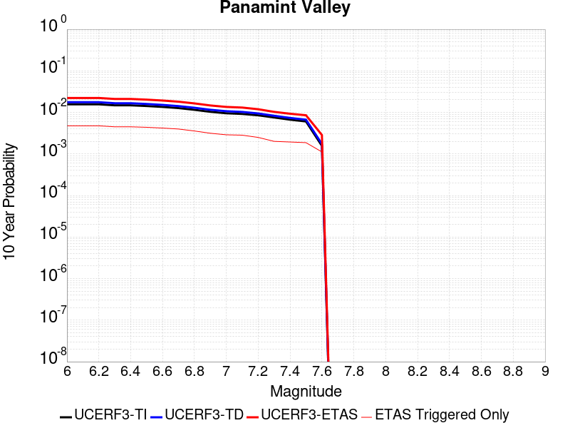 |

| Magnitude | 1 wk TI Prob | 1 wk TD Prob | 1 wk ETAS Prob | 1 wk ETAS/TD Gain | 1 wk ETAS Triggered Only | 1 mo TI Prob | 1 mo TD Prob | 1 mo ETAS Prob | 1 mo ETAS/TD Gain | 1 mo ETAS Triggered Only | 1 yr TI Prob | 1 yr TD Prob | 1 yr ETAS Prob | 1 yr ETAS/TD Gain | 1 yr ETAS Triggered Only | 10 yr TI Prob | 10 yr TD Prob | 10 yr ETAS Prob | 10 yr ETAS/TD Gain | 10 yr ETAS Triggered Only |
|-----|-----|-----|-----|-----|-----|-----|-----|-----|-----|-----|-----|-----|-----|-----|-----|-----|-----|-----|-----|-----|
| 6.0 | 3.0211835E-5 | 3.398435E-5 | 0.0013092769 | 38.525875 | 0.0012753359 | 1.2947287E-4 | 1.4563925E-4 | 0.0020583645 | 14.133308 | 0.0019130039 | 0.0015751923 | 0.0017717453 | 0.00504537 | 2.8476837 | 0.0032794352 | 0.015640736 | 0.017583055 | 0.022102486 | 1.2570333 | 0.0046003186 |
| 6.1 | 3.0211835E-5 | 3.398435E-5 | 0.0013092769 | 38.525875 | 0.0012753359 | 1.2947287E-4 | 1.4563925E-4 | 0.0020583645 | 14.133308 | 0.0019130039 | 0.0015751923 | 0.0017717453 | 0.00504537 | 2.8476837 | 0.0032794352 | 0.015640736 | 0.017583055 | 0.022102486 | 1.2570333 | 0.0046003186 |
| 6.2 | 3.0211835E-5 | 3.398435E-5 | 0.0013092769 | 38.525875 | 0.0012753359 | 1.2947287E-4 | 1.4563925E-4 | 0.0020583645 | 14.133308 | 0.0019130039 | 0.0015751923 | 0.0017717453 | 0.00504537 | 2.8476837 | 0.0032794352 | 0.015640736 | 0.017583055 | 0.022102486 | 1.2570333 | 0.0046003186 |
| 6.3 | 2.8573924E-5 | 3.2102525E-5 | 0.0013073975 | 40.72569 | 0.0012753359 | 1.2245393E-4 | 1.3757516E-4 | 0.0020047745 | 14.572212 | 0.0018674561 | 0.001489857 | 0.0016737186 | 0.0048112506 | 2.8745875 | 0.003142792 | 0.01479908 | 0.016617723 | 0.020917641 | 1.258755 | 0.0043725804 |
| 6.4 | 2.8573924E-5 | 3.2102525E-5 | 0.0013073975 | 40.72569 | 0.0012753359 | 1.2245393E-4 | 1.3757516E-4 | 0.0020047745 | 14.572212 | 0.0018674561 | 0.001489857 | 0.0016737186 | 0.0048112506 | 2.8745875 | 0.003142792 | 0.01479908 | 0.016617723 | 0.020917641 | 1.258755 | 0.0043725804 |
| 6.5 | 2.7468774E-5 | 3.0828287E-5 | 0.0013061248 | 42.36774 | 0.0012753359 | 1.1771801E-4 | 1.321147E-4 | 0.0019993242 | 15.133245 | 0.0018674561 | 0.0014322745 | 0.0016073369 | 0.004699603 | 2.9238443 | 0.0030972443 | 0.014230782 | 0.015963601 | 0.02022156 | 1.2667291 | 0.0043270327 |
| 6.6 | 2.6135967E-5 | 2.925234E-5 | 0.0012590046 | 43.039448 | 0.0012297882 | 1.1200648E-4 | 1.253613E-4 | 0.0019470414 | 15.531439 | 0.0018219084 | 0.0013628257 | 0.0015252318 | 0.0045722737 | 2.9977567 | 0.0030516966 | 0.013544982 | 0.0151539715 | 0.019325718 | 1.2752906 | 0.0042359373 |
| 6.7 | 2.4498746E-5 | 2.73412E-5 | 0.0012570958 | 45.978077 | 0.0012297882 | 1.04990395E-4 | 1.17171454E-4 | 0.0019388665 | 16.54726 | 0.0018219084 | 0.0012775084 | 0.0014256539 | 0.0044275173 | 3.1056044 | 0.0030061489 | 0.012701893 | 0.014171205 | 0.01825731 | 1.2883385 | 0.004144842 |
| 6.8 | 2.2244329E-5 | 2.4935298E-5 | 0.0011180531 | 44.83817 | 0.0010931451 | 9.532935E-5 | 1.0686131E-4 | 0.0017919466 | 16.7689 | 0.0016852653 | 0.0011600169 | 0.0013002817 | 0.003938614 | 3.0290465 | 0.0026417673 | 0.011539802 | 0.012932454 | 0.016394272 | 1.2676845 | 0.0035071739 |
| 6.9 | 1.9902658E-5 | 2.229015E-5 | 0.0010243175 | 45.953815 | 0.0010020497 | 8.529431E-5 | 9.552582E-5 | 0.0016895435 | 17.686771 | 0.0015941699 | 0.0010379635 | 0.0011624249 | 0.003664637 | 3.1525795 | 0.002505124 | 0.010331288 | 0.011568548 | 0.014765024 | 1.2763075 | 0.0032338875 |
| 7.0 | 1.8353881E-5 | 2.0566078E-5 | 9.3150156E-4 | 45.293106 | 9.109542E-4 | 7.865712E-5 | 8.813745E-5 | 0.0014999921 | 17.018782 | 0.0014119791 | 9.5722964E-4 | 0.001072563 | 0.0032110093 | 2.9937723 | 0.0021407425 | 0.009531168 | 0.010678793 | 0.013382472 | 1.253182 | 0.0027328627 |
| 7.1 | 1.7667631E-5 | 1.9772506E-5 | 9.307087E-4 | 47.070854 | 9.109542E-4 | 7.571623E-5 | 8.473666E-5 | 0.001496596 | 17.661732 | 0.0014119791 | 9.2145515E-4 | 0.0010311981 | 0.003169733 | 3.0738351 | 0.0021407425 | 0.009176437 | 0.010269018 | 0.012973816 | 1.2633941 | 0.0027328627 |
| 7.2 | 1.6381597E-5 | 1.815815E-5 | 8.380021E-4 | 46.15019 | 8.198588E-4 | 7.020495E-5 | 7.7818426E-5 | 0.0013530551 | 17.387337 | 0.0012753359 | 8.544101E-4 | 9.4704475E-4 | 0.0029492462 | 3.114157 | 0.0020040993 | 0.008511325 | 0.009434741 | 0.011825994 | 1.253452 | 0.0024140286 |
| 7.3 | 1.4520491E-5 | 1.5966394E-5 | 6.9917116E-4 | 43.790173 | 6.832157E-4 | 6.222919E-5 | 6.84257E-5 | 0.0011614959 | 16.974558 | 0.0010931451 | 7.57377E-4 | 8.327807E-4 | 0.002425623 | 2.9126792 | 0.0015941699 | 0.0075480095 | 0.008299708 | 0.010242005 | 1.2340198 | 0.0019585516 |
| 7.4 | 1.2852287E-5 | 1.4145337E-5 | 6.5180426E-4 | 46.07909 | 6.3766795E-4 | 5.5080065E-5 | 6.0621558E-5 | 0.0011081554 | 18.27989 | 0.0010475974 | 6.7039346E-4 | 7.378333E-4 | 0.0022853129 | 3.0973294 | 0.0015486222 | 0.0066837464 | 0.0073567564 | 0.009255687 | 1.2581205 | 0.0019130039 |
| 7.5 | 1.1637851E-5 | 1.2836727E-5 | 6.504965E-4 | 50.674637 | 6.3766795E-4 | 4.987555E-5 | 5.5013472E-5 | 0.0011025532 | 20.041513 | 0.0010475974 | 6.070656E-4 | 6.6959887E-4 | 0.002217184 | 3.3112125 | 0.0015486222 | 0.006054099 | 0.0066787098 | 0.0085789375 | 1.2845201 | 0.0019130039 |
| 7.6 | 3.0068115E-6 | 3.3330039E-6 | 3.2216593E-4 | 96.659325 | 3.1883398E-4 | 1.2886271E-5 | 1.42842655E-5 | 4.6975486E-4 | 32.886177 | 4.554771E-4 | 1.5687906E-4 | 1.7390434E-4 | 9.480808E-4 | 5.4517374 | 7.743111E-4 | 0.0015676835 | 0.0017391219 | 0.002830366 | 1.6274683 | 0.0010931451 |

## Blackwater
*[(top)](#table-of-contents)*

| 1 Week | 1 Month | 1 Year | 10 Year |
|-----|-----|-----|-----|
|  |  |  |  |

| Magnitude | 1 wk TI Prob | 1 wk TD Prob | 1 wk ETAS Prob | 1 wk ETAS/TD Gain | 1 wk ETAS Triggered Only | 1 mo TI Prob | 1 mo TD Prob | 1 mo ETAS Prob | 1 mo ETAS/TD Gain | 1 mo ETAS Triggered Only | 1 yr TI Prob | 1 yr TD Prob | 1 yr ETAS Prob | 1 yr ETAS/TD Gain | 1 yr ETAS Triggered Only | 10 yr TI Prob | 10 yr TD Prob | 10 yr ETAS Prob | 10 yr ETAS/TD Gain | 10 yr ETAS Triggered Only |
|-----|-----|-----|-----|-----|-----|-----|-----|-----|-----|-----|-----|-----|-----|-----|-----|-----|-----|-----|-----|-----|
| 6.0 | 3.0708583E-5 | 3.309578E-5 | 0.0011262046 | 34.02865 | 0.0010931451 | 1.3160157E-4 | 1.4183212E-4 | 0.0017357758 | 12.238243 | 0.0015941699 | 0.0016010714 | 0.001725575 | 0.0039990307 | 2.3175063 | 0.0022773857 | 0.015895851 | 0.017135598 | 0.02049314 | 1.1959395 | 0.0034160784 |
| 6.1 | 3.0708583E-5 | 3.309578E-5 | 0.0011262046 | 34.02865 | 0.0010931451 | 1.3160157E-4 | 1.4183212E-4 | 0.0017357758 | 12.238243 | 0.0015941699 | 0.0016010714 | 0.001725575 | 0.0039990307 | 2.3175063 | 0.0022773857 | 0.015895851 | 0.017135598 | 0.02049314 | 1.1959395 | 0.0034160784 |
| 6.2 | 1.1707779E-5 | 1.2545098E-5 | 4.680165E-4 | 37.30672 | 4.554771E-4 | 5.017523E-5 | 5.376365E-5 | 7.369426E-4 | 13.707078 | 6.832157E-4 | 6.107122E-4 | 6.543855E-4 | 0.0014737078 | 2.2520483 | 8.198588E-4 | 0.006090366 | 0.006525557 | 0.007883072 | 1.2080305 | 0.0013664314 |
| 6.3 | 1.1707779E-5 | 1.2545098E-5 | 4.680165E-4 | 37.30672 | 4.554771E-4 | 5.017523E-5 | 5.376365E-5 | 7.369426E-4 | 13.707078 | 6.832157E-4 | 6.107122E-4 | 6.543855E-4 | 0.0014737078 | 2.2520483 | 8.198588E-4 | 0.006090366 | 0.006525557 | 0.007883072 | 1.2080305 | 0.0013664314 |
| 6.4 | 7.929244E-6 | 8.480082E-6 | 1.9066938E-4 | 22.484379 | 1.8219085E-4 | 3.3982033E-5 | 3.6342728E-5 | 3.5516513E-4 | 9.77266 | 3.1883398E-4 | 4.136527E-4 | 4.423869E-4 | 8.5213495E-4 | 1.926221 | 4.099294E-4 | 0.0041288356 | 0.004415468 | 0.0052317064 | 1.1848589 | 8.198588E-4 |
| 6.5 | 5.8832115E-6 | 6.2859795E-6 | 1.8847568E-4 | 29.983503 | 1.8219085E-4 | 2.521352E-5 | 2.6939648E-5 | 3.0021855E-4 | 11.144115 | 2.7328628E-4 | 3.0693135E-4 | 3.279434E-4 | 6.9220556E-4 | 2.110747 | 3.643817E-4 | 0.0030650778 | 0.0032748478 | 0.003955826 | 1.207942 | 6.832157E-4 |
| 6.6 | 5.8832115E-6 | 6.2859795E-6 | 1.8847568E-4 | 29.983503 | 1.8219085E-4 | 2.521352E-5 | 2.6939648E-5 | 3.0021855E-4 | 11.144115 | 2.7328628E-4 | 3.0693135E-4 | 3.279434E-4 | 6.9220556E-4 | 2.110747 | 3.643817E-4 | 0.0030650778 | 0.0032748478 | 0.003955826 | 1.207942 | 6.832157E-4 |
| 6.7 | 3.0715053E-6 | 3.2814603E-6 | 1.3992414E-4 | 42.640816 | 1.3664314E-4 | 1.3163528E-5 | 1.4063332E-5 | 1.5070454E-4 | 10.716134 | 1.3664314E-4 | 1.6025416E-4 | 1.7120877E-4 | 3.9890833E-4 | 2.3299527 | 2.2773855E-4 | 0.0016013865 | 0.0017108832 | 0.0020746416 | 1.2126143 | 3.643817E-4 |
| 6.8 | 2.2722281E-6 | 2.4287492E-6 | 1.3907155E-4 | 57.260563 | 1.3664314E-4 | 9.738084E-6 | 1.0408889E-5 | 1.470506E-4 | 14.127406 | 1.3664314E-4 | 1.1855473E-4 | 1.2672177E-4 | 3.5443145E-4 | 2.7969265 | 2.2773855E-4 | 0.001184915 | 0.0012665853 | 0.0015850154 | 1.2514083 | 3.1883398E-4 |
| 6.9 | 9.952399E-7 | 1.0653469E-6 | 9.216067E-5 | 86.50767 | 9.1095426E-5 | 4.265307E-6 | 4.565767E-6 | 9.566078E-5 | 20.951742 | 9.1095426E-5 | 5.1928873E-5 | 5.5587312E-5 | 2.3776804E-4 | 4.2773795 | 1.8219085E-4 | 5.191674E-4 | 5.5578473E-4 | 7.833967E-4 | 1.4095327 | 2.2773855E-4 |
| 7.0 | 4.7385504E-7 | 5.07555E-7 | 5.07555E-7 | 1.0 | 0.0 | 2.0308057E-6 | 2.1752357E-6 | 2.1752357E-6 | 1.0 | 0.0 | 2.4724779E-5 | 2.6483494E-5 | 7.203E-5 | 2.7198071 | 4.5547713E-5 | 2.4722028E-4 | 2.6483493E-4 | 3.1037058E-4 | 1.1719397 | 4.5547713E-5 |

## Garlock (West)
*[(top)](#table-of-contents)*

| 1 Week | 1 Month | 1 Year | 10 Year |
|-----|-----|-----|-----|
|  |  |  |  |

| Magnitude | 1 wk TI Prob | 1 wk TD Prob | 1 wk ETAS Prob | 1 wk ETAS/TD Gain | 1 wk ETAS Triggered Only | 1 mo TI Prob | 1 mo TD Prob | 1 mo ETAS Prob | 1 mo ETAS/TD Gain | 1 mo ETAS Triggered Only | 1 yr TI Prob | 1 yr TD Prob | 1 yr ETAS Prob | 1 yr ETAS/TD Gain | 1 yr ETAS Triggered Only | 10 yr TI Prob | 10 yr TD Prob | 10 yr ETAS Prob | 10 yr ETAS/TD Gain | 10 yr ETAS Triggered Only |
|-----|-----|-----|-----|-----|-----|-----|-----|-----|-----|-----|-----|-----|-----|-----|-----|-----|-----|-----|-----|-----|
| 6.0 | 2.5181727E-5 | 2.5196328E-5 | 6.6284824E-4 | 26.307333 | 6.3766795E-4 | 1.0791722E-4 | 1.0797982E-4 | 0.0010643784 | 9.857199 | 9.565019E-4 | 0.0013131002 | 0.0013138648 | 0.002678501 | 2.0386426 | 0.0013664314 | 0.013053683 | 0.0131414775 | 0.015164189 | 1.1539181 | 0.002049647 |
| 6.1 | 2.5077732E-5 | 2.50974E-5 | 6.6274934E-4 | 26.407091 | 6.3766795E-4 | 1.0747157E-4 | 1.07555876E-4 | 0.0010639549 | 9.892114 | 9.565019E-4 | 0.001307681 | 0.0013087096 | 0.0026733526 | 2.0427394 | 0.0013664314 | 0.013000126 | 0.013090534 | 0.01511335 | 1.154525 | 0.002049647 |
| 6.2 | 2.494612E-5 | 2.497908E-5 | 6.626311E-4 | 26.527443 | 6.3766795E-4 | 1.0690756E-4 | 1.0704882E-4 | 0.0010634484 | 9.934237 | 9.565019E-4 | 0.0013008224 | 0.0013025437 | 0.0026671952 | 2.047682 | 0.0013664314 | 0.012932341 | 0.013029599 | 0.015052539 | 1.1552573 | 0.002049647 |
| 6.3 | 2.4733758E-5 | 2.479845E-5 | 6.624506E-4 | 26.713387 | 6.3766795E-4 | 1.0599751E-4 | 1.0627476E-4 | 0.001062675 | 9.999317 | 9.565019E-4 | 0.0012897556 | 0.0012931306 | 0.002657795 | 2.0553184 | 0.0013664314 | 0.012822957 | 0.012936569 | 0.0149597 | 1.1563885 | 0.002049647 |
| 6.4 | 2.3237335E-5 | 2.3177769E-5 | 6.6083093E-4 | 28.511414 | 6.3766795E-4 | 9.958477E-5 | 9.9329525E-5 | 0.0010557364 | 10.628627 | 9.565019E-4 | 0.0012117702 | 0.0012086688 | 0.0025734487 | 2.1291595 | 0.0013664314 | 0.012051838 | 0.012101421 | 0.0141262645 | 1.1673228 | 0.002049647 |
| 6.5 | 2.2732203E-5 | 2.299234E-5 | 6.6064566E-4 | 28.733292 | 6.3766795E-4 | 9.742009E-5 | 9.8534896E-5 | 0.0010549426 | 10.7062845 | 9.565019E-4 | 0.0011854442 | 0.0011990049 | 0.0025637979 | 2.1382713 | 0.0013664314 | 0.011791403 | 0.01200583 | 0.01403087 | 1.1686714 | 0.002049647 |
| 6.6 | 2.1319436E-5 | 2.177255E-5 | 6.594266E-4 | 30.287066 | 6.3766795E-4 | 9.136581E-5 | 9.33076E-5 | 0.0010497203 | 11.250105 | 9.565019E-4 | 0.001111811 | 0.0011354303 | 0.0025003103 | 2.2020814 | 0.0013664314 | 0.011062649 | 0.011376739 | 0.013403067 | 1.1781116 | 0.002049647 |
| 6.7 | 1.970802E-5 | 2.0392457E-5 | 6.580474E-4 | 32.269157 | 6.3766795E-4 | 8.446021E-5 | 8.7393324E-5 | 0.0010438117 | 11.943837 | 9.565019E-4 | 0.001027818 | 0.0010634961 | 0.0024284741 | 2.283482 | 0.0013664314 | 0.010230771 | 0.010664482 | 0.01269227 | 1.1901442 | 0.002049647 |
| 6.8 | 1.8744462E-5 | 1.9900112E-5 | 6.5755536E-4 | 33.0428 | 6.3766795E-4 | 8.033094E-5 | 8.528341E-5 | 0.0010417037 | 12.214612 | 9.565019E-4 | 9.775903E-4 | 0.0010378326 | 0.0024028458 | 2.3152537 | 0.0013664314 | 0.009733009 | 0.010410271 | 0.012438579 | 1.1948373 | 0.002049647 |
| 6.9 | 1.7559682E-5 | 1.8952487E-5 | 6.566084E-4 | 34.64497 | 6.3766795E-4 | 7.5253614E-5 | 8.1222424E-5 | 0.0010376467 | 12.775372 | 9.565019E-4 | 9.158276E-4 | 9.884358E-4 | 0.0023535166 | 2.3810515 | 0.0013664314 | 0.0091206245 | 0.009920754 | 0.011950067 | 1.2045523 | 0.002049647 |
| 7.0 | 1.6794445E-5 | 1.8215316E-5 | 6.5587164E-4 | 36.006603 | 6.3766795E-4 | 7.197421E-5 | 7.806331E-5 | 0.0010344905 | 13.251943 | 9.565019E-4 | 8.759337E-4 | 9.500078E-4 | 0.002315141 | 2.4369705 | 0.0013664314 | 0.008724891 | 0.009539667 | 0.011569761 | 1.2128055 | 0.002049647 |
| 7.1 | 1.6337795E-5 | 1.771613E-5 | 6.553728E-4 | 36.993 | 6.3766795E-4 | 7.0017246E-5 | 7.5924065E-5 | 0.0010323534 | 13.597182 | 9.565019E-4 | 8.521265E-4 | 9.2398486E-4 | 0.0022891536 | 2.4774797 | 0.0013664314 | 0.008488664 | 0.009281524 | 0.011312148 | 1.2187812 | 0.002049647 |
| 7.2 | 1.5780008E-5 | 1.7164773E-5 | 6.548218E-4 | 38.149162 | 6.3766795E-4 | 6.762685E-5 | 7.356125E-5 | 0.0010299928 | 14.00184 | 9.565019E-4 | 8.2304585E-4 | 8.952415E-4 | 0.0022604496 | 2.5249605 | 0.0013664314 | 0.008200042 | 0.008996368 | 0.0110275755 | 1.2257808 | 0.002049647 |
| 7.3 | 1.5058865E-5 | 1.6617856E-5 | 6.5427524E-4 | 39.37182 | 6.3766795E-4 | 6.45364E-5 | 7.121745E-5 | 0.0010276512 | 14.429768 | 9.565019E-4 | 7.854473E-4 | 8.667287E-4 | 0.0022319758 | 2.5751722 | 0.0013664314 | 0.00782677 | 0.008713072 | 0.01074486 | 1.2331885 | 0.002049647 |
| 7.4 | 1.4887923E-5 | 1.6453829E-5 | 6.5411127E-4 | 39.75435 | 6.3766795E-4 | 6.380382E-5 | 7.0514514E-5 | 0.001026949 | 14.563655 | 9.565019E-4 | 7.7653467E-4 | 8.5817726E-4 | 0.002223436 | 2.590882 | 0.0013664314 | 0.0077382675 | 0.008627934 | 0.010659897 | 1.2355098 | 0.002049647 |
| 7.5 | 1.4509299E-5 | 1.6045851E-5 | 6.081566E-4 | 37.901173 | 5.921202E-4 | 6.218123E-5 | 6.876613E-5 | 9.796578E-4 | 14.246224 | 9.109542E-4 | 7.567935E-4 | 8.3690725E-4 | 0.0021111758 | 2.5225923 | 0.0012753359 | 0.0075422134 | 0.008416242 | 0.01035831 | 1.2307523 | 0.0019585516 |
| 7.6 | 1.2756717E-5 | 1.4049988E-5 | 3.7842657E-4 | 26.934298 | 3.643817E-4 | 5.4670498E-5 | 6.021285E-5 | 6.5229746E-4 | 10.833194 | 5.921202E-4 | 6.6541E-4 | 7.328455E-4 | 0.0015976178 | 2.1800199 | 8.6540653E-4 | 0.006634211 | 0.0073812436 | 0.008828011 | 1.1960061 | 0.0014575268 |
| 7.7 | 1.0328985E-5 | 1.145975E-5 | 1.936485E-4 | 16.898144 | 1.8219085E-4 | 4.4266326E-5 | 4.9112292E-5 | 3.6793062E-4 | 7.4916196 | 3.1883398E-4 | 5.388092E-4 | 5.9777853E-4 | 0.0010074629 | 1.6853447 | 4.099294E-4 | 0.0053750467 | 0.0060380935 | 0.006671911 | 1.1049699 | 6.3766795E-4 |
| 7.8 | 7.0306583E-6 | 8.8989555E-6 | 1.4554088E-4 | 16.354826 | 1.3664314E-4 | 3.0131043E-5 | 3.8137823E-5 | 2.2032172E-4 | 5.776987 | 1.8219085E-4 | 3.667837E-4 | 4.6422923E-4 | 6.4633554E-4 | 1.3922766 | 1.8219085E-4 | 0.003661789 | 0.0046949377 | 0.0050576087 | 1.0772473 | 3.643817E-4 |
| 7.9 | 4.060633E-6 | 5.4650154E-6 | 9.655994E-5 | 17.668741 | 9.1095426E-5 | 1.7402595E-5 | 2.3421284E-5 | 1.1451457E-4 | 4.889338 | 9.1095426E-5 | 2.11856E-4 | 2.8511693E-4 | 3.7618636E-4 | 1.3194109 | 9.1095426E-5 | 0.0021165414 | 0.0028840043 | 0.0030202533 | 1.047243 | 1.3664314E-4 |
| 8.0 | 1.6729537E-6 | 2.0773857E-6 | 2.0773857E-6 | 1.0 | 0.0 | 7.169782E-6 | 8.903051E-6 | 8.903051E-6 | 1.0 | 0.0 | 8.7288594E-5 | 1.08389286E-4 | 1.08389286E-4 | 1.0 | 0.0 | 8.7254314E-4 | 0.0010968668 | 0.0010968668 | 1.0 | 0.0 |
| 8.1 | 3.6733252E-7 | 3.148811E-7 | 3.148811E-7 | 1.0 | 0.0 | 1.5742813E-6 | 1.3494899E-6 | 1.3494899E-6 | 1.0 | 0.0 | 1.9166706E-5 | 1.6429933E-5 | 1.6429933E-5 | 1.0 | 0.0 | 1.9165053E-4 | 1.6637788E-4 | 1.6637788E-4 | 1.0 | 0.0 |

## Hunter Mountain-Saline Valley
*[(top)](#table-of-contents)*

| 1 Week | 1 Month | 1 Year | 10 Year |
|-----|-----|-----|-----|
|  |  |  |  |

| Magnitude | 1 wk TI Prob | 1 wk TD Prob | 1 wk ETAS Prob | 1 wk ETAS/TD Gain | 1 wk ETAS Triggered Only | 1 mo TI Prob | 1 mo TD Prob | 1 mo ETAS Prob | 1 mo ETAS/TD Gain | 1 mo ETAS Triggered Only | 1 yr TI Prob | 1 yr TD Prob | 1 yr ETAS Prob | 1 yr ETAS/TD Gain | 1 yr ETAS Triggered Only | 10 yr TI Prob | 10 yr TD Prob | 10 yr ETAS Prob | 10 yr ETAS/TD Gain | 10 yr ETAS Triggered Only |
|-----|-----|-----|-----|-----|-----|-----|-----|-----|-----|-----|-----|-----|-----|-----|-----|-----|-----|-----|-----|-----|
| 6.0 | 4.5103672E-5 | 5.4569828E-5 | 7.8329345E-4 | 14.353966 | 7.287634E-4 | 1.9328714E-4 | 2.3385094E-4 | 0.0013722774 | 5.8681717 | 0.0011386928 | 0.002350731 | 0.002843498 | 0.004478553 | 1.5750154 | 0.0016397176 | 0.023260195 | 0.028091714 | 0.030039515 | 1.0693372 | 0.0020040993 |
| 6.1 | 4.5103672E-5 | 5.4569828E-5 | 7.8329345E-4 | 14.353966 | 7.287634E-4 | 1.9328714E-4 | 2.3385094E-4 | 0.0013722774 | 5.8681717 | 0.0011386928 | 0.002350731 | 0.002843498 | 0.004478553 | 1.5750154 | 0.0016397176 | 0.023260195 | 0.028091714 | 0.030039515 | 1.0693372 | 0.0020040993 |
| 6.2 | 3.9363465E-5 | 4.7063084E-5 | 7.7579217E-4 | 16.48409 | 7.287634E-4 | 1.6868966E-4 | 2.0168422E-4 | 0.0013401473 | 6.6447806 | 0.0011386928 | 0.002051862 | 0.002452803 | 0.0040884987 | 1.666868 | 0.0016397176 | 0.020330196 | 0.024273338 | 0.026228791 | 1.0805597 | 0.0020040993 |
| 6.3 | 3.9363465E-5 | 4.7063084E-5 | 7.7579217E-4 | 16.48409 | 7.287634E-4 | 1.6868966E-4 | 2.0168422E-4 | 0.0013401473 | 6.6447806 | 0.0011386928 | 0.002051862 | 0.002452803 | 0.0040884987 | 1.666868 | 0.0016397176 | 0.020330196 | 0.024273338 | 0.026228791 | 1.0805597 | 0.0020040993 |
| 6.4 | 3.2311684E-5 | 3.7950776E-5 | 7.2114053E-4 | 19.001997 | 6.832157E-4 | 1.384713E-4 | 1.6263645E-4 | 0.0012556037 | 7.7203097 | 0.0010931451 | 0.0016845843 | 0.0019783732 | 0.0035693892 | 1.8042042 | 0.0015941699 | 0.016718714 | 0.019616365 | 0.021536497 | 1.0978842 | 0.0019585516 |
| 6.5 | 3.2311684E-5 | 3.7950776E-5 | 7.2114053E-4 | 19.001997 | 6.832157E-4 | 1.384713E-4 | 1.6263645E-4 | 0.0012556037 | 7.7203097 | 0.0010931451 | 0.0016845843 | 0.0019783732 | 0.0035693892 | 1.8042042 | 0.0015941699 | 0.016718714 | 0.019616365 | 0.021536497 | 1.0978842 | 0.0019585516 |
| 6.6 | 2.9305844E-5 | 3.418164E-5 | 7.17374E-4 | 20.987112 | 6.832157E-4 | 1.2559042E-4 | 1.4648488E-4 | 0.0012394699 | 8.461418 | 0.0010931451 | 0.0015279909 | 0.0017820572 | 0.003373386 | 1.8929731 | 0.0015941699 | 0.015175272 | 0.017685594 | 0.019609507 | 1.1087842 | 0.0019585516 |
| 6.7 | 2.7826512E-5 | 3.2344098E-5 | 7.155377E-4 | 22.122665 | 6.832157E-4 | 1.19251024E-4 | 1.3861054E-4 | 0.0012316041 | 8.885357 | 0.0010931451 | 0.0014509142 | 0.0016863372 | 0.003277819 | 1.9437505 | 0.0015941699 | 0.014414776 | 0.016743096 | 0.018668855 | 1.1150181 | 0.0019585516 |
| 6.8 | 2.3389874E-5 | 2.6866572E-5 | 7.100639E-4 | 26.42927 | 6.832157E-4 | 1.0023846E-4 | 1.15137635E-4 | 0.0012081568 | 10.493154 | 0.0010931451 | 0.00121972 | 0.0014009465 | 0.002992883 | 2.1363292 | 0.0015941699 | 0.01213047 | 0.01392736 | 0.015858635 | 1.1386676 | 0.0019585516 |
| 6.9 | 2.069209E-5 | 2.3569908E-5 | 7.0676947E-4 | 29.986094 | 6.832157E-4 | 8.867737E-5 | 1.01010184E-4 | 0.0011940448 | 11.821034 | 0.0010931451 | 0.0010791123 | 0.0012291414 | 0.0028213519 | 2.2953844 | 0.0015941699 | 0.010738871 | 0.01222846 | 0.014163061 | 1.1582048 | 0.0019585516 |
| 7.0 | 1.7462342E-5 | 1.9633446E-5 | 7.028357E-4 | 35.79788 | 6.832157E-4 | 7.483646E-5 | 8.414075E-5 | 0.0011771938 | 13.990769 | 0.0010931451 | 9.1075303E-4 | 0.0010239548 | 0.0026164923 | 2.555281 | 0.0015941699 | 0.009070295 | 0.010196 | 0.012134583 | 1.1901317 | 0.0019585516 |
| 7.1 | 1.4807709E-5 | 1.6441667E-5 | 6.996461E-4 | 42.553234 | 6.832157E-4 | 6.3460066E-5 | 7.0462476E-5 | 0.0011635305 | 16.512768 | 0.0010931451 | 7.723524E-4 | 8.5755944E-4 | 0.0024503623 | 2.8573673 | 0.0015941699 | 0.007696735 | 0.008545489 | 0.010487303 | 1.2272327 | 0.0019585516 |
| 7.2 | 1.4180048E-5 | 1.5698257E-5 | 6.989032E-4 | 44.521072 | 6.832157E-4 | 6.077022E-5 | 6.72766E-5 | 0.0011603482 | 17.247425 | 0.0010931451 | 7.396263E-4 | 8.18801E-4 | 0.0024116656 | 2.9453623 | 0.0015941699 | 0.0073716943 | 0.008160792 | 0.010103361 | 1.2380368 | 0.0019585516 |
| 7.3 | 1.3730402E-5 | 1.5171999E-5 | 6.983773E-4 | 46.030674 | 6.832157E-4 | 5.8843252E-5 | 6.502132E-5 | 0.0011580953 | 17.811008 | 0.0010931451 | 7.161811E-4 | 7.913631E-4 | 0.0023842715 | 3.0128665 | 0.0015941699 | 0.007138774 | 0.007888383 | 0.009831484 | 1.2463244 | 0.0019585516 |
| 7.4 | 1.2810095E-5 | 1.4109204E-5 | 6.517682E-4 | 46.19454 | 6.3766795E-4 | 5.489925E-5 | 6.0466708E-5 | 0.0011080008 | 18.324146 | 0.0010475974 | 6.681934E-4 | 7.359493E-4 | 0.0022834318 | 3.1027026 | 0.0015486222 | 0.006661878 | 0.0073380154 | 0.009236982 | 1.2587847 | 0.0019130039 |
| 7.5 | 1.1595659E-5 | 1.2800594E-5 | 6.5046037E-4 | 50.81486 | 6.3766795E-4 | 4.9694736E-5 | 5.485862E-5 | 0.0011023985 | 20.095264 | 0.0010475974 | 6.0486543E-4 | 6.677147E-4 | 0.0022153028 | 3.3177385 | 0.0015486222 | 0.006032217 | 0.0066599557 | 0.008560219 | 1.2853267 | 0.0019130039 |
| 7.6 | 2.997694E-6 | 3.3251304E-6 | 3.2215804E-4 | 96.88584 | 3.1883398E-4 | 1.28471975E-5 | 1.4250522E-5 | 4.6972116E-4 | 32.961678 | 4.554771E-4 | 1.564034E-4 | 1.7349358E-4 | 9.476703E-4 | 5.4622793 | 7.743111E-4 | 0.0015629337 | 0.0017350167 | 0.002826265 | 1.6289556 | 0.0010931451 |

## Gravel Hills-Harper Lk
*[(top)](#table-of-contents)*

| 1 Week | 1 Month | 1 Year | 10 Year |
|-----|-----|-----|-----|
|  |  |  |  |

| Magnitude | 1 wk TI Prob | 1 wk TD Prob | 1 wk ETAS Prob | 1 wk ETAS/TD Gain | 1 wk ETAS Triggered Only | 1 mo TI Prob | 1 mo TD Prob | 1 mo ETAS Prob | 1 mo ETAS/TD Gain | 1 mo ETAS Triggered Only | 1 yr TI Prob | 1 yr TD Prob | 1 yr ETAS Prob | 1 yr ETAS/TD Gain | 1 yr ETAS Triggered Only | 10 yr TI Prob | 10 yr TD Prob | 10 yr ETAS Prob | 10 yr ETAS/TD Gain | 10 yr ETAS Triggered Only |
|-----|-----|-----|-----|-----|-----|-----|-----|-----|-----|-----|-----|-----|-----|-----|-----|-----|-----|-----|-----|-----|
| 6.0 | 3.0679566E-5 | 3.1464537E-5 | 0.0010790289 | 34.293495 | 0.0010475974 | 1.3147724E-4 | 1.3484228E-4 | 0.0013189231 | 9.781228 | 0.0011842404 | 0.0015995599 | 0.001640685 | 0.0030503476 | 1.8591914 | 0.0014119791 | 0.015880952 | 0.016307283 | 0.018189091 | 1.1153967 | 0.0019130039 |
| 6.1 | 3.0679566E-5 | 3.1464537E-5 | 0.0010790289 | 34.293495 | 0.0010475974 | 1.3147724E-4 | 1.3484228E-4 | 0.0013189231 | 9.781228 | 0.0011842404 | 0.0015995599 | 0.001640685 | 0.0030503476 | 1.8591914 | 0.0014119791 | 0.015880952 | 0.016307283 | 0.018189091 | 1.1153967 | 0.0019130039 |
| 6.2 | 1.514536E-5 | 1.3635169E-5 | 2.869177E-4 | 21.042475 | 2.7328628E-4 | 6.490707E-5 | 5.84352E-5 | 3.317055E-4 | 5.6764674 | 2.7328628E-4 | 7.8995706E-4 | 7.112282E-4 | 0.0010298354 | 1.4479676 | 3.1883398E-4 | 0.007871548 | 0.0070907213 | 0.0075429687 | 1.0637802 | 4.554771E-4 |
| 6.3 | 1.514536E-5 | 1.3635169E-5 | 2.869177E-4 | 21.042475 | 2.7328628E-4 | 6.490707E-5 | 5.84352E-5 | 3.317055E-4 | 5.6764674 | 2.7328628E-4 | 7.8995706E-4 | 7.112282E-4 | 0.0010298354 | 1.4479676 | 3.1883398E-4 | 0.007871548 | 0.0070907213 | 0.0075429687 | 1.0637802 | 4.554771E-4 |
| 6.4 | 1.2532521E-5 | 1.0689663E-5 | 1.9287856E-4 | 18.043465 | 1.8219085E-4 | 5.37097E-5 | 4.5812074E-5 | 2.2799458E-4 | 4.9767356 | 1.8219085E-4 | 6.537194E-4 | 5.576251E-4 | 7.8523665E-4 | 1.4081802 | 2.2773855E-4 | 0.0065179965 | 0.005562849 | 0.005925203 | 1.0651383 | 3.643817E-4 |
| 6.5 | 1.1094058E-5 | 9.083641E-6 | 1.0017824E-4 | 11.028422 | 9.1095426E-5 | 4.7545094E-5 | 3.8929335E-5 | 1.300212E-4 | 3.339929 | 9.1095426E-5 | 5.787078E-4 | 4.738656E-4 | 5.6491786E-4 | 1.1921479 | 9.1095426E-5 | 0.0057720304 | 0.004728959 | 0.0049556205 | 1.0479306 | 2.2773855E-4 |
| 6.6 | 9.688328E-6 | 7.531677E-6 | 9.862641E-5 | 13.09488 | 9.1095426E-5 | 4.1520743E-5 | 3.2278233E-5 | 1.2337072E-4 | 3.8221025 | 9.1095426E-5 | 5.053978E-4 | 3.9291914E-4 | 4.839788E-4 | 1.2317516 | 9.1095426E-5 | 0.0050424994 | 0.003922501 | 0.0040132394 | 1.0231327 | 9.1095426E-5 |
| 6.7 | 8.974824E-6 | 6.749397E-6 | 5.22968E-5 | 7.7483664 | 4.5547713E-5 | 3.8462964E-5 | 2.892568E-5 | 7.4472075E-5 | 2.5746007 | 4.5547713E-5 | 4.6818596E-4 | 3.5211546E-4 | 3.9764712E-4 | 1.1293089 | 4.5547713E-5 | 0.004672008 | 0.0035157963 | 0.0035611838 | 1.0129097 | 4.5547713E-5 |
| 6.8 | 7.4780046E-6 | 5.1161815E-6 | 5.066366E-5 | 9.902632 | 4.5547713E-5 | 3.20482E-5 | 2.1926315E-5 | 6.7473025E-5 | 3.0772624 | 4.5547713E-5 | 3.9011694E-4 | 2.669216E-4 | 3.1245712E-4 | 1.1705953 | 4.5547713E-5 | 0.0038943281 | 0.002666148 | 0.0027115743 | 1.0170382 | 4.5547713E-5 |
| 6.9 | 6.3409307E-6 | 3.9074876E-6 | 3.9074876E-6 | 1.0 | 0.0 | 2.7175134E-5 | 1.6746273E-5 | 1.6746273E-5 | 1.0 | 0.0 | 3.3080703E-4 | 2.0386779E-4 | 2.0386779E-4 | 1.0 | 0.0 | 0.0033031502 | 0.0020369058 | 0.0020369058 | 1.0 | 0.0 |
| 7.0 | 5.1239335E-6 | 2.60585E-6 | 2.60585E-6 | 1.0 | 0.0 | 2.195953E-5 | 1.1167882E-5 | 1.1167882E-5 | 1.0 | 0.0 | 2.6732447E-4 | 1.3596074E-4 | 1.3596074E-4 | 1.0 | 0.0 | 0.0026700313 | 0.0013588008 | 0.0013588008 | 1.0 | 0.0 |
| 7.1 | 4.438899E-6 | 2.0984673E-6 | 2.0984673E-6 | 1.0 | 0.0 | 1.9023713E-5 | 8.993402E-6 | 8.993402E-6 | 1.0 | 0.0 | 2.315891E-4 | 1.0948939E-4 | 1.0948939E-4 | 1.0 | 0.0 | 0.002313479 | 0.0010943763 | 0.0010943763 | 1.0 | 0.0 |
| 7.2 | 3.50367E-6 | 1.2615677E-6 | 1.2615677E-6 | 1.0 | 0.0 | 1.5015643E-5 | 5.4067077E-6 | 5.4067077E-6 | 1.0 | 0.0 | 1.8280011E-4 | 6.5824766E-5 | 6.5824766E-5 | 1.0 | 0.0 | 0.0018264982 | 6.580609E-4 | 6.580609E-4 | 1.0 | 0.0 |
| 7.3 | 2.561638E-6 | 7.119129E-7 | 7.119129E-7 | 1.0 | 0.0 | 1.0978401E-5 | 3.0510516E-6 | 3.0510516E-6 | 1.0 | 0.0 | 1.3365384E-4 | 3.7145943E-5 | 3.7145943E-5 | 1.0 | 0.0 | 0.0013357349 | 3.7139934E-4 | 3.7139934E-4 | 1.0 | 0.0 |
| 7.4 | 2.0368864E-6 | 5.304814E-7 | 5.304814E-7 | 1.0 | 0.0 | 8.729483E-6 | 2.2734896E-6 | 2.2734896E-6 | 1.0 | 0.0 | 1.06276275E-4 | 2.7679389E-5 | 2.7679389E-5 | 1.0 | 0.0 | 0.0010622547 | 2.7675997E-4 | 2.7675997E-4 | 1.0 | 0.0 |
| 7.5 | 1.1681728E-6 | 3.6030443E-7 | 3.6030443E-7 | 1.0 | 0.0 | 5.0064455E-6 | 1.544161E-6 | 1.544161E-6 | 1.0 | 0.0 | 6.0951766E-5 | 1.8800003E-5 | 1.8800003E-5 | 1.0 | 0.0 | 6.093505E-4 | 1.879846E-4 | 1.879846E-4 | 1.0 | 0.0 |
| 7.6 | 1.3154387E-7 | 7.1197206E-8 | 7.1197206E-8 | 1.0 | 0.0 | 5.6375933E-7 | 3.0513087E-7 | 3.0513087E-7 | 1.0 | 0.0 | 6.863748E-6 | 3.7149634E-6 | 3.7149634E-6 | 1.0 | 0.0 | 6.863536E-5 | 3.714917E-5 | 3.714917E-5 | 1.0 | 0.0 |

## Ash Hill
*[(top)](#table-of-contents)*

| 1 Week | 1 Month | 1 Year | 10 Year |
|-----|-----|-----|-----|
|  | 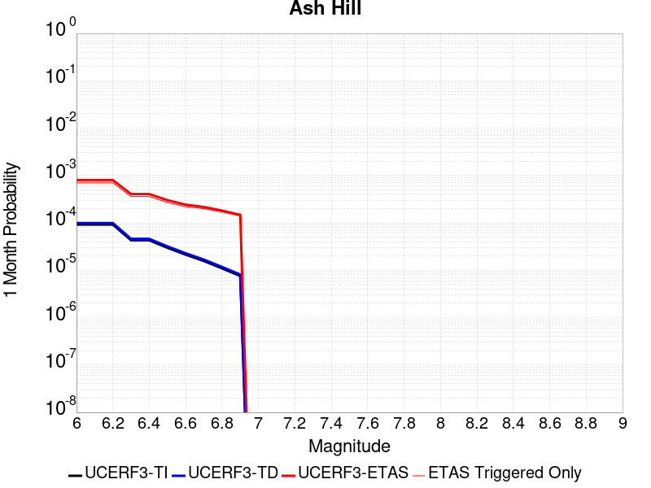 |  |  |

| Magnitude | 1 wk TI Prob | 1 wk TD Prob | 1 wk ETAS Prob | 1 wk ETAS/TD Gain | 1 wk ETAS Triggered Only | 1 mo TI Prob | 1 mo TD Prob | 1 mo ETAS Prob | 1 mo ETAS/TD Gain | 1 mo ETAS Triggered Only | 1 yr TI Prob | 1 yr TD Prob | 1 yr ETAS Prob | 1 yr ETAS/TD Gain | 1 yr ETAS Triggered Only | 10 yr TI Prob | 10 yr TD Prob | 10 yr ETAS Prob | 10 yr ETAS/TD Gain | 10 yr ETAS Triggered Only |
|-----|-----|-----|-----|-----|-----|-----|-----|-----|-----|-----|-----|-----|-----|-----|-----|-----|-----|-----|-----|-----|
| 6.0 | 2.1545662E-5 | 2.31944E-5 | 4.7866095E-4 | 20.636919 | 4.554771E-4 | 9.2335285E-5 | 9.940123E-5 | 8.2809216E-4 | 8.330804 | 7.287634E-4 | 0.0011236023 | 0.001209618 | 0.0023469336 | 1.9402268 | 0.0011386928 | 0.011179381 | 0.012038324 | 0.013613303 | 1.1308304 | 0.0015941699 |
| 6.1 | 2.1545662E-5 | 2.31944E-5 | 4.7866095E-4 | 20.636919 | 4.554771E-4 | 9.2335285E-5 | 9.940123E-5 | 8.2809216E-4 | 8.330804 | 7.287634E-4 | 0.0011236023 | 0.001209618 | 0.0023469336 | 1.9402268 | 0.0011386928 | 0.011179381 | 0.012038324 | 0.013613303 | 1.1308304 | 0.0015941699 |
| 6.2 | 2.1545662E-5 | 2.31944E-5 | 4.7866095E-4 | 20.636919 | 4.554771E-4 | 9.2335285E-5 | 9.940123E-5 | 8.2809216E-4 | 8.330804 | 7.287634E-4 | 0.0011236023 | 0.001209618 | 0.0023469336 | 1.9402268 | 0.0011386928 | 0.011179381 | 0.012038324 | 0.013613303 | 1.1308304 | 0.0015941699 |
| 6.3 | 1.0025529E-5 | 1.0746914E-5 | 3.2957745E-4 | 30.667173 | 3.1883398E-4 | 4.2965847E-5 | 4.6057463E-5 | 5.4705923E-4 | 11.877754 | 5.010248E-4 | 5.229836E-4 | 5.606186E-4 | 0.0012434513 | 2.2179987 | 6.832157E-4 | 0.005217545 | 0.0055933557 | 0.0063633355 | 1.1376598 | 7.743111E-4 |
| 6.4 | 1.0025529E-5 | 1.0746914E-5 | 3.2957745E-4 | 30.667173 | 3.1883398E-4 | 4.2965847E-5 | 4.6057463E-5 | 5.4705923E-4 | 11.877754 | 5.010248E-4 | 5.229836E-4 | 5.606186E-4 | 0.0012434513 | 2.2179987 | 6.832157E-4 | 0.005217545 | 0.0055933557 | 0.0063633355 | 1.1376598 | 7.743111E-4 |
| 6.5 | 6.9617327E-6 | 7.45662E-6 | 2.3519348E-4 | 31.541567 | 2.2773855E-4 | 2.9835655E-5 | 3.19566E-5 | 3.9632665E-4 | 12.402028 | 3.643817E-4 | 3.6318856E-4 | 3.8901082E-4 | 7.9878076E-4 | 2.0533638 | 4.099294E-4 | 0.0036259557 | 0.003884153 | 0.0043832315 | 1.128491 | 5.010248E-4 |
| 6.6 | 4.9919777E-6 | 5.3466783E-6 | 1.8753656E-4 | 35.07534 | 1.8219085E-4 | 2.1394015E-5 | 2.2914171E-5 | 3.4174084E-4 | 14.913952 | 3.1883398E-4 | 2.60441E-4 | 2.7895102E-4 | 6.432311E-4 | 2.3058925 | 3.643817E-4 | 0.0026013597 | 0.0027866673 | 0.0031954544 | 1.146694 | 4.099294E-4 |
| 6.7 | 3.6630722E-6 | 3.924616E-6 | 1.8611475E-4 | 47.422405 | 1.8219085E-4 | 1.5698786E-5 | 1.6819708E-5 | 3.3564834E-4 | 19.955658 | 3.1883398E-4 | 1.9111596E-4 | 2.0476643E-4 | 5.6907354E-4 | 2.7791348 | 3.643817E-4 | 0.0019095168 | 0.0020463406 | 0.0024554313 | 1.1999133 | 4.099294E-4 |
| 6.8 | 2.5599613E-6 | 2.7449198E-6 | 1.8493527E-4 | 67.37365 | 1.8219085E-4 | 1.0971216E-5 | 1.17639165E-5 | 3.3059414E-4 | 28.102386 | 3.1883398E-4 | 1.3356637E-4 | 1.4322122E-4 | 5.075507E-4 | 3.5438235 | 3.643817E-4 | 0.0013348613 | 0.0014317741 | 0.0018411166 | 1.2858988 | 4.099294E-4 |
| 6.9 | 1.7684905E-6 | 1.896867E-6 | 1.3853975E-4 | 73.03609 | 1.3664314E-4 | 7.579223E-6 | 8.12943E-6 | 2.3586613E-4 | 29.013859 | 2.2773855E-4 | 9.2273134E-5 | 9.897581E-5 | 3.7223502E-4 | 3.7608685 | 2.7328628E-4 | 9.223483E-4 | 9.897582E-4 | 0.0013082766 | 1.3218144 | 3.1883398E-4 |

## Airport Lake
*[(top)](#table-of-contents)*

| 1 Week | 1 Month | 1 Year | 10 Year |
|-----|-----|-----|-----|
|  |  |  |  |

| Magnitude | 1 wk TI Prob | 1 wk TD Prob | 1 wk ETAS Prob | 1 wk ETAS/TD Gain | 1 wk ETAS Triggered Only | 1 mo TI Prob | 1 mo TD Prob | 1 mo ETAS Prob | 1 mo ETAS/TD Gain | 1 mo ETAS Triggered Only | 1 yr TI Prob | 1 yr TD Prob | 1 yr ETAS Prob | 1 yr ETAS/TD Gain | 1 yr ETAS Triggered Only | 10 yr TI Prob | 10 yr TD Prob | 10 yr ETAS Prob | 10 yr ETAS/TD Gain | 10 yr ETAS Triggered Only |
|-----|-----|-----|-----|-----|-----|-----|-----|-----|-----|-----|-----|-----|-----|-----|-----|-----|-----|-----|-----|-----|
| 6.0 | 1.2387061E-5 | 1.3103137E-5 | 7.874041E-4 | 60.092793 | 7.743111E-4 | 5.3086325E-5 | 5.615525E-5 | 8.3042285E-4 | 14.787982 | 7.743111E-4 | 6.461343E-4 | 6.835041E-4 | 0.0015028026 | 2.1986737 | 8.198588E-4 | 0.0064425888 | 0.0068168286 | 0.00826442 | 1.2123555 | 0.0014575268 |
| 6.1 | 1.2387061E-5 | 1.3103137E-5 | 7.874041E-4 | 60.092793 | 7.743111E-4 | 5.3086325E-5 | 5.615525E-5 | 8.3042285E-4 | 14.787982 | 7.743111E-4 | 6.461343E-4 | 6.835041E-4 | 0.0015028026 | 2.1986737 | 8.198588E-4 | 0.0064425888 | 0.0068168286 | 0.00826442 | 1.2123555 | 0.0014575268 |
| 6.2 | 1.2387061E-5 | 1.3103137E-5 | 7.874041E-4 | 60.092793 | 7.743111E-4 | 5.3086325E-5 | 5.615525E-5 | 8.3042285E-4 | 14.787982 | 7.743111E-4 | 6.461343E-4 | 6.835041E-4 | 0.0015028026 | 2.1986737 | 8.198588E-4 | 0.0064425888 | 0.0068168286 | 0.00826442 | 1.2123555 | 0.0014575268 |
| 6.3 | 1.2387061E-5 | 1.3103137E-5 | 7.874041E-4 | 60.092793 | 7.743111E-4 | 5.3086325E-5 | 5.615525E-5 | 8.3042285E-4 | 14.787982 | 7.743111E-4 | 6.461343E-4 | 6.835041E-4 | 0.0015028026 | 2.1986737 | 8.198588E-4 | 0.0064425888 | 0.0068168286 | 0.00826442 | 1.2123555 | 0.0014575268 |
| 6.4 | 1.2387061E-5 | 1.3103137E-5 | 7.874041E-4 | 60.092793 | 7.743111E-4 | 5.3086325E-5 | 5.615525E-5 | 8.3042285E-4 | 14.787982 | 7.743111E-4 | 6.461343E-4 | 6.835041E-4 | 0.0015028026 | 2.1986737 | 8.198588E-4 | 0.0064425888 | 0.0068168286 | 0.00826442 | 1.2123555 | 0.0014575268 |
| 6.5 | 6.9922594E-6 | 7.384914E-6 | 6.9059554E-4 | 93.514366 | 6.832157E-4 | 2.996648E-5 | 3.1649277E-5 | 7.1484334E-4 | 22.586401 | 6.832157E-4 | 3.6478083E-4 | 3.8526725E-4 | 0.0010682197 | 2.772672 | 6.832157E-4 | 0.003641826 | 0.0038465308 | 0.0049808435 | 1.2948924 | 0.0011386928 |
| 6.6 | 6.9922594E-6 | 7.384914E-6 | 6.9059554E-4 | 93.514366 | 6.832157E-4 | 2.996648E-5 | 3.1649277E-5 | 7.1484334E-4 | 22.586401 | 6.832157E-4 | 3.6478083E-4 | 3.8526725E-4 | 0.0010682197 | 2.772672 | 6.832157E-4 | 0.003641826 | 0.0038465308 | 0.0049808435 | 1.2948924 | 0.0011386928 |
| 6.7 | 5.477277E-6 | 5.78606E-6 | 6.889978E-4 | 119.078926 | 6.832157E-4 | 2.3473833E-5 | 2.4797186E-5 | 7.079959E-4 | 28.551462 | 6.832157E-4 | 2.8575645E-4 | 3.0186778E-4 | 9.848772E-4 | 3.2626112 | 6.832157E-4 | 0.0028538927 | 0.0030149613 | 0.0041048108 | 1.3614804 | 0.0010931451 |
| 6.8 | 3.9950432E-6 | 4.219081E-6 | 3.6859923E-4 | 87.36482 | 3.643817E-4 | 1.7121502E-5 | 1.8081664E-5 | 3.8245675E-4 | 21.151634 | 3.643817E-4 | 2.0843433E-4 | 2.2012478E-4 | 5.844263E-4 | 2.654977 | 3.643817E-4 | 0.0020823893 | 0.0021993385 | 0.0029264991 | 1.330627 | 7.287634E-4 |
| 6.9 | 2.95695E-6 | 3.1230197E-6 | 2.7640842E-4 | 88.50679 | 2.7328628E-4 | 1.2672582E-5 | 1.3384314E-5 | 2.866669E-4 | 21.418125 | 2.7328628E-4 | 1.5427776E-4 | 1.629441E-4 | 4.3618583E-4 | 2.6769047 | 2.7328628E-4 | 0.001541707 | 0.0016284687 | 0.0020377305 | 1.251317 | 4.099294E-4 |
| 7.0 | 1.456072E-6 | 1.5408096E-6 | 9.263609E-5 | 60.1217 | 9.1095426E-5 | 6.2402937E-6 | 6.6034586E-6 | 9.769828E-5 | 14.795016 | 9.1095426E-5 | 7.597293E-5 | 8.0395155E-5 | 1.7148325E-4 | 2.133005 | 9.1095426E-5 | 7.594696E-4 | 8.0375955E-4 | 9.402929E-4 | 1.1698684 | 1.3664314E-4 |
| 7.1 | 6.995192E-7 | 7.4089627E-7 | 4.6288573E-5 | 62.476456 | 4.5547713E-5 | 2.997936E-6 | 3.1752697E-6 | 4.8722835E-5 | 15.344472 | 4.5547713E-5 | 3.649926E-5 | 3.865891E-5 | 8.420486E-5 | 2.178149 | 4.5547713E-5 | 3.6493264E-4 | 3.865891E-4 | 4.776493E-4 | 1.2355478 | 9.1095426E-5 |

## McLean Lake
*[(top)](#table-of-contents)*

| 1 Week | 1 Month | 1 Year | 10 Year |
|-----|-----|-----|-----|
|  | 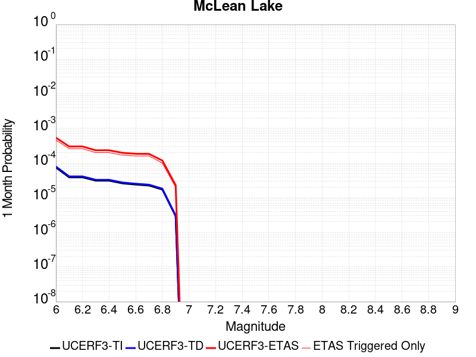 |  |  |

| Magnitude | 1 wk TI Prob | 1 wk TD Prob | 1 wk ETAS Prob | 1 wk ETAS/TD Gain | 1 wk ETAS Triggered Only | 1 mo TI Prob | 1 mo TD Prob | 1 mo ETAS Prob | 1 mo ETAS/TD Gain | 1 mo ETAS Triggered Only | 1 yr TI Prob | 1 yr TD Prob | 1 yr ETAS Prob | 1 yr ETAS/TD Gain | 1 yr ETAS Triggered Only | 10 yr TI Prob | 10 yr TD Prob | 10 yr ETAS Prob | 10 yr ETAS/TD Gain | 10 yr ETAS Triggered Only |
|-----|-----|-----|-----|-----|-----|-----|-----|-----|-----|-----|-----|-----|-----|-----|-----|-----|-----|-----|-----|-----|
| 6.0 | 1.7360222E-5 | 1.8501594E-5 | 2.917828E-4 | 15.770684 | 2.7328628E-4 | 7.439883E-5 | 7.929042E-5 | 4.891873E-4 | 6.1695642 | 4.099294E-4 | 9.0542925E-4 | 9.6498185E-4 | 0.001693042 | 1.7544806 | 7.287634E-4 | 0.009017491 | 0.009612758 | 0.010966054 | 1.1407813 | 0.0013664314 |
| 6.1 | 9.062689E-6 | 9.592179E-6 | 2.3732855E-4 | 24.741882 | 2.2773855E-4 | 3.8839516E-5 | 4.110874E-5 | 3.1438377E-4 | 7.647614 | 2.7328628E-4 | 4.727685E-4 | 5.0039287E-4 | 0.0010466919 | 2.0917404 | 5.4657256E-4 | 0.0047176396 | 0.004993544 | 0.0059452695 | 1.1905912 | 9.565019E-4 |
| 6.2 | 9.062689E-6 | 9.592179E-6 | 2.3732855E-4 | 24.741882 | 2.2773855E-4 | 3.8839516E-5 | 4.110874E-5 | 3.1438377E-4 | 7.647614 | 2.7328628E-4 | 4.727685E-4 | 5.0039287E-4 | 0.0010466919 | 2.0917404 | 5.4657256E-4 | 0.0047176396 | 0.004993544 | 0.0059452695 | 1.1905912 | 9.565019E-4 |
| 6.3 | 7.2575485E-6 | 7.667698E-6 | 1.8985715E-4 | 24.760645 | 1.8219085E-4 | 3.110341E-5 | 3.286119E-5 | 2.6059226E-4 | 7.9300923 | 2.2773855E-4 | 3.786182E-4 | 4.0001865E-4 | 8.0978405E-4 | 2.024366 | 4.099294E-4 | 0.0037797375 | 0.003993691 | 0.004674178 | 1.1703905 | 6.832157E-4 |
| 6.4 | 7.2575485E-6 | 7.667698E-6 | 1.8985715E-4 | 24.760645 | 1.8219085E-4 | 3.110341E-5 | 3.286119E-5 | 2.6059226E-4 | 7.9300923 | 2.2773855E-4 | 3.786182E-4 | 4.0001865E-4 | 8.0978405E-4 | 2.024366 | 4.099294E-4 | 0.0037797375 | 0.003993691 | 0.004674178 | 1.1703905 | 6.832157E-4 |
| 6.5 | 6.06582E-6 | 6.4038677E-6 | 1.8859355E-4 | 29.449945 | 1.8219085E-4 | 2.5996113E-5 | 2.7444894E-5 | 2.0963074E-4 | 7.638242 | 1.8219085E-4 | 3.164567E-4 | 3.3409684E-4 | 6.983568E-4 | 2.0902824 | 3.643817E-4 | 0.0031600643 | 0.0033365842 | 0.003926729 | 1.1768708 | 5.921202E-4 |
| 6.6 | 5.598744E-6 | 5.9102535E-6 | 1.8810002E-4 | 31.82605 | 1.8219085E-4 | 2.3994397E-5 | 2.5329447E-5 | 2.0751568E-4 | 8.192665 | 1.8219085E-4 | 2.9209262E-4 | 3.0834877E-4 | 6.726181E-4 | 2.1813548 | 3.643817E-4 | 0.0029170897 | 0.0030798386 | 0.003670135 | 1.1916648 | 5.921202E-4 |
| 6.7 | 5.246996E-6 | 5.539154E-6 | 1.8772899E-4 | 33.891277 | 1.8219085E-4 | 2.2486933E-5 | 2.373905E-5 | 2.0592556E-4 | 8.67455 | 1.8219085E-4 | 2.73744E-4 | 2.8899097E-4 | 6.532673E-4 | 2.2605114 | 3.643817E-4 | 0.0027340704 | 0.0028867754 | 0.0033863538 | 1.1730577 | 5.010248E-4 |
| 6.8 | 4.02324E-6 | 4.2468982E-6 | 1.4088945E-4 | 33.17467 | 1.3664314E-4 | 1.7242342E-5 | 1.8200899E-5 | 1.5484155E-4 | 8.507358 | 1.3664314E-4 | 2.099053E-4 | 2.2157936E-4 | 4.4926745E-4 | 2.027569 | 2.2773855E-4 | 0.0020970714 | 0.0022141687 | 0.0025322968 | 1.1436783 | 3.1883398E-4 |
| 6.9 | 6.835972E-7 | 7.13992E-7 | 7.13992E-7 | 1.0 | 0.0 | 2.9296991E-6 | 3.0599638E-6 | 3.0599638E-6 | 1.0 | 0.0 | 3.56685E-5 | 3.725474E-5 | 3.725474E-5 | 1.0 | 0.0 | 3.5662777E-4 | 3.7251622E-4 | 3.7251622E-4 | 1.0 | 0.0 |

## Goldstone Lake
*[(top)](#table-of-contents)*

| 1 Week | 1 Month | 1 Year | 10 Year |
|-----|-----|-----|-----|
|  |  |  |  |

| Magnitude | 1 wk TI Prob | 1 wk TD Prob | 1 wk ETAS Prob | 1 wk ETAS/TD Gain | 1 wk ETAS Triggered Only | 1 mo TI Prob | 1 mo TD Prob | 1 mo ETAS Prob | 1 mo ETAS/TD Gain | 1 mo ETAS Triggered Only | 1 yr TI Prob | 1 yr TD Prob | 1 yr ETAS Prob | 1 yr ETAS/TD Gain | 1 yr ETAS Triggered Only | 10 yr TI Prob | 10 yr TD Prob | 10 yr ETAS Prob | 10 yr ETAS/TD Gain | 10 yr ETAS Triggered Only |
|-----|-----|-----|-----|-----|-----|-----|-----|-----|-----|-----|-----|-----|-----|-----|-----|-----|-----|-----|-----|-----|
| 6.0 | 2.671352E-5 | 3.037598E-5 | 3.4920027E-4 | 11.495934 | 3.1883398E-4 | 1.1448149E-4 | 1.3017739E-4 | 6.31137E-4 | 4.8482842 | 5.010248E-4 | 0.001392921 | 0.0015839539 | 0.0022660873 | 1.4306524 | 6.832157E-4 | 0.013842222 | 0.01574614 | 0.016956564 | 1.0768712 | 0.0012297882 |
| 6.1 | 2.671352E-5 | 3.037598E-5 | 3.4920027E-4 | 11.495934 | 3.1883398E-4 | 1.1448149E-4 | 1.3017739E-4 | 6.31137E-4 | 4.8482842 | 5.010248E-4 | 0.001392921 | 0.0015839539 | 0.0022660873 | 1.4306524 | 6.832157E-4 | 0.013842222 | 0.01574614 | 0.016956564 | 1.0768712 | 0.0012297882 |
| 6.2 | 1.4197047E-5 | 1.609619E-5 | 1.982841E-4 | 12.318698 | 1.8219085E-4 | 6.0843064E-5 | 6.89824E-5 | 4.3333895E-4 | 6.2818766 | 3.643817E-4 | 7.4051257E-4 | 8.396358E-4 | 0.0013402399 | 1.5962158 | 5.010248E-4 | 0.007380498 | 0.008374331 | 0.009142158 | 1.0916882 | 7.743111E-4 |
| 6.3 | 1.4197047E-5 | 1.609619E-5 | 1.982841E-4 | 12.318698 | 1.8219085E-4 | 6.0843064E-5 | 6.89824E-5 | 4.3333895E-4 | 6.2818766 | 3.643817E-4 | 7.4051257E-4 | 8.396358E-4 | 0.0013402399 | 1.5962158 | 5.010248E-4 | 0.007380498 | 0.008374331 | 0.009142158 | 1.0916882 | 7.743111E-4 |
| 6.4 | 1.3238931E-5 | 1.5008409E-5 | 1.9719652E-4 | 13.139069 | 1.8219085E-4 | 5.6737044E-5 | 6.432072E-5 | 4.2867896E-4 | 6.6647105 | 3.643817E-4 | 6.9055456E-4 | 7.829214E-4 | 0.0012835539 | 1.6394416 | 5.010248E-4 | 0.006884126 | 0.007811257 | 0.00857952 | 1.0983533 | 7.743111E-4 |
| 6.5 | 1.3238931E-5 | 1.5008409E-5 | 1.9719652E-4 | 13.139069 | 1.8219085E-4 | 5.6737044E-5 | 6.432072E-5 | 4.2867896E-4 | 6.6647105 | 3.643817E-4 | 6.9055456E-4 | 7.829214E-4 | 0.0012835539 | 1.6394416 | 5.010248E-4 | 0.006884126 | 0.007811257 | 0.00857952 | 1.0983533 | 7.743111E-4 |
| 6.6 | 1.1328278E-5 | 1.2855122E-5 | 1.494965E-4 | 11.6293335 | 1.3664314E-4 | 4.8548856E-5 | 5.5092758E-5 | 3.2836397E-4 | 5.960202 | 2.7328628E-4 | 5.90922E-4 | 6.706436E-4 | 9.892638E-4 | 1.4750961 | 3.1883398E-4 | 0.0058935313 | 0.006695586 | 0.007193256 | 1.0743281 | 5.010248E-4 |
| 6.7 | 8.651175E-6 | 9.824532E-6 | 1.4646632E-4 | 14.908224 | 1.3664314E-4 | 3.707594E-5 | 4.2104966E-5 | 3.1537973E-4 | 7.490321 | 2.7328628E-4 | 4.5130608E-4 | 5.125979E-4 | 7.857441E-4 | 1.5328664 | 2.7328628E-4 | 0.0045039062 | 0.005123034 | 0.0054402347 | 1.0619166 | 3.1883398E-4 |
| 6.8 | 1.0215377E-6 | 1.1754685E-6 | 1.1754685E-6 | 1.0 | 0.0 | 4.378012E-6 | 5.0377125E-6 | 5.0377125E-6 | 1.0 | 0.0 | 5.3300988E-5 | 6.133254E-5 | 6.133254E-5 | 1.0 | 0.0 | 5.3288206E-4 | 6.131674E-4 | 6.131674E-4 | 1.0 | 0.0 |
| 6.9 | 7.9360774E-7 | 9.283384E-7 | 9.283384E-7 | 1.0 | 0.0 | 3.4011714E-6 | 3.9785873E-6 | 3.9785873E-6 | 1.0 | 0.0 | 4.1408475E-5 | 4.8438294E-5 | 4.8438294E-5 | 1.0 | 0.0 | 4.140076E-4 | 4.842844E-4 | 4.842844E-4 | 1.0 | 0.0 |
| 7.0 | 7.4382757E-7 | 8.747317E-7 | 8.747317E-7 | 1.0 | 0.0 | 3.1878285E-6 | 3.748845E-6 | 3.748845E-6 | 1.0 | 0.0 | 3.8811122E-5 | 4.56413E-5 | 4.56413E-5 | 1.0 | 0.0 | 3.8804344E-4 | 4.563259E-4 | 4.563259E-4 | 1.0 | 0.0 |
| 7.1 | 6.4709513E-7 | 7.71129E-7 | 7.71129E-7 | 1.0 | 0.0 | 2.773262E-6 | 3.304835E-6 | 3.304835E-6 | 1.0 | 0.0 | 3.376394E-5 | 4.023568E-5 | 4.023568E-5 | 1.0 | 0.0 | 3.375881E-4 | 4.0228994E-4 | 4.0228994E-4 | 1.0 | 0.0 |
| 7.2 | 6.356704E-7 | 7.5883503E-7 | 7.5883503E-7 | 1.0 | 0.0 | 2.7242988E-6 | 3.2521464E-6 | 3.2521464E-6 | 1.0 | 0.0 | 3.3167835E-5 | 3.9594222E-5 | 3.9594222E-5 | 1.0 | 0.0 | 3.3162883E-4 | 3.9587764E-4 | 3.9587764E-4 | 1.0 | 0.0 |
| 7.3 | 5.7695723E-7 | 6.896557E-7 | 6.896557E-7 | 1.0 | 0.0 | 2.4726714E-6 | 2.955664E-6 | 2.955664E-6 | 1.0 | 0.0 | 3.0104358E-5 | 3.5984674E-5 | 3.5984674E-5 | 1.0 | 0.0 | 3.0100282E-4 | 3.597942E-4 | 3.597942E-4 | 1.0 | 0.0 |
| 7.4 | 5.209647E-7 | 6.1935066E-7 | 6.1935066E-7 | 1.0 | 0.0 | 2.232704E-6 | 2.6543576E-6 | 2.6543576E-6 | 1.0 | 0.0 | 2.718283E-5 | 3.231638E-5 | 3.231638E-5 | 1.0 | 0.0 | 2.7179506E-4 | 3.2312237E-4 | 3.2312237E-4 | 1.0 | 0.0 |
| 7.5 | 4.512955E-7 | 5.348879E-7 | 5.348879E-7 | 1.0 | 0.0 | 1.934122E-6 | 2.292375E-6 | 2.292375E-6 | 1.0 | 0.0 | 2.3547682E-5 | 2.7909362E-5 | 2.7909362E-5 | 1.0 | 0.0 | 2.3545188E-4 | 2.7906388E-4 | 2.7906388E-4 | 1.0 | 0.0 |
| 7.6 | 2.21172E-7 | 2.603958E-7 | 2.603958E-7 | 1.0 | 0.0 | 9.478797E-7 | 1.1159817E-6 | 1.1159817E-6 | 1.0 | 0.0 | 1.1540374E-5 | 1.3587022E-5 | 1.3587022E-5 | 1.0 | 0.0 | 1.1539775E-4 | 1.3586473E-4 | 1.3586473E-4 | 1.0 | 0.0 |

## Coyote Canyon
*[(top)](#table-of-contents)*

| 1 Week | 1 Month | 1 Year | 10 Year |
|-----|-----|-----|-----|
|  |  |  |  |

| Magnitude | 1 wk TI Prob | 1 wk TD Prob | 1 wk ETAS Prob | 1 wk ETAS/TD Gain | 1 wk ETAS Triggered Only | 1 mo TI Prob | 1 mo TD Prob | 1 mo ETAS Prob | 1 mo ETAS/TD Gain | 1 mo ETAS Triggered Only | 1 yr TI Prob | 1 yr TD Prob | 1 yr ETAS Prob | 1 yr ETAS/TD Gain | 1 yr ETAS Triggered Only | 10 yr TI Prob | 10 yr TD Prob | 10 yr ETAS Prob | 10 yr ETAS/TD Gain | 10 yr ETAS Triggered Only |
|-----|-----|-----|-----|-----|-----|-----|-----|-----|-----|-----|-----|-----|-----|-----|-----|-----|-----|-----|-----|-----|
| 6.0 | 3.5090034E-5 | 4.036416E-5 | 2.2254765E-4 | 5.5134964 | 1.8219085E-4 | 1.503772E-4 | 1.7297924E-4 | 4.4621824E-4 | 2.5796056 | 2.7328628E-4 | 0.0018293047 | 0.0021042444 | 0.002558763 | 1.2160009 | 4.554771E-4 | 0.018143194 | 0.02086912 | 0.021805659 | 1.0448768 | 9.565019E-4 |
| 6.1 | 3.5090034E-5 | 4.036416E-5 | 2.2254765E-4 | 5.5134964 | 1.8219085E-4 | 1.503772E-4 | 1.7297924E-4 | 4.4621824E-4 | 2.5796056 | 2.7328628E-4 | 0.0018293047 | 0.0021042444 | 0.002558763 | 1.2160009 | 4.554771E-4 | 0.018143194 | 0.02086912 | 0.021805659 | 1.0448768 | 9.565019E-4 |
| 6.2 | 1.841879E-5 | 2.1059714E-5 | 6.6606466E-5 | 3.1627433 | 4.5547713E-5 | 7.8935285E-5 | 9.0253365E-5 | 1.8134057E-4 | 2.0092387 | 9.1095426E-5 | 9.606133E-4 | 0.0010983828 | 0.0012803735 | 1.1656897 | 1.8219085E-4 | 0.0095647145 | 0.010939625 | 0.01139012 | 1.04118 | 4.554771E-4 |
| 6.3 | 1.841879E-5 | 2.1059714E-5 | 6.6606466E-5 | 3.1627433 | 4.5547713E-5 | 7.8935285E-5 | 9.0253365E-5 | 1.8134057E-4 | 2.0092387 | 9.1095426E-5 | 9.606133E-4 | 0.0010983828 | 0.0012803735 | 1.1656897 | 1.8219085E-4 | 0.0095647145 | 0.010939625 | 0.01139012 | 1.04118 | 4.554771E-4 |
| 6.4 | 1.712201E-5 | 1.9565137E-5 | 6.5111955E-5 | 3.327958 | 4.5547713E-5 | 7.337798E-5 | 8.384846E-5 | 1.7493624E-4 | 2.0863383 | 9.1095426E-5 | 8.930107E-4 | 0.0010204774 | 0.0012024824 | 1.1783527 | 1.8219085E-4 | 0.008894307 | 0.010167832 | 0.010618678 | 1.0443404 | 4.554771E-4 |
| 6.5 | 1.4744935E-5 | 1.6836908E-5 | 6.238385E-5 | 3.7051847 | 4.5547713E-5 | 6.3191044E-5 | 7.2156705E-5 | 1.6324555E-4 | 2.2623754 | 9.1095426E-5 | 7.6907943E-4 | 8.782473E-4 | 0.0010602782 | 1.207266 | 1.8219085E-4 | 0.007664232 | 0.008756962 | 0.00920845 | 1.0515577 | 4.554771E-4 |
| 6.6 | 1.2017839E-5 | 1.3724038E-5 | 5.9271122E-5 | 4.318782 | 4.5547713E-5 | 5.150401E-5 | 5.8816477E-5 | 1.4990654E-4 | 2.5487168 | 9.1095426E-5 | 6.268809E-4 | 7.1594387E-4 | 8.980043E-4 | 1.2542943 | 1.8219085E-4 | 0.0062511545 | 0.0071450667 | 0.0075972895 | 1.0632915 | 4.554771E-4 |
| 6.7 | 1.00956095E-5 | 1.1533472E-5 | 5.708066E-5 | 4.94913 | 4.5547713E-5 | 4.326618E-5 | 4.9428723E-5 | 1.4051964E-4 | 2.8428743 | 9.1095426E-5 | 5.266384E-4 | 6.017155E-4 | 7.382764E-4 | 1.2269527 | 1.3664314E-4 | 0.005253921 | 0.0060093896 | 0.0063715815 | 1.060271 | 3.643817E-4 |

## So Sierra Nevada
*[(top)](#table-of-contents)*

| 1 Week | 1 Month | 1 Year | 10 Year |
|-----|-----|-----|-----|
|  |  |  |  |

| Magnitude | 1 wk TI Prob | 1 wk TD Prob | 1 wk ETAS Prob | 1 wk ETAS/TD Gain | 1 wk ETAS Triggered Only | 1 mo TI Prob | 1 mo TD Prob | 1 mo ETAS Prob | 1 mo ETAS/TD Gain | 1 mo ETAS Triggered Only | 1 yr TI Prob | 1 yr TD Prob | 1 yr ETAS Prob | 1 yr ETAS/TD Gain | 1 yr ETAS Triggered Only | 10 yr TI Prob | 10 yr TD Prob | 10 yr ETAS Prob | 10 yr ETAS/TD Gain | 10 yr ETAS Triggered Only |
|-----|-----|-----|-----|-----|-----|-----|-----|-----|-----|-----|-----|-----|-----|-----|-----|-----|-----|-----|-----|-----|
| 6.0 | 1.15488665E-5 | 1.1079626E-5 | 2.3881566E-4 | 21.554487 | 2.2773855E-4 | 4.9494203E-5 | 4.748332E-5 | 3.207566E-4 | 6.7551427 | 2.7328628E-4 | 6.024253E-4 | 5.7796884E-4 | 0.0012607897 | 2.1814146 | 6.832157E-4 | 0.006007948 | 0.0057659256 | 0.006807483 | 1.18064 | 0.0010475974 |
| 6.1 | 1.15488665E-5 | 1.1079626E-5 | 2.3881566E-4 | 21.554487 | 2.2773855E-4 | 4.9494203E-5 | 4.748332E-5 | 3.207566E-4 | 6.7551427 | 2.7328628E-4 | 6.024253E-4 | 5.7796884E-4 | 0.0012607897 | 2.1814146 | 6.832157E-4 | 0.006007948 | 0.0057659256 | 0.006807483 | 1.18064 | 0.0010475974 |
| 6.2 | 1.15488665E-5 | 1.1079626E-5 | 2.3881566E-4 | 21.554487 | 2.2773855E-4 | 4.9494203E-5 | 4.748332E-5 | 3.207566E-4 | 6.7551427 | 2.7328628E-4 | 6.024253E-4 | 5.7796884E-4 | 0.0012607897 | 2.1814146 | 6.832157E-4 | 0.006007948 | 0.0057659256 | 0.006807483 | 1.18064 | 0.0010475974 |
| 6.3 | 1.15488665E-5 | 1.1079626E-5 | 2.3881566E-4 | 21.554487 | 2.2773855E-4 | 4.9494203E-5 | 4.748332E-5 | 3.207566E-4 | 6.7551427 | 2.7328628E-4 | 6.024253E-4 | 5.7796884E-4 | 0.0012607897 | 2.1814146 | 6.832157E-4 | 0.006007948 | 0.0057659256 | 0.006807483 | 1.18064 | 0.0010475974 |
| 6.4 | 1.15488665E-5 | 1.1079626E-5 | 2.3881566E-4 | 21.554487 | 2.2773855E-4 | 4.9494203E-5 | 4.748332E-5 | 3.207566E-4 | 6.7551427 | 2.7328628E-4 | 6.024253E-4 | 5.7796884E-4 | 0.0012607897 | 2.1814146 | 6.832157E-4 | 0.006007948 | 0.0057659256 | 0.006807483 | 1.18064 | 0.0010475974 |
| 6.5 | 1.15488665E-5 | 1.1079626E-5 | 2.3881566E-4 | 21.554487 | 2.2773855E-4 | 4.9494203E-5 | 4.748332E-5 | 3.207566E-4 | 6.7551427 | 2.7328628E-4 | 6.024253E-4 | 5.7796884E-4 | 0.0012607897 | 2.1814146 | 6.832157E-4 | 0.006007948 | 0.0057659256 | 0.006807483 | 1.18064 | 0.0010475974 |
| 6.6 | 7.587044E-6 | 6.9356242E-6 | 9.803042E-5 | 14.134332 | 9.1095426E-5 | 3.2515498E-5 | 2.9723782E-5 | 1.208165E-4 | 4.064641 | 9.1095426E-5 | 3.9580427E-4 | 3.6182988E-4 | 5.8948604E-4 | 1.6291801 | 2.2773855E-4 | 0.003951 | 0.0036126992 | 0.004111914 | 1.1381834 | 5.010248E-4 |
| 6.7 | 7.587044E-6 | 6.9356242E-6 | 9.803042E-5 | 14.134332 | 9.1095426E-5 | 3.2515498E-5 | 2.9723782E-5 | 1.208165E-4 | 4.064641 | 9.1095426E-5 | 3.9580427E-4 | 3.6182988E-4 | 5.8948604E-4 | 1.6291801 | 2.2773855E-4 | 0.003951 | 0.0036126992 | 0.004111914 | 1.1381834 | 5.010248E-4 |
| 6.8 | 5.9026956E-6 | 5.179384E-6 | 9.6274336E-5 | 18.58799 | 9.1095426E-5 | 2.5297022E-5 | 2.2197177E-5 | 1.13290575E-4 | 5.103828 | 9.1095426E-5 | 3.0794772E-4 | 2.702183E-4 | 4.523599E-4 | 1.6740537 | 1.8219085E-4 | 0.0030752132 | 0.0026990133 | 0.0029261373 | 1.0841507 | 2.2773855E-4 |
| 6.9 | 5.0118915E-6 | 4.2524175E-6 | 4.9799935E-5 | 11.71097 | 4.5547713E-5 | 2.1479358E-5 | 1.8224524E-5 | 6.3771404E-5 | 3.4992085 | 4.5547713E-5 | 2.614798E-4 | 2.218617E-4 | 3.1293693E-4 | 1.4105045 | 9.1095426E-5 | 0.0026117235 | 0.0022164746 | 0.002352815 | 1.0615122 | 1.3664314E-4 |
| 7.0 | 4.4924795E-6 | 3.7139105E-6 | 3.7139105E-6 | 1.0 | 0.0 | 1.925334E-5 | 1.5916665E-5 | 1.5916665E-5 | 1.0 | 0.0 | 2.3438422E-4 | 1.937688E-4 | 2.3930769E-4 | 1.2350166 | 4.5547713E-5 | 0.0023413717 | 0.0019360614 | 0.0020269805 | 1.0469608 | 9.1095426E-5 |
| 7.1 | 3.9118436E-6 | 3.111971E-6 | 3.111971E-6 | 1.0 | 0.0 | 1.6764936E-5 | 1.3336953E-5 | 1.3336953E-5 | 1.0 | 0.0 | 2.0409399E-4 | 1.6236588E-4 | 2.079062E-4 | 1.2804796 | 4.5547713E-5 | 0.0020390663 | 0.0016225285 | 0.0017134761 | 1.056053 | 9.1095426E-5 |
| 7.2 | 3.4200818E-6 | 2.6054481E-6 | 2.6054481E-6 | 1.0 | 0.0 | 1.4657411E-5 | 1.1166161E-5 | 1.1166161E-5 | 1.0 | 0.0 | 1.7843937E-4 | 1.3594003E-4 | 1.8148156E-4 | 1.3350118 | 4.5547713E-5 | 0.0017829615 | 0.0013586186 | 0.0014041044 | 1.0334795 | 4.5547713E-5 |
| 7.3 | 2.6593618E-6 | 1.828415E-6 | 1.828415E-6 | 1.0 | 0.0 | 1.13972155E-5 | 7.836042E-6 | 7.836042E-6 | 1.0 | 0.0 | 1.3875226E-4 | 9.539993E-5 | 9.539993E-5 | 1.0 | 0.0 | 0.0013866565 | 9.5361867E-4 | 9.5361867E-4 | 1.0 | 0.0 |
| 7.4 | 2.2577992E-6 | 1.4364332E-6 | 1.4364332E-6 | 1.0 | 0.0 | 9.676246E-6 | 6.156129E-6 | 6.156129E-6 | 1.0 | 0.0 | 1.1780193E-4 | 7.494855E-5 | 7.494855E-5 | 1.0 | 0.0 | 0.001177395 | 7.4925774E-4 | 7.4925774E-4 | 1.0 | 0.0 |
| 7.5 | 1.489319E-6 | 7.353898E-7 | 7.353898E-7 | 1.0 | 0.0 | 6.3827797E-6 | 3.1516668E-6 | 3.1516668E-6 | 1.0 | 0.0 | 7.770758E-5 | 3.8370872E-5 | 3.8370872E-5 | 1.0 | 0.0 | 7.7680405E-4 | 3.8364288E-4 | 3.8364288E-4 | 1.0 | 0.0 |
| 7.6 | 1.0680322E-6 | 4.6596273E-7 | 4.6596273E-7 | 1.0 | 0.0 | 4.577273E-6 | 1.9969816E-6 | 1.9969816E-6 | 1.0 | 0.0 | 5.5726876E-5 | 2.4312982E-5 | 2.4312982E-5 | 1.0 | 0.0 | 5.5712904E-4 | 2.4310348E-4 | 2.4310348E-4 | 1.0 | 0.0 |
| 7.7 | 5.509146E-7 | 1.5580342E-7 | 1.5580342E-7 | 1.0 | 0.0 | 2.3610605E-6 | 6.677288E-7 | 6.677288E-7 | 1.0 | 0.0 | 2.8745531E-5 | 8.129569E-6 | 8.129569E-6 | 1.0 | 0.0 | 2.8741814E-4 | 8.1292834E-5 | 8.1292834E-5 | 1.0 | 0.0 |

## Death Valley (So)
*[(top)](#table-of-contents)*

| 1 Week | 1 Month | 1 Year | 10 Year |
|-----|-----|-----|-----|
|  |  |  |  |

| Magnitude | 1 wk TI Prob | 1 wk TD Prob | 1 wk ETAS Prob | 1 wk ETAS/TD Gain | 1 wk ETAS Triggered Only | 1 mo TI Prob | 1 mo TD Prob | 1 mo ETAS Prob | 1 mo ETAS/TD Gain | 1 mo ETAS Triggered Only | 1 yr TI Prob | 1 yr TD Prob | 1 yr ETAS Prob | 1 yr ETAS/TD Gain | 1 yr ETAS Triggered Only | 10 yr TI Prob | 10 yr TD Prob | 10 yr ETAS Prob | 10 yr ETAS/TD Gain | 10 yr ETAS Triggered Only |
|-----|-----|-----|-----|-----|-----|-----|-----|-----|-----|-----|-----|-----|-----|-----|-----|-----|-----|-----|-----|-----|
| 6.0 | 2.0684236E-5 | 2.5617646E-5 | 1.1671073E-4 | 4.555873 | 9.1095426E-5 | 8.864371E-5 | 1.0978539E-4 | 3.3749893E-4 | 3.0741699 | 2.2773855E-4 | 0.0010787029 | 0.0013358344 | 0.0018816768 | 1.4086154 | 5.4657256E-4 | 0.010734817 | 0.0132813305 | 0.014225128 | 1.0710621 | 9.565019E-4 |
| 6.1 | 2.0684236E-5 | 2.5617646E-5 | 1.1671073E-4 | 4.555873 | 9.1095426E-5 | 8.864371E-5 | 1.0978539E-4 | 3.3749893E-4 | 3.0741699 | 2.2773855E-4 | 0.0010787029 | 0.0013358344 | 0.0018816768 | 1.4086154 | 5.4657256E-4 | 0.010734817 | 0.0132813305 | 0.014225128 | 1.0710621 | 9.565019E-4 |
| 6.2 | 2.0684236E-5 | 2.5617646E-5 | 1.1671073E-4 | 4.555873 | 9.1095426E-5 | 8.864371E-5 | 1.0978539E-4 | 3.3749893E-4 | 3.0741699 | 2.2773855E-4 | 0.0010787029 | 0.0013358344 | 0.0018816768 | 1.4086154 | 5.4657256E-4 | 0.010734817 | 0.0132813305 | 0.014225128 | 1.0710621 | 9.565019E-4 |
| 6.3 | 2.0240292E-5 | 2.5117732E-5 | 1.1621087E-4 | 4.6266465 | 9.1095426E-5 | 8.6741224E-5 | 1.0764308E-4 | 3.3535712E-4 | 3.1154547 | 2.2773855E-4 | 0.0010555626 | 0.0013097833 | 0.0018101519 | 1.3820239 | 5.010248E-4 | 0.010505628 | 0.013023891 | 0.01392298 | 1.0690339 | 9.109542E-4 |
| 6.4 | 2.0240292E-5 | 2.5117732E-5 | 1.1621087E-4 | 4.6266465 | 9.1095426E-5 | 8.6741224E-5 | 1.0764308E-4 | 3.3535712E-4 | 3.1154547 | 2.2773855E-4 | 0.0010555626 | 0.0013097833 | 0.0018101519 | 1.3820239 | 5.010248E-4 | 0.010505628 | 0.013023891 | 0.01392298 | 1.0690339 | 9.109542E-4 |
| 6.5 | 1.9962767E-5 | 2.4806986E-5 | 1.1590015E-4 | 4.6720767 | 9.1095426E-5 | 8.55519E-5 | 1.0631142E-4 | 3.3402577E-4 | 3.1419556 | 2.2773855E-4 | 0.0010410968 | 0.0012935897 | 0.0017939664 | 1.3868126 | 5.010248E-4 | 0.010362327 | 0.012863837 | 0.013763073 | 1.0699042 | 9.109542E-4 |
| 6.6 | 1.8937297E-5 | 2.3310844E-5 | 6.8857495E-5 | 2.9538825 | 4.5547713E-5 | 8.115732E-5 | 9.989987E-5 | 2.3652935E-4 | 2.3676643 | 1.3664314E-4 | 9.876423E-4 | 0.0012156168 | 0.0016250479 | 1.3368093 | 4.099294E-4 | 0.009832645 | 0.012092726 | 0.012902671 | 1.0669779 | 8.198588E-4 |
| 6.7 | 1.8621096E-5 | 2.2911487E-5 | 6.8458154E-5 | 2.9879403 | 4.5547713E-5 | 7.980225E-5 | 9.818847E-5 | 2.3481819E-4 | 2.3915048 | 1.3664314E-4 | 9.711593E-4 | 0.0011948035 | 0.0016042432 | 1.3426837 | 4.099294E-4 | 0.009669261 | 0.011886842 | 0.012696955 | 1.0681521 | 8.198588E-4 |
| 6.8 | 1.7830353E-5 | 2.1805576E-5 | 6.7352295E-5 | 3.088765 | 4.5547713E-5 | 7.641356E-5 | 9.34492E-5 | 1.8453611E-4 | 1.9747212 | 9.1095426E-5 | 9.29938E-4 | 0.0011371642 | 0.0015011315 | 1.3200657 | 3.643817E-4 | 0.009260561 | 0.011316297 | 0.012036813 | 1.0636708 | 7.287634E-4 |
| 6.9 | 1.3135183E-5 | 1.5303862E-5 | 1.5303862E-5 | 1.0 | 0.0 | 5.6292425E-5 | 6.558636E-5 | 1.11131085E-4 | 1.6944237 | 4.5547713E-5 | 6.8514474E-4 | 7.982279E-4 | 0.001071296 | 1.3420929 | 2.7328628E-4 | 0.006830362 | 0.007954616 | 0.0084516555 | 1.0624844 | 5.010248E-4 |
| 7.0 | 1.1507512E-5 | 1.315415E-5 | 1.315415E-5 | 1.0 | 0.0 | 4.9316975E-5 | 5.6373745E-5 | 5.6373745E-5 | 1.0 | 0.0 | 6.002687E-4 | 6.8614E-4 | 9.1372227E-4 | 1.331685 | 2.2773855E-4 | 0.0059864987 | 0.006840916 | 0.0072932774 | 1.0661259 | 4.554771E-4 |
| 7.1 | 9.715903E-6 | 1.0865243E-5 | 1.0865243E-5 | 1.0 | 0.0 | 4.1638916E-5 | 4.656452E-5 | 4.656452E-5 | 1.0 | 0.0 | 5.068359E-4 | 5.667798E-4 | 7.033455E-4 | 1.2409501 | 1.3664314E-4 | 0.0050568148 | 0.0056537963 | 0.0058802473 | 1.0400529 | 2.2773855E-4 |
| 7.2 | 9.233269E-6 | 1.0286278E-5 | 1.0286278E-5 | 1.0 | 0.0 | 3.9570554E-5 | 4.4083325E-5 | 4.4083325E-5 | 1.0 | 0.0 | 4.81665E-4 | 5.3658657E-4 | 6.7315635E-4 | 1.2545159 | 1.3664314E-4 | 0.0048062233 | 0.005353341 | 0.00557986 | 1.0423137 | 2.2773855E-4 |
| 7.3 | 8.8041315E-6 | 9.808134E-6 | 9.808134E-6 | 1.0 | 0.0 | 3.7731446E-5 | 4.2034208E-5 | 4.2034208E-5 | 1.0 | 0.0 | 4.592835E-4 | 5.116505E-4 | 6.4822374E-4 | 1.2669268 | 1.3664314E-4 | 0.0045833546 | 0.005105152 | 0.0053317277 | 1.0443819 | 2.2773855E-4 |
| 7.4 | 8.708749E-6 | 9.707145E-6 | 9.707145E-6 | 1.0 | 0.0 | 3.7322676E-5 | 4.160141E-5 | 4.160141E-5 | 1.0 | 0.0 | 4.5430884E-4 | 5.0638366E-4 | 5.9743295E-4 | 1.179803 | 9.1095426E-5 | 0.004533812 | 0.0050527244 | 0.005233994 | 1.0358758 | 1.8219085E-4 |
| 7.5 | 8.612678E-6 | 9.604788E-6 | 9.604788E-6 | 1.0 | 0.0 | 3.6910955E-5 | 4.116275E-5 | 4.116275E-5 | 1.0 | 0.0 | 4.492982E-4 | 5.0104543E-4 | 5.920952E-4 | 1.1817197 | 9.1095426E-5 | 0.004483909 | 0.004999583 | 0.005180863 | 1.036259 | 1.8219085E-4 |
| 7.6 | 8.319024E-6 | 9.283887E-6 | 9.283887E-6 | 1.0 | 0.0 | 3.5652476E-5 | 3.9787505E-5 | 3.9787505E-5 | 1.0 | 0.0 | 4.3398244E-4 | 4.8430942E-4 | 5.753607E-4 | 1.1880023 | 9.1095426E-5 | 0.0043313587 | 0.0048329635 | 0.005014274 | 1.0375154 | 1.8219085E-4 |
| 7.7 | 7.4718328E-6 | 8.345144E-6 | 8.345144E-6 | 1.0 | 0.0 | 3.2021748E-5 | 3.5764435E-5 | 3.5764435E-5 | 1.0 | 0.0 | 3.8979502E-4 | 4.3534904E-4 | 5.264048E-4 | 1.2091558 | 9.1095426E-5 | 0.00389112 | 0.004345367 | 0.004526766 | 1.0417454 | 1.8219085E-4 |
| 7.8 | 3.4586725E-7 | 3.648256E-7 | 3.648256E-7 | 1.0 | 0.0 | 1.4822873E-6 | 1.5635374E-6 | 1.5635374E-6 | 1.0 | 0.0 | 1.80467E-5 | 1.9035906E-5 | 6.458275E-5 | 3.3926806 | 4.5547713E-5 | 1.8045233E-4 | 1.903432E-4 | 2.3588224E-4 | 1.239247 | 4.5547713E-5 |
| 7.9 | 2.5591178E-9 | 2.6696687E-9 | 2.6696687E-9 | 1.0 | 0.0 | 1.0967647E-8 | 1.1441437E-8 | 1.1441437E-8 | 1.0 | 0.0 | 1.335311E-7 | 1.392995E-7 | 1.392995E-7 | 1.0 | 0.0 | 1.3353102E-6 | 1.3929949E-6 | 1.3929949E-6 | 1.0 | 0.0 |

## San Andreas (Mojave N)
*[(top)](#table-of-contents)*

| 1 Week | 1 Month | 1 Year | 10 Year |
|-----|-----|-----|-----|
|  |  |  |  |

| Magnitude | 1 wk TI Prob | 1 wk TD Prob | 1 wk ETAS Prob | 1 wk ETAS/TD Gain | 1 wk ETAS Triggered Only | 1 mo TI Prob | 1 mo TD Prob | 1 mo ETAS Prob | 1 mo ETAS/TD Gain | 1 mo ETAS Triggered Only | 1 yr TI Prob | 1 yr TD Prob | 1 yr ETAS Prob | 1 yr ETAS/TD Gain | 1 yr ETAS Triggered Only | 10 yr TI Prob | 10 yr TD Prob | 10 yr ETAS Prob | 10 yr ETAS/TD Gain | 10 yr ETAS Triggered Only |
|-----|-----|-----|-----|-----|-----|-----|-----|-----|-----|-----|-----|-----|-----|-----|-----|-----|-----|-----|-----|-----|
| 6.0 | 9.877682E-5 | 1.9398969E-4 | 4.6722294E-4 | 2.4084938 | 2.7328628E-4 | 4.2326056E-4 | 8.3111966E-4 | 0.0012862182 | 1.5475729 | 4.554771E-4 | 0.0051410277 | 0.010072061 | 0.010613128 | 1.0537196 | 5.4657256E-4 | 0.05023708 | 0.09830668 | 0.09908701 | 1.0079377 | 8.6540653E-4 |
| 6.1 | 9.877682E-5 | 1.9398969E-4 | 4.6722294E-4 | 2.4084938 | 2.7328628E-4 | 4.2326056E-4 | 8.3111966E-4 | 0.0012862182 | 1.5475729 | 4.554771E-4 | 0.0051410277 | 0.010072061 | 0.010613128 | 1.0537196 | 5.4657256E-4 | 0.05023708 | 0.09830668 | 0.09908701 | 1.0079377 | 8.6540653E-4 |
| 6.2 | 9.877682E-5 | 1.9398969E-4 | 4.6722294E-4 | 2.4084938 | 2.7328628E-4 | 4.2326056E-4 | 8.3111966E-4 | 0.0012862182 | 1.5475729 | 4.554771E-4 | 0.0051410277 | 0.010072061 | 0.010613128 | 1.0537196 | 5.4657256E-4 | 0.05023708 | 0.09830668 | 0.09908701 | 1.0079377 | 8.6540653E-4 |
| 6.3 | 9.877682E-5 | 1.9398969E-4 | 4.6722294E-4 | 2.4084938 | 2.7328628E-4 | 4.2326056E-4 | 8.3111966E-4 | 0.0012862182 | 1.5475729 | 4.554771E-4 | 0.0051410277 | 0.010072061 | 0.010613128 | 1.0537196 | 5.4657256E-4 | 0.05023708 | 0.09830668 | 0.09908701 | 1.0079377 | 8.6540653E-4 |
| 6.4 | 9.877682E-5 | 1.9398969E-4 | 4.6722294E-4 | 2.4084938 | 2.7328628E-4 | 4.2326056E-4 | 8.3111966E-4 | 0.0012862182 | 1.5475729 | 4.554771E-4 | 0.0051410277 | 0.010072061 | 0.010613128 | 1.0537196 | 5.4657256E-4 | 0.05023708 | 0.09830668 | 0.09908701 | 1.0079377 | 8.6540653E-4 |
| 6.5 | 9.861474E-5 | 1.9372735E-4 | 4.669607E-4 | 2.4104013 | 2.7328628E-4 | 4.2256617E-4 | 8.299961E-4 | 0.0012850951 | 1.5483147 | 4.554771E-4 | 0.0051326132 | 0.010058507 | 0.010599582 | 1.0537927 | 5.4657256E-4 | 0.050156746 | 0.098184474 | 0.098964915 | 1.0079486 | 8.6540653E-4 |
| 6.6 | 9.861474E-5 | 1.9372735E-4 | 4.669607E-4 | 2.4104013 | 2.7328628E-4 | 4.2256617E-4 | 8.299961E-4 | 0.0012850951 | 1.5483147 | 4.554771E-4 | 0.0051326132 | 0.010058507 | 0.010599582 | 1.0537927 | 5.4657256E-4 | 0.050156746 | 0.098184474 | 0.098964915 | 1.0079486 | 8.6540653E-4 |
| 6.7 | 9.8552715E-5 | 1.9362688E-4 | 4.6686025E-4 | 2.4111333 | 2.7328628E-4 | 4.223004E-4 | 8.295658E-4 | 0.0012846651 | 1.5485994 | 4.554771E-4 | 0.0051293927 | 0.010053317 | 0.010594395 | 1.0538208 | 5.4657256E-4 | 0.050125998 | 0.09813766 | 0.09891814 | 1.0079529 | 8.6540653E-4 |
| 6.8 | 9.8464974E-5 | 1.9347853E-4 | 4.667119E-4 | 2.4122157 | 2.7328628E-4 | 4.219245E-4 | 8.2893035E-4 | 0.0012840299 | 1.5490203 | 4.554771E-4 | 0.0051248376 | 0.010045652 | 0.010586734 | 1.0538623 | 5.4657256E-4 | 0.05008251 | 0.098067686 | 0.09884822 | 1.0079591 | 8.6540653E-4 |
| 6.9 | 9.825824E-5 | 1.9315863E-4 | 4.663921E-4 | 2.4145548 | 2.7328628E-4 | 4.2103877E-4 | 8.2756026E-4 | 0.0012826604 | 1.54993 | 4.554771E-4 | 0.0051141046 | 0.010029125 | 0.010570216 | 1.053952 | 5.4657256E-4 | 0.049980022 | 0.09791679 | 0.09869746 | 1.0079727 | 8.6540653E-4 |
| 7.0 | 9.781462E-5 | 1.924723E-4 | 4.65706E-4 | 2.4195998 | 2.7328628E-4 | 4.1913814E-4 | 8.246208E-4 | 0.0012797223 | 1.5518919 | 4.554771E-4 | 0.005091073 | 0.009993665 | 0.010534775 | 1.0541453 | 5.4657256E-4 | 0.04976007 | 0.09759319 | 0.09837414 | 1.008002 | 8.6540653E-4 |
| 7.1 | 9.7121134E-5 | 1.9148945E-4 | 4.647234E-4 | 2.4268878 | 2.7328628E-4 | 4.1616702E-4 | 8.2041114E-4 | 0.0012755146 | 1.554726 | 4.554771E-4 | 0.005055068 | 0.009942883 | 0.01048402 | 1.0544246 | 5.4657256E-4 | 0.04941613 | 0.09712971 | 0.09791106 | 1.0080444 | 8.6540653E-4 |
| 7.2 | 9.663819E-5 | 1.9079732E-4 | 4.6403144E-4 | 2.4320648 | 2.7328628E-4 | 4.1409794E-4 | 8.1744674E-4 | 0.0012725516 | 1.5567393 | 4.554771E-4 | 0.0050299936 | 0.00990712 | 0.010448277 | 1.0546231 | 5.4657256E-4 | 0.049176537 | 0.09680298 | 0.09758461 | 1.0080745 | 8.6540653E-4 |
| 7.3 | 9.6277574E-5 | 1.9032248E-4 | 4.6355673E-4 | 2.4356384 | 2.7328628E-4 | 4.125529E-4 | 8.1541296E-4 | 0.0012705186 | 1.5581291 | 4.554771E-4 | 0.0050112694 | 0.009882583 | 0.010423754 | 1.0547601 | 5.4657256E-4 | 0.04899759 | 0.09657645 | 0.09735828 | 1.0080954 | 8.6540653E-4 |
| 7.4 | 9.593308E-5 | 1.8972032E-4 | 4.6295472E-4 | 2.440196 | 2.7328628E-4 | 4.1107697E-4 | 8.128339E-4 | 0.0012679407 | 1.5599015 | 4.554771E-4 | 0.0049933824 | 0.009851467 | 0.010392655 | 1.0549347 | 5.4657256E-4 | 0.04882661 | 0.096294634 | 0.09707671 | 1.0081216 | 8.6540653E-4 |
| 7.5 | 9.561707E-5 | 1.8918114E-4 | 4.6241572E-4 | 2.4443011 | 2.7328628E-4 | 4.0972308E-4 | 8.105246E-4 | 0.0012656326 | 1.561498 | 4.554771E-4 | 0.0049769743 | 0.009823605 | 0.010364809 | 1.0550921 | 5.4657256E-4 | 0.048669744 | 0.09604082 | 0.09682312 | 1.0081455 | 8.6540653E-4 |
| 7.6 | 9.418194E-5 | 1.8570402E-4 | 4.5893955E-4 | 2.4713495 | 2.7328628E-4 | 4.0357444E-4 | 7.956318E-4 | 0.0012507465 | 1.5720167 | 4.554771E-4 | 0.004902454 | 0.009643905 | 0.010185206 | 1.0561289 | 5.4657256E-4 | 0.047957025 | 0.0944232 | 0.09520689 | 1.0082998 | 8.6540653E-4 |
| 7.7 | 8.202141E-5 | 1.6019761E-4 | 3.878997E-4 | 2.4213824 | 2.2773855E-4 | 3.51473E-4 | 6.863806E-4 | 0.0010505122 | 1.5305097 | 3.643817E-4 | 0.00427079 | 0.00832472 | 0.008776406 | 1.0542583 | 4.554771E-4 | 0.04189639 | 0.08222524 | 0.08289408 | 1.0081342 | 7.287634E-4 |
| 7.8 | 7.2859846E-5 | 1.4515074E-4 | 2.8177403E-4 | 1.9412512 | 1.3664314E-4 | 3.1221908E-4 | 6.2192633E-4 | 8.040039E-4 | 1.2927638 | 1.8219085E-4 | 0.003794643 | 0.007545706 | 0.007726522 | 1.0239627 | 1.8219085E-4 | 0.037304975 | 0.07471838 | 0.07509768 | 1.0050764 | 4.099294E-4 |
| 7.9 | 5.3874453E-5 | 1.0044695E-4 | 1.9153323E-4 | 1.9068097 | 9.1095426E-5 | 2.3087008E-4 | 4.3041594E-4 | 5.2147213E-4 | 1.211554 | 9.1095426E-5 | 0.0028072202 | 0.005227734 | 0.005318353 | 1.0173343 | 9.1095426E-5 | 0.02772022 | 0.052419845 | 0.052592486 | 1.0032934 | 1.8219085E-4 |
| 8.0 | 3.468538E-5 | 5.4254586E-5 | 5.4254586E-5 | 1.0 | 0.0 | 1.4864317E-4 | 2.3249893E-4 | 2.3249893E-4 | 1.0 | 0.0 | 0.0018082283 | 0.002827002 | 0.002827002 | 1.0 | 0.0 | 0.017935853 | 0.028944723 | 0.028944723 | 1.0 | 0.0 |
| 8.1 | 1.9152367E-5 | 1.9399953E-5 | 1.9399953E-5 | 1.0 | 0.0 | 8.207899E-5 | 8.314001E-5 | 8.314001E-5 | 1.0 | 0.0 | 9.988535E-4 | 0.0010117602 | 0.0010117602 | 1.0 | 0.0 | 0.009943757 | 0.01085485 | 0.01085485 | 1.0 | 0.0 |
| 8.2 | 8.643924E-6 | 5.4738607E-6 | 5.4738607E-6 | 1.0 | 0.0 | 3.704486E-5 | 2.3459192E-5 | 2.3459192E-5 | 1.0 | 0.0 | 4.5092785E-4 | 2.855783E-4 | 2.855783E-4 | 1.0 | 0.0 | 0.0045001395 | 0.0032481598 | 0.0032481598 | 1.0 | 0.0 |
| 8.3 | 1.983087E-6 | 7.658221E-7 | 7.658221E-7 | 1.0 | 0.0 | 8.498917E-6 | 3.2820906E-6 | 3.2820906E-6 | 1.0 | 0.0 | 1.034694E-4 | 3.9958737E-5 | 3.9958737E-5 | 1.0 | 0.0 | 0.0010342124 | 4.7187202E-4 | 4.7187202E-4 | 1.0 | 0.0 |

## Nelson Lake
*[(top)](#table-of-contents)*

| 1 Week | 1 Month | 1 Year | 10 Year |
|-----|-----|-----|-----|
|  |  |  |  |

| Magnitude | 1 wk TI Prob | 1 wk TD Prob | 1 wk ETAS Prob | 1 wk ETAS/TD Gain | 1 wk ETAS Triggered Only | 1 mo TI Prob | 1 mo TD Prob | 1 mo ETAS Prob | 1 mo ETAS/TD Gain | 1 mo ETAS Triggered Only | 1 yr TI Prob | 1 yr TD Prob | 1 yr ETAS Prob | 1 yr ETAS/TD Gain | 1 yr ETAS Triggered Only | 10 yr TI Prob | 10 yr TD Prob | 10 yr ETAS Prob | 10 yr ETAS/TD Gain | 10 yr ETAS Triggered Only |
|-----|-----|-----|-----|-----|-----|-----|-----|-----|-----|-----|-----|-----|-----|-----|-----|-----|-----|-----|-----|-----|
| 6.0 | 9.913453E-6 | 1.0192248E-5 | 1.4683399E-4 | 14.406439 | 1.3664314E-4 | 4.2485535E-5 | 4.368039E-5 | 2.2586327E-4 | 5.1708164 | 1.8219085E-4 | 5.1713863E-4 | 5.316893E-4 | 9.4140077E-4 | 1.7705843 | 4.099294E-4 | 0.0051593683 | 0.0053052 | 0.006030097 | 1.136639 | 7.287634E-4 |
| 6.1 | 9.913453E-6 | 1.0192248E-5 | 1.4683399E-4 | 14.406439 | 1.3664314E-4 | 4.2485535E-5 | 4.368039E-5 | 2.2586327E-4 | 5.1708164 | 1.8219085E-4 | 5.1713863E-4 | 5.316893E-4 | 9.4140077E-4 | 1.7705843 | 4.099294E-4 | 0.0051593683 | 0.0053052 | 0.006030097 | 1.136639 | 7.287634E-4 |
| 6.2 | 4.5596407E-6 | 4.696309E-6 | 4.696309E-6 | 1.0 | 0.0 | 1.954117E-5 | 2.0126892E-5 | 6.567369E-5 | 3.2629821 | 4.5547713E-5 | 2.3788778E-4 | 2.4501863E-4 | 4.2716484E-4 | 1.7433974 | 1.8219085E-4 | 0.0023763329 | 0.002447611 | 0.002856537 | 1.1670715 | 4.099294E-4 |
| 6.3 | 4.5596407E-6 | 4.696309E-6 | 4.696309E-6 | 1.0 | 0.0 | 1.954117E-5 | 2.0126892E-5 | 6.567369E-5 | 3.2629821 | 4.5547713E-5 | 2.3788778E-4 | 2.4501863E-4 | 4.2716484E-4 | 1.7433974 | 1.8219085E-4 | 0.0023763329 | 0.002447611 | 0.002856537 | 1.1670715 | 4.099294E-4 |
| 6.4 | 3.4025713E-6 | 3.5098942E-6 | 3.5098942E-6 | 1.0 | 0.0 | 1.4582367E-5 | 1.5042322E-5 | 6.0589347E-5 | 4.027925 | 4.5547713E-5 | 1.7752586E-4 | 1.8312573E-4 | 3.1974382E-4 | 1.7460345 | 1.3664314E-4 | 0.001773841 | 0.0018298312 | 0.0021026174 | 1.1490773 | 2.7328628E-4 |
| 6.5 | 2.8352947E-6 | 2.9278535E-6 | 2.9278535E-6 | 1.0 | 0.0 | 1.2151207E-5 | 1.2547887E-5 | 5.809503E-5 | 4.629865 | 4.5547713E-5 | 1.479309E-4 | 1.5276058E-4 | 2.4384208E-4 | 1.5962371 | 9.1095426E-5 | 0.0014783246 | 0.0015266296 | 0.0017540203 | 1.1489496 | 2.2773855E-4 |
| 6.6 | 2.251518E-6 | 2.3290654E-6 | 2.3290654E-6 | 1.0 | 0.0 | 9.649328E-6 | 9.981674E-6 | 5.552893E-5 | 5.563088 | 4.5547713E-5 | 1.1747423E-4 | 1.2152074E-4 | 2.1260508E-4 | 1.7495376 | 9.1095426E-5 | 0.0011741214 | 0.0012146046 | 0.0014420665 | 1.1872724 | 2.2773855E-4 |
| 6.7 | 1.8911853E-6 | 1.9591378E-6 | 1.9591378E-6 | 1.0 | 0.0 | 8.105055E-6 | 8.396281E-6 | 5.394361E-5 | 6.4247026 | 4.5547713E-5 | 9.867457E-5 | 1.0222051E-4 | 1.9330662E-4 | 1.8910747 | 9.1095426E-5 | 9.863076E-4 | 0.0010217924 | 0.0012492983 | 1.2226536 | 2.2773855E-4 |
| 6.8 | 1.4874814E-6 | 1.543829E-6 | 1.543829E-6 | 1.0 | 0.0 | 6.374905E-6 | 6.6163957E-6 | 5.2163807E-5 | 7.8840213 | 4.5547713E-5 | 7.76117E-5 | 8.055216E-5 | 1.7164025E-4 | 2.1307962 | 9.1095426E-5 | 7.75846E-4 | 8.0528075E-4 | 9.418138E-4 | 1.1695472 | 1.3664314E-4 |
| 6.9 | 6.835972E-7 | 7.13992E-7 | 7.13992E-7 | 1.0 | 0.0 | 2.9296991E-6 | 3.0599638E-6 | 3.0599638E-6 | 1.0 | 0.0 | 3.56685E-5 | 3.725474E-5 | 3.725474E-5 | 1.0 | 0.0 | 3.5662777E-4 | 3.7251622E-4 | 3.7251622E-4 | 1.0 | 0.0 |

## San Andreas (Mojave S)
*[(top)](#table-of-contents)*

| 1 Week | 1 Month | 1 Year | 10 Year |
|-----|-----|-----|-----|
|  |  |  |  |

| Magnitude | 1 wk TI Prob | 1 wk TD Prob | 1 wk ETAS Prob | 1 wk ETAS/TD Gain | 1 wk ETAS Triggered Only | 1 mo TI Prob | 1 mo TD Prob | 1 mo ETAS Prob | 1 mo ETAS/TD Gain | 1 mo ETAS Triggered Only | 1 yr TI Prob | 1 yr TD Prob | 1 yr ETAS Prob | 1 yr ETAS/TD Gain | 1 yr ETAS Triggered Only | 10 yr TI Prob | 10 yr TD Prob | 10 yr ETAS Prob | 10 yr ETAS/TD Gain | 10 yr ETAS Triggered Only |
|-----|-----|-----|-----|-----|-----|-----|-----|-----|-----|-----|-----|-----|-----|-----|-----|-----|-----|-----|-----|-----|
| 6.0 | 3.1064058E-4 | 6.74589E-4 | 9.476909E-4 | 1.4048419 | 2.7328628E-4 | 0.0013306376 | 0.0028880206 | 0.0032059338 | 1.11008 | 3.1883398E-4 | 0.016080605 | 0.03462137 | 0.035017107 | 1.0114304 | 4.099294E-4 | 0.1496549 | 0.286598 | 0.2870854 | 1.0017006 | 6.832157E-4 |
| 6.1 | 3.1064058E-4 | 6.74589E-4 | 9.476909E-4 | 1.4048419 | 2.7328628E-4 | 0.0013306376 | 0.0028880206 | 0.0032059338 | 1.11008 | 3.1883398E-4 | 0.016080605 | 0.03462137 | 0.035017107 | 1.0114304 | 4.099294E-4 | 0.1496549 | 0.286598 | 0.2870854 | 1.0017006 | 6.832157E-4 |
| 6.2 | 3.1064058E-4 | 6.74589E-4 | 9.476909E-4 | 1.4048419 | 2.7328628E-4 | 0.0013306376 | 0.0028880206 | 0.0032059338 | 1.11008 | 3.1883398E-4 | 0.016080605 | 0.03462137 | 0.035017107 | 1.0114304 | 4.099294E-4 | 0.1496549 | 0.286598 | 0.2870854 | 1.0017006 | 6.832157E-4 |
| 6.3 | 3.1064058E-4 | 6.74589E-4 | 9.476909E-4 | 1.4048419 | 2.7328628E-4 | 0.0013306376 | 0.0028880206 | 0.0032059338 | 1.11008 | 3.1883398E-4 | 0.016080605 | 0.03462137 | 0.035017107 | 1.0114304 | 4.099294E-4 | 0.1496549 | 0.286598 | 0.2870854 | 1.0017006 | 6.832157E-4 |
| 6.4 | 1.9872203E-4 | 4.317752E-4 | 7.0494344E-4 | 1.6326631 | 2.7328628E-4 | 8.5138786E-4 | 0.001849181 | 0.0021674254 | 1.1721002 | 3.1883398E-4 | 0.010316478 | 0.022287503 | 0.022643764 | 1.0159848 | 3.643817E-4 | 0.098504856 | 0.19699045 | 0.19746591 | 1.0024137 | 5.921202E-4 |
| 6.5 | 1.291105E-4 | 2.875093E-4 | 4.6964776E-4 | 1.6335046 | 1.8219085E-4 | 5.5321335E-4 | 0.0012316036 | 0.0014590616 | 1.1846845 | 2.2773855E-4 | 0.006714592 | 0.014892505 | 0.015161721 | 1.0180773 | 2.7328628E-4 | 0.065152965 | 0.13802715 | 0.13845901 | 1.0031289 | 5.010248E-4 |
| 6.6 | 1.291105E-4 | 2.875093E-4 | 4.6964776E-4 | 1.6335046 | 1.8219085E-4 | 5.5321335E-4 | 0.0012316036 | 0.0014590616 | 1.1846845 | 2.2773855E-4 | 0.006714592 | 0.014892505 | 0.015161721 | 1.0180773 | 2.7328628E-4 | 0.065152965 | 0.13802715 | 0.13845901 | 1.0031289 | 5.010248E-4 |
| 6.7 | 1.08001186E-4 | 2.4332175E-4 | 4.2546826E-4 | 1.748583 | 1.8219085E-4 | 4.6278012E-4 | 0.0010423913 | 0.0012698924 | 1.2182493 | 2.2773855E-4 | 0.0056198016 | 0.012617563 | 0.012887401 | 1.0213859 | 2.7328628E-4 | 0.054797906 | 0.119169496 | 0.119610816 | 1.0037032 | 5.010248E-4 |
| 6.8 | 1.0624356E-4 | 2.3849847E-4 | 4.2064587E-4 | 1.7637256 | 1.8219085E-4 | 4.5525006E-4 | 0.0010217364 | 0.0012492422 | 1.2226659 | 2.2773855E-4 | 0.0055285925 | 0.012368962 | 0.012638869 | 1.0218213 | 2.7328628E-4 | 0.053930566 | 0.117118634 | 0.11756098 | 1.0037769 | 5.010248E-4 |
| 6.9 | 1.0393785E-4 | 2.3220196E-4 | 4.143505E-4 | 1.7844402 | 1.8219085E-4 | 4.4537184E-4 | 9.947722E-4 | 0.0012222842 | 1.2287077 | 2.2773855E-4 | 0.0054089287 | 0.012044343 | 0.012314338 | 1.0224167 | 2.7328628E-4 | 0.05279156 | 0.11441608 | 0.114859775 | 1.003878 | 5.010248E-4 |
| 7.0 | 1.0155622E-4 | 2.258978E-4 | 4.080475E-4 | 1.8063366 | 1.8219085E-4 | 4.3516833E-4 | 9.6777466E-4 | 0.0011952928 | 1.2350942 | 2.2773855E-4 | 0.005285311 | 0.011719226 | 0.011989309 | 1.0230461 | 2.7328628E-4 | 0.05161361 | 0.111676484 | 0.11212155 | 1.0039854 | 5.010248E-4 |
| 7.1 | 9.885595E-5 | 2.1878199E-4 | 4.0093297E-4 | 1.8325684 | 1.8219085E-4 | 4.2359953E-4 | 9.373005E-4 | 0.0011648256 | 1.242745 | 2.2773855E-4 | 0.0051451353 | 0.011352123 | 0.011622307 | 1.0238003 | 2.7328628E-4 | 0.05027629 | 0.10856094 | 0.109007575 | 1.0041142 | 5.010248E-4 |
| 7.2 | 9.6411415E-5 | 2.1241202E-4 | 3.9456418E-4 | 1.8575416 | 1.8219085E-4 | 4.1312634E-4 | 9.1001997E-4 | 0.0011375513 | 1.250029 | 2.2773855E-4 | 0.005018219 | 0.011023389 | 0.011293664 | 1.0245183 | 2.7328628E-4 | 0.049064007 | 0.10575075 | 0.10619879 | 1.0042368 | 5.010248E-4 |
| 7.3 | 9.1180635E-5 | 1.9469624E-4 | 3.7685162E-4 | 1.9355875 | 1.8219085E-4 | 3.907156E-4 | 8.3414576E-4 | 0.0010616943 | 1.2727923 | 2.2773855E-4 | 0.004746591 | 0.010108546 | 0.0103790695 | 1.0267619 | 2.7328628E-4 | 0.046464786 | 0.097944014 | 0.098395966 | 1.0046144 | 5.010248E-4 |
| 7.4 | 8.887388E-5 | 1.8718264E-4 | 3.693394E-4 | 1.9731498 | 1.8219085E-4 | 3.8083247E-4 | 8.019648E-4 | 0.0010295206 | 1.283748 | 2.2773855E-4 | 0.0046267817 | 0.009720306 | 0.009990936 | 1.0278417 | 2.7328628E-4 | 0.045316286 | 0.094579056 | 0.0950327 | 1.0047964 | 5.010248E-4 |
| 7.5 | 8.6750515E-5 | 1.804986E-4 | 3.6265657E-4 | 2.0091932 | 1.8219085E-4 | 3.7173493E-4 | 7.7333616E-4 | 0.0010008987 | 1.2942607 | 2.2773855E-4 | 0.004516484 | 0.009374807 | 0.009645531 | 1.0288779 | 2.7328628E-4 | 0.04425787 | 0.091542855 | 0.09199801 | 1.0049721 | 5.010248E-4 |
| 7.6 | 8.453092E-5 | 1.7437496E-4 | 3.5653403E-4 | 2.04464 | 1.8219085E-4 | 3.6222505E-4 | 7.4710726E-4 | 9.746757E-4 | 1.3045994 | 2.2773855E-4 | 0.0044011753 | 0.009058169 | 0.00932898 | 1.0298969 | 2.7328628E-4 | 0.04315024 | 0.08870201 | 0.08915859 | 1.0051473 | 5.010248E-4 |
| 7.7 | 8.259102E-5 | 1.6959656E-4 | 3.5175652E-4 | 2.074078 | 1.8219085E-4 | 3.539135E-4 | 7.2664E-4 | 9.542131E-4 | 1.3131855 | 2.2773855E-4 | 0.004300386 | 0.008811024 | 0.009081903 | 1.0307431 | 2.7328628E-4 | 0.042181134 | 0.08645291 | 0.08691062 | 1.0052943 | 5.010248E-4 |
| 7.8 | 7.444844E-5 | 1.5282084E-4 | 2.894431E-4 | 1.8940028 | 1.3664314E-4 | 3.1902574E-4 | 6.5478205E-4 | 8.3685364E-4 | 1.2780644 | 1.8219085E-4 | 0.0038772223 | 0.007942881 | 0.008123625 | 1.0227554 | 1.8219085E-4 | 0.03810269 | 0.07828439 | 0.078662224 | 1.0048264 | 4.099294E-4 |
| 7.9 | 5.2586525E-5 | 1.0005448E-4 | 1.9114079E-4 | 1.9103671 | 9.1095426E-5 | 2.2535135E-4 | 4.2873443E-4 | 5.197908E-4 | 1.2123841 | 9.1095426E-5 | 0.0027402006 | 0.00520736 | 0.0052979807 | 1.0174025 | 9.1095426E-5 | 0.027066574 | 0.0521955 | 0.052368183 | 1.0033084 | 1.8219085E-4 |
| 8.0 | 3.379877E-5 | 5.4068532E-5 | 5.4068532E-5 | 1.0 | 0.0 | 1.4484383E-4 | 2.317017E-4 | 2.317017E-4 | 1.0 | 0.0 | 0.0017620471 | 0.0028173209 | 0.0028173209 | 1.0 | 0.0 | 0.017481409 | 0.028832143 | 0.028832143 | 1.0 | 0.0 |
| 8.1 | 1.8668277E-5 | 1.9306746E-5 | 1.9306746E-5 | 1.0 | 0.0 | 8.000444E-5 | 8.2740575E-5 | 8.2740575E-5 | 1.0 | 0.0 | 9.736188E-4 | 0.0010069016 | 0.0010069016 | 1.0 | 0.0 | 0.009693642 | 0.0107975025 | 0.0107975025 | 1.0 | 0.0 |
| 8.2 | 8.541571E-6 | 5.4598204E-6 | 5.4598204E-6 | 1.0 | 0.0 | 3.660622E-5 | 2.3399021E-5 | 2.3399021E-5 | 1.0 | 0.0 | 4.455896E-4 | 2.8484594E-4 | 2.8484594E-4 | 1.0 | 0.0 | 0.0044469717 | 0.0032402598 | 0.0032402598 | 1.0 | 0.0 |
| 8.3 | 1.983087E-6 | 7.658221E-7 | 7.658221E-7 | 1.0 | 0.0 | 8.498917E-6 | 3.2820906E-6 | 3.2820906E-6 | 1.0 | 0.0 | 1.034694E-4 | 3.9958737E-5 | 3.9958737E-5 | 1.0 | 0.0 | 0.0010342124 | 4.7187202E-4 | 4.7187202E-4 | 1.0 | 0.0 |

## Lenwood-Lockhart-Old Woman Springs
*[(top)](#table-of-contents)*

| 1 Week | 1 Month | 1 Year | 10 Year |
|-----|-----|-----|-----|
|  |  |  |  |

| Magnitude | 1 wk TI Prob | 1 wk TD Prob | 1 wk ETAS Prob | 1 wk ETAS/TD Gain | 1 wk ETAS Triggered Only | 1 mo TI Prob | 1 mo TD Prob | 1 mo ETAS Prob | 1 mo ETAS/TD Gain | 1 mo ETAS Triggered Only | 1 yr TI Prob | 1 yr TD Prob | 1 yr ETAS Prob | 1 yr ETAS/TD Gain | 1 yr ETAS Triggered Only | 10 yr TI Prob | 10 yr TD Prob | 10 yr ETAS Prob | 10 yr ETAS/TD Gain | 10 yr ETAS Triggered Only |
|-----|-----|-----|-----|-----|-----|-----|-----|-----|-----|-----|-----|-----|-----|-----|-----|-----|-----|-----|-----|-----|
| 6.0 | 3.744542E-5 | 4.396243E-5 | 2.7169098E-4 | 6.180072 | 2.2773855E-4 | 1.604705E-4 | 1.8839778E-4 | 5.071717E-4 | 2.692026 | 3.1883398E-4 | 0.0019519776 | 0.0022915022 | 0.0027004923 | 1.1784812 | 4.099294E-4 | 0.019349206 | 0.02269674 | 0.023319937 | 1.0274575 | 6.3766795E-4 |
| 6.1 | 3.744542E-5 | 4.396243E-5 | 2.7169098E-4 | 6.180072 | 2.2773855E-4 | 1.604705E-4 | 1.8839778E-4 | 5.071717E-4 | 2.692026 | 3.1883398E-4 | 0.0019519776 | 0.0022915022 | 0.0027004923 | 1.1784812 | 4.099294E-4 | 0.019349206 | 0.02269674 | 0.023319937 | 1.0274575 | 6.3766795E-4 |
| 6.2 | 3.744542E-5 | 4.396243E-5 | 2.7169098E-4 | 6.180072 | 2.2773855E-4 | 1.604705E-4 | 1.8839778E-4 | 5.071717E-4 | 2.692026 | 3.1883398E-4 | 0.0019519776 | 0.0022915022 | 0.0027004923 | 1.1784812 | 4.099294E-4 | 0.019349206 | 0.02269674 | 0.023319937 | 1.0274575 | 6.3766795E-4 |
| 6.3 | 2.1079984E-5 | 2.5353402E-5 | 7.089996E-5 | 2.7964673 | 4.5547713E-5 | 9.0339665E-5 | 1.0865302E-4 | 2.4528132E-4 | 2.2574735 | 1.3664314E-4 | 0.0010993304 | 0.0013220677 | 0.0015040177 | 1.1376253 | 1.8219085E-4 | 0.010939079 | 0.013144241 | 0.013458883 | 1.0239377 | 3.1883398E-4 |
| 6.4 | 2.1079984E-5 | 2.5353402E-5 | 7.089996E-5 | 2.7964673 | 4.5547713E-5 | 9.0339665E-5 | 1.0865302E-4 | 2.4528132E-4 | 2.2574735 | 1.3664314E-4 | 0.0010993304 | 0.0013220677 | 0.0015040177 | 1.1376253 | 1.8219085E-4 | 0.010939079 | 0.013144241 | 0.013458883 | 1.0239377 | 3.1883398E-4 |
| 6.5 | 1.7397282E-5 | 2.0662384E-5 | 2.0662384E-5 | 1.0 | 0.0 | 7.455765E-5 | 8.8550136E-5 | 8.8550136E-5 | 1.0 | 0.0 | 9.073613E-4 | 0.0010775764 | 0.0011230751 | 1.0422231 | 4.5547713E-5 | 0.009036654 | 0.010724808 | 0.010859986 | 1.0126042 | 1.3664314E-4 |
| 6.6 | 1.52050325E-5 | 1.7679673E-5 | 1.7679673E-5 | 1.0 | 0.0 | 6.51628E-5 | 7.576787E-5 | 7.576787E-5 | 1.0 | 0.0 | 7.9306826E-4 | 9.220913E-4 | 9.67597E-4 | 1.0493505 | 4.5547713E-5 | 0.007902439 | 0.009183516 | 0.009273774 | 1.0098283 | 9.1095426E-5 |
| 6.7 | 1.332523E-5 | 1.5263984E-5 | 1.5263984E-5 | 1.0 | 0.0 | 5.7106878E-5 | 6.541547E-5 | 6.541547E-5 | 1.0 | 0.0 | 6.950544E-4 | 7.9614815E-4 | 8.416596E-4 | 1.0571645 | 4.5547713E-5 | 0.006928845 | 0.00793359 | 0.008023962 | 1.0113912 | 9.1095426E-5 |
| 6.8 | 1.1525329E-5 | 1.30309645E-5 | 1.30309645E-5 | 1.0 | 0.0 | 4.9393333E-5 | 5.584582E-5 | 5.584582E-5 | 1.0 | 0.0 | 6.011979E-4 | 6.79715E-4 | 6.79715E-4 | 1.0 | 0.0 | 0.00599574 | 0.0067768116 | 0.0068220505 | 1.0066756 | 4.5547713E-5 |
| 6.9 | 1.0253909E-5 | 1.1514427E-5 | 1.1514427E-5 | 1.0 | 0.0 | 4.3944583E-5 | 4.9346632E-5 | 4.9346632E-5 | 1.0 | 0.0 | 5.3489394E-4 | 6.006332E-4 | 6.006332E-4 | 1.0 | 0.0 | 0.0053360825 | 0.005990478 | 0.006035753 | 1.0075577 | 4.5547713E-5 |
| 7.0 | 8.104563E-6 | 8.99127E-6 | 8.99127E-6 | 1.0 | 0.0 | 3.4733377E-5 | 3.853346E-5 | 3.853346E-5 | 1.0 | 0.0 | 4.2279682E-4 | 4.690463E-4 | 4.690463E-4 | 1.0 | 0.0 | 0.0042199334 | 0.0046808114 | 0.004726146 | 1.0096852 | 4.5547713E-5 |
| 7.1 | 6.7986157E-6 | 7.515809E-6 | 7.515809E-6 | 1.0 | 0.0 | 2.91366E-5 | 3.2210224E-5 | 3.2210224E-5 | 1.0 | 0.0 | 3.5468035E-4 | 3.9209108E-4 | 3.9209108E-4 | 1.0 | 0.0 | 0.003541148 | 0.003914209 | 0.003914209 | 1.0 | 0.0 |
| 7.2 | 5.6893327E-6 | 6.2800086E-6 | 6.2800086E-6 | 1.0 | 0.0 | 2.4382627E-5 | 2.6914056E-5 | 2.6914056E-5 | 1.0 | 0.0 | 2.9681803E-4 | 3.2763137E-4 | 3.2763137E-4 | 1.0 | 0.0 | 0.002964219 | 0.003271682 | 0.003271682 | 1.0 | 0.0 |
| 7.3 | 4.253348E-6 | 4.706907E-6 | 4.706907E-6 | 1.0 | 0.0 | 1.8228506E-5 | 2.0172314E-5 | 2.0172314E-5 | 1.0 | 0.0 | 2.2190946E-4 | 2.4557207E-4 | 2.4557207E-4 | 1.0 | 0.0 | 0.00221688 | 0.002453188 | 0.002453188 | 1.0 | 0.0 |
| 7.4 | 2.5448119E-6 | 2.8520433E-6 | 2.8520433E-6 | 1.0 | 0.0 | 1.0906291E-5 | 1.2222995E-5 | 1.2222995E-5 | 1.0 | 0.0 | 1.3277601E-4 | 1.4880644E-4 | 1.4880644E-4 | 1.0 | 0.0 | 0.001326967 | 0.0014872303 | 0.0014872303 | 1.0 | 0.0 |
| 7.5 | 4.3706837E-8 | 4.5629037E-8 | 4.5629037E-8 | 1.0 | 0.0 | 1.8731501E-7 | 1.9555301E-7 | 1.9555301E-7 | 1.0 | 0.0 | 2.2805577E-6 | 2.380856E-6 | 2.380856E-6 | 1.0 | 0.0 | 2.2805343E-5 | 2.3808358E-5 | 2.3808358E-5 | 1.0 | 0.0 |

## Bicycle Lake
*[(top)](#table-of-contents)*

| 1 Week | 1 Month | 1 Year | 10 Year |
|-----|-----|-----|-----|
|  |  |  |  |

| Magnitude | 1 wk TI Prob | 1 wk TD Prob | 1 wk ETAS Prob | 1 wk ETAS/TD Gain | 1 wk ETAS Triggered Only | 1 mo TI Prob | 1 mo TD Prob | 1 mo ETAS Prob | 1 mo ETAS/TD Gain | 1 mo ETAS Triggered Only | 1 yr TI Prob | 1 yr TD Prob | 1 yr ETAS Prob | 1 yr ETAS/TD Gain | 1 yr ETAS Triggered Only | 10 yr TI Prob | 10 yr TD Prob | 10 yr ETAS Prob | 10 yr ETAS/TD Gain | 10 yr ETAS Triggered Only |
|-----|-----|-----|-----|-----|-----|-----|-----|-----|-----|-----|-----|-----|-----|-----|-----|-----|-----|-----|-----|-----|
| 6.0 | 1.9621975E-5 | 2.2097003E-5 | 1.5873712E-4 | 7.183649 | 1.3664314E-4 | 8.4091465E-5 | 9.469877E-5 | 2.3132896E-4 | 2.4427874 | 1.3664314E-4 | 0.0010233327 | 0.0011524827 | 0.0013799587 | 1.1973792 | 2.2773855E-4 | 0.01018633 | 0.011478369 | 0.012018668 | 1.047071 | 5.4657256E-4 |
| 6.1 | 1.9621975E-5 | 2.2097003E-5 | 1.5873712E-4 | 7.183649 | 1.3664314E-4 | 8.4091465E-5 | 9.469877E-5 | 2.3132896E-4 | 2.4427874 | 1.3664314E-4 | 0.0010233327 | 0.0011524827 | 0.0013799587 | 1.1973792 | 2.2773855E-4 | 0.01018633 | 0.011478369 | 0.012018668 | 1.047071 | 5.4657256E-4 |
| 6.2 | 9.9971285E-6 | 1.1255602E-5 | 1.478972E-4 | 13.139874 | 1.3664314E-4 | 4.2844134E-5 | 4.8237693E-5 | 1.8487424E-4 | 3.832568 | 1.3664314E-4 | 5.2150246E-4 | 5.871877E-4 | 8.147925E-4 | 1.3876185 | 2.2773855E-4 | 0.0052028033 | 0.0058614668 | 0.006223713 | 1.0618012 | 3.643817E-4 |
| 6.3 | 9.589428E-6 | 1.079831E-5 | 1.4743996E-4 | 13.653986 | 1.3664314E-4 | 4.10969E-5 | 4.6277943E-5 | 1.8291475E-4 | 3.9525256 | 1.3664314E-4 | 5.002399E-4 | 5.6334015E-4 | 7.454284E-4 | 1.3232296 | 1.8219085E-4 | 0.0049911533 | 0.005624211 | 0.0059412513 | 1.0563707 | 3.1883398E-4 |
| 6.4 | 9.589428E-6 | 1.079831E-5 | 1.4743996E-4 | 13.653986 | 1.3664314E-4 | 4.10969E-5 | 4.6277943E-5 | 1.8291475E-4 | 3.9525256 | 1.3664314E-4 | 5.002399E-4 | 5.6334015E-4 | 7.454284E-4 | 1.3232296 | 1.8219085E-4 | 0.0049911533 | 0.005624211 | 0.0059412513 | 1.0563707 | 3.1883398E-4 |
| 6.5 | 5.557707E-6 | 6.2855797E-6 | 5.1833005E-5 | 8.246337 | 4.5547713E-5 | 2.3818526E-5 | 2.693807E-5 | 7.248455E-5 | 2.690785 | 4.5547713E-5 | 2.8995197E-4 | 3.2794854E-4 | 4.1901408E-4 | 1.2776824 | 9.1095426E-5 | 0.0028957394 | 0.003277282 | 0.0035042742 | 1.0692624 | 2.2773855E-4 |
| 6.6 | 4.8742945E-6 | 5.5132705E-6 | 5.106073E-5 | 9.261423 | 4.5547713E-5 | 2.0889667E-5 | 2.3628236E-5 | 6.917487E-5 | 2.927636 | 4.5547713E-5 | 2.54302E-4 | 2.87662E-4 | 3.787312E-4 | 1.3165841 | 9.1095426E-5 | 0.002540112 | 0.0028754652 | 0.003102549 | 1.0789728 | 2.2773855E-4 |
| 6.7 | 3.991108E-6 | 4.5158945E-6 | 5.00634E-5 | 11.086043 | 4.5547713E-5 | 1.7104636E-5 | 1.9353833E-5 | 6.490066E-5 | 3.3533752 | 4.5547713E-5 | 2.0822904E-4 | 2.3563292E-4 | 2.811699E-4 | 1.1932539 | 4.5547713E-5 | 0.0020803404 | 0.0023563292 | 0.0024926504 | 1.0578532 | 1.3664314E-4 |

## San Andreas (San Bernardino N)
*[(top)](#table-of-contents)*

| 1 Week | 1 Month | 1 Year | 10 Year |
|-----|-----|-----|-----|
|  |  |  |  |

| Magnitude | 1 wk TI Prob | 1 wk TD Prob | 1 wk ETAS Prob | 1 wk ETAS/TD Gain | 1 wk ETAS Triggered Only | 1 mo TI Prob | 1 mo TD Prob | 1 mo ETAS Prob | 1 mo ETAS/TD Gain | 1 mo ETAS Triggered Only | 1 yr TI Prob | 1 yr TD Prob | 1 yr ETAS Prob | 1 yr ETAS/TD Gain | 1 yr ETAS Triggered Only | 10 yr TI Prob | 10 yr TD Prob | 10 yr ETAS Prob | 10 yr ETAS/TD Gain | 10 yr ETAS Triggered Only |
|-----|-----|-----|-----|-----|-----|-----|-----|-----|-----|-----|-----|-----|-----|-----|-----|-----|-----|-----|-----|-----|
| 6.0 | 1.4273766E-4 | 3.160502E-4 | 4.5265013E-4 | 1.4322096 | 1.3664314E-4 | 6.115894E-4 | 0.0013538037 | 0.0015812339 | 1.1679935 | 2.2773855E-4 | 0.0074207084 | 0.016359491 | 0.016583504 | 1.0136931 | 2.2773855E-4 | 0.07177748 | 0.1502609 | 0.15060923 | 1.0023181 | 4.099294E-4 |
| 6.1 | 1.4273766E-4 | 3.160502E-4 | 4.5265013E-4 | 1.4322096 | 1.3664314E-4 | 6.115894E-4 | 0.0013538037 | 0.0015812339 | 1.1679935 | 2.2773855E-4 | 0.0074207084 | 0.016359491 | 0.016583504 | 1.0136931 | 2.2773855E-4 | 0.07177748 | 0.1502609 | 0.15060923 | 1.0023181 | 4.099294E-4 |
| 6.2 | 1.4273766E-4 | 3.160502E-4 | 4.5265013E-4 | 1.4322096 | 1.3664314E-4 | 6.115894E-4 | 0.0013538037 | 0.0015812339 | 1.1679935 | 2.2773855E-4 | 0.0074207084 | 0.016359491 | 0.016583504 | 1.0136931 | 2.2773855E-4 | 0.07177748 | 0.1502609 | 0.15060923 | 1.0023181 | 4.099294E-4 |
| 6.3 | 1.3730655E-4 | 3.050988E-4 | 4.4170025E-4 | 1.4477285 | 1.3664314E-4 | 5.883239E-4 | 0.0013069167 | 0.0015343577 | 1.1740286 | 2.2773855E-4 | 0.0071393442 | 0.015797025 | 0.016021164 | 1.0141888 | 2.2773855E-4 | 0.06914291 | 0.14556077 | 0.14591104 | 1.0024062 | 4.099294E-4 |
| 6.4 | 1.3730655E-4 | 3.050988E-4 | 4.4170025E-4 | 1.4477285 | 1.3664314E-4 | 5.883239E-4 | 0.0013069167 | 0.0015343577 | 1.1740286 | 2.2773855E-4 | 0.0071393442 | 0.015797025 | 0.016021164 | 1.0141888 | 2.2773855E-4 | 0.06914291 | 0.14556077 | 0.14591104 | 1.0024062 | 4.099294E-4 |
| 6.5 | 1.2942807E-4 | 2.8924362E-4 | 4.2584722E-4 | 1.4722787 | 1.3664314E-4 | 5.545738E-4 | 0.0012390317 | 0.0014209969 | 1.1468607 | 1.8219085E-4 | 0.0067310524 | 0.014982116 | 0.015161578 | 1.0119784 | 1.8219085E-4 | 0.06530788 | 0.13870342 | 0.13901727 | 1.0022627 | 3.643817E-4 |
| 6.6 | 1.1125901E-4 | 2.53633E-4 | 3.902415E-4 | 1.5386069 | 1.3664314E-4 | 4.767372E-4 | 0.0010865482 | 0.0012685411 | 1.1674964 | 1.8219085E-4 | 0.005788839 | 0.013149117 | 0.013328912 | 1.0136735 | 1.8219085E-4 | 0.056403454 | 0.122993305 | 0.123312876 | 1.0025983 | 3.643817E-4 |
| 6.7 | 1.02209575E-4 | 2.3498294E-4 | 3.7159398E-4 | 1.5813657 | 1.3664314E-4 | 4.3796748E-4 | 0.0010066825 | 0.00118869 | 1.1807992 | 1.8219085E-4 | 0.0053192247 | 0.012187905 | 0.012367874 | 1.0147663 | 1.8219085E-4 | 0.051936906 | 0.11478492 | 0.11510748 | 1.0028101 | 3.643817E-4 |
| 6.8 | 9.610582E-5 | 2.2024135E-4 | 3.5685438E-4 | 1.6202879 | 1.3664314E-4 | 4.1181705E-4 | 9.435507E-4 | 0.0011255697 | 1.1929085 | 1.8219085E-4 | 0.0050023515 | 0.011427486 | 0.011607595 | 1.015761 | 1.8219085E-4 | 0.048912346 | 0.10818693 | 0.108511895 | 1.0030037 | 3.643817E-4 |
| 6.9 | 9.3877505E-5 | 2.1479696E-4 | 3.5141074E-4 | 1.6360135 | 1.3664314E-4 | 4.0227012E-4 | 9.202343E-4 | 0.0011022575 | 1.1978009 | 1.8219085E-4 | 0.0048866454 | 0.011146543 | 0.011326703 | 1.0161629 | 1.8219085E-4 | 0.04780577 | 0.10577726 | 0.10610311 | 1.0030804 | 3.643817E-4 |
| 7.0 | 9.1019785E-5 | 2.080665E-4 | 3.446812E-4 | 1.6565915 | 1.3664314E-4 | 3.900265E-4 | 8.9140947E-4 | 0.0010734379 | 1.2042029 | 1.8219085E-4 | 0.0047382377 | 0.010799129 | 0.0109793525 | 1.0166887 | 1.8219085E-4 | 0.046384744 | 0.102747776 | 0.103074715 | 1.0031819 | 3.643817E-4 |
| 7.1 | 8.771155E-5 | 1.9981233E-4 | 3.3642817E-4 | 1.6837207 | 1.3664314E-4 | 3.758525E-4 | 8.560581E-4 | 0.001038093 | 1.2126431 | 1.8219085E-4 | 0.0045664064 | 0.010372897 | 0.010553197 | 1.0173819 | 1.8219085E-4 | 0.044737056 | 0.099059336 | 0.09938762 | 1.003314 | 3.643817E-4 |
| 7.2 | 8.0830236E-5 | 1.8386859E-4 | 3.2048658E-4 | 1.7430198 | 1.3664314E-4 | 3.4636928E-4 | 7.877704E-4 | 9.698177E-4 | 1.2310919 | 1.8219085E-4 | 0.0042088944 | 0.009549032 | 0.009729483 | 1.0188973 | 1.8219085E-4 | 0.041300658 | 0.091790274 | 0.092121206 | 1.0036054 | 3.643817E-4 |
| 7.3 | 7.7668235E-5 | 1.7330446E-4 | 3.0992393E-4 | 1.7883204 | 1.3664314E-4 | 3.328214E-4 | 7.4252207E-4 | 9.2457765E-4 | 1.2451854 | 1.8219085E-4 | 0.0040445733 | 0.009002813 | 0.009183364 | 1.0200549 | 1.8219085E-4 | 0.03971748 | 0.08705745 | 0.08739011 | 1.0038211 | 3.643817E-4 |
| 7.4 | 7.520177E-5 | 1.65506E-4 | 3.0212651E-4 | 1.8254716 | 1.3664314E-4 | 3.2225347E-4 | 7.0911867E-4 | 8.911803E-4 | 1.2567436 | 1.8219085E-4 | 0.0039163795 | 0.00859941 | 0.008780034 | 1.0210042 | 1.8219085E-4 | 0.038480744 | 0.08351379 | 0.08384774 | 1.0039988 | 3.643817E-4 |
| 7.5 | 7.274697E-5 | 1.5838286E-4 | 2.9500434E-4 | 1.8626028 | 1.3664314E-4 | 3.1173544E-4 | 6.7860715E-4 | 8.606743E-4 | 1.2682954 | 1.8219085E-4 | 0.003788775 | 0.0082308 | 0.008411491 | 1.0219531 | 1.8219085E-4 | 0.03724827 | 0.08023059 | 0.08056574 | 1.0041773 | 3.643817E-4 |
| 7.6 | 7.1185845E-5 | 1.5408162E-4 | 2.907037E-4 | 1.8866864 | 1.3664314E-4 | 3.0504653E-4 | 6.6018273E-4 | 8.4225327E-4 | 1.2757882 | 1.8219085E-4 | 0.0037076178 | 0.008008154 | 0.008188887 | 1.0225685 | 1.8219085E-4 | 0.036463667 | 0.0782203 | 0.07855618 | 1.004294 | 3.643817E-4 |
| 7.7 | 6.709961E-5 | 1.4317075E-4 | 2.7979433E-4 | 1.9542701 | 1.3664314E-4 | 2.8753807E-4 | 6.1344466E-4 | 7.9552375E-4 | 1.2968142 | 1.8219085E-4 | 0.003495157 | 0.007443151 | 0.007623986 | 1.0242954 | 1.8219085E-4 | 0.034406938 | 0.07304912 | 0.073386885 | 1.0046238 | 3.643817E-4 |
| 7.8 | 6.300812E-5 | 1.3201238E-4 | 2.6863746E-4 | 2.0349414 | 1.3664314E-4 | 2.7000686E-4 | 5.656447E-4 | 7.477325E-4 | 1.3219119 | 1.8219085E-4 | 0.0032823787 | 0.0068650073 | 0.0070459475 | 1.0263568 | 1.8219085E-4 | 0.032343175 | 0.06770821 | 0.068047926 | 1.0050173 | 3.643817E-4 |
| 7.9 | 4.983037E-5 | 9.722561E-5 | 1.8831217E-4 | 1.9368578 | 9.1095426E-5 | 2.1354125E-4 | 4.1661464E-4 | 5.0767214E-4 | 1.2185652 | 9.1095426E-5 | 0.0025967648 | 0.0050604967 | 0.005151131 | 1.0179102 | 9.1095426E-5 | 0.025666296 | 0.05064454 | 0.050817505 | 1.0034152 | 1.8219085E-4 |
| 8.0 | 3.2211527E-5 | 5.329913E-5 | 5.329913E-5 | 1.0 | 0.0 | 1.380421E-4 | 2.2840484E-4 | 2.2840484E-4 | 1.0 | 0.0 | 0.0016793669 | 0.0027772845 | 0.0027772845 | 1.0 | 0.0 | 0.016667323 | 0.028358717 | 0.028358717 | 1.0 | 0.0 |
| 8.1 | 1.743376E-5 | 1.8821896E-5 | 1.8821896E-5 | 1.0 | 0.0 | 7.471398E-5 | 8.066278E-5 | 8.066278E-5 | 1.0 | 0.0 | 9.0926304E-4 | 9.816275E-4 | 9.816275E-4 | 1.0 | 0.0 | 0.009055517 | 0.01048279 | 0.01048279 | 1.0 | 0.0 |
| 8.2 | 7.831616E-6 | 5.1541824E-6 | 5.1541824E-6 | 1.0 | 0.0 | 3.3563636E-5 | 2.2089165E-5 | 2.2089165E-5 | 1.0 | 0.0 | 4.0856065E-4 | 2.6890248E-4 | 2.6890248E-4 | 1.0 | 0.0 | 0.004078103 | 0.0030413123 | 0.0030413123 | 1.0 | 0.0 |
| 8.3 | 1.983087E-6 | 7.658221E-7 | 7.658221E-7 | 1.0 | 0.0 | 8.498917E-6 | 3.2820906E-6 | 3.2820906E-6 | 1.0 | 0.0 | 1.034694E-4 | 3.9958737E-5 | 3.9958737E-5 | 1.0 | 0.0 | 0.0010342124 | 4.7187202E-4 | 4.7187202E-4 | 1.0 | 0.0 |

## Towne Pass
*[(top)](#table-of-contents)*

| 1 Week | 1 Month | 1 Year | 10 Year |
|-----|-----|-----|-----|
|  |  |  |  |

| Magnitude | 1 wk TI Prob | 1 wk TD Prob | 1 wk ETAS Prob | 1 wk ETAS/TD Gain | 1 wk ETAS Triggered Only | 1 mo TI Prob | 1 mo TD Prob | 1 mo ETAS Prob | 1 mo ETAS/TD Gain | 1 mo ETAS Triggered Only | 1 yr TI Prob | 1 yr TD Prob | 1 yr ETAS Prob | 1 yr ETAS/TD Gain | 1 yr ETAS Triggered Only | 10 yr TI Prob | 10 yr TD Prob | 10 yr ETAS Prob | 10 yr ETAS/TD Gain | 10 yr ETAS Triggered Only |
|-----|-----|-----|-----|-----|-----|-----|-----|-----|-----|-----|-----|-----|-----|-----|-----|-----|-----|-----|-----|-----|
| 6.0 | 3.849728E-6 | 3.8945395E-6 | 2.7717973E-4 | 71.17137 | 2.7328628E-4 | 1.649873E-5 | 1.6690803E-5 | 2.8997252E-4 | 17.373192 | 2.7328628E-4 | 2.0085352E-4 | 2.0319594E-4 | 5.2196515E-4 | 2.5687773 | 3.1883398E-4 | 0.0020067208 | 0.0020305307 | 0.002530538 | 1.2462448 | 5.010248E-4 |
| 6.1 | 3.849728E-6 | 3.8945395E-6 | 2.7717973E-4 | 71.17137 | 2.7328628E-4 | 1.649873E-5 | 1.6690803E-5 | 2.8997252E-4 | 17.373192 | 2.7328628E-4 | 2.0085352E-4 | 2.0319594E-4 | 5.2196515E-4 | 2.5687773 | 3.1883398E-4 | 0.0020067208 | 0.0020305307 | 0.002530538 | 1.2462448 | 5.010248E-4 |
| 6.2 | 3.849728E-6 | 3.8945395E-6 | 2.7717973E-4 | 71.17137 | 2.7328628E-4 | 1.649873E-5 | 1.6690803E-5 | 2.8997252E-4 | 17.373192 | 2.7328628E-4 | 2.0085352E-4 | 2.0319594E-4 | 5.2196515E-4 | 2.5687773 | 3.1883398E-4 | 0.0020067208 | 0.0020305307 | 0.002530538 | 1.2462448 | 5.010248E-4 |
| 6.3 | 3.849728E-6 | 3.8945395E-6 | 2.7717973E-4 | 71.17137 | 2.7328628E-4 | 1.649873E-5 | 1.6690803E-5 | 2.8997252E-4 | 17.373192 | 2.7328628E-4 | 2.0085352E-4 | 2.0319594E-4 | 5.2196515E-4 | 2.5687773 | 3.1883398E-4 | 0.0020067208 | 0.0020305307 | 0.002530538 | 1.2462448 | 5.010248E-4 |
| 6.4 | 3.849728E-6 | 3.8945395E-6 | 2.7717973E-4 | 71.17137 | 2.7328628E-4 | 1.649873E-5 | 1.6690803E-5 | 2.8997252E-4 | 17.373192 | 2.7328628E-4 | 2.0085352E-4 | 2.0319594E-4 | 5.2196515E-4 | 2.5687773 | 3.1883398E-4 | 0.0020067208 | 0.0020305307 | 0.002530538 | 1.2462448 | 5.010248E-4 |
| 6.5 | 1.1953545E-6 | 1.2030514E-6 | 1.3784601E-4 | 114.58033 | 1.3664314E-4 | 5.1229376E-6 | 5.155925E-6 | 1.4179836E-4 | 27.50202 | 1.3664314E-4 | 6.236998E-5 | 6.2771695E-5 | 1.9940625E-4 | 3.1766906 | 1.3664314E-4 | 6.235248E-4 | 6.275514E-4 | 7.641088E-4 | 1.2176036 | 1.3664314E-4 |
| 6.6 | 1.1953545E-6 | 1.2030514E-6 | 1.3784601E-4 | 114.58033 | 1.3664314E-4 | 5.1229376E-6 | 5.155925E-6 | 1.4179836E-4 | 27.50202 | 1.3664314E-4 | 6.236998E-5 | 6.2771695E-5 | 1.9940625E-4 | 3.1766906 | 1.3664314E-4 | 6.235248E-4 | 6.275514E-4 | 7.641088E-4 | 1.2176036 | 1.3664314E-4 |
| 6.7 | 8.375951E-7 | 8.410665E-7 | 4.638874E-5 | 55.154663 | 4.5547713E-5 | 3.5896885E-6 | 3.604566E-6 | 4.9152113E-5 | 13.636069 | 4.5547713E-5 | 4.370358E-5 | 4.3884767E-5 | 8.9430476E-5 | 2.037848 | 4.5547713E-5 | 4.3694986E-4 | 4.387667E-4 | 4.8429443E-4 | 1.103763 | 4.5547713E-5 |
| 6.8 | 6.38041E-7 | 6.3921516E-7 | 4.61869E-5 | 72.25564 | 4.5547713E-5 | 2.7344586E-6 | 2.7394908E-6 | 4.828708E-5 | 17.626295 | 4.5547713E-5 | 3.3291526E-5 | 3.335283E-5 | 7.889902E-5 | 2.365587 | 4.5547713E-5 | 3.3286537E-4 | 3.3348205E-4 | 3.790146E-4 | 1.1365366 | 4.5547713E-5 |
| 6.9 | 5.3460053E-7 | 5.345329E-7 | 4.608222E-5 | 86.210266 | 4.5547713E-5 | 2.2911431E-6 | 2.2908532E-6 | 4.783846E-5 | 20.882376 | 4.5547713E-5 | 2.789431E-5 | 2.7890816E-5 | 7.343726E-5 | 2.6330266 | 4.5547713E-5 | 2.789081E-4 | 2.7887648E-4 | 3.244115E-4 | 1.1632802 | 4.5547713E-5 |
| 7.0 | 3.557783E-7 | 3.532419E-7 | 3.532419E-7 | 1.0 | 0.0 | 1.5247632E-6 | 1.5138929E-6 | 1.5138929E-6 | 1.0 | 0.0 | 1.8563835E-5 | 1.84315E-5 | 1.84315E-5 | 1.0 | 0.0 | 1.8562283E-4 | 1.8430054E-4 | 1.8430054E-4 | 1.0 | 0.0 |
| 7.1 | 3.037942E-7 | 3.0002184E-7 | 3.0002184E-7 | 1.0 | 0.0 | 1.3019744E-6 | 1.2858072E-6 | 1.2858072E-6 | 1.0 | 0.0 | 1.5851423E-5 | 1.56546E-5 | 1.56546E-5 | 1.0 | 0.0 | 1.5850292E-4 | 1.5653571E-4 | 1.5653571E-4 | 1.0 | 0.0 |
| 7.2 | 2.0808248E-7 | 2.0217661E-7 | 2.0217661E-7 | 1.0 | 0.0 | 8.917818E-7 | 8.664709E-7 | 8.664709E-7 | 1.0 | 0.0 | 1.0857389E-5 | 1.0549237E-5 | 1.0549237E-5 | 1.0 | 0.0 | 1.0856859E-4 | 1.0548782E-4 | 1.0548782E-4 | 1.0 | 0.0 |
| 7.3 | 1.1162073E-7 | 1.0636875E-7 | 1.0636875E-7 | 1.0 | 0.0 | 4.7837443E-7 | 4.5586603E-7 | 4.5586603E-7 | 1.0 | 0.0 | 5.8241935E-6 | 5.550157E-6 | 5.550157E-6 | 1.0 | 0.0 | 5.8240406E-5 | 5.5500383E-5 | 5.5500383E-5 | 1.0 | 0.0 |

## Garlic Springs
*[(top)](#table-of-contents)*

| 1 Week | 1 Month | 1 Year | 10 Year |
|-----|-----|-----|-----|
|  |  |  |  |

| Magnitude | 1 wk TI Prob | 1 wk TD Prob | 1 wk ETAS Prob | 1 wk ETAS/TD Gain | 1 wk ETAS Triggered Only | 1 mo TI Prob | 1 mo TD Prob | 1 mo ETAS Prob | 1 mo ETAS/TD Gain | 1 mo ETAS Triggered Only | 1 yr TI Prob | 1 yr TD Prob | 1 yr ETAS Prob | 1 yr ETAS/TD Gain | 1 yr ETAS Triggered Only | 10 yr TI Prob | 10 yr TD Prob | 10 yr ETAS Prob | 10 yr ETAS/TD Gain | 10 yr ETAS Triggered Only |
|-----|-----|-----|-----|-----|-----|-----|-----|-----|-----|-----|-----|-----|-----|-----|-----|-----|-----|-----|-----|-----|
| 6.0 | 1.6760017E-5 | 1.8776773E-5 | 1.5541734E-4 | 8.277106 | 1.3664314E-4 | 7.182667E-5 | 8.047006E-5 | 2.6264624E-4 | 3.2639003 | 1.8219085E-4 | 8.7413884E-4 | 9.794E-4 | 0.0012979218 | 1.3252213 | 3.1883398E-4 | 0.008707083 | 0.009762381 | 0.010213412 | 1.0462009 | 4.554771E-4 |
| 6.1 | 9.852767E-6 | 1.0973554E-5 | 5.6520767E-5 | 5.150635 | 4.5547713E-5 | 4.222546E-5 | 4.702907E-5 | 1.381202E-4 | 2.9369113 | 9.1095426E-5 | 5.139737E-4 | 5.724994E-4 | 6.635427E-4 | 1.1590277 | 9.1095426E-5 | 0.005127866 | 0.005717204 | 0.005807779 | 1.0158424 | 9.1095426E-5 |
| 6.2 | 9.852767E-6 | 1.0973554E-5 | 5.6520767E-5 | 5.150635 | 4.5547713E-5 | 4.222546E-5 | 4.702907E-5 | 1.381202E-4 | 2.9369113 | 9.1095426E-5 | 5.139737E-4 | 5.724994E-4 | 6.635427E-4 | 1.1590277 | 9.1095426E-5 | 0.005127866 | 0.005717204 | 0.005807779 | 1.0158424 | 9.1095426E-5 |
| 6.3 | 4.3167724E-6 | 4.778015E-6 | 4.778015E-6 | 1.0 | 0.0 | 1.8500323E-5 | 2.0477177E-5 | 6.602395E-5 | 3.2242706 | 4.5547713E-5 | 2.2521814E-4 | 2.4930414E-4 | 2.948405E-4 | 1.1826538 | 4.5547713E-5 | 0.0022499003 | 0.0024925028 | 0.0025379371 | 1.0182283 | 4.5547713E-5 |
| 6.4 | 4.3167724E-6 | 4.778015E-6 | 4.778015E-6 | 1.0 | 0.0 | 1.8500323E-5 | 2.0477177E-5 | 6.602395E-5 | 3.2242706 | 4.5547713E-5 | 2.2521814E-4 | 2.4930414E-4 | 2.948405E-4 | 1.1826538 | 4.5547713E-5 | 0.0022499003 | 0.0024925028 | 0.0025379371 | 1.0182283 | 4.5547713E-5 |
| 6.5 | 4.3167724E-6 | 4.778015E-6 | 4.778015E-6 | 1.0 | 0.0 | 1.8500323E-5 | 2.0477177E-5 | 6.602395E-5 | 3.2242706 | 4.5547713E-5 | 2.2521814E-4 | 2.4930414E-4 | 2.948405E-4 | 1.1826538 | 4.5547713E-5 | 0.0022499003 | 0.0024925028 | 0.0025379371 | 1.0182283 | 4.5547713E-5 |
| 6.6 | 4.301311E-6 | 4.7608837E-6 | 4.7608837E-6 | 1.0 | 0.0 | 1.8434059E-5 | 2.0403757E-5 | 6.595054E-5 | 3.2322743 | 4.5547713E-5 | 2.2441156E-4 | 2.4841045E-4 | 2.9394685E-4 | 1.1833111 | 4.5547713E-5 | 0.0022418506 | 0.002483586 | 0.0025290207 | 1.018294 | 4.5547713E-5 |
| 6.7 | 3.8599724E-6 | 4.2710476E-6 | 4.2710476E-6 | 1.0 | 0.0 | 1.6542634E-5 | 1.830449E-5 | 6.385137E-5 | 3.4882898 | 4.5547713E-5 | 2.0138794E-4 | 2.2285717E-4 | 2.6839474E-4 | 1.2043352 | 4.5547713E-5 | 0.0020120554 | 0.0022285716 | 0.0022740178 | 1.0203925 | 4.5547713E-5 |

## Paradise
*[(top)](#table-of-contents)*

| 1 Week | 1 Month | 1 Year | 10 Year |
|-----|-----|-----|-----|
|  | 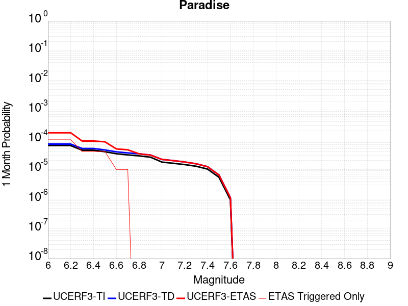 |  |  |

| Magnitude | 1 wk TI Prob | 1 wk TD Prob | 1 wk ETAS Prob | 1 wk ETAS/TD Gain | 1 wk ETAS Triggered Only | 1 mo TI Prob | 1 mo TD Prob | 1 mo ETAS Prob | 1 mo ETAS/TD Gain | 1 mo ETAS Triggered Only | 1 yr TI Prob | 1 yr TD Prob | 1 yr ETAS Prob | 1 yr ETAS/TD Gain | 1 yr ETAS Triggered Only | 10 yr TI Prob | 10 yr TD Prob | 10 yr ETAS Prob | 10 yr ETAS/TD Gain | 10 yr ETAS Triggered Only |
|-----|-----|-----|-----|-----|-----|-----|-----|-----|-----|-----|-----|-----|-----|-----|-----|-----|-----|-----|-----|-----|
| 6.0 | 1.4851273E-5 | 1.669466E-5 | 1.0778856E-4 | 6.45647 | 9.1095426E-5 | 6.364676E-5 | 7.154671E-5 | 2.0818006E-4 | 2.9097085 | 1.3664314E-4 | 7.7462377E-4 | 8.707567E-4 | 0.0010072808 | 1.156788 | 1.3664314E-4 | 0.0077192914 | 0.008675828 | 0.0090822 | 1.0468397 | 4.099294E-4 |
| 6.1 | 1.4851273E-5 | 1.669466E-5 | 1.0778856E-4 | 6.45647 | 9.1095426E-5 | 6.364676E-5 | 7.154671E-5 | 2.0818006E-4 | 2.9097085 | 1.3664314E-4 | 7.7462377E-4 | 8.707567E-4 | 0.0010072808 | 1.156788 | 1.3664314E-4 | 0.0077192914 | 0.008675828 | 0.0090822 | 1.0468397 | 4.099294E-4 |
| 6.2 | 1.4851273E-5 | 1.669466E-5 | 1.0778856E-4 | 6.45647 | 9.1095426E-5 | 6.364676E-5 | 7.154671E-5 | 2.0818006E-4 | 2.9097085 | 1.3664314E-4 | 7.7462377E-4 | 8.707567E-4 | 0.0010072808 | 1.156788 | 1.3664314E-4 | 0.0077192914 | 0.008675828 | 0.0090822 | 1.0468397 | 4.099294E-4 |
| 6.3 | 1.0426831E-5 | 1.1888599E-5 | 1.0298294E-4 | 8.662328 | 9.1095426E-5 | 4.4685654E-5 | 5.0950177E-5 | 1.8758635E-4 | 3.6817605 | 1.3664314E-4 | 5.43912E-4 | 6.201478E-4 | 7.5670617E-4 | 1.220203 | 1.3664314E-4 | 0.0054258266 | 0.0061847805 | 0.0064563765 | 1.0439136 | 2.7328628E-4 |
| 6.4 | 1.0426831E-5 | 1.1888599E-5 | 1.0298294E-4 | 8.662328 | 9.1095426E-5 | 4.4685654E-5 | 5.0950177E-5 | 1.8758635E-4 | 3.6817605 | 1.3664314E-4 | 5.43912E-4 | 6.201478E-4 | 7.5670617E-4 | 1.220203 | 1.3664314E-4 | 0.0054258266 | 0.0061847805 | 0.0064563765 | 1.0439136 | 2.7328628E-4 |
| 6.5 | 9.25027E-6 | 1.061994E-5 | 1.01714395E-4 | 9.57768 | 9.1095426E-5 | 3.964341E-5 | 4.5513265E-5 | 1.8215018E-4 | 4.002134 | 1.3664314E-4 | 4.8255164E-4 | 5.5398804E-4 | 6.905555E-4 | 1.246517 | 1.3664314E-4 | 0.0048150513 | 0.0055265697 | 0.0057530496 | 1.0409802 | 2.2773855E-4 |
| 6.6 | 7.904275E-6 | 9.159509E-6 | 9.159509E-6 | 1.0 | 0.0 | 3.3875025E-5 | 3.925447E-5 | 8.48004E-5 | 2.1602736 | 4.5547713E-5 | 4.1235037E-4 | 4.7782232E-4 | 5.233483E-4 | 1.095278 | 4.5547713E-5 | 0.0041158604 | 0.0047683464 | 0.0049043377 | 1.0285196 | 1.3664314E-4 |
| 6.7 | 7.2061953E-6 | 8.407234E-6 | 8.407234E-6 | 1.0 | 0.0 | 3.088333E-5 | 3.6030528E-5 | 8.1576596E-5 | 2.2640967 | 4.5547713E-5 | 3.7593965E-4 | 4.3858704E-4 | 4.8411477E-4 | 1.1038054 | 4.5547713E-5 | 0.003753043 | 0.0043775835 | 0.004513629 | 1.0310776 | 1.3664314E-4 |
| 6.8 | 6.6948724E-6 | 7.842153E-6 | 7.842153E-6 | 1.0 | 0.0 | 2.8691995E-5 | 3.3608812E-5 | 3.3608812E-5 | 1.0 | 0.0 | 3.4926904E-4 | 4.0911406E-4 | 4.0911406E-4 | 1.0 | 0.0 | 0.003487206 | 0.0040839664 | 0.0041746898 | 1.0222145 | 9.1095426E-5 |
| 6.9 | 6.0421025E-6 | 7.1306094E-6 | 7.1306094E-6 | 1.0 | 0.0 | 2.5894467E-5 | 3.0559415E-5 | 3.0559415E-5 | 1.0 | 0.0 | 3.1521954E-4 | 3.7200077E-4 | 3.7200077E-4 | 1.0 | 0.0 | 0.0031477278 | 0.0037141186 | 0.0038048758 | 1.0244356 | 9.1095426E-5 |
| 7.0 | 4.134091E-6 | 5.080301E-6 | 5.080301E-6 | 1.0 | 0.0 | 1.7717413E-5 | 2.1772545E-5 | 2.1772545E-5 | 1.0 | 0.0 | 2.1568815E-4 | 2.6505004E-4 | 2.6505004E-4 | 1.0 | 0.0 | 0.0021547892 | 0.002647492 | 0.002647492 | 1.0 | 0.0 |
| 7.1 | 3.7674888E-6 | 4.6318623E-6 | 4.6318623E-6 | 1.0 | 0.0 | 1.6146281E-5 | 1.9850695E-5 | 1.9850695E-5 | 1.0 | 0.0 | 1.9656324E-4 | 2.4165693E-4 | 2.4165693E-4 | 1.0 | 0.0 | 0.0019638946 | 0.0024140922 | 0.0024140922 | 1.0 | 0.0 |
| 7.2 | 3.4065345E-6 | 4.156717E-6 | 4.156717E-6 | 1.0 | 0.0 | 1.4599351E-5 | 1.7814387E-5 | 1.7814387E-5 | 1.0 | 0.0 | 1.777326E-4 | 2.1687007E-4 | 2.1687007E-4 | 1.0 | 0.0 | 0.0017759053 | 0.0021667324 | 0.0021667324 | 1.0 | 0.0 |
| 7.3 | 2.9934936E-6 | 3.6293113E-6 | 3.6293113E-6 | 1.0 | 0.0 | 1.2829195E-5 | 1.5554107E-5 | 1.5554107E-5 | 1.0 | 0.0 | 1.5618425E-4 | 1.8935627E-4 | 1.8935627E-4 | 1.0 | 0.0 | 0.0015607453 | 0.0018920946 | 0.0018920946 | 1.0 | 0.0 |
| 7.4 | 2.4049796E-6 | 2.8889801E-6 | 2.8889801E-6 | 1.0 | 0.0 | 1.0307015E-5 | 1.2381293E-5 | 1.2381293E-5 | 1.0 | 0.0 | 1.2548068E-4 | 1.5073326E-4 | 1.5073326E-4 | 1.0 | 0.0 | 0.0012540985 | 0.0015064516 | 0.0015064516 | 1.0 | 0.0 |
| 7.5 | 1.2710091E-6 | 1.5134664E-6 | 1.5134664E-6 | 1.0 | 0.0 | 5.44717E-6 | 6.486275E-6 | 6.486275E-6 | 1.0 | 0.0 | 6.631728E-5 | 7.896879E-5 | 7.896879E-5 | 1.0 | 0.0 | 6.6297496E-4 | 7.8952993E-4 | 7.8952993E-4 | 1.0 | 0.0 |
| 7.6 | 2.21172E-7 | 2.603958E-7 | 2.603958E-7 | 1.0 | 0.0 | 9.478797E-7 | 1.1159817E-6 | 1.1159817E-6 | 1.0 | 0.0 | 1.1540374E-5 | 1.3587022E-5 | 1.3587022E-5 | 1.0 | 0.0 | 1.1539775E-4 | 1.3586473E-4 | 1.3586473E-4 | 1.0 | 0.0 |

## Death Valley (Black Mtns Frontal)
*[(top)](#table-of-contents)*

| 1 Week | 1 Month | 1 Year | 10 Year |
|-----|-----|-----|-----|
|  |  |  |  |

| Magnitude | 1 wk TI Prob | 1 wk TD Prob | 1 wk ETAS Prob | 1 wk ETAS/TD Gain | 1 wk ETAS Triggered Only | 1 mo TI Prob | 1 mo TD Prob | 1 mo ETAS Prob | 1 mo ETAS/TD Gain | 1 mo ETAS Triggered Only | 1 yr TI Prob | 1 yr TD Prob | 1 yr ETAS Prob | 1 yr ETAS/TD Gain | 1 yr ETAS Triggered Only | 10 yr TI Prob | 10 yr TD Prob | 10 yr ETAS Prob | 10 yr ETAS/TD Gain | 10 yr ETAS Triggered Only |
|-----|-----|-----|-----|-----|-----|-----|-----|-----|-----|-----|-----|-----|-----|-----|-----|-----|-----|-----|-----|-----|
| 6.0 | 1.6707214E-5 | 1.867021E-5 | 6.421707E-5 | 3.4395473 | 4.5547713E-5 | 7.160038E-5 | 8.0012775E-5 | 1.2555683E-4 | 1.5692099 | 4.5547713E-5 | 8.71386E-4 | 9.737278E-4 | 0.0011557413 | 1.1869243 | 1.8219085E-4 | 0.00867977 | 0.009695467 | 0.009966103 | 1.0279137 | 2.7328628E-4 |
| 6.1 | 1.6707214E-5 | 1.867021E-5 | 6.421707E-5 | 3.4395473 | 4.5547713E-5 | 7.160038E-5 | 8.0012775E-5 | 1.2555683E-4 | 1.5692099 | 4.5547713E-5 | 8.71386E-4 | 9.737278E-4 | 0.0011557413 | 1.1869243 | 1.8219085E-4 | 0.00867977 | 0.009695467 | 0.009966103 | 1.0279137 | 2.7328628E-4 |
| 6.2 | 1.6707214E-5 | 1.867021E-5 | 6.421707E-5 | 3.4395473 | 4.5547713E-5 | 7.160038E-5 | 8.0012775E-5 | 1.2555683E-4 | 1.5692099 | 4.5547713E-5 | 8.71386E-4 | 9.737278E-4 | 0.0011557413 | 1.1869243 | 1.8219085E-4 | 0.00867977 | 0.009695467 | 0.009966103 | 1.0279137 | 2.7328628E-4 |
| 6.3 | 1.6707214E-5 | 1.867021E-5 | 6.421707E-5 | 3.4395473 | 4.5547713E-5 | 7.160038E-5 | 8.0012775E-5 | 1.2555683E-4 | 1.5692099 | 4.5547713E-5 | 8.71386E-4 | 9.737278E-4 | 0.0011557413 | 1.1869243 | 1.8219085E-4 | 0.00867977 | 0.009695467 | 0.009966103 | 1.0279137 | 2.7328628E-4 |
| 6.4 | 1.5515609E-5 | 1.733816E-5 | 1.733816E-5 | 1.0 | 0.0 | 6.649377E-5 | 7.430431E-5 | 7.430431E-5 | 1.0 | 0.0 | 8.0926094E-4 | 9.0428564E-4 | 0.0010408052 | 1.1509695 | 1.3664314E-4 | 0.008063202 | 0.009006744 | 0.009232432 | 1.0250576 | 2.2773855E-4 |
| 6.5 | 1.5515609E-5 | 1.733816E-5 | 1.733816E-5 | 1.0 | 0.0 | 6.649377E-5 | 7.430431E-5 | 7.430431E-5 | 1.0 | 0.0 | 8.0926094E-4 | 9.0428564E-4 | 0.0010408052 | 1.1509695 | 1.3664314E-4 | 0.008063202 | 0.009006744 | 0.009232432 | 1.0250576 | 2.2773855E-4 |
| 6.6 | 1.5041828E-5 | 1.6809092E-5 | 1.6809092E-5 | 1.0 | 0.0 | 6.4463384E-5 | 7.203701E-5 | 7.203701E-5 | 1.0 | 0.0 | 7.8455906E-4 | 8.767036E-4 | 0.0010132269 | 1.1557235 | 1.3664314E-4 | 0.00781795 | 0.008733105 | 0.008958855 | 1.0258498 | 2.2773855E-4 |
| 6.7 | 1.4634985E-5 | 1.6355965E-5 | 1.6355965E-5 | 1.0 | 0.0 | 6.271985E-5 | 7.009514E-5 | 7.009514E-5 | 1.0 | 0.0 | 7.6334673E-4 | 8.5307995E-4 | 9.896065E-4 | 1.1600395 | 1.3664314E-4 | 0.007607299 | 0.008498689 | 0.008724492 | 1.0265691 | 2.2773855E-4 |
| 6.8 | 1.4209158E-5 | 1.5881998E-5 | 1.5881998E-5 | 1.0 | 0.0 | 6.089497E-5 | 6.806396E-5 | 6.806396E-5 | 1.0 | 0.0 | 7.4114406E-4 | 8.283693E-4 | 9.648992E-4 | 1.1648177 | 1.3664314E-4 | 0.007386771 | 0.00825343 | 0.00847929 | 1.0273654 | 2.2773855E-4 |
| 6.9 | 1.3780098E-5 | 1.5404545E-5 | 1.5404545E-5 | 1.0 | 0.0 | 5.9056227E-5 | 6.6017834E-5 | 6.6017834E-5 | 1.0 | 0.0 | 7.1877235E-4 | 8.034762E-4 | 9.4000954E-4 | 1.1699283 | 1.3664314E-4 | 0.0071645193 | 0.008006307 | 0.008232223 | 1.0282172 | 2.2773855E-4 |
| 7.0 | 1.3585064E-5 | 1.5188108E-5 | 1.5188108E-5 | 1.0 | 0.0 | 5.8220405E-5 | 6.5090295E-5 | 6.5090295E-5 | 1.0 | 0.0 | 7.086029E-4 | 7.9219165E-4 | 9.287266E-4 | 1.1723508 | 1.3664314E-4 | 0.007063476 | 0.007894269 | 0.00812021 | 1.0286208 | 2.2773855E-4 |
| 7.1 | 1.3398601E-5 | 1.4981292E-5 | 1.4981292E-5 | 1.0 | 0.0 | 5.742131E-5 | 6.420399E-5 | 6.420399E-5 | 1.0 | 0.0 | 6.9888023E-4 | 7.814087E-4 | 9.17945E-4 | 1.174731 | 1.3664314E-4 | 0.0069668638 | 0.0077871997 | 0.008013165 | 1.0290174 | 2.2773855E-4 |
| 7.2 | 1.3126312E-5 | 1.4679515E-5 | 1.4679515E-5 | 1.0 | 0.0 | 5.6254412E-5 | 6.2910716E-5 | 6.2910716E-5 | 1.0 | 0.0 | 6.846822E-4 | 7.656743E-4 | 9.0221275E-4 | 1.1783246 | 1.3664314E-4 | 0.006825765 | 0.007630946 | 0.007856946 | 1.0296164 | 2.2773855E-4 |
| 7.3 | 1.2922429E-5 | 1.4453743E-5 | 1.4453743E-5 | 1.0 | 0.0 | 5.5380664E-5 | 6.194317E-5 | 6.194317E-5 | 1.0 | 0.0 | 6.74051E-4 | 7.5390254E-4 | 8.904427E-4 | 1.1811111 | 1.3664314E-4 | 0.006720101 | 0.007514031 | 0.0077400585 | 1.0300807 | 2.2773855E-4 |
| 7.4 | 1.2768878E-5 | 1.4283726E-5 | 1.4283726E-5 | 1.0 | 0.0 | 5.4722615E-5 | 6.121456E-5 | 6.121456E-5 | 1.0 | 0.0 | 6.660441E-4 | 7.4503786E-4 | 8.3606545E-4 | 1.1221784 | 9.1095426E-5 | 0.0066405144 | 0.00742598 | 0.007606818 | 1.0243521 | 1.8219085E-4 |
| 7.5 | 1.2521929E-5 | 1.401197E-5 | 1.401197E-5 | 1.0 | 0.0 | 5.366431E-5 | 6.004995E-5 | 6.004995E-5 | 1.0 | 0.0 | 6.531671E-4 | 7.308683E-4 | 8.218972E-4 | 1.1245489 | 9.1095426E-5 | 0.006512506 | 0.007285223 | 0.007466086 | 1.024826 | 1.8219085E-4 |
| 7.6 | 1.1301089E-5 | 1.2648108E-5 | 1.2648108E-5 | 1.0 | 0.0 | 4.8432343E-5 | 5.4205084E-5 | 5.4205084E-5 | 1.0 | 0.0 | 5.895042E-4 | 6.5975235E-4 | 7.507877E-4 | 1.137984 | 9.1095426E-5 | 0.0058794282 | 0.006578489 | 0.0067594815 | 1.0275128 | 1.8219085E-4 |
| 7.7 | 9.189108E-6 | 1.02833255E-5 | 1.02833255E-5 | 1.0 | 0.0 | 3.93813E-5 | 4.407068E-5 | 4.407068E-5 | 1.0 | 0.0 | 4.7936183E-4 | 5.364335E-4 | 6.2748004E-4 | 1.1697258 | 9.1095426E-5 | 0.004783291 | 0.005351897 | 0.0055331127 | 1.0338601 | 1.8219085E-4 |
| 7.8 | 3.4586725E-7 | 3.648256E-7 | 3.648256E-7 | 1.0 | 0.0 | 1.4822873E-6 | 1.5635374E-6 | 1.5635374E-6 | 1.0 | 0.0 | 1.80467E-5 | 1.9035906E-5 | 6.458275E-5 | 3.3926806 | 4.5547713E-5 | 1.8045233E-4 | 1.903432E-4 | 2.3588224E-4 | 1.239247 | 4.5547713E-5 |
| 7.9 | 2.5591178E-9 | 2.6696687E-9 | 2.6696687E-9 | 1.0 | 0.0 | 1.0967647E-8 | 1.1441437E-8 | 1.1441437E-8 | 1.0 | 0.0 | 1.335311E-7 | 1.392995E-7 | 1.392995E-7 | 1.0 | 0.0 | 1.3353102E-6 | 1.3929949E-6 | 1.3929949E-6 | 1.0 | 0.0 |

## Death Valley (No)
*[(top)](#table-of-contents)*

| 1 Week | 1 Month | 1 Year | 10 Year |
|-----|-----|-----|-----|
|  |  |  |  |

| Magnitude | 1 wk TI Prob | 1 wk TD Prob | 1 wk ETAS Prob | 1 wk ETAS/TD Gain | 1 wk ETAS Triggered Only | 1 mo TI Prob | 1 mo TD Prob | 1 mo ETAS Prob | 1 mo ETAS/TD Gain | 1 mo ETAS Triggered Only | 1 yr TI Prob | 1 yr TD Prob | 1 yr ETAS Prob | 1 yr ETAS/TD Gain | 1 yr ETAS Triggered Only | 10 yr TI Prob | 10 yr TD Prob | 10 yr ETAS Prob | 10 yr ETAS/TD Gain | 10 yr ETAS Triggered Only |
|-----|-----|-----|-----|-----|-----|-----|-----|-----|-----|-----|-----|-----|-----|-----|-----|-----|-----|-----|-----|-----|
| 6.0 | 2.0074807E-5 | 2.2500011E-5 | 2.2500011E-5 | 1.0 | 0.0 | 8.603206E-5 | 9.6425094E-5 | 9.6425094E-5 | 1.0 | 0.0 | 0.001046937 | 0.0011733507 | 0.0012643392 | 1.0775459 | 9.1095426E-5 | 0.010420183 | 0.011672469 | 0.011852534 | 1.0154264 | 1.8219085E-4 |
| 6.1 | 2.0074807E-5 | 2.2500011E-5 | 2.2500011E-5 | 1.0 | 0.0 | 8.603206E-5 | 9.6425094E-5 | 9.6425094E-5 | 1.0 | 0.0 | 0.001046937 | 0.0011733507 | 0.0012643392 | 1.0775459 | 9.1095426E-5 | 0.010420183 | 0.011672469 | 0.011852534 | 1.0154264 | 1.8219085E-4 |
| 6.2 | 2.0074807E-5 | 2.2500011E-5 | 2.2500011E-5 | 1.0 | 0.0 | 8.603206E-5 | 9.6425094E-5 | 9.6425094E-5 | 1.0 | 0.0 | 0.001046937 | 0.0011733507 | 0.0012643392 | 1.0775459 | 9.1095426E-5 | 0.010420183 | 0.011672469 | 0.011852534 | 1.0154264 | 1.8219085E-4 |
| 6.3 | 1.9050609E-5 | 2.1336878E-5 | 2.1336878E-5 | 1.0 | 0.0 | 8.164292E-5 | 9.14406E-5 | 9.14406E-5 | 1.0 | 0.0 | 9.935491E-4 | 0.0011127274 | 0.0012037215 | 1.0817757 | 9.1095426E-5 | 0.009891188 | 0.011072383 | 0.011252557 | 1.0162723 | 1.8219085E-4 |
| 6.4 | 1.9050609E-5 | 2.1336878E-5 | 2.1336878E-5 | 1.0 | 0.0 | 8.164292E-5 | 9.14406E-5 | 9.14406E-5 | 1.0 | 0.0 | 9.935491E-4 | 0.0011127274 | 0.0012037215 | 1.0817757 | 9.1095426E-5 | 0.009891188 | 0.011072383 | 0.011252557 | 1.0162723 | 1.8219085E-4 |
| 6.5 | 1.8367004E-5 | 2.0560943E-5 | 2.0560943E-5 | 1.0 | 0.0 | 7.8713354E-5 | 8.811538E-5 | 8.811538E-5 | 1.0 | 0.0 | 9.5791375E-4 | 0.0010722834 | 0.0011632812 | 1.0848635 | 9.1095426E-5 | 0.009537951 | 0.010671882 | 0.010852128 | 1.0168898 | 1.8219085E-4 |
| 6.6 | 1.779439E-5 | 1.9910865E-5 | 1.9910865E-5 | 1.0 | 0.0 | 7.625944E-5 | 8.532952E-5 | 8.532952E-5 | 1.0 | 0.0 | 9.280632E-4 | 0.0010383982 | 0.001129399 | 1.0876358 | 9.1095426E-5 | 0.009241969 | 0.01033622 | 0.010516527 | 1.0174443 | 1.8219085E-4 |
| 6.7 | 1.7025437E-5 | 1.9043366E-5 | 1.9043366E-5 | 1.0 | 0.0 | 7.296412E-5 | 8.16119E-5 | 8.16119E-5 | 1.0 | 0.0 | 8.87976E-4 | 9.931781E-4 | 0.0010841831 | 1.09163 | 9.1095426E-5 | 0.008844362 | 0.009888114 | 0.010068503 | 1.0182431 | 1.8219085E-4 |
| 6.8 | 1.6545107E-5 | 1.8512486E-5 | 1.8512486E-5 | 1.0 | 0.0 | 7.090568E-5 | 7.933685E-5 | 7.933685E-5 | 1.0 | 0.0 | 8.629347E-4 | 9.655042E-4 | 0.0010565117 | 1.094259 | 9.1095426E-5 | 0.008595915 | 0.009613798 | 0.009794238 | 1.0187688 | 1.8219085E-4 |
| 6.9 | 1.615478E-5 | 1.8087536E-5 | 1.8087536E-5 | 1.0 | 0.0 | 6.9232934E-5 | 7.7515746E-5 | 7.7515746E-5 | 1.0 | 0.0 | 8.4258494E-4 | 9.4335165E-4 | 0.0010343611 | 1.0964746 | 9.1095426E-5 | 0.008393973 | 0.009394166 | 0.009574645 | 1.0192119 | 1.8219085E-4 |
| 7.0 | 1.5894311E-5 | 1.7805492E-5 | 1.7805492E-5 | 1.0 | 0.0 | 6.81167E-5 | 7.630706E-5 | 7.630706E-5 | 1.0 | 0.0 | 8.2900526E-4 | 9.286485E-4 | 0.0010196593 | 1.0980035 | 9.1095426E-5 | 0.008259195 | 0.0092483675 | 0.009428874 | 1.0195175 | 1.8219085E-4 |
| 7.1 | 1.5602263E-5 | 1.7483448E-5 | 1.7483448E-5 | 1.0 | 0.0 | 6.6865134E-5 | 7.492694E-5 | 7.492694E-5 | 1.0 | 0.0 | 8.137789E-4 | 9.118598E-4 | 0.0010028721 | 1.0998096 | 9.1095426E-5 | 0.008108052 | 0.009081865 | 0.009262401 | 1.0198787 | 1.8219085E-4 |
| 7.2 | 1.5323829E-5 | 1.7170574E-5 | 1.7170574E-5 | 1.0 | 0.0 | 6.56719E-5 | 7.358614E-5 | 7.358614E-5 | 1.0 | 0.0 | 7.99262E-4 | 8.95549E-4 | 9.865628E-4 | 1.1016291 | 9.1095426E-5 | 0.007963934 | 0.008920078 | 0.009100644 | 1.0202426 | 1.8219085E-4 |
| 7.3 | 1.4556212E-5 | 1.6302403E-5 | 1.6302403E-5 | 1.0 | 0.0 | 6.238227E-5 | 6.98656E-5 | 6.98656E-5 | 1.0 | 0.0 | 7.592395E-4 | 8.502876E-4 | 9.413056E-4 | 1.1070437 | 9.1095426E-5 | 0.0075665074 | 0.008470987 | 0.008651635 | 1.0213255 | 1.8219085E-4 |
| 7.4 | 1.411725E-5 | 1.580791E-5 | 1.580791E-5 | 1.0 | 0.0 | 6.0501097E-5 | 6.7746456E-5 | 6.7746456E-5 | 1.0 | 0.0 | 7.363519E-4 | 8.245068E-4 | 9.155271E-4 | 1.1103936 | 9.1095426E-5 | 0.0073391674 | 0.008215112 | 0.008395806 | 1.0219953 | 1.8219085E-4 |
| 7.5 | 1.3503312E-5 | 1.512624E-5 | 1.512624E-5 | 1.0 | 0.0 | 5.7870053E-5 | 6.4825166E-5 | 6.4825166E-5 | 1.0 | 0.0 | 7.043401E-4 | 7.889664E-4 | 8.7999E-4 | 1.1153706 | 9.1095426E-5 | 0.007021119 | 0.007862279 | 0.008043038 | 1.0229906 | 1.8219085E-4 |
| 7.6 | 1.1279839E-5 | 1.2626287E-5 | 1.2626287E-5 | 1.0 | 0.0 | 4.834127E-5 | 5.4111566E-5 | 5.4111566E-5 | 1.0 | 0.0 | 5.88396E-4 | 6.5861444E-4 | 7.496499E-4 | 1.1382226 | 9.1095426E-5 | 0.005868405 | 0.006567178 | 0.006748172 | 1.0275605 | 1.8219085E-4 |
| 7.7 | 9.189108E-6 | 1.02833255E-5 | 1.02833255E-5 | 1.0 | 0.0 | 3.93813E-5 | 4.407068E-5 | 4.407068E-5 | 1.0 | 0.0 | 4.7936183E-4 | 5.364335E-4 | 6.2748004E-4 | 1.1697258 | 9.1095426E-5 | 0.004783291 | 0.005351897 | 0.0055331127 | 1.0338601 | 1.8219085E-4 |
| 7.8 | 3.4586725E-7 | 3.648256E-7 | 3.648256E-7 | 1.0 | 0.0 | 1.4822873E-6 | 1.5635374E-6 | 1.5635374E-6 | 1.0 | 0.0 | 1.80467E-5 | 1.9035906E-5 | 6.458275E-5 | 3.3926806 | 4.5547713E-5 | 1.8045233E-4 | 1.903432E-4 | 2.3588224E-4 | 1.239247 | 4.5547713E-5 |
| 7.9 | 2.5591178E-9 | 2.6696687E-9 | 2.6696687E-9 | 1.0 | 0.0 | 1.0967647E-8 | 1.1441437E-8 | 1.1441437E-8 | 1.0 | 0.0 | 1.335311E-7 | 1.392995E-7 | 1.392995E-7 | 1.0 | 0.0 | 1.3353102E-6 | 1.3929949E-6 | 1.3929949E-6 | 1.0 | 0.0 |

## Death Valley (Fish Lake Valley)
*[(top)](#table-of-contents)*

| 1 Week | 1 Month | 1 Year | 10 Year |
|-----|-----|-----|-----|
|  |  |  |  |

| Magnitude | 1 wk TI Prob | 1 wk TD Prob | 1 wk ETAS Prob | 1 wk ETAS/TD Gain | 1 wk ETAS Triggered Only | 1 mo TI Prob | 1 mo TD Prob | 1 mo ETAS Prob | 1 mo ETAS/TD Gain | 1 mo ETAS Triggered Only | 1 yr TI Prob | 1 yr TD Prob | 1 yr ETAS Prob | 1 yr ETAS/TD Gain | 1 yr ETAS Triggered Only | 10 yr TI Prob | 10 yr TD Prob | 10 yr ETAS Prob | 10 yr ETAS/TD Gain | 10 yr ETAS Triggered Only |
|-----|-----|-----|-----|-----|-----|-----|-----|-----|-----|-----|-----|-----|-----|-----|-----|-----|-----|-----|-----|-----|
| 6.0 | 3.872328E-5 | 4.7267185E-5 | 4.7267185E-5 | 1.0 | 0.0 | 1.6594635E-4 | 2.0255962E-4 | 2.0255962E-4 | 1.0 | 0.0 | 0.0020185246 | 0.00246352 | 0.002554391 | 1.0368867 | 9.1095426E-5 | 0.02000288 | 0.02438804 | 0.024565788 | 1.0072883 | 1.8219085E-4 |
| 6.1 | 3.872328E-5 | 4.7267185E-5 | 4.7267185E-5 | 1.0 | 0.0 | 1.6594635E-4 | 2.0255962E-4 | 2.0255962E-4 | 1.0 | 0.0 | 0.0020185246 | 0.00246352 | 0.002554391 | 1.0368867 | 9.1095426E-5 | 0.02000288 | 0.02438804 | 0.024565788 | 1.0072883 | 1.8219085E-4 |
| 6.2 | 3.872328E-5 | 4.7267185E-5 | 4.7267185E-5 | 1.0 | 0.0 | 1.6594635E-4 | 2.0255962E-4 | 2.0255962E-4 | 1.0 | 0.0 | 0.0020185246 | 0.00246352 | 0.002554391 | 1.0368867 | 9.1095426E-5 | 0.02000288 | 0.02438804 | 0.024565788 | 1.0072883 | 1.8219085E-4 |
| 6.3 | 2.8356371E-5 | 3.3609682E-5 | 3.3609682E-5 | 1.0 | 0.0 | 1.2152165E-4 | 1.4403398E-4 | 1.4403398E-4 | 1.0 | 0.0 | 0.0014785219 | 0.0017522823 | 0.0018432181 | 1.0518956 | 9.1095426E-5 | 0.014687235 | 0.017391697 | 0.01757072 | 1.0102936 | 1.8219085E-4 |
| 6.4 | 2.8356371E-5 | 3.3609682E-5 | 3.3609682E-5 | 1.0 | 0.0 | 1.2152165E-4 | 1.4403398E-4 | 1.4403398E-4 | 1.0 | 0.0 | 0.0014785219 | 0.0017522823 | 0.0018432181 | 1.0518956 | 9.1095426E-5 | 0.014687235 | 0.017391697 | 0.01757072 | 1.0102936 | 1.8219085E-4 |
| 6.5 | 2.4448687E-5 | 2.8607421E-5 | 2.8607421E-5 | 1.0 | 0.0 | 1.0477588E-4 | 1.2259776E-4 | 1.2259776E-4 | 1.0 | 0.0 | 0.0012748998 | 0.0014916563 | 0.0015826158 | 1.0609789 | 9.1095426E-5 | 0.012676105 | 0.01482131 | 0.0150008 | 1.0121104 | 1.8219085E-4 |
| 6.6 | 2.1298161E-5 | 2.465998E-5 | 2.465998E-5 | 1.0 | 0.0 | 9.127464E-5 | 1.0568153E-4 | 1.0568153E-4 | 1.0 | 0.0 | 0.0011107022 | 0.001285947 | 0.0013769254 | 1.0707481 | 9.1095426E-5 | 0.011051672 | 0.012788472 | 0.0129683325 | 1.0140643 | 1.8219085E-4 |
| 6.7 | 1.8959729E-5 | 2.1780937E-5 | 2.1780937E-5 | 1.0 | 0.0 | 8.125345E-5 | 9.334368E-5 | 9.334368E-5 | 1.0 | 0.0 | 9.888117E-4 | 0.0011358924 | 0.0012268843 | 1.0801061 | 9.1095426E-5 | 0.009844234 | 0.0113035245 | 0.011483656 | 1.0159359 | 1.8219085E-4 |
| 6.8 | 1.6691629E-5 | 1.901828E-5 | 1.901828E-5 | 1.0 | 0.0 | 7.153359E-5 | 8.150447E-5 | 8.150447E-5 | 1.0 | 0.0 | 8.7057345E-4 | 9.918819E-4 | 0.001082887 | 1.0917499 | 9.1095426E-5 | 0.008671708 | 0.009876307 | 0.010056698 | 1.0182651 | 1.8219085E-4 |
| 6.9 | 1.450505E-5 | 1.6389482E-5 | 1.6389482E-5 | 1.0 | 0.0 | 6.216302E-5 | 7.02388E-5 | 7.02388E-5 | 1.0 | 0.0 | 7.5657194E-4 | 8.5483067E-4 | 9.458482E-4 | 1.1064744 | 9.1095426E-5 | 0.007540013 | 0.008516356 | 0.008696996 | 1.0212109 | 1.8219085E-4 |
| 7.0 | 1.2940855E-5 | 1.4537924E-5 | 1.4537924E-5 | 1.0 | 0.0 | 5.545963E-5 | 6.230393E-5 | 6.230393E-5 | 1.0 | 0.0 | 6.750118E-4 | 7.5829215E-4 | 8.493185E-4 | 1.1200413 | 9.1095426E-5 | 0.006729651 | 0.007557665 | 0.007738479 | 1.0239246 | 1.8219085E-4 |
| 7.1 | 1.2544658E-5 | 1.4078161E-5 | 1.4078161E-5 | 1.0 | 0.0 | 5.3761712E-5 | 6.0333616E-5 | 6.0333616E-5 | 1.0 | 0.0 | 6.5435225E-4 | 7.343198E-4 | 8.253483E-4 | 1.1239631 | 9.1095426E-5 | 0.006524288 | 0.007319527 | 0.0075003845 | 1.0247089 | 1.8219085E-4 |
| 7.2 | 1.2489416E-5 | 1.4015628E-5 | 1.4015628E-5 | 1.0 | 0.0 | 5.3524967E-5 | 6.0065628E-5 | 6.0065628E-5 | 1.0 | 0.0 | 6.514716E-4 | 7.3105923E-4 | 8.220881E-4 | 1.1245164 | 9.1095426E-5 | 0.006495651 | 0.007287136 | 0.007467999 | 1.0248195 | 1.8219085E-4 |
| 7.3 | 1.2368307E-5 | 1.3879767E-5 | 1.3879767E-5 | 1.0 | 0.0 | 5.3005948E-5 | 5.948339E-5 | 5.948339E-5 | 1.0 | 0.0 | 6.451563E-4 | 7.2397524E-4 | 8.1500475E-4 | 1.1257356 | 9.1095426E-5 | 0.0064328653 | 0.0072167586 | 0.0073976344 | 1.0250633 | 1.8219085E-4 |
| 7.4 | 1.2161707E-5 | 1.3647823E-5 | 1.3647823E-5 | 1.0 | 0.0 | 5.212056E-5 | 5.8489393E-5 | 5.8489393E-5 | 1.0 | 0.0 | 6.3438306E-4 | 7.1188126E-4 | 8.029118E-4 | 1.1278733 | 9.1095426E-5 | 0.006325751 | 0.0070965975 | 0.007277495 | 1.0254908 | 1.8219085E-4 |
| 7.5 | 1.1707948E-5 | 1.3145472E-5 | 1.3145472E-5 | 1.0 | 0.0 | 5.0175953E-5 | 5.633655E-5 | 5.633655E-5 | 1.0 | 0.0 | 6.10721E-4 | 6.8568724E-4 | 7.7672023E-4 | 1.1327616 | 9.1095426E-5 | 0.0060904534 | 0.006836299 | 0.007017244 | 1.0264683 | 1.8219085E-4 |
| 7.6 | 1.0319538E-5 | 1.1579585E-5 | 1.1579585E-5 | 1.0 | 0.0 | 4.4225842E-5 | 4.9625876E-5 | 4.9625876E-5 | 1.0 | 0.0 | 5.383166E-4 | 6.040327E-4 | 6.950731E-4 | 1.150721 | 9.1095426E-5 | 0.0053701443 | 0.0060244408 | 0.006205534 | 1.0300598 | 1.8219085E-4 |
| 7.7 | 8.937764E-6 | 1.0022746E-5 | 1.0022746E-5 | 1.0 | 0.0 | 3.830414E-5 | 4.295395E-5 | 4.295395E-5 | 1.0 | 0.0 | 4.6625308E-4 | 5.228439E-4 | 6.138917E-4 | 1.1741395 | 9.1095426E-5 | 0.0046527605 | 0.0052166474 | 0.005397888 | 1.0347427 | 1.8219085E-4 |
| 7.8 | 3.108007E-7 | 3.284649E-7 | 3.284649E-7 | 1.0 | 0.0 | 1.3320023E-6 | 1.407706E-6 | 1.407706E-6 | 1.0 | 0.0 | 1.6217007E-5 | 1.713869E-5 | 6.268562E-5 | 3.6575503 | 4.5547713E-5 | 1.6215823E-4 | 1.7137405E-4 | 2.1691396E-4 | 1.265734 | 4.5547713E-5 |
| 7.9 | 2.5591178E-9 | 2.6696687E-9 | 2.6696687E-9 | 1.0 | 0.0 | 1.0967647E-8 | 1.1441437E-8 | 1.1441437E-8 | 1.0 | 0.0 | 1.335311E-7 | 1.392995E-7 | 1.392995E-7 | 1.0 | 0.0 | 1.3353102E-6 | 1.3929949E-6 | 1.3929949E-6 | 1.0 | 0.0 |

## Baker
*[(top)](#table-of-contents)*

| 1 Week | 1 Month | 1 Year | 10 Year |
|-----|-----|-----|-----|
|  |  |  |  |

| Magnitude | 1 wk TI Prob | 1 wk TD Prob | 1 wk ETAS Prob | 1 wk ETAS/TD Gain | 1 wk ETAS Triggered Only | 1 mo TI Prob | 1 mo TD Prob | 1 mo ETAS Prob | 1 mo ETAS/TD Gain | 1 mo ETAS Triggered Only | 1 yr TI Prob | 1 yr TD Prob | 1 yr ETAS Prob | 1 yr ETAS/TD Gain | 1 yr ETAS Triggered Only | 10 yr TI Prob | 10 yr TD Prob | 10 yr ETAS Prob | 10 yr ETAS/TD Gain | 10 yr ETAS Triggered Only |
|-----|-----|-----|-----|-----|-----|-----|-----|-----|-----|-----|-----|-----|-----|-----|-----|-----|-----|-----|-----|-----|
| 6.0 | 5.695525E-6 | 5.8348332E-6 | 5.8348332E-6 | 1.0 | 0.0 | 2.4409164E-5 | 2.5006211E-5 | 7.0552785E-5 | 2.8214104 | 4.5547713E-5 | 2.9714106E-4 | 3.044121E-4 | 4.4101363E-4 | 1.4487388 | 1.3664314E-4 | 0.0029674405 | 0.0030403468 | 0.0032219836 | 1.0597422 | 1.8219085E-4 |
| 6.1 | 5.695525E-6 | 5.8348332E-6 | 5.8348332E-6 | 1.0 | 0.0 | 2.4409164E-5 | 2.5006211E-5 | 7.0552785E-5 | 2.8214104 | 4.5547713E-5 | 2.9714106E-4 | 3.044121E-4 | 4.4101363E-4 | 1.4487388 | 1.3664314E-4 | 0.0029674405 | 0.0030403468 | 0.0032219836 | 1.0597422 | 1.8219085E-4 |
| 6.2 | 5.695525E-6 | 5.8348332E-6 | 5.8348332E-6 | 1.0 | 0.0 | 2.4409164E-5 | 2.5006211E-5 | 7.0552785E-5 | 2.8214104 | 4.5547713E-5 | 2.9714106E-4 | 3.044121E-4 | 4.4101363E-4 | 1.4487388 | 1.3664314E-4 | 0.0029674405 | 0.0030403468 | 0.0032219836 | 1.0597422 | 1.8219085E-4 |
| 6.3 | 3.2995713E-6 | 3.3836648E-6 | 3.3836648E-6 | 1.0 | 0.0 | 1.4140943E-5 | 1.4501343E-5 | 1.4501343E-5 | 1.0 | 0.0 | 1.7215237E-4 | 1.7654001E-4 | 2.6761935E-4 | 1.5159132 | 9.1095426E-5 | 0.0017201907 | 0.0017640449 | 0.0018549795 | 1.051549 | 9.1095426E-5 |
| 6.4 | 3.2995713E-6 | 3.3836648E-6 | 3.3836648E-6 | 1.0 | 0.0 | 1.4140943E-5 | 1.4501343E-5 | 1.4501343E-5 | 1.0 | 0.0 | 1.7215237E-4 | 1.7654001E-4 | 2.6761935E-4 | 1.5159132 | 9.1095426E-5 | 0.0017201907 | 0.0017640449 | 0.0018549795 | 1.051549 | 9.1095426E-5 |
| 6.5 | 2.782202E-6 | 2.8558384E-6 | 2.8558384E-6 | 1.0 | 0.0 | 1.1923668E-5 | 1.2239252E-5 | 1.2239252E-5 | 1.0 | 0.0 | 1.4516099E-4 | 1.4900303E-4 | 2.4008488E-4 | 1.6112752 | 9.1095426E-5 | 0.001450662 | 0.001489064 | 0.0015800238 | 1.0610852 | 9.1095426E-5 |
| 6.6 | 2.3163404E-6 | 2.3809182E-6 | 2.3809182E-6 | 1.0 | 0.0 | 9.927136E-6 | 1.0203897E-5 | 1.0203897E-5 | 1.0 | 0.0 | 1.20856166E-4 | 1.2422555E-4 | 2.1530967E-4 | 1.7332155 | 9.1095426E-5 | 0.0012079047 | 0.0012415814 | 0.0013325637 | 1.0732794 | 9.1095426E-5 |
| 6.7 | 2.037056E-6 | 2.0964987E-6 | 2.0964987E-6 | 1.0 | 0.0 | 8.7302105E-6 | 8.984965E-6 | 8.984965E-6 | 1.0 | 0.0 | 1.0628513E-4 | 1.09386616E-4 | 2.0047207E-4 | 1.8326929 | 9.1095426E-5 | 0.0010623431 | 0.0010933438 | 0.0011843398 | 1.083227 | 9.1095426E-5 |
| 6.8 | 1.8356744E-6 | 1.8915271E-6 | 1.8915271E-6 | 1.0 | 0.0 | 7.867153E-6 | 8.10652E-6 | 8.10652E-6 | 1.0 | 0.0 | 9.577837E-5 | 9.869256E-5 | 1.8977899E-4 | 1.9229311 | 9.1095426E-5 | 9.57371E-4 | 9.865012E-4 | 0.0010775068 | 1.0922508 | 9.1095426E-5 |
| 6.9 | 1.6310546E-6 | 1.6832057E-6 | 1.6832057E-6 | 1.0 | 0.0 | 6.9902153E-6 | 7.2137195E-6 | 7.2137195E-6 | 1.0 | 0.0 | 8.510255E-5 | 8.782361E-5 | 1.7891104E-4 | 2.0371633 | 9.1095426E-5 | 8.5069967E-4 | 8.779003E-4 | 9.6891576E-4 | 1.103674 | 9.1095426E-5 |
| 7.0 | 1.2058036E-6 | 1.2508652E-6 | 1.2508652E-6 | 1.0 | 0.0 | 5.1677193E-6 | 5.3608405E-6 | 5.3608405E-6 | 1.0 | 0.0 | 6.291517E-5 | 6.52663E-5 | 1.5635577E-4 | 2.3956587 | 9.1095426E-5 | 6.289736E-4 | 6.5247365E-4 | 7.435096E-4 | 1.1395243 | 9.1095426E-5 |
| 7.1 | 1.052382E-6 | 1.0951596E-6 | 1.0951596E-6 | 1.0 | 0.0 | 4.5102006E-6 | 4.693533E-6 | 4.693533E-6 | 1.0 | 0.0 | 5.491031E-5 | 5.7142275E-5 | 1.4823249E-4 | 2.594095 | 9.1095426E-5 | 5.4896745E-4 | 5.712767E-4 | 6.6232006E-4 | 1.1593683 | 9.1095426E-5 |
| 7.2 | 1.0067454E-6 | 1.0487698E-6 | 1.0487698E-6 | 1.0 | 0.0 | 4.3146156E-6 | 4.4947205E-6 | 4.4947205E-6 | 1.0 | 0.0 | 5.252918E-5 | 5.4721855E-5 | 1.4581229E-4 | 2.664608 | 9.1095426E-5 | 5.251676E-4 | 5.4708467E-4 | 6.3813024E-4 | 1.1664195 | 9.1095426E-5 |
| 7.3 | 9.3596316E-7 | 9.767712E-7 | 9.767712E-7 | 1.0 | 0.0 | 4.0112645E-6 | 4.1861554E-6 | 4.1861554E-6 | 1.0 | 0.0 | 4.8836053E-5 | 5.096526E-5 | 1.4205604E-4 | 2.787311 | 9.1095426E-5 | 4.8825322E-4 | 5.095365E-4 | 6.0058554E-4 | 1.1786898 | 9.1095426E-5 |
| 7.4 | 8.8117395E-7 | 9.207652E-7 | 9.207652E-7 | 1.0 | 0.0 | 3.7764542E-6 | 3.9461306E-6 | 3.9461306E-6 | 1.0 | 0.0 | 4.5977362E-5 | 4.804309E-5 | 9.358861E-5 | 1.948014 | 4.5547713E-5 | 4.596785E-4 | 4.803278E-4 | 5.2585365E-4 | 1.0947808 | 4.5547713E-5 |
| 7.5 | 8.292386E-7 | 8.674585E-7 | 8.674585E-7 | 1.0 | 0.0 | 3.5538749E-6 | 3.717674E-6 | 3.717674E-6 | 1.0 | 0.0 | 4.326757E-5 | 4.526175E-5 | 9.08074E-5 | 2.0062723 | 4.5547713E-5 | 4.3259145E-4 | 4.5252603E-4 | 4.9805315E-4 | 1.1006066 | 4.5547713E-5 |
| 7.6 | 7.553842E-7 | 7.9144604E-7 | 7.9144604E-7 | 1.0 | 0.0 | 3.2373566E-6 | 3.3919073E-6 | 3.3919073E-6 | 1.0 | 0.0 | 3.9414106E-5 | 4.1295694E-5 | 8.684152E-5 | 2.1029196 | 4.5547713E-5 | 3.9407116E-4 | 4.128809E-4 | 4.5840984E-4 | 1.1102713 | 4.5547713E-5 |
| 7.7 | 6.5285366E-7 | 6.8527874E-7 | 6.8527874E-7 | 1.0 | 0.0 | 2.797941E-6 | 2.9369057E-6 | 2.9369057E-6 | 1.0 | 0.0 | 3.40644E-5 | 3.5756246E-5 | 8.130233E-5 | 2.2737937 | 4.5547713E-5 | 3.405918E-4 | 3.575056E-4 | 4.0303703E-4 | 1.1273587 | 4.5547713E-5 |
| 7.8 | 3.4586725E-7 | 3.648256E-7 | 3.648256E-7 | 1.0 | 0.0 | 1.4822873E-6 | 1.5635374E-6 | 1.5635374E-6 | 1.0 | 0.0 | 1.80467E-5 | 1.9035906E-5 | 6.458275E-5 | 3.3926806 | 4.5547713E-5 | 1.8045233E-4 | 1.903432E-4 | 2.3588224E-4 | 1.239247 | 4.5547713E-5 |
| 7.9 | 2.5591178E-9 | 2.6696687E-9 | 2.6696687E-9 | 1.0 | 0.0 | 1.0967647E-8 | 1.1441437E-8 | 1.1441437E-8 | 1.0 | 0.0 | 1.335311E-7 | 1.392995E-7 | 1.392995E-7 | 1.0 | 0.0 | 1.3353102E-6 | 1.3929949E-6 | 1.3929949E-6 | 1.0 | 0.0 |

## Coyote Lake
*[(top)](#table-of-contents)*

| 1 Week | 1 Month | 1 Year | 10 Year |
|-----|-----|-----|-----|
|  | 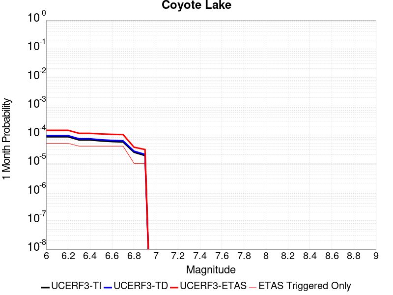 |  |  |

| Magnitude | 1 wk TI Prob | 1 wk TD Prob | 1 wk ETAS Prob | 1 wk ETAS/TD Gain | 1 wk ETAS Triggered Only | 1 mo TI Prob | 1 mo TD Prob | 1 mo ETAS Prob | 1 mo ETAS/TD Gain | 1 mo ETAS Triggered Only | 1 yr TI Prob | 1 yr TD Prob | 1 yr ETAS Prob | 1 yr ETAS/TD Gain | 1 yr ETAS Triggered Only | 10 yr TI Prob | 10 yr TD Prob | 10 yr ETAS Prob | 10 yr ETAS/TD Gain | 10 yr ETAS Triggered Only |
|-----|-----|-----|-----|-----|-----|-----|-----|-----|-----|-----|-----|-----|-----|-----|-----|-----|-----|-----|-----|-----|
| 6.0 | 1.980352E-5 | 2.170669E-5 | 2.170669E-5 | 1.0 | 0.0 | 8.486947E-5 | 9.302576E-5 | 2.2965617E-4 | 2.4687376 | 1.3664314E-4 | 0.0010327959 | 0.0011320722 | 0.0013140568 | 1.1607535 | 1.8219085E-4 | 0.010280091 | 0.01127023 | 0.011450367 | 1.0159835 | 1.8219085E-4 |
| 6.1 | 1.980352E-5 | 2.170669E-5 | 2.170669E-5 | 1.0 | 0.0 | 8.486947E-5 | 9.302576E-5 | 2.2965617E-4 | 2.4687376 | 1.3664314E-4 | 0.0010327959 | 0.0011320722 | 0.0013140568 | 1.1607535 | 1.8219085E-4 | 0.010280091 | 0.01127023 | 0.011450367 | 1.0159835 | 1.8219085E-4 |
| 6.2 | 1.980352E-5 | 2.170669E-5 | 2.170669E-5 | 1.0 | 0.0 | 8.486947E-5 | 9.302576E-5 | 2.2965617E-4 | 2.4687376 | 1.3664314E-4 | 0.0010327959 | 0.0011320722 | 0.0013140568 | 1.1607535 | 1.8219085E-4 | 0.010280091 | 0.01127023 | 0.011450367 | 1.0159835 | 1.8219085E-4 |
| 6.3 | 1.5344787E-5 | 1.6820626E-5 | 1.6820626E-5 | 1.0 | 0.0 | 6.576172E-5 | 7.2086754E-5 | 1.631756E-4 | 2.2636006 | 9.1095426E-5 | 8.003548E-4 | 8.77364E-4 | 9.683795E-4 | 1.1037375 | 9.1095426E-5 | 0.007974784 | 0.008745047 | 0.0088353455 | 1.0103257 | 9.1095426E-5 |
| 6.4 | 1.5344787E-5 | 1.6820626E-5 | 1.6820626E-5 | 1.0 | 0.0 | 6.576172E-5 | 7.2086754E-5 | 1.631756E-4 | 2.2636006 | 9.1095426E-5 | 8.003548E-4 | 8.77364E-4 | 9.683795E-4 | 1.1037375 | 9.1095426E-5 | 0.007974784 | 0.008745047 | 0.0088353455 | 1.0103257 | 9.1095426E-5 |
| 6.5 | 1.4189697E-5 | 1.5557947E-5 | 1.5557947E-5 | 1.0 | 0.0 | 6.081157E-5 | 6.667555E-5 | 1.577649E-4 | 2.3661582 | 9.1095426E-5 | 7.401293E-4 | 8.115328E-4 | 9.025543E-4 | 1.11216 | 9.1095426E-5 | 0.0073766913 | 0.008091635 | 0.008181994 | 1.0111669 | 9.1095426E-5 |
| 6.6 | 1.3469301E-5 | 1.4771539E-5 | 1.4771539E-5 | 1.0 | 0.0 | 5.7724297E-5 | 6.33054E-5 | 1.5439505E-4 | 2.4388924 | 9.1095426E-5 | 7.025667E-4 | 7.7053066E-4 | 8.6155586E-4 | 1.1181332 | 9.1095426E-5 | 0.0070034964 | 0.0076844944 | 0.00777489 | 1.0117633 | 9.1095426E-5 |
| 6.7 | 1.3027966E-5 | 1.4281708E-5 | 1.4281708E-5 | 1.0 | 0.0 | 5.5832945E-5 | 6.120622E-5 | 1.5229607E-4 | 2.4882448 | 9.1095426E-5 | 6.7955407E-4 | 7.449907E-4 | 8.360183E-4 | 1.1221862 | 9.1095426E-5 | 0.006774798 | 0.0074308095 | 0.0075212284 | 1.012168 | 9.1095426E-5 |
| 6.8 | 5.695434E-6 | 6.2244026E-6 | 6.2244026E-6 | 1.0 | 0.0 | 2.4408775E-5 | 2.6675907E-5 | 7.22224E-5 | 2.707402 | 4.5547713E-5 | 2.971363E-4 | 3.2476074E-4 | 3.7029368E-4 | 1.1402045 | 4.5547713E-5 | 0.0029673933 | 0.0032458024 | 0.0032912022 | 1.0139873 | 4.5547713E-5 |
| 6.9 | 4.385688E-6 | 4.7930434E-6 | 4.7930434E-6 | 1.0 | 0.0 | 1.879567E-5 | 2.0541615E-5 | 6.608839E-5 | 3.2172928 | 4.5547713E-5 | 2.2881327E-4 | 2.5009416E-4 | 2.9563048E-4 | 1.1820767 | 4.5547713E-5 | 0.002285778 | 0.0025009417 | 0.0025463754 | 1.0181667 | 4.5547713E-5 |

## San Andreas (San Bernardino S)
*[(top)](#table-of-contents)*

| 1 Week | 1 Month | 1 Year | 10 Year |
|-----|-----|-----|-----|
|  |  |  |  |

| Magnitude | 1 wk TI Prob | 1 wk TD Prob | 1 wk ETAS Prob | 1 wk ETAS/TD Gain | 1 wk ETAS Triggered Only | 1 mo TI Prob | 1 mo TD Prob | 1 mo ETAS Prob | 1 mo ETAS/TD Gain | 1 mo ETAS Triggered Only | 1 yr TI Prob | 1 yr TD Prob | 1 yr ETAS Prob | 1 yr ETAS/TD Gain | 1 yr ETAS Triggered Only | 10 yr TI Prob | 10 yr TD Prob | 10 yr ETAS Prob | 10 yr ETAS/TD Gain | 10 yr ETAS Triggered Only |
|-----|-----|-----|-----|-----|-----|-----|-----|-----|-----|-----|-----|-----|-----|-----|-----|-----|-----|-----|-----|-----|
| 6.0 | 1.2336002E-4 | 3.0003127E-4 | 3.9109937E-4 | 1.3035287 | 9.1095426E-5 | 5.2857865E-4 | 0.0012852408 | 0.0013762191 | 1.070787 | 9.1095426E-5 | 0.006416472 | 0.015540493 | 0.015630173 | 1.0057707 | 9.1095426E-5 | 0.06234337 | 0.14283332 | 0.1429895 | 1.0010934 | 1.8219085E-4 |
| 6.1 | 1.2336002E-4 | 3.0003127E-4 | 3.9109937E-4 | 1.3035287 | 9.1095426E-5 | 5.2857865E-4 | 0.0012852408 | 0.0013762191 | 1.070787 | 9.1095426E-5 | 0.006416472 | 0.015540493 | 0.015630173 | 1.0057707 | 9.1095426E-5 | 0.06234337 | 0.14283332 | 0.1429895 | 1.0010934 | 1.8219085E-4 |
| 6.2 | 1.2336002E-4 | 3.0003127E-4 | 3.9109937E-4 | 1.3035287 | 9.1095426E-5 | 5.2857865E-4 | 0.0012852408 | 0.0013762191 | 1.070787 | 9.1095426E-5 | 0.006416472 | 0.015540493 | 0.015630173 | 1.0057707 | 9.1095426E-5 | 0.06234337 | 0.14283332 | 0.1429895 | 1.0010934 | 1.8219085E-4 |
| 6.3 | 1.1712257E-4 | 2.879145E-4 | 3.789837E-4 | 1.3163064 | 9.1095426E-5 | 5.018573E-4 | 0.0012333614 | 0.0013243445 | 1.0737684 | 9.1095426E-5 | 0.006093008 | 0.014917629 | 0.0150073655 | 1.0060154 | 9.1095426E-5 | 0.059286322 | 0.1375418 | 0.13769893 | 1.0011424 | 1.8219085E-4 |
| 6.4 | 1.1712257E-4 | 2.879145E-4 | 3.789837E-4 | 1.3163064 | 9.1095426E-5 | 5.018573E-4 | 0.0012333614 | 0.0013243445 | 1.0737684 | 9.1095426E-5 | 0.006093008 | 0.014917629 | 0.0150073655 | 1.0060154 | 9.1095426E-5 | 0.059286322 | 0.1375418 | 0.13769893 | 1.0011424 | 1.8219085E-4 |
| 6.5 | 1.0689076E-4 | 2.6804334E-4 | 3.5911432E-4 | 1.3397622 | 9.1095426E-5 | 4.5802278E-4 | 0.0011482761 | 0.001239267 | 1.0792413 | 9.1095426E-5 | 0.0055621783 | 0.013895263 | 0.013985093 | 1.0064647 | 9.1095426E-5 | 0.05425003 | 0.12878914 | 0.12894787 | 1.0012325 | 1.8219085E-4 |
| 6.6 | 9.7648895E-5 | 2.5049172E-4 | 3.415643E-4 | 1.3635753 | 9.1095426E-5 | 4.1842813E-4 | 0.0010731178 | 0.0011641155 | 1.0847975 | 9.1095426E-5 | 0.005082469 | 0.012991305 | 0.013081218 | 1.0069209 | 9.1095426E-5 | 0.049677886 | 0.12094915 | 0.12110931 | 1.0013242 | 1.8219085E-4 |
| 6.7 | 8.757013E-5 | 2.3119988E-4 | 3.2227425E-4 | 1.3939204 | 9.1095426E-5 | 3.7524657E-4 | 9.905027E-4 | 0.0010815079 | 1.0918778 | 9.1095426E-5 | 0.00455906 | 0.011996774 | 0.012086776 | 1.0075022 | 9.1095426E-5 | 0.04466656 | 0.11225749 | 0.112419225 | 1.0014408 | 1.8219085E-4 |
| 6.8 | 8.562978E-5 | 2.2679876E-4 | 3.1787352E-4 | 1.4015664 | 9.1095426E-5 | 3.6693315E-4 | 9.7165484E-4 | 0.0010626618 | 1.0936618 | 9.1095426E-5 | 0.004458263 | 0.011769796 | 0.011859819 | 1.0076487 | 9.1095426E-5 | 0.043698758 | 0.11026781 | 0.11042991 | 1.0014701 | 1.8219085E-4 |
| 6.9 | 6.124075E-5 | 1.7064936E-4 | 2.6172923E-4 | 1.5337253 | 9.1095426E-5 | 2.6243398E-4 | 7.311502E-4 | 8.221791E-4 | 1.1245009 | 9.1095426E-5 | 0.0031904527 | 0.008865628 | 0.008955916 | 1.010184 | 9.1095426E-5 | 0.031450346 | 0.08417915 | 0.084346 | 1.0019821 | 1.8219085E-4 |
| 7.0 | 5.8598747E-5 | 1.6493963E-4 | 2.5602002E-4 | 1.5522045 | 9.1095426E-5 | 2.5111332E-4 | 7.0669345E-4 | 7.9772447E-4 | 1.1288127 | 9.1095426E-5 | 0.0030530186 | 0.008570245 | 0.00866056 | 1.0105382 | 9.1095426E-5 | 0.03011414 | 0.08149692 | 0.08166426 | 1.0020534 | 1.8219085E-4 |
| 7.1 | 5.613814E-5 | 1.5912524E-4 | 2.5020615E-4 | 1.5723852 | 9.1095426E-5 | 2.4056983E-4 | 6.817878E-4 | 7.7282113E-4 | 1.1335214 | 9.1095426E-5 | 0.0029250039 | 0.008269355 | 0.008359697 | 1.0109249 | 9.1095426E-5 | 0.028868021 | 0.07879588 | 0.07896371 | 1.00213 | 1.8219085E-4 |
| 7.2 | 4.991222E-5 | 1.4519015E-4 | 2.3627235E-4 | 1.6273304 | 9.1095426E-5 | 2.1389198E-4 | 6.220955E-4 | 7.1313424E-4 | 1.146342 | 9.1095426E-5 | 0.002601025 | 0.007547813 | 0.0076382207 | 1.011978 | 9.1095426E-5 | 0.025707912 | 0.072249845 | 0.072418876 | 1.0023395 | 1.8219085E-4 |
| 7.3 | 4.7410045E-5 | 1.371324E-4 | 2.2821533E-4 | 1.664197 | 9.1095426E-5 | 2.0317009E-4 | 5.875783E-4 | 6.786202E-4 | 1.1549443 | 9.1095426E-5 | 0.0024707897 | 0.007130386 | 0.0072208317 | 1.0126846 | 9.1095426E-5 | 0.024434982 | 0.06853227 | 0.068701975 | 1.0024763 | 1.8219085E-4 |
| 7.4 | 4.5556746E-5 | 1.3121162E-4 | 2.2229509E-4 | 1.6941723 | 9.1095426E-5 | 1.952286E-4 | 5.6221464E-4 | 6.532588E-4 | 1.1619385 | 9.1095426E-5 | 0.002374317 | 0.006823559 | 0.0069140326 | 1.013259 | 9.1095426E-5 | 0.023491086 | 0.06578475 | 0.06595495 | 1.0025873 | 1.8219085E-4 |
| 7.5 | 4.3084514E-5 | 1.2356513E-4 | 2.1464929E-4 | 1.7371348 | 9.1095426E-5 | 1.8463485E-4 | 5.2945764E-4 | 6.2050484E-4 | 1.1719631 | 9.1095426E-5 | 0.0022456115 | 0.006427166 | 0.006517676 | 1.0140824 | 9.1095426E-5 | 0.022230545 | 0.062185578 | 0.06235644 | 1.0027477 | 1.8219085E-4 |
| 7.6 | 3.408608E-5 | 9.834847E-5 | 1.8943494E-4 | 1.9261605 | 9.1095426E-5 | 1.4607502E-4 | 4.2142547E-4 | 5.124825E-4 | 1.2160691 | 9.1095426E-5 | 0.0017770125 | 0.00511881 | 0.005209439 | 1.0177051 | 9.1095426E-5 | 0.017628696 | 0.050017312 | 0.050190393 | 1.0034604 | 1.8219085E-4 |
| 7.7 | 2.8315713E-5 | 8.2480474E-5 | 1.7356839E-4 | 2.1043572 | 9.1095426E-5 | 1.2134742E-4 | 3.534399E-4 | 4.4450312E-4 | 1.2576485 | 9.1095426E-5 | 0.0014764034 | 0.004294649 | 0.0043853535 | 1.0211203 | 9.1095426E-5 | 0.01466633 | 0.04226858 | 0.042443074 | 1.0041281 | 1.8219085E-4 |
| 7.8 | 2.6222975E-5 | 7.462497E-5 | 1.657136E-4 | 2.2206185 | 9.1095426E-5 | 1.1237934E-4 | 3.1978212E-4 | 4.108484E-4 | 1.2847761 | 9.1095426E-5 | 0.0013673597 | 0.003886403 | 0.0039771446 | 1.0233485 | 9.1095426E-5 | 0.013589768 | 0.038434092 | 0.03860928 | 1.0045582 | 1.8219085E-4 |
| 7.9 | 2.1469694E-5 | 5.7873713E-5 | 1.4896387E-4 | 2.573947 | 9.1095426E-5 | 9.200973E-5 | 2.4800663E-4 | 3.3907947E-4 | 1.3672193 | 9.1095426E-5 | 0.0011196428 | 0.003015303 | 0.0031061238 | 1.0301199 | 9.1095426E-5 | 0.011140184 | 0.03014987 | 0.030326568 | 1.0058607 | 1.8219085E-4 |
| 8.0 | 1.2420249E-5 | 3.1316227E-5 | 3.1316227E-5 | 1.0 | 0.0 | 5.322855E-5 | 1.342055E-4 | 1.342055E-4 | 1.0 | 0.0 | 6.478649E-4 | 0.0016327285 | 0.0016327285 | 1.0 | 0.0 | 0.0064597935 | 0.01652123 | 0.01652123 | 1.0 | 0.0 |
| 8.1 | 4.9197724E-6 | 7.82136E-6 | 7.82136E-6 | 1.0 | 0.0 | 2.1084568E-5 | 3.3519682E-5 | 3.3519682E-5 | 1.0 | 0.0 | 2.566744E-4 | 4.0802584E-4 | 4.0802584E-4 | 1.0 | 0.0 | 0.002563781 | 0.004383873 | 0.004383873 | 1.0 | 0.0 |
| 8.2 | 2.5634774E-6 | 2.9062624E-6 | 2.9062624E-6 | 1.0 | 0.0 | 1.0986286E-5 | 1.2455351E-5 | 1.2455351E-5 | 1.0 | 0.0 | 1.3374983E-4 | 1.5163339E-4 | 1.5163339E-4 | 1.0 | 0.0 | 0.0013366934 | 0.001704734 | 0.001704734 | 1.0 | 0.0 |
| 8.3 | 5.2850464E-7 | 3.2082596E-7 | 3.2082596E-7 | 1.0 | 0.0 | 2.2650179E-6 | 1.3749678E-6 | 1.3749678E-6 | 1.0 | 0.0 | 2.7576245E-5 | 1.6740116E-5 | 1.6740116E-5 | 1.0 | 0.0 | 2.7572823E-4 | 1.9866871E-4 | 1.9866871E-4 | 1.0 | 0.0 |

## San Andreas (Parkfield)
*[(top)](#table-of-contents)*

| 1 Week | 1 Month | 1 Year | 10 Year |
|-----|-----|-----|-----|
|  |  |  |  |

| Magnitude | 1 wk TI Prob | 1 wk TD Prob | 1 wk ETAS Prob | 1 wk ETAS/TD Gain | 1 wk ETAS Triggered Only | 1 mo TI Prob | 1 mo TD Prob | 1 mo ETAS Prob | 1 mo ETAS/TD Gain | 1 mo ETAS Triggered Only | 1 yr TI Prob | 1 yr TD Prob | 1 yr ETAS Prob | 1 yr ETAS/TD Gain | 1 yr ETAS Triggered Only | 10 yr TI Prob | 10 yr TD Prob | 10 yr ETAS Prob | 10 yr ETAS/TD Gain | 10 yr ETAS Triggered Only |
|-----|-----|-----|-----|-----|-----|-----|-----|-----|-----|-----|-----|-----|-----|-----|-----|-----|-----|-----|-----|-----|
| 6.0 | 5.556969E-4 | 7.776195E-4 | 8.231318E-4 | 1.0585277 | 4.5547713E-5 | 0.0023793848 | 0.003328946 | 0.0033743419 | 1.0136368 | 4.5547713E-5 | 0.028586963 | 0.04018152 | 0.040268954 | 1.002176 | 9.1095426E-5 | 0.25176284 | 0.33713356 | 0.33722413 | 1.0002687 | 1.3664314E-4 |
| 6.1 | 1.925858E-4 | 3.027076E-4 | 3.4824153E-4 | 1.1504221 | 4.5547713E-5 | 8.2510663E-4 | 0.001296767 | 0.0013422556 | 1.0350785 | 4.5547713E-5 | 0.0099994885 | 0.01577525 | 0.01582008 | 1.0028417 | 4.5547713E-5 | 0.095613256 | 0.14970991 | 0.14974864 | 1.0002587 | 4.5547713E-5 |
| 6.2 | 9.4306815E-5 | 1.824128E-4 | 2.279522E-4 | 1.2496502 | 4.5547713E-5 | 4.0410945E-4 | 7.8153616E-4 | 8.2704826E-4 | 1.0582342 | 4.5547713E-5 | 0.0049089384 | 0.009473897 | 0.009519013 | 1.0047622 | 4.5547713E-5 | 0.048019063 | 0.09184752 | 0.091888875 | 1.0004504 | 4.5547713E-5 |
| 6.3 | 9.283051E-5 | 1.793781E-4 | 2.2491763E-4 | 1.2538745 | 4.5547713E-5 | 3.9778434E-4 | 7.68538E-4 | 8.1405067E-4 | 1.0592198 | 4.5547713E-5 | 0.0048322747 | 0.009317007 | 0.00936213 | 1.0048431 | 4.5547713E-5 | 0.047285385 | 0.09050047 | 0.09054189 | 1.0004578 | 4.5547713E-5 |
| 6.4 | 9.138826E-5 | 1.7700029E-4 | 2.2253994E-4 | 1.2572857 | 4.5547713E-5 | 3.916052E-4 | 7.5835333E-4 | 8.038665E-4 | 1.0600158 | 4.5547713E-5 | 0.0047573745 | 0.009194063 | 0.009239192 | 1.0049084 | 4.5547713E-5 | 0.046568092 | 0.089402735 | 0.08944421 | 1.000464 | 4.5547713E-5 |
| 6.5 | 9.000255E-5 | 1.7458084E-4 | 2.201206E-4 | 1.260852 | 4.5547713E-5 | 3.8566816E-4 | 7.479902E-4 | 7.9350383E-4 | 1.0608479 | 4.5547713E-5 | 0.0046854047 | 0.00906896 | 0.009114095 | 1.0049769 | 4.5547713E-5 | 0.045878403 | 0.08828856 | 0.08833008 | 1.0004704 | 4.5547713E-5 |
| 6.6 | 8.8109264E-5 | 1.7139279E-4 | 2.1693269E-4 | 1.2657049 | 4.5547713E-5 | 3.7755648E-4 | 7.343349E-4 | 7.798492E-4 | 1.0619802 | 4.5547713E-5 | 0.0045870654 | 0.008904092 | 0.008949234 | 1.0050699 | 4.5547713E-5 | 0.04493529 | 0.08682025 | 0.08686185 | 1.0004791 | 4.5547713E-5 |
| 6.7 | 8.738073E-5 | 1.7006363E-4 | 2.156036E-4 | 1.2677819 | 4.5547713E-5 | 3.7443507E-4 | 7.286417E-4 | 7.7415624E-4 | 1.0624648 | 4.5547713E-5 | 0.0045492216 | 0.008835384 | 0.008880529 | 1.0051095 | 4.5547713E-5 | 0.04457213 | 0.08622064 | 0.086262256 | 1.0004827 | 4.5547713E-5 |
| 6.8 | 8.710195E-5 | 1.695187E-4 | 2.1505868E-4 | 1.2686429 | 4.5547713E-5 | 3.7324068E-4 | 7.263075E-4 | 7.718222E-4 | 1.0626658 | 4.5547713E-5 | 0.0045347405 | 0.008807203 | 0.00885235 | 1.0051261 | 4.5547713E-5 | 0.04443313 | 0.085968256 | 0.08600988 | 1.0004842 | 4.5547713E-5 |
| 6.9 | 8.6801556E-5 | 1.6892828E-4 | 2.144683E-4 | 1.2695819 | 4.5547713E-5 | 3.7195362E-4 | 7.237786E-4 | 7.6929334E-4 | 1.0628849 | 4.5547713E-5 | 0.0045191357 | 0.008776662 | 0.00882181 | 1.0051441 | 4.5547713E-5 | 0.044283327 | 0.08569433 | 0.08573597 | 1.000486 | 4.5547713E-5 |
| 7.0 | 8.5571606E-5 | 1.6645678E-4 | 2.119969E-4 | 1.2735853 | 4.5547713E-5 | 3.6668387E-4 | 7.131923E-4 | 7.587075E-4 | 1.063819 | 4.5547713E-5 | 0.004455241 | 0.008648803 | 0.008693957 | 1.0052208 | 4.5547713E-5 | 0.043669727 | 0.08454277 | 0.08458447 | 1.0004932 | 4.5547713E-5 |
| 7.1 | 7.82589E-5 | 1.5126738E-4 | 1.968082E-4 | 1.3010617 | 4.5547713E-5 | 3.3535215E-4 | 6.4812845E-4 | 6.936466E-4 | 1.0702302 | 4.5547713E-5 | 0.0040752706 | 0.007862584 | 0.007907773 | 1.0057474 | 4.5547713E-5 | 0.040013418 | 0.07745491 | 0.07749693 | 1.0005425 | 4.5547713E-5 |
| 7.2 | 7.690929E-5 | 1.4864003E-4 | 1.9418096E-4 | 1.3063841 | 4.5547713E-5 | 3.2956956E-4 | 6.368739E-4 | 6.8239257E-4 | 1.071472 | 4.5547713E-5 | 0.004005129 | 0.007726539 | 0.0077717346 | 1.0058495 | 4.5547713E-5 | 0.0393371 | 0.0762281 | 0.07627017 | 1.0005519 | 4.5547713E-5 |
| 7.3 | 7.5543794E-5 | 1.4560606E-4 | 1.9114715E-4 | 1.3127692 | 4.5547713E-5 | 3.2371894E-4 | 6.2387745E-4 | 6.693968E-4 | 1.0729619 | 4.5547713E-5 | 0.003934157 | 0.007569417 | 0.0076146196 | 1.0059718 | 4.5547713E-5 | 0.038652334 | 0.07479123 | 0.07483337 | 1.0005635 | 4.5547713E-5 |
| 7.4 | 7.4214564E-5 | 1.4261607E-4 | 1.881573E-4 | 1.3193274 | 4.5547713E-5 | 3.1802364E-4 | 6.110693E-4 | 6.565892E-4 | 1.0744922 | 4.5547713E-5 | 0.003865065 | 0.0074145487 | 0.007459759 | 1.0060974 | 4.5547713E-5 | 0.03798529 | 0.07336518 | 0.07340739 | 1.0005753 | 4.5547713E-5 |
| 7.5 | 6.149578E-5 | 1.11895584E-4 | 1.574382E-4 | 1.40701 | 4.5547713E-5 | 2.6352672E-4 | 4.7946448E-4 | 5.249904E-4 | 1.0949515 | 4.5547713E-5 | 0.0032037178 | 0.0058218874 | 0.0058671697 | 1.0077779 | 4.5547713E-5 | 0.03157923 | 0.05855221 | 0.058595087 | 1.0007323 | 4.5547713E-5 |
| 7.6 | 6.0643448E-5 | 1.10182256E-4 | 1.5572495E-4 | 1.4133396 | 4.5547713E-5 | 2.598746E-4 | 4.7212432E-4 | 5.176505E-4 | 1.0964284 | 4.5547713E-5 | 0.0031593828 | 0.005732995 | 0.0057782815 | 1.0078993 | 4.5547713E-5 | 0.031148417 | 0.057713263 | 0.05775618 | 1.0007436 | 4.5547713E-5 |
| 7.7 | 5.1652263E-5 | 9.173663E-5 | 1.3728016E-4 | 1.4964596 | 4.5547713E-5 | 2.2134806E-4 | 3.9309775E-4 | 4.3862758E-4 | 1.1158231 | 4.5547713E-5 | 0.002691582 | 0.0047754725 | 0.0048208027 | 1.0094923 | 4.5547713E-5 | 0.026592141 | 0.048531387 | 0.048574723 | 1.000893 | 4.5547713E-5 |
| 7.8 | 4.8090482E-5 | 8.558682E-5 | 8.558682E-5 | 1.0 | 0.0 | 2.060858E-4 | 3.6674913E-4 | 3.6674913E-4 | 1.0 | 0.0 | 0.0025062072 | 0.0044560367 | 0.0044560367 | 1.0 | 0.0 | 0.024781305 | 0.045297977 | 0.045297977 | 1.0 | 0.0 |
| 7.9 | 3.970278E-5 | 6.749683E-5 | 6.749683E-5 | 1.0 | 0.0 | 1.7014367E-4 | 2.8924007E-4 | 2.8924007E-4 | 1.0 | 0.0 | 0.002069531 | 0.0035158154 | 0.0035158154 | 1.0 | 0.0 | 0.020503636 | 0.03587781 | 0.03587781 | 1.0 | 0.0 |
| 8.0 | 2.8982335E-5 | 4.0693238E-5 | 4.0693238E-5 | 1.0 | 0.0 | 1.2420409E-4 | 1.7438793E-4 | 1.7438793E-4 | 1.0 | 0.0 | 0.0015111357 | 0.0021211067 | 0.0021211067 | 1.0 | 0.0 | 0.015009012 | 0.022008339 | 0.022008339 | 1.0 | 0.0 |
| 8.1 | 1.8836186E-5 | 1.8678496E-5 | 1.8678496E-5 | 1.0 | 0.0 | 8.0724014E-5 | 8.0048245E-5 | 8.0048245E-5 | 1.0 | 0.0 | 9.823717E-4 | 9.7415224E-4 | 9.7415224E-4 | 1.0 | 0.0 | 0.009780403 | 0.010486731 | 0.010486731 | 1.0 | 0.0 |
| 8.2 | 8.643924E-6 | 5.4738607E-6 | 5.4738607E-6 | 1.0 | 0.0 | 3.704486E-5 | 2.3459192E-5 | 2.3459192E-5 | 1.0 | 0.0 | 4.5092785E-4 | 2.855783E-4 | 2.855783E-4 | 1.0 | 0.0 | 0.0045001395 | 0.0032481598 | 0.0032481598 | 1.0 | 0.0 |
| 8.3 | 1.983087E-6 | 7.658221E-7 | 7.658221E-7 | 1.0 | 0.0 | 8.498917E-6 | 3.2820906E-6 | 3.2820906E-6 | 1.0 | 0.0 | 1.034694E-4 | 3.9958737E-5 | 3.9958737E-5 | 1.0 | 0.0 | 0.0010342124 | 4.7187202E-4 | 4.7187202E-4 | 1.0 | 0.0 |

## Red Pass
*[(top)](#table-of-contents)*

| 1 Week | 1 Month | 1 Year | 10 Year |
|-----|-----|-----|-----|
|  |  |  |  |

| Magnitude | 1 wk TI Prob | 1 wk TD Prob | 1 wk ETAS Prob | 1 wk ETAS/TD Gain | 1 wk ETAS Triggered Only | 1 mo TI Prob | 1 mo TD Prob | 1 mo ETAS Prob | 1 mo ETAS/TD Gain | 1 mo ETAS Triggered Only | 1 yr TI Prob | 1 yr TD Prob | 1 yr ETAS Prob | 1 yr ETAS/TD Gain | 1 yr ETAS Triggered Only | 10 yr TI Prob | 10 yr TD Prob | 10 yr ETAS Prob | 10 yr ETAS/TD Gain | 10 yr ETAS Triggered Only |
|-----|-----|-----|-----|-----|-----|-----|-----|-----|-----|-----|-----|-----|-----|-----|-----|-----|-----|-----|-----|-----|
| 6.0 | 8.258278E-6 | 8.5512565E-6 | 5.409858E-5 | 6.3263893 | 4.5547713E-5 | 3.539214E-5 | 3.664783E-5 | 8.2193874E-5 | 2.2428033 | 4.5547713E-5 | 4.308141E-4 | 4.4611385E-4 | 5.3716864E-4 | 1.2041066 | 9.1095426E-5 | 0.0042997985 | 0.004453941 | 0.0045899753 | 1.0305425 | 1.3664314E-4 |
| 6.1 | 3.649988E-6 | 3.7753127E-6 | 3.7753127E-6 | 1.0 | 0.0 | 1.5642712E-5 | 1.6179838E-5 | 1.6179838E-5 | 1.0 | 0.0 | 1.9043336E-4 | 1.9697649E-4 | 1.9697649E-4 | 1.0 | 0.0 | 0.0019027026 | 0.0019684862 | 0.0019684862 | 1.0 | 0.0 |
| 6.2 | 3.649988E-6 | 3.7753127E-6 | 3.7753127E-6 | 1.0 | 0.0 | 1.5642712E-5 | 1.6179838E-5 | 1.6179838E-5 | 1.0 | 0.0 | 1.9043336E-4 | 1.9697649E-4 | 1.9697649E-4 | 1.0 | 0.0 | 0.0019027026 | 0.0019684862 | 0.0019684862 | 1.0 | 0.0 |
| 6.3 | 1.3924937E-6 | 1.4411153E-6 | 1.4411153E-6 | 1.0 | 0.0 | 5.9678164E-6 | 6.1762016E-6 | 6.1762016E-6 | 1.0 | 0.0 | 7.265574E-5 | 7.5194075E-5 | 7.5194075E-5 | 1.0 | 0.0 | 7.263199E-4 | 7.518251E-4 | 7.518251E-4 | 1.0 | 0.0 |
| 6.4 | 1.3924937E-6 | 1.4411153E-6 | 1.4411153E-6 | 1.0 | 0.0 | 5.9678164E-6 | 6.1762016E-6 | 6.1762016E-6 | 1.0 | 0.0 | 7.265574E-5 | 7.5194075E-5 | 7.5194075E-5 | 1.0 | 0.0 | 7.263199E-4 | 7.518251E-4 | 7.518251E-4 | 1.0 | 0.0 |
| 6.5 | 9.876812E-7 | 1.0221903E-6 | 1.0221903E-6 | 1.0 | 0.0 | 4.2329125E-6 | 4.3808154E-6 | 4.3808154E-6 | 1.0 | 0.0 | 5.153449E-5 | 5.333643E-5 | 5.333643E-5 | 1.0 | 0.0 | 5.1522546E-4 | 5.3336425E-4 | 5.3336425E-4 | 1.0 | 0.0 |

## Helendale-So Lockhart
*[(top)](#table-of-contents)*

| 1 Week | 1 Month | 1 Year | 10 Year |
|-----|-----|-----|-----|
|  |  |  |  |

| Magnitude | 1 wk TI Prob | 1 wk TD Prob | 1 wk ETAS Prob | 1 wk ETAS/TD Gain | 1 wk ETAS Triggered Only | 1 mo TI Prob | 1 mo TD Prob | 1 mo ETAS Prob | 1 mo ETAS/TD Gain | 1 mo ETAS Triggered Only | 1 yr TI Prob | 1 yr TD Prob | 1 yr ETAS Prob | 1 yr ETAS/TD Gain | 1 yr ETAS Triggered Only | 10 yr TI Prob | 10 yr TD Prob | 10 yr ETAS Prob | 10 yr ETAS/TD Gain | 10 yr ETAS Triggered Only |
|-----|-----|-----|-----|-----|-----|-----|-----|-----|-----|-----|-----|-----|-----|-----|-----|-----|-----|-----|-----|-----|
| 6.0 | 1.7296055E-5 | 1.8103707E-5 | 1.8103707E-5 | 1.0 | 0.0 | 7.412385E-5 | 7.758512E-5 | 7.758512E-5 | 1.0 | 0.0 | 9.0208417E-4 | 9.442103E-4 | 0.0010352196 | 1.0963868 | 9.1095426E-5 | 0.008984311 | 0.009404104 | 0.009539463 | 1.0143936 | 1.3664314E-4 |
| 6.1 | 1.7296055E-5 | 1.8103707E-5 | 1.8103707E-5 | 1.0 | 0.0 | 7.412385E-5 | 7.758512E-5 | 7.758512E-5 | 1.0 | 0.0 | 9.0208417E-4 | 9.442103E-4 | 0.0010352196 | 1.0963868 | 9.1095426E-5 | 0.008984311 | 0.009404104 | 0.009539463 | 1.0143936 | 1.3664314E-4 |
| 6.2 | 1.7296055E-5 | 1.8103707E-5 | 1.8103707E-5 | 1.0 | 0.0 | 7.412385E-5 | 7.758512E-5 | 7.758512E-5 | 1.0 | 0.0 | 9.0208417E-4 | 9.442103E-4 | 0.0010352196 | 1.0963868 | 9.1095426E-5 | 0.008984311 | 0.009404104 | 0.009539463 | 1.0143936 | 1.3664314E-4 |
| 6.3 | 1.0669118E-5 | 1.1135411E-5 | 1.1135411E-5 | 1.0 | 0.0 | 4.5723988E-5 | 4.7722333E-5 | 4.7722333E-5 | 1.0 | 0.0 | 5.5654737E-4 | 5.8086734E-4 | 6.263886E-4 | 1.0783677 | 4.5547713E-5 | 0.0055515557 | 0.0057937866 | 0.0058843545 | 1.0156319 | 9.1095426E-5 |
| 6.4 | 1.0669118E-5 | 1.1135411E-5 | 1.1135411E-5 | 1.0 | 0.0 | 4.5723988E-5 | 4.7722333E-5 | 4.7722333E-5 | 1.0 | 0.0 | 5.5654737E-4 | 5.8086734E-4 | 6.263886E-4 | 1.0783677 | 4.5547713E-5 | 0.0055515557 | 0.0057937866 | 0.0058843545 | 1.0156319 | 9.1095426E-5 |
| 6.5 | 8.790038E-6 | 9.170186E-6 | 9.170186E-6 | 1.0 | 0.0 | 3.767105E-5 | 3.9300216E-5 | 3.9300216E-5 | 1.0 | 0.0 | 4.585485E-4 | 4.783766E-4 | 4.783766E-4 | 1.0 | 0.0 | 0.0045760344 | 0.004773633 | 0.0048189634 | 1.009496 | 4.5547713E-5 |
| 6.6 | 7.396949E-6 | 7.715528E-6 | 7.715528E-6 | 1.0 | 0.0 | 3.1700827E-5 | 3.3066135E-5 | 3.3066135E-5 | 1.0 | 0.0 | 3.858892E-4 | 4.0250685E-4 | 4.0250685E-4 | 1.0 | 0.0 | 0.003852198 | 0.0040178853 | 0.00406325 | 1.0112907 | 4.5547713E-5 |
| 6.7 | 6.4600285E-6 | 6.7380233E-6 | 6.7380233E-6 | 1.0 | 0.0 | 2.7685543E-5 | 2.8876928E-5 | 2.8876928E-5 | 1.0 | 0.0 | 3.3701936E-4 | 3.5152066E-4 | 3.5152066E-4 | 1.0 | 0.0 | 0.0033650869 | 0.003509728 | 0.0035551158 | 1.0129321 | 4.5547713E-5 |
| 6.8 | 5.600104E-6 | 5.836003E-6 | 5.836003E-6 | 1.0 | 0.0 | 2.4000226E-5 | 2.5011204E-5 | 2.5011204E-5 | 1.0 | 0.0 | 2.9216358E-4 | 3.0446946E-4 | 3.0446946E-4 | 1.0 | 0.0 | 0.0029177975 | 0.0030405847 | 0.003085994 | 1.0149344 | 4.5547713E-5 |
| 6.9 | 4.839122E-6 | 5.039504E-6 | 5.039504E-6 | 1.0 | 0.0 | 2.0738931E-5 | 2.1597696E-5 | 2.1597696E-5 | 1.0 | 0.0 | 2.5246723E-4 | 2.629207E-4 | 2.629207E-4 | 1.0 | 0.0 | 0.002521806 | 0.0026261439 | 0.002671572 | 1.0172985 | 4.5547713E-5 |
| 7.0 | 3.6937633E-6 | 3.845204E-6 | 3.845204E-6 | 1.0 | 0.0 | 1.5830317E-5 | 1.6479342E-5 | 1.6479342E-5 | 1.0 | 0.0 | 1.9271708E-4 | 2.0061784E-4 | 2.0061784E-4 | 1.0 | 0.0 | 0.0019255003 | 0.0020043987 | 0.0020498552 | 1.0226784 | 4.5547713E-5 |
| 7.1 | 2.7858857E-6 | 2.8978507E-6 | 2.8978507E-6 | 1.0 | 0.0 | 1.1939455E-5 | 1.2419302E-5 | 1.2419302E-5 | 1.0 | 0.0 | 1.4535317E-4 | 1.5119473E-4 | 1.5119473E-4 | 1.0 | 0.0 | 0.0014525814 | 0.0015109401 | 0.0015109401 | 1.0 | 0.0 |
| 7.2 | 2.1672065E-6 | 2.2540103E-6 | 2.2540103E-6 | 1.0 | 0.0 | 9.2879945E-6 | 9.66001E-6 | 9.66001E-6 | 1.0 | 0.0 | 1.1307546E-4 | 1.1760445E-4 | 1.1760445E-4 | 1.0 | 0.0 | 0.0011301794 | 0.0011754404 | 0.0011754404 | 1.0 | 0.0 |
| 7.3 | 1.4823496E-6 | 1.5422086E-6 | 1.5422086E-6 | 1.0 | 0.0 | 6.3529114E-6 | 6.6094494E-6 | 6.6094494E-6 | 1.0 | 0.0 | 7.734395E-5 | 8.046723E-5 | 8.046723E-5 | 1.0 | 0.0 | 7.731704E-4 | 8.04396E-4 | 8.04396E-4 | 1.0 | 0.0 |
| 7.4 | 4.2321457E-7 | 4.4108717E-7 | 4.4108717E-7 | 1.0 | 0.0 | 1.8137755E-6 | 1.8903725E-6 | 1.8903725E-6 | 1.0 | 0.0 | 2.2082493E-5 | 2.3015087E-5 | 2.3015087E-5 | 1.0 | 0.0 | 2.2080299E-4 | 2.3013157E-4 | 2.3013157E-4 | 1.0 | 0.0 |
| 7.5 | 5.6942316E-8 | 5.9415576E-8 | 5.9415576E-8 | 1.0 | 0.0 | 2.440385E-7 | 2.5463817E-7 | 2.5463817E-7 | 1.0 | 0.0 | 2.9711643E-6 | 3.1002162E-6 | 3.1002162E-6 | 1.0 | 0.0 | 2.9711247E-5 | 3.1001808E-5 | 3.1001808E-5 | 1.0 | 0.0 |

## Brawley (Seismic Zone) alt 1
*[(top)](#table-of-contents)*

| 1 Week | 1 Month | 1 Year | 10 Year |
|-----|-----|-----|-----|
|  |  |  |  |

| Magnitude | 1 wk TI Prob | 1 wk TD Prob | 1 wk ETAS Prob | 1 wk ETAS/TD Gain | 1 wk ETAS Triggered Only | 1 mo TI Prob | 1 mo TD Prob | 1 mo ETAS Prob | 1 mo ETAS/TD Gain | 1 mo ETAS Triggered Only | 1 yr TI Prob | 1 yr TD Prob | 1 yr ETAS Prob | 1 yr ETAS/TD Gain | 1 yr ETAS Triggered Only | 10 yr TI Prob | 10 yr TD Prob | 10 yr ETAS Prob | 10 yr ETAS/TD Gain | 10 yr ETAS Triggered Only |
|-----|-----|-----|-----|-----|-----|-----|-----|-----|-----|-----|-----|-----|-----|-----|-----|-----|-----|-----|-----|-----|
| 6.0 | 2.2521618E-4 | 4.7625226E-4 | 5.2177825E-4 | 1.0955923 | 4.5547713E-5 | 9.6485513E-4 | 0.0020395215 | 0.0020849763 | 1.022287 | 4.5547713E-5 | 0.011683988 | 0.024542542 | 0.024586972 | 1.0018103 | 4.5547713E-5 | 0.11088423 | 0.21347483 | 0.21354647 | 1.0003356 | 9.1095426E-5 |
| 6.1 | 2.2521618E-4 | 4.7625226E-4 | 5.2177825E-4 | 1.0955923 | 4.5547713E-5 | 9.6485513E-4 | 0.0020395215 | 0.0020849763 | 1.022287 | 4.5547713E-5 | 0.011683988 | 0.024542542 | 0.024586972 | 1.0018103 | 4.5547713E-5 | 0.11088423 | 0.21347483 | 0.21354647 | 1.0003356 | 9.1095426E-5 |
| 6.2 | 2.198148E-4 | 4.6709873E-4 | 5.1262515E-4 | 1.0974665 | 4.5547713E-5 | 9.417233E-4 | 0.0020003526 | 0.002045809 | 1.0227243 | 4.5547713E-5 | 0.011405343 | 0.024076827 | 0.024121277 | 1.0018462 | 4.5547713E-5 | 0.10837428 | 0.20991138 | 0.20998335 | 1.0003428 | 9.1095426E-5 |
| 6.3 | 2.1704129E-4 | 4.6145564E-4 | 5.069823E-4 | 1.0986589 | 4.5547713E-5 | 9.298453E-4 | 0.0019762046 | 0.0020216624 | 1.0230025 | 4.5547713E-5 | 0.011262234 | 0.023789987 | 0.02383445 | 1.0018691 | 4.5547713E-5 | 0.107082725 | 0.2078023 | 0.20787446 | 1.0003473 | 9.1095426E-5 |
| 6.4 | 1.876142E-4 | 4.0037738E-4 | 4.4590686E-4 | 1.1137164 | 4.5547713E-5 | 8.038131E-4 | 0.001714789 | 0.0017602586 | 1.0265162 | 4.5547713E-5 | 0.00974259 | 0.02067674 | 0.020721346 | 1.0021573 | 4.5547713E-5 | 0.093263686 | 0.18455231 | 0.1846266 | 1.0004025 | 9.1095426E-5 |
| 6.5 | 1.7390939E-4 | 3.746997E-4 | 4.2023035E-4 | 1.1215124 | 4.5547713E-5 | 7.45113E-4 | 0.0016048797 | 0.0016503544 | 1.0283352 | 4.5547713E-5 | 0.009034078 | 0.019365085 | 0.019409752 | 1.0023065 | 4.5547713E-5 | 0.086755216 | 0.17437433 | 0.17444953 | 1.0004313 | 9.1095426E-5 |
| 6.6 | 1.591791E-4 | 3.4884937E-4 | 3.943812E-4 | 1.13052 | 4.5547713E-5 | 6.8201777E-4 | 0.0014942222 | 0.0015397018 | 1.030437 | 4.5547713E-5 | 0.008271996 | 0.018041968 | 0.018086694 | 1.002479 | 4.5547713E-5 | 0.07970774 | 0.16378246 | 0.16385864 | 1.0004652 | 9.1095426E-5 |
| 6.7 | 1.4268003E-4 | 3.2051268E-4 | 3.660458E-4 | 1.1420634 | 4.5547713E-5 | 6.1134255E-4 | 0.0013729108 | 0.001418396 | 1.0331305 | 4.5547713E-5 | 0.007417723 | 0.016589044 | 0.016633835 | 1.0027001 | 4.5547713E-5 | 0.07174956 | 0.15190692 | 0.15198418 | 1.0005085 | 9.1095426E-5 |
| 6.8 | 1.239713E-4 | 2.904694E-4 | 3.360039E-4 | 1.1567616 | 4.5547713E-5 | 5.3119735E-4 | 0.0012442812 | 0.0012897722 | 1.03656 | 4.5547713E-5 | 0.0064481674 | 0.015045324 | 0.015090187 | 1.0029818 | 4.5547713E-5 | 0.06264243 | 0.13835184 | 0.13843033 | 1.0005673 | 9.1095426E-5 |
| 6.9 | 1.0180238E-4 | 2.624795E-4 | 3.0801524E-4 | 1.1734831 | 4.5547713E-5 | 4.3622297E-4 | 0.0011244314 | 0.0011699279 | 1.0404618 | 4.5547713E-5 | 0.005298089 | 0.013605019 | 0.013649947 | 1.0033023 | 4.5547713E-5 | 0.05173543 | 0.124936566 | 0.12501629 | 1.000638 | 9.1095426E-5 |
| 7.0 | 7.6619996E-5 | 2.2393082E-4 | 2.6946832E-4 | 1.2033553 | 4.5547713E-5 | 3.283301E-4 | 9.593537E-4 | 0.0010048577 | 1.047432 | 4.5547713E-5 | 0.0039900932 | 0.011618287 | 0.011663306 | 1.0038748 | 4.5547713E-5 | 0.039192066 | 0.1072422 | 0.10732352 | 1.0007583 | 9.1095426E-5 |
| 7.1 | 7.5127435E-5 | 2.2076255E-4 | 2.663002E-4 | 1.2062744 | 4.5547713E-5 | 3.2193496E-4 | 9.457853E-4 | 9.9129E-4 | 1.0481131 | 4.5547713E-5 | 0.0039125155 | 0.01145484 | 0.011499867 | 1.0039307 | 4.5547713E-5 | 0.038443442 | 0.10580618 | 0.10588764 | 1.0007699 | 9.1095426E-5 |
| 7.2 | 6.788582E-5 | 2.0204009E-4 | 2.475786E-4 | 1.2253934 | 4.5547713E-5 | 2.9090676E-4 | 8.6560176E-4 | 9.111101E-4 | 1.0525742 | 4.5547713E-5 | 0.0035360386 | 0.010488416 | 0.010533486 | 1.0042971 | 4.5547713E-5 | 0.034803 | 0.097476505 | 0.09755872 | 1.0008434 | 9.1095426E-5 |
| 7.3 | 6.399602E-5 | 1.8835113E-4 | 1.8835113E-4 | 1.0 | 0.0 | 2.7423984E-4 | 8.0697227E-4 | 8.0697227E-4 | 1.0 | 0.0 | 0.0033337586 | 0.009781217 | 0.009781217 | 1.0 | 0.0 | 0.03284188 | 0.09137183 | 0.09141321 | 1.000453 | 4.5547713E-5 |
| 7.4 | 4.506759E-5 | 1.2526519E-4 | 1.2526519E-4 | 1.0 | 0.0 | 1.9313251E-4 | 5.367412E-4 | 5.367412E-4 | 1.0 | 0.0 | 0.0023488526 | 0.006515418 | 0.006515418 | 1.0 | 0.0 | 0.023241805 | 0.062352248 | 0.062394958 | 1.000685 | 4.5547713E-5 |
| 7.5 | 3.43289E-5 | 9.334972E-5 | 9.334972E-5 | 1.0 | 0.0 | 1.4711556E-4 | 4.0000922E-4 | 4.0000922E-4 | 1.0 | 0.0 | 0.0017896603 | 0.004859299 | 0.004859299 | 1.0 | 0.0 | 0.01775316 | 0.04705323 | 0.047096632 | 1.0009224 | 4.5547713E-5 |
| 7.6 | 2.5980507E-5 | 7.0527196E-5 | 7.0527196E-5 | 1.0 | 0.0 | 1.1134028E-4 | 3.022245E-4 | 3.022245E-4 | 1.0 | 0.0 | 0.001354725 | 0.0036733993 | 0.0036733993 | 1.0 | 0.0 | 0.013464959 | 0.035839107 | 0.035883024 | 1.0012254 | 4.5547713E-5 |
| 7.7 | 1.7292105E-5 | 4.940404E-5 | 4.940404E-5 | 1.0 | 0.0 | 7.4106916E-5 | 2.1171445E-4 | 2.1171445E-4 | 1.0 | 0.0 | 9.018782E-4 | 0.0025745821 | 0.0025745821 | 1.0 | 0.0 | 0.008982267 | 0.025288915 | 0.025333311 | 1.0017556 | 4.5547713E-5 |
| 7.8 | 1.2927471E-5 | 3.9690432E-5 | 3.9690432E-5 | 1.0 | 0.0 | 5.5402274E-5 | 1.7009077E-4 | 1.7009077E-4 | 1.0 | 0.0 | 6.743139E-4 | 0.002068891 | 0.002068891 | 1.0 | 0.0 | 0.0067227143 | 0.020430436 | 0.020475054 | 1.0021839 | 4.5547713E-5 |
| 7.9 | 1.0200774E-5 | 2.8743396E-5 | 2.8743396E-5 | 1.0 | 0.0 | 4.371687E-5 | 1.2318017E-4 | 1.2318017E-4 | 1.0 | 0.0 | 5.321229E-4 | 0.001498688 | 0.001498688 | 1.0 | 0.0 | 0.005308505 | 0.014990583 | 0.015035448 | 1.0029929 | 4.5547713E-5 |
| 8.0 | 8.650396E-6 | 2.3275401E-5 | 2.3275401E-5 | 1.0 | 0.0 | 3.70726E-5 | 9.974791E-5 | 9.974791E-5 | 1.0 | 0.0 | 4.5126543E-4 | 0.0012137551 | 0.0012137551 | 1.0 | 0.0 | 0.0045035016 | 0.012210181 | 0.012210181 | 1.0 | 0.0 |
| 8.1 | 3.9368224E-6 | 7.3271426E-6 | 7.3271426E-6 | 1.0 | 0.0 | 1.6871985E-5 | 3.1401665E-5 | 3.1401665E-5 | 1.0 | 0.0 | 2.0539707E-4 | 3.822483E-4 | 3.822483E-4 | 1.0 | 0.0 | 0.0020520731 | 0.004000768 | 0.004000768 | 1.0 | 0.0 |
| 8.2 | 1.7101195E-6 | 2.2175473E-6 | 2.2175473E-6 | 1.0 | 0.0 | 7.329063E-6 | 9.50374E-6 | 9.50374E-6 | 1.0 | 0.0 | 8.922769E-5 | 1.1570192E-4 | 1.1570192E-4 | 1.0 | 0.0 | 8.9191867E-4 | 0.0012665088 | 0.0012665088 | 1.0 | 0.0 |
| 8.3 | 3.0346666E-8 | 1.72124E-8 | 1.72124E-8 | 1.0 | 0.0 | 1.3005713E-7 | 7.3767424E-8 | 7.3767424E-8 | 1.0 | 0.0 | 1.5834444E-6 | 8.9811834E-7 | 8.9811834E-7 | 1.0 | 0.0 | 1.5834332E-5 | 9.365885E-6 | 9.365885E-6 | 1.0 | 0.0 |

## San Pedro Basin
*[(top)](#table-of-contents)*

| 1 Week | 1 Month | 1 Year | 10 Year |
|-----|-----|-----|-----|
|  |  |  |  |

| Magnitude | 1 wk TI Prob | 1 wk TD Prob | 1 wk ETAS Prob | 1 wk ETAS/TD Gain | 1 wk ETAS Triggered Only | 1 mo TI Prob | 1 mo TD Prob | 1 mo ETAS Prob | 1 mo ETAS/TD Gain | 1 mo ETAS Triggered Only | 1 yr TI Prob | 1 yr TD Prob | 1 yr ETAS Prob | 1 yr ETAS/TD Gain | 1 yr ETAS Triggered Only | 10 yr TI Prob | 10 yr TD Prob | 10 yr ETAS Prob | 10 yr ETAS/TD Gain | 10 yr ETAS Triggered Only |
|-----|-----|-----|-----|-----|-----|-----|-----|-----|-----|-----|-----|-----|-----|-----|-----|-----|-----|-----|-----|-----|
| 6.0 | 5.3449043E-5 | 6.336922E-5 | 1.5445886E-4 | 2.4374433 | 9.1095426E-5 | 2.2904722E-4 | 2.7155754E-4 | 3.6262823E-4 | 1.3353642 | 9.1095426E-5 | 0.0027850836 | 0.0033018088 | 0.0033926035 | 1.0274985 | 9.1095426E-5 | 0.027504366 | 0.03258929 | 0.032677416 | 1.0027041 | 9.1095426E-5 |
| 6.1 | 5.3449043E-5 | 6.336922E-5 | 1.5445886E-4 | 2.4374433 | 9.1095426E-5 | 2.2904722E-4 | 2.7155754E-4 | 3.6262823E-4 | 1.3353642 | 9.1095426E-5 | 0.0027850836 | 0.0033018088 | 0.0033926035 | 1.0274985 | 9.1095426E-5 | 0.027504366 | 0.03258929 | 0.032677416 | 1.0027041 | 9.1095426E-5 |
| 6.2 | 2.3189454E-5 | 2.6642689E-5 | 2.6642689E-5 | 1.0 | 0.0 | 9.9379584E-5 | 1.1417822E-4 | 1.1417822E-4 | 1.0 | 0.0 | 0.0012092749 | 0.0013892808 | 0.0013892808 | 1.0 | 0.0 | 0.012027155 | 0.013810828 | 0.013810828 | 1.0 | 0.0 |
| 6.3 | 2.3189454E-5 | 2.6642689E-5 | 2.6642689E-5 | 1.0 | 0.0 | 9.9379584E-5 | 1.1417822E-4 | 1.1417822E-4 | 1.0 | 0.0 | 0.0012092749 | 0.0013892808 | 0.0013892808 | 1.0 | 0.0 | 0.012027155 | 0.013810828 | 0.013810828 | 1.0 | 0.0 |
| 6.4 | 1.966056E-5 | 2.2463326E-5 | 2.2463326E-5 | 1.0 | 0.0 | 8.425682E-5 | 9.626807E-5 | 9.626807E-5 | 1.0 | 0.0 | 0.001025344 | 0.0011714738 | 0.0011714738 | 1.0 | 0.0 | 0.010206259 | 0.011657071 | 0.011657071 | 1.0 | 0.0 |
| 6.5 | 1.7342953E-5 | 1.9745074E-5 | 1.9745074E-5 | 1.0 | 0.0 | 7.4324824E-5 | 8.4619205E-5 | 8.4619205E-5 | 1.0 | 0.0 | 9.04529E-4 | 0.0010297889 | 0.0010297889 | 1.0 | 0.0 | 0.009008561 | 0.010253892 | 0.010253892 | 1.0 | 0.0 |
| 6.6 | 1.439804E-5 | 1.6322656E-5 | 1.6322656E-5 | 1.0 | 0.0 | 6.170443E-5 | 6.995254E-5 | 6.995254E-5 | 1.0 | 0.0 | 7.509924E-4 | 8.5137156E-4 | 8.5137156E-4 | 1.0 | 0.0 | 0.0074845953 | 0.008484301 | 0.008484301 | 1.0 | 0.0 |
| 6.7 | 1.2634884E-5 | 1.4285245E-5 | 1.4285245E-5 | 1.0 | 0.0 | 5.414838E-5 | 6.122122E-5 | 6.122122E-5 | 1.0 | 0.0 | 6.590571E-4 | 7.4514386E-4 | 7.4514386E-4 | 1.0 | 0.0 | 0.006571059 | 0.0074294745 | 0.0074294745 | 1.0 | 0.0 |
| 6.8 | 1.146091E-5 | 1.2933146E-5 | 1.2933146E-5 | 1.0 | 0.0 | 4.911726E-5 | 5.5426757E-5 | 5.5426757E-5 | 1.0 | 0.0 | 5.9783855E-4 | 6.746416E-4 | 6.746416E-4 | 1.0 | 0.0 | 0.0059623276 | 0.006728875 | 0.006728875 | 1.0 | 0.0 |
| 6.9 | 9.109035E-6 | 1.0234976E-5 | 1.0234976E-5 | 1.0 | 0.0 | 3.9038136E-5 | 4.3863605E-5 | 4.3863605E-5 | 1.0 | 0.0 | 4.7518566E-4 | 5.339365E-4 | 5.339365E-4 | 1.0 | 0.0 | 0.0047417083 | 0.0053292904 | 0.0053292904 | 1.0 | 0.0 |
| 7.0 | 5.9351028E-6 | 6.583943E-6 | 6.583943E-6 | 1.0 | 0.0 | 2.5435906E-5 | 2.8216728E-5 | 2.8216728E-5 | 1.0 | 0.0 | 3.0963816E-4 | 3.4350812E-4 | 3.4350812E-4 | 1.0 | 0.0 | 0.0030920706 | 0.0034320883 | 0.0034320883 | 1.0 | 0.0 |
| 7.1 | 2.1557585E-6 | 2.2096456E-6 | 2.2096456E-6 | 1.0 | 0.0 | 9.238933E-6 | 9.469876E-6 | 9.469876E-6 | 1.0 | 0.0 | 1.1247819E-4 | 1.152898E-4 | 1.152898E-4 | 1.0 | 0.0 | 0.0011242128 | 0.0011523152 | 0.0011523152 | 1.0 | 0.0 |
| 7.2 | 2.1251979E-6 | 2.1779917E-6 | 2.1779917E-6 | 1.0 | 0.0 | 9.107958E-6 | 9.334219E-6 | 9.334219E-6 | 1.0 | 0.0 | 1.1088375E-4 | 1.13638336E-4 | 1.13638336E-4 | 1.0 | 0.0 | 0.0011082845 | 0.0011358176 | 0.0011358176 | 1.0 | 0.0 |
| 7.3 | 1.7145798E-6 | 1.7442856E-6 | 1.7442856E-6 | 1.0 | 0.0 | 7.3481783E-6 | 7.4754885E-6 | 7.4754885E-6 | 1.0 | 0.0 | 8.94604E-5 | 9.101036E-5 | 9.101036E-5 | 1.0 | 0.0 | 8.9424395E-4 | 9.0974005E-4 | 9.0974005E-4 | 1.0 | 0.0 |
| 7.4 | 1.4467993E-6 | 1.4641852E-6 | 1.4641852E-6 | 1.0 | 0.0 | 6.200554E-6 | 6.2750646E-6 | 6.2750646E-6 | 1.0 | 0.0 | 7.548913E-5 | 7.639631E-5 | 7.639631E-5 | 1.0 | 0.0 | 7.546349E-4 | 7.6370774E-4 | 7.6370774E-4 | 1.0 | 0.0 |
| 7.5 | 1.2803735E-6 | 1.2931483E-6 | 1.2931483E-6 | 1.0 | 0.0 | 5.487303E-6 | 5.542053E-6 | 5.542053E-6 | 1.0 | 0.0 | 6.680587E-5 | 6.747247E-5 | 6.747247E-5 | 1.0 | 0.0 | 6.678579E-4 | 6.7452696E-4 | 6.7452696E-4 | 1.0 | 0.0 |
| 7.6 | 6.755009E-7 | 6.7694583E-7 | 6.7694583E-7 | 1.0 | 0.0 | 2.8950008E-6 | 2.9011935E-6 | 2.9011935E-6 | 1.0 | 0.0 | 3.5246063E-5 | 3.532152E-5 | 3.532152E-5 | 1.0 | 0.0 | 3.5240475E-4 | 3.5316474E-4 | 3.5316474E-4 | 1.0 | 0.0 |
| 7.7 | 6.211885E-8 | 4.5699466E-8 | 4.5699466E-8 | 1.0 | 0.0 | 2.6622362E-7 | 1.9585484E-7 | 1.9585484E-7 | 1.0 | 0.0 | 3.2412677E-6 | 2.3845303E-6 | 2.3845303E-6 | 1.0 | 0.0 | 3.2412205E-5 | 2.3845067E-5 | 2.3845067E-5 | 1.0 | 0.0 |
| 7.8 | 2.6580573E-9 | 1.5138059E-9 | 1.5138059E-9 | 1.0 | 0.0 | 1.1391674E-8 | 6.4877392E-9 | 6.4877392E-9 | 1.0 | 0.0 | 1.3869362E-7 | 7.898823E-8 | 7.898823E-8 | 1.0 | 0.0 | 1.3869354E-6 | 7.898823E-7 | 7.898823E-7 | 1.0 | 0.0 |

## San Gabriel
*[(top)](#table-of-contents)*

| 1 Week | 1 Month | 1 Year | 10 Year |
|-----|-----|-----|-----|
|  |  |  |  |

| Magnitude | 1 wk TI Prob | 1 wk TD Prob | 1 wk ETAS Prob | 1 wk ETAS/TD Gain | 1 wk ETAS Triggered Only | 1 mo TI Prob | 1 mo TD Prob | 1 mo ETAS Prob | 1 mo ETAS/TD Gain | 1 mo ETAS Triggered Only | 1 yr TI Prob | 1 yr TD Prob | 1 yr ETAS Prob | 1 yr ETAS/TD Gain | 1 yr ETAS Triggered Only | 10 yr TI Prob | 10 yr TD Prob | 10 yr ETAS Prob | 10 yr ETAS/TD Gain | 10 yr ETAS Triggered Only |
|-----|-----|-----|-----|-----|-----|-----|-----|-----|-----|-----|-----|-----|-----|-----|-----|-----|-----|-----|-----|-----|
| 6.0 | 1.083775E-5 | 1.1984758E-5 | 1.0307909E-4 | 8.600848 | 9.1095426E-5 | 4.6446676E-5 | 5.13623E-5 | 1.4245305E-4 | 2.7734942 | 9.1095426E-5 | 5.653415E-4 | 6.251679E-4 | 7.162064E-4 | 1.1456224 | 9.1095426E-5 | 0.0056390543 | 0.0062461873 | 0.0063367137 | 1.0144931 | 9.1095426E-5 |
| 6.1 | 1.083775E-5 | 1.1984758E-5 | 1.0307909E-4 | 8.600848 | 9.1095426E-5 | 4.6446676E-5 | 5.13623E-5 | 1.4245305E-4 | 2.7734942 | 9.1095426E-5 | 5.653415E-4 | 6.251679E-4 | 7.162064E-4 | 1.1456224 | 9.1095426E-5 | 0.0056390543 | 0.0062461873 | 0.0063367137 | 1.0144931 | 9.1095426E-5 |
| 6.2 | 1.083775E-5 | 1.1984758E-5 | 1.0307909E-4 | 8.600848 | 9.1095426E-5 | 4.6446676E-5 | 5.13623E-5 | 1.4245305E-4 | 2.7734942 | 9.1095426E-5 | 5.653415E-4 | 6.251679E-4 | 7.162064E-4 | 1.1456224 | 9.1095426E-5 | 0.0056390543 | 0.0062461873 | 0.0063367137 | 1.0144931 | 9.1095426E-5 |
| 6.3 | 1.083775E-5 | 1.1984758E-5 | 1.0307909E-4 | 8.600848 | 9.1095426E-5 | 4.6446676E-5 | 5.13623E-5 | 1.4245305E-4 | 2.7734942 | 9.1095426E-5 | 5.653415E-4 | 6.251679E-4 | 7.162064E-4 | 1.1456224 | 9.1095426E-5 | 0.0056390543 | 0.0062461873 | 0.0063367137 | 1.0144931 | 9.1095426E-5 |
| 6.4 | 1.083775E-5 | 1.1984758E-5 | 1.0307909E-4 | 8.600848 | 9.1095426E-5 | 4.6446676E-5 | 5.13623E-5 | 1.4245305E-4 | 2.7734942 | 9.1095426E-5 | 5.653415E-4 | 6.251679E-4 | 7.162064E-4 | 1.1456224 | 9.1095426E-5 | 0.0056390543 | 0.0062461873 | 0.0063367137 | 1.0144931 | 9.1095426E-5 |
| 6.5 | 6.7317824E-6 | 7.7165205E-6 | 5.326388E-5 | 6.902578 | 4.5547713E-5 | 2.8850178E-5 | 3.3070388E-5 | 7.861659E-5 | 2.3772504 | 4.5547713E-5 | 3.511943E-4 | 4.0255862E-4 | 4.4808802E-4 | 1.1130999 | 4.5547713E-5 | 0.003506398 | 0.0040293895 | 0.0040747537 | 1.0112584 | 4.5547713E-5 |
| 6.6 | 6.7317824E-6 | 7.7165205E-6 | 5.326388E-5 | 6.902578 | 4.5547713E-5 | 2.8850178E-5 | 3.3070388E-5 | 7.861659E-5 | 2.3772504 | 4.5547713E-5 | 3.511943E-4 | 4.0255862E-4 | 4.4808802E-4 | 1.1130999 | 4.5547713E-5 | 0.003506398 | 0.0040293895 | 0.0040747537 | 1.0112584 | 4.5547713E-5 |
| 6.7 | 6.274881E-6 | 7.2454404E-6 | 5.279282E-5 | 7.2863507 | 4.5547713E-5 | 2.6892068E-5 | 3.1051524E-5 | 7.659782E-5 | 2.4667974 | 4.5547713E-5 | 3.2736175E-4 | 3.779877E-4 | 4.2351818E-4 | 1.1204549 | 4.5547713E-5 | 0.0032687993 | 0.0037845364 | 0.0038299118 | 1.0119897 | 4.5547713E-5 |
| 6.8 | 5.996209E-6 | 6.958161E-6 | 5.2505555E-5 | 7.5458956 | 4.5547713E-5 | 2.5697784E-5 | 2.9820354E-5 | 7.5366705E-5 | 2.5273578 | 4.5547713E-5 | 3.128256E-4 | 3.6300326E-4 | 4.0853446E-4 | 1.1254292 | 4.5547713E-5 | 0.003123856 | 0.0036351893 | 0.0036805714 | 1.0124841 | 4.5547713E-5 |
| 6.9 | 5.686331E-6 | 6.623209E-6 | 5.217062E-5 | 7.8769393 | 4.5547713E-5 | 2.4369761E-5 | 2.8384879E-5 | 7.3931296E-5 | 2.6046014 | 4.5547713E-5 | 2.9666146E-4 | 3.45532E-4 | 3.9106398E-4 | 1.1317736 | 4.5547713E-5 | 0.0029626573 | 0.0034610324 | 0.0035064225 | 1.0131146 | 4.5547713E-5 |
| 7.0 | 5.2329838E-6 | 6.147093E-6 | 5.1694526E-5 | 8.409589 | 4.5547713E-5 | 2.242688E-5 | 2.6344422E-5 | 7.1890936E-5 | 2.7288864 | 4.5547713E-5 | 2.7301308E-4 | 3.2069688E-4 | 3.6623E-4 | 1.1419817 | 4.5547713E-5 | 0.002726779 | 0.0032134135 | 0.0032588148 | 1.0141287 | 4.5547713E-5 |
| 7.1 | 5.135671E-6 | 6.03722E-6 | 5.1584655E-5 | 8.544438 | 4.5547713E-5 | 2.2009834E-5 | 2.5873547E-5 | 7.142008E-5 | 2.7603512 | 4.5547713E-5 | 2.6793676E-4 | 3.1496567E-4 | 3.6049902E-4 | 1.1445662 | 4.5547713E-5 | 0.0026761394 | 0.0031562652 | 0.0032016693 | 1.0143853 | 4.5547713E-5 |
| 7.2 | 4.989062E-6 | 5.8706023E-6 | 5.1418046E-5 | 8.758564 | 4.5547713E-5 | 2.1381518E-5 | 2.5159485E-5 | 7.070605E-5 | 2.810314 | 4.5547713E-5 | 2.6028889E-4 | 3.0627442E-4 | 3.5180818E-4 | 1.1486698 | 4.5547713E-5 | 0.0025998424 | 0.003069596 | 0.0031150037 | 1.0147928 | 4.5547713E-5 |
| 7.3 | 4.8219395E-6 | 5.7021575E-6 | 5.1249608E-5 | 8.987758 | 4.5547713E-5 | 2.0665291E-5 | 2.4437593E-5 | 6.998419E-5 | 2.8637922 | 4.5547713E-5 | 2.5157086E-4 | 2.9748783E-4 | 3.43022E-4 | 1.1530622 | 4.5547713E-5 | 0.0025128627 | 0.0029819692 | 0.003027381 | 1.0152289 | 4.5547713E-5 |
| 7.4 | 4.7118383E-6 | 5.590718E-6 | 5.1138173E-5 | 9.146977 | 4.5547713E-5 | 2.0193436E-5 | 2.3960005E-5 | 6.950663E-5 | 2.9009438 | 4.5547713E-5 | 2.4582737E-4 | 2.9167475E-4 | 3.3720917E-4 | 1.1561137 | 4.5547713E-5 | 0.002455556 | 0.0029239913 | 0.0029694058 | 1.0155317 | 4.5547713E-5 |
| 7.5 | 4.5506545E-6 | 5.4360885E-6 | 5.098355E-5 | 9.37872 | 4.5547713E-5 | 1.9502659E-5 | 2.3297318E-5 | 6.884397E-5 | 2.9550169 | 4.5547713E-5 | 2.37419E-4 | 2.8360868E-4 | 3.2914348E-4 | 1.160555 | 4.5547713E-5 | 0.002371655 | 0.0028435385 | 0.0028889568 | 1.0159724 | 4.5547713E-5 |
| 7.6 | 4.343636E-6 | 5.2289724E-6 | 5.0776445E-5 | 9.710597 | 4.5547713E-5 | 1.861545E-5 | 2.2409693E-5 | 6.795638E-5 | 3.032455 | 4.5547713E-5 | 2.2661954E-4 | 2.728046E-4 | 3.1833988E-4 | 1.1669154 | 4.5547713E-5 | 0.0022638857 | 0.0027357598 | 0.0027811828 | 1.0166035 | 4.5547713E-5 |
| 7.7 | 2.936235E-6 | 2.7437704E-6 | 4.8291357E-5 | 17.600363 | 4.5547713E-5 | 1.2583803E-5 | 1.1758963E-5 | 5.730614E-5 | 4.8734007 | 4.5547713E-5 | 1.5319703E-4 | 1.4315601E-4 | 1.886972E-4 | 1.3181229 | 4.5547713E-5 | 0.0015309147 | 0.0014379307 | 0.0014834129 | 1.0316303 | 4.5547713E-5 |
| 7.8 | 1.4541639E-6 | 9.122594E-7 | 9.122594E-7 | 1.0 | 0.0 | 6.232116E-6 | 3.909677E-6 | 3.909677E-6 | 1.0 | 0.0 | 7.587337E-5 | 4.7599282E-5 | 4.7599282E-5 | 1.0 | 0.0 | 7.584747E-4 | 4.80793E-4 | 4.80793E-4 | 1.0 | 0.0 |
| 7.9 | 8.098958E-7 | 2.4170984E-7 | 2.4170984E-7 | 1.0 | 0.0 | 3.4709774E-6 | 1.0358989E-6 | 1.0358989E-6 | 1.0 | 0.0 | 4.225833E-5 | 1.2611996E-5 | 1.2611996E-5 | 1.0 | 0.0 | 4.2250296E-4 | 1.2919492E-4 | 1.2919492E-4 | 1.0 | 0.0 |
| 8.0 | 5.2473234E-7 | 7.677202E-8 | 7.677202E-8 | 1.0 | 0.0 | 2.248851E-6 | 3.290229E-7 | 3.290229E-7 | 1.0 | 0.0 | 2.7379416E-5 | 4.005846E-6 | 4.005846E-6 | 1.0 | 0.0 | 2.7376044E-4 | 4.2180836E-5 | 4.2180836E-5 | 1.0 | 0.0 |
| 8.1 | 3.3162388E-7 | 4.1485006E-8 | 4.1485006E-8 | 1.0 | 0.0 | 1.4212444E-6 | 1.7779287E-7 | 1.7779287E-7 | 1.0 | 0.0 | 1.7303513E-5 | 2.164626E-6 | 2.164626E-6 | 1.0 | 0.0 | 1.7302166E-4 | 2.295942E-5 | 2.295942E-5 | 1.0 | 0.0 |
| 8.2 | 1.0235345E-7 | 1.4039964E-8 | 1.4039964E-8 | 1.0 | 0.0 | 4.3865757E-7 | 6.0171274E-8 | 6.0171274E-8 | 1.0 | 0.0 | 5.340643E-6 | 7.3258497E-7 | 7.3258497E-7 | 1.0 | 0.0 | 5.3405143E-5 | 7.925429E-6 | 7.925429E-6 | 1.0 | 0.0 |

## San Andreas (Big Bend)
*[(top)](#table-of-contents)*

| 1 Week | 1 Month | 1 Year | 10 Year |
|-----|-----|-----|-----|
|  |  |  |  |

| Magnitude | 1 wk TI Prob | 1 wk TD Prob | 1 wk ETAS Prob | 1 wk ETAS/TD Gain | 1 wk ETAS Triggered Only | 1 mo TI Prob | 1 mo TD Prob | 1 mo ETAS Prob | 1 mo ETAS/TD Gain | 1 mo ETAS Triggered Only | 1 yr TI Prob | 1 yr TD Prob | 1 yr ETAS Prob | 1 yr ETAS/TD Gain | 1 yr ETAS Triggered Only | 10 yr TI Prob | 10 yr TD Prob | 10 yr ETAS Prob | 10 yr ETAS/TD Gain | 10 yr ETAS Triggered Only |
|-----|-----|-----|-----|-----|-----|-----|-----|-----|-----|-----|-----|-----|-----|-----|-----|-----|-----|-----|-----|-----|
| 6.0 | 1.0179969E-4 | 2.0070563E-4 | 2.462442E-4 | 1.2268924 | 4.5547713E-5 | 4.362114E-4 | 8.598845E-4 | 9.05393E-4 | 1.052924 | 4.5547713E-5 | 0.0052979486 | 0.010419123 | 0.010464196 | 1.004326 | 4.5547713E-5 | 0.051734097 | 0.10144164 | 0.101523496 | 1.0008069 | 9.1095426E-5 |
| 6.1 | 1.0179969E-4 | 2.0070563E-4 | 2.462442E-4 | 1.2268924 | 4.5547713E-5 | 4.362114E-4 | 8.598845E-4 | 9.05393E-4 | 1.052924 | 4.5547713E-5 | 0.0052979486 | 0.010419123 | 0.010464196 | 1.004326 | 4.5547713E-5 | 0.051734097 | 0.10144164 | 0.101523496 | 1.0008069 | 9.1095426E-5 |
| 6.2 | 1.0179969E-4 | 2.0070563E-4 | 2.462442E-4 | 1.2268924 | 4.5547713E-5 | 4.362114E-4 | 8.598845E-4 | 9.05393E-4 | 1.052924 | 4.5547713E-5 | 0.0052979486 | 0.010419123 | 0.010464196 | 1.004326 | 4.5547713E-5 | 0.051734097 | 0.10144164 | 0.101523496 | 1.0008069 | 9.1095426E-5 |
| 6.3 | 1.0179969E-4 | 2.0070563E-4 | 2.462442E-4 | 1.2268924 | 4.5547713E-5 | 4.362114E-4 | 8.598845E-4 | 9.05393E-4 | 1.052924 | 4.5547713E-5 | 0.0052979486 | 0.010419123 | 0.010464196 | 1.004326 | 4.5547713E-5 | 0.051734097 | 0.10144164 | 0.101523496 | 1.0008069 | 9.1095426E-5 |
| 6.4 | 9.1639464E-5 | 1.842787E-4 | 2.2981802E-4 | 1.2471219 | 4.5547713E-5 | 3.9268145E-4 | 7.89527E-4 | 8.350388E-4 | 1.0576444 | 4.5547713E-5 | 0.0047704205 | 0.009570243 | 0.009615355 | 1.0047138 | 4.5547713E-5 | 0.046693064 | 0.09376797 | 0.09385052 | 1.0008804 | 9.1095426E-5 |
| 6.5 | 9.1639464E-5 | 1.842787E-4 | 2.2981802E-4 | 1.2471219 | 4.5547713E-5 | 3.9268145E-4 | 7.89527E-4 | 8.350388E-4 | 1.0576444 | 4.5547713E-5 | 0.0047704205 | 0.009570243 | 0.009615355 | 1.0047138 | 4.5547713E-5 | 0.046693064 | 0.09376797 | 0.09385052 | 1.0008804 | 9.1095426E-5 |
| 6.6 | 9.042622E-5 | 1.8234932E-4 | 2.2788873E-4 | 1.2497371 | 4.5547713E-5 | 3.8748336E-4 | 7.812632E-4 | 8.267754E-4 | 1.0582545 | 4.5547713E-5 | 0.0047074095 | 0.009470508 | 0.0095156245 | 1.0047638 | 4.5547713E-5 | 0.046089325 | 0.09286199 | 0.09294462 | 1.0008899 | 9.1095426E-5 |
| 6.7 | 8.9836685E-5 | 1.814927E-4 | 2.2703214E-4 | 1.2509161 | 4.5547713E-5 | 3.8495753E-4 | 7.7759416E-4 | 8.231065E-4 | 1.0585296 | 4.5547713E-5 | 0.00467679 | 0.009426224 | 0.009471342 | 1.0047865 | 4.5547713E-5 | 0.045795817 | 0.09245627 | 0.09253894 | 1.0008942 | 9.1095426E-5 |
| 6.8 | 8.9471854E-5 | 1.8096055E-4 | 2.2650001E-4 | 1.2516541 | 4.5547713E-5 | 3.8339442E-4 | 7.7531487E-4 | 8.2082726E-4 | 1.0587019 | 4.5547713E-5 | 0.004657841 | 0.009398713 | 0.009443833 | 1.0048006 | 4.5547713E-5 | 0.04561414 | 0.092203476 | 0.09228618 | 1.0008969 | 9.1095426E-5 |
| 6.9 | 8.858234E-5 | 1.797803E-4 | 2.2531982E-4 | 1.2533065 | 4.5547713E-5 | 3.7958333E-4 | 7.7025965E-4 | 8.157723E-4 | 1.0590874 | 4.5547713E-5 | 0.004611638 | 0.009337694 | 0.009382817 | 1.0048323 | 4.5547713E-5 | 0.04517103 | 0.0916436 | 0.09172635 | 1.0009029 | 9.1095426E-5 |
| 7.0 | 8.7433385E-5 | 1.7816834E-4 | 2.2370793E-4 | 1.2555987 | 4.5547713E-5 | 3.746607E-4 | 7.633553E-4 | 8.0886827E-4 | 1.0596222 | 4.5547713E-5 | 0.004551957 | 0.009254351 | 0.009299478 | 1.0048763 | 4.5547713E-5 | 0.044598386 | 0.090878054 | 0.090960875 | 1.0009114 | 9.1095426E-5 |
| 7.1 | 8.684964E-5 | 1.7728789E-4 | 2.2282753E-4 | 1.2568682 | 4.5547713E-5 | 3.7215967E-4 | 7.595842E-4 | 8.0509734E-4 | 1.0599184 | 4.5547713E-5 | 0.0045216335 | 0.009208827 | 0.009253955 | 1.0049006 | 4.5547713E-5 | 0.04430731 | 0.09045961 | 0.090542465 | 1.0009159 | 9.1095426E-5 |
| 7.2 | 8.606521E-5 | 1.7619408E-4 | 2.2173376E-4 | 1.2584633 | 4.5547713E-5 | 3.6879873E-4 | 7.548991E-4 | 8.0041244E-4 | 1.0602906 | 4.5547713E-5 | 0.0044808835 | 0.009152266 | 0.009197397 | 1.0049311 | 4.5547713E-5 | 0.043916024 | 0.08994013 | 0.090023026 | 1.0009217 | 9.1095426E-5 |
| 7.3 | 8.568266E-5 | 1.7561417E-4 | 2.2115388E-4 | 1.2593168 | 4.5547713E-5 | 3.6715972E-4 | 7.524153E-4 | 7.979287E-4 | 1.0604898 | 4.5547713E-5 | 0.0044610105 | 0.0091222795 | 0.009167411 | 1.0049474 | 4.5547713E-5 | 0.043725148 | 0.0896613 | 0.089744225 | 1.000925 | 9.1095426E-5 |
| 7.4 | 8.5432206E-5 | 1.7524007E-4 | 2.207798E-4 | 1.2598705 | 4.5547713E-5 | 3.6608664E-4 | 7.508129E-4 | 7.963264E-4 | 1.060619 | 4.5547713E-5 | 0.004447999 | 0.009102933 | 0.009148067 | 1.004958 | 4.5547713E-5 | 0.043600157 | 0.08948149 | 0.08956443 | 1.000927 | 9.1095426E-5 |
| 7.5 | 8.4791965E-5 | 1.7393343E-4 | 2.1947321E-4 | 1.261823 | 4.5547713E-5 | 3.633435E-4 | 7.452162E-4 | 7.9072994E-4 | 1.0610746 | 4.5547713E-5 | 0.0044147377 | 0.009035361 | 0.009080497 | 1.0049955 | 4.5547713E-5 | 0.043280575 | 0.08885915 | 0.08894215 | 1.0009341 | 9.1095426E-5 |
| 7.6 | 8.241105E-5 | 1.68388E-4 | 2.1392804E-4 | 1.270447 | 4.5547713E-5 | 3.531424E-4 | 7.2146347E-4 | 7.669783E-4 | 1.0630869 | 4.5547713E-5 | 0.0042910352 | 0.0087485295 | 0.008793678 | 1.0051608 | 4.5547713E-5 | 0.042091176 | 0.086236194 | 0.08631943 | 1.0009652 | 9.1095426E-5 |
| 7.7 | 7.00432E-5 | 1.4203055E-4 | 1.8757179E-4 | 1.320644 | 4.5547713E-5 | 3.001506E-4 | 6.085604E-4 | 6.5408036E-4 | 1.0747994 | 4.5547713E-5 | 0.0036482112 | 0.0073840916 | 0.0074293027 | 1.0061228 | 4.5547713E-5 | 0.035888977 | 0.07351081 | 0.07359521 | 1.0011481 | 9.1095426E-5 |
| 7.8 | 6.415362E-5 | 1.2967631E-4 | 1.2967631E-4 | 1.0 | 0.0 | 2.749151E-4 | 5.5563723E-4 | 5.5563723E-4 | 1.0 | 0.0 | 0.0033419547 | 0.00674393 | 0.00674393 | 1.0 | 0.0 | 0.03292141 | 0.067246385 | 0.06728887 | 1.0006318 | 4.5547713E-5 |
| 7.9 | 4.939911E-5 | 9.340218E-5 | 9.340218E-5 | 1.0 | 0.0 | 2.116933E-4 | 4.0023366E-4 | 4.0023366E-4 | 1.0 | 0.0 | 0.0025743195 | 0.0048619667 | 0.0048619667 | 1.0 | 0.0 | 0.025447013 | 0.04891005 | 0.048953373 | 1.0008857 | 4.5547713E-5 |
| 8.0 | 3.344983E-5 | 5.222126E-5 | 5.222126E-5 | 1.0 | 0.0 | 1.4334853E-4 | 2.2378622E-4 | 2.2378622E-4 | 1.0 | 0.0 | 0.0017438711 | 0.0027211946 | 0.0027211946 | 1.0 | 0.0 | 0.017302496 | 0.027919443 | 0.027919443 | 1.0 | 0.0 |
| 8.1 | 1.9104898E-5 | 1.917038E-5 | 1.917038E-5 | 1.0 | 0.0 | 8.1875565E-5 | 8.215619E-5 | 8.215619E-5 | 1.0 | 0.0 | 9.963791E-4 | 9.997933E-4 | 9.997933E-4 | 1.0 | 0.0 | 0.009919235 | 0.010748395 | 0.010748395 | 1.0 | 0.0 |
| 8.2 | 8.643924E-6 | 5.4738607E-6 | 5.4738607E-6 | 1.0 | 0.0 | 3.704486E-5 | 2.3459192E-5 | 2.3459192E-5 | 1.0 | 0.0 | 4.5092785E-4 | 2.855783E-4 | 2.855783E-4 | 1.0 | 0.0 | 0.0045001395 | 0.0032481598 | 0.0032481598 | 1.0 | 0.0 |
| 8.3 | 1.983087E-6 | 7.658221E-7 | 7.658221E-7 | 1.0 | 0.0 | 8.498917E-6 | 3.2820906E-6 | 3.2820906E-6 | 1.0 | 0.0 | 1.034694E-4 | 3.9958737E-5 | 3.9958737E-5 | 1.0 | 0.0 | 0.0010342124 | 4.7187202E-4 | 4.7187202E-4 | 1.0 | 0.0 |

## Big Pine (East)
*[(top)](#table-of-contents)*

| 1 Week | 1 Month | 1 Year | 10 Year |
|-----|-----|-----|-----|
|  |  |  |  |

| Magnitude | 1 wk TI Prob | 1 wk TD Prob | 1 wk ETAS Prob | 1 wk ETAS/TD Gain | 1 wk ETAS Triggered Only | 1 mo TI Prob | 1 mo TD Prob | 1 mo ETAS Prob | 1 mo ETAS/TD Gain | 1 mo ETAS Triggered Only | 1 yr TI Prob | 1 yr TD Prob | 1 yr ETAS Prob | 1 yr ETAS/TD Gain | 1 yr ETAS Triggered Only | 10 yr TI Prob | 10 yr TD Prob | 10 yr ETAS Prob | 10 yr ETAS/TD Gain | 10 yr ETAS Triggered Only |
|-----|-----|-----|-----|-----|-----|-----|-----|-----|-----|-----|-----|-----|-----|-----|-----|-----|-----|-----|-----|-----|
| 6.0 | 9.916913E-6 | 1.2816734E-5 | 1.0391099E-4 | 8.107447 | 9.1095426E-5 | 4.250036E-5 | 5.4927827E-5 | 1.4601824E-4 | 2.6583655 | 9.1095426E-5 | 5.173191E-4 | 6.6856324E-4 | 7.5959775E-4 | 1.1361644 | 9.1095426E-5 | 0.0051611643 | 0.0066703134 | 0.006760801 | 1.0135658 | 9.1095426E-5 |
| 6.1 | 9.916913E-6 | 1.2816734E-5 | 1.0391099E-4 | 8.107447 | 9.1095426E-5 | 4.250036E-5 | 5.4927827E-5 | 1.4601824E-4 | 2.6583655 | 9.1095426E-5 | 5.173191E-4 | 6.6856324E-4 | 7.5959775E-4 | 1.1361644 | 9.1095426E-5 | 0.0051611643 | 0.0066703134 | 0.006760801 | 1.0135658 | 9.1095426E-5 |
| 6.2 | 9.916913E-6 | 1.2816734E-5 | 1.0391099E-4 | 8.107447 | 9.1095426E-5 | 4.250036E-5 | 5.4927827E-5 | 1.4601824E-4 | 2.6583655 | 9.1095426E-5 | 5.173191E-4 | 6.6856324E-4 | 7.5959775E-4 | 1.1361644 | 9.1095426E-5 | 0.0051611643 | 0.0066703134 | 0.006760801 | 1.0135658 | 9.1095426E-5 |
| 6.3 | 5.479711E-6 | 8.112708E-6 | 5.366005E-5 | 6.61432 | 4.5547713E-5 | 2.3484265E-5 | 3.4768305E-5 | 8.0314436E-5 | 2.30999 | 4.5547713E-5 | 2.858834E-4 | 4.2322508E-4 | 4.687535E-4 | 1.1075749 | 4.5547713E-5 | 0.0028551589 | 0.0042271195 | 0.0042724744 | 1.0107296 | 4.5547713E-5 |
| 6.4 | 5.465009E-6 | 8.097002E-6 | 5.3644344E-5 | 6.625211 | 4.5547713E-5 | 2.3421257E-5 | 3.470099E-5 | 8.0247126E-5 | 2.312531 | 4.5547713E-5 | 2.851165E-4 | 4.224059E-4 | 4.6793435E-4 | 1.1077837 | 4.5547713E-5 | 0.0028475097 | 0.0042189583 | 0.004264314 | 1.0107504 | 4.5547713E-5 |
| 6.5 | 4.826767E-6 | 7.4220593E-6 | 5.2969433E-5 | 7.136757 | 4.5547713E-5 | 2.068598E-5 | 3.1808453E-5 | 7.7354714E-5 | 2.4318917 | 4.5547713E-5 | 2.518227E-4 | 3.8720187E-4 | 4.3273196E-4 | 1.1175874 | 4.5547713E-5 | 0.0025153751 | 0.0038681594 | 0.0039135306 | 1.0117295 | 4.5547713E-5 |
| 6.6 | 4.3146847E-6 | 6.881996E-6 | 6.881996E-6 | 1.0 | 0.0 | 1.8491375E-5 | 2.949395E-5 | 2.949395E-5 | 1.0 | 0.0 | 2.2510924E-4 | 3.590321E-4 | 3.590321E-4 | 1.0 | 0.0 | 0.0022488134 | 0.0035873752 | 0.0035873752 | 1.0 | 0.0 |
| 6.7 | 3.6968106E-6 | 5.995246E-6 | 5.995246E-6 | 1.0 | 0.0 | 1.5843378E-5 | 2.5693666E-5 | 2.5693666E-5 | 1.0 | 0.0 | 1.9287605E-4 | 3.12777E-4 | 3.12777E-4 | 1.0 | 0.0 | 0.0019270873 | 0.0031261323 | 0.0031261323 | 1.0 | 0.0 |
| 6.8 | 3.4671132E-6 | 5.7019565E-6 | 5.7019565E-6 | 1.0 | 0.0 | 1.4858972E-5 | 2.4436735E-5 | 2.4436735E-5 | 1.0 | 0.0 | 1.8089297E-4 | 2.9747808E-4 | 2.9747808E-4 | 1.0 | 0.0 | 0.0018074579 | 0.0029735544 | 0.0029735544 | 1.0 | 0.0 |
| 6.9 | 2.7686972E-6 | 4.8250195E-6 | 4.8250195E-6 | 1.0 | 0.0 | 1.1865792E-5 | 2.0678495E-5 | 2.0678495E-5 | 1.0 | 0.0 | 1.4445644E-4 | 2.5173233E-4 | 2.5173233E-4 | 1.0 | 0.0 | 0.0014436257 | 0.0025171598 | 0.0025171598 | 1.0 | 0.0 |
| 7.0 | 2.1472624E-6 | 3.9848555E-6 | 3.9848555E-6 | 1.0 | 0.0 | 9.20252E-6 | 1.7077842E-5 | 1.7077842E-5 | 1.0 | 0.0 | 1.12034926E-4 | 2.0790343E-4 | 2.0790343E-4 | 1.0 | 0.0 | 0.0011197845 | 0.002079745 | 0.002079745 | 1.0 | 0.0 |
| 7.1 | 1.7018335E-6 | 3.3447075E-6 | 3.3447075E-6 | 1.0 | 0.0 | 7.293552E-6 | 1.4334384E-5 | 1.4334384E-5 | 1.0 | 0.0 | 8.879537E-5 | 1.745075E-4 | 1.745075E-4 | 1.0 | 0.0 | 8.87599E-4 | 0.0017463288 | 0.0017463288 | 1.0 | 0.0 |
| 7.2 | 1.25603E-6 | 2.794325E-6 | 2.794325E-6 | 1.0 | 0.0 | 5.3829745E-6 | 1.1975625E-5 | 1.1975625E-5 | 1.0 | 0.0 | 6.553574E-5 | 1.457937E-4 | 1.457937E-4 | 1.0 | 0.0 | 6.551642E-4 | 0.0014595803 | 0.0014595803 | 1.0 | 0.0 |
| 7.3 | 1.112297E-6 | 2.6101818E-6 | 2.6101818E-6 | 1.0 | 0.0 | 4.7669787E-6 | 1.11864465E-5 | 1.11864465E-5 | 1.0 | 0.0 | 5.803642E-5 | 1.3618669E-4 | 1.3618669E-4 | 1.0 | 0.0 | 5.802127E-4 | 0.0013634646 | 0.0013634646 | 1.0 | 0.0 |
| 7.4 | 1.0137181E-6 | 2.483348E-6 | 2.483348E-6 | 1.0 | 0.0 | 4.3444993E-6 | 1.0642877E-5 | 1.0642877E-5 | 1.0 | 0.0 | 5.2892992E-5 | 1.2956954E-4 | 1.2956954E-4 | 1.0 | 0.0 | 5.288041E-4 | 0.0012971561 | 0.0012971561 | 1.0 | 0.0 |
| 7.5 | 9.598608E-7 | 2.4070087E-6 | 2.4070087E-6 | 1.0 | 0.0 | 4.1136827E-6 | 1.0315712E-5 | 1.0315712E-5 | 1.0 | 0.0 | 5.0082934E-5 | 1.2558677E-4 | 1.2558677E-4 | 1.0 | 0.0 | 5.007165E-4 | 0.001257182 | 0.001257182 | 1.0 | 0.0 |
| 7.6 | 7.929459E-7 | 2.0447355E-6 | 2.0447355E-6 | 1.0 | 0.0 | 3.3983351E-6 | 8.763124E-6 | 8.763124E-6 | 1.0 | 0.0 | 4.1373947E-5 | 1.06685984E-4 | 1.06685984E-4 | 1.0 | 0.0 | 4.1366243E-4 | 0.0010684599 | 0.0010684599 | 1.0 | 0.0 |
| 7.7 | 4.155788E-7 | 1.1604716E-6 | 1.1604716E-6 | 1.0 | 0.0 | 1.7810507E-6 | 4.9734404E-6 | 4.9734404E-6 | 1.0 | 0.0 | 2.1684076E-5 | 6.054999E-5 | 6.054999E-5 | 1.0 | 0.0 | 2.1681961E-4 | 6.0852885E-4 | 6.0852885E-4 | 1.0 | 0.0 |
| 7.8 | 1.14666925E-7 | 2.5918186E-7 | 2.5918186E-7 | 1.0 | 0.0 | 4.914296E-7 | 1.110779E-6 | 1.110779E-6 | 1.0 | 0.0 | 5.9831386E-6 | 1.3523654E-5 | 1.3523654E-5 | 1.0 | 0.0 | 5.9829777E-5 | 1.3633117E-4 | 1.3633117E-4 | 1.0 | 0.0 |
| 7.9 | 2.9231824E-8 | 4.1460694E-8 | 4.1460694E-8 | 1.0 | 0.0 | 1.2527924E-7 | 1.7768868E-7 | 1.7768868E-7 | 1.0 | 0.0 | 1.5252737E-6 | 2.1633577E-6 | 2.1633577E-6 | 1.0 | 0.0 | 1.5252632E-5 | 2.1966041E-5 | 2.1966041E-5 | 1.0 | 0.0 |

## Santa Rosa Island
*[(top)](#table-of-contents)*

| 1 Week | 1 Month | 1 Year | 10 Year |
|-----|-----|-----|-----|
|  |  |  |  |

| Magnitude | 1 wk TI Prob | 1 wk TD Prob | 1 wk ETAS Prob | 1 wk ETAS/TD Gain | 1 wk ETAS Triggered Only | 1 mo TI Prob | 1 mo TD Prob | 1 mo ETAS Prob | 1 mo ETAS/TD Gain | 1 mo ETAS Triggered Only | 1 yr TI Prob | 1 yr TD Prob | 1 yr ETAS Prob | 1 yr ETAS/TD Gain | 1 yr ETAS Triggered Only | 10 yr TI Prob | 10 yr TD Prob | 10 yr ETAS Prob | 10 yr ETAS/TD Gain | 10 yr ETAS Triggered Only |
|-----|-----|-----|-----|-----|-----|-----|-----|-----|-----|-----|-----|-----|-----|-----|-----|-----|-----|-----|-----|-----|
| 6.0 | 4.1143165E-5 | 4.709095E-5 | 4.709095E-5 | 1.0 | 0.0 | 1.7631594E-4 | 2.0180386E-4 | 2.473424E-4 | 1.2256573 | 4.5547713E-5 | 0.002144533 | 0.0024543905 | 0.0025452622 | 1.0370241 | 9.1095426E-5 | 0.021239553 | 0.024293458 | 0.02438234 | 1.0036587 | 9.1095426E-5 |
| 6.1 | 2.1061249E-5 | 2.3864874E-5 | 2.3864874E-5 | 1.0 | 0.0 | 9.0259375E-5 | 1.02274185E-4 | 1.4781723E-4 | 1.4453034 | 4.5547713E-5 | 0.0010983539 | 0.0012445059 | 0.0013354879 | 1.073107 | 9.1095426E-5 | 0.01092941 | 0.012378404 | 0.0124683725 | 1.0072681 | 9.1095426E-5 |
| 6.2 | 2.1061249E-5 | 2.3864874E-5 | 2.3864874E-5 | 1.0 | 0.0 | 9.0259375E-5 | 1.02274185E-4 | 1.4781723E-4 | 1.4453034 | 4.5547713E-5 | 0.0010983539 | 0.0012445059 | 0.0013354879 | 1.073107 | 9.1095426E-5 | 0.01092941 | 0.012378404 | 0.0124683725 | 1.0072681 | 9.1095426E-5 |
| 6.3 | 1.5158236E-5 | 1.707436E-5 | 1.707436E-5 | 1.0 | 0.0 | 6.496225E-5 | 7.317385E-5 | 1.1871823E-4 | 1.6224133 | 4.5547713E-5 | 7.906284E-4 | 8.9053944E-4 | 9.815537E-4 | 1.1022013 | 9.1095426E-5 | 0.007878214 | 0.008870959 | 0.008961247 | 1.0101779 | 9.1095426E-5 |
| 6.4 | 1.2341918E-5 | 1.3852871E-5 | 1.3852871E-5 | 1.0 | 0.0 | 5.2892858E-5 | 5.9368143E-5 | 1.04913146E-4 | 1.7671624 | 4.5547713E-5 | 6.437803E-4 | 7.225755E-4 | 8.1360515E-4 | 1.1259793 | 9.1095426E-5 | 0.006419184 | 0.0072030975 | 0.007293537 | 1.0125556 | 9.1095426E-5 |
| 6.5 | 9.061158E-6 | 1.0116999E-5 | 1.0116999E-5 | 1.0 | 0.0 | 3.883296E-5 | 4.335788E-5 | 8.890362E-5 | 2.0504606 | 4.5547713E-5 | 4.726887E-4 | 5.277596E-4 | 6.18807E-4 | 1.1725167 | 9.1095426E-5 | 0.004716845 | 0.005265601 | 0.005356217 | 1.017209 | 9.1095426E-5 |
| 6.6 | 7.5461685E-6 | 8.400708E-6 | 8.400708E-6 | 1.0 | 0.0 | 3.2340322E-5 | 3.6002562E-5 | 8.1548635E-5 | 2.2650785 | 4.5547713E-5 | 3.936723E-4 | 4.382473E-4 | 5.293028E-4 | 1.2077719 | 9.1095426E-5 | 0.003929756 | 0.0043742605 | 0.0044649574 | 1.0207342 | 9.1095426E-5 |
| 6.7 | 5.5023775E-6 | 6.087363E-6 | 6.087363E-6 | 1.0 | 0.0 | 2.3581404E-5 | 2.6088457E-5 | 2.6088457E-5 | 1.0 | 0.0 | 2.8706578E-4 | 3.175839E-4 | 3.6311717E-4 | 1.1433738 | 4.5547713E-5 | 0.0028669522 | 0.0031716223 | 0.0032170257 | 1.0143155 | 4.5547713E-5 |
| 6.8 | 3.7351679E-6 | 4.08313E-6 | 4.08313E-6 | 1.0 | 0.0 | 1.6007763E-5 | 1.7499025E-5 | 1.7499025E-5 | 1.0 | 0.0 | 1.948771E-4 | 2.130323E-4 | 2.585703E-4 | 1.2137611 | 4.5547713E-5 | 0.0019470629 | 0.002128526 | 0.0021739767 | 1.0213531 | 4.5547713E-5 |
| 6.9 | 2.456366E-6 | 2.6292655E-6 | 2.6292655E-6 | 1.0 | 0.0 | 1.0527241E-5 | 1.1268233E-5 | 1.1268233E-5 | 1.0 | 0.0 | 1.2816161E-4 | 1.3718211E-4 | 1.8272358E-4 | 1.3319781 | 4.5547713E-5 | 0.0012808773 | 0.0013709773 | 0.0014164626 | 1.0331773 | 4.5547713E-5 |
| 7.0 | 2.3245157E-6 | 2.4827737E-6 | 2.4827737E-6 | 1.0 | 0.0 | 9.962172E-6 | 1.0640416E-5 | 1.0640416E-5 | 1.0 | 0.0 | 1.2128269E-4 | 1.2953937E-4 | 1.2953937E-4 | 1.0 | 0.0 | 0.0012121652 | 0.0012946409 | 0.0012946409 | 1.0 | 0.0 |
| 7.1 | 2.2248344E-6 | 2.3732457E-6 | 2.3732457E-6 | 1.0 | 0.0 | 9.53497E-6 | 1.0171014E-5 | 1.0171014E-5 | 1.0 | 0.0 | 1.1608207E-4 | 1.2382507E-4 | 1.2382507E-4 | 1.0 | 0.0 | 0.0011602144 | 0.0012375627 | 0.0012375627 | 1.0 | 0.0 |
| 7.2 | 2.1350402E-6 | 2.2761499E-6 | 2.2761499E-6 | 1.0 | 0.0 | 9.150141E-6 | 9.754892E-6 | 9.754892E-6 | 1.0 | 0.0 | 1.1139726E-4 | 1.1875935E-4 | 1.1875935E-4 | 1.0 | 0.0 | 0.0011134144 | 0.0011869607 | 0.0011869607 | 1.0 | 0.0 |
| 7.3 | 1.9793572E-6 | 2.1087153E-6 | 2.1087153E-6 | 1.0 | 0.0 | 8.482932E-6 | 9.0373205E-6 | 9.0373205E-6 | 1.0 | 0.0 | 1.032748E-4 | 1.1002384E-4 | 1.1002384E-4 | 1.0 | 0.0 | 0.0010322682 | 0.0010996955 | 0.0010996955 | 1.0 | 0.0 |
| 7.4 | 1.6951194E-6 | 1.8045702E-6 | 1.8045702E-6 | 1.0 | 0.0 | 7.264777E-6 | 7.733849E-6 | 7.733849E-6 | 1.0 | 0.0 | 8.844508E-5 | 9.415556E-5 | 9.415556E-5 | 1.0 | 0.0 | 8.840988E-4 | 9.411584E-4 | 9.411584E-4 | 1.0 | 0.0 |
| 7.5 | 8.987207E-7 | 9.5121993E-7 | 9.5121993E-7 | 1.0 | 0.0 | 3.8516546E-6 | 4.0766504E-6 | 4.0766504E-6 | 1.0 | 0.0 | 4.6892885E-5 | 4.96321E-5 | 4.96321E-5 | 1.0 | 0.0 | 4.688299E-4 | 4.9621135E-4 | 4.9621135E-4 | 1.0 | 0.0 |
| 7.6 | 3.8783037E-7 | 4.052927E-7 | 4.052927E-7 | 1.0 | 0.0 | 1.6621291E-6 | 1.7369675E-6 | 1.7369675E-6 | 1.0 | 0.0 | 2.0236233E-5 | 2.1147382E-5 | 2.1147382E-5 | 1.0 | 0.0 | 2.023439E-4 | 2.1145435E-4 | 2.1145435E-4 | 1.0 | 0.0 |
| 7.7 | 6.181804E-8 | 6.339029E-8 | 6.339029E-8 | 1.0 | 0.0 | 2.6493444E-7 | 2.7167263E-7 | 2.7167263E-7 | 1.0 | 0.0 | 3.225572E-6 | 3.3076094E-6 | 3.3076094E-6 | 1.0 | 0.0 | 3.225525E-5 | 3.307561E-5 | 3.307561E-5 | 1.0 | 0.0 |
| 7.8 | 1.3704449E-9 | 1.3964147E-9 | 1.3964147E-9 | 1.0 | 0.0 | 5.873335E-9 | 5.984634E-9 | 5.984634E-9 | 1.0 | 0.0 | 7.1507856E-8 | 7.286292E-8 | 7.286292E-8 | 1.0 | 0.0 | 7.1507833E-7 | 7.28629E-7 | 7.28629E-7 | 1.0 | 0.0 |

## San Andreas (San Gorgonio Pass-Garnet HIll)
*[(top)](#table-of-contents)*

| 1 Week | 1 Month | 1 Year | 10 Year |
|-----|-----|-----|-----|
|  |  |  |  |

| Magnitude | 1 wk TI Prob | 1 wk TD Prob | 1 wk ETAS Prob | 1 wk ETAS/TD Gain | 1 wk ETAS Triggered Only | 1 mo TI Prob | 1 mo TD Prob | 1 mo ETAS Prob | 1 mo ETAS/TD Gain | 1 mo ETAS Triggered Only | 1 yr TI Prob | 1 yr TD Prob | 1 yr ETAS Prob | 1 yr ETAS/TD Gain | 1 yr ETAS Triggered Only | 10 yr TI Prob | 10 yr TD Prob | 10 yr ETAS Prob | 10 yr ETAS/TD Gain | 10 yr ETAS Triggered Only |
|-----|-----|-----|-----|-----|-----|-----|-----|-----|-----|-----|-----|-----|-----|-----|-----|-----|-----|-----|-----|-----|
| 6.0 | 8.31567E-5 | 2.3376173E-4 | 2.792988E-4 | 1.1948012 | 4.5547713E-5 | 3.5633717E-4 | 0.0010014536 | 0.0010469557 | 1.045436 | 4.5547713E-5 | 0.004329778 | 0.012124644 | 0.01216964 | 1.0037111 | 4.5547713E-5 | 0.042463828 | 0.11255409 | 0.11263493 | 1.0007182 | 9.1095426E-5 |
| 6.1 | 8.31567E-5 | 2.3376173E-4 | 2.792988E-4 | 1.1948012 | 4.5547713E-5 | 3.5633717E-4 | 0.0010014536 | 0.0010469557 | 1.045436 | 4.5547713E-5 | 0.004329778 | 0.012124644 | 0.01216964 | 1.0037111 | 4.5547713E-5 | 0.042463828 | 0.11255409 | 0.11263493 | 1.0007182 | 9.1095426E-5 |
| 6.2 | 8.31567E-5 | 2.3376173E-4 | 2.792988E-4 | 1.1948012 | 4.5547713E-5 | 3.5633717E-4 | 0.0010014536 | 0.0010469557 | 1.045436 | 4.5547713E-5 | 0.004329778 | 0.012124644 | 0.01216964 | 1.0037111 | 4.5547713E-5 | 0.042463828 | 0.11255409 | 0.11263493 | 1.0007182 | 9.1095426E-5 |
| 6.3 | 8.31567E-5 | 2.3376173E-4 | 2.792988E-4 | 1.1948012 | 4.5547713E-5 | 3.5633717E-4 | 0.0010014536 | 0.0010469557 | 1.045436 | 4.5547713E-5 | 0.004329778 | 0.012124644 | 0.01216964 | 1.0037111 | 4.5547713E-5 | 0.042463828 | 0.11255409 | 0.11263493 | 1.0007182 | 9.1095426E-5 |
| 6.4 | 8.059055E-5 | 2.2934518E-4 | 2.7488245E-4 | 1.1985534 | 4.5547713E-5 | 3.4534236E-4 | 9.825402E-4 | 0.0010280431 | 1.0463115 | 4.5547713E-5 | 0.0041964394 | 0.011896912 | 0.011941917 | 1.003783 | 4.5547713E-5 | 0.041180745 | 0.11053528 | 0.110616304 | 1.000733 | 9.1095426E-5 |
| 6.5 | 8.059055E-5 | 2.2934518E-4 | 2.7488245E-4 | 1.1985534 | 4.5547713E-5 | 3.4534236E-4 | 9.825402E-4 | 0.0010280431 | 1.0463115 | 4.5547713E-5 | 0.0041964394 | 0.011896912 | 0.011941917 | 1.003783 | 4.5547713E-5 | 0.041180745 | 0.11053528 | 0.110616304 | 1.000733 | 9.1095426E-5 |
| 6.6 | 7.619237E-5 | 2.2178894E-4 | 2.6732654E-4 | 1.2053195 | 4.5547713E-5 | 3.2649786E-4 | 9.5018005E-4 | 9.956845E-4 | 1.0478903 | 4.5547713E-5 | 0.0039678677 | 0.011507631 | 0.011552655 | 1.0039124 | 4.5547713E-5 | 0.03897764 | 0.1070719 | 0.10715324 | 1.0007597 | 9.1095426E-5 |
| 6.7 | 7.440636E-5 | 2.1854721E-4 | 2.6408499E-4 | 1.2083658 | 4.5547713E-5 | 3.188454E-4 | 9.36297E-4 | 9.81802E-4 | 1.0486012 | 4.5547713E-5 | 0.0038750346 | 0.0113403695 | 0.011385401 | 1.0039709 | 4.5547713E-5 | 0.038081564 | 0.10558031 | 0.10566179 | 1.0007718 | 9.1095426E-5 |
| 6.8 | 7.3735864E-5 | 2.1701894E-4 | 2.6255677E-4 | 1.2098334 | 4.5547713E-5 | 3.1597257E-4 | 9.2975196E-4 | 9.752573E-4 | 1.0489435 | 4.5547713E-5 | 0.0038401815 | 0.011261511 | 0.011306546 | 1.003999 | 4.5547713E-5 | 0.03774495 | 0.104881845 | 0.104963385 | 1.0007775 | 9.1095426E-5 |
| 6.9 | 7.27575E-5 | 2.1470869E-4 | 2.6024663E-4 | 1.2120917 | 4.5547713E-5 | 3.117806E-4 | 9.198579E-4 | 9.6536364E-4 | 1.0494705 | 4.5547713E-5 | 0.003789323 | 0.011142288 | 0.011187328 | 1.0040423 | 4.5547713E-5 | 0.037253562 | 0.103829734 | 0.10391137 | 1.0007863 | 9.1095426E-5 |
| 7.0 | 7.102591E-5 | 2.1054916E-4 | 2.5608728E-4 | 1.2162826 | 4.5547713E-5 | 3.0436125E-4 | 9.020437E-4 | 9.4755035E-4 | 1.0504484 | 4.5547713E-5 | 0.003699303 | 0.010927594 | 0.010972644 | 1.0041226 | 4.5547713E-5 | 0.03638325 | 0.1019319 | 0.102013715 | 1.0008026 | 9.1095426E-5 |
| 7.1 | 7.028513E-5 | 2.0890564E-4 | 2.5444382E-4 | 1.2179846 | 4.5547713E-5 | 3.0118722E-4 | 8.950049E-4 | 9.405118E-4 | 1.0508455 | 4.5547713E-5 | 0.0036607897 | 0.010842753 | 0.010887807 | 1.0041552 | 4.5547713E-5 | 0.036010686 | 0.10117493 | 0.1012568 | 1.0008093 | 9.1095426E-5 |
| 7.2 | 6.8498244E-5 | 2.0498442E-4 | 2.505228E-4 | 1.2221553 | 4.5547713E-5 | 2.9353087E-4 | 8.782111E-4 | 9.237188E-4 | 1.0518186 | 4.5547713E-5 | 0.003567883 | 0.010640301 | 0.010685364 | 1.0042351 | 4.5547713E-5 | 0.035111405 | 0.099366926 | 0.09944897 | 1.0008256 | 9.1095426E-5 |
| 7.3 | 6.622592E-5 | 1.9725891E-4 | 2.4279763E-4 | 1.2308576 | 4.5547713E-5 | 2.8379448E-4 | 8.4512355E-4 | 8.906328E-4 | 1.0538492 | 4.5547713E-5 | 0.0034497243 | 0.010241316 | 0.010286397 | 1.0044019 | 4.5547713E-5 | 0.033966612 | 0.09586389 | 0.09594626 | 1.0008591 | 9.1095426E-5 |
| 7.4 | 5.1050705E-5 | 1.468621E-4 | 1.9240314E-4 | 1.3100938 | 4.5547713E-5 | 2.1877038E-4 | 6.292581E-4 | 6.7477714E-4 | 1.0723376 | 4.5547713E-5 | 0.002660276 | 0.0076344977 | 0.007679698 | 1.0059205 | 4.5547713E-5 | 0.02628654 | 0.07285113 | 0.07293559 | 1.0011593 | 9.1095426E-5 |
| 7.5 | 3.9302922E-5 | 1.1129282E-4 | 1.5683546E-4 | 1.4092145 | 4.5547713E-5 | 1.6843023E-4 | 4.768824E-4 | 5.2240834E-4 | 1.0954659 | 4.5547713E-5 | 0.0020487092 | 0.005790656 | 0.0058359397 | 1.0078201 | 4.5547713E-5 | 0.020299247 | 0.05600702 | 0.05609301 | 1.0015354 | 9.1095426E-5 |
| 7.6 | 2.9851626E-5 | 8.494473E-5 | 1.3048857E-4 | 1.5361586 | 4.5547713E-5 | 1.2792926E-4 | 3.6399817E-4 | 4.0952928E-4 | 1.1250862 | 4.5547713E-5 | 0.0015564259 | 0.0044226977 | 0.0044680443 | 1.0102531 | 4.5547713E-5 | 0.0154556995 | 0.043191496 | 0.043278657 | 1.002018 | 9.1095426E-5 |
| 7.7 | 2.1135214E-5 | 6.352455E-5 | 1.0906937E-4 | 1.716964 | 4.5547713E-5 | 9.0576345E-5 | 2.7221968E-4 | 3.17755E-4 | 1.1672741 | 4.5547713E-5 | 0.0011022091 | 0.0033092434 | 0.0033546402 | 1.0137182 | 4.5547713E-5 | 0.010967582 | 0.03258059 | 0.032668717 | 1.0027049 | 9.1095426E-5 |
| 7.8 | 1.883379E-5 | 5.56362E-5 | 1.0118137E-4 | 1.8186249 | 4.5547713E-5 | 8.0713755E-5 | 2.3841907E-4 | 2.8395592E-4 | 1.190995 | 4.5547713E-5 | 9.822468E-4 | 0.0028988915 | 0.0029443072 | 1.0156666 | 4.5547713E-5 | 0.0097791655 | 0.02869336 | 0.02878184 | 1.0030837 | 9.1095426E-5 |
| 7.9 | 1.5156185E-5 | 4.165507E-5 | 8.720088E-5 | 2.0934038 | 4.5547713E-5 | 6.495346E-5 | 1.7850952E-4 | 2.240491E-4 | 1.2551101 | 4.5547713E-5 | 7.9052144E-4 | 0.0021711884 | 0.0022166374 | 1.0209327 | 4.5547713E-5 | 0.007877152 | 0.021757882 | 0.021846997 | 1.0040957 | 9.1095426E-5 |
| 8.0 | 1.1405907E-5 | 2.9971703E-5 | 2.9971703E-5 | 1.0 | 0.0 | 4.8881542E-5 | 1.2844383E-4 | 1.2844383E-4 | 1.0 | 0.0 | 5.9497025E-4 | 0.001562683 | 0.001562683 | 1.0 | 0.0 | 0.005933798 | 0.015771678 | 0.015771678 | 1.0 | 0.0 |
| 8.1 | 4.3511436E-6 | 7.36832E-6 | 7.36832E-6 | 1.0 | 0.0 | 1.8647626E-5 | 3.1578133E-5 | 3.1578133E-5 | 1.0 | 0.0 | 2.2701119E-4 | 3.8439606E-4 | 3.8439606E-4 | 1.0 | 0.0 | 0.0022677942 | 0.004115886 | 0.004115886 | 1.0 | 0.0 |
| 8.2 | 2.3042528E-6 | 2.7325216E-6 | 2.7325216E-6 | 1.0 | 0.0 | 9.875332E-6 | 1.1710755E-5 | 1.1710755E-5 | 1.0 | 0.0 | 1.2022553E-4 | 1.4256914E-4 | 1.4256914E-4 | 1.0 | 0.0 | 0.0012016051 | 0.0015977593 | 0.0015977593 | 1.0 | 0.0 |
| 8.3 | 5.202968E-7 | 3.1592276E-7 | 3.1592276E-7 | 1.0 | 0.0 | 2.2298414E-6 | 1.3539541E-6 | 1.3539541E-6 | 1.0 | 0.0 | 2.714798E-5 | 1.6484279E-5 | 1.6484279E-5 | 1.0 | 0.0 | 2.7144665E-4 | 1.9559723E-4 | 1.9559723E-4 | 1.0 | 0.0 |

## Lost Hills
*[(top)](#table-of-contents)*

| 1 Week | 1 Month | 1 Year | 10 Year |
|-----|-----|-----|-----|
| 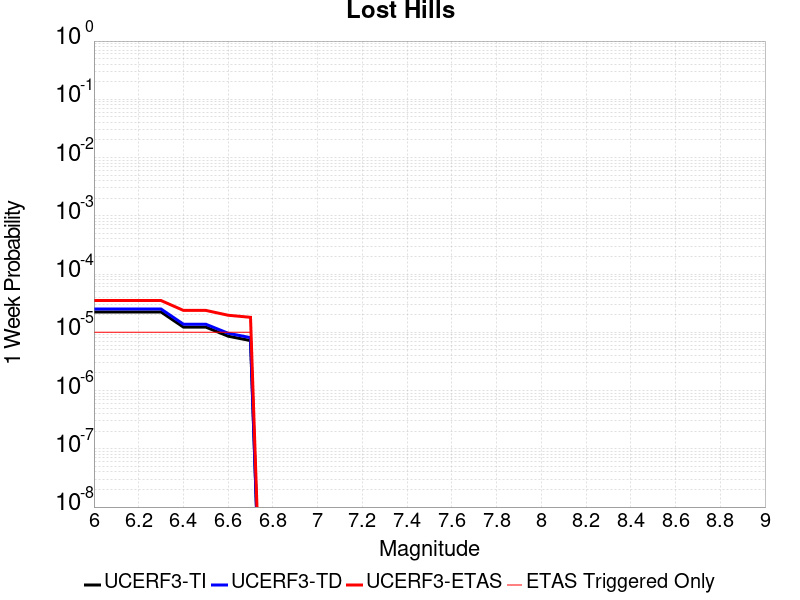 |  |  |  |

| Magnitude | 1 wk TI Prob | 1 wk TD Prob | 1 wk ETAS Prob | 1 wk ETAS/TD Gain | 1 wk ETAS Triggered Only | 1 mo TI Prob | 1 mo TD Prob | 1 mo ETAS Prob | 1 mo ETAS/TD Gain | 1 mo ETAS Triggered Only | 1 yr TI Prob | 1 yr TD Prob | 1 yr ETAS Prob | 1 yr ETAS/TD Gain | 1 yr ETAS Triggered Only | 10 yr TI Prob | 10 yr TD Prob | 10 yr ETAS Prob | 10 yr ETAS/TD Gain | 10 yr ETAS Triggered Only |
|-----|-----|-----|-----|-----|-----|-----|-----|-----|-----|-----|-----|-----|-----|-----|-----|-----|-----|-----|-----|-----|
| 6.0 | 2.233523E-5 | 2.51065E-5 | 7.065307E-5 | 2.8141346 | 4.5547713E-5 | 9.571891E-5 | 1.0759579E-4 | 1.5313861E-4 | 1.4232769 | 4.5547713E-5 | 0.0011647546 | 0.0013093597 | 0.0014003358 | 1.0694814 | 9.1095426E-5 | 0.011586686 | 0.013033048 | 0.013122956 | 1.0068985 | 9.1095426E-5 |
| 6.1 | 2.233523E-5 | 2.51065E-5 | 7.065307E-5 | 2.8141346 | 4.5547713E-5 | 9.571891E-5 | 1.0759579E-4 | 1.5313861E-4 | 1.4232769 | 4.5547713E-5 | 0.0011647546 | 0.0013093597 | 0.0014003358 | 1.0694814 | 9.1095426E-5 | 0.011586686 | 0.013033048 | 0.013122956 | 1.0068985 | 9.1095426E-5 |
| 6.2 | 2.233523E-5 | 2.51065E-5 | 7.065307E-5 | 2.8141346 | 4.5547713E-5 | 9.571891E-5 | 1.0759579E-4 | 1.5313861E-4 | 1.4232769 | 4.5547713E-5 | 0.0011647546 | 0.0013093597 | 0.0014003358 | 1.0694814 | 9.1095426E-5 | 0.011586686 | 0.013033048 | 0.013122956 | 1.0068985 | 9.1095426E-5 |
| 6.3 | 2.233523E-5 | 2.51065E-5 | 7.065307E-5 | 2.8141346 | 4.5547713E-5 | 9.571891E-5 | 1.0759579E-4 | 1.5313861E-4 | 1.4232769 | 4.5547713E-5 | 0.0011647546 | 0.0013093597 | 0.0014003358 | 1.0694814 | 9.1095426E-5 | 0.011586686 | 0.013033048 | 0.013122956 | 1.0068985 | 9.1095426E-5 |
| 6.4 | 1.2288092E-5 | 1.3781063E-5 | 5.9328147E-5 | 4.3050485 | 4.5547713E-5 | 5.2662188E-5 | 5.906089E-5 | 1.0460591E-4 | 1.7711537 | 4.5547713E-5 | 6.409735E-4 | 7.189229E-4 | 8.0995285E-4 | 1.1266199 | 9.1095426E-5 | 0.006391279 | 0.0071751773 | 0.0072656195 | 1.0126048 | 9.1095426E-5 |
| 6.5 | 1.2288092E-5 | 1.3781063E-5 | 5.9328147E-5 | 4.3050485 | 4.5547713E-5 | 5.2662188E-5 | 5.906089E-5 | 1.0460591E-4 | 1.7711537 | 4.5547713E-5 | 6.409735E-4 | 7.189229E-4 | 8.0995285E-4 | 1.1266199 | 9.1095426E-5 | 0.006391279 | 0.0071751773 | 0.0072656195 | 1.0126048 | 9.1095426E-5 |
| 6.6 | 8.58281E-6 | 9.633739E-6 | 5.518101E-5 | 5.727892 | 4.5547713E-5 | 3.6782953E-5 | 4.1287265E-5 | 8.68331E-5 | 2.1031446 | 4.5547713E-5 | 4.4774043E-4 | 5.0263974E-4 | 5.4816453E-4 | 1.0905715 | 4.5547713E-5 | 0.0044683935 | 0.005023189 | 0.0050685075 | 1.009022 | 4.5547713E-5 |
| 6.7 | 7.205685E-6 | 8.0882755E-6 | 5.3635616E-5 | 6.63128 | 4.5547713E-5 | 3.088114E-5 | 3.4664037E-5 | 8.021017E-5 | 2.3139305 | 4.5547713E-5 | 3.7591302E-4 | 4.2203465E-4 | 4.6756314E-4 | 1.1078786 | 4.5547713E-5 | 0.0037527776 | 0.0042203465 | 0.004265702 | 1.0107468 | 4.5547713E-5 |

## Palos Verdes
*[(top)](#table-of-contents)*

| 1 Week | 1 Month | 1 Year | 10 Year |
|-----|-----|-----|-----|
|  |  |  |  |

| Magnitude | 1 wk TI Prob | 1 wk TD Prob | 1 wk ETAS Prob | 1 wk ETAS/TD Gain | 1 wk ETAS Triggered Only | 1 mo TI Prob | 1 mo TD Prob | 1 mo ETAS Prob | 1 mo ETAS/TD Gain | 1 mo ETAS Triggered Only | 1 yr TI Prob | 1 yr TD Prob | 1 yr ETAS Prob | 1 yr ETAS/TD Gain | 1 yr ETAS Triggered Only | 10 yr TI Prob | 10 yr TD Prob | 10 yr ETAS Prob | 10 yr ETAS/TD Gain | 10 yr ETAS Triggered Only |
|-----|-----|-----|-----|-----|-----|-----|-----|-----|-----|-----|-----|-----|-----|-----|-----|-----|-----|-----|-----|-----|
| 6.0 | 6.126063E-5 | 7.622562E-5 | 7.622562E-5 | 1.0 | 0.0 | 2.6251914E-4 | 3.2664367E-4 | 3.2664367E-4 | 1.0 | 0.0 | 0.0031914865 | 0.003970149 | 0.004015516 | 1.011427 | 4.5547713E-5 | 0.031460393 | 0.03904865 | 0.03913619 | 1.0022417 | 9.1095426E-5 |
| 6.1 | 6.126063E-5 | 7.622562E-5 | 7.622562E-5 | 1.0 | 0.0 | 2.6251914E-4 | 3.2664367E-4 | 3.2664367E-4 | 1.0 | 0.0 | 0.0031914865 | 0.003970149 | 0.004015516 | 1.011427 | 4.5547713E-5 | 0.031460393 | 0.03904865 | 0.03913619 | 1.0022417 | 9.1095426E-5 |
| 6.2 | 6.126063E-5 | 7.622562E-5 | 7.622562E-5 | 1.0 | 0.0 | 2.6251914E-4 | 3.2664367E-4 | 3.2664367E-4 | 1.0 | 0.0 | 0.0031914865 | 0.003970149 | 0.004015516 | 1.011427 | 4.5547713E-5 | 0.031460393 | 0.03904865 | 0.03913619 | 1.0022417 | 9.1095426E-5 |
| 6.3 | 4.0838047E-5 | 4.9749142E-5 | 4.9749142E-5 | 1.0 | 0.0 | 1.7500846E-4 | 2.1319446E-4 | 2.1319446E-4 | 1.0 | 0.0 | 0.0021286458 | 0.0025927671 | 0.0026381966 | 1.0175216 | 4.5547713E-5 | 0.021083709 | 0.025646534 | 0.025735293 | 1.0034609 | 9.1095426E-5 |
| 6.4 | 4.0838047E-5 | 4.9749142E-5 | 4.9749142E-5 | 1.0 | 0.0 | 1.7500846E-4 | 2.1319446E-4 | 2.1319446E-4 | 1.0 | 0.0 | 0.0021286458 | 0.0025927671 | 0.0026381966 | 1.0175216 | 4.5547713E-5 | 0.021083709 | 0.025646534 | 0.025735293 | 1.0034609 | 9.1095426E-5 |
| 6.5 | 3.0512005E-5 | 3.656143E-5 | 3.656143E-5 | 1.0 | 0.0 | 1.3075917E-4 | 1.5668309E-4 | 1.5668309E-4 | 1.0 | 0.0 | 0.0015908304 | 0.0019060666 | 0.0019515274 | 1.0238507 | 4.5547713E-5 | 0.015794903 | 0.018909054 | 0.01895374 | 1.0023632 | 4.5547713E-5 |
| 6.6 | 2.9255087E-5 | 3.515423E-5 | 3.515423E-5 | 1.0 | 0.0 | 1.2537291E-4 | 1.5065294E-4 | 1.5065294E-4 | 1.0 | 0.0 | 0.0015253464 | 0.001832773 | 0.0018782371 | 1.0248063 | 4.5547713E-5 | 0.015149189 | 0.018188128 | 0.018232847 | 1.0024587 | 4.5547713E-5 |
| 6.7 | 2.287198E-5 | 2.7248137E-5 | 2.7248137E-5 | 1.0 | 0.0 | 9.801909E-5 | 1.1677302E-4 | 1.1677302E-4 | 1.0 | 0.0 | 0.001192729 | 0.001420876 | 0.001466359 | 1.0320106 | 4.5547713E-5 | 0.011863477 | 0.014127145 | 0.014172049 | 1.0031786 | 4.5547713E-5 |
| 6.8 | 2.1325764E-5 | 2.5431746E-5 | 2.5431746E-5 | 1.0 | 0.0 | 9.139293E-5 | 1.0898915E-4 | 1.0898915E-4 | 1.0 | 0.0 | 0.001112141 | 0.0013262255 | 0.0013717128 | 1.0342983 | 4.5547713E-5 | 0.011065915 | 0.013192143 | 0.01323709 | 1.0034071 | 4.5547713E-5 |
| 6.9 | 1.9009392E-5 | 2.2613433E-5 | 2.2613433E-5 | 1.0 | 0.0 | 8.1466285E-5 | 9.69116E-5 | 9.69116E-5 | 1.0 | 0.0 | 9.914007E-4 | 0.0011793474 | 0.0012248415 | 1.0385755 | 4.5547713E-5 | 0.009869894 | 0.0117395725 | 0.011784586 | 1.0038342 | 4.5547713E-5 |
| 7.0 | 1.7098473E-5 | 2.0319252E-5 | 2.0319252E-5 | 1.0 | 0.0 | 7.3277115E-5 | 8.708009E-5 | 8.708009E-5 | 1.0 | 0.0 | 8.917837E-4 | 0.0010597695 | 0.0011052691 | 1.0429333 | 4.5547713E-5 | 0.008882134 | 0.010555593 | 0.01060066 | 1.0042695 | 4.5547713E-5 |
| 7.1 | 1.5982785E-5 | 1.8994664E-5 | 1.8994664E-5 | 1.0 | 0.0 | 6.849585E-5 | 8.140364E-5 | 8.140364E-5 | 1.0 | 0.0 | 8.336179E-4 | 9.907234E-4 | 0.0010362259 | 1.0459286 | 4.5547713E-5 | 0.008304977 | 0.00987143 | 0.009916528 | 1.0045686 | 4.5547713E-5 |
| 7.2 | 1.4468002E-5 | 1.719715E-5 | 1.719715E-5 | 1.0 | 0.0 | 6.200425E-5 | 7.370046E-5 | 7.370046E-5 | 1.0 | 0.0 | 7.546402E-4 | 8.9701766E-4 | 9.425245E-4 | 1.0507313 | 4.5547713E-5 | 0.007520827 | 0.008942238 | 0.008987379 | 1.005048 | 4.5547713E-5 |
| 7.3 | 5.288233E-6 | 6.203645E-6 | 6.203645E-6 | 1.0 | 0.0 | 2.2663658E-5 | 2.6586977E-5 | 2.6586977E-5 | 1.0 | 0.0 | 2.7589512E-4 | 3.2368326E-4 | 3.2368326E-4 | 1.0 | 0.0 | 0.0027555283 | 0.0032355408 | 0.0032355408 | 1.0 | 0.0 |
| 7.4 | 8.279556E-7 | 8.4083433E-7 | 8.4083433E-7 | 1.0 | 0.0 | 3.5483763E-6 | 3.603571E-6 | 3.603571E-6 | 1.0 | 0.0 | 4.3200624E-5 | 4.3872667E-5 | 4.3872667E-5 | 1.0 | 0.0 | 4.3192226E-4 | 4.386473E-4 | 4.386473E-4 | 1.0 | 0.0 |
| 7.5 | 6.559831E-7 | 6.667226E-7 | 6.667226E-7 | 1.0 | 0.0 | 2.8113532E-6 | 2.8573797E-6 | 2.8573797E-6 | 1.0 | 0.0 | 3.4227687E-5 | 3.478811E-5 | 3.478811E-5 | 1.0 | 0.0 | 3.4222414E-4 | 3.478333E-4 | 3.478333E-4 | 1.0 | 0.0 |
| 7.6 | 3.5018968E-7 | 3.5620013E-7 | 3.5620013E-7 | 1.0 | 0.0 | 1.500812E-6 | 1.5265713E-6 | 1.5265713E-6 | 1.0 | 0.0 | 1.8272232E-5 | 1.8585893E-5 | 1.8585893E-5 | 1.0 | 0.0 | 1.8270731E-4 | 1.85848E-4 | 1.85848E-4 | 1.0 | 0.0 |
| 7.7 | 1.1986104E-7 | 1.219837E-7 | 1.219837E-7 | 1.0 | 0.0 | 5.1369005E-7 | 5.227872E-7 | 5.227872E-7 | 1.0 | 0.0 | 6.2541585E-6 | 6.3649163E-6 | 6.3649163E-6 | 1.0 | 0.0 | 6.2539824E-5 | 6.364738E-5 | 6.364738E-5 | 1.0 | 0.0 |
| 7.8 | 3.0445005E-8 | 3.1027568E-8 | 3.1027568E-8 | 1.0 | 0.0 | 1.3047858E-7 | 1.3297529E-7 | 1.3297529E-7 | 1.0 | 0.0 | 1.5885756E-6 | 1.6189731E-6 | 1.6189731E-6 | 1.0 | 0.0 | 1.5885644E-5 | 1.6189633E-5 | 1.6189633E-5 | 1.0 | 0.0 |

## Elsinore (Glen Ivy) rev
*[(top)](#table-of-contents)*

| 1 Week | 1 Month | 1 Year | 10 Year |
|-----|-----|-----|-----|
|  |  |  |  |

| Magnitude | 1 wk TI Prob | 1 wk TD Prob | 1 wk ETAS Prob | 1 wk ETAS/TD Gain | 1 wk ETAS Triggered Only | 1 mo TI Prob | 1 mo TD Prob | 1 mo ETAS Prob | 1 mo ETAS/TD Gain | 1 mo ETAS Triggered Only | 1 yr TI Prob | 1 yr TD Prob | 1 yr ETAS Prob | 1 yr ETAS/TD Gain | 1 yr ETAS Triggered Only | 10 yr TI Prob | 10 yr TD Prob | 10 yr ETAS Prob | 10 yr ETAS/TD Gain | 10 yr ETAS Triggered Only |
|-----|-----|-----|-----|-----|-----|-----|-----|-----|-----|-----|-----|-----|-----|-----|-----|-----|-----|-----|-----|-----|
| 6.0 | 1.6204086E-4 | 2.9360445E-4 | 3.391388E-4 | 1.1550874 | 4.5547713E-5 | 6.94276E-4 | 0.0012578527 | 0.0013488334 | 1.0723302 | 9.1095426E-5 | 0.008420097 | 0.01523435 | 0.015324057 | 1.0058885 | 9.1095426E-5 | 0.081081145 | 0.139691 | 0.13976936 | 1.000561 | 9.1095426E-5 |
| 6.1 | 1.6204086E-4 | 2.9360445E-4 | 3.391388E-4 | 1.1550874 | 4.5547713E-5 | 6.94276E-4 | 0.0012578527 | 0.0013488334 | 1.0723302 | 9.1095426E-5 | 0.008420097 | 0.01523435 | 0.015324057 | 1.0058885 | 9.1095426E-5 | 0.081081145 | 0.139691 | 0.13976936 | 1.000561 | 9.1095426E-5 |
| 6.2 | 1.6204086E-4 | 2.9360445E-4 | 3.391388E-4 | 1.1550874 | 4.5547713E-5 | 6.94276E-4 | 0.0012578527 | 0.0013488334 | 1.0723302 | 9.1095426E-5 | 0.008420097 | 0.01523435 | 0.015324057 | 1.0058885 | 9.1095426E-5 | 0.081081145 | 0.139691 | 0.13976936 | 1.000561 | 9.1095426E-5 |
| 6.3 | 1.0111737E-4 | 1.7703307E-4 | 2.2257272E-4 | 1.257238 | 4.5547713E-5 | 4.332882E-4 | 7.586092E-4 | 8.0412236E-4 | 1.0599955 | 4.5547713E-5 | 0.005262531 | 0.009217643 | 0.009262771 | 1.0048958 | 4.5547713E-5 | 0.0513964 | 0.087018766 | 0.08706035 | 1.0004779 | 4.5547713E-5 |
| 6.4 | 1.0111737E-4 | 1.7703307E-4 | 2.2257272E-4 | 1.257238 | 4.5547713E-5 | 4.332882E-4 | 7.586092E-4 | 8.0412236E-4 | 1.0599955 | 4.5547713E-5 | 0.005262531 | 0.009217643 | 0.009262771 | 1.0048958 | 4.5547713E-5 | 0.0513964 | 0.087018766 | 0.08706035 | 1.0004779 | 4.5547713E-5 |
| 6.5 | 3.6624708E-5 | 4.639072E-5 | 4.639072E-5 | 1.0 | 0.0 | 1.569536E-4 | 1.9880426E-4 | 1.9880426E-4 | 1.0 | 0.0 | 0.001909235 | 0.002418118 | 0.002418118 | 1.0 | 0.0 | 0.01892915 | 0.023739774 | 0.023739774 | 1.0 | 0.0 |
| 6.6 | 2.5051324E-5 | 2.6147469E-5 | 2.6147469E-5 | 1.0 | 0.0 | 1.073584E-4 | 1.1205602E-4 | 1.1205602E-4 | 1.0 | 0.0 | 0.0013063047 | 0.0013634728 | 0.0013634728 | 1.0 | 0.0 | 0.012986525 | 0.01356449 | 0.01356449 | 1.0 | 0.0 |
| 6.7 | 2.2189772E-5 | 2.2072634E-5 | 2.2072634E-5 | 1.0 | 0.0 | 9.509556E-5 | 9.459378E-5 | 9.459378E-5 | 1.0 | 0.0 | 0.0011571734 | 0.0011511071 | 0.0011511071 | 1.0 | 0.0 | 0.011511663 | 0.011465305 | 0.011465305 | 1.0 | 0.0 |
| 6.8 | 1.6654378E-5 | 1.443758E-5 | 1.443758E-5 | 1.0 | 0.0 | 7.137396E-5 | 6.18739E-5 | 6.18739E-5 | 1.0 | 0.0 | 8.686314E-4 | 7.530596E-4 | 7.530596E-4 | 1.0 | 0.0 | 0.008652439 | 0.0075104153 | 0.0075104153 | 1.0 | 0.0 |
| 6.9 | 1.5042909E-5 | 1.2331914E-5 | 1.2331914E-5 | 1.0 | 0.0 | 6.446802E-5 | 5.285001E-5 | 5.285001E-5 | 1.0 | 0.0 | 7.8461546E-4 | 6.4326206E-4 | 6.4326206E-4 | 1.0 | 0.0 | 0.007818509 | 0.006418224 | 0.006418224 | 1.0 | 0.0 |
| 7.0 | 1.4361385E-5 | 1.1451223E-5 | 1.1451223E-5 | 1.0 | 0.0 | 6.154734E-5 | 4.9075763E-5 | 4.9075763E-5 | 1.0 | 0.0 | 7.490812E-4 | 5.973365E-4 | 5.973365E-4 | 1.0 | 0.0 | 0.007465612 | 0.005961301 | 0.005961301 | 1.0 | 0.0 |
| 7.1 | 1.3265571E-5 | 1.0244836E-5 | 1.0244836E-5 | 1.0 | 0.0 | 5.6851208E-5 | 4.390571E-5 | 4.390571E-5 | 1.0 | 0.0 | 6.919436E-4 | 5.3442345E-4 | 5.3442345E-4 | 1.0 | 0.0 | 0.006897931 | 0.0053347396 | 0.0053347396 | 1.0 | 0.0 |
| 7.2 | 1.1596403E-5 | 8.504992E-6 | 8.504992E-6 | 1.0 | 0.0 | 4.9697923E-5 | 3.6449466E-5 | 3.6449466E-5 | 1.0 | 0.0 | 6.049042E-4 | 4.436836E-4 | 4.436836E-4 | 1.0 | 0.0 | 0.006032603 | 0.004429393 | 0.004429393 | 1.0 | 0.0 |
| 7.3 | 1.0150827E-5 | 7.2386983E-6 | 7.2386983E-6 | 1.0 | 0.0 | 4.3502816E-5 | 3.102263E-5 | 3.102263E-5 | 1.0 | 0.0 | 5.2951806E-4 | 3.7763652E-4 | 3.7763652E-4 | 1.0 | 0.0 | 0.005282581 | 0.0037703344 | 0.0037703344 | 1.0 | 0.0 |
| 7.4 | 9.080705E-6 | 6.3524662E-6 | 6.3524662E-6 | 1.0 | 0.0 | 3.8916725E-5 | 2.7224578E-5 | 2.7224578E-5 | 1.0 | 0.0 | 4.7370812E-4 | 3.3141018E-4 | 3.3141018E-4 | 1.0 | 0.0 | 0.004726996 | 0.0033093104 | 0.0033093104 | 1.0 | 0.0 |
| 7.5 | 7.671649E-6 | 5.22559E-6 | 5.22559E-6 | 1.0 | 0.0 | 3.287808E-5 | 2.2395201E-5 | 2.2395201E-5 | 1.0 | 0.0 | 4.0021708E-4 | 2.726287E-4 | 2.726287E-4 | 1.0 | 0.0 | 0.0039949706 | 0.0027230675 | 0.0027230675 | 1.0 | 0.0 |
| 7.6 | 6.990086E-6 | 4.687506E-6 | 4.687506E-6 | 1.0 | 0.0 | 2.9957167E-5 | 2.0089165E-5 | 2.0089165E-5 | 1.0 | 0.0 | 3.6466747E-4 | 2.4455928E-4 | 2.4455928E-4 | 1.0 | 0.0 | 0.0036406964 | 0.002443018 | 0.002443018 | 1.0 | 0.0 |
| 7.7 | 4.163505E-6 | 2.3295113E-6 | 2.3295113E-6 | 1.0 | 0.0 | 1.7843471E-5 | 9.983586E-6 | 9.983586E-6 | 1.0 | 0.0 | 2.172226E-4 | 1.2154412E-4 | 1.2154412E-4 | 1.0 | 0.0 | 0.0021701038 | 0.0012148495 | 0.0012148495 | 1.0 | 0.0 |
| 7.8 | 2.2692414E-7 | 9.385374E-8 | 9.385374E-8 | 1.0 | 0.0 | 9.725317E-7 | 4.0223028E-7 | 4.0223028E-7 | 1.0 | 0.0 | 1.1840509E-5 | 4.897146E-6 | 4.897146E-6 | 1.0 | 0.0 | 1.1839878E-4 | 4.897071E-5 | 4.897071E-5 | 1.0 | 0.0 |
| 7.9 | 6.676829E-9 | 3.439828E-9 | 3.439828E-9 | 1.0 | 0.0 | 2.861498E-8 | 1.47421195E-8 | 1.47421195E-8 | 1.0 | 0.0 | 3.4838732E-7 | 1.7948528E-7 | 1.7948528E-7 | 1.0 | 0.0 | 3.4838679E-6 | 1.7948516E-6 | 1.7948516E-6 | 1.0 | 0.0 |

## San Andreas (Coachella) rev
*[(top)](#table-of-contents)*

| 1 Week | 1 Month | 1 Year | 10 Year |
|-----|-----|-----|-----|
|  |  |  |  |

| Magnitude | 1 wk TI Prob | 1 wk TD Prob | 1 wk ETAS Prob | 1 wk ETAS/TD Gain | 1 wk ETAS Triggered Only | 1 mo TI Prob | 1 mo TD Prob | 1 mo ETAS Prob | 1 mo ETAS/TD Gain | 1 mo ETAS Triggered Only | 1 yr TI Prob | 1 yr TD Prob | 1 yr ETAS Prob | 1 yr ETAS/TD Gain | 1 yr ETAS Triggered Only | 10 yr TI Prob | 10 yr TD Prob | 10 yr ETAS Prob | 10 yr ETAS/TD Gain | 10 yr ETAS Triggered Only |
|-----|-----|-----|-----|-----|-----|-----|-----|-----|-----|-----|-----|-----|-----|-----|-----|-----|-----|-----|-----|-----|
| 6.0 | 1.1925945E-4 | 3.2723017E-4 | 3.7276297E-4 | 1.1391461 | 4.5547713E-5 | 5.110118E-4 | 0.001401666 | 0.0014471498 | 1.0324498 | 4.5547713E-5 | 0.0062038354 | 0.016933087 | 0.016977863 | 1.0026443 | 4.5547713E-5 | 0.060334753 | 0.15262908 | 0.15270628 | 1.0005058 | 9.1095426E-5 |
| 6.1 | 1.1925945E-4 | 3.2723017E-4 | 3.7276297E-4 | 1.1391461 | 4.5547713E-5 | 5.110118E-4 | 0.001401666 | 0.0014471498 | 1.0324498 | 4.5547713E-5 | 0.0062038354 | 0.016933087 | 0.016977863 | 1.0026443 | 4.5547713E-5 | 0.060334753 | 0.15262908 | 0.15270628 | 1.0005058 | 9.1095426E-5 |
| 6.2 | 1.07432395E-4 | 3.0223778E-4 | 3.477717E-4 | 1.150656 | 4.5547713E-5 | 4.603433E-4 | 0.0012946657 | 0.0013401546 | 1.0351355 | 4.5547713E-5 | 0.005590286 | 0.01564973 | 0.015694566 | 1.002865 | 4.5547713E-5 | 0.05451731 | 0.1417999 | 0.14187807 | 1.0005513 | 9.1095426E-5 |
| 6.3 | 1.0718766E-4 | 3.0169083E-4 | 3.472248E-4 | 1.1509292 | 4.5547713E-5 | 4.592948E-4 | 0.001292324 | 0.0013378129 | 1.0351993 | 4.5547713E-5 | 0.005577586 | 0.01562163 | 0.015666466 | 1.0028701 | 4.5547713E-5 | 0.054396555 | 0.14156814 | 0.14164634 | 1.0005524 | 9.1095426E-5 |
| 6.4 | 1.0355944E-4 | 2.9377177E-4 | 3.3930608E-4 | 1.154999 | 4.5547713E-5 | 4.4375064E-4 | 0.0012584183 | 0.0013039086 | 1.0361489 | 4.5547713E-5 | 0.0053892885 | 0.015214663 | 0.015259518 | 1.0029482 | 4.5547713E-5 | 0.052604496 | 0.13812812 | 0.13820663 | 1.0005684 | 9.1095426E-5 |
| 6.5 | 1.0227914E-4 | 2.909661E-4 | 3.3650055E-4 | 1.156494 | 4.5547713E-5 | 4.382655E-4 | 0.0012464056 | 0.0012918966 | 1.0364977 | 4.5547713E-5 | 0.0053228354 | 0.015070442 | 0.015115303 | 1.0029768 | 4.5547713E-5 | 0.051971316 | 0.13690725 | 0.13698587 | 1.0005742 | 9.1095426E-5 |
| 6.6 | 1.0116757E-4 | 2.8862362E-4 | 3.341582E-4 | 1.1577646 | 4.5547713E-5 | 4.3350324E-4 | 0.0012363759 | 0.0012818673 | 1.0367942 | 4.5547713E-5 | 0.0052651367 | 0.014950012 | 0.014994878 | 1.0030011 | 4.5547713E-5 | 0.051421247 | 0.1358854 | 0.13596411 | 1.0005792 | 9.1095426E-5 |
| 6.7 | 1.0050676E-4 | 2.8720926E-4 | 3.327439E-4 | 1.1585417 | 4.5547713E-5 | 4.3067214E-4 | 0.0012303201 | 0.0012758118 | 1.0369755 | 4.5547713E-5 | 0.005230834 | 0.014877291 | 0.014922162 | 1.003016 | 4.5547713E-5 | 0.051094085 | 0.1352701 | 0.13534887 | 1.0005823 | 9.1095426E-5 |
| 6.8 | 9.976819E-5 | 2.8524583E-4 | 3.3078057E-4 | 1.1596333 | 4.5547713E-5 | 4.2750788E-4 | 0.0012219134 | 0.0012674055 | 1.0372301 | 4.5547713E-5 | 0.0051924936 | 0.014776332 | 0.014821207 | 1.003037 | 4.5547713E-5 | 0.050728295 | 0.13442177 | 0.13450062 | 1.0005866 | 9.1095426E-5 |
| 6.9 | 9.77719E-5 | 2.8021506E-4 | 3.2575E-4 | 1.1625 | 4.5547713E-5 | 4.1895514E-4 | 0.0012003728 | 0.0012458658 | 1.0378991 | 4.5547713E-5 | 0.0050888555 | 0.014517602 | 0.014562488 | 1.0030918 | 4.5547713E-5 | 0.049738888 | 0.13225023 | 0.13232929 | 1.0005977 | 9.1095426E-5 |
| 7.0 | 8.500761E-5 | 2.4756166E-4 | 2.930981E-4 | 1.1839398 | 4.5547713E-5 | 3.6426744E-4 | 0.0010605503 | 0.0011060497 | 1.0429016 | 4.5547713E-5 | 0.0044259406 | 0.012836529 | 0.012881492 | 1.0035027 | 4.5547713E-5 | 0.04338823 | 0.11810792 | 0.11818826 | 1.0006802 | 9.1095426E-5 |
| 7.1 | 8.319876E-5 | 2.4358921E-4 | 2.8912583E-4 | 1.1869402 | 4.5547713E-5 | 3.5651738E-4 | 0.0010435393 | 0.0010890395 | 1.0436018 | 4.5547713E-5 | 0.004331963 | 0.01263184 | 0.012676813 | 1.0035602 | 4.5547713E-5 | 0.042484846 | 0.11632819 | 0.11640869 | 1.000692 | 9.1095426E-5 |
| 7.2 | 7.563917E-5 | 2.2407399E-4 | 2.6961148E-4 | 1.2032254 | 4.5547713E-5 | 3.2412758E-4 | 9.599667E-4 | 0.0010054706 | 1.0474017 | 4.5547713E-5 | 0.0039391145 | 0.01162565 | 0.011670669 | 1.0038723 | 4.5547713E-5 | 0.03870018 | 0.10773429 | 0.10781558 | 1.0007545 | 9.1095426E-5 |
| 7.3 | 7.082985E-5 | 2.0723743E-4 | 2.0723743E-4 | 1.0 | 0.0 | 3.0352117E-4 | 8.87861E-4 | 8.87861E-4 | 1.0 | 0.0 | 0.0036891096 | 0.010756755 | 0.010756755 | 1.0 | 0.0 | 0.03628465 | 0.10025747 | 0.10029846 | 1.0004088 | 4.5547713E-5 |
| 7.4 | 5.146215E-5 | 1.4271007E-4 | 1.4271007E-4 | 1.0 | 0.0 | 2.2053342E-4 | 6.1147206E-4 | 6.1147206E-4 | 1.0 | 0.0 | 0.0026816884 | 0.007419449 | 0.007419449 | 1.0 | 0.0 | 0.02649557 | 0.070837796 | 0.070880115 | 1.0005975 | 4.5547713E-5 |
| 7.5 | 4.0285166E-5 | 1.0941066E-4 | 1.0941066E-4 | 1.0 | 0.0 | 1.7263928E-4 | 4.688189E-4 | 4.688189E-4 | 1.0 | 0.0 | 0.002099857 | 0.005693001 | 0.005693001 | 1.0 | 0.0 | 0.020801254 | 0.055008773 | 0.055051815 | 1.0007825 | 4.5547713E-5 |
| 7.6 | 3.1168736E-5 | 8.438435E-5 | 8.438435E-5 | 1.0 | 0.0 | 1.3357346E-4 | 3.6159722E-4 | 3.6159722E-4 | 1.0 | 0.0 | 0.0016250437 | 0.004393586 | 0.004393586 | 1.0 | 0.0 | 0.016132116 | 0.04280791 | 0.042851508 | 1.0010184 | 4.5547713E-5 |
| 7.7 | 2.2100989E-5 | 6.2383384E-5 | 6.2383384E-5 | 1.0 | 0.0 | 9.4715084E-5 | 2.6733E-4 | 2.6733E-4 | 1.0 | 0.0 | 0.001152546 | 0.0032498916 | 0.0032498916 | 1.0 | 0.0 | 0.011465867 | 0.031898305 | 0.0319424 | 1.0013824 | 4.5547713E-5 |
| 7.8 | 1.7484861E-5 | 5.1792E-5 | 5.1792E-5 | 1.0 | 0.0 | 7.493296E-5 | 2.2194686E-4 | 2.2194686E-4 | 1.0 | 0.0 | 9.1192697E-4 | 0.0026988573 | 0.0026988573 | 1.0 | 0.0 | 0.009081938 | 0.026638424 | 0.026682759 | 1.0016643 | 4.5547713E-5 |
| 7.9 | 1.3967285E-5 | 3.8219507E-5 | 3.8219507E-5 | 1.0 | 0.0 | 5.985842E-5 | 1.6378761E-4 | 1.6378761E-4 | 1.0 | 0.0 | 7.2853256E-4 | 0.0019922915 | 0.0019922915 | 1.0 | 0.0 | 0.0072614877 | 0.01990803 | 0.01995267 | 1.0022423 | 4.5547713E-5 |
| 8.0 | 1.1887396E-5 | 3.10626E-5 | 3.10626E-5 | 1.0 | 0.0 | 5.094499E-5 | 1.3311864E-4 | 1.3311864E-4 | 1.0 | 0.0 | 6.200787E-4 | 0.0016195155 | 0.0016195155 | 1.0 | 0.0 | 0.006183513 | 0.016278049 | 0.016278049 | 1.0 | 0.0 |
| 8.1 | 5.100864E-6 | 8.972364E-6 | 8.972364E-6 | 1.0 | 0.0 | 2.1860664E-5 | 3.8452425E-5 | 3.8452425E-5 | 1.0 | 0.0 | 2.6612106E-4 | 4.680578E-4 | 4.680578E-4 | 1.0 | 0.0 | 0.002658026 | 0.004917206 | 0.004917206 | 1.0 | 0.0 |
| 8.2 | 2.3004484E-6 | 2.7860247E-6 | 2.7860247E-6 | 1.0 | 0.0 | 9.859027E-6 | 1.1940051E-5 | 1.1940051E-5 | 1.0 | 0.0 | 1.2002704E-4 | 1.4536046E-4 | 1.4536046E-4 | 1.0 | 0.0 | 0.0011996223 | 0.0015971722 | 0.0015971722 | 1.0 | 0.0 |
| 8.3 | 1.0424446E-7 | 5.814984E-8 | 5.814984E-8 | 1.0 | 0.0 | 4.4676187E-7 | 2.4921357E-7 | 2.4921357E-7 | 1.0 | 0.0 | 5.439312E-6 | 3.0341714E-6 | 3.0341714E-6 | 1.0 | 0.0 | 5.4391792E-5 | 3.1900923E-5 | 3.1900923E-5 | 1.0 | 0.0 |

## Kern Canyon (South Kern) 2011
*[(top)](#table-of-contents)*

| 1 Week | 1 Month | 1 Year | 10 Year |
|-----|-----|-----|-----|
|  |  | 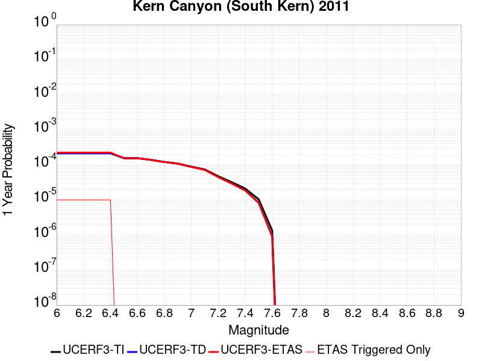 |  |

| Magnitude | 1 wk TI Prob | 1 wk TD Prob | 1 wk ETAS Prob | 1 wk ETAS/TD Gain | 1 wk ETAS Triggered Only | 1 mo TI Prob | 1 mo TD Prob | 1 mo ETAS Prob | 1 mo ETAS/TD Gain | 1 mo ETAS Triggered Only | 1 yr TI Prob | 1 yr TD Prob | 1 yr ETAS Prob | 1 yr ETAS/TD Gain | 1 yr ETAS Triggered Only | 10 yr TI Prob | 10 yr TD Prob | 10 yr ETAS Prob | 10 yr ETAS/TD Gain | 10 yr ETAS Triggered Only |
|-----|-----|-----|-----|-----|-----|-----|-----|-----|-----|-----|-----|-----|-----|-----|-----|-----|-----|-----|-----|-----|
| 6.0 | 4.105075E-6 | 4.1137246E-6 | 4.966125E-5 | 12.072089 | 4.5547713E-5 | 1.7593058E-5 | 1.7630131E-5 | 6.317704E-5 | 3.5834696 | 4.5547713E-5 | 2.1417443E-4 | 2.1462636E-4 | 2.601643E-4 | 1.2121731 | 4.5547713E-5 | 0.0021396813 | 0.0021442545 | 0.0021897047 | 1.0211962 | 4.5547713E-5 |
| 6.1 | 4.105075E-6 | 4.1137246E-6 | 4.966125E-5 | 12.072089 | 4.5547713E-5 | 1.7593058E-5 | 1.7630131E-5 | 6.317704E-5 | 3.5834696 | 4.5547713E-5 | 2.1417443E-4 | 2.1462636E-4 | 2.601643E-4 | 1.2121731 | 4.5547713E-5 | 0.0021396813 | 0.0021442545 | 0.0021897047 | 1.0211962 | 4.5547713E-5 |
| 6.2 | 4.105075E-6 | 4.1137246E-6 | 4.966125E-5 | 12.072089 | 4.5547713E-5 | 1.7593058E-5 | 1.7630131E-5 | 6.317704E-5 | 3.5834696 | 4.5547713E-5 | 2.1417443E-4 | 2.1462636E-4 | 2.601643E-4 | 1.2121731 | 4.5547713E-5 | 0.0021396813 | 0.0021442545 | 0.0021897047 | 1.0211962 | 4.5547713E-5 |
| 6.3 | 4.105075E-6 | 4.1137246E-6 | 4.966125E-5 | 12.072089 | 4.5547713E-5 | 1.7593058E-5 | 1.7630131E-5 | 6.317704E-5 | 3.5834696 | 4.5547713E-5 | 2.1417443E-4 | 2.1462636E-4 | 2.601643E-4 | 1.2121731 | 4.5547713E-5 | 0.0021396813 | 0.0021442545 | 0.0021897047 | 1.0211962 | 4.5547713E-5 |
| 6.4 | 4.105075E-6 | 4.1137246E-6 | 4.966125E-5 | 12.072089 | 4.5547713E-5 | 1.7593058E-5 | 1.7630131E-5 | 6.317704E-5 | 3.5834696 | 4.5547713E-5 | 2.1417443E-4 | 2.1462636E-4 | 2.601643E-4 | 1.2121731 | 4.5547713E-5 | 0.0021396813 | 0.0021442545 | 0.0021897047 | 1.0211962 | 4.5547713E-5 |
| 6.5 | 2.9849807E-6 | 2.9731532E-6 | 2.9731532E-6 | 1.0 | 0.0 | 1.2792712E-5 | 1.27420235E-5 | 1.27420235E-5 | 1.0 | 0.0 | 1.5574014E-4 | 1.5512324E-4 | 1.5512324E-4 | 1.0 | 0.0 | 0.0015563103 | 0.0015501648 | 0.0015501648 | 1.0 | 0.0 |
| 6.6 | 2.9849807E-6 | 2.9731532E-6 | 2.9731532E-6 | 1.0 | 0.0 | 1.2792712E-5 | 1.27420235E-5 | 1.27420235E-5 | 1.0 | 0.0 | 1.5574014E-4 | 1.5512324E-4 | 1.5512324E-4 | 1.0 | 0.0 | 0.0015563103 | 0.0015501648 | 0.0015501648 | 1.0 | 0.0 |
| 6.7 | 2.6756725E-6 | 2.6582195E-6 | 2.6582195E-6 | 1.0 | 0.0 | 1.1467117E-5 | 1.139232E-5 | 1.139232E-5 | 1.0 | 0.0 | 1.396032E-4 | 1.3869278E-4 | 1.3869278E-4 | 1.0 | 0.0 | 0.0013951553 | 0.0013860731 | 0.0013860731 | 1.0 | 0.0 |
| 6.8 | 2.3283721E-6 | 2.3047776E-6 | 2.3047776E-6 | 1.0 | 0.0 | 9.9787E-6 | 9.877582E-6 | 9.877582E-6 | 1.0 | 0.0 | 1.214839E-4 | 1.2025299E-4 | 1.2025299E-4 | 1.0 | 0.0 | 0.001214175 | 0.0012018867 | 0.0012018867 | 1.0 | 0.0 |
| 6.9 | 2.0972677E-6 | 2.06964E-6 | 2.06964E-6 | 1.0 | 0.0 | 8.988259E-6 | 8.869856E-6 | 8.869856E-6 | 1.0 | 0.0 | 1.0942656E-4 | 1.079852E-4 | 1.079852E-4 | 1.0 | 0.0 | 0.0010937268 | 0.0010793331 | 0.0010793331 | 1.0 | 0.0 |
| 7.0 | 1.7132242E-6 | 1.6787027E-6 | 1.6787027E-6 | 1.0 | 0.0 | 7.3423685E-6 | 7.1944205E-6 | 7.1944205E-6 | 1.0 | 0.0 | 8.938967E-5 | 8.758859E-5 | 8.758859E-5 | 1.0 | 0.0 | 8.935372E-4 | 8.755445E-4 | 8.755445E-4 | 1.0 | 0.0 |
| 7.1 | 1.4215541E-6 | 1.3815744E-6 | 1.3815744E-6 | 1.0 | 0.0 | 6.0923603E-6 | 5.92102E-6 | 5.92102E-6 | 1.0 | 0.0 | 7.417196E-5 | 7.208606E-5 | 7.208606E-5 | 1.0 | 0.0 | 7.414721E-4 | 7.2062947E-4 | 7.2062947E-4 | 1.0 | 0.0 |
| 7.2 | 9.097853E-7 | 8.6037704E-7 | 8.6037704E-7 | 1.0 | 0.0 | 3.899074E-6 | 3.687325E-6 | 3.687325E-6 | 1.0 | 0.0 | 4.7470192E-5 | 4.489227E-5 | 4.489227E-5 | 1.0 | 0.0 | 4.7460053E-4 | 4.488331E-4 | 4.488331E-4 | 1.0 | 0.0 |
| 7.3 | 6.144169E-7 | 5.628203E-7 | 5.628203E-7 | 1.0 | 0.0 | 2.6332125E-6 | 2.4120848E-6 | 2.4120848E-6 | 1.0 | 0.0 | 3.205889E-5 | 2.9366742E-5 | 2.9366742E-5 | 1.0 | 0.0 | 3.2054266E-4 | 2.9362913E-4 | 2.9362913E-4 | 1.0 | 0.0 |
| 7.4 | 4.049844E-7 | 3.5728291E-7 | 3.5728291E-7 | 1.0 | 0.0 | 1.7356463E-6 | 1.5312115E-6 | 1.5312115E-6 | 1.0 | 0.0 | 2.1131287E-5 | 1.8642344E-5 | 1.8642344E-5 | 1.0 | 0.0 | 2.1129279E-4 | 1.8640806E-4 | 1.8640806E-4 | 1.0 | 0.0 |
| 7.5 | 1.9871162E-7 | 1.5830427E-7 | 1.5830427E-7 | 1.0 | 0.0 | 8.5162094E-7 | 6.784467E-7 | 6.784467E-7 | 1.0 | 0.0 | 1.0368436E-5 | 8.260059E-6 | 8.260059E-6 | 1.0 | 0.0 | 1.0367952E-4 | 8.25976E-5 | 8.25976E-5 | 1.0 | 0.0 |
| 7.6 | 2.572245E-8 | 1.7352539E-8 | 1.7352539E-8 | 1.0 | 0.0 | 1.10239064E-7 | 7.436802E-8 | 7.436802E-8 | 1.0 | 0.0 | 1.3421597E-6 | 9.0543034E-7 | 9.0543034E-7 | 1.0 | 0.0 | 1.3421517E-5 | 9.054272E-6 | 9.054272E-6 | 1.0 | 0.0 |

## Kern Canyon (Lake Isabella) 2011
*[(top)](#table-of-contents)*

| 1 Week | 1 Month | 1 Year | 10 Year |
|-----|-----|-----|-----|
|  |  |  |  |

| Magnitude | 1 wk TI Prob | 1 wk TD Prob | 1 wk ETAS Prob | 1 wk ETAS/TD Gain | 1 wk ETAS Triggered Only | 1 mo TI Prob | 1 mo TD Prob | 1 mo ETAS Prob | 1 mo ETAS/TD Gain | 1 mo ETAS Triggered Only | 1 yr TI Prob | 1 yr TD Prob | 1 yr ETAS Prob | 1 yr ETAS/TD Gain | 1 yr ETAS Triggered Only | 10 yr TI Prob | 10 yr TD Prob | 10 yr ETAS Prob | 10 yr ETAS/TD Gain | 10 yr ETAS Triggered Only |
|-----|-----|-----|-----|-----|-----|-----|-----|-----|-----|-----|-----|-----|-----|-----|-----|-----|-----|-----|-----|-----|
| 6.0 | 4.2387383E-6 | 4.001636E-6 | 4.9549166E-5 | 12.382226 | 4.5547713E-5 | 1.8165894E-5 | 1.7149767E-5 | 6.26967E-5 | 3.6558337 | 4.5547713E-5 | 2.2114732E-4 | 2.0878029E-4 | 2.543185E-4 | 1.2181154 | 4.5547713E-5 | 0.0022092736 | 0.0020860252 | 0.002131478 | 1.0217892 | 4.5547713E-5 |
| 6.1 | 4.2387383E-6 | 4.001636E-6 | 4.9549166E-5 | 12.382226 | 4.5547713E-5 | 1.8165894E-5 | 1.7149767E-5 | 6.26967E-5 | 3.6558337 | 4.5547713E-5 | 2.2114732E-4 | 2.0878029E-4 | 2.543185E-4 | 1.2181154 | 4.5547713E-5 | 0.0022092736 | 0.0020860252 | 0.002131478 | 1.0217892 | 4.5547713E-5 |
| 6.2 | 4.2387383E-6 | 4.001636E-6 | 4.9549166E-5 | 12.382226 | 4.5547713E-5 | 1.8165894E-5 | 1.7149767E-5 | 6.26967E-5 | 3.6558337 | 4.5547713E-5 | 2.2114732E-4 | 2.0878029E-4 | 2.543185E-4 | 1.2181154 | 4.5547713E-5 | 0.0022092736 | 0.0020860252 | 0.002131478 | 1.0217892 | 4.5547713E-5 |
| 6.3 | 4.2387383E-6 | 4.001636E-6 | 4.9549166E-5 | 12.382226 | 4.5547713E-5 | 1.8165894E-5 | 1.7149767E-5 | 6.26967E-5 | 3.6558337 | 4.5547713E-5 | 2.2114732E-4 | 2.0878029E-4 | 2.543185E-4 | 1.2181154 | 4.5547713E-5 | 0.0022092736 | 0.0020860252 | 0.002131478 | 1.0217892 | 4.5547713E-5 |
| 6.4 | 4.2387383E-6 | 4.001636E-6 | 4.9549166E-5 | 12.382226 | 4.5547713E-5 | 1.8165894E-5 | 1.7149767E-5 | 6.26967E-5 | 3.6558337 | 4.5547713E-5 | 2.2114732E-4 | 2.0878029E-4 | 2.543185E-4 | 1.2181154 | 4.5547713E-5 | 0.0022092736 | 0.0020860252 | 0.002131478 | 1.0217892 | 4.5547713E-5 |
| 6.5 | 2.7857532E-6 | 2.5178654E-6 | 2.5178654E-6 | 1.0 | 0.0 | 1.1938888E-5 | 1.0790809E-5 | 1.0790809E-5 | 1.0 | 0.0 | 1.4534626E-4 | 1.313705E-4 | 1.313705E-4 | 1.0 | 0.0 | 0.0014525123 | 0.0013129612 | 0.0013129612 | 1.0 | 0.0 |
| 6.6 | 2.2233348E-6 | 1.9441222E-6 | 1.9441222E-6 | 1.0 | 0.0 | 9.528543E-6 | 8.331926E-6 | 8.331926E-6 | 1.0 | 0.0 | 1.1600384E-4 | 1.0143657E-4 | 1.0143657E-4 | 1.0 | 0.0 | 0.001159433 | 0.0010139113 | 0.0010139113 | 1.0 | 0.0 |
| 6.7 | 2.1635126E-6 | 1.8835024E-6 | 1.8835024E-6 | 1.0 | 0.0 | 9.272164E-6 | 8.072128E-6 | 8.072128E-6 | 1.0 | 0.0 | 1.1288274E-4 | 9.827381E-5 | 9.827381E-5 | 1.0 | 0.0 | 0.0011282542 | 9.823117E-4 | 9.823117E-4 | 1.0 | 0.0 |
| 6.8 | 1.8685711E-6 | 1.5831414E-6 | 1.5831414E-6 | 1.0 | 0.0 | 8.008137E-6 | 6.7848746E-6 | 6.7848746E-6 | 1.0 | 0.0 | 9.74947E-5 | 8.260277E-5 | 8.260277E-5 | 1.0 | 0.0 | 9.745194E-4 | 8.2572555E-4 | 8.2572555E-4 | 1.0 | 0.0 |
| 6.9 | 1.5815071E-6 | 1.3064919E-6 | 1.3064919E-6 | 1.0 | 0.0 | 6.77787E-6 | 5.599239E-6 | 5.599239E-6 | 1.0 | 0.0 | 8.251744E-5 | 6.816863E-5 | 6.816863E-5 | 1.0 | 0.0 | 8.248681E-4 | 6.8147987E-4 | 6.8147987E-4 | 1.0 | 0.0 |
| 7.0 | 1.3772564E-6 | 1.121071E-6 | 1.121071E-6 | 1.0 | 0.0 | 5.9025137E-6 | 4.8045813E-6 | 4.8045813E-6 | 1.0 | 0.0 | 7.186073E-5 | 5.8494225E-5 | 5.8494225E-5 | 1.0 | 0.0 | 7.18375E-4 | 5.8479037E-4 | 5.8479037E-4 | 1.0 | 0.0 |
| 7.1 | 1.0916998E-6 | 8.763771E-7 | 8.763771E-7 | 1.0 | 0.0 | 4.678705E-6 | 3.7558964E-6 | 3.7558964E-6 | 1.0 | 0.0 | 5.6961744E-5 | 4.5727094E-5 | 4.5727094E-5 | 1.0 | 0.0 | 5.6947145E-4 | 4.571782E-4 | 4.571782E-4 | 1.0 | 0.0 |
| 7.2 | 7.6277024E-7 | 5.90145E-7 | 5.90145E-7 | 1.0 | 0.0 | 3.2690114E-6 | 2.5291904E-6 | 2.5291904E-6 | 1.0 | 0.0 | 3.9799485E-5 | 3.0792464E-5 | 3.0792464E-5 | 1.0 | 0.0 | 3.9792358E-4 | 3.0788258E-4 | 3.0788258E-4 | 1.0 | 0.0 |
| 7.3 | 5.3265916E-7 | 4.3824386E-7 | 4.3824386E-7 | 1.0 | 0.0 | 2.282823E-6 | 1.8781866E-6 | 1.8781866E-6 | 1.0 | 0.0 | 2.7793016E-5 | 2.2866687E-5 | 2.2866687E-5 | 1.0 | 0.0 | 2.778954E-4 | 2.2864371E-4 | 2.2864371E-4 | 1.0 | 0.0 |
| 7.4 | 3.4946007E-7 | 3.006569E-7 | 3.006569E-7 | 1.0 | 0.0 | 1.497685E-6 | 1.2885289E-6 | 1.2885289E-6 | 1.0 | 0.0 | 1.8234163E-5 | 1.5687729E-5 | 1.5687729E-5 | 1.0 | 0.0 | 1.8232666E-4 | 1.5686643E-4 | 1.5686643E-4 | 1.0 | 0.0 |
| 7.5 | 1.8317026E-7 | 1.42448E-7 | 1.42448E-7 | 1.0 | 0.0 | 7.850152E-7 | 6.104913E-7 | 6.104913E-7 | 1.0 | 0.0 | 9.557518E-6 | 7.432707E-6 | 7.432707E-6 | 1.0 | 0.0 | 9.5571064E-5 | 7.4324664E-5 | 7.4324664E-5 | 1.0 | 0.0 |
| 7.6 | 2.572245E-8 | 1.7352539E-8 | 1.7352539E-8 | 1.0 | 0.0 | 1.10239064E-7 | 7.436802E-8 | 7.436802E-8 | 1.0 | 0.0 | 1.3421597E-6 | 9.0543034E-7 | 9.0543034E-7 | 1.0 | 0.0 | 1.3421517E-5 | 9.054272E-6 | 9.054272E-6 | 1.0 | 0.0 |

## Eureka Peak
*[(top)](#table-of-contents)*

| 1 Week | 1 Month | 1 Year | 10 Year |
|-----|-----|-----|-----|
|  |  |  |  |

| Magnitude | 1 wk TI Prob | 1 wk TD Prob | 1 wk ETAS Prob | 1 wk ETAS/TD Gain | 1 wk ETAS Triggered Only | 1 mo TI Prob | 1 mo TD Prob | 1 mo ETAS Prob | 1 mo ETAS/TD Gain | 1 mo ETAS Triggered Only | 1 yr TI Prob | 1 yr TD Prob | 1 yr ETAS Prob | 1 yr ETAS/TD Gain | 1 yr ETAS Triggered Only | 10 yr TI Prob | 10 yr TD Prob | 10 yr ETAS Prob | 10 yr ETAS/TD Gain | 10 yr ETAS Triggered Only |
|-----|-----|-----|-----|-----|-----|-----|-----|-----|-----|-----|-----|-----|-----|-----|-----|-----|-----|-----|-----|-----|
| 6.0 | 3.1949054E-5 | 9.310349E-6 | 5.4857635E-5 | 5.8921137 | 4.5547713E-5 | 1.3691733E-4 | 3.9901326E-5 | 8.5447224E-5 | 2.141463 | 4.5547713E-5 | 0.0016656938 | 4.8576848E-4 | 5.3129403E-4 | 1.0937186 | 4.5547713E-5 | 0.016532637 | 0.004924774 | 0.0049700974 | 1.0092032 | 4.5547713E-5 |
| 6.1 | 3.1949054E-5 | 9.310349E-6 | 5.4857635E-5 | 5.8921137 | 4.5547713E-5 | 1.3691733E-4 | 3.9901326E-5 | 8.5447224E-5 | 2.141463 | 4.5547713E-5 | 0.0016656938 | 4.8576848E-4 | 5.3129403E-4 | 1.0937186 | 4.5547713E-5 | 0.016532637 | 0.004924774 | 0.0049700974 | 1.0092032 | 4.5547713E-5 |
| 6.2 | 3.1949054E-5 | 9.310349E-6 | 5.4857635E-5 | 5.8921137 | 4.5547713E-5 | 1.3691733E-4 | 3.9901326E-5 | 8.5447224E-5 | 2.141463 | 4.5547713E-5 | 0.0016656938 | 4.8576848E-4 | 5.3129403E-4 | 1.0937186 | 4.5547713E-5 | 0.016532637 | 0.004924774 | 0.0049700974 | 1.0092032 | 4.5547713E-5 |
| 6.3 | 2.7339745E-5 | 7.980512E-6 | 5.352786E-5 | 6.707321 | 4.5547713E-5 | 1.1716507E-4 | 3.4202174E-5 | 7.974833E-5 | 2.331674 | 4.5547713E-5 | 0.0014255513 | 4.164078E-4 | 4.6193655E-4 | 1.109337 | 4.5547713E-5 | 0.0141644105 | 0.004228261 | 0.004273616 | 1.0107267 | 4.5547713E-5 |
| 6.4 | 2.7339745E-5 | 7.980512E-6 | 5.352786E-5 | 6.707321 | 4.5547713E-5 | 1.1716507E-4 | 3.4202174E-5 | 7.974833E-5 | 2.331674 | 4.5547713E-5 | 0.0014255513 | 4.164078E-4 | 4.6193655E-4 | 1.109337 | 4.5547713E-5 | 0.0141644105 | 0.004228261 | 0.004273616 | 1.0107267 | 4.5547713E-5 |
| 6.5 | 9.738388E-8 | 1.8618802E-7 | 1.8618802E-7 | 1.0 | 0.0 | 4.1735944E-7 | 7.979484E-7 | 7.979484E-7 | 1.0 | 0.0 | 5.081339E-6 | 9.71498E-6 | 9.71498E-6 | 1.0 | 0.0 | 5.0812232E-5 | 9.7145625E-5 | 9.7145625E-5 | 1.0 | 0.0 |
| 6.6 | 9.3495956E-8 | 1.8327636E-7 | 1.8327636E-7 | 1.0 | 0.0 | 4.0069688E-7 | 7.8546987E-7 | 7.8546987E-7 | 1.0 | 0.0 | 4.8784736E-6 | 9.563055E-6 | 9.563055E-6 | 1.0 | 0.0 | 4.8783666E-5 | 9.5626514E-5 | 9.5626514E-5 | 1.0 | 0.0 |
| 6.7 | 9.3495956E-8 | 1.8327636E-7 | 1.8327636E-7 | 1.0 | 0.0 | 4.0069688E-7 | 7.8546987E-7 | 7.8546987E-7 | 1.0 | 0.0 | 4.8784736E-6 | 9.563055E-6 | 9.563055E-6 | 1.0 | 0.0 | 4.8783666E-5 | 9.5626514E-5 | 9.5626514E-5 | 1.0 | 0.0 |
| 6.8 | 8.591428E-8 | 1.8020607E-7 | 1.8020607E-7 | 1.0 | 0.0 | 3.68204E-7 | 7.723115E-7 | 7.723115E-7 | 1.0 | 0.0 | 4.4828744E-6 | 9.402853E-6 | 9.402853E-6 | 1.0 | 0.0 | 4.482784E-5 | 9.4024625E-5 | 9.4024625E-5 | 1.0 | 0.0 |
| 6.9 | 7.749723E-8 | 1.7438616E-7 | 1.7438616E-7 | 1.0 | 0.0 | 3.3213098E-7 | 7.473691E-7 | 7.473691E-7 | 1.0 | 0.0 | 4.043687E-6 | 9.099182E-6 | 9.099182E-6 | 1.0 | 0.0 | 4.0436134E-5 | 9.0988164E-5 | 9.0988164E-5 | 1.0 | 0.0 |
| 7.0 | 6.897872E-8 | 1.6414864E-7 | 1.6414864E-7 | 1.0 | 0.0 | 2.9562307E-7 | 7.0349404E-7 | 7.0349404E-7 | 1.0 | 0.0 | 3.5992048E-6 | 8.565007E-6 | 8.565007E-6 | 1.0 | 0.0 | 3.5991467E-5 | 8.564684E-5 | 8.564684E-5 | 1.0 | 0.0 |
| 7.1 | 5.859318E-8 | 1.4786792E-7 | 1.4786792E-7 | 1.0 | 0.0 | 2.5111362E-7 | 6.3371954E-7 | 6.3371954E-7 | 1.0 | 0.0 | 3.057304E-6 | 7.715508E-6 | 7.715508E-6 | 1.0 | 0.0 | 3.0572617E-5 | 7.715247E-5 | 7.715247E-5 | 1.0 | 0.0 |
| 7.2 | 5.1375338E-8 | 1.3420691E-7 | 1.3420691E-7 | 1.0 | 0.0 | 2.2018E-7 | 5.7517235E-7 | 5.7517235E-7 | 1.0 | 0.0 | 2.680688E-6 | 7.0027013E-6 | 7.0027013E-6 | 1.0 | 0.0 | 2.6806558E-5 | 7.0024864E-5 | 7.0024864E-5 | 1.0 | 0.0 |
| 7.3 | 4.5441396E-8 | 1.1635977E-7 | 1.1635977E-7 | 1.0 | 0.0 | 1.9474882E-7 | 4.9868464E-7 | 4.9868464E-7 | 1.0 | 0.0 | 2.3710643E-6 | 6.071469E-6 | 6.071469E-6 | 1.0 | 0.0 | 2.371039E-5 | 6.0713086E-5 | 6.0713086E-5 | 1.0 | 0.0 |
| 7.4 | 2.981918E-8 | 6.9110754E-8 | 6.9110754E-8 | 1.0 | 0.0 | 1.2779647E-7 | 2.9618892E-7 | 2.9618892E-7 | 1.0 | 0.0 | 1.5559209E-6 | 3.6060947E-6 | 3.6060947E-6 | 1.0 | 0.0 | 1.55591E-5 | 3.6060403E-5 | 3.6060403E-5 | 1.0 | 0.0 |
| 7.5 | 4.24214E-9 | 8.342036E-9 | 8.342036E-9 | 1.0 | 0.0 | 1.81806E-8 | 3.5751587E-8 | 3.5751587E-8 | 1.0 | 0.0 | 2.213488E-7 | 4.3527552E-7 | 4.3527552E-7 | 1.0 | 0.0 | 2.2134857E-6 | 4.352753E-6 | 4.352753E-6 | 1.0 | 0.0 |

## Santa Cruz Island
*[(top)](#table-of-contents)*

| 1 Week | 1 Month | 1 Year | 10 Year |
|-----|-----|-----|-----|
|  |  | 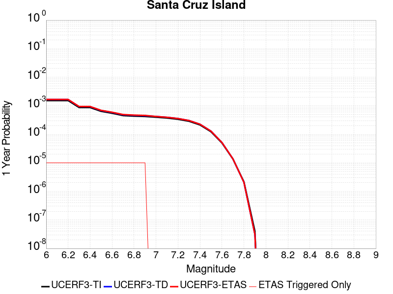 |  |

| Magnitude | 1 wk TI Prob | 1 wk TD Prob | 1 wk ETAS Prob | 1 wk ETAS/TD Gain | 1 wk ETAS Triggered Only | 1 mo TI Prob | 1 mo TD Prob | 1 mo ETAS Prob | 1 mo ETAS/TD Gain | 1 mo ETAS Triggered Only | 1 yr TI Prob | 1 yr TD Prob | 1 yr ETAS Prob | 1 yr ETAS/TD Gain | 1 yr ETAS Triggered Only | 10 yr TI Prob | 10 yr TD Prob | 10 yr ETAS Prob | 10 yr ETAS/TD Gain | 10 yr ETAS Triggered Only |
|-----|-----|-----|-----|-----|-----|-----|-----|-----|-----|-----|-----|-----|-----|-----|-----|-----|-----|-----|-----|-----|
| 6.0 | 2.9164563E-5 | 3.1599673E-5 | 3.1599673E-5 | 1.0 | 0.0 | 1.2498499E-4 | 1.3542091E-4 | 1.3542091E-4 | 1.0 | 0.0 | 0.0015206301 | 0.0016476389 | 0.0016931115 | 1.0275987 | 4.5547713E-5 | 0.015102667 | 0.016367963 | 0.016412765 | 1.0027372 | 4.5547713E-5 |
| 6.1 | 2.9164563E-5 | 3.1599673E-5 | 3.1599673E-5 | 1.0 | 0.0 | 1.2498499E-4 | 1.3542091E-4 | 1.3542091E-4 | 1.0 | 0.0 | 0.0015206301 | 0.0016476389 | 0.0016931115 | 1.0275987 | 4.5547713E-5 | 0.015102667 | 0.016367963 | 0.016412765 | 1.0027372 | 4.5547713E-5 |
| 6.2 | 2.9164563E-5 | 3.1599673E-5 | 3.1599673E-5 | 1.0 | 0.0 | 1.2498499E-4 | 1.3542091E-4 | 1.3542091E-4 | 1.0 | 0.0 | 0.0015206301 | 0.0016476389 | 0.0016931115 | 1.0275987 | 4.5547713E-5 | 0.015102667 | 0.016367963 | 0.016412765 | 1.0027372 | 4.5547713E-5 |
| 6.3 | 1.6635553E-5 | 1.7804325E-5 | 1.7804325E-5 | 1.0 | 0.0 | 7.1293274E-5 | 7.630212E-5 | 7.630212E-5 | 1.0 | 0.0 | 8.6765E-4 | 9.286006E-4 | 9.74106E-4 | 1.0490043 | 4.5547713E-5 | 0.008642701 | 0.009249076 | 0.009294203 | 1.004879 | 4.5547713E-5 |
| 6.4 | 1.6635553E-5 | 1.7804325E-5 | 1.7804325E-5 | 1.0 | 0.0 | 7.1293274E-5 | 7.630212E-5 | 7.630212E-5 | 1.0 | 0.0 | 8.6765E-4 | 9.286006E-4 | 9.74106E-4 | 1.0490043 | 4.5547713E-5 | 0.008642701 | 0.009249076 | 0.009294203 | 1.004879 | 4.5547713E-5 |
| 6.5 | 1.2238748E-5 | 1.3042973E-5 | 1.3042973E-5 | 1.0 | 0.0 | 5.2450723E-5 | 5.5897275E-5 | 5.5897275E-5 | 1.0 | 0.0 | 6.3840044E-4 | 6.803405E-4 | 7.258573E-4 | 1.0669029 | 4.5547713E-5 | 0.0063656955 | 0.006782976 | 0.0068282145 | 1.0066694 | 4.5547713E-5 |
| 6.6 | 1.0489767E-5 | 1.1156617E-5 | 1.1156617E-5 | 1.0 | 0.0 | 4.495537E-5 | 4.7813206E-5 | 4.7813206E-5 | 1.0 | 0.0 | 5.4719415E-4 | 5.8197253E-4 | 6.274937E-4 | 1.0782188 | 4.5547713E-5 | 0.005458487 | 0.005804726 | 0.005850009 | 1.007801 | 4.5547713E-5 |
| 6.7 | 8.699222E-6 | 9.236766E-6 | 9.236766E-6 | 1.0 | 0.0 | 3.7281847E-5 | 3.9585546E-5 | 3.9585546E-5 | 1.0 | 0.0 | 4.5381195E-4 | 4.8184796E-4 | 5.2737375E-4 | 1.0944816 | 4.5547713E-5 | 0.0045288634 | 0.0048081 | 0.0048534283 | 1.0094275 | 4.5547713E-5 |
| 6.8 | 8.307732E-6 | 8.816889E-6 | 8.816889E-6 | 1.0 | 0.0 | 3.560408E-5 | 3.7786125E-5 | 3.7786125E-5 | 1.0 | 0.0 | 4.3339343E-4 | 4.5994937E-4 | 5.0547614E-4 | 1.0989821 | 4.5547713E-5 | 0.004325492 | 0.0045900275 | 0.004635366 | 1.0098777 | 4.5547713E-5 |
| 6.9 | 8.073121E-6 | 8.564924E-6 | 8.564924E-6 | 1.0 | 0.0 | 3.459863E-5 | 3.6706308E-5 | 3.6706308E-5 | 1.0 | 0.0 | 4.2115687E-4 | 4.4680806E-4 | 4.923354E-4 | 1.1018946 | 4.5547713E-5 | 0.004203596 | 0.0044591487 | 0.0045044934 | 1.0101689 | 4.5547713E-5 |
| 7.0 | 7.617019E-6 | 8.074651E-6 | 8.074651E-6 | 1.0 | 0.0 | 3.264396E-5 | 3.460519E-5 | 3.460519E-5 | 1.0 | 0.0 | 3.9736772E-4 | 4.2123714E-4 | 4.2123714E-4 | 1.0 | 0.0 | 0.003966579 | 0.0042044343 | 0.0042044343 | 1.0 | 0.0 |
| 7.1 | 7.1224836E-6 | 7.5457756E-6 | 7.5457756E-6 | 1.0 | 0.0 | 3.052457E-5 | 3.2338638E-5 | 3.2338638E-5 | 1.0 | 0.0 | 3.715733E-4 | 3.9365215E-4 | 3.9365215E-4 | 1.0 | 0.0 | 0.003709526 | 0.0039295917 | 0.0039295917 | 1.0 | 0.0 |
| 7.2 | 6.441115E-6 | 6.827372E-6 | 6.827372E-6 | 1.0 | 0.0 | 2.7604487E-5 | 2.925984E-5 | 2.925984E-5 | 1.0 | 0.0 | 3.360328E-4 | 3.5618054E-4 | 3.5618054E-4 | 1.0 | 0.0 | 0.0033552512 | 0.003556125 | 0.003556125 | 1.0 | 0.0 |
| 7.3 | 5.494274E-6 | 5.819985E-6 | 5.819985E-6 | 1.0 | 0.0 | 2.3546674E-5 | 2.4942556E-5 | 2.4942556E-5 | 1.0 | 0.0 | 2.8664304E-4 | 3.0363348E-4 | 3.0363348E-4 | 1.0 | 0.0 | 0.002862736 | 0.0030322094 | 0.0030322094 | 1.0 | 0.0 |
| 7.4 | 4.0802624E-6 | 4.3122495E-6 | 4.3122495E-6 | 1.0 | 0.0 | 1.7486722E-5 | 1.8480938E-5 | 1.8480938E-5 | 1.0 | 0.0 | 2.1288003E-4 | 2.2498227E-4 | 2.2498227E-4 | 1.0 | 0.0 | 0.0021267622 | 0.002247554 | 0.002247554 | 1.0 | 0.0 |
| 7.5 | 2.3584746E-6 | 2.475306E-6 | 2.475306E-6 | 1.0 | 0.0 | 1.0107709E-5 | 1.0608412E-5 | 1.0608412E-5 | 1.0 | 0.0 | 1.2305441E-4 | 1.291498E-4 | 1.291498E-4 | 1.0 | 0.0 | 0.0012298629 | 0.0012907526 | 0.0012907526 | 1.0 | 0.0 |
| 7.6 | 9.4981914E-7 | 9.860919E-7 | 9.860919E-7 | 1.0 | 0.0 | 4.0706473E-6 | 4.2261013E-6 | 4.2261013E-6 | 1.0 | 0.0 | 4.9559E-5 | 5.145158E-5 | 5.145158E-5 | 1.0 | 0.0 | 4.954795E-4 | 5.14398E-4 | 5.14398E-4 | 1.0 | 0.0 |
| 7.7 | 2.6013532E-7 | 2.641658E-7 | 2.641658E-7 | 1.0 | 0.0 | 1.1148652E-6 | 1.1321387E-6 | 1.1321387E-6 | 1.0 | 0.0 | 1.3573399E-5 | 1.3783702E-5 | 1.3783702E-5 | 1.0 | 0.0 | 1.357257E-4 | 1.3782854E-4 | 1.3782854E-4 | 1.0 | 0.0 |
| 7.8 | 4.1522263E-8 | 3.965676E-8 | 3.965676E-8 | 1.0 | 0.0 | 1.7795254E-7 | 1.6995754E-7 | 1.6995754E-7 | 1.0 | 0.0 | 2.16657E-6 | 2.0692314E-6 | 2.0692314E-6 | 1.0 | 0.0 | 2.1665488E-5 | 2.0692141E-5 | 2.0692141E-5 | 1.0 | 0.0 |
| 7.9 | 7.7242046E-10 | 5.946812E-10 | 5.946812E-10 | 1.0 | 0.0 | 3.3103735E-9 | 2.5486335E-9 | 2.5486335E-9 | 1.0 | 0.0 | 4.0303796E-8 | 3.1029614E-8 | 3.1029614E-8 | 1.0 | 0.0 | 4.030379E-7 | 3.102961E-7 | 3.102961E-7 | 1.0 | 0.0 |

## San Andreas (Creeping Section) 2011 CFM
*[(top)](#table-of-contents)*

| 1 Week | 1 Month | 1 Year | 10 Year |
|-----|-----|-----|-----|
|  |  |  |  |

| Magnitude | 1 wk TI Prob | 1 wk TD Prob | 1 wk ETAS Prob | 1 wk ETAS/TD Gain | 1 wk ETAS Triggered Only | 1 mo TI Prob | 1 mo TD Prob | 1 mo ETAS Prob | 1 mo ETAS/TD Gain | 1 mo ETAS Triggered Only | 1 yr TI Prob | 1 yr TD Prob | 1 yr ETAS Prob | 1 yr ETAS/TD Gain | 1 yr ETAS Triggered Only | 10 yr TI Prob | 10 yr TD Prob | 10 yr ETAS Prob | 10 yr ETAS/TD Gain | 10 yr ETAS Triggered Only |
|-----|-----|-----|-----|-----|-----|-----|-----|-----|-----|-----|-----|-----|-----|-----|-----|-----|-----|-----|-----|-----|
| 6.0 | 5.986481E-4 | 0.0012286972 | 0.001274189 | 1.0370244 | 4.5547713E-5 | 0.0025631124 | 0.00524696 | 0.0052922685 | 1.0086353 | 4.5547713E-5 | 0.030762846 | 0.061202604 | 0.061245363 | 1.0006987 | 4.5547713E-5 | 0.26835477 | 0.42592302 | 0.42594916 | 1.0000614 | 4.5547713E-5 |
| 6.1 | 5.015945E-4 | 0.0010229645 | 0.0010684656 | 1.0444796 | 4.5547713E-5 | 0.00214792 | 0.004369588 | 0.004414937 | 1.0103782 | 4.5547713E-5 | 0.025839351 | 0.051246066 | 0.05128928 | 1.0008433 | 4.5547713E-5 | 0.23032776 | 0.37284485 | 0.37287343 | 1.0000767 | 4.5547713E-5 |
| 6.2 | 4.073338E-4 | 8.115361E-4 | 8.570468E-4 | 1.0560797 | 4.5547713E-5 | 0.0017445484 | 0.003468385 | 0.0035137746 | 1.0130867 | 4.5547713E-5 | 0.021034058 | 0.040931217 | 0.0409749 | 1.0010673 | 4.5547713E-5 | 0.19150782 | 0.31302088 | 0.31305218 | 1.0001 | 4.5547713E-5 |
| 6.3 | 3.464099E-4 | 6.745419E-4 | 7.200589E-4 | 1.0674784 | 4.5547713E-5 | 0.0014837692 | 0.002883343 | 0.0029287594 | 1.0157512 | 4.5547713E-5 | 0.017915873 | 0.034187317 | 0.034231305 | 1.0012867 | 4.5547713E-5 | 0.16538359 | 0.2713031 | 0.2713363 | 1.0001223 | 4.5547713E-5 |
| 6.4 | 2.935057E-4 | 5.551342E-4 | 6.006566E-4 | 1.0820025 | 4.5547713E-5 | 0.0012572751 | 0.002372886 | 0.0024183257 | 1.0191495 | 4.5547713E-5 | 0.015200248 | 0.028262215 | 0.028306475 | 1.001566 | 4.5547713E-5 | 0.14201577 | 0.23297104 | 0.23300599 | 1.00015 | 4.5547713E-5 |
| 6.5 | 2.3409708E-4 | 4.2130658E-4 | 4.668351E-4 | 1.108065 | 4.5547713E-5 | 0.0010028875 | 0.0018018549 | 0.0018473206 | 1.0252327 | 4.5547713E-5 | 0.012141965 | 0.021585694 | 0.021630257 | 1.0020646 | 4.5547713E-5 | 0.11499573 | 0.18680891 | 0.18684596 | 1.0001982 | 4.5547713E-5 |
| 6.6 | 1.5842178E-4 | 2.5067228E-4 | 2.9620857E-4 | 1.1816567 | 4.5547713E-5 | 6.7877385E-4 | 0.0010738597 | 0.0011193585 | 1.0423694 | 4.5547713E-5 | 0.0082328 | 0.012994494 | 0.01303945 | 1.0034596 | 4.5547713E-5 | 0.07934396 | 0.1231311 | 0.12317103 | 1.0003244 | 4.5547713E-5 |
| 6.7 | 1.5616413E-4 | 2.4603796E-4 | 2.9157446E-4 | 1.1850792 | 4.5547713E-5 | 6.691031E-4 | 0.0010540152 | 0.0010995149 | 1.043168 | 4.5547713E-5 | 0.0081159435 | 0.012756367 | 0.012801333 | 1.003525 | 4.5547713E-5 | 0.0782586 | 0.12115822 | 0.121198244 | 1.0003303 | 4.5547713E-5 |
| 6.8 | 1.5538467E-4 | 2.442769E-4 | 2.8981347E-4 | 1.1864138 | 4.5547713E-5 | 6.6576427E-4 | 0.0010464739 | 0.001091974 | 1.0434794 | 4.5547713E-5 | 0.008075596 | 0.012665753 | 0.012710724 | 1.0035505 | 4.5547713E-5 | 0.07788358 | 0.12038911 | 0.12042918 | 1.0003328 | 4.5547713E-5 |
| 6.9 | 1.5153569E-4 | 2.3536953E-4 | 2.8090653E-4 | 1.1934702 | 4.5547713E-5 | 6.49277E-4 | 0.0010083386 | 0.0010538404 | 1.0451255 | 4.5547713E-5 | 0.007876333 | 0.012207948 | 0.01225294 | 1.0036855 | 4.5547713E-5 | 0.07602952 | 0.11645927 | 0.11649952 | 1.0003456 | 4.5547713E-5 |
| 7.0 | 1.4588932E-4 | 2.239424E-4 | 2.694799E-4 | 1.2033447 | 4.5547713E-5 | 6.250901E-4 | 9.594021E-4 | 0.0010049061 | 1.0474296 | 4.5547713E-5 | 0.0075839474 | 0.011618658 | 0.011663676 | 1.0038747 | 4.5547713E-5 | 0.073302895 | 0.11130563 | 0.11134611 | 1.0003637 | 4.5547713E-5 |
| 7.1 | 1.1565079E-4 | 1.6279978E-4 | 2.0834009E-4 | 1.2797319 | 4.5547713E-5 | 4.955521E-4 | 6.9752766E-4 | 7.430436E-4 | 1.0652533 | 4.5547713E-5 | 0.006016669 | 0.008459533 | 0.008504695 | 1.0053387 | 4.5547713E-5 | 0.058563538 | 0.08365876 | 0.0837005 | 1.0004989 | 4.5547713E-5 |
| 7.2 | 1.0393792E-4 | 1.4614112E-4 | 1.9168218E-4 | 1.3116238 | 4.5547713E-5 | 4.4537216E-4 | 6.261695E-4 | 6.716887E-4 | 1.0726947 | 4.5547713E-5 | 0.005408933 | 0.007597135 | 0.0076423367 | 1.0059499 | 4.5547713E-5 | 0.052791595 | 0.075609244 | 0.07565135 | 1.0005568 | 4.5547713E-5 |
| 7.3 | 9.332884E-5 | 1.277942E-4 | 1.733361E-4 | 1.3563689 | 4.5547713E-5 | 3.999194E-4 | 5.475752E-4 | 5.9309794E-4 | 1.0831352 | 4.5547713E-5 | 0.0048581534 | 0.006646483 | 0.0066917283 | 1.0068073 | 4.5547713E-5 | 0.047533102 | 0.06647413 | 0.06651665 | 1.0006397 | 4.5547713E-5 |
| 7.4 | 8.670252E-5 | 1.1701832E-4 | 1.625607E-4 | 1.3891902 | 4.5547713E-5 | 3.715293E-4 | 5.0141127E-4 | 5.469361E-4 | 1.0907935 | 4.5547713E-5 | 0.004513991 | 0.0060877153 | 0.006132986 | 1.0074364 | 4.5547713E-5 | 0.044233937 | 0.061143413 | 0.061186176 | 1.0006994 | 4.5547713E-5 |
| 7.5 | 7.3036405E-5 | 9.004733E-5 | 1.3559095E-4 | 1.5057741 | 4.5547713E-5 | 3.129756E-4 | 3.8586016E-4 | 4.3139028E-4 | 1.1179965 | 4.5547713E-5 | 0.0038038217 | 0.0046877493 | 0.0047330833 | 1.0096707 | 4.5547713E-5 | 0.03739367 | 0.047871016 | 0.047914382 | 1.0009059 | 4.5547713E-5 |
| 7.6 | 6.3935775E-5 | 8.279309E-5 | 1.2833704E-4 | 1.5500935 | 4.5547713E-5 | 2.7398168E-4 | 3.5477936E-4 | 4.003109E-4 | 1.1283376 | 4.5547713E-5 | 0.0033306254 | 0.0043109027 | 0.004356254 | 1.0105201 | 4.5547713E-5 | 0.032811474 | 0.04398585 | 0.044029392 | 1.0009899 | 4.5547713E-5 |
| 7.7 | 5.5050095E-5 | 6.66093E-5 | 1.12153975E-4 | 1.6837585 | 4.5547713E-5 | 2.3590765E-4 | 2.854372E-4 | 3.3097193E-4 | 1.1595262 | 4.5547713E-5 | 0.0028683927 | 0.0034696644 | 0.003515054 | 1.0130819 | 4.5547713E-5 | 0.0283165 | 0.035791222 | 0.03583514 | 1.001227 | 4.5547713E-5 |
| 7.8 | 5.027131E-5 | 6.1620405E-5 | 6.1620405E-5 | 1.0 | 0.0 | 2.1543067E-4 | 2.640607E-4 | 2.640607E-4 | 1.0 | 0.0 | 0.0026197135 | 0.0032102033 | 0.0032102033 | 1.0 | 0.0 | 0.025890453 | 0.03312217 | 0.03312217 | 1.0 | 0.0 |
| 7.9 | 3.7271806E-5 | 5.0218474E-5 | 5.0218474E-5 | 1.0 | 0.0 | 1.5972654E-4 | 2.1520429E-4 | 2.1520429E-4 | 1.0 | 0.0 | 0.0019429359 | 0.002616966 | 0.002616966 | 1.0 | 0.0 | 0.019260362 | 0.027063787 | 0.027063787 | 1.0 | 0.0 |
| 8.0 | 2.7310243E-5 | 3.1424468E-5 | 3.1424468E-5 | 1.0 | 0.0 | 1.17038646E-4 | 1.3466935E-4 | 1.3466935E-4 | 1.0 | 0.0 | 0.0014240141 | 0.0016383671 | 0.0016383671 | 1.0 | 0.0 | 0.014149235 | 0.017211871 | 0.017211871 | 1.0 | 0.0 |
| 8.1 | 1.7940547E-5 | 1.7398293E-5 | 1.7398293E-5 | 1.0 | 0.0 | 7.688579E-5 | 7.456199E-5 | 7.456199E-5 | 1.0 | 0.0 | 9.3568244E-4 | 9.074147E-4 | 9.074147E-4 | 1.0 | 0.0 | 0.009317525 | 0.009797759 | 0.009797759 | 1.0 | 0.0 |
| 8.2 | 8.643924E-6 | 5.4738607E-6 | 5.4738607E-6 | 1.0 | 0.0 | 3.704486E-5 | 2.3459192E-5 | 2.3459192E-5 | 1.0 | 0.0 | 4.5092785E-4 | 2.855783E-4 | 2.855783E-4 | 1.0 | 0.0 | 0.0045001395 | 0.0032481598 | 0.0032481598 | 1.0 | 0.0 |
| 8.3 | 1.983087E-6 | 7.658221E-7 | 7.658221E-7 | 1.0 | 0.0 | 8.498917E-6 | 3.2820906E-6 | 3.2820906E-6 | 1.0 | 0.0 | 1.034694E-4 | 3.9958737E-5 | 3.9958737E-5 | 1.0 | 0.0 | 0.0010342124 | 4.7187202E-4 | 4.7187202E-4 | 1.0 | 0.0 |

## Channel Islands Western Deep Ramp
*[(top)](#table-of-contents)*

| 1 Week | 1 Month | 1 Year | 10 Year |
|-----|-----|-----|-----|
|  |  |  |  |

| Magnitude | 1 wk TI Prob | 1 wk TD Prob | 1 wk ETAS Prob | 1 wk ETAS/TD Gain | 1 wk ETAS Triggered Only | 1 mo TI Prob | 1 mo TD Prob | 1 mo ETAS Prob | 1 mo ETAS/TD Gain | 1 mo ETAS Triggered Only | 1 yr TI Prob | 1 yr TD Prob | 1 yr ETAS Prob | 1 yr ETAS/TD Gain | 1 yr ETAS Triggered Only | 10 yr TI Prob | 10 yr TD Prob | 10 yr ETAS Prob | 10 yr ETAS/TD Gain | 10 yr ETAS Triggered Only |
|-----|-----|-----|-----|-----|-----|-----|-----|-----|-----|-----|-----|-----|-----|-----|-----|-----|-----|-----|-----|-----|
| 6.0 | 6.0213506E-6 | 6.254862E-6 | 6.254862E-6 | 1.0 | 0.0 | 2.5805533E-5 | 2.6806301E-5 | 2.6806301E-5 | 1.0 | 0.0 | 3.1413708E-4 | 3.263223E-4 | 3.263223E-4 | 1.0 | 0.0 | 0.0031369338 | 0.003258873 | 0.0033042722 | 1.0139309 | 4.5547713E-5 |
| 6.1 | 6.0213506E-6 | 6.254862E-6 | 6.254862E-6 | 1.0 | 0.0 | 2.5805533E-5 | 2.6806301E-5 | 2.6806301E-5 | 1.0 | 0.0 | 3.1413708E-4 | 3.263223E-4 | 3.263223E-4 | 1.0 | 0.0 | 0.0031369338 | 0.003258873 | 0.0033042722 | 1.0139309 | 4.5547713E-5 |
| 6.2 | 6.0213506E-6 | 6.254862E-6 | 6.254862E-6 | 1.0 | 0.0 | 2.5805533E-5 | 2.6806301E-5 | 2.6806301E-5 | 1.0 | 0.0 | 3.1413708E-4 | 3.263223E-4 | 3.263223E-4 | 1.0 | 0.0 | 0.0031369338 | 0.003258873 | 0.0033042722 | 1.0139309 | 4.5547713E-5 |
| 6.3 | 6.0213506E-6 | 6.254862E-6 | 6.254862E-6 | 1.0 | 0.0 | 2.5805533E-5 | 2.6806301E-5 | 2.6806301E-5 | 1.0 | 0.0 | 3.1413708E-4 | 3.263223E-4 | 3.263223E-4 | 1.0 | 0.0 | 0.0031369338 | 0.003258873 | 0.0033042722 | 1.0139309 | 4.5547713E-5 |
| 6.4 | 6.0213506E-6 | 6.254862E-6 | 6.254862E-6 | 1.0 | 0.0 | 2.5805533E-5 | 2.6806301E-5 | 2.6806301E-5 | 1.0 | 0.0 | 3.1413708E-4 | 3.263223E-4 | 3.263223E-4 | 1.0 | 0.0 | 0.0031369338 | 0.003258873 | 0.0033042722 | 1.0139309 | 4.5547713E-5 |
| 6.5 | 6.0213506E-6 | 6.254862E-6 | 6.254862E-6 | 1.0 | 0.0 | 2.5805533E-5 | 2.6806301E-5 | 2.6806301E-5 | 1.0 | 0.0 | 3.1413708E-4 | 3.263223E-4 | 3.263223E-4 | 1.0 | 0.0 | 0.0031369338 | 0.003258873 | 0.0033042722 | 1.0139309 | 4.5547713E-5 |
| 6.6 | 6.0213506E-6 | 6.254862E-6 | 6.254862E-6 | 1.0 | 0.0 | 2.5805533E-5 | 2.6806301E-5 | 2.6806301E-5 | 1.0 | 0.0 | 3.1413708E-4 | 3.263223E-4 | 3.263223E-4 | 1.0 | 0.0 | 0.0031369338 | 0.003258873 | 0.0033042722 | 1.0139309 | 4.5547713E-5 |
| 6.7 | 5.313309E-6 | 5.5252344E-6 | 5.5252344E-6 | 1.0 | 0.0 | 2.2771126E-5 | 2.3679384E-5 | 2.3679384E-5 | 1.0 | 0.0 | 2.772032E-4 | 2.8826247E-4 | 2.8826247E-4 | 1.0 | 0.0 | 0.0027685766 | 0.0028792885 | 0.0029247052 | 1.0157735 | 4.5547713E-5 |
| 6.8 | 5.313309E-6 | 5.5252344E-6 | 5.5252344E-6 | 1.0 | 0.0 | 2.2771126E-5 | 2.3679384E-5 | 2.3679384E-5 | 1.0 | 0.0 | 2.772032E-4 | 2.8826247E-4 | 2.8826247E-4 | 1.0 | 0.0 | 0.0027685766 | 0.0028792885 | 0.0029247052 | 1.0157735 | 4.5547713E-5 |
| 6.9 | 4.744377E-6 | 4.9394253E-6 | 4.9394253E-6 | 1.0 | 0.0 | 2.0332885E-5 | 2.1168813E-5 | 2.1168813E-5 | 1.0 | 0.0 | 2.4752476E-4 | 2.5770356E-4 | 2.5770356E-4 | 1.0 | 0.0 | 0.0024724922 | 0.0025744147 | 0.002619845 | 1.0176469 | 4.5547713E-5 |
| 7.0 | 4.722209E-6 | 4.916468E-6 | 4.916468E-6 | 1.0 | 0.0 | 2.0237881E-5 | 2.1070427E-5 | 2.1070427E-5 | 1.0 | 0.0 | 2.4636835E-4 | 2.5650597E-4 | 2.5650597E-4 | 1.0 | 0.0 | 0.002460954 | 0.0025624665 | 0.0026078976 | 1.0177294 | 4.5547713E-5 |
| 7.1 | 4.611174E-6 | 4.8014035E-6 | 4.8014035E-6 | 1.0 | 0.0 | 1.9762025E-5 | 2.0577303E-5 | 2.0577303E-5 | 1.0 | 0.0 | 2.4057609E-4 | 2.505036E-4 | 2.505036E-4 | 1.0 | 0.0 | 0.002403158 | 0.0025025792 | 0.0025480129 | 1.0181547 | 4.5547713E-5 |
| 7.2 | 4.043994E-6 | 4.212022E-6 | 4.212022E-6 | 1.0 | 0.0 | 1.7331287E-5 | 1.8051418E-5 | 1.8051418E-5 | 1.0 | 0.0 | 2.10988E-4 | 2.1975742E-4 | 2.1975742E-4 | 1.0 | 0.0 | 0.002107878 | 0.0021957518 | 0.0022411994 | 1.0206981 | 4.5547713E-5 |
| 7.3 | 2.1233036E-6 | 2.2297845E-6 | 2.2297845E-6 | 1.0 | 0.0 | 9.099841E-6 | 9.5561845E-6 | 9.5561845E-6 | 1.0 | 0.0 | 1.1078493E-4 | 1.1634039E-4 | 1.1634039E-4 | 1.0 | 0.0 | 0.0011072971 | 0.0011628004 | 0.0011628004 | 1.0 | 0.0 |
| 7.4 | 1.9051884E-6 | 2.0014945E-6 | 2.0014945E-6 | 1.0 | 0.0 | 8.165067E-6 | 8.577806E-6 | 8.577806E-6 | 1.0 | 0.0 | 9.940516E-5 | 1.0442983E-4 | 1.0442983E-4 | 1.0 | 0.0 | 9.93607E-4 | 0.001043813 | 0.001043813 | 1.0 | 0.0 |
| 7.5 | 1.2408497E-6 | 1.3038822E-6 | 1.3038822E-6 | 1.0 | 0.0 | 5.317916E-6 | 5.5880546E-6 | 5.5880546E-6 | 1.0 | 0.0 | 6.4743705E-5 | 6.803246E-5 | 6.803246E-5 | 1.0 | 0.0 | 6.4724847E-4 | 6.801185E-4 | 6.801185E-4 | 1.0 | 0.0 |
| 7.6 | 6.5440025E-7 | 6.886708E-7 | 6.886708E-7 | 1.0 | 0.0 | 2.8045695E-6 | 2.951443E-6 | 2.951443E-6 | 1.0 | 0.0 | 3.4145098E-5 | 3.593324E-5 | 3.593324E-5 | 1.0 | 0.0 | 3.4139853E-4 | 3.5927573E-4 | 3.5927573E-4 | 1.0 | 0.0 |
| 7.7 | 3.985963E-7 | 4.193073E-7 | 4.193073E-7 | 1.0 | 0.0 | 1.7082689E-6 | 1.7970301E-6 | 1.7970301E-6 | 1.0 | 0.0 | 2.0797976E-5 | 2.1878634E-5 | 2.1878634E-5 | 1.0 | 0.0 | 2.0796029E-4 | 2.1876597E-4 | 2.1876597E-4 | 1.0 | 0.0 |
| 7.8 | 3.706329E-8 | 3.8591754E-8 | 3.8591754E-8 | 1.0 | 0.0 | 1.5884267E-7 | 1.6539322E-7 | 1.6539322E-7 | 1.0 | 0.0 | 1.9339077E-6 | 2.0136606E-6 | 2.0136606E-6 | 1.0 | 0.0 | 1.933891E-5 | 2.0136436E-5 | 2.0136436E-5 | 1.0 | 0.0 |

## Great Valley 03a Dunnigan Hills
*[(top)](#table-of-contents)*

| 1 Week | 1 Month | 1 Year | 10 Year |
|-----|-----|-----|-----|
|  |  | 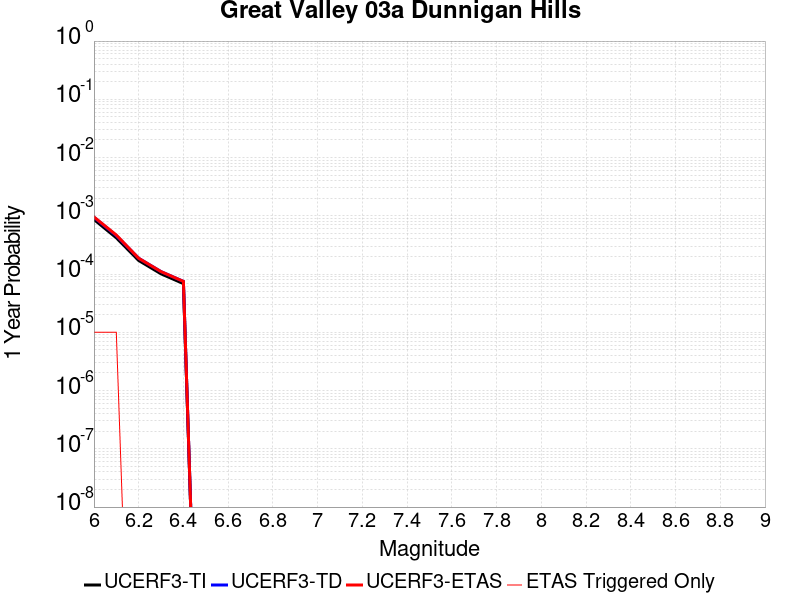 |  |

| Magnitude | 1 wk TI Prob | 1 wk TD Prob | 1 wk ETAS Prob | 1 wk ETAS/TD Gain | 1 wk ETAS Triggered Only | 1 mo TI Prob | 1 mo TD Prob | 1 mo ETAS Prob | 1 mo ETAS/TD Gain | 1 mo ETAS Triggered Only | 1 yr TI Prob | 1 yr TD Prob | 1 yr ETAS Prob | 1 yr ETAS/TD Gain | 1 yr ETAS Triggered Only | 10 yr TI Prob | 10 yr TD Prob | 10 yr ETAS Prob | 10 yr ETAS/TD Gain | 10 yr ETAS Triggered Only |
|-----|-----|-----|-----|-----|-----|-----|-----|-----|-----|-----|-----|-----|-----|-----|-----|-----|-----|-----|-----|-----|
| 6.0 | 1.6591328E-5 | 1.810791E-5 | 6.36548E-5 | 3.5153034 | 4.5547713E-5 | 7.110376E-5 | 7.760341E-5 | 1.2314759E-4 | 1.5868837 | 4.5547713E-5 | 8.6534437E-4 | 9.444811E-4 | 9.899858E-4 | 1.0481796 | 4.5547713E-5 | 0.008619824 | 0.009411503 | 0.0094566215 | 1.004794 | 4.5547713E-5 |
| 6.1 | 8.041125E-6 | 8.769705E-6 | 5.4317017E-5 | 6.1937103 | 4.5547713E-5 | 3.4461507E-5 | 3.7584025E-5 | 8.313003E-5 | 2.2118447 | 4.5547713E-5 | 4.194881E-4 | 4.5750974E-4 | 5.030366E-4 | 1.0995102 | 4.5547713E-5 | 0.004186971 | 0.004567676 | 0.004613016 | 1.0099262 | 4.5547713E-5 |
| 6.2 | 3.2807004E-6 | 3.5795601E-6 | 3.5795601E-6 | 1.0 | 0.0 | 1.4060069E-5 | 1.5340906E-5 | 1.5340906E-5 | 1.0 | 0.0 | 1.7116789E-4 | 1.8676367E-4 | 1.8676367E-4 | 1.0 | 0.0 | 0.0017103611 | 0.0018664751 | 0.0018664751 | 1.0 | 0.0 |
| 6.3 | 1.9339366E-6 | 2.1103756E-6 | 2.1103756E-6 | 1.0 | 0.0 | 8.288273E-6 | 9.044452E-6 | 9.044452E-6 | 1.0 | 0.0 | 1.00905054E-4 | 1.10113484E-4 | 1.10113484E-4 | 1.0 | 0.0 | 0.0010085925 | 0.0011008692 | 0.0011008692 | 1.0 | 0.0 |
| 6.4 | 1.3142635E-6 | 1.4339831E-6 | 1.4339831E-6 | 1.0 | 0.0 | 5.6325457E-6 | 6.145642E-6 | 6.145642E-6 | 1.0 | 0.0 | 6.857408E-5 | 7.482319E-5 | 7.482319E-5 | 1.0 | 0.0 | 6.8552926E-4 | 7.4823195E-4 | 7.4823195E-4 | 1.0 | 0.0 |

## Imperial
*[(top)](#table-of-contents)*

| 1 Week | 1 Month | 1 Year | 10 Year |
|-----|-----|-----|-----|
|  |  | 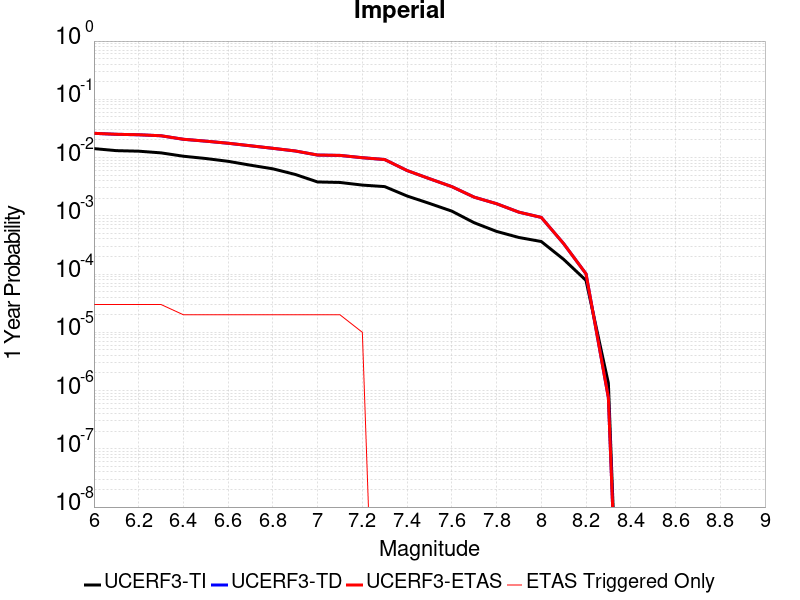 |  |

| Magnitude | 1 wk TI Prob | 1 wk TD Prob | 1 wk ETAS Prob | 1 wk ETAS/TD Gain | 1 wk ETAS Triggered Only | 1 mo TI Prob | 1 mo TD Prob | 1 mo ETAS Prob | 1 mo ETAS/TD Gain | 1 mo ETAS Triggered Only | 1 yr TI Prob | 1 yr TD Prob | 1 yr ETAS Prob | 1 yr ETAS/TD Gain | 1 yr ETAS Triggered Only | 10 yr TI Prob | 10 yr TD Prob | 10 yr ETAS Prob | 10 yr ETAS/TD Gain | 10 yr ETAS Triggered Only |
|-----|-----|-----|-----|-----|-----|-----|-----|-----|-----|-----|-----|-----|-----|-----|-----|-----|-----|-----|-----|-----|
| 6.0 | 2.7496446E-4 | 5.054469E-4 | 5.509716E-4 | 1.0900682 | 4.5547713E-5 | 0.0011778869 | 0.002164442 | 0.002209891 | 1.0209981 | 4.5547713E-5 | 0.0142467655 | 0.026034584 | 0.026078945 | 1.001704 | 4.5547713E-5 | 0.13367249 | 0.22801645 | 0.22805162 | 1.0001543 | 4.5547713E-5 |
| 6.1 | 2.5356023E-4 | 4.864905E-4 | 5.3201604E-4 | 1.0935795 | 4.5547713E-5 | 0.001086234 | 0.0020833316 | 0.0021287843 | 1.0218173 | 4.5547713E-5 | 0.013144928 | 0.02506727 | 0.025111675 | 1.0017715 | 4.5547713E-5 | 0.123940155 | 0.21945325 | 0.21948878 | 1.000162 | 4.5547713E-5 |
| 6.2 | 2.4820742E-4 | 4.7744514E-4 | 5.229711E-4 | 1.0953532 | 4.5547713E-5 | 0.0010633124 | 0.0020446267 | 0.0020900813 | 1.0222312 | 4.5547713E-5 | 0.01286919 | 0.024607308 | 0.024651736 | 1.0018054 | 4.5547713E-5 | 0.12148927 | 0.21595894 | 0.21599466 | 1.0001653 | 4.5547713E-5 |
| 6.3 | 2.3205351E-4 | 4.588303E-4 | 5.043571E-4 | 1.0992236 | 4.5547713E-5 | 9.94136E-4 | 0.0019649705 | 0.0020104288 | 1.0231344 | 4.5547713E-5 | 0.012036599 | 0.023657534 | 0.023702005 | 1.0018797 | 4.5547713E-5 | 0.11405133 | 0.20790851 | 0.20794459 | 1.0001736 | 4.5547713E-5 |
| 6.4 | 2.0304754E-4 | 3.9869116E-4 | 4.4422073E-4 | 1.1141975 | 4.5547713E-5 | 8.6991355E-4 | 0.0017075721 | 0.0017530421 | 1.0266284 | 4.5547713E-5 | 0.010539869 | 0.020591887 | 0.020636497 | 1.0021664 | 4.5547713E-5 | 0.100537635 | 0.18504018 | 0.1850773 | 1.0002006 | 4.5547713E-5 |
| 6.5 | 1.854992E-4 | 3.6981583E-4 | 4.153467E-4 | 1.1231177 | 4.5547713E-5 | 7.9475436E-4 | 0.0015839747 | 0.0016294502 | 1.0287098 | 4.5547713E-5 | 0.009633281 | 0.01911576 | 0.019160438 | 1.0023372 | 4.5547713E-5 | 0.0922623 | 0.17327131 | 0.17330897 | 1.0002173 | 4.5547713E-5 |
| 6.6 | 1.6586106E-4 | 3.4027954E-4 | 3.8581173E-4 | 1.1338083 | 4.5547713E-5 | 7.106394E-4 | 0.0014575359 | 0.0015030173 | 1.0312042 | 4.5547713E-5 | 0.008617763 | 0.017602775 | 0.017647522 | 1.002542 | 4.5547713E-5 | 0.08291132 | 0.16074891 | 0.16078714 | 1.0002378 | 4.5547713E-5 |
| 6.7 | 1.4224656E-4 | 3.0760013E-4 | 3.5313383E-4 | 1.1480289 | 4.5547713E-5 | 6.094856E-4 | 0.0013176284 | 0.0013631161 | 1.0345224 | 4.5547713E-5 | 0.0073952693 | 0.01592603 | 0.015970852 | 1.0028144 | 4.5547713E-5 | 0.07153955 | 0.14645793 | 0.1464968 | 1.0002655 | 4.5547713E-5 |
| 6.8 | 1.2317259E-4 | 2.7784536E-4 | 3.2338043E-4 | 1.1638863 | 4.5547713E-5 | 5.2777573E-4 | 0.0011902286 | 0.0012357221 | 1.0382224 | 4.5547713E-5 | 0.0064067547 | 0.014396132 | 0.014441024 | 1.0031184 | 4.5547713E-5 | 0.06225166 | 0.13291098 | 0.13295047 | 1.0002972 | 4.5547713E-5 |
| 6.9 | 9.859898E-5 | 2.500792E-4 | 2.9561552E-4 | 1.1820875 | 4.5547713E-5 | 4.2249862E-4 | 0.001071332 | 0.001116831 | 1.0424695 | 4.5547713E-5 | 0.0051317946 | 0.012966422 | 0.013011379 | 1.0034672 | 4.5547713E-5 | 0.05014893 | 0.11938127 | 0.119421385 | 1.0003359 | 4.5547713E-5 |
| 7.0 | 7.3191884E-5 | 2.1260617E-4 | 2.581442E-4 | 1.2141895 | 4.5547713E-5 | 3.136418E-4 | 9.108543E-4 | 9.5636054E-4 | 1.0499599 | 4.5547713E-5 | 0.003811904 | 0.011033948 | 0.011078993 | 1.0040824 | 4.5547713E-5 | 0.037471764 | 0.10204036 | 0.10208126 | 1.0004008 | 4.5547713E-5 |
| 7.1 | 7.1760296E-5 | 2.0961992E-4 | 2.5515808E-4 | 1.2172415 | 4.5547713E-5 | 3.0750787E-4 | 8.980649E-4 | 9.4357174E-4 | 1.050672 | 4.5547713E-5 | 0.003737482 | 0.0108798025 | 0.010924855 | 1.0041409 | 4.5547713E-5 | 0.03675245 | 0.10067689 | 0.10071785 | 1.0004069 | 4.5547713E-5 |
| 7.2 | 6.46614E-5 | 1.913056E-4 | 2.368446E-4 | 1.2380432 | 4.5547713E-5 | 2.7709085E-4 | 8.1962656E-4 | 8.651369E-4 | 1.0555258 | 4.5547713E-5 | 0.0033683628 | 0.009933916 | 0.0099790115 | 1.0045395 | 4.5547713E-5 | 0.033177625 | 0.09248428 | 0.09252562 | 1.0004469 | 4.5547713E-5 |
| 7.3 | 6.088115E-5 | 1.7802432E-4 | 1.7802432E-4 | 1.0 | 0.0 | 2.6089314E-4 | 7.6274114E-4 | 7.6274114E-4 | 1.0 | 0.0 | 0.0031717476 | 0.009247407 | 0.009247407 | 1.0 | 0.0 | 0.031268585 | 0.08653566 | 0.08653566 | 1.0 | 0.0 |
| 7.4 | 4.199346E-5 | 1.1507733E-4 | 1.1507733E-4 | 1.0 | 0.0 | 1.7995955E-4 | 4.930962E-4 | 4.930962E-4 | 1.0 | 0.0 | 0.0021888057 | 0.00598709 | 0.00598709 | 1.0 | 0.0 | 0.02167372 | 0.057428524 | 0.057428524 | 1.0 | 0.0 |
| 7.5 | 3.130448E-5 | 8.332899E-5 | 8.332899E-5 | 1.0 | 0.0 | 1.3415517E-4 | 3.5707568E-4 | 3.5707568E-4 | 1.0 | 0.0 | 0.0016321153 | 0.00433879 | 0.00433879 | 1.0 | 0.0 | 0.016201803 | 0.042130288 | 0.042130288 | 1.0 | 0.0 |
| 7.6 | 2.3074248E-5 | 6.0841397E-5 | 6.0841397E-5 | 1.0 | 0.0 | 9.888588E-5 | 2.607229E-4 | 2.607229E-4 | 1.0 | 0.0 | 0.0012032706 | 0.0031697042 | 0.0031697042 | 1.0 | 0.0 | 0.011967761 | 0.03102491 | 0.03102491 | 1.0 | 0.0 |
| 7.7 | 1.45864815E-5 | 4.0122002E-5 | 4.0122002E-5 | 1.0 | 0.0 | 6.2511994E-5 | 1.7194013E-4 | 1.7194013E-4 | 1.0 | 0.0 | 7.608177E-4 | 0.0020913668 | 0.0020913668 | 1.0 | 0.0 | 0.007582182 | 0.020626526 | 0.020626526 | 1.0 | 0.0 |
| 7.8 | 1.0352979E-5 | 3.0958607E-5 | 3.0958607E-5 | 1.0 | 0.0 | 4.4369157E-5 | 1.3267301E-4 | 1.3267301E-4 | 1.0 | 0.0 | 5.400606E-4 | 0.0016140995 | 0.0016140995 | 1.0 | 0.0 | 0.0053875 | 0.016015781 | 0.016015781 | 1.0 | 0.0 |
| 7.9 | 8.137906E-6 | 2.214726E-5 | 2.214726E-5 | 1.0 | 0.0 | 3.4876273E-5 | 9.491338E-5 | 9.491338E-5 | 1.0 | 0.0 | 4.2453592E-4 | 0.0011549587 | 0.0011549587 | 1.0 | 0.0 | 0.004237258 | 0.011617044 | 0.011617044 | 1.0 | 0.0 |
| 8.0 | 6.93792E-6 | 1.800718E-5 | 1.800718E-5 | 1.0 | 0.0 | 2.9733603E-5 | 7.717135E-5 | 7.717135E-5 | 1.0 | 0.0 | 3.6194647E-4 | 9.39157E-4 | 9.39157E-4 | 1.0 | 0.0 | 0.0036135751 | 0.009500807 | 0.009500807 | 1.0 | 0.0 |
| 8.1 | 3.4286315E-6 | 6.3791363E-6 | 6.3791363E-6 | 1.0 | 0.0 | 1.4694053E-5 | 2.7338869E-5 | 2.7338869E-5 | 1.0 | 0.0 | 1.7888541E-4 | 3.328E-4 | 3.328E-4 | 1.0 | 0.0 | 0.0017874148 | 0.0034856654 | 0.0034856654 | 1.0 | 0.0 |
| 8.2 | 1.4906886E-6 | 1.936376E-6 | 1.936376E-6 | 1.0 | 0.0 | 6.3886496E-6 | 8.298728E-6 | 8.298728E-6 | 1.0 | 0.0 | 7.7779034E-5 | 1.0103236E-4 | 1.0103236E-4 | 1.0 | 0.0 | 7.775182E-4 | 0.001107385 | 0.001107385 | 1.0 | 0.0 |
| 8.3 | 2.5758007E-8 | 1.449717E-8 | 1.449717E-8 | 1.0 | 0.0 | 1.10391454E-7 | 6.2130724E-8 | 6.2130724E-8 | 1.0 | 0.0 | 1.3440151E-6 | 7.564416E-7 | 7.564416E-7 | 1.0 | 0.0 | 1.344007E-5 | 7.8862E-6 | 7.8862E-6 | 1.0 | 0.0 |

## San Andreas (Carrizo) rev
*[(top)](#table-of-contents)*

| 1 Week | 1 Month | 1 Year | 10 Year |
|-----|-----|-----|-----|
|  |  |  |  |

| Magnitude | 1 wk TI Prob | 1 wk TD Prob | 1 wk ETAS Prob | 1 wk ETAS/TD Gain | 1 wk ETAS Triggered Only | 1 mo TI Prob | 1 mo TD Prob | 1 mo ETAS Prob | 1 mo ETAS/TD Gain | 1 mo ETAS Triggered Only | 1 yr TI Prob | 1 yr TD Prob | 1 yr ETAS Prob | 1 yr ETAS/TD Gain | 1 yr ETAS Triggered Only | 10 yr TI Prob | 10 yr TD Prob | 10 yr ETAS Prob | 10 yr ETAS/TD Gain | 10 yr ETAS Triggered Only |
|-----|-----|-----|-----|-----|-----|-----|-----|-----|-----|-----|-----|-----|-----|-----|-----|-----|-----|-----|-----|-----|
| 6.0 | 1.1674632E-4 | 2.4321114E-4 | 2.8874777E-4 | 1.1872308 | 4.5547713E-5 | 5.002454E-4 | 0.0010419186 | 0.001087419 | 1.0436697 | 4.5547713E-5 | 0.006073493 | 0.01261206 | 0.012657033 | 1.0035659 | 4.5547713E-5 | 0.0591016 | 0.12060616 | 0.120646216 | 1.0003321 | 4.5547713E-5 |
| 6.1 | 1.1674632E-4 | 2.4321114E-4 | 2.8874777E-4 | 1.1872308 | 4.5547713E-5 | 5.002454E-4 | 0.0010419186 | 0.001087419 | 1.0436697 | 4.5547713E-5 | 0.006073493 | 0.01261206 | 0.012657033 | 1.0035659 | 4.5547713E-5 | 0.0591016 | 0.12060616 | 0.120646216 | 1.0003321 | 4.5547713E-5 |
| 6.2 | 1.1674632E-4 | 2.4321114E-4 | 2.8874777E-4 | 1.1872308 | 4.5547713E-5 | 5.002454E-4 | 0.0010419186 | 0.001087419 | 1.0436697 | 4.5547713E-5 | 0.006073493 | 0.01261206 | 0.012657033 | 1.0035659 | 4.5547713E-5 | 0.0591016 | 0.12060616 | 0.120646216 | 1.0003321 | 4.5547713E-5 |
| 6.3 | 1.1674632E-4 | 2.4321114E-4 | 2.8874777E-4 | 1.1872308 | 4.5547713E-5 | 5.002454E-4 | 0.0010419186 | 0.001087419 | 1.0436697 | 4.5547713E-5 | 0.006073493 | 0.01261206 | 0.012657033 | 1.0035659 | 4.5547713E-5 | 0.0591016 | 0.12060616 | 0.120646216 | 1.0003321 | 4.5547713E-5 |
| 6.4 | 1.1674632E-4 | 2.4321114E-4 | 2.8874777E-4 | 1.1872308 | 4.5547713E-5 | 5.002454E-4 | 0.0010419186 | 0.001087419 | 1.0436697 | 4.5547713E-5 | 0.006073493 | 0.01261206 | 0.012657033 | 1.0035659 | 4.5547713E-5 | 0.0591016 | 0.12060616 | 0.120646216 | 1.0003321 | 4.5547713E-5 |
| 6.5 | 1.13136164E-4 | 2.3641133E-4 | 2.8194828E-4 | 1.1926174 | 4.5547713E-5 | 4.847792E-4 | 0.0010127996 | 0.0010583012 | 1.0449265 | 4.5547713E-5 | 0.0058862255 | 0.012261566 | 0.012306555 | 1.0036691 | 4.5547713E-5 | 0.057327334 | 0.11757754 | 0.117617734 | 1.0003419 | 4.5547713E-5 |
| 6.6 | 1.13136164E-4 | 2.3641133E-4 | 2.8194828E-4 | 1.1926174 | 4.5547713E-5 | 4.847792E-4 | 0.0010127996 | 0.0010583012 | 1.0449265 | 4.5547713E-5 | 0.0058862255 | 0.012261566 | 0.012306555 | 1.0036691 | 4.5547713E-5 | 0.057327334 | 0.11757754 | 0.117617734 | 1.0003419 | 4.5547713E-5 |
| 6.7 | 1.1149675E-4 | 2.3332359E-4 | 2.7886068E-4 | 1.1951671 | 4.5547713E-5 | 4.777557E-4 | 9.995765E-4 | 0.0010450787 | 1.0455215 | 4.5547713E-5 | 0.0058011734 | 0.012102372 | 0.012147369 | 1.003718 | 4.5547713E-5 | 0.05652051 | 0.11619909 | 0.11623935 | 1.0003464 | 4.5547713E-5 |
| 6.8 | 1.1103589E-4 | 2.323452E-4 | 2.7788233E-4 | 1.1959891 | 4.5547713E-5 | 4.7578133E-4 | 9.953866E-4 | 0.0010408891 | 1.0457133 | 4.5547713E-5 | 0.005777263 | 0.012051926 | 0.012096925 | 1.0037338 | 4.5547713E-5 | 0.056293584 | 0.115759395 | 0.11579967 | 1.000348 | 4.5547713E-5 |
| 6.9 | 1.1053259E-4 | 2.3126906E-4 | 2.7680624E-4 | 1.1969013 | 4.5547713E-5 | 4.7362508E-4 | 9.907781E-4 | 0.0010362806 | 1.0459261 | 4.5547713E-5 | 0.0057511497 | 0.011996436 | 0.012041437 | 1.0037513 | 4.5547713E-5 | 0.05604569 | 0.1152756 | 0.1153159 | 1.0003495 | 4.5547713E-5 |
| 7.0 | 1.1005377E-4 | 2.3027751E-4 | 2.7581473E-4 | 1.1977494 | 4.5547713E-5 | 4.7157376E-4 | 9.865318E-4 | 0.0010320346 | 1.046124 | 4.5547713E-5 | 0.0057263062 | 0.011945305 | 0.011990309 | 1.0037675 | 4.5547713E-5 | 0.055809796 | 0.11482792 | 0.11486824 | 1.0003511 | 4.5547713E-5 |
| 7.1 | 1.0308142E-4 | 2.1537494E-4 | 2.6091284E-4 | 1.2114354 | 4.5547713E-5 | 4.417027E-4 | 9.2270994E-4 | 9.6821564E-4 | 1.0493175 | 4.5547713E-5 | 0.0053644776 | 0.011176443 | 0.0112214815 | 1.0040298 | 4.5547713E-5 | 0.052368138 | 0.10808435 | 0.10812498 | 1.0003759 | 4.5547713E-5 |
| 7.2 | 1.0027479E-4 | 2.0945404E-4 | 2.5499222E-4 | 1.2174137 | 4.5547713E-5 | 4.296783E-4 | 8.973524E-4 | 9.428592E-4 | 1.0507123 | 4.5547713E-5 | 0.0052187922 | 0.010870834 | 0.010915887 | 1.0041443 | 4.5547713E-5 | 0.050979212 | 0.10538838 | 0.10542913 | 1.0003866 | 4.5547713E-5 |
| 7.3 | 9.816942E-5 | 2.0420653E-4 | 2.4974495E-4 | 1.2230017 | 4.5547713E-5 | 4.2065824E-4 | 8.748783E-4 | 9.2038617E-4 | 1.0520163 | 4.5547713E-5 | 0.005109493 | 0.010599907 | 0.010644972 | 1.0042515 | 4.5547713E-5 | 0.049935985 | 0.10297221 | 0.10301307 | 1.0003967 | 4.5547713E-5 |
| 7.4 | 9.5634205E-5 | 1.9790219E-4 | 2.434409E-4 | 1.2301071 | 4.5547713E-5 | 4.0979648E-4 | 8.478775E-4 | 8.933866E-4 | 1.0536741 | 4.5547713E-5 | 0.0049778637 | 0.010274311 | 0.01031939 | 1.0043876 | 4.5547713E-5 | 0.048678253 | 0.10005864 | 0.10009963 | 1.0004096 | 4.5547713E-5 |
| 7.5 | 8.052417E-5 | 1.611105E-4 | 2.0665086E-4 | 1.2826655 | 4.5547713E-5 | 3.4505792E-4 | 6.90291E-4 | 7.358073E-4 | 1.0659378 | 4.5547713E-5 | 0.0041929903 | 0.008371988 | 0.008417155 | 1.0053949 | 4.5547713E-5 | 0.04114753 | 0.08280355 | 0.08284532 | 1.0005045 | 4.5547713E-5 |
| 7.6 | 7.897024E-5 | 1.5764312E-4 | 2.0318365E-4 | 1.2888837 | 4.5547713E-5 | 3.384E-4 | 6.754386E-4 | 7.2095555E-4 | 1.0673888 | 4.5547713E-5 | 0.0041122385 | 0.008192535 | 0.008237708 | 1.0055141 | 4.5547713E-5 | 0.040369697 | 0.08114483 | 0.08118668 | 1.0005158 | 4.5547713E-5 |
| 7.7 | 6.707427E-5 | 1.3274715E-4 | 1.7828881E-4 | 1.3430707 | 4.5547713E-5 | 2.8742946E-4 | 5.6879234E-4 | 6.1431417E-4 | 1.0800323 | 4.5547713E-5 | 0.003493839 | 0.0069030905 | 0.006948324 | 1.0065526 | 4.5547713E-5 | 0.034394164 | 0.06904176 | 0.06908416 | 1.0006142 | 4.5547713E-5 |
| 7.8 | 6.147705E-5 | 1.219623E-4 | 1.219623E-4 | 1.0 | 0.0 | 2.6344648E-4 | 5.225909E-4 | 5.225909E-4 | 1.0 | 0.0 | 0.0032027436 | 0.0063440073 | 0.0063440073 | 1.0 | 0.0 | 0.031569764 | 0.06350883 | 0.06350883 | 1.0 | 0.0 |
| 7.9 | 4.7636717E-5 | 8.8788634E-5 | 8.8788634E-5 | 1.0 | 0.0 | 2.0414138E-4 | 3.8046725E-4 | 3.8046725E-4 | 1.0 | 0.0 | 0.0024825884 | 0.004622358 | 0.004622358 | 1.0 | 0.0 | 0.024550365 | 0.04662383 | 0.04662383 | 1.0 | 0.0 |
| 8.0 | 3.3554235E-5 | 5.213132E-5 | 5.213132E-5 | 1.0 | 0.0 | 1.4379594E-4 | 2.2340081E-4 | 2.2340081E-4 | 1.0 | 0.0 | 0.0017493097 | 0.002716514 | 0.002716514 | 1.0 | 0.0 | 0.017356034 | 0.027878206 | 0.027878206 | 1.0 | 0.0 |
| 8.1 | 1.9175432E-5 | 1.918229E-5 | 1.918229E-5 | 1.0 | 0.0 | 8.217783E-5 | 8.2207225E-5 | 8.2207225E-5 | 1.0 | 0.0 | 0.0010000558 | 0.001000414 | 0.001000414 | 1.0 | 0.0 | 0.009955673 | 0.010756618 | 0.010756618 | 1.0 | 0.0 |
| 8.2 | 8.643924E-6 | 5.4738607E-6 | 5.4738607E-6 | 1.0 | 0.0 | 3.704486E-5 | 2.3459192E-5 | 2.3459192E-5 | 1.0 | 0.0 | 4.5092785E-4 | 2.855783E-4 | 2.855783E-4 | 1.0 | 0.0 | 0.0045001395 | 0.0032481598 | 0.0032481598 | 1.0 | 0.0 |
| 8.3 | 1.983087E-6 | 7.658221E-7 | 7.658221E-7 | 1.0 | 0.0 | 8.498917E-6 | 3.2820906E-6 | 3.2820906E-6 | 1.0 | 0.0 | 1.034694E-4 | 3.9958737E-5 | 3.9958737E-5 | 1.0 | 0.0 | 0.0010342124 | 4.7187202E-4 | 4.7187202E-4 | 1.0 | 0.0 |

## West Tahoe
*[(top)](#table-of-contents)*

| 1 Week | 1 Month | 1 Year | 10 Year |
|-----|-----|-----|-----|
|  |  |  |  |

| Magnitude | 1 wk TI Prob | 1 wk TD Prob | 1 wk ETAS Prob | 1 wk ETAS/TD Gain | 1 wk ETAS Triggered Only | 1 mo TI Prob | 1 mo TD Prob | 1 mo ETAS Prob | 1 mo ETAS/TD Gain | 1 mo ETAS Triggered Only | 1 yr TI Prob | 1 yr TD Prob | 1 yr ETAS Prob | 1 yr ETAS/TD Gain | 1 yr ETAS Triggered Only | 10 yr TI Prob | 10 yr TD Prob | 10 yr ETAS Prob | 10 yr ETAS/TD Gain | 10 yr ETAS Triggered Only |
|-----|-----|-----|-----|-----|-----|-----|-----|-----|-----|-----|-----|-----|-----|-----|-----|-----|-----|-----|-----|-----|
| 6.0 | 1.952444E-5 | 2.1183121E-5 | 6.672987E-5 | 3.1501431 | 4.5547713E-5 | 8.367348E-5 | 9.0781956E-5 | 1.3632553E-4 | 1.501681 | 4.5547713E-5 | 0.0010182485 | 0.0011047646 | 0.0011502621 | 1.0411829 | 4.5547713E-5 | 0.010135954 | 0.010998211 | 0.011043257 | 1.0040958 | 4.5547713E-5 |
| 6.1 | 1.952444E-5 | 2.1183121E-5 | 6.672987E-5 | 3.1501431 | 4.5547713E-5 | 8.367348E-5 | 9.0781956E-5 | 1.3632553E-4 | 1.501681 | 4.5547713E-5 | 0.0010182485 | 0.0011047646 | 0.0011502621 | 1.0411829 | 4.5547713E-5 | 0.010135954 | 0.010998211 | 0.011043257 | 1.0040958 | 4.5547713E-5 |
| 6.2 | 1.952444E-5 | 2.1183121E-5 | 6.672987E-5 | 3.1501431 | 4.5547713E-5 | 8.367348E-5 | 9.0781956E-5 | 1.3632553E-4 | 1.501681 | 4.5547713E-5 | 0.0010182485 | 0.0011047646 | 0.0011502621 | 1.0411829 | 4.5547713E-5 | 0.010135954 | 0.010998211 | 0.011043257 | 1.0040958 | 4.5547713E-5 |
| 6.3 | 1.952444E-5 | 2.1183121E-5 | 6.672987E-5 | 3.1501431 | 4.5547713E-5 | 8.367348E-5 | 9.0781956E-5 | 1.3632553E-4 | 1.501681 | 4.5547713E-5 | 0.0010182485 | 0.0011047646 | 0.0011502621 | 1.0411829 | 4.5547713E-5 | 0.010135954 | 0.010998211 | 0.011043257 | 1.0040958 | 4.5547713E-5 |
| 6.4 | 1.952444E-5 | 2.1183121E-5 | 6.672987E-5 | 3.1501431 | 4.5547713E-5 | 8.367348E-5 | 9.0781956E-5 | 1.3632553E-4 | 1.501681 | 4.5547713E-5 | 0.0010182485 | 0.0011047646 | 0.0011502621 | 1.0411829 | 4.5547713E-5 | 0.010135954 | 0.010998211 | 0.011043257 | 1.0040958 | 4.5547713E-5 |
| 6.5 | 1.2685271E-5 | 1.3690598E-5 | 5.9237685E-5 | 4.326888 | 4.5547713E-5 | 5.4364315E-5 | 5.867277E-5 | 1.04217805E-4 | 1.7762551 | 4.5547713E-5 | 6.616845E-4 | 7.141233E-4 | 7.596385E-4 | 1.0637357 | 4.5547713E-5 | 0.0065971776 | 0.0071199345 | 0.007165158 | 1.0063517 | 4.5547713E-5 |
| 6.6 | 1.2685271E-5 | 1.3690598E-5 | 5.9237685E-5 | 4.326888 | 4.5547713E-5 | 5.4364315E-5 | 5.867277E-5 | 1.04217805E-4 | 1.7762551 | 4.5547713E-5 | 6.616845E-4 | 7.141233E-4 | 7.596385E-4 | 1.0637357 | 4.5547713E-5 | 0.0065971776 | 0.0071199345 | 0.007165158 | 1.0063517 | 4.5547713E-5 |
| 6.7 | 9.117886E-6 | 9.809826E-6 | 5.535709E-5 | 5.6430244 | 4.5547713E-5 | 3.9076072E-5 | 4.2041476E-5 | 8.758727E-5 | 2.0833538 | 4.5547713E-5 | 4.756473E-4 | 5.1174196E-4 | 5.5726635E-4 | 1.0889597 | 4.5547713E-5 | 0.0047463053 | 0.005106353 | 0.0051516686 | 1.0088743 | 4.5547713E-5 |
| 6.8 | 8.786828E-6 | 9.457844E-6 | 5.5005123E-5 | 5.8158207 | 4.5547713E-5 | 3.7657293E-5 | 4.0533025E-5 | 8.607889E-5 | 2.123673 | 4.5547713E-5 | 4.5838108E-4 | 4.933849E-4 | 5.389101E-4 | 1.0922712 | 4.5547713E-5 | 0.0045743673 | 0.004923596 | 0.00496892 | 1.0092053 | 4.5547713E-5 |
| 6.9 | 6.7562123E-6 | 7.263794E-6 | 7.263794E-6 | 1.0 | 0.0 | 2.8954875E-5 | 3.1130203E-5 | 3.1130203E-5 | 1.0 | 0.0 | 3.5246857E-4 | 3.7894904E-4 | 3.7894904E-4 | 1.0 | 0.0 | 0.0035191004 | 0.0037835005 | 0.0037835005 | 1.0 | 0.0 |
| 7.0 | 5.1792854E-6 | 5.567327E-6 | 5.567327E-6 | 1.0 | 0.0 | 2.2196748E-5 | 2.3859777E-5 | 2.3859777E-5 | 1.0 | 0.0 | 2.702119E-4 | 2.9045786E-4 | 2.9045786E-4 | 1.0 | 0.0 | 0.0026988357 | 0.0029011576 | 0.0029011576 | 1.0 | 0.0 |
| 7.1 | 4.090765E-6 | 4.3974137E-6 | 4.3974137E-6 | 1.0 | 0.0 | 1.7531731E-5 | 1.8845942E-5 | 1.8845942E-5 | 1.0 | 0.0 | 2.134279E-4 | 2.2942858E-4 | 2.2942858E-4 | 1.0 | 0.0 | 0.0021322304 | 0.0022922517 | 0.0022922517 | 1.0 | 0.0 |
| 7.2 | 2.2356758E-6 | 2.4023636E-6 | 2.4023636E-6 | 1.0 | 0.0 | 9.581432E-6 | 1.0295814E-5 | 1.0295814E-5 | 1.0 | 0.0 | 1.1664769E-4 | 1.2534621E-4 | 1.2534621E-4 | 1.0 | 0.0 | 0.0011658648 | 0.001252941 | 0.001252941 | 1.0 | 0.0 |

## San Jacinto (San Bernardino)
*[(top)](#table-of-contents)*

| 1 Week | 1 Month | 1 Year | 10 Year |
|-----|-----|-----|-----|
|  |  |  |  |

| Magnitude | 1 wk TI Prob | 1 wk TD Prob | 1 wk ETAS Prob | 1 wk ETAS/TD Gain | 1 wk ETAS Triggered Only | 1 mo TI Prob | 1 mo TD Prob | 1 mo ETAS Prob | 1 mo ETAS/TD Gain | 1 mo ETAS Triggered Only | 1 yr TI Prob | 1 yr TD Prob | 1 yr ETAS Prob | 1 yr ETAS/TD Gain | 1 yr ETAS Triggered Only | 10 yr TI Prob | 10 yr TD Prob | 10 yr ETAS Prob | 10 yr ETAS/TD Gain | 10 yr ETAS Triggered Only |
|-----|-----|-----|-----|-----|-----|-----|-----|-----|-----|-----|-----|-----|-----|-----|-----|-----|-----|-----|-----|-----|
| 6.0 | 3.409352E-5 | 3.597972E-5 | 3.597972E-5 | 1.0 | 0.0 | 1.461069E-4 | 1.541897E-4 | 1.541897E-4 | 1.0 | 0.0 | 0.0017774 | 0.0018756451 | 0.0018756451 | 1.0 | 0.0 | 0.01763251 | 0.019346429 | 0.019391095 | 1.0023087 | 4.5547713E-5 |
| 6.1 | 3.409352E-5 | 3.597972E-5 | 3.597972E-5 | 1.0 | 0.0 | 1.461069E-4 | 1.541897E-4 | 1.541897E-4 | 1.0 | 0.0 | 0.0017774 | 0.0018756451 | 0.0018756451 | 1.0 | 0.0 | 0.01763251 | 0.019346429 | 0.019391095 | 1.0023087 | 4.5547713E-5 |
| 6.2 | 3.409352E-5 | 3.597972E-5 | 3.597972E-5 | 1.0 | 0.0 | 1.461069E-4 | 1.541897E-4 | 1.541897E-4 | 1.0 | 0.0 | 0.0017774 | 0.0018756451 | 0.0018756451 | 1.0 | 0.0 | 0.01763251 | 0.019346429 | 0.019391095 | 1.0023087 | 4.5547713E-5 |
| 6.3 | 3.409352E-5 | 3.597972E-5 | 3.597972E-5 | 1.0 | 0.0 | 1.461069E-4 | 1.541897E-4 | 1.541897E-4 | 1.0 | 0.0 | 0.0017774 | 0.0018756451 | 0.0018756451 | 1.0 | 0.0 | 0.01763251 | 0.019346429 | 0.019391095 | 1.0023087 | 4.5547713E-5 |
| 6.4 | 3.400795E-5 | 3.5872385E-5 | 3.5872385E-5 | 1.0 | 0.0 | 1.4574021E-4 | 1.5372974E-4 | 1.5372974E-4 | 1.0 | 0.0 | 0.0017729428 | 0.0018700549 | 0.0018700549 | 1.0 | 0.0 | 0.017588645 | 0.01929151 | 0.019336179 | 1.0023155 | 4.5547713E-5 |
| 6.5 | 3.341482E-5 | 3.5133027E-5 | 3.5133027E-5 | 1.0 | 0.0 | 1.4319851E-4 | 1.5056143E-4 | 1.5056143E-4 | 1.0 | 0.0 | 0.0017420477 | 0.0018315457 | 0.0018315457 | 1.0 | 0.0 | 0.017284546 | 0.018913053 | 0.01895774 | 1.0023627 | 4.5547713E-5 |
| 6.6 | 3.3364955E-5 | 3.5070247E-5 | 3.5070247E-5 | 1.0 | 0.0 | 1.4298483E-4 | 1.5029241E-4 | 1.5029241E-4 | 1.0 | 0.0 | 0.0017394501 | 0.0018282757 | 0.0018282757 | 1.0 | 0.0 | 0.017258976 | 0.018880919 | 0.018925605 | 1.0023668 | 4.5547713E-5 |
| 6.7 | 3.335922E-5 | 3.506002E-5 | 3.506002E-5 | 1.0 | 0.0 | 1.4296026E-4 | 1.5024858E-4 | 1.5024858E-4 | 1.0 | 0.0 | 0.0017391514 | 0.0018277431 | 0.0018277431 | 1.0 | 0.0 | 0.017256035 | 0.018875709 | 0.018920397 | 1.0023675 | 4.5547713E-5 |
| 6.8 | 3.327683E-5 | 3.495409E-5 | 3.495409E-5 | 1.0 | 0.0 | 1.4260718E-4 | 1.4979464E-4 | 1.4979464E-4 | 1.0 | 0.0 | 0.0017348597 | 0.0018222256 | 0.0018222256 | 1.0 | 0.0 | 0.017213784 | 0.018821482 | 0.018866172 | 1.0023744 | 4.5547713E-5 |
| 6.9 | 3.3235785E-5 | 3.489504E-5 | 3.489504E-5 | 1.0 | 0.0 | 1.4243131E-4 | 1.4954162E-4 | 1.4954162E-4 | 1.0 | 0.0 | 0.0017327217 | 0.0018191502 | 0.0018191502 | 1.0 | 0.0 | 0.017192734 | 0.01879135 | 0.018836042 | 1.0023783 | 4.5547713E-5 |
| 7.0 | 3.3197095E-5 | 3.4834975E-5 | 3.4834975E-5 | 1.0 | 0.0 | 1.422655E-4 | 1.4928421E-4 | 1.4928421E-4 | 1.0 | 0.0 | 0.0017307063 | 0.0018160215 | 0.0018160215 | 1.0 | 0.0 | 0.017172894 | 0.018760728 | 0.018805422 | 1.0023823 | 4.5547713E-5 |
| 7.1 | 3.3129716E-5 | 3.4715187E-5 | 3.4715187E-5 | 1.0 | 0.0 | 1.4197677E-4 | 1.487709E-4 | 1.487709E-4 | 1.0 | 0.0 | 0.0017271966 | 0.0018097822 | 0.0018097822 | 1.0 | 0.0 | 0.017138338 | 0.018699808 | 0.018744504 | 1.0023901 | 4.5547713E-5 |
| 7.2 | 3.3034008E-5 | 3.4582634E-5 | 3.4582634E-5 | 1.0 | 0.0 | 1.4156665E-4 | 1.4820287E-4 | 1.4820287E-4 | 1.0 | 0.0 | 0.0017222111 | 0.0018028781 | 0.0018028781 | 1.0 | 0.0 | 0.017089253 | 0.018632201 | 0.0186769 | 1.002399 | 4.5547713E-5 |
| 7.3 | 3.2956614E-5 | 3.4450393E-5 | 3.4450393E-5 | 1.0 | 0.0 | 1.4123498E-4 | 1.476362E-4 | 1.476362E-4 | 1.0 | 0.0 | 0.0017181796 | 0.0017959902 | 0.0017959902 | 1.0 | 0.0 | 0.017049557 | 0.018564949 | 0.018609652 | 1.0024079 | 4.5547713E-5 |
| 7.4 | 3.2915937E-5 | 3.437212E-5 | 3.437212E-5 | 1.0 | 0.0 | 1.4106068E-4 | 1.4730077E-4 | 1.4730077E-4 | 1.0 | 0.0 | 0.0017160608 | 0.0017919131 | 0.0017919131 | 1.0 | 0.0 | 0.017028693 | 0.01852523 | 0.018569933 | 1.0024132 | 4.5547713E-5 |
| 7.5 | 3.281791E-5 | 3.4237073E-5 | 3.4237073E-5 | 1.0 | 0.0 | 1.406406E-4 | 1.4672207E-4 | 1.4672207E-4 | 1.0 | 0.0 | 0.0017109542 | 0.0017848789 | 0.0017848789 | 1.0 | 0.0 | 0.016978411 | 0.018456137 | 0.018500844 | 1.0024223 | 4.5547713E-5 |
| 7.6 | 3.2521442E-5 | 3.3962282E-5 | 3.3962282E-5 | 1.0 | 0.0 | 1.3937015E-4 | 1.4554452E-4 | 1.4554452E-4 | 1.0 | 0.0 | 0.0016955109 | 0.0017705658 | 0.0017705658 | 1.0 | 0.0 | 0.016826328 | 0.018313898 | 0.018358612 | 1.0024415 | 4.5547713E-5 |
| 7.7 | 3.0287873E-5 | 3.2449603E-5 | 3.2449603E-5 | 1.0 | 0.0 | 1.297987E-4 | 1.3906232E-4 | 1.3906232E-4 | 1.0 | 0.0 | 0.0015791537 | 0.00169177 | 0.00169177 | 1.0 | 0.0 | 0.01567979 | 0.017526472 | 0.017571222 | 1.0025532 | 4.5547713E-5 |
| 7.8 | 2.6316151E-5 | 2.9660547E-5 | 2.9660547E-5 | 1.0 | 0.0 | 1.1277862E-4 | 1.2711044E-4 | 1.2711044E-4 | 1.0 | 0.0 | 0.0013722149 | 0.001546472 | 0.001546472 | 1.0 | 0.0 | 0.013637724 | 0.016068073 | 0.016112888 | 1.0027891 | 4.5547713E-5 |
| 7.9 | 2.0761147E-5 | 2.341544E-5 | 2.341544E-5 | 1.0 | 0.0 | 8.897331E-5 | 1.0034803E-4 | 1.0034803E-4 | 1.0 | 0.0 | 0.0010827117 | 0.0012210533 | 0.0012210533 | 1.0 | 0.0 | 0.010774517 | 0.012791798 | 0.012791798 | 1.0 | 0.0 |
| 8.0 | 1.5738568E-5 | 1.6031558E-5 | 1.6031558E-5 | 1.0 | 0.0 | 6.744926E-5 | 6.8704874E-5 | 6.8704874E-5 | 1.0 | 0.0 | 8.2088535E-4 | 8.361615E-4 | 8.361615E-4 | 1.0 | 0.0 | 0.008178596 | 0.008864859 | 0.008864859 | 1.0 | 0.0 |
| 8.1 | 1.0105832E-5 | 8.329329E-6 | 8.329329E-6 | 1.0 | 0.0 | 4.3309992E-5 | 3.5696637E-5 | 3.5696637E-5 | 1.0 | 0.0 | 5.2717153E-4 | 4.3452042E-4 | 4.3452042E-4 | 1.0 | 0.0 | 0.005259227 | 0.0046766037 | 0.0046766037 | 1.0 | 0.0 |
| 8.2 | 4.189207E-6 | 1.5781004E-6 | 1.5781004E-6 | 1.0 | 0.0 | 1.7953622E-5 | 6.76327E-6 | 6.76327E-6 | 1.0 | 0.0 | 2.1856341E-4 | 8.233973E-5 | 8.233973E-5 | 1.0 | 0.0 | 0.0021834858 | 9.5639535E-4 | 9.5639535E-4 | 1.0 | 0.0 |
| 8.3 | 1.2758221E-6 | 3.6140935E-7 | 3.6140935E-7 | 1.0 | 0.0 | 5.4677976E-6 | 1.5488963E-6 | 1.5488963E-6 | 1.0 | 0.0 | 6.65684E-5 | 1.8857654E-5 | 1.8857654E-5 | 1.0 | 0.0 | 6.6548464E-4 | 2.2746001E-4 | 2.2746001E-4 | 1.0 | 0.0 |

## Cleghorn Lake
*[(top)](#table-of-contents)*

| 1 Week | 1 Month | 1 Year | 10 Year |
|-----|-----|-----|-----|
|  |  |  |  |

| Magnitude | 1 wk TI Prob | 1 wk TD Prob | 1 wk ETAS Prob | 1 wk ETAS/TD Gain | 1 wk ETAS Triggered Only | 1 mo TI Prob | 1 mo TD Prob | 1 mo ETAS Prob | 1 mo ETAS/TD Gain | 1 mo ETAS Triggered Only | 1 yr TI Prob | 1 yr TD Prob | 1 yr ETAS Prob | 1 yr ETAS/TD Gain | 1 yr ETAS Triggered Only | 10 yr TI Prob | 10 yr TD Prob | 10 yr ETAS Prob | 10 yr ETAS/TD Gain | 10 yr ETAS Triggered Only |
|-----|-----|-----|-----|-----|-----|-----|-----|-----|-----|-----|-----|-----|-----|-----|-----|-----|-----|-----|-----|-----|
| 6.0 | 1.5467183E-5 | 1.6794165E-5 | 6.234111E-5 | 3.7120697 | 4.5547713E-5 | 6.6286244E-5 | 7.1973314E-5 | 1.1751775E-4 | 1.632796 | 4.5547713E-5 | 8.067362E-4 | 8.7597774E-4 | 9.2148554E-4 | 1.0519509 | 4.5547713E-5 | 0.008038137 | 0.008730675 | 0.008775826 | 1.0051714 | 4.5547713E-5 |
| 6.1 | 1.5467183E-5 | 1.6794165E-5 | 6.234111E-5 | 3.7120697 | 4.5547713E-5 | 6.6286244E-5 | 7.1973314E-5 | 1.1751775E-4 | 1.632796 | 4.5547713E-5 | 8.067362E-4 | 8.7597774E-4 | 9.2148554E-4 | 1.0519509 | 4.5547713E-5 | 0.008038137 | 0.008730675 | 0.008775826 | 1.0051714 | 4.5547713E-5 |
| 6.2 | 1.2624631E-5 | 1.3681514E-5 | 5.92286E-5 | 4.3290973 | 4.5547713E-5 | 5.410444E-5 | 5.8634017E-5 | 1.0417906E-4 | 1.7767682 | 4.5547713E-5 | 6.585225E-4 | 7.13684E-4 | 7.591992E-4 | 1.0637751 | 4.5547713E-5 | 0.0065657445 | 0.007118716 | 0.0071639395 | 1.0063528 | 4.5547713E-5 |
| 6.3 | 1.2624631E-5 | 1.3681514E-5 | 5.92286E-5 | 4.3290973 | 4.5547713E-5 | 5.410444E-5 | 5.8634017E-5 | 1.0417906E-4 | 1.7767682 | 4.5547713E-5 | 6.585225E-4 | 7.13684E-4 | 7.591992E-4 | 1.0637751 | 4.5547713E-5 | 0.0065657445 | 0.007118716 | 0.0071639395 | 1.0063528 | 4.5547713E-5 |
| 6.4 | 9.417684E-6 | 1.0170096E-5 | 5.5717344E-5 | 5.4785466 | 4.5547713E-5 | 4.036088E-5 | 4.3585627E-5 | 8.9131354E-5 | 2.0449712 | 4.5547713E-5 | 4.912829E-4 | 5.305669E-4 | 5.760905E-4 | 1.0858017 | 4.5547713E-5 | 0.004901982 | 0.005297038 | 0.0053423443 | 1.0085531 | 4.5547713E-5 |
| 6.5 | 9.368219E-6 | 1.0117523E-5 | 5.5664772E-5 | 5.5018187 | 4.5547713E-5 | 4.014889E-5 | 4.3360324E-5 | 8.890606E-5 | 2.0504012 | 4.5547713E-5 | 4.8870314E-4 | 5.2782515E-4 | 5.733488E-4 | 1.0862477 | 4.5547713E-5 | 0.004876298 | 0.00526975 | 0.005315058 | 1.0085977 | 4.5547713E-5 |
| 6.6 | 7.803798E-6 | 8.4418125E-6 | 5.398914E-5 | 6.395444 | 4.5547713E-5 | 3.3444423E-5 | 3.617892E-5 | 8.172498E-5 | 2.2589116 | 4.5547713E-5 | 4.0710976E-4 | 4.4042926E-4 | 4.859569E-4 | 1.1033711 | 4.5547713E-5 | 0.0040636472 | 0.0043994808 | 0.0044448283 | 1.0103074 | 4.5547713E-5 |
| 6.7 | 2.3108669E-6 | 2.44383E-6 | 2.44383E-6 | 1.0 | 0.0 | 9.903678E-6 | 1.0473515E-5 | 1.0473515E-5 | 1.0 | 0.0 | 1.205706E-4 | 1.2750778E-4 | 1.2750778E-4 | 1.0 | 0.0 | 0.001205052 | 0.0012743649 | 0.0012743649 | 1.0 | 0.0 |
| 6.8 | 2.0882828E-6 | 2.2062789E-6 | 2.2062789E-6 | 1.0 | 0.0 | 8.949753E-6 | 9.455448E-6 | 9.455448E-6 | 1.0 | 0.0 | 1.08957785E-4 | 1.1511416E-4 | 1.1511416E-4 | 1.0 | 0.0 | 0.0010890438 | 0.0011505622 | 0.0011505622 | 1.0 | 0.0 |
| 6.9 | 1.876935E-6 | 1.9810482E-6 | 1.9810482E-6 | 1.0 | 0.0 | 8.043982E-6 | 8.490179E-6 | 8.490179E-6 | 1.0 | 0.0 | 9.7931086E-5 | 1.0336319E-4 | 1.0336319E-4 | 1.0 | 0.0 | 9.788794E-4 | 0.0010331671 | 0.0010331671 | 1.0 | 0.0 |
| 7.0 | 1.5357559E-6 | 1.6202783E-6 | 1.6202783E-6 | 1.0 | 0.0 | 6.5817944E-6 | 6.944032E-6 | 6.944032E-6 | 1.0 | 0.0 | 8.01304E-5 | 8.4540436E-5 | 8.4540436E-5 | 1.0 | 0.0 | 8.010151E-4 | 8.4509526E-4 | 8.4509526E-4 | 1.0 | 0.0 |
| 7.1 | 1.0905424E-6 | 1.1497604E-6 | 1.1497604E-6 | 1.0 | 0.0 | 4.6737446E-6 | 4.9275354E-6 | 4.9275354E-6 | 1.0 | 0.0 | 5.6901354E-5 | 5.999119E-5 | 5.999119E-5 | 1.0 | 0.0 | 5.6886784E-4 | 5.9975975E-4 | 5.9975975E-4 | 1.0 | 0.0 |
| 7.2 | 6.06668E-7 | 6.387269E-7 | 6.387269E-7 | 1.0 | 0.0 | 2.600003E-6 | 2.7373983E-6 | 2.7373983E-6 | 1.0 | 0.0 | 3.1654577E-5 | 3.3327386E-5 | 3.3327386E-5 | 1.0 | 0.0 | 3.1650066E-4 | 3.332307E-4 | 3.332307E-4 | 1.0 | 0.0 |

## Channel Islands Thrust
*[(top)](#table-of-contents)*

| 1 Week | 1 Month | 1 Year | 10 Year |
|-----|-----|-----|-----|
|  |  | 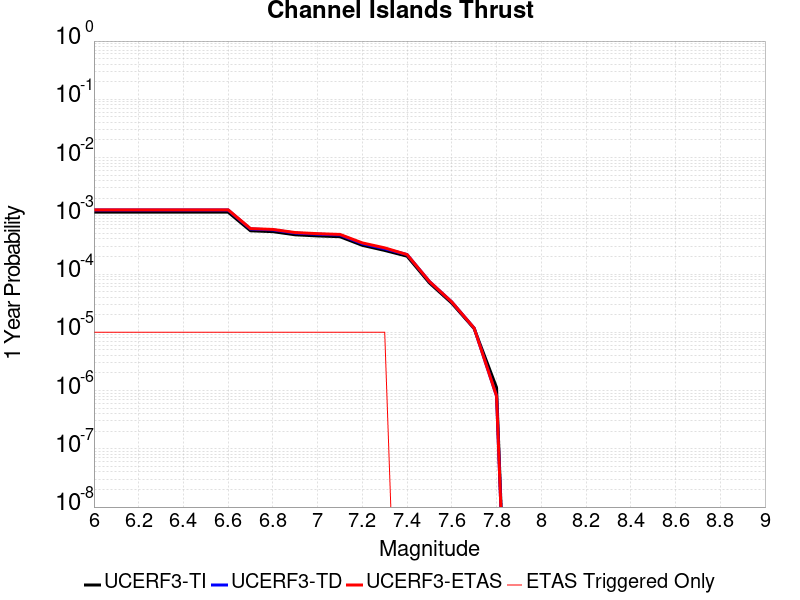 |  |

| Magnitude | 1 wk TI Prob | 1 wk TD Prob | 1 wk ETAS Prob | 1 wk ETAS/TD Gain | 1 wk ETAS Triggered Only | 1 mo TI Prob | 1 mo TD Prob | 1 mo ETAS Prob | 1 mo ETAS/TD Gain | 1 mo ETAS Triggered Only | 1 yr TI Prob | 1 yr TD Prob | 1 yr ETAS Prob | 1 yr ETAS/TD Gain | 1 yr ETAS Triggered Only | 10 yr TI Prob | 10 yr TD Prob | 10 yr ETAS Prob | 10 yr ETAS/TD Gain | 10 yr ETAS Triggered Only |
|-----|-----|-----|-----|-----|-----|-----|-----|-----|-----|-----|-----|-----|-----|-----|-----|-----|-----|-----|-----|-----|
| 6.0 | 2.2156251E-5 | 2.4091965E-5 | 2.4091965E-5 | 1.0 | 0.0 | 9.495191E-5 | 1.03247796E-4 | 1.03247796E-4 | 1.0 | 0.0 | 0.0011554264 | 0.0012564235 | 0.001301914 | 1.0362064 | 4.5547713E-5 | 0.011494373 | 0.012503792 | 0.01254877 | 1.0035971 | 4.5547713E-5 |
| 6.1 | 2.2156251E-5 | 2.4091965E-5 | 2.4091965E-5 | 1.0 | 0.0 | 9.495191E-5 | 1.03247796E-4 | 1.03247796E-4 | 1.0 | 0.0 | 0.0011554264 | 0.0012564235 | 0.001301914 | 1.0362064 | 4.5547713E-5 | 0.011494373 | 0.012503792 | 0.01254877 | 1.0035971 | 4.5547713E-5 |
| 6.2 | 2.2156251E-5 | 2.4091965E-5 | 2.4091965E-5 | 1.0 | 0.0 | 9.495191E-5 | 1.03247796E-4 | 1.03247796E-4 | 1.0 | 0.0 | 0.0011554264 | 0.0012564235 | 0.001301914 | 1.0362064 | 4.5547713E-5 | 0.011494373 | 0.012503792 | 0.01254877 | 1.0035971 | 4.5547713E-5 |
| 6.3 | 2.2156251E-5 | 2.4091965E-5 | 2.4091965E-5 | 1.0 | 0.0 | 9.495191E-5 | 1.03247796E-4 | 1.03247796E-4 | 1.0 | 0.0 | 0.0011554264 | 0.0012564235 | 0.001301914 | 1.0362064 | 4.5547713E-5 | 0.011494373 | 0.012503792 | 0.01254877 | 1.0035971 | 4.5547713E-5 |
| 6.4 | 2.2156251E-5 | 2.4091965E-5 | 2.4091965E-5 | 1.0 | 0.0 | 9.495191E-5 | 1.03247796E-4 | 1.03247796E-4 | 1.0 | 0.0 | 0.0011554264 | 0.0012564235 | 0.001301914 | 1.0362064 | 4.5547713E-5 | 0.011494373 | 0.012503792 | 0.01254877 | 1.0035971 | 4.5547713E-5 |
| 6.5 | 2.2156251E-5 | 2.4091965E-5 | 2.4091965E-5 | 1.0 | 0.0 | 9.495191E-5 | 1.03247796E-4 | 1.03247796E-4 | 1.0 | 0.0 | 0.0011554264 | 0.0012564235 | 0.001301914 | 1.0362064 | 4.5547713E-5 | 0.011494373 | 0.012503792 | 0.01254877 | 1.0035971 | 4.5547713E-5 |
| 6.6 | 2.2156251E-5 | 2.4091965E-5 | 2.4091965E-5 | 1.0 | 0.0 | 9.495191E-5 | 1.03247796E-4 | 1.03247796E-4 | 1.0 | 0.0 | 0.0011554264 | 0.0012564235 | 0.001301914 | 1.0362064 | 4.5547713E-5 | 0.011494373 | 0.012503792 | 0.01254877 | 1.0035971 | 4.5547713E-5 |
| 6.7 | 1.0601296E-5 | 1.1379521E-5 | 1.1379521E-5 | 1.0 | 0.0 | 4.5433335E-5 | 4.8768492E-5 | 4.8768492E-5 | 1.0 | 0.0 | 5.5301044E-4 | 5.935995E-4 | 6.391202E-4 | 1.0766858 | 4.5547713E-5 | 0.005516363 | 0.0059206416 | 0.0059659197 | 1.0076475 | 4.5547713E-5 |
| 6.8 | 1.0246747E-5 | 1.0996647E-5 | 1.0996647E-5 | 1.0 | 0.0 | 4.391389E-5 | 4.712766E-5 | 4.712766E-5 | 1.0 | 0.0 | 5.345204E-4 | 5.73633E-4 | 6.191546E-4 | 1.0793567 | 4.5547713E-5 | 0.0053323656 | 0.0057220133 | 0.0057673007 | 1.0079145 | 4.5547713E-5 |
| 6.9 | 9.049551E-6 | 9.6996255E-6 | 9.6996255E-6 | 1.0 | 0.0 | 3.878322E-5 | 4.1569183E-5 | 4.1569183E-5 | 1.0 | 0.0 | 4.7208337E-4 | 5.059914E-4 | 5.515161E-4 | 1.0899712 | 4.5547713E-5 | 0.0047108172 | 0.0050488105 | 0.005094128 | 1.008976 | 4.5547713E-5 |
| 7.0 | 8.6542195E-6 | 9.274585E-6 | 9.274585E-6 | 1.0 | 0.0 | 3.7088983E-5 | 3.974764E-5 | 3.974764E-5 | 1.0 | 0.0 | 4.5146482E-4 | 4.8382411E-4 | 5.293498E-4 | 1.0940955 | 4.5547713E-5 | 0.004505487 | 0.0048281197 | 0.0048734476 | 1.0093883 | 4.5547713E-5 |
| 7.1 | 8.391028E-6 | 8.992907E-6 | 8.992907E-6 | 1.0 | 0.0 | 3.5961057E-5 | 3.8540486E-5 | 3.8540486E-5 | 1.0 | 0.0 | 4.3773788E-4 | 4.6913346E-4 | 5.146598E-4 | 1.0970435 | 4.5547713E-5 | 0.004368766 | 0.004681841 | 0.0047271755 | 1.009683 | 4.5547713E-5 |
| 7.2 | 5.965188E-6 | 6.3716834E-6 | 6.3716834E-6 | 1.0 | 0.0 | 2.556484E-5 | 2.7306933E-5 | 2.7306933E-5 | 1.0 | 0.0 | 3.1120746E-4 | 3.3241173E-4 | 3.779443E-4 | 1.1369765 | 4.5547713E-5 | 0.00310772 | 0.0033192032 | 0.0033645995 | 1.0136769 | 4.5547713E-5 |
| 7.3 | 4.877518E-6 | 5.205997E-6 | 5.205997E-6 | 1.0 | 0.0 | 2.0903482E-5 | 2.2311227E-5 | 2.2311227E-5 | 1.0 | 0.0 | 2.5447016E-4 | 2.7160576E-4 | 3.1714112E-4 | 1.1676524 | 4.5547713E-5 | 0.0025417898 | 0.0027127846 | 0.0027582087 | 1.0167445 | 4.5547713E-5 |
| 7.4 | 3.8829853E-6 | 4.1418552E-6 | 4.1418552E-6 | 1.0 | 0.0 | 1.664126E-5 | 1.775069E-5 | 1.775069E-5 | 1.0 | 0.0 | 2.0258849E-4 | 2.1609363E-4 | 2.1609363E-4 | 1.0 | 0.0 | 0.002024039 | 0.0021588767 | 0.0021588767 | 1.0 | 0.0 |
| 7.5 | 1.3489616E-6 | 1.4277878E-6 | 1.4277878E-6 | 1.0 | 0.0 | 5.7812517E-6 | 6.1190767E-6 | 6.1190767E-6 | 1.0 | 0.0 | 7.038446E-5 | 7.449725E-5 | 7.449725E-5 | 1.0 | 0.0 | 7.036218E-4 | 7.4472674E-4 | 7.4472674E-4 | 1.0 | 0.0 |
| 7.6 | 6.058192E-7 | 6.353767E-7 | 6.353767E-7 | 1.0 | 0.0 | 2.5963652E-6 | 2.7230403E-6 | 2.7230403E-6 | 1.0 | 0.0 | 3.161029E-5 | 3.3152526E-5 | 3.3152526E-5 | 1.0 | 0.0 | 3.1605794E-4 | 3.3147744E-4 | 3.3147744E-4 | 1.0 | 0.0 |
| 7.7 | 2.2170494E-7 | 2.2607867E-7 | 2.2607867E-7 | 1.0 | 0.0 | 9.5016367E-7 | 9.689082E-7 | 9.689082E-7 | 1.0 | 0.0 | 1.1568181E-5 | 1.17964055E-5 | 1.17964055E-5 | 1.0 | 0.0 | 1.1567579E-4 | 1.1795891E-4 | 1.1795891E-4 | 1.0 | 0.0 |
| 7.8 | 2.1613102E-8 | 1.546666E-8 | 1.546666E-8 | 1.0 | 0.0 | 9.262757E-8 | 6.6285686E-8 | 6.6285686E-8 | 1.0 | 0.0 | 1.1277401E-6 | 8.0702796E-7 | 8.0702796E-7 | 1.0 | 0.0 | 1.1277344E-5 | 8.070258E-6 | 8.070258E-6 | 1.0 | 0.0 |

## Morales (West)
*[(top)](#table-of-contents)*

| 1 Week | 1 Month | 1 Year | 10 Year |
|-----|-----|-----|-----|
|  |  |  |  |

| Magnitude | 1 wk TI Prob | 1 wk TD Prob | 1 wk ETAS Prob | 1 wk ETAS/TD Gain | 1 wk ETAS Triggered Only | 1 mo TI Prob | 1 mo TD Prob | 1 mo ETAS Prob | 1 mo ETAS/TD Gain | 1 mo ETAS Triggered Only | 1 yr TI Prob | 1 yr TD Prob | 1 yr ETAS Prob | 1 yr ETAS/TD Gain | 1 yr ETAS Triggered Only | 10 yr TI Prob | 10 yr TD Prob | 10 yr ETAS Prob | 10 yr ETAS/TD Gain | 10 yr ETAS Triggered Only |
|-----|-----|-----|-----|-----|-----|-----|-----|-----|-----|-----|-----|-----|-----|-----|-----|-----|-----|-----|-----|-----|
| 6.0 | 1.4027072E-6 | 1.479141E-6 | 1.479141E-6 | 1.0 | 0.0 | 6.0115885E-6 | 6.3391644E-6 | 6.3391644E-6 | 1.0 | 0.0 | 7.318863E-5 | 7.717729E-5 | 1.227215E-4 | 1.5901242 | 4.5547713E-5 | 7.316453E-4 | 7.7157345E-4 | 8.17086E-4 | 1.0589867 | 4.5547713E-5 |
| 6.1 | 1.4027072E-6 | 1.479141E-6 | 1.479141E-6 | 1.0 | 0.0 | 6.0115885E-6 | 6.3391644E-6 | 6.3391644E-6 | 1.0 | 0.0 | 7.318863E-5 | 7.717729E-5 | 1.227215E-4 | 1.5901242 | 4.5547713E-5 | 7.316453E-4 | 7.7157345E-4 | 8.17086E-4 | 1.0589867 | 4.5547713E-5 |
| 6.2 | 1.4027072E-6 | 1.479141E-6 | 1.479141E-6 | 1.0 | 0.0 | 6.0115885E-6 | 6.3391644E-6 | 6.3391644E-6 | 1.0 | 0.0 | 7.318863E-5 | 7.717729E-5 | 1.227215E-4 | 1.5901242 | 4.5547713E-5 | 7.316453E-4 | 7.7157345E-4 | 8.17086E-4 | 1.0589867 | 4.5547713E-5 |
| 6.3 | 1.4027072E-6 | 1.479141E-6 | 1.479141E-6 | 1.0 | 0.0 | 6.0115885E-6 | 6.3391644E-6 | 6.3391644E-6 | 1.0 | 0.0 | 7.318863E-5 | 7.717729E-5 | 1.227215E-4 | 1.5901242 | 4.5547713E-5 | 7.316453E-4 | 7.7157345E-4 | 8.17086E-4 | 1.0589867 | 4.5547713E-5 |
| 6.4 | 6.504502E-7 | 7.203718E-7 | 7.203718E-7 | 1.0 | 0.0 | 2.7876408E-6 | 3.0873043E-6 | 3.0873043E-6 | 1.0 | 0.0 | 3.3939E-5 | 3.758729E-5 | 3.758729E-5 | 1.0 | 0.0 | 3.3933815E-4 | 3.7581054E-4 | 3.7581054E-4 | 1.0 | 0.0 |
| 6.5 | 6.504502E-7 | 7.203718E-7 | 7.203718E-7 | 1.0 | 0.0 | 2.7876408E-6 | 3.0873043E-6 | 3.0873043E-6 | 1.0 | 0.0 | 3.3939E-5 | 3.758729E-5 | 3.758729E-5 | 1.0 | 0.0 | 3.3933815E-4 | 3.7581054E-4 | 3.7581054E-4 | 1.0 | 0.0 |
| 6.6 | 5.8056526E-7 | 6.4999784E-7 | 6.4999784E-7 | 1.0 | 0.0 | 2.4881344E-6 | 2.785702E-6 | 2.785702E-6 | 1.0 | 0.0 | 3.0292615E-5 | 3.3915403E-5 | 3.3915403E-5 | 1.0 | 0.0 | 3.0288487E-4 | 3.3910287E-4 | 3.3910287E-4 | 1.0 | 0.0 |
| 6.7 | 5.741448E-7 | 6.4352895E-7 | 6.4352895E-7 | 1.0 | 0.0 | 2.4606184E-6 | 2.7579783E-6 | 2.7579783E-6 | 1.0 | 0.0 | 2.9957617E-5 | 3.3577875E-5 | 3.3577875E-5 | 1.0 | 0.0 | 2.9953578E-4 | 3.3572863E-4 | 3.3572863E-4 | 1.0 | 0.0 |
| 6.8 | 5.299428E-7 | 5.8907443E-7 | 5.8907443E-7 | 1.0 | 0.0 | 2.2711813E-6 | 2.5246022E-6 | 2.5246022E-6 | 1.0 | 0.0 | 2.7651282E-5 | 3.0736603E-5 | 3.0736603E-5 | 1.0 | 0.0 | 2.7647841E-4 | 3.0732402E-4 | 3.0732402E-4 | 1.0 | 0.0 |
| 6.9 | 4.82394E-7 | 5.3415266E-7 | 5.3415266E-7 | 1.0 | 0.0 | 2.0674013E-6 | 2.2892236E-6 | 2.2892236E-6 | 1.0 | 0.0 | 2.517032E-5 | 2.7870947E-5 | 2.7870947E-5 | 1.0 | 0.0 | 2.516747E-4 | 2.786749E-4 | 2.786749E-4 | 1.0 | 0.0 |
| 7.0 | 4.3264512E-7 | 4.7597155E-7 | 4.7597155E-7 | 1.0 | 0.0 | 1.8541921E-6 | 2.0398766E-6 | 2.0398766E-6 | 1.0 | 0.0 | 2.2574555E-5 | 2.4835217E-5 | 2.4835217E-5 | 1.0 | 0.0 | 2.2572262E-4 | 2.4832474E-4 | 2.4832474E-4 | 1.0 | 0.0 |
| 7.1 | 3.7388565E-7 | 4.000246E-7 | 4.000246E-7 | 1.0 | 0.0 | 1.6023661E-6 | 1.71439E-6 | 1.71439E-6 | 1.0 | 0.0 | 1.9508632E-5 | 2.08725E-5 | 2.08725E-5 | 1.0 | 0.0 | 1.950692E-4 | 2.0870563E-4 | 2.0870563E-4 | 1.0 | 0.0 |
| 7.2 | 3.1592543E-7 | 3.319775E-7 | 3.319775E-7 | 1.0 | 0.0 | 1.3539654E-6 | 1.42276E-6 | 1.42276E-6 | 1.0 | 0.0 | 1.6484404E-5 | 1.7321965E-5 | 1.7321965E-5 | 1.0 | 0.0 | 1.6483181E-4 | 1.7320634E-4 | 1.7320634E-4 | 1.0 | 0.0 |
| 7.3 | 2.2677783E-7 | 2.1792783E-7 | 2.1792783E-7 | 1.0 | 0.0 | 9.719047E-7 | 9.339761E-7 | 9.339761E-7 | 1.0 | 0.0 | 1.1832874E-5 | 1.13711E-5 | 1.13711E-5 | 1.0 | 0.0 | 1.18322445E-4 | 1.1370523E-4 | 1.1370523E-4 | 1.0 | 0.0 |
| 7.4 | 1.2295531E-7 | 8.350286E-8 | 8.350286E-8 | 1.0 | 0.0 | 5.269512E-7 | 3.5786937E-7 | 3.5786937E-7 | 1.0 | 0.0 | 6.4156125E-6 | 4.357051E-6 | 4.357051E-6 | 1.0 | 0.0 | 6.415427E-5 | 4.356966E-5 | 4.356966E-5 | 1.0 | 0.0 |
| 7.5 | 9.9632544E-8 | 5.4427467E-8 | 5.4427467E-8 | 1.0 | 0.0 | 4.2699656E-7 | 2.3326055E-7 | 2.3326055E-7 | 1.0 | 0.0 | 5.198671E-6 | 2.8399436E-6 | 2.8399436E-6 | 1.0 | 0.0 | 5.198549E-5 | 2.8399078E-5 | 2.8399078E-5 | 1.0 | 0.0 |
| 7.6 | 8.125894E-8 | 3.5947004E-8 | 3.5947004E-8 | 1.0 | 0.0 | 3.4825257E-7 | 1.5405858E-7 | 1.5405858E-7 | 1.0 | 0.0 | 4.2399665E-6 | 1.8756616E-6 | 1.8756616E-6 | 1.0 | 0.0 | 4.2398857E-5 | 1.8756462E-5 | 1.8756462E-5 | 1.0 | 0.0 |
| 7.7 | 5.1810765E-8 | 1.1641282E-8 | 1.1641282E-8 | 1.0 | 0.0 | 2.2204613E-7 | 4.9891206E-8 | 4.9891206E-8 | 1.0 | 0.0 | 2.7034082E-6 | 6.0742525E-7 | 6.0742525E-7 | 1.0 | 0.0 | 2.7033753E-5 | 6.0742386E-6 | 6.0742386E-6 | 1.0 | 0.0 |
| 7.8 | 2.6315043E-8 | 2.3379152E-9 | 2.3379152E-9 | 1.0 | 0.0 | 1.1277875E-7 | 1.0019637E-8 | 1.0019637E-8 | 1.0 | 0.0 | 1.3730804E-6 | 1.2198906E-7 | 1.2198906E-7 | 1.0 | 0.0 | 1.3730719E-5 | 1.2198927E-6 | 1.2198927E-6 | 1.0 | 0.0 |
| 7.9 | 1.24281545E-8 | 4.2060355E-10 | 4.2060355E-10 | 1.0 | 0.0 | 5.3263516E-8 | 1.8025851E-9 | 1.8025851E-9 | 1.0 | 0.0 | 6.4848314E-7 | 2.194647E-8 | 2.194647E-8 | 1.0 | 0.0 | 6.4848123E-6 | 2.1946745E-7 | 2.1946745E-7 | 1.0 | 0.0 |
| 8.0 | 5.954214E-9 | 1.8503676E-10 | 1.8503676E-10 | 1.0 | 0.0 | 2.551806E-8 | 7.930142E-10 | 7.930142E-10 | 1.0 | 0.0 | 3.1068234E-7 | 9.654945E-9 | 9.654945E-9 | 1.0 | 0.0 | 3.1068191E-6 | 9.655223E-8 | 9.655223E-8 | 1.0 | 0.0 |
| 8.1 | 1.2586262E-9 | 8.344392E-11 | 8.344392E-11 | 1.0 | 0.0 | 5.3941123E-9 | 3.576165E-10 | 3.576165E-10 | 1.0 | 0.0 | 6.567332E-8 | 4.3539803E-9 | 4.3539803E-9 | 1.0 | 0.0 | 6.56733E-7 | 4.3542578E-8 | 4.3542578E-8 | 1.0 | 0.0 |

## San Andreas (Cholame) rev
*[(top)](#table-of-contents)*

| 1 Week | 1 Month | 1 Year | 10 Year |
|-----|-----|-----|-----|
|  |  |  |  |

| Magnitude | 1 wk TI Prob | 1 wk TD Prob | 1 wk ETAS Prob | 1 wk ETAS/TD Gain | 1 wk ETAS Triggered Only | 1 mo TI Prob | 1 mo TD Prob | 1 mo ETAS Prob | 1 mo ETAS/TD Gain | 1 mo ETAS Triggered Only | 1 yr TI Prob | 1 yr TD Prob | 1 yr ETAS Prob | 1 yr ETAS/TD Gain | 1 yr ETAS Triggered Only | 10 yr TI Prob | 10 yr TD Prob | 10 yr ETAS Prob | 10 yr ETAS/TD Gain | 10 yr ETAS Triggered Only |
|-----|-----|-----|-----|-----|-----|-----|-----|-----|-----|-----|-----|-----|-----|-----|-----|-----|-----|-----|-----|-----|
| 6.0 | 1.2302514E-4 | 2.520236E-4 | 2.9755983E-4 | 1.1806824 | 4.5547713E-5 | 5.27144E-4 | 0.0010796557 | 0.0011251542 | 1.0421417 | 4.5547713E-5 | 0.0063991086 | 0.013066091 | 0.013111043 | 1.0034404 | 4.5547713E-5 | 0.06217949 | 0.124382704 | 0.12442259 | 1.0003207 | 4.5547713E-5 |
| 6.1 | 1.2302514E-4 | 2.520236E-4 | 2.9755983E-4 | 1.1806824 | 4.5547713E-5 | 5.27144E-4 | 0.0010796557 | 0.0011251542 | 1.0421417 | 4.5547713E-5 | 0.0063991086 | 0.013066091 | 0.013111043 | 1.0034404 | 4.5547713E-5 | 0.06217949 | 0.124382704 | 0.12442259 | 1.0003207 | 4.5547713E-5 |
| 6.2 | 1.2203569E-4 | 2.501916E-4 | 2.9572792E-4 | 1.1820058 | 4.5547713E-5 | 5.2290526E-4 | 0.0010718107 | 0.0011173096 | 1.0424505 | 4.5547713E-5 | 0.006347804 | 0.012971719 | 0.013016676 | 1.0034658 | 4.5547713E-5 | 0.061695136 | 0.123568885 | 0.123608805 | 1.000323 | 4.5547713E-5 |
| 6.3 | 1.2142645E-4 | 2.4905134E-4 | 2.945877E-4 | 1.1828393 | 4.5547713E-5 | 5.202953E-4 | 0.0010669279 | 0.001112427 | 1.042645 | 4.5547713E-5 | 0.006316212 | 0.012912977 | 0.012957936 | 1.0034817 | 4.5547713E-5 | 0.06139677 | 0.12306301 | 0.123102956 | 1.0003246 | 4.5547713E-5 |
| 6.4 | 1.1865206E-4 | 2.4410691E-4 | 2.896435E-4 | 1.1865437 | 4.5547713E-5 | 5.0840975E-4 | 0.0010457546 | 0.0010912546 | 1.0435094 | 4.5547713E-5 | 0.006172335 | 0.012658212 | 0.012703183 | 1.0035527 | 4.5547713E-5 | 0.060036868 | 0.120855816 | 0.120895855 | 1.0003313 | 4.5547713E-5 |
| 6.5 | 1.17443946E-4 | 2.4204017E-4 | 2.8757687E-4 | 1.1881369 | 4.5547713E-5 | 5.032341E-4 | 0.0010369042 | 0.0010824047 | 1.043881 | 4.5547713E-5 | 0.006109677 | 0.012551703 | 0.012596678 | 1.0035833 | 4.5547713E-5 | 0.059444077 | 0.11993009 | 0.11997017 | 1.0003343 | 4.5547713E-5 |
| 6.6 | 1.13579066E-4 | 2.3513076E-4 | 2.8066777E-4 | 1.1936667 | 4.5547713E-5 | 4.866766E-4 | 0.0010073156 | 0.0010528174 | 1.0451714 | 4.5547713E-5 | 0.0059092017 | 0.012195546 | 0.012240538 | 1.0036893 | 4.5547713E-5 | 0.057545185 | 0.11684424 | 0.11688446 | 1.0003443 | 4.5547713E-5 |
| 6.7 | 1.1271412E-4 | 2.3357396E-4 | 2.7911103E-4 | 1.1949579 | 4.5547713E-5 | 4.829711E-4 | 0.0010006487 | 0.0010461508 | 1.0454726 | 4.5547713E-5 | 0.005864331 | 0.012115283 | 0.012160279 | 1.003714 | 4.5547713E-5 | 0.057119697 | 0.116147816 | 0.11618807 | 1.0003467 | 4.5547713E-5 |
| 6.8 | 1.1217975E-4 | 2.3245826E-4 | 2.779954E-4 | 1.1958938 | 4.5547713E-5 | 4.8068175E-4 | 9.958708E-4 | 0.0010413731 | 1.045691 | 4.5547713E-5 | 0.005836608 | 0.012057758 | 0.012102756 | 1.003732 | 4.5547713E-5 | 0.056856725 | 0.11564609 | 0.115686364 | 1.0003483 | 4.5547713E-5 |
| 6.9 | 1.1146753E-4 | 2.309458E-4 | 2.76483E-4 | 1.1971769 | 4.5547713E-5 | 4.7763053E-4 | 9.893938E-4 | 0.0010348965 | 1.0459905 | 4.5547713E-5 | 0.0057996577 | 0.01197977 | 0.012024772 | 1.0037565 | 4.5547713E-5 | 0.056506127 | 0.11496652 | 0.115006834 | 1.0003506 | 4.5547713E-5 |
| 7.0 | 1.0965793E-4 | 2.2717941E-4 | 2.7271677E-4 | 1.2004467 | 4.5547713E-5 | 4.698779E-4 | 9.732642E-4 | 0.0010187676 | 1.0467534 | 4.5547713E-5 | 0.005705768 | 0.011785533 | 0.011830544 | 1.0038191 | 4.5547713E-5 | 0.055614736 | 0.113268144 | 0.11330853 | 1.0003566 | 4.5547713E-5 |
| 7.1 | 9.927982E-5 | 2.0537146E-4 | 2.5090983E-4 | 1.2217366 | 4.5547713E-5 | 4.2541555E-4 | 8.798675E-4 | 9.2537515E-4 | 1.051721 | 4.5547713E-5 | 0.0051671406 | 0.0106600635 | 0.0107051255 | 1.0042272 | 4.5547713E-5 | 0.05048634 | 0.10336296 | 0.10340381 | 1.000395 | 4.5547713E-5 |
| 7.2 | 9.696786E-5 | 2.0041419E-4 | 2.4595278E-4 | 1.2272223 | 4.5547713E-5 | 4.1551032E-4 | 8.586362E-4 | 9.0414484E-4 | 1.053001 | 4.5547713E-5 | 0.00504711 | 0.010404069 | 0.010449143 | 1.0043323 | 4.5547713E-5 | 0.04934009 | 0.101101 | 0.101141945 | 1.000405 | 4.5547713E-5 |
| 7.3 | 9.4727984E-5 | 1.9470732E-4 | 2.4024617E-4 | 1.2338836 | 4.5547713E-5 | 4.0591392E-4 | 8.3419407E-4 | 8.797038E-4 | 1.0545553 | 4.5547713E-5 | 0.0049308087 | 0.010109286 | 0.010154373 | 1.00446 | 4.5547713E-5 | 0.048228268 | 0.09847201 | 0.09851307 | 1.000417 | 4.5547713E-5 |
| 7.4 | 9.220358E-5 | 1.8841372E-4 | 2.3395284E-4 | 1.2416975 | 4.5547713E-5 | 3.9509835E-4 | 8.072384E-4 | 8.5274933E-4 | 1.0563786 | 4.5547713E-5 | 0.004799717 | 0.009784087 | 0.009829188 | 1.0046097 | 4.5547713E-5 | 0.046973653 | 0.0955501 | 0.09559129 | 1.0004312 | 4.5547713E-5 |
| 7.5 | 7.71631E-5 | 1.5176479E-4 | 1.9730559E-4 | 1.3000748 | 4.5547713E-5 | 3.306571E-4 | 6.5025856E-4 | 6.9577666E-4 | 1.0699999 | 4.5547713E-5 | 0.0040183207 | 0.007888231 | 0.007933419 | 1.0057286 | 4.5547713E-5 | 0.03946433 | 0.078278646 | 0.07832063 | 1.0005363 | 4.5547713E-5 |
| 7.6 | 7.5634416E-5 | 1.483597E-4 | 1.9390066E-4 | 1.3069631 | 4.5547713E-5 | 3.241072E-4 | 6.3567254E-4 | 6.8119133E-4 | 1.0716072 | 4.5547713E-5 | 0.0039388672 | 0.007711917 | 0.0077571133 | 1.0058606 | 4.5547713E-5 | 0.038697794 | 0.076642126 | 0.076684184 | 1.0005487 | 4.5547713E-5 |
| 7.7 | 6.3783E-5 | 1.2357405E-4 | 1.6911613E-4 | 1.3685409 | 4.5547713E-5 | 2.7332708E-4 | 5.294956E-4 | 5.750192E-4 | 1.0859754 | 4.5547713E-5 | 0.0033226798 | 0.00642758 | 0.0064728353 | 1.0070407 | 4.5547713E-5 | 0.032734364 | 0.064534284 | 0.064576894 | 1.0006603 | 4.5547713E-5 |
| 7.8 | 5.863422E-5 | 1.1414911E-4 | 1.1414911E-4 | 1.0 | 0.0 | 2.512653E-4 | 4.891188E-4 | 4.891188E-4 | 1.0 | 0.0 | 0.003054864 | 0.005938782 | 0.005938782 | 1.0 | 0.0 | 0.030132094 | 0.059653696 | 0.059653696 | 1.0 | 0.0 |
| 7.9 | 4.595283E-5 | 8.425456E-5 | 8.425456E-5 | 1.0 | 0.0 | 1.9692584E-4 | 3.6104105E-4 | 3.6104105E-4 | 1.0 | 0.0 | 0.0023949358 | 0.0043868218 | 0.0043868218 | 1.0 | 0.0 | 0.023692891 | 0.044357877 | 0.044357877 | 1.0 | 0.0 |
| 8.0 | 3.2950178E-5 | 5.076746E-5 | 5.076746E-5 | 1.0 | 0.0 | 1.412074E-4 | 2.1755669E-4 | 2.1755669E-4 | 1.0 | 0.0 | 0.0017178444 | 0.002645537 | 0.002645537 | 1.0 | 0.0 | 0.017046256 | 0.027177438 | 0.027177438 | 1.0 | 0.0 |
| 8.1 | 1.9177472E-5 | 1.9182458E-5 | 1.9182458E-5 | 1.0 | 0.0 | 8.218658E-5 | 8.220795E-5 | 8.220795E-5 | 1.0 | 0.0 | 0.0010001622 | 0.0010004229 | 0.0010004229 | 1.0 | 0.0 | 0.009956728 | 0.010756734 | 0.010756734 | 1.0 | 0.0 |
| 8.2 | 8.643924E-6 | 5.4738607E-6 | 5.4738607E-6 | 1.0 | 0.0 | 3.704486E-5 | 2.3459192E-5 | 2.3459192E-5 | 1.0 | 0.0 | 4.5092785E-4 | 2.855783E-4 | 2.855783E-4 | 1.0 | 0.0 | 0.0045001395 | 0.0032481598 | 0.0032481598 | 1.0 | 0.0 |
| 8.3 | 1.983087E-6 | 7.658221E-7 | 7.658221E-7 | 1.0 | 0.0 | 8.498917E-6 | 3.2820906E-6 | 3.2820906E-6 | 1.0 | 0.0 | 1.034694E-4 | 3.9958737E-5 | 3.9958737E-5 | 1.0 | 0.0 | 0.0010342124 | 4.7187202E-4 | 4.7187202E-4 | 1.0 | 0.0 |

## Great Valley 07 (Orestimba)
*[(top)](#table-of-contents)*

| 1 Week | 1 Month | 1 Year | 10 Year |
|-----|-----|-----|-----|
|  |  |  |  |

| Magnitude | 1 wk TI Prob | 1 wk TD Prob | 1 wk ETAS Prob | 1 wk ETAS/TD Gain | 1 wk ETAS Triggered Only | 1 mo TI Prob | 1 mo TD Prob | 1 mo ETAS Prob | 1 mo ETAS/TD Gain | 1 mo ETAS Triggered Only | 1 yr TI Prob | 1 yr TD Prob | 1 yr ETAS Prob | 1 yr ETAS/TD Gain | 1 yr ETAS Triggered Only | 10 yr TI Prob | 10 yr TD Prob | 10 yr ETAS Prob | 10 yr ETAS/TD Gain | 10 yr ETAS Triggered Only |
|-----|-----|-----|-----|-----|-----|-----|-----|-----|-----|-----|-----|-----|-----|-----|-----|-----|-----|-----|-----|-----|
| 6.0 | 2.9687902E-5 | 3.275741E-5 | 3.275741E-5 | 1.0 | 0.0 | 1.2722766E-4 | 1.4038174E-4 | 1.4038174E-4 | 1.0 | 0.0 | 0.0015478961 | 0.0017078797 | 0.0017533497 | 1.0266236 | 4.5547713E-5 | 0.015371585 | 0.016955089 | 0.016999865 | 1.0026408 | 4.5547713E-5 |
| 6.1 | 2.9687902E-5 | 3.275741E-5 | 3.275741E-5 | 1.0 | 0.0 | 1.2722766E-4 | 1.4038174E-4 | 1.4038174E-4 | 1.0 | 0.0 | 0.0015478961 | 0.0017078797 | 0.0017533497 | 1.0266236 | 4.5547713E-5 | 0.015371585 | 0.016955089 | 0.016999865 | 1.0026408 | 4.5547713E-5 |
| 6.2 | 1.9231524E-5 | 2.1159109E-5 | 2.1159109E-5 | 1.0 | 0.0 | 8.2418206E-5 | 9.067888E-5 | 9.067888E-5 | 1.0 | 0.0 | 0.0010029797 | 0.0011034793 | 0.0011489767 | 1.0412309 | 4.5547713E-5 | 0.00998465 | 0.010982411 | 0.011027458 | 1.0041018 | 4.5547713E-5 |
| 6.3 | 1.324766E-5 | 1.45484955E-5 | 1.45484955E-5 | 1.0 | 0.0 | 5.6774446E-5 | 6.234925E-5 | 6.234925E-5 | 1.0 | 0.0 | 6.910097E-4 | 7.58847E-4 | 8.0436014E-4 | 1.0599767 | 4.5547713E-5 | 0.006888649 | 0.007563504 | 0.007608707 | 1.0059764 | 4.5547713E-5 |
| 6.4 | 7.818645E-6 | 8.572818E-6 | 8.572818E-6 | 1.0 | 0.0 | 3.3508048E-5 | 3.674015E-5 | 3.674015E-5 | 1.0 | 0.0 | 4.078841E-4 | 4.4722288E-4 | 4.927502E-4 | 1.1018001 | 4.5547713E-5 | 0.004071363 | 0.0044635693 | 0.0045089135 | 1.0101588 | 4.5547713E-5 |
| 6.5 | 5.3076565E-6 | 5.8177857E-6 | 5.8177857E-6 | 1.0 | 0.0 | 2.27469E-5 | 2.4933142E-5 | 2.4933142E-5 | 1.0 | 0.0 | 2.7690834E-4 | 3.0352082E-4 | 3.490547E-4 | 1.1500189 | 4.5547713E-5 | 0.0027656353 | 0.0030312722 | 0.0030766819 | 1.0149804 | 4.5547713E-5 |
| 6.6 | 3.6003578E-6 | 3.9484853E-6 | 3.9484853E-6 | 1.0 | 0.0 | 1.5430012E-5 | 1.6921978E-5 | 1.6921978E-5 | 1.0 | 0.0 | 1.8784421E-4 | 2.0600717E-4 | 2.515455E-4 | 1.2210522 | 4.5547713E-5 | 0.0018768552 | 0.002058316 | 0.0021037702 | 1.022083 | 4.5547713E-5 |
| 6.7 | 2.5361826E-6 | 2.7834608E-6 | 2.7834608E-6 | 1.0 | 0.0 | 1.0869308E-5 | 1.192907E-5 | 1.192907E-5 | 1.0 | 0.0 | 1.3232579E-4 | 1.4522807E-4 | 1.9076916E-4 | 1.3135833 | 4.5547713E-5 | 0.0013224703 | 0.0014514616 | 0.0014969432 | 1.031335 | 4.5547713E-5 |
| 6.8 | 1.2115831E-6 | 1.3313763E-6 | 1.3313763E-6 | 1.0 | 0.0 | 5.1924885E-6 | 5.7058915E-6 | 5.7058915E-6 | 1.0 | 0.0 | 6.3216714E-5 | 6.9467984E-5 | 6.9467984E-5 | 1.0 | 0.0 | 6.3198735E-4 | 6.945578E-4 | 6.945578E-4 | 1.0 | 0.0 |

## Davis Creek
*[(top)](#table-of-contents)*

| 1 Week | 1 Month | 1 Year | 10 Year |
|-----|-----|-----|-----|
|  |  | 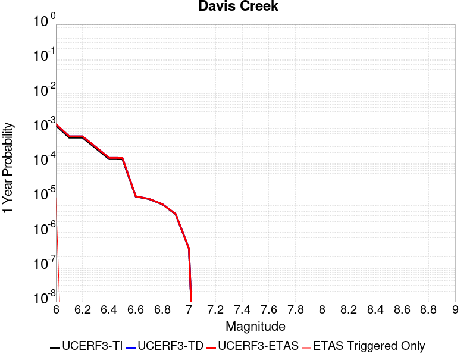 |  |

| Magnitude | 1 wk TI Prob | 1 wk TD Prob | 1 wk ETAS Prob | 1 wk ETAS/TD Gain | 1 wk ETAS Triggered Only | 1 mo TI Prob | 1 mo TD Prob | 1 mo ETAS Prob | 1 mo ETAS/TD Gain | 1 mo ETAS Triggered Only | 1 yr TI Prob | 1 yr TD Prob | 1 yr ETAS Prob | 1 yr ETAS/TD Gain | 1 yr ETAS Triggered Only | 10 yr TI Prob | 10 yr TD Prob | 10 yr ETAS Prob | 10 yr ETAS/TD Gain | 10 yr ETAS Triggered Only |
|-----|-----|-----|-----|-----|-----|-----|-----|-----|-----|-----|-----|-----|-----|-----|-----|-----|-----|-----|-----|-----|
| 6.0 | 2.331472E-5 | 2.5417152E-5 | 7.09637E-5 | 2.7919612 | 4.5547713E-5 | 9.99164E-5 | 1.08926775E-4 | 1.5446953E-4 | 1.4181043 | 4.5547713E-5 | 0.0012158032 | 0.0013254952 | 0.0013709825 | 1.0343173 | 4.5547713E-5 | 0.01209173 | 0.013187673 | 0.0132326195 | 1.0034083 | 4.5547713E-5 |
| 6.1 | 1.0407654E-5 | 1.131696E-5 | 1.131696E-5 | 1.0 | 0.0 | 4.4603472E-5 | 4.8500508E-5 | 4.8500508E-5 | 1.0 | 0.0 | 5.4291193E-4 | 5.9036084E-4 | 5.9036084E-4 | 1.0 | 0.0 | 0.0054158745 | 0.0058905976 | 0.0058905976 | 1.0 | 0.0 |
| 6.2 | 1.0407654E-5 | 1.131696E-5 | 1.131696E-5 | 1.0 | 0.0 | 4.4603472E-5 | 4.8500508E-5 | 4.8500508E-5 | 1.0 | 0.0 | 5.4291193E-4 | 5.9036084E-4 | 5.9036084E-4 | 1.0 | 0.0 | 0.0054158745 | 0.0058905976 | 0.0058905976 | 1.0 | 0.0 |
| 6.3 | 5.1323277E-6 | 5.568543E-6 | 5.568543E-6 | 1.0 | 0.0 | 2.1995505E-5 | 2.3865015E-5 | 2.3865015E-5 | 1.0 | 0.0 | 2.6776237E-4 | 2.9052646E-4 | 2.9052646E-4 | 1.0 | 0.0 | 0.0026743996 | 0.0029023124 | 0.0029023124 | 1.0 | 0.0 |
| 6.4 | 2.4985154E-6 | 2.704532E-6 | 2.704532E-6 | 1.0 | 0.0 | 1.07078795E-5 | 1.1590821E-5 | 1.1590821E-5 | 1.0 | 0.0 | 1.3036063E-4 | 1.4111272E-4 | 1.4111272E-4 | 1.0 | 0.0 | 0.0013028418 | 0.001410586 | 0.001410586 | 1.0 | 0.0 |
| 6.5 | 2.4846438E-6 | 2.6904663E-6 | 2.6904663E-6 | 1.0 | 0.0 | 1.064843E-5 | 1.1530539E-5 | 1.1530539E-5 | 1.0 | 0.0 | 1.2963692E-4 | 1.4037889E-4 | 1.4037889E-4 | 1.0 | 0.0 | 0.0012956132 | 0.0014032569 | 0.0014032569 | 1.0 | 0.0 |
| 6.6 | 2.072566E-7 | 2.1018079E-7 | 2.1018079E-7 | 1.0 | 0.0 | 8.882423E-7 | 9.007745E-7 | 9.007745E-7 | 1.0 | 0.0 | 1.0814296E-5 | 1.0966876E-5 | 1.0966876E-5 | 1.0 | 0.0 | 1.081377E-4 | 1.0966354E-4 | 1.0966354E-4 | 1.0 | 0.0 |
| 6.7 | 1.7544528E-7 | 1.7790819E-7 | 1.7790819E-7 | 1.0 | 0.0 | 7.5190815E-7 | 7.6246346E-7 | 7.6246346E-7 | 1.0 | 0.0 | 9.154443E-6 | 9.282955E-6 | 9.282955E-6 | 1.0 | 0.0 | 9.1540656E-5 | 9.282582E-5 | 9.282582E-5 | 1.0 | 0.0 |
| 6.8 | 1.2320395E-7 | 1.2481134E-7 | 1.2481134E-7 | 1.0 | 0.0 | 5.280168E-7 | 5.349056E-7 | 5.349056E-7 | 1.0 | 0.0 | 6.428586E-6 | 6.5124573E-6 | 6.5124573E-6 | 1.0 | 0.0 | 6.4284E-5 | 6.512278E-5 | 6.512278E-5 | 1.0 | 0.0 |
| 6.9 | 6.399997E-8 | 6.486056E-8 | 6.486056E-8 | 1.0 | 0.0 | 2.7428555E-7 | 2.7797378E-7 | 2.7797378E-7 | 1.0 | 0.0 | 3.3394215E-6 | 3.3843262E-6 | 3.3843262E-6 | 1.0 | 0.0 | 3.3393713E-5 | 3.384281E-5 | 3.384281E-5 | 1.0 | 0.0 |
| 7.0 | 6.4455685E-9 | 6.5352617E-9 | 6.5352617E-9 | 1.0 | 0.0 | 2.7623864E-8 | 2.8008264E-8 | 2.8008264E-8 | 1.0 | 0.0 | 3.3632048E-7 | 3.4100063E-7 | 3.4100063E-7 | 1.0 | 0.0 | 3.3631998E-6 | 3.4100062E-6 | 3.4100062E-6 | 1.0 | 0.0 |

## Santa Cruz Catalina Ridge alt1
*[(top)](#table-of-contents)*

| 1 Week | 1 Month | 1 Year | 10 Year |
|-----|-----|-----|-----|
|  |  |  |  |

| Magnitude | 1 wk TI Prob | 1 wk TD Prob | 1 wk ETAS Prob | 1 wk ETAS/TD Gain | 1 wk ETAS Triggered Only | 1 mo TI Prob | 1 mo TD Prob | 1 mo ETAS Prob | 1 mo ETAS/TD Gain | 1 mo ETAS Triggered Only | 1 yr TI Prob | 1 yr TD Prob | 1 yr ETAS Prob | 1 yr ETAS/TD Gain | 1 yr ETAS Triggered Only | 10 yr TI Prob | 10 yr TD Prob | 10 yr ETAS Prob | 10 yr ETAS/TD Gain | 10 yr ETAS Triggered Only |
|-----|-----|-----|-----|-----|-----|-----|-----|-----|-----|-----|-----|-----|-----|-----|-----|-----|-----|-----|-----|-----|
| 6.0 | 3.2833184E-5 | 3.6558286E-5 | 3.6558286E-5 | 1.0 | 0.0 | 1.4070606E-4 | 1.566699E-4 | 1.566699E-4 | 1.0 | 0.0 | 0.00171175 | 0.0019059537 | 0.0019514146 | 1.023852 | 4.5547713E-5 | 0.016986247 | 0.018912971 | 0.018957658 | 1.0023627 | 4.5547713E-5 |
| 6.1 | 1.9835548E-5 | 2.165945E-5 | 2.165945E-5 | 1.0 | 0.0 | 8.500672E-5 | 9.282303E-5 | 9.282303E-5 | 1.0 | 0.0 | 0.0010344655 | 0.0011295547 | 0.001175051 | 1.0402781 | 4.5547713E-5 | 0.010296632 | 0.011240268 | 0.011285303 | 1.0040066 | 4.5547713E-5 |
| 6.2 | 1.9835548E-5 | 2.165945E-5 | 2.165945E-5 | 1.0 | 0.0 | 8.500672E-5 | 9.282303E-5 | 9.282303E-5 | 1.0 | 0.0 | 0.0010344655 | 0.0011295547 | 0.001175051 | 1.0402781 | 4.5547713E-5 | 0.010296632 | 0.011240268 | 0.011285303 | 1.0040066 | 4.5547713E-5 |
| 6.3 | 1.5728183E-5 | 1.7033912E-5 | 1.7033912E-5 | 1.0 | 0.0 | 6.7404755E-5 | 7.300047E-5 | 7.300047E-5 | 1.0 | 0.0 | 8.2034385E-4 | 8.884244E-4 | 9.339317E-4 | 1.0512224 | 4.5547713E-5 | 0.008173222 | 0.008849408 | 0.008894552 | 1.0051014 | 4.5547713E-5 |
| 6.4 | 1.5728183E-5 | 1.7033912E-5 | 1.7033912E-5 | 1.0 | 0.0 | 6.7404755E-5 | 7.300047E-5 | 7.300047E-5 | 1.0 | 0.0 | 8.2034385E-4 | 8.884244E-4 | 9.339317E-4 | 1.0512224 | 4.5547713E-5 | 0.008173222 | 0.008849408 | 0.008894552 | 1.0051014 | 4.5547713E-5 |
| 6.5 | 1.3707734E-5 | 1.479449E-5 | 1.479449E-5 | 1.0 | 0.0 | 5.8746107E-5 | 6.340344E-5 | 6.340344E-5 | 1.0 | 0.0 | 7.1499916E-4 | 7.71667E-4 | 8.1717956E-4 | 1.0589795 | 4.5547713E-5 | 0.0071270303 | 0.007690273 | 0.007735471 | 1.0058773 | 4.5547713E-5 |
| 6.6 | 1.2539813E-5 | 1.3510192E-5 | 1.3510192E-5 | 1.0 | 0.0 | 5.3740947E-5 | 5.789955E-5 | 5.789955E-5 | 1.0 | 0.0 | 6.540996E-4 | 7.047017E-4 | 7.502173E-4 | 1.0645884 | 4.5547713E-5 | 0.0065217763 | 0.007024974 | 0.007070202 | 1.0064381 | 4.5547713E-5 |
| 6.7 | 1.1504083E-5 | 1.237735E-5 | 1.237735E-5 | 1.0 | 0.0 | 4.930228E-5 | 5.3044718E-5 | 5.3044718E-5 | 1.0 | 0.0 | 6.0008996E-4 | 6.4563006E-4 | 6.911484E-4 | 1.0705022 | 4.5547713E-5 | 0.005984721 | 0.006437773 | 0.0064830272 | 1.0070295 | 4.5547713E-5 |
| 6.8 | 1.012739E-5 | 1.087705E-5 | 1.087705E-5 | 1.0 | 0.0 | 4.340238E-5 | 4.6615103E-5 | 4.6615103E-5 | 1.0 | 0.0 | 5.282958E-4 | 5.673926E-4 | 6.1291445E-4 | 1.0802299 | 4.5547713E-5 | 0.0052704164 | 0.0056596086 | 0.0057048984 | 1.0080023 | 4.5547713E-5 |
| 6.9 | 8.9607865E-6 | 9.609099E-6 | 9.609099E-6 | 1.0 | 0.0 | 3.8402806E-5 | 4.1181207E-5 | 4.1181207E-5 | 1.0 | 0.0 | 4.6745385E-4 | 5.012669E-4 | 5.467918E-4 | 1.0908196 | 4.5547713E-5 | 0.0046647177 | 0.005001482 | 0.005046802 | 1.0090613 | 4.5547713E-5 |
| 7.0 | 8.046829E-6 | 8.61973E-6 | 8.61973E-6 | 1.0 | 0.0 | 3.4485955E-5 | 3.694118E-5 | 3.694118E-5 | 1.0 | 0.0 | 4.1978562E-4 | 4.4966684E-4 | 4.951941E-4 | 1.1012466 | 4.5547713E-5 | 0.004189935 | 0.0044876602 | 0.0045330036 | 1.010104 | 4.5547713E-5 |
| 7.1 | 7.136131E-6 | 7.637642E-6 | 7.637642E-6 | 1.0 | 0.0 | 3.0583058E-5 | 3.2732343E-5 | 3.2732343E-5 | 1.0 | 0.0 | 3.7228514E-4 | 3.984441E-4 | 4.4397367E-4 | 1.1142684 | 4.5547713E-5 | 0.0037166206 | 0.0039773737 | 0.0040227403 | 1.0114062 | 4.5547713E-5 |
| 7.2 | 6.362014E-6 | 6.8049458E-6 | 6.8049458E-6 | 1.0 | 0.0 | 2.726549E-5 | 2.9163732E-5 | 2.9163732E-5 | 1.0 | 0.0 | 3.3190678E-4 | 3.5501123E-4 | 4.0054278E-4 | 1.1282538 | 4.5547713E-5 | 0.0033141149 | 0.0035445094 | 0.0035898958 | 1.0128046 | 4.5547713E-5 |
| 7.3 | 5.004101E-6 | 5.351705E-6 | 5.351705E-6 | 1.0 | 0.0 | 2.1445969E-5 | 2.2935681E-5 | 2.2935681E-5 | 1.0 | 0.0 | 2.6107338E-4 | 2.7920667E-4 | 3.2474165E-4 | 1.163087 | 4.5547713E-5 | 0.002607669 | 0.0027886136 | 0.0028340342 | 1.0162879 | 4.5547713E-5 |
| 7.4 | 3.4901443E-6 | 3.7320456E-6 | 3.7320456E-6 | 1.0 | 0.0 | 1.4957676E-5 | 1.5994385E-5 | 1.5994385E-5 | 1.0 | 0.0 | 1.8209449E-4 | 1.9471462E-4 | 1.9471462E-4 | 1.0 | 0.0 | 0.0018194534 | 0.0019454787 | 0.0019454787 | 1.0 | 0.0 |
| 7.5 | 1.1215045E-6 | 1.1893851E-6 | 1.1893851E-6 | 1.0 | 0.0 | 4.806439E-6 | 5.097355E-6 | 5.097355E-6 | 1.0 | 0.0 | 5.851682E-5 | 6.205856E-5 | 6.205856E-5 | 1.0 | 0.0 | 5.850142E-4 | 6.204154E-4 | 6.204154E-4 | 1.0 | 0.0 |
| 7.6 | 2.8599047E-7 | 2.9951954E-7 | 2.9951954E-7 | 1.0 | 0.0 | 1.2256729E-6 | 1.2836546E-6 | 1.2836546E-6 | 1.0 | 0.0 | 1.4922465E-5 | 1.5628384E-5 | 1.5628384E-5 | 1.0 | 0.0 | 1.4921463E-4 | 1.5627299E-4 | 1.5627299E-4 | 1.0 | 0.0 |
| 7.7 | 2.0781519E-7 | 2.1744296E-7 | 2.1744296E-7 | 1.0 | 0.0 | 8.906362E-7 | 9.3189806E-7 | 9.3189806E-7 | 1.0 | 0.0 | 1.08434415E-5 | 1.1345801E-5 | 1.1345801E-5 | 1.0 | 0.0 | 1.0842913E-4 | 1.1345231E-4 | 1.1345231E-4 | 1.0 | 0.0 |
| 7.8 | 3.614776E-8 | 3.7640977E-8 | 3.7640977E-8 | 1.0 | 0.0 | 1.5491896E-7 | 1.6131847E-7 | 1.6131847E-7 | 1.0 | 0.0 | 1.8861368E-6 | 1.9640506E-6 | 1.9640506E-6 | 1.0 | 0.0 | 1.8861208E-5 | 1.9640345E-5 | 1.9640345E-5 | 1.0 | 0.0 |

## Independence rev 2011
*[(top)](#table-of-contents)*

| 1 Week | 1 Month | 1 Year | 10 Year |
|-----|-----|-----|-----|
|  |  |  |  |

| Magnitude | 1 wk TI Prob | 1 wk TD Prob | 1 wk ETAS Prob | 1 wk ETAS/TD Gain | 1 wk ETAS Triggered Only | 1 mo TI Prob | 1 mo TD Prob | 1 mo ETAS Prob | 1 mo ETAS/TD Gain | 1 mo ETAS Triggered Only | 1 yr TI Prob | 1 yr TD Prob | 1 yr ETAS Prob | 1 yr ETAS/TD Gain | 1 yr ETAS Triggered Only | 10 yr TI Prob | 10 yr TD Prob | 10 yr ETAS Prob | 10 yr ETAS/TD Gain | 10 yr ETAS Triggered Only |
|-----|-----|-----|-----|-----|-----|-----|-----|-----|-----|-----|-----|-----|-----|-----|-----|-----|-----|-----|-----|-----|
| 6.0 | 4.422171E-6 | 4.3262235E-6 | 4.3262235E-6 | 1.0 | 0.0 | 1.8952025E-5 | 1.8540843E-5 | 6.408771E-5 | 3.4565694 | 4.5547713E-5 | 2.3071647E-4 | 2.2571435E-4 | 2.7125177E-4 | 1.201748 | 4.5547713E-5 | 0.0023047708 | 0.0022551445 | 0.0023005896 | 1.0201517 | 4.5547713E-5 |
| 6.1 | 4.422171E-6 | 4.3262235E-6 | 4.3262235E-6 | 1.0 | 0.0 | 1.8952025E-5 | 1.8540843E-5 | 6.408771E-5 | 3.4565694 | 4.5547713E-5 | 2.3071647E-4 | 2.2571435E-4 | 2.7125177E-4 | 1.201748 | 4.5547713E-5 | 0.0023047708 | 0.0022551445 | 0.0023005896 | 1.0201517 | 4.5547713E-5 |
| 6.2 | 4.422171E-6 | 4.3262235E-6 | 4.3262235E-6 | 1.0 | 0.0 | 1.8952025E-5 | 1.8540843E-5 | 6.408771E-5 | 3.4565694 | 4.5547713E-5 | 2.3071647E-4 | 2.2571435E-4 | 2.7125177E-4 | 1.201748 | 4.5547713E-5 | 0.0023047708 | 0.0022551445 | 0.0023005896 | 1.0201517 | 4.5547713E-5 |
| 6.3 | 4.422171E-6 | 4.3262235E-6 | 4.3262235E-6 | 1.0 | 0.0 | 1.8952025E-5 | 1.8540843E-5 | 6.408771E-5 | 3.4565694 | 4.5547713E-5 | 2.3071647E-4 | 2.2571435E-4 | 2.7125177E-4 | 1.201748 | 4.5547713E-5 | 0.0023047708 | 0.0022551445 | 0.0023005896 | 1.0201517 | 4.5547713E-5 |
| 6.4 | 4.422171E-6 | 4.3262235E-6 | 4.3262235E-6 | 1.0 | 0.0 | 1.8952025E-5 | 1.8540843E-5 | 6.408771E-5 | 3.4565694 | 4.5547713E-5 | 2.3071647E-4 | 2.2571435E-4 | 2.7125177E-4 | 1.201748 | 4.5547713E-5 | 0.0023047708 | 0.0022551445 | 0.0023005896 | 1.0201517 | 4.5547713E-5 |
| 6.5 | 4.422171E-6 | 4.3262235E-6 | 4.3262235E-6 | 1.0 | 0.0 | 1.8952025E-5 | 1.8540843E-5 | 6.408771E-5 | 3.4565694 | 4.5547713E-5 | 2.3071647E-4 | 2.2571435E-4 | 2.7125177E-4 | 1.201748 | 4.5547713E-5 | 0.0023047708 | 0.0022551445 | 0.0023005896 | 1.0201517 | 4.5547713E-5 |
| 6.6 | 2.663744E-6 | 2.5319835E-6 | 2.5319835E-6 | 1.0 | 0.0 | 1.1415996E-5 | 1.0851315E-5 | 5.6398534E-5 | 5.1973915 | 4.5547713E-5 | 1.3898089E-4 | 1.3210725E-4 | 1.7764894E-4 | 1.3447328 | 4.5547713E-5 | 0.0013889399 | 0.0013203353 | 0.001365823 | 1.0344515 | 4.5547713E-5 |
| 6.7 | 2.663744E-6 | 2.5319835E-6 | 2.5319835E-6 | 1.0 | 0.0 | 1.1415996E-5 | 1.0851315E-5 | 5.6398534E-5 | 5.1973915 | 4.5547713E-5 | 1.3898089E-4 | 1.3210725E-4 | 1.7764894E-4 | 1.3447328 | 4.5547713E-5 | 0.0013889399 | 0.0013203353 | 0.001365823 | 1.0344515 | 4.5547713E-5 |
| 6.8 | 1.9716529E-6 | 1.8322561E-6 | 1.8322561E-6 | 1.0 | 0.0 | 8.449913E-6 | 7.852504E-6 | 7.852504E-6 | 1.0 | 0.0 | 1.0287284E-4 | 9.560016E-5 | 9.560016E-5 | 1.0 | 0.0 | 0.0010282523 | 9.5560326E-4 | 9.5560326E-4 | 1.0 | 0.0 |
| 6.9 | 1.8788617E-6 | 1.742997E-6 | 1.742997E-6 | 1.0 | 0.0 | 8.0522395E-6 | 7.469967E-6 | 7.469967E-6 | 1.0 | 0.0 | 9.80316E-5 | 9.094317E-5 | 9.094317E-5 | 1.0 | 0.0 | 9.798837E-4 | 9.090716E-4 | 9.090716E-4 | 1.0 | 0.0 |
| 7.0 | 1.5045488E-6 | 1.3849485E-6 | 1.3849485E-6 | 1.0 | 0.0 | 6.44805E-6 | 5.9354807E-6 | 5.9354807E-6 | 1.0 | 0.0 | 7.8502184E-5 | 7.226213E-5 | 7.226213E-5 | 1.0 | 0.0 | 7.8474457E-4 | 7.223915E-4 | 7.223915E-4 | 1.0 | 0.0 |
| 7.1 | 1.272341E-6 | 1.162508E-6 | 1.162508E-6 | 1.0 | 0.0 | 5.4528787E-6 | 4.9821683E-6 | 4.9821683E-6 | 1.0 | 0.0 | 6.6386776E-5 | 6.0656243E-5 | 6.0656243E-5 | 1.0 | 0.0 | 6.636695E-4 | 6.064001E-4 | 6.064001E-4 | 1.0 | 0.0 |
| 7.2 | 1.0416892E-6 | 9.4098664E-7 | 9.4098664E-7 | 1.0 | 0.0 | 4.464375E-6 | 4.0327936E-6 | 4.0327936E-6 | 1.0 | 0.0 | 5.4352407E-5 | 4.9098177E-5 | 4.9098177E-5 | 1.0 | 0.0 | 5.4339116E-4 | 4.9087516E-4 | 4.9087516E-4 | 1.0 | 0.0 |
| 7.3 | 7.9450155E-7 | 7.234991E-7 | 7.234991E-7 | 1.0 | 0.0 | 3.4050022E-6 | 3.100707E-6 | 3.100707E-6 | 1.0 | 0.0 | 4.1455114E-5 | 3.7750466E-5 | 3.7750466E-5 | 1.0 | 0.0 | 4.144738E-4 | 3.7744164E-4 | 3.7744164E-4 | 1.0 | 0.0 |
| 7.4 | 5.3893444E-7 | 5.019506E-7 | 5.019506E-7 | 1.0 | 0.0 | 2.309717E-6 | 2.151215E-6 | 2.151215E-6 | 1.0 | 0.0 | 2.8120441E-5 | 2.6190733E-5 | 2.6190733E-5 | 1.0 | 0.0 | 2.8116882E-4 | 2.618769E-4 | 2.618769E-4 | 1.0 | 0.0 |
| 7.5 | 3.8852085E-7 | 3.6825497E-7 | 3.6825497E-7 | 1.0 | 0.0 | 1.6650882E-6 | 1.5782347E-6 | 1.5782347E-6 | 1.0 | 0.0 | 2.027226E-5 | 1.921484E-5 | 1.921484E-5 | 1.0 | 0.0 | 2.0270412E-4 | 1.9213199E-4 | 1.9213199E-4 | 1.0 | 0.0 |
| 7.6 | 2.414929E-7 | 2.3457528E-7 | 2.3457528E-7 | 1.0 | 0.0 | 1.0349692E-6 | 1.0053222E-6 | 1.0053222E-6 | 1.0 | 0.0 | 1.2600677E-5 | 1.2239731E-5 | 1.2239731E-5 | 1.0 | 0.0 | 1.2599962E-4 | 1.2239069E-4 | 1.2239069E-4 | 1.0 | 0.0 |
| 7.7 | 6.8298014E-8 | 6.858965E-8 | 6.858965E-8 | 1.0 | 0.0 | 2.9270575E-7 | 2.9395562E-7 | 2.9395562E-7 | 1.0 | 0.0 | 3.5636867E-6 | 3.5789042E-6 | 3.5789042E-6 | 1.0 | 0.0 | 3.5636294E-5 | 3.5788515E-5 | 3.5788515E-5 | 1.0 | 0.0 |

## White Mountains
*[(top)](#table-of-contents)*

| 1 Week | 1 Month | 1 Year | 10 Year |
|-----|-----|-----|-----|
|  |  |  |  |

| Magnitude | 1 wk TI Prob | 1 wk TD Prob | 1 wk ETAS Prob | 1 wk ETAS/TD Gain | 1 wk ETAS Triggered Only | 1 mo TI Prob | 1 mo TD Prob | 1 mo ETAS Prob | 1 mo ETAS/TD Gain | 1 mo ETAS Triggered Only | 1 yr TI Prob | 1 yr TD Prob | 1 yr ETAS Prob | 1 yr ETAS/TD Gain | 1 yr ETAS Triggered Only | 10 yr TI Prob | 10 yr TD Prob | 10 yr ETAS Prob | 10 yr ETAS/TD Gain | 10 yr ETAS Triggered Only |
|-----|-----|-----|-----|-----|-----|-----|-----|-----|-----|-----|-----|-----|-----|-----|-----|-----|-----|-----|-----|-----|
| 6.0 | 3.503579E-5 | 3.3783974E-5 | 7.933015E-5 | 2.348159 | 4.5547713E-5 | 1.5014476E-4 | 1.4478111E-4 | 1.9032223E-4 | 1.3145515 | 4.5547713E-5 | 0.0018264796 | 0.0017614056 | 0.0018068731 | 1.0258132 | 4.5547713E-5 | 0.018115403 | 0.017486779 | 0.017531531 | 1.0025592 | 4.5547713E-5 |
| 6.1 | 3.503579E-5 | 3.3783974E-5 | 7.933015E-5 | 2.348159 | 4.5547713E-5 | 1.5014476E-4 | 1.4478111E-4 | 1.9032223E-4 | 1.3145515 | 4.5547713E-5 | 0.0018264796 | 0.0017614056 | 0.0018068731 | 1.0258132 | 4.5547713E-5 | 0.018115403 | 0.017486779 | 0.017531531 | 1.0025592 | 4.5547713E-5 |
| 6.2 | 3.503579E-5 | 3.3783974E-5 | 7.933015E-5 | 2.348159 | 4.5547713E-5 | 1.5014476E-4 | 1.4478111E-4 | 1.9032223E-4 | 1.3145515 | 4.5547713E-5 | 0.0018264796 | 0.0017614056 | 0.0018068731 | 1.0258132 | 4.5547713E-5 | 0.018115403 | 0.017486779 | 0.017531531 | 1.0025592 | 4.5547713E-5 |
| 6.3 | 1.7818425E-5 | 1.591604E-5 | 1.591604E-5 | 1.0 | 0.0 | 7.636245E-5 | 6.8209905E-5 | 6.8209905E-5 | 1.0 | 0.0 | 9.293162E-4 | 8.301534E-4 | 8.301534E-4 | 1.0 | 0.0 | 0.009254395 | 0.008271982 | 0.008271982 | 1.0 | 0.0 |
| 6.4 | 1.7818425E-5 | 1.591604E-5 | 1.591604E-5 | 1.0 | 0.0 | 7.636245E-5 | 6.8209905E-5 | 6.8209905E-5 | 1.0 | 0.0 | 9.293162E-4 | 8.301534E-4 | 8.301534E-4 | 1.0 | 0.0 | 0.009254395 | 0.008271982 | 0.008271982 | 1.0 | 0.0 |
| 6.5 | 1.3397557E-5 | 1.1336246E-5 | 1.1336246E-5 | 1.0 | 0.0 | 5.741684E-5 | 4.8583046E-5 | 4.8583046E-5 | 1.0 | 0.0 | 6.988258E-4 | 5.91345E-4 | 5.91345E-4 | 1.0 | 0.0 | 0.006966323 | 0.0058984202 | 0.0058984202 | 1.0 | 0.0 |
| 6.6 | 1.0818695E-5 | 8.6253485E-6 | 8.6253485E-6 | 1.0 | 0.0 | 4.6365014E-5 | 3.696528E-5 | 3.696528E-5 | 1.0 | 0.0 | 5.6434784E-4 | 4.4996373E-4 | 4.4996373E-4 | 1.0 | 0.0 | 0.005629168 | 0.004490963 | 0.004490963 | 1.0 | 0.0 |
| 6.7 | 9.067908E-6 | 6.8024283E-6 | 6.8024283E-6 | 1.0 | 0.0 | 3.8861883E-5 | 2.9152956E-5 | 2.9152956E-5 | 1.0 | 0.0 | 4.7304068E-4 | 3.5488262E-4 | 3.5488262E-4 | 1.0 | 0.0 | 0.00472035 | 0.003543476 | 0.003543476 | 1.0 | 0.0 |
| 6.8 | 7.295947E-6 | 4.9363807E-6 | 4.9363807E-6 | 1.0 | 0.0 | 3.126797E-5 | 2.1155753E-5 | 2.1155753E-5 | 1.0 | 0.0 | 3.8062103E-4 | 2.5754198E-4 | 2.5754198E-4 | 1.0 | 0.0 | 0.0037996976 | 0.002572548 | 0.002572548 | 1.0 | 0.0 |
| 6.9 | 6.2243444E-6 | 3.8322046E-6 | 3.8322046E-6 | 1.0 | 0.0 | 2.6675489E-5 | 1.6423633E-5 | 1.6423633E-5 | 1.0 | 0.0 | 3.2472567E-4 | 1.9993992E-4 | 1.9993992E-4 | 1.0 | 0.0 | 0.0032425157 | 0.0019976532 | 0.0019976532 | 1.0 | 0.0 |
| 7.0 | 4.9878413E-6 | 2.679527E-6 | 2.679527E-6 | 1.0 | 0.0 | 2.1376287E-5 | 1.1483638E-5 | 1.1483638E-5 | 1.0 | 0.0 | 2.602252E-4 | 1.3980459E-4 | 1.3980459E-4 | 1.0 | 0.0 | 0.002599207 | 0.0013971926 | 0.0013971926 | 1.0 | 0.0 |
| 7.1 | 4.0252844E-6 | 1.8857509E-6 | 1.8857509E-6 | 1.0 | 0.0 | 1.7251105E-5 | 8.081765E-6 | 8.081765E-6 | 1.0 | 0.0 | 2.1001195E-4 | 9.8391174E-5 | 9.8391174E-5 | 1.0 | 0.0 | 0.0020981359 | 9.83489E-4 | 9.83489E-4 | 1.0 | 0.0 |
| 7.2 | 3.3284066E-6 | 1.281958E-6 | 1.281958E-6 | 1.0 | 0.0 | 1.4264522E-5 | 5.4940947E-6 | 5.4940947E-6 | 1.0 | 0.0 | 1.736567E-4 | 6.688865E-5 | 6.688865E-5 | 1.0 | 0.0 | 0.0017352107 | 6.6869525E-4 | 6.6869525E-4 | 1.0 | 0.0 |
| 7.3 | 2.458226E-6 | 6.0571654E-7 | 6.0571654E-7 | 1.0 | 0.0 | 1.0535211E-5 | 2.5959255E-6 | 2.5959255E-6 | 1.0 | 0.0 | 1.2825865E-4 | 3.1604974E-5 | 3.1604974E-5 | 1.0 | 0.0 | 0.0012818464 | 3.1600855E-4 | 3.1600855E-4 | 1.0 | 0.0 |
| 7.4 | 1.965953E-6 | 3.1088828E-7 | 3.1088828E-7 | 1.0 | 0.0 | 8.425486E-6 | 1.3323777E-6 | 1.3323777E-6 | 1.0 | 0.0 | 1.0257547E-4 | 1.6221578E-5 | 1.6221578E-5 | 1.0 | 0.0 | 0.0010252813 | 1.6220407E-4 | 1.6220407E-4 | 1.0 | 0.0 |
| 7.5 | 1.2014192E-6 | 1.8243925E-7 | 1.8243925E-7 | 1.0 | 0.0 | 5.148929E-6 | 7.8188225E-7 | 7.8188225E-7 | 1.0 | 0.0 | 6.2686406E-5 | 9.519375E-6 | 9.519375E-6 | 1.0 | 0.0 | 6.266873E-4 | 9.518977E-5 | 9.518977E-5 | 1.0 | 0.0 |
| 7.6 | 2.5612175E-7 | 4.894561E-8 | 4.894561E-8 | 1.0 | 0.0 | 1.0976642E-6 | 2.0976687E-7 | 2.0976687E-7 | 1.0 | 0.0 | 1.3363979E-5 | 2.553909E-6 | 2.553909E-6 | 1.0 | 0.0 | 1.3363175E-4 | 2.5538833E-5 | 2.5538833E-5 | 1.0 | 0.0 |

