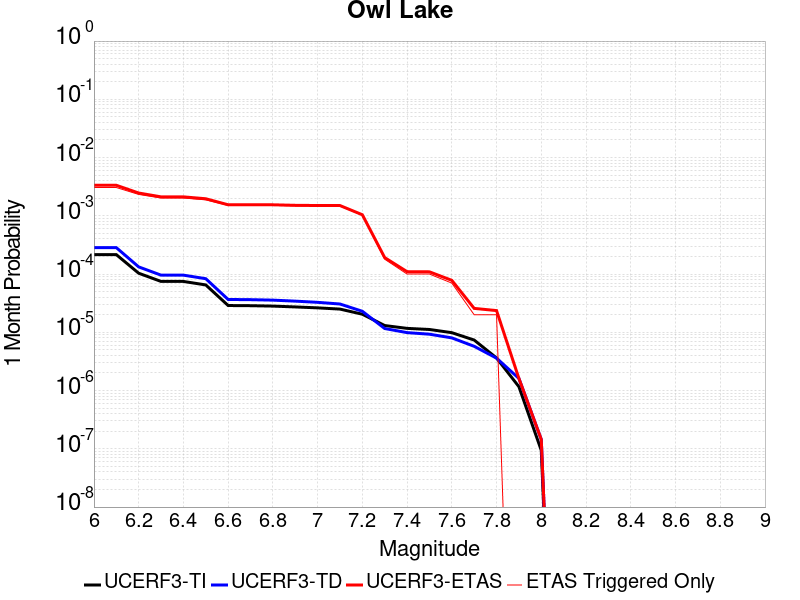
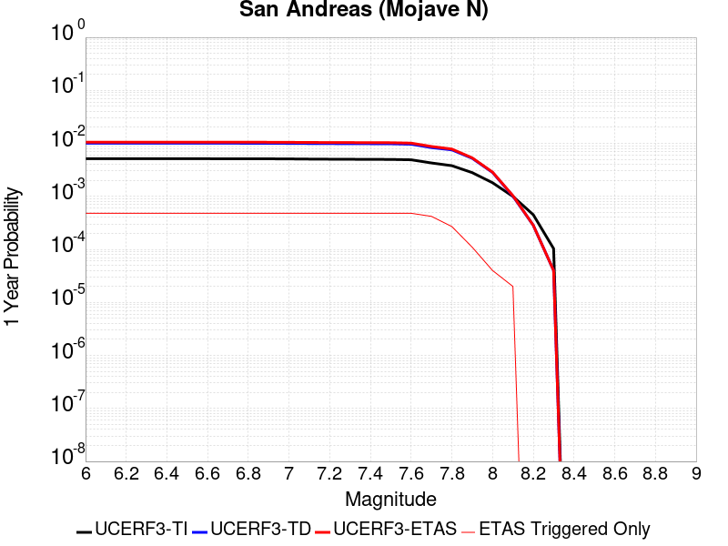

# Parent Section Magnitude-Probability Distributions

Only fault sections with at least one triggered aftershock are plotted. Sections are sorted by total supraseismogenic trigger rate (decreasing)

## Table Of Contents

* [Garlock (Central)](#garlock-central)
* [Tank Canyon](#tank-canyon)
* [Owl Lake](#owl-lake)
* [Garlock (East)](#garlock-east)
* [Garlock (West)](#garlock-west)
* [Little Lake](#little-lake)
* [San Andreas (Mojave S)](#san-andreas-mojave-s)
* [Panamint Valley](#panamint-valley)
* [San Andreas (San Bernardino S)](#san-andreas-san-bernardino-s)
* [San Andreas (San Bernardino N)](#san-andreas-san-bernardino-n)
* [San Andreas (Mojave N)](#san-andreas-mojave-n)
* [Gravel Hills-Harper Lk](#gravel-hills-harper-lk)
* [Kern Canyon (Lake Isabella) 2011](#kern-canyon-lake-isabella-2011)
* [Ash Hill](#ash-hill)
* [Blackwater](#blackwater)
* [So Sierra Nevada](#so-sierra-nevada)
* [Lenwood-Lockhart-Old Woman Springs](#lenwood-lockhart-old-woman-springs)
* [Death Valley (So)](#death-valley-so)
* [McLean Lake](#mclean-lake)
* [Airport Lake](#airport-lake)
* [San Andreas (San Gorgonio Pass-Garnet HIll)](#san-andreas-san-gorgonio-pass-garnet-hill)

## Garlock (Central)
*[(top)](#table-of-contents)*

| 1 Week | 1 Month | 1 Year | 10 Year |
|-----|-----|-----|-----|
|  |  |  |  |

| Magnitude | 1 wk TI Prob | 1 wk TD Prob | 1 wk ETAS Prob | 1 wk ETAS/TD Gain | 1 wk ETAS Triggered Only | 1 mo TI Prob | 1 mo TD Prob | 1 mo ETAS Prob | 1 mo ETAS/TD Gain | 1 mo ETAS Triggered Only | 1 yr TI Prob | 1 yr TD Prob | 1 yr ETAS Prob | 1 yr ETAS/TD Gain | 1 yr ETAS Triggered Only | 10 yr TI Prob | 10 yr TD Prob | 10 yr ETAS Prob | 10 yr ETAS/TD Gain | 10 yr ETAS Triggered Only |
|-----|-----|-----|-----|-----|-----|-----|-----|-----|-----|-----|-----|-----|-----|-----|-----|-----|-----|-----|-----|-----|
| 6.0 | 5.5131142E-5 | 7.024558E-5 | 0.008616654 | 122.6647 | 0.008547009 | 2.3625491E-4 | 3.0101812E-4 | 0.008845454 | 29.38512 | 0.008547009 | 0.0028726095 | 0.0036588025 | 0.017496875 | 4.7821317 | 0.013888889 | 0.028357591 | 0.03607921 | 0.05255649 | 1.4566973 | 0.017094018 |
| 6.1 | 5.5131142E-5 | 7.024558E-5 | 0.008616654 | 122.6647 | 0.008547009 | 2.3625491E-4 | 3.0101812E-4 | 0.008845454 | 29.38512 | 0.008547009 | 0.0028726095 | 0.0036588025 | 0.017496875 | 4.7821317 | 0.013888889 | 0.028357591 | 0.03607921 | 0.05255649 | 1.4566973 | 0.017094018 |
| 6.2 | 4.216245E-5 | 5.1660383E-5 | 0.0064615854 | 125.07816 | 0.0064102565 | 1.806837E-4 | 2.2138303E-4 | 0.0066302205 | 29.949091 | 0.0064102565 | 0.0021976046 | 0.0026920384 | 0.013347038 | 4.957967 | 0.010683761 | 0.021759989 | 0.02668921 | 0.040207416 | 1.5065045 | 0.013888889 |
| 6.3 | 4.216245E-5 | 5.1660383E-5 | 0.0064615854 | 125.07816 | 0.0064102565 | 1.806837E-4 | 2.2138303E-4 | 0.0066302205 | 29.949091 | 0.0064102565 | 0.0021976046 | 0.0026920384 | 0.013347038 | 4.957967 | 0.010683761 | 0.021759989 | 0.02668921 | 0.040207416 | 1.5065045 | 0.013888889 |
| 6.4 | 3.6858168E-5 | 4.4109474E-5 | 0.004317425 | 97.87977 | 0.0042735045 | 1.5795401E-4 | 1.8902705E-4 | 0.0044617234 | 23.603624 | 0.0042735045 | 0.0019213937 | 0.0022990005 | 0.008694519 | 3.7818694 | 0.0064102565 | 0.019048655 | 0.022848397 | 0.030156154 | 1.3198367 | 0.0074786325 |
| 6.5 | 3.39199E-5 | 4.001704E-5 | 0.003245017 | 81.09088 | 0.0032051282 | 1.453629E-4 | 1.7149044E-4 | 0.003376069 | 19.68663 | 0.0032051282 | 0.0017683565 | 0.0020859186 | 0.0074166562 | 3.5555828 | 0.0053418805 | 0.017543508 | 0.02075933 | 0.027036514 | 1.3023789 | 0.0064102565 |
| 6.6 | 3.3571985E-5 | 3.947123E-5 | 0.003244473 | 82.198425 | 0.0032051282 | 1.4387199E-4 | 1.6915156E-4 | 0.0033737377 | 19.945057 | 0.0032051282 | 0.0017502342 | 0.002057497 | 0.0073883864 | 3.5909588 | 0.0053418805 | 0.017365133 | 0.020480646 | 0.026759617 | 1.3065807 | 0.0064102565 |
| 6.7 | 3.2580007E-5 | 3.8087666E-5 | 0.0032430938 | 85.14814 | 0.0032051282 | 1.3962112E-4 | 1.6322276E-4 | 0.0033678277 | 20.633322 | 0.0032051282 | 0.0016985617 | 0.0019854472 | 0.0073167216 | 3.6851754 | 0.0053418805 | 0.016856372 | 0.019773284 | 0.026056789 | 1.3177775 | 0.0064102565 |
| 6.8 | 3.2185937E-5 | 3.751489E-5 | 0.003242523 | 86.43296 | 0.0032051282 | 1.3793244E-4 | 1.607683E-4 | 0.0033653812 | 20.933115 | 0.0032051282 | 0.0016780337 | 0.0019556184 | 0.0062207654 | 3.1809711 | 0.0042735045 | 0.016654192 | 0.019480087 | 0.024717906 | 1.2688807 | 0.0053418805 |
| 6.9 | 3.165394E-5 | 3.6719477E-5 | 0.00324173 | 88.28366 | 0.0032051282 | 1.3565269E-4 | 1.5735981E-4 | 0.0033619837 | 21.364944 | 0.0032051282 | 0.0016503202 | 0.0019141936 | 0.0061795176 | 3.2282615 | 0.0042735045 | 0.01638118 | 0.01907272 | 0.024312718 | 1.2747377 | 0.0053418805 |
| 7.0 | 3.0903822E-5 | 3.5624747E-5 | 0.0032406389 | 90.96595 | 0.0032051282 | 1.3243823E-4 | 1.5266867E-4 | 0.0033573075 | 21.990808 | 0.0032051282 | 0.0016112428 | 0.0018571776 | 0.006122745 | 3.296801 | 0.0042735045 | 0.015996104 | 0.018511891 | 0.023754884 | 1.2832229 | 0.0053418805 |
| 7.1 | 3.0069863E-5 | 3.439106E-5 | 0.003239409 | 94.193344 | 0.0032051282 | 1.2886449E-4 | 1.4738206E-4 | 0.0033520379 | 22.743868 | 0.0032051282 | 0.0015677959 | 0.0017929208 | 0.006058763 | 3.3792698 | 0.0042735045 | 0.01556781 | 0.017879559 | 0.023125928 | 1.2934284 | 0.0053418805 |
| 7.2 | 2.7957109E-5 | 3.1280466E-5 | 0.0032363085 | 103.461006 | 0.0032051282 | 1.1981068E-4 | 1.3405236E-4 | 0.003338751 | 24.906319 | 0.0032051282 | 0.0014577188 | 0.0016308852 | 0.00589742 | 3.6160853 | 0.0042735045 | 0.014481937 | 0.016283188 | 0.020487105 | 1.2581754 | 0.0042735045 |
| 7.3 | 2.4519275E-5 | 2.6713868E-5 | 0.0032317564 | 120.97674 | 0.0032051282 | 1.0507837E-4 | 1.1448306E-4 | 0.0033192444 | 28.993322 | 0.0032051282 | 0.0012785783 | 0.0013929547 | 0.0056605064 | 4.0636683 | 0.0042735045 | 0.012712469 | 0.013927576 | 0.01814156 | 1.3025641 | 0.0042735045 |
| 7.4 | 2.3225532E-5 | 2.5198491E-5 | 0.003230246 | 128.19203 | 0.0032051282 | 9.95342E-5 | 1.07989144E-4 | 0.0033127712 | 30.676891 | 0.0032051282 | 0.0012111551 | 0.0013139893 | 0.005581878 | 4.2480392 | 0.0042735045 | 0.012045753 | 0.013145258 | 0.017362585 | 1.3208251 | 0.0042735045 |
| 7.5 | 2.097765E-5 | 2.2482824E-5 | 0.003227539 | 143.55576 | 0.0032051282 | 8.9901114E-5 | 9.635147E-5 | 0.003301171 | 34.26176 | 0.0032051282 | 0.0010939965 | 0.0011724597 | 0.005440953 | 4.6406317 | 0.0042735045 | 0.010886264 | 0.01173992 | 0.015963254 | 1.3597412 | 0.0042735045 |
| 7.6 | 1.511254E-5 | 1.5990528E-5 | 0.0021527086 | 134.62398 | 0.0021367522 | 6.476642E-5 | 6.852908E-5 | 0.0022051348 | 32.17809 | 0.0021367522 | 7.882459E-4 | 8.3403E-4 | 0.002969 | 3.559824 | 0.0021367522 | 0.007854558 | 0.008383143 | 0.010501983 | 1.25275 | 0.0021367522 |
| 7.7 | 9.934069E-6 | 1.0678047E-5 | 0.0021474073 | 201.10489 | 0.0021367522 | 4.2573887E-5 | 4.576226E-5 | 0.0021824166 | 47.69032 | 0.0021367522 | 5.182138E-4 | 5.5701344E-4 | 0.0026925753 | 4.8339505 | 0.0021367522 | 0.00517007 | 0.0056272964 | 0.0077520246 | 1.3775753 | 0.0021367522 |
| 7.8 | 6.7562896E-6 | 8.427841E-6 | 0.002145162 | 254.5328 | 0.0021367522 | 2.8955206E-5 | 3.6118818E-5 | 0.0021727937 | 60.156837 | 0.0021367522 | 3.5247262E-4 | 4.3965803E-4 | 0.0025754708 | 5.8578954 | 0.0021367522 | 0.0035191406 | 0.0044463384 | 0.00657359 | 1.4784276 | 0.0021367522 |
| 7.9 | 3.975453E-6 | 5.3706585E-6 | 0.0021421113 | 398.8545 | 0.0021367522 | 1.7037546E-5 | 2.3016906E-5 | 0.0021597198 | 93.831894 | 0.0021367522 | 2.0741238E-4 | 2.801949E-4 | 0.0024163483 | 8.623813 | 0.0021367522 | 0.002072189 | 0.002833435 | 0.004964133 | 1.751984 | 0.0021367522 |
| 8.0 | 1.6729537E-6 | 2.0773857E-6 | 2.0773857E-6 | 1.0 | 0.0 | 7.169782E-6 | 8.903051E-6 | 8.903051E-6 | 1.0 | 0.0 | 8.7288594E-5 | 1.08389286E-4 | 1.08389286E-4 | 1.0 | 0.0 | 8.7254314E-4 | 0.0010968668 | 0.0010968668 | 1.0 | 0.0 |
| 8.1 | 3.6733252E-7 | 3.148811E-7 | 3.148811E-7 | 1.0 | 0.0 | 1.5742813E-6 | 1.3494899E-6 | 1.3494899E-6 | 1.0 | 0.0 | 1.9166706E-5 | 1.6429933E-5 | 1.6429933E-5 | 1.0 | 0.0 | 1.9165053E-4 | 1.6637788E-4 | 1.6637788E-4 | 1.0 | 0.0 |

## Tank Canyon
*[(top)](#table-of-contents)*

| 1 Week | 1 Month | 1 Year | 10 Year |
|-----|-----|-----|-----|
|  |  |  |  |

| Magnitude | 1 wk TI Prob | 1 wk TD Prob | 1 wk ETAS Prob | 1 wk ETAS/TD Gain | 1 wk ETAS Triggered Only | 1 mo TI Prob | 1 mo TD Prob | 1 mo ETAS Prob | 1 mo ETAS/TD Gain | 1 mo ETAS Triggered Only | 1 yr TI Prob | 1 yr TD Prob | 1 yr ETAS Prob | 1 yr ETAS/TD Gain | 1 yr ETAS Triggered Only | 10 yr TI Prob | 10 yr TD Prob | 10 yr ETAS Prob | 10 yr ETAS/TD Gain | 10 yr ETAS Triggered Only |
|-----|-----|-----|-----|-----|-----|-----|-----|-----|-----|-----|-----|-----|-----|-----|-----|-----|-----|-----|-----|-----|
| 6.0 | 4.8284557E-5 | 5.7964517E-5 | 0.004331221 | 74.72194 | 0.0042735045 | 2.0691741E-4 | 2.4839956E-4 | 0.0077251745 | 31.099792 | 0.0074786325 | 0.0025163088 | 0.0030207448 | 0.012607084 | 4.173502 | 0.009615385 | 0.02488006 | 0.029863482 | 0.04230113 | 1.4164835 | 0.012820513 |
| 6.1 | 1.7796336E-5 | 2.0873225E-5 | 2.0873225E-5 | 1.0 | 0.0 | 7.626778E-5 | 8.945383E-5 | 0.0011577343 | 12.942255 | 0.0010683761 | 9.281647E-4 | 0.0010885935 | 0.0032230197 | 2.960719 | 0.0021367522 | 0.009242975 | 0.010836697 | 0.014007092 | 1.292561 | 0.0032051282 |
| 6.2 | 1.7796336E-5 | 2.0873225E-5 | 2.0873225E-5 | 1.0 | 0.0 | 7.626778E-5 | 8.945383E-5 | 0.0011577343 | 12.942255 | 0.0010683761 | 9.281647E-4 | 0.0010885935 | 0.0032230197 | 2.960719 | 0.0021367522 | 0.009242975 | 0.010836697 | 0.014007092 | 1.292561 | 0.0032051282 |
| 6.3 | 1.3515912E-5 | 1.57595E-5 | 1.57595E-5 | 1.0 | 0.0 | 5.792405E-5 | 6.7539106E-5 | 0.001135843 | 16.81756 | 0.0010683761 | 7.049971E-4 | 8.220024E-4 | 0.002956998 | 3.5973108 | 0.0021367522 | 0.007027647 | 0.008192232 | 0.011371103 | 1.3880348 | 0.0032051282 |
| 6.4 | 1.0870146E-5 | 1.2617973E-5 | 1.2617973E-5 | 1.0 | 0.0 | 4.658551E-5 | 5.407601E-5 | 0.0011223943 | 20.755865 | 0.0010683761 | 5.67031E-4 | 6.581944E-4 | 0.0017258673 | 2.622124 | 0.0010683761 | 0.005655863 | 0.006564466 | 0.008687192 | 1.323366 | 0.0021367522 |
| 6.5 | 7.964826E-6 | 9.196063E-6 | 9.196063E-6 | 1.0 | 0.0 | 3.4134522E-5 | 3.941116E-5 | 0.0011077451 | 28.107397 | 0.0010683761 | 4.1550855E-4 | 4.797359E-4 | 0.0015475994 | 3.2259405 | 0.0010683761 | 0.0041473247 | 0.0047883047 | 0.006914825 | 1.4441073 | 0.0021367522 |
| 6.6 | 6.6317E-6 | 7.6122747E-6 | 7.6122747E-6 | 1.0 | 0.0 | 2.8421264E-5 | 3.2623677E-5 | 0.0011009648 | 33.747417 | 0.0010683761 | 3.4597394E-4 | 3.9713003E-4 | 0.0014650818 | 3.6891742 | 0.0010683761 | 0.0034543579 | 0.0039653555 | 0.005029495 | 1.2683592 | 0.0010683761 |
| 6.7 | 4.793663E-6 | 5.430772E-6 | 5.430772E-6 | 1.0 | 0.0 | 2.0544108E-5 | 2.3274553E-5 | 0.0010916258 | 46.902115 | 0.0010683761 | 2.500958E-4 | 2.8333522E-4 | 0.0013514085 | 4.7696457 | 0.0010683761 | 0.0024981452 | 0.0028304325 | 0.0038957845 | 1.376392 | 0.0010683761 |
| 6.8 | 4.382823E-6 | 4.969245E-6 | 4.969245E-6 | 1.0 | 0.0 | 1.8783392E-5 | 2.1296615E-5 | 0.00108965 | 51.165405 | 0.0010683761 | 2.286638E-4 | 2.5925972E-4 | 0.0013273588 | 5.119804 | 0.0010683761 | 0.0022842865 | 0.0025902467 | 0.0036558555 | 1.4113927 | 0.0010683761 |
| 6.9 | 2.729601E-6 | 3.0735362E-6 | 3.0735362E-6 | 1.0 | 0.0 | 1.1698237E-5 | 1.3172238E-5 | 0.0010815342 | 82.10709 | 0.0010683761 | 1.4241673E-4 | 1.6036142E-4 | 0.0012285662 | 7.6612325 | 0.0010683761 | 0.001423255 | 0.0016026229 | 0.002669287 | 1.6655738 | 0.0010683761 |
| 7.0 | 1.8987357E-6 | 2.1269361E-6 | 2.1269361E-6 | 1.0 | 0.0 | 8.137413E-6 | 9.1154125E-6 | 9.1154125E-6 | 1.0 | 0.0 | 9.90685E-5 | 1.1097519E-4 | 1.1097519E-4 | 1.0 | 0.0 | 9.902435E-4 | 0.0011092664 | 0.0011092664 | 1.0 | 0.0 |
| 7.1 | 1.4928986E-6 | 1.6641251E-6 | 1.6641251E-6 | 1.0 | 0.0 | 6.398121E-6 | 7.1319487E-6 | 7.1319487E-6 | 1.0 | 0.0 | 7.789434E-5 | 8.682861E-5 | 8.682861E-5 | 1.0 | 0.0 | 7.786704E-4 | 8.680047E-4 | 8.680047E-4 | 1.0 | 0.0 |
| 7.2 | 1.069082E-6 | 1.182856E-6 | 1.182856E-6 | 1.0 | 0.0 | 4.581772E-6 | 5.0693757E-6 | 5.0693757E-6 | 1.0 | 0.0 | 5.5781646E-5 | 6.1718434E-5 | 6.1718434E-5 | 1.0 | 0.0 | 5.576765E-4 | 6.1706523E-4 | 6.1706523E-4 | 1.0 | 0.0 |
| 7.3 | 8.776551E-7 | 9.769996E-7 | 9.769996E-7 | 1.0 | 0.0 | 3.7613736E-6 | 4.187137E-6 | 4.187137E-6 | 1.0 | 0.0 | 4.579376E-5 | 5.097772E-5 | 5.097772E-5 | 1.0 | 0.0 | 4.5784327E-4 | 5.097113E-4 | 5.097113E-4 | 1.0 | 0.0 |
| 7.4 | 7.55721E-7 | 8.5102363E-7 | 8.5102363E-7 | 1.0 | 0.0 | 3.2388E-6 | 3.647242E-6 | 3.647242E-6 | 1.0 | 0.0 | 3.9431678E-5 | 4.4404784E-5 | 4.4404784E-5 | 1.0 | 0.0 | 3.942468E-4 | 4.4401E-4 | 4.4401E-4 | 1.0 | 0.0 |
| 7.5 | 5.587665E-7 | 6.305613E-7 | 6.305613E-7 | 1.0 | 0.0 | 2.3947114E-6 | 2.7024057E-6 | 2.7024057E-6 | 1.0 | 0.0 | 2.915522E-5 | 3.290179E-5 | 3.290179E-5 | 1.0 | 0.0 | 2.9151395E-4 | 3.2901787E-4 | 3.2901787E-4 | 1.0 | 0.0 |

## Owl Lake
*[(top)](#table-of-contents)*

| 1 Week | 1 Month | 1 Year | 10 Year |
|-----|-----|-----|-----|
|  |  |  |  |

| Magnitude | 1 wk TI Prob | 1 wk TD Prob | 1 wk ETAS Prob | 1 wk ETAS/TD Gain | 1 wk ETAS Triggered Only | 1 mo TI Prob | 1 mo TD Prob | 1 mo ETAS Prob | 1 mo ETAS/TD Gain | 1 mo ETAS Triggered Only | 1 yr TI Prob | 1 yr TD Prob | 1 yr ETAS Prob | 1 yr ETAS/TD Gain | 1 yr ETAS Triggered Only | 10 yr TI Prob | 10 yr TD Prob | 10 yr ETAS Prob | 10 yr ETAS/TD Gain | 10 yr ETAS Triggered Only |
|-----|-----|-----|-----|-----|-----|-----|-----|-----|-----|-----|-----|-----|-----|-----|-----|-----|-----|-----|-----|-----|
| 6.0 | 5.0320643E-5 | 6.635748E-5 | 0.0022029679 | 33.198483 | 0.0021367522 | 2.1564208E-4 | 2.843645E-4 | 0.002420509 | 8.511994 | 0.0021367522 | 0.0026222812 | 0.0034577043 | 0.007716432 | 2.2316632 | 0.0042735045 | 0.02591553 | 0.0341404 | 0.039299905 | 1.1511261 | 0.0053418805 |
| 6.1 | 5.0320643E-5 | 6.635748E-5 | 0.0022029679 | 33.198483 | 0.0021367522 | 2.1564208E-4 | 2.843645E-4 | 0.002420509 | 8.511994 | 0.0021367522 | 0.0026222812 | 0.0034577043 | 0.007716432 | 2.2316632 | 0.0042735045 | 0.02591553 | 0.0341404 | 0.039299905 | 1.1511261 | 0.0053418805 |
| 6.2 | 2.4125871E-5 | 3.0980704E-5 | 0.0021676666 | 69.968285 | 0.0021367522 | 1.0339249E-4 | 1.3276885E-4 | 0.0022692373 | 17.091639 | 0.0021367522 | 0.0012580766 | 0.0016154221 | 0.005882023 | 3.6411676 | 0.0042735045 | 0.012509781 | 0.016070297 | 0.021326331 | 1.3270652 | 0.0053418805 |
| 6.3 | 1.7433485E-5 | 2.2355249E-5 | 0.0021590595 | 96.579544 | 0.0021367522 | 7.471279E-5 | 9.580558E-5 | 0.002232353 | 23.300867 | 0.0021367522 | 9.0924866E-4 | 0.0011659606 | 0.0043673515 | 3.7457113 | 0.0032051282 | 0.009055373 | 0.011628761 | 0.015852569 | 1.3632209 | 0.0042735045 |
| 6.4 | 1.7433485E-5 | 2.2355249E-5 | 0.0021590595 | 96.579544 | 0.0021367522 | 7.471279E-5 | 9.580558E-5 | 0.002232353 | 23.300867 | 0.0021367522 | 9.0924866E-4 | 0.0011659606 | 0.0043673515 | 3.7457113 | 0.0032051282 | 0.009055373 | 0.011628761 | 0.015852569 | 1.3632209 | 0.0042735045 |
| 6.5 | 1.5182742E-5 | 1.9428902E-5 | 0.0021561396 | 110.97588 | 0.0021367522 | 6.506727E-5 | 8.326492E-5 | 0.0022198393 | 26.659956 | 0.0021367522 | 7.919061E-4 | 0.0010134302 | 0.003148017 | 3.1062987 | 0.0021367522 | 0.0078909 | 0.010118305 | 0.013291002 | 1.3135602 | 0.0032051282 |
| 6.6 | 6.7271576E-6 | 8.547201E-6 | 8.547201E-6 | 1.0 | 0.0 | 2.8830356E-5 | 3.663038E-5 | 3.663038E-5 | 1.0 | 0.0 | 3.5095305E-4 | 4.4588925E-4 | 4.4588925E-4 | 1.0 | 0.0 | 0.0035039932 | 0.0044677295 | 0.0055313325 | 1.2380633 | 0.0010683761 |
| 6.7 | 6.682835E-6 | 8.4796475E-6 | 8.4796475E-6 | 1.0 | 0.0 | 2.8640408E-5 | 3.6340873E-5 | 3.6340873E-5 | 1.0 | 0.0 | 3.4864116E-4 | 4.4236594E-4 | 4.4236594E-4 | 1.0 | 0.0 | 0.003480947 | 0.004432656 | 0.005496296 | 1.2399555 | 0.0010683761 |
| 6.8 | 6.5774975E-6 | 8.326121E-6 | 8.326121E-6 | 1.0 | 0.0 | 2.8188972E-5 | 3.5682922E-5 | 3.5682922E-5 | 1.0 | 0.0 | 3.4314668E-4 | 4.343586E-4 | 4.343586E-4 | 1.0 | 0.0 | 0.0034261728 | 0.0043528024 | 0.005416528 | 1.2443773 | 0.0010683761 |
| 6.9 | 6.363419E-6 | 7.999298E-6 | 7.999298E-6 | 1.0 | 0.0 | 2.727151E-5 | 3.4282286E-5 | 3.4282286E-5 | 1.0 | 0.0 | 3.3198006E-4 | 4.1731246E-4 | 4.1731246E-4 | 1.0 | 0.0 | 0.0033148455 | 0.004182795 | 0.005246702 | 1.2543532 | 0.0010683761 |
| 7.0 | 6.1342453E-6 | 7.631501E-6 | 7.631501E-6 | 1.0 | 0.0 | 2.6289357E-5 | 3.2706055E-5 | 3.2706055E-5 | 1.0 | 0.0 | 3.2002592E-4 | 3.9812896E-4 | 3.9812896E-4 | 1.0 | 0.0 | 0.0031956544 | 0.00399149 | 0.005055602 | 1.2665951 | 0.0010683761 |
| 7.1 | 5.842926E-6 | 7.1420604E-6 | 7.1420604E-6 | 1.0 | 0.0 | 2.504087E-5 | 3.0608502E-5 | 3.0608502E-5 | 1.0 | 0.0 | 3.0482994E-4 | 3.7260022E-4 | 3.7260022E-4 | 1.0 | 0.0 | 0.0030441214 | 0.0037369546 | 0.004801338 | 1.2848265 | 0.0010683761 |
| 7.2 | 4.77173E-6 | 5.3583467E-6 | 5.3583467E-6 | 1.0 | 0.0 | 2.045011E-5 | 2.2964163E-5 | 2.2964163E-5 | 1.0 | 0.0 | 2.4895166E-4 | 2.7955687E-4 | 2.7955687E-4 | 1.0 | 0.0 | 0.0024867293 | 0.002808574 | 0.002808574 | 1.0 | 0.0 |
| 7.3 | 3.0494948E-6 | 2.7103622E-6 | 2.7103622E-6 | 1.0 | 0.0 | 1.3069198E-5 | 1.1615787E-5 | 1.1615787E-5 | 1.0 | 0.0 | 1.5910587E-4 | 1.4141318E-4 | 1.4141318E-4 | 1.0 | 0.0 | 0.0015899199 | 0.0014231888 | 0.0014231888 | 1.0 | 0.0 |
| 7.4 | 2.7263884E-6 | 2.3055816E-6 | 2.3055816E-6 | 1.0 | 0.0 | 1.1684469E-5 | 9.881027E-6 | 9.881027E-6 | 1.0 | 0.0 | 1.4224913E-4 | 1.20294964E-4 | 1.20294964E-4 | 1.0 | 0.0 | 0.0014215811 | 0.0012111744 | 0.0012111744 | 1.0 | 0.0 |
| 7.5 | 2.6090431E-6 | 2.1655203E-6 | 2.1655203E-6 | 1.0 | 0.0 | 1.1181565E-5 | 9.280769E-6 | 9.280769E-6 | 1.0 | 0.0 | 1.3612706E-4 | 1.129876E-4 | 1.129876E-4 | 1.0 | 0.0 | 0.001360437 | 0.0011379321 | 0.0011379321 | 1.0 | 0.0 |
| 7.6 | 2.3008756E-6 | 1.872704E-6 | 1.872704E-6 | 1.0 | 0.0 | 9.860858E-6 | 8.025851E-6 | 8.025851E-6 | 1.0 | 0.0 | 1.20049335E-4 | 9.771043E-5 | 9.771043E-5 | 1.0 | 0.0 | 0.001199845 | 9.849465E-4 | 9.849465E-4 | 1.0 | 0.0 |
| 7.7 | 1.7184348E-6 | 1.3418345E-6 | 1.3418345E-6 | 1.0 | 0.0 | 7.3646997E-6 | 5.750707E-6 | 5.750707E-6 | 1.0 | 0.0 | 8.966153E-5 | 7.001265E-5 | 7.001265E-5 | 1.0 | 0.0 | 8.962536E-4 | 7.077913E-4 | 7.077913E-4 | 1.0 | 0.0 |
| 7.8 | 8.4612907E-7 | 8.4052675E-7 | 8.4052675E-7 | 1.0 | 0.0 | 3.6262625E-6 | 3.6022527E-6 | 3.6022527E-6 | 1.0 | 0.0 | 4.4148852E-5 | 4.3856566E-5 | 4.3856566E-5 | 1.0 | 0.0 | 4.414008E-4 | 4.4395277E-4 | 4.4395277E-4 | 1.0 | 0.0 |
| 7.9 | 2.716738E-7 | 3.767845E-7 | 3.767845E-7 | 1.0 | 0.0 | 1.1643157E-6 | 1.6147899E-6 | 1.6147899E-6 | 1.0 | 0.0 | 1.4175452E-5 | 1.96599E-5 | 1.96599E-5 | 1.0 | 0.0 | 1.4174548E-4 | 1.9835318E-4 | 1.9835318E-4 | 1.0 | 0.0 |
| 8.0 | 2.1995428E-8 | 3.38465E-8 | 3.38465E-8 | 1.0 | 0.0 | 9.426611E-8 | 1.4505643E-7 | 1.4505643E-7 | 1.0 | 0.0 | 1.1476893E-6 | 1.7660612E-6 | 1.7660612E-6 | 1.0 | 0.0 | 1.14768345E-5 | 1.796186E-5 | 1.796186E-5 | 1.0 | 0.0 |

## Garlock (East)
*[(top)](#table-of-contents)*

| 1 Week | 1 Month | 1 Year | 10 Year |
|-----|-----|-----|-----|
|  |  |  |  |

| Magnitude | 1 wk TI Prob | 1 wk TD Prob | 1 wk ETAS Prob | 1 wk ETAS/TD Gain | 1 wk ETAS Triggered Only | 1 mo TI Prob | 1 mo TD Prob | 1 mo ETAS Prob | 1 mo ETAS/TD Gain | 1 mo ETAS Triggered Only | 1 yr TI Prob | 1 yr TD Prob | 1 yr ETAS Prob | 1 yr ETAS/TD Gain | 1 yr ETAS Triggered Only | 10 yr TI Prob | 10 yr TD Prob | 10 yr ETAS Prob | 10 yr ETAS/TD Gain | 10 yr ETAS Triggered Only |
|-----|-----|-----|-----|-----|-----|-----|-----|-----|-----|-----|-----|-----|-----|-----|-----|-----|-----|-----|-----|-----|
| 6.0 | 4.5092507E-5 | 6.290254E-5 | 0.003267829 | 51.950672 | 0.0032051282 | 1.9323928E-4 | 2.6955697E-4 | 0.003473821 | 12.887151 | 0.0032051282 | 0.0023501497 | 0.003277363 | 0.008601736 | 2.6245906 | 0.0053418805 | 0.023254504 | 0.032351483 | 0.037520546 | 1.1597782 | 0.0053418805 |
| 6.1 | 4.5092507E-5 | 6.290254E-5 | 0.003267829 | 51.950672 | 0.0032051282 | 1.9323928E-4 | 2.6955697E-4 | 0.003473821 | 12.887151 | 0.0032051282 | 0.0023501497 | 0.003277363 | 0.008601736 | 2.6245906 | 0.0053418805 | 0.023254504 | 0.032351483 | 0.037520546 | 1.1597782 | 0.0053418805 |
| 6.2 | 2.6674514E-5 | 3.450911E-5 | 0.0032395266 | 93.874535 | 0.0032051282 | 1.1431433E-4 | 1.4788799E-4 | 0.0033525422 | 22.669468 | 0.0032051282 | 0.0013908884 | 0.0017990824 | 0.007131352 | 3.9638832 | 0.0053418805 | 0.01382215 | 0.01789001 | 0.023136325 | 1.2932538 | 0.0053418805 |
| 6.3 | 2.6674514E-5 | 3.450911E-5 | 0.0032395266 | 93.874535 | 0.0032051282 | 1.1431433E-4 | 1.4788799E-4 | 0.0033525422 | 22.669468 | 0.0032051282 | 0.0013908884 | 0.0017990824 | 0.007131352 | 3.9638832 | 0.0053418805 | 0.01382215 | 0.01789001 | 0.023136325 | 1.2932538 | 0.0053418805 |
| 6.4 | 2.5312667E-5 | 3.233838E-5 | 0.003237363 | 100.10901 | 0.0032051282 | 1.0847834E-4 | 1.3858585E-4 | 0.00334327 | 24.124178 | 0.0032051282 | 0.0013199237 | 0.0016860063 | 0.00701888 | 4.163021 | 0.0053418805 | 0.013121112 | 0.016778054 | 0.022030307 | 1.3130431 | 0.0053418805 |
| 6.5 | 2.5312667E-5 | 3.233838E-5 | 0.003237363 | 100.10901 | 0.0032051282 | 1.0847834E-4 | 1.3858585E-4 | 0.00334327 | 24.124178 | 0.0032051282 | 0.0013199237 | 0.0016860063 | 0.00701888 | 4.163021 | 0.0053418805 | 0.013121112 | 0.016778054 | 0.022030307 | 1.3130431 | 0.0053418805 |
| 6.6 | 2.246556E-5 | 2.8133245E-5 | 0.0032331713 | 114.92351 | 0.0032051282 | 9.627742E-5 | 1.20565615E-4 | 0.0033253073 | 27.580894 | 0.0032051282 | 0.0011715472 | 0.0014669215 | 0.006800966 | 4.6362166 | 0.0053418805 | 0.011653901 | 0.014618388 | 0.019882178 | 1.3600801 | 0.0053418805 |
| 6.7 | 2.2241198E-5 | 2.780299E-5 | 0.003232842 | 116.27678 | 0.0032051282 | 9.531594E-5 | 1.1915036E-4 | 0.0033238968 | 27.896656 | 0.0032051282 | 0.0011598538 | 0.0014497138 | 0.00678385 | 4.679441 | 0.0053418805 | 0.011538187 | 0.014448582 | 0.019713279 | 1.3643748 | 0.0053418805 |
| 6.8 | 1.9528685E-5 | 2.3897695E-5 | 0.0032289494 | 135.11551 | 0.0032051282 | 8.369167E-5 | 1.02414786E-4 | 0.0033072147 | 32.292355 | 0.0032051282 | 0.0010184698 | 0.0012462065 | 0.005514385 | 4.424937 | 0.0042735045 | 0.010138147 | 0.012436173 | 0.016656531 | 1.3393615 | 0.0042735045 |
| 6.9 | 1.3318621E-5 | 1.5198458E-5 | 0.0032202778 | 211.88188 | 0.0032051282 | 5.7078556E-5 | 6.5134656E-5 | 0.003270054 | 50.20452 | 0.0032051282 | 6.9470983E-4 | 7.927316E-4 | 0.0050628483 | 6.386585 | 0.0042735045 | 0.0069254204 | 0.007939667 | 0.0121792415 | 1.5339738 | 0.0042735045 |
| 7.0 | 1.1760853E-5 | 1.31073775E-5 | 0.0032181935 | 245.52536 | 0.0032051282 | 5.0402683E-5 | 5.6173292E-5 | 0.0032611215 | 58.05466 | 0.0032051282 | 6.134799E-4 | 6.8370026E-4 | 0.0049542827 | 7.246279 | 0.0042735045 | 0.0061178906 | 0.006856307 | 0.011100511 | 1.6190219 | 0.0042735045 |
| 7.1 | 1.0064758E-5 | 1.0902532E-5 | 0.0032159959 | 294.97696 | 0.0032051282 | 4.3133965E-5 | 4.6724323E-5 | 0.0032517028 | 69.59336 | 0.0032051282 | 5.2502943E-4 | 5.6872366E-4 | 0.0048397975 | 8.509928 | 0.0042735045 | 0.005237907 | 0.0057127923 | 0.009961883 | 1.7437853 | 0.0042735045 |
| 7.2 | 9.768808E-6 | 1.0498412E-5 | 0.003215593 | 306.29327 | 0.0032051282 | 4.186565E-5 | 4.4992437E-5 | 0.0032499766 | 72.23384 | 0.0032051282 | 5.095951E-4 | 5.4764876E-4 | 0.0048188125 | 8.799094 | 0.0042735045 | 0.0050842804 | 0.00550306 | 0.009753047 | 1.7722952 | 0.0042735045 |
| 7.3 | 9.344516E-6 | 9.94408E-6 | 0.0032150403 | 323.312 | 0.0032051282 | 4.004731E-5 | 4.2616808E-5 | 0.0032476084 | 76.20487 | 0.0032051282 | 4.8746695E-4 | 5.187396E-4 | 0.004790027 | 9.233973 | 0.0042735045 | 0.0048639905 | 0.0052147433 | 0.009465963 | 1.8152307 | 0.0042735045 |
| 7.4 | 9.023491E-6 | 9.490282E-6 | 0.0032145882 | 338.7242 | 0.0032051282 | 3.867153E-5 | 4.067202E-5 | 0.0032456699 | 79.80105 | 0.0032051282 | 4.7072413E-4 | 4.950727E-4 | 0.0047664614 | 9.627801 | 0.0042735045 | 0.004697283 | 0.0049782004 | 0.00923043 | 1.8541701 | 0.0042735045 |
| 7.5 | 7.081253E-6 | 7.0873343E-6 | 0.0032121928 | 453.23004 | 0.0032051282 | 3.0347876E-5 | 3.037394E-5 | 0.0032354048 | 106.5191 | 0.0032051282 | 3.6942272E-4 | 3.697407E-4 | 0.0046416647 | 12.553838 | 0.0042735045 | 0.003688092 | 0.0037241387 | 0.007981728 | 2.1432414 | 0.0042735045 |
| 7.6 | 6.116396E-6 | 5.958924E-6 | 0.0021426983 | 359.5781 | 0.0021367522 | 2.6212863E-5 | 2.5537996E-5 | 0.0021622356 | 84.6674 | 0.0021367522 | 3.1909486E-4 | 3.10881E-4 | 0.0024469688 | 7.871079 | 0.0021367522 | 0.0031863707 | 0.003135588 | 0.00526564 | 1.6793151 | 0.0021367522 |
| 7.7 | 4.797145E-6 | 4.7569774E-6 | 0.002141499 | 450.1806 | 0.0021367522 | 2.055903E-5 | 2.0386888E-5 | 0.0021570954 | 105.80798 | 0.0021367522 | 2.5027743E-4 | 2.4818222E-4 | 0.002384404 | 9.607473 | 0.0021367522 | 0.0024999576 | 0.0025091893 | 0.0046405797 | 1.849434 | 0.0021367522 |
| 7.8 | 3.4028885E-6 | 3.9781908E-6 | 0.0021407218 | 538.1144 | 0.0021367522 | 1.4583726E-5 | 1.7049279E-5 | 0.002153765 | 126.325874 | 0.0021367522 | 1.775424E-4 | 2.0755526E-4 | 0.002343864 | 11.292722 | 0.0021367522 | 0.0017740062 | 0.0021010821 | 0.004233345 | 2.0148401 | 0.0021367522 |
| 7.9 | 2.5928412E-6 | 3.37222E-6 | 0.002140117 | 634.63153 | 0.0021367522 | 1.1112129E-5 | 1.4452292E-5 | 0.0021511735 | 148.84654 | 0.0021367522 | 1.3528178E-4 | 1.759425E-4 | 0.0023123187 | 13.1424675 | 0.0021367522 | 0.0013519945 | 0.0017811217 | 0.003914068 | 2.1975298 | 0.0021367522 |
| 8.0 | 1.3743648E-6 | 1.6733709E-6 | 1.6733709E-6 | 1.0 | 0.0 | 5.8901214E-6 | 7.17157E-6 | 7.17157E-6 | 1.0 | 0.0 | 7.1709874E-5 | 8.731039E-5 | 8.731039E-5 | 1.0 | 0.0 | 7.1686733E-4 | 8.8366936E-4 | 8.8366936E-4 | 1.0 | 0.0 |
| 8.1 | 3.6733252E-7 | 3.148811E-7 | 3.148811E-7 | 1.0 | 0.0 | 1.5742813E-6 | 1.3494899E-6 | 1.3494899E-6 | 1.0 | 0.0 | 1.9166706E-5 | 1.6429933E-5 | 1.6429933E-5 | 1.0 | 0.0 | 1.9165053E-4 | 1.6637788E-4 | 1.6637788E-4 | 1.0 | 0.0 |

## Garlock (West)
*[(top)](#table-of-contents)*

| 1 Week | 1 Month | 1 Year | 10 Year |
|-----|-----|-----|-----|
|  |  |  |  |

| Magnitude | 1 wk TI Prob | 1 wk TD Prob | 1 wk ETAS Prob | 1 wk ETAS/TD Gain | 1 wk ETAS Triggered Only | 1 mo TI Prob | 1 mo TD Prob | 1 mo ETAS Prob | 1 mo ETAS/TD Gain | 1 mo ETAS Triggered Only | 1 yr TI Prob | 1 yr TD Prob | 1 yr ETAS Prob | 1 yr ETAS/TD Gain | 1 yr ETAS Triggered Only | 10 yr TI Prob | 10 yr TD Prob | 10 yr ETAS Prob | 10 yr ETAS/TD Gain | 10 yr ETAS Triggered Only |
|-----|-----|-----|-----|-----|-----|-----|-----|-----|-----|-----|-----|-----|-----|-----|-----|-----|-----|-----|-----|-----|
| 6.0 | 2.5181727E-5 | 2.5196328E-5 | 0.0032302437 | 128.20296 | 0.0032051282 | 1.0791722E-4 | 1.0797982E-4 | 0.003312762 | 30.679457 | 0.0032051282 | 0.0013131002 | 0.0013138648 | 0.0055817543 | 4.2483473 | 0.0042735045 | 0.013053683 | 0.0131414775 | 0.017358823 | 1.3209186 | 0.0042735045 |
| 6.1 | 2.5077732E-5 | 2.50974E-5 | 0.0032301452 | 128.70438 | 0.0032051282 | 1.0747157E-4 | 1.07555876E-4 | 0.0033123393 | 30.796452 | 0.0032051282 | 0.001307681 | 0.0013087096 | 0.0055766213 | 4.26116 | 0.0042735045 | 0.013000126 | 0.013090534 | 0.017308095 | 1.3221841 | 0.0042735045 |
| 6.2 | 2.494612E-5 | 2.497908E-5 | 0.0032300272 | 129.3093 | 0.0032051282 | 1.0690756E-4 | 1.0704882E-4 | 0.0033118338 | 30.937601 | 0.0032051282 | 0.0013008224 | 0.0013025437 | 0.0055704815 | 4.276618 | 0.0042735045 | 0.012932341 | 0.013029599 | 0.017247422 | 1.3237108 | 0.0042735045 |
| 6.3 | 2.4733758E-5 | 2.479845E-5 | 0.0032298472 | 130.24391 | 0.0032051282 | 1.0599751E-4 | 1.0627476E-4 | 0.0033110622 | 31.15568 | 0.0032051282 | 0.0012897556 | 0.0012931306 | 0.0055611087 | 4.3005004 | 0.0042735045 | 0.012822957 | 0.012936569 | 0.017154789 | 1.3260695 | 0.0042735045 |
| 6.4 | 2.3237335E-5 | 2.3177769E-5 | 0.0032282318 | 139.28139 | 0.0032051282 | 9.958477E-5 | 9.9329525E-5 | 0.0033041395 | 33.264423 | 0.0032051282 | 0.0012117702 | 0.0012086688 | 0.005477008 | 4.531438 | 0.0042735045 | 0.012051838 | 0.012101421 | 0.01632321 | 1.3488672 | 0.0042735045 |
| 6.5 | 2.2732203E-5 | 2.299234E-5 | 0.003228047 | 140.39662 | 0.0032051282 | 9.742009E-5 | 9.8534896E-5 | 0.0033033474 | 33.524643 | 0.0032051282 | 0.0011854442 | 0.0011990049 | 0.005467385 | 4.5599356 | 0.0042735045 | 0.011791403 | 0.01200583 | 0.016228028 | 1.3516788 | 0.0042735045 |
| 6.6 | 2.1319436E-5 | 2.177255E-5 | 0.0032268309 | 148.20639 | 0.0032051282 | 9.136581E-5 | 9.33076E-5 | 0.0032981366 | 35.346924 | 0.0032051282 | 0.001111811 | 0.0011354303 | 0.0054040826 | 4.7595015 | 0.0042735045 | 0.011062649 | 0.011376739 | 0.015601624 | 1.3713617 | 0.0042735045 |
| 6.7 | 1.970802E-5 | 2.0392457E-5 | 0.0032254553 | 158.16904 | 0.0032051282 | 8.446021E-5 | 8.7393324E-5 | 0.0032922414 | 37.671543 | 0.0032051282 | 0.001027818 | 0.0010634961 | 0.0053324555 | 5.014081 | 0.0042735045 | 0.010230771 | 0.010664482 | 0.0148924105 | 1.3964496 | 0.0042735045 |
| 6.8 | 1.8744462E-5 | 1.9900112E-5 | 0.0032249645 | 162.05762 | 0.0032051282 | 8.033094E-5 | 8.528341E-5 | 0.0032901382 | 38.578876 | 0.0032051282 | 9.775903E-4 | 0.0010378326 | 0.005306902 | 5.1134467 | 0.0042735045 | 0.009733009 | 0.010410271 | 0.014639286 | 1.406235 | 0.0042735045 |
| 6.9 | 1.7559682E-5 | 1.8952487E-5 | 0.00322402 | 170.11066 | 0.0032051282 | 7.5253614E-5 | 8.1222424E-5 | 0.0032860902 | 40.45792 | 0.0032051282 | 9.158276E-4 | 9.884358E-4 | 0.005257716 | 5.3192286 | 0.0042735045 | 0.0091206245 | 0.009920754 | 0.014151862 | 1.4264905 | 0.0042735045 |
| 7.0 | 1.6794445E-5 | 1.8215316E-5 | 0.003223285 | 176.95467 | 0.0032051282 | 7.197421E-5 | 7.806331E-5 | 0.0032829414 | 42.054855 | 0.0032051282 | 8.759337E-4 | 9.500078E-4 | 0.005219452 | 5.494115 | 0.0042735045 | 0.008724891 | 0.009539667 | 0.013772403 | 1.4436985 | 0.0042735045 |
| 7.1 | 1.6337795E-5 | 1.771613E-5 | 0.0032227875 | 181.91263 | 0.0032051282 | 7.0017246E-5 | 7.5924065E-5 | 0.003280809 | 43.21171 | 0.0032051282 | 8.521265E-4 | 9.2398486E-4 | 0.0051935404 | 5.620807 | 0.0042735045 | 0.008488664 | 0.009281524 | 0.013515364 | 1.4561578 | 0.0042735045 |
| 7.2 | 1.5780008E-5 | 1.7164773E-5 | 0.003222238 | 187.72388 | 0.0032051282 | 6.762685E-5 | 7.356125E-5 | 0.0032784536 | 44.567673 | 0.0032051282 | 8.2304585E-4 | 8.952415E-4 | 0.00516492 | 5.7693033 | 0.0042735045 | 0.008200042 | 0.008996368 | 0.0132314265 | 1.470752 | 0.0042735045 |
| 7.3 | 1.5058865E-5 | 1.6617856E-5 | 0.0032216928 | 193.86934 | 0.0032051282 | 6.45364E-5 | 7.121745E-5 | 0.0032761174 | 46.00161 | 0.0032051282 | 7.854473E-4 | 8.667287E-4 | 0.005136529 | 5.92634 | 0.0042735045 | 0.00782677 | 0.008713072 | 0.012949341 | 1.486197 | 0.0042735045 |
| 7.4 | 1.4887923E-5 | 1.6453829E-5 | 0.0032215293 | 195.79207 | 0.0032051282 | 6.380382E-5 | 7.0514514E-5 | 0.0032754168 | 46.45025 | 0.0032051282 | 7.7653467E-4 | 8.5817726E-4 | 0.005128014 | 5.975472 | 0.0042735045 | 0.0077382675 | 0.008627934 | 0.012864566 | 1.4910368 | 0.0042735045 |
| 7.5 | 1.4509299E-5 | 1.6045851E-5 | 0.0032211225 | 200.74487 | 0.0032051282 | 6.218123E-5 | 6.876613E-5 | 0.0032736738 | 47.605904 | 0.0032051282 | 7.567935E-4 | 8.3690725E-4 | 0.005106835 | 6.102032 | 0.0042735045 | 0.0075422134 | 0.008416242 | 0.012653779 | 1.5034952 | 0.0042735045 |
| 7.6 | 1.2756717E-5 | 1.4049988E-5 | 0.0021507721 | 153.08 | 0.0021367522 | 5.4670498E-5 | 6.021285E-5 | 0.0021968363 | 36.484512 | 0.0021367522 | 6.6541E-4 | 7.328455E-4 | 0.0028680316 | 3.9135559 | 0.0021367522 | 0.006634211 | 0.0073812436 | 0.009502224 | 1.2873473 | 0.0021367522 |
| 7.7 | 1.0328985E-5 | 1.145975E-5 | 0.0021481875 | 187.455 | 0.0021367522 | 4.4266326E-5 | 4.9112292E-5 | 0.0021857596 | 44.505344 | 0.0021367522 | 5.388092E-4 | 5.9777853E-4 | 0.0027332534 | 4.5723515 | 0.0021367522 | 0.0053750467 | 0.0060380935 | 0.008161943 | 1.3517419 | 0.0021367522 |
| 7.8 | 7.0306583E-6 | 8.8989555E-6 | 0.0021456322 | 241.11055 | 0.0021367522 | 3.0131043E-5 | 3.8137823E-5 | 0.0021748084 | 57.024975 | 0.0021367522 | 3.667837E-4 | 4.6422923E-4 | 0.0025999895 | 5.6006584 | 0.0021367522 | 0.003661789 | 0.0046949377 | 0.006821658 | 1.4529816 | 0.0021367522 |
| 7.9 | 4.060633E-6 | 5.4650154E-6 | 0.0021422054 | 391.98526 | 0.0021367522 | 1.7402595E-5 | 2.3421284E-5 | 0.0021601233 | 92.22907 | 0.0021367522 | 2.11856E-4 | 2.8511693E-4 | 0.0024212599 | 8.492165 | 0.0021367522 | 0.0021165414 | 0.0028840043 | 0.005014594 | 1.738761 | 0.0021367522 |
| 8.0 | 1.6729537E-6 | 2.0773857E-6 | 2.0773857E-6 | 1.0 | 0.0 | 7.169782E-6 | 8.903051E-6 | 8.903051E-6 | 1.0 | 0.0 | 8.7288594E-5 | 1.08389286E-4 | 1.08389286E-4 | 1.0 | 0.0 | 8.7254314E-4 | 0.0010968668 | 0.0010968668 | 1.0 | 0.0 |
| 8.1 | 3.6733252E-7 | 3.148811E-7 | 3.148811E-7 | 1.0 | 0.0 | 1.5742813E-6 | 1.3494899E-6 | 1.3494899E-6 | 1.0 | 0.0 | 1.9166706E-5 | 1.6429933E-5 | 1.6429933E-5 | 1.0 | 0.0 | 1.9165053E-4 | 1.6637788E-4 | 1.6637788E-4 | 1.0 | 0.0 |

## Little Lake
*[(top)](#table-of-contents)*

| 1 Week | 1 Month | 1 Year | 10 Year |
|-----|-----|-----|-----|
|  |  |  |  |

| Magnitude | 1 wk TI Prob | 1 wk TD Prob | 1 wk ETAS Prob | 1 wk ETAS/TD Gain | 1 wk ETAS Triggered Only | 1 mo TI Prob | 1 mo TD Prob | 1 mo ETAS Prob | 1 mo ETAS/TD Gain | 1 mo ETAS Triggered Only | 1 yr TI Prob | 1 yr TD Prob | 1 yr ETAS Prob | 1 yr ETAS/TD Gain | 1 yr ETAS Triggered Only | 10 yr TI Prob | 10 yr TD Prob | 10 yr ETAS Prob | 10 yr ETAS/TD Gain | 10 yr ETAS Triggered Only |
|-----|-----|-----|-----|-----|-----|-----|-----|-----|-----|-----|-----|-----|-----|-----|-----|-----|-----|-----|-----|-----|
| 6.0 | 2.8424427E-5 | 3.1205633E-5 | 0.002167891 | 69.471146 | 0.0021367522 | 1.2181328E-4 | 1.3373232E-4 | 0.003338432 | 24.96354 | 0.0032051282 | 0.0014820677 | 0.0016271081 | 0.004827021 | 2.966626 | 0.0032051282 | 0.014722223 | 0.016165355 | 0.019318672 | 1.1950663 | 0.0032051282 |
| 6.1 | 2.8424427E-5 | 3.1205633E-5 | 0.002167891 | 69.471146 | 0.0021367522 | 1.2181328E-4 | 1.3373232E-4 | 0.003338432 | 24.96354 | 0.0032051282 | 0.0014820677 | 0.0016271081 | 0.004827021 | 2.966626 | 0.0032051282 | 0.014722223 | 0.016165355 | 0.019318672 | 1.1950663 | 0.0032051282 |
| 6.2 | 2.8424427E-5 | 3.1205633E-5 | 0.002167891 | 69.471146 | 0.0021367522 | 1.2181328E-4 | 1.3373232E-4 | 0.003338432 | 24.96354 | 0.0032051282 | 0.0014820677 | 0.0016271081 | 0.004827021 | 2.966626 | 0.0032051282 | 0.014722223 | 0.016165355 | 0.019318672 | 1.1950663 | 0.0032051282 |
| 6.3 | 1.48860645E-5 | 1.6081349E-5 | 0.0021527992 | 133.86932 | 0.0021367522 | 6.379586E-5 | 6.89184E-5 | 0.0022055232 | 32.00195 | 0.0021367522 | 7.7643775E-4 | 8.387868E-4 | 0.0029737465 | 3.5452952 | 0.0021367522 | 0.007737305 | 0.008359027 | 0.010477917 | 1.2534853 | 0.0021367522 |
| 6.4 | 1.48860645E-5 | 1.6081349E-5 | 0.0021527992 | 133.86932 | 0.0021367522 | 6.379586E-5 | 6.89184E-5 | 0.0022055232 | 32.00195 | 0.0021367522 | 7.7643775E-4 | 8.387868E-4 | 0.0029737465 | 3.5452952 | 0.0021367522 | 0.007737305 | 0.008359027 | 0.010477917 | 1.2534853 | 0.0021367522 |
| 6.5 | 1.2797581E-5 | 1.3765531E-5 | 0.0010821269 | 78.61134 | 0.0010683761 | 5.4845623E-5 | 5.899394E-5 | 0.001127307 | 19.10886 | 0.0010683761 | 6.675408E-4 | 7.180402E-4 | 0.0017856492 | 2.4868371 | 0.0010683761 | 0.006655392 | 0.0071597523 | 0.008220479 | 1.1481513 | 0.0010683761 |
| 6.6 | 9.661896E-6 | 1.02890135E-5 | 0.0010786541 | 104.83552 | 0.0010683761 | 4.1407468E-5 | 4.409512E-5 | 0.0011124241 | 25.227829 | 0.0010683761 | 5.040193E-4 | 5.3674204E-4 | 0.0016045447 | 2.989415 | 0.0010683761 | 0.005028777 | 0.0053560617 | 0.0064187157 | 1.198402 | 0.0010683761 |
| 6.7 | 7.767871E-6 | 8.199668E-6 | 8.199668E-6 | 1.0 | 0.0 | 3.329045E-5 | 3.5141038E-5 | 3.5141038E-5 | 1.0 | 0.0 | 4.0523586E-4 | 4.2777188E-4 | 4.2777188E-4 | 1.0 | 0.0 | 0.004044977 | 0.0042708362 | 0.0042708362 | 1.0 | 0.0 |
| 6.8 | 6.4235196E-6 | 6.7357296E-6 | 6.7357296E-6 | 1.0 | 0.0 | 2.752908E-5 | 2.8867165E-5 | 2.8867165E-5 | 1.0 | 0.0 | 3.35115E-4 | 3.5141388E-4 | 3.5141388E-4 | 1.0 | 0.0 | 0.003346101 | 0.0035098423 | 0.0035098423 | 1.0 | 0.0 |
| 6.9 | 3.1283696E-6 | 3.1121751E-6 | 3.1121751E-6 | 1.0 | 0.0 | 1.3407229E-5 | 1.33378335E-5 | 1.33378335E-5 | 1.0 | 0.0 | 1.6322079E-4 | 1.6237753E-4 | 1.6237753E-4 | 1.0 | 0.0 | 0.0016310095 | 0.0016227373 | 0.0016227373 | 1.0 | 0.0 |
| 7.0 | 2.290603E-6 | 2.2286777E-6 | 2.2286777E-6 | 1.0 | 0.0 | 9.816834E-6 | 9.551446E-6 | 9.551446E-6 | 1.0 | 0.0 | 1.19513395E-4 | 1.1628369E-4 | 1.1628369E-4 | 1.0 | 0.0 | 0.0011944914 | 0.0011623306 | 0.0011623306 | 1.0 | 0.0 |
| 7.1 | 1.293693E-6 | 1.1776802E-6 | 1.1776802E-6 | 1.0 | 0.0 | 5.5443866E-6 | 5.0471954E-6 | 5.0471954E-6 | 1.0 | 0.0 | 6.750081E-5 | 6.144857E-5 | 6.144857E-5 | 1.0 | 0.0 | 6.7480316E-4 | 6.1438425E-4 | 6.1438425E-4 | 1.0 | 0.0 |
| 7.2 | 4.715842E-7 | 3.091774E-7 | 3.091774E-7 | 1.0 | 0.0 | 2.0210737E-6 | 1.3250453E-6 | 1.3250453E-6 | 1.0 | 0.0 | 2.4606294E-5 | 1.6132313E-5 | 1.6132313E-5 | 1.0 | 0.0 | 2.460357E-4 | 1.6131197E-4 | 1.6131197E-4 | 1.0 | 0.0 |
| 7.3 | 3.9430947E-7 | 2.309738E-7 | 2.309738E-7 | 1.0 | 0.0 | 1.6898966E-6 | 9.898873E-7 | 9.898873E-7 | 1.0 | 0.0 | 2.0574296E-5 | 1.20518125E-5 | 1.20518125E-5 | 1.0 | 0.0 | 2.0572392E-4 | 1.2051166E-4 | 1.2051166E-4 | 1.0 | 0.0 |
| 7.4 | 3.547123E-7 | 1.9679035E-7 | 1.9679035E-7 | 1.0 | 0.0 | 1.5201948E-6 | 8.4338694E-7 | 8.4338694E-7 | 1.0 | 0.0 | 1.8508214E-5 | 1.0268188E-5 | 1.0268188E-5 | 1.0 | 0.0 | 1.8506673E-4 | 1.026772E-4 | 1.026772E-4 | 1.0 | 0.0 |
| 7.5 | 2.6354266E-7 | 1.4423068E-7 | 1.4423068E-7 | 1.0 | 0.0 | 1.129468E-6 | 6.1813137E-7 | 6.1813137E-7 | 1.0 | 0.0 | 1.3751187E-5 | 7.5257235E-6 | 7.5257235E-6 | 1.0 | 0.0 | 1.3750336E-4 | 7.525474E-5 | 7.525474E-5 | 1.0 | 0.0 |
| 7.6 | 1.269913E-7 | 7.572526E-8 | 7.572526E-8 | 1.0 | 0.0 | 5.4424834E-7 | 3.245368E-7 | 3.245368E-7 | 1.0 | 0.0 | 6.6262032E-6 | 3.951229E-6 | 3.951229E-6 | 1.0 | 0.0 | 6.626006E-5 | 3.9511622E-5 | 3.9511622E-5 | 1.0 | 0.0 |

## San Andreas (Mojave S)
*[(top)](#table-of-contents)*

| 1 Week | 1 Month | 1 Year | 10 Year |
|-----|-----|-----|-----|
|  |  |  |  |

| Magnitude | 1 wk TI Prob | 1 wk TD Prob | 1 wk ETAS Prob | 1 wk ETAS/TD Gain | 1 wk ETAS Triggered Only | 1 mo TI Prob | 1 mo TD Prob | 1 mo ETAS Prob | 1 mo ETAS/TD Gain | 1 mo ETAS Triggered Only | 1 yr TI Prob | 1 yr TD Prob | 1 yr ETAS Prob | 1 yr ETAS/TD Gain | 1 yr ETAS Triggered Only | 10 yr TI Prob | 10 yr TD Prob | 10 yr ETAS Prob | 10 yr ETAS/TD Gain | 10 yr ETAS Triggered Only |
|-----|-----|-----|-----|-----|-----|-----|-----|-----|-----|-----|-----|-----|-----|-----|-----|-----|-----|-----|-----|-----|
| 6.0 | 3.1064058E-4 | 6.74589E-4 | 0.003877555 | 5.748026 | 0.0032051282 | 0.0013306376 | 0.0028880206 | 0.006083892 | 2.1065958 | 0.0032051282 | 0.016080605 | 0.03462137 | 0.037715532 | 1.0893714 | 0.0032051282 | 0.1496549 | 0.286598 | 0.28888455 | 1.0079782 | 0.0032051282 |
| 6.1 | 3.1064058E-4 | 6.74589E-4 | 0.003877555 | 5.748026 | 0.0032051282 | 0.0013306376 | 0.0028880206 | 0.006083892 | 2.1065958 | 0.0032051282 | 0.016080605 | 0.03462137 | 0.037715532 | 1.0893714 | 0.0032051282 | 0.1496549 | 0.286598 | 0.28888455 | 1.0079782 | 0.0032051282 |
| 6.2 | 3.1064058E-4 | 6.74589E-4 | 0.003877555 | 5.748026 | 0.0032051282 | 0.0013306376 | 0.0028880206 | 0.006083892 | 2.1065958 | 0.0032051282 | 0.016080605 | 0.03462137 | 0.037715532 | 1.0893714 | 0.0032051282 | 0.1496549 | 0.286598 | 0.28888455 | 1.0079782 | 0.0032051282 |
| 6.3 | 3.1064058E-4 | 6.74589E-4 | 0.003877555 | 5.748026 | 0.0032051282 | 0.0013306376 | 0.0028880206 | 0.006083892 | 2.1065958 | 0.0032051282 | 0.016080605 | 0.03462137 | 0.037715532 | 1.0893714 | 0.0032051282 | 0.1496549 | 0.286598 | 0.28888455 | 1.0079782 | 0.0032051282 |
| 6.4 | 1.9872203E-4 | 4.317752E-4 | 0.0036355194 | 8.419936 | 0.0032051282 | 8.5138786E-4 | 0.001849181 | 0.0050483826 | 2.730064 | 0.0032051282 | 0.010316478 | 0.022287503 | 0.025421197 | 1.1406032 | 0.0032051282 | 0.098504856 | 0.19699045 | 0.19956419 | 1.0130653 | 0.0032051282 |
| 6.5 | 1.291105E-4 | 2.875093E-4 | 0.002423647 | 8.429805 | 0.0021367522 | 5.5321335E-4 | 0.0012316036 | 0.003365724 | 2.7327983 | 0.0021367522 | 0.006714592 | 0.014892505 | 0.016997434 | 1.1413416 | 0.0021367522 | 0.065152965 | 0.13802715 | 0.13986896 | 1.0133439 | 0.0021367522 |
| 6.6 | 1.291105E-4 | 2.875093E-4 | 0.002423647 | 8.429805 | 0.0021367522 | 5.5321335E-4 | 0.0012316036 | 0.003365724 | 2.7327983 | 0.0021367522 | 0.006714592 | 0.014892505 | 0.016997434 | 1.1413416 | 0.0021367522 | 0.065152965 | 0.13802715 | 0.13986896 | 1.0133439 | 0.0021367522 |
| 6.7 | 1.08001186E-4 | 2.4332175E-4 | 0.0023795539 | 9.779454 | 0.0021367522 | 4.6278012E-4 | 0.0010423913 | 0.0031769162 | 3.0477192 | 0.0021367522 | 0.0056198016 | 0.012617563 | 0.014727354 | 1.1672107 | 0.0021367522 | 0.054797906 | 0.119169496 | 0.12105161 | 1.0157936 | 0.0021367522 |
| 6.8 | 1.0624356E-4 | 2.3849847E-4 | 0.002374741 | 9.957049 | 0.0021367522 | 4.5525006E-4 | 0.0010217364 | 0.0031563053 | 3.0891583 | 0.0021367522 | 0.0055285925 | 0.012368962 | 0.014479285 | 1.1706144 | 0.0021367522 | 0.053930566 | 0.117118634 | 0.119005136 | 1.0161076 | 0.0021367522 |
| 6.9 | 1.0393785E-4 | 2.3220196E-4 | 0.0023684578 | 10.199991 | 0.0021367522 | 4.4537184E-4 | 9.947722E-4 | 0.0031293987 | 3.1458447 | 0.0021367522 | 0.0054089287 | 0.012044343 | 0.01415536 | 1.1752703 | 0.0021367522 | 0.05279156 | 0.11441608 | 0.11630835 | 1.0165385 | 0.0021367522 |
| 7.0 | 1.0155622E-4 | 2.258978E-4 | 0.0023621672 | 10.456796 | 0.0021367522 | 4.3516833E-4 | 9.6777466E-4 | 0.003102459 | 3.2057657 | 0.0021367522 | 0.005285311 | 0.011719226 | 0.0138309365 | 1.180192 | 0.0021367522 | 0.05161361 | 0.111676484 | 0.11357461 | 1.0169966 | 0.0021367522 |
| 7.1 | 9.885595E-5 | 2.1878199E-4 | 0.0023550666 | 10.764444 | 0.0021367522 | 4.2359953E-4 | 9.373005E-4 | 0.00307205 | 3.2775507 | 0.0021367522 | 0.0051451353 | 0.011352123 | 0.0134646185 | 1.1860882 | 0.0021367522 | 0.05027629 | 0.10856094 | 0.11046573 | 1.0175458 | 0.0021367522 |
| 7.2 | 9.6411415E-5 | 2.1241202E-4 | 0.0023487103 | 11.057332 | 0.0021367522 | 4.1312634E-4 | 9.1001997E-4 | 0.0030448276 | 3.345891 | 0.0021367522 | 0.005018219 | 0.011023389 | 0.013136587 | 1.1917013 | 0.0021367522 | 0.049064007 | 0.10575075 | 0.10766154 | 1.0180688 | 0.0021367522 |
| 7.3 | 9.1180635E-5 | 1.9469624E-4 | 0.0023310324 | 11.972662 | 0.0021367522 | 3.907156E-4 | 8.3414576E-4 | 0.0029691155 | 3.5594685 | 0.0021367522 | 0.004746591 | 0.010108546 | 0.012223699 | 1.209244 | 0.0021367522 | 0.046464786 | 0.097944014 | 0.09987149 | 1.0196793 | 0.0021367522 |
| 7.4 | 8.887388E-5 | 1.8718264E-4 | 0.0023235348 | 12.413196 | 0.0021367522 | 3.8083247E-4 | 8.019648E-4 | 0.0029370033 | 3.6622598 | 0.0021367522 | 0.0046267817 | 0.009720306 | 0.0118362885 | 1.2176868 | 0.0021367522 | 0.045316286 | 0.094579056 | 0.09651372 | 1.0204555 | 0.0021367522 |
| 7.5 | 8.6750515E-5 | 1.804986E-4 | 0.0023168651 | 12.8359165 | 0.0021367522 | 3.7173493E-4 | 7.7333616E-4 | 0.0029084359 | 3.7608948 | 0.0021367522 | 0.004516484 | 0.009374807 | 0.011491527 | 1.2257882 | 0.0021367522 | 0.04425787 | 0.091542855 | 0.093484 | 1.0212048 | 0.0021367522 |
| 7.6 | 8.453092E-5 | 1.7437496E-4 | 0.0023107545 | 13.251641 | 0.0021367522 | 3.6222505E-4 | 7.4710726E-4 | 0.002882263 | 3.857897 | 0.0021367522 | 0.0044011753 | 0.009058169 | 0.011175566 | 1.2337555 | 0.0021367522 | 0.04315024 | 0.08870201 | 0.090649225 | 1.0219524 | 0.0021367522 |
| 7.7 | 8.259102E-5 | 1.6959656E-4 | 0.0023059864 | 13.596892 | 0.0021367522 | 3.539135E-4 | 7.2664E-4 | 0.0028618395 | 3.9384556 | 0.0021367522 | 0.004300386 | 0.008811024 | 0.010928949 | 1.2403722 | 0.0021367522 | 0.042181134 | 0.08645291 | 0.08840493 | 1.0225791 | 0.0021367522 |
| 7.8 | 7.444844E-5 | 1.5282084E-4 | 0.0022892465 | 14.979937 | 0.0021367522 | 3.1902574E-4 | 6.5478205E-4 | 0.002790135 | 4.261166 | 0.0021367522 | 0.0038772223 | 0.007942881 | 0.010062662 | 1.266878 | 0.0021367522 | 0.03810269 | 0.07828439 | 0.08025387 | 1.025158 | 0.0021367522 |
| 7.9 | 5.2586525E-5 | 1.0005448E-4 | 0.0022365928 | 22.35375 | 0.0021367522 | 2.2535135E-4 | 4.2873443E-4 | 0.0025645704 | 5.9817224 | 0.0021367522 | 0.0027402006 | 0.00520736 | 0.0073329853 | 1.4081963 | 0.0021367522 | 0.027066574 | 0.0521955 | 0.054220725 | 1.0388007 | 0.0021367522 |
| 8.0 | 3.379877E-5 | 5.4068532E-5 | 5.4068532E-5 | 1.0 | 0.0 | 1.4484383E-4 | 2.317017E-4 | 2.317017E-4 | 1.0 | 0.0 | 0.0017620471 | 0.0028173209 | 0.0028173209 | 1.0 | 0.0 | 0.017481409 | 0.028832143 | 0.028832143 | 1.0 | 0.0 |
| 8.1 | 1.8668277E-5 | 1.9306746E-5 | 1.9306746E-5 | 1.0 | 0.0 | 8.000444E-5 | 8.2740575E-5 | 8.2740575E-5 | 1.0 | 0.0 | 9.736188E-4 | 0.0010069016 | 0.0010069016 | 1.0 | 0.0 | 0.009693642 | 0.0107975025 | 0.0107975025 | 1.0 | 0.0 |
| 8.2 | 8.541571E-6 | 5.4598204E-6 | 5.4598204E-6 | 1.0 | 0.0 | 3.660622E-5 | 2.3399021E-5 | 2.3399021E-5 | 1.0 | 0.0 | 4.455896E-4 | 2.8484594E-4 | 2.8484594E-4 | 1.0 | 0.0 | 0.0044469717 | 0.0032402598 | 0.0032402598 | 1.0 | 0.0 |
| 8.3 | 1.983087E-6 | 7.658221E-7 | 7.658221E-7 | 1.0 | 0.0 | 8.498917E-6 | 3.2820906E-6 | 3.2820906E-6 | 1.0 | 0.0 | 1.034694E-4 | 3.9958737E-5 | 3.9958737E-5 | 1.0 | 0.0 | 0.0010342124 | 4.7187202E-4 | 4.7187202E-4 | 1.0 | 0.0 |

## Panamint Valley
*[(top)](#table-of-contents)*

| 1 Week | 1 Month | 1 Year | 10 Year |
|-----|-----|-----|-----|
|  |  |  |  |

| Magnitude | 1 wk TI Prob | 1 wk TD Prob | 1 wk ETAS Prob | 1 wk ETAS/TD Gain | 1 wk ETAS Triggered Only | 1 mo TI Prob | 1 mo TD Prob | 1 mo ETAS Prob | 1 mo ETAS/TD Gain | 1 mo ETAS Triggered Only | 1 yr TI Prob | 1 yr TD Prob | 1 yr ETAS Prob | 1 yr ETAS/TD Gain | 1 yr ETAS Triggered Only | 10 yr TI Prob | 10 yr TD Prob | 10 yr ETAS Prob | 10 yr ETAS/TD Gain | 10 yr ETAS Triggered Only |
|-----|-----|-----|-----|-----|-----|-----|-----|-----|-----|-----|-----|-----|-----|-----|-----|-----|-----|-----|-----|-----|
| 6.0 | 3.0211835E-5 | 3.398435E-5 | 3.398435E-5 | 1.0 | 0.0 | 1.2947287E-4 | 1.4563925E-4 | 0.0012138598 | 8.334702 | 0.0010683761 | 0.0015751923 | 0.0017717453 | 0.0028382284 | 1.6019393 | 0.0010683761 | 0.015640736 | 0.017583055 | 0.019682236 | 1.1193867 | 0.0021367522 |
| 6.1 | 3.0211835E-5 | 3.398435E-5 | 3.398435E-5 | 1.0 | 0.0 | 1.2947287E-4 | 1.4563925E-4 | 0.0012138598 | 8.334702 | 0.0010683761 | 0.0015751923 | 0.0017717453 | 0.0028382284 | 1.6019393 | 0.0010683761 | 0.015640736 | 0.017583055 | 0.019682236 | 1.1193867 | 0.0021367522 |
| 6.2 | 3.0211835E-5 | 3.398435E-5 | 3.398435E-5 | 1.0 | 0.0 | 1.2947287E-4 | 1.4563925E-4 | 0.0012138598 | 8.334702 | 0.0010683761 | 0.0015751923 | 0.0017717453 | 0.0028382284 | 1.6019393 | 0.0010683761 | 0.015640736 | 0.017583055 | 0.019682236 | 1.1193867 | 0.0021367522 |
| 6.3 | 2.8573924E-5 | 3.2102525E-5 | 3.2102525E-5 | 1.0 | 0.0 | 1.2245393E-4 | 1.3757516E-4 | 0.0012058043 | 8.764694 | 0.0010683761 | 0.001489857 | 0.0016737186 | 0.0027403063 | 1.6372564 | 0.0010683761 | 0.01479908 | 0.016617723 | 0.018718967 | 1.126446 | 0.0021367522 |
| 6.4 | 2.8573924E-5 | 3.2102525E-5 | 3.2102525E-5 | 1.0 | 0.0 | 1.2245393E-4 | 1.3757516E-4 | 0.0012058043 | 8.764694 | 0.0010683761 | 0.001489857 | 0.0016737186 | 0.0027403063 | 1.6372564 | 0.0010683761 | 0.01479908 | 0.016617723 | 0.018718967 | 1.126446 | 0.0021367522 |
| 6.5 | 2.7468774E-5 | 3.0828287E-5 | 3.0828287E-5 | 1.0 | 0.0 | 1.1771801E-4 | 1.321147E-4 | 0.0012003497 | 9.085663 | 0.0010683761 | 0.0014322745 | 0.0016073369 | 0.002673996 | 1.6636187 | 0.0010683761 | 0.014230782 | 0.015963601 | 0.018066242 | 1.1317147 | 0.0021367522 |
| 6.6 | 2.6135967E-5 | 2.925234E-5 | 2.925234E-5 | 1.0 | 0.0 | 1.1200648E-4 | 1.253613E-4 | 0.0011936034 | 9.521307 | 0.0010683761 | 0.0013628257 | 0.0015252318 | 0.0025919783 | 1.6993996 | 0.0010683761 | 0.013544982 | 0.0151539715 | 0.017258344 | 1.1388661 | 0.0021367522 |
| 6.7 | 2.4498746E-5 | 2.73412E-5 | 2.73412E-5 | 1.0 | 0.0 | 1.04990395E-4 | 1.17171454E-4 | 0.0011854223 | 10.116989 | 0.0010683761 | 0.0012775084 | 0.0014256539 | 0.002492507 | 1.7483253 | 0.0010683761 | 0.012701893 | 0.014171205 | 0.016277676 | 1.1486444 | 0.0021367522 |
| 6.8 | 2.2244329E-5 | 2.4935298E-5 | 2.4935298E-5 | 1.0 | 0.0 | 9.532935E-5 | 1.0686131E-4 | 0.0011751233 | 10.996714 | 0.0010683761 | 0.0011600169 | 0.0013002817 | 0.0023672685 | 1.8205813 | 0.0010683761 | 0.011539802 | 0.012932454 | 0.013987013 | 1.0815437 | 0.0010683761 |
| 6.9 | 1.9902658E-5 | 2.229015E-5 | 2.229015E-5 | 1.0 | 0.0 | 8.529431E-5 | 9.552582E-5 | 0.0011637998 | 12.183091 | 0.0010683761 | 0.0010379635 | 0.0011624249 | 0.002229559 | 1.9180242 | 0.0010683761 | 0.010331288 | 0.011568548 | 0.012624565 | 1.0912834 | 0.0010683761 |
| 7.0 | 1.8353881E-5 | 2.0566078E-5 | 2.0566078E-5 | 1.0 | 0.0 | 7.865712E-5 | 8.813745E-5 | 8.813745E-5 | 1.0 | 0.0 | 9.5722964E-4 | 0.001072563 | 0.001072563 | 1.0 | 0.0 | 0.009531168 | 0.010678793 | 0.010678793 | 1.0 | 0.0 |
| 7.1 | 1.7667631E-5 | 1.9772506E-5 | 1.9772506E-5 | 1.0 | 0.0 | 7.571623E-5 | 8.473666E-5 | 8.473666E-5 | 1.0 | 0.0 | 9.2145515E-4 | 0.0010311981 | 0.0010311981 | 1.0 | 0.0 | 0.009176437 | 0.010269018 | 0.010269018 | 1.0 | 0.0 |
| 7.2 | 1.6381597E-5 | 1.815815E-5 | 1.815815E-5 | 1.0 | 0.0 | 7.020495E-5 | 7.7818426E-5 | 7.7818426E-5 | 1.0 | 0.0 | 8.544101E-4 | 9.4704475E-4 | 9.4704475E-4 | 1.0 | 0.0 | 0.008511325 | 0.009434741 | 0.009434741 | 1.0 | 0.0 |
| 7.3 | 1.4520491E-5 | 1.5966394E-5 | 1.5966394E-5 | 1.0 | 0.0 | 6.222919E-5 | 6.84257E-5 | 6.84257E-5 | 1.0 | 0.0 | 7.57377E-4 | 8.327807E-4 | 8.327807E-4 | 1.0 | 0.0 | 0.0075480095 | 0.008299708 | 0.008299708 | 1.0 | 0.0 |
| 7.4 | 1.2852287E-5 | 1.4145337E-5 | 1.4145337E-5 | 1.0 | 0.0 | 5.5080065E-5 | 6.0621558E-5 | 6.0621558E-5 | 1.0 | 0.0 | 6.7039346E-4 | 7.378333E-4 | 7.378333E-4 | 1.0 | 0.0 | 0.0066837464 | 0.0073567564 | 0.0073567564 | 1.0 | 0.0 |
| 7.5 | 1.1637851E-5 | 1.2836727E-5 | 1.2836727E-5 | 1.0 | 0.0 | 4.987555E-5 | 5.5013472E-5 | 5.5013472E-5 | 1.0 | 0.0 | 6.070656E-4 | 6.6959887E-4 | 6.6959887E-4 | 1.0 | 0.0 | 0.006054099 | 0.0066787098 | 0.0066787098 | 1.0 | 0.0 |
| 7.6 | 3.0068115E-6 | 3.3330039E-6 | 3.3330039E-6 | 1.0 | 0.0 | 1.2886271E-5 | 1.42842655E-5 | 1.42842655E-5 | 1.0 | 0.0 | 1.5687906E-4 | 1.7390434E-4 | 1.7390434E-4 | 1.0 | 0.0 | 0.0015676835 | 0.0017391219 | 0.0017391219 | 1.0 | 0.0 |

## San Andreas (San Bernardino S)
*[(top)](#table-of-contents)*

| 1 Week | 1 Month | 1 Year | 10 Year |
|-----|-----|-----|-----|
|  |  |  |  |

| Magnitude | 1 wk TI Prob | 1 wk TD Prob | 1 wk ETAS Prob | 1 wk ETAS/TD Gain | 1 wk ETAS Triggered Only | 1 mo TI Prob | 1 mo TD Prob | 1 mo ETAS Prob | 1 mo ETAS/TD Gain | 1 mo ETAS Triggered Only | 1 yr TI Prob | 1 yr TD Prob | 1 yr ETAS Prob | 1 yr ETAS/TD Gain | 1 yr ETAS Triggered Only | 10 yr TI Prob | 10 yr TD Prob | 10 yr ETAS Prob | 10 yr ETAS/TD Gain | 10 yr ETAS Triggered Only |
|-----|-----|-----|-----|-----|-----|-----|-----|-----|-----|-----|-----|-----|-----|-----|-----|-----|-----|-----|-----|-----|
| 6.0 | 1.2336002E-4 | 3.0003127E-4 | 0.0024361424 | 8.119628 | 0.0021367522 | 5.2857865E-4 | 0.0012852408 | 0.0034192465 | 2.660394 | 0.0021367522 | 0.006416472 | 0.015540493 | 0.017644038 | 1.135359 | 0.0021367522 | 0.06234337 | 0.14283332 | 0.14466488 | 1.012823 | 0.0021367522 |
| 6.1 | 1.2336002E-4 | 3.0003127E-4 | 0.0024361424 | 8.119628 | 0.0021367522 | 5.2857865E-4 | 0.0012852408 | 0.0034192465 | 2.660394 | 0.0021367522 | 0.006416472 | 0.015540493 | 0.017644038 | 1.135359 | 0.0021367522 | 0.06234337 | 0.14283332 | 0.14466488 | 1.012823 | 0.0021367522 |
| 6.2 | 1.2336002E-4 | 3.0003127E-4 | 0.0024361424 | 8.119628 | 0.0021367522 | 5.2857865E-4 | 0.0012852408 | 0.0034192465 | 2.660394 | 0.0021367522 | 0.006416472 | 0.015540493 | 0.017644038 | 1.135359 | 0.0021367522 | 0.06234337 | 0.14283332 | 0.14466488 | 1.012823 | 0.0021367522 |
| 6.3 | 1.1712257E-4 | 2.879145E-4 | 0.0024240515 | 8.419345 | 0.0021367522 | 5.018573E-4 | 0.0012333614 | 0.0033674783 | 2.7303255 | 0.0021367522 | 0.006093008 | 0.014917629 | 0.017022505 | 1.1410999 | 0.0021367522 | 0.059286322 | 0.1375418 | 0.13938466 | 1.0133985 | 0.0021367522 |
| 6.4 | 1.1712257E-4 | 2.879145E-4 | 0.0024240515 | 8.419345 | 0.0021367522 | 5.018573E-4 | 0.0012333614 | 0.0033674783 | 2.7303255 | 0.0021367522 | 0.006093008 | 0.014917629 | 0.017022505 | 1.1410999 | 0.0021367522 | 0.059286322 | 0.1375418 | 0.13938466 | 1.0133985 | 0.0021367522 |
| 6.5 | 1.0689076E-4 | 2.6804334E-4 | 0.0024042227 | 8.96953 | 0.0021367522 | 4.5802278E-4 | 0.0011482761 | 0.0032825747 | 2.858698 | 0.0021367522 | 0.0055621783 | 0.013895263 | 0.016002323 | 1.1516389 | 0.0021367522 | 0.05425003 | 0.12878914 | 0.13065071 | 1.0144544 | 0.0021367522 |
| 6.6 | 9.7648895E-5 | 2.5049172E-4 | 0.0023867085 | 9.528094 | 0.0021367522 | 4.1842813E-4 | 0.0010731178 | 0.003207577 | 2.9890258 | 0.0021367522 | 0.005082469 | 0.012991305 | 0.015100298 | 1.1623389 | 0.0021367522 | 0.049677886 | 0.12094915 | 0.12282746 | 1.0155298 | 0.0021367522 |
| 6.7 | 8.757013E-5 | 2.3119988E-4 | 0.002367458 | 10.239876 | 0.0021367522 | 3.7524657E-4 | 9.905027E-4 | 0.0031251383 | 3.1551034 | 0.0021367522 | 0.00455906 | 0.011996774 | 0.014107891 | 1.1759738 | 0.0021367522 | 0.04466656 | 0.11225749 | 0.11415437 | 1.0168977 | 0.0021367522 |
| 6.8 | 8.562978E-5 | 2.2679876E-4 | 0.0023630662 | 10.419221 | 0.0021367522 | 3.6693315E-4 | 9.7165484E-4 | 0.0031063308 | 3.1969488 | 0.0021367522 | 0.004458263 | 0.011769796 | 0.013881398 | 1.1794087 | 0.0021367522 | 0.043698758 | 0.11026781 | 0.112168945 | 1.0172411 | 0.0021367522 |
| 6.9 | 6.124075E-5 | 1.7064936E-4 | 0.002307037 | 13.519165 | 0.0021367522 | 2.6243398E-4 | 7.311502E-4 | 0.00286634 | 3.9203162 | 0.0021367522 | 0.0031904527 | 0.008865628 | 0.010983436 | 1.2388786 | 0.0021367522 | 0.031450346 | 0.08417915 | 0.08613603 | 1.0232466 | 0.0021367522 |
| 7.0 | 5.8598747E-5 | 1.6493963E-4 | 0.0023013393 | 13.952616 | 0.0021367522 | 2.5111332E-4 | 7.0669345E-4 | 0.0028419355 | 4.021455 | 0.0021367522 | 0.0030530186 | 0.008570245 | 0.010688685 | 1.2471855 | 0.0021367522 | 0.03011414 | 0.08149692 | 0.08345953 | 1.0240821 | 0.0021367522 |
| 7.1 | 5.613814E-5 | 1.5912524E-4 | 0.0022955374 | 14.42598 | 0.0021367522 | 2.4056983E-4 | 6.817878E-4 | 0.0028170832 | 4.131906 | 0.0021367522 | 0.0029250039 | 0.008269355 | 0.010388438 | 1.2562573 | 0.0021367522 | 0.028868021 | 0.07879588 | 0.080764264 | 1.0249808 | 0.0021367522 |
| 7.2 | 4.991222E-5 | 1.4519015E-4 | 0.002281632 | 15.714786 | 0.0021367522 | 2.1389198E-4 | 6.220955E-4 | 0.0027575183 | 4.4326286 | 0.0021367522 | 0.002601025 | 0.007547813 | 0.009668437 | 1.2809588 | 0.0021367522 | 0.025707912 | 0.072249845 | 0.07423221 | 1.0274377 | 0.0021367522 |
| 7.3 | 4.7410045E-5 | 1.371324E-4 | 0.0022735915 | 16.579535 | 0.0021367522 | 2.0317009E-4 | 5.875783E-4 | 0.002723075 | 4.6344037 | 0.0021367522 | 0.0024707897 | 0.007130386 | 0.009251902 | 1.2975317 | 0.0021367522 | 0.024434982 | 0.06853227 | 0.070522584 | 1.029042 | 0.0021367522 |
| 7.4 | 4.5556746E-5 | 1.3121162E-4 | 0.0022676834 | 17.282642 | 0.0021367522 | 1.952286E-4 | 5.6221464E-4 | 0.0026977654 | 4.798462 | 0.0021367522 | 0.002374317 | 0.006823559 | 0.0089457305 | 1.3110065 | 0.0021367522 | 0.023491086 | 0.06578475 | 0.067780934 | 1.0303442 | 0.0021367522 |
| 7.5 | 4.3084514E-5 | 1.2356513E-4 | 0.0022600533 | 18.29038 | 0.0021367522 | 1.8463485E-4 | 5.2945764E-4 | 0.0026650785 | 5.033601 | 0.0021367522 | 0.0022456115 | 0.006427166 | 0.008550185 | 1.3303196 | 0.0021367522 | 0.022230545 | 0.062185578 | 0.06418946 | 1.0322242 | 0.0021367522 |
| 7.6 | 3.408608E-5 | 9.834847E-5 | 0.0022348904 | 22.724201 | 0.0021367522 | 1.4607502E-4 | 4.2142547E-4 | 0.0025572772 | 6.06816 | 0.0021367522 | 0.0017770125 | 0.00511881 | 0.007244624 | 1.4152946 | 0.0021367522 | 0.017628696 | 0.050017312 | 0.052047193 | 1.0405835 | 0.0021367522 |
| 7.7 | 2.8315713E-5 | 8.2480474E-5 | 0.0022190565 | 26.90402 | 0.0021367522 | 1.2134742E-4 | 3.534399E-4 | 0.0024894369 | 7.043452 | 0.0021367522 | 0.0014764034 | 0.004294649 | 0.006422225 | 1.4954015 | 0.0021367522 | 0.01466633 | 0.04226858 | 0.044315018 | 1.0484151 | 0.0021367522 |
| 7.8 | 2.6222975E-5 | 7.462497E-5 | 0.0022112178 | 29.631067 | 0.0021367522 | 1.1237934E-4 | 3.1978212E-4 | 0.002455851 | 7.679763 | 0.0021367522 | 0.0013673597 | 0.003886403 | 0.006014851 | 1.5476652 | 0.0021367522 | 0.013589768 | 0.038434092 | 0.04048872 | 1.0534585 | 0.0021367522 |
| 7.9 | 2.1469694E-5 | 5.7873713E-5 | 0.0021945022 | 37.918808 | 0.0021367522 | 9.200973E-5 | 2.4800663E-4 | 0.0023842289 | 9.613569 | 0.0021367522 | 0.0011196428 | 0.003015303 | 0.005145612 | 1.7064992 | 0.0021367522 | 0.011140184 | 0.03014987 | 0.032222196 | 1.0687343 | 0.0021367522 |
| 8.0 | 1.2420249E-5 | 3.1316227E-5 | 3.1316227E-5 | 1.0 | 0.0 | 5.322855E-5 | 1.342055E-4 | 1.342055E-4 | 1.0 | 0.0 | 6.478649E-4 | 0.0016327285 | 0.0016327285 | 1.0 | 0.0 | 0.0064597935 | 0.01652123 | 0.01652123 | 1.0 | 0.0 |
| 8.1 | 4.9197724E-6 | 7.82136E-6 | 7.82136E-6 | 1.0 | 0.0 | 2.1084568E-5 | 3.3519682E-5 | 3.3519682E-5 | 1.0 | 0.0 | 2.566744E-4 | 4.0802584E-4 | 4.0802584E-4 | 1.0 | 0.0 | 0.002563781 | 0.004383873 | 0.004383873 | 1.0 | 0.0 |
| 8.2 | 2.5634774E-6 | 2.9062624E-6 | 2.9062624E-6 | 1.0 | 0.0 | 1.0986286E-5 | 1.2455351E-5 | 1.2455351E-5 | 1.0 | 0.0 | 1.3374983E-4 | 1.5163339E-4 | 1.5163339E-4 | 1.0 | 0.0 | 0.0013366934 | 0.001704734 | 0.001704734 | 1.0 | 0.0 |
| 8.3 | 5.2850464E-7 | 3.2082596E-7 | 3.2082596E-7 | 1.0 | 0.0 | 2.2650179E-6 | 1.3749678E-6 | 1.3749678E-6 | 1.0 | 0.0 | 2.7576245E-5 | 1.6740116E-5 | 1.6740116E-5 | 1.0 | 0.0 | 2.7572823E-4 | 1.9866871E-4 | 1.9866871E-4 | 1.0 | 0.0 |

## San Andreas (San Bernardino N)
*[(top)](#table-of-contents)*

| 1 Week | 1 Month | 1 Year | 10 Year |
|-----|-----|-----|-----|
|  |  |  |  |

| Magnitude | 1 wk TI Prob | 1 wk TD Prob | 1 wk ETAS Prob | 1 wk ETAS/TD Gain | 1 wk ETAS Triggered Only | 1 mo TI Prob | 1 mo TD Prob | 1 mo ETAS Prob | 1 mo ETAS/TD Gain | 1 mo ETAS Triggered Only | 1 yr TI Prob | 1 yr TD Prob | 1 yr ETAS Prob | 1 yr ETAS/TD Gain | 1 yr ETAS Triggered Only | 10 yr TI Prob | 10 yr TD Prob | 10 yr ETAS Prob | 10 yr ETAS/TD Gain | 10 yr ETAS Triggered Only |
|-----|-----|-----|-----|-----|-----|-----|-----|-----|-----|-----|-----|-----|-----|-----|-----|-----|-----|-----|-----|-----|
| 6.0 | 1.4273766E-4 | 3.160502E-4 | 0.002452127 | 7.758663 | 0.0021367522 | 6.115894E-4 | 0.0013538037 | 0.003487663 | 2.5761957 | 0.0021367522 | 0.0074207084 | 0.016359491 | 0.018461287 | 1.1284757 | 0.0021367522 | 0.07177748 | 0.1502609 | 0.15207657 | 1.0120835 | 0.0021367522 |
| 6.1 | 1.4273766E-4 | 3.160502E-4 | 0.002452127 | 7.758663 | 0.0021367522 | 6.115894E-4 | 0.0013538037 | 0.003487663 | 2.5761957 | 0.0021367522 | 0.0074207084 | 0.016359491 | 0.018461287 | 1.1284757 | 0.0021367522 | 0.07177748 | 0.1502609 | 0.15207657 | 1.0120835 | 0.0021367522 |
| 6.2 | 1.4273766E-4 | 3.160502E-4 | 0.002452127 | 7.758663 | 0.0021367522 | 6.115894E-4 | 0.0013538037 | 0.003487663 | 2.5761957 | 0.0021367522 | 0.0074207084 | 0.016359491 | 0.018461287 | 1.1284757 | 0.0021367522 | 0.07177748 | 0.1502609 | 0.15207657 | 1.0120835 | 0.0021367522 |
| 6.3 | 1.3730655E-4 | 3.050988E-4 | 0.002441199 | 8.001339 | 0.0021367522 | 5.883239E-4 | 0.0013069167 | 0.0034408763 | 2.63282 | 0.0021367522 | 0.0071393442 | 0.015797025 | 0.017900022 | 1.1331263 | 0.0021367522 | 0.06914291 | 0.14556077 | 0.1473865 | 1.0125427 | 0.0021367522 |
| 6.4 | 1.3730655E-4 | 3.050988E-4 | 0.002441199 | 8.001339 | 0.0021367522 | 5.883239E-4 | 0.0013069167 | 0.0034408763 | 2.63282 | 0.0021367522 | 0.0071393442 | 0.015797025 | 0.017900022 | 1.1331263 | 0.0021367522 | 0.06914291 | 0.14556077 | 0.1473865 | 1.0125427 | 0.0021367522 |
| 6.5 | 1.2942807E-4 | 2.8924362E-4 | 0.0024253777 | 8.385242 | 0.0021367522 | 5.545738E-4 | 0.0012390317 | 0.0033731363 | 2.722397 | 0.0021367522 | 0.0067310524 | 0.014982116 | 0.017086856 | 1.1404834 | 0.0021367522 | 0.06530788 | 0.13870342 | 0.1405438 | 1.0132685 | 0.0021367522 |
| 6.6 | 1.1125901E-4 | 2.53633E-4 | 0.002389843 | 9.422445 | 0.0021367522 | 4.767372E-4 | 0.0010865482 | 0.0032209787 | 2.9644141 | 0.0021367522 | 0.005788839 | 0.013149117 | 0.015257773 | 1.1603649 | 0.0021367522 | 0.056403454 | 0.122993305 | 0.12486725 | 1.0152361 | 0.0021367522 |
| 6.7 | 1.02209575E-4 | 2.3498294E-4 | 0.002371233 | 10.091085 | 0.0021367522 | 4.3796748E-4 | 0.0010066825 | 0.0031412835 | 3.1204314 | 0.0021367522 | 0.0053192247 | 0.012187905 | 0.014298614 | 1.1731807 | 0.0021367522 | 0.051936906 | 0.11478492 | 0.116676405 | 1.0164785 | 0.0021367522 |
| 6.8 | 9.610582E-5 | 2.2024135E-4 | 0.002356523 | 10.69973 | 0.0021367522 | 4.1181705E-4 | 9.435507E-4 | 0.0030782868 | 3.2624497 | 0.0021367522 | 0.0050023515 | 0.011427486 | 0.01353982 | 1.1848469 | 0.0021367522 | 0.048912346 | 0.10818693 | 0.11009251 | 1.0176138 | 0.0021367522 |
| 6.9 | 9.3877505E-5 | 2.1479696E-4 | 0.00235109 | 10.94564 | 0.0021367522 | 4.0227012E-4 | 9.202343E-4 | 0.0030550202 | 3.3198285 | 0.0021367522 | 0.0048866454 | 0.011146543 | 0.013259478 | 1.1895597 | 0.0021367522 | 0.04780577 | 0.10577726 | 0.107688 | 1.0180638 | 0.0021367522 |
| 7.0 | 9.1019785E-5 | 2.080665E-4 | 0.002344374 | 11.2674265 | 0.0021367522 | 3.900265E-4 | 8.9140947E-4 | 0.0030262568 | 3.3949122 | 0.0021367522 | 0.0047382377 | 0.010799129 | 0.012912806 | 1.1957266 | 0.0021367522 | 0.046384744 | 0.102747776 | 0.10466498 | 1.0186594 | 0.0021367522 |
| 7.1 | 8.771155E-5 | 1.9981233E-4 | 0.0023361375 | 11.691658 | 0.0021367522 | 3.758525E-4 | 8.560581E-4 | 0.002990981 | 3.4938996 | 0.0021367522 | 0.0045664064 | 0.010372897 | 0.012487484 | 1.2038571 | 0.0021367522 | 0.044737056 | 0.099059336 | 0.100984424 | 1.0194336 | 0.0021367522 |
| 7.2 | 8.0830236E-5 | 1.8386859E-4 | 0.002320228 | 12.618947 | 0.0021367522 | 3.4636928E-4 | 7.877704E-4 | 0.0029228393 | 3.710268 | 0.0021367522 | 0.0042088944 | 0.009549032 | 0.011665381 | 1.2216296 | 0.0021367522 | 0.041300658 | 0.091790274 | 0.09373089 | 1.0211419 | 0.0021367522 |
| 7.3 | 7.7668235E-5 | 1.7330446E-4 | 0.0023096863 | 13.327333 | 0.0021367522 | 3.328214E-4 | 7.4252207E-4 | 0.0028776876 | 3.8755584 | 0.0021367522 | 0.0040445733 | 0.009002813 | 0.011120329 | 1.235206 | 0.0021367522 | 0.03971748 | 0.08705745 | 0.08900818 | 1.0224074 | 0.0021367522 |
| 7.4 | 7.520177E-5 | 1.65506E-4 | 0.0023019046 | 13.908284 | 0.0021367522 | 3.2225347E-4 | 7.0911867E-4 | 0.0028443555 | 4.0111136 | 0.0021367522 | 0.0039163795 | 0.00859941 | 0.010717788 | 1.2463398 | 0.0021367522 | 0.038480744 | 0.08351379 | 0.08547209 | 1.0234488 | 0.0021367522 |
| 7.5 | 7.274697E-5 | 1.5838286E-4 | 0.0022947965 | 14.48892 | 0.0021367522 | 3.1173544E-4 | 6.7860715E-4 | 0.0028139092 | 4.1465955 | 0.0021367522 | 0.003788775 | 0.0082308 | 0.010349965 | 1.2574676 | 0.0021367522 | 0.03724827 | 0.08023059 | 0.082195915 | 1.0244958 | 0.0021367522 |
| 7.6 | 7.1185845E-5 | 1.5408162E-4 | 0.0022905045 | 14.865528 | 0.0021367522 | 3.0504653E-4 | 6.6018273E-4 | 0.0027955242 | 4.2344704 | 0.0021367522 | 0.0037076178 | 0.008008154 | 0.010127795 | 1.2646853 | 0.0021367522 | 0.036463667 | 0.0782203 | 0.08018991 | 1.0251803 | 0.0021367522 |
| 7.7 | 6.709961E-5 | 1.4317075E-4 | 0.002279617 | 15.922365 | 0.0021367522 | 2.8753807E-4 | 6.1344466E-4 | 0.0027488861 | 4.4810658 | 0.0021367522 | 0.003495157 | 0.007443151 | 0.009563999 | 1.2849395 | 0.0021367522 | 0.034406938 | 0.07304912 | 0.07502978 | 1.0271142 | 0.0021367522 |
| 7.8 | 6.300812E-5 | 1.3201238E-4 | 0.0022684825 | 17.18386 | 0.0021367522 | 2.7000686E-4 | 5.656447E-4 | 0.0027011882 | 4.775415 | 0.0021367522 | 0.0032823787 | 0.0068650073 | 0.008987091 | 1.309116 | 0.0021367522 | 0.032343175 | 0.06770821 | 0.069700286 | 1.0294214 | 0.0021367522 |
| 7.9 | 4.983037E-5 | 9.722561E-5 | 0.00223377 | 22.97512 | 0.0021367522 | 2.1354125E-4 | 4.1661464E-4 | 0.0025524765 | 6.1267085 | 0.0021367522 | 0.0025967648 | 0.0050604967 | 0.007186436 | 1.4201049 | 0.0021367522 | 0.025666296 | 0.05064454 | 0.052673075 | 1.0400544 | 0.0021367522 |
| 8.0 | 3.2211527E-5 | 5.329913E-5 | 5.329913E-5 | 1.0 | 0.0 | 1.380421E-4 | 2.2840484E-4 | 2.2840484E-4 | 1.0 | 0.0 | 0.0016793669 | 0.0027772845 | 0.0027772845 | 1.0 | 0.0 | 0.016667323 | 0.028358717 | 0.028358717 | 1.0 | 0.0 |
| 8.1 | 1.743376E-5 | 1.8821896E-5 | 1.8821896E-5 | 1.0 | 0.0 | 7.471398E-5 | 8.066278E-5 | 8.066278E-5 | 1.0 | 0.0 | 9.0926304E-4 | 9.816275E-4 | 9.816275E-4 | 1.0 | 0.0 | 0.009055517 | 0.01048279 | 0.01048279 | 1.0 | 0.0 |
| 8.2 | 7.831616E-6 | 5.1541824E-6 | 5.1541824E-6 | 1.0 | 0.0 | 3.3563636E-5 | 2.2089165E-5 | 2.2089165E-5 | 1.0 | 0.0 | 4.0856065E-4 | 2.6890248E-4 | 2.6890248E-4 | 1.0 | 0.0 | 0.004078103 | 0.0030413123 | 0.0030413123 | 1.0 | 0.0 |
| 8.3 | 1.983087E-6 | 7.658221E-7 | 7.658221E-7 | 1.0 | 0.0 | 8.498917E-6 | 3.2820906E-6 | 3.2820906E-6 | 1.0 | 0.0 | 1.034694E-4 | 3.9958737E-5 | 3.9958737E-5 | 1.0 | 0.0 | 0.0010342124 | 4.7187202E-4 | 4.7187202E-4 | 1.0 | 0.0 |

## San Andreas (Mojave N)
*[(top)](#table-of-contents)*

| 1 Week | 1 Month | 1 Year | 10 Year |
|-----|-----|-----|-----|
|  |  |  |  |

| Magnitude | 1 wk TI Prob | 1 wk TD Prob | 1 wk ETAS Prob | 1 wk ETAS/TD Gain | 1 wk ETAS Triggered Only | 1 mo TI Prob | 1 mo TD Prob | 1 mo ETAS Prob | 1 mo ETAS/TD Gain | 1 mo ETAS Triggered Only | 1 yr TI Prob | 1 yr TD Prob | 1 yr ETAS Prob | 1 yr ETAS/TD Gain | 1 yr ETAS Triggered Only | 10 yr TI Prob | 10 yr TD Prob | 10 yr ETAS Prob | 10 yr ETAS/TD Gain | 10 yr ETAS Triggered Only |
|-----|-----|-----|-----|-----|-----|-----|-----|-----|-----|-----|-----|-----|-----|-----|-----|-----|-----|-----|-----|-----|
| 6.0 | 9.877682E-5 | 1.9398969E-4 | 0.0023303274 | 12.012635 | 0.0021367522 | 4.2326056E-4 | 8.3111966E-4 | 0.002966096 | 3.5687952 | 0.0021367522 | 0.0051410277 | 0.010072061 | 0.012187291 | 1.2100097 | 0.0021367522 | 0.05023708 | 0.09830668 | 0.100233376 | 1.0195988 | 0.0021367522 |
| 6.1 | 9.877682E-5 | 1.9398969E-4 | 0.0023303274 | 12.012635 | 0.0021367522 | 4.2326056E-4 | 8.3111966E-4 | 0.002966096 | 3.5687952 | 0.0021367522 | 0.0051410277 | 0.010072061 | 0.012187291 | 1.2100097 | 0.0021367522 | 0.05023708 | 0.09830668 | 0.100233376 | 1.0195988 | 0.0021367522 |
| 6.2 | 9.877682E-5 | 1.9398969E-4 | 0.0023303274 | 12.012635 | 0.0021367522 | 4.2326056E-4 | 8.3111966E-4 | 0.002966096 | 3.5687952 | 0.0021367522 | 0.0051410277 | 0.010072061 | 0.012187291 | 1.2100097 | 0.0021367522 | 0.05023708 | 0.09830668 | 0.100233376 | 1.0195988 | 0.0021367522 |
| 6.3 | 9.877682E-5 | 1.9398969E-4 | 0.0023303274 | 12.012635 | 0.0021367522 | 4.2326056E-4 | 8.3111966E-4 | 0.002966096 | 3.5687952 | 0.0021367522 | 0.0051410277 | 0.010072061 | 0.012187291 | 1.2100097 | 0.0021367522 | 0.05023708 | 0.09830668 | 0.100233376 | 1.0195988 | 0.0021367522 |
| 6.4 | 9.877682E-5 | 1.9398969E-4 | 0.0023303274 | 12.012635 | 0.0021367522 | 4.2326056E-4 | 8.3111966E-4 | 0.002966096 | 3.5687952 | 0.0021367522 | 0.0051410277 | 0.010072061 | 0.012187291 | 1.2100097 | 0.0021367522 | 0.05023708 | 0.09830668 | 0.100233376 | 1.0195988 | 0.0021367522 |
| 6.5 | 9.861474E-5 | 1.9372735E-4 | 0.0023300655 | 12.027551 | 0.0021367522 | 4.2256617E-4 | 8.299961E-4 | 0.0029649748 | 3.5722754 | 0.0021367522 | 0.0051326132 | 0.010058507 | 0.012173767 | 1.2102956 | 0.0021367522 | 0.050156746 | 0.098184474 | 0.10011143 | 1.0196259 | 0.0021367522 |
| 6.6 | 9.861474E-5 | 1.9372735E-4 | 0.0023300655 | 12.027551 | 0.0021367522 | 4.2256617E-4 | 8.299961E-4 | 0.0029649748 | 3.5722754 | 0.0021367522 | 0.0051326132 | 0.010058507 | 0.012173767 | 1.2102956 | 0.0021367522 | 0.050156746 | 0.098184474 | 0.10011143 | 1.0196259 | 0.0021367522 |
| 6.7 | 9.8552715E-5 | 1.9362688E-4 | 0.0023299654 | 12.033274 | 0.0021367522 | 4.223004E-4 | 8.295658E-4 | 0.0029645453 | 3.5736108 | 0.0021367522 | 0.0051293927 | 0.010053317 | 0.012168588 | 1.2104052 | 0.0021367522 | 0.050125998 | 0.09813766 | 0.10006472 | 1.0196363 | 0.0021367522 |
| 6.8 | 9.8464974E-5 | 1.9347853E-4 | 0.0023298173 | 12.041736 | 0.0021367522 | 4.219245E-4 | 8.2893035E-4 | 0.0029639113 | 3.5755854 | 0.0021367522 | 0.0051248376 | 0.010045652 | 0.012160939 | 1.2105675 | 0.0021367522 | 0.05008251 | 0.098067686 | 0.0999949 | 1.0196518 | 0.0021367522 |
| 6.9 | 9.825824E-5 | 1.9315863E-4 | 0.002329498 | 12.060025 | 0.0021367522 | 4.2103877E-4 | 8.2756026E-4 | 0.002962544 | 3.579853 | 0.0021367522 | 0.0051141046 | 0.010029125 | 0.012144447 | 1.210918 | 0.0021367522 | 0.049980022 | 0.09791679 | 0.09984432 | 1.0196854 | 0.0021367522 |
| 7.0 | 9.781462E-5 | 1.924723E-4 | 0.002328813 | 12.099471 | 0.0021367522 | 4.1913814E-4 | 8.246208E-4 | 0.002959611 | 3.589057 | 0.0021367522 | 0.005091073 | 0.009993665 | 0.012109064 | 1.2116739 | 0.0021367522 | 0.04976007 | 0.09759319 | 0.09952141 | 1.0197577 | 0.0021367522 |
| 7.1 | 9.7121134E-5 | 1.9148945E-4 | 0.0023278324 | 12.156452 | 0.0021367522 | 4.1616702E-4 | 8.2041114E-4 | 0.0029554104 | 3.6023526 | 0.0021367522 | 0.005055068 | 0.009942883 | 0.012058389 | 1.2127659 | 0.0021367522 | 0.04941613 | 0.09712971 | 0.09905892 | 1.0198622 | 0.0021367522 |
| 7.2 | 9.663819E-5 | 1.9079732E-4 | 0.0023271418 | 12.196931 | 0.0021367522 | 4.1409794E-4 | 8.1744674E-4 | 0.0029524523 | 3.6117976 | 0.0021367522 | 0.0050299936 | 0.00990712 | 0.012022703 | 1.2135417 | 0.0021367522 | 0.049176537 | 0.09680298 | 0.09873289 | 1.0199364 | 0.0021367522 |
| 7.3 | 9.6277574E-5 | 1.9032248E-4 | 0.002326668 | 12.224872 | 0.0021367522 | 4.125529E-4 | 8.1541296E-4 | 0.0029504227 | 3.6183171 | 0.0021367522 | 0.0050112694 | 0.009882583 | 0.0119982185 | 1.2140772 | 0.0021367522 | 0.04899759 | 0.09657645 | 0.09850684 | 1.0199882 | 0.0021367522 |
| 7.4 | 9.593308E-5 | 1.8972032E-4 | 0.002326067 | 12.260507 | 0.0021367522 | 4.1107697E-4 | 8.128339E-4 | 0.0029478492 | 3.6266317 | 0.0021367522 | 0.0049933824 | 0.009851467 | 0.011967169 | 1.2147601 | 0.0021367522 | 0.04882661 | 0.096294634 | 0.09822563 | 1.020053 | 0.0021367522 |
| 7.5 | 9.561707E-5 | 1.8918114E-4 | 0.002325529 | 12.292604 | 0.0021367522 | 4.0972308E-4 | 8.105246E-4 | 0.002945545 | 3.6341214 | 0.0021367522 | 0.0049769743 | 0.009823605 | 0.011939367 | 1.2153753 | 0.0021367522 | 0.048669744 | 0.09604082 | 0.09797236 | 1.0201117 | 0.0021367522 |
| 7.6 | 9.418194E-5 | 1.8570402E-4 | 0.0023220594 | 12.504087 | 0.0021367522 | 4.0357444E-4 | 7.956318E-4 | 0.0029306838 | 3.6834674 | 0.0021367522 | 0.004902454 | 0.009643905 | 0.0117600495 | 1.2194283 | 0.0021367522 | 0.047957025 | 0.0944232 | 0.09635819 | 1.0204928 | 0.0021367522 |
| 7.7 | 8.202141E-5 | 1.6019761E-4 | 0.0022966075 | 14.336091 | 0.0021367522 | 3.51473E-4 | 6.863806E-4 | 0.0028216662 | 4.110935 | 0.0021367522 | 0.00427079 | 0.00832472 | 0.010443685 | 1.2545388 | 0.0021367522 | 0.04189639 | 0.08222524 | 0.08418629 | 1.0238498 | 0.0021367522 |
| 7.8 | 7.2859846E-5 | 1.4515074E-4 | 0.0022815927 | 15.7187805 | 0.0021367522 | 3.1221908E-4 | 6.2192633E-4 | 0.0027573495 | 4.4335628 | 0.0021367522 | 0.003794643 | 0.007545706 | 0.009666335 | 1.2810378 | 0.0021367522 | 0.037304975 | 0.07471838 | 0.07669548 | 1.0264606 | 0.0021367522 |
| 7.9 | 5.3874453E-5 | 1.0044695E-4 | 0.0022369844 | 22.270308 | 0.0021367522 | 2.3087008E-4 | 4.3041594E-4 | 0.0025662484 | 5.962252 | 0.0021367522 | 0.0028072202 | 0.005227734 | 0.0073533156 | 1.4065971 | 0.0021367522 | 0.02772022 | 0.052419845 | 0.05444459 | 1.0386255 | 0.0021367522 |
| 8.0 | 3.468538E-5 | 5.4254586E-5 | 5.4254586E-5 | 1.0 | 0.0 | 1.4864317E-4 | 2.3249893E-4 | 2.3249893E-4 | 1.0 | 0.0 | 0.0018082283 | 0.002827002 | 0.002827002 | 1.0 | 0.0 | 0.017935853 | 0.028944723 | 0.028944723 | 1.0 | 0.0 |
| 8.1 | 1.9152367E-5 | 1.9399953E-5 | 1.9399953E-5 | 1.0 | 0.0 | 8.207899E-5 | 8.314001E-5 | 8.314001E-5 | 1.0 | 0.0 | 9.988535E-4 | 0.0010117602 | 0.0010117602 | 1.0 | 0.0 | 0.009943757 | 0.01085485 | 0.01085485 | 1.0 | 0.0 |
| 8.2 | 8.643924E-6 | 5.4738607E-6 | 5.4738607E-6 | 1.0 | 0.0 | 3.704486E-5 | 2.3459192E-5 | 2.3459192E-5 | 1.0 | 0.0 | 4.5092785E-4 | 2.855783E-4 | 2.855783E-4 | 1.0 | 0.0 | 0.0045001395 | 0.0032481598 | 0.0032481598 | 1.0 | 0.0 |
| 8.3 | 1.983087E-6 | 7.658221E-7 | 7.658221E-7 | 1.0 | 0.0 | 8.498917E-6 | 3.2820906E-6 | 3.2820906E-6 | 1.0 | 0.0 | 1.034694E-4 | 3.9958737E-5 | 3.9958737E-5 | 1.0 | 0.0 | 0.0010342124 | 4.7187202E-4 | 4.7187202E-4 | 1.0 | 0.0 |

## Gravel Hills-Harper Lk
*[(top)](#table-of-contents)*

| 1 Week | 1 Month | 1 Year | 10 Year |
|-----|-----|-----|-----|
|  |  |  |  |

| Magnitude | 1 wk TI Prob | 1 wk TD Prob | 1 wk ETAS Prob | 1 wk ETAS/TD Gain | 1 wk ETAS Triggered Only | 1 mo TI Prob | 1 mo TD Prob | 1 mo ETAS Prob | 1 mo ETAS/TD Gain | 1 mo ETAS Triggered Only | 1 yr TI Prob | 1 yr TD Prob | 1 yr ETAS Prob | 1 yr ETAS/TD Gain | 1 yr ETAS Triggered Only | 10 yr TI Prob | 10 yr TD Prob | 10 yr ETAS Prob | 10 yr ETAS/TD Gain | 10 yr ETAS Triggered Only |
|-----|-----|-----|-----|-----|-----|-----|-----|-----|-----|-----|-----|-----|-----|-----|-----|-----|-----|-----|-----|-----|
| 6.0 | 3.0679566E-5 | 3.1464537E-5 | 0.001099807 | 34.953857 | 0.0010683761 | 1.3147724E-4 | 1.3484228E-4 | 0.0012030742 | 8.922086 | 0.0010683761 | 0.0015995599 | 0.001640685 | 0.0027073082 | 1.6501085 | 0.0010683761 | 0.015880952 | 0.016307283 | 0.01840919 | 1.1288937 | 0.0021367522 |
| 6.1 | 3.0679566E-5 | 3.1464537E-5 | 0.001099807 | 34.953857 | 0.0010683761 | 1.3147724E-4 | 1.3484228E-4 | 0.0012030742 | 8.922086 | 0.0010683761 | 0.0015995599 | 0.001640685 | 0.0027073082 | 1.6501085 | 0.0010683761 | 0.015880952 | 0.016307283 | 0.01840919 | 1.1288937 | 0.0021367522 |
| 6.2 | 1.514536E-5 | 1.3635169E-5 | 1.3635169E-5 | 1.0 | 0.0 | 6.490707E-5 | 5.84352E-5 | 5.84352E-5 | 1.0 | 0.0 | 7.8995706E-4 | 7.112282E-4 | 7.112282E-4 | 1.0 | 0.0 | 0.007871548 | 0.0070907213 | 0.0070907213 | 1.0 | 0.0 |
| 6.3 | 1.514536E-5 | 1.3635169E-5 | 1.3635169E-5 | 1.0 | 0.0 | 6.490707E-5 | 5.84352E-5 | 5.84352E-5 | 1.0 | 0.0 | 7.8995706E-4 | 7.112282E-4 | 7.112282E-4 | 1.0 | 0.0 | 0.007871548 | 0.0070907213 | 0.0070907213 | 1.0 | 0.0 |
| 6.4 | 1.2532521E-5 | 1.0689663E-5 | 1.0689663E-5 | 1.0 | 0.0 | 5.37097E-5 | 4.5812074E-5 | 4.5812074E-5 | 1.0 | 0.0 | 6.537194E-4 | 5.576251E-4 | 5.576251E-4 | 1.0 | 0.0 | 0.0065179965 | 0.005562849 | 0.005562849 | 1.0 | 0.0 |
| 6.5 | 1.1094058E-5 | 9.083641E-6 | 9.083641E-6 | 1.0 | 0.0 | 4.7545094E-5 | 3.8929335E-5 | 3.8929335E-5 | 1.0 | 0.0 | 5.787078E-4 | 4.738656E-4 | 4.738656E-4 | 1.0 | 0.0 | 0.0057720304 | 0.004728959 | 0.004728959 | 1.0 | 0.0 |
| 6.6 | 9.688328E-6 | 7.531677E-6 | 7.531677E-6 | 1.0 | 0.0 | 4.1520743E-5 | 3.2278233E-5 | 3.2278233E-5 | 1.0 | 0.0 | 5.053978E-4 | 3.9291914E-4 | 3.9291914E-4 | 1.0 | 0.0 | 0.0050424994 | 0.003922501 | 0.003922501 | 1.0 | 0.0 |
| 6.7 | 8.974824E-6 | 6.749397E-6 | 6.749397E-6 | 1.0 | 0.0 | 3.8462964E-5 | 2.892568E-5 | 2.892568E-5 | 1.0 | 0.0 | 4.6818596E-4 | 3.5211546E-4 | 3.5211546E-4 | 1.0 | 0.0 | 0.004672008 | 0.0035157963 | 0.0035157963 | 1.0 | 0.0 |
| 6.8 | 7.4780046E-6 | 5.1161815E-6 | 5.1161815E-6 | 1.0 | 0.0 | 3.20482E-5 | 2.1926315E-5 | 2.1926315E-5 | 1.0 | 0.0 | 3.9011694E-4 | 2.669216E-4 | 2.669216E-4 | 1.0 | 0.0 | 0.0038943281 | 0.002666148 | 0.002666148 | 1.0 | 0.0 |
| 6.9 | 6.3409307E-6 | 3.9074876E-6 | 3.9074876E-6 | 1.0 | 0.0 | 2.7175134E-5 | 1.6746273E-5 | 1.6746273E-5 | 1.0 | 0.0 | 3.3080703E-4 | 2.0386779E-4 | 2.0386779E-4 | 1.0 | 0.0 | 0.0033031502 | 0.0020369058 | 0.0020369058 | 1.0 | 0.0 |
| 7.0 | 5.1239335E-6 | 2.60585E-6 | 2.60585E-6 | 1.0 | 0.0 | 2.195953E-5 | 1.1167882E-5 | 1.1167882E-5 | 1.0 | 0.0 | 2.6732447E-4 | 1.3596074E-4 | 1.3596074E-4 | 1.0 | 0.0 | 0.0026700313 | 0.0013588008 | 0.0013588008 | 1.0 | 0.0 |
| 7.1 | 4.438899E-6 | 2.0984673E-6 | 2.0984673E-6 | 1.0 | 0.0 | 1.9023713E-5 | 8.993402E-6 | 8.993402E-6 | 1.0 | 0.0 | 2.315891E-4 | 1.0948939E-4 | 1.0948939E-4 | 1.0 | 0.0 | 0.002313479 | 0.0010943763 | 0.0010943763 | 1.0 | 0.0 |
| 7.2 | 3.50367E-6 | 1.2615677E-6 | 1.2615677E-6 | 1.0 | 0.0 | 1.5015643E-5 | 5.4067077E-6 | 5.4067077E-6 | 1.0 | 0.0 | 1.8280011E-4 | 6.5824766E-5 | 6.5824766E-5 | 1.0 | 0.0 | 0.0018264982 | 6.580609E-4 | 6.580609E-4 | 1.0 | 0.0 |
| 7.3 | 2.561638E-6 | 7.119129E-7 | 7.119129E-7 | 1.0 | 0.0 | 1.0978401E-5 | 3.0510516E-6 | 3.0510516E-6 | 1.0 | 0.0 | 1.3365384E-4 | 3.7145943E-5 | 3.7145943E-5 | 1.0 | 0.0 | 0.0013357349 | 3.7139934E-4 | 3.7139934E-4 | 1.0 | 0.0 |
| 7.4 | 2.0368864E-6 | 5.304814E-7 | 5.304814E-7 | 1.0 | 0.0 | 8.729483E-6 | 2.2734896E-6 | 2.2734896E-6 | 1.0 | 0.0 | 1.06276275E-4 | 2.7679389E-5 | 2.7679389E-5 | 1.0 | 0.0 | 0.0010622547 | 2.7675997E-4 | 2.7675997E-4 | 1.0 | 0.0 |
| 7.5 | 1.1681728E-6 | 3.6030443E-7 | 3.6030443E-7 | 1.0 | 0.0 | 5.0064455E-6 | 1.544161E-6 | 1.544161E-6 | 1.0 | 0.0 | 6.0951766E-5 | 1.8800003E-5 | 1.8800003E-5 | 1.0 | 0.0 | 6.093505E-4 | 1.879846E-4 | 1.879846E-4 | 1.0 | 0.0 |
| 7.6 | 1.3154387E-7 | 7.1197206E-8 | 7.1197206E-8 | 1.0 | 0.0 | 5.6375933E-7 | 3.0513087E-7 | 3.0513087E-7 | 1.0 | 0.0 | 6.863748E-6 | 3.7149634E-6 | 3.7149634E-6 | 1.0 | 0.0 | 6.863536E-5 | 3.714917E-5 | 3.714917E-5 | 1.0 | 0.0 |

## Kern Canyon (Lake Isabella) 2011
*[(top)](#table-of-contents)*

| 1 Week | 1 Month | 1 Year | 10 Year |
|-----|-----|-----|-----|
|  |  |  |  |

| Magnitude | 1 wk TI Prob | 1 wk TD Prob | 1 wk ETAS Prob | 1 wk ETAS/TD Gain | 1 wk ETAS Triggered Only | 1 mo TI Prob | 1 mo TD Prob | 1 mo ETAS Prob | 1 mo ETAS/TD Gain | 1 mo ETAS Triggered Only | 1 yr TI Prob | 1 yr TD Prob | 1 yr ETAS Prob | 1 yr ETAS/TD Gain | 1 yr ETAS Triggered Only | 10 yr TI Prob | 10 yr TD Prob | 10 yr ETAS Prob | 10 yr ETAS/TD Gain | 10 yr ETAS Triggered Only |
|-----|-----|-----|-----|-----|-----|-----|-----|-----|-----|-----|-----|-----|-----|-----|-----|-----|-----|-----|-----|-----|
| 6.0 | 4.2387383E-6 | 4.001636E-6 | 0.0010723735 | 267.98373 | 0.0010683761 | 1.8165894E-5 | 1.7149767E-5 | 0.0010855076 | 63.295757 | 0.0010683761 | 2.2114732E-4 | 2.0878029E-4 | 0.0012769332 | 6.1161585 | 0.0010683761 | 0.0022092736 | 0.0020860252 | 0.0031521725 | 1.5110904 | 0.0010683761 |
| 6.1 | 4.2387383E-6 | 4.001636E-6 | 0.0010723735 | 267.98373 | 0.0010683761 | 1.8165894E-5 | 1.7149767E-5 | 0.0010855076 | 63.295757 | 0.0010683761 | 2.2114732E-4 | 2.0878029E-4 | 0.0012769332 | 6.1161585 | 0.0010683761 | 0.0022092736 | 0.0020860252 | 0.0031521725 | 1.5110904 | 0.0010683761 |
| 6.2 | 4.2387383E-6 | 4.001636E-6 | 0.0010723735 | 267.98373 | 0.0010683761 | 1.8165894E-5 | 1.7149767E-5 | 0.0010855076 | 63.295757 | 0.0010683761 | 2.2114732E-4 | 2.0878029E-4 | 0.0012769332 | 6.1161585 | 0.0010683761 | 0.0022092736 | 0.0020860252 | 0.0031521725 | 1.5110904 | 0.0010683761 |
| 6.3 | 4.2387383E-6 | 4.001636E-6 | 0.0010723735 | 267.98373 | 0.0010683761 | 1.8165894E-5 | 1.7149767E-5 | 0.0010855076 | 63.295757 | 0.0010683761 | 2.2114732E-4 | 2.0878029E-4 | 0.0012769332 | 6.1161585 | 0.0010683761 | 0.0022092736 | 0.0020860252 | 0.0031521725 | 1.5110904 | 0.0010683761 |
| 6.4 | 4.2387383E-6 | 4.001636E-6 | 0.0010723735 | 267.98373 | 0.0010683761 | 1.8165894E-5 | 1.7149767E-5 | 0.0010855076 | 63.295757 | 0.0010683761 | 2.2114732E-4 | 2.0878029E-4 | 0.0012769332 | 6.1161585 | 0.0010683761 | 0.0022092736 | 0.0020860252 | 0.0031521725 | 1.5110904 | 0.0010683761 |
| 6.5 | 2.7857532E-6 | 2.5178654E-6 | 2.5178654E-6 | 1.0 | 0.0 | 1.1938888E-5 | 1.0790809E-5 | 1.0790809E-5 | 1.0 | 0.0 | 1.4534626E-4 | 1.313705E-4 | 1.313705E-4 | 1.0 | 0.0 | 0.0014525123 | 0.0013129612 | 0.0013129612 | 1.0 | 0.0 |
| 6.6 | 2.2233348E-6 | 1.9441222E-6 | 1.9441222E-6 | 1.0 | 0.0 | 9.528543E-6 | 8.331926E-6 | 8.331926E-6 | 1.0 | 0.0 | 1.1600384E-4 | 1.0143657E-4 | 1.0143657E-4 | 1.0 | 0.0 | 0.001159433 | 0.0010139113 | 0.0010139113 | 1.0 | 0.0 |
| 6.7 | 2.1635126E-6 | 1.8835024E-6 | 1.8835024E-6 | 1.0 | 0.0 | 9.272164E-6 | 8.072128E-6 | 8.072128E-6 | 1.0 | 0.0 | 1.1288274E-4 | 9.827381E-5 | 9.827381E-5 | 1.0 | 0.0 | 0.0011282542 | 9.823117E-4 | 9.823117E-4 | 1.0 | 0.0 |
| 6.8 | 1.8685711E-6 | 1.5831414E-6 | 1.5831414E-6 | 1.0 | 0.0 | 8.008137E-6 | 6.7848746E-6 | 6.7848746E-6 | 1.0 | 0.0 | 9.74947E-5 | 8.260277E-5 | 8.260277E-5 | 1.0 | 0.0 | 9.745194E-4 | 8.2572555E-4 | 8.2572555E-4 | 1.0 | 0.0 |
| 6.9 | 1.5815071E-6 | 1.3064919E-6 | 1.3064919E-6 | 1.0 | 0.0 | 6.77787E-6 | 5.599239E-6 | 5.599239E-6 | 1.0 | 0.0 | 8.251744E-5 | 6.816863E-5 | 6.816863E-5 | 1.0 | 0.0 | 8.248681E-4 | 6.8147987E-4 | 6.8147987E-4 | 1.0 | 0.0 |
| 7.0 | 1.3772564E-6 | 1.121071E-6 | 1.121071E-6 | 1.0 | 0.0 | 5.9025137E-6 | 4.8045813E-6 | 4.8045813E-6 | 1.0 | 0.0 | 7.186073E-5 | 5.8494225E-5 | 5.8494225E-5 | 1.0 | 0.0 | 7.18375E-4 | 5.8479037E-4 | 5.8479037E-4 | 1.0 | 0.0 |
| 7.1 | 1.0916998E-6 | 8.763771E-7 | 8.763771E-7 | 1.0 | 0.0 | 4.678705E-6 | 3.7558964E-6 | 3.7558964E-6 | 1.0 | 0.0 | 5.6961744E-5 | 4.5727094E-5 | 4.5727094E-5 | 1.0 | 0.0 | 5.6947145E-4 | 4.571782E-4 | 4.571782E-4 | 1.0 | 0.0 |
| 7.2 | 7.6277024E-7 | 5.90145E-7 | 5.90145E-7 | 1.0 | 0.0 | 3.2690114E-6 | 2.5291904E-6 | 2.5291904E-6 | 1.0 | 0.0 | 3.9799485E-5 | 3.0792464E-5 | 3.0792464E-5 | 1.0 | 0.0 | 3.9792358E-4 | 3.0788258E-4 | 3.0788258E-4 | 1.0 | 0.0 |
| 7.3 | 5.3265916E-7 | 4.3824386E-7 | 4.3824386E-7 | 1.0 | 0.0 | 2.282823E-6 | 1.8781866E-6 | 1.8781866E-6 | 1.0 | 0.0 | 2.7793016E-5 | 2.2866687E-5 | 2.2866687E-5 | 1.0 | 0.0 | 2.778954E-4 | 2.2864371E-4 | 2.2864371E-4 | 1.0 | 0.0 |
| 7.4 | 3.4946007E-7 | 3.006569E-7 | 3.006569E-7 | 1.0 | 0.0 | 1.497685E-6 | 1.2885289E-6 | 1.2885289E-6 | 1.0 | 0.0 | 1.8234163E-5 | 1.5687729E-5 | 1.5687729E-5 | 1.0 | 0.0 | 1.8232666E-4 | 1.5686643E-4 | 1.5686643E-4 | 1.0 | 0.0 |
| 7.5 | 1.8317026E-7 | 1.42448E-7 | 1.42448E-7 | 1.0 | 0.0 | 7.850152E-7 | 6.104913E-7 | 6.104913E-7 | 1.0 | 0.0 | 9.557518E-6 | 7.432707E-6 | 7.432707E-6 | 1.0 | 0.0 | 9.5571064E-5 | 7.4324664E-5 | 7.4324664E-5 | 1.0 | 0.0 |
| 7.6 | 2.572245E-8 | 1.7352539E-8 | 1.7352539E-8 | 1.0 | 0.0 | 1.10239064E-7 | 7.436802E-8 | 7.436802E-8 | 1.0 | 0.0 | 1.3421597E-6 | 9.0543034E-7 | 9.0543034E-7 | 1.0 | 0.0 | 1.3421517E-5 | 9.054272E-6 | 9.054272E-6 | 1.0 | 0.0 |

## Ash Hill
*[(top)](#table-of-contents)*

| 1 Week | 1 Month | 1 Year | 10 Year |
|-----|-----|-----|-----|
|  |  |  |  |

| Magnitude | 1 wk TI Prob | 1 wk TD Prob | 1 wk ETAS Prob | 1 wk ETAS/TD Gain | 1 wk ETAS Triggered Only | 1 mo TI Prob | 1 mo TD Prob | 1 mo ETAS Prob | 1 mo ETAS/TD Gain | 1 mo ETAS Triggered Only | 1 yr TI Prob | 1 yr TD Prob | 1 yr ETAS Prob | 1 yr ETAS/TD Gain | 1 yr ETAS Triggered Only | 10 yr TI Prob | 10 yr TD Prob | 10 yr ETAS Prob | 10 yr ETAS/TD Gain | 10 yr ETAS Triggered Only |
|-----|-----|-----|-----|-----|-----|-----|-----|-----|-----|-----|-----|-----|-----|-----|-----|-----|-----|-----|-----|-----|
| 6.0 | 2.1545662E-5 | 2.31944E-5 | 0.0010915457 | 47.060745 | 0.0010683761 | 9.2335285E-5 | 9.940123E-5 | 0.001167671 | 11.747048 | 0.0010683761 | 0.0011236023 | 0.001209618 | 0.0022767019 | 1.8821658 | 0.0010683761 | 0.011179381 | 0.012038324 | 0.0130938385 | 1.0876795 | 0.0010683761 |
| 6.1 | 2.1545662E-5 | 2.31944E-5 | 0.0010915457 | 47.060745 | 0.0010683761 | 9.2335285E-5 | 9.940123E-5 | 0.001167671 | 11.747048 | 0.0010683761 | 0.0011236023 | 0.001209618 | 0.0022767019 | 1.8821658 | 0.0010683761 | 0.011179381 | 0.012038324 | 0.0130938385 | 1.0876795 | 0.0010683761 |
| 6.2 | 2.1545662E-5 | 2.31944E-5 | 0.0010915457 | 47.060745 | 0.0010683761 | 9.2335285E-5 | 9.940123E-5 | 0.001167671 | 11.747048 | 0.0010683761 | 0.0011236023 | 0.001209618 | 0.0022767019 | 1.8821658 | 0.0010683761 | 0.011179381 | 0.012038324 | 0.0130938385 | 1.0876795 | 0.0010683761 |
| 6.3 | 1.0025529E-5 | 1.0746914E-5 | 1.0746914E-5 | 1.0 | 0.0 | 4.2965847E-5 | 4.6057463E-5 | 4.6057463E-5 | 1.0 | 0.0 | 5.229836E-4 | 5.606186E-4 | 5.606186E-4 | 1.0 | 0.0 | 0.005217545 | 0.0055933557 | 0.0055933557 | 1.0 | 0.0 |
| 6.4 | 1.0025529E-5 | 1.0746914E-5 | 1.0746914E-5 | 1.0 | 0.0 | 4.2965847E-5 | 4.6057463E-5 | 4.6057463E-5 | 1.0 | 0.0 | 5.229836E-4 | 5.606186E-4 | 5.606186E-4 | 1.0 | 0.0 | 0.005217545 | 0.0055933557 | 0.0055933557 | 1.0 | 0.0 |
| 6.5 | 6.9617327E-6 | 7.45662E-6 | 7.45662E-6 | 1.0 | 0.0 | 2.9835655E-5 | 3.19566E-5 | 3.19566E-5 | 1.0 | 0.0 | 3.6318856E-4 | 3.8901082E-4 | 3.8901082E-4 | 1.0 | 0.0 | 0.0036259557 | 0.003884153 | 0.003884153 | 1.0 | 0.0 |
| 6.6 | 4.9919777E-6 | 5.3466783E-6 | 5.3466783E-6 | 1.0 | 0.0 | 2.1394015E-5 | 2.2914171E-5 | 2.2914171E-5 | 1.0 | 0.0 | 2.60441E-4 | 2.7895102E-4 | 2.7895102E-4 | 1.0 | 0.0 | 0.0026013597 | 0.0027866673 | 0.0027866673 | 1.0 | 0.0 |
| 6.7 | 3.6630722E-6 | 3.924616E-6 | 3.924616E-6 | 1.0 | 0.0 | 1.5698786E-5 | 1.6819708E-5 | 1.6819708E-5 | 1.0 | 0.0 | 1.9111596E-4 | 2.0476643E-4 | 2.0476643E-4 | 1.0 | 0.0 | 0.0019095168 | 0.0020463406 | 0.0020463406 | 1.0 | 0.0 |
| 6.8 | 2.5599613E-6 | 2.7449198E-6 | 2.7449198E-6 | 1.0 | 0.0 | 1.0971216E-5 | 1.17639165E-5 | 1.17639165E-5 | 1.0 | 0.0 | 1.3356637E-4 | 1.4322122E-4 | 1.4322122E-4 | 1.0 | 0.0 | 0.0013348613 | 0.0014317741 | 0.0014317741 | 1.0 | 0.0 |
| 6.9 | 1.7684905E-6 | 1.896867E-6 | 1.896867E-6 | 1.0 | 0.0 | 7.579223E-6 | 8.12943E-6 | 8.12943E-6 | 1.0 | 0.0 | 9.2273134E-5 | 9.897581E-5 | 9.897581E-5 | 1.0 | 0.0 | 9.223483E-4 | 9.897582E-4 | 9.897582E-4 | 1.0 | 0.0 |

## Blackwater
*[(top)](#table-of-contents)*

| 1 Week | 1 Month | 1 Year | 10 Year |
|-----|-----|-----|-----|
|  |  |  |  |

| Magnitude | 1 wk TI Prob | 1 wk TD Prob | 1 wk ETAS Prob | 1 wk ETAS/TD Gain | 1 wk ETAS Triggered Only | 1 mo TI Prob | 1 mo TD Prob | 1 mo ETAS Prob | 1 mo ETAS/TD Gain | 1 mo ETAS Triggered Only | 1 yr TI Prob | 1 yr TD Prob | 1 yr ETAS Prob | 1 yr ETAS/TD Gain | 1 yr ETAS Triggered Only | 10 yr TI Prob | 10 yr TD Prob | 10 yr ETAS Prob | 10 yr ETAS/TD Gain | 10 yr ETAS Triggered Only |
|-----|-----|-----|-----|-----|-----|-----|-----|-----|-----|-----|-----|-----|-----|-----|-----|-----|-----|-----|-----|-----|
| 6.0 | 3.0708583E-5 | 3.309578E-5 | 3.309578E-5 | 1.0 | 0.0 | 1.3160157E-4 | 1.4183212E-4 | 1.4183212E-4 | 1.0 | 0.0 | 0.0016010714 | 0.001725575 | 0.001725575 | 1.0 | 0.0 | 0.015895851 | 0.017135598 | 0.018185666 | 1.06128 | 0.0010683761 |
| 6.1 | 3.0708583E-5 | 3.309578E-5 | 3.309578E-5 | 1.0 | 0.0 | 1.3160157E-4 | 1.4183212E-4 | 1.4183212E-4 | 1.0 | 0.0 | 0.0016010714 | 0.001725575 | 0.001725575 | 1.0 | 0.0 | 0.015895851 | 0.017135598 | 0.018185666 | 1.06128 | 0.0010683761 |
| 6.2 | 1.1707779E-5 | 1.2545098E-5 | 1.2545098E-5 | 1.0 | 0.0 | 5.017523E-5 | 5.376365E-5 | 5.376365E-5 | 1.0 | 0.0 | 6.107122E-4 | 6.543855E-4 | 6.543855E-4 | 1.0 | 0.0 | 0.006090366 | 0.006525557 | 0.006525557 | 1.0 | 0.0 |
| 6.3 | 1.1707779E-5 | 1.2545098E-5 | 1.2545098E-5 | 1.0 | 0.0 | 5.017523E-5 | 5.376365E-5 | 5.376365E-5 | 1.0 | 0.0 | 6.107122E-4 | 6.543855E-4 | 6.543855E-4 | 1.0 | 0.0 | 0.006090366 | 0.006525557 | 0.006525557 | 1.0 | 0.0 |
| 6.4 | 7.929244E-6 | 8.480082E-6 | 8.480082E-6 | 1.0 | 0.0 | 3.3982033E-5 | 3.6342728E-5 | 3.6342728E-5 | 1.0 | 0.0 | 4.136527E-4 | 4.423869E-4 | 4.423869E-4 | 1.0 | 0.0 | 0.0041288356 | 0.004415468 | 0.004415468 | 1.0 | 0.0 |
| 6.5 | 5.8832115E-6 | 6.2859795E-6 | 6.2859795E-6 | 1.0 | 0.0 | 2.521352E-5 | 2.6939648E-5 | 2.6939648E-5 | 1.0 | 0.0 | 3.0693135E-4 | 3.279434E-4 | 3.279434E-4 | 1.0 | 0.0 | 0.0030650778 | 0.0032748478 | 0.0032748478 | 1.0 | 0.0 |
| 6.6 | 5.8832115E-6 | 6.2859795E-6 | 6.2859795E-6 | 1.0 | 0.0 | 2.521352E-5 | 2.6939648E-5 | 2.6939648E-5 | 1.0 | 0.0 | 3.0693135E-4 | 3.279434E-4 | 3.279434E-4 | 1.0 | 0.0 | 0.0030650778 | 0.0032748478 | 0.0032748478 | 1.0 | 0.0 |
| 6.7 | 3.0715053E-6 | 3.2814603E-6 | 3.2814603E-6 | 1.0 | 0.0 | 1.3163528E-5 | 1.4063332E-5 | 1.4063332E-5 | 1.0 | 0.0 | 1.6025416E-4 | 1.7120877E-4 | 1.7120877E-4 | 1.0 | 0.0 | 0.0016013865 | 0.0017108832 | 0.0017108832 | 1.0 | 0.0 |
| 6.8 | 2.2722281E-6 | 2.4287492E-6 | 2.4287492E-6 | 1.0 | 0.0 | 9.738084E-6 | 1.0408889E-5 | 1.0408889E-5 | 1.0 | 0.0 | 1.1855473E-4 | 1.2672177E-4 | 1.2672177E-4 | 1.0 | 0.0 | 0.001184915 | 0.0012665853 | 0.0012665853 | 1.0 | 0.0 |
| 6.9 | 9.952399E-7 | 1.0653469E-6 | 1.0653469E-6 | 1.0 | 0.0 | 4.265307E-6 | 4.565767E-6 | 4.565767E-6 | 1.0 | 0.0 | 5.1928873E-5 | 5.5587312E-5 | 5.5587312E-5 | 1.0 | 0.0 | 5.191674E-4 | 5.5578473E-4 | 5.5578473E-4 | 1.0 | 0.0 |
| 7.0 | 4.7385504E-7 | 5.07555E-7 | 5.07555E-7 | 1.0 | 0.0 | 2.0308057E-6 | 2.1752357E-6 | 2.1752357E-6 | 1.0 | 0.0 | 2.4724779E-5 | 2.6483494E-5 | 2.6483494E-5 | 1.0 | 0.0 | 2.4722028E-4 | 2.6483493E-4 | 2.6483493E-4 | 1.0 | 0.0 |

## So Sierra Nevada
*[(top)](#table-of-contents)*

| 1 Week | 1 Month | 1 Year | 10 Year |
|-----|-----|-----|-----|
|  |  |  |  |

| Magnitude | 1 wk TI Prob | 1 wk TD Prob | 1 wk ETAS Prob | 1 wk ETAS/TD Gain | 1 wk ETAS Triggered Only | 1 mo TI Prob | 1 mo TD Prob | 1 mo ETAS Prob | 1 mo ETAS/TD Gain | 1 mo ETAS Triggered Only | 1 yr TI Prob | 1 yr TD Prob | 1 yr ETAS Prob | 1 yr ETAS/TD Gain | 1 yr ETAS Triggered Only | 10 yr TI Prob | 10 yr TD Prob | 10 yr ETAS Prob | 10 yr ETAS/TD Gain | 10 yr ETAS Triggered Only |
|-----|-----|-----|-----|-----|-----|-----|-----|-----|-----|-----|-----|-----|-----|-----|-----|-----|-----|-----|-----|-----|
| 6.0 | 1.15488665E-5 | 1.1079626E-5 | 1.1079626E-5 | 1.0 | 0.0 | 4.9494203E-5 | 4.748332E-5 | 4.748332E-5 | 1.0 | 0.0 | 6.024253E-4 | 5.7796884E-4 | 5.7796884E-4 | 1.0 | 0.0 | 0.006007948 | 0.0057659256 | 0.006828142 | 1.1842229 | 0.0010683761 |
| 6.1 | 1.15488665E-5 | 1.1079626E-5 | 1.1079626E-5 | 1.0 | 0.0 | 4.9494203E-5 | 4.748332E-5 | 4.748332E-5 | 1.0 | 0.0 | 6.024253E-4 | 5.7796884E-4 | 5.7796884E-4 | 1.0 | 0.0 | 0.006007948 | 0.0057659256 | 0.006828142 | 1.1842229 | 0.0010683761 |
| 6.2 | 1.15488665E-5 | 1.1079626E-5 | 1.1079626E-5 | 1.0 | 0.0 | 4.9494203E-5 | 4.748332E-5 | 4.748332E-5 | 1.0 | 0.0 | 6.024253E-4 | 5.7796884E-4 | 5.7796884E-4 | 1.0 | 0.0 | 0.006007948 | 0.0057659256 | 0.006828142 | 1.1842229 | 0.0010683761 |
| 6.3 | 1.15488665E-5 | 1.1079626E-5 | 1.1079626E-5 | 1.0 | 0.0 | 4.9494203E-5 | 4.748332E-5 | 4.748332E-5 | 1.0 | 0.0 | 6.024253E-4 | 5.7796884E-4 | 5.7796884E-4 | 1.0 | 0.0 | 0.006007948 | 0.0057659256 | 0.006828142 | 1.1842229 | 0.0010683761 |
| 6.4 | 1.15488665E-5 | 1.1079626E-5 | 1.1079626E-5 | 1.0 | 0.0 | 4.9494203E-5 | 4.748332E-5 | 4.748332E-5 | 1.0 | 0.0 | 6.024253E-4 | 5.7796884E-4 | 5.7796884E-4 | 1.0 | 0.0 | 0.006007948 | 0.0057659256 | 0.006828142 | 1.1842229 | 0.0010683761 |
| 6.5 | 1.15488665E-5 | 1.1079626E-5 | 1.1079626E-5 | 1.0 | 0.0 | 4.9494203E-5 | 4.748332E-5 | 4.748332E-5 | 1.0 | 0.0 | 6.024253E-4 | 5.7796884E-4 | 5.7796884E-4 | 1.0 | 0.0 | 0.006007948 | 0.0057659256 | 0.006828142 | 1.1842229 | 0.0010683761 |
| 6.6 | 7.587044E-6 | 6.9356242E-6 | 6.9356242E-6 | 1.0 | 0.0 | 3.2515498E-5 | 2.9723782E-5 | 2.9723782E-5 | 1.0 | 0.0 | 3.9580427E-4 | 3.6182988E-4 | 3.6182988E-4 | 1.0 | 0.0 | 0.003951 | 0.0036126992 | 0.0046772156 | 1.2946596 | 0.0010683761 |
| 6.7 | 7.587044E-6 | 6.9356242E-6 | 6.9356242E-6 | 1.0 | 0.0 | 3.2515498E-5 | 2.9723782E-5 | 2.9723782E-5 | 1.0 | 0.0 | 3.9580427E-4 | 3.6182988E-4 | 3.6182988E-4 | 1.0 | 0.0 | 0.003951 | 0.0036126992 | 0.0046772156 | 1.2946596 | 0.0010683761 |
| 6.8 | 5.9026956E-6 | 5.179384E-6 | 5.179384E-6 | 1.0 | 0.0 | 2.5297022E-5 | 2.2197177E-5 | 2.2197177E-5 | 1.0 | 0.0 | 3.0794772E-4 | 2.702183E-4 | 2.702183E-4 | 1.0 | 0.0 | 0.0030752132 | 0.0026990133 | 0.0026990133 | 1.0 | 0.0 |
| 6.9 | 5.0118915E-6 | 4.2524175E-6 | 4.2524175E-6 | 1.0 | 0.0 | 2.1479358E-5 | 1.8224524E-5 | 1.8224524E-5 | 1.0 | 0.0 | 2.614798E-4 | 2.218617E-4 | 2.218617E-4 | 1.0 | 0.0 | 0.0026117235 | 0.0022164746 | 0.0022164746 | 1.0 | 0.0 |
| 7.0 | 4.4924795E-6 | 3.7139105E-6 | 3.7139105E-6 | 1.0 | 0.0 | 1.925334E-5 | 1.5916665E-5 | 1.5916665E-5 | 1.0 | 0.0 | 2.3438422E-4 | 1.937688E-4 | 1.937688E-4 | 1.0 | 0.0 | 0.0023413717 | 0.0019360614 | 0.0019360614 | 1.0 | 0.0 |
| 7.1 | 3.9118436E-6 | 3.111971E-6 | 3.111971E-6 | 1.0 | 0.0 | 1.6764936E-5 | 1.3336953E-5 | 1.3336953E-5 | 1.0 | 0.0 | 2.0409399E-4 | 1.6236588E-4 | 1.6236588E-4 | 1.0 | 0.0 | 0.0020390663 | 0.0016225285 | 0.0016225285 | 1.0 | 0.0 |
| 7.2 | 3.4200818E-6 | 2.6054481E-6 | 2.6054481E-6 | 1.0 | 0.0 | 1.4657411E-5 | 1.1166161E-5 | 1.1166161E-5 | 1.0 | 0.0 | 1.7843937E-4 | 1.3594003E-4 | 1.3594003E-4 | 1.0 | 0.0 | 0.0017829615 | 0.0013586186 | 0.0013586186 | 1.0 | 0.0 |
| 7.3 | 2.6593618E-6 | 1.828415E-6 | 1.828415E-6 | 1.0 | 0.0 | 1.13972155E-5 | 7.836042E-6 | 7.836042E-6 | 1.0 | 0.0 | 1.3875226E-4 | 9.539993E-5 | 9.539993E-5 | 1.0 | 0.0 | 0.0013866565 | 9.5361867E-4 | 9.5361867E-4 | 1.0 | 0.0 |
| 7.4 | 2.2577992E-6 | 1.4364332E-6 | 1.4364332E-6 | 1.0 | 0.0 | 9.676246E-6 | 6.156129E-6 | 6.156129E-6 | 1.0 | 0.0 | 1.1780193E-4 | 7.494855E-5 | 7.494855E-5 | 1.0 | 0.0 | 0.001177395 | 7.4925774E-4 | 7.4925774E-4 | 1.0 | 0.0 |
| 7.5 | 1.489319E-6 | 7.353898E-7 | 7.353898E-7 | 1.0 | 0.0 | 6.3827797E-6 | 3.1516668E-6 | 3.1516668E-6 | 1.0 | 0.0 | 7.770758E-5 | 3.8370872E-5 | 3.8370872E-5 | 1.0 | 0.0 | 7.7680405E-4 | 3.8364288E-4 | 3.8364288E-4 | 1.0 | 0.0 |
| 7.6 | 1.0680322E-6 | 4.6596273E-7 | 4.6596273E-7 | 1.0 | 0.0 | 4.577273E-6 | 1.9969816E-6 | 1.9969816E-6 | 1.0 | 0.0 | 5.5726876E-5 | 2.4312982E-5 | 2.4312982E-5 | 1.0 | 0.0 | 5.5712904E-4 | 2.4310348E-4 | 2.4310348E-4 | 1.0 | 0.0 |
| 7.7 | 5.509146E-7 | 1.5580342E-7 | 1.5580342E-7 | 1.0 | 0.0 | 2.3610605E-6 | 6.677288E-7 | 6.677288E-7 | 1.0 | 0.0 | 2.8745531E-5 | 8.129569E-6 | 8.129569E-6 | 1.0 | 0.0 | 2.8741814E-4 | 8.1292834E-5 | 8.1292834E-5 | 1.0 | 0.0 |

## Lenwood-Lockhart-Old Woman Springs
*[(top)](#table-of-contents)*

| 1 Week | 1 Month | 1 Year | 10 Year |
|-----|-----|-----|-----|
|  |  |  |  |

| Magnitude | 1 wk TI Prob | 1 wk TD Prob | 1 wk ETAS Prob | 1 wk ETAS/TD Gain | 1 wk ETAS Triggered Only | 1 mo TI Prob | 1 mo TD Prob | 1 mo ETAS Prob | 1 mo ETAS/TD Gain | 1 mo ETAS Triggered Only | 1 yr TI Prob | 1 yr TD Prob | 1 yr ETAS Prob | 1 yr ETAS/TD Gain | 1 yr ETAS Triggered Only | 10 yr TI Prob | 10 yr TD Prob | 10 yr ETAS Prob | 10 yr ETAS/TD Gain | 10 yr ETAS Triggered Only |
|-----|-----|-----|-----|-----|-----|-----|-----|-----|-----|-----|-----|-----|-----|-----|-----|-----|-----|-----|-----|-----|
| 6.0 | 3.744542E-5 | 4.396243E-5 | 0.0011122915 | 25.300957 | 0.0010683761 | 1.604705E-4 | 1.8839778E-4 | 0.0012565725 | 6.6697845 | 0.0010683761 | 0.0019519776 | 0.0022915022 | 0.00335743 | 1.4651656 | 0.0010683761 | 0.019349206 | 0.02269674 | 0.023740869 | 1.0460035 | 0.0010683761 |
| 6.1 | 3.744542E-5 | 4.396243E-5 | 0.0011122915 | 25.300957 | 0.0010683761 | 1.604705E-4 | 1.8839778E-4 | 0.0012565725 | 6.6697845 | 0.0010683761 | 0.0019519776 | 0.0022915022 | 0.00335743 | 1.4651656 | 0.0010683761 | 0.019349206 | 0.02269674 | 0.023740869 | 1.0460035 | 0.0010683761 |
| 6.2 | 3.744542E-5 | 4.396243E-5 | 0.0011122915 | 25.300957 | 0.0010683761 | 1.604705E-4 | 1.8839778E-4 | 0.0012565725 | 6.6697845 | 0.0010683761 | 0.0019519776 | 0.0022915022 | 0.00335743 | 1.4651656 | 0.0010683761 | 0.019349206 | 0.02269674 | 0.023740869 | 1.0460035 | 0.0010683761 |
| 6.3 | 2.1079984E-5 | 2.5353402E-5 | 0.0010937024 | 43.13829 | 0.0010683761 | 9.0339665E-5 | 1.0865302E-4 | 0.001176913 | 10.831848 | 0.0010683761 | 0.0010993304 | 0.0013220677 | 0.0023890312 | 1.8070415 | 0.0010683761 | 0.010939079 | 0.013144241 | 0.014198574 | 1.0802126 | 0.0010683761 |
| 6.4 | 2.1079984E-5 | 2.5353402E-5 | 0.0010937024 | 43.13829 | 0.0010683761 | 9.0339665E-5 | 1.0865302E-4 | 0.001176913 | 10.831848 | 0.0010683761 | 0.0010993304 | 0.0013220677 | 0.0023890312 | 1.8070415 | 0.0010683761 | 0.010939079 | 0.013144241 | 0.014198574 | 1.0802126 | 0.0010683761 |
| 6.5 | 1.7397282E-5 | 2.0662384E-5 | 2.0662384E-5 | 1.0 | 0.0 | 7.455765E-5 | 8.8550136E-5 | 8.8550136E-5 | 1.0 | 0.0 | 9.073613E-4 | 0.0010775764 | 0.0010775764 | 1.0 | 0.0 | 0.009036654 | 0.010724808 | 0.010724808 | 1.0 | 0.0 |
| 6.6 | 1.52050325E-5 | 1.7679673E-5 | 1.7679673E-5 | 1.0 | 0.0 | 6.51628E-5 | 7.576787E-5 | 7.576787E-5 | 1.0 | 0.0 | 7.9306826E-4 | 9.220913E-4 | 9.220913E-4 | 1.0 | 0.0 | 0.007902439 | 0.009183516 | 0.009183516 | 1.0 | 0.0 |
| 6.7 | 1.332523E-5 | 1.5263984E-5 | 1.5263984E-5 | 1.0 | 0.0 | 5.7106878E-5 | 6.541547E-5 | 6.541547E-5 | 1.0 | 0.0 | 6.950544E-4 | 7.9614815E-4 | 7.9614815E-4 | 1.0 | 0.0 | 0.006928845 | 0.00793359 | 0.00793359 | 1.0 | 0.0 |
| 6.8 | 1.1525329E-5 | 1.30309645E-5 | 1.30309645E-5 | 1.0 | 0.0 | 4.9393333E-5 | 5.584582E-5 | 5.584582E-5 | 1.0 | 0.0 | 6.011979E-4 | 6.79715E-4 | 6.79715E-4 | 1.0 | 0.0 | 0.00599574 | 0.0067768116 | 0.0067768116 | 1.0 | 0.0 |
| 6.9 | 1.0253909E-5 | 1.1514427E-5 | 1.1514427E-5 | 1.0 | 0.0 | 4.3944583E-5 | 4.9346632E-5 | 4.9346632E-5 | 1.0 | 0.0 | 5.3489394E-4 | 6.006332E-4 | 6.006332E-4 | 1.0 | 0.0 | 0.0053360825 | 0.005990478 | 0.005990478 | 1.0 | 0.0 |
| 7.0 | 8.104563E-6 | 8.99127E-6 | 8.99127E-6 | 1.0 | 0.0 | 3.4733377E-5 | 3.853346E-5 | 3.853346E-5 | 1.0 | 0.0 | 4.2279682E-4 | 4.690463E-4 | 4.690463E-4 | 1.0 | 0.0 | 0.0042199334 | 0.0046808114 | 0.0046808114 | 1.0 | 0.0 |
| 7.1 | 6.7986157E-6 | 7.515809E-6 | 7.515809E-6 | 1.0 | 0.0 | 2.91366E-5 | 3.2210224E-5 | 3.2210224E-5 | 1.0 | 0.0 | 3.5468035E-4 | 3.9209108E-4 | 3.9209108E-4 | 1.0 | 0.0 | 0.003541148 | 0.003914209 | 0.003914209 | 1.0 | 0.0 |
| 7.2 | 5.6893327E-6 | 6.2800086E-6 | 6.2800086E-6 | 1.0 | 0.0 | 2.4382627E-5 | 2.6914056E-5 | 2.6914056E-5 | 1.0 | 0.0 | 2.9681803E-4 | 3.2763137E-4 | 3.2763137E-4 | 1.0 | 0.0 | 0.002964219 | 0.003271682 | 0.003271682 | 1.0 | 0.0 |
| 7.3 | 4.253348E-6 | 4.706907E-6 | 4.706907E-6 | 1.0 | 0.0 | 1.8228506E-5 | 2.0172314E-5 | 2.0172314E-5 | 1.0 | 0.0 | 2.2190946E-4 | 2.4557207E-4 | 2.4557207E-4 | 1.0 | 0.0 | 0.00221688 | 0.002453188 | 0.002453188 | 1.0 | 0.0 |
| 7.4 | 2.5448119E-6 | 2.8520433E-6 | 2.8520433E-6 | 1.0 | 0.0 | 1.0906291E-5 | 1.2222995E-5 | 1.2222995E-5 | 1.0 | 0.0 | 1.3277601E-4 | 1.4880644E-4 | 1.4880644E-4 | 1.0 | 0.0 | 0.001326967 | 0.0014872303 | 0.0014872303 | 1.0 | 0.0 |
| 7.5 | 4.3706837E-8 | 4.5629037E-8 | 4.5629037E-8 | 1.0 | 0.0 | 1.8731501E-7 | 1.9555301E-7 | 1.9555301E-7 | 1.0 | 0.0 | 2.2805577E-6 | 2.380856E-6 | 2.380856E-6 | 1.0 | 0.0 | 2.2805343E-5 | 2.3808358E-5 | 2.3808358E-5 | 1.0 | 0.0 |

## Death Valley (So)
*[(top)](#table-of-contents)*

| 1 Week | 1 Month | 1 Year | 10 Year |
|-----|-----|-----|-----|
|  |  |  |  |

| Magnitude | 1 wk TI Prob | 1 wk TD Prob | 1 wk ETAS Prob | 1 wk ETAS/TD Gain | 1 wk ETAS Triggered Only | 1 mo TI Prob | 1 mo TD Prob | 1 mo ETAS Prob | 1 mo ETAS/TD Gain | 1 mo ETAS Triggered Only | 1 yr TI Prob | 1 yr TD Prob | 1 yr ETAS Prob | 1 yr ETAS/TD Gain | 1 yr ETAS Triggered Only | 10 yr TI Prob | 10 yr TD Prob | 10 yr ETAS Prob | 10 yr ETAS/TD Gain | 10 yr ETAS Triggered Only |
|-----|-----|-----|-----|-----|-----|-----|-----|-----|-----|-----|-----|-----|-----|-----|-----|-----|-----|-----|-----|-----|
| 6.0 | 2.0684236E-5 | 2.5617646E-5 | 2.5617646E-5 | 1.0 | 0.0 | 8.864371E-5 | 1.0978539E-4 | 1.0978539E-4 | 1.0 | 0.0 | 0.0010787029 | 0.0013358344 | 0.0024027834 | 1.7987134 | 0.0010683761 | 0.010734817 | 0.0132813305 | 0.014335517 | 1.0793736 | 0.0010683761 |
| 6.1 | 2.0684236E-5 | 2.5617646E-5 | 2.5617646E-5 | 1.0 | 0.0 | 8.864371E-5 | 1.0978539E-4 | 1.0978539E-4 | 1.0 | 0.0 | 0.0010787029 | 0.0013358344 | 0.0024027834 | 1.7987134 | 0.0010683761 | 0.010734817 | 0.0132813305 | 0.014335517 | 1.0793736 | 0.0010683761 |
| 6.2 | 2.0684236E-5 | 2.5617646E-5 | 2.5617646E-5 | 1.0 | 0.0 | 8.864371E-5 | 1.0978539E-4 | 1.0978539E-4 | 1.0 | 0.0 | 0.0010787029 | 0.0013358344 | 0.0024027834 | 1.7987134 | 0.0010683761 | 0.010734817 | 0.0132813305 | 0.014335517 | 1.0793736 | 0.0010683761 |
| 6.3 | 2.0240292E-5 | 2.5117732E-5 | 2.5117732E-5 | 1.0 | 0.0 | 8.6741224E-5 | 1.0764308E-4 | 1.0764308E-4 | 1.0 | 0.0 | 0.0010555626 | 0.0013097833 | 0.0023767601 | 1.8146209 | 0.0010683761 | 0.010505628 | 0.013023891 | 0.014078352 | 1.0809636 | 0.0010683761 |
| 6.4 | 2.0240292E-5 | 2.5117732E-5 | 2.5117732E-5 | 1.0 | 0.0 | 8.6741224E-5 | 1.0764308E-4 | 1.0764308E-4 | 1.0 | 0.0 | 0.0010555626 | 0.0013097833 | 0.0023767601 | 1.8146209 | 0.0010683761 | 0.010505628 | 0.013023891 | 0.014078352 | 1.0809636 | 0.0010683761 |
| 6.5 | 1.9962767E-5 | 2.4806986E-5 | 2.4806986E-5 | 1.0 | 0.0 | 8.55519E-5 | 1.0631142E-4 | 1.0631142E-4 | 1.0 | 0.0 | 0.0010410968 | 0.0012935897 | 0.0023605837 | 1.8248318 | 0.0010683761 | 0.010362327 | 0.012863837 | 0.01391847 | 1.0819843 | 0.0010683761 |
| 6.6 | 1.8937297E-5 | 2.3310844E-5 | 2.3310844E-5 | 1.0 | 0.0 | 8.115732E-5 | 9.989987E-5 | 9.989987E-5 | 1.0 | 0.0 | 9.876423E-4 | 0.0012156168 | 0.0022826942 | 1.8778073 | 0.0010683761 | 0.009832645 | 0.012092726 | 0.013148183 | 1.0872803 | 0.0010683761 |
| 6.7 | 1.8621096E-5 | 2.2911487E-5 | 2.2911487E-5 | 1.0 | 0.0 | 7.980225E-5 | 9.818847E-5 | 9.818847E-5 | 1.0 | 0.0 | 9.711593E-4 | 0.0011948035 | 0.0022619031 | 1.8931172 | 0.0010683761 | 0.009669261 | 0.011886842 | 0.012942518 | 1.0888106 | 0.0010683761 |
| 6.8 | 1.7830353E-5 | 2.1805576E-5 | 2.1805576E-5 | 1.0 | 0.0 | 7.641356E-5 | 9.34492E-5 | 9.34492E-5 | 1.0 | 0.0 | 9.29938E-4 | 0.0011371642 | 0.0022043253 | 1.9384407 | 0.0010683761 | 0.009260561 | 0.011316297 | 0.012372582 | 1.0933421 | 0.0010683761 |
| 6.9 | 1.3135183E-5 | 1.5303862E-5 | 1.5303862E-5 | 1.0 | 0.0 | 5.6292425E-5 | 6.558636E-5 | 6.558636E-5 | 1.0 | 0.0 | 6.8514474E-4 | 7.982279E-4 | 0.0018657512 | 2.3373666 | 0.0010683761 | 0.006830362 | 0.007954616 | 0.009014493 | 1.1332406 | 0.0010683761 |
| 7.0 | 1.1507512E-5 | 1.315415E-5 | 1.315415E-5 | 1.0 | 0.0 | 4.9316975E-5 | 5.6373745E-5 | 5.6373745E-5 | 1.0 | 0.0 | 6.002687E-4 | 6.8614E-4 | 0.001753783 | 2.5560133 | 0.0010683761 | 0.0059864987 | 0.006840916 | 0.007901983 | 1.1551061 | 0.0010683761 |
| 7.1 | 9.715903E-6 | 1.0865243E-5 | 1.0865243E-5 | 1.0 | 0.0 | 4.1638916E-5 | 4.656452E-5 | 4.656452E-5 | 1.0 | 0.0 | 5.068359E-4 | 5.667798E-4 | 5.667798E-4 | 1.0 | 0.0 | 0.0050568148 | 0.0056537963 | 0.0056537963 | 1.0 | 0.0 |
| 7.2 | 9.233269E-6 | 1.0286278E-5 | 1.0286278E-5 | 1.0 | 0.0 | 3.9570554E-5 | 4.4083325E-5 | 4.4083325E-5 | 1.0 | 0.0 | 4.81665E-4 | 5.3658657E-4 | 5.3658657E-4 | 1.0 | 0.0 | 0.0048062233 | 0.005353341 | 0.005353341 | 1.0 | 0.0 |
| 7.3 | 8.8041315E-6 | 9.808134E-6 | 9.808134E-6 | 1.0 | 0.0 | 3.7731446E-5 | 4.2034208E-5 | 4.2034208E-5 | 1.0 | 0.0 | 4.592835E-4 | 5.116505E-4 | 5.116505E-4 | 1.0 | 0.0 | 0.0045833546 | 0.005105152 | 0.005105152 | 1.0 | 0.0 |
| 7.4 | 8.708749E-6 | 9.707145E-6 | 9.707145E-6 | 1.0 | 0.0 | 3.7322676E-5 | 4.160141E-5 | 4.160141E-5 | 1.0 | 0.0 | 4.5430884E-4 | 5.0638366E-4 | 5.0638366E-4 | 1.0 | 0.0 | 0.004533812 | 0.0050527244 | 0.0050527244 | 1.0 | 0.0 |
| 7.5 | 8.612678E-6 | 9.604788E-6 | 9.604788E-6 | 1.0 | 0.0 | 3.6910955E-5 | 4.116275E-5 | 4.116275E-5 | 1.0 | 0.0 | 4.492982E-4 | 5.0104543E-4 | 5.0104543E-4 | 1.0 | 0.0 | 0.004483909 | 0.004999583 | 0.004999583 | 1.0 | 0.0 |
| 7.6 | 8.319024E-6 | 9.283887E-6 | 9.283887E-6 | 1.0 | 0.0 | 3.5652476E-5 | 3.9787505E-5 | 3.9787505E-5 | 1.0 | 0.0 | 4.3398244E-4 | 4.8430942E-4 | 4.8430942E-4 | 1.0 | 0.0 | 0.0043313587 | 0.0048329635 | 0.0048329635 | 1.0 | 0.0 |
| 7.7 | 7.4718328E-6 | 8.345144E-6 | 8.345144E-6 | 1.0 | 0.0 | 3.2021748E-5 | 3.5764435E-5 | 3.5764435E-5 | 1.0 | 0.0 | 3.8979502E-4 | 4.3534904E-4 | 4.3534904E-4 | 1.0 | 0.0 | 0.00389112 | 0.004345367 | 0.004345367 | 1.0 | 0.0 |
| 7.8 | 3.4586725E-7 | 3.648256E-7 | 3.648256E-7 | 1.0 | 0.0 | 1.4822873E-6 | 1.5635374E-6 | 1.5635374E-6 | 1.0 | 0.0 | 1.80467E-5 | 1.9035906E-5 | 1.9035906E-5 | 1.0 | 0.0 | 1.8045233E-4 | 1.903432E-4 | 1.903432E-4 | 1.0 | 0.0 |
| 7.9 | 2.5591178E-9 | 2.6696687E-9 | 2.6696687E-9 | 1.0 | 0.0 | 1.0967647E-8 | 1.1441437E-8 | 1.1441437E-8 | 1.0 | 0.0 | 1.335311E-7 | 1.392995E-7 | 1.392995E-7 | 1.0 | 0.0 | 1.3353102E-6 | 1.3929949E-6 | 1.3929949E-6 | 1.0 | 0.0 |

## McLean Lake
*[(top)](#table-of-contents)*

| 1 Week | 1 Month | 1 Year | 10 Year |
|-----|-----|-----|-----|
|  |  |  |  |

| Magnitude | 1 wk TI Prob | 1 wk TD Prob | 1 wk ETAS Prob | 1 wk ETAS/TD Gain | 1 wk ETAS Triggered Only | 1 mo TI Prob | 1 mo TD Prob | 1 mo ETAS Prob | 1 mo ETAS/TD Gain | 1 mo ETAS Triggered Only | 1 yr TI Prob | 1 yr TD Prob | 1 yr ETAS Prob | 1 yr ETAS/TD Gain | 1 yr ETAS Triggered Only | 10 yr TI Prob | 10 yr TD Prob | 10 yr ETAS Prob | 10 yr ETAS/TD Gain | 10 yr ETAS Triggered Only |
|-----|-----|-----|-----|-----|-----|-----|-----|-----|-----|-----|-----|-----|-----|-----|-----|-----|-----|-----|-----|-----|
| 6.0 | 1.7360222E-5 | 1.8501594E-5 | 1.8501594E-5 | 1.0 | 0.0 | 7.439883E-5 | 7.929042E-5 | 7.929042E-5 | 1.0 | 0.0 | 9.0542925E-4 | 9.6498185E-4 | 0.002032327 | 2.106078 | 0.0010683761 | 0.009017491 | 0.009612758 | 0.010670864 | 1.1100731 | 0.0010683761 |
| 6.1 | 9.062689E-6 | 9.592179E-6 | 9.592179E-6 | 1.0 | 0.0 | 3.8839516E-5 | 4.110874E-5 | 4.110874E-5 | 1.0 | 0.0 | 4.727685E-4 | 5.0039287E-4 | 0.0015682343 | 3.1340063 | 0.0010683761 | 0.0047176396 | 0.004993544 | 0.006056585 | 1.2128831 | 0.0010683761 |
| 6.2 | 9.062689E-6 | 9.592179E-6 | 9.592179E-6 | 1.0 | 0.0 | 3.8839516E-5 | 4.110874E-5 | 4.110874E-5 | 1.0 | 0.0 | 4.727685E-4 | 5.0039287E-4 | 0.0015682343 | 3.1340063 | 0.0010683761 | 0.0047176396 | 0.004993544 | 0.006056585 | 1.2128831 | 0.0010683761 |
| 6.3 | 7.2575485E-6 | 7.667698E-6 | 7.667698E-6 | 1.0 | 0.0 | 3.110341E-5 | 3.286119E-5 | 3.286119E-5 | 1.0 | 0.0 | 3.786182E-4 | 4.0001865E-4 | 4.0001865E-4 | 1.0 | 0.0 | 0.0037797375 | 0.003993691 | 0.003993691 | 1.0 | 0.0 |
| 6.4 | 7.2575485E-6 | 7.667698E-6 | 7.667698E-6 | 1.0 | 0.0 | 3.110341E-5 | 3.286119E-5 | 3.286119E-5 | 1.0 | 0.0 | 3.786182E-4 | 4.0001865E-4 | 4.0001865E-4 | 1.0 | 0.0 | 0.0037797375 | 0.003993691 | 0.003993691 | 1.0 | 0.0 |
| 6.5 | 6.06582E-6 | 6.4038677E-6 | 6.4038677E-6 | 1.0 | 0.0 | 2.5996113E-5 | 2.7444894E-5 | 2.7444894E-5 | 1.0 | 0.0 | 3.164567E-4 | 3.3409684E-4 | 3.3409684E-4 | 1.0 | 0.0 | 0.0031600643 | 0.0033365842 | 0.0033365842 | 1.0 | 0.0 |
| 6.6 | 5.598744E-6 | 5.9102535E-6 | 5.9102535E-6 | 1.0 | 0.0 | 2.3994397E-5 | 2.5329447E-5 | 2.5329447E-5 | 1.0 | 0.0 | 2.9209262E-4 | 3.0834877E-4 | 3.0834877E-4 | 1.0 | 0.0 | 0.0029170897 | 0.0030798386 | 0.0030798386 | 1.0 | 0.0 |
| 6.7 | 5.246996E-6 | 5.539154E-6 | 5.539154E-6 | 1.0 | 0.0 | 2.2486933E-5 | 2.373905E-5 | 2.373905E-5 | 1.0 | 0.0 | 2.73744E-4 | 2.8899097E-4 | 2.8899097E-4 | 1.0 | 0.0 | 0.0027340704 | 0.0028867754 | 0.0028867754 | 1.0 | 0.0 |
| 6.8 | 4.02324E-6 | 4.2468982E-6 | 4.2468982E-6 | 1.0 | 0.0 | 1.7242342E-5 | 1.8200899E-5 | 1.8200899E-5 | 1.0 | 0.0 | 2.099053E-4 | 2.2157936E-4 | 2.2157936E-4 | 1.0 | 0.0 | 0.0020970714 | 0.0022141687 | 0.0022141687 | 1.0 | 0.0 |
| 6.9 | 6.835972E-7 | 7.13992E-7 | 7.13992E-7 | 1.0 | 0.0 | 2.9296991E-6 | 3.0599638E-6 | 3.0599638E-6 | 1.0 | 0.0 | 3.56685E-5 | 3.725474E-5 | 3.725474E-5 | 1.0 | 0.0 | 3.5662777E-4 | 3.7251622E-4 | 3.7251622E-4 | 1.0 | 0.0 |

## Airport Lake
*[(top)](#table-of-contents)*

| 1 Week | 1 Month | 1 Year | 10 Year |
|-----|-----|-----|-----|
|  |  |  |  |

| Magnitude | 1 wk TI Prob | 1 wk TD Prob | 1 wk ETAS Prob | 1 wk ETAS/TD Gain | 1 wk ETAS Triggered Only | 1 mo TI Prob | 1 mo TD Prob | 1 mo ETAS Prob | 1 mo ETAS/TD Gain | 1 mo ETAS Triggered Only | 1 yr TI Prob | 1 yr TD Prob | 1 yr ETAS Prob | 1 yr ETAS/TD Gain | 1 yr ETAS Triggered Only | 10 yr TI Prob | 10 yr TD Prob | 10 yr ETAS Prob | 10 yr ETAS/TD Gain | 10 yr ETAS Triggered Only |
|-----|-----|-----|-----|-----|-----|-----|-----|-----|-----|-----|-----|-----|-----|-----|-----|-----|-----|-----|-----|-----|
| 6.0 | 1.2387061E-5 | 1.3103137E-5 | 1.3103137E-5 | 1.0 | 0.0 | 5.3086325E-5 | 5.615525E-5 | 5.615525E-5 | 1.0 | 0.0 | 6.461343E-4 | 6.835041E-4 | 6.835041E-4 | 1.0 | 0.0 | 0.0064425888 | 0.0068168286 | 0.007877922 | 1.1556579 | 0.0010683761 |
| 6.1 | 1.2387061E-5 | 1.3103137E-5 | 1.3103137E-5 | 1.0 | 0.0 | 5.3086325E-5 | 5.615525E-5 | 5.615525E-5 | 1.0 | 0.0 | 6.461343E-4 | 6.835041E-4 | 6.835041E-4 | 1.0 | 0.0 | 0.0064425888 | 0.0068168286 | 0.007877922 | 1.1556579 | 0.0010683761 |
| 6.2 | 1.2387061E-5 | 1.3103137E-5 | 1.3103137E-5 | 1.0 | 0.0 | 5.3086325E-5 | 5.615525E-5 | 5.615525E-5 | 1.0 | 0.0 | 6.461343E-4 | 6.835041E-4 | 6.835041E-4 | 1.0 | 0.0 | 0.0064425888 | 0.0068168286 | 0.007877922 | 1.1556579 | 0.0010683761 |
| 6.3 | 1.2387061E-5 | 1.3103137E-5 | 1.3103137E-5 | 1.0 | 0.0 | 5.3086325E-5 | 5.615525E-5 | 5.615525E-5 | 1.0 | 0.0 | 6.461343E-4 | 6.835041E-4 | 6.835041E-4 | 1.0 | 0.0 | 0.0064425888 | 0.0068168286 | 0.007877922 | 1.1556579 | 0.0010683761 |
| 6.4 | 1.2387061E-5 | 1.3103137E-5 | 1.3103137E-5 | 1.0 | 0.0 | 5.3086325E-5 | 5.615525E-5 | 5.615525E-5 | 1.0 | 0.0 | 6.461343E-4 | 6.835041E-4 | 6.835041E-4 | 1.0 | 0.0 | 0.0064425888 | 0.0068168286 | 0.007877922 | 1.1556579 | 0.0010683761 |
| 6.5 | 6.9922594E-6 | 7.384914E-6 | 7.384914E-6 | 1.0 | 0.0 | 2.996648E-5 | 3.1649277E-5 | 3.1649277E-5 | 1.0 | 0.0 | 3.6478083E-4 | 3.8526725E-4 | 3.8526725E-4 | 1.0 | 0.0 | 0.003641826 | 0.0038465308 | 0.0038465308 | 1.0 | 0.0 |
| 6.6 | 6.9922594E-6 | 7.384914E-6 | 7.384914E-6 | 1.0 | 0.0 | 2.996648E-5 | 3.1649277E-5 | 3.1649277E-5 | 1.0 | 0.0 | 3.6478083E-4 | 3.8526725E-4 | 3.8526725E-4 | 1.0 | 0.0 | 0.003641826 | 0.0038465308 | 0.0038465308 | 1.0 | 0.0 |
| 6.7 | 5.477277E-6 | 5.78606E-6 | 5.78606E-6 | 1.0 | 0.0 | 2.3473833E-5 | 2.4797186E-5 | 2.4797186E-5 | 1.0 | 0.0 | 2.8575645E-4 | 3.0186778E-4 | 3.0186778E-4 | 1.0 | 0.0 | 0.0028538927 | 0.0030149613 | 0.0030149613 | 1.0 | 0.0 |
| 6.8 | 3.9950432E-6 | 4.219081E-6 | 4.219081E-6 | 1.0 | 0.0 | 1.7121502E-5 | 1.8081664E-5 | 1.8081664E-5 | 1.0 | 0.0 | 2.0843433E-4 | 2.2012478E-4 | 2.2012478E-4 | 1.0 | 0.0 | 0.0020823893 | 0.0021993385 | 0.0021993385 | 1.0 | 0.0 |
| 6.9 | 2.95695E-6 | 3.1230197E-6 | 3.1230197E-6 | 1.0 | 0.0 | 1.2672582E-5 | 1.3384314E-5 | 1.3384314E-5 | 1.0 | 0.0 | 1.5427776E-4 | 1.629441E-4 | 1.629441E-4 | 1.0 | 0.0 | 0.001541707 | 0.0016284687 | 0.0016284687 | 1.0 | 0.0 |
| 7.0 | 1.456072E-6 | 1.5408096E-6 | 1.5408096E-6 | 1.0 | 0.0 | 6.2402937E-6 | 6.6034586E-6 | 6.6034586E-6 | 1.0 | 0.0 | 7.597293E-5 | 8.0395155E-5 | 8.0395155E-5 | 1.0 | 0.0 | 7.594696E-4 | 8.0375955E-4 | 8.0375955E-4 | 1.0 | 0.0 |
| 7.1 | 6.995192E-7 | 7.4089627E-7 | 7.4089627E-7 | 1.0 | 0.0 | 2.997936E-6 | 3.1752697E-6 | 3.1752697E-6 | 1.0 | 0.0 | 3.649926E-5 | 3.865891E-5 | 3.865891E-5 | 1.0 | 0.0 | 3.6493264E-4 | 3.865891E-4 | 3.865891E-4 | 1.0 | 0.0 |

## San Andreas (San Gorgonio Pass-Garnet HIll)
*[(top)](#table-of-contents)*

| 1 Week | 1 Month | 1 Year | 10 Year |
|-----|-----|-----|-----|
|  |  |  |  |

| Magnitude | 1 wk TI Prob | 1 wk TD Prob | 1 wk ETAS Prob | 1 wk ETAS/TD Gain | 1 wk ETAS Triggered Only | 1 mo TI Prob | 1 mo TD Prob | 1 mo ETAS Prob | 1 mo ETAS/TD Gain | 1 mo ETAS Triggered Only | 1 yr TI Prob | 1 yr TD Prob | 1 yr ETAS Prob | 1 yr ETAS/TD Gain | 1 yr ETAS Triggered Only | 10 yr TI Prob | 10 yr TD Prob | 10 yr ETAS Prob | 10 yr ETAS/TD Gain | 10 yr ETAS Triggered Only |
|-----|-----|-----|-----|-----|-----|-----|-----|-----|-----|-----|-----|-----|-----|-----|-----|-----|-----|-----|-----|-----|
| 6.0 | 8.31567E-5 | 2.3376173E-4 | 0.001301888 | 5.569295 | 0.0010683761 | 3.5633717E-4 | 0.0010014536 | 0.0020687599 | 2.065757 | 0.0010683761 | 0.004329778 | 0.012124644 | 0.013180067 | 1.0870477 | 0.0010683761 | 0.042463828 | 0.11255409 | 0.11350221 | 1.0084237 | 0.0010683761 |
| 6.1 | 8.31567E-5 | 2.3376173E-4 | 0.001301888 | 5.569295 | 0.0010683761 | 3.5633717E-4 | 0.0010014536 | 0.0020687599 | 2.065757 | 0.0010683761 | 0.004329778 | 0.012124644 | 0.013180067 | 1.0870477 | 0.0010683761 | 0.042463828 | 0.11255409 | 0.11350221 | 1.0084237 | 0.0010683761 |
| 6.2 | 8.31567E-5 | 2.3376173E-4 | 0.001301888 | 5.569295 | 0.0010683761 | 3.5633717E-4 | 0.0010014536 | 0.0020687599 | 2.065757 | 0.0010683761 | 0.004329778 | 0.012124644 | 0.013180067 | 1.0870477 | 0.0010683761 | 0.042463828 | 0.11255409 | 0.11350221 | 1.0084237 | 0.0010683761 |
| 6.3 | 8.31567E-5 | 2.3376173E-4 | 0.001301888 | 5.569295 | 0.0010683761 | 3.5633717E-4 | 0.0010014536 | 0.0020687599 | 2.065757 | 0.0010683761 | 0.004329778 | 0.012124644 | 0.013180067 | 1.0870477 | 0.0010683761 | 0.042463828 | 0.11255409 | 0.11350221 | 1.0084237 | 0.0010683761 |
| 6.4 | 8.059055E-5 | 2.2934518E-4 | 0.0012974762 | 5.6573076 | 0.0010683761 | 3.4534236E-4 | 9.825402E-4 | 0.0020498666 | 2.0862927 | 0.0010683761 | 0.0041964394 | 0.011896912 | 0.012952577 | 1.0887344 | 0.0010683761 | 0.041180745 | 0.11053528 | 0.11148556 | 1.0085971 | 0.0010683761 |
| 6.5 | 8.059055E-5 | 2.2934518E-4 | 0.0012974762 | 5.6573076 | 0.0010683761 | 3.4534236E-4 | 9.825402E-4 | 0.0020498666 | 2.0862927 | 0.0010683761 | 0.0041964394 | 0.011896912 | 0.012952577 | 1.0887344 | 0.0010683761 | 0.041180745 | 0.11053528 | 0.11148556 | 1.0085971 | 0.0010683761 |
| 6.6 | 7.619237E-5 | 2.2178894E-4 | 0.0012899281 | 5.816016 | 0.0010683761 | 3.2649786E-4 | 9.5018005E-4 | 0.002017541 | 2.1233249 | 0.0010683761 | 0.0039678677 | 0.011507631 | 0.012563713 | 1.0917723 | 0.0010683761 | 0.03897764 | 0.1070719 | 0.10802588 | 1.0089097 | 0.0010683761 |
| 6.7 | 7.440636E-5 | 2.1854721E-4 | 0.0012866898 | 5.8874683 | 0.0010683761 | 3.188454E-4 | 9.36297E-4 | 0.0020036728 | 2.139997 | 0.0010683761 | 0.0038750346 | 0.0113403695 | 0.01239663 | 1.0931416 | 0.0010683761 | 0.038081564 | 0.10558031 | 0.10653588 | 1.0090507 | 0.0010683761 |
| 6.8 | 7.3735864E-5 | 2.1701894E-4 | 0.0012851631 | 5.9218936 | 0.0010683761 | 3.1597257E-4 | 9.2975196E-4 | 0.0019971346 | 2.1480296 | 0.0010683761 | 0.0038401815 | 0.011261511 | 0.012317855 | 1.0938013 | 0.0010683761 | 0.03774495 | 0.104881845 | 0.105838165 | 1.0091181 | 0.0010683761 |
| 6.9 | 7.27575E-5 | 2.1470869E-4 | 0.0012828554 | 5.9748645 | 0.0010683761 | 3.117806E-4 | 9.198579E-4 | 0.0019872512 | 2.1603894 | 0.0010683761 | 0.003789323 | 0.011142288 | 0.01219876 | 1.0948164 | 0.0010683761 | 0.037253562 | 0.103829734 | 0.104787186 | 1.0092213 | 0.0010683761 |
| 7.0 | 7.102591E-5 | 2.1054916E-4 | 0.0012787003 | 6.0731673 | 0.0010683761 | 3.0436125E-4 | 9.020437E-4 | 0.001969456 | 2.1833267 | 0.0010683761 | 0.003699303 | 0.010927594 | 0.011984295 | 1.0967003 | 0.0010683761 | 0.03638325 | 0.1019319 | 0.10289138 | 1.0094129 | 0.0010683761 |
| 7.1 | 7.028513E-5 | 2.0890564E-4 | 0.0012770585 | 6.113088 | 0.0010683761 | 3.0118722E-4 | 8.950049E-4 | 0.0019624247 | 2.1926413 | 0.0010683761 | 0.0036607897 | 0.010842753 | 0.011899545 | 1.0974653 | 0.0010683761 | 0.036010686 | 0.10117493 | 0.10213521 | 1.0094913 | 0.0010683761 |
| 7.2 | 6.8498244E-5 | 2.0498442E-4 | 0.0012731415 | 6.210918 | 0.0010683761 | 2.9353087E-4 | 8.782111E-4 | 0.0019456489 | 2.2154684 | 0.0010683761 | 0.003567883 | 0.010640301 | 0.011697309 | 1.0993401 | 0.0010683761 | 0.035111405 | 0.099366926 | 0.10032914 | 1.0096835 | 0.0010683761 |
| 7.3 | 6.622592E-5 | 1.9725891E-4 | 0.0012654242 | 6.4150424 | 0.0010683761 | 2.8379448E-4 | 8.4512355E-4 | 0.0019125968 | 2.263097 | 0.0010683761 | 0.0034497243 | 0.010241316 | 0.0112987505 | 1.1032518 | 0.0010683761 | 0.033966612 | 0.09586389 | 0.096829854 | 1.0100763 | 0.0010683761 |
| 7.4 | 5.1050705E-5 | 1.468621E-4 | 0.0012150813 | 8.27362 | 0.0010683761 | 2.1877038E-4 | 6.292581E-4 | 0.0016969619 | 2.6967661 | 0.0010683761 | 0.002660276 | 0.0076344977 | 0.008694718 | 1.1388721 | 0.0010683761 | 0.02628654 | 0.07285113 | 0.073841676 | 1.0135968 | 0.0010683761 |
| 7.5 | 3.9302922E-5 | 1.1129282E-4 | 0.00117955 | 10.598617 | 0.0010683761 | 1.6843023E-4 | 4.768824E-4 | 0.0015447489 | 3.2392662 | 0.0010683761 | 0.0020487092 | 0.005790656 | 0.006852845 | 1.1834316 | 0.0010683761 | 0.020299247 | 0.05600702 | 0.057015557 | 1.0180074 | 0.0010683761 |
| 7.6 | 2.9851626E-5 | 8.494473E-5 | 0.0011532301 | 13.576241 | 0.0010683761 | 1.2792926E-4 | 3.6399817E-4 | 0.0014319853 | 3.9340456 | 0.0010683761 | 0.0015564259 | 0.0044226977 | 0.005486349 | 1.2404982 | 0.0010683761 | 0.0154556995 | 0.043191496 | 0.044213727 | 1.0236675 | 0.0010683761 |
| 7.7 | 2.1135214E-5 | 6.352455E-5 | 0.0011318327 | 17.81725 | 0.0010683761 | 9.0576345E-5 | 2.7221968E-4 | 0.001340305 | 4.923615 | 0.0010683761 | 0.0011022091 | 0.0033092434 | 0.0043740836 | 1.3217777 | 0.0010683761 | 0.010967582 | 0.03258059 | 0.03361416 | 1.0317234 | 0.0010683761 |
| 7.8 | 1.883379E-5 | 5.56362E-5 | 0.0011239528 | 20.201826 | 0.0010683761 | 8.0713755E-5 | 2.3841907E-4 | 0.0013065404 | 5.480016 | 0.0010683761 | 9.822468E-4 | 0.0028988915 | 0.0039641703 | 1.367478 | 0.0010683761 | 0.0097791655 | 0.02869336 | 0.02973108 | 1.0361658 | 0.0010683761 |
| 7.9 | 1.5156185E-5 | 4.165507E-5 | 0.0011099867 | 26.647097 | 0.0010683761 | 6.495346E-5 | 1.7850952E-4 | 0.0012466948 | 6.9839125 | 0.0010683761 | 7.9052144E-4 | 0.0021711884 | 0.003237245 | 1.4910014 | 0.0010683761 | 0.007877152 | 0.021757882 | 0.022803014 | 1.0480345 | 0.0010683761 |
| 8.0 | 1.1405907E-5 | 2.9971703E-5 | 2.9971703E-5 | 1.0 | 0.0 | 4.8881542E-5 | 1.2844383E-4 | 1.2844383E-4 | 1.0 | 0.0 | 5.9497025E-4 | 0.001562683 | 0.001562683 | 1.0 | 0.0 | 0.005933798 | 0.015771678 | 0.015771678 | 1.0 | 0.0 |
| 8.1 | 4.3511436E-6 | 7.36832E-6 | 7.36832E-6 | 1.0 | 0.0 | 1.8647626E-5 | 3.1578133E-5 | 3.1578133E-5 | 1.0 | 0.0 | 2.2701119E-4 | 3.8439606E-4 | 3.8439606E-4 | 1.0 | 0.0 | 0.0022677942 | 0.004115886 | 0.004115886 | 1.0 | 0.0 |
| 8.2 | 2.3042528E-6 | 2.7325216E-6 | 2.7325216E-6 | 1.0 | 0.0 | 9.875332E-6 | 1.1710755E-5 | 1.1710755E-5 | 1.0 | 0.0 | 1.2022553E-4 | 1.4256914E-4 | 1.4256914E-4 | 1.0 | 0.0 | 0.0012016051 | 0.0015977593 | 0.0015977593 | 1.0 | 0.0 |
| 8.3 | 5.202968E-7 | 3.1592276E-7 | 3.1592276E-7 | 1.0 | 0.0 | 2.2298414E-6 | 1.3539541E-6 | 1.3539541E-6 | 1.0 | 0.0 | 2.714798E-5 | 1.6484279E-5 | 1.6484279E-5 | 1.0 | 0.0 | 2.7144665E-4 | 1.9559723E-4 | 1.9559723E-4 | 1.0 | 0.0 |

