# Parent Section Magnitude-Probability Distributions

Only fault sections with at least one triggered aftershock are plotted. Sections are sorted by total supraseismogenic trigger rate (decreasing)

## Table Of Contents

* [Tank Canyon](#tank-canyon)
* [Garlock (Central)](#garlock-central)
* [Little Lake](#little-lake)
* [Owl Lake](#owl-lake)
* [Panamint Valley](#panamint-valley)
* [Ash Hill](#ash-hill)
* [Airport Lake](#airport-lake)
* [Garlock (East)](#garlock-east)
* [Hunter Mountain-Saline Valley](#hunter-mountain-saline-valley)
* [Blackwater](#blackwater)
* [Garlock (West)](#garlock-west)
* [Gravel Hills-Harper Lk](#gravel-hills-harper-lk)
* [So Sierra Nevada](#so-sierra-nevada)
* [Goldstone Lake](#goldstone-lake)
* [McLean Lake](#mclean-lake)
* [Lenwood-Lockhart-Old Woman Springs](#lenwood-lockhart-old-woman-springs)
* [Coyote Canyon](#coyote-canyon)
* [San Andreas (Mojave S)](#san-andreas-mojave-s)
* [Death Valley (So)](#death-valley-so)
* [San Andreas (Mojave N)](#san-andreas-mojave-n)
* [Towne Pass](#towne-pass)
* [San Andreas (San Bernardino N)](#san-andreas-san-bernardino-n)
* [Bicycle Lake](#bicycle-lake)
* [Death Valley (Black Mtns Frontal)](#death-valley-black-mtns-frontal)
* [Garlic Springs](#garlic-springs)
* [Paradise](#paradise)
* [Coyote Lake](#coyote-lake)
* [Nelson Lake](#nelson-lake)
* [San Andreas (Parkfield)](#san-andreas-parkfield)
* [San Andreas (Big Bend)](#san-andreas-big-bend)
* [San Andreas (San Bernardino S)](#san-andreas-san-bernardino-s)
* [Helendale-So Lockhart](#helendale-so-lockhart)
* [Sierra Nevada  (No Extension)](#sierra-nevada--no-extension)
* [Scodie Lineament](#scodie-lineament)
* [Death Valley (No)](#death-valley-no)
* [Independence rev 2011](#independence-rev-2011)
* [Manix-Afton Hills](#manix-afton-hills)
* [San Andreas (Carrizo) rev](#san-andreas-carrizo-rev)
* [San Andreas (Cholame) rev](#san-andreas-cholame-rev)
* [San Jacinto (Anza) rev](#san-jacinto-anza-rev)
* [Ludlow](#ludlow)
* [Lake Isabella (Seismicity)](#lake-isabella-seismicity)
* [San Jacinto (San Bernardino)](#san-jacinto-san-bernardino)
* [San Andreas (Coachella) rev](#san-andreas-coachella-rev)
* [San Jacinto (San Jacinto Valley) rev](#san-jacinto-san-jacinto-valley-rev)
* [Red Pass](#red-pass)
* [San Andreas (San Gorgonio Pass-Garnet HIll)](#san-andreas-san-gorgonio-pass-garnet-hill)
* [San Jacinto (Coyote Creek)](#san-jacinto-coyote-creek)
* [San Jacinto (Stepovers Combined)](#san-jacinto-stepovers-combined)
* [Cady](#cady)
* [Deep Springs](#deep-springs)
* [Coronado Bank alt1](#coronado-bank-alt1)
* [Blue Cut](#blue-cut)
* [Pleito](#pleito)
* [San Andreas (Creeping Section) 2011 CFM](#san-andreas-creeping-section-2011-cfm)
* [Superstition Hills](#superstition-hills)
* [San Jacinto (Superstition Mtn)](#san-jacinto-superstition-mtn)
* [White Wolf (Extension)](#white-wolf-extension)
* [San Andreas (Peninsula) 2011 CFM](#san-andreas-peninsula-2011-cfm)
* [Tin Mountain](#tin-mountain)
* [Whittier alt 1](#whittier-alt-1)
* [San Jacinto (Borrego)](#san-jacinto-borrego)
* [Pinto Mtn](#pinto-mtn)
* [Owens Valley](#owens-valley)
* [Calico-Hidalgo](#calico-hidalgo)
* [Santa Ynez (East)](#santa-ynez-east)
* [Kern Canyon (North Kern) 2011](#kern-canyon-north-kern-2011)
* [Bullion Mountains](#bullion-mountains)
* [Mission Creek](#mission-creek)
* [Mono Lake 2011 CFM](#mono-lake-2011-cfm)
* [Elsinore (Coyote Mountains)](#elsinore-coyote-mountains)
* [White Wolf](#white-wolf)
* [Cleghorn](#cleghorn)
* [Rodgers Creek - Healdsburg 2011 CFM](#rodgers-creek---healdsburg-2011-cfm)
* [Ortigalita (North)](#ortigalita-north)
* [Baker](#baker)
* [San Clemente](#san-clemente)
* [Sheephole](#sheephole)
* [Big Pine (East)](#big-pine-east)
* [Hollywood](#hollywood)
* [Hayward (No) 2011 CFM](#hayward-no-2011-cfm)
* [Great Valley 09 (Laguna Seca)](#great-valley-09-laguna-seca)
* [Pisgah-Bullion Mtn-Mesquite Lk](#pisgah-bullion-mtn-mesquite-lk)
* [Raymond](#raymond)
* [Palos Verdes](#palos-verdes)
* [Verdugo](#verdugo)
* [Bennett Valley 2011 CFM](#bennett-valley-2011-cfm)
* [San Andreas (North Coast) 2011 CFM](#san-andreas-north-coast-2011-cfm)
* [Cerro Prieto](#cerro-prieto)
* [Newport-Inglewood (Offshore)](#newport-inglewood-offshore)
* [Point Reyes 2011 CFM](#point-reyes-2011-cfm)
* [Green Valley 2011 CFM](#green-valley-2011-cfm)
* [Cleghorn Lake](#cleghorn-lake)
* [Elysian Park (Upper)](#elysian-park-upper)
* [Kern Canyon (South Kern) 2011](#kern-canyon-south-kern-2011)
* [Santa Ynez (West)](#santa-ynez-west)
* [Death Valley (Fish Lake Valley)](#death-valley-fish-lake-valley)
* [San Andreas (Santa Cruz Mts) 2011 CFM](#san-andreas-santa-cruz-mts-2011-cfm)
* [White Mountains](#white-mountains)
* [Chino alt 1](#chino-alt-1)
* [Kern Canyon (Lake Isabella) 2011](#kern-canyon-lake-isabella-2011)
* [Hunting Creek - Berryessa 2011 CFM](#hunting-creek---berryessa-2011-cfm)
* [Dry Mountain](#dry-mountain)
* [Santa Rosa Island](#santa-rosa-island)
* [Sierra Madre](#sierra-madre)

## Tank Canyon
*[(top)](#table-of-contents)*

| 1 Week | 1 Month | 1 Year | 10 Year |
|-----|-----|-----|-----|
|  |  |  |  |

| Magnitude | 1 wk TI Prob | 1 wk TD Prob | 1 wk ETAS Prob | 1 wk ETAS/TD Gain | 1 wk ETAS Triggered Only | 1 mo TI Prob | 1 mo TD Prob | 1 mo ETAS Prob | 1 mo ETAS/TD Gain | 1 mo ETAS Triggered Only | 1 yr TI Prob | 1 yr TD Prob | 1 yr ETAS Prob | 1 yr ETAS/TD Gain | 1 yr ETAS Triggered Only | 10 yr TI Prob | 10 yr TD Prob | 10 yr ETAS Prob | 10 yr ETAS/TD Gain | 10 yr ETAS Triggered Only |
|-----|-----|-----|-----|-----|-----|-----|-----|-----|-----|-----|-----|-----|-----|-----|-----|-----|-----|-----|-----|-----|
| 6.0 | 4.8284557E-5 | 5.7970923E-5 | 0.0018474023 | 31.867739 | 0.0017895352 | 2.0691741E-4 | 2.48427E-4 | 0.0061990977 | 24.953398 | 0.005952149 | 0.0025163088 | 0.0030210684 | 0.024585756 | 8.1381 | 0.021630034 | 0.02488006 | 0.029866708 | 0.07240085 | 2.4241323 | 0.04384361 |
| 6.1 | 1.7796336E-5 | 2.0875108E-5 | 5.2660273E-4 | 25.226347 | 5.057382E-4 | 7.626778E-5 | 8.946191E-5 | 0.0020733343 | 23.17561 | 0.0019840498 | 9.281647E-4 | 0.0010886913 | 0.0088219475 | 8.103258 | 0.0077416846 | 0.009242975 | 0.010837668 | 0.027884893 | 2.5729606 | 0.017234001 |
| 6.2 | 1.7796336E-5 | 2.0875108E-5 | 5.2660273E-4 | 25.226347 | 5.057382E-4 | 7.626778E-5 | 8.946191E-5 | 0.0020733343 | 23.17561 | 0.0019840498 | 9.281647E-4 | 0.0010886913 | 0.0088219475 | 8.103258 | 0.0077416846 | 0.009242975 | 0.010837668 | 0.027884893 | 2.5729606 | 0.017234001 |
| 6.3 | 1.3515912E-5 | 1.5760828E-5 | 3.6588174E-4 | 23.214626 | 3.5012644E-4 | 5.792405E-5 | 6.7544795E-5 | 0.0015068563 | 22.308992 | 0.0014394086 | 7.049971E-4 | 8.220716E-4 | 0.0064583602 | 7.856201 | 0.005640926 | 0.007027647 | 0.008192917 | 0.021272965 | 2.5965066 | 0.013188096 |
| 6.4 | 1.0870146E-5 | 1.2618972E-5 | 2.4603365E-4 | 19.497124 | 2.3341762E-4 | 4.658551E-5 | 5.4080287E-5 | 0.0011044028 | 20.421541 | 0.0010503794 | 5.67031E-4 | 6.582465E-4 | 0.0052457713 | 7.9693117 | 0.0045905467 | 0.005655863 | 0.006564983 | 0.016883876 | 2.571808 | 0.010387084 |
| 6.5 | 7.964826E-6 | 9.196723E-6 | 8.7001885E-5 | 9.460095 | 7.7805875E-5 | 3.4134522E-5 | 3.9413993E-5 | 6.618365E-4 | 16.791916 | 6.22447E-4 | 4.1550855E-4 | 4.797704E-4 | 0.0034738593 | 7.2406707 | 0.0029955262 | 0.0041473247 | 0.0047886474 | 0.01168021 | 2.439146 | 0.006924723 |
| 6.6 | 6.6317E-6 | 7.612777E-6 | 8.541806E-5 | 11.220354 | 7.7805875E-5 | 2.8421264E-5 | 3.262583E-5 | 4.216425E-4 | 12.923579 | 3.8902936E-4 | 3.4597394E-4 | 3.9715623E-4 | 0.0027692928 | 6.972805 | 0.002373079 | 0.0034543579 | 0.003965616 | 0.009157937 | 2.3093352 | 0.0052129934 |
| 6.7 | 4.793663E-6 | 5.4310603E-6 | 8.323651E-5 | 15.3260145 | 7.7805875E-5 | 2.0544108E-5 | 2.327579E-5 | 1.7888391E-4 | 7.6854067 | 1.5561175E-4 | 2.500958E-4 | 2.8335027E-4 | 0.0014501077 | 5.117721 | 0.0011670882 | 0.0024981452 | 0.0028305824 | 0.0053909086 | 1.9045227 | 0.002567594 |
| 6.8 | 4.382823E-6 | 4.9694927E-6 | 8.277498E-5 | 16.656626 | 7.7805875E-5 | 1.8783392E-5 | 2.1297676E-5 | 1.769061E-4 | 8.306357 | 1.5561175E-4 | 2.286638E-4 | 2.592726E-4 | 0.0013482724 | 5.2002115 | 0.0010892822 | 0.0022842865 | 0.0025903755 | 0.0049573076 | 1.9137409 | 0.002373079 |
| 6.9 | 2.729601E-6 | 3.0736521E-6 | 8.087929E-5 | 26.313742 | 7.7805875E-5 | 1.1698237E-5 | 1.3172735E-5 | 9.0977584E-5 | 6.906507 | 7.7805875E-5 | 1.4241673E-4 | 1.6036748E-4 | 7.4381795E-4 | 4.63821 | 5.835441E-4 | 0.001423255 | 0.0016026833 | 0.0026513792 | 1.6543375 | 0.0010503794 |
| 7.0 | 1.8987357E-6 | 2.1269989E-6 | 4.1029853E-5 | 19.29002 | 3.8902937E-5 | 8.137413E-6 | 9.115682E-6 | 4.8018264E-5 | 5.267655 | 3.8902937E-5 | 9.90685E-5 | 1.1097847E-4 | 4.6106605E-4 | 4.154554 | 3.5012644E-4 | 9.902435E-4 | 0.0011092991 | 0.0016921959 | 1.5254639 | 5.835441E-4 |
| 7.1 | 1.4928986E-6 | 1.6641684E-6 | 4.056704E-5 | 24.376764 | 3.8902937E-5 | 6.398121E-6 | 7.1321338E-6 | 4.6034795E-5 | 6.454561 | 3.8902937E-5 | 7.789434E-5 | 8.683086E-5 | 2.8132866E-4 | 3.2399616 | 1.9451468E-4 | 7.786704E-4 | 8.680272E-4 | 0.0012567189 | 1.4477874 | 3.8902936E-4 |
| 7.2 | 1.069082E-6 | 1.1828834E-6 | 1.1828834E-6 | 1.0 | 0.0 | 4.581772E-6 | 5.0694935E-6 | 5.0694935E-6 | 1.0 | 0.0 | 5.5781646E-5 | 6.171987E-5 | 1.7842147E-4 | 2.8908274 | 1.1670881E-4 | 5.576765E-4 | 6.170795E-4 | 8.503531E-4 | 1.3780284 | 2.3341762E-4 |
| 7.3 | 8.776551E-7 | 9.770195E-7 | 9.770195E-7 | 1.0 | 0.0 | 3.7613736E-6 | 4.1872227E-6 | 4.1872227E-6 | 1.0 | 0.0 | 4.579376E-5 | 5.0978764E-5 | 1.2878067E-4 | 2.526163 | 7.7805875E-5 | 4.5784327E-4 | 5.097217E-4 | 7.0413726E-4 | 1.381415 | 1.9451468E-4 |
| 7.4 | 7.55721E-7 | 8.510402E-7 | 8.510402E-7 | 1.0 | 0.0 | 3.2388E-6 | 3.647313E-6 | 3.647313E-6 | 1.0 | 0.0 | 3.9431678E-5 | 4.440565E-5 | 1.2220808E-4 | 2.7520838 | 7.7805875E-5 | 3.942468E-4 | 4.440186E-4 | 5.9956126E-4 | 1.3503066 | 1.5561175E-4 |
| 7.5 | 5.587665E-7 | 6.305733E-7 | 6.305733E-7 | 1.0 | 0.0 | 2.3947114E-6 | 2.702457E-6 | 2.702457E-6 | 1.0 | 0.0 | 2.915522E-5 | 3.2902415E-5 | 7.1804076E-5 | 2.1823344 | 3.8902937E-5 | 2.9151395E-4 | 3.2902416E-4 | 3.679143E-4 | 1.1181984 | 3.8902937E-5 |

## Garlock (Central)
*[(top)](#table-of-contents)*

| 1 Week | 1 Month | 1 Year | 10 Year |
|-----|-----|-----|-----|
|  |  |  |  |

| Magnitude | 1 wk TI Prob | 1 wk TD Prob | 1 wk ETAS Prob | 1 wk ETAS/TD Gain | 1 wk ETAS Triggered Only | 1 mo TI Prob | 1 mo TD Prob | 1 mo ETAS Prob | 1 mo ETAS/TD Gain | 1 mo ETAS Triggered Only | 1 yr TI Prob | 1 yr TD Prob | 1 yr ETAS Prob | 1 yr ETAS/TD Gain | 1 yr ETAS Triggered Only | 10 yr TI Prob | 10 yr TD Prob | 10 yr ETAS Prob | 10 yr ETAS/TD Gain | 10 yr ETAS Triggered Only |
|-----|-----|-----|-----|-----|-----|-----|-----|-----|-----|-----|-----|-----|-----|-----|-----|-----|-----|-----|-----|-----|
| 6.0 | 5.5131142E-5 | 7.027124E-5 | 0.0014317783 | 20.375027 | 0.0013616028 | 2.3625491E-4 | 3.0112805E-4 | 0.0038013381 | 12.623659 | 0.0035012644 | 0.0028726095 | 0.0036601364 | 0.016683681 | 4.5582128 | 0.013071387 | 0.028357591 | 0.036092084 | 0.060166348 | 1.6670233 | 0.024975685 |
| 6.1 | 5.5131142E-5 | 7.027124E-5 | 0.0014317783 | 20.375027 | 0.0013616028 | 2.3625491E-4 | 3.0112805E-4 | 0.0038013381 | 12.623659 | 0.0035012644 | 0.0028726095 | 0.0036601364 | 0.016683681 | 4.5582128 | 0.013071387 | 0.028357591 | 0.036092084 | 0.060166348 | 1.6670233 | 0.024975685 |
| 6.2 | 4.216245E-5 | 5.1683597E-5 | 8.297021E-4 | 16.05349 | 7.780587E-4 | 1.806837E-4 | 2.214825E-4 | 0.0025551417 | 11.53654 | 0.0023341763 | 0.0021976046 | 0.0026932466 | 0.011267641 | 4.183665 | 0.008597549 | 0.021759989 | 0.026701005 | 0.04249037 | 1.5913398 | 0.016222525 |
| 6.3 | 4.216245E-5 | 5.1683597E-5 | 8.297021E-4 | 16.05349 | 7.780587E-4 | 1.806837E-4 | 2.214825E-4 | 0.0025551417 | 11.53654 | 0.0023341763 | 0.0021976046 | 0.0026932466 | 0.011267641 | 4.183665 | 0.008597549 | 0.021759989 | 0.026701005 | 0.04249037 | 1.5913398 | 0.016222525 |
| 6.4 | 3.6858168E-5 | 4.4131746E-5 | 6.2765006E-4 | 14.222189 | 5.835441E-4 | 1.5795401E-4 | 1.8912248E-4 | 0.0020561104 | 10.871845 | 0.001867341 | 0.0019213937 | 0.00230016 | 0.009131328 | 3.9698665 | 0.006846917 | 0.019048655 | 0.022859743 | 0.03540424 | 1.5487593 | 0.01283797 |
| 6.5 | 3.39199E-5 | 4.0038896E-5 | 5.4575683E-4 | 13.630666 | 5.057382E-4 | 1.453629E-4 | 1.715841E-4 | 0.0017274346 | 10.067568 | 0.0015561174 | 0.0017683565 | 0.0020870569 | 0.008065606 | 3.8645837 | 0.0059910524 | 0.017543508 | 0.020770492 | 0.03185611 | 1.5337195 | 0.011320755 |
| 6.6 | 3.3571985E-5 | 3.9493032E-5 | 5.4521125E-4 | 13.805251 | 5.057382E-4 | 1.4387199E-4 | 1.6924499E-4 | 0.0017250992 | 10.192911 | 0.0015561174 | 0.0017502342 | 0.0020586322 | 0.008037351 | 3.9042192 | 0.0059910524 | 0.017365133 | 0.020491783 | 0.031580556 | 1.5411327 | 0.011320755 |
| 6.7 | 3.2580007E-5 | 3.8109323E-5 | 5.4382824E-4 | 14.270214 | 5.057382E-4 | 1.3962112E-4 | 1.6331558E-4 | 0.001719179 | 10.52673 | 0.0015561174 | 0.0016985617 | 0.0019865753 | 0.0077715977 | 3.9120579 | 0.0057965377 | 0.016856372 | 0.019784356 | 0.030537937 | 1.5435396 | 0.010970628 |
| 6.8 | 3.2185937E-5 | 3.7536465E-5 | 5.4325565E-4 | 14.472744 | 5.057382E-4 | 1.3793244E-4 | 1.6086077E-4 | 0.001716728 | 10.672135 | 0.0015561174 | 0.0016780337 | 0.001956742 | 0.0076642837 | 3.9168594 | 0.005718732 | 0.016654192 | 0.01949112 | 0.03001905 | 1.5401398 | 0.0107372105 |
| 6.9 | 3.165394E-5 | 3.6740938E-5 | 5.4246053E-4 | 14.764472 | 5.057382E-4 | 1.3565269E-4 | 1.5745178E-4 | 0.0017133242 | 10.88158 | 0.0015561174 | 0.0016503202 | 0.0019153113 | 0.007506605 | 3.9192607 | 0.005602023 | 0.01638118 | 0.0190837 | 0.02938704 | 1.5399028 | 0.010503793 |
| 7.0 | 3.0903822E-5 | 3.564605E-5 | 5.0246465E-4 | 14.0959425 | 4.6683525E-4 | 1.3243823E-4 | 1.5275997E-4 | 0.0016697427 | 10.9305 | 0.0015172146 | 0.0016112428 | 0.0018582871 | 0.007216916 | 3.8836389 | 0.0053686053 | 0.015996104 | 0.018522795 | 0.028373841 | 1.5318336 | 0.010036957 |
| 7.1 | 3.0069863E-5 | 3.441218E-5 | 4.2342817E-4 | 12.304601 | 3.8902936E-4 | 1.2886449E-4 | 1.4747256E-4 | 0.0015088746 | 10.231562 | 0.0013616028 | 0.0015677959 | 0.0017940209 | 0.006686997 | 3.7273798 | 0.00490177 | 0.01556781 | 0.017890377 | 0.027060043 | 1.5125475 | 0.009336705 |
| 7.2 | 2.7957109E-5 | 3.1301115E-5 | 4.203183E-4 | 13.428222 | 3.8902936E-4 | 1.1981068E-4 | 1.3414085E-4 | 0.001223277 | 9.119348 | 0.0010892822 | 0.0014577188 | 0.0016319609 | 0.0056712637 | 3.4751222 | 0.0040459055 | 0.014481937 | 0.016293783 | 0.024024135 | 1.4744356 | 0.007858394 |
| 7.3 | 2.4519275E-5 | 2.6733265E-5 | 2.9904654E-4 | 11.186308 | 2.7232055E-4 | 1.0507837E-4 | 1.1456619E-4 | 8.925358E-4 | 7.790569 | 7.780587E-4 | 0.0012785783 | 0.0013939656 | 0.0045795594 | 3.2852745 | 0.0031900408 | 0.012712469 | 0.013937555 | 0.02003691 | 1.4376202 | 0.006185567 |
| 7.4 | 2.3225532E-5 | 2.5217494E-5 | 2.975312E-4 | 11.798603 | 2.7232055E-4 | 9.95342E-5 | 1.0807058E-4 | 8.082478E-4 | 7.4788885 | 7.002529E-4 | 0.0012111551 | 0.0013149795 | 0.004267715 | 3.245461 | 0.0029566232 | 0.012045753 | 0.01315504 | 0.018836934 | 1.4319175 | 0.0057576345 |
| 7.5 | 2.097765E-5 | 2.250088E-5 | 2.948153E-4 | 13.102389 | 2.7232055E-4 | 8.9901114E-5 | 9.6428856E-5 | 7.57715E-4 | 7.8577623 | 6.613499E-4 | 0.0010939965 | 0.0011734008 | 0.0036602672 | 3.1193666 | 0.002489788 | 0.010886264 | 0.01174923 | 0.016631855 | 1.4155697 | 0.0049406732 |
| 7.6 | 1.511254E-5 | 1.6007341E-5 | 2.1051892E-4 | 13.151398 | 1.9451468E-4 | 6.476642E-5 | 6.860113E-5 | 4.1870354E-4 | 6.10345 | 3.5012644E-4 | 7.882459E-4 | 8.3490653E-4 | 0.002234243 | 2.6760397 | 0.0014005058 | 0.007854558 | 0.00839184 | 0.010937888 | 1.3033955 | 0.002567594 |
| 7.7 | 9.934069E-6 | 1.0693656E-5 | 4.9596176E-5 | 4.6379066 | 3.8902937E-5 | 4.2573887E-5 | 4.582915E-5 | 8.47303E-5 | 1.84883 | 3.8902937E-5 | 5.182138E-4 | 5.578274E-4 | 9.466398E-4 | 1.697012 | 3.8902936E-4 | 0.00517007 | 0.005635394 | 0.0063317004 | 1.1235596 | 7.002529E-4 |
| 7.8 | 6.7562896E-6 | 8.440562E-6 | 4.7343172E-5 | 5.609007 | 3.8902937E-5 | 2.8955206E-5 | 3.6173336E-5 | 7.5074866E-5 | 2.07542 | 3.8902937E-5 | 3.5247262E-4 | 4.4032154E-4 | 8.291796E-4 | 1.8831229 | 3.8902936E-4 | 0.0035191406 | 0.0044529405 | 0.005072616 | 1.1391609 | 6.22447E-4 |
| 7.9 | 3.975453E-6 | 5.3784297E-6 | 4.4281158E-5 | 8.233102 | 3.8902937E-5 | 1.7037546E-5 | 2.305021E-5 | 6.195225E-5 | 2.6877086 | 3.8902937E-5 | 2.0741238E-4 | 2.8060027E-4 | 5.139524E-4 | 1.8316176 | 2.3341762E-4 | 0.002072189 | 0.0028374717 | 0.003147812 | 1.1093721 | 3.112235E-4 |
| 8.0 | 1.6729537E-6 | 2.0800776E-6 | 4.0982934E-5 | 19.702599 | 3.8902937E-5 | 7.169782E-6 | 8.914588E-6 | 4.781718E-5 | 5.3639245 | 3.8902937E-5 | 8.7288594E-5 | 1.0852974E-4 | 2.641246E-4 | 2.433661 | 1.5561175E-4 | 8.7254314E-4 | 0.0010982669 | 0.0012537078 | 1.1415329 | 1.5561175E-4 |
| 8.1 | 3.6733252E-7 | 3.1526864E-7 | 3.1526864E-7 | 1.0 | 0.0 | 1.5742813E-6 | 1.3511507E-6 | 1.3511507E-6 | 1.0 | 0.0 | 1.9166706E-5 | 1.645015E-5 | 1.645015E-5 | 1.0 | 0.0 | 1.9165053E-4 | 1.6658098E-4 | 1.6658098E-4 | 1.0 | 0.0 |

## Little Lake
*[(top)](#table-of-contents)*

| 1 Week | 1 Month | 1 Year | 10 Year |
|-----|-----|-----|-----|
| 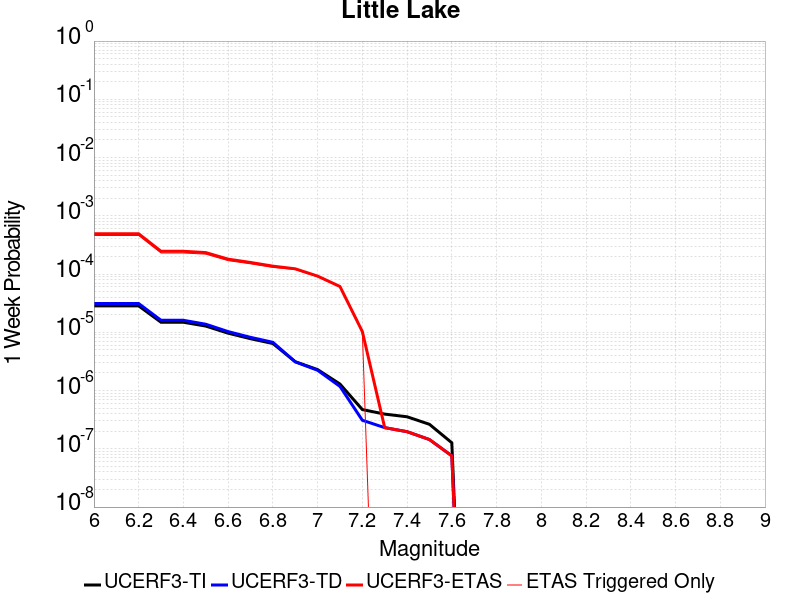 |  |  |  |

| Magnitude | 1 wk TI Prob | 1 wk TD Prob | 1 wk ETAS Prob | 1 wk ETAS/TD Gain | 1 wk ETAS Triggered Only | 1 mo TI Prob | 1 mo TD Prob | 1 mo ETAS Prob | 1 mo ETAS/TD Gain | 1 mo ETAS Triggered Only | 1 yr TI Prob | 1 yr TD Prob | 1 yr ETAS Prob | 1 yr ETAS/TD Gain | 1 yr ETAS Triggered Only | 10 yr TI Prob | 10 yr TD Prob | 10 yr ETAS Prob | 10 yr ETAS/TD Gain | 10 yr ETAS Triggered Only |
|-----|-----|-----|-----|-----|-----|-----|-----|-----|-----|-----|-----|-----|-----|-----|-----|-----|-----|-----|-----|-----|
| 6.0 | 2.8424427E-5 | 3.1207477E-5 | 6.147333E-4 | 19.69827 | 5.835441E-4 | 1.2181328E-4 | 1.3374022E-4 | 0.00219532 | 16.414808 | 0.0020618557 | 0.0014820677 | 0.0016272042 | 0.008462979 | 5.200933 | 0.006846917 | 0.014722223 | 0.016166303 | 0.02879673 | 1.781281 | 0.01283797 |
| 6.1 | 2.8424427E-5 | 3.1207477E-5 | 6.147333E-4 | 19.69827 | 5.835441E-4 | 1.2181328E-4 | 1.3374022E-4 | 0.00219532 | 16.414808 | 0.0020618557 | 0.0014820677 | 0.0016272042 | 0.008462979 | 5.200933 | 0.006846917 | 0.014722223 | 0.016166303 | 0.02879673 | 1.781281 | 0.01283797 |
| 6.2 | 2.8424427E-5 | 3.1207477E-5 | 6.147333E-4 | 19.69827 | 5.835441E-4 | 1.2181328E-4 | 1.3374022E-4 | 0.00219532 | 16.414808 | 0.0020618557 | 0.0014820677 | 0.0016272042 | 0.008462979 | 5.200933 | 0.006846917 | 0.014722223 | 0.016166303 | 0.02879673 | 1.781281 | 0.01283797 |
| 6.3 | 1.48860645E-5 | 1.6082206E-5 | 3.273007E-4 | 20.35173 | 3.112235E-4 | 6.379586E-5 | 6.8922076E-5 | 0.0013137303 | 19.061096 | 0.001244894 | 7.7643775E-4 | 8.388314E-4 | 0.004764732 | 5.6802025 | 0.003929197 | 0.007737305 | 0.00835947 | 0.015534928 | 1.8583627 | 0.007235946 |
| 6.4 | 1.48860645E-5 | 1.6082206E-5 | 3.273007E-4 | 20.35173 | 3.112235E-4 | 6.379586E-5 | 6.8922076E-5 | 0.0013137303 | 19.061096 | 0.001244894 | 7.7643775E-4 | 8.388314E-4 | 0.004764732 | 5.6802025 | 0.003929197 | 0.007737305 | 0.00835947 | 0.015534928 | 1.8583627 | 0.007235946 |
| 6.5 | 1.2797581E-5 | 1.3766247E-5 | 2.8608306E-4 | 20.781485 | 2.7232055E-4 | 5.4845623E-5 | 5.899701E-5 | 0.0012260163 | 20.780989 | 0.0011670882 | 6.675408E-4 | 7.180776E-4 | 0.004333453 | 6.034797 | 0.003617973 | 0.006655392 | 0.007160124 | 0.013494523 | 1.8846774 | 0.0063800816 |
| 6.6 | 9.661896E-6 | 1.0289519E-5 | 2.4370474E-4 | 23.684755 | 2.3341762E-4 | 4.1407468E-5 | 4.4097287E-5 | 8.9992414E-4 | 20.4077 | 8.558646E-4 | 5.040193E-4 | 5.3676846E-4 | 0.0034529227 | 6.4327974 | 0.0029177202 | 0.005028777 | 0.0053563244 | 0.010309229 | 1.9246833 | 0.004979576 |
| 6.7 | 7.767871E-6 | 8.200053E-6 | 2.4161577E-4 | 29.465143 | 2.3341762E-4 | 3.329045E-5 | 3.514269E-5 | 7.3537097E-4 | 20.92529 | 7.002529E-4 | 4.0523586E-4 | 4.27792E-4 | 0.0029165149 | 6.8176003 | 0.002489788 | 0.004044977 | 0.004271037 | 0.008377136 | 1.9613822 | 0.0041237115 |
| 6.8 | 6.4235196E-6 | 6.736042E-6 | 2.0124942E-4 | 29.876509 | 1.9451468E-4 | 2.752908E-5 | 2.8868506E-5 | 5.734939E-4 | 19.865728 | 5.446411E-4 | 3.35115E-4 | 3.514302E-4 | 0.0021403364 | 6.09036 | 0.0017895352 | 0.003346101 | 0.0035100048 | 0.006611316 | 1.8835632 | 0.0031122349 |
| 6.9 | 3.1283696E-6 | 3.1122859E-6 | 1.9762636E-4 | 63.498787 | 1.9451468E-4 | 1.3407229E-5 | 1.3338308E-5 | 4.8016733E-4 | 35.99912 | 4.6683525E-4 | 1.6322079E-4 | 1.6238331E-4 | 0.0014459718 | 8.904682 | 0.001283797 | 0.0016310095 | 0.0016227949 | 0.0037201443 | 2.2924304 | 0.0021007587 |
| 7.0 | 2.290603E-6 | 2.2287613E-6 | 1.5784016E-4 | 70.81968 | 1.5561175E-4 | 9.816834E-6 | 9.551805E-6 | 3.596749E-4 | 37.655174 | 3.5012644E-4 | 1.19513395E-4 | 1.1628806E-4 | 8.164595E-4 | 7.021009 | 7.002529E-4 | 0.0011944914 | 0.0011623743 | 0.0024835367 | 2.1366067 | 0.0013226998 |
| 7.1 | 1.293693E-6 | 1.1777322E-6 | 7.898352E-5 | 67.06407 | 7.7805875E-5 | 5.5443866E-6 | 5.0474177E-6 | 1.6065838E-4 | 31.829815 | 1.5561175E-4 | 6.750081E-5 | 6.1451276E-5 | 2.9485454E-4 | 4.7981844 | 2.3341762E-4 | 6.7480316E-4 | 6.144114E-4 | 0.0011975969 | 1.9491776 | 5.835441E-4 |
| 7.2 | 4.715842E-7 | 3.09202E-7 | 3.9212126E-5 | 126.81719 | 3.8902937E-5 | 2.0210737E-6 | 1.3251507E-6 | 4.0228035E-5 | 30.357328 | 3.8902937E-5 | 2.4606294E-5 | 1.6133596E-5 | 5.5035907E-5 | 3.4112608 | 3.8902937E-5 | 2.460357E-4 | 1.6132479E-4 | 2.0022145E-4 | 1.2411078 | 3.8902937E-5 |
| 7.3 | 3.9430947E-7 | 2.3099639E-7 | 2.3099639E-7 | 1.0 | 0.0 | 1.6898966E-6 | 9.899842E-7 | 9.899842E-7 | 1.0 | 0.0 | 2.0574296E-5 | 1.2052991E-5 | 1.2052991E-5 | 1.0 | 0.0 | 2.0572392E-4 | 1.20523444E-4 | 1.20523444E-4 | 1.0 | 0.0 |
| 7.4 | 3.547123E-7 | 1.9681133E-7 | 1.9681133E-7 | 1.0 | 0.0 | 1.5201948E-6 | 8.4347687E-7 | 8.4347687E-7 | 1.0 | 0.0 | 1.8508214E-5 | 1.0269283E-5 | 1.0269283E-5 | 1.0 | 0.0 | 1.8506673E-4 | 1.02688144E-4 | 1.02688144E-4 | 1.0 | 0.0 |
| 7.5 | 2.6354266E-7 | 1.4424535E-7 | 1.4424535E-7 | 1.0 | 0.0 | 1.129468E-6 | 6.1819424E-7 | 6.1819424E-7 | 1.0 | 0.0 | 1.3751187E-5 | 7.5264893E-6 | 7.5264893E-6 | 1.0 | 0.0 | 1.3750336E-4 | 7.52624E-5 | 7.52624E-5 | 1.0 | 0.0 |
| 7.6 | 1.269913E-7 | 7.573149E-8 | 7.573149E-8 | 1.0 | 0.0 | 5.4424834E-7 | 3.245635E-7 | 3.245635E-7 | 1.0 | 0.0 | 6.6262032E-6 | 3.951554E-6 | 3.951554E-6 | 1.0 | 0.0 | 6.626006E-5 | 3.951487E-5 | 3.951487E-5 | 1.0 | 0.0 |

## Owl Lake
*[(top)](#table-of-contents)*

| 1 Week | 1 Month | 1 Year | 10 Year |
|-----|-----|-----|-----|
|  |  |  |  |

| Magnitude | 1 wk TI Prob | 1 wk TD Prob | 1 wk ETAS Prob | 1 wk ETAS/TD Gain | 1 wk ETAS Triggered Only | 1 mo TI Prob | 1 mo TD Prob | 1 mo ETAS Prob | 1 mo ETAS/TD Gain | 1 mo ETAS Triggered Only | 1 yr TI Prob | 1 yr TD Prob | 1 yr ETAS Prob | 1 yr ETAS/TD Gain | 1 yr ETAS Triggered Only | 10 yr TI Prob | 10 yr TD Prob | 10 yr ETAS Prob | 10 yr ETAS/TD Gain | 10 yr ETAS Triggered Only |
|-----|-----|-----|-----|-----|-----|-----|-----|-----|-----|-----|-----|-----|-----|-----|-----|-----|-----|-----|-----|-----|
| 6.0 | 5.0320643E-5 | 6.637151E-5 | 1.8307258E-4 | 2.7583005 | 1.1670881E-4 | 2.1564208E-4 | 2.844246E-4 | 0.0012567214 | 4.4184694 | 9.725734E-4 | 0.0026222812 | 0.0034584238 | 0.0075678737 | 2.1882436 | 0.0041237115 | 0.02591553 | 0.034147043 | 0.042563736 | 1.2464838 | 0.008714258 |
| 6.1 | 5.0320643E-5 | 6.637151E-5 | 1.8307258E-4 | 2.7583005 | 1.1670881E-4 | 2.1564208E-4 | 2.844246E-4 | 0.0012567214 | 4.4184694 | 9.725734E-4 | 0.0026222812 | 0.0034584238 | 0.0075678737 | 2.1882436 | 0.0041237115 | 0.02591553 | 0.034147043 | 0.042563736 | 1.2464838 | 0.008714258 |
| 6.2 | 2.4125871E-5 | 3.098766E-5 | 1.0879112E-4 | 3.5107887 | 7.7805875E-5 | 1.0339249E-4 | 1.3279865E-4 | 7.9406076E-4 | 5.979434 | 6.613499E-4 | 0.0012580766 | 0.0016157742 | 0.0045676203 | 2.8268926 | 0.0029566232 | 0.012509781 | 0.016073797 | 0.02212166 | 1.3762561 | 0.0061466643 |
| 6.3 | 1.7433485E-5 | 2.2360802E-5 | 1.00164936E-4 | 4.4794874 | 7.7805875E-5 | 7.471279E-5 | 9.582938E-5 | 6.793175E-4 | 7.088823 | 5.835441E-4 | 9.0924866E-4 | 0.0011662478 | 0.0036919897 | 3.165699 | 0.002528691 | 0.009055373 | 0.01163159 | 0.016745498 | 1.4396569 | 0.0051740906 |
| 6.4 | 1.7433485E-5 | 2.2360802E-5 | 1.00164936E-4 | 4.4794874 | 7.7805875E-5 | 7.471279E-5 | 9.582938E-5 | 6.793175E-4 | 7.088823 | 5.835441E-4 | 9.0924866E-4 | 0.0011662478 | 0.0036919897 | 3.165699 | 0.002528691 | 0.009055373 | 0.01163159 | 0.016745498 | 1.4396569 | 0.0051740906 |
| 6.5 | 1.5182742E-5 | 1.9433977E-5 | 9.723834E-5 | 5.0035224 | 7.7805875E-5 | 6.506727E-5 | 8.3286664E-5 | 6.6678214E-4 | 8.005869 | 5.835441E-4 | 7.919061E-4 | 0.0010136948 | 0.003423232 | 3.3769848 | 0.002411982 | 0.0078909 | 0.0101209 | 0.014896042 | 1.47181 | 0.004823964 |
| 6.6 | 6.7271576E-6 | 8.550545E-6 | 4.745315E-5 | 5.549722 | 3.8902937E-5 | 2.8830356E-5 | 3.6644713E-5 | 5.0346286E-4 | 13.739032 | 4.6683525E-4 | 3.5095305E-4 | 4.460637E-4 | 0.0022736862 | 5.0972233 | 0.001828438 | 0.0035039932 | 0.0044694655 | 0.007955081 | 1.779873 | 0.0035012644 |
| 6.7 | 6.682835E-6 | 8.482986E-6 | 4.7385594E-5 | 5.5859566 | 3.8902937E-5 | 2.8640408E-5 | 3.635518E-5 | 5.0317345E-4 | 13.840488 | 4.6683525E-4 | 3.4864116E-4 | 4.4254007E-4 | 0.0022701689 | 5.129861 | 0.001828438 | 0.003480947 | 0.004434389 | 0.007920127 | 1.7860695 | 0.0035012644 |
| 6.8 | 6.5774975E-6 | 8.329444E-6 | 4.7232057E-5 | 5.670493 | 3.8902937E-5 | 2.8188972E-5 | 3.569716E-5 | 5.0251576E-4 | 14.07719 | 4.6683525E-4 | 3.4314668E-4 | 4.3453192E-4 | 0.0022621755 | 5.206005 | 0.001828438 | 0.0034261728 | 0.004354527 | 0.007840545 | 1.8005502 | 0.0035012644 |
| 6.9 | 6.363419E-6 | 8.002579E-6 | 4.6905207E-5 | 5.861261 | 3.8902937E-5 | 2.727151E-5 | 3.429635E-5 | 5.011156E-4 | 14.611339 | 4.6683525E-4 | 3.3198006E-4 | 4.1748365E-4 | 0.0022062717 | 5.28469 | 0.0017895352 | 0.0033148455 | 0.0041844994 | 0.007593632 | 1.8147051 | 0.0034234584 |
| 7.0 | 6.1342453E-6 | 7.63473E-6 | 4.653737E-5 | 6.095484 | 3.8902937E-5 | 2.6289357E-5 | 3.271989E-5 | 4.9953983E-4 | 15.267162 | 4.6683525E-4 | 3.2002592E-4 | 3.9829736E-4 | 0.0021093448 | 5.2959046 | 0.0017117292 | 0.0031956544 | 0.0039931675 | 0.007286713 | 1.8247951 | 0.0033067497 |
| 7.1 | 5.842926E-6 | 7.14521E-6 | 4.604787E-5 | 6.4445786 | 3.8902937E-5 | 2.504087E-5 | 3.0622E-5 | 4.9744296E-4 | 16.244627 | 4.6683525E-4 | 3.0482994E-4 | 3.7276448E-4 | 0.0019283019 | 5.1729765 | 0.0015561174 | 0.0030441214 | 0.0037385917 | 0.0067229187 | 1.798249 | 0.0029955262 |
| 7.2 | 4.77173E-6 | 5.361204E-6 | 4.4263932E-5 | 8.256342 | 3.8902937E-5 | 2.045011E-5 | 2.297641E-5 | 2.9529072E-4 | 12.851909 | 2.7232055E-4 | 2.4895166E-4 | 2.7970594E-4 | 0.0012131153 | 4.3371096 | 9.336705E-4 | 0.0024867293 | 0.0028100624 | 0.0045557753 | 1.6212363 | 0.0017506322 |
| 7.3 | 3.0494948E-6 | 2.7124704E-6 | 2.7124704E-6 | 1.0 | 0.0 | 1.3069198E-5 | 1.1624823E-5 | 5.052731E-5 | 4.3465014 | 3.8902937E-5 | 1.5910587E-4 | 1.4152318E-4 | 5.304975E-4 | 3.7484848 | 3.8902936E-4 | 0.0015899199 | 0.0014242887 | 0.002045849 | 1.4364007 | 6.22447E-4 |
| 7.4 | 2.7263884E-6 | 2.3075613E-6 | 2.3075613E-6 | 1.0 | 0.0 | 1.1684469E-5 | 9.889511E-6 | 9.889511E-6 | 1.0 | 0.0 | 1.4224913E-4 | 1.2039825E-4 | 3.9268602E-4 | 3.2615592 | 2.7232055E-4 | 0.0014215811 | 0.0012122075 | 0.0016396211 | 1.352591 | 4.279323E-4 |
| 7.5 | 2.6090431E-6 | 2.1674637E-6 | 2.1674637E-6 | 1.0 | 0.0 | 1.1181565E-5 | 9.289097E-6 | 9.289097E-6 | 1.0 | 0.0 | 1.3612706E-4 | 1.1308899E-4 | 3.464802E-4 | 3.063784 | 2.3341762E-4 | 0.001360437 | 0.0011389464 | 0.0015275327 | 1.3411804 | 3.8902936E-4 |
| 7.6 | 2.3008756E-6 | 1.8745708E-6 | 1.8745708E-6 | 1.0 | 0.0 | 9.860858E-6 | 8.0338505E-6 | 8.0338505E-6 | 1.0 | 0.0 | 1.20049335E-4 | 9.7807824E-5 | 2.9230348E-4 | 2.9885492 | 1.9451468E-4 | 0.001199845 | 9.85921E-4 | 0.0012968377 | 1.3153566 | 3.112235E-4 |
| 7.7 | 1.7184348E-6 | 1.343562E-6 | 1.343562E-6 | 1.0 | 0.0 | 7.3646997E-6 | 5.7581105E-6 | 5.7581105E-6 | 1.0 | 0.0 | 8.966153E-5 | 7.010278E-5 | 1.479032E-4 | 2.109805 | 7.7805875E-5 | 8.962536E-4 | 7.086945E-4 | 9.0307137E-4 | 1.2742745 | 1.9451468E-4 |
| 7.8 | 8.4612907E-7 | 8.4176E-7 | 8.4176E-7 | 1.0 | 0.0 | 3.6262625E-6 | 3.607538E-6 | 3.607538E-6 | 1.0 | 0.0 | 4.4148852E-5 | 4.392091E-5 | 1.21723366E-4 | 2.7714217 | 7.7805875E-5 | 4.414008E-4 | 4.4459777E-4 | 6.001403E-4 | 1.34985 | 1.5561175E-4 |
| 7.9 | 2.716738E-7 | 3.7732943E-7 | 3.7732943E-7 | 1.0 | 0.0 | 1.1643157E-6 | 1.6171252E-6 | 1.6171252E-6 | 1.0 | 0.0 | 1.4175452E-5 | 1.9688332E-5 | 5.8590504E-5 | 2.9758997 | 3.8902937E-5 | 1.4174548E-4 | 1.9863734E-4 | 2.7642777E-4 | 1.3916203 | 7.7805875E-5 |
| 8.0 | 2.1995428E-8 | 3.389418E-8 | 3.389418E-8 | 1.0 | 0.0 | 9.426611E-8 | 1.4526077E-7 | 1.4526077E-7 | 1.0 | 0.0 | 1.1476893E-6 | 1.768549E-6 | 1.768549E-6 | 1.0 | 0.0 | 1.14768345E-5 | 1.798665E-5 | 1.798665E-5 | 1.0 | 0.0 |

## Panamint Valley
*[(top)](#table-of-contents)*

| 1 Week | 1 Month | 1 Year | 10 Year |
|-----|-----|-----|-----|
|  |  |  |  |

| Magnitude | 1 wk TI Prob | 1 wk TD Prob | 1 wk ETAS Prob | 1 wk ETAS/TD Gain | 1 wk ETAS Triggered Only | 1 mo TI Prob | 1 mo TD Prob | 1 mo ETAS Prob | 1 mo ETAS/TD Gain | 1 mo ETAS Triggered Only | 1 yr TI Prob | 1 yr TD Prob | 1 yr ETAS Prob | 1 yr ETAS/TD Gain | 1 yr ETAS Triggered Only | 10 yr TI Prob | 10 yr TD Prob | 10 yr ETAS Prob | 10 yr ETAS/TD Gain | 10 yr ETAS Triggered Only |
|-----|-----|-----|-----|-----|-----|-----|-----|-----|-----|-----|-----|-----|-----|-----|-----|-----|-----|-----|-----|-----|
| 6.0 | 3.0211835E-5 | 3.39879E-5 | 3.4520082E-4 | 10.15658 | 3.112235E-4 | 1.2947287E-4 | 1.4565447E-4 | 0.0010013945 | 6.8751373 | 8.558646E-4 | 0.0015751923 | 0.0017719301 | 0.0060048364 | 3.3888674 | 0.00424042 | 0.015640736 | 0.017584875 | 0.026642738 | 1.515094 | 0.009219996 |
| 6.1 | 3.0211835E-5 | 3.39879E-5 | 3.4520082E-4 | 10.15658 | 3.112235E-4 | 1.2947287E-4 | 1.4565447E-4 | 0.0010013945 | 6.8751373 | 8.558646E-4 | 0.0015751923 | 0.0017719301 | 0.0060048364 | 3.3888674 | 0.00424042 | 0.015640736 | 0.017584875 | 0.026642738 | 1.515094 | 0.009219996 |
| 6.2 | 3.0211835E-5 | 3.39879E-5 | 3.4520082E-4 | 10.15658 | 3.112235E-4 | 1.2947287E-4 | 1.4565447E-4 | 0.0010013945 | 6.8751373 | 8.558646E-4 | 0.0015751923 | 0.0017719301 | 0.0060048364 | 3.3888674 | 0.00424042 | 0.015640736 | 0.017584875 | 0.026642738 | 1.515094 | 0.009219996 |
| 6.3 | 2.8573924E-5 | 3.210589E-5 | 3.433194E-4 | 10.693346 | 3.112235E-4 | 1.2245393E-4 | 1.3758958E-4 | 9.933364E-4 | 7.2195616 | 8.558646E-4 | 0.001489857 | 0.0016738938 | 0.005674189 | 3.3898141 | 0.0040070023 | 0.01479908 | 0.01661945 | 0.025227137 | 1.5179286 | 0.008753161 |
| 6.4 | 2.8573924E-5 | 3.210589E-5 | 3.433194E-4 | 10.693346 | 3.112235E-4 | 1.2245393E-4 | 1.3758958E-4 | 9.933364E-4 | 7.2195616 | 8.558646E-4 | 0.001489857 | 0.0016738938 | 0.005674189 | 3.3898141 | 0.0040070023 | 0.01479908 | 0.01661945 | 0.025227137 | 1.5179286 | 0.008753161 |
| 6.5 | 2.7468774E-5 | 3.0831525E-5 | 3.4204542E-4 | 11.094016 | 3.112235E-4 | 1.1771801E-4 | 1.3212857E-4 | 9.8788E-4 | 7.476658 | 8.558646E-4 | 0.0014322745 | 0.0016075056 | 0.005491546 | 3.4161906 | 0.0038902937 | 0.014230782 | 0.015965264 | 0.024348987 | 1.5251228 | 0.008519744 |
| 6.6 | 2.6135967E-5 | 2.9255436E-5 | 3.4046982E-4 | 11.637832 | 3.112235E-4 | 1.1200648E-4 | 1.2537456E-4 | 9.811319E-4 | 7.8256054 | 8.558646E-4 | 0.0013628257 | 0.001525393 | 0.005370909 | 3.5210001 | 0.0038513907 | 0.013544982 | 0.015155562 | 0.023201363 | 1.530881 | 0.008169617 |
| 6.7 | 2.4498746E-5 | 2.7344193E-5 | 3.3855918E-4 | 12.3813925 | 3.112235E-4 | 1.04990395E-4 | 1.17184274E-4 | 8.9515187E-4 | 7.6388392 | 7.780587E-4 | 0.0012775084 | 0.0014258098 | 0.005155167 | 3.615606 | 0.003734682 | 0.012701893 | 0.014172745 | 0.021689653 | 1.5303777 | 0.007624976 |
| 6.8 | 2.2244329E-5 | 2.4938103E-5 | 3.3615384E-4 | 13.479527 | 3.112235E-4 | 9.532935E-5 | 1.06873325E-4 | 8.8484894E-4 | 8.279418 | 7.780587E-4 | 0.0011600169 | 0.0013004278 | 0.004797139 | 3.6888928 | 0.0035012644 | 0.011539802 | 0.012933899 | 0.019845856 | 1.5344064 | 0.0070025288 |
| 6.9 | 1.9902658E-5 | 2.2292743E-5 | 3.335093E-4 | 14.960443 | 3.112235E-4 | 8.529431E-5 | 9.553693E-5 | 7.957229E-4 | 8.328956 | 7.002529E-4 | 0.0010379635 | 0.00116256 | 0.0040380307 | 3.4733953 | 0.0028788173 | 0.010331288 | 0.011569886 | 0.017030187 | 1.471941 | 0.005524217 |
| 7.0 | 1.8353881E-5 | 2.0568525E-5 | 2.928835E-4 | 14.239402 | 2.7232055E-4 | 7.865712E-5 | 8.814794E-5 | 7.494396E-4 | 8.502066 | 6.613499E-4 | 9.5722964E-4 | 0.0010726905 | 0.0036375301 | 3.3910341 | 0.002567594 | 0.009531168 | 0.010680057 | 0.015529475 | 1.454063 | 0.00490177 |
| 7.1 | 1.7667631E-5 | 1.9774876E-5 | 2.9209006E-4 | 14.770765 | 2.7232055E-4 | 7.571623E-5 | 8.474681E-5 | 7.460407E-4 | 8.803171 | 6.613499E-4 | 9.2145515E-4 | 0.0010313216 | 0.0033242276 | 3.2232697 | 0.0022952734 | 0.009176437 | 0.010270242 | 0.014813642 | 1.442385 | 0.0045905467 |
| 7.2 | 1.6381597E-5 | 1.8160366E-5 | 2.5157374E-4 | 13.8529005 | 2.3341762E-4 | 7.020495E-5 | 7.782792E-5 | 6.224266E-4 | 7.997473 | 5.446411E-4 | 8.544101E-4 | 9.471603E-4 | 0.0029293308 | 3.092751 | 0.0019840498 | 0.008511325 | 0.0094358865 | 0.013559223 | 1.4369845 | 0.0041626142 |
| 7.3 | 1.4520491E-5 | 1.5968182E-5 | 1.7157744E-4 | 10.744958 | 1.5561175E-4 | 6.222919E-5 | 6.8433365E-5 | 4.963364E-4 | 7.2528424 | 4.279323E-4 | 7.57377E-4 | 8.328739E-4 | 0.0023876952 | 2.8668149 | 0.0015561174 | 0.0075480095 | 0.008300635 | 0.0116956765 | 1.4090098 | 0.0034234584 |
| 7.4 | 1.2852287E-5 | 1.4146948E-5 | 1.697565E-4 | 11.999514 | 1.5561175E-4 | 5.5080065E-5 | 6.0628456E-5 | 4.885348E-4 | 8.057847 | 4.279323E-4 | 6.7039346E-4 | 7.379173E-4 | 0.0022928864 | 3.1072404 | 0.0015561174 | 0.0066837464 | 0.0073575918 | 0.010640012 | 1.4461269 | 0.0033067497 |
| 7.5 | 1.1637851E-5 | 1.2838205E-5 | 1.6844795E-4 | 13.120833 | 1.5561175E-4 | 4.987555E-5 | 5.5019806E-5 | 4.8292856E-4 | 8.777358 | 4.279323E-4 | 6.070656E-4 | 6.6967594E-4 | 0.0021858744 | 3.264078 | 0.0015172146 | 0.006054099 | 0.006679477 | 0.009809568 | 1.468613 | 0.0031511378 |
| 7.6 | 3.0068115E-6 | 3.3335807E-6 | 1.20042E-4 | 36.00993 | 1.1670881E-4 | 1.2886271E-5 | 1.4286737E-5 | 2.0879865E-4 | 14.614859 | 1.9451468E-4 | 1.5687906E-4 | 1.7393442E-4 | 7.5737695E-4 | 4.3543825 | 5.835441E-4 | 0.0015676835 | 0.0017394236 | 0.0029821522 | 1.7144485 | 0.001244894 |

## Ash Hill
*[(top)](#table-of-contents)*

| 1 Week | 1 Month | 1 Year | 10 Year |
|-----|-----|-----|-----|
|  |  |  |  |

| Magnitude | 1 wk TI Prob | 1 wk TD Prob | 1 wk ETAS Prob | 1 wk ETAS/TD Gain | 1 wk ETAS Triggered Only | 1 mo TI Prob | 1 mo TD Prob | 1 mo ETAS Prob | 1 mo ETAS/TD Gain | 1 mo ETAS Triggered Only | 1 yr TI Prob | 1 yr TD Prob | 1 yr ETAS Prob | 1 yr ETAS/TD Gain | 1 yr ETAS Triggered Only | 10 yr TI Prob | 10 yr TD Prob | 10 yr ETAS Prob | 10 yr ETAS/TD Gain | 10 yr ETAS Triggered Only |
|-----|-----|-----|-----|-----|-----|-----|-----|-----|-----|-----|-----|-----|-----|-----|-----|-----|-----|-----|-----|-----|
| 6.0 | 2.1545662E-5 | 2.3195389E-5 | 2.9550964E-4 | 12.740016 | 2.7232055E-4 | 9.2335285E-5 | 9.940547E-5 | 7.6068967E-4 | 7.6523924 | 6.613499E-4 | 0.0011236023 | 0.0012096697 | 0.004628987 | 3.8266537 | 0.0034234584 | 0.011179381 | 0.012038835 | 0.019264538 | 1.6001996 | 0.007313752 |
| 6.1 | 2.1545662E-5 | 2.3195389E-5 | 2.9550964E-4 | 12.740016 | 2.7232055E-4 | 9.2335285E-5 | 9.940547E-5 | 7.6068967E-4 | 7.6523924 | 6.613499E-4 | 0.0011236023 | 0.0012096697 | 0.004628987 | 3.8266537 | 0.0034234584 | 0.011179381 | 0.012038835 | 0.019264538 | 1.6001996 | 0.007313752 |
| 6.2 | 2.1545662E-5 | 2.3195389E-5 | 2.9550964E-4 | 12.740016 | 2.7232055E-4 | 9.2335285E-5 | 9.940547E-5 | 7.6068967E-4 | 7.6523924 | 6.613499E-4 | 0.0011236023 | 0.0012096697 | 0.004628987 | 3.8266537 | 0.0034234584 | 0.011179381 | 0.012038835 | 0.019264538 | 1.6001996 | 0.007313752 |
| 6.3 | 1.0025529E-5 | 1.0747344E-5 | 1.6635742E-4 | 15.478932 | 1.5561175E-4 | 4.2965847E-5 | 4.605931E-5 | 3.5726847E-4 | 7.756705 | 3.112235E-4 | 5.229836E-4 | 5.6064106E-4 | 0.0016881938 | 3.0111847 | 0.0011281852 | 0.005217545 | 0.0055935793 | 0.008378923 | 1.4979538 | 0.0028010115 |
| 6.4 | 1.0025529E-5 | 1.0747344E-5 | 1.6635742E-4 | 15.478932 | 1.5561175E-4 | 4.2965847E-5 | 4.605931E-5 | 3.5726847E-4 | 7.756705 | 3.112235E-4 | 5.229836E-4 | 5.6064106E-4 | 0.0016881938 | 3.0111847 | 0.0011281852 | 0.005217545 | 0.0055935793 | 0.008378923 | 1.4979538 | 0.0028010115 |
| 6.5 | 6.9617327E-6 | 7.4569152E-6 | 1.6306751E-4 | 21.867956 | 1.5561175E-4 | 2.9835655E-5 | 3.1957865E-5 | 3.431714E-4 | 10.738246 | 3.112235E-4 | 3.6318856E-4 | 3.8902622E-4 | 0.0012056701 | 3.0992 | 8.169617E-4 | 0.0036259557 | 0.0038843066 | 0.0058606495 | 1.508802 | 0.0019840498 |
| 6.6 | 4.9919777E-6 | 5.34689E-6 | 8.315235E-5 | 15.551536 | 7.7805875E-5 | 2.1394015E-5 | 2.291508E-5 | 2.174253E-4 | 9.488307 | 1.9451468E-4 | 2.60441E-4 | 2.7896208E-4 | 7.06775E-4 | 2.5335882 | 4.279323E-4 | 0.0026013597 | 0.0027867774 | 0.0041445857 | 1.4872324 | 0.0013616028 |
| 6.7 | 3.6630722E-6 | 3.9247725E-6 | 8.1730344E-5 | 20.824224 | 7.7805875E-5 | 1.5698786E-5 | 1.6820377E-5 | 2.1133179E-4 | 12.564034 | 1.9451468E-4 | 1.9111596E-4 | 2.0477458E-4 | 5.937243E-4 | 2.8994043 | 3.8902936E-4 | 0.0019095168 | 0.002046422 | 0.0032111218 | 1.5691396 | 0.0011670882 |
| 6.8 | 2.5599613E-6 | 2.7450303E-6 | 4.164786E-5 | 15.172095 | 3.8902937E-5 | 1.0971216E-5 | 1.176439E-5 | 8.956935E-5 | 7.613599 | 7.7805875E-5 | 1.3356637E-4 | 1.4322698E-4 | 3.766112E-4 | 2.6294708 | 2.3341762E-4 | 0.0013348613 | 0.0014318317 | 0.0022476236 | 1.569754 | 8.169617E-4 |
| 6.9 | 1.7684905E-6 | 1.8969438E-6 | 4.079981E-5 | 21.508179 | 3.8902937E-5 | 7.579223E-6 | 8.129759E-6 | 4.703238E-5 | 5.785212 | 3.8902937E-5 | 9.2273134E-5 | 9.897981E-5 | 2.5457615E-4 | 2.5720007 | 1.5561175E-4 | 9.223483E-4 | 9.897981E-4 | 0.001611629 | 1.6282401 | 6.22447E-4 |

## Airport Lake
*[(top)](#table-of-contents)*

| 1 Week | 1 Month | 1 Year | 10 Year |
|-----|-----|-----|-----|
|  |  |  |  |

| Magnitude | 1 wk TI Prob | 1 wk TD Prob | 1 wk ETAS Prob | 1 wk ETAS/TD Gain | 1 wk ETAS Triggered Only | 1 mo TI Prob | 1 mo TD Prob | 1 mo ETAS Prob | 1 mo ETAS/TD Gain | 1 mo ETAS Triggered Only | 1 yr TI Prob | 1 yr TD Prob | 1 yr ETAS Prob | 1 yr ETAS/TD Gain | 1 yr ETAS Triggered Only | 10 yr TI Prob | 10 yr TD Prob | 10 yr ETAS Prob | 10 yr ETAS/TD Gain | 10 yr ETAS Triggered Only |
|-----|-----|-----|-----|-----|-----|-----|-----|-----|-----|-----|-----|-----|-----|-----|-----|-----|-----|-----|-----|-----|
| 6.0 | 1.2387061E-5 | 1.3103559E-5 | 2.8542054E-4 | 21.78191 | 2.7232055E-4 | 5.3086325E-5 | 5.615706E-5 | 0.0013009812 | 23.166832 | 0.001244894 | 6.461343E-4 | 6.8352616E-4 | 0.004921048 | 7.199502 | 0.00424042 | 0.0064425888 | 0.006817048 | 0.014158217 | 2.076884 | 0.007391558 |
| 6.1 | 1.2387061E-5 | 1.3103559E-5 | 2.8542054E-4 | 21.78191 | 2.7232055E-4 | 5.3086325E-5 | 5.615706E-5 | 0.0013009812 | 23.166832 | 0.001244894 | 6.461343E-4 | 6.8352616E-4 | 0.004921048 | 7.199502 | 0.00424042 | 0.0064425888 | 0.006817048 | 0.014158217 | 2.076884 | 0.007391558 |
| 6.2 | 1.2387061E-5 | 1.3103559E-5 | 2.8542054E-4 | 21.78191 | 2.7232055E-4 | 5.3086325E-5 | 5.615706E-5 | 0.0013009812 | 23.166832 | 0.001244894 | 6.461343E-4 | 6.8352616E-4 | 0.004921048 | 7.199502 | 0.00424042 | 0.0064425888 | 0.006817048 | 0.014158217 | 2.076884 | 0.007391558 |
| 6.3 | 1.2387061E-5 | 1.3103559E-5 | 2.8542054E-4 | 21.78191 | 2.7232055E-4 | 5.3086325E-5 | 5.615706E-5 | 0.0013009812 | 23.166832 | 0.001244894 | 6.461343E-4 | 6.8352616E-4 | 0.004921048 | 7.199502 | 0.00424042 | 0.0064425888 | 0.006817048 | 0.014158217 | 2.076884 | 0.007391558 |
| 6.4 | 1.2387061E-5 | 1.3103559E-5 | 2.8542054E-4 | 21.78191 | 2.7232055E-4 | 5.3086325E-5 | 5.615706E-5 | 0.0013009812 | 23.166832 | 0.001244894 | 6.461343E-4 | 6.8352616E-4 | 0.004921048 | 7.199502 | 0.00424042 | 0.0064425888 | 0.006817048 | 0.014158217 | 2.076884 | 0.007391558 |
| 6.5 | 6.9922594E-6 | 7.385145E-6 | 2.018984E-4 | 27.338446 | 1.9451468E-4 | 2.996648E-5 | 3.165027E-5 | 0.0010041929 | 31.727785 | 9.725734E-4 | 3.6478083E-4 | 3.8527933E-4 | 0.0035352032 | 9.175689 | 0.0031511378 | 0.003641826 | 0.003846651 | 0.009194605 | 2.3902884 | 0.0053686053 |
| 6.6 | 6.9922594E-6 | 7.385145E-6 | 2.018984E-4 | 27.338446 | 1.9451468E-4 | 2.996648E-5 | 3.165027E-5 | 0.0010041929 | 31.727785 | 9.725734E-4 | 3.6478083E-4 | 3.8527933E-4 | 0.0035352032 | 9.175689 | 0.0031511378 | 0.003641826 | 0.003846651 | 0.009194605 | 2.3902884 | 0.0053686053 |
| 6.7 | 5.477277E-6 | 5.7862417E-6 | 1.613971E-4 | 27.893251 | 1.5561175E-4 | 2.3473833E-5 | 2.4797964E-5 | 9.584453E-4 | 38.65016 | 9.336705E-4 | 2.8575645E-4 | 3.0187727E-4 | 0.0031020432 | 10.275842 | 0.0028010115 | 0.0028538927 | 0.003015056 | 0.0077081188 | 2.5565424 | 0.0047072554 |
| 6.8 | 3.9950432E-6 | 4.2192128E-6 | 1.598303E-4 | 37.881546 | 1.5561175E-4 | 1.7121502E-5 | 1.808223E-5 | 6.40518E-4 | 35.42251 | 6.22447E-4 | 2.0843433E-4 | 2.2013167E-4 | 0.0022037446 | 10.01103 | 0.0019840498 | 0.0020823893 | 0.0021994072 | 0.005498884 | 2.5001664 | 0.0033067497 |
| 6.9 | 2.95695E-6 | 3.1231173E-6 | 1.19831566E-4 | 38.369217 | 1.1670881E-4 | 1.2672582E-5 | 1.33847325E-5 | 5.5801857E-4 | 41.690678 | 5.446411E-4 | 1.5427776E-4 | 1.629492E-4 | 0.0016021234 | 9.832042 | 0.0014394086 | 0.001541707 | 0.0016285196 | 0.004114253 | 2.526376 | 0.002489788 |
| 7.0 | 1.456072E-6 | 1.5408596E-6 | 7.934662E-5 | 51.495033 | 7.7805875E-5 | 6.2402937E-6 | 6.603673E-6 | 2.7892244E-4 | 42.23747 | 2.7232055E-4 | 7.597293E-5 | 8.039776E-5 | 6.249951E-4 | 7.7737875 | 5.446411E-4 | 7.594696E-4 | 8.0378563E-4 | 0.001931064 | 2.4024615 | 0.0011281852 |
| 7.1 | 6.995192E-7 | 7.409207E-7 | 3.964383E-5 | 53.506172 | 3.8902937E-5 | 2.997936E-6 | 3.1753743E-6 | 1.19883814E-4 | 37.75423 | 1.1670881E-4 | 3.649926E-5 | 3.8660182E-5 | 1.9426591E-4 | 5.024961 | 1.5561175E-4 | 3.6493264E-4 | 3.8660184E-4 | 8.532566E-4 | 2.2070682 | 4.6683525E-4 |

## Garlock (East)
*[(top)](#table-of-contents)*

| 1 Week | 1 Month | 1 Year | 10 Year |
|-----|-----|-----|-----|
|  |  |  |  |

| Magnitude | 1 wk TI Prob | 1 wk TD Prob | 1 wk ETAS Prob | 1 wk ETAS/TD Gain | 1 wk ETAS Triggered Only | 1 mo TI Prob | 1 mo TD Prob | 1 mo ETAS Prob | 1 mo ETAS/TD Gain | 1 mo ETAS Triggered Only | 1 yr TI Prob | 1 yr TD Prob | 1 yr ETAS Prob | 1 yr ETAS/TD Gain | 1 yr ETAS Triggered Only | 10 yr TI Prob | 10 yr TD Prob | 10 yr ETAS Prob | 10 yr ETAS/TD Gain | 10 yr ETAS Triggered Only |
|-----|-----|-----|-----|-----|-----|-----|-----|-----|-----|-----|-----|-----|-----|-----|-----|-----|-----|-----|-----|-----|
| 6.0 | 4.5092507E-5 | 6.2917425E-5 | 2.1851939E-4 | 3.4731138 | 1.5561175E-4 | 1.9323928E-4 | 2.6962077E-4 | 8.530075E-4 | 3.1637309 | 5.835441E-4 | 0.0023501497 | 0.0032781374 | 0.0057597635 | 1.7570232 | 0.002489788 | 0.023254504 | 0.03235903 | 0.037930354 | 1.1721721 | 0.0057576345 |
| 6.1 | 4.5092507E-5 | 6.2917425E-5 | 2.1851939E-4 | 3.4731138 | 1.5561175E-4 | 1.9323928E-4 | 2.6962077E-4 | 8.530075E-4 | 3.1637309 | 5.835441E-4 | 0.0023501497 | 0.0032781374 | 0.0057597635 | 1.7570232 | 0.002489788 | 0.023254504 | 0.03235903 | 0.037930354 | 1.1721721 | 0.0057576345 |
| 6.2 | 2.6674514E-5 | 3.452091E-5 | 1.9012729E-4 | 5.507598 | 1.5561175E-4 | 1.1431433E-4 | 1.4793854E-4 | 5.758075E-4 | 3.8922076 | 4.279323E-4 | 0.0013908884 | 0.0017996968 | 0.0035860112 | 1.9925641 | 0.0017895352 | 0.01382215 | 0.017896036 | 0.021640295 | 1.2092228 | 0.003812488 |
| 6.3 | 2.6674514E-5 | 3.452091E-5 | 1.9012729E-4 | 5.507598 | 1.5561175E-4 | 1.1431433E-4 | 1.4793854E-4 | 5.758075E-4 | 3.8922076 | 4.279323E-4 | 0.0013908884 | 0.0017996968 | 0.0035860112 | 1.9925641 | 0.0017895352 | 0.01382215 | 0.017896036 | 0.021640295 | 1.2092228 | 0.003812488 |
| 6.4 | 2.5312667E-5 | 3.234991E-5 | 1.8795663E-4 | 5.8101125 | 1.5561175E-4 | 1.0847834E-4 | 1.3863528E-4 | 5.665083E-4 | 4.0863214 | 4.279323E-4 | 0.0013199237 | 0.0016866071 | 0.0034342867 | 2.0362103 | 0.0017506322 | 0.013121112 | 0.016783953 | 0.02045595 | 1.2187804 | 0.003734682 |
| 6.5 | 2.5312667E-5 | 3.234991E-5 | 1.8795663E-4 | 5.8101125 | 1.5561175E-4 | 1.0847834E-4 | 1.3863528E-4 | 5.665083E-4 | 4.0863214 | 4.279323E-4 | 0.0013199237 | 0.0016866071 | 0.0034342867 | 2.0362103 | 0.0017506322 | 0.013121112 | 0.016783953 | 0.02045595 | 1.2187804 | 0.003734682 |
| 6.6 | 2.246556E-5 | 2.8144346E-5 | 1.8375172E-4 | 6.528903 | 1.5561175E-4 | 9.627742E-5 | 1.20613186E-4 | 5.484939E-4 | 4.547545 | 4.279323E-4 | 0.0011715472 | 0.0014674999 | 0.003176717 | 2.1647136 | 0.0017117292 | 0.011653901 | 0.0146240825 | 0.018150812 | 1.2411591 | 0.0035790703 |
| 6.7 | 2.2241198E-5 | 2.781406E-5 | 1.8342148E-4 | 6.59456 | 1.5561175E-4 | 9.531594E-5 | 1.1919779E-4 | 5.470791E-4 | 4.5896745 | 4.279323E-4 | 0.0011598538 | 0.0014502906 | 0.0031595372 | 2.1785545 | 0.0017117292 | 0.011538187 | 0.014454261 | 0.017904917 | 1.2387294 | 0.0035012644 |
| 6.8 | 1.9528685E-5 | 2.3908038E-5 | 1.7951606E-4 | 7.508607 | 1.5561175E-4 | 8.369167E-5 | 1.0245911E-4 | 5.303476E-4 | 5.1761875 | 4.279323E-4 | 0.0010184698 | 0.0012467455 | 0.0028009228 | 2.2465875 | 0.0015561174 | 0.010138147 | 0.012441495 | 0.01551501 | 1.2470374 | 0.0031122349 |
| 6.9 | 1.3318621E-5 | 1.5207374E-5 | 1.319144E-4 | 8.674371 | 1.1670881E-4 | 5.7078556E-5 | 6.517287E-5 | 4.1527647E-4 | 6.371923 | 3.5012644E-4 | 6.9470983E-4 | 7.931965E-4 | 0.0022314636 | 2.8132544 | 0.0014394086 | 0.0069254204 | 0.007944281 | 0.01072304 | 1.3497812 | 0.0028010115 |
| 7.0 | 1.1760853E-5 | 1.3115987E-5 | 1.2982327E-4 | 9.898094 | 1.1670881E-4 | 5.0402683E-5 | 5.621019E-5 | 4.0631695E-4 | 7.2285285 | 3.5012644E-4 | 6.134799E-4 | 6.841492E-4 | 0.0020836967 | 3.045676 | 0.0014005058 | 0.0061178906 | 0.006860767 | 0.009565289 | 1.3942012 | 0.0027232056 |
| 7.1 | 1.0064758E-5 | 1.0910848E-5 | 1.2761839E-4 | 11.696468 | 1.1670881E-4 | 4.3133965E-5 | 4.675996E-5 | 3.9687002E-4 | 8.4873905 | 3.5012644E-4 | 5.2502943E-4 | 5.691573E-4 | 0.0018911044 | 3.3226392 | 0.0013226998 | 0.005237907 | 0.005717105 | 0.008153978 | 1.4262425 | 0.002450885 |
| 7.2 | 9.768808E-6 | 1.0506669E-5 | 1.2721425E-4 | 12.107952 | 1.1670881E-4 | 4.186565E-5 | 4.5027828E-5 | 3.951385E-4 | 8.775429 | 3.5012644E-4 | 5.095951E-4 | 5.480794E-4 | 0.0018311727 | 3.341072 | 0.001283797 | 0.0050842804 | 0.0055073434 | 0.007906042 | 1.4355454 | 0.002411982 |
| 7.3 | 9.344516E-6 | 9.95218E-6 | 1.2665983E-4 | 12.726842 | 1.1670881E-4 | 4.004731E-5 | 4.2651525E-5 | 3.9276303E-4 | 9.208652 | 3.5012644E-4 | 4.8746695E-4 | 5.1916204E-4 | 0.0018022925 | 3.4715412 | 0.001283797 | 0.0048639905 | 0.0052189473 | 0.0076183416 | 1.4597467 | 0.002411982 |
| 7.4 | 9.023491E-6 | 9.498219E-6 | 1.2620592E-4 | 13.287325 | 1.1670881E-4 | 3.867153E-5 | 4.0706036E-5 | 3.5191685E-4 | 8.645324 | 3.112235E-4 | 4.7072413E-4 | 4.9548666E-4 | 0.0016619965 | 3.354271 | 0.0011670882 | 0.004697283 | 0.004982321 | 0.007150031 | 1.4350804 | 0.0021785644 |
| 7.5 | 7.081253E-6 | 7.0943947E-6 | 1.2380238E-4 | 17.450731 | 1.1670881E-4 | 3.0347876E-5 | 3.0404199E-5 | 3.0271648E-4 | 9.956404 | 2.7232055E-4 | 3.6942272E-4 | 3.70109E-4 | 0.0011089912 | 2.996391 | 7.391558E-4 | 0.003688092 | 0.00372781 | 0.0050843367 | 1.3638939 | 0.0013616028 |
| 7.6 | 6.116396E-6 | 5.9656345E-6 | 8.377105E-5 | 14.042269 | 7.7805875E-5 | 2.6212863E-5 | 2.5566756E-5 | 1.8117453E-4 | 7.0863323 | 1.5561175E-4 | 3.1909486E-4 | 3.1123104E-4 | 8.557027E-4 | 2.749413 | 5.446411E-4 | 0.0031863707 | 0.0031390795 | 0.0039922576 | 1.2717924 | 8.558646E-4 |
| 7.7 | 4.797145E-6 | 4.763327E-6 | 4.3666078E-5 | 9.167138 | 3.8902937E-5 | 2.055903E-5 | 2.04141E-5 | 5.9316244E-5 | 2.9056506 | 3.8902937E-5 | 2.5027743E-4 | 2.4851345E-4 | 4.8187305E-4 | 1.9390221 | 2.3341762E-4 | 0.0024999576 | 0.0025124948 | 0.0029005466 | 1.1544489 | 3.8902936E-4 |
| 7.8 | 3.4028885E-6 | 3.9838537E-6 | 4.2886637E-5 | 10.765113 | 3.8902937E-5 | 1.4583726E-5 | 1.7073547E-5 | 5.597582E-5 | 3.2785115 | 3.8902937E-5 | 1.775424E-4 | 2.0785068E-4 | 4.412198E-4 | 2.122773 | 2.3341762E-4 | 0.0017740062 | 0.0021040295 | 0.0024534191 | 1.1660575 | 3.5012644E-4 |
| 7.9 | 2.5928412E-6 | 3.3770064E-6 | 4.227981E-5 | 12.519909 | 3.8902937E-5 | 1.1112129E-5 | 1.4472805E-5 | 5.3375177E-5 | 3.6879637 | 3.8902937E-5 | 1.3528178E-4 | 1.7619222E-4 | 3.706726E-4 | 2.103797 | 1.9451468E-4 | 0.0013519945 | 0.0017836117 | 0.002016613 | 1.1306345 | 2.3341762E-4 |
| 8.0 | 1.3743648E-6 | 1.6755408E-6 | 4.0578412E-5 | 24.2181 | 3.8902937E-5 | 5.8901214E-6 | 7.1808695E-6 | 4.608353E-5 | 6.4175415 | 3.8902937E-5 | 7.1709874E-5 | 8.742361E-5 | 2.4302176E-4 | 2.7798183 | 1.5561175E-4 | 7.1686733E-4 | 8.847989E-4 | 0.0010402729 | 1.1757169 | 1.5561175E-4 |
| 8.1 | 3.6733252E-7 | 3.1526864E-7 | 3.1526864E-7 | 1.0 | 0.0 | 1.5742813E-6 | 1.3511507E-6 | 1.3511507E-6 | 1.0 | 0.0 | 1.9166706E-5 | 1.645015E-5 | 1.645015E-5 | 1.0 | 0.0 | 1.9165053E-4 | 1.6658098E-4 | 1.6658098E-4 | 1.0 | 0.0 |

## Hunter Mountain-Saline Valley
*[(top)](#table-of-contents)*

| 1 Week | 1 Month | 1 Year | 10 Year |
|-----|-----|-----|-----|
|  |  |  |  |

| Magnitude | 1 wk TI Prob | 1 wk TD Prob | 1 wk ETAS Prob | 1 wk ETAS/TD Gain | 1 wk ETAS Triggered Only | 1 mo TI Prob | 1 mo TD Prob | 1 mo ETAS Prob | 1 mo ETAS/TD Gain | 1 mo ETAS Triggered Only | 1 yr TI Prob | 1 yr TD Prob | 1 yr ETAS Prob | 1 yr ETAS/TD Gain | 1 yr ETAS Triggered Only | 10 yr TI Prob | 10 yr TD Prob | 10 yr ETAS Prob | 10 yr ETAS/TD Gain | 10 yr ETAS Triggered Only |
|-----|-----|-----|-----|-----|-----|-----|-----|-----|-----|-----|-----|-----|-----|-----|-----|-----|-----|-----|-----|-----|
| 6.0 | 4.5103672E-5 | 5.4576634E-5 | 2.1017989E-4 | 3.8510966 | 1.5561175E-4 | 1.9328714E-4 | 2.3387549E-4 | 6.617077E-4 | 2.8293161 | 4.279323E-4 | 0.002350731 | 0.002843864 | 0.004550725 | 1.6001909 | 0.0017117292 | 0.023260195 | 0.028095365 | 0.03172512 | 1.129194 | 0.003734682 |
| 6.1 | 4.5103672E-5 | 5.4576634E-5 | 2.1017989E-4 | 3.8510966 | 1.5561175E-4 | 1.9328714E-4 | 2.3387549E-4 | 6.617077E-4 | 2.8293161 | 4.279323E-4 | 0.002350731 | 0.002843864 | 0.004550725 | 1.6001909 | 0.0017117292 | 0.023260195 | 0.028095365 | 0.03172512 | 1.129194 | 0.003734682 |
| 6.2 | 3.9363465E-5 | 4.706859E-5 | 2.0267302E-4 | 4.3059077 | 1.5561175E-4 | 1.6868966E-4 | 2.017032E-4 | 6.295492E-4 | 3.1211662 | 4.279323E-4 | 0.002051862 | 0.0024531104 | 0.0041606408 | 1.6960673 | 0.0017117292 | 0.020330196 | 0.024276383 | 0.0279204 | 1.1501055 | 0.003734682 |
| 6.3 | 3.9363465E-5 | 4.706859E-5 | 2.0267302E-4 | 4.3059077 | 1.5561175E-4 | 1.6868966E-4 | 2.017032E-4 | 6.295492E-4 | 3.1211662 | 4.279323E-4 | 0.002051862 | 0.0024531104 | 0.0041606408 | 1.6960673 | 0.0017117292 | 0.020330196 | 0.024276383 | 0.0279204 | 1.1501055 | 0.003734682 |
| 6.4 | 3.2311684E-5 | 3.7955346E-5 | 1.935612E-4 | 5.099708 | 1.5561175E-4 | 1.384713E-4 | 1.6265604E-4 | 5.9051876E-4 | 3.6304755 | 4.279323E-4 | 0.0016845843 | 0.0019786113 | 0.0036481277 | 1.843782 | 0.0016728262 | 0.016718714 | 0.019618697 | 0.023203831 | 1.1827406 | 0.003656876 |
| 6.5 | 3.2311684E-5 | 3.7955346E-5 | 1.935612E-4 | 5.099708 | 1.5561175E-4 | 1.384713E-4 | 1.6265604E-4 | 5.9051876E-4 | 3.6304755 | 4.279323E-4 | 0.0016845843 | 0.0019786113 | 0.0036481277 | 1.843782 | 0.0016728262 | 0.016718714 | 0.019618697 | 0.023203831 | 1.1827406 | 0.003656876 |
| 6.6 | 2.9305844E-5 | 3.4185676E-5 | 1.897921E-4 | 5.551802 | 1.5561175E-4 | 1.2559042E-4 | 1.4650216E-4 | 5.3547457E-4 | 3.6550622 | 3.8902936E-4 | 0.0015279909 | 0.0017822674 | 0.0034132786 | 1.9151328 | 0.0016339234 | 0.015175272 | 0.017687662 | 0.021203427 | 1.1987693 | 0.0035790703 |
| 6.7 | 2.7826512E-5 | 3.234788E-5 | 1.879546E-4 | 5.8104143 | 1.5561175E-4 | 1.19251024E-4 | 1.3862675E-4 | 5.276022E-4 | 3.805919 | 3.8902936E-4 | 0.0014509142 | 0.0016865344 | 0.003317702 | 1.9671713 | 0.0016339234 | 0.014414776 | 0.01674504 | 0.020264179 | 1.21016 | 0.0035790703 |
| 6.8 | 2.3389874E-5 | 2.686964E-5 | 1.824772E-4 | 6.791204 | 1.5561175E-4 | 1.0023846E-4 | 1.1515078E-4 | 5.041353E-4 | 4.3780456 | 3.8902936E-4 | 0.00121972 | 0.0014011064 | 0.002993892 | 2.1368055 | 0.0015950204 | 0.01213047 | 0.013928941 | 0.017304715 | 1.2423568 | 0.0034234584 |
| 6.9 | 2.069209E-5 | 2.3572567E-5 | 1.7918064E-4 | 7.601236 | 1.5561175E-4 | 8.867737E-5 | 1.01021586E-4 | 4.9001165E-4 | 4.850564 | 3.8902936E-4 | 0.0010791123 | 0.00122928 | 0.0027446295 | 2.232713 | 0.0015172146 | 0.010738871 | 0.012229833 | 0.015496141 | 1.2670771 | 0.0033067497 |
| 7.0 | 1.7462342E-5 | 1.9635625E-5 | 1.7524432E-4 | 8.924815 | 1.5561175E-4 | 7.483646E-5 | 8.4150095E-5 | 4.7314673E-4 | 5.6226525 | 3.8902936E-4 | 9.1075303E-4 | 0.0010240684 | 0.0025397292 | 2.4800386 | 0.0015172146 | 0.009070295 | 0.010197128 | 0.013470158 | 1.3209757 | 0.0033067497 |
| 7.1 | 1.4807709E-5 | 1.6443486E-5 | 1.7205268E-4 | 10.463272 | 1.5561175E-4 | 6.3460066E-5 | 7.0470276E-5 | 4.5947224E-4 | 6.520086 | 3.8902936E-4 | 7.723524E-4 | 8.576544E-4 | 0.0023735675 | 2.767511 | 0.0015172146 | 0.007696735 | 0.008546432 | 0.01178635 | 1.379096 | 0.0032678468 |
| 7.2 | 1.4180048E-5 | 1.5700001E-5 | 1.7130931E-4 | 10.911421 | 1.5561175E-4 | 6.077022E-5 | 6.7284076E-5 | 4.5628726E-4 | 6.781505 | 3.8902936E-4 | 7.396263E-4 | 8.188919E-4 | 0.002334864 | 2.851248 | 0.0015172146 | 0.0073716943 | 0.008161696 | 0.011402871 | 1.3971204 | 0.0032678468 |
| 7.3 | 1.3730402E-5 | 1.5173691E-5 | 1.7078308E-4 | 11.25521 | 1.5561175E-4 | 5.8843252E-5 | 6.502858E-5 | 4.5403265E-4 | 6.982048 | 3.8902936E-4 | 7.161811E-4 | 7.914514E-4 | 0.002307465 | 2.9154856 | 0.0015172146 | 0.007138774 | 0.007889261 | 0.011131327 | 1.4109467 | 0.0032678468 |
| 7.4 | 1.2810095E-5 | 1.4110805E-5 | 1.6972036E-4 | 12.027688 | 1.5561175E-4 | 5.489925E-5 | 6.0473565E-5 | 4.494794E-4 | 7.4326596 | 3.8902936E-4 | 6.681934E-4 | 7.360327E-4 | 0.0022521305 | 3.059824 | 0.0015172146 | 0.006661878 | 0.0073388456 | 0.010582711 | 1.4420129 | 0.0032678468 |
| 7.5 | 1.1595659E-5 | 1.2802062E-5 | 1.6841182E-4 | 13.155054 | 1.5561175E-4 | 4.9694736E-5 | 5.486491E-5 | 4.4387294E-4 | 8.090288 | 3.8902936E-4 | 6.0486543E-4 | 6.677913E-4 | 0.0021451158 | 3.2122548 | 0.0014783116 | 0.006032217 | 0.006660718 | 0.009752223 | 1.4641399 | 0.0031122349 |
| 7.6 | 2.997694E-6 | 3.325705E-6 | 1.2003413E-4 | 36.09284 | 1.1670881E-4 | 1.28471975E-5 | 1.4252984E-5 | 2.087649E-4 | 14.6471 | 1.9451468E-4 | 1.564034E-4 | 1.7352356E-4 | 7.5696636E-4 | 4.362326 | 5.835441E-4 | 0.0015629337 | 0.0017353174 | 0.002978051 | 1.716142 | 0.001244894 |

## Blackwater
*[(top)](#table-of-contents)*

| 1 Week | 1 Month | 1 Year | 10 Year |
|-----|-----|-----|-----|
|  |  |  |  |

| Magnitude | 1 wk TI Prob | 1 wk TD Prob | 1 wk ETAS Prob | 1 wk ETAS/TD Gain | 1 wk ETAS Triggered Only | 1 mo TI Prob | 1 mo TD Prob | 1 mo ETAS Prob | 1 mo ETAS/TD Gain | 1 mo ETAS Triggered Only | 1 yr TI Prob | 1 yr TD Prob | 1 yr ETAS Prob | 1 yr ETAS/TD Gain | 1 yr ETAS Triggered Only | 10 yr TI Prob | 10 yr TD Prob | 10 yr ETAS Prob | 10 yr ETAS/TD Gain | 10 yr ETAS Triggered Only |
|-----|-----|-----|-----|-----|-----|-----|-----|-----|-----|-----|-----|-----|-----|-----|-----|-----|-----|-----|-----|-----|
| 6.0 | 3.0708583E-5 | 3.3097214E-5 | 1.8870381E-4 | 5.7015014 | 1.5561175E-4 | 1.3160157E-4 | 1.4183826E-4 | 5.308125E-4 | 3.7423782 | 3.8902936E-4 | 0.0016010714 | 0.0017256497 | 0.0031237386 | 1.8101813 | 0.0014005058 | 0.015895851 | 0.017136335 | 0.02008053 | 1.17181 | 0.0029955262 |
| 6.1 | 3.0708583E-5 | 3.3097214E-5 | 1.8870381E-4 | 5.7015014 | 1.5561175E-4 | 1.3160157E-4 | 1.4183826E-4 | 5.308125E-4 | 3.7423782 | 3.8902936E-4 | 0.0016010714 | 0.0017256497 | 0.0031237386 | 1.8101813 | 0.0014005058 | 0.015895851 | 0.017136335 | 0.02008053 | 1.17181 | 0.0029955262 |
| 6.2 | 1.1707779E-5 | 1.2545598E-5 | 1.2545598E-5 | 1.0 | 0.0 | 5.017523E-5 | 5.3765798E-5 | 1.3156749E-4 | 2.447048 | 7.7805875E-5 | 6.107122E-4 | 6.5441156E-4 | 0.0012375738 | 1.8911245 | 5.835441E-4 | 0.006090366 | 0.0065258164 | 0.0077239373 | 1.1835971 | 0.001205991 |
| 6.3 | 1.1707779E-5 | 1.2545598E-5 | 1.2545598E-5 | 1.0 | 0.0 | 5.017523E-5 | 5.3765798E-5 | 1.3156749E-4 | 2.447048 | 7.7805875E-5 | 6.107122E-4 | 6.5441156E-4 | 0.0012375738 | 1.8911245 | 5.835441E-4 | 0.006090366 | 0.0065258164 | 0.0077239373 | 1.1835971 | 0.001205991 |
| 6.4 | 7.929244E-6 | 8.4804105E-6 | 8.4804105E-6 | 1.0 | 0.0 | 3.3982033E-5 | 3.6344132E-5 | 7.5245654E-5 | 2.070366 | 3.8902937E-5 | 4.136527E-4 | 4.4240404E-4 | 7.146041E-4 | 1.6152749 | 2.7232055E-4 | 0.0041288356 | 0.0044156383 | 0.0049966057 | 1.1315705 | 5.835441E-4 |
| 6.5 | 5.8832115E-6 | 6.286219E-6 | 6.286219E-6 | 1.0 | 0.0 | 2.521352E-5 | 2.6940676E-5 | 2.6940676E-5 | 1.0 | 0.0 | 3.0693135E-4 | 3.279559E-4 | 5.61297E-4 | 1.7115014 | 2.3341762E-4 | 0.0030650778 | 0.0032749726 | 0.003740279 | 1.1420795 | 4.6683525E-4 |
| 6.6 | 5.8832115E-6 | 6.286219E-6 | 6.286219E-6 | 1.0 | 0.0 | 2.521352E-5 | 2.6940676E-5 | 2.6940676E-5 | 1.0 | 0.0 | 3.0693135E-4 | 3.279559E-4 | 5.61297E-4 | 1.7115014 | 2.3341762E-4 | 0.0030650778 | 0.0032749726 | 0.003740279 | 1.1420795 | 4.6683525E-4 |
| 6.7 | 3.0715053E-6 | 3.2815851E-6 | 3.2815851E-6 | 1.0 | 0.0 | 1.3163528E-5 | 1.4063868E-5 | 1.4063868E-5 | 1.0 | 0.0 | 1.6025416E-4 | 1.7121529E-4 | 2.4900783E-4 | 1.4543551 | 7.7805875E-5 | 0.0016013865 | 0.0017109484 | 0.0019051302 | 1.1134937 | 1.9451468E-4 |
| 6.8 | 2.2722281E-6 | 2.4288424E-6 | 2.4288424E-6 | 1.0 | 0.0 | 9.738084E-6 | 1.0409289E-5 | 1.0409289E-5 | 1.0 | 0.0 | 1.1855473E-4 | 1.2672663E-4 | 1.6562465E-4 | 1.3069443 | 3.8902937E-5 | 0.001184915 | 0.0012666339 | 0.0014220485 | 1.1226989 | 1.5561175E-4 |
| 6.9 | 9.952399E-7 | 1.0653887E-6 | 1.0653887E-6 | 1.0 | 0.0 | 4.265307E-6 | 4.5659463E-6 | 4.5659463E-6 | 1.0 | 0.0 | 5.1928873E-5 | 5.5589495E-5 | 9.449027E-5 | 1.6997864 | 3.8902937E-5 | 5.191674E-4 | 5.558065E-4 | 6.7245046E-4 | 1.2098643 | 1.1670881E-4 |
| 7.0 | 4.7385504E-7 | 5.075751E-7 | 5.075751E-7 | 1.0 | 0.0 | 2.0308057E-6 | 2.175322E-6 | 2.175322E-6 | 1.0 | 0.0 | 2.4724779E-5 | 2.6484544E-5 | 2.6484544E-5 | 1.0 | 0.0 | 2.4722028E-4 | 2.6484544E-4 | 3.0373808E-4 | 1.1468503 | 3.8902937E-5 |

## Garlock (West)
*[(top)](#table-of-contents)*

| 1 Week | 1 Month | 1 Year | 10 Year |
|-----|-----|-----|-----|
| 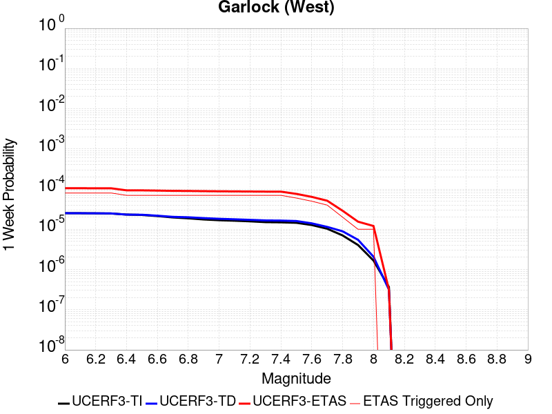 |  |  |  |

| Magnitude | 1 wk TI Prob | 1 wk TD Prob | 1 wk ETAS Prob | 1 wk ETAS/TD Gain | 1 wk ETAS Triggered Only | 1 mo TI Prob | 1 mo TD Prob | 1 mo ETAS Prob | 1 mo ETAS/TD Gain | 1 mo ETAS Triggered Only | 1 yr TI Prob | 1 yr TD Prob | 1 yr ETAS Prob | 1 yr ETAS/TD Gain | 1 yr ETAS Triggered Only | 10 yr TI Prob | 10 yr TD Prob | 10 yr ETAS Prob | 10 yr ETAS/TD Gain | 10 yr ETAS Triggered Only |
|-----|-----|-----|-----|-----|-----|-----|-----|-----|-----|-----|-----|-----|-----|-----|-----|-----|-----|-----|-----|-----|
| 6.0 | 2.5181727E-5 | 2.5216661E-5 | 1.4192253E-4 | 5.6281257 | 1.1670881E-4 | 1.0791722E-4 | 1.08066946E-4 | 4.5815555E-4 | 4.239553 | 3.5012644E-4 | 0.0013131002 | 0.0013149243 | 0.0026747368 | 2.0341372 | 0.0013616028 | 0.013053683 | 0.013151911 | 0.015455388 | 1.175144 | 0.0023341763 |
| 6.1 | 2.5077732E-5 | 2.5117724E-5 | 1.418236E-4 | 5.6463556 | 1.1670881E-4 | 1.0747157E-4 | 1.0764297E-4 | 4.5773172E-4 | 4.252314 | 3.5012644E-4 | 0.001307681 | 0.0013097686 | 0.0026695882 | 2.0382135 | 0.0013616028 | 0.013000126 | 0.013100963 | 0.01540456 | 1.1758341 | 0.0023341763 |
| 6.2 | 2.494612E-5 | 2.4999388E-5 | 1.4170528E-4 | 5.6683497 | 1.1670881E-4 | 1.0690756E-4 | 1.0713586E-4 | 4.5722479E-4 | 4.26771 | 3.5012644E-4 | 0.0013008224 | 0.001303602 | 0.0026634298 | 2.043131 | 0.0013616028 | 0.012932341 | 0.013040021 | 0.015343759 | 1.1766667 | 0.0023341763 |
| 6.3 | 2.4733758E-5 | 2.4818735E-5 | 1.4152465E-4 | 5.7023315 | 1.1670881E-4 | 1.0599751E-4 | 1.0636169E-4 | 4.5645089E-4 | 4.291497 | 3.5012644E-4 | 0.0012897556 | 0.0012941877 | 0.0026540284 | 2.050729 | 0.0013616028 | 0.012822957 | 0.01294698 | 0.015250935 | 1.1779531 | 0.0023341763 |
| 6.4 | 2.3237335E-5 | 2.3197908E-5 | 1.39904E-4 | 6.030889 | 1.1670881E-4 | 9.958477E-5 | 9.941583E-5 | 4.106084E-4 | 4.1302114 | 3.112235E-4 | 0.0012117702 | 0.0012097185 | 0.0025308183 | 2.092072 | 0.0013226998 | 0.012051838 | 0.012111766 | 0.01437924 | 1.1872125 | 0.0022952734 |
| 6.5 | 2.2732203E-5 | 2.3012379E-5 | 1.397185E-4 | 6.07145 | 1.1670881E-4 | 9.742009E-5 | 9.862077E-5 | 4.0981357E-4 | 4.155449 | 3.112235E-4 | 0.0011854442 | 0.0012000492 | 0.0025211617 | 2.100882 | 0.0013226998 | 0.011791403 | 0.012016123 | 0.014283816 | 1.1887208 | 0.0022952734 |
| 6.6 | 2.1319436E-5 | 2.1792415E-5 | 1.3849868E-4 | 6.355362 | 1.1670881E-4 | 9.136581E-5 | 9.339274E-5 | 4.0458716E-4 | 4.3321056 | 3.112235E-4 | 0.001111811 | 0.0011364657 | 0.0024576625 | 2.1625485 | 0.0013226998 | 0.011062649 | 0.011386949 | 0.013656086 | 1.1992753 | 0.0022952734 |
| 6.7 | 1.970802E-5 | 2.0412112E-5 | 1.3711854E-4 | 6.7175093 | 1.1670881E-4 | 8.446021E-5 | 8.747755E-5 | 3.9867382E-4 | 4.5574417 | 3.112235E-4 | 0.001027818 | 0.0010645206 | 0.0023858123 | 2.2412083 | 0.0013226998 | 0.010230771 | 0.01067459 | 0.012945362 | 1.2127268 | 0.0022952734 |
| 6.8 | 1.8744462E-5 | 1.9919653E-5 | 1.3662614E-4 | 6.8588614 | 1.1670881E-4 | 8.033094E-5 | 8.536715E-5 | 3.9656408E-4 | 4.6453943 | 3.112235E-4 | 9.775903E-4 | 0.0010388512 | 0.002360177 | 2.2719104 | 0.0013226998 | 0.009733009 | 0.010420324 | 0.012691679 | 1.2179736 | 0.0022952734 |
| 6.9 | 1.7559682E-5 | 1.8971898E-5 | 1.3567849E-4 | 7.1515512 | 1.1670881E-4 | 7.5253614E-5 | 8.13056E-5 | 3.925038E-4 | 4.8275123 | 3.112235E-4 | 9.158276E-4 | 9.894476E-4 | 0.0023108388 | 2.3354836 | 0.0013226998 | 0.0091206245 | 0.009930745 | 0.012203224 | 1.2288327 | 0.0022952734 |
| 7.0 | 1.6794445E-5 | 1.8234585E-5 | 1.3494126E-4 | 7.400293 | 1.1670881E-4 | 7.197421E-5 | 7.814589E-5 | 3.8934505E-4 | 4.982285 | 3.112235E-4 | 8.759337E-4 | 9.5101225E-4 | 0.0022335884 | 2.348643 | 0.001283797 | 0.008724891 | 0.009549588 | 0.011784411 | 1.234023 | 0.0022563704 |
| 7.1 | 1.6337795E-5 | 1.7735292E-5 | 1.3444203E-4 | 7.5804806 | 1.1670881E-4 | 7.0017246E-5 | 7.600619E-5 | 3.8720603E-4 | 5.0944014 | 3.112235E-4 | 8.521265E-4 | 9.249838E-4 | 0.0022075933 | 2.386629 | 0.001283797 | 0.008488664 | 0.009291395 | 0.011488259 | 1.2364408 | 0.0022174674 |
| 7.2 | 1.5780008E-5 | 1.7183862E-5 | 1.3389067E-4 | 7.7916517 | 1.1670881E-4 | 6.762685E-5 | 7.364305E-5 | 3.8484362E-4 | 5.225797 | 3.112235E-4 | 8.2304585E-4 | 8.962366E-4 | 0.002178883 | 2.431147 | 0.001283797 | 0.008200042 | 0.009006202 | 0.011203699 | 1.2439982 | 0.0022174674 |
| 7.3 | 1.5058865E-5 | 1.6636799E-5 | 1.3334367E-4 | 8.014983 | 1.1670881E-4 | 6.45364E-5 | 7.129862E-5 | 3.8249994E-4 | 5.364759 | 3.112235E-4 | 7.854473E-4 | 8.6771627E-4 | 0.00211153 | 2.4334338 | 0.001244894 | 0.00782677 | 0.008722834 | 0.010843832 | 1.2431546 | 0.0021396615 |
| 7.4 | 1.4887923E-5 | 1.647271E-5 | 1.331796E-4 | 8.084863 | 1.1670881E-4 | 6.380382E-5 | 7.059543E-5 | 3.8179694E-4 | 5.408239 | 3.112235E-4 | 7.7653467E-4 | 8.591616E-4 | 0.002102986 | 2.4477189 | 0.001244894 | 0.0077382675 | 0.008637666 | 0.010758845 | 1.2455733 | 0.0021396615 |
| 7.5 | 1.4509299E-5 | 1.6064607E-5 | 1.3277154E-4 | 8.264849 | 1.1670881E-4 | 6.218123E-5 | 6.884651E-5 | 3.800486E-4 | 5.5202303 | 3.112235E-4 | 7.567935E-4 | 8.37885E-4 | 0.0019651249 | 2.3453395 | 0.0011281852 | 0.0075422134 | 0.008425911 | 0.010431818 | 1.2380642 | 0.0020229528 |
| 7.6 | 1.2756717E-5 | 1.4067994E-5 | 9.1872775E-5 | 6.5306234 | 7.7805875E-5 | 5.4670498E-5 | 6.029001E-5 | 2.1589237E-4 | 3.5808978 | 1.5561175E-4 | 6.6541E-4 | 7.3378434E-4 | 0.0015501466 | 2.112537 | 8.169617E-4 | 0.006634211 | 0.0073905406 | 0.008703465 | 1.1776493 | 0.0013226998 |
| 7.7 | 1.0328985E-5 | 1.147664E-5 | 5.037913E-5 | 4.389711 | 3.8902937E-5 | 4.4266326E-5 | 4.9184677E-5 | 8.80857E-5 | 1.7909175 | 3.8902937E-5 | 5.388092E-4 | 5.986593E-4 | 9.874557E-4 | 1.6494453 | 3.8902936E-4 | 0.0053750467 | 0.006046838 | 0.006742857 | 1.1151046 | 7.002529E-4 |
| 7.8 | 7.0306583E-6 | 8.912468E-6 | 4.7815058E-5 | 5.364963 | 3.8902937E-5 | 3.0131043E-5 | 3.8195732E-5 | 7.709718E-5 | 2.0184765 | 3.8902937E-5 | 3.667837E-4 | 4.6493395E-4 | 8.5378246E-4 | 1.8363521 | 3.8902936E-4 | 0.003661789 | 0.0047019436 | 0.005321464 | 1.1317583 | 6.22447E-4 |
| 7.9 | 4.060633E-6 | 5.4729326E-6 | 4.4375658E-5 | 8.108204 | 3.8902937E-5 | 1.7402595E-5 | 2.3455215E-5 | 6.235724E-5 | 2.658566 | 3.8902937E-5 | 2.11856E-4 | 2.8552994E-4 | 5.188809E-4 | 1.8172557 | 2.3341762E-4 | 0.0021165414 | 0.0028881172 | 0.0031984418 | 1.1074488 | 3.112235E-4 |
| 8.0 | 1.6729537E-6 | 2.0800776E-6 | 4.0982934E-5 | 19.702599 | 3.8902937E-5 | 7.169782E-6 | 8.914588E-6 | 4.781718E-5 | 5.3639245 | 3.8902937E-5 | 8.7288594E-5 | 1.0852974E-4 | 2.641246E-4 | 2.433661 | 1.5561175E-4 | 8.7254314E-4 | 0.0010982669 | 0.0012537078 | 1.1415329 | 1.5561175E-4 |
| 8.1 | 3.6733252E-7 | 3.1526864E-7 | 3.1526864E-7 | 1.0 | 0.0 | 1.5742813E-6 | 1.3511507E-6 | 1.3511507E-6 | 1.0 | 0.0 | 1.9166706E-5 | 1.645015E-5 | 1.645015E-5 | 1.0 | 0.0 | 1.9165053E-4 | 1.6658098E-4 | 1.6658098E-4 | 1.0 | 0.0 |

## Gravel Hills-Harper Lk
*[(top)](#table-of-contents)*

| 1 Week | 1 Month | 1 Year | 10 Year |
|-----|-----|-----|-----|
|  |  |  |  |

| Magnitude | 1 wk TI Prob | 1 wk TD Prob | 1 wk ETAS Prob | 1 wk ETAS/TD Gain | 1 wk ETAS Triggered Only | 1 mo TI Prob | 1 mo TD Prob | 1 mo ETAS Prob | 1 mo ETAS/TD Gain | 1 mo ETAS Triggered Only | 1 yr TI Prob | 1 yr TD Prob | 1 yr ETAS Prob | 1 yr ETAS/TD Gain | 1 yr ETAS Triggered Only | 10 yr TI Prob | 10 yr TD Prob | 10 yr ETAS Prob | 10 yr ETAS/TD Gain | 10 yr ETAS Triggered Only |
|-----|-----|-----|-----|-----|-----|-----|-----|-----|-----|-----|-----|-----|-----|-----|-----|-----|-----|-----|-----|-----|
| 6.0 | 3.0679566E-5 | 3.1466803E-5 | 7.0368515E-5 | 2.236278 | 3.8902937E-5 | 1.3147724E-4 | 1.3485197E-4 | 3.6823814E-4 | 2.7306838 | 2.3341762E-4 | 0.0015995599 | 0.0016408027 | 0.0023787457 | 1.449745 | 7.391558E-4 | 0.015880952 | 0.01630845 | 0.017992262 | 1.1032479 | 0.0017117292 |
| 6.1 | 3.0679566E-5 | 3.1466803E-5 | 7.0368515E-5 | 2.236278 | 3.8902937E-5 | 1.3147724E-4 | 1.3485197E-4 | 3.6823814E-4 | 2.7306838 | 2.3341762E-4 | 0.0015995599 | 0.0016408027 | 0.0023787457 | 1.449745 | 7.391558E-4 | 0.015880952 | 0.01630845 | 0.017992262 | 1.1032479 | 0.0017117292 |
| 6.2 | 1.514536E-5 | 1.363595E-5 | 5.253836E-5 | 3.8529296 | 3.8902937E-5 | 6.490707E-5 | 5.8438545E-5 | 1.3623988E-4 | 2.3313358 | 7.7805875E-5 | 7.8995706E-4 | 7.112689E-4 | 9.445205E-4 | 1.3279372 | 2.3341762E-4 | 0.007871548 | 0.007091126 | 0.007709159 | 1.0871558 | 6.22447E-4 |
| 6.3 | 1.514536E-5 | 1.363595E-5 | 5.253836E-5 | 3.8529296 | 3.8902937E-5 | 6.490707E-5 | 5.8438545E-5 | 1.3623988E-4 | 2.3313358 | 7.7805875E-5 | 7.8995706E-4 | 7.112689E-4 | 9.445205E-4 | 1.3279372 | 2.3341762E-4 | 0.007871548 | 0.007091126 | 0.007709159 | 1.0871558 | 6.22447E-4 |
| 6.4 | 1.2532521E-5 | 1.0690234E-5 | 1.0690234E-5 | 1.0 | 0.0 | 5.37097E-5 | 4.5814515E-5 | 4.5814515E-5 | 1.0 | 0.0 | 6.537194E-4 | 5.576548E-4 | 6.354173E-4 | 1.1394455 | 7.7805875E-5 | 0.0065179965 | 0.0055631446 | 0.005872637 | 1.0556326 | 3.112235E-4 |
| 6.5 | 1.1094058E-5 | 9.084107E-6 | 9.084107E-6 | 1.0 | 0.0 | 4.7545094E-5 | 3.8931328E-5 | 3.8931328E-5 | 1.0 | 0.0 | 5.787078E-4 | 4.7388987E-4 | 5.127744E-4 | 1.0820539 | 3.8902937E-5 | 0.0057720304 | 0.004729201 | 0.004884077 | 1.0327488 | 1.5561175E-4 |
| 6.6 | 9.688328E-6 | 7.5320527E-6 | 7.5320527E-6 | 1.0 | 0.0 | 4.1520743E-5 | 3.227984E-5 | 3.227984E-5 | 1.0 | 0.0 | 5.053978E-4 | 3.9293873E-4 | 4.318264E-4 | 1.0989662 | 3.8902937E-5 | 0.0050424994 | 0.003922696 | 0.004000197 | 1.019757 | 7.7805875E-5 |
| 6.7 | 8.974824E-6 | 6.7497303E-6 | 6.7497303E-6 | 1.0 | 0.0 | 3.8462964E-5 | 2.8927108E-5 | 2.8927108E-5 | 1.0 | 0.0 | 4.6818596E-4 | 3.5213283E-4 | 3.9102207E-4 | 1.1104391 | 3.8902937E-5 | 0.004672008 | 0.0035159695 | 0.0035935019 | 1.0220515 | 7.7805875E-5 |
| 6.8 | 7.4780046E-6 | 5.1164316E-6 | 5.1164316E-6 | 1.0 | 0.0 | 3.20482E-5 | 2.1927388E-5 | 2.1927388E-5 | 1.0 | 0.0 | 3.9011694E-4 | 2.6693463E-4 | 3.0582718E-4 | 1.1457007 | 3.8902937E-5 | 0.0038943281 | 0.0026662783 | 0.0027050774 | 1.0145519 | 3.8902937E-5 |
| 6.9 | 6.3409307E-6 | 3.907683E-6 | 3.907683E-6 | 1.0 | 0.0 | 2.7175134E-5 | 1.674711E-5 | 1.674711E-5 | 1.0 | 0.0 | 3.3080703E-4 | 2.0387798E-4 | 2.4277299E-4 | 1.1907759 | 3.8902937E-5 | 0.0033031502 | 0.0020370076 | 0.0020758314 | 1.0190592 | 3.8902937E-5 |
| 7.0 | 5.1239335E-6 | 2.6059872E-6 | 2.6059872E-6 | 1.0 | 0.0 | 2.195953E-5 | 1.116847E-5 | 1.116847E-5 | 1.0 | 0.0 | 2.6732447E-4 | 1.3596789E-4 | 1.3596789E-4 | 1.0 | 0.0 | 0.0026700313 | 0.0013588723 | 0.0013588723 | 1.0 | 0.0 |
| 7.1 | 4.438899E-6 | 2.0985822E-6 | 2.0985822E-6 | 1.0 | 0.0 | 1.9023713E-5 | 8.993894E-6 | 8.993894E-6 | 1.0 | 0.0 | 2.315891E-4 | 1.0949538E-4 | 1.0949538E-4 | 1.0 | 0.0 | 0.002313479 | 0.0010944362 | 0.0010944362 | 1.0 | 0.0 |
| 7.2 | 3.50367E-6 | 1.2616524E-6 | 1.2616524E-6 | 1.0 | 0.0 | 1.5015643E-5 | 5.407071E-6 | 5.407071E-6 | 1.0 | 0.0 | 1.8280011E-4 | 6.582918E-5 | 6.582918E-5 | 1.0 | 0.0 | 0.0018264982 | 6.5810507E-4 | 6.5810507E-4 | 1.0 | 0.0 |
| 7.3 | 2.561638E-6 | 7.11978E-7 | 7.11978E-7 | 1.0 | 0.0 | 1.0978401E-5 | 3.0513306E-6 | 3.0513306E-6 | 1.0 | 0.0 | 1.3365384E-4 | 3.7149337E-5 | 3.7149337E-5 | 1.0 | 0.0 | 0.0013357349 | 3.7143327E-4 | 3.7143327E-4 | 1.0 | 0.0 |
| 7.4 | 2.0368864E-6 | 5.3053367E-7 | 5.3053367E-7 | 1.0 | 0.0 | 8.729483E-6 | 2.2737138E-6 | 2.2737138E-6 | 1.0 | 0.0 | 1.06276275E-4 | 2.768212E-5 | 2.768212E-5 | 1.0 | 0.0 | 0.0010622547 | 2.7678726E-4 | 2.7678726E-4 | 1.0 | 0.0 |
| 7.5 | 1.1681728E-6 | 3.6033393E-7 | 3.6033393E-7 | 1.0 | 0.0 | 5.0064455E-6 | 1.5442874E-6 | 1.5442874E-6 | 1.0 | 0.0 | 6.0951766E-5 | 1.8801542E-5 | 1.8801542E-5 | 1.0 | 0.0 | 6.093505E-4 | 1.8799998E-4 | 1.8799998E-4 | 1.0 | 0.0 |
| 7.6 | 1.3154387E-7 | 7.12009E-8 | 7.12009E-8 | 1.0 | 0.0 | 5.6375933E-7 | 3.051467E-7 | 3.051467E-7 | 1.0 | 0.0 | 6.863748E-6 | 3.7151563E-6 | 3.7151563E-6 | 1.0 | 0.0 | 6.863536E-5 | 3.7151098E-5 | 3.7151098E-5 | 1.0 | 0.0 |

## So Sierra Nevada
*[(top)](#table-of-contents)*

| 1 Week | 1 Month | 1 Year | 10 Year |
|-----|-----|-----|-----|
|  |  |  |  |

| Magnitude | 1 wk TI Prob | 1 wk TD Prob | 1 wk ETAS Prob | 1 wk ETAS/TD Gain | 1 wk ETAS Triggered Only | 1 mo TI Prob | 1 mo TD Prob | 1 mo ETAS Prob | 1 mo ETAS/TD Gain | 1 mo ETAS Triggered Only | 1 yr TI Prob | 1 yr TD Prob | 1 yr ETAS Prob | 1 yr ETAS/TD Gain | 1 yr ETAS Triggered Only | 10 yr TI Prob | 10 yr TD Prob | 10 yr ETAS Prob | 10 yr ETAS/TD Gain | 10 yr ETAS Triggered Only |
|-----|-----|-----|-----|-----|-----|-----|-----|-----|-----|-----|-----|-----|-----|-----|-----|-----|-----|-----|-----|-----|
| 6.0 | 1.15488665E-5 | 1.1079958E-5 | 1.2778748E-4 | 11.533209 | 1.1670881E-4 | 4.9494203E-5 | 4.7484744E-5 | 3.1979237E-4 | 6.734634 | 2.7232055E-4 | 6.024253E-4 | 5.779862E-4 | 0.0015888779 | 2.7489896 | 0.0010114764 | 0.006007948 | 0.0057660984 | 0.0075839935 | 1.315273 | 0.001828438 |
| 6.1 | 1.15488665E-5 | 1.1079958E-5 | 1.2778748E-4 | 11.533209 | 1.1670881E-4 | 4.9494203E-5 | 4.7484744E-5 | 3.1979237E-4 | 6.734634 | 2.7232055E-4 | 6.024253E-4 | 5.779862E-4 | 0.0015888779 | 2.7489896 | 0.0010114764 | 0.006007948 | 0.0057660984 | 0.0075839935 | 1.315273 | 0.001828438 |
| 6.2 | 1.15488665E-5 | 1.1079958E-5 | 1.2778748E-4 | 11.533209 | 1.1670881E-4 | 4.9494203E-5 | 4.7484744E-5 | 3.1979237E-4 | 6.734634 | 2.7232055E-4 | 6.024253E-4 | 5.779862E-4 | 0.0015888779 | 2.7489896 | 0.0010114764 | 0.006007948 | 0.0057660984 | 0.0075839935 | 1.315273 | 0.001828438 |
| 6.3 | 1.15488665E-5 | 1.1079958E-5 | 1.2778748E-4 | 11.533209 | 1.1670881E-4 | 4.9494203E-5 | 4.7484744E-5 | 3.1979237E-4 | 6.734634 | 2.7232055E-4 | 6.024253E-4 | 5.779862E-4 | 0.0015888779 | 2.7489896 | 0.0010114764 | 0.006007948 | 0.0057660984 | 0.0075839935 | 1.315273 | 0.001828438 |
| 6.4 | 1.15488665E-5 | 1.1079958E-5 | 1.2778748E-4 | 11.533209 | 1.1670881E-4 | 4.9494203E-5 | 4.7484744E-5 | 3.1979237E-4 | 6.734634 | 2.7232055E-4 | 6.024253E-4 | 5.779862E-4 | 0.0015888779 | 2.7489896 | 0.0010114764 | 0.006007948 | 0.0057660984 | 0.0075839935 | 1.315273 | 0.001828438 |
| 6.5 | 1.15488665E-5 | 1.1079958E-5 | 1.2778748E-4 | 11.533209 | 1.1670881E-4 | 4.9494203E-5 | 4.7484744E-5 | 3.1979237E-4 | 6.734634 | 2.7232055E-4 | 6.024253E-4 | 5.779862E-4 | 0.0015888779 | 2.7489896 | 0.0010114764 | 0.006007948 | 0.0057660984 | 0.0075839935 | 1.315273 | 0.001828438 |
| 6.6 | 7.587044E-6 | 6.9358503E-6 | 1.2364385E-4 | 17.826777 | 1.1670881E-4 | 3.2515498E-5 | 2.972475E-5 | 2.2423365E-4 | 7.5436683 | 1.9451468E-4 | 3.9580427E-4 | 3.6184167E-4 | 0.0010229523 | 2.8270717 | 6.613499E-4 | 0.003951 | 0.0036128166 | 0.0046981634 | 1.3004158 | 0.0010892822 |
| 6.7 | 7.587044E-6 | 6.9358503E-6 | 1.2364385E-4 | 17.826777 | 1.1670881E-4 | 3.2515498E-5 | 2.972475E-5 | 2.2423365E-4 | 7.5436683 | 1.9451468E-4 | 3.9580427E-4 | 3.6184167E-4 | 0.0010229523 | 2.8270717 | 6.613499E-4 | 0.003951 | 0.0036128166 | 0.0046981634 | 1.3004158 | 0.0010892822 |
| 6.8 | 5.9026956E-6 | 5.179568E-6 | 1.2188777E-4 | 23.532421 | 1.1670881E-4 | 2.5297022E-5 | 2.2197966E-5 | 2.1670833E-4 | 9.762531 | 1.9451468E-4 | 3.0794772E-4 | 2.7022787E-4 | 8.5361424E-4 | 3.158868 | 5.835441E-4 | 0.0030752132 | 0.0026991093 | 0.0036302595 | 1.3449843 | 9.336705E-4 |
| 6.9 | 5.0118915E-6 | 4.2525808E-6 | 1.20960896E-4 | 28.444117 | 1.1670881E-4 | 2.1479358E-5 | 1.8225222E-5 | 2.1273637E-4 | 11.672635 | 1.9451468E-4 | 2.614798E-4 | 2.2187021E-4 | 7.2749617E-4 | 3.2789268 | 5.057382E-4 | 0.0026117235 | 0.0022165596 | 0.0030705272 | 1.3852671 | 8.558646E-4 |
| 7.0 | 4.4924795E-6 | 3.7140621E-6 | 8.151965E-5 | 21.948917 | 7.7805875E-5 | 1.925334E-5 | 1.5917316E-5 | 1.7152658E-4 | 10.7761 | 1.5561175E-4 | 2.3438422E-4 | 1.9377672E-4 | 6.605215E-4 | 3.408673 | 4.6683525E-4 | 0.0023413717 | 0.0019361405 | 0.0027515204 | 1.4211367 | 8.169617E-4 |
| 7.1 | 3.9118436E-6 | 3.1121094E-6 | 4.2014926E-5 | 13.500465 | 3.8902937E-5 | 1.6764936E-5 | 1.3337547E-5 | 1.300448E-4 | 9.750278 | 1.1670881E-4 | 2.0409399E-4 | 1.6237311E-4 | 5.1244267E-4 | 3.155958 | 3.5012644E-4 | 0.0020390663 | 0.0016226007 | 0.0023217173 | 1.4308618 | 7.002529E-4 |
| 7.2 | 3.4200818E-6 | 2.605576E-6 | 4.150841E-5 | 15.930609 | 3.8902937E-5 | 1.4657411E-5 | 1.116671E-5 | 8.897171E-5 | 7.967586 | 7.7805875E-5 | 1.7843937E-4 | 1.3594671E-4 | 3.6933259E-4 | 2.7167454 | 2.3341762E-4 | 0.0017829615 | 0.0013586852 | 0.0018248861 | 1.3431265 | 4.6683525E-4 |
| 7.3 | 2.6593618E-6 | 1.8285265E-6 | 1.8285265E-6 | 1.0 | 0.0 | 1.13972155E-5 | 7.83652E-6 | 4.673915E-5 | 5.964274 | 3.8902937E-5 | 1.3875226E-4 | 9.5405754E-5 | 2.5100267E-4 | 2.6308966 | 1.5561175E-4 | 0.0013866565 | 9.536769E-4 | 0.0013034694 | 1.366783 | 3.5012644E-4 |
| 7.4 | 2.2577992E-6 | 1.436535E-6 | 1.436535E-6 | 1.0 | 0.0 | 9.676246E-6 | 6.156565E-6 | 4.5059263E-5 | 7.3188963 | 3.8902937E-5 | 1.1780193E-4 | 7.495386E-5 | 1.9165392E-4 | 2.5569587 | 1.1670881E-4 | 0.001177395 | 7.493108E-4 | 0.0010603011 | 1.4150351 | 3.112235E-4 |
| 7.5 | 1.489319E-6 | 7.354697E-7 | 7.354697E-7 | 1.0 | 0.0 | 6.3827797E-6 | 3.1520092E-6 | 4.2054824E-5 | 13.342228 | 3.8902937E-5 | 7.770758E-5 | 3.837504E-5 | 1.5507937E-4 | 4.041152 | 1.1670881E-4 | 7.7680405E-4 | 3.836846E-4 | 5.3923664E-4 | 1.4054165 | 1.5561175E-4 |
| 7.6 | 1.0680322E-6 | 4.6602182E-7 | 4.6602182E-7 | 1.0 | 0.0 | 4.577273E-6 | 1.997235E-6 | 4.0900093E-5 | 20.478361 | 3.8902937E-5 | 5.5726876E-5 | 2.4316065E-5 | 1.4102204E-4 | 5.799542 | 1.1670881E-4 | 5.5712904E-4 | 2.431343E-4 | 3.9870822E-4 | 1.6398683 | 1.5561175E-4 |
| 7.7 | 5.509146E-7 | 1.558334E-7 | 1.558334E-7 | 1.0 | 0.0 | 2.3610605E-6 | 6.678573E-7 | 6.678573E-7 | 1.0 | 0.0 | 2.8745531E-5 | 8.131134E-6 | 4.7033755E-5 | 5.7844033 | 3.8902937E-5 | 2.8741814E-4 | 8.130848E-5 | 1.5910802E-4 | 1.9568442 | 7.7805875E-5 |

## Goldstone Lake
*[(top)](#table-of-contents)*

| 1 Week | 1 Month | 1 Year | 10 Year |
|-----|-----|-----|-----|
|  |  |  |  |

| Magnitude | 1 wk TI Prob | 1 wk TD Prob | 1 wk ETAS Prob | 1 wk ETAS/TD Gain | 1 wk ETAS Triggered Only | 1 mo TI Prob | 1 mo TD Prob | 1 mo ETAS Prob | 1 mo ETAS/TD Gain | 1 mo ETAS Triggered Only | 1 yr TI Prob | 1 yr TD Prob | 1 yr ETAS Prob | 1 yr ETAS/TD Gain | 1 yr ETAS Triggered Only | 10 yr TI Prob | 10 yr TD Prob | 10 yr ETAS Prob | 10 yr ETAS/TD Gain | 10 yr ETAS Triggered Only |
|-----|-----|-----|-----|-----|-----|-----|-----|-----|-----|-----|-----|-----|-----|-----|-----|-----|-----|-----|-----|-----|
| 6.0 | 2.671352E-5 | 3.0378242E-5 | 6.9279995E-5 | 2.2805796 | 3.8902937E-5 | 1.1448149E-4 | 1.3018708E-4 | 2.0798283E-4 | 1.5975689 | 7.7805875E-5 | 0.001392921 | 0.0015840717 | 0.0022832153 | 1.4413586 | 7.002529E-4 | 0.013842222 | 0.015747305 | 0.017317208 | 1.0996934 | 0.0015950204 |
| 6.1 | 2.671352E-5 | 3.0378242E-5 | 6.9279995E-5 | 2.2805796 | 3.8902937E-5 | 1.1448149E-4 | 1.3018708E-4 | 2.0798283E-4 | 1.5975689 | 7.7805875E-5 | 0.001392921 | 0.0015840717 | 0.0022832153 | 1.4413586 | 7.002529E-4 | 0.013842222 | 0.015747305 | 0.017317208 | 1.0996934 | 0.0015950204 |
| 6.2 | 1.4197047E-5 | 1.6097329E-5 | 1.6097329E-5 | 1.0 | 0.0 | 6.0843064E-5 | 6.898728E-5 | 6.898728E-5 | 1.0 | 0.0 | 7.4051257E-4 | 8.396952E-4 | 0.0011895277 | 1.4166183 | 3.5012644E-4 | 0.007380498 | 0.008374922 | 0.009030733 | 1.0783066 | 6.613499E-4 |
| 6.3 | 1.4197047E-5 | 1.6097329E-5 | 1.6097329E-5 | 1.0 | 0.0 | 6.0843064E-5 | 6.898728E-5 | 6.898728E-5 | 1.0 | 0.0 | 7.4051257E-4 | 8.396952E-4 | 0.0011895277 | 1.4166183 | 3.5012644E-4 | 0.007380498 | 0.008374922 | 0.009030733 | 1.0783066 | 6.613499E-4 |
| 6.4 | 1.3238931E-5 | 1.5009467E-5 | 1.5009467E-5 | 1.0 | 0.0 | 5.6737044E-5 | 6.432525E-5 | 6.432525E-5 | 1.0 | 0.0 | 6.9055456E-4 | 7.829765E-4 | 0.0011328289 | 1.4468235 | 3.5012644E-4 | 0.006884126 | 0.007811806 | 0.00842939 | 1.0790578 | 6.22447E-4 |
| 6.5 | 1.3238931E-5 | 1.5009467E-5 | 1.5009467E-5 | 1.0 | 0.0 | 5.6737044E-5 | 6.432525E-5 | 6.432525E-5 | 1.0 | 0.0 | 6.9055456E-4 | 7.829765E-4 | 0.0011328289 | 1.4468235 | 3.5012644E-4 | 0.006884126 | 0.007811806 | 0.00842939 | 1.0790578 | 6.22447E-4 |
| 6.6 | 1.1328278E-5 | 1.2856027E-5 | 1.2856027E-5 | 1.0 | 0.0 | 4.8548856E-5 | 5.5096636E-5 | 5.5096636E-5 | 1.0 | 0.0 | 5.90922E-4 | 6.706908E-4 | 9.817055E-4 | 1.4637231 | 3.112235E-4 | 0.0058935313 | 0.0066960566 | 0.0072370507 | 1.0807929 | 5.446411E-4 |
| 6.7 | 8.651175E-6 | 9.825214E-6 | 9.825214E-6 | 1.0 | 0.0 | 3.707594E-5 | 4.2107888E-5 | 4.2107888E-5 | 1.0 | 0.0 | 4.5130608E-4 | 5.1263353E-4 | 7.0704846E-4 | 1.3792475 | 1.9451468E-4 | 0.0045039062 | 0.0051233894 | 0.005471722 | 1.0679888 | 3.5012644E-4 |
| 6.8 | 1.0215377E-6 | 1.1755062E-6 | 1.1755062E-6 | 1.0 | 0.0 | 4.378012E-6 | 5.037875E-6 | 5.037875E-6 | 1.0 | 0.0 | 5.3300988E-5 | 6.133451E-5 | 1.0023506E-4 | 1.634236 | 3.8902937E-5 | 5.3288206E-4 | 6.131871E-4 | 6.520662E-4 | 1.0634049 | 3.8902937E-5 |
| 6.9 | 7.9360774E-7 | 9.2836456E-7 | 9.2836456E-7 | 1.0 | 0.0 | 3.4011714E-6 | 3.9786996E-6 | 3.9786996E-6 | 1.0 | 0.0 | 4.1408475E-5 | 4.8439662E-5 | 8.734072E-5 | 1.8030826 | 3.8902937E-5 | 4.140076E-4 | 4.8429804E-4 | 5.2318216E-4 | 1.0802896 | 3.8902937E-5 |
| 7.0 | 7.4382757E-7 | 8.747556E-7 | 8.747556E-7 | 1.0 | 0.0 | 3.1878285E-6 | 3.7489476E-6 | 3.7489476E-6 | 1.0 | 0.0 | 3.8811122E-5 | 4.5642548E-5 | 8.454371E-5 | 1.8523004 | 3.8902937E-5 | 3.8804344E-4 | 4.5633837E-4 | 4.9522356E-4 | 1.0852113 | 3.8902937E-5 |
| 7.1 | 6.4709513E-7 | 7.7114885E-7 | 7.7114885E-7 | 1.0 | 0.0 | 2.773262E-6 | 3.3049198E-6 | 3.3049198E-6 | 1.0 | 0.0 | 3.376394E-5 | 4.0236715E-5 | 7.913809E-5 | 1.9668128 | 3.8902937E-5 | 3.375881E-4 | 4.0230027E-4 | 4.4118756E-4 | 1.0966624 | 3.8902937E-5 |
| 7.2 | 6.356704E-7 | 7.588543E-7 | 7.588543E-7 | 1.0 | 0.0 | 2.7242988E-6 | 3.2522291E-6 | 3.2522291E-6 | 1.0 | 0.0 | 3.3167835E-5 | 3.959523E-5 | 7.8496625E-5 | 1.9824768 | 3.8902937E-5 | 3.3162883E-4 | 3.9588768E-4 | 4.3477523E-4 | 1.0982287 | 3.8902937E-5 |
| 7.3 | 5.7695723E-7 | 6.8967347E-7 | 6.8967347E-7 | 1.0 | 0.0 | 2.4726714E-6 | 2.9557402E-6 | 2.9557402E-6 | 1.0 | 0.0 | 3.0104358E-5 | 3.5985602E-5 | 7.488714E-5 | 2.0810306 | 3.8902937E-5 | 3.0100282E-4 | 3.5980347E-4 | 3.986924E-4 | 1.1080838 | 3.8902937E-5 |
| 7.4 | 5.209647E-7 | 6.1936566E-7 | 6.1936566E-7 | 1.0 | 0.0 | 2.232704E-6 | 2.654422E-6 | 2.654422E-6 | 1.0 | 0.0 | 2.718283E-5 | 3.2317163E-5 | 3.2317163E-5 | 1.0 | 0.0 | 2.7179506E-4 | 3.231302E-4 | 3.231302E-4 | 1.0 | 0.0 |
| 7.5 | 4.512955E-7 | 5.3490027E-7 | 5.3490027E-7 | 1.0 | 0.0 | 1.934122E-6 | 2.292428E-6 | 2.292428E-6 | 1.0 | 0.0 | 2.3547682E-5 | 2.7910008E-5 | 2.7910008E-5 | 1.0 | 0.0 | 2.3545188E-4 | 2.7907031E-4 | 2.7907031E-4 | 1.0 | 0.0 |
| 7.6 | 2.21172E-7 | 2.6040124E-7 | 2.6040124E-7 | 1.0 | 0.0 | 9.478797E-7 | 1.116005E-6 | 1.116005E-6 | 1.0 | 0.0 | 1.1540374E-5 | 1.3587305E-5 | 1.3587305E-5 | 1.0 | 0.0 | 1.1539775E-4 | 1.3586757E-4 | 1.3586757E-4 | 1.0 | 0.0 |

## McLean Lake
*[(top)](#table-of-contents)*

| 1 Week | 1 Month | 1 Year | 10 Year |
|-----|-----|-----|-----|
|  |  |  |  |

| Magnitude | 1 wk TI Prob | 1 wk TD Prob | 1 wk ETAS Prob | 1 wk ETAS/TD Gain | 1 wk ETAS Triggered Only | 1 mo TI Prob | 1 mo TD Prob | 1 mo ETAS Prob | 1 mo ETAS/TD Gain | 1 mo ETAS Triggered Only | 1 yr TI Prob | 1 yr TD Prob | 1 yr ETAS Prob | 1 yr ETAS/TD Gain | 1 yr ETAS Triggered Only | 10 yr TI Prob | 10 yr TD Prob | 10 yr ETAS Prob | 10 yr ETAS/TD Gain | 10 yr ETAS Triggered Only |
|-----|-----|-----|-----|-----|-----|-----|-----|-----|-----|-----|-----|-----|-----|-----|-----|-----|-----|-----|-----|-----|
| 6.0 | 1.7360222E-5 | 1.8502275E-5 | 9.630671E-5 | 5.205128 | 7.7805875E-5 | 7.439883E-5 | 7.929332E-5 | 1.9599288E-4 | 2.471745 | 1.1670881E-4 | 9.0542925E-4 | 9.6501724E-4 | 0.0015091328 | 1.5638402 | 5.446411E-4 | 0.009017491 | 0.009613109 | 0.011192797 | 1.1643264 | 0.0015950204 |
| 6.1 | 9.062689E-6 | 9.592492E-6 | 4.8495054E-5 | 5.0555224 | 3.8902937E-5 | 3.8839516E-5 | 4.1110077E-5 | 8.0011414E-5 | 1.9462725 | 3.8902937E-5 | 4.727685E-4 | 5.0040917E-4 | 8.114769E-4 | 1.6216269 | 3.112235E-4 | 0.0047176396 | 0.0049937065 | 0.005845297 | 1.1705328 | 8.558646E-4 |
| 6.2 | 9.062689E-6 | 9.592492E-6 | 4.8495054E-5 | 5.0555224 | 3.8902937E-5 | 3.8839516E-5 | 4.1110077E-5 | 8.0011414E-5 | 1.9462725 | 3.8902937E-5 | 4.727685E-4 | 5.0040917E-4 | 8.114769E-4 | 1.6216269 | 3.112235E-4 | 0.0047176396 | 0.0049937065 | 0.005845297 | 1.1705328 | 8.558646E-4 |
| 6.3 | 7.2575485E-6 | 7.66794E-6 | 7.66794E-6 | 1.0 | 0.0 | 3.110341E-5 | 3.2862223E-5 | 3.2862223E-5 | 1.0 | 0.0 | 3.786182E-4 | 4.0003125E-4 | 5.9446815E-4 | 1.4860542 | 1.9451468E-4 | 0.0037797375 | 0.003993816 | 0.00457503 | 1.1455283 | 5.835441E-4 |
| 6.4 | 7.2575485E-6 | 7.66794E-6 | 7.66794E-6 | 1.0 | 0.0 | 3.110341E-5 | 3.2862223E-5 | 3.2862223E-5 | 1.0 | 0.0 | 3.786182E-4 | 4.0003125E-4 | 5.9446815E-4 | 1.4860542 | 1.9451468E-4 | 0.0037797375 | 0.003993816 | 0.00457503 | 1.1455283 | 5.835441E-4 |
| 6.5 | 6.06582E-6 | 6.4040664E-6 | 6.4040664E-6 | 1.0 | 0.0 | 2.5996113E-5 | 2.7445747E-5 | 2.7445747E-5 | 1.0 | 0.0 | 3.164567E-4 | 3.3410723E-4 | 4.5077704E-4 | 1.3491987 | 1.1670881E-4 | 0.0031600643 | 0.0033366878 | 0.003685646 | 1.1045822 | 3.5012644E-4 |
| 6.6 | 5.598744E-6 | 5.910437E-6 | 5.910437E-6 | 1.0 | 0.0 | 2.3994397E-5 | 2.5330233E-5 | 2.5330233E-5 | 1.0 | 0.0 | 2.9209262E-4 | 3.0835834E-4 | 4.2503118E-4 | 1.3783677 | 1.1670881E-4 | 0.0029170897 | 0.003079934 | 0.0033514157 | 1.0881454 | 2.7232055E-4 |
| 6.7 | 5.246996E-6 | 5.5393257E-6 | 5.5393257E-6 | 1.0 | 0.0 | 2.2486933E-5 | 2.3739787E-5 | 2.3739787E-5 | 1.0 | 0.0 | 2.73744E-4 | 2.8899993E-4 | 4.05675E-4 | 1.4037201 | 1.1670881E-4 | 0.0027340704 | 0.0028868648 | 0.0031583994 | 1.0940586 | 2.7232055E-4 |
| 6.8 | 4.02324E-6 | 4.2470297E-6 | 4.2470297E-6 | 1.0 | 0.0 | 1.7242342E-5 | 1.8201463E-5 | 1.8201463E-5 | 1.0 | 0.0 | 2.099053E-4 | 2.2158623E-4 | 3.382692E-4 | 1.5265803 | 1.1670881E-4 | 0.0020970714 | 0.0022142373 | 0.002447138 | 1.1051832 | 2.3341762E-4 |
| 6.9 | 6.835972E-7 | 7.140097E-7 | 7.140097E-7 | 1.0 | 0.0 | 2.9296991E-6 | 3.0600397E-6 | 3.0600397E-6 | 1.0 | 0.0 | 3.56685E-5 | 3.7255664E-5 | 3.7255664E-5 | 1.0 | 0.0 | 3.5662777E-4 | 3.7252545E-4 | 3.7252545E-4 | 1.0 | 0.0 |

## Lenwood-Lockhart-Old Woman Springs
*[(top)](#table-of-contents)*

| 1 Week | 1 Month | 1 Year | 10 Year |
|-----|-----|-----|-----|
|  |  |  |  |

| Magnitude | 1 wk TI Prob | 1 wk TD Prob | 1 wk ETAS Prob | 1 wk ETAS/TD Gain | 1 wk ETAS Triggered Only | 1 mo TI Prob | 1 mo TD Prob | 1 mo ETAS Prob | 1 mo ETAS/TD Gain | 1 mo ETAS Triggered Only | 1 yr TI Prob | 1 yr TD Prob | 1 yr ETAS Prob | 1 yr ETAS/TD Gain | 1 yr ETAS Triggered Only | 10 yr TI Prob | 10 yr TD Prob | 10 yr ETAS Prob | 10 yr ETAS/TD Gain | 10 yr ETAS Triggered Only |
|-----|-----|-----|-----|-----|-----|-----|-----|-----|-----|-----|-----|-----|-----|-----|-----|-----|-----|-----|-----|-----|
| 6.0 | 3.744542E-5 | 4.3964304E-5 | 1.2176676E-4 | 2.769673 | 7.7805875E-5 | 1.604705E-4 | 1.8840581E-4 | 3.4398824E-4 | 1.8257836 | 1.5561175E-4 | 0.0019519776 | 0.0022915998 | 0.0031066893 | 1.3556858 | 8.169617E-4 | 0.019349206 | 0.0226977 | 0.024142457 | 1.0636522 | 0.0014783116 |
| 6.1 | 3.744542E-5 | 4.3964304E-5 | 1.2176676E-4 | 2.769673 | 7.7805875E-5 | 1.604705E-4 | 1.8840581E-4 | 3.4398824E-4 | 1.8257836 | 1.5561175E-4 | 0.0019519776 | 0.0022915998 | 0.0031066893 | 1.3556858 | 8.169617E-4 | 0.019349206 | 0.0226977 | 0.024142457 | 1.0636522 | 0.0014783116 |
| 6.2 | 3.744542E-5 | 4.3964304E-5 | 1.2176676E-4 | 2.769673 | 7.7805875E-5 | 1.604705E-4 | 1.8840581E-4 | 3.4398824E-4 | 1.8257836 | 1.5561175E-4 | 0.0019519776 | 0.0022915998 | 0.0031066893 | 1.3556858 | 8.169617E-4 | 0.019349206 | 0.0226977 | 0.024142457 | 1.0636522 | 0.0014783116 |
| 6.3 | 2.1079984E-5 | 2.5354084E-5 | 6.425603E-5 | 2.5343466 | 3.8902937E-5 | 9.0339665E-5 | 1.0865595E-4 | 1.8645337E-4 | 1.7159978 | 7.7805875E-5 | 0.0010993304 | 0.0013221033 | 0.0015552124 | 1.1763167 | 2.3341762E-4 | 0.010939079 | 0.013144593 | 0.013682075 | 1.04089 | 5.446411E-4 |
| 6.4 | 2.1079984E-5 | 2.5354084E-5 | 6.425603E-5 | 2.5343466 | 3.8902937E-5 | 9.0339665E-5 | 1.0865595E-4 | 1.8645337E-4 | 1.7159978 | 7.7805875E-5 | 0.0010993304 | 0.0013221033 | 0.0015552124 | 1.1763167 | 2.3341762E-4 | 0.010939079 | 0.013144593 | 0.013682075 | 1.04089 | 5.446411E-4 |
| 6.5 | 1.7397282E-5 | 2.0662914E-5 | 5.9565045E-5 | 2.8827033 | 3.8902937E-5 | 7.455765E-5 | 8.8552406E-5 | 1.6635138E-4 | 1.8785644 | 7.7805875E-5 | 9.073613E-4 | 0.001077604 | 0.0013107702 | 1.2163745 | 2.3341762E-4 | 0.009036654 | 0.010725081 | 0.011109938 | 1.0358838 | 3.8902936E-4 |
| 6.6 | 1.52050325E-5 | 1.7680117E-5 | 5.6582365E-5 | 3.200339 | 3.8902937E-5 | 6.51628E-5 | 7.576977E-5 | 1.5356975E-4 | 2.0267944 | 7.7805875E-5 | 7.9306826E-4 | 9.221144E-4 | 0.0011164497 | 1.2107496 | 1.9451468E-4 | 0.007902439 | 0.009183745 | 0.0094921095 | 1.0335773 | 3.112235E-4 |
| 6.7 | 1.332523E-5 | 1.5264359E-5 | 5.4166703E-5 | 3.5485737 | 3.8902937E-5 | 5.7106878E-5 | 6.541707E-5 | 1.4321785E-4 | 2.189304 | 7.7805875E-5 | 6.950544E-4 | 7.9616765E-4 | 9.905274E-4 | 1.2441192 | 1.9451468E-4 | 0.006928845 | 0.007933783 | 0.008242537 | 1.0389163 | 3.112235E-4 |
| 6.8 | 1.1525329E-5 | 1.3031262E-5 | 5.1933694E-5 | 3.9853156 | 3.8902937E-5 | 4.9393333E-5 | 5.5847093E-5 | 9.4747855E-5 | 1.6965585 | 3.8902937E-5 | 6.011979E-4 | 6.797305E-4 | 7.574835E-4 | 1.114388 | 7.7805875E-5 | 0.00599574 | 0.0067769657 | 0.006970162 | 1.0285078 | 1.9451468E-4 |
| 6.9 | 1.0253909E-5 | 1.1514676E-5 | 1.1514676E-5 | 1.0 | 0.0 | 4.3944583E-5 | 4.93477E-5 | 4.93477E-5 | 1.0 | 0.0 | 5.3489394E-4 | 6.006462E-4 | 6.006462E-4 | 1.0 | 0.0 | 0.0053360825 | 0.005990607 | 0.006067947 | 1.0129101 | 7.7805875E-5 |
| 7.0 | 8.104563E-6 | 8.991446E-6 | 8.991446E-6 | 1.0 | 0.0 | 3.4733377E-5 | 3.8534214E-5 | 3.8534214E-5 | 1.0 | 0.0 | 4.2279682E-4 | 4.6905546E-4 | 4.6905546E-4 | 1.0 | 0.0 | 0.0042199334 | 0.004680902 | 0.004758344 | 1.0165442 | 7.7805875E-5 |
| 7.1 | 6.7986157E-6 | 7.515946E-6 | 7.515946E-6 | 1.0 | 0.0 | 2.91366E-5 | 3.221081E-5 | 3.221081E-5 | 1.0 | 0.0 | 3.5468035E-4 | 3.9209818E-4 | 3.9209818E-4 | 1.0 | 0.0 | 0.003541148 | 0.0039142803 | 0.0039917817 | 1.0197996 | 7.7805875E-5 |
| 7.2 | 5.6893327E-6 | 6.280115E-6 | 6.280115E-6 | 1.0 | 0.0 | 2.4382627E-5 | 2.6914513E-5 | 2.6914513E-5 | 1.0 | 0.0 | 2.9681803E-4 | 3.2763692E-4 | 3.2763692E-4 | 1.0 | 0.0 | 0.002964219 | 0.0032717374 | 0.0033492886 | 1.0237035 | 7.7805875E-5 |
| 7.3 | 4.253348E-6 | 4.7069766E-6 | 4.7069766E-6 | 1.0 | 0.0 | 1.8228506E-5 | 2.0172612E-5 | 2.0172612E-5 | 1.0 | 0.0 | 2.2190946E-4 | 2.455757E-4 | 2.455757E-4 | 1.0 | 0.0 | 0.00221688 | 0.0024532243 | 0.0024920318 | 1.015819 | 3.8902937E-5 |
| 7.4 | 2.5448119E-6 | 2.8520785E-6 | 2.8520785E-6 | 1.0 | 0.0 | 1.0906291E-5 | 1.2223146E-5 | 1.2223146E-5 | 1.0 | 0.0 | 1.3277601E-4 | 1.4880829E-4 | 1.4880829E-4 | 1.0 | 0.0 | 0.001326967 | 0.0014872487 | 0.0015260937 | 1.0261188 | 3.8902937E-5 |
| 7.5 | 4.3706837E-8 | 4.5630156E-8 | 4.5630156E-8 | 1.0 | 0.0 | 1.8731501E-7 | 1.955578E-7 | 1.955578E-7 | 1.0 | 0.0 | 2.2805577E-6 | 2.380914E-6 | 2.380914E-6 | 1.0 | 0.0 | 2.2805343E-5 | 2.3808941E-5 | 2.3808941E-5 | 1.0 | 0.0 |

## Coyote Canyon
*[(top)](#table-of-contents)*

| 1 Week | 1 Month | 1 Year | 10 Year |
|-----|-----|-----|-----|
|  |  |  |  |

| Magnitude | 1 wk TI Prob | 1 wk TD Prob | 1 wk ETAS Prob | 1 wk ETAS/TD Gain | 1 wk ETAS Triggered Only | 1 mo TI Prob | 1 mo TD Prob | 1 mo ETAS Prob | 1 mo ETAS/TD Gain | 1 mo ETAS Triggered Only | 1 yr TI Prob | 1 yr TD Prob | 1 yr ETAS Prob | 1 yr ETAS/TD Gain | 1 yr ETAS Triggered Only | 10 yr TI Prob | 10 yr TD Prob | 10 yr ETAS Prob | 10 yr ETAS/TD Gain | 10 yr ETAS Triggered Only |
|-----|-----|-----|-----|-----|-----|-----|-----|-----|-----|-----|-----|-----|-----|-----|-----|-----|-----|-----|-----|-----|
| 6.0 | 3.5090034E-5 | 4.0367544E-5 | 7.926891E-5 | 1.9636793 | 3.8902937E-5 | 1.503772E-4 | 1.7299375E-4 | 2.5078616E-4 | 1.4496834 | 7.7805875E-5 | 0.0018293047 | 0.0021044204 | 0.0026867364 | 1.2767109 | 5.835441E-4 | 0.018143194 | 0.020870851 | 0.021823127 | 1.045627 | 9.725734E-4 |
| 6.1 | 3.5090034E-5 | 4.0367544E-5 | 7.926891E-5 | 1.9636793 | 3.8902937E-5 | 1.503772E-4 | 1.7299375E-4 | 2.5078616E-4 | 1.4496834 | 7.7805875E-5 | 0.0018293047 | 0.0021044204 | 0.0026867364 | 1.2767109 | 5.835441E-4 | 0.018143194 | 0.020870851 | 0.021823127 | 1.045627 | 9.725734E-4 |
| 6.2 | 1.841879E-5 | 2.1061396E-5 | 5.9963513E-5 | 2.8470817 | 3.8902937E-5 | 7.8935285E-5 | 9.026058E-5 | 1.6805943E-4 | 1.8619361 | 7.7805875E-5 | 9.606133E-4 | 0.0010984705 | 0.0015647929 | 1.4245198 | 4.6683525E-4 | 0.0095647145 | 0.010940496 | 0.011517655 | 1.0527544 | 5.835441E-4 |
| 6.3 | 1.841879E-5 | 2.1061396E-5 | 5.9963513E-5 | 2.8470817 | 3.8902937E-5 | 7.8935285E-5 | 9.026058E-5 | 1.6805943E-4 | 1.8619361 | 7.7805875E-5 | 9.606133E-4 | 0.0010984705 | 0.0015647929 | 1.4245198 | 4.6683525E-4 | 0.0095647145 | 0.010940496 | 0.011517655 | 1.0527544 | 5.835441E-4 |
| 6.4 | 1.712201E-5 | 1.9566693E-5 | 5.8468868E-5 | 2.9881835 | 3.8902937E-5 | 7.337798E-5 | 8.385513E-5 | 1.6165448E-4 | 1.9277829 | 7.7805875E-5 | 8.930107E-4 | 0.0010205585 | 0.0014480541 | 1.4188839 | 4.279323E-4 | 0.008894307 | 0.010168637 | 0.010669233 | 1.0492294 | 5.057382E-4 |
| 6.5 | 1.4744935E-5 | 1.683824E-5 | 5.5740522E-5 | 3.3103533 | 3.8902937E-5 | 6.3191044E-5 | 7.216242E-5 | 1.4996268E-4 | 2.0781271 | 7.7805875E-5 | 7.6907943E-4 | 8.7831676E-4 | 0.0013058732 | 1.4867908 | 4.279323E-4 | 0.007664232 | 0.008757652 | 0.009220399 | 1.0528392 | 4.6683525E-4 |
| 6.6 | 1.2017839E-5 | 1.3725124E-5 | 1.3725124E-5 | 1.0 | 0.0 | 5.150401E-5 | 5.882113E-5 | 5.882113E-5 | 1.0 | 0.0 | 6.268809E-4 | 7.1600056E-4 | 0.0010270012 | 1.4343581 | 3.112235E-4 | 0.0062511545 | 0.007145631 | 0.0074932557 | 1.0486486 | 3.5012644E-4 |
| 6.7 | 1.00956095E-5 | 1.1534388E-5 | 1.1534388E-5 | 1.0 | 0.0 | 4.326618E-5 | 4.943265E-5 | 4.943265E-5 | 1.0 | 0.0 | 5.266384E-4 | 6.0176325E-4 | 8.7392E-4 | 1.4522654 | 2.7232055E-4 | 0.005253921 | 0.006009866 | 0.0063192192 | 1.0514742 | 3.112235E-4 |

## San Andreas (Mojave S)
*[(top)](#table-of-contents)*

| 1 Week | 1 Month | 1 Year | 10 Year |
|-----|-----|-----|-----|
|  |  |  |  |

| Magnitude | 1 wk TI Prob | 1 wk TD Prob | 1 wk ETAS Prob | 1 wk ETAS/TD Gain | 1 wk ETAS Triggered Only | 1 mo TI Prob | 1 mo TD Prob | 1 mo ETAS Prob | 1 mo ETAS/TD Gain | 1 mo ETAS Triggered Only | 1 yr TI Prob | 1 yr TD Prob | 1 yr ETAS Prob | 1 yr ETAS/TD Gain | 1 yr ETAS Triggered Only | 10 yr TI Prob | 10 yr TD Prob | 10 yr ETAS Prob | 10 yr ETAS/TD Gain | 10 yr ETAS Triggered Only |
|-----|-----|-----|-----|-----|-----|-----|-----|-----|-----|-----|-----|-----|-----|-----|-----|-----|-----|-----|-----|-----|
| 6.0 | 3.1064058E-4 | 6.7499664E-4 | 7.5274997E-4 | 1.1151907 | 7.7805875E-5 | 0.0013306376 | 0.0028897638 | 0.0029673448 | 1.0268469 | 7.7805875E-5 | 0.016080605 | 0.034641396 | 0.03509206 | 1.0130094 | 4.6683525E-4 | 0.1496549 | 0.2867374 | 0.28737563 | 1.0022258 | 8.947676E-4 |
| 6.1 | 3.1064058E-4 | 6.7499664E-4 | 7.5274997E-4 | 1.1151907 | 7.7805875E-5 | 0.0013306376 | 0.0028897638 | 0.0029673448 | 1.0268469 | 7.7805875E-5 | 0.016080605 | 0.034641396 | 0.03509206 | 1.0130094 | 4.6683525E-4 | 0.1496549 | 0.2867374 | 0.28737563 | 1.0022258 | 8.947676E-4 |
| 6.2 | 3.1064058E-4 | 6.7499664E-4 | 7.5274997E-4 | 1.1151907 | 7.7805875E-5 | 0.0013306376 | 0.0028897638 | 0.0029673448 | 1.0268469 | 7.7805875E-5 | 0.016080605 | 0.034641396 | 0.03509206 | 1.0130094 | 4.6683525E-4 | 0.1496549 | 0.2867374 | 0.28737563 | 1.0022258 | 8.947676E-4 |
| 6.3 | 3.1064058E-4 | 6.7499664E-4 | 7.5274997E-4 | 1.1151907 | 7.7805875E-5 | 0.0013306376 | 0.0028897638 | 0.0029673448 | 1.0268469 | 7.7805875E-5 | 0.016080605 | 0.034641396 | 0.03509206 | 1.0130094 | 4.6683525E-4 | 0.1496549 | 0.2867374 | 0.28737563 | 1.0022258 | 8.947676E-4 |
| 6.4 | 1.9872203E-4 | 4.3216298E-4 | 5.0993526E-4 | 1.1799605 | 7.7805875E-5 | 8.5138786E-4 | 0.0018508406 | 0.0019285025 | 1.0419604 | 7.7805875E-5 | 0.010316478 | 0.022307295 | 0.02272568 | 1.0187556 | 4.279323E-4 | 0.098504856 | 0.19713911 | 0.19773255 | 1.0030103 | 7.391558E-4 |
| 6.5 | 1.291105E-4 | 2.8787713E-4 | 3.656606E-4 | 1.2701968 | 7.7805875E-5 | 5.5321335E-4 | 0.0012331787 | 0.0013108886 | 1.0630159 | 7.7805875E-5 | 0.006714592 | 0.014911419 | 0.01533297 | 1.0282704 | 4.279323E-4 | 0.065152965 | 0.13817947 | 0.13881649 | 1.0046101 | 7.391558E-4 |
| 6.6 | 1.291105E-4 | 2.8787713E-4 | 3.656606E-4 | 1.2701968 | 7.7805875E-5 | 5.5321335E-4 | 0.0012331787 | 0.0013108886 | 1.0630159 | 7.7805875E-5 | 0.006714592 | 0.014911419 | 0.01533297 | 1.0282704 | 4.279323E-4 | 0.065152965 | 0.13817947 | 0.13881649 | 1.0046101 | 7.391558E-4 |
| 6.7 | 1.08001186E-4 | 2.4368397E-4 | 3.2147087E-4 | 1.3192123 | 7.7805875E-5 | 4.6278012E-4 | 0.0010439424 | 0.0011216671 | 1.074453 | 7.7805875E-5 | 0.0056198016 | 0.012636229 | 0.013058754 | 1.0334376 | 4.279323E-4 | 0.054797906 | 0.119323194 | 0.11993989 | 1.0051683 | 7.002529E-4 |
| 6.8 | 1.0624356E-4 | 2.3885963E-4 | 3.166469E-4 | 1.3256611 | 7.7805875E-5 | 4.5525006E-4 | 0.001023283 | 0.0011010093 | 1.0759578 | 7.7805875E-5 | 0.0055285925 | 0.012387579 | 0.01281021 | 1.0341173 | 4.279323E-4 | 0.053930566 | 0.11727233 | 0.11789046 | 1.005271 | 7.002529E-4 |
| 6.9 | 1.0393785E-4 | 2.3256175E-4 | 3.1034954E-4 | 1.3344823 | 7.7805875E-5 | 4.4537184E-4 | 9.963129E-4 | 0.0010740414 | 1.078016 | 7.7805875E-5 | 0.0054089287 | 0.012062895 | 0.012485665 | 1.0350472 | 4.279323E-4 | 0.05279156 | 0.114569746 | 0.115189776 | 1.0054117 | 7.002529E-4 |
| 7.0 | 1.0155622E-4 | 2.262555E-4 | 3.040438E-4 | 1.3438072 | 7.7805875E-5 | 4.3516833E-4 | 9.693065E-4 | 0.001047037 | 1.0801919 | 7.7805875E-5 | 0.005285311 | 0.011737675 | 0.012160584 | 1.03603 | 4.279323E-4 | 0.05161361 | 0.11182977 | 0.11245172 | 1.0055615 | 7.002529E-4 |
| 7.1 | 9.885595E-5 | 2.191377E-4 | 2.9692653E-4 | 1.3549769 | 7.7805875E-5 | 4.2359953E-4 | 9.388239E-4 | 0.0010165568 | 1.0827981 | 7.7805875E-5 | 0.0051451353 | 0.011370476 | 0.011793543 | 1.0372075 | 4.279323E-4 | 0.05027629 | 0.10871404 | 0.10933816 | 1.005741 | 7.002529E-4 |
| 7.2 | 9.6411415E-5 | 2.1276584E-4 | 2.9055515E-4 | 1.36561 | 7.7805875E-5 | 4.1312634E-4 | 9.115353E-4 | 9.892703E-4 | 1.0852791 | 7.7805875E-5 | 0.005018219 | 0.0110416515 | 0.011464859 | 1.0383283 | 4.279323E-4 | 0.049064007 | 0.10590357 | 0.10652966 | 1.005912 | 7.002529E-4 |
| 7.3 | 9.1180635E-5 | 1.950402E-4 | 2.728309E-4 | 1.3988445 | 7.7805875E-5 | 3.907156E-4 | 8.356189E-4 | 9.1335975E-4 | 1.0930339 | 7.7805875E-5 | 0.004746591 | 0.010126315 | 0.010549914 | 1.0418315 | 4.279323E-4 | 0.046464786 | 0.09809433 | 0.09872589 | 1.0064383 | 7.002529E-4 |
| 7.4 | 8.887388E-5 | 1.8752231E-4 | 2.653136E-4 | 1.4148375 | 7.7805875E-5 | 3.8083247E-4 | 8.0341956E-4 | 8.8116294E-4 | 1.0967656 | 7.7805875E-5 | 0.0046267817 | 0.00973786 | 0.010161625 | 1.0435172 | 4.279323E-4 | 0.045316286 | 0.09472819 | 0.095362104 | 1.0066919 | 7.002529E-4 |
| 7.5 | 8.6750515E-5 | 1.8083451E-4 | 2.5862633E-4 | 1.4301822 | 7.7805875E-5 | 3.7173493E-4 | 7.7477493E-4 | 8.525206E-4 | 1.1003461 | 7.7805875E-5 | 0.004516484 | 0.009392173 | 0.009816086 | 1.0451347 | 4.279323E-4 | 0.04425787 | 0.09169095 | 0.092327 | 1.0069368 | 7.002529E-4 |
| 7.6 | 8.453092E-5 | 1.747065E-4 | 2.5249878E-4 | 1.4452741 | 7.7805875E-5 | 3.6222505E-4 | 7.485273E-4 | 8.26275E-4 | 1.1038674 | 7.7805875E-5 | 0.0044011753 | 0.009075315 | 0.009499364 | 1.0467255 | 4.279323E-4 | 0.04315024 | 0.08884873 | 0.08948677 | 1.0071812 | 7.002529E-4 |
| 7.7 | 8.259102E-5 | 1.6992437E-4 | 2.4771702E-4 | 1.4578075 | 7.7805875E-5 | 3.539135E-4 | 7.280441E-4 | 8.0579333E-4 | 1.106792 | 7.7805875E-5 | 0.004300386 | 0.008827981 | 0.009252135 | 1.0480466 | 4.279323E-4 | 0.042181134 | 0.08659836 | 0.08723797 | 1.007386 | 7.002529E-4 |
| 7.8 | 7.444844E-5 | 1.531194E-4 | 2.3091336E-4 | 1.5080608 | 7.7805875E-5 | 3.1902574E-4 | 6.56061E-4 | 7.3381583E-4 | 1.1185176 | 7.7805875E-5 | 0.0038772223 | 0.007958339 | 0.008382865 | 1.0533437 | 4.279323E-4 | 0.03810269 | 0.07841811 | 0.07906345 | 1.0082295 | 7.002529E-4 |
| 7.9 | 5.2586525E-5 | 1.0025827E-4 | 1.7805635E-4 | 1.7759767 | 7.7805875E-5 | 2.2535135E-4 | 4.2960755E-4 | 5.0738E-4 | 1.1810313 | 7.7805875E-5 | 0.0027402006 | 0.005217939 | 0.0054888385 | 1.051917 | 2.7232055E-4 | 0.027066574 | 0.052290585 | 0.05265927 | 1.0070508 | 3.8902936E-4 |
| 8.0 | 3.379877E-5 | 5.418614E-5 | 1.319878E-4 | 2.435822 | 7.7805875E-5 | 1.4484383E-4 | 2.3220567E-4 | 3.0999348E-4 | 1.3349953 | 7.7805875E-5 | 0.0017620471 | 0.0028234406 | 0.0030174062 | 1.0686983 | 1.9451468E-4 | 0.017481409 | 0.028889727 | 0.029078621 | 1.0065385 | 1.9451468E-4 |
| 8.1 | 1.8668277E-5 | 1.936222E-5 | 5.8264402E-5 | 3.00918 | 3.8902937E-5 | 8.000444E-5 | 8.29783E-5 | 1.21878016E-4 | 1.4687937 | 3.8902937E-5 | 9.736188E-4 | 0.0010097933 | 0.001048657 | 1.0384867 | 3.8902937E-5 | 0.009693642 | 0.010826511 | 0.010864993 | 1.0035543 | 3.8902937E-5 |
| 8.2 | 8.541571E-6 | 5.4811067E-6 | 5.4811067E-6 | 1.0 | 0.0 | 3.660622E-5 | 2.3490245E-5 | 2.3490245E-5 | 1.0 | 0.0 | 4.455896E-4 | 2.8595628E-4 | 2.8595628E-4 | 1.0 | 0.0 | 0.0044469717 | 0.0032518986 | 0.0032518986 | 1.0 | 0.0 |
| 8.3 | 1.983087E-6 | 7.693574E-7 | 7.693574E-7 | 1.0 | 0.0 | 8.498917E-6 | 3.297242E-6 | 3.297242E-6 | 1.0 | 0.0 | 1.034694E-4 | 4.01432E-5 | 4.01432E-5 | 1.0 | 0.0 | 0.0010342124 | 4.7390026E-4 | 4.7390026E-4 | 1.0 | 0.0 |

## Death Valley (So)
*[(top)](#table-of-contents)*

| 1 Week | 1 Month | 1 Year | 10 Year |
|-----|-----|-----|-----|
|  |  |  |  |

| Magnitude | 1 wk TI Prob | 1 wk TD Prob | 1 wk ETAS Prob | 1 wk ETAS/TD Gain | 1 wk ETAS Triggered Only | 1 mo TI Prob | 1 mo TD Prob | 1 mo ETAS Prob | 1 mo ETAS/TD Gain | 1 mo ETAS Triggered Only | 1 yr TI Prob | 1 yr TD Prob | 1 yr ETAS Prob | 1 yr ETAS/TD Gain | 1 yr ETAS Triggered Only | 10 yr TI Prob | 10 yr TD Prob | 10 yr ETAS Prob | 10 yr ETAS/TD Gain | 10 yr ETAS Triggered Only |
|-----|-----|-----|-----|-----|-----|-----|-----|-----|-----|-----|-----|-----|-----|-----|-----|-----|-----|-----|-----|-----|
| 6.0 | 2.0684236E-5 | 2.562036E-5 | 2.562036E-5 | 1.0 | 0.0 | 8.864371E-5 | 1.0979702E-4 | 1.4869569E-4 | 1.354278 | 3.8902937E-5 | 0.0010787029 | 0.0013359758 | 0.0016856345 | 1.2617253 | 3.5012644E-4 | 0.010734817 | 0.013282726 | 0.014280766 | 1.0751383 | 0.0010114764 |
| 6.1 | 2.0684236E-5 | 2.562036E-5 | 2.562036E-5 | 1.0 | 0.0 | 8.864371E-5 | 1.0979702E-4 | 1.4869569E-4 | 1.354278 | 3.8902937E-5 | 0.0010787029 | 0.0013359758 | 0.0016856345 | 1.2617253 | 3.5012644E-4 | 0.010734817 | 0.013282726 | 0.014280766 | 1.0751383 | 0.0010114764 |
| 6.2 | 2.0684236E-5 | 2.562036E-5 | 2.562036E-5 | 1.0 | 0.0 | 8.864371E-5 | 1.0979702E-4 | 1.4869569E-4 | 1.354278 | 3.8902937E-5 | 0.0010787029 | 0.0013359758 | 0.0016856345 | 1.2617253 | 3.5012644E-4 | 0.010734817 | 0.013282726 | 0.014280766 | 1.0751383 | 0.0010114764 |
| 6.3 | 2.0240292E-5 | 2.5120411E-5 | 2.5120411E-5 | 1.0 | 0.0 | 8.6741224E-5 | 1.0765456E-4 | 1.4655331E-4 | 1.3613293 | 3.8902937E-5 | 0.0010555626 | 0.0013099229 | 0.0016595908 | 1.2669377 | 3.5012644E-4 | 0.010505628 | 0.013025268 | 0.014023569 | 1.0766435 | 0.0010114764 |
| 6.4 | 2.0240292E-5 | 2.5120411E-5 | 2.5120411E-5 | 1.0 | 0.0 | 8.6741224E-5 | 1.0765456E-4 | 1.4655331E-4 | 1.3613293 | 3.8902937E-5 | 0.0010555626 | 0.0013099229 | 0.0016595908 | 1.2669377 | 3.5012644E-4 | 0.010505628 | 0.013025268 | 0.014023569 | 1.0766435 | 0.0010114764 |
| 6.5 | 1.9962767E-5 | 2.4809646E-5 | 2.4809646E-5 | 1.0 | 0.0 | 8.55519E-5 | 1.0632281E-4 | 1.4522161E-4 | 1.3658557 | 3.8902937E-5 | 0.0010410968 | 0.0012937282 | 0.0016045491 | 1.240252 | 3.112235E-4 | 0.010362327 | 0.012865204 | 0.013825266 | 1.0746247 | 9.725734E-4 |
| 6.6 | 1.8937297E-5 | 2.331338E-5 | 2.331338E-5 | 1.0 | 0.0 | 8.115732E-5 | 9.991074E-5 | 1.3880979E-4 | 1.389338 | 3.8902937E-5 | 9.876423E-4 | 0.0012157491 | 0.0015265942 | 1.255682 | 3.112235E-4 | 0.009832645 | 0.012094032 | 0.012939546 | 1.0699116 | 8.558646E-4 |
| 6.7 | 1.8621096E-5 | 2.2913995E-5 | 2.2913995E-5 | 1.0 | 0.0 | 7.980225E-5 | 9.819922E-5 | 1.3709834E-4 | 1.3961245 | 3.8902937E-5 | 9.711593E-4 | 0.0011949344 | 0.001428073 | 1.1951059 | 2.3341762E-4 | 0.009669261 | 0.011888134 | 0.012580062 | 1.0582032 | 7.002529E-4 |
| 6.8 | 1.7830353E-5 | 2.1807928E-5 | 2.1807928E-5 | 1.0 | 0.0 | 7.641356E-5 | 9.3459275E-5 | 1.3235857E-4 | 1.4162166 | 3.8902937E-5 | 9.29938E-4 | 0.0011372868 | 0.001370439 | 1.2050073 | 2.3341762E-4 | 0.009260561 | 0.011317508 | 0.011971373 | 1.0577747 | 6.613499E-4 |
| 6.9 | 1.3135183E-5 | 1.530519E-5 | 1.530519E-5 | 1.0 | 0.0 | 5.6292425E-5 | 6.559206E-5 | 6.559206E-5 | 1.0 | 0.0 | 6.8514474E-4 | 7.9829723E-4 | 9.926566E-4 | 1.2434675 | 1.9451468E-4 | 0.006830362 | 0.007955303 | 0.008457018 | 1.0630667 | 5.057382E-4 |
| 7.0 | 1.1507512E-5 | 1.3155178E-5 | 1.3155178E-5 | 1.0 | 0.0 | 4.9316975E-5 | 5.6378147E-5 | 5.6378147E-5 | 1.0 | 0.0 | 6.002687E-4 | 6.861935E-4 | 8.416985E-4 | 1.2266197 | 1.5561175E-4 | 0.0059864987 | 0.0068414486 | 0.007266453 | 1.062122 | 4.279323E-4 |
| 7.1 | 9.715903E-6 | 1.08659815E-5 | 1.08659815E-5 | 1.0 | 0.0 | 4.1638916E-5 | 4.6567682E-5 | 4.6567682E-5 | 1.0 | 0.0 | 5.068359E-4 | 5.6681834E-4 | 6.8346097E-4 | 1.2057849 | 1.1670881E-4 | 0.0050568148 | 0.0056541795 | 0.0058475942 | 1.0342075 | 1.9451468E-4 |
| 7.2 | 9.233269E-6 | 1.0286961E-5 | 1.0286961E-5 | 1.0 | 0.0 | 3.9570554E-5 | 4.4086253E-5 | 4.4086253E-5 | 1.0 | 0.0 | 4.81665E-4 | 5.366222E-4 | 6.143863E-4 | 1.1449142 | 7.7805875E-5 | 0.0048062233 | 0.0053536952 | 0.005431085 | 1.0144553 | 7.7805875E-5 |
| 7.3 | 8.8041315E-6 | 9.80876E-6 | 9.80876E-6 | 1.0 | 0.0 | 3.7731446E-5 | 4.203689E-5 | 4.203689E-5 | 1.0 | 0.0 | 4.592835E-4 | 5.116832E-4 | 5.894492E-4 | 1.1519809 | 7.7805875E-5 | 0.0045833546 | 0.005105477 | 0.0051828856 | 1.0151619 | 7.7805875E-5 |
| 7.4 | 8.708749E-6 | 9.707768E-6 | 9.707768E-6 | 1.0 | 0.0 | 3.7322676E-5 | 4.1604082E-5 | 4.1604082E-5 | 1.0 | 0.0 | 4.5430884E-4 | 5.0641614E-4 | 5.841826E-4 | 1.1535624 | 7.7805875E-5 | 0.004533812 | 0.0050530476 | 0.0051304605 | 1.0153201 | 7.7805875E-5 |
| 7.5 | 8.612678E-6 | 9.605406E-6 | 9.605406E-6 | 1.0 | 0.0 | 3.6910955E-5 | 4.1165404E-5 | 4.1165404E-5 | 1.0 | 0.0 | 4.492982E-4 | 5.0107774E-4 | 5.788446E-4 | 1.1551993 | 7.7805875E-5 | 0.004483909 | 0.004999905 | 0.0050773215 | 1.0154836 | 7.7805875E-5 |
| 7.6 | 8.319024E-6 | 9.28449E-6 | 9.28449E-6 | 1.0 | 0.0 | 3.5652476E-5 | 3.9790088E-5 | 3.9790088E-5 | 1.0 | 0.0 | 4.3398244E-4 | 4.8434082E-4 | 5.62109E-4 | 1.160565 | 7.7805875E-5 | 0.0043313587 | 0.0048332764 | 0.004910706 | 1.0160202 | 7.7805875E-5 |
| 7.7 | 7.4718328E-6 | 8.345689E-6 | 8.345689E-6 | 1.0 | 0.0 | 3.2021748E-5 | 3.576677E-5 | 3.576677E-5 | 1.0 | 0.0 | 3.8979502E-4 | 4.3537747E-4 | 4.7426348E-4 | 1.0893157 | 3.8902937E-5 | 0.00389112 | 0.0043456503 | 0.0043843845 | 1.0089133 | 3.8902937E-5 |
| 7.8 | 3.4586725E-7 | 3.648368E-7 | 3.648368E-7 | 1.0 | 0.0 | 1.4822873E-6 | 1.5635853E-6 | 1.5635853E-6 | 1.0 | 0.0 | 1.80467E-5 | 1.903649E-5 | 1.903649E-5 | 1.0 | 0.0 | 1.8045233E-4 | 1.9034903E-4 | 1.9034903E-4 | 1.0 | 0.0 |
| 7.9 | 2.5591178E-9 | 2.6697329E-9 | 2.6697329E-9 | 1.0 | 0.0 | 1.0967647E-8 | 1.14417125E-8 | 1.14417125E-8 | 1.0 | 0.0 | 1.335311E-7 | 1.3930286E-7 | 1.3930286E-7 | 1.0 | 0.0 | 1.3353102E-6 | 1.3930285E-6 | 1.3930285E-6 | 1.0 | 0.0 |

## San Andreas (Mojave N)
*[(top)](#table-of-contents)*

| 1 Week | 1 Month | 1 Year | 10 Year |
|-----|-----|-----|-----|
|  |  |  |  |

| Magnitude | 1 wk TI Prob | 1 wk TD Prob | 1 wk ETAS Prob | 1 wk ETAS/TD Gain | 1 wk ETAS Triggered Only | 1 mo TI Prob | 1 mo TD Prob | 1 mo ETAS Prob | 1 mo ETAS/TD Gain | 1 mo ETAS Triggered Only | 1 yr TI Prob | 1 yr TD Prob | 1 yr ETAS Prob | 1 yr ETAS/TD Gain | 1 yr ETAS Triggered Only | 10 yr TI Prob | 10 yr TD Prob | 10 yr ETAS Prob | 10 yr ETAS/TD Gain | 10 yr ETAS Triggered Only |
|-----|-----|-----|-----|-----|-----|-----|-----|-----|-----|-----|-----|-----|-----|-----|-----|-----|-----|-----|-----|-----|
| 6.0 | 9.877682E-5 | 1.9435467E-4 | 3.1104079E-4 | 1.6003773 | 1.1670881E-4 | 4.2326056E-4 | 8.326828E-4 | 9.492945E-4 | 1.1400433 | 1.1670881E-4 | 0.0051410277 | 0.010090916 | 0.010630062 | 1.0534288 | 5.446411E-4 | 0.05023708 | 0.09846656 | 0.0993083 | 1.0085484 | 9.336705E-4 |
| 6.1 | 9.877682E-5 | 1.9435467E-4 | 3.1104079E-4 | 1.6003773 | 1.1670881E-4 | 4.2326056E-4 | 8.326828E-4 | 9.492945E-4 | 1.1400433 | 1.1670881E-4 | 0.0051410277 | 0.010090916 | 0.010630062 | 1.0534288 | 5.446411E-4 | 0.05023708 | 0.09846656 | 0.0993083 | 1.0085484 | 9.336705E-4 |
| 6.2 | 9.877682E-5 | 1.9435467E-4 | 3.1104079E-4 | 1.6003773 | 1.1670881E-4 | 4.2326056E-4 | 8.326828E-4 | 9.492945E-4 | 1.1400433 | 1.1670881E-4 | 0.0051410277 | 0.010090916 | 0.010630062 | 1.0534288 | 5.446411E-4 | 0.05023708 | 0.09846656 | 0.0993083 | 1.0085484 | 9.336705E-4 |
| 6.3 | 9.877682E-5 | 1.9435467E-4 | 3.1104079E-4 | 1.6003773 | 1.1670881E-4 | 4.2326056E-4 | 8.326828E-4 | 9.492945E-4 | 1.1400433 | 1.1670881E-4 | 0.0051410277 | 0.010090916 | 0.010630062 | 1.0534288 | 5.446411E-4 | 0.05023708 | 0.09846656 | 0.0993083 | 1.0085484 | 9.336705E-4 |
| 6.4 | 9.877682E-5 | 1.9435467E-4 | 3.1104079E-4 | 1.6003773 | 1.1670881E-4 | 4.2326056E-4 | 8.326828E-4 | 9.492945E-4 | 1.1400433 | 1.1670881E-4 | 0.0051410277 | 0.010090916 | 0.010630062 | 1.0534288 | 5.446411E-4 | 0.05023708 | 0.09846656 | 0.0993083 | 1.0085484 | 9.336705E-4 |
| 6.5 | 9.861474E-5 | 1.9409222E-4 | 3.1077839E-4 | 1.6011893 | 1.1670881E-4 | 4.2256617E-4 | 8.3155883E-4 | 9.4817055E-4 | 1.1402327 | 1.1670881E-4 | 0.0051326132 | 0.010077358 | 0.01061651 | 1.0535014 | 5.446411E-4 | 0.050156746 | 0.09834433 | 0.09918618 | 1.0085602 | 9.336705E-4 |
| 6.6 | 9.861474E-5 | 1.9409222E-4 | 3.1077839E-4 | 1.6011893 | 1.1670881E-4 | 4.2256617E-4 | 8.3155883E-4 | 9.4817055E-4 | 1.1402327 | 1.1670881E-4 | 0.0051326132 | 0.010077358 | 0.01061651 | 1.0535014 | 5.446411E-4 | 0.050156746 | 0.09834433 | 0.09918618 | 1.0085602 | 9.336705E-4 |
| 6.7 | 9.8552715E-5 | 1.9399171E-4 | 3.106779E-4 | 1.6015009 | 1.1670881E-4 | 4.223004E-4 | 8.3112833E-4 | 9.4774016E-4 | 1.1403054 | 1.1670881E-4 | 0.0051293927 | 0.010072165 | 0.010611321 | 1.0535293 | 5.446411E-4 | 0.050125998 | 0.09829751 | 0.0991394 | 1.0085647 | 9.336705E-4 |
| 6.8 | 9.8464974E-5 | 1.9384324E-4 | 3.1052943E-4 | 1.6019616 | 1.1670881E-4 | 4.219245E-4 | 8.304924E-4 | 9.471043E-4 | 1.1404129 | 1.1670881E-4 | 0.0051248376 | 0.010064495 | 0.010603654 | 1.0535705 | 5.446411E-4 | 0.05008251 | 0.0982275 | 0.09906946 | 1.0085715 | 9.336705E-4 |
| 6.9 | 9.825824E-5 | 1.9352314E-4 | 3.1020938E-4 | 1.6029575 | 1.1670881E-4 | 4.2103877E-4 | 8.2912145E-4 | 9.457335E-4 | 1.1406453 | 1.1670881E-4 | 0.0051141046 | 0.010047957 | 0.010587126 | 1.0536596 | 5.446411E-4 | 0.049980022 | 0.098076545 | 0.09891864 | 1.0085862 | 9.336705E-4 |
| 7.0 | 9.781462E-5 | 1.928364E-4 | 3.095227E-4 | 1.6051052 | 1.1670881E-4 | 4.1913814E-4 | 8.2618016E-4 | 9.4279257E-4 | 1.1411464 | 1.1670881E-4 | 0.005091073 | 0.010012477 | 0.010551664 | 1.0538516 | 5.446411E-4 | 0.04976007 | 0.0977528 | 0.0985952 | 1.0086176 | 9.336705E-4 |
| 7.1 | 9.7121134E-5 | 1.9185297E-4 | 3.085394E-4 | 1.6082075 | 1.1670881E-4 | 4.1616702E-4 | 8.2196813E-4 | 9.38581E-4 | 1.1418703 | 1.1670881E-4 | 0.005055068 | 0.009961666 | 0.010500881 | 1.054129 | 5.446411E-4 | 0.04941613 | 0.09728914 | 0.09813198 | 1.0086632 | 9.336705E-4 |
| 7.2 | 9.663819E-5 | 1.9116043E-4 | 3.0784693E-4 | 1.6104114 | 1.1670881E-4 | 4.1409794E-4 | 8.19002E-4 | 9.356152E-4 | 1.1423845 | 1.1670881E-4 | 0.0050299936 | 0.009925882 | 0.010465117 | 1.0543262 | 5.446411E-4 | 0.049176537 | 0.09696228 | 0.09780542 | 1.0086956 | 9.336705E-4 |
| 7.3 | 9.6277574E-5 | 1.9068507E-4 | 3.0737164E-4 | 1.6119334 | 1.1670881E-4 | 4.125529E-4 | 8.16966E-4 | 9.3357946E-4 | 1.1427397 | 1.1670881E-4 | 0.0050112694 | 0.00990132 | 0.0104405675 | 1.0544623 | 5.446411E-4 | 0.04899759 | 0.09673555 | 0.097578906 | 1.0087181 | 9.336705E-4 |
| 7.4 | 9.593308E-5 | 1.9008234E-4 | 3.0676898E-4 | 1.6138741 | 1.1670881E-4 | 4.1107697E-4 | 8.1438443E-4 | 9.3099824E-4 | 1.1431925 | 1.1670881E-4 | 0.0049933824 | 0.009870174 | 0.01040944 | 1.0546359 | 5.446411E-4 | 0.04882661 | 0.09645354 | 0.09729716 | 1.0087464 | 9.336705E-4 |
| 7.5 | 9.561707E-5 | 1.8954265E-4 | 3.0622934E-4 | 1.6156223 | 1.1670881E-4 | 4.0972308E-4 | 8.12073E-4 | 9.2868705E-4 | 1.1436005 | 1.1670881E-4 | 0.0049769743 | 0.009842287 | 0.010381567 | 1.0547922 | 5.446411E-4 | 0.048669744 | 0.09619955 | 0.0970434 | 1.0087719 | 9.336705E-4 |
| 7.6 | 9.418194E-5 | 1.8606246E-4 | 3.0274957E-4 | 1.6271393 | 1.1670881E-4 | 4.0357444E-4 | 7.97167E-4 | 9.137828E-4 | 1.1462878 | 1.1670881E-4 | 0.004902454 | 0.00966243 | 0.010163282 | 1.051835 | 5.057382E-4 | 0.047957025 | 0.09458092 | 0.09539106 | 1.0085655 | 8.947676E-4 |
| 7.7 | 8.202141E-5 | 1.6052493E-4 | 2.383183E-4 | 1.4846188 | 7.7805875E-5 | 3.51473E-4 | 6.877826E-4 | 7.65535E-4 | 1.1130478 | 7.7805875E-5 | 0.00427079 | 0.00834166 | 0.008766022 | 1.0508727 | 4.279323E-4 | 0.04189639 | 0.082371704 | 0.08308568 | 1.0086676 | 7.780587E-4 |
| 7.8 | 7.2859846E-5 | 1.4544492E-4 | 2.2323949E-4 | 1.5348729 | 7.7805875E-5 | 3.1221908E-4 | 6.231865E-4 | 7.009439E-4 | 1.1247739 | 7.7805875E-5 | 0.003794643 | 0.0075609423 | 0.007985639 | 1.0561699 | 4.279323E-4 | 0.037304975 | 0.07485102 | 0.07549886 | 1.0086551 | 7.002529E-4 |
| 7.9 | 5.3874453E-5 | 1.0065284E-4 | 1.7845088E-4 | 1.7729344 | 7.7805875E-5 | 2.3087008E-4 | 4.3129802E-4 | 5.0907035E-4 | 1.1803216 | 7.7805875E-5 | 0.0028072202 | 0.0052384217 | 0.0055093155 | 1.0517129 | 2.7232055E-4 | 0.02772022 | 0.05251603 | 0.052884627 | 1.0070188 | 3.8902936E-4 |
| 8.0 | 3.468538E-5 | 5.4373286E-5 | 1.3217493E-4 | 2.4308798 | 7.7805875E-5 | 1.4864317E-4 | 2.3300757E-4 | 3.1079532E-4 | 1.3338422 | 7.7805875E-5 | 0.0018082283 | 0.0028331785 | 0.003027142 | 1.0684615 | 1.9451468E-4 | 0.017935853 | 0.02900292 | 0.029191794 | 1.0065122 | 1.9451468E-4 |
| 8.1 | 1.9152367E-5 | 1.9455974E-5 | 5.8358153E-5 | 2.999498 | 3.8902937E-5 | 8.207899E-5 | 8.338009E-5 | 1.2227979E-4 | 1.4665346 | 3.8902937E-5 | 9.988535E-4 | 0.0010146805 | 0.0010535439 | 1.0383012 | 3.8902937E-5 | 0.009943757 | 0.010884172 | 0.010922652 | 1.0035354 | 3.8902937E-5 |
| 8.2 | 8.643924E-6 | 5.49522E-6 | 5.49522E-6 | 1.0 | 0.0 | 3.704486E-5 | 2.355073E-5 | 2.355073E-5 | 1.0 | 0.0 | 4.5092785E-4 | 2.866925E-4 | 2.866925E-4 | 1.0 | 0.0 | 0.0045001395 | 0.0032598388 | 0.0032598388 | 1.0 | 0.0 |
| 8.3 | 1.983087E-6 | 7.693574E-7 | 7.693574E-7 | 1.0 | 0.0 | 8.498917E-6 | 3.297242E-6 | 3.297242E-6 | 1.0 | 0.0 | 1.034694E-4 | 4.01432E-5 | 4.01432E-5 | 1.0 | 0.0 | 0.0010342124 | 4.7390026E-4 | 4.7390026E-4 | 1.0 | 0.0 |

## Towne Pass
*[(top)](#table-of-contents)*

| 1 Week | 1 Month | 1 Year | 10 Year |
|-----|-----|-----|-----|
|  |  |  |  |

| Magnitude | 1 wk TI Prob | 1 wk TD Prob | 1 wk ETAS Prob | 1 wk ETAS/TD Gain | 1 wk ETAS Triggered Only | 1 mo TI Prob | 1 mo TD Prob | 1 mo ETAS Prob | 1 mo ETAS/TD Gain | 1 mo ETAS Triggered Only | 1 yr TI Prob | 1 yr TD Prob | 1 yr ETAS Prob | 1 yr ETAS/TD Gain | 1 yr ETAS Triggered Only | 10 yr TI Prob | 10 yr TD Prob | 10 yr ETAS Prob | 10 yr ETAS/TD Gain | 10 yr ETAS Triggered Only |
|-----|-----|-----|-----|-----|-----|-----|-----|-----|-----|-----|-----|-----|-----|-----|-----|-----|-----|-----|-----|-----|
| 6.0 | 3.849728E-6 | 3.8945745E-6 | 3.8945745E-6 | 1.0 | 0.0 | 1.649873E-5 | 1.669095E-5 | 5.559324E-5 | 3.3307412 | 3.8902937E-5 | 2.0085352E-4 | 2.0319775E-4 | 3.976729E-4 | 1.9570735 | 1.9451468E-4 | 0.0020067208 | 0.0020305486 | 0.0028458515 | 1.4015185 | 8.169617E-4 |
| 6.1 | 3.849728E-6 | 3.8945745E-6 | 3.8945745E-6 | 1.0 | 0.0 | 1.649873E-5 | 1.669095E-5 | 5.559324E-5 | 3.3307412 | 3.8902937E-5 | 2.0085352E-4 | 2.0319775E-4 | 3.976729E-4 | 1.9570735 | 1.9451468E-4 | 0.0020067208 | 0.0020305486 | 0.0028458515 | 1.4015185 | 8.169617E-4 |
| 6.2 | 3.849728E-6 | 3.8945745E-6 | 3.8945745E-6 | 1.0 | 0.0 | 1.649873E-5 | 1.669095E-5 | 5.559324E-5 | 3.3307412 | 3.8902937E-5 | 2.0085352E-4 | 2.0319775E-4 | 3.976729E-4 | 1.9570735 | 1.9451468E-4 | 0.0020067208 | 0.0020305486 | 0.0028458515 | 1.4015185 | 8.169617E-4 |
| 6.3 | 3.849728E-6 | 3.8945745E-6 | 3.8945745E-6 | 1.0 | 0.0 | 1.649873E-5 | 1.669095E-5 | 5.559324E-5 | 3.3307412 | 3.8902937E-5 | 2.0085352E-4 | 2.0319775E-4 | 3.976729E-4 | 1.9570735 | 1.9451468E-4 | 0.0020067208 | 0.0020305486 | 0.0028458515 | 1.4015185 | 8.169617E-4 |
| 6.4 | 3.849728E-6 | 3.8945745E-6 | 3.8945745E-6 | 1.0 | 0.0 | 1.649873E-5 | 1.669095E-5 | 5.559324E-5 | 3.3307412 | 3.8902937E-5 | 2.0085352E-4 | 2.0319775E-4 | 3.976729E-4 | 1.9570735 | 1.9451468E-4 | 0.0020067208 | 0.0020305486 | 0.0028458515 | 1.4015185 | 8.169617E-4 |
| 6.5 | 1.1953545E-6 | 1.203065E-6 | 1.203065E-6 | 1.0 | 0.0 | 5.1229376E-6 | 5.1559837E-6 | 5.1559837E-6 | 1.0 | 0.0 | 6.236998E-5 | 6.277241E-5 | 6.277241E-5 | 1.0 | 0.0 | 6.235248E-4 | 6.275585E-4 | 8.2195114E-4 | 1.3097601 | 1.9451468E-4 |
| 6.6 | 1.1953545E-6 | 1.203065E-6 | 1.203065E-6 | 1.0 | 0.0 | 5.1229376E-6 | 5.1559837E-6 | 5.1559837E-6 | 1.0 | 0.0 | 6.236998E-5 | 6.277241E-5 | 6.277241E-5 | 1.0 | 0.0 | 6.235248E-4 | 6.275585E-4 | 8.2195114E-4 | 1.3097601 | 1.9451468E-4 |
| 6.7 | 8.375951E-7 | 8.410778E-7 | 8.410778E-7 | 1.0 | 0.0 | 3.5896885E-6 | 3.6046144E-6 | 3.6046144E-6 | 1.0 | 0.0 | 4.370358E-5 | 4.3885353E-5 | 4.3885353E-5 | 1.0 | 0.0 | 4.3694986E-4 | 4.387726E-4 | 5.554302E-4 | 1.2658726 | 1.1670881E-4 |
| 6.8 | 6.38041E-7 | 6.3922516E-7 | 6.3922516E-7 | 1.0 | 0.0 | 2.7344586E-6 | 2.7395338E-6 | 2.7395338E-6 | 1.0 | 0.0 | 3.3291526E-5 | 3.335335E-5 | 3.335335E-5 | 1.0 | 0.0 | 3.3286537E-4 | 3.3348726E-4 | 3.7237722E-4 | 1.116616 | 3.8902937E-5 |
| 6.9 | 5.3460053E-7 | 5.3454215E-7 | 5.3454215E-7 | 1.0 | 0.0 | 2.2911431E-6 | 2.290893E-6 | 2.290893E-6 | 1.0 | 0.0 | 2.789431E-5 | 2.78913E-5 | 2.78913E-5 | 1.0 | 0.0 | 2.789081E-4 | 2.788813E-4 | 3.177734E-4 | 1.1394575 | 3.8902937E-5 |
| 7.0 | 3.557783E-7 | 3.5324976E-7 | 3.5324976E-7 | 1.0 | 0.0 | 1.5247632E-6 | 1.5139268E-6 | 1.5139268E-6 | 1.0 | 0.0 | 1.8563835E-5 | 1.843191E-5 | 1.843191E-5 | 1.0 | 0.0 | 1.8562283E-4 | 1.8430466E-4 | 2.2320043E-4 | 1.2110406 | 3.8902937E-5 |
| 7.1 | 3.037942E-7 | 3.0002903E-7 | 3.0002903E-7 | 1.0 | 0.0 | 1.3019744E-6 | 1.285838E-6 | 1.285838E-6 | 1.0 | 0.0 | 1.5851423E-5 | 1.5654974E-5 | 1.5654974E-5 | 1.0 | 0.0 | 1.5850292E-4 | 1.5653945E-4 | 1.954363E-4 | 1.2484795 | 3.8902937E-5 |
| 7.2 | 2.0808248E-7 | 2.0218252E-7 | 2.0218252E-7 | 1.0 | 0.0 | 8.917818E-7 | 8.6649624E-7 | 8.6649624E-7 | 1.0 | 0.0 | 1.0857389E-5 | 1.0549546E-5 | 1.0549546E-5 | 1.0 | 0.0 | 1.0856859E-4 | 1.0549091E-4 | 1.4438973E-4 | 1.3687412 | 3.8902937E-5 |
| 7.3 | 1.1162073E-7 | 1.0637251E-7 | 1.0637251E-7 | 1.0 | 0.0 | 4.7837443E-7 | 4.5588212E-7 | 4.5588212E-7 | 1.0 | 0.0 | 5.8241935E-6 | 5.5503524E-6 | 5.5503524E-6 | 1.0 | 0.0 | 5.8240406E-5 | 5.550234E-5 | 9.440312E-5 | 1.7008854 | 3.8902937E-5 |

## San Andreas (San Bernardino N)
*[(top)](#table-of-contents)*

| 1 Week | 1 Month | 1 Year | 10 Year |
|-----|-----|-----|-----|
|  |  |  |  |

| Magnitude | 1 wk TI Prob | 1 wk TD Prob | 1 wk ETAS Prob | 1 wk ETAS/TD Gain | 1 wk ETAS Triggered Only | 1 mo TI Prob | 1 mo TD Prob | 1 mo ETAS Prob | 1 mo ETAS/TD Gain | 1 mo ETAS Triggered Only | 1 yr TI Prob | 1 yr TD Prob | 1 yr ETAS Prob | 1 yr ETAS/TD Gain | 1 yr ETAS Triggered Only | 10 yr TI Prob | 10 yr TD Prob | 10 yr ETAS Prob | 10 yr ETAS/TD Gain | 10 yr ETAS Triggered Only |
|-----|-----|-----|-----|-----|-----|-----|-----|-----|-----|-----|-----|-----|-----|-----|-----|-----|-----|-----|-----|-----|
| 6.0 | 1.4273766E-4 | 3.1635934E-4 | 3.9414057E-4 | 1.2458637 | 7.7805875E-5 | 6.115894E-4 | 0.0013551271 | 0.0014328276 | 1.0573381 | 7.7805875E-5 | 0.0074207084 | 0.016375363 | 0.016719755 | 1.0210311 | 3.5012644E-4 | 0.07177748 | 0.15038711 | 0.15081678 | 1.0028572 | 5.057382E-4 |
| 6.1 | 1.4273766E-4 | 3.1635934E-4 | 3.9414057E-4 | 1.2458637 | 7.7805875E-5 | 6.115894E-4 | 0.0013551271 | 0.0014328276 | 1.0573381 | 7.7805875E-5 | 0.0074207084 | 0.016375363 | 0.016719755 | 1.0210311 | 3.5012644E-4 | 0.07177748 | 0.15038711 | 0.15081678 | 1.0028572 | 5.057382E-4 |
| 6.2 | 1.4273766E-4 | 3.1635934E-4 | 3.9414057E-4 | 1.2458637 | 7.7805875E-5 | 6.115894E-4 | 0.0013551271 | 0.0014328276 | 1.0573381 | 7.7805875E-5 | 0.0074207084 | 0.016375363 | 0.016719755 | 1.0210311 | 3.5012644E-4 | 0.07177748 | 0.15038711 | 0.15081678 | 1.0028572 | 5.057382E-4 |
| 6.3 | 1.3730655E-4 | 3.0540637E-4 | 3.8318848E-4 | 1.254684 | 7.7805875E-5 | 5.883239E-4 | 0.0013082335 | 0.0013859376 | 1.0593961 | 7.7805875E-5 | 0.0071393442 | 0.015812824 | 0.016157413 | 1.0217918 | 3.5012644E-4 | 0.06914291 | 0.14568701 | 0.14611907 | 1.0029657 | 5.057382E-4 |
| 6.4 | 1.3730655E-4 | 3.0540637E-4 | 3.8318848E-4 | 1.254684 | 7.7805875E-5 | 5.883239E-4 | 0.0013082335 | 0.0013859376 | 1.0593961 | 7.7805875E-5 | 0.0071393442 | 0.015812824 | 0.016157413 | 1.0217918 | 3.5012644E-4 | 0.06914291 | 0.14568701 | 0.14611907 | 1.0029657 | 5.057382E-4 |
| 6.5 | 1.2942807E-4 | 2.8954886E-4 | 3.673322E-4 | 1.2686363 | 7.7805875E-5 | 5.545738E-4 | 0.0012403387 | 0.001318048 | 1.0626518 | 7.7805875E-5 | 0.0067310524 | 0.014997809 | 0.015342684 | 1.022995 | 3.5012644E-4 | 0.06530788 | 0.13882978 | 0.13926531 | 1.0031371 | 5.057382E-4 |
| 6.6 | 1.1125901E-4 | 2.5393223E-4 | 3.3171836E-4 | 1.3063263 | 7.7805875E-5 | 4.767372E-4 | 0.0010878295 | 0.0011655507 | 1.0714462 | 7.7805875E-5 | 0.005788839 | 0.013164529 | 0.013510046 | 1.0262461 | 3.5012644E-4 | 0.056403454 | 0.12311955 | 0.123563014 | 1.0036019 | 5.057382E-4 |
| 6.7 | 1.02209575E-4 | 2.3527986E-4 | 3.1306743E-4 | 1.3306172 | 7.7805875E-5 | 4.3796748E-4 | 0.001007954 | 0.0010856815 | 1.0771141 | 7.7805875E-5 | 0.0053192247 | 0.012203212 | 0.012549066 | 1.0283412 | 3.5012644E-4 | 0.051936906 | 0.11491149 | 0.11535911 | 1.0038954 | 5.057382E-4 |
| 6.8 | 9.610582E-5 | 2.2053412E-4 | 2.9832282E-4 | 1.3527287 | 7.7805875E-5 | 4.1181705E-4 | 9.448046E-4 | 0.0010225369 | 1.0822735 | 7.7805875E-5 | 0.0050023515 | 0.011442591 | 0.011788712 | 1.0302484 | 3.5012644E-4 | 0.048912346 | 0.10831282 | 0.108763784 | 1.0041635 | 5.057382E-4 |
| 6.9 | 9.3877505E-5 | 2.150883E-4 | 2.9287743E-4 | 1.3616614 | 7.7805875E-5 | 4.0227012E-4 | 9.2148193E-4 | 9.992161E-4 | 1.0843577 | 7.7805875E-5 | 0.0048866454 | 0.011161577 | 0.011507796 | 1.0310187 | 3.5012644E-4 | 0.04780577 | 0.1059029 | 0.106355086 | 1.0042697 | 5.057382E-4 |
| 7.0 | 9.1019785E-5 | 2.0835544E-4 | 2.861451E-4 | 1.3733507 | 7.7805875E-5 | 3.900265E-4 | 8.926469E-4 | 9.7038335E-4 | 1.0870852 | 7.7805875E-5 | 0.0047382377 | 0.010814046 | 0.011160386 | 1.0320269 | 3.5012644E-4 | 0.046384744 | 0.10287278 | 0.10332649 | 1.0044104 | 5.057382E-4 |
| 7.1 | 8.771155E-5 | 2.0009889E-4 | 2.778892E-4 | 1.3887593 | 7.7805875E-5 | 3.758525E-4 | 8.5728534E-4 | 9.350245E-4 | 1.0906806 | 7.7805875E-5 | 0.0045664064 | 0.010387696 | 0.010734186 | 1.0333557 | 3.5012644E-4 | 0.044737056 | 0.09918398 | 0.09963956 | 1.0045933 | 5.057382E-4 |
| 7.2 | 8.0830236E-5 | 1.8415037E-4 | 2.6194192E-4 | 1.4224349 | 7.7805875E-5 | 3.4636928E-4 | 7.8897737E-4 | 8.6672185E-4 | 1.0985383 | 7.7805875E-5 | 0.0042088944 | 0.009563598 | 0.009910376 | 1.0362602 | 3.5012644E-4 | 0.041300658 | 0.09191379 | 0.09237304 | 1.0049965 | 5.057382E-4 |
| 7.3 | 7.7668235E-5 | 1.7358093E-4 | 2.513733E-4 | 1.448162 | 7.7805875E-5 | 3.328214E-4 | 7.437063E-4 | 8.2145433E-4 | 1.1045413 | 7.7805875E-5 | 0.0040445733 | 0.009017113 | 0.009364082 | 1.038479 | 3.5012644E-4 | 0.03971748 | 0.08717959 | 0.08764124 | 1.0052954 | 5.057382E-4 |
| 7.4 | 7.520177E-5 | 1.657783E-4 | 2.4357127E-4 | 1.4692591 | 7.7805875E-5 | 3.2225347E-4 | 7.1028504E-4 | 7.880356E-4 | 1.1094639 | 7.7805875E-5 | 0.0039163795 | 0.008613498 | 0.008960608 | 1.0402985 | 3.5012644E-4 | 0.038480744 | 0.08363466 | 0.0840981 | 1.0055412 | 5.057382E-4 |
| 7.5 | 7.274697E-5 | 1.5865144E-4 | 2.3644498E-4 | 1.4903424 | 7.7805875E-5 | 3.1173544E-4 | 6.797576E-4 | 7.575106E-4 | 1.1143833 | 7.7805875E-5 | 0.003788775 | 0.008244702 | 0.008591942 | 1.0421168 | 3.5012644E-4 | 0.03724827 | 0.08035038 | 0.08081548 | 1.0057884 | 5.057382E-4 |
| 7.6 | 7.1185845E-5 | 1.5434787E-4 | 2.3214174E-4 | 1.5040164 | 7.7805875E-5 | 3.0504653E-4 | 6.6132325E-4 | 7.390777E-4 | 1.117574 | 7.7805875E-5 | 0.0037076178 | 0.008021939 | 0.008369256 | 1.043296 | 3.5012644E-4 | 0.036463667 | 0.078339346 | 0.07880546 | 1.00595 | 5.057382E-4 |
| 7.7 | 6.709961E-5 | 1.4343053E-4 | 2.2122524E-4 | 1.542386 | 7.7805875E-5 | 2.8753807E-4 | 6.1455753E-4 | 6.923156E-4 | 1.126527 | 7.7805875E-5 | 0.003495157 | 0.007456607 | 0.0078041228 | 1.0466051 | 3.5012644E-4 | 0.034406938 | 0.07316601 | 0.07363474 | 1.0064064 | 5.057382E-4 |
| 7.8 | 6.300812E-5 | 1.3225875E-4 | 2.1005432E-4 | 1.5882075 | 7.7805875E-5 | 2.7000686E-4 | 5.6670007E-4 | 6.4446183E-4 | 1.1372186 | 7.7805875E-5 | 0.0032823787 | 0.0068777753 | 0.0072254934 | 1.0505568 | 3.5012644E-4 | 0.032343175 | 0.06781986 | 0.0682913 | 1.0069513 | 5.057382E-4 |
| 7.9 | 4.983037E-5 | 9.7419856E-5 | 1.7521814E-4 | 1.7985877 | 7.7805875E-5 | 2.1354125E-4 | 4.1744686E-4 | 4.9522024E-4 | 1.1863073 | 7.7805875E-5 | 0.0025967648 | 0.005070582 | 0.0053415215 | 1.0534337 | 2.7232055E-4 | 0.025666296 | 0.050735 | 0.051104292 | 1.0072788 | 3.8902936E-4 |
| 8.0 | 3.2211527E-5 | 5.341288E-5 | 1.312146E-4 | 2.4566097 | 7.7805875E-5 | 1.380421E-4 | 2.2889227E-4 | 3.0668033E-4 | 1.3398458 | 7.7805875E-5 | 0.0016793669 | 0.002783204 | 0.0029771773 | 1.0696943 | 1.9451468E-4 | 0.016667323 | 0.028414162 | 0.02860315 | 1.0066512 | 1.9451468E-4 |
| 8.1 | 1.743376E-5 | 1.8874636E-5 | 5.7776837E-5 | 3.0610838 | 3.8902937E-5 | 7.471398E-5 | 8.088879E-5 | 1.1978858E-4 | 1.4809046 | 3.8902937E-5 | 9.0926304E-4 | 9.843768E-4 | 0.0010232413 | 1.0394815 | 3.8902937E-5 | 0.009055517 | 0.010510205 | 0.010548699 | 1.0036626 | 3.8902937E-5 |
| 8.2 | 7.831616E-6 | 5.1737816E-6 | 5.1737816E-6 | 1.0 | 0.0 | 3.3563636E-5 | 2.217316E-5 | 2.217316E-5 | 1.0 | 0.0 | 4.0856065E-4 | 2.6992487E-4 | 2.6992487E-4 | 1.0 | 0.0 | 0.004078103 | 0.0030519657 | 0.0030519657 | 1.0 | 0.0 |
| 8.3 | 1.983087E-6 | 7.693574E-7 | 7.693574E-7 | 1.0 | 0.0 | 8.498917E-6 | 3.297242E-6 | 3.297242E-6 | 1.0 | 0.0 | 1.034694E-4 | 4.01432E-5 | 4.01432E-5 | 1.0 | 0.0 | 0.0010342124 | 4.7390026E-4 | 4.7390026E-4 | 1.0 | 0.0 |

## Bicycle Lake
*[(top)](#table-of-contents)*

| 1 Week | 1 Month | 1 Year | 10 Year |
|-----|-----|-----|-----|
|  |  |  |  |

| Magnitude | 1 wk TI Prob | 1 wk TD Prob | 1 wk ETAS Prob | 1 wk ETAS/TD Gain | 1 wk ETAS Triggered Only | 1 mo TI Prob | 1 mo TD Prob | 1 mo ETAS Prob | 1 mo ETAS/TD Gain | 1 mo ETAS Triggered Only | 1 yr TI Prob | 1 yr TD Prob | 1 yr ETAS Prob | 1 yr ETAS/TD Gain | 1 yr ETAS Triggered Only | 10 yr TI Prob | 10 yr TD Prob | 10 yr ETAS Prob | 10 yr ETAS/TD Gain | 10 yr ETAS Triggered Only |
|-----|-----|-----|-----|-----|-----|-----|-----|-----|-----|-----|-----|-----|-----|-----|-----|-----|-----|-----|-----|-----|
| 6.0 | 1.9621975E-5 | 2.2098558E-5 | 6.1000635E-5 | 2.7603898 | 3.8902937E-5 | 8.4091465E-5 | 9.470543E-5 | 1.3360468E-4 | 1.4107394 | 3.8902937E-5 | 0.0010233327 | 0.0011525637 | 0.0015800027 | 1.3708594 | 4.279323E-4 | 0.01018633 | 0.011479173 | 0.012017562 | 1.0469013 | 5.446411E-4 |
| 6.1 | 1.9621975E-5 | 2.2098558E-5 | 6.1000635E-5 | 2.7603898 | 3.8902937E-5 | 8.4091465E-5 | 9.470543E-5 | 1.3360468E-4 | 1.4107394 | 3.8902937E-5 | 0.0010233327 | 0.0011525637 | 0.0015800027 | 1.3708594 | 4.279323E-4 | 0.01018633 | 0.011479173 | 0.012017562 | 1.0469013 | 5.446411E-4 |
| 6.2 | 9.9971285E-6 | 1.1256391E-5 | 5.015889E-5 | 4.4560366 | 3.8902937E-5 | 4.2844134E-5 | 4.824108E-5 | 8.7142136E-5 | 1.8063887 | 3.8902937E-5 | 5.2150246E-4 | 5.8722886E-4 | 8.593895E-4 | 1.463466 | 2.7232055E-4 | 0.0052028033 | 0.0058618775 | 0.0061712763 | 1.0527816 | 3.112235E-4 |
| 6.3 | 9.589428E-6 | 1.0799068E-5 | 4.9701586E-5 | 4.6023955 | 3.8902937E-5 | 4.10969E-5 | 4.628119E-5 | 8.518233E-5 | 1.8405387 | 3.8902937E-5 | 5.002399E-4 | 5.633797E-4 | 8.355469E-4 | 1.4830972 | 2.7232055E-4 | 0.0049911533 | 0.0056246053 | 0.0059340782 | 1.0550213 | 3.112235E-4 |
| 6.4 | 9.589428E-6 | 1.0799068E-5 | 4.9701586E-5 | 4.6023955 | 3.8902937E-5 | 4.10969E-5 | 4.628119E-5 | 8.518233E-5 | 1.8405387 | 3.8902937E-5 | 5.002399E-4 | 5.633797E-4 | 8.355469E-4 | 1.4830972 | 2.7232055E-4 | 0.0049911533 | 0.0056246053 | 0.0059340782 | 1.0550213 | 3.112235E-4 |
| 6.5 | 5.557707E-6 | 6.286038E-6 | 4.518873E-5 | 7.188746 | 3.8902937E-5 | 2.3818526E-5 | 2.6940037E-5 | 6.584192E-5 | 2.4440176 | 3.8902937E-5 | 2.8995197E-4 | 3.2797246E-4 | 6.002037E-4 | 1.830043 | 2.7232055E-4 | 0.0028957394 | 0.0032775209 | 0.0035877244 | 1.0946457 | 3.112235E-4 |
| 6.6 | 4.8742945E-6 | 5.5136734E-6 | 5.5136734E-6 | 1.0 | 0.0 | 2.0889667E-5 | 2.3629962E-5 | 2.3629962E-5 | 1.0 | 0.0 | 2.54302E-4 | 2.87683E-4 | 4.8214174E-4 | 1.6759479 | 1.9451468E-4 | 0.002540112 | 0.0028756752 | 0.0031084216 | 1.0809363 | 2.3341762E-4 |
| 6.7 | 3.991108E-6 | 4.5162255E-6 | 4.5162255E-6 | 1.0 | 0.0 | 1.7104636E-5 | 1.9355251E-5 | 1.9355251E-5 | 1.0 | 0.0 | 2.0822904E-4 | 2.3565018E-4 | 3.9122527E-4 | 1.660195 | 1.5561175E-4 | 0.0020803404 | 0.0023565018 | 0.0025505582 | 1.0823493 | 1.9451468E-4 |

## Death Valley (Black Mtns Frontal)
*[(top)](#table-of-contents)*

| 1 Week | 1 Month | 1 Year | 10 Year |
|-----|-----|-----|-----|
|  |  |  |  |

| Magnitude | 1 wk TI Prob | 1 wk TD Prob | 1 wk ETAS Prob | 1 wk ETAS/TD Gain | 1 wk ETAS Triggered Only | 1 mo TI Prob | 1 mo TD Prob | 1 mo ETAS Prob | 1 mo ETAS/TD Gain | 1 mo ETAS Triggered Only | 1 yr TI Prob | 1 yr TD Prob | 1 yr ETAS Prob | 1 yr ETAS/TD Gain | 1 yr ETAS Triggered Only | 10 yr TI Prob | 10 yr TD Prob | 10 yr ETAS Prob | 10 yr ETAS/TD Gain | 10 yr ETAS Triggered Only |
|-----|-----|-----|-----|-----|-----|-----|-----|-----|-----|-----|-----|-----|-----|-----|-----|-----|-----|-----|-----|-----|
| 6.0 | 1.6707214E-5 | 1.8671435E-5 | 1.8671435E-5 | 1.0 | 0.0 | 7.160038E-5 | 8.001803E-5 | 1.5781767E-4 | 1.9722766 | 7.7805875E-5 | 8.71386E-4 | 9.737917E-4 | 0.001206982 | 1.2394663 | 2.3341762E-4 | 0.00867977 | 0.0096961 | 0.010119883 | 1.0437065 | 4.279323E-4 |
| 6.1 | 1.6707214E-5 | 1.8671435E-5 | 1.8671435E-5 | 1.0 | 0.0 | 7.160038E-5 | 8.001803E-5 | 1.5781767E-4 | 1.9722766 | 7.7805875E-5 | 8.71386E-4 | 9.737917E-4 | 0.001206982 | 1.2394663 | 2.3341762E-4 | 0.00867977 | 0.0096961 | 0.010119883 | 1.0437065 | 4.279323E-4 |
| 6.2 | 1.6707214E-5 | 1.8671435E-5 | 1.8671435E-5 | 1.0 | 0.0 | 7.160038E-5 | 8.001803E-5 | 1.5781767E-4 | 1.9722766 | 7.7805875E-5 | 8.71386E-4 | 9.737917E-4 | 0.001206982 | 1.2394663 | 2.3341762E-4 | 0.00867977 | 0.0096961 | 0.010119883 | 1.0437065 | 4.279323E-4 |
| 6.3 | 1.6707214E-5 | 1.8671435E-5 | 1.8671435E-5 | 1.0 | 0.0 | 7.160038E-5 | 8.001803E-5 | 1.5781767E-4 | 1.9722766 | 7.7805875E-5 | 8.71386E-4 | 9.737917E-4 | 0.001206982 | 1.2394663 | 2.3341762E-4 | 0.00867977 | 0.0096961 | 0.010119883 | 1.0437065 | 4.279323E-4 |
| 6.4 | 1.5515609E-5 | 1.7339296E-5 | 1.7339296E-5 | 1.0 | 0.0 | 6.649377E-5 | 7.430919E-5 | 1.5210928E-4 | 2.046978 | 7.7805875E-5 | 8.0926094E-4 | 9.04345E-4 | 0.0010986838 | 1.2148945 | 1.9451468E-4 | 0.008063202 | 0.009007333 | 0.009315753 | 1.034241 | 3.112235E-4 |
| 6.5 | 1.5515609E-5 | 1.7339296E-5 | 1.7339296E-5 | 1.0 | 0.0 | 6.649377E-5 | 7.430919E-5 | 1.5210928E-4 | 2.046978 | 7.7805875E-5 | 8.0926094E-4 | 9.04345E-4 | 0.0010986838 | 1.2148945 | 1.9451468E-4 | 0.008063202 | 0.009007333 | 0.009315753 | 1.034241 | 3.112235E-4 |
| 6.6 | 1.5041828E-5 | 1.6810196E-5 | 1.6810196E-5 | 1.0 | 0.0 | 6.4463384E-5 | 7.204174E-5 | 1.1094187E-4 | 1.5399666 | 3.8902937E-5 | 7.8455906E-4 | 8.767611E-4 | 0.0010322364 | 1.1773292 | 1.5561175E-4 | 0.00781795 | 0.008733676 | 0.008965055 | 1.0264927 | 2.3341762E-4 |
| 6.7 | 1.4634985E-5 | 1.635704E-5 | 1.635704E-5 | 1.0 | 0.0 | 6.271985E-5 | 7.009975E-5 | 1.0899996E-4 | 1.5549265 | 3.8902937E-5 | 7.6334673E-4 | 8.53136E-4 | 9.697453E-4 | 1.1366831 | 1.1670881E-4 | 0.007607299 | 0.008499245 | 0.008692107 | 1.0226916 | 1.9451468E-4 |
| 6.8 | 1.4209158E-5 | 1.5883043E-5 | 1.5883043E-5 | 1.0 | 0.0 | 6.089497E-5 | 6.806844E-5 | 1.0696873E-4 | 1.5714879 | 3.8902937E-5 | 7.4114406E-4 | 8.2842377E-4 | 9.450359E-4 | 1.1407639 | 1.1670881E-4 | 0.007386771 | 0.008253971 | 0.008446881 | 1.0233717 | 1.9451468E-4 |
| 6.9 | 1.3780098E-5 | 1.540556E-5 | 1.540556E-5 | 1.0 | 0.0 | 5.9056227E-5 | 6.6022185E-5 | 1.04922554E-4 | 1.5892015 | 3.8902937E-5 | 7.1877235E-4 | 8.0352917E-4 | 9.201442E-4 | 1.1451286 | 1.1670881E-4 | 0.0071645193 | 0.0080068335 | 0.0081997905 | 1.0240991 | 1.9451468E-4 |
| 7.0 | 1.3585064E-5 | 1.5189109E-5 | 1.5189109E-5 | 1.0 | 0.0 | 5.8220405E-5 | 6.509459E-5 | 1.0399499E-4 | 1.5975981 | 3.8902937E-5 | 7.086029E-4 | 7.922439E-4 | 9.0886024E-4 | 1.1471975 | 1.1670881E-4 | 0.007063476 | 0.007894788 | 0.008087766 | 1.0244439 | 1.9451468E-4 |
| 7.1 | 1.3398601E-5 | 1.4982282E-5 | 1.4982282E-5 | 1.0 | 0.0 | 5.742131E-5 | 6.420823E-5 | 1.03108665E-4 | 1.6058482 | 3.8902937E-5 | 6.9888023E-4 | 7.8146026E-4 | 8.9807785E-4 | 1.1492304 | 1.1670881E-4 | 0.0069668638 | 0.007787712 | 0.007980712 | 1.0247827 | 1.9451468E-4 |
| 7.2 | 1.3126312E-5 | 1.4680485E-5 | 1.4680485E-5 | 1.0 | 0.0 | 5.6254412E-5 | 6.291488E-5 | 1.0181537E-4 | 1.6183035 | 3.8902937E-5 | 6.846822E-4 | 7.6572486E-4 | 8.823443E-4 | 1.1522994 | 1.1670881E-4 | 0.006825765 | 0.007631449 | 0.007747267 | 1.0151764 | 1.1670881E-4 |
| 7.3 | 1.2922429E-5 | 1.4454699E-5 | 1.4454699E-5 | 1.0 | 0.0 | 5.5380664E-5 | 6.194727E-5 | 1.008478E-4 | 1.6279619 | 3.8902937E-5 | 6.74051E-4 | 7.539525E-4 | 8.7057333E-4 | 1.1546793 | 1.1670881E-4 | 0.006720101 | 0.007514527 | 0.007630359 | 1.0154144 | 1.1670881E-4 |
| 7.4 | 1.2768878E-5 | 1.4284673E-5 | 1.4284673E-5 | 1.0 | 0.0 | 5.4722615E-5 | 6.121862E-5 | 1.0011918E-4 | 1.6354367 | 3.8902937E-5 | 6.660441E-4 | 7.450873E-4 | 8.617091E-4 | 1.1565211 | 1.1670881E-4 | 0.0066405144 | 0.007426471 | 0.0075423126 | 1.0155985 | 1.1670881E-4 |
| 7.5 | 1.2521929E-5 | 1.4012902E-5 | 1.4012902E-5 | 1.0 | 0.0 | 5.366431E-5 | 6.0053942E-5 | 9.8954544E-5 | 1.647761 | 3.8902937E-5 | 6.531671E-4 | 7.309169E-4 | 8.4754045E-4 | 1.1595578 | 1.1670881E-4 | 0.006512506 | 0.0072857053 | 0.007401564 | 1.0159022 | 1.1670881E-4 |
| 7.6 | 1.1301089E-5 | 1.2648951E-5 | 1.2648951E-5 | 1.0 | 0.0 | 4.8432343E-5 | 5.4208693E-5 | 5.4208693E-5 | 1.0 | 0.0 | 5.895042E-4 | 6.597963E-4 | 7.3755084E-4 | 1.1178463 | 7.7805875E-5 | 0.0058794282 | 0.006578926 | 0.00665622 | 1.0117487 | 7.7805875E-5 |
| 7.7 | 9.189108E-6 | 1.02840095E-5 | 1.02840095E-5 | 1.0 | 0.0 | 3.93813E-5 | 4.407361E-5 | 4.407361E-5 | 1.0 | 0.0 | 4.7936183E-4 | 5.3646916E-4 | 5.7535124E-4 | 1.0724777 | 3.8902937E-5 | 0.004783291 | 0.005352252 | 0.0053909468 | 1.0072296 | 3.8902937E-5 |
| 7.8 | 3.4586725E-7 | 3.648368E-7 | 3.648368E-7 | 1.0 | 0.0 | 1.4822873E-6 | 1.5635853E-6 | 1.5635853E-6 | 1.0 | 0.0 | 1.80467E-5 | 1.903649E-5 | 1.903649E-5 | 1.0 | 0.0 | 1.8045233E-4 | 1.9034903E-4 | 1.9034903E-4 | 1.0 | 0.0 |
| 7.9 | 2.5591178E-9 | 2.6697329E-9 | 2.6697329E-9 | 1.0 | 0.0 | 1.0967647E-8 | 1.14417125E-8 | 1.14417125E-8 | 1.0 | 0.0 | 1.335311E-7 | 1.3930286E-7 | 1.3930286E-7 | 1.0 | 0.0 | 1.3353102E-6 | 1.3930285E-6 | 1.3930285E-6 | 1.0 | 0.0 |

## Garlic Springs
*[(top)](#table-of-contents)*

| 1 Week | 1 Month | 1 Year | 10 Year |
|-----|-----|-----|-----|
|  |  |  |  |

| Magnitude | 1 wk TI Prob | 1 wk TD Prob | 1 wk ETAS Prob | 1 wk ETAS/TD Gain | 1 wk ETAS Triggered Only | 1 mo TI Prob | 1 mo TD Prob | 1 mo ETAS Prob | 1 mo ETAS/TD Gain | 1 mo ETAS Triggered Only | 1 yr TI Prob | 1 yr TD Prob | 1 yr ETAS Prob | 1 yr ETAS/TD Gain | 1 yr ETAS Triggered Only | 10 yr TI Prob | 10 yr TD Prob | 10 yr ETAS Prob | 10 yr ETAS/TD Gain | 10 yr ETAS Triggered Only |
|-----|-----|-----|-----|-----|-----|-----|-----|-----|-----|-----|-----|-----|-----|-----|-----|-----|-----|-----|-----|-----|
| 6.0 | 1.6760017E-5 | 1.8778032E-5 | 1.8778032E-5 | 1.0 | 0.0 | 7.182667E-5 | 8.047546E-5 | 8.047546E-5 | 1.0 | 0.0 | 8.7413884E-4 | 9.794658E-4 | 0.0012126548 | 1.2380778 | 2.3341762E-4 | 0.008707083 | 0.009763034 | 0.010186789 | 1.043404 | 4.279323E-4 |
| 6.1 | 9.852767E-6 | 1.097425E-5 | 1.097425E-5 | 1.0 | 0.0 | 4.222546E-5 | 4.703205E-5 | 4.703205E-5 | 1.0 | 0.0 | 5.139737E-4 | 5.7253573E-4 | 6.891777E-4 | 1.2037288 | 1.1670881E-4 | 0.005127866 | 0.005717566 | 0.005949649 | 1.0405912 | 2.3341762E-4 |
| 6.2 | 9.852767E-6 | 1.097425E-5 | 1.097425E-5 | 1.0 | 0.0 | 4.222546E-5 | 4.703205E-5 | 4.703205E-5 | 1.0 | 0.0 | 5.139737E-4 | 5.7253573E-4 | 6.891777E-4 | 1.2037288 | 1.1670881E-4 | 0.005127866 | 0.005717566 | 0.005949649 | 1.0405912 | 2.3341762E-4 |
| 6.3 | 4.3167724E-6 | 4.7782996E-6 | 4.7782996E-6 | 1.0 | 0.0 | 1.8500323E-5 | 2.0478396E-5 | 2.0478396E-5 | 1.0 | 0.0 | 2.2521814E-4 | 2.4931898E-4 | 2.4931898E-4 | 1.0 | 0.0 | 0.0022499003 | 0.002492651 | 0.002492651 | 1.0 | 0.0 |
| 6.4 | 4.3167724E-6 | 4.7782996E-6 | 4.7782996E-6 | 1.0 | 0.0 | 1.8500323E-5 | 2.0478396E-5 | 2.0478396E-5 | 1.0 | 0.0 | 2.2521814E-4 | 2.4931898E-4 | 2.4931898E-4 | 1.0 | 0.0 | 0.0022499003 | 0.002492651 | 0.002492651 | 1.0 | 0.0 |
| 6.5 | 4.3167724E-6 | 4.7782996E-6 | 4.7782996E-6 | 1.0 | 0.0 | 1.8500323E-5 | 2.0478396E-5 | 2.0478396E-5 | 1.0 | 0.0 | 2.2521814E-4 | 2.4931898E-4 | 2.4931898E-4 | 1.0 | 0.0 | 0.0022499003 | 0.002492651 | 0.002492651 | 1.0 | 0.0 |
| 6.6 | 4.301311E-6 | 4.761167E-6 | 4.761167E-6 | 1.0 | 0.0 | 1.8434059E-5 | 2.0404972E-5 | 2.0404972E-5 | 1.0 | 0.0 | 2.2441156E-4 | 2.4842523E-4 | 2.4842523E-4 | 1.0 | 0.0 | 0.0022418506 | 0.002483734 | 0.002483734 | 1.0 | 0.0 |
| 6.7 | 3.8599724E-6 | 4.2713013E-6 | 4.2713013E-6 | 1.0 | 0.0 | 1.6542634E-5 | 1.8305576E-5 | 1.8305576E-5 | 1.0 | 0.0 | 2.0138794E-4 | 2.228704E-4 | 2.228704E-4 | 1.0 | 0.0 | 0.0020120554 | 0.0022287038 | 0.0022287038 | 1.0 | 0.0 |

## Paradise
*[(top)](#table-of-contents)*

| 1 Week | 1 Month | 1 Year | 10 Year |
|-----|-----|-----|-----|
|  |  |  |  |

| Magnitude | 1 wk TI Prob | 1 wk TD Prob | 1 wk ETAS Prob | 1 wk ETAS/TD Gain | 1 wk ETAS Triggered Only | 1 mo TI Prob | 1 mo TD Prob | 1 mo ETAS Prob | 1 mo ETAS/TD Gain | 1 mo ETAS Triggered Only | 1 yr TI Prob | 1 yr TD Prob | 1 yr ETAS Prob | 1 yr ETAS/TD Gain | 1 yr ETAS Triggered Only | 10 yr TI Prob | 10 yr TD Prob | 10 yr ETAS Prob | 10 yr ETAS/TD Gain | 10 yr ETAS Triggered Only |
|-----|-----|-----|-----|-----|-----|-----|-----|-----|-----|-----|-----|-----|-----|-----|-----|-----|-----|-----|-----|-----|
| 6.0 | 1.4851273E-5 | 1.6695341E-5 | 1.6695341E-5 | 1.0 | 0.0 | 6.364676E-5 | 7.154963E-5 | 7.154963E-5 | 1.0 | 0.0 | 7.7462377E-4 | 8.707922E-4 | 0.0010651376 | 1.2231822 | 1.9451468E-4 | 0.0077192914 | 0.008676181 | 0.00902327 | 1.0400047 | 3.5012644E-4 |
| 6.1 | 1.4851273E-5 | 1.6695341E-5 | 1.6695341E-5 | 1.0 | 0.0 | 6.364676E-5 | 7.154963E-5 | 7.154963E-5 | 1.0 | 0.0 | 7.7462377E-4 | 8.707922E-4 | 0.0010651376 | 1.2231822 | 1.9451468E-4 | 0.0077192914 | 0.008676181 | 0.00902327 | 1.0400047 | 3.5012644E-4 |
| 6.2 | 1.4851273E-5 | 1.6695341E-5 | 1.6695341E-5 | 1.0 | 0.0 | 6.364676E-5 | 7.154963E-5 | 7.154963E-5 | 1.0 | 0.0 | 7.7462377E-4 | 8.707922E-4 | 0.0010651376 | 1.2231822 | 1.9451468E-4 | 0.0077192914 | 0.008676181 | 0.00902327 | 1.0400047 | 3.5012644E-4 |
| 6.3 | 1.0426831E-5 | 1.1889049E-5 | 1.1889049E-5 | 1.0 | 0.0 | 4.4685654E-5 | 5.095211E-5 | 5.095211E-5 | 1.0 | 0.0 | 5.43912E-4 | 6.2017125E-4 | 7.756865E-4 | 1.2507617 | 1.5561175E-4 | 0.0054258266 | 0.0061850143 | 0.0063396636 | 1.0250039 | 1.5561175E-4 |
| 6.4 | 1.0426831E-5 | 1.1889049E-5 | 1.1889049E-5 | 1.0 | 0.0 | 4.4685654E-5 | 5.095211E-5 | 5.095211E-5 | 1.0 | 0.0 | 5.43912E-4 | 6.2017125E-4 | 7.756865E-4 | 1.2507617 | 1.5561175E-4 | 0.0054258266 | 0.0061850143 | 0.0063396636 | 1.0250039 | 1.5561175E-4 |
| 6.5 | 9.25027E-6 | 1.0620336E-5 | 1.0620336E-5 | 1.0 | 0.0 | 3.964341E-5 | 4.551496E-5 | 4.551496E-5 | 1.0 | 0.0 | 4.8255164E-4 | 5.5400864E-4 | 7.0953416E-4 | 1.2807276 | 1.5561175E-4 | 0.0048150513 | 0.0055267746 | 0.0056815264 | 1.0280004 | 1.5561175E-4 |
| 6.6 | 7.904275E-6 | 9.159836E-6 | 9.159836E-6 | 1.0 | 0.0 | 3.3875025E-5 | 3.925587E-5 | 3.925587E-5 | 1.0 | 0.0 | 4.1235037E-4 | 4.7783932E-4 | 6.333767E-4 | 1.3255014 | 1.5561175E-4 | 0.0041158604 | 0.0047685155 | 0.004923385 | 1.0324775 | 1.5561175E-4 |
| 6.7 | 7.2061953E-6 | 8.407527E-6 | 8.407527E-6 | 1.0 | 0.0 | 3.088333E-5 | 3.6031786E-5 | 3.6031786E-5 | 1.0 | 0.0 | 3.7593965E-4 | 4.3860235E-4 | 5.5526E-4 | 1.2659758 | 1.1670881E-4 | 0.003753043 | 0.0043777362 | 0.004493934 | 1.0265429 | 1.1670881E-4 |
| 6.8 | 6.6948724E-6 | 7.842423E-6 | 7.842423E-6 | 1.0 | 0.0 | 2.8691995E-5 | 3.3609973E-5 | 3.3609973E-5 | 1.0 | 0.0 | 3.4926904E-4 | 4.0912814E-4 | 5.257892E-4 | 1.2851455 | 1.1670881E-4 | 0.003487206 | 0.004084107 | 0.0042003393 | 1.0284597 | 1.1670881E-4 |
| 6.9 | 6.0421025E-6 | 7.1308505E-6 | 7.1308505E-6 | 1.0 | 0.0 | 2.5894467E-5 | 3.0560448E-5 | 3.0560448E-5 | 1.0 | 0.0 | 3.1521954E-4 | 3.7201334E-4 | 4.8867875E-4 | 1.3136054 | 1.1670881E-4 | 0.0031477278 | 0.003714244 | 0.0038305195 | 1.0313052 | 1.1670881E-4 |
| 7.0 | 4.134091E-6 | 5.080469E-6 | 5.080469E-6 | 1.0 | 0.0 | 1.7717413E-5 | 2.1773263E-5 | 2.1773263E-5 | 1.0 | 0.0 | 2.1568815E-4 | 2.6505877E-4 | 3.4284402E-4 | 1.2934642 | 7.7805875E-5 | 0.0021547892 | 0.0026475794 | 0.0027251793 | 1.0293097 | 7.7805875E-5 |
| 7.1 | 3.7674888E-6 | 4.6320133E-6 | 4.6320133E-6 | 1.0 | 0.0 | 1.6146281E-5 | 1.9851343E-5 | 1.9851343E-5 | 1.0 | 0.0 | 1.9656324E-4 | 2.4166482E-4 | 3.1945188E-4 | 1.32188 | 7.7805875E-5 | 0.0019638946 | 0.002414171 | 0.0024917887 | 1.032151 | 7.7805875E-5 |
| 7.2 | 3.4065345E-6 | 4.1568514E-6 | 4.1568514E-6 | 1.0 | 0.0 | 1.4599351E-5 | 1.7814966E-5 | 1.7814966E-5 | 1.0 | 0.0 | 1.777326E-4 | 2.1687712E-4 | 2.946661E-4 | 1.3586777 | 7.7805875E-5 | 0.0017759053 | 0.0021668028 | 0.0022444401 | 1.0358304 | 7.7805875E-5 |
| 7.3 | 2.9934936E-6 | 3.629423E-6 | 3.629423E-6 | 1.0 | 0.0 | 1.2829195E-5 | 1.5554586E-5 | 1.5554586E-5 | 1.0 | 0.0 | 1.5618425E-4 | 1.893621E-4 | 2.6715323E-4 | 1.4108063 | 7.7805875E-5 | 0.0015607453 | 0.0018921527 | 0.0019698113 | 1.0410424 | 7.7805875E-5 |
| 7.4 | 2.4049796E-6 | 2.889062E-6 | 2.889062E-6 | 1.0 | 0.0 | 1.0307015E-5 | 1.23816435E-5 | 1.23816435E-5 | 1.0 | 0.0 | 1.2548068E-4 | 1.5073753E-4 | 1.896346E-4 | 1.2580451 | 3.8902937E-5 | 0.0012540985 | 0.0015064942 | 0.0015453385 | 1.0257846 | 3.8902937E-5 |
| 7.5 | 1.2710091E-6 | 1.5135054E-6 | 1.5135054E-6 | 1.0 | 0.0 | 5.44717E-6 | 6.4864425E-6 | 6.4864425E-6 | 1.0 | 0.0 | 6.631728E-5 | 7.897083E-5 | 7.897083E-5 | 1.0 | 0.0 | 6.6297496E-4 | 7.8955025E-4 | 7.8955025E-4 | 1.0 | 0.0 |
| 7.6 | 2.21172E-7 | 2.6040124E-7 | 2.6040124E-7 | 1.0 | 0.0 | 9.478797E-7 | 1.116005E-6 | 1.116005E-6 | 1.0 | 0.0 | 1.1540374E-5 | 1.3587305E-5 | 1.3587305E-5 | 1.0 | 0.0 | 1.1539775E-4 | 1.3586757E-4 | 1.3586757E-4 | 1.0 | 0.0 |

## Coyote Lake
*[(top)](#table-of-contents)*

| 1 Week | 1 Month | 1 Year | 10 Year |
|-----|-----|-----|-----|
|  |  |  |  |

| Magnitude | 1 wk TI Prob | 1 wk TD Prob | 1 wk ETAS Prob | 1 wk ETAS/TD Gain | 1 wk ETAS Triggered Only | 1 mo TI Prob | 1 mo TD Prob | 1 mo ETAS Prob | 1 mo ETAS/TD Gain | 1 mo ETAS Triggered Only | 1 yr TI Prob | 1 yr TD Prob | 1 yr ETAS Prob | 1 yr ETAS/TD Gain | 1 yr ETAS Triggered Only | 10 yr TI Prob | 10 yr TD Prob | 10 yr ETAS Prob | 10 yr ETAS/TD Gain | 10 yr ETAS Triggered Only |
|-----|-----|-----|-----|-----|-----|-----|-----|-----|-----|-----|-----|-----|-----|-----|-----|-----|-----|-----|-----|-----|
| 6.0 | 1.980352E-5 | 2.1707852E-5 | 2.1707852E-5 | 1.0 | 0.0 | 8.486947E-5 | 9.303074E-5 | 9.303074E-5 | 1.0 | 0.0 | 0.0010327959 | 0.0011321327 | 0.0013652862 | 1.2059417 | 2.3341762E-4 | 0.010280091 | 0.01127083 | 0.011578546 | 1.0273019 | 3.112235E-4 |
| 6.1 | 1.980352E-5 | 2.1707852E-5 | 2.1707852E-5 | 1.0 | 0.0 | 8.486947E-5 | 9.303074E-5 | 9.303074E-5 | 1.0 | 0.0 | 0.0010327959 | 0.0011321327 | 0.0013652862 | 1.2059417 | 2.3341762E-4 | 0.010280091 | 0.01127083 | 0.011578546 | 1.0273019 | 3.112235E-4 |
| 6.2 | 1.980352E-5 | 2.1707852E-5 | 2.1707852E-5 | 1.0 | 0.0 | 8.486947E-5 | 9.303074E-5 | 9.303074E-5 | 1.0 | 0.0 | 0.0010327959 | 0.0011321327 | 0.0013652862 | 1.2059417 | 2.3341762E-4 | 0.010280091 | 0.01127083 | 0.011578546 | 1.0273019 | 3.112235E-4 |
| 6.3 | 1.5344787E-5 | 1.6821528E-5 | 1.6821528E-5 | 1.0 | 0.0 | 6.576172E-5 | 7.209062E-5 | 7.209062E-5 | 1.0 | 0.0 | 8.003548E-4 | 8.7741105E-4 | 9.940175E-4 | 1.1328983 | 1.1670881E-4 | 0.007974784 | 0.008745514 | 0.008861202 | 1.0132283 | 1.1670881E-4 |
| 6.4 | 1.5344787E-5 | 1.6821528E-5 | 1.6821528E-5 | 1.0 | 0.0 | 6.576172E-5 | 7.209062E-5 | 7.209062E-5 | 1.0 | 0.0 | 8.003548E-4 | 8.7741105E-4 | 9.940175E-4 | 1.1328983 | 1.1670881E-4 | 0.007974784 | 0.008745514 | 0.008861202 | 1.0132283 | 1.1670881E-4 |
| 6.5 | 1.4189697E-5 | 1.5558782E-5 | 1.5558782E-5 | 1.0 | 0.0 | 6.081157E-5 | 6.667913E-5 | 6.667913E-5 | 1.0 | 0.0 | 7.401293E-4 | 8.115764E-4 | 9.281905E-4 | 1.1436883 | 1.1670881E-4 | 0.0073766913 | 0.008092069 | 0.008207833 | 1.014306 | 1.1670881E-4 |
| 6.6 | 1.3469301E-5 | 1.4772335E-5 | 1.4772335E-5 | 1.0 | 0.0 | 5.7724297E-5 | 6.330881E-5 | 6.330881E-5 | 1.0 | 0.0 | 7.025667E-4 | 7.7057217E-4 | 8.8719104E-4 | 1.1513406 | 1.1670881E-4 | 0.0070034964 | 0.0076849074 | 0.0078007192 | 1.0150701 | 1.1670881E-4 |
| 6.7 | 1.3027966E-5 | 1.4282475E-5 | 1.4282475E-5 | 1.0 | 0.0 | 5.5832945E-5 | 6.12095E-5 | 6.12095E-5 | 1.0 | 0.0 | 6.7955407E-4 | 7.450307E-4 | 8.6165254E-4 | 1.156533 | 1.1670881E-4 | 0.006774798 | 0.007431207 | 0.007547049 | 1.0155885 | 1.1670881E-4 |
| 6.8 | 5.695434E-6 | 6.2247245E-6 | 6.2247245E-6 | 1.0 | 0.0 | 2.4408775E-5 | 2.6677288E-5 | 2.6677288E-5 | 1.0 | 0.0 | 2.971363E-4 | 3.2477756E-4 | 4.0255816E-4 | 1.2394888 | 7.7805875E-5 | 0.0029673933 | 0.0032459702 | 0.0033235236 | 1.0238922 | 7.7805875E-5 |
| 6.9 | 4.385688E-6 | 4.7932917E-6 | 4.7932917E-6 | 1.0 | 0.0 | 1.879567E-5 | 2.0542679E-5 | 2.0542679E-5 | 1.0 | 0.0 | 2.2881327E-4 | 2.501071E-4 | 3.2789353E-4 | 1.3110124 | 7.7805875E-5 | 0.002285778 | 0.002501071 | 0.0025786823 | 1.0310313 | 7.7805875E-5 |

## Nelson Lake
*[(top)](#table-of-contents)*

| 1 Week | 1 Month | 1 Year | 10 Year |
|-----|-----|-----|-----|
|  |  |  |  |

| Magnitude | 1 wk TI Prob | 1 wk TD Prob | 1 wk ETAS Prob | 1 wk ETAS/TD Gain | 1 wk ETAS Triggered Only | 1 mo TI Prob | 1 mo TD Prob | 1 mo ETAS Prob | 1 mo ETAS/TD Gain | 1 mo ETAS Triggered Only | 1 yr TI Prob | 1 yr TD Prob | 1 yr ETAS Prob | 1 yr ETAS/TD Gain | 1 yr ETAS Triggered Only | 10 yr TI Prob | 10 yr TD Prob | 10 yr ETAS Prob | 10 yr ETAS/TD Gain | 10 yr ETAS Triggered Only |
|-----|-----|-----|-----|-----|-----|-----|-----|-----|-----|-----|-----|-----|-----|-----|-----|-----|-----|-----|-----|-----|
| 6.0 | 9.913453E-6 | 1.0192408E-5 | 1.0192408E-5 | 1.0 | 0.0 | 4.2485535E-5 | 4.3681073E-5 | 4.3681073E-5 | 1.0 | 0.0 | 5.1713863E-4 | 5.3169765E-4 | 6.8722665E-4 | 1.292514 | 1.5561175E-4 | 0.0051593683 | 0.0053052832 | 0.0056148553 | 1.0583518 | 3.112235E-4 |
| 6.1 | 9.913453E-6 | 1.0192408E-5 | 1.0192408E-5 | 1.0 | 0.0 | 4.2485535E-5 | 4.3681073E-5 | 4.3681073E-5 | 1.0 | 0.0 | 5.1713863E-4 | 5.3169765E-4 | 6.8722665E-4 | 1.292514 | 1.5561175E-4 | 0.0051593683 | 0.0053052832 | 0.0056148553 | 1.0583518 | 3.112235E-4 |
| 6.2 | 4.5596407E-6 | 4.696388E-6 | 4.696388E-6 | 1.0 | 0.0 | 1.954117E-5 | 2.0127229E-5 | 2.0127229E-5 | 1.0 | 0.0 | 2.3788778E-4 | 2.4502273E-4 | 3.2280953E-4 | 1.3174677 | 7.7805875E-5 | 0.0023763329 | 0.0024476517 | 0.002564075 | 1.0475652 | 1.1670881E-4 |
| 6.3 | 4.5596407E-6 | 4.696388E-6 | 4.696388E-6 | 1.0 | 0.0 | 1.954117E-5 | 2.0127229E-5 | 2.0127229E-5 | 1.0 | 0.0 | 2.3788778E-4 | 2.4502273E-4 | 3.2280953E-4 | 1.3174677 | 7.7805875E-5 | 0.0023763329 | 0.0024476517 | 0.002564075 | 1.0475652 | 1.1670881E-4 |
| 6.4 | 3.4025713E-6 | 3.509956E-6 | 3.509956E-6 | 1.0 | 0.0 | 1.4582367E-5 | 1.5042587E-5 | 1.5042587E-5 | 1.0 | 0.0 | 1.7752586E-4 | 1.8312894E-4 | 2.6092058E-4 | 1.4247916 | 7.7805875E-5 | 0.001773841 | 0.0018298633 | 0.0019463586 | 1.0636634 | 1.1670881E-4 |
| 6.5 | 2.8352947E-6 | 2.927907E-6 | 2.927907E-6 | 1.0 | 0.0 | 1.2151207E-5 | 1.25481165E-5 | 1.25481165E-5 | 1.0 | 0.0 | 1.479309E-4 | 1.5276336E-4 | 2.3055734E-4 | 1.509245 | 7.7805875E-5 | 0.0014783246 | 0.0015266574 | 0.0016043445 | 1.0508871 | 7.7805875E-5 |
| 6.6 | 2.251518E-6 | 2.3291102E-6 | 2.3291102E-6 | 1.0 | 0.0 | 9.649328E-6 | 9.981866E-6 | 9.981866E-6 | 1.0 | 0.0 | 1.1747423E-4 | 1.2152307E-4 | 1.9931949E-4 | 1.6401782 | 7.7805875E-5 | 0.0011741214 | 0.001214628 | 0.0012923393 | 1.0639796 | 7.7805875E-5 |
| 6.7 | 1.8911853E-6 | 1.959177E-6 | 1.959177E-6 | 1.0 | 0.0 | 8.105055E-6 | 8.39645E-6 | 8.39645E-6 | 1.0 | 0.0 | 9.867457E-5 | 1.0222256E-4 | 1.4112152E-4 | 1.380532 | 3.8902937E-5 | 9.863076E-4 | 0.0010218129 | 0.0010606761 | 1.0380336 | 3.8902937E-5 |
| 6.8 | 1.4874814E-6 | 1.5438616E-6 | 1.5438616E-6 | 1.0 | 0.0 | 6.374905E-6 | 6.6165358E-6 | 6.6165358E-6 | 1.0 | 0.0 | 7.76117E-5 | 8.0553866E-5 | 1.1945367E-4 | 1.4829042 | 3.8902937E-5 | 7.75846E-4 | 8.0529775E-4 | 8.4416935E-4 | 1.0482699 | 3.8902937E-5 |
| 6.9 | 6.835972E-7 | 7.140097E-7 | 7.140097E-7 | 1.0 | 0.0 | 2.9296991E-6 | 3.0600397E-6 | 3.0600397E-6 | 1.0 | 0.0 | 3.56685E-5 | 3.7255664E-5 | 3.7255664E-5 | 1.0 | 0.0 | 3.5662777E-4 | 3.7252545E-4 | 3.7252545E-4 | 1.0 | 0.0 |

## San Andreas (Parkfield)
*[(top)](#table-of-contents)*

| 1 Week | 1 Month | 1 Year | 10 Year |
|-----|-----|-----|-----|
|  |  |  |  |

| Magnitude | 1 wk TI Prob | 1 wk TD Prob | 1 wk ETAS Prob | 1 wk ETAS/TD Gain | 1 wk ETAS Triggered Only | 1 mo TI Prob | 1 mo TD Prob | 1 mo ETAS Prob | 1 mo ETAS/TD Gain | 1 mo ETAS Triggered Only | 1 yr TI Prob | 1 yr TD Prob | 1 yr ETAS Prob | 1 yr ETAS/TD Gain | 1 yr ETAS Triggered Only | 10 yr TI Prob | 10 yr TD Prob | 10 yr ETAS Prob | 10 yr ETAS/TD Gain | 10 yr ETAS Triggered Only |
|-----|-----|-----|-----|-----|-----|-----|-----|-----|-----|-----|-----|-----|-----|-----|-----|-----|-----|-----|-----|-----|
| 6.0 | 5.556969E-4 | 7.819087E-4 | 8.985262E-4 | 1.1491448 | 1.1670881E-4 | 0.0023793848 | 0.0033472886 | 0.0034636068 | 1.03475 | 1.1670881E-4 | 0.028586963 | 0.040385824 | 0.040572483 | 1.0046219 | 1.9451468E-4 | 0.25176284 | 0.33777508 | 0.33792967 | 1.0004576 | 2.3341762E-4 |
| 6.1 | 1.925858E-4 | 3.0390357E-4 | 3.427947E-4 | 1.1279719 | 3.8902937E-5 | 8.2510663E-4 | 0.0013018888 | 0.0013407412 | 1.029843 | 3.8902937E-5 | 0.0099994885 | 0.015834767 | 0.01591134 | 1.0048358 | 7.7805875E-5 | 0.095613256 | 0.14999957 | 0.15009877 | 1.0006614 | 1.1670881E-4 |
| 6.2 | 9.4306815E-5 | 1.8273306E-4 | 2.2162888E-4 | 1.212856 | 3.8902937E-5 | 4.0410945E-4 | 7.829079E-4 | 8.2178036E-4 | 1.0496514 | 3.8902937E-5 | 0.0049089384 | 0.009490452 | 0.00956752 | 1.0081205 | 7.7805875E-5 | 0.048019063 | 0.09198628 | 0.09209225 | 1.001152 | 1.1670881E-4 |
| 6.3 | 9.283051E-5 | 1.7969737E-4 | 2.1859331E-4 | 1.2164525 | 3.8902937E-5 | 3.9778434E-4 | 7.6990545E-4 | 8.0877845E-4 | 1.0504906 | 3.8902937E-5 | 0.0048322747 | 0.009333515 | 0.009410595 | 1.0082583 | 7.7805875E-5 | 0.047285385 | 0.09063911 | 0.09074524 | 1.0011709 | 1.1670881E-4 |
| 6.4 | 9.138826E-5 | 1.7731739E-4 | 2.1621343E-4 | 1.2193583 | 3.8902937E-5 | 3.916052E-4 | 7.5971155E-4 | 7.9858495E-4 | 1.0511686 | 3.8902937E-5 | 0.0047573745 | 0.00921046 | 0.009287549 | 1.0083698 | 7.7805875E-5 | 0.046568092 | 0.0895407 | 0.08964696 | 1.0011867 | 1.1670881E-4 |
| 6.5 | 9.000255E-5 | 1.7489606E-4 | 2.1379218E-4 | 1.2223957 | 3.8902937E-5 | 3.8566816E-4 | 7.493404E-4 | 7.8821415E-4 | 1.0518774 | 3.8902937E-5 | 0.0046854047 | 0.009085262 | 0.009162361 | 1.0084862 | 7.7805875E-5 | 0.045878403 | 0.08842592 | 0.088532306 | 1.0012032 | 1.1670881E-4 |
| 6.6 | 8.8109264E-5 | 1.7170387E-4 | 2.1060013E-4 | 1.226531 | 3.8902937E-5 | 3.7755648E-4 | 7.3566736E-4 | 7.745417E-4 | 1.0528423 | 3.8902937E-5 | 0.0045870654 | 0.0089201825 | 0.008997294 | 1.0086447 | 7.7805875E-5 | 0.04493529 | 0.08695624 | 0.0870628 | 1.0012255 | 1.1670881E-4 |
| 6.7 | 8.738073E-5 | 1.7037381E-4 | 2.0927012E-4 | 1.2282999 | 3.8902937E-5 | 3.7443507E-4 | 7.2997034E-4 | 7.6884485E-4 | 1.053255 | 3.8902937E-5 | 0.0045492216 | 0.0088514285 | 0.008928546 | 1.0087124 | 7.7805875E-5 | 0.04457213 | 0.08635636 | 0.08646299 | 1.0012348 | 1.1670881E-4 |
| 6.8 | 8.710195E-5 | 1.6982816E-4 | 2.087245E-4 | 1.2290335 | 3.8902937E-5 | 3.7324068E-4 | 7.2763313E-4 | 7.6650776E-4 | 1.0534261 | 3.8902937E-5 | 0.0045347405 | 0.008823211 | 0.008900331 | 1.0087405 | 7.7805875E-5 | 0.04443313 | 0.08610373 | 0.08621039 | 1.0012387 | 1.1670881E-4 |
| 6.9 | 8.6801556E-5 | 1.6923707E-4 | 2.0813342E-4 | 1.2298335 | 3.8902937E-5 | 3.7195362E-4 | 7.251013E-4 | 7.63976E-4 | 1.0536128 | 3.8902937E-5 | 0.0045191357 | 0.008792636 | 0.008869757 | 1.0087712 | 7.7805875E-5 | 0.044283327 | 0.08582957 | 0.08593626 | 1.0012431 | 1.1670881E-4 |
| 7.0 | 8.5571606E-5 | 1.6676294E-4 | 2.056594E-4 | 1.233244 | 3.8902937E-5 | 3.6668387E-4 | 7.145037E-4 | 7.5337884E-4 | 1.0544086 | 3.8902937E-5 | 0.004455241 | 0.008664643 | 0.008741775 | 1.0089018 | 7.7805875E-5 | 0.043669727 | 0.08467713 | 0.08478396 | 1.0012616 | 1.1670881E-4 |
| 7.1 | 7.82589E-5 | 1.5156237E-4 | 1.9045941E-4 | 1.2566404 | 3.8902937E-5 | 3.3535215E-4 | 6.493921E-4 | 6.8826973E-4 | 1.0598679 | 3.8902937E-5 | 0.0040752706 | 0.007877857 | 0.00795505 | 1.0097988 | 7.7805875E-5 | 0.040013418 | 0.077585794 | 0.07769345 | 1.0013876 | 1.1670881E-4 |
| 7.2 | 7.690929E-5 | 1.489332E-4 | 1.8783036E-4 | 1.2611717 | 3.8902937E-5 | 3.2956956E-4 | 6.381298E-4 | 6.770079E-4 | 1.0609251 | 3.8902937E-5 | 0.004005129 | 0.007741721 | 0.007818924 | 1.0099725 | 7.7805875E-5 | 0.0393371 | 0.076358445 | 0.07646624 | 1.0014117 | 1.1670881E-4 |
| 7.3 | 7.5543794E-5 | 1.4589565E-4 | 1.8479291E-4 | 1.2666101 | 3.8902937E-5 | 3.2371894E-4 | 6.25118E-4 | 6.639966E-4 | 1.0621941 | 3.8902937E-5 | 0.003934157 | 0.0075844154 | 0.007661631 | 1.0101808 | 7.7805875E-5 | 0.038652334 | 0.07492032 | 0.075028285 | 1.0014411 | 1.1670881E-4 |
| 7.4 | 7.4214564E-5 | 1.4290171E-4 | 1.817991E-4 | 1.2721968 | 3.8902937E-5 | 3.1802364E-4 | 6.122929E-4 | 6.51172E-4 | 1.0634975 | 3.8902937E-5 | 0.003865065 | 0.007429345 | 0.0075065726 | 1.0103949 | 7.7805875E-5 | 0.03798529 | 0.07349284 | 0.07360097 | 1.0014713 | 1.1670881E-4 |
| 7.5 | 6.149578E-5 | 1.1214155E-4 | 1.5104012E-4 | 1.3468703 | 3.8902937E-5 | 2.6352672E-4 | 4.8051824E-4 | 5.194025E-4 | 1.0809215 | 3.8902937E-5 | 0.0032037178 | 0.005834648 | 0.005873324 | 1.0066286 | 3.8902937E-5 | 0.03157923 | 0.058665328 | 0.05873857 | 1.0012485 | 7.7805875E-5 |
| 7.6 | 6.0643448E-5 | 1.10425855E-4 | 1.4932449E-4 | 1.3522602 | 3.8902937E-5 | 2.598746E-4 | 4.7316792E-4 | 5.1205244E-4 | 1.0821792 | 3.8902937E-5 | 0.0031593828 | 0.0057456335 | 0.005784313 | 1.006732 | 3.8902937E-5 | 0.031148417 | 0.05782546 | 0.057898767 | 1.0012677 | 7.7805875E-5 |
| 7.7 | 5.1652263E-5 | 9.1955124E-5 | 1.3085449E-4 | 1.4230255 | 3.8902937E-5 | 2.2134806E-4 | 3.9403388E-4 | 4.329215E-4 | 1.098691 | 3.8902937E-5 | 0.002691582 | 0.00478682 | 0.0048255366 | 1.0080882 | 3.8902937E-5 | 0.026592141 | 0.048633553 | 0.048707575 | 1.0015221 | 7.7805875E-5 |
| 7.8 | 4.8090482E-5 | 8.578783E-5 | 1.2468743E-4 | 1.4534396 | 3.8902937E-5 | 2.060858E-4 | 3.6761034E-4 | 4.06499E-4 | 1.1057876 | 3.8902937E-5 | 0.0025062072 | 0.004466479 | 0.004505208 | 1.008671 | 3.8902937E-5 | 0.024781305 | 0.045392275 | 0.04546655 | 1.0016363 | 7.7805875E-5 |
| 7.9 | 3.970278E-5 | 6.7652974E-5 | 1.0655328E-4 | 1.5749978 | 3.8902937E-5 | 1.7014367E-4 | 2.899091E-4 | 3.2880076E-4 | 1.1341512 | 3.8902937E-5 | 0.002069531 | 0.0035239344 | 0.0035627002 | 1.0110008 | 3.8902937E-5 | 0.020503636 | 0.035952512 | 0.03602752 | 1.0020863 | 7.7805875E-5 |
| 8.0 | 2.8982335E-5 | 4.079188E-5 | 7.969323E-5 | 1.9536543 | 3.8902937E-5 | 1.2420409E-4 | 1.7481064E-4 | 2.1370678E-4 | 1.2225044 | 3.8902937E-5 | 0.0015111357 | 0.0021262432 | 0.0021650635 | 1.0182576 | 3.8902937E-5 | 0.015009012 | 0.022057572 | 0.022095617 | 1.0017248 | 3.8902937E-5 |
| 8.1 | 1.8836186E-5 | 1.8733741E-5 | 5.763595E-5 | 3.0765853 | 3.8902937E-5 | 8.0724014E-5 | 8.028499E-5 | 1.19184806E-4 | 1.4845216 | 3.8902937E-5 | 9.823717E-4 | 9.77032E-4 | 0.001015897 | 1.0397786 | 3.8902937E-5 | 0.009780403 | 0.010515724 | 0.010554218 | 1.0036606 | 3.8902937E-5 |
| 8.2 | 8.643924E-6 | 5.49522E-6 | 5.49522E-6 | 1.0 | 0.0 | 3.704486E-5 | 2.355073E-5 | 2.355073E-5 | 1.0 | 0.0 | 4.5092785E-4 | 2.866925E-4 | 2.866925E-4 | 1.0 | 0.0 | 0.0045001395 | 0.0032598388 | 0.0032598388 | 1.0 | 0.0 |
| 8.3 | 1.983087E-6 | 7.693574E-7 | 7.693574E-7 | 1.0 | 0.0 | 8.498917E-6 | 3.297242E-6 | 3.297242E-6 | 1.0 | 0.0 | 1.034694E-4 | 4.01432E-5 | 4.01432E-5 | 1.0 | 0.0 | 0.0010342124 | 4.7390026E-4 | 4.7390026E-4 | 1.0 | 0.0 |

## San Andreas (Big Bend)
*[(top)](#table-of-contents)*

| 1 Week | 1 Month | 1 Year | 10 Year |
|-----|-----|-----|-----|
|  |  |  |  |

| Magnitude | 1 wk TI Prob | 1 wk TD Prob | 1 wk ETAS Prob | 1 wk ETAS/TD Gain | 1 wk ETAS Triggered Only | 1 mo TI Prob | 1 mo TD Prob | 1 mo ETAS Prob | 1 mo ETAS/TD Gain | 1 mo ETAS Triggered Only | 1 yr TI Prob | 1 yr TD Prob | 1 yr ETAS Prob | 1 yr ETAS/TD Gain | 1 yr ETAS Triggered Only | 10 yr TI Prob | 10 yr TD Prob | 10 yr ETAS Prob | 10 yr ETAS/TD Gain | 10 yr ETAS Triggered Only |
|-----|-----|-----|-----|-----|-----|-----|-----|-----|-----|-----|-----|-----|-----|-----|-----|-----|-----|-----|-----|-----|
| 6.0 | 1.0179969E-4 | 2.0106303E-4 | 2.3995814E-4 | 1.1934474 | 3.8902937E-5 | 4.362114E-4 | 8.614151E-4 | 9.39154E-4 | 1.0902455 | 7.7805875E-5 | 0.0052979486 | 0.010437581 | 0.010553071 | 1.0110649 | 1.1670881E-4 | 0.051734097 | 0.10159716 | 0.101841815 | 1.002408 | 2.7232055E-4 |
| 6.1 | 1.0179969E-4 | 2.0106303E-4 | 2.3995814E-4 | 1.1934474 | 3.8902937E-5 | 4.362114E-4 | 8.614151E-4 | 9.39154E-4 | 1.0902455 | 7.7805875E-5 | 0.0052979486 | 0.010437581 | 0.010553071 | 1.0110649 | 1.1670881E-4 | 0.051734097 | 0.10159716 | 0.101841815 | 1.002408 | 2.7232055E-4 |
| 6.2 | 1.0179969E-4 | 2.0106303E-4 | 2.3995814E-4 | 1.1934474 | 3.8902937E-5 | 4.362114E-4 | 8.614151E-4 | 9.39154E-4 | 1.0902455 | 7.7805875E-5 | 0.0052979486 | 0.010437581 | 0.010553071 | 1.0110649 | 1.1670881E-4 | 0.051734097 | 0.10159716 | 0.101841815 | 1.002408 | 2.7232055E-4 |
| 6.3 | 1.0179969E-4 | 2.0106303E-4 | 2.3995814E-4 | 1.1934474 | 3.8902937E-5 | 4.362114E-4 | 8.614151E-4 | 9.39154E-4 | 1.0902455 | 7.7805875E-5 | 0.0052979486 | 0.010437581 | 0.010553071 | 1.0110649 | 1.1670881E-4 | 0.051734097 | 0.10159716 | 0.101841815 | 1.002408 | 2.7232055E-4 |
| 6.4 | 9.1639464E-5 | 1.8462905E-4 | 2.2352481E-4 | 1.2106698 | 3.8902937E-5 | 3.9268145E-4 | 7.910276E-4 | 8.298998E-4 | 1.0491414 | 3.8902937E-5 | 0.0047704205 | 0.009588352 | 0.009665412 | 1.0080369 | 7.7805875E-5 | 0.046693064 | 0.093921766 | 0.09409801 | 1.0018765 | 1.9451468E-4 |
| 6.5 | 9.1639464E-5 | 1.8462905E-4 | 2.2352481E-4 | 1.2106698 | 3.8902937E-5 | 3.9268145E-4 | 7.910276E-4 | 8.298998E-4 | 1.0491414 | 3.8902937E-5 | 0.0047704205 | 0.009588352 | 0.009665412 | 1.0080369 | 7.7805875E-5 | 0.046693064 | 0.093921766 | 0.09409801 | 1.0018765 | 1.9451468E-4 |
| 6.6 | 9.042622E-5 | 1.826988E-4 | 2.2159463E-4 | 1.2128959 | 3.8902937E-5 | 3.8748336E-4 | 7.827601E-4 | 8.216326E-4 | 1.0496608 | 3.8902937E-5 | 0.0047074095 | 0.009488574 | 0.009565641 | 1.0081222 | 7.7805875E-5 | 0.046089325 | 0.093015574 | 0.09315671 | 1.0015173 | 1.5561175E-4 |
| 6.7 | 8.9836685E-5 | 1.8184188E-4 | 2.2073774E-4 | 1.2138994 | 3.8902937E-5 | 3.8495753E-4 | 7.790898E-4 | 8.179624E-4 | 1.0498949 | 3.8902937E-5 | 0.00467679 | 0.009444275 | 0.009521347 | 1.0081606 | 7.7805875E-5 | 0.045795817 | 0.09260978 | 0.09271568 | 1.0011435 | 1.1670881E-4 |
| 6.8 | 8.9471854E-5 | 1.8130938E-4 | 2.2020527E-4 | 1.2145277 | 3.8902937E-5 | 3.8339442E-4 | 7.7680906E-4 | 8.1568176E-4 | 1.0500416 | 3.8902937E-5 | 0.004657841 | 0.009416748 | 0.00949382 | 1.0081847 | 7.7805875E-5 | 0.04561414 | 0.09235688 | 0.092462815 | 1.0011469 | 1.1670881E-4 |
| 6.9 | 8.858234E-5 | 1.8012857E-4 | 2.190245E-4 | 1.2159343 | 3.8902937E-5 | 3.7958333E-4 | 7.717514E-4 | 8.1062433E-4 | 1.0503697 | 3.8902937E-5 | 0.004611638 | 0.009355701 | 0.009432779 | 1.0082386 | 7.7805875E-5 | 0.04517103 | 0.09179684 | 0.09190284 | 1.0011547 | 1.1670881E-4 |
| 7.0 | 8.7433385E-5 | 1.7851574E-4 | 2.1741173E-4 | 1.2178855 | 3.8902937E-5 | 3.746607E-4 | 7.648433E-4 | 8.037165E-4 | 1.050825 | 3.8902937E-5 | 0.004551957 | 0.009272313 | 0.009349397 | 1.0083134 | 7.7805875E-5 | 0.044598386 | 0.091031015 | 0.0911371 | 1.0011654 | 1.1670881E-4 |
| 7.1 | 8.684964E-5 | 1.7763473E-4 | 2.1653077E-4 | 1.2189664 | 3.8902937E-5 | 3.7215967E-4 | 7.610698E-4 | 7.9994317E-4 | 1.0510772 | 3.8902937E-5 | 0.0045216335 | 0.009226761 | 0.009303849 | 1.0083548 | 7.7805875E-5 | 0.04430731 | 0.09061238 | 0.090718515 | 1.0011714 | 1.1670881E-4 |
| 7.2 | 8.606521E-5 | 1.7654036E-4 | 2.1543643E-4 | 1.2203239 | 3.8902937E-5 | 3.6879873E-4 | 7.5638236E-4 | 7.952559E-4 | 1.051394 | 3.8902937E-5 | 0.0044808835 | 0.009170174 | 0.009247266 | 1.0084069 | 7.7805875E-5 | 0.043916024 | 0.09009273 | 0.09019893 | 1.0011787 | 1.1670881E-4 |
| 7.3 | 8.568266E-5 | 1.7595981E-4 | 2.148559E-4 | 1.221051 | 3.8902937E-5 | 3.6715972E-4 | 7.5389567E-4 | 7.927693E-4 | 1.0515636 | 3.8902937E-5 | 0.0044610105 | 0.0091401525 | 0.009217247 | 1.0084348 | 7.7805875E-5 | 0.043725148 | 0.08981366 | 0.08991988 | 1.0011828 | 1.1670881E-4 |
| 7.4 | 8.5432206E-5 | 1.7558529E-4 | 2.1448139E-4 | 1.2215226 | 3.8902937E-5 | 3.6608664E-4 | 7.522915E-4 | 7.9116516E-4 | 1.0516737 | 3.8902937E-5 | 0.004447999 | 0.009120786 | 0.009197881 | 1.0084528 | 7.7805875E-5 | 0.043600157 | 0.08963369 | 0.08973993 | 1.0011853 | 1.1670881E-4 |
| 7.5 | 8.4791965E-5 | 1.742772E-4 | 2.1317336E-4 | 1.2231855 | 3.8902937E-5 | 3.633435E-4 | 7.466887E-4 | 7.8556256E-4 | 1.0520617 | 3.8902937E-5 | 0.0044147377 | 0.00905314 | 0.00909169 | 1.0042583 | 3.8902937E-5 | 0.043280575 | 0.08901084 | 0.08908173 | 1.0007963 | 7.7805875E-5 |
| 7.6 | 8.241105E-5 | 1.6872598E-4 | 2.0762235E-4 | 1.2305299 | 3.8902937E-5 | 3.531424E-4 | 7.229111E-4 | 7.617859E-4 | 1.0537754 | 3.8902937E-5 | 0.0042910352 | 0.008766012 | 0.008804575 | 1.0043991 | 3.8902937E-5 | 0.042091176 | 0.086385906 | 0.08645699 | 1.0008229 | 7.7805875E-5 |
| 7.7 | 7.00432E-5 | 1.4233537E-4 | 1.8123277E-4 | 1.2732799 | 3.8902937E-5 | 3.001506E-4 | 6.0986617E-4 | 6.4874534E-4 | 1.0637504 | 3.8902937E-5 | 0.0036482112 | 0.0073998813 | 0.007438496 | 1.0052184 | 3.8902937E-5 | 0.035888977 | 0.07364825 | 0.07372033 | 1.0009786 | 7.7805875E-5 |
| 7.8 | 6.415362E-5 | 1.2995097E-4 | 1.6884886E-4 | 1.2993274 | 3.8902937E-5 | 2.749151E-4 | 5.568139E-4 | 5.9569516E-4 | 1.0698282 | 3.8902937E-5 | 0.0033419547 | 0.006758167 | 0.006796807 | 1.0057175 | 3.8902937E-5 | 0.03292141 | 0.06737108 | 0.06744364 | 1.001077 | 7.7805875E-5 |
| 7.9 | 4.939911E-5 | 9.359872E-5 | 1.3249801E-4 | 1.4155965 | 3.8902937E-5 | 2.116933E-4 | 4.0107573E-4 | 4.3996304E-4 | 1.0969576 | 3.8902937E-5 | 0.0025743195 | 0.0048721726 | 0.0049108863 | 1.0079458 | 3.8902937E-5 | 0.025447013 | 0.04900208 | 0.049076073 | 1.00151 | 7.7805875E-5 |
| 8.0 | 3.344983E-5 | 5.2337946E-5 | 9.123885E-5 | 1.7432638 | 3.8902937E-5 | 1.4334853E-4 | 2.2428621E-4 | 2.631804E-4 | 1.1734133 | 3.8902937E-5 | 0.0017438711 | 0.0027272669 | 0.0027660637 | 1.0142255 | 3.8902937E-5 | 0.017302496 | 0.027976755 | 0.028014569 | 1.0013516 | 3.8902937E-5 |
| 8.1 | 1.9104898E-5 | 1.9226556E-5 | 5.8128746E-5 | 3.0233572 | 3.8902937E-5 | 8.1875565E-5 | 8.2396924E-5 | 1.2129665E-4 | 1.4721018 | 3.8902937E-5 | 9.963791E-4 | 0.0010027215 | 0.0010415855 | 1.0387584 | 3.8902937E-5 | 0.009919235 | 0.01077785 | 0.010816334 | 1.0035707 | 3.8902937E-5 |
| 8.2 | 8.643924E-6 | 5.49522E-6 | 5.49522E-6 | 1.0 | 0.0 | 3.704486E-5 | 2.355073E-5 | 2.355073E-5 | 1.0 | 0.0 | 4.5092785E-4 | 2.866925E-4 | 2.866925E-4 | 1.0 | 0.0 | 0.0045001395 | 0.0032598388 | 0.0032598388 | 1.0 | 0.0 |
| 8.3 | 1.983087E-6 | 7.693574E-7 | 7.693574E-7 | 1.0 | 0.0 | 8.498917E-6 | 3.297242E-6 | 3.297242E-6 | 1.0 | 0.0 | 1.034694E-4 | 4.01432E-5 | 4.01432E-5 | 1.0 | 0.0 | 0.0010342124 | 4.7390026E-4 | 4.7390026E-4 | 1.0 | 0.0 |

## San Andreas (San Bernardino S)
*[(top)](#table-of-contents)*

| 1 Week | 1 Month | 1 Year | 10 Year |
|-----|-----|-----|-----|
|  |  |  |  |

| Magnitude | 1 wk TI Prob | 1 wk TD Prob | 1 wk ETAS Prob | 1 wk ETAS/TD Gain | 1 wk ETAS Triggered Only | 1 mo TI Prob | 1 mo TD Prob | 1 mo ETAS Prob | 1 mo ETAS/TD Gain | 1 mo ETAS Triggered Only | 1 yr TI Prob | 1 yr TD Prob | 1 yr ETAS Prob | 1 yr ETAS/TD Gain | 1 yr ETAS Triggered Only | 10 yr TI Prob | 10 yr TD Prob | 10 yr ETAS Prob | 10 yr ETAS/TD Gain | 10 yr ETAS Triggered Only |
|-----|-----|-----|-----|-----|-----|-----|-----|-----|-----|-----|-----|-----|-----|-----|-----|-----|-----|-----|-----|-----|
| 6.0 | 1.2336002E-4 | 3.0023555E-4 | 3.0023555E-4 | 1.0 | 0.0 | 5.2857865E-4 | 0.0012861154 | 0.0012861154 | 1.0 | 0.0 | 0.006416472 | 0.015550992 | 0.015665887 | 1.0073882 | 1.1670881E-4 | 0.06234337 | 0.14291383 | 0.1431139 | 1.0013999 | 2.3341762E-4 |
| 6.1 | 1.2336002E-4 | 3.0023555E-4 | 3.0023555E-4 | 1.0 | 0.0 | 5.2857865E-4 | 0.0012861154 | 0.0012861154 | 1.0 | 0.0 | 0.006416472 | 0.015550992 | 0.015665887 | 1.0073882 | 1.1670881E-4 | 0.06234337 | 0.14291383 | 0.1431139 | 1.0013999 | 2.3341762E-4 |
| 6.2 | 1.2336002E-4 | 3.0023555E-4 | 3.0023555E-4 | 1.0 | 0.0 | 5.2857865E-4 | 0.0012861154 | 0.0012861154 | 1.0 | 0.0 | 0.006416472 | 0.015550992 | 0.015665887 | 1.0073882 | 1.1670881E-4 | 0.06234337 | 0.14291383 | 0.1431139 | 1.0013999 | 2.3341762E-4 |
| 6.3 | 1.1712257E-4 | 2.8811657E-4 | 2.8811657E-4 | 1.0 | 0.0 | 5.018573E-4 | 0.0012342266 | 0.0012342266 | 1.0 | 0.0 | 0.006093008 | 0.0149280215 | 0.015042989 | 1.0077014 | 1.1670881E-4 | 0.059286322 | 0.13762207 | 0.13782337 | 1.0014627 | 2.3341762E-4 |
| 6.4 | 1.1712257E-4 | 2.8811657E-4 | 2.8811657E-4 | 1.0 | 0.0 | 5.018573E-4 | 0.0012342266 | 0.0012342266 | 1.0 | 0.0 | 0.006093008 | 0.0149280215 | 0.015042989 | 1.0077014 | 1.1670881E-4 | 0.059286322 | 0.13762207 | 0.13782337 | 1.0014627 | 2.3341762E-4 |
| 6.5 | 1.0689076E-4 | 2.682418E-4 | 2.682418E-4 | 1.0 | 0.0 | 4.5802278E-4 | 0.001149126 | 0.001149126 | 1.0 | 0.0 | 0.0055621783 | 0.013905481 | 0.014020567 | 1.0082763 | 1.1670881E-4 | 0.05425003 | 0.12886871 | 0.12907206 | 1.0015779 | 2.3341762E-4 |
| 6.6 | 9.7648895E-5 | 2.506867E-4 | 2.506867E-4 | 1.0 | 0.0 | 4.1842813E-4 | 0.0010739529 | 0.0010739529 | 1.0 | 0.0 | 0.005082469 | 0.0130013535 | 0.013116545 | 1.00886 | 1.1670881E-4 | 0.049677886 | 0.12102797 | 0.121233135 | 1.0016952 | 2.3341762E-4 |
| 6.7 | 8.757013E-5 | 2.3139146E-4 | 2.3139146E-4 | 1.0 | 0.0 | 3.7524657E-4 | 9.913231E-4 | 9.913231E-4 | 1.0 | 0.0 | 0.00455906 | 0.012006655 | 0.012121962 | 1.0096036 | 1.1670881E-4 | 0.04466656 | 0.112335846 | 0.11254304 | 1.0018444 | 2.3341762E-4 |
| 6.8 | 8.562978E-5 | 2.2698891E-4 | 2.2698891E-4 | 1.0 | 0.0 | 3.6693315E-4 | 9.7246916E-4 | 9.7246916E-4 | 1.0 | 0.0 | 0.004458263 | 0.011779605 | 0.0118949395 | 1.009791 | 1.1670881E-4 | 0.043698758 | 0.11034572 | 0.110553384 | 1.001882 | 2.3341762E-4 |
| 6.9 | 6.124075E-5 | 1.7082063E-4 | 1.7082063E-4 | 1.0 | 0.0 | 2.6243398E-4 | 7.318838E-4 | 7.318838E-4 | 1.0 | 0.0 | 0.0031904527 | 0.008874487 | 0.00899016 | 1.0130343 | 1.1670881E-4 | 0.031450346 | 0.08425208 | 0.08446584 | 1.002537 | 2.3341762E-4 |
| 7.0 | 5.8598747E-5 | 1.6510907E-4 | 1.6510907E-4 | 1.0 | 0.0 | 2.5111332E-4 | 7.0741924E-4 | 7.0741924E-4 | 1.0 | 0.0 | 0.0030530186 | 0.008579012 | 0.0086947195 | 1.0134873 | 1.1670881E-4 | 0.03011414 | 0.08156926 | 0.081783645 | 1.0026282 | 2.3341762E-4 |
| 7.1 | 5.613814E-5 | 1.5929298E-4 | 1.5929298E-4 | 1.0 | 0.0 | 2.4056983E-4 | 6.825063E-4 | 6.825063E-4 | 1.0 | 0.0 | 0.0029250039 | 0.0082780365 | 0.008393779 | 1.0139819 | 1.1670881E-4 | 0.028868021 | 0.078867756 | 0.079082765 | 1.0027262 | 2.3341762E-4 |
| 7.2 | 4.991222E-5 | 1.4535384E-4 | 1.4535384E-4 | 1.0 | 0.0 | 2.1389198E-4 | 6.227967E-4 | 6.227967E-4 | 1.0 | 0.0 | 0.002601025 | 0.0075562913 | 0.007672118 | 1.0153285 | 1.1670881E-4 | 0.025707912 | 0.072320335 | 0.07253687 | 1.0029942 | 2.3341762E-4 |
| 7.3 | 4.7410045E-5 | 1.3729246E-4 | 1.3729246E-4 | 1.0 | 0.0 | 2.0317009E-4 | 5.882639E-4 | 5.882639E-4 | 1.0 | 0.0 | 0.0024707897 | 0.0071386793 | 0.007254555 | 1.0162321 | 1.1670881E-4 | 0.024434982 | 0.06860168 | 0.06881909 | 1.0031691 | 2.3341762E-4 |
| 7.4 | 4.5556746E-5 | 1.313689E-4 | 1.313689E-4 | 1.0 | 0.0 | 1.952286E-4 | 5.628884E-4 | 5.628884E-4 | 1.0 | 0.0 | 0.002374317 | 0.006831711 | 0.0069476226 | 1.0169667 | 1.1670881E-4 | 0.023491086 | 0.06585319 | 0.06607124 | 1.003311 | 2.3341762E-4 |
| 7.5 | 4.3084514E-5 | 1.2371907E-4 | 1.2371907E-4 | 1.0 | 0.0 | 1.8463485E-4 | 5.3011713E-4 | 5.3011713E-4 | 1.0 | 0.0 | 0.0022456115 | 0.0064351484 | 0.006551106 | 1.0180194 | 1.1670881E-4 | 0.022230545 | 0.062252887 | 0.062471773 | 1.0035161 | 2.3341762E-4 |
| 7.6 | 3.408608E-5 | 9.8489814E-5 | 9.8489814E-5 | 1.0 | 0.0 | 1.4607502E-4 | 4.2203104E-4 | 4.2203104E-4 | 1.0 | 0.0 | 0.0017770125 | 0.005126148 | 0.005242259 | 1.0226506 | 1.1670881E-4 | 0.017628696 | 0.050079897 | 0.050301626 | 1.0044274 | 2.3341762E-4 |
| 7.7 | 2.8315713E-5 | 8.261325E-5 | 8.261325E-5 | 1.0 | 0.0 | 1.2134742E-4 | 3.5400878E-4 | 3.5400878E-4 | 1.0 | 0.0 | 0.0014764034 | 0.004301548 | 0.0044177547 | 1.0270151 | 1.1670881E-4 | 0.01466633 | 0.042327844 | 0.04255138 | 1.0052811 | 2.3341762E-4 |
| 7.8 | 2.6222975E-5 | 7.4749165E-5 | 7.4749165E-5 | 1.0 | 0.0 | 1.1237934E-4 | 3.2031426E-4 | 3.2031426E-4 | 1.0 | 0.0 | 0.0013673597 | 0.0038928585 | 0.004009113 | 1.0298635 | 1.1670881E-4 | 0.013589768 | 0.038489804 | 0.038714238 | 1.005831 | 2.3341762E-4 |
| 7.9 | 2.1469694E-5 | 5.7977377E-5 | 5.7977377E-5 | 1.0 | 0.0 | 9.200973E-5 | 2.4845081E-4 | 2.4845081E-4 | 1.0 | 0.0 | 0.0011196428 | 0.003020696 | 0.0031370523 | 1.0385197 | 1.1670881E-4 | 0.011140184 | 0.030197 | 0.03042337 | 1.0074964 | 2.3341762E-4 |
| 8.0 | 1.2420249E-5 | 3.1373827E-5 | 3.1373827E-5 | 1.0 | 0.0 | 5.322855E-5 | 1.3445233E-4 | 1.3445233E-4 | 1.0 | 0.0 | 6.478649E-4 | 0.001635729 | 0.0017134077 | 1.0474887 | 7.7805875E-5 | 0.0064597935 | 0.016548108 | 0.016624628 | 1.004624 | 7.7805875E-5 |
| 8.1 | 4.9197724E-6 | 7.842378E-6 | 7.842378E-6 | 1.0 | 0.0 | 2.1084568E-5 | 3.360976E-5 | 3.360976E-5 | 1.0 | 0.0 | 2.566744E-4 | 4.0912212E-4 | 4.0912212E-4 | 1.0 | 0.0 | 0.002563781 | 0.004394436 | 0.004394436 | 1.0 | 0.0 |
| 8.2 | 2.5634774E-6 | 2.9160003E-6 | 2.9160003E-6 | 1.0 | 0.0 | 1.0986286E-5 | 1.2497085E-5 | 1.2497085E-5 | 1.0 | 0.0 | 1.3374983E-4 | 1.5214144E-4 | 1.5214144E-4 | 1.0 | 0.0 | 0.0013366934 | 0.0017098442 | 0.0017098442 | 1.0 | 0.0 |
| 8.3 | 5.2850464E-7 | 3.2211614E-7 | 3.2211614E-7 | 1.0 | 0.0 | 2.2650179E-6 | 1.380497E-6 | 1.380497E-6 | 1.0 | 0.0 | 2.7576245E-5 | 1.6807435E-5 | 1.6807435E-5 | 1.0 | 0.0 | 2.7572823E-4 | 1.9939634E-4 | 1.9939634E-4 | 1.0 | 0.0 |

## Helendale-So Lockhart
*[(top)](#table-of-contents)*

| 1 Week | 1 Month | 1 Year | 10 Year |
|-----|-----|-----|-----|
|  |  |  |  |

| Magnitude | 1 wk TI Prob | 1 wk TD Prob | 1 wk ETAS Prob | 1 wk ETAS/TD Gain | 1 wk ETAS Triggered Only | 1 mo TI Prob | 1 mo TD Prob | 1 mo ETAS Prob | 1 mo ETAS/TD Gain | 1 mo ETAS Triggered Only | 1 yr TI Prob | 1 yr TD Prob | 1 yr ETAS Prob | 1 yr ETAS/TD Gain | 1 yr ETAS Triggered Only | 10 yr TI Prob | 10 yr TD Prob | 10 yr ETAS Prob | 10 yr ETAS/TD Gain | 10 yr ETAS Triggered Only |
|-----|-----|-----|-----|-----|-----|-----|-----|-----|-----|-----|-----|-----|-----|-----|-----|-----|-----|-----|-----|-----|
| 6.0 | 1.7296055E-5 | 1.810418E-5 | 5.700641E-5 | 3.1487985 | 3.8902937E-5 | 7.412385E-5 | 7.7587145E-5 | 1.1648706E-4 | 1.5013707 | 3.8902937E-5 | 9.0208417E-4 | 9.442349E-4 | 0.0010996996 | 1.1646464 | 1.5561175E-4 | 0.008984311 | 0.009404349 | 0.009635571 | 1.0245868 | 2.3341762E-4 |
| 6.1 | 1.7296055E-5 | 1.810418E-5 | 5.700641E-5 | 3.1487985 | 3.8902937E-5 | 7.412385E-5 | 7.7587145E-5 | 1.1648706E-4 | 1.5013707 | 3.8902937E-5 | 9.0208417E-4 | 9.442349E-4 | 0.0010996996 | 1.1646464 | 1.5561175E-4 | 0.008984311 | 0.009404349 | 0.009635571 | 1.0245868 | 2.3341762E-4 |
| 6.2 | 1.7296055E-5 | 1.810418E-5 | 5.700641E-5 | 3.1487985 | 3.8902937E-5 | 7.412385E-5 | 7.7587145E-5 | 1.1648706E-4 | 1.5013707 | 3.8902937E-5 | 9.0208417E-4 | 9.442349E-4 | 0.0010996996 | 1.1646464 | 1.5561175E-4 | 0.008984311 | 0.009404349 | 0.009635571 | 1.0245868 | 2.3341762E-4 |
| 6.3 | 1.0669118E-5 | 1.1135683E-5 | 5.0038187E-5 | 4.4934998 | 3.8902937E-5 | 4.5723988E-5 | 4.7723497E-5 | 8.662458E-5 | 1.8151348 | 3.8902937E-5 | 5.5654737E-4 | 5.808815E-4 | 7.364029E-4 | 1.2677333 | 1.5561175E-4 | 0.0055515557 | 0.0057939277 | 0.0059873154 | 1.0333776 | 1.9451468E-4 |
| 6.4 | 1.0669118E-5 | 1.1135683E-5 | 5.0038187E-5 | 4.4934998 | 3.8902937E-5 | 4.5723988E-5 | 4.7723497E-5 | 8.662458E-5 | 1.8151348 | 3.8902937E-5 | 5.5654737E-4 | 5.808815E-4 | 7.364029E-4 | 1.2677333 | 1.5561175E-4 | 0.0055515557 | 0.0057939277 | 0.0059873154 | 1.0333776 | 1.9451468E-4 |
| 6.5 | 8.790038E-6 | 9.170408E-6 | 4.8072987E-5 | 5.2421865 | 3.8902937E-5 | 3.767105E-5 | 3.930116E-5 | 7.8202575E-5 | 1.9898285 | 3.8902937E-5 | 4.585485E-4 | 4.7838816E-4 | 6.3392543E-4 | 1.3251278 | 1.5561175E-4 | 0.0045760344 | 0.0047737476 | 0.0049673337 | 1.0405523 | 1.9451468E-4 |
| 6.6 | 7.396949E-6 | 7.715714E-6 | 4.6618352E-5 | 6.0420012 | 3.8902937E-5 | 3.1700827E-5 | 3.306693E-5 | 7.196858E-5 | 2.176452 | 3.8902937E-5 | 3.858892E-4 | 4.025165E-4 | 5.1917834E-4 | 1.2898312 | 1.1670881E-4 | 0.003852198 | 0.0040179817 | 0.004172968 | 1.0385733 | 1.5561175E-4 |
| 6.7 | 6.4600285E-6 | 6.738185E-6 | 4.564086E-5 | 6.7734647 | 3.8902937E-5 | 2.7685543E-5 | 2.8877621E-5 | 6.777944E-5 | 2.3471267 | 3.8902937E-5 | 3.3701936E-4 | 3.515291E-4 | 4.6819687E-4 | 1.3318865 | 1.1670881E-4 | 0.0033650869 | 0.003509812 | 0.0036648777 | 1.0441806 | 1.5561175E-4 |
| 6.8 | 5.600104E-6 | 5.8361397E-6 | 4.473885E-5 | 7.6658287 | 3.8902937E-5 | 2.4000226E-5 | 2.5011792E-5 | 6.391376E-5 | 2.555345 | 3.8902937E-5 | 2.9216358E-4 | 3.0447662E-4 | 3.822588E-4 | 1.2554619 | 7.7805875E-5 | 0.0029177975 | 0.003040656 | 0.0031570098 | 1.0382661 | 1.1670881E-4 |
| 6.9 | 4.839122E-6 | 5.03962E-6 | 5.03962E-6 | 1.0 | 0.0 | 2.0738931E-5 | 2.1598196E-5 | 2.1598196E-5 | 1.0 | 0.0 | 2.5246723E-4 | 2.6292677E-4 | 3.0181947E-4 | 1.1479222 | 3.8902937E-5 | 0.002521806 | 0.0026262044 | 0.0026650052 | 1.0147744 | 3.8902937E-5 |
| 7.0 | 3.6937633E-6 | 3.8452918E-6 | 3.8452918E-6 | 1.0 | 0.0 | 1.5830317E-5 | 1.6479718E-5 | 1.6479718E-5 | 1.0 | 0.0 | 1.9271708E-4 | 2.0062242E-4 | 2.3951755E-4 | 1.1938723 | 3.8902937E-5 | 0.0019255003 | 0.0020044446 | 0.0020432696 | 1.0193695 | 3.8902937E-5 |
| 7.1 | 2.7858857E-6 | 2.8979157E-6 | 2.8979157E-6 | 1.0 | 0.0 | 1.1939455E-5 | 1.241958E-5 | 1.241958E-5 | 1.0 | 0.0 | 1.4535317E-4 | 1.5119811E-4 | 1.9009518E-4 | 1.2572589 | 3.8902937E-5 | 0.0014525814 | 0.0015109739 | 0.0015498181 | 1.0257081 | 3.8902937E-5 |
| 7.2 | 2.1672065E-6 | 2.2540607E-6 | 2.2540607E-6 | 1.0 | 0.0 | 9.2879945E-6 | 9.660225E-6 | 9.660225E-6 | 1.0 | 0.0 | 1.1307546E-4 | 1.1760708E-4 | 1.5650544E-4 | 1.3307484 | 3.8902937E-5 | 0.0011301794 | 0.0011754666 | 0.0012143238 | 1.0330569 | 3.8902937E-5 |
| 7.3 | 1.4823496E-6 | 1.5422432E-6 | 1.5422432E-6 | 1.0 | 0.0 | 6.3529114E-6 | 6.609598E-6 | 6.609598E-6 | 1.0 | 0.0 | 7.734395E-5 | 8.0469035E-5 | 8.0469035E-5 | 1.0 | 0.0 | 7.731704E-4 | 8.044141E-4 | 8.044141E-4 | 1.0 | 0.0 |
| 7.4 | 4.2321457E-7 | 4.4109754E-7 | 4.4109754E-7 | 1.0 | 0.0 | 1.8137755E-6 | 1.8904169E-6 | 1.8904169E-6 | 1.0 | 0.0 | 2.2082493E-5 | 2.301563E-5 | 2.301563E-5 | 1.0 | 0.0 | 2.2080299E-4 | 2.3013698E-4 | 2.3013698E-4 | 1.0 | 0.0 |
| 7.5 | 5.6942316E-8 | 5.9417015E-8 | 5.9417015E-8 | 1.0 | 0.0 | 2.440385E-7 | 2.5464433E-7 | 2.5464433E-7 | 1.0 | 0.0 | 2.9711643E-6 | 3.100291E-6 | 3.100291E-6 | 1.0 | 0.0 | 2.9711247E-5 | 3.1002557E-5 | 3.1002557E-5 | 1.0 | 0.0 |

## Sierra Nevada  (No Extension)
*[(top)](#table-of-contents)*

| 1 Week | 1 Month | 1 Year | 10 Year |
|-----|-----|-----|-----|
|  |  |  |  |

| Magnitude | 1 wk TI Prob | 1 wk TD Prob | 1 wk ETAS Prob | 1 wk ETAS/TD Gain | 1 wk ETAS Triggered Only | 1 mo TI Prob | 1 mo TD Prob | 1 mo ETAS Prob | 1 mo ETAS/TD Gain | 1 mo ETAS Triggered Only | 1 yr TI Prob | 1 yr TD Prob | 1 yr ETAS Prob | 1 yr ETAS/TD Gain | 1 yr ETAS Triggered Only | 10 yr TI Prob | 10 yr TD Prob | 10 yr ETAS Prob | 10 yr ETAS/TD Gain | 10 yr ETAS Triggered Only |
|-----|-----|-----|-----|-----|-----|-----|-----|-----|-----|-----|-----|-----|-----|-----|-----|-----|-----|-----|-----|-----|
| 6.0 | 7.7690465E-6 | 6.976568E-6 | 6.976568E-6 | 1.0 | 0.0 | 3.329549E-5 | 2.9899435E-5 | 6.880121E-5 | 2.3010871 | 3.8902937E-5 | 4.0529718E-4 | 3.6400068E-4 | 4.80667E-4 | 1.3205113 | 1.1670881E-4 | 0.004045588 | 0.0036375606 | 0.0038701294 | 1.0639353 | 2.3341762E-4 |
| 6.1 | 7.7690465E-6 | 6.976568E-6 | 6.976568E-6 | 1.0 | 0.0 | 3.329549E-5 | 2.9899435E-5 | 6.880121E-5 | 2.3010871 | 3.8902937E-5 | 4.0529718E-4 | 3.6400068E-4 | 4.80667E-4 | 1.3205113 | 1.1670881E-4 | 0.004045588 | 0.0036375606 | 0.0038701294 | 1.0639353 | 2.3341762E-4 |
| 6.2 | 7.7690465E-6 | 6.976568E-6 | 6.976568E-6 | 1.0 | 0.0 | 3.329549E-5 | 2.9899435E-5 | 6.880121E-5 | 2.3010871 | 3.8902937E-5 | 4.0529718E-4 | 3.6400068E-4 | 4.80667E-4 | 1.3205113 | 1.1670881E-4 | 0.004045588 | 0.0036375606 | 0.0038701294 | 1.0639353 | 2.3341762E-4 |
| 6.3 | 7.7690465E-6 | 6.976568E-6 | 6.976568E-6 | 1.0 | 0.0 | 3.329549E-5 | 2.9899435E-5 | 6.880121E-5 | 2.3010871 | 3.8902937E-5 | 4.0529718E-4 | 3.6400068E-4 | 4.80667E-4 | 1.3205113 | 1.1670881E-4 | 0.004045588 | 0.0036375606 | 0.0038701294 | 1.0639353 | 2.3341762E-4 |
| 6.4 | 7.7690465E-6 | 6.976568E-6 | 6.976568E-6 | 1.0 | 0.0 | 3.329549E-5 | 2.9899435E-5 | 6.880121E-5 | 2.3010871 | 3.8902937E-5 | 4.0529718E-4 | 3.6400068E-4 | 4.80667E-4 | 1.3205113 | 1.1670881E-4 | 0.004045588 | 0.0036375606 | 0.0038701294 | 1.0639353 | 2.3341762E-4 |
| 6.5 | 7.7690465E-6 | 6.976568E-6 | 6.976568E-6 | 1.0 | 0.0 | 3.329549E-5 | 2.9899435E-5 | 6.880121E-5 | 2.3010871 | 3.8902937E-5 | 4.0529718E-4 | 3.6400068E-4 | 4.80667E-4 | 1.3205113 | 1.1670881E-4 | 0.004045588 | 0.0036375606 | 0.0038701294 | 1.0639353 | 2.3341762E-4 |
| 6.6 | 2.653E-6 | 1.6149635E-6 | 1.6149635E-6 | 1.0 | 0.0 | 1.136995E-5 | 6.9212538E-6 | 4.5823923E-5 | 6.6207542 | 3.8902937E-5 | 1.3842035E-4 | 8.426304E-5 | 2.0096202E-4 | 2.3849366 | 1.1670881E-4 | 0.0013833415 | 8.4231433E-4 | 0.0010366652 | 1.2307343 | 1.9451468E-4 |
| 6.7 | 2.5902466E-6 | 1.5502959E-6 | 1.5502959E-6 | 1.0 | 0.0 | 1.11010095E-5 | 6.644109E-6 | 4.554679E-5 | 6.855214 | 3.8902937E-5 | 1.351464E-4 | 8.0889055E-5 | 1.9758842E-4 | 2.4427092 | 1.1670881E-4 | 0.0013506424 | 8.0859906E-4 | 0.0010029564 | 1.2403631 | 1.9451468E-4 |
| 6.8 | 2.5853892E-6 | 1.5470957E-6 | 1.5470957E-6 | 1.0 | 0.0 | 1.1080193E-5 | 6.6303933E-6 | 4.5533074E-5 | 6.867326 | 3.8902937E-5 | 1.34893E-4 | 8.072208E-5 | 1.9742147E-4 | 2.4456935 | 1.1670881E-4 | 0.0013481114 | 8.069306E-4 | 0.0010012883 | 1.2408606 | 1.9451468E-4 |
| 6.9 | 2.458257E-6 | 1.4221675E-6 | 1.4221675E-6 | 1.0 | 0.0 | 1.0535345E-5 | 6.0949897E-6 | 4.499769E-5 | 7.382735 | 3.8902937E-5 | 1.2826028E-4 | 7.420399E-5 | 1.9090415E-4 | 2.5726938 | 1.1670881E-4 | 0.0012818627 | 7.4179407E-4 | 9.3616446E-4 | 1.2620274 | 1.9451468E-4 |
| 7.0 | 2.4341468E-6 | 1.3991308E-6 | 1.3991308E-6 | 1.0 | 0.0 | 1.0432016E-5 | 5.9962613E-6 | 4.4898967E-5 | 7.4878263 | 3.8902937E-5 | 1.270024E-4 | 7.3002055E-5 | 1.8970235E-4 | 2.5985892 | 1.1670881E-4 | 0.0012692984 | 7.297827E-4 | 9.241554E-4 | 1.2663434 | 1.9451468E-4 |
| 7.1 | 2.3652476E-6 | 1.334079E-6 | 1.334079E-6 | 1.0 | 0.0 | 1.0136736E-5 | 5.717469E-6 | 4.4620185E-5 | 7.804185 | 3.8902937E-5 | 1.2340778E-4 | 6.960797E-5 | 1.8630867E-4 | 2.6765418 | 1.1670881E-4 | 0.0012333926 | 6.9586345E-4 | 8.9024275E-4 | 1.2793355 | 1.9451468E-4 |
| 7.2 | 2.272158E-6 | 1.2503832E-6 | 1.2503832E-6 | 1.0 | 0.0 | 9.737784E-6 | 5.358774E-6 | 4.4261502E-5 | 8.259632 | 3.8902937E-5 | 1.1855107E-4 | 6.524114E-5 | 1.8194233E-4 | 2.788767 | 1.1670881E-4 | 0.0011848784 | 6.522214E-4 | 8.466092E-4 | 1.2980397 | 1.9451468E-4 |
| 7.3 | 2.1382127E-6 | 1.1420682E-6 | 1.1420682E-6 | 1.0 | 0.0 | 9.163737E-6 | 4.894569E-6 | 4.3797314E-5 | 8.948146 | 3.8902937E-5 | 1.1156279E-4 | 5.9589758E-5 | 1.762916E-4 | 2.9584215 | 1.1670881E-4 | 0.001115068 | 5.95739E-4 | 7.901378E-4 | 1.3263154 | 1.9451468E-4 |
| 7.4 | 1.9048055E-6 | 9.57617E-7 | 9.57617E-7 | 1.0 | 0.0 | 8.163426E-6 | 4.104066E-6 | 4.3006843E-5 | 10.479081 | 3.8902937E-5 | 9.9385186E-5 | 4.9965867E-5 | 1.6666885E-4 | 3.335654 | 1.1670881E-4 | 9.934074E-4 | 4.99547E-4 | 6.9396454E-4 | 1.3891876 | 1.9451468E-4 |
| 7.5 | 1.5373403E-6 | 7.560832E-7 | 7.560832E-7 | 1.0 | 0.0 | 6.5885843E-6 | 3.2403525E-6 | 4.2143165E-5 | 13.005734 | 3.8902937E-5 | 8.021306E-5 | 3.9450584E-5 | 1.5615478E-4 | 3.958238 | 1.1670881E-4 | 8.0184115E-4 | 3.9443627E-4 | 5.499866E-4 | 1.3943613 | 1.5561175E-4 |
| 7.6 | 1.0680322E-6 | 4.6602182E-7 | 4.6602182E-7 | 1.0 | 0.0 | 4.577273E-6 | 1.997235E-6 | 4.0900093E-5 | 20.478361 | 3.8902937E-5 | 5.5726876E-5 | 2.4316065E-5 | 1.4102204E-4 | 5.799542 | 1.1670881E-4 | 5.5712904E-4 | 2.431343E-4 | 3.9870822E-4 | 1.6398683 | 1.5561175E-4 |
| 7.7 | 5.509146E-7 | 1.558334E-7 | 1.558334E-7 | 1.0 | 0.0 | 2.3610605E-6 | 6.678573E-7 | 6.678573E-7 | 1.0 | 0.0 | 2.8745531E-5 | 8.131134E-6 | 4.7033755E-5 | 5.7844033 | 3.8902937E-5 | 2.8741814E-4 | 8.130848E-5 | 1.5910802E-4 | 1.9568442 | 7.7805875E-5 |

## Scodie Lineament
*[(top)](#table-of-contents)*

| 1 Week | 1 Month | 1 Year | 10 Year |
|-----|-----|-----|-----|
|  |  |  |  |

| Magnitude | 1 wk TI Prob | 1 wk TD Prob | 1 wk ETAS Prob | 1 wk ETAS/TD Gain | 1 wk ETAS Triggered Only | 1 mo TI Prob | 1 mo TD Prob | 1 mo ETAS Prob | 1 mo ETAS/TD Gain | 1 mo ETAS Triggered Only | 1 yr TI Prob | 1 yr TD Prob | 1 yr ETAS Prob | 1 yr ETAS/TD Gain | 1 yr ETAS Triggered Only | 10 yr TI Prob | 10 yr TD Prob | 10 yr ETAS Prob | 10 yr ETAS/TD Gain | 10 yr ETAS Triggered Only |
|-----|-----|-----|-----|-----|-----|-----|-----|-----|-----|-----|-----|-----|-----|-----|-----|-----|-----|-----|-----|-----|
| 6.0 | 3.2919327E-6 | 3.0133992E-6 | 3.0133992E-6 | 1.0 | 0.0 | 1.4108206E-5 | 1.2914522E-5 | 5.1816958E-5 | 4.0123014 | 3.8902937E-5 | 1.7175387E-4 | 1.5722614E-4 | 2.3501978E-4 | 1.4947882 | 7.7805875E-5 | 0.0017162118 | 0.0015714606 | 0.0017656696 | 1.123585 | 1.9451468E-4 |
| 6.1 | 1.8663811E-6 | 1.5490858E-6 | 1.5490858E-6 | 1.0 | 0.0 | 7.998751E-6 | 6.6389252E-6 | 4.5541605E-5 | 6.859786 | 3.8902937E-5 | 9.738045E-5 | 8.082641E-5 | 1.197262E-4 | 1.4812758 | 3.8902937E-5 | 9.7337784E-4 | 8.0801896E-4 | 8.85762E-4 | 1.0962143 | 7.7805875E-5 |
| 6.2 | 1.8663811E-6 | 1.5490858E-6 | 1.5490858E-6 | 1.0 | 0.0 | 7.998751E-6 | 6.6389252E-6 | 4.5541605E-5 | 6.859786 | 3.8902937E-5 | 9.738045E-5 | 8.082641E-5 | 1.197262E-4 | 1.4812758 | 3.8902937E-5 | 9.7337784E-4 | 8.0801896E-4 | 8.85762E-4 | 1.0962143 | 7.7805875E-5 |
| 6.3 | 1.8663811E-6 | 1.5490858E-6 | 1.5490858E-6 | 1.0 | 0.0 | 7.998751E-6 | 6.6389252E-6 | 4.5541605E-5 | 6.859786 | 3.8902937E-5 | 9.738045E-5 | 8.082641E-5 | 1.197262E-4 | 1.4812758 | 3.8902937E-5 | 9.7337784E-4 | 8.0801896E-4 | 8.85762E-4 | 1.0962143 | 7.7805875E-5 |
| 6.4 | 1.8663811E-6 | 1.5490858E-6 | 1.5490858E-6 | 1.0 | 0.0 | 7.998751E-6 | 6.6389252E-6 | 4.5541605E-5 | 6.859786 | 3.8902937E-5 | 9.738045E-5 | 8.082641E-5 | 1.197262E-4 | 1.4812758 | 3.8902937E-5 | 9.7337784E-4 | 8.0801896E-4 | 8.85762E-4 | 1.0962143 | 7.7805875E-5 |
| 6.5 | 1.8106311E-6 | 1.4910186E-6 | 1.4910186E-6 | 1.0 | 0.0 | 7.759824E-6 | 6.3900666E-6 | 4.5292756E-5 | 7.087994 | 3.8902937E-5 | 9.447177E-5 | 7.779678E-5 | 1.1669669E-4 | 1.5000196 | 3.8902937E-5 | 9.4431615E-4 | 7.777441E-4 | 8.5548946E-4 | 1.0999626 | 7.7805875E-5 |
| 6.6 | 1.2414679E-6 | 8.997782E-7 | 8.997782E-7 | 1.0 | 0.0 | 5.320566E-6 | 3.856187E-6 | 3.856187E-6 | 1.0 | 0.0 | 6.477596E-5 | 4.6948153E-5 | 4.6948153E-5 | 1.0 | 0.0 | 6.475708E-4 | 4.69391E-4 | 5.082757E-4 | 1.0828407 | 3.8902937E-5 |
| 6.7 | 1.1062215E-6 | 7.5945076E-7 | 7.5945076E-7 | 1.0 | 0.0 | 4.7409408E-6 | 3.2547853E-6 | 3.2547853E-6 | 1.0 | 0.0 | 5.7719422E-5 | 3.962636E-5 | 3.962636E-5 | 1.0 | 0.0 | 5.770443E-4 | 3.9619993E-4 | 4.3508745E-4 | 1.0981512 | 3.8902937E-5 |
| 6.8 | 1.0006736E-6 | 6.500572E-7 | 6.500572E-7 | 1.0 | 0.0 | 4.288594E-6 | 2.7859567E-6 | 2.7859567E-6 | 1.0 | 0.0 | 5.221238E-5 | 3.3918557E-5 | 3.3918557E-5 | 1.0 | 0.0 | 5.220012E-4 | 3.391399E-4 | 3.7802962E-4 | 1.1146717 | 3.8902937E-5 |
| 6.9 | 9.167364E-7 | 5.631784E-7 | 5.631784E-7 | 1.0 | 0.0 | 3.9288643E-6 | 2.4136198E-6 | 2.4136198E-6 | 1.0 | 0.0 | 4.7832873E-5 | 2.9385481E-5 | 2.9385481E-5 | 1.0 | 0.0 | 4.782258E-4 | 2.9382162E-4 | 3.3271313E-4 | 1.1323644 | 3.8902937E-5 |
| 7.0 | 7.6987664E-7 | 4.113515E-7 | 4.113515E-7 | 1.0 | 0.0 | 3.2994672E-6 | 1.762934E-6 | 1.762934E-6 | 1.0 | 0.0 | 4.0170275E-5 | 2.146355E-5 | 2.146355E-5 | 1.0 | 0.0 | 4.0163012E-4 | 2.1461862E-4 | 2.535132E-4 | 1.1812265 | 3.8902937E-5 |
| 7.1 | 7.1038727E-7 | 3.5212707E-7 | 3.5212707E-7 | 1.0 | 0.0 | 3.0445133E-6 | 1.5091154E-6 | 1.5091154E-6 | 1.0 | 0.0 | 3.706632E-5 | 1.837336E-5 | 1.837336E-5 | 1.0 | 0.0 | 3.7060137E-4 | 1.837219E-4 | 2.2261769E-4 | 1.2117101 | 3.8902937E-5 |
| 7.2 | 2.0799602E-7 | 3.1190186E-8 | 3.1190186E-8 | 1.0 | 0.0 | 8.914113E-7 | 1.3367222E-7 | 1.3367222E-7 | 1.0 | 0.0 | 1.0852878E-5 | 1.6274581E-6 | 1.6274581E-6 | 1.0 | 0.0 | 1.08523476E-4 | 1.6274469E-5 | 1.6274469E-5 | 1.0 | 0.0 |
| 7.3 | 1.5048182E-7 | 1.5947961E-8 | 1.5947961E-8 | 1.0 | 0.0 | 6.449219E-7 | 6.8348406E-8 | 6.8348406E-8 | 1.0 | 0.0 | 7.851896E-6 | 8.3214155E-7 | 8.3214155E-7 | 1.0 | 0.0 | 7.851618E-5 | 8.321387E-6 | 8.321387E-6 | 1.0 | 0.0 |
| 7.4 | 5.9334678E-8 | 4.86919E-9 | 4.86919E-9 | 1.0 | 0.0 | 2.5429145E-7 | 2.0867958E-8 | 2.0867958E-8 | 1.0 | 0.0 | 3.095994E-6 | 2.5406737E-7 | 2.5406737E-7 | 1.0 | 0.0 | 3.095951E-5 | 2.5406719E-6 | 2.5406719E-6 | 1.0 | 0.0 |

## Death Valley (No)
*[(top)](#table-of-contents)*

| 1 Week | 1 Month | 1 Year | 10 Year |
|-----|-----|-----|-----|
|  |  |  |  |

| Magnitude | 1 wk TI Prob | 1 wk TD Prob | 1 wk ETAS Prob | 1 wk ETAS/TD Gain | 1 wk ETAS Triggered Only | 1 mo TI Prob | 1 mo TD Prob | 1 mo ETAS Prob | 1 mo ETAS/TD Gain | 1 mo ETAS Triggered Only | 1 yr TI Prob | 1 yr TD Prob | 1 yr ETAS Prob | 1 yr ETAS/TD Gain | 1 yr ETAS Triggered Only | 10 yr TI Prob | 10 yr TD Prob | 10 yr ETAS Prob | 10 yr ETAS/TD Gain | 10 yr ETAS Triggered Only |
|-----|-----|-----|-----|-----|-----|-----|-----|-----|-----|-----|-----|-----|-----|-----|-----|-----|-----|-----|-----|-----|
| 6.0 | 2.0074807E-5 | 2.2501532E-5 | 2.2501532E-5 | 1.0 | 0.0 | 8.603206E-5 | 9.643161E-5 | 1.353308E-4 | 1.4033862 | 3.8902937E-5 | 0.001046937 | 0.00117343 | 0.0013288591 | 1.1324571 | 1.5561175E-4 | 0.010420183 | 0.011673254 | 0.011865498 | 1.0164688 | 1.9451468E-4 |
| 6.1 | 2.0074807E-5 | 2.2501532E-5 | 2.2501532E-5 | 1.0 | 0.0 | 8.603206E-5 | 9.643161E-5 | 1.353308E-4 | 1.4033862 | 3.8902937E-5 | 0.001046937 | 0.00117343 | 0.0013288591 | 1.1324571 | 1.5561175E-4 | 0.010420183 | 0.011673254 | 0.011865498 | 1.0164688 | 1.9451468E-4 |
| 6.2 | 2.0074807E-5 | 2.2501532E-5 | 2.2501532E-5 | 1.0 | 0.0 | 8.603206E-5 | 9.643161E-5 | 1.353308E-4 | 1.4033862 | 3.8902937E-5 | 0.001046937 | 0.00117343 | 0.0013288591 | 1.1324571 | 1.5561175E-4 | 0.010420183 | 0.011673254 | 0.011865498 | 1.0164688 | 1.9451468E-4 |
| 6.3 | 1.9050609E-5 | 2.1338312E-5 | 2.1338312E-5 | 1.0 | 0.0 | 8.164292E-5 | 9.1446746E-5 | 1.3034612E-4 | 1.4253774 | 3.8902937E-5 | 9.935491E-4 | 0.0011128022 | 0.0012293812 | 1.1047616 | 1.1670881E-4 | 0.009891188 | 0.011073124 | 0.011227012 | 1.0138975 | 1.5561175E-4 |
| 6.4 | 1.9050609E-5 | 2.1338312E-5 | 2.1338312E-5 | 1.0 | 0.0 | 8.164292E-5 | 9.1446746E-5 | 1.3034612E-4 | 1.4253774 | 3.8902937E-5 | 9.935491E-4 | 0.0011128022 | 0.0012293812 | 1.1047616 | 1.1670881E-4 | 0.009891188 | 0.011073124 | 0.011227012 | 1.0138975 | 1.5561175E-4 |
| 6.5 | 1.8367004E-5 | 2.0562318E-5 | 2.0562318E-5 | 1.0 | 0.0 | 7.8713354E-5 | 8.8121276E-5 | 1.2702079E-4 | 1.4414315 | 3.8902937E-5 | 9.5791375E-4 | 0.0010723551 | 0.0011889387 | 1.1087174 | 1.1670881E-4 | 0.009537951 | 0.010672592 | 0.010826543 | 1.0144249 | 1.5561175E-4 |
| 6.6 | 1.779439E-5 | 1.9912191E-5 | 1.9912191E-5 | 1.0 | 0.0 | 7.625944E-5 | 8.53352E-5 | 1.2423482E-4 | 1.4558449 | 3.8902937E-5 | 9.280632E-4 | 0.0010384673 | 0.0011550549 | 1.1122689 | 1.1670881E-4 | 0.009241969 | 0.010336905 | 0.010490908 | 1.0148984 | 1.5561175E-4 |
| 6.7 | 1.7025437E-5 | 1.904463E-5 | 1.904463E-5 | 1.0 | 0.0 | 7.296412E-5 | 8.161732E-5 | 1.20517085E-4 | 1.4766116 | 3.8902937E-5 | 8.87976E-4 | 9.93244E-4 | 0.001109837 | 1.117386 | 1.1670881E-4 | 0.008844362 | 0.009888767 | 0.01004284 | 1.0155807 | 1.5561175E-4 |
| 6.8 | 1.6545107E-5 | 1.851372E-5 | 1.851372E-5 | 1.0 | 0.0 | 7.090568E-5 | 7.934213E-5 | 1.1824198E-4 | 1.4902799 | 3.8902937E-5 | 8.629347E-4 | 9.6556847E-4 | 0.0010821646 | 1.1207539 | 1.1670881E-4 | 0.008595915 | 0.009614435 | 0.009768551 | 1.0160296 | 1.5561175E-4 |
| 6.9 | 1.615478E-5 | 1.8088747E-5 | 1.8088747E-5 | 1.0 | 0.0 | 6.9232934E-5 | 7.7520934E-5 | 1.1642085E-4 | 1.501799 | 3.8902937E-5 | 8.4258494E-4 | 9.4341475E-4 | 0.0010600134 | 1.1235923 | 1.1670881E-4 | 0.008393973 | 0.009394792 | 0.0095104035 | 1.012306 | 1.1670881E-4 |
| 7.0 | 1.5894311E-5 | 1.780669E-5 | 1.780669E-5 | 1.0 | 0.0 | 6.81167E-5 | 7.6312186E-5 | 1.15212155E-4 | 1.5097477 | 3.8902937E-5 | 8.2900526E-4 | 9.287109E-4 | 0.0010453113 | 1.1255509 | 1.1670881E-4 | 0.008259195 | 0.009248987 | 0.009364616 | 1.0125018 | 1.1670881E-4 |
| 7.1 | 1.5602263E-5 | 1.7484625E-5 | 1.7484625E-5 | 1.0 | 0.0 | 6.6865134E-5 | 7.493199E-5 | 1.13832015E-4 | 1.5191377 | 3.8902937E-5 | 8.137789E-4 | 9.119212E-4 | 0.0010285235 | 1.1278645 | 1.1670881E-4 | 0.008108052 | 0.009082474 | 0.009198123 | 1.0127332 | 1.1670881E-4 |
| 7.2 | 1.5323829E-5 | 1.7171731E-5 | 1.7171731E-5 | 1.0 | 0.0 | 6.56719E-5 | 7.3591094E-5 | 1.12491165E-4 | 1.5285976 | 3.8902937E-5 | 7.99262E-4 | 8.956093E-4 | 0.0010122136 | 1.1301955 | 1.1670881E-4 | 0.007963934 | 0.008920676 | 0.0090363445 | 1.0129663 | 1.1670881E-4 |
| 7.3 | 1.4556212E-5 | 1.6303497E-5 | 1.6303497E-5 | 1.0 | 0.0 | 6.238227E-5 | 6.9870286E-5 | 1.0877051E-4 | 1.5567491 | 3.8902937E-5 | 7.592395E-4 | 8.503446E-4 | 9.669542E-4 | 1.1371322 | 1.1670881E-4 | 0.0075665074 | 0.008471553 | 0.008587273 | 1.0136598 | 1.1670881E-4 |
| 7.4 | 1.411725E-5 | 1.5808968E-5 | 1.5808968E-5 | 1.0 | 0.0 | 6.0501097E-5 | 6.775099E-5 | 1.0665129E-4 | 1.5741658 | 3.8902937E-5 | 7.363519E-4 | 8.24562E-4 | 9.4117457E-4 | 1.1414237 | 1.1670881E-4 | 0.0073391674 | 0.00821566 | 0.00833141 | 1.014089 | 1.1670881E-4 |
| 7.5 | 1.3503312E-5 | 1.5127256E-5 | 1.5127256E-5 | 1.0 | 0.0 | 5.7870053E-5 | 6.4829524E-5 | 1.0372994E-4 | 1.6000416 | 3.8902937E-5 | 7.043401E-4 | 7.890194E-4 | 9.056361E-4 | 1.1477996 | 1.1670881E-4 | 0.007021119 | 0.007862805 | 0.007978597 | 1.0147264 | 1.1670881E-4 |
| 7.6 | 1.1279839E-5 | 1.2627129E-5 | 1.2627129E-5 | 1.0 | 0.0 | 4.834127E-5 | 5.4115175E-5 | 5.4115175E-5 | 1.0 | 0.0 | 5.88396E-4 | 6.586584E-4 | 7.36413E-4 | 1.11805 | 7.7805875E-5 | 0.005868405 | 0.006567614 | 0.0066449093 | 1.011769 | 7.7805875E-5 |
| 7.7 | 9.189108E-6 | 1.02840095E-5 | 1.02840095E-5 | 1.0 | 0.0 | 3.93813E-5 | 4.407361E-5 | 4.407361E-5 | 1.0 | 0.0 | 4.7936183E-4 | 5.3646916E-4 | 5.7535124E-4 | 1.0724777 | 3.8902937E-5 | 0.004783291 | 0.005352252 | 0.0053909468 | 1.0072296 | 3.8902937E-5 |
| 7.8 | 3.4586725E-7 | 3.648368E-7 | 3.648368E-7 | 1.0 | 0.0 | 1.4822873E-6 | 1.5635853E-6 | 1.5635853E-6 | 1.0 | 0.0 | 1.80467E-5 | 1.903649E-5 | 1.903649E-5 | 1.0 | 0.0 | 1.8045233E-4 | 1.9034903E-4 | 1.9034903E-4 | 1.0 | 0.0 |
| 7.9 | 2.5591178E-9 | 2.6697329E-9 | 2.6697329E-9 | 1.0 | 0.0 | 1.0967647E-8 | 1.14417125E-8 | 1.14417125E-8 | 1.0 | 0.0 | 1.335311E-7 | 1.3930286E-7 | 1.3930286E-7 | 1.0 | 0.0 | 1.3353102E-6 | 1.3930285E-6 | 1.3930285E-6 | 1.0 | 0.0 |

## Independence rev 2011
*[(top)](#table-of-contents)*

| 1 Week | 1 Month | 1 Year | 10 Year |
|-----|-----|-----|-----|
|  |  |  |  |

| Magnitude | 1 wk TI Prob | 1 wk TD Prob | 1 wk ETAS Prob | 1 wk ETAS/TD Gain | 1 wk ETAS Triggered Only | 1 mo TI Prob | 1 mo TD Prob | 1 mo ETAS Prob | 1 mo ETAS/TD Gain | 1 mo ETAS Triggered Only | 1 yr TI Prob | 1 yr TD Prob | 1 yr ETAS Prob | 1 yr ETAS/TD Gain | 1 yr ETAS Triggered Only | 10 yr TI Prob | 10 yr TD Prob | 10 yr ETAS Prob | 10 yr ETAS/TD Gain | 10 yr ETAS Triggered Only |
|-----|-----|-----|-----|-----|-----|-----|-----|-----|-----|-----|-----|-----|-----|-----|-----|-----|-----|-----|-----|-----|
| 6.0 | 4.422171E-6 | 4.3263003E-6 | 4.3263003E-6 | 1.0 | 0.0 | 1.8952025E-5 | 1.8541172E-5 | 1.8541172E-5 | 1.0 | 0.0 | 2.3071647E-4 | 2.2571837E-4 | 3.0350668E-4 | 1.3446256 | 7.7805875E-5 | 0.0023047708 | 0.0022551846 | 0.0024492606 | 1.0860577 | 1.9451468E-4 |
| 6.1 | 4.422171E-6 | 4.3263003E-6 | 4.3263003E-6 | 1.0 | 0.0 | 1.8952025E-5 | 1.8541172E-5 | 1.8541172E-5 | 1.0 | 0.0 | 2.3071647E-4 | 2.2571837E-4 | 3.0350668E-4 | 1.3446256 | 7.7805875E-5 | 0.0023047708 | 0.0022551846 | 0.0024492606 | 1.0860577 | 1.9451468E-4 |
| 6.2 | 4.422171E-6 | 4.3263003E-6 | 4.3263003E-6 | 1.0 | 0.0 | 1.8952025E-5 | 1.8541172E-5 | 1.8541172E-5 | 1.0 | 0.0 | 2.3071647E-4 | 2.2571837E-4 | 3.0350668E-4 | 1.3446256 | 7.7805875E-5 | 0.0023047708 | 0.0022551846 | 0.0024492606 | 1.0860577 | 1.9451468E-4 |
| 6.3 | 4.422171E-6 | 4.3263003E-6 | 4.3263003E-6 | 1.0 | 0.0 | 1.8952025E-5 | 1.8541172E-5 | 1.8541172E-5 | 1.0 | 0.0 | 2.3071647E-4 | 2.2571837E-4 | 3.0350668E-4 | 1.3446256 | 7.7805875E-5 | 0.0023047708 | 0.0022551846 | 0.0024492606 | 1.0860577 | 1.9451468E-4 |
| 6.4 | 4.422171E-6 | 4.3263003E-6 | 4.3263003E-6 | 1.0 | 0.0 | 1.8952025E-5 | 1.8541172E-5 | 1.8541172E-5 | 1.0 | 0.0 | 2.3071647E-4 | 2.2571837E-4 | 3.0350668E-4 | 1.3446256 | 7.7805875E-5 | 0.0023047708 | 0.0022551846 | 0.0024492606 | 1.0860577 | 1.9451468E-4 |
| 6.5 | 4.422171E-6 | 4.3263003E-6 | 4.3263003E-6 | 1.0 | 0.0 | 1.8952025E-5 | 1.8541172E-5 | 1.8541172E-5 | 1.0 | 0.0 | 2.3071647E-4 | 2.2571837E-4 | 3.0350668E-4 | 1.3446256 | 7.7805875E-5 | 0.0023047708 | 0.0022551846 | 0.0024492606 | 1.0860577 | 1.9451468E-4 |
| 6.6 | 2.663744E-6 | 2.53204E-6 | 2.53204E-6 | 1.0 | 0.0 | 1.1415996E-5 | 1.0851558E-5 | 1.0851558E-5 | 1.0 | 0.0 | 1.3898089E-4 | 1.3211019E-4 | 2.0990579E-4 | 1.588869 | 7.7805875E-5 | 0.0013889399 | 0.0013203648 | 0.0014757711 | 1.1176995 | 1.5561175E-4 |
| 6.7 | 2.663744E-6 | 2.53204E-6 | 2.53204E-6 | 1.0 | 0.0 | 1.1415996E-5 | 1.0851558E-5 | 1.0851558E-5 | 1.0 | 0.0 | 1.3898089E-4 | 1.3211019E-4 | 2.0990579E-4 | 1.588869 | 7.7805875E-5 | 0.0013889399 | 0.0013203648 | 0.0014757711 | 1.1176995 | 1.5561175E-4 |
| 6.8 | 1.9716529E-6 | 1.8323044E-6 | 1.8323044E-6 | 1.0 | 0.0 | 8.449913E-6 | 7.85271E-6 | 7.85271E-6 | 1.0 | 0.0 | 1.0287284E-4 | 9.5602685E-5 | 1.7340112E-4 | 1.8137683 | 7.7805875E-5 | 0.0010282523 | 9.5562846E-4 | 0.0011110915 | 1.1626815 | 1.5561175E-4 |
| 6.9 | 1.8788617E-6 | 1.7430435E-6 | 1.7430435E-6 | 1.0 | 0.0 | 8.0522395E-6 | 7.470166E-6 | 7.470166E-6 | 1.0 | 0.0 | 9.80316E-5 | 9.09456E-5 | 1.6874439E-4 | 1.8554432 | 7.7805875E-5 | 9.798837E-4 | 9.090958E-4 | 0.0010645661 | 1.1710163 | 1.5561175E-4 |
| 7.0 | 1.5045488E-6 | 1.384987E-6 | 1.384987E-6 | 1.0 | 0.0 | 6.44805E-6 | 5.9356453E-6 | 5.9356453E-6 | 1.0 | 0.0 | 7.8502184E-5 | 7.2264134E-5 | 1.5006438E-4 | 2.0766094 | 7.7805875E-5 | 7.8474457E-4 | 7.224115E-4 | 8.779109E-4 | 1.2152504 | 1.5561175E-4 |
| 7.1 | 1.272341E-6 | 1.1625416E-6 | 1.1625416E-6 | 1.0 | 0.0 | 5.4528787E-6 | 4.9823116E-6 | 4.9823116E-6 | 1.0 | 0.0 | 6.6386776E-5 | 6.065799E-5 | 1.3845915E-4 | 2.28262 | 7.7805875E-5 | 6.636695E-4 | 6.0641754E-4 | 7.619349E-4 | 1.2564527 | 1.5561175E-4 |
| 7.2 | 1.0416892E-6 | 9.410155E-7 | 9.410155E-7 | 1.0 | 0.0 | 4.464375E-6 | 4.032918E-6 | 4.032918E-6 | 1.0 | 0.0 | 5.4352407E-5 | 4.9099683E-5 | 1.2690174E-4 | 2.5845735 | 7.7805875E-5 | 5.4339116E-4 | 4.9089023E-4 | 6.464256E-4 | 1.3168435 | 1.5561175E-4 |
| 7.3 | 7.9450155E-7 | 7.2352077E-7 | 7.2352077E-7 | 1.0 | 0.0 | 3.4050022E-6 | 3.1007996E-6 | 3.1007996E-6 | 1.0 | 0.0 | 4.1455114E-5 | 3.7751593E-5 | 1.1555453E-4 | 3.060918 | 7.7805875E-5 | 4.144738E-4 | 3.774529E-4 | 5.330059E-4 | 1.4121124 | 1.5561175E-4 |
| 7.4 | 5.3893444E-7 | 5.01964E-7 | 5.01964E-7 | 1.0 | 0.0 | 2.309717E-6 | 2.1512726E-6 | 2.1512726E-6 | 1.0 | 0.0 | 2.8120441E-5 | 2.6191434E-5 | 1.0399527E-4 | 3.9705832 | 7.7805875E-5 | 2.8116882E-4 | 2.6188392E-4 | 4.1745492E-4 | 1.5940456 | 1.5561175E-4 |
| 7.5 | 3.8852085E-7 | 3.6826376E-7 | 3.6826376E-7 | 1.0 | 0.0 | 1.6650882E-6 | 1.5782723E-6 | 1.5782723E-6 | 1.0 | 0.0 | 2.027226E-5 | 1.9215298E-5 | 9.701968E-5 | 5.049085 | 7.7805875E-5 | 2.0270412E-4 | 1.9213658E-4 | 3.0882296E-4 | 1.6073096 | 1.1670881E-4 |
| 7.6 | 2.414929E-7 | 2.3457987E-7 | 2.3457987E-7 | 1.0 | 0.0 | 1.0349692E-6 | 1.0053419E-6 | 1.0053419E-6 | 1.0 | 0.0 | 1.2600677E-5 | 1.2239971E-5 | 9.0044894E-5 | 7.3566265 | 7.7805875E-5 | 1.2599962E-4 | 1.2239309E-4 | 2.3908762E-4 | 1.9534405 | 1.1670881E-4 |
| 7.7 | 6.8298014E-8 | 6.8590616E-8 | 6.8590616E-8 | 1.0 | 0.0 | 2.9270575E-7 | 2.9395974E-7 | 2.9395974E-7 | 1.0 | 0.0 | 3.5636867E-6 | 3.5789546E-6 | 4.248175E-5 | 11.869878 | 3.8902937E-5 | 3.5636294E-5 | 3.5789017E-5 | 1.13592105E-4 | 3.1739376 | 7.7805875E-5 |

## Manix-Afton Hills
*[(top)](#table-of-contents)*

| 1 Week | 1 Month | 1 Year | 10 Year |
|-----|-----|-----|-----|
|  |  |  |  |

| Magnitude | 1 wk TI Prob | 1 wk TD Prob | 1 wk ETAS Prob | 1 wk ETAS/TD Gain | 1 wk ETAS Triggered Only | 1 mo TI Prob | 1 mo TD Prob | 1 mo ETAS Prob | 1 mo ETAS/TD Gain | 1 mo ETAS Triggered Only | 1 yr TI Prob | 1 yr TD Prob | 1 yr ETAS Prob | 1 yr ETAS/TD Gain | 1 yr ETAS Triggered Only | 10 yr TI Prob | 10 yr TD Prob | 10 yr ETAS Prob | 10 yr ETAS/TD Gain | 10 yr ETAS Triggered Only |
|-----|-----|-----|-----|-----|-----|-----|-----|-----|-----|-----|-----|-----|-----|-----|-----|-----|-----|-----|-----|-----|
| 6.0 | 1.3783202E-5 | 1.4711616E-5 | 1.4711616E-5 | 1.0 | 0.0 | 5.906953E-5 | 6.3048356E-5 | 6.3048356E-5 | 1.0 | 0.0 | 7.189342E-4 | 7.673609E-4 | 8.0623396E-4 | 1.0506581 | 3.8902937E-5 | 0.0071661277 | 0.0076488685 | 0.0077646845 | 1.0151416 | 1.1670881E-4 |
| 6.1 | 1.3783202E-5 | 1.4711616E-5 | 1.4711616E-5 | 1.0 | 0.0 | 5.906953E-5 | 6.3048356E-5 | 6.3048356E-5 | 1.0 | 0.0 | 7.189342E-4 | 7.673609E-4 | 8.0623396E-4 | 1.0506581 | 3.8902937E-5 | 0.0071661277 | 0.0076488685 | 0.0077646845 | 1.0151416 | 1.1670881E-4 |
| 6.2 | 1.3783202E-5 | 1.4711616E-5 | 1.4711616E-5 | 1.0 | 0.0 | 5.906953E-5 | 6.3048356E-5 | 6.3048356E-5 | 1.0 | 0.0 | 7.189342E-4 | 7.673609E-4 | 8.0623396E-4 | 1.0506581 | 3.8902937E-5 | 0.0071661277 | 0.0076488685 | 0.0077646845 | 1.0151416 | 1.1670881E-4 |
| 6.3 | 1.10494875E-5 | 1.1793558E-5 | 1.1793558E-5 | 1.0 | 0.0 | 4.7354086E-5 | 5.0542898E-5 | 5.0542898E-5 | 1.0 | 0.0 | 5.763835E-4 | 6.151964E-4 | 6.540754E-4 | 1.0631977 | 3.8902937E-5 | 0.005748908 | 0.0061359745 | 0.0062133027 | 1.0126024 | 7.7805875E-5 |
| 6.4 | 1.10494875E-5 | 1.1793558E-5 | 1.1793558E-5 | 1.0 | 0.0 | 4.7354086E-5 | 5.0542898E-5 | 5.0542898E-5 | 1.0 | 0.0 | 5.763835E-4 | 6.151964E-4 | 6.540754E-4 | 1.0631977 | 3.8902937E-5 | 0.005748908 | 0.0061359745 | 0.0062133027 | 1.0126024 | 7.7805875E-5 |
| 6.5 | 9.788949E-6 | 1.0454697E-5 | 1.0454697E-5 | 1.0 | 0.0 | 4.1951964E-5 | 4.480513E-5 | 4.480513E-5 | 1.0 | 0.0 | 5.1064545E-4 | 5.453752E-4 | 5.8425695E-4 | 1.0712935 | 3.8902937E-5 | 0.0050947363 | 0.005441295 | 0.005518677 | 1.0142213 | 7.7805875E-5 |
| 6.6 | 8.810006E-6 | 9.413971E-6 | 9.413971E-6 | 1.0 | 0.0 | 3.775662E-5 | 4.0345018E-5 | 4.0345018E-5 | 1.0 | 0.0 | 4.5958988E-4 | 4.9109873E-4 | 4.9109873E-4 | 1.0 | 0.0 | 0.0045864056 | 0.0049010175 | 0.004978442 | 1.0157976 | 7.7805875E-5 |
| 6.7 | 8.80128E-6 | 9.404451E-6 | 9.404451E-6 | 1.0 | 0.0 | 3.7719226E-5 | 4.0304214E-5 | 4.0304214E-5 | 1.0 | 0.0 | 4.591348E-4 | 4.906022E-4 | 4.906022E-4 | 1.0 | 0.0 | 0.004581874 | 0.004896074 | 0.0049734986 | 1.0158137 | 7.7805875E-5 |
| 6.8 | 6.8994877E-6 | 7.3803494E-6 | 7.3803494E-6 | 1.0 | 0.0 | 2.9568899E-5 | 3.162973E-5 | 3.162973E-5 | 1.0 | 0.0 | 3.5994186E-4 | 3.850321E-4 | 3.850321E-4 | 1.0 | 0.0 | 0.003593594 | 0.0038444551 | 0.0038832084 | 1.0100803 | 3.8902937E-5 |
| 6.9 | 4.9328037E-6 | 5.271154E-6 | 5.271154E-6 | 1.0 | 0.0 | 2.1140417E-5 | 2.2590497E-5 | 2.2590497E-5 | 1.0 | 0.0 | 2.5735417E-4 | 2.7501077E-4 | 2.7501077E-4 | 1.0 | 0.0 | 0.0025705635 | 0.0027473096 | 0.0027473096 | 1.0 | 0.0 |
| 7.0 | 3.347973E-6 | 3.590168E-6 | 3.590168E-6 | 1.0 | 0.0 | 1.4348378E-5 | 1.5386368E-5 | 1.5386368E-5 | 1.0 | 0.0 | 1.746775E-4 | 1.8731703E-4 | 1.8731703E-4 | 1.0 | 0.0 | 0.0017454025 | 0.0018719939 | 0.0018719939 | 1.0 | 0.0 |
| 7.1 | 1.2073567E-6 | 1.293531E-6 | 1.293531E-6 | 1.0 | 0.0 | 5.1743755E-6 | 5.5437017E-6 | 5.5437017E-6 | 1.0 | 0.0 | 6.29962E-5 | 6.749411E-5 | 6.749411E-5 | 1.0 | 0.0 | 6.297835E-4 | 6.748963E-4 | 6.748963E-4 | 1.0 | 0.0 |

## San Andreas (Carrizo) rev
*[(top)](#table-of-contents)*

| 1 Week | 1 Month | 1 Year | 10 Year |
|-----|-----|-----|-----|
|  |  |  |  |

| Magnitude | 1 wk TI Prob | 1 wk TD Prob | 1 wk ETAS Prob | 1 wk ETAS/TD Gain | 1 wk ETAS Triggered Only | 1 mo TI Prob | 1 mo TD Prob | 1 mo ETAS Prob | 1 mo ETAS/TD Gain | 1 mo ETAS Triggered Only | 1 yr TI Prob | 1 yr TD Prob | 1 yr ETAS Prob | 1 yr ETAS/TD Gain | 1 yr ETAS Triggered Only | 10 yr TI Prob | 10 yr TD Prob | 10 yr ETAS Prob | 10 yr ETAS/TD Gain | 10 yr ETAS Triggered Only |
|-----|-----|-----|-----|-----|-----|-----|-----|-----|-----|-----|-----|-----|-----|-----|-----|-----|-----|-----|-----|-----|
| 6.0 | 1.1674632E-4 | 2.4361293E-4 | 2.8250637E-4 | 1.1596527 | 3.8902937E-5 | 5.002454E-4 | 0.0010436393 | 0.0010825016 | 1.0372373 | 3.8902937E-5 | 0.006073493 | 0.012632766 | 0.012709589 | 1.0060812 | 7.7805875E-5 | 0.0591016 | 0.12077509 | 0.1209119 | 1.0011328 | 1.5561175E-4 |
| 6.1 | 1.1674632E-4 | 2.4361293E-4 | 2.8250637E-4 | 1.1596527 | 3.8902937E-5 | 5.002454E-4 | 0.0010436393 | 0.0010825016 | 1.0372373 | 3.8902937E-5 | 0.006073493 | 0.012632766 | 0.012709589 | 1.0060812 | 7.7805875E-5 | 0.0591016 | 0.12077509 | 0.1209119 | 1.0011328 | 1.5561175E-4 |
| 6.2 | 1.1674632E-4 | 2.4361293E-4 | 2.8250637E-4 | 1.1596527 | 3.8902937E-5 | 5.002454E-4 | 0.0010436393 | 0.0010825016 | 1.0372373 | 3.8902937E-5 | 0.006073493 | 0.012632766 | 0.012709589 | 1.0060812 | 7.7805875E-5 | 0.0591016 | 0.12077509 | 0.1209119 | 1.0011328 | 1.5561175E-4 |
| 6.3 | 1.1674632E-4 | 2.4361293E-4 | 2.8250637E-4 | 1.1596527 | 3.8902937E-5 | 5.002454E-4 | 0.0010436393 | 0.0010825016 | 1.0372373 | 3.8902937E-5 | 0.006073493 | 0.012632766 | 0.012709589 | 1.0060812 | 7.7805875E-5 | 0.0591016 | 0.12077509 | 0.1209119 | 1.0011328 | 1.5561175E-4 |
| 6.4 | 1.1674632E-4 | 2.4361293E-4 | 2.8250637E-4 | 1.1596527 | 3.8902937E-5 | 5.002454E-4 | 0.0010436393 | 0.0010825016 | 1.0372373 | 3.8902937E-5 | 0.006073493 | 0.012632766 | 0.012709589 | 1.0060812 | 7.7805875E-5 | 0.0591016 | 0.12077509 | 0.1209119 | 1.0011328 | 1.5561175E-4 |
| 6.5 | 1.13136164E-4 | 2.3681132E-4 | 2.7570504E-4 | 1.1642393 | 3.8902937E-5 | 4.847792E-4 | 0.0010145125 | 0.0010533759 | 1.0383075 | 3.8902937E-5 | 0.0058862255 | 0.012282185 | 0.012359036 | 1.006257 | 7.7805875E-5 | 0.057327334 | 0.1177463 | 0.117883585 | 1.001166 | 1.5561175E-4 |
| 6.6 | 1.13136164E-4 | 2.3681132E-4 | 2.7570504E-4 | 1.1642393 | 3.8902937E-5 | 4.847792E-4 | 0.0010145125 | 0.0010533759 | 1.0383075 | 3.8902937E-5 | 0.0058862255 | 0.012282185 | 0.012359036 | 1.006257 | 7.7805875E-5 | 0.057327334 | 0.1177463 | 0.117883585 | 1.001166 | 1.5561175E-4 |
| 6.7 | 1.1149675E-4 | 2.3372276E-4 | 2.726166E-4 | 1.1664102 | 3.8902937E-5 | 4.777557E-4 | 0.001001286 | 0.00104015 | 1.0388141 | 3.8902937E-5 | 0.0058011734 | 0.012122953 | 0.012199816 | 1.0063403 | 7.7805875E-5 | 0.05652051 | 0.116367765 | 0.116505265 | 1.0011816 | 1.5561175E-4 |
| 6.8 | 1.1103589E-4 | 2.3274389E-4 | 2.7163778E-4 | 1.1671102 | 3.8902937E-5 | 4.7578133E-4 | 9.97094E-4 | 0.0010359582 | 1.0389774 | 3.8902937E-5 | 0.005777263 | 0.012072483 | 0.01214935 | 1.0063671 | 7.7805875E-5 | 0.056293584 | 0.115927964 | 0.11606553 | 1.0011867 | 1.5561175E-4 |
| 6.9 | 1.1053259E-4 | 2.316672E-4 | 2.7056114E-4 | 1.1678871 | 3.8902937E-5 | 4.7362508E-4 | 9.924831E-4 | 0.0010313474 | 1.0391587 | 3.8902937E-5 | 0.0057511497 | 0.012016967 | 0.012093837 | 1.0063969 | 7.7805875E-5 | 0.05604569 | 0.11544405 | 0.11558169 | 1.0011923 | 1.5561175E-4 |
| 7.0 | 1.1005377E-4 | 2.3067516E-4 | 2.695691E-4 | 1.1686093 | 3.8902937E-5 | 4.7157376E-4 | 9.882348E-4 | 0.0010270992 | 1.0393271 | 3.8902937E-5 | 0.0057263062 | 0.011965811 | 0.012042686 | 1.0064245 | 7.7805875E-5 | 0.055809796 | 0.11499625 | 0.11513396 | 1.0011976 | 1.5561175E-4 |
| 7.1 | 1.0308142E-4 | 2.1576507E-4 | 2.5465962E-4 | 1.1802634 | 3.8902937E-5 | 4.417027E-4 | 9.2438085E-4 | 9.632478E-4 | 1.0420465 | 3.8902937E-5 | 0.0053644776 | 0.011196577 | 0.011273512 | 1.0068712 | 7.7805875E-5 | 0.052368138 | 0.10825095 | 0.10838972 | 1.0012819 | 1.5561175E-4 |
| 7.2 | 1.0027479E-4 | 2.098411E-4 | 2.487359E-4 | 1.1853534 | 3.8902937E-5 | 4.296783E-4 | 8.9901005E-4 | 9.3787804E-4 | 1.0432342 | 3.8902937E-5 | 0.0052187922 | 0.010890815 | 0.010967773 | 1.0070664 | 7.7805875E-5 | 0.050979212 | 0.105554216 | 0.10569341 | 1.0013186 | 1.5561175E-4 |
| 7.3 | 9.816942E-5 | 2.0458816E-4 | 2.4348314E-4 | 1.1901135 | 3.8902937E-5 | 4.2065824E-4 | 8.765127E-4 | 9.153816E-4 | 1.0443449 | 3.8902937E-5 | 0.005109493 | 0.010619612 | 0.010696592 | 1.0072488 | 7.7805875E-5 | 0.049935985 | 0.10313633 | 0.103275895 | 1.0013531 | 1.5561175E-4 |
| 7.4 | 9.5634205E-5 | 1.9827684E-4 | 2.3717206E-4 | 1.1961663 | 3.8902937E-5 | 4.0979648E-4 | 8.494821E-4 | 8.8835193E-4 | 1.0457572 | 3.8902937E-5 | 0.0049778637 | 0.010293663 | 0.010370667 | 1.0074809 | 7.7805875E-5 | 0.048678253 | 0.100220494 | 0.100360505 | 1.0013971 | 1.5561175E-4 |
| 7.5 | 8.052417E-5 | 1.6143978E-4 | 2.0033644E-4 | 1.240936 | 3.8902937E-5 | 3.4505792E-4 | 6.917014E-4 | 7.305775E-4 | 1.0562035 | 3.8902937E-5 | 0.0041929903 | 0.008389029 | 0.008427605 | 1.0045985 | 3.8902937E-5 | 0.04114753 | 0.08295002 | 0.08302137 | 1.0008602 | 7.7805875E-5 |
| 7.6 | 7.897024E-5 | 1.579682E-4 | 1.9686499E-4 | 1.2462318 | 3.8902937E-5 | 3.384E-4 | 6.768311E-4 | 7.157077E-4 | 1.0574392 | 3.8902937E-5 | 0.0041122385 | 0.00820936 | 0.008247944 | 1.0047 | 3.8902937E-5 | 0.040369697 | 0.081289805 | 0.08136129 | 1.0008793 | 7.7805875E-5 |
| 7.7 | 6.707427E-5 | 1.3303987E-4 | 1.7193762E-4 | 1.2923768 | 3.8902937E-5 | 2.8742946E-4 | 5.700463E-4 | 6.0892705E-4 | 1.0682063 | 3.8902937E-5 | 0.003493839 | 0.0069182604 | 0.0069568944 | 1.0055844 | 3.8902937E-5 | 0.034394164 | 0.06917457 | 0.06924699 | 1.001047 | 7.7805875E-5 |
| 7.8 | 6.147705E-5 | 1.2222702E-4 | 1.6112521E-4 | 1.3182453 | 3.8902937E-5 | 2.6344648E-4 | 5.23725E-4 | 5.6260754E-4 | 1.0742424 | 3.8902937E-5 | 0.0032027436 | 0.0063577346 | 0.0063963905 | 1.00608 | 3.8902937E-5 | 0.031569764 | 0.06362964 | 0.0637025 | 1.001145 | 7.7805875E-5 |
| 7.9 | 4.7636717E-5 | 8.8979046E-5 | 1.2787852E-4 | 1.4371758 | 3.8902937E-5 | 2.0414138E-4 | 3.8128305E-4 | 4.2017116E-4 | 1.1019927 | 3.8902937E-5 | 0.0024825884 | 0.004632248 | 0.0046709706 | 1.0083594 | 3.8902937E-5 | 0.024550365 | 0.046713326 | 0.0467875 | 1.0015877 | 7.7805875E-5 |
| 8.0 | 3.3554235E-5 | 5.224805E-5 | 9.1148955E-5 | 1.7445427 | 3.8902937E-5 | 1.4379594E-4 | 2.23901E-4 | 2.6279525E-4 | 1.1737117 | 3.8902937E-5 | 0.0017493097 | 0.0027225888 | 0.0027613859 | 1.01425 | 3.8902937E-5 | 0.017356034 | 0.027935574 | 0.02797339 | 1.0013537 | 3.8902937E-5 |
| 8.1 | 1.9175432E-5 | 1.9238541E-5 | 5.814073E-5 | 3.0220964 | 3.8902937E-5 | 8.217783E-5 | 8.244829E-5 | 1.2134802E-4 | 1.4718076 | 3.8902937E-5 | 0.0010000558 | 0.0010033463 | 0.0010422103 | 1.0387343 | 3.8902937E-5 | 0.009955673 | 0.010786123 | 0.010824606 | 1.0035678 | 3.8902937E-5 |
| 8.2 | 8.643924E-6 | 5.49522E-6 | 5.49522E-6 | 1.0 | 0.0 | 3.704486E-5 | 2.355073E-5 | 2.355073E-5 | 1.0 | 0.0 | 4.5092785E-4 | 2.866925E-4 | 2.866925E-4 | 1.0 | 0.0 | 0.0045001395 | 0.0032598388 | 0.0032598388 | 1.0 | 0.0 |
| 8.3 | 1.983087E-6 | 7.693574E-7 | 7.693574E-7 | 1.0 | 0.0 | 8.498917E-6 | 3.297242E-6 | 3.297242E-6 | 1.0 | 0.0 | 1.034694E-4 | 4.01432E-5 | 4.01432E-5 | 1.0 | 0.0 | 0.0010342124 | 4.7390026E-4 | 4.7390026E-4 | 1.0 | 0.0 |

## San Andreas (Cholame) rev
*[(top)](#table-of-contents)*

| 1 Week | 1 Month | 1 Year | 10 Year |
|-----|-----|-----|-----|
|  |  |  |  |

| Magnitude | 1 wk TI Prob | 1 wk TD Prob | 1 wk ETAS Prob | 1 wk ETAS/TD Gain | 1 wk ETAS Triggered Only | 1 mo TI Prob | 1 mo TD Prob | 1 mo ETAS Prob | 1 mo ETAS/TD Gain | 1 mo ETAS Triggered Only | 1 yr TI Prob | 1 yr TD Prob | 1 yr ETAS Prob | 1 yr ETAS/TD Gain | 1 yr ETAS Triggered Only | 10 yr TI Prob | 10 yr TD Prob | 10 yr ETAS Prob | 10 yr ETAS/TD Gain | 10 yr ETAS Triggered Only |
|-----|-----|-----|-----|-----|-----|-----|-----|-----|-----|-----|-----|-----|-----|-----|-----|-----|-----|-----|-----|-----|
| 6.0 | 1.2302514E-4 | 2.5242948E-4 | 2.913226E-4 | 1.1540751 | 3.8902937E-5 | 5.27144E-4 | 0.0010813937 | 0.0011202545 | 1.0359359 | 3.8902937E-5 | 0.0063991086 | 0.013086997 | 0.0131637845 | 1.0058675 | 7.7805875E-5 | 0.06217949 | 0.1245517 | 0.124687925 | 1.0010937 | 1.5561175E-4 |
| 6.1 | 1.2302514E-4 | 2.5242948E-4 | 2.913226E-4 | 1.1540751 | 3.8902937E-5 | 5.27144E-4 | 0.0010813937 | 0.0011202545 | 1.0359359 | 3.8902937E-5 | 0.0063991086 | 0.013086997 | 0.0131637845 | 1.0058675 | 7.7805875E-5 | 0.06217949 | 0.1245517 | 0.124687925 | 1.0010937 | 1.5561175E-4 |
| 6.2 | 1.2203569E-4 | 2.5059693E-4 | 2.8949013E-4 | 1.1552022 | 3.8902937E-5 | 5.2290526E-4 | 0.0010735465 | 0.0011124077 | 1.0361989 | 3.8902937E-5 | 0.006347804 | 0.0129926 | 0.013069395 | 1.0059106 | 7.7805875E-5 | 0.061695136 | 0.12373783 | 0.12387419 | 1.001102 | 1.5561175E-4 |
| 6.3 | 1.2142645E-4 | 2.4945638E-4 | 2.883496E-4 | 1.1559119 | 3.8902937E-5 | 5.202953E-4 | 0.0010686623 | 0.0011075237 | 1.0363644 | 3.8902937E-5 | 0.006316212 | 0.012933843 | 0.0130106425 | 1.0059379 | 7.7805875E-5 | 0.06139677 | 0.123231925 | 0.12336836 | 1.0011071 | 1.5561175E-4 |
| 6.4 | 1.1865206E-4 | 2.4450937E-4 | 2.834028E-4 | 1.1590672 | 3.8902937E-5 | 5.0840975E-4 | 0.001047478 | 0.0010863403 | 1.0371007 | 3.8902937E-5 | 0.006172335 | 0.012678952 | 0.012755771 | 1.0060588 | 7.7805875E-5 | 0.060036868 | 0.121024184 | 0.12116096 | 1.0011302 | 1.5561175E-4 |
| 6.5 | 1.17443946E-4 | 2.4244092E-4 | 2.8133442E-4 | 1.1604247 | 3.8902937E-5 | 5.032341E-4 | 0.0010386204 | 0.0010774828 | 1.0374174 | 3.8902937E-5 | 0.006109677 | 0.012572356 | 0.012649183 | 1.0061108 | 7.7805875E-5 | 0.059444077 | 0.12009794 | 0.12023487 | 1.0011401 | 1.5561175E-4 |
| 6.6 | 1.13579066E-4 | 2.3552658E-4 | 2.7442037E-4 | 1.1651354 | 3.8902937E-5 | 4.866766E-4 | 0.0010090107 | 0.0010478743 | 1.0385166 | 3.8902937E-5 | 0.0059092017 | 0.012215953 | 0.012292809 | 1.0062914 | 7.7805875E-5 | 0.057545185 | 0.11701085 | 0.11714825 | 1.0011743 | 1.5561175E-4 |
| 6.7 | 1.1271412E-4 | 2.339688E-4 | 2.7286264E-4 | 1.1662351 | 3.8902937E-5 | 4.829711E-4 | 0.0010023396 | 0.0010412036 | 1.0387732 | 3.8902937E-5 | 0.005864331 | 0.012135641 | 0.012212503 | 1.0063336 | 7.7805875E-5 | 0.057119697 | 0.116314195 | 0.1164517 | 1.0011822 | 1.5561175E-4 |
| 6.8 | 1.1217975E-4 | 2.3285215E-4 | 2.7174602E-4 | 1.1670325 | 3.8902937E-5 | 4.8068175E-4 | 9.975577E-4 | 0.0010364217 | 1.0389593 | 3.8902937E-5 | 0.005836608 | 0.012078067 | 0.012154934 | 1.0063641 | 7.7805875E-5 | 0.056856725 | 0.11581219 | 0.11594978 | 1.001188 | 1.5561175E-4 |
| 6.9 | 1.1146753E-4 | 2.3133864E-4 | 2.7023256E-4 | 1.1681255 | 3.8902937E-5 | 4.7763053E-4 | 9.910761E-4 | 0.0010299404 | 1.0392144 | 3.8902937E-5 | 0.0057996577 | 0.012000027 | 0.0120768985 | 1.006406 | 7.7805875E-5 | 0.056506127 | 0.11513234 | 0.11527003 | 1.001196 | 1.5561175E-4 |
| 7.0 | 1.0965793E-4 | 2.2756905E-4 | 2.6646315E-4 | 1.1709112 | 3.8902937E-5 | 4.698779E-4 | 9.7493286E-4 | 0.0010137979 | 1.0398643 | 3.8902937E-5 | 0.005705768 | 0.01180563 | 0.0118825175 | 1.0065128 | 7.7805875E-5 | 0.055614736 | 0.11343304 | 0.113570996 | 1.0012162 | 1.5561175E-4 |
| 7.1 | 9.927982E-5 | 2.0574623E-4 | 2.4464115E-4 | 1.1890433 | 3.8902937E-5 | 4.2541555E-4 | 8.814726E-4 | 9.2034123E-4 | 1.0440952 | 3.8902937E-5 | 0.0051671406 | 0.0106794145 | 0.010756389 | 1.0072078 | 7.7805875E-5 | 0.05048634 | 0.10352388 | 0.103663385 | 1.0013475 | 1.5561175E-4 |
| 7.2 | 9.696786E-5 | 2.0078626E-4 | 2.3968138E-4 | 1.1937141 | 3.8902937E-5 | 4.1551032E-4 | 8.602298E-4 | 8.990992E-4 | 1.045185 | 3.8902937E-5 | 0.00504711 | 0.010423285 | 0.01050028 | 1.0073868 | 7.7805875E-5 | 0.04934009 | 0.10126121 | 0.10140107 | 1.0013812 | 1.5561175E-4 |
| 7.3 | 9.4727984E-5 | 1.9507346E-4 | 2.339688E-4 | 1.1993883 | 3.8902937E-5 | 4.0591392E-4 | 8.357622E-4 | 8.746326E-4 | 1.0465089 | 3.8902937E-5 | 0.0049308087 | 0.010128201 | 0.010205219 | 1.0076042 | 7.7805875E-5 | 0.048228268 | 0.09863034 | 0.0987706 | 1.0014222 | 1.5561175E-4 |
| 7.4 | 9.220358E-5 | 1.8877286E-4 | 2.2766845E-4 | 1.2060444 | 3.8902937E-5 | 3.9509835E-4 | 8.0877665E-4 | 8.476481E-4 | 1.0480621 | 3.8902937E-5 | 0.004799717 | 0.009802646 | 0.009879689 | 1.0078595 | 7.7805875E-5 | 0.046973653 | 0.09570612 | 0.09584684 | 1.0014703 | 1.5561175E-4 |
| 7.5 | 7.71631E-5 | 1.520787E-4 | 1.9097573E-4 | 1.255769 | 3.8902937E-5 | 3.306571E-4 | 6.516032E-4 | 6.904808E-4 | 1.0596645 | 3.8902937E-5 | 0.0040183207 | 0.007904484 | 0.00794308 | 1.0048827 | 3.8902937E-5 | 0.03946433 | 0.078419134 | 0.07849084 | 1.0009143 | 7.7805875E-5 |
| 7.6 | 7.5634416E-5 | 1.4866945E-4 | 1.875666E-4 | 1.2616352 | 3.8902937E-5 | 3.241072E-4 | 6.369994E-4 | 6.7587756E-4 | 1.0610332 | 3.8902937E-5 | 0.0039388672 | 0.007727957 | 0.0077665593 | 1.0049951 | 3.8902937E-5 | 0.038697794 | 0.07678112 | 0.07685295 | 1.0009356 | 7.7805875E-5 |
| 7.7 | 6.3783E-5 | 1.2385153E-4 | 1.6274965E-4 | 1.3140706 | 3.8902937E-5 | 2.7332708E-4 | 5.3068437E-4 | 5.695666E-4 | 1.0732682 | 3.8902937E-5 | 0.0033226798 | 0.0064419676 | 0.00648062 | 1.006 | 3.8902937E-5 | 0.032734364 | 0.064660996 | 0.06473377 | 1.0011255 | 7.7805875E-5 |
| 7.8 | 5.863422E-5 | 1.1440121E-4 | 1.532997E-4 | 1.3400182 | 3.8902937E-5 | 2.512653E-4 | 4.9019884E-4 | 5.2908267E-4 | 1.0793227 | 3.8902937E-5 | 0.003054864 | 0.00595186 | 0.0059905313 | 1.0064974 | 3.8902937E-5 | 0.030132094 | 0.059769355 | 0.05984251 | 1.0012239 | 7.7805875E-5 |
| 7.9 | 4.595283E-5 | 8.443828E-5 | 1.2333793E-4 | 1.4606874 | 3.8902937E-5 | 1.9692584E-4 | 3.6182816E-4 | 4.0071702E-4 | 1.1074789 | 3.8902937E-5 | 0.0023949358 | 0.0043963664 | 0.0044350983 | 1.0088099 | 3.8902937E-5 | 0.023692891 | 0.04444455 | 0.044518895 | 1.0016729 | 7.7805875E-5 |
| 8.0 | 3.2950178E-5 | 5.0881976E-5 | 8.978293E-5 | 1.7645332 | 3.8902937E-5 | 1.412074E-4 | 2.180474E-4 | 2.5694186E-4 | 1.1783762 | 3.8902937E-5 | 0.0017178444 | 0.0026514968 | 0.0026902966 | 1.0146332 | 3.8902937E-5 | 0.017046256 | 0.027233804 | 0.027271647 | 1.0013896 | 3.8902937E-5 |
| 8.1 | 1.9177472E-5 | 1.9238712E-5 | 5.81409E-5 | 3.0220785 | 3.8902937E-5 | 8.218658E-5 | 8.244903E-5 | 1.21348756E-4 | 1.4718034 | 3.8902937E-5 | 0.0010001622 | 0.0010033553 | 0.0010422191 | 1.038734 | 3.8902937E-5 | 0.009956728 | 0.010786239 | 0.010824722 | 1.0035678 | 3.8902937E-5 |
| 8.2 | 8.643924E-6 | 5.49522E-6 | 5.49522E-6 | 1.0 | 0.0 | 3.704486E-5 | 2.355073E-5 | 2.355073E-5 | 1.0 | 0.0 | 4.5092785E-4 | 2.866925E-4 | 2.866925E-4 | 1.0 | 0.0 | 0.0045001395 | 0.0032598388 | 0.0032598388 | 1.0 | 0.0 |
| 8.3 | 1.983087E-6 | 7.693574E-7 | 7.693574E-7 | 1.0 | 0.0 | 8.498917E-6 | 3.297242E-6 | 3.297242E-6 | 1.0 | 0.0 | 1.034694E-4 | 4.01432E-5 | 4.01432E-5 | 1.0 | 0.0 | 0.0010342124 | 4.7390026E-4 | 4.7390026E-4 | 1.0 | 0.0 |

## San Jacinto (Anza) rev
*[(top)](#table-of-contents)*

| 1 Week | 1 Month | 1 Year | 10 Year |
|-----|-----|-----|-----|
|  |  |  |  |

| Magnitude | 1 wk TI Prob | 1 wk TD Prob | 1 wk ETAS Prob | 1 wk ETAS/TD Gain | 1 wk ETAS Triggered Only | 1 mo TI Prob | 1 mo TD Prob | 1 mo ETAS Prob | 1 mo ETAS/TD Gain | 1 mo ETAS Triggered Only | 1 yr TI Prob | 1 yr TD Prob | 1 yr ETAS Prob | 1 yr ETAS/TD Gain | 1 yr ETAS Triggered Only | 10 yr TI Prob | 10 yr TD Prob | 10 yr ETAS Prob | 10 yr ETAS/TD Gain | 10 yr ETAS Triggered Only |
|-----|-----|-----|-----|-----|-----|-----|-----|-----|-----|-----|-----|-----|-----|-----|-----|-----|-----|-----|-----|-----|
| 6.0 | 6.3015636E-5 | 4.337693E-5 | 1.2117943E-4 | 2.7936378 | 7.7805875E-5 | 2.7003905E-4 | 1.8588796E-4 | 2.6367937E-4 | 1.4184855 | 7.7805875E-5 | 0.0032827691 | 0.0022608489 | 0.0023772938 | 1.051505 | 1.1670881E-4 | 0.032346968 | 0.023334619 | 0.023448605 | 1.0048848 | 1.1670881E-4 |
| 6.1 | 6.3015636E-5 | 4.337693E-5 | 1.2117943E-4 | 2.7936378 | 7.7805875E-5 | 2.7003905E-4 | 1.8588796E-4 | 2.6367937E-4 | 1.4184855 | 7.7805875E-5 | 0.0032827691 | 0.0022608489 | 0.0023772938 | 1.051505 | 1.1670881E-4 | 0.032346968 | 0.023334619 | 0.023448605 | 1.0048848 | 1.1670881E-4 |
| 6.2 | 6.3015636E-5 | 4.337693E-5 | 1.2117943E-4 | 2.7936378 | 7.7805875E-5 | 2.7003905E-4 | 1.8588796E-4 | 2.6367937E-4 | 1.4184855 | 7.7805875E-5 | 0.0032827691 | 0.0022608489 | 0.0023772938 | 1.051505 | 1.1670881E-4 | 0.032346968 | 0.023334619 | 0.023448605 | 1.0048848 | 1.1670881E-4 |
| 6.3 | 6.3015636E-5 | 4.337693E-5 | 1.2117943E-4 | 2.7936378 | 7.7805875E-5 | 2.7003905E-4 | 1.8588796E-4 | 2.6367937E-4 | 1.4184855 | 7.7805875E-5 | 0.0032827691 | 0.0022608489 | 0.0023772938 | 1.051505 | 1.1670881E-4 | 0.032346968 | 0.023334619 | 0.023448605 | 1.0048848 | 1.1670881E-4 |
| 6.4 | 6.3015636E-5 | 4.337693E-5 | 1.2117943E-4 | 2.7936378 | 7.7805875E-5 | 2.7003905E-4 | 1.8588796E-4 | 2.6367937E-4 | 1.4184855 | 7.7805875E-5 | 0.0032827691 | 0.0022608489 | 0.0023772938 | 1.051505 | 1.1670881E-4 | 0.032346968 | 0.023334619 | 0.023448605 | 1.0048848 | 1.1670881E-4 |
| 6.5 | 5.811017E-5 | 4.015336E-5 | 1.1795611E-4 | 2.9376397 | 7.7805875E-5 | 2.4901982E-4 | 1.7207452E-4 | 2.49867E-4 | 1.4520861 | 7.7805875E-5 | 0.0030276014 | 0.0020929999 | 0.0022094646 | 1.0556448 | 1.1670881E-4 | 0.02986684 | 0.021630494 | 0.02174468 | 1.0052788 | 1.1670881E-4 |
| 6.6 | 5.811017E-5 | 4.015336E-5 | 1.1795611E-4 | 2.9376397 | 7.7805875E-5 | 2.4901982E-4 | 1.7207452E-4 | 2.49867E-4 | 1.4520861 | 7.7805875E-5 | 0.0030276014 | 0.0020929999 | 0.0022094646 | 1.0556448 | 1.1670881E-4 | 0.02986684 | 0.021630494 | 0.02174468 | 1.0052788 | 1.1670881E-4 |
| 6.7 | 5.712442E-5 | 3.957534E-5 | 1.17378135E-4 | 2.9659412 | 7.7805875E-5 | 2.4479596E-4 | 1.6959761E-4 | 2.4739027E-4 | 1.4586897 | 7.7805875E-5 | 0.0029763177 | 0.002062901 | 0.0021793689 | 1.0564584 | 1.1670881E-4 | 0.029367693 | 0.021321962 | 0.021436183 | 1.0053569 | 1.1670881E-4 |
| 6.8 | 5.6967532E-5 | 3.9431634E-5 | 1.1723444E-4 | 2.9731064 | 7.7805875E-5 | 2.4412372E-4 | 1.689818E-4 | 2.4677452E-4 | 1.4603616 | 7.7805875E-5 | 0.0029681553 | 0.0020554175 | 0.0021718864 | 1.0566643 | 1.1670881E-4 | 0.029288229 | 0.021246629 | 0.021360857 | 1.0053763 | 1.1670881E-4 |
| 6.9 | 5.6211324E-5 | 3.9135975E-5 | 1.16938805E-4 | 2.988013 | 7.7805875E-5 | 2.4088343E-4 | 1.6771485E-4 | 2.455077E-4 | 1.4638398 | 7.7805875E-5 | 0.0029288116 | 0.0020400216 | 0.0021564923 | 1.0570929 | 1.1670881E-4 | 0.028905109 | 0.021085827 | 0.021200074 | 1.0054182 | 1.1670881E-4 |
| 7.0 | 5.4383527E-5 | 3.7995007E-5 | 1.1579793E-4 | 3.0477142 | 7.7805875E-5 | 2.3305144E-4 | 1.6282561E-4 | 2.4061881E-4 | 1.4777701 | 7.7805875E-5 | 0.0028337094 | 0.0019806041 | 0.0020970819 | 1.0588092 | 1.1670881E-4 | 0.027978465 | 0.020476038 | 0.020590357 | 1.005583 | 1.1670881E-4 |
| 7.1 | 5.1393665E-5 | 3.6455618E-5 | 1.14258655E-4 | 3.134185 | 7.7805875E-5 | 2.2023996E-4 | 1.5622903E-4 | 2.3402275E-4 | 1.4979466 | 7.7805875E-5 | 0.0026781242 | 0.0019004333 | 0.0020169204 | 1.061295 | 1.1670881E-4 | 0.026460782 | 0.019648531 | 0.019762946 | 1.0058231 | 1.1670881E-4 |
| 7.2 | 4.785222E-5 | 3.480494E-5 | 1.12608104E-4 | 3.235406 | 7.7805875E-5 | 2.0506482E-4 | 1.4915552E-4 | 2.2694979E-4 | 1.5215648 | 7.7805875E-5 | 0.0024938055 | 0.0018144595 | 0.0019309565 | 1.0642048 | 1.1670881E-4 | 0.024660049 | 0.018761909 | 0.018876428 | 1.0061038 | 1.1670881E-4 |
| 7.3 | 4.2143256E-5 | 3.389763E-5 | 1.11700865E-4 | 3.295241 | 7.7805875E-5 | 1.8060145E-4 | 1.4526749E-4 | 2.2306206E-4 | 1.5355264 | 7.7805875E-5 | 0.002196605 | 0.0017672004 | 0.0018837029 | 1.0659249 | 1.1670881E-4 | 0.02175019 | 0.018269178 | 0.018383753 | 1.0062716 | 1.1670881E-4 |
| 7.4 | 4.0264713E-5 | 3.3535252E-5 | 1.11338515E-4 | 3.320044 | 7.7805875E-5 | 1.7255165E-4 | 1.4371461E-4 | 2.2150931E-4 | 1.5413138 | 7.7805875E-5 | 0.002098792 | 0.0017483246 | 0.0018648293 | 1.066638 | 1.1670881E-4 | 0.020790804 | 0.018073453 | 0.018188054 | 1.0063407 | 1.1670881E-4 |
| 7.5 | 3.694492E-5 | 3.2247204E-5 | 1.1005057E-4 | 3.4127166 | 7.7805875E-5 | 1.5832575E-4 | 1.38195E-4 | 2.1599012E-4 | 1.5629374 | 7.7805875E-5 | 0.0019259118 | 0.0016812286 | 0.0017977413 | 1.0693021 | 1.1670881E-4 | 0.01909306 | 0.017388845 | 0.017503524 | 1.006595 | 1.1670881E-4 |
| 7.6 | 3.200565E-5 | 2.9555436E-5 | 1.0735901E-4 | 3.6324625 | 7.7805875E-5 | 1.3715986E-4 | 1.2666002E-4 | 2.0445604E-4 | 1.6142113 | 7.7805875E-5 | 0.001668642 | 0.0015409971 | 0.0016575261 | 1.0756192 | 1.1670881E-4 | 0.01656168 | 0.015973015 | 0.01608786 | 1.0071899 | 1.1670881E-4 |
| 7.7 | 2.731642E-5 | 2.6142696E-5 | 1.03946535E-4 | 3.9761214 | 7.7805875E-5 | 1.1706512E-4 | 1.1203532E-4 | 1.8983247E-4 | 1.6943985 | 7.7805875E-5 | 0.001424336 | 0.0013631776 | 0.0014797272 | 1.0854986 | 1.1670881E-4 | 0.014152412 | 0.01419303 | 0.014308083 | 1.0081062 | 1.1670881E-4 |
| 7.8 | 2.3466424E-5 | 2.3552704E-5 | 1.01356745E-4 | 4.303402 | 7.7805875E-5 | 1.0056651E-4 | 1.0093625E-4 | 1.7873428E-4 | 1.7707639 | 7.7805875E-5 | 0.0012237094 | 0.0012282069 | 0.0013447724 | 1.094907 | 1.1670881E-4 | 0.012169928 | 0.012833906 | 0.012949117 | 1.008977 | 1.1670881E-4 |
| 7.9 | 1.8611925E-5 | 1.8951272E-5 | 9.675567E-5 | 5.1054974 | 7.7805875E-5 | 7.9762955E-5 | 8.1217215E-5 | 1.5901677E-4 | 1.9579196 | 7.7805875E-5 | 9.7068126E-4 | 9.883717E-4 | 0.0011049652 | 1.1179652 | 1.1670881E-4 | 0.0096645225 | 0.010416457 | 0.010531951 | 1.0110875 | 1.1670881E-4 |
| 8.0 | 1.5460775E-5 | 1.5779307E-5 | 9.3583956E-5 | 5.930803 | 7.7805875E-5 | 6.6258784E-5 | 6.762385E-5 | 1.4542446E-4 | 2.1504908 | 7.7805875E-5 | 8.0640207E-4 | 8.2301005E-4 | 9.396228E-4 | 1.1416906 | 1.1670881E-4 | 0.008034821 | 0.008723064 | 0.008838755 | 1.0132626 | 1.1670881E-4 |
| 8.1 | 9.983884E-6 | 8.292369E-6 | 4.7194982E-5 | 5.6913753 | 3.8902937E-5 | 4.2787375E-5 | 3.5538244E-5 | 7.44398E-5 | 2.0946393 | 3.8902937E-5 | 5.2081177E-4 | 4.3259273E-4 | 4.7147885E-4 | 1.0898908 | 3.8902937E-5 | 0.0051959283 | 0.00465207 | 0.004690792 | 1.0083236 | 3.8902937E-5 |
| 8.2 | 4.1226E-6 | 1.5595413E-6 | 1.5595413E-6 | 1.0 | 0.0 | 1.7668166E-5 | 6.683731E-6 | 6.683731E-6 | 1.0 | 0.0 | 2.1508869E-4 | 8.137142E-5 | 8.137142E-5 | 1.0 | 0.0 | 0.0021488064 | 9.4425044E-4 | 9.4425044E-4 | 1.0 | 0.0 |
| 8.3 | 1.2750878E-6 | 3.6301523E-7 | 3.6301523E-7 | 1.0 | 0.0 | 5.4646503E-6 | 1.5557786E-6 | 1.5557786E-6 | 1.0 | 0.0 | 6.653009E-5 | 1.8941444E-5 | 1.8941444E-5 | 1.0 | 0.0 | 6.6510175E-4 | 2.2840123E-4 | 2.2840123E-4 | 1.0 | 0.0 |

## Ludlow
*[(top)](#table-of-contents)*

| 1 Week | 1 Month | 1 Year | 10 Year |
|-----|-----|-----|-----|
|  |  |  |  |

| Magnitude | 1 wk TI Prob | 1 wk TD Prob | 1 wk ETAS Prob | 1 wk ETAS/TD Gain | 1 wk ETAS Triggered Only | 1 mo TI Prob | 1 mo TD Prob | 1 mo ETAS Prob | 1 mo ETAS/TD Gain | 1 mo ETAS Triggered Only | 1 yr TI Prob | 1 yr TD Prob | 1 yr ETAS Prob | 1 yr ETAS/TD Gain | 1 yr ETAS Triggered Only | 10 yr TI Prob | 10 yr TD Prob | 10 yr ETAS Prob | 10 yr ETAS/TD Gain | 10 yr ETAS Triggered Only |
|-----|-----|-----|-----|-----|-----|-----|-----|-----|-----|-----|-----|-----|-----|-----|-----|-----|-----|-----|-----|-----|
| 6.0 | 2.2407607E-5 | 2.3657954E-5 | 2.3657954E-5 | 1.0 | 0.0 | 9.602906E-5 | 1.0138754E-4 | 1.0138754E-4 | 1.0 | 0.0 | 0.0011685267 | 0.0012337384 | 0.0012725934 | 1.0314937 | 3.8902937E-5 | 0.011624013 | 0.012273403 | 0.01238868 | 1.0093924 | 1.1670881E-4 |
| 6.1 | 2.2407607E-5 | 2.3657954E-5 | 2.3657954E-5 | 1.0 | 0.0 | 9.602906E-5 | 1.0138754E-4 | 1.0138754E-4 | 1.0 | 0.0 | 0.0011685267 | 0.0012337384 | 0.0012725934 | 1.0314937 | 3.8902937E-5 | 0.011624013 | 0.012273403 | 0.01238868 | 1.0093924 | 1.1670881E-4 |
| 6.2 | 1.0781252E-5 | 1.1365991E-5 | 1.1365991E-5 | 1.0 | 0.0 | 4.620455E-5 | 4.8710503E-5 | 4.8710503E-5 | 1.0 | 0.0 | 5.623952E-4 | 5.92893E-4 | 6.317729E-4 | 1.0655766 | 3.8902937E-5 | 0.00560974 | 0.005913531 | 0.005990877 | 1.0130794 | 7.7805875E-5 |
| 6.3 | 1.0781252E-5 | 1.1365991E-5 | 1.1365991E-5 | 1.0 | 0.0 | 4.620455E-5 | 4.8710503E-5 | 4.8710503E-5 | 1.0 | 0.0 | 5.623952E-4 | 5.92893E-4 | 6.317729E-4 | 1.0655766 | 3.8902937E-5 | 0.00560974 | 0.005913531 | 0.005990877 | 1.0130794 | 7.7805875E-5 |
| 6.4 | 7.814439E-6 | 8.237966E-6 | 8.237966E-6 | 1.0 | 0.0 | 3.3490025E-5 | 3.5305096E-5 | 3.5305096E-5 | 1.0 | 0.0 | 4.0766477E-4 | 4.2975618E-4 | 4.686424E-4 | 1.0904844 | 3.8902937E-5 | 0.0040691774 | 0.0042893975 | 0.0043668696 | 1.0180613 | 7.7805875E-5 |
| 6.5 | 6.4986366E-6 | 6.8511167E-6 | 6.8511167E-6 | 1.0 | 0.0 | 2.7851002E-5 | 2.9361603E-5 | 2.9361603E-5 | 1.0 | 0.0 | 3.390332E-4 | 3.574198E-4 | 3.9630884E-4 | 1.108805 | 3.8902937E-5 | 0.003385164 | 0.003568546 | 0.003646074 | 1.0217254 | 7.7805875E-5 |
| 6.6 | 5.582177E-6 | 5.8861756E-6 | 5.8861756E-6 | 1.0 | 0.0 | 2.3923398E-5 | 2.5226227E-5 | 2.5226227E-5 | 1.0 | 0.0 | 2.9122844E-4 | 3.0708674E-4 | 3.4597772E-4 | 1.126645 | 3.8902937E-5 | 0.0029084706 | 0.0030666974 | 0.0031442647 | 1.0252935 | 7.7805875E-5 |
| 6.7 | 4.6858763E-6 | 4.94057E-6 | 4.94057E-6 | 1.0 | 0.0 | 2.0082172E-5 | 2.1173702E-5 | 2.1173702E-5 | 1.0 | 0.0 | 2.4447302E-4 | 2.5775988E-4 | 2.9665278E-4 | 1.1508881 | 3.8902937E-5 | 0.0024420423 | 0.0025746655 | 0.002652271 | 1.030142 | 7.7805875E-5 |
| 6.8 | 3.5584908E-6 | 3.7521265E-6 | 3.7521265E-6 | 1.0 | 0.0 | 1.5250586E-5 | 1.6080447E-5 | 1.6080447E-5 | 1.0 | 0.0 | 1.8566006E-4 | 1.9576224E-4 | 2.3465758E-4 | 1.1986865 | 3.8902937E-5 | 0.0018550502 | 0.0019559392 | 0.002033593 | 1.0397015 | 7.7805875E-5 |
| 6.9 | 2.532834E-6 | 2.6710807E-6 | 2.6710807E-6 | 1.0 | 0.0 | 1.0854958E-5 | 1.1447441E-5 | 1.1447441E-5 | 1.0 | 0.0 | 1.3215111E-4 | 1.3936395E-4 | 1.7826147E-4 | 1.2791075 | 3.8902937E-5 | 0.0013207254 | 0.0013927931 | 0.0014316419 | 1.0278927 | 3.8902937E-5 |
| 7.0 | 1.7083285E-6 | 1.8019963E-6 | 1.8019963E-6 | 1.0 | 0.0 | 7.3213873E-6 | 7.722819E-6 | 7.722819E-6 | 1.0 | 0.0 | 8.913424E-5 | 9.402143E-5 | 9.402143E-5 | 1.0 | 0.0 | 8.9098496E-4 | 9.3983306E-4 | 9.3983306E-4 | 1.0 | 0.0 |
| 7.1 | 1.0905424E-6 | 1.1497951E-6 | 1.1497951E-6 | 1.0 | 0.0 | 4.6737446E-6 | 4.9276846E-6 | 4.9276846E-6 | 1.0 | 0.0 | 5.6901354E-5 | 5.9993006E-5 | 5.9993006E-5 | 1.0 | 0.0 | 5.6886784E-4 | 5.997779E-4 | 5.997779E-4 | 1.0 | 0.0 |
| 7.2 | 6.06668E-7 | 6.387457E-7 | 6.387457E-7 | 1.0 | 0.0 | 2.600003E-6 | 2.737479E-6 | 2.737479E-6 | 1.0 | 0.0 | 3.1654577E-5 | 3.3328364E-5 | 3.3328364E-5 | 1.0 | 0.0 | 3.1650066E-4 | 3.3324052E-4 | 3.3324052E-4 | 1.0 | 0.0 |

## Lake Isabella (Seismicity)
*[(top)](#table-of-contents)*

| 1 Week | 1 Month | 1 Year | 10 Year |
|-----|-----|-----|-----|
|  |  |  |  |

| Magnitude | 1 wk TI Prob | 1 wk TD Prob | 1 wk ETAS Prob | 1 wk ETAS/TD Gain | 1 wk ETAS Triggered Only | 1 mo TI Prob | 1 mo TD Prob | 1 mo ETAS Prob | 1 mo ETAS/TD Gain | 1 mo ETAS Triggered Only | 1 yr TI Prob | 1 yr TD Prob | 1 yr ETAS Prob | 1 yr ETAS/TD Gain | 1 yr ETAS Triggered Only | 10 yr TI Prob | 10 yr TD Prob | 10 yr ETAS Prob | 10 yr ETAS/TD Gain | 10 yr ETAS Triggered Only |
|-----|-----|-----|-----|-----|-----|-----|-----|-----|-----|-----|-----|-----|-----|-----|-----|-----|-----|-----|-----|-----|
| 6.0 | 9.431637E-6 | 9.7418215E-6 | 9.7418215E-6 | 1.0 | 0.0 | 4.0420677E-5 | 4.175007E-5 | 8.0651385E-5 | 1.9317664 | 3.8902937E-5 | 4.920106E-4 | 5.082016E-4 | 5.470848E-4 | 1.0765113 | 3.8902937E-5 | 0.004909227 | 0.005071687 | 0.005187804 | 1.0228951 | 1.1670881E-4 |
| 6.1 | 9.431637E-6 | 9.7418215E-6 | 9.7418215E-6 | 1.0 | 0.0 | 4.0420677E-5 | 4.175007E-5 | 8.0651385E-5 | 1.9317664 | 3.8902937E-5 | 4.920106E-4 | 5.082016E-4 | 5.470848E-4 | 1.0765113 | 3.8902937E-5 | 0.004909227 | 0.005071687 | 0.005187804 | 1.0228951 | 1.1670881E-4 |
| 6.2 | 9.431637E-6 | 9.7418215E-6 | 9.7418215E-6 | 1.0 | 0.0 | 4.0420677E-5 | 4.175007E-5 | 8.0651385E-5 | 1.9317664 | 3.8902937E-5 | 4.920106E-4 | 5.082016E-4 | 5.470848E-4 | 1.0765113 | 3.8902937E-5 | 0.004909227 | 0.005071687 | 0.005187804 | 1.0228951 | 1.1670881E-4 |
| 6.3 | 9.431637E-6 | 9.7418215E-6 | 9.7418215E-6 | 1.0 | 0.0 | 4.0420677E-5 | 4.175007E-5 | 8.0651385E-5 | 1.9317664 | 3.8902937E-5 | 4.920106E-4 | 5.082016E-4 | 5.470848E-4 | 1.0765113 | 3.8902937E-5 | 0.004909227 | 0.005071687 | 0.005187804 | 1.0228951 | 1.1670881E-4 |
| 6.4 | 5.144063E-6 | 5.3001613E-6 | 5.3001613E-6 | 1.0 | 0.0 | 2.2045799E-5 | 2.27148E-5 | 2.27148E-5 | 1.0 | 0.0 | 2.6837454E-4 | 2.7652105E-4 | 2.7652105E-4 | 1.0 | 0.0 | 0.0026805066 | 0.0027621102 | 0.002839701 | 1.0280912 | 7.7805875E-5 |
| 6.5 | 5.144063E-6 | 5.3001613E-6 | 5.3001613E-6 | 1.0 | 0.0 | 2.2045799E-5 | 2.27148E-5 | 2.27148E-5 | 1.0 | 0.0 | 2.6837454E-4 | 2.7652105E-4 | 2.7652105E-4 | 1.0 | 0.0 | 0.0026805066 | 0.0027621102 | 0.002839701 | 1.0280912 | 7.7805875E-5 |
| 6.6 | 3.4009804E-6 | 3.4988395E-6 | 3.4988395E-6 | 1.0 | 0.0 | 1.4575549E-5 | 1.4994949E-5 | 1.4994949E-5 | 1.0 | 0.0 | 1.7744285E-4 | 1.8254982E-4 | 1.8254982E-4 | 1.0 | 0.0 | 0.0017730123 | 0.0018241564 | 0.0018241564 | 1.0 | 0.0 |
| 6.7 | 3.3880428E-6 | 3.485706E-6 | 3.485706E-6 | 1.0 | 0.0 | 1.4520103E-5 | 1.4938664E-5 | 1.4938664E-5 | 1.0 | 0.0 | 1.767679E-4 | 1.8186466E-4 | 1.8186466E-4 | 1.0 | 0.0 | 0.0017662736 | 0.0018173159 | 0.0018173159 | 1.0 | 0.0 |
| 6.8 | 2.6582E-6 | 2.7337414E-6 | 2.7337414E-6 | 1.0 | 0.0 | 1.1392236E-5 | 1.171599E-5 | 1.171599E-5 | 1.0 | 0.0 | 1.3869164E-4 | 1.4263418E-4 | 1.4263418E-4 | 1.0 | 0.0 | 0.0013860512 | 0.0014255584 | 0.0014255584 | 1.0 | 0.0 |
| 6.9 | 2.406011E-6 | 2.474366E-6 | 2.474366E-6 | 1.0 | 0.0 | 1.0311434E-5 | 1.0604391E-5 | 1.0604391E-5 | 1.0 | 0.0 | 1.2553448E-4 | 1.2910213E-4 | 1.2910213E-4 | 1.0 | 0.0 | 0.0012546359 | 0.0012904009 | 0.0012904009 | 1.0 | 0.0 |
| 7.0 | 1.6953097E-6 | 1.7429631E-6 | 1.7429631E-6 | 1.0 | 0.0 | 7.265593E-6 | 7.469827E-6 | 7.469827E-6 | 1.0 | 0.0 | 8.8455E-5 | 9.094239E-5 | 9.094239E-5 | 1.0 | 0.0 | 8.84198E-4 | 9.0915454E-4 | 9.0915454E-4 | 1.0 | 0.0 |
| 7.1 | 3.5013824E-7 | 3.5715203E-7 | 3.5715203E-7 | 1.0 | 0.0 | 1.5005916E-6 | 1.5306507E-6 | 1.5306507E-6 | 1.0 | 0.0 | 1.826955E-5 | 1.8635516E-5 | 1.8635516E-5 | 1.0 | 0.0 | 1.8268047E-4 | 1.8633978E-4 | 1.8633978E-4 | 1.0 | 0.0 |
| 7.2 | 2.2321095E-7 | 2.2750805E-7 | 2.2750805E-7 | 1.0 | 0.0 | 9.56618E-7 | 9.750341E-7 | 9.750341E-7 | 1.0 | 0.0 | 1.1646762E-5 | 1.1870978E-5 | 1.1870978E-5 | 1.0 | 0.0 | 1.1646151E-4 | 1.1870354E-4 | 1.1870354E-4 | 1.0 | 0.0 |
| 7.3 | 1.5760406E-7 | 1.6061085E-7 | 1.6061085E-7 | 1.0 | 0.0 | 6.7544585E-7 | 6.88332E-7 | 6.88332E-7 | 1.0 | 0.0 | 8.223522E-6 | 8.380411E-6 | 8.380411E-6 | 1.0 | 0.0 | 8.2232174E-5 | 8.380101E-5 | 8.380101E-5 | 1.0 | 0.0 |
| 7.4 | 1.1216497E-7 | 1.14318226E-7 | 1.14318226E-7 | 1.0 | 0.0 | 4.8070694E-7 | 4.899352E-7 | 4.899352E-7 | 1.0 | 0.0 | 5.852591E-6 | 5.9649446E-6 | 5.9649446E-6 | 1.0 | 0.0 | 5.8524372E-5 | 5.964789E-5 | 5.964789E-5 | 1.0 | 0.0 |
| 7.5 | 4.885185E-8 | 4.9788245E-8 | 4.9788245E-8 | 1.0 | 0.0 | 2.0936506E-7 | 2.1337817E-7 | 2.1337817E-7 | 1.0 | 0.0 | 2.5490165E-6 | 2.5978763E-6 | 2.5978763E-6 | 1.0 | 0.0 | 2.5489873E-5 | 2.5978477E-5 | 2.5978477E-5 | 1.0 | 0.0 |
| 7.6 | 1.504641E-9 | 1.5318049E-9 | 1.5318049E-9 | 1.0 | 0.0 | 6.4484613E-9 | 6.5648784E-9 | 6.5648784E-9 | 1.0 | 0.0 | 7.851001E-8 | 7.9927396E-8 | 7.9927396E-8 | 1.0 | 0.0 | 7.8509987E-7 | 7.9927395E-7 | 7.9927395E-7 | 1.0 | 0.0 |

## San Jacinto (San Bernardino)
*[(top)](#table-of-contents)*

| 1 Week | 1 Month | 1 Year | 10 Year |
|-----|-----|-----|-----|
|  |  |  |  |

| Magnitude | 1 wk TI Prob | 1 wk TD Prob | 1 wk ETAS Prob | 1 wk ETAS/TD Gain | 1 wk ETAS Triggered Only | 1 mo TI Prob | 1 mo TD Prob | 1 mo ETAS Prob | 1 mo ETAS/TD Gain | 1 mo ETAS Triggered Only | 1 yr TI Prob | 1 yr TD Prob | 1 yr ETAS Prob | 1 yr ETAS/TD Gain | 1 yr ETAS Triggered Only | 10 yr TI Prob | 10 yr TD Prob | 10 yr ETAS Prob | 10 yr ETAS/TD Gain | 10 yr ETAS Triggered Only |
|-----|-----|-----|-----|-----|-----|-----|-----|-----|-----|-----|-----|-----|-----|-----|-----|-----|-----|-----|-----|-----|
| 6.0 | 3.409352E-5 | 3.6049758E-5 | 1.13852824E-4 | 3.1582134 | 7.7805875E-5 | 1.461069E-4 | 1.5448983E-4 | 2.3228368E-4 | 1.5035533 | 7.7805875E-5 | 0.0017774 | 0.0018792928 | 0.0019957821 | 1.0619859 | 1.1670881E-4 | 0.01763251 | 0.019382251 | 0.019496698 | 1.0059047 | 1.1670881E-4 |
| 6.1 | 3.409352E-5 | 3.6049758E-5 | 1.13852824E-4 | 3.1582134 | 7.7805875E-5 | 1.461069E-4 | 1.5448983E-4 | 2.3228368E-4 | 1.5035533 | 7.7805875E-5 | 0.0017774 | 0.0018792928 | 0.0019957821 | 1.0619859 | 1.1670881E-4 | 0.01763251 | 0.019382251 | 0.019496698 | 1.0059047 | 1.1670881E-4 |
| 6.2 | 3.409352E-5 | 3.6049758E-5 | 1.13852824E-4 | 3.1582134 | 7.7805875E-5 | 1.461069E-4 | 1.5448983E-4 | 2.3228368E-4 | 1.5035533 | 7.7805875E-5 | 0.0017774 | 0.0018792928 | 0.0019957821 | 1.0619859 | 1.1670881E-4 | 0.01763251 | 0.019382251 | 0.019496698 | 1.0059047 | 1.1670881E-4 |
| 6.3 | 3.409352E-5 | 3.6049758E-5 | 1.13852824E-4 | 3.1582134 | 7.7805875E-5 | 1.461069E-4 | 1.5448983E-4 | 2.3228368E-4 | 1.5035533 | 7.7805875E-5 | 0.0017774 | 0.0018792928 | 0.0019957821 | 1.0619859 | 1.1670881E-4 | 0.01763251 | 0.019382251 | 0.019496698 | 1.0059047 | 1.1670881E-4 |
| 6.4 | 3.400795E-5 | 3.5942405E-5 | 1.1374548E-4 | 3.1646597 | 7.7805875E-5 | 1.4574021E-4 | 1.540298E-4 | 2.318237E-4 | 1.5050575 | 7.7805875E-5 | 0.0017729428 | 0.0018737017 | 0.0019901919 | 1.0621711 | 1.1670881E-4 | 0.017588645 | 0.019327328 | 0.01944178 | 1.0059218 | 1.1670881E-4 |
| 6.5 | 3.341482E-5 | 3.5202946E-5 | 1.13006085E-4 | 3.2101314 | 7.7805875E-5 | 1.4319851E-4 | 1.5086106E-4 | 2.2865519E-4 | 1.5156674 | 7.7805875E-5 | 0.0017420477 | 0.0018351874 | 0.001951682 | 1.0634784 | 1.1670881E-4 | 0.017284546 | 0.018948833 | 0.01906333 | 1.0060425 | 1.1670881E-4 |
| 6.6 | 3.3364955E-5 | 3.5140158E-5 | 1.129433E-4 | 3.2140806 | 7.7805875E-5 | 1.4298483E-4 | 1.50592E-4 | 2.2838615E-4 | 1.5165889 | 7.7805875E-5 | 0.0017394501 | 0.0018319171 | 0.001948412 | 1.0635918 | 1.1670881E-4 | 0.017258976 | 0.018916694 | 0.019031195 | 1.0060529 | 1.1670881E-4 |
| 6.7 | 3.335922E-5 | 3.512993E-5 | 1.1293307E-4 | 3.2147253 | 7.7805875E-5 | 1.4296026E-4 | 1.5054816E-4 | 2.2834232E-4 | 1.5167394 | 7.7805875E-5 | 0.0017391514 | 0.0018313844 | 0.0019478794 | 1.0636104 | 1.1670881E-4 | 0.017256035 | 0.018911485 | 0.019025987 | 1.0060546 | 1.1670881E-4 |
| 6.8 | 3.327683E-5 | 3.5023982E-5 | 1.1282713E-4 | 3.221425 | 7.7805875E-5 | 1.4260718E-4 | 1.5009414E-4 | 2.2788835E-4 | 1.5183027 | 7.7805875E-5 | 0.0017348597 | 0.0018258659 | 0.0019423617 | 1.063803 | 1.1670881E-4 | 0.017213784 | 0.018857252 | 0.01897176 | 1.0060724 | 1.1670881E-4 |
| 6.9 | 3.3235785E-5 | 3.4964927E-5 | 1.1276808E-4 | 3.225177 | 7.7805875E-5 | 1.4243131E-4 | 1.4984109E-4 | 2.276353E-4 | 1.5191782 | 7.7805875E-5 | 0.0017327217 | 0.0018227901 | 0.0019392861 | 1.0639108 | 1.1670881E-4 | 0.017192734 | 0.018827116 | 0.018941628 | 1.0060823 | 1.1670881E-4 |
| 7.0 | 3.3197095E-5 | 3.4904846E-5 | 1.12708E-4 | 3.2290075 | 7.7805875E-5 | 1.422655E-4 | 1.4958362E-4 | 2.2737785E-4 | 1.5200719 | 7.7805875E-5 | 0.0017307063 | 0.0018196608 | 0.0019361571 | 1.064021 | 1.1670881E-4 | 0.017172894 | 0.018796489 | 0.018911004 | 1.0060923 | 1.1670881E-4 |
| 7.1 | 3.3129716E-5 | 3.478503E-5 | 1.125882E-4 | 3.2366853 | 7.7805875E-5 | 1.4197677E-4 | 1.4907018E-4 | 2.2686446E-4 | 1.5218633 | 7.7805875E-5 | 0.0017271966 | 0.0018134202 | 0.0019299174 | 1.0642416 | 1.1670881E-4 | 0.017138338 | 0.018735558 | 0.01885008 | 1.0061126 | 1.1670881E-4 |
| 7.2 | 3.3034008E-5 | 3.4652458E-5 | 1.1245564E-4 | 3.2452428 | 7.7805875E-5 | 1.4156665E-4 | 1.4850209E-4 | 2.2629641E-4 | 1.5238601 | 7.7805875E-5 | 0.0017222111 | 0.001806515 | 0.001923013 | 1.0644877 | 1.1670881E-4 | 0.017089253 | 0.018667944 | 0.018782472 | 1.0061351 | 1.1670881E-4 |
| 7.3 | 3.2956614E-5 | 3.4520177E-5 | 1.1232337E-4 | 3.2538466 | 7.7805875E-5 | 1.4123498E-4 | 1.4793524E-4 | 2.257296E-4 | 1.5258677 | 7.7805875E-5 | 0.0017181796 | 0.001799625 | 0.0019161238 | 1.064735 | 1.1670881E-4 | 0.017049557 | 0.018600674 | 0.018715212 | 1.0061578 | 1.1670881E-4 |
| 7.4 | 3.2915937E-5 | 3.4441844E-5 | 1.1224504E-4 | 3.258973 | 7.7805875E-5 | 1.4106068E-4 | 1.4759957E-4 | 2.2539395E-4 | 1.5270638 | 7.7805875E-5 | 0.0017160608 | 0.0017955449 | 0.0019120441 | 1.0648824 | 1.1670881E-4 | 0.017028693 | 0.018560927 | 0.01867547 | 1.0061712 | 1.1670881E-4 |
| 7.5 | 3.281791E-5 | 3.430671E-5 | 1.1210992E-4 | 3.2678711 | 7.7805875E-5 | 1.406406E-4 | 1.4702049E-4 | 2.2481492E-4 | 1.5291401 | 7.7805875E-5 | 0.0017109542 | 0.0017885063 | 0.0019050065 | 1.0651382 | 1.1670881E-4 | 0.016978411 | 0.018491795 | 0.018606346 | 1.0061947 | 1.1670881E-4 |
| 7.6 | 3.2521442E-5 | 3.4031546E-5 | 1.1183477E-4 | 3.286209 | 7.7805875E-5 | 1.3937015E-4 | 1.4584133E-4 | 2.2363586E-4 | 1.5334189 | 7.7805875E-5 | 0.0016955109 | 0.0017741736 | 0.0018906753 | 1.0656654 | 1.1670881E-4 | 0.016826328 | 0.018349366 | 0.018463934 | 1.0062437 | 1.1670881E-4 |
| 7.7 | 3.0287873E-5 | 3.2514843E-5 | 1.10318186E-4 | 3.3928561 | 7.7805875E-5 | 1.297987E-4 | 1.393419E-4 | 2.1713693E-4 | 1.5583032 | 7.7805875E-5 | 0.0015791537 | 0.0016951686 | 0.0018116796 | 1.0687312 | 1.1670881E-4 | 0.01567979 | 0.017559871 | 0.017674532 | 1.0065296 | 1.1670881E-4 |
| 7.8 | 2.6316151E-5 | 2.9723395E-5 | 1.07526954E-4 | 3.6175866 | 7.7805875E-5 | 1.1277862E-4 | 1.2737977E-4 | 2.0517573E-4 | 1.6107403 | 7.7805875E-5 | 0.0013722149 | 0.0015497464 | 0.0016662743 | 1.0751916 | 1.1670881E-4 | 0.013637724 | 0.016100293 | 0.016215123 | 1.0071322 | 1.1670881E-4 |
| 7.9 | 2.0761147E-5 | 2.3470231E-5 | 1.0127428E-4 | 4.31501 | 7.7805875E-5 | 8.897331E-5 | 1.0058283E-4 | 1.7838088E-4 | 1.7734724 | 7.7805875E-5 | 0.0010827117 | 0.0012239089 | 0.0013404748 | 1.0952407 | 1.1670881E-4 | 0.010774517 | 0.012820105 | 0.012935317 | 1.0089868 | 1.1670881E-4 |
| 8.0 | 1.5738568E-5 | 1.607273E-5 | 9.387735E-5 | 5.8407845 | 7.7805875E-5 | 6.744926E-5 | 6.8881316E-5 | 1.4668184E-4 | 2.1294866 | 7.7805875E-5 | 8.2088535E-4 | 8.38308E-4 | 9.54919E-4 | 1.1391028 | 1.1670881E-4 | 0.008178596 | 0.008886527 | 0.009002198 | 1.0130166 | 1.1670881E-4 |
| 8.1 | 1.0105832E-5 | 8.353191E-6 | 4.7255802E-5 | 5.6572156 | 3.8902937E-5 | 4.3309992E-5 | 3.5798905E-5 | 7.4700445E-5 | 2.0866687 | 3.8902937E-5 | 5.2717153E-4 | 4.35765E-4 | 4.74651E-4 | 1.0892361 | 3.8902937E-5 | 0.005259227 | 0.004689436 | 0.004728156 | 1.0082569 | 3.8902937E-5 |
| 8.2 | 4.189207E-6 | 1.5851253E-6 | 1.5851253E-6 | 1.0 | 0.0 | 1.7953622E-5 | 6.7933765E-6 | 6.7933765E-6 | 1.0 | 0.0 | 2.1856341E-4 | 8.270625E-5 | 8.270625E-5 | 1.0 | 0.0 | 0.0021834858 | 9.604094E-4 | 9.604094E-4 | 1.0 | 0.0 |
| 8.3 | 1.2758221E-6 | 3.6330252E-7 | 3.6330252E-7 | 1.0 | 0.0 | 5.4677976E-6 | 1.5570099E-6 | 1.5570099E-6 | 1.0 | 0.0 | 6.65684E-5 | 1.8956434E-5 | 1.8956434E-5 | 1.0 | 0.0 | 6.6548464E-4 | 2.2857229E-4 | 2.2857229E-4 | 1.0 | 0.0 |

## San Andreas (Coachella) rev
*[(top)](#table-of-contents)*

| 1 Week | 1 Month | 1 Year | 10 Year |
|-----|-----|-----|-----|
|  |  |  |  |

| Magnitude | 1 wk TI Prob | 1 wk TD Prob | 1 wk ETAS Prob | 1 wk ETAS/TD Gain | 1 wk ETAS Triggered Only | 1 mo TI Prob | 1 mo TD Prob | 1 mo ETAS Prob | 1 mo ETAS/TD Gain | 1 mo ETAS Triggered Only | 1 yr TI Prob | 1 yr TD Prob | 1 yr ETAS Prob | 1 yr ETAS/TD Gain | 1 yr ETAS Triggered Only | 10 yr TI Prob | 10 yr TD Prob | 10 yr ETAS Prob | 10 yr ETAS/TD Gain | 10 yr ETAS Triggered Only |
|-----|-----|-----|-----|-----|-----|-----|-----|-----|-----|-----|-----|-----|-----|-----|-----|-----|-----|-----|-----|-----|
| 6.0 | 1.1925945E-4 | 3.2747045E-4 | 3.2747045E-4 | 1.0 | 0.0 | 5.110118E-4 | 0.0014026947 | 0.0014026947 | 1.0 | 0.0 | 0.0062038354 | 0.016945418 | 0.01706015 | 1.0067706 | 1.1670881E-4 | 0.060334753 | 0.15272202 | 0.1528209 | 1.0006474 | 1.1670881E-4 |
| 6.1 | 1.1925945E-4 | 3.2747045E-4 | 3.2747045E-4 | 1.0 | 0.0 | 5.110118E-4 | 0.0014026947 | 0.0014026947 | 1.0 | 0.0 | 0.0062038354 | 0.016945418 | 0.01706015 | 1.0067706 | 1.1670881E-4 | 0.060334753 | 0.15272202 | 0.1528209 | 1.0006474 | 1.1670881E-4 |
| 6.2 | 1.07432395E-4 | 3.0247675E-4 | 3.0247675E-4 | 1.0 | 0.0 | 4.603433E-4 | 0.0012956889 | 0.0012956889 | 1.0 | 0.0 | 0.005590286 | 0.015662009 | 0.01577689 | 1.007335 | 1.1670881E-4 | 0.05451731 | 0.14189328 | 0.14199343 | 1.0007058 | 1.1670881E-4 |
| 6.3 | 1.0718766E-4 | 3.019298E-4 | 3.019298E-4 | 1.0 | 0.0 | 4.592948E-4 | 0.0012933471 | 0.0012933471 | 1.0 | 0.0 | 0.005577586 | 0.015633909 | 0.015748793 | 1.0073484 | 1.1670881E-4 | 0.054396555 | 0.14166155 | 0.14176174 | 1.0007071 | 1.1670881E-4 |
| 6.4 | 1.0355944E-4 | 2.9401045E-4 | 2.9401045E-4 | 1.0 | 0.0 | 4.4375064E-4 | 0.0012594402 | 0.0012594402 | 1.0 | 0.0 | 0.0053892885 | 0.015226932 | 0.015341864 | 1.007548 | 1.1670881E-4 | 0.052604496 | 0.13822177 | 0.13832234 | 1.0007277 | 1.1670881E-4 |
| 6.5 | 1.0227914E-4 | 2.912047E-4 | 2.912047E-4 | 1.0 | 0.0 | 4.382655E-4 | 0.0012474272 | 0.0012474272 | 1.0 | 0.0 | 0.0053228354 | 0.015082708 | 0.015197656 | 1.0076212 | 1.1670881E-4 | 0.051971316 | 0.13700101 | 0.13710172 | 1.0007352 | 1.1670881E-4 |
| 6.6 | 1.0116757E-4 | 2.8886212E-4 | 2.8886212E-4 | 1.0 | 0.0 | 4.3350324E-4 | 0.0012373971 | 0.0012373971 | 1.0 | 0.0 | 0.0052651367 | 0.0149622755 | 0.015077238 | 1.0076835 | 1.1670881E-4 | 0.051421247 | 0.13597922 | 0.13608007 | 1.0007416 | 1.1670881E-4 |
| 6.7 | 1.0050676E-4 | 2.874477E-4 | 2.874477E-4 | 1.0 | 0.0 | 4.3067214E-4 | 0.001231341 | 0.001231341 | 1.0 | 0.0 | 0.005230834 | 0.014889553 | 0.015004524 | 1.0077215 | 1.1670881E-4 | 0.051094085 | 0.13536398 | 0.13546489 | 1.0007455 | 1.1670881E-4 |
| 6.8 | 9.976819E-5 | 2.8548407E-4 | 2.8548407E-4 | 1.0 | 0.0 | 4.2750788E-4 | 0.0012229334 | 0.0012229334 | 1.0 | 0.0 | 0.0051924936 | 0.014788584 | 0.014903567 | 1.0077751 | 1.1670881E-4 | 0.050728295 | 0.13451566 | 0.13461666 | 1.0007509 | 1.1670881E-4 |
| 6.9 | 9.77719E-5 | 2.80452E-4 | 2.80452E-4 | 1.0 | 0.0 | 4.1895514E-4 | 0.0012013874 | 0.0012013874 | 1.0 | 0.0 | 0.0050888555 | 0.01452979 | 0.014644803 | 1.0079156 | 1.1670881E-4 | 0.049738888 | 0.13234389 | 0.13244514 | 1.0007652 | 1.1670881E-4 |
| 7.0 | 8.500761E-5 | 2.4778847E-4 | 2.4778847E-4 | 1.0 | 0.0 | 3.6426744E-4 | 0.0010615216 | 0.0010615216 | 1.0 | 0.0 | 0.0044259406 | 0.012848215 | 0.012925021 | 1.005978 | 7.7805875E-5 | 0.04338823 | 0.11819933 | 0.11826794 | 1.0005804 | 7.7805875E-5 |
| 7.1 | 8.319876E-5 | 2.4381404E-4 | 2.4381404E-4 | 1.0 | 0.0 | 3.5651738E-4 | 0.0010445021 | 0.0010445021 | 1.0 | 0.0 | 0.004331963 | 0.012643427 | 0.012720249 | 1.0060761 | 7.7805875E-5 | 0.042484846 | 0.11641899 | 0.116487734 | 1.0005906 | 7.7805875E-5 |
| 7.2 | 7.563917E-5 | 2.2429357E-4 | 2.2429357E-4 | 1.0 | 0.0 | 3.2412758E-4 | 9.609071E-4 | 9.609071E-4 | 1.0 | 0.0 | 0.0039391145 | 0.011636979 | 0.011713879 | 1.0066082 | 7.7805875E-5 | 0.03870018 | 0.107823946 | 0.10789336 | 1.0006438 | 7.7805875E-5 |
| 7.3 | 7.082985E-5 | 2.074492E-4 | 2.074492E-4 | 1.0 | 0.0 | 3.0352117E-4 | 8.8876794E-4 | 8.8876794E-4 | 1.0 | 0.0 | 0.0036891096 | 0.010767689 | 0.010844657 | 1.007148 | 7.7805875E-5 | 0.03628465 | 0.10034482 | 0.10041482 | 1.0006976 | 7.7805875E-5 |
| 7.4 | 5.146215E-5 | 1.428607E-4 | 1.428607E-4 | 1.0 | 0.0 | 2.2053342E-4 | 6.121174E-4 | 6.121174E-4 | 1.0 | 0.0 | 0.0026816884 | 0.0074272524 | 0.0075044804 | 1.0103979 | 7.7805875E-5 | 0.02649557 | 0.07090313 | 0.070975415 | 1.0010196 | 7.7805875E-5 |
| 7.5 | 4.0285166E-5 | 1.0952253E-4 | 1.0952253E-4 | 1.0 | 0.0 | 1.7263928E-4 | 4.6929816E-4 | 4.6929816E-4 | 1.0 | 0.0 | 0.002099857 | 0.0056988057 | 0.0057761683 | 1.0135752 | 7.7805875E-5 | 0.020801254 | 0.05505857 | 0.05513209 | 1.0013354 | 7.7805875E-5 |
| 7.6 | 3.1168736E-5 | 8.4483814E-5 | 8.4483814E-5 | 1.0 | 0.0 | 1.3357346E-4 | 3.6202336E-4 | 3.6202336E-4 | 1.0 | 0.0 | 0.0016250437 | 0.0043987534 | 0.004476217 | 1.0176103 | 7.7805875E-5 | 0.016132116 | 0.04285275 | 0.04292722 | 1.0017378 | 7.7805875E-5 |
| 7.7 | 2.2100989E-5 | 6.2470855E-5 | 6.2470855E-5 | 1.0 | 0.0 | 9.4715084E-5 | 2.677048E-4 | 2.677048E-4 | 1.0 | 0.0 | 0.001152546 | 0.0032544413 | 0.003331994 | 1.0238298 | 7.7805875E-5 | 0.011465867 | 0.031938035 | 0.032013353 | 1.0023583 | 7.7805875E-5 |
| 7.8 | 1.7484861E-5 | 5.187001E-5 | 5.187001E-5 | 1.0 | 0.0 | 7.493296E-5 | 2.2228112E-4 | 2.2228112E-4 | 1.0 | 0.0 | 9.1192697E-4 | 0.002702917 | 0.0027805124 | 1.0287081 | 7.7805875E-5 | 0.009081938 | 0.026673956 | 0.026749687 | 1.0028391 | 7.7805875E-5 |
| 7.9 | 1.3967285E-5 | 3.8283448E-5 | 3.8283448E-5 | 1.0 | 0.0 | 5.985842E-5 | 1.6406161E-4 | 1.6406161E-4 | 1.0 | 0.0 | 7.2853256E-4 | 0.0019956212 | 0.002073272 | 1.0389105 | 7.7805875E-5 | 0.0072614877 | 0.019937595 | 0.02001385 | 1.0038247 | 7.7805875E-5 |
| 8.0 | 1.1887396E-5 | 3.1117535E-5 | 3.1117535E-5 | 1.0 | 0.0 | 5.094499E-5 | 1.3335406E-4 | 1.3335406E-4 | 1.0 | 0.0 | 6.200787E-4 | 0.0016223775 | 0.0017000572 | 1.0478802 | 7.7805875E-5 | 0.006183513 | 0.016303658 | 0.016380196 | 1.0046945 | 7.7805875E-5 |
| 8.1 | 5.100864E-6 | 8.994677E-6 | 8.994677E-6 | 1.0 | 0.0 | 2.1860664E-5 | 3.854805E-5 | 3.854805E-5 | 1.0 | 0.0 | 2.6612106E-4 | 4.6922156E-4 | 4.6922156E-4 | 1.0 | 0.0 | 0.002658026 | 0.00492833 | 0.00492833 | 1.0 | 0.0 |
| 8.2 | 2.3004484E-6 | 2.795008E-6 | 2.795008E-6 | 1.0 | 0.0 | 9.859027E-6 | 1.1978551E-5 | 1.1978551E-5 | 1.0 | 0.0 | 1.2002704E-4 | 1.4582912E-4 | 1.4582912E-4 | 1.0 | 0.0 | 0.0011996223 | 0.0016018103 | 0.0016018103 | 1.0 | 0.0 |
| 8.3 | 1.0424446E-7 | 5.8393972E-8 | 5.8393972E-8 | 1.0 | 0.0 | 4.4676187E-7 | 2.5025986E-7 | 2.5025986E-7 | 1.0 | 0.0 | 5.439312E-6 | 3.0469098E-6 | 3.0469098E-6 | 1.0 | 0.0 | 5.4391792E-5 | 3.203139E-5 | 3.203139E-5 | 1.0 | 0.0 |

## San Jacinto (San Jacinto Valley) rev
*[(top)](#table-of-contents)*

| 1 Week | 1 Month | 1 Year | 10 Year |
|-----|-----|-----|-----|
|  |  |  |  |

| Magnitude | 1 wk TI Prob | 1 wk TD Prob | 1 wk ETAS Prob | 1 wk ETAS/TD Gain | 1 wk ETAS Triggered Only | 1 mo TI Prob | 1 mo TD Prob | 1 mo ETAS Prob | 1 mo ETAS/TD Gain | 1 mo ETAS Triggered Only | 1 yr TI Prob | 1 yr TD Prob | 1 yr ETAS Prob | 1 yr ETAS/TD Gain | 1 yr ETAS Triggered Only | 10 yr TI Prob | 10 yr TD Prob | 10 yr ETAS Prob | 10 yr ETAS/TD Gain | 10 yr ETAS Triggered Only |
|-----|-----|-----|-----|-----|-----|-----|-----|-----|-----|-----|-----|-----|-----|-----|-----|-----|-----|-----|-----|-----|
| 6.0 | 3.652694E-5 | 3.4467394E-5 | 1.1227059E-4 | 3.2572985 | 7.7805875E-5 | 1.5653463E-4 | 1.4770904E-4 | 2.2550342E-4 | 1.5266731 | 7.7805875E-5 | 0.0019041431 | 0.001796876 | 0.001913375 | 1.0648342 | 1.1670881E-4 | 0.018879099 | 0.018560216 | 0.018674757 | 1.0061715 | 1.1670881E-4 |
| 6.1 | 3.652694E-5 | 3.4467394E-5 | 1.1227059E-4 | 3.2572985 | 7.7805875E-5 | 1.5653463E-4 | 1.4770904E-4 | 2.2550342E-4 | 1.5266731 | 7.7805875E-5 | 0.0019041431 | 0.001796876 | 0.001913375 | 1.0648342 | 1.1670881E-4 | 0.018879099 | 0.018560216 | 0.018674757 | 1.0061715 | 1.1670881E-4 |
| 6.2 | 3.652694E-5 | 3.4467394E-5 | 1.1227059E-4 | 3.2572985 | 7.7805875E-5 | 1.5653463E-4 | 1.4770904E-4 | 2.2550342E-4 | 1.5266731 | 7.7805875E-5 | 0.0019041431 | 0.001796876 | 0.001913375 | 1.0648342 | 1.1670881E-4 | 0.018879099 | 0.018560216 | 0.018674757 | 1.0061715 | 1.1670881E-4 |
| 6.3 | 3.652694E-5 | 3.4467394E-5 | 1.1227059E-4 | 3.2572985 | 7.7805875E-5 | 1.5653463E-4 | 1.4770904E-4 | 2.2550342E-4 | 1.5266731 | 7.7805875E-5 | 0.0019041431 | 0.001796876 | 0.001913375 | 1.0648342 | 1.1670881E-4 | 0.018879099 | 0.018560216 | 0.018674757 | 1.0061715 | 1.1670881E-4 |
| 6.4 | 3.646941E-5 | 3.4388955E-5 | 1.1219215E-4 | 3.2624474 | 7.7805875E-5 | 1.5628811E-4 | 1.4737292E-4 | 2.2516733E-4 | 1.5278746 | 7.7805875E-5 | 0.0019011468 | 0.0017927908 | 0.0019092904 | 1.0649823 | 1.1670881E-4 | 0.018849645 | 0.01852009 | 0.018634638 | 1.006185 | 1.1670881E-4 |
| 6.5 | 3.646941E-5 | 3.4388955E-5 | 1.1219215E-4 | 3.2624474 | 7.7805875E-5 | 1.5628811E-4 | 1.4737292E-4 | 2.2516733E-4 | 1.5278746 | 7.7805875E-5 | 0.0019011468 | 0.0017927908 | 0.0019092904 | 1.0649823 | 1.1670881E-4 | 0.018849645 | 0.01852009 | 0.018634638 | 1.006185 | 1.1670881E-4 |
| 6.6 | 3.6442503E-5 | 3.4352335E-5 | 1.1215553E-4 | 3.2648592 | 7.7805875E-5 | 1.561728E-4 | 1.4721598E-4 | 2.250104E-4 | 1.5284374 | 7.7805875E-5 | 0.0018997455 | 0.0017908834 | 0.0019073831 | 1.0650516 | 1.1670881E-4 | 0.018835869 | 0.018501356 | 0.018615907 | 1.0061914 | 1.1670881E-4 |
| 6.7 | 3.6432113E-5 | 3.4337903E-5 | 1.12141104E-4 | 3.2658112 | 7.7805875E-5 | 1.5612828E-4 | 1.4715415E-4 | 2.2494857E-4 | 1.5286595 | 7.7805875E-5 | 0.0018992044 | 0.001790132 | 0.0019066319 | 1.065079 | 1.1670881E-4 | 0.018830549 | 0.01849398 | 0.01860853 | 1.0061939 | 1.1670881E-4 |
| 6.8 | 3.6409598E-5 | 3.430695E-5 | 1.1211016E-4 | 3.2678554 | 7.7805875E-5 | 1.560318E-4 | 1.470215E-4 | 2.2481594E-4 | 1.5291364 | 7.7805875E-5 | 0.0018980318 | 0.0017885199 | 0.00190502 | 1.0651377 | 1.1670881E-4 | 0.018819023 | 0.01847813 | 0.018592684 | 1.0061994 | 1.1670881E-4 |
| 6.9 | 3.638078E-5 | 3.4267367E-5 | 1.1207058E-4 | 3.2704751 | 7.7805875E-5 | 1.5590832E-4 | 1.4685189E-4 | 2.2464634E-4 | 1.5297477 | 7.7805875E-5 | 0.0018965311 | 0.0017864581 | 0.0019029584 | 1.065213 | 1.1670881E-4 | 0.018804269 | 0.018457862 | 0.018572416 | 1.0062063 | 1.1670881E-4 |
| 7.0 | 3.6294874E-5 | 3.4149365E-5 | 1.11952584E-4 | 3.278321 | 7.7805875E-5 | 1.5554018E-4 | 1.4634622E-4 | 2.2414072E-4 | 1.5315783 | 7.7805875E-5 | 0.0018920569 | 0.0017803118 | 0.0018968129 | 1.0654385 | 1.1670881E-4 | 0.018760284 | 0.018397434 | 0.018511996 | 1.006227 | 1.1670881E-4 |
| 7.1 | 3.6260717E-5 | 3.410564E-5 | 1.1190886E-4 | 3.281242 | 7.7805875E-5 | 1.5539382E-4 | 1.4615887E-4 | 2.2395336E-4 | 1.53226 | 7.7805875E-5 | 0.001890278 | 0.0017780344 | 0.0018945357 | 1.0655226 | 1.1670881E-4 | 0.018742796 | 0.018375032 | 0.018489597 | 1.0062348 | 1.1670881E-4 |
| 7.2 | 3.6210204E-5 | 3.403977E-5 | 1.11842994E-4 | 3.2856567 | 7.7805875E-5 | 1.5517735E-4 | 1.4587659E-4 | 2.2367112E-4 | 1.53329 | 7.7805875E-5 | 0.001887647 | 0.0017746033 | 0.001891105 | 1.0656494 | 1.1670881E-4 | 0.01871693 | 0.018341267 | 0.018455835 | 1.0062464 | 1.1670881E-4 |
| 7.3 | 3.6119454E-5 | 3.3927867E-5 | 1.11731104E-4 | 3.2931957 | 7.7805875E-5 | 1.5478847E-4 | 1.4539705E-4 | 2.2319162E-4 | 1.5350491 | 7.7805875E-5 | 0.0018829206 | 0.0017687745 | 0.0018852769 | 1.0658661 | 1.1670881E-4 | 0.018670462 | 0.018283723 | 0.018398298 | 1.0062665 | 1.1670881E-4 |
| 7.4 | 3.607848E-5 | 3.387532E-5 | 1.1167856E-4 | 3.2967527 | 7.7805875E-5 | 1.5461289E-4 | 1.4517189E-4 | 2.2296647E-4 | 1.5358791 | 7.7805875E-5 | 0.0018807866 | 0.0017660374 | 0.0018825402 | 1.0659684 | 1.1670881E-4 | 0.018649481 | 0.018256696 | 0.018371275 | 1.0062759 | 1.1670881E-4 |
| 7.5 | 3.5856774E-5 | 3.3684162E-5 | 1.1148742E-4 | 3.3097873 | 7.7805875E-5 | 1.5366284E-4 | 1.4435273E-4 | 2.2214737E-4 | 1.5389205 | 7.7805875E-5 | 0.0018692396 | 0.0017560803 | 0.0018725842 | 1.0663431 | 1.1670881E-4 | 0.018535944 | 0.01815731 | 0.0182719 | 1.0063109 | 1.1670881E-4 |
| 7.6 | 3.286655E-5 | 3.220034E-5 | 1.1000371E-4 | 3.416228 | 7.7805875E-5 | 1.4084904E-4 | 1.3799417E-4 | 2.1578932E-4 | 1.5637567 | 7.7805875E-5 | 0.001713488 | 0.0016787864 | 0.0017952992 | 1.069403 | 1.1670881E-4 | 0.017003361 | 0.017373424 | 0.017488105 | 1.006601 | 1.1670881E-4 |
| 7.7 | 2.8882527E-5 | 2.9291981E-5 | 1.0709558E-4 | 3.6561399 | 7.7805875E-5 | 1.237764E-4 | 1.2553102E-4 | 2.0332713E-4 | 1.6197361 | 7.7805875E-5 | 0.0015059357 | 0.0015272698 | 0.0016438004 | 1.0762999 | 1.1670881E-4 | 0.014957713 | 0.015859274 | 0.015974132 | 1.0072423 | 1.1670881E-4 |
| 7.8 | 2.4950225E-5 | 2.6580747E-5 | 1.04384555E-4 | 3.927074 | 7.7805875E-5 | 1.0692515E-4 | 1.13912516E-4 | 1.9170952E-4 | 1.6829541 | 7.7805875E-5 | 0.0013010362 | 0.0013860033 | 0.0015025504 | 1.0840886 | 1.1670881E-4 | 0.012934455 | 0.014439502 | 0.014554526 | 1.0079659 | 1.1670881E-4 |
| 7.9 | 1.9881603E-5 | 2.155556E-5 | 9.935976E-5 | 4.6094723 | 7.7805875E-5 | 8.520408E-5 | 9.2377704E-5 | 1.7017638E-4 | 1.8421804 | 7.7805875E-5 | 0.001036866 | 0.001124119 | 0.0012406966 | 1.1037058 | 1.1670881E-4 | 0.010320415 | 0.011802064 | 0.0119173955 | 1.0097722 | 1.1670881E-4 |
| 8.0 | 1.563292E-5 | 1.5976173E-5 | 9.378081E-5 | 5.870042 | 7.7805875E-5 | 6.6996516E-5 | 6.846752E-5 | 1.4626807E-4 | 2.1363132 | 7.7805875E-5 | 8.153773E-4 | 8.332739E-4 | 9.4988546E-4 | 1.1399438 | 1.1670881E-4 | 0.00812392 | 0.008830938 | 0.008946616 | 1.0130992 | 1.1670881E-4 |
| 8.1 | 1.0045313E-5 | 8.324356E-6 | 4.7226968E-5 | 5.6733484 | 3.8902937E-5 | 4.305063E-5 | 3.5675326E-5 | 7.457688E-5 | 2.090433 | 3.8902937E-5 | 5.2401534E-4 | 4.3426102E-4 | 4.7314708E-4 | 1.0895454 | 3.8902937E-5 | 0.0052278144 | 0.0046712374 | 0.0047099586 | 1.0082893 | 3.8902937E-5 |
| 8.2 | 4.1554413E-6 | 1.5721832E-6 | 1.5721832E-6 | 1.0 | 0.0 | 1.7808914E-5 | 6.737911E-6 | 6.737911E-6 | 1.0 | 0.0 | 2.1680194E-4 | 8.203101E-5 | 8.203101E-5 | 1.0 | 0.0 | 0.0021659054 | 9.520741E-4 | 9.520741E-4 | 1.0 | 0.0 |
| 8.3 | 1.2758221E-6 | 3.6330252E-7 | 3.6330252E-7 | 1.0 | 0.0 | 5.4677976E-6 | 1.5570099E-6 | 1.5570099E-6 | 1.0 | 0.0 | 6.65684E-5 | 1.8956434E-5 | 1.8956434E-5 | 1.0 | 0.0 | 6.6548464E-4 | 2.2857229E-4 | 2.2857229E-4 | 1.0 | 0.0 |

## Red Pass
*[(top)](#table-of-contents)*

| 1 Week | 1 Month | 1 Year | 10 Year |
|-----|-----|-----|-----|
|  |  |  |  |

| Magnitude | 1 wk TI Prob | 1 wk TD Prob | 1 wk ETAS Prob | 1 wk ETAS/TD Gain | 1 wk ETAS Triggered Only | 1 mo TI Prob | 1 mo TD Prob | 1 mo ETAS Prob | 1 mo ETAS/TD Gain | 1 mo ETAS Triggered Only | 1 yr TI Prob | 1 yr TD Prob | 1 yr ETAS Prob | 1 yr ETAS/TD Gain | 1 yr ETAS Triggered Only | 10 yr TI Prob | 10 yr TD Prob | 10 yr ETAS Prob | 10 yr ETAS/TD Gain | 10 yr ETAS Triggered Only |
|-----|-----|-----|-----|-----|-----|-----|-----|-----|-----|-----|-----|-----|-----|-----|-----|-----|-----|-----|-----|-----|
| 6.0 | 8.258278E-6 | 8.551426E-6 | 8.551426E-6 | 1.0 | 0.0 | 3.539214E-5 | 3.6648555E-5 | 3.6648555E-5 | 1.0 | 0.0 | 4.308141E-4 | 4.4612266E-4 | 5.6277943E-4 | 1.2614903 | 1.1670881E-4 | 0.0042997985 | 0.0044540283 | 0.0045702173 | 1.0260862 | 1.1670881E-4 |
| 6.1 | 3.649988E-6 | 3.7753848E-6 | 3.7753848E-6 | 1.0 | 0.0 | 1.5642712E-5 | 1.6180147E-5 | 1.6180147E-5 | 1.0 | 0.0 | 1.9043336E-4 | 1.9698025E-4 | 1.9698025E-4 | 1.0 | 0.0 | 0.0019027026 | 0.0019685237 | 0.0019685237 | 1.0 | 0.0 |
| 6.2 | 3.649988E-6 | 3.7753848E-6 | 3.7753848E-6 | 1.0 | 0.0 | 1.5642712E-5 | 1.6180147E-5 | 1.6180147E-5 | 1.0 | 0.0 | 1.9043336E-4 | 1.9698025E-4 | 1.9698025E-4 | 1.0 | 0.0 | 0.0019027026 | 0.0019685237 | 0.0019685237 | 1.0 | 0.0 |
| 6.3 | 1.3924937E-6 | 1.4411434E-6 | 1.4411434E-6 | 1.0 | 0.0 | 5.9678164E-6 | 6.1763217E-6 | 6.1763217E-6 | 1.0 | 0.0 | 7.265574E-5 | 7.519554E-5 | 7.519554E-5 | 1.0 | 0.0 | 7.263199E-4 | 7.518397E-4 | 7.518397E-4 | 1.0 | 0.0 |
| 6.4 | 1.3924937E-6 | 1.4411434E-6 | 1.4411434E-6 | 1.0 | 0.0 | 5.9678164E-6 | 6.1763217E-6 | 6.1763217E-6 | 1.0 | 0.0 | 7.265574E-5 | 7.519554E-5 | 7.519554E-5 | 1.0 | 0.0 | 7.263199E-4 | 7.518397E-4 | 7.518397E-4 | 1.0 | 0.0 |
| 6.5 | 9.876812E-7 | 1.0222102E-6 | 1.0222102E-6 | 1.0 | 0.0 | 4.2329125E-6 | 4.3809005E-6 | 4.3809005E-6 | 1.0 | 0.0 | 5.153449E-5 | 5.3337466E-5 | 5.3337466E-5 | 1.0 | 0.0 | 5.1522546E-4 | 5.3337467E-4 | 5.3337467E-4 | 1.0 | 0.0 |

## San Andreas (San Gorgonio Pass-Garnet HIll)
*[(top)](#table-of-contents)*

| 1 Week | 1 Month | 1 Year | 10 Year |
|-----|-----|-----|-----|
|  |  |  |  |

| Magnitude | 1 wk TI Prob | 1 wk TD Prob | 1 wk ETAS Prob | 1 wk ETAS/TD Gain | 1 wk ETAS Triggered Only | 1 mo TI Prob | 1 mo TD Prob | 1 mo ETAS Prob | 1 mo ETAS/TD Gain | 1 mo ETAS Triggered Only | 1 yr TI Prob | 1 yr TD Prob | 1 yr ETAS Prob | 1 yr ETAS/TD Gain | 1 yr ETAS Triggered Only | 10 yr TI Prob | 10 yr TD Prob | 10 yr ETAS Prob | 10 yr ETAS/TD Gain | 10 yr ETAS Triggered Only |
|-----|-----|-----|-----|-----|-----|-----|-----|-----|-----|-----|-----|-----|-----|-----|-----|-----|-----|-----|-----|-----|
| 6.0 | 8.31567E-5 | 2.3398406E-4 | 2.3398406E-4 | 1.0 | 0.0 | 3.5633717E-4 | 0.001002406 | 0.001002406 | 1.0 | 0.0 | 0.004329778 | 0.012136027 | 0.012212888 | 1.0063334 | 7.7805875E-5 | 0.042463828 | 0.11264349 | 0.11274705 | 1.0009193 | 1.1670881E-4 |
| 6.1 | 8.31567E-5 | 2.3398406E-4 | 2.3398406E-4 | 1.0 | 0.0 | 3.5633717E-4 | 0.001002406 | 0.001002406 | 1.0 | 0.0 | 0.004329778 | 0.012136027 | 0.012212888 | 1.0063334 | 7.7805875E-5 | 0.042463828 | 0.11264349 | 0.11274705 | 1.0009193 | 1.1670881E-4 |
| 6.2 | 8.31567E-5 | 2.3398406E-4 | 2.3398406E-4 | 1.0 | 0.0 | 3.5633717E-4 | 0.001002406 | 0.001002406 | 1.0 | 0.0 | 0.004329778 | 0.012136027 | 0.012212888 | 1.0063334 | 7.7805875E-5 | 0.042463828 | 0.11264349 | 0.11274705 | 1.0009193 | 1.1670881E-4 |
| 6.3 | 8.31567E-5 | 2.3398406E-4 | 2.3398406E-4 | 1.0 | 0.0 | 3.5633717E-4 | 0.001002406 | 0.001002406 | 1.0 | 0.0 | 0.004329778 | 0.012136027 | 0.012212888 | 1.0063334 | 7.7805875E-5 | 0.042463828 | 0.11264349 | 0.11274705 | 1.0009193 | 1.1670881E-4 |
| 6.4 | 8.059055E-5 | 2.2956554E-4 | 2.2956554E-4 | 1.0 | 0.0 | 3.4534236E-4 | 9.834839E-4 | 9.834839E-4 | 1.0 | 0.0 | 0.0041964394 | 0.011908189 | 0.011985069 | 1.006456 | 7.7805875E-5 | 0.041180745 | 0.11062444 | 0.11072824 | 1.0009383 | 1.1670881E-4 |
| 6.5 | 8.059055E-5 | 2.2956554E-4 | 2.2956554E-4 | 1.0 | 0.0 | 3.4534236E-4 | 9.834839E-4 | 9.834839E-4 | 1.0 | 0.0 | 0.0041964394 | 0.011908189 | 0.011985069 | 1.006456 | 7.7805875E-5 | 0.041180745 | 0.11062444 | 0.11072824 | 1.0009383 | 1.1670881E-4 |
| 6.6 | 7.619237E-5 | 2.2200657E-4 | 2.2200657E-4 | 1.0 | 0.0 | 3.2649786E-4 | 9.511121E-4 | 9.511121E-4 | 1.0 | 0.0 | 0.0039678677 | 0.011518859 | 0.011595769 | 1.0066768 | 7.7805875E-5 | 0.03897764 | 0.107160784 | 0.10726499 | 1.0009724 | 1.1670881E-4 |
| 6.7 | 7.440636E-5 | 2.1876446E-4 | 2.1876446E-4 | 1.0 | 0.0 | 3.188454E-4 | 9.372274E-4 | 9.372274E-4 | 1.0 | 0.0 | 0.0038750346 | 0.01135158 | 0.011428502 | 1.0067763 | 7.7805875E-5 | 0.038081564 | 0.105669186 | 0.10577356 | 1.0009878 | 1.1670881E-4 |
| 6.8 | 7.3735864E-5 | 2.1723597E-4 | 2.1723597E-4 | 1.0 | 0.0 | 3.1597257E-4 | 9.306814E-4 | 9.306814E-4 | 1.0 | 0.0 | 0.0038401815 | 0.011272711 | 0.01134964 | 1.0068244 | 7.7805875E-5 | 0.03774495 | 0.1049707 | 0.10507516 | 1.0009952 | 1.1670881E-4 |
| 6.9 | 7.27575E-5 | 2.1492546E-4 | 2.1492546E-4 | 1.0 | 0.0 | 3.117806E-4 | 9.207862E-4 | 9.207862E-4 | 1.0 | 0.0 | 0.003789323 | 0.011153476 | 0.011230414 | 1.0068982 | 7.7805875E-5 | 0.037253562 | 0.10391858 | 0.104023166 | 1.0010064 | 1.1670881E-4 |
| 7.0 | 7.102591E-5 | 2.1076521E-4 | 2.1076521E-4 | 1.0 | 0.0 | 3.0436125E-4 | 9.02969E-4 | 9.02969E-4 | 1.0 | 0.0 | 0.003699303 | 0.010938748 | 0.011015702 | 1.007035 | 7.7805875E-5 | 0.03638325 | 0.102020636 | 0.102125436 | 1.0010272 | 1.1670881E-4 |
| 7.1 | 7.028513E-5 | 2.0912137E-4 | 2.0912137E-4 | 1.0 | 0.0 | 3.0118722E-4 | 8.959288E-4 | 8.959288E-4 | 1.0 | 0.0 | 0.0036607897 | 0.01085389 | 0.010930852 | 1.0070907 | 7.7805875E-5 | 0.036010686 | 0.10126359 | 0.10136848 | 1.0010358 | 1.1670881E-4 |
| 7.2 | 6.8498244E-5 | 2.0519937E-4 | 2.0519937E-4 | 1.0 | 0.0 | 2.9353087E-4 | 8.7913166E-4 | 8.7913166E-4 | 1.0 | 0.0 | 0.003567883 | 0.0106514 | 0.010728377 | 1.007227 | 7.7805875E-5 | 0.035111405 | 0.09945543 | 0.09956053 | 1.0010568 | 1.1670881E-4 |
| 7.3 | 6.622592E-5 | 1.9747039E-4 | 1.9747039E-4 | 1.0 | 0.0 | 2.8379448E-4 | 8.460293E-4 | 8.460293E-4 | 1.0 | 0.0 | 0.0034497243 | 0.010252241 | 0.010329249 | 1.0075114 | 7.7805875E-5 | 0.033966612 | 0.09595134 | 0.096056856 | 1.0010996 | 1.1670881E-4 |
| 7.4 | 5.1050705E-5 | 1.4701985E-4 | 1.4701985E-4 | 1.0 | 0.0 | 2.1877038E-4 | 6.299338E-4 | 6.299338E-4 | 1.0 | 0.0 | 0.002660276 | 0.0076426673 | 0.0077198786 | 1.0101026 | 7.7805875E-5 | 0.02628654 | 0.07291896 | 0.07302716 | 1.0014838 | 1.1670881E-4 |
| 7.5 | 3.9302922E-5 | 1.1141107E-4 | 1.1141107E-4 | 1.0 | 0.0 | 1.6843023E-4 | 4.7738897E-4 | 4.7738897E-4 | 1.0 | 0.0 | 0.0020487092 | 0.005796791 | 0.005874146 | 1.0133444 | 7.7805875E-5 | 0.020299247 | 0.056059215 | 0.05616938 | 1.0019652 | 1.1670881E-4 |
| 7.6 | 2.9851626E-5 | 8.504997E-5 | 8.504997E-5 | 1.0 | 0.0 | 1.2792926E-4 | 3.6444908E-4 | 3.6444908E-4 | 1.0 | 0.0 | 0.0015564259 | 0.0044281655 | 0.004505627 | 1.0174929 | 7.7805875E-5 | 0.0154556995 | 0.043238558 | 0.04335022 | 1.0025824 | 1.1670881E-4 |
| 7.7 | 2.1135214E-5 | 6.361802E-5 | 6.361802E-5 | 1.0 | 0.0 | 9.0576345E-5 | 2.726202E-4 | 2.726202E-4 | 1.0 | 0.0 | 0.0011022091 | 0.0033141046 | 0.0033916526 | 1.0233994 | 7.7805875E-5 | 0.010967582 | 0.032622673 | 0.03273557 | 1.0034609 | 1.1670881E-4 |
| 7.8 | 1.883379E-5 | 5.572194E-5 | 5.572194E-5 | 1.0 | 0.0 | 8.0713755E-5 | 2.3878647E-4 | 2.3878647E-4 | 1.0 | 0.0 | 9.822468E-4 | 0.0029033525 | 0.0029809326 | 1.0267209 | 7.7805875E-5 | 0.0097791655 | 0.028732158 | 0.028845515 | 1.0039452 | 1.1670881E-4 |
| 7.9 | 1.5156185E-5 | 4.1725576E-5 | 4.1725576E-5 | 1.0 | 0.0 | 6.495346E-5 | 1.7881165E-4 | 1.7881165E-4 | 1.0 | 0.0 | 7.9052144E-4 | 0.0021748596 | 0.0022524963 | 1.0356973 | 7.7805875E-5 | 0.007877152 | 0.021790246 | 0.021904413 | 1.0052392 | 1.1670881E-4 |
| 8.0 | 1.1405907E-5 | 3.0024876E-5 | 3.0024876E-5 | 1.0 | 0.0 | 4.8881542E-5 | 1.286717E-4 | 1.286717E-4 | 1.0 | 0.0 | 5.9497025E-4 | 0.0015654531 | 0.0016431372 | 1.049624 | 7.7805875E-5 | 0.005933798 | 0.015796356 | 0.015872933 | 1.0048478 | 7.7805875E-5 |
| 8.1 | 4.3511436E-6 | 7.3873994E-6 | 7.3873994E-6 | 1.0 | 0.0 | 1.8647626E-5 | 3.16599E-5 | 3.16599E-5 | 1.0 | 0.0 | 2.2701119E-4 | 3.8539123E-4 | 3.8539123E-4 | 1.0 | 0.0 | 0.0022677942 | 0.0041254 | 0.0041254 | 1.0 | 0.0 |
| 8.2 | 2.3042528E-6 | 2.74142E-6 | 2.74142E-6 | 1.0 | 0.0 | 9.875332E-6 | 1.174889E-5 | 1.174889E-5 | 1.0 | 0.0 | 1.2022553E-4 | 1.430334E-4 | 1.430334E-4 | 1.0 | 0.0 | 0.0012016051 | 0.0016024038 | 0.0016024038 | 1.0 | 0.0 |
| 8.3 | 5.202968E-7 | 3.171921E-7 | 3.171921E-7 | 1.0 | 0.0 | 2.2298414E-6 | 1.3593941E-6 | 1.3593941E-6 | 1.0 | 0.0 | 2.714798E-5 | 1.655051E-5 | 1.655051E-5 | 1.0 | 0.0 | 2.7144665E-4 | 1.9631305E-4 | 1.9631305E-4 | 1.0 | 0.0 |

## San Jacinto (Coyote Creek)
*[(top)](#table-of-contents)*

| 1 Week | 1 Month | 1 Year | 10 Year |
|-----|-----|-----|-----|
|  |  |  |  |

| Magnitude | 1 wk TI Prob | 1 wk TD Prob | 1 wk ETAS Prob | 1 wk ETAS/TD Gain | 1 wk ETAS Triggered Only | 1 mo TI Prob | 1 mo TD Prob | 1 mo ETAS Prob | 1 mo ETAS/TD Gain | 1 mo ETAS Triggered Only | 1 yr TI Prob | 1 yr TD Prob | 1 yr ETAS Prob | 1 yr ETAS/TD Gain | 1 yr ETAS Triggered Only | 10 yr TI Prob | 10 yr TD Prob | 10 yr ETAS Prob | 10 yr ETAS/TD Gain | 10 yr ETAS Triggered Only |
|-----|-----|-----|-----|-----|-----|-----|-----|-----|-----|-----|-----|-----|-----|-----|-----|-----|-----|-----|-----|-----|
| 6.0 | 2.7374346E-5 | 2.4177032E-5 | 1.0198102E-4 | 4.2180953 | 7.7805875E-5 | 1.1731335E-4 | 1.0361175E-4 | 1.8140956E-4 | 1.750859 | 7.7805875E-5 | 0.0014273542 | 0.0012607456 | 0.0013773072 | 1.0924546 | 1.1670881E-4 | 0.01418221 | 0.012944878 | 0.013060076 | 1.0088991 | 1.1670881E-4 |
| 6.1 | 2.7374346E-5 | 2.4177032E-5 | 1.0198102E-4 | 4.2180953 | 7.7805875E-5 | 1.1731335E-4 | 1.0361175E-4 | 1.8140956E-4 | 1.750859 | 7.7805875E-5 | 0.0014273542 | 0.0012607456 | 0.0013773072 | 1.0924546 | 1.1670881E-4 | 0.01418221 | 0.012944878 | 0.013060076 | 1.0088991 | 1.1670881E-4 |
| 6.2 | 2.7374346E-5 | 2.4177032E-5 | 1.0198102E-4 | 4.2180953 | 7.7805875E-5 | 1.1731335E-4 | 1.0361175E-4 | 1.8140956E-4 | 1.750859 | 7.7805875E-5 | 0.0014273542 | 0.0012607456 | 0.0013773072 | 1.0924546 | 1.1670881E-4 | 0.01418221 | 0.012944878 | 0.013060076 | 1.0088991 | 1.1670881E-4 |
| 6.3 | 2.7374346E-5 | 2.4177032E-5 | 1.0198102E-4 | 4.2180953 | 7.7805875E-5 | 1.1731335E-4 | 1.0361175E-4 | 1.8140956E-4 | 1.750859 | 7.7805875E-5 | 0.0014273542 | 0.0012607456 | 0.0013773072 | 1.0924546 | 1.1670881E-4 | 0.01418221 | 0.012944878 | 0.013060076 | 1.0088991 | 1.1670881E-4 |
| 6.4 | 2.7374346E-5 | 2.4177032E-5 | 1.0198102E-4 | 4.2180953 | 7.7805875E-5 | 1.1731335E-4 | 1.0361175E-4 | 1.8140956E-4 | 1.750859 | 7.7805875E-5 | 0.0014273542 | 0.0012607456 | 0.0013773072 | 1.0924546 | 1.1670881E-4 | 0.01418221 | 0.012944878 | 0.013060076 | 1.0088991 | 1.1670881E-4 |
| 6.5 | 2.7282445E-5 | 2.4063094E-5 | 1.01867096E-4 | 4.233333 | 7.7805875E-5 | 1.16919524E-4 | 1.03123486E-4 | 1.8092134E-4 | 1.7544144 | 7.7805875E-5 | 0.0014225657 | 0.0012548079 | 0.0013713703 | 1.0928926 | 1.1670881E-4 | 0.014134934 | 0.012886199 | 0.013001404 | 1.0089402 | 1.1670881E-4 |
| 6.6 | 2.7282445E-5 | 2.4063094E-5 | 1.01867096E-4 | 4.233333 | 7.7805875E-5 | 1.16919524E-4 | 1.03123486E-4 | 1.8092134E-4 | 1.7544144 | 7.7805875E-5 | 0.0014225657 | 0.0012548079 | 0.0013713703 | 1.0928926 | 1.1670881E-4 | 0.014134934 | 0.012886199 | 0.013001404 | 1.0089402 | 1.1670881E-4 |
| 6.7 | 2.7216198E-5 | 2.3988207E-5 | 1.0179221E-4 | 4.2434273 | 7.7805875E-5 | 1.1663563E-4 | 1.02802565E-4 | 1.8060044E-4 | 1.7567698 | 7.7805875E-5 | 0.0014191137 | 0.0012509052 | 0.001367468 | 1.0931828 | 1.1670881E-4 | 0.014100855 | 0.012847606 | 0.012962815 | 1.0089674 | 1.1670881E-4 |
| 6.8 | 2.7078617E-5 | 2.3905404E-5 | 1.0170942E-4 | 4.254662 | 7.7805875E-5 | 1.1604605E-4 | 1.02447724E-4 | 1.8024562E-4 | 1.7593912 | 7.7805875E-5 | 0.001411945 | 0.00124659 | 0.0013631533 | 1.0935057 | 1.1670881E-4 | 0.014030075 | 0.012804739 | 0.012919953 | 1.0089978 | 1.1670881E-4 |
| 6.9 | 2.6982952E-5 | 2.3824896E-5 | 1.0162892E-4 | 4.2656603 | 7.7805875E-5 | 1.15636096E-4 | 1.0210271E-4 | 1.7990064E-4 | 1.7619575 | 7.7805875E-5 | 0.0014069602 | 0.0012423943 | 0.0013589581 | 1.0938219 | 1.1670881E-4 | 0.013980856 | 0.012763045 | 0.012878264 | 1.0090276 | 1.1670881E-4 |
| 7.0 | 2.6449972E-5 | 2.3401846E-5 | 1.012059E-4 | 4.324697 | 7.7805875E-5 | 1.1335209E-4 | 1.00289784E-4 | 1.7808785E-4 | 1.7757328 | 7.7805875E-5 | 0.001379188 | 0.0012203468 | 0.0013369132 | 1.0955191 | 1.1670881E-4 | 0.0137065975 | 0.012544374 | 0.012659619 | 1.009187 | 1.1670881E-4 |
| 7.1 | 2.6257849E-5 | 2.322785E-5 | 1.0103192E-4 | 4.3496027 | 7.7805875E-5 | 1.1252879E-4 | 9.9544144E-5 | 1.7734227E-4 | 1.781544 | 7.7805875E-5 | 0.0013691769 | 0.0012112787 | 0.0013278462 | 1.096235 | 1.1670881E-4 | 0.013607717 | 0.012454224 | 0.012569479 | 1.0092543 | 1.1670881E-4 |
| 7.2 | 2.5270041E-5 | 2.2422375E-5 | 1.00226505E-4 | 4.4699326 | 7.7805875E-5 | 1.0829568E-4 | 9.6092364E-5 | 1.7389076E-4 | 1.809621 | 7.7805875E-5 | 0.0013177024 | 0.001169299 | 0.0012858714 | 1.0996943 | 1.1670881E-4 | 0.013099162 | 0.012035143 | 0.012150447 | 1.0095806 | 1.1670881E-4 |
| 7.3 | 2.339701E-5 | 2.1153774E-5 | 9.8958E-5 | 4.6780305 | 7.7805875E-5 | 1.0026905E-4 | 9.065589E-5 | 1.6845472E-4 | 1.8581772 | 7.7805875E-5 | 0.001220092 | 0.0011031787 | 0.0012197588 | 1.1056765 | 1.1670881E-4 | 0.012134149 | 0.011373838 | 0.01148922 | 1.0101445 | 1.1670881E-4 |
| 7.4 | 2.296333E-5 | 2.0884016E-5 | 9.8688266E-5 | 4.7255406 | 7.7805875E-5 | 9.841056E-5 | 8.949987E-5 | 1.6729877E-4 | 1.8692629 | 7.7805875E-5 | 0.0011974899 | 0.0010891182 | 0.0012056999 | 1.1070423 | 1.1670881E-4 | 0.011910575 | 0.011232895 | 0.011348293 | 1.0102732 | 1.1670881E-4 |
| 7.5 | 2.2188895E-5 | 2.0406682E-5 | 9.821097E-5 | 4.812687 | 7.7805875E-5 | 9.50918E-5 | 8.745429E-5 | 1.6525335E-4 | 1.8895969 | 7.7805875E-5 | 0.0011571277 | 0.0010642379 | 0.0011808225 | 1.1095475 | 1.1670881E-4 | 0.011511209 | 0.010982383 | 0.01109781 | 1.0105102 | 1.1670881E-4 |
| 7.6 | 2.0013189E-5 | 1.8992265E-5 | 9.679666E-5 | 5.0966363 | 7.7805875E-5 | 8.5767984E-5 | 8.139289E-5 | 1.5919244E-4 | 1.9558518 | 7.7805875E-5 | 0.001043725 | 9.905098E-4 | 0.001107103 | 1.1177104 | 1.1670881E-4 | 0.010388365 | 0.010240043 | 0.010355556 | 1.0112805 | 1.1670881E-4 |
| 7.7 | 1.7230794E-5 | 1.677281E-5 | 9.457738E-5 | 5.638732 | 7.7805875E-5 | 7.384417E-5 | 7.18815E-5 | 1.4968179E-4 | 2.082341 | 7.7805875E-5 | 8.986819E-4 | 8.7480666E-4 | 9.914134E-4 | 1.1332942 | 1.1670881E-4 | 0.008950562 | 0.009078168 | 0.009193817 | 1.0127393 | 1.1670881E-4 |
| 7.8 | 1.4478809E-5 | 1.50190535E-5 | 9.282376E-5 | 6.1804 | 7.7805875E-5 | 6.205057E-5 | 6.4365784E-5 | 1.4216665E-4 | 2.2087302 | 7.7805875E-5 | 7.552038E-4 | 7.833723E-4 | 8.9998974E-4 | 1.1488658 | 1.1670881E-4 | 0.0075264242 | 0.00815608 | 0.008271837 | 1.0141927 | 1.1670881E-4 |
| 7.9 | 1.1114467E-5 | 1.1670009E-5 | 8.9474976E-5 | 7.667087 | 7.7805875E-5 | 4.7632562E-5 | 5.001337E-5 | 1.2781535E-4 | 2.5556238 | 7.7805875E-5 | 5.797721E-4 | 6.087432E-4 | 7.25381E-4 | 1.1916043 | 1.1670881E-4 | 0.0057826187 | 0.006393403 | 0.0065093655 | 1.0181378 | 1.1670881E-4 |
| 8.0 | 9.327402E-6 | 9.9217805E-6 | 8.772688E-5 | 8.841848 | 7.7805875E-5 | 3.9973966E-5 | 4.2521227E-5 | 1.2032379E-4 | 2.8297348 | 7.7805875E-5 | 4.8657437E-4 | 5.175735E-4 | 6.342219E-4 | 1.2253755 | 1.1670881E-4 | 0.0048551033 | 0.005461854 | 0.005577925 | 1.0212513 | 1.1670881E-4 |
| 8.1 | 7.0235833E-6 | 6.844232E-6 | 4.5746903E-5 | 6.6840086 | 3.8902937E-5 | 3.0100724E-5 | 2.9332095E-5 | 6.8233894E-5 | 2.3262537 | 3.8902937E-5 | 3.664147E-4 | 3.5706026E-4 | 3.959493E-4 | 1.1089145 | 3.8902937E-5 | 0.003658111 | 0.0037964787 | 0.0038352339 | 1.0102082 | 3.8902937E-5 |
| 8.2 | 2.0358202E-6 | 9.0285533E-7 | 9.0285533E-7 | 1.0 | 0.0 | 8.724915E-6 | 3.8693743E-6 | 3.8693743E-6 | 1.0 | 0.0 | 1.06220665E-4 | 4.710864E-5 | 4.710864E-5 | 1.0 | 0.0 | 0.001061699 | 5.3444994E-4 | 5.3444994E-4 | 1.0 | 0.0 |
| 8.3 | 2.0051264E-7 | 6.646147E-8 | 6.646147E-8 | 1.0 | 0.0 | 8.5933965E-7 | 2.8483484E-7 | 2.8483484E-7 | 1.0 | 0.0 | 1.046241E-5 | 3.467859E-6 | 3.467859E-6 | 1.0 | 0.0 | 1.0461917E-4 | 4.0304385E-5 | 4.0304385E-5 | 1.0 | 0.0 |

## San Jacinto (Stepovers Combined)
*[(top)](#table-of-contents)*

| 1 Week | 1 Month | 1 Year | 10 Year |
|-----|-----|-----|-----|
|  |  |  |  |

| Magnitude | 1 wk TI Prob | 1 wk TD Prob | 1 wk ETAS Prob | 1 wk ETAS/TD Gain | 1 wk ETAS Triggered Only | 1 mo TI Prob | 1 mo TD Prob | 1 mo ETAS Prob | 1 mo ETAS/TD Gain | 1 mo ETAS Triggered Only | 1 yr TI Prob | 1 yr TD Prob | 1 yr ETAS Prob | 1 yr ETAS/TD Gain | 1 yr ETAS Triggered Only | 10 yr TI Prob | 10 yr TD Prob | 10 yr ETAS Prob | 10 yr ETAS/TD Gain | 10 yr ETAS Triggered Only |
|-----|-----|-----|-----|-----|-----|-----|-----|-----|-----|-----|-----|-----|-----|-----|-----|-----|-----|-----|-----|-----|
| 6.0 | 4.0667746E-5 | 3.5336896E-5 | 1.1314002E-4 | 3.2017531 | 7.7805875E-5 | 1.742787E-4 | 1.5143506E-4 | 2.2922915E-4 | 1.5137125 | 7.7805875E-5 | 0.0021197782 | 0.0018421634 | 0.0019586573 | 1.0632375 | 1.1670881E-4 | 0.020996714 | 0.019020144 | 0.019134633 | 1.0060194 | 1.1670881E-4 |
| 6.1 | 4.0667746E-5 | 3.5336896E-5 | 1.1314002E-4 | 3.2017531 | 7.7805875E-5 | 1.742787E-4 | 1.5143506E-4 | 2.2922915E-4 | 1.5137125 | 7.7805875E-5 | 0.0021197782 | 0.0018421634 | 0.0019586573 | 1.0632375 | 1.1670881E-4 | 0.020996714 | 0.019020144 | 0.019134633 | 1.0060194 | 1.1670881E-4 |
| 6.2 | 4.0667746E-5 | 3.5336896E-5 | 1.1314002E-4 | 3.2017531 | 7.7805875E-5 | 1.742787E-4 | 1.5143506E-4 | 2.2922915E-4 | 1.5137125 | 7.7805875E-5 | 0.0021197782 | 0.0018421634 | 0.0019586573 | 1.0632375 | 1.1670881E-4 | 0.020996714 | 0.019020144 | 0.019134633 | 1.0060194 | 1.1670881E-4 |
| 6.3 | 4.0667746E-5 | 3.5336896E-5 | 1.1314002E-4 | 3.2017531 | 7.7805875E-5 | 1.742787E-4 | 1.5143506E-4 | 2.2922915E-4 | 1.5137125 | 7.7805875E-5 | 0.0021197782 | 0.0018421634 | 0.0019586573 | 1.0632375 | 1.1670881E-4 | 0.020996714 | 0.019020144 | 0.019134633 | 1.0060194 | 1.1670881E-4 |
| 6.4 | 4.0577226E-5 | 3.5208766E-5 | 1.13011905E-4 | 3.209766 | 7.7805875E-5 | 1.738908E-4 | 1.50886E-4 | 2.2868013E-4 | 1.5155822 | 7.7805875E-5 | 0.0021150648 | 0.0018354917 | 0.0019519863 | 1.0634677 | 1.1670881E-4 | 0.020950472 | 0.018954702 | 0.019069199 | 1.0060406 | 1.1670881E-4 |
| 6.5 | 4.0577226E-5 | 3.5208766E-5 | 1.13011905E-4 | 3.209766 | 7.7805875E-5 | 1.738908E-4 | 1.50886E-4 | 2.2868013E-4 | 1.5155822 | 7.7805875E-5 | 0.0021150648 | 0.0018354917 | 0.0019519863 | 1.0634677 | 1.1670881E-4 | 0.020950472 | 0.018954702 | 0.019069199 | 1.0060406 | 1.1670881E-4 |
| 6.6 | 4.053861E-5 | 3.5154102E-5 | 1.1295724E-4 | 3.2132025 | 7.7805875E-5 | 1.7372532E-4 | 1.5065174E-4 | 2.2844589E-4 | 1.516384 | 7.7805875E-5 | 0.0021130538 | 0.0018326445 | 0.0019491394 | 1.0635666 | 1.1670881E-4 | 0.020930743 | 0.018926777 | 0.019041276 | 1.0060496 | 1.1670881E-4 |
| 6.7 | 4.0516545E-5 | 3.512316E-5 | 1.12926304E-4 | 3.215152 | 7.7805875E-5 | 1.7363077E-4 | 1.5051916E-4 | 2.2831332E-4 | 1.5168389 | 7.7805875E-5 | 0.002111905 | 0.0018310336 | 0.0019475287 | 1.0636226 | 1.1670881E-4 | 0.020919468 | 0.01891097 | 0.019025471 | 1.0060548 | 1.1670881E-4 |
| 6.8 | 4.049434E-5 | 3.509472E-5 | 1.1289786E-4 | 3.2169473 | 7.7805875E-5 | 1.7353562E-4 | 1.5039727E-4 | 2.2819143E-4 | 1.5172579 | 7.7805875E-5 | 0.0021107488 | 0.0018295521 | 0.0019460474 | 1.0636742 | 1.1670881E-4 | 0.020908125 | 0.01889638 | 0.019010885 | 1.0060595 | 1.1670881E-4 |
| 6.9 | 4.046386E-5 | 3.505727E-5 | 1.1286042E-4 | 3.2193155 | 7.7805875E-5 | 1.73405E-4 | 1.502368E-4 | 2.2803099E-4 | 1.5178105 | 7.7805875E-5 | 0.0021091616 | 0.0018276017 | 0.0019440972 | 1.0637423 | 1.1670881E-4 | 0.020892553 | 0.01887715 | 0.018991657 | 1.0060658 | 1.1670881E-4 |
| 7.0 | 4.036382E-5 | 3.4937813E-5 | 1.1274097E-4 | 3.226904 | 7.7805875E-5 | 1.7297632E-4 | 1.4972492E-4 | 2.2751914E-4 | 1.5195811 | 7.7805875E-5 | 0.0021039525 | 0.00182138 | 0.0019378762 | 1.0639604 | 1.1670881E-4 | 0.02084144 | 0.018815752 | 0.018930266 | 1.006086 | 1.1670881E-4 |
| 7.1 | 4.0343282E-5 | 3.4916273E-5 | 1.1271943E-4 | 3.228278 | 7.7805875E-5 | 1.7288832E-4 | 1.496326E-4 | 2.2742683E-4 | 1.5199016 | 7.7805875E-5 | 0.002102883 | 0.0018202579 | 0.0019367543 | 1.0639999 | 1.1670881E-4 | 0.020830948 | 0.018804627 | 0.01891914 | 1.0060897 | 1.1670881E-4 |
| 7.2 | 4.0257353E-5 | 3.4820667E-5 | 1.12623835E-4 | 3.2343962 | 7.7805875E-5 | 1.725201E-4 | 1.492229E-4 | 2.2701717E-4 | 1.5213293 | 7.7805875E-5 | 0.0020984085 | 0.0018152783 | 0.0019317752 | 1.0641758 | 1.1670881E-4 | 0.020787042 | 0.018755313 | 0.018869832 | 1.006106 | 1.1670881E-4 |
| 7.3 | 3.9940667E-5 | 3.4648023E-5 | 1.124512E-4 | 3.2455301 | 7.7805875E-5 | 1.7116306E-4 | 1.4848309E-4 | 2.2627742E-4 | 1.5239271 | 7.7805875E-5 | 0.0020819185 | 0.0018062859 | 0.001922784 | 1.0644959 | 1.1670881E-4 | 0.020625217 | 0.018663792 | 0.018778322 | 1.0061365 | 1.1670881E-4 |
| 7.4 | 3.9721202E-5 | 3.453329E-5 | 1.1233647E-4 | 3.2529912 | 7.7805875E-5 | 1.7022261E-4 | 1.4799142E-4 | 2.2578579E-4 | 1.525668 | 7.7805875E-5 | 0.0020704903 | 0.0018003098 | 0.0019168085 | 1.0647104 | 1.1670881E-4 | 0.020513052 | 0.01860285 | 0.018717388 | 1.006157 | 1.1670881E-4 |
| 7.5 | 3.7036873E-5 | 3.3598866E-5 | 1.1140213E-4 | 3.3156514 | 7.7805875E-5 | 1.5871979E-4 | 1.439872E-4 | 2.2178187E-4 | 1.5402888 | 7.7805875E-5 | 0.0019307006 | 0.0017516377 | 0.001868142 | 1.0665118 | 1.1670881E-4 | 0.019140124 | 0.018103454 | 0.018218052 | 1.00633 | 1.1670881E-4 |
| 7.6 | 3.2940967E-5 | 3.1372547E-5 | 1.0917598E-4 | 3.4799845 | 7.7805875E-5 | 1.4116794E-4 | 1.3444685E-4 | 2.1224227E-4 | 1.5786332 | 7.7805875E-5 | 0.0017173645 | 0.0016356637 | 0.0017521816 | 1.0712359 | 1.1670881E-4 | 0.01704153 | 0.01693263 | 0.017047364 | 1.0067759 | 1.1670881E-4 |
| 7.7 | 2.8236149E-5 | 2.7937022E-5 | 1.0574072E-4 | 3.7849677 | 7.7805875E-5 | 1.2100645E-4 | 1.197246E-4 | 1.9752116E-4 | 1.6497959 | 7.7805875E-5 | 0.0014722579 | 0.0014566735 | 0.0015732122 | 1.0800034 | 1.1670881E-4 | 0.014625421 | 0.015142685 | 0.015257627 | 1.0075905 | 1.1670881E-4 |
| 7.8 | 2.4329287E-5 | 2.5258554E-5 | 1.0306246E-4 | 4.0802994 | 7.7805875E-5 | 1.042642E-4 | 1.0824646E-4 | 1.8604391E-4 | 1.7187066 | 7.7805875E-5 | 0.0012686774 | 0.0013171048 | 0.0014336598 | 1.0884935 | 1.1670881E-4 | 0.012614589 | 0.013738932 | 0.013854037 | 1.008378 | 1.1670881E-4 |
| 7.9 | 1.9370926E-5 | 2.0467445E-5 | 9.8271725E-5 | 4.8013678 | 7.7805875E-5 | 8.301561E-5 | 8.7714674E-5 | 1.6551372E-4 | 1.886956 | 7.7805875E-5 | 0.0010102465 | 0.0010674037 | 0.001183988 | 1.1092223 | 1.1670881E-4 | 0.0100566605 | 0.011223499 | 0.011338897 | 1.0102819 | 1.1670881E-4 |
| 8.0 | 1.5583017E-5 | 1.5925136E-5 | 9.3729774E-5 | 5.8856497 | 7.7805875E-5 | 6.6782646E-5 | 6.82488E-5 | 1.4604937E-4 | 2.139955 | 7.7805875E-5 | 8.127754E-4 | 8.306131E-4 | 9.4722497E-4 | 1.1403925 | 1.1670881E-4 | 0.008098091 | 0.008802158 | 0.008917839 | 1.0131423 | 1.1670881E-4 |
| 8.1 | 1.0024873E-5 | 8.314913E-6 | 4.7217527E-5 | 5.678655 | 3.8902937E-5 | 4.2963035E-5 | 3.563486E-5 | 7.453641E-5 | 2.0916712 | 3.8902937E-5 | 5.229494E-4 | 4.3376858E-4 | 4.7265465E-4 | 1.089647 | 3.8902937E-5 | 0.0052172043 | 0.00466551 | 0.0047042314 | 1.0082995 | 3.8902937E-5 |
| 8.2 | 4.142796E-6 | 1.5676045E-6 | 1.5676045E-6 | 1.0 | 0.0 | 1.775472E-5 | 6.7182878E-6 | 6.7182878E-6 | 1.0 | 0.0 | 2.1614227E-4 | 8.179211E-5 | 8.179211E-5 | 1.0 | 0.0 | 0.0021593217 | 9.4923546E-4 | 9.4923546E-4 | 1.0 | 0.0 |
| 8.3 | 1.2750878E-6 | 3.6301523E-7 | 3.6301523E-7 | 1.0 | 0.0 | 5.4646503E-6 | 1.5557786E-6 | 1.5557786E-6 | 1.0 | 0.0 | 6.653009E-5 | 1.8941444E-5 | 1.8941444E-5 | 1.0 | 0.0 | 6.6510175E-4 | 2.2840123E-4 | 2.2840123E-4 | 1.0 | 0.0 |

## Cady
*[(top)](#table-of-contents)*

| 1 Week | 1 Month | 1 Year | 10 Year |
|-----|-----|-----|-----|
|  |  |  |  |

| Magnitude | 1 wk TI Prob | 1 wk TD Prob | 1 wk ETAS Prob | 1 wk ETAS/TD Gain | 1 wk ETAS Triggered Only | 1 mo TI Prob | 1 mo TD Prob | 1 mo ETAS Prob | 1 mo ETAS/TD Gain | 1 mo ETAS Triggered Only | 1 yr TI Prob | 1 yr TD Prob | 1 yr ETAS Prob | 1 yr ETAS/TD Gain | 1 yr ETAS Triggered Only | 10 yr TI Prob | 10 yr TD Prob | 10 yr ETAS Prob | 10 yr ETAS/TD Gain | 10 yr ETAS Triggered Only |
|-----|-----|-----|-----|-----|-----|-----|-----|-----|-----|-----|-----|-----|-----|-----|-----|-----|-----|-----|-----|-----|
| 6.0 | 1.9892565E-5 | 2.1859876E-5 | 2.1859876E-5 | 1.0 | 0.0 | 8.525106E-5 | 9.3682334E-5 | 9.3682334E-5 | 1.0 | 0.0 | 0.0010374374 | 0.0011400766 | 0.001178935 | 1.0340842 | 3.8902937E-5 | 0.010326075 | 0.011351293 | 0.011428216 | 1.0067766 | 7.7805875E-5 |
| 6.1 | 1.9892565E-5 | 2.1859876E-5 | 2.1859876E-5 | 1.0 | 0.0 | 8.525106E-5 | 9.3682334E-5 | 9.3682334E-5 | 1.0 | 0.0 | 0.0010374374 | 0.0011400766 | 0.001178935 | 1.0340842 | 3.8902937E-5 | 0.010326075 | 0.011351293 | 0.011428216 | 1.0067766 | 7.7805875E-5 |
| 6.2 | 1.9892565E-5 | 2.1859876E-5 | 2.1859876E-5 | 1.0 | 0.0 | 8.525106E-5 | 9.3682334E-5 | 9.3682334E-5 | 1.0 | 0.0 | 0.0010374374 | 0.0011400766 | 0.001178935 | 1.0340842 | 3.8902937E-5 | 0.010326075 | 0.011351293 | 0.011428216 | 1.0067766 | 7.7805875E-5 |
| 6.3 | 1.1117327E-5 | 1.2177199E-5 | 1.2177199E-5 | 1.0 | 0.0 | 4.764482E-5 | 5.218713E-5 | 5.218713E-5 | 1.0 | 0.0 | 5.7992124E-4 | 6.352246E-4 | 6.352246E-4 | 1.0 | 0.0 | 0.0057841022 | 0.006337195 | 0.0063758516 | 1.0060999 | 3.8902937E-5 |
| 6.4 | 1.1117327E-5 | 1.2177199E-5 | 1.2177199E-5 | 1.0 | 0.0 | 4.764482E-5 | 5.218713E-5 | 5.218713E-5 | 1.0 | 0.0 | 5.7992124E-4 | 6.352246E-4 | 6.352246E-4 | 1.0 | 0.0 | 0.0057841022 | 0.006337195 | 0.0063758516 | 1.0060999 | 3.8902937E-5 |
| 6.5 | 6.103093E-6 | 6.672351E-6 | 6.672351E-6 | 1.0 | 0.0 | 2.615585E-5 | 2.8595547E-5 | 2.8595547E-5 | 1.0 | 0.0 | 3.1840094E-4 | 3.4810771E-4 | 3.4810771E-4 | 1.0 | 0.0 | 0.0031794512 | 0.0034768586 | 0.003515626 | 1.0111502 | 3.8902937E-5 |
| 6.6 | 5.817237E-6 | 6.3659772E-6 | 6.3659772E-6 | 1.0 | 0.0 | 2.4930776E-5 | 2.7282544E-5 | 2.7282544E-5 | 1.0 | 0.0 | 3.034899E-4 | 3.321268E-4 | 3.321268E-4 | 1.0 | 0.0 | 0.0030307577 | 0.0033175263 | 0.0033563003 | 1.0116876 | 3.8902937E-5 |
| 6.7 | 4.8846314E-6 | 5.340833E-6 | 5.340833E-6 | 1.0 | 0.0 | 2.0933967E-5 | 2.288915E-5 | 2.288915E-5 | 1.0 | 0.0 | 2.5484123E-4 | 2.7865154E-4 | 2.7865154E-4 | 1.0 | 0.0 | 0.0025454918 | 0.002784177 | 0.0028229717 | 1.013934 | 3.8902937E-5 |
| 6.8 | 1.7788773E-6 | 1.940001E-6 | 1.940001E-6 | 1.0 | 0.0 | 7.6237375E-6 | 8.314273E-6 | 8.314273E-6 | 1.0 | 0.0 | 9.281505E-5 | 1.0122315E-4 | 1.0122315E-4 | 1.0 | 0.0 | 9.2776294E-4 | 0.001011925 | 0.0010507887 | 1.0384055 | 3.8902937E-5 |
| 6.9 | 7.5455404E-7 | 8.2975305E-7 | 8.2975305E-7 | 1.0 | 0.0 | 3.233799E-6 | 3.5560815E-6 | 3.5560815E-6 | 1.0 | 0.0 | 3.937079E-5 | 4.329477E-5 | 4.329477E-5 | 1.0 | 0.0 | 3.9363815E-4 | 4.3289628E-4 | 4.3289628E-4 | 1.0 | 0.0 |
| 7.0 | 6.8578805E-7 | 7.542215E-7 | 7.542215E-7 | 1.0 | 0.0 | 2.9390883E-6 | 3.2323758E-6 | 3.2323758E-6 | 1.0 | 0.0 | 3.578281E-5 | 3.9353796E-5 | 3.9353796E-5 | 1.0 | 0.0 | 3.577705E-4 | 3.9350073E-4 | 3.9350073E-4 | 1.0 | 0.0 |

## Deep Springs
*[(top)](#table-of-contents)*

| 1 Week | 1 Month | 1 Year | 10 Year |
|-----|-----|-----|-----|
|  |  |  |  |

| Magnitude | 1 wk TI Prob | 1 wk TD Prob | 1 wk ETAS Prob | 1 wk ETAS/TD Gain | 1 wk ETAS Triggered Only | 1 mo TI Prob | 1 mo TD Prob | 1 mo ETAS Prob | 1 mo ETAS/TD Gain | 1 mo ETAS Triggered Only | 1 yr TI Prob | 1 yr TD Prob | 1 yr ETAS Prob | 1 yr ETAS/TD Gain | 1 yr ETAS Triggered Only | 10 yr TI Prob | 10 yr TD Prob | 10 yr ETAS Prob | 10 yr ETAS/TD Gain | 10 yr ETAS Triggered Only |
|-----|-----|-----|-----|-----|-----|-----|-----|-----|-----|-----|-----|-----|-----|-----|-----|-----|-----|-----|-----|-----|
| 6.0 | 1.9810619E-5 | 2.3114564E-5 | 2.3114564E-5 | 1.0 | 0.0 | 8.489989E-5 | 9.9061515E-5 | 9.9061515E-5 | 1.0 | 0.0 | 0.001033166 | 0.0012059145 | 0.0012447705 | 1.0322212 | 3.8902937E-5 | 0.010283757 | 0.012043487 | 0.012120356 | 1.0063826 | 7.7805875E-5 |
| 6.1 | 1.9810619E-5 | 2.3114564E-5 | 2.3114564E-5 | 1.0 | 0.0 | 8.489989E-5 | 9.9061515E-5 | 9.9061515E-5 | 1.0 | 0.0 | 0.001033166 | 0.0012059145 | 0.0012447705 | 1.0322212 | 3.8902937E-5 | 0.010283757 | 0.012043487 | 0.012120356 | 1.0063826 | 7.7805875E-5 |
| 6.2 | 1.9810619E-5 | 2.3114564E-5 | 2.3114564E-5 | 1.0 | 0.0 | 8.489989E-5 | 9.9061515E-5 | 9.9061515E-5 | 1.0 | 0.0 | 0.001033166 | 0.0012059145 | 0.0012447705 | 1.0322212 | 3.8902937E-5 | 0.010283757 | 0.012043487 | 0.012120356 | 1.0063826 | 7.7805875E-5 |
| 6.3 | 1.9810619E-5 | 2.3114564E-5 | 2.3114564E-5 | 1.0 | 0.0 | 8.489989E-5 | 9.9061515E-5 | 9.9061515E-5 | 1.0 | 0.0 | 0.001033166 | 0.0012059145 | 0.0012447705 | 1.0322212 | 3.8902937E-5 | 0.010283757 | 0.012043487 | 0.012120356 | 1.0063826 | 7.7805875E-5 |
| 6.4 | 1.9810619E-5 | 2.3114564E-5 | 2.3114564E-5 | 1.0 | 0.0 | 8.489989E-5 | 9.9061515E-5 | 9.9061515E-5 | 1.0 | 0.0 | 0.001033166 | 0.0012059145 | 0.0012447705 | 1.0322212 | 3.8902937E-5 | 0.010283757 | 0.012043487 | 0.012120356 | 1.0063826 | 7.7805875E-5 |
| 6.5 | 1.7190405E-5 | 2.0052325E-5 | 2.0052325E-5 | 1.0 | 0.0 | 7.367108E-5 | 8.593854E-5 | 8.593854E-5 | 1.0 | 0.0 | 8.9657627E-4 | 0.0010463017 | 0.0010851639 | 1.0371425 | 3.8902937E-5 | 0.008929676 | 0.010462979 | 0.010539971 | 1.0073586 | 7.7805875E-5 |
| 6.6 | 1.7190405E-5 | 2.0052325E-5 | 2.0052325E-5 | 1.0 | 0.0 | 7.367108E-5 | 8.593854E-5 | 8.593854E-5 | 1.0 | 0.0 | 8.9657627E-4 | 0.0010463017 | 0.0010851639 | 1.0371425 | 3.8902937E-5 | 0.008929676 | 0.010462979 | 0.010539971 | 1.0073586 | 7.7805875E-5 |

## Coronado Bank alt1
*[(top)](#table-of-contents)*

| 1 Week | 1 Month | 1 Year | 10 Year |
|-----|-----|-----|-----|
|  |  |  |  |

| Magnitude | 1 wk TI Prob | 1 wk TD Prob | 1 wk ETAS Prob | 1 wk ETAS/TD Gain | 1 wk ETAS Triggered Only | 1 mo TI Prob | 1 mo TD Prob | 1 mo ETAS Prob | 1 mo ETAS/TD Gain | 1 mo ETAS Triggered Only | 1 yr TI Prob | 1 yr TD Prob | 1 yr ETAS Prob | 1 yr ETAS/TD Gain | 1 yr ETAS Triggered Only | 10 yr TI Prob | 10 yr TD Prob | 10 yr ETAS Prob | 10 yr ETAS/TD Gain | 10 yr ETAS Triggered Only |
|-----|-----|-----|-----|-----|-----|-----|-----|-----|-----|-----|-----|-----|-----|-----|-----|-----|-----|-----|-----|-----|
| 6.0 | 7.533492E-5 | 9.39618E-5 | 9.39618E-5 | 1.0 | 0.0 | 3.22824E-4 | 4.0263552E-4 | 4.0263552E-4 | 1.0 | 0.0 | 0.0039233007 | 0.0048915995 | 0.004969025 | 1.0158283 | 7.7805875E-5 | 0.03854755 | 0.04790961 | 0.04798369 | 1.0015463 | 7.7805875E-5 |
| 6.1 | 4.1807285E-5 | 5.049851E-5 | 5.049851E-5 | 1.0 | 0.0 | 1.7916178E-4 | 2.1640482E-4 | 2.1640482E-4 | 1.0 | 0.0 | 0.0021791123 | 0.0026316417 | 0.0027092427 | 1.0294877 | 7.7805875E-5 | 0.021578677 | 0.026013888 | 0.02608967 | 1.0029131 | 7.7805875E-5 |
| 6.2 | 4.1807285E-5 | 5.049851E-5 | 5.049851E-5 | 1.0 | 0.0 | 1.7916178E-4 | 2.1640482E-4 | 2.1640482E-4 | 1.0 | 0.0 | 0.0021791123 | 0.0026316417 | 0.0027092427 | 1.0294877 | 7.7805875E-5 | 0.021578677 | 0.026013888 | 0.02608967 | 1.0029131 | 7.7805875E-5 |
| 6.3 | 3.1793104E-5 | 3.7714894E-5 | 3.7714894E-5 | 1.0 | 0.0 | 1.3624904E-4 | 1.6162546E-4 | 1.6162546E-4 | 1.0 | 0.0 | 0.0016575698 | 0.0019660434 | 0.0020436964 | 1.039497 | 7.7805875E-5 | 0.016452603 | 0.019490387 | 0.019566678 | 1.0039142 | 7.7805875E-5 |
| 6.4 | 2.9878007E-5 | 3.5339268E-5 | 3.5339268E-5 | 1.0 | 0.0 | 1.2804232E-4 | 1.514454E-4 | 1.514454E-4 | 1.0 | 0.0 | 0.0015578003 | 0.0018423185 | 0.001919981 | 1.0421548 | 7.7805875E-5 | 0.015469253 | 0.018274212 | 0.018350596 | 1.0041798 | 7.7805875E-5 |
| 6.5 | 2.4512565E-5 | 2.8766724E-5 | 2.8766724E-5 | 1.0 | 0.0 | 1.0504962E-4 | 1.2328029E-4 | 1.2328029E-4 | 1.0 | 0.0 | 0.0012782287 | 0.0014999318 | 0.001577621 | 1.0517951 | 7.7805875E-5 | 0.012709012 | 0.01490106 | 0.014977707 | 1.0051436 | 7.7805875E-5 |
| 6.6 | 2.1317413E-5 | 2.4908924E-5 | 2.4908924E-5 | 1.0 | 0.0 | 9.135714E-5 | 1.06748295E-4 | 1.06748295E-4 | 1.0 | 0.0 | 0.0011117056 | 0.0012989079 | 0.0013766127 | 1.0598232 | 7.7805875E-5 | 0.011061605 | 0.012915566 | 0.012992366 | 1.0059464 | 7.7805875E-5 |
| 6.7 | 1.8585655E-5 | 2.163679E-5 | 2.163679E-5 | 1.0 | 0.0 | 7.9650374E-5 | 9.272592E-5 | 9.272592E-5 | 1.0 | 0.0 | 9.6931186E-4 | 0.0011283738 | 0.0011672329 | 1.0344381 | 3.8902937E-5 | 0.0096509475 | 0.011228608 | 0.011267073 | 1.0034257 | 3.8902937E-5 |
| 6.8 | 1.5862879E-5 | 1.8421075E-5 | 1.8421075E-5 | 1.0 | 0.0 | 6.798199E-5 | 7.894518E-5 | 7.894518E-5 | 1.0 | 0.0 | 8.273665E-4 | 9.60753E-4 | 9.996186E-4 | 1.0404532 | 3.8902937E-5 | 0.008242928 | 0.009567977 | 0.009606508 | 1.004027 | 3.8902937E-5 |
| 6.9 | 1.3021509E-5 | 1.50965625E-5 | 1.50965625E-5 | 1.0 | 0.0 | 5.5805274E-5 | 6.4698055E-5 | 6.4698055E-5 | 1.0 | 0.0 | 6.792174E-4 | 7.8743225E-4 | 8.2630455E-4 | 1.0493659 | 3.8902937E-5 | 0.006771452 | 0.007848245 | 0.007886843 | 1.004918 | 3.8902937E-5 |
| 7.0 | 1.0974371E-5 | 1.27212E-5 | 1.27212E-5 | 1.0 | 0.0 | 4.7032172E-5 | 5.4518387E-5 | 5.4518387E-5 | 1.0 | 0.0 | 5.7246623E-4 | 6.6357676E-4 | 7.024539E-4 | 1.0585872 | 3.8902937E-5 | 0.0057099373 | 0.006617703 | 0.0066563482 | 1.0058397 | 3.8902937E-5 |
| 7.1 | 8.766221E-6 | 1.0164713E-5 | 1.0164713E-5 | 1.0 | 0.0 | 3.7568978E-5 | 4.3562424E-5 | 4.3562424E-5 | 1.0 | 0.0 | 4.573063E-4 | 5.302607E-4 | 5.69143E-4 | 1.0733268 | 3.8902937E-5 | 0.0045636636 | 0.0052916543 | 0.005330351 | 1.0073129 | 3.8902937E-5 |
| 7.2 | 8.026024E-7 | 8.332054E-7 | 8.332054E-7 | 1.0 | 0.0 | 3.43972E-6 | 3.5708754E-6 | 3.5708754E-6 | 1.0 | 0.0 | 4.1877785E-5 | 4.3474553E-5 | 4.3474553E-5 | 1.0 | 0.0 | 4.1869894E-4 | 4.3466155E-4 | 4.3466155E-4 | 1.0 | 0.0 |
| 7.3 | 3.7293114E-7 | 3.7001894E-7 | 3.7001894E-7 | 1.0 | 0.0 | 1.5982754E-6 | 1.5857945E-6 | 1.5857945E-6 | 1.0 | 0.0 | 1.9458828E-5 | 1.9306877E-5 | 1.9306877E-5 | 1.0 | 0.0 | 1.9457124E-4 | 1.9305207E-4 | 1.9305207E-4 | 1.0 | 0.0 |
| 7.4 | 2.0557036E-7 | 1.9674766E-7 | 1.9674766E-7 | 1.0 | 0.0 | 8.810155E-7 | 8.4320396E-7 | 8.4320396E-7 | 1.0 | 0.0 | 1.0726311E-5 | 1.0265961E-5 | 1.0265961E-5 | 1.0 | 0.0 | 1.0725793E-4 | 1.0265489E-4 | 1.0265489E-4 | 1.0 | 0.0 |
| 7.5 | 6.845446E-8 | 6.2794456E-8 | 6.2794456E-8 | 1.0 | 0.0 | 2.9337625E-7 | 2.6911906E-7 | 2.6911906E-7 | 1.0 | 0.0 | 3.5718497E-6 | 3.2765197E-6 | 3.2765197E-6 | 1.0 | 0.0 | 3.5717923E-5 | 3.2764725E-5 | 3.2764725E-5 | 1.0 | 0.0 |
| 7.6 | 6.0975145E-9 | 5.5318936E-9 | 5.5318936E-9 | 1.0 | 0.0 | 2.6132206E-8 | 2.3708115E-8 | 2.3708115E-8 | 1.0 | 0.0 | 3.1815955E-7 | 2.8864628E-7 | 2.8864628E-7 | 1.0 | 0.0 | 3.181591E-6 | 2.88646E-6 | 2.88646E-6 | 1.0 | 0.0 |

## Blue Cut
*[(top)](#table-of-contents)*

| 1 Week | 1 Month | 1 Year | 10 Year |
|-----|-----|-----|-----|
| 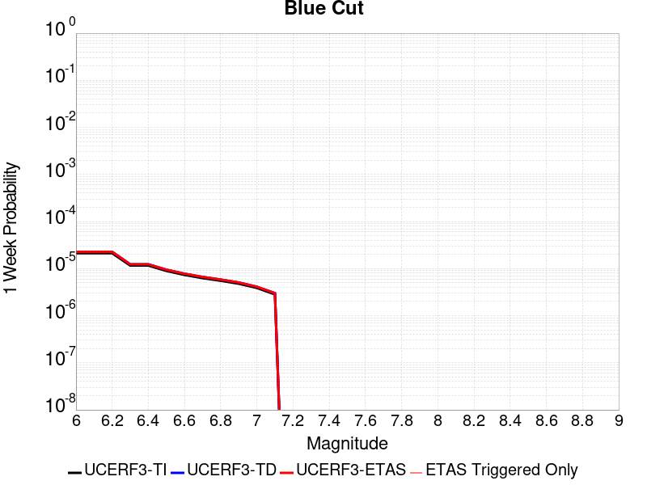 |  |  |  |

| Magnitude | 1 wk TI Prob | 1 wk TD Prob | 1 wk ETAS Prob | 1 wk ETAS/TD Gain | 1 wk ETAS Triggered Only | 1 mo TI Prob | 1 mo TD Prob | 1 mo ETAS Prob | 1 mo ETAS/TD Gain | 1 mo ETAS Triggered Only | 1 yr TI Prob | 1 yr TD Prob | 1 yr ETAS Prob | 1 yr ETAS/TD Gain | 1 yr ETAS Triggered Only | 10 yr TI Prob | 10 yr TD Prob | 10 yr ETAS Prob | 10 yr ETAS/TD Gain | 10 yr ETAS Triggered Only |
|-----|-----|-----|-----|-----|-----|-----|-----|-----|-----|-----|-----|-----|-----|-----|-----|-----|-----|-----|-----|-----|
| 6.0 | 2.1227985E-5 | 2.2720424E-5 | 2.2720424E-5 | 1.0 | 0.0 | 9.097391E-5 | 9.7369935E-5 | 9.7369935E-5 | 1.0 | 0.0 | 0.0011070445 | 0.0011848924 | 0.0012237491 | 1.0327935 | 3.8902937E-5 | 0.011015458 | 0.01179159 | 0.011868478 | 1.0065206 | 7.7805875E-5 |
| 6.1 | 2.1227985E-5 | 2.2720424E-5 | 2.2720424E-5 | 1.0 | 0.0 | 9.097391E-5 | 9.7369935E-5 | 9.7369935E-5 | 1.0 | 0.0 | 0.0011070445 | 0.0011848924 | 0.0012237491 | 1.0327935 | 3.8902937E-5 | 0.011015458 | 0.01179159 | 0.011868478 | 1.0065206 | 7.7805875E-5 |
| 6.2 | 2.1227985E-5 | 2.2720424E-5 | 2.2720424E-5 | 1.0 | 0.0 | 9.097391E-5 | 9.7369935E-5 | 9.7369935E-5 | 1.0 | 0.0 | 0.0011070445 | 0.0011848924 | 0.0012237491 | 1.0327935 | 3.8902937E-5 | 0.011015458 | 0.01179159 | 0.011868478 | 1.0065206 | 7.7805875E-5 |
| 6.3 | 1.1613981E-5 | 1.2353959E-5 | 1.2353959E-5 | 1.0 | 0.0 | 4.9773254E-5 | 5.2944535E-5 | 5.2944535E-5 | 1.0 | 0.0 | 6.0582085E-4 | 6.4442155E-4 | 6.832994E-4 | 1.0603299 | 3.8902937E-5 | 0.0060417196 | 0.006426776 | 0.0064654285 | 1.0060143 | 3.8902937E-5 |
| 6.4 | 1.1613981E-5 | 1.2353959E-5 | 1.2353959E-5 | 1.0 | 0.0 | 4.9773254E-5 | 5.2944535E-5 | 5.2944535E-5 | 1.0 | 0.0 | 6.0582085E-4 | 6.4442155E-4 | 6.832994E-4 | 1.0603299 | 3.8902937E-5 | 0.0060417196 | 0.006426776 | 0.0064654285 | 1.0060143 | 3.8902937E-5 |
| 6.5 | 8.931326E-6 | 9.48191E-6 | 9.48191E-6 | 1.0 | 0.0 | 3.8276554E-5 | 4.0636176E-5 | 4.0636176E-5 | 1.0 | 0.0 | 4.6591737E-4 | 4.9464224E-4 | 5.3352595E-4 | 1.0786097 | 3.8902937E-5 | 0.0046494175 | 0.004936322 | 0.004975033 | 1.0078421 | 3.8902937E-5 |
| 6.6 | 7.345353E-6 | 7.79053E-6 | 7.79053E-6 | 1.0 | 0.0 | 3.1479703E-5 | 3.33876E-5 | 3.33876E-5 | 1.0 | 0.0 | 3.83198E-4 | 4.0642623E-4 | 4.4531337E-4 | 1.0956806 | 3.8902937E-5 | 0.0038253788 | 0.004057621 | 0.004096366 | 1.0095487 | 3.8902937E-5 |
| 6.7 | 6.2775666E-6 | 6.655361E-6 | 6.655361E-6 | 1.0 | 0.0 | 2.690358E-5 | 2.8522707E-5 | 2.8522707E-5 | 1.0 | 0.0 | 3.2750185E-4 | 3.4721615E-4 | 3.861056E-4 | 1.1120036 | 3.8902937E-5 | 0.0032701963 | 0.0034674776 | 0.0035062456 | 1.0111805 | 3.8902937E-5 |
| 6.8 | 5.5234095E-6 | 5.855298E-6 | 5.855298E-6 | 1.0 | 0.0 | 2.367154E-5 | 2.5093934E-5 | 2.5093934E-5 | 1.0 | 0.0 | 2.8816288E-4 | 3.054831E-4 | 3.4437413E-4 | 1.12731 | 3.8902937E-5 | 0.002877895 | 0.0030513476 | 0.0030901318 | 1.0127106 | 3.8902937E-5 |
| 6.9 | 4.7780054E-6 | 5.065582E-6 | 5.065582E-6 | 1.0 | 0.0 | 2.0477004E-5 | 2.1709497E-5 | 2.1709497E-5 | 1.0 | 0.0 | 2.4927902E-4 | 2.642881E-4 | 2.642881E-4 | 1.0 | 0.0 | 0.0024899957 | 0.0026404303 | 0.0026404303 | 1.0 | 0.0 |
| 7.0 | 3.883171E-6 | 4.1186195E-6 | 4.1186195E-6 | 1.0 | 0.0 | 1.6642054E-5 | 1.7651146E-5 | 1.7651146E-5 | 1.0 | 0.0 | 2.0259817E-4 | 2.148884E-4 | 2.148884E-4 | 1.0 | 0.0 | 0.0020241356 | 0.0021474818 | 0.0021474818 | 1.0 | 0.0 |
| 7.1 | 2.8358215E-6 | 3.0098138E-6 | 3.0098138E-6 | 1.0 | 0.0 | 1.2153464E-5 | 1.2899175E-5 | 1.2899175E-5 | 1.0 | 0.0 | 1.4795837E-4 | 1.5704273E-4 | 1.5704273E-4 | 1.0 | 0.0 | 0.001478599 | 0.0015699627 | 0.0015699627 | 1.0 | 0.0 |

## Pleito
*[(top)](#table-of-contents)*

| 1 Week | 1 Month | 1 Year | 10 Year |
|-----|-----|-----|-----|
|  |  |  |  |

| Magnitude | 1 wk TI Prob | 1 wk TD Prob | 1 wk ETAS Prob | 1 wk ETAS/TD Gain | 1 wk ETAS Triggered Only | 1 mo TI Prob | 1 mo TD Prob | 1 mo ETAS Prob | 1 mo ETAS/TD Gain | 1 mo ETAS Triggered Only | 1 yr TI Prob | 1 yr TD Prob | 1 yr ETAS Prob | 1 yr ETAS/TD Gain | 1 yr ETAS Triggered Only | 10 yr TI Prob | 10 yr TD Prob | 10 yr ETAS Prob | 10 yr ETAS/TD Gain | 10 yr ETAS Triggered Only |
|-----|-----|-----|-----|-----|-----|-----|-----|-----|-----|-----|-----|-----|-----|-----|-----|-----|-----|-----|-----|-----|
| 6.0 | 1.6763008E-5 | 2.479053E-5 | 2.479053E-5 | 1.0 | 0.0 | 7.183948E-5 | 1.0624121E-4 | 1.0624121E-4 | 1.0 | 0.0 | 8.742947E-4 | 0.0012927912 | 0.0012927912 | 1.0 | 0.0 | 0.00870863 | 0.012967364 | 0.013044161 | 1.0059223 | 7.7805875E-5 |
| 6.1 | 1.6763008E-5 | 2.479053E-5 | 2.479053E-5 | 1.0 | 0.0 | 7.183948E-5 | 1.0624121E-4 | 1.0624121E-4 | 1.0 | 0.0 | 8.742947E-4 | 0.0012927912 | 0.0012927912 | 1.0 | 0.0 | 0.00870863 | 0.012967364 | 0.013044161 | 1.0059223 | 7.7805875E-5 |
| 6.2 | 1.6763008E-5 | 2.479053E-5 | 2.479053E-5 | 1.0 | 0.0 | 7.183948E-5 | 1.0624121E-4 | 1.0624121E-4 | 1.0 | 0.0 | 8.742947E-4 | 0.0012927912 | 0.0012927912 | 1.0 | 0.0 | 0.00870863 | 0.012967364 | 0.013044161 | 1.0059223 | 7.7805875E-5 |
| 6.3 | 1.6763008E-5 | 2.479053E-5 | 2.479053E-5 | 1.0 | 0.0 | 7.183948E-5 | 1.0624121E-4 | 1.0624121E-4 | 1.0 | 0.0 | 8.742947E-4 | 0.0012927912 | 0.0012927912 | 1.0 | 0.0 | 0.00870863 | 0.012967364 | 0.013044161 | 1.0059223 | 7.7805875E-5 |
| 6.4 | 1.6763008E-5 | 2.479053E-5 | 2.479053E-5 | 1.0 | 0.0 | 7.183948E-5 | 1.0624121E-4 | 1.0624121E-4 | 1.0 | 0.0 | 8.742947E-4 | 0.0012927912 | 0.0012927912 | 1.0 | 0.0 | 0.00870863 | 0.012967364 | 0.013044161 | 1.0059223 | 7.7805875E-5 |
| 6.5 | 1.6763008E-5 | 2.479053E-5 | 2.479053E-5 | 1.0 | 0.0 | 7.183948E-5 | 1.0624121E-4 | 1.0624121E-4 | 1.0 | 0.0 | 8.742947E-4 | 0.0012927912 | 0.0012927912 | 1.0 | 0.0 | 0.00870863 | 0.012967364 | 0.013044161 | 1.0059223 | 7.7805875E-5 |
| 6.6 | 9.910213E-6 | 1.7240907E-5 | 1.7240907E-5 | 1.0 | 0.0 | 4.247165E-5 | 7.388753E-5 | 7.388753E-5 | 1.0 | 0.0 | 5.169696E-4 | 8.992132E-4 | 8.992132E-4 | 1.0 | 0.0 | 0.0051576863 | 0.009064018 | 0.009102568 | 1.0042531 | 3.8902937E-5 |
| 6.7 | 9.910213E-6 | 1.7240907E-5 | 1.7240907E-5 | 1.0 | 0.0 | 4.247165E-5 | 7.388753E-5 | 7.388753E-5 | 1.0 | 0.0 | 5.169696E-4 | 8.992132E-4 | 8.992132E-4 | 1.0 | 0.0 | 0.0051576863 | 0.009064018 | 0.009102568 | 1.0042531 | 3.8902937E-5 |
| 6.8 | 8.300162E-6 | 1.5500442E-5 | 1.5500442E-5 | 1.0 | 0.0 | 3.557164E-5 | 6.642878E-5 | 6.642878E-5 | 1.0 | 0.0 | 4.3299864E-4 | 8.0847176E-4 | 8.0847176E-4 | 1.0 | 0.0 | 0.004321559 | 0.008163428 | 0.008202014 | 1.0047266 | 3.8902937E-5 |
| 6.9 | 8.183114E-6 | 1.5371645E-5 | 1.5371645E-5 | 1.0 | 0.0 | 3.5070017E-5 | 6.5876826E-5 | 6.5876826E-5 | 1.0 | 0.0 | 4.2689382E-4 | 8.017566E-4 | 8.017566E-4 | 1.0 | 0.0 | 0.0042607468 | 0.008096768 | 0.008135355 | 1.0047659 | 3.8902937E-5 |
| 7.0 | 7.1748823E-6 | 1.4158308E-5 | 1.4158308E-5 | 1.0 | 0.0 | 3.0749135E-5 | 6.067705E-5 | 6.067705E-5 | 1.0 | 0.0 | 3.743064E-4 | 7.384933E-4 | 7.384933E-4 | 1.0 | 0.0 | 0.0037367654 | 0.0074680606 | 0.0074680606 | 1.0 | 0.0 |
| 7.1 | 7.1671807E-6 | 1.4148675E-5 | 1.4148675E-5 | 1.0 | 0.0 | 3.0716128E-5 | 6.063577E-5 | 6.063577E-5 | 1.0 | 0.0 | 3.7390468E-4 | 7.37991E-4 | 7.37991E-4 | 1.0 | 0.0 | 0.0037327618 | 0.007463072 | 0.007463072 | 1.0 | 0.0 |
| 7.2 | 7.0649667E-6 | 1.399588E-5 | 1.399588E-5 | 1.0 | 0.0 | 3.0278077E-5 | 5.998097E-5 | 5.998097E-5 | 1.0 | 0.0 | 3.6857324E-4 | 7.300241E-4 | 7.300241E-4 | 1.0 | 0.0 | 0.0036796255 | 0.007383786 | 0.007383786 | 1.0 | 0.0 |
| 7.3 | 7.02082E-6 | 1.3939285E-5 | 1.3939285E-5 | 1.0 | 0.0 | 3.008888E-5 | 5.9738428E-5 | 5.9738428E-5 | 1.0 | 0.0 | 3.6627054E-4 | 7.270732E-4 | 7.270732E-4 | 1.0 | 0.0 | 0.0036566744 | 0.0073542604 | 0.0073542604 | 1.0 | 0.0 |
| 7.4 | 6.987146E-6 | 1.3898819E-5 | 1.3898819E-5 | 1.0 | 0.0 | 2.9944567E-5 | 5.956501E-5 | 5.956501E-5 | 1.0 | 0.0 | 3.6451413E-4 | 7.249632E-4 | 7.249632E-4 | 1.0 | 0.0 | 0.0036391679 | 0.007333182 | 0.007333182 | 1.0 | 0.0 |
| 7.5 | 6.9494554E-6 | 1.3855703E-5 | 1.3855703E-5 | 1.0 | 0.0 | 2.9783041E-5 | 5.9380236E-5 | 5.9380236E-5 | 1.0 | 0.0 | 3.625482E-4 | 7.2271505E-4 | 7.2271505E-4 | 1.0 | 0.0 | 0.0036195726 | 0.0073107993 | 0.0073107993 | 1.0 | 0.0 |
| 7.6 | 6.92694E-6 | 1.3814777E-5 | 1.3814777E-5 | 1.0 | 0.0 | 2.9686547E-5 | 5.9204845E-5 | 5.9204845E-5 | 1.0 | 0.0 | 3.6137376E-4 | 7.205811E-4 | 7.205811E-4 | 1.0 | 0.0 | 0.0036078666 | 0.007289532 | 0.007289532 | 1.0 | 0.0 |
| 7.7 | 6.395867E-6 | 1.2692768E-5 | 1.2692768E-5 | 1.0 | 0.0 | 2.741057E-5 | 5.439644E-5 | 5.439644E-5 | 1.0 | 0.0 | 3.336726E-4 | 6.6207576E-4 | 6.6207576E-4 | 1.0 | 0.0 | 0.0033317201 | 0.0067076497 | 0.0067076497 | 1.0 | 0.0 |
| 7.8 | 5.8664327E-6 | 1.155828E-5 | 1.155828E-5 | 1.0 | 0.0 | 2.5141611E-5 | 4.953455E-5 | 4.953455E-5 | 1.0 | 0.0 | 3.060561E-4 | 6.0291647E-4 | 6.0291647E-4 | 1.0 | 0.0 | 0.0030563495 | 0.00611206 | 0.00611206 | 1.0 | 0.0 |
| 7.9 | 3.7167474E-6 | 7.1276354E-6 | 7.1276354E-6 | 1.0 | 0.0 | 1.592882E-5 | 3.0546653E-5 | 3.0546653E-5 | 1.0 | 0.0 | 1.9391612E-4 | 3.7184218E-4 | 3.7184218E-4 | 1.0 | 0.0 | 0.0019374699 | 0.003774384 | 0.003774384 | 1.0 | 0.0 |
| 8.0 | 1.0903841E-6 | 1.2909164E-6 | 1.2909164E-6 | 1.0 | 0.0 | 4.6730665E-6 | 5.532487E-6 | 5.532487E-6 | 1.0 | 0.0 | 5.68931E-5 | 6.735596E-5 | 6.735596E-5 | 1.0 | 0.0 | 5.6878536E-4 | 6.957586E-4 | 6.957586E-4 | 1.0 | 0.0 |
| 8.1 | 2.6894583E-7 | 1.1110662E-7 | 1.1110662E-7 | 1.0 | 0.0 | 1.1526245E-6 | 4.7617115E-7 | 4.7617115E-7 | 1.0 | 0.0 | 1.4033113E-5 | 5.7973684E-6 | 5.7973684E-6 | 1.0 | 0.0 | 1.4032227E-4 | 6.485011E-5 | 6.485011E-5 | 1.0 | 0.0 |
| 8.2 | 5.2967013E-9 | 2.4698603E-9 | 2.4698603E-9 | 1.0 | 0.0 | 2.2700148E-8 | 1.0585116E-8 | 1.0585116E-8 | 1.0 | 0.0 | 2.7637427E-7 | 1.2887378E-7 | 1.2887378E-7 | 1.0 | 0.0 | 2.7637393E-6 | 1.466009E-6 | 1.466009E-6 | 1.0 | 0.0 |

## San Andreas (Creeping Section) 2011 CFM
*[(top)](#table-of-contents)*

| 1 Week | 1 Month | 1 Year | 10 Year |
|-----|-----|-----|-----|
|  |  |  |  |

| Magnitude | 1 wk TI Prob | 1 wk TD Prob | 1 wk ETAS Prob | 1 wk ETAS/TD Gain | 1 wk ETAS Triggered Only | 1 mo TI Prob | 1 mo TD Prob | 1 mo ETAS Prob | 1 mo ETAS/TD Gain | 1 mo ETAS Triggered Only | 1 yr TI Prob | 1 yr TD Prob | 1 yr ETAS Prob | 1 yr ETAS/TD Gain | 1 yr ETAS Triggered Only | 10 yr TI Prob | 10 yr TD Prob | 10 yr ETAS Prob | 10 yr ETAS/TD Gain | 10 yr ETAS Triggered Only |
|-----|-----|-----|-----|-----|-----|-----|-----|-----|-----|-----|-----|-----|-----|-----|-----|-----|-----|-----|-----|-----|
| 6.0 | 5.986481E-4 | 0.0012277901 | 0.0012666453 | 1.0316464 | 3.8902937E-5 | 0.0025631124 | 0.0052455855 | 0.0052842842 | 1.0073774 | 3.8902937E-5 | 0.030762846 | 0.061229862 | 0.061266385 | 1.0005964 | 3.8902937E-5 | 0.26835477 | 0.42607152 | 0.42611617 | 1.0001048 | 7.7805875E-5 |
| 6.1 | 5.015945E-4 | 0.0010218644 | 0.0010607275 | 1.0380317 | 3.8902937E-5 | 0.00214792 | 0.0043676887 | 0.0044064214 | 1.0088681 | 3.8902937E-5 | 0.025839351 | 0.051269703 | 0.051306613 | 1.0007199 | 3.8902937E-5 | 0.23032776 | 0.37298882 | 0.3730376 | 1.0001308 | 7.7805875E-5 |
| 6.2 | 4.073338E-4 | 8.109829E-4 | 8.4985426E-4 | 1.0479312 | 3.8902937E-5 | 0.0017445484 | 0.0034675654 | 0.0035063333 | 1.0111802 | 3.8902937E-5 | 0.021034058 | 0.040954083 | 0.040991392 | 1.000911 | 3.8902937E-5 | 0.19150782 | 0.31317768 | 0.3132311 | 1.0001706 | 7.7805875E-5 |
| 6.3 | 3.464099E-4 | 6.7405414E-4 | 7.1293087E-4 | 1.057676 | 3.8902937E-5 | 0.0014837692 | 0.0028840431 | 0.0029228337 | 1.0134501 | 3.8902937E-5 | 0.017915873 | 0.034210727 | 0.0342483 | 1.0010983 | 3.8902937E-5 | 0.16538359 | 0.27146977 | 0.27152646 | 1.0002089 | 7.7805875E-5 |
| 6.4 | 2.935057E-4 | 5.543318E-4 | 5.932132E-4 | 1.070141 | 3.8902937E-5 | 0.0012572751 | 0.0023728115 | 0.002411622 | 1.0163563 | 3.8902937E-5 | 0.015200248 | 0.028285956 | 0.028323758 | 1.0013365 | 3.8902937E-5 | 0.14201577 | 0.23314685 | 0.23320651 | 1.000256 | 7.7805875E-5 |
| 6.5 | 2.3409708E-4 | 4.2106997E-4 | 4.5995653E-4 | 1.0923518 | 3.8902937E-5 | 0.0010028875 | 0.001803265 | 0.0018420977 | 1.0215347 | 3.8902937E-5 | 0.012141965 | 0.02160988 | 0.021647943 | 1.0017613 | 3.8902937E-5 | 0.11499573 | 0.18699536 | 0.18705861 | 1.0003383 | 7.7805875E-5 |
| 6.6 | 1.5842178E-4 | 2.5115322E-4 | 2.900464E-4 | 1.1548584 | 3.8902937E-5 | 6.7877385E-4 | 0.0010759257 | 0.0011147867 | 1.0361187 | 3.8902937E-5 | 0.0082328 | 0.013019121 | 0.013057518 | 1.0029492 | 3.8902937E-5 | 0.07934396 | 0.12333139 | 0.1233996 | 1.000553 | 7.7805875E-5 |
| 6.7 | 1.5616413E-4 | 2.4651614E-4 | 2.854095E-4 | 1.1577721 | 3.8902937E-5 | 6.691031E-4 | 0.0010560687 | 0.0010949306 | 1.0367986 | 3.8902937E-5 | 0.0081159435 | 0.012780937 | 0.012819343 | 1.0030049 | 3.8902937E-5 | 0.0782586 | 0.12135857 | 0.12142693 | 1.0005633 | 7.7805875E-5 |
| 6.8 | 1.5538467E-4 | 2.4475376E-4 | 2.8364718E-4 | 1.1589084 | 3.8902937E-5 | 6.6576427E-4 | 0.0010485224 | 0.0010873846 | 1.0370637 | 3.8902937E-5 | 0.008075596 | 0.0126902815 | 0.01272869 | 1.0030267 | 3.8902937E-5 | 0.07788358 | 0.12058931 | 0.120657735 | 1.0005674 | 7.7805875E-5 |
| 6.9 | 1.5153569E-4 | 2.3584193E-4 | 2.7473568E-4 | 1.1649145 | 3.8902937E-5 | 6.49277E-4 | 0.0010103616 | 0.0010492252 | 1.038465 | 3.8902937E-5 | 0.007876333 | 0.0122323 | 0.012270727 | 1.0031414 | 3.8902937E-5 | 0.07602952 | 0.11665895 | 0.11672768 | 1.0005891 | 7.7805875E-5 |
| 7.0 | 1.4588932E-4 | 2.2441045E-4 | 2.6330465E-4 | 1.1733173 | 3.8902937E-5 | 6.250901E-4 | 9.6140656E-4 | 0.0010002721 | 1.0404257 | 3.8902937E-5 | 0.0075839474 | 0.011642803 | 0.011681253 | 1.0033025 | 3.8902937E-5 | 0.073302895 | 0.11150479 | 0.11157393 | 1.00062 | 7.7805875E-5 |
| 7.1 | 1.1565079E-4 | 1.6318668E-4 | 2.0208326E-4 | 1.2383564 | 3.8902937E-5 | 4.955521E-4 | 6.991849E-4 | 7.380606E-4 | 1.0556015 | 3.8902937E-5 | 0.006016669 | 0.008479553 | 0.008518126 | 1.0045489 | 3.8902937E-5 | 0.058563538 | 0.08383247 | 0.08390375 | 1.0008503 | 7.7805875E-5 |
| 7.2 | 1.0393792E-4 | 1.4650424E-4 | 1.8540148E-4 | 1.2655025 | 3.8902937E-5 | 4.4537216E-4 | 6.2772504E-4 | 6.666035E-4 | 1.0619355 | 3.8902937E-5 | 0.005408933 | 0.007615941 | 0.0076545477 | 1.0050691 | 3.8902937E-5 | 0.052791595 | 0.075774014 | 0.07584592 | 1.000949 | 7.7805875E-5 |
| 7.3 | 9.332884E-5 | 1.2811116E-4 | 1.6700912E-4 | 1.3036265 | 3.8902937E-5 | 3.999194E-4 | 5.4893293E-4 | 5.8781455E-4 | 1.0708312 | 3.8902937E-5 | 0.0048581534 | 0.006662914 | 0.006701558 | 1.0057998 | 3.8902937E-5 | 0.047533102 | 0.06662133 | 0.066693954 | 1.00109 | 7.7805875E-5 |
| 7.4 | 8.670252E-5 | 1.17293064E-4 | 1.5619144E-4 | 1.331634 | 3.8902937E-5 | 3.715293E-4 | 5.0258834E-4 | 5.414717E-4 | 1.0773662 | 3.8902937E-5 | 0.004513991 | 0.006101966 | 0.0061406316 | 1.0063366 | 3.8902937E-5 | 0.044233937 | 0.06127167 | 0.06134471 | 1.0011921 | 7.7805875E-5 |
| 7.5 | 7.3036405E-5 | 9.027501E-5 | 1.2917444E-4 | 1.4308991 | 3.8902937E-5 | 3.129756E-4 | 3.8683563E-4 | 4.257235E-4 | 1.1005282 | 3.8902937E-5 | 0.0038038217 | 0.0046995743 | 0.0047382945 | 1.008239 | 3.8902937E-5 | 0.03739367 | 0.047980286 | 0.04805436 | 1.0015438 | 7.7805875E-5 |
| 7.6 | 6.3935775E-5 | 8.298733E-5 | 1.2188704E-4 | 1.4687427 | 3.8902937E-5 | 2.7398168E-4 | 3.5561158E-4 | 3.9450068E-4 | 1.1093583 | 3.8902937E-5 | 0.0033306254 | 0.0043209945 | 0.0043597296 | 1.0089643 | 3.8902937E-5 | 0.032811474 | 0.04407886 | 0.044153236 | 1.0016873 | 7.7805875E-5 |
| 7.7 | 5.5050095E-5 | 6.6780485E-5 | 1.0568082E-4 | 1.5825106 | 3.8902937E-5 | 2.3590765E-4 | 2.861707E-4 | 3.250625E-4 | 1.1359042 | 3.8902937E-5 | 0.0028683927 | 0.003478566 | 0.0035173337 | 1.0111448 | 3.8902937E-5 | 0.0283165 | 0.035874426 | 0.035949443 | 1.002091 | 7.7805875E-5 |
| 7.8 | 5.027131E-5 | 6.177649E-5 | 1.0067702E-4 | 1.629698 | 3.8902937E-5 | 2.1543067E-4 | 2.6472952E-4 | 3.0362216E-4 | 1.1469146 | 3.8902937E-5 | 0.0026197135 | 0.0032183218 | 0.0032570995 | 1.0120491 | 3.8902937E-5 | 0.025890453 | 0.033198178 | 0.033273403 | 1.0022659 | 7.7805875E-5 |
| 7.9 | 3.7271806E-5 | 5.034326E-5 | 8.924424E-5 | 1.7727147 | 3.8902937E-5 | 1.5972654E-4 | 2.15739E-4 | 2.5463355E-4 | 1.1802852 | 3.8902937E-5 | 0.0019429359 | 0.0026234603 | 0.0026622612 | 1.0147899 | 3.8902937E-5 | 0.019260362 | 0.027125074 | 0.027200768 | 1.0027906 | 7.7805875E-5 |
| 8.0 | 2.7310243E-5 | 3.1506686E-5 | 7.04084E-5 | 2.2347128 | 3.8902937E-5 | 1.17038646E-4 | 1.3502168E-4 | 1.7391935E-4 | 1.2880847 | 3.8902937E-5 | 0.0014240141 | 0.0016426502 | 0.0016814892 | 1.0236441 | 3.8902937E-5 | 0.014149235 | 0.017253635 | 0.017291866 | 1.0022159 | 3.8902937E-5 |
| 8.1 | 1.7940547E-5 | 1.7450684E-5 | 5.6352943E-5 | 3.2292683 | 3.8902937E-5 | 7.688579E-5 | 7.4786505E-5 | 1.1368653E-4 | 1.5201477 | 3.8902937E-5 | 9.3568244E-4 | 9.1014587E-4 | 9.490134E-4 | 1.0427047 | 3.8902937E-5 | 0.009317525 | 0.009825298 | 0.009863818 | 1.0039206 | 3.8902937E-5 |
| 8.2 | 8.643924E-6 | 5.49522E-6 | 5.49522E-6 | 1.0 | 0.0 | 3.704486E-5 | 2.355073E-5 | 2.355073E-5 | 1.0 | 0.0 | 4.5092785E-4 | 2.866925E-4 | 2.866925E-4 | 1.0 | 0.0 | 0.0045001395 | 0.0032598388 | 0.0032598388 | 1.0 | 0.0 |
| 8.3 | 1.983087E-6 | 7.693574E-7 | 7.693574E-7 | 1.0 | 0.0 | 8.498917E-6 | 3.297242E-6 | 3.297242E-6 | 1.0 | 0.0 | 1.034694E-4 | 4.01432E-5 | 4.01432E-5 | 1.0 | 0.0 | 0.0010342124 | 4.7390026E-4 | 4.7390026E-4 | 1.0 | 0.0 |

## Superstition Hills
*[(top)](#table-of-contents)*

| 1 Week | 1 Month | 1 Year | 10 Year |
|-----|-----|-----|-----|
|  |  |  |  |

| Magnitude | 1 wk TI Prob | 1 wk TD Prob | 1 wk ETAS Prob | 1 wk ETAS/TD Gain | 1 wk ETAS Triggered Only | 1 mo TI Prob | 1 mo TD Prob | 1 mo ETAS Prob | 1 mo ETAS/TD Gain | 1 mo ETAS Triggered Only | 1 yr TI Prob | 1 yr TD Prob | 1 yr ETAS Prob | 1 yr ETAS/TD Gain | 1 yr ETAS Triggered Only | 10 yr TI Prob | 10 yr TD Prob | 10 yr ETAS Prob | 10 yr ETAS/TD Gain | 10 yr ETAS Triggered Only |
|-----|-----|-----|-----|-----|-----|-----|-----|-----|-----|-----|-----|-----|-----|-----|-----|-----|-----|-----|-----|-----|
| 6.0 | 6.6865185E-5 | 1.41497685E-5 | 5.3052154E-5 | 3.7493303 | 3.8902937E-5 | 2.8653358E-4 | 6.064055E-5 | 9.9541125E-5 | 1.6414945 | 3.8902937E-5 | 0.0034829667 | 7.380648E-4 | 7.7693904E-4 | 1.0526705 | 3.8902937E-5 | 0.03428881 | 0.0075266883 | 0.0076039084 | 1.0102595 | 7.7805875E-5 |
| 6.1 | 6.544851E-5 | 1.41497685E-5 | 5.3052154E-5 | 3.7493303 | 3.8902937E-5 | 2.8046346E-4 | 6.064055E-5 | 9.9541125E-5 | 1.6414945 | 3.8902937E-5 | 0.0034092965 | 7.3806476E-4 | 7.76939E-4 | 1.0526705 | 3.8902937E-5 | 0.033574644 | 0.007526688 | 0.007603908 | 1.0102595 | 7.7805875E-5 |
| 6.2 | 6.544851E-5 | 1.41497685E-5 | 5.3052154E-5 | 3.7493303 | 3.8902937E-5 | 2.8046346E-4 | 6.064055E-5 | 9.9541125E-5 | 1.6414945 | 3.8902937E-5 | 0.0034092965 | 7.3806476E-4 | 7.76939E-4 | 1.0526705 | 3.8902937E-5 | 0.033574644 | 0.007526688 | 0.007603908 | 1.0102595 | 7.7805875E-5 |
| 6.3 | 5.2402065E-5 | 1.4149768E-5 | 5.3052154E-5 | 3.7493305 | 3.8902937E-5 | 2.2456095E-4 | 6.064054E-5 | 9.954112E-5 | 1.6414945 | 3.8902937E-5 | 0.0027306017 | 7.380647E-4 | 7.769389E-4 | 1.0526705 | 3.8902937E-5 | 0.02697292 | 0.007526682 | 0.0076039024 | 1.0102595 | 7.7805875E-5 |
| 6.4 | 4.542238E-5 | 1.4149767E-5 | 5.3052154E-5 | 3.7493305 | 3.8902937E-5 | 1.9465282E-4 | 6.0640537E-5 | 9.954112E-5 | 1.6414946 | 3.8902937E-5 | 0.0023673223 | 7.380647E-4 | 7.769389E-4 | 1.0526705 | 3.8902937E-5 | 0.023422617 | 0.007526679 | 0.007603899 | 1.0102595 | 7.7805875E-5 |
| 6.5 | 2.9672969E-5 | 1.4149766E-5 | 5.3052154E-5 | 3.7493308 | 3.8902937E-5 | 1.2716366E-4 | 6.0640534E-5 | 9.954111E-5 | 1.6414946 | 3.8902937E-5 | 0.0015471181 | 7.380646E-4 | 7.7693886E-4 | 1.0526705 | 3.8902937E-5 | 0.015363912 | 0.0075266724 | 0.0076038926 | 1.0102595 | 7.7805875E-5 |
| 6.6 | 2.6056105E-5 | 1.3815438E-5 | 5.2717838E-5 | 3.8158643 | 3.8902937E-5 | 1.1166424E-4 | 5.9207767E-5 | 9.81084E-5 | 1.6570191 | 3.8902937E-5 | 0.0013586642 | 7.2063226E-4 | 7.595071E-4 | 1.0539455 | 3.8902937E-5 | 0.013503874 | 0.007351063 | 0.0074282973 | 1.0105065 | 7.7805875E-5 |
| 6.7 | 1.4611248E-5 | 1.3395271E-5 | 5.2297688E-5 | 3.9041903 | 3.8902937E-5 | 6.261813E-5 | 5.740713E-5 | 9.6307835E-5 | 1.6776284 | 3.8902937E-5 | 7.6210906E-4 | 6.9872366E-4 | 7.375994E-4 | 1.0556382 | 3.8902937E-5 | 0.0075950073 | 0.007132221 | 0.007209472 | 1.0108312 | 7.7805875E-5 |
| 6.8 | 1.30607E-5 | 1.0990158E-5 | 4.9892667E-5 | 4.5397587 | 3.8902937E-5 | 5.597323E-5 | 4.709988E-5 | 8.600098E-5 | 1.825928 | 3.8902937E-5 | 6.8126095E-4 | 5.732989E-4 | 6.121795E-4 | 1.0678191 | 3.8902937E-5 | 0.006791762 | 0.0058803135 | 0.0059189876 | 1.0065769 | 3.8902937E-5 |
| 6.9 | 1.0443096E-5 | 8.205624E-6 | 4.7108242E-5 | 5.74097 | 3.8902937E-5 | 4.4755358E-5 | 3.51665E-5 | 7.406807E-5 | 2.106211 | 3.8902937E-5 | 5.447602E-4 | 4.2807037E-4 | 4.6695664E-4 | 1.0908408 | 3.8902937E-5 | 0.005434267 | 0.004414833 | 0.0044535645 | 1.008773 | 3.8902937E-5 |
| 7.0 | 8.045912E-6 | 6.7489877E-6 | 4.565166E-5 | 6.7642236 | 3.8902937E-5 | 3.4482026E-5 | 2.8923918E-5 | 6.782573E-5 | 2.3449702 | 3.8902937E-5 | 4.197378E-4 | 3.5209284E-4 | 3.9098208E-4 | 1.1104517 | 3.8902937E-5 | 0.0041894587 | 0.0036382722 | 0.0036770336 | 1.0106537 | 3.8902937E-5 |
| 7.1 | 8.045912E-6 | 6.7489877E-6 | 4.565166E-5 | 6.7642236 | 3.8902937E-5 | 3.4482026E-5 | 2.8923918E-5 | 6.782573E-5 | 2.3449702 | 3.8902937E-5 | 4.197378E-4 | 3.5209284E-4 | 3.9098208E-4 | 1.1104517 | 3.8902937E-5 | 0.0041894587 | 0.0036382722 | 0.0036770336 | 1.0106537 | 3.8902937E-5 |
| 7.2 | 7.375506E-6 | 6.2557447E-6 | 4.515844E-5 | 7.218715 | 3.8902937E-5 | 3.1608928E-5 | 2.6810065E-5 | 6.571196E-5 | 2.4510183 | 3.8902937E-5 | 3.8477074E-4 | 3.263645E-4 | 3.6525473E-4 | 1.119162 | 3.8902937E-5 | 0.003841052 | 0.0033786567 | 0.0034174281 | 1.0114754 | 3.8902937E-5 |
| 7.3 | 6.6063913E-6 | 5.8080136E-6 | 4.4710723E-5 | 7.6981096 | 3.8902937E-5 | 2.8312797E-5 | 2.4891253E-5 | 6.3793224E-5 | 2.562877 | 3.8902937E-5 | 3.446538E-4 | 3.0300958E-4 | 3.4190074E-4 | 1.1283495 | 3.8902937E-5 | 0.0034411973 | 0.003142841 | 0.0031816217 | 1.0123394 | 3.8902937E-5 |
| 7.4 | 6.4313126E-6 | 5.6894055E-6 | 4.459212E-5 | 7.837747 | 3.8902937E-5 | 2.7562477E-5 | 2.4382942E-5 | 6.328493E-5 | 2.5954592 | 3.8902937E-5 | 3.355215E-4 | 2.9682257E-4 | 3.3571396E-4 | 1.1310257 | 3.8902937E-5 | 0.0033501536 | 0.0030805867 | 0.0031193697 | 1.0125896 | 3.8902937E-5 |
| 7.5 | 6.0742927E-6 | 5.485116E-6 | 4.438784E-5 | 8.092416 | 3.8902937E-5 | 2.6032423E-5 | 2.3507433E-5 | 6.2409454E-5 | 2.6548817 | 3.8902937E-5 | 3.1689866E-4 | 2.861661E-4 | 3.250579E-4 | 1.1359065 | 3.8902937E-5 | 0.0031644711 | 0.0029723656 | 0.0030111528 | 1.0130494 | 3.8902937E-5 |
| 7.6 | 5.6987187E-6 | 5.3032036E-6 | 4.4205935E-5 | 8.335704 | 3.8902937E-5 | 2.4422852E-5 | 2.272782E-5 | 6.162987E-5 | 2.7116492 | 3.8902937E-5 | 2.9730765E-4 | 2.7667673E-4 | 3.155689E-4 | 1.140569 | 3.8902937E-5 | 0.002969102 | 0.0028755567 | 0.0029143477 | 1.01349 | 3.8902937E-5 |
| 7.7 | 5.1658035E-6 | 4.9340665E-6 | 4.383681E-5 | 8.88452 | 3.8902937E-5 | 2.2138971E-5 | 2.1145832E-5 | 6.0047947E-5 | 2.8397062 | 3.8902937E-5 | 2.6950863E-4 | 2.5742067E-4 | 2.963136E-4 | 1.151087 | 3.8902937E-5 | 0.00269182 | 0.002680529 | 0.0027193276 | 1.0144743 | 3.8902937E-5 |
| 7.8 | 3.6864697E-6 | 4.204672E-6 | 4.3107444E-5 | 10.252273 | 3.8902937E-5 | 1.579906E-5 | 1.80199E-5 | 5.6922137E-5 | 3.1588485 | 3.8902937E-5 | 1.9233658E-4 | 2.1937068E-4 | 2.582651E-4 | 1.1773 | 3.8902937E-5 | 0.0019217018 | 0.0022935418 | 0.0023323556 | 1.0169231 | 3.8902937E-5 |
| 7.9 | 3.0265903E-6 | 3.5712687E-6 | 4.247407E-5 | 11.8932705 | 3.8902937E-5 | 1.2971037E-5 | 1.530535E-5 | 5.4207692E-5 | 3.5417478 | 3.8902937E-5 | 1.5791094E-4 | 1.8632715E-4 | 2.2522284E-4 | 1.2087494 | 3.8902937E-5 | 0.0015779877 | 0.0019574203 | 0.001996247 | 1.0198357 | 3.8902937E-5 |
| 8.0 | 2.5271493E-6 | 3.0936285E-6 | 4.1996445E-5 | 13.575142 | 3.8902937E-5 | 1.0830595E-5 | 1.3258343E-5 | 5.2160765E-5 | 3.9341843 | 3.8902937E-5 | 1.3185451E-4 | 1.6140878E-4 | 2.0030544E-4 | 1.2409823 | 3.8902937E-5 | 0.0013177631 | 0.0017009631 | 0.0017398 | 1.0228323 | 3.8902937E-5 |
| 8.1 | 2.3749135E-6 | 2.923956E-6 | 4.182678E-5 | 14.30486 | 3.8902937E-5 | 1.0178161E-5 | 1.2531182E-5 | 5.143363E-5 | 4.1044517 | 3.8902937E-5 | 1.2391206E-4 | 1.5255688E-4 | 1.9145387E-4 | 1.2549672 | 3.8902937E-5 | 0.0012384299 | 0.0016083925 | 0.0016472328 | 1.0241486 | 3.8902937E-5 |
| 8.2 | 1.7186406E-9 | 1.1475616E-9 | 1.1475616E-9 | 1.0 | 0.0 | 7.3656024E-9 | 4.918121E-9 | 4.918121E-9 | 1.0 | 0.0 | 8.9676206E-8 | 5.9878126E-8 | 5.9878126E-8 | 1.0 | 0.0 | 8.9676166E-7 | 6.407935E-7 | 6.407935E-7 | 1.0 | 0.0 |

## San Jacinto (Superstition Mtn)
*[(top)](#table-of-contents)*

| 1 Week | 1 Month | 1 Year | 10 Year |
|-----|-----|-----|-----|
|  |  |  |  |

| Magnitude | 1 wk TI Prob | 1 wk TD Prob | 1 wk ETAS Prob | 1 wk ETAS/TD Gain | 1 wk ETAS Triggered Only | 1 mo TI Prob | 1 mo TD Prob | 1 mo ETAS Prob | 1 mo ETAS/TD Gain | 1 mo ETAS Triggered Only | 1 yr TI Prob | 1 yr TD Prob | 1 yr ETAS Prob | 1 yr ETAS/TD Gain | 1 yr ETAS Triggered Only | 10 yr TI Prob | 10 yr TD Prob | 10 yr ETAS Prob | 10 yr ETAS/TD Gain | 10 yr ETAS Triggered Only |
|-----|-----|-----|-----|-----|-----|-----|-----|-----|-----|-----|-----|-----|-----|-----|-----|-----|-----|-----|-----|-----|
| 6.0 | 6.4193904E-5 | 9.602289E-5 | 1.349221E-4 | 1.4051034 | 3.8902937E-5 | 2.7508775E-4 | 4.1147156E-4 | 4.503585E-4 | 1.094507 | 3.8902937E-5 | 0.0033440501 | 0.004999541 | 0.00503825 | 1.0077424 | 3.8902937E-5 | 0.03294174 | 0.04883795 | 0.048911955 | 1.0015154 | 7.7805875E-5 |
| 6.1 | 6.4193904E-5 | 9.602289E-5 | 1.349221E-4 | 1.4051034 | 3.8902937E-5 | 2.7508775E-4 | 4.1147156E-4 | 4.503585E-4 | 1.094507 | 3.8902937E-5 | 0.0033440501 | 0.004999541 | 0.00503825 | 1.0077424 | 3.8902937E-5 | 0.03294174 | 0.04883795 | 0.048911955 | 1.0015154 | 7.7805875E-5 |
| 6.2 | 5.7023593E-5 | 8.317087E-5 | 1.2207057E-4 | 1.4677082 | 3.8902937E-5 | 2.4436394E-4 | 3.5640728E-4 | 3.9529637E-4 | 1.1091142 | 3.8902937E-5 | 0.002971072 | 0.00433226 | 0.0043709944 | 1.0089409 | 3.8902937E-5 | 0.029316625 | 0.04251723 | 0.042591725 | 1.0017521 | 7.7805875E-5 |
| 6.3 | 5.6940098E-5 | 8.301621E-5 | 1.2191592E-4 | 1.4685796 | 3.8902937E-5 | 2.4400617E-4 | 3.5574468E-4 | 3.9463377E-4 | 1.1093174 | 3.8902937E-5 | 0.002966728 | 0.004324225 | 0.0043629594 | 1.0089576 | 3.8902937E-5 | 0.029274331 | 0.042440474 | 0.042514976 | 1.0017555 | 7.7805875E-5 |
| 6.4 | 5.4171585E-5 | 7.750957E-5 | 1.16409494E-4 | 1.5018725 | 3.8902937E-5 | 2.3214328E-4 | 3.321509E-4 | 3.710409E-4 | 1.1170853 | 3.8902937E-5 | 0.0028226813 | 0.004038087 | 0.004076833 | 1.0095952 | 3.8902937E-5 | 0.02787096 | 0.03972961 | 0.039804325 | 1.0018805 | 7.7805875E-5 |
| 6.5 | 4.375144E-5 | 5.6446577E-5 | 9.534732E-5 | 1.6891603 | 3.8902937E-5 | 1.874927E-4 | 2.418981E-4 | 2.8079163E-4 | 1.1607847 | 3.8902937E-5 | 0.0022803338 | 0.0029423076 | 0.0029810963 | 1.013183 | 3.8902937E-5 | 0.022570757 | 0.02924966 | 0.029325191 | 1.0025823 | 7.7805875E-5 |
| 6.6 | 2.772192E-5 | 2.5512374E-5 | 6.441432E-5 | 2.5248265 | 3.8902937E-5 | 1.1880282E-4 | 1.0933427E-4 | 1.4823295E-4 | 1.3557776 | 3.8902937E-5 | 0.0014454646 | 0.0013303513 | 0.0013692025 | 1.0292037 | 3.8902937E-5 | 0.014360986 | 0.013552955 | 0.013629707 | 1.005663 | 7.7805875E-5 |
| 6.7 | 2.7124124E-5 | 2.4723291E-5 | 6.3625266E-5 | 2.5734951 | 3.8902937E-5 | 1.1624106E-4 | 1.05952764E-4 | 1.4485158E-4 | 1.3671335 | 3.8902937E-5 | 0.0014143161 | 0.0012892308 | 0.0013280836 | 1.0301363 | 3.8902937E-5 | 0.014053487 | 0.013146358 | 0.0132231405 | 1.0058407 | 7.7805875E-5 |
| 6.8 | 2.5475807E-5 | 2.218778E-5 | 6.108985E-5 | 2.753311 | 3.8902937E-5 | 1.0917746E-4 | 9.508708E-5 | 1.3398632E-4 | 1.4090906 | 3.8902937E-5 | 0.001328425 | 0.0011570824 | 0.0011959403 | 1.0335827 | 3.8902937E-5 | 0.0132051185 | 0.011834319 | 0.011872761 | 1.0032485 | 3.8902937E-5 |
| 6.9 | 2.1162023E-5 | 1.764776E-5 | 5.6550012E-5 | 3.2043734 | 3.8902937E-5 | 9.069123E-5 | 7.5631084E-5 | 1.1453108E-4 | 1.5143387 | 3.8902937E-5 | 0.0011036064 | 9.204233E-4 | 9.592904E-4 | 1.0422275 | 3.8902937E-5 | 0.010981417 | 0.009458124 | 0.009496659 | 1.0040742 | 3.8902937E-5 |
| 7.0 | 1.8754288E-5 | 1.6182094E-5 | 5.50844E-5 | 3.4040344 | 3.8902937E-5 | 8.037304E-5 | 6.935E-5 | 1.08250235E-4 | 1.5609263 | 3.8902937E-5 | 9.781026E-4 | 8.4401167E-4 | 8.8288175E-4 | 1.046054 | 3.8902937E-5 | 0.009738087 | 0.008680774 | 0.008719339 | 1.0044426 | 3.8902937E-5 |
| 7.1 | 1.8678527E-5 | 1.6107217E-5 | 5.5009525E-5 | 3.41521 | 3.8902937E-5 | 8.0048376E-5 | 6.902911E-5 | 1.07929365E-4 | 1.563534 | 3.8902937E-5 | 9.7415317E-4 | 8.4010785E-4 | 8.789781E-4 | 1.0462682 | 3.8902937E-5 | 0.009698939 | 0.00864172 | 0.008680287 | 1.0044628 | 3.8902937E-5 |
| 7.2 | 1.7804578E-5 | 1.5401574E-5 | 5.4303913E-5 | 3.5258677 | 3.8902937E-5 | 7.6303106E-5 | 6.600509E-5 | 1.04905455E-4 | 1.5893542 | 3.8902937E-5 | 9.285943E-4 | 8.0331793E-4 | 8.421896E-4 | 1.048389 | 3.8902937E-5 | 0.009247236 | 0.008272923 | 0.008311504 | 1.0046636 | 3.8902937E-5 |
| 7.3 | 1.6583685E-5 | 1.4550439E-5 | 5.345281E-5 | 3.6736217 | 3.8902937E-5 | 7.1070994E-5 | 6.235755E-5 | 1.0125806E-4 | 1.6238301 | 3.8902937E-5 | 8.649459E-4 | 7.589407E-4 | 7.978141E-4 | 1.0512207 | 3.8902937E-5 | 0.00861587 | 0.007828114 | 0.007866712 | 1.0049307 | 3.8902937E-5 |
| 7.4 | 1.6387552E-5 | 1.44152855E-5 | 5.331766E-5 | 3.6986892 | 3.8902937E-5 | 7.023047E-5 | 6.1778344E-5 | 1.0067888E-4 | 1.6296791 | 3.8902937E-5 | 8.5472054E-4 | 7.518938E-4 | 7.907675E-4 | 1.0517011 | 3.8902937E-5 | 0.008514405 | 0.007757476 | 0.007796077 | 1.004976 | 3.8902937E-5 |
| 7.5 | 1.5790754E-5 | 1.4055765E-5 | 5.2958156E-5 | 3.7677178 | 3.8902937E-5 | 6.767291E-5 | 6.0237613E-5 | 9.9138204E-5 | 1.6457858 | 3.8902937E-5 | 8.236062E-4 | 7.3314813E-4 | 7.720225E-4 | 1.0530239 | 3.8902937E-5 | 0.008205604 | 0.007567932 | 0.0076065403 | 1.0051016 | 3.8902937E-5 |
| 7.6 | 1.4248672E-5 | 1.3074211E-5 | 5.197664E-5 | 3.9755087 | 3.8902937E-5 | 6.106431E-5 | 5.603114E-5 | 9.493189E-5 | 1.6942704 | 3.8902937E-5 | 7.432043E-4 | 6.819673E-4 | 7.2084373E-4 | 1.0570062 | 3.8902937E-5 | 0.007407237 | 0.0070502516 | 0.00708888 | 1.0054791 | 3.8902937E-5 |
| 7.7 | 1.15449975E-5 | 1.0922179E-5 | 4.982469E-5 | 4.5617905 | 3.8902937E-5 | 4.947762E-5 | 4.68085E-5 | 8.570962E-5 | 1.8310695 | 3.8902937E-5 | 6.022235E-4 | 5.6974526E-4 | 6.0862605E-4 | 1.0682424 | 3.8902937E-5 | 0.006005941 | 0.005919881 | 0.005958554 | 1.0065327 | 3.8902937E-5 |
| 7.8 | 9.1391985E-6 | 9.532076E-6 | 4.8434642E-5 | 5.0812273 | 3.8902937E-5 | 3.9167408E-5 | 4.0851115E-5 | 7.975246E-5 | 1.9522713 | 3.8902937E-5 | 4.767588E-4 | 4.972494E-4 | 5.36133E-4 | 1.0781974 | 3.8902937E-5 | 0.0047573727 | 0.0051860143 | 0.005224716 | 1.0074626 | 3.8902937E-5 |
| 7.9 | 6.973017E-6 | 7.397966E-6 | 4.6300614E-5 | 6.25856 | 3.8902937E-5 | 2.9884017E-5 | 3.1705185E-5 | 7.060689E-5 | 2.2269824 | 3.8902937E-5 | 3.6377716E-4 | 3.8594278E-4 | 4.248307E-4 | 1.1007608 | 3.8902937E-5 | 0.0036318225 | 0.0040600975 | 0.0040988424 | 1.0095428 | 3.8902937E-5 |
| 8.0 | 5.7638235E-6 | 6.2743825E-6 | 4.5177076E-5 | 7.2002425 | 3.8902937E-5 | 2.4701867E-5 | 2.6889935E-5 | 6.579183E-5 | 2.4467082 | 3.8902937E-5 | 3.0070372E-4 | 3.2733628E-4 | 3.6622648E-4 | 1.1188082 | 3.8902937E-5 | 0.0030029714 | 0.0034610373 | 0.0034998057 | 1.0112014 | 3.8902937E-5 |
| 8.1 | 5.1124434E-6 | 5.508789E-6 | 4.441151E-5 | 8.061937 | 3.8902937E-5 | 2.1910288E-5 | 2.3608885E-5 | 6.25109E-5 | 2.6477702 | 3.8902937E-5 | 2.6672508E-4 | 2.8740076E-4 | 3.262925E-4 | 1.1353223 | 3.8902937E-5 | 0.0026640517 | 0.003047253 | 0.0030860375 | 1.0127276 | 3.8902937E-5 |
| 8.2 | 1.1075938E-6 | 5.3557983E-7 | 5.3557983E-7 | 1.0 | 0.0 | 4.7468216E-6 | 2.2953402E-6 | 2.2953402E-6 | 1.0 | 0.0 | 5.779102E-5 | 2.7945433E-5 | 2.7945433E-5 | 1.0 | 0.0 | 5.777599E-4 | 3.1453613E-4 | 3.1453613E-4 | 1.0 | 0.0 |
| 8.3 | 1.3584393E-8 | 4.4922075E-9 | 4.4922075E-9 | 1.0 | 0.0 | 5.8218827E-8 | 1.9252319E-8 | 1.9252319E-8 | 1.0 | 0.0 | 7.0881396E-7 | 2.3439698E-7 | 2.3439698E-7 | 1.0 | 0.0 | 7.0881174E-6 | 2.6266084E-6 | 2.6266084E-6 | 1.0 | 0.0 |

## White Wolf (Extension)
*[(top)](#table-of-contents)*

| 1 Week | 1 Month | 1 Year | 10 Year |
|-----|-----|-----|-----|
|  |  |  | 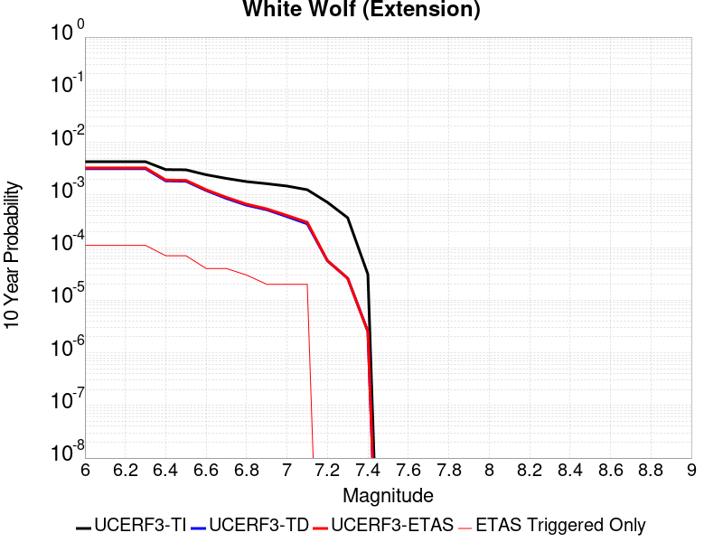 |

| Magnitude | 1 wk TI Prob | 1 wk TD Prob | 1 wk ETAS Prob | 1 wk ETAS/TD Gain | 1 wk ETAS Triggered Only | 1 mo TI Prob | 1 mo TD Prob | 1 mo ETAS Prob | 1 mo ETAS/TD Gain | 1 mo ETAS Triggered Only | 1 yr TI Prob | 1 yr TD Prob | 1 yr ETAS Prob | 1 yr ETAS/TD Gain | 1 yr ETAS Triggered Only | 10 yr TI Prob | 10 yr TD Prob | 10 yr ETAS Prob | 10 yr ETAS/TD Gain | 10 yr ETAS Triggered Only |
|-----|-----|-----|-----|-----|-----|-----|-----|-----|-----|-----|-----|-----|-----|-----|-----|-----|-----|-----|-----|-----|
| 6.0 | 8.222555E-6 | 6.0668267E-6 | 6.0668267E-6 | 1.0 | 0.0 | 3.5239045E-5 | 2.6000464E-5 | 6.4902386E-5 | 2.4962013 | 3.8902937E-5 | 4.289509E-4 | 3.165163E-4 | 3.554069E-4 | 1.1228708 | 3.8902937E-5 | 0.0042812387 | 0.0031613067 | 0.0032388666 | 1.0245341 | 7.7805875E-5 |
| 6.1 | 8.222555E-6 | 6.0668267E-6 | 6.0668267E-6 | 1.0 | 0.0 | 3.5239045E-5 | 2.6000464E-5 | 6.4902386E-5 | 2.4962013 | 3.8902937E-5 | 4.289509E-4 | 3.165163E-4 | 3.554069E-4 | 1.1228708 | 3.8902937E-5 | 0.0042812387 | 0.0031613067 | 0.0032388666 | 1.0245341 | 7.7805875E-5 |
| 6.2 | 8.222555E-6 | 6.0668267E-6 | 6.0668267E-6 | 1.0 | 0.0 | 3.5239045E-5 | 2.6000464E-5 | 6.4902386E-5 | 2.4962013 | 3.8902937E-5 | 4.289509E-4 | 3.165163E-4 | 3.554069E-4 | 1.1228708 | 3.8902937E-5 | 0.0042812387 | 0.0031613067 | 0.0032388666 | 1.0245341 | 7.7805875E-5 |
| 6.3 | 8.222555E-6 | 6.0668267E-6 | 6.0668267E-6 | 1.0 | 0.0 | 3.5239045E-5 | 2.6000464E-5 | 6.4902386E-5 | 2.4962013 | 3.8902937E-5 | 4.289509E-4 | 3.165163E-4 | 3.554069E-4 | 1.1228708 | 3.8902937E-5 | 0.0042812387 | 0.0031613067 | 0.0032388666 | 1.0245341 | 7.7805875E-5 |
| 6.4 | 5.821773E-6 | 3.557277E-6 | 3.557277E-6 | 1.0 | 0.0 | 2.4950215E-5 | 1.52453895E-5 | 5.4147735E-5 | 3.5517447 | 3.8902937E-5 | 3.0372653E-4 | 1.855979E-4 | 2.2449363E-4 | 1.2095698 | 3.8902937E-5 | 0.0030331176 | 0.0018545374 | 0.001932199 | 1.0418766 | 7.7805875E-5 |
| 6.5 | 5.766023E-6 | 3.49921E-6 | 3.49921E-6 | 1.0 | 0.0 | 2.4711293E-5 | 1.49965335E-5 | 5.3898886E-5 | 3.5940897 | 3.8902937E-5 | 3.0081844E-4 | 1.8256859E-4 | 2.2146443E-4 | 1.2130477 | 3.8902937E-5 | 0.0030041158 | 0.0018242942 | 0.0019019583 | 1.042572 | 7.7805875E-5 |
| 6.6 | 4.643576E-6 | 2.332699E-6 | 2.332699E-6 | 1.0 | 0.0 | 1.9900888E-5 | 9.997246E-6 | 9.997246E-6 | 1.0 | 0.0 | 2.4226638E-4 | 1.21710094E-4 | 1.21710094E-4 | 1.0 | 0.0 | 0.0024200242 | 0.0012164768 | 0.0012553324 | 1.031941 | 3.8902937E-5 |
| 6.7 | 3.9529173E-6 | 1.648408E-6 | 1.648408E-6 | 1.0 | 0.0 | 1.6940963E-5 | 7.0645874E-6 | 7.0645874E-6 | 1.0 | 0.0 | 2.0623671E-4 | 8.600815E-5 | 8.600815E-5 | 1.0 | 0.0 | 0.002060454 | 8.597671E-4 | 8.986366E-4 | 1.0452093 | 3.8902937E-5 |
| 6.8 | 3.4377522E-6 | 1.2245736E-6 | 1.2245736E-6 | 1.0 | 0.0 | 1.473314E-5 | 5.2481623E-6 | 5.2481623E-6 | 1.0 | 0.0 | 1.7936122E-4 | 6.389459E-5 | 6.389459E-5 | 1.0 | 0.0 | 0.0017921652 | 6.3877134E-4 | 6.776494E-4 | 1.0608639 | 3.8902937E-5 |
| 6.9 | 3.1367306E-6 | 1.0034221E-6 | 1.0034221E-6 | 1.0 | 0.0 | 1.3443062E-5 | 4.300374E-6 | 4.300374E-6 | 1.0 | 0.0 | 1.63657E-4 | 5.2355874E-5 | 5.2355874E-5 | 1.0 | 0.0 | 0.0016353652 | 5.2344304E-4 | 5.623256E-4 | 1.0742823 | 3.8902937E-5 |
| 7.0 | 2.8298145E-6 | 7.429045E-7 | 7.429045E-7 | 1.0 | 0.0 | 1.2127721E-5 | 3.1838729E-6 | 3.1838729E-6 | 1.0 | 0.0 | 1.47645E-4 | 3.8763013E-5 | 3.8763013E-5 | 1.0 | 0.0 | 0.0014754693 | 3.875675E-4 | 4.2645537E-4 | 1.1003383 | 3.8902937E-5 |
| 7.1 | 2.4091064E-6 | 5.4230577E-7 | 5.4230577E-7 | 1.0 | 0.0 | 1.03247E-5 | 2.3241657E-6 | 2.3241657E-6 | 1.0 | 0.0 | 1.2569598E-4 | 2.8296392E-5 | 2.8296392E-5 | 1.0 | 0.0 | 0.001256249 | 2.8293193E-4 | 3.2182387E-4 | 1.1374604 | 3.8902937E-5 |
| 7.2 | 1.3875518E-6 | 1.0744563E-7 | 1.0744563E-7 | 1.0 | 0.0 | 5.9466374E-6 | 4.604812E-7 | 4.604812E-7 | 1.0 | 0.0 | 7.23979E-5 | 5.6063454E-6 | 5.6063454E-6 | 1.0 | 0.0 | 7.2374323E-4 | 5.6062152E-5 | 5.6062152E-5 | 1.0 | 0.0 |
| 7.3 | 7.056077E-7 | 5.002896E-8 | 5.002896E-8 | 1.0 | 0.0 | 3.0240296E-6 | 2.1440981E-7 | 2.1440981E-7 | 1.0 | 0.0 | 3.681694E-5 | 2.6104367E-6 | 2.6104367E-6 | 1.0 | 0.0 | 3.681084E-4 | 2.6104108E-5 | 2.6104108E-5 | 1.0 | 0.0 |
| 7.4 | 5.9334678E-8 | 4.86919E-9 | 4.86919E-9 | 1.0 | 0.0 | 2.5429145E-7 | 2.0867958E-8 | 2.0867958E-8 | 1.0 | 0.0 | 3.095994E-6 | 2.5406737E-7 | 2.5406737E-7 | 1.0 | 0.0 | 3.095951E-5 | 2.5406719E-6 | 2.5406719E-6 | 1.0 | 0.0 |

## San Andreas (Peninsula) 2011 CFM
*[(top)](#table-of-contents)*

| 1 Week | 1 Month | 1 Year | 10 Year |
|-----|-----|-----|-----|
|  |  |  |  |

| Magnitude | 1 wk TI Prob | 1 wk TD Prob | 1 wk ETAS Prob | 1 wk ETAS/TD Gain | 1 wk ETAS Triggered Only | 1 mo TI Prob | 1 mo TD Prob | 1 mo ETAS Prob | 1 mo ETAS/TD Gain | 1 mo ETAS Triggered Only | 1 yr TI Prob | 1 yr TD Prob | 1 yr ETAS Prob | 1 yr ETAS/TD Gain | 1 yr ETAS Triggered Only | 10 yr TI Prob | 10 yr TD Prob | 10 yr ETAS Prob | 10 yr ETAS/TD Gain | 10 yr ETAS Triggered Only |
|-----|-----|-----|-----|-----|-----|-----|-----|-----|-----|-----|-----|-----|-----|-----|-----|-----|-----|-----|-----|-----|
| 6.0 | 8.6200685E-5 | 2.5333706E-5 | 6.423566E-5 | 2.5355809 | 3.8902937E-5 | 3.6937918E-4 | 1.08568514E-4 | 1.4746723E-4 | 1.3582872 | 3.8902937E-5 | 0.0044879215 | 0.0013210218 | 0.0013598733 | 1.0294102 | 3.8902937E-5 | 0.043983612 | 0.014838956 | 0.014915607 | 1.0051656 | 7.7805875E-5 |
| 6.1 | 8.6200685E-5 | 2.5333706E-5 | 6.423566E-5 | 2.5355809 | 3.8902937E-5 | 3.6937918E-4 | 1.08568514E-4 | 1.4746723E-4 | 1.3582872 | 3.8902937E-5 | 0.0044879215 | 0.0013210218 | 0.0013598733 | 1.0294102 | 3.8902937E-5 | 0.043983612 | 0.014838956 | 0.014915607 | 1.0051656 | 7.7805875E-5 |
| 6.2 | 8.6200685E-5 | 2.5333706E-5 | 6.423566E-5 | 2.5355809 | 3.8902937E-5 | 3.6937918E-4 | 1.08568514E-4 | 1.4746723E-4 | 1.3582872 | 3.8902937E-5 | 0.0044879215 | 0.0013210218 | 0.0013598733 | 1.0294102 | 3.8902937E-5 | 0.043983612 | 0.014838956 | 0.014915607 | 1.0051656 | 7.7805875E-5 |
| 6.3 | 8.551163E-5 | 2.5024961E-5 | 6.392693E-5 | 2.5545266 | 3.8902937E-5 | 3.6642692E-4 | 1.0724543E-4 | 1.461442E-4 | 1.3627079 | 3.8902937E-5 | 0.004452125 | 0.0013049326 | 0.0013437849 | 1.0297734 | 3.8902937E-5 | 0.043639794 | 0.014665611 | 0.014742276 | 1.0052276 | 7.7805875E-5 |
| 6.4 | 8.551163E-5 | 2.5024961E-5 | 6.392693E-5 | 2.5545266 | 3.8902937E-5 | 3.6642692E-4 | 1.0724543E-4 | 1.461442E-4 | 1.3627079 | 3.8902937E-5 | 0.004452125 | 0.0013049326 | 0.0013437849 | 1.0297734 | 3.8902937E-5 | 0.043639794 | 0.014665611 | 0.014742276 | 1.0052276 | 7.7805875E-5 |
| 6.5 | 8.511146E-5 | 2.4846031E-5 | 6.3748004E-5 | 2.5657218 | 3.8902937E-5 | 3.647124E-4 | 1.0647865E-4 | 1.4537745E-4 | 1.3653201 | 3.8902937E-5 | 0.004431336 | 0.0012956082 | 0.0013344608 | 1.0299878 | 3.8902937E-5 | 0.04344007 | 0.014565198 | 0.01464187 | 1.005264 | 7.7805875E-5 |
| 6.6 | 8.4985084E-5 | 2.477655E-5 | 6.3678526E-5 | 2.5701127 | 3.8902937E-5 | 3.6417096E-4 | 1.061809E-4 | 1.450797E-4 | 1.3663447 | 3.8902937E-5 | 0.0044247704 | 0.0012919875 | 0.0013308402 | 1.030072 | 3.8902937E-5 | 0.043376986 | 0.014527207 | 0.014603883 | 1.0052781 | 7.7805875E-5 |
| 6.7 | 8.462618E-5 | 2.4604726E-5 | 6.3506704E-5 | 2.5810776 | 3.8902937E-5 | 3.6263323E-4 | 1.05444575E-4 | 1.443434E-4 | 1.3689032 | 3.8902937E-5 | 0.004406125 | 0.0012830333 | 0.0013218863 | 1.0302821 | 3.8902937E-5 | 0.043197807 | 0.01443185 | 0.014508533 | 1.0053134 | 7.7805875E-5 |
| 6.8 | 8.42337E-5 | 2.4500272E-5 | 6.340226E-5 | 2.5878184 | 3.8902937E-5 | 3.6095164E-4 | 1.0499695E-4 | 1.438958E-4 | 1.370476 | 3.8902937E-5 | 0.004385734 | 0.0012775898 | 0.0013164431 | 1.0304114 | 3.8902937E-5 | 0.043001823 | 0.014372395 | 0.014449083 | 1.0053358 | 7.7805875E-5 |
| 6.9 | 8.365989E-5 | 2.4304522E-5 | 6.320651E-5 | 2.6006072 | 3.8902937E-5 | 3.5849313E-4 | 1.0415808E-4 | 1.4305697E-4 | 1.37346 | 3.8902937E-5 | 0.004355922 | 0.0012673886 | 0.0013062422 | 1.0306565 | 3.8902937E-5 | 0.04271523 | 0.014264696 | 0.014341393 | 1.0053766 | 7.7805875E-5 |
| 7.0 | 8.30936E-5 | 2.4065685E-5 | 6.296769E-5 | 2.6164925 | 3.8902937E-5 | 3.560668E-4 | 1.0313458E-4 | 1.420335E-4 | 1.3771666 | 3.8902937E-5 | 0.004326499 | 0.0012549418 | 0.001293796 | 1.0309609 | 3.8902937E-5 | 0.042432297 | 0.0141355125 | 0.014212219 | 1.0054265 | 7.7805875E-5 |
| 7.1 | 8.041264E-5 | 2.3751329E-5 | 6.2653344E-5 | 2.637888 | 3.8902937E-5 | 3.4458007E-4 | 1.01787446E-4 | 1.4068642E-4 | 1.3821589 | 3.8902937E-5 | 0.0041871946 | 0.0012385593 | 0.001277414 | 1.0313709 | 3.8902937E-5 | 0.041091725 | 0.013957874 | 0.014034594 | 1.0054965 | 7.7805875E-5 |
| 7.2 | 7.8427016E-5 | 2.3174005E-5 | 6.207604E-5 | 2.6786928 | 3.8902937E-5 | 3.3607247E-4 | 9.931339E-5 | 1.3821246E-4 | 1.39168 | 3.8902937E-5 | 0.004084008 | 0.0012084715 | 0.0012473273 | 1.032153 | 3.8902937E-5 | 0.040097635 | 0.013641416 | 0.01371816 | 1.0056258 | 7.7805875E-5 |
| 7.3 | 7.721087E-5 | 2.2958477E-5 | 6.186052E-5 | 2.6944523 | 3.8902937E-5 | 3.3086175E-4 | 9.838976E-5 | 1.3728888E-4 | 1.3953573 | 3.8902937E-5 | 0.004020803 | 0.0011972387 | 0.0012360951 | 1.032455 | 3.8902937E-5 | 0.03948827 | 0.013524936 | 0.01360169 | 1.005675 | 7.7805875E-5 |
| 7.4 | 7.3536525E-5 | 2.1064485E-5 | 5.9966602E-5 | 2.8468108 | 3.8902937E-5 | 3.1511846E-4 | 9.027325E-5 | 1.2917267E-4 | 1.4309076 | 3.8902937E-5 | 0.0038298194 | 0.001098524 | 0.0011373841 | 1.0353749 | 3.8902937E-5 | 0.037644852 | 0.01247618 | 0.012553015 | 1.0061586 | 7.7805875E-5 |
| 7.5 | 6.806207E-5 | 1.8855704E-5 | 5.775791E-5 | 3.063153 | 3.8902937E-5 | 2.9166197E-4 | 8.080766E-5 | 1.1970745E-4 | 1.4813875 | 3.8902937E-5 | 0.0035452035 | 9.833903E-4 | 0.001022255 | 1.0395211 | 3.8902937E-5 | 0.034891766 | 0.011221583 | 0.011298516 | 1.0068557 | 7.7805875E-5 |
| 7.6 | 5.6731416E-5 | 1.4235568E-5 | 5.3137952E-5 | 3.7327595 | 3.8902937E-5 | 2.43112E-4 | 6.100815E-5 | 9.990871E-5 | 1.6376289 | 3.8902937E-5 | 0.0029558712 | 7.4252125E-4 | 7.813953E-4 | 1.0523541 | 3.8902937E-5 | 0.02916862 | 0.008518306 | 0.008556877 | 1.004528 | 3.8902937E-5 |
| 7.7 | 4.946994E-5 | 1.3298509E-5 | 5.220093E-5 | 3.9253218 | 3.8902937E-5 | 2.1199681E-4 | 5.6992365E-5 | 9.589308E-5 | 1.6825602 | 3.8902937E-5 | 0.002578006 | 6.936613E-4 | 7.3253724E-4 | 1.0560446 | 3.8902937E-5 | 0.02548303 | 0.007937518 | 0.007976113 | 1.0048622 | 3.8902937E-5 |
| 7.8 | 3.9718198E-5 | 1.3032537E-5 | 5.1934967E-5 | 3.9850237 | 3.8902937E-5 | 1.7020974E-4 | 5.585253E-5 | 9.47533E-5 | 1.6964906 | 3.8902937E-5 | 0.0020703338 | 6.7979255E-4 | 7.1866903E-4 | 1.0571887 | 3.8902937E-5 | 0.020511515 | 0.007746509 | 0.0077851103 | 1.0049831 | 3.8902937E-5 |
| 7.9 | 2.4115114E-5 | 1.2229653E-5 | 5.1132116E-5 | 4.1809945 | 3.8902937E-5 | 1.0334639E-4 | 5.2411746E-5 | 9.131264E-5 | 1.7422172 | 3.8902937E-5 | 0.001257516 | 6.3792634E-4 | 6.7680445E-4 | 1.0609446 | 3.8902937E-5 | 0.012504238 | 0.0071830763 | 0.0072216997 | 1.005377 | 3.8902937E-5 |
| 8.0 | 1.7756569E-5 | 1.144976E-5 | 5.0352253E-5 | 4.397669 | 3.8902937E-5 | 7.6097356E-5 | 4.9069477E-5 | 8.7970504E-5 | 1.7927744 | 3.8902937E-5 | 9.260915E-4 | 5.972573E-4 | 6.36137E-4 | 1.0650971 | 3.8902937E-5 | 0.009222416 | 0.006680902 | 0.006719545 | 1.0057842 | 3.8902937E-5 |
| 8.1 | 1.3159258E-5 | 9.77991E-6 | 4.868247E-5 | 4.977803 | 3.8902937E-5 | 5.6395602E-5 | 4.1913227E-5 | 8.0814534E-5 | 1.9281391 | 3.8902937E-5 | 6.864001E-4 | 5.101742E-4 | 5.4905727E-4 | 1.0762153 | 3.8902937E-5 | 0.0068428386 | 0.0057076924 | 0.0057463734 | 1.0067769 | 3.8902937E-5 |
| 8.2 | 8.635426E-6 | 5.4872503E-6 | 5.4872503E-6 | 1.0 | 0.0 | 3.700844E-5 | 2.3516575E-5 | 2.3516575E-5 | 1.0 | 0.0 | 4.5048463E-4 | 2.8627677E-4 | 2.8627677E-4 | 1.0 | 0.0 | 0.004495725 | 0.0032556232 | 0.0032556232 | 1.0 | 0.0 |
| 8.3 | 1.983087E-6 | 7.693574E-7 | 7.693574E-7 | 1.0 | 0.0 | 8.498917E-6 | 3.297242E-6 | 3.297242E-6 | 1.0 | 0.0 | 1.034694E-4 | 4.01432E-5 | 4.01432E-5 | 1.0 | 0.0 | 0.0010342124 | 4.7390026E-4 | 4.7390026E-4 | 1.0 | 0.0 |

## Tin Mountain
*[(top)](#table-of-contents)*

| 1 Week | 1 Month | 1 Year | 10 Year |
|-----|-----|-----|-----|
|  |  |  |  |

| Magnitude | 1 wk TI Prob | 1 wk TD Prob | 1 wk ETAS Prob | 1 wk ETAS/TD Gain | 1 wk ETAS Triggered Only | 1 mo TI Prob | 1 mo TD Prob | 1 mo ETAS Prob | 1 mo ETAS/TD Gain | 1 mo ETAS Triggered Only | 1 yr TI Prob | 1 yr TD Prob | 1 yr ETAS Prob | 1 yr ETAS/TD Gain | 1 yr ETAS Triggered Only | 10 yr TI Prob | 10 yr TD Prob | 10 yr ETAS Prob | 10 yr ETAS/TD Gain | 10 yr ETAS Triggered Only |
|-----|-----|-----|-----|-----|-----|-----|-----|-----|-----|-----|-----|-----|-----|-----|-----|-----|-----|-----|-----|-----|
| 6.0 | 4.083776E-6 | 4.18159E-6 | 4.18159E-6 | 1.0 | 0.0 | 1.750178E-5 | 1.7920998E-5 | 1.7920998E-5 | 1.0 | 0.0 | 2.1306332E-4 | 2.1817003E-4 | 2.5706447E-4 | 1.1782758 | 3.8902937E-5 | 0.0021285915 | 0.0021799242 | 0.0022575604 | 1.0356143 | 7.7805875E-5 |
| 6.1 | 4.083776E-6 | 4.18159E-6 | 4.18159E-6 | 1.0 | 0.0 | 1.750178E-5 | 1.7920998E-5 | 1.7920998E-5 | 1.0 | 0.0 | 2.1306332E-4 | 2.1817003E-4 | 2.5706447E-4 | 1.1782758 | 3.8902937E-5 | 0.0021285915 | 0.0021799242 | 0.0022575604 | 1.0356143 | 7.7805875E-5 |
| 6.2 | 4.083776E-6 | 4.18159E-6 | 4.18159E-6 | 1.0 | 0.0 | 1.750178E-5 | 1.7920998E-5 | 1.7920998E-5 | 1.0 | 0.0 | 2.1306332E-4 | 2.1817003E-4 | 2.5706447E-4 | 1.1782758 | 3.8902937E-5 | 0.0021285915 | 0.0021799242 | 0.0022575604 | 1.0356143 | 7.7805875E-5 |
| 6.3 | 4.083776E-6 | 4.18159E-6 | 4.18159E-6 | 1.0 | 0.0 | 1.750178E-5 | 1.7920998E-5 | 1.7920998E-5 | 1.0 | 0.0 | 2.1306332E-4 | 2.1817003E-4 | 2.5706447E-4 | 1.1782758 | 3.8902937E-5 | 0.0021285915 | 0.0021799242 | 0.0022575604 | 1.0356143 | 7.7805875E-5 |
| 6.4 | 4.083776E-6 | 4.18159E-6 | 4.18159E-6 | 1.0 | 0.0 | 1.750178E-5 | 1.7920998E-5 | 1.7920998E-5 | 1.0 | 0.0 | 2.1306332E-4 | 2.1817003E-4 | 2.5706447E-4 | 1.1782758 | 3.8902937E-5 | 0.0021285915 | 0.0021799242 | 0.0022575604 | 1.0356143 | 7.7805875E-5 |
| 6.5 | 2.3143427E-6 | 2.3731893E-6 | 2.3731893E-6 | 1.0 | 0.0 | 9.9185745E-6 | 1.01707765E-5 | 1.01707765E-5 | 1.0 | 0.0 | 1.2075195E-4 | 1.2382293E-4 | 1.6272106E-4 | 1.3141431 | 3.8902937E-5 | 0.0012068636 | 0.0012376154 | 0.0013153249 | 1.0627898 | 7.7805875E-5 |
| 6.6 | 2.3143427E-6 | 2.3731893E-6 | 2.3731893E-6 | 1.0 | 0.0 | 9.9185745E-6 | 1.01707765E-5 | 1.01707765E-5 | 1.0 | 0.0 | 1.2075195E-4 | 1.2382293E-4 | 1.6272106E-4 | 1.3141431 | 3.8902937E-5 | 0.0012068636 | 0.0012376154 | 0.0013153249 | 1.0627898 | 7.7805875E-5 |
| 6.7 | 1.7029532E-6 | 1.7498172E-6 | 1.7498172E-6 | 1.0 | 0.0 | 7.2983503E-6 | 7.499198E-6 | 7.499198E-6 | 1.0 | 0.0 | 8.885379E-5 | 9.1299444E-5 | 1.3019882E-4 | 1.4260638 | 3.8902937E-5 | 8.881827E-4 | 9.12672E-4 | 9.904068E-4 | 1.0851729 | 7.7805875E-5 |
| 6.8 | 1.2914646E-6 | 1.329959E-6 | 1.329959E-6 | 1.0 | 0.0 | 5.534837E-6 | 5.699814E-6 | 5.699814E-6 | 1.0 | 0.0 | 6.738455E-5 | 6.939347E-5 | 6.939347E-5 | 1.0 | 0.0 | 6.736412E-4 | 6.937614E-4 | 6.937614E-4 | 1.0 | 0.0 |
| 6.9 | 5.8708974E-7 | 6.11713E-7 | 6.11713E-7 | 1.0 | 0.0 | 2.5160964E-6 | 2.6216248E-6 | 2.6216248E-6 | 1.0 | 0.0 | 3.0633044E-5 | 3.1917854E-5 | 3.1917854E-5 | 1.0 | 0.0 | 3.0628822E-4 | 3.1913683E-4 | 3.1913683E-4 | 1.0 | 0.0 |
| 7.0 | 4.6248786E-7 | 4.8321306E-7 | 4.8321306E-7 | 1.0 | 0.0 | 1.9820893E-6 | 2.0709115E-6 | 2.0709115E-6 | 1.0 | 0.0 | 2.413167E-5 | 2.5213094E-5 | 2.5213094E-5 | 1.0 | 0.0 | 2.412905E-4 | 2.5210602E-4 | 2.5210602E-4 | 1.0 | 0.0 |
| 7.1 | 3.804606E-7 | 3.9872486E-7 | 3.9872486E-7 | 1.0 | 0.0 | 1.6305444E-6 | 1.7088199E-6 | 1.7088199E-6 | 1.0 | 0.0 | 1.9851697E-5 | 2.0804719E-5 | 2.0804719E-5 | 1.0 | 0.0 | 1.9849923E-4 | 2.0803107E-4 | 2.0803107E-4 | 1.0 | 0.0 |
| 7.2 | 3.5864858E-7 | 3.7617838E-7 | 3.7617838E-7 | 1.0 | 0.0 | 1.5370645E-6 | 1.6121922E-6 | 1.6121922E-6 | 1.0 | 0.0 | 1.87136E-5 | 1.9628298E-5 | 1.9628298E-5 | 1.0 | 0.0 | 1.8712023E-4 | 1.9626896E-4 | 1.9626896E-4 | 1.0 | 0.0 |
| 7.3 | 3.342063E-7 | 3.5064386E-7 | 3.5064386E-7 | 1.0 | 0.0 | 1.4323119E-6 | 1.5027588E-6 | 1.5027588E-6 | 1.0 | 0.0 | 1.7438259E-5 | 1.8295968E-5 | 1.8295968E-5 | 1.0 | 0.0 | 1.743689E-4 | 1.8294792E-4 | 1.8294792E-4 | 1.0 | 0.0 |
| 7.4 | 2.971242E-7 | 3.1166627E-7 | 3.1166627E-7 | 1.0 | 0.0 | 1.2733886E-6 | 1.3357121E-6 | 1.3357121E-6 | 1.0 | 0.0 | 1.5503398E-5 | 1.6262207E-5 | 1.6262207E-5 | 1.0 | 0.0 | 1.5502315E-4 | 1.6261345E-4 | 1.6261345E-4 | 1.0 | 0.0 |
| 7.5 | 1.4326713E-7 | 1.5012905E-7 | 1.5012905E-7 | 1.0 | 0.0 | 6.140018E-7 | 6.434102E-7 | 6.434102E-7 | 1.0 | 0.0 | 7.4754466E-6 | 7.83352E-6 | 7.83352E-6 | 1.0 | 0.0 | 7.475195E-5 | 7.833519E-5 | 7.833519E-5 | 1.0 | 0.0 |

## Whittier alt 1
*[(top)](#table-of-contents)*

| 1 Week | 1 Month | 1 Year | 10 Year |
|-----|-----|-----|-----|
|  | 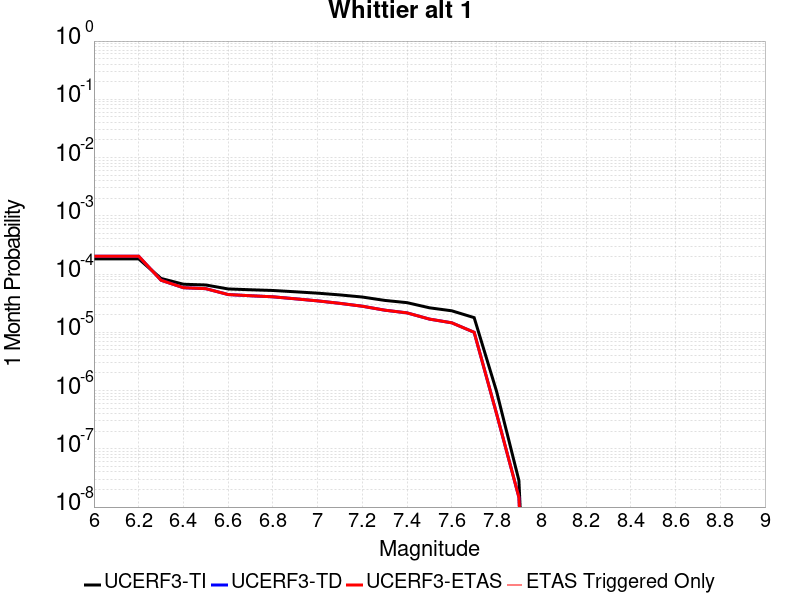 |  |  |

| Magnitude | 1 wk TI Prob | 1 wk TD Prob | 1 wk ETAS Prob | 1 wk ETAS/TD Gain | 1 wk ETAS Triggered Only | 1 mo TI Prob | 1 mo TD Prob | 1 mo ETAS Prob | 1 mo ETAS/TD Gain | 1 mo ETAS Triggered Only | 1 yr TI Prob | 1 yr TD Prob | 1 yr ETAS Prob | 1 yr ETAS/TD Gain | 1 yr ETAS Triggered Only | 10 yr TI Prob | 10 yr TD Prob | 10 yr ETAS Prob | 10 yr ETAS/TD Gain | 10 yr ETAS Triggered Only |
|-----|-----|-----|-----|-----|-----|-----|-----|-----|-----|-----|-----|-----|-----|-----|-----|-----|-----|-----|-----|-----|
| 6.0 | 4.2554693E-5 | 4.7257003E-5 | 4.7257003E-5 | 1.0 | 0.0 | 1.8236451E-4 | 2.0251611E-4 | 2.0251611E-4 | 1.0 | 0.0 | 0.002218027 | 0.0024631664 | 0.0025407805 | 1.03151 | 7.7805875E-5 | 0.02196019 | 0.024392692 | 0.0244686 | 1.003112 | 7.7805875E-5 |
| 6.1 | 4.2554693E-5 | 4.7257003E-5 | 4.7257003E-5 | 1.0 | 0.0 | 1.8236451E-4 | 2.0251611E-4 | 2.0251611E-4 | 1.0 | 0.0 | 0.002218027 | 0.0024631664 | 0.0025407805 | 1.03151 | 7.7805875E-5 | 0.02196019 | 0.024392692 | 0.0244686 | 1.003112 | 7.7805875E-5 |
| 6.2 | 4.2554693E-5 | 4.7257003E-5 | 4.7257003E-5 | 1.0 | 0.0 | 1.8236451E-4 | 2.0251611E-4 | 2.0251611E-4 | 1.0 | 0.0 | 0.002218027 | 0.0024631664 | 0.0025407805 | 1.03151 | 7.7805875E-5 | 0.02196019 | 0.024392692 | 0.0244686 | 1.003112 | 7.7805875E-5 |
| 6.3 | 1.9617712E-5 | 1.827117E-5 | 1.827117E-5 | 1.0 | 0.0 | 8.40732E-5 | 7.830277E-5 | 7.830277E-5 | 1.0 | 0.0 | 0.0010231105 | 9.5293834E-4 | 9.5293834E-4 | 1.0 | 0.0 | 0.01018413 | 0.009491804 | 0.009491804 | 1.0 | 0.0 |
| 6.4 | 1.5611336E-5 | 1.3606451E-5 | 1.3606451E-5 | 1.0 | 0.0 | 6.690401E-5 | 5.8312093E-5 | 5.8312093E-5 | 1.0 | 0.0 | 8.142519E-4 | 7.0972444E-4 | 7.0972444E-4 | 1.0 | 0.0 | 0.008112748 | 0.007076542 | 0.007076542 | 1.0 | 0.0 |
| 6.5 | 1.5150166E-5 | 1.310308E-5 | 1.310308E-5 | 1.0 | 0.0 | 6.492767E-5 | 5.615488E-5 | 5.615488E-5 | 1.0 | 0.0 | 7.9020765E-4 | 6.834771E-4 | 6.834771E-4 | 1.0 | 0.0 | 0.007874036 | 0.006815699 | 0.006815699 | 1.0 | 0.0 |
| 6.6 | 1.295588E-5 | 1.03825105E-5 | 1.03825105E-5 | 1.0 | 0.0 | 5.552402E-5 | 4.4495726E-5 | 4.4495726E-5 | 1.0 | 0.0 | 6.7579525E-4 | 5.416028E-4 | 5.416028E-4 | 1.0 | 0.0 | 0.006737438 | 0.005404262 | 0.005404262 | 1.0 | 0.0 |
| 6.7 | 1.2542085E-5 | 9.90111E-6 | 9.90111E-6 | 1.0 | 0.0 | 5.3750682E-5 | 4.243265E-5 | 4.243265E-5 | 1.0 | 0.0 | 6.542181E-4 | 5.1649695E-4 | 5.1649695E-4 | 1.0 | 0.0 | 0.006522954 | 0.005154383 | 0.005154383 | 1.0 | 0.0 |
| 6.8 | 1.2195878E-5 | 9.4970965E-6 | 9.4970965E-6 | 1.0 | 0.0 | 5.2267E-5 | 4.070122E-5 | 4.070122E-5 | 1.0 | 0.0 | 6.36165E-4 | 4.9542653E-4 | 4.9542653E-4 | 1.0 | 0.0 | 0.0063434686 | 0.0049445615 | 0.0049445615 | 1.0 | 0.0 |
| 6.9 | 1.1580298E-5 | 8.774486E-6 | 8.774486E-6 | 1.0 | 0.0 | 4.9628903E-5 | 3.7604408E-5 | 3.7604408E-5 | 1.0 | 0.0 | 6.040644E-4 | 4.577391E-4 | 4.577391E-4 | 1.0 | 0.0 | 0.00602425 | 0.004569222 | 0.004569222 | 1.0 | 0.0 |
| 7.0 | 1.0964795E-5 | 8.085466E-6 | 8.085466E-6 | 1.0 | 0.0 | 4.6991136E-5 | 3.4651544E-5 | 3.4651544E-5 | 1.0 | 0.0 | 5.7196687E-4 | 4.2180243E-4 | 4.2180243E-4 | 1.0 | 0.0 | 0.0057049696 | 0.004211227 | 0.004211227 | 1.0 | 0.0 |
| 7.1 | 1.0230601E-5 | 7.327922E-6 | 7.327922E-6 | 1.0 | 0.0 | 4.3844695E-5 | 3.140501E-5 | 3.140501E-5 | 1.0 | 0.0 | 5.336784E-4 | 3.8229022E-4 | 3.8229022E-4 | 1.0 | 0.0 | 0.005323986 | 0.0038174891 | 0.0038174891 | 1.0 | 0.0 |
| 7.2 | 9.40865E-6 | 6.5444156E-6 | 6.5444156E-6 | 1.0 | 0.0 | 4.032216E-5 | 2.8047201E-5 | 2.8047201E-5 | 1.0 | 0.0 | 4.908117E-4 | 3.414224E-4 | 3.414224E-4 | 1.0 | 0.0 | 0.0048972913 | 0.0034100711 | 0.0034100711 | 1.0 | 0.0 |
| 7.3 | 8.237384E-6 | 5.5987134E-6 | 5.5987134E-6 | 1.0 | 0.0 | 3.5302593E-5 | 2.3994271E-5 | 2.3994271E-5 | 1.0 | 0.0 | 4.2972428E-4 | 2.9209215E-4 | 2.9209215E-4 | 1.0 | 0.0 | 0.0042889426 | 0.0029174031 | 0.0029174031 | 1.0 | 0.0 |
| 7.4 | 7.5316966E-6 | 5.0286876E-6 | 5.0286876E-6 | 1.0 | 0.0 | 3.2278298E-5 | 2.1551346E-5 | 2.1551346E-5 | 1.0 | 0.0 | 3.9291743E-4 | 2.6235706E-4 | 2.6235706E-4 | 1.0 | 0.0 | 0.0039222343 | 0.0026205853 | 0.0026205853 | 1.0 | 0.0 |
| 7.5 | 6.149649E-6 | 3.934522E-6 | 3.934522E-6 | 1.0 | 0.0 | 2.6355372E-5 | 1.6862132E-5 | 1.6862132E-5 | 1.0 | 0.0 | 3.208294E-4 | 2.0527802E-4 | 2.0527802E-4 | 1.0 | 0.0 | 0.003203666 | 0.0020509732 | 0.0020509732 | 1.0 | 0.0 |
| 7.6 | 5.457711E-6 | 3.3959725E-6 | 3.3959725E-6 | 1.0 | 0.0 | 2.338998E-5 | 1.4554091E-5 | 1.4554091E-5 | 1.0 | 0.0 | 2.8473578E-4 | 1.7718246E-4 | 1.7718246E-4 | 1.0 | 0.0 | 0.0028437122 | 0.0017704928 | 0.0017704928 | 1.0 | 0.0 |
| 7.7 | 4.1676276E-6 | 2.3336488E-6 | 2.3336488E-6 | 1.0 | 0.0 | 1.7861139E-5 | 1.0001318E-5 | 1.0001318E-5 | 1.0 | 0.0 | 2.1743766E-4 | 1.2175998E-4 | 1.2175998E-4 | 1.0 | 0.0 | 0.0021722503 | 0.0012170058 | 0.0012170058 | 1.0 | 0.0 |
| 7.8 | 2.2692414E-7 | 9.3873886E-8 | 9.3873886E-8 | 1.0 | 0.0 | 9.725317E-7 | 4.023166E-7 | 4.023166E-7 | 1.0 | 0.0 | 1.1840509E-5 | 4.898197E-6 | 4.898197E-6 | 1.0 | 0.0 | 1.1839878E-4 | 4.898122E-5 | 4.898122E-5 | 1.0 | 0.0 |
| 7.9 | 6.676829E-9 | 3.4403498E-9 | 3.4403498E-9 | 1.0 | 0.0 | 2.861498E-8 | 1.4744357E-8 | 1.4744357E-8 | 1.0 | 0.0 | 3.4838732E-7 | 1.7951253E-7 | 1.7951253E-7 | 1.0 | 0.0 | 3.4838679E-6 | 1.7951239E-6 | 1.7951239E-6 | 1.0 | 0.0 |

## San Jacinto (Borrego)
*[(top)](#table-of-contents)*

| 1 Week | 1 Month | 1 Year | 10 Year |
|-----|-----|-----|-----|
|  |  |  | 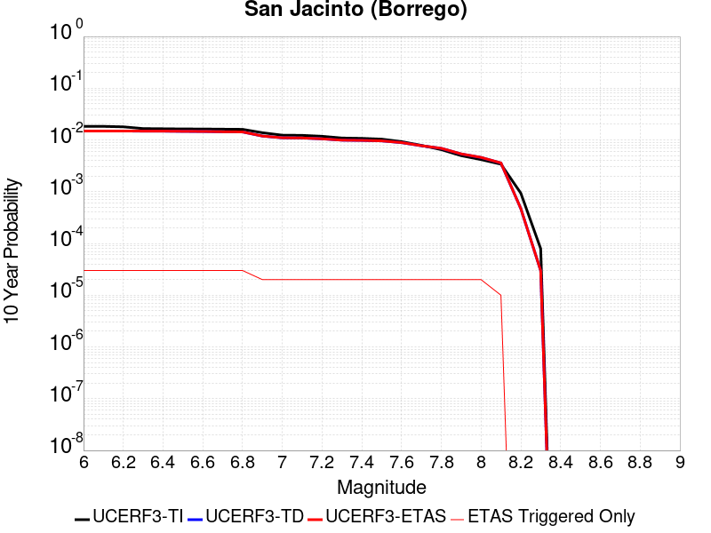 |

| Magnitude | 1 wk TI Prob | 1 wk TD Prob | 1 wk ETAS Prob | 1 wk ETAS/TD Gain | 1 wk ETAS Triggered Only | 1 mo TI Prob | 1 mo TD Prob | 1 mo ETAS Prob | 1 mo ETAS/TD Gain | 1 mo ETAS Triggered Only | 1 yr TI Prob | 1 yr TD Prob | 1 yr ETAS Prob | 1 yr ETAS/TD Gain | 1 yr ETAS Triggered Only | 10 yr TI Prob | 10 yr TD Prob | 10 yr ETAS Prob | 10 yr ETAS/TD Gain | 10 yr ETAS Triggered Only |
|-----|-----|-----|-----|-----|-----|-----|-----|-----|-----|-----|-----|-----|-----|-----|-----|-----|-----|-----|-----|-----|
| 6.0 | 3.543992E-5 | 2.7956603E-5 | 1.057603E-4 | 3.783017 | 7.7805875E-5 | 1.5187653E-4 | 1.1980858E-4 | 1.9760513E-4 | 1.6493404 | 7.7805875E-5 | 0.0018475284 | 0.0014577056 | 0.0015353981 | 1.0532978 | 7.7805875E-5 | 0.018322436 | 0.014885285 | 0.014961933 | 1.0051492 | 7.7805875E-5 |
| 6.1 | 3.542281E-5 | 2.7956603E-5 | 1.057603E-4 | 3.783017 | 7.7805875E-5 | 1.5180321E-4 | 1.1980858E-4 | 1.9760513E-4 | 1.6493404 | 7.7805875E-5 | 0.0018466372 | 0.0014577056 | 0.0015353981 | 1.0532978 | 7.7805875E-5 | 0.018313672 | 0.014885285 | 0.014961933 | 1.0051492 | 7.7805875E-5 |
| 6.2 | 3.4688688E-5 | 2.7956603E-5 | 1.057603E-4 | 3.783017 | 7.7805875E-5 | 1.4865733E-4 | 1.19808574E-4 | 1.9760513E-4 | 1.6493404 | 7.7805875E-5 | 0.0018084005 | 0.0014577056 | 0.0015353981 | 1.0532978 | 7.7805875E-5 | 0.017937548 | 0.014885284 | 0.014961932 | 1.0051492 | 7.7805875E-5 |
| 6.3 | 3.2087122E-5 | 2.7801936E-5 | 1.0560565E-4 | 3.7984998 | 7.7805875E-5 | 1.3750899E-4 | 1.19145785E-4 | 1.9694239E-4 | 1.652953 | 7.7805875E-5 | 0.0016728862 | 0.0014496469 | 0.0015273399 | 1.0535945 | 7.7805875E-5 | 0.016603488 | 0.014806312 | 0.014882966 | 1.0051771 | 7.7805875E-5 |
| 6.4 | 3.1828724E-5 | 2.7768916E-5 | 1.0557263E-4 | 3.8018274 | 7.7805875E-5 | 1.364017E-4 | 1.1900428E-4 | 1.968009E-4 | 1.6537296 | 7.7805875E-5 | 0.0016594254 | 0.0014479264 | 0.0015256196 | 1.0536582 | 7.7805875E-5 | 0.016470885 | 0.014789388 | 0.014866043 | 1.0051831 | 7.7805875E-5 |
| 6.5 | 3.1563577E-5 | 2.7508588E-5 | 1.0531232E-4 | 3.8283436 | 7.7805875E-5 | 1.3526545E-4 | 1.1788869E-4 | 1.9568538E-4 | 1.6599166 | 7.7805875E-5 | 0.0016456128 | 0.0014343619 | 0.0015120562 | 1.0541664 | 7.7805875E-5 | 0.0163348 | 0.014655951 | 0.014732617 | 1.005231 | 7.7805875E-5 |
| 6.6 | 3.1467625E-5 | 2.735279E-5 | 1.05156534E-4 | 3.8444538 | 7.7805875E-5 | 1.3485427E-4 | 1.1722104E-4 | 1.950178E-4 | 1.6636757 | 7.7805875E-5 | 0.0016406142 | 0.001426244 | 0.0015039389 | 1.0544752 | 7.7805875E-5 | 0.016285548 | 0.014576187 | 0.014652859 | 1.0052601 | 7.7805875E-5 |
| 6.7 | 3.1223695E-5 | 2.6970763E-5 | 1.0477454E-4 | 3.8847451 | 7.7805875E-5 | 1.3380898E-4 | 1.15583935E-4 | 1.9338081E-4 | 1.673077 | 7.7805875E-5 | 0.0016279068 | 0.0014063381 | 0.0014840346 | 1.0552473 | 7.7805875E-5 | 0.01616033 | 0.01438054 | 0.014457227 | 1.0053327 | 7.7805875E-5 |
| 6.8 | 3.1015585E-5 | 2.6791718E-5 | 1.0459551E-4 | 3.904024 | 7.7805875E-5 | 1.3291716E-4 | 1.1481666E-4 | 1.926136E-4 | 1.6775753 | 7.7805875E-5 | 0.001617065 | 0.0013970085 | 0.0014747058 | 1.0556169 | 7.7805875E-5 | 0.016053487 | 0.014287795 | 0.014364488 | 1.0053678 | 7.7805875E-5 |
| 6.9 | 2.6641965E-5 | 2.2212334E-5 | 1.0001648E-4 | 4.502745 | 7.7805875E-5 | 1.1417485E-4 | 9.519226E-5 | 1.7299074E-4 | 1.8172772 | 7.7805875E-5 | 0.0013891924 | 0.0011583535 | 0.0012360692 | 1.0670916 | 7.7805875E-5 | 0.0138054015 | 0.011897102 | 0.011973983 | 1.0064621 | 7.7805875E-5 |
| 7.0 | 2.3854353E-5 | 2.0506088E-5 | 9.831037E-5 | 4.7942038 | 7.7805875E-5 | 1.02228936E-4 | 8.788029E-5 | 1.6567933E-4 | 1.8852843 | 7.7805875E-5 | 0.0012439266 | 0.0010694199 | 0.0011471426 | 1.0726774 | 7.7805875E-5 | 0.012369866 | 0.010996936 | 0.011073886 | 1.0069975 | 7.7805875E-5 |
| 7.1 | 2.3672901E-5 | 2.0342548E-5 | 9.814684E-5 | 4.8247075 | 7.7805875E-5 | 1.0145135E-4 | 8.717945E-5 | 1.6497854E-4 | 1.8924017 | 7.7805875E-5 | 0.0012344702 | 0.0010608955 | 0.0011386188 | 1.073262 | 7.7805875E-5 | 0.0122763505 | 0.010912099 | 0.010989056 | 1.0070524 | 7.7805875E-5 |
| 7.2 | 2.2717244E-5 | 1.9569701E-5 | 9.737405E-5 | 4.9757557 | 7.7805875E-5 | 9.735599E-5 | 8.386746E-5 | 1.6166682E-4 | 1.9276464 | 7.7805875E-5 | 0.0011846646 | 0.0010206103 | 0.0010983369 | 1.0761569 | 7.7805875E-5 | 0.01178369 | 0.010509352 | 0.01058634 | 1.0073256 | 7.7805875E-5 |
| 7.3 | 2.1016205E-5 | 1.8410952E-5 | 9.621539E-5 | 5.225987 | 7.7805875E-5 | 9.006634E-5 | 7.890171E-5 | 1.5670144E-4 | 1.9860337 | 7.7805875E-5 | 0.001096006 | 9.6020696E-4 | 0.0010379382 | 1.0809525 | 7.7805875E-5 | 0.010906163 | 0.009904788 | 0.009981823 | 1.0077776 | 7.7805875E-5 |
| 7.4 | 2.0683625E-5 | 1.8213394E-5 | 9.601785E-5 | 5.2718263 | 7.7805875E-5 | 8.86411E-5 | 7.805508E-5 | 1.5585488E-4 | 1.9967295 | 7.7805875E-5 | 0.001078671 | 9.4990834E-4 | 0.0010276403 | 1.081831 | 7.7805875E-5 | 0.010734501 | 0.009801473 | 0.009878516 | 1.0078604 | 7.7805875E-5 |
| 7.5 | 1.9993966E-5 | 1.7808186E-5 | 9.5612675E-5 | 5.369029 | 7.7805875E-5 | 8.568561E-5 | 7.631858E-5 | 1.5411852E-4 | 2.0194101 | 7.7805875E-5 | 0.001042723 | 9.287846E-4 | 0.0010065183 | 1.0836939 | 7.7805875E-5 | 0.010378438 | 0.009588276 | 0.0096653355 | 1.0080369 | 7.7805875E-5 |
| 7.6 | 1.788966E-5 | 1.6460734E-5 | 9.426533E-5 | 5.7266784 | 7.7805875E-5 | 7.666772E-5 | 7.0544105E-5 | 1.483445E-4 | 2.1028616 | 7.7805875E-5 | 9.3302975E-4 | 8.585378E-4 | 9.3627686E-4 | 1.0905483 | 7.7805875E-5 | 0.00929122 | 0.008879809 | 0.008956924 | 1.0086843 | 7.7805875E-5 |
| 7.7 | 1.5125781E-5 | 1.4262029E-5 | 9.2066795E-5 | 6.4553785 | 7.7805875E-5 | 6.4823165E-5 | 6.112155E-5 | 1.3892267E-4 | 2.2728918 | 7.7805875E-5 | 7.889362E-4 | 7.4390165E-4 | 8.216496E-4 | 1.1045138 | 7.7805875E-5 | 0.007861412 | 0.007727129 | 0.0078043337 | 1.0099914 | 7.7805875E-5 |
| 7.8 | 1.250089E-5 | 1.2654241E-5 | 9.045913E-5 | 7.148523 | 7.7805875E-5 | 5.3574146E-5 | 5.423134E-5 | 1.3203299E-4 | 2.4346254 | 7.7805875E-5 | 6.5207E-4 | 6.6006713E-4 | 7.378217E-4 | 1.1177979 | 7.7805875E-5 | 0.006501599 | 0.0068802256 | 0.006957496 | 1.0112308 | 7.7805875E-5 |
| 7.9 | 9.561E-6 | 9.775645E-6 | 8.758076E-5 | 8.959078 | 7.7805875E-5 | 4.0975072E-5 | 4.189495E-5 | 1.19697565E-4 | 2.857088 | 7.7805875E-5 | 4.987573E-4 | 5.099522E-4 | 5.877184E-4 | 1.152497 | 7.7805875E-5 | 0.0049763937 | 0.0053634187 | 0.005440807 | 1.014429 | 7.7805875E-5 |
| 8.0 | 8.01699E-6 | 8.312629E-6 | 8.6117856E-5 | 10.359883 | 7.7805875E-5 | 3.4358076E-5 | 3.5625068E-5 | 1.1342817E-4 | 3.1839426 | 7.7805875E-5 | 4.1822926E-4 | 4.336494E-4 | 5.1142153E-4 | 1.1793433 | 7.7805875E-5 | 0.0041744304 | 0.00458347 | 0.0046609193 | 1.0168976 | 7.7805875E-5 |
| 8.1 | 6.541947E-6 | 6.477901E-6 | 4.5380588E-5 | 7.005446 | 3.8902937E-5 | 2.8036617E-5 | 2.7762142E-5 | 6.6664E-5 | 2.4012556 | 3.8902937E-5 | 3.4129233E-4 | 3.3795217E-4 | 3.7684196E-4 | 1.1150749 | 3.8902937E-5 | 0.0034076865 | 0.003588998 | 0.0036277613 | 1.0108006 | 3.8902937E-5 |
| 8.2 | 1.7968189E-6 | 8.0012404E-7 | 8.0012404E-7 | 1.0 | 0.0 | 7.70063E-6 | 3.4290986E-6 | 3.4290986E-6 | 1.0 | 0.0 | 9.3751136E-5 | 4.17485E-5 | 4.17485E-5 | 1.0 | 0.0 | 9.371159E-4 | 4.7288055E-4 | 4.7288055E-4 | 1.0 | 0.0 |
| 8.3 | 1.5167889E-7 | 4.9190945E-8 | 4.9190945E-8 | 1.0 | 0.0 | 6.500522E-7 | 2.1081833E-7 | 2.1081833E-7 | 1.0 | 0.0 | 7.9143565E-6 | 2.5667105E-6 | 2.5667105E-6 | 1.0 | 0.0 | 7.914075E-5 | 2.9817646E-5 | 2.9817646E-5 | 1.0 | 0.0 |

## Pinto Mtn
*[(top)](#table-of-contents)*

| 1 Week | 1 Month | 1 Year | 10 Year |
|-----|-----|-----|-----|
|  |  |  |  |

| Magnitude | 1 wk TI Prob | 1 wk TD Prob | 1 wk ETAS Prob | 1 wk ETAS/TD Gain | 1 wk ETAS Triggered Only | 1 mo TI Prob | 1 mo TD Prob | 1 mo ETAS Prob | 1 mo ETAS/TD Gain | 1 mo ETAS Triggered Only | 1 yr TI Prob | 1 yr TD Prob | 1 yr ETAS Prob | 1 yr ETAS/TD Gain | 1 yr ETAS Triggered Only | 10 yr TI Prob | 10 yr TD Prob | 10 yr ETAS Prob | 10 yr ETAS/TD Gain | 10 yr ETAS Triggered Only |
|-----|-----|-----|-----|-----|-----|-----|-----|-----|-----|-----|-----|-----|-----|-----|-----|-----|-----|-----|-----|-----|
| 6.0 | 4.4194956E-5 | 4.786006E-5 | 4.786006E-5 | 1.0 | 0.0 | 1.893932E-4 | 2.0509934E-4 | 2.0509934E-4 | 1.0 | 0.0 | 0.0023034236 | 0.0024943894 | 0.0025331953 | 1.0155573 | 3.8902937E-5 | 0.022796938 | 0.024681423 | 0.024757309 | 1.0030746 | 7.7805875E-5 |
| 6.1 | 4.4194956E-5 | 4.786006E-5 | 4.786006E-5 | 1.0 | 0.0 | 1.893932E-4 | 2.0509934E-4 | 2.0509934E-4 | 1.0 | 0.0 | 0.0023034236 | 0.0024943894 | 0.0025331953 | 1.0155573 | 3.8902937E-5 | 0.022796938 | 0.024681423 | 0.024757309 | 1.0030746 | 7.7805875E-5 |
| 6.2 | 4.4194956E-5 | 4.786006E-5 | 4.786006E-5 | 1.0 | 0.0 | 1.893932E-4 | 2.0509934E-4 | 2.0509934E-4 | 1.0 | 0.0 | 0.0023034236 | 0.0024943894 | 0.0025331953 | 1.0155573 | 3.8902937E-5 | 0.022796938 | 0.024681423 | 0.024757309 | 1.0030746 | 7.7805875E-5 |
| 6.3 | 4.4194956E-5 | 4.786006E-5 | 4.786006E-5 | 1.0 | 0.0 | 1.893932E-4 | 2.0509934E-4 | 2.0509934E-4 | 1.0 | 0.0 | 0.0023034236 | 0.0024943894 | 0.0025331953 | 1.0155573 | 3.8902937E-5 | 0.022796938 | 0.024681423 | 0.024757309 | 1.0030746 | 7.7805875E-5 |
| 6.4 | 3.729929E-5 | 3.9608763E-5 | 3.9608763E-5 | 1.0 | 0.0 | 1.5984432E-4 | 1.6974132E-4 | 1.6974132E-4 | 1.0 | 0.0 | 0.0019443673 | 0.0020647354 | 0.002103558 | 1.0188028 | 3.8902937E-5 | 0.019274427 | 0.020465542 | 0.02050365 | 1.001862 | 3.8902937E-5 |
| 6.5 | 3.729929E-5 | 3.9608763E-5 | 3.9608763E-5 | 1.0 | 0.0 | 1.5984432E-4 | 1.6974132E-4 | 1.6974132E-4 | 1.0 | 0.0 | 0.0019443673 | 0.0020647354 | 0.002103558 | 1.0188028 | 3.8902937E-5 | 0.019274427 | 0.020465542 | 0.02050365 | 1.001862 | 3.8902937E-5 |
| 6.6 | 3.0204548E-5 | 3.1210056E-5 | 3.1210056E-5 | 1.0 | 0.0 | 1.2944164E-4 | 1.3375071E-4 | 1.3375071E-4 | 1.0 | 0.0 | 0.0015748127 | 0.0016272333 | 0.0016272333 | 1.0 | 0.0 | 0.015636992 | 0.016157052 | 0.016157052 | 1.0 | 0.0 |
| 6.7 | 2.9857754E-5 | 3.0819414E-5 | 3.0819414E-5 | 1.0 | 0.0 | 1.2795553E-4 | 1.320767E-4 | 1.320767E-4 | 1.0 | 0.0 | 0.0015567453 | 0.0016068824 | 0.0016068824 | 1.0 | 0.0 | 0.015458848 | 0.015956478 | 0.015956478 | 1.0 | 0.0 |
| 6.8 | 2.4819734E-5 | 2.5013624E-5 | 2.5013624E-5 | 1.0 | 0.0 | 1.0636595E-4 | 1.0719696E-4 | 1.0719696E-4 | 1.0 | 0.0 | 0.0012942362 | 0.0013043632 | 0.0013043632 | 1.0 | 0.0 | 0.012867244 | 0.012969442 | 0.012969442 | 1.0 | 0.0 |
| 6.9 | 2.331124E-5 | 2.3341807E-5 | 2.3341807E-5 | 1.0 | 0.0 | 9.990149E-5 | 1.00032594E-4 | 1.00032594E-4 | 1.0 | 0.0 | 0.001215622 | 0.0012172367 | 0.0012172367 | 1.0 | 0.0 | 0.012089936 | 0.012107888 | 0.012107888 | 1.0 | 0.0 |
| 7.0 | 2.1818534E-5 | 2.1764856E-5 | 2.1764856E-5 | 1.0 | 0.0 | 9.3504656E-5 | 9.327473E-5 | 9.327473E-5 | 1.0 | 0.0 | 0.0011378246 | 0.0011350481 | 0.0011350481 | 1.0 | 0.0 | 0.011320163 | 0.011294611 | 0.011294611 | 1.0 | 0.0 |
| 7.1 | 2.066081E-5 | 2.0544425E-5 | 2.0544425E-5 | 1.0 | 0.0 | 8.854332E-5 | 8.8044675E-5 | 8.8044675E-5 | 1.0 | 0.0 | 0.0010774818 | 0.0010714363 | 0.0010714363 | 1.0 | 0.0 | 0.010722724 | 0.010664757 | 0.010664757 | 1.0 | 0.0 |
| 7.2 | 1.8990233E-5 | 1.9057632E-5 | 1.9057632E-5 | 1.0 | 0.0 | 8.138417E-5 | 8.167311E-5 | 8.167311E-5 | 1.0 | 0.0 | 9.904018E-4 | 9.939359E-4 | 9.939359E-4 | 1.0 | 0.0 | 0.009859995 | 0.009896904 | 0.009896904 | 1.0 | 0.0 |
| 7.3 | 1.3335872E-5 | 1.4909989E-5 | 1.4909989E-5 | 1.0 | 0.0 | 5.7152483E-5 | 6.389846E-5 | 6.389846E-5 | 1.0 | 0.0 | 6.956093E-4 | 7.776988E-4 | 7.776988E-4 | 1.0 | 0.0 | 0.006934359 | 0.0077510723 | 0.0077510723 | 1.0 | 0.0 |
| 7.4 | 9.414066E-6 | 1.1864049E-5 | 1.1864049E-5 | 1.0 | 0.0 | 4.0345374E-5 | 5.0844985E-5 | 5.0844985E-5 | 1.0 | 0.0 | 4.910942E-4 | 6.188713E-4 | 6.188713E-4 | 1.0 | 0.0 | 0.0049001034 | 0.0061724274 | 0.0061724274 | 1.0 | 0.0 |
| 7.5 | 7.2101157E-6 | 9.16125E-6 | 9.16125E-6 | 1.0 | 0.0 | 3.090013E-5 | 3.926195E-5 | 3.926195E-5 | 1.0 | 0.0 | 3.7614413E-4 | 4.7791723E-4 | 4.7791723E-4 | 1.0 | 0.0 | 0.0037550807 | 0.0047696703 | 0.0047696703 | 1.0 | 0.0 |
| 7.6 | 3.296375E-6 | 4.5485344E-6 | 4.5485344E-6 | 1.0 | 0.0 | 1.4127245E-5 | 1.9493582E-5 | 1.9493582E-5 | 1.0 | 0.0 | 1.7198564E-4 | 2.373099E-4 | 2.373099E-4 | 1.0 | 0.0 | 0.0017185259 | 0.0023707023 | 0.0023707023 | 1.0 | 0.0 |
| 7.7 | 2.5741092E-6 | 3.5872815E-6 | 3.5872815E-6 | 1.0 | 0.0 | 1.103185E-5 | 1.537398E-5 | 1.537398E-5 | 1.0 | 0.0 | 1.3430449E-4 | 1.8716346E-4 | 1.8716346E-4 | 1.0 | 0.0 | 0.0013422335 | 0.0018701884 | 0.0018701884 | 1.0 | 0.0 |

## Owens Valley
*[(top)](#table-of-contents)*

| 1 Week | 1 Month | 1 Year | 10 Year |
|-----|-----|-----|-----|
|  |  |  |  |

| Magnitude | 1 wk TI Prob | 1 wk TD Prob | 1 wk ETAS Prob | 1 wk ETAS/TD Gain | 1 wk ETAS Triggered Only | 1 mo TI Prob | 1 mo TD Prob | 1 mo ETAS Prob | 1 mo ETAS/TD Gain | 1 mo ETAS Triggered Only | 1 yr TI Prob | 1 yr TD Prob | 1 yr ETAS Prob | 1 yr ETAS/TD Gain | 1 yr ETAS Triggered Only | 10 yr TI Prob | 10 yr TD Prob | 10 yr ETAS Prob | 10 yr ETAS/TD Gain | 10 yr ETAS Triggered Only |
|-----|-----|-----|-----|-----|-----|-----|-----|-----|-----|-----|-----|-----|-----|-----|-----|-----|-----|-----|-----|-----|
| 6.0 | 4.83821E-5 | 3.6298834E-6 | 3.6298834E-6 | 1.0 | 0.0 | 2.0733538E-4 | 1.5556556E-5 | 5.4458887E-5 | 3.5007033 | 3.8902937E-5 | 0.002521386 | 1.893856E-4 | 2.6717674E-4 | 1.4107553 | 7.7805875E-5 | 0.024929691 | 0.0019267192 | 0.0020043752 | 1.0403048 | 7.7805875E-5 |
| 6.1 | 4.83821E-5 | 3.6298834E-6 | 3.6298834E-6 | 1.0 | 0.0 | 2.0733538E-4 | 1.5556556E-5 | 5.4458887E-5 | 3.5007033 | 3.8902937E-5 | 0.002521386 | 1.893856E-4 | 2.6717674E-4 | 1.4107553 | 7.7805875E-5 | 0.024929691 | 0.0019267192 | 0.0020043752 | 1.0403048 | 7.7805875E-5 |
| 6.2 | 4.83821E-5 | 3.6298834E-6 | 3.6298834E-6 | 1.0 | 0.0 | 2.0733538E-4 | 1.5556556E-5 | 5.4458887E-5 | 3.5007033 | 3.8902937E-5 | 0.002521386 | 1.893856E-4 | 2.6717674E-4 | 1.4107553 | 7.7805875E-5 | 0.024929691 | 0.0019267192 | 0.0020043752 | 1.0403048 | 7.7805875E-5 |
| 6.3 | 3.953008E-5 | 3.1571942E-6 | 3.1571942E-6 | 1.0 | 0.0 | 1.6940363E-4 | 1.3530766E-5 | 5.2433177E-5 | 3.8751078 | 3.8902937E-5 | 0.002060538 | 1.6472537E-4 | 2.036219E-4 | 1.2361295 | 3.8902937E-5 | 0.020415364 | 0.0016601578 | 0.0016989962 | 1.0233943 | 3.8902937E-5 |
| 6.4 | 3.953008E-5 | 3.1571942E-6 | 3.1571942E-6 | 1.0 | 0.0 | 1.6940363E-4 | 1.3530766E-5 | 5.2433177E-5 | 3.8751078 | 3.8902937E-5 | 0.002060538 | 1.6472537E-4 | 2.036219E-4 | 1.2361295 | 3.8902937E-5 | 0.020415364 | 0.0016601578 | 0.0016989962 | 1.0233943 | 3.8902937E-5 |
| 6.5 | 3.457342E-5 | 2.9727623E-6 | 2.9727623E-6 | 1.0 | 0.0 | 1.4816338E-4 | 1.2740352E-5 | 5.1642794E-5 | 4.0534825 | 3.8902937E-5 | 0.0018023965 | 1.5510344E-4 | 1.9400034E-4 | 1.2507805 | 3.8902937E-5 | 0.017878477 | 0.0015563503 | 0.0015951926 | 1.0249573 | 3.8902937E-5 |
| 6.6 | 3.1127765E-5 | 2.8753116E-6 | 2.8753116E-6 | 1.0 | 0.0 | 1.3339789E-4 | 1.232271E-5 | 5.1225168E-5 | 4.1569724 | 3.8902937E-5 | 0.0016229092 | 1.5001935E-4 | 1.8891646E-4 | 1.2592806 | 3.8902937E-5 | 0.016111081 | 0.0015016922 | 0.0015405368 | 1.0258671 | 3.8902937E-5 |
| 6.7 | 2.806885E-5 | 2.8110242E-6 | 2.8110242E-6 | 1.0 | 0.0 | 1.2028952E-4 | 1.2047194E-5 | 5.0949664E-5 | 4.2291727 | 3.8902937E-5 | 0.001463541 | 1.466654E-4 | 1.8556263E-4 | 1.2652106 | 3.8902937E-5 | 0.014539397 | 0.0014660707 | 0.0015049165 | 1.0264966 | 3.8902937E-5 |
| 6.8 | 2.524524E-5 | 2.2358972E-6 | 2.2358972E-6 | 1.0 | 0.0 | 1.0818939E-4 | 9.582383E-6 | 4.8484948E-5 | 5.0598006 | 3.8902937E-5 | 0.0013164099 | 1.16659576E-4 | 1.5555797E-4 | 1.3334352 | 3.8902937E-5 | 0.01308639 | 0.001166257 | 0.0012051145 | 1.0333182 | 3.8902937E-5 |
| 6.9 | 2.2704568E-5 | 1.6085578E-6 | 1.6085578E-6 | 1.0 | 0.0 | 9.730166E-5 | 6.893801E-6 | 4.579647E-5 | 6.643138 | 3.8902937E-5 | 0.0011840039 | 8.392881E-5 | 1.2282848E-4 | 1.4634842 | 3.8902937E-5 | 0.011777153 | 8.391837E-4 | 8.78054E-4 | 1.0463191 | 3.8902937E-5 |
| 7.0 | 2.0871712E-5 | 1.5399135E-6 | 1.5399135E-6 | 1.0 | 0.0 | 8.944713E-5 | 6.5996123E-6 | 4.5502293E-5 | 6.8946915 | 3.8902937E-5 | 0.0010884746 | 8.034734E-5 | 1.19247146E-4 | 1.4841456 | 3.8902937E-5 | 0.010831586 | 8.0335594E-4 | 8.422276E-4 | 1.0483866 | 3.8902937E-5 |
| 7.1 | 1.944928E-5 | 1.3867325E-6 | 1.3867325E-6 | 1.0 | 0.0 | 8.335139E-5 | 5.943126E-6 | 4.484583E-5 | 7.5458326 | 3.8902937E-5 | 0.0010143308 | 7.2355164E-5 | 1.11255285E-4 | 1.5376275 | 3.8902937E-5 | 0.010097133 | 7.23475E-4 | 7.623498E-4 | 1.0537335 | 3.8902937E-5 |
| 7.2 | 1.7876306E-5 | 1.249191E-6 | 1.249191E-6 | 1.0 | 0.0 | 7.6610486E-5 | 5.3536646E-6 | 4.4256394E-5 | 8.266561 | 3.8902937E-5 | 9.3233347E-4 | 6.517892E-5 | 1.0407933E-4 | 1.5968249 | 3.8902937E-5 | 0.009284316 | 6.517364E-4 | 6.90614E-4 | 1.0596523 | 3.8902937E-5 |
| 7.3 | 1.2618672E-5 | 1.1117779E-6 | 1.1117779E-6 | 1.0 | 0.0 | 5.40789E-5 | 4.764754E-6 | 4.3667507E-5 | 9.164693 | 3.8902937E-5 | 6.582117E-4 | 5.8009344E-5 | 9.691002E-5 | 1.6705934 | 3.8902937E-5 | 0.0065626553 | 5.800754E-4 | 6.1895576E-4 | 1.0670264 | 3.8902937E-5 |
| 7.4 | 7.4874442E-6 | 8.550806E-7 | 8.550806E-7 | 1.0 | 0.0 | 3.208865E-5 | 3.6646259E-6 | 4.256742E-5 | 11.615762 | 3.8902937E-5 | 3.906093E-4 | 4.461591E-5 | 8.3517116E-5 | 1.8719132 | 3.8902937E-5 | 0.003899234 | 4.461625E-4 | 4.850481E-4 | 1.0871557 | 3.8902937E-5 |
| 7.5 | 2.4734156E-6 | 6.0700546E-7 | 6.0700546E-7 | 1.0 | 0.0 | 1.060031E-5 | 2.6014495E-6 | 4.1504285E-5 | 15.954292 | 3.8902937E-5 | 1.2905113E-4 | 3.167219E-5 | 7.057389E-5 | 2.2282608 | 3.8902937E-5 | 0.0012897621 | 3.166771E-4 | 3.555677E-4 | 1.1228085 | 3.8902937E-5 |
| 7.6 | 1.1328841E-6 | 3.1972448E-7 | 3.1972448E-7 | 1.0 | 0.0 | 4.8552088E-6 | 1.3702471E-6 | 4.027313E-5 | 29.391146 | 3.8902937E-5 | 5.9110564E-5 | 1.6682632E-5 | 5.5584922E-5 | 3.3319035 | 3.8902937E-5 | 5.9094845E-4 | 1.6681399E-4 | 2.0571044E-4 | 1.2331725 | 3.8902937E-5 |
| 7.7 | 4.8613185E-7 | 8.967469E-8 | 8.967469E-8 | 1.0 | 0.0 | 2.0834207E-6 | 3.8432006E-7 | 3.8432006E-7 | 1.0 | 0.0 | 2.536535E-5 | 4.6790874E-6 | 4.6790874E-6 | 1.0 | 0.0 | 2.5362454E-4 | 4.678996E-5 | 4.678996E-5 | 1.0 | 0.0 |

## Calico-Hidalgo
*[(top)](#table-of-contents)*

| 1 Week | 1 Month | 1 Year | 10 Year |
|-----|-----|-----|-----|
|  |  |  |  |

| Magnitude | 1 wk TI Prob | 1 wk TD Prob | 1 wk ETAS Prob | 1 wk ETAS/TD Gain | 1 wk ETAS Triggered Only | 1 mo TI Prob | 1 mo TD Prob | 1 mo ETAS Prob | 1 mo ETAS/TD Gain | 1 mo ETAS Triggered Only | 1 yr TI Prob | 1 yr TD Prob | 1 yr ETAS Prob | 1 yr ETAS/TD Gain | 1 yr ETAS Triggered Only | 10 yr TI Prob | 10 yr TD Prob | 10 yr ETAS Prob | 10 yr ETAS/TD Gain | 10 yr ETAS Triggered Only |
|-----|-----|-----|-----|-----|-----|-----|-----|-----|-----|-----|-----|-----|-----|-----|-----|-----|-----|-----|-----|-----|
| 6.0 | 4.0906612E-5 | 5.0707546E-5 | 5.0707546E-5 | 1.0 | 0.0 | 1.7530227E-4 | 2.1730224E-4 | 2.1730224E-4 | 1.0 | 0.0 | 0.0021322158 | 0.0026428488 | 0.002720449 | 1.0293623 | 7.7805875E-5 | 0.02111873 | 0.026154567 | 0.026230337 | 1.002897 | 7.7805875E-5 |
| 6.1 | 4.0906612E-5 | 5.0707546E-5 | 5.0707546E-5 | 1.0 | 0.0 | 1.7530227E-4 | 2.1730224E-4 | 2.1730224E-4 | 1.0 | 0.0 | 0.0021322158 | 0.0026428488 | 0.002720449 | 1.0293623 | 7.7805875E-5 | 0.02111873 | 0.026154567 | 0.026230337 | 1.002897 | 7.7805875E-5 |
| 6.2 | 4.0906612E-5 | 5.0707546E-5 | 5.0707546E-5 | 1.0 | 0.0 | 1.7530227E-4 | 2.1730224E-4 | 2.1730224E-4 | 1.0 | 0.0 | 0.0021322158 | 0.0026428488 | 0.002720449 | 1.0293623 | 7.7805875E-5 | 0.02111873 | 0.026154567 | 0.026230337 | 1.002897 | 7.7805875E-5 |
| 6.3 | 2.4242801E-5 | 3.0092122E-5 | 3.0092122E-5 | 1.0 | 0.0 | 1.0389358E-4 | 1.2896005E-4 | 1.2896005E-4 | 1.0 | 0.0 | 0.0012641704 | 0.0015689905 | 0.0016466744 | 1.0495119 | 7.7805875E-5 | 0.01257003 | 0.015582806 | 0.0156594 | 1.0049152 | 7.7805875E-5 |
| 6.4 | 2.4242801E-5 | 3.0092122E-5 | 3.0092122E-5 | 1.0 | 0.0 | 1.0389358E-4 | 1.2896005E-4 | 1.2896005E-4 | 1.0 | 0.0 | 0.0012641704 | 0.0015689905 | 0.0016466744 | 1.0495119 | 7.7805875E-5 | 0.01257003 | 0.015582806 | 0.0156594 | 1.0049152 | 7.7805875E-5 |
| 6.5 | 2.0286952E-5 | 2.5316727E-5 | 2.5316727E-5 | 1.0 | 0.0 | 8.694118E-5 | 1.0849584E-4 | 1.0849584E-4 | 1.0 | 0.0 | 0.0010579949 | 0.0013201536 | 0.0013978567 | 1.0588592 | 7.7805875E-5 | 0.010529719 | 0.013125047 | 0.013201832 | 1.0058502 | 7.7805875E-5 |
| 6.6 | 2.0269223E-5 | 2.5297675E-5 | 2.5297675E-5 | 1.0 | 0.0 | 8.6865206E-5 | 1.084142E-4 | 1.084142E-4 | 1.0 | 0.0 | 0.0010570707 | 0.0013191608 | 0.0013968641 | 1.0589036 | 7.7805875E-5 | 0.010520565 | 0.013115237 | 0.013192022 | 1.0058547 | 7.7805875E-5 |
| 6.7 | 1.799852E-5 | 2.25414E-5 | 2.25414E-5 | 1.0 | 0.0 | 7.713423E-5 | 9.660251E-5 | 9.660251E-5 | 1.0 | 0.0 | 9.3870464E-4 | 0.0011755156 | 0.0012532299 | 1.066111 | 7.7805875E-5 | 0.009347493 | 0.011694587 | 0.011771482 | 1.0065753 | 7.7805875E-5 |
| 6.8 | 1.7458793E-5 | 2.1842892E-5 | 2.1842892E-5 | 1.0 | 0.0 | 7.4821255E-5 | 9.360912E-5 | 9.360912E-5 | 1.0 | 0.0 | 9.10568E-4 | 0.0011391096 | 0.0012168268 | 1.0682263 | 7.7805875E-5 | 0.009068459 | 0.011334292 | 0.011411216 | 1.0067868 | 7.7805875E-5 |
| 6.9 | 1.542884E-5 | 1.9026567E-5 | 1.9026567E-5 | 1.0 | 0.0 | 6.612192E-5 | 8.1539954E-5 | 8.1539954E-5 | 1.0 | 0.0 | 8.04737E-4 | 9.923099E-4 | 0.0010700386 | 1.078331 | 7.7805875E-5 | 0.008018291 | 0.009880188 | 0.009957225 | 1.0077971 | 7.7805875E-5 |
| 7.0 | 1.468253E-5 | 1.803119E-5 | 1.803119E-5 | 1.0 | 0.0 | 6.292361E-5 | 7.7274315E-5 | 7.7274315E-5 | 1.0 | 0.0 | 7.658257E-4 | 9.404217E-4 | 0.0010181544 | 1.0826573 | 7.7805875E-5 | 0.0076319184 | 0.009365788 | 0.009442865 | 1.0082296 | 7.7805875E-5 |
| 7.1 | 1.3139281E-5 | 1.620145E-5 | 1.620145E-5 | 1.0 | 0.0 | 5.6309986E-5 | 6.943301E-5 | 6.943301E-5 | 1.0 | 0.0 | 6.853584E-4 | 8.450316E-4 | 9.2277175E-4 | 1.0919967 | 7.7805875E-5 | 0.0068324856 | 0.008419481 | 0.008496632 | 1.0091634 | 7.7805875E-5 |
| 7.2 | 1.1127404E-5 | 1.3867019E-5 | 1.3867019E-5 | 1.0 | 0.0 | 4.7688E-5 | 5.942879E-5 | 5.942879E-5 | 1.0 | 0.0 | 5.8044674E-4 | 7.233162E-4 | 8.010658E-4 | 1.1074904 | 7.7805875E-5 | 0.0057893298 | 0.0072107273 | 0.007287972 | 1.0107125 | 7.7805875E-5 |
| 7.3 | 9.808154E-6 | 1.217656E-5 | 1.217656E-5 | 1.0 | 0.0 | 4.2034266E-5 | 5.218427E-5 | 5.218427E-5 | 1.0 | 0.0 | 5.11647E-4 | 6.3516904E-4 | 7.1292545E-4 | 1.1224185 | 7.7805875E-5 | 0.0051047057 | 0.0063346117 | 0.006411925 | 1.0122049 | 7.7805875E-5 |
| 7.4 | 7.942452E-6 | 9.7924E-6 | 9.7924E-6 | 1.0 | 0.0 | 3.4038632E-5 | 4.196681E-5 | 4.196681E-5 | 1.0 | 0.0 | 4.1434157E-4 | 5.108356E-4 | 5.497187E-4 | 1.0761166 | 3.8902937E-5 | 0.0041356985 | 0.0050975545 | 0.0051362594 | 1.0075928 | 3.8902937E-5 |
| 7.5 | 4.7121216E-6 | 5.772976E-6 | 5.772976E-6 | 1.0 | 0.0 | 2.019465E-5 | 2.4741134E-5 | 2.4741134E-5 | 1.0 | 0.0 | 2.4584212E-4 | 3.011893E-4 | 3.011893E-4 | 1.0 | 0.0 | 0.0024557032 | 0.0030085635 | 0.0030085635 | 1.0 | 0.0 |
| 7.6 | 2.21172E-7 | 2.6040124E-7 | 2.6040124E-7 | 1.0 | 0.0 | 9.478797E-7 | 1.116005E-6 | 1.116005E-6 | 1.0 | 0.0 | 1.1540374E-5 | 1.3587305E-5 | 1.3587305E-5 | 1.0 | 0.0 | 1.1539775E-4 | 1.3586757E-4 | 1.3586757E-4 | 1.0 | 0.0 |

## Santa Ynez (East)
*[(top)](#table-of-contents)*

| 1 Week | 1 Month | 1 Year | 10 Year |
|-----|-----|-----|-----|
|  |  |  |  |

| Magnitude | 1 wk TI Prob | 1 wk TD Prob | 1 wk ETAS Prob | 1 wk ETAS/TD Gain | 1 wk ETAS Triggered Only | 1 mo TI Prob | 1 mo TD Prob | 1 mo ETAS Prob | 1 mo ETAS/TD Gain | 1 mo ETAS Triggered Only | 1 yr TI Prob | 1 yr TD Prob | 1 yr ETAS Prob | 1 yr ETAS/TD Gain | 1 yr ETAS Triggered Only | 10 yr TI Prob | 10 yr TD Prob | 10 yr ETAS Prob | 10 yr ETAS/TD Gain | 10 yr ETAS Triggered Only |
|-----|-----|-----|-----|-----|-----|-----|-----|-----|-----|-----|-----|-----|-----|-----|-----|-----|-----|-----|-----|-----|
| 6.0 | 3.2269712E-5 | 3.675388E-5 | 3.675388E-5 | 1.0 | 0.0 | 1.3829143E-4 | 1.5751045E-4 | 1.5751045E-4 | 1.0 | 0.0 | 0.0016823979 | 0.0019165927 | 0.001955421 | 1.020259 | 3.8902937E-5 | 0.016697178 | 0.019058175 | 0.019096337 | 1.0020024 | 3.8902937E-5 |
| 6.1 | 3.2269712E-5 | 3.675388E-5 | 3.675388E-5 | 1.0 | 0.0 | 1.3829143E-4 | 1.5751045E-4 | 1.5751045E-4 | 1.0 | 0.0 | 0.0016823979 | 0.0019165927 | 0.001955421 | 1.020259 | 3.8902937E-5 | 0.016697178 | 0.019058175 | 0.019096337 | 1.0020024 | 3.8902937E-5 |
| 6.2 | 3.2269712E-5 | 3.675388E-5 | 3.675388E-5 | 1.0 | 0.0 | 1.3829143E-4 | 1.5751045E-4 | 1.5751045E-4 | 1.0 | 0.0 | 0.0016823979 | 0.0019165927 | 0.001955421 | 1.020259 | 3.8902937E-5 | 0.016697178 | 0.019058175 | 0.019096337 | 1.0020024 | 3.8902937E-5 |
| 6.3 | 3.2269712E-5 | 3.675388E-5 | 3.675388E-5 | 1.0 | 0.0 | 1.3829143E-4 | 1.5751045E-4 | 1.5751045E-4 | 1.0 | 0.0 | 0.0016823979 | 0.0019165927 | 0.001955421 | 1.020259 | 3.8902937E-5 | 0.016697178 | 0.019058175 | 0.019096337 | 1.0020024 | 3.8902937E-5 |
| 6.4 | 1.4404779E-5 | 1.485013E-5 | 1.485013E-5 | 1.0 | 0.0 | 6.1733306E-5 | 6.364189E-5 | 6.364189E-5 | 1.0 | 0.0 | 7.513438E-4 | 7.745696E-4 | 8.134424E-4 | 1.0501863 | 3.8902937E-5 | 0.0074880854 | 0.0077192495 | 0.007757852 | 1.0050008 | 3.8902937E-5 |
| 6.5 | 1.4404779E-5 | 1.485013E-5 | 1.485013E-5 | 1.0 | 0.0 | 6.1733306E-5 | 6.364189E-5 | 6.364189E-5 | 1.0 | 0.0 | 7.513438E-4 | 7.745696E-4 | 8.134424E-4 | 1.0501863 | 3.8902937E-5 | 0.0074880854 | 0.0077192495 | 0.007757852 | 1.0050008 | 3.8902937E-5 |
| 6.6 | 1.280208E-5 | 1.3012552E-5 | 1.3012552E-5 | 1.0 | 0.0 | 5.4864904E-5 | 5.5766897E-5 | 5.5766897E-5 | 1.0 | 0.0 | 6.6777546E-4 | 6.7875226E-4 | 6.7875226E-4 | 1.0 | 0.0 | 0.006657724 | 0.006767002 | 0.006767002 | 1.0 | 0.0 |
| 6.7 | 1.2457027E-5 | 1.262905E-5 | 1.262905E-5 | 1.0 | 0.0 | 5.3386164E-5 | 5.4123386E-5 | 5.4123386E-5 | 1.0 | 0.0 | 6.497827E-4 | 6.5875467E-4 | 6.5875467E-4 | 1.0 | 0.0 | 0.00647886 | 0.0065682167 | 0.0065682167 | 1.0 | 0.0 |
| 6.8 | 1.2095134E-5 | 1.2231476E-5 | 1.2231476E-5 | 1.0 | 0.0 | 5.1835254E-5 | 5.2419568E-5 | 5.2419568E-5 | 1.0 | 0.0 | 6.309115E-4 | 6.3802296E-4 | 6.3802296E-4 | 1.0 | 0.0 | 0.0062912325 | 0.0063621 | 0.0063621 | 1.0 | 0.0 |
| 6.9 | 1.1104036E-5 | 1.115786E-5 | 1.115786E-5 | 1.0 | 0.0 | 4.758786E-5 | 4.7818532E-5 | 4.7818532E-5 | 1.0 | 0.0 | 5.7922816E-4 | 5.820364E-4 | 5.820364E-4 | 1.0 | 0.0 | 0.005777207 | 0.005805265 | 0.005805265 | 1.0 | 0.0 |
| 7.0 | 1.0577444E-5 | 1.0582165E-5 | 1.0582165E-5 | 1.0 | 0.0 | 4.5331115E-5 | 4.5351353E-5 | 4.5351353E-5 | 1.0 | 0.0 | 5.5176654E-4 | 5.5201404E-4 | 5.5201404E-4 | 1.0 | 0.0 | 0.0055039856 | 0.005506567 | 0.005506567 | 1.0 | 0.0 |
| 7.1 | 1.0021775E-5 | 9.981446E-6 | 9.981446E-6 | 1.0 | 0.0 | 4.294976E-5 | 4.277693E-5 | 4.277693E-5 | 1.0 | 0.0 | 5.2278786E-4 | 5.2068586E-4 | 5.2068586E-4 | 1.0 | 0.0 | 0.0052155964 | 0.0051947916 | 0.0051947916 | 1.0 | 0.0 |
| 7.2 | 8.874109E-6 | 8.749197E-6 | 8.749197E-6 | 1.0 | 0.0 | 3.8031343E-5 | 3.7496025E-5 | 3.7496025E-5 | 1.0 | 0.0 | 4.629332E-4 | 4.564196E-4 | 4.564196E-4 | 1.0 | 0.0 | 0.0046197 | 0.00455494 | 0.00455494 | 1.0 | 0.0 |
| 7.3 | 7.5504267E-6 | 7.505443E-6 | 7.505443E-6 | 1.0 | 0.0 | 3.235857E-5 | 3.2165794E-5 | 3.2165794E-5 | 1.0 | 0.0 | 3.9389438E-4 | 3.915492E-4 | 3.915492E-4 | 1.0 | 0.0 | 0.0039319694 | 0.0039087003 | 0.0039087003 | 1.0 | 0.0 |
| 7.4 | 6.309394E-6 | 6.183419E-6 | 6.183419E-6 | 1.0 | 0.0 | 2.703998E-5 | 2.6500104E-5 | 2.6500104E-5 | 1.0 | 0.0 | 3.2916202E-4 | 3.2259195E-4 | 3.2259195E-4 | 1.0 | 0.0 | 0.003286749 | 0.003221334 | 0.003221334 | 1.0 | 0.0 |
| 7.5 | 4.6103073E-6 | 4.4410685E-6 | 4.4410685E-6 | 1.0 | 0.0 | 1.975831E-5 | 1.9033017E-5 | 1.9033017E-5 | 1.0 | 0.0 | 2.4053088E-4 | 2.3170303E-4 | 2.3170303E-4 | 1.0 | 0.0 | 0.002402707 | 0.002314684 | 0.002314684 | 1.0 | 0.0 |
| 7.6 | 1.2858658E-6 | 1.3008554E-6 | 1.3008554E-6 | 1.0 | 0.0 | 5.5108417E-6 | 5.575083E-6 | 5.575083E-6 | 1.0 | 0.0 | 6.7092435E-5 | 6.7874586E-5 | 6.7874586E-5 | 1.0 | 0.0 | 6.707218E-4 | 6.7854545E-4 | 6.7854545E-4 | 1.0 | 0.0 |
| 7.7 | 5.3302307E-7 | 5.612297E-7 | 5.612297E-7 | 1.0 | 0.0 | 2.2843826E-6 | 2.4052679E-6 | 2.4052679E-6 | 1.0 | 0.0 | 2.7812002E-5 | 2.9283781E-5 | 2.9283781E-5 | 1.0 | 0.0 | 2.7808524E-4 | 2.9280278E-4 | 2.9280278E-4 | 1.0 | 0.0 |
| 7.8 | 4.613933E-8 | 4.8031144E-8 | 4.8031144E-8 | 1.0 | 0.0 | 1.9773998E-7 | 2.0584774E-7 | 2.0584774E-7 | 1.0 | 0.0 | 2.4074816E-6 | 2.5061934E-6 | 2.5061934E-6 | 1.0 | 0.0 | 2.4074554E-5 | 2.5061661E-5 | 2.5061661E-5 | 1.0 | 0.0 |

## Kern Canyon (North Kern) 2011
*[(top)](#table-of-contents)*

| 1 Week | 1 Month | 1 Year | 10 Year |
|-----|-----|-----|-----|
|  |  |  |  |

| Magnitude | 1 wk TI Prob | 1 wk TD Prob | 1 wk ETAS Prob | 1 wk ETAS/TD Gain | 1 wk ETAS Triggered Only | 1 mo TI Prob | 1 mo TD Prob | 1 mo ETAS Prob | 1 mo ETAS/TD Gain | 1 mo ETAS Triggered Only | 1 yr TI Prob | 1 yr TD Prob | 1 yr ETAS Prob | 1 yr ETAS/TD Gain | 1 yr ETAS Triggered Only | 10 yr TI Prob | 10 yr TD Prob | 10 yr ETAS Prob | 10 yr ETAS/TD Gain | 10 yr ETAS Triggered Only |
|-----|-----|-----|-----|-----|-----|-----|-----|-----|-----|-----|-----|-----|-----|-----|-----|-----|-----|-----|-----|-----|
| 6.0 | 6.6264497E-6 | 6.7574156E-6 | 6.7574156E-6 | 1.0 | 0.0 | 2.8398761E-5 | 2.8960078E-5 | 2.8960078E-5 | 1.0 | 0.0 | 3.4570007E-4 | 3.525399E-4 | 3.525399E-4 | 1.0 | 0.0 | 0.0034516277 | 0.003520595 | 0.0035593607 | 1.0110112 | 3.8902937E-5 |
| 6.1 | 6.6264497E-6 | 6.7574156E-6 | 6.7574156E-6 | 1.0 | 0.0 | 2.8398761E-5 | 2.8960078E-5 | 2.8960078E-5 | 1.0 | 0.0 | 3.4570007E-4 | 3.525399E-4 | 3.525399E-4 | 1.0 | 0.0 | 0.0034516277 | 0.003520595 | 0.0035593607 | 1.0110112 | 3.8902937E-5 |
| 6.2 | 6.6264497E-6 | 6.7574156E-6 | 6.7574156E-6 | 1.0 | 0.0 | 2.8398761E-5 | 2.8960078E-5 | 2.8960078E-5 | 1.0 | 0.0 | 3.4570007E-4 | 3.525399E-4 | 3.525399E-4 | 1.0 | 0.0 | 0.0034516277 | 0.003520595 | 0.0035593607 | 1.0110112 | 3.8902937E-5 |
| 6.3 | 6.6264497E-6 | 6.7574156E-6 | 6.7574156E-6 | 1.0 | 0.0 | 2.8398761E-5 | 2.8960078E-5 | 2.8960078E-5 | 1.0 | 0.0 | 3.4570007E-4 | 3.525399E-4 | 3.525399E-4 | 1.0 | 0.0 | 0.0034516277 | 0.003520595 | 0.0035593607 | 1.0110112 | 3.8902937E-5 |
| 6.4 | 6.6264497E-6 | 6.7574156E-6 | 6.7574156E-6 | 1.0 | 0.0 | 2.8398761E-5 | 2.8960078E-5 | 2.8960078E-5 | 1.0 | 0.0 | 3.4570007E-4 | 3.525399E-4 | 3.525399E-4 | 1.0 | 0.0 | 0.0034516277 | 0.003520595 | 0.0035593607 | 1.0110112 | 3.8902937E-5 |
| 6.5 | 3.2162225E-6 | 3.2571281E-6 | 3.2571281E-6 | 1.0 | 0.0 | 1.3783738E-5 | 1.395905E-5 | 1.395905E-5 | 1.0 | 0.0 | 1.6780409E-4 | 1.69939E-4 | 1.69939E-4 | 1.0 | 0.0 | 0.0016767744 | 0.0016981701 | 0.0017370069 | 1.0228698 | 3.8902937E-5 |
| 6.6 | 3.2162225E-6 | 3.2571281E-6 | 3.2571281E-6 | 1.0 | 0.0 | 1.3783738E-5 | 1.395905E-5 | 1.395905E-5 | 1.0 | 0.0 | 1.6780409E-4 | 1.69939E-4 | 1.69939E-4 | 1.0 | 0.0 | 0.0016767744 | 0.0016981701 | 0.0017370069 | 1.0228698 | 3.8902937E-5 |
| 6.7 | 2.1908265E-6 | 2.2071454E-6 | 2.2071454E-6 | 1.0 | 0.0 | 9.389223E-6 | 9.459161E-6 | 9.459161E-6 | 1.0 | 0.0 | 1.1430779E-4 | 1.15159404E-4 | 1.15159404E-4 | 1.0 | 0.0 | 0.0011424901 | 0.0011510167 | 0.0011898748 | 1.0337598 | 3.8902937E-5 |
| 6.8 | 1.7303895E-6 | 1.7365707E-6 | 1.7365707E-6 | 1.0 | 0.0 | 7.415934E-6 | 7.442425E-6 | 7.442425E-6 | 1.0 | 0.0 | 9.028525E-5 | 9.060786E-5 | 9.060786E-5 | 1.0 | 0.0 | 9.024858E-4 | 9.057189E-4 | 9.445866E-4 | 1.0429137 | 3.8902937E-5 |
| 6.9 | 1.3700314E-6 | 1.368876E-6 | 1.368876E-6 | 1.0 | 0.0 | 5.87155E-6 | 5.8665987E-6 | 5.8665987E-6 | 1.0 | 0.0 | 7.148377E-5 | 7.142354E-5 | 7.142354E-5 | 1.0 | 0.0 | 7.146078E-4 | 7.1401044E-4 | 7.5288565E-4 | 1.0544462 | 3.8902937E-5 |
| 7.0 | 1.1467797E-6 | 1.141392E-6 | 1.141392E-6 | 1.0 | 0.0 | 4.9147607E-6 | 4.891671E-6 | 4.891671E-6 | 1.0 | 0.0 | 5.983557E-5 | 5.95545E-5 | 5.95545E-5 | 1.0 | 0.0 | 5.981946E-4 | 5.953885E-4 | 6.342683E-4 | 1.0653015 | 3.8902937E-5 |
| 7.1 | 9.3952065E-7 | 9.3027853E-7 | 9.3027853E-7 | 1.0 | 0.0 | 4.026511E-6 | 3.986902E-6 | 3.986902E-6 | 1.0 | 0.0 | 4.9021666E-5 | 4.8539467E-5 | 4.8539467E-5 | 1.0 | 0.0 | 4.901085E-4 | 4.8529042E-4 | 5.241745E-4 | 1.0801253 | 3.8902937E-5 |
| 7.2 | 6.858055E-7 | 6.71937E-7 | 6.71937E-7 | 1.0 | 0.0 | 2.939163E-6 | 2.879727E-6 | 2.879727E-6 | 1.0 | 0.0 | 3.5783723E-5 | 3.506012E-5 | 3.506012E-5 | 1.0 | 0.0 | 3.5777962E-4 | 3.5054676E-4 | 3.8943609E-4 | 1.110939 | 3.8902937E-5 |
| 7.3 | 5.1101983E-7 | 4.939352E-7 | 4.939352E-7 | 1.0 | 0.0 | 2.1900833E-6 | 2.1168635E-6 | 2.1168635E-6 | 1.0 | 0.0 | 2.6663936E-5 | 2.5772513E-5 | 2.5772513E-5 | 1.0 | 0.0 | 2.6660739E-4 | 2.5769573E-4 | 2.9658864E-4 | 1.1509258 | 3.8902937E-5 |
| 7.4 | 3.4999414E-7 | 3.299627E-7 | 3.299627E-7 | 1.0 | 0.0 | 1.499974E-6 | 1.4141251E-6 | 1.4141251E-6 | 1.0 | 0.0 | 1.8262032E-5 | 1.721684E-5 | 1.721684E-5 | 1.0 | 0.0 | 1.826053E-4 | 1.721553E-4 | 1.721553E-4 | 1.0 | 0.0 |
| 7.5 | 1.7021522E-7 | 1.475023E-7 | 1.475023E-7 | 1.0 | 0.0 | 7.2949354E-7 | 6.321526E-7 | 6.321526E-7 | 1.0 | 0.0 | 8.881548E-6 | 7.696432E-6 | 7.696432E-6 | 1.0 | 0.0 | 8.8811925E-5 | 7.6961725E-5 | 7.6961725E-5 | 1.0 | 0.0 |
| 7.6 | 2.572245E-8 | 1.7352884E-8 | 1.7352884E-8 | 1.0 | 0.0 | 1.10239064E-7 | 7.43695E-8 | 7.43695E-8 | 1.0 | 0.0 | 1.3421597E-6 | 9.0544836E-7 | 9.0544836E-7 | 1.0 | 0.0 | 1.3421517E-5 | 9.054452E-6 | 9.054452E-6 | 1.0 | 0.0 |

## Bullion Mountains
*[(top)](#table-of-contents)*

| 1 Week | 1 Month | 1 Year | 10 Year |
|-----|-----|-----|-----|
|  |  |  |  |

| Magnitude | 1 wk TI Prob | 1 wk TD Prob | 1 wk ETAS Prob | 1 wk ETAS/TD Gain | 1 wk ETAS Triggered Only | 1 mo TI Prob | 1 mo TD Prob | 1 mo ETAS Prob | 1 mo ETAS/TD Gain | 1 mo ETAS Triggered Only | 1 yr TI Prob | 1 yr TD Prob | 1 yr ETAS Prob | 1 yr ETAS/TD Gain | 1 yr ETAS Triggered Only | 10 yr TI Prob | 10 yr TD Prob | 10 yr ETAS Prob | 10 yr ETAS/TD Gain | 10 yr ETAS Triggered Only |
|-----|-----|-----|-----|-----|-----|-----|-----|-----|-----|-----|-----|-----|-----|-----|-----|-----|-----|-----|-----|-----|
| 6.0 | 1.6420427E-5 | 1.4692955E-5 | 1.4692955E-5 | 1.0 | 0.0 | 7.037136E-5 | 6.29685E-5 | 6.29685E-5 | 1.0 | 0.0 | 8.5643446E-4 | 7.6641026E-4 | 7.6641026E-4 | 1.0 | 0.0 | 0.008531413 | 0.007641465 | 0.0076800706 | 1.0050521 | 3.8902937E-5 |
| 6.1 | 1.6420427E-5 | 1.4692955E-5 | 1.4692955E-5 | 1.0 | 0.0 | 7.037136E-5 | 6.29685E-5 | 6.29685E-5 | 1.0 | 0.0 | 8.5643446E-4 | 7.6641026E-4 | 7.6641026E-4 | 1.0 | 0.0 | 0.008531413 | 0.007641465 | 0.0076800706 | 1.0050521 | 3.8902937E-5 |
| 6.2 | 1.6420427E-5 | 1.4692955E-5 | 1.4692955E-5 | 1.0 | 0.0 | 7.037136E-5 | 6.29685E-5 | 6.29685E-5 | 1.0 | 0.0 | 8.5643446E-4 | 7.6641026E-4 | 7.6641026E-4 | 1.0 | 0.0 | 0.008531413 | 0.007641465 | 0.0076800706 | 1.0050521 | 3.8902937E-5 |
| 6.3 | 1.2046778E-5 | 9.862933E-6 | 9.862933E-6 | 1.0 | 0.0 | 5.1628023E-5 | 4.2269163E-5 | 4.2269163E-5 | 1.0 | 0.0 | 6.283899E-4 | 5.145287E-4 | 5.145287E-4 | 1.0 | 0.0 | 0.0062661595 | 0.005135656 | 0.005135656 | 1.0 | 0.0 |
| 6.4 | 1.2046778E-5 | 9.862933E-6 | 9.862933E-6 | 1.0 | 0.0 | 5.1628023E-5 | 4.2269163E-5 | 4.2269163E-5 | 1.0 | 0.0 | 6.283899E-4 | 5.145287E-4 | 5.145287E-4 | 1.0 | 0.0 | 0.0062661595 | 0.005135656 | 0.005135656 | 1.0 | 0.0 |
| 6.5 | 1.0244343E-5 | 7.879951E-6 | 7.879951E-6 | 1.0 | 0.0 | 4.390359E-5 | 3.37709E-5 | 3.37709E-5 | 1.0 | 0.0 | 5.343951E-4 | 4.1110383E-4 | 4.1110383E-4 | 1.0 | 0.0 | 0.005331118 | 0.0041054646 | 0.0041054646 | 1.0 | 0.0 |
| 6.6 | 9.605408E-6 | 7.1779527E-6 | 7.1779527E-6 | 1.0 | 0.0 | 4.1165385E-5 | 3.0762407E-5 | 3.0762407E-5 | 1.0 | 0.0 | 5.010733E-4 | 3.744883E-4 | 3.744883E-4 | 1.0 | 0.0 | 0.00499945 | 0.0037405696 | 0.0037405696 | 1.0 | 0.0 |
| 6.7 | 8.60418E-6 | 6.1244036E-6 | 6.1244036E-6 | 1.0 | 0.0 | 3.687454E-5 | 2.624729E-5 | 2.624729E-5 | 1.0 | 0.0 | 4.48855E-4 | 3.1953337E-4 | 3.1953337E-4 | 1.0 | 0.0 | 0.004479495 | 0.0031926516 | 0.0031926516 | 1.0 | 0.0 |
| 6.8 | 5.187994E-6 | 2.5633778E-6 | 2.5633778E-6 | 1.0 | 0.0 | 2.223407E-5 | 1.0985881E-5 | 1.0985881E-5 | 1.0 | 0.0 | 2.7066618E-4 | 1.3374888E-4 | 1.3374888E-4 | 1.0 | 0.0 | 0.0027033675 | 0.0013370755 | 0.0013370755 | 1.0 | 0.0 |
| 6.9 | 4.5302368E-6 | 2.3444993E-6 | 2.3444993E-6 | 1.0 | 0.0 | 1.9415156E-5 | 1.0047837E-5 | 1.0047837E-5 | 1.0 | 0.0 | 2.3635388E-4 | 1.2232953E-4 | 1.2232953E-4 | 1.0 | 0.0 | 0.0023610266 | 0.0012230111 | 0.0012230111 | 1.0 | 0.0 |
| 7.0 | 3.431668E-6 | 1.688382E-6 | 1.688382E-6 | 1.0 | 0.0 | 1.4707065E-5 | 7.235923E-6 | 7.235923E-6 | 1.0 | 0.0 | 1.7904381E-4 | 8.809736E-5 | 8.809736E-5 | 1.0 | 0.0 | 0.0017889962 | 8.809736E-4 | 8.809736E-4 | 1.0 | 0.0 |

## Mission Creek
*[(top)](#table-of-contents)*

| 1 Week | 1 Month | 1 Year | 10 Year |
|-----|-----|-----|-----|
|  |  |  |  |

| Magnitude | 1 wk TI Prob | 1 wk TD Prob | 1 wk ETAS Prob | 1 wk ETAS/TD Gain | 1 wk ETAS Triggered Only | 1 mo TI Prob | 1 mo TD Prob | 1 mo ETAS Prob | 1 mo ETAS/TD Gain | 1 mo ETAS Triggered Only | 1 yr TI Prob | 1 yr TD Prob | 1 yr ETAS Prob | 1 yr ETAS/TD Gain | 1 yr ETAS Triggered Only | 10 yr TI Prob | 10 yr TD Prob | 10 yr ETAS Prob | 10 yr ETAS/TD Gain | 10 yr ETAS Triggered Only |
|-----|-----|-----|-----|-----|-----|-----|-----|-----|-----|-----|-----|-----|-----|-----|-----|-----|-----|-----|-----|-----|
| 6.0 | 1.1549387E-5 | 1.6331744E-5 | 1.6331744E-5 | 1.0 | 0.0 | 4.9496433E-5 | 6.9991394E-5 | 6.9991394E-5 | 1.0 | 0.0 | 6.0245243E-4 | 8.5182703E-4 | 8.906968E-4 | 1.045631 | 3.8902937E-5 | 0.006008218 | 0.008514742 | 0.008553314 | 1.00453 | 3.8902937E-5 |
| 6.1 | 1.1549387E-5 | 1.6331744E-5 | 1.6331744E-5 | 1.0 | 0.0 | 4.9496433E-5 | 6.9991394E-5 | 6.9991394E-5 | 1.0 | 0.0 | 6.0245243E-4 | 8.5182703E-4 | 8.906968E-4 | 1.045631 | 3.8902937E-5 | 0.006008218 | 0.008514742 | 0.008553314 | 1.00453 | 3.8902937E-5 |
| 6.2 | 1.1549387E-5 | 1.6331744E-5 | 1.6331744E-5 | 1.0 | 0.0 | 4.9496433E-5 | 6.9991394E-5 | 6.9991394E-5 | 1.0 | 0.0 | 6.0245243E-4 | 8.5182703E-4 | 8.906968E-4 | 1.045631 | 3.8902937E-5 | 0.006008218 | 0.008514742 | 0.008553314 | 1.00453 | 3.8902937E-5 |
| 6.3 | 1.1549387E-5 | 1.6331744E-5 | 1.6331744E-5 | 1.0 | 0.0 | 4.9496433E-5 | 6.9991394E-5 | 6.9991394E-5 | 1.0 | 0.0 | 6.0245243E-4 | 8.5182703E-4 | 8.906968E-4 | 1.045631 | 3.8902937E-5 | 0.006008218 | 0.008514742 | 0.008553314 | 1.00453 | 3.8902937E-5 |
| 6.4 | 1.1549387E-5 | 1.6331744E-5 | 1.6331744E-5 | 1.0 | 0.0 | 4.9496433E-5 | 6.9991394E-5 | 6.9991394E-5 | 1.0 | 0.0 | 6.0245243E-4 | 8.5182703E-4 | 8.906968E-4 | 1.045631 | 3.8902937E-5 | 0.006008218 | 0.008514742 | 0.008553314 | 1.00453 | 3.8902937E-5 |
| 6.5 | 1.1549387E-5 | 1.6331744E-5 | 1.6331744E-5 | 1.0 | 0.0 | 4.9496433E-5 | 6.9991394E-5 | 6.9991394E-5 | 1.0 | 0.0 | 6.0245243E-4 | 8.5182703E-4 | 8.906968E-4 | 1.045631 | 3.8902937E-5 | 0.006008218 | 0.008514742 | 0.008553314 | 1.00453 | 3.8902937E-5 |
| 6.6 | 9.202681E-6 | 1.3854947E-5 | 1.3854947E-5 | 1.0 | 0.0 | 3.9439463E-5 | 5.9377046E-5 | 5.9377046E-5 | 1.0 | 0.0 | 4.800697E-4 | 7.226848E-4 | 7.615596E-4 | 1.0537922 | 3.8902937E-5 | 0.004790339 | 0.007231895 | 0.0072705164 | 1.0053405 | 3.8902937E-5 |
| 6.7 | 9.019164E-6 | 1.366061E-5 | 1.366061E-5 | 1.0 | 0.0 | 3.8652986E-5 | 5.854421E-5 | 5.854421E-5 | 1.0 | 0.0 | 4.7049852E-4 | 7.1255164E-4 | 7.514269E-4 | 1.0545578 | 3.8902937E-5 | 0.004695036 | 0.007131216 | 0.007169842 | 1.0054164 | 3.8902937E-5 |
| 6.8 | 8.673558E-6 | 1.3282702E-5 | 1.3282702E-5 | 1.0 | 0.0 | 3.717186E-5 | 5.6924673E-5 | 5.6924673E-5 | 1.0 | 0.0 | 4.524734E-4 | 6.928463E-4 | 7.3172234E-4 | 1.0561105 | 3.8902937E-5 | 0.0045155324 | 0.0069353953 | 0.0069740284 | 1.0055704 | 3.8902937E-5 |
| 6.9 | 7.002255E-6 | 1.1486859E-5 | 1.1486859E-5 | 1.0 | 0.0 | 3.000932E-5 | 4.9228507E-5 | 4.9228507E-5 | 1.0 | 0.0 | 3.653022E-4 | 5.991991E-4 | 6.380787E-4 | 1.064886 | 3.8902937E-5 | 0.0036470229 | 0.0060041854 | 0.006042855 | 1.0064404 | 3.8902937E-5 |
| 7.0 | 5.84644E-6 | 9.683714E-6 | 9.683714E-6 | 1.0 | 0.0 | 2.5055931E-5 | 4.1500996E-5 | 4.1500996E-5 | 1.0 | 0.0 | 3.0501327E-4 | 5.0516205E-4 | 5.440453E-4 | 1.0769719 | 3.8902937E-5 | 0.0030459496 | 0.005068281 | 0.005106987 | 1.0076369 | 3.8902937E-5 |
| 7.1 | 5.54703E-6 | 9.338158E-6 | 9.338158E-6 | 1.0 | 0.0 | 2.377277E-5 | 4.0020088E-5 | 4.0020088E-5 | 1.0 | 0.0 | 2.8939504E-4 | 4.871401E-4 | 5.260241E-4 | 1.079821 | 3.8902937E-5 | 0.0028901845 | 0.0048888596 | 0.0049275723 | 1.0079186 | 3.8902937E-5 |
| 7.2 | 4.384709E-6 | 7.689885E-6 | 7.689885E-6 | 1.0 | 0.0 | 1.8791474E-5 | 3.2956254E-5 | 3.2956254E-5 | 1.0 | 0.0 | 2.2876218E-4 | 4.0117218E-4 | 4.400595E-4 | 1.0969343 | 3.8902937E-5 | 0.0022852682 | 0.0040325816 | 0.0040713274 | 1.0096083 | 3.8902937E-5 |
| 7.3 | 3.7888456E-6 | 6.923602E-6 | 6.923602E-6 | 1.0 | 0.0 | 1.623781E-5 | 2.9672263E-5 | 2.9672263E-5 | 1.0 | 0.0 | 1.9767738E-4 | 3.6120327E-4 | 4.0009216E-4 | 1.1076648 | 3.8902937E-5 | 0.0019750162 | 0.0036342472 | 0.0036730089 | 1.0106657 | 3.8902937E-5 |
| 7.4 | 2.1982462E-6 | 5.0316853E-6 | 5.0316853E-6 | 1.0 | 0.0 | 9.421021E-6 | 2.1564189E-5 | 2.1564189E-5 | 1.0 | 0.0 | 1.1469489E-4 | 2.6251256E-4 | 3.0140526E-4 | 1.1481557 | 3.8902937E-5 | 0.0011463572 | 0.0026498951 | 0.002688695 | 1.014642 | 3.8902937E-5 |
| 7.5 | 2.051923E-6 | 4.6227096E-6 | 4.6227096E-6 | 1.0 | 0.0 | 8.793926E-6 | 1.9811463E-5 | 1.9811463E-5 | 1.0 | 0.0 | 1.0706078E-4 | 2.4117802E-4 | 2.8007157E-4 | 1.1612649 | 3.8902937E-5 | 0.0010700922 | 0.0024374423 | 0.0024762505 | 1.0159217 | 3.8902937E-5 |
| 7.6 | 1.8733427E-6 | 4.1308053E-6 | 4.1308053E-6 | 1.0 | 0.0 | 8.028587E-6 | 1.7703333E-5 | 1.7703333E-5 | 1.0 | 0.0 | 9.774366E-5 | 2.1551683E-4 | 2.544114E-4 | 1.1804711 | 3.8902937E-5 | 9.770069E-4 | 0.002181846 | 0.002220664 | 1.0177914 | 3.8902937E-5 |
| 7.7 | 1.8411953E-6 | 4.0504306E-6 | 4.0504306E-6 | 1.0 | 0.0 | 7.890813E-6 | 1.7358872E-5 | 1.7358872E-5 | 1.0 | 0.0 | 9.606641E-5 | 2.1132386E-4 | 2.5021858E-4 | 1.1840526 | 3.8902937E-5 | 9.6024893E-4 | 0.0021401057 | 0.0021789256 | 1.0181391 | 3.8902937E-5 |
| 7.8 | 1.7194251E-6 | 3.7173024E-6 | 3.7173024E-6 | 1.0 | 0.0 | 7.368944E-6 | 1.59312E-5 | 1.59312E-5 | 1.0 | 0.0 | 8.97132E-5 | 1.9394518E-4 | 2.3284057E-4 | 1.2005484 | 3.8902937E-5 | 8.967699E-4 | 0.0019658357 | 0.002004662 | 1.0197506 | 3.8902937E-5 |
| 7.9 | 1.4035052E-6 | 2.9557E-6 | 2.9557E-6 | 1.0 | 0.0 | 6.0150082E-6 | 1.2667225E-5 | 1.2667225E-5 | 1.0 | 0.0 | 7.3230265E-5 | 1.5421261E-4 | 1.9310955E-4 | 1.2522293 | 3.8902937E-5 | 7.3206134E-4 | 0.0015659636 | 0.0016048056 | 1.0248039 | 3.8902937E-5 |
| 8.0 | 3.9318823E-7 | 5.542283E-7 | 5.542283E-7 | 1.0 | 0.0 | 1.6850913E-6 | 2.3752618E-6 | 2.3752618E-6 | 1.0 | 0.0 | 2.0515794E-5 | 2.8918435E-5 | 2.8918435E-5 | 1.0 | 0.0 | 2.0513899E-4 | 2.997098E-4 | 2.997098E-4 | 1.0 | 0.0 |
| 8.1 | 1.596793E-7 | 1.1427638E-7 | 1.1427638E-7 | 1.0 | 0.0 | 6.8433974E-7 | 4.8975585E-7 | 4.8975585E-7 | 1.0 | 0.0 | 8.331805E-6 | 5.962761E-6 | 5.962761E-6 | 1.0 | 0.0 | 8.331492E-5 | 6.57585E-5 | 6.57585E-5 | 1.0 | 0.0 |
| 8.2 | 4.9003038E-8 | 2.5565779E-8 | 2.5565779E-8 | 1.0 | 0.0 | 2.10013E-7 | 1.09567615E-7 | 1.09567615E-7 | 1.0 | 0.0 | 2.5569052E-6 | 1.3339849E-6 | 1.3339849E-6 | 1.0 | 0.0 | 2.556876E-5 | 1.5023335E-5 | 1.5023335E-5 | 1.0 | 0.0 |

## Mono Lake 2011 CFM
*[(top)](#table-of-contents)*

| 1 Week | 1 Month | 1 Year | 10 Year |
|-----|-----|-----|-----|
|  | 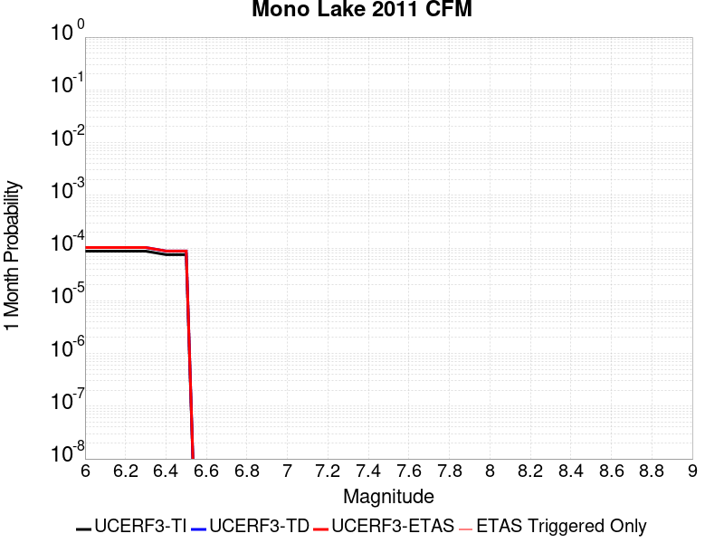 |  |  |

| Magnitude | 1 wk TI Prob | 1 wk TD Prob | 1 wk ETAS Prob | 1 wk ETAS/TD Gain | 1 wk ETAS Triggered Only | 1 mo TI Prob | 1 mo TD Prob | 1 mo ETAS Prob | 1 mo ETAS/TD Gain | 1 mo ETAS Triggered Only | 1 yr TI Prob | 1 yr TD Prob | 1 yr ETAS Prob | 1 yr ETAS/TD Gain | 1 yr ETAS Triggered Only | 10 yr TI Prob | 10 yr TD Prob | 10 yr ETAS Prob | 10 yr ETAS/TD Gain | 10 yr ETAS Triggered Only |
|-----|-----|-----|-----|-----|-----|-----|-----|-----|-----|-----|-----|-----|-----|-----|-----|-----|-----|-----|-----|-----|
| 6.0 | 2.0341662E-5 | 2.3830333E-5 | 2.3830333E-5 | 1.0 | 0.0 | 8.717564E-5 | 1.02129E-4 | 1.02129E-4 | 1.0 | 0.0 | 0.0010608466 | 0.0012432429 | 0.0012432429 | 1.0 | 0.0 | 0.010557966 | 0.012414961 | 0.012453381 | 1.0030947 | 3.8902937E-5 |
| 6.1 | 2.0341662E-5 | 2.3830333E-5 | 2.3830333E-5 | 1.0 | 0.0 | 8.717564E-5 | 1.02129E-4 | 1.02129E-4 | 1.0 | 0.0 | 0.0010608466 | 0.0012432429 | 0.0012432429 | 1.0 | 0.0 | 0.010557966 | 0.012414961 | 0.012453381 | 1.0030947 | 3.8902937E-5 |
| 6.2 | 2.0341662E-5 | 2.3830333E-5 | 2.3830333E-5 | 1.0 | 0.0 | 8.717564E-5 | 1.02129E-4 | 1.02129E-4 | 1.0 | 0.0 | 0.0010608466 | 0.0012432429 | 0.0012432429 | 1.0 | 0.0 | 0.010557966 | 0.012414961 | 0.012453381 | 1.0030947 | 3.8902937E-5 |
| 6.3 | 2.0341662E-5 | 2.3830333E-5 | 2.3830333E-5 | 1.0 | 0.0 | 8.717564E-5 | 1.02129E-4 | 1.02129E-4 | 1.0 | 0.0 | 0.0010608466 | 0.0012432429 | 0.0012432429 | 1.0 | 0.0 | 0.010557966 | 0.012414961 | 0.012453381 | 1.0030947 | 3.8902937E-5 |
| 6.4 | 1.749821E-5 | 2.0492844E-5 | 2.0492844E-5 | 1.0 | 0.0 | 7.499018E-5 | 8.782648E-5 | 8.782648E-5 | 1.0 | 0.0 | 9.1262296E-4 | 0.0010692873 | 0.0010692873 | 1.0 | 0.0 | 0.009088841 | 0.010692834 | 0.010731321 | 1.0035993 | 3.8902937E-5 |
| 6.5 | 1.749821E-5 | 2.0492844E-5 | 2.0492844E-5 | 1.0 | 0.0 | 7.499018E-5 | 8.782648E-5 | 8.782648E-5 | 1.0 | 0.0 | 9.1262296E-4 | 0.0010692873 | 0.0010692873 | 1.0 | 0.0 | 0.009088841 | 0.010692834 | 0.010731321 | 1.0035993 | 3.8902937E-5 |

## Elsinore (Coyote Mountains)
*[(top)](#table-of-contents)*

| 1 Week | 1 Month | 1 Year | 10 Year |
|-----|-----|-----|-----|
|  |  |  |  |

| Magnitude | 1 wk TI Prob | 1 wk TD Prob | 1 wk ETAS Prob | 1 wk ETAS/TD Gain | 1 wk ETAS Triggered Only | 1 mo TI Prob | 1 mo TD Prob | 1 mo ETAS Prob | 1 mo ETAS/TD Gain | 1 mo ETAS Triggered Only | 1 yr TI Prob | 1 yr TD Prob | 1 yr ETAS Prob | 1 yr ETAS/TD Gain | 1 yr ETAS Triggered Only | 10 yr TI Prob | 10 yr TD Prob | 10 yr ETAS Prob | 10 yr ETAS/TD Gain | 10 yr ETAS Triggered Only |
|-----|-----|-----|-----|-----|-----|-----|-----|-----|-----|-----|-----|-----|-----|-----|-----|-----|-----|-----|-----|-----|
| 6.0 | 4.20513E-5 | 4.8638663E-5 | 4.8638663E-5 | 1.0 | 0.0 | 1.8020741E-4 | 2.0843801E-4 | 2.0843801E-4 | 1.0 | 0.0 | 0.0021918174 | 0.002535353 | 0.0025741572 | 1.0153053 | 3.8902937E-5 | 0.021703249 | 0.025114654 | 0.025152579 | 1.0015101 | 3.8902937E-5 |
| 6.1 | 4.20513E-5 | 4.8638663E-5 | 4.8638663E-5 | 1.0 | 0.0 | 1.8020741E-4 | 2.0843801E-4 | 2.0843801E-4 | 1.0 | 0.0 | 0.0021918174 | 0.002535353 | 0.0025741572 | 1.0153053 | 3.8902937E-5 | 0.021703249 | 0.025114654 | 0.025152579 | 1.0015101 | 3.8902937E-5 |
| 6.2 | 2.3413893E-5 | 2.4698767E-5 | 2.4698767E-5 | 1.0 | 0.0 | 1.0034139E-4 | 1.0584811E-4 | 1.0584811E-4 | 1.0 | 0.0 | 0.0012209718 | 0.0012880323 | 0.0012880323 | 1.0 | 0.0 | 0.012142851 | 0.0128142275 | 0.0128142275 | 1.0 | 0.0 |
| 6.3 | 2.3413893E-5 | 2.4698767E-5 | 2.4698767E-5 | 1.0 | 0.0 | 1.0034139E-4 | 1.0584811E-4 | 1.0584811E-4 | 1.0 | 0.0 | 0.0012209718 | 0.0012880323 | 0.0012880323 | 1.0 | 0.0 | 0.012142851 | 0.0128142275 | 0.0128142275 | 1.0 | 0.0 |
| 6.4 | 1.6894814E-5 | 1.6570395E-5 | 1.6570395E-5 | 1.0 | 0.0 | 7.240433E-5 | 7.101426E-5 | 7.101426E-5 | 1.0 | 0.0 | 8.811662E-4 | 8.642923E-4 | 8.642923E-4 | 1.0 | 0.0 | 0.0087768035 | 0.008612989 | 0.008612989 | 1.0 | 0.0 |
| 6.5 | 1.6894814E-5 | 1.6570395E-5 | 1.6570395E-5 | 1.0 | 0.0 | 7.240433E-5 | 7.101426E-5 | 7.101426E-5 | 1.0 | 0.0 | 8.811662E-4 | 8.642923E-4 | 8.642923E-4 | 1.0 | 0.0 | 0.0087768035 | 0.008612989 | 0.008612989 | 1.0 | 0.0 |
| 6.6 | 1.1910969E-5 | 1.0532126E-5 | 1.0532126E-5 | 1.0 | 0.0 | 5.1046012E-5 | 4.5136978E-5 | 4.5136978E-5 | 1.0 | 0.0 | 6.21308E-4 | 5.494154E-4 | 5.494154E-4 | 1.0 | 0.0 | 0.0061957375 | 0.0054818755 | 0.0054818755 | 1.0 | 0.0 |
| 6.7 | 9.1486E-6 | 7.2038497E-6 | 7.2038497E-6 | 1.0 | 0.0 | 3.9207694E-5 | 3.08733E-5 | 3.08733E-5 | 1.0 | 0.0 | 4.7724912E-4 | 3.758214E-4 | 3.758214E-4 | 1.0 | 0.0 | 0.0047622547 | 0.0037522377 | 0.0037522377 | 1.0 | 0.0 |
| 6.8 | 7.90441E-6 | 5.7298735E-6 | 5.7298735E-6 | 1.0 | 0.0 | 3.3875604E-5 | 2.4556377E-5 | 2.4556377E-5 | 1.0 | 0.0 | 4.1235742E-4 | 2.9893414E-4 | 2.9893414E-4 | 1.0 | 0.0 | 0.0041159308 | 0.002985449 | 0.002985449 | 1.0 | 0.0 |
| 6.9 | 7.77015E-6 | 5.583821E-6 | 5.583821E-6 | 1.0 | 0.0 | 3.3300217E-5 | 2.3930448E-5 | 2.3930448E-5 | 1.0 | 0.0 | 4.0535472E-4 | 2.9131552E-4 | 2.9131552E-4 | 1.0 | 0.0 | 0.004046161 | 0.0029094636 | 0.0029094636 | 1.0 | 0.0 |
| 7.0 | 7.675798E-6 | 5.480674E-6 | 5.480674E-6 | 1.0 | 0.0 | 3.289586E-5 | 2.3488401E-5 | 2.3488401E-5 | 1.0 | 0.0 | 4.004335E-4 | 2.85935E-4 | 2.85935E-4 | 1.0 | 0.0 | 0.003997127 | 0.0028557975 | 0.0028557975 | 1.0 | 0.0 |
| 7.1 | 7.447814E-6 | 5.2395403E-6 | 5.2395403E-6 | 1.0 | 0.0 | 3.191881E-5 | 2.2454986E-5 | 2.2454986E-5 | 1.0 | 0.0 | 3.8854225E-4 | 2.7335642E-4 | 2.7335642E-4 | 1.0 | 0.0 | 0.003878636 | 0.002730326 | 0.002730326 | 1.0 | 0.0 |
| 7.2 | 7.128185E-6 | 4.9061937E-6 | 4.9061937E-6 | 1.0 | 0.0 | 3.0549007E-5 | 2.1026382E-5 | 2.1026382E-5 | 1.0 | 0.0 | 3.7187067E-4 | 2.5596732E-4 | 2.5596732E-4 | 1.0 | 0.0 | 0.00371249 | 0.0025568435 | 0.0025568435 | 1.0 | 0.0 |
| 7.3 | 7.0913875E-6 | 4.8748675E-6 | 4.8748675E-6 | 1.0 | 0.0 | 3.0391306E-5 | 2.0892128E-5 | 2.0892128E-5 | 1.0 | 0.0 | 3.6995133E-4 | 2.5433316E-4 | 2.5433316E-4 | 1.0 | 0.0 | 0.0036933604 | 0.0025405393 | 0.0025405393 | 1.0 | 0.0 |
| 7.4 | 7.051521E-6 | 4.838718E-6 | 4.838718E-6 | 1.0 | 0.0 | 3.0220453E-5 | 2.0737203E-5 | 2.0737203E-5 | 1.0 | 0.0 | 3.6787192E-4 | 2.5244738E-4 | 2.5244738E-4 | 1.0 | 0.0 | 0.0036726352 | 0.0025217244 | 0.0025217244 | 1.0 | 0.0 |
| 7.5 | 6.910666E-6 | 4.7341928E-6 | 4.7341928E-6 | 1.0 | 0.0 | 2.9616802E-5 | 2.0289246E-5 | 2.0289246E-5 | 1.0 | 0.0 | 3.605249E-4 | 2.4699475E-4 | 2.4699475E-4 | 1.0 | 0.0 | 0.0035994058 | 0.0024673205 | 0.0024673205 | 1.0 | 0.0 |
| 7.6 | 6.341753E-6 | 4.3072587E-6 | 4.3072587E-6 | 1.0 | 0.0 | 2.7178658E-5 | 1.8459556E-5 | 1.8459556E-5 | 1.0 | 0.0 | 3.3084993E-4 | 2.2472307E-4 | 2.2472307E-4 | 1.0 | 0.0 | 0.0033035777 | 0.0022450737 | 0.0022450737 | 1.0 | 0.0 |
| 7.7 | 3.9205916E-6 | 2.2443742E-6 | 2.2443742E-6 | 1.0 | 0.0 | 1.6802427E-5 | 9.618715E-6 | 9.618715E-6 | 1.0 | 0.0 | 2.0455034E-4 | 1.171023E-4 | 1.171023E-4 | 1.0 | 0.0 | 0.0020436216 | 0.001170479 | 0.001170479 | 1.0 | 0.0 |
| 7.8 | 2.0846227E-7 | 8.488185E-8 | 8.488185E-8 | 1.0 | 0.0 | 8.9340944E-7 | 3.637793E-7 | 3.637793E-7 | 1.0 | 0.0 | 1.0877206E-5 | 4.4290073E-6 | 4.4290073E-6 | 1.0 | 0.0 | 1.0876673E-4 | 4.4289518E-5 | 4.4289518E-5 | 1.0 | 0.0 |
| 7.9 | 4.4969806E-9 | 2.2695175E-9 | 2.2695175E-9 | 1.0 | 0.0 | 1.9272775E-8 | 9.726504E-9 | 9.726504E-9 | 1.0 | 0.0 | 2.3464601E-7 | 1.18420175E-7 | 1.18420175E-7 | 1.0 | 0.0 | 2.3464577E-6 | 1.1842012E-6 | 1.1842012E-6 | 1.0 | 0.0 |

## White Wolf
*[(top)](#table-of-contents)*

| 1 Week | 1 Month | 1 Year | 10 Year |
|-----|-----|-----|-----|
|  |  |  |  |

| Magnitude | 1 wk TI Prob | 1 wk TD Prob | 1 wk ETAS Prob | 1 wk ETAS/TD Gain | 1 wk ETAS Triggered Only | 1 mo TI Prob | 1 mo TD Prob | 1 mo ETAS Prob | 1 mo ETAS/TD Gain | 1 mo ETAS Triggered Only | 1 yr TI Prob | 1 yr TD Prob | 1 yr ETAS Prob | 1 yr ETAS/TD Gain | 1 yr ETAS Triggered Only | 10 yr TI Prob | 10 yr TD Prob | 10 yr ETAS Prob | 10 yr ETAS/TD Gain | 10 yr ETAS Triggered Only |
|-----|-----|-----|-----|-----|-----|-----|-----|-----|-----|-----|-----|-----|-----|-----|-----|-----|-----|-----|-----|-----|
| 6.0 | 2.0037822E-5 | 1.0469729E-6 | 1.0469729E-6 | 1.0 | 0.0 | 8.587355E-5 | 4.4870194E-6 | 4.4870194E-6 | 1.0 | 0.0 | 0.001045009 | 5.462814E-5 | 5.462814E-5 | 1.0 | 0.0 | 0.010401085 | 5.461522E-4 | 5.850339E-4 | 1.071192 | 3.8902937E-5 |
| 6.1 | 2.0037822E-5 | 1.0469729E-6 | 1.0469729E-6 | 1.0 | 0.0 | 8.587355E-5 | 4.4870194E-6 | 4.4870194E-6 | 1.0 | 0.0 | 0.001045009 | 5.462814E-5 | 5.462814E-5 | 1.0 | 0.0 | 0.010401085 | 5.461522E-4 | 5.850339E-4 | 1.071192 | 3.8902937E-5 |
| 6.2 | 2.0037822E-5 | 1.0469729E-6 | 1.0469729E-6 | 1.0 | 0.0 | 8.587355E-5 | 4.4870194E-6 | 4.4870194E-6 | 1.0 | 0.0 | 0.001045009 | 5.462814E-5 | 5.462814E-5 | 1.0 | 0.0 | 0.010401085 | 5.461522E-4 | 5.850339E-4 | 1.071192 | 3.8902937E-5 |
| 6.3 | 2.0037822E-5 | 1.0469729E-6 | 1.0469729E-6 | 1.0 | 0.0 | 8.587355E-5 | 4.4870194E-6 | 4.4870194E-6 | 1.0 | 0.0 | 0.001045009 | 5.462814E-5 | 5.462814E-5 | 1.0 | 0.0 | 0.010401085 | 5.461522E-4 | 5.850339E-4 | 1.071192 | 3.8902937E-5 |
| 6.4 | 1.132487E-5 | 1.0469729E-6 | 1.0469729E-6 | 1.0 | 0.0 | 4.8534253E-5 | 4.4870194E-6 | 4.4870194E-6 | 1.0 | 0.0 | 5.907443E-4 | 5.462814E-5 | 5.462814E-5 | 1.0 | 0.0 | 0.005891764 | 5.461522E-4 | 5.850339E-4 | 1.071192 | 3.8902937E-5 |
| 6.5 | 1.132487E-5 | 1.0469729E-6 | 1.0469729E-6 | 1.0 | 0.0 | 4.8534253E-5 | 4.4870194E-6 | 4.4870194E-6 | 1.0 | 0.0 | 5.907443E-4 | 5.462814E-5 | 5.462814E-5 | 1.0 | 0.0 | 0.005891764 | 5.461522E-4 | 5.850339E-4 | 1.071192 | 3.8902937E-5 |
| 6.6 | 9.347473E-6 | 1.0469729E-6 | 1.0469729E-6 | 1.0 | 0.0 | 4.0059982E-5 | 4.4870194E-6 | 4.4870194E-6 | 1.0 | 0.0 | 4.8762115E-4 | 5.462814E-5 | 5.462814E-5 | 1.0 | 0.0 | 0.0048655253 | 5.461522E-4 | 5.850339E-4 | 1.071192 | 3.8902937E-5 |
| 6.7 | 7.842647E-6 | 1.004888E-6 | 1.004888E-6 | 1.0 | 0.0 | 3.361091E-5 | 4.3066557E-6 | 4.3066557E-6 | 1.0 | 0.0 | 4.0913603E-4 | 5.2432322E-5 | 5.2432322E-5 | 1.0 | 0.0 | 0.004083836 | 5.2420446E-4 | 5.63087E-4 | 1.0741744 | 3.8902937E-5 |
| 6.8 | 6.26597E-6 | 9.735327E-7 | 9.735327E-7 | 1.0 | 0.0 | 2.685388E-5 | 4.1722765E-6 | 4.1722765E-6 | 1.0 | 0.0 | 3.2689696E-4 | 5.0796334E-5 | 5.0796334E-5 | 1.0 | 0.0 | 0.003264165 | 5.078521E-4 | 5.467353E-4 | 1.076564 | 3.8902937E-5 |
| 6.9 | 5.258436E-6 | 9.1837234E-7 | 9.1837234E-7 | 1.0 | 0.0 | 2.2535958E-5 | 3.9358756E-6 | 3.9358756E-6 | 1.0 | 0.0 | 2.7434074E-4 | 4.791828E-5 | 4.791828E-5 | 1.0 | 0.0 | 0.0027400232 | 4.790843E-4 | 5.179686E-4 | 1.0811638 | 3.8902937E-5 |
| 7.0 | 4.675028E-6 | 8.661622E-7 | 8.661622E-7 | 1.0 | 0.0 | 2.003568E-5 | 3.7121188E-6 | 3.7121188E-6 | 1.0 | 0.0 | 2.4390711E-4 | 4.5194156E-5 | 4.5194156E-5 | 1.0 | 0.0 | 0.0024363957 | 4.5185437E-4 | 4.907397E-4 | 1.0860573 | 3.8902937E-5 |
| 7.1 | 2.8270078E-6 | 6.8745294E-7 | 6.8745294E-7 | 1.0 | 0.0 | 1.2115692E-5 | 2.9462237E-6 | 2.9462237E-6 | 1.0 | 0.0 | 1.4749856E-4 | 3.5869725E-5 | 3.5869725E-5 | 1.0 | 0.0 | 0.001474007 | 3.5864345E-4 | 3.9753242E-4 | 1.1084336 | 3.8902937E-5 |
| 7.2 | 1.6881406E-6 | 2.270827E-7 | 2.270827E-7 | 1.0 | 0.0 | 7.2348685E-6 | 9.732112E-7 | 9.732112E-7 | 1.0 | 0.0 | 8.808096E-5 | 1.1848783E-5 | 1.1848783E-5 | 1.0 | 0.0 | 8.8046055E-4 | 1.1848167E-4 | 1.1848167E-4 | 1.0 | 0.0 |
| 7.3 | 9.086107E-7 | 1.5267518E-7 | 1.5267518E-7 | 1.0 | 0.0 | 3.8940398E-6 | 6.543221E-7 | 6.543221E-7 | 1.0 | 0.0 | 4.7408903E-5 | 7.966343E-6 | 7.966343E-6 | 1.0 | 0.0 | 4.739879E-4 | 7.9660655E-5 | 7.9660655E-5 | 1.0 | 0.0 |
| 7.4 | 1.9717383E-7 | 9.004186E-8 | 9.004186E-8 | 1.0 | 0.0 | 8.450304E-7 | 3.8589363E-7 | 3.8589363E-7 | 1.0 | 0.0 | 1.0288197E-5 | 4.698245E-6 | 4.698245E-6 | 1.0 | 0.0 | 1.028772E-4 | 4.6981488E-5 | 4.6981488E-5 | 1.0 | 0.0 |
| 7.5 | 1.086975E-7 | 6.65987E-8 | 6.65987E-8 | 1.0 | 0.0 | 4.6584634E-7 | 2.8542297E-7 | 2.8542297E-7 | 1.0 | 0.0 | 5.6716644E-6 | 3.4750192E-6 | 3.4750192E-6 | 1.0 | 0.0 | 5.6715195E-5 | 3.474967E-5 | 3.474967E-5 | 1.0 | 0.0 |
| 7.6 | 2.4217808E-8 | 1.582108E-8 | 1.582108E-8 | 1.0 | 0.0 | 1.03790605E-7 | 6.780462E-8 | 6.780462E-8 | 1.0 | 0.0 | 1.2636499E-6 | 8.25521E-7 | 8.25521E-7 | 1.0 | 0.0 | 1.2636427E-5 | 8.255184E-6 | 8.255184E-6 | 1.0 | 0.0 |

## Cleghorn
*[(top)](#table-of-contents)*

| 1 Week | 1 Month | 1 Year | 10 Year |
|-----|-----|-----|-----|
|  |  |  |  |

| Magnitude | 1 wk TI Prob | 1 wk TD Prob | 1 wk ETAS Prob | 1 wk ETAS/TD Gain | 1 wk ETAS Triggered Only | 1 mo TI Prob | 1 mo TD Prob | 1 mo ETAS Prob | 1 mo ETAS/TD Gain | 1 mo ETAS Triggered Only | 1 yr TI Prob | 1 yr TD Prob | 1 yr ETAS Prob | 1 yr ETAS/TD Gain | 1 yr ETAS Triggered Only | 10 yr TI Prob | 10 yr TD Prob | 10 yr ETAS Prob | 10 yr ETAS/TD Gain | 10 yr ETAS Triggered Only |
|-----|-----|-----|-----|-----|-----|-----|-----|-----|-----|-----|-----|-----|-----|-----|-----|-----|-----|-----|-----|-----|
| 6.0 | 7.9267165E-6 | 9.838367E-6 | 9.838367E-6 | 1.0 | 0.0 | 3.39712E-5 | 4.216381E-5 | 4.216381E-5 | 1.0 | 0.0 | 4.1352084E-4 | 5.1323406E-4 | 5.1323406E-4 | 1.0 | 0.0 | 0.004127522 | 0.005135526 | 0.005174229 | 1.0075364 | 3.8902937E-5 |
| 6.1 | 7.9267165E-6 | 9.838367E-6 | 9.838367E-6 | 1.0 | 0.0 | 3.39712E-5 | 4.216381E-5 | 4.216381E-5 | 1.0 | 0.0 | 4.1352084E-4 | 5.1323406E-4 | 5.1323406E-4 | 1.0 | 0.0 | 0.004127522 | 0.005135526 | 0.005174229 | 1.0075364 | 3.8902937E-5 |
| 6.2 | 7.9267165E-6 | 9.838367E-6 | 9.838367E-6 | 1.0 | 0.0 | 3.39712E-5 | 4.216381E-5 | 4.216381E-5 | 1.0 | 0.0 | 4.1352084E-4 | 5.1323406E-4 | 5.1323406E-4 | 1.0 | 0.0 | 0.004127522 | 0.005135526 | 0.005174229 | 1.0075364 | 3.8902937E-5 |
| 6.3 | 7.9267165E-6 | 9.838367E-6 | 9.838367E-6 | 1.0 | 0.0 | 3.39712E-5 | 4.216381E-5 | 4.216381E-5 | 1.0 | 0.0 | 4.1352084E-4 | 5.1323406E-4 | 5.1323406E-4 | 1.0 | 0.0 | 0.004127522 | 0.005135526 | 0.005174229 | 1.0075364 | 3.8902937E-5 |
| 6.4 | 4.3445207E-6 | 6.0981406E-6 | 6.0981406E-6 | 1.0 | 0.0 | 1.8619241E-5 | 2.6134632E-5 | 2.6134632E-5 | 1.0 | 0.0 | 2.2666567E-4 | 3.181437E-4 | 3.181437E-4 | 1.0 | 0.0 | 0.0022643462 | 0.003190997 | 0.003229776 | 1.0121526 | 3.8902937E-5 |
| 6.5 | 4.3445207E-6 | 6.0981406E-6 | 6.0981406E-6 | 1.0 | 0.0 | 1.8619241E-5 | 2.6134632E-5 | 2.6134632E-5 | 1.0 | 0.0 | 2.2666567E-4 | 3.181437E-4 | 3.181437E-4 | 1.0 | 0.0 | 0.0022643462 | 0.003190997 | 0.003229776 | 1.0121526 | 3.8902937E-5 |
| 6.6 | 4.040109E-6 | 5.780541E-6 | 5.780541E-6 | 1.0 | 0.0 | 1.7314638E-5 | 2.4773517E-5 | 2.4773517E-5 | 1.0 | 0.0 | 2.1078532E-4 | 3.0157674E-4 | 3.0157674E-4 | 1.0 | 0.0 | 0.002105855 | 0.0030257835 | 0.0030645689 | 1.0128182 | 3.8902937E-5 |
| 6.7 | 3.3632055E-6 | 5.074022E-6 | 5.074022E-6 | 1.0 | 0.0 | 1.4413658E-5 | 2.1745627E-5 | 2.1745627E-5 | 1.0 | 0.0 | 1.7547216E-4 | 2.6472117E-4 | 2.6472117E-4 | 1.0 | 0.0 | 0.0017533366 | 0.0026581106 | 0.0026581106 | 1.0 | 0.0 |
| 6.8 | 3.2902772E-6 | 4.9959262E-6 | 4.9959262E-6 | 1.0 | 0.0 | 1.4101111E-5 | 2.1410939E-5 | 2.1410939E-5 | 1.0 | 0.0 | 1.716675E-4 | 2.606473E-4 | 2.606473E-4 | 1.0 | 0.0 | 0.0017153495 | 0.0026174681 | 0.0026174681 | 1.0 | 0.0 |
| 6.9 | 3.031547E-6 | 4.6974637E-6 | 4.6974637E-6 | 1.0 | 0.0 | 1.299228E-5 | 2.0131833E-5 | 2.0131833E-5 | 1.0 | 0.0 | 1.5816953E-4 | 2.4507777E-4 | 2.4507777E-4 | 1.0 | 0.0 | 0.00158057 | 0.002462125 | 0.002462125 | 1.0 | 0.0 |
| 7.0 | 2.8259715E-6 | 4.3764653E-6 | 4.3764653E-6 | 1.0 | 0.0 | 1.211125E-5 | 1.8756145E-5 | 1.8756145E-5 | 1.0 | 0.0 | 1.4744449E-4 | 2.2833238E-4 | 2.2833238E-4 | 1.0 | 0.0 | 0.001473467 | 0.0022950263 | 0.0022950263 | 1.0 | 0.0 |
| 7.1 | 2.5962665E-6 | 4.071453E-6 | 4.071453E-6 | 1.0 | 0.0 | 1.1126809E-5 | 1.7448969E-5 | 1.7448969E-5 | 1.0 | 0.0 | 1.3546048E-4 | 2.124207E-4 | 2.124207E-4 | 1.0 | 0.0 | 0.0013537793 | 0.0021362302 | 0.0021362302 | 1.0 | 0.0 |
| 7.2 | 2.3247253E-6 | 3.6817423E-6 | 3.6817423E-6 | 1.0 | 0.0 | 9.96307E-6 | 1.5778802E-5 | 1.5778802E-5 | 1.0 | 0.0 | 1.21293626E-4 | 1.9209016E-4 | 1.9209016E-4 | 1.0 | 0.0 | 0.0012122744 | 0.0019333162 | 0.0019333162 | 1.0 | 0.0 |
| 7.3 | 2.056928E-6 | 3.2399425E-6 | 3.2399425E-6 | 1.0 | 0.0 | 8.815376E-6 | 1.3885395E-5 | 1.3885395E-5 | 1.0 | 0.0 | 1.0732192E-4 | 1.6904173E-4 | 1.6904173E-4 | 1.0 | 0.0 | 0.001072701 | 0.0017032728 | 0.0017032728 | 1.0 | 0.0 |
| 7.4 | 1.8055999E-6 | 2.8298966E-6 | 2.8298966E-6 | 1.0 | 0.0 | 7.738263E-6 | 1.2128073E-5 | 1.2128073E-5 | 1.0 | 0.0 | 9.4209274E-5 | 1.4764942E-4 | 1.4764942E-4 | 1.0 | 0.0 | 9.4169343E-4 | 0.0014897923 | 0.0014897923 | 1.0 | 0.0 |
| 7.5 | 1.4683443E-6 | 2.4289393E-6 | 2.4289393E-6 | 1.0 | 0.0 | 6.292889E-6 | 1.0409699E-5 | 1.0409699E-5 | 1.0 | 0.0 | 7.661323E-5 | 1.2673081E-4 | 1.2673081E-4 | 1.0 | 0.0 | 7.658682E-4 | 0.0012809072 | 0.0012809072 | 1.0 | 0.0 |
| 7.6 | 9.804088E-7 | 1.9043657E-6 | 1.9043657E-6 | 1.0 | 0.0 | 4.201745E-6 | 8.161543E-6 | 8.161543E-6 | 1.0 | 0.0 | 5.1155046E-5 | 9.9362296E-5 | 9.9362296E-5 | 1.0 | 0.0 | 5.114327E-4 | 0.0010075356 | 0.0010075356 | 1.0 | 0.0 |
| 7.7 | 7.3434086E-7 | 1.6324341E-6 | 1.6324341E-6 | 1.0 | 0.0 | 3.1471714E-6 | 6.9961275E-6 | 6.9961275E-6 | 1.0 | 0.0 | 3.831614E-5 | 8.517455E-5 | 8.517455E-5 | 1.0 | 0.0 | 3.8309532E-4 | 8.6581067E-4 | 8.6581067E-4 | 1.0 | 0.0 |
| 7.8 | 6.434184E-7 | 1.5257981E-6 | 1.5257981E-6 | 1.0 | 0.0 | 2.7575045E-6 | 6.5391187E-6 | 6.5391187E-6 | 1.0 | 0.0 | 3.35721E-5 | 7.961089E-5 | 7.961089E-5 | 1.0 | 0.0 | 3.3567028E-4 | 8.098763E-4 | 8.098763E-4 | 1.0 | 0.0 |
| 7.9 | 3.4943926E-7 | 7.594313E-7 | 7.594313E-7 | 1.0 | 0.0 | 1.497596E-6 | 3.2547016E-6 | 3.2547016E-6 | 1.0 | 0.0 | 1.8233079E-5 | 3.962528E-5 | 3.962528E-5 | 1.0 | 0.0 | 1.8231584E-4 | 4.050159E-4 | 4.050159E-4 | 1.0 | 0.0 |
| 8.0 | 6.717524E-8 | 5.8598772E-8 | 5.8598772E-8 | 1.0 | 0.0 | 2.8789387E-7 | 2.5113755E-7 | 2.5113755E-7 | 1.0 | 0.0 | 3.505102E-6 | 3.0575957E-6 | 3.0575957E-6 | 1.0 | 0.0 | 3.5050467E-5 | 3.28481E-5 | 3.28481E-5 | 1.0 | 0.0 |
| 8.1 | 3.1984914E-8 | 1.3024658E-8 | 1.3024658E-8 | 1.0 | 0.0 | 1.370782E-7 | 5.5819964E-8 | 5.5819964E-8 | 1.0 | 0.0 | 1.6689258E-6 | 6.7960787E-7 | 6.7960787E-7 | 1.0 | 0.0 | 1.6689133E-5 | 7.7832365E-6 | 7.7832365E-6 | 1.0 | 0.0 |
| 8.2 | 1.21887656E-8 | 3.6706735E-9 | 3.6706735E-9 | 1.0 | 0.0 | 5.2237567E-8 | 1.5731459E-8 | 1.5731459E-8 | 1.0 | 0.0 | 6.359922E-7 | 1.9153049E-7 | 1.9153049E-7 | 1.0 | 0.0 | 6.3599036E-6 | 2.2593056E-6 | 2.2593056E-6 | 1.0 | 0.0 |

## Rodgers Creek - Healdsburg 2011 CFM
*[(top)](#table-of-contents)*

| 1 Week | 1 Month | 1 Year | 10 Year |
|-----|-----|-----|-----|
|  |  |  |  |

| Magnitude | 1 wk TI Prob | 1 wk TD Prob | 1 wk ETAS Prob | 1 wk ETAS/TD Gain | 1 wk ETAS Triggered Only | 1 mo TI Prob | 1 mo TD Prob | 1 mo ETAS Prob | 1 mo ETAS/TD Gain | 1 mo ETAS Triggered Only | 1 yr TI Prob | 1 yr TD Prob | 1 yr ETAS Prob | 1 yr ETAS/TD Gain | 1 yr ETAS Triggered Only | 10 yr TI Prob | 10 yr TD Prob | 10 yr ETAS Prob | 10 yr ETAS/TD Gain | 10 yr ETAS Triggered Only |
|-----|-----|-----|-----|-----|-----|-----|-----|-----|-----|-----|-----|-----|-----|-----|-----|-----|-----|-----|-----|-----|
| 6.0 | 7.390182E-5 | 1.3142917E-4 | 1.3142917E-4 | 1.0 | 0.0 | 3.1668364E-4 | 5.631467E-4 | 5.631467E-4 | 1.0 | 0.0 | 0.0038488081 | 0.0068347882 | 0.0068347882 | 1.0 | 0.0 | 0.037828278 | 0.06622128 | 0.0662576 | 1.0005486 | 3.8902937E-5 |
| 6.1 | 7.318768E-5 | 1.3040975E-4 | 1.3040975E-4 | 1.0 | 0.0 | 3.1362378E-4 | 5.587797E-4 | 5.587797E-4 | 1.0 | 0.0 | 0.0038116854 | 0.0067819515 | 0.0067819515 | 1.0 | 0.0 | 0.037469655 | 0.06572582 | 0.06576216 | 1.000553 | 3.8902937E-5 |
| 6.2 | 7.1379836E-5 | 1.273379E-4 | 1.273379E-4 | 1.0 | 0.0 | 3.058777E-4 | 5.456202E-4 | 5.456202E-4 | 1.0 | 0.0 | 0.003717703 | 0.0066227177 | 0.0066227177 | 1.0 | 0.0 | 0.0365612 | 0.06424386 | 0.064280264 | 1.0005666 | 3.8902937E-5 |
| 6.3 | 6.9255926E-5 | 1.2388272E-4 | 1.2388272E-4 | 1.0 | 0.0 | 2.9677735E-4 | 5.3081836E-4 | 5.3081836E-4 | 1.0 | 0.0 | 0.0036072785 | 0.006443587 | 0.006443587 | 1.0 | 0.0 | 0.035492823 | 0.06257 | 0.06260647 | 1.0005828 | 3.8902937E-5 |
| 6.4 | 6.6757144E-5 | 1.196489E-4 | 1.196489E-4 | 1.0 | 0.0 | 2.8607066E-4 | 5.126806E-4 | 5.126806E-4 | 1.0 | 0.0 | 0.0034773487 | 0.006224091 | 0.006224091 | 1.0 | 0.0 | 0.034234364 | 0.060519043 | 0.060555592 | 1.0006039 | 3.8902937E-5 |
| 6.5 | 6.5735134E-5 | 1.1813918E-4 | 1.1813918E-4 | 1.0 | 0.0 | 2.8169158E-4 | 5.0621293E-4 | 5.0621293E-4 | 1.0 | 0.0 | 0.003424202 | 0.006145812 | 0.006145812 | 1.0 | 0.0 | 0.03371918 | 0.059782747 | 0.059819326 | 1.0006118 | 3.8902937E-5 |
| 6.6 | 6.289601E-5 | 1.1349227E-4 | 1.1349227E-4 | 1.0 | 0.0 | 2.6952647E-4 | 4.8630516E-4 | 4.8630516E-4 | 1.0 | 0.0 | 0.0032765474 | 0.0059047723 | 0.0059047723 | 1.0 | 0.0 | 0.032286562 | 0.0575201 | 0.057556763 | 1.0006374 | 3.8902937E-5 |
| 6.7 | 6.115274E-5 | 1.1066158E-4 | 1.1066158E-4 | 1.0 | 0.0 | 2.6205686E-4 | 4.741781E-4 | 4.741781E-4 | 1.0 | 0.0 | 0.0031858748 | 0.0057579153 | 0.0057579153 | 1.0 | 0.0 | 0.031405866 | 0.056137886 | 0.056174606 | 1.0006541 | 3.8902937E-5 |
| 6.8 | 5.9232367E-5 | 1.073346E-4 | 1.073346E-4 | 1.0 | 0.0 | 2.538283E-4 | 4.599247E-4 | 4.599247E-4 | 1.0 | 0.0 | 0.0030859804 | 0.005585283 | 0.005585283 | 1.0 | 0.0 | 0.030434765 | 0.05450447 | 0.054541253 | 1.0006748 | 3.8902937E-5 |
| 6.9 | 5.4030377E-5 | 9.827546E-5 | 9.827546E-5 | 1.0 | 0.0 | 2.315382E-4 | 4.2111287E-4 | 4.2111287E-4 | 1.0 | 0.0 | 0.0028153337 | 0.0051150625 | 0.0051150625 | 1.0 | 0.0 | 0.027799325 | 0.050039466 | 0.05007642 | 1.0007385 | 3.8902937E-5 |
| 7.0 | 4.8260714E-5 | 8.745495E-5 | 8.745495E-5 | 1.0 | 0.0 | 2.0681522E-4 | 3.7475338E-4 | 3.7475338E-4 | 1.0 | 0.0 | 0.0025150678 | 0.0045531313 | 0.0045531313 | 1.0 | 0.0 | 0.024867928 | 0.044691484 | 0.04472865 | 1.0008316 | 3.8902937E-5 |
| 7.1 | 4.0294493E-5 | 7.3932846E-5 | 7.3932846E-5 | 1.0 | 0.0 | 1.7267925E-4 | 3.168168E-4 | 3.168168E-4 | 1.0 | 0.0 | 0.0021003427 | 0.0038504603 | 0.0038504603 | 1.0 | 0.0 | 0.02080602 | 0.03794385 | 0.037981275 | 1.0009863 | 3.8902937E-5 |
| 7.2 | 3.096388E-5 | 5.7018166E-5 | 5.7018166E-5 | 1.0 | 0.0 | 1.326956E-4 | 2.443408E-4 | 2.443408E-4 | 1.0 | 0.0 | 0.0016143717 | 0.002970813 | 0.002970813 | 1.0 | 0.0 | 0.01602694 | 0.029456772 | 0.029456772 | 1.0 | 0.0 |
| 7.3 | 2.3615226E-5 | 4.366579E-5 | 4.366579E-5 | 1.0 | 0.0 | 1.0120418E-4 | 1.8712576E-4 | 1.8712576E-4 | 1.0 | 0.0 | 0.0012314644 | 0.0022758893 | 0.0022758893 | 1.0 | 0.0 | 0.0122466255 | 0.022655508 | 0.022655508 | 1.0 | 0.0 |
| 7.4 | 1.8251132E-5 | 3.3575096E-5 | 3.3575096E-5 | 1.0 | 0.0 | 7.821679E-5 | 1.438854E-4 | 1.438854E-4 | 1.0 | 0.0 | 9.518733E-4 | 0.0017504068 | 0.0017504068 | 1.0 | 0.0 | 0.009478063 | 0.017482331 | 0.017482331 | 1.0 | 0.0 |
| 7.5 | 1.2411432E-5 | 2.2486745E-5 | 2.2486745E-5 | 1.0 | 0.0 | 5.3190768E-5 | 9.636824E-5 | 9.636824E-5 | 1.0 | 0.0 | 6.4740516E-4 | 0.0011726576 | 0.0011726576 | 1.0 | 0.0 | 0.006455223 | 0.011756561 | 0.011756561 | 1.0 | 0.0 |
| 7.6 | 4.4771446E-6 | 8.09296E-6 | 8.09296E-6 | 1.0 | 0.0 | 1.918762E-5 | 3.4683664E-5 | 3.4683664E-5 | 1.0 | 0.0 | 2.3358424E-4 | 4.22193E-4 | 4.22193E-4 | 1.0 | 0.0 | 0.0023333887 | 0.004250496 | 0.004250496 | 1.0 | 0.0 |
| 7.7 | 2.157941E-7 | 3.539757E-7 | 3.539757E-7 | 1.0 | 0.0 | 9.248315E-7 | 1.5170377E-6 | 1.5170377E-6 | 1.0 | 0.0 | 1.1259765E-5 | 1.8469778E-5 | 1.8469778E-5 | 1.0 | 0.0 | 1.1259195E-4 | 1.9093022E-4 | 1.9093022E-4 | 1.0 | 0.0 |
| 7.8 | 9.9623286E-8 | 1.9936476E-7 | 1.9936476E-7 | 1.0 | 0.0 | 4.269569E-7 | 8.544201E-7 | 8.544201E-7 | 1.0 | 0.0 | 5.1981874E-6 | 1.0402515E-5 | 1.0402515E-5 | 1.0 | 0.0 | 5.198066E-5 | 1.0919859E-4 | 1.0919859E-4 | 1.0 | 0.0 |
| 7.9 | 5.6745257E-8 | 1.1796928E-7 | 1.1796928E-7 | 1.0 | 0.0 | 2.4319394E-7 | 5.055825E-7 | 5.055825E-7 | 1.0 | 0.0 | 2.960882E-6 | 6.1554497E-6 | 6.1554497E-6 | 1.0 | 0.0 | 2.9608427E-5 | 6.482142E-5 | 6.482142E-5 | 1.0 | 0.0 |
| 8.0 | 2.8614323E-8 | 6.590836E-8 | 6.590836E-8 | 1.0 | 0.0 | 1.2263281E-7 | 2.8246436E-7 | 2.8246436E-7 | 1.0 | 0.0 | 1.4930534E-6 | 3.4389982E-6 | 3.4389982E-6 | 1.0 | 0.0 | 1.4930434E-5 | 3.5885336E-5 | 3.5885336E-5 | 1.0 | 0.0 |
| 8.1 | 3.5045191E-9 | 8.981429E-9 | 8.981429E-9 | 1.0 | 0.0 | 1.5019367E-8 | 3.8491837E-8 | 3.8491837E-8 | 1.0 | 0.0 | 1.8286079E-7 | 4.68638E-7 | 4.68638E-7 | 1.0 | 0.0 | 1.8286064E-6 | 4.84019E-6 | 4.84019E-6 | 1.0 | 0.0 |

## Ortigalita (North)
*[(top)](#table-of-contents)*

| 1 Week | 1 Month | 1 Year | 10 Year |
|-----|-----|-----|-----|
|  |  |  |  |

| Magnitude | 1 wk TI Prob | 1 wk TD Prob | 1 wk ETAS Prob | 1 wk ETAS/TD Gain | 1 wk ETAS Triggered Only | 1 mo TI Prob | 1 mo TD Prob | 1 mo ETAS Prob | 1 mo ETAS/TD Gain | 1 mo ETAS Triggered Only | 1 yr TI Prob | 1 yr TD Prob | 1 yr ETAS Prob | 1 yr ETAS/TD Gain | 1 yr ETAS Triggered Only | 10 yr TI Prob | 10 yr TD Prob | 10 yr ETAS Prob | 10 yr ETAS/TD Gain | 10 yr ETAS Triggered Only |
|-----|-----|-----|-----|-----|-----|-----|-----|-----|-----|-----|-----|-----|-----|-----|-----|-----|-----|-----|-----|-----|
| 6.0 | 7.711876E-5 | 1.05086016E-4 | 1.05086016E-4 | 1.0 | 0.0 | 3.3046713E-4 | 4.5030177E-4 | 4.5030177E-4 | 1.0 | 0.0 | 0.004016016 | 0.005468958 | 0.005468958 | 1.0 | 0.0 | 0.039442103 | 0.053463764 | 0.05350059 | 1.0006888 | 3.8902937E-5 |
| 6.1 | 4.607858E-5 | 6.024935E-5 | 6.024935E-5 | 1.0 | 0.0 | 1.9746469E-4 | 2.5818875E-4 | 2.5818875E-4 | 1.0 | 0.0 | 0.0024014818 | 0.003139252 | 0.003139252 | 1.0 | 0.0 | 0.023756953 | 0.030979859 | 0.030979859 | 1.0 | 0.0 |
| 6.2 | 4.607858E-5 | 6.024935E-5 | 6.024935E-5 | 1.0 | 0.0 | 1.9746469E-4 | 2.5818875E-4 | 2.5818875E-4 | 1.0 | 0.0 | 0.0024014818 | 0.003139252 | 0.003139252 | 1.0 | 0.0 | 0.023756953 | 0.030979859 | 0.030979859 | 1.0 | 0.0 |
| 6.3 | 3.327423E-5 | 4.2481566E-5 | 4.2481566E-5 | 1.0 | 0.0 | 1.4259605E-4 | 1.8205289E-4 | 1.8205289E-4 | 1.0 | 0.0 | 0.0017347244 | 0.0022145277 | 0.0022145277 | 1.0 | 0.0 | 0.017212452 | 0.021948816 | 0.021948816 | 1.0 | 0.0 |
| 6.4 | 2.7732503E-5 | 3.5003635E-5 | 3.5003635E-5 | 1.0 | 0.0 | 1.1884817E-4 | 1.5000845E-4 | 1.5000845E-4 | 1.0 | 0.0 | 0.001446016 | 0.0018250674 | 0.0018250674 | 1.0 | 0.0 | 0.014366428 | 0.018123753 | 0.018123753 | 1.0 | 0.0 |
| 6.5 | 2.7689714E-5 | 3.4953442E-5 | 3.4953442E-5 | 1.0 | 0.0 | 1.186648E-4 | 1.4979337E-4 | 1.4979337E-4 | 1.0 | 0.0 | 0.0014437864 | 0.0018224533 | 0.0018224533 | 1.0 | 0.0 | 0.014344421 | 0.018098038 | 0.018098038 | 1.0 | 0.0 |
| 6.6 | 2.2976905E-5 | 2.8722226E-5 | 2.8722226E-5 | 1.0 | 0.0 | 9.846873E-5 | 1.2309088E-4 | 1.2309088E-4 | 1.0 | 0.0 | 0.0011981975 | 0.001497839 | 0.001497839 | 1.0 | 0.0 | 0.011917574 | 0.014900712 | 0.014900712 | 1.0 | 0.0 |
| 6.7 | 1.9871539E-5 | 2.4907882E-5 | 2.4907882E-5 | 1.0 | 0.0 | 8.516096E-5 | 1.067451E-4 | 1.067451E-4 | 1.0 | 0.0 | 0.0010363415 | 0.0012990955 | 0.0012990955 | 1.0 | 0.0 | 0.010315218 | 0.012938703 | 0.012938703 | 1.0 | 0.0 |
| 6.8 | 6.5640475E-6 | 7.6061337E-6 | 7.6061337E-6 | 1.0 | 0.0 | 2.813133E-5 | 3.2597323E-5 | 3.2597323E-5 | 1.0 | 0.0 | 3.424451E-4 | 3.9680302E-4 | 3.9680302E-4 | 1.0 | 0.0 | 0.0034191788 | 0.0039612325 | 0.0039612325 | 1.0 | 0.0 |
| 6.9 | 5.6219683E-6 | 6.5023783E-6 | 6.5023783E-6 | 1.0 | 0.0 | 2.4093928E-5 | 2.7867052E-5 | 2.7867052E-5 | 1.0 | 0.0 | 2.933041E-4 | 3.3923113E-4 | 3.3923113E-4 | 1.0 | 0.0 | 0.0029291727 | 0.00338739 | 0.00338739 | 1.0 | 0.0 |
| 7.0 | 3.875591E-6 | 4.4851295E-6 | 4.4851295E-6 | 1.0 | 0.0 | 1.6609569E-5 | 1.9221854E-5 | 1.9221854E-5 | 1.0 | 0.0 | 2.0220275E-4 | 2.3400305E-4 | 2.3400305E-4 | 1.0 | 0.0 | 0.0020201886 | 0.0023377747 | 0.0023377747 | 1.0 | 0.0 |
| 7.1 | 1.6017933E-6 | 1.857199E-6 | 1.857199E-6 | 1.0 | 0.0 | 6.8648105E-6 | 7.959406E-6 | 7.959406E-6 | 1.0 | 0.0 | 8.357586E-5 | 9.690253E-5 | 9.690253E-5 | 1.0 | 0.0 | 8.3544437E-4 | 9.6870743E-4 | 9.6870743E-4 | 1.0 | 0.0 |

## Baker
*[(top)](#table-of-contents)*

| 1 Week | 1 Month | 1 Year | 10 Year |
|-----|-----|-----|-----|
|  |  |  |  |

| Magnitude | 1 wk TI Prob | 1 wk TD Prob | 1 wk ETAS Prob | 1 wk ETAS/TD Gain | 1 wk ETAS Triggered Only | 1 mo TI Prob | 1 mo TD Prob | 1 mo ETAS Prob | 1 mo ETAS/TD Gain | 1 mo ETAS Triggered Only | 1 yr TI Prob | 1 yr TD Prob | 1 yr ETAS Prob | 1 yr ETAS/TD Gain | 1 yr ETAS Triggered Only | 10 yr TI Prob | 10 yr TD Prob | 10 yr ETAS Prob | 10 yr ETAS/TD Gain | 10 yr ETAS Triggered Only |
|-----|-----|-----|-----|-----|-----|-----|-----|-----|-----|-----|-----|-----|-----|-----|-----|-----|-----|-----|-----|-----|
| 6.0 | 5.695525E-6 | 5.8349133E-6 | 5.8349133E-6 | 1.0 | 0.0 | 2.4409164E-5 | 2.5006555E-5 | 2.5006555E-5 | 1.0 | 0.0 | 2.9714106E-4 | 3.0441626E-4 | 3.4330736E-4 | 1.1277562 | 3.8902937E-5 | 0.0029674405 | 0.0030403885 | 0.003079173 | 1.0127565 | 3.8902937E-5 |
| 6.1 | 5.695525E-6 | 5.8349133E-6 | 5.8349133E-6 | 1.0 | 0.0 | 2.4409164E-5 | 2.5006555E-5 | 2.5006555E-5 | 1.0 | 0.0 | 2.9714106E-4 | 3.0441626E-4 | 3.4330736E-4 | 1.1277562 | 3.8902937E-5 | 0.0029674405 | 0.0030403885 | 0.003079173 | 1.0127565 | 3.8902937E-5 |
| 6.2 | 5.695525E-6 | 5.8349133E-6 | 5.8349133E-6 | 1.0 | 0.0 | 2.4409164E-5 | 2.5006555E-5 | 2.5006555E-5 | 1.0 | 0.0 | 2.9714106E-4 | 3.0441626E-4 | 3.4330736E-4 | 1.1277562 | 3.8902937E-5 | 0.0029674405 | 0.0030403885 | 0.003079173 | 1.0127565 | 3.8902937E-5 |
| 6.3 | 3.2995713E-6 | 3.3837132E-6 | 3.3837132E-6 | 1.0 | 0.0 | 1.4140943E-5 | 1.450155E-5 | 1.450155E-5 | 1.0 | 0.0 | 1.7215237E-4 | 1.7654254E-4 | 2.1543862E-4 | 1.2203212 | 3.8902937E-5 | 0.0017201907 | 0.00176407 | 0.0018029044 | 1.022014 | 3.8902937E-5 |
| 6.4 | 3.2995713E-6 | 3.3837132E-6 | 3.3837132E-6 | 1.0 | 0.0 | 1.4140943E-5 | 1.450155E-5 | 1.450155E-5 | 1.0 | 0.0 | 1.7215237E-4 | 1.7654254E-4 | 2.1543862E-4 | 1.2203212 | 3.8902937E-5 | 0.0017201907 | 0.00176407 | 0.0018029044 | 1.022014 | 3.8902937E-5 |
| 6.5 | 2.782202E-6 | 2.855881E-6 | 2.855881E-6 | 1.0 | 0.0 | 1.1923668E-5 | 1.2239434E-5 | 1.2239434E-5 | 1.0 | 0.0 | 1.4516099E-4 | 1.4900525E-4 | 1.8790239E-4 | 1.2610455 | 3.8902937E-5 | 0.001450662 | 0.0014890862 | 0.0015279312 | 1.0260864 | 3.8902937E-5 |
| 6.6 | 2.3163404E-6 | 2.3809555E-6 | 2.3809555E-6 | 1.0 | 0.0 | 9.927136E-6 | 1.0204057E-5 | 1.0204057E-5 | 1.0 | 0.0 | 1.20856166E-4 | 1.242275E-4 | 1.6312562E-4 | 1.3131199 | 3.8902937E-5 | 0.0012079047 | 0.0012416008 | 0.0012804555 | 1.031294 | 3.8902937E-5 |
| 6.7 | 2.037056E-6 | 2.0965333E-6 | 2.0965333E-6 | 1.0 | 0.0 | 8.7302105E-6 | 8.985113E-6 | 8.985113E-6 | 1.0 | 0.0 | 1.0628513E-4 | 1.0938842E-4 | 1.482871E-4 | 1.3556014 | 3.8902937E-5 | 0.0010623431 | 0.0010933619 | 0.0011322222 | 1.0355421 | 3.8902937E-5 |
| 6.8 | 1.8356744E-6 | 1.8915596E-6 | 1.8915596E-6 | 1.0 | 0.0 | 7.867153E-6 | 8.106659E-6 | 8.106659E-6 | 1.0 | 0.0 | 9.577837E-5 | 9.869425E-5 | 1.3759335E-4 | 1.3941374 | 3.8902937E-5 | 9.57371E-4 | 9.865181E-4 | 0.0010253827 | 1.0393957 | 3.8902937E-5 |
| 6.9 | 1.6310546E-6 | 1.6832361E-6 | 1.6832361E-6 | 1.0 | 0.0 | 6.9902153E-6 | 7.2138496E-6 | 7.2138496E-6 | 1.0 | 0.0 | 8.510255E-5 | 8.7825196E-5 | 1.2672471E-4 | 1.4429199 | 3.8902937E-5 | 8.5069967E-4 | 8.779161E-4 | 9.167849E-4 | 1.044274 | 3.8902937E-5 |
| 7.0 | 1.2058036E-6 | 1.2508916E-6 | 1.2508916E-6 | 1.0 | 0.0 | 5.1677193E-6 | 5.3609533E-6 | 5.3609533E-6 | 1.0 | 0.0 | 6.291517E-5 | 6.5267675E-5 | 1.0416807E-4 | 1.5960133 | 3.8902937E-5 | 6.289736E-4 | 6.5248733E-4 | 6.913649E-4 | 1.0595837 | 3.8902937E-5 |
| 7.1 | 1.052382E-6 | 1.0951846E-6 | 1.0951846E-6 | 1.0 | 0.0 | 4.5102006E-6 | 4.69364E-6 | 4.69364E-6 | 1.0 | 0.0 | 5.491031E-5 | 5.714358E-5 | 9.604429E-5 | 1.680754 | 3.8902937E-5 | 5.4896745E-4 | 5.7128974E-4 | 6.101705E-4 | 1.0680578 | 3.8902937E-5 |
| 7.2 | 1.0067454E-6 | 1.0487945E-6 | 1.0487945E-6 | 1.0 | 0.0 | 4.3146156E-6 | 4.4948256E-6 | 4.4948256E-6 | 1.0 | 0.0 | 5.252918E-5 | 5.472314E-5 | 9.3623945E-5 | 1.7108659 | 3.8902937E-5 | 5.251676E-4 | 5.470975E-4 | 5.8597914E-4 | 1.071069 | 3.8902937E-5 |
| 7.3 | 9.3596316E-7 | 9.76795E-7 | 9.76795E-7 | 1.0 | 0.0 | 4.0112645E-6 | 4.186258E-6 | 4.186258E-6 | 1.0 | 0.0 | 4.8836053E-5 | 5.0966508E-5 | 8.986746E-5 | 1.763265 | 3.8902937E-5 | 4.8825322E-4 | 5.09549E-4 | 5.4843206E-4 | 1.0763088 | 3.8902937E-5 |
| 7.4 | 8.8117395E-7 | 9.207884E-7 | 9.207884E-7 | 1.0 | 0.0 | 3.7764542E-6 | 3.94623E-6 | 3.94623E-6 | 1.0 | 0.0 | 4.5977362E-5 | 4.80443E-5 | 8.694537E-5 | 1.8096917 | 3.8902937E-5 | 4.596785E-4 | 4.803399E-4 | 5.1922415E-4 | 1.0809516 | 3.8902937E-5 |
| 7.5 | 8.292386E-7 | 8.6748094E-7 | 8.6748094E-7 | 1.0 | 0.0 | 3.5538749E-6 | 3.7177701E-6 | 3.7177701E-6 | 1.0 | 0.0 | 4.326757E-5 | 4.5262917E-5 | 8.4164094E-5 | 1.8594491 | 3.8902937E-5 | 4.3259145E-4 | 4.5253773E-4 | 4.9142307E-4 | 1.0859272 | 3.8902937E-5 |
| 7.6 | 7.553842E-7 | 7.9146724E-7 | 7.9146724E-7 | 1.0 | 0.0 | 3.2373566E-6 | 3.391998E-6 | 3.391998E-6 | 1.0 | 0.0 | 3.9414106E-5 | 4.12968E-5 | 8.019813E-5 | 1.9419938 | 3.8902937E-5 | 3.9407116E-4 | 4.1289197E-4 | 4.5177885E-4 | 1.0941818 | 3.8902937E-5 |
| 7.7 | 6.5285366E-7 | 6.8529783E-7 | 6.8529783E-7 | 1.0 | 0.0 | 2.797941E-6 | 2.9369874E-6 | 2.9369874E-6 | 1.0 | 0.0 | 3.40644E-5 | 3.5757243E-5 | 3.5757243E-5 | 1.0 | 0.0 | 3.405918E-4 | 3.5751556E-4 | 3.5751556E-4 | 1.0 | 0.0 |
| 7.8 | 3.4586725E-7 | 3.648368E-7 | 3.648368E-7 | 1.0 | 0.0 | 1.4822873E-6 | 1.5635853E-6 | 1.5635853E-6 | 1.0 | 0.0 | 1.80467E-5 | 1.903649E-5 | 1.903649E-5 | 1.0 | 0.0 | 1.8045233E-4 | 1.9034903E-4 | 1.9034903E-4 | 1.0 | 0.0 |
| 7.9 | 2.5591178E-9 | 2.6697329E-9 | 2.6697329E-9 | 1.0 | 0.0 | 1.0967647E-8 | 1.14417125E-8 | 1.14417125E-8 | 1.0 | 0.0 | 1.335311E-7 | 1.3930286E-7 | 1.3930286E-7 | 1.0 | 0.0 | 1.3353102E-6 | 1.3930285E-6 | 1.3930285E-6 | 1.0 | 0.0 |

## San Clemente
*[(top)](#table-of-contents)*

| 1 Week | 1 Month | 1 Year | 10 Year |
|-----|-----|-----|-----|
|  |  |  |  |

| Magnitude | 1 wk TI Prob | 1 wk TD Prob | 1 wk ETAS Prob | 1 wk ETAS/TD Gain | 1 wk ETAS Triggered Only | 1 mo TI Prob | 1 mo TD Prob | 1 mo ETAS Prob | 1 mo ETAS/TD Gain | 1 mo ETAS Triggered Only | 1 yr TI Prob | 1 yr TD Prob | 1 yr ETAS Prob | 1 yr ETAS/TD Gain | 1 yr ETAS Triggered Only | 10 yr TI Prob | 10 yr TD Prob | 10 yr ETAS Prob | 10 yr ETAS/TD Gain | 10 yr ETAS Triggered Only |
|-----|-----|-----|-----|-----|-----|-----|-----|-----|-----|-----|-----|-----|-----|-----|-----|-----|-----|-----|-----|-----|
| 6.0 | 6.681379E-5 | 8.164408E-5 | 8.164408E-5 | 1.0 | 0.0 | 2.8631336E-4 | 3.4985956E-4 | 3.4985956E-4 | 1.0 | 0.0 | 0.003480294 | 0.0042518 | 0.0042518 | 1.0 | 0.0 | 0.03426291 | 0.04176052 | 0.041797798 | 1.0008926 | 3.8902937E-5 |
| 6.1 | 6.681379E-5 | 8.164408E-5 | 8.164408E-5 | 1.0 | 0.0 | 2.8631336E-4 | 3.4985956E-4 | 3.4985956E-4 | 1.0 | 0.0 | 0.003480294 | 0.0042518 | 0.0042518 | 1.0 | 0.0 | 0.03426291 | 0.04176052 | 0.04176052 | 1.0 | 0.0 |
| 6.2 | 3.9400576E-5 | 4.645645E-5 | 4.645645E-5 | 1.0 | 0.0 | 1.6884868E-4 | 1.9908424E-4 | 1.9908424E-4 | 1.0 | 0.0 | 0.0020537945 | 0.0024212173 | 0.0024212173 | 1.0 | 0.0 | 0.020349167 | 0.02395512 | 0.02395512 | 1.0 | 0.0 |
| 6.3 | 3.2590255E-5 | 3.79324E-5 | 3.79324E-5 | 1.0 | 0.0 | 1.3966505E-4 | 1.625575E-4 | 1.625575E-4 | 1.0 | 0.0 | 0.0016990956 | 0.001977371 | 0.001977371 | 1.0 | 0.0 | 0.01686163 | 0.019601561 | 0.019601561 | 1.0 | 0.0 |
| 6.4 | 2.9454652E-5 | 3.4100634E-5 | 3.4100634E-5 | 1.0 | 0.0 | 1.2622811E-4 | 1.4613755E-4 | 1.4613755E-4 | 1.0 | 0.0 | 0.0015357438 | 0.0017777971 | 0.0017777971 | 1.0 | 0.0 | 0.015251739 | 0.017638927 | 0.017638927 | 1.0 | 0.0 |
| 6.5 | 2.790836E-5 | 3.2250126E-5 | 3.2250126E-5 | 1.0 | 0.0 | 1.1960178E-4 | 1.3820764E-4 | 1.3820764E-4 | 1.0 | 0.0 | 0.001455179 | 0.0016814041 | 0.0016814041 | 1.0 | 0.0 | 0.014456868 | 0.016689846 | 0.016689846 | 1.0 | 0.0 |
| 6.6 | 2.2492153E-5 | 2.5764699E-5 | 2.5764699E-5 | 1.0 | 0.0 | 9.639138E-5 | 1.10415545E-4 | 1.10415545E-4 | 1.0 | 0.0 | 0.0011729331 | 0.0013434946 | 0.0013434946 | 1.0 | 0.0 | 0.011667615 | 0.013355441 | 0.013355441 | 1.0 | 0.0 |
| 6.7 | 1.9862755E-5 | 2.2668124E-5 | 2.2668124E-5 | 1.0 | 0.0 | 8.512331E-5 | 9.7145545E-5 | 9.7145545E-5 | 1.0 | 0.0 | 0.0010358836 | 0.0011821166 | 0.0011821166 | 1.0 | 0.0 | 0.010310682 | 0.011759577 | 0.011759577 | 1.0 | 0.0 |
| 6.8 | 1.6697575E-5 | 1.8979084E-5 | 1.8979084E-5 | 1.0 | 0.0 | 7.155907E-5 | 8.133645E-5 | 8.133645E-5 | 1.0 | 0.0 | 8.7088346E-4 | 9.898308E-4 | 9.898308E-4 | 1.0 | 0.0 | 0.008674784 | 0.009855248 | 0.009855248 | 1.0 | 0.0 |
| 6.9 | 1.5218415E-5 | 1.7270635E-5 | 1.7270635E-5 | 1.0 | 0.0 | 6.522015E-5 | 7.401496E-5 | 7.401496E-5 | 1.0 | 0.0 | 7.93766E-4 | 9.007684E-4 | 9.007684E-4 | 1.0 | 0.0 | 0.007909367 | 0.00897212 | 0.00897212 | 1.0 | 0.0 |
| 7.0 | 1.2392958E-5 | 1.4034001E-5 | 1.4034001E-5 | 1.0 | 0.0 | 5.3111595E-5 | 6.0144375E-5 | 6.0144375E-5 | 1.0 | 0.0 | 6.4644177E-4 | 7.320193E-4 | 7.320193E-4 | 1.0 | 0.0 | 0.0064456454 | 0.007296867 | 0.007296867 | 1.0 | 0.0 |
| 7.1 | 1.0934128E-5 | 1.2376004E-5 | 1.2376004E-5 | 1.0 | 0.0 | 4.6859706E-5 | 5.3038977E-5 | 5.3038977E-5 | 1.0 | 0.0 | 5.7036756E-4 | 6.4556557E-4 | 6.4556557E-4 | 1.0 | 0.0 | 0.0056890585 | 0.0064376486 | 0.0064376486 | 1.0 | 0.0 |
| 7.2 | 9.5798805E-6 | 1.0845695E-5 | 1.0845695E-5 | 1.0 | 0.0 | 4.1055984E-5 | 4.6480764E-5 | 4.6480764E-5 | 1.0 | 0.0 | 4.9974193E-4 | 5.6576356E-4 | 5.6576356E-4 | 1.0 | 0.0 | 0.0049861963 | 0.005643956 | 0.005643956 | 1.0 | 0.0 |
| 7.3 | 8.0167365E-6 | 9.084559E-6 | 9.084559E-6 | 1.0 | 0.0 | 3.4356988E-5 | 3.893328E-5 | 3.893328E-5 | 1.0 | 0.0 | 4.1821605E-4 | 4.7391668E-4 | 4.7391668E-4 | 1.0 | 0.0 | 0.0041742986 | 0.004729763 | 0.004729763 | 1.0 | 0.0 |
| 7.4 | 2.9581017E-6 | 3.362623E-6 | 3.362623E-6 | 1.0 | 0.0 | 1.2677518E-5 | 1.441119E-5 | 1.441119E-5 | 1.0 | 0.0 | 1.5433785E-4 | 1.7544716E-4 | 1.7544716E-4 | 1.0 | 0.0 | 0.001542307 | 0.0017535817 | 0.0017535817 | 1.0 | 0.0 |

## Sheephole
*[(top)](#table-of-contents)*

| 1 Week | 1 Month | 1 Year | 10 Year |
|-----|-----|-----|-----|
|  |  |  | 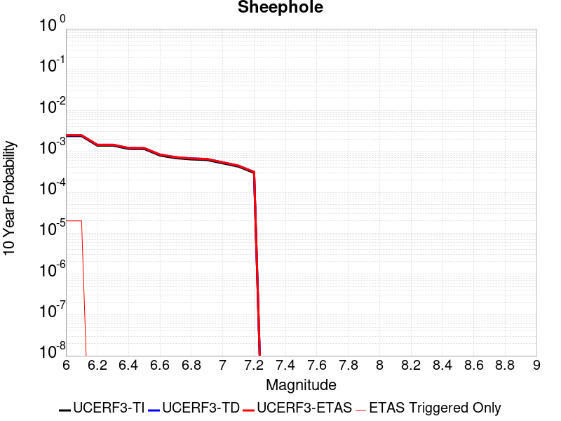 |

| Magnitude | 1 wk TI Prob | 1 wk TD Prob | 1 wk ETAS Prob | 1 wk ETAS/TD Gain | 1 wk ETAS Triggered Only | 1 mo TI Prob | 1 mo TD Prob | 1 mo ETAS Prob | 1 mo ETAS/TD Gain | 1 mo ETAS Triggered Only | 1 yr TI Prob | 1 yr TD Prob | 1 yr ETAS Prob | 1 yr ETAS/TD Gain | 1 yr ETAS Triggered Only | 10 yr TI Prob | 10 yr TD Prob | 10 yr ETAS Prob | 10 yr ETAS/TD Gain | 10 yr ETAS Triggered Only |
|-----|-----|-----|-----|-----|-----|-----|-----|-----|-----|-----|-----|-----|-----|-----|-----|-----|-----|-----|-----|-----|
| 6.0 | 4.5579695E-6 | 4.741364E-6 | 4.741364E-6 | 1.0 | 0.0 | 1.9534009E-5 | 2.0320003E-5 | 2.0320003E-5 | 1.0 | 0.0 | 2.3780059E-4 | 2.473735E-4 | 2.473735E-4 | 1.0 | 0.0 | 0.0023754628 | 0.002471526 | 0.0025103327 | 1.0157015 | 3.8902937E-5 |
| 6.1 | 4.5579695E-6 | 4.741364E-6 | 4.741364E-6 | 1.0 | 0.0 | 1.9534009E-5 | 2.0320003E-5 | 2.0320003E-5 | 1.0 | 0.0 | 2.3780059E-4 | 2.473735E-4 | 2.473735E-4 | 1.0 | 0.0 | 0.0023754628 | 0.002471526 | 0.0025103327 | 1.0157015 | 3.8902937E-5 |
| 6.2 | 2.6677674E-6 | 2.7874607E-6 | 2.7874607E-6 | 1.0 | 0.0 | 1.1433239E-5 | 1.1946211E-5 | 1.1946211E-5 | 1.0 | 0.0 | 1.3919079E-4 | 1.454365E-4 | 1.454365E-4 | 1.0 | 0.0 | 0.0013910364 | 0.001453519 | 0.001453519 | 1.0 | 0.0 |
| 6.3 | 2.6677674E-6 | 2.7874607E-6 | 2.7874607E-6 | 1.0 | 0.0 | 1.1433239E-5 | 1.1946211E-5 | 1.1946211E-5 | 1.0 | 0.0 | 1.3919079E-4 | 1.454365E-4 | 1.454365E-4 | 1.0 | 0.0 | 0.0013910364 | 0.001453519 | 0.001453519 | 1.0 | 0.0 |
| 6.4 | 2.2159759E-6 | 2.3229381E-6 | 2.3229381E-6 | 1.0 | 0.0 | 9.497005E-6 | 9.955416E-6 | 9.955416E-6 | 1.0 | 0.0 | 1.156199E-4 | 1.2120126E-4 | 1.2120126E-4 | 1.0 | 0.0 | 0.0011555976 | 0.0012114309 | 0.0012114309 | 1.0 | 0.0 |
| 6.5 | 2.1986082E-6 | 2.304818E-6 | 2.304818E-6 | 1.0 | 0.0 | 9.4225725E-6 | 9.877759E-6 | 9.877759E-6 | 1.0 | 0.0 | 1.1471378E-4 | 1.20255885E-4 | 1.20255885E-4 | 1.0 | 0.0 | 0.0011465458 | 0.0012019875 | 0.0012019875 | 1.0 | 0.0 |
| 6.6 | 1.5232331E-6 | 1.6019358E-6 | 1.6019358E-6 | 1.0 | 0.0 | 6.5281256E-6 | 6.8654217E-6 | 6.8654217E-6 | 1.0 | 0.0 | 7.947703E-5 | 8.3583494E-5 | 8.3583494E-5 | 1.0 | 0.0 | 7.9448614E-4 | 8.355393E-4 | 8.355393E-4 | 1.0 | 0.0 |
| 6.7 | 1.3137362E-6 | 1.3828576E-6 | 1.3828576E-6 | 1.0 | 0.0 | 5.6302856E-6 | 5.92652E-6 | 5.92652E-6 | 1.0 | 0.0 | 6.854657E-5 | 7.215313E-5 | 7.215313E-5 | 1.0 | 0.0 | 6.8525434E-4 | 7.2131096E-4 | 7.2131096E-4 | 1.0 | 0.0 |
| 6.8 | 1.2275751E-6 | 1.2923208E-6 | 1.2923208E-6 | 1.0 | 0.0 | 5.2610258E-6 | 5.5385067E-6 | 5.5385067E-6 | 1.0 | 0.0 | 6.4051106E-5 | 6.742937E-5 | 6.742937E-5 | 1.0 | 0.0 | 6.4032647E-4 | 6.7410246E-4 | 6.7410246E-4 | 1.0 | 0.0 |
| 6.9 | 1.1837088E-6 | 1.2461369E-6 | 1.2461369E-6 | 1.0 | 0.0 | 5.0730278E-6 | 5.3405765E-6 | 5.3405765E-6 | 1.0 | 0.0 | 6.176237E-5 | 6.501971E-5 | 6.501971E-5 | 1.0 | 0.0 | 6.17452E-4 | 6.5002E-4 | 6.5002E-4 | 1.0 | 0.0 |
| 7.0 | 9.849371E-7 | 1.0366576E-6 | 1.0366576E-6 | 1.0 | 0.0 | 4.2211523E-6 | 4.4428116E-6 | 4.4428116E-6 | 1.0 | 0.0 | 5.1391315E-5 | 5.4089993E-5 | 5.4089993E-5 | 1.0 | 0.0 | 5.137943E-4 | 5.4077833E-4 | 5.4077833E-4 | 1.0 | 0.0 |
| 7.1 | 8.1643645E-7 | 8.591908E-7 | 8.591908E-7 | 1.0 | 0.0 | 3.4990085E-6 | 3.6822414E-6 | 3.6822414E-6 | 1.0 | 0.0 | 4.2599597E-5 | 4.4830453E-5 | 4.4830453E-5 | 1.0 | 0.0 | 4.259143E-4 | 4.4822274E-4 | 4.4822274E-4 | 1.0 | 0.0 |
| 7.2 | 5.7295756E-7 | 6.029669E-7 | 6.029669E-7 | 1.0 | 0.0 | 2.45553E-6 | 2.5841418E-6 | 2.5841418E-6 | 1.0 | 0.0 | 2.9895667E-5 | 3.146154E-5 | 3.146154E-5 | 1.0 | 0.0 | 2.9891645E-4 | 3.1457754E-4 | 3.1457754E-4 | 1.0 | 0.0 |

## Big Pine (East)
*[(top)](#table-of-contents)*

| 1 Week | 1 Month | 1 Year | 10 Year |
|-----|-----|-----|-----|
|  |  | 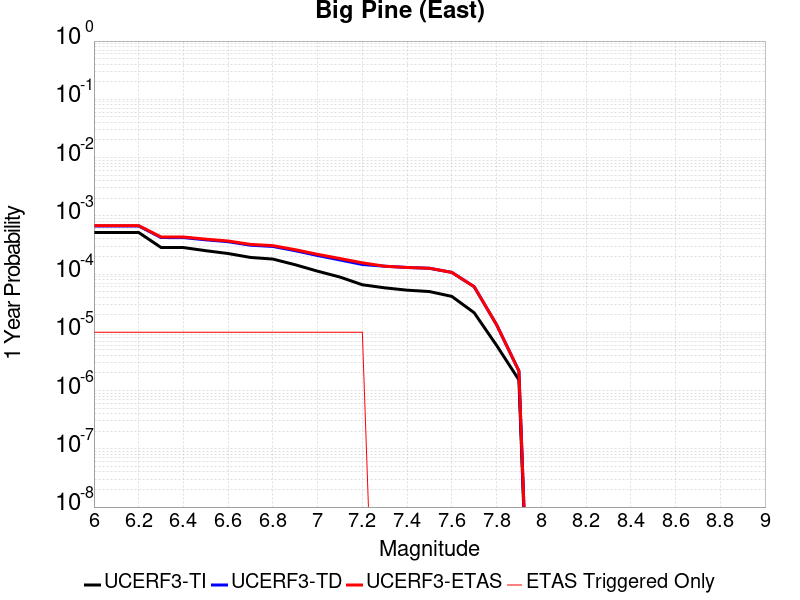 |  |

| Magnitude | 1 wk TI Prob | 1 wk TD Prob | 1 wk ETAS Prob | 1 wk ETAS/TD Gain | 1 wk ETAS Triggered Only | 1 mo TI Prob | 1 mo TD Prob | 1 mo ETAS Prob | 1 mo ETAS/TD Gain | 1 mo ETAS Triggered Only | 1 yr TI Prob | 1 yr TD Prob | 1 yr ETAS Prob | 1 yr ETAS/TD Gain | 1 yr ETAS Triggered Only | 10 yr TI Prob | 10 yr TD Prob | 10 yr ETAS Prob | 10 yr ETAS/TD Gain | 10 yr ETAS Triggered Only |
|-----|-----|-----|-----|-----|-----|-----|-----|-----|-----|-----|-----|-----|-----|-----|-----|-----|-----|-----|-----|-----|
| 6.0 | 9.916913E-6 | 1.282197E-5 | 1.282197E-5 | 1.0 | 0.0 | 4.250036E-5 | 5.495027E-5 | 5.495027E-5 | 1.0 | 0.0 | 5.173191E-4 | 6.6883623E-4 | 6.6883623E-4 | 1.0 | 0.0 | 0.0051611643 | 0.0066729826 | 0.006711626 | 1.0057911 | 3.8902937E-5 |
| 6.1 | 9.916913E-6 | 1.282197E-5 | 1.282197E-5 | 1.0 | 0.0 | 4.250036E-5 | 5.495027E-5 | 5.495027E-5 | 1.0 | 0.0 | 5.173191E-4 | 6.6883623E-4 | 6.6883623E-4 | 1.0 | 0.0 | 0.0051611643 | 0.0066729826 | 0.006711626 | 1.0057911 | 3.8902937E-5 |
| 6.2 | 9.916913E-6 | 1.282197E-5 | 1.282197E-5 | 1.0 | 0.0 | 4.250036E-5 | 5.495027E-5 | 5.495027E-5 | 1.0 | 0.0 | 5.173191E-4 | 6.6883623E-4 | 6.6883623E-4 | 1.0 | 0.0 | 0.0051611643 | 0.0066729826 | 0.006711626 | 1.0057911 | 3.8902937E-5 |
| 6.3 | 5.479711E-6 | 8.117787E-6 | 8.117787E-6 | 1.0 | 0.0 | 2.3484265E-5 | 3.4790068E-5 | 3.4790068E-5 | 1.0 | 0.0 | 2.858834E-4 | 4.2348995E-4 | 4.2348995E-4 | 1.0 | 0.0 | 0.0028551589 | 0.004229713 | 0.0042684516 | 1.0091586 | 3.8902937E-5 |
| 6.4 | 5.465009E-6 | 8.10208E-6 | 8.10208E-6 | 1.0 | 0.0 | 2.3421257E-5 | 3.4722754E-5 | 3.4722754E-5 | 1.0 | 0.0 | 2.851165E-4 | 4.2267074E-4 | 4.2267074E-4 | 1.0 | 0.0 | 0.0028475097 | 0.004221552 | 0.004260291 | 1.0091764 | 3.8902937E-5 |
| 6.5 | 4.826767E-6 | 7.4271156E-6 | 7.4271156E-6 | 1.0 | 0.0 | 2.068598E-5 | 3.183012E-5 | 3.183012E-5 | 1.0 | 0.0 | 2.518227E-4 | 3.874656E-4 | 3.874656E-4 | 1.0 | 0.0 | 0.0025153751 | 0.0038707424 | 0.0039094947 | 1.0100116 | 3.8902937E-5 |
| 6.6 | 4.3146847E-6 | 6.887036E-6 | 6.887036E-6 | 1.0 | 0.0 | 1.8491375E-5 | 2.9515548E-5 | 2.9515548E-5 | 1.0 | 0.0 | 2.2510924E-4 | 3.59295E-4 | 3.59295E-4 | 1.0 | 0.0 | 0.0022488134 | 0.0035899505 | 0.0036287138 | 1.0107977 | 3.8902937E-5 |
| 6.7 | 3.6968106E-6 | 5.9999884E-6 | 5.9999884E-6 | 1.0 | 0.0 | 1.5843378E-5 | 2.571399E-5 | 2.571399E-5 | 1.0 | 0.0 | 1.9287605E-4 | 3.130244E-4 | 3.130244E-4 | 1.0 | 0.0 | 0.0019270873 | 0.0031285542 | 0.0031285542 | 1.0 | 0.0 |
| 6.8 | 3.4671132E-6 | 5.7065704E-6 | 5.7065704E-6 | 1.0 | 0.0 | 1.4858972E-5 | 2.4456509E-5 | 2.4456509E-5 | 1.0 | 0.0 | 1.8089297E-4 | 2.9771877E-4 | 2.9771877E-4 | 1.0 | 0.0 | 0.0018074579 | 0.0029759097 | 0.0029759097 | 1.0 | 0.0 |
| 6.9 | 2.7686972E-6 | 4.829279E-6 | 4.829279E-6 | 1.0 | 0.0 | 1.1865792E-5 | 2.069675E-5 | 2.069675E-5 | 1.0 | 0.0 | 1.4445644E-4 | 2.5195457E-4 | 2.5195457E-4 | 1.0 | 0.0 | 0.0014436257 | 0.0025193316 | 0.0025193316 | 1.0 | 0.0 |
| 7.0 | 2.1472624E-6 | 3.988725E-6 | 3.988725E-6 | 1.0 | 0.0 | 9.20252E-6 | 1.7094428E-5 | 1.7094428E-5 | 1.0 | 0.0 | 1.12034926E-4 | 2.0810531E-4 | 2.0810531E-4 | 1.0 | 0.0 | 0.0011197845 | 0.002081715 | 0.002081715 | 1.0 | 0.0 |
| 7.1 | 1.7018335E-6 | 3.348229E-6 | 3.348229E-6 | 1.0 | 0.0 | 7.293552E-6 | 1.4349476E-5 | 1.4349476E-5 | 1.0 | 0.0 | 8.879537E-5 | 1.7469123E-4 | 1.7469123E-4 | 1.0 | 0.0 | 8.87599E-4 | 0.0017481181 | 0.0017481181 | 1.0 | 0.0 |
| 7.2 | 1.25603E-6 | 2.7976516E-6 | 2.7976516E-6 | 1.0 | 0.0 | 5.3829745E-6 | 1.1989882E-5 | 1.1989882E-5 | 1.0 | 0.0 | 6.553574E-5 | 1.4596726E-4 | 1.4596726E-4 | 1.0 | 0.0 | 6.551642E-4 | 0.0014612685 | 0.0014612685 | 1.0 | 0.0 |
| 7.3 | 1.112297E-6 | 2.613323E-6 | 2.613323E-6 | 1.0 | 0.0 | 4.7669787E-6 | 1.1199909E-5 | 1.1199909E-5 | 1.0 | 0.0 | 5.803642E-5 | 1.3635057E-4 | 1.3635057E-4 | 1.0 | 0.0 | 5.802127E-4 | 0.0013650558 | 0.0013650558 | 1.0 | 0.0 |
| 7.4 | 1.0137181E-6 | 2.4863546E-6 | 2.4863546E-6 | 1.0 | 0.0 | 4.3444993E-6 | 1.0655763E-5 | 1.0655763E-5 | 1.0 | 0.0 | 5.2892992E-5 | 1.297264E-4 | 1.297264E-4 | 1.0 | 0.0 | 5.288041E-4 | 0.0012986774 | 0.0012986774 | 1.0 | 0.0 |
| 7.5 | 9.598608E-7 | 2.4099256E-6 | 2.4099256E-6 | 1.0 | 0.0 | 4.1136827E-6 | 1.0328214E-5 | 1.0328214E-5 | 1.0 | 0.0 | 5.0082934E-5 | 1.2573895E-4 | 1.2573895E-4 | 1.0 | 0.0 | 5.007165E-4 | 0.0012586572 | 0.0012586572 | 1.0 | 0.0 |
| 7.6 | 7.929459E-7 | 2.047312E-6 | 2.047312E-6 | 1.0 | 0.0 | 3.3983351E-6 | 8.7741655E-6 | 8.7741655E-6 | 1.0 | 0.0 | 4.1373947E-5 | 1.0682041E-4 | 1.0682041E-4 | 1.0 | 0.0 | 4.1366243E-4 | 0.0010697625 | 0.0010697625 | 1.0 | 0.0 |
| 7.7 | 4.155788E-7 | 1.162298E-6 | 1.162298E-6 | 1.0 | 0.0 | 1.7810507E-6 | 4.981268E-6 | 4.981268E-6 | 1.0 | 0.0 | 2.1684076E-5 | 6.064529E-5 | 6.064529E-5 | 1.0 | 0.0 | 2.1681961E-4 | 6.09451E-4 | 6.09451E-4 | 1.0 | 0.0 |
| 7.8 | 1.14666925E-7 | 2.5959213E-7 | 2.5959213E-7 | 1.0 | 0.0 | 4.914296E-7 | 1.1125372E-6 | 1.1125372E-6 | 1.0 | 0.0 | 5.9831386E-6 | 1.354506E-5 | 1.354506E-5 | 1.0 | 0.0 | 5.9829777E-5 | 1.3654139E-4 | 1.3654139E-4 | 1.0 | 0.0 |
| 7.9 | 2.9231824E-8 | 4.15291E-8 | 4.15291E-8 | 1.0 | 0.0 | 1.2527924E-7 | 1.7798183E-7 | 1.7798183E-7 | 1.0 | 0.0 | 1.5252737E-6 | 2.1669268E-6 | 2.1669268E-6 | 1.0 | 0.0 | 1.5252632E-5 | 2.2001832E-5 | 2.2001832E-5 | 1.0 | 0.0 |

## Hollywood
*[(top)](#table-of-contents)*

| 1 Week | 1 Month | 1 Year | 10 Year |
|-----|-----|-----|-----|
|  |  |  |  |

| Magnitude | 1 wk TI Prob | 1 wk TD Prob | 1 wk ETAS Prob | 1 wk ETAS/TD Gain | 1 wk ETAS Triggered Only | 1 mo TI Prob | 1 mo TD Prob | 1 mo ETAS Prob | 1 mo ETAS/TD Gain | 1 mo ETAS Triggered Only | 1 yr TI Prob | 1 yr TD Prob | 1 yr ETAS Prob | 1 yr ETAS/TD Gain | 1 yr ETAS Triggered Only | 10 yr TI Prob | 10 yr TD Prob | 10 yr ETAS Prob | 10 yr ETAS/TD Gain | 10 yr ETAS Triggered Only |
|-----|-----|-----|-----|-----|-----|-----|-----|-----|-----|-----|-----|-----|-----|-----|-----|-----|-----|-----|-----|-----|
| 6.0 | 1.24487615E-5 | 1.2593849E-5 | 1.2593849E-5 | 1.0 | 0.0 | 5.3350745E-5 | 5.3972544E-5 | 5.3972544E-5 | 1.0 | 0.0 | 6.4935174E-4 | 6.569223E-4 | 6.569223E-4 | 1.0 | 0.0 | 0.0064745755 | 0.0065502916 | 0.0065889396 | 1.0059003 | 3.8902937E-5 |
| 6.1 | 1.24487615E-5 | 1.2593849E-5 | 1.2593849E-5 | 1.0 | 0.0 | 5.3350745E-5 | 5.3972544E-5 | 5.3972544E-5 | 1.0 | 0.0 | 6.4935174E-4 | 6.569223E-4 | 6.569223E-4 | 1.0 | 0.0 | 0.0064745755 | 0.0065502916 | 0.0065889396 | 1.0059003 | 3.8902937E-5 |
| 6.2 | 1.24487615E-5 | 1.2593849E-5 | 1.2593849E-5 | 1.0 | 0.0 | 5.3350745E-5 | 5.3972544E-5 | 5.3972544E-5 | 1.0 | 0.0 | 6.4935174E-4 | 6.569223E-4 | 6.569223E-4 | 1.0 | 0.0 | 0.0064745755 | 0.0065502916 | 0.0065889396 | 1.0059003 | 3.8902937E-5 |
| 6.3 | 1.24487615E-5 | 1.2593849E-5 | 1.2593849E-5 | 1.0 | 0.0 | 5.3350745E-5 | 5.3972544E-5 | 5.3972544E-5 | 1.0 | 0.0 | 6.4935174E-4 | 6.569223E-4 | 6.569223E-4 | 1.0 | 0.0 | 0.0064745755 | 0.0065502916 | 0.0065889396 | 1.0059003 | 3.8902937E-5 |
| 6.4 | 1.2431024E-5 | 1.2574461E-5 | 1.2574461E-5 | 1.0 | 0.0 | 5.327473E-5 | 5.388946E-5 | 5.388946E-5 | 1.0 | 0.0 | 6.4842677E-4 | 6.559113E-4 | 6.559113E-4 | 1.0 | 0.0 | 0.0064653796 | 0.0065402417 | 0.00657889 | 1.0059093 | 3.8902937E-5 |
| 6.5 | 1.1242222E-5 | 1.1318384E-5 | 1.1318384E-5 | 1.0 | 0.0 | 4.8180063E-5 | 4.8506474E-5 | 4.8506474E-5 | 1.0 | 0.0 | 5.864344E-4 | 5.90409E-4 | 5.90409E-4 | 1.0 | 0.0 | 0.0058488925 | 0.0058886907 | 0.005927365 | 1.0065675 | 3.8902937E-5 |
| 6.6 | 1.1234066E-5 | 1.13094975E-5 | 1.13094975E-5 | 1.0 | 0.0 | 4.8145106E-5 | 4.846839E-5 | 4.846839E-5 | 1.0 | 0.0 | 5.86009E-4 | 5.899455E-4 | 5.899455E-4 | 1.0 | 0.0 | 0.005844661 | 0.005884081 | 0.005922755 | 1.0065726 | 3.8902937E-5 |
| 6.7 | 1.12294E-5 | 1.1304241E-5 | 1.1304241E-5 | 1.0 | 0.0 | 4.812511E-5 | 4.844586E-5 | 4.844586E-5 | 1.0 | 0.0 | 5.857657E-4 | 5.896714E-4 | 5.896714E-4 | 1.0 | 0.0 | 0.0058422405 | 0.005881354 | 0.0059200283 | 1.0065757 | 3.8902937E-5 |
| 6.8 | 1.0252819E-5 | 1.0218963E-5 | 1.0218963E-5 | 1.0 | 0.0 | 4.3939912E-5 | 4.3794833E-5 | 4.3794833E-5 | 1.0 | 0.0 | 5.3483713E-4 | 5.330738E-4 | 5.330738E-4 | 1.0 | 0.0 | 0.005335517 | 0.005318177 | 0.005356873 | 1.0072762 | 3.8902937E-5 |
| 6.9 | 9.252289E-6 | 9.110761E-6 | 9.110761E-6 | 1.0 | 0.0 | 3.9652066E-5 | 3.9045543E-5 | 3.9045543E-5 | 1.0 | 0.0 | 4.8265693E-4 | 4.7527745E-4 | 4.7527745E-4 | 1.0 | 0.0 | 0.0048161 | 0.004742783 | 0.004781502 | 1.0081637 | 3.8902937E-5 |
| 7.0 | 8.474604E-6 | 8.2586685E-6 | 8.2586685E-6 | 1.0 | 0.0 | 3.6319227E-5 | 3.5393823E-5 | 3.5393823E-5 | 1.0 | 0.0 | 4.4209688E-4 | 4.3083602E-4 | 4.3083602E-4 | 1.0 | 0.0 | 0.004412184 | 0.004300158 | 0.0043388936 | 1.0090079 | 3.8902937E-5 |
| 7.1 | 6.643643E-6 | 6.26868E-6 | 6.26868E-6 | 1.0 | 0.0 | 2.8472443E-5 | 2.6865497E-5 | 2.6865497E-5 | 1.0 | 0.0 | 3.4659685E-4 | 3.2703875E-4 | 3.2703875E-4 | 1.0 | 0.0 | 0.0034605677 | 0.003265621 | 0.0033043968 | 1.011874 | 3.8902937E-5 |
| 7.2 | 5.549002E-6 | 5.1089696E-6 | 5.1089696E-6 | 1.0 | 0.0 | 2.378122E-5 | 2.1895401E-5 | 2.1895401E-5 | 1.0 | 0.0 | 2.8949787E-4 | 2.6654406E-4 | 2.6654406E-4 | 1.0 | 0.0 | 0.0028912104 | 0.00266226 | 0.0027010594 | 1.0145738 | 3.8902937E-5 |
| 7.3 | 4.3059727E-6 | 3.960103E-6 | 3.960103E-6 | 1.0 | 0.0 | 1.8454039E-5 | 1.6971762E-5 | 1.6971762E-5 | 1.0 | 0.0 | 2.2465475E-4 | 2.066117E-4 | 2.066117E-4 | 1.0 | 0.0 | 0.0022442779 | 0.0020642062 | 0.0020642062 | 1.0 | 0.0 |
| 7.4 | 2.8550733E-6 | 2.701466E-6 | 2.701466E-6 | 1.0 | 0.0 | 1.2235971E-5 | 1.1577661E-5 | 1.1577661E-5 | 1.0 | 0.0 | 1.4896276E-4 | 1.4094895E-4 | 1.4094895E-4 | 1.0 | 0.0 | 0.0014886294 | 0.0014086006 | 0.0014086006 | 1.0 | 0.0 |
| 7.5 | 1.9927045E-6 | 1.897771E-6 | 1.897771E-6 | 1.0 | 0.0 | 8.540134E-6 | 8.133279E-6 | 8.133279E-6 | 1.0 | 0.0 | 1.0397117E-4 | 9.901821E-5 | 9.901821E-5 | 1.0 | 0.0 | 0.0010392254 | 9.897444E-4 | 9.897444E-4 | 1.0 | 0.0 |
| 7.6 | 1.345084E-6 | 1.221694E-6 | 1.221694E-6 | 1.0 | 0.0 | 5.764633E-6 | 5.235821E-6 | 5.235821E-6 | 1.0 | 0.0 | 7.018215E-5 | 6.374427E-5 | 6.374427E-5 | 1.0 | 0.0 | 7.0159987E-4 | 6.372619E-4 | 6.372619E-4 | 1.0 | 0.0 |
| 7.7 | 7.6835164E-7 | 6.2783954E-7 | 6.2783954E-7 | 1.0 | 0.0 | 3.2929315E-6 | 2.6907383E-6 | 2.6907383E-6 | 1.0 | 0.0 | 4.00907E-5 | 3.275926E-5 | 3.275926E-5 | 1.0 | 0.0 | 4.0083472E-4 | 3.275458E-4 | 3.275458E-4 | 1.0 | 0.0 |
| 7.8 | 3.6562128E-7 | 2.4540546E-7 | 2.4540546E-7 | 1.0 | 0.0 | 1.5669474E-6 | 1.0517372E-6 | 1.0517372E-6 | 1.0 | 0.0 | 1.9077417E-5 | 1.280483E-5 | 1.280483E-5 | 1.0 | 0.0 | 1.907578E-4 | 1.2804128E-4 | 1.2804128E-4 | 1.0 | 0.0 |
| 7.9 | 7.5024424E-8 | 5.3828998E-8 | 5.3828998E-8 | 1.0 | 0.0 | 3.215332E-7 | 2.3069569E-7 | 2.3069569E-7 | 1.0 | 0.0 | 3.91466E-6 | 2.808718E-6 | 2.808718E-6 | 1.0 | 0.0 | 3.9145907E-5 | 2.8086954E-5 | 2.8086954E-5 | 1.0 | 0.0 |

## Hayward (No) 2011 CFM
*[(top)](#table-of-contents)*

| 1 Week | 1 Month | 1 Year | 10 Year |
|-----|-----|-----|-----|
|  |  |  |  |

| Magnitude | 1 wk TI Prob | 1 wk TD Prob | 1 wk ETAS Prob | 1 wk ETAS/TD Gain | 1 wk ETAS Triggered Only | 1 mo TI Prob | 1 mo TD Prob | 1 mo ETAS Prob | 1 mo ETAS/TD Gain | 1 mo ETAS Triggered Only | 1 yr TI Prob | 1 yr TD Prob | 1 yr ETAS Prob | 1 yr ETAS/TD Gain | 1 yr ETAS Triggered Only | 10 yr TI Prob | 10 yr TD Prob | 10 yr ETAS Prob | 10 yr ETAS/TD Gain | 10 yr ETAS Triggered Only |
|-----|-----|-----|-----|-----|-----|-----|-----|-----|-----|-----|-----|-----|-----|-----|-----|-----|-----|-----|-----|-----|
| 6.0 | 9.3068506E-5 | 1.74068E-4 | 1.74068E-4 | 1.0 | 0.0 | 3.9880406E-4 | 7.457933E-4 | 7.457933E-4 | 1.0 | 0.0 | 0.0048446343 | 0.009042277 | 0.009042277 | 1.0 | 0.0 | 0.047403704 | 0.086425416 | 0.086460955 | 1.0004113 | 3.8902937E-5 |
| 6.1 | 9.055486E-5 | 1.6958236E-4 | 1.6958236E-4 | 1.0 | 0.0 | 3.880345E-4 | 7.265799E-4 | 7.265799E-4 | 1.0 | 0.0 | 0.0047140904 | 0.008810335 | 0.008810335 | 1.0 | 0.0 | 0.046153355 | 0.08431842 | 0.08435404 | 1.0004225 | 3.8902937E-5 |
| 6.2 | 9.006742E-5 | 1.6878804E-4 | 1.6878804E-4 | 1.0 | 0.0 | 3.859461E-4 | 7.231776E-4 | 7.231776E-4 | 1.0 | 0.0 | 0.0046887742 | 0.0087693 | 0.0087693 | 1.0 | 0.0 | 0.0459107 | 0.08394261 | 0.08397824 | 1.0004245 | 3.8902937E-5 |
| 6.3 | 8.8336754E-5 | 1.6558412E-4 | 1.6558412E-4 | 1.0 | 0.0 | 3.7853114E-4 | 7.09454E-4 | 7.09454E-4 | 1.0 | 0.0 | 0.004598882 | 0.008603558 | 0.008603558 | 1.0 | 0.0 | 0.04504866 | 0.082435764 | 0.08247146 | 1.000433 | 3.8902937E-5 |
| 6.4 | 8.526157E-5 | 1.5984823E-4 | 1.5984823E-4 | 1.0 | 0.0 | 3.6535555E-4 | 6.848848E-4 | 6.848848E-4 | 1.0 | 0.0 | 0.0044391346 | 0.008306746 | 0.008306746 | 1.0 | 0.0 | 0.043514993 | 0.07973017 | 0.079765975 | 1.0004491 | 3.8902937E-5 |
| 6.5 | 8.152396E-5 | 1.5317152E-4 | 1.5317152E-4 | 1.0 | 0.0 | 3.493416E-4 | 6.56285E-4 | 6.56285E-4 | 1.0 | 0.0 | 0.0042449418 | 0.007961143 | 0.007961143 | 1.0 | 0.0 | 0.04164765 | 0.07656097 | 0.07659689 | 1.0004692 | 3.8902937E-5 |
| 6.6 | 7.987405E-5 | 1.5021319E-4 | 1.5021319E-4 | 1.0 | 0.0 | 3.4227243E-4 | 6.436127E-4 | 6.436127E-4 | 1.0 | 0.0 | 0.0041592065 | 0.0078079863 | 0.0078079863 | 1.0 | 0.0 | 0.04082218 | 0.07515338 | 0.07518936 | 1.0004787 | 3.8902937E-5 |
| 6.7 | 7.777665E-5 | 1.4660071E-4 | 1.4660071E-4 | 1.0 | 0.0 | 3.332859E-4 | 6.2813814E-4 | 6.2813814E-4 | 1.0 | 0.0 | 0.004050208 | 0.007620921 | 0.007620921 | 1.0 | 0.0 | 0.039771806 | 0.07342759 | 0.07346363 | 1.0004909 | 3.8902937E-5 |
| 6.8 | 7.3284005E-5 | 1.3809837E-4 | 1.3809837E-4 | 1.0 | 0.0 | 3.140365E-4 | 5.917165E-4 | 5.917165E-4 | 1.0 | 0.0 | 0.0038166929 | 0.007180489 | 0.007180489 | 1.0 | 0.0 | 0.037518036 | 0.06933746 | 0.06937366 | 1.0005221 | 3.8902937E-5 |
| 6.9 | 6.458263E-5 | 1.2138554E-4 | 1.2138554E-4 | 1.0 | 0.0 | 2.7675333E-4 | 5.201205E-4 | 5.201205E-4 | 1.0 | 0.0 | 0.0033642664 | 0.006314182 | 0.006314182 | 1.0 | 0.0 | 0.033137884 | 0.0612579 | 0.061294418 | 1.0005962 | 3.8902937E-5 |
| 7.0 | 5.3853604E-5 | 1.00309575E-4 | 1.00309575E-4 | 1.0 | 0.0 | 2.3078074E-4 | 4.2982766E-4 | 4.2982766E-4 | 1.0 | 0.0 | 0.0028061352 | 0.0052206595 | 0.0052206595 | 1.0 | 0.0 | 0.027709642 | 0.05098569 | 0.05102261 | 1.0007241 | 3.8902937E-5 |
| 7.1 | 4.4308683E-5 | 8.175333E-5 | 8.175333E-5 | 1.0 | 0.0 | 1.8988053E-4 | 3.5032458E-4 | 3.5032458E-4 | 1.0 | 0.0 | 0.0023093442 | 0.004256902 | 0.004256902 | 1.0 | 0.0 | 0.022854926 | 0.041847244 | 0.04188452 | 1.0008907 | 3.8902937E-5 |
| 7.2 | 3.295973E-5 | 6.0814917E-5 | 6.0814917E-5 | 1.0 | 0.0 | 1.4124835E-4 | 2.6060943E-4 | 2.6060943E-4 | 1.0 | 0.0 | 0.0017183421 | 0.0031683263 | 0.0031683263 | 1.0 | 0.0 | 0.017051157 | 0.031391077 | 0.031391077 | 1.0 | 0.0 |
| 7.3 | 2.452256E-5 | 4.521987E-5 | 4.521987E-5 | 1.0 | 0.0 | 1.05092455E-4 | 1.9378512E-4 | 1.9378512E-4 | 1.0 | 0.0 | 0.0012787496 | 0.002356795 | 0.002356795 | 1.0 | 0.0 | 0.0127141625 | 0.023460438 | 0.023460438 | 1.0 | 0.0 |
| 7.4 | 1.8829967E-5 | 3.4637967E-5 | 3.4637967E-5 | 1.0 | 0.0 | 8.069736E-5 | 1.4844004E-4 | 1.4844004E-4 | 1.0 | 0.0 | 9.820475E-4 | 0.0018057693 | 0.0018057693 | 1.0 | 0.0 | 0.009777189 | 0.018036935 | 0.018036935 | 1.0 | 0.0 |
| 7.5 | 1.26374125E-5 | 2.2948794E-5 | 2.2948794E-5 | 1.0 | 0.0 | 5.4159216E-5 | 9.83483E-5 | 9.83483E-5 | 1.0 | 0.0 | 6.5918895E-4 | 0.0011967387 | 0.0011967387 | 1.0 | 0.0 | 0.00657237 | 0.012002571 | 0.012002571 | 1.0 | 0.0 |
| 7.6 | 4.666429E-6 | 8.4890125E-6 | 8.4890125E-6 | 1.0 | 0.0 | 1.9998828E-5 | 3.638098E-5 | 3.638098E-5 | 1.0 | 0.0 | 2.4345852E-4 | 4.4284965E-4 | 4.4284965E-4 | 1.0 | 0.0 | 0.0024319198 | 0.004463953 | 0.004463953 | 1.0 | 0.0 |
| 7.7 | 3.8399318E-7 | 7.146951E-7 | 7.146951E-7 | 1.0 | 0.0 | 1.6456839E-6 | 3.0629753E-6 | 3.0629753E-6 | 1.0 | 0.0 | 2.003602E-5 | 3.7291087E-5 | 3.7291087E-5 | 1.0 | 0.0 | 2.0034213E-4 | 3.867874E-4 | 3.867874E-4 | 1.0 | 0.0 |
| 7.8 | 2.5637698E-7 | 5.3775256E-7 | 5.3775256E-7 | 1.0 | 0.0 | 1.098758E-6 | 2.3046516E-6 | 2.3046516E-6 | 1.0 | 0.0 | 1.3377297E-5 | 2.8058774E-5 | 2.8058774E-5 | 1.0 | 0.0 | 1.3376492E-4 | 2.9299298E-4 | 2.9299298E-4 | 1.0 | 0.0 |
| 7.9 | 1.7141245E-7 | 3.7368818E-7 | 3.7368818E-7 | 1.0 | 0.0 | 7.3462456E-7 | 1.6015197E-6 | 1.6015197E-6 | 1.0 | 0.0 | 8.944017E-6 | 1.9498328E-5 | 1.9498328E-5 | 1.0 | 0.0 | 8.943657E-5 | 2.02833E-4 | 2.02833E-4 | 1.0 | 0.0 |
| 8.0 | 1.1808895E-7 | 2.7563618E-7 | 2.7563618E-7 | 1.0 | 0.0 | 5.060954E-7 | 1.1812973E-6 | 1.1812973E-6 | 1.0 | 0.0 | 6.161694E-6 | 1.4382201E-5 | 1.4382201E-5 | 1.0 | 0.0 | 6.161523E-5 | 1.4842243E-4 | 1.4842243E-4 | 1.0 | 0.0 |
| 8.1 | 5.138535E-8 | 1.1250157E-7 | 1.1250157E-7 | 1.0 | 0.0 | 2.2022292E-7 | 4.8214946E-7 | 4.8214946E-7 | 1.0 | 0.0 | 2.6812106E-6 | 5.8701544E-6 | 5.8701544E-6 | 1.0 | 0.0 | 2.6811784E-5 | 6.025778E-5 | 6.025778E-5 | 1.0 | 0.0 |

## Great Valley 09 (Laguna Seca)
*[(top)](#table-of-contents)*

| 1 Week | 1 Month | 1 Year | 10 Year |
|-----|-----|-----|-----|
|  |  |  | 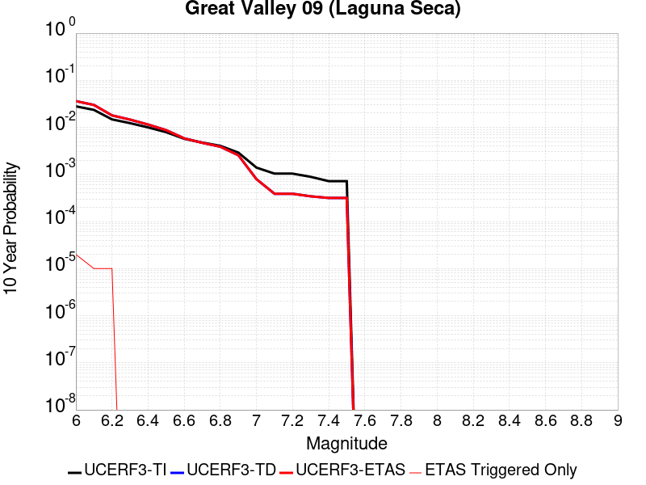 |

| Magnitude | 1 wk TI Prob | 1 wk TD Prob | 1 wk ETAS Prob | 1 wk ETAS/TD Gain | 1 wk ETAS Triggered Only | 1 mo TI Prob | 1 mo TD Prob | 1 mo ETAS Prob | 1 mo ETAS/TD Gain | 1 mo ETAS Triggered Only | 1 yr TI Prob | 1 yr TD Prob | 1 yr ETAS Prob | 1 yr ETAS/TD Gain | 1 yr ETAS Triggered Only | 10 yr TI Prob | 10 yr TD Prob | 10 yr ETAS Prob | 10 yr ETAS/TD Gain | 10 yr ETAS Triggered Only |
|-----|-----|-----|-----|-----|-----|-----|-----|-----|-----|-----|-----|-----|-----|-----|-----|-----|-----|-----|-----|-----|
| 6.0 | 5.4353277E-5 | 7.051288E-5 | 7.051288E-5 | 1.0 | 0.0 | 2.3292181E-4 | 3.021651E-4 | 3.021651E-4 | 1.0 | 0.0 | 0.0028321352 | 0.0036727623 | 0.0036727623 | 1.0 | 0.0 | 0.02796312 | 0.036121234 | 0.036158733 | 1.0010381 | 3.8902937E-5 |
| 6.1 | 4.5578287E-5 | 5.8229198E-5 | 5.8229198E-5 | 1.0 | 0.0 | 1.953209E-4 | 2.4953127E-4 | 2.4953127E-4 | 1.0 | 0.0 | 0.0023754383 | 0.0030339046 | 0.0030339046 | 1.0 | 0.0 | 0.023502063 | 0.029924182 | 0.02996192 | 1.0012611 | 3.8902937E-5 |
| 6.2 | 2.8536782E-5 | 3.4740468E-5 | 3.4740468E-5 | 1.0 | 0.0 | 1.2229476E-4 | 1.4887958E-4 | 1.4887958E-4 | 1.0 | 0.0 | 0.0014879217 | 0.0018110707 | 0.0018110707 | 1.0 | 0.0 | 0.014779986 | 0.017960638 | 0.017998843 | 1.002127 | 3.8902937E-5 |
| 6.3 | 2.3698774E-5 | 2.8215252E-5 | 2.8215252E-5 | 1.0 | 0.0 | 1.01562226E-4 | 1.2091713E-4 | 1.2091713E-4 | 1.0 | 0.0 | 0.0012358186 | 0.0014712278 | 0.0014712278 | 1.0 | 0.0 | 0.012289686 | 0.014613301 | 0.014613301 | 1.0 | 0.0 |
| 6.4 | 1.9191197E-5 | 2.2123982E-5 | 2.2123982E-5 | 1.0 | 0.0 | 8.2245395E-5 | 9.481376E-5 | 9.481376E-5 | 1.0 | 0.0 | 0.0010008777 | 0.001153789 | 0.001153789 | 1.0 | 0.0 | 0.009963818 | 0.011478378 | 0.011478378 | 1.0 | 0.0 |
| 6.5 | 1.5203241E-5 | 1.6802042E-5 | 1.6802042E-5 | 1.0 | 0.0 | 6.5155116E-5 | 7.200683E-5 | 7.200683E-5 | 1.0 | 0.0 | 7.9297484E-4 | 8.76362E-4 | 8.76362E-4 | 1.0 | 0.0 | 0.007901512 | 0.008730489 | 0.008730489 | 1.0 | 0.0 |
| 6.6 | 1.0984925E-5 | 1.1243591E-5 | 1.1243591E-5 | 1.0 | 0.0 | 4.70774E-5 | 4.8185837E-5 | 4.8185837E-5 | 1.0 | 0.0 | 5.730166E-4 | 5.865083E-4 | 5.865083E-4 | 1.0 | 0.0 | 0.005715413 | 0.0058500012 | 0.0058500012 | 1.0 | 0.0 |
| 6.7 | 9.134616E-6 | 9.020651E-6 | 9.020651E-6 | 1.0 | 0.0 | 3.9147766E-5 | 3.8659375E-5 | 3.8659375E-5 | 1.0 | 0.0 | 4.7651984E-4 | 4.705786E-4 | 4.705786E-4 | 1.0 | 0.0 | 0.004754993 | 0.0046960665 | 0.0046960665 | 1.0 | 0.0 |
| 6.8 | 7.785589E-6 | 7.4525665E-6 | 7.4525665E-6 | 1.0 | 0.0 | 3.3366385E-5 | 3.193919E-5 | 3.193919E-5 | 1.0 | 0.0 | 4.0616E-4 | 3.8879228E-4 | 3.8879228E-4 | 1.0 | 0.0 | 0.0040541845 | 0.003881325 | 0.003881325 | 1.0 | 0.0 |
| 6.9 | 5.579095E-6 | 4.8989014E-6 | 4.8989014E-6 | 1.0 | 0.0 | 2.3910188E-5 | 2.099513E-5 | 2.099513E-5 | 1.0 | 0.0 | 2.9106764E-4 | 2.555871E-4 | 2.555871E-4 | 1.0 | 0.0 | 0.002906867 | 0.002553069 | 0.002553069 | 1.0 | 0.0 |
| 7.0 | 2.6816688E-6 | 1.5217248E-6 | 1.5217248E-6 | 1.0 | 0.0 | 1.1492816E-5 | 6.5216623E-6 | 6.5216623E-6 | 1.0 | 0.0 | 1.3991605E-4 | 7.939843E-5 | 7.939843E-5 | 1.0 | 0.0 | 0.0013982799 | 7.9370936E-4 | 7.9370936E-4 | 1.0 | 0.0 |
| 7.1 | 1.9951021E-6 | 7.4544107E-7 | 7.4544107E-7 | 1.0 | 0.0 | 8.55041E-6 | 3.1947436E-6 | 3.1947436E-6 | 1.0 | 0.0 | 1.0409627E-4 | 3.8895352E-5 | 3.8895352E-5 | 1.0 | 0.0 | 0.0010404752 | 3.888896E-4 | 3.888896E-4 | 1.0 | 0.0 |
| 7.2 | 1.9951021E-6 | 7.4544107E-7 | 7.4544107E-7 | 1.0 | 0.0 | 8.55041E-6 | 3.1947436E-6 | 3.1947436E-6 | 1.0 | 0.0 | 1.0409627E-4 | 3.8895352E-5 | 3.8895352E-5 | 1.0 | 0.0 | 0.0010404752 | 3.888896E-4 | 3.888896E-4 | 1.0 | 0.0 |
| 7.3 | 1.7087556E-6 | 6.579369E-7 | 6.579369E-7 | 1.0 | 0.0 | 7.3232177E-6 | 2.8197267E-6 | 2.8197267E-6 | 1.0 | 0.0 | 8.915652E-5 | 3.4329674E-5 | 3.4329674E-5 | 1.0 | 0.0 | 8.9120766E-4 | 3.4324775E-4 | 3.4324775E-4 | 1.0 | 0.0 |
| 7.4 | 1.3804846E-6 | 6.074255E-7 | 6.074255E-7 | 1.0 | 0.0 | 5.916349E-6 | 2.6032496E-6 | 2.6032496E-6 | 1.0 | 0.0 | 7.2029165E-5 | 3.1694144E-5 | 3.1694144E-5 | 1.0 | 0.0 | 7.200583E-4 | 3.1690026E-4 | 3.1690026E-4 | 1.0 | 0.0 |
| 7.5 | 1.3804846E-6 | 6.074255E-7 | 6.074255E-7 | 1.0 | 0.0 | 5.916349E-6 | 2.6032496E-6 | 2.6032496E-6 | 1.0 | 0.0 | 7.2029165E-5 | 3.1694144E-5 | 3.1694144E-5 | 1.0 | 0.0 | 7.200583E-4 | 3.1690026E-4 | 3.1690026E-4 | 1.0 | 0.0 |

## Pisgah-Bullion Mtn-Mesquite Lk
*[(top)](#table-of-contents)*

| 1 Week | 1 Month | 1 Year | 10 Year |
|-----|-----|-----|-----|
|  |  |  |  |

| Magnitude | 1 wk TI Prob | 1 wk TD Prob | 1 wk ETAS Prob | 1 wk ETAS/TD Gain | 1 wk ETAS Triggered Only | 1 mo TI Prob | 1 mo TD Prob | 1 mo ETAS Prob | 1 mo ETAS/TD Gain | 1 mo ETAS Triggered Only | 1 yr TI Prob | 1 yr TD Prob | 1 yr ETAS Prob | 1 yr ETAS/TD Gain | 1 yr ETAS Triggered Only | 10 yr TI Prob | 10 yr TD Prob | 10 yr ETAS Prob | 10 yr ETAS/TD Gain | 10 yr ETAS Triggered Only |
|-----|-----|-----|-----|-----|-----|-----|-----|-----|-----|-----|-----|-----|-----|-----|-----|-----|-----|-----|-----|-----|
| 6.0 | 3.0240792E-5 | 2.409264E-5 | 2.409264E-5 | 1.0 | 0.0 | 1.2959696E-4 | 1.03250655E-4 | 1.03250655E-4 | 1.0 | 0.0 | 0.0015767008 | 0.0012564523 | 0.0012564523 | 1.0 | 0.0 | 0.015655609 | 0.012503509 | 0.012541926 | 1.0030725 | 3.8902937E-5 |
| 6.1 | 3.0240792E-5 | 2.409264E-5 | 2.409264E-5 | 1.0 | 0.0 | 1.2959696E-4 | 1.03250655E-4 | 1.03250655E-4 | 1.0 | 0.0 | 0.0015767008 | 0.0012564523 | 0.0012564523 | 1.0 | 0.0 | 0.015655609 | 0.012503509 | 0.012541926 | 1.0030725 | 3.8902937E-5 |
| 6.2 | 3.0240792E-5 | 2.409264E-5 | 2.409264E-5 | 1.0 | 0.0 | 1.2959696E-4 | 1.03250655E-4 | 1.03250655E-4 | 1.0 | 0.0 | 0.0015767008 | 0.0012564523 | 0.0012564523 | 1.0 | 0.0 | 0.015655609 | 0.012503509 | 0.012541926 | 1.0030725 | 3.8902937E-5 |
| 6.3 | 2.0498217E-5 | 1.3638809E-5 | 1.3638809E-5 | 1.0 | 0.0 | 8.784654E-5 | 5.845082E-5 | 5.845082E-5 | 1.0 | 0.0 | 0.0010690069 | 7.114226E-4 | 7.114226E-4 | 1.0 | 0.0 | 0.01063879 | 0.0070930775 | 0.0071317046 | 1.0054457 | 3.8902937E-5 |
| 6.4 | 2.0498217E-5 | 1.3638809E-5 | 1.3638809E-5 | 1.0 | 0.0 | 8.784654E-5 | 5.845082E-5 | 5.845082E-5 | 1.0 | 0.0 | 0.0010690069 | 7.114226E-4 | 7.114226E-4 | 1.0 | 0.0 | 0.01063879 | 0.0070930775 | 0.0071317046 | 1.0054457 | 3.8902937E-5 |
| 6.5 | 1.7316182E-5 | 1.0477582E-5 | 1.0477582E-5 | 1.0 | 0.0 | 7.42101E-5 | 4.490321E-5 | 4.490321E-5 | 1.0 | 0.0 | 9.0313336E-4 | 5.465694E-4 | 5.465694E-4 | 1.0 | 0.0 | 0.008994718 | 0.005453247 | 0.005453247 | 1.0 | 0.0 |
| 6.6 | 1.5251077E-5 | 8.414691E-6 | 8.414691E-6 | 1.0 | 0.0 | 6.536012E-5 | 3.6062505E-5 | 3.6062505E-5 | 1.0 | 0.0 | 7.9546886E-4 | 4.389798E-4 | 4.389798E-4 | 1.0 | 0.0 | 0.007926274 | 0.004381844 | 0.004381844 | 1.0 | 0.0 |
| 6.7 | 1.2997425E-5 | 6.4118035E-6 | 6.4118035E-6 | 1.0 | 0.0 | 5.570206E-5 | 2.7478894E-5 | 2.7478894E-5 | 1.0 | 0.0 | 6.7796157E-4 | 3.3450883E-4 | 3.3450883E-4 | 1.0 | 0.0 | 0.0067589693 | 0.0033405134 | 0.0033405134 | 1.0 | 0.0 |
| 6.8 | 1.035386E-5 | 4.3334735E-6 | 4.3334735E-6 | 1.0 | 0.0 | 4.437293E-5 | 1.8571902E-5 | 1.8571902E-5 | 1.0 | 0.0 | 5.401065E-4 | 2.2609031E-4 | 2.2609031E-4 | 1.0 | 0.0 | 0.0053879567 | 0.0022586898 | 0.0022586898 | 1.0 | 0.0 |
| 6.9 | 8.816252E-6 | 3.580855E-6 | 3.580855E-6 | 1.0 | 0.0 | 3.778339E-5 | 1.5346433E-5 | 1.5346433E-5 | 1.0 | 0.0 | 4.5991567E-4 | 1.8682741E-4 | 1.8682741E-4 | 1.0 | 0.0 | 0.00458965 | 0.0018667618 | 0.0018667618 | 1.0 | 0.0 |
| 7.0 | 6.8232207E-6 | 2.5677498E-6 | 2.5677498E-6 | 1.0 | 0.0 | 2.9242048E-5 | 1.1004598E-5 | 1.1004598E-5 | 1.0 | 0.0 | 3.5596377E-4 | 1.3397305E-4 | 1.3397305E-4 | 1.0 | 0.0 | 0.0035539411 | 0.0013389539 | 0.0013389539 | 1.0 | 0.0 |
| 7.1 | 5.837013E-6 | 2.2275226E-6 | 2.2275226E-6 | 1.0 | 0.0 | 2.501553E-5 | 9.546492E-6 | 9.546492E-6 | 1.0 | 0.0 | 3.045215E-4 | 1.1622263E-4 | 1.1622263E-4 | 1.0 | 0.0 | 0.0030410455 | 0.0011616475 | 0.0011616475 | 1.0 | 0.0 |
| 7.2 | 4.278052E-6 | 1.6276728E-6 | 1.6276728E-6 | 1.0 | 0.0 | 1.833438E-5 | 6.975723E-6 | 6.975723E-6 | 1.0 | 0.0 | 2.231982E-4 | 8.492635E-5 | 8.492635E-5 | 1.0 | 0.0 | 0.0022297418 | 8.489622E-4 | 8.489622E-4 | 1.0 | 0.0 |
| 7.3 | 1.8803692E-6 | 8.345377E-7 | 8.345377E-7 | 1.0 | 0.0 | 8.0587E-6 | 3.576586E-6 | 3.576586E-6 | 1.0 | 0.0 | 9.811026E-5 | 4.3544213E-5 | 4.3544213E-5 | 1.0 | 0.0 | 9.806695E-4 | 4.3537127E-4 | 4.3537127E-4 | 1.0 | 0.0 |

## Raymond
*[(top)](#table-of-contents)*

| 1 Week | 1 Month | 1 Year | 10 Year |
|-----|-----|-----|-----|
|  |  |  |  |

| Magnitude | 1 wk TI Prob | 1 wk TD Prob | 1 wk ETAS Prob | 1 wk ETAS/TD Gain | 1 wk ETAS Triggered Only | 1 mo TI Prob | 1 mo TD Prob | 1 mo ETAS Prob | 1 mo ETAS/TD Gain | 1 mo ETAS Triggered Only | 1 yr TI Prob | 1 yr TD Prob | 1 yr ETAS Prob | 1 yr ETAS/TD Gain | 1 yr ETAS Triggered Only | 10 yr TI Prob | 10 yr TD Prob | 10 yr ETAS Prob | 10 yr ETAS/TD Gain | 10 yr ETAS Triggered Only |
|-----|-----|-----|-----|-----|-----|-----|-----|-----|-----|-----|-----|-----|-----|-----|-----|-----|-----|-----|-----|-----|
| 6.0 | 1.5157413E-5 | 1.5811214E-5 | 1.5811214E-5 | 1.0 | 0.0 | 6.4958724E-5 | 6.776073E-5 | 6.776073E-5 | 1.0 | 0.0 | 7.905855E-4 | 8.246997E-4 | 8.246997E-4 | 1.0 | 0.0 | 0.007877788 | 0.008218911 | 0.008257493 | 1.0046945 | 3.8902937E-5 |
| 6.1 | 1.5157413E-5 | 1.5811214E-5 | 1.5811214E-5 | 1.0 | 0.0 | 6.4958724E-5 | 6.776073E-5 | 6.776073E-5 | 1.0 | 0.0 | 7.905855E-4 | 8.246997E-4 | 8.246997E-4 | 1.0 | 0.0 | 0.007877788 | 0.008218911 | 0.008257493 | 1.0046945 | 3.8902937E-5 |
| 6.2 | 1.5157413E-5 | 1.5811214E-5 | 1.5811214E-5 | 1.0 | 0.0 | 6.4958724E-5 | 6.776073E-5 | 6.776073E-5 | 1.0 | 0.0 | 7.905855E-4 | 8.246997E-4 | 8.246997E-4 | 1.0 | 0.0 | 0.007877788 | 0.008218911 | 0.008257493 | 1.0046945 | 3.8902937E-5 |
| 6.3 | 1.5157413E-5 | 1.5811214E-5 | 1.5811214E-5 | 1.0 | 0.0 | 6.4958724E-5 | 6.776073E-5 | 6.776073E-5 | 1.0 | 0.0 | 7.905855E-4 | 8.246997E-4 | 8.246997E-4 | 1.0 | 0.0 | 0.007877788 | 0.008218911 | 0.008257493 | 1.0046945 | 3.8902937E-5 |
| 6.4 | 1.3941944E-5 | 1.4455694E-5 | 1.4455694E-5 | 1.0 | 0.0 | 5.9749822E-5 | 6.1951636E-5 | 6.1951636E-5 | 1.0 | 0.0 | 7.2721124E-4 | 7.5402344E-4 | 7.5402344E-4 | 1.0 | 0.0 | 0.007248361 | 0.007516985 | 0.007555595 | 1.0051365 | 3.8902937E-5 |
| 6.5 | 1.3941944E-5 | 1.4455694E-5 | 1.4455694E-5 | 1.0 | 0.0 | 5.9749822E-5 | 6.1951636E-5 | 6.1951636E-5 | 1.0 | 0.0 | 7.2721124E-4 | 7.5402344E-4 | 7.5402344E-4 | 1.0 | 0.0 | 0.007248361 | 0.007516985 | 0.007555595 | 1.0051365 | 3.8902937E-5 |
| 6.6 | 1.0542609E-5 | 1.0671889E-5 | 1.0671889E-5 | 1.0 | 0.0 | 4.5181827E-5 | 4.57359E-5 | 4.57359E-5 | 1.0 | 0.0 | 5.499499E-4 | 5.566977E-4 | 5.566977E-4 | 1.0 | 0.0 | 0.005485909 | 0.0055535934 | 0.00559228 | 1.0069661 | 3.8902937E-5 |
| 6.7 | 1.0542609E-5 | 1.0671889E-5 | 1.0671889E-5 | 1.0 | 0.0 | 4.5181827E-5 | 4.57359E-5 | 4.57359E-5 | 1.0 | 0.0 | 5.499499E-4 | 5.566977E-4 | 5.566977E-4 | 1.0 | 0.0 | 0.005485909 | 0.0055535934 | 0.00559228 | 1.0069661 | 3.8902937E-5 |
| 6.8 | 1.0079132E-5 | 1.0177405E-5 | 1.0177405E-5 | 1.0 | 0.0 | 4.3195567E-5 | 4.361675E-5 | 4.361675E-5 | 1.0 | 0.0 | 5.257791E-4 | 5.309099E-4 | 5.309099E-4 | 1.0 | 0.0 | 0.0052453685 | 0.005296965 | 0.005335662 | 1.0073055 | 3.8902937E-5 |
| 6.9 | 7.721598E-6 | 7.549502E-6 | 7.549502E-6 | 1.0 | 0.0 | 3.3092143E-5 | 3.2354612E-5 | 3.2354612E-5 | 1.0 | 0.0 | 4.0282236E-4 | 3.9384744E-4 | 3.9384744E-4 | 1.0 | 0.0 | 0.0040209293 | 0.003931628 | 0.003970378 | 1.009856 | 3.8902937E-5 |
| 7.0 | 7.137566E-6 | 6.9118714E-6 | 6.9118714E-6 | 1.0 | 0.0 | 3.058921E-5 | 2.9621975E-5 | 2.9621975E-5 | 1.0 | 0.0 | 3.7236E-4 | 3.6058895E-4 | 3.6058895E-4 | 1.0 | 0.0 | 0.0037173668 | 0.0036001569 | 0.0036389197 | 1.010767 | 3.8902937E-5 |
| 7.1 | 5.654976E-6 | 5.3000313E-6 | 5.3000313E-6 | 1.0 | 0.0 | 2.4235387E-5 | 2.2714223E-5 | 2.2714223E-5 | 1.0 | 0.0 | 2.9502588E-4 | 2.7651078E-4 | 2.7651078E-4 | 1.0 | 0.0 | 0.0029463451 | 0.0027616983 | 0.002800494 | 1.0140477 | 3.8902937E-5 |
| 7.2 | 4.9358455E-6 | 4.5271145E-6 | 4.5271145E-6 | 1.0 | 0.0 | 2.1153453E-5 | 1.9401774E-5 | 1.9401774E-5 | 1.0 | 0.0 | 2.5751285E-4 | 2.3619113E-4 | 2.3619113E-4 | 1.0 | 0.0 | 0.0025721465 | 0.0023594233 | 0.0023982343 | 1.0164495 | 3.8902937E-5 |
| 7.3 | 4.2368597E-6 | 3.8060439E-6 | 3.8060439E-6 | 1.0 | 0.0 | 1.8157843E-5 | 1.6311516E-5 | 1.6311516E-5 | 1.0 | 0.0 | 2.2104931E-4 | 1.9857471E-4 | 1.9857471E-4 | 1.0 | 0.0 | 0.0022082955 | 0.0019839914 | 0.0019839914 | 1.0 | 0.0 |
| 7.4 | 3.4999923E-6 | 3.0441354E-6 | 3.0441354E-6 | 1.0 | 0.0 | 1.49998805E-5 | 1.30462295E-5 | 1.30462295E-5 | 1.0 | 0.0 | 1.8260824E-4 | 1.5882634E-4 | 1.5882634E-4 | 1.0 | 0.0 | 0.0018245826 | 0.001587144 | 0.001587144 | 1.0 | 0.0 |
| 7.5 | 2.738017E-6 | 2.3023013E-6 | 2.3023013E-6 | 1.0 | 0.0 | 1.1734306E-5 | 9.866968E-6 | 9.866968E-6 | 1.0 | 0.0 | 1.428558E-4 | 1.2012378E-4 | 1.2012378E-4 | 1.0 | 0.0 | 0.0014276401 | 0.0012006029 | 0.0012006029 | 1.0 | 0.0 |
| 7.6 | 1.8186392E-6 | 1.4424903E-6 | 1.4424903E-6 | 1.0 | 0.0 | 7.794145E-6 | 6.1820865E-6 | 6.1820865E-6 | 1.0 | 0.0 | 9.488958E-5 | 7.526435E-5 | 7.526435E-5 | 1.0 | 0.0 | 9.4849075E-4 | 7.524001E-4 | 7.524001E-4 | 1.0 | 0.0 |
| 7.7 | 1.0660348E-6 | 7.6452443E-7 | 7.6452443E-7 | 1.0 | 0.0 | 4.5687125E-6 | 3.2765292E-6 | 3.2765292E-6 | 1.0 | 0.0 | 5.5622655E-5 | 3.989103E-5 | 3.989103E-5 | 1.0 | 0.0 | 5.5608735E-4 | 3.9884783E-4 | 3.9884783E-4 | 1.0 | 0.0 |
| 7.8 | 6.913602E-7 | 4.3216164E-7 | 4.3216164E-7 | 1.0 | 0.0 | 2.962969E-6 | 1.85212E-6 | 1.85212E-6 | 1.0 | 0.0 | 3.607355E-5 | 2.2549335E-5 | 2.2549335E-5 | 1.0 | 0.0 | 3.6067693E-4 | 2.2547832E-4 | 2.2547832E-4 | 1.0 | 0.0 |
| 7.9 | 7.425201E-8 | 5.3234306E-8 | 5.3234306E-8 | 1.0 | 0.0 | 3.1822285E-7 | 2.28147E-7 | 2.28147E-7 | 1.0 | 0.0 | 3.874356E-6 | 2.7776875E-6 | 2.7776875E-6 | 1.0 | 0.0 | 3.8742884E-5 | 2.777666E-5 | 2.777666E-5 | 1.0 | 0.0 |

## Palos Verdes
*[(top)](#table-of-contents)*

| 1 Week | 1 Month | 1 Year | 10 Year |
|-----|-----|-----|-----|
|  |  |  |  |

| Magnitude | 1 wk TI Prob | 1 wk TD Prob | 1 wk ETAS Prob | 1 wk ETAS/TD Gain | 1 wk ETAS Triggered Only | 1 mo TI Prob | 1 mo TD Prob | 1 mo ETAS Prob | 1 mo ETAS/TD Gain | 1 mo ETAS Triggered Only | 1 yr TI Prob | 1 yr TD Prob | 1 yr ETAS Prob | 1 yr ETAS/TD Gain | 1 yr ETAS Triggered Only | 10 yr TI Prob | 10 yr TD Prob | 10 yr ETAS Prob | 10 yr ETAS/TD Gain | 10 yr ETAS Triggered Only |
|-----|-----|-----|-----|-----|-----|-----|-----|-----|-----|-----|-----|-----|-----|-----|-----|-----|-----|-----|-----|-----|
| 6.0 | 6.126063E-5 | 7.623614E-5 | 7.623614E-5 | 1.0 | 0.0 | 2.6251914E-4 | 3.2668875E-4 | 3.2668875E-4 | 1.0 | 0.0 | 0.0031914865 | 0.0039706747 | 0.0040094233 | 1.0097587 | 3.8902937E-5 | 0.031460393 | 0.0390538 | 0.039091185 | 1.0009573 | 3.8902937E-5 |
| 6.1 | 6.126063E-5 | 7.623614E-5 | 7.623614E-5 | 1.0 | 0.0 | 2.6251914E-4 | 3.2668875E-4 | 3.2668875E-4 | 1.0 | 0.0 | 0.0031914865 | 0.0039706747 | 0.0040094233 | 1.0097587 | 3.8902937E-5 | 0.031460393 | 0.0390538 | 0.039091185 | 1.0009573 | 3.8902937E-5 |
| 6.2 | 6.126063E-5 | 7.623614E-5 | 7.623614E-5 | 1.0 | 0.0 | 2.6251914E-4 | 3.2668875E-4 | 3.2668875E-4 | 1.0 | 0.0 | 0.0031914865 | 0.0039706747 | 0.0040094233 | 1.0097587 | 3.8902937E-5 | 0.031460393 | 0.0390538 | 0.039091185 | 1.0009573 | 3.8902937E-5 |
| 6.3 | 4.0838047E-5 | 4.9755265E-5 | 4.9755265E-5 | 1.0 | 0.0 | 1.7500846E-4 | 2.1322069E-4 | 2.1322069E-4 | 1.0 | 0.0 | 0.0021286458 | 0.002593076 | 0.002593076 | 1.0 | 0.0 | 0.021083709 | 0.025649615 | 0.025649615 | 1.0 | 0.0 |
| 6.4 | 4.0838047E-5 | 4.9755265E-5 | 4.9755265E-5 | 1.0 | 0.0 | 1.7500846E-4 | 2.1322069E-4 | 2.1322069E-4 | 1.0 | 0.0 | 0.0021286458 | 0.002593076 | 0.002593076 | 1.0 | 0.0 | 0.021083709 | 0.025649615 | 0.025649615 | 1.0 | 0.0 |
| 6.5 | 3.0512005E-5 | 3.6565507E-5 | 3.6565507E-5 | 1.0 | 0.0 | 1.3075917E-4 | 1.5670057E-4 | 1.5670057E-4 | 1.0 | 0.0 | 0.0015908304 | 0.0019062778 | 0.0019062778 | 1.0 | 0.0 | 0.015794903 | 0.018911136 | 0.018911136 | 1.0 | 0.0 |
| 6.6 | 2.9255087E-5 | 3.5158213E-5 | 3.5158213E-5 | 1.0 | 0.0 | 1.2537291E-4 | 1.5067002E-4 | 1.5067002E-4 | 1.0 | 0.0 | 0.0015253464 | 0.0018329794 | 0.0018329794 | 1.0 | 0.0 | 0.015149189 | 0.018190164 | 0.018190164 | 1.0 | 0.0 |
| 6.7 | 2.287198E-5 | 2.7251068E-5 | 2.7251068E-5 | 1.0 | 0.0 | 9.801909E-5 | 1.1678558E-4 | 1.1678558E-4 | 1.0 | 0.0 | 0.001192729 | 0.0014210287 | 0.0014210287 | 1.0 | 0.0 | 0.011863477 | 0.014128654 | 0.014128654 | 1.0 | 0.0 |
| 6.8 | 2.1325764E-5 | 2.5434496E-5 | 2.5434496E-5 | 1.0 | 0.0 | 9.139293E-5 | 1.0900094E-4 | 1.0900094E-4 | 1.0 | 0.0 | 0.001112141 | 0.0013263688 | 0.0013263688 | 1.0 | 0.0 | 0.011065915 | 0.013193562 | 0.013193562 | 1.0 | 0.0 |
| 6.9 | 1.9009392E-5 | 2.2615843E-5 | 2.2615843E-5 | 1.0 | 0.0 | 8.1466285E-5 | 9.692193E-5 | 9.692193E-5 | 1.0 | 0.0 | 9.914007E-4 | 0.001179473 | 0.001179473 | 1.0 | 0.0 | 0.009869894 | 0.011740818 | 0.011740818 | 1.0 | 0.0 |
| 7.0 | 1.7098473E-5 | 2.0321406E-5 | 2.0321406E-5 | 1.0 | 0.0 | 7.3277115E-5 | 8.708931E-5 | 8.708931E-5 | 1.0 | 0.0 | 8.917837E-4 | 0.0010598819 | 0.0010598819 | 1.0 | 0.0 | 0.008882134 | 0.010556707 | 0.010556707 | 1.0 | 0.0 |
| 7.1 | 1.5982785E-5 | 1.8996678E-5 | 1.8996678E-5 | 1.0 | 0.0 | 6.849585E-5 | 8.141227E-5 | 8.141227E-5 | 1.0 | 0.0 | 8.336179E-4 | 9.908284E-4 | 9.908284E-4 | 1.0 | 0.0 | 0.008304977 | 0.009872472 | 0.009872472 | 1.0 | 0.0 |
| 7.2 | 1.4468002E-5 | 1.7198974E-5 | 1.7198974E-5 | 1.0 | 0.0 | 6.200425E-5 | 7.370828E-5 | 7.370828E-5 | 1.0 | 0.0 | 7.546402E-4 | 8.971129E-4 | 8.971129E-4 | 1.0 | 0.0 | 0.007520827 | 0.008943185 | 0.008943185 | 1.0 | 0.0 |
| 7.3 | 5.288233E-6 | 6.204259E-6 | 6.204259E-6 | 1.0 | 0.0 | 2.2663658E-5 | 2.6589607E-5 | 2.6589607E-5 | 1.0 | 0.0 | 2.7589512E-4 | 3.237153E-4 | 3.237153E-4 | 1.0 | 0.0 | 0.0027555283 | 0.003235861 | 0.003235861 | 1.0 | 0.0 |
| 7.4 | 8.279556E-7 | 8.408416E-7 | 8.408416E-7 | 1.0 | 0.0 | 3.5483763E-6 | 3.6036022E-6 | 3.6036022E-6 | 1.0 | 0.0 | 4.3200624E-5 | 4.387305E-5 | 4.387305E-5 | 1.0 | 0.0 | 4.3192226E-4 | 4.386511E-4 | 4.386511E-4 | 1.0 | 0.0 |
| 7.5 | 6.559831E-7 | 6.667287E-7 | 6.667287E-7 | 1.0 | 0.0 | 2.8113532E-6 | 2.857406E-6 | 2.857406E-6 | 1.0 | 0.0 | 3.4227687E-5 | 3.4788427E-5 | 3.4788427E-5 | 1.0 | 0.0 | 3.4222414E-4 | 3.4783647E-4 | 3.4783647E-4 | 1.0 | 0.0 |
| 7.6 | 3.5018968E-7 | 3.5620351E-7 | 3.5620351E-7 | 1.0 | 0.0 | 1.500812E-6 | 1.526586E-6 | 1.526586E-6 | 1.0 | 0.0 | 1.8272232E-5 | 1.8586072E-5 | 1.8586072E-5 | 1.0 | 0.0 | 1.8270731E-4 | 1.8584977E-4 | 1.8584977E-4 | 1.0 | 0.0 |
| 7.7 | 1.1986104E-7 | 1.2198491E-7 | 1.2198491E-7 | 1.0 | 0.0 | 5.1369005E-7 | 5.227924E-7 | 5.227924E-7 | 1.0 | 0.0 | 6.2541585E-6 | 6.364979E-6 | 6.364979E-6 | 1.0 | 0.0 | 6.2539824E-5 | 6.364801E-5 | 6.364801E-5 | 1.0 | 0.0 |
| 7.8 | 3.0445005E-8 | 3.10279E-8 | 3.10279E-8 | 1.0 | 0.0 | 1.3047858E-7 | 1.3297671E-7 | 1.3297671E-7 | 1.0 | 0.0 | 1.5885756E-6 | 1.6189904E-6 | 1.6189904E-6 | 1.0 | 0.0 | 1.5885644E-5 | 1.6189806E-5 | 1.6189806E-5 | 1.0 | 0.0 |

## Verdugo
*[(top)](#table-of-contents)*

| 1 Week | 1 Month | 1 Year | 10 Year |
|-----|-----|-----|-----|
|  |  |  |  |

| Magnitude | 1 wk TI Prob | 1 wk TD Prob | 1 wk ETAS Prob | 1 wk ETAS/TD Gain | 1 wk ETAS Triggered Only | 1 mo TI Prob | 1 mo TD Prob | 1 mo ETAS Prob | 1 mo ETAS/TD Gain | 1 mo ETAS Triggered Only | 1 yr TI Prob | 1 yr TD Prob | 1 yr ETAS Prob | 1 yr ETAS/TD Gain | 1 yr ETAS Triggered Only | 10 yr TI Prob | 10 yr TD Prob | 10 yr ETAS Prob | 10 yr ETAS/TD Gain | 10 yr ETAS Triggered Only |
|-----|-----|-----|-----|-----|-----|-----|-----|-----|-----|-----|-----|-----|-----|-----|-----|-----|-----|-----|-----|-----|
| 6.0 | 5.392987E-6 | 4.2168244E-6 | 4.2168244E-6 | 1.0 | 0.0 | 2.3112598E-5 | 1.8071984E-5 | 1.8071984E-5 | 1.0 | 0.0 | 2.8135953E-4 | 2.2000464E-4 | 2.2000464E-4 | 1.0 | 0.0 | 0.0028100356 | 0.0021979162 | 0.0022367337 | 1.017661 | 3.8902937E-5 |
| 6.1 | 5.392987E-6 | 4.2168244E-6 | 4.2168244E-6 | 1.0 | 0.0 | 2.3112598E-5 | 1.8071984E-5 | 1.8071984E-5 | 1.0 | 0.0 | 2.8135953E-4 | 2.2000464E-4 | 2.2000464E-4 | 1.0 | 0.0 | 0.0028100356 | 0.0021979162 | 0.0022367337 | 1.017661 | 3.8902937E-5 |
| 6.2 | 5.392987E-6 | 4.2168244E-6 | 4.2168244E-6 | 1.0 | 0.0 | 2.3112598E-5 | 1.8071984E-5 | 1.8071984E-5 | 1.0 | 0.0 | 2.8135953E-4 | 2.2000464E-4 | 2.2000464E-4 | 1.0 | 0.0 | 0.0028100356 | 0.0021979162 | 0.0022367337 | 1.017661 | 3.8902937E-5 |
| 6.3 | 5.392987E-6 | 4.2168244E-6 | 4.2168244E-6 | 1.0 | 0.0 | 2.3112598E-5 | 1.8071984E-5 | 1.8071984E-5 | 1.0 | 0.0 | 2.8135953E-4 | 2.2000464E-4 | 2.2000464E-4 | 1.0 | 0.0 | 0.0028100356 | 0.0021979162 | 0.0022367337 | 1.017661 | 3.8902937E-5 |
| 6.4 | 5.392987E-6 | 4.2168244E-6 | 4.2168244E-6 | 1.0 | 0.0 | 2.3112598E-5 | 1.8071984E-5 | 1.8071984E-5 | 1.0 | 0.0 | 2.8135953E-4 | 2.2000464E-4 | 2.2000464E-4 | 1.0 | 0.0 | 0.0028100356 | 0.0021979162 | 0.0022367337 | 1.017661 | 3.8902937E-5 |
| 6.5 | 4.9154837E-6 | 3.7227633E-6 | 3.7227633E-6 | 1.0 | 0.0 | 2.1066187E-5 | 1.5954603E-5 | 1.5954603E-5 | 1.0 | 0.0 | 2.5645064E-4 | 1.9423019E-4 | 1.9423019E-4 | 1.0 | 0.0 | 0.002561549 | 0.0019406251 | 0.0019794526 | 1.0200077 | 3.8902937E-5 |
| 6.6 | 4.9154837E-6 | 3.7227633E-6 | 3.7227633E-6 | 1.0 | 0.0 | 2.1066187E-5 | 1.5954603E-5 | 1.5954603E-5 | 1.0 | 0.0 | 2.5645064E-4 | 1.9423019E-4 | 1.9423019E-4 | 1.0 | 0.0 | 0.002561549 | 0.0019406251 | 0.0019794526 | 1.0200077 | 3.8902937E-5 |
| 6.7 | 4.817006E-6 | 3.6209483E-6 | 3.6209483E-6 | 1.0 | 0.0 | 2.0644147E-5 | 1.5518259E-5 | 1.5518259E-5 | 1.0 | 0.0 | 2.513135E-4 | 1.8891861E-4 | 1.8891861E-4 | 1.0 | 0.0 | 0.0025102948 | 0.0018875997 | 0.0019264292 | 1.0205709 | 3.8902937E-5 |
| 6.8 | 4.507407E-6 | 3.3073918E-6 | 3.3073918E-6 | 1.0 | 0.0 | 1.9317316E-5 | 1.417446E-5 | 1.417446E-5 | 1.0 | 0.0 | 2.3516294E-4 | 1.7256053E-4 | 1.7256053E-4 | 1.0 | 0.0 | 0.0023491425 | 0.0017242797 | 0.0017631155 | 1.0225229 | 3.8902937E-5 |
| 6.9 | 4.3573054E-6 | 3.1612947E-6 | 3.1612947E-6 | 1.0 | 0.0 | 1.8674033E-5 | 1.3548336E-5 | 1.3548336E-5 | 1.0 | 0.0 | 2.2733262E-4 | 1.6493862E-4 | 1.6493862E-4 | 1.0 | 0.0 | 0.0022710022 | 0.0016481745 | 0.0016870133 | 1.0235647 | 3.8902937E-5 |
| 7.0 | 4.171527E-6 | 2.9839493E-6 | 2.9839493E-6 | 1.0 | 0.0 | 1.787785E-5 | 1.2788292E-5 | 1.2788292E-5 | 1.0 | 0.0 | 2.1764109E-4 | 1.5568644E-4 | 1.5568644E-4 | 1.0 | 0.0 | 0.0021742806 | 0.0015557851 | 0.0015946274 | 1.0249665 | 3.8902937E-5 |
| 7.1 | 4.0405484E-6 | 2.8825361E-6 | 2.8825361E-6 | 1.0 | 0.0 | 1.731652E-5 | 1.2353669E-5 | 1.2353669E-5 | 1.0 | 0.0 | 2.1080824E-4 | 1.5039564E-4 | 1.5039564E-4 | 1.0 | 0.0 | 0.0021060838 | 0.0015029497 | 0.0015417942 | 1.0258455 | 3.8902937E-5 |
| 7.2 | 3.8306007E-6 | 2.7021142E-6 | 2.7021142E-6 | 1.0 | 0.0 | 1.6416758E-5 | 1.1580439E-5 | 1.1580439E-5 | 1.0 | 0.0 | 1.9985568E-4 | 1.4098283E-4 | 1.4098283E-4 | 1.0 | 0.0 | 0.0019967605 | 0.0014089446 | 0.0014477927 | 1.0275725 | 3.8902937E-5 |
| 7.3 | 3.5750938E-6 | 2.5124377E-6 | 2.5124377E-6 | 1.0 | 0.0 | 1.532174E-5 | 1.0767546E-5 | 1.0767546E-5 | 1.0 | 0.0 | 1.8652623E-4 | 1.310871E-4 | 1.310871E-4 | 1.0 | 0.0 | 0.0018636974 | 0.0013101082 | 0.0013101082 | 1.0 | 0.0 |
| 7.4 | 3.3510041E-6 | 2.341114E-6 | 2.341114E-6 | 1.0 | 0.0 | 1.4361368E-5 | 1.0033307E-5 | 1.0033307E-5 | 1.0 | 0.0 | 1.7483562E-4 | 1.2214878E-4 | 1.2214878E-4 | 1.0 | 0.0 | 0.0017469813 | 0.0012208268 | 0.0012208268 | 1.0 | 0.0 |
| 7.5 | 2.948287E-6 | 2.0392326E-6 | 2.0392326E-6 | 1.0 | 0.0 | 1.2635454E-5 | 8.73954E-6 | 8.73954E-6 | 1.0 | 0.0 | 1.538258E-4 | 1.0639881E-4 | 1.0639881E-4 | 1.0 | 0.0 | 0.0015371935 | 0.0010634889 | 0.0010634889 | 1.0 | 0.0 |
| 7.6 | 2.0134323E-6 | 1.4472091E-6 | 1.4472091E-6 | 1.0 | 0.0 | 8.628967E-6 | 6.2023105E-6 | 6.2023105E-6 | 1.0 | 0.0 | 1.05052604E-4 | 7.551061E-5 | 7.551061E-5 | 1.0 | 0.0 | 0.0010500296 | 7.548583E-4 | 7.548583E-4 | 1.0 | 0.0 |
| 7.7 | 5.726436E-7 | 4.0454935E-7 | 4.0454935E-7 | 1.0 | 0.0 | 2.4541846E-6 | 1.733782E-6 | 1.733782E-6 | 1.0 | 0.0 | 2.9879287E-5 | 2.1108617E-5 | 2.1108617E-5 | 1.0 | 0.0 | 2.987527E-4 | 2.1106866E-4 | 2.1106866E-4 | 1.0 | 0.0 |
| 7.8 | 1.6248204E-7 | 1.0689272E-7 | 1.0689272E-7 | 1.0 | 0.0 | 6.963514E-7 | 4.581116E-7 | 4.581116E-7 | 1.0 | 0.0 | 8.478045E-6 | 5.5774944E-6 | 5.5774944E-6 | 1.0 | 0.0 | 8.477722E-5 | 5.577358E-5 | 5.577358E-5 | 1.0 | 0.0 |
| 7.9 | 4.4475744E-8 | 3.037644E-8 | 3.037644E-8 | 1.0 | 0.0 | 1.9061031E-7 | 1.3018474E-7 | 1.3018474E-7 | 1.0 | 0.0 | 2.320678E-6 | 1.5849984E-6 | 1.5849984E-6 | 1.0 | 0.0 | 2.3206538E-5 | 1.5849884E-5 | 1.5849884E-5 | 1.0 | 0.0 |

## Bennett Valley 2011 CFM
*[(top)](#table-of-contents)*

| 1 Week | 1 Month | 1 Year | 10 Year |
|-----|-----|-----|-----|
|  |  |  |  |

| Magnitude | 1 wk TI Prob | 1 wk TD Prob | 1 wk ETAS Prob | 1 wk ETAS/TD Gain | 1 wk ETAS Triggered Only | 1 mo TI Prob | 1 mo TD Prob | 1 mo ETAS Prob | 1 mo ETAS/TD Gain | 1 mo ETAS Triggered Only | 1 yr TI Prob | 1 yr TD Prob | 1 yr ETAS Prob | 1 yr ETAS/TD Gain | 1 yr ETAS Triggered Only | 10 yr TI Prob | 10 yr TD Prob | 10 yr ETAS Prob | 10 yr ETAS/TD Gain | 10 yr ETAS Triggered Only |
|-----|-----|-----|-----|-----|-----|-----|-----|-----|-----|-----|-----|-----|-----|-----|-----|-----|-----|-----|-----|-----|
| 6.0 | 2.3893934E-5 | 2.8241704E-5 | 2.8241704E-5 | 1.0 | 0.0 | 1.0239855E-4 | 1.210313E-4 | 1.210313E-4 | 1.0 | 0.0 | 0.0012459893 | 0.001472745 | 0.001472745 | 1.0 | 0.0 | 0.012390262 | 0.014652503 | 0.014690836 | 1.0026162 | 3.8902937E-5 |
| 6.1 | 2.3893934E-5 | 2.8241704E-5 | 2.8241704E-5 | 1.0 | 0.0 | 1.0239855E-4 | 1.210313E-4 | 1.210313E-4 | 1.0 | 0.0 | 0.0012459893 | 0.001472745 | 0.001472745 | 1.0 | 0.0 | 0.012390262 | 0.014652503 | 0.014690836 | 1.0026162 | 3.8902937E-5 |
| 6.2 | 1.6657146E-5 | 1.9855883E-5 | 1.9855883E-5 | 1.0 | 0.0 | 7.138582E-5 | 8.509466E-5 | 8.509466E-5 | 1.0 | 0.0 | 8.6877577E-4 | 0.0010356767 | 0.0010356767 | 1.0 | 0.0 | 0.008653872 | 0.010326771 | 0.010326771 | 1.0 | 0.0 |
| 6.3 | 1.6657146E-5 | 1.9855883E-5 | 1.9855883E-5 | 1.0 | 0.0 | 7.138582E-5 | 8.509466E-5 | 8.509466E-5 | 1.0 | 0.0 | 8.6877577E-4 | 0.0010356767 | 0.0010356767 | 1.0 | 0.0 | 0.008653872 | 0.010326771 | 0.010326771 | 1.0 | 0.0 |
| 6.4 | 1.29418495E-5 | 1.5569252E-5 | 1.5569252E-5 | 1.0 | 0.0 | 5.546389E-5 | 6.6724395E-5 | 6.6724395E-5 | 1.0 | 0.0 | 6.7506364E-4 | 8.1219705E-4 | 8.1219705E-4 | 1.0 | 0.0 | 0.0067301663 | 0.008109432 | 0.008109432 | 1.0 | 0.0 |
| 6.5 | 1.2582504E-5 | 1.51362465E-5 | 1.51362465E-5 | 1.0 | 0.0 | 5.39239E-5 | 6.486875E-5 | 6.486875E-5 | 1.0 | 0.0 | 6.563257E-4 | 7.896211E-4 | 7.896211E-4 | 1.0 | 0.0 | 0.006543907 | 0.007885315 | 0.007885315 | 1.0 | 0.0 |
| 6.6 | 1.0846706E-5 | 1.3038316E-5 | 1.3038316E-5 | 1.0 | 0.0 | 4.6485053E-5 | 5.5878027E-5 | 5.5878027E-5 | 1.0 | 0.0 | 5.6580856E-4 | 6.8023097E-4 | 6.8023097E-4 | 1.0 | 0.0 | 0.005643701 | 0.0067984806 | 0.0067984806 | 1.0 | 0.0 |
| 6.7 | 1.6803231E-6 | 2.3785226E-6 | 2.3785226E-6 | 1.0 | 0.0 | 7.2013645E-6 | 1.0193628E-5 | 1.0193628E-5 | 1.0 | 0.0 | 8.7673085E-5 | 1.241005E-4 | 1.241005E-4 | 1.0 | 0.0 | 8.76385E-4 | 0.0012447466 | 0.0012447466 | 1.0 | 0.0 |
| 6.8 | 1.4609833E-6 | 2.094572E-6 | 2.094572E-6 | 1.0 | 0.0 | 6.261342E-6 | 8.976706E-6 | 8.976706E-6 | 1.0 | 0.0 | 7.6229175E-5 | 1.0928598E-4 | 1.0928598E-4 | 1.0 | 0.0 | 7.620303E-4 | 0.0010967137 | 0.0010967137 | 1.0 | 0.0 |
| 6.9 | 1.3492396E-6 | 1.9465033E-6 | 1.9465033E-6 | 1.0 | 0.0 | 5.7824427E-6 | 8.342131E-6 | 8.342131E-6 | 1.0 | 0.0 | 7.0398964E-5 | 1.0156077E-4 | 1.0156077E-4 | 1.0 | 0.0 | 7.037667E-4 | 0.0010195051 | 0.0010195051 | 1.0 | 0.0 |
| 7.0 | 1.2347921E-6 | 1.7894824E-6 | 1.7894824E-6 | 1.0 | 0.0 | 5.291955E-6 | 7.669189E-6 | 7.669189E-6 | 1.0 | 0.0 | 6.442765E-5 | 9.336842E-5 | 9.336842E-5 | 1.0 | 0.0 | 6.440897E-4 | 9.376385E-4 | 9.376385E-4 | 1.0 | 0.0 |
| 7.1 | 1.1262973E-6 | 1.6364918E-6 | 1.6364918E-6 | 1.0 | 0.0 | 4.8269794E-6 | 7.013518E-6 | 7.013518E-6 | 1.0 | 0.0 | 5.876689E-5 | 8.538629E-5 | 8.538629E-5 | 1.0 | 0.0 | 5.875135E-4 | 8.578582E-4 | 8.578582E-4 | 1.0 | 0.0 |
| 7.2 | 9.351744E-7 | 1.3617328E-6 | 1.3617328E-6 | 1.0 | 0.0 | 4.007884E-6 | 5.835984E-6 | 5.835984E-6 | 1.0 | 0.0 | 4.8794896E-5 | 7.105082E-5 | 7.105082E-5 | 1.0 | 0.0 | 4.878418E-4 | 7.1455166E-4 | 7.1455166E-4 | 1.0 | 0.0 |
| 7.3 | 8.5039534E-7 | 1.2391943E-6 | 1.2391943E-6 | 1.0 | 0.0 | 3.6445463E-6 | 5.310822E-6 | 5.310822E-6 | 1.0 | 0.0 | 4.437145E-5 | 6.465736E-5 | 6.465736E-5 | 1.0 | 0.0 | 4.436259E-4 | 6.5036706E-4 | 6.5036706E-4 | 1.0 | 0.0 |
| 7.4 | 6.7875015E-7 | 9.604516E-7 | 9.604516E-7 | 1.0 | 0.0 | 2.908926E-6 | 4.116215E-6 | 4.116215E-6 | 1.0 | 0.0 | 3.54156E-5 | 5.0113777E-5 | 5.0113777E-5 | 1.0 | 0.0 | 3.5409955E-4 | 5.043087E-4 | 5.043087E-4 | 1.0 | 0.0 |
| 7.5 | 5.826867E-7 | 8.191633E-7 | 8.191633E-7 | 1.0 | 0.0 | 2.4972264E-6 | 3.510695E-6 | 3.510695E-6 | 1.0 | 0.0 | 3.0403306E-5 | 4.274188E-5 | 4.274188E-5 | 1.0 | 0.0 | 3.0399146E-4 | 4.3019673E-4 | 4.3019673E-4 | 1.0 | 0.0 |
| 7.6 | 2.7734902E-7 | 3.6836647E-7 | 3.6836647E-7 | 1.0 | 0.0 | 1.1886381E-6 | 1.5787125E-6 | 1.5787125E-6 | 1.0 | 0.0 | 1.4471572E-5 | 1.9220655E-5 | 1.9220655E-5 | 1.0 | 0.0 | 1.447063E-4 | 1.9319801E-4 | 1.9319801E-4 | 1.0 | 0.0 |
| 7.7 | 1.0530888E-7 | 1.3757607E-7 | 1.3757607E-7 | 1.0 | 0.0 | 4.513237E-7 | 5.896116E-7 | 5.896116E-7 | 1.0 | 0.0 | 5.4948523E-6 | 7.1784975E-6 | 7.1784975E-6 | 1.0 | 0.0 | 5.4947162E-5 | 7.260757E-5 | 7.260757E-5 | 1.0 | 0.0 |
| 7.8 | 1.2714258E-8 | 1.9661249E-8 | 1.9661249E-8 | 1.0 | 0.0 | 5.448968E-8 | 8.426249E-8 | 8.426249E-8 | 1.0 | 0.0 | 6.6341164E-7 | 1.0258954E-6 | 1.0258954E-6 | 1.0 | 0.0 | 6.6340967E-6 | 1.0672463E-5 | 1.0672463E-5 | 1.0 | 0.0 |
| 7.9 | 4.075888E-9 | 7.576082E-9 | 7.576082E-9 | 1.0 | 0.0 | 1.7468091E-8 | 3.246892E-8 | 3.246892E-8 | 1.0 | 0.0 | 2.12674E-7 | 3.9530903E-7 | 3.9530903E-7 | 1.0 | 0.0 | 2.1267379E-6 | 4.2029656E-6 | 4.2029656E-6 | 1.0 | 0.0 |
| 8.0 | 1.9126138E-9 | 4.003808E-9 | 4.003808E-9 | 1.0 | 0.0 | 8.196917E-9 | 1.7159175E-8 | 1.7159175E-8 | 1.0 | 0.0 | 9.9797454E-8 | 2.0891295E-7 | 2.0891295E-7 | 1.0 | 0.0 | 9.979741E-7 | 2.2020392E-6 | 2.2020392E-6 | 1.0 | 0.0 |

## San Andreas (North Coast) 2011 CFM
*[(top)](#table-of-contents)*

| 1 Week | 1 Month | 1 Year | 10 Year |
|-----|-----|-----|-----|
|  |  |  |  |

| Magnitude | 1 wk TI Prob | 1 wk TD Prob | 1 wk ETAS Prob | 1 wk ETAS/TD Gain | 1 wk ETAS Triggered Only | 1 mo TI Prob | 1 mo TD Prob | 1 mo ETAS Prob | 1 mo ETAS/TD Gain | 1 mo ETAS Triggered Only | 1 yr TI Prob | 1 yr TD Prob | 1 yr ETAS Prob | 1 yr ETAS/TD Gain | 1 yr ETAS Triggered Only | 10 yr TI Prob | 10 yr TD Prob | 10 yr ETAS Prob | 10 yr ETAS/TD Gain | 10 yr ETAS Triggered Only |
|-----|-----|-----|-----|-----|-----|-----|-----|-----|-----|-----|-----|-----|-----|-----|-----|-----|-----|-----|-----|-----|
| 6.0 | 1.5333705E-4 | 7.1250375E-5 | 7.1250375E-5 | 1.0 | 0.0 | 6.5699324E-4 | 3.053232E-4 | 3.053232E-4 | 1.0 | 0.0 | 0.007969595 | 0.0037110075 | 0.0037110075 | 1.0 | 0.0 | 0.0768977 | 0.039427705 | 0.039465073 | 1.0009478 | 3.8902937E-5 |
| 6.1 | 1.5333705E-4 | 7.1250375E-5 | 7.1250375E-5 | 1.0 | 0.0 | 6.5699324E-4 | 3.053232E-4 | 3.053232E-4 | 1.0 | 0.0 | 0.007969595 | 0.0037110075 | 0.0037110075 | 1.0 | 0.0 | 0.0768977 | 0.039427705 | 0.039465073 | 1.0009478 | 3.8902937E-5 |
| 6.2 | 1.3912938E-4 | 6.062947E-5 | 6.062947E-5 | 1.0 | 0.0 | 5.961325E-4 | 2.5981484E-4 | 2.5981484E-4 | 1.0 | 0.0 | 0.007233787 | 0.0031586846 | 0.0031586846 | 1.0 | 0.0 | 0.07002798 | 0.033759642 | 0.03379723 | 1.0011134 | 3.8902937E-5 |
| 6.3 | 1.3912938E-4 | 6.062947E-5 | 6.062947E-5 | 1.0 | 0.0 | 5.961325E-4 | 2.5981484E-4 | 2.5981484E-4 | 1.0 | 0.0 | 0.007233787 | 0.0031586846 | 0.0031586846 | 1.0 | 0.0 | 0.07002798 | 0.033759642 | 0.03379723 | 1.0011134 | 3.8902937E-5 |
| 6.4 | 1.2623647E-4 | 5.0554227E-5 | 5.0554227E-5 | 1.0 | 0.0 | 5.4090127E-4 | 2.166431E-4 | 2.166431E-4 | 1.0 | 0.0 | 0.0065656058 | 0.0026344592 | 0.0026344592 | 1.0 | 0.0 | 0.06374981 | 0.028363641 | 0.02840144 | 1.0013326 | 3.8902937E-5 |
| 6.5 | 1.1736096E-4 | 4.3625514E-5 | 4.3625514E-5 | 1.0 | 0.0 | 5.028786E-4 | 1.8695318E-4 | 1.8695318E-4 | 1.0 | 0.0 | 0.006105373 | 0.0022737952 | 0.0022737952 | 1.0 | 0.0 | 0.05940335 | 0.024634827 | 0.02467277 | 1.0015403 | 3.8902937E-5 |
| 6.6 | 1.1586959E-4 | 4.252367E-5 | 4.252367E-5 | 1.0 | 0.0 | 4.964894E-4 | 1.8223166E-4 | 1.8223166E-4 | 1.0 | 0.0 | 0.006028018 | 0.002216429 | 0.002216429 | 1.0 | 0.0 | 0.058671024 | 0.02403969 | 0.024077658 | 1.0015794 | 3.8902937E-5 |
| 6.7 | 1.13693764E-4 | 4.0833464E-5 | 4.0833464E-5 | 1.0 | 0.0 | 4.87168E-4 | 1.749889E-4 | 1.749889E-4 | 1.0 | 0.0 | 0.005915152 | 0.0021284241 | 0.0021284241 | 1.0 | 0.0 | 0.057601593 | 0.023129925 | 0.023167927 | 1.0016431 | 3.8902937E-5 |
| 6.8 | 1.1204889E-4 | 4.0049228E-5 | 4.0049228E-5 | 1.0 | 0.0 | 4.8012115E-4 | 1.7162834E-4 | 1.7162834E-4 | 1.0 | 0.0 | 0.005829819 | 0.0020875887 | 0.0020875887 | 1.0 | 0.0 | 0.05679232 | 0.022689283 | 0.022727303 | 1.0016757 | 3.8902937E-5 |
| 6.9 | 1.1005794E-4 | 3.9103095E-5 | 3.9103095E-5 | 1.0 | 0.0 | 4.7159163E-4 | 1.6757402E-4 | 1.6757402E-4 | 1.0 | 0.0 | 0.0057265228 | 0.0020383205 | 0.0020383205 | 1.0 | 0.0 | 0.055811852 | 0.022154024 | 0.022192065 | 1.0017171 | 3.8902937E-5 |
| 7.0 | 1.0647948E-4 | 3.7253933E-5 | 3.7253933E-5 | 1.0 | 0.0 | 4.562608E-4 | 1.5965004E-4 | 1.5965004E-4 | 1.0 | 0.0 | 0.0055408357 | 0.0019420219 | 0.0019420219 | 1.0 | 0.0 | 0.054047033 | 0.021110756 | 0.021148836 | 1.0018039 | 3.8902937E-5 |
| 7.1 | 1.04795035E-4 | 3.630107E-5 | 3.630107E-5 | 1.0 | 0.0 | 4.4904428E-4 | 1.5556683E-4 | 1.5556683E-4 | 1.0 | 0.0 | 0.0054534175 | 0.0018923962 | 0.0018923962 | 1.0 | 0.0 | 0.053215165 | 0.020577554 | 0.020615656 | 1.0018517 | 3.8902937E-5 |
| 7.2 | 1.02724036E-4 | 3.5206915E-5 | 3.5206915E-5 | 1.0 | 0.0 | 4.401716E-4 | 1.5087813E-4 | 1.5087813E-4 | 1.0 | 0.0 | 0.0053459285 | 0.001835409 | 0.001835409 | 1.0 | 0.0 | 0.052191395 | 0.019965103 | 0.02000323 | 1.0019096 | 3.8902937E-5 |
| 7.3 | 1.00650694E-4 | 3.4672295E-5 | 3.4672295E-5 | 1.0 | 0.0 | 4.312888E-4 | 1.4858718E-4 | 1.4858718E-4 | 1.0 | 0.0 | 0.005238306 | 0.0018075631 | 0.0018075631 | 1.0 | 0.0 | 0.051165357 | 0.019641154 | 0.019679291 | 1.0019418 | 3.8902937E-5 |
| 7.4 | 9.672919E-5 | 3.345712E-5 | 3.345712E-5 | 1.0 | 0.0 | 4.144878E-4 | 1.4337986E-4 | 1.4337986E-4 | 1.0 | 0.0 | 0.005034718 | 0.0017442673 | 0.0017442673 | 1.0 | 0.0 | 0.049221683 | 0.01891206 | 0.018950228 | 1.0020181 | 3.8902937E-5 |
| 7.5 | 8.7600405E-5 | 2.2763736E-5 | 2.2763736E-5 | 1.0 | 0.0 | 3.753763E-4 | 9.7555225E-5 | 9.7555225E-5 | 1.0 | 0.0 | 0.0045606326 | 0.0011870895 | 0.0011870895 | 1.0 | 0.0 | 0.04468165 | 0.013166346 | 0.013204736 | 1.0029159 | 3.8902937E-5 |
| 7.6 | 7.9562284E-5 | 1.9283596E-5 | 1.9283596E-5 | 1.0 | 0.0 | 3.4093665E-4 | 8.264137E-5 | 8.264137E-5 | 1.0 | 0.0 | 0.0041430052 | 0.0010056958 | 0.0010056958 | 1.0 | 0.0 | 0.040666126 | 0.011254854 | 0.011254854 | 1.0 | 0.0 |
| 7.7 | 6.3866544E-5 | 1.1986498E-5 | 1.1986498E-5 | 1.0 | 0.0 | 2.7368503E-4 | 5.1369694E-5 | 5.1369694E-5 | 1.0 | 0.0 | 0.0033270244 | 6.2524684E-4 | 6.2524684E-4 | 1.0 | 0.0 | 0.032776527 | 0.0072368314 | 0.0072368314 | 1.0 | 0.0 |
| 7.8 | 4.2543215E-5 | 9.112785E-6 | 9.112785E-6 | 1.0 | 0.0 | 1.8231533E-4 | 3.9054208E-5 | 3.9054208E-5 | 1.0 | 0.0 | 0.0022174292 | 4.7538136E-4 | 4.7538136E-4 | 1.0 | 0.0 | 0.021954332 | 0.005511731 | 0.005511731 | 1.0 | 0.0 |
| 7.9 | 2.2636612E-5 | 7.844561E-6 | 7.844561E-6 | 1.0 | 0.0 | 9.7010445E-5 | 3.3619115E-5 | 3.3619115E-5 | 1.0 | 0.0 | 0.0011804621 | 4.0923594E-4 | 4.0923594E-4 | 1.0 | 0.0 | 0.011742111 | 0.004700338 | 0.004700338 | 1.0 | 0.0 |
| 8.0 | 1.5167874E-5 | 7.07659E-6 | 7.07659E-6 | 1.0 | 0.0 | 6.500356E-5 | 3.032789E-5 | 3.032789E-5 | 1.0 | 0.0 | 7.9113094E-4 | 3.691796E-4 | 3.691796E-4 | 1.0 | 0.0 | 0.007883203 | 0.004230647 | 0.004230647 | 1.0 | 0.0 |
| 8.1 | 1.0681047E-5 | 6.411601E-6 | 6.411601E-6 | 1.0 | 0.0 | 4.5775112E-5 | 2.7478001E-5 | 2.7478001E-5 | 1.0 | 0.0 | 5.5716943E-4 | 3.344934E-4 | 3.344934E-4 | 1.0 | 0.0 | 0.0055577457 | 0.0038309463 | 0.0038309463 | 1.0 | 0.0 |
| 8.2 | 8.226114E-6 | 5.13432E-6 | 5.13432E-6 | 1.0 | 0.0 | 3.52543E-5 | 2.2004044E-5 | 2.2004044E-5 | 1.0 | 0.0 | 4.2913653E-4 | 2.678664E-4 | 2.678664E-4 | 1.0 | 0.0 | 0.004283088 | 0.0030556484 | 0.0030556484 | 1.0 | 0.0 |
| 8.3 | 1.983087E-6 | 7.693574E-7 | 7.693574E-7 | 1.0 | 0.0 | 8.498917E-6 | 3.297242E-6 | 3.297242E-6 | 1.0 | 0.0 | 1.034694E-4 | 4.01432E-5 | 4.01432E-5 | 1.0 | 0.0 | 0.0010342124 | 4.7390026E-4 | 4.7390026E-4 | 1.0 | 0.0 |

## Cerro Prieto
*[(top)](#table-of-contents)*

| 1 Week | 1 Month | 1 Year | 10 Year |
|-----|-----|-----|-----|
|  |  |  |  |

| Magnitude | 1 wk TI Prob | 1 wk TD Prob | 1 wk ETAS Prob | 1 wk ETAS/TD Gain | 1 wk ETAS Triggered Only | 1 mo TI Prob | 1 mo TD Prob | 1 mo ETAS Prob | 1 mo ETAS/TD Gain | 1 mo ETAS Triggered Only | 1 yr TI Prob | 1 yr TD Prob | 1 yr ETAS Prob | 1 yr ETAS/TD Gain | 1 yr ETAS Triggered Only | 10 yr TI Prob | 10 yr TD Prob | 10 yr ETAS Prob | 10 yr ETAS/TD Gain | 10 yr ETAS Triggered Only |
|-----|-----|-----|-----|-----|-----|-----|-----|-----|-----|-----|-----|-----|-----|-----|-----|-----|-----|-----|-----|-----|
| 6.0 | 2.9101528E-4 | 5.9692067E-4 | 5.9692067E-4 | 1.0 | 0.0 | 0.0012466122 | 0.0025559657 | 0.0025559657 | 1.0 | 0.0 | 0.015072231 | 0.030669998 | 0.030669998 | 1.0 | 0.0 | 0.14089979 | 0.25411007 | 0.2541391 | 1.0001142 | 3.8902937E-5 |
| 6.1 | 2.9101528E-4 | 5.9692067E-4 | 5.9692067E-4 | 1.0 | 0.0 | 0.0012466122 | 0.0025559657 | 0.0025559657 | 1.0 | 0.0 | 0.015072231 | 0.030669998 | 0.030669998 | 1.0 | 0.0 | 0.14089979 | 0.25411007 | 0.2541391 | 1.0001142 | 3.8902937E-5 |
| 6.2 | 2.9101528E-4 | 5.9692067E-4 | 5.9692067E-4 | 1.0 | 0.0 | 0.0012466122 | 0.0025559657 | 0.0025559657 | 1.0 | 0.0 | 0.015072231 | 0.030669998 | 0.030669998 | 1.0 | 0.0 | 0.14089979 | 0.25411007 | 0.2541391 | 1.0001142 | 3.8902937E-5 |
| 6.3 | 2.9101528E-4 | 5.9692067E-4 | 5.9692067E-4 | 1.0 | 0.0 | 0.0012466122 | 0.0025559657 | 0.0025559657 | 1.0 | 0.0 | 0.015072231 | 0.030669998 | 0.030669998 | 1.0 | 0.0 | 0.14089979 | 0.25411007 | 0.2541391 | 1.0001142 | 3.8902937E-5 |
| 6.4 | 2.508648E-4 | 5.143929E-4 | 5.143929E-4 | 1.0 | 0.0 | 0.0010746918 | 0.0022028775 | 0.0022028775 | 1.0 | 0.0 | 0.013006088 | 0.02649131 | 0.02649131 | 1.0 | 0.0 | 0.12270685 | 0.22453524 | 0.22456542 | 1.0001343 | 3.8902937E-5 |
| 6.5 | 2.508648E-4 | 5.143929E-4 | 5.143929E-4 | 1.0 | 0.0 | 0.0010746918 | 0.0022028775 | 0.0022028775 | 1.0 | 0.0 | 0.013006088 | 0.02649131 | 0.02649131 | 1.0 | 0.0 | 0.12270685 | 0.22453524 | 0.22456542 | 1.0001343 | 3.8902937E-5 |
| 6.6 | 2.294914E-4 | 4.715732E-4 | 4.715732E-4 | 1.0 | 0.0 | 9.831638E-4 | 0.0020196505 | 0.0020196505 | 1.0 | 0.0 | 0.011904482 | 0.024317956 | 0.024317956 | 1.0 | 0.0 | 0.11286586 | 0.2087159 | 0.20874669 | 1.0001475 | 3.8902937E-5 |
| 6.7 | 1.9621674E-4 | 4.0457462E-4 | 4.0457462E-4 | 1.0 | 0.0 | 8.4065786E-4 | 0.0017328978 | 0.0017328978 | 1.0 | 0.0 | 0.010187071 | 0.020903941 | 0.020903941 | 1.0 | 0.0 | 0.09732539 | 0.18303102 | 0.1830628 | 1.0001737 | 3.8902937E-5 |
| 6.8 | 1.5476145E-4 | 3.059677E-4 | 3.059677E-4 | 1.0 | 0.0 | 6.6309475E-4 | 0.0013107335 | 0.0013107335 | 1.0 | 0.0 | 0.008043335 | 0.015853675 | 0.015853675 | 1.0 | 0.0 | 0.07758363 | 0.14347729 | 0.14351061 | 1.0002322 | 3.8902937E-5 |
| 6.9 | 1.20509176E-4 | 2.2608276E-4 | 2.2608276E-4 | 1.0 | 0.0 | 5.1636563E-4 | 9.686297E-4 | 9.686297E-4 | 1.0 | 0.0 | 0.006268645 | 0.011739796 | 0.011739796 | 1.0 | 0.0 | 0.060947374 | 0.10954975 | 0.10958439 | 1.0003163 | 3.8902937E-5 |
| 7.0 | 9.3269155E-5 | 1.6737288E-4 | 1.6737288E-4 | 1.0 | 0.0 | 3.9966372E-4 | 7.171584E-4 | 7.171584E-4 | 1.0 | 0.0 | 0.0048550544 | 0.0087041175 | 0.0087041175 | 1.0 | 0.0 | 0.04750344 | 0.08324219 | 0.08327786 | 1.0004284 | 3.8902937E-5 |
| 7.1 | 5.029709E-5 | 8.183576E-5 | 8.183576E-5 | 1.0 | 0.0 | 2.1554115E-4 | 3.5069685E-4 | 3.5069685E-4 | 1.0 | 0.0 | 0.0026210553 | 0.0042647994 | 0.0042647994 | 1.0 | 0.0 | 0.025903556 | 0.04241657 | 0.04245382 | 1.0008782 | 3.8902937E-5 |
| 7.2 | 6.5445185E-8 | 6.838605E-8 | 6.838605E-8 | 1.0 | 0.0 | 2.8047933E-7 | 2.9308308E-7 | 2.9308308E-7 | 1.0 | 0.0 | 3.4148304E-6 | 3.5682863E-6 | 3.5682863E-6 | 1.0 | 0.0 | 3.414778E-5 | 3.5682864E-5 | 3.5682864E-5 | 1.0 | 0.0 |

## Newport-Inglewood (Offshore)
*[(top)](#table-of-contents)*

| 1 Week | 1 Month | 1 Year | 10 Year |
|-----|-----|-----|-----|
|  |  |  |  |

| Magnitude | 1 wk TI Prob | 1 wk TD Prob | 1 wk ETAS Prob | 1 wk ETAS/TD Gain | 1 wk ETAS Triggered Only | 1 mo TI Prob | 1 mo TD Prob | 1 mo ETAS Prob | 1 mo ETAS/TD Gain | 1 mo ETAS Triggered Only | 1 yr TI Prob | 1 yr TD Prob | 1 yr ETAS Prob | 1 yr ETAS/TD Gain | 1 yr ETAS Triggered Only | 10 yr TI Prob | 10 yr TD Prob | 10 yr ETAS Prob | 10 yr ETAS/TD Gain | 10 yr ETAS Triggered Only |
|-----|-----|-----|-----|-----|-----|-----|-----|-----|-----|-----|-----|-----|-----|-----|-----|-----|-----|-----|-----|-----|
| 6.0 | 1.9626508E-5 | 1.896613E-5 | 1.896613E-5 | 1.0 | 0.0 | 8.411089E-5 | 8.1280945E-5 | 1.20180724E-4 | 1.4785842 | 3.8902937E-5 | 0.001023569 | 9.891589E-4 | 0.0010280233 | 1.0392904 | 3.8902937E-5 | 0.010188672 | 0.009848903 | 0.009887422 | 1.003911 | 3.8902937E-5 |
| 6.1 | 1.331886E-5 | 1.2218616E-5 | 1.2218616E-5 | 1.0 | 0.0 | 5.707958E-5 | 5.2364452E-5 | 5.2364452E-5 | 1.0 | 0.0 | 6.947222E-4 | 6.3735223E-4 | 6.3735223E-4 | 1.0 | 0.0 | 0.006925544 | 0.00635542 | 0.00635542 | 1.0 | 0.0 |
| 6.2 | 1.2250852E-5 | 1.107651E-5 | 1.107651E-5 | 1.0 | 0.0 | 5.2502597E-5 | 4.74699E-5 | 4.74699E-5 | 1.0 | 0.0 | 6.3903164E-4 | 5.777938E-4 | 5.777938E-4 | 1.0 | 0.0 | 0.006371971 | 0.005763036 | 0.005763036 | 1.0 | 0.0 |
| 6.3 | 1.2106258E-5 | 1.0919365E-5 | 1.0919365E-5 | 1.0 | 0.0 | 5.1882926E-5 | 4.6796446E-5 | 4.6796446E-5 | 1.0 | 0.0 | 6.3149154E-4 | 5.6959875E-4 | 5.6959875E-4 | 1.0 | 0.0 | 0.0062970007 | 0.005681505 | 0.005681505 | 1.0 | 0.0 |
| 6.4 | 1.1348758E-5 | 1.0109807E-5 | 1.0109807E-5 | 1.0 | 0.0 | 4.8636626E-5 | 4.3327025E-5 | 4.3327025E-5 | 1.0 | 0.0 | 5.919901E-4 | 5.273797E-4 | 5.273797E-4 | 1.0 | 0.0 | 0.005904155 | 0.005261377 | 0.005261377 | 1.0 | 0.0 |
| 6.5 | 1.100837E-5 | 9.743819E-6 | 9.743819E-6 | 1.0 | 0.0 | 4.7177873E-5 | 4.175856E-5 | 4.175856E-5 | 1.0 | 0.0 | 5.7423924E-4 | 5.0829264E-4 | 5.0829264E-4 | 1.0 | 0.0 | 0.005727576 | 0.005071392 | 0.005071392 | 1.0 | 0.0 |
| 6.6 | 1.0634696E-5 | 9.345958E-6 | 9.345958E-6 | 1.0 | 0.0 | 4.557647E-5 | 4.0053492E-5 | 4.0053492E-5 | 1.0 | 0.0 | 5.5475225E-4 | 4.875429E-4 | 4.875429E-4 | 1.0 | 0.0 | 0.0055336943 | 0.0048648193 | 0.0048648193 | 1.0 | 0.0 |
| 6.7 | 9.9780855E-6 | 8.6682985E-6 | 8.6682985E-6 | 1.0 | 0.0 | 4.276252E-5 | 3.7149326E-5 | 3.7149326E-5 | 1.0 | 0.0 | 5.205093E-4 | 4.521999E-4 | 4.521999E-4 | 1.0 | 0.0 | 0.0051929182 | 0.0045128767 | 0.0045128767 | 1.0 | 0.0 |
| 6.8 | 9.59546E-6 | 8.273325E-6 | 8.273325E-6 | 1.0 | 0.0 | 4.1122752E-5 | 3.545663E-5 | 3.545663E-5 | 1.0 | 0.0 | 5.0055445E-4 | 4.3159962E-4 | 4.3159962E-4 | 1.0 | 0.0 | 0.004994285 | 0.0043076896 | 0.0043076896 | 1.0 | 0.0 |
| 6.9 | 9.000614E-6 | 7.707188E-6 | 7.707188E-6 | 1.0 | 0.0 | 3.857349E-5 | 3.3030392E-5 | 3.3030392E-5 | 1.0 | 0.0 | 4.6953102E-4 | 4.0207148E-4 | 4.0207148E-4 | 1.0 | 0.0 | 0.004685402 | 0.004013512 | 0.004013512 | 1.0 | 0.0 |
| 7.0 | 7.4070194E-6 | 6.14917E-6 | 6.14917E-6 | 1.0 | 0.0 | 3.1743984E-5 | 2.635332E-5 | 2.635332E-5 | 1.0 | 0.0 | 3.8641447E-4 | 3.208046E-4 | 3.208046E-4 | 1.0 | 0.0 | 0.0038574322 | 0.0032034346 | 0.0032034346 | 1.0 | 0.0 |
| 7.1 | 6.299615E-6 | 5.056818E-6 | 5.056818E-6 | 1.0 | 0.0 | 2.699807E-5 | 2.1671896E-5 | 2.1671896E-5 | 1.0 | 0.0 | 3.2865192E-4 | 2.6382352E-4 | 2.6382352E-4 | 1.0 | 0.0 | 0.003281663 | 0.002635118 | 0.002635118 | 1.0 | 0.0 |
| 7.2 | 5.096653E-6 | 3.892961E-6 | 3.892961E-6 | 1.0 | 0.0 | 2.1842614E-5 | 1.6684013E-5 | 1.6684013E-5 | 1.0 | 0.0 | 2.6590136E-4 | 2.0310901E-4 | 2.0310901E-4 | 1.0 | 0.0 | 0.0026558342 | 0.002029245 | 0.002029245 | 1.0 | 0.0 |
| 7.3 | 3.9753018E-6 | 2.9100247E-6 | 2.9100247E-6 | 1.0 | 0.0 | 1.7036897E-5 | 1.2471476E-5 | 1.2471476E-5 | 1.0 | 0.0 | 2.0740448E-4 | 1.5182972E-4 | 1.5182972E-4 | 1.0 | 0.0 | 0.00207211 | 0.0015172679 | 0.0015172679 | 1.0 | 0.0 |
| 7.4 | 3.0568392E-6 | 2.145087E-6 | 2.145087E-6 | 1.0 | 0.0 | 1.3100675E-5 | 9.193198E-6 | 9.193198E-6 | 1.0 | 0.0 | 1.5948903E-4 | 1.11921494E-4 | 1.11921494E-4 | 1.0 | 0.0 | 0.0015937461 | 0.0011186575 | 0.0011186575 | 1.0 | 0.0 |
| 7.5 | 1.7279019E-6 | 1.1470418E-6 | 1.1470418E-6 | 1.0 | 0.0 | 7.405273E-6 | 4.9158843E-6 | 4.9158843E-6 | 1.0 | 0.0 | 9.015547E-5 | 5.9849288E-5 | 5.9849288E-5 | 1.0 | 0.0 | 9.01189E-4 | 5.983356E-4 | 5.983356E-4 | 1.0 | 0.0 |
| 7.6 | 1.1156416E-6 | 7.2233786E-7 | 7.2233786E-7 | 1.0 | 0.0 | 4.7813123E-6 | 3.09573E-6 | 3.09573E-6 | 1.0 | 0.0 | 5.821092E-5 | 3.7689886E-5 | 3.7689886E-5 | 1.0 | 0.0 | 5.8195676E-4 | 3.7683727E-4 | 3.7683727E-4 | 1.0 | 0.0 |
| 7.7 | 9.117973E-8 | 6.7343215E-8 | 6.7343215E-8 | 1.0 | 0.0 | 3.907702E-7 | 2.8861376E-7 | 2.8861376E-7 | 1.0 | 0.0 | 4.757617E-6 | 3.5138671E-6 | 3.5138671E-6 | 1.0 | 0.0 | 4.7575148E-5 | 3.5138146E-5 | 3.5138146E-5 | 1.0 | 0.0 |

## Point Reyes 2011 CFM
*[(top)](#table-of-contents)*

| 1 Week | 1 Month | 1 Year | 10 Year |
|-----|-----|-----|-----|
|  |  |  |  |

| Magnitude | 1 wk TI Prob | 1 wk TD Prob | 1 wk ETAS Prob | 1 wk ETAS/TD Gain | 1 wk ETAS Triggered Only | 1 mo TI Prob | 1 mo TD Prob | 1 mo ETAS Prob | 1 mo ETAS/TD Gain | 1 mo ETAS Triggered Only | 1 yr TI Prob | 1 yr TD Prob | 1 yr ETAS Prob | 1 yr ETAS/TD Gain | 1 yr ETAS Triggered Only | 10 yr TI Prob | 10 yr TD Prob | 10 yr ETAS Prob | 10 yr ETAS/TD Gain | 10 yr ETAS Triggered Only |
|-----|-----|-----|-----|-----|-----|-----|-----|-----|-----|-----|-----|-----|-----|-----|-----|-----|-----|-----|-----|-----|
| 6.0 | 8.8644965E-6 | 8.967317E-6 | 8.967317E-6 | 1.0 | 0.0 | 3.7990147E-5 | 3.8430826E-5 | 7.733227E-5 | 2.012246 | 3.8902937E-5 | 4.624319E-4 | 4.6780115E-4 | 5.066859E-4 | 1.0831224 | 3.8902937E-5 | 0.0046147075 | 0.0046687927 | 0.004707514 | 1.0082936 | 3.8902937E-5 |
| 6.1 | 4.526405E-6 | 4.539323E-6 | 4.539323E-6 | 1.0 | 0.0 | 1.9398734E-5 | 1.9454103E-5 | 5.8356283E-5 | 2.9996903 | 3.8902937E-5 | 2.36154E-4 | 2.36829E-4 | 2.7572273E-4 | 1.164227 | 3.8902937E-5 | 0.002359032 | 0.0023658723 | 0.0024046833 | 1.0164045 | 3.8902937E-5 |
| 6.2 | 4.526405E-6 | 4.539323E-6 | 4.539323E-6 | 1.0 | 0.0 | 1.9398734E-5 | 1.9454103E-5 | 5.8356283E-5 | 2.9996903 | 3.8902937E-5 | 2.36154E-4 | 2.36829E-4 | 2.7572273E-4 | 1.164227 | 3.8902937E-5 | 0.002359032 | 0.0023658723 | 0.0024046833 | 1.0164045 | 3.8902937E-5 |
| 6.3 | 2.6842322E-6 | 2.660761E-6 | 2.660761E-6 | 1.0 | 0.0 | 1.1503801E-5 | 1.1403213E-5 | 1.1403213E-5 | 1.0 | 0.0 | 1.4004979E-4 | 1.3882546E-4 | 1.3882546E-4 | 1.0 | 0.0 | 0.0013996155 | 0.0013874093 | 0.0013874093 | 1.0 | 0.0 |
| 6.4 | 2.6842322E-6 | 2.660761E-6 | 2.660761E-6 | 1.0 | 0.0 | 1.1503801E-5 | 1.1403213E-5 | 1.1403213E-5 | 1.0 | 0.0 | 1.4004979E-4 | 1.3882546E-4 | 1.3882546E-4 | 1.0 | 0.0 | 0.0013996155 | 0.0013874093 | 0.0013874093 | 1.0 | 0.0 |
| 6.5 | 1.9281833E-6 | 1.8907036E-6 | 1.8907036E-6 | 1.0 | 0.0 | 8.263617E-6 | 8.102991E-6 | 8.102991E-6 | 1.0 | 0.0 | 1.0060489E-4 | 9.8649536E-5 | 9.8649536E-5 | 1.0 | 0.0 | 0.0010055936 | 9.860683E-4 | 9.860683E-4 | 1.0 | 0.0 |
| 6.6 | 1.4726726E-6 | 1.4270307E-6 | 1.4270307E-6 | 1.0 | 0.0 | 6.3114385E-6 | 6.1158316E-6 | 6.1158316E-6 | 1.0 | 0.0 | 7.683905E-5 | 7.4457756E-5 | 7.4457756E-5 | 1.0 | 0.0 | 7.6812494E-4 | 7.4433524E-4 | 7.4433524E-4 | 1.0 | 0.0 |
| 6.7 | 8.572307E-7 | 8.0078837E-7 | 8.0078837E-7 | 1.0 | 0.0 | 3.6738406E-6 | 3.4319457E-6 | 3.4319457E-6 | 1.0 | 0.0 | 4.472809E-5 | 4.1783154E-5 | 4.1783154E-5 | 1.0 | 0.0 | 4.471909E-4 | 4.177569E-4 | 4.177569E-4 | 1.0 | 0.0 |
| 6.8 | 6.6745434E-7 | 6.077954E-7 | 6.077954E-7 | 1.0 | 0.0 | 2.8605155E-6 | 2.604835E-6 | 2.604835E-6 | 1.0 | 0.0 | 3.482622E-5 | 3.1713415E-5 | 3.1713415E-5 | 1.0 | 0.0 | 3.4820763E-4 | 3.170922E-4 | 3.170922E-4 | 1.0 | 0.0 |
| 6.9 | 4.291521E-7 | 3.654226E-7 | 3.654226E-7 | 1.0 | 0.0 | 1.839222E-6 | 1.566096E-6 | 1.566096E-6 | 1.0 | 0.0 | 2.2392298E-5 | 1.9067056E-5 | 1.9067056E-5 | 1.0 | 0.0 | 2.2390042E-4 | 1.9065685E-4 | 1.9065685E-4 | 1.0 | 0.0 |
| 7.0 | 2.6812808E-7 | 2.0193588E-7 | 2.0193588E-7 | 1.0 | 0.0 | 1.1491198E-6 | 8.6543923E-7 | 8.6543923E-7 | 1.0 | 0.0 | 1.3990444E-5 | 1.0536672E-5 | 1.0536672E-5 | 1.0 | 0.0 | 1.3989564E-4 | 1.0536407E-4 | 1.0536407E-4 | 1.0 | 0.0 |
| 7.1 | 1.9451231E-7 | 1.2731599E-7 | 1.2731599E-7 | 1.0 | 0.0 | 8.336239E-7 | 5.4563986E-7 | 5.4563986E-7 | 1.0 | 0.0 | 1.0149324E-5 | 6.643145E-6 | 6.643145E-6 | 1.0 | 0.0 | 1.014886E-4 | 6.643174E-5 | 6.643174E-5 | 1.0 | 0.0 |
| 7.2 | 1.6715143E-7 | 1.00488506E-7 | 1.00488506E-7 | 1.0 | 0.0 | 7.1636305E-7 | 4.3066498E-7 | 4.3066498E-7 | 1.0 | 0.0 | 8.721685E-6 | 5.2433334E-6 | 5.2433334E-6 | 1.0 | 0.0 | 8.721343E-5 | 5.243437E-5 | 5.243437E-5 | 1.0 | 0.0 |
| 7.3 | 1.5503173E-7 | 9.019025E-8 | 9.019025E-8 | 1.0 | 0.0 | 6.644215E-7 | 3.865296E-7 | 3.865296E-7 | 1.0 | 0.0 | 8.089301E-6 | 4.7059875E-6 | 4.7059875E-6 | 1.0 | 0.0 | 8.089007E-5 | 4.7061152E-5 | 4.7061152E-5 | 1.0 | 0.0 |
| 7.4 | 1.4251614E-7 | 8.1033846E-8 | 8.1033846E-8 | 1.0 | 0.0 | 6.1078333E-7 | 3.472879E-7 | 3.472879E-7 | 1.0 | 0.0 | 7.4362615E-6 | 4.2282218E-6 | 4.2282218E-6 | 1.0 | 0.0 | 7.436013E-5 | 4.2283686E-5 | 4.2283686E-5 | 1.0 | 0.0 |
| 7.5 | 1.2710186E-7 | 7.035172E-8 | 7.035172E-8 | 1.0 | 0.0 | 5.447221E-7 | 3.0150736E-7 | 3.0150736E-7 | 1.0 | 0.0 | 6.6319717E-6 | 3.670846E-6 | 3.670846E-6 | 1.0 | 0.0 | 6.6317734E-5 | 3.6710124E-5 | 3.6710124E-5 | 1.0 | 0.0 |
| 7.6 | 1.0144708E-7 | 5.5002833E-8 | 5.5002833E-8 | 1.0 | 0.0 | 4.347731E-7 | 2.3572643E-7 | 2.3572643E-7 | 1.0 | 0.0 | 5.2933497E-6 | 2.8699656E-6 | 2.8699656E-6 | 1.0 | 0.0 | 5.293224E-5 | 2.8701557E-5 | 2.8701557E-5 | 1.0 | 0.0 |
| 7.7 | 7.090527E-8 | 3.986544E-8 | 3.986544E-8 | 1.0 | 0.0 | 3.038797E-7 | 1.7085189E-7 | 1.7085189E-7 | 1.0 | 0.0 | 3.699729E-6 | 2.0801199E-6 | 2.0801199E-6 | 1.0 | 0.0 | 3.6996673E-5 | 2.0803276E-5 | 2.0803276E-5 | 1.0 | 0.0 |
| 7.8 | 3.8712045E-8 | 2.7476268E-8 | 2.7476268E-8 | 1.0 | 0.0 | 1.6590876E-7 | 1.1775545E-7 | 1.1775545E-7 | 1.0 | 0.0 | 2.0199373E-6 | 1.4336716E-6 | 1.4336716E-6 | 1.0 | 0.0 | 2.0199188E-5 | 1.4338897E-5 | 1.4338897E-5 | 1.0 | 0.0 |
| 7.9 | 1.7068782E-8 | 1.1862781E-8 | 1.1862781E-8 | 1.0 | 0.0 | 7.315192E-8 | 5.08405E-8 | 5.08405E-8 | 1.0 | 0.0 | 8.906242E-7 | 6.1898294E-7 | 6.1898294E-7 | 1.0 | 0.0 | 8.906207E-6 | 6.1920855E-6 | 6.1920855E-6 | 1.0 | 0.0 |
| 8.0 | 1.0172592E-8 | 7.0528134E-9 | 7.0528134E-9 | 1.0 | 0.0 | 4.359682E-8 | 3.022635E-8 | 3.022635E-8 | 1.0 | 0.0 | 5.3079117E-7 | 3.6800577E-7 | 3.6800577E-7 | 1.0 | 0.0 | 5.307899E-6 | 3.6823246E-6 | 3.6823246E-6 | 1.0 | 0.0 |
| 8.1 | 3.7861243E-9 | 3.5571786E-9 | 3.5571786E-9 | 1.0 | 0.0 | 1.6226247E-8 | 1.5245055E-8 | 1.5245055E-8 | 1.0 | 0.0 | 1.9755454E-7 | 1.8560854E-7 | 1.8560854E-7 | 1.0 | 0.0 | 1.9755437E-6 | 1.8580849E-6 | 1.8580849E-6 | 1.0 | 0.0 |

## Green Valley 2011 CFM
*[(top)](#table-of-contents)*

| 1 Week | 1 Month | 1 Year | 10 Year |
|-----|-----|-----|-----|
|  |  |  |  |

| Magnitude | 1 wk TI Prob | 1 wk TD Prob | 1 wk ETAS Prob | 1 wk ETAS/TD Gain | 1 wk ETAS Triggered Only | 1 mo TI Prob | 1 mo TD Prob | 1 mo ETAS Prob | 1 mo ETAS/TD Gain | 1 mo ETAS Triggered Only | 1 yr TI Prob | 1 yr TD Prob | 1 yr ETAS Prob | 1 yr ETAS/TD Gain | 1 yr ETAS Triggered Only | 10 yr TI Prob | 10 yr TD Prob | 10 yr ETAS Prob | 10 yr ETAS/TD Gain | 10 yr ETAS Triggered Only |
|-----|-----|-----|-----|-----|-----|-----|-----|-----|-----|-----|-----|-----|-----|-----|-----|-----|-----|-----|-----|-----|
| 6.0 | 9.9629346E-5 | 1.7306388E-4 | 1.7306388E-4 | 1.0 | 0.0 | 4.2691303E-4 | 7.4149936E-4 | 7.4149936E-4 | 1.0 | 0.0 | 0.0051852856 | 0.008987381 | 0.008987381 | 1.0 | 0.0 | 0.050659515 | 0.08552948 | 0.08556505 | 1.0004159 | 3.8902937E-5 |
| 6.1 | 9.88615E-5 | 1.7153693E-4 | 1.7153693E-4 | 1.0 | 0.0 | 4.2362334E-4 | 7.3495903E-4 | 7.3495903E-4 | 1.0 | 0.0 | 0.0051454236 | 0.008908406 | 0.008908406 | 1.0 | 0.0 | 0.050279044 | 0.084817074 | 0.08485268 | 1.0004197 | 3.8902937E-5 |
| 6.2 | 9.696895E-5 | 1.679268E-4 | 1.679268E-4 | 1.0 | 0.0 | 4.15515E-4 | 7.194957E-4 | 7.194957E-4 | 1.0 | 0.0 | 0.0050471667 | 0.008721775 | 0.008721775 | 1.0 | 0.0 | 0.04934063 | 0.08312591 | 0.08316158 | 1.0004292 | 3.8902937E-5 |
| 6.3 | 9.275224E-5 | 1.597199E-4 | 1.597199E-4 | 1.0 | 0.0 | 3.9744904E-4 | 6.843419E-4 | 6.843419E-4 | 1.0 | 0.0 | 0.0048282105 | 0.008297088 | 0.008297088 | 1.0 | 0.0 | 0.047246475 | 0.07926428 | 0.079300106 | 1.0004519 | 3.8902937E-5 |
| 6.4 | 8.391499E-5 | 1.4370102E-4 | 1.4370102E-4 | 1.0 | 0.0 | 3.595861E-4 | 6.1572343E-4 | 6.1572343E-4 | 1.0 | 0.0 | 0.004369175 | 0.0074676727 | 0.0074676727 | 1.0 | 0.0 | 0.04284265 | 0.07163763 | 0.07167374 | 1.0005041 | 3.8902937E-5 |
| 6.5 | 5.9519385E-5 | 9.935902E-5 | 9.935902E-5 | 1.0 | 0.0 | 2.5505814E-4 | 4.257589E-4 | 4.257589E-4 | 1.0 | 0.0 | 0.0031009112 | 0.0051687798 | 0.0051687798 | 1.0 | 0.0 | 0.030579966 | 0.050151456 | 0.050151456 | 1.0 | 0.0 |
| 6.6 | 4.5361558E-5 | 7.404101E-5 | 7.404101E-5 | 1.0 | 0.0 | 1.9439218E-4 | 3.1728283E-4 | 3.1728283E-4 | 1.0 | 0.0 | 0.0023641558 | 0.0038543646 | 0.0038543646 | 1.0 | 0.0 | 0.023391623 | 0.037670802 | 0.037670802 | 1.0 | 0.0 |
| 6.7 | 3.8808106E-5 | 6.2664265E-5 | 6.2664265E-5 | 1.0 | 0.0 | 1.6630985E-4 | 2.6853604E-4 | 2.6853604E-4 | 1.0 | 0.0 | 0.0020229418 | 0.0032630423 | 0.0032630423 | 1.0 | 0.0 | 0.020046256 | 0.03201008 | 0.03201008 | 1.0 | 0.0 |
| 6.8 | 2.2284667E-5 | 3.128693E-5 | 3.128693E-5 | 1.0 | 0.0 | 9.550222E-5 | 1.3407998E-4 | 1.3407998E-4 | 1.0 | 0.0 | 0.0011621192 | 0.0016311917 | 0.0016311917 | 1.0 | 0.0 | 0.011560607 | 0.016166827 | 0.016166827 | 1.0 | 0.0 |
| 6.9 | 1.8050168E-5 | 2.4449284E-5 | 2.4449284E-5 | 1.0 | 0.0 | 7.735557E-5 | 1.04778395E-4 | 1.04778395E-4 | 1.0 | 0.0 | 9.4139716E-4 | 0.0012749347 | 0.0012749347 | 1.0 | 0.0 | 0.009374191 | 0.012668457 | 0.012668457 | 1.0 | 0.0 |
| 7.0 | 1.4763166E-5 | 1.9583895E-5 | 1.9583895E-5 | 1.0 | 0.0 | 6.326917E-5 | 8.3928295E-5 | 8.3928295E-5 | 1.0 | 0.0 | 7.7002996E-4 | 0.001021351 | 0.001021351 | 1.0 | 0.0 | 0.007673672 | 0.010165877 | 0.010165877 | 1.0 | 0.0 |
| 7.1 | 1.2399713E-5 | 1.6304628E-5 | 1.6304628E-5 | 1.0 | 0.0 | 5.3140546E-5 | 6.987512E-5 | 6.987512E-5 | 1.0 | 0.0 | 6.467941E-4 | 8.5039943E-4 | 8.5039943E-4 | 1.0 | 0.0 | 0.006449148 | 0.008471731 | 0.008471731 | 1.0 | 0.0 |
| 7.2 | 1.0584195E-5 | 1.3922591E-5 | 1.3922591E-5 | 1.0 | 0.0 | 4.5360044E-5 | 5.966689E-5 | 5.966689E-5 | 1.0 | 0.0 | 5.521186E-4 | 7.262039E-4 | 7.262039E-4 | 1.0 | 0.0 | 0.0055074887 | 0.0072387247 | 0.0072387247 | 1.0 | 0.0 |
| 7.3 | 7.998173E-6 | 1.0544779E-5 | 1.0544779E-5 | 1.0 | 0.0 | 3.4277433E-5 | 4.5191133E-5 | 4.5191133E-5 | 1.0 | 0.0 | 4.1724785E-4 | 5.500642E-4 | 5.500642E-4 | 1.0 | 0.0 | 0.004164653 | 0.005487293 | 0.005487293 | 1.0 | 0.0 |
| 7.4 | 6.7571127E-6 | 8.933404E-6 | 8.933404E-6 | 1.0 | 0.0 | 2.8958733E-5 | 3.828546E-5 | 3.828546E-5 | 1.0 | 0.0 | 3.5251552E-4 | 4.6602674E-4 | 4.6602674E-4 | 1.0 | 0.0 | 0.0035195686 | 0.0046506976 | 0.0046506976 | 1.0 | 0.0 |
| 7.5 | 5.69878E-6 | 7.516847E-6 | 7.516847E-6 | 1.0 | 0.0 | 2.4423114E-5 | 3.2214666E-5 | 3.2214666E-5 | 1.0 | 0.0 | 2.9731085E-4 | 3.9214385E-4 | 3.9214385E-4 | 1.0 | 0.0 | 0.002969134 | 0.0039146706 | 0.0039146706 | 1.0 | 0.0 |
| 7.6 | 4.503664E-6 | 5.935998E-6 | 5.935998E-6 | 1.0 | 0.0 | 1.9301275E-5 | 2.543975E-5 | 2.543975E-5 | 1.0 | 0.0 | 2.3496768E-4 | 3.0968577E-4 | 3.0968577E-4 | 1.0 | 0.0 | 0.002347194 | 0.003092667 | 0.003092667 | 1.0 | 0.0 |
| 7.7 | 1.0873546E-6 | 1.4107495E-6 | 1.4107495E-6 | 1.0 | 0.0 | 4.6600826E-6 | 6.0460557E-6 | 6.0460557E-6 | 1.0 | 0.0 | 5.6735033E-5 | 7.360827E-5 | 7.360827E-5 | 1.0 | 0.0 | 5.672055E-4 | 7.3584093E-4 | 7.3584093E-4 | 1.0 | 0.0 |
| 7.8 | 4.9373917E-8 | 6.178006E-8 | 6.178006E-8 | 1.0 | 0.0 | 2.1160248E-7 | 2.6477167E-7 | 2.6477167E-7 | 1.0 | 0.0 | 2.5762572E-6 | 3.2235916E-6 | 3.2235916E-6 | 1.0 | 0.0 | 2.5762274E-5 | 3.223383E-5 | 3.223383E-5 | 1.0 | 0.0 |

## Cleghorn Lake
*[(top)](#table-of-contents)*

| 1 Week | 1 Month | 1 Year | 10 Year |
|-----|-----|-----|-----|
|  |  |  | 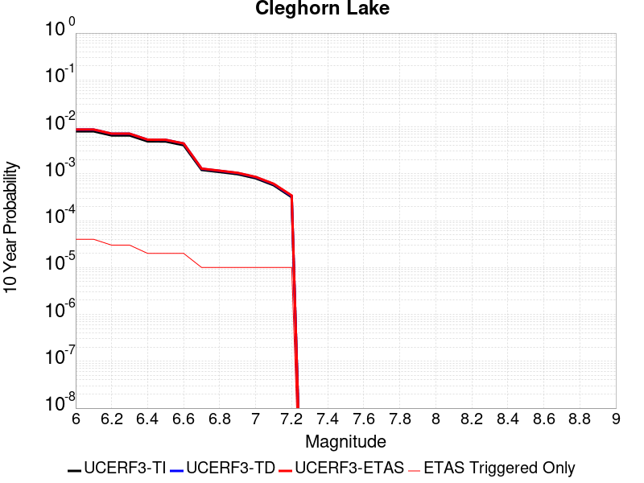 |

| Magnitude | 1 wk TI Prob | 1 wk TD Prob | 1 wk ETAS Prob | 1 wk ETAS/TD Gain | 1 wk ETAS Triggered Only | 1 mo TI Prob | 1 mo TD Prob | 1 mo ETAS Prob | 1 mo ETAS/TD Gain | 1 mo ETAS Triggered Only | 1 yr TI Prob | 1 yr TD Prob | 1 yr ETAS Prob | 1 yr ETAS/TD Gain | 1 yr ETAS Triggered Only | 10 yr TI Prob | 10 yr TD Prob | 10 yr ETAS Prob | 10 yr ETAS/TD Gain | 10 yr ETAS Triggered Only |
|-----|-----|-----|-----|-----|-----|-----|-----|-----|-----|-----|-----|-----|-----|-----|-----|-----|-----|-----|-----|-----|
| 6.0 | 1.5467183E-5 | 1.6794971E-5 | 1.6794971E-5 | 1.0 | 0.0 | 6.6286244E-5 | 7.197677E-5 | 7.197677E-5 | 1.0 | 0.0 | 8.067362E-4 | 8.760197E-4 | 8.760197E-4 | 1.0 | 0.0 | 0.008038137 | 0.008731093 | 0.0087696565 | 1.0044168 | 3.8902937E-5 |
| 6.1 | 1.5467183E-5 | 1.6794971E-5 | 1.6794971E-5 | 1.0 | 0.0 | 6.6286244E-5 | 7.197677E-5 | 7.197677E-5 | 1.0 | 0.0 | 8.067362E-4 | 8.760197E-4 | 8.760197E-4 | 1.0 | 0.0 | 0.008038137 | 0.008731093 | 0.0087696565 | 1.0044168 | 3.8902937E-5 |
| 6.2 | 1.2624631E-5 | 1.36821545E-5 | 1.36821545E-5 | 1.0 | 0.0 | 5.410444E-5 | 5.863676E-5 | 5.863676E-5 | 1.0 | 0.0 | 6.585225E-4 | 7.137174E-4 | 7.137174E-4 | 1.0 | 0.0 | 0.0065657445 | 0.0071190484 | 0.0071190484 | 1.0 | 0.0 |
| 6.3 | 1.2624631E-5 | 1.36821545E-5 | 1.36821545E-5 | 1.0 | 0.0 | 5.410444E-5 | 5.863676E-5 | 5.863676E-5 | 1.0 | 0.0 | 6.585225E-4 | 7.137174E-4 | 7.137174E-4 | 1.0 | 0.0 | 0.0065657445 | 0.0071190484 | 0.0071190484 | 1.0 | 0.0 |
| 6.4 | 9.417684E-6 | 1.0170551E-5 | 1.0170551E-5 | 1.0 | 0.0 | 4.036088E-5 | 4.3587577E-5 | 4.3587577E-5 | 1.0 | 0.0 | 4.912829E-4 | 5.3059065E-4 | 5.3059065E-4 | 1.0 | 0.0 | 0.004901982 | 0.0052972743 | 0.0052972743 | 1.0 | 0.0 |
| 6.5 | 9.368219E-6 | 1.0117976E-5 | 1.0117976E-5 | 1.0 | 0.0 | 4.014889E-5 | 4.3362263E-5 | 4.3362263E-5 | 1.0 | 0.0 | 4.8870314E-4 | 5.278488E-4 | 5.278488E-4 | 1.0 | 0.0 | 0.004876298 | 0.0052699856 | 0.0052699856 | 1.0 | 0.0 |
| 6.6 | 7.803798E-6 | 8.442198E-6 | 8.442198E-6 | 1.0 | 0.0 | 3.3444423E-5 | 3.6180576E-5 | 3.6180576E-5 | 1.0 | 0.0 | 4.0710976E-4 | 4.404494E-4 | 4.404494E-4 | 1.0 | 0.0 | 0.0040636472 | 0.004399682 | 0.004399682 | 1.0 | 0.0 |
| 6.7 | 2.3108669E-6 | 2.4439082E-6 | 2.4439082E-6 | 1.0 | 0.0 | 9.903678E-6 | 1.0473852E-5 | 1.0473852E-5 | 1.0 | 0.0 | 1.205706E-4 | 1.2751187E-4 | 1.2751187E-4 | 1.0 | 0.0 | 0.001205052 | 0.0012744057 | 0.0012744057 | 1.0 | 0.0 |
| 6.8 | 2.0882828E-6 | 2.2063484E-6 | 2.2063484E-6 | 1.0 | 0.0 | 8.949753E-6 | 9.455745E-6 | 9.455745E-6 | 1.0 | 0.0 | 1.08957785E-4 | 1.15117786E-4 | 1.15117786E-4 | 1.0 | 0.0 | 0.0010890438 | 0.0011505984 | 0.0011505984 | 1.0 | 0.0 |
| 6.9 | 1.876935E-6 | 1.9811093E-6 | 1.9811093E-6 | 1.0 | 0.0 | 8.043982E-6 | 8.490441E-6 | 8.490441E-6 | 1.0 | 0.0 | 9.7931086E-5 | 1.0336639E-4 | 1.0336639E-4 | 1.0 | 0.0 | 9.788794E-4 | 0.001033199 | 0.001033199 | 1.0 | 0.0 |
| 7.0 | 1.5357559E-6 | 1.620328E-6 | 1.620328E-6 | 1.0 | 0.0 | 6.5817944E-6 | 6.9442453E-6 | 6.9442453E-6 | 1.0 | 0.0 | 8.01304E-5 | 8.454303E-5 | 8.454303E-5 | 1.0 | 0.0 | 8.010151E-4 | 8.4512116E-4 | 8.4512116E-4 | 1.0 | 0.0 |
| 7.1 | 1.0905424E-6 | 1.1497951E-6 | 1.1497951E-6 | 1.0 | 0.0 | 4.6737446E-6 | 4.9276846E-6 | 4.9276846E-6 | 1.0 | 0.0 | 5.6901354E-5 | 5.9993006E-5 | 5.9993006E-5 | 1.0 | 0.0 | 5.6886784E-4 | 5.997779E-4 | 5.997779E-4 | 1.0 | 0.0 |
| 7.2 | 6.06668E-7 | 6.387457E-7 | 6.387457E-7 | 1.0 | 0.0 | 2.600003E-6 | 2.737479E-6 | 2.737479E-6 | 1.0 | 0.0 | 3.1654577E-5 | 3.3328364E-5 | 3.3328364E-5 | 1.0 | 0.0 | 3.1650066E-4 | 3.3324052E-4 | 3.3324052E-4 | 1.0 | 0.0 |

## Elysian Park (Upper)
*[(top)](#table-of-contents)*

| 1 Week | 1 Month | 1 Year | 10 Year |
|-----|-----|-----|-----|
|  |  |  |  |

| Magnitude | 1 wk TI Prob | 1 wk TD Prob | 1 wk ETAS Prob | 1 wk ETAS/TD Gain | 1 wk ETAS Triggered Only | 1 mo TI Prob | 1 mo TD Prob | 1 mo ETAS Prob | 1 mo ETAS/TD Gain | 1 mo ETAS Triggered Only | 1 yr TI Prob | 1 yr TD Prob | 1 yr ETAS Prob | 1 yr ETAS/TD Gain | 1 yr ETAS Triggered Only | 10 yr TI Prob | 10 yr TD Prob | 10 yr ETAS Prob | 10 yr ETAS/TD Gain | 10 yr ETAS Triggered Only |
|-----|-----|-----|-----|-----|-----|-----|-----|-----|-----|-----|-----|-----|-----|-----|-----|-----|-----|-----|-----|-----|
| 6.0 | 3.1876025E-5 | 3.7039532E-5 | 3.7039532E-5 | 1.0 | 0.0 | 1.3660437E-4 | 1.5873392E-4 | 1.5873392E-4 | 1.0 | 0.0 | 0.0016618895 | 0.0019313111 | 0.0019313111 | 1.0 | 0.0 | 0.016495159 | 0.019191828 | 0.019229984 | 1.0019882 | 3.8902937E-5 |
| 6.1 | 3.1876025E-5 | 3.7039532E-5 | 3.7039532E-5 | 1.0 | 0.0 | 1.3660437E-4 | 1.5873392E-4 | 1.5873392E-4 | 1.0 | 0.0 | 0.0016618895 | 0.0019313111 | 0.0019313111 | 1.0 | 0.0 | 0.016495159 | 0.019191828 | 0.019229984 | 1.0019882 | 3.8902937E-5 |
| 6.2 | 3.1876025E-5 | 3.7039532E-5 | 3.7039532E-5 | 1.0 | 0.0 | 1.3660437E-4 | 1.5873392E-4 | 1.5873392E-4 | 1.0 | 0.0 | 0.0016618895 | 0.0019313111 | 0.0019313111 | 1.0 | 0.0 | 0.016495159 | 0.019191828 | 0.019229984 | 1.0019882 | 3.8902937E-5 |
| 6.3 | 3.1876025E-5 | 3.7039532E-5 | 3.7039532E-5 | 1.0 | 0.0 | 1.3660437E-4 | 1.5873392E-4 | 1.5873392E-4 | 1.0 | 0.0 | 0.0016618895 | 0.0019313111 | 0.0019313111 | 1.0 | 0.0 | 0.016495159 | 0.019191828 | 0.019229984 | 1.0019882 | 3.8902937E-5 |
| 6.4 | 1.9273462E-5 | 2.1204127E-5 | 2.1204127E-5 | 1.0 | 0.0 | 8.259794E-5 | 9.087264E-5 | 9.087264E-5 | 1.0 | 0.0 | 0.001005166 | 0.0011059863 | 0.0011059863 | 1.0 | 0.0 | 0.010006315 | 0.011021685 | 0.011060159 | 1.0034908 | 3.8902937E-5 |
| 6.5 | 1.9273462E-5 | 2.1204127E-5 | 2.1204127E-5 | 1.0 | 0.0 | 8.259794E-5 | 9.087264E-5 | 9.087264E-5 | 1.0 | 0.0 | 0.001005166 | 0.0011059863 | 0.0011059863 | 1.0 | 0.0 | 0.010006315 | 0.011021685 | 0.011060159 | 1.0034908 | 3.8902937E-5 |
| 6.6 | 9.813258E-6 | 9.666116E-6 | 9.666116E-6 | 1.0 | 0.0 | 4.205614E-5 | 4.1425592E-5 | 4.1425592E-5 | 1.0 | 0.0 | 5.119132E-4 | 5.0424715E-4 | 5.0424715E-4 | 1.0 | 0.0 | 0.005107356 | 0.0050317533 | 0.0050317533 | 1.0 | 0.0 |
| 6.7 | 9.801478E-6 | 9.653685E-6 | 9.653685E-6 | 1.0 | 0.0 | 4.2005657E-5 | 4.1372317E-5 | 4.1372317E-5 | 1.0 | 0.0 | 5.112989E-4 | 5.035988E-4 | 5.035988E-4 | 1.0 | 0.0 | 0.0051012407 | 0.0050252997 | 0.0050252997 | 1.0 | 0.0 |
| 6.8 | 8.102489E-6 | 7.773414E-6 | 7.773414E-6 | 1.0 | 0.0 | 3.4724493E-5 | 3.3314234E-5 | 3.3314234E-5 | 1.0 | 0.0 | 4.2268867E-4 | 4.0553027E-4 | 4.0553027E-4 | 1.0 | 0.0 | 0.004218856 | 0.004048397 | 0.004048397 | 1.0 | 0.0 |
| 6.9 | 6.08275E-6 | 5.4816974E-6 | 5.4816974E-6 | 1.0 | 0.0 | 2.6068668E-5 | 2.3492783E-5 | 2.3492783E-5 | 1.0 | 0.0 | 3.173398E-4 | 2.8598786E-4 | 2.8598786E-4 | 1.0 | 0.0 | 0.0031688702 | 0.0028562758 | 0.0028562758 | 1.0 | 0.0 |
| 7.0 | 5.5995934E-6 | 4.983003E-6 | 4.983003E-6 | 1.0 | 0.0 | 2.3998036E-5 | 2.1355554E-5 | 2.1355554E-5 | 1.0 | 0.0 | 2.9213692E-4 | 2.5997352E-4 | 2.5997352E-4 | 1.0 | 0.0 | 0.0029175316 | 0.0025967613 | 0.0025967613 | 1.0 | 0.0 |
| 7.1 | 4.709881E-6 | 4.0875825E-6 | 4.0875825E-6 | 1.0 | 0.0 | 2.0185047E-5 | 1.7518096E-5 | 1.7518096E-5 | 1.0 | 0.0 | 2.4572524E-4 | 2.1326235E-4 | 2.1326235E-4 | 1.0 | 0.0 | 0.002454537 | 0.0021306183 | 0.0021306183 | 1.0 | 0.0 |
| 7.2 | 3.6063436E-6 | 2.9780829E-6 | 2.9780829E-6 | 1.0 | 0.0 | 1.5455667E-5 | 1.2763151E-5 | 1.2763151E-5 | 1.0 | 0.0 | 1.881565E-4 | 1.5538039E-4 | 1.5538039E-4 | 1.0 | 0.0 | 0.0018799726 | 0.0015527287 | 0.0015527287 | 1.0 | 0.0 |
| 7.3 | 2.471135E-6 | 2.095552E-6 | 2.095552E-6 | 1.0 | 0.0 | 1.0590536E-5 | 8.980906E-6 | 8.980906E-6 | 1.0 | 0.0 | 1.2893214E-4 | 1.09337125E-4 | 1.09337125E-4 | 1.0 | 0.0 | 0.0012885736 | 0.0010928405 | 0.0010928405 | 1.0 | 0.0 |
| 7.4 | 1.163943E-6 | 1.0275575E-6 | 1.0275575E-6 | 1.0 | 0.0 | 4.988318E-6 | 4.40381E-6 | 4.40381E-6 | 1.0 | 0.0 | 6.0731076E-5 | 5.3615102E-5 | 5.3615102E-5 | 1.0 | 0.0 | 6.071448E-4 | 5.360246E-4 | 5.360246E-4 | 1.0 | 0.0 |
| 7.5 | 4.99459E-7 | 4.9178306E-7 | 4.9178306E-7 | 1.0 | 0.0 | 2.140537E-6 | 2.10764E-6 | 2.10764E-6 | 1.0 | 0.0 | 2.6060725E-5 | 2.5660232E-5 | 2.5660232E-5 | 1.0 | 0.0 | 2.605767E-4 | 2.5657425E-4 | 2.5657425E-4 | 1.0 | 0.0 |
| 7.6 | 2.4667852E-7 | 2.4779692E-7 | 2.4779692E-7 | 1.0 | 0.0 | 1.0571932E-6 | 1.0619864E-6 | 1.0619864E-6 | 1.0 | 0.0 | 1.2871251E-5 | 1.2929611E-5 | 1.2929611E-5 | 1.0 | 0.0 | 1.2870505E-4 | 1.2928895E-4 | 1.2928895E-4 | 1.0 | 0.0 |
| 7.7 | 8.2312795E-8 | 7.38718E-8 | 7.38718E-8 | 1.0 | 0.0 | 3.527691E-7 | 3.165934E-7 | 3.165934E-7 | 1.0 | 0.0 | 4.294955E-6 | 3.854519E-6 | 3.854519E-6 | 1.0 | 0.0 | 4.2948723E-5 | 3.854464E-5 | 3.854464E-5 | 1.0 | 0.0 |
| 7.8 | 2.7819295E-8 | 1.7571217E-8 | 1.7571217E-8 | 1.0 | 0.0 | 1.1922555E-7 | 7.5305216E-8 | 7.5305216E-8 | 1.0 | 0.0 | 1.45157E-6 | 9.168408E-7 | 9.168408E-7 | 1.0 | 0.0 | 1.45156055E-5 | 9.168385E-6 | 9.168385E-6 | 1.0 | 0.0 |

## Kern Canyon (South Kern) 2011
*[(top)](#table-of-contents)*

| 1 Week | 1 Month | 1 Year | 10 Year |
|-----|-----|-----|-----|
|  |  |  |  |

| Magnitude | 1 wk TI Prob | 1 wk TD Prob | 1 wk ETAS Prob | 1 wk ETAS/TD Gain | 1 wk ETAS Triggered Only | 1 mo TI Prob | 1 mo TD Prob | 1 mo ETAS Prob | 1 mo ETAS/TD Gain | 1 mo ETAS Triggered Only | 1 yr TI Prob | 1 yr TD Prob | 1 yr ETAS Prob | 1 yr ETAS/TD Gain | 1 yr ETAS Triggered Only | 10 yr TI Prob | 10 yr TD Prob | 10 yr ETAS Prob | 10 yr ETAS/TD Gain | 10 yr ETAS Triggered Only |
|-----|-----|-----|-----|-----|-----|-----|-----|-----|-----|-----|-----|-----|-----|-----|-----|-----|-----|-----|-----|-----|
| 6.0 | 4.105075E-6 | 4.1137673E-6 | 4.1137673E-6 | 1.0 | 0.0 | 1.7593058E-5 | 1.7630317E-5 | 1.7630317E-5 | 1.0 | 0.0 | 2.1417443E-4 | 2.146286E-4 | 2.146286E-4 | 1.0 | 0.0 | 0.0021396813 | 0.002144277 | 0.0021830965 | 1.0181038 | 3.8902937E-5 |
| 6.1 | 4.105075E-6 | 4.1137673E-6 | 4.1137673E-6 | 1.0 | 0.0 | 1.7593058E-5 | 1.7630317E-5 | 1.7630317E-5 | 1.0 | 0.0 | 2.1417443E-4 | 2.146286E-4 | 2.146286E-4 | 1.0 | 0.0 | 0.0021396813 | 0.002144277 | 0.0021830965 | 1.0181038 | 3.8902937E-5 |
| 6.2 | 4.105075E-6 | 4.1137673E-6 | 4.1137673E-6 | 1.0 | 0.0 | 1.7593058E-5 | 1.7630317E-5 | 1.7630317E-5 | 1.0 | 0.0 | 2.1417443E-4 | 2.146286E-4 | 2.146286E-4 | 1.0 | 0.0 | 0.0021396813 | 0.002144277 | 0.0021830965 | 1.0181038 | 3.8902937E-5 |
| 6.3 | 4.105075E-6 | 4.1137673E-6 | 4.1137673E-6 | 1.0 | 0.0 | 1.7593058E-5 | 1.7630317E-5 | 1.7630317E-5 | 1.0 | 0.0 | 2.1417443E-4 | 2.146286E-4 | 2.146286E-4 | 1.0 | 0.0 | 0.0021396813 | 0.002144277 | 0.0021830965 | 1.0181038 | 3.8902937E-5 |
| 6.4 | 4.105075E-6 | 4.1137673E-6 | 4.1137673E-6 | 1.0 | 0.0 | 1.7593058E-5 | 1.7630317E-5 | 1.7630317E-5 | 1.0 | 0.0 | 2.1417443E-4 | 2.146286E-4 | 2.146286E-4 | 1.0 | 0.0 | 0.0021396813 | 0.002144277 | 0.0021830965 | 1.0181038 | 3.8902937E-5 |
| 6.5 | 2.9849807E-6 | 2.9731848E-6 | 2.9731848E-6 | 1.0 | 0.0 | 1.2792712E-5 | 1.2742159E-5 | 1.2742159E-5 | 1.0 | 0.0 | 1.5574014E-4 | 1.5512489E-4 | 1.5512489E-4 | 1.0 | 0.0 | 0.0015563103 | 0.0015501813 | 0.0015890239 | 1.0250568 | 3.8902937E-5 |
| 6.6 | 2.9849807E-6 | 2.9731848E-6 | 2.9731848E-6 | 1.0 | 0.0 | 1.2792712E-5 | 1.2742159E-5 | 1.2742159E-5 | 1.0 | 0.0 | 1.5574014E-4 | 1.5512489E-4 | 1.5512489E-4 | 1.0 | 0.0 | 0.0015563103 | 0.0015501813 | 0.0015890239 | 1.0250568 | 3.8902937E-5 |
| 6.7 | 2.6756725E-6 | 2.6582477E-6 | 2.6582477E-6 | 1.0 | 0.0 | 1.1467117E-5 | 1.1392441E-5 | 1.1392441E-5 | 1.0 | 0.0 | 1.396032E-4 | 1.3869425E-4 | 1.3869425E-4 | 1.0 | 0.0 | 0.0013951553 | 0.0013860879 | 0.0014249368 | 1.0280278 | 3.8902937E-5 |
| 6.8 | 2.3283721E-6 | 2.3048024E-6 | 2.3048024E-6 | 1.0 | 0.0 | 9.9787E-6 | 9.877688E-6 | 9.877688E-6 | 1.0 | 0.0 | 1.214839E-4 | 1.20254284E-4 | 1.20254284E-4 | 1.0 | 0.0 | 0.001214175 | 0.0012018996 | 0.0012407558 | 1.032329 | 3.8902937E-5 |
| 6.9 | 2.0972677E-6 | 2.0696625E-6 | 2.0696625E-6 | 1.0 | 0.0 | 8.988259E-6 | 8.869953E-6 | 8.869953E-6 | 1.0 | 0.0 | 1.0942656E-4 | 1.0798638E-4 | 1.0798638E-4 | 1.0 | 0.0 | 0.0010937268 | 0.0010793449 | 0.0011182058 | 1.0360042 | 3.8902937E-5 |
| 7.0 | 1.7132242E-6 | 1.6787213E-6 | 1.6787213E-6 | 1.0 | 0.0 | 7.3423685E-6 | 7.1945E-6 | 7.1945E-6 | 1.0 | 0.0 | 8.938967E-5 | 8.758956E-5 | 8.758956E-5 | 1.0 | 0.0 | 8.935372E-4 | 8.755542E-4 | 9.144231E-4 | 1.0443934 | 3.8902937E-5 |
| 7.1 | 1.4215541E-6 | 1.38159E-6 | 1.38159E-6 | 1.0 | 0.0 | 6.0923603E-6 | 5.9210865E-6 | 5.9210865E-6 | 1.0 | 0.0 | 7.417196E-5 | 7.208687E-5 | 7.208687E-5 | 1.0 | 0.0 | 7.414721E-4 | 7.206376E-4 | 7.595125E-4 | 1.0539452 | 3.8902937E-5 |
| 7.2 | 9.097853E-7 | 8.603873E-7 | 8.603873E-7 | 1.0 | 0.0 | 3.899074E-6 | 3.687369E-6 | 3.687369E-6 | 1.0 | 0.0 | 4.7470192E-5 | 4.48928E-5 | 4.48928E-5 | 1.0 | 0.0 | 4.7460053E-4 | 4.488384E-4 | 4.8772388E-4 | 1.0866358 | 3.8902937E-5 |
| 7.3 | 6.144169E-7 | 5.628273E-7 | 5.628273E-7 | 1.0 | 0.0 | 2.6332125E-6 | 2.412115E-6 | 2.412115E-6 | 1.0 | 0.0 | 3.205889E-5 | 2.936711E-5 | 2.936711E-5 | 1.0 | 0.0 | 3.2054266E-4 | 2.936328E-4 | 3.325243E-4 | 1.1324495 | 3.8902937E-5 |
| 7.4 | 4.049844E-7 | 3.5728772E-7 | 3.5728772E-7 | 1.0 | 0.0 | 1.7356463E-6 | 1.5312322E-6 | 1.5312322E-6 | 1.0 | 0.0 | 2.1131287E-5 | 1.8642595E-5 | 1.8642595E-5 | 1.0 | 0.0 | 2.1129279E-4 | 1.8641056E-4 | 1.8641056E-4 | 1.0 | 0.0 |
| 7.5 | 1.9871162E-7 | 1.5830682E-7 | 1.5830682E-7 | 1.0 | 0.0 | 8.5162094E-7 | 6.7845764E-7 | 6.7845764E-7 | 1.0 | 0.0 | 1.0368436E-5 | 8.260191E-6 | 8.260191E-6 | 1.0 | 0.0 | 1.0367952E-4 | 8.259893E-5 | 8.259893E-5 | 1.0 | 0.0 |
| 7.6 | 2.572245E-8 | 1.7352884E-8 | 1.7352884E-8 | 1.0 | 0.0 | 1.10239064E-7 | 7.43695E-8 | 7.43695E-8 | 1.0 | 0.0 | 1.3421597E-6 | 9.0544836E-7 | 9.0544836E-7 | 1.0 | 0.0 | 1.3421517E-5 | 9.054452E-6 | 9.054452E-6 | 1.0 | 0.0 |

## Santa Ynez (West)
*[(top)](#table-of-contents)*

| 1 Week | 1 Month | 1 Year | 10 Year |
|-----|-----|-----|-----|
|  |  |  | 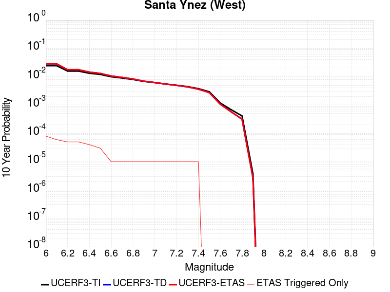 |

| Magnitude | 1 wk TI Prob | 1 wk TD Prob | 1 wk ETAS Prob | 1 wk ETAS/TD Gain | 1 wk ETAS Triggered Only | 1 mo TI Prob | 1 mo TD Prob | 1 mo ETAS Prob | 1 mo ETAS/TD Gain | 1 mo ETAS Triggered Only | 1 yr TI Prob | 1 yr TD Prob | 1 yr ETAS Prob | 1 yr ETAS/TD Gain | 1 yr ETAS Triggered Only | 10 yr TI Prob | 10 yr TD Prob | 10 yr ETAS Prob | 10 yr ETAS/TD Gain | 10 yr ETAS Triggered Only |
|-----|-----|-----|-----|-----|-----|-----|-----|-----|-----|-----|-----|-----|-----|-----|-----|-----|-----|-----|-----|-----|
| 6.0 | 4.7352758E-5 | 5.4977594E-5 | 5.4977594E-5 | 1.0 | 0.0 | 2.0292461E-4 | 2.3559865E-4 | 2.3559865E-4 | 1.0 | 0.0 | 0.0024678076 | 0.0028648009 | 0.0029035923 | 1.0135407 | 3.8902937E-5 | 0.024405818 | 0.028307132 | 0.028344935 | 1.0013354 | 3.8902937E-5 |
| 6.1 | 4.7352758E-5 | 5.4977594E-5 | 5.4977594E-5 | 1.0 | 0.0 | 2.0292461E-4 | 2.3559865E-4 | 2.3559865E-4 | 1.0 | 0.0 | 0.0024678076 | 0.0028648009 | 0.0029035923 | 1.0135407 | 3.8902937E-5 | 0.024405818 | 0.028307132 | 0.028344935 | 1.0013354 | 3.8902937E-5 |
| 6.2 | 3.0415853E-5 | 3.3927812E-5 | 3.3927812E-5 | 1.0 | 0.0 | 1.3034715E-4 | 1.4539702E-4 | 1.4539702E-4 | 1.0 | 0.0 | 0.0015858212 | 0.0017688064 | 0.0018076405 | 1.021955 | 3.8902937E-5 | 0.015745522 | 0.017551184 | 0.017589403 | 1.0021776 | 3.8902937E-5 |
| 6.3 | 3.0415853E-5 | 3.3927812E-5 | 3.3927812E-5 | 1.0 | 0.0 | 1.3034715E-4 | 1.4539702E-4 | 1.4539702E-4 | 1.0 | 0.0 | 0.0015858212 | 0.0017688064 | 0.0018076405 | 1.021955 | 3.8902937E-5 | 0.015745522 | 0.017551184 | 0.017589403 | 1.0021776 | 3.8902937E-5 |
| 6.4 | 2.5452082E-5 | 2.7914437E-5 | 2.7914437E-5 | 1.0 | 0.0 | 1.09075794E-4 | 1.1962793E-4 | 1.1962793E-4 | 1.0 | 0.0 | 0.0013271887 | 0.0014555135 | 0.0014943598 | 1.026689 | 3.8902937E-5 | 0.013192902 | 0.014461986 | 0.014500326 | 1.0026511 | 3.8902937E-5 |
| 6.5 | 2.3143784E-5 | 2.5129964E-5 | 2.5129964E-5 | 1.0 | 0.0 | 9.9183875E-5 | 1.0769549E-4 | 1.0769549E-4 | 1.0 | 0.0 | 0.0012068948 | 0.0013104154 | 0.0013492673 | 1.0296485 | 3.8902937E-5 | 0.012003611 | 0.013028558 | 0.013066954 | 1.0029471 | 3.8902937E-5 |
| 6.6 | 1.9118515E-5 | 2.0355572E-5 | 2.0355572E-5 | 1.0 | 0.0 | 8.193392E-5 | 8.72353E-5 | 8.72353E-5 | 1.0 | 0.0 | 9.97089E-4 | 0.0010615803 | 0.0010615803 | 1.0 | 0.0 | 0.00992627 | 0.010566001 | 0.010566001 | 1.0 | 0.0 |
| 6.7 | 1.722807E-5 | 1.814738E-5 | 1.814738E-5 | 1.0 | 0.0 | 7.3832496E-5 | 7.77722E-5 | 7.77722E-5 | 1.0 | 0.0 | 8.985399E-4 | 9.464708E-4 | 9.464708E-4 | 1.0 | 0.0 | 0.008949154 | 0.009425044 | 0.009425044 | 1.0 | 0.0 |
| 6.8 | 1.5317364E-5 | 1.5927328E-5 | 1.5927328E-5 | 1.0 | 0.0 | 6.56442E-5 | 6.825821E-5 | 6.825821E-5 | 1.0 | 0.0 | 7.98925E-4 | 8.307311E-4 | 8.307311E-4 | 1.0 | 0.0 | 0.007960589 | 0.008276746 | 0.008276746 | 1.0 | 0.0 |
| 6.9 | 1.3071226E-5 | 1.3330249E-5 | 1.3330249E-5 | 1.0 | 0.0 | 5.6018336E-5 | 5.71284E-5 | 5.71284E-5 | 1.0 | 0.0 | 6.8180985E-4 | 6.9531857E-4 | 6.9531857E-4 | 1.0 | 0.0 | 0.0067972173 | 0.006931691 | 0.006931691 | 1.0 | 0.0 |
| 7.0 | 1.1836986E-5 | 1.1933308E-5 | 1.1933308E-5 | 1.0 | 0.0 | 5.0728955E-5 | 5.1141757E-5 | 5.1141757E-5 | 1.0 | 0.0 | 6.1745E-4 | 6.224747E-4 | 6.224747E-4 | 1.0 | 0.0 | 0.006157372 | 0.0062075043 | 0.0062075043 | 1.0 | 0.0 |
| 7.1 | 1.0597169E-5 | 1.0542637E-5 | 1.0542637E-5 | 1.0 | 0.0 | 4.541565E-5 | 4.5181954E-5 | 4.5181954E-5 | 1.0 | 0.0 | 5.5279525E-4 | 5.499526E-4 | 5.499526E-4 | 1.0 | 0.0 | 0.0055142213 | 0.0054860474 | 0.0054860474 | 1.0 | 0.0 |
| 7.2 | 9.59113E-6 | 9.459535E-6 | 9.459535E-6 | 1.0 | 0.0 | 4.11042E-5 | 4.0540242E-5 | 4.0540242E-5 | 1.0 | 0.0 | 5.0032866E-4 | 4.9346674E-4 | 4.9346674E-4 | 1.0 | 0.0 | 0.004992037 | 0.0049238284 | 0.0049238284 | 1.0 | 0.0 |
| 7.3 | 8.586084E-6 | 8.379932E-6 | 8.379932E-6 | 1.0 | 0.0 | 3.679698E-5 | 3.5913505E-5 | 3.5913505E-5 | 1.0 | 0.0 | 4.4791115E-4 | 4.3716026E-4 | 4.3716026E-4 | 1.0 | 0.0 | 0.004470094 | 0.004363114 | 0.004363114 | 1.0 | 0.0 |
| 7.4 | 7.2622997E-6 | 6.95183E-6 | 6.95183E-6 | 1.0 | 0.0 | 3.112377E-5 | 2.9793222E-5 | 2.9793222E-5 | 1.0 | 0.0 | 3.78866E-4 | 3.6267308E-4 | 3.6267308E-4 | 1.0 | 0.0 | 0.0037822074 | 0.0036209123 | 0.0036209123 | 1.0 | 0.0 |
| 7.5 | 5.627296E-6 | 5.251797E-6 | 5.251797E-6 | 1.0 | 0.0 | 2.411676E-5 | 2.2507513E-5 | 2.2507513E-5 | 1.0 | 0.0 | 2.9358198E-4 | 2.7399522E-4 | 2.7399522E-4 | 1.0 | 0.0 | 0.0029319443 | 0.002736646 | 0.002736646 | 1.0 | 0.0 |
| 7.6 | 2.265244E-6 | 2.0609314E-6 | 2.0609314E-6 | 1.0 | 0.0 | 9.708152E-6 | 8.832533E-6 | 8.832533E-6 | 1.0 | 0.0 | 1.18190335E-4 | 1.07530876E-4 | 1.07530876E-4 | 1.0 | 0.0 | 0.001181275 | 0.001074797 | 0.001074797 | 1.0 | 0.0 |
| 7.7 | 1.3099874E-6 | 1.1016656E-6 | 1.1016656E-6 | 1.0 | 0.0 | 5.61422E-6 | 4.7214157E-6 | 4.7214157E-6 | 1.0 | 0.0 | 6.8350986E-5 | 5.7481746E-5 | 5.7481746E-5 | 1.0 | 0.0 | 6.832996E-4 | 5.7467114E-4 | 5.7467114E-4 | 1.0 | 0.0 |
| 7.8 | 7.903951E-7 | 6.071338E-7 | 6.071338E-7 | 1.0 | 0.0 | 3.3874032E-6 | 2.6019995E-6 | 2.6019995E-6 | 1.0 | 0.0 | 4.1240855E-5 | 3.1678897E-5 | 3.1678897E-5 | 1.0 | 0.0 | 4.12332E-4 | 3.1674514E-4 | 3.1674514E-4 | 1.0 | 0.0 |
| 7.9 | 7.0753297E-9 | 5.0900715E-9 | 5.0900715E-9 | 1.0 | 0.0 | 3.032284E-8 | 2.1814591E-8 | 2.1814591E-8 | 1.0 | 0.0 | 3.6918053E-7 | 2.6559263E-7 | 2.6559263E-7 | 1.0 | 0.0 | 3.691799E-6 | 2.655924E-6 | 2.655924E-6 | 1.0 | 0.0 |

## Death Valley (Fish Lake Valley)
*[(top)](#table-of-contents)*

| 1 Week | 1 Month | 1 Year | 10 Year |
|-----|-----|-----|-----|
|  |  |  |  |

| Magnitude | 1 wk TI Prob | 1 wk TD Prob | 1 wk ETAS Prob | 1 wk ETAS/TD Gain | 1 wk ETAS Triggered Only | 1 mo TI Prob | 1 mo TD Prob | 1 mo ETAS Prob | 1 mo ETAS/TD Gain | 1 mo ETAS Triggered Only | 1 yr TI Prob | 1 yr TD Prob | 1 yr ETAS Prob | 1 yr ETAS/TD Gain | 1 yr ETAS Triggered Only | 10 yr TI Prob | 10 yr TD Prob | 10 yr ETAS Prob | 10 yr ETAS/TD Gain | 10 yr ETAS Triggered Only |
|-----|-----|-----|-----|-----|-----|-----|-----|-----|-----|-----|-----|-----|-----|-----|-----|-----|-----|-----|-----|-----|
| 6.0 | 3.872328E-5 | 4.727316E-5 | 4.727316E-5 | 1.0 | 0.0 | 1.6594635E-4 | 2.0258522E-4 | 2.0258522E-4 | 1.0 | 0.0 | 0.0020185246 | 0.0024638134 | 0.0025026205 | 1.0157508 | 3.8902937E-5 | 0.02000288 | 0.024390986 | 0.02442894 | 1.001556 | 3.8902937E-5 |
| 6.1 | 3.872328E-5 | 4.727316E-5 | 4.727316E-5 | 1.0 | 0.0 | 1.6594635E-4 | 2.0258522E-4 | 2.0258522E-4 | 1.0 | 0.0 | 0.0020185246 | 0.0024638134 | 0.0025026205 | 1.0157508 | 3.8902937E-5 | 0.02000288 | 0.024390986 | 0.02442894 | 1.001556 | 3.8902937E-5 |
| 6.2 | 3.872328E-5 | 4.727316E-5 | 4.727316E-5 | 1.0 | 0.0 | 1.6594635E-4 | 2.0258522E-4 | 2.0258522E-4 | 1.0 | 0.0 | 0.0020185246 | 0.0024638134 | 0.0025026205 | 1.0157508 | 3.8902937E-5 | 0.02000288 | 0.024390986 | 0.02442894 | 1.001556 | 3.8902937E-5 |
| 6.3 | 2.8356371E-5 | 3.361322E-5 | 3.361322E-5 | 1.0 | 0.0 | 1.2152165E-4 | 1.4404916E-4 | 1.4404916E-4 | 1.0 | 0.0 | 0.0014785219 | 0.0017524667 | 0.0017913014 | 1.02216 | 3.8902937E-5 | 0.014687235 | 0.017393492 | 0.01743172 | 1.0021977 | 3.8902937E-5 |
| 6.4 | 2.8356371E-5 | 3.361322E-5 | 3.361322E-5 | 1.0 | 0.0 | 1.2152165E-4 | 1.4404916E-4 | 1.4404916E-4 | 1.0 | 0.0 | 0.0014785219 | 0.0017524667 | 0.0017913014 | 1.02216 | 3.8902937E-5 | 0.014687235 | 0.017393492 | 0.01743172 | 1.0021977 | 3.8902937E-5 |
| 6.5 | 2.4448687E-5 | 2.8610175E-5 | 2.8610175E-5 | 1.0 | 0.0 | 1.0477588E-4 | 1.2260956E-4 | 1.2260956E-4 | 1.0 | 0.0 | 0.0012748998 | 0.0014917998 | 0.0015306447 | 1.026039 | 3.8902937E-5 | 0.012676105 | 0.014822718 | 0.0148610445 | 1.0025856 | 3.8902937E-5 |
| 6.6 | 2.1298161E-5 | 2.4662175E-5 | 2.4662175E-5 | 1.0 | 0.0 | 9.127464E-5 | 1.05690946E-4 | 1.05690946E-4 | 1.0 | 0.0 | 0.0011107022 | 0.0012860615 | 0.0013249144 | 1.0302107 | 3.8902937E-5 | 0.011051672 | 0.012789601 | 0.012828006 | 1.0030029 | 3.8902937E-5 |
| 6.7 | 1.8959729E-5 | 2.1782762E-5 | 2.1782762E-5 | 1.0 | 0.0 | 8.125345E-5 | 9.3351504E-5 | 9.3351504E-5 | 1.0 | 0.0 | 9.888117E-4 | 0.0011359875 | 0.0011748462 | 1.034207 | 3.8902937E-5 | 0.009844234 | 0.011304467 | 0.01134293 | 1.0034025 | 3.8902937E-5 |
| 6.8 | 1.6691629E-5 | 1.901977E-5 | 1.901977E-5 | 1.0 | 0.0 | 7.153359E-5 | 8.151084E-5 | 8.151084E-5 | 1.0 | 0.0 | 8.7057345E-4 | 9.919596E-4 | 0.0010308239 | 1.0391793 | 3.8902937E-5 | 0.008671708 | 0.009877076 | 0.009915595 | 1.0038998 | 3.8902937E-5 |
| 6.9 | 1.450505E-5 | 1.6390675E-5 | 1.6390675E-5 | 1.0 | 0.0 | 6.216302E-5 | 7.024391E-5 | 7.024391E-5 | 1.0 | 0.0 | 7.5657194E-4 | 8.5489283E-4 | 8.937625E-4 | 1.0454673 | 3.8902937E-5 | 0.007540013 | 0.008516973 | 0.008555545 | 1.0045288 | 3.8902937E-5 |
| 7.0 | 1.2940855E-5 | 1.4538927E-5 | 1.4538927E-5 | 1.0 | 0.0 | 5.545963E-5 | 6.230823E-5 | 6.230823E-5 | 1.0 | 0.0 | 6.750118E-4 | 7.583444E-4 | 7.972179E-4 | 1.051261 | 3.8902937E-5 | 0.006729651 | 0.007558184 | 0.007596793 | 1.0051082 | 3.8902937E-5 |
| 7.1 | 1.2544658E-5 | 1.4079123E-5 | 1.4079123E-5 | 1.0 | 0.0 | 5.3761712E-5 | 6.0337734E-5 | 6.0337734E-5 | 1.0 | 0.0 | 6.5435225E-4 | 7.343699E-4 | 7.732443E-4 | 1.0529357 | 3.8902937E-5 | 0.006524288 | 0.007320025 | 0.007358643 | 1.0052757 | 3.8902937E-5 |
| 7.2 | 1.2489416E-5 | 1.4016585E-5 | 1.4016585E-5 | 1.0 | 0.0 | 5.3524967E-5 | 6.0069728E-5 | 6.0069728E-5 | 1.0 | 0.0 | 6.514716E-4 | 7.311091E-4 | 7.699836E-4 | 1.053172 | 3.8902937E-5 | 0.006495651 | 0.0072876317 | 0.007326251 | 1.0052993 | 3.8902937E-5 |
| 7.3 | 1.2368307E-5 | 1.38807145E-5 | 1.38807145E-5 | 1.0 | 0.0 | 5.3005948E-5 | 5.948745E-5 | 5.948745E-5 | 1.0 | 0.0 | 6.451563E-4 | 7.2402466E-4 | 7.628994E-4 | 1.0536926 | 3.8902937E-5 | 0.0064328653 | 0.0072172494 | 0.0072558713 | 1.0053514 | 3.8902937E-5 |
| 7.4 | 1.2161707E-5 | 1.3648755E-5 | 1.3648755E-5 | 1.0 | 0.0 | 5.212056E-5 | 5.8493384E-5 | 5.8493384E-5 | 1.0 | 0.0 | 6.3438306E-4 | 7.1192987E-4 | 7.508051E-4 | 1.0546055 | 3.8902937E-5 | 0.006325751 | 0.0070970803 | 0.007135707 | 1.0054426 | 3.8902937E-5 |
| 7.5 | 1.1707948E-5 | 1.3146373E-5 | 1.3146373E-5 | 1.0 | 0.0 | 5.0175953E-5 | 5.6340414E-5 | 5.6340414E-5 | 1.0 | 0.0 | 6.10721E-4 | 6.857342E-4 | 7.2461047E-4 | 1.0566928 | 3.8902937E-5 | 0.0060904534 | 0.006836766 | 0.0068754028 | 1.0056514 | 3.8902937E-5 |
| 7.6 | 1.0319538E-5 | 1.1580373E-5 | 1.1580373E-5 | 1.0 | 0.0 | 4.4225842E-5 | 4.9629256E-5 | 4.9629256E-5 | 1.0 | 0.0 | 5.383166E-4 | 6.0407387E-4 | 6.429533E-4 | 1.064362 | 3.8902937E-5 | 0.0053701443 | 0.00602485 | 0.0060635186 | 1.0064182 | 3.8902937E-5 |
| 7.7 | 8.937764E-6 | 1.0023426E-5 | 1.0023426E-5 | 1.0 | 0.0 | 3.830414E-5 | 4.295686E-5 | 4.295686E-5 | 1.0 | 0.0 | 4.6625308E-4 | 5.228793E-4 | 5.617619E-4 | 1.0743625 | 3.8902937E-5 | 0.0046527605 | 0.005217 | 0.0052557 | 1.007418 | 3.8902937E-5 |
| 7.8 | 3.108007E-7 | 3.2847535E-7 | 3.2847535E-7 | 1.0 | 0.0 | 1.3320023E-6 | 1.4077508E-6 | 1.4077508E-6 | 1.0 | 0.0 | 1.6217007E-5 | 1.7139235E-5 | 1.7139235E-5 | 1.0 | 0.0 | 1.6215823E-4 | 1.713795E-4 | 1.713795E-4 | 1.0 | 0.0 |
| 7.9 | 2.5591178E-9 | 2.6697329E-9 | 2.6697329E-9 | 1.0 | 0.0 | 1.0967647E-8 | 1.14417125E-8 | 1.14417125E-8 | 1.0 | 0.0 | 1.335311E-7 | 1.3930286E-7 | 1.3930286E-7 | 1.0 | 0.0 | 1.3353102E-6 | 1.3930285E-6 | 1.3930285E-6 | 1.0 | 0.0 |

## San Andreas (Santa Cruz Mts) 2011 CFM
*[(top)](#table-of-contents)*

| 1 Week | 1 Month | 1 Year | 10 Year |
|-----|-----|-----|-----|
|  |  |  |  |

| Magnitude | 1 wk TI Prob | 1 wk TD Prob | 1 wk ETAS Prob | 1 wk ETAS/TD Gain | 1 wk ETAS Triggered Only | 1 mo TI Prob | 1 mo TD Prob | 1 mo ETAS Prob | 1 mo ETAS/TD Gain | 1 mo ETAS Triggered Only | 1 yr TI Prob | 1 yr TD Prob | 1 yr ETAS Prob | 1 yr ETAS/TD Gain | 1 yr ETAS Triggered Only | 10 yr TI Prob | 10 yr TD Prob | 10 yr ETAS Prob | 10 yr ETAS/TD Gain | 10 yr ETAS Triggered Only |
|-----|-----|-----|-----|-----|-----|-----|-----|-----|-----|-----|-----|-----|-----|-----|-----|-----|-----|-----|-----|-----|
| 6.0 | 1.7221631E-4 | 1.3823692E-4 | 1.7713448E-4 | 1.2813833 | 3.8902937E-5 | 7.378611E-4 | 5.923115E-4 | 6.311914E-4 | 1.0656409 | 3.8902937E-5 | 0.008946515 | 0.0071879383 | 0.0072265617 | 1.0053734 | 3.8902937E-5 | 0.08594794 | 0.070697196 | 0.070733346 | 1.0005114 | 3.8902937E-5 |
| 6.1 | 1.7221631E-4 | 1.3823692E-4 | 1.7713448E-4 | 1.2813833 | 3.8902937E-5 | 7.378611E-4 | 5.923115E-4 | 6.311914E-4 | 1.0656409 | 3.8902937E-5 | 0.008946515 | 0.0071879383 | 0.0072265617 | 1.0053734 | 3.8902937E-5 | 0.08594794 | 0.070697196 | 0.070733346 | 1.0005114 | 3.8902937E-5 |
| 6.2 | 1.7221631E-4 | 1.3823692E-4 | 1.7713448E-4 | 1.2813833 | 3.8902937E-5 | 7.378611E-4 | 5.923115E-4 | 6.311914E-4 | 1.0656409 | 3.8902937E-5 | 0.008946515 | 0.0071879383 | 0.0072265617 | 1.0053734 | 3.8902937E-5 | 0.08594794 | 0.070697196 | 0.070733346 | 1.0005114 | 3.8902937E-5 |
| 6.3 | 1.716926E-4 | 1.3743078E-4 | 1.7632837E-4 | 1.2830341 | 3.8902937E-5 | 7.3561794E-4 | 5.888581E-4 | 6.2773813E-4 | 1.0660261 | 3.8902937E-5 | 0.008919428 | 0.0071461694 | 0.007184794 | 1.005405 | 3.8902937E-5 | 0.08569809 | 0.0703092 | 0.07034537 | 1.0005144 | 3.8902937E-5 |
| 6.4 | 1.6392978E-4 | 1.3618424E-4 | 1.7508188E-4 | 1.2856251 | 3.8902937E-5 | 7.02367E-4 | 5.8351824E-4 | 6.2239845E-4 | 1.0666307 | 3.8902937E-5 | 0.008517839 | 0.0070815794 | 0.007120207 | 1.0054547 | 3.8902937E-5 | 0.08198654 | 0.06954003 | 0.06957623 | 1.0005206 | 3.8902937E-5 |
| 6.5 | 1.5742714E-4 | 1.26776E-4 | 1.6567399E-4 | 1.3068247 | 3.8902937E-5 | 6.745133E-4 | 5.4321426E-4 | 5.8209605E-4 | 1.0715773 | 3.8902937E-5 | 0.00818132 | 0.006593904 | 0.00663255 | 1.0058609 | 3.8902937E-5 | 0.078865945 | 0.0649993 | 0.06503568 | 1.0005596 | 3.8902937E-5 |
| 6.6 | 1.3038084E-4 | 1.161551E-4 | 1.5505351E-4 | 1.3348835 | 3.8902937E-5 | 5.5865536E-4 | 4.9771386E-4 | 5.3659745E-4 | 1.0781244 | 3.8902937E-5 | 0.006780438 | 0.0060430723 | 0.0060817404 | 1.0063987 | 3.8902937E-5 | 0.0657725 | 0.059452567 | 0.059489157 | 1.0006155 | 3.8902937E-5 |
| 6.7 | 1.2867592E-4 | 1.13418515E-4 | 1.5231704E-4 | 1.3429645 | 3.8902937E-5 | 5.5135164E-4 | 4.8599008E-4 | 5.2487414E-4 | 1.0800099 | 3.8902937E-5 | 0.0066920654 | 0.005901116 | 0.0059397896 | 1.0065535 | 3.8902937E-5 | 0.06494093 | 0.05816314 | 0.05819978 | 1.0006299 | 3.8902937E-5 |
| 6.8 | 1.2801298E-4 | 1.1279377E-4 | 1.5169232E-4 | 1.3448644 | 3.8902937E-5 | 5.485117E-4 | 4.833136E-4 | 5.2219775E-4 | 1.0804532 | 3.8902937E-5 | 0.0066577005 | 0.0058687064 | 0.0059073814 | 1.00659 | 3.8902937E-5 | 0.06461738 | 0.05787688 | 0.057913534 | 1.0006332 | 3.8902937E-5 |
| 6.9 | 1.269149E-4 | 1.11214715E-4 | 1.5011332E-4 | 1.3497614 | 3.8902937E-5 | 5.4380763E-4 | 4.765487E-4 | 5.154331E-4 | 1.0815959 | 3.8902937E-5 | 0.006600777 | 0.005786784 | 0.005825462 | 1.0066838 | 3.8902937E-5 | 0.06408122 | 0.057148356 | 0.05718504 | 1.0006418 | 3.8902937E-5 |
| 7.0 | 1.2030331E-4 | 1.0851204E-4 | 1.4741076E-4 | 1.3584738 | 3.8902937E-5 | 5.154837E-4 | 4.6496998E-4 | 5.038548E-4 | 1.0836288 | 3.8902937E-5 | 0.006257969 | 0.005646552 | 0.0056852354 | 1.0068507 | 3.8902937E-5 | 0.06084648 | 0.055819258 | 0.05585599 | 1.000658 | 3.8902937E-5 |
| 7.1 | 8.049617E-5 | 5.4114953E-5 | 9.3015784E-5 | 1.7188555 | 3.8902937E-5 | 3.4493793E-4 | 2.319008E-4 | 2.7079473E-4 | 1.1677179 | 3.8902937E-5 | 0.0041915346 | 0.0028197719 | 0.0028585652 | 1.0137576 | 3.8902937E-5 | 0.041133516 | 0.02971132 | 0.029749066 | 1.0012704 | 3.8902937E-5 |
| 7.2 | 7.093979E-5 | 4.310381E-5 | 8.200507E-5 | 1.9025017 | 3.8902937E-5 | 3.0399222E-4 | 1.8471766E-4 | 2.2361342E-4 | 1.2105687 | 3.8902937E-5 | 0.0036948253 | 0.0022466409 | 0.0022854565 | 1.0172771 | 3.8902937E-5 | 0.03633994 | 0.024024088 | 0.024062058 | 1.0015805 | 3.8902937E-5 |
| 7.3 | 6.193693E-5 | 2.9018376E-5 | 6.7920184E-5 | 2.3405921 | 3.8902937E-5 | 2.6541698E-4 | 1.2435856E-4 | 1.6325666E-4 | 1.3127899 | 3.8902937E-5 | 0.0032266637 | 0.0015130156 | 0.0015518597 | 1.0256733 | 3.8902937E-5 | 0.031802133 | 0.016564084 | 0.016602343 | 1.0023097 | 3.8902937E-5 |
| 7.4 | 5.906492E-5 | 2.7136244E-5 | 6.603813E-5 | 2.4335766 | 3.8902937E-5 | 2.5311083E-4 | 1.16293006E-4 | 1.5519142E-4 | 1.3344862 | 3.8902937E-5 | 0.0030772698 | 0.0014149492 | 0.0014537971 | 1.0274553 | 3.8902937E-5 | 0.030350044 | 0.015530545 | 0.015568844 | 1.0024661 | 3.8902937E-5 |
| 7.5 | 5.424296E-5 | 2.4776109E-5 | 6.367808E-5 | 2.5701406 | 3.8902937E-5 | 2.324491E-4 | 1.0617901E-4 | 1.4507782E-4 | 1.3663512 | 3.8902937E-5 | 0.002826395 | 0.0012919641 | 0.0013308168 | 1.0300726 | 3.8902937E-5 | 0.027907165 | 0.014215293 | 0.014253643 | 1.0026978 | 3.8902937E-5 |
| 7.6 | 4.43084E-5 | 1.9971396E-5 | 5.8873557E-5 | 2.9478939 | 3.8902937E-5 | 1.8987931E-4 | 8.558889E-5 | 1.2448849E-4 | 1.4544936 | 3.8902937E-5 | 0.0023093296 | 0.0010415468 | 0.0010804093 | 1.0373123 | 3.8902937E-5 | 0.022854783 | 0.011448878 | 0.011487336 | 1.0033591 | 3.8902937E-5 |
| 7.7 | 4.118098E-5 | 1.8999577E-5 | 5.7901776E-5 | 3.0475297 | 3.8902937E-5 | 1.7647797E-4 | 8.1424216E-5 | 1.2032399E-4 | 1.4777421 | 3.8902937E-5 | 0.002146502 | 9.908893E-4 | 0.0010297536 | 1.0392218 | 3.8902937E-5 | 0.021258866 | 0.010904559 | 0.010943037 | 1.0035287 | 3.8902937E-5 |
| 7.8 | 3.5408906E-5 | 1.8625631E-5 | 5.7527843E-5 | 3.0886385 | 3.8902937E-5 | 1.5174363E-4 | 7.982169E-5 | 1.18721524E-4 | 1.4873341 | 3.8902937E-5 | 0.0018459131 | 9.7139605E-4 | 0.0010102612 | 1.0400096 | 3.8902937E-5 | 0.018306552 | 0.0106848935 | 0.01072338 | 1.003602 | 3.8902937E-5 |
| 7.9 | 2.5860836E-5 | 1.7371205E-5 | 5.6273468E-5 | 3.239468 | 3.8902937E-5 | 1.10827445E-4 | 7.4445896E-5 | 1.1334594E-4 | 1.5225277 | 3.8902937E-5 | 0.001348489 | 9.060022E-4 | 9.448699E-4 | 1.0429002 | 3.8902937E-5 | 0.013403354 | 0.009936898 | 0.009975415 | 1.0038761 | 3.8902937E-5 |
| 8.0 | 1.9777332E-5 | 1.4886952E-5 | 5.378931E-5 | 3.613185 | 3.8902937E-5 | 8.4757245E-5 | 6.379966E-5 | 1.0270012E-4 | 1.6097282 | 3.8902937E-5 | 0.0010314309 | 7.7648426E-4 | 8.15357E-4 | 1.0500625 | 3.8902937E-5 | 0.010266567 | 0.008534084 | 0.008572655 | 1.0045196 | 3.8902937E-5 |
| 8.1 | 1.468494E-5 | 1.2146339E-5 | 5.1048803E-5 | 4.202814 | 3.8902937E-5 | 6.293394E-5 | 5.20547E-5 | 9.095561E-5 | 1.7473084 | 3.8902937E-5 | 7.6595135E-4 | 6.3358183E-4 | 6.724601E-4 | 1.0613627 | 3.8902937E-5 | 0.0076331664 | 0.0069899 | 0.007028531 | 1.0055267 | 3.8902937E-5 |
| 8.2 | 8.63836E-6 | 5.489407E-6 | 5.489407E-6 | 1.0 | 0.0 | 3.7021015E-5 | 2.3525818E-5 | 2.3525818E-5 | 1.0 | 0.0 | 4.5063766E-4 | 2.863893E-4 | 2.863893E-4 | 1.0 | 0.0 | 0.004497249 | 0.0032568157 | 0.0032568157 | 1.0 | 0.0 |
| 8.3 | 1.983087E-6 | 7.693574E-7 | 7.693574E-7 | 1.0 | 0.0 | 8.498917E-6 | 3.297242E-6 | 3.297242E-6 | 1.0 | 0.0 | 1.034694E-4 | 4.01432E-5 | 4.01432E-5 | 1.0 | 0.0 | 0.0010342124 | 4.7390026E-4 | 4.7390026E-4 | 1.0 | 0.0 |

## White Mountains
*[(top)](#table-of-contents)*

| 1 Week | 1 Month | 1 Year | 10 Year |
|-----|-----|-----|-----|
|  |  |  |  |

| Magnitude | 1 wk TI Prob | 1 wk TD Prob | 1 wk ETAS Prob | 1 wk ETAS/TD Gain | 1 wk ETAS Triggered Only | 1 mo TI Prob | 1 mo TD Prob | 1 mo ETAS Prob | 1 mo ETAS/TD Gain | 1 mo ETAS Triggered Only | 1 yr TI Prob | 1 yr TD Prob | 1 yr ETAS Prob | 1 yr ETAS/TD Gain | 1 yr ETAS Triggered Only | 10 yr TI Prob | 10 yr TD Prob | 10 yr ETAS Prob | 10 yr ETAS/TD Gain | 10 yr ETAS Triggered Only |
|-----|-----|-----|-----|-----|-----|-----|-----|-----|-----|-----|-----|-----|-----|-----|-----|-----|-----|-----|-----|-----|
| 6.0 | 3.503579E-5 | 3.378569E-5 | 3.378569E-5 | 1.0 | 0.0 | 1.5014476E-4 | 1.4478847E-4 | 1.4478847E-4 | 1.0 | 0.0 | 0.0018264796 | 0.001761495 | 0.0018003294 | 1.0220463 | 3.8902937E-5 | 0.018115403 | 0.017487662 | 0.017525883 | 1.0021857 | 3.8902937E-5 |
| 6.1 | 3.503579E-5 | 3.378569E-5 | 3.378569E-5 | 1.0 | 0.0 | 1.5014476E-4 | 1.4478847E-4 | 1.4478847E-4 | 1.0 | 0.0 | 0.0018264796 | 0.001761495 | 0.0018003294 | 1.0220463 | 3.8902937E-5 | 0.018115403 | 0.017487662 | 0.017525883 | 1.0021857 | 3.8902937E-5 |
| 6.2 | 3.503579E-5 | 3.378569E-5 | 3.378569E-5 | 1.0 | 0.0 | 1.5014476E-4 | 1.4478847E-4 | 1.4478847E-4 | 1.0 | 0.0 | 0.0018264796 | 0.001761495 | 0.0018003294 | 1.0220463 | 3.8902937E-5 | 0.018115403 | 0.017487662 | 0.017525883 | 1.0021857 | 3.8902937E-5 |
| 6.3 | 1.7818425E-5 | 1.5916867E-5 | 1.5916867E-5 | 1.0 | 0.0 | 7.636245E-5 | 6.821344E-5 | 6.821344E-5 | 1.0 | 0.0 | 9.293162E-4 | 8.301964E-4 | 8.301964E-4 | 1.0 | 0.0 | 0.009254395 | 0.0082724085 | 0.0082724085 | 1.0 | 0.0 |
| 6.4 | 1.7818425E-5 | 1.5916867E-5 | 1.5916867E-5 | 1.0 | 0.0 | 7.636245E-5 | 6.821344E-5 | 6.821344E-5 | 1.0 | 0.0 | 9.293162E-4 | 8.301964E-4 | 8.301964E-4 | 1.0 | 0.0 | 0.009254395 | 0.0082724085 | 0.0082724085 | 1.0 | 0.0 |
| 6.5 | 1.3397557E-5 | 1.1336862E-5 | 1.1336862E-5 | 1.0 | 0.0 | 5.741684E-5 | 4.8585687E-5 | 4.8585687E-5 | 1.0 | 0.0 | 6.988258E-4 | 5.9137715E-4 | 5.9137715E-4 | 1.0 | 0.0 | 0.006966323 | 0.00589874 | 0.00589874 | 1.0 | 0.0 |
| 6.6 | 1.0818695E-5 | 8.625775E-6 | 8.625775E-6 | 1.0 | 0.0 | 4.6365014E-5 | 3.696711E-5 | 3.696711E-5 | 1.0 | 0.0 | 5.6434784E-4 | 4.4998596E-4 | 4.4998596E-4 | 1.0 | 0.0 | 0.005629168 | 0.004491185 | 0.004491185 | 1.0 | 0.0 |
| 6.7 | 9.067908E-6 | 6.8027375E-6 | 6.8027375E-6 | 1.0 | 0.0 | 3.8861883E-5 | 2.9154282E-5 | 2.9154282E-5 | 1.0 | 0.0 | 4.7304068E-4 | 3.5489874E-4 | 3.5489874E-4 | 1.0 | 0.0 | 0.00472035 | 0.003543637 | 0.003543637 | 1.0 | 0.0 |
| 6.8 | 7.295947E-6 | 4.9365945E-6 | 4.9365945E-6 | 1.0 | 0.0 | 3.126797E-5 | 2.1156668E-5 | 2.1156668E-5 | 1.0 | 0.0 | 3.8062103E-4 | 2.5755313E-4 | 2.5755313E-4 | 1.0 | 0.0 | 0.0037996976 | 0.0025726592 | 0.0025726592 | 1.0 | 0.0 |
| 6.9 | 6.2243444E-6 | 3.83238E-6 | 3.83238E-6 | 1.0 | 0.0 | 2.6675489E-5 | 1.6424385E-5 | 1.6424385E-5 | 1.0 | 0.0 | 3.2472567E-4 | 1.9994906E-4 | 1.9994906E-4 | 1.0 | 0.0 | 0.0032425157 | 0.0019977444 | 0.0019977444 | 1.0 | 0.0 |
| 7.0 | 4.9878413E-6 | 2.6796765E-6 | 2.6796765E-6 | 1.0 | 0.0 | 2.1376287E-5 | 1.1484279E-5 | 1.1484279E-5 | 1.0 | 0.0 | 2.602252E-4 | 1.3981239E-4 | 1.3981239E-4 | 1.0 | 0.0 | 0.002599207 | 0.0013972705 | 0.0013972705 | 1.0 | 0.0 |
| 7.1 | 4.0252844E-6 | 1.8858877E-6 | 1.8858877E-6 | 1.0 | 0.0 | 1.7251105E-5 | 8.082352E-6 | 8.082352E-6 | 1.0 | 0.0 | 2.1001195E-4 | 9.839832E-5 | 9.839832E-5 | 1.0 | 0.0 | 0.0020981359 | 9.835603E-4 | 9.835603E-4 | 1.0 | 0.0 |
| 7.2 | 3.3284066E-6 | 1.2820851E-6 | 1.2820851E-6 | 1.0 | 0.0 | 1.4264522E-5 | 5.49464E-6 | 5.49464E-6 | 1.0 | 0.0 | 1.736567E-4 | 6.6895285E-5 | 6.6895285E-5 | 1.0 | 0.0 | 0.0017352107 | 6.6876155E-4 | 6.6876155E-4 | 1.0 | 0.0 |
| 7.3 | 2.458226E-6 | 6.058311E-7 | 6.058311E-7 | 1.0 | 0.0 | 1.0535211E-5 | 2.5964166E-6 | 2.5964166E-6 | 1.0 | 0.0 | 1.2825865E-4 | 3.161095E-5 | 3.161095E-5 | 1.0 | 0.0 | 0.0012818464 | 3.160683E-4 | 3.160683E-4 | 1.0 | 0.0 |
| 7.4 | 1.965953E-6 | 3.1098764E-7 | 3.1098764E-7 | 1.0 | 0.0 | 8.425486E-6 | 1.3328034E-6 | 1.3328034E-6 | 1.0 | 0.0 | 1.0257547E-4 | 1.6226762E-5 | 1.6226762E-5 | 1.0 | 0.0 | 0.0010252813 | 1.622559E-4 | 1.622559E-4 | 1.0 | 0.0 |
| 7.5 | 1.2014192E-6 | 1.8250802E-7 | 1.8250802E-7 | 1.0 | 0.0 | 5.148929E-6 | 7.82177E-7 | 7.82177E-7 | 1.0 | 0.0 | 6.2686406E-5 | 9.522963E-6 | 9.522963E-6 | 1.0 | 0.0 | 6.266873E-4 | 9.522564E-5 | 9.522564E-5 | 1.0 | 0.0 |
| 7.6 | 2.5612175E-7 | 4.8963752E-8 | 4.8963752E-8 | 1.0 | 0.0 | 1.0976642E-6 | 2.0984464E-7 | 2.0984464E-7 | 1.0 | 0.0 | 1.3363979E-5 | 2.5548559E-6 | 2.5548559E-6 | 1.0 | 0.0 | 1.3363175E-4 | 2.5548301E-5 | 2.5548301E-5 | 1.0 | 0.0 |

## Chino alt 1
*[(top)](#table-of-contents)*

| 1 Week | 1 Month | 1 Year | 10 Year |
|-----|-----|-----|-----|
|  |  |  |  |

| Magnitude | 1 wk TI Prob | 1 wk TD Prob | 1 wk ETAS Prob | 1 wk ETAS/TD Gain | 1 wk ETAS Triggered Only | 1 mo TI Prob | 1 mo TD Prob | 1 mo ETAS Prob | 1 mo ETAS/TD Gain | 1 mo ETAS Triggered Only | 1 yr TI Prob | 1 yr TD Prob | 1 yr ETAS Prob | 1 yr ETAS/TD Gain | 1 yr ETAS Triggered Only | 10 yr TI Prob | 10 yr TD Prob | 10 yr ETAS Prob | 10 yr ETAS/TD Gain | 10 yr ETAS Triggered Only |
|-----|-----|-----|-----|-----|-----|-----|-----|-----|-----|-----|-----|-----|-----|-----|-----|-----|-----|-----|-----|-----|
| 6.0 | 3.939946E-5 | 4.8955757E-5 | 4.8955757E-5 | 1.0 | 0.0 | 1.6884391E-4 | 2.0979645E-4 | 2.0979645E-4 | 1.0 | 0.0 | 0.0020537362 | 0.0025517642 | 0.0025905678 | 1.0152066 | 3.8902937E-5 | 0.020348595 | 0.025281483 | 0.025319403 | 1.0014999 | 3.8902937E-5 |
| 6.1 | 2.1505624E-5 | 2.6883481E-5 | 2.6883481E-5 | 1.0 | 0.0 | 9.2163704E-5 | 1.1521046E-4 | 1.1521046E-4 | 1.0 | 0.0 | 0.0011215154 | 0.0014018962 | 0.0014018962 | 1.0 | 0.0 | 0.011158722 | 0.013947416 | 0.013947416 | 1.0 | 0.0 |
| 6.2 | 2.1505624E-5 | 2.6883481E-5 | 2.6883481E-5 | 1.0 | 0.0 | 9.2163704E-5 | 1.1521046E-4 | 1.1521046E-4 | 1.0 | 0.0 | 0.0011215154 | 0.0014018962 | 0.0014018962 | 1.0 | 0.0 | 0.011158722 | 0.013947416 | 0.013947416 | 1.0 | 0.0 |
| 6.3 | 1.4290785E-5 | 1.816862E-5 | 1.816862E-5 | 1.0 | 0.0 | 6.1244784E-5 | 7.786344E-5 | 7.786344E-5 | 1.0 | 0.0 | 7.454001E-4 | 9.4762055E-4 | 9.4762055E-4 | 1.0 | 0.0 | 0.007429048 | 0.009446246 | 0.009446246 | 1.0 | 0.0 |
| 6.4 | 1.4290785E-5 | 1.816862E-5 | 1.816862E-5 | 1.0 | 0.0 | 6.1244784E-5 | 7.786344E-5 | 7.786344E-5 | 1.0 | 0.0 | 7.454001E-4 | 9.4762055E-4 | 9.4762055E-4 | 1.0 | 0.0 | 0.007429048 | 0.009446246 | 0.009446246 | 1.0 | 0.0 |
| 6.5 | 1.3017944E-5 | 1.665543E-5 | 1.665543E-5 | 1.0 | 0.0 | 5.5789995E-5 | 7.13787E-5 | 7.13787E-5 | 1.0 | 0.0 | 6.790315E-4 | 8.6873304E-4 | 8.6873304E-4 | 1.0 | 0.0 | 0.0067696036 | 0.00866366 | 0.00866366 | 1.0 | 0.0 |
| 6.6 | 9.470016E-6 | 1.2041898E-5 | 1.2041898E-5 | 1.0 | 0.0 | 4.058515E-5 | 5.1607305E-5 | 5.1607305E-5 | 1.0 | 0.0 | 4.940122E-4 | 6.281718E-4 | 6.281718E-4 | 1.0 | 0.0 | 0.004929154 | 0.006273171 | 0.006273171 | 1.0 | 0.0 |
| 6.7 | 8.314155E-6 | 1.0409905E-5 | 1.0409905E-5 | 1.0 | 0.0 | 3.5631605E-5 | 4.46133E-5 | 4.46133E-5 | 1.0 | 0.0 | 4.3372845E-4 | 5.430638E-4 | 5.430638E-4 | 1.0 | 0.0 | 0.004328829 | 0.005426893 | 0.005426893 | 1.0 | 0.0 |
| 6.8 | 3.4856364E-6 | 3.8139801E-6 | 3.8139801E-6 | 1.0 | 0.0 | 1.4938357E-5 | 1.6345539E-5 | 1.6345539E-5 | 1.0 | 0.0 | 1.8185932E-4 | 1.9899083E-4 | 1.9899083E-4 | 1.0 | 0.0 | 0.0018171056 | 0.001989803 | 0.001989803 | 1.0 | 0.0 |
| 6.9 | 2.2645952E-6 | 2.1532328E-6 | 2.1532328E-6 | 1.0 | 0.0 | 9.705372E-6 | 9.228109E-6 | 9.228109E-6 | 1.0 | 0.0 | 1.18156495E-4 | 1.1234665E-4 | 1.1234665E-4 | 1.0 | 0.0 | 0.0011809369 | 0.0011235146 | 0.0011235146 | 1.0 | 0.0 |
| 7.0 | 1.7864003E-6 | 1.5433379E-6 | 1.5433379E-6 | 1.0 | 0.0 | 7.655979E-6 | 6.6142893E-6 | 6.6142893E-6 | 1.0 | 0.0 | 9.3207556E-5 | 8.052605E-5 | 8.052605E-5 | 1.0 | 0.0 | 9.316847E-4 | 8.054159E-4 | 8.054159E-4 | 1.0 | 0.0 |
| 7.1 | 1.7315456E-6 | 1.4736019E-6 | 1.4736019E-6 | 1.0 | 0.0 | 7.420889E-6 | 6.3154216E-6 | 6.3154216E-6 | 1.0 | 0.0 | 9.034557E-5 | 7.6887605E-5 | 7.6887605E-5 | 1.0 | 0.0 | 9.0308854E-4 | 7.690479E-4 | 7.690479E-4 | 1.0 | 0.0 |
| 7.2 | 1.6008337E-6 | 1.3576367E-6 | 1.3576367E-6 | 1.0 | 0.0 | 6.860698E-6 | 5.8184305E-6 | 5.8184305E-6 | 1.0 | 0.0 | 8.352579E-5 | 7.0837144E-5 | 7.0837144E-5 | 1.0 | 0.0 | 8.34944E-4 | 7.085699E-4 | 7.085699E-4 | 1.0 | 0.0 |
| 7.3 | 1.3320939E-6 | 1.1219545E-6 | 1.1219545E-6 | 1.0 | 0.0 | 5.7089615E-6 | 4.8083675E-6 | 4.8083675E-6 | 1.0 | 0.0 | 6.9504385E-5 | 5.854035E-5 | 5.854035E-5 | 1.0 | 0.0 | 6.9482654E-4 | 5.8539386E-4 | 5.8539386E-4 | 1.0 | 0.0 |
| 7.4 | 1.114294E-6 | 9.2384767E-7 | 9.2384767E-7 | 1.0 | 0.0 | 4.775537E-6 | 3.9593415E-6 | 3.9593415E-6 | 1.0 | 0.0 | 5.8140613E-5 | 4.820395E-5 | 4.820395E-5 | 1.0 | 0.0 | 5.81254E-4 | 4.8195178E-4 | 4.8195178E-4 | 1.0 | 0.0 |
| 7.5 | 9.354081E-7 | 7.62451E-7 | 7.62451E-7 | 1.0 | 0.0 | 4.0088858E-6 | 3.2676433E-6 | 3.2676433E-6 | 1.0 | 0.0 | 4.8807087E-5 | 3.9782866E-5 | 3.9782866E-5 | 1.0 | 0.0 | 4.879637E-4 | 3.9776083E-4 | 3.9776083E-4 | 1.0 | 0.0 |
| 7.6 | 8.521771E-7 | 6.881667E-7 | 6.881667E-7 | 1.0 | 0.0 | 3.6521824E-6 | 2.9492828E-6 | 2.9492828E-6 | 1.0 | 0.0 | 4.4464414E-5 | 3.590696E-5 | 3.590696E-5 | 1.0 | 0.0 | 4.4455516E-4 | 3.5901475E-4 | 3.5901475E-4 | 1.0 | 0.0 |
| 7.7 | 2.1803626E-7 | 1.4189133E-7 | 1.4189133E-7 | 1.0 | 0.0 | 9.344408E-7 | 6.0810567E-7 | 6.0810567E-7 | 1.0 | 0.0 | 1.1376757E-5 | 7.4036707E-6 | 7.4036707E-6 | 1.0 | 0.0 | 1.13761744E-4 | 7.4035204E-5 | 7.4035204E-5 | 1.0 | 0.0 |

## Kern Canyon (Lake Isabella) 2011
*[(top)](#table-of-contents)*

| 1 Week | 1 Month | 1 Year | 10 Year |
|-----|-----|-----|-----|
|  |  |  |  |

| Magnitude | 1 wk TI Prob | 1 wk TD Prob | 1 wk ETAS Prob | 1 wk ETAS/TD Gain | 1 wk ETAS Triggered Only | 1 mo TI Prob | 1 mo TD Prob | 1 mo ETAS Prob | 1 mo ETAS/TD Gain | 1 mo ETAS Triggered Only | 1 yr TI Prob | 1 yr TD Prob | 1 yr ETAS Prob | 1 yr ETAS/TD Gain | 1 yr ETAS Triggered Only | 10 yr TI Prob | 10 yr TD Prob | 10 yr ETAS Prob | 10 yr ETAS/TD Gain | 10 yr ETAS Triggered Only |
|-----|-----|-----|-----|-----|-----|-----|-----|-----|-----|-----|-----|-----|-----|-----|-----|-----|-----|-----|-----|-----|
| 6.0 | 4.2387383E-6 | 4.0016866E-6 | 4.0016866E-6 | 1.0 | 0.0 | 1.8165894E-5 | 1.7149983E-5 | 1.7149983E-5 | 1.0 | 0.0 | 2.2114732E-4 | 2.0878292E-4 | 2.0878292E-4 | 1.0 | 0.0 | 0.0022092736 | 0.0020860515 | 0.0021248732 | 1.0186101 | 3.8902937E-5 |
| 6.1 | 4.2387383E-6 | 4.0016866E-6 | 4.0016866E-6 | 1.0 | 0.0 | 1.8165894E-5 | 1.7149983E-5 | 1.7149983E-5 | 1.0 | 0.0 | 2.2114732E-4 | 2.0878292E-4 | 2.0878292E-4 | 1.0 | 0.0 | 0.0022092736 | 0.0020860515 | 0.0021248732 | 1.0186101 | 3.8902937E-5 |
| 6.2 | 4.2387383E-6 | 4.0016866E-6 | 4.0016866E-6 | 1.0 | 0.0 | 1.8165894E-5 | 1.7149983E-5 | 1.7149983E-5 | 1.0 | 0.0 | 2.2114732E-4 | 2.0878292E-4 | 2.0878292E-4 | 1.0 | 0.0 | 0.0022092736 | 0.0020860515 | 0.0021248732 | 1.0186101 | 3.8902937E-5 |
| 6.3 | 4.2387383E-6 | 4.0016866E-6 | 4.0016866E-6 | 1.0 | 0.0 | 1.8165894E-5 | 1.7149983E-5 | 1.7149983E-5 | 1.0 | 0.0 | 2.2114732E-4 | 2.0878292E-4 | 2.0878292E-4 | 1.0 | 0.0 | 0.0022092736 | 0.0020860515 | 0.0021248732 | 1.0186101 | 3.8902937E-5 |
| 6.4 | 4.2387383E-6 | 4.0016866E-6 | 4.0016866E-6 | 1.0 | 0.0 | 1.8165894E-5 | 1.7149983E-5 | 1.7149983E-5 | 1.0 | 0.0 | 2.2114732E-4 | 2.0878292E-4 | 2.0878292E-4 | 1.0 | 0.0 | 0.0022092736 | 0.0020860515 | 0.0021248732 | 1.0186101 | 3.8902937E-5 |
| 6.5 | 2.7857532E-6 | 2.5178983E-6 | 2.5178983E-6 | 1.0 | 0.0 | 1.1938888E-5 | 1.079095E-5 | 1.079095E-5 | 1.0 | 0.0 | 1.4534626E-4 | 1.3137223E-4 | 1.3137223E-4 | 1.0 | 0.0 | 0.0014525123 | 0.0013129783 | 0.0013518302 | 1.0295906 | 3.8902937E-5 |
| 6.6 | 2.2233348E-6 | 1.9441488E-6 | 1.9441488E-6 | 1.0 | 0.0 | 9.528543E-6 | 8.33204E-6 | 8.33204E-6 | 1.0 | 0.0 | 1.1600384E-4 | 1.0143795E-4 | 1.0143795E-4 | 1.0 | 0.0 | 0.001159433 | 0.0010139252 | 0.0010527887 | 1.0383297 | 3.8902937E-5 |
| 6.7 | 2.1635126E-6 | 1.8835284E-6 | 1.8835284E-6 | 1.0 | 0.0 | 9.272164E-6 | 8.07224E-6 | 8.07224E-6 | 1.0 | 0.0 | 1.1288274E-4 | 9.827517E-5 | 9.827517E-5 | 1.0 | 0.0 | 0.0011282542 | 9.823253E-4 | 0.00102119 | 1.039564 | 3.8902937E-5 |
| 6.8 | 1.8685711E-6 | 1.5831645E-6 | 1.5831645E-6 | 1.0 | 0.0 | 8.008137E-6 | 6.7849733E-6 | 6.7849733E-6 | 1.0 | 0.0 | 9.74947E-5 | 8.260396E-5 | 8.260396E-5 | 1.0 | 0.0 | 9.745194E-4 | 8.2573754E-4 | 8.6460833E-4 | 1.0470741 | 3.8902937E-5 |
| 6.9 | 1.5815071E-6 | 1.3065115E-6 | 1.3065115E-6 | 1.0 | 0.0 | 6.77787E-6 | 5.5993232E-6 | 5.5993232E-6 | 1.0 | 0.0 | 8.251744E-5 | 6.8169655E-5 | 6.8169655E-5 | 1.0 | 0.0 | 8.248681E-4 | 6.814901E-4 | 7.2036654E-4 | 1.0570462 | 3.8902937E-5 |
| 7.0 | 1.3772564E-6 | 1.1210881E-6 | 1.1210881E-6 | 1.0 | 0.0 | 5.9025137E-6 | 4.804654E-6 | 4.804654E-6 | 1.0 | 0.0 | 7.186073E-5 | 5.8495116E-5 | 5.8495116E-5 | 1.0 | 0.0 | 7.18375E-4 | 5.847992E-4 | 6.236794E-4 | 1.0664847 | 3.8902937E-5 |
| 7.1 | 1.0916998E-6 | 8.763901E-7 | 8.763901E-7 | 1.0 | 0.0 | 4.678705E-6 | 3.7559523E-6 | 3.7559523E-6 | 1.0 | 0.0 | 5.6961744E-5 | 4.572777E-5 | 4.572777E-5 | 1.0 | 0.0 | 5.6947145E-4 | 4.5718497E-4 | 4.9607013E-4 | 1.0850534 | 3.8902937E-5 |
| 7.2 | 7.6277024E-7 | 5.901538E-7 | 5.901538E-7 | 1.0 | 0.0 | 3.2690114E-6 | 2.5292281E-6 | 2.5292281E-6 | 1.0 | 0.0 | 3.9799485E-5 | 3.0792922E-5 | 3.0792922E-5 | 1.0 | 0.0 | 3.9792358E-4 | 3.0788718E-4 | 3.4677814E-4 | 1.1263156 | 3.8902937E-5 |
| 7.3 | 5.3265916E-7 | 4.3825008E-7 | 4.3825008E-7 | 1.0 | 0.0 | 2.282823E-6 | 1.8782133E-6 | 1.8782133E-6 | 1.0 | 0.0 | 2.7793016E-5 | 2.286701E-5 | 2.286701E-5 | 1.0 | 0.0 | 2.778954E-4 | 2.2864695E-4 | 2.67541E-4 | 1.1701052 | 3.8902937E-5 |
| 7.4 | 3.4946007E-7 | 3.0066107E-7 | 3.0066107E-7 | 1.0 | 0.0 | 1.497685E-6 | 1.2885469E-6 | 1.2885469E-6 | 1.0 | 0.0 | 1.8234163E-5 | 1.5687947E-5 | 1.5687947E-5 | 1.0 | 0.0 | 1.8232666E-4 | 1.5686861E-4 | 1.5686861E-4 | 1.0 | 0.0 |
| 7.5 | 1.8317026E-7 | 1.4245036E-7 | 1.4245036E-7 | 1.0 | 0.0 | 7.850152E-7 | 6.1050144E-7 | 6.1050144E-7 | 1.0 | 0.0 | 9.557518E-6 | 7.4328304E-6 | 7.4328304E-6 | 1.0 | 0.0 | 9.5571064E-5 | 7.432589E-5 | 7.432589E-5 | 1.0 | 0.0 |
| 7.6 | 2.572245E-8 | 1.7352884E-8 | 1.7352884E-8 | 1.0 | 0.0 | 1.10239064E-7 | 7.43695E-8 | 7.43695E-8 | 1.0 | 0.0 | 1.3421597E-6 | 9.0544836E-7 | 9.0544836E-7 | 1.0 | 0.0 | 1.3421517E-5 | 9.054452E-6 | 9.054452E-6 | 1.0 | 0.0 |

## Hunting Creek - Berryessa 2011 CFM
*[(top)](#table-of-contents)*

| 1 Week | 1 Month | 1 Year | 10 Year |
|-----|-----|-----|-----|
|  |  |  |  |

| Magnitude | 1 wk TI Prob | 1 wk TD Prob | 1 wk ETAS Prob | 1 wk ETAS/TD Gain | 1 wk ETAS Triggered Only | 1 mo TI Prob | 1 mo TD Prob | 1 mo ETAS Prob | 1 mo ETAS/TD Gain | 1 mo ETAS Triggered Only | 1 yr TI Prob | 1 yr TD Prob | 1 yr ETAS Prob | 1 yr ETAS/TD Gain | 1 yr ETAS Triggered Only | 10 yr TI Prob | 10 yr TD Prob | 10 yr ETAS Prob | 10 yr ETAS/TD Gain | 10 yr ETAS Triggered Only |
|-----|-----|-----|-----|-----|-----|-----|-----|-----|-----|-----|-----|-----|-----|-----|-----|-----|-----|-----|-----|-----|
| 6.0 | 1.1270982E-4 | 2.0017775E-4 | 2.0017775E-4 | 1.0 | 0.0 | 4.8295266E-4 | 8.5742475E-4 | 8.5742475E-4 | 1.0 | 0.0 | 0.0058641075 | 0.010388056 | 0.010388056 | 1.0 | 0.0 | 0.057117578 | 0.09805172 | 0.09808681 | 1.0003579 | 3.8902937E-5 |
| 6.1 | 1.1239393E-4 | 1.9965896E-4 | 1.9965896E-4 | 1.0 | 0.0 | 4.8159933E-4 | 8.552031E-4 | 8.552031E-4 | 1.0 | 0.0 | 0.0058477195 | 0.010361288 | 0.010361288 | 1.0 | 0.0 | 0.056962132 | 0.09781016 | 0.09784526 | 1.0003588 | 3.8902937E-5 |
| 6.2 | 7.596265E-5 | 1.2940993E-4 | 1.2940993E-4 | 1.0 | 0.0 | 3.2551357E-4 | 5.5426615E-4 | 5.5426615E-4 | 1.0 | 0.0 | 0.0039559277 | 0.006721831 | 0.006721831 | 1.0 | 0.0 | 0.038862433 | 0.064600885 | 0.06463727 | 1.0005633 | 3.8902937E-5 |
| 6.3 | 6.78794E-5 | 1.1452538E-4 | 1.1452538E-4 | 1.0 | 0.0 | 2.9087928E-4 | 4.9073447E-4 | 4.9073447E-4 | 1.0 | 0.0 | 0.003535705 | 0.0059534037 | 0.0059534037 | 1.0 | 0.0 | 0.034799766 | 0.05747386 | 0.05751053 | 1.000638 | 3.8902937E-5 |
| 6.4 | 6.2165134E-5 | 1.04393934E-4 | 1.04393934E-4 | 1.0 | 0.0 | 2.6639478E-4 | 4.4732942E-4 | 4.4732942E-4 | 1.0 | 0.0 | 0.0032385332 | 0.0054282364 | 0.0054282364 | 1.0 | 0.0 | 0.03191742 | 0.052558403 | 0.05259526 | 1.0007013 | 3.8902937E-5 |
| 6.5 | 5.4368087E-5 | 9.073724E-5 | 9.073724E-5 | 1.0 | 0.0 | 2.3298527E-4 | 3.8881917E-4 | 3.8881917E-4 | 1.0 | 0.0 | 0.0028329059 | 0.004720476 | 0.004720476 | 1.0 | 0.0 | 0.027970633 | 0.04588709 | 0.04588709 | 1.0 | 0.0 |
| 6.6 | 4.729947E-5 | 7.849487E-5 | 7.849487E-5 | 1.0 | 0.0 | 2.0269625E-4 | 3.3636627E-4 | 3.3636627E-4 | 1.0 | 0.0 | 0.002465034 | 0.0040854933 | 0.0040854933 | 1.0 | 0.0 | 0.02437869 | 0.039857663 | 0.039857663 | 1.0 | 0.0 |
| 6.7 | 3.6875328E-5 | 6.0465416E-5 | 6.0465416E-5 | 1.0 | 0.0 | 1.5802756E-4 | 2.5911423E-4 | 2.5911423E-4 | 1.0 | 0.0 | 0.0019222875 | 0.0031486591 | 0.0031486591 | 1.0 | 0.0 | 0.019057442 | 0.030897204 | 0.030897204 | 1.0 | 0.0 |
| 6.8 | 2.0292036E-5 | 2.897928E-5 | 2.897928E-5 | 1.0 | 0.0 | 8.6962966E-5 | 1.2419096E-4 | 1.2419096E-4 | 1.0 | 0.0 | 0.0010582599 | 0.0015109582 | 0.0015109582 | 1.0 | 0.0 | 0.010532344 | 0.014980009 | 0.014980009 | 1.0 | 0.0 |
| 6.9 | 1.7871042E-5 | 2.4474773E-5 | 2.4474773E-5 | 1.0 | 0.0 | 7.658793E-5 | 1.0488762E-4 | 1.0488762E-4 | 1.0 | 0.0 | 9.320591E-4 | 0.0012762607 | 0.0012762607 | 1.0 | 0.0 | 0.009281595 | 0.01268106 | 0.01268106 | 1.0 | 0.0 |
| 7.0 | 1.6415532E-5 | 2.1908601E-5 | 2.1908601E-5 | 1.0 | 0.0 | 7.035038E-5 | 9.3890645E-5 | 9.3890645E-5 | 1.0 | 0.0 | 8.561793E-4 | 0.0011425226 | 0.0011425226 | 1.0 | 0.0 | 0.008528882 | 0.011365713 | 0.011365713 | 1.0 | 0.0 |
| 7.1 | 1.5409885E-5 | 2.034855E-5 | 2.034855E-5 | 1.0 | 0.0 | 6.6040695E-5 | 8.720518E-5 | 8.720518E-5 | 1.0 | 0.0 | 8.0374884E-4 | 0.0010612089 | 0.0010612089 | 1.0 | 0.0 | 0.00800848 | 0.010561734 | 0.010561734 | 1.0 | 0.0 |
| 7.2 | 1.4497423E-5 | 1.905703E-5 | 1.905703E-5 | 1.0 | 0.0 | 6.213033E-5 | 8.167045E-5 | 8.167045E-5 | 1.0 | 0.0 | 7.5617427E-4 | 9.938872E-4 | 9.938872E-4 | 1.0 | 0.0 | 0.0075360634 | 0.009894996 | 0.009894996 | 1.0 | 0.0 |
| 7.3 | 1.3615175E-5 | 1.7828126E-5 | 1.7828126E-5 | 1.0 | 0.0 | 5.8349444E-5 | 7.640403E-5 | 7.640403E-5 | 1.0 | 0.0 | 7.101729E-4 | 9.2982507E-4 | 9.2982507E-4 | 1.0 | 0.0 | 0.0070790765 | 0.009259855 | 0.009259855 | 1.0 | 0.0 |
| 7.4 | 1.2252825E-5 | 1.6028054E-5 | 1.6028054E-5 | 1.0 | 0.0 | 5.251105E-5 | 6.8689864E-5 | 6.8689864E-5 | 1.0 | 0.0 | 6.391345E-4 | 8.3598105E-4 | 8.3598105E-4 | 1.0 | 0.0 | 0.0063729943 | 0.008328805 | 0.008328805 | 1.0 | 0.0 |
| 7.5 | 1.0913301E-5 | 1.4242686E-5 | 1.4242686E-5 | 1.0 | 0.0 | 4.6770452E-5 | 6.103867E-5 | 6.103867E-5 | 1.0 | 0.0 | 5.6928146E-4 | 7.428952E-4 | 7.428952E-4 | 1.0 | 0.0 | 0.0056782532 | 0.0074044922 | 0.0074044922 | 1.0 | 0.0 |
| 7.6 | 8.623192E-6 | 1.1235767E-5 | 1.1235767E-5 | 1.0 | 0.0 | 3.6956015E-5 | 4.815241E-5 | 4.815241E-5 | 1.0 | 0.0 | 4.4984656E-4 | 5.861005E-4 | 5.861005E-4 | 1.0 | 0.0 | 0.00448937 | 0.005845862 | 0.005845862 | 1.0 | 0.0 |
| 7.7 | 2.0993634E-6 | 2.6627938E-6 | 2.6627938E-6 | 1.0 | 0.0 | 8.997241E-6 | 1.1411924E-5 | 1.1411924E-5 | 1.0 | 0.0 | 1.09535904E-4 | 1.3893138E-4 | 1.3893138E-4 | 1.0 | 0.0 | 0.0010948193 | 0.0013884519 | 0.0013884519 | 1.0 | 0.0 |
| 7.8 | 1.8428308E-7 | 2.1675888E-7 | 2.1675888E-7 | 1.0 | 0.0 | 7.897844E-7 | 9.289663E-7 | 9.289663E-7 | 1.0 | 0.0 | 9.615583E-6 | 1.131011E-5 | 1.131011E-5 | 1.0 | 0.0 | 9.615166E-5 | 1.1309395E-4 | 1.1309395E-4 | 1.0 | 0.0 |

## Dry Mountain
*[(top)](#table-of-contents)*

| 1 Week | 1 Month | 1 Year | 10 Year |
|-----|-----|-----|-----|
|  |  |  |  |

| Magnitude | 1 wk TI Prob | 1 wk TD Prob | 1 wk ETAS Prob | 1 wk ETAS/TD Gain | 1 wk ETAS Triggered Only | 1 mo TI Prob | 1 mo TD Prob | 1 mo ETAS Prob | 1 mo ETAS/TD Gain | 1 mo ETAS Triggered Only | 1 yr TI Prob | 1 yr TD Prob | 1 yr ETAS Prob | 1 yr ETAS/TD Gain | 1 yr ETAS Triggered Only | 10 yr TI Prob | 10 yr TD Prob | 10 yr ETAS Prob | 10 yr ETAS/TD Gain | 10 yr ETAS Triggered Only |
|-----|-----|-----|-----|-----|-----|-----|-----|-----|-----|-----|-----|-----|-----|-----|-----|-----|-----|-----|-----|-----|
| 6.0 | 6.222801E-6 | 6.4395003E-6 | 6.4395003E-6 | 1.0 | 0.0 | 2.6668875E-5 | 2.7597656E-5 | 2.7597656E-5 | 1.0 | 0.0 | 3.2464517E-4 | 3.3596557E-4 | 3.3596557E-4 | 1.0 | 0.0 | 0.0032417132 | 0.0033561387 | 0.003394911 | 1.0115527 | 3.8902937E-5 |
| 6.1 | 6.222801E-6 | 6.4395003E-6 | 6.4395003E-6 | 1.0 | 0.0 | 2.6668875E-5 | 2.7597656E-5 | 2.7597656E-5 | 1.0 | 0.0 | 3.2464517E-4 | 3.3596557E-4 | 3.3596557E-4 | 1.0 | 0.0 | 0.0032417132 | 0.0033561387 | 0.003394911 | 1.0115527 | 3.8902937E-5 |
| 6.2 | 6.222801E-6 | 6.4395003E-6 | 6.4395003E-6 | 1.0 | 0.0 | 2.6668875E-5 | 2.7597656E-5 | 2.7597656E-5 | 1.0 | 0.0 | 3.2464517E-4 | 3.3596557E-4 | 3.3596557E-4 | 1.0 | 0.0 | 0.0032417132 | 0.0033561387 | 0.003394911 | 1.0115527 | 3.8902937E-5 |
| 6.3 | 6.222801E-6 | 6.4395003E-6 | 6.4395003E-6 | 1.0 | 0.0 | 2.6668875E-5 | 2.7597656E-5 | 2.7597656E-5 | 1.0 | 0.0 | 3.2464517E-4 | 3.3596557E-4 | 3.3596557E-4 | 1.0 | 0.0 | 0.0032417132 | 0.0033561387 | 0.003394911 | 1.0115527 | 3.8902937E-5 |
| 6.4 | 6.222801E-6 | 6.4395003E-6 | 6.4395003E-6 | 1.0 | 0.0 | 2.6668875E-5 | 2.7597656E-5 | 2.7597656E-5 | 1.0 | 0.0 | 3.2464517E-4 | 3.3596557E-4 | 3.3596557E-4 | 1.0 | 0.0 | 0.0032417132 | 0.0033561387 | 0.003394911 | 1.0115527 | 3.8902937E-5 |
| 6.5 | 2.8528623E-6 | 2.952223E-6 | 2.952223E-6 | 1.0 | 0.0 | 1.22264955E-5 | 1.2652372E-5 | 1.2652372E-5 | 1.0 | 0.0 | 1.4884741E-4 | 1.5404043E-4 | 1.5404043E-4 | 1.0 | 0.0 | 0.0014874774 | 0.0015401901 | 0.0015790331 | 1.0252197 | 3.8902937E-5 |
| 6.6 | 2.8528623E-6 | 2.952223E-6 | 2.952223E-6 | 1.0 | 0.0 | 1.22264955E-5 | 1.2652372E-5 | 1.2652372E-5 | 1.0 | 0.0 | 1.4884741E-4 | 1.5404043E-4 | 1.5404043E-4 | 1.0 | 0.0 | 0.0014874774 | 0.0015401901 | 0.0015790331 | 1.0252197 | 3.8902937E-5 |
| 6.7 | 2.541E-6 | 2.6294065E-6 | 2.6294065E-6 | 1.0 | 0.0 | 1.0889954E-5 | 1.1268885E-5 | 1.1268885E-5 | 1.0 | 0.0 | 1.3257713E-4 | 1.3719867E-4 | 1.3719867E-4 | 1.0 | 0.0 | 0.0013249806 | 0.0013719867 | 0.0014108362 | 1.0283163 | 3.8902937E-5 |

## Santa Rosa Island
*[(top)](#table-of-contents)*

| 1 Week | 1 Month | 1 Year | 10 Year |
|-----|-----|-----|-----|
|  |  |  |  |

| Magnitude | 1 wk TI Prob | 1 wk TD Prob | 1 wk ETAS Prob | 1 wk ETAS/TD Gain | 1 wk ETAS Triggered Only | 1 mo TI Prob | 1 mo TD Prob | 1 mo ETAS Prob | 1 mo ETAS/TD Gain | 1 mo ETAS Triggered Only | 1 yr TI Prob | 1 yr TD Prob | 1 yr ETAS Prob | 1 yr ETAS/TD Gain | 1 yr ETAS Triggered Only | 10 yr TI Prob | 10 yr TD Prob | 10 yr ETAS Prob | 10 yr ETAS/TD Gain | 10 yr ETAS Triggered Only |
|-----|-----|-----|-----|-----|-----|-----|-----|-----|-----|-----|-----|-----|-----|-----|-----|-----|-----|-----|-----|-----|
| 6.0 | 4.1143165E-5 | 4.7094767E-5 | 4.7094767E-5 | 1.0 | 0.0 | 1.7631594E-4 | 2.018202E-4 | 2.018202E-4 | 1.0 | 0.0 | 0.002144533 | 0.0024545891 | 0.0024545891 | 1.0 | 0.0 | 0.021239553 | 0.024295403 | 0.024333362 | 1.0015624 | 3.8902937E-5 |
| 6.1 | 2.1061249E-5 | 2.3866654E-5 | 2.3866654E-5 | 1.0 | 0.0 | 9.0259375E-5 | 1.0228182E-4 | 1.0228182E-4 | 1.0 | 0.0 | 0.0010983539 | 0.0012445987 | 0.0012445987 | 1.0 | 0.0 | 0.01092941 | 0.012379322 | 0.012417744 | 1.0031036 | 3.8902937E-5 |
| 6.2 | 2.1061249E-5 | 2.3866654E-5 | 2.3866654E-5 | 1.0 | 0.0 | 9.0259375E-5 | 1.0228182E-4 | 1.0228182E-4 | 1.0 | 0.0 | 0.0010983539 | 0.0012445987 | 0.0012445987 | 1.0 | 0.0 | 0.01092941 | 0.012379322 | 0.012417744 | 1.0031036 | 3.8902937E-5 |
| 6.3 | 1.5158236E-5 | 1.7075572E-5 | 1.7075572E-5 | 1.0 | 0.0 | 6.496225E-5 | 7.3179035E-5 | 7.3179035E-5 | 1.0 | 0.0 | 7.906284E-4 | 8.906025E-4 | 8.906025E-4 | 1.0 | 0.0 | 0.007878214 | 0.008871585 | 0.008871585 | 1.0 | 0.0 |
| 6.4 | 1.2341918E-5 | 1.3853823E-5 | 1.3853823E-5 | 1.0 | 0.0 | 5.2892858E-5 | 5.9372218E-5 | 5.9372218E-5 | 1.0 | 0.0 | 6.437803E-4 | 7.226252E-4 | 7.226252E-4 | 1.0 | 0.0 | 0.006419184 | 0.0072035906 | 0.0072035906 | 1.0 | 0.0 |
| 6.5 | 9.061158E-6 | 1.0117661E-5 | 1.0117661E-5 | 1.0 | 0.0 | 3.883296E-5 | 4.3360717E-5 | 4.3360717E-5 | 1.0 | 0.0 | 4.726887E-4 | 5.277942E-4 | 5.277942E-4 | 1.0 | 0.0 | 0.004716845 | 0.0052659446 | 0.0052659446 | 1.0 | 0.0 |
| 6.6 | 7.5461685E-6 | 8.401243E-6 | 8.401243E-6 | 1.0 | 0.0 | 3.2340322E-5 | 3.6004854E-5 | 3.6004854E-5 | 1.0 | 0.0 | 3.936723E-4 | 4.3827522E-4 | 4.3827522E-4 | 1.0 | 0.0 | 0.003929756 | 0.0043745385 | 0.0043745385 | 1.0 | 0.0 |
| 6.7 | 5.5023775E-6 | 6.0877283E-6 | 6.0877283E-6 | 1.0 | 0.0 | 2.3581404E-5 | 2.6090021E-5 | 2.6090021E-5 | 1.0 | 0.0 | 2.8706578E-4 | 3.1760297E-4 | 3.1760297E-4 | 1.0 | 0.0 | 0.0028669522 | 0.0031718123 | 0.0031718123 | 1.0 | 0.0 |
| 6.8 | 3.7351679E-6 | 4.083345E-6 | 4.083345E-6 | 1.0 | 0.0 | 1.6007763E-5 | 1.7499948E-5 | 1.7499948E-5 | 1.0 | 0.0 | 1.948771E-4 | 2.1304353E-4 | 2.1304353E-4 | 1.0 | 0.0 | 0.0019470629 | 0.002128638 | 0.002128638 | 1.0 | 0.0 |
| 6.9 | 2.456366E-6 | 2.6293699E-6 | 2.6293699E-6 | 1.0 | 0.0 | 1.0527241E-5 | 1.1268679E-5 | 1.1268679E-5 | 1.0 | 0.0 | 1.2816161E-4 | 1.3718756E-4 | 1.3718756E-4 | 1.0 | 0.0 | 0.0012808773 | 0.0013710316 | 0.0013710316 | 1.0 | 0.0 |
| 7.0 | 2.3245157E-6 | 2.482869E-6 | 2.482869E-6 | 1.0 | 0.0 | 9.962172E-6 | 1.0640823E-5 | 1.0640823E-5 | 1.0 | 0.0 | 1.2128269E-4 | 1.2954435E-4 | 1.2954435E-4 | 1.0 | 0.0 | 0.0012121652 | 0.0012946905 | 0.0012946905 | 1.0 | 0.0 |
| 7.1 | 2.2248344E-6 | 2.3733348E-6 | 2.3733348E-6 | 1.0 | 0.0 | 9.53497E-6 | 1.0171396E-5 | 1.0171396E-5 | 1.0 | 0.0 | 1.1608207E-4 | 1.2382973E-4 | 1.2382973E-4 | 1.0 | 0.0 | 0.0011602144 | 0.0012376092 | 0.0012376092 | 1.0 | 0.0 |
| 7.2 | 2.1350402E-6 | 2.2762347E-6 | 2.2762347E-6 | 1.0 | 0.0 | 9.150141E-6 | 9.755255E-6 | 9.755255E-6 | 1.0 | 0.0 | 1.1139726E-4 | 1.18763775E-4 | 1.18763775E-4 | 1.0 | 0.0 | 0.0011134144 | 0.001187005 | 0.001187005 | 1.0 | 0.0 |
| 7.3 | 1.9793572E-6 | 2.108793E-6 | 2.108793E-6 | 1.0 | 0.0 | 8.482932E-6 | 9.037653E-6 | 9.037653E-6 | 1.0 | 0.0 | 1.032748E-4 | 1.1002789E-4 | 1.1002789E-4 | 1.0 | 0.0 | 0.0010322682 | 0.001099736 | 0.001099736 | 1.0 | 0.0 |
| 7.4 | 1.6951194E-6 | 1.804636E-6 | 1.804636E-6 | 1.0 | 0.0 | 7.264777E-6 | 7.734132E-6 | 7.734132E-6 | 1.0 | 0.0 | 8.844508E-5 | 9.4159E-5 | 9.4159E-5 | 1.0 | 0.0 | 8.840988E-4 | 9.4119273E-4 | 9.4119273E-4 | 1.0 | 0.0 |
| 7.5 | 8.987207E-7 | 9.512517E-7 | 9.512517E-7 | 1.0 | 0.0 | 3.8516546E-6 | 4.076787E-6 | 4.076787E-6 | 1.0 | 0.0 | 4.6892885E-5 | 4.963376E-5 | 4.963376E-5 | 1.0 | 0.0 | 4.688299E-4 | 4.9622793E-4 | 4.9622793E-4 | 1.0 | 0.0 |
| 7.6 | 3.8783037E-7 | 4.0530355E-7 | 4.0530355E-7 | 1.0 | 0.0 | 1.6621291E-6 | 1.737014E-6 | 1.737014E-6 | 1.0 | 0.0 | 2.0236233E-5 | 2.1147947E-5 | 2.1147947E-5 | 1.0 | 0.0 | 2.023439E-4 | 2.1146E-4 | 2.1146E-4 | 1.0 | 0.0 |
| 7.7 | 6.181804E-8 | 6.33916E-8 | 6.33916E-8 | 1.0 | 0.0 | 2.6493444E-7 | 2.7167826E-7 | 2.7167826E-7 | 1.0 | 0.0 | 3.225572E-6 | 3.3076778E-6 | 3.3076778E-6 | 1.0 | 0.0 | 3.225525E-5 | 3.3076292E-5 | 3.3076292E-5 | 1.0 | 0.0 |
| 7.8 | 1.3704449E-9 | 1.3964294E-9 | 1.3964294E-9 | 1.0 | 0.0 | 5.873335E-9 | 5.984697E-9 | 5.984697E-9 | 1.0 | 0.0 | 7.1507856E-8 | 7.2863685E-8 | 7.2863685E-8 | 1.0 | 0.0 | 7.1507833E-7 | 7.2863673E-7 | 7.2863673E-7 | 1.0 | 0.0 |

## Sierra Madre
*[(top)](#table-of-contents)*

| 1 Week | 1 Month | 1 Year | 10 Year |
|-----|-----|-----|-----|
|  |  |  |  |

| Magnitude | 1 wk TI Prob | 1 wk TD Prob | 1 wk ETAS Prob | 1 wk ETAS/TD Gain | 1 wk ETAS Triggered Only | 1 mo TI Prob | 1 mo TD Prob | 1 mo ETAS Prob | 1 mo ETAS/TD Gain | 1 mo ETAS Triggered Only | 1 yr TI Prob | 1 yr TD Prob | 1 yr ETAS Prob | 1 yr ETAS/TD Gain | 1 yr ETAS Triggered Only | 10 yr TI Prob | 10 yr TD Prob | 10 yr ETAS Prob | 10 yr ETAS/TD Gain | 10 yr ETAS Triggered Only |
|-----|-----|-----|-----|-----|-----|-----|-----|-----|-----|-----|-----|-----|-----|-----|-----|-----|-----|-----|-----|-----|
| 6.0 | 1.3379373E-5 | 1.1002111E-5 | 1.1002111E-5 | 1.0 | 0.0 | 5.7338908E-5 | 4.715106E-5 | 4.715106E-5 | 1.0 | 0.0 | 6.978776E-4 | 5.7391444E-4 | 5.7391444E-4 | 1.0 | 0.0 | 0.0069569005 | 0.005724687 | 0.0057633673 | 1.0067568 | 3.8902937E-5 |
| 6.1 | 1.3379373E-5 | 1.1002111E-5 | 1.1002111E-5 | 1.0 | 0.0 | 5.7338908E-5 | 4.715106E-5 | 4.715106E-5 | 1.0 | 0.0 | 6.978776E-4 | 5.7391444E-4 | 5.7391444E-4 | 1.0 | 0.0 | 0.0069569005 | 0.005724687 | 0.0057633673 | 1.0067568 | 3.8902937E-5 |
| 6.2 | 1.3379373E-5 | 1.1002111E-5 | 1.1002111E-5 | 1.0 | 0.0 | 5.7338908E-5 | 4.715106E-5 | 4.715106E-5 | 1.0 | 0.0 | 6.978776E-4 | 5.7391444E-4 | 5.7391444E-4 | 1.0 | 0.0 | 0.0069569005 | 0.005724687 | 0.0057633673 | 1.0067568 | 3.8902937E-5 |
| 6.3 | 1.3379373E-5 | 1.1002111E-5 | 1.1002111E-5 | 1.0 | 0.0 | 5.7338908E-5 | 4.715106E-5 | 4.715106E-5 | 1.0 | 0.0 | 6.978776E-4 | 5.7391444E-4 | 5.7391444E-4 | 1.0 | 0.0 | 0.0069569005 | 0.005724687 | 0.0057633673 | 1.0067568 | 3.8902937E-5 |
| 6.4 | 1.3379373E-5 | 1.1002111E-5 | 1.1002111E-5 | 1.0 | 0.0 | 5.7338908E-5 | 4.715106E-5 | 4.715106E-5 | 1.0 | 0.0 | 6.978776E-4 | 5.7391444E-4 | 5.7391444E-4 | 1.0 | 0.0 | 0.0069569005 | 0.005724687 | 0.0057633673 | 1.0067568 | 3.8902937E-5 |
| 6.5 | 1.26563245E-5 | 1.023154E-5 | 1.023154E-5 | 1.0 | 0.0 | 5.4240263E-5 | 4.3848726E-5 | 4.3848726E-5 | 1.0 | 0.0 | 6.601751E-4 | 5.3372857E-4 | 5.3372857E-4 | 1.0 | 0.0 | 0.006582173 | 0.005324789 | 0.0053634844 | 1.0072671 | 3.8902937E-5 |
| 6.6 | 1.26563245E-5 | 1.023154E-5 | 1.023154E-5 | 1.0 | 0.0 | 5.4240263E-5 | 4.3848726E-5 | 4.3848726E-5 | 1.0 | 0.0 | 6.601751E-4 | 5.3372857E-4 | 5.3372857E-4 | 1.0 | 0.0 | 0.006582173 | 0.005324789 | 0.0053634844 | 1.0072671 | 3.8902937E-5 |
| 6.7 | 1.2502474E-5 | 1.0067679E-5 | 1.0067679E-5 | 1.0 | 0.0 | 5.3580934E-5 | 4.3146487E-5 | 4.3146487E-5 | 1.0 | 0.0 | 6.521526E-4 | 5.251829E-4 | 5.251829E-4 | 1.0 | 0.0 | 0.0065024206 | 0.005239737 | 0.005278436 | 1.0073857 | 3.8902937E-5 |
| 6.8 | 1.2454966E-5 | 1.0019962E-5 | 1.0019962E-5 | 1.0 | 0.0 | 5.3377335E-5 | 4.2941996E-5 | 4.2941996E-5 | 1.0 | 0.0 | 6.4967526E-4 | 5.2269443E-4 | 5.2269443E-4 | 1.0 | 0.0 | 0.006477792 | 0.005214969 | 0.0052536693 | 1.0074209 | 3.8902937E-5 |
| 6.9 | 1.2225574E-5 | 9.793931E-6 | 9.793931E-6 | 1.0 | 0.0 | 5.2394265E-5 | 4.1973322E-5 | 4.1973322E-5 | 1.0 | 0.0 | 6.3771347E-4 | 5.109064E-4 | 5.109064E-4 | 1.0 | 0.0 | 0.006358865 | 0.0050976346 | 0.005136339 | 1.0075927 | 3.8902937E-5 |
| 7.0 | 1.182946E-5 | 9.400459E-6 | 9.400459E-6 | 1.0 | 0.0 | 5.06967E-5 | 4.0287065E-5 | 4.0287065E-5 | 1.0 | 0.0 | 6.1705755E-4 | 4.9038563E-4 | 4.9038563E-4 | 1.0 | 0.0 | 0.006153469 | 0.004893347 | 0.0049320594 | 1.0079113 | 3.8902937E-5 |
| 7.1 | 1.14369095E-5 | 8.987441E-6 | 8.987441E-6 | 1.0 | 0.0 | 4.9014405E-5 | 3.8517042E-5 | 3.8517042E-5 | 1.0 | 0.0 | 5.9658696E-4 | 4.6884507E-4 | 4.6884507E-4 | 1.0 | 0.0 | 0.005949879 | 0.004678865 | 0.004717586 | 1.0082757 | 3.8902937E-5 |
| 7.2 | 1.0836419E-5 | 8.400803E-6 | 8.400803E-6 | 1.0 | 0.0 | 4.644097E-5 | 3.6002948E-5 | 3.6002948E-5 | 1.0 | 0.0 | 5.652721E-4 | 4.3824865E-4 | 4.3824865E-4 | 1.0 | 0.0 | 0.0056383642 | 0.0043741413 | 0.004412874 | 1.008855 | 3.8902937E-5 |
| 7.3 | 1.0403439E-5 | 8.022045E-6 | 8.022045E-6 | 1.0 | 0.0 | 4.4585406E-5 | 3.4379744E-5 | 3.4379744E-5 | 1.0 | 0.0 | 5.426921E-4 | 4.184939E-4 | 4.184939E-4 | 1.0 | 0.0 | 0.005413687 | 0.0041773533 | 0.0041773533 | 1.0 | 0.0 |
| 7.4 | 9.768864E-6 | 7.415638E-6 | 7.415638E-6 | 1.0 | 0.0 | 4.186589E-5 | 3.178092E-5 | 3.178092E-5 | 1.0 | 0.0 | 5.09598E-4 | 3.868649E-4 | 3.868649E-4 | 1.0 | 0.0 | 0.0050843097 | 0.0038622064 | 0.0038622064 | 1.0 | 0.0 |
| 7.5 | 8.687089E-6 | 6.4511987E-6 | 6.4511987E-6 | 1.0 | 0.0 | 3.722985E-5 | 2.7647708E-5 | 2.7647708E-5 | 1.0 | 0.0 | 4.5317915E-4 | 3.365597E-4 | 3.365597E-4 | 1.0 | 0.0 | 0.004522561 | 0.0033607872 | 0.0033607872 | 1.0 | 0.0 |
| 7.6 | 6.3506063E-6 | 4.431258E-6 | 4.431258E-6 | 1.0 | 0.0 | 2.72166E-5 | 1.8990968E-5 | 1.8990968E-5 | 1.0 | 0.0 | 3.3131172E-4 | 2.3119076E-4 | 2.3119076E-4 | 1.0 | 0.0 | 0.003308182 | 0.0023097275 | 0.0023097275 | 1.0 | 0.0 |
| 7.7 | 4.62223E-6 | 2.9338423E-6 | 2.9338423E-6 | 1.0 | 0.0 | 1.9809406E-5 | 1.257355E-5 | 1.257355E-5 | 1.0 | 0.0 | 2.4115283E-4 | 1.5307224E-4 | 1.5307224E-4 | 1.0 | 0.0 | 0.0024089129 | 0.001529869 | 0.001529869 | 1.0 | 0.0 |
| 7.8 | 3.2145008E-6 | 1.950051E-6 | 1.950051E-6 | 1.0 | 0.0 | 1.3776359E-5 | 8.357335E-6 | 8.357335E-6 | 1.0 | 0.0 | 1.6771426E-4 | 1.0174581E-4 | 1.0174581E-4 | 1.0 | 0.0 | 0.0016758774 | 0.0010171367 | 0.0010171367 | 1.0 | 0.0 |
| 7.9 | 1.0391769E-6 | 5.604388E-7 | 5.604388E-7 | 1.0 | 0.0 | 4.4536077E-6 | 2.4018784E-6 | 2.4018784E-6 | 1.0 | 0.0 | 5.4221324E-5 | 2.9242481E-5 | 2.9242481E-5 | 1.0 | 0.0 | 5.4208096E-4 | 2.9238674E-4 | 2.9238674E-4 | 1.0 | 0.0 |
| 8.0 | 1.210983E-7 | 6.615224E-8 | 6.615224E-8 | 1.0 | 0.0 | 5.1899264E-7 | 2.8350954E-7 | 2.8350954E-7 | 1.0 | 0.0 | 6.3187167E-6 | 3.4517234E-6 | 3.4517234E-6 | 1.0 | 0.0 | 6.318537E-5 | 3.4516717E-5 | 3.4516717E-5 | 1.0 | 0.0 |

