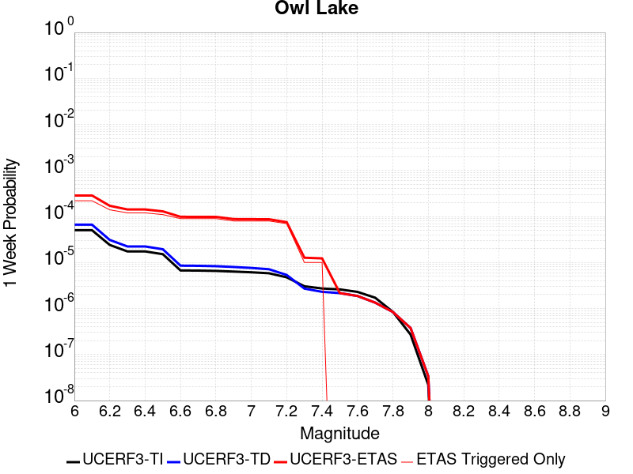
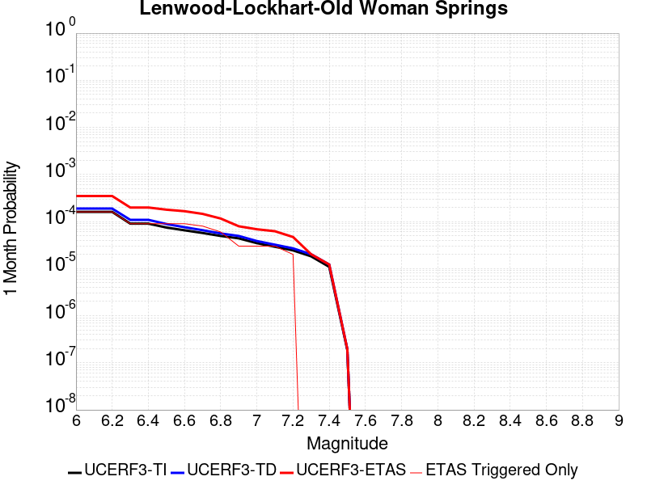
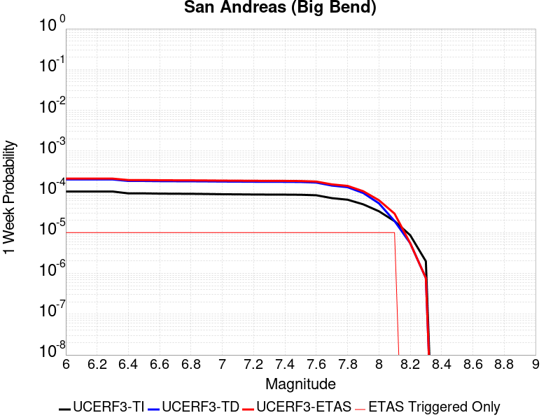
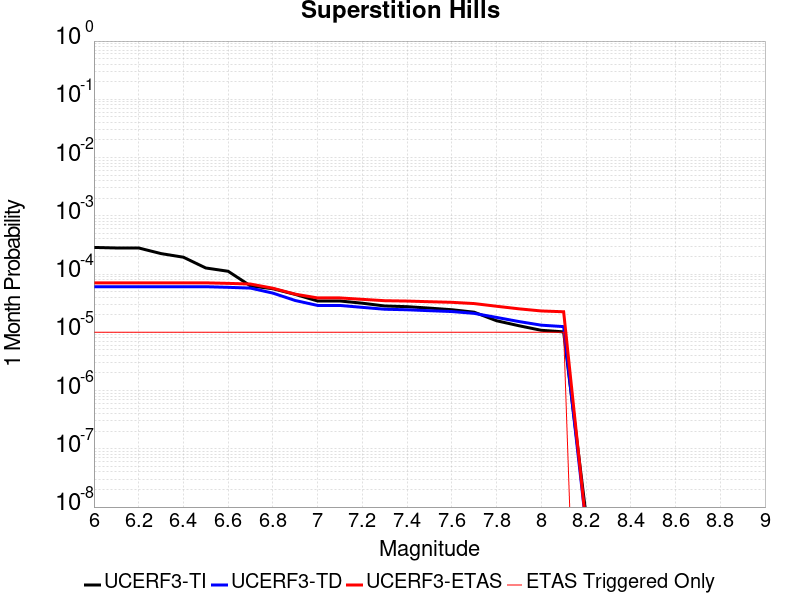
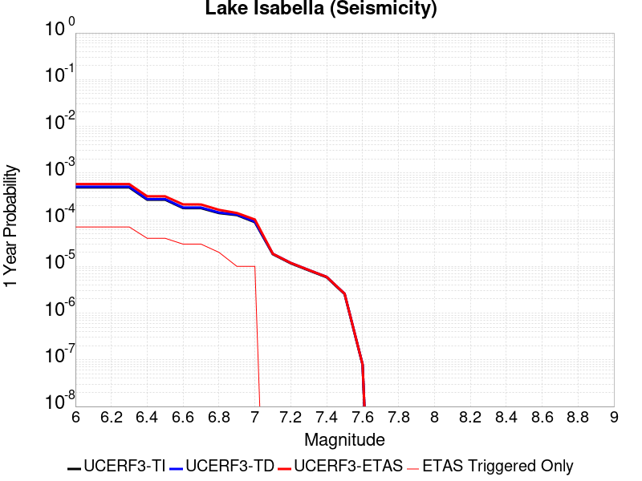
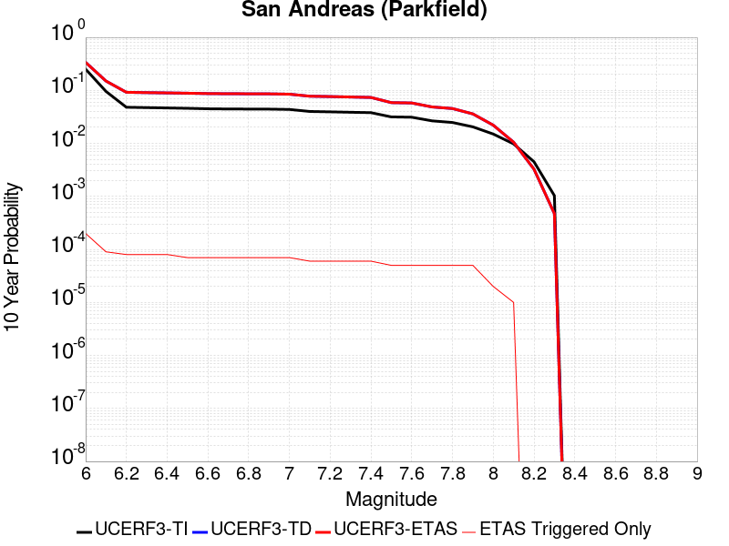
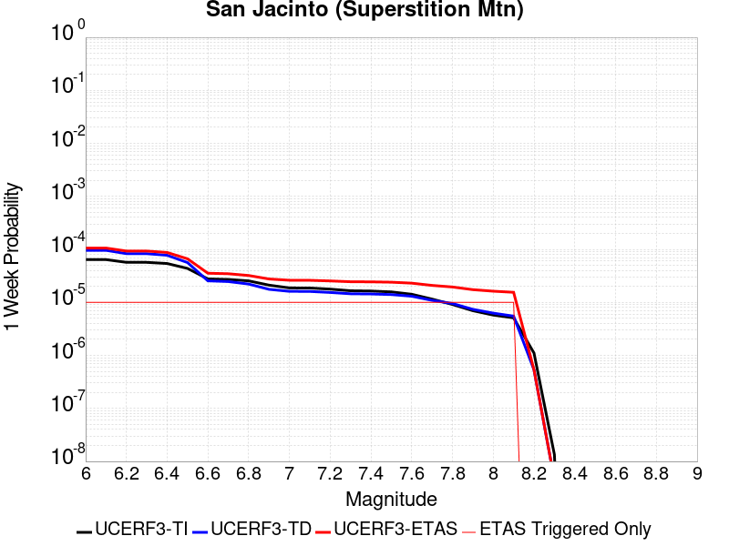
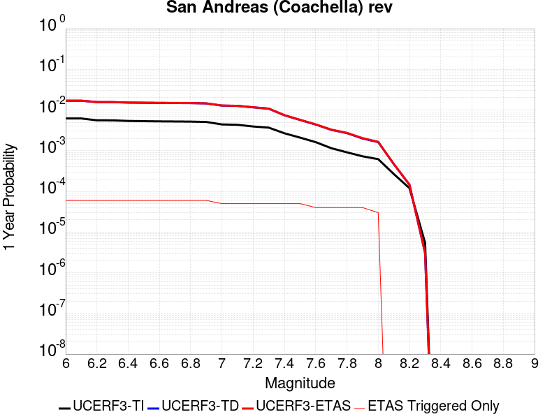

# Parent Section Magnitude-Probability Distributions

Only fault sections with at least one triggered aftershock are plotted. Sections are sorted by total supraseismogenic trigger rate (decreasing)

## Table Of Contents

* [Tank Canyon](#tank-canyon)
* [Garlock (Central)](#garlock-central)
* [Little Lake](#little-lake)
* [Panamint Valley](#panamint-valley)
* [Owl Lake](#owl-lake)
* [Airport Lake](#airport-lake)
* [Ash Hill](#ash-hill)
* [Garlock (East)](#garlock-east)
* [Hunter Mountain-Saline Valley](#hunter-mountain-saline-valley)
* [Blackwater](#blackwater)
* [Gravel Hills-Harper Lk](#gravel-hills-harper-lk)
* [Garlock (West)](#garlock-west)
* [So Sierra Nevada](#so-sierra-nevada)
* [Goldstone Lake](#goldstone-lake)
* [McLean Lake](#mclean-lake)
* [Death Valley (So)](#death-valley-so)
* [San Andreas (Mojave S)](#san-andreas-mojave-s)
* [Lenwood-Lockhart-Old Woman Springs](#lenwood-lockhart-old-woman-springs)
* [Towne Pass](#towne-pass)
* [San Andreas (Mojave N)](#san-andreas-mojave-n)
* [Coyote Canyon](#coyote-canyon)
* [San Andreas (San Bernardino N)](#san-andreas-san-bernardino-n)
* [Sierra Nevada  (No Extension)](#sierra-nevada--no-extension)
* [Garlic Springs](#garlic-springs)
* [Bicycle Lake](#bicycle-lake)
* [Paradise](#paradise)
* [Death Valley (Black Mtns Frontal)](#death-valley-black-mtns-frontal)
* [Scodie Lineament](#scodie-lineament)
* [Independence rev 2011](#independence-rev-2011)
* [Coyote Lake](#coyote-lake)
* [Death Valley (No)](#death-valley-no)
* [San Andreas (Big Bend)](#san-andreas-big-bend)
* [Nelson Lake](#nelson-lake)
* [San Jacinto (Coyote Creek)](#san-jacinto-coyote-creek)
* [San Jacinto (San Bernardino)](#san-jacinto-san-bernardino)
* [Superstition Hills](#superstition-hills)
* [Lake Isabella (Seismicity)](#lake-isabella-seismicity)
* [San Jacinto (Borrego)](#san-jacinto-borrego)
* [San Andreas (Parkfield)](#san-andreas-parkfield)
* [Pinto Mtn](#pinto-mtn)
* [San Andreas (Cholame) rev](#san-andreas-cholame-rev)
* [Red Pass](#red-pass)
* [Whittier alt 1](#whittier-alt-1)
* [San Jacinto (Anza) rev](#san-jacinto-anza-rev)
* [White Wolf (Extension)](#white-wolf-extension)
* [San Jacinto (Stepovers Combined)](#san-jacinto-stepovers-combined)
* [San Andreas (Carrizo) rev](#san-andreas-carrizo-rev)
* [San Jacinto (Superstition Mtn)](#san-jacinto-superstition-mtn)
* [San Andreas (Coachella) rev](#san-andreas-coachella-rev)
* [San Jacinto (San Jacinto Valley) rev](#san-jacinto-san-jacinto-valley-rev)
* [Ortigalita (North)](#ortigalita-north)
* [San Andreas (Peninsula) 2011 CFM](#san-andreas-peninsula-2011-cfm)
* [San Andreas (San Gorgonio Pass-Garnet HIll)](#san-andreas-san-gorgonio-pass-garnet-hill)
* [Cleghorn Lake](#cleghorn-lake)
* [Elysian Park (Upper)](#elysian-park-upper)
* [Chino alt 1](#chino-alt-1)
* [Owens Valley](#owens-valley)
* [Blue Cut](#blue-cut)
* [White Wolf](#white-wolf)
* [Cady](#cady)
* [Coronado Bank alt1](#coronado-bank-alt1)
* [Ludlow](#ludlow)
* [Palos Verdes](#palos-verdes)
* [Great Valley 09 (Laguna Seca)](#great-valley-09-laguna-seca)
* [Verdugo](#verdugo)
* [Sheephole](#sheephole)
* [Raymond](#raymond)
* [San Andreas (Creeping Section) 2011 CFM](#san-andreas-creeping-section-2011-cfm)
* [Deep Springs](#deep-springs)
* [Calico-Hidalgo](#calico-hidalgo)
* [San Andreas (Santa Cruz Mts) 2011 CFM](#san-andreas-santa-cruz-mts-2011-cfm)
* [Sierra Madre](#sierra-madre)
* [Helendale-So Lockhart](#helendale-so-lockhart)
* [Baker](#baker)
* [Kern Canyon (South Kern) 2011](#kern-canyon-south-kern-2011)
* [Santa Ynez (East)](#santa-ynez-east)
* [Cerro Prieto](#cerro-prieto)
* [San Andreas (San Bernardino S)](#san-andreas-san-bernardino-s)
* [White Mountains](#white-mountains)
* [Kern Canyon (Lake Isabella) 2011](#kern-canyon-lake-isabella-2011)
* [Hollywood](#hollywood)
* [Kern Canyon (North Kern) 2011](#kern-canyon-north-kern-2011)

## Tank Canyon
*[(top)](#table-of-contents)*

| 1 Week | 1 Month | 1 Year | 10 Year |
|-----|-----|-----|-----|
|  |  |  |  |

| Magnitude | 1 wk TI Prob | 1 wk TD Prob | 1 wk ETAS Prob | 1 wk ETAS/TD Gain | 1 wk ETAS Triggered Only | 1 mo TI Prob | 1 mo TD Prob | 1 mo ETAS Prob | 1 mo ETAS/TD Gain | 1 mo ETAS Triggered Only | 1 yr TI Prob | 1 yr TD Prob | 1 yr ETAS Prob | 1 yr ETAS/TD Gain | 1 yr ETAS Triggered Only | 10 yr TI Prob | 10 yr TD Prob | 10 yr ETAS Prob | 10 yr ETAS/TD Gain | 10 yr ETAS Triggered Only |
|-----|-----|-----|-----|-----|-----|-----|-----|-----|-----|-----|-----|-----|-----|-----|-----|-----|-----|-----|-----|-----|
| 6.0 | 4.8284557E-5 | 5.7970923E-5 | 0.002025741 | 34.944088 | 0.0019678841 | 2.0691741E-4 | 2.48427E-4 | 0.0063867 | 25.708559 | 0.0061397986 | 0.0025163088 | 0.0030210684 | 0.024916308 | 8.247515 | 0.021961587 | 0.02488006 | 0.029866708 | 0.07217258 | 2.4164894 | 0.04360831 |
| 6.1 | 1.7796336E-5 | 2.0875108E-5 | 7.292986E-4 | 34.93628 | 7.084383E-4 | 7.626778E-5 | 8.946191E-5 | 0.0024507116 | 27.393913 | 0.002361461 | 9.281647E-4 | 0.0010886913 | 0.009108918 | 8.36685 | 0.008028967 | 0.009242975 | 0.010837668 | 0.028123092 | 2.5949395 | 0.017474812 |
| 6.2 | 1.7796336E-5 | 2.0875108E-5 | 7.292986E-4 | 34.93628 | 7.084383E-4 | 7.626778E-5 | 8.946191E-5 | 0.0024507116 | 27.393913 | 0.002361461 | 9.281647E-4 | 0.0010886913 | 0.009108918 | 8.36685 | 0.008028967 | 0.009242975 | 0.010837668 | 0.028123092 | 2.5949395 | 0.017474812 |
| 6.3 | 1.3515912E-5 | 1.5760828E-5 | 4.0933146E-4 | 25.971443 | 3.9357683E-4 | 5.792405E-5 | 6.7544795E-5 | 0.0015630358 | 23.140728 | 0.001495592 | 7.049971E-4 | 8.220716E-4 | 0.006170316 | 7.505813 | 0.0053526447 | 0.007027647 | 0.008192917 | 0.02068419 | 2.5246427 | 0.012594459 |
| 6.4 | 1.0870146E-5 | 1.2618972E-5 | 2.4876208E-4 | 19.71334 | 2.361461E-4 | 4.658551E-5 | 5.4080287E-5 | 0.0010773247 | 19.92084 | 0.0010232998 | 5.67031E-4 | 6.582465E-4 | 0.004984742 | 7.5727587 | 0.004329345 | 0.005655863 | 0.006564983 | 0.016183412 | 2.4651108 | 0.00968199 |
| 6.5 | 7.964826E-6 | 9.196723E-6 | 8.7911365E-5 | 9.558988 | 7.871536E-5 | 3.4134522E-5 | 3.9413993E-5 | 7.478244E-4 | 18.973574 | 7.084383E-4 | 4.1550855E-4 | 4.797704E-4 | 0.003154809 | 6.5756636 | 0.0026763224 | 0.0041473247 | 0.0047886474 | 0.011447414 | 2.3905315 | 0.0066908062 |
| 6.6 | 6.6317E-6 | 7.612777E-6 | 8.632754E-5 | 11.339823 | 7.871536E-5 | 2.8421264E-5 | 3.262583E-5 | 5.049026E-4 | 15.475548 | 4.722922E-4 | 3.4597394E-4 | 3.9715623E-4 | 0.002442943 | 6.151088 | 0.0020465995 | 0.0034543579 | 0.003965616 | 0.009218631 | 2.3246403 | 0.0052739293 |
| 6.7 | 4.793663E-6 | 5.4310603E-6 | 8.4146E-5 | 15.493475 | 7.871536E-5 | 2.0544108E-5 | 2.327579E-5 | 1.8070286E-4 | 7.763554 | 1.5743072E-4 | 2.500958E-4 | 2.8335027E-4 | 0.001227667 | 4.3326836 | 9.445844E-4 | 0.0024981452 | 0.0028305824 | 0.0054993294 | 1.942826 | 0.0026763224 |
| 6.8 | 4.382823E-6 | 4.9694927E-6 | 8.368447E-5 | 16.83964 | 7.871536E-5 | 1.8783392E-5 | 2.1297676E-5 | 1.7872505E-4 | 8.391764 | 1.5743072E-4 | 2.286638E-4 | 2.592726E-4 | 0.0011249172 | 4.3387427 | 8.65869E-4 | 0.0022842865 | 0.0025903755 | 0.004945719 | 1.9092674 | 0.002361461 |
| 6.9 | 2.729601E-6 | 3.0736521E-6 | 8.178878E-5 | 26.60964 | 7.871536E-5 | 1.1698237E-5 | 1.3172735E-5 | 9.1887065E-5 | 6.975549 | 7.871536E-5 | 1.4241673E-4 | 1.6036748E-4 | 7.112867E-4 | 4.435355 | 5.510076E-4 | 0.001423255 | 0.0016026833 | 0.0027029323 | 1.6865042 | 0.0011020151 |
| 7.0 | 1.8987357E-6 | 2.1269989E-6 | 8.08422E-5 | 38.007633 | 7.871536E-5 | 8.137413E-6 | 9.115682E-6 | 8.783033E-5 | 9.63508 | 7.871536E-5 | 9.90685E-5 | 1.1097847E-4 | 3.4709836E-4 | 3.1276188 | 2.361461E-4 | 9.902435E-4 | 0.0011092991 | 0.0016596955 | 1.4961658 | 5.510076E-4 |
| 7.1 | 1.4928986E-6 | 1.6641684E-6 | 8.03794E-5 | 48.30004 | 7.871536E-5 | 6.398121E-6 | 7.1321338E-6 | 8.5846936E-5 | 12.036641 | 7.871536E-5 | 7.789434E-5 | 8.683086E-5 | 1.6553939E-4 | 1.906458 | 7.871536E-5 | 7.786704E-4 | 8.680272E-4 | 0.0011826154 | 1.3624173 | 3.1486145E-4 |
| 7.2 | 1.069082E-6 | 1.1828834E-6 | 1.1828834E-6 | 1.0 | 0.0 | 4.581772E-6 | 5.0694935E-6 | 5.0694935E-6 | 1.0 | 0.0 | 5.5781646E-5 | 6.171987E-5 | 6.171987E-5 | 1.0 | 0.0 | 5.576765E-4 | 6.170795E-4 | 7.744131E-4 | 1.2549648 | 1.5743072E-4 |
| 7.3 | 8.776551E-7 | 9.770195E-7 | 9.770195E-7 | 1.0 | 0.0 | 3.7613736E-6 | 4.1872227E-6 | 4.1872227E-6 | 1.0 | 0.0 | 4.579376E-5 | 5.0978764E-5 | 5.0978764E-5 | 1.0 | 0.0 | 4.5784327E-4 | 5.097217E-4 | 6.670722E-4 | 1.3086988 | 1.5743072E-4 |
| 7.4 | 7.55721E-7 | 8.510402E-7 | 8.510402E-7 | 1.0 | 0.0 | 3.2388E-6 | 3.647313E-6 | 3.647313E-6 | 1.0 | 0.0 | 3.9431678E-5 | 4.440565E-5 | 4.440565E-5 | 1.0 | 0.0 | 3.942468E-4 | 4.440186E-4 | 6.0137943E-4 | 1.3544015 | 1.5743072E-4 |
| 7.5 | 5.587665E-7 | 6.305733E-7 | 6.305733E-7 | 1.0 | 0.0 | 2.3947114E-6 | 2.702457E-6 | 2.702457E-6 | 1.0 | 0.0 | 2.915522E-5 | 3.2902415E-5 | 3.2902415E-5 | 1.0 | 0.0 | 2.9151395E-4 | 3.2902416E-4 | 3.2902416E-4 | 1.0 | 0.0 |

## Garlock (Central)
*[(top)](#table-of-contents)*

| 1 Week | 1 Month | 1 Year | 10 Year |
|-----|-----|-----|-----|
|  |  |  |  |

| Magnitude | 1 wk TI Prob | 1 wk TD Prob | 1 wk ETAS Prob | 1 wk ETAS/TD Gain | 1 wk ETAS Triggered Only | 1 mo TI Prob | 1 mo TD Prob | 1 mo ETAS Prob | 1 mo ETAS/TD Gain | 1 mo ETAS Triggered Only | 1 yr TI Prob | 1 yr TD Prob | 1 yr ETAS Prob | 1 yr ETAS/TD Gain | 1 yr ETAS Triggered Only | 10 yr TI Prob | 10 yr TD Prob | 10 yr ETAS Prob | 10 yr ETAS/TD Gain | 10 yr ETAS Triggered Only |
|-----|-----|-----|-----|-----|-----|-----|-----|-----|-----|-----|-----|-----|-----|-----|-----|-----|-----|-----|-----|-----|
| 6.0 | 5.5131142E-5 | 7.027124E-5 | 0.0013296286 | 18.921375 | 0.0012594458 | 2.3625491E-4 | 3.0112805E-4 | 0.0034487946 | 11.452916 | 0.0031486147 | 0.0028726095 | 0.0036601364 | 0.01589479 | 4.3426766 | 0.012279597 | 0.028357591 | 0.036092084 | 0.05930964 | 1.6432866 | 0.024086902 |
| 6.1 | 5.5131142E-5 | 7.027124E-5 | 0.0013296286 | 18.921375 | 0.0012594458 | 2.3625491E-4 | 3.0112805E-4 | 0.0034487946 | 11.452916 | 0.0031486147 | 0.0028726095 | 0.0036601364 | 0.01589479 | 4.3426766 | 0.012279597 | 0.028357591 | 0.036092084 | 0.05930964 | 1.6432866 | 0.024086902 |
| 6.2 | 4.216245E-5 | 5.1683597E-5 | 8.3879655E-4 | 16.229454 | 7.8715367E-4 | 1.806837E-4 | 2.214825E-4 | 0.0025037224 | 11.30438 | 0.0022827457 | 0.0021976046 | 0.0026932466 | 0.0109361 | 4.060564 | 0.008265113 | 0.021759989 | 0.026701005 | 0.041947108 | 1.5709937 | 0.015664358 |
| 6.3 | 4.216245E-5 | 5.1683597E-5 | 8.3879655E-4 | 16.229454 | 7.8715367E-4 | 1.806837E-4 | 2.214825E-4 | 0.0025037224 | 11.30438 | 0.0022827457 | 0.0021976046 | 0.0026932466 | 0.0109361 | 4.060564 | 0.008265113 | 0.021759989 | 0.026701005 | 0.041947108 | 1.5709937 | 0.015664358 |
| 6.4 | 3.6858168E-5 | 4.4131746E-5 | 6.738269E-4 | 15.26853 | 6.297229E-4 | 1.5795401E-4 | 1.8912248E-4 | 0.0019992334 | 10.571104 | 0.0018104534 | 0.0019213937 | 0.00230016 | 0.008818507 | 3.833867 | 0.0065333755 | 0.019048655 | 0.022859743 | 0.03493555 | 1.5282564 | 0.0123583125 |
| 6.5 | 3.39199E-5 | 4.0038896E-5 | 5.910244E-4 | 14.761255 | 5.510076E-4 | 1.453629E-4 | 1.715841E-4 | 0.0017456213 | 10.17356 | 0.0015743073 | 0.0017683565 | 0.0020870569 | 0.007821286 | 3.7475195 | 0.0057462216 | 0.017543508 | 0.020770492 | 0.031484667 | 1.5158365 | 0.010941436 |
| 6.6 | 3.3571985E-5 | 3.9493032E-5 | 5.904788E-4 | 14.951468 | 5.510076E-4 | 1.4387199E-4 | 1.6924499E-4 | 0.0017432858 | 10.300369 | 0.0015743073 | 0.0017502342 | 0.0020586322 | 0.0077930246 | 3.785535 | 0.0057462216 | 0.017365133 | 0.020491783 | 0.031209009 | 1.5230012 | 0.010941436 |
| 6.7 | 3.2580007E-5 | 3.8109323E-5 | 5.890959E-4 | 15.458051 | 5.510076E-4 | 1.3962112E-4 | 1.6331558E-4 | 0.0017373657 | 10.63809 | 0.0015743073 | 0.0016985617 | 0.0019865753 | 0.007642823 | 3.8472354 | 0.0056675063 | 0.016856372 | 0.019784356 | 0.030123532 | 1.5225935 | 0.010547859 |
| 6.8 | 3.2185937E-5 | 3.7536465E-5 | 5.8852334E-4 | 15.678709 | 5.510076E-4 | 1.3793244E-4 | 1.6086077E-4 | 0.0017349148 | 10.785195 | 0.0015743073 | 0.0016780337 | 0.001956742 | 0.007534597 | 3.8505826 | 0.005588791 | 0.016654192 | 0.01949112 | 0.029601846 | 1.518735 | 0.0103117125 |
| 6.9 | 3.165394E-5 | 3.6740938E-5 | 5.877282E-4 | 15.99655 | 5.510076E-4 | 1.3565269E-4 | 1.5745178E-4 | 0.0017315112 | 10.997088 | 0.0015743073 | 0.0016503202 | 0.0019153113 | 0.007493398 | 3.9123654 | 0.005588791 | 0.01638118 | 0.0190837 | 0.0290442 | 1.5219376 | 0.010154282 |
| 7.0 | 3.0903822E-5 | 3.564605E-5 | 5.86634E-4 | 16.457193 | 5.510076E-4 | 1.3243823E-4 | 1.5275997E-4 | 0.0017268268 | 11.304185 | 0.0015743073 | 0.0016112428 | 0.0018582871 | 0.007122416 | 3.8327856 | 0.0052739293 | 0.015996104 | 0.018522795 | 0.028025448 | 1.5130247 | 0.00968199 |
| 7.1 | 3.0069863E-5 | 3.441218E-5 | 5.0668814E-4 | 14.724092 | 4.722922E-4 | 1.2886449E-4 | 1.4747256E-4 | 0.0014854365 | 10.072629 | 0.0013381612 | 0.0015677959 | 0.0017940209 | 0.006587044 | 3.6716652 | 0.0048016375 | 0.01556781 | 0.017890377 | 0.026548773 | 1.4839696 | 0.008816121 |
| 7.2 | 2.7957109E-5 | 3.1301115E-5 | 5.035785E-4 | 16.088198 | 4.722922E-4 | 1.1981068E-4 | 1.3414085E-4 | 0.0013934177 | 10.387722 | 0.0012594458 | 0.0014577188 | 0.0016319609 | 0.005561306 | 3.407745 | 0.0039357683 | 0.014481937 | 0.016293783 | 0.023572465 | 1.4467154 | 0.0073992442 |
| 7.3 | 2.4519275E-5 | 2.6733265E-5 | 4.2029956E-4 | 15.721969 | 3.9357683E-4 | 1.0507837E-4 | 1.1456619E-4 | 0.0011377487 | 9.930929 | 0.0010232998 | 0.0012785783 | 0.0013939656 | 0.004774008 | 3.4247675 | 0.0033847608 | 0.012712469 | 0.013937555 | 0.020069398 | 1.4399512 | 0.006218514 |
| 7.4 | 2.3225532E-5 | 2.5217494E-5 | 4.187844E-4 | 16.6069 | 3.9357683E-4 | 9.95342E-5 | 1.0807058E-4 | 0.0010525528 | 9.739495 | 9.445844E-4 | 0.0012111551 | 0.0013149795 | 0.0044594537 | 3.3912723 | 0.0031486147 | 0.012045753 | 0.01315504 | 0.01905871 | 1.4487762 | 0.005982368 |
| 7.5 | 2.097765E-5 | 2.250088E-5 | 4.1606885E-4 | 18.491224 | 3.9357683E-4 | 8.9901114E-5 | 9.6428856E-5 | 9.6221437E-4 | 9.978491 | 8.65869E-4 | 0.0010939965 | 0.0011734008 | 0.0038465827 | 3.2781491 | 0.0026763224 | 0.010886264 | 0.01174923 | 0.016805615 | 1.4303588 | 0.0051164986 |
| 7.6 | 1.511254E-5 | 1.6007341E-5 | 3.3086375E-4 | 20.669502 | 3.1486145E-4 | 6.476642E-5 | 6.860113E-5 | 5.408609E-4 | 7.88414 | 4.722922E-4 | 7.882459E-4 | 8.3490653E-4 | 0.0022506001 | 2.6956313 | 0.0014168766 | 0.007854558 | 0.00839184 | 0.011045704 | 1.3162433 | 0.0026763224 |
| 7.7 | 9.934069E-6 | 1.0693656E-5 | 8.940818E-5 | 8.360862 | 7.871536E-5 | 4.2573887E-5 | 4.582915E-5 | 1.2454091E-4 | 2.7175043 | 7.871536E-5 | 5.182138E-4 | 5.578274E-4 | 7.938418E-4 | 1.4230957 | 2.361461E-4 | 0.00517007 | 0.005635394 | 0.0061050244 | 1.0833359 | 4.722922E-4 |
| 7.8 | 6.7562896E-6 | 8.440562E-6 | 8.715526E-5 | 10.325765 | 7.871536E-5 | 2.8955206E-5 | 3.6173336E-5 | 1.1488586E-4 | 3.1759815 | 7.871536E-5 | 3.5247262E-4 | 4.4032154E-4 | 6.7636365E-4 | 1.5360676 | 2.361461E-4 | 0.0035191406 | 0.0044529405 | 0.0048447647 | 1.0879922 | 3.9357683E-4 |
| 7.9 | 3.975453E-6 | 5.3784297E-6 | 8.409337E-5 | 15.635302 | 7.871536E-5 | 1.7037546E-5 | 2.305021E-5 | 1.0176376E-4 | 4.4148736 | 7.871536E-5 | 2.0741238E-4 | 2.8060027E-4 | 4.3798683E-4 | 1.5608923 | 1.5743072E-4 | 0.002072189 | 0.0028374717 | 0.0029944556 | 1.0553253 | 1.5743072E-4 |
| 8.0 | 1.6729537E-6 | 2.0800776E-6 | 8.079528E-5 | 38.842434 | 7.871536E-5 | 7.169782E-6 | 8.914588E-6 | 8.7629254E-5 | 9.829871 | 7.871536E-5 | 8.7288594E-5 | 1.0852974E-4 | 2.6594338E-4 | 2.4504194 | 1.5743072E-4 | 8.7254314E-4 | 0.0010982669 | 0.0012555248 | 1.1431873 | 1.5743072E-4 |
| 8.1 | 3.6733252E-7 | 3.1526864E-7 | 3.1526864E-7 | 1.0 | 0.0 | 1.5742813E-6 | 1.3511507E-6 | 1.3511507E-6 | 1.0 | 0.0 | 1.9166706E-5 | 1.645015E-5 | 1.645015E-5 | 1.0 | 0.0 | 1.9165053E-4 | 1.6658098E-4 | 1.6658098E-4 | 1.0 | 0.0 |

## Little Lake
*[(top)](#table-of-contents)*

| 1 Week | 1 Month | 1 Year | 10 Year |
|-----|-----|-----|-----|
|  |  |  |  |

| Magnitude | 1 wk TI Prob | 1 wk TD Prob | 1 wk ETAS Prob | 1 wk ETAS/TD Gain | 1 wk ETAS Triggered Only | 1 mo TI Prob | 1 mo TD Prob | 1 mo ETAS Prob | 1 mo ETAS/TD Gain | 1 mo ETAS Triggered Only | 1 yr TI Prob | 1 yr TD Prob | 1 yr ETAS Prob | 1 yr ETAS/TD Gain | 1 yr ETAS Triggered Only | 10 yr TI Prob | 10 yr TD Prob | 10 yr ETAS Prob | 10 yr ETAS/TD Gain | 10 yr ETAS Triggered Only |
|-----|-----|-----|-----|-----|-----|-----|-----|-----|-----|-----|-----|-----|-----|-----|-----|-----|-----|-----|-----|-----|
| 6.0 | 2.8424427E-5 | 3.1207477E-5 | 5.034849E-4 | 16.13347 | 4.722922E-4 | 1.2181328E-4 | 1.3374022E-4 | 0.0021013613 | 15.71226 | 0.0019678841 | 0.0014820677 | 0.0016272042 | 0.009014408 | 5.539814 | 0.0073992442 | 0.014722223 | 0.016166303 | 0.028866928 | 1.7856232 | 0.01290932 |
| 6.1 | 2.8424427E-5 | 3.1207477E-5 | 5.034849E-4 | 16.13347 | 4.722922E-4 | 1.2181328E-4 | 1.3374022E-4 | 0.0021013613 | 15.71226 | 0.0019678841 | 0.0014820677 | 0.0016272042 | 0.009014408 | 5.539814 | 0.0073992442 | 0.014722223 | 0.016166303 | 0.028866928 | 1.7856232 | 0.01290932 |
| 6.2 | 2.8424427E-5 | 3.1207477E-5 | 5.034849E-4 | 16.13347 | 4.722922E-4 | 1.2181328E-4 | 1.3374022E-4 | 0.0021013613 | 15.71226 | 0.0019678841 | 0.0014820677 | 0.0016272042 | 0.009014408 | 5.539814 | 0.0073992442 | 0.014722223 | 0.016166303 | 0.028866928 | 1.7856232 | 0.01290932 |
| 6.3 | 1.48860645E-5 | 1.6082206E-5 | 3.309386E-4 | 20.577936 | 3.1486145E-4 | 6.379586E-5 | 6.8922076E-5 | 0.001406991 | 20.41423 | 0.0013381612 | 7.7643775E-4 | 8.388314E-4 | 0.0053218435 | 6.344354 | 0.004486776 | 0.007737305 | 0.00835947 | 0.015774919 | 1.8870715 | 0.0074779596 |
| 6.4 | 1.48860645E-5 | 1.6082206E-5 | 3.309386E-4 | 20.577936 | 3.1486145E-4 | 6.379586E-5 | 6.8922076E-5 | 0.001406991 | 20.41423 | 0.0013381612 | 7.7643775E-4 | 8.388314E-4 | 0.0053218435 | 6.344354 | 0.004486776 | 0.007737305 | 0.00835947 | 0.015774919 | 1.8870715 | 0.0074779596 |
| 6.5 | 1.2797581E-5 | 1.3766247E-5 | 3.2862337E-4 | 23.871675 | 3.1486145E-4 | 5.4845623E-5 | 5.899701E-5 | 0.0013970793 | 23.68051 | 0.0013381612 | 6.675408E-4 | 7.180776E-4 | 0.005044314 | 7.0247474 | 0.004329345 | 0.006655392 | 0.007160124 | 0.013881175 | 1.938678 | 0.0067695216 |
| 6.6 | 9.661896E-6 | 1.0289519E-5 | 2.464332E-4 | 23.949923 | 2.361461E-4 | 4.1407468E-5 | 4.4097287E-5 | 9.099281E-4 | 20.634562 | 8.65869E-4 | 5.040193E-4 | 5.3676846E-4 | 0.0038410393 | 7.155859 | 0.0033060454 | 0.005028777 | 0.0053563244 | 0.010602005 | 1.9793433 | 0.0052739293 |
| 6.7 | 7.767871E-6 | 8.200053E-6 | 2.443442E-4 | 29.79788 | 2.361461E-4 | 3.329045E-5 | 3.514269E-5 | 7.4355607E-4 | 21.1582 | 7.084383E-4 | 4.0523586E-4 | 4.27792E-4 | 0.0031816512 | 7.437379 | 0.0027550377 | 0.004044977 | 0.004271037 | 0.008425133 | 1.97262 | 0.0041719144 |
| 6.8 | 6.4235196E-6 | 6.736042E-6 | 1.6416571E-4 | 24.371243 | 1.5743072E-4 | 2.752908E-5 | 2.8868506E-5 | 5.798602E-4 | 20.086254 | 5.510076E-4 | 3.35115E-4 | 3.514302E-4 | 0.0023186228 | 6.5976768 | 0.0019678841 | 0.003346101 | 0.0035100048 | 0.0066475677 | 1.8938913 | 0.0031486147 |
| 6.9 | 3.1283696E-6 | 3.1122859E-6 | 1.6054252E-4 | 51.583477 | 1.5743072E-4 | 1.3407229E-5 | 1.3338308E-5 | 4.856242E-4 | 36.40823 | 4.722922E-4 | 1.6322079E-4 | 1.6238331E-4 | 0.0014216247 | 8.754746 | 0.0012594458 | 0.0016310095 | 0.0016227949 | 0.0037446606 | 2.307538 | 0.002125315 |
| 7.0 | 2.290603E-6 | 2.2287613E-6 | 1.5965915E-4 | 71.63582 | 1.5743072E-4 | 9.816834E-6 | 9.551805E-6 | 4.0312487E-4 | 42.204052 | 3.9357683E-4 | 1.19513395E-4 | 1.1628806E-4 | 8.2464394E-4 | 7.0913897 | 7.084383E-4 | 0.0011944914 | 0.0011623743 | 0.0025776038 | 2.2175336 | 0.0014168766 |
| 7.1 | 1.293693E-6 | 1.1777322E-6 | 7.9893005E-5 | 67.83631 | 7.871536E-5 | 5.5443866E-6 | 5.0474177E-6 | 2.4119232E-4 | 47.78529 | 2.361461E-4 | 6.750081E-5 | 6.1451276E-5 | 2.9758285E-4 | 4.842582 | 2.361461E-4 | 6.7480316E-4 | 6.144114E-4 | 0.0013224144 | 2.1523273 | 7.084383E-4 |
| 7.2 | 4.715842E-7 | 3.09202E-7 | 7.902454E-5 | 255.57579 | 7.871536E-5 | 2.0210737E-6 | 1.3251507E-6 | 8.004041E-5 | 60.400986 | 7.871536E-5 | 2.4606294E-5 | 1.6133596E-5 | 9.484769E-5 | 5.8788934 | 7.871536E-5 | 2.460357E-4 | 1.6132479E-4 | 2.4002745E-4 | 1.4878523 | 7.871536E-5 |
| 7.3 | 3.9430947E-7 | 2.3099639E-7 | 2.3099639E-7 | 1.0 | 0.0 | 1.6898966E-6 | 9.899842E-7 | 9.899842E-7 | 1.0 | 0.0 | 2.0574296E-5 | 1.2052991E-5 | 1.2052991E-5 | 1.0 | 0.0 | 2.0572392E-4 | 1.20523444E-4 | 1.20523444E-4 | 1.0 | 0.0 |
| 7.4 | 3.547123E-7 | 1.9681133E-7 | 1.9681133E-7 | 1.0 | 0.0 | 1.5201948E-6 | 8.4347687E-7 | 8.4347687E-7 | 1.0 | 0.0 | 1.8508214E-5 | 1.0269283E-5 | 1.0269283E-5 | 1.0 | 0.0 | 1.8506673E-4 | 1.02688144E-4 | 1.02688144E-4 | 1.0 | 0.0 |
| 7.5 | 2.6354266E-7 | 1.4424535E-7 | 1.4424535E-7 | 1.0 | 0.0 | 1.129468E-6 | 6.1819424E-7 | 6.1819424E-7 | 1.0 | 0.0 | 1.3751187E-5 | 7.5264893E-6 | 7.5264893E-6 | 1.0 | 0.0 | 1.3750336E-4 | 7.52624E-5 | 7.52624E-5 | 1.0 | 0.0 |
| 7.6 | 1.269913E-7 | 7.573149E-8 | 7.573149E-8 | 1.0 | 0.0 | 5.4424834E-7 | 3.245635E-7 | 3.245635E-7 | 1.0 | 0.0 | 6.6262032E-6 | 3.951554E-6 | 3.951554E-6 | 1.0 | 0.0 | 6.626006E-5 | 3.951487E-5 | 3.951487E-5 | 1.0 | 0.0 |

## Panamint Valley
*[(top)](#table-of-contents)*

| 1 Week | 1 Month | 1 Year | 10 Year |
|-----|-----|-----|-----|
|  |  |  |  |

| Magnitude | 1 wk TI Prob | 1 wk TD Prob | 1 wk ETAS Prob | 1 wk ETAS/TD Gain | 1 wk ETAS Triggered Only | 1 mo TI Prob | 1 mo TD Prob | 1 mo ETAS Prob | 1 mo ETAS/TD Gain | 1 mo ETAS Triggered Only | 1 yr TI Prob | 1 yr TD Prob | 1 yr ETAS Prob | 1 yr ETAS/TD Gain | 1 yr ETAS Triggered Only | 10 yr TI Prob | 10 yr TD Prob | 10 yr ETAS Prob | 10 yr ETAS/TD Gain | 10 yr ETAS Triggered Only |
|-----|-----|-----|-----|-----|-----|-----|-----|-----|-----|-----|-----|-----|-----|-----|-----|-----|-----|-----|-----|-----|
| 6.0 | 3.0211835E-5 | 3.39879E-5 | 4.2755136E-4 | 12.579516 | 3.9357683E-4 | 1.2947287E-4 | 1.4565447E-4 | 0.0011688052 | 8.024507 | 0.0010232998 | 0.0015751923 | 0.0017719301 | 0.005936452 | 3.3502743 | 0.0041719144 | 0.015640736 | 0.017584875 | 0.027173938 | 1.5453018 | 0.009760706 |
| 6.1 | 3.0211835E-5 | 3.39879E-5 | 4.2755136E-4 | 12.579516 | 3.9357683E-4 | 1.2947287E-4 | 1.4565447E-4 | 0.0011688052 | 8.024507 | 0.0010232998 | 0.0015751923 | 0.0017719301 | 0.005936452 | 3.3502743 | 0.0041719144 | 0.015640736 | 0.017584875 | 0.027173938 | 1.5453018 | 0.009760706 |
| 6.2 | 3.0211835E-5 | 3.39879E-5 | 4.2755136E-4 | 12.579516 | 3.9357683E-4 | 1.2947287E-4 | 1.4565447E-4 | 0.0011688052 | 8.024507 | 0.0010232998 | 0.0015751923 | 0.0017719301 | 0.005936452 | 3.3502743 | 0.0041719144 | 0.015640736 | 0.017584875 | 0.027173938 | 1.5453018 | 0.009760706 |
| 6.3 | 2.8573924E-5 | 3.210589E-5 | 4.256701E-4 | 13.258317 | 3.9357683E-4 | 1.2245393E-4 | 1.3758958E-4 | 0.0011607485 | 8.436312 | 0.0010232998 | 0.001489857 | 0.0016738938 | 0.005603074 | 3.3473294 | 0.0039357683 | 0.01479908 | 0.01661945 | 0.025753494 | 1.5495998 | 0.009288413 |
| 6.4 | 2.8573924E-5 | 3.210589E-5 | 4.256701E-4 | 13.258317 | 3.9357683E-4 | 1.2245393E-4 | 1.3758958E-4 | 0.0011607485 | 8.436312 | 0.0010232998 | 0.001489857 | 0.0016738938 | 0.005603074 | 3.3473294 | 0.0039357683 | 0.01479908 | 0.01661945 | 0.025753494 | 1.5495998 | 0.009288413 |
| 6.5 | 2.7468774E-5 | 3.0831525E-5 | 4.2439622E-4 | 13.765009 | 3.9357683E-4 | 1.1771801E-4 | 1.3212857E-4 | 0.0011552931 | 8.743705 | 0.0010232998 | 0.0014322745 | 0.0016075056 | 0.005458358 | 3.3955455 | 0.003857053 | 0.014230782 | 0.015965264 | 0.024873009 | 1.5579454 | 0.009052267 |
| 6.6 | 2.6135967E-5 | 2.9255436E-5 | 4.2282074E-4 | 14.452724 | 3.9357683E-4 | 1.1200648E-4 | 1.2537456E-4 | 0.001148546 | 9.160917 | 0.0010232998 | 0.0013628257 | 0.001525393 | 0.0053765625 | 3.5247064 | 0.003857053 | 0.013544982 | 0.015155562 | 0.02383807 | 1.5728924 | 0.008816121 |
| 6.7 | 2.4498746E-5 | 2.7344193E-5 | 4.2091025E-4 | 15.393041 | 3.9357683E-4 | 1.04990395E-4 | 1.17184274E-4 | 9.829518E-4 | 8.388086 | 8.65869E-4 | 0.0012775084 | 0.0014258098 | 0.005041554 | 3.535923 | 0.0036209067 | 0.012701893 | 0.014172745 | 0.02224312 | 1.5694292 | 0.008186398 |
| 6.8 | 2.2244329E-5 | 2.4938103E-5 | 4.185051E-4 | 16.781755 | 3.9357683E-4 | 9.532935E-5 | 1.06873325E-4 | 9.726498E-4 | 9.10096 | 8.65869E-4 | 0.0011600169 | 0.0013004278 | 0.0046807867 | 3.5994205 | 0.0033847608 | 0.011539802 | 0.012933899 | 0.020159744 | 1.558675 | 0.007320529 |
| 6.9 | 1.9902658E-5 | 2.2292743E-5 | 4.158608E-4 | 18.654537 | 3.9357683E-4 | 8.529431E-5 | 9.553693E-5 | 8.826154E-4 | 9.238473 | 7.8715367E-4 | 0.0010379635 | 0.00116256 | 0.0039930185 | 3.4346776 | 0.0028337531 | 0.010331288 | 0.011569886 | 0.017405232 | 1.5043566 | 0.0059036524 |
| 7.0 | 1.8353881E-5 | 2.0568525E-5 | 4.1413726E-4 | 20.134514 | 3.9357683E-4 | 7.865712E-5 | 8.814794E-5 | 8.752322E-4 | 9.929129 | 7.8715367E-4 | 9.5722964E-4 | 0.0010726905 | 0.0035888802 | 3.345681 | 0.0025188916 | 0.009531168 | 0.010680057 | 0.015975535 | 1.4958286 | 0.0053526447 |
| 7.1 | 1.7667631E-5 | 1.9774876E-5 | 4.1334392E-4 | 20.90248 | 3.9357683E-4 | 7.571623E-5 | 8.474681E-5 | 8.7183376E-4 | 10.287511 | 7.8715367E-4 | 9.2145515E-4 | 0.0010313216 | 0.003311713 | 3.211135 | 0.0022827457 | 0.009176437 | 0.010270242 | 0.015256286 | 1.4854846 | 0.005037783 |
| 7.2 | 1.6381597E-5 | 1.8160366E-5 | 3.330161E-4 | 18.33752 | 3.1486145E-4 | 7.020495E-5 | 7.782792E-5 | 7.8621105E-4 | 10.101915 | 7.084383E-4 | 8.544101E-4 | 9.471603E-4 | 0.0029131805 | 3.0756996 | 0.0019678841 | 0.008511325 | 0.0094358865 | 0.014036271 | 1.4875413 | 0.0046442067 |
| 7.3 | 1.4520491E-5 | 1.5968182E-5 | 2.521105E-4 | 15.788303 | 2.361461E-4 | 6.222919E-5 | 6.8433365E-5 | 6.194032E-4 | 9.0511875 | 5.510076E-4 | 7.57377E-4 | 8.328739E-4 | 0.00240587 | 2.8886366 | 0.0015743073 | 0.0075480095 | 0.008300635 | 0.01204761 | 1.4514083 | 0.0037783375 |
| 7.4 | 1.2852287E-5 | 1.4146948E-5 | 2.502897E-4 | 17.692135 | 2.361461E-4 | 5.5080065E-5 | 6.0628456E-5 | 6.116026E-4 | 10.087715 | 5.510076E-4 | 6.7039346E-4 | 7.379173E-4 | 0.002311063 | 3.1318724 | 0.0015743073 | 0.0066837464 | 0.0073575918 | 0.010951858 | 1.4885111 | 0.0036209067 |
| 7.5 | 1.1637851E-5 | 1.2838205E-5 | 2.4898126E-4 | 19.393776 | 2.361461E-4 | 4.987555E-5 | 5.5019806E-5 | 6.0599705E-4 | 11.014161 | 5.510076E-4 | 6.070656E-4 | 6.6967594E-4 | 0.002242929 | 3.349275 | 0.0015743073 | 0.006054099 | 0.006679477 | 0.010119819 | 1.5150615 | 0.003463476 |
| 7.6 | 3.0068115E-6 | 3.3335807E-6 | 1.6076378E-4 | 48.22556 | 1.5743072E-4 | 1.2886271E-5 | 1.4286737E-5 | 2.5042947E-4 | 17.528807 | 2.361461E-4 | 1.5687906E-4 | 1.7393442E-4 | 7.2484615E-4 | 4.167353 | 5.510076E-4 | 0.0015676835 | 0.0017394236 | 0.0030752572 | 1.7679749 | 0.0013381612 |

## Owl Lake
*[(top)](#table-of-contents)*

| 1 Week | 1 Month | 1 Year | 10 Year |
|-----|-----|-----|-----|
|  |  |  |  |

| Magnitude | 1 wk TI Prob | 1 wk TD Prob | 1 wk ETAS Prob | 1 wk ETAS/TD Gain | 1 wk ETAS Triggered Only | 1 mo TI Prob | 1 mo TD Prob | 1 mo ETAS Prob | 1 mo ETAS/TD Gain | 1 mo ETAS Triggered Only | 1 yr TI Prob | 1 yr TD Prob | 1 yr ETAS Prob | 1 yr ETAS/TD Gain | 1 yr ETAS Triggered Only | 10 yr TI Prob | 10 yr TD Prob | 10 yr ETAS Prob | 10 yr ETAS/TD Gain | 10 yr ETAS Triggered Only |
|-----|-----|-----|-----|-----|-----|-----|-----|-----|-----|-----|-----|-----|-----|-----|-----|-----|-----|-----|-----|-----|
| 6.0 | 5.0320643E-5 | 6.637151E-5 | 2.237918E-4 | 3.371805 | 1.5743072E-4 | 2.1564208E-4 | 2.844246E-4 | 0.0013861263 | 4.8734403 | 0.0011020151 | 0.0026222812 | 0.0034584238 | 0.007851239 | 2.2701786 | 0.0044080606 | 0.02591553 | 0.034147043 | 0.042510066 | 1.244912 | 0.00865869 |
| 6.1 | 5.0320643E-5 | 6.637151E-5 | 2.237918E-4 | 3.371805 | 1.5743072E-4 | 2.1564208E-4 | 2.844246E-4 | 0.0013861263 | 4.8734403 | 0.0011020151 | 0.0026222812 | 0.0034584238 | 0.007851239 | 2.2701786 | 0.0044080606 | 0.02591553 | 0.034147043 | 0.042510066 | 1.244912 | 0.00865869 |
| 6.2 | 2.4125871E-5 | 3.098766E-5 | 1.0970058E-4 | 3.540138 | 7.871536E-5 | 1.0339249E-4 | 1.3279865E-4 | 6.8373303E-4 | 5.1486444 | 5.510076E-4 | 0.0012580766 | 0.0016157742 | 0.004444949 | 2.7509713 | 0.0028337531 | 0.012509781 | 0.016073797 | 0.021495305 | 1.3372885 | 0.0055100755 |
| 6.3 | 1.7433485E-5 | 2.2360802E-5 | 1.0107441E-4 | 4.52016 | 7.871536E-5 | 7.471279E-5 | 9.582938E-5 | 5.680763E-4 | 5.927997 | 4.722922E-4 | 9.0924866E-4 | 0.0011662478 | 0.0033677076 | 2.8876433 | 0.0022040303 | 0.009055373 | 0.01163159 | 0.016066177 | 1.3812537 | 0.004486776 |
| 6.4 | 1.7433485E-5 | 2.2360802E-5 | 1.0107441E-4 | 4.52016 | 7.871536E-5 | 7.471279E-5 | 9.582938E-5 | 5.680763E-4 | 5.927997 | 4.722922E-4 | 9.0924866E-4 | 0.0011662478 | 0.0033677076 | 2.8876433 | 0.0022040303 | 0.009055373 | 0.01163159 | 0.016066177 | 1.3812537 | 0.004486776 |
| 6.5 | 1.5182742E-5 | 1.9433977E-5 | 9.8147815E-5 | 5.0503206 | 7.871536E-5 | 6.506727E-5 | 8.3286664E-5 | 5.555395E-4 | 6.67021 | 4.722922E-4 | 7.919061E-4 | 0.0010136948 | 0.0031368553 | 3.094477 | 0.002125315 | 0.0078909 | 0.0101209 | 0.014250591 | 1.4080359 | 0.0041719144 |
| 6.6 | 6.7271576E-6 | 8.550545E-6 | 8.550545E-6 | 1.0 | 0.0 | 2.8830356E-5 | 3.6644713E-5 | 2.7278214E-4 | 7.4439707 | 2.361461E-4 | 3.5095305E-4 | 4.460637E-4 | 0.0018623082 | 4.174983 | 0.0014168766 | 0.0035039932 | 0.0044694655 | 0.00721219 | 1.6136582 | 0.0027550377 |
| 6.7 | 6.682835E-6 | 8.482986E-6 | 8.482986E-6 | 1.0 | 0.0 | 2.8640408E-5 | 3.635518E-5 | 2.724927E-4 | 7.495292 | 2.361461E-4 | 3.4864116E-4 | 4.4254007E-4 | 0.0018587896 | 4.200274 | 0.0014168766 | 0.003480947 | 0.004434389 | 0.00717721 | 1.6185341 | 0.0027550377 |
| 6.8 | 6.5774975E-6 | 8.329444E-6 | 8.329444E-6 | 1.0 | 0.0 | 2.8188972E-5 | 3.569716E-5 | 2.7183484E-4 | 7.615026 | 2.361461E-4 | 3.4314668E-4 | 4.3453192E-4 | 0.0018507928 | 4.2592793 | 0.0014168766 | 0.0034261728 | 0.004354527 | 0.0070975684 | 1.6299285 | 0.0027550377 |
| 6.9 | 6.363419E-6 | 8.002579E-6 | 8.002579E-6 | 1.0 | 0.0 | 2.727151E-5 | 3.429635E-5 | 2.7043434E-4 | 7.8852224 | 2.361461E-4 | 3.3198006E-4 | 4.1748365E-4 | 0.0018337687 | 4.392432 | 0.0014168766 | 0.0033148455 | 0.0041844994 | 0.006849623 | 1.6369038 | 0.0026763224 |
| 7.0 | 6.1342453E-6 | 7.63473E-6 | 7.63473E-6 | 1.0 | 0.0 | 2.6289357E-5 | 3.271989E-5 | 2.6885825E-4 | 8.216967 | 2.361461E-4 | 3.2002592E-4 | 3.9829736E-4 | 0.0016572416 | 4.160815 | 0.0012594458 | 0.0031956544 | 0.0039931675 | 0.006502001 | 1.6282815 | 0.0025188916 |
| 7.1 | 5.842926E-6 | 7.14521E-6 | 7.14521E-6 | 1.0 | 0.0 | 2.504087E-5 | 3.0622E-5 | 2.6676088E-4 | 8.711412 | 2.361461E-4 | 3.0482994E-4 | 3.7276448E-4 | 0.0016317408 | 4.377404 | 0.0012594458 | 0.0030441214 | 0.0037385917 | 0.006012803 | 1.6083069 | 0.0022827457 |
| 7.2 | 4.77173E-6 | 5.361204E-6 | 5.361204E-6 | 1.0 | 0.0 | 2.045011E-5 | 2.297641E-5 | 1.8040353E-4 | 7.8516846 | 1.5743072E-4 | 2.4895166E-4 | 2.7970594E-4 | 9.0925273E-4 | 3.2507453 | 6.297229E-4 | 0.0024867293 | 0.0028100624 | 0.0038304867 | 1.3631322 | 0.0010232998 |
| 7.3 | 3.0494948E-6 | 2.7124704E-6 | 2.7124704E-6 | 1.0 | 0.0 | 1.3069198E-5 | 1.1624823E-5 | 9.033927E-5 | 7.771239 | 7.871536E-5 | 1.5910587E-4 | 1.4152318E-4 | 5.350443E-4 | 3.7806125 | 3.9357683E-4 | 0.0015899199 | 0.0014242887 | 0.0018959083 | 1.3311263 | 4.722922E-4 |
| 7.4 | 2.7263884E-6 | 2.3075613E-6 | 2.3075613E-6 | 1.0 | 0.0 | 1.1684469E-5 | 9.889511E-6 | 9.889511E-6 | 1.0 | 0.0 | 1.4224913E-4 | 1.2039825E-4 | 3.565159E-4 | 2.9611387 | 2.361461E-4 | 0.0014215811 | 0.0012122075 | 0.0015266873 | 1.2594273 | 3.1486145E-4 |
| 7.5 | 2.6090431E-6 | 2.1674637E-6 | 2.1674637E-6 | 1.0 | 0.0 | 1.1181565E-5 | 9.289097E-6 | 9.289097E-6 | 1.0 | 0.0 | 1.3612706E-4 | 1.1308899E-4 | 3.4920836E-4 | 3.087908 | 2.361461E-4 | 0.001360437 | 0.0011389464 | 0.0014534493 | 1.276135 | 3.1486145E-4 |
| 7.6 | 2.3008756E-6 | 1.8745708E-6 | 1.8745708E-6 | 1.0 | 0.0 | 9.860858E-6 | 8.0338505E-6 | 8.0338505E-6 | 1.0 | 0.0 | 1.20049335E-4 | 9.7807824E-5 | 2.5522316E-4 | 2.609435 | 1.5743072E-4 | 0.001199845 | 9.85921E-4 | 0.0011431965 | 1.1595215 | 1.5743072E-4 |
| 7.7 | 1.7184348E-6 | 1.343562E-6 | 1.343562E-6 | 1.0 | 0.0 | 7.3646997E-6 | 5.7581105E-6 | 5.7581105E-6 | 1.0 | 0.0 | 8.966153E-5 | 7.010278E-5 | 7.010278E-5 | 1.0 | 0.0 | 8.962536E-4 | 7.086945E-4 | 7.086945E-4 | 1.0 | 0.0 |
| 7.8 | 8.4612907E-7 | 8.4176E-7 | 8.4176E-7 | 1.0 | 0.0 | 3.6262625E-6 | 3.607538E-6 | 3.607538E-6 | 1.0 | 0.0 | 4.4148852E-5 | 4.392091E-5 | 4.392091E-5 | 1.0 | 0.0 | 4.414008E-4 | 4.4459777E-4 | 4.4459777E-4 | 1.0 | 0.0 |
| 7.9 | 2.716738E-7 | 3.7732943E-7 | 3.7732943E-7 | 1.0 | 0.0 | 1.1643157E-6 | 1.6171252E-6 | 1.6171252E-6 | 1.0 | 0.0 | 1.4175452E-5 | 1.9688332E-5 | 1.9688332E-5 | 1.0 | 0.0 | 1.4174548E-4 | 1.9863734E-4 | 1.9863734E-4 | 1.0 | 0.0 |
| 8.0 | 2.1995428E-8 | 3.389418E-8 | 3.389418E-8 | 1.0 | 0.0 | 9.426611E-8 | 1.4526077E-7 | 1.4526077E-7 | 1.0 | 0.0 | 1.1476893E-6 | 1.768549E-6 | 1.768549E-6 | 1.0 | 0.0 | 1.14768345E-5 | 1.798665E-5 | 1.798665E-5 | 1.0 | 0.0 |

## Airport Lake
*[(top)](#table-of-contents)*

| 1 Week | 1 Month | 1 Year | 10 Year |
|-----|-----|-----|-----|
|  |  |  |  |

| Magnitude | 1 wk TI Prob | 1 wk TD Prob | 1 wk ETAS Prob | 1 wk ETAS/TD Gain | 1 wk ETAS Triggered Only | 1 mo TI Prob | 1 mo TD Prob | 1 mo ETAS Prob | 1 mo ETAS/TD Gain | 1 mo ETAS Triggered Only | 1 yr TI Prob | 1 yr TD Prob | 1 yr ETAS Prob | 1 yr ETAS/TD Gain | 1 yr ETAS Triggered Only | 10 yr TI Prob | 10 yr TD Prob | 10 yr ETAS Prob | 10 yr ETAS/TD Gain | 10 yr ETAS Triggered Only |
|-----|-----|-----|-----|-----|-----|-----|-----|-----|-----|-----|-----|-----|-----|-----|-----|-----|-----|-----|-----|-----|
| 6.0 | 1.2387061E-5 | 1.3103559E-5 | 2.4924657E-4 | 19.021288 | 2.361461E-4 | 5.3086325E-5 | 5.615706E-5 | 0.0013155321 | 23.425943 | 0.0012594458 | 6.461343E-4 | 6.8352616E-4 | 0.0047739274 | 6.9842644 | 0.004093199 | 0.0064425888 | 0.006817048 | 0.014009493 | 2.0550675 | 0.0072418135 |
| 6.1 | 1.2387061E-5 | 1.3103559E-5 | 2.4924657E-4 | 19.021288 | 2.361461E-4 | 5.3086325E-5 | 5.615706E-5 | 0.0013155321 | 23.425943 | 0.0012594458 | 6.461343E-4 | 6.8352616E-4 | 0.0047739274 | 6.9842644 | 0.004093199 | 0.0064425888 | 0.006817048 | 0.014009493 | 2.0550675 | 0.0072418135 |
| 6.2 | 1.2387061E-5 | 1.3103559E-5 | 2.4924657E-4 | 19.021288 | 2.361461E-4 | 5.3086325E-5 | 5.615706E-5 | 0.0013155321 | 23.425943 | 0.0012594458 | 6.461343E-4 | 6.8352616E-4 | 0.0047739274 | 6.9842644 | 0.004093199 | 0.0064425888 | 0.006817048 | 0.014009493 | 2.0550675 | 0.0072418135 |
| 6.3 | 1.2387061E-5 | 1.3103559E-5 | 2.4924657E-4 | 19.021288 | 2.361461E-4 | 5.3086325E-5 | 5.615706E-5 | 0.0013155321 | 23.425943 | 0.0012594458 | 6.461343E-4 | 6.8352616E-4 | 0.0047739274 | 6.9842644 | 0.004093199 | 0.0064425888 | 0.006817048 | 0.014009493 | 2.0550675 | 0.0072418135 |
| 6.4 | 1.2387061E-5 | 1.3103559E-5 | 2.4924657E-4 | 19.021288 | 2.361461E-4 | 5.3086325E-5 | 5.615706E-5 | 0.0013155321 | 23.425943 | 0.0012594458 | 6.461343E-4 | 6.8352616E-4 | 0.0047739274 | 6.9842644 | 0.004093199 | 0.0064425888 | 0.006817048 | 0.014009493 | 2.0550675 | 0.0072418135 |
| 6.5 | 6.9922594E-6 | 7.385145E-6 | 2.435295E-4 | 32.975586 | 2.361461E-4 | 2.996648E-5 | 3.165027E-5 | 0.0011336305 | 35.817406 | 0.0011020151 | 3.6478083E-4 | 3.8527933E-4 | 0.0036113658 | 9.373371 | 0.00322733 | 0.003641826 | 0.003846651 | 0.009413944 | 2.447309 | 0.005588791 |
| 6.6 | 6.9922594E-6 | 7.385145E-6 | 2.435295E-4 | 32.975586 | 2.361461E-4 | 2.996648E-5 | 3.165027E-5 | 0.0011336305 | 35.817406 | 0.0011020151 | 3.6478083E-4 | 3.8527933E-4 | 0.0036113658 | 9.373371 | 0.00322733 | 0.003641826 | 0.003846651 | 0.009413944 | 2.447309 | 0.005588791 |
| 6.7 | 5.477277E-6 | 5.7862417E-6 | 1.6321606E-4 | 28.207613 | 1.5743072E-4 | 2.3473833E-5 | 2.4797964E-5 | 0.0010480724 | 42.26445 | 0.0010232998 | 2.8575645E-4 | 3.0187727E-4 | 0.0030560833 | 10.123595 | 0.0027550377 | 0.0028538927 | 0.003015056 | 0.0075667817 | 2.5096655 | 0.0045654913 |
| 6.8 | 3.9950432E-6 | 4.2192128E-6 | 1.6164928E-4 | 38.312664 | 1.5743072E-4 | 1.7121502E-5 | 1.808223E-5 | 6.4779376E-4 | 35.824883 | 6.297229E-4 | 2.0843433E-4 | 2.2013167E-4 | 0.0021088845 | 9.580106 | 0.0018891688 | 0.0020823893 | 0.0021994072 | 0.005498181 | 2.499847 | 0.0033060454 |
| 6.9 | 2.95695E-6 | 3.1231173E-6 | 8.183824E-5 | 26.204021 | 7.871536E-5 | 1.2672582E-5 | 1.33847325E-5 | 5.643849E-4 | 42.16632 | 5.510076E-4 | 1.5427776E-4 | 1.629492E-4 | 0.0015008923 | 9.210799 | 0.0013381612 | 0.001541707 | 0.0016285196 | 0.003986135 | 2.4477046 | 0.002361461 |
| 7.0 | 1.456072E-6 | 1.5408596E-6 | 8.0256104E-5 | 52.08528 | 7.871536E-5 | 6.2402937E-6 | 6.603673E-6 | 3.2146304E-4 | 48.679432 | 3.1486145E-4 | 7.597293E-5 | 8.039776E-5 | 6.3136104E-4 | 7.8529677 | 5.510076E-4 | 7.594696E-4 | 8.0378563E-4 | 0.0019835671 | 2.4677813 | 0.0011807305 |
| 7.1 | 6.995192E-7 | 7.409207E-7 | 7.409207E-7 | 1.0 | 0.0 | 2.997936E-6 | 3.1753743E-6 | 1.606056E-4 | 50.57848 | 1.5743072E-4 | 3.649926E-5 | 3.8660182E-5 | 1.9608483E-4 | 5.0720096 | 1.5743072E-4 | 3.6493264E-4 | 3.8660184E-4 | 9.3739637E-4 | 2.4247074 | 5.510076E-4 |

## Ash Hill
*[(top)](#table-of-contents)*

| 1 Week | 1 Month | 1 Year | 10 Year |
|-----|-----|-----|-----|
|  |  |  |  |

| Magnitude | 1 wk TI Prob | 1 wk TD Prob | 1 wk ETAS Prob | 1 wk ETAS/TD Gain | 1 wk ETAS Triggered Only | 1 mo TI Prob | 1 mo TD Prob | 1 mo ETAS Prob | 1 mo ETAS/TD Gain | 1 mo ETAS Triggered Only | 1 yr TI Prob | 1 yr TD Prob | 1 yr ETAS Prob | 1 yr ETAS/TD Gain | 1 yr ETAS Triggered Only | 10 yr TI Prob | 10 yr TD Prob | 10 yr ETAS Prob | 10 yr ETAS/TD Gain | 10 yr ETAS Triggered Only |
|-----|-----|-----|-----|-----|-----|-----|-----|-----|-----|-----|-----|-----|-----|-----|-----|-----|-----|-----|-----|-----|
| 6.0 | 2.1545662E-5 | 2.3195389E-5 | 2.59336E-4 | 11.180498 | 2.361461E-4 | 9.2335285E-5 | 9.940547E-5 | 7.290658E-4 | 7.334262 | 6.297229E-4 | 0.0011236023 | 0.0012096697 | 0.0041186153 | 3.4047437 | 0.0029124685 | 0.011179381 | 0.012038835 | 0.01872686 | 1.5555375 | 0.0067695216 |
| 6.1 | 2.1545662E-5 | 2.3195389E-5 | 2.59336E-4 | 11.180498 | 2.361461E-4 | 9.2335285E-5 | 9.940547E-5 | 7.290658E-4 | 7.334262 | 6.297229E-4 | 0.0011236023 | 0.0012096697 | 0.0041186153 | 3.4047437 | 0.0029124685 | 0.011179381 | 0.012038835 | 0.01872686 | 1.5555375 | 0.0067695216 |
| 6.2 | 2.1545662E-5 | 2.3195389E-5 | 2.59336E-4 | 11.180498 | 2.361461E-4 | 9.2335285E-5 | 9.940547E-5 | 7.290658E-4 | 7.334262 | 6.297229E-4 | 0.0011236023 | 0.0012096697 | 0.0041186153 | 3.4047437 | 0.0029124685 | 0.011179381 | 0.012038835 | 0.01872686 | 1.5555375 | 0.0067695216 |
| 6.3 | 1.0025529E-5 | 1.0747344E-5 | 8.9461864E-5 | 8.32409 | 7.871536E-5 | 4.2965847E-5 | 4.605931E-5 | 2.8219452E-4 | 6.1267643 | 2.361461E-4 | 5.229836E-4 | 5.6064106E-4 | 0.0014260246 | 2.543561 | 8.65869E-4 | 0.005217545 | 0.0055935793 | 0.008411482 | 1.5037744 | 0.0028337531 |
| 6.4 | 1.0025529E-5 | 1.0747344E-5 | 8.9461864E-5 | 8.32409 | 7.871536E-5 | 4.2965847E-5 | 4.605931E-5 | 2.8219452E-4 | 6.1267643 | 2.361461E-4 | 5.229836E-4 | 5.6064106E-4 | 0.0014260246 | 2.543561 | 8.65869E-4 | 0.005217545 | 0.0055935793 | 0.008411482 | 1.5037744 | 0.0028337531 |
| 6.5 | 6.9617327E-6 | 7.4569152E-6 | 8.617169E-5 | 11.5559435 | 7.871536E-5 | 2.9835655E-5 | 3.1957865E-5 | 2.6809642E-4 | 8.389059 | 2.361461E-4 | 3.6318856E-4 | 3.8902622E-4 | 8.611347E-4 | 2.2135646 | 4.722922E-4 | 0.0036259557 | 0.0038843066 | 0.0056877276 | 1.464284 | 0.0018104534 |
| 6.6 | 4.9919777E-6 | 5.34689E-6 | 5.34689E-6 | 1.0 | 0.0 | 2.1394015E-5 | 2.291508E-5 | 1.803422E-4 | 7.8700233 | 1.5743072E-4 | 2.60441E-4 | 2.7896208E-4 | 5.150423E-4 | 1.8462807 | 2.361461E-4 | 0.0026013597 | 0.0027867774 | 0.0040427134 | 1.4506768 | 0.0012594458 |
| 6.7 | 3.6630722E-6 | 3.9247725E-6 | 3.9247725E-6 | 1.0 | 0.0 | 1.5698786E-5 | 1.6820377E-5 | 1.7424846E-4 | 10.359367 | 1.5743072E-4 | 1.9111596E-4 | 2.0477458E-4 | 4.4087233E-4 | 2.152964 | 2.361461E-4 | 0.0019095168 | 0.002046422 | 0.0033032906 | 1.6141785 | 0.0012594458 |
| 6.8 | 2.5599613E-6 | 2.7450303E-6 | 2.7450303E-6 | 1.0 | 0.0 | 1.0971216E-5 | 1.176439E-5 | 9.047883E-5 | 7.6909065 | 7.871536E-5 | 1.3356637E-4 | 1.4322698E-4 | 3.0063518E-4 | 2.0990121 | 1.5743072E-4 | 0.0013348613 | 0.0014318317 | 0.0023750637 | 1.6587589 | 9.445844E-4 |
| 6.9 | 1.7684905E-6 | 1.8969438E-6 | 1.8969438E-6 | 1.0 | 0.0 | 7.579223E-6 | 8.129759E-6 | 8.129759E-6 | 1.0 | 0.0 | 9.2273134E-5 | 9.897981E-5 | 1.7768738E-4 | 1.7951881 | 7.871536E-5 | 9.223483E-4 | 9.897981E-4 | 0.0017761727 | 1.7944797 | 7.8715367E-4 |

## Garlock (East)
*[(top)](#table-of-contents)*

| 1 Week | 1 Month | 1 Year | 10 Year |
|-----|-----|-----|-----|
|  |  |  |  |

| Magnitude | 1 wk TI Prob | 1 wk TD Prob | 1 wk ETAS Prob | 1 wk ETAS/TD Gain | 1 wk ETAS Triggered Only | 1 mo TI Prob | 1 mo TD Prob | 1 mo ETAS Prob | 1 mo ETAS/TD Gain | 1 mo ETAS Triggered Only | 1 yr TI Prob | 1 yr TD Prob | 1 yr ETAS Prob | 1 yr ETAS/TD Gain | 1 yr ETAS Triggered Only | 10 yr TI Prob | 10 yr TD Prob | 10 yr ETAS Prob | 10 yr ETAS/TD Gain | 10 yr ETAS Triggered Only |
|-----|-----|-----|-----|-----|-----|-----|-----|-----|-----|-----|-----|-----|-----|-----|-----|-----|-----|-----|-----|-----|
| 6.0 | 4.5092507E-5 | 6.2917425E-5 | 2.2033825E-4 | 3.5020227 | 1.5743072E-4 | 1.9323928E-4 | 2.6962077E-4 | 8.991739E-4 | 3.334958 | 6.297229E-4 | 0.0023501497 | 0.0032781374 | 0.006102601 | 1.8616062 | 0.0028337531 | 0.023254504 | 0.03235903 | 0.03784314 | 1.169477 | 0.0056675063 |
| 6.1 | 4.5092507E-5 | 6.2917425E-5 | 2.2033825E-4 | 3.5020227 | 1.5743072E-4 | 1.9323928E-4 | 2.6962077E-4 | 8.991739E-4 | 3.334958 | 6.297229E-4 | 0.0023501497 | 0.0032781374 | 0.006102601 | 1.8616062 | 0.0028337531 | 0.023254504 | 0.03235903 | 0.03784314 | 1.169477 | 0.0056675063 |
| 6.2 | 2.6674514E-5 | 3.452091E-5 | 1.9194621E-4 | 5.5602884 | 1.5743072E-4 | 1.1431433E-4 | 1.4793854E-4 | 6.201609E-4 | 4.1920166 | 4.722922E-4 | 0.0013908884 | 0.0017996968 | 0.0037640394 | 2.0914853 | 0.0019678841 | 0.01382215 | 0.017896036 | 0.021374837 | 1.1943895 | 0.0035421913 |
| 6.3 | 2.6674514E-5 | 3.452091E-5 | 1.9194621E-4 | 5.5602884 | 1.5743072E-4 | 1.1431433E-4 | 1.4793854E-4 | 6.201609E-4 | 4.1920166 | 4.722922E-4 | 0.0013908884 | 0.0017996968 | 0.0037640394 | 2.0914853 | 0.0019678841 | 0.01382215 | 0.017896036 | 0.021374837 | 1.1943895 | 0.0035421913 |
| 6.4 | 2.5312667E-5 | 3.234991E-5 | 1.8977554E-4 | 5.866339 | 1.5743072E-4 | 1.0847834E-4 | 1.3863528E-4 | 6.10862E-4 | 4.4062524 | 4.722922E-4 | 0.0013199237 | 0.0016866071 | 0.0035725895 | 2.118211 | 0.0018891688 | 0.013121112 | 0.016783953 | 0.020189296 | 1.2028929 | 0.003463476 |
| 6.5 | 2.5312667E-5 | 3.234991E-5 | 1.8977554E-4 | 5.866339 | 1.5743072E-4 | 1.0847834E-4 | 1.3863528E-4 | 6.10862E-4 | 4.4062524 | 4.722922E-4 | 0.0013199237 | 0.0016866071 | 0.0035725895 | 2.118211 | 0.0018891688 | 0.013121112 | 0.016783953 | 0.020189296 | 1.2028929 | 0.003463476 |
| 6.6 | 2.246556E-5 | 2.8144346E-5 | 1.8557065E-4 | 6.5935316 | 1.5743072E-4 | 9.627742E-5 | 1.20613186E-4 | 5.928484E-4 | 4.915287 | 4.722922E-4 | 0.0011715472 | 0.0014674999 | 0.0032752964 | 2.2318888 | 0.0018104534 | 0.011653901 | 0.0146240825 | 0.01788178 | 1.2227625 | 0.0033060454 |
| 6.7 | 2.2241198E-5 | 2.781406E-5 | 1.8524041E-4 | 6.659956 | 1.5743072E-4 | 9.531594E-5 | 1.1919779E-4 | 5.9143367E-4 | 4.961784 | 4.722922E-4 | 0.0011598538 | 0.0014502906 | 0.0032581184 | 2.246528 | 0.0018104534 | 0.011538187 | 0.014454261 | 0.017634943 | 1.2200514 | 0.00322733 |
| 6.8 | 1.9528685E-5 | 2.3908038E-5 | 1.8133501E-4 | 7.5846877 | 1.5743072E-4 | 8.369167E-5 | 1.0245911E-4 | 5.747029E-4 | 5.609095 | 4.722922E-4 | 0.0010184698 | 0.0012467455 | 0.0028977073 | 2.324217 | 0.0016530227 | 0.010138147 | 0.012441495 | 0.0154732 | 1.2436769 | 0.0030698993 |
| 6.9 | 1.3318621E-5 | 1.5207374E-5 | 1.7263571E-4 | 11.352105 | 1.5743072E-4 | 5.7078556E-5 | 6.517287E-5 | 4.5872404E-4 | 7.0385737 | 3.9357683E-4 | 6.9470983E-4 | 7.931965E-4 | 0.002366255 | 2.9831889 | 0.0015743073 | 0.0069254204 | 0.007944281 | 0.010677432 | 1.34404 | 0.0027550377 |
| 7.0 | 1.1760853E-5 | 1.3115987E-5 | 1.7054465E-4 | 13.002808 | 1.5743072E-4 | 5.0402683E-5 | 5.621019E-5 | 4.497649E-4 | 8.001483 | 3.9357683E-4 | 6.134799E-4 | 6.841492E-4 | 0.0022573795 | 3.2995427 | 0.0015743073 | 0.0061178906 | 0.006860767 | 0.009518728 | 1.3874146 | 0.0026763224 |
| 7.1 | 1.0064758E-5 | 1.0910848E-5 | 1.6833986E-4 | 15.428669 | 1.5743072E-4 | 4.3133965E-5 | 4.675996E-5 | 4.4031837E-4 | 9.416569 | 3.9357683E-4 | 5.2502943E-4 | 5.691573E-4 | 0.0019852275 | 3.4880118 | 0.0014168766 | 0.005237907 | 0.005717105 | 0.0079868 | 1.3970007 | 0.0022827457 |
| 7.2 | 9.768808E-6 | 1.0506669E-5 | 1.6793575E-4 | 15.983727 | 1.5743072E-4 | 4.186565E-5 | 4.5027828E-5 | 4.3858693E-4 | 9.740354 | 3.9357683E-4 | 5.095951E-4 | 5.480794E-4 | 0.0018855071 | 3.4402082 | 0.0013381612 | 0.0050842804 | 0.0055073434 | 0.0076992353 | 1.3979944 | 0.0022040303 |
| 7.3 | 9.344516E-6 | 9.95218E-6 | 1.6738134E-4 | 16.81856 | 1.5743072E-4 | 4.004731E-5 | 4.2651525E-5 | 4.3621156E-4 | 10.227338 | 3.9357683E-4 | 4.8746695E-4 | 5.1916204E-4 | 0.0018566286 | 3.5762024 | 0.0013381612 | 0.0048639905 | 0.0052189473 | 0.007411475 | 1.4201092 | 0.0022040303 |
| 7.4 | 9.023491E-6 | 9.498219E-6 | 1.6692745E-4 | 17.574606 | 1.5743072E-4 | 3.867153E-5 | 4.0706036E-5 | 4.3426684E-4 | 10.668365 | 3.9357683E-4 | 4.7072413E-4 | 4.9548666E-4 | 0.0017543085 | 3.5405767 | 0.0012594458 | 0.004697283 | 0.004982321 | 0.007097047 | 1.424446 | 0.002125315 |
| 7.5 | 7.081253E-6 | 7.0943947E-6 | 1.6452401E-4 | 23.190704 | 1.5743072E-4 | 3.0347876E-5 | 3.0404199E-5 | 3.452561E-4 | 11.355539 | 3.1486145E-4 | 3.6942272E-4 | 3.70109E-4 | 0.0011569713 | 3.1260288 | 7.8715367E-4 | 0.003688092 | 0.00372781 | 0.004982561 | 1.336592 | 0.0012594458 |
| 7.6 | 6.116396E-6 | 5.9656345E-6 | 1.6339542E-4 | 27.389446 | 1.5743072E-4 | 2.6212863E-5 | 2.5566756E-5 | 2.6170682E-4 | 10.236216 | 2.361461E-4 | 3.1909486E-4 | 3.1123104E-4 | 0.0010194489 | 3.275537 | 7.084383E-4 | 0.0031863707 | 0.0031390795 | 0.004159167 | 1.3249639 | 0.0010232998 |
| 7.7 | 4.797145E-6 | 4.763327E-6 | 8.347832E-5 | 17.525213 | 7.871536E-5 | 2.055903E-5 | 2.04141E-5 | 9.912786E-5 | 4.8558526 | 7.871536E-5 | 2.5027743E-4 | 2.4851345E-4 | 4.8460087E-4 | 1.9499985 | 2.361461E-4 | 0.0024999576 | 0.0025124948 | 0.0029050827 | 1.1562543 | 3.9357683E-4 |
| 7.8 | 3.4028885E-6 | 3.9838537E-6 | 8.2698905E-5 | 20.75852 | 7.871536E-5 | 1.4583726E-5 | 1.7073547E-5 | 9.578757E-5 | 5.610291 | 7.871536E-5 | 1.775424E-4 | 2.0785068E-4 | 4.439477E-4 | 2.1358972 | 2.361461E-4 | 0.0017740062 | 0.0021040295 | 0.0024182284 | 1.149332 | 3.1486145E-4 |
| 7.9 | 2.5928412E-6 | 3.3770064E-6 | 8.2092105E-5 | 24.309135 | 7.871536E-5 | 1.1112129E-5 | 1.4472805E-5 | 9.318703E-5 | 6.438768 | 7.871536E-5 | 1.3528178E-4 | 1.7619222E-4 | 3.335952E-4 | 1.8933595 | 1.5743072E-4 | 0.0013519945 | 0.0017836117 | 0.0019407617 | 1.0881077 | 1.5743072E-4 |
| 8.0 | 1.3743648E-6 | 1.6755408E-6 | 8.0390775E-5 | 47.979 | 7.871536E-5 | 5.8901214E-6 | 7.1808695E-6 | 8.589567E-5 | 11.961737 | 7.871536E-5 | 7.1709874E-5 | 8.742361E-5 | 2.4484057E-4 | 2.800623 | 1.5743072E-4 | 7.1686733E-4 | 8.847989E-4 | 0.0010420904 | 1.1777709 | 1.5743072E-4 |
| 8.1 | 3.6733252E-7 | 3.1526864E-7 | 3.1526864E-7 | 1.0 | 0.0 | 1.5742813E-6 | 1.3511507E-6 | 1.3511507E-6 | 1.0 | 0.0 | 1.9166706E-5 | 1.645015E-5 | 1.645015E-5 | 1.0 | 0.0 | 1.9165053E-4 | 1.6658098E-4 | 1.6658098E-4 | 1.0 | 0.0 |

## Hunter Mountain-Saline Valley
*[(top)](#table-of-contents)*

| 1 Week | 1 Month | 1 Year | 10 Year |
|-----|-----|-----|-----|
|  |  |  |  |

| Magnitude | 1 wk TI Prob | 1 wk TD Prob | 1 wk ETAS Prob | 1 wk ETAS/TD Gain | 1 wk ETAS Triggered Only | 1 mo TI Prob | 1 mo TD Prob | 1 mo ETAS Prob | 1 mo ETAS/TD Gain | 1 mo ETAS Triggered Only | 1 yr TI Prob | 1 yr TD Prob | 1 yr ETAS Prob | 1 yr ETAS/TD Gain | 1 yr ETAS Triggered Only | 10 yr TI Prob | 10 yr TD Prob | 10 yr ETAS Prob | 10 yr ETAS/TD Gain | 10 yr ETAS Triggered Only |
|-----|-----|-----|-----|-----|-----|-----|-----|-----|-----|-----|-----|-----|-----|-----|-----|-----|-----|-----|-----|-----|
| 6.0 | 4.5103672E-5 | 5.4576634E-5 | 2.9070984E-4 | 5.3266354 | 2.361461E-4 | 1.9328714E-4 | 2.3387549E-4 | 7.847542E-4 | 3.3554358 | 5.510076E-4 | 0.002350731 | 0.002843864 | 0.00472766 | 1.6624073 | 0.0018891688 | 0.023260195 | 0.028095365 | 0.03237958 | 1.1524884 | 0.0044080606 |
| 6.1 | 4.5103672E-5 | 5.4576634E-5 | 2.9070984E-4 | 5.3266354 | 2.361461E-4 | 1.9328714E-4 | 2.3387549E-4 | 7.847542E-4 | 3.3554358 | 5.510076E-4 | 0.002350731 | 0.002843864 | 0.00472766 | 1.6624073 | 0.0018891688 | 0.023260195 | 0.028095365 | 0.03237958 | 1.1524884 | 0.0044080606 |
| 6.2 | 3.9363465E-5 | 4.706859E-5 | 2.8320358E-4 | 6.016827 | 2.361461E-4 | 1.6868966E-4 | 2.017032E-4 | 7.525996E-4 | 3.731223 | 5.510076E-4 | 0.002051862 | 0.0024531104 | 0.004337645 | 1.7682225 | 0.0018891688 | 0.020330196 | 0.024276383 | 0.028577432 | 1.17717 | 0.0044080606 |
| 6.3 | 3.9363465E-5 | 4.706859E-5 | 2.8320358E-4 | 6.016827 | 2.361461E-4 | 1.6868966E-4 | 2.017032E-4 | 7.525996E-4 | 3.731223 | 5.510076E-4 | 0.002051862 | 0.0024531104 | 0.004337645 | 1.7682225 | 0.0018891688 | 0.020330196 | 0.024276383 | 0.028577432 | 1.17717 | 0.0044080606 |
| 6.4 | 3.2311684E-5 | 3.7955346E-5 | 2.7409248E-4 | 7.221446 | 2.361461E-4 | 1.384713E-4 | 1.6265604E-4 | 7.1357394E-4 | 4.387012 | 5.510076E-4 | 0.0016845843 | 0.0019786113 | 0.0037854824 | 1.9132017 | 0.0018104534 | 0.016718714 | 0.019618697 | 0.023785936 | 1.2124115 | 0.00425063 |
| 6.5 | 3.2311684E-5 | 3.7955346E-5 | 2.7409248E-4 | 7.221446 | 2.361461E-4 | 1.384713E-4 | 1.6265604E-4 | 7.1357394E-4 | 4.387012 | 5.510076E-4 | 0.0016845843 | 0.0019786113 | 0.0037854824 | 1.9132017 | 0.0018104534 | 0.016718714 | 0.019618697 | 0.023785936 | 1.2124115 | 0.00425063 |
| 6.6 | 2.9305844E-5 | 3.4185676E-5 | 2.703237E-4 | 7.9075136 | 2.361461E-4 | 1.2559042E-4 | 1.4650216E-4 | 6.97429E-4 | 4.760537 | 5.510076E-4 | 0.0015279909 | 0.0017822674 | 0.003589494 | 2.0140042 | 0.0018104534 | 0.015175272 | 0.017687662 | 0.021785785 | 1.2316939 | 0.0041719144 |
| 6.7 | 2.7826512E-5 | 3.234788E-5 | 2.6848633E-4 | 8.299966 | 2.361461E-4 | 1.19251024E-4 | 1.3862675E-4 | 6.895579E-4 | 4.974205 | 5.510076E-4 | 0.0014509142 | 0.0016865344 | 0.0034939344 | 2.071665 | 0.0018104534 | 0.014414776 | 0.01674504 | 0.020847095 | 1.2449714 | 0.0041719144 |
| 6.8 | 2.3389874E-5 | 2.686964E-5 | 2.630094E-4 | 9.788348 | 2.361461E-4 | 1.0023846E-4 | 1.1515078E-4 | 6.660949E-4 | 5.784545 | 5.510076E-4 | 0.00121972 | 0.0014011064 | 0.003130418 | 2.2342472 | 0.001731738 | 0.01213047 | 0.013928941 | 0.017809888 | 1.2786247 | 0.0039357683 |
| 6.9 | 2.069209E-5 | 2.3572567E-5 | 2.597131E-4 | 11.017599 | 2.361461E-4 | 8.867737E-5 | 1.01021586E-4 | 6.519735E-4 | 6.4538035 | 5.510076E-4 | 0.0010791123 | 0.00122928 | 0.002801652 | 2.2791 | 0.0015743073 | 0.010738871 | 0.012229833 | 0.01588421 | 1.2988083 | 0.0036996221 |
| 7.0 | 1.7462342E-5 | 1.9635625E-5 | 2.557771E-4 | 13.026175 | 2.361461E-4 | 7.483646E-5 | 8.4150095E-5 | 6.351113E-4 | 7.547363 | 5.510076E-4 | 9.1075303E-4 | 0.0010240684 | 0.0025967637 | 2.5357323 | 0.0015743073 | 0.009070295 | 0.010197128 | 0.013859024 | 1.3591106 | 0.0036996221 |
| 7.1 | 1.4807709E-5 | 1.6443486E-5 | 2.525857E-4 | 15.360836 | 2.361461E-4 | 6.3460066E-5 | 7.0470276E-5 | 6.21439E-4 | 8.818456 | 5.510076E-4 | 7.723524E-4 | 8.576544E-4 | 0.0024306115 | 2.8340223 | 0.0015743073 | 0.007696735 | 0.008546432 | 0.012136392 | 1.4200538 | 0.0036209067 |
| 7.2 | 1.4180048E-5 | 1.5700001E-5 | 2.518424E-4 | 16.040916 | 2.361461E-4 | 6.077022E-5 | 6.7284076E-5 | 6.1825453E-4 | 9.188721 | 5.510076E-4 | 7.396263E-4 | 8.188919E-4 | 0.00239191 | 2.9209106 | 0.0015743073 | 0.0073716943 | 0.008161696 | 0.01175305 | 1.4400254 | 0.0036209067 |
| 7.3 | 1.3730402E-5 | 1.5173691E-5 | 2.513162E-4 | 16.562628 | 2.361461E-4 | 5.8843252E-5 | 6.502858E-5 | 6.160003E-4 | 9.472763 | 5.510076E-4 | 7.161811E-4 | 7.914514E-4 | 0.0023645128 | 2.9875653 | 0.0015743073 | 0.007138774 | 0.007889261 | 0.011481602 | 1.4553456 | 0.0036209067 |
| 7.4 | 1.2810095E-5 | 1.4110805E-5 | 2.5025356E-4 | 17.73489 | 2.361461E-4 | 5.489925E-5 | 6.0473565E-5 | 6.114478E-4 | 10.110993 | 5.510076E-4 | 6.681934E-4 | 7.360327E-4 | 0.0023091813 | 3.137335 | 0.0015743073 | 0.006661878 | 0.0073388456 | 0.010933179 | 1.4897683 | 0.0036209067 |
| 7.5 | 1.1595659E-5 | 1.2802062E-5 | 2.4894514E-4 | 19.445707 | 2.361461E-4 | 4.9694736E-5 | 5.486491E-5 | 6.058422E-4 | 11.042435 | 5.510076E-4 | 6.0486543E-4 | 6.677913E-4 | 0.0022410473 | 3.3559098 | 0.0015743073 | 0.006032217 | 0.006660718 | 0.010101125 | 1.5165219 | 0.003463476 |
| 7.6 | 2.997694E-6 | 3.325705E-6 | 1.6075591E-4 | 48.337395 | 1.5743072E-4 | 1.28471975E-5 | 1.4252984E-5 | 2.503957E-4 | 17.56795 | 2.361461E-4 | 1.564034E-4 | 1.7352356E-4 | 7.244355E-4 | 4.174854 | 5.510076E-4 | 0.0015629337 | 0.0017353174 | 0.0030711566 | 1.7697953 | 0.0013381612 |

## Blackwater
*[(top)](#table-of-contents)*

| 1 Week | 1 Month | 1 Year | 10 Year |
|-----|-----|-----|-----|
|  |  |  |  |

| Magnitude | 1 wk TI Prob | 1 wk TD Prob | 1 wk ETAS Prob | 1 wk ETAS/TD Gain | 1 wk ETAS Triggered Only | 1 mo TI Prob | 1 mo TD Prob | 1 mo ETAS Prob | 1 mo ETAS/TD Gain | 1 mo ETAS Triggered Only | 1 yr TI Prob | 1 yr TD Prob | 1 yr ETAS Prob | 1 yr ETAS/TD Gain | 1 yr ETAS Triggered Only | 10 yr TI Prob | 10 yr TD Prob | 10 yr ETAS Prob | 10 yr ETAS/TD Gain | 10 yr ETAS Triggered Only |
|-----|-----|-----|-----|-----|-----|-----|-----|-----|-----|-----|-----|-----|-----|-----|-----|-----|-----|-----|-----|-----|
| 6.0 | 3.0708583E-5 | 3.3097214E-5 | 1.11809975E-4 | 3.3782291 | 7.871536E-5 | 1.3160157E-4 | 1.4183826E-4 | 6.1406347E-4 | 4.3293214 | 4.722922E-4 | 0.0016010714 | 0.0017256497 | 0.0029829221 | 1.7285792 | 0.0012594458 | 0.015895851 | 0.017136335 | 0.019998895 | 1.1670462 | 0.0029124685 |
| 6.1 | 3.0708583E-5 | 3.3097214E-5 | 1.11809975E-4 | 3.3782291 | 7.871536E-5 | 1.3160157E-4 | 1.4183826E-4 | 6.1406347E-4 | 4.3293214 | 4.722922E-4 | 0.0016010714 | 0.0017256497 | 0.0029829221 | 1.7285792 | 0.0012594458 | 0.015895851 | 0.017136335 | 0.019998895 | 1.1670462 | 0.0029124685 |
| 6.2 | 1.1707779E-5 | 1.2545598E-5 | 1.2545598E-5 | 1.0 | 0.0 | 5.017523E-5 | 5.3765798E-5 | 1.3247693E-4 | 2.463963 | 7.871536E-5 | 6.107122E-4 | 6.5441156E-4 | 0.0010477308 | 1.6010274 | 3.9357683E-4 | 0.006090366 | 0.0065258164 | 0.007698842 | 1.1797515 | 0.0011807305 |
| 6.3 | 1.1707779E-5 | 1.2545598E-5 | 1.2545598E-5 | 1.0 | 0.0 | 5.017523E-5 | 5.3765798E-5 | 1.3247693E-4 | 2.463963 | 7.871536E-5 | 6.107122E-4 | 6.5441156E-4 | 0.0010477308 | 1.6010274 | 3.9357683E-4 | 0.006090366 | 0.0065258164 | 0.007698842 | 1.1797515 | 0.0011807305 |
| 6.4 | 7.929244E-6 | 8.4804105E-6 | 8.4804105E-6 | 1.0 | 0.0 | 3.3982033E-5 | 3.6344132E-5 | 3.6344132E-5 | 1.0 | 0.0 | 4.136527E-4 | 4.4240404E-4 | 5.210846E-4 | 1.1778477 | 7.871536E-5 | 0.0041288356 | 0.0044156383 | 0.004964213 | 1.1242344 | 5.510076E-4 |
| 6.5 | 5.8832115E-6 | 6.286219E-6 | 6.286219E-6 | 1.0 | 0.0 | 2.521352E-5 | 2.6940676E-5 | 2.6940676E-5 | 1.0 | 0.0 | 3.0693135E-4 | 3.279559E-4 | 4.0664544E-4 | 1.2399395 | 7.871536E-5 | 0.0030650778 | 0.0032749726 | 0.0038241756 | 1.167697 | 5.510076E-4 |
| 6.6 | 5.8832115E-6 | 6.286219E-6 | 6.286219E-6 | 1.0 | 0.0 | 2.521352E-5 | 2.6940676E-5 | 2.6940676E-5 | 1.0 | 0.0 | 3.0693135E-4 | 3.279559E-4 | 4.0664544E-4 | 1.2399395 | 7.871536E-5 | 0.0030650778 | 0.0032749726 | 0.0038241756 | 1.167697 | 5.510076E-4 |
| 6.7 | 3.0715053E-6 | 3.2815851E-6 | 3.2815851E-6 | 1.0 | 0.0 | 1.3163528E-5 | 1.4063868E-5 | 1.4063868E-5 | 1.0 | 0.0 | 1.6025416E-4 | 1.7121529E-4 | 2.4991718E-4 | 1.4596663 | 7.871536E-5 | 0.0016013865 | 0.0017109484 | 0.002025271 | 1.1837126 | 3.1486145E-4 |
| 6.8 | 2.2722281E-6 | 2.4288424E-6 | 2.4288424E-6 | 1.0 | 0.0 | 9.738084E-6 | 1.0409289E-5 | 1.0409289E-5 | 1.0 | 0.0 | 1.1855473E-4 | 1.2672663E-4 | 1.2672663E-4 | 1.0 | 0.0 | 0.001184915 | 0.0012666339 | 0.0015024808 | 1.1861998 | 2.361461E-4 |
| 6.9 | 9.952399E-7 | 1.0653887E-6 | 1.0653887E-6 | 1.0 | 0.0 | 4.265307E-6 | 4.5659463E-6 | 4.5659463E-6 | 1.0 | 0.0 | 5.1928873E-5 | 5.5589495E-5 | 5.5589495E-5 | 1.0 | 0.0 | 5.191674E-4 | 5.558065E-4 | 7.131497E-4 | 1.2830899 | 1.5743072E-4 |
| 7.0 | 4.7385504E-7 | 5.075751E-7 | 5.075751E-7 | 1.0 | 0.0 | 2.0308057E-6 | 2.175322E-6 | 2.175322E-6 | 1.0 | 0.0 | 2.4724779E-5 | 2.6484544E-5 | 2.6484544E-5 | 1.0 | 0.0 | 2.4722028E-4 | 2.6484544E-4 | 3.4353996E-4 | 1.2971338 | 7.871536E-5 |

## Gravel Hills-Harper Lk
*[(top)](#table-of-contents)*

| 1 Week | 1 Month | 1 Year | 10 Year |
|-----|-----|-----|-----|
|  |  |  |  |

| Magnitude | 1 wk TI Prob | 1 wk TD Prob | 1 wk ETAS Prob | 1 wk ETAS/TD Gain | 1 wk ETAS Triggered Only | 1 mo TI Prob | 1 mo TD Prob | 1 mo ETAS Prob | 1 mo ETAS/TD Gain | 1 mo ETAS Triggered Only | 1 yr TI Prob | 1 yr TD Prob | 1 yr ETAS Prob | 1 yr ETAS/TD Gain | 1 yr ETAS Triggered Only | 10 yr TI Prob | 10 yr TD Prob | 10 yr ETAS Prob | 10 yr ETAS/TD Gain | 10 yr ETAS Triggered Only |
|-----|-----|-----|-----|-----|-----|-----|-----|-----|-----|-----|-----|-----|-----|-----|-----|-----|-----|-----|-----|-----|
| 6.0 | 3.0679566E-5 | 3.1466803E-5 | 3.1466803E-5 | 1.0 | 0.0 | 1.3147724E-4 | 1.3485197E-4 | 3.7096624E-4 | 2.7509143 | 2.361461E-4 | 0.0015995599 | 0.0016408027 | 0.0023480786 | 1.4310548 | 7.084383E-4 | 0.015880952 | 0.01630845 | 0.018399103 | 1.1281946 | 0.002125315 |
| 6.1 | 3.0679566E-5 | 3.1466803E-5 | 3.1466803E-5 | 1.0 | 0.0 | 1.3147724E-4 | 1.3485197E-4 | 3.7096624E-4 | 2.7509143 | 2.361461E-4 | 0.0015995599 | 0.0016408027 | 0.0023480786 | 1.4310548 | 7.084383E-4 | 0.015880952 | 0.01630845 | 0.018399103 | 1.1281946 | 0.002125315 |
| 6.2 | 1.514536E-5 | 1.363595E-5 | 1.363595E-5 | 1.0 | 0.0 | 6.490707E-5 | 5.8438545E-5 | 1.3714931E-4 | 2.346898 | 7.871536E-5 | 7.8995706E-4 | 7.112689E-4 | 9.47247E-4 | 1.3317707 | 2.361461E-4 | 0.007871548 | 0.007091126 | 0.0079508545 | 1.1212401 | 8.65869E-4 |
| 6.3 | 1.514536E-5 | 1.363595E-5 | 1.363595E-5 | 1.0 | 0.0 | 6.490707E-5 | 5.8438545E-5 | 1.3714931E-4 | 2.346898 | 7.871536E-5 | 7.8995706E-4 | 7.112689E-4 | 9.47247E-4 | 1.3317707 | 2.361461E-4 | 0.007871548 | 0.007091126 | 0.0079508545 | 1.1212401 | 8.65869E-4 |
| 6.4 | 1.2532521E-5 | 1.0690234E-5 | 1.0690234E-5 | 1.0 | 0.0 | 5.37097E-5 | 4.5814515E-5 | 4.5814515E-5 | 1.0 | 0.0 | 6.537194E-4 | 5.576548E-4 | 6.3632627E-4 | 1.1410756 | 7.871536E-5 | 0.0065179965 | 0.0055631446 | 0.006111087 | 1.098495 | 5.510076E-4 |
| 6.5 | 1.1094058E-5 | 9.084107E-6 | 9.084107E-6 | 1.0 | 0.0 | 4.7545094E-5 | 3.8931328E-5 | 3.8931328E-5 | 1.0 | 0.0 | 5.787078E-4 | 4.7388987E-4 | 5.5256794E-4 | 1.166026 | 7.871536E-5 | 0.0057720304 | 0.004729201 | 0.0050425734 | 1.0662633 | 3.1486145E-4 |
| 6.6 | 9.688328E-6 | 7.5320527E-6 | 7.5320527E-6 | 1.0 | 0.0 | 4.1520743E-5 | 3.227984E-5 | 3.227984E-5 | 1.0 | 0.0 | 5.053978E-4 | 3.9293873E-4 | 4.7162318E-4 | 1.2002461 | 7.871536E-5 | 0.0050424994 | 0.003922696 | 0.0040795095 | 1.0399759 | 1.5743072E-4 |
| 6.7 | 8.974824E-6 | 6.7497303E-6 | 6.7497303E-6 | 1.0 | 0.0 | 3.8462964E-5 | 2.8927108E-5 | 2.8927108E-5 | 1.0 | 0.0 | 4.6818596E-4 | 3.5213283E-4 | 4.3082048E-4 | 1.2234601 | 7.871536E-5 | 0.004672008 | 0.0035159695 | 0.0036728468 | 1.0446185 | 1.5743072E-4 |
| 6.8 | 7.4780046E-6 | 5.1164316E-6 | 5.1164316E-6 | 1.0 | 0.0 | 3.20482E-5 | 2.1927388E-5 | 2.1927388E-5 | 1.0 | 0.0 | 3.9011694E-4 | 2.6693463E-4 | 3.4562897E-4 | 1.2948076 | 7.871536E-5 | 0.0038943281 | 0.0026662783 | 0.0027447836 | 1.0294439 | 7.871536E-5 |
| 6.9 | 6.3409307E-6 | 3.907683E-6 | 3.907683E-6 | 1.0 | 0.0 | 2.7175134E-5 | 1.674711E-5 | 1.674711E-5 | 1.0 | 0.0 | 3.3080703E-4 | 2.0387798E-4 | 2.825773E-4 | 1.3860118 | 7.871536E-5 | 0.0033031502 | 0.0020370076 | 0.0021155626 | 1.038564 | 7.871536E-5 |
| 7.0 | 5.1239335E-6 | 2.6059872E-6 | 2.6059872E-6 | 1.0 | 0.0 | 2.195953E-5 | 1.116847E-5 | 1.116847E-5 | 1.0 | 0.0 | 2.6732447E-4 | 1.3596789E-4 | 1.3596789E-4 | 1.0 | 0.0 | 0.0026700313 | 0.0013588723 | 0.0013588723 | 1.0 | 0.0 |
| 7.1 | 4.438899E-6 | 2.0985822E-6 | 2.0985822E-6 | 1.0 | 0.0 | 1.9023713E-5 | 8.993894E-6 | 8.993894E-6 | 1.0 | 0.0 | 2.315891E-4 | 1.0949538E-4 | 1.0949538E-4 | 1.0 | 0.0 | 0.002313479 | 0.0010944362 | 0.0010944362 | 1.0 | 0.0 |
| 7.2 | 3.50367E-6 | 1.2616524E-6 | 1.2616524E-6 | 1.0 | 0.0 | 1.5015643E-5 | 5.407071E-6 | 5.407071E-6 | 1.0 | 0.0 | 1.8280011E-4 | 6.582918E-5 | 6.582918E-5 | 1.0 | 0.0 | 0.0018264982 | 6.5810507E-4 | 6.5810507E-4 | 1.0 | 0.0 |
| 7.3 | 2.561638E-6 | 7.11978E-7 | 7.11978E-7 | 1.0 | 0.0 | 1.0978401E-5 | 3.0513306E-6 | 3.0513306E-6 | 1.0 | 0.0 | 1.3365384E-4 | 3.7149337E-5 | 3.7149337E-5 | 1.0 | 0.0 | 0.0013357349 | 3.7143327E-4 | 3.7143327E-4 | 1.0 | 0.0 |
| 7.4 | 2.0368864E-6 | 5.3053367E-7 | 5.3053367E-7 | 1.0 | 0.0 | 8.729483E-6 | 2.2737138E-6 | 2.2737138E-6 | 1.0 | 0.0 | 1.06276275E-4 | 2.768212E-5 | 2.768212E-5 | 1.0 | 0.0 | 0.0010622547 | 2.7678726E-4 | 2.7678726E-4 | 1.0 | 0.0 |
| 7.5 | 1.1681728E-6 | 3.6033393E-7 | 3.6033393E-7 | 1.0 | 0.0 | 5.0064455E-6 | 1.5442874E-6 | 1.5442874E-6 | 1.0 | 0.0 | 6.0951766E-5 | 1.8801542E-5 | 1.8801542E-5 | 1.0 | 0.0 | 6.093505E-4 | 1.8799998E-4 | 1.8799998E-4 | 1.0 | 0.0 |
| 7.6 | 1.3154387E-7 | 7.12009E-8 | 7.12009E-8 | 1.0 | 0.0 | 5.6375933E-7 | 3.051467E-7 | 3.051467E-7 | 1.0 | 0.0 | 6.863748E-6 | 3.7151563E-6 | 3.7151563E-6 | 1.0 | 0.0 | 6.863536E-5 | 3.7151098E-5 | 3.7151098E-5 | 1.0 | 0.0 |

## Garlock (West)
*[(top)](#table-of-contents)*

| 1 Week | 1 Month | 1 Year | 10 Year |
|-----|-----|-----|-----|
|  |  |  |  |

| Magnitude | 1 wk TI Prob | 1 wk TD Prob | 1 wk ETAS Prob | 1 wk ETAS/TD Gain | 1 wk ETAS Triggered Only | 1 mo TI Prob | 1 mo TD Prob | 1 mo ETAS Prob | 1 mo ETAS/TD Gain | 1 mo ETAS Triggered Only | 1 yr TI Prob | 1 yr TD Prob | 1 yr ETAS Prob | 1 yr ETAS/TD Gain | 1 yr ETAS Triggered Only | 10 yr TI Prob | 10 yr TD Prob | 10 yr ETAS Prob | 10 yr ETAS/TD Gain | 10 yr ETAS Triggered Only |
|-----|-----|-----|-----|-----|-----|-----|-----|-----|-----|-----|-----|-----|-----|-----|-----|-----|-----|-----|-----|-----|
| 6.0 | 2.5181727E-5 | 2.5216661E-5 | 1.8264342E-4 | 7.242966 | 1.5743072E-4 | 1.0791722E-4 | 1.08066946E-4 | 5.0160126E-4 | 4.6415787 | 3.9357683E-4 | 0.0013131002 | 0.0013149243 | 0.002729938 | 2.0761178 | 0.0014168766 | 0.013053683 | 0.013151911 | 0.015404634 | 1.1712848 | 0.0022827457 |
| 6.1 | 2.5077732E-5 | 2.5117724E-5 | 1.825445E-4 | 7.267557 | 1.5743072E-4 | 1.0747157E-4 | 1.0764297E-4 | 5.0117745E-4 | 4.6559234 | 3.9357683E-4 | 0.001307681 | 0.0013097686 | 0.0027247895 | 2.0803592 | 0.0014168766 | 0.013000126 | 0.013100963 | 0.015353803 | 1.1719599 | 0.0022827457 |
| 6.2 | 2.494612E-5 | 2.4999388E-5 | 1.8242619E-4 | 7.297226 | 1.5743072E-4 | 1.0690756E-4 | 1.0713586E-4 | 5.006705E-4 | 4.67323 | 3.9357683E-4 | 0.0013008224 | 0.001303602 | 0.0027186314 | 2.0854766 | 0.0014168766 | 0.012932341 | 0.013040021 | 0.015292999 | 1.1727742 | 0.0022827457 |
| 6.3 | 2.4733758E-5 | 2.4818735E-5 | 1.8224555E-4 | 7.343064 | 1.5743072E-4 | 1.0599751E-4 | 1.0636169E-4 | 4.9989665E-4 | 4.6999693 | 3.9357683E-4 | 0.0012897556 | 0.0012941877 | 0.0027092306 | 2.093383 | 0.0014168766 | 0.012822957 | 0.01294698 | 0.015200171 | 1.1740322 | 0.0022827457 |
| 6.4 | 2.3237335E-5 | 2.3197908E-5 | 1.80625E-4 | 7.786262 | 1.5743072E-4 | 9.958477E-5 | 9.941583E-5 | 4.14246E-4 | 4.166801 | 3.1486145E-4 | 0.0012117702 | 0.0012097185 | 0.0025462608 | 2.1048377 | 0.0013381612 | 0.012051838 | 0.012111766 | 0.014289102 | 1.1797702 | 0.0022040303 |
| 6.5 | 2.2732203E-5 | 2.3012379E-5 | 1.8043949E-4 | 7.8409753 | 1.5743072E-4 | 9.742009E-5 | 9.862077E-5 | 4.1345117E-4 | 4.1923337 | 3.1486145E-4 | 0.0011854442 | 0.0012000492 | 0.0025366046 | 2.1137505 | 0.0013381612 | 0.011791403 | 0.012016123 | 0.01419367 | 1.1812187 | 0.0022040303 |
| 6.6 | 2.1319436E-5 | 2.1792415E-5 | 1.7921971E-4 | 8.223949 | 1.5743072E-4 | 9.136581E-5 | 9.339274E-5 | 4.082248E-4 | 4.371055 | 3.1486145E-4 | 0.001111811 | 0.0011364657 | 0.0024731061 | 2.176138 | 0.0013381612 | 0.011062649 | 0.011386949 | 0.013565882 | 1.1913536 | 0.0022040303 |
| 6.7 | 1.970802E-5 | 2.0412112E-5 | 1.7783963E-4 | 8.712457 | 1.5743072E-4 | 8.446021E-5 | 8.747755E-5 | 4.0231147E-4 | 4.5990252 | 3.1486145E-4 | 0.001027818 | 0.0010645206 | 0.0024012572 | 2.2557173 | 0.0013381612 | 0.010230771 | 0.01067459 | 0.012855094 | 1.2042704 | 0.0022040303 |
| 6.8 | 1.8744462E-5 | 1.9919653E-5 | 1.7734725E-4 | 8.90313 | 1.5743072E-4 | 8.033094E-5 | 8.536715E-5 | 4.0020174E-4 | 4.688006 | 3.1486145E-4 | 9.775903E-4 | 0.0010388512 | 0.0023756223 | 2.2867782 | 0.0013381612 | 0.009733009 | 0.010420324 | 0.012601388 | 1.2093086 | 0.0022040303 |
| 6.9 | 1.7559682E-5 | 1.8971898E-5 | 1.7639964E-4 | 9.297944 | 1.5743072E-4 | 7.5253614E-5 | 8.13056E-5 | 3.9614146E-4 | 4.872253 | 3.1486145E-4 | 9.158276E-4 | 9.894476E-4 | 0.0023262848 | 2.3510945 | 0.0013381612 | 0.0091206245 | 0.009930745 | 0.012112887 | 1.2197361 | 0.0022040303 |
| 7.0 | 1.6794445E-5 | 1.8234585E-5 | 1.7566244E-4 | 9.633477 | 1.5743072E-4 | 7.197421E-5 | 7.814589E-5 | 3.9298274E-4 | 5.028835 | 3.1486145E-4 | 8.759337E-4 | 9.5101225E-4 | 0.0022092604 | 2.323062 | 0.0012594458 | 0.008724891 | 0.009549588 | 0.011654607 | 1.2204304 | 0.002125315 |
| 7.1 | 1.6337795E-5 | 1.7735292E-5 | 1.7516324E-4 | 9.876534 | 1.5743072E-4 | 7.0017246E-5 | 7.600619E-5 | 3.9084372E-4 | 5.142262 | 3.1486145E-4 | 8.521265E-4 | 9.249838E-4 | 0.0021832646 | 2.3603275 | 0.0012594458 | 0.008488664 | 0.009291395 | 0.011318978 | 1.2182217 | 0.0020465995 |
| 7.2 | 1.5780008E-5 | 1.7183862E-5 | 1.7461188E-4 | 10.161388 | 1.5743072E-4 | 6.762685E-5 | 7.364305E-5 | 3.8848133E-4 | 5.275193 | 3.1486145E-4 | 8.2304585E-4 | 8.962366E-4 | 0.0021545538 | 2.404001 | 0.0012594458 | 0.008200042 | 0.009006202 | 0.0110343695 | 1.2251967 | 0.0020465995 |
| 7.3 | 1.5058865E-5 | 1.6636799E-5 | 1.7406492E-4 | 10.462645 | 1.5743072E-4 | 6.45364E-5 | 7.129862E-5 | 3.8613763E-4 | 5.4157796 | 3.1486145E-4 | 7.854473E-4 | 8.6771627E-4 | 0.002047422 | 2.3595526 | 0.0011807305 | 0.00782677 | 0.008722834 | 0.010595524 | 1.2146882 | 0.0018891688 |
| 7.4 | 1.4887923E-5 | 1.647271E-5 | 1.7390084E-4 | 10.556906 | 1.5743072E-4 | 6.380382E-5 | 7.059543E-5 | 3.8543466E-4 | 5.459768 | 3.1486145E-4 | 7.7653467E-4 | 8.591616E-4 | 0.0020388777 | 2.3731015 | 0.0011807305 | 0.0077382675 | 0.008637666 | 0.010510516 | 1.2168237 | 0.0018891688 |
| 7.5 | 1.4509299E-5 | 1.6064607E-5 | 1.7349281E-4 | 10.799692 | 1.5743072E-4 | 6.218123E-5 | 6.884651E-5 | 3.8368627E-4 | 5.5730686 | 3.1486145E-4 | 7.567935E-4 | 8.37885E-4 | 0.0019389768 | 2.3141322 | 0.0011020151 | 0.0075422134 | 0.008425911 | 0.010221109 | 1.2130569 | 0.0018104534 |
| 7.6 | 1.2756717E-5 | 1.4067994E-5 | 1.714965E-4 | 12.190545 | 1.5743072E-4 | 5.4670498E-5 | 6.029001E-5 | 2.9642187E-4 | 4.9165998 | 2.361461E-4 | 6.6541E-4 | 7.3378434E-4 | 0.001599018 | 2.179139 | 8.65869E-4 | 0.006634211 | 0.0073905406 | 0.008718812 | 1.1797259 | 0.0013381612 |
| 7.7 | 1.0328985E-5 | 1.147664E-5 | 9.0191104E-5 | 7.858668 | 7.871536E-5 | 4.4266326E-5 | 4.9184677E-5 | 1.2789617E-4 | 2.6003256 | 7.871536E-5 | 5.388092E-4 | 5.986593E-4 | 8.34664E-4 | 1.3942221 | 2.361461E-4 | 0.0053750467 | 0.006046838 | 0.0065162745 | 1.0776334 | 4.722922E-4 |
| 7.8 | 7.0306583E-6 | 8.912468E-6 | 8.762713E-5 | 9.831972 | 7.871536E-5 | 3.0131043E-5 | 3.8195732E-5 | 1.16908086E-4 | 3.0607634 | 7.871536E-5 | 3.667837E-4 | 4.6493395E-4 | 7.0097024E-4 | 1.5076771 | 2.361461E-4 | 0.003661789 | 0.0047019436 | 0.00509367 | 1.0833116 | 3.9357683E-4 |
| 7.9 | 4.060633E-6 | 5.4729326E-6 | 8.4187865E-5 | 15.382587 | 7.871536E-5 | 1.7402595E-5 | 2.3455215E-5 | 1.02168735E-4 | 4.355907 | 7.871536E-5 | 2.11856E-4 | 2.8552994E-4 | 4.429157E-4 | 1.5512059 | 1.5743072E-4 | 0.0021165414 | 0.0028881172 | 0.0030450933 | 1.0543524 | 1.5743072E-4 |
| 8.0 | 1.6729537E-6 | 2.0800776E-6 | 8.079528E-5 | 38.842434 | 7.871536E-5 | 7.169782E-6 | 8.914588E-6 | 8.7629254E-5 | 9.829871 | 7.871536E-5 | 8.7288594E-5 | 1.0852974E-4 | 2.6594338E-4 | 2.4504194 | 1.5743072E-4 | 8.7254314E-4 | 0.0010982669 | 0.0012555248 | 1.1431873 | 1.5743072E-4 |
| 8.1 | 3.6733252E-7 | 3.1526864E-7 | 3.1526864E-7 | 1.0 | 0.0 | 1.5742813E-6 | 1.3511507E-6 | 1.3511507E-6 | 1.0 | 0.0 | 1.9166706E-5 | 1.645015E-5 | 1.645015E-5 | 1.0 | 0.0 | 1.9165053E-4 | 1.6658098E-4 | 1.6658098E-4 | 1.0 | 0.0 |

## So Sierra Nevada
*[(top)](#table-of-contents)*

| 1 Week | 1 Month | 1 Year | 10 Year |
|-----|-----|-----|-----|
|  |  |  |  |

| Magnitude | 1 wk TI Prob | 1 wk TD Prob | 1 wk ETAS Prob | 1 wk ETAS/TD Gain | 1 wk ETAS Triggered Only | 1 mo TI Prob | 1 mo TD Prob | 1 mo ETAS Prob | 1 mo ETAS/TD Gain | 1 mo ETAS Triggered Only | 1 yr TI Prob | 1 yr TD Prob | 1 yr ETAS Prob | 1 yr ETAS/TD Gain | 1 yr ETAS Triggered Only | 10 yr TI Prob | 10 yr TD Prob | 10 yr ETAS Prob | 10 yr ETAS/TD Gain | 10 yr ETAS Triggered Only |
|-----|-----|-----|-----|-----|-----|-----|-----|-----|-----|-----|-----|-----|-----|-----|-----|-----|-----|-----|-----|-----|
| 6.0 | 1.15488665E-5 | 1.1079958E-5 | 1.6850895E-4 | 15.208446 | 1.5743072E-4 | 4.9494203E-5 | 4.7484744E-5 | 4.4104288E-4 | 9.288096 | 3.9357683E-4 | 6.024253E-4 | 5.779862E-4 | 0.0019940438 | 3.4499853 | 0.0014168766 | 0.006007948 | 0.0057660984 | 0.0078791585 | 1.3664627 | 0.002125315 |
| 6.1 | 1.15488665E-5 | 1.1079958E-5 | 1.6850895E-4 | 15.208446 | 1.5743072E-4 | 4.9494203E-5 | 4.7484744E-5 | 4.4104288E-4 | 9.288096 | 3.9357683E-4 | 6.024253E-4 | 5.779862E-4 | 0.0019940438 | 3.4499853 | 0.0014168766 | 0.006007948 | 0.0057660984 | 0.0078791585 | 1.3664627 | 0.002125315 |
| 6.2 | 1.15488665E-5 | 1.1079958E-5 | 1.6850895E-4 | 15.208446 | 1.5743072E-4 | 4.9494203E-5 | 4.7484744E-5 | 4.4104288E-4 | 9.288096 | 3.9357683E-4 | 6.024253E-4 | 5.779862E-4 | 0.0019940438 | 3.4499853 | 0.0014168766 | 0.006007948 | 0.0057660984 | 0.0078791585 | 1.3664627 | 0.002125315 |
| 6.3 | 1.15488665E-5 | 1.1079958E-5 | 1.6850895E-4 | 15.208446 | 1.5743072E-4 | 4.9494203E-5 | 4.7484744E-5 | 4.4104288E-4 | 9.288096 | 3.9357683E-4 | 6.024253E-4 | 5.779862E-4 | 0.0019940438 | 3.4499853 | 0.0014168766 | 0.006007948 | 0.0057660984 | 0.0078791585 | 1.3664627 | 0.002125315 |
| 6.4 | 1.15488665E-5 | 1.1079958E-5 | 1.6850895E-4 | 15.208446 | 1.5743072E-4 | 4.9494203E-5 | 4.7484744E-5 | 4.4104288E-4 | 9.288096 | 3.9357683E-4 | 6.024253E-4 | 5.779862E-4 | 0.0019940438 | 3.4499853 | 0.0014168766 | 0.006007948 | 0.0057660984 | 0.0078791585 | 1.3664627 | 0.002125315 |
| 6.5 | 1.15488665E-5 | 1.1079958E-5 | 1.6850895E-4 | 15.208446 | 1.5743072E-4 | 4.9494203E-5 | 4.7484744E-5 | 4.4104288E-4 | 9.288096 | 3.9357683E-4 | 6.024253E-4 | 5.779862E-4 | 0.0019940438 | 3.4499853 | 0.0014168766 | 0.006007948 | 0.0057660984 | 0.0078791585 | 1.3664627 | 0.002125315 |
| 6.6 | 7.587044E-6 | 6.9358503E-6 | 1.6436548E-4 | 23.697958 | 1.5743072E-4 | 3.2515498E-5 | 2.972475E-5 | 3.4457684E-4 | 11.592254 | 3.1486145E-4 | 3.9580427E-4 | 3.6184167E-4 | 0.0013060842 | 3.6095464 | 9.445844E-4 | 0.003951 | 0.0036128166 | 0.004789281 | 1.3256364 | 0.0011807305 |
| 6.7 | 7.587044E-6 | 6.9358503E-6 | 1.6436548E-4 | 23.697958 | 1.5743072E-4 | 3.2515498E-5 | 2.972475E-5 | 3.4457684E-4 | 11.592254 | 3.1486145E-4 | 3.9580427E-4 | 3.6184167E-4 | 0.0013060842 | 3.6095464 | 9.445844E-4 | 0.003951 | 0.0036128166 | 0.004789281 | 1.3256364 | 0.0011807305 |
| 6.8 | 5.9026956E-6 | 5.179568E-6 | 1.6260949E-4 | 31.394411 | 1.5743072E-4 | 2.5297022E-5 | 2.2197966E-5 | 3.3705245E-4 | 15.183933 | 3.1486145E-4 | 3.0794772E-4 | 2.7022787E-4 | 0.0011358629 | 4.203352 | 8.65869E-4 | 0.0030752132 | 0.0026991093 | 0.0037981498 | 1.4071864 | 0.0011020151 |
| 6.9 | 5.0118915E-6 | 4.2525808E-6 | 1.6168265E-4 | 38.01989 | 1.5743072E-4 | 2.1479358E-5 | 1.8225222E-5 | 3.3308094E-4 | 18.275824 | 3.1486145E-4 | 2.614798E-4 | 2.2187021E-4 | 0.0010088492 | 4.5470243 | 7.8715367E-4 | 0.0026117235 | 0.0022165596 | 0.0032375911 | 1.4606379 | 0.0010232998 |
| 7.0 | 4.4924795E-6 | 3.7140621E-6 | 8.2429135E-5 | 22.193794 | 7.871536E-5 | 1.925334E-5 | 1.5917316E-5 | 2.5205966E-4 | 15.835563 | 2.361461E-4 | 2.3438422E-4 | 1.9377672E-4 | 9.020777E-4 | 4.655243 | 7.084383E-4 | 0.0023413717 | 0.0019361405 | 0.002878896 | 1.4869251 | 9.445844E-4 |
| 7.1 | 3.9118436E-6 | 3.1121094E-6 | 8.182723E-5 | 26.293173 | 7.871536E-5 | 1.6764936E-5 | 1.3337547E-5 | 2.4948048E-4 | 18.705126 | 2.361461E-4 | 2.0409399E-4 | 1.6237311E-4 | 7.1329117E-4 | 4.392915 | 5.510076E-4 | 0.0020390663 | 0.0016226007 | 0.0024084772 | 1.4843314 | 7.8715367E-4 |
| 7.2 | 3.4200818E-6 | 2.605576E-6 | 8.132074E-5 | 31.210272 | 7.871536E-5 | 1.4657411E-5 | 1.116671E-5 | 1.6859568E-4 | 15.098063 | 1.5743072E-4 | 1.7843937E-4 | 1.3594671E-4 | 5.2947004E-4 | 3.8946881 | 3.9357683E-4 | 0.0017829615 | 0.0013586852 | 0.0019089441 | 1.4049937 | 5.510076E-4 |
| 7.3 | 2.6593618E-6 | 1.8285265E-6 | 1.8285265E-6 | 1.0 | 0.0 | 1.13972155E-5 | 7.83652E-6 | 8.655127E-5 | 11.044604 | 7.871536E-5 | 1.3875226E-4 | 9.5405754E-5 | 4.1023717E-4 | 4.2999206 | 3.1486145E-4 | 0.0013866565 | 9.536769E-4 | 0.0014255187 | 1.4947606 | 4.722922E-4 |
| 7.4 | 2.2577992E-6 | 1.436535E-6 | 1.436535E-6 | 1.0 | 0.0 | 9.676246E-6 | 6.156565E-6 | 8.487145E-5 | 13.78552 | 7.871536E-5 | 1.1780193E-4 | 7.495386E-5 | 3.1108226E-4 | 4.1503167 | 2.361461E-4 | 0.001177395 | 7.493108E-4 | 0.0011425928 | 1.5248582 | 3.9357683E-4 |
| 7.5 | 1.489319E-6 | 7.354697E-7 | 7.354697E-7 | 1.0 | 0.0 | 6.3827797E-6 | 3.1520092E-6 | 8.1867125E-5 | 25.972998 | 7.871536E-5 | 7.770758E-5 | 3.837504E-5 | 2.7451207E-4 | 7.1534014 | 2.361461E-4 | 7.7680405E-4 | 3.836846E-4 | 6.1974005E-4 | 1.6152332 | 2.361461E-4 |
| 7.6 | 1.0680322E-6 | 4.6602182E-7 | 4.6602182E-7 | 1.0 | 0.0 | 4.577273E-6 | 1.997235E-6 | 8.0712445E-5 | 40.412094 | 7.871536E-5 | 5.5726876E-5 | 2.4316065E-5 | 2.604564E-4 | 10.711289 | 2.361461E-4 | 5.5712904E-4 | 2.431343E-4 | 4.7922297E-4 | 1.9710217 | 2.361461E-4 |
| 7.7 | 5.509146E-7 | 1.558334E-7 | 1.558334E-7 | 1.0 | 0.0 | 2.3610605E-6 | 6.678573E-7 | 6.678573E-7 | 1.0 | 0.0 | 2.8745531E-5 | 8.131134E-6 | 8.684586E-5 | 10.680658 | 7.871536E-5 | 2.8741814E-4 | 8.130848E-5 | 1.6001744E-4 | 1.968029 | 7.871536E-5 |

## Goldstone Lake
*[(top)](#table-of-contents)*

| 1 Week | 1 Month | 1 Year | 10 Year |
|-----|-----|-----|-----|
|  |  |  |  |

| Magnitude | 1 wk TI Prob | 1 wk TD Prob | 1 wk ETAS Prob | 1 wk ETAS/TD Gain | 1 wk ETAS Triggered Only | 1 mo TI Prob | 1 mo TD Prob | 1 mo ETAS Prob | 1 mo ETAS/TD Gain | 1 mo ETAS Triggered Only | 1 yr TI Prob | 1 yr TD Prob | 1 yr ETAS Prob | 1 yr ETAS/TD Gain | 1 yr ETAS Triggered Only | 10 yr TI Prob | 10 yr TD Prob | 10 yr ETAS Prob | 10 yr ETAS/TD Gain | 10 yr ETAS Triggered Only |
|-----|-----|-----|-----|-----|-----|-----|-----|-----|-----|-----|-----|-----|-----|-----|-----|-----|-----|-----|-----|-----|
| 6.0 | 2.671352E-5 | 3.0378242E-5 | 1.0909122E-4 | 3.591097 | 7.871536E-5 | 1.1448149E-4 | 1.3018708E-4 | 2.875973E-4 | 2.2091079 | 1.5743072E-4 | 0.001392921 | 0.0015840717 | 0.0022913876 | 1.4465177 | 7.084383E-4 | 0.013842222 | 0.015747305 | 0.01714187 | 1.0885589 | 0.0014168766 |
| 6.1 | 2.671352E-5 | 3.0378242E-5 | 1.0909122E-4 | 3.591097 | 7.871536E-5 | 1.1448149E-4 | 1.3018708E-4 | 2.875973E-4 | 2.2091079 | 1.5743072E-4 | 0.001392921 | 0.0015840717 | 0.0022913876 | 1.4465177 | 7.084383E-4 | 0.013842222 | 0.015747305 | 0.01714187 | 1.0885589 | 0.0014168766 |
| 6.2 | 1.4197047E-5 | 1.6097329E-5 | 1.6097329E-5 | 1.0 | 0.0 | 6.0843064E-5 | 6.898728E-5 | 6.898728E-5 | 1.0 | 0.0 | 7.4051257E-4 | 8.396952E-4 | 0.0012329415 | 1.4683204 | 3.9357683E-4 | 0.007380498 | 0.008374922 | 0.008999371 | 1.0745618 | 6.297229E-4 |
| 6.3 | 1.4197047E-5 | 1.6097329E-5 | 1.6097329E-5 | 1.0 | 0.0 | 6.0843064E-5 | 6.898728E-5 | 6.898728E-5 | 1.0 | 0.0 | 7.4051257E-4 | 8.396952E-4 | 0.0012329415 | 1.4683204 | 3.9357683E-4 | 0.007380498 | 0.008374922 | 0.008999371 | 1.0745618 | 6.297229E-4 |
| 6.4 | 1.3238931E-5 | 1.5009467E-5 | 1.5009467E-5 | 1.0 | 0.0 | 5.6737044E-5 | 6.432525E-5 | 6.432525E-5 | 1.0 | 0.0 | 6.9055456E-4 | 7.829765E-4 | 0.0011762452 | 1.5022739 | 3.9357683E-4 | 0.006884126 | 0.007811806 | 0.008358509 | 1.0699842 | 5.510076E-4 |
| 6.5 | 1.3238931E-5 | 1.5009467E-5 | 1.5009467E-5 | 1.0 | 0.0 | 5.6737044E-5 | 6.432525E-5 | 6.432525E-5 | 1.0 | 0.0 | 6.9055456E-4 | 7.829765E-4 | 0.0011762452 | 1.5022739 | 3.9357683E-4 | 0.006884126 | 0.007811806 | 0.008358509 | 1.0699842 | 5.510076E-4 |
| 6.6 | 1.1328278E-5 | 1.2856027E-5 | 1.2856027E-5 | 1.0 | 0.0 | 4.8548856E-5 | 5.5096636E-5 | 5.5096636E-5 | 1.0 | 0.0 | 5.90922E-4 | 6.706908E-4 | 9.85341E-4 | 1.4691436 | 3.1486145E-4 | 0.0058935313 | 0.0066960566 | 0.007165186 | 1.0700606 | 4.722922E-4 |
| 6.7 | 8.651175E-6 | 9.825214E-6 | 9.825214E-6 | 1.0 | 0.0 | 3.707594E-5 | 4.2107888E-5 | 4.2107888E-5 | 1.0 | 0.0 | 4.5130608E-4 | 5.1263353E-4 | 6.699835E-4 | 1.3069445 | 1.5743072E-4 | 0.0045039062 | 0.0051233894 | 0.005358326 | 1.0458556 | 2.361461E-4 |
| 6.8 | 1.0215377E-6 | 1.1755062E-6 | 1.1755062E-6 | 1.0 | 0.0 | 4.378012E-6 | 5.037875E-6 | 5.037875E-6 | 1.0 | 0.0 | 5.3300988E-5 | 6.133451E-5 | 1.4004506E-4 | 2.2832992 | 7.871536E-5 | 5.3288206E-4 | 6.131871E-4 | 6.918542E-4 | 1.1282922 | 7.871536E-5 |
| 6.9 | 7.9360774E-7 | 9.2836456E-7 | 9.2836456E-7 | 1.0 | 0.0 | 3.4011714E-6 | 3.9786996E-6 | 3.9786996E-6 | 1.0 | 0.0 | 4.1408475E-5 | 4.8439662E-5 | 1.2715122E-4 | 2.6249402 | 7.871536E-5 | 4.140076E-4 | 4.8429804E-4 | 5.629753E-4 | 1.1624563 | 7.871536E-5 |
| 7.0 | 7.4382757E-7 | 8.747556E-7 | 8.747556E-7 | 1.0 | 0.0 | 3.1878285E-6 | 3.7489476E-6 | 3.7489476E-6 | 1.0 | 0.0 | 3.8811122E-5 | 4.5642548E-5 | 1.2435432E-4 | 2.7245262 | 7.871536E-5 | 3.8804344E-4 | 4.5633837E-4 | 5.350178E-4 | 1.1724147 | 7.871536E-5 |
| 7.1 | 6.4709513E-7 | 7.7114885E-7 | 7.7114885E-7 | 1.0 | 0.0 | 2.773262E-6 | 3.3049198E-6 | 3.3049198E-6 | 1.0 | 0.0 | 3.376394E-5 | 4.0236715E-5 | 1.1894891E-4 | 2.9562283 | 7.871536E-5 | 3.375881E-4 | 4.0230027E-4 | 4.8098396E-4 | 1.1955845 | 7.871536E-5 |
| 7.2 | 6.356704E-7 | 7.588543E-7 | 7.588543E-7 | 1.0 | 0.0 | 2.7242988E-6 | 3.2522291E-6 | 3.2522291E-6 | 1.0 | 0.0 | 3.3167835E-5 | 3.959523E-5 | 1.1830748E-4 | 2.9879224 | 7.871536E-5 | 3.3162883E-4 | 3.9588768E-4 | 4.745719E-4 | 1.1987538 | 7.871536E-5 |
| 7.3 | 5.7695723E-7 | 6.8967347E-7 | 6.8967347E-7 | 1.0 | 0.0 | 2.4726714E-6 | 2.9557402E-6 | 2.9557402E-6 | 1.0 | 0.0 | 3.0104358E-5 | 3.5985602E-5 | 1.1469814E-4 | 3.187334 | 7.871536E-5 | 3.0100282E-4 | 3.5980347E-4 | 4.3849053E-4 | 1.2186944 | 7.871536E-5 |
| 7.4 | 5.209647E-7 | 6.1936566E-7 | 6.1936566E-7 | 1.0 | 0.0 | 2.232704E-6 | 2.654422E-6 | 2.654422E-6 | 1.0 | 0.0 | 2.718283E-5 | 3.2317163E-5 | 3.2317163E-5 | 1.0 | 0.0 | 2.7179506E-4 | 3.231302E-4 | 3.231302E-4 | 1.0 | 0.0 |
| 7.5 | 4.512955E-7 | 5.3490027E-7 | 5.3490027E-7 | 1.0 | 0.0 | 1.934122E-6 | 2.292428E-6 | 2.292428E-6 | 1.0 | 0.0 | 2.3547682E-5 | 2.7910008E-5 | 2.7910008E-5 | 1.0 | 0.0 | 2.3545188E-4 | 2.7907031E-4 | 2.7907031E-4 | 1.0 | 0.0 |
| 7.6 | 2.21172E-7 | 2.6040124E-7 | 2.6040124E-7 | 1.0 | 0.0 | 9.478797E-7 | 1.116005E-6 | 1.116005E-6 | 1.0 | 0.0 | 1.1540374E-5 | 1.3587305E-5 | 1.3587305E-5 | 1.0 | 0.0 | 1.1539775E-4 | 1.3586757E-4 | 1.3586757E-4 | 1.0 | 0.0 |

## McLean Lake
*[(top)](#table-of-contents)*

| 1 Week | 1 Month | 1 Year | 10 Year |
|-----|-----|-----|-----|
|  |  |  |  |

| Magnitude | 1 wk TI Prob | 1 wk TD Prob | 1 wk ETAS Prob | 1 wk ETAS/TD Gain | 1 wk ETAS Triggered Only | 1 mo TI Prob | 1 mo TD Prob | 1 mo ETAS Prob | 1 mo ETAS/TD Gain | 1 mo ETAS Triggered Only | 1 yr TI Prob | 1 yr TD Prob | 1 yr ETAS Prob | 1 yr ETAS/TD Gain | 1 yr ETAS Triggered Only | 10 yr TI Prob | 10 yr TD Prob | 10 yr ETAS Prob | 10 yr ETAS/TD Gain | 10 yr ETAS Triggered Only |
|-----|-----|-----|-----|-----|-----|-----|-----|-----|-----|-----|-----|-----|-----|-----|-----|-----|-----|-----|-----|-----|
| 6.0 | 1.7360222E-5 | 1.8502275E-5 | 9.721618E-5 | 5.254283 | 7.871536E-5 | 7.439883E-5 | 7.929332E-5 | 1.5800245E-4 | 1.9926324 | 7.871536E-5 | 9.0542925E-4 | 9.6501724E-4 | 0.0013582143 | 1.4074508 | 3.9357683E-4 | 0.009017491 | 0.009613109 | 0.010782489 | 1.1216443 | 0.0011807305 |
| 6.1 | 9.062689E-6 | 9.592492E-6 | 8.8307104E-5 | 9.205857 | 7.871536E-5 | 3.8839516E-5 | 4.1110077E-5 | 1.1982221E-4 | 2.9146674 | 7.871536E-5 | 4.727685E-4 | 5.0040917E-4 | 8.15113E-4 | 1.6288931 | 3.1486145E-4 | 0.0047176396 | 0.0049937065 | 0.005698607 | 1.1411577 | 7.084383E-4 |
| 6.2 | 9.062689E-6 | 9.592492E-6 | 8.8307104E-5 | 9.205857 | 7.871536E-5 | 3.8839516E-5 | 4.1110077E-5 | 1.1982221E-4 | 2.9146674 | 7.871536E-5 | 4.727685E-4 | 5.0040917E-4 | 8.15113E-4 | 1.6288931 | 3.1486145E-4 | 0.0047176396 | 0.0049937065 | 0.005698607 | 1.1411577 | 7.084383E-4 |
| 6.3 | 7.2575485E-6 | 7.66794E-6 | 7.66794E-6 | 1.0 | 0.0 | 3.110341E-5 | 3.2862223E-5 | 3.2862223E-5 | 1.0 | 0.0 | 3.786182E-4 | 4.0003125E-4 | 5.57399E-4 | 1.3933886 | 1.5743072E-4 | 0.0037797375 | 0.003993816 | 0.0043858215 | 1.098153 | 3.9357683E-4 |
| 6.4 | 7.2575485E-6 | 7.66794E-6 | 7.66794E-6 | 1.0 | 0.0 | 3.110341E-5 | 3.2862223E-5 | 3.2862223E-5 | 1.0 | 0.0 | 3.786182E-4 | 4.0003125E-4 | 5.57399E-4 | 1.3933886 | 1.5743072E-4 | 0.0037797375 | 0.003993816 | 0.0043858215 | 1.098153 | 3.9357683E-4 |
| 6.5 | 6.06582E-6 | 6.4040664E-6 | 6.4040664E-6 | 1.0 | 0.0 | 2.5996113E-5 | 2.7445747E-5 | 2.7445747E-5 | 1.0 | 0.0 | 3.164567E-4 | 3.3410723E-4 | 4.1279627E-4 | 1.2355204 | 7.871536E-5 | 0.0031600643 | 0.0033366878 | 0.003572046 | 1.0705365 | 2.361461E-4 |
| 6.6 | 5.598744E-6 | 5.910437E-6 | 5.910437E-6 | 1.0 | 0.0 | 2.3994397E-5 | 2.5330233E-5 | 2.5330233E-5 | 1.0 | 0.0 | 2.9209262E-4 | 3.0835834E-4 | 3.8704943E-4 | 1.2551937 | 7.871536E-5 | 0.0029170897 | 0.003079934 | 0.0032368798 | 1.0509576 | 1.5743072E-4 |
| 6.7 | 5.246996E-6 | 5.5393257E-6 | 5.5393257E-6 | 1.0 | 0.0 | 2.2486933E-5 | 2.3739787E-5 | 2.3739787E-5 | 1.0 | 0.0 | 2.73744E-4 | 2.8899993E-4 | 3.6769256E-4 | 1.2722929 | 7.871536E-5 | 0.0027340704 | 0.0028868648 | 0.003043841 | 1.054376 | 1.5743072E-4 |
| 6.8 | 4.02324E-6 | 4.2470297E-6 | 4.2470297E-6 | 1.0 | 0.0 | 1.7242342E-5 | 1.8201463E-5 | 1.8201463E-5 | 1.0 | 0.0 | 2.099053E-4 | 2.2158623E-4 | 3.0028415E-4 | 1.3551571 | 7.871536E-5 | 0.0020970714 | 0.0022142373 | 0.0023713193 | 1.0709419 | 1.5743072E-4 |
| 6.9 | 6.835972E-7 | 7.140097E-7 | 7.140097E-7 | 1.0 | 0.0 | 2.9296991E-6 | 3.0600397E-6 | 3.0600397E-6 | 1.0 | 0.0 | 3.56685E-5 | 3.7255664E-5 | 3.7255664E-5 | 1.0 | 0.0 | 3.5662777E-4 | 3.7252545E-4 | 3.7252545E-4 | 1.0 | 0.0 |

## Death Valley (So)
*[(top)](#table-of-contents)*

| 1 Week | 1 Month | 1 Year | 10 Year |
|-----|-----|-----|-----|
|  |  |  |  |

| Magnitude | 1 wk TI Prob | 1 wk TD Prob | 1 wk ETAS Prob | 1 wk ETAS/TD Gain | 1 wk ETAS Triggered Only | 1 mo TI Prob | 1 mo TD Prob | 1 mo ETAS Prob | 1 mo ETAS/TD Gain | 1 mo ETAS Triggered Only | 1 yr TI Prob | 1 yr TD Prob | 1 yr ETAS Prob | 1 yr ETAS/TD Gain | 1 yr ETAS Triggered Only | 10 yr TI Prob | 10 yr TD Prob | 10 yr ETAS Prob | 10 yr ETAS/TD Gain | 10 yr ETAS Triggered Only |
|-----|-----|-----|-----|-----|-----|-----|-----|-----|-----|-----|-----|-----|-----|-----|-----|-----|-----|-----|-----|-----|
| 6.0 | 2.0684236E-5 | 2.562036E-5 | 2.562036E-5 | 1.0 | 0.0 | 8.864371E-5 | 1.0979702E-4 | 1.8850375E-4 | 1.7168385 | 7.871536E-5 | 0.0010787029 | 0.0013359758 | 0.001807637 | 1.3530462 | 4.722922E-4 | 0.010734817 | 0.013282726 | 0.014292433 | 1.0760165 | 0.0010232998 |
| 6.1 | 2.0684236E-5 | 2.562036E-5 | 2.562036E-5 | 1.0 | 0.0 | 8.864371E-5 | 1.0979702E-4 | 1.8850375E-4 | 1.7168385 | 7.871536E-5 | 0.0010787029 | 0.0013359758 | 0.001807637 | 1.3530462 | 4.722922E-4 | 0.010734817 | 0.013282726 | 0.014292433 | 1.0760165 | 0.0010232998 |
| 6.2 | 2.0684236E-5 | 2.562036E-5 | 2.562036E-5 | 1.0 | 0.0 | 8.864371E-5 | 1.0979702E-4 | 1.8850375E-4 | 1.7168385 | 7.871536E-5 | 0.0010787029 | 0.0013359758 | 0.001807637 | 1.3530462 | 4.722922E-4 | 0.010734817 | 0.013282726 | 0.014292433 | 1.0760165 | 0.0010232998 |
| 6.3 | 2.0240292E-5 | 2.5120411E-5 | 2.5120411E-5 | 1.0 | 0.0 | 8.6741224E-5 | 1.0765456E-4 | 1.8636145E-4 | 1.7311059 | 7.871536E-5 | 0.0010555626 | 0.0013099229 | 0.0017815965 | 1.3600773 | 4.722922E-4 | 0.010505628 | 0.013025268 | 0.014035239 | 1.0775393 | 0.0010232998 |
| 6.4 | 2.0240292E-5 | 2.5120411E-5 | 2.5120411E-5 | 1.0 | 0.0 | 8.6741224E-5 | 1.0765456E-4 | 1.8636145E-4 | 1.7311059 | 7.871536E-5 | 0.0010555626 | 0.0013099229 | 0.0017815965 | 1.3600773 | 4.722922E-4 | 0.010505628 | 0.013025268 | 0.014035239 | 1.0775393 | 0.0010232998 |
| 6.5 | 1.9962767E-5 | 2.4809646E-5 | 2.4809646E-5 | 1.0 | 0.0 | 8.55519E-5 | 1.0632281E-4 | 1.8502981E-4 | 1.7402644 | 7.871536E-5 | 0.0010410968 | 0.0012937282 | 0.0016867958 | 1.3038255 | 3.9357683E-4 | 0.010362327 | 0.012865204 | 0.013797636 | 1.0724771 | 9.445844E-4 |
| 6.6 | 1.8937297E-5 | 2.331338E-5 | 2.331338E-5 | 1.0 | 0.0 | 8.115732E-5 | 9.991074E-5 | 1.7861824E-4 | 1.7877781 | 7.871536E-5 | 9.876423E-4 | 0.0012157491 | 0.0016088474 | 1.3233384 | 3.9357683E-4 | 0.009832645 | 0.012094032 | 0.013027193 | 1.0771588 | 9.445844E-4 |
| 6.7 | 1.8621096E-5 | 2.2913995E-5 | 2.2913995E-5 | 1.0 | 0.0 | 7.980225E-5 | 9.819922E-5 | 1.7690686E-4 | 1.8015097 | 7.871536E-5 | 9.711593E-4 | 0.0011949344 | 0.0015094195 | 1.263182 | 3.1486145E-4 | 0.009669261 | 0.011888134 | 0.01274371 | 1.0719689 | 8.65869E-4 |
| 6.8 | 1.7830353E-5 | 2.1807928E-5 | 2.1807928E-5 | 1.0 | 0.0 | 7.641356E-5 | 9.3459275E-5 | 1.7216729E-4 | 1.8421637 | 7.871536E-5 | 9.29938E-4 | 0.0011372868 | 0.0014517901 | 1.2765384 | 3.1486145E-4 | 0.009260561 | 0.011317508 | 0.012173577 | 1.0756412 | 8.65869E-4 |
| 6.9 | 1.3135183E-5 | 1.530519E-5 | 1.530519E-5 | 1.0 | 0.0 | 5.6292425E-5 | 6.559206E-5 | 6.559206E-5 | 1.0 | 0.0 | 6.8514474E-4 | 7.9829723E-4 | 0.0010342548 | 1.2955761 | 2.361461E-4 | 0.006830362 | 0.007955303 | 0.008580017 | 1.0785279 | 6.297229E-4 |
| 7.0 | 1.1507512E-5 | 1.3155178E-5 | 1.3155178E-5 | 1.0 | 0.0 | 4.9316975E-5 | 5.6378147E-5 | 5.6378147E-5 | 1.0 | 0.0 | 6.002687E-4 | 6.861935E-4 | 9.221776E-4 | 1.3439031 | 2.361461E-4 | 0.0059864987 | 0.0068414486 | 0.0073886863 | 1.0799886 | 5.510076E-4 |
| 7.1 | 9.715903E-6 | 1.08659815E-5 | 1.08659815E-5 | 1.0 | 0.0 | 4.1638916E-5 | 4.6567682E-5 | 4.6567682E-5 | 1.0 | 0.0 | 5.068359E-4 | 5.6681834E-4 | 7.241598E-4 | 1.2775872 | 1.5743072E-4 | 0.0050568148 | 0.0056541795 | 0.0058889906 | 1.0415287 | 2.361461E-4 |
| 7.2 | 9.233269E-6 | 1.0286961E-5 | 1.0286961E-5 | 1.0 | 0.0 | 3.9570554E-5 | 4.4086253E-5 | 4.4086253E-5 | 1.0 | 0.0 | 4.81665E-4 | 5.366222E-4 | 6.152953E-4 | 1.146608 | 7.871536E-5 | 0.0048062233 | 0.0053536952 | 0.005431989 | 1.0146242 | 7.871536E-5 |
| 7.3 | 8.8041315E-6 | 9.80876E-6 | 9.80876E-6 | 1.0 | 0.0 | 3.7731446E-5 | 4.203689E-5 | 4.203689E-5 | 1.0 | 0.0 | 4.592835E-4 | 5.116832E-4 | 5.903582E-4 | 1.1537575 | 7.871536E-5 | 0.0045833546 | 0.005105477 | 0.0051837903 | 1.0153391 | 7.871536E-5 |
| 7.4 | 8.708749E-6 | 9.707768E-6 | 9.707768E-6 | 1.0 | 0.0 | 3.7322676E-5 | 4.1604082E-5 | 4.1604082E-5 | 1.0 | 0.0 | 4.5430884E-4 | 5.0641614E-4 | 5.8509165E-4 | 1.1553574 | 7.871536E-5 | 0.004533812 | 0.0050530476 | 0.0051313653 | 1.0154991 | 7.871536E-5 |
| 7.5 | 8.612678E-6 | 9.605406E-6 | 9.605406E-6 | 1.0 | 0.0 | 3.6910955E-5 | 4.1165404E-5 | 4.1165404E-5 | 1.0 | 0.0 | 4.492982E-4 | 5.0107774E-4 | 5.7975366E-4 | 1.1570134 | 7.871536E-5 | 0.004483909 | 0.004999905 | 0.005078227 | 1.0156647 | 7.871536E-5 |
| 7.6 | 8.319024E-6 | 9.28449E-6 | 9.28449E-6 | 1.0 | 0.0 | 3.5652476E-5 | 3.9790088E-5 | 3.9790088E-5 | 1.0 | 0.0 | 4.3398244E-4 | 4.8434082E-4 | 5.630181E-4 | 1.1624418 | 7.871536E-5 | 0.0043313587 | 0.0048332764 | 0.004911611 | 1.0162075 | 7.871536E-5 |
| 7.7 | 7.4718328E-6 | 8.345689E-6 | 8.345689E-6 | 1.0 | 0.0 | 3.2021748E-5 | 3.576677E-5 | 3.576677E-5 | 1.0 | 0.0 | 3.8979502E-4 | 4.3537747E-4 | 4.3537747E-4 | 1.0 | 0.0 | 0.00389112 | 0.0043456503 | 0.0043456503 | 1.0 | 0.0 |
| 7.8 | 3.4586725E-7 | 3.648368E-7 | 3.648368E-7 | 1.0 | 0.0 | 1.4822873E-6 | 1.5635853E-6 | 1.5635853E-6 | 1.0 | 0.0 | 1.80467E-5 | 1.903649E-5 | 1.903649E-5 | 1.0 | 0.0 | 1.8045233E-4 | 1.9034903E-4 | 1.9034903E-4 | 1.0 | 0.0 |
| 7.9 | 2.5591178E-9 | 2.6697329E-9 | 2.6697329E-9 | 1.0 | 0.0 | 1.0967647E-8 | 1.14417125E-8 | 1.14417125E-8 | 1.0 | 0.0 | 1.335311E-7 | 1.3930286E-7 | 1.3930286E-7 | 1.0 | 0.0 | 1.3353102E-6 | 1.3930285E-6 | 1.3930285E-6 | 1.0 | 0.0 |

## San Andreas (Mojave S)
*[(top)](#table-of-contents)*

| 1 Week | 1 Month | 1 Year | 10 Year |
|-----|-----|-----|-----|
|  |  |  |  |

| Magnitude | 1 wk TI Prob | 1 wk TD Prob | 1 wk ETAS Prob | 1 wk ETAS/TD Gain | 1 wk ETAS Triggered Only | 1 mo TI Prob | 1 mo TD Prob | 1 mo ETAS Prob | 1 mo ETAS/TD Gain | 1 mo ETAS Triggered Only | 1 yr TI Prob | 1 yr TD Prob | 1 yr ETAS Prob | 1 yr ETAS/TD Gain | 1 yr ETAS Triggered Only | 10 yr TI Prob | 10 yr TD Prob | 10 yr ETAS Prob | 10 yr ETAS/TD Gain | 10 yr ETAS Triggered Only |
|-----|-----|-----|-----|-----|-----|-----|-----|-----|-----|-----|-----|-----|-----|-----|-----|-----|-----|-----|-----|-----|
| 6.0 | 3.1064058E-4 | 6.7499664E-4 | 8.3232106E-4 | 1.2330744 | 1.5743072E-4 | 0.0013306376 | 0.0028897638 | 0.0030467396 | 1.0543213 | 1.5743072E-4 | 0.016080605 | 0.034641396 | 0.035021342 | 1.0109679 | 3.9357683E-4 | 0.1496549 | 0.2867374 | 0.28729886 | 1.001958 | 7.8715367E-4 |
| 6.1 | 3.1064058E-4 | 6.7499664E-4 | 8.3232106E-4 | 1.2330744 | 1.5743072E-4 | 0.0013306376 | 0.0028897638 | 0.0030467396 | 1.0543213 | 1.5743072E-4 | 0.016080605 | 0.034641396 | 0.035021342 | 1.0109679 | 3.9357683E-4 | 0.1496549 | 0.2867374 | 0.28729886 | 1.001958 | 7.8715367E-4 |
| 6.2 | 3.1064058E-4 | 6.7499664E-4 | 8.3232106E-4 | 1.2330744 | 1.5743072E-4 | 0.0013306376 | 0.0028897638 | 0.0030467396 | 1.0543213 | 1.5743072E-4 | 0.016080605 | 0.034641396 | 0.035021342 | 1.0109679 | 3.9357683E-4 | 0.1496549 | 0.2867374 | 0.28729886 | 1.001958 | 7.8715367E-4 |
| 6.3 | 3.1064058E-4 | 6.7499664E-4 | 8.3232106E-4 | 1.2330744 | 1.5743072E-4 | 0.0013306376 | 0.0028897638 | 0.0030467396 | 1.0543213 | 1.5743072E-4 | 0.016080605 | 0.034641396 | 0.035021342 | 1.0109679 | 3.9357683E-4 | 0.1496549 | 0.2867374 | 0.28729886 | 1.001958 | 7.8715367E-4 |
| 6.4 | 1.9872203E-4 | 4.3216298E-4 | 5.895257E-4 | 1.3641281 | 1.5743072E-4 | 8.5138786E-4 | 0.0018508406 | 0.00200798 | 1.0849016 | 1.5743072E-4 | 0.010316478 | 0.022307295 | 0.022615133 | 1.0137999 | 3.1486145E-4 | 0.098504856 | 0.19713911 | 0.1975815 | 1.002244 | 5.510076E-4 |
| 6.5 | 1.291105E-4 | 2.8787713E-4 | 4.4526256E-4 | 1.5467104 | 1.5743072E-4 | 5.5321335E-4 | 0.0012331787 | 0.0013904152 | 1.1275051 | 1.5743072E-4 | 0.006714592 | 0.014911419 | 0.0152215855 | 1.0208006 | 3.1486145E-4 | 0.065152965 | 0.13817947 | 0.13865434 | 1.0034366 | 5.510076E-4 |
| 6.6 | 1.291105E-4 | 2.8787713E-4 | 4.4526256E-4 | 1.5467104 | 1.5743072E-4 | 5.5321335E-4 | 0.0012331787 | 0.0013904152 | 1.1275051 | 1.5743072E-4 | 0.006714592 | 0.014911419 | 0.0152215855 | 1.0208006 | 3.1486145E-4 | 0.065152965 | 0.13817947 | 0.13865434 | 1.0034366 | 5.510076E-4 |
| 6.7 | 1.08001186E-4 | 2.4368397E-4 | 4.0107634E-4 | 1.6458873 | 1.5743072E-4 | 4.6278012E-4 | 0.0010439424 | 0.0012012088 | 1.1506466 | 1.5743072E-4 | 0.0056198016 | 0.012636229 | 0.012947111 | 1.0246025 | 3.1486145E-4 | 0.054797906 | 0.119323194 | 0.11973913 | 1.0034858 | 4.722922E-4 |
| 6.8 | 1.0624356E-4 | 2.3885963E-4 | 3.9625276E-4 | 1.6589357 | 1.5743072E-4 | 4.5525006E-4 | 0.001023283 | 0.0011805526 | 1.1536913 | 1.5743072E-4 | 0.0055285925 | 0.012387579 | 0.01269854 | 1.0251026 | 3.1486145E-4 | 0.053930566 | 0.11727233 | 0.11768924 | 1.003555 | 4.722922E-4 |
| 6.9 | 1.0393785E-4 | 2.3256175E-4 | 3.8995588E-4 | 1.6767842 | 1.5743072E-4 | 4.4537184E-4 | 9.963129E-4 | 0.0011535868 | 1.1578559 | 1.5743072E-4 | 0.0054089287 | 0.012062895 | 0.012373958 | 1.0257868 | 3.1486145E-4 | 0.05279156 | 0.114569746 | 0.11498793 | 1.0036501 | 4.722922E-4 |
| 7.0 | 1.0155622E-4 | 2.262555E-4 | 3.8365062E-4 | 1.6956521 | 1.5743072E-4 | 4.3516833E-4 | 9.693065E-4 | 0.0011265846 | 1.1622584 | 1.5743072E-4 | 0.005285311 | 0.011737675 | 0.0120488405 | 1.02651 | 3.1486145E-4 | 0.05161361 | 0.11182977 | 0.11224925 | 1.003751 | 4.722922E-4 |
| 7.1 | 9.885595E-5 | 2.191377E-4 | 3.7653392E-4 | 1.7182527 | 1.5743072E-4 | 4.2359953E-4 | 9.388239E-4 | 0.0010961068 | 1.1675318 | 1.5743072E-4 | 0.0051451353 | 0.011370476 | 0.011681758 | 1.0273763 | 3.1486145E-4 | 0.05027629 | 0.10871404 | 0.10913498 | 1.003872 | 4.722922E-4 |
| 7.2 | 9.6411415E-5 | 2.1276584E-4 | 3.701631E-4 | 1.7397674 | 1.5743072E-4 | 4.1312634E-4 | 9.115353E-4 | 0.0010688225 | 1.172552 | 1.5743072E-4 | 0.005018219 | 0.0110416515 | 0.011353036 | 1.028201 | 3.1486145E-4 | 0.049064007 | 0.10590357 | 0.10632584 | 1.0039873 | 4.722922E-4 |
| 7.3 | 9.1180635E-5 | 1.950402E-4 | 3.5244023E-4 | 1.8070133 | 1.5743072E-4 | 3.907156E-4 | 8.356189E-4 | 9.92918E-4 | 1.1882427 | 1.5743072E-4 | 0.004746591 | 0.010126315 | 0.010437988 | 1.0307785 | 3.1486145E-4 | 0.046464786 | 0.09809433 | 0.098520294 | 1.0043424 | 4.722922E-4 |
| 7.4 | 8.887388E-5 | 1.8752231E-4 | 3.4492352E-4 | 1.8393732 | 1.5743072E-4 | 3.8083247E-4 | 8.0341956E-4 | 9.6072385E-4 | 1.1957934 | 1.5743072E-4 | 0.0046267817 | 0.00973786 | 0.010049655 | 1.0320189 | 3.1486145E-4 | 0.045316286 | 0.09472819 | 0.09515574 | 1.0045135 | 4.722922E-4 |
| 7.5 | 8.6750515E-5 | 1.8083451E-4 | 3.3823677E-4 | 1.8704215 | 1.5743072E-4 | 3.7173493E-4 | 7.7477493E-4 | 9.320837E-4 | 1.203038 | 1.5743072E-4 | 0.004516484 | 0.009392173 | 0.009704077 | 1.033209 | 3.1486145E-4 | 0.04425787 | 0.09169095 | 0.09211994 | 1.0046786 | 4.722922E-4 |
| 7.6 | 8.453092E-5 | 1.747065E-4 | 3.3210972E-4 | 1.9009581 | 1.5743072E-4 | 3.6222505E-4 | 7.485273E-4 | 9.058402E-4 | 1.2101632 | 1.5743072E-4 | 0.0044011753 | 0.009075315 | 0.009387319 | 1.0343794 | 3.1486145E-4 | 0.04315024 | 0.08884873 | 0.08927906 | 1.0048434 | 4.722922E-4 |
| 7.7 | 8.259102E-5 | 1.6992437E-4 | 3.2732834E-4 | 1.9263179 | 1.5743072E-4 | 3.539135E-4 | 7.280441E-4 | 8.8536023E-4 | 1.2160804 | 1.5743072E-4 | 0.004300386 | 0.008827981 | 0.009140062 | 1.0353514 | 3.1486145E-4 | 0.042181134 | 0.08659836 | 0.08702975 | 1.0049815 | 4.722922E-4 |
| 7.8 | 7.444844E-5 | 1.531194E-4 | 3.1052603E-4 | 2.0279992 | 1.5743072E-4 | 3.1902574E-4 | 6.56061E-4 | 8.1338844E-4 | 1.2398062 | 1.5743072E-4 | 0.0038772223 | 0.007958339 | 0.008270695 | 1.0392488 | 3.1486145E-4 | 0.03810269 | 0.07841811 | 0.07885337 | 1.0055505 | 4.722922E-4 |
| 7.9 | 5.2586525E-5 | 1.0025827E-4 | 2.576732E-4 | 2.5700943 | 1.5743072E-4 | 2.2535135E-4 | 4.2960755E-4 | 5.8697065E-4 | 1.366295 | 1.5743072E-4 | 0.0027402006 | 0.005217939 | 0.005452853 | 1.0450205 | 2.361461E-4 | 0.027066574 | 0.052290585 | 0.05251438 | 1.0042799 | 2.361461E-4 |
| 8.0 | 3.379877E-5 | 5.418614E-5 | 2.1160835E-4 | 3.9052114 | 1.5743072E-4 | 1.4484383E-4 | 2.3220567E-4 | 3.8959982E-4 | 1.6778222 | 1.5743072E-4 | 0.0017620471 | 0.0028234406 | 0.00305892 | 1.0834016 | 2.361461E-4 | 0.017481409 | 0.028889727 | 0.02911905 | 1.0079379 | 2.361461E-4 |
| 8.1 | 1.8668277E-5 | 1.936222E-5 | 9.807606E-5 | 5.0653315 | 7.871536E-5 | 8.000444E-5 | 8.29783E-5 | 1.6168715E-4 | 1.9485471 | 7.871536E-5 | 9.736188E-4 | 0.0010097933 | 0.0010884291 | 1.0778732 | 7.871536E-5 | 0.009693642 | 0.010826511 | 0.0109043745 | 1.0071919 | 7.871536E-5 |
| 8.2 | 8.541571E-6 | 5.4811067E-6 | 5.4811067E-6 | 1.0 | 0.0 | 3.660622E-5 | 2.3490245E-5 | 2.3490245E-5 | 1.0 | 0.0 | 4.455896E-4 | 2.8595628E-4 | 2.8595628E-4 | 1.0 | 0.0 | 0.0044469717 | 0.0032518986 | 0.0032518986 | 1.0 | 0.0 |
| 8.3 | 1.983087E-6 | 7.693574E-7 | 7.693574E-7 | 1.0 | 0.0 | 8.498917E-6 | 3.297242E-6 | 3.297242E-6 | 1.0 | 0.0 | 1.034694E-4 | 4.01432E-5 | 4.01432E-5 | 1.0 | 0.0 | 0.0010342124 | 4.7390026E-4 | 4.7390026E-4 | 1.0 | 0.0 |

## Lenwood-Lockhart-Old Woman Springs
*[(top)](#table-of-contents)*

| 1 Week | 1 Month | 1 Year | 10 Year |
|-----|-----|-----|-----|
|  |  |  |  |

| Magnitude | 1 wk TI Prob | 1 wk TD Prob | 1 wk ETAS Prob | 1 wk ETAS/TD Gain | 1 wk ETAS Triggered Only | 1 mo TI Prob | 1 mo TD Prob | 1 mo ETAS Prob | 1 mo ETAS/TD Gain | 1 mo ETAS Triggered Only | 1 yr TI Prob | 1 yr TD Prob | 1 yr ETAS Prob | 1 yr ETAS/TD Gain | 1 yr ETAS Triggered Only | 10 yr TI Prob | 10 yr TD Prob | 10 yr ETAS Prob | 10 yr ETAS/TD Gain | 10 yr ETAS Triggered Only |
|-----|-----|-----|-----|-----|-----|-----|-----|-----|-----|-----|-----|-----|-----|-----|-----|-----|-----|-----|-----|-----|
| 6.0 | 3.744542E-5 | 4.3964304E-5 | 4.3964304E-5 | 1.0 | 0.0 | 1.604705E-4 | 1.8840581E-4 | 2.6710634E-4 | 1.4177182 | 7.871536E-5 | 0.0019519776 | 0.0022915998 | 0.0028413446 | 1.2398957 | 5.510076E-4 | 0.019349206 | 0.0226977 | 0.023620846 | 1.0406712 | 9.445844E-4 |
| 6.1 | 3.744542E-5 | 4.3964304E-5 | 4.3964304E-5 | 1.0 | 0.0 | 1.604705E-4 | 1.8840581E-4 | 2.6710634E-4 | 1.4177182 | 7.871536E-5 | 0.0019519776 | 0.0022915998 | 0.0028413446 | 1.2398957 | 5.510076E-4 | 0.019349206 | 0.0226977 | 0.023620846 | 1.0406712 | 9.445844E-4 |
| 6.2 | 3.744542E-5 | 4.3964304E-5 | 4.3964304E-5 | 1.0 | 0.0 | 1.604705E-4 | 1.8840581E-4 | 2.6710634E-4 | 1.4177182 | 7.871536E-5 | 0.0019519776 | 0.0022915998 | 0.0028413446 | 1.2398957 | 5.510076E-4 | 0.019349206 | 0.0226977 | 0.023620846 | 1.0406712 | 9.445844E-4 |
| 6.3 | 2.1079984E-5 | 2.5354084E-5 | 2.5354084E-5 | 1.0 | 0.0 | 9.0339665E-5 | 1.0865595E-4 | 1.8736276E-4 | 1.7243673 | 7.871536E-5 | 0.0010993304 | 0.0013221033 | 0.0014793259 | 1.1189185 | 1.5743072E-4 | 0.010939079 | 0.013144593 | 0.013532996 | 1.0295485 | 3.9357683E-4 |
| 6.4 | 2.1079984E-5 | 2.5354084E-5 | 2.5354084E-5 | 1.0 | 0.0 | 9.0339665E-5 | 1.0865595E-4 | 1.8736276E-4 | 1.7243673 | 7.871536E-5 | 0.0010993304 | 0.0013221033 | 0.0014793259 | 1.1189185 | 1.5743072E-4 | 0.010939079 | 0.013144593 | 0.013532996 | 1.0295485 | 3.9357683E-4 |
| 6.5 | 1.7397282E-5 | 2.0662914E-5 | 2.0662914E-5 | 1.0 | 0.0 | 7.455765E-5 | 8.8552406E-5 | 1.6726079E-4 | 1.8888341 | 7.871536E-5 | 9.073613E-4 | 0.001077604 | 0.001234865 | 1.1459359 | 1.5743072E-4 | 0.009036654 | 0.010725081 | 0.0110365655 | 1.0290426 | 3.1486145E-4 |
| 6.6 | 1.52050325E-5 | 1.7680117E-5 | 1.7680117E-5 | 1.0 | 0.0 | 6.51628E-5 | 7.576977E-5 | 1.5447917E-4 | 2.038797 | 7.871536E-5 | 7.9306826E-4 | 9.221144E-4 | 0.0010794 | 1.1705705 | 1.5743072E-4 | 0.007902439 | 0.009183745 | 0.009495715 | 1.0339698 | 3.1486145E-4 |
| 6.7 | 1.332523E-5 | 1.5264359E-5 | 1.5264359E-5 | 1.0 | 0.0 | 5.7106878E-5 | 6.541707E-5 | 1.4412729E-4 | 2.203206 | 7.871536E-5 | 6.950544E-4 | 7.9616765E-4 | 9.5347303E-4 | 1.1975782 | 1.5743072E-4 | 0.006928845 | 0.007933783 | 0.008246146 | 1.0393713 | 3.1486145E-4 |
| 6.8 | 1.1525329E-5 | 1.3031262E-5 | 1.3031262E-5 | 1.0 | 0.0 | 4.9393333E-5 | 5.5847093E-5 | 5.5847093E-5 | 1.0 | 0.0 | 6.011979E-4 | 6.797305E-4 | 7.583923E-4 | 1.115725 | 7.871536E-5 | 0.00599574 | 0.0067769657 | 0.0070115114 | 1.0346092 | 2.361461E-4 |
| 6.9 | 1.0253909E-5 | 1.1514676E-5 | 1.1514676E-5 | 1.0 | 0.0 | 4.3944583E-5 | 4.93477E-5 | 4.93477E-5 | 1.0 | 0.0 | 5.3489394E-4 | 6.006462E-4 | 6.006462E-4 | 1.0 | 0.0 | 0.0053360825 | 0.005990607 | 0.006068851 | 1.013061 | 7.871536E-5 |
| 7.0 | 8.104563E-6 | 8.991446E-6 | 8.991446E-6 | 1.0 | 0.0 | 3.4733377E-5 | 3.8534214E-5 | 3.8534214E-5 | 1.0 | 0.0 | 4.2279682E-4 | 4.6905546E-4 | 4.6905546E-4 | 1.0 | 0.0 | 0.0042199334 | 0.004680902 | 0.0047592493 | 1.0167376 | 7.871536E-5 |
| 7.1 | 6.7986157E-6 | 7.515946E-6 | 7.515946E-6 | 1.0 | 0.0 | 2.91366E-5 | 3.221081E-5 | 3.221081E-5 | 1.0 | 0.0 | 3.5468035E-4 | 3.9209818E-4 | 3.9209818E-4 | 1.0 | 0.0 | 0.003541148 | 0.0039142803 | 0.0039926874 | 1.0200311 | 7.871536E-5 |
| 7.2 | 5.6893327E-6 | 6.280115E-6 | 6.280115E-6 | 1.0 | 0.0 | 2.4382627E-5 | 2.6914513E-5 | 2.6914513E-5 | 1.0 | 0.0 | 2.9681803E-4 | 3.2763692E-4 | 3.2763692E-4 | 1.0 | 0.0 | 0.002964219 | 0.0032717374 | 0.0033501952 | 1.0239805 | 7.871536E-5 |
| 7.3 | 4.253348E-6 | 4.7069766E-6 | 4.7069766E-6 | 1.0 | 0.0 | 1.8228506E-5 | 2.0172612E-5 | 2.0172612E-5 | 1.0 | 0.0 | 2.2190946E-4 | 2.455757E-4 | 2.455757E-4 | 1.0 | 0.0 | 0.00221688 | 0.0024532243 | 0.0025317464 | 1.0320078 | 7.871536E-5 |
| 7.4 | 2.5448119E-6 | 2.8520785E-6 | 2.8520785E-6 | 1.0 | 0.0 | 1.0906291E-5 | 1.2223146E-5 | 1.2223146E-5 | 1.0 | 0.0 | 1.3277601E-4 | 1.4880829E-4 | 1.4880829E-4 | 1.0 | 0.0 | 0.001326967 | 0.0014872487 | 0.001565847 | 1.0528481 | 7.871536E-5 |
| 7.5 | 4.3706837E-8 | 4.5630156E-8 | 4.5630156E-8 | 1.0 | 0.0 | 1.8731501E-7 | 1.955578E-7 | 1.955578E-7 | 1.0 | 0.0 | 2.2805577E-6 | 2.380914E-6 | 2.380914E-6 | 1.0 | 0.0 | 2.2805343E-5 | 2.3808941E-5 | 2.3808941E-5 | 1.0 | 0.0 |

## Towne Pass
*[(top)](#table-of-contents)*

| 1 Week | 1 Month | 1 Year | 10 Year |
|-----|-----|-----|-----|
|  |  |  |  |

| Magnitude | 1 wk TI Prob | 1 wk TD Prob | 1 wk ETAS Prob | 1 wk ETAS/TD Gain | 1 wk ETAS Triggered Only | 1 mo TI Prob | 1 mo TD Prob | 1 mo ETAS Prob | 1 mo ETAS/TD Gain | 1 mo ETAS Triggered Only | 1 yr TI Prob | 1 yr TD Prob | 1 yr ETAS Prob | 1 yr ETAS/TD Gain | 1 yr ETAS Triggered Only | 10 yr TI Prob | 10 yr TD Prob | 10 yr ETAS Prob | 10 yr ETAS/TD Gain | 10 yr ETAS Triggered Only |
|-----|-----|-----|-----|-----|-----|-----|-----|-----|-----|-----|-----|-----|-----|-----|-----|-----|-----|-----|-----|-----|
| 6.0 | 3.849728E-6 | 3.8945745E-6 | 3.8945745E-6 | 1.0 | 0.0 | 1.649873E-5 | 1.669095E-5 | 1.669095E-5 | 1.0 | 0.0 | 2.0085352E-4 | 2.0319775E-4 | 4.3929587E-4 | 2.161913 | 2.361461E-4 | 0.0020067208 | 0.0020305486 | 0.0028946595 | 1.4255553 | 8.65869E-4 |
| 6.1 | 3.849728E-6 | 3.8945745E-6 | 3.8945745E-6 | 1.0 | 0.0 | 1.649873E-5 | 1.669095E-5 | 1.669095E-5 | 1.0 | 0.0 | 2.0085352E-4 | 2.0319775E-4 | 4.3929587E-4 | 2.161913 | 2.361461E-4 | 0.0020067208 | 0.0020305486 | 0.0028946595 | 1.4255553 | 8.65869E-4 |
| 6.2 | 3.849728E-6 | 3.8945745E-6 | 3.8945745E-6 | 1.0 | 0.0 | 1.649873E-5 | 1.669095E-5 | 1.669095E-5 | 1.0 | 0.0 | 2.0085352E-4 | 2.0319775E-4 | 4.3929587E-4 | 2.161913 | 2.361461E-4 | 0.0020067208 | 0.0020305486 | 0.0028946595 | 1.4255553 | 8.65869E-4 |
| 6.3 | 3.849728E-6 | 3.8945745E-6 | 3.8945745E-6 | 1.0 | 0.0 | 1.649873E-5 | 1.669095E-5 | 1.669095E-5 | 1.0 | 0.0 | 2.0085352E-4 | 2.0319775E-4 | 4.3929587E-4 | 2.161913 | 2.361461E-4 | 0.0020067208 | 0.0020305486 | 0.0028946595 | 1.4255553 | 8.65869E-4 |
| 6.4 | 3.849728E-6 | 3.8945745E-6 | 3.8945745E-6 | 1.0 | 0.0 | 1.649873E-5 | 1.669095E-5 | 1.669095E-5 | 1.0 | 0.0 | 2.0085352E-4 | 2.0319775E-4 | 4.3929587E-4 | 2.161913 | 2.361461E-4 | 0.0020067208 | 0.0020305486 | 0.0028946595 | 1.4255553 | 8.65869E-4 |
| 6.5 | 1.1953545E-6 | 1.203065E-6 | 1.203065E-6 | 1.0 | 0.0 | 5.1229376E-6 | 5.1559837E-6 | 5.1559837E-6 | 1.0 | 0.0 | 6.236998E-5 | 6.277241E-5 | 6.277241E-5 | 1.0 | 0.0 | 6.235248E-4 | 6.275585E-4 | 7.0622447E-4 | 1.1253524 | 7.871536E-5 |
| 6.6 | 1.1953545E-6 | 1.203065E-6 | 1.203065E-6 | 1.0 | 0.0 | 5.1229376E-6 | 5.1559837E-6 | 5.1559837E-6 | 1.0 | 0.0 | 6.236998E-5 | 6.277241E-5 | 6.277241E-5 | 1.0 | 0.0 | 6.235248E-4 | 6.275585E-4 | 7.0622447E-4 | 1.1253524 | 7.871536E-5 |
| 6.7 | 8.375951E-7 | 8.410778E-7 | 8.410778E-7 | 1.0 | 0.0 | 3.5896885E-6 | 3.6046144E-6 | 3.6046144E-6 | 1.0 | 0.0 | 4.370358E-5 | 4.3885353E-5 | 4.3885353E-5 | 1.0 | 0.0 | 4.3694986E-4 | 4.387726E-4 | 5.174534E-4 | 1.1793203 | 7.871536E-5 |
| 6.8 | 6.38041E-7 | 6.3922516E-7 | 6.3922516E-7 | 1.0 | 0.0 | 2.7344586E-6 | 2.7395338E-6 | 2.7395338E-6 | 1.0 | 0.0 | 3.3291526E-5 | 3.335335E-5 | 3.335335E-5 | 1.0 | 0.0 | 3.3286537E-4 | 3.3348726E-4 | 3.3348726E-4 | 1.0 | 0.0 |
| 6.9 | 5.3460053E-7 | 5.3454215E-7 | 5.3454215E-7 | 1.0 | 0.0 | 2.2911431E-6 | 2.290893E-6 | 2.290893E-6 | 1.0 | 0.0 | 2.789431E-5 | 2.78913E-5 | 2.78913E-5 | 1.0 | 0.0 | 2.789081E-4 | 2.788813E-4 | 2.788813E-4 | 1.0 | 0.0 |
| 7.0 | 3.557783E-7 | 3.5324976E-7 | 3.5324976E-7 | 1.0 | 0.0 | 1.5247632E-6 | 1.5139268E-6 | 1.5139268E-6 | 1.0 | 0.0 | 1.8563835E-5 | 1.843191E-5 | 1.843191E-5 | 1.0 | 0.0 | 1.8562283E-4 | 1.8430466E-4 | 1.8430466E-4 | 1.0 | 0.0 |
| 7.1 | 3.037942E-7 | 3.0002903E-7 | 3.0002903E-7 | 1.0 | 0.0 | 1.3019744E-6 | 1.285838E-6 | 1.285838E-6 | 1.0 | 0.0 | 1.5851423E-5 | 1.5654974E-5 | 1.5654974E-5 | 1.0 | 0.0 | 1.5850292E-4 | 1.5653945E-4 | 1.5653945E-4 | 1.0 | 0.0 |
| 7.2 | 2.0808248E-7 | 2.0218252E-7 | 2.0218252E-7 | 1.0 | 0.0 | 8.917818E-7 | 8.6649624E-7 | 8.6649624E-7 | 1.0 | 0.0 | 1.0857389E-5 | 1.0549546E-5 | 1.0549546E-5 | 1.0 | 0.0 | 1.0856859E-4 | 1.0549091E-4 | 1.0549091E-4 | 1.0 | 0.0 |
| 7.3 | 1.1162073E-7 | 1.0637251E-7 | 1.0637251E-7 | 1.0 | 0.0 | 4.7837443E-7 | 4.5588212E-7 | 4.5588212E-7 | 1.0 | 0.0 | 5.8241935E-6 | 5.5503524E-6 | 5.5503524E-6 | 1.0 | 0.0 | 5.8240406E-5 | 5.550234E-5 | 5.550234E-5 | 1.0 | 0.0 |

## San Andreas (Mojave N)
*[(top)](#table-of-contents)*

| 1 Week | 1 Month | 1 Year | 10 Year |
|-----|-----|-----|-----|
|  |  |  |  |

| Magnitude | 1 wk TI Prob | 1 wk TD Prob | 1 wk ETAS Prob | 1 wk ETAS/TD Gain | 1 wk ETAS Triggered Only | 1 mo TI Prob | 1 mo TD Prob | 1 mo ETAS Prob | 1 mo ETAS/TD Gain | 1 mo ETAS Triggered Only | 1 yr TI Prob | 1 yr TD Prob | 1 yr ETAS Prob | 1 yr ETAS/TD Gain | 1 yr ETAS Triggered Only | 10 yr TI Prob | 10 yr TD Prob | 10 yr ETAS Prob | 10 yr ETAS/TD Gain | 10 yr ETAS Triggered Only |
|-----|-----|-----|-----|-----|-----|-----|-----|-----|-----|-----|-----|-----|-----|-----|-----|-----|-----|-----|-----|-----|
| 6.0 | 9.877682E-5 | 1.9435467E-4 | 4.3045485E-4 | 2.2147906 | 2.361461E-4 | 4.2326056E-4 | 8.326828E-4 | 0.0010686324 | 1.2833605 | 2.361461E-4 | 0.0051410277 | 0.010090916 | 0.010636364 | 1.0540533 | 5.510076E-4 | 0.05023708 | 0.09846656 | 0.09924717 | 1.0079277 | 8.65869E-4 |
| 6.1 | 9.877682E-5 | 1.9435467E-4 | 4.3045485E-4 | 2.2147906 | 2.361461E-4 | 4.2326056E-4 | 8.326828E-4 | 0.0010686324 | 1.2833605 | 2.361461E-4 | 0.0051410277 | 0.010090916 | 0.010636364 | 1.0540533 | 5.510076E-4 | 0.05023708 | 0.09846656 | 0.09924717 | 1.0079277 | 8.65869E-4 |
| 6.2 | 9.877682E-5 | 1.9435467E-4 | 4.3045485E-4 | 2.2147906 | 2.361461E-4 | 4.2326056E-4 | 8.326828E-4 | 0.0010686324 | 1.2833605 | 2.361461E-4 | 0.0051410277 | 0.010090916 | 0.010636364 | 1.0540533 | 5.510076E-4 | 0.05023708 | 0.09846656 | 0.09924717 | 1.0079277 | 8.65869E-4 |
| 6.3 | 9.877682E-5 | 1.9435467E-4 | 4.3045485E-4 | 2.2147906 | 2.361461E-4 | 4.2326056E-4 | 8.326828E-4 | 0.0010686324 | 1.2833605 | 2.361461E-4 | 0.0051410277 | 0.010090916 | 0.010636364 | 1.0540533 | 5.510076E-4 | 0.05023708 | 0.09846656 | 0.09924717 | 1.0079277 | 8.65869E-4 |
| 6.4 | 9.877682E-5 | 1.9435467E-4 | 4.3045485E-4 | 2.2147906 | 2.361461E-4 | 4.2326056E-4 | 8.326828E-4 | 0.0010686324 | 1.2833605 | 2.361461E-4 | 0.0051410277 | 0.010090916 | 0.010636364 | 1.0540533 | 5.510076E-4 | 0.05023708 | 0.09846656 | 0.09924717 | 1.0079277 | 8.65869E-4 |
| 6.5 | 9.861474E-5 | 1.9409222E-4 | 4.3019248E-4 | 2.2164335 | 2.361461E-4 | 4.2256617E-4 | 8.3155883E-4 | 0.0010675085 | 1.2837439 | 2.361461E-4 | 0.0051326132 | 0.010077358 | 0.010622812 | 1.0541267 | 5.510076E-4 | 0.050156746 | 0.09834433 | 0.09912505 | 1.0079386 | 8.65869E-4 |
| 6.6 | 9.861474E-5 | 1.9409222E-4 | 4.3019248E-4 | 2.2164335 | 2.361461E-4 | 4.2256617E-4 | 8.3155883E-4 | 0.0010675085 | 1.2837439 | 2.361461E-4 | 0.0051326132 | 0.010077358 | 0.010622812 | 1.0541267 | 5.510076E-4 | 0.050156746 | 0.09834433 | 0.09912505 | 1.0079386 | 8.65869E-4 |
| 6.7 | 9.8552715E-5 | 1.9399171E-4 | 4.3009198E-4 | 2.217064 | 2.361461E-4 | 4.223004E-4 | 8.3112833E-4 | 0.0010670782 | 1.283891 | 2.361461E-4 | 0.0051293927 | 0.010072165 | 0.010617623 | 1.054155 | 5.510076E-4 | 0.050125998 | 0.09829751 | 0.09907827 | 1.0079428 | 8.65869E-4 |
| 6.8 | 9.8464974E-5 | 1.9384324E-4 | 4.2994355E-4 | 2.2179961 | 2.361461E-4 | 4.219245E-4 | 8.304924E-4 | 0.0010664423 | 1.2841085 | 2.361461E-4 | 0.0051248376 | 0.010064495 | 0.010609956 | 1.0541966 | 5.510076E-4 | 0.05008251 | 0.0982275 | 0.099008314 | 1.0079491 | 8.65869E-4 |
| 6.9 | 9.825824E-5 | 1.9352314E-4 | 4.2962353E-4 | 2.2200112 | 2.361461E-4 | 4.2103877E-4 | 8.2912145E-4 | 0.0010650718 | 1.2845787 | 2.361461E-4 | 0.0051141046 | 0.010047957 | 0.010593428 | 1.0542867 | 5.510076E-4 | 0.049980022 | 0.098076545 | 0.09885749 | 1.0079626 | 8.65869E-4 |
| 7.0 | 9.781462E-5 | 1.928364E-4 | 4.2893697E-4 | 2.224357 | 2.361461E-4 | 4.1913814E-4 | 8.2618016E-4 | 0.0010621311 | 1.2855927 | 2.361461E-4 | 0.005091073 | 0.010012477 | 0.010557967 | 1.054481 | 5.510076E-4 | 0.04976007 | 0.0977528 | 0.09853403 | 1.0079919 | 8.65869E-4 |
| 7.1 | 9.7121134E-5 | 1.9185297E-4 | 4.2795375E-4 | 2.230634 | 2.361461E-4 | 4.1616702E-4 | 8.2196813E-4 | 0.0010579202 | 1.2870574 | 2.361461E-4 | 0.005055068 | 0.009961666 | 0.010507184 | 1.0547618 | 5.510076E-4 | 0.04941613 | 0.09728914 | 0.09807077 | 1.0080341 | 8.65869E-4 |
| 7.2 | 9.663819E-5 | 1.9116043E-4 | 4.272614E-4 | 2.235093 | 2.361461E-4 | 4.1409794E-4 | 8.19002E-4 | 0.0010549547 | 1.2880979 | 2.361461E-4 | 0.0050299936 | 0.009925882 | 0.01047142 | 1.0549612 | 5.510076E-4 | 0.049176537 | 0.09696228 | 0.09774419 | 1.008064 | 8.65869E-4 |
| 7.3 | 9.6277574E-5 | 1.9068507E-4 | 4.2678614E-4 | 2.2381728 | 2.361461E-4 | 4.125529E-4 | 8.16966E-4 | 0.0010529192 | 1.2888165 | 2.361461E-4 | 0.0050112694 | 0.00990132 | 0.010446872 | 1.0550989 | 5.510076E-4 | 0.04899759 | 0.09673555 | 0.09751766 | 1.008085 | 8.65869E-4 |
| 7.4 | 9.593308E-5 | 1.9008234E-4 | 4.2618354E-4 | 2.2420998 | 2.361461E-4 | 4.1107697E-4 | 8.1438443E-4 | 0.0010503383 | 1.2897327 | 2.361461E-4 | 0.0049933824 | 0.009870174 | 0.010415744 | 1.0552745 | 5.510076E-4 | 0.04882661 | 0.09645354 | 0.097235896 | 1.0081112 | 8.65869E-4 |
| 7.5 | 9.561707E-5 | 1.8954265E-4 | 4.25644E-4 | 2.245637 | 2.361461E-4 | 4.0972308E-4 | 8.12073E-4 | 0.0010480273 | 1.290558 | 2.361461E-4 | 0.0049769743 | 0.009842287 | 0.010387871 | 1.0554327 | 5.510076E-4 | 0.048669744 | 0.09619955 | 0.09698212 | 1.0081348 | 8.65869E-4 |
| 7.6 | 9.418194E-5 | 1.8606246E-4 | 4.2216462E-4 | 2.2689402 | 2.361461E-4 | 4.0357444E-4 | 7.97167E-4 | 0.0010331249 | 1.2959955 | 2.361461E-4 | 0.004902454 | 0.00966243 | 0.010130159 | 1.048407 | 4.722922E-4 | 0.047957025 | 0.09458092 | 0.095293626 | 1.0075353 | 7.8715367E-4 |
| 7.7 | 8.202141E-5 | 1.6052493E-4 | 3.179304E-4 | 1.9805671 | 1.5743072E-4 | 3.51473E-4 | 6.877826E-4 | 8.4510504E-4 | 1.2287387 | 1.5743072E-4 | 0.00427079 | 0.00834166 | 0.008653894 | 1.0374308 | 3.1486145E-4 | 0.04189639 | 0.082371704 | 0.08287732 | 1.0061383 | 5.510076E-4 |
| 7.8 | 7.2859846E-5 | 1.4544492E-4 | 3.0285277E-4 | 2.0822504 | 1.5743072E-4 | 3.1221908E-4 | 6.231865E-4 | 7.8051916E-4 | 1.2524648 | 1.5743072E-4 | 0.003794643 | 0.0075609423 | 0.007873423 | 1.0413283 | 3.1486145E-4 | 0.037304975 | 0.07485102 | 0.07528796 | 1.0058374 | 4.722922E-4 |
| 7.9 | 5.3874453E-5 | 1.0065284E-4 | 2.580677E-4 | 2.5639389 | 1.5743072E-4 | 2.3087008E-4 | 4.3129802E-4 | 5.886608E-4 | 1.3648587 | 1.5743072E-4 | 0.0028072202 | 0.0052384217 | 0.0054733306 | 1.0448434 | 2.361461E-4 | 0.02772022 | 0.05251603 | 0.052739773 | 1.0042605 | 2.361461E-4 |
| 8.0 | 3.468538E-5 | 5.4373286E-5 | 2.1179546E-4 | 3.8952117 | 1.5743072E-4 | 1.4864317E-4 | 2.3300757E-4 | 3.904016E-4 | 1.675489 | 1.5743072E-4 | 0.0018082283 | 0.0028331785 | 0.0030686555 | 1.0831141 | 2.361461E-4 | 0.017935853 | 0.02900292 | 0.029232217 | 1.007906 | 2.361461E-4 |
| 8.1 | 1.9152367E-5 | 1.9455974E-5 | 9.816981E-5 | 5.045741 | 7.871536E-5 | 8.207899E-5 | 8.338009E-5 | 1.620889E-4 | 1.943976 | 7.871536E-5 | 9.988535E-4 | 0.0010146805 | 0.0010933159 | 1.0774978 | 7.871536E-5 | 0.009943757 | 0.010884172 | 0.010962031 | 1.0071534 | 7.871536E-5 |
| 8.2 | 8.643924E-6 | 5.49522E-6 | 5.49522E-6 | 1.0 | 0.0 | 3.704486E-5 | 2.355073E-5 | 2.355073E-5 | 1.0 | 0.0 | 4.5092785E-4 | 2.866925E-4 | 2.866925E-4 | 1.0 | 0.0 | 0.0045001395 | 0.0032598388 | 0.0032598388 | 1.0 | 0.0 |
| 8.3 | 1.983087E-6 | 7.693574E-7 | 7.693574E-7 | 1.0 | 0.0 | 8.498917E-6 | 3.297242E-6 | 3.297242E-6 | 1.0 | 0.0 | 1.034694E-4 | 4.01432E-5 | 4.01432E-5 | 1.0 | 0.0 | 0.0010342124 | 4.7390026E-4 | 4.7390026E-4 | 1.0 | 0.0 |

## Coyote Canyon
*[(top)](#table-of-contents)*

| 1 Week | 1 Month | 1 Year | 10 Year |
|-----|-----|-----|-----|
|  |  |  |  |

| Magnitude | 1 wk TI Prob | 1 wk TD Prob | 1 wk ETAS Prob | 1 wk ETAS/TD Gain | 1 wk ETAS Triggered Only | 1 mo TI Prob | 1 mo TD Prob | 1 mo ETAS Prob | 1 mo ETAS/TD Gain | 1 mo ETAS Triggered Only | 1 yr TI Prob | 1 yr TD Prob | 1 yr ETAS Prob | 1 yr ETAS/TD Gain | 1 yr ETAS Triggered Only | 10 yr TI Prob | 10 yr TD Prob | 10 yr ETAS Prob | 10 yr ETAS/TD Gain | 10 yr ETAS Triggered Only |
|-----|-----|-----|-----|-----|-----|-----|-----|-----|-----|-----|-----|-----|-----|-----|-----|-----|-----|-----|-----|-----|
| 6.0 | 3.5090034E-5 | 4.0367544E-5 | 4.0367544E-5 | 1.0 | 0.0 | 1.503772E-4 | 1.7299375E-4 | 2.5169548E-4 | 1.4549398 | 7.871536E-5 | 0.0018293047 | 0.0021044204 | 0.0025757188 | 1.2239563 | 4.722922E-4 | 0.018143194 | 0.020870851 | 0.021564504 | 1.0332354 | 7.084383E-4 |
| 6.1 | 3.5090034E-5 | 4.0367544E-5 | 4.0367544E-5 | 1.0 | 0.0 | 1.503772E-4 | 1.7299375E-4 | 2.5169548E-4 | 1.4549398 | 7.871536E-5 | 0.0018293047 | 0.0021044204 | 0.0025757188 | 1.2239563 | 4.722922E-4 | 0.018143194 | 0.020870851 | 0.021564504 | 1.0332354 | 7.084383E-4 |
| 6.2 | 1.841879E-5 | 2.1061396E-5 | 2.1061396E-5 | 1.0 | 0.0 | 7.8935285E-5 | 9.026058E-5 | 1.6896884E-4 | 1.8720114 | 7.871536E-5 | 9.606133E-4 | 0.0010984705 | 0.0015702439 | 1.4294821 | 4.722922E-4 | 0.0095647145 | 0.010940496 | 0.011485475 | 1.049813 | 5.510076E-4 |
| 6.3 | 1.841879E-5 | 2.1061396E-5 | 2.1061396E-5 | 1.0 | 0.0 | 7.8935285E-5 | 9.026058E-5 | 1.6896884E-4 | 1.8720114 | 7.871536E-5 | 9.606133E-4 | 0.0010984705 | 0.0015702439 | 1.4294821 | 4.722922E-4 | 0.0095647145 | 0.010940496 | 0.011485475 | 1.049813 | 5.510076E-4 |
| 6.4 | 1.712201E-5 | 1.9566693E-5 | 1.9566693E-5 | 1.0 | 0.0 | 7.337798E-5 | 8.385513E-5 | 1.625639E-4 | 1.938628 | 7.871536E-5 | 8.930107E-4 | 0.0010205585 | 0.0014137337 | 1.3852549 | 3.9357683E-4 | 0.008894307 | 0.010168637 | 0.010636127 | 1.0459737 | 4.722922E-4 |
| 6.5 | 1.4744935E-5 | 1.683824E-5 | 1.683824E-5 | 1.0 | 0.0 | 6.3191044E-5 | 7.216242E-5 | 1.508721E-4 | 2.0907297 | 7.871536E-5 | 7.6907943E-4 | 8.7831676E-4 | 0.0012715479 | 1.4477099 | 3.9357683E-4 | 0.007664232 | 0.008757652 | 0.009147782 | 1.0445473 | 3.9357683E-4 |
| 6.6 | 1.2017839E-5 | 1.3725124E-5 | 1.3725124E-5 | 1.0 | 0.0 | 5.150401E-5 | 5.882113E-5 | 5.882113E-5 | 1.0 | 0.0 | 6.268809E-4 | 7.1600056E-4 | 9.5197756E-4 | 1.3295766 | 2.361461E-4 | 0.0062511545 | 0.007145631 | 0.0073800897 | 1.0328115 | 2.361461E-4 |
| 6.7 | 1.00956095E-5 | 1.1534388E-5 | 1.1534388E-5 | 1.0 | 0.0 | 4.326618E-5 | 4.943265E-5 | 4.943265E-5 | 1.0 | 0.0 | 5.266384E-4 | 6.0176325E-4 | 7.5909926E-4 | 1.2614583 | 1.5743072E-4 | 0.005253921 | 0.006009866 | 0.0061663506 | 1.0260379 | 1.5743072E-4 |

## San Andreas (San Bernardino N)
*[(top)](#table-of-contents)*

| 1 Week | 1 Month | 1 Year | 10 Year |
|-----|-----|-----|-----|
|  |  |  |  |

| Magnitude | 1 wk TI Prob | 1 wk TD Prob | 1 wk ETAS Prob | 1 wk ETAS/TD Gain | 1 wk ETAS Triggered Only | 1 mo TI Prob | 1 mo TD Prob | 1 mo ETAS Prob | 1 mo ETAS/TD Gain | 1 mo ETAS Triggered Only | 1 yr TI Prob | 1 yr TD Prob | 1 yr ETAS Prob | 1 yr ETAS/TD Gain | 1 yr ETAS Triggered Only | 10 yr TI Prob | 10 yr TD Prob | 10 yr ETAS Prob | 10 yr ETAS/TD Gain | 10 yr ETAS Triggered Only |
|-----|-----|-----|-----|-----|-----|-----|-----|-----|-----|-----|-----|-----|-----|-----|-----|-----|-----|-----|-----|-----|
| 6.0 | 1.4273766E-4 | 3.1635934E-4 | 4.7374025E-4 | 1.4974753 | 1.5743072E-4 | 6.115894E-4 | 0.0013551271 | 0.0015123446 | 1.1160167 | 1.5743072E-4 | 0.0074207084 | 0.016375363 | 0.016607642 | 1.0141847 | 2.361461E-4 | 0.07177748 | 0.15038711 | 0.15065461 | 1.0017788 | 3.1486145E-4 |
| 6.1 | 1.4273766E-4 | 3.1635934E-4 | 4.7374025E-4 | 1.4974753 | 1.5743072E-4 | 6.115894E-4 | 0.0013551271 | 0.0015123446 | 1.1160167 | 1.5743072E-4 | 0.0074207084 | 0.016375363 | 0.016607642 | 1.0141847 | 2.361461E-4 | 0.07177748 | 0.15038711 | 0.15065461 | 1.0017788 | 3.1486145E-4 |
| 6.2 | 1.4273766E-4 | 3.1635934E-4 | 4.7374025E-4 | 1.4974753 | 1.5743072E-4 | 6.115894E-4 | 0.0013551271 | 0.0015123446 | 1.1160167 | 1.5743072E-4 | 0.0074207084 | 0.016375363 | 0.016607642 | 1.0141847 | 2.361461E-4 | 0.07177748 | 0.15038711 | 0.15065461 | 1.0017788 | 3.1486145E-4 |
| 6.3 | 1.3730655E-4 | 3.0540637E-4 | 4.62789E-4 | 1.5153221 | 1.5743072E-4 | 5.883239E-4 | 0.0013082335 | 0.0014654583 | 1.120181 | 1.5743072E-4 | 0.0071393442 | 0.015812824 | 0.016045235 | 1.0146977 | 2.361461E-4 | 0.06914291 | 0.14568701 | 0.14595601 | 1.0018463 | 3.1486145E-4 |
| 6.4 | 1.3730655E-4 | 3.0540637E-4 | 4.62789E-4 | 1.5153221 | 1.5743072E-4 | 5.883239E-4 | 0.0013082335 | 0.0014654583 | 1.120181 | 1.5743072E-4 | 0.0071393442 | 0.015812824 | 0.016045235 | 1.0146977 | 2.361461E-4 | 0.06914291 | 0.14568701 | 0.14595601 | 1.0018463 | 3.1486145E-4 |
| 6.5 | 1.2942807E-4 | 2.8954886E-4 | 4.46934E-4 | 1.543553 | 1.5743072E-4 | 5.545738E-4 | 0.0012403387 | 0.0013975741 | 1.1267682 | 1.5743072E-4 | 0.0067310524 | 0.014997809 | 0.015230414 | 1.0155092 | 2.361461E-4 | 0.06530788 | 0.13882978 | 0.13910094 | 1.0019531 | 3.1486145E-4 |
| 6.6 | 1.1125901E-4 | 2.5393223E-4 | 4.1132298E-4 | 1.619814 | 1.5743072E-4 | 4.767372E-4 | 0.0010878295 | 0.0012450889 | 1.1445626 | 1.5743072E-4 | 0.005788839 | 0.013164529 | 0.013397566 | 1.0177019 | 2.361461E-4 | 0.056403454 | 0.12311955 | 0.123395644 | 1.0022424 | 3.1486145E-4 |
| 6.7 | 1.02209575E-4 | 2.3527986E-4 | 3.9267357E-4 | 1.6689637 | 1.5743072E-4 | 4.3796748E-4 | 0.001007954 | 0.0011652261 | 1.156031 | 1.5743072E-4 | 0.0053192247 | 0.012203212 | 0.012436477 | 1.019115 | 2.361461E-4 | 0.051936906 | 0.11491149 | 0.11519016 | 1.0024252 | 3.1486145E-4 |
| 6.8 | 9.610582E-5 | 2.2053412E-4 | 3.7793012E-4 | 1.7137036 | 1.5743072E-4 | 4.1181705E-4 | 9.448046E-4 | 0.0011020865 | 1.1664704 | 1.5743072E-4 | 0.0050023515 | 0.011442591 | 0.011676036 | 1.0204014 | 2.361461E-4 | 0.048912346 | 0.10831282 | 0.10859358 | 1.0025921 | 3.1486145E-4 |
| 6.9 | 9.3877505E-5 | 2.150883E-4 | 3.7248517E-4 | 1.7317779 | 1.5743072E-4 | 4.0227012E-4 | 9.2148193E-4 | 0.0010787676 | 1.1706877 | 1.5743072E-4 | 0.0048866454 | 0.011161577 | 0.011395087 | 1.0209209 | 2.361461E-4 | 0.04780577 | 0.1059029 | 0.10618442 | 1.0026582 | 3.1486145E-4 |
| 7.0 | 9.1019785E-5 | 2.0835544E-4 | 3.6575337E-4 | 1.7554299 | 1.5743072E-4 | 3.900265E-4 | 8.926469E-4 | 0.0010499371 | 1.1762065 | 1.5743072E-4 | 0.0047382377 | 0.010814046 | 0.011047638 | 1.0216008 | 2.361461E-4 | 0.046384744 | 0.10287278 | 0.103155255 | 1.0027459 | 3.1486145E-4 |
| 7.1 | 8.771155E-5 | 2.0009889E-4 | 3.5749812E-4 | 1.7866071 | 1.5743072E-4 | 3.758525E-4 | 8.5728534E-4 | 0.0010145812 | 1.1834812 | 1.5743072E-4 | 0.0045664064 | 0.010387696 | 0.010621389 | 1.022497 | 2.361461E-4 | 0.044737056 | 0.09918398 | 0.09946761 | 1.0028597 | 3.1486145E-4 |
| 7.2 | 8.0830236E-5 | 1.8415037E-4 | 3.415521E-4 | 1.8547457 | 1.5743072E-4 | 3.4636928E-4 | 7.8897737E-4 | 9.4628386E-4 | 1.1993803 | 1.5743072E-4 | 0.0042088944 | 0.009563598 | 0.009797486 | 1.024456 | 2.361461E-4 | 0.041300658 | 0.09191379 | 0.092199706 | 1.0031108 | 3.1486145E-4 |
| 7.3 | 7.7668235E-5 | 1.7358093E-4 | 3.3098433E-4 | 1.9068012 | 1.5743072E-4 | 3.328214E-4 | 7.437063E-4 | 9.0101996E-4 | 1.2115266 | 1.5743072E-4 | 0.0040445733 | 0.009017113 | 0.009251129 | 1.0259525 | 2.361461E-4 | 0.03971748 | 0.08717959 | 0.087467 | 1.0032967 | 3.1486145E-4 |
| 7.4 | 7.520177E-5 | 1.657783E-4 | 3.2318293E-4 | 1.9494888 | 1.5743072E-4 | 3.2225347E-4 | 7.1028504E-4 | 8.676039E-4 | 1.221487 | 1.5743072E-4 | 0.0039163795 | 0.008613498 | 0.00884761 | 1.0271797 | 2.361461E-4 | 0.038480744 | 0.08363466 | 0.08392319 | 1.0034499 | 3.1486145E-4 |
| 7.5 | 7.274697E-5 | 1.5865144E-4 | 3.160572E-4 | 1.9921483 | 1.5743072E-4 | 3.1173544E-4 | 6.797576E-4 | 8.3708134E-4 | 1.2314409 | 1.5743072E-4 | 0.003788775 | 0.008244702 | 0.0084789 | 1.028406 | 2.361461E-4 | 0.03724827 | 0.08035038 | 0.080639936 | 1.0036037 | 3.1486145E-4 |
| 7.6 | 7.1185845E-5 | 1.5434787E-4 | 3.117543E-4 | 2.019816 | 1.5743072E-4 | 3.0504653E-4 | 6.6132325E-4 | 8.186499E-4 | 1.2378967 | 1.5743072E-4 | 0.0037076178 | 0.008021939 | 0.0082561895 | 1.0292014 | 2.361461E-4 | 0.036463667 | 0.078339346 | 0.07862954 | 1.0037043 | 3.1486145E-4 |
| 7.7 | 6.709961E-5 | 1.4343053E-4 | 3.008387E-4 | 2.0974522 | 1.5743072E-4 | 2.8753807E-4 | 6.1455753E-4 | 7.718915E-4 | 1.2560118 | 1.5743072E-4 | 0.003495157 | 0.007456607 | 0.0076909927 | 1.0314332 | 2.361461E-4 | 0.034406938 | 0.07316601 | 0.07345784 | 1.0039885 | 3.1486145E-4 |
| 7.8 | 6.300812E-5 | 1.3225875E-4 | 2.8966865E-4 | 2.1901665 | 1.5743072E-4 | 2.7000686E-4 | 5.6670007E-4 | 7.240416E-4 | 1.2776451 | 1.5743072E-4 | 0.0032823787 | 0.0068777753 | 0.007112297 | 1.0340985 | 2.361461E-4 | 0.032343175 | 0.06781986 | 0.06811337 | 1.0043278 | 3.1486145E-4 |
| 7.9 | 4.983037E-5 | 9.7419856E-5 | 2.5483523E-4 | 2.6158452 | 1.5743072E-4 | 2.1354125E-4 | 4.1744686E-4 | 5.748119E-4 | 1.3769702 | 1.5743072E-4 | 0.0025967648 | 0.005070582 | 0.0053055305 | 1.0463357 | 2.361461E-4 | 0.025666296 | 0.050735 | 0.050959166 | 1.0044184 | 2.361461E-4 |
| 8.0 | 3.2211527E-5 | 5.341288E-5 | 2.108352E-4 | 3.9472725 | 1.5743072E-4 | 1.380421E-4 | 2.2889227E-4 | 3.8628696E-4 | 1.6876366 | 1.5743072E-4 | 0.0016793669 | 0.002783204 | 0.0030186928 | 1.0846107 | 2.361461E-4 | 0.016667323 | 0.028414162 | 0.028643599 | 1.0080748 | 2.361461E-4 |
| 8.1 | 1.743376E-5 | 1.8874636E-5 | 9.758851E-5 | 5.1703525 | 7.871536E-5 | 7.471398E-5 | 8.088879E-5 | 1.5959778E-4 | 1.973052 | 7.871536E-5 | 9.0926304E-4 | 9.843768E-4 | 0.0010630146 | 1.079886 | 7.871536E-5 | 0.009055517 | 0.010510205 | 0.010588093 | 1.0074108 | 7.871536E-5 |
| 8.2 | 7.831616E-6 | 5.1737816E-6 | 5.1737816E-6 | 1.0 | 0.0 | 3.3563636E-5 | 2.217316E-5 | 2.217316E-5 | 1.0 | 0.0 | 4.0856065E-4 | 2.6992487E-4 | 2.6992487E-4 | 1.0 | 0.0 | 0.004078103 | 0.0030519657 | 0.0030519657 | 1.0 | 0.0 |
| 8.3 | 1.983087E-6 | 7.693574E-7 | 7.693574E-7 | 1.0 | 0.0 | 8.498917E-6 | 3.297242E-6 | 3.297242E-6 | 1.0 | 0.0 | 1.034694E-4 | 4.01432E-5 | 4.01432E-5 | 1.0 | 0.0 | 0.0010342124 | 4.7390026E-4 | 4.7390026E-4 | 1.0 | 0.0 |

## Sierra Nevada  (No Extension)
*[(top)](#table-of-contents)*

| 1 Week | 1 Month | 1 Year | 10 Year |
|-----|-----|-----|-----|
|  |  |  |  |

| Magnitude | 1 wk TI Prob | 1 wk TD Prob | 1 wk ETAS Prob | 1 wk ETAS/TD Gain | 1 wk ETAS Triggered Only | 1 mo TI Prob | 1 mo TD Prob | 1 mo ETAS Prob | 1 mo ETAS/TD Gain | 1 mo ETAS Triggered Only | 1 yr TI Prob | 1 yr TD Prob | 1 yr ETAS Prob | 1 yr ETAS/TD Gain | 1 yr ETAS Triggered Only | 10 yr TI Prob | 10 yr TD Prob | 10 yr ETAS Prob | 10 yr ETAS/TD Gain | 10 yr ETAS Triggered Only |
|-----|-----|-----|-----|-----|-----|-----|-----|-----|-----|-----|-----|-----|-----|-----|-----|-----|-----|-----|-----|-----|
| 6.0 | 7.7690465E-6 | 6.976568E-6 | 6.976568E-6 | 1.0 | 0.0 | 3.329549E-5 | 2.9899435E-5 | 1.0861245E-4 | 3.632592 | 7.871536E-5 | 4.0529718E-4 | 3.6400068E-4 | 6.000608E-4 | 1.6485157 | 2.361461E-4 | 0.004045588 | 0.0036375606 | 0.0039512767 | 1.0862435 | 3.1486145E-4 |
| 6.1 | 7.7690465E-6 | 6.976568E-6 | 6.976568E-6 | 1.0 | 0.0 | 3.329549E-5 | 2.9899435E-5 | 1.0861245E-4 | 3.632592 | 7.871536E-5 | 4.0529718E-4 | 3.6400068E-4 | 6.000608E-4 | 1.6485157 | 2.361461E-4 | 0.004045588 | 0.0036375606 | 0.0039512767 | 1.0862435 | 3.1486145E-4 |
| 6.2 | 7.7690465E-6 | 6.976568E-6 | 6.976568E-6 | 1.0 | 0.0 | 3.329549E-5 | 2.9899435E-5 | 1.0861245E-4 | 3.632592 | 7.871536E-5 | 4.0529718E-4 | 3.6400068E-4 | 6.000608E-4 | 1.6485157 | 2.361461E-4 | 0.004045588 | 0.0036375606 | 0.0039512767 | 1.0862435 | 3.1486145E-4 |
| 6.3 | 7.7690465E-6 | 6.976568E-6 | 6.976568E-6 | 1.0 | 0.0 | 3.329549E-5 | 2.9899435E-5 | 1.0861245E-4 | 3.632592 | 7.871536E-5 | 4.0529718E-4 | 3.6400068E-4 | 6.000608E-4 | 1.6485157 | 2.361461E-4 | 0.004045588 | 0.0036375606 | 0.0039512767 | 1.0862435 | 3.1486145E-4 |
| 6.4 | 7.7690465E-6 | 6.976568E-6 | 6.976568E-6 | 1.0 | 0.0 | 3.329549E-5 | 2.9899435E-5 | 1.0861245E-4 | 3.632592 | 7.871536E-5 | 4.0529718E-4 | 3.6400068E-4 | 6.000608E-4 | 1.6485157 | 2.361461E-4 | 0.004045588 | 0.0036375606 | 0.0039512767 | 1.0862435 | 3.1486145E-4 |
| 6.5 | 7.7690465E-6 | 6.976568E-6 | 6.976568E-6 | 1.0 | 0.0 | 3.329549E-5 | 2.9899435E-5 | 1.0861245E-4 | 3.632592 | 7.871536E-5 | 4.0529718E-4 | 3.6400068E-4 | 6.000608E-4 | 1.6485157 | 2.361461E-4 | 0.004045588 | 0.0036375606 | 0.0039512767 | 1.0862435 | 3.1486145E-4 |
| 6.6 | 2.653E-6 | 1.6149635E-6 | 1.6149635E-6 | 1.0 | 0.0 | 1.136995E-5 | 6.9212538E-6 | 8.563607E-5 | 12.372913 | 7.871536E-5 | 1.3842035E-4 | 8.426304E-5 | 3.2038923E-4 | 3.802251 | 2.361461E-4 | 0.0013833415 | 8.4231433E-4 | 0.0011569106 | 1.3734903 | 3.1486145E-4 |
| 6.7 | 2.5902466E-6 | 1.5502959E-6 | 1.5502959E-6 | 1.0 | 0.0 | 1.11010095E-5 | 6.644109E-6 | 8.535895E-5 | 12.847314 | 7.871536E-5 | 1.351464E-4 | 8.0889055E-5 | 3.1701603E-4 | 3.9191465 | 2.361461E-4 | 0.0013506424 | 8.0859906E-4 | 0.001123206 | 1.3890765 | 3.1486145E-4 |
| 6.8 | 2.5853892E-6 | 1.5470957E-6 | 1.5470957E-6 | 1.0 | 0.0 | 1.1080193E-5 | 6.6303933E-6 | 8.534524E-5 | 12.87182 | 7.871536E-5 | 1.34893E-4 | 8.072208E-5 | 3.1684912E-4 | 3.9251852 | 2.361461E-4 | 0.0013481114 | 8.069306E-4 | 0.001121538 | 1.3898816 | 3.1486145E-4 |
| 6.9 | 2.458257E-6 | 1.4221675E-6 | 1.4221675E-6 | 1.0 | 0.0 | 1.0535345E-5 | 6.0949897E-6 | 8.480987E-5 | 13.914688 | 7.871536E-5 | 1.2826028E-4 | 7.420399E-5 | 3.1033257E-4 | 4.1821547 | 2.361461E-4 | 0.0012818627 | 7.4179407E-4 | 0.001056422 | 1.4241445 | 3.1486145E-4 |
| 7.0 | 2.4341468E-6 | 1.3991308E-6 | 1.3991308E-6 | 1.0 | 0.0 | 1.0432016E-5 | 5.9962613E-6 | 8.471115E-5 | 14.127329 | 7.871536E-5 | 1.270024E-4 | 7.3002055E-5 | 3.091309E-4 | 4.234551 | 2.361461E-4 | 0.0012692984 | 7.297827E-4 | 0.0010444144 | 1.4311306 | 3.1486145E-4 |
| 7.1 | 2.3652476E-6 | 1.334079E-6 | 1.334079E-6 | 1.0 | 0.0 | 1.0136736E-5 | 5.717469E-6 | 8.443239E-5 | 14.767441 | 7.871536E-5 | 1.2340778E-4 | 6.960797E-5 | 3.0573763E-4 | 4.3922787 | 2.361461E-4 | 0.0012333926 | 6.9586345E-4 | 0.0010105058 | 1.4521611 | 3.1486145E-4 |
| 7.2 | 2.272158E-6 | 1.2503832E-6 | 1.2503832E-6 | 1.0 | 0.0 | 9.737784E-6 | 5.358774E-6 | 8.407372E-5 | 15.688983 | 7.871536E-5 | 1.1855107E-4 | 6.524114E-5 | 3.0137182E-4 | 4.619353 | 2.361461E-4 | 0.0011848784 | 6.522214E-4 | 9.6687744E-4 | 1.4824376 | 3.1486145E-4 |
| 7.3 | 2.1382127E-6 | 1.1420682E-6 | 1.1420682E-6 | 1.0 | 0.0 | 9.163737E-6 | 4.894569E-6 | 8.360955E-5 | 17.082108 | 7.871536E-5 | 1.1156279E-4 | 5.9589758E-5 | 2.9572178E-4 | 4.962628 | 2.361461E-4 | 0.001115068 | 5.95739E-4 | 9.1041287E-4 | 1.5282077 | 3.1486145E-4 |
| 7.4 | 1.9048055E-6 | 9.57617E-7 | 9.57617E-7 | 1.0 | 0.0 | 8.163426E-6 | 4.104066E-6 | 8.281911E-5 | 20.17977 | 7.871536E-5 | 9.9385186E-5 | 4.9965867E-5 | 2.8610017E-4 | 5.725912 | 2.361461E-4 | 9.934074E-4 | 4.99547E-4 | 8.142512E-4 | 1.6299791 | 3.1486145E-4 |
| 7.5 | 1.5373403E-6 | 7.560832E-7 | 7.560832E-7 | 1.0 | 0.0 | 6.5885843E-6 | 3.2403525E-6 | 8.195546E-5 | 25.292145 | 7.871536E-5 | 8.021306E-5 | 3.9450584E-5 | 2.7558737E-4 | 6.985635 | 2.361461E-4 | 8.0184115E-4 | 3.9443627E-4 | 6.304892E-4 | 1.5984565 | 2.361461E-4 |
| 7.6 | 1.0680322E-6 | 4.6602182E-7 | 4.6602182E-7 | 1.0 | 0.0 | 4.577273E-6 | 1.997235E-6 | 8.0712445E-5 | 40.412094 | 7.871536E-5 | 5.5726876E-5 | 2.4316065E-5 | 2.604564E-4 | 10.711289 | 2.361461E-4 | 5.5712904E-4 | 2.431343E-4 | 4.7922297E-4 | 1.9710217 | 2.361461E-4 |
| 7.7 | 5.509146E-7 | 1.558334E-7 | 1.558334E-7 | 1.0 | 0.0 | 2.3610605E-6 | 6.678573E-7 | 6.678573E-7 | 1.0 | 0.0 | 2.8745531E-5 | 8.131134E-6 | 8.684586E-5 | 10.680658 | 7.871536E-5 | 2.8741814E-4 | 8.130848E-5 | 1.6001744E-4 | 1.968029 | 7.871536E-5 |

## Garlic Springs
*[(top)](#table-of-contents)*

| 1 Week | 1 Month | 1 Year | 10 Year |
|-----|-----|-----|-----|
|  |  |  |  |

| Magnitude | 1 wk TI Prob | 1 wk TD Prob | 1 wk ETAS Prob | 1 wk ETAS/TD Gain | 1 wk ETAS Triggered Only | 1 mo TI Prob | 1 mo TD Prob | 1 mo ETAS Prob | 1 mo ETAS/TD Gain | 1 mo ETAS Triggered Only | 1 yr TI Prob | 1 yr TD Prob | 1 yr ETAS Prob | 1 yr ETAS/TD Gain | 1 yr ETAS Triggered Only | 10 yr TI Prob | 10 yr TD Prob | 10 yr ETAS Prob | 10 yr ETAS/TD Gain | 10 yr ETAS Triggered Only |
|-----|-----|-----|-----|-----|-----|-----|-----|-----|-----|-----|-----|-----|-----|-----|-----|-----|-----|-----|-----|-----|
| 6.0 | 1.6760017E-5 | 1.8778032E-5 | 1.8778032E-5 | 1.0 | 0.0 | 7.182667E-5 | 8.047546E-5 | 8.047546E-5 | 1.0 | 0.0 | 8.7413884E-4 | 9.794658E-4 | 0.0012153805 | 1.2408607 | 2.361461E-4 | 0.008707083 | 0.009763034 | 0.010074821 | 1.0319355 | 3.1486145E-4 |
| 6.1 | 9.852767E-6 | 1.097425E-5 | 1.097425E-5 | 1.0 | 0.0 | 4.222546E-5 | 4.703205E-5 | 4.703205E-5 | 1.0 | 0.0 | 5.139737E-4 | 5.7253573E-4 | 6.51206E-4 | 1.1374068 | 7.871536E-5 | 0.005127866 | 0.005717566 | 0.0057958313 | 1.0136886 | 7.871536E-5 |
| 6.2 | 9.852767E-6 | 1.097425E-5 | 1.097425E-5 | 1.0 | 0.0 | 4.222546E-5 | 4.703205E-5 | 4.703205E-5 | 1.0 | 0.0 | 5.139737E-4 | 5.7253573E-4 | 6.51206E-4 | 1.1374068 | 7.871536E-5 | 0.005127866 | 0.005717566 | 0.0057958313 | 1.0136886 | 7.871536E-5 |
| 6.3 | 4.3167724E-6 | 4.7782996E-6 | 4.7782996E-6 | 1.0 | 0.0 | 1.8500323E-5 | 2.0478396E-5 | 2.0478396E-5 | 1.0 | 0.0 | 2.2521814E-4 | 2.4931898E-4 | 2.4931898E-4 | 1.0 | 0.0 | 0.0022499003 | 0.002492651 | 0.002492651 | 1.0 | 0.0 |
| 6.4 | 4.3167724E-6 | 4.7782996E-6 | 4.7782996E-6 | 1.0 | 0.0 | 1.8500323E-5 | 2.0478396E-5 | 2.0478396E-5 | 1.0 | 0.0 | 2.2521814E-4 | 2.4931898E-4 | 2.4931898E-4 | 1.0 | 0.0 | 0.0022499003 | 0.002492651 | 0.002492651 | 1.0 | 0.0 |
| 6.5 | 4.3167724E-6 | 4.7782996E-6 | 4.7782996E-6 | 1.0 | 0.0 | 1.8500323E-5 | 2.0478396E-5 | 2.0478396E-5 | 1.0 | 0.0 | 2.2521814E-4 | 2.4931898E-4 | 2.4931898E-4 | 1.0 | 0.0 | 0.0022499003 | 0.002492651 | 0.002492651 | 1.0 | 0.0 |
| 6.6 | 4.301311E-6 | 4.761167E-6 | 4.761167E-6 | 1.0 | 0.0 | 1.8434059E-5 | 2.0404972E-5 | 2.0404972E-5 | 1.0 | 0.0 | 2.2441156E-4 | 2.4842523E-4 | 2.4842523E-4 | 1.0 | 0.0 | 0.0022418506 | 0.002483734 | 0.002483734 | 1.0 | 0.0 |
| 6.7 | 3.8599724E-6 | 4.2713013E-6 | 4.2713013E-6 | 1.0 | 0.0 | 1.6542634E-5 | 1.8305576E-5 | 1.8305576E-5 | 1.0 | 0.0 | 2.0138794E-4 | 2.228704E-4 | 2.228704E-4 | 1.0 | 0.0 | 0.0020120554 | 0.0022287038 | 0.0022287038 | 1.0 | 0.0 |

## Bicycle Lake
*[(top)](#table-of-contents)*

| 1 Week | 1 Month | 1 Year | 10 Year |
|-----|-----|-----|-----|
|  |  |  |  |

| Magnitude | 1 wk TI Prob | 1 wk TD Prob | 1 wk ETAS Prob | 1 wk ETAS/TD Gain | 1 wk ETAS Triggered Only | 1 mo TI Prob | 1 mo TD Prob | 1 mo ETAS Prob | 1 mo ETAS/TD Gain | 1 mo ETAS Triggered Only | 1 yr TI Prob | 1 yr TD Prob | 1 yr ETAS Prob | 1 yr ETAS/TD Gain | 1 yr ETAS Triggered Only | 10 yr TI Prob | 10 yr TD Prob | 10 yr ETAS Prob | 10 yr ETAS/TD Gain | 10 yr ETAS Triggered Only |
|-----|-----|-----|-----|-----|-----|-----|-----|-----|-----|-----|-----|-----|-----|-----|-----|-----|-----|-----|-----|-----|
| 6.0 | 1.9621975E-5 | 2.2098558E-5 | 2.2098558E-5 | 1.0 | 0.0 | 8.4091465E-5 | 9.470543E-5 | 9.470543E-5 | 1.0 | 0.0 | 0.0010233327 | 0.0011525637 | 0.0013884376 | 1.2046515 | 2.361461E-4 | 0.01018633 | 0.011479173 | 0.01179042 | 1.027114 | 3.1486145E-4 |
| 6.1 | 1.9621975E-5 | 2.2098558E-5 | 2.2098558E-5 | 1.0 | 0.0 | 8.4091465E-5 | 9.470543E-5 | 9.470543E-5 | 1.0 | 0.0 | 0.0010233327 | 0.0011525637 | 0.0013884376 | 1.2046515 | 2.361461E-4 | 0.01018633 | 0.011479173 | 0.01179042 | 1.027114 | 3.1486145E-4 |
| 6.2 | 9.9971285E-6 | 1.1256391E-5 | 1.1256391E-5 | 1.0 | 0.0 | 4.2844134E-5 | 4.824108E-5 | 4.824108E-5 | 1.0 | 0.0 | 5.2150246E-4 | 5.8722886E-4 | 7.4456714E-4 | 1.2679335 | 1.5743072E-4 | 0.0052028033 | 0.0058618775 | 0.0060183853 | 1.0266993 | 1.5743072E-4 |
| 6.3 | 9.589428E-6 | 1.0799068E-5 | 1.0799068E-5 | 1.0 | 0.0 | 4.10969E-5 | 4.628119E-5 | 4.628119E-5 | 1.0 | 0.0 | 5.002399E-4 | 5.633797E-4 | 7.207218E-4 | 1.2792825 | 1.5743072E-4 | 0.0049911533 | 0.0056246053 | 0.0057811504 | 1.0278323 | 1.5743072E-4 |
| 6.4 | 9.589428E-6 | 1.0799068E-5 | 1.0799068E-5 | 1.0 | 0.0 | 4.10969E-5 | 4.628119E-5 | 4.628119E-5 | 1.0 | 0.0 | 5.002399E-4 | 5.633797E-4 | 7.207218E-4 | 1.2792825 | 1.5743072E-4 | 0.0049911533 | 0.0056246053 | 0.0057811504 | 1.0278323 | 1.5743072E-4 |
| 6.5 | 5.557707E-6 | 6.286038E-6 | 6.286038E-6 | 1.0 | 0.0 | 2.3818526E-5 | 2.6940037E-5 | 2.6940037E-5 | 1.0 | 0.0 | 2.8995197E-4 | 3.2797246E-4 | 4.8535157E-4 | 1.4798546 | 1.5743072E-4 | 0.0028957394 | 0.0032775209 | 0.0034344357 | 1.047876 | 1.5743072E-4 |
| 6.6 | 4.8742945E-6 | 5.5136734E-6 | 5.5136734E-6 | 1.0 | 0.0 | 2.0889667E-5 | 2.3629962E-5 | 2.3629962E-5 | 1.0 | 0.0 | 2.54302E-4 | 2.87683E-4 | 3.6637572E-4 | 1.2735397 | 7.871536E-5 | 0.002540112 | 0.0028756752 | 0.002954164 | 1.0272942 | 7.871536E-5 |
| 6.7 | 3.991108E-6 | 4.5162255E-6 | 4.5162255E-6 | 1.0 | 0.0 | 1.7104636E-5 | 1.9355251E-5 | 1.9355251E-5 | 1.0 | 0.0 | 2.0822904E-4 | 2.3565018E-4 | 2.3565018E-4 | 1.0 | 0.0 | 0.0020803404 | 0.0023565018 | 0.0023565018 | 1.0 | 0.0 |

## Paradise
*[(top)](#table-of-contents)*

| 1 Week | 1 Month | 1 Year | 10 Year |
|-----|-----|-----|-----|
|  |  |  |  |

| Magnitude | 1 wk TI Prob | 1 wk TD Prob | 1 wk ETAS Prob | 1 wk ETAS/TD Gain | 1 wk ETAS Triggered Only | 1 mo TI Prob | 1 mo TD Prob | 1 mo ETAS Prob | 1 mo ETAS/TD Gain | 1 mo ETAS Triggered Only | 1 yr TI Prob | 1 yr TD Prob | 1 yr ETAS Prob | 1 yr ETAS/TD Gain | 1 yr ETAS Triggered Only | 10 yr TI Prob | 10 yr TD Prob | 10 yr ETAS Prob | 10 yr ETAS/TD Gain | 10 yr ETAS Triggered Only |
|-----|-----|-----|-----|-----|-----|-----|-----|-----|-----|-----|-----|-----|-----|-----|-----|-----|-----|-----|-----|-----|
| 6.0 | 1.4851273E-5 | 1.6695341E-5 | 1.6695341E-5 | 1.0 | 0.0 | 6.364676E-5 | 7.154963E-5 | 7.154963E-5 | 1.0 | 0.0 | 7.7462377E-4 | 8.707922E-4 | 0.0010280858 | 1.1806328 | 1.5743072E-4 | 0.0077192914 | 0.008676181 | 0.008910278 | 1.0269816 | 2.361461E-4 |
| 6.1 | 1.4851273E-5 | 1.6695341E-5 | 1.6695341E-5 | 1.0 | 0.0 | 6.364676E-5 | 7.154963E-5 | 7.154963E-5 | 1.0 | 0.0 | 7.7462377E-4 | 8.707922E-4 | 0.0010280858 | 1.1806328 | 1.5743072E-4 | 0.0077192914 | 0.008676181 | 0.008910278 | 1.0269816 | 2.361461E-4 |
| 6.2 | 1.4851273E-5 | 1.6695341E-5 | 1.6695341E-5 | 1.0 | 0.0 | 6.364676E-5 | 7.154963E-5 | 7.154963E-5 | 1.0 | 0.0 | 7.7462377E-4 | 8.707922E-4 | 0.0010280858 | 1.1806328 | 1.5743072E-4 | 0.0077192914 | 0.008676181 | 0.008910278 | 1.0269816 | 2.361461E-4 |
| 6.3 | 1.0426831E-5 | 1.1889049E-5 | 1.1889049E-5 | 1.0 | 0.0 | 4.4685654E-5 | 5.095211E-5 | 5.095211E-5 | 1.0 | 0.0 | 5.43912E-4 | 6.2017125E-4 | 6.988378E-4 | 1.1268464 | 7.871536E-5 | 0.0054258266 | 0.0061850143 | 0.0062632426 | 1.0126481 | 7.871536E-5 |
| 6.4 | 1.0426831E-5 | 1.1889049E-5 | 1.1889049E-5 | 1.0 | 0.0 | 4.4685654E-5 | 5.095211E-5 | 5.095211E-5 | 1.0 | 0.0 | 5.43912E-4 | 6.2017125E-4 | 6.988378E-4 | 1.1268464 | 7.871536E-5 | 0.0054258266 | 0.0061850143 | 0.0062632426 | 1.0126481 | 7.871536E-5 |
| 6.5 | 9.25027E-6 | 1.0620336E-5 | 1.0620336E-5 | 1.0 | 0.0 | 3.964341E-5 | 4.551496E-5 | 4.551496E-5 | 1.0 | 0.0 | 4.8255164E-4 | 5.5400864E-4 | 6.326804E-4 | 1.1420046 | 7.871536E-5 | 0.0048150513 | 0.0055267746 | 0.005605055 | 1.0141639 | 7.871536E-5 |
| 6.6 | 7.904275E-6 | 9.159836E-6 | 9.159836E-6 | 1.0 | 0.0 | 3.3875025E-5 | 3.925587E-5 | 3.925587E-5 | 1.0 | 0.0 | 4.1235037E-4 | 4.7783932E-4 | 5.5651704E-4 | 1.1646532 | 7.871536E-5 | 0.0041158604 | 0.0047685155 | 0.0048468555 | 1.0164286 | 7.871536E-5 |
| 6.7 | 7.2061953E-6 | 8.407527E-6 | 8.407527E-6 | 1.0 | 0.0 | 3.088333E-5 | 3.6031786E-5 | 3.6031786E-5 | 1.0 | 0.0 | 3.7593965E-4 | 4.3860235E-4 | 5.1728316E-4 | 1.17939 | 7.871536E-5 | 0.003753043 | 0.0043777362 | 0.004456107 | 1.0179021 | 7.871536E-5 |
| 6.8 | 6.6948724E-6 | 7.842423E-6 | 7.842423E-6 | 1.0 | 0.0 | 2.8691995E-5 | 3.3609973E-5 | 3.3609973E-5 | 1.0 | 0.0 | 3.4926904E-4 | 4.0912814E-4 | 4.878113E-4 | 1.1923192 | 7.871536E-5 | 0.003487206 | 0.004084107 | 0.0041625006 | 1.0191948 | 7.871536E-5 |
| 6.9 | 6.0421025E-6 | 7.1308505E-6 | 7.1308505E-6 | 1.0 | 0.0 | 2.5894467E-5 | 3.0560448E-5 | 3.0560448E-5 | 1.0 | 0.0 | 3.1521954E-4 | 3.7201334E-4 | 4.5069942E-4 | 1.2115141 | 7.871536E-5 | 0.0031477278 | 0.003714244 | 0.003792667 | 1.0211141 | 7.871536E-5 |
| 7.0 | 4.134091E-6 | 5.080469E-6 | 5.080469E-6 | 1.0 | 0.0 | 1.7717413E-5 | 2.1773263E-5 | 2.1773263E-5 | 1.0 | 0.0 | 2.1568815E-4 | 2.6505877E-4 | 3.437533E-4 | 1.2968946 | 7.871536E-5 | 0.0021547892 | 0.0026475794 | 0.0027260864 | 1.0296524 | 7.871536E-5 |
| 7.1 | 3.7674888E-6 | 4.6320133E-6 | 4.6320133E-6 | 1.0 | 0.0 | 1.6146281E-5 | 1.9851343E-5 | 1.9851343E-5 | 1.0 | 0.0 | 1.9656324E-4 | 2.4166482E-4 | 3.2036117E-4 | 1.3256426 | 7.871536E-5 | 0.0019638946 | 0.002414171 | 0.002492696 | 1.0325269 | 7.871536E-5 |
| 7.2 | 3.4065345E-6 | 4.1568514E-6 | 4.1568514E-6 | 1.0 | 0.0 | 1.4599351E-5 | 1.7814966E-5 | 1.7814966E-5 | 1.0 | 0.0 | 1.777326E-4 | 2.1687712E-4 | 2.9557542E-4 | 1.3628705 | 7.871536E-5 | 0.0017759053 | 0.0021668028 | 0.0022453475 | 1.0362492 | 7.871536E-5 |
| 7.3 | 2.9934936E-6 | 3.629423E-6 | 3.629423E-6 | 1.0 | 0.0 | 1.2829195E-5 | 1.5554586E-5 | 1.5554586E-5 | 1.0 | 0.0 | 1.5618425E-4 | 1.893621E-4 | 2.6806255E-4 | 1.4156083 | 7.871536E-5 | 0.0015607453 | 0.0018921527 | 0.001970719 | 1.0415223 | 7.871536E-5 |
| 7.4 | 2.4049796E-6 | 2.889062E-6 | 2.889062E-6 | 1.0 | 0.0 | 1.0307015E-5 | 1.23816435E-5 | 1.23816435E-5 | 1.0 | 0.0 | 1.2548068E-4 | 1.5073753E-4 | 1.5073753E-4 | 1.0 | 0.0 | 0.0012540985 | 0.0015064942 | 0.0015064942 | 1.0 | 0.0 |
| 7.5 | 1.2710091E-6 | 1.5135054E-6 | 1.5135054E-6 | 1.0 | 0.0 | 5.44717E-6 | 6.4864425E-6 | 6.4864425E-6 | 1.0 | 0.0 | 6.631728E-5 | 7.897083E-5 | 7.897083E-5 | 1.0 | 0.0 | 6.6297496E-4 | 7.8955025E-4 | 7.8955025E-4 | 1.0 | 0.0 |
| 7.6 | 2.21172E-7 | 2.6040124E-7 | 2.6040124E-7 | 1.0 | 0.0 | 9.478797E-7 | 1.116005E-6 | 1.116005E-6 | 1.0 | 0.0 | 1.1540374E-5 | 1.3587305E-5 | 1.3587305E-5 | 1.0 | 0.0 | 1.1539775E-4 | 1.3586757E-4 | 1.3586757E-4 | 1.0 | 0.0 |

## Death Valley (Black Mtns Frontal)
*[(top)](#table-of-contents)*

| 1 Week | 1 Month | 1 Year | 10 Year |
|-----|-----|-----|-----|
|  |  |  |  |

| Magnitude | 1 wk TI Prob | 1 wk TD Prob | 1 wk ETAS Prob | 1 wk ETAS/TD Gain | 1 wk ETAS Triggered Only | 1 mo TI Prob | 1 mo TD Prob | 1 mo ETAS Prob | 1 mo ETAS/TD Gain | 1 mo ETAS Triggered Only | 1 yr TI Prob | 1 yr TD Prob | 1 yr ETAS Prob | 1 yr ETAS/TD Gain | 1 yr ETAS Triggered Only | 10 yr TI Prob | 10 yr TD Prob | 10 yr ETAS Prob | 10 yr ETAS/TD Gain | 10 yr ETAS Triggered Only |
|-----|-----|-----|-----|-----|-----|-----|-----|-----|-----|-----|-----|-----|-----|-----|-----|-----|-----|-----|-----|-----|
| 6.0 | 1.6707214E-5 | 1.8671435E-5 | 1.8671435E-5 | 1.0 | 0.0 | 7.160038E-5 | 8.001803E-5 | 1.587271E-4 | 1.9836416 | 7.871536E-5 | 8.71386E-4 | 9.737917E-4 | 0.0011310691 | 1.1615103 | 1.5743072E-4 | 0.00867977 | 0.0096961 | 0.009929956 | 1.0241187 | 2.361461E-4 |
| 6.1 | 1.6707214E-5 | 1.8671435E-5 | 1.8671435E-5 | 1.0 | 0.0 | 7.160038E-5 | 8.001803E-5 | 1.587271E-4 | 1.9836416 | 7.871536E-5 | 8.71386E-4 | 9.737917E-4 | 0.0011310691 | 1.1615103 | 1.5743072E-4 | 0.00867977 | 0.0096961 | 0.009929956 | 1.0241187 | 2.361461E-4 |
| 6.2 | 1.6707214E-5 | 1.8671435E-5 | 1.8671435E-5 | 1.0 | 0.0 | 7.160038E-5 | 8.001803E-5 | 1.587271E-4 | 1.9836416 | 7.871536E-5 | 8.71386E-4 | 9.737917E-4 | 0.0011310691 | 1.1615103 | 1.5743072E-4 | 0.00867977 | 0.0096961 | 0.009929956 | 1.0241187 | 2.361461E-4 |
| 6.3 | 1.6707214E-5 | 1.8671435E-5 | 1.8671435E-5 | 1.0 | 0.0 | 7.160038E-5 | 8.001803E-5 | 1.587271E-4 | 1.9836416 | 7.871536E-5 | 8.71386E-4 | 9.737917E-4 | 0.0011310691 | 1.1615103 | 1.5743072E-4 | 0.00867977 | 0.0096961 | 0.009929956 | 1.0241187 | 2.361461E-4 |
| 6.4 | 1.5515609E-5 | 1.7339296E-5 | 1.7339296E-5 | 1.0 | 0.0 | 6.649377E-5 | 7.430919E-5 | 1.530187E-4 | 2.0592165 | 7.871536E-5 | 8.0926094E-4 | 9.04345E-4 | 0.0010616333 | 1.1739252 | 1.5743072E-4 | 0.008063202 | 0.009007333 | 0.009241353 | 1.025981 | 2.361461E-4 |
| 6.5 | 1.5515609E-5 | 1.7339296E-5 | 1.7339296E-5 | 1.0 | 0.0 | 6.649377E-5 | 7.430919E-5 | 1.530187E-4 | 2.0592165 | 7.871536E-5 | 8.0926094E-4 | 9.04345E-4 | 0.0010616333 | 1.1739252 | 1.5743072E-4 | 0.008063202 | 0.009007333 | 0.009241353 | 1.025981 | 2.361461E-4 |
| 6.6 | 1.5041828E-5 | 1.6810196E-5 | 1.6810196E-5 | 1.0 | 0.0 | 6.4463384E-5 | 7.204174E-5 | 7.204174E-5 | 1.0 | 0.0 | 7.8455906E-4 | 8.767611E-4 | 9.5540745E-4 | 1.089701 | 7.871536E-5 | 0.00781795 | 0.008733676 | 0.008889732 | 1.0178683 | 1.5743072E-4 |
| 6.7 | 1.4634985E-5 | 1.635704E-5 | 1.635704E-5 | 1.0 | 0.0 | 6.271985E-5 | 7.009975E-5 | 7.009975E-5 | 1.0 | 0.0 | 7.6334673E-4 | 8.53136E-4 | 9.317842E-4 | 1.0921872 | 7.871536E-5 | 0.007607299 | 0.008499245 | 0.008655338 | 1.0183655 | 1.5743072E-4 |
| 6.8 | 1.4209158E-5 | 1.5883043E-5 | 1.5883043E-5 | 1.0 | 0.0 | 6.089497E-5 | 6.806844E-5 | 6.806844E-5 | 1.0 | 0.0 | 7.4114406E-4 | 8.2842377E-4 | 9.070739E-4 | 1.0949395 | 7.871536E-5 | 0.007386771 | 0.008253971 | 0.008410103 | 1.0189159 | 1.5743072E-4 |
| 6.9 | 1.3780098E-5 | 1.540556E-5 | 1.540556E-5 | 1.0 | 0.0 | 5.9056227E-5 | 6.6022185E-5 | 6.6022185E-5 | 1.0 | 0.0 | 7.1877235E-4 | 8.0352917E-4 | 8.821813E-4 | 1.0978833 | 7.871536E-5 | 0.0071645193 | 0.0080068335 | 0.008163003 | 1.0195047 | 1.5743072E-4 |
| 7.0 | 1.3585064E-5 | 1.5189109E-5 | 1.5189109E-5 | 1.0 | 0.0 | 5.8220405E-5 | 6.509459E-5 | 6.509459E-5 | 1.0 | 0.0 | 7.086029E-4 | 7.922439E-4 | 8.708969E-4 | 1.0992788 | 7.871536E-5 | 0.007063476 | 0.007894788 | 0.008050975 | 1.0197836 | 1.5743072E-4 |
| 7.1 | 1.3398601E-5 | 1.4982282E-5 | 1.4982282E-5 | 1.0 | 0.0 | 5.742131E-5 | 6.420823E-5 | 6.420823E-5 | 1.0 | 0.0 | 6.9888023E-4 | 7.8146026E-4 | 8.601141E-4 | 1.1006498 | 7.871536E-5 | 0.0069668638 | 0.007787712 | 0.007943916 | 1.0200578 | 1.5743072E-4 |
| 7.2 | 1.3126312E-5 | 1.4680485E-5 | 1.4680485E-5 | 1.0 | 0.0 | 5.6254412E-5 | 6.291488E-5 | 6.291488E-5 | 1.0 | 0.0 | 6.846822E-4 | 7.6572486E-4 | 8.4438E-4 | 1.1027198 | 7.871536E-5 | 0.006825765 | 0.007631449 | 0.0077095637 | 1.0102359 | 7.871536E-5 |
| 7.3 | 1.2922429E-5 | 1.4454699E-5 | 1.4454699E-5 | 1.0 | 0.0 | 5.5380664E-5 | 6.194727E-5 | 6.194727E-5 | 1.0 | 0.0 | 6.74051E-4 | 7.539525E-4 | 8.326085E-4 | 1.1043249 | 7.871536E-5 | 0.006720101 | 0.007514527 | 0.007592651 | 1.0103964 | 7.871536E-5 |
| 7.4 | 1.2768878E-5 | 1.4284673E-5 | 1.4284673E-5 | 1.0 | 0.0 | 5.4722615E-5 | 6.121862E-5 | 6.121862E-5 | 1.0 | 0.0 | 6.660441E-4 | 7.450873E-4 | 8.23744E-4 | 1.1055671 | 7.871536E-5 | 0.0066405144 | 0.007426471 | 0.0075046015 | 1.0105206 | 7.871536E-5 |
| 7.5 | 1.2521929E-5 | 1.4012902E-5 | 1.4012902E-5 | 1.0 | 0.0 | 5.366431E-5 | 6.0053942E-5 | 6.0053942E-5 | 1.0 | 0.0 | 6.531671E-4 | 7.309169E-4 | 8.0957473E-4 | 1.1076152 | 7.871536E-5 | 0.006512506 | 0.0072857053 | 0.0073638475 | 1.0107254 | 7.871536E-5 |
| 7.6 | 1.1301089E-5 | 1.2648951E-5 | 1.2648951E-5 | 1.0 | 0.0 | 4.8432343E-5 | 5.4208693E-5 | 5.4208693E-5 | 1.0 | 0.0 | 5.895042E-4 | 6.597963E-4 | 7.3845976E-4 | 1.1192238 | 7.871536E-5 | 0.0058794282 | 0.006578926 | 0.0066571236 | 1.011886 | 7.871536E-5 |
| 7.7 | 9.189108E-6 | 1.02840095E-5 | 1.02840095E-5 | 1.0 | 0.0 | 3.93813E-5 | 4.407361E-5 | 4.407361E-5 | 1.0 | 0.0 | 4.7936183E-4 | 5.3646916E-4 | 5.3646916E-4 | 1.0 | 0.0 | 0.004783291 | 0.005352252 | 0.005352252 | 1.0 | 0.0 |
| 7.8 | 3.4586725E-7 | 3.648368E-7 | 3.648368E-7 | 1.0 | 0.0 | 1.4822873E-6 | 1.5635853E-6 | 1.5635853E-6 | 1.0 | 0.0 | 1.80467E-5 | 1.903649E-5 | 1.903649E-5 | 1.0 | 0.0 | 1.8045233E-4 | 1.9034903E-4 | 1.9034903E-4 | 1.0 | 0.0 |
| 7.9 | 2.5591178E-9 | 2.6697329E-9 | 2.6697329E-9 | 1.0 | 0.0 | 1.0967647E-8 | 1.14417125E-8 | 1.14417125E-8 | 1.0 | 0.0 | 1.335311E-7 | 1.3930286E-7 | 1.3930286E-7 | 1.0 | 0.0 | 1.3353102E-6 | 1.3930285E-6 | 1.3930285E-6 | 1.0 | 0.0 |

## Scodie Lineament
*[(top)](#table-of-contents)*

| 1 Week | 1 Month | 1 Year | 10 Year |
|-----|-----|-----|-----|
|  |  |  |  |

| Magnitude | 1 wk TI Prob | 1 wk TD Prob | 1 wk ETAS Prob | 1 wk ETAS/TD Gain | 1 wk ETAS Triggered Only | 1 mo TI Prob | 1 mo TD Prob | 1 mo ETAS Prob | 1 mo ETAS/TD Gain | 1 mo ETAS Triggered Only | 1 yr TI Prob | 1 yr TD Prob | 1 yr ETAS Prob | 1 yr ETAS/TD Gain | 1 yr ETAS Triggered Only | 10 yr TI Prob | 10 yr TD Prob | 10 yr ETAS Prob | 10 yr ETAS/TD Gain | 10 yr ETAS Triggered Only |
|-----|-----|-----|-----|-----|-----|-----|-----|-----|-----|-----|-----|-----|-----|-----|-----|-----|-----|-----|-----|-----|
| 6.0 | 3.2919327E-6 | 3.0133992E-6 | 3.0133992E-6 | 1.0 | 0.0 | 1.4108206E-5 | 1.2914522E-5 | 9.162887E-5 | 7.095026 | 7.871536E-5 | 1.7175387E-4 | 1.5722614E-4 | 2.3592912E-4 | 1.500572 | 7.871536E-5 | 0.0017162118 | 0.0015714606 | 0.0018072356 | 1.1500356 | 2.361461E-4 |
| 6.1 | 1.8663811E-6 | 1.5490858E-6 | 1.5490858E-6 | 1.0 | 0.0 | 7.998751E-6 | 6.6389252E-6 | 8.535377E-5 | 12.8565645 | 7.871536E-5 | 9.738045E-5 | 8.082641E-5 | 1.5953541E-4 | 1.973803 | 7.871536E-5 | 9.7337784E-4 | 8.0801896E-4 | 9.653225E-4 | 1.1946781 | 1.5743072E-4 |
| 6.2 | 1.8663811E-6 | 1.5490858E-6 | 1.5490858E-6 | 1.0 | 0.0 | 7.998751E-6 | 6.6389252E-6 | 8.535377E-5 | 12.8565645 | 7.871536E-5 | 9.738045E-5 | 8.082641E-5 | 1.5953541E-4 | 1.973803 | 7.871536E-5 | 9.7337784E-4 | 8.0801896E-4 | 9.653225E-4 | 1.1946781 | 1.5743072E-4 |
| 6.3 | 1.8663811E-6 | 1.5490858E-6 | 1.5490858E-6 | 1.0 | 0.0 | 7.998751E-6 | 6.6389252E-6 | 8.535377E-5 | 12.8565645 | 7.871536E-5 | 9.738045E-5 | 8.082641E-5 | 1.5953541E-4 | 1.973803 | 7.871536E-5 | 9.7337784E-4 | 8.0801896E-4 | 9.653225E-4 | 1.1946781 | 1.5743072E-4 |
| 6.4 | 1.8663811E-6 | 1.5490858E-6 | 1.5490858E-6 | 1.0 | 0.0 | 7.998751E-6 | 6.6389252E-6 | 8.535377E-5 | 12.8565645 | 7.871536E-5 | 9.738045E-5 | 8.082641E-5 | 1.5953541E-4 | 1.973803 | 7.871536E-5 | 9.7337784E-4 | 8.0801896E-4 | 9.653225E-4 | 1.1946781 | 1.5743072E-4 |
| 6.5 | 1.8106311E-6 | 1.4910186E-6 | 1.4910186E-6 | 1.0 | 0.0 | 7.759824E-6 | 6.3900666E-6 | 8.5104926E-5 | 13.318316 | 7.871536E-5 | 9.447177E-5 | 7.779678E-5 | 1.5650602E-4 | 2.0117288 | 7.871536E-5 | 9.4431615E-4 | 7.777441E-4 | 9.350524E-4 | 1.2022623 | 1.5743072E-4 |
| 6.6 | 1.2414679E-6 | 8.997782E-7 | 8.997782E-7 | 1.0 | 0.0 | 5.320566E-6 | 3.856187E-6 | 3.856187E-6 | 1.0 | 0.0 | 6.477596E-5 | 4.6948153E-5 | 4.6948153E-5 | 1.0 | 0.0 | 6.475708E-4 | 4.69391E-4 | 5.480694E-4 | 1.167618 | 7.871536E-5 |
| 6.7 | 1.1062215E-6 | 7.5945076E-7 | 7.5945076E-7 | 1.0 | 0.0 | 4.7409408E-6 | 3.2547853E-6 | 3.2547853E-6 | 1.0 | 0.0 | 5.7719422E-5 | 3.962636E-5 | 3.962636E-5 | 1.0 | 0.0 | 5.770443E-4 | 3.9619993E-4 | 4.7488412E-4 | 1.1985972 | 7.871536E-5 |
| 6.8 | 1.0006736E-6 | 6.500572E-7 | 6.500572E-7 | 1.0 | 0.0 | 4.288594E-6 | 2.7859567E-6 | 2.7859567E-6 | 1.0 | 0.0 | 5.221238E-5 | 3.3918557E-5 | 3.3918557E-5 | 1.0 | 0.0 | 5.220012E-4 | 3.391399E-4 | 4.1782856E-4 | 1.2320242 | 7.871536E-5 |
| 6.9 | 9.167364E-7 | 5.631784E-7 | 5.631784E-7 | 1.0 | 0.0 | 3.9288643E-6 | 2.4136198E-6 | 2.4136198E-6 | 1.0 | 0.0 | 4.7832873E-5 | 2.9385481E-5 | 2.9385481E-5 | 1.0 | 0.0 | 4.782258E-4 | 2.9382162E-4 | 3.7251387E-4 | 1.2678231 | 7.871536E-5 |
| 7.0 | 7.6987664E-7 | 4.113515E-7 | 4.113515E-7 | 1.0 | 0.0 | 3.2994672E-6 | 1.762934E-6 | 1.762934E-6 | 1.0 | 0.0 | 4.0170275E-5 | 2.146355E-5 | 2.146355E-5 | 1.0 | 0.0 | 4.0163012E-4 | 2.1461862E-4 | 2.9331708E-4 | 1.3666899 | 7.871536E-5 |
| 7.1 | 7.1038727E-7 | 3.5212707E-7 | 3.5212707E-7 | 1.0 | 0.0 | 3.0445133E-6 | 1.5091154E-6 | 1.5091154E-6 | 1.0 | 0.0 | 3.706632E-5 | 1.837336E-5 | 1.837336E-5 | 1.0 | 0.0 | 3.7060137E-4 | 1.837219E-4 | 2.624228E-4 | 1.4283698 | 7.871536E-5 |
| 7.2 | 2.0799602E-7 | 3.1190186E-8 | 3.1190186E-8 | 1.0 | 0.0 | 8.914113E-7 | 1.3367222E-7 | 1.3367222E-7 | 1.0 | 0.0 | 1.0852878E-5 | 1.6274581E-6 | 1.6274581E-6 | 1.0 | 0.0 | 1.08523476E-4 | 1.6274469E-5 | 1.6274469E-5 | 1.0 | 0.0 |
| 7.3 | 1.5048182E-7 | 1.5947961E-8 | 1.5947961E-8 | 1.0 | 0.0 | 6.449219E-7 | 6.8348406E-8 | 6.8348406E-8 | 1.0 | 0.0 | 7.851896E-6 | 8.3214155E-7 | 8.3214155E-7 | 1.0 | 0.0 | 7.851618E-5 | 8.321387E-6 | 8.321387E-6 | 1.0 | 0.0 |
| 7.4 | 5.9334678E-8 | 4.86919E-9 | 4.86919E-9 | 1.0 | 0.0 | 2.5429145E-7 | 2.0867958E-8 | 2.0867958E-8 | 1.0 | 0.0 | 3.095994E-6 | 2.5406737E-7 | 2.5406737E-7 | 1.0 | 0.0 | 3.095951E-5 | 2.5406719E-6 | 2.5406719E-6 | 1.0 | 0.0 |

## Independence rev 2011
*[(top)](#table-of-contents)*

| 1 Week | 1 Month | 1 Year | 10 Year |
|-----|-----|-----|-----|
|  |  |  |  |

| Magnitude | 1 wk TI Prob | 1 wk TD Prob | 1 wk ETAS Prob | 1 wk ETAS/TD Gain | 1 wk ETAS Triggered Only | 1 mo TI Prob | 1 mo TD Prob | 1 mo ETAS Prob | 1 mo ETAS/TD Gain | 1 mo ETAS Triggered Only | 1 yr TI Prob | 1 yr TD Prob | 1 yr ETAS Prob | 1 yr ETAS/TD Gain | 1 yr ETAS Triggered Only | 10 yr TI Prob | 10 yr TD Prob | 10 yr ETAS Prob | 10 yr ETAS/TD Gain | 10 yr ETAS Triggered Only |
|-----|-----|-----|-----|-----|-----|-----|-----|-----|-----|-----|-----|-----|-----|-----|-----|-----|-----|-----|-----|-----|
| 6.0 | 4.422171E-6 | 4.3263003E-6 | 4.3263003E-6 | 1.0 | 0.0 | 1.8952025E-5 | 1.8541172E-5 | 1.8541172E-5 | 1.0 | 0.0 | 2.3071647E-4 | 2.2571837E-4 | 3.8311357E-4 | 1.697308 | 1.5743072E-4 | 0.0023047708 | 0.0022551846 | 0.0024907982 | 1.1044763 | 2.361461E-4 |
| 6.1 | 4.422171E-6 | 4.3263003E-6 | 4.3263003E-6 | 1.0 | 0.0 | 1.8952025E-5 | 1.8541172E-5 | 1.8541172E-5 | 1.0 | 0.0 | 2.3071647E-4 | 2.2571837E-4 | 3.8311357E-4 | 1.697308 | 1.5743072E-4 | 0.0023047708 | 0.0022551846 | 0.0024907982 | 1.1044763 | 2.361461E-4 |
| 6.2 | 4.422171E-6 | 4.3263003E-6 | 4.3263003E-6 | 1.0 | 0.0 | 1.8952025E-5 | 1.8541172E-5 | 1.8541172E-5 | 1.0 | 0.0 | 2.3071647E-4 | 2.2571837E-4 | 3.8311357E-4 | 1.697308 | 1.5743072E-4 | 0.0023047708 | 0.0022551846 | 0.0024907982 | 1.1044763 | 2.361461E-4 |
| 6.3 | 4.422171E-6 | 4.3263003E-6 | 4.3263003E-6 | 1.0 | 0.0 | 1.8952025E-5 | 1.8541172E-5 | 1.8541172E-5 | 1.0 | 0.0 | 2.3071647E-4 | 2.2571837E-4 | 3.8311357E-4 | 1.697308 | 1.5743072E-4 | 0.0023047708 | 0.0022551846 | 0.0024907982 | 1.1044763 | 2.361461E-4 |
| 6.4 | 4.422171E-6 | 4.3263003E-6 | 4.3263003E-6 | 1.0 | 0.0 | 1.8952025E-5 | 1.8541172E-5 | 1.8541172E-5 | 1.0 | 0.0 | 2.3071647E-4 | 2.2571837E-4 | 3.8311357E-4 | 1.697308 | 1.5743072E-4 | 0.0023047708 | 0.0022551846 | 0.0024907982 | 1.1044763 | 2.361461E-4 |
| 6.5 | 4.422171E-6 | 4.3263003E-6 | 4.3263003E-6 | 1.0 | 0.0 | 1.8952025E-5 | 1.8541172E-5 | 1.8541172E-5 | 1.0 | 0.0 | 2.3071647E-4 | 2.2571837E-4 | 3.8311357E-4 | 1.697308 | 1.5743072E-4 | 0.0023047708 | 0.0022551846 | 0.0024907982 | 1.1044763 | 2.361461E-4 |
| 6.6 | 2.663744E-6 | 2.53204E-6 | 2.53204E-6 | 1.0 | 0.0 | 1.1415996E-5 | 1.0851558E-5 | 1.0851558E-5 | 1.0 | 0.0 | 1.3898089E-4 | 1.3211019E-4 | 2.8952013E-4 | 2.191505 | 1.5743072E-4 | 0.0013889399 | 0.0013203648 | 0.001556199 | 1.178613 | 2.361461E-4 |
| 6.7 | 2.663744E-6 | 2.53204E-6 | 2.53204E-6 | 1.0 | 0.0 | 1.1415996E-5 | 1.0851558E-5 | 1.0851558E-5 | 1.0 | 0.0 | 1.3898089E-4 | 1.3211019E-4 | 2.8952013E-4 | 2.191505 | 1.5743072E-4 | 0.0013889399 | 0.0013203648 | 0.001556199 | 1.178613 | 2.361461E-4 |
| 6.8 | 1.9716529E-6 | 1.8323044E-6 | 1.8323044E-6 | 1.0 | 0.0 | 8.449913E-6 | 7.85271E-6 | 7.85271E-6 | 1.0 | 0.0 | 1.0287284E-4 | 9.5602685E-5 | 2.5301837E-4 | 2.6465611 | 1.5743072E-4 | 0.0010282523 | 9.5562846E-4 | 0.0011915489 | 1.2468747 | 2.361461E-4 |
| 6.9 | 1.8788617E-6 | 1.7430435E-6 | 1.7430435E-6 | 1.0 | 0.0 | 8.0522395E-6 | 7.470166E-6 | 7.470166E-6 | 1.0 | 0.0 | 9.80316E-5 | 9.09456E-5 | 2.4836202E-4 | 2.7308855 | 1.5743072E-4 | 9.798837E-4 | 9.090958E-4 | 0.0011450272 | 1.2595232 | 2.361461E-4 |
| 7.0 | 1.5045488E-6 | 1.384987E-6 | 1.384987E-6 | 1.0 | 0.0 | 6.44805E-6 | 5.9356453E-6 | 5.9356453E-6 | 1.0 | 0.0 | 7.8502184E-5 | 7.2264134E-5 | 2.2968349E-4 | 3.1783884 | 1.5743072E-4 | 7.8474457E-4 | 7.224115E-4 | 9.5838704E-4 | 1.3266497 | 2.361461E-4 |
| 7.1 | 1.272341E-6 | 1.1625416E-6 | 1.1625416E-6 | 1.0 | 0.0 | 5.4528787E-6 | 4.9823116E-6 | 4.9823116E-6 | 1.0 | 0.0 | 6.6386776E-5 | 6.065799E-5 | 2.1807916E-4 | 3.5952258 | 1.5743072E-4 | 6.636695E-4 | 6.0641754E-4 | 8.4242044E-4 | 1.3891755 | 2.361461E-4 |
| 7.2 | 1.0416892E-6 | 9.410155E-7 | 9.410155E-7 | 1.0 | 0.0 | 4.464375E-6 | 4.032918E-6 | 4.032918E-6 | 1.0 | 0.0 | 5.4352407E-5 | 4.9099683E-5 | 2.0652269E-4 | 4.2061915 | 1.5743072E-4 | 5.4339116E-4 | 4.9089023E-4 | 7.269204E-4 | 1.4808207 | 2.361461E-4 |
| 7.3 | 7.9450155E-7 | 7.2352077E-7 | 7.2352077E-7 | 1.0 | 0.0 | 3.4050022E-6 | 3.1007996E-6 | 3.1007996E-6 | 1.0 | 0.0 | 4.1455114E-5 | 3.7751593E-5 | 1.9517638E-4 | 5.1700172 | 1.5743072E-4 | 4.144738E-4 | 3.774529E-4 | 6.1350985E-4 | 1.6253945 | 2.361461E-4 |
| 7.4 | 5.3893444E-7 | 5.01964E-7 | 5.01964E-7 | 1.0 | 0.0 | 2.309717E-6 | 2.1512726E-6 | 2.1512726E-6 | 1.0 | 0.0 | 2.8120441E-5 | 2.6191434E-5 | 1.8361805E-4 | 7.0106144 | 1.5743072E-4 | 2.8116882E-4 | 2.6188392E-4 | 4.9796817E-4 | 1.9014844 | 2.361461E-4 |
| 7.5 | 3.8852085E-7 | 3.6826376E-7 | 3.6826376E-7 | 1.0 | 0.0 | 1.6650882E-6 | 1.5782723E-6 | 1.5782723E-6 | 1.0 | 0.0 | 2.027226E-5 | 1.9215298E-5 | 1.76643E-4 | 9.192832 | 1.5743072E-4 | 2.0270412E-4 | 1.9213658E-4 | 3.4953706E-4 | 1.8192115 | 1.5743072E-4 |
| 7.6 | 2.414929E-7 | 2.3457987E-7 | 2.3457987E-7 | 1.0 | 0.0 | 1.0349692E-6 | 1.0053419E-6 | 1.0053419E-6 | 1.0 | 0.0 | 1.2600677E-5 | 1.2239971E-5 | 1.6966877E-4 | 13.861861 | 1.5743072E-4 | 1.2599962E-4 | 1.2239309E-4 | 2.7980455E-4 | 2.286114 | 1.5743072E-4 |
| 7.7 | 6.8298014E-8 | 6.8590616E-8 | 6.8590616E-8 | 1.0 | 0.0 | 2.9270575E-7 | 2.9395974E-7 | 2.9395974E-7 | 1.0 | 0.0 | 3.5636867E-6 | 3.5789546E-6 | 8.2294035E-5 | 22.993876 | 7.871536E-5 | 3.5636294E-5 | 3.5789017E-5 | 1.1450156E-4 | 3.1993492 | 7.871536E-5 |

## Coyote Lake
*[(top)](#table-of-contents)*

| 1 Week | 1 Month | 1 Year | 10 Year |
|-----|-----|-----|-----|
|  |  |  |  |

| Magnitude | 1 wk TI Prob | 1 wk TD Prob | 1 wk ETAS Prob | 1 wk ETAS/TD Gain | 1 wk ETAS Triggered Only | 1 mo TI Prob | 1 mo TD Prob | 1 mo ETAS Prob | 1 mo ETAS/TD Gain | 1 mo ETAS Triggered Only | 1 yr TI Prob | 1 yr TD Prob | 1 yr ETAS Prob | 1 yr ETAS/TD Gain | 1 yr ETAS Triggered Only | 10 yr TI Prob | 10 yr TD Prob | 10 yr ETAS Prob | 10 yr ETAS/TD Gain | 10 yr ETAS Triggered Only |
|-----|-----|-----|-----|-----|-----|-----|-----|-----|-----|-----|-----|-----|-----|-----|-----|-----|-----|-----|-----|-----|
| 6.0 | 1.980352E-5 | 2.1707852E-5 | 2.1707852E-5 | 1.0 | 0.0 | 8.486947E-5 | 9.303074E-5 | 9.303074E-5 | 1.0 | 0.0 | 0.0010327959 | 0.0011321327 | 0.0012893853 | 1.1388993 | 1.5743072E-4 | 0.010280091 | 0.01127083 | 0.011504315 | 1.0207158 | 2.361461E-4 |
| 6.1 | 1.980352E-5 | 2.1707852E-5 | 2.1707852E-5 | 1.0 | 0.0 | 8.486947E-5 | 9.303074E-5 | 9.303074E-5 | 1.0 | 0.0 | 0.0010327959 | 0.0011321327 | 0.0012893853 | 1.1388993 | 1.5743072E-4 | 0.010280091 | 0.01127083 | 0.011504315 | 1.0207158 | 2.361461E-4 |
| 6.2 | 1.980352E-5 | 2.1707852E-5 | 2.1707852E-5 | 1.0 | 0.0 | 8.486947E-5 | 9.303074E-5 | 9.303074E-5 | 1.0 | 0.0 | 0.0010327959 | 0.0011321327 | 0.0012893853 | 1.1388993 | 1.5743072E-4 | 0.010280091 | 0.01127083 | 0.011504315 | 1.0207158 | 2.361461E-4 |
| 6.3 | 1.5344787E-5 | 1.6821528E-5 | 1.6821528E-5 | 1.0 | 0.0 | 6.576172E-5 | 7.209062E-5 | 7.209062E-5 | 1.0 | 0.0 | 8.003548E-4 | 8.7741105E-4 | 9.5605734E-4 | 1.0896345 | 7.871536E-5 | 0.007974784 | 0.008745514 | 0.008823541 | 1.008922 | 7.871536E-5 |
| 6.4 | 1.5344787E-5 | 1.6821528E-5 | 1.6821528E-5 | 1.0 | 0.0 | 6.576172E-5 | 7.209062E-5 | 7.209062E-5 | 1.0 | 0.0 | 8.003548E-4 | 8.7741105E-4 | 9.5605734E-4 | 1.0896345 | 7.871536E-5 | 0.007974784 | 0.008745514 | 0.008823541 | 1.008922 | 7.871536E-5 |
| 6.5 | 1.4189697E-5 | 1.5558782E-5 | 1.5558782E-5 | 1.0 | 0.0 | 6.081157E-5 | 6.667913E-5 | 6.667913E-5 | 1.0 | 0.0 | 7.401293E-4 | 8.115764E-4 | 8.902279E-4 | 1.096912 | 7.871536E-5 | 0.0073766913 | 0.008092069 | 0.008170147 | 1.0096488 | 7.871536E-5 |
| 6.6 | 1.3469301E-5 | 1.4772335E-5 | 1.4772335E-5 | 1.0 | 0.0 | 5.7724297E-5 | 6.330881E-5 | 6.330881E-5 | 1.0 | 0.0 | 7.025667E-4 | 7.7057217E-4 | 8.492269E-4 | 1.1020731 | 7.871536E-5 | 0.0070034964 | 0.0076849074 | 0.007763018 | 1.0101641 | 7.871536E-5 |
| 6.7 | 1.3027966E-5 | 1.4282475E-5 | 1.4282475E-5 | 1.0 | 0.0 | 5.5832945E-5 | 6.12095E-5 | 6.12095E-5 | 1.0 | 0.0 | 6.7955407E-4 | 7.450307E-4 | 8.236874E-4 | 1.1055751 | 7.871536E-5 | 0.006774798 | 0.007431207 | 0.0075093377 | 1.0105138 | 7.871536E-5 |
| 6.8 | 5.695434E-6 | 6.2247245E-6 | 6.2247245E-6 | 1.0 | 0.0 | 2.4408775E-5 | 2.6677288E-5 | 2.6677288E-5 | 1.0 | 0.0 | 2.971363E-4 | 3.2477756E-4 | 4.0346736E-4 | 1.2422884 | 7.871536E-5 | 0.0029673933 | 0.0032459702 | 0.0033244302 | 1.0241715 | 7.871536E-5 |
| 6.9 | 4.385688E-6 | 4.7932917E-6 | 4.7932917E-6 | 1.0 | 0.0 | 1.879567E-5 | 2.0542679E-5 | 2.0542679E-5 | 1.0 | 0.0 | 2.2881327E-4 | 2.501071E-4 | 3.288028E-4 | 1.3146479 | 7.871536E-5 | 0.002285778 | 0.002501071 | 0.0025795896 | 1.031394 | 7.871536E-5 |

## Death Valley (No)
*[(top)](#table-of-contents)*

| 1 Week | 1 Month | 1 Year | 10 Year |
|-----|-----|-----|-----|
|  |  |  |  |

| Magnitude | 1 wk TI Prob | 1 wk TD Prob | 1 wk ETAS Prob | 1 wk ETAS/TD Gain | 1 wk ETAS Triggered Only | 1 mo TI Prob | 1 mo TD Prob | 1 mo ETAS Prob | 1 mo ETAS/TD Gain | 1 mo ETAS Triggered Only | 1 yr TI Prob | 1 yr TD Prob | 1 yr ETAS Prob | 1 yr ETAS/TD Gain | 1 yr ETAS Triggered Only | 10 yr TI Prob | 10 yr TD Prob | 10 yr ETAS Prob | 10 yr ETAS/TD Gain | 10 yr ETAS Triggered Only |
|-----|-----|-----|-----|-----|-----|-----|-----|-----|-----|-----|-----|-----|-----|-----|-----|-----|-----|-----|-----|-----|
| 6.0 | 2.0074807E-5 | 2.2501532E-5 | 2.2501532E-5 | 1.0 | 0.0 | 8.603206E-5 | 9.643161E-5 | 9.643161E-5 | 1.0 | 0.0 | 0.001046937 | 0.00117343 | 0.001330676 | 1.1340054 | 1.5743072E-4 | 0.010420183 | 0.011673254 | 0.011906643 | 1.0199935 | 2.361461E-4 |
| 6.1 | 2.0074807E-5 | 2.2501532E-5 | 2.2501532E-5 | 1.0 | 0.0 | 8.603206E-5 | 9.643161E-5 | 9.643161E-5 | 1.0 | 0.0 | 0.001046937 | 0.00117343 | 0.001330676 | 1.1340054 | 1.5743072E-4 | 0.010420183 | 0.011673254 | 0.011906643 | 1.0199935 | 2.361461E-4 |
| 6.2 | 2.0074807E-5 | 2.2501532E-5 | 2.2501532E-5 | 1.0 | 0.0 | 8.603206E-5 | 9.643161E-5 | 9.643161E-5 | 1.0 | 0.0 | 0.001046937 | 0.00117343 | 0.001330676 | 1.1340054 | 1.5743072E-4 | 0.010420183 | 0.011673254 | 0.011906643 | 1.0199935 | 2.361461E-4 |
| 6.3 | 1.9050609E-5 | 2.1338312E-5 | 2.1338312E-5 | 1.0 | 0.0 | 8.164292E-5 | 9.1446746E-5 | 9.1446746E-5 | 1.0 | 0.0 | 9.935491E-4 | 0.0011128022 | 0.00119143 | 1.0706575 | 7.871536E-5 | 0.009891188 | 0.011073124 | 0.011228811 | 1.0140599 | 1.5743072E-4 |
| 6.4 | 1.9050609E-5 | 2.1338312E-5 | 2.1338312E-5 | 1.0 | 0.0 | 8.164292E-5 | 9.1446746E-5 | 9.1446746E-5 | 1.0 | 0.0 | 9.935491E-4 | 0.0011128022 | 0.00119143 | 1.0706575 | 7.871536E-5 | 0.009891188 | 0.011073124 | 0.011228811 | 1.0140599 | 1.5743072E-4 |
| 6.5 | 1.8367004E-5 | 2.0562318E-5 | 2.0562318E-5 | 1.0 | 0.0 | 7.8713354E-5 | 8.8121276E-5 | 8.8121276E-5 | 1.0 | 0.0 | 9.5791375E-4 | 0.0010723551 | 0.0011509861 | 1.0733255 | 7.871536E-5 | 0.009537951 | 0.010672592 | 0.010828342 | 1.0145935 | 1.5743072E-4 |
| 6.6 | 1.779439E-5 | 1.9912191E-5 | 1.9912191E-5 | 1.0 | 0.0 | 7.625944E-5 | 8.53352E-5 | 8.53352E-5 | 1.0 | 0.0 | 9.280632E-4 | 0.0010384673 | 0.0011171009 | 1.0757208 | 7.871536E-5 | 0.009241969 | 0.010336905 | 0.0104927085 | 1.0150726 | 1.5743072E-4 |
| 6.7 | 1.7025437E-5 | 1.904463E-5 | 1.904463E-5 | 1.0 | 0.0 | 7.296412E-5 | 8.161732E-5 | 8.161732E-5 | 1.0 | 0.0 | 8.87976E-4 | 9.93244E-4 | 0.0010718813 | 1.079172 | 7.871536E-5 | 0.008844362 | 0.009888767 | 0.010044641 | 1.0157627 | 1.5743072E-4 |
| 6.8 | 1.6545107E-5 | 1.851372E-5 | 1.851372E-5 | 1.0 | 0.0 | 7.090568E-5 | 7.934213E-5 | 7.934213E-5 | 1.0 | 0.0 | 8.629347E-4 | 9.6556847E-4 | 0.0010442078 | 1.0814435 | 7.871536E-5 | 0.008595915 | 0.009614435 | 0.009770352 | 1.016217 | 1.5743072E-4 |
| 6.9 | 1.615478E-5 | 1.8088747E-5 | 1.8088747E-5 | 1.0 | 0.0 | 6.9232934E-5 | 7.7520934E-5 | 7.7520934E-5 | 1.0 | 0.0 | 8.4258494E-4 | 9.4341475E-4 | 0.0010220559 | 1.0833579 | 7.871536E-5 | 0.008393973 | 0.009394792 | 0.009472768 | 1.0083 | 7.871536E-5 |
| 7.0 | 1.5894311E-5 | 1.780669E-5 | 1.780669E-5 | 1.0 | 0.0 | 6.81167E-5 | 7.6312186E-5 | 7.6312186E-5 | 1.0 | 0.0 | 8.2900526E-4 | 9.287109E-4 | 0.0010073532 | 1.0846789 | 7.871536E-5 | 0.008259195 | 0.009248987 | 0.009326974 | 1.008432 | 7.871536E-5 |
| 7.1 | 1.5602263E-5 | 1.7484625E-5 | 1.7484625E-5 | 1.0 | 0.0 | 6.6865134E-5 | 7.493199E-5 | 7.493199E-5 | 1.0 | 0.0 | 8.137789E-4 | 9.119212E-4 | 9.905648E-4 | 1.0862395 | 7.871536E-5 | 0.008108052 | 0.009082474 | 0.009160475 | 1.0085881 | 7.871536E-5 |
| 7.2 | 1.5323829E-5 | 1.7171731E-5 | 1.7171731E-5 | 1.0 | 0.0 | 6.56719E-5 | 7.3591094E-5 | 7.3591094E-5 | 1.0 | 0.0 | 7.99262E-4 | 8.956093E-4 | 9.742542E-4 | 1.0878116 | 7.871536E-5 | 0.007963934 | 0.008920676 | 0.008998689 | 1.0087452 | 7.871536E-5 |
| 7.3 | 1.4556212E-5 | 1.6303497E-5 | 1.6303497E-5 | 1.0 | 0.0 | 6.238227E-5 | 6.9870286E-5 | 6.9870286E-5 | 1.0 | 0.0 | 7.592395E-4 | 8.503446E-4 | 9.2899305E-4 | 1.0924901 | 7.871536E-5 | 0.0075665074 | 0.008471553 | 0.008549602 | 1.009213 | 7.871536E-5 |
| 7.4 | 1.411725E-5 | 1.5808968E-5 | 1.5808968E-5 | 1.0 | 0.0 | 6.0501097E-5 | 6.775099E-5 | 6.775099E-5 | 1.0 | 0.0 | 7.363519E-4 | 8.24562E-4 | 9.0321247E-4 | 1.0953845 | 7.871536E-5 | 0.0073391674 | 0.00821566 | 0.008293728 | 1.0095024 | 7.871536E-5 |
| 7.5 | 1.3503312E-5 | 1.5127256E-5 | 1.5127256E-5 | 1.0 | 0.0 | 5.7870053E-5 | 6.4829524E-5 | 6.4829524E-5 | 1.0 | 0.0 | 7.043401E-4 | 7.890194E-4 | 8.676727E-4 | 1.0996848 | 7.871536E-5 | 0.007021119 | 0.007862805 | 0.007940901 | 1.0099324 | 7.871536E-5 |
| 7.6 | 1.1279839E-5 | 1.2627129E-5 | 1.2627129E-5 | 1.0 | 0.0 | 4.834127E-5 | 5.4115175E-5 | 5.4115175E-5 | 1.0 | 0.0 | 5.88396E-4 | 6.586584E-4 | 7.373219E-4 | 1.11943 | 7.871536E-5 | 0.005868405 | 0.006567614 | 0.0066458127 | 1.0119066 | 7.871536E-5 |
| 7.7 | 9.189108E-6 | 1.02840095E-5 | 1.02840095E-5 | 1.0 | 0.0 | 3.93813E-5 | 4.407361E-5 | 4.407361E-5 | 1.0 | 0.0 | 4.7936183E-4 | 5.3646916E-4 | 5.3646916E-4 | 1.0 | 0.0 | 0.004783291 | 0.005352252 | 0.005352252 | 1.0 | 0.0 |
| 7.8 | 3.4586725E-7 | 3.648368E-7 | 3.648368E-7 | 1.0 | 0.0 | 1.4822873E-6 | 1.5635853E-6 | 1.5635853E-6 | 1.0 | 0.0 | 1.80467E-5 | 1.903649E-5 | 1.903649E-5 | 1.0 | 0.0 | 1.8045233E-4 | 1.9034903E-4 | 1.9034903E-4 | 1.0 | 0.0 |
| 7.9 | 2.5591178E-9 | 2.6697329E-9 | 2.6697329E-9 | 1.0 | 0.0 | 1.0967647E-8 | 1.14417125E-8 | 1.14417125E-8 | 1.0 | 0.0 | 1.335311E-7 | 1.3930286E-7 | 1.3930286E-7 | 1.0 | 0.0 | 1.3353102E-6 | 1.3930285E-6 | 1.3930285E-6 | 1.0 | 0.0 |

## San Andreas (Big Bend)
*[(top)](#table-of-contents)*

| 1 Week | 1 Month | 1 Year | 10 Year |
|-----|-----|-----|-----|
|  |  |  |  |

| Magnitude | 1 wk TI Prob | 1 wk TD Prob | 1 wk ETAS Prob | 1 wk ETAS/TD Gain | 1 wk ETAS Triggered Only | 1 mo TI Prob | 1 mo TD Prob | 1 mo ETAS Prob | 1 mo ETAS/TD Gain | 1 mo ETAS Triggered Only | 1 yr TI Prob | 1 yr TD Prob | 1 yr ETAS Prob | 1 yr ETAS/TD Gain | 1 yr ETAS Triggered Only | 10 yr TI Prob | 10 yr TD Prob | 10 yr ETAS Prob | 10 yr ETAS/TD Gain | 10 yr ETAS Triggered Only |
|-----|-----|-----|-----|-----|-----|-----|-----|-----|-----|-----|-----|-----|-----|-----|-----|-----|-----|-----|-----|-----|
| 6.0 | 1.0179969E-4 | 2.0106303E-4 | 2.7976258E-4 | 1.3914173 | 7.871536E-5 | 4.362114E-4 | 8.614151E-4 | 0.0010187103 | 1.1826009 | 1.5743072E-4 | 0.0052979486 | 0.010437581 | 0.010593369 | 1.0149256 | 1.5743072E-4 | 0.051734097 | 0.10159716 | 0.1017386 | 1.0013921 | 1.5743072E-4 |
| 6.1 | 1.0179969E-4 | 2.0106303E-4 | 2.7976258E-4 | 1.3914173 | 7.871536E-5 | 4.362114E-4 | 8.614151E-4 | 0.0010187103 | 1.1826009 | 1.5743072E-4 | 0.0052979486 | 0.010437581 | 0.010593369 | 1.0149256 | 1.5743072E-4 | 0.051734097 | 0.10159716 | 0.1017386 | 1.0013921 | 1.5743072E-4 |
| 6.2 | 1.0179969E-4 | 2.0106303E-4 | 2.7976258E-4 | 1.3914173 | 7.871536E-5 | 4.362114E-4 | 8.614151E-4 | 0.0010187103 | 1.1826009 | 1.5743072E-4 | 0.0052979486 | 0.010437581 | 0.010593369 | 1.0149256 | 1.5743072E-4 | 0.051734097 | 0.10159716 | 0.1017386 | 1.0013921 | 1.5743072E-4 |
| 6.3 | 1.0179969E-4 | 2.0106303E-4 | 2.7976258E-4 | 1.3914173 | 7.871536E-5 | 4.362114E-4 | 8.614151E-4 | 0.0010187103 | 1.1826009 | 1.5743072E-4 | 0.0052979486 | 0.010437581 | 0.010593369 | 1.0149256 | 1.5743072E-4 | 0.051734097 | 0.10159716 | 0.1017386 | 1.0013921 | 1.5743072E-4 |
| 6.4 | 9.1639464E-5 | 1.8462905E-4 | 2.633299E-4 | 1.4262646 | 7.871536E-5 | 3.9268145E-4 | 7.910276E-4 | 8.696807E-4 | 1.0994315 | 7.871536E-5 | 0.0047704205 | 0.009588352 | 0.0096663125 | 1.0081308 | 7.871536E-5 | 0.046693064 | 0.093921766 | 0.09399308 | 1.0007594 | 7.871536E-5 |
| 6.5 | 9.1639464E-5 | 1.8462905E-4 | 2.633299E-4 | 1.4262646 | 7.871536E-5 | 3.9268145E-4 | 7.910276E-4 | 8.696807E-4 | 1.0994315 | 7.871536E-5 | 0.0047704205 | 0.009588352 | 0.0096663125 | 1.0081308 | 7.871536E-5 | 0.046693064 | 0.093921766 | 0.09399308 | 1.0007594 | 7.871536E-5 |
| 6.6 | 9.042622E-5 | 1.826988E-4 | 2.6139978E-4 | 1.430769 | 7.871536E-5 | 3.8748336E-4 | 7.827601E-4 | 8.614139E-4 | 1.1004826 | 7.871536E-5 | 0.0047074095 | 0.009488574 | 0.009566543 | 1.0082171 | 7.871536E-5 | 0.046089325 | 0.093015574 | 0.093086965 | 1.0007676 | 7.871536E-5 |
| 6.7 | 8.9836685E-5 | 1.8184188E-4 | 2.6054293E-4 | 1.4327993 | 7.871536E-5 | 3.8495753E-4 | 7.790898E-4 | 8.5774384E-4 | 1.1009563 | 7.871536E-5 | 0.00467679 | 0.009444275 | 0.009522247 | 1.008256 | 7.871536E-5 | 0.045795817 | 0.09260978 | 0.0926812 | 1.0007713 | 7.871536E-5 |
| 6.8 | 8.9471854E-5 | 1.8130938E-4 | 2.6001048E-4 | 1.4340707 | 7.871536E-5 | 3.8339442E-4 | 7.7680906E-4 | 8.5546327E-4 | 1.1012529 | 7.871536E-5 | 0.004657841 | 0.009416748 | 0.009494722 | 1.0082804 | 7.871536E-5 | 0.04561414 | 0.09235688 | 0.09242833 | 1.0007735 | 7.871536E-5 |
| 6.9 | 8.858234E-5 | 1.8012857E-4 | 2.5882976E-4 | 1.4369167 | 7.871536E-5 | 3.7958333E-4 | 7.717514E-4 | 8.50406E-4 | 1.101917 | 7.871536E-5 | 0.004611638 | 0.009355701 | 0.009433679 | 1.0083349 | 7.871536E-5 | 0.04517103 | 0.09179684 | 0.091868326 | 1.0007788 | 7.871536E-5 |
| 7.0 | 8.7433385E-5 | 1.7851574E-4 | 2.5721703E-4 | 1.4408649 | 7.871536E-5 | 3.746607E-4 | 7.648433E-4 | 8.4349845E-4 | 1.1028383 | 7.871536E-5 | 0.004551957 | 0.009272313 | 0.009350299 | 1.0084106 | 7.871536E-5 | 0.044598386 | 0.091031015 | 0.09110256 | 1.000786 | 7.871536E-5 |
| 7.1 | 8.684964E-5 | 1.7763473E-4 | 2.5633612E-4 | 1.4430517 | 7.871536E-5 | 3.7215967E-4 | 7.610698E-4 | 8.3972525E-4 | 1.1033485 | 7.871536E-5 | 0.0045216335 | 0.009226761 | 0.009304751 | 1.0084525 | 7.871536E-5 | 0.04430731 | 0.09061238 | 0.09068397 | 1.00079 | 7.871536E-5 |
| 7.2 | 8.606521E-5 | 1.7654036E-4 | 2.5524184E-4 | 1.4457988 | 7.871536E-5 | 3.6879873E-4 | 7.5638236E-4 | 8.350382E-4 | 1.1039895 | 7.871536E-5 | 0.0044808835 | 0.009170174 | 0.009248166 | 1.0085051 | 7.871536E-5 | 0.043916024 | 0.09009273 | 0.090164356 | 1.000795 | 7.871536E-5 |
| 7.3 | 8.568266E-5 | 1.7595981E-4 | 2.546613E-4 | 1.4472698 | 7.871536E-5 | 3.6715972E-4 | 7.5389567E-4 | 8.3255174E-4 | 1.1043328 | 7.871536E-5 | 0.0044610105 | 0.0091401525 | 0.009218148 | 1.0085334 | 7.871536E-5 | 0.043725148 | 0.08981366 | 0.0898853 | 1.0007977 | 7.871536E-5 |
| 7.4 | 8.5432206E-5 | 1.7558529E-4 | 2.5428683E-4 | 1.4482241 | 7.871536E-5 | 3.6608664E-4 | 7.522915E-4 | 8.3094765E-4 | 1.1045554 | 7.871536E-5 | 0.004447999 | 0.009120786 | 0.009198783 | 1.0085516 | 7.871536E-5 | 0.043600157 | 0.08963369 | 0.08970535 | 1.0007994 | 7.871536E-5 |
| 7.5 | 8.4791965E-5 | 1.742772E-4 | 2.5297885E-4 | 1.4515889 | 7.871536E-5 | 3.633435E-4 | 7.466887E-4 | 8.253453E-4 | 1.1053405 | 7.871536E-5 | 0.0044147377 | 0.00905314 | 0.009131143 | 1.0086161 | 7.871536E-5 | 0.043280575 | 0.08901084 | 0.089082554 | 1.0008056 | 7.871536E-5 |
| 7.6 | 8.241105E-5 | 1.6872598E-4 | 2.4742805E-4 | 1.4664491 | 7.871536E-5 | 3.531424E-4 | 7.229111E-4 | 8.0156955E-4 | 1.1088079 | 7.871536E-5 | 0.0042910352 | 0.008766012 | 0.0088440385 | 1.0089009 | 7.871536E-5 | 0.042091176 | 0.086385906 | 0.08645782 | 1.0008324 | 7.871536E-5 |
| 7.7 | 7.00432E-5 | 1.4233537E-4 | 2.2103953E-4 | 1.5529487 | 7.871536E-5 | 3.001506E-4 | 6.0986617E-4 | 6.885335E-4 | 1.1289912 | 7.871536E-5 | 0.0036482112 | 0.0073998813 | 0.007478014 | 1.0105587 | 7.871536E-5 | 0.035888977 | 0.07364825 | 0.07372117 | 1.00099 | 7.871536E-5 |
| 7.8 | 6.415362E-5 | 1.2995097E-4 | 2.0865611E-4 | 1.6056526 | 7.871536E-5 | 2.749151E-4 | 5.568139E-4 | 6.3548546E-4 | 1.1412888 | 7.871536E-5 | 0.0033419547 | 0.006758167 | 0.0068363505 | 1.0115688 | 7.871536E-5 | 0.03292141 | 0.06737108 | 0.06744449 | 1.0010897 | 7.871536E-5 |
| 7.9 | 4.939911E-5 | 9.359872E-5 | 1.7230673E-4 | 1.8409089 | 7.871536E-5 | 2.116933E-4 | 4.0107573E-4 | 4.797595E-4 | 1.1961819 | 7.871536E-5 | 0.0025743195 | 0.0048721726 | 0.0049505048 | 1.0160774 | 7.871536E-5 | 0.025447013 | 0.04900208 | 0.049076937 | 1.0015277 | 7.871536E-5 |
| 8.0 | 3.344983E-5 | 5.2337946E-5 | 1.310492E-4 | 2.5039039 | 7.871536E-5 | 1.4334853E-4 | 2.2428621E-4 | 3.029839E-4 | 1.3508807 | 7.871536E-5 | 0.0017438711 | 0.0027272669 | 0.0028057676 | 1.0287837 | 7.871536E-5 | 0.017302496 | 0.027976755 | 0.028053267 | 1.0027349 | 7.871536E-5 |
| 8.1 | 1.9104898E-5 | 1.9226556E-5 | 9.794041E-5 | 5.0940175 | 7.871536E-5 | 8.1875565E-5 | 8.2396924E-5 | 1.611058E-4 | 1.9552405 | 7.871536E-5 | 9.963791E-4 | 0.0010027215 | 0.001081358 | 1.078423 | 7.871536E-5 | 0.009919235 | 0.01077785 | 0.010855717 | 1.0072247 | 7.871536E-5 |
| 8.2 | 8.643924E-6 | 5.49522E-6 | 5.49522E-6 | 1.0 | 0.0 | 3.704486E-5 | 2.355073E-5 | 2.355073E-5 | 1.0 | 0.0 | 4.5092785E-4 | 2.866925E-4 | 2.866925E-4 | 1.0 | 0.0 | 0.0045001395 | 0.0032598388 | 0.0032598388 | 1.0 | 0.0 |
| 8.3 | 1.983087E-6 | 7.693574E-7 | 7.693574E-7 | 1.0 | 0.0 | 8.498917E-6 | 3.297242E-6 | 3.297242E-6 | 1.0 | 0.0 | 1.034694E-4 | 4.01432E-5 | 4.01432E-5 | 1.0 | 0.0 | 0.0010342124 | 4.7390026E-4 | 4.7390026E-4 | 1.0 | 0.0 |

## Nelson Lake
*[(top)](#table-of-contents)*

| 1 Week | 1 Month | 1 Year | 10 Year |
|-----|-----|-----|-----|
|  |  |  |  |

| Magnitude | 1 wk TI Prob | 1 wk TD Prob | 1 wk ETAS Prob | 1 wk ETAS/TD Gain | 1 wk ETAS Triggered Only | 1 mo TI Prob | 1 mo TD Prob | 1 mo ETAS Prob | 1 mo ETAS/TD Gain | 1 mo ETAS Triggered Only | 1 yr TI Prob | 1 yr TD Prob | 1 yr ETAS Prob | 1 yr ETAS/TD Gain | 1 yr ETAS Triggered Only | 10 yr TI Prob | 10 yr TD Prob | 10 yr ETAS Prob | 10 yr ETAS/TD Gain | 10 yr ETAS Triggered Only |
|-----|-----|-----|-----|-----|-----|-----|-----|-----|-----|-----|-----|-----|-----|-----|-----|-----|-----|-----|-----|-----|
| 6.0 | 9.913453E-6 | 1.0192408E-5 | 1.0192408E-5 | 1.0 | 0.0 | 4.2485535E-5 | 4.3681073E-5 | 4.3681073E-5 | 1.0 | 0.0 | 5.1713863E-4 | 5.3169765E-4 | 6.103712E-4 | 1.1479666 | 7.871536E-5 | 0.0051593683 | 0.0053052832 | 0.0054618786 | 1.0295169 | 1.5743072E-4 |
| 6.1 | 9.913453E-6 | 1.0192408E-5 | 1.0192408E-5 | 1.0 | 0.0 | 4.2485535E-5 | 4.3681073E-5 | 4.3681073E-5 | 1.0 | 0.0 | 5.1713863E-4 | 5.3169765E-4 | 6.103712E-4 | 1.1479666 | 7.871536E-5 | 0.0051593683 | 0.0053052832 | 0.0054618786 | 1.0295169 | 1.5743072E-4 |
| 6.2 | 4.5596407E-6 | 4.696388E-6 | 4.696388E-6 | 1.0 | 0.0 | 1.954117E-5 | 2.0127229E-5 | 2.0127229E-5 | 1.0 | 0.0 | 2.3788778E-4 | 2.4502273E-4 | 3.237188E-4 | 1.3211787 | 7.871536E-5 | 0.0023763329 | 0.0024476517 | 0.0025261745 | 1.0320808 | 7.871536E-5 |
| 6.3 | 4.5596407E-6 | 4.696388E-6 | 4.696388E-6 | 1.0 | 0.0 | 1.954117E-5 | 2.0127229E-5 | 2.0127229E-5 | 1.0 | 0.0 | 2.3788778E-4 | 2.4502273E-4 | 3.237188E-4 | 1.3211787 | 7.871536E-5 | 0.0023763329 | 0.0024476517 | 0.0025261745 | 1.0320808 | 7.871536E-5 |
| 6.4 | 3.4025713E-6 | 3.509956E-6 | 3.509956E-6 | 1.0 | 0.0 | 1.4582367E-5 | 1.5042587E-5 | 1.5042587E-5 | 1.0 | 0.0 | 1.7752586E-4 | 1.8312894E-4 | 2.618299E-4 | 1.429757 | 7.871536E-5 | 0.001773841 | 0.0018298633 | 0.0019084347 | 1.0429384 | 7.871536E-5 |
| 6.5 | 2.8352947E-6 | 2.927907E-6 | 2.927907E-6 | 1.0 | 0.0 | 1.2151207E-5 | 1.25481165E-5 | 1.25481165E-5 | 1.0 | 0.0 | 1.479309E-4 | 1.5276336E-4 | 2.3146669E-4 | 1.5151978 | 7.871536E-5 | 0.0014783246 | 0.0015266574 | 0.0016052525 | 1.0514818 | 7.871536E-5 |
| 6.6 | 2.251518E-6 | 2.3291102E-6 | 2.3291102E-6 | 1.0 | 0.0 | 9.649328E-6 | 9.981866E-6 | 9.981866E-6 | 1.0 | 0.0 | 1.1747423E-4 | 1.2152307E-4 | 2.0022887E-4 | 1.6476613 | 7.871536E-5 | 0.0011741214 | 0.001214628 | 0.0012932477 | 1.0647274 | 7.871536E-5 |
| 6.7 | 1.8911853E-6 | 1.959177E-6 | 1.959177E-6 | 1.0 | 0.0 | 8.105055E-6 | 8.39645E-6 | 8.39645E-6 | 1.0 | 0.0 | 9.867457E-5 | 1.0222256E-4 | 1.8092988E-4 | 1.7699603 | 7.871536E-5 | 9.863076E-4 | 0.0010218129 | 0.0011004478 | 1.0769563 | 7.871536E-5 |
| 6.8 | 1.4874814E-6 | 1.5438616E-6 | 1.5438616E-6 | 1.0 | 0.0 | 6.374905E-6 | 6.6165358E-6 | 6.6165358E-6 | 1.0 | 0.0 | 7.76117E-5 | 8.0553866E-5 | 1.5926288E-4 | 1.977098 | 7.871536E-5 | 7.75846E-4 | 8.0529775E-4 | 8.8394975E-4 | 1.0976682 | 7.871536E-5 |
| 6.9 | 6.835972E-7 | 7.140097E-7 | 7.140097E-7 | 1.0 | 0.0 | 2.9296991E-6 | 3.0600397E-6 | 3.0600397E-6 | 1.0 | 0.0 | 3.56685E-5 | 3.7255664E-5 | 3.7255664E-5 | 1.0 | 0.0 | 3.5662777E-4 | 3.7252545E-4 | 3.7252545E-4 | 1.0 | 0.0 |

## San Jacinto (Coyote Creek)
*[(top)](#table-of-contents)*

| 1 Week | 1 Month | 1 Year | 10 Year |
|-----|-----|-----|-----|
|  |  |  |  |

| Magnitude | 1 wk TI Prob | 1 wk TD Prob | 1 wk ETAS Prob | 1 wk ETAS/TD Gain | 1 wk ETAS Triggered Only | 1 mo TI Prob | 1 mo TD Prob | 1 mo ETAS Prob | 1 mo ETAS/TD Gain | 1 mo ETAS Triggered Only | 1 yr TI Prob | 1 yr TD Prob | 1 yr ETAS Prob | 1 yr ETAS/TD Gain | 1 yr ETAS Triggered Only | 10 yr TI Prob | 10 yr TD Prob | 10 yr ETAS Prob | 10 yr ETAS/TD Gain | 10 yr ETAS Triggered Only |
|-----|-----|-----|-----|-----|-----|-----|-----|-----|-----|-----|-----|-----|-----|-----|-----|-----|-----|-----|-----|-----|
| 6.0 | 2.7374346E-5 | 2.4177032E-5 | 1.8160396E-4 | 7.511425 | 1.5743072E-4 | 1.1731335E-4 | 1.0361175E-4 | 2.6102617E-4 | 2.5192719 | 1.5743072E-4 | 0.0014273542 | 0.0012607456 | 0.0014179779 | 1.1247137 | 1.5743072E-4 | 0.01418221 | 0.012944878 | 0.013100271 | 1.0120041 | 1.5743072E-4 |
| 6.1 | 2.7374346E-5 | 2.4177032E-5 | 1.8160396E-4 | 7.511425 | 1.5743072E-4 | 1.1731335E-4 | 1.0361175E-4 | 2.6102617E-4 | 2.5192719 | 1.5743072E-4 | 0.0014273542 | 0.0012607456 | 0.0014179779 | 1.1247137 | 1.5743072E-4 | 0.01418221 | 0.012944878 | 0.013100271 | 1.0120041 | 1.5743072E-4 |
| 6.2 | 2.7374346E-5 | 2.4177032E-5 | 1.8160396E-4 | 7.511425 | 1.5743072E-4 | 1.1731335E-4 | 1.0361175E-4 | 2.6102617E-4 | 2.5192719 | 1.5743072E-4 | 0.0014273542 | 0.0012607456 | 0.0014179779 | 1.1247137 | 1.5743072E-4 | 0.01418221 | 0.012944878 | 0.013100271 | 1.0120041 | 1.5743072E-4 |
| 6.3 | 2.7374346E-5 | 2.4177032E-5 | 1.8160396E-4 | 7.511425 | 1.5743072E-4 | 1.1731335E-4 | 1.0361175E-4 | 2.6102617E-4 | 2.5192719 | 1.5743072E-4 | 0.0014273542 | 0.0012607456 | 0.0014179779 | 1.1247137 | 1.5743072E-4 | 0.01418221 | 0.012944878 | 0.013100271 | 1.0120041 | 1.5743072E-4 |
| 6.4 | 2.7374346E-5 | 2.4177032E-5 | 1.8160396E-4 | 7.511425 | 1.5743072E-4 | 1.1731335E-4 | 1.0361175E-4 | 2.6102617E-4 | 2.5192719 | 1.5743072E-4 | 0.0014273542 | 0.0012607456 | 0.0014179779 | 1.1247137 | 1.5743072E-4 | 0.01418221 | 0.012944878 | 0.013100271 | 1.0120041 | 1.5743072E-4 |
| 6.5 | 2.7282445E-5 | 2.4063094E-5 | 1.8149003E-4 | 7.5422564 | 1.5743072E-4 | 1.16919524E-4 | 1.03123486E-4 | 2.6053799E-4 | 2.526466 | 1.5743072E-4 | 0.0014225657 | 0.0012548079 | 0.0014120411 | 1.1253046 | 1.5743072E-4 | 0.014134934 | 0.012886199 | 0.0130416015 | 1.0120596 | 1.5743072E-4 |
| 6.6 | 2.7282445E-5 | 2.4063094E-5 | 1.8149003E-4 | 7.5422564 | 1.5743072E-4 | 1.16919524E-4 | 1.03123486E-4 | 2.6053799E-4 | 2.526466 | 1.5743072E-4 | 0.0014225657 | 0.0012548079 | 0.0014120411 | 1.1253046 | 1.5743072E-4 | 0.014134934 | 0.012886199 | 0.0130416015 | 1.0120596 | 1.5743072E-4 |
| 6.7 | 2.7216198E-5 | 2.3988207E-5 | 1.8141516E-4 | 7.562681 | 1.5743072E-4 | 1.1663563E-4 | 1.02802565E-4 | 2.6021712E-4 | 2.5312316 | 1.5743072E-4 | 0.0014191137 | 0.0012509052 | 0.001408139 | 1.1256961 | 1.5743072E-4 | 0.014100855 | 0.012847606 | 0.013003014 | 1.0120963 | 1.5743072E-4 |
| 6.8 | 2.7078617E-5 | 2.3905404E-5 | 1.8133238E-4 | 7.5854135 | 1.5743072E-4 | 1.1604605E-4 | 1.02447724E-4 | 2.5986234E-4 | 2.536536 | 1.5743072E-4 | 0.001411945 | 0.00124659 | 0.0014038245 | 1.1261317 | 1.5743072E-4 | 0.014030075 | 0.012804739 | 0.012960154 | 1.0121373 | 1.5743072E-4 |
| 6.9 | 2.6982952E-5 | 2.3824896E-5 | 1.8125187E-4 | 7.607667 | 1.5743072E-4 | 1.15636096E-4 | 1.0210271E-4 | 2.5951737E-4 | 2.5417285 | 1.5743072E-4 | 0.0014069602 | 0.0012423943 | 0.0013996294 | 1.1265582 | 1.5743072E-4 | 0.013980856 | 0.012763045 | 0.012918467 | 1.0121775 | 1.5743072E-4 |
| 7.0 | 2.6449972E-5 | 2.3401846E-5 | 1.808289E-4 | 7.727121 | 1.5743072E-4 | 1.1335209E-4 | 1.00289784E-4 | 2.5770473E-4 | 2.5696008 | 1.5743072E-4 | 0.001379188 | 0.0012203468 | 0.0013775855 | 1.1288475 | 1.5743072E-4 | 0.0137065975 | 0.012544374 | 0.012699829 | 1.0123925 | 1.5743072E-4 |
| 7.1 | 2.6257849E-5 | 2.322785E-5 | 1.8065493E-4 | 7.7775135 | 1.5743072E-4 | 1.1252879E-4 | 9.9544144E-5 | 2.569592E-4 | 2.5813591 | 1.5743072E-4 | 0.0013691769 | 0.0012112787 | 0.0013685188 | 1.1298132 | 1.5743072E-4 | 0.013607717 | 0.012454224 | 0.012609693 | 1.0124834 | 1.5743072E-4 |
| 7.2 | 2.5270041E-5 | 2.2422375E-5 | 1.7984958E-4 | 8.020987 | 1.5743072E-4 | 1.0829568E-4 | 9.6092364E-5 | 2.5350798E-4 | 2.6381698 | 1.5743072E-4 | 0.0013177024 | 0.001169299 | 0.0013265457 | 1.1344794 | 1.5743072E-4 | 0.013099162 | 0.012035143 | 0.012190678 | 1.0129235 | 1.5743072E-4 |
| 7.3 | 2.339701E-5 | 2.1153774E-5 | 1.7858118E-4 | 8.442048 | 1.5743072E-4 | 1.0026905E-4 | 9.065589E-5 | 2.4807235E-4 | 2.7364173 | 1.5743072E-4 | 0.001220092 | 0.0011031787 | 0.0012604358 | 1.142549 | 1.5743072E-4 | 0.012134149 | 0.011373838 | 0.011529479 | 1.013684 | 1.5743072E-4 |
| 7.4 | 2.296333E-5 | 2.0884016E-5 | 1.7831146E-4 | 8.538178 | 1.5743072E-4 | 9.841056E-5 | 8.949987E-5 | 2.469165E-4 | 2.7588477 | 1.5743072E-4 | 0.0011974899 | 0.0010891182 | 0.0012463775 | 1.1443914 | 1.5743072E-4 | 0.011910575 | 0.011232895 | 0.011388557 | 1.0138577 | 1.5743072E-4 |
| 7.5 | 2.2188895E-5 | 2.0406682E-5 | 1.778342E-4 | 8.714509 | 1.5743072E-4 | 9.50918E-5 | 8.745429E-5 | 2.4487125E-4 | 2.7999914 | 1.5743072E-4 | 0.0011571277 | 0.0010642379 | 0.001221501 | 1.1477708 | 1.5743072E-4 | 0.011511209 | 0.010982383 | 0.011138084 | 1.0141774 | 1.5743072E-4 |
| 7.6 | 2.0013189E-5 | 1.8992265E-5 | 1.7642E-4 | 9.289045 | 1.5743072E-4 | 8.5767984E-5 | 8.139289E-5 | 2.3881081E-4 | 2.9340498 | 1.5743072E-4 | 0.001043725 | 9.905098E-4 | 0.0011477845 | 1.1587816 | 1.5743072E-4 | 0.010388365 | 0.010240043 | 0.010395861 | 1.0152166 | 1.5743072E-4 |
| 7.7 | 1.7230794E-5 | 1.677281E-5 | 1.742009E-4 | 10.38591 | 1.5743072E-4 | 7.384417E-5 | 7.18815E-5 | 2.2930092E-4 | 3.189985 | 1.5743072E-4 | 8.986819E-4 | 8.7480666E-4 | 0.0010320997 | 1.1798031 | 1.5743072E-4 | 0.008950562 | 0.009078168 | 0.0092341695 | 1.0171843 | 1.5743072E-4 |
| 7.8 | 1.4478809E-5 | 1.50190535E-5 | 1.7244741E-4 | 11.48191 | 1.5743072E-4 | 6.205057E-5 | 6.4365784E-5 | 2.2178638E-4 | 3.4457185 | 1.5743072E-4 | 7.552038E-4 | 7.833723E-4 | 9.4067975E-4 | 1.2008079 | 1.5743072E-4 | 0.0075264242 | 0.00815608 | 0.008312227 | 1.0191448 | 1.5743072E-4 |
| 7.9 | 1.1114467E-5 | 1.1670009E-5 | 1.690989E-4 | 14.49004 | 1.5743072E-4 | 4.7632562E-5 | 5.001337E-5 | 2.0743623E-4 | 4.1476154 | 1.5743072E-4 | 5.797721E-4 | 6.087432E-4 | 7.660781E-4 | 1.2584586 | 1.5743072E-4 | 0.0057826187 | 0.006393403 | 0.0065498273 | 1.0244665 | 1.5743072E-4 |
| 8.0 | 9.327402E-6 | 9.9217805E-6 | 1.6735095E-4 | 16.867027 | 1.5743072E-4 | 3.9973966E-5 | 4.2521227E-5 | 1.9994527E-4 | 4.7022457 | 1.5743072E-4 | 4.8657437E-4 | 5.175735E-4 | 6.749228E-4 | 1.3040134 | 1.5743072E-4 | 0.0048551033 | 0.005461854 | 0.005618425 | 1.0286663 | 1.5743072E-4 |
| 8.1 | 7.0235833E-6 | 6.844232E-6 | 8.5559055E-5 | 12.5009 | 7.871536E-5 | 3.0100724E-5 | 2.9332095E-5 | 1.08045155E-4 | 3.683513 | 7.871536E-5 | 3.664147E-4 | 3.5706026E-4 | 4.357475E-4 | 1.2203753 | 7.871536E-5 | 0.003658111 | 0.0037964787 | 0.0038748952 | 1.020655 | 7.871536E-5 |
| 8.2 | 2.0358202E-6 | 9.0285533E-7 | 9.0285533E-7 | 1.0 | 0.0 | 8.724915E-6 | 3.8693743E-6 | 3.8693743E-6 | 1.0 | 0.0 | 1.06220665E-4 | 4.710864E-5 | 4.710864E-5 | 1.0 | 0.0 | 0.001061699 | 5.3444994E-4 | 5.3444994E-4 | 1.0 | 0.0 |
| 8.3 | 2.0051264E-7 | 6.646147E-8 | 6.646147E-8 | 1.0 | 0.0 | 8.5933965E-7 | 2.8483484E-7 | 2.8483484E-7 | 1.0 | 0.0 | 1.046241E-5 | 3.467859E-6 | 3.467859E-6 | 1.0 | 0.0 | 1.0461917E-4 | 4.0304385E-5 | 4.0304385E-5 | 1.0 | 0.0 |

## San Jacinto (San Bernardino)
*[(top)](#table-of-contents)*

| 1 Week | 1 Month | 1 Year | 10 Year |
|-----|-----|-----|-----|
|  |  |  |  |

| Magnitude | 1 wk TI Prob | 1 wk TD Prob | 1 wk ETAS Prob | 1 wk ETAS/TD Gain | 1 wk ETAS Triggered Only | 1 mo TI Prob | 1 mo TD Prob | 1 mo ETAS Prob | 1 mo ETAS/TD Gain | 1 mo ETAS Triggered Only | 1 yr TI Prob | 1 yr TD Prob | 1 yr ETAS Prob | 1 yr ETAS/TD Gain | 1 yr ETAS Triggered Only | 10 yr TI Prob | 10 yr TD Prob | 10 yr ETAS Prob | 10 yr ETAS/TD Gain | 10 yr ETAS Triggered Only |
|-----|-----|-----|-----|-----|-----|-----|-----|-----|-----|-----|-----|-----|-----|-----|-----|-----|-----|-----|-----|-----|
| 6.0 | 3.409352E-5 | 3.6049758E-5 | 1.9347481E-4 | 5.3668823 | 1.5743072E-4 | 1.461069E-4 | 1.5448983E-4 | 3.1189623E-4 | 2.018879 | 1.5743072E-4 | 0.0017774 | 0.0018792928 | 0.0020364276 | 1.0836139 | 1.5743072E-4 | 0.01763251 | 0.019382251 | 0.019536631 | 1.007965 | 1.5743072E-4 |
| 6.1 | 3.409352E-5 | 3.6049758E-5 | 1.9347481E-4 | 5.3668823 | 1.5743072E-4 | 1.461069E-4 | 1.5448983E-4 | 3.1189623E-4 | 2.018879 | 1.5743072E-4 | 0.0017774 | 0.0018792928 | 0.0020364276 | 1.0836139 | 1.5743072E-4 | 0.01763251 | 0.019382251 | 0.019536631 | 1.007965 | 1.5743072E-4 |
| 6.2 | 3.409352E-5 | 3.6049758E-5 | 1.9347481E-4 | 5.3668823 | 1.5743072E-4 | 1.461069E-4 | 1.5448983E-4 | 3.1189623E-4 | 2.018879 | 1.5743072E-4 | 0.0017774 | 0.0018792928 | 0.0020364276 | 1.0836139 | 1.5743072E-4 | 0.01763251 | 0.019382251 | 0.019536631 | 1.007965 | 1.5743072E-4 |
| 6.3 | 3.409352E-5 | 3.6049758E-5 | 1.9347481E-4 | 5.3668823 | 1.5743072E-4 | 1.461069E-4 | 1.5448983E-4 | 3.1189623E-4 | 2.018879 | 1.5743072E-4 | 0.0017774 | 0.0018792928 | 0.0020364276 | 1.0836139 | 1.5743072E-4 | 0.01763251 | 0.019382251 | 0.019536631 | 1.007965 | 1.5743072E-4 |
| 6.4 | 3.400795E-5 | 3.5942405E-5 | 1.9336748E-4 | 5.3799257 | 1.5743072E-4 | 1.4574021E-4 | 1.540298E-4 | 3.1143628E-4 | 2.0219223 | 1.5743072E-4 | 0.0017729428 | 0.0018737017 | 0.0020308376 | 1.0838639 | 1.5743072E-4 | 0.017588645 | 0.019327328 | 0.019481715 | 1.0079881 | 1.5743072E-4 |
| 6.5 | 3.341482E-5 | 3.5202946E-5 | 1.9262814E-4 | 5.471932 | 1.5743072E-4 | 1.4319851E-4 | 1.5086106E-4 | 3.0826803E-4 | 2.0433905 | 1.5743072E-4 | 0.0017420477 | 0.0018351874 | 0.0019923293 | 1.0856271 | 1.5743072E-4 | 0.017284546 | 0.018948833 | 0.019103281 | 1.0081508 | 1.5743072E-4 |
| 6.6 | 3.3364955E-5 | 3.5140158E-5 | 1.9256535E-4 | 5.479923 | 1.5743072E-4 | 1.4298483E-4 | 1.50592E-4 | 3.07999E-4 | 2.045255 | 1.5743072E-4 | 0.0017394501 | 0.0018319171 | 0.0019890594 | 1.0857803 | 1.5743072E-4 | 0.017258976 | 0.018916694 | 0.019071147 | 1.0081649 | 1.5743072E-4 |
| 6.7 | 3.335922E-5 | 3.512993E-5 | 1.9255513E-4 | 5.4812274 | 1.5743072E-4 | 1.4296026E-4 | 1.5054816E-4 | 3.079552E-4 | 2.0455592 | 1.5743072E-4 | 0.0017391514 | 0.0018313844 | 0.0019885267 | 1.0858053 | 1.5743072E-4 | 0.017256035 | 0.018911485 | 0.019065939 | 1.0081671 | 1.5743072E-4 |
| 6.8 | 3.327683E-5 | 3.5023982E-5 | 1.924492E-4 | 5.494784 | 1.5743072E-4 | 1.4260718E-4 | 1.5009414E-4 | 3.0750124E-4 | 2.0487225 | 1.5743072E-4 | 0.0017348597 | 0.0018258659 | 0.0019830093 | 1.086065 | 1.5743072E-4 | 0.017213784 | 0.018857252 | 0.019011714 | 1.0081911 | 1.5743072E-4 |
| 6.9 | 3.3235785E-5 | 3.4964927E-5 | 1.9239016E-4 | 5.5023756 | 1.5743072E-4 | 1.4243131E-4 | 1.4984109E-4 | 3.0724824E-4 | 2.050494 | 1.5743072E-4 | 0.0017327217 | 0.0018227901 | 0.0019799338 | 1.0862106 | 1.5743072E-4 | 0.017192734 | 0.018827116 | 0.018981583 | 1.0082045 | 1.5743072E-4 |
| 7.0 | 3.3197095E-5 | 3.4904846E-5 | 1.9233007E-4 | 5.5101256 | 1.5743072E-4 | 1.422655E-4 | 1.4958362E-4 | 3.069908E-4 | 2.0523024 | 1.5743072E-4 | 0.0017307063 | 0.0018196608 | 0.001976805 | 1.0863591 | 1.5743072E-4 | 0.017172894 | 0.018796489 | 0.01895096 | 1.008218 | 1.5743072E-4 |
| 7.1 | 3.3129716E-5 | 3.478503E-5 | 1.9221028E-4 | 5.525661 | 1.5743072E-4 | 1.4197677E-4 | 1.4907018E-4 | 3.0647745E-4 | 2.055927 | 1.5743072E-4 | 0.0017271966 | 0.0018134202 | 0.0019705654 | 1.0866568 | 1.5743072E-4 | 0.017138338 | 0.018735558 | 0.01889004 | 1.0082453 | 1.5743072E-4 |
| 7.2 | 3.3034008E-5 | 3.4652458E-5 | 1.9207773E-4 | 5.542976 | 1.5743072E-4 | 1.4156665E-4 | 1.4850209E-4 | 3.0590943E-4 | 2.0599673 | 1.5743072E-4 | 0.0017222111 | 0.001806515 | 0.0019636613 | 1.0869887 | 1.5743072E-4 | 0.017089253 | 0.018667944 | 0.018822435 | 1.0082757 | 1.5743072E-4 |
| 7.3 | 3.2956614E-5 | 3.4520177E-5 | 1.9194548E-4 | 5.5603848 | 1.5743072E-4 | 1.4123498E-4 | 1.4793524E-4 | 3.053427E-4 | 2.0640295 | 1.5743072E-4 | 0.0017181796 | 0.001799625 | 0.0019567725 | 1.0873224 | 1.5743072E-4 | 0.017049557 | 0.018600674 | 0.018755177 | 1.0083063 | 1.5743072E-4 |
| 7.4 | 3.2915937E-5 | 3.4441844E-5 | 1.9186715E-4 | 5.5707574 | 1.5743072E-4 | 1.4106068E-4 | 1.4759957E-4 | 3.0500707E-4 | 2.0664496 | 1.5743072E-4 | 0.0017160608 | 0.0017955449 | 0.001952693 | 1.0875211 | 1.5743072E-4 | 0.017028693 | 0.018560927 | 0.018715436 | 1.0083244 | 1.5743072E-4 |
| 7.5 | 3.281791E-5 | 3.430671E-5 | 1.9173205E-4 | 5.588762 | 1.5743072E-4 | 1.406406E-4 | 1.4702049E-4 | 3.0442807E-4 | 2.0706506 | 1.5743072E-4 | 0.0017109542 | 0.0017885063 | 0.0019456556 | 1.0878662 | 1.5743072E-4 | 0.016978411 | 0.018491795 | 0.018646315 | 1.0083561 | 1.5743072E-4 |
| 7.6 | 3.2521442E-5 | 3.4031546E-5 | 1.9145691E-4 | 5.6258664 | 1.5743072E-4 | 1.3937015E-4 | 1.4584133E-4 | 3.032491E-4 | 2.0793083 | 1.5743072E-4 | 0.0016955109 | 0.0017741736 | 0.001931325 | 1.0885773 | 1.5743072E-4 | 0.016826328 | 0.018349366 | 0.018503908 | 1.0084223 | 1.5743072E-4 |
| 7.7 | 3.0287873E-5 | 3.2514843E-5 | 1.8994046E-4 | 5.841654 | 1.5743072E-4 | 1.297987E-4 | 1.393419E-4 | 2.967507E-4 | 2.1296587 | 1.5743072E-4 | 0.0015791537 | 0.0016951686 | 0.0018523325 | 1.0927128 | 1.5743072E-4 | 0.01567979 | 0.017559871 | 0.017714538 | 1.0088079 | 1.5743072E-4 |
| 7.8 | 2.6316151E-5 | 2.9723395E-5 | 1.8714945E-4 | 6.2963686 | 1.5743072E-4 | 1.1277862E-4 | 1.2737977E-4 | 2.8479044E-4 | 2.2357588 | 1.5743072E-4 | 0.0013722149 | 0.0015497464 | 0.0017069331 | 1.1014274 | 1.5743072E-4 | 0.013637724 | 0.016100293 | 0.016255189 | 1.0096207 | 1.5743072E-4 |
| 7.9 | 2.0761147E-5 | 2.3470231E-5 | 1.8089727E-4 | 7.7075195 | 1.5743072E-4 | 8.897331E-5 | 1.0058283E-4 | 2.5799772E-4 | 2.5650275 | 1.5743072E-4 | 0.0010827117 | 0.0012239089 | 0.001381147 | 1.128472 | 1.5743072E-4 | 0.010774517 | 0.012820105 | 0.012975518 | 1.0121225 | 1.5743072E-4 |
| 8.0 | 1.5738568E-5 | 1.607273E-5 | 1.7350093E-4 | 10.794739 | 1.5743072E-4 | 6.744926E-5 | 6.8881316E-5 | 2.263012E-4 | 3.2853787 | 1.5743072E-4 | 8.2088535E-4 | 8.38308E-4 | 9.956068E-4 | 1.1876384 | 1.5743072E-4 | 0.008178596 | 0.008886527 | 0.009042559 | 1.0175582 | 1.5743072E-4 |
| 8.1 | 1.0105832E-5 | 8.353191E-6 | 8.70679E-5 | 10.423309 | 7.871536E-5 | 4.3309992E-5 | 3.5798905E-5 | 1.1451145E-4 | 3.198742 | 7.871536E-5 | 5.2717153E-4 | 4.35765E-4 | 5.1444606E-4 | 1.1805584 | 7.871536E-5 | 0.005259227 | 0.004689436 | 0.004767782 | 1.016707 | 7.871536E-5 |
| 8.2 | 4.189207E-6 | 1.5851253E-6 | 1.5851253E-6 | 1.0 | 0.0 | 1.7953622E-5 | 6.7933765E-6 | 6.7933765E-6 | 1.0 | 0.0 | 2.1856341E-4 | 8.270625E-5 | 8.270625E-5 | 1.0 | 0.0 | 0.0021834858 | 9.604094E-4 | 9.604094E-4 | 1.0 | 0.0 |
| 8.3 | 1.2758221E-6 | 3.6330252E-7 | 3.6330252E-7 | 1.0 | 0.0 | 5.4677976E-6 | 1.5570099E-6 | 1.5570099E-6 | 1.0 | 0.0 | 6.65684E-5 | 1.8956434E-5 | 1.8956434E-5 | 1.0 | 0.0 | 6.6548464E-4 | 2.2857229E-4 | 2.2857229E-4 | 1.0 | 0.0 |

## Superstition Hills
*[(top)](#table-of-contents)*

| 1 Week | 1 Month | 1 Year | 10 Year |
|-----|-----|-----|-----|
|  |  |  |  |

| Magnitude | 1 wk TI Prob | 1 wk TD Prob | 1 wk ETAS Prob | 1 wk ETAS/TD Gain | 1 wk ETAS Triggered Only | 1 mo TI Prob | 1 mo TD Prob | 1 mo ETAS Prob | 1 mo ETAS/TD Gain | 1 mo ETAS Triggered Only | 1 yr TI Prob | 1 yr TD Prob | 1 yr ETAS Prob | 1 yr ETAS/TD Gain | 1 yr ETAS Triggered Only | 10 yr TI Prob | 10 yr TD Prob | 10 yr ETAS Prob | 10 yr ETAS/TD Gain | 10 yr ETAS Triggered Only |
|-----|-----|-----|-----|-----|-----|-----|-----|-----|-----|-----|-----|-----|-----|-----|-----|-----|-----|-----|-----|-----|
| 6.0 | 6.6865185E-5 | 1.41497685E-5 | 9.286402E-5 | 6.5629354 | 7.871536E-5 | 2.8653358E-4 | 6.064055E-5 | 1.3935113E-4 | 2.2979863 | 7.871536E-5 | 0.0034829667 | 7.380648E-4 | 8.1672205E-4 | 1.1065723 | 7.871536E-5 | 0.03428881 | 0.0075266883 | 0.007682934 | 1.0207589 | 1.5743072E-4 |
| 6.1 | 6.544851E-5 | 1.41497685E-5 | 9.286402E-5 | 6.562936 | 7.871536E-5 | 2.8046346E-4 | 6.064055E-5 | 1.3935113E-4 | 2.2979863 | 7.871536E-5 | 0.0034092965 | 7.3806476E-4 | 8.1672205E-4 | 1.1065723 | 7.871536E-5 | 0.033574644 | 0.007526688 | 0.0076829335 | 1.0207589 | 1.5743072E-4 |
| 6.2 | 6.544851E-5 | 1.41497685E-5 | 9.286402E-5 | 6.562936 | 7.871536E-5 | 2.8046346E-4 | 6.064055E-5 | 1.3935113E-4 | 2.2979863 | 7.871536E-5 | 0.0034092965 | 7.3806476E-4 | 8.1672205E-4 | 1.1065723 | 7.871536E-5 | 0.033574644 | 0.007526688 | 0.0076829335 | 1.0207589 | 1.5743072E-4 |
| 6.3 | 5.2402065E-5 | 1.4149768E-5 | 9.286402E-5 | 6.5629363 | 7.871536E-5 | 2.2456095E-4 | 6.064054E-5 | 1.3935113E-4 | 2.2979863 | 7.871536E-5 | 0.0027306017 | 7.380647E-4 | 8.16722E-4 | 1.1065723 | 7.871536E-5 | 0.02697292 | 0.007526682 | 0.007682928 | 1.0207589 | 1.5743072E-4 |
| 6.4 | 4.542238E-5 | 1.4149767E-5 | 9.2864015E-5 | 6.5629363 | 7.871536E-5 | 1.9465282E-4 | 6.0640537E-5 | 1.3935113E-4 | 2.2979863 | 7.871536E-5 | 0.0023673223 | 7.380647E-4 | 8.1672193E-4 | 1.1065723 | 7.871536E-5 | 0.023422617 | 0.007526679 | 0.0076829246 | 1.020759 | 1.5743072E-4 |
| 6.5 | 2.9672969E-5 | 1.4149766E-5 | 9.2864015E-5 | 6.562937 | 7.871536E-5 | 1.2716366E-4 | 6.0640534E-5 | 1.3935112E-4 | 2.2979865 | 7.871536E-5 | 0.0015471181 | 7.380646E-4 | 8.167219E-4 | 1.1065724 | 7.871536E-5 | 0.015363912 | 0.0075266724 | 0.007682918 | 1.020759 | 1.5743072E-4 |
| 6.6 | 2.6056105E-5 | 1.3815438E-5 | 9.252971E-5 | 6.6975594 | 7.871536E-5 | 1.1166424E-4 | 5.9207767E-5 | 1.3791847E-4 | 2.3293982 | 7.871536E-5 | 0.0013586642 | 7.2063226E-4 | 7.992909E-4 | 1.1091523 | 7.871536E-5 | 0.013503874 | 0.007351063 | 0.007507337 | 1.0212586 | 1.5743072E-4 |
| 6.7 | 1.4611248E-5 | 1.3395271E-5 | 9.210958E-5 | 6.876276 | 7.871536E-5 | 6.261813E-5 | 5.740713E-5 | 1.3611797E-4 | 2.3710988 | 7.871536E-5 | 7.6210906E-4 | 6.9872366E-4 | 7.77384E-4 | 1.1125772 | 7.871536E-5 | 0.0075950073 | 0.007132221 | 0.007288529 | 1.0219158 | 1.5743072E-4 |
| 6.8 | 1.30607E-5 | 1.0990158E-5 | 8.9704656E-5 | 8.1622715 | 7.871536E-5 | 5.597323E-5 | 4.709988E-5 | 1.2581154E-4 | 2.6711648 | 7.871536E-5 | 6.8126095E-4 | 5.732989E-4 | 6.519691E-4 | 1.1372237 | 7.871536E-5 | 0.006791762 | 0.0058803135 | 0.005958566 | 1.0133076 | 7.871536E-5 |
| 6.9 | 1.0443096E-5 | 8.205624E-6 | 8.692034E-5 | 10.592777 | 7.871536E-5 | 4.4755358E-5 | 3.51665E-5 | 1.138791E-4 | 3.2382836 | 7.871536E-5 | 5.447602E-4 | 4.2807037E-4 | 5.0675205E-4 | 1.1838055 | 7.871536E-5 | 0.005434267 | 0.004414833 | 0.004493201 | 1.017751 | 7.871536E-5 |
| 7.0 | 8.045912E-6 | 6.7489877E-6 | 8.546382E-5 | 12.663206 | 7.871536E-5 | 3.4482026E-5 | 2.8923918E-5 | 1.0763701E-4 | 3.721384 | 7.871536E-5 | 4.197378E-4 | 3.5209284E-4 | 4.307805E-4 | 1.2234855 | 7.871536E-5 | 0.0041894587 | 0.0036382722 | 0.0037167012 | 1.0215566 | 7.871536E-5 |
| 7.1 | 8.045912E-6 | 6.7489877E-6 | 8.546382E-5 | 12.663206 | 7.871536E-5 | 3.4482026E-5 | 2.8923918E-5 | 1.0763701E-4 | 3.721384 | 7.871536E-5 | 4.197378E-4 | 3.5209284E-4 | 4.307805E-4 | 1.2234855 | 7.871536E-5 | 0.0041894587 | 0.0036382722 | 0.0037167012 | 1.0215566 | 7.871536E-5 |
| 7.2 | 7.375506E-6 | 6.2557447E-6 | 8.497062E-5 | 13.582814 | 7.871536E-5 | 3.1608928E-5 | 2.6810065E-5 | 1.0552332E-4 | 3.935959 | 7.871536E-5 | 3.8477074E-4 | 3.263645E-4 | 4.0505416E-4 | 1.2411097 | 7.871536E-5 | 0.003841052 | 0.0033786567 | 0.003457106 | 1.0232191 | 7.871536E-5 |
| 7.3 | 6.6063913E-6 | 5.8080136E-6 | 8.452292E-5 | 14.552811 | 7.871536E-5 | 2.8312797E-5 | 2.4891253E-5 | 1.0360466E-4 | 4.1622915 | 7.871536E-5 | 3.446538E-4 | 3.0300958E-4 | 3.817011E-4 | 1.2596997 | 7.871536E-5 | 0.0034411973 | 0.003142841 | 0.003221309 | 1.0249672 | 7.871536E-5 |
| 7.4 | 6.4313126E-6 | 5.6894055E-6 | 8.4404324E-5 | 14.83535 | 7.871536E-5 | 2.7562477E-5 | 2.4382942E-5 | 1.0309639E-4 | 4.2282176 | 7.871536E-5 | 3.355215E-4 | 2.9682257E-4 | 3.755146E-4 | 1.2651145 | 7.871536E-5 | 0.0033501536 | 0.0030805867 | 0.0031590594 | 1.0254734 | 7.871536E-5 |
| 7.5 | 6.0742927E-6 | 5.485116E-6 | 8.420005E-5 | 15.350641 | 7.871536E-5 | 2.6032423E-5 | 2.3507433E-5 | 1.0222095E-4 | 4.348452 | 7.871536E-5 | 3.1689866E-4 | 2.861661E-4 | 3.6485892E-4 | 1.2749901 | 7.871536E-5 | 0.0031644711 | 0.0029723656 | 0.003050847 | 1.0264037 | 7.871536E-5 |
| 7.6 | 5.6987187E-6 | 5.3032036E-6 | 8.401815E-5 | 15.842906 | 7.871536E-5 | 2.4422852E-5 | 2.272782E-5 | 1.01441394E-4 | 4.463314 | 7.871536E-5 | 2.9730765E-4 | 2.7667673E-4 | 3.553703E-4 | 1.2844243 | 7.871536E-5 | 0.002969102 | 0.0028755567 | 0.0029540455 | 1.0272952 | 7.871536E-5 |
| 7.7 | 5.1658035E-6 | 4.9340665E-6 | 8.364904E-5 | 16.953367 | 7.871536E-5 | 2.2138971E-5 | 2.1145832E-5 | 9.9859535E-5 | 4.7224216 | 7.871536E-5 | 2.6950863E-4 | 2.5742067E-4 | 3.361158E-4 | 1.3057063 | 7.871536E-5 | 0.00269182 | 0.002680529 | 0.0027590333 | 1.0292869 | 7.871536E-5 |
| 7.8 | 3.6864697E-6 | 4.204672E-6 | 8.291971E-5 | 19.72085 | 7.871536E-5 | 1.579906E-5 | 1.80199E-5 | 9.673385E-5 | 5.3681674 | 7.871536E-5 | 1.9233658E-4 | 2.1937068E-4 | 2.9806877E-4 | 1.3587449 | 7.871536E-5 | 0.0019217018 | 0.0022935418 | 0.0023720767 | 1.0342417 | 7.871536E-5 |
| 7.9 | 3.0265903E-6 | 3.5712687E-6 | 8.228635E-5 | 23.04121 | 7.871536E-5 | 1.2971037E-5 | 1.530535E-5 | 9.401951E-5 | 6.1429176 | 7.871536E-5 | 1.5791094E-4 | 1.8632715E-4 | 2.6502786E-4 | 1.4223791 | 7.871536E-5 | 0.0015779877 | 0.0019574203 | 0.0020359817 | 1.0401351 | 7.871536E-5 |
| 8.0 | 2.5271493E-6 | 3.0936285E-6 | 8.180875E-5 | 26.444271 | 7.871536E-5 | 1.0830595E-5 | 1.3258343E-5 | 9.1972666E-5 | 6.9369655 | 7.871536E-5 | 1.3185451E-4 | 1.6140878E-4 | 2.4011145E-4 | 1.4875984 | 7.871536E-5 | 0.0013177631 | 0.0017009631 | 0.0017795446 | 1.0461982 | 7.871536E-5 |
| 8.1 | 2.3749135E-6 | 2.923956E-6 | 8.163909E-5 | 27.920767 | 7.871536E-5 | 1.0178161E-5 | 1.2531182E-5 | 9.124556E-5 | 7.281481 | 7.871536E-5 | 1.2391206E-4 | 1.5255688E-4 | 2.3126023E-4 | 1.5158951 | 7.871536E-5 | 0.0012384299 | 0.0016083925 | 0.0016869812 | 1.0488617 | 7.871536E-5 |
| 8.2 | 1.7186406E-9 | 1.1475616E-9 | 1.1475616E-9 | 1.0 | 0.0 | 7.3656024E-9 | 4.918121E-9 | 4.918121E-9 | 1.0 | 0.0 | 8.9676206E-8 | 5.9878126E-8 | 5.9878126E-8 | 1.0 | 0.0 | 8.9676166E-7 | 6.407935E-7 | 6.407935E-7 | 1.0 | 0.0 |

## Lake Isabella (Seismicity)
*[(top)](#table-of-contents)*

| 1 Week | 1 Month | 1 Year | 10 Year |
|-----|-----|-----|-----|
|  |  |  |  |

| Magnitude | 1 wk TI Prob | 1 wk TD Prob | 1 wk ETAS Prob | 1 wk ETAS/TD Gain | 1 wk ETAS Triggered Only | 1 mo TI Prob | 1 mo TD Prob | 1 mo ETAS Prob | 1 mo ETAS/TD Gain | 1 mo ETAS Triggered Only | 1 yr TI Prob | 1 yr TD Prob | 1 yr ETAS Prob | 1 yr ETAS/TD Gain | 1 yr ETAS Triggered Only | 10 yr TI Prob | 10 yr TD Prob | 10 yr ETAS Prob | 10 yr ETAS/TD Gain | 10 yr ETAS Triggered Only |
|-----|-----|-----|-----|-----|-----|-----|-----|-----|-----|-----|-----|-----|-----|-----|-----|-----|-----|-----|-----|-----|
| 6.0 | 9.431637E-6 | 9.7418215E-6 | 9.7418215E-6 | 1.0 | 0.0 | 4.0420677E-5 | 4.175007E-5 | 1.2046215E-4 | 2.8853161 | 7.871536E-5 | 4.920106E-4 | 5.082016E-4 | 5.86877E-4 | 1.1548113 | 7.871536E-5 | 0.004909227 | 0.005071687 | 0.005228319 | 1.0308837 | 1.5743072E-4 |
| 6.1 | 9.431637E-6 | 9.7418215E-6 | 9.7418215E-6 | 1.0 | 0.0 | 4.0420677E-5 | 4.175007E-5 | 1.2046215E-4 | 2.8853161 | 7.871536E-5 | 4.920106E-4 | 5.082016E-4 | 5.86877E-4 | 1.1548113 | 7.871536E-5 | 0.004909227 | 0.005071687 | 0.005228319 | 1.0308837 | 1.5743072E-4 |
| 6.2 | 9.431637E-6 | 9.7418215E-6 | 9.7418215E-6 | 1.0 | 0.0 | 4.0420677E-5 | 4.175007E-5 | 1.2046215E-4 | 2.8853161 | 7.871536E-5 | 4.920106E-4 | 5.082016E-4 | 5.86877E-4 | 1.1548113 | 7.871536E-5 | 0.004909227 | 0.005071687 | 0.005228319 | 1.0308837 | 1.5743072E-4 |
| 6.3 | 9.431637E-6 | 9.7418215E-6 | 9.7418215E-6 | 1.0 | 0.0 | 4.0420677E-5 | 4.175007E-5 | 1.2046215E-4 | 2.8853161 | 7.871536E-5 | 4.920106E-4 | 5.082016E-4 | 5.86877E-4 | 1.1548113 | 7.871536E-5 | 0.004909227 | 0.005071687 | 0.005228319 | 1.0308837 | 1.5743072E-4 |
| 6.4 | 5.144063E-6 | 5.3001613E-6 | 5.3001613E-6 | 1.0 | 0.0 | 2.2045799E-5 | 2.27148E-5 | 2.27148E-5 | 1.0 | 0.0 | 2.6837454E-4 | 2.7652105E-4 | 2.7652105E-4 | 1.0 | 0.0 | 0.0026805066 | 0.0027621102 | 0.0028406081 | 1.0284196 | 7.871536E-5 |
| 6.5 | 5.144063E-6 | 5.3001613E-6 | 5.3001613E-6 | 1.0 | 0.0 | 2.2045799E-5 | 2.27148E-5 | 2.27148E-5 | 1.0 | 0.0 | 2.6837454E-4 | 2.7652105E-4 | 2.7652105E-4 | 1.0 | 0.0 | 0.0026805066 | 0.0027621102 | 0.0028406081 | 1.0284196 | 7.871536E-5 |
| 6.6 | 3.4009804E-6 | 3.4988395E-6 | 3.4988395E-6 | 1.0 | 0.0 | 1.4575549E-5 | 1.4994949E-5 | 1.4994949E-5 | 1.0 | 0.0 | 1.7744285E-4 | 1.8254982E-4 | 1.8254982E-4 | 1.0 | 0.0 | 0.0017730123 | 0.0018241564 | 0.0018241564 | 1.0 | 0.0 |
| 6.7 | 3.3880428E-6 | 3.485706E-6 | 3.485706E-6 | 1.0 | 0.0 | 1.4520103E-5 | 1.4938664E-5 | 1.4938664E-5 | 1.0 | 0.0 | 1.767679E-4 | 1.8186466E-4 | 1.8186466E-4 | 1.0 | 0.0 | 0.0017662736 | 0.0018173159 | 0.0018173159 | 1.0 | 0.0 |
| 6.8 | 2.6582E-6 | 2.7337414E-6 | 2.7337414E-6 | 1.0 | 0.0 | 1.1392236E-5 | 1.171599E-5 | 1.171599E-5 | 1.0 | 0.0 | 1.3869164E-4 | 1.4263418E-4 | 1.4263418E-4 | 1.0 | 0.0 | 0.0013860512 | 0.0014255584 | 0.0014255584 | 1.0 | 0.0 |
| 6.9 | 2.406011E-6 | 2.474366E-6 | 2.474366E-6 | 1.0 | 0.0 | 1.0311434E-5 | 1.0604391E-5 | 1.0604391E-5 | 1.0 | 0.0 | 1.2553448E-4 | 1.2910213E-4 | 1.2910213E-4 | 1.0 | 0.0 | 0.0012546359 | 0.0012904009 | 0.0012904009 | 1.0 | 0.0 |
| 7.0 | 1.6953097E-6 | 1.7429631E-6 | 1.7429631E-6 | 1.0 | 0.0 | 7.265593E-6 | 7.469827E-6 | 7.469827E-6 | 1.0 | 0.0 | 8.8455E-5 | 9.094239E-5 | 9.094239E-5 | 1.0 | 0.0 | 8.84198E-4 | 9.0915454E-4 | 9.0915454E-4 | 1.0 | 0.0 |
| 7.1 | 3.5013824E-7 | 3.5715203E-7 | 3.5715203E-7 | 1.0 | 0.0 | 1.5005916E-6 | 1.5306507E-6 | 1.5306507E-6 | 1.0 | 0.0 | 1.826955E-5 | 1.8635516E-5 | 1.8635516E-5 | 1.0 | 0.0 | 1.8268047E-4 | 1.8633978E-4 | 1.8633978E-4 | 1.0 | 0.0 |
| 7.2 | 2.2321095E-7 | 2.2750805E-7 | 2.2750805E-7 | 1.0 | 0.0 | 9.56618E-7 | 9.750341E-7 | 9.750341E-7 | 1.0 | 0.0 | 1.1646762E-5 | 1.1870978E-5 | 1.1870978E-5 | 1.0 | 0.0 | 1.1646151E-4 | 1.1870354E-4 | 1.1870354E-4 | 1.0 | 0.0 |
| 7.3 | 1.5760406E-7 | 1.6061085E-7 | 1.6061085E-7 | 1.0 | 0.0 | 6.7544585E-7 | 6.88332E-7 | 6.88332E-7 | 1.0 | 0.0 | 8.223522E-6 | 8.380411E-6 | 8.380411E-6 | 1.0 | 0.0 | 8.2232174E-5 | 8.380101E-5 | 8.380101E-5 | 1.0 | 0.0 |
| 7.4 | 1.1216497E-7 | 1.14318226E-7 | 1.14318226E-7 | 1.0 | 0.0 | 4.8070694E-7 | 4.899352E-7 | 4.899352E-7 | 1.0 | 0.0 | 5.852591E-6 | 5.9649446E-6 | 5.9649446E-6 | 1.0 | 0.0 | 5.8524372E-5 | 5.964789E-5 | 5.964789E-5 | 1.0 | 0.0 |
| 7.5 | 4.885185E-8 | 4.9788245E-8 | 4.9788245E-8 | 1.0 | 0.0 | 2.0936506E-7 | 2.1337817E-7 | 2.1337817E-7 | 1.0 | 0.0 | 2.5490165E-6 | 2.5978763E-6 | 2.5978763E-6 | 1.0 | 0.0 | 2.5489873E-5 | 2.5978477E-5 | 2.5978477E-5 | 1.0 | 0.0 |
| 7.6 | 1.504641E-9 | 1.5318049E-9 | 1.5318049E-9 | 1.0 | 0.0 | 6.4484613E-9 | 6.5648784E-9 | 6.5648784E-9 | 1.0 | 0.0 | 7.851001E-8 | 7.9927396E-8 | 7.9927396E-8 | 1.0 | 0.0 | 7.8509987E-7 | 7.9927395E-7 | 7.9927395E-7 | 1.0 | 0.0 |

## San Jacinto (Borrego)
*[(top)](#table-of-contents)*

| 1 Week | 1 Month | 1 Year | 10 Year |
|-----|-----|-----|-----|
|  |  |  |  |

| Magnitude | 1 wk TI Prob | 1 wk TD Prob | 1 wk ETAS Prob | 1 wk ETAS/TD Gain | 1 wk ETAS Triggered Only | 1 mo TI Prob | 1 mo TD Prob | 1 mo ETAS Prob | 1 mo ETAS/TD Gain | 1 mo ETAS Triggered Only | 1 yr TI Prob | 1 yr TD Prob | 1 yr ETAS Prob | 1 yr ETAS/TD Gain | 1 yr ETAS Triggered Only | 10 yr TI Prob | 10 yr TD Prob | 10 yr ETAS Prob | 10 yr ETAS/TD Gain | 10 yr ETAS Triggered Only |
|-----|-----|-----|-----|-----|-----|-----|-----|-----|-----|-----|-----|-----|-----|-----|-----|-----|-----|-----|-----|-----|
| 6.0 | 3.543992E-5 | 2.7956603E-5 | 1.8538293E-4 | 6.6310964 | 1.5743072E-4 | 1.5187653E-4 | 1.1980858E-4 | 2.7722045E-4 | 2.3138614 | 1.5743072E-4 | 0.0018475284 | 0.0014577056 | 0.0016149069 | 1.1078416 | 1.5743072E-4 | 0.018322436 | 0.014885285 | 0.015040372 | 1.0104189 | 1.5743072E-4 |
| 6.1 | 3.542281E-5 | 2.7956603E-5 | 1.8538293E-4 | 6.6310964 | 1.5743072E-4 | 1.5180321E-4 | 1.1980858E-4 | 2.7722045E-4 | 2.3138614 | 1.5743072E-4 | 0.0018466372 | 0.0014577056 | 0.0016149069 | 1.1078416 | 1.5743072E-4 | 0.018313672 | 0.014885285 | 0.015040372 | 1.0104189 | 1.5743072E-4 |
| 6.2 | 3.4688688E-5 | 2.7956603E-5 | 1.8538293E-4 | 6.631097 | 1.5743072E-4 | 1.4865733E-4 | 1.19808574E-4 | 2.7722045E-4 | 2.3138614 | 1.5743072E-4 | 0.0018084005 | 0.0014577056 | 0.0016149069 | 1.1078416 | 1.5743072E-4 | 0.017937548 | 0.014885284 | 0.015040372 | 1.0104189 | 1.5743072E-4 |
| 6.3 | 3.2087122E-5 | 2.7801936E-5 | 1.8522829E-4 | 6.662424 | 1.5743072E-4 | 1.3750899E-4 | 1.19145785E-4 | 2.7655775E-4 | 2.3211713 | 1.5743072E-4 | 0.0016728862 | 0.0014496469 | 0.0016068494 | 1.108442 | 1.5743072E-4 | 0.016603488 | 0.014806312 | 0.014961411 | 1.0104753 | 1.5743072E-4 |
| 6.4 | 3.1828724E-5 | 2.7768916E-5 | 1.8519527E-4 | 6.6691575 | 1.5743072E-4 | 1.364017E-4 | 1.1900428E-4 | 2.7641628E-4 | 2.3227422 | 1.5743072E-4 | 0.0016594254 | 0.0014479264 | 0.0016051292 | 1.1085709 | 1.5743072E-4 | 0.016470885 | 0.014789388 | 0.01494449 | 1.0104874 | 1.5743072E-4 |
| 6.5 | 3.1563577E-5 | 2.7508588E-5 | 1.84935E-4 | 6.7228093 | 1.5743072E-4 | 1.3526545E-4 | 1.1788869E-4 | 2.7530084E-4 | 2.335261 | 1.5743072E-4 | 0.0016456128 | 0.0014343619 | 0.0015915668 | 1.1095992 | 1.5743072E-4 | 0.0163348 | 0.014655951 | 0.014811074 | 1.0105844 | 1.5743072E-4 |
| 6.6 | 3.1467625E-5 | 2.735279E-5 | 1.8477922E-4 | 6.7554064 | 1.5743072E-4 | 1.3485427E-4 | 1.1722104E-4 | 2.7463332E-4 | 2.3428671 | 1.5743072E-4 | 0.0016406142 | 0.001426244 | 0.0015834502 | 1.1102239 | 1.5743072E-4 | 0.016285548 | 0.014576187 | 0.014731323 | 1.0106431 | 1.5743072E-4 |
| 6.7 | 3.1223695E-5 | 2.6970763E-5 | 1.8439724E-4 | 6.836931 | 1.5743072E-4 | 1.3380898E-4 | 1.15583935E-4 | 2.7299646E-4 | 2.3618894 | 1.5743072E-4 | 0.0016279068 | 0.0014063381 | 0.0015635474 | 1.1117862 | 1.5743072E-4 | 0.01616033 | 0.01438054 | 0.0145357065 | 1.0107901 | 1.5743072E-4 |
| 6.8 | 3.1015585E-5 | 2.6791718E-5 | 1.8421822E-4 | 6.8759394 | 1.5743072E-4 | 1.3291716E-4 | 1.1481666E-4 | 2.722293E-4 | 2.3709915 | 1.5743072E-4 | 0.001617065 | 0.0013970085 | 0.0015542194 | 1.1125339 | 1.5743072E-4 | 0.016053487 | 0.014287795 | 0.014442976 | 1.0108612 | 1.5743072E-4 |
| 6.9 | 2.6641965E-5 | 2.2212334E-5 | 1.7963957E-4 | 8.087379 | 1.5743072E-4 | 1.1417485E-4 | 9.519226E-5 | 2.52608E-4 | 2.653661 | 1.5743072E-4 | 0.0013891924 | 0.0011583535 | 0.0013156019 | 1.1357516 | 1.5743072E-4 | 0.0138054015 | 0.011897102 | 0.01205266 | 1.0130752 | 1.5743072E-4 |
| 7.0 | 2.3854353E-5 | 2.0506088E-5 | 1.7793359E-4 | 8.677111 | 1.5743072E-4 | 1.02228936E-4 | 8.788029E-5 | 2.4529718E-4 | 2.791265 | 1.5743072E-4 | 0.0012439266 | 0.0010694199 | 0.0012266823 | 1.147054 | 1.5743072E-4 | 0.012369866 | 0.010996936 | 0.011152635 | 1.0141585 | 1.5743072E-4 |
| 7.1 | 2.3672901E-5 | 2.0342548E-5 | 1.7777008E-4 | 8.738831 | 1.5743072E-4 | 1.0145135E-4 | 8.717945E-5 | 2.4459645E-4 | 2.8056664 | 1.5743072E-4 | 0.0012344702 | 0.0010608955 | 0.0012181592 | 1.1482368 | 1.5743072E-4 | 0.0122763505 | 0.010912099 | 0.011067811 | 1.0142697 | 1.5743072E-4 |
| 7.2 | 2.2717244E-5 | 1.9569701E-5 | 1.7699735E-4 | 9.044458 | 1.5743072E-4 | 9.735599E-5 | 8.386746E-5 | 2.4128499E-4 | 2.8769798 | 1.5743072E-4 | 0.0011846646 | 0.0010206103 | 0.0011778804 | 1.1540941 | 1.5743072E-4 | 0.01178369 | 0.010509352 | 0.010665128 | 1.0148226 | 1.5743072E-4 |
| 7.3 | 2.1016205E-5 | 1.8410952E-5 | 1.7583878E-4 | 9.550771 | 1.5743072E-4 | 9.006634E-5 | 7.890171E-5 | 2.3632002E-4 | 2.9951193 | 1.5743072E-4 | 0.001096006 | 9.6020696E-4 | 0.0011174865 | 1.1637976 | 1.5743072E-4 | 0.010906163 | 0.009904788 | 0.01006066 | 1.0157369 | 1.5743072E-4 |
| 7.4 | 2.0683625E-5 | 1.8213394E-5 | 1.7564125E-4 | 9.643521 | 1.5743072E-4 | 8.86411E-5 | 7.805508E-5 | 2.3547352E-4 | 3.016761 | 1.5743072E-4 | 0.001078671 | 9.4990834E-4 | 0.0011071896 | 1.1655751 | 1.5743072E-4 | 0.010734501 | 0.009801473 | 0.00995736 | 1.0159045 | 1.5743072E-4 |
| 7.5 | 1.9993966E-5 | 1.7808186E-5 | 1.7523611E-4 | 9.840199 | 1.5743072E-4 | 8.568561E-5 | 7.631858E-5 | 2.337373E-4 | 3.0626526 | 1.5743072E-4 | 0.001042723 | 9.287846E-4 | 0.0010860692 | 1.1693444 | 1.5743072E-4 | 0.010378438 | 0.009588276 | 0.009744197 | 1.0162617 | 1.5743072E-4 |
| 7.6 | 1.788966E-5 | 1.6460734E-5 | 1.7388887E-4 | 10.563859 | 1.5743072E-4 | 7.666772E-5 | 7.0544105E-5 | 2.2796373E-4 | 3.2315066 | 1.5743072E-4 | 9.3302975E-4 | 8.585378E-4 | 0.0010158333 | 1.1832134 | 1.5743072E-4 | 0.00929122 | 0.008879809 | 0.009035842 | 1.0175717 | 1.5743072E-4 |
| 7.7 | 1.5125781E-5 | 1.4262029E-5 | 1.7169051E-4 | 12.038295 | 1.5743072E-4 | 6.4823165E-5 | 6.112155E-5 | 2.1854266E-4 | 3.5755417 | 1.5743072E-4 | 7.889362E-4 | 7.4390165E-4 | 9.0121524E-4 | 1.211471 | 1.5743072E-4 | 0.007861412 | 0.007727129 | 0.007883343 | 1.0202163 | 1.5743072E-4 |
| 7.8 | 1.250089E-5 | 1.2654241E-5 | 1.7008297E-4 | 13.440788 | 1.5743072E-4 | 5.3574146E-5 | 5.423134E-5 | 2.1165353E-4 | 3.90279 | 1.5743072E-4 | 6.5207E-4 | 6.6006713E-4 | 8.1739394E-4 | 1.2383497 | 1.5743072E-4 | 0.006501599 | 0.0068802256 | 0.0070365733 | 1.0227242 | 1.5743072E-4 |
| 7.9 | 9.561E-6 | 9.775645E-6 | 1.6720484E-4 | 17.104227 | 1.5743072E-4 | 4.0975072E-5 | 4.189495E-5 | 1.9931908E-4 | 4.757592 | 1.5743072E-4 | 4.987573E-4 | 5.099522E-4 | 6.6730264E-4 | 1.3085592 | 1.5743072E-4 | 0.0049763937 | 0.0053634187 | 0.005520005 | 1.0291953 | 1.5743072E-4 |
| 8.0 | 8.01699E-6 | 8.312629E-6 | 1.6574205E-4 | 19.938585 | 1.5743072E-4 | 3.4358076E-5 | 3.5625068E-5 | 1.9305019E-4 | 5.4189425 | 1.5743072E-4 | 4.1822926E-4 | 4.336494E-4 | 5.9101183E-4 | 1.3628795 | 1.5743072E-4 | 0.0041744304 | 0.00458347 | 0.0047401795 | 1.03419 | 1.5743072E-4 |
| 8.1 | 6.541947E-6 | 6.477901E-6 | 8.5192754E-5 | 13.15129 | 7.871536E-5 | 2.8036617E-5 | 2.7762142E-5 | 1.0647532E-4 | 3.8352704 | 7.871536E-5 | 3.4129233E-4 | 3.3795217E-4 | 4.1664092E-4 | 1.23284 | 7.871536E-5 | 0.0034076865 | 0.003588998 | 0.0036674307 | 1.0218537 | 7.871536E-5 |
| 8.2 | 1.7968189E-6 | 8.0012404E-7 | 8.0012404E-7 | 1.0 | 0.0 | 7.70063E-6 | 3.4290986E-6 | 3.4290986E-6 | 1.0 | 0.0 | 9.3751136E-5 | 4.17485E-5 | 4.17485E-5 | 1.0 | 0.0 | 9.371159E-4 | 4.7288055E-4 | 4.7288055E-4 | 1.0 | 0.0 |
| 8.3 | 1.5167889E-7 | 4.9190945E-8 | 4.9190945E-8 | 1.0 | 0.0 | 6.500522E-7 | 2.1081833E-7 | 2.1081833E-7 | 1.0 | 0.0 | 7.9143565E-6 | 2.5667105E-6 | 2.5667105E-6 | 1.0 | 0.0 | 7.914075E-5 | 2.9817646E-5 | 2.9817646E-5 | 1.0 | 0.0 |

## San Andreas (Parkfield)
*[(top)](#table-of-contents)*

| 1 Week | 1 Month | 1 Year | 10 Year |
|-----|-----|-----|-----|
|  |  |  |  |

| Magnitude | 1 wk TI Prob | 1 wk TD Prob | 1 wk ETAS Prob | 1 wk ETAS/TD Gain | 1 wk ETAS Triggered Only | 1 mo TI Prob | 1 mo TD Prob | 1 mo ETAS Prob | 1 mo ETAS/TD Gain | 1 mo ETAS Triggered Only | 1 yr TI Prob | 1 yr TD Prob | 1 yr ETAS Prob | 1 yr ETAS/TD Gain | 1 yr ETAS Triggered Only | 10 yr TI Prob | 10 yr TD Prob | 10 yr ETAS Prob | 10 yr ETAS/TD Gain | 10 yr ETAS Triggered Only |
|-----|-----|-----|-----|-----|-----|-----|-----|-----|-----|-----|-----|-----|-----|-----|-----|-----|-----|-----|-----|-----|
| 6.0 | 5.556969E-4 | 7.819087E-4 | 9.392163E-4 | 1.2011842 | 1.5743072E-4 | 0.0023793848 | 0.0033472886 | 0.0035041925 | 1.0468749 | 1.5743072E-4 | 0.028586963 | 0.040385824 | 0.040536895 | 1.0037408 | 1.5743072E-4 | 0.25176284 | 0.33777508 | 0.33787933 | 1.0003086 | 1.5743072E-4 |
| 6.1 | 1.925858E-4 | 3.0390357E-4 | 3.82595E-4 | 1.2589356 | 7.871536E-5 | 8.2510663E-4 | 0.0013018888 | 0.0013805018 | 1.0603837 | 7.871536E-5 | 0.0099994885 | 0.015834767 | 0.015912237 | 1.0048923 | 7.871536E-5 | 0.095613256 | 0.14999957 | 0.15006648 | 1.0004461 | 7.871536E-5 |
| 6.2 | 9.4306815E-5 | 1.8273306E-4 | 2.6143403E-4 | 1.4306883 | 7.871536E-5 | 4.0410945E-4 | 7.829079E-4 | 8.615616E-4 | 1.1004636 | 7.871536E-5 | 0.0049089384 | 0.009490452 | 0.00956842 | 1.0082154 | 7.871536E-5 | 0.048019063 | 0.09198628 | 0.09205776 | 1.000777 | 7.871536E-5 |
| 6.3 | 9.283051E-5 | 1.7969737E-4 | 2.583986E-4 | 1.4379654 | 7.871536E-5 | 3.9778434E-4 | 7.6990545E-4 | 8.4856024E-4 | 1.1021615 | 7.871536E-5 | 0.0048322747 | 0.009333515 | 0.009411495 | 1.0083549 | 7.871536E-5 | 0.047285385 | 0.09063911 | 0.090710685 | 1.0007898 | 7.871536E-5 |
| 6.4 | 9.138826E-5 | 1.7731739E-4 | 2.560188E-4 | 1.4438448 | 7.871536E-5 | 3.916052E-4 | 7.5971155E-4 | 8.383671E-4 | 1.1035335 | 7.871536E-5 | 0.0047573745 | 0.00921046 | 0.009288451 | 1.0084676 | 7.871536E-5 | 0.046568092 | 0.0895407 | 0.089612365 | 1.0008004 | 7.871536E-5 |
| 6.5 | 9.000255E-5 | 1.7489606E-4 | 2.5359765E-4 | 1.4499907 | 7.871536E-5 | 3.8566816E-4 | 7.493404E-4 | 8.2799676E-4 | 1.1049675 | 7.871536E-5 | 0.0046854047 | 0.009085262 | 0.009163262 | 1.0085853 | 7.871536E-5 | 0.045878403 | 0.08842592 | 0.08849767 | 1.0008115 | 7.871536E-5 |
| 6.6 | 8.8109264E-5 | 1.7170387E-4 | 2.5040572E-4 | 1.458358 | 7.871536E-5 | 3.7755648E-4 | 7.3566736E-4 | 8.143248E-4 | 1.1069199 | 7.871536E-5 | 0.0045870654 | 0.0089201825 | 0.008998196 | 1.0087457 | 7.871536E-5 | 0.04493529 | 0.08695624 | 0.08702811 | 1.0008265 | 7.871536E-5 |
| 6.7 | 8.738073E-5 | 1.7037381E-4 | 2.4907576E-4 | 1.461937 | 7.871536E-5 | 3.7443507E-4 | 7.2997034E-4 | 8.086282E-4 | 1.107755 | 7.871536E-5 | 0.0045492216 | 0.0088514285 | 0.008929447 | 1.0088142 | 7.871536E-5 | 0.04457213 | 0.08635636 | 0.08642828 | 1.0008328 | 7.871536E-5 |
| 6.8 | 8.710195E-5 | 1.6982816E-4 | 2.4853015E-4 | 1.4634213 | 7.871536E-5 | 3.7324068E-4 | 7.2763313E-4 | 8.062912E-4 | 1.1081012 | 7.871536E-5 | 0.0045347405 | 0.008823211 | 0.008901233 | 1.0088427 | 7.871536E-5 | 0.04443313 | 0.08610373 | 0.086175665 | 1.0008354 | 7.871536E-5 |
| 6.9 | 8.6801556E-5 | 1.6923707E-4 | 2.479391E-4 | 1.4650402 | 7.871536E-5 | 3.7195362E-4 | 7.251013E-4 | 8.0375955E-4 | 1.108479 | 7.871536E-5 | 0.0045191357 | 0.008792636 | 0.008870658 | 1.0088737 | 7.871536E-5 | 0.044283327 | 0.08582957 | 0.08590153 | 1.0008384 | 7.871536E-5 |
| 7.0 | 8.5571606E-5 | 1.6676294E-4 | 2.4546517E-4 | 1.4719409 | 7.871536E-5 | 3.6668387E-4 | 7.145037E-4 | 7.9316285E-4 | 1.1100892 | 7.871536E-5 | 0.004455241 | 0.008664643 | 0.008742676 | 1.0090059 | 7.871536E-5 | 0.043669727 | 0.08467713 | 0.084749185 | 1.0008509 | 7.871536E-5 |
| 7.1 | 7.82589E-5 | 1.5156237E-4 | 2.3026581E-4 | 1.5192808 | 7.871536E-5 | 3.3535215E-4 | 6.493921E-4 | 7.280563E-4 | 1.1211352 | 7.871536E-5 | 0.0040752706 | 0.007877857 | 0.007955953 | 1.0099132 | 7.871536E-5 | 0.040013418 | 0.077585794 | 0.07765841 | 1.0009358 | 7.871536E-5 |
| 7.2 | 7.690929E-5 | 1.489332E-4 | 2.2763685E-4 | 1.5284493 | 7.871536E-5 | 3.2956956E-4 | 6.381298E-4 | 7.167949E-4 | 1.1232746 | 7.871536E-5 | 0.004005129 | 0.007741721 | 0.007819827 | 1.0100889 | 7.871536E-5 | 0.0393371 | 0.076358445 | 0.07643115 | 1.0009521 | 7.871536E-5 |
| 7.3 | 7.5543794E-5 | 1.4589565E-4 | 2.2459953E-4 | 1.5394533 | 7.871536E-5 | 3.2371894E-4 | 6.25118E-4 | 7.037841E-4 | 1.1258421 | 7.871536E-5 | 0.003934157 | 0.0075844154 | 0.0076625333 | 1.0102998 | 7.871536E-5 | 0.038652334 | 0.07492032 | 0.07499313 | 1.0009719 | 7.871536E-5 |
| 7.4 | 7.4214564E-5 | 1.4290171E-4 | 2.2160583E-4 | 1.5507569 | 7.871536E-5 | 3.1802364E-4 | 6.122929E-4 | 6.909601E-4 | 1.1284796 | 7.871536E-5 | 0.003865065 | 0.007429345 | 0.0075074756 | 1.0105165 | 7.871536E-5 | 0.03798529 | 0.07349284 | 0.073565766 | 1.0009923 | 7.871536E-5 |
| 7.5 | 6.149578E-5 | 1.1214155E-4 | 1.9084809E-4 | 1.7018499 | 7.871536E-5 | 2.6352672E-4 | 4.8051824E-4 | 5.5919576E-4 | 1.1637348 | 7.871536E-5 | 0.0032037178 | 0.005834648 | 0.005912904 | 1.0134124 | 7.871536E-5 | 0.03157923 | 0.058665328 | 0.058739424 | 1.001263 | 7.871536E-5 |
| 7.6 | 6.0643448E-5 | 1.10425855E-4 | 1.8913252E-4 | 1.7127558 | 7.871536E-5 | 2.598746E-4 | 4.7316792E-4 | 5.5184605E-4 | 1.1662794 | 7.871536E-5 | 0.0031593828 | 0.0057456335 | 0.0058238967 | 1.0136213 | 7.871536E-5 | 0.031148417 | 0.05782546 | 0.057899624 | 1.0012826 | 7.871536E-5 |
| 7.7 | 5.1652263E-5 | 9.1955124E-5 | 1.7066325E-4 | 1.8559406 | 7.871536E-5 | 2.2134806E-4 | 3.9403388E-4 | 4.7271824E-4 | 1.1996893 | 7.871536E-5 | 0.002691582 | 0.00478682 | 0.0048651583 | 1.0163655 | 7.871536E-5 | 0.026592141 | 0.048633553 | 0.04870844 | 1.0015398 | 7.871536E-5 |
| 7.8 | 4.8090482E-5 | 8.578783E-5 | 1.6449645E-4 | 1.9174799 | 7.871536E-5 | 2.060858E-4 | 3.6761034E-4 | 4.462968E-4 | 1.2140485 | 7.871536E-5 | 0.0025062072 | 0.004466479 | 0.004544843 | 1.0175449 | 7.871536E-5 | 0.024781305 | 0.045392275 | 0.045467418 | 1.0016553 | 7.871536E-5 |
| 7.9 | 3.970278E-5 | 6.7652974E-5 | 1.4636302E-4 | 2.163438 | 7.871536E-5 | 1.7014367E-4 | 2.899091E-4 | 3.6860164E-4 | 1.2714387 | 7.871536E-5 | 0.002069531 | 0.0035239344 | 0.0036023725 | 1.0222586 | 7.871536E-5 | 0.020503636 | 0.035952512 | 0.036028396 | 1.0021107 | 7.871536E-5 |
| 8.0 | 2.8982335E-5 | 4.079188E-5 | 1.1950404E-4 | 2.9296033 | 7.871536E-5 | 1.2420409E-4 | 1.7481064E-4 | 2.5351223E-4 | 1.4502106 | 7.871536E-5 | 0.0015111357 | 0.0021262432 | 0.0022047912 | 1.0369421 | 7.871536E-5 | 0.015009012 | 0.022057572 | 0.022134552 | 1.00349 | 7.871536E-5 |
| 8.1 | 1.8836186E-5 | 1.8733741E-5 | 9.744763E-5 | 5.201718 | 7.871536E-5 | 8.0724014E-5 | 8.028499E-5 | 1.5899404E-4 | 1.9803706 | 7.871536E-5 | 9.823717E-4 | 9.77032E-4 | 0.0010556706 | 1.0804871 | 7.871536E-5 | 0.009780403 | 0.010515724 | 0.010593612 | 1.0074068 | 7.871536E-5 |
| 8.2 | 8.643924E-6 | 5.49522E-6 | 5.49522E-6 | 1.0 | 0.0 | 3.704486E-5 | 2.355073E-5 | 2.355073E-5 | 1.0 | 0.0 | 4.5092785E-4 | 2.866925E-4 | 2.866925E-4 | 1.0 | 0.0 | 0.0045001395 | 0.0032598388 | 0.0032598388 | 1.0 | 0.0 |
| 8.3 | 1.983087E-6 | 7.693574E-7 | 7.693574E-7 | 1.0 | 0.0 | 8.498917E-6 | 3.297242E-6 | 3.297242E-6 | 1.0 | 0.0 | 1.034694E-4 | 4.01432E-5 | 4.01432E-5 | 1.0 | 0.0 | 0.0010342124 | 4.7390026E-4 | 4.7390026E-4 | 1.0 | 0.0 |

## Pinto Mtn
*[(top)](#table-of-contents)*

| 1 Week | 1 Month | 1 Year | 10 Year |
|-----|-----|-----|-----|
|  |  |  |  |

| Magnitude | 1 wk TI Prob | 1 wk TD Prob | 1 wk ETAS Prob | 1 wk ETAS/TD Gain | 1 wk ETAS Triggered Only | 1 mo TI Prob | 1 mo TD Prob | 1 mo ETAS Prob | 1 mo ETAS/TD Gain | 1 mo ETAS Triggered Only | 1 yr TI Prob | 1 yr TD Prob | 1 yr ETAS Prob | 1 yr ETAS/TD Gain | 1 yr ETAS Triggered Only | 10 yr TI Prob | 10 yr TD Prob | 10 yr ETAS Prob | 10 yr ETAS/TD Gain | 10 yr ETAS Triggered Only |
|-----|-----|-----|-----|-----|-----|-----|-----|-----|-----|-----|-----|-----|-----|-----|-----|-----|-----|-----|-----|-----|
| 6.0 | 4.4194956E-5 | 4.786006E-5 | 4.786006E-5 | 1.0 | 0.0 | 1.893932E-4 | 2.0509934E-4 | 2.0509934E-4 | 1.0 | 0.0 | 0.0023034236 | 0.0024943894 | 0.0025729083 | 1.0314783 | 7.871536E-5 | 0.022796938 | 0.024681423 | 0.024834968 | 1.006221 | 1.5743072E-4 |
| 6.1 | 4.4194956E-5 | 4.786006E-5 | 4.786006E-5 | 1.0 | 0.0 | 1.893932E-4 | 2.0509934E-4 | 2.0509934E-4 | 1.0 | 0.0 | 0.0023034236 | 0.0024943894 | 0.0025729083 | 1.0314783 | 7.871536E-5 | 0.022796938 | 0.024681423 | 0.024834968 | 1.006221 | 1.5743072E-4 |
| 6.2 | 4.4194956E-5 | 4.786006E-5 | 4.786006E-5 | 1.0 | 0.0 | 1.893932E-4 | 2.0509934E-4 | 2.0509934E-4 | 1.0 | 0.0 | 0.0023034236 | 0.0024943894 | 0.0025729083 | 1.0314783 | 7.871536E-5 | 0.022796938 | 0.024681423 | 0.024834968 | 1.006221 | 1.5743072E-4 |
| 6.3 | 4.4194956E-5 | 4.786006E-5 | 4.786006E-5 | 1.0 | 0.0 | 1.893932E-4 | 2.0509934E-4 | 2.0509934E-4 | 1.0 | 0.0 | 0.0023034236 | 0.0024943894 | 0.0025729083 | 1.0314783 | 7.871536E-5 | 0.022796938 | 0.024681423 | 0.024834968 | 1.006221 | 1.5743072E-4 |
| 6.4 | 3.729929E-5 | 3.9608763E-5 | 3.9608763E-5 | 1.0 | 0.0 | 1.5984432E-4 | 1.6974132E-4 | 1.6974132E-4 | 1.0 | 0.0 | 0.0019443673 | 0.0020647354 | 0.0021432883 | 1.0380449 | 7.871536E-5 | 0.019274427 | 0.020465542 | 0.020542648 | 1.0037675 | 7.871536E-5 |
| 6.5 | 3.729929E-5 | 3.9608763E-5 | 3.9608763E-5 | 1.0 | 0.0 | 1.5984432E-4 | 1.6974132E-4 | 1.6974132E-4 | 1.0 | 0.0 | 0.0019443673 | 0.0020647354 | 0.0021432883 | 1.0380449 | 7.871536E-5 | 0.019274427 | 0.020465542 | 0.020542648 | 1.0037675 | 7.871536E-5 |
| 6.6 | 3.0204548E-5 | 3.1210056E-5 | 3.1210056E-5 | 1.0 | 0.0 | 1.2944164E-4 | 1.3375071E-4 | 1.3375071E-4 | 1.0 | 0.0 | 0.0015748127 | 0.0016272333 | 0.0016272333 | 1.0 | 0.0 | 0.015636992 | 0.016157052 | 0.016157052 | 1.0 | 0.0 |
| 6.7 | 2.9857754E-5 | 3.0819414E-5 | 3.0819414E-5 | 1.0 | 0.0 | 1.2795553E-4 | 1.320767E-4 | 1.320767E-4 | 1.0 | 0.0 | 0.0015567453 | 0.0016068824 | 0.0016068824 | 1.0 | 0.0 | 0.015458848 | 0.015956478 | 0.015956478 | 1.0 | 0.0 |
| 6.8 | 2.4819734E-5 | 2.5013624E-5 | 2.5013624E-5 | 1.0 | 0.0 | 1.0636595E-4 | 1.0719696E-4 | 1.0719696E-4 | 1.0 | 0.0 | 0.0012942362 | 0.0013043632 | 0.0013043632 | 1.0 | 0.0 | 0.012867244 | 0.012969442 | 0.012969442 | 1.0 | 0.0 |
| 6.9 | 2.331124E-5 | 2.3341807E-5 | 2.3341807E-5 | 1.0 | 0.0 | 9.990149E-5 | 1.00032594E-4 | 1.00032594E-4 | 1.0 | 0.0 | 0.001215622 | 0.0012172367 | 0.0012172367 | 1.0 | 0.0 | 0.012089936 | 0.012107888 | 0.012107888 | 1.0 | 0.0 |
| 7.0 | 2.1818534E-5 | 2.1764856E-5 | 2.1764856E-5 | 1.0 | 0.0 | 9.3504656E-5 | 9.327473E-5 | 9.327473E-5 | 1.0 | 0.0 | 0.0011378246 | 0.0011350481 | 0.0011350481 | 1.0 | 0.0 | 0.011320163 | 0.011294611 | 0.011294611 | 1.0 | 0.0 |
| 7.1 | 2.066081E-5 | 2.0544425E-5 | 2.0544425E-5 | 1.0 | 0.0 | 8.854332E-5 | 8.8044675E-5 | 8.8044675E-5 | 1.0 | 0.0 | 0.0010774818 | 0.0010714363 | 0.0010714363 | 1.0 | 0.0 | 0.010722724 | 0.010664757 | 0.010664757 | 1.0 | 0.0 |
| 7.2 | 1.8990233E-5 | 1.9057632E-5 | 1.9057632E-5 | 1.0 | 0.0 | 8.138417E-5 | 8.167311E-5 | 8.167311E-5 | 1.0 | 0.0 | 9.904018E-4 | 9.939359E-4 | 9.939359E-4 | 1.0 | 0.0 | 0.009859995 | 0.009896904 | 0.009896904 | 1.0 | 0.0 |
| 7.3 | 1.3335872E-5 | 1.4909989E-5 | 1.4909989E-5 | 1.0 | 0.0 | 5.7152483E-5 | 6.389846E-5 | 6.389846E-5 | 1.0 | 0.0 | 6.956093E-4 | 7.776988E-4 | 7.776988E-4 | 1.0 | 0.0 | 0.006934359 | 0.0077510723 | 0.0077510723 | 1.0 | 0.0 |
| 7.4 | 9.414066E-6 | 1.1864049E-5 | 1.1864049E-5 | 1.0 | 0.0 | 4.0345374E-5 | 5.0844985E-5 | 5.0844985E-5 | 1.0 | 0.0 | 4.910942E-4 | 6.188713E-4 | 6.188713E-4 | 1.0 | 0.0 | 0.0049001034 | 0.0061724274 | 0.0061724274 | 1.0 | 0.0 |
| 7.5 | 7.2101157E-6 | 9.16125E-6 | 9.16125E-6 | 1.0 | 0.0 | 3.090013E-5 | 3.926195E-5 | 3.926195E-5 | 1.0 | 0.0 | 3.7614413E-4 | 4.7791723E-4 | 4.7791723E-4 | 1.0 | 0.0 | 0.0037550807 | 0.0047696703 | 0.0047696703 | 1.0 | 0.0 |
| 7.6 | 3.296375E-6 | 4.5485344E-6 | 4.5485344E-6 | 1.0 | 0.0 | 1.4127245E-5 | 1.9493582E-5 | 1.9493582E-5 | 1.0 | 0.0 | 1.7198564E-4 | 2.373099E-4 | 2.373099E-4 | 1.0 | 0.0 | 0.0017185259 | 0.0023707023 | 0.0023707023 | 1.0 | 0.0 |
| 7.7 | 2.5741092E-6 | 3.5872815E-6 | 3.5872815E-6 | 1.0 | 0.0 | 1.103185E-5 | 1.537398E-5 | 1.537398E-5 | 1.0 | 0.0 | 1.3430449E-4 | 1.8716346E-4 | 1.8716346E-4 | 1.0 | 0.0 | 0.0013422335 | 0.0018701884 | 0.0018701884 | 1.0 | 0.0 |

## San Andreas (Cholame) rev
*[(top)](#table-of-contents)*

| 1 Week | 1 Month | 1 Year | 10 Year |
|-----|-----|-----|-----|
|  |  |  |  |

| Magnitude | 1 wk TI Prob | 1 wk TD Prob | 1 wk ETAS Prob | 1 wk ETAS/TD Gain | 1 wk ETAS Triggered Only | 1 mo TI Prob | 1 mo TD Prob | 1 mo ETAS Prob | 1 mo ETAS/TD Gain | 1 mo ETAS Triggered Only | 1 yr TI Prob | 1 yr TD Prob | 1 yr ETAS Prob | 1 yr ETAS/TD Gain | 1 yr ETAS Triggered Only | 10 yr TI Prob | 10 yr TD Prob | 10 yr ETAS Prob | 10 yr ETAS/TD Gain | 10 yr ETAS Triggered Only |
|-----|-----|-----|-----|-----|-----|-----|-----|-----|-----|-----|-----|-----|-----|-----|-----|-----|-----|-----|-----|-----|
| 6.0 | 1.2302514E-4 | 2.5242948E-4 | 3.3112496E-4 | 1.3117524 | 7.871536E-5 | 5.27144E-4 | 0.0010813937 | 0.001160024 | 1.072712 | 7.871536E-5 | 0.0063991086 | 0.013086997 | 0.013164682 | 1.005936 | 7.871536E-5 | 0.06217949 | 0.1245517 | 0.12468952 | 1.0011065 | 1.5743072E-4 |
| 6.1 | 1.2302514E-4 | 2.5242948E-4 | 3.3112496E-4 | 1.3117524 | 7.871536E-5 | 5.27144E-4 | 0.0010813937 | 0.001160024 | 1.072712 | 7.871536E-5 | 0.0063991086 | 0.013086997 | 0.013164682 | 1.005936 | 7.871536E-5 | 0.06217949 | 0.1245517 | 0.12468952 | 1.0011065 | 1.5743072E-4 |
| 6.2 | 1.2203569E-4 | 2.5059693E-4 | 3.2929258E-4 | 1.3140327 | 7.871536E-5 | 5.2290526E-4 | 0.0010735465 | 0.0011521773 | 1.073244 | 7.871536E-5 | 0.006347804 | 0.0129926 | 0.013070293 | 1.0059798 | 7.871536E-5 | 0.061695136 | 0.12373783 | 0.12387578 | 1.0011148 | 1.5743072E-4 |
| 6.3 | 1.2142645E-4 | 2.4945638E-4 | 3.281521E-4 | 1.3154689 | 7.871536E-5 | 5.202953E-4 | 0.0010686623 | 0.0011472936 | 1.0735791 | 7.871536E-5 | 0.006316212 | 0.012933843 | 0.01301154 | 1.0060073 | 7.871536E-5 | 0.06139677 | 0.123231925 | 0.12336996 | 1.0011201 | 1.5743072E-4 |
| 6.4 | 1.1865206E-4 | 2.4450937E-4 | 3.232055E-4 | 1.3218532 | 7.871536E-5 | 5.0840975E-4 | 0.001047478 | 0.001126111 | 1.0750688 | 7.871536E-5 | 0.006172335 | 0.012678952 | 0.012756669 | 1.0061296 | 7.871536E-5 | 0.060036868 | 0.121024184 | 0.12116256 | 1.0011433 | 1.5743072E-4 |
| 6.5 | 1.17443946E-4 | 2.4244092E-4 | 3.211372E-4 | 1.3245999 | 7.871536E-5 | 5.032341E-4 | 0.0010386204 | 0.0011172539 | 1.0757097 | 7.871536E-5 | 0.006109677 | 0.012572356 | 0.012650081 | 1.0061823 | 7.871536E-5 | 0.059444077 | 0.12009794 | 0.12023647 | 1.0011535 | 1.5743072E-4 |
| 6.6 | 1.13579066E-4 | 2.3552658E-4 | 3.142234E-4 | 1.3341314 | 7.871536E-5 | 4.866766E-4 | 0.0010090107 | 0.0010876466 | 1.0779337 | 7.871536E-5 | 0.0059092017 | 0.012215953 | 0.012293707 | 1.006365 | 7.871536E-5 | 0.057545185 | 0.11701085 | 0.11714986 | 1.001188 | 1.5743072E-4 |
| 6.7 | 1.1271412E-4 | 2.339688E-4 | 3.1266574E-4 | 1.3363566 | 7.871536E-5 | 4.829711E-4 | 0.0010023396 | 0.0010809761 | 1.078453 | 7.871536E-5 | 0.005864331 | 0.012135641 | 0.0122134015 | 1.0064076 | 7.871536E-5 | 0.057119697 | 0.116314195 | 0.11645331 | 1.001196 | 1.5743072E-4 |
| 6.8 | 1.1217975E-4 | 2.3285215E-4 | 3.115492E-4 | 1.33797 | 7.871536E-5 | 4.8068175E-4 | 9.975577E-4 | 0.0010761945 | 1.0788294 | 7.871536E-5 | 0.005836608 | 0.012078067 | 0.012155832 | 1.0064385 | 7.871536E-5 | 0.056856725 | 0.11581219 | 0.11595139 | 1.001202 | 1.5743072E-4 |
| 6.9 | 1.1146753E-4 | 2.3133864E-4 | 3.100358E-4 | 1.3401816 | 7.871536E-5 | 4.7763053E-4 | 9.910761E-4 | 0.0010697134 | 1.0793455 | 7.871536E-5 | 0.0057996577 | 0.012000027 | 0.012077797 | 1.0064809 | 7.871536E-5 | 0.056506127 | 0.11513234 | 0.11527164 | 1.00121 | 1.5743072E-4 |
| 7.0 | 1.0965793E-4 | 2.2756905E-4 | 3.062665E-4 | 1.3458179 | 7.871536E-5 | 4.698779E-4 | 9.7493286E-4 | 0.0010535715 | 1.0806606 | 7.871536E-5 | 0.005705768 | 0.01180563 | 0.011883416 | 1.0065889 | 7.871536E-5 | 0.055614736 | 0.11343304 | 0.11357261 | 1.0012305 | 1.5743072E-4 |
| 7.1 | 9.927982E-5 | 2.0574623E-4 | 2.844454E-4 | 1.382506 | 7.871536E-5 | 4.2541555E-4 | 8.814726E-4 | 9.601186E-4 | 1.0892211 | 7.871536E-5 | 0.0051671406 | 0.0106794145 | 0.010757289 | 1.007292 | 7.871536E-5 | 0.05048634 | 0.10352388 | 0.10366502 | 1.0013633 | 1.5743072E-4 |
| 7.2 | 9.696786E-5 | 2.0078626E-4 | 2.7948583E-4 | 1.3919569 | 7.871536E-5 | 4.1551032E-4 | 8.602298E-4 | 9.388774E-4 | 1.0914264 | 7.871536E-5 | 0.00504711 | 0.010423285 | 0.01050118 | 1.0074731 | 7.871536E-5 | 0.04934009 | 0.10126121 | 0.1014027 | 1.0013973 | 1.5743072E-4 |
| 7.3 | 9.4727984E-5 | 1.9507346E-4 | 2.7377348E-4 | 1.4034379 | 7.871536E-5 | 4.0591392E-4 | 8.357622E-4 | 9.144118E-4 | 1.0941052 | 7.871536E-5 | 0.0049308087 | 0.010128201 | 0.010206118 | 1.0076932 | 7.871536E-5 | 0.048228268 | 0.09863034 | 0.09877224 | 1.0014387 | 1.5743072E-4 |
| 7.4 | 9.220358E-5 | 1.8877286E-4 | 2.6747337E-4 | 1.4169059 | 7.871536E-5 | 3.9509835E-4 | 8.0877665E-4 | 8.8742835E-4 | 1.0972477 | 7.871536E-5 | 0.004799717 | 0.009802646 | 0.009880589 | 1.0079513 | 7.871536E-5 | 0.046973653 | 0.09570612 | 0.095848486 | 1.0014875 | 1.5743072E-4 |
| 7.5 | 7.71631E-5 | 1.520787E-4 | 2.307821E-4 | 1.5175176 | 7.871536E-5 | 3.306571E-4 | 6.516032E-4 | 7.302673E-4 | 1.1207238 | 7.871536E-5 | 0.0040183207 | 0.007904484 | 0.007982577 | 1.0098796 | 7.871536E-5 | 0.03946433 | 0.078419134 | 0.07849168 | 1.0009251 | 7.871536E-5 |
| 7.6 | 7.5634416E-5 | 1.4866945E-4 | 2.2737311E-4 | 1.5293869 | 7.871536E-5 | 3.241072E-4 | 6.369994E-4 | 7.156646E-4 | 1.1234934 | 7.871536E-5 | 0.0039388672 | 0.007727957 | 0.0078060636 | 1.010107 | 7.871536E-5 | 0.038697794 | 0.07678112 | 0.07685379 | 1.0009465 | 7.871536E-5 |
| 7.7 | 6.3783E-5 | 1.2385153E-4 | 2.0255714E-4 | 1.6354836 | 7.871536E-5 | 2.7332708E-4 | 5.3068437E-4 | 6.0935796E-4 | 1.1482493 | 7.871536E-5 | 0.0033226798 | 0.0064419676 | 0.006520176 | 1.0121404 | 7.871536E-5 | 0.032734364 | 0.064660996 | 0.06473462 | 1.0011387 | 7.871536E-5 |
| 7.8 | 5.863422E-5 | 1.1440121E-4 | 1.9310757E-4 | 1.6879853 | 7.871536E-5 | 2.512653E-4 | 4.9019884E-4 | 5.688756E-4 | 1.1604997 | 7.871536E-5 | 0.003054864 | 0.00595186 | 0.006030107 | 1.0131466 | 7.871536E-5 | 0.030132094 | 0.059769355 | 0.059843365 | 1.0012382 | 7.871536E-5 |
| 7.9 | 4.595283E-5 | 8.443828E-5 | 1.63147E-4 | 1.932145 | 7.871536E-5 | 1.9692584E-4 | 3.6182816E-4 | 4.4051505E-4 | 1.2174703 | 7.871536E-5 | 0.0023949358 | 0.0043963664 | 0.004474736 | 1.017826 | 7.871536E-5 | 0.023692891 | 0.04444455 | 0.044519767 | 1.0016924 | 7.871536E-5 |
| 8.0 | 3.2950178E-5 | 5.0881976E-5 | 1.2959333E-4 | 2.5469398 | 7.871536E-5 | 1.412074E-4 | 2.180474E-4 | 2.967456E-4 | 1.3609225 | 7.871536E-5 | 0.0017178444 | 0.0026514968 | 0.0027300033 | 1.0296084 | 7.871536E-5 | 0.017046256 | 0.027233804 | 0.027310375 | 1.0028117 | 7.871536E-5 |
| 8.1 | 1.9177472E-5 | 1.9238712E-5 | 9.7952565E-5 | 5.09143 | 7.871536E-5 | 8.218658E-5 | 8.244903E-5 | 1.611579E-4 | 1.9546368 | 7.871536E-5 | 0.0010001622 | 0.0010033553 | 0.0010819916 | 1.0783734 | 7.871536E-5 | 0.009956728 | 0.010786239 | 0.010864105 | 1.0072191 | 7.871536E-5 |
| 8.2 | 8.643924E-6 | 5.49522E-6 | 5.49522E-6 | 1.0 | 0.0 | 3.704486E-5 | 2.355073E-5 | 2.355073E-5 | 1.0 | 0.0 | 4.5092785E-4 | 2.866925E-4 | 2.866925E-4 | 1.0 | 0.0 | 0.0045001395 | 0.0032598388 | 0.0032598388 | 1.0 | 0.0 |
| 8.3 | 1.983087E-6 | 7.693574E-7 | 7.693574E-7 | 1.0 | 0.0 | 8.498917E-6 | 3.297242E-6 | 3.297242E-6 | 1.0 | 0.0 | 1.034694E-4 | 4.01432E-5 | 4.01432E-5 | 1.0 | 0.0 | 0.0010342124 | 4.7390026E-4 | 4.7390026E-4 | 1.0 | 0.0 |

## Red Pass
*[(top)](#table-of-contents)*

| 1 Week | 1 Month | 1 Year | 10 Year |
|-----|-----|-----|-----|
|  |  |  |  |

| Magnitude | 1 wk TI Prob | 1 wk TD Prob | 1 wk ETAS Prob | 1 wk ETAS/TD Gain | 1 wk ETAS Triggered Only | 1 mo TI Prob | 1 mo TD Prob | 1 mo ETAS Prob | 1 mo ETAS/TD Gain | 1 mo ETAS Triggered Only | 1 yr TI Prob | 1 yr TD Prob | 1 yr ETAS Prob | 1 yr ETAS/TD Gain | 1 yr ETAS Triggered Only | 10 yr TI Prob | 10 yr TD Prob | 10 yr ETAS Prob | 10 yr ETAS/TD Gain | 10 yr ETAS Triggered Only |
|-----|-----|-----|-----|-----|-----|-----|-----|-----|-----|-----|-----|-----|-----|-----|-----|-----|-----|-----|-----|-----|
| 6.0 | 8.258278E-6 | 8.551426E-6 | 8.551426E-6 | 1.0 | 0.0 | 3.539214E-5 | 3.6648555E-5 | 3.6648555E-5 | 1.0 | 0.0 | 4.308141E-4 | 4.4612266E-4 | 6.034832E-4 | 1.3527292 | 1.5743072E-4 | 0.0042997985 | 0.0044540283 | 0.004610758 | 1.0351883 | 1.5743072E-4 |
| 6.1 | 3.649988E-6 | 3.7753848E-6 | 3.7753848E-6 | 1.0 | 0.0 | 1.5642712E-5 | 1.6180147E-5 | 1.6180147E-5 | 1.0 | 0.0 | 1.9043336E-4 | 1.9698025E-4 | 1.9698025E-4 | 1.0 | 0.0 | 0.0019027026 | 0.0019685237 | 0.0019685237 | 1.0 | 0.0 |
| 6.2 | 3.649988E-6 | 3.7753848E-6 | 3.7753848E-6 | 1.0 | 0.0 | 1.5642712E-5 | 1.6180147E-5 | 1.6180147E-5 | 1.0 | 0.0 | 1.9043336E-4 | 1.9698025E-4 | 1.9698025E-4 | 1.0 | 0.0 | 0.0019027026 | 0.0019685237 | 0.0019685237 | 1.0 | 0.0 |
| 6.3 | 1.3924937E-6 | 1.4411434E-6 | 1.4411434E-6 | 1.0 | 0.0 | 5.9678164E-6 | 6.1763217E-6 | 6.1763217E-6 | 1.0 | 0.0 | 7.265574E-5 | 7.519554E-5 | 7.519554E-5 | 1.0 | 0.0 | 7.263199E-4 | 7.518397E-4 | 7.518397E-4 | 1.0 | 0.0 |
| 6.4 | 1.3924937E-6 | 1.4411434E-6 | 1.4411434E-6 | 1.0 | 0.0 | 5.9678164E-6 | 6.1763217E-6 | 6.1763217E-6 | 1.0 | 0.0 | 7.265574E-5 | 7.519554E-5 | 7.519554E-5 | 1.0 | 0.0 | 7.263199E-4 | 7.518397E-4 | 7.518397E-4 | 1.0 | 0.0 |
| 6.5 | 9.876812E-7 | 1.0222102E-6 | 1.0222102E-6 | 1.0 | 0.0 | 4.2329125E-6 | 4.3809005E-6 | 4.3809005E-6 | 1.0 | 0.0 | 5.153449E-5 | 5.3337466E-5 | 5.3337466E-5 | 1.0 | 0.0 | 5.1522546E-4 | 5.3337467E-4 | 5.3337467E-4 | 1.0 | 0.0 |

## Whittier alt 1
*[(top)](#table-of-contents)*

| 1 Week | 1 Month | 1 Year | 10 Year |
|-----|-----|-----|-----|
|  |  |  |  |

| Magnitude | 1 wk TI Prob | 1 wk TD Prob | 1 wk ETAS Prob | 1 wk ETAS/TD Gain | 1 wk ETAS Triggered Only | 1 mo TI Prob | 1 mo TD Prob | 1 mo ETAS Prob | 1 mo ETAS/TD Gain | 1 mo ETAS Triggered Only | 1 yr TI Prob | 1 yr TD Prob | 1 yr ETAS Prob | 1 yr ETAS/TD Gain | 1 yr ETAS Triggered Only | 10 yr TI Prob | 10 yr TD Prob | 10 yr ETAS Prob | 10 yr ETAS/TD Gain | 10 yr ETAS Triggered Only |
|-----|-----|-----|-----|-----|-----|-----|-----|-----|-----|-----|-----|-----|-----|-----|-----|-----|-----|-----|-----|-----|
| 6.0 | 4.2554693E-5 | 4.7257003E-5 | 4.7257003E-5 | 1.0 | 0.0 | 1.8236451E-4 | 2.0251611E-4 | 2.0251611E-4 | 1.0 | 0.0 | 0.002218027 | 0.0024631664 | 0.0026202092 | 1.0637566 | 1.5743072E-4 | 0.02196019 | 0.024392692 | 0.024546284 | 1.0062966 | 1.5743072E-4 |
| 6.1 | 4.2554693E-5 | 4.7257003E-5 | 4.7257003E-5 | 1.0 | 0.0 | 1.8236451E-4 | 2.0251611E-4 | 2.0251611E-4 | 1.0 | 0.0 | 0.002218027 | 0.0024631664 | 0.0026202092 | 1.0637566 | 1.5743072E-4 | 0.02196019 | 0.024392692 | 0.024546284 | 1.0062966 | 1.5743072E-4 |
| 6.2 | 4.2554693E-5 | 4.7257003E-5 | 4.7257003E-5 | 1.0 | 0.0 | 1.8236451E-4 | 2.0251611E-4 | 2.0251611E-4 | 1.0 | 0.0 | 0.002218027 | 0.0024631664 | 0.0026202092 | 1.0637566 | 1.5743072E-4 | 0.02196019 | 0.024392692 | 0.024546284 | 1.0062966 | 1.5743072E-4 |
| 6.3 | 1.9617712E-5 | 1.827117E-5 | 1.827117E-5 | 1.0 | 0.0 | 8.40732E-5 | 7.830277E-5 | 7.830277E-5 | 1.0 | 0.0 | 0.0010231105 | 9.5293834E-4 | 9.5293834E-4 | 1.0 | 0.0 | 0.01018413 | 0.009491804 | 0.009491804 | 1.0 | 0.0 |
| 6.4 | 1.5611336E-5 | 1.3606451E-5 | 1.3606451E-5 | 1.0 | 0.0 | 6.690401E-5 | 5.8312093E-5 | 5.8312093E-5 | 1.0 | 0.0 | 8.142519E-4 | 7.0972444E-4 | 7.0972444E-4 | 1.0 | 0.0 | 0.008112748 | 0.007076542 | 0.007076542 | 1.0 | 0.0 |
| 6.5 | 1.5150166E-5 | 1.310308E-5 | 1.310308E-5 | 1.0 | 0.0 | 6.492767E-5 | 5.615488E-5 | 5.615488E-5 | 1.0 | 0.0 | 7.9020765E-4 | 6.834771E-4 | 6.834771E-4 | 1.0 | 0.0 | 0.007874036 | 0.006815699 | 0.006815699 | 1.0 | 0.0 |
| 6.6 | 1.295588E-5 | 1.03825105E-5 | 1.03825105E-5 | 1.0 | 0.0 | 5.552402E-5 | 4.4495726E-5 | 4.4495726E-5 | 1.0 | 0.0 | 6.7579525E-4 | 5.416028E-4 | 5.416028E-4 | 1.0 | 0.0 | 0.006737438 | 0.005404262 | 0.005404262 | 1.0 | 0.0 |
| 6.7 | 1.2542085E-5 | 9.90111E-6 | 9.90111E-6 | 1.0 | 0.0 | 5.3750682E-5 | 4.243265E-5 | 4.243265E-5 | 1.0 | 0.0 | 6.542181E-4 | 5.1649695E-4 | 5.1649695E-4 | 1.0 | 0.0 | 0.006522954 | 0.005154383 | 0.005154383 | 1.0 | 0.0 |
| 6.8 | 1.2195878E-5 | 9.4970965E-6 | 9.4970965E-6 | 1.0 | 0.0 | 5.2267E-5 | 4.070122E-5 | 4.070122E-5 | 1.0 | 0.0 | 6.36165E-4 | 4.9542653E-4 | 4.9542653E-4 | 1.0 | 0.0 | 0.0063434686 | 0.0049445615 | 0.0049445615 | 1.0 | 0.0 |
| 6.9 | 1.1580298E-5 | 8.774486E-6 | 8.774486E-6 | 1.0 | 0.0 | 4.9628903E-5 | 3.7604408E-5 | 3.7604408E-5 | 1.0 | 0.0 | 6.040644E-4 | 4.577391E-4 | 4.577391E-4 | 1.0 | 0.0 | 0.00602425 | 0.004569222 | 0.004569222 | 1.0 | 0.0 |
| 7.0 | 1.0964795E-5 | 8.085466E-6 | 8.085466E-6 | 1.0 | 0.0 | 4.6991136E-5 | 3.4651544E-5 | 3.4651544E-5 | 1.0 | 0.0 | 5.7196687E-4 | 4.2180243E-4 | 4.2180243E-4 | 1.0 | 0.0 | 0.0057049696 | 0.004211227 | 0.004211227 | 1.0 | 0.0 |
| 7.1 | 1.0230601E-5 | 7.327922E-6 | 7.327922E-6 | 1.0 | 0.0 | 4.3844695E-5 | 3.140501E-5 | 3.140501E-5 | 1.0 | 0.0 | 5.336784E-4 | 3.8229022E-4 | 3.8229022E-4 | 1.0 | 0.0 | 0.005323986 | 0.0038174891 | 0.0038174891 | 1.0 | 0.0 |
| 7.2 | 9.40865E-6 | 6.5444156E-6 | 6.5444156E-6 | 1.0 | 0.0 | 4.032216E-5 | 2.8047201E-5 | 2.8047201E-5 | 1.0 | 0.0 | 4.908117E-4 | 3.414224E-4 | 3.414224E-4 | 1.0 | 0.0 | 0.0048972913 | 0.0034100711 | 0.0034100711 | 1.0 | 0.0 |
| 7.3 | 8.237384E-6 | 5.5987134E-6 | 5.5987134E-6 | 1.0 | 0.0 | 3.5302593E-5 | 2.3994271E-5 | 2.3994271E-5 | 1.0 | 0.0 | 4.2972428E-4 | 2.9209215E-4 | 2.9209215E-4 | 1.0 | 0.0 | 0.0042889426 | 0.0029174031 | 0.0029174031 | 1.0 | 0.0 |
| 7.4 | 7.5316966E-6 | 5.0286876E-6 | 5.0286876E-6 | 1.0 | 0.0 | 3.2278298E-5 | 2.1551346E-5 | 2.1551346E-5 | 1.0 | 0.0 | 3.9291743E-4 | 2.6235706E-4 | 2.6235706E-4 | 1.0 | 0.0 | 0.0039222343 | 0.0026205853 | 0.0026205853 | 1.0 | 0.0 |
| 7.5 | 6.149649E-6 | 3.934522E-6 | 3.934522E-6 | 1.0 | 0.0 | 2.6355372E-5 | 1.6862132E-5 | 1.6862132E-5 | 1.0 | 0.0 | 3.208294E-4 | 2.0527802E-4 | 2.0527802E-4 | 1.0 | 0.0 | 0.003203666 | 0.0020509732 | 0.0020509732 | 1.0 | 0.0 |
| 7.6 | 5.457711E-6 | 3.3959725E-6 | 3.3959725E-6 | 1.0 | 0.0 | 2.338998E-5 | 1.4554091E-5 | 1.4554091E-5 | 1.0 | 0.0 | 2.8473578E-4 | 1.7718246E-4 | 1.7718246E-4 | 1.0 | 0.0 | 0.0028437122 | 0.0017704928 | 0.0017704928 | 1.0 | 0.0 |
| 7.7 | 4.1676276E-6 | 2.3336488E-6 | 2.3336488E-6 | 1.0 | 0.0 | 1.7861139E-5 | 1.0001318E-5 | 1.0001318E-5 | 1.0 | 0.0 | 2.1743766E-4 | 1.2175998E-4 | 1.2175998E-4 | 1.0 | 0.0 | 0.0021722503 | 0.0012170058 | 0.0012170058 | 1.0 | 0.0 |
| 7.8 | 2.2692414E-7 | 9.3873886E-8 | 9.3873886E-8 | 1.0 | 0.0 | 9.725317E-7 | 4.023166E-7 | 4.023166E-7 | 1.0 | 0.0 | 1.1840509E-5 | 4.898197E-6 | 4.898197E-6 | 1.0 | 0.0 | 1.1839878E-4 | 4.898122E-5 | 4.898122E-5 | 1.0 | 0.0 |
| 7.9 | 6.676829E-9 | 3.4403498E-9 | 3.4403498E-9 | 1.0 | 0.0 | 2.861498E-8 | 1.4744357E-8 | 1.4744357E-8 | 1.0 | 0.0 | 3.4838732E-7 | 1.7951253E-7 | 1.7951253E-7 | 1.0 | 0.0 | 3.4838679E-6 | 1.7951239E-6 | 1.7951239E-6 | 1.0 | 0.0 |

## San Jacinto (Anza) rev
*[(top)](#table-of-contents)*

| 1 Week | 1 Month | 1 Year | 10 Year |
|-----|-----|-----|-----|
|  |  |  |  |

| Magnitude | 1 wk TI Prob | 1 wk TD Prob | 1 wk ETAS Prob | 1 wk ETAS/TD Gain | 1 wk ETAS Triggered Only | 1 mo TI Prob | 1 mo TD Prob | 1 mo ETAS Prob | 1 mo ETAS/TD Gain | 1 mo ETAS Triggered Only | 1 yr TI Prob | 1 yr TD Prob | 1 yr ETAS Prob | 1 yr ETAS/TD Gain | 1 yr ETAS Triggered Only | 10 yr TI Prob | 10 yr TD Prob | 10 yr ETAS Prob | 10 yr ETAS/TD Gain | 10 yr ETAS Triggered Only |
|-----|-----|-----|-----|-----|-----|-----|-----|-----|-----|-----|-----|-----|-----|-----|-----|-----|-----|-----|-----|-----|
| 6.0 | 6.3015636E-5 | 4.337693E-5 | 2.0080083E-4 | 4.6292076 | 1.5743072E-4 | 2.7003905E-4 | 1.8588796E-4 | 3.4328943E-4 | 1.8467546 | 1.5743072E-4 | 0.0032827691 | 0.0022608489 | 0.0024179236 | 1.069476 | 1.5743072E-4 | 0.032346968 | 0.023334619 | 0.023488376 | 1.0065892 | 1.5743072E-4 |
| 6.1 | 6.3015636E-5 | 4.337693E-5 | 2.0080083E-4 | 4.6292076 | 1.5743072E-4 | 2.7003905E-4 | 1.8588796E-4 | 3.4328943E-4 | 1.8467546 | 1.5743072E-4 | 0.0032827691 | 0.0022608489 | 0.0024179236 | 1.069476 | 1.5743072E-4 | 0.032346968 | 0.023334619 | 0.023488376 | 1.0065892 | 1.5743072E-4 |
| 6.2 | 6.3015636E-5 | 4.337693E-5 | 2.0080083E-4 | 4.6292076 | 1.5743072E-4 | 2.7003905E-4 | 1.8588796E-4 | 3.4328943E-4 | 1.8467546 | 1.5743072E-4 | 0.0032827691 | 0.0022608489 | 0.0024179236 | 1.069476 | 1.5743072E-4 | 0.032346968 | 0.023334619 | 0.023488376 | 1.0065892 | 1.5743072E-4 |
| 6.3 | 6.3015636E-5 | 4.337693E-5 | 2.0080083E-4 | 4.6292076 | 1.5743072E-4 | 2.7003905E-4 | 1.8588796E-4 | 3.4328943E-4 | 1.8467546 | 1.5743072E-4 | 0.0032827691 | 0.0022608489 | 0.0024179236 | 1.069476 | 1.5743072E-4 | 0.032346968 | 0.023334619 | 0.023488376 | 1.0065892 | 1.5743072E-4 |
| 6.4 | 6.3015636E-5 | 4.337693E-5 | 2.0080083E-4 | 4.6292076 | 1.5743072E-4 | 2.7003905E-4 | 1.8588796E-4 | 3.4328943E-4 | 1.8467546 | 1.5743072E-4 | 0.0032827691 | 0.0022608489 | 0.0024179236 | 1.069476 | 1.5743072E-4 | 0.032346968 | 0.023334619 | 0.023488376 | 1.0065892 | 1.5743072E-4 |
| 6.5 | 5.811017E-5 | 4.015336E-5 | 1.9757777E-4 | 4.9205785 | 1.5743072E-4 | 2.4901982E-4 | 1.7207452E-4 | 3.2947815E-4 | 1.9147412 | 1.5743072E-4 | 0.0030276014 | 0.0020929999 | 0.0022501012 | 1.0750604 | 1.5743072E-4 | 0.02986684 | 0.021630494 | 0.02178452 | 1.0071207 | 1.5743072E-4 |
| 6.6 | 5.811017E-5 | 4.015336E-5 | 1.9757777E-4 | 4.9205785 | 1.5743072E-4 | 2.4901982E-4 | 1.7207452E-4 | 3.2947815E-4 | 1.9147412 | 1.5743072E-4 | 0.0030276014 | 0.0020929999 | 0.0022501012 | 1.0750604 | 1.5743072E-4 | 0.02986684 | 0.021630494 | 0.02178452 | 1.0071207 | 1.5743072E-4 |
| 6.7 | 5.712442E-5 | 3.957534E-5 | 1.9699984E-4 | 4.9778433 | 1.5743072E-4 | 2.4479596E-4 | 1.6959761E-4 | 3.2700165E-4 | 1.928103 | 1.5743072E-4 | 0.0029763177 | 0.002062901 | 0.002220007 | 1.0761578 | 1.5743072E-4 | 0.029367693 | 0.021321962 | 0.021476036 | 1.0072261 | 1.5743072E-4 |
| 6.8 | 5.6967532E-5 | 3.9431634E-5 | 1.9685616E-4 | 4.992341 | 1.5743072E-4 | 2.4412372E-4 | 1.689818E-4 | 3.2638593E-4 | 1.9314857 | 1.5743072E-4 | 0.0029681553 | 0.0020554175 | 0.0022125246 | 1.0764357 | 1.5743072E-4 | 0.029288229 | 0.021246629 | 0.021400714 | 1.0072522 | 1.5743072E-4 |
| 6.9 | 5.6211324E-5 | 3.9135975E-5 | 1.9656055E-4 | 5.022503 | 1.5743072E-4 | 2.4088343E-4 | 1.6771485E-4 | 3.2511918E-4 | 1.9385234 | 1.5743072E-4 | 0.0029288116 | 0.0020400216 | 0.002197131 | 1.0770137 | 1.5743072E-4 | 0.028905109 | 0.021085827 | 0.021239938 | 1.0073087 | 1.5743072E-4 |
| 7.0 | 5.4383527E-5 | 3.7995007E-5 | 1.9541975E-4 | 5.143301 | 1.5743072E-4 | 2.3305144E-4 | 1.6282561E-4 | 3.202307E-4 | 1.9667097 | 1.5743072E-4 | 0.0028337094 | 0.0019806041 | 0.0021377231 | 1.0793288 | 1.5743072E-4 | 0.027978465 | 0.020476038 | 0.020630244 | 1.007531 | 1.5743072E-4 |
| 7.1 | 5.1393665E-5 | 3.6455618E-5 | 1.9388061E-4 | 5.318264 | 1.5743072E-4 | 2.2023996E-4 | 1.5622903E-4 | 3.1363516E-4 | 2.0075345 | 1.5743072E-4 | 0.0026781242 | 0.0019004333 | 0.002057565 | 1.082682 | 1.5743072E-4 | 0.026460782 | 0.019648531 | 0.019802868 | 1.0078549 | 1.5743072E-4 |
| 7.2 | 4.785222E-5 | 3.480494E-5 | 1.9223019E-4 | 5.5230722 | 1.5743072E-4 | 2.0506482E-4 | 1.4915552E-4 | 3.0656275E-4 | 2.055323 | 1.5743072E-4 | 0.0024938055 | 0.0018144595 | 0.0019716045 | 1.0866071 | 1.5743072E-4 | 0.024660049 | 0.018761909 | 0.018916385 | 1.0082335 | 1.5743072E-4 |
| 7.3 | 4.2143256E-5 | 3.389763E-5 | 1.9132302E-4 | 5.6441417 | 1.5743072E-4 | 1.8060145E-4 | 1.4526749E-4 | 3.0267535E-4 | 2.0835726 | 1.5743072E-4 | 0.002196605 | 0.0017672004 | 0.001924353 | 1.0889274 | 1.5743072E-4 | 0.02175019 | 0.018269178 | 0.01842373 | 1.0084598 | 1.5743072E-4 |
| 7.4 | 4.0264713E-5 | 3.3535252E-5 | 1.9096071E-4 | 5.6943274 | 1.5743072E-4 | 1.7255165E-4 | 1.4371461E-4 | 3.0112272E-4 | 2.0952826 | 1.5743072E-4 | 0.002098792 | 0.0017483246 | 0.00190548 | 1.0898892 | 1.5743072E-4 | 0.020790804 | 0.018073453 | 0.01822804 | 1.0085531 | 1.5743072E-4 |
| 7.5 | 3.694492E-5 | 3.2247204E-5 | 1.8967285E-4 | 5.8818393 | 1.5743072E-4 | 1.5832575E-4 | 1.38195E-4 | 2.9560397E-4 | 2.1390352 | 1.5743072E-4 | 0.0019259118 | 0.0016812286 | 0.0018383947 | 1.0934829 | 1.5743072E-4 | 0.01909306 | 0.017388845 | 0.017543538 | 1.0088961 | 1.5743072E-4 |
| 7.6 | 3.200565E-5 | 2.9555436E-5 | 1.8698152E-4 | 6.326468 | 1.5743072E-4 | 1.3715986E-4 | 1.2666002E-4 | 2.8407082E-4 | 2.242782 | 1.5743072E-4 | 0.001668642 | 0.0015409971 | 0.0016981852 | 1.1020042 | 1.5743072E-4 | 0.01656168 | 0.015973015 | 0.016127931 | 1.0096986 | 1.5743072E-4 |
| 7.7 | 2.731642E-5 | 2.6142696E-5 | 1.8356931E-4 | 7.02182 | 1.5743072E-4 | 1.1706512E-4 | 1.1203532E-4 | 2.694484E-4 | 2.405031 | 1.5743072E-4 | 0.001424336 | 0.0013631776 | 0.0015203936 | 1.1153306 | 1.5743072E-4 | 0.014152412 | 0.01419303 | 0.014348227 | 1.0109347 | 1.5743072E-4 |
| 7.8 | 2.3466424E-5 | 2.3552704E-5 | 1.8097972E-4 | 7.684032 | 1.5743072E-4 | 1.0056651E-4 | 1.0093625E-4 | 2.583511E-4 | 2.559547 | 1.5743072E-4 | 0.0012237094 | 0.0012282069 | 0.0013854443 | 1.1280218 | 1.5743072E-4 | 0.012169928 | 0.012833906 | 0.012989317 | 1.0121094 | 1.5743072E-4 |
| 7.9 | 1.8611925E-5 | 1.8951272E-5 | 1.7637902E-4 | 9.306975 | 1.5743072E-4 | 7.9762955E-5 | 8.1217215E-5 | 2.3863516E-4 | 2.9382339 | 1.5743072E-4 | 9.7068126E-4 | 9.883717E-4 | 0.0011456468 | 1.1591254 | 1.5743072E-4 | 0.0096645225 | 0.010416457 | 0.010572248 | 1.0149562 | 1.5743072E-4 |
| 8.0 | 1.5460775E-5 | 1.5779307E-5 | 1.7320755E-4 | 10.97688 | 1.5743072E-4 | 6.6258784E-5 | 6.762385E-5 | 2.2504393E-4 | 3.3278782 | 1.5743072E-4 | 8.0640207E-4 | 8.2301005E-4 | 9.803112E-4 | 1.1911291 | 1.5743072E-4 | 0.008034821 | 0.008723064 | 0.008879121 | 1.0178902 | 1.5743072E-4 |
| 8.1 | 9.983884E-6 | 8.292369E-6 | 8.700708E-5 | 10.492428 | 7.871536E-5 | 4.2787375E-5 | 3.5538244E-5 | 1.1425081E-4 | 3.2148695 | 7.871536E-5 | 5.2081177E-4 | 4.3259273E-4 | 5.1127403E-4 | 1.1818831 | 7.871536E-5 | 0.0051959283 | 0.00465207 | 0.0047304193 | 1.0168418 | 7.871536E-5 |
| 8.2 | 4.1226E-6 | 1.5595413E-6 | 1.5595413E-6 | 1.0 | 0.0 | 1.7668166E-5 | 6.683731E-6 | 6.683731E-6 | 1.0 | 0.0 | 2.1508869E-4 | 8.137142E-5 | 8.137142E-5 | 1.0 | 0.0 | 0.0021488064 | 9.4425044E-4 | 9.4425044E-4 | 1.0 | 0.0 |
| 8.3 | 1.2750878E-6 | 3.6301523E-7 | 3.6301523E-7 | 1.0 | 0.0 | 5.4646503E-6 | 1.5557786E-6 | 1.5557786E-6 | 1.0 | 0.0 | 6.653009E-5 | 1.8941444E-5 | 1.8941444E-5 | 1.0 | 0.0 | 6.6510175E-4 | 2.2840123E-4 | 2.2840123E-4 | 1.0 | 0.0 |

## White Wolf (Extension)
*[(top)](#table-of-contents)*

| 1 Week | 1 Month | 1 Year | 10 Year |
|-----|-----|-----|-----|
|  |  |  |  |

| Magnitude | 1 wk TI Prob | 1 wk TD Prob | 1 wk ETAS Prob | 1 wk ETAS/TD Gain | 1 wk ETAS Triggered Only | 1 mo TI Prob | 1 mo TD Prob | 1 mo ETAS Prob | 1 mo ETAS/TD Gain | 1 mo ETAS Triggered Only | 1 yr TI Prob | 1 yr TD Prob | 1 yr ETAS Prob | 1 yr ETAS/TD Gain | 1 yr ETAS Triggered Only | 10 yr TI Prob | 10 yr TD Prob | 10 yr ETAS Prob | 10 yr ETAS/TD Gain | 10 yr ETAS Triggered Only |
|-----|-----|-----|-----|-----|-----|-----|-----|-----|-----|-----|-----|-----|-----|-----|-----|-----|-----|-----|-----|-----|
| 6.0 | 8.222555E-6 | 6.0668267E-6 | 6.0668267E-6 | 1.0 | 0.0 | 3.5239045E-5 | 2.6000464E-5 | 1.04713785E-4 | 4.0273814 | 7.871536E-5 | 4.289509E-4 | 3.165163E-4 | 3.9520673E-4 | 1.2486142 | 7.871536E-5 | 0.0042812387 | 0.0031613067 | 0.0033182397 | 1.0496418 | 1.5743072E-4 |
| 6.1 | 8.222555E-6 | 6.0668267E-6 | 6.0668267E-6 | 1.0 | 0.0 | 3.5239045E-5 | 2.6000464E-5 | 1.04713785E-4 | 4.0273814 | 7.871536E-5 | 4.289509E-4 | 3.165163E-4 | 3.9520673E-4 | 1.2486142 | 7.871536E-5 | 0.0042812387 | 0.0031613067 | 0.0033182397 | 1.0496418 | 1.5743072E-4 |
| 6.2 | 8.222555E-6 | 6.0668267E-6 | 6.0668267E-6 | 1.0 | 0.0 | 3.5239045E-5 | 2.6000464E-5 | 1.04713785E-4 | 4.0273814 | 7.871536E-5 | 4.289509E-4 | 3.165163E-4 | 3.9520673E-4 | 1.2486142 | 7.871536E-5 | 0.0042812387 | 0.0031613067 | 0.0033182397 | 1.0496418 | 1.5743072E-4 |
| 6.3 | 8.222555E-6 | 6.0668267E-6 | 6.0668267E-6 | 1.0 | 0.0 | 3.5239045E-5 | 2.6000464E-5 | 1.04713785E-4 | 4.0273814 | 7.871536E-5 | 4.289509E-4 | 3.165163E-4 | 3.9520673E-4 | 1.2486142 | 7.871536E-5 | 0.0042812387 | 0.0031613067 | 0.0033182397 | 1.0496418 | 1.5743072E-4 |
| 6.4 | 5.821773E-6 | 3.557277E-6 | 3.557277E-6 | 1.0 | 0.0 | 2.4950215E-5 | 1.52453895E-5 | 9.3959556E-5 | 6.1631455 | 7.871536E-5 | 3.0372653E-4 | 1.855979E-4 | 2.6429867E-4 | 1.424039 | 7.871536E-5 | 0.0030331176 | 0.0018545374 | 0.002011676 | 1.084732 | 1.5743072E-4 |
| 6.5 | 5.766023E-6 | 3.49921E-6 | 3.49921E-6 | 1.0 | 0.0 | 2.4711293E-5 | 1.49965335E-5 | 9.371072E-5 | 6.2488256 | 7.871536E-5 | 3.0081844E-4 | 1.8256859E-4 | 2.612696E-4 | 1.4310763 | 7.871536E-5 | 0.0030041158 | 0.0018242942 | 0.001981438 | 1.0861393 | 1.5743072E-4 |
| 6.6 | 4.643576E-6 | 2.332699E-6 | 2.332699E-6 | 1.0 | 0.0 | 1.9900888E-5 | 9.997246E-6 | 9.997246E-6 | 1.0 | 0.0 | 2.4226638E-4 | 1.21710094E-4 | 1.21710094E-4 | 1.0 | 0.0 | 0.0024200242 | 0.0012164768 | 0.0012950965 | 1.064629 | 7.871536E-5 |
| 6.7 | 3.9529173E-6 | 1.648408E-6 | 1.648408E-6 | 1.0 | 0.0 | 1.6940963E-5 | 7.0645874E-6 | 7.0645874E-6 | 1.0 | 0.0 | 2.0623671E-4 | 8.600815E-5 | 8.600815E-5 | 1.0 | 0.0 | 0.002060454 | 8.597671E-4 | 9.3841477E-4 | 1.0914756 | 7.871536E-5 |
| 6.8 | 3.4377522E-6 | 1.2245736E-6 | 1.2245736E-6 | 1.0 | 0.0 | 1.473314E-5 | 5.2481623E-6 | 5.2481623E-6 | 1.0 | 0.0 | 1.7936122E-4 | 6.389459E-5 | 6.389459E-5 | 1.0 | 0.0 | 0.0017921652 | 6.3877134E-4 | 7.1743643E-4 | 1.1231506 | 7.871536E-5 |
| 6.9 | 3.1367306E-6 | 1.0034221E-6 | 1.0034221E-6 | 1.0 | 0.0 | 1.3443062E-5 | 4.300374E-6 | 4.300374E-6 | 1.0 | 0.0 | 1.63657E-4 | 5.2355874E-5 | 5.2355874E-5 | 1.0 | 0.0 | 0.0016353652 | 5.2344304E-4 | 6.0211716E-4 | 1.1503013 | 7.871536E-5 |
| 7.0 | 2.8298145E-6 | 7.429045E-7 | 7.429045E-7 | 1.0 | 0.0 | 1.2127721E-5 | 3.1838729E-6 | 3.1838729E-6 | 1.0 | 0.0 | 1.47645E-4 | 3.8763013E-5 | 3.8763013E-5 | 1.0 | 0.0 | 0.0014754693 | 3.875675E-4 | 4.6625236E-4 | 1.2030224 | 7.871536E-5 |
| 7.1 | 2.4091064E-6 | 5.4230577E-7 | 5.4230577E-7 | 1.0 | 0.0 | 1.03247E-5 | 2.3241657E-6 | 2.3241657E-6 | 1.0 | 0.0 | 1.2569598E-4 | 2.8296392E-5 | 2.8296392E-5 | 1.0 | 0.0 | 0.001256249 | 2.8293193E-4 | 3.6162502E-4 | 1.2781343 | 7.871536E-5 |
| 7.2 | 1.3875518E-6 | 1.0744563E-7 | 1.0744563E-7 | 1.0 | 0.0 | 5.9466374E-6 | 4.604812E-7 | 4.604812E-7 | 1.0 | 0.0 | 7.23979E-5 | 5.6063454E-6 | 5.6063454E-6 | 1.0 | 0.0 | 7.2374323E-4 | 5.6062152E-5 | 5.6062152E-5 | 1.0 | 0.0 |
| 7.3 | 7.056077E-7 | 5.002896E-8 | 5.002896E-8 | 1.0 | 0.0 | 3.0240296E-6 | 2.1440981E-7 | 2.1440981E-7 | 1.0 | 0.0 | 3.681694E-5 | 2.6104367E-6 | 2.6104367E-6 | 1.0 | 0.0 | 3.681084E-4 | 2.6104108E-5 | 2.6104108E-5 | 1.0 | 0.0 |
| 7.4 | 5.9334678E-8 | 4.86919E-9 | 4.86919E-9 | 1.0 | 0.0 | 2.5429145E-7 | 2.0867958E-8 | 2.0867958E-8 | 1.0 | 0.0 | 3.095994E-6 | 2.5406737E-7 | 2.5406737E-7 | 1.0 | 0.0 | 3.095951E-5 | 2.5406719E-6 | 2.5406719E-6 | 1.0 | 0.0 |

## San Jacinto (Stepovers Combined)
*[(top)](#table-of-contents)*

| 1 Week | 1 Month | 1 Year | 10 Year |
|-----|-----|-----|-----|
|  |  |  |  |

| Magnitude | 1 wk TI Prob | 1 wk TD Prob | 1 wk ETAS Prob | 1 wk ETAS/TD Gain | 1 wk ETAS Triggered Only | 1 mo TI Prob | 1 mo TD Prob | 1 mo ETAS Prob | 1 mo ETAS/TD Gain | 1 mo ETAS Triggered Only | 1 yr TI Prob | 1 yr TD Prob | 1 yr ETAS Prob | 1 yr ETAS/TD Gain | 1 yr ETAS Triggered Only | 10 yr TI Prob | 10 yr TD Prob | 10 yr ETAS Prob | 10 yr ETAS/TD Gain | 10 yr ETAS Triggered Only |
|-----|-----|-----|-----|-----|-----|-----|-----|-----|-----|-----|-----|-----|-----|-----|-----|-----|-----|-----|-----|-----|
| 6.0 | 4.0667746E-5 | 3.5336896E-5 | 1.9276206E-4 | 5.45498 | 1.5743072E-4 | 1.742787E-4 | 1.5143506E-4 | 3.0884193E-4 | 2.039435 | 1.5743072E-4 | 0.0021197782 | 0.0018421634 | 0.0019993042 | 1.0853022 | 1.5743072E-4 | 0.020996714 | 0.019020144 | 0.01917458 | 1.0081196 | 1.5743072E-4 |
| 6.1 | 4.0667746E-5 | 3.5336896E-5 | 1.9276206E-4 | 5.45498 | 1.5743072E-4 | 1.742787E-4 | 1.5143506E-4 | 3.0884193E-4 | 2.039435 | 1.5743072E-4 | 0.0021197782 | 0.0018421634 | 0.0019993042 | 1.0853022 | 1.5743072E-4 | 0.020996714 | 0.019020144 | 0.01917458 | 1.0081196 | 1.5743072E-4 |
| 6.2 | 4.0667746E-5 | 3.5336896E-5 | 1.9276206E-4 | 5.45498 | 1.5743072E-4 | 1.742787E-4 | 1.5143506E-4 | 3.0884193E-4 | 2.039435 | 1.5743072E-4 | 0.0021197782 | 0.0018421634 | 0.0019993042 | 1.0853022 | 1.5743072E-4 | 0.020996714 | 0.019020144 | 0.01917458 | 1.0081196 | 1.5743072E-4 |
| 6.3 | 4.0667746E-5 | 3.5336896E-5 | 1.9276206E-4 | 5.45498 | 1.5743072E-4 | 1.742787E-4 | 1.5143506E-4 | 3.0884193E-4 | 2.039435 | 1.5743072E-4 | 0.0021197782 | 0.0018421634 | 0.0019993042 | 1.0853022 | 1.5743072E-4 | 0.020996714 | 0.019020144 | 0.01917458 | 1.0081196 | 1.5743072E-4 |
| 6.4 | 4.0577226E-5 | 3.5208766E-5 | 1.9263396E-4 | 5.471193 | 1.5743072E-4 | 1.738908E-4 | 1.50886E-4 | 3.0829298E-4 | 2.043218 | 1.5743072E-4 | 0.0021150648 | 0.0018354917 | 0.0019926336 | 1.0856129 | 1.5743072E-4 | 0.020950472 | 0.018954702 | 0.019109149 | 1.0081482 | 1.5743072E-4 |
| 6.5 | 4.0577226E-5 | 3.5208766E-5 | 1.9263396E-4 | 5.471193 | 1.5743072E-4 | 1.738908E-4 | 1.50886E-4 | 3.0829298E-4 | 2.043218 | 1.5743072E-4 | 0.0021150648 | 0.0018354917 | 0.0019926336 | 1.0856129 | 1.5743072E-4 | 0.020950472 | 0.018954702 | 0.019109149 | 1.0081482 | 1.5743072E-4 |
| 6.6 | 4.053861E-5 | 3.5154102E-5 | 1.9257929E-4 | 5.478146 | 1.5743072E-4 | 1.7372532E-4 | 1.5065174E-4 | 3.0805875E-4 | 2.0448403 | 1.5743072E-4 | 0.0021130538 | 0.0018326445 | 0.0019897867 | 1.0857462 | 1.5743072E-4 | 0.020930743 | 0.018926777 | 0.019081227 | 1.0081605 | 1.5743072E-4 |
| 6.7 | 4.0516545E-5 | 3.512316E-5 | 1.9254837E-4 | 5.482091 | 1.5743072E-4 | 1.7363077E-4 | 1.5051916E-4 | 3.0792618E-4 | 2.0457609 | 1.5743072E-4 | 0.002111905 | 0.0018310336 | 0.001988176 | 1.0858217 | 1.5743072E-4 | 0.020919468 | 0.01891097 | 0.019065423 | 1.0081674 | 1.5743072E-4 |
| 6.8 | 4.049434E-5 | 3.509472E-5 | 1.9251992E-4 | 5.4857235 | 1.5743072E-4 | 1.7353562E-4 | 1.5039727E-4 | 3.0780432E-4 | 2.0466084 | 1.5743072E-4 | 0.0021107488 | 0.0018295521 | 0.0019866948 | 1.0858914 | 1.5743072E-4 | 0.020908125 | 0.01889638 | 0.019050837 | 1.0081738 | 1.5743072E-4 |
| 6.9 | 4.046386E-5 | 3.505727E-5 | 1.9248248E-4 | 5.490515 | 1.5743072E-4 | 1.73405E-4 | 1.502368E-4 | 3.0764387E-4 | 2.0477266 | 1.5743072E-4 | 0.0021091616 | 0.0018276017 | 0.0019847448 | 1.0859832 | 1.5743072E-4 | 0.020892553 | 0.01887715 | 0.019031608 | 1.0081823 | 1.5743072E-4 |
| 7.0 | 4.036382E-5 | 3.4937813E-5 | 1.9236305E-4 | 5.5058694 | 1.5743072E-4 | 1.7297632E-4 | 1.4972492E-4 | 3.0713208E-4 | 2.051309 | 1.5743072E-4 | 0.0021039525 | 0.00182138 | 0.001978524 | 1.0862775 | 1.5743072E-4 | 0.02084144 | 0.018815752 | 0.018970221 | 1.0082096 | 1.5743072E-4 |
| 7.1 | 4.0343282E-5 | 3.4916273E-5 | 1.9234151E-4 | 5.50865 | 1.5743072E-4 | 1.7288832E-4 | 1.496326E-4 | 3.0703977E-4 | 2.0519578 | 1.5743072E-4 | 0.002102883 | 0.0018202579 | 0.001977402 | 1.0863308 | 1.5743072E-4 | 0.020830948 | 0.018804627 | 0.018959098 | 1.0082145 | 1.5743072E-4 |
| 7.2 | 4.0257353E-5 | 3.4820667E-5 | 1.9224592E-4 | 5.521029 | 1.5743072E-4 | 1.725201E-4 | 1.492229E-4 | 3.0663016E-4 | 2.0548463 | 1.5743072E-4 | 0.0020984085 | 0.0018152783 | 0.0019724232 | 1.086568 | 1.5743072E-4 | 0.020787042 | 0.018755313 | 0.018909791 | 1.0082365 | 1.5743072E-4 |
| 7.3 | 3.9940667E-5 | 3.4648023E-5 | 1.920733E-4 | 5.543557 | 1.5743072E-4 | 1.7116306E-4 | 1.4848309E-4 | 3.0589045E-4 | 2.060103 | 1.5743072E-4 | 0.0020819185 | 0.0018062859 | 0.0019634324 | 1.0869998 | 1.5743072E-4 | 0.020625217 | 0.018663792 | 0.018818285 | 1.0082777 | 1.5743072E-4 |
| 7.4 | 3.9721202E-5 | 3.453329E-5 | 1.9195858E-4 | 5.558654 | 1.5743072E-4 | 1.7022261E-4 | 1.4799142E-4 | 3.0539886E-4 | 2.0636253 | 1.5743072E-4 | 0.0020704903 | 0.0018003098 | 0.001957457 | 1.0872891 | 1.5743072E-4 | 0.020513052 | 0.01860285 | 0.018757353 | 1.0083053 | 1.5743072E-4 |
| 7.5 | 3.7036873E-5 | 3.3598866E-5 | 1.910243E-4 | 5.685439 | 1.5743072E-4 | 1.5871979E-4 | 1.439872E-4 | 3.0139528E-4 | 2.0932088 | 1.5743072E-4 | 0.0019307006 | 0.0017516377 | 0.0019087925 | 1.0897189 | 1.5743072E-4 | 0.019140124 | 0.018103454 | 0.018258035 | 1.0085387 | 1.5743072E-4 |
| 7.6 | 3.2940967E-5 | 3.1372547E-5 | 1.8879834E-4 | 6.0179477 | 1.5743072E-4 | 1.4116794E-4 | 1.3444685E-4 | 2.918564E-4 | 2.170794 | 1.5743072E-4 | 0.0017173645 | 0.0016356637 | 0.0017928369 | 1.0960914 | 1.5743072E-4 | 0.01704153 | 0.01693263 | 0.017087396 | 1.00914 | 1.5743072E-4 |
| 7.7 | 2.8236149E-5 | 2.7937022E-5 | 1.8536336E-4 | 6.6350436 | 1.5743072E-4 | 1.2100645E-4 | 1.197246E-4 | 2.7713648E-4 | 2.314783 | 1.5743072E-4 | 0.0014722579 | 0.0014566735 | 0.0016138749 | 1.107918 | 1.5743072E-4 | 0.014625421 | 0.015142685 | 0.015297732 | 1.010239 | 1.5743072E-4 |
| 7.8 | 2.4329287E-5 | 2.5258554E-5 | 1.8268531E-4 | 7.232611 | 1.5743072E-4 | 1.042642E-4 | 1.0824646E-4 | 2.6566014E-4 | 2.4542155 | 1.5743072E-4 | 0.0012686774 | 0.0013171048 | 0.0014743281 | 1.1193705 | 1.5743072E-4 | 0.012614589 | 0.013738932 | 0.013894199 | 1.0113013 | 1.5743072E-4 |
| 7.9 | 1.9370926E-5 | 2.0467445E-5 | 1.7789495E-4 | 8.691606 | 1.5743072E-4 | 8.301561E-5 | 8.7714674E-5 | 2.4513158E-4 | 2.7946475 | 1.5743072E-4 | 0.0010102465 | 0.0010674037 | 0.0012246664 | 1.147332 | 1.5743072E-4 | 0.0100566605 | 0.011223499 | 0.011379163 | 1.0138694 | 1.5743072E-4 |
| 8.0 | 1.5583017E-5 | 1.5925136E-5 | 1.7335336E-4 | 10.885518 | 1.5743072E-4 | 6.6782646E-5 | 6.82488E-5 | 2.2566879E-4 | 3.3065605 | 1.5743072E-4 | 8.127754E-4 | 8.306131E-4 | 9.87913E-4 | 1.1893781 | 1.5743072E-4 | 0.008098091 | 0.008802158 | 0.008958203 | 1.0177281 | 1.5743072E-4 |
| 8.1 | 1.0024873E-5 | 8.314913E-6 | 8.702963E-5 | 10.46669 | 7.871536E-5 | 4.2963035E-5 | 3.563486E-5 | 1.1434742E-4 | 3.208864 | 7.871536E-5 | 5.229494E-4 | 4.3376858E-4 | 5.124498E-4 | 1.1813898 | 7.871536E-5 | 0.0052172043 | 0.00466551 | 0.0047438582 | 1.016793 | 7.871536E-5 |
| 8.2 | 4.142796E-6 | 1.5676045E-6 | 1.5676045E-6 | 1.0 | 0.0 | 1.775472E-5 | 6.7182878E-6 | 6.7182878E-6 | 1.0 | 0.0 | 2.1614227E-4 | 8.179211E-5 | 8.179211E-5 | 1.0 | 0.0 | 0.0021593217 | 9.4923546E-4 | 9.4923546E-4 | 1.0 | 0.0 |
| 8.3 | 1.2750878E-6 | 3.6301523E-7 | 3.6301523E-7 | 1.0 | 0.0 | 5.4646503E-6 | 1.5557786E-6 | 1.5557786E-6 | 1.0 | 0.0 | 6.653009E-5 | 1.8941444E-5 | 1.8941444E-5 | 1.0 | 0.0 | 6.6510175E-4 | 2.2840123E-4 | 2.2840123E-4 | 1.0 | 0.0 |

## San Andreas (Carrizo) rev
*[(top)](#table-of-contents)*

| 1 Week | 1 Month | 1 Year | 10 Year |
|-----|-----|-----|-----|
|  |  |  |  |

| Magnitude | 1 wk TI Prob | 1 wk TD Prob | 1 wk ETAS Prob | 1 wk ETAS/TD Gain | 1 wk ETAS Triggered Only | 1 mo TI Prob | 1 mo TD Prob | 1 mo ETAS Prob | 1 mo ETAS/TD Gain | 1 mo ETAS Triggered Only | 1 yr TI Prob | 1 yr TD Prob | 1 yr ETAS Prob | 1 yr ETAS/TD Gain | 1 yr ETAS Triggered Only | 10 yr TI Prob | 10 yr TD Prob | 10 yr ETAS Prob | 10 yr ETAS/TD Gain | 10 yr ETAS Triggered Only |
|-----|-----|-----|-----|-----|-----|-----|-----|-----|-----|-----|-----|-----|-----|-----|-----|-----|-----|-----|-----|-----|
| 6.0 | 1.1674632E-4 | 2.4361293E-4 | 3.2230912E-4 | 1.3230379 | 7.871536E-5 | 5.002454E-4 | 0.0010436393 | 0.0011222725 | 1.0753452 | 7.871536E-5 | 0.006073493 | 0.012632766 | 0.012710487 | 1.0061524 | 7.871536E-5 | 0.0591016 | 0.12077509 | 0.120913506 | 1.0011461 | 1.5743072E-4 |
| 6.1 | 1.1674632E-4 | 2.4361293E-4 | 3.2230912E-4 | 1.3230379 | 7.871536E-5 | 5.002454E-4 | 0.0010436393 | 0.0011222725 | 1.0753452 | 7.871536E-5 | 0.006073493 | 0.012632766 | 0.012710487 | 1.0061524 | 7.871536E-5 | 0.0591016 | 0.12077509 | 0.120913506 | 1.0011461 | 1.5743072E-4 |
| 6.2 | 1.1674632E-4 | 2.4361293E-4 | 3.2230912E-4 | 1.3230379 | 7.871536E-5 | 5.002454E-4 | 0.0010436393 | 0.0011222725 | 1.0753452 | 7.871536E-5 | 0.006073493 | 0.012632766 | 0.012710487 | 1.0061524 | 7.871536E-5 | 0.0591016 | 0.12077509 | 0.120913506 | 1.0011461 | 1.5743072E-4 |
| 6.3 | 1.1674632E-4 | 2.4361293E-4 | 3.2230912E-4 | 1.3230379 | 7.871536E-5 | 5.002454E-4 | 0.0010436393 | 0.0011222725 | 1.0753452 | 7.871536E-5 | 0.006073493 | 0.012632766 | 0.012710487 | 1.0061524 | 7.871536E-5 | 0.0591016 | 0.12077509 | 0.120913506 | 1.0011461 | 1.5743072E-4 |
| 6.4 | 1.1674632E-4 | 2.4361293E-4 | 3.2230912E-4 | 1.3230379 | 7.871536E-5 | 5.002454E-4 | 0.0010436393 | 0.0011222725 | 1.0753452 | 7.871536E-5 | 0.006073493 | 0.012632766 | 0.012710487 | 1.0061524 | 7.871536E-5 | 0.0591016 | 0.12077509 | 0.120913506 | 1.0011461 | 1.5743072E-4 |
| 6.5 | 1.13136164E-4 | 2.3681132E-4 | 3.1550805E-4 | 1.3323183 | 7.871536E-5 | 4.847792E-4 | 0.0010145125 | 0.0010931479 | 1.0775106 | 7.871536E-5 | 0.0058862255 | 0.012282185 | 0.012359934 | 1.0063301 | 7.871536E-5 | 0.057327334 | 0.1177463 | 0.117885195 | 1.0011796 | 1.5743072E-4 |
| 6.6 | 1.13136164E-4 | 2.3681132E-4 | 3.1550805E-4 | 1.3323183 | 7.871536E-5 | 4.847792E-4 | 0.0010145125 | 0.0010931479 | 1.0775106 | 7.871536E-5 | 0.0058862255 | 0.012282185 | 0.012359934 | 1.0063301 | 7.871536E-5 | 0.057327334 | 0.1177463 | 0.117885195 | 1.0011796 | 1.5743072E-4 |
| 6.7 | 1.1149675E-4 | 2.3372276E-4 | 3.1241972E-4 | 1.3367107 | 7.871536E-5 | 4.777557E-4 | 0.001001286 | 0.0010799225 | 1.0785356 | 7.871536E-5 | 0.0058011734 | 0.012122953 | 0.012200715 | 1.0064144 | 7.871536E-5 | 0.05652051 | 0.116367765 | 0.116506875 | 1.0011954 | 1.5743072E-4 |
| 6.8 | 1.1103589E-4 | 2.3274389E-4 | 3.1144093E-4 | 1.3381273 | 7.871536E-5 | 4.7578133E-4 | 9.97094E-4 | 0.0010757309 | 1.078866 | 7.871536E-5 | 0.005777263 | 0.012072483 | 0.0121502485 | 1.0064415 | 7.871536E-5 | 0.056293584 | 0.115927964 | 0.11606714 | 1.0012006 | 1.5743072E-4 |
| 6.9 | 1.1053259E-4 | 2.316672E-4 | 3.1036432E-4 | 1.339699 | 7.871536E-5 | 4.7362508E-4 | 9.924831E-4 | 0.0010711204 | 1.0792328 | 7.871536E-5 | 0.0057511497 | 0.012016967 | 0.012094736 | 1.0064716 | 7.871536E-5 | 0.05604569 | 0.11544405 | 0.1155833 | 1.0012063 | 1.5743072E-4 |
| 7.0 | 1.1005377E-4 | 2.3067516E-4 | 3.0937235E-4 | 1.3411603 | 7.871536E-5 | 4.7157376E-4 | 9.882348E-4 | 0.0010668723 | 1.0795738 | 7.871536E-5 | 0.0057263062 | 0.011965811 | 0.012043585 | 1.0064996 | 7.871536E-5 | 0.055809796 | 0.11499625 | 0.11513557 | 1.0012115 | 1.5743072E-4 |
| 7.1 | 1.0308142E-4 | 2.1576507E-4 | 2.9446345E-4 | 1.3647411 | 7.871536E-5 | 4.417027E-4 | 9.2438085E-4 | 0.0010030235 | 1.085076 | 7.871536E-5 | 0.0053644776 | 0.011196577 | 0.011274411 | 1.0069516 | 7.871536E-5 | 0.052368138 | 0.10825095 | 0.10839134 | 1.0012969 | 1.5743072E-4 |
| 7.2 | 1.0027479E-4 | 2.098411E-4 | 2.8853994E-4 | 1.3750402 | 7.871536E-5 | 4.296783E-4 | 8.9901005E-4 | 9.776547E-4 | 1.0874791 | 7.871536E-5 | 0.0052187922 | 0.010890815 | 0.010968673 | 1.007149 | 7.871536E-5 | 0.050979212 | 0.105554216 | 0.10569503 | 1.0013341 | 1.5743072E-4 |
| 7.3 | 9.816942E-5 | 2.0458816E-4 | 2.8328743E-4 | 1.3846717 | 7.871536E-5 | 4.2065824E-4 | 8.765127E-4 | 9.5515914E-4 | 1.0897264 | 7.871536E-5 | 0.005109493 | 0.010619612 | 0.010697492 | 1.0073335 | 7.871536E-5 | 0.049935985 | 0.10313633 | 0.10327753 | 1.001369 | 1.5743072E-4 |
| 7.4 | 9.5634205E-5 | 1.9827684E-4 | 2.7697659E-4 | 1.3969185 | 7.871536E-5 | 4.0979648E-4 | 8.494821E-4 | 9.281306E-4 | 1.092584 | 7.871536E-5 | 0.0049778637 | 0.010293663 | 0.010371568 | 1.0075682 | 7.871536E-5 | 0.048678253 | 0.100220494 | 0.100362144 | 1.0014135 | 1.5743072E-4 |
| 7.5 | 8.052417E-5 | 1.6143978E-4 | 2.4014243E-4 | 1.4875047 | 7.871536E-5 | 3.4505792E-4 | 6.917014E-4 | 7.703624E-4 | 1.1137209 | 7.871536E-5 | 0.0041929903 | 0.008389029 | 0.008467084 | 1.0093044 | 7.871536E-5 | 0.04114753 | 0.08295002 | 0.08302221 | 1.0008702 | 7.871536E-5 |
| 7.6 | 7.897024E-5 | 1.579682E-4 | 2.3667113E-4 | 1.4982201 | 7.871536E-5 | 3.384E-4 | 6.768311E-4 | 7.554932E-4 | 1.1162212 | 7.871536E-5 | 0.0041122385 | 0.00820936 | 0.00828743 | 1.0095098 | 7.871536E-5 | 0.040369697 | 0.081289805 | 0.08136212 | 1.0008897 | 7.871536E-5 |
| 7.7 | 6.707427E-5 | 1.3303987E-4 | 2.1174476E-4 | 1.5915889 | 7.871536E-5 | 2.8742946E-4 | 5.700463E-4 | 6.4871676E-4 | 1.1380072 | 7.871536E-5 | 0.003493839 | 0.0069182604 | 0.0069964314 | 1.0112993 | 7.871536E-5 | 0.034394164 | 0.06917457 | 0.06924784 | 1.0010592 | 7.871536E-5 |
| 7.8 | 6.147705E-5 | 1.2222702E-4 | 2.0093277E-4 | 1.6439308 | 7.871536E-5 | 2.6344648E-4 | 5.23725E-4 | 6.023991E-4 | 1.1502203 | 7.871536E-5 | 0.0032027436 | 0.0063577346 | 0.00643595 | 1.0123023 | 7.871536E-5 | 0.031569764 | 0.06362964 | 0.06370335 | 1.0011584 | 7.871536E-5 |
| 7.9 | 4.7636717E-5 | 8.8979046E-5 | 1.6768741E-4 | 1.8845719 | 7.871536E-5 | 2.0414138E-4 | 3.8128305E-4 | 4.599684E-4 | 1.2063699 | 7.871536E-5 | 0.0024825884 | 0.004632248 | 0.004710599 | 1.0169142 | 7.871536E-5 | 0.024550365 | 0.046713326 | 0.046788365 | 1.0016063 | 7.871536E-5 |
| 8.0 | 3.3554235E-5 | 5.224805E-5 | 1.309593E-4 | 2.5064917 | 7.871536E-5 | 1.4379594E-4 | 2.23901E-4 | 3.0259875E-4 | 1.3514845 | 7.871536E-5 | 0.0017493097 | 0.0027225888 | 0.0028010898 | 1.0288333 | 7.871536E-5 | 0.017356034 | 0.027935574 | 0.02801209 | 1.0027391 | 7.871536E-5 |
| 8.1 | 1.9175432E-5 | 1.9238541E-5 | 9.795239E-5 | 5.0914664 | 7.871536E-5 | 8.217783E-5 | 8.244829E-5 | 1.6115716E-4 | 1.9546453 | 7.871536E-5 | 0.0010000558 | 0.0010033463 | 0.0010819827 | 1.0783741 | 7.871536E-5 | 0.009955673 | 0.010786123 | 0.010863989 | 1.0072191 | 7.871536E-5 |
| 8.2 | 8.643924E-6 | 5.49522E-6 | 5.49522E-6 | 1.0 | 0.0 | 3.704486E-5 | 2.355073E-5 | 2.355073E-5 | 1.0 | 0.0 | 4.5092785E-4 | 2.866925E-4 | 2.866925E-4 | 1.0 | 0.0 | 0.0045001395 | 0.0032598388 | 0.0032598388 | 1.0 | 0.0 |
| 8.3 | 1.983087E-6 | 7.693574E-7 | 7.693574E-7 | 1.0 | 0.0 | 8.498917E-6 | 3.297242E-6 | 3.297242E-6 | 1.0 | 0.0 | 1.034694E-4 | 4.01432E-5 | 4.01432E-5 | 1.0 | 0.0 | 0.0010342124 | 4.7390026E-4 | 4.7390026E-4 | 1.0 | 0.0 |

## San Jacinto (Superstition Mtn)
*[(top)](#table-of-contents)*

| 1 Week | 1 Month | 1 Year | 10 Year |
|-----|-----|-----|-----|
|  |  |  |  |

| Magnitude | 1 wk TI Prob | 1 wk TD Prob | 1 wk ETAS Prob | 1 wk ETAS/TD Gain | 1 wk ETAS Triggered Only | 1 mo TI Prob | 1 mo TD Prob | 1 mo ETAS Prob | 1 mo ETAS/TD Gain | 1 mo ETAS Triggered Only | 1 yr TI Prob | 1 yr TD Prob | 1 yr ETAS Prob | 1 yr ETAS/TD Gain | 1 yr ETAS Triggered Only | 10 yr TI Prob | 10 yr TD Prob | 10 yr ETAS Prob | 10 yr ETAS/TD Gain | 10 yr ETAS Triggered Only |
|-----|-----|-----|-----|-----|-----|-----|-----|-----|-----|-----|-----|-----|-----|-----|-----|-----|-----|-----|-----|-----|
| 6.0 | 6.4193904E-5 | 9.602289E-5 | 1.747307E-4 | 1.8196775 | 7.871536E-5 | 2.7508775E-4 | 4.1147156E-4 | 4.9015455E-4 | 1.1912234 | 7.871536E-5 | 0.0033440501 | 0.004999541 | 0.005077863 | 1.0156658 | 7.871536E-5 | 0.03294174 | 0.04883795 | 0.04898769 | 1.0030661 | 1.5743072E-4 |
| 6.1 | 6.4193904E-5 | 9.602289E-5 | 1.747307E-4 | 1.8196775 | 7.871536E-5 | 2.7508775E-4 | 4.1147156E-4 | 4.9015455E-4 | 1.1912234 | 7.871536E-5 | 0.0033440501 | 0.004999541 | 0.005077863 | 1.0156658 | 7.871536E-5 | 0.03294174 | 0.04883795 | 0.04898769 | 1.0030661 | 1.5743072E-4 |
| 6.2 | 5.7023593E-5 | 8.317087E-5 | 1.6187968E-4 | 1.9463508 | 7.871536E-5 | 2.4436394E-4 | 3.5640728E-4 | 4.350946E-4 | 1.2207792 | 7.871536E-5 | 0.002971072 | 0.00433226 | 0.0044106347 | 1.0180908 | 7.871536E-5 | 0.029316625 | 0.04251723 | 0.042667966 | 1.0035453 | 1.5743072E-4 |
| 6.3 | 5.6940098E-5 | 8.301621E-5 | 1.6172504E-4 | 1.948114 | 7.871536E-5 | 2.4400617E-4 | 3.5574468E-4 | 4.3443203E-4 | 1.2211906 | 7.871536E-5 | 0.002966728 | 0.004324225 | 0.0044025998 | 1.0181246 | 7.871536E-5 | 0.029274331 | 0.042440474 | 0.04259122 | 1.003552 | 1.5743072E-4 |
| 6.4 | 5.4171585E-5 | 7.750957E-5 | 1.5621884E-4 | 2.015478 | 7.871536E-5 | 2.3214328E-4 | 3.321509E-4 | 4.1084012E-4 | 1.2369081 | 7.871536E-5 | 0.0028226813 | 0.004038087 | 0.0041164844 | 1.0194145 | 7.871536E-5 | 0.02787096 | 0.03972961 | 0.039880786 | 1.0038052 | 1.5743072E-4 |
| 6.5 | 4.375144E-5 | 5.6446577E-5 | 1.351575E-4 | 2.394432 | 7.871536E-5 | 1.874927E-4 | 2.418981E-4 | 3.2059444E-4 | 1.3253284 | 7.871536E-5 | 0.0022803338 | 0.0029423076 | 0.0030207916 | 1.0266743 | 7.871536E-5 | 0.022570757 | 0.02924966 | 0.029402487 | 1.0052248 | 1.5743072E-4 |
| 6.6 | 2.772192E-5 | 2.5512374E-5 | 1.0422573E-4 | 4.085301 | 7.871536E-5 | 1.1880282E-4 | 1.0933427E-4 | 1.8804103E-4 | 1.7198727 | 7.871536E-5 | 0.0014454646 | 0.0013303513 | 0.001408962 | 1.0590901 | 7.871536E-5 | 0.014360986 | 0.013552955 | 0.013708252 | 1.0114585 | 1.5743072E-4 |
| 6.7 | 2.7124124E-5 | 2.4723291E-5 | 1.0343671E-4 | 4.183776 | 7.871536E-5 | 1.1624106E-4 | 1.05952764E-4 | 1.8465979E-4 | 1.7428502 | 7.871536E-5 | 0.0014143161 | 0.0012892308 | 0.0013678446 | 1.0609773 | 7.871536E-5 | 0.014053487 | 0.013146358 | 0.013301719 | 1.0118178 | 1.5743072E-4 |
| 6.8 | 2.5475807E-5 | 2.218778E-5 | 1.009014E-4 | 4.547611 | 7.871536E-5 | 1.0917746E-4 | 9.508708E-5 | 1.7379496E-4 | 1.8277452 | 7.871536E-5 | 0.001328425 | 0.0011570824 | 0.0012357067 | 1.0679505 | 7.871536E-5 | 0.0132051185 | 0.011834319 | 0.011912102 | 1.0065727 | 7.871536E-5 |
| 6.9 | 2.1162023E-5 | 1.764776E-5 | 9.6361735E-5 | 5.4602814 | 7.871536E-5 | 9.069123E-5 | 7.5631084E-5 | 1.543405E-4 | 2.0407019 | 7.871536E-5 | 0.0011036064 | 9.204233E-4 | 9.990662E-4 | 1.0854421 | 7.871536E-5 | 0.010981417 | 0.009458124 | 0.009536094 | 1.0082438 | 7.871536E-5 |
| 7.0 | 1.8754288E-5 | 1.6182094E-5 | 9.489618E-5 | 5.864271 | 7.871536E-5 | 8.037304E-5 | 6.935E-5 | 1.480599E-4 | 2.1349661 | 7.871536E-5 | 9.781026E-4 | 8.4401167E-4 | 9.226606E-4 | 1.0931846 | 7.871536E-5 | 0.009738087 | 0.008680774 | 0.008758806 | 1.0089891 | 7.871536E-5 |
| 7.1 | 1.8678527E-5 | 1.6107217E-5 | 9.482131E-5 | 5.886884 | 7.871536E-5 | 8.0048376E-5 | 6.902911E-5 | 1.4773905E-4 | 2.1402426 | 7.871536E-5 | 9.7415317E-4 | 8.4010785E-4 | 9.187571E-4 | 1.093618 | 7.871536E-5 | 0.009698939 | 0.00864172 | 0.008719755 | 1.0090301 | 7.871536E-5 |
| 7.2 | 1.7804578E-5 | 1.5401574E-5 | 9.411573E-5 | 6.1107864 | 7.871536E-5 | 7.6303106E-5 | 6.600509E-5 | 1.4471526E-4 | 2.1924863 | 7.871536E-5 | 9.285943E-4 | 8.0331793E-4 | 8.8197005E-4 | 1.0979091 | 7.871536E-5 | 0.009247236 | 0.008272923 | 0.008350987 | 1.0094361 | 7.871536E-5 |
| 7.3 | 1.6583685E-5 | 1.4550439E-5 | 9.326466E-5 | 6.4097486 | 7.871536E-5 | 7.1070994E-5 | 6.235755E-5 | 1.41068E-4 | 2.2622442 | 7.871536E-5 | 8.649459E-4 | 7.589407E-4 | 8.3759637E-4 | 1.1036386 | 7.871536E-5 | 0.00861587 | 0.007828114 | 0.007906213 | 1.0099767 | 7.871536E-5 |
| 7.4 | 1.6387552E-5 | 1.44152855E-5 | 9.3129514E-5 | 6.4604697 | 7.871536E-5 | 7.023047E-5 | 6.1778344E-5 | 1.4048885E-4 | 2.274079 | 7.871536E-5 | 8.5472054E-4 | 7.518938E-4 | 8.3055E-4 | 1.1046108 | 7.871536E-5 | 0.008514405 | 0.007757476 | 0.007835581 | 1.0100683 | 7.871536E-5 |
| 7.5 | 1.5790754E-5 | 1.4055765E-5 | 9.2770024E-5 | 6.6001406 | 7.871536E-5 | 6.767291E-5 | 6.0237613E-5 | 1.3894823E-4 | 2.306669 | 7.871536E-5 | 8.236062E-4 | 7.3314813E-4 | 8.118058E-4 | 1.1072875 | 7.871536E-5 | 0.008205604 | 0.007567932 | 0.0076460517 | 1.0103225 | 7.871536E-5 |
| 7.6 | 1.4248672E-5 | 1.3074211E-5 | 9.178855E-5 | 7.0205803 | 7.871536E-5 | 6.106431E-5 | 5.603114E-5 | 1.3474209E-4 | 2.4047716 | 7.871536E-5 | 7.432043E-4 | 6.819673E-4 | 7.60629E-4 | 1.1153452 | 7.871536E-5 | 0.007407237 | 0.0070502516 | 0.007128412 | 1.0110862 | 7.871536E-5 |
| 7.7 | 1.15449975E-5 | 1.0922179E-5 | 8.9636684E-5 | 8.20685 | 7.871536E-5 | 4.947762E-5 | 4.68085E-5 | 1.2552018E-4 | 2.681568 | 7.871536E-5 | 6.022235E-4 | 5.6974526E-4 | 6.484158E-4 | 1.1380801 | 7.871536E-5 | 0.006005941 | 0.005919881 | 0.0059981304 | 1.013218 | 7.871536E-5 |
| 7.8 | 9.1391985E-6 | 9.532076E-6 | 8.824669E-5 | 9.257868 | 7.871536E-5 | 3.9167408E-5 | 4.0851115E-5 | 1.19563265E-4 | 2.9268055 | 7.871536E-5 | 4.767588E-4 | 4.972494E-4 | 5.7592563E-4 | 1.1582229 | 7.871536E-5 | 0.0047573727 | 0.0051860143 | 0.005264322 | 1.0150996 | 7.871536E-5 |
| 7.9 | 6.973017E-6 | 7.397966E-6 | 8.611275E-5 | 11.640058 | 7.871536E-5 | 2.9884017E-5 | 3.1705185E-5 | 1.10418056E-4 | 3.4826498 | 7.871536E-5 | 3.6377716E-4 | 3.8594278E-4 | 4.6462778E-4 | 1.2038773 | 7.871536E-5 | 0.0036318225 | 0.0040600975 | 0.004138493 | 1.0193088 | 7.871536E-5 |
| 8.0 | 5.7638235E-6 | 6.2743825E-6 | 8.498925E-5 | 13.545438 | 7.871536E-5 | 2.4701867E-5 | 2.6889935E-5 | 1.0560318E-4 | 3.9272382 | 7.871536E-5 | 3.0070372E-4 | 3.2733628E-4 | 4.0602588E-4 | 1.2403938 | 7.871536E-5 | 0.0030029714 | 0.0034610373 | 0.0035394803 | 1.0226645 | 7.871536E-5 |
| 8.1 | 5.1124434E-6 | 5.508789E-6 | 8.422372E-5 | 15.288972 | 7.871536E-5 | 2.1910288E-5 | 2.3608885E-5 | 1.02322396E-4 | 4.3340626 | 7.871536E-5 | 2.6672508E-4 | 2.8740076E-4 | 3.660935E-4 | 1.2738084 | 7.871536E-5 | 0.0026640517 | 0.003047253 | 0.0031257286 | 1.0257529 | 7.871536E-5 |
| 8.2 | 1.1075938E-6 | 5.3557983E-7 | 5.3557983E-7 | 1.0 | 0.0 | 4.7468216E-6 | 2.2953402E-6 | 2.2953402E-6 | 1.0 | 0.0 | 5.779102E-5 | 2.7945433E-5 | 2.7945433E-5 | 1.0 | 0.0 | 5.777599E-4 | 3.1453613E-4 | 3.1453613E-4 | 1.0 | 0.0 |
| 8.3 | 1.3584393E-8 | 4.4922075E-9 | 4.4922075E-9 | 1.0 | 0.0 | 5.8218827E-8 | 1.9252319E-8 | 1.9252319E-8 | 1.0 | 0.0 | 7.0881396E-7 | 2.3439698E-7 | 2.3439698E-7 | 1.0 | 0.0 | 7.0881174E-6 | 2.6266084E-6 | 2.6266084E-6 | 1.0 | 0.0 |

## San Andreas (Coachella) rev
*[(top)](#table-of-contents)*

| 1 Week | 1 Month | 1 Year | 10 Year |
|-----|-----|-----|-----|
|  |  |  |  |

| Magnitude | 1 wk TI Prob | 1 wk TD Prob | 1 wk ETAS Prob | 1 wk ETAS/TD Gain | 1 wk ETAS Triggered Only | 1 mo TI Prob | 1 mo TD Prob | 1 mo ETAS Prob | 1 mo ETAS/TD Gain | 1 mo ETAS Triggered Only | 1 yr TI Prob | 1 yr TD Prob | 1 yr ETAS Prob | 1 yr ETAS/TD Gain | 1 yr ETAS Triggered Only | 10 yr TI Prob | 10 yr TD Prob | 10 yr ETAS Prob | 10 yr ETAS/TD Gain | 10 yr ETAS Triggered Only |
|-----|-----|-----|-----|-----|-----|-----|-----|-----|-----|-----|-----|-----|-----|-----|-----|-----|-----|-----|-----|-----|
| 6.0 | 1.1925945E-4 | 3.2747045E-4 | 3.2747045E-4 | 1.0 | 0.0 | 5.110118E-4 | 0.0014026947 | 0.0014026947 | 1.0 | 0.0 | 0.0062038354 | 0.016945418 | 0.017100181 | 1.009133 | 1.5743072E-4 | 0.060334753 | 0.15272202 | 0.1528554 | 1.0008734 | 1.5743072E-4 |
| 6.1 | 1.1925945E-4 | 3.2747045E-4 | 3.2747045E-4 | 1.0 | 0.0 | 5.110118E-4 | 0.0014026947 | 0.0014026947 | 1.0 | 0.0 | 0.0062038354 | 0.016945418 | 0.017100181 | 1.009133 | 1.5743072E-4 | 0.060334753 | 0.15272202 | 0.1528554 | 1.0008734 | 1.5743072E-4 |
| 6.2 | 1.07432395E-4 | 3.0247675E-4 | 3.0247675E-4 | 1.0 | 0.0 | 4.603433E-4 | 0.0012956889 | 0.0012956889 | 1.0 | 0.0 | 0.005590286 | 0.015662009 | 0.015816974 | 1.0098944 | 1.5743072E-4 | 0.05451731 | 0.14189328 | 0.14202838 | 1.0009521 | 1.5743072E-4 |
| 6.3 | 1.0718766E-4 | 3.019298E-4 | 3.019298E-4 | 1.0 | 0.0 | 4.592948E-4 | 0.0012933471 | 0.0012933471 | 1.0 | 0.0 | 0.005577586 | 0.015633909 | 0.015788877 | 1.0099124 | 1.5743072E-4 | 0.054396555 | 0.14166155 | 0.14179668 | 1.0009539 | 1.5743072E-4 |
| 6.4 | 1.0355944E-4 | 2.9401045E-4 | 2.9401045E-4 | 1.0 | 0.0 | 4.4375064E-4 | 0.0012594402 | 0.0012594402 | 1.0 | 0.0 | 0.0053892885 | 0.015226932 | 0.015381966 | 1.0101815 | 1.5743072E-4 | 0.052604496 | 0.13822177 | 0.13835743 | 1.0009816 | 1.5743072E-4 |
| 6.5 | 1.0227914E-4 | 2.912047E-4 | 2.912047E-4 | 1.0 | 0.0 | 4.382655E-4 | 0.0012474272 | 0.0012474272 | 1.0 | 0.0 | 0.0053228354 | 0.015082708 | 0.015237764 | 1.0102804 | 1.5743072E-4 | 0.051971316 | 0.13700101 | 0.13713686 | 1.0009917 | 1.5743072E-4 |
| 6.6 | 1.0116757E-4 | 2.8886212E-4 | 2.8886212E-4 | 1.0 | 0.0 | 4.3350324E-4 | 0.0012373971 | 0.0012373971 | 1.0 | 0.0 | 0.0052651367 | 0.0149622755 | 0.01511735 | 1.0103644 | 1.5743072E-4 | 0.051421247 | 0.13597922 | 0.13611525 | 1.0010003 | 1.5743072E-4 |
| 6.7 | 1.0050676E-4 | 2.874477E-4 | 2.874477E-4 | 1.0 | 0.0 | 4.3067214E-4 | 0.001231341 | 0.001231341 | 1.0 | 0.0 | 0.005230834 | 0.014889553 | 0.01504464 | 1.0104158 | 1.5743072E-4 | 0.051094085 | 0.13536398 | 0.1355001 | 1.0010055 | 1.5743072E-4 |
| 6.8 | 9.976819E-5 | 2.8548407E-4 | 2.8548407E-4 | 1.0 | 0.0 | 4.2750788E-4 | 0.0012229334 | 0.0012229334 | 1.0 | 0.0 | 0.0051924936 | 0.014788584 | 0.014943687 | 1.010488 | 1.5743072E-4 | 0.050728295 | 0.13451566 | 0.13465191 | 1.0010129 | 1.5743072E-4 |
| 6.9 | 9.77719E-5 | 2.80452E-4 | 2.80452E-4 | 1.0 | 0.0 | 4.1895514E-4 | 0.0012013874 | 0.0012013874 | 1.0 | 0.0 | 0.0050888555 | 0.01452979 | 0.014684933 | 1.0106776 | 1.5743072E-4 | 0.049738888 | 0.13234389 | 0.13248047 | 1.0010321 | 1.5743072E-4 |
| 7.0 | 8.500761E-5 | 2.4778847E-4 | 2.4778847E-4 | 1.0 | 0.0 | 3.6426744E-4 | 0.0010615216 | 0.0010615216 | 1.0 | 0.0 | 0.0044259406 | 0.012848215 | 0.012925919 | 1.0060478 | 7.871536E-5 | 0.04338823 | 0.11819933 | 0.11826874 | 1.0005872 | 7.871536E-5 |
| 7.1 | 8.319876E-5 | 2.4381404E-4 | 2.4381404E-4 | 1.0 | 0.0 | 3.5651738E-4 | 0.0010445021 | 0.0010445021 | 1.0 | 0.0 | 0.004331963 | 0.012643427 | 0.012721146 | 1.006147 | 7.871536E-5 | 0.042484846 | 0.11641899 | 0.11648854 | 1.0005975 | 7.871536E-5 |
| 7.2 | 7.563917E-5 | 2.2429357E-4 | 2.2429357E-4 | 1.0 | 0.0 | 3.2412758E-4 | 9.609071E-4 | 9.609071E-4 | 1.0 | 0.0 | 0.0039391145 | 0.011636979 | 0.011714778 | 1.0066855 | 7.871536E-5 | 0.03870018 | 0.107823946 | 0.107894175 | 1.0006514 | 7.871536E-5 |
| 7.3 | 7.082985E-5 | 2.074492E-4 | 2.074492E-4 | 1.0 | 0.0 | 3.0352117E-4 | 8.8876794E-4 | 8.8876794E-4 | 1.0 | 0.0 | 0.0036891096 | 0.010767689 | 0.010845557 | 1.0072316 | 7.871536E-5 | 0.03628465 | 0.10034482 | 0.10041564 | 1.0007057 | 7.871536E-5 |
| 7.4 | 5.146215E-5 | 1.428607E-4 | 1.428607E-4 | 1.0 | 0.0 | 2.2053342E-4 | 6.121174E-4 | 6.121174E-4 | 1.0 | 0.0 | 0.0026816884 | 0.0074272524 | 0.0075053833 | 1.0105195 | 7.871536E-5 | 0.02649557 | 0.07090313 | 0.070976265 | 1.0010315 | 7.871536E-5 |
| 7.5 | 4.0285166E-5 | 1.0952253E-4 | 1.0952253E-4 | 1.0 | 0.0 | 1.7263928E-4 | 4.6929816E-4 | 4.6929816E-4 | 1.0 | 0.0 | 0.002099857 | 0.0056988057 | 0.0057770726 | 1.0137339 | 7.871536E-5 | 0.020801254 | 0.05505857 | 0.05513295 | 1.001351 | 7.871536E-5 |
| 7.6 | 3.1168736E-5 | 8.4483814E-5 | 8.4483814E-5 | 1.0 | 0.0 | 1.3357346E-4 | 3.6202336E-4 | 3.6202336E-4 | 1.0 | 0.0 | 0.0016250437 | 0.0043987534 | 0.0044771223 | 1.0178162 | 7.871536E-5 | 0.016132116 | 0.04285275 | 0.04292809 | 1.0017582 | 7.871536E-5 |
| 7.7 | 2.2100989E-5 | 6.2470855E-5 | 6.2470855E-5 | 1.0 | 0.0 | 9.4715084E-5 | 2.677048E-4 | 2.677048E-4 | 1.0 | 0.0 | 0.001152546 | 0.0032544413 | 0.0033329006 | 1.0241083 | 7.871536E-5 | 0.011465867 | 0.031938035 | 0.032014236 | 1.0023859 | 7.871536E-5 |
| 7.8 | 1.7484861E-5 | 5.187001E-5 | 5.187001E-5 | 1.0 | 0.0 | 7.493296E-5 | 2.2228112E-4 | 2.2228112E-4 | 1.0 | 0.0 | 9.1192697E-4 | 0.002702917 | 0.0027814195 | 1.0290437 | 7.871536E-5 | 0.009081938 | 0.026673956 | 0.026750572 | 1.0028723 | 7.871536E-5 |
| 7.9 | 1.3967285E-5 | 3.8283448E-5 | 3.8283448E-5 | 1.0 | 0.0 | 5.985842E-5 | 1.6406161E-4 | 1.6406161E-4 | 1.0 | 0.0 | 7.2853256E-4 | 0.0019956212 | 0.0020741797 | 1.0393653 | 7.871536E-5 | 0.0072614877 | 0.019937595 | 0.020014742 | 1.0038694 | 7.871536E-5 |
| 8.0 | 1.1887396E-5 | 3.1117535E-5 | 3.1117535E-5 | 1.0 | 0.0 | 5.094499E-5 | 1.3335406E-4 | 1.3335406E-4 | 1.0 | 0.0 | 6.200787E-4 | 0.0016223775 | 0.0017009652 | 1.0484399 | 7.871536E-5 | 0.006183513 | 0.016303658 | 0.01638109 | 1.0047494 | 7.871536E-5 |
| 8.1 | 5.100864E-6 | 8.994677E-6 | 8.994677E-6 | 1.0 | 0.0 | 2.1860664E-5 | 3.854805E-5 | 3.854805E-5 | 1.0 | 0.0 | 2.6612106E-4 | 4.6922156E-4 | 4.6922156E-4 | 1.0 | 0.0 | 0.002658026 | 0.00492833 | 0.00492833 | 1.0 | 0.0 |
| 8.2 | 2.3004484E-6 | 2.795008E-6 | 2.795008E-6 | 1.0 | 0.0 | 9.859027E-6 | 1.1978551E-5 | 1.1978551E-5 | 1.0 | 0.0 | 1.2002704E-4 | 1.4582912E-4 | 1.4582912E-4 | 1.0 | 0.0 | 0.0011996223 | 0.0016018103 | 0.0016018103 | 1.0 | 0.0 |
| 8.3 | 1.0424446E-7 | 5.8393972E-8 | 5.8393972E-8 | 1.0 | 0.0 | 4.4676187E-7 | 2.5025986E-7 | 2.5025986E-7 | 1.0 | 0.0 | 5.439312E-6 | 3.0469098E-6 | 3.0469098E-6 | 1.0 | 0.0 | 5.4391792E-5 | 3.203139E-5 | 3.203139E-5 | 1.0 | 0.0 |

## San Jacinto (San Jacinto Valley) rev
*[(top)](#table-of-contents)*

| 1 Week | 1 Month | 1 Year | 10 Year |
|-----|-----|-----|-----|
|  |  |  |  |

| Magnitude | 1 wk TI Prob | 1 wk TD Prob | 1 wk ETAS Prob | 1 wk ETAS/TD Gain | 1 wk ETAS Triggered Only | 1 mo TI Prob | 1 mo TD Prob | 1 mo ETAS Prob | 1 mo ETAS/TD Gain | 1 mo ETAS Triggered Only | 1 yr TI Prob | 1 yr TD Prob | 1 yr ETAS Prob | 1 yr ETAS/TD Gain | 1 yr ETAS Triggered Only | 10 yr TI Prob | 10 yr TD Prob | 10 yr ETAS Prob | 10 yr ETAS/TD Gain | 10 yr ETAS Triggered Only |
|-----|-----|-----|-----|-----|-----|-----|-----|-----|-----|-----|-----|-----|-----|-----|-----|-----|-----|-----|-----|-----|
| 6.0 | 3.652694E-5 | 3.4467394E-5 | 1.918927E-4 | 5.567369 | 1.5743072E-4 | 1.5653463E-4 | 1.4770904E-4 | 3.0511653E-4 | 2.065659 | 1.5743072E-4 | 0.0019041431 | 0.001796876 | 0.0019540237 | 1.0874561 | 1.5743072E-4 | 0.018879099 | 0.018560216 | 0.018714724 | 1.0083247 | 1.5743072E-4 |
| 6.1 | 3.652694E-5 | 3.4467394E-5 | 1.918927E-4 | 5.567369 | 1.5743072E-4 | 1.5653463E-4 | 1.4770904E-4 | 3.0511653E-4 | 2.065659 | 1.5743072E-4 | 0.0019041431 | 0.001796876 | 0.0019540237 | 1.0874561 | 1.5743072E-4 | 0.018879099 | 0.018560216 | 0.018714724 | 1.0083247 | 1.5743072E-4 |
| 6.2 | 3.652694E-5 | 3.4467394E-5 | 1.918927E-4 | 5.567369 | 1.5743072E-4 | 1.5653463E-4 | 1.4770904E-4 | 3.0511653E-4 | 2.065659 | 1.5743072E-4 | 0.0019041431 | 0.001796876 | 0.0019540237 | 1.0874561 | 1.5743072E-4 | 0.018879099 | 0.018560216 | 0.018714724 | 1.0083247 | 1.5743072E-4 |
| 6.3 | 3.652694E-5 | 3.4467394E-5 | 1.918927E-4 | 5.567369 | 1.5743072E-4 | 1.5653463E-4 | 1.4770904E-4 | 3.0511653E-4 | 2.065659 | 1.5743072E-4 | 0.0019041431 | 0.001796876 | 0.0019540237 | 1.0874561 | 1.5743072E-4 | 0.018879099 | 0.018560216 | 0.018714724 | 1.0083247 | 1.5743072E-4 |
| 6.4 | 3.646941E-5 | 3.4388955E-5 | 1.9181427E-4 | 5.577787 | 1.5743072E-4 | 1.5628811E-4 | 1.4737292E-4 | 3.0478043E-4 | 2.06809 | 1.5743072E-4 | 0.0019011468 | 0.0017927908 | 0.0019499393 | 1.0876558 | 1.5743072E-4 | 0.018849645 | 0.01852009 | 0.018674606 | 1.0083431 | 1.5743072E-4 |
| 6.5 | 3.646941E-5 | 3.4388955E-5 | 1.9181427E-4 | 5.577787 | 1.5743072E-4 | 1.5628811E-4 | 1.4737292E-4 | 3.0478043E-4 | 2.06809 | 1.5743072E-4 | 0.0019011468 | 0.0017927908 | 0.0019499393 | 1.0876558 | 1.5743072E-4 | 0.018849645 | 0.01852009 | 0.018674606 | 1.0083431 | 1.5743072E-4 |
| 6.6 | 3.6442503E-5 | 3.4352335E-5 | 1.9177765E-4 | 5.5826674 | 1.5743072E-4 | 1.561728E-4 | 1.4721598E-4 | 3.0462354E-4 | 2.0692286 | 1.5743072E-4 | 0.0018997455 | 0.0017908834 | 0.0019480322 | 1.0877494 | 1.5743072E-4 | 0.018835869 | 0.018501356 | 0.018655876 | 1.0083517 | 1.5743072E-4 |
| 6.7 | 3.6432113E-5 | 3.4337903E-5 | 1.9176323E-4 | 5.5845933 | 1.5743072E-4 | 1.5612828E-4 | 1.4715415E-4 | 3.045617E-4 | 2.069678 | 1.5743072E-4 | 0.0018992044 | 0.001790132 | 0.001947281 | 1.0877862 | 1.5743072E-4 | 0.018830549 | 0.01849398 | 0.0186485 | 1.0083551 | 1.5743072E-4 |
| 6.8 | 3.6409598E-5 | 3.430695E-5 | 1.9173228E-4 | 5.58873 | 1.5743072E-4 | 1.560318E-4 | 1.470215E-4 | 3.044291E-4 | 2.0706432 | 1.5743072E-4 | 0.0018980318 | 0.0017885199 | 0.0019456691 | 1.0878655 | 1.5743072E-4 | 0.018819023 | 0.01847813 | 0.018632654 | 1.0083624 | 1.5743072E-4 |
| 6.9 | 3.638078E-5 | 3.4267367E-5 | 1.916927E-4 | 5.5940304 | 1.5743072E-4 | 1.5590832E-4 | 1.4685189E-4 | 3.042595E-4 | 2.07188 | 1.5743072E-4 | 0.0018965311 | 0.0017864581 | 0.0019436076 | 1.087967 | 1.5743072E-4 | 0.018804269 | 0.018457862 | 0.018612387 | 1.0083717 | 1.5743072E-4 |
| 7.0 | 3.6294874E-5 | 3.4149365E-5 | 1.9157473E-4 | 5.6099057 | 1.5743072E-4 | 1.5554018E-4 | 1.4634622E-4 | 3.037539E-4 | 2.0755842 | 1.5743072E-4 | 0.0018920569 | 0.0017803118 | 0.0019374622 | 1.0882713 | 1.5743072E-4 | 0.018760284 | 0.018397434 | 0.01855197 | 1.0083997 | 1.5743072E-4 |
| 7.1 | 3.6260717E-5 | 3.410564E-5 | 1.91531E-4 | 5.6158156 | 1.5743072E-4 | 1.5539382E-4 | 1.4615887E-4 | 3.0356657E-4 | 2.0769632 | 1.5743072E-4 | 0.001890278 | 0.0017780344 | 0.0019351852 | 1.0883846 | 1.5743072E-4 | 0.018742796 | 0.018375032 | 0.01852957 | 1.0084102 | 1.5743072E-4 |
| 7.2 | 3.6210204E-5 | 3.403977E-5 | 1.9146514E-4 | 5.624748 | 1.5743072E-4 | 1.5517735E-4 | 1.4587659E-4 | 3.0328435E-4 | 2.0790474 | 1.5743072E-4 | 0.001887647 | 0.0017746033 | 0.0019317546 | 1.0885558 | 1.5743072E-4 | 0.01871693 | 0.018341267 | 0.01849581 | 1.008426 | 1.5743072E-4 |
| 7.3 | 3.6119454E-5 | 3.3927867E-5 | 1.9135326E-4 | 5.6400027 | 1.5743072E-4 | 1.5478847E-4 | 1.4539705E-4 | 3.028049E-4 | 2.0826068 | 1.5743072E-4 | 0.0018829206 | 0.0017687745 | 0.0019259267 | 1.0888481 | 1.5743072E-4 | 0.018670462 | 0.018283723 | 0.018438276 | 1.008453 | 1.5743072E-4 |
| 7.4 | 3.607848E-5 | 3.387532E-5 | 1.9130071E-4 | 5.6472 | 1.5743072E-4 | 1.5461289E-4 | 1.4517189E-4 | 3.0257975E-4 | 2.0842862 | 1.5743072E-4 | 0.0018807866 | 0.0017660374 | 0.0019231902 | 1.088986 | 1.5743072E-4 | 0.018649481 | 0.018256696 | 0.018411253 | 1.0084658 | 1.5743072E-4 |
| 7.5 | 3.5856774E-5 | 3.3684162E-5 | 1.9110959E-4 | 5.673574 | 1.5743072E-4 | 1.5366284E-4 | 1.4435273E-4 | 3.0176074E-4 | 2.09044 | 1.5743072E-4 | 0.0018692396 | 0.0017560803 | 0.0019132346 | 1.0894915 | 1.5743072E-4 | 0.018535944 | 0.01815731 | 0.018311882 | 1.008513 | 1.5743072E-4 |
| 7.6 | 3.286655E-5 | 3.220034E-5 | 1.8962601E-4 | 5.8889437 | 1.5743072E-4 | 1.4084904E-4 | 1.3799417E-4 | 2.9540318E-4 | 2.1406932 | 1.5743072E-4 | 0.001713488 | 0.0016787864 | 0.0018359529 | 1.0936191 | 1.5743072E-4 | 0.017003361 | 0.017373424 | 0.017528119 | 1.0089041 | 1.5743072E-4 |
| 7.7 | 2.8882527E-5 | 2.9291981E-5 | 1.867181E-4 | 6.3743763 | 1.5743072E-4 | 1.237764E-4 | 1.2553102E-4 | 2.82942E-4 | 2.2539606 | 1.5743072E-4 | 0.0015059357 | 0.0015272698 | 0.0016844601 | 1.1029224 | 1.5743072E-4 | 0.014957713 | 0.015859274 | 0.016014207 | 1.0097693 | 1.5743072E-4 |
| 7.8 | 2.4950225E-5 | 2.6580747E-5 | 1.840073E-4 | 6.9225783 | 1.5743072E-4 | 1.0692515E-4 | 1.13912516E-4 | 2.7132532E-4 | 2.3818746 | 1.5743072E-4 | 0.0013010362 | 0.0013860033 | 0.0015432159 | 1.1134287 | 1.5743072E-4 | 0.012934455 | 0.014439502 | 0.01459466 | 1.0107454 | 1.5743072E-4 |
| 7.9 | 1.9881603E-5 | 2.155556E-5 | 1.789829E-4 | 8.3033285 | 1.5743072E-4 | 8.520408E-5 | 9.2377704E-5 | 2.497939E-4 | 2.7040496 | 1.5743072E-4 | 0.001036866 | 0.001124119 | 0.0012813727 | 1.1398907 | 1.5743072E-4 | 0.010320415 | 0.011802064 | 0.011957637 | 1.0131818 | 1.5743072E-4 |
| 8.0 | 1.563292E-5 | 1.5976173E-5 | 1.7340439E-4 | 10.853938 | 1.5743072E-4 | 6.6996516E-5 | 6.846752E-5 | 2.2588747E-4 | 3.2991917 | 1.5743072E-4 | 8.153773E-4 | 8.332739E-4 | 9.905734E-4 | 1.1887729 | 1.5743072E-4 | 0.00812392 | 0.008830938 | 0.008986978 | 1.0176698 | 1.5743072E-4 |
| 8.1 | 1.0045313E-5 | 8.324356E-6 | 8.7039065E-5 | 10.455953 | 7.871536E-5 | 4.305063E-5 | 3.5675326E-5 | 1.1438788E-4 | 3.2063584 | 7.871536E-5 | 5.2401534E-4 | 4.3426102E-4 | 5.129422E-4 | 1.181184 | 7.871536E-5 | 0.0052278144 | 0.0046712374 | 0.004749585 | 1.0167724 | 7.871536E-5 |
| 8.2 | 4.1554413E-6 | 1.5721832E-6 | 1.5721832E-6 | 1.0 | 0.0 | 1.7808914E-5 | 6.737911E-6 | 6.737911E-6 | 1.0 | 0.0 | 2.1680194E-4 | 8.203101E-5 | 8.203101E-5 | 1.0 | 0.0 | 0.0021659054 | 9.520741E-4 | 9.520741E-4 | 1.0 | 0.0 |
| 8.3 | 1.2758221E-6 | 3.6330252E-7 | 3.6330252E-7 | 1.0 | 0.0 | 5.4677976E-6 | 1.5570099E-6 | 1.5570099E-6 | 1.0 | 0.0 | 6.65684E-5 | 1.8956434E-5 | 1.8956434E-5 | 1.0 | 0.0 | 6.6548464E-4 | 2.2857229E-4 | 2.2857229E-4 | 1.0 | 0.0 |

## Ortigalita (North)
*[(top)](#table-of-contents)*

| 1 Week | 1 Month | 1 Year | 10 Year |
|-----|-----|-----|-----|
|  |  |  |  |

| Magnitude | 1 wk TI Prob | 1 wk TD Prob | 1 wk ETAS Prob | 1 wk ETAS/TD Gain | 1 wk ETAS Triggered Only | 1 mo TI Prob | 1 mo TD Prob | 1 mo ETAS Prob | 1 mo ETAS/TD Gain | 1 mo ETAS Triggered Only | 1 yr TI Prob | 1 yr TD Prob | 1 yr ETAS Prob | 1 yr ETAS/TD Gain | 1 yr ETAS Triggered Only | 10 yr TI Prob | 10 yr TD Prob | 10 yr ETAS Prob | 10 yr ETAS/TD Gain | 10 yr ETAS Triggered Only |
|-----|-----|-----|-----|-----|-----|-----|-----|-----|-----|-----|-----|-----|-----|-----|-----|-----|-----|-----|-----|-----|
| 6.0 | 7.711876E-5 | 1.05086016E-4 | 1.05086016E-4 | 1.0 | 0.0 | 3.3046713E-4 | 4.5030177E-4 | 4.5030177E-4 | 1.0 | 0.0 | 0.004016016 | 0.005468958 | 0.005468958 | 1.0 | 0.0 | 0.039442103 | 0.053463764 | 0.053538274 | 1.0013936 | 7.871536E-5 |
| 6.1 | 4.607858E-5 | 6.024935E-5 | 6.024935E-5 | 1.0 | 0.0 | 1.9746469E-4 | 2.5818875E-4 | 2.5818875E-4 | 1.0 | 0.0 | 0.0024014818 | 0.003139252 | 0.003139252 | 1.0 | 0.0 | 0.023756953 | 0.030979859 | 0.030979859 | 1.0 | 0.0 |
| 6.2 | 4.607858E-5 | 6.024935E-5 | 6.024935E-5 | 1.0 | 0.0 | 1.9746469E-4 | 2.5818875E-4 | 2.5818875E-4 | 1.0 | 0.0 | 0.0024014818 | 0.003139252 | 0.003139252 | 1.0 | 0.0 | 0.023756953 | 0.030979859 | 0.030979859 | 1.0 | 0.0 |
| 6.3 | 3.327423E-5 | 4.2481566E-5 | 4.2481566E-5 | 1.0 | 0.0 | 1.4259605E-4 | 1.8205289E-4 | 1.8205289E-4 | 1.0 | 0.0 | 0.0017347244 | 0.0022145277 | 0.0022145277 | 1.0 | 0.0 | 0.017212452 | 0.021948816 | 0.021948816 | 1.0 | 0.0 |
| 6.4 | 2.7732503E-5 | 3.5003635E-5 | 3.5003635E-5 | 1.0 | 0.0 | 1.1884817E-4 | 1.5000845E-4 | 1.5000845E-4 | 1.0 | 0.0 | 0.001446016 | 0.0018250674 | 0.0018250674 | 1.0 | 0.0 | 0.014366428 | 0.018123753 | 0.018123753 | 1.0 | 0.0 |
| 6.5 | 2.7689714E-5 | 3.4953442E-5 | 3.4953442E-5 | 1.0 | 0.0 | 1.186648E-4 | 1.4979337E-4 | 1.4979337E-4 | 1.0 | 0.0 | 0.0014437864 | 0.0018224533 | 0.0018224533 | 1.0 | 0.0 | 0.014344421 | 0.018098038 | 0.018098038 | 1.0 | 0.0 |
| 6.6 | 2.2976905E-5 | 2.8722226E-5 | 2.8722226E-5 | 1.0 | 0.0 | 9.846873E-5 | 1.2309088E-4 | 1.2309088E-4 | 1.0 | 0.0 | 0.0011981975 | 0.001497839 | 0.001497839 | 1.0 | 0.0 | 0.011917574 | 0.014900712 | 0.014900712 | 1.0 | 0.0 |
| 6.7 | 1.9871539E-5 | 2.4907882E-5 | 2.4907882E-5 | 1.0 | 0.0 | 8.516096E-5 | 1.067451E-4 | 1.067451E-4 | 1.0 | 0.0 | 0.0010363415 | 0.0012990955 | 0.0012990955 | 1.0 | 0.0 | 0.010315218 | 0.012938703 | 0.012938703 | 1.0 | 0.0 |
| 6.8 | 6.5640475E-6 | 7.6061337E-6 | 7.6061337E-6 | 1.0 | 0.0 | 2.813133E-5 | 3.2597323E-5 | 3.2597323E-5 | 1.0 | 0.0 | 3.424451E-4 | 3.9680302E-4 | 3.9680302E-4 | 1.0 | 0.0 | 0.0034191788 | 0.0039612325 | 0.0039612325 | 1.0 | 0.0 |
| 6.9 | 5.6219683E-6 | 6.5023783E-6 | 6.5023783E-6 | 1.0 | 0.0 | 2.4093928E-5 | 2.7867052E-5 | 2.7867052E-5 | 1.0 | 0.0 | 2.933041E-4 | 3.3923113E-4 | 3.3923113E-4 | 1.0 | 0.0 | 0.0029291727 | 0.00338739 | 0.00338739 | 1.0 | 0.0 |
| 7.0 | 3.875591E-6 | 4.4851295E-6 | 4.4851295E-6 | 1.0 | 0.0 | 1.6609569E-5 | 1.9221854E-5 | 1.9221854E-5 | 1.0 | 0.0 | 2.0220275E-4 | 2.3400305E-4 | 2.3400305E-4 | 1.0 | 0.0 | 0.0020201886 | 0.0023377747 | 0.0023377747 | 1.0 | 0.0 |
| 7.1 | 1.6017933E-6 | 1.857199E-6 | 1.857199E-6 | 1.0 | 0.0 | 6.8648105E-6 | 7.959406E-6 | 7.959406E-6 | 1.0 | 0.0 | 8.357586E-5 | 9.690253E-5 | 9.690253E-5 | 1.0 | 0.0 | 8.3544437E-4 | 9.6870743E-4 | 9.6870743E-4 | 1.0 | 0.0 |

## San Andreas (Peninsula) 2011 CFM
*[(top)](#table-of-contents)*

| 1 Week | 1 Month | 1 Year | 10 Year |
|-----|-----|-----|-----|
|  |  |  |  |

| Magnitude | 1 wk TI Prob | 1 wk TD Prob | 1 wk ETAS Prob | 1 wk ETAS/TD Gain | 1 wk ETAS Triggered Only | 1 mo TI Prob | 1 mo TD Prob | 1 mo ETAS Prob | 1 mo ETAS/TD Gain | 1 mo ETAS Triggered Only | 1 yr TI Prob | 1 yr TD Prob | 1 yr ETAS Prob | 1 yr ETAS/TD Gain | 1 yr ETAS Triggered Only | 10 yr TI Prob | 10 yr TD Prob | 10 yr ETAS Prob | 10 yr ETAS/TD Gain | 10 yr ETAS Triggered Only |
|-----|-----|-----|-----|-----|-----|-----|-----|-----|-----|-----|-----|-----|-----|-----|-----|-----|-----|-----|-----|-----|
| 6.0 | 8.6200685E-5 | 2.5333706E-5 | 1.04047074E-4 | 4.107061 | 7.871536E-5 | 3.6937918E-4 | 1.08568514E-4 | 1.8727533E-4 | 1.7249507 | 7.871536E-5 | 0.0044879215 | 0.0013210218 | 0.0013996332 | 1.059508 | 7.871536E-5 | 0.043983612 | 0.014838956 | 0.014916503 | 1.0052259 | 7.871536E-5 |
| 6.1 | 8.6200685E-5 | 2.5333706E-5 | 1.04047074E-4 | 4.107061 | 7.871536E-5 | 3.6937918E-4 | 1.08568514E-4 | 1.8727533E-4 | 1.7249507 | 7.871536E-5 | 0.0044879215 | 0.0013210218 | 0.0013996332 | 1.059508 | 7.871536E-5 | 0.043983612 | 0.014838956 | 0.014916503 | 1.0052259 | 7.871536E-5 |
| 6.2 | 8.6200685E-5 | 2.5333706E-5 | 1.04047074E-4 | 4.107061 | 7.871536E-5 | 3.6937918E-4 | 1.08568514E-4 | 1.8727533E-4 | 1.7249507 | 7.871536E-5 | 0.0044879215 | 0.0013210218 | 0.0013996332 | 1.059508 | 7.871536E-5 | 0.043983612 | 0.014838956 | 0.014916503 | 1.0052259 | 7.871536E-5 |
| 6.3 | 8.551163E-5 | 2.5024961E-5 | 1.03738355E-4 | 4.1453953 | 7.871536E-5 | 3.6642692E-4 | 1.0724543E-4 | 1.8595235E-4 | 1.7338953 | 7.871536E-5 | 0.004452125 | 0.0013049326 | 0.0013835453 | 1.0602427 | 7.871536E-5 | 0.043639794 | 0.014665611 | 0.014743172 | 1.0052886 | 7.871536E-5 |
| 6.4 | 8.551163E-5 | 2.5024961E-5 | 1.03738355E-4 | 4.1453953 | 7.871536E-5 | 3.6642692E-4 | 1.0724543E-4 | 1.8595235E-4 | 1.7338953 | 7.871536E-5 | 0.004452125 | 0.0013049326 | 0.0013835453 | 1.0602427 | 7.871536E-5 | 0.043639794 | 0.014665611 | 0.014743172 | 1.0052886 | 7.871536E-5 |
| 6.5 | 8.511146E-5 | 2.4846031E-5 | 1.0355944E-4 | 4.1680474 | 7.871536E-5 | 3.647124E-4 | 1.0647865E-4 | 1.8518564E-4 | 1.7391809 | 7.871536E-5 | 0.004431336 | 0.0012956082 | 0.0013742216 | 1.0606768 | 7.871536E-5 | 0.04344007 | 0.014565198 | 0.014642767 | 1.0053257 | 7.871536E-5 |
| 6.6 | 8.4985084E-5 | 2.477655E-5 | 1.0348996E-4 | 4.176932 | 7.871536E-5 | 3.6417096E-4 | 1.061809E-4 | 1.848879E-4 | 1.741254 | 7.871536E-5 | 0.0044247704 | 0.0012919875 | 0.0013706011 | 1.060847 | 7.871536E-5 | 0.043376986 | 0.014527207 | 0.014604779 | 1.0053397 | 7.871536E-5 |
| 6.7 | 8.462618E-5 | 2.4604726E-5 | 1.03318154E-4 | 4.199118 | 7.871536E-5 | 3.6263323E-4 | 1.05444575E-4 | 1.8415164E-4 | 1.7464308 | 7.871536E-5 | 0.004406125 | 0.0012830333 | 0.0013616476 | 1.0612723 | 7.871536E-5 | 0.043197807 | 0.01443185 | 0.014509429 | 1.0053756 | 7.871536E-5 |
| 6.8 | 8.42337E-5 | 2.4500272E-5 | 1.0321371E-4 | 4.2127576 | 7.871536E-5 | 3.6095164E-4 | 1.0499695E-4 | 1.8370405E-4 | 1.7496132 | 7.871536E-5 | 0.004385734 | 0.0012775898 | 0.0013562046 | 1.0615337 | 7.871536E-5 | 0.043001823 | 0.014372395 | 0.01444998 | 1.0053982 | 7.871536E-5 |
| 6.9 | 8.365989E-5 | 2.4304522E-5 | 1.0301797E-4 | 4.238634 | 7.871536E-5 | 3.5849313E-4 | 1.0415808E-4 | 1.8286525E-4 | 1.7556511 | 7.871536E-5 | 0.004355922 | 0.0012673886 | 0.0013460042 | 1.0620296 | 7.871536E-5 | 0.04271523 | 0.014264696 | 0.0143422885 | 1.0054395 | 7.871536E-5 |
| 7.0 | 8.30936E-5 | 2.4065685E-5 | 1.0277916E-4 | 4.2707763 | 7.871536E-5 | 3.560668E-4 | 1.0313458E-4 | 1.8184182E-4 | 1.7631509 | 7.871536E-5 | 0.004326499 | 0.0012549418 | 0.0013335585 | 1.0626456 | 7.871536E-5 | 0.042432297 | 0.0141355125 | 0.014213116 | 1.00549 | 7.871536E-5 |
| 7.1 | 8.041264E-5 | 2.3751329E-5 | 1.0246482E-4 | 4.314067 | 7.871536E-5 | 3.4458007E-4 | 1.01787446E-4 | 1.804948E-4 | 1.7732521 | 7.871536E-5 | 0.0041871946 | 0.0012385593 | 0.0013171771 | 1.0634753 | 7.871536E-5 | 0.041091725 | 0.013957874 | 0.014035491 | 1.0055608 | 7.871536E-5 |
| 7.2 | 7.8427016E-5 | 2.3174005E-5 | 1.0188755E-4 | 4.396631 | 7.871536E-5 | 3.3607247E-4 | 9.931339E-5 | 1.7802094E-4 | 1.792517 | 7.871536E-5 | 0.004084008 | 0.0012084715 | 0.0012870916 | 1.0650576 | 7.871536E-5 | 0.040097635 | 0.013641416 | 0.013719058 | 1.0056916 | 7.871536E-5 |
| 7.3 | 7.721087E-5 | 2.2958477E-5 | 1.01672034E-4 | 4.4285183 | 7.871536E-5 | 3.3086175E-4 | 9.838976E-5 | 1.7709739E-4 | 1.7999574 | 7.871536E-5 | 0.004020803 | 0.0011972387 | 0.0012758599 | 1.0656687 | 7.871536E-5 | 0.03948827 | 0.013524936 | 0.013602586 | 1.0057414 | 7.871536E-5 |
| 7.4 | 7.3536525E-5 | 2.1064485E-5 | 9.977819E-5 | 4.7367973 | 7.871536E-5 | 3.1511846E-4 | 9.027325E-5 | 1.6898151E-4 | 1.8718891 | 7.871536E-5 | 0.0038298194 | 0.001098524 | 0.0011771529 | 1.0715768 | 7.871536E-5 | 0.037644852 | 0.01247618 | 0.012553913 | 1.0062306 | 7.871536E-5 |
| 7.5 | 6.806207E-5 | 1.8855704E-5 | 9.756959E-5 | 5.1745396 | 7.871536E-5 | 2.9166197E-4 | 8.080766E-5 | 1.5951667E-4 | 1.974029 | 7.871536E-5 | 0.0035452035 | 9.833903E-4 | 0.0010620282 | 1.0799662 | 7.871536E-5 | 0.034891766 | 0.011221583 | 0.0112994155 | 1.006936 | 7.871536E-5 |
| 7.6 | 5.6731416E-5 | 1.4235568E-5 | 9.294981E-5 | 6.5294065 | 7.871536E-5 | 2.43112E-4 | 6.100815E-5 | 1.3971872E-4 | 2.2901647 | 7.871536E-5 | 0.0029558712 | 7.4252125E-4 | 8.211782E-4 | 1.1059322 | 7.871536E-5 | 0.02916862 | 0.008518306 | 0.00859635 | 1.0091621 | 7.871536E-5 |
| 7.7 | 4.946994E-5 | 1.3298509E-5 | 9.201283E-5 | 6.9190335 | 7.871536E-5 | 2.1199681E-4 | 5.6992365E-5 | 1.3570325E-4 | 2.3810775 | 7.871536E-5 | 0.002578006 | 6.936613E-4 | 7.7232206E-4 | 1.1133994 | 7.871536E-5 | 0.02548303 | 0.007937518 | 0.008015609 | 1.0098381 | 7.871536E-5 |
| 7.8 | 3.9718198E-5 | 1.3032537E-5 | 9.174688E-5 | 7.0398326 | 7.871536E-5 | 1.7020974E-4 | 5.585253E-5 | 1.345635E-4 | 2.409264 | 7.871536E-5 | 0.0020703338 | 6.7979255E-4 | 7.5845444E-4 | 1.1157146 | 7.871536E-5 | 0.020511515 | 0.007746509 | 0.007824615 | 1.0100827 | 7.871536E-5 |
| 7.9 | 2.4115114E-5 | 1.2229653E-5 | 9.094406E-5 | 7.436356 | 7.871536E-5 | 1.0334639E-4 | 5.2411746E-5 | 1.3112299E-4 | 2.5017862 | 7.871536E-5 | 0.001257516 | 6.3792634E-4 | 7.165915E-4 | 1.1233139 | 7.871536E-5 | 0.012504238 | 0.0071830763 | 0.0072612264 | 1.0108798 | 7.871536E-5 |
| 8.0 | 1.7756569E-5 | 1.144976E-5 | 9.016423E-5 | 7.8747697 | 7.871536E-5 | 7.6097356E-5 | 4.9069477E-5 | 1.2778098E-4 | 2.6040828 | 7.871536E-5 | 9.260915E-4 | 5.972573E-4 | 6.7592564E-4 | 1.131716 | 7.871536E-5 | 0.009222416 | 0.006680902 | 0.0067590917 | 1.0117034 | 7.871536E-5 |
| 8.1 | 1.3159258E-5 | 9.77991E-6 | 8.8494504E-5 | 9.048601 | 7.871536E-5 | 5.6395602E-5 | 4.1913227E-5 | 1.2062529E-4 | 2.8779767 | 7.871536E-5 | 6.864001E-4 | 5.101742E-4 | 5.888494E-4 | 1.1542125 | 7.871536E-5 | 0.0068428386 | 0.0057076924 | 0.0057859584 | 1.0137124 | 7.871536E-5 |
| 8.2 | 8.635426E-6 | 5.4872503E-6 | 5.4872503E-6 | 1.0 | 0.0 | 3.700844E-5 | 2.3516575E-5 | 2.3516575E-5 | 1.0 | 0.0 | 4.5048463E-4 | 2.8627677E-4 | 2.8627677E-4 | 1.0 | 0.0 | 0.004495725 | 0.0032556232 | 0.0032556232 | 1.0 | 0.0 |
| 8.3 | 1.983087E-6 | 7.693574E-7 | 7.693574E-7 | 1.0 | 0.0 | 8.498917E-6 | 3.297242E-6 | 3.297242E-6 | 1.0 | 0.0 | 1.034694E-4 | 4.01432E-5 | 4.01432E-5 | 1.0 | 0.0 | 0.0010342124 | 4.7390026E-4 | 4.7390026E-4 | 1.0 | 0.0 |

## San Andreas (San Gorgonio Pass-Garnet HIll)
*[(top)](#table-of-contents)*

| 1 Week | 1 Month | 1 Year | 10 Year |
|-----|-----|-----|-----|
|  |  |  |  |

| Magnitude | 1 wk TI Prob | 1 wk TD Prob | 1 wk ETAS Prob | 1 wk ETAS/TD Gain | 1 wk ETAS Triggered Only | 1 mo TI Prob | 1 mo TD Prob | 1 mo ETAS Prob | 1 mo ETAS/TD Gain | 1 mo ETAS Triggered Only | 1 yr TI Prob | 1 yr TD Prob | 1 yr ETAS Prob | 1 yr ETAS/TD Gain | 1 yr ETAS Triggered Only | 10 yr TI Prob | 10 yr TD Prob | 10 yr ETAS Prob | 10 yr ETAS/TD Gain | 10 yr ETAS Triggered Only |
|-----|-----|-----|-----|-----|-----|-----|-----|-----|-----|-----|-----|-----|-----|-----|-----|-----|-----|-----|-----|-----|
| 6.0 | 8.31567E-5 | 2.3398406E-4 | 2.3398406E-4 | 1.0 | 0.0 | 3.5633717E-4 | 0.001002406 | 0.001002406 | 1.0 | 0.0 | 0.004329778 | 0.012136027 | 0.012213787 | 1.0064074 | 7.871536E-5 | 0.042463828 | 0.11264349 | 0.11271334 | 1.0006201 | 7.871536E-5 |
| 6.1 | 8.31567E-5 | 2.3398406E-4 | 2.3398406E-4 | 1.0 | 0.0 | 3.5633717E-4 | 0.001002406 | 0.001002406 | 1.0 | 0.0 | 0.004329778 | 0.012136027 | 0.012213787 | 1.0064074 | 7.871536E-5 | 0.042463828 | 0.11264349 | 0.11271334 | 1.0006201 | 7.871536E-5 |
| 6.2 | 8.31567E-5 | 2.3398406E-4 | 2.3398406E-4 | 1.0 | 0.0 | 3.5633717E-4 | 0.001002406 | 0.001002406 | 1.0 | 0.0 | 0.004329778 | 0.012136027 | 0.012213787 | 1.0064074 | 7.871536E-5 | 0.042463828 | 0.11264349 | 0.11271334 | 1.0006201 | 7.871536E-5 |
| 6.3 | 8.31567E-5 | 2.3398406E-4 | 2.3398406E-4 | 1.0 | 0.0 | 3.5633717E-4 | 0.001002406 | 0.001002406 | 1.0 | 0.0 | 0.004329778 | 0.012136027 | 0.012213787 | 1.0064074 | 7.871536E-5 | 0.042463828 | 0.11264349 | 0.11271334 | 1.0006201 | 7.871536E-5 |
| 6.4 | 8.059055E-5 | 2.2956554E-4 | 2.2956554E-4 | 1.0 | 0.0 | 3.4534236E-4 | 9.834839E-4 | 9.834839E-4 | 1.0 | 0.0 | 0.0041964394 | 0.011908189 | 0.011985968 | 1.0065315 | 7.871536E-5 | 0.041180745 | 0.11062444 | 0.11069445 | 1.0006329 | 7.871536E-5 |
| 6.5 | 8.059055E-5 | 2.2956554E-4 | 2.2956554E-4 | 1.0 | 0.0 | 3.4534236E-4 | 9.834839E-4 | 9.834839E-4 | 1.0 | 0.0 | 0.0041964394 | 0.011908189 | 0.011985968 | 1.0065315 | 7.871536E-5 | 0.041180745 | 0.11062444 | 0.11069445 | 1.0006329 | 7.871536E-5 |
| 6.6 | 7.619237E-5 | 2.2200657E-4 | 2.2200657E-4 | 1.0 | 0.0 | 3.2649786E-4 | 9.511121E-4 | 9.511121E-4 | 1.0 | 0.0 | 0.0039678677 | 0.011518859 | 0.011596668 | 1.0067549 | 7.871536E-5 | 0.03897764 | 0.107160784 | 0.107231066 | 1.0006559 | 7.871536E-5 |
| 6.7 | 7.440636E-5 | 2.1876446E-4 | 2.1876446E-4 | 1.0 | 0.0 | 3.188454E-4 | 9.372274E-4 | 9.372274E-4 | 1.0 | 0.0 | 0.0038750346 | 0.01135158 | 0.011429402 | 1.0068556 | 7.871536E-5 | 0.038081564 | 0.105669186 | 0.105739586 | 1.0006663 | 7.871536E-5 |
| 6.8 | 7.3735864E-5 | 2.1723597E-4 | 2.1723597E-4 | 1.0 | 0.0 | 3.1597257E-4 | 9.306814E-4 | 9.306814E-4 | 1.0 | 0.0 | 0.0038401815 | 0.011272711 | 0.011350539 | 1.0069041 | 7.871536E-5 | 0.03774495 | 0.1049707 | 0.105041154 | 1.0006711 | 7.871536E-5 |
| 6.9 | 7.27575E-5 | 2.1492546E-4 | 2.1492546E-4 | 1.0 | 0.0 | 3.117806E-4 | 9.207862E-4 | 9.207862E-4 | 1.0 | 0.0 | 0.003789323 | 0.011153476 | 0.011231313 | 1.0069788 | 7.871536E-5 | 0.037253562 | 0.10391858 | 0.10398912 | 1.0006788 | 7.871536E-5 |
| 7.0 | 7.102591E-5 | 2.1076521E-4 | 2.1076521E-4 | 1.0 | 0.0 | 3.0436125E-4 | 9.02969E-4 | 9.02969E-4 | 1.0 | 0.0 | 0.003699303 | 0.010938748 | 0.011016602 | 1.0071173 | 7.871536E-5 | 0.03638325 | 0.102020636 | 0.10209132 | 1.0006928 | 7.871536E-5 |
| 7.1 | 7.028513E-5 | 2.0912137E-4 | 2.0912137E-4 | 1.0 | 0.0 | 3.0118722E-4 | 8.959288E-4 | 8.959288E-4 | 1.0 | 0.0 | 0.0036607897 | 0.01085389 | 0.010931752 | 1.0071735 | 7.871536E-5 | 0.036010686 | 0.10126359 | 0.10133433 | 1.0006986 | 7.871536E-5 |
| 7.2 | 6.8498244E-5 | 2.0519937E-4 | 2.0519937E-4 | 1.0 | 0.0 | 2.9353087E-4 | 8.7913166E-4 | 8.7913166E-4 | 1.0 | 0.0 | 0.003567883 | 0.0106514 | 0.010729277 | 1.0073115 | 7.871536E-5 | 0.035111405 | 0.09945543 | 0.099526316 | 1.0007128 | 7.871536E-5 |
| 7.3 | 6.622592E-5 | 1.9747039E-4 | 1.9747039E-4 | 1.0 | 0.0 | 2.8379448E-4 | 8.460293E-4 | 8.460293E-4 | 1.0 | 0.0 | 0.0034497243 | 0.010252241 | 0.010330149 | 1.0075991 | 7.871536E-5 | 0.033966612 | 0.09595134 | 0.0960225 | 1.0007416 | 7.871536E-5 |
| 7.4 | 5.1050705E-5 | 1.4701985E-4 | 1.4701985E-4 | 1.0 | 0.0 | 2.1877038E-4 | 6.299338E-4 | 6.299338E-4 | 1.0 | 0.0 | 0.002660276 | 0.0076426673 | 0.007720781 | 1.0102208 | 7.871536E-5 | 0.02628654 | 0.07291896 | 0.07299194 | 1.0010008 | 7.871536E-5 |
| 7.5 | 3.9302922E-5 | 1.1141107E-4 | 1.1141107E-4 | 1.0 | 0.0 | 1.6843023E-4 | 4.7738897E-4 | 4.7738897E-4 | 1.0 | 0.0 | 0.0020487092 | 0.005796791 | 0.00587505 | 1.0135005 | 7.871536E-5 | 0.020299247 | 0.056059215 | 0.056133516 | 1.0013255 | 7.871536E-5 |
| 7.6 | 2.9851626E-5 | 8.504997E-5 | 8.504997E-5 | 1.0 | 0.0 | 1.2792926E-4 | 3.6444908E-4 | 3.6444908E-4 | 1.0 | 0.0 | 0.0015564259 | 0.0044281655 | 0.004506532 | 1.0176973 | 7.871536E-5 | 0.0154556995 | 0.043238558 | 0.043313872 | 1.0017418 | 7.871536E-5 |
| 7.7 | 2.1135214E-5 | 6.361802E-5 | 6.361802E-5 | 1.0 | 0.0 | 9.0576345E-5 | 2.726202E-4 | 2.726202E-4 | 1.0 | 0.0 | 0.0011022091 | 0.0033141046 | 0.0033925592 | 1.0236729 | 7.871536E-5 | 0.010967582 | 0.032622673 | 0.032698818 | 1.0023342 | 7.871536E-5 |
| 7.8 | 1.883379E-5 | 5.572194E-5 | 5.572194E-5 | 1.0 | 0.0 | 8.0713755E-5 | 2.3878647E-4 | 2.3878647E-4 | 1.0 | 0.0 | 9.822468E-4 | 0.0029033525 | 0.0029818395 | 1.0270332 | 7.871536E-5 | 0.0097791655 | 0.028732158 | 0.028808612 | 1.0026609 | 7.871536E-5 |
| 7.9 | 1.5156185E-5 | 4.1725576E-5 | 4.1725576E-5 | 1.0 | 0.0 | 6.495346E-5 | 1.7881165E-4 | 1.7881165E-4 | 1.0 | 0.0 | 7.9052144E-4 | 0.0021748596 | 0.002253404 | 1.0361146 | 7.871536E-5 | 0.007877152 | 0.021790246 | 0.021867247 | 1.0035337 | 7.871536E-5 |
| 8.0 | 1.1405907E-5 | 3.0024876E-5 | 3.0024876E-5 | 1.0 | 0.0 | 4.8881542E-5 | 1.286717E-4 | 1.286717E-4 | 1.0 | 0.0 | 5.9497025E-4 | 0.0015654531 | 0.0016440453 | 1.050204 | 7.871536E-5 | 0.005933798 | 0.015796356 | 0.015873829 | 1.0049044 | 7.871536E-5 |
| 8.1 | 4.3511436E-6 | 7.3873994E-6 | 7.3873994E-6 | 1.0 | 0.0 | 1.8647626E-5 | 3.16599E-5 | 3.16599E-5 | 1.0 | 0.0 | 2.2701119E-4 | 3.8539123E-4 | 3.8539123E-4 | 1.0 | 0.0 | 0.0022677942 | 0.0041254 | 0.0041254 | 1.0 | 0.0 |
| 8.2 | 2.3042528E-6 | 2.74142E-6 | 2.74142E-6 | 1.0 | 0.0 | 9.875332E-6 | 1.174889E-5 | 1.174889E-5 | 1.0 | 0.0 | 1.2022553E-4 | 1.430334E-4 | 1.430334E-4 | 1.0 | 0.0 | 0.0012016051 | 0.0016024038 | 0.0016024038 | 1.0 | 0.0 |
| 8.3 | 5.202968E-7 | 3.171921E-7 | 3.171921E-7 | 1.0 | 0.0 | 2.2298414E-6 | 1.3593941E-6 | 1.3593941E-6 | 1.0 | 0.0 | 2.714798E-5 | 1.655051E-5 | 1.655051E-5 | 1.0 | 0.0 | 2.7144665E-4 | 1.9631305E-4 | 1.9631305E-4 | 1.0 | 0.0 |

## Cleghorn Lake
*[(top)](#table-of-contents)*

| 1 Week | 1 Month | 1 Year | 10 Year |
|-----|-----|-----|-----|
|  |  |  |  |

| Magnitude | 1 wk TI Prob | 1 wk TD Prob | 1 wk ETAS Prob | 1 wk ETAS/TD Gain | 1 wk ETAS Triggered Only | 1 mo TI Prob | 1 mo TD Prob | 1 mo ETAS Prob | 1 mo ETAS/TD Gain | 1 mo ETAS Triggered Only | 1 yr TI Prob | 1 yr TD Prob | 1 yr ETAS Prob | 1 yr ETAS/TD Gain | 1 yr ETAS Triggered Only | 10 yr TI Prob | 10 yr TD Prob | 10 yr ETAS Prob | 10 yr ETAS/TD Gain | 10 yr ETAS Triggered Only |
|-----|-----|-----|-----|-----|-----|-----|-----|-----|-----|-----|-----|-----|-----|-----|-----|-----|-----|-----|-----|-----|
| 6.0 | 1.5467183E-5 | 1.6794971E-5 | 1.6794971E-5 | 1.0 | 0.0 | 6.6286244E-5 | 7.197677E-5 | 7.197677E-5 | 1.0 | 0.0 | 8.067362E-4 | 8.760197E-4 | 8.760197E-4 | 1.0 | 0.0 | 0.008038137 | 0.008731093 | 0.008809121 | 1.0089368 | 7.871536E-5 |
| 6.1 | 1.5467183E-5 | 1.6794971E-5 | 1.6794971E-5 | 1.0 | 0.0 | 6.6286244E-5 | 7.197677E-5 | 7.197677E-5 | 1.0 | 0.0 | 8.067362E-4 | 8.760197E-4 | 8.760197E-4 | 1.0 | 0.0 | 0.008038137 | 0.008731093 | 0.008809121 | 1.0089368 | 7.871536E-5 |
| 6.2 | 1.2624631E-5 | 1.36821545E-5 | 1.36821545E-5 | 1.0 | 0.0 | 5.410444E-5 | 5.863676E-5 | 5.863676E-5 | 1.0 | 0.0 | 6.585225E-4 | 7.137174E-4 | 7.137174E-4 | 1.0 | 0.0 | 0.0065657445 | 0.0071190484 | 0.0071190484 | 1.0 | 0.0 |
| 6.3 | 1.2624631E-5 | 1.36821545E-5 | 1.36821545E-5 | 1.0 | 0.0 | 5.410444E-5 | 5.863676E-5 | 5.863676E-5 | 1.0 | 0.0 | 6.585225E-4 | 7.137174E-4 | 7.137174E-4 | 1.0 | 0.0 | 0.0065657445 | 0.0071190484 | 0.0071190484 | 1.0 | 0.0 |
| 6.4 | 9.417684E-6 | 1.0170551E-5 | 1.0170551E-5 | 1.0 | 0.0 | 4.036088E-5 | 4.3587577E-5 | 4.3587577E-5 | 1.0 | 0.0 | 4.912829E-4 | 5.3059065E-4 | 5.3059065E-4 | 1.0 | 0.0 | 0.004901982 | 0.0052972743 | 0.0052972743 | 1.0 | 0.0 |
| 6.5 | 9.368219E-6 | 1.0117976E-5 | 1.0117976E-5 | 1.0 | 0.0 | 4.014889E-5 | 4.3362263E-5 | 4.3362263E-5 | 1.0 | 0.0 | 4.8870314E-4 | 5.278488E-4 | 5.278488E-4 | 1.0 | 0.0 | 0.004876298 | 0.0052699856 | 0.0052699856 | 1.0 | 0.0 |
| 6.6 | 7.803798E-6 | 8.442198E-6 | 8.442198E-6 | 1.0 | 0.0 | 3.3444423E-5 | 3.6180576E-5 | 3.6180576E-5 | 1.0 | 0.0 | 4.0710976E-4 | 4.404494E-4 | 4.404494E-4 | 1.0 | 0.0 | 0.0040636472 | 0.004399682 | 0.004399682 | 1.0 | 0.0 |
| 6.7 | 2.3108669E-6 | 2.4439082E-6 | 2.4439082E-6 | 1.0 | 0.0 | 9.903678E-6 | 1.0473852E-5 | 1.0473852E-5 | 1.0 | 0.0 | 1.205706E-4 | 1.2751187E-4 | 1.2751187E-4 | 1.0 | 0.0 | 0.001205052 | 0.0012744057 | 0.0012744057 | 1.0 | 0.0 |
| 6.8 | 2.0882828E-6 | 2.2063484E-6 | 2.2063484E-6 | 1.0 | 0.0 | 8.949753E-6 | 9.455745E-6 | 9.455745E-6 | 1.0 | 0.0 | 1.08957785E-4 | 1.15117786E-4 | 1.15117786E-4 | 1.0 | 0.0 | 0.0010890438 | 0.0011505984 | 0.0011505984 | 1.0 | 0.0 |
| 6.9 | 1.876935E-6 | 1.9811093E-6 | 1.9811093E-6 | 1.0 | 0.0 | 8.043982E-6 | 8.490441E-6 | 8.490441E-6 | 1.0 | 0.0 | 9.7931086E-5 | 1.0336639E-4 | 1.0336639E-4 | 1.0 | 0.0 | 9.788794E-4 | 0.001033199 | 0.001033199 | 1.0 | 0.0 |
| 7.0 | 1.5357559E-6 | 1.620328E-6 | 1.620328E-6 | 1.0 | 0.0 | 6.5817944E-6 | 6.9442453E-6 | 6.9442453E-6 | 1.0 | 0.0 | 8.01304E-5 | 8.454303E-5 | 8.454303E-5 | 1.0 | 0.0 | 8.010151E-4 | 8.4512116E-4 | 8.4512116E-4 | 1.0 | 0.0 |
| 7.1 | 1.0905424E-6 | 1.1497951E-6 | 1.1497951E-6 | 1.0 | 0.0 | 4.6737446E-6 | 4.9276846E-6 | 4.9276846E-6 | 1.0 | 0.0 | 5.6901354E-5 | 5.9993006E-5 | 5.9993006E-5 | 1.0 | 0.0 | 5.6886784E-4 | 5.997779E-4 | 5.997779E-4 | 1.0 | 0.0 |
| 7.2 | 6.06668E-7 | 6.387457E-7 | 6.387457E-7 | 1.0 | 0.0 | 2.600003E-6 | 2.737479E-6 | 2.737479E-6 | 1.0 | 0.0 | 3.1654577E-5 | 3.3328364E-5 | 3.3328364E-5 | 1.0 | 0.0 | 3.1650066E-4 | 3.3324052E-4 | 3.3324052E-4 | 1.0 | 0.0 |

## Elysian Park (Upper)
*[(top)](#table-of-contents)*

| 1 Week | 1 Month | 1 Year | 10 Year |
|-----|-----|-----|-----|
|  |  |  |  |

| Magnitude | 1 wk TI Prob | 1 wk TD Prob | 1 wk ETAS Prob | 1 wk ETAS/TD Gain | 1 wk ETAS Triggered Only | 1 mo TI Prob | 1 mo TD Prob | 1 mo ETAS Prob | 1 mo ETAS/TD Gain | 1 mo ETAS Triggered Only | 1 yr TI Prob | 1 yr TD Prob | 1 yr ETAS Prob | 1 yr ETAS/TD Gain | 1 yr ETAS Triggered Only | 10 yr TI Prob | 10 yr TD Prob | 10 yr ETAS Prob | 10 yr ETAS/TD Gain | 10 yr ETAS Triggered Only |
|-----|-----|-----|-----|-----|-----|-----|-----|-----|-----|-----|-----|-----|-----|-----|-----|-----|-----|-----|-----|-----|
| 6.0 | 3.1876025E-5 | 3.7039532E-5 | 3.7039532E-5 | 1.0 | 0.0 | 1.3660437E-4 | 1.5873392E-4 | 1.5873392E-4 | 1.0 | 0.0 | 0.0016618895 | 0.0019313111 | 0.0019313111 | 1.0 | 0.0 | 0.016495159 | 0.019191828 | 0.019269032 | 1.0040228 | 7.871536E-5 |
| 6.1 | 3.1876025E-5 | 3.7039532E-5 | 3.7039532E-5 | 1.0 | 0.0 | 1.3660437E-4 | 1.5873392E-4 | 1.5873392E-4 | 1.0 | 0.0 | 0.0016618895 | 0.0019313111 | 0.0019313111 | 1.0 | 0.0 | 0.016495159 | 0.019191828 | 0.019269032 | 1.0040228 | 7.871536E-5 |
| 6.2 | 3.1876025E-5 | 3.7039532E-5 | 3.7039532E-5 | 1.0 | 0.0 | 1.3660437E-4 | 1.5873392E-4 | 1.5873392E-4 | 1.0 | 0.0 | 0.0016618895 | 0.0019313111 | 0.0019313111 | 1.0 | 0.0 | 0.016495159 | 0.019191828 | 0.019269032 | 1.0040228 | 7.871536E-5 |
| 6.3 | 3.1876025E-5 | 3.7039532E-5 | 3.7039532E-5 | 1.0 | 0.0 | 1.3660437E-4 | 1.5873392E-4 | 1.5873392E-4 | 1.0 | 0.0 | 0.0016618895 | 0.0019313111 | 0.0019313111 | 1.0 | 0.0 | 0.016495159 | 0.019191828 | 0.019269032 | 1.0040228 | 7.871536E-5 |
| 6.4 | 1.9273462E-5 | 2.1204127E-5 | 2.1204127E-5 | 1.0 | 0.0 | 8.259794E-5 | 9.087264E-5 | 9.087264E-5 | 1.0 | 0.0 | 0.001005166 | 0.0011059863 | 0.0011059863 | 1.0 | 0.0 | 0.010006315 | 0.011021685 | 0.011099532 | 1.0070632 | 7.871536E-5 |
| 6.5 | 1.9273462E-5 | 2.1204127E-5 | 2.1204127E-5 | 1.0 | 0.0 | 8.259794E-5 | 9.087264E-5 | 9.087264E-5 | 1.0 | 0.0 | 0.001005166 | 0.0011059863 | 0.0011059863 | 1.0 | 0.0 | 0.010006315 | 0.011021685 | 0.011099532 | 1.0070632 | 7.871536E-5 |
| 6.6 | 9.813258E-6 | 9.666116E-6 | 9.666116E-6 | 1.0 | 0.0 | 4.205614E-5 | 4.1425592E-5 | 4.1425592E-5 | 1.0 | 0.0 | 5.119132E-4 | 5.0424715E-4 | 5.0424715E-4 | 1.0 | 0.0 | 0.005107356 | 0.0050317533 | 0.0050317533 | 1.0 | 0.0 |
| 6.7 | 9.801478E-6 | 9.653685E-6 | 9.653685E-6 | 1.0 | 0.0 | 4.2005657E-5 | 4.1372317E-5 | 4.1372317E-5 | 1.0 | 0.0 | 5.112989E-4 | 5.035988E-4 | 5.035988E-4 | 1.0 | 0.0 | 0.0051012407 | 0.0050252997 | 0.0050252997 | 1.0 | 0.0 |
| 6.8 | 8.102489E-6 | 7.773414E-6 | 7.773414E-6 | 1.0 | 0.0 | 3.4724493E-5 | 3.3314234E-5 | 3.3314234E-5 | 1.0 | 0.0 | 4.2268867E-4 | 4.0553027E-4 | 4.0553027E-4 | 1.0 | 0.0 | 0.004218856 | 0.004048397 | 0.004048397 | 1.0 | 0.0 |
| 6.9 | 6.08275E-6 | 5.4816974E-6 | 5.4816974E-6 | 1.0 | 0.0 | 2.6068668E-5 | 2.3492783E-5 | 2.3492783E-5 | 1.0 | 0.0 | 3.173398E-4 | 2.8598786E-4 | 2.8598786E-4 | 1.0 | 0.0 | 0.0031688702 | 0.0028562758 | 0.0028562758 | 1.0 | 0.0 |
| 7.0 | 5.5995934E-6 | 4.983003E-6 | 4.983003E-6 | 1.0 | 0.0 | 2.3998036E-5 | 2.1355554E-5 | 2.1355554E-5 | 1.0 | 0.0 | 2.9213692E-4 | 2.5997352E-4 | 2.5997352E-4 | 1.0 | 0.0 | 0.0029175316 | 0.0025967613 | 0.0025967613 | 1.0 | 0.0 |
| 7.1 | 4.709881E-6 | 4.0875825E-6 | 4.0875825E-6 | 1.0 | 0.0 | 2.0185047E-5 | 1.7518096E-5 | 1.7518096E-5 | 1.0 | 0.0 | 2.4572524E-4 | 2.1326235E-4 | 2.1326235E-4 | 1.0 | 0.0 | 0.002454537 | 0.0021306183 | 0.0021306183 | 1.0 | 0.0 |
| 7.2 | 3.6063436E-6 | 2.9780829E-6 | 2.9780829E-6 | 1.0 | 0.0 | 1.5455667E-5 | 1.2763151E-5 | 1.2763151E-5 | 1.0 | 0.0 | 1.881565E-4 | 1.5538039E-4 | 1.5538039E-4 | 1.0 | 0.0 | 0.0018799726 | 0.0015527287 | 0.0015527287 | 1.0 | 0.0 |
| 7.3 | 2.471135E-6 | 2.095552E-6 | 2.095552E-6 | 1.0 | 0.0 | 1.0590536E-5 | 8.980906E-6 | 8.980906E-6 | 1.0 | 0.0 | 1.2893214E-4 | 1.09337125E-4 | 1.09337125E-4 | 1.0 | 0.0 | 0.0012885736 | 0.0010928405 | 0.0010928405 | 1.0 | 0.0 |
| 7.4 | 1.163943E-6 | 1.0275575E-6 | 1.0275575E-6 | 1.0 | 0.0 | 4.988318E-6 | 4.40381E-6 | 4.40381E-6 | 1.0 | 0.0 | 6.0731076E-5 | 5.3615102E-5 | 5.3615102E-5 | 1.0 | 0.0 | 6.071448E-4 | 5.360246E-4 | 5.360246E-4 | 1.0 | 0.0 |
| 7.5 | 4.99459E-7 | 4.9178306E-7 | 4.9178306E-7 | 1.0 | 0.0 | 2.140537E-6 | 2.10764E-6 | 2.10764E-6 | 1.0 | 0.0 | 2.6060725E-5 | 2.5660232E-5 | 2.5660232E-5 | 1.0 | 0.0 | 2.605767E-4 | 2.5657425E-4 | 2.5657425E-4 | 1.0 | 0.0 |
| 7.6 | 2.4667852E-7 | 2.4779692E-7 | 2.4779692E-7 | 1.0 | 0.0 | 1.0571932E-6 | 1.0619864E-6 | 1.0619864E-6 | 1.0 | 0.0 | 1.2871251E-5 | 1.2929611E-5 | 1.2929611E-5 | 1.0 | 0.0 | 1.2870505E-4 | 1.2928895E-4 | 1.2928895E-4 | 1.0 | 0.0 |
| 7.7 | 8.2312795E-8 | 7.38718E-8 | 7.38718E-8 | 1.0 | 0.0 | 3.527691E-7 | 3.165934E-7 | 3.165934E-7 | 1.0 | 0.0 | 4.294955E-6 | 3.854519E-6 | 3.854519E-6 | 1.0 | 0.0 | 4.2948723E-5 | 3.854464E-5 | 3.854464E-5 | 1.0 | 0.0 |
| 7.8 | 2.7819295E-8 | 1.7571217E-8 | 1.7571217E-8 | 1.0 | 0.0 | 1.1922555E-7 | 7.5305216E-8 | 7.5305216E-8 | 1.0 | 0.0 | 1.45157E-6 | 9.168408E-7 | 9.168408E-7 | 1.0 | 0.0 | 1.45156055E-5 | 9.168385E-6 | 9.168385E-6 | 1.0 | 0.0 |

## Chino alt 1
*[(top)](#table-of-contents)*

| 1 Week | 1 Month | 1 Year | 10 Year |
|-----|-----|-----|-----|
|  |  |  |  |

| Magnitude | 1 wk TI Prob | 1 wk TD Prob | 1 wk ETAS Prob | 1 wk ETAS/TD Gain | 1 wk ETAS Triggered Only | 1 mo TI Prob | 1 mo TD Prob | 1 mo ETAS Prob | 1 mo ETAS/TD Gain | 1 mo ETAS Triggered Only | 1 yr TI Prob | 1 yr TD Prob | 1 yr ETAS Prob | 1 yr ETAS/TD Gain | 1 yr ETAS Triggered Only | 10 yr TI Prob | 10 yr TD Prob | 10 yr ETAS Prob | 10 yr ETAS/TD Gain | 10 yr ETAS Triggered Only |
|-----|-----|-----|-----|-----|-----|-----|-----|-----|-----|-----|-----|-----|-----|-----|-----|-----|-----|-----|-----|-----|
| 6.0 | 3.939946E-5 | 4.8955757E-5 | 4.8955757E-5 | 1.0 | 0.0 | 1.6884391E-4 | 2.0979645E-4 | 2.0979645E-4 | 1.0 | 0.0 | 0.0020537362 | 0.0025517642 | 0.0026302787 | 1.0307688 | 7.871536E-5 | 0.020348595 | 0.025281483 | 0.02535821 | 1.0030348 | 7.871536E-5 |
| 6.1 | 2.1505624E-5 | 2.6883481E-5 | 2.6883481E-5 | 1.0 | 0.0 | 9.2163704E-5 | 1.1521046E-4 | 1.1521046E-4 | 1.0 | 0.0 | 0.0011215154 | 0.0014018962 | 0.0014018962 | 1.0 | 0.0 | 0.011158722 | 0.013947416 | 0.013947416 | 1.0 | 0.0 |
| 6.2 | 2.1505624E-5 | 2.6883481E-5 | 2.6883481E-5 | 1.0 | 0.0 | 9.2163704E-5 | 1.1521046E-4 | 1.1521046E-4 | 1.0 | 0.0 | 0.0011215154 | 0.0014018962 | 0.0014018962 | 1.0 | 0.0 | 0.011158722 | 0.013947416 | 0.013947416 | 1.0 | 0.0 |
| 6.3 | 1.4290785E-5 | 1.816862E-5 | 1.816862E-5 | 1.0 | 0.0 | 6.1244784E-5 | 7.786344E-5 | 7.786344E-5 | 1.0 | 0.0 | 7.454001E-4 | 9.4762055E-4 | 9.4762055E-4 | 1.0 | 0.0 | 0.007429048 | 0.009446246 | 0.009446246 | 1.0 | 0.0 |
| 6.4 | 1.4290785E-5 | 1.816862E-5 | 1.816862E-5 | 1.0 | 0.0 | 6.1244784E-5 | 7.786344E-5 | 7.786344E-5 | 1.0 | 0.0 | 7.454001E-4 | 9.4762055E-4 | 9.4762055E-4 | 1.0 | 0.0 | 0.007429048 | 0.009446246 | 0.009446246 | 1.0 | 0.0 |
| 6.5 | 1.3017944E-5 | 1.665543E-5 | 1.665543E-5 | 1.0 | 0.0 | 5.5789995E-5 | 7.13787E-5 | 7.13787E-5 | 1.0 | 0.0 | 6.790315E-4 | 8.6873304E-4 | 8.6873304E-4 | 1.0 | 0.0 | 0.0067696036 | 0.00866366 | 0.00866366 | 1.0 | 0.0 |
| 6.6 | 9.470016E-6 | 1.2041898E-5 | 1.2041898E-5 | 1.0 | 0.0 | 4.058515E-5 | 5.1607305E-5 | 5.1607305E-5 | 1.0 | 0.0 | 4.940122E-4 | 6.281718E-4 | 6.281718E-4 | 1.0 | 0.0 | 0.004929154 | 0.006273171 | 0.006273171 | 1.0 | 0.0 |
| 6.7 | 8.314155E-6 | 1.0409905E-5 | 1.0409905E-5 | 1.0 | 0.0 | 3.5631605E-5 | 4.46133E-5 | 4.46133E-5 | 1.0 | 0.0 | 4.3372845E-4 | 5.430638E-4 | 5.430638E-4 | 1.0 | 0.0 | 0.004328829 | 0.005426893 | 0.005426893 | 1.0 | 0.0 |
| 6.8 | 3.4856364E-6 | 3.8139801E-6 | 3.8139801E-6 | 1.0 | 0.0 | 1.4938357E-5 | 1.6345539E-5 | 1.6345539E-5 | 1.0 | 0.0 | 1.8185932E-4 | 1.9899083E-4 | 1.9899083E-4 | 1.0 | 0.0 | 0.0018171056 | 0.001989803 | 0.001989803 | 1.0 | 0.0 |
| 6.9 | 2.2645952E-6 | 2.1532328E-6 | 2.1532328E-6 | 1.0 | 0.0 | 9.705372E-6 | 9.228109E-6 | 9.228109E-6 | 1.0 | 0.0 | 1.18156495E-4 | 1.1234665E-4 | 1.1234665E-4 | 1.0 | 0.0 | 0.0011809369 | 0.0011235146 | 0.0011235146 | 1.0 | 0.0 |
| 7.0 | 1.7864003E-6 | 1.5433379E-6 | 1.5433379E-6 | 1.0 | 0.0 | 7.655979E-6 | 6.6142893E-6 | 6.6142893E-6 | 1.0 | 0.0 | 9.3207556E-5 | 8.052605E-5 | 8.052605E-5 | 1.0 | 0.0 | 9.316847E-4 | 8.054159E-4 | 8.054159E-4 | 1.0 | 0.0 |
| 7.1 | 1.7315456E-6 | 1.4736019E-6 | 1.4736019E-6 | 1.0 | 0.0 | 7.420889E-6 | 6.3154216E-6 | 6.3154216E-6 | 1.0 | 0.0 | 9.034557E-5 | 7.6887605E-5 | 7.6887605E-5 | 1.0 | 0.0 | 9.0308854E-4 | 7.690479E-4 | 7.690479E-4 | 1.0 | 0.0 |
| 7.2 | 1.6008337E-6 | 1.3576367E-6 | 1.3576367E-6 | 1.0 | 0.0 | 6.860698E-6 | 5.8184305E-6 | 5.8184305E-6 | 1.0 | 0.0 | 8.352579E-5 | 7.0837144E-5 | 7.0837144E-5 | 1.0 | 0.0 | 8.34944E-4 | 7.085699E-4 | 7.085699E-4 | 1.0 | 0.0 |
| 7.3 | 1.3320939E-6 | 1.1219545E-6 | 1.1219545E-6 | 1.0 | 0.0 | 5.7089615E-6 | 4.8083675E-6 | 4.8083675E-6 | 1.0 | 0.0 | 6.9504385E-5 | 5.854035E-5 | 5.854035E-5 | 1.0 | 0.0 | 6.9482654E-4 | 5.8539386E-4 | 5.8539386E-4 | 1.0 | 0.0 |
| 7.4 | 1.114294E-6 | 9.2384767E-7 | 9.2384767E-7 | 1.0 | 0.0 | 4.775537E-6 | 3.9593415E-6 | 3.9593415E-6 | 1.0 | 0.0 | 5.8140613E-5 | 4.820395E-5 | 4.820395E-5 | 1.0 | 0.0 | 5.81254E-4 | 4.8195178E-4 | 4.8195178E-4 | 1.0 | 0.0 |
| 7.5 | 9.354081E-7 | 7.62451E-7 | 7.62451E-7 | 1.0 | 0.0 | 4.0088858E-6 | 3.2676433E-6 | 3.2676433E-6 | 1.0 | 0.0 | 4.8807087E-5 | 3.9782866E-5 | 3.9782866E-5 | 1.0 | 0.0 | 4.879637E-4 | 3.9776083E-4 | 3.9776083E-4 | 1.0 | 0.0 |
| 7.6 | 8.521771E-7 | 6.881667E-7 | 6.881667E-7 | 1.0 | 0.0 | 3.6521824E-6 | 2.9492828E-6 | 2.9492828E-6 | 1.0 | 0.0 | 4.4464414E-5 | 3.590696E-5 | 3.590696E-5 | 1.0 | 0.0 | 4.4455516E-4 | 3.5901475E-4 | 3.5901475E-4 | 1.0 | 0.0 |
| 7.7 | 2.1803626E-7 | 1.4189133E-7 | 1.4189133E-7 | 1.0 | 0.0 | 9.344408E-7 | 6.0810567E-7 | 6.0810567E-7 | 1.0 | 0.0 | 1.1376757E-5 | 7.4036707E-6 | 7.4036707E-6 | 1.0 | 0.0 | 1.13761744E-4 | 7.4035204E-5 | 7.4035204E-5 | 1.0 | 0.0 |

## Owens Valley
*[(top)](#table-of-contents)*

| 1 Week | 1 Month | 1 Year | 10 Year |
|-----|-----|-----|-----|
|  |  |  |  |

| Magnitude | 1 wk TI Prob | 1 wk TD Prob | 1 wk ETAS Prob | 1 wk ETAS/TD Gain | 1 wk ETAS Triggered Only | 1 mo TI Prob | 1 mo TD Prob | 1 mo ETAS Prob | 1 mo ETAS/TD Gain | 1 mo ETAS Triggered Only | 1 yr TI Prob | 1 yr TD Prob | 1 yr ETAS Prob | 1 yr ETAS/TD Gain | 1 yr ETAS Triggered Only | 10 yr TI Prob | 10 yr TD Prob | 10 yr ETAS Prob | 10 yr ETAS/TD Gain | 10 yr ETAS Triggered Only |
|-----|-----|-----|-----|-----|-----|-----|-----|-----|-----|-----|-----|-----|-----|-----|-----|-----|-----|-----|-----|-----|
| 6.0 | 4.83821E-5 | 3.6298834E-6 | 3.6298834E-6 | 1.0 | 0.0 | 2.0733538E-4 | 1.5556556E-5 | 9.42707E-5 | 6.0598693 | 7.871536E-5 | 0.002521386 | 1.893856E-4 | 2.6808606E-4 | 1.4155567 | 7.871536E-5 | 0.024929691 | 0.0019267192 | 0.0020052828 | 1.0407759 | 7.871536E-5 |
| 6.1 | 4.83821E-5 | 3.6298834E-6 | 3.6298834E-6 | 1.0 | 0.0 | 2.0733538E-4 | 1.5556556E-5 | 9.42707E-5 | 6.0598693 | 7.871536E-5 | 0.002521386 | 1.893856E-4 | 2.6808606E-4 | 1.4155567 | 7.871536E-5 | 0.024929691 | 0.0019267192 | 0.0020052828 | 1.0407759 | 7.871536E-5 |
| 6.2 | 4.83821E-5 | 3.6298834E-6 | 3.6298834E-6 | 1.0 | 0.0 | 2.0733538E-4 | 1.5556556E-5 | 9.42707E-5 | 6.0598693 | 7.871536E-5 | 0.002521386 | 1.893856E-4 | 2.6808606E-4 | 1.4155567 | 7.871536E-5 | 0.024929691 | 0.0019267192 | 0.0020052828 | 1.0407759 | 7.871536E-5 |
| 6.3 | 3.953008E-5 | 3.1571942E-6 | 3.1571942E-6 | 1.0 | 0.0 | 1.6940363E-4 | 1.3530766E-5 | 9.224506E-5 | 6.817431 | 7.871536E-5 | 0.002060538 | 1.6472537E-4 | 2.4342777E-4 | 1.4777795 | 7.871536E-5 | 0.020415364 | 0.0016601578 | 0.0017387425 | 1.0473356 | 7.871536E-5 |
| 6.4 | 3.953008E-5 | 3.1571942E-6 | 3.1571942E-6 | 1.0 | 0.0 | 1.6940363E-4 | 1.3530766E-5 | 9.224506E-5 | 6.817431 | 7.871536E-5 | 0.002060538 | 1.6472537E-4 | 2.4342777E-4 | 1.4777795 | 7.871536E-5 | 0.020415364 | 0.0016601578 | 0.0017387425 | 1.0473356 | 7.871536E-5 |
| 6.5 | 3.457342E-5 | 2.9727623E-6 | 2.9727623E-6 | 1.0 | 0.0 | 1.4816338E-4 | 1.2740352E-5 | 9.145471E-5 | 7.178351 | 7.871536E-5 | 0.0018023965 | 1.5510344E-4 | 2.338066E-4 | 1.5074236 | 7.871536E-5 | 0.017878477 | 0.0015563503 | 0.0016349431 | 1.0504981 | 7.871536E-5 |
| 6.6 | 3.1127765E-5 | 2.8753116E-6 | 2.8753116E-6 | 1.0 | 0.0 | 1.3339789E-4 | 1.232271E-5 | 9.10371E-5 | 7.3877506 | 7.871536E-5 | 0.0016229092 | 1.5001935E-4 | 2.2872291E-4 | 1.5246227 | 7.871536E-5 | 0.016111081 | 0.0015016922 | 0.0015802893 | 1.0523391 | 7.871536E-5 |
| 6.7 | 2.806885E-5 | 2.8110242E-6 | 2.8110242E-6 | 1.0 | 0.0 | 1.2028952E-4 | 1.2047194E-5 | 9.076161E-5 | 7.5338383 | 7.871536E-5 | 0.001463541 | 1.466654E-4 | 2.2536922E-4 | 1.5366216 | 7.871536E-5 | 0.014539397 | 0.0014660707 | 0.0015446706 | 1.0536127 | 7.871536E-5 |
| 6.8 | 2.524524E-5 | 2.2358972E-6 | 2.2358972E-6 | 1.0 | 0.0 | 1.0818939E-4 | 9.582383E-6 | 8.829699E-5 | 9.214513 | 7.871536E-5 | 0.0013164099 | 1.16659576E-4 | 1.9536575E-4 | 1.6746655 | 7.871536E-5 | 0.01308639 | 0.001166257 | 0.0012448805 | 1.0674154 | 7.871536E-5 |
| 6.9 | 2.2704568E-5 | 1.6085578E-6 | 1.6085578E-6 | 1.0 | 0.0 | 9.730166E-5 | 6.893801E-6 | 8.5608626E-5 | 12.418203 | 7.871536E-5 | 0.0011840039 | 8.392881E-5 | 1.6263757E-4 | 1.9378037 | 7.871536E-5 | 0.011777153 | 8.391837E-4 | 9.17833E-4 | 1.0937212 | 7.871536E-5 |
| 7.0 | 2.0871712E-5 | 1.5399135E-6 | 1.5399135E-6 | 1.0 | 0.0 | 8.944713E-5 | 6.5996123E-6 | 8.531446E-5 | 12.927192 | 7.871536E-5 | 0.0010884746 | 8.034734E-5 | 1.5905638E-4 | 1.9796098 | 7.871536E-5 | 0.010831586 | 8.0335594E-4 | 8.8200805E-4 | 1.0979044 | 7.871536E-5 |
| 7.1 | 1.944928E-5 | 1.3867325E-6 | 1.3867325E-6 | 1.0 | 0.0 | 8.335139E-5 | 5.943126E-6 | 8.465802E-5 | 14.244697 | 7.871536E-5 | 0.0010143308 | 7.2355164E-5 | 1.5106483E-4 | 2.0878239 | 7.871536E-5 | 0.010097133 | 7.23475E-4 | 8.021334E-4 | 1.108723 | 7.871536E-5 |
| 7.2 | 1.7876306E-5 | 1.249191E-6 | 1.249191E-6 | 1.0 | 0.0 | 7.6610486E-5 | 5.3536646E-6 | 8.406861E-5 | 15.703002 | 7.871536E-5 | 9.3233347E-4 | 6.517892E-5 | 1.4388916E-4 | 2.2076025 | 7.871536E-5 | 0.009284316 | 6.517364E-4 | 7.304005E-4 | 1.1206992 | 7.871536E-5 |
| 7.3 | 1.2618672E-5 | 1.1117779E-6 | 1.1117779E-6 | 1.0 | 0.0 | 5.40789E-5 | 4.764754E-6 | 8.347975E-5 | 17.520264 | 7.871536E-5 | 6.582117E-4 | 5.8009344E-5 | 1.3672015E-4 | 2.3568642 | 7.871536E-5 | 0.0065626553 | 5.800754E-4 | 6.587451E-4 | 1.1356198 | 7.871536E-5 |
| 7.4 | 7.4874442E-6 | 8.550806E-7 | 8.550806E-7 | 1.0 | 0.0 | 3.208865E-5 | 3.6646259E-6 | 8.23797E-5 | 22.479704 | 7.871536E-5 | 3.906093E-4 | 4.461591E-5 | 1.2332776E-4 | 2.7642105 | 7.871536E-5 | 0.003899234 | 4.461625E-4 | 5.2484276E-4 | 1.1763488 | 7.871536E-5 |
| 7.5 | 2.4734156E-6 | 6.0700546E-7 | 6.0700546E-7 | 1.0 | 0.0 | 1.060031E-5 | 2.6014495E-6 | 8.131661E-5 | 31.258194 | 7.871536E-5 | 1.2905113E-4 | 3.167219E-5 | 1.1038506E-4 | 3.4852362 | 7.871536E-5 | 0.0012897621 | 3.166771E-4 | 3.9536753E-4 | 1.248488 | 7.871536E-5 |
| 7.6 | 1.1328841E-6 | 3.1972448E-7 | 3.1972448E-7 | 1.0 | 0.0 | 4.8552088E-6 | 1.3702471E-6 | 8.0085505E-5 | 58.446033 | 7.871536E-5 | 5.9110564E-5 | 1.6682632E-5 | 9.539668E-5 | 5.718323 | 7.871536E-5 | 5.9094845E-4 | 1.6681399E-4 | 2.4551622E-4 | 1.4717964 | 7.871536E-5 |
| 7.7 | 4.8613185E-7 | 8.967469E-8 | 8.967469E-8 | 1.0 | 0.0 | 2.0834207E-6 | 3.8432006E-7 | 3.8432006E-7 | 1.0 | 0.0 | 2.536535E-5 | 4.6790874E-6 | 4.6790874E-6 | 1.0 | 0.0 | 2.5362454E-4 | 4.678996E-5 | 4.678996E-5 | 1.0 | 0.0 |

## Blue Cut
*[(top)](#table-of-contents)*

| 1 Week | 1 Month | 1 Year | 10 Year |
|-----|-----|-----|-----|
|  |  |  |  |

| Magnitude | 1 wk TI Prob | 1 wk TD Prob | 1 wk ETAS Prob | 1 wk ETAS/TD Gain | 1 wk ETAS Triggered Only | 1 mo TI Prob | 1 mo TD Prob | 1 mo ETAS Prob | 1 mo ETAS/TD Gain | 1 mo ETAS Triggered Only | 1 yr TI Prob | 1 yr TD Prob | 1 yr ETAS Prob | 1 yr ETAS/TD Gain | 1 yr ETAS Triggered Only | 10 yr TI Prob | 10 yr TD Prob | 10 yr ETAS Prob | 10 yr ETAS/TD Gain | 10 yr ETAS Triggered Only |
|-----|-----|-----|-----|-----|-----|-----|-----|-----|-----|-----|-----|-----|-----|-----|-----|-----|-----|-----|-----|-----|
| 6.0 | 2.1227985E-5 | 2.2720424E-5 | 2.2720424E-5 | 1.0 | 0.0 | 9.097391E-5 | 9.7369935E-5 | 9.7369935E-5 | 1.0 | 0.0 | 0.0011070445 | 0.0011848924 | 0.0011848924 | 1.0 | 0.0 | 0.011015458 | 0.01179159 | 0.0118693765 | 1.0065968 | 7.871536E-5 |
| 6.1 | 2.1227985E-5 | 2.2720424E-5 | 2.2720424E-5 | 1.0 | 0.0 | 9.097391E-5 | 9.7369935E-5 | 9.7369935E-5 | 1.0 | 0.0 | 0.0011070445 | 0.0011848924 | 0.0011848924 | 1.0 | 0.0 | 0.011015458 | 0.01179159 | 0.0118693765 | 1.0065968 | 7.871536E-5 |
| 6.2 | 2.1227985E-5 | 2.2720424E-5 | 2.2720424E-5 | 1.0 | 0.0 | 9.097391E-5 | 9.7369935E-5 | 9.7369935E-5 | 1.0 | 0.0 | 0.0011070445 | 0.0011848924 | 0.0011848924 | 1.0 | 0.0 | 0.011015458 | 0.01179159 | 0.0118693765 | 1.0065968 | 7.871536E-5 |
| 6.3 | 1.1613981E-5 | 1.2353959E-5 | 1.2353959E-5 | 1.0 | 0.0 | 4.9773254E-5 | 5.2944535E-5 | 5.2944535E-5 | 1.0 | 0.0 | 6.0582085E-4 | 6.4442155E-4 | 6.4442155E-4 | 1.0 | 0.0 | 0.0060417196 | 0.006426776 | 0.006426776 | 1.0 | 0.0 |
| 6.4 | 1.1613981E-5 | 1.2353959E-5 | 1.2353959E-5 | 1.0 | 0.0 | 4.9773254E-5 | 5.2944535E-5 | 5.2944535E-5 | 1.0 | 0.0 | 6.0582085E-4 | 6.4442155E-4 | 6.4442155E-4 | 1.0 | 0.0 | 0.0060417196 | 0.006426776 | 0.006426776 | 1.0 | 0.0 |
| 6.5 | 8.931326E-6 | 9.48191E-6 | 9.48191E-6 | 1.0 | 0.0 | 3.8276554E-5 | 4.0636176E-5 | 4.0636176E-5 | 1.0 | 0.0 | 4.6591737E-4 | 4.9464224E-4 | 4.9464224E-4 | 1.0 | 0.0 | 0.0046494175 | 0.004936322 | 0.004936322 | 1.0 | 0.0 |
| 6.6 | 7.345353E-6 | 7.79053E-6 | 7.79053E-6 | 1.0 | 0.0 | 3.1479703E-5 | 3.33876E-5 | 3.33876E-5 | 1.0 | 0.0 | 3.83198E-4 | 4.0642623E-4 | 4.0642623E-4 | 1.0 | 0.0 | 0.0038253788 | 0.004057621 | 0.004057621 | 1.0 | 0.0 |
| 6.7 | 6.2775666E-6 | 6.655361E-6 | 6.655361E-6 | 1.0 | 0.0 | 2.690358E-5 | 2.8522707E-5 | 2.8522707E-5 | 1.0 | 0.0 | 3.2750185E-4 | 3.4721615E-4 | 3.4721615E-4 | 1.0 | 0.0 | 0.0032701963 | 0.0034674776 | 0.0034674776 | 1.0 | 0.0 |
| 6.8 | 5.5234095E-6 | 5.855298E-6 | 5.855298E-6 | 1.0 | 0.0 | 2.367154E-5 | 2.5093934E-5 | 2.5093934E-5 | 1.0 | 0.0 | 2.8816288E-4 | 3.054831E-4 | 3.054831E-4 | 1.0 | 0.0 | 0.002877895 | 0.0030513476 | 0.0030513476 | 1.0 | 0.0 |
| 6.9 | 4.7780054E-6 | 5.065582E-6 | 5.065582E-6 | 1.0 | 0.0 | 2.0477004E-5 | 2.1709497E-5 | 2.1709497E-5 | 1.0 | 0.0 | 2.4927902E-4 | 2.642881E-4 | 2.642881E-4 | 1.0 | 0.0 | 0.0024899957 | 0.0026404303 | 0.0026404303 | 1.0 | 0.0 |
| 7.0 | 3.883171E-6 | 4.1186195E-6 | 4.1186195E-6 | 1.0 | 0.0 | 1.6642054E-5 | 1.7651146E-5 | 1.7651146E-5 | 1.0 | 0.0 | 2.0259817E-4 | 2.148884E-4 | 2.148884E-4 | 1.0 | 0.0 | 0.0020241356 | 0.0021474818 | 0.0021474818 | 1.0 | 0.0 |
| 7.1 | 2.8358215E-6 | 3.0098138E-6 | 3.0098138E-6 | 1.0 | 0.0 | 1.2153464E-5 | 1.2899175E-5 | 1.2899175E-5 | 1.0 | 0.0 | 1.4795837E-4 | 1.5704273E-4 | 1.5704273E-4 | 1.0 | 0.0 | 0.001478599 | 0.0015699627 | 0.0015699627 | 1.0 | 0.0 |

## White Wolf
*[(top)](#table-of-contents)*

| 1 Week | 1 Month | 1 Year | 10 Year |
|-----|-----|-----|-----|
|  |  |  |  |

| Magnitude | 1 wk TI Prob | 1 wk TD Prob | 1 wk ETAS Prob | 1 wk ETAS/TD Gain | 1 wk ETAS Triggered Only | 1 mo TI Prob | 1 mo TD Prob | 1 mo ETAS Prob | 1 mo ETAS/TD Gain | 1 mo ETAS Triggered Only | 1 yr TI Prob | 1 yr TD Prob | 1 yr ETAS Prob | 1 yr ETAS/TD Gain | 1 yr ETAS Triggered Only | 10 yr TI Prob | 10 yr TD Prob | 10 yr ETAS Prob | 10 yr ETAS/TD Gain | 10 yr ETAS Triggered Only |
|-----|-----|-----|-----|-----|-----|-----|-----|-----|-----|-----|-----|-----|-----|-----|-----|-----|-----|-----|-----|-----|
| 6.0 | 2.0037822E-5 | 1.0469729E-6 | 1.0469729E-6 | 1.0 | 0.0 | 8.587355E-5 | 4.4870194E-6 | 4.4870194E-6 | 1.0 | 0.0 | 0.001045009 | 5.462814E-5 | 5.462814E-5 | 1.0 | 0.0 | 0.010401085 | 5.461522E-4 | 6.2482455E-4 | 1.1440485 | 7.871536E-5 |
| 6.1 | 2.0037822E-5 | 1.0469729E-6 | 1.0469729E-6 | 1.0 | 0.0 | 8.587355E-5 | 4.4870194E-6 | 4.4870194E-6 | 1.0 | 0.0 | 0.001045009 | 5.462814E-5 | 5.462814E-5 | 1.0 | 0.0 | 0.010401085 | 5.461522E-4 | 6.2482455E-4 | 1.1440485 | 7.871536E-5 |
| 6.2 | 2.0037822E-5 | 1.0469729E-6 | 1.0469729E-6 | 1.0 | 0.0 | 8.587355E-5 | 4.4870194E-6 | 4.4870194E-6 | 1.0 | 0.0 | 0.001045009 | 5.462814E-5 | 5.462814E-5 | 1.0 | 0.0 | 0.010401085 | 5.461522E-4 | 6.2482455E-4 | 1.1440485 | 7.871536E-5 |
| 6.3 | 2.0037822E-5 | 1.0469729E-6 | 1.0469729E-6 | 1.0 | 0.0 | 8.587355E-5 | 4.4870194E-6 | 4.4870194E-6 | 1.0 | 0.0 | 0.001045009 | 5.462814E-5 | 5.462814E-5 | 1.0 | 0.0 | 0.010401085 | 5.461522E-4 | 6.2482455E-4 | 1.1440485 | 7.871536E-5 |
| 6.4 | 1.132487E-5 | 1.0469729E-6 | 1.0469729E-6 | 1.0 | 0.0 | 4.8534253E-5 | 4.4870194E-6 | 4.4870194E-6 | 1.0 | 0.0 | 5.907443E-4 | 5.462814E-5 | 5.462814E-5 | 1.0 | 0.0 | 0.005891764 | 5.461522E-4 | 6.2482455E-4 | 1.1440485 | 7.871536E-5 |
| 6.5 | 1.132487E-5 | 1.0469729E-6 | 1.0469729E-6 | 1.0 | 0.0 | 4.8534253E-5 | 4.4870194E-6 | 4.4870194E-6 | 1.0 | 0.0 | 5.907443E-4 | 5.462814E-5 | 5.462814E-5 | 1.0 | 0.0 | 0.005891764 | 5.461522E-4 | 6.2482455E-4 | 1.1440485 | 7.871536E-5 |
| 6.6 | 9.347473E-6 | 1.0469729E-6 | 1.0469729E-6 | 1.0 | 0.0 | 4.0059982E-5 | 4.4870194E-6 | 4.4870194E-6 | 1.0 | 0.0 | 4.8762115E-4 | 5.462814E-5 | 5.462814E-5 | 1.0 | 0.0 | 0.0048655253 | 5.461522E-4 | 6.2482455E-4 | 1.1440485 | 7.871536E-5 |
| 6.7 | 7.842647E-6 | 1.004888E-6 | 1.004888E-6 | 1.0 | 0.0 | 3.361091E-5 | 4.3066557E-6 | 4.3066557E-6 | 1.0 | 0.0 | 4.0913603E-4 | 5.2432322E-5 | 5.2432322E-5 | 1.0 | 0.0 | 0.004083836 | 5.2420446E-4 | 6.028786E-4 | 1.1500828 | 7.871536E-5 |
| 6.8 | 6.26597E-6 | 9.735327E-7 | 9.735327E-7 | 1.0 | 0.0 | 2.685388E-5 | 4.1722765E-6 | 4.1722765E-6 | 1.0 | 0.0 | 3.2689696E-4 | 5.0796334E-5 | 5.0796334E-5 | 1.0 | 0.0 | 0.003264165 | 5.078521E-4 | 5.865275E-4 | 1.154918 | 7.871536E-5 |
| 6.9 | 5.258436E-6 | 9.1837234E-7 | 9.1837234E-7 | 1.0 | 0.0 | 2.2535958E-5 | 3.9358756E-6 | 3.9358756E-6 | 1.0 | 0.0 | 2.7434074E-4 | 4.791828E-5 | 4.791828E-5 | 1.0 | 0.0 | 0.0027400232 | 4.790843E-4 | 5.5776193E-4 | 1.1642251 | 7.871536E-5 |
| 7.0 | 4.675028E-6 | 8.661622E-7 | 8.661622E-7 | 1.0 | 0.0 | 2.003568E-5 | 3.7121188E-6 | 3.7121188E-6 | 1.0 | 0.0 | 2.4390711E-4 | 4.5194156E-5 | 4.5194156E-5 | 1.0 | 0.0 | 0.0024363957 | 4.5185437E-4 | 5.3053413E-4 | 1.1741265 | 7.871536E-5 |
| 7.1 | 2.8270078E-6 | 6.8745294E-7 | 6.8745294E-7 | 1.0 | 0.0 | 1.2115692E-5 | 2.9462237E-6 | 2.9462237E-6 | 1.0 | 0.0 | 1.4749856E-4 | 3.5869725E-5 | 3.5869725E-5 | 1.0 | 0.0 | 0.001474007 | 3.5864345E-4 | 4.3733057E-4 | 1.2194021 | 7.871536E-5 |
| 7.2 | 1.6881406E-6 | 2.270827E-7 | 2.270827E-7 | 1.0 | 0.0 | 7.2348685E-6 | 9.732112E-7 | 9.732112E-7 | 1.0 | 0.0 | 8.808096E-5 | 1.1848783E-5 | 1.1848783E-5 | 1.0 | 0.0 | 8.8046055E-4 | 1.1848167E-4 | 1.1848167E-4 | 1.0 | 0.0 |
| 7.3 | 9.086107E-7 | 1.5267518E-7 | 1.5267518E-7 | 1.0 | 0.0 | 3.8940398E-6 | 6.543221E-7 | 6.543221E-7 | 1.0 | 0.0 | 4.7408903E-5 | 7.966343E-6 | 7.966343E-6 | 1.0 | 0.0 | 4.739879E-4 | 7.9660655E-5 | 7.9660655E-5 | 1.0 | 0.0 |
| 7.4 | 1.9717383E-7 | 9.004186E-8 | 9.004186E-8 | 1.0 | 0.0 | 8.450304E-7 | 3.8589363E-7 | 3.8589363E-7 | 1.0 | 0.0 | 1.0288197E-5 | 4.698245E-6 | 4.698245E-6 | 1.0 | 0.0 | 1.028772E-4 | 4.6981488E-5 | 4.6981488E-5 | 1.0 | 0.0 |
| 7.5 | 1.086975E-7 | 6.65987E-8 | 6.65987E-8 | 1.0 | 0.0 | 4.6584634E-7 | 2.8542297E-7 | 2.8542297E-7 | 1.0 | 0.0 | 5.6716644E-6 | 3.4750192E-6 | 3.4750192E-6 | 1.0 | 0.0 | 5.6715195E-5 | 3.474967E-5 | 3.474967E-5 | 1.0 | 0.0 |
| 7.6 | 2.4217808E-8 | 1.582108E-8 | 1.582108E-8 | 1.0 | 0.0 | 1.03790605E-7 | 6.780462E-8 | 6.780462E-8 | 1.0 | 0.0 | 1.2636499E-6 | 8.25521E-7 | 8.25521E-7 | 1.0 | 0.0 | 1.2636427E-5 | 8.255184E-6 | 8.255184E-6 | 1.0 | 0.0 |

## Cady
*[(top)](#table-of-contents)*

| 1 Week | 1 Month | 1 Year | 10 Year |
|-----|-----|-----|-----|
|  |  |  |  |

| Magnitude | 1 wk TI Prob | 1 wk TD Prob | 1 wk ETAS Prob | 1 wk ETAS/TD Gain | 1 wk ETAS Triggered Only | 1 mo TI Prob | 1 mo TD Prob | 1 mo ETAS Prob | 1 mo ETAS/TD Gain | 1 mo ETAS Triggered Only | 1 yr TI Prob | 1 yr TD Prob | 1 yr ETAS Prob | 1 yr ETAS/TD Gain | 1 yr ETAS Triggered Only | 10 yr TI Prob | 10 yr TD Prob | 10 yr ETAS Prob | 10 yr ETAS/TD Gain | 10 yr ETAS Triggered Only |
|-----|-----|-----|-----|-----|-----|-----|-----|-----|-----|-----|-----|-----|-----|-----|-----|-----|-----|-----|-----|-----|
| 6.0 | 1.9892565E-5 | 2.1859876E-5 | 2.1859876E-5 | 1.0 | 0.0 | 8.525106E-5 | 9.3682334E-5 | 9.3682334E-5 | 1.0 | 0.0 | 0.0010374374 | 0.0011400766 | 0.0012187021 | 1.0689652 | 7.871536E-5 | 0.010326075 | 0.011351293 | 0.011429115 | 1.0068557 | 7.871536E-5 |
| 6.1 | 1.9892565E-5 | 2.1859876E-5 | 2.1859876E-5 | 1.0 | 0.0 | 8.525106E-5 | 9.3682334E-5 | 9.3682334E-5 | 1.0 | 0.0 | 0.0010374374 | 0.0011400766 | 0.0012187021 | 1.0689652 | 7.871536E-5 | 0.010326075 | 0.011351293 | 0.011429115 | 1.0068557 | 7.871536E-5 |
| 6.2 | 1.9892565E-5 | 2.1859876E-5 | 2.1859876E-5 | 1.0 | 0.0 | 8.525106E-5 | 9.3682334E-5 | 9.3682334E-5 | 1.0 | 0.0 | 0.0010374374 | 0.0011400766 | 0.0012187021 | 1.0689652 | 7.871536E-5 | 0.010326075 | 0.011351293 | 0.011429115 | 1.0068557 | 7.871536E-5 |
| 6.3 | 1.1117327E-5 | 1.2177199E-5 | 1.2177199E-5 | 1.0 | 0.0 | 4.764482E-5 | 5.218713E-5 | 5.218713E-5 | 1.0 | 0.0 | 5.7992124E-4 | 6.352246E-4 | 6.352246E-4 | 1.0 | 0.0 | 0.0057841022 | 0.006337195 | 0.006337195 | 1.0 | 0.0 |
| 6.4 | 1.1117327E-5 | 1.2177199E-5 | 1.2177199E-5 | 1.0 | 0.0 | 4.764482E-5 | 5.218713E-5 | 5.218713E-5 | 1.0 | 0.0 | 5.7992124E-4 | 6.352246E-4 | 6.352246E-4 | 1.0 | 0.0 | 0.0057841022 | 0.006337195 | 0.006337195 | 1.0 | 0.0 |
| 6.5 | 6.103093E-6 | 6.672351E-6 | 6.672351E-6 | 1.0 | 0.0 | 2.615585E-5 | 2.8595547E-5 | 2.8595547E-5 | 1.0 | 0.0 | 3.1840094E-4 | 3.4810771E-4 | 3.4810771E-4 | 1.0 | 0.0 | 0.0031794512 | 0.0034768586 | 0.0034768586 | 1.0 | 0.0 |
| 6.6 | 5.817237E-6 | 6.3659772E-6 | 6.3659772E-6 | 1.0 | 0.0 | 2.4930776E-5 | 2.7282544E-5 | 2.7282544E-5 | 1.0 | 0.0 | 3.034899E-4 | 3.321268E-4 | 3.321268E-4 | 1.0 | 0.0 | 0.0030307577 | 0.0033175263 | 0.0033175263 | 1.0 | 0.0 |
| 6.7 | 4.8846314E-6 | 5.340833E-6 | 5.340833E-6 | 1.0 | 0.0 | 2.0933967E-5 | 2.288915E-5 | 2.288915E-5 | 1.0 | 0.0 | 2.5484123E-4 | 2.7865154E-4 | 2.7865154E-4 | 1.0 | 0.0 | 0.0025454918 | 0.002784177 | 0.002784177 | 1.0 | 0.0 |
| 6.8 | 1.7788773E-6 | 1.940001E-6 | 1.940001E-6 | 1.0 | 0.0 | 7.6237375E-6 | 8.314273E-6 | 8.314273E-6 | 1.0 | 0.0 | 9.281505E-5 | 1.0122315E-4 | 1.0122315E-4 | 1.0 | 0.0 | 9.2776294E-4 | 0.001011925 | 0.001011925 | 1.0 | 0.0 |
| 6.9 | 7.5455404E-7 | 8.2975305E-7 | 8.2975305E-7 | 1.0 | 0.0 | 3.233799E-6 | 3.5560815E-6 | 3.5560815E-6 | 1.0 | 0.0 | 3.937079E-5 | 4.329477E-5 | 4.329477E-5 | 1.0 | 0.0 | 3.9363815E-4 | 4.3289628E-4 | 4.3289628E-4 | 1.0 | 0.0 |
| 7.0 | 6.8578805E-7 | 7.542215E-7 | 7.542215E-7 | 1.0 | 0.0 | 2.9390883E-6 | 3.2323758E-6 | 3.2323758E-6 | 1.0 | 0.0 | 3.578281E-5 | 3.9353796E-5 | 3.9353796E-5 | 1.0 | 0.0 | 3.577705E-4 | 3.9350073E-4 | 3.9350073E-4 | 1.0 | 0.0 |

## Coronado Bank alt1
*[(top)](#table-of-contents)*

| 1 Week | 1 Month | 1 Year | 10 Year |
|-----|-----|-----|-----|
|  |  |  |  |

| Magnitude | 1 wk TI Prob | 1 wk TD Prob | 1 wk ETAS Prob | 1 wk ETAS/TD Gain | 1 wk ETAS Triggered Only | 1 mo TI Prob | 1 mo TD Prob | 1 mo ETAS Prob | 1 mo ETAS/TD Gain | 1 mo ETAS Triggered Only | 1 yr TI Prob | 1 yr TD Prob | 1 yr ETAS Prob | 1 yr ETAS/TD Gain | 1 yr ETAS Triggered Only | 10 yr TI Prob | 10 yr TD Prob | 10 yr ETAS Prob | 10 yr ETAS/TD Gain | 10 yr ETAS Triggered Only |
|-----|-----|-----|-----|-----|-----|-----|-----|-----|-----|-----|-----|-----|-----|-----|-----|-----|-----|-----|-----|-----|
| 6.0 | 7.533492E-5 | 9.39618E-5 | 9.39618E-5 | 1.0 | 0.0 | 3.22824E-4 | 4.0263552E-4 | 4.0263552E-4 | 1.0 | 0.0 | 0.0039233007 | 0.0048915995 | 0.00496993 | 1.0160133 | 7.871536E-5 | 0.03854755 | 0.04790961 | 0.047984555 | 1.0015643 | 7.871536E-5 |
| 6.1 | 4.1807285E-5 | 5.049851E-5 | 5.049851E-5 | 1.0 | 0.0 | 1.7916178E-4 | 2.1640482E-4 | 2.1640482E-4 | 1.0 | 0.0 | 0.0021791123 | 0.0026316417 | 0.0027101499 | 1.0298324 | 7.871536E-5 | 0.021578677 | 0.026013888 | 0.026090555 | 1.0029472 | 7.871536E-5 |
| 6.2 | 4.1807285E-5 | 5.049851E-5 | 5.049851E-5 | 1.0 | 0.0 | 1.7916178E-4 | 2.1640482E-4 | 2.1640482E-4 | 1.0 | 0.0 | 0.0021791123 | 0.0026316417 | 0.0027101499 | 1.0298324 | 7.871536E-5 | 0.021578677 | 0.026013888 | 0.026090555 | 1.0029472 | 7.871536E-5 |
| 6.3 | 3.1793104E-5 | 3.7714894E-5 | 3.7714894E-5 | 1.0 | 0.0 | 1.3624904E-4 | 1.6162546E-4 | 1.6162546E-4 | 1.0 | 0.0 | 0.0016575698 | 0.0019660434 | 0.002044604 | 1.0399587 | 7.871536E-5 | 0.016452603 | 0.019490387 | 0.019567568 | 1.00396 | 7.871536E-5 |
| 6.4 | 2.9878007E-5 | 3.5339268E-5 | 3.5339268E-5 | 1.0 | 0.0 | 1.2804232E-4 | 1.514454E-4 | 1.514454E-4 | 1.0 | 0.0 | 0.0015578003 | 0.0018423185 | 0.0019208888 | 1.0426475 | 7.871536E-5 | 0.015469253 | 0.018274212 | 0.01835149 | 1.0042287 | 7.871536E-5 |
| 6.5 | 2.4512565E-5 | 2.8766724E-5 | 2.8766724E-5 | 1.0 | 0.0 | 1.0504962E-4 | 1.2328029E-4 | 1.2328029E-4 | 1.0 | 0.0 | 0.0012782287 | 0.0014999318 | 0.0015785291 | 1.0524006 | 7.871536E-5 | 0.012709012 | 0.01490106 | 0.0149786025 | 1.0052038 | 7.871536E-5 |
| 6.6 | 2.1317413E-5 | 2.4908924E-5 | 2.4908924E-5 | 1.0 | 0.0 | 9.135714E-5 | 1.06748295E-4 | 1.06748295E-4 | 1.0 | 0.0 | 0.0011117056 | 0.0012989079 | 0.0013775211 | 1.0605224 | 7.871536E-5 | 0.011061605 | 0.012915566 | 0.012993264 | 1.0060159 | 7.871536E-5 |
| 6.7 | 1.8585655E-5 | 2.163679E-5 | 2.163679E-5 | 1.0 | 0.0 | 7.9650374E-5 | 9.272592E-5 | 9.272592E-5 | 1.0 | 0.0 | 9.6931186E-4 | 0.0011283738 | 0.0011283738 | 1.0 | 0.0 | 0.0096509475 | 0.011228608 | 0.011228608 | 1.0 | 0.0 |
| 6.8 | 1.5862879E-5 | 1.8421075E-5 | 1.8421075E-5 | 1.0 | 0.0 | 6.798199E-5 | 7.894518E-5 | 7.894518E-5 | 1.0 | 0.0 | 8.273665E-4 | 9.60753E-4 | 9.60753E-4 | 1.0 | 0.0 | 0.008242928 | 0.009567977 | 0.009567977 | 1.0 | 0.0 |
| 6.9 | 1.3021509E-5 | 1.50965625E-5 | 1.50965625E-5 | 1.0 | 0.0 | 5.5805274E-5 | 6.4698055E-5 | 6.4698055E-5 | 1.0 | 0.0 | 6.792174E-4 | 7.8743225E-4 | 7.8743225E-4 | 1.0 | 0.0 | 0.006771452 | 0.007848245 | 0.007848245 | 1.0 | 0.0 |
| 7.0 | 1.0974371E-5 | 1.27212E-5 | 1.27212E-5 | 1.0 | 0.0 | 4.7032172E-5 | 5.4518387E-5 | 5.4518387E-5 | 1.0 | 0.0 | 5.7246623E-4 | 6.6357676E-4 | 6.6357676E-4 | 1.0 | 0.0 | 0.0057099373 | 0.006617703 | 0.006617703 | 1.0 | 0.0 |
| 7.1 | 8.766221E-6 | 1.0164713E-5 | 1.0164713E-5 | 1.0 | 0.0 | 3.7568978E-5 | 4.3562424E-5 | 4.3562424E-5 | 1.0 | 0.0 | 4.573063E-4 | 5.302607E-4 | 5.302607E-4 | 1.0 | 0.0 | 0.0045636636 | 0.0052916543 | 0.0052916543 | 1.0 | 0.0 |
| 7.2 | 8.026024E-7 | 8.332054E-7 | 8.332054E-7 | 1.0 | 0.0 | 3.43972E-6 | 3.5708754E-6 | 3.5708754E-6 | 1.0 | 0.0 | 4.1877785E-5 | 4.3474553E-5 | 4.3474553E-5 | 1.0 | 0.0 | 4.1869894E-4 | 4.3466155E-4 | 4.3466155E-4 | 1.0 | 0.0 |
| 7.3 | 3.7293114E-7 | 3.7001894E-7 | 3.7001894E-7 | 1.0 | 0.0 | 1.5982754E-6 | 1.5857945E-6 | 1.5857945E-6 | 1.0 | 0.0 | 1.9458828E-5 | 1.9306877E-5 | 1.9306877E-5 | 1.0 | 0.0 | 1.9457124E-4 | 1.9305207E-4 | 1.9305207E-4 | 1.0 | 0.0 |
| 7.4 | 2.0557036E-7 | 1.9674766E-7 | 1.9674766E-7 | 1.0 | 0.0 | 8.810155E-7 | 8.4320396E-7 | 8.4320396E-7 | 1.0 | 0.0 | 1.0726311E-5 | 1.0265961E-5 | 1.0265961E-5 | 1.0 | 0.0 | 1.0725793E-4 | 1.0265489E-4 | 1.0265489E-4 | 1.0 | 0.0 |
| 7.5 | 6.845446E-8 | 6.2794456E-8 | 6.2794456E-8 | 1.0 | 0.0 | 2.9337625E-7 | 2.6911906E-7 | 2.6911906E-7 | 1.0 | 0.0 | 3.5718497E-6 | 3.2765197E-6 | 3.2765197E-6 | 1.0 | 0.0 | 3.5717923E-5 | 3.2764725E-5 | 3.2764725E-5 | 1.0 | 0.0 |
| 7.6 | 6.0975145E-9 | 5.5318936E-9 | 5.5318936E-9 | 1.0 | 0.0 | 2.6132206E-8 | 2.3708115E-8 | 2.3708115E-8 | 1.0 | 0.0 | 3.1815955E-7 | 2.8864628E-7 | 2.8864628E-7 | 1.0 | 0.0 | 3.181591E-6 | 2.88646E-6 | 2.88646E-6 | 1.0 | 0.0 |

## Ludlow
*[(top)](#table-of-contents)*

| 1 Week | 1 Month | 1 Year | 10 Year |
|-----|-----|-----|-----|
|  |  |  |  |

| Magnitude | 1 wk TI Prob | 1 wk TD Prob | 1 wk ETAS Prob | 1 wk ETAS/TD Gain | 1 wk ETAS Triggered Only | 1 mo TI Prob | 1 mo TD Prob | 1 mo ETAS Prob | 1 mo ETAS/TD Gain | 1 mo ETAS Triggered Only | 1 yr TI Prob | 1 yr TD Prob | 1 yr ETAS Prob | 1 yr ETAS/TD Gain | 1 yr ETAS Triggered Only | 10 yr TI Prob | 10 yr TD Prob | 10 yr ETAS Prob | 10 yr ETAS/TD Gain | 10 yr ETAS Triggered Only |
|-----|-----|-----|-----|-----|-----|-----|-----|-----|-----|-----|-----|-----|-----|-----|-----|-----|-----|-----|-----|-----|
| 6.0 | 2.2407607E-5 | 2.3657954E-5 | 2.3657954E-5 | 1.0 | 0.0 | 9.602906E-5 | 1.0138754E-4 | 1.0138754E-4 | 1.0 | 0.0 | 0.0011685267 | 0.0012337384 | 0.0012337384 | 1.0 | 0.0 | 0.011624013 | 0.012273403 | 0.0123511525 | 1.0063348 | 7.871536E-5 |
| 6.1 | 2.2407607E-5 | 2.3657954E-5 | 2.3657954E-5 | 1.0 | 0.0 | 9.602906E-5 | 1.0138754E-4 | 1.0138754E-4 | 1.0 | 0.0 | 0.0011685267 | 0.0012337384 | 0.0012337384 | 1.0 | 0.0 | 0.011624013 | 0.012273403 | 0.0123511525 | 1.0063348 | 7.871536E-5 |
| 6.2 | 1.0781252E-5 | 1.1365991E-5 | 1.1365991E-5 | 1.0 | 0.0 | 4.620455E-5 | 4.8710503E-5 | 4.8710503E-5 | 1.0 | 0.0 | 5.623952E-4 | 5.92893E-4 | 5.92893E-4 | 1.0 | 0.0 | 0.00560974 | 0.005913531 | 0.0059917807 | 1.0132324 | 7.871536E-5 |
| 6.3 | 1.0781252E-5 | 1.1365991E-5 | 1.1365991E-5 | 1.0 | 0.0 | 4.620455E-5 | 4.8710503E-5 | 4.8710503E-5 | 1.0 | 0.0 | 5.623952E-4 | 5.92893E-4 | 5.92893E-4 | 1.0 | 0.0 | 0.00560974 | 0.005913531 | 0.0059917807 | 1.0132324 | 7.871536E-5 |
| 6.4 | 7.814439E-6 | 8.237966E-6 | 8.237966E-6 | 1.0 | 0.0 | 3.3490025E-5 | 3.5305096E-5 | 3.5305096E-5 | 1.0 | 0.0 | 4.0766477E-4 | 4.2975618E-4 | 4.2975618E-4 | 1.0 | 0.0 | 0.0040691774 | 0.0042893975 | 0.0043677753 | 1.0182724 | 7.871536E-5 |
| 6.5 | 6.4986366E-6 | 6.8511167E-6 | 6.8511167E-6 | 1.0 | 0.0 | 2.7851002E-5 | 2.9361603E-5 | 2.9361603E-5 | 1.0 | 0.0 | 3.390332E-4 | 3.574198E-4 | 3.574198E-4 | 1.0 | 0.0 | 0.003385164 | 0.003568546 | 0.0036469803 | 1.0219795 | 7.871536E-5 |
| 6.6 | 5.582177E-6 | 5.8861756E-6 | 5.8861756E-6 | 1.0 | 0.0 | 2.3923398E-5 | 2.5226227E-5 | 2.5226227E-5 | 1.0 | 0.0 | 2.9122844E-4 | 3.0708674E-4 | 3.0708674E-4 | 1.0 | 0.0 | 0.0029084706 | 0.0030666974 | 0.0031451713 | 1.0255891 | 7.871536E-5 |
| 6.7 | 4.6858763E-6 | 4.94057E-6 | 4.94057E-6 | 1.0 | 0.0 | 2.0082172E-5 | 2.1173702E-5 | 2.1173702E-5 | 1.0 | 0.0 | 2.4447302E-4 | 2.5775988E-4 | 2.5775988E-4 | 1.0 | 0.0 | 0.0024420423 | 0.0025746655 | 0.002653178 | 1.0304943 | 7.871536E-5 |
| 6.8 | 3.5584908E-6 | 3.7521265E-6 | 3.7521265E-6 | 1.0 | 0.0 | 1.5250586E-5 | 1.6080447E-5 | 1.6080447E-5 | 1.0 | 0.0 | 1.8566006E-4 | 1.9576224E-4 | 1.9576224E-4 | 1.0 | 0.0 | 0.0018550502 | 0.0019559392 | 0.0020345005 | 1.0401655 | 7.871536E-5 |
| 6.9 | 2.532834E-6 | 2.6710807E-6 | 2.6710807E-6 | 1.0 | 0.0 | 1.0854958E-5 | 1.1447441E-5 | 1.1447441E-5 | 1.0 | 0.0 | 1.3215111E-4 | 1.3936395E-4 | 1.3936395E-4 | 1.0 | 0.0 | 0.0013207254 | 0.0013927931 | 0.0013927931 | 1.0 | 0.0 |
| 7.0 | 1.7083285E-6 | 1.8019963E-6 | 1.8019963E-6 | 1.0 | 0.0 | 7.3213873E-6 | 7.722819E-6 | 7.722819E-6 | 1.0 | 0.0 | 8.913424E-5 | 9.402143E-5 | 9.402143E-5 | 1.0 | 0.0 | 8.9098496E-4 | 9.3983306E-4 | 9.3983306E-4 | 1.0 | 0.0 |
| 7.1 | 1.0905424E-6 | 1.1497951E-6 | 1.1497951E-6 | 1.0 | 0.0 | 4.6737446E-6 | 4.9276846E-6 | 4.9276846E-6 | 1.0 | 0.0 | 5.6901354E-5 | 5.9993006E-5 | 5.9993006E-5 | 1.0 | 0.0 | 5.6886784E-4 | 5.997779E-4 | 5.997779E-4 | 1.0 | 0.0 |
| 7.2 | 6.06668E-7 | 6.387457E-7 | 6.387457E-7 | 1.0 | 0.0 | 2.600003E-6 | 2.737479E-6 | 2.737479E-6 | 1.0 | 0.0 | 3.1654577E-5 | 3.3328364E-5 | 3.3328364E-5 | 1.0 | 0.0 | 3.1650066E-4 | 3.3324052E-4 | 3.3324052E-4 | 1.0 | 0.0 |

## Palos Verdes
*[(top)](#table-of-contents)*

| 1 Week | 1 Month | 1 Year | 10 Year |
|-----|-----|-----|-----|
|  |  |  |  |

| Magnitude | 1 wk TI Prob | 1 wk TD Prob | 1 wk ETAS Prob | 1 wk ETAS/TD Gain | 1 wk ETAS Triggered Only | 1 mo TI Prob | 1 mo TD Prob | 1 mo ETAS Prob | 1 mo ETAS/TD Gain | 1 mo ETAS Triggered Only | 1 yr TI Prob | 1 yr TD Prob | 1 yr ETAS Prob | 1 yr ETAS/TD Gain | 1 yr ETAS Triggered Only | 10 yr TI Prob | 10 yr TD Prob | 10 yr ETAS Prob | 10 yr ETAS/TD Gain | 10 yr ETAS Triggered Only |
|-----|-----|-----|-----|-----|-----|-----|-----|-----|-----|-----|-----|-----|-----|-----|-----|-----|-----|-----|-----|-----|
| 6.0 | 6.126063E-5 | 7.623614E-5 | 7.623614E-5 | 1.0 | 0.0 | 2.6251914E-4 | 3.2668875E-4 | 3.2668875E-4 | 1.0 | 0.0 | 0.0031914865 | 0.0039706747 | 0.0040490776 | 1.0197455 | 7.871536E-5 | 0.031460393 | 0.0390538 | 0.039129443 | 1.0019368 | 7.871536E-5 |
| 6.1 | 6.126063E-5 | 7.623614E-5 | 7.623614E-5 | 1.0 | 0.0 | 2.6251914E-4 | 3.2668875E-4 | 3.2668875E-4 | 1.0 | 0.0 | 0.0031914865 | 0.0039706747 | 0.0040490776 | 1.0197455 | 7.871536E-5 | 0.031460393 | 0.0390538 | 0.039129443 | 1.0019368 | 7.871536E-5 |
| 6.2 | 6.126063E-5 | 7.623614E-5 | 7.623614E-5 | 1.0 | 0.0 | 2.6251914E-4 | 3.2668875E-4 | 3.2668875E-4 | 1.0 | 0.0 | 0.0031914865 | 0.0039706747 | 0.0040490776 | 1.0197455 | 7.871536E-5 | 0.031460393 | 0.0390538 | 0.039129443 | 1.0019368 | 7.871536E-5 |
| 6.3 | 4.0838047E-5 | 4.9755265E-5 | 4.9755265E-5 | 1.0 | 0.0 | 1.7500846E-4 | 2.1322069E-4 | 2.1322069E-4 | 1.0 | 0.0 | 0.0021286458 | 0.002593076 | 0.002593076 | 1.0 | 0.0 | 0.021083709 | 0.025649615 | 0.025649615 | 1.0 | 0.0 |
| 6.4 | 4.0838047E-5 | 4.9755265E-5 | 4.9755265E-5 | 1.0 | 0.0 | 1.7500846E-4 | 2.1322069E-4 | 2.1322069E-4 | 1.0 | 0.0 | 0.0021286458 | 0.002593076 | 0.002593076 | 1.0 | 0.0 | 0.021083709 | 0.025649615 | 0.025649615 | 1.0 | 0.0 |
| 6.5 | 3.0512005E-5 | 3.6565507E-5 | 3.6565507E-5 | 1.0 | 0.0 | 1.3075917E-4 | 1.5670057E-4 | 1.5670057E-4 | 1.0 | 0.0 | 0.0015908304 | 0.0019062778 | 0.0019062778 | 1.0 | 0.0 | 0.015794903 | 0.018911136 | 0.018911136 | 1.0 | 0.0 |
| 6.6 | 2.9255087E-5 | 3.5158213E-5 | 3.5158213E-5 | 1.0 | 0.0 | 1.2537291E-4 | 1.5067002E-4 | 1.5067002E-4 | 1.0 | 0.0 | 0.0015253464 | 0.0018329794 | 0.0018329794 | 1.0 | 0.0 | 0.015149189 | 0.018190164 | 0.018190164 | 1.0 | 0.0 |
| 6.7 | 2.287198E-5 | 2.7251068E-5 | 2.7251068E-5 | 1.0 | 0.0 | 9.801909E-5 | 1.1678558E-4 | 1.1678558E-4 | 1.0 | 0.0 | 0.001192729 | 0.0014210287 | 0.0014210287 | 1.0 | 0.0 | 0.011863477 | 0.014128654 | 0.014128654 | 1.0 | 0.0 |
| 6.8 | 2.1325764E-5 | 2.5434496E-5 | 2.5434496E-5 | 1.0 | 0.0 | 9.139293E-5 | 1.0900094E-4 | 1.0900094E-4 | 1.0 | 0.0 | 0.001112141 | 0.0013263688 | 0.0013263688 | 1.0 | 0.0 | 0.011065915 | 0.013193562 | 0.013193562 | 1.0 | 0.0 |
| 6.9 | 1.9009392E-5 | 2.2615843E-5 | 2.2615843E-5 | 1.0 | 0.0 | 8.1466285E-5 | 9.692193E-5 | 9.692193E-5 | 1.0 | 0.0 | 9.914007E-4 | 0.001179473 | 0.001179473 | 1.0 | 0.0 | 0.009869894 | 0.011740818 | 0.011740818 | 1.0 | 0.0 |
| 7.0 | 1.7098473E-5 | 2.0321406E-5 | 2.0321406E-5 | 1.0 | 0.0 | 7.3277115E-5 | 8.708931E-5 | 8.708931E-5 | 1.0 | 0.0 | 8.917837E-4 | 0.0010598819 | 0.0010598819 | 1.0 | 0.0 | 0.008882134 | 0.010556707 | 0.010556707 | 1.0 | 0.0 |
| 7.1 | 1.5982785E-5 | 1.8996678E-5 | 1.8996678E-5 | 1.0 | 0.0 | 6.849585E-5 | 8.141227E-5 | 8.141227E-5 | 1.0 | 0.0 | 8.336179E-4 | 9.908284E-4 | 9.908284E-4 | 1.0 | 0.0 | 0.008304977 | 0.009872472 | 0.009872472 | 1.0 | 0.0 |
| 7.2 | 1.4468002E-5 | 1.7198974E-5 | 1.7198974E-5 | 1.0 | 0.0 | 6.200425E-5 | 7.370828E-5 | 7.370828E-5 | 1.0 | 0.0 | 7.546402E-4 | 8.971129E-4 | 8.971129E-4 | 1.0 | 0.0 | 0.007520827 | 0.008943185 | 0.008943185 | 1.0 | 0.0 |
| 7.3 | 5.288233E-6 | 6.204259E-6 | 6.204259E-6 | 1.0 | 0.0 | 2.2663658E-5 | 2.6589607E-5 | 2.6589607E-5 | 1.0 | 0.0 | 2.7589512E-4 | 3.237153E-4 | 3.237153E-4 | 1.0 | 0.0 | 0.0027555283 | 0.003235861 | 0.003235861 | 1.0 | 0.0 |
| 7.4 | 8.279556E-7 | 8.408416E-7 | 8.408416E-7 | 1.0 | 0.0 | 3.5483763E-6 | 3.6036022E-6 | 3.6036022E-6 | 1.0 | 0.0 | 4.3200624E-5 | 4.387305E-5 | 4.387305E-5 | 1.0 | 0.0 | 4.3192226E-4 | 4.386511E-4 | 4.386511E-4 | 1.0 | 0.0 |
| 7.5 | 6.559831E-7 | 6.667287E-7 | 6.667287E-7 | 1.0 | 0.0 | 2.8113532E-6 | 2.857406E-6 | 2.857406E-6 | 1.0 | 0.0 | 3.4227687E-5 | 3.4788427E-5 | 3.4788427E-5 | 1.0 | 0.0 | 3.4222414E-4 | 3.4783647E-4 | 3.4783647E-4 | 1.0 | 0.0 |
| 7.6 | 3.5018968E-7 | 3.5620351E-7 | 3.5620351E-7 | 1.0 | 0.0 | 1.500812E-6 | 1.526586E-6 | 1.526586E-6 | 1.0 | 0.0 | 1.8272232E-5 | 1.8586072E-5 | 1.8586072E-5 | 1.0 | 0.0 | 1.8270731E-4 | 1.8584977E-4 | 1.8584977E-4 | 1.0 | 0.0 |
| 7.7 | 1.1986104E-7 | 1.2198491E-7 | 1.2198491E-7 | 1.0 | 0.0 | 5.1369005E-7 | 5.227924E-7 | 5.227924E-7 | 1.0 | 0.0 | 6.2541585E-6 | 6.364979E-6 | 6.364979E-6 | 1.0 | 0.0 | 6.2539824E-5 | 6.364801E-5 | 6.364801E-5 | 1.0 | 0.0 |
| 7.8 | 3.0445005E-8 | 3.10279E-8 | 3.10279E-8 | 1.0 | 0.0 | 1.3047858E-7 | 1.3297671E-7 | 1.3297671E-7 | 1.0 | 0.0 | 1.5885756E-6 | 1.6189904E-6 | 1.6189904E-6 | 1.0 | 0.0 | 1.5885644E-5 | 1.6189806E-5 | 1.6189806E-5 | 1.0 | 0.0 |

## Great Valley 09 (Laguna Seca)
*[(top)](#table-of-contents)*

| 1 Week | 1 Month | 1 Year | 10 Year |
|-----|-----|-----|-----|
|  |  |  |  |

| Magnitude | 1 wk TI Prob | 1 wk TD Prob | 1 wk ETAS Prob | 1 wk ETAS/TD Gain | 1 wk ETAS Triggered Only | 1 mo TI Prob | 1 mo TD Prob | 1 mo ETAS Prob | 1 mo ETAS/TD Gain | 1 mo ETAS Triggered Only | 1 yr TI Prob | 1 yr TD Prob | 1 yr ETAS Prob | 1 yr ETAS/TD Gain | 1 yr ETAS Triggered Only | 10 yr TI Prob | 10 yr TD Prob | 10 yr ETAS Prob | 10 yr ETAS/TD Gain | 10 yr ETAS Triggered Only |
|-----|-----|-----|-----|-----|-----|-----|-----|-----|-----|-----|-----|-----|-----|-----|-----|-----|-----|-----|-----|-----|
| 6.0 | 5.4353277E-5 | 7.051288E-5 | 7.051288E-5 | 1.0 | 0.0 | 2.3292181E-4 | 3.021651E-4 | 3.021651E-4 | 1.0 | 0.0 | 0.0028321352 | 0.0036727623 | 0.0036727623 | 1.0 | 0.0 | 0.02796312 | 0.036121234 | 0.036197107 | 1.0021005 | 7.871536E-5 |
| 6.1 | 4.5578287E-5 | 5.8229198E-5 | 5.8229198E-5 | 1.0 | 0.0 | 1.953209E-4 | 2.4953127E-4 | 2.4953127E-4 | 1.0 | 0.0 | 0.0023754383 | 0.0030339046 | 0.0030339046 | 1.0 | 0.0 | 0.023502063 | 0.029924182 | 0.030000541 | 1.0025518 | 7.871536E-5 |
| 6.2 | 2.8536782E-5 | 3.4740468E-5 | 3.4740468E-5 | 1.0 | 0.0 | 1.2229476E-4 | 1.4887958E-4 | 1.4887958E-4 | 1.0 | 0.0 | 0.0014879217 | 0.0018110707 | 0.0018110707 | 1.0 | 0.0 | 0.014779986 | 0.017960638 | 0.01803794 | 1.0043039 | 7.871536E-5 |
| 6.3 | 2.3698774E-5 | 2.8215252E-5 | 2.8215252E-5 | 1.0 | 0.0 | 1.01562226E-4 | 1.2091713E-4 | 1.2091713E-4 | 1.0 | 0.0 | 0.0012358186 | 0.0014712278 | 0.0014712278 | 1.0 | 0.0 | 0.012289686 | 0.014613301 | 0.014613301 | 1.0 | 0.0 |
| 6.4 | 1.9191197E-5 | 2.2123982E-5 | 2.2123982E-5 | 1.0 | 0.0 | 8.2245395E-5 | 9.481376E-5 | 9.481376E-5 | 1.0 | 0.0 | 0.0010008777 | 0.001153789 | 0.001153789 | 1.0 | 0.0 | 0.009963818 | 0.011478378 | 0.011478378 | 1.0 | 0.0 |
| 6.5 | 1.5203241E-5 | 1.6802042E-5 | 1.6802042E-5 | 1.0 | 0.0 | 6.5155116E-5 | 7.200683E-5 | 7.200683E-5 | 1.0 | 0.0 | 7.9297484E-4 | 8.76362E-4 | 8.76362E-4 | 1.0 | 0.0 | 0.007901512 | 0.008730489 | 0.008730489 | 1.0 | 0.0 |
| 6.6 | 1.0984925E-5 | 1.1243591E-5 | 1.1243591E-5 | 1.0 | 0.0 | 4.70774E-5 | 4.8185837E-5 | 4.8185837E-5 | 1.0 | 0.0 | 5.730166E-4 | 5.865083E-4 | 5.865083E-4 | 1.0 | 0.0 | 0.005715413 | 0.0058500012 | 0.0058500012 | 1.0 | 0.0 |
| 6.7 | 9.134616E-6 | 9.020651E-6 | 9.020651E-6 | 1.0 | 0.0 | 3.9147766E-5 | 3.8659375E-5 | 3.8659375E-5 | 1.0 | 0.0 | 4.7651984E-4 | 4.705786E-4 | 4.705786E-4 | 1.0 | 0.0 | 0.004754993 | 0.0046960665 | 0.0046960665 | 1.0 | 0.0 |
| 6.8 | 7.785589E-6 | 7.4525665E-6 | 7.4525665E-6 | 1.0 | 0.0 | 3.3366385E-5 | 3.193919E-5 | 3.193919E-5 | 1.0 | 0.0 | 4.0616E-4 | 3.8879228E-4 | 3.8879228E-4 | 1.0 | 0.0 | 0.0040541845 | 0.003881325 | 0.003881325 | 1.0 | 0.0 |
| 6.9 | 5.579095E-6 | 4.8989014E-6 | 4.8989014E-6 | 1.0 | 0.0 | 2.3910188E-5 | 2.099513E-5 | 2.099513E-5 | 1.0 | 0.0 | 2.9106764E-4 | 2.555871E-4 | 2.555871E-4 | 1.0 | 0.0 | 0.002906867 | 0.002553069 | 0.002553069 | 1.0 | 0.0 |
| 7.0 | 2.6816688E-6 | 1.5217248E-6 | 1.5217248E-6 | 1.0 | 0.0 | 1.1492816E-5 | 6.5216623E-6 | 6.5216623E-6 | 1.0 | 0.0 | 1.3991605E-4 | 7.939843E-5 | 7.939843E-5 | 1.0 | 0.0 | 0.0013982799 | 7.9370936E-4 | 7.9370936E-4 | 1.0 | 0.0 |
| 7.1 | 1.9951021E-6 | 7.4544107E-7 | 7.4544107E-7 | 1.0 | 0.0 | 8.55041E-6 | 3.1947436E-6 | 3.1947436E-6 | 1.0 | 0.0 | 1.0409627E-4 | 3.8895352E-5 | 3.8895352E-5 | 1.0 | 0.0 | 0.0010404752 | 3.888896E-4 | 3.888896E-4 | 1.0 | 0.0 |
| 7.2 | 1.9951021E-6 | 7.4544107E-7 | 7.4544107E-7 | 1.0 | 0.0 | 8.55041E-6 | 3.1947436E-6 | 3.1947436E-6 | 1.0 | 0.0 | 1.0409627E-4 | 3.8895352E-5 | 3.8895352E-5 | 1.0 | 0.0 | 0.0010404752 | 3.888896E-4 | 3.888896E-4 | 1.0 | 0.0 |
| 7.3 | 1.7087556E-6 | 6.579369E-7 | 6.579369E-7 | 1.0 | 0.0 | 7.3232177E-6 | 2.8197267E-6 | 2.8197267E-6 | 1.0 | 0.0 | 8.915652E-5 | 3.4329674E-5 | 3.4329674E-5 | 1.0 | 0.0 | 8.9120766E-4 | 3.4324775E-4 | 3.4324775E-4 | 1.0 | 0.0 |
| 7.4 | 1.3804846E-6 | 6.074255E-7 | 6.074255E-7 | 1.0 | 0.0 | 5.916349E-6 | 2.6032496E-6 | 2.6032496E-6 | 1.0 | 0.0 | 7.2029165E-5 | 3.1694144E-5 | 3.1694144E-5 | 1.0 | 0.0 | 7.200583E-4 | 3.1690026E-4 | 3.1690026E-4 | 1.0 | 0.0 |
| 7.5 | 1.3804846E-6 | 6.074255E-7 | 6.074255E-7 | 1.0 | 0.0 | 5.916349E-6 | 2.6032496E-6 | 2.6032496E-6 | 1.0 | 0.0 | 7.2029165E-5 | 3.1694144E-5 | 3.1694144E-5 | 1.0 | 0.0 | 7.200583E-4 | 3.1690026E-4 | 3.1690026E-4 | 1.0 | 0.0 |

## Verdugo
*[(top)](#table-of-contents)*

| 1 Week | 1 Month | 1 Year | 10 Year |
|-----|-----|-----|-----|
|  |  |  |  |

| Magnitude | 1 wk TI Prob | 1 wk TD Prob | 1 wk ETAS Prob | 1 wk ETAS/TD Gain | 1 wk ETAS Triggered Only | 1 mo TI Prob | 1 mo TD Prob | 1 mo ETAS Prob | 1 mo ETAS/TD Gain | 1 mo ETAS Triggered Only | 1 yr TI Prob | 1 yr TD Prob | 1 yr ETAS Prob | 1 yr ETAS/TD Gain | 1 yr ETAS Triggered Only | 10 yr TI Prob | 10 yr TD Prob | 10 yr ETAS Prob | 10 yr ETAS/TD Gain | 10 yr ETAS Triggered Only |
|-----|-----|-----|-----|-----|-----|-----|-----|-----|-----|-----|-----|-----|-----|-----|-----|-----|-----|-----|-----|-----|
| 6.0 | 5.392987E-6 | 4.2168244E-6 | 4.2168244E-6 | 1.0 | 0.0 | 2.3112598E-5 | 1.8071984E-5 | 1.8071984E-5 | 1.0 | 0.0 | 2.8135953E-4 | 2.2000464E-4 | 2.2000464E-4 | 1.0 | 0.0 | 0.0028100356 | 0.0021979162 | 0.0022764585 | 1.0357349 | 7.871536E-5 |
| 6.1 | 5.392987E-6 | 4.2168244E-6 | 4.2168244E-6 | 1.0 | 0.0 | 2.3112598E-5 | 1.8071984E-5 | 1.8071984E-5 | 1.0 | 0.0 | 2.8135953E-4 | 2.2000464E-4 | 2.2000464E-4 | 1.0 | 0.0 | 0.0028100356 | 0.0021979162 | 0.0022764585 | 1.0357349 | 7.871536E-5 |
| 6.2 | 5.392987E-6 | 4.2168244E-6 | 4.2168244E-6 | 1.0 | 0.0 | 2.3112598E-5 | 1.8071984E-5 | 1.8071984E-5 | 1.0 | 0.0 | 2.8135953E-4 | 2.2000464E-4 | 2.2000464E-4 | 1.0 | 0.0 | 0.0028100356 | 0.0021979162 | 0.0022764585 | 1.0357349 | 7.871536E-5 |
| 6.3 | 5.392987E-6 | 4.2168244E-6 | 4.2168244E-6 | 1.0 | 0.0 | 2.3112598E-5 | 1.8071984E-5 | 1.8071984E-5 | 1.0 | 0.0 | 2.8135953E-4 | 2.2000464E-4 | 2.2000464E-4 | 1.0 | 0.0 | 0.0028100356 | 0.0021979162 | 0.0022764585 | 1.0357349 | 7.871536E-5 |
| 6.4 | 5.392987E-6 | 4.2168244E-6 | 4.2168244E-6 | 1.0 | 0.0 | 2.3112598E-5 | 1.8071984E-5 | 1.8071984E-5 | 1.0 | 0.0 | 2.8135953E-4 | 2.2000464E-4 | 2.2000464E-4 | 1.0 | 0.0 | 0.0028100356 | 0.0021979162 | 0.0022764585 | 1.0357349 | 7.871536E-5 |
| 6.5 | 4.9154837E-6 | 3.7227633E-6 | 3.7227633E-6 | 1.0 | 0.0 | 2.1066187E-5 | 1.5954603E-5 | 1.5954603E-5 | 1.0 | 0.0 | 2.5645064E-4 | 1.9423019E-4 | 1.9423019E-4 | 1.0 | 0.0 | 0.002561549 | 0.0019406251 | 0.002019188 | 1.0404831 | 7.871536E-5 |
| 6.6 | 4.9154837E-6 | 3.7227633E-6 | 3.7227633E-6 | 1.0 | 0.0 | 2.1066187E-5 | 1.5954603E-5 | 1.5954603E-5 | 1.0 | 0.0 | 2.5645064E-4 | 1.9423019E-4 | 1.9423019E-4 | 1.0 | 0.0 | 0.002561549 | 0.0019406251 | 0.002019188 | 1.0404831 | 7.871536E-5 |
| 6.7 | 4.817006E-6 | 3.6209483E-6 | 3.6209483E-6 | 1.0 | 0.0 | 2.0644147E-5 | 1.5518259E-5 | 1.5518259E-5 | 1.0 | 0.0 | 2.513135E-4 | 1.8891861E-4 | 1.8891861E-4 | 1.0 | 0.0 | 0.0025102948 | 0.0018875997 | 0.0019661665 | 1.0416226 | 7.871536E-5 |
| 6.8 | 4.507407E-6 | 3.3073918E-6 | 3.3073918E-6 | 1.0 | 0.0 | 1.9317316E-5 | 1.417446E-5 | 1.417446E-5 | 1.0 | 0.0 | 2.3516294E-4 | 1.7256053E-4 | 1.7256053E-4 | 1.0 | 0.0 | 0.0023491425 | 0.0017242797 | 0.0018028594 | 1.0455724 | 7.871536E-5 |
| 6.9 | 4.3573054E-6 | 3.1612947E-6 | 3.1612947E-6 | 1.0 | 0.0 | 1.8674033E-5 | 1.3548336E-5 | 1.3548336E-5 | 1.0 | 0.0 | 2.2733262E-4 | 1.6493862E-4 | 1.6493862E-4 | 1.0 | 0.0 | 0.0022710022 | 0.0016481745 | 0.0017267601 | 1.0476804 | 7.871536E-5 |
| 7.0 | 4.171527E-6 | 2.9839493E-6 | 2.9839493E-6 | 1.0 | 0.0 | 1.787785E-5 | 1.2788292E-5 | 1.2788292E-5 | 1.0 | 0.0 | 2.1764109E-4 | 1.5568644E-4 | 1.5568644E-4 | 1.0 | 0.0 | 0.0021742806 | 0.0015557851 | 0.0016343779 | 1.0505166 | 7.871536E-5 |
| 7.1 | 4.0405484E-6 | 2.8825361E-6 | 2.8825361E-6 | 1.0 | 0.0 | 1.731652E-5 | 1.2353669E-5 | 1.2353669E-5 | 1.0 | 0.0 | 2.1080824E-4 | 1.5039564E-4 | 1.5039564E-4 | 1.0 | 0.0 | 0.0021060838 | 0.0015029497 | 0.0015815467 | 1.0522952 | 7.871536E-5 |
| 7.2 | 3.8306007E-6 | 2.7021142E-6 | 2.7021142E-6 | 1.0 | 0.0 | 1.6416758E-5 | 1.1580439E-5 | 1.1580439E-5 | 1.0 | 0.0 | 1.9985568E-4 | 1.4098283E-4 | 1.4098283E-4 | 1.0 | 0.0 | 0.0019967605 | 0.0014089446 | 0.001487549 | 1.0557896 | 7.871536E-5 |
| 7.3 | 3.5750938E-6 | 2.5124377E-6 | 2.5124377E-6 | 1.0 | 0.0 | 1.532174E-5 | 1.0767546E-5 | 1.0767546E-5 | 1.0 | 0.0 | 1.8652623E-4 | 1.310871E-4 | 1.310871E-4 | 1.0 | 0.0 | 0.0018636974 | 0.0013101082 | 0.0013101082 | 1.0 | 0.0 |
| 7.4 | 3.3510041E-6 | 2.341114E-6 | 2.341114E-6 | 1.0 | 0.0 | 1.4361368E-5 | 1.0033307E-5 | 1.0033307E-5 | 1.0 | 0.0 | 1.7483562E-4 | 1.2214878E-4 | 1.2214878E-4 | 1.0 | 0.0 | 0.0017469813 | 0.0012208268 | 0.0012208268 | 1.0 | 0.0 |
| 7.5 | 2.948287E-6 | 2.0392326E-6 | 2.0392326E-6 | 1.0 | 0.0 | 1.2635454E-5 | 8.73954E-6 | 8.73954E-6 | 1.0 | 0.0 | 1.538258E-4 | 1.0639881E-4 | 1.0639881E-4 | 1.0 | 0.0 | 0.0015371935 | 0.0010634889 | 0.0010634889 | 1.0 | 0.0 |
| 7.6 | 2.0134323E-6 | 1.4472091E-6 | 1.4472091E-6 | 1.0 | 0.0 | 8.628967E-6 | 6.2023105E-6 | 6.2023105E-6 | 1.0 | 0.0 | 1.05052604E-4 | 7.551061E-5 | 7.551061E-5 | 1.0 | 0.0 | 0.0010500296 | 7.548583E-4 | 7.548583E-4 | 1.0 | 0.0 |
| 7.7 | 5.726436E-7 | 4.0454935E-7 | 4.0454935E-7 | 1.0 | 0.0 | 2.4541846E-6 | 1.733782E-6 | 1.733782E-6 | 1.0 | 0.0 | 2.9879287E-5 | 2.1108617E-5 | 2.1108617E-5 | 1.0 | 0.0 | 2.987527E-4 | 2.1106866E-4 | 2.1106866E-4 | 1.0 | 0.0 |
| 7.8 | 1.6248204E-7 | 1.0689272E-7 | 1.0689272E-7 | 1.0 | 0.0 | 6.963514E-7 | 4.581116E-7 | 4.581116E-7 | 1.0 | 0.0 | 8.478045E-6 | 5.5774944E-6 | 5.5774944E-6 | 1.0 | 0.0 | 8.477722E-5 | 5.577358E-5 | 5.577358E-5 | 1.0 | 0.0 |
| 7.9 | 4.4475744E-8 | 3.037644E-8 | 3.037644E-8 | 1.0 | 0.0 | 1.9061031E-7 | 1.3018474E-7 | 1.3018474E-7 | 1.0 | 0.0 | 2.320678E-6 | 1.5849984E-6 | 1.5849984E-6 | 1.0 | 0.0 | 2.3206538E-5 | 1.5849884E-5 | 1.5849884E-5 | 1.0 | 0.0 |

## Sheephole
*[(top)](#table-of-contents)*

| 1 Week | 1 Month | 1 Year | 10 Year |
|-----|-----|-----|-----|
|  |  |  |  |

| Magnitude | 1 wk TI Prob | 1 wk TD Prob | 1 wk ETAS Prob | 1 wk ETAS/TD Gain | 1 wk ETAS Triggered Only | 1 mo TI Prob | 1 mo TD Prob | 1 mo ETAS Prob | 1 mo ETAS/TD Gain | 1 mo ETAS Triggered Only | 1 yr TI Prob | 1 yr TD Prob | 1 yr ETAS Prob | 1 yr ETAS/TD Gain | 1 yr ETAS Triggered Only | 10 yr TI Prob | 10 yr TD Prob | 10 yr ETAS Prob | 10 yr ETAS/TD Gain | 10 yr ETAS Triggered Only |
|-----|-----|-----|-----|-----|-----|-----|-----|-----|-----|-----|-----|-----|-----|-----|-----|-----|-----|-----|-----|-----|
| 6.0 | 4.5579695E-6 | 4.741364E-6 | 4.741364E-6 | 1.0 | 0.0 | 1.9534009E-5 | 2.0320003E-5 | 2.0320003E-5 | 1.0 | 0.0 | 2.3780059E-4 | 2.473735E-4 | 2.473735E-4 | 1.0 | 0.0 | 0.0023754628 | 0.002471526 | 0.0025500467 | 1.0317702 | 7.871536E-5 |
| 6.1 | 4.5579695E-6 | 4.741364E-6 | 4.741364E-6 | 1.0 | 0.0 | 1.9534009E-5 | 2.0320003E-5 | 2.0320003E-5 | 1.0 | 0.0 | 2.3780059E-4 | 2.473735E-4 | 2.473735E-4 | 1.0 | 0.0 | 0.0023754628 | 0.002471526 | 0.0025500467 | 1.0317702 | 7.871536E-5 |
| 6.2 | 2.6677674E-6 | 2.7874607E-6 | 2.7874607E-6 | 1.0 | 0.0 | 1.1433239E-5 | 1.1946211E-5 | 1.1946211E-5 | 1.0 | 0.0 | 1.3919079E-4 | 1.454365E-4 | 1.454365E-4 | 1.0 | 0.0 | 0.0013910364 | 0.001453519 | 0.001453519 | 1.0 | 0.0 |
| 6.3 | 2.6677674E-6 | 2.7874607E-6 | 2.7874607E-6 | 1.0 | 0.0 | 1.1433239E-5 | 1.1946211E-5 | 1.1946211E-5 | 1.0 | 0.0 | 1.3919079E-4 | 1.454365E-4 | 1.454365E-4 | 1.0 | 0.0 | 0.0013910364 | 0.001453519 | 0.001453519 | 1.0 | 0.0 |
| 6.4 | 2.2159759E-6 | 2.3229381E-6 | 2.3229381E-6 | 1.0 | 0.0 | 9.497005E-6 | 9.955416E-6 | 9.955416E-6 | 1.0 | 0.0 | 1.156199E-4 | 1.2120126E-4 | 1.2120126E-4 | 1.0 | 0.0 | 0.0011555976 | 0.0012114309 | 0.0012114309 | 1.0 | 0.0 |
| 6.5 | 2.1986082E-6 | 2.304818E-6 | 2.304818E-6 | 1.0 | 0.0 | 9.4225725E-6 | 9.877759E-6 | 9.877759E-6 | 1.0 | 0.0 | 1.1471378E-4 | 1.20255885E-4 | 1.20255885E-4 | 1.0 | 0.0 | 0.0011465458 | 0.0012019875 | 0.0012019875 | 1.0 | 0.0 |
| 6.6 | 1.5232331E-6 | 1.6019358E-6 | 1.6019358E-6 | 1.0 | 0.0 | 6.5281256E-6 | 6.8654217E-6 | 6.8654217E-6 | 1.0 | 0.0 | 7.947703E-5 | 8.3583494E-5 | 8.3583494E-5 | 1.0 | 0.0 | 7.9448614E-4 | 8.355393E-4 | 8.355393E-4 | 1.0 | 0.0 |
| 6.7 | 1.3137362E-6 | 1.3828576E-6 | 1.3828576E-6 | 1.0 | 0.0 | 5.6302856E-6 | 5.92652E-6 | 5.92652E-6 | 1.0 | 0.0 | 6.854657E-5 | 7.215313E-5 | 7.215313E-5 | 1.0 | 0.0 | 6.8525434E-4 | 7.2131096E-4 | 7.2131096E-4 | 1.0 | 0.0 |
| 6.8 | 1.2275751E-6 | 1.2923208E-6 | 1.2923208E-6 | 1.0 | 0.0 | 5.2610258E-6 | 5.5385067E-6 | 5.5385067E-6 | 1.0 | 0.0 | 6.4051106E-5 | 6.742937E-5 | 6.742937E-5 | 1.0 | 0.0 | 6.4032647E-4 | 6.7410246E-4 | 6.7410246E-4 | 1.0 | 0.0 |
| 6.9 | 1.1837088E-6 | 1.2461369E-6 | 1.2461369E-6 | 1.0 | 0.0 | 5.0730278E-6 | 5.3405765E-6 | 5.3405765E-6 | 1.0 | 0.0 | 6.176237E-5 | 6.501971E-5 | 6.501971E-5 | 1.0 | 0.0 | 6.17452E-4 | 6.5002E-4 | 6.5002E-4 | 1.0 | 0.0 |
| 7.0 | 9.849371E-7 | 1.0366576E-6 | 1.0366576E-6 | 1.0 | 0.0 | 4.2211523E-6 | 4.4428116E-6 | 4.4428116E-6 | 1.0 | 0.0 | 5.1391315E-5 | 5.4089993E-5 | 5.4089993E-5 | 1.0 | 0.0 | 5.137943E-4 | 5.4077833E-4 | 5.4077833E-4 | 1.0 | 0.0 |
| 7.1 | 8.1643645E-7 | 8.591908E-7 | 8.591908E-7 | 1.0 | 0.0 | 3.4990085E-6 | 3.6822414E-6 | 3.6822414E-6 | 1.0 | 0.0 | 4.2599597E-5 | 4.4830453E-5 | 4.4830453E-5 | 1.0 | 0.0 | 4.259143E-4 | 4.4822274E-4 | 4.4822274E-4 | 1.0 | 0.0 |
| 7.2 | 5.7295756E-7 | 6.029669E-7 | 6.029669E-7 | 1.0 | 0.0 | 2.45553E-6 | 2.5841418E-6 | 2.5841418E-6 | 1.0 | 0.0 | 2.9895667E-5 | 3.146154E-5 | 3.146154E-5 | 1.0 | 0.0 | 2.9891645E-4 | 3.1457754E-4 | 3.1457754E-4 | 1.0 | 0.0 |

## Raymond
*[(top)](#table-of-contents)*

| 1 Week | 1 Month | 1 Year | 10 Year |
|-----|-----|-----|-----|
|  |  |  |  |

| Magnitude | 1 wk TI Prob | 1 wk TD Prob | 1 wk ETAS Prob | 1 wk ETAS/TD Gain | 1 wk ETAS Triggered Only | 1 mo TI Prob | 1 mo TD Prob | 1 mo ETAS Prob | 1 mo ETAS/TD Gain | 1 mo ETAS Triggered Only | 1 yr TI Prob | 1 yr TD Prob | 1 yr ETAS Prob | 1 yr ETAS/TD Gain | 1 yr ETAS Triggered Only | 10 yr TI Prob | 10 yr TD Prob | 10 yr ETAS Prob | 10 yr ETAS/TD Gain | 10 yr ETAS Triggered Only |
|-----|-----|-----|-----|-----|-----|-----|-----|-----|-----|-----|-----|-----|-----|-----|-----|-----|-----|-----|-----|-----|
| 6.0 | 1.5157413E-5 | 1.5811214E-5 | 1.5811214E-5 | 1.0 | 0.0 | 6.4958724E-5 | 6.776073E-5 | 6.776073E-5 | 1.0 | 0.0 | 7.905855E-4 | 8.246997E-4 | 8.246997E-4 | 1.0 | 0.0 | 0.007877788 | 0.008218911 | 0.008296979 | 1.0094986 | 7.871536E-5 |
| 6.1 | 1.5157413E-5 | 1.5811214E-5 | 1.5811214E-5 | 1.0 | 0.0 | 6.4958724E-5 | 6.776073E-5 | 6.776073E-5 | 1.0 | 0.0 | 7.905855E-4 | 8.246997E-4 | 8.246997E-4 | 1.0 | 0.0 | 0.007877788 | 0.008218911 | 0.008296979 | 1.0094986 | 7.871536E-5 |
| 6.2 | 1.5157413E-5 | 1.5811214E-5 | 1.5811214E-5 | 1.0 | 0.0 | 6.4958724E-5 | 6.776073E-5 | 6.776073E-5 | 1.0 | 0.0 | 7.905855E-4 | 8.246997E-4 | 8.246997E-4 | 1.0 | 0.0 | 0.007877788 | 0.008218911 | 0.008296979 | 1.0094986 | 7.871536E-5 |
| 6.3 | 1.5157413E-5 | 1.5811214E-5 | 1.5811214E-5 | 1.0 | 0.0 | 6.4958724E-5 | 6.776073E-5 | 6.776073E-5 | 1.0 | 0.0 | 7.905855E-4 | 8.246997E-4 | 8.246997E-4 | 1.0 | 0.0 | 0.007877788 | 0.008218911 | 0.008296979 | 1.0094986 | 7.871536E-5 |
| 6.4 | 1.3941944E-5 | 1.4455694E-5 | 1.4455694E-5 | 1.0 | 0.0 | 5.9749822E-5 | 6.1951636E-5 | 6.1951636E-5 | 1.0 | 0.0 | 7.2721124E-4 | 7.5402344E-4 | 7.5402344E-4 | 1.0 | 0.0 | 0.007248361 | 0.007516985 | 0.0075951084 | 1.0103929 | 7.871536E-5 |
| 6.5 | 1.3941944E-5 | 1.4455694E-5 | 1.4455694E-5 | 1.0 | 0.0 | 5.9749822E-5 | 6.1951636E-5 | 6.1951636E-5 | 1.0 | 0.0 | 7.2721124E-4 | 7.5402344E-4 | 7.5402344E-4 | 1.0 | 0.0 | 0.007248361 | 0.007516985 | 0.0075951084 | 1.0103929 | 7.871536E-5 |
| 6.6 | 1.0542609E-5 | 1.0671889E-5 | 1.0671889E-5 | 1.0 | 0.0 | 4.5181827E-5 | 4.57359E-5 | 4.57359E-5 | 1.0 | 0.0 | 5.499499E-4 | 5.566977E-4 | 5.566977E-4 | 1.0 | 0.0 | 0.005485909 | 0.0055535934 | 0.0056318715 | 1.0140951 | 7.871536E-5 |
| 6.7 | 1.0542609E-5 | 1.0671889E-5 | 1.0671889E-5 | 1.0 | 0.0 | 4.5181827E-5 | 4.57359E-5 | 4.57359E-5 | 1.0 | 0.0 | 5.499499E-4 | 5.566977E-4 | 5.566977E-4 | 1.0 | 0.0 | 0.005485909 | 0.0055535934 | 0.0056318715 | 1.0140951 | 7.871536E-5 |
| 6.8 | 1.0079132E-5 | 1.0177405E-5 | 1.0177405E-5 | 1.0 | 0.0 | 4.3195567E-5 | 4.361675E-5 | 4.361675E-5 | 1.0 | 0.0 | 5.257791E-4 | 5.309099E-4 | 5.309099E-4 | 1.0 | 0.0 | 0.0052453685 | 0.005296965 | 0.0053752633 | 1.0147817 | 7.871536E-5 |
| 6.9 | 7.721598E-6 | 7.549502E-6 | 7.549502E-6 | 1.0 | 0.0 | 3.3092143E-5 | 3.2354612E-5 | 3.2354612E-5 | 1.0 | 0.0 | 4.0282236E-4 | 3.9384744E-4 | 3.9384744E-4 | 1.0 | 0.0 | 0.0040209293 | 0.003931628 | 0.004010034 | 1.0199424 | 7.871536E-5 |
| 7.0 | 7.137566E-6 | 6.9118714E-6 | 6.9118714E-6 | 1.0 | 0.0 | 3.058921E-5 | 2.9621975E-5 | 2.9621975E-5 | 1.0 | 0.0 | 3.7236E-4 | 3.6058895E-4 | 3.6058895E-4 | 1.0 | 0.0 | 0.0037173668 | 0.0036001569 | 0.003678589 | 1.0217857 | 7.871536E-5 |
| 7.1 | 5.654976E-6 | 5.3000313E-6 | 5.3000313E-6 | 1.0 | 0.0 | 2.4235387E-5 | 2.2714223E-5 | 2.2714223E-5 | 1.0 | 0.0 | 2.9502588E-4 | 2.7651078E-4 | 2.7651078E-4 | 1.0 | 0.0 | 0.0029463451 | 0.0027616983 | 0.0028401965 | 1.0284238 | 7.871536E-5 |
| 7.2 | 4.9358455E-6 | 4.5271145E-6 | 4.5271145E-6 | 1.0 | 0.0 | 2.1153453E-5 | 1.9401774E-5 | 1.9401774E-5 | 1.0 | 0.0 | 2.5751285E-4 | 2.3619113E-4 | 2.3619113E-4 | 1.0 | 0.0 | 0.0025721465 | 0.0023594233 | 0.002437953 | 1.0332834 | 7.871536E-5 |
| 7.3 | 4.2368597E-6 | 3.8060439E-6 | 3.8060439E-6 | 1.0 | 0.0 | 1.8157843E-5 | 1.6311516E-5 | 1.6311516E-5 | 1.0 | 0.0 | 2.2104931E-4 | 1.9857471E-4 | 1.9857471E-4 | 1.0 | 0.0 | 0.0022082955 | 0.0019839914 | 0.0019839914 | 1.0 | 0.0 |
| 7.4 | 3.4999923E-6 | 3.0441354E-6 | 3.0441354E-6 | 1.0 | 0.0 | 1.49998805E-5 | 1.30462295E-5 | 1.30462295E-5 | 1.0 | 0.0 | 1.8260824E-4 | 1.5882634E-4 | 1.5882634E-4 | 1.0 | 0.0 | 0.0018245826 | 0.001587144 | 0.001587144 | 1.0 | 0.0 |
| 7.5 | 2.738017E-6 | 2.3023013E-6 | 2.3023013E-6 | 1.0 | 0.0 | 1.1734306E-5 | 9.866968E-6 | 9.866968E-6 | 1.0 | 0.0 | 1.428558E-4 | 1.2012378E-4 | 1.2012378E-4 | 1.0 | 0.0 | 0.0014276401 | 0.0012006029 | 0.0012006029 | 1.0 | 0.0 |
| 7.6 | 1.8186392E-6 | 1.4424903E-6 | 1.4424903E-6 | 1.0 | 0.0 | 7.794145E-6 | 6.1820865E-6 | 6.1820865E-6 | 1.0 | 0.0 | 9.488958E-5 | 7.526435E-5 | 7.526435E-5 | 1.0 | 0.0 | 9.4849075E-4 | 7.524001E-4 | 7.524001E-4 | 1.0 | 0.0 |
| 7.7 | 1.0660348E-6 | 7.6452443E-7 | 7.6452443E-7 | 1.0 | 0.0 | 4.5687125E-6 | 3.2765292E-6 | 3.2765292E-6 | 1.0 | 0.0 | 5.5622655E-5 | 3.989103E-5 | 3.989103E-5 | 1.0 | 0.0 | 5.5608735E-4 | 3.9884783E-4 | 3.9884783E-4 | 1.0 | 0.0 |
| 7.8 | 6.913602E-7 | 4.3216164E-7 | 4.3216164E-7 | 1.0 | 0.0 | 2.962969E-6 | 1.85212E-6 | 1.85212E-6 | 1.0 | 0.0 | 3.607355E-5 | 2.2549335E-5 | 2.2549335E-5 | 1.0 | 0.0 | 3.6067693E-4 | 2.2547832E-4 | 2.2547832E-4 | 1.0 | 0.0 |
| 7.9 | 7.425201E-8 | 5.3234306E-8 | 5.3234306E-8 | 1.0 | 0.0 | 3.1822285E-7 | 2.28147E-7 | 2.28147E-7 | 1.0 | 0.0 | 3.874356E-6 | 2.7776875E-6 | 2.7776875E-6 | 1.0 | 0.0 | 3.8742884E-5 | 2.777666E-5 | 2.777666E-5 | 1.0 | 0.0 |

## San Andreas (Creeping Section) 2011 CFM
*[(top)](#table-of-contents)*

| 1 Week | 1 Month | 1 Year | 10 Year |
|-----|-----|-----|-----|
|  |  |  |  |

| Magnitude | 1 wk TI Prob | 1 wk TD Prob | 1 wk ETAS Prob | 1 wk ETAS/TD Gain | 1 wk ETAS Triggered Only | 1 mo TI Prob | 1 mo TD Prob | 1 mo ETAS Prob | 1 mo ETAS/TD Gain | 1 mo ETAS Triggered Only | 1 yr TI Prob | 1 yr TD Prob | 1 yr ETAS Prob | 1 yr ETAS/TD Gain | 1 yr ETAS Triggered Only | 10 yr TI Prob | 10 yr TD Prob | 10 yr ETAS Prob | 10 yr ETAS/TD Gain | 10 yr ETAS Triggered Only |
|-----|-----|-----|-----|-----|-----|-----|-----|-----|-----|-----|-----|-----|-----|-----|-----|-----|-----|-----|-----|-----|
| 6.0 | 5.986481E-4 | 0.0012277901 | 0.0013064088 | 1.0640327 | 7.871536E-5 | 0.0025631124 | 0.0052455855 | 0.005323888 | 1.0149273 | 7.871536E-5 | 0.030762846 | 0.061229862 | 0.061303757 | 1.0012069 | 7.871536E-5 | 0.26835477 | 0.42607152 | 0.42611668 | 1.000106 | 7.871536E-5 |
| 6.1 | 5.015945E-4 | 0.0010218644 | 0.0011004993 | 1.0769525 | 7.871536E-5 | 0.00214792 | 0.0043676887 | 0.0044460604 | 1.0179435 | 7.871536E-5 | 0.025839351 | 0.051269703 | 0.051344384 | 1.0014566 | 7.871536E-5 | 0.23032776 | 0.37298882 | 0.37303817 | 1.0001323 | 7.871536E-5 |
| 6.2 | 4.073338E-4 | 8.109829E-4 | 8.896344E-4 | 1.096983 | 7.871536E-5 | 0.0017445484 | 0.0034675654 | 0.0035460077 | 1.0226218 | 7.871536E-5 | 0.021034058 | 0.040954083 | 0.041029576 | 1.0018433 | 7.871536E-5 | 0.19150782 | 0.31317768 | 0.31323174 | 1.0001726 | 7.871536E-5 |
| 6.3 | 3.464099E-4 | 6.7405414E-4 | 7.527165E-4 | 1.1167003 | 7.871536E-5 | 0.0014837692 | 0.0028840431 | 0.0029625313 | 1.0272146 | 7.871536E-5 | 0.017915873 | 0.034210727 | 0.03428675 | 1.0022222 | 7.871536E-5 | 0.16538359 | 0.27146977 | 0.2715271 | 1.0002112 | 7.871536E-5 |
| 6.4 | 2.935057E-4 | 5.543318E-4 | 6.3300354E-4 | 1.1419218 | 7.871536E-5 | 0.0012572751 | 0.0023728115 | 0.0024513402 | 1.0330951 | 7.871536E-5 | 0.015200248 | 0.028285956 | 0.028362444 | 1.0027041 | 7.871536E-5 | 0.14201577 | 0.23314685 | 0.23320721 | 1.0002589 | 7.871536E-5 |
| 6.5 | 2.3409708E-4 | 4.2106997E-4 | 4.997522E-4 | 1.1868626 | 7.871536E-5 | 0.0010028875 | 0.001803265 | 0.0018818383 | 1.0435729 | 7.871536E-5 | 0.012141965 | 0.02160988 | 0.021686895 | 1.0035639 | 7.871536E-5 | 0.11499573 | 0.18699536 | 0.18705934 | 1.0003422 | 7.871536E-5 |
| 6.6 | 1.5842178E-4 | 2.5115322E-4 | 3.2984882E-4 | 1.313337 | 7.871536E-5 | 6.7877385E-4 | 0.0010759257 | 0.0011545563 | 1.0730819 | 7.871536E-5 | 0.0082328 | 0.013019121 | 0.013096812 | 1.0059674 | 7.871536E-5 | 0.07934396 | 0.12333139 | 0.123400405 | 1.0005596 | 7.871536E-5 |
| 6.7 | 1.5616413E-4 | 2.4651614E-4 | 3.252121E-4 | 1.3192325 | 7.871536E-5 | 6.691031E-4 | 0.0010560687 | 0.001134701 | 1.0744575 | 7.871536E-5 | 0.0081159435 | 0.012780937 | 0.012858647 | 1.0060802 | 7.871536E-5 | 0.0782586 | 0.12135857 | 0.12142774 | 1.0005699 | 7.871536E-5 |
| 6.8 | 1.5538467E-4 | 2.4475376E-4 | 3.2344984E-4 | 1.3215318 | 7.871536E-5 | 6.6576427E-4 | 0.0010485224 | 0.0011271553 | 1.074994 | 7.871536E-5 | 0.008075596 | 0.0126902815 | 0.012767998 | 1.0061241 | 7.871536E-5 | 0.07788358 | 0.12058931 | 0.12065853 | 1.000574 | 7.871536E-5 |
| 6.9 | 1.5153569E-4 | 2.3584193E-4 | 3.1453872E-4 | 1.3336846 | 7.871536E-5 | 6.49277E-4 | 0.0010103616 | 0.0010889975 | 1.0778294 | 7.871536E-5 | 0.007876333 | 0.0122323 | 0.012310053 | 1.0063564 | 7.871536E-5 | 0.07602952 | 0.11665895 | 0.116728485 | 1.000596 | 7.871536E-5 |
| 7.0 | 1.4588932E-4 | 2.2441045E-4 | 3.0310816E-4 | 1.3506864 | 7.871536E-5 | 6.250901E-4 | 9.6140656E-4 | 0.0010400462 | 1.0817965 | 7.871536E-5 | 0.0075839474 | 0.011642803 | 0.011720602 | 1.0066822 | 7.871536E-5 | 0.073302895 | 0.11150479 | 0.11157473 | 1.0006273 | 7.871536E-5 |
| 7.1 | 1.1565079E-4 | 1.6318668E-4 | 2.418892E-4 | 1.4822853 | 7.871536E-5 | 4.955521E-4 | 6.991849E-4 | 7.778452E-4 | 1.1125029 | 7.871536E-5 | 0.006016669 | 0.008479553 | 0.008557601 | 1.0092043 | 7.871536E-5 | 0.058563538 | 0.08383247 | 0.08390459 | 1.0008602 | 7.871536E-5 |
| 7.2 | 1.0393792E-4 | 1.4650424E-4 | 2.2520807E-4 | 1.537212 | 7.871536E-5 | 4.4537216E-4 | 6.2772504E-4 | 7.0639094E-4 | 1.1253191 | 7.871536E-5 | 0.005408933 | 0.007615941 | 0.007694057 | 1.0102569 | 7.871536E-5 | 0.052791595 | 0.075774014 | 0.07584676 | 1.0009601 | 7.871536E-5 |
| 7.3 | 9.332884E-5 | 1.2811116E-4 | 2.0681645E-4 | 1.6143515 | 7.871536E-5 | 3.999194E-4 | 5.4893293E-4 | 6.276051E-4 | 1.1433183 | 7.871536E-5 | 0.0048581534 | 0.006662914 | 0.0067411046 | 1.0117352 | 7.871536E-5 | 0.047533102 | 0.06662133 | 0.0666948 | 1.0011028 | 7.871536E-5 |
| 7.4 | 8.670252E-5 | 1.17293064E-4 | 1.959992E-4 | 1.6710212 | 7.871536E-5 | 3.715293E-4 | 5.0258834E-4 | 5.8126415E-4 | 1.1565412 | 7.871536E-5 | 0.004513991 | 0.006101966 | 0.006180201 | 1.0128213 | 7.871536E-5 | 0.044233937 | 0.06127167 | 0.061345566 | 1.0012059 | 7.871536E-5 |
| 7.5 | 7.3036405E-5 | 9.027501E-5 | 1.6898327E-4 | 1.8718721 | 7.871536E-5 | 3.129756E-4 | 3.8683563E-4 | 4.6552054E-4 | 1.2034066 | 7.871536E-5 | 0.0038038217 | 0.0046995743 | 0.00477792 | 1.0166707 | 7.871536E-5 | 0.03739367 | 0.047980286 | 0.048055224 | 1.0015619 | 7.871536E-5 |
| 7.6 | 6.3935775E-5 | 8.298733E-5 | 1.6169617E-4 | 1.948444 | 7.871536E-5 | 2.7398168E-4 | 3.5561158E-4 | 4.3429894E-4 | 1.2212734 | 7.871536E-5 | 0.0033306254 | 0.0043209945 | 0.00439937 | 1.0181383 | 7.871536E-5 | 0.032811474 | 0.04407886 | 0.044154108 | 1.0017071 | 7.871536E-5 |
| 7.7 | 5.5050095E-5 | 6.6780485E-5 | 1.4549059E-4 | 2.1786394 | 7.871536E-5 | 2.3590765E-4 | 2.861707E-4 | 3.6486352E-4 | 1.2749857 | 7.871536E-5 | 0.0028683927 | 0.003478566 | 0.0035570075 | 1.02255 | 7.871536E-5 | 0.0283165 | 0.035874426 | 0.035950318 | 1.0021155 | 7.871536E-5 |
| 7.8 | 5.027131E-5 | 6.177649E-5 | 1.4048698E-4 | 2.2741175 | 7.871536E-5 | 2.1543067E-4 | 2.6472952E-4 | 3.4342406E-4 | 1.2972639 | 7.871536E-5 | 0.0026197135 | 0.0032183218 | 0.003296784 | 1.0243798 | 7.871536E-5 | 0.025890453 | 0.033198178 | 0.03327428 | 1.0022924 | 7.871536E-5 |
| 7.9 | 3.7271806E-5 | 5.034326E-5 | 1.2905466E-4 | 2.5634944 | 7.871536E-5 | 1.5972654E-4 | 2.15739E-4 | 2.9443737E-4 | 1.3647852 | 7.871536E-5 | 0.0019429359 | 0.0026234603 | 0.0027019691 | 1.0299257 | 7.871536E-5 | 0.019260362 | 0.027125074 | 0.027201653 | 1.0028232 | 7.871536E-5 |
| 8.0 | 2.7310243E-5 | 3.1506686E-5 | 1.10219575E-4 | 3.4982915 | 7.871536E-5 | 1.17038646E-4 | 1.3502168E-4 | 2.1372641E-4 | 1.5829045 | 7.871536E-5 | 0.0014240141 | 0.0016426502 | 0.0017212363 | 1.0478411 | 7.871536E-5 | 0.014149235 | 0.017253635 | 0.017330991 | 1.0044836 | 7.871536E-5 |
| 8.1 | 1.7940547E-5 | 1.7450684E-5 | 9.616467E-5 | 5.5106535 | 7.871536E-5 | 7.688579E-5 | 7.4786505E-5 | 1.5349599E-4 | 2.0524557 | 7.871536E-5 | 9.3568244E-4 | 9.1014587E-4 | 9.887896E-4 | 1.0864078 | 7.871536E-5 | 0.009317525 | 0.009825298 | 0.009903239 | 1.0079328 | 7.871536E-5 |
| 8.2 | 8.643924E-6 | 5.49522E-6 | 5.49522E-6 | 1.0 | 0.0 | 3.704486E-5 | 2.355073E-5 | 2.355073E-5 | 1.0 | 0.0 | 4.5092785E-4 | 2.866925E-4 | 2.866925E-4 | 1.0 | 0.0 | 0.0045001395 | 0.0032598388 | 0.0032598388 | 1.0 | 0.0 |
| 8.3 | 1.983087E-6 | 7.693574E-7 | 7.693574E-7 | 1.0 | 0.0 | 8.498917E-6 | 3.297242E-6 | 3.297242E-6 | 1.0 | 0.0 | 1.034694E-4 | 4.01432E-5 | 4.01432E-5 | 1.0 | 0.0 | 0.0010342124 | 4.7390026E-4 | 4.7390026E-4 | 1.0 | 0.0 |

## Deep Springs
*[(top)](#table-of-contents)*

| 1 Week | 1 Month | 1 Year | 10 Year |
|-----|-----|-----|-----|
|  |  |  |  |

| Magnitude | 1 wk TI Prob | 1 wk TD Prob | 1 wk ETAS Prob | 1 wk ETAS/TD Gain | 1 wk ETAS Triggered Only | 1 mo TI Prob | 1 mo TD Prob | 1 mo ETAS Prob | 1 mo ETAS/TD Gain | 1 mo ETAS Triggered Only | 1 yr TI Prob | 1 yr TD Prob | 1 yr ETAS Prob | 1 yr ETAS/TD Gain | 1 yr ETAS Triggered Only | 10 yr TI Prob | 10 yr TD Prob | 10 yr ETAS Prob | 10 yr ETAS/TD Gain | 10 yr ETAS Triggered Only |
|-----|-----|-----|-----|-----|-----|-----|-----|-----|-----|-----|-----|-----|-----|-----|-----|-----|-----|-----|-----|-----|
| 6.0 | 1.9810619E-5 | 2.3114564E-5 | 2.3114564E-5 | 1.0 | 0.0 | 8.489989E-5 | 9.9061515E-5 | 9.9061515E-5 | 1.0 | 0.0 | 0.001033166 | 0.0012059145 | 0.0012059145 | 1.0 | 0.0 | 0.010283757 | 0.012043487 | 0.012121255 | 1.0064572 | 7.871536E-5 |
| 6.1 | 1.9810619E-5 | 2.3114564E-5 | 2.3114564E-5 | 1.0 | 0.0 | 8.489989E-5 | 9.9061515E-5 | 9.9061515E-5 | 1.0 | 0.0 | 0.001033166 | 0.0012059145 | 0.0012059145 | 1.0 | 0.0 | 0.010283757 | 0.012043487 | 0.012121255 | 1.0064572 | 7.871536E-5 |
| 6.2 | 1.9810619E-5 | 2.3114564E-5 | 2.3114564E-5 | 1.0 | 0.0 | 8.489989E-5 | 9.9061515E-5 | 9.9061515E-5 | 1.0 | 0.0 | 0.001033166 | 0.0012059145 | 0.0012059145 | 1.0 | 0.0 | 0.010283757 | 0.012043487 | 0.012121255 | 1.0064572 | 7.871536E-5 |
| 6.3 | 1.9810619E-5 | 2.3114564E-5 | 2.3114564E-5 | 1.0 | 0.0 | 8.489989E-5 | 9.9061515E-5 | 9.9061515E-5 | 1.0 | 0.0 | 0.001033166 | 0.0012059145 | 0.0012059145 | 1.0 | 0.0 | 0.010283757 | 0.012043487 | 0.012121255 | 1.0064572 | 7.871536E-5 |
| 6.4 | 1.9810619E-5 | 2.3114564E-5 | 2.3114564E-5 | 1.0 | 0.0 | 8.489989E-5 | 9.9061515E-5 | 9.9061515E-5 | 1.0 | 0.0 | 0.001033166 | 0.0012059145 | 0.0012059145 | 1.0 | 0.0 | 0.010283757 | 0.012043487 | 0.012121255 | 1.0064572 | 7.871536E-5 |
| 6.5 | 1.7190405E-5 | 2.0052325E-5 | 2.0052325E-5 | 1.0 | 0.0 | 7.367108E-5 | 8.593854E-5 | 8.593854E-5 | 1.0 | 0.0 | 8.9657627E-4 | 0.0010463017 | 0.0010463017 | 1.0 | 0.0 | 0.008929676 | 0.010462979 | 0.010540871 | 1.0074445 | 7.871536E-5 |
| 6.6 | 1.7190405E-5 | 2.0052325E-5 | 2.0052325E-5 | 1.0 | 0.0 | 7.367108E-5 | 8.593854E-5 | 8.593854E-5 | 1.0 | 0.0 | 8.9657627E-4 | 0.0010463017 | 0.0010463017 | 1.0 | 0.0 | 0.008929676 | 0.010462979 | 0.010540871 | 1.0074445 | 7.871536E-5 |

## Calico-Hidalgo
*[(top)](#table-of-contents)*

| 1 Week | 1 Month | 1 Year | 10 Year |
|-----|-----|-----|-----|
|  |  |  |  |

| Magnitude | 1 wk TI Prob | 1 wk TD Prob | 1 wk ETAS Prob | 1 wk ETAS/TD Gain | 1 wk ETAS Triggered Only | 1 mo TI Prob | 1 mo TD Prob | 1 mo ETAS Prob | 1 mo ETAS/TD Gain | 1 mo ETAS Triggered Only | 1 yr TI Prob | 1 yr TD Prob | 1 yr ETAS Prob | 1 yr ETAS/TD Gain | 1 yr ETAS Triggered Only | 10 yr TI Prob | 10 yr TD Prob | 10 yr ETAS Prob | 10 yr ETAS/TD Gain | 10 yr ETAS Triggered Only |
|-----|-----|-----|-----|-----|-----|-----|-----|-----|-----|-----|-----|-----|-----|-----|-----|-----|-----|-----|-----|-----|
| 6.0 | 4.0906612E-5 | 5.0707546E-5 | 5.0707546E-5 | 1.0 | 0.0 | 1.7530227E-4 | 2.1730224E-4 | 2.1730224E-4 | 1.0 | 0.0 | 0.0021322158 | 0.0026428488 | 0.002721356 | 1.0297055 | 7.871536E-5 | 0.02111873 | 0.026154567 | 0.026231224 | 1.0029309 | 7.871536E-5 |
| 6.1 | 4.0906612E-5 | 5.0707546E-5 | 5.0707546E-5 | 1.0 | 0.0 | 1.7530227E-4 | 2.1730224E-4 | 2.1730224E-4 | 1.0 | 0.0 | 0.0021322158 | 0.0026428488 | 0.002721356 | 1.0297055 | 7.871536E-5 | 0.02111873 | 0.026154567 | 0.026231224 | 1.0029309 | 7.871536E-5 |
| 6.2 | 4.0906612E-5 | 5.0707546E-5 | 5.0707546E-5 | 1.0 | 0.0 | 1.7530227E-4 | 2.1730224E-4 | 2.1730224E-4 | 1.0 | 0.0 | 0.0021322158 | 0.0026428488 | 0.002721356 | 1.0297055 | 7.871536E-5 | 0.02111873 | 0.026154567 | 0.026231224 | 1.0029309 | 7.871536E-5 |
| 6.3 | 2.4242801E-5 | 3.0092122E-5 | 3.0092122E-5 | 1.0 | 0.0 | 1.0389358E-4 | 1.2896005E-4 | 1.2896005E-4 | 1.0 | 0.0 | 0.0012641704 | 0.0015689905 | 0.0016475824 | 1.0500907 | 7.871536E-5 | 0.01257003 | 0.015582806 | 0.015660295 | 1.0049727 | 7.871536E-5 |
| 6.4 | 2.4242801E-5 | 3.0092122E-5 | 3.0092122E-5 | 1.0 | 0.0 | 1.0389358E-4 | 1.2896005E-4 | 1.2896005E-4 | 1.0 | 0.0 | 0.0012641704 | 0.0015689905 | 0.0016475824 | 1.0500907 | 7.871536E-5 | 0.01257003 | 0.015582806 | 0.015660295 | 1.0049727 | 7.871536E-5 |
| 6.5 | 2.0286952E-5 | 2.5316727E-5 | 2.5316727E-5 | 1.0 | 0.0 | 8.694118E-5 | 1.0849584E-4 | 1.0849584E-4 | 1.0 | 0.0 | 0.0010579949 | 0.0013201536 | 0.001398765 | 1.0595472 | 7.871536E-5 | 0.010529719 | 0.013125047 | 0.01320273 | 1.0059186 | 7.871536E-5 |
| 6.6 | 2.0269223E-5 | 2.5297675E-5 | 2.5297675E-5 | 1.0 | 0.0 | 8.6865206E-5 | 1.084142E-4 | 1.084142E-4 | 1.0 | 0.0 | 0.0010570707 | 0.0013191608 | 0.0013977723 | 1.0595921 | 7.871536E-5 | 0.010520565 | 0.013115237 | 0.013192919 | 1.0059232 | 7.871536E-5 |
| 6.7 | 1.799852E-5 | 2.25414E-5 | 2.25414E-5 | 1.0 | 0.0 | 7.713423E-5 | 9.660251E-5 | 9.660251E-5 | 1.0 | 0.0 | 9.3870464E-4 | 0.0011755156 | 0.0012541384 | 1.0668837 | 7.871536E-5 | 0.009347493 | 0.011694587 | 0.011772381 | 1.0066522 | 7.871536E-5 |
| 6.8 | 1.7458793E-5 | 2.1842892E-5 | 2.1842892E-5 | 1.0 | 0.0 | 7.4821255E-5 | 9.360912E-5 | 9.360912E-5 | 1.0 | 0.0 | 9.10568E-4 | 0.0011391096 | 0.0012177353 | 1.0690238 | 7.871536E-5 | 0.009068459 | 0.011334292 | 0.011412115 | 1.0068662 | 7.871536E-5 |
| 6.9 | 1.542884E-5 | 1.9026567E-5 | 1.9026567E-5 | 1.0 | 0.0 | 6.612192E-5 | 8.1539954E-5 | 8.1539954E-5 | 1.0 | 0.0 | 8.04737E-4 | 9.923099E-4 | 0.0010709472 | 1.0792466 | 7.871536E-5 | 0.008018291 | 0.009880188 | 0.009958126 | 1.0078883 | 7.871536E-5 |
| 7.0 | 1.468253E-5 | 1.803119E-5 | 1.803119E-5 | 1.0 | 0.0 | 6.292361E-5 | 7.7274315E-5 | 7.7274315E-5 | 1.0 | 0.0 | 7.658257E-4 | 9.404217E-4 | 0.001019063 | 1.0836235 | 7.871536E-5 | 0.0076319184 | 0.009365788 | 0.0094437655 | 1.0083258 | 7.871536E-5 |
| 7.1 | 1.3139281E-5 | 1.620145E-5 | 1.620145E-5 | 1.0 | 0.0 | 5.6309986E-5 | 6.943301E-5 | 6.943301E-5 | 1.0 | 0.0 | 6.853584E-4 | 8.450316E-4 | 9.2368043E-4 | 1.093072 | 7.871536E-5 | 0.0068324856 | 0.008419481 | 0.008497533 | 1.0092704 | 7.871536E-5 |
| 7.2 | 1.1127404E-5 | 1.3867019E-5 | 1.3867019E-5 | 1.0 | 0.0 | 4.7688E-5 | 5.942879E-5 | 5.942879E-5 | 1.0 | 0.0 | 5.8044674E-4 | 7.233162E-4 | 8.019747E-4 | 1.1087469 | 7.871536E-5 | 0.0057893298 | 0.0072107273 | 0.007288875 | 1.0108377 | 7.871536E-5 |
| 7.3 | 9.808154E-6 | 1.217656E-5 | 1.217656E-5 | 1.0 | 0.0 | 4.2034266E-5 | 5.218427E-5 | 5.218427E-5 | 1.0 | 0.0 | 5.11647E-4 | 6.3516904E-4 | 7.1383436E-4 | 1.1238495 | 7.871536E-5 | 0.0051047057 | 0.0063346117 | 0.0064128283 | 1.0123475 | 7.871536E-5 |
| 7.4 | 7.942452E-6 | 9.7924E-6 | 9.7924E-6 | 1.0 | 0.0 | 3.4038632E-5 | 4.196681E-5 | 4.196681E-5 | 1.0 | 0.0 | 4.1434157E-4 | 5.108356E-4 | 5.108356E-4 | 1.0 | 0.0 | 0.0041356985 | 0.0050975545 | 0.0050975545 | 1.0 | 0.0 |
| 7.5 | 4.7121216E-6 | 5.772976E-6 | 5.772976E-6 | 1.0 | 0.0 | 2.019465E-5 | 2.4741134E-5 | 2.4741134E-5 | 1.0 | 0.0 | 2.4584212E-4 | 3.011893E-4 | 3.011893E-4 | 1.0 | 0.0 | 0.0024557032 | 0.0030085635 | 0.0030085635 | 1.0 | 0.0 |
| 7.6 | 2.21172E-7 | 2.6040124E-7 | 2.6040124E-7 | 1.0 | 0.0 | 9.478797E-7 | 1.116005E-6 | 1.116005E-6 | 1.0 | 0.0 | 1.1540374E-5 | 1.3587305E-5 | 1.3587305E-5 | 1.0 | 0.0 | 1.1539775E-4 | 1.3586757E-4 | 1.3586757E-4 | 1.0 | 0.0 |

## San Andreas (Santa Cruz Mts) 2011 CFM
*[(top)](#table-of-contents)*

| 1 Week | 1 Month | 1 Year | 10 Year |
|-----|-----|-----|-----|
|  |  |  |  |

| Magnitude | 1 wk TI Prob | 1 wk TD Prob | 1 wk ETAS Prob | 1 wk ETAS/TD Gain | 1 wk ETAS Triggered Only | 1 mo TI Prob | 1 mo TD Prob | 1 mo ETAS Prob | 1 mo ETAS/TD Gain | 1 mo ETAS Triggered Only | 1 yr TI Prob | 1 yr TD Prob | 1 yr ETAS Prob | 1 yr ETAS/TD Gain | 1 yr ETAS Triggered Only | 10 yr TI Prob | 10 yr TD Prob | 10 yr ETAS Prob | 10 yr ETAS/TD Gain | 10 yr ETAS Triggered Only |
|-----|-----|-----|-----|-----|-----|-----|-----|-----|-----|-----|-----|-----|-----|-----|-----|-----|-----|-----|-----|-----|
| 6.0 | 1.7221631E-4 | 1.3823692E-4 | 2.1694141E-4 | 1.5693449 | 7.871536E-5 | 7.378611E-4 | 5.923115E-4 | 6.7098025E-4 | 1.1328166 | 7.871536E-5 | 0.008946515 | 0.0071879383 | 0.007266088 | 1.0108724 | 7.871536E-5 | 0.08594794 | 0.070697196 | 0.070770346 | 1.0010347 | 7.871536E-5 |
| 6.1 | 1.7221631E-4 | 1.3823692E-4 | 2.1694141E-4 | 1.5693449 | 7.871536E-5 | 7.378611E-4 | 5.923115E-4 | 6.7098025E-4 | 1.1328166 | 7.871536E-5 | 0.008946515 | 0.0071879383 | 0.007266088 | 1.0108724 | 7.871536E-5 | 0.08594794 | 0.070697196 | 0.070770346 | 1.0010347 | 7.871536E-5 |
| 6.2 | 1.7221631E-4 | 1.3823692E-4 | 2.1694141E-4 | 1.5693449 | 7.871536E-5 | 7.378611E-4 | 5.923115E-4 | 6.7098025E-4 | 1.1328166 | 7.871536E-5 | 0.008946515 | 0.0071879383 | 0.007266088 | 1.0108724 | 7.871536E-5 | 0.08594794 | 0.070697196 | 0.070770346 | 1.0010347 | 7.871536E-5 |
| 6.3 | 1.716926E-4 | 1.3743078E-4 | 2.1613532E-4 | 1.572685 | 7.871536E-5 | 7.3561794E-4 | 5.888581E-4 | 6.6752714E-4 | 1.1335958 | 7.871536E-5 | 0.008919428 | 0.0071461694 | 0.0072243223 | 1.0109364 | 7.871536E-5 | 0.08569809 | 0.0703092 | 0.07038238 | 1.0010408 | 7.871536E-5 |
| 6.4 | 1.6392978E-4 | 1.3618424E-4 | 2.1488889E-4 | 1.5779277 | 7.871536E-5 | 7.02367E-4 | 5.8351824E-4 | 6.6218764E-4 | 1.1348191 | 7.871536E-5 | 0.008517839 | 0.0070815794 | 0.0071597374 | 1.0110368 | 7.871536E-5 | 0.08198654 | 0.06954003 | 0.06961328 | 1.0010532 | 7.871536E-5 |
| 6.5 | 1.5742714E-4 | 1.26776E-4 | 2.0548138E-4 | 1.6208225 | 7.871536E-5 | 6.745133E-4 | 5.4321426E-4 | 6.2188687E-4 | 1.144828 | 7.871536E-5 | 0.00818132 | 0.006593904 | 0.0066721 | 1.0118589 | 7.871536E-5 | 0.078865945 | 0.0649993 | 0.0650729 | 1.0011322 | 7.871536E-5 |
| 6.6 | 1.3038084E-4 | 1.161551E-4 | 1.9486132E-4 | 1.677596 | 7.871536E-5 | 5.5865536E-4 | 4.9771386E-4 | 5.7639007E-4 | 1.1580751 | 7.871536E-5 | 0.006780438 | 0.0060430723 | 0.0061213123 | 1.012947 | 7.871536E-5 | 0.0657725 | 0.059452567 | 0.059526604 | 1.0012453 | 7.871536E-5 |
| 6.7 | 1.2867592E-4 | 1.13418515E-4 | 1.9212495E-4 | 1.693947 | 7.871536E-5 | 5.5135164E-4 | 4.8599008E-4 | 5.6466716E-4 | 1.1618904 | 7.871536E-5 | 0.0066920654 | 0.005901116 | 0.005979367 | 1.0132604 | 7.871536E-5 | 0.06494093 | 0.05816314 | 0.058237277 | 1.0012746 | 7.871536E-5 |
| 6.8 | 1.2801298E-4 | 1.1279377E-4 | 1.9150026E-4 | 1.6977911 | 7.871536E-5 | 5.485117E-4 | 4.833136E-4 | 5.6199095E-4 | 1.1627873 | 7.871536E-5 | 0.0066577005 | 0.0058687064 | 0.00594696 | 1.013334 | 7.871536E-5 | 0.06461738 | 0.05787688 | 0.05795104 | 1.0012814 | 7.871536E-5 |
| 6.9 | 1.269149E-4 | 1.11214715E-4 | 1.8992132E-4 | 1.7076997 | 7.871536E-5 | 5.4380763E-4 | 4.765487E-4 | 5.552266E-4 | 1.1650993 | 7.871536E-5 | 0.006600777 | 0.005786784 | 0.005865044 | 1.0135239 | 7.871536E-5 | 0.06408122 | 0.057148356 | 0.057222575 | 1.0012987 | 7.871536E-5 |
| 7.0 | 1.2030331E-4 | 1.0851204E-4 | 1.8721886E-4 | 1.725328 | 7.871536E-5 | 5.154837E-4 | 4.6496998E-4 | 5.436488E-4 | 1.1692126 | 7.871536E-5 | 0.006257969 | 0.005646552 | 0.005724823 | 1.0138617 | 7.871536E-5 | 0.06084648 | 0.055819258 | 0.055893578 | 1.0013314 | 7.871536E-5 |
| 7.1 | 8.049617E-5 | 5.4114953E-5 | 1.3282606E-4 | 2.4545166 | 7.871536E-5 | 3.4493793E-4 | 2.319008E-4 | 3.105979E-4 | 1.3393568 | 7.871536E-5 | 0.0041915346 | 0.0028197719 | 0.0028982654 | 1.0278368 | 7.871536E-5 | 0.041133516 | 0.02971132 | 0.029787695 | 1.0025706 | 7.871536E-5 |
| 7.2 | 7.093979E-5 | 4.310381E-5 | 1.21815785E-4 | 2.8261025 | 7.871536E-5 | 3.0399222E-4 | 1.8471766E-4 | 2.6341848E-4 | 1.4260601 | 7.871536E-5 | 0.0036948253 | 0.0022466409 | 0.0023251795 | 1.0349582 | 7.871536E-5 | 0.03633994 | 0.024024088 | 0.024100913 | 1.0031978 | 7.871536E-5 |
| 7.3 | 6.193693E-5 | 2.9018376E-5 | 1.0773146E-4 | 3.7125254 | 7.871536E-5 | 2.6541698E-4 | 1.2435856E-4 | 2.0306413E-4 | 1.6328924 | 7.871536E-5 | 0.0032266637 | 0.0015130156 | 0.0015916119 | 1.0519468 | 7.871536E-5 | 0.031802133 | 0.016564084 | 0.016641496 | 1.0046735 | 7.871536E-5 |
| 7.4 | 5.906492E-5 | 2.7136244E-5 | 1.05849474E-4 | 3.900668 | 7.871536E-5 | 2.5311083E-4 | 1.16293006E-4 | 1.9499921E-4 | 1.6767923 | 7.871536E-5 | 0.0030772698 | 0.0014149492 | 0.0014935533 | 1.0555525 | 7.871536E-5 | 0.030350044 | 0.015530545 | 0.015608038 | 1.0049897 | 7.871536E-5 |
| 7.5 | 5.424296E-5 | 2.4776109E-5 | 1.03489525E-4 | 4.1769886 | 7.871536E-5 | 2.324491E-4 | 1.0617901E-4 | 1.8488601E-4 | 1.7412671 | 7.871536E-5 | 0.002826395 | 0.0012919641 | 0.0013705777 | 1.0608482 | 7.871536E-5 | 0.027907165 | 0.014215293 | 0.014292889 | 1.0054587 | 7.871536E-5 |
| 7.6 | 4.43084E-5 | 1.9971396E-5 | 9.868519E-5 | 4.9413266 | 7.871536E-5 | 1.8987931E-4 | 8.558889E-5 | 1.6429751E-4 | 1.9196128 | 7.871536E-5 | 0.0023093296 | 0.0010415468 | 0.0011201801 | 1.0754967 | 7.871536E-5 | 0.022854783 | 0.011448878 | 0.011526693 | 1.0067967 | 7.871536E-5 |
| 7.7 | 4.118098E-5 | 1.8999577E-5 | 9.771345E-5 | 5.1429276 | 7.871536E-5 | 1.7647797E-4 | 8.1424216E-5 | 1.6013318E-4 | 1.9666529 | 7.871536E-5 | 0.002146502 | 9.908893E-4 | 0.0010695265 | 1.0793604 | 7.871536E-5 | 0.021258866 | 0.010904559 | 0.010982416 | 1.0071398 | 7.871536E-5 |
| 7.8 | 3.5408906E-5 | 1.8625631E-5 | 9.733953E-5 | 5.226106 | 7.871536E-5 | 1.5174363E-4 | 7.982169E-5 | 1.5853078E-4 | 1.9860613 | 7.871536E-5 | 0.0018459131 | 9.7139605E-4 | 0.001050035 | 1.0809546 | 7.871536E-5 | 0.018306552 | 0.0106848935 | 0.010762768 | 1.0072882 | 7.871536E-5 |
| 7.9 | 2.5860836E-5 | 1.7371205E-5 | 9.6085205E-5 | 5.5312915 | 7.871536E-5 | 1.10827445E-4 | 7.4445896E-5 | 1.531554E-4 | 2.0572712 | 7.871536E-5 | 0.001348489 | 9.060022E-4 | 9.846463E-4 | 1.0868034 | 7.871536E-5 | 0.013403354 | 0.009936898 | 0.010014831 | 1.0078428 | 7.871536E-5 |
| 8.0 | 1.9777332E-5 | 1.4886952E-5 | 9.360114E-5 | 6.287462 | 7.871536E-5 | 8.4757245E-5 | 6.379966E-5 | 1.4251E-4 | 2.233711 | 7.871536E-5 | 0.0010314309 | 7.7648426E-4 | 8.551385E-4 | 1.1012954 | 7.871536E-5 | 0.010266567 | 0.008534084 | 0.008612128 | 1.0091449 | 7.871536E-5 |
| 8.1 | 1.468494E-5 | 1.2146339E-5 | 9.086075E-5 | 7.480505 | 7.871536E-5 | 6.293394E-5 | 5.20547E-5 | 1.3076597E-4 | 2.5120876 | 7.871536E-5 | 7.6595135E-4 | 6.3358183E-4 | 7.1224733E-4 | 1.1241599 | 7.871536E-5 | 0.0076331664 | 0.0069899 | 0.007068065 | 1.0111825 | 7.871536E-5 |
| 8.2 | 8.63836E-6 | 5.489407E-6 | 5.489407E-6 | 1.0 | 0.0 | 3.7021015E-5 | 2.3525818E-5 | 2.3525818E-5 | 1.0 | 0.0 | 4.5063766E-4 | 2.863893E-4 | 2.863893E-4 | 1.0 | 0.0 | 0.004497249 | 0.0032568157 | 0.0032568157 | 1.0 | 0.0 |
| 8.3 | 1.983087E-6 | 7.693574E-7 | 7.693574E-7 | 1.0 | 0.0 | 8.498917E-6 | 3.297242E-6 | 3.297242E-6 | 1.0 | 0.0 | 1.034694E-4 | 4.01432E-5 | 4.01432E-5 | 1.0 | 0.0 | 0.0010342124 | 4.7390026E-4 | 4.7390026E-4 | 1.0 | 0.0 |

## Sierra Madre
*[(top)](#table-of-contents)*

| 1 Week | 1 Month | 1 Year | 10 Year |
|-----|-----|-----|-----|
|  |  |  |  |

| Magnitude | 1 wk TI Prob | 1 wk TD Prob | 1 wk ETAS Prob | 1 wk ETAS/TD Gain | 1 wk ETAS Triggered Only | 1 mo TI Prob | 1 mo TD Prob | 1 mo ETAS Prob | 1 mo ETAS/TD Gain | 1 mo ETAS Triggered Only | 1 yr TI Prob | 1 yr TD Prob | 1 yr ETAS Prob | 1 yr ETAS/TD Gain | 1 yr ETAS Triggered Only | 10 yr TI Prob | 10 yr TD Prob | 10 yr ETAS Prob | 10 yr ETAS/TD Gain | 10 yr ETAS Triggered Only |
|-----|-----|-----|-----|-----|-----|-----|-----|-----|-----|-----|-----|-----|-----|-----|-----|-----|-----|-----|-----|-----|
| 6.0 | 1.3379373E-5 | 1.1002111E-5 | 1.1002111E-5 | 1.0 | 0.0 | 5.7338908E-5 | 4.715106E-5 | 4.715106E-5 | 1.0 | 0.0 | 6.978776E-4 | 5.7391444E-4 | 5.7391444E-4 | 1.0 | 0.0 | 0.0069569005 | 0.005724687 | 0.0058029518 | 1.0136714 | 7.871536E-5 |
| 6.1 | 1.3379373E-5 | 1.1002111E-5 | 1.1002111E-5 | 1.0 | 0.0 | 5.7338908E-5 | 4.715106E-5 | 4.715106E-5 | 1.0 | 0.0 | 6.978776E-4 | 5.7391444E-4 | 5.7391444E-4 | 1.0 | 0.0 | 0.0069569005 | 0.005724687 | 0.0058029518 | 1.0136714 | 7.871536E-5 |
| 6.2 | 1.3379373E-5 | 1.1002111E-5 | 1.1002111E-5 | 1.0 | 0.0 | 5.7338908E-5 | 4.715106E-5 | 4.715106E-5 | 1.0 | 0.0 | 6.978776E-4 | 5.7391444E-4 | 5.7391444E-4 | 1.0 | 0.0 | 0.0069569005 | 0.005724687 | 0.0058029518 | 1.0136714 | 7.871536E-5 |
| 6.3 | 1.3379373E-5 | 1.1002111E-5 | 1.1002111E-5 | 1.0 | 0.0 | 5.7338908E-5 | 4.715106E-5 | 4.715106E-5 | 1.0 | 0.0 | 6.978776E-4 | 5.7391444E-4 | 5.7391444E-4 | 1.0 | 0.0 | 0.0069569005 | 0.005724687 | 0.0058029518 | 1.0136714 | 7.871536E-5 |
| 6.4 | 1.3379373E-5 | 1.1002111E-5 | 1.1002111E-5 | 1.0 | 0.0 | 5.7338908E-5 | 4.715106E-5 | 4.715106E-5 | 1.0 | 0.0 | 6.978776E-4 | 5.7391444E-4 | 5.7391444E-4 | 1.0 | 0.0 | 0.0069569005 | 0.005724687 | 0.0058029518 | 1.0136714 | 7.871536E-5 |
| 6.5 | 1.26563245E-5 | 1.023154E-5 | 1.023154E-5 | 1.0 | 0.0 | 5.4240263E-5 | 4.3848726E-5 | 4.3848726E-5 | 1.0 | 0.0 | 6.601751E-4 | 5.3372857E-4 | 5.3372857E-4 | 1.0 | 0.0 | 0.006582173 | 0.005324789 | 0.005403085 | 1.0147041 | 7.871536E-5 |
| 6.6 | 1.26563245E-5 | 1.023154E-5 | 1.023154E-5 | 1.0 | 0.0 | 5.4240263E-5 | 4.3848726E-5 | 4.3848726E-5 | 1.0 | 0.0 | 6.601751E-4 | 5.3372857E-4 | 5.3372857E-4 | 1.0 | 0.0 | 0.006582173 | 0.005324789 | 0.005403085 | 1.0147041 | 7.871536E-5 |
| 6.7 | 1.2502474E-5 | 1.0067679E-5 | 1.0067679E-5 | 1.0 | 0.0 | 5.3580934E-5 | 4.3146487E-5 | 4.3146487E-5 | 1.0 | 0.0 | 6.521526E-4 | 5.251829E-4 | 5.251829E-4 | 1.0 | 0.0 | 0.0065024206 | 0.005239737 | 0.00531804 | 1.0149441 | 7.871536E-5 |
| 6.8 | 1.2454966E-5 | 1.0019962E-5 | 1.0019962E-5 | 1.0 | 0.0 | 5.3377335E-5 | 4.2941996E-5 | 4.2941996E-5 | 1.0 | 0.0 | 6.4967526E-4 | 5.2269443E-4 | 5.2269443E-4 | 1.0 | 0.0 | 0.006477792 | 0.005214969 | 0.005293274 | 1.0150154 | 7.871536E-5 |
| 6.9 | 1.2225574E-5 | 9.793931E-6 | 9.793931E-6 | 1.0 | 0.0 | 5.2394265E-5 | 4.1973322E-5 | 4.1973322E-5 | 1.0 | 0.0 | 6.3771347E-4 | 5.109064E-4 | 5.109064E-4 | 1.0 | 0.0 | 0.006358865 | 0.0050976346 | 0.0051759486 | 1.0153629 | 7.871536E-5 |
| 7.0 | 1.182946E-5 | 9.400459E-6 | 9.400459E-6 | 1.0 | 0.0 | 5.06967E-5 | 4.0287065E-5 | 4.0287065E-5 | 1.0 | 0.0 | 6.1705755E-4 | 4.9038563E-4 | 4.9038563E-4 | 1.0 | 0.0 | 0.006153469 | 0.004893347 | 0.0049716774 | 1.0160075 | 7.871536E-5 |
| 7.1 | 1.14369095E-5 | 8.987441E-6 | 8.987441E-6 | 1.0 | 0.0 | 4.9014405E-5 | 3.8517042E-5 | 3.8517042E-5 | 1.0 | 0.0 | 5.9658696E-4 | 4.6884507E-4 | 4.6884507E-4 | 1.0 | 0.0 | 0.005949879 | 0.004678865 | 0.004757212 | 1.0167449 | 7.871536E-5 |
| 7.2 | 1.0836419E-5 | 8.400803E-6 | 8.400803E-6 | 1.0 | 0.0 | 4.644097E-5 | 3.6002948E-5 | 3.6002948E-5 | 1.0 | 0.0 | 5.652721E-4 | 4.3824865E-4 | 4.3824865E-4 | 1.0 | 0.0 | 0.0056383642 | 0.0043741413 | 0.0044525126 | 1.0179169 | 7.871536E-5 |
| 7.3 | 1.0403439E-5 | 8.022045E-6 | 8.022045E-6 | 1.0 | 0.0 | 4.4585406E-5 | 3.4379744E-5 | 3.4379744E-5 | 1.0 | 0.0 | 5.426921E-4 | 4.184939E-4 | 4.184939E-4 | 1.0 | 0.0 | 0.005413687 | 0.0041773533 | 0.0041773533 | 1.0 | 0.0 |
| 7.4 | 9.768864E-6 | 7.415638E-6 | 7.415638E-6 | 1.0 | 0.0 | 4.186589E-5 | 3.178092E-5 | 3.178092E-5 | 1.0 | 0.0 | 5.09598E-4 | 3.868649E-4 | 3.868649E-4 | 1.0 | 0.0 | 0.0050843097 | 0.0038622064 | 0.0038622064 | 1.0 | 0.0 |
| 7.5 | 8.687089E-6 | 6.4511987E-6 | 6.4511987E-6 | 1.0 | 0.0 | 3.722985E-5 | 2.7647708E-5 | 2.7647708E-5 | 1.0 | 0.0 | 4.5317915E-4 | 3.365597E-4 | 3.365597E-4 | 1.0 | 0.0 | 0.004522561 | 0.0033607872 | 0.0033607872 | 1.0 | 0.0 |
| 7.6 | 6.3506063E-6 | 4.431258E-6 | 4.431258E-6 | 1.0 | 0.0 | 2.72166E-5 | 1.8990968E-5 | 1.8990968E-5 | 1.0 | 0.0 | 3.3131172E-4 | 2.3119076E-4 | 2.3119076E-4 | 1.0 | 0.0 | 0.003308182 | 0.0023097275 | 0.0023097275 | 1.0 | 0.0 |
| 7.7 | 4.62223E-6 | 2.9338423E-6 | 2.9338423E-6 | 1.0 | 0.0 | 1.9809406E-5 | 1.257355E-5 | 1.257355E-5 | 1.0 | 0.0 | 2.4115283E-4 | 1.5307224E-4 | 1.5307224E-4 | 1.0 | 0.0 | 0.0024089129 | 0.001529869 | 0.001529869 | 1.0 | 0.0 |
| 7.8 | 3.2145008E-6 | 1.950051E-6 | 1.950051E-6 | 1.0 | 0.0 | 1.3776359E-5 | 8.357335E-6 | 8.357335E-6 | 1.0 | 0.0 | 1.6771426E-4 | 1.0174581E-4 | 1.0174581E-4 | 1.0 | 0.0 | 0.0016758774 | 0.0010171367 | 0.0010171367 | 1.0 | 0.0 |
| 7.9 | 1.0391769E-6 | 5.604388E-7 | 5.604388E-7 | 1.0 | 0.0 | 4.4536077E-6 | 2.4018784E-6 | 2.4018784E-6 | 1.0 | 0.0 | 5.4221324E-5 | 2.9242481E-5 | 2.9242481E-5 | 1.0 | 0.0 | 5.4208096E-4 | 2.9238674E-4 | 2.9238674E-4 | 1.0 | 0.0 |
| 8.0 | 1.210983E-7 | 6.615224E-8 | 6.615224E-8 | 1.0 | 0.0 | 5.1899264E-7 | 2.8350954E-7 | 2.8350954E-7 | 1.0 | 0.0 | 6.3187167E-6 | 3.4517234E-6 | 3.4517234E-6 | 1.0 | 0.0 | 6.318537E-5 | 3.4516717E-5 | 3.4516717E-5 | 1.0 | 0.0 |

## Helendale-So Lockhart
*[(top)](#table-of-contents)*

| 1 Week | 1 Month | 1 Year | 10 Year |
|-----|-----|-----|-----|
|  |  |  |  |

| Magnitude | 1 wk TI Prob | 1 wk TD Prob | 1 wk ETAS Prob | 1 wk ETAS/TD Gain | 1 wk ETAS Triggered Only | 1 mo TI Prob | 1 mo TD Prob | 1 mo ETAS Prob | 1 mo ETAS/TD Gain | 1 mo ETAS Triggered Only | 1 yr TI Prob | 1 yr TD Prob | 1 yr ETAS Prob | 1 yr ETAS/TD Gain | 1 yr ETAS Triggered Only | 10 yr TI Prob | 10 yr TD Prob | 10 yr ETAS Prob | 10 yr ETAS/TD Gain | 10 yr ETAS Triggered Only |
|-----|-----|-----|-----|-----|-----|-----|-----|-----|-----|-----|-----|-----|-----|-----|-----|-----|-----|-----|-----|-----|
| 6.0 | 1.7296055E-5 | 1.810418E-5 | 1.810418E-5 | 1.0 | 0.0 | 7.412385E-5 | 7.7587145E-5 | 7.7587145E-5 | 1.0 | 0.0 | 9.0208417E-4 | 9.442349E-4 | 9.442349E-4 | 1.0 | 0.0 | 0.008984311 | 0.009404349 | 0.009482324 | 1.0082914 | 7.871536E-5 |
| 6.1 | 1.7296055E-5 | 1.810418E-5 | 1.810418E-5 | 1.0 | 0.0 | 7.412385E-5 | 7.7587145E-5 | 7.7587145E-5 | 1.0 | 0.0 | 9.0208417E-4 | 9.442349E-4 | 9.442349E-4 | 1.0 | 0.0 | 0.008984311 | 0.009404349 | 0.009482324 | 1.0082914 | 7.871536E-5 |
| 6.2 | 1.7296055E-5 | 1.810418E-5 | 1.810418E-5 | 1.0 | 0.0 | 7.412385E-5 | 7.7587145E-5 | 7.7587145E-5 | 1.0 | 0.0 | 9.0208417E-4 | 9.442349E-4 | 9.442349E-4 | 1.0 | 0.0 | 0.008984311 | 0.009404349 | 0.009482324 | 1.0082914 | 7.871536E-5 |
| 6.3 | 1.0669118E-5 | 1.1135683E-5 | 1.1135683E-5 | 1.0 | 0.0 | 4.5723988E-5 | 4.7723497E-5 | 4.7723497E-5 | 1.0 | 0.0 | 5.5654737E-4 | 5.808815E-4 | 5.808815E-4 | 1.0 | 0.0 | 0.0055515557 | 0.0057939277 | 0.005872187 | 1.0135071 | 7.871536E-5 |
| 6.4 | 1.0669118E-5 | 1.1135683E-5 | 1.1135683E-5 | 1.0 | 0.0 | 4.5723988E-5 | 4.7723497E-5 | 4.7723497E-5 | 1.0 | 0.0 | 5.5654737E-4 | 5.808815E-4 | 5.808815E-4 | 1.0 | 0.0 | 0.0055515557 | 0.0057939277 | 0.005872187 | 1.0135071 | 7.871536E-5 |
| 6.5 | 8.790038E-6 | 9.170408E-6 | 9.170408E-6 | 1.0 | 0.0 | 3.767105E-5 | 3.930116E-5 | 3.930116E-5 | 1.0 | 0.0 | 4.585485E-4 | 4.7838816E-4 | 4.7838816E-4 | 1.0 | 0.0 | 0.0045760344 | 0.0047737476 | 0.0048520872 | 1.0164105 | 7.871536E-5 |
| 6.6 | 7.396949E-6 | 7.715714E-6 | 7.715714E-6 | 1.0 | 0.0 | 3.1700827E-5 | 3.306693E-5 | 3.306693E-5 | 1.0 | 0.0 | 3.858892E-4 | 4.025165E-4 | 4.025165E-4 | 1.0 | 0.0 | 0.003852198 | 0.0040179817 | 0.0040963804 | 1.019512 | 7.871536E-5 |
| 6.7 | 6.4600285E-6 | 6.738185E-6 | 6.738185E-6 | 1.0 | 0.0 | 2.7685543E-5 | 2.8877621E-5 | 2.8877621E-5 | 1.0 | 0.0 | 3.3701936E-4 | 3.515291E-4 | 3.515291E-4 | 1.0 | 0.0 | 0.0033650869 | 0.003509812 | 0.003588251 | 1.0223485 | 7.871536E-5 |
| 6.8 | 5.600104E-6 | 5.8361397E-6 | 5.8361397E-6 | 1.0 | 0.0 | 2.4000226E-5 | 2.5011792E-5 | 2.5011792E-5 | 1.0 | 0.0 | 2.9216358E-4 | 3.0447662E-4 | 3.0447662E-4 | 1.0 | 0.0 | 0.0029177975 | 0.003040656 | 0.003119132 | 1.0258089 | 7.871536E-5 |
| 6.9 | 4.839122E-6 | 5.03962E-6 | 5.03962E-6 | 1.0 | 0.0 | 2.0738931E-5 | 2.1598196E-5 | 2.1598196E-5 | 1.0 | 0.0 | 2.5246723E-4 | 2.6292677E-4 | 2.6292677E-4 | 1.0 | 0.0 | 0.002521806 | 0.0026262044 | 0.0026262044 | 1.0 | 0.0 |
| 7.0 | 3.6937633E-6 | 3.8452918E-6 | 3.8452918E-6 | 1.0 | 0.0 | 1.5830317E-5 | 1.6479718E-5 | 1.6479718E-5 | 1.0 | 0.0 | 1.9271708E-4 | 2.0062242E-4 | 2.0062242E-4 | 1.0 | 0.0 | 0.0019255003 | 0.0020044446 | 0.0020044446 | 1.0 | 0.0 |
| 7.1 | 2.7858857E-6 | 2.8979157E-6 | 2.8979157E-6 | 1.0 | 0.0 | 1.1939455E-5 | 1.241958E-5 | 1.241958E-5 | 1.0 | 0.0 | 1.4535317E-4 | 1.5119811E-4 | 1.5119811E-4 | 1.0 | 0.0 | 0.0014525814 | 0.0015109739 | 0.0015109739 | 1.0 | 0.0 |
| 7.2 | 2.1672065E-6 | 2.2540607E-6 | 2.2540607E-6 | 1.0 | 0.0 | 9.2879945E-6 | 9.660225E-6 | 9.660225E-6 | 1.0 | 0.0 | 1.1307546E-4 | 1.1760708E-4 | 1.1760708E-4 | 1.0 | 0.0 | 0.0011301794 | 0.0011754666 | 0.0011754666 | 1.0 | 0.0 |
| 7.3 | 1.4823496E-6 | 1.5422432E-6 | 1.5422432E-6 | 1.0 | 0.0 | 6.3529114E-6 | 6.609598E-6 | 6.609598E-6 | 1.0 | 0.0 | 7.734395E-5 | 8.0469035E-5 | 8.0469035E-5 | 1.0 | 0.0 | 7.731704E-4 | 8.044141E-4 | 8.044141E-4 | 1.0 | 0.0 |
| 7.4 | 4.2321457E-7 | 4.4109754E-7 | 4.4109754E-7 | 1.0 | 0.0 | 1.8137755E-6 | 1.8904169E-6 | 1.8904169E-6 | 1.0 | 0.0 | 2.2082493E-5 | 2.301563E-5 | 2.301563E-5 | 1.0 | 0.0 | 2.2080299E-4 | 2.3013698E-4 | 2.3013698E-4 | 1.0 | 0.0 |
| 7.5 | 5.6942316E-8 | 5.9417015E-8 | 5.9417015E-8 | 1.0 | 0.0 | 2.440385E-7 | 2.5464433E-7 | 2.5464433E-7 | 1.0 | 0.0 | 2.9711643E-6 | 3.100291E-6 | 3.100291E-6 | 1.0 | 0.0 | 2.9711247E-5 | 3.1002557E-5 | 3.1002557E-5 | 1.0 | 0.0 |

## Baker
*[(top)](#table-of-contents)*

| 1 Week | 1 Month | 1 Year | 10 Year |
|-----|-----|-----|-----|
|  |  |  |  |

| Magnitude | 1 wk TI Prob | 1 wk TD Prob | 1 wk ETAS Prob | 1 wk ETAS/TD Gain | 1 wk ETAS Triggered Only | 1 mo TI Prob | 1 mo TD Prob | 1 mo ETAS Prob | 1 mo ETAS/TD Gain | 1 mo ETAS Triggered Only | 1 yr TI Prob | 1 yr TD Prob | 1 yr ETAS Prob | 1 yr ETAS/TD Gain | 1 yr ETAS Triggered Only | 10 yr TI Prob | 10 yr TD Prob | 10 yr ETAS Prob | 10 yr ETAS/TD Gain | 10 yr ETAS Triggered Only |
|-----|-----|-----|-----|-----|-----|-----|-----|-----|-----|-----|-----|-----|-----|-----|-----|-----|-----|-----|-----|-----|
| 6.0 | 5.695525E-6 | 5.8349133E-6 | 5.8349133E-6 | 1.0 | 0.0 | 2.4409164E-5 | 2.5006555E-5 | 2.5006555E-5 | 1.0 | 0.0 | 2.9714106E-4 | 3.0441626E-4 | 3.8310766E-4 | 1.2584994 | 7.871536E-5 | 0.0029674405 | 0.0030403885 | 0.0031188645 | 1.0258112 | 7.871536E-5 |
| 6.1 | 5.695525E-6 | 5.8349133E-6 | 5.8349133E-6 | 1.0 | 0.0 | 2.4409164E-5 | 2.5006555E-5 | 2.5006555E-5 | 1.0 | 0.0 | 2.9714106E-4 | 3.0441626E-4 | 3.8310766E-4 | 1.2584994 | 7.871536E-5 | 0.0029674405 | 0.0030403885 | 0.0031188645 | 1.0258112 | 7.871536E-5 |
| 6.2 | 5.695525E-6 | 5.8349133E-6 | 5.8349133E-6 | 1.0 | 0.0 | 2.4409164E-5 | 2.5006555E-5 | 2.5006555E-5 | 1.0 | 0.0 | 2.9714106E-4 | 3.0441626E-4 | 3.8310766E-4 | 1.2584994 | 7.871536E-5 | 0.0029674405 | 0.0030403885 | 0.0031188645 | 1.0258112 | 7.871536E-5 |
| 6.3 | 3.2995713E-6 | 3.3837132E-6 | 3.3837132E-6 | 1.0 | 0.0 | 1.4140943E-5 | 1.450155E-5 | 1.450155E-5 | 1.0 | 0.0 | 1.7215237E-4 | 1.7654254E-4 | 2.5524403E-4 | 1.4457933 | 7.871536E-5 | 0.0017201907 | 0.00176407 | 0.0018426465 | 1.0445428 | 7.871536E-5 |
| 6.4 | 3.2995713E-6 | 3.3837132E-6 | 3.3837132E-6 | 1.0 | 0.0 | 1.4140943E-5 | 1.450155E-5 | 1.450155E-5 | 1.0 | 0.0 | 1.7215237E-4 | 1.7654254E-4 | 2.5524403E-4 | 1.4457933 | 7.871536E-5 | 0.0017201907 | 0.00176407 | 0.0018426465 | 1.0445428 | 7.871536E-5 |
| 6.5 | 2.782202E-6 | 2.855881E-6 | 2.855881E-6 | 1.0 | 0.0 | 1.1923668E-5 | 1.2239434E-5 | 1.2239434E-5 | 1.0 | 0.0 | 1.4516099E-4 | 1.4900525E-4 | 2.277089E-4 | 1.5281937 | 7.871536E-5 | 0.001450662 | 0.0014890862 | 0.0015676843 | 1.0527828 | 7.871536E-5 |
| 6.6 | 2.3163404E-6 | 2.3809555E-6 | 2.3809555E-6 | 1.0 | 0.0 | 9.927136E-6 | 1.0204057E-5 | 1.0204057E-5 | 1.0 | 0.0 | 1.20856166E-4 | 1.242275E-4 | 2.029331E-4 | 1.6335601 | 7.871536E-5 | 0.0012079047 | 0.0012416008 | 0.0013202186 | 1.0633196 | 7.871536E-5 |
| 6.7 | 2.037056E-6 | 2.0965333E-6 | 2.0965333E-6 | 1.0 | 0.0 | 8.7302105E-6 | 8.985113E-6 | 8.985113E-6 | 1.0 | 0.0 | 1.0628513E-4 | 1.0938842E-4 | 1.8809517E-4 | 1.7195164 | 7.871536E-5 | 0.0010623431 | 0.0010933619 | 0.0011719911 | 1.0719151 | 7.871536E-5 |
| 6.8 | 1.8356744E-6 | 1.8915596E-6 | 1.8915596E-6 | 1.0 | 0.0 | 7.867153E-6 | 8.106659E-6 | 8.106659E-6 | 1.0 | 0.0 | 9.577837E-5 | 9.869425E-5 | 1.7740185E-4 | 1.7974892 | 7.871536E-5 | 9.57371E-4 | 9.865181E-4 | 0.0010651558 | 1.0797124 | 7.871536E-5 |
| 6.9 | 1.6310546E-6 | 1.6832361E-6 | 1.6832361E-6 | 1.0 | 0.0 | 6.9902153E-6 | 7.2138496E-6 | 7.2138496E-6 | 1.0 | 0.0 | 8.510255E-5 | 8.7825196E-5 | 1.6653365E-4 | 1.8961945 | 7.871536E-5 | 8.5069967E-4 | 8.779161E-4 | 9.5656235E-4 | 1.0895829 | 7.871536E-5 |
| 7.0 | 1.2058036E-6 | 1.2508916E-6 | 1.2508916E-6 | 1.0 | 0.0 | 5.1677193E-6 | 5.3609533E-6 | 5.3609533E-6 | 1.0 | 0.0 | 6.291517E-5 | 6.5267675E-5 | 1.439779E-4 | 2.2059603 | 7.871536E-5 | 6.289736E-4 | 6.5248733E-4 | 7.311514E-4 | 1.1205602 | 7.871536E-5 |
| 7.1 | 1.052382E-6 | 1.0951846E-6 | 1.0951846E-6 | 1.0 | 0.0 | 4.5102006E-6 | 4.69364E-6 | 4.69364E-6 | 1.0 | 0.0 | 5.491031E-5 | 5.714358E-5 | 1.3585445E-4 | 2.3774228 | 7.871536E-5 | 5.4896745E-4 | 5.7128974E-4 | 6.4996013E-4 | 1.1377066 | 7.871536E-5 |
| 7.2 | 1.0067454E-6 | 1.0487945E-6 | 1.0487945E-6 | 1.0 | 0.0 | 4.3146156E-6 | 4.4948256E-6 | 4.4948256E-6 | 1.0 | 0.0 | 5.252918E-5 | 5.472314E-5 | 1.334342E-4 | 2.4383507 | 7.871536E-5 | 5.251676E-4 | 5.470975E-4 | 6.257698E-4 | 1.1437994 | 7.871536E-5 |
| 7.3 | 9.3596316E-7 | 9.76795E-7 | 9.76795E-7 | 1.0 | 0.0 | 4.0112645E-6 | 4.186258E-6 | 4.186258E-6 | 1.0 | 0.0 | 4.8836053E-5 | 5.0966508E-5 | 1.2967786E-4 | 2.544374 | 7.871536E-5 | 4.8825322E-4 | 5.09549E-4 | 5.882242E-4 | 1.1544018 | 7.871536E-5 |
| 7.4 | 8.8117395E-7 | 9.207884E-7 | 9.207884E-7 | 1.0 | 0.0 | 3.7764542E-6 | 3.94623E-6 | 3.94623E-6 | 1.0 | 0.0 | 4.5977362E-5 | 4.80443E-5 | 1.2675588E-4 | 2.6383126 | 7.871536E-5 | 4.596785E-4 | 4.803399E-4 | 5.5901747E-4 | 1.1637956 | 7.871536E-5 |
| 7.5 | 8.292386E-7 | 8.6748094E-7 | 8.6748094E-7 | 1.0 | 0.0 | 3.5538749E-6 | 3.7177701E-6 | 3.7177701E-6 | 1.0 | 0.0 | 4.326757E-5 | 4.5262917E-5 | 1.2397472E-4 | 2.7389908 | 7.871536E-5 | 4.3259145E-4 | 4.5253773E-4 | 5.312175E-4 | 1.1738634 | 7.871536E-5 |
| 7.6 | 7.553842E-7 | 7.9146724E-7 | 7.9146724E-7 | 1.0 | 0.0 | 3.2373566E-6 | 3.391998E-6 | 3.391998E-6 | 1.0 | 0.0 | 3.9414106E-5 | 4.12968E-5 | 1.2000892E-4 | 2.90601 | 7.871536E-5 | 3.9407116E-4 | 4.1289197E-4 | 4.915748E-4 | 1.1905652 | 7.871536E-5 |
| 7.7 | 6.5285366E-7 | 6.8529783E-7 | 6.8529783E-7 | 1.0 | 0.0 | 2.797941E-6 | 2.9369874E-6 | 2.9369874E-6 | 1.0 | 0.0 | 3.40644E-5 | 3.5757243E-5 | 3.5757243E-5 | 1.0 | 0.0 | 3.405918E-4 | 3.5751556E-4 | 3.5751556E-4 | 1.0 | 0.0 |
| 7.8 | 3.4586725E-7 | 3.648368E-7 | 3.648368E-7 | 1.0 | 0.0 | 1.4822873E-6 | 1.5635853E-6 | 1.5635853E-6 | 1.0 | 0.0 | 1.80467E-5 | 1.903649E-5 | 1.903649E-5 | 1.0 | 0.0 | 1.8045233E-4 | 1.9034903E-4 | 1.9034903E-4 | 1.0 | 0.0 |
| 7.9 | 2.5591178E-9 | 2.6697329E-9 | 2.6697329E-9 | 1.0 | 0.0 | 1.0967647E-8 | 1.14417125E-8 | 1.14417125E-8 | 1.0 | 0.0 | 1.335311E-7 | 1.3930286E-7 | 1.3930286E-7 | 1.0 | 0.0 | 1.3353102E-6 | 1.3930285E-6 | 1.3930285E-6 | 1.0 | 0.0 |

## Kern Canyon (South Kern) 2011
*[(top)](#table-of-contents)*

| 1 Week | 1 Month | 1 Year | 10 Year |
|-----|-----|-----|-----|
|  |  |  |  |

| Magnitude | 1 wk TI Prob | 1 wk TD Prob | 1 wk ETAS Prob | 1 wk ETAS/TD Gain | 1 wk ETAS Triggered Only | 1 mo TI Prob | 1 mo TD Prob | 1 mo ETAS Prob | 1 mo ETAS/TD Gain | 1 mo ETAS Triggered Only | 1 yr TI Prob | 1 yr TD Prob | 1 yr ETAS Prob | 1 yr ETAS/TD Gain | 1 yr ETAS Triggered Only | 10 yr TI Prob | 10 yr TD Prob | 10 yr ETAS Prob | 10 yr ETAS/TD Gain | 10 yr ETAS Triggered Only |
|-----|-----|-----|-----|-----|-----|-----|-----|-----|-----|-----|-----|-----|-----|-----|-----|-----|-----|-----|-----|-----|
| 6.0 | 4.105075E-6 | 4.1137673E-6 | 4.1137673E-6 | 1.0 | 0.0 | 1.7593058E-5 | 1.7630317E-5 | 1.7630317E-5 | 1.0 | 0.0 | 2.1417443E-4 | 2.146286E-4 | 2.146286E-4 | 1.0 | 0.0 | 0.0021396813 | 0.002144277 | 0.0022228237 | 1.0366307 | 7.871536E-5 |
| 6.1 | 4.105075E-6 | 4.1137673E-6 | 4.1137673E-6 | 1.0 | 0.0 | 1.7593058E-5 | 1.7630317E-5 | 1.7630317E-5 | 1.0 | 0.0 | 2.1417443E-4 | 2.146286E-4 | 2.146286E-4 | 1.0 | 0.0 | 0.0021396813 | 0.002144277 | 0.0022228237 | 1.0366307 | 7.871536E-5 |
| 6.2 | 4.105075E-6 | 4.1137673E-6 | 4.1137673E-6 | 1.0 | 0.0 | 1.7593058E-5 | 1.7630317E-5 | 1.7630317E-5 | 1.0 | 0.0 | 2.1417443E-4 | 2.146286E-4 | 2.146286E-4 | 1.0 | 0.0 | 0.0021396813 | 0.002144277 | 0.0022228237 | 1.0366307 | 7.871536E-5 |
| 6.3 | 4.105075E-6 | 4.1137673E-6 | 4.1137673E-6 | 1.0 | 0.0 | 1.7593058E-5 | 1.7630317E-5 | 1.7630317E-5 | 1.0 | 0.0 | 2.1417443E-4 | 2.146286E-4 | 2.146286E-4 | 1.0 | 0.0 | 0.0021396813 | 0.002144277 | 0.0022228237 | 1.0366307 | 7.871536E-5 |
| 6.4 | 4.105075E-6 | 4.1137673E-6 | 4.1137673E-6 | 1.0 | 0.0 | 1.7593058E-5 | 1.7630317E-5 | 1.7630317E-5 | 1.0 | 0.0 | 2.1417443E-4 | 2.146286E-4 | 2.146286E-4 | 1.0 | 0.0 | 0.0021396813 | 0.002144277 | 0.0022228237 | 1.0366307 | 7.871536E-5 |
| 6.5 | 2.9849807E-6 | 2.9731848E-6 | 2.9731848E-6 | 1.0 | 0.0 | 1.2792712E-5 | 1.2742159E-5 | 1.2742159E-5 | 1.0 | 0.0 | 1.5574014E-4 | 1.5512489E-4 | 1.5512489E-4 | 1.0 | 0.0 | 0.0015563103 | 0.0015501813 | 0.0016287746 | 1.0506995 | 7.871536E-5 |
| 6.6 | 2.9849807E-6 | 2.9731848E-6 | 2.9731848E-6 | 1.0 | 0.0 | 1.2792712E-5 | 1.2742159E-5 | 1.2742159E-5 | 1.0 | 0.0 | 1.5574014E-4 | 1.5512489E-4 | 1.5512489E-4 | 1.0 | 0.0 | 0.0015563103 | 0.0015501813 | 0.0016287746 | 1.0506995 | 7.871536E-5 |
| 6.7 | 2.6756725E-6 | 2.6582477E-6 | 2.6582477E-6 | 1.0 | 0.0 | 1.1467117E-5 | 1.1392441E-5 | 1.1392441E-5 | 1.0 | 0.0 | 1.396032E-4 | 1.3869425E-4 | 1.3869425E-4 | 1.0 | 0.0 | 0.0013951553 | 0.0013860879 | 0.001464694 | 1.0567108 | 7.871536E-5 |
| 6.8 | 2.3283721E-6 | 2.3048024E-6 | 2.3048024E-6 | 1.0 | 0.0 | 9.9787E-6 | 9.877688E-6 | 9.877688E-6 | 1.0 | 0.0 | 1.214839E-4 | 1.20254284E-4 | 1.20254284E-4 | 1.0 | 0.0 | 0.001214175 | 0.0012018996 | 0.0012805203 | 1.0654137 | 7.871536E-5 |
| 6.9 | 2.0972677E-6 | 2.0696625E-6 | 2.0696625E-6 | 1.0 | 0.0 | 8.988259E-6 | 8.869953E-6 | 8.869953E-6 | 1.0 | 0.0 | 1.0942656E-4 | 1.0798638E-4 | 1.0798638E-4 | 1.0 | 0.0 | 0.0010937268 | 0.0010793449 | 0.0011579753 | 1.0728501 | 7.871536E-5 |
| 7.0 | 1.7132242E-6 | 1.6787213E-6 | 1.6787213E-6 | 1.0 | 0.0 | 7.3423685E-6 | 7.1945E-6 | 7.1945E-6 | 1.0 | 0.0 | 8.938967E-5 | 8.758956E-5 | 8.758956E-5 | 1.0 | 0.0 | 8.935372E-4 | 8.755542E-4 | 9.5420063E-4 | 1.0898248 | 7.871536E-5 |
| 7.1 | 1.4215541E-6 | 1.38159E-6 | 1.38159E-6 | 1.0 | 0.0 | 6.0923603E-6 | 5.9210865E-6 | 5.9210865E-6 | 1.0 | 0.0 | 7.417196E-5 | 7.208687E-5 | 7.208687E-5 | 1.0 | 0.0 | 7.414721E-4 | 7.206376E-4 | 7.9929625E-4 | 1.1091515 | 7.871536E-5 |
| 7.2 | 9.097853E-7 | 8.603873E-7 | 8.603873E-7 | 1.0 | 0.0 | 3.899074E-6 | 3.687369E-6 | 3.687369E-6 | 1.0 | 0.0 | 4.7470192E-5 | 4.48928E-5 | 4.48928E-5 | 1.0 | 0.0 | 4.7460053E-4 | 4.488384E-4 | 5.2751845E-4 | 1.175297 | 7.871536E-5 |
| 7.3 | 6.144169E-7 | 5.628273E-7 | 5.628273E-7 | 1.0 | 0.0 | 2.6332125E-6 | 2.412115E-6 | 2.412115E-6 | 1.0 | 0.0 | 3.205889E-5 | 2.936711E-5 | 2.936711E-5 | 1.0 | 0.0 | 3.2054266E-4 | 2.936328E-4 | 3.7232504E-4 | 1.2679955 | 7.871536E-5 |
| 7.4 | 4.049844E-7 | 3.5728772E-7 | 3.5728772E-7 | 1.0 | 0.0 | 1.7356463E-6 | 1.5312322E-6 | 1.5312322E-6 | 1.0 | 0.0 | 2.1131287E-5 | 1.8642595E-5 | 1.8642595E-5 | 1.0 | 0.0 | 2.1129279E-4 | 1.8641056E-4 | 1.8641056E-4 | 1.0 | 0.0 |
| 7.5 | 1.9871162E-7 | 1.5830682E-7 | 1.5830682E-7 | 1.0 | 0.0 | 8.5162094E-7 | 6.7845764E-7 | 6.7845764E-7 | 1.0 | 0.0 | 1.0368436E-5 | 8.260191E-6 | 8.260191E-6 | 1.0 | 0.0 | 1.0367952E-4 | 8.259893E-5 | 8.259893E-5 | 1.0 | 0.0 |
| 7.6 | 2.572245E-8 | 1.7352884E-8 | 1.7352884E-8 | 1.0 | 0.0 | 1.10239064E-7 | 7.43695E-8 | 7.43695E-8 | 1.0 | 0.0 | 1.3421597E-6 | 9.0544836E-7 | 9.0544836E-7 | 1.0 | 0.0 | 1.3421517E-5 | 9.054452E-6 | 9.054452E-6 | 1.0 | 0.0 |

## Santa Ynez (East)
*[(top)](#table-of-contents)*

| 1 Week | 1 Month | 1 Year | 10 Year |
|-----|-----|-----|-----|
|  |  |  |  |

| Magnitude | 1 wk TI Prob | 1 wk TD Prob | 1 wk ETAS Prob | 1 wk ETAS/TD Gain | 1 wk ETAS Triggered Only | 1 mo TI Prob | 1 mo TD Prob | 1 mo ETAS Prob | 1 mo ETAS/TD Gain | 1 mo ETAS Triggered Only | 1 yr TI Prob | 1 yr TD Prob | 1 yr ETAS Prob | 1 yr ETAS/TD Gain | 1 yr ETAS Triggered Only | 10 yr TI Prob | 10 yr TD Prob | 10 yr ETAS Prob | 10 yr ETAS/TD Gain | 10 yr ETAS Triggered Only |
|-----|-----|-----|-----|-----|-----|-----|-----|-----|-----|-----|-----|-----|-----|-----|-----|-----|-----|-----|-----|-----|
| 6.0 | 3.2269712E-5 | 3.675388E-5 | 3.675388E-5 | 1.0 | 0.0 | 1.3829143E-4 | 1.5751045E-4 | 1.5751045E-4 | 1.0 | 0.0 | 0.0016823979 | 0.0019165927 | 0.0019951572 | 1.0409918 | 7.871536E-5 | 0.016697178 | 0.019058175 | 0.019135391 | 1.0040516 | 7.871536E-5 |
| 6.1 | 3.2269712E-5 | 3.675388E-5 | 3.675388E-5 | 1.0 | 0.0 | 1.3829143E-4 | 1.5751045E-4 | 1.5751045E-4 | 1.0 | 0.0 | 0.0016823979 | 0.0019165927 | 0.0019951572 | 1.0409918 | 7.871536E-5 | 0.016697178 | 0.019058175 | 0.019135391 | 1.0040516 | 7.871536E-5 |
| 6.2 | 3.2269712E-5 | 3.675388E-5 | 3.675388E-5 | 1.0 | 0.0 | 1.3829143E-4 | 1.5751045E-4 | 1.5751045E-4 | 1.0 | 0.0 | 0.0016823979 | 0.0019165927 | 0.0019951572 | 1.0409918 | 7.871536E-5 | 0.016697178 | 0.019058175 | 0.019135391 | 1.0040516 | 7.871536E-5 |
| 6.3 | 3.2269712E-5 | 3.675388E-5 | 3.675388E-5 | 1.0 | 0.0 | 1.3829143E-4 | 1.5751045E-4 | 1.5751045E-4 | 1.0 | 0.0 | 0.0016823979 | 0.0019165927 | 0.0019951572 | 1.0409918 | 7.871536E-5 | 0.016697178 | 0.019058175 | 0.019135391 | 1.0040516 | 7.871536E-5 |
| 6.4 | 1.4404779E-5 | 1.485013E-5 | 1.485013E-5 | 1.0 | 0.0 | 6.1733306E-5 | 6.364189E-5 | 6.364189E-5 | 1.0 | 0.0 | 7.513438E-4 | 7.745696E-4 | 8.53224E-4 | 1.1015459 | 7.871536E-5 | 0.0074880854 | 0.0077192495 | 0.007797357 | 1.0101186 | 7.871536E-5 |
| 6.5 | 1.4404779E-5 | 1.485013E-5 | 1.485013E-5 | 1.0 | 0.0 | 6.1733306E-5 | 6.364189E-5 | 6.364189E-5 | 1.0 | 0.0 | 7.513438E-4 | 7.745696E-4 | 8.53224E-4 | 1.1015459 | 7.871536E-5 | 0.0074880854 | 0.0077192495 | 0.007797357 | 1.0101186 | 7.871536E-5 |
| 6.6 | 1.280208E-5 | 1.3012552E-5 | 1.3012552E-5 | 1.0 | 0.0 | 5.4864904E-5 | 5.5766897E-5 | 5.5766897E-5 | 1.0 | 0.0 | 6.6777546E-4 | 6.7875226E-4 | 6.7875226E-4 | 1.0 | 0.0 | 0.006657724 | 0.006767002 | 0.006767002 | 1.0 | 0.0 |
| 6.7 | 1.2457027E-5 | 1.262905E-5 | 1.262905E-5 | 1.0 | 0.0 | 5.3386164E-5 | 5.4123386E-5 | 5.4123386E-5 | 1.0 | 0.0 | 6.497827E-4 | 6.5875467E-4 | 6.5875467E-4 | 1.0 | 0.0 | 0.00647886 | 0.0065682167 | 0.0065682167 | 1.0 | 0.0 |
| 6.8 | 1.2095134E-5 | 1.2231476E-5 | 1.2231476E-5 | 1.0 | 0.0 | 5.1835254E-5 | 5.2419568E-5 | 5.2419568E-5 | 1.0 | 0.0 | 6.309115E-4 | 6.3802296E-4 | 6.3802296E-4 | 1.0 | 0.0 | 0.0062912325 | 0.0063621 | 0.0063621 | 1.0 | 0.0 |
| 6.9 | 1.1104036E-5 | 1.115786E-5 | 1.115786E-5 | 1.0 | 0.0 | 4.758786E-5 | 4.7818532E-5 | 4.7818532E-5 | 1.0 | 0.0 | 5.7922816E-4 | 5.820364E-4 | 5.820364E-4 | 1.0 | 0.0 | 0.005777207 | 0.005805265 | 0.005805265 | 1.0 | 0.0 |
| 7.0 | 1.0577444E-5 | 1.0582165E-5 | 1.0582165E-5 | 1.0 | 0.0 | 4.5331115E-5 | 4.5351353E-5 | 4.5351353E-5 | 1.0 | 0.0 | 5.5176654E-4 | 5.5201404E-4 | 5.5201404E-4 | 1.0 | 0.0 | 0.0055039856 | 0.005506567 | 0.005506567 | 1.0 | 0.0 |
| 7.1 | 1.0021775E-5 | 9.981446E-6 | 9.981446E-6 | 1.0 | 0.0 | 4.294976E-5 | 4.277693E-5 | 4.277693E-5 | 1.0 | 0.0 | 5.2278786E-4 | 5.2068586E-4 | 5.2068586E-4 | 1.0 | 0.0 | 0.0052155964 | 0.0051947916 | 0.0051947916 | 1.0 | 0.0 |
| 7.2 | 8.874109E-6 | 8.749197E-6 | 8.749197E-6 | 1.0 | 0.0 | 3.8031343E-5 | 3.7496025E-5 | 3.7496025E-5 | 1.0 | 0.0 | 4.629332E-4 | 4.564196E-4 | 4.564196E-4 | 1.0 | 0.0 | 0.0046197 | 0.00455494 | 0.00455494 | 1.0 | 0.0 |
| 7.3 | 7.5504267E-6 | 7.505443E-6 | 7.505443E-6 | 1.0 | 0.0 | 3.235857E-5 | 3.2165794E-5 | 3.2165794E-5 | 1.0 | 0.0 | 3.9389438E-4 | 3.915492E-4 | 3.915492E-4 | 1.0 | 0.0 | 0.0039319694 | 0.0039087003 | 0.0039087003 | 1.0 | 0.0 |
| 7.4 | 6.309394E-6 | 6.183419E-6 | 6.183419E-6 | 1.0 | 0.0 | 2.703998E-5 | 2.6500104E-5 | 2.6500104E-5 | 1.0 | 0.0 | 3.2916202E-4 | 3.2259195E-4 | 3.2259195E-4 | 1.0 | 0.0 | 0.003286749 | 0.003221334 | 0.003221334 | 1.0 | 0.0 |
| 7.5 | 4.6103073E-6 | 4.4410685E-6 | 4.4410685E-6 | 1.0 | 0.0 | 1.975831E-5 | 1.9033017E-5 | 1.9033017E-5 | 1.0 | 0.0 | 2.4053088E-4 | 2.3170303E-4 | 2.3170303E-4 | 1.0 | 0.0 | 0.002402707 | 0.002314684 | 0.002314684 | 1.0 | 0.0 |
| 7.6 | 1.2858658E-6 | 1.3008554E-6 | 1.3008554E-6 | 1.0 | 0.0 | 5.5108417E-6 | 5.575083E-6 | 5.575083E-6 | 1.0 | 0.0 | 6.7092435E-5 | 6.7874586E-5 | 6.7874586E-5 | 1.0 | 0.0 | 6.707218E-4 | 6.7854545E-4 | 6.7854545E-4 | 1.0 | 0.0 |
| 7.7 | 5.3302307E-7 | 5.612297E-7 | 5.612297E-7 | 1.0 | 0.0 | 2.2843826E-6 | 2.4052679E-6 | 2.4052679E-6 | 1.0 | 0.0 | 2.7812002E-5 | 2.9283781E-5 | 2.9283781E-5 | 1.0 | 0.0 | 2.7808524E-4 | 2.9280278E-4 | 2.9280278E-4 | 1.0 | 0.0 |
| 7.8 | 4.613933E-8 | 4.8031144E-8 | 4.8031144E-8 | 1.0 | 0.0 | 1.9773998E-7 | 2.0584774E-7 | 2.0584774E-7 | 1.0 | 0.0 | 2.4074816E-6 | 2.5061934E-6 | 2.5061934E-6 | 1.0 | 0.0 | 2.4074554E-5 | 2.5061661E-5 | 2.5061661E-5 | 1.0 | 0.0 |

## Cerro Prieto
*[(top)](#table-of-contents)*

| 1 Week | 1 Month | 1 Year | 10 Year |
|-----|-----|-----|-----|
|  |  |  |  |

| Magnitude | 1 wk TI Prob | 1 wk TD Prob | 1 wk ETAS Prob | 1 wk ETAS/TD Gain | 1 wk ETAS Triggered Only | 1 mo TI Prob | 1 mo TD Prob | 1 mo ETAS Prob | 1 mo ETAS/TD Gain | 1 mo ETAS Triggered Only | 1 yr TI Prob | 1 yr TD Prob | 1 yr ETAS Prob | 1 yr ETAS/TD Gain | 1 yr ETAS Triggered Only | 10 yr TI Prob | 10 yr TD Prob | 10 yr ETAS Prob | 10 yr ETAS/TD Gain | 10 yr ETAS Triggered Only |
|-----|-----|-----|-----|-----|-----|-----|-----|-----|-----|-----|-----|-----|-----|-----|-----|-----|-----|-----|-----|-----|
| 6.0 | 2.9101528E-4 | 5.9692067E-4 | 5.9692067E-4 | 1.0 | 0.0 | 0.0012466122 | 0.0025559657 | 0.0025559657 | 1.0 | 0.0 | 0.015072231 | 0.030669998 | 0.030669998 | 1.0 | 0.0 | 0.14089979 | 0.25411007 | 0.25416878 | 1.000231 | 7.871536E-5 |
| 6.1 | 2.9101528E-4 | 5.9692067E-4 | 5.9692067E-4 | 1.0 | 0.0 | 0.0012466122 | 0.0025559657 | 0.0025559657 | 1.0 | 0.0 | 0.015072231 | 0.030669998 | 0.030669998 | 1.0 | 0.0 | 0.14089979 | 0.25411007 | 0.25416878 | 1.000231 | 7.871536E-5 |
| 6.2 | 2.9101528E-4 | 5.9692067E-4 | 5.9692067E-4 | 1.0 | 0.0 | 0.0012466122 | 0.0025559657 | 0.0025559657 | 1.0 | 0.0 | 0.015072231 | 0.030669998 | 0.030669998 | 1.0 | 0.0 | 0.14089979 | 0.25411007 | 0.25416878 | 1.000231 | 7.871536E-5 |
| 6.3 | 2.9101528E-4 | 5.9692067E-4 | 5.9692067E-4 | 1.0 | 0.0 | 0.0012466122 | 0.0025559657 | 0.0025559657 | 1.0 | 0.0 | 0.015072231 | 0.030669998 | 0.030669998 | 1.0 | 0.0 | 0.14089979 | 0.25411007 | 0.25416878 | 1.000231 | 7.871536E-5 |
| 6.4 | 2.508648E-4 | 5.143929E-4 | 5.143929E-4 | 1.0 | 0.0 | 0.0010746918 | 0.0022028775 | 0.0022028775 | 1.0 | 0.0 | 0.013006088 | 0.02649131 | 0.02649131 | 1.0 | 0.0 | 0.12270685 | 0.22453524 | 0.22459629 | 1.0002718 | 7.871536E-5 |
| 6.5 | 2.508648E-4 | 5.143929E-4 | 5.143929E-4 | 1.0 | 0.0 | 0.0010746918 | 0.0022028775 | 0.0022028775 | 1.0 | 0.0 | 0.013006088 | 0.02649131 | 0.02649131 | 1.0 | 0.0 | 0.12270685 | 0.22453524 | 0.22459629 | 1.0002718 | 7.871536E-5 |
| 6.6 | 2.294914E-4 | 4.715732E-4 | 4.715732E-4 | 1.0 | 0.0 | 9.831638E-4 | 0.0020196505 | 0.0020196505 | 1.0 | 0.0 | 0.011904482 | 0.024317956 | 0.024317956 | 1.0 | 0.0 | 0.11286586 | 0.2087159 | 0.20877819 | 1.0002984 | 7.871536E-5 |
| 6.7 | 1.9621674E-4 | 4.0457462E-4 | 4.0457462E-4 | 1.0 | 0.0 | 8.4065786E-4 | 0.0017328978 | 0.0017328978 | 1.0 | 0.0 | 0.010187071 | 0.020903941 | 0.020903941 | 1.0 | 0.0 | 0.09732539 | 0.18303102 | 0.18309532 | 1.0003513 | 7.871536E-5 |
| 6.8 | 1.5476145E-4 | 3.059677E-4 | 3.059677E-4 | 1.0 | 0.0 | 6.6309475E-4 | 0.0013107335 | 0.0013107335 | 1.0 | 0.0 | 0.008043335 | 0.015853675 | 0.015853675 | 1.0 | 0.0 | 0.07758363 | 0.14347729 | 0.1435447 | 1.0004699 | 7.871536E-5 |
| 6.9 | 1.20509176E-4 | 2.2608276E-4 | 2.2608276E-4 | 1.0 | 0.0 | 5.1636563E-4 | 9.686297E-4 | 9.686297E-4 | 1.0 | 0.0 | 0.006268645 | 0.011739796 | 0.011739796 | 1.0 | 0.0 | 0.060947374 | 0.10954975 | 0.10961984 | 1.0006398 | 7.871536E-5 |
| 7.0 | 9.3269155E-5 | 1.6737288E-4 | 1.6737288E-4 | 1.0 | 0.0 | 3.9966372E-4 | 7.171584E-4 | 7.171584E-4 | 1.0 | 0.0 | 0.0048550544 | 0.0087041175 | 0.0087041175 | 1.0 | 0.0 | 0.04750344 | 0.08324219 | 0.08331435 | 1.0008669 | 7.871536E-5 |
| 7.1 | 5.029709E-5 | 8.183576E-5 | 8.183576E-5 | 1.0 | 0.0 | 2.1554115E-4 | 3.5069685E-4 | 3.5069685E-4 | 1.0 | 0.0 | 0.0026210553 | 0.0042647994 | 0.0042647994 | 1.0 | 0.0 | 0.025903556 | 0.04241657 | 0.042491946 | 1.001777 | 7.871536E-5 |
| 7.2 | 6.5445185E-8 | 6.838605E-8 | 6.838605E-8 | 1.0 | 0.0 | 2.8047933E-7 | 2.9308308E-7 | 2.9308308E-7 | 1.0 | 0.0 | 3.4148304E-6 | 3.5682863E-6 | 3.5682863E-6 | 1.0 | 0.0 | 3.414778E-5 | 3.5682864E-5 | 3.5682864E-5 | 1.0 | 0.0 |

## San Andreas (San Bernardino S)
*[(top)](#table-of-contents)*

| 1 Week | 1 Month | 1 Year | 10 Year |
|-----|-----|-----|-----|
|  |  |  |  |

| Magnitude | 1 wk TI Prob | 1 wk TD Prob | 1 wk ETAS Prob | 1 wk ETAS/TD Gain | 1 wk ETAS Triggered Only | 1 mo TI Prob | 1 mo TD Prob | 1 mo ETAS Prob | 1 mo ETAS/TD Gain | 1 mo ETAS Triggered Only | 1 yr TI Prob | 1 yr TD Prob | 1 yr ETAS Prob | 1 yr ETAS/TD Gain | 1 yr ETAS Triggered Only | 10 yr TI Prob | 10 yr TD Prob | 10 yr ETAS Prob | 10 yr ETAS/TD Gain | 10 yr ETAS Triggered Only |
|-----|-----|-----|-----|-----|-----|-----|-----|-----|-----|-----|-----|-----|-----|-----|-----|-----|-----|-----|-----|-----|
| 6.0 | 1.2336002E-4 | 3.0023555E-4 | 3.0023555E-4 | 1.0 | 0.0 | 5.2857865E-4 | 0.0012861154 | 0.0012861154 | 1.0 | 0.0 | 0.006416472 | 0.015550992 | 0.015628483 | 1.0049831 | 7.871536E-5 | 0.06234337 | 0.14291383 | 0.1429813 | 1.0004721 | 7.871536E-5 |
| 6.1 | 1.2336002E-4 | 3.0023555E-4 | 3.0023555E-4 | 1.0 | 0.0 | 5.2857865E-4 | 0.0012861154 | 0.0012861154 | 1.0 | 0.0 | 0.006416472 | 0.015550992 | 0.015628483 | 1.0049831 | 7.871536E-5 | 0.06234337 | 0.14291383 | 0.1429813 | 1.0004721 | 7.871536E-5 |
| 6.2 | 1.2336002E-4 | 3.0023555E-4 | 3.0023555E-4 | 1.0 | 0.0 | 5.2857865E-4 | 0.0012861154 | 0.0012861154 | 1.0 | 0.0 | 0.006416472 | 0.015550992 | 0.015628483 | 1.0049831 | 7.871536E-5 | 0.06234337 | 0.14291383 | 0.1429813 | 1.0004721 | 7.871536E-5 |
| 6.3 | 1.1712257E-4 | 2.8811657E-4 | 2.8811657E-4 | 1.0 | 0.0 | 5.018573E-4 | 0.0012342266 | 0.0012342266 | 1.0 | 0.0 | 0.006093008 | 0.0149280215 | 0.0150055615 | 1.0051943 | 7.871536E-5 | 0.059286322 | 0.13762207 | 0.13768995 | 1.0004933 | 7.871536E-5 |
| 6.4 | 1.1712257E-4 | 2.8811657E-4 | 2.8811657E-4 | 1.0 | 0.0 | 5.018573E-4 | 0.0012342266 | 0.0012342266 | 1.0 | 0.0 | 0.006093008 | 0.0149280215 | 0.0150055615 | 1.0051943 | 7.871536E-5 | 0.059286322 | 0.13762207 | 0.13768995 | 1.0004933 | 7.871536E-5 |
| 6.5 | 1.0689076E-4 | 2.682418E-4 | 2.682418E-4 | 1.0 | 0.0 | 4.5802278E-4 | 0.001149126 | 0.001149126 | 1.0 | 0.0 | 0.0055621783 | 0.013905481 | 0.013983102 | 1.005582 | 7.871536E-5 | 0.05425003 | 0.12886871 | 0.12893729 | 1.0005322 | 7.871536E-5 |
| 6.6 | 9.7648895E-5 | 2.506867E-4 | 2.506867E-4 | 1.0 | 0.0 | 4.1842813E-4 | 0.0010739529 | 0.0010739529 | 1.0 | 0.0 | 0.005082469 | 0.0130013535 | 0.013079045 | 1.0059757 | 7.871536E-5 | 0.049677886 | 0.12102797 | 0.121097155 | 1.0005717 | 7.871536E-5 |
| 6.7 | 8.757013E-5 | 2.3139146E-4 | 2.3139146E-4 | 1.0 | 0.0 | 3.7524657E-4 | 9.913231E-4 | 9.913231E-4 | 1.0 | 0.0 | 0.00455906 | 0.012006655 | 0.012084425 | 1.0064772 | 7.871536E-5 | 0.04466656 | 0.112335846 | 0.11240572 | 1.000622 | 7.871536E-5 |
| 6.8 | 8.562978E-5 | 2.2698891E-4 | 2.2698891E-4 | 1.0 | 0.0 | 3.6693315E-4 | 9.7246916E-4 | 9.7246916E-4 | 1.0 | 0.0 | 0.004458263 | 0.011779605 | 0.011857394 | 1.0066036 | 7.871536E-5 | 0.043698758 | 0.11034572 | 0.11041575 | 1.0006347 | 7.871536E-5 |
| 6.9 | 6.124075E-5 | 1.7082063E-4 | 1.7082063E-4 | 1.0 | 0.0 | 2.6243398E-4 | 7.318838E-4 | 7.318838E-4 | 1.0 | 0.0 | 0.0031904527 | 0.008874487 | 0.008952504 | 1.0087911 | 7.871536E-5 | 0.031450346 | 0.08425208 | 0.084324166 | 1.0008556 | 7.871536E-5 |
| 7.0 | 5.8598747E-5 | 1.6510907E-4 | 1.6510907E-4 | 1.0 | 0.0 | 2.5111332E-4 | 7.0741924E-4 | 7.0741924E-4 | 1.0 | 0.0 | 0.0030530186 | 0.008579012 | 0.008657052 | 1.0090966 | 7.871536E-5 | 0.03011414 | 0.08156926 | 0.08164156 | 1.0008863 | 7.871536E-5 |
| 7.1 | 5.613814E-5 | 1.5929298E-4 | 1.5929298E-4 | 1.0 | 0.0 | 2.4056983E-4 | 6.825063E-4 | 6.825063E-4 | 1.0 | 0.0 | 0.0029250039 | 0.0082780365 | 0.0083561 | 1.0094302 | 7.871536E-5 | 0.028868021 | 0.078867756 | 0.078940265 | 1.0009193 | 7.871536E-5 |
| 7.2 | 4.991222E-5 | 1.4535384E-4 | 1.4535384E-4 | 1.0 | 0.0 | 2.1389198E-4 | 6.227967E-4 | 6.227967E-4 | 1.0 | 0.0 | 0.002601025 | 0.0075562913 | 0.0076344116 | 1.0103384 | 7.871536E-5 | 0.025707912 | 0.072320335 | 0.07239335 | 1.0010097 | 7.871536E-5 |
| 7.3 | 4.7410045E-5 | 1.3729246E-4 | 1.3729246E-4 | 1.0 | 0.0 | 2.0317009E-4 | 5.882639E-4 | 5.882639E-4 | 1.0 | 0.0 | 0.0024707897 | 0.0071386793 | 0.007216833 | 1.010948 | 7.871536E-5 | 0.024434982 | 0.06860168 | 0.068675 | 1.0010687 | 7.871536E-5 |
| 7.4 | 4.5556746E-5 | 1.313689E-4 | 1.313689E-4 | 1.0 | 0.0 | 1.952286E-4 | 5.628884E-4 | 5.628884E-4 | 1.0 | 0.0 | 0.002374317 | 0.006831711 | 0.0069098887 | 1.0114434 | 7.871536E-5 | 0.023491086 | 0.06585319 | 0.06592672 | 1.0011166 | 7.871536E-5 |
| 7.5 | 4.3084514E-5 | 1.2371907E-4 | 1.2371907E-4 | 1.0 | 0.0 | 1.8463485E-4 | 5.3011713E-4 | 5.3011713E-4 | 1.0 | 0.0 | 0.0022456115 | 0.0064351484 | 0.006513357 | 1.0121534 | 7.871536E-5 | 0.022230545 | 0.062252887 | 0.062326703 | 1.0011858 | 7.871536E-5 |
| 7.6 | 3.408608E-5 | 9.8489814E-5 | 9.8489814E-5 | 1.0 | 0.0 | 1.4607502E-4 | 4.2203104E-4 | 4.2203104E-4 | 1.0 | 0.0 | 0.0017770125 | 0.005126148 | 0.00520446 | 1.0152769 | 7.871536E-5 | 0.017628696 | 0.050079897 | 0.05015467 | 1.0014931 | 7.871536E-5 |
| 7.7 | 2.8315713E-5 | 8.261325E-5 | 8.261325E-5 | 1.0 | 0.0 | 1.2134742E-4 | 3.5400878E-4 | 3.5400878E-4 | 1.0 | 0.0 | 0.0014764034 | 0.004301548 | 0.004379925 | 1.0182205 | 7.871536E-5 | 0.01466633 | 0.042327844 | 0.042403225 | 1.001781 | 7.871536E-5 |
| 7.8 | 2.6222975E-5 | 7.4749165E-5 | 7.4749165E-5 | 1.0 | 0.0 | 1.1237934E-4 | 3.2031426E-4 | 3.2031426E-4 | 1.0 | 0.0 | 0.0013673597 | 0.0038928585 | 0.0039712675 | 1.0201417 | 7.871536E-5 | 0.013589768 | 0.038489804 | 0.03856549 | 1.0019664 | 7.871536E-5 |
| 7.9 | 2.1469694E-5 | 5.7977377E-5 | 5.7977377E-5 | 1.0 | 0.0 | 9.200973E-5 | 2.4845081E-4 | 2.4845081E-4 | 1.0 | 0.0 | 0.0011196428 | 0.003020696 | 0.0030991735 | 1.02598 | 7.871536E-5 | 0.011140184 | 0.030197 | 0.030273339 | 1.0025281 | 7.871536E-5 |
| 8.0 | 1.2420249E-5 | 3.1373827E-5 | 3.1373827E-5 | 1.0 | 0.0 | 5.322855E-5 | 1.3445233E-4 | 1.3445233E-4 | 1.0 | 0.0 | 6.478649E-4 | 0.001635729 | 0.0017143156 | 1.0480437 | 7.871536E-5 | 0.0064597935 | 0.016548108 | 0.016625522 | 1.004678 | 7.871536E-5 |
| 8.1 | 4.9197724E-6 | 7.842378E-6 | 7.842378E-6 | 1.0 | 0.0 | 2.1084568E-5 | 3.360976E-5 | 3.360976E-5 | 1.0 | 0.0 | 2.566744E-4 | 4.0912212E-4 | 4.0912212E-4 | 1.0 | 0.0 | 0.002563781 | 0.004394436 | 0.004394436 | 1.0 | 0.0 |
| 8.2 | 2.5634774E-6 | 2.9160003E-6 | 2.9160003E-6 | 1.0 | 0.0 | 1.0986286E-5 | 1.2497085E-5 | 1.2497085E-5 | 1.0 | 0.0 | 1.3374983E-4 | 1.5214144E-4 | 1.5214144E-4 | 1.0 | 0.0 | 0.0013366934 | 0.0017098442 | 0.0017098442 | 1.0 | 0.0 |
| 8.3 | 5.2850464E-7 | 3.2211614E-7 | 3.2211614E-7 | 1.0 | 0.0 | 2.2650179E-6 | 1.380497E-6 | 1.380497E-6 | 1.0 | 0.0 | 2.7576245E-5 | 1.6807435E-5 | 1.6807435E-5 | 1.0 | 0.0 | 2.7572823E-4 | 1.9939634E-4 | 1.9939634E-4 | 1.0 | 0.0 |

## White Mountains
*[(top)](#table-of-contents)*

| 1 Week | 1 Month | 1 Year | 10 Year |
|-----|-----|-----|-----|
|  |  |  |  |

| Magnitude | 1 wk TI Prob | 1 wk TD Prob | 1 wk ETAS Prob | 1 wk ETAS/TD Gain | 1 wk ETAS Triggered Only | 1 mo TI Prob | 1 mo TD Prob | 1 mo ETAS Prob | 1 mo ETAS/TD Gain | 1 mo ETAS Triggered Only | 1 yr TI Prob | 1 yr TD Prob | 1 yr ETAS Prob | 1 yr ETAS/TD Gain | 1 yr ETAS Triggered Only | 10 yr TI Prob | 10 yr TD Prob | 10 yr ETAS Prob | 10 yr ETAS/TD Gain | 10 yr ETAS Triggered Only |
|-----|-----|-----|-----|-----|-----|-----|-----|-----|-----|-----|-----|-----|-----|-----|-----|-----|-----|-----|-----|-----|
| 6.0 | 3.503579E-5 | 3.378569E-5 | 3.378569E-5 | 1.0 | 0.0 | 1.5014476E-4 | 1.4478847E-4 | 1.4478847E-4 | 1.0 | 0.0 | 0.0018264796 | 0.001761495 | 0.0018400718 | 1.044608 | 7.871536E-5 | 0.018115403 | 0.017487662 | 0.017564999 | 1.0044224 | 7.871536E-5 |
| 6.1 | 3.503579E-5 | 3.378569E-5 | 3.378569E-5 | 1.0 | 0.0 | 1.5014476E-4 | 1.4478847E-4 | 1.4478847E-4 | 1.0 | 0.0 | 0.0018264796 | 0.001761495 | 0.0018400718 | 1.044608 | 7.871536E-5 | 0.018115403 | 0.017487662 | 0.017564999 | 1.0044224 | 7.871536E-5 |
| 6.2 | 3.503579E-5 | 3.378569E-5 | 3.378569E-5 | 1.0 | 0.0 | 1.5014476E-4 | 1.4478847E-4 | 1.4478847E-4 | 1.0 | 0.0 | 0.0018264796 | 0.001761495 | 0.0018400718 | 1.044608 | 7.871536E-5 | 0.018115403 | 0.017487662 | 0.017564999 | 1.0044224 | 7.871536E-5 |
| 6.3 | 1.7818425E-5 | 1.5916867E-5 | 1.5916867E-5 | 1.0 | 0.0 | 7.636245E-5 | 6.821344E-5 | 6.821344E-5 | 1.0 | 0.0 | 9.293162E-4 | 8.301964E-4 | 8.301964E-4 | 1.0 | 0.0 | 0.009254395 | 0.0082724085 | 0.0082724085 | 1.0 | 0.0 |
| 6.4 | 1.7818425E-5 | 1.5916867E-5 | 1.5916867E-5 | 1.0 | 0.0 | 7.636245E-5 | 6.821344E-5 | 6.821344E-5 | 1.0 | 0.0 | 9.293162E-4 | 8.301964E-4 | 8.301964E-4 | 1.0 | 0.0 | 0.009254395 | 0.0082724085 | 0.0082724085 | 1.0 | 0.0 |
| 6.5 | 1.3397557E-5 | 1.1336862E-5 | 1.1336862E-5 | 1.0 | 0.0 | 5.741684E-5 | 4.8585687E-5 | 4.8585687E-5 | 1.0 | 0.0 | 6.988258E-4 | 5.9137715E-4 | 5.9137715E-4 | 1.0 | 0.0 | 0.006966323 | 0.00589874 | 0.00589874 | 1.0 | 0.0 |
| 6.6 | 1.0818695E-5 | 8.625775E-6 | 8.625775E-6 | 1.0 | 0.0 | 4.6365014E-5 | 3.696711E-5 | 3.696711E-5 | 1.0 | 0.0 | 5.6434784E-4 | 4.4998596E-4 | 4.4998596E-4 | 1.0 | 0.0 | 0.005629168 | 0.004491185 | 0.004491185 | 1.0 | 0.0 |
| 6.7 | 9.067908E-6 | 6.8027375E-6 | 6.8027375E-6 | 1.0 | 0.0 | 3.8861883E-5 | 2.9154282E-5 | 2.9154282E-5 | 1.0 | 0.0 | 4.7304068E-4 | 3.5489874E-4 | 3.5489874E-4 | 1.0 | 0.0 | 0.00472035 | 0.003543637 | 0.003543637 | 1.0 | 0.0 |
| 6.8 | 7.295947E-6 | 4.9365945E-6 | 4.9365945E-6 | 1.0 | 0.0 | 3.126797E-5 | 2.1156668E-5 | 2.1156668E-5 | 1.0 | 0.0 | 3.8062103E-4 | 2.5755313E-4 | 2.5755313E-4 | 1.0 | 0.0 | 0.0037996976 | 0.0025726592 | 0.0025726592 | 1.0 | 0.0 |
| 6.9 | 6.2243444E-6 | 3.83238E-6 | 3.83238E-6 | 1.0 | 0.0 | 2.6675489E-5 | 1.6424385E-5 | 1.6424385E-5 | 1.0 | 0.0 | 3.2472567E-4 | 1.9994906E-4 | 1.9994906E-4 | 1.0 | 0.0 | 0.0032425157 | 0.0019977444 | 0.0019977444 | 1.0 | 0.0 |
| 7.0 | 4.9878413E-6 | 2.6796765E-6 | 2.6796765E-6 | 1.0 | 0.0 | 2.1376287E-5 | 1.1484279E-5 | 1.1484279E-5 | 1.0 | 0.0 | 2.602252E-4 | 1.3981239E-4 | 1.3981239E-4 | 1.0 | 0.0 | 0.002599207 | 0.0013972705 | 0.0013972705 | 1.0 | 0.0 |
| 7.1 | 4.0252844E-6 | 1.8858877E-6 | 1.8858877E-6 | 1.0 | 0.0 | 1.7251105E-5 | 8.082352E-6 | 8.082352E-6 | 1.0 | 0.0 | 2.1001195E-4 | 9.839832E-5 | 9.839832E-5 | 1.0 | 0.0 | 0.0020981359 | 9.835603E-4 | 9.835603E-4 | 1.0 | 0.0 |
| 7.2 | 3.3284066E-6 | 1.2820851E-6 | 1.2820851E-6 | 1.0 | 0.0 | 1.4264522E-5 | 5.49464E-6 | 5.49464E-6 | 1.0 | 0.0 | 1.736567E-4 | 6.6895285E-5 | 6.6895285E-5 | 1.0 | 0.0 | 0.0017352107 | 6.6876155E-4 | 6.6876155E-4 | 1.0 | 0.0 |
| 7.3 | 2.458226E-6 | 6.058311E-7 | 6.058311E-7 | 1.0 | 0.0 | 1.0535211E-5 | 2.5964166E-6 | 2.5964166E-6 | 1.0 | 0.0 | 1.2825865E-4 | 3.161095E-5 | 3.161095E-5 | 1.0 | 0.0 | 0.0012818464 | 3.160683E-4 | 3.160683E-4 | 1.0 | 0.0 |
| 7.4 | 1.965953E-6 | 3.1098764E-7 | 3.1098764E-7 | 1.0 | 0.0 | 8.425486E-6 | 1.3328034E-6 | 1.3328034E-6 | 1.0 | 0.0 | 1.0257547E-4 | 1.6226762E-5 | 1.6226762E-5 | 1.0 | 0.0 | 0.0010252813 | 1.622559E-4 | 1.622559E-4 | 1.0 | 0.0 |
| 7.5 | 1.2014192E-6 | 1.8250802E-7 | 1.8250802E-7 | 1.0 | 0.0 | 5.148929E-6 | 7.82177E-7 | 7.82177E-7 | 1.0 | 0.0 | 6.2686406E-5 | 9.522963E-6 | 9.522963E-6 | 1.0 | 0.0 | 6.266873E-4 | 9.522564E-5 | 9.522564E-5 | 1.0 | 0.0 |
| 7.6 | 2.5612175E-7 | 4.8963752E-8 | 4.8963752E-8 | 1.0 | 0.0 | 1.0976642E-6 | 2.0984464E-7 | 2.0984464E-7 | 1.0 | 0.0 | 1.3363979E-5 | 2.5548559E-6 | 2.5548559E-6 | 1.0 | 0.0 | 1.3363175E-4 | 2.5548301E-5 | 2.5548301E-5 | 1.0 | 0.0 |

## Kern Canyon (Lake Isabella) 2011
*[(top)](#table-of-contents)*

| 1 Week | 1 Month | 1 Year | 10 Year |
|-----|-----|-----|-----|
|  |  |  |  |

| Magnitude | 1 wk TI Prob | 1 wk TD Prob | 1 wk ETAS Prob | 1 wk ETAS/TD Gain | 1 wk ETAS Triggered Only | 1 mo TI Prob | 1 mo TD Prob | 1 mo ETAS Prob | 1 mo ETAS/TD Gain | 1 mo ETAS Triggered Only | 1 yr TI Prob | 1 yr TD Prob | 1 yr ETAS Prob | 1 yr ETAS/TD Gain | 1 yr ETAS Triggered Only | 10 yr TI Prob | 10 yr TD Prob | 10 yr ETAS Prob | 10 yr ETAS/TD Gain | 10 yr ETAS Triggered Only |
|-----|-----|-----|-----|-----|-----|-----|-----|-----|-----|-----|-----|-----|-----|-----|-----|-----|-----|-----|-----|-----|
| 6.0 | 4.2387383E-6 | 4.0016866E-6 | 4.0016866E-6 | 1.0 | 0.0 | 1.8165894E-5 | 1.7149983E-5 | 1.7149983E-5 | 1.0 | 0.0 | 2.2114732E-4 | 2.0878292E-4 | 2.0878292E-4 | 1.0 | 0.0 | 0.0022092736 | 0.0020860515 | 0.0021646027 | 1.0376555 | 7.871536E-5 |
| 6.1 | 4.2387383E-6 | 4.0016866E-6 | 4.0016866E-6 | 1.0 | 0.0 | 1.8165894E-5 | 1.7149983E-5 | 1.7149983E-5 | 1.0 | 0.0 | 2.2114732E-4 | 2.0878292E-4 | 2.0878292E-4 | 1.0 | 0.0 | 0.0022092736 | 0.0020860515 | 0.0021646027 | 1.0376555 | 7.871536E-5 |
| 6.2 | 4.2387383E-6 | 4.0016866E-6 | 4.0016866E-6 | 1.0 | 0.0 | 1.8165894E-5 | 1.7149983E-5 | 1.7149983E-5 | 1.0 | 0.0 | 2.2114732E-4 | 2.0878292E-4 | 2.0878292E-4 | 1.0 | 0.0 | 0.0022092736 | 0.0020860515 | 0.0021646027 | 1.0376555 | 7.871536E-5 |
| 6.3 | 4.2387383E-6 | 4.0016866E-6 | 4.0016866E-6 | 1.0 | 0.0 | 1.8165894E-5 | 1.7149983E-5 | 1.7149983E-5 | 1.0 | 0.0 | 2.2114732E-4 | 2.0878292E-4 | 2.0878292E-4 | 1.0 | 0.0 | 0.0022092736 | 0.0020860515 | 0.0021646027 | 1.0376555 | 7.871536E-5 |
| 6.4 | 4.2387383E-6 | 4.0016866E-6 | 4.0016866E-6 | 1.0 | 0.0 | 1.8165894E-5 | 1.7149983E-5 | 1.7149983E-5 | 1.0 | 0.0 | 2.2114732E-4 | 2.0878292E-4 | 2.0878292E-4 | 1.0 | 0.0 | 0.0022092736 | 0.0020860515 | 0.0021646027 | 1.0376555 | 7.871536E-5 |
| 6.5 | 2.7857532E-6 | 2.5178983E-6 | 2.5178983E-6 | 1.0 | 0.0 | 1.1938888E-5 | 1.079095E-5 | 1.079095E-5 | 1.0 | 0.0 | 1.4534626E-4 | 1.3137223E-4 | 1.3137223E-4 | 1.0 | 0.0 | 0.0014525123 | 0.0013129783 | 0.0013915903 | 1.0598731 | 7.871536E-5 |
| 6.6 | 2.2233348E-6 | 1.9441488E-6 | 1.9441488E-6 | 1.0 | 0.0 | 9.528543E-6 | 8.33204E-6 | 8.33204E-6 | 1.0 | 0.0 | 1.1600384E-4 | 1.0143795E-4 | 1.0143795E-4 | 1.0 | 0.0 | 0.001159433 | 0.0010139252 | 0.0010925607 | 1.0775555 | 7.871536E-5 |
| 6.7 | 2.1635126E-6 | 1.8835284E-6 | 1.8835284E-6 | 1.0 | 0.0 | 9.272164E-6 | 8.07224E-6 | 8.07224E-6 | 1.0 | 0.0 | 1.1288274E-4 | 9.827517E-5 | 9.827517E-5 | 1.0 | 0.0 | 0.0011282542 | 9.823253E-4 | 0.0010609634 | 1.080053 | 7.871536E-5 |
| 6.8 | 1.8685711E-6 | 1.5831645E-6 | 1.5831645E-6 | 1.0 | 0.0 | 8.008137E-6 | 6.7849733E-6 | 6.7849733E-6 | 1.0 | 0.0 | 9.74947E-5 | 8.260396E-5 | 8.260396E-5 | 1.0 | 0.0 | 9.745194E-4 | 8.2573754E-4 | 9.043879E-4 | 1.0952486 | 7.871536E-5 |
| 6.9 | 1.5815071E-6 | 1.3065115E-6 | 1.3065115E-6 | 1.0 | 0.0 | 6.77787E-6 | 5.5993232E-6 | 5.5993232E-6 | 1.0 | 0.0 | 8.251744E-5 | 6.8169655E-5 | 6.8169655E-5 | 1.0 | 0.0 | 8.248681E-4 | 6.814901E-4 | 7.6015183E-4 | 1.1154261 | 7.871536E-5 |
| 7.0 | 1.3772564E-6 | 1.1210881E-6 | 1.1210881E-6 | 1.0 | 0.0 | 5.9025137E-6 | 4.804654E-6 | 4.804654E-6 | 1.0 | 0.0 | 7.186073E-5 | 5.8495116E-5 | 5.8495116E-5 | 1.0 | 0.0 | 7.18375E-4 | 5.847992E-4 | 6.6346856E-4 | 1.1345236 | 7.871536E-5 |
| 7.1 | 1.0916998E-6 | 8.763901E-7 | 8.763901E-7 | 1.0 | 0.0 | 4.678705E-6 | 3.7559523E-6 | 3.7559523E-6 | 1.0 | 0.0 | 5.6961744E-5 | 4.572777E-5 | 4.572777E-5 | 1.0 | 0.0 | 5.6947145E-4 | 4.5718497E-4 | 5.358644E-4 | 1.1720953 | 7.871536E-5 |
| 7.2 | 7.6277024E-7 | 5.901538E-7 | 5.901538E-7 | 1.0 | 0.0 | 3.2690114E-6 | 2.5292281E-6 | 2.5292281E-6 | 1.0 | 0.0 | 3.9799485E-5 | 3.0792922E-5 | 3.0792922E-5 | 1.0 | 0.0 | 3.9792358E-4 | 3.0788718E-4 | 3.865783E-4 | 1.2555844 | 7.871536E-5 |
| 7.3 | 5.3265916E-7 | 4.3825008E-7 | 4.3825008E-7 | 1.0 | 0.0 | 2.282823E-6 | 1.8782133E-6 | 1.8782133E-6 | 1.0 | 0.0 | 2.7793016E-5 | 2.286701E-5 | 2.286701E-5 | 1.0 | 0.0 | 2.778954E-4 | 2.2864695E-4 | 3.073443E-4 | 1.3441873 | 7.871536E-5 |
| 7.4 | 3.4946007E-7 | 3.0066107E-7 | 3.0066107E-7 | 1.0 | 0.0 | 1.497685E-6 | 1.2885469E-6 | 1.2885469E-6 | 1.0 | 0.0 | 1.8234163E-5 | 1.5687947E-5 | 1.5687947E-5 | 1.0 | 0.0 | 1.8232666E-4 | 1.5686861E-4 | 1.5686861E-4 | 1.0 | 0.0 |
| 7.5 | 1.8317026E-7 | 1.4245036E-7 | 1.4245036E-7 | 1.0 | 0.0 | 7.850152E-7 | 6.1050144E-7 | 6.1050144E-7 | 1.0 | 0.0 | 9.557518E-6 | 7.4328304E-6 | 7.4328304E-6 | 1.0 | 0.0 | 9.5571064E-5 | 7.432589E-5 | 7.432589E-5 | 1.0 | 0.0 |
| 7.6 | 2.572245E-8 | 1.7352884E-8 | 1.7352884E-8 | 1.0 | 0.0 | 1.10239064E-7 | 7.43695E-8 | 7.43695E-8 | 1.0 | 0.0 | 1.3421597E-6 | 9.0544836E-7 | 9.0544836E-7 | 1.0 | 0.0 | 1.3421517E-5 | 9.054452E-6 | 9.054452E-6 | 1.0 | 0.0 |

## Hollywood
*[(top)](#table-of-contents)*

| 1 Week | 1 Month | 1 Year | 10 Year |
|-----|-----|-----|-----|
|  |  |  |  |

| Magnitude | 1 wk TI Prob | 1 wk TD Prob | 1 wk ETAS Prob | 1 wk ETAS/TD Gain | 1 wk ETAS Triggered Only | 1 mo TI Prob | 1 mo TD Prob | 1 mo ETAS Prob | 1 mo ETAS/TD Gain | 1 mo ETAS Triggered Only | 1 yr TI Prob | 1 yr TD Prob | 1 yr ETAS Prob | 1 yr ETAS/TD Gain | 1 yr ETAS Triggered Only | 10 yr TI Prob | 10 yr TD Prob | 10 yr ETAS Prob | 10 yr ETAS/TD Gain | 10 yr ETAS Triggered Only |
|-----|-----|-----|-----|-----|-----|-----|-----|-----|-----|-----|-----|-----|-----|-----|-----|-----|-----|-----|-----|-----|
| 6.0 | 1.24487615E-5 | 1.2593849E-5 | 1.2593849E-5 | 1.0 | 0.0 | 5.3350745E-5 | 5.3972544E-5 | 5.3972544E-5 | 1.0 | 0.0 | 6.4935174E-4 | 6.569223E-4 | 6.569223E-4 | 1.0 | 0.0 | 0.0064745755 | 0.0065502916 | 0.0066284915 | 1.0119383 | 7.871536E-5 |
| 6.1 | 1.24487615E-5 | 1.2593849E-5 | 1.2593849E-5 | 1.0 | 0.0 | 5.3350745E-5 | 5.3972544E-5 | 5.3972544E-5 | 1.0 | 0.0 | 6.4935174E-4 | 6.569223E-4 | 6.569223E-4 | 1.0 | 0.0 | 0.0064745755 | 0.0065502916 | 0.0066284915 | 1.0119383 | 7.871536E-5 |
| 6.2 | 1.24487615E-5 | 1.2593849E-5 | 1.2593849E-5 | 1.0 | 0.0 | 5.3350745E-5 | 5.3972544E-5 | 5.3972544E-5 | 1.0 | 0.0 | 6.4935174E-4 | 6.569223E-4 | 6.569223E-4 | 1.0 | 0.0 | 0.0064745755 | 0.0065502916 | 0.0066284915 | 1.0119383 | 7.871536E-5 |
| 6.3 | 1.24487615E-5 | 1.2593849E-5 | 1.2593849E-5 | 1.0 | 0.0 | 5.3350745E-5 | 5.3972544E-5 | 5.3972544E-5 | 1.0 | 0.0 | 6.4935174E-4 | 6.569223E-4 | 6.569223E-4 | 1.0 | 0.0 | 0.0064745755 | 0.0065502916 | 0.0066284915 | 1.0119383 | 7.871536E-5 |
| 6.4 | 1.2431024E-5 | 1.2574461E-5 | 1.2574461E-5 | 1.0 | 0.0 | 5.327473E-5 | 5.388946E-5 | 5.388946E-5 | 1.0 | 0.0 | 6.4842677E-4 | 6.559113E-4 | 6.559113E-4 | 1.0 | 0.0 | 0.0064653796 | 0.0065402417 | 0.006618442 | 1.0119568 | 7.871536E-5 |
| 6.5 | 1.1242222E-5 | 1.1318384E-5 | 1.1318384E-5 | 1.0 | 0.0 | 4.8180063E-5 | 4.8506474E-5 | 4.8506474E-5 | 1.0 | 0.0 | 5.864344E-4 | 5.90409E-4 | 5.90409E-4 | 1.0 | 0.0 | 0.0058488925 | 0.0058886907 | 0.0059669428 | 1.0132885 | 7.871536E-5 |
| 6.6 | 1.1234066E-5 | 1.13094975E-5 | 1.13094975E-5 | 1.0 | 0.0 | 4.8145106E-5 | 4.846839E-5 | 4.846839E-5 | 1.0 | 0.0 | 5.86009E-4 | 5.899455E-4 | 5.899455E-4 | 1.0 | 0.0 | 0.005844661 | 0.005884081 | 0.005962333 | 1.013299 | 7.871536E-5 |
| 6.7 | 1.12294E-5 | 1.1304241E-5 | 1.1304241E-5 | 1.0 | 0.0 | 4.812511E-5 | 4.844586E-5 | 4.844586E-5 | 1.0 | 0.0 | 5.857657E-4 | 5.896714E-4 | 5.896714E-4 | 1.0 | 0.0 | 0.0058422405 | 0.005881354 | 0.0059596067 | 1.0133052 | 7.871536E-5 |
| 6.8 | 1.0252819E-5 | 1.0218963E-5 | 1.0218963E-5 | 1.0 | 0.0 | 4.3939912E-5 | 4.3794833E-5 | 4.3794833E-5 | 1.0 | 0.0 | 5.3483713E-4 | 5.330738E-4 | 5.330738E-4 | 1.0 | 0.0 | 0.005335517 | 0.005318177 | 0.0053964737 | 1.0147225 | 7.871536E-5 |
| 6.9 | 9.252289E-6 | 9.110761E-6 | 9.110761E-6 | 1.0 | 0.0 | 3.9652066E-5 | 3.9045543E-5 | 3.9045543E-5 | 1.0 | 0.0 | 4.8265693E-4 | 4.7527745E-4 | 4.7527745E-4 | 1.0 | 0.0 | 0.0048161 | 0.004742783 | 0.0048211254 | 1.0165181 | 7.871536E-5 |
| 7.0 | 8.474604E-6 | 8.2586685E-6 | 8.2586685E-6 | 1.0 | 0.0 | 3.6319227E-5 | 3.5393823E-5 | 3.5393823E-5 | 1.0 | 0.0 | 4.4209688E-4 | 4.3083602E-4 | 4.3083602E-4 | 1.0 | 0.0 | 0.004412184 | 0.004300158 | 0.004378535 | 1.0182265 | 7.871536E-5 |
| 7.1 | 6.643643E-6 | 6.26868E-6 | 6.26868E-6 | 1.0 | 0.0 | 2.8472443E-5 | 2.6865497E-5 | 2.6865497E-5 | 1.0 | 0.0 | 3.4659685E-4 | 3.2703875E-4 | 3.2703875E-4 | 1.0 | 0.0 | 0.0034605677 | 0.003265621 | 0.003344079 | 1.0240256 | 7.871536E-5 |
| 7.2 | 5.549002E-6 | 5.1089696E-6 | 5.1089696E-6 | 1.0 | 0.0 | 2.378122E-5 | 2.1895401E-5 | 2.1895401E-5 | 1.0 | 0.0 | 2.8949787E-4 | 2.6654406E-4 | 2.6654406E-4 | 1.0 | 0.0 | 0.0028912104 | 0.00266226 | 0.002740766 | 1.0294884 | 7.871536E-5 |
| 7.3 | 4.3059727E-6 | 3.960103E-6 | 3.960103E-6 | 1.0 | 0.0 | 1.8454039E-5 | 1.6971762E-5 | 1.6971762E-5 | 1.0 | 0.0 | 2.2465475E-4 | 2.066117E-4 | 2.066117E-4 | 1.0 | 0.0 | 0.0022442779 | 0.0020642062 | 0.0020642062 | 1.0 | 0.0 |
| 7.4 | 2.8550733E-6 | 2.701466E-6 | 2.701466E-6 | 1.0 | 0.0 | 1.2235971E-5 | 1.1577661E-5 | 1.1577661E-5 | 1.0 | 0.0 | 1.4896276E-4 | 1.4094895E-4 | 1.4094895E-4 | 1.0 | 0.0 | 0.0014886294 | 0.0014086006 | 0.0014086006 | 1.0 | 0.0 |
| 7.5 | 1.9927045E-6 | 1.897771E-6 | 1.897771E-6 | 1.0 | 0.0 | 8.540134E-6 | 8.133279E-6 | 8.133279E-6 | 1.0 | 0.0 | 1.0397117E-4 | 9.901821E-5 | 9.901821E-5 | 1.0 | 0.0 | 0.0010392254 | 9.897444E-4 | 9.897444E-4 | 1.0 | 0.0 |
| 7.6 | 1.345084E-6 | 1.221694E-6 | 1.221694E-6 | 1.0 | 0.0 | 5.764633E-6 | 5.235821E-6 | 5.235821E-6 | 1.0 | 0.0 | 7.018215E-5 | 6.374427E-5 | 6.374427E-5 | 1.0 | 0.0 | 7.0159987E-4 | 6.372619E-4 | 6.372619E-4 | 1.0 | 0.0 |
| 7.7 | 7.6835164E-7 | 6.2783954E-7 | 6.2783954E-7 | 1.0 | 0.0 | 3.2929315E-6 | 2.6907383E-6 | 2.6907383E-6 | 1.0 | 0.0 | 4.00907E-5 | 3.275926E-5 | 3.275926E-5 | 1.0 | 0.0 | 4.0083472E-4 | 3.275458E-4 | 3.275458E-4 | 1.0 | 0.0 |
| 7.8 | 3.6562128E-7 | 2.4540546E-7 | 2.4540546E-7 | 1.0 | 0.0 | 1.5669474E-6 | 1.0517372E-6 | 1.0517372E-6 | 1.0 | 0.0 | 1.9077417E-5 | 1.280483E-5 | 1.280483E-5 | 1.0 | 0.0 | 1.907578E-4 | 1.2804128E-4 | 1.2804128E-4 | 1.0 | 0.0 |
| 7.9 | 7.5024424E-8 | 5.3828998E-8 | 5.3828998E-8 | 1.0 | 0.0 | 3.215332E-7 | 2.3069569E-7 | 2.3069569E-7 | 1.0 | 0.0 | 3.91466E-6 | 2.808718E-6 | 2.808718E-6 | 1.0 | 0.0 | 3.9145907E-5 | 2.8086954E-5 | 2.8086954E-5 | 1.0 | 0.0 |

## Kern Canyon (North Kern) 2011
*[(top)](#table-of-contents)*

| 1 Week | 1 Month | 1 Year | 10 Year |
|-----|-----|-----|-----|
|  |  |  |  |

| Magnitude | 1 wk TI Prob | 1 wk TD Prob | 1 wk ETAS Prob | 1 wk ETAS/TD Gain | 1 wk ETAS Triggered Only | 1 mo TI Prob | 1 mo TD Prob | 1 mo ETAS Prob | 1 mo ETAS/TD Gain | 1 mo ETAS Triggered Only | 1 yr TI Prob | 1 yr TD Prob | 1 yr ETAS Prob | 1 yr ETAS/TD Gain | 1 yr ETAS Triggered Only | 10 yr TI Prob | 10 yr TD Prob | 10 yr ETAS Prob | 10 yr ETAS/TD Gain | 10 yr ETAS Triggered Only |
|-----|-----|-----|-----|-----|-----|-----|-----|-----|-----|-----|-----|-----|-----|-----|-----|-----|-----|-----|-----|-----|
| 6.0 | 6.6264497E-6 | 6.7574156E-6 | 6.7574156E-6 | 1.0 | 0.0 | 2.8398761E-5 | 2.8960078E-5 | 2.8960078E-5 | 1.0 | 0.0 | 3.4570007E-4 | 3.525399E-4 | 3.525399E-4 | 1.0 | 0.0 | 0.0034516277 | 0.003520595 | 0.003599033 | 1.0222799 | 7.871536E-5 |
| 6.1 | 6.6264497E-6 | 6.7574156E-6 | 6.7574156E-6 | 1.0 | 0.0 | 2.8398761E-5 | 2.8960078E-5 | 2.8960078E-5 | 1.0 | 0.0 | 3.4570007E-4 | 3.525399E-4 | 3.525399E-4 | 1.0 | 0.0 | 0.0034516277 | 0.003520595 | 0.003599033 | 1.0222799 | 7.871536E-5 |
| 6.2 | 6.6264497E-6 | 6.7574156E-6 | 6.7574156E-6 | 1.0 | 0.0 | 2.8398761E-5 | 2.8960078E-5 | 2.8960078E-5 | 1.0 | 0.0 | 3.4570007E-4 | 3.525399E-4 | 3.525399E-4 | 1.0 | 0.0 | 0.0034516277 | 0.003520595 | 0.003599033 | 1.0222799 | 7.871536E-5 |
| 6.3 | 6.6264497E-6 | 6.7574156E-6 | 6.7574156E-6 | 1.0 | 0.0 | 2.8398761E-5 | 2.8960078E-5 | 2.8960078E-5 | 1.0 | 0.0 | 3.4570007E-4 | 3.525399E-4 | 3.525399E-4 | 1.0 | 0.0 | 0.0034516277 | 0.003520595 | 0.003599033 | 1.0222799 | 7.871536E-5 |
| 6.4 | 6.6264497E-6 | 6.7574156E-6 | 6.7574156E-6 | 1.0 | 0.0 | 2.8398761E-5 | 2.8960078E-5 | 2.8960078E-5 | 1.0 | 0.0 | 3.4570007E-4 | 3.525399E-4 | 3.525399E-4 | 1.0 | 0.0 | 0.0034516277 | 0.003520595 | 0.003599033 | 1.0222799 | 7.871536E-5 |
| 6.5 | 3.2162225E-6 | 3.2571281E-6 | 3.2571281E-6 | 1.0 | 0.0 | 1.3783738E-5 | 1.395905E-5 | 1.395905E-5 | 1.0 | 0.0 | 1.6780409E-4 | 1.69939E-4 | 1.69939E-4 | 1.0 | 0.0 | 0.0016767744 | 0.0016981701 | 0.0017767518 | 1.0462743 | 7.871536E-5 |
| 6.6 | 3.2162225E-6 | 3.2571281E-6 | 3.2571281E-6 | 1.0 | 0.0 | 1.3783738E-5 | 1.395905E-5 | 1.395905E-5 | 1.0 | 0.0 | 1.6780409E-4 | 1.69939E-4 | 1.69939E-4 | 1.0 | 0.0 | 0.0016767744 | 0.0016981701 | 0.0017767518 | 1.0462743 | 7.871536E-5 |
| 6.7 | 2.1908265E-6 | 2.2071454E-6 | 2.2071454E-6 | 1.0 | 0.0 | 9.389223E-6 | 9.459161E-6 | 9.459161E-6 | 1.0 | 0.0 | 1.1430779E-4 | 1.15159404E-4 | 1.15159404E-4 | 1.0 | 0.0 | 0.0011424901 | 0.0011510167 | 0.0012296415 | 1.068309 | 7.871536E-5 |
| 6.8 | 1.7303895E-6 | 1.7365707E-6 | 1.7365707E-6 | 1.0 | 0.0 | 7.415934E-6 | 7.442425E-6 | 7.442425E-6 | 1.0 | 0.0 | 9.028525E-5 | 9.060786E-5 | 9.060786E-5 | 1.0 | 0.0 | 9.024858E-4 | 9.057189E-4 | 9.843629E-4 | 1.0868305 | 7.871536E-5 |
| 6.9 | 1.3700314E-6 | 1.368876E-6 | 1.368876E-6 | 1.0 | 0.0 | 5.87155E-6 | 5.8665987E-6 | 5.8665987E-6 | 1.0 | 0.0 | 7.148377E-5 | 7.142354E-5 | 7.142354E-5 | 1.0 | 0.0 | 7.146078E-4 | 7.1401044E-4 | 7.9266966E-4 | 1.1101652 | 7.871536E-5 |
| 7.0 | 1.1467797E-6 | 1.141392E-6 | 1.141392E-6 | 1.0 | 0.0 | 4.9147607E-6 | 4.891671E-6 | 4.891671E-6 | 1.0 | 0.0 | 5.983557E-5 | 5.95545E-5 | 5.95545E-5 | 1.0 | 0.0 | 5.981946E-4 | 5.953885E-4 | 6.7405705E-4 | 1.1321297 | 7.871536E-5 |
| 7.1 | 9.3952065E-7 | 9.3027853E-7 | 9.3027853E-7 | 1.0 | 0.0 | 4.026511E-6 | 3.986902E-6 | 3.986902E-6 | 1.0 | 0.0 | 4.9021666E-5 | 4.8539467E-5 | 4.8539467E-5 | 1.0 | 0.0 | 4.901085E-4 | 4.8529042E-4 | 5.6396757E-4 | 1.1621239 | 7.871536E-5 |
| 7.2 | 6.858055E-7 | 6.71937E-7 | 6.71937E-7 | 1.0 | 0.0 | 2.939163E-6 | 2.879727E-6 | 2.879727E-6 | 1.0 | 0.0 | 3.5783723E-5 | 3.506012E-5 | 3.506012E-5 | 1.0 | 0.0 | 3.5777962E-4 | 3.5054676E-4 | 4.2923455E-4 | 1.2244716 | 7.871536E-5 |
| 7.3 | 5.1101983E-7 | 4.939352E-7 | 4.939352E-7 | 1.0 | 0.0 | 2.1900833E-6 | 2.1168635E-6 | 2.1168635E-6 | 1.0 | 0.0 | 2.6663936E-5 | 2.5772513E-5 | 2.5772513E-5 | 1.0 | 0.0 | 2.6660739E-4 | 2.5769573E-4 | 3.363908E-4 | 1.3053799 | 7.871536E-5 |
| 7.4 | 3.4999414E-7 | 3.299627E-7 | 3.299627E-7 | 1.0 | 0.0 | 1.499974E-6 | 1.4141251E-6 | 1.4141251E-6 | 1.0 | 0.0 | 1.8262032E-5 | 1.721684E-5 | 1.721684E-5 | 1.0 | 0.0 | 1.826053E-4 | 1.721553E-4 | 1.721553E-4 | 1.0 | 0.0 |
| 7.5 | 1.7021522E-7 | 1.475023E-7 | 1.475023E-7 | 1.0 | 0.0 | 7.2949354E-7 | 6.321526E-7 | 6.321526E-7 | 1.0 | 0.0 | 8.881548E-6 | 7.696432E-6 | 7.696432E-6 | 1.0 | 0.0 | 8.8811925E-5 | 7.6961725E-5 | 7.6961725E-5 | 1.0 | 0.0 |
| 7.6 | 2.572245E-8 | 1.7352884E-8 | 1.7352884E-8 | 1.0 | 0.0 | 1.10239064E-7 | 7.43695E-8 | 7.43695E-8 | 1.0 | 0.0 | 1.3421597E-6 | 9.0544836E-7 | 9.0544836E-7 | 1.0 | 0.0 | 1.3421517E-5 | 9.054452E-6 | 9.054452E-6 | 1.0 | 0.0 |

