# Parent Section Magnitude-Probability Distributions

Only fault sections with at least one triggered aftershock are plotted. Sections are sorted by total supraseismogenic trigger rate (decreasing)

## Table Of Contents

* [Tank Canyon](#tank-canyon)
* [Garlock (Central)](#garlock-central)
* [Little Lake](#little-lake)
* [Panamint Valley](#panamint-valley)
* [Owl Lake](#owl-lake)
* [Airport Lake](#airport-lake)
* [Hunter Mountain-Saline Valley](#hunter-mountain-saline-valley)
* [Ash Hill](#ash-hill)
* [Garlock (East)](#garlock-east)
* [So Sierra Nevada](#so-sierra-nevada)
* [Blackwater](#blackwater)
* [Gravel Hills-Harper Lk](#gravel-hills-harper-lk)
* [Goldstone Lake](#goldstone-lake)
* [Garlock (West)](#garlock-west)
* [San Andreas (Mojave N)](#san-andreas-mojave-n)
* [Superstition Hills](#superstition-hills)
* [San Jacinto (Superstition Mtn)](#san-jacinto-superstition-mtn)
* [Lenwood-Lockhart-Old Woman Springs](#lenwood-lockhart-old-woman-springs)
* [Towne Pass](#towne-pass)
* [San Andreas (Cholame) rev](#san-andreas-cholame-rev)
* [San Jacinto (San Bernardino)](#san-jacinto-san-bernardino)
* [San Jacinto (San Jacinto Valley) rev](#san-jacinto-san-jacinto-valley-rev)
* [Coronado Bank alt1](#coronado-bank-alt1)
* [Palos Verdes](#palos-verdes)
* [San Jacinto (Borrego)](#san-jacinto-borrego)
* [Garlic Springs](#garlic-springs)
* [San Jacinto (Anza) rev](#san-jacinto-anza-rev)
* [San Andreas (San Bernardino N)](#san-andreas-san-bernardino-n)
* [San Andreas (Santa Cruz Mts) 2011 CFM](#san-andreas-santa-cruz-mts-2011-cfm)
* [Red Pass](#red-pass)
* [San Jacinto (Coyote Creek)](#san-jacinto-coyote-creek)
* [San Andreas (Mojave S)](#san-andreas-mojave-s)
* [San Jacinto (Stepovers Combined)](#san-jacinto-stepovers-combined)
* [Coyote Canyon](#coyote-canyon)
* [San Andreas (Carrizo) rev](#san-andreas-carrizo-rev)
* [Paradise](#paradise)
* [San Andreas (Peninsula) 2011 CFM](#san-andreas-peninsula-2011-cfm)
* [San Andreas (Creeping Section) 2011 CFM](#san-andreas-creeping-section-2011-cfm)
* [San Andreas (Big Bend)](#san-andreas-big-bend)
* [San Andreas (Parkfield)](#san-andreas-parkfield)
* [McLean Lake](#mclean-lake)

## Tank Canyon
*[(top)](#table-of-contents)*

| 1 Week | 1 Month | 1 Year | 10 Year |
|-----|-----|-----|-----|
|  |  |  |  |

| Magnitude | 1 wk TI Prob | 1 wk TD Prob | 1 wk ETAS Prob | 1 wk ETAS/TD Gain | 1 wk ETAS Triggered Only | 1 mo TI Prob | 1 mo TD Prob | 1 mo ETAS Prob | 1 mo ETAS/TD Gain | 1 mo ETAS Triggered Only | 1 yr TI Prob | 1 yr TD Prob | 1 yr ETAS Prob | 1 yr ETAS/TD Gain | 1 yr ETAS Triggered Only | 10 yr TI Prob | 10 yr TD Prob | 10 yr ETAS Prob | 10 yr ETAS/TD Gain | 10 yr ETAS Triggered Only |
|-----|-----|-----|-----|-----|-----|-----|-----|-----|-----|-----|-----|-----|-----|-----|-----|-----|-----|-----|-----|-----|
| 6.0 | 4.8284557E-5 | 5.7970923E-5 | 0.0022924782 | 39.54531 | 0.0022346368 | 2.0691741E-4 | 2.48427E-4 | 0.0047165905 | 18.98582 | 0.0044692736 | 0.0025163088 | 0.0030210684 | 0.023072042 | 7.637047 | 0.020111732 | 0.02488006 | 0.029866708 | 0.069972776 | 2.3428352 | 0.041340783 |
| 6.1 | 1.7796336E-5 | 2.0875108E-5 | 2.0875108E-5 | 1.0 | 0.0 | 7.626778E-5 | 8.946191E-5 | 6.480711E-4 | 7.2441015 | 5.586592E-4 | 9.281647E-4 | 0.0010886913 | 0.009459456 | 8.688832 | 0.008379889 | 0.009242975 | 0.010837668 | 0.03128404 | 2.8866026 | 0.020670392 |
| 6.2 | 1.7796336E-5 | 2.0875108E-5 | 2.0875108E-5 | 1.0 | 0.0 | 7.626778E-5 | 8.946191E-5 | 6.480711E-4 | 7.2441015 | 5.586592E-4 | 9.281647E-4 | 0.0010886913 | 0.009459456 | 8.688832 | 0.008379889 | 0.009242975 | 0.010837668 | 0.03128404 | 2.8866026 | 0.020670392 |
| 6.3 | 1.3515912E-5 | 1.5760828E-5 | 1.5760828E-5 | 1.0 | 0.0 | 5.792405E-5 | 6.7544795E-5 | 6.261663E-4 | 9.270386 | 5.586592E-4 | 7.049971E-4 | 8.220716E-4 | 0.006404071 | 7.790162 | 0.005586592 | 0.007027647 | 0.008192917 | 0.023153136 | 2.825994 | 0.015083799 |
| 6.4 | 1.0870146E-5 | 1.2618972E-5 | 1.2618972E-5 | 1.0 | 0.0 | 4.658551E-5 | 5.4080287E-5 | 6.1270926E-4 | 11.329623 | 5.586592E-4 | 5.67031E-4 | 6.582465E-4 | 0.0045662867 | 6.937047 | 0.0039106146 | 0.005655863 | 0.006564983 | 0.017109824 | 2.6062253 | 0.0106145255 |
| 6.5 | 7.964826E-6 | 9.196723E-6 | 9.196723E-6 | 1.0 | 0.0 | 3.4134522E-5 | 3.9413993E-5 | 5.980512E-4 | 15.173574 | 5.586592E-4 | 4.1550855E-4 | 4.797704E-4 | 0.0032717264 | 6.819359 | 0.002793296 | 0.0041473247 | 0.0047886474 | 0.013128407 | 2.741569 | 0.008379889 |
| 6.6 | 6.6317E-6 | 7.612777E-6 | 7.612777E-6 | 1.0 | 0.0 | 2.8421264E-5 | 3.262583E-5 | 3.262583E-5 | 1.0 | 0.0 | 3.4597394E-4 | 3.9715623E-4 | 0.0026309057 | 6.6243596 | 0.0022346368 | 0.0034543579 | 0.003965616 | 0.010086498 | 2.543488 | 0.0061452514 |
| 6.7 | 4.793663E-6 | 5.4310603E-6 | 5.4310603E-6 | 1.0 | 0.0 | 2.0544108E-5 | 2.327579E-5 | 2.327579E-5 | 1.0 | 0.0 | 2.500958E-4 | 2.8335027E-4 | 0.0014003521 | 4.942124 | 0.0011173184 | 0.0024981452 | 0.0028305824 | 0.00617305 | 2.1808407 | 0.0033519552 |
| 6.8 | 4.382823E-6 | 4.9694927E-6 | 4.9694927E-6 | 1.0 | 0.0 | 1.8783392E-5 | 2.1297676E-5 | 2.1297676E-5 | 1.0 | 0.0 | 2.286638E-4 | 2.592726E-4 | 0.0013763014 | 5.3083177 | 0.0011173184 | 0.0022842865 | 0.0025903755 | 0.005376436 | 2.0755432 | 0.002793296 |
| 6.9 | 2.729601E-6 | 3.0736521E-6 | 3.0736521E-6 | 1.0 | 0.0 | 1.1698237E-5 | 1.3172735E-5 | 1.3172735E-5 | 1.0 | 0.0 | 1.4241673E-4 | 1.6036748E-4 | 7.189371E-4 | 4.483061 | 5.586592E-4 | 0.001423255 | 0.0016026833 | 0.002718211 | 1.6960375 | 0.0011173184 |
| 7.0 | 1.8987357E-6 | 2.1269989E-6 | 2.1269989E-6 | 1.0 | 0.0 | 8.137413E-6 | 9.115682E-6 | 9.115682E-6 | 1.0 | 0.0 | 9.90685E-5 | 1.1097847E-4 | 6.695757E-4 | 6.0333834 | 5.586592E-4 | 9.902435E-4 | 0.0011092991 | 0.002225378 | 2.0061119 | 0.0011173184 |
| 7.1 | 1.4928986E-6 | 1.6641684E-6 | 1.6641684E-6 | 1.0 | 0.0 | 6.398121E-6 | 7.1321338E-6 | 7.1321338E-6 | 1.0 | 0.0 | 7.789434E-5 | 8.683086E-5 | 8.683086E-5 | 1.0 | 0.0 | 7.786704E-4 | 8.680272E-4 | 0.0014262015 | 1.6430378 | 5.586592E-4 |
| 7.2 | 1.069082E-6 | 1.1828834E-6 | 1.1828834E-6 | 1.0 | 0.0 | 4.581772E-6 | 5.0694935E-6 | 5.0694935E-6 | 1.0 | 0.0 | 5.5781646E-5 | 6.171987E-5 | 6.171987E-5 | 1.0 | 0.0 | 5.576765E-4 | 6.170795E-4 | 0.001175394 | 1.9047691 | 5.586592E-4 |
| 7.3 | 8.776551E-7 | 9.770195E-7 | 9.770195E-7 | 1.0 | 0.0 | 3.7613736E-6 | 4.1872227E-6 | 4.1872227E-6 | 1.0 | 0.0 | 4.579376E-5 | 5.0978764E-5 | 5.0978764E-5 | 1.0 | 0.0 | 4.5784327E-4 | 5.097217E-4 | 0.0010680961 | 2.0954497 | 5.586592E-4 |
| 7.4 | 7.55721E-7 | 8.510402E-7 | 8.510402E-7 | 1.0 | 0.0 | 3.2388E-6 | 3.647313E-6 | 3.647313E-6 | 1.0 | 0.0 | 3.9431678E-5 | 4.440565E-5 | 4.440565E-5 | 1.0 | 0.0 | 3.942468E-4 | 4.440186E-4 | 0.0010024298 | 2.25763 | 5.586592E-4 |
| 7.5 | 5.587665E-7 | 6.305733E-7 | 6.305733E-7 | 1.0 | 0.0 | 2.3947114E-6 | 2.702457E-6 | 2.702457E-6 | 1.0 | 0.0 | 2.915522E-5 | 3.2902415E-5 | 3.2902415E-5 | 1.0 | 0.0 | 2.9151395E-4 | 3.2902416E-4 | 3.2902416E-4 | 1.0 | 0.0 |

## Garlock (Central)
*[(top)](#table-of-contents)*

| 1 Week | 1 Month | 1 Year | 10 Year |
|-----|-----|-----|-----|
|  |  |  |  |

| Magnitude | 1 wk TI Prob | 1 wk TD Prob | 1 wk ETAS Prob | 1 wk ETAS/TD Gain | 1 wk ETAS Triggered Only | 1 mo TI Prob | 1 mo TD Prob | 1 mo ETAS Prob | 1 mo ETAS/TD Gain | 1 mo ETAS Triggered Only | 1 yr TI Prob | 1 yr TD Prob | 1 yr ETAS Prob | 1 yr ETAS/TD Gain | 1 yr ETAS Triggered Only | 10 yr TI Prob | 10 yr TD Prob | 10 yr ETAS Prob | 10 yr ETAS/TD Gain | 10 yr ETAS Triggered Only |
|-----|-----|-----|-----|-----|-----|-----|-----|-----|-----|-----|-----|-----|-----|-----|-----|-----|-----|-----|-----|-----|
| 6.0 | 5.5131142E-5 | 7.027124E-5 | 0.0011875111 | 16.898964 | 0.0011173184 | 2.3625491E-4 | 3.0112805E-4 | 0.001976601 | 6.563988 | 0.0016759776 | 0.0028726095 | 0.0036601364 | 0.01534904 | 4.1935706 | 0.011731843 | 0.028357591 | 0.036092084 | 0.056016438 | 1.5520421 | 0.020670392 |
| 6.1 | 5.5131142E-5 | 7.027124E-5 | 0.0011875111 | 16.898964 | 0.0011173184 | 2.3625491E-4 | 3.0112805E-4 | 0.001976601 | 6.563988 | 0.0016759776 | 0.0028726095 | 0.0036601364 | 0.01534904 | 4.1935706 | 0.011731843 | 0.028357591 | 0.036092084 | 0.056016438 | 1.5520421 | 0.020670392 |
| 6.2 | 4.216245E-5 | 5.1683597E-5 | 6.1031396E-4 | 11.808659 | 5.586592E-4 | 1.806837E-4 | 2.214825E-4 | 0.0013385535 | 6.043608 | 0.0011173184 | 0.0021976046 | 0.0026932466 | 0.010493411 | 3.896194 | 0.007821229 | 0.021759989 | 0.026701005 | 0.039750822 | 1.4887389 | 0.013407821 |
| 6.3 | 4.216245E-5 | 5.1683597E-5 | 6.1031396E-4 | 11.808659 | 5.586592E-4 | 1.806837E-4 | 2.214825E-4 | 0.0013385535 | 6.043608 | 0.0011173184 | 0.0021976046 | 0.0026932466 | 0.010493411 | 3.896194 | 0.007821229 | 0.021759989 | 0.026701005 | 0.039750822 | 1.4887389 | 0.013407821 |
| 6.4 | 3.6858168E-5 | 4.4131746E-5 | 6.027663E-4 | 13.658339 | 5.586592E-4 | 1.5795401E-4 | 1.8912248E-4 | 0.0013062296 | 6.9067917 | 0.0011173184 | 0.0019213937 | 0.00230016 | 0.009546025 | 4.150157 | 0.00726257 | 0.019048655 | 0.022859743 | 0.034869287 | 1.5253578 | 0.012290503 |
| 6.5 | 3.39199E-5 | 4.0038896E-5 | 5.9867575E-4 | 14.9523535 | 5.586592E-4 | 1.453629E-4 | 1.715841E-4 | 0.0012887109 | 7.5106654 | 0.0011173184 | 0.0017683565 | 0.0020870569 | 0.009334469 | 4.472552 | 0.00726257 | 0.017543508 | 0.020770492 | 0.032805715 | 1.5794384 | 0.012290503 |
| 6.6 | 3.3571985E-5 | 3.9493032E-5 | 5.9813017E-4 | 15.145208 | 5.586592E-4 | 1.4387199E-4 | 1.6924499E-4 | 0.0012863743 | 7.600664 | 0.0011173184 | 0.0017502342 | 0.0020586322 | 0.009306251 | 4.5205994 | 0.00726257 | 0.017365133 | 0.020491783 | 0.03253043 | 1.5874866 | 0.012290503 |
| 6.7 | 3.2580007E-5 | 3.8109323E-5 | 5.9674727E-4 | 15.658825 | 5.586592E-4 | 1.3962112E-4 | 1.6331558E-4 | 0.0012804515 | 7.8403516 | 0.0011173184 | 0.0016985617 | 0.0019865753 | 0.009234717 | 4.6485615 | 0.00726257 | 0.016856372 | 0.019784356 | 0.031831697 | 1.6089329 | 0.012290503 |
| 6.8 | 3.2185937E-5 | 3.7536465E-5 | 5.9617474E-4 | 15.882547 | 5.586592E-4 | 1.3793244E-4 | 1.6086077E-4 | 0.0012779995 | 7.9447556 | 0.0011173184 | 0.0016780337 | 0.001956742 | 0.009205101 | 4.7042994 | 0.00726257 | 0.016654192 | 0.01949112 | 0.031542066 | 1.6182789 | 0.012290503 |
| 6.9 | 3.165394E-5 | 3.6740938E-5 | 5.953796E-4 | 16.204802 | 5.586592E-4 | 1.3565269E-4 | 1.5745178E-4 | 0.0012745943 | 8.09514 | 0.0011173184 | 0.0016503202 | 0.0019153113 | 0.009163971 | 4.7845855 | 0.00726257 | 0.01638118 | 0.0190837 | 0.031139653 | 1.6317409 | 0.012290503 |
| 7.0 | 3.0903822E-5 | 3.564605E-5 | 5.942854E-4 | 16.671843 | 5.586592E-4 | 1.3243823E-4 | 1.5275997E-4 | 0.0012699077 | 8.313093 | 0.0011173184 | 0.0016112428 | 0.0018582871 | 0.009107361 | 4.9009438 | 0.00726257 | 0.015996104 | 0.018522795 | 0.030585645 | 1.6512433 | 0.012290503 |
| 7.1 | 3.0069863E-5 | 3.441218E-5 | 3.441218E-5 | 1.0 | 0.0 | 1.2886449E-4 | 1.4747256E-4 | 7.060494E-4 | 4.7876663 | 5.586592E-4 | 0.0015677959 | 0.0017940209 | 0.008485905 | 4.7301035 | 0.0067039104 | 0.01556781 | 0.017890377 | 0.028863668 | 1.6133628 | 0.011173184 |
| 7.2 | 2.7957109E-5 | 3.1301115E-5 | 3.1301115E-5 | 1.0 | 0.0 | 1.1981068E-4 | 1.3414085E-4 | 6.927251E-4 | 5.1641626 | 5.586592E-4 | 0.0014577188 | 0.0016319609 | 0.0066516884 | 4.075887 | 0.005027933 | 0.014481937 | 0.016293783 | 0.025086688 | 1.5396478 | 0.008938547 |
| 7.3 | 2.4519275E-5 | 2.6733265E-5 | 2.6733265E-5 | 1.0 | 0.0 | 1.0507837E-4 | 1.1456619E-4 | 6.731614E-4 | 5.8757424 | 5.586592E-4 | 0.0012785783 | 0.0013939656 | 0.0058570094 | 4.201689 | 0.0044692736 | 0.012712469 | 0.013937555 | 0.021098902 | 1.5138166 | 0.00726257 |
| 7.4 | 2.3225532E-5 | 2.5217494E-5 | 2.5217494E-5 | 1.0 | 0.0 | 9.95342E-5 | 1.0807058E-4 | 6.666694E-4 | 6.1688337 | 5.586592E-4 | 0.0012111551 | 0.0013149795 | 0.0057783765 | 4.394271 | 0.0044692736 | 0.012045753 | 0.01315504 | 0.020322071 | 1.5448124 | 0.00726257 |
| 7.5 | 2.097765E-5 | 2.250088E-5 | 2.250088E-5 | 1.0 | 0.0 | 8.9901114E-5 | 9.6428856E-5 | 6.550342E-4 | 6.7929273 | 5.586592E-4 | 0.0010939965 | 0.0011734008 | 0.005079427 | 4.328808 | 0.0039106146 | 0.010886264 | 0.01174923 | 0.017270185 | 1.4698992 | 0.005586592 |
| 7.6 | 1.511254E-5 | 1.6007341E-5 | 1.6007341E-5 | 1.0 | 0.0 | 6.476642E-5 | 6.860113E-5 | 6.860113E-5 | 1.0 | 0.0 | 7.882459E-4 | 8.3490653E-4 | 0.0019512922 | 2.3371384 | 0.0011173184 | 0.007854558 | 0.00839184 | 0.011161696 | 1.3300653 | 0.002793296 |
| 7.7 | 9.934069E-6 | 1.0693656E-5 | 1.0693656E-5 | 1.0 | 0.0 | 4.2573887E-5 | 4.582915E-5 | 4.582915E-5 | 1.0 | 0.0 | 5.182138E-4 | 5.578274E-4 | 5.578274E-4 | 1.0 | 0.0 | 0.00517007 | 0.005635394 | 0.006190905 | 1.0985754 | 5.586592E-4 |
| 7.8 | 6.7562896E-6 | 8.440562E-6 | 8.440562E-6 | 1.0 | 0.0 | 2.8955206E-5 | 3.6173336E-5 | 3.6173336E-5 | 1.0 | 0.0 | 3.5247262E-4 | 4.4032154E-4 | 4.4032154E-4 | 1.0 | 0.0 | 0.0035191406 | 0.0044529405 | 0.0044529405 | 1.0 | 0.0 |
| 7.9 | 3.975453E-6 | 5.3784297E-6 | 5.3784297E-6 | 1.0 | 0.0 | 1.7037546E-5 | 2.305021E-5 | 2.305021E-5 | 1.0 | 0.0 | 2.0741238E-4 | 2.8060027E-4 | 2.8060027E-4 | 1.0 | 0.0 | 0.002072189 | 0.0028374717 | 0.0028374717 | 1.0 | 0.0 |
| 8.0 | 1.6729537E-6 | 2.0800776E-6 | 2.0800776E-6 | 1.0 | 0.0 | 7.169782E-6 | 8.914588E-6 | 8.914588E-6 | 1.0 | 0.0 | 8.7288594E-5 | 1.0852974E-4 | 1.0852974E-4 | 1.0 | 0.0 | 8.7254314E-4 | 0.0010982669 | 0.0010982669 | 1.0 | 0.0 |
| 8.1 | 3.6733252E-7 | 3.1526864E-7 | 3.1526864E-7 | 1.0 | 0.0 | 1.5742813E-6 | 1.3511507E-6 | 1.3511507E-6 | 1.0 | 0.0 | 1.9166706E-5 | 1.645015E-5 | 1.645015E-5 | 1.0 | 0.0 | 1.9165053E-4 | 1.6658098E-4 | 1.6658098E-4 | 1.0 | 0.0 |

## Little Lake
*[(top)](#table-of-contents)*

| 1 Week | 1 Month | 1 Year | 10 Year |
|-----|-----|-----|-----|
|  |  |  |  |

| Magnitude | 1 wk TI Prob | 1 wk TD Prob | 1 wk ETAS Prob | 1 wk ETAS/TD Gain | 1 wk ETAS Triggered Only | 1 mo TI Prob | 1 mo TD Prob | 1 mo ETAS Prob | 1 mo ETAS/TD Gain | 1 mo ETAS Triggered Only | 1 yr TI Prob | 1 yr TD Prob | 1 yr ETAS Prob | 1 yr ETAS/TD Gain | 1 yr ETAS Triggered Only | 10 yr TI Prob | 10 yr TD Prob | 10 yr ETAS Prob | 10 yr ETAS/TD Gain | 10 yr ETAS Triggered Only |
|-----|-----|-----|-----|-----|-----|-----|-----|-----|-----|-----|-----|-----|-----|-----|-----|-----|-----|-----|-----|-----|
| 6.0 | 2.8424427E-5 | 3.1207477E-5 | 5.8984925E-4 | 18.900896 | 5.586592E-4 | 1.2181328E-4 | 1.3374022E-4 | 6.923247E-4 | 5.176638 | 5.586592E-4 | 0.0014820677 | 0.0016272042 | 0.006646956 | 4.084893 | 0.005027933 | 0.014722223 | 0.016166303 | 0.02715886 | 1.6799672 | 0.011173184 |
| 6.1 | 2.8424427E-5 | 3.1207477E-5 | 5.8984925E-4 | 18.900896 | 5.586592E-4 | 1.2181328E-4 | 1.3374022E-4 | 6.923247E-4 | 5.176638 | 5.586592E-4 | 0.0014820677 | 0.0016272042 | 0.006646956 | 4.084893 | 0.005027933 | 0.014722223 | 0.016166303 | 0.02715886 | 1.6799672 | 0.011173184 |
| 6.2 | 2.8424427E-5 | 3.1207477E-5 | 5.8984925E-4 | 18.900896 | 5.586592E-4 | 1.2181328E-4 | 1.3374022E-4 | 6.923247E-4 | 5.176638 | 5.586592E-4 | 0.0014820677 | 0.0016272042 | 0.006646956 | 4.084893 | 0.005027933 | 0.014722223 | 0.016166303 | 0.02715886 | 1.6799672 | 0.011173184 |
| 6.3 | 1.48860645E-5 | 1.6082206E-5 | 1.6082206E-5 | 1.0 | 0.0 | 6.379586E-5 | 6.8922076E-5 | 6.8922076E-5 | 1.0 | 0.0 | 7.7643775E-4 | 8.388314E-4 | 0.0036297843 | 4.327192 | 0.002793296 | 0.007737305 | 0.00835947 | 0.016115317 | 1.9277917 | 0.007821229 |
| 6.4 | 1.48860645E-5 | 1.6082206E-5 | 1.6082206E-5 | 1.0 | 0.0 | 6.379586E-5 | 6.8922076E-5 | 6.8922076E-5 | 1.0 | 0.0 | 7.7643775E-4 | 8.388314E-4 | 0.0036297843 | 4.327192 | 0.002793296 | 0.007737305 | 0.00835947 | 0.016115317 | 1.9277917 | 0.007821229 |
| 6.5 | 1.2797581E-5 | 1.3766247E-5 | 1.3766247E-5 | 1.0 | 0.0 | 5.4845623E-5 | 5.899701E-5 | 5.899701E-5 | 1.0 | 0.0 | 6.675408E-4 | 7.180776E-4 | 0.0029511098 | 4.1097364 | 0.0022346368 | 0.006655392 | 0.007160124 | 0.012706716 | 1.7746502 | 0.005586592 |
| 6.6 | 9.661896E-6 | 1.0289519E-5 | 1.0289519E-5 | 1.0 | 0.0 | 4.1407468E-5 | 4.4097287E-5 | 4.4097287E-5 | 1.0 | 0.0 | 5.040193E-4 | 5.3676846E-4 | 0.0016534871 | 3.0804477 | 0.0011173184 | 0.005028777 | 0.0053563244 | 0.009245993 | 1.7261823 | 0.0039106146 |
| 6.7 | 7.767871E-6 | 8.200053E-6 | 8.200053E-6 | 1.0 | 0.0 | 3.329045E-5 | 3.514269E-5 | 3.514269E-5 | 1.0 | 0.0 | 4.0523586E-4 | 4.27792E-4 | 0.0015446325 | 3.6107092 | 0.0011173184 | 0.004044977 | 0.004271037 | 0.0070524025 | 1.6512156 | 0.002793296 |
| 6.8 | 6.4235196E-6 | 6.736042E-6 | 6.736042E-6 | 1.0 | 0.0 | 2.752908E-5 | 2.8868506E-5 | 2.8868506E-5 | 1.0 | 0.0 | 3.35115E-4 | 3.514302E-4 | 9.098931E-4 | 2.5891147 | 5.586592E-4 | 0.003346101 | 0.0035100048 | 0.0051801 | 1.4758098 | 0.0016759776 |
| 6.9 | 3.1283696E-6 | 3.1122859E-6 | 3.1122859E-6 | 1.0 | 0.0 | 1.3407229E-5 | 1.3338308E-5 | 1.3338308E-5 | 1.0 | 0.0 | 1.6322079E-4 | 1.6238331E-4 | 1.6238331E-4 | 1.0 | 0.0 | 0.0016310095 | 0.0016227949 | 0.0021805475 | 1.3436987 | 5.586592E-4 |
| 7.0 | 2.290603E-6 | 2.2287613E-6 | 2.2287613E-6 | 1.0 | 0.0 | 9.816834E-6 | 9.551805E-6 | 9.551805E-6 | 1.0 | 0.0 | 1.19513395E-4 | 1.1628806E-4 | 1.1628806E-4 | 1.0 | 0.0 | 0.0011944914 | 0.0011623743 | 0.0017203841 | 1.4800603 | 5.586592E-4 |
| 7.1 | 1.293693E-6 | 1.1777322E-6 | 1.1777322E-6 | 1.0 | 0.0 | 5.5443866E-6 | 5.0474177E-6 | 5.0474177E-6 | 1.0 | 0.0 | 6.750081E-5 | 6.1451276E-5 | 6.1451276E-5 | 1.0 | 0.0 | 6.7480316E-4 | 6.144114E-4 | 6.144114E-4 | 1.0 | 0.0 |
| 7.2 | 4.715842E-7 | 3.09202E-7 | 3.09202E-7 | 1.0 | 0.0 | 2.0210737E-6 | 1.3251507E-6 | 1.3251507E-6 | 1.0 | 0.0 | 2.4606294E-5 | 1.6133596E-5 | 1.6133596E-5 | 1.0 | 0.0 | 2.460357E-4 | 1.6132479E-4 | 1.6132479E-4 | 1.0 | 0.0 |
| 7.3 | 3.9430947E-7 | 2.3099639E-7 | 2.3099639E-7 | 1.0 | 0.0 | 1.6898966E-6 | 9.899842E-7 | 9.899842E-7 | 1.0 | 0.0 | 2.0574296E-5 | 1.2052991E-5 | 1.2052991E-5 | 1.0 | 0.0 | 2.0572392E-4 | 1.20523444E-4 | 1.20523444E-4 | 1.0 | 0.0 |
| 7.4 | 3.547123E-7 | 1.9681133E-7 | 1.9681133E-7 | 1.0 | 0.0 | 1.5201948E-6 | 8.4347687E-7 | 8.4347687E-7 | 1.0 | 0.0 | 1.8508214E-5 | 1.0269283E-5 | 1.0269283E-5 | 1.0 | 0.0 | 1.8506673E-4 | 1.02688144E-4 | 1.02688144E-4 | 1.0 | 0.0 |
| 7.5 | 2.6354266E-7 | 1.4424535E-7 | 1.4424535E-7 | 1.0 | 0.0 | 1.129468E-6 | 6.1819424E-7 | 6.1819424E-7 | 1.0 | 0.0 | 1.3751187E-5 | 7.5264893E-6 | 7.5264893E-6 | 1.0 | 0.0 | 1.3750336E-4 | 7.52624E-5 | 7.52624E-5 | 1.0 | 0.0 |
| 7.6 | 1.269913E-7 | 7.573149E-8 | 7.573149E-8 | 1.0 | 0.0 | 5.4424834E-7 | 3.245635E-7 | 3.245635E-7 | 1.0 | 0.0 | 6.6262032E-6 | 3.951554E-6 | 3.951554E-6 | 1.0 | 0.0 | 6.626006E-5 | 3.951487E-5 | 3.951487E-5 | 1.0 | 0.0 |

## Panamint Valley
*[(top)](#table-of-contents)*

| 1 Week | 1 Month | 1 Year | 10 Year |
|-----|-----|-----|-----|
|  |  |  |  |

| Magnitude | 1 wk TI Prob | 1 wk TD Prob | 1 wk ETAS Prob | 1 wk ETAS/TD Gain | 1 wk ETAS Triggered Only | 1 mo TI Prob | 1 mo TD Prob | 1 mo ETAS Prob | 1 mo ETAS/TD Gain | 1 mo ETAS Triggered Only | 1 yr TI Prob | 1 yr TD Prob | 1 yr ETAS Prob | 1 yr ETAS/TD Gain | 1 yr ETAS Triggered Only | 10 yr TI Prob | 10 yr TD Prob | 10 yr ETAS Prob | 10 yr ETAS/TD Gain | 10 yr ETAS Triggered Only |
|-----|-----|-----|-----|-----|-----|-----|-----|-----|-----|-----|-----|-----|-----|-----|-----|-----|-----|-----|-----|-----|
| 6.0 | 3.0211835E-5 | 3.39879E-5 | 3.39879E-5 | 1.0 | 0.0 | 1.2947287E-4 | 1.4565447E-4 | 7.042323E-4 | 4.834952 | 5.586592E-4 | 0.0015751923 | 0.0017719301 | 0.007348623 | 4.147242 | 0.005586592 | 0.015640736 | 0.017584875 | 0.02746391 | 1.5617917 | 0.010055866 |
| 6.1 | 3.0211835E-5 | 3.39879E-5 | 3.39879E-5 | 1.0 | 0.0 | 1.2947287E-4 | 1.4565447E-4 | 7.042323E-4 | 4.834952 | 5.586592E-4 | 0.0015751923 | 0.0017719301 | 0.007348623 | 4.147242 | 0.005586592 | 0.015640736 | 0.017584875 | 0.02746391 | 1.5617917 | 0.010055866 |
| 6.2 | 3.0211835E-5 | 3.39879E-5 | 3.39879E-5 | 1.0 | 0.0 | 1.2947287E-4 | 1.4565447E-4 | 7.042323E-4 | 4.834952 | 5.586592E-4 | 0.0015751923 | 0.0017719301 | 0.007348623 | 4.147242 | 0.005586592 | 0.015640736 | 0.017584875 | 0.02746391 | 1.5617917 | 0.010055866 |
| 6.3 | 2.8573924E-5 | 3.210589E-5 | 3.210589E-5 | 1.0 | 0.0 | 1.2245393E-4 | 1.3758958E-4 | 6.9617195E-4 | 5.059772 | 5.586592E-4 | 0.001489857 | 0.0016738938 | 0.0066934107 | 3.9987068 | 0.005027933 | 0.01479908 | 0.01661945 | 0.025958817 | 1.5619541 | 0.009497207 |
| 6.4 | 2.8573924E-5 | 3.210589E-5 | 3.210589E-5 | 1.0 | 0.0 | 1.2245393E-4 | 1.3758958E-4 | 6.9617195E-4 | 5.059772 | 5.586592E-4 | 0.001489857 | 0.0016738938 | 0.0066934107 | 3.9987068 | 0.005027933 | 0.01479908 | 0.01661945 | 0.025958817 | 1.5619541 | 0.009497207 |
| 6.5 | 2.7468774E-5 | 3.0831525E-5 | 3.0831525E-5 | 1.0 | 0.0 | 1.1771801E-4 | 1.3212857E-4 | 6.90714E-4 | 5.22759 | 5.586592E-4 | 0.0014322745 | 0.0016075056 | 0.006627356 | 4.122758 | 0.005027933 | 0.014230782 | 0.015965264 | 0.025310844 | 1.5853697 | 0.009497207 |
| 6.6 | 2.6135967E-5 | 2.9255436E-5 | 2.9255436E-5 | 1.0 | 0.0 | 1.1200648E-4 | 1.2537456E-4 | 6.8396376E-4 | 5.455363 | 5.586592E-4 | 0.0013628257 | 0.001525393 | 0.0065456564 | 4.2911277 | 0.005027933 | 0.013544982 | 0.015155562 | 0.023958642 | 1.5808481 | 0.008938547 |
| 6.7 | 2.4498746E-5 | 2.7344193E-5 | 2.7344193E-5 | 1.0 | 0.0 | 1.04990395E-4 | 1.17184274E-4 | 6.75778E-4 | 5.766798 | 5.586592E-4 | 0.0012775084 | 0.0014258098 | 0.006446574 | 4.521342 | 0.005027933 | 0.012701893 | 0.014172745 | 0.022984609 | 1.6217471 | 0.008938547 |
| 6.8 | 2.2244329E-5 | 2.4938103E-5 | 2.4938103E-5 | 1.0 | 0.0 | 9.532935E-5 | 1.06873325E-4 | 6.654728E-4 | 6.226744 | 5.586592E-4 | 0.0011600169 | 0.0013004278 | 0.0063218223 | 4.86134 | 0.005027933 | 0.011539802 | 0.012933899 | 0.020653969 | 1.5968865 | 0.007821229 |
| 6.9 | 1.9902658E-5 | 2.2292743E-5 | 2.2292743E-5 | 1.0 | 0.0 | 8.529431E-5 | 9.553693E-5 | 6.5414276E-4 | 6.8470144 | 5.586592E-4 | 0.0010379635 | 0.00116256 | 0.005626638 | 4.839869 | 0.0044692736 | 0.010331288 | 0.011569886 | 0.017644037 | 1.5249966 | 0.0061452514 |
| 7.0 | 1.8353881E-5 | 2.0568525E-5 | 2.0568525E-5 | 1.0 | 0.0 | 7.865712E-5 | 8.814794E-5 | 6.467579E-4 | 7.337187 | 5.586592E-4 | 9.5722964E-4 | 0.0010726905 | 0.00553717 | 5.161946 | 0.0044692736 | 0.009531168 | 0.010680057 | 0.016759677 | 1.5692497 | 0.0061452514 |
| 7.1 | 1.7667631E-5 | 1.9774876E-5 | 1.9774876E-5 | 1.0 | 0.0 | 7.571623E-5 | 8.474681E-5 | 6.433587E-4 | 7.5915384 | 5.586592E-4 | 9.2145515E-4 | 0.0010313216 | 0.004937903 | 4.787937 | 0.0039106146 | 0.009176437 | 0.010270242 | 0.01579946 | 1.5383725 | 0.005586592 |
| 7.2 | 1.6381597E-5 | 1.8160366E-5 | 1.8160366E-5 | 1.0 | 0.0 | 7.020495E-5 | 7.782792E-5 | 6.3644367E-4 | 8.177575 | 5.586592E-4 | 8.544101E-4 | 9.471603E-4 | 0.0042959405 | 4.5356007 | 0.0033519552 | 0.008511325 | 0.0094358865 | 0.014416377 | 1.5278243 | 0.005027933 |
| 7.3 | 1.4520491E-5 | 1.5968182E-5 | 1.5968182E-5 | 1.0 | 0.0 | 6.222919E-5 | 6.8433365E-5 | 6.2705437E-4 | 9.162992 | 5.586592E-4 | 7.57377E-4 | 8.328739E-4 | 0.0041820374 | 5.021213 | 0.0033519552 | 0.0075480095 | 0.008300635 | 0.012732811 | 1.5339563 | 0.0044692736 |
| 7.4 | 1.2852287E-5 | 1.4146948E-5 | 1.4146948E-5 | 1.0 | 0.0 | 5.5080065E-5 | 6.0628456E-5 | 6.192538E-4 | 10.213913 | 5.586592E-4 | 6.7039346E-4 | 7.379173E-4 | 0.004087399 | 5.539102 | 0.0033519552 | 0.0066837464 | 0.0073575918 | 0.011793982 | 1.6029677 | 0.0044692736 |
| 7.5 | 1.1637851E-5 | 1.2838205E-5 | 1.2838205E-5 | 1.0 | 0.0 | 4.987555E-5 | 5.5019806E-5 | 6.1364827E-4 | 11.153225 | 5.586592E-4 | 6.070656E-4 | 6.6967594E-4 | 0.0040193866 | 6.0019875 | 0.0033519552 | 0.006054099 | 0.006679477 | 0.010563971 | 1.5815566 | 0.0039106146 |
| 7.6 | 3.0068115E-6 | 3.3335807E-6 | 3.3335807E-6 | 1.0 | 0.0 | 1.2886271E-5 | 1.4286737E-5 | 1.4286737E-5 | 1.0 | 0.0 | 1.5687906E-4 | 1.7393442E-4 | 7.3249644E-4 | 4.211337 | 5.586592E-4 | 0.0015676835 | 0.0017394236 | 0.0028547987 | 1.6412325 | 0.0011173184 |

## Owl Lake
*[(top)](#table-of-contents)*

| 1 Week | 1 Month | 1 Year | 10 Year |
|-----|-----|-----|-----|
|  |  |  |  |

| Magnitude | 1 wk TI Prob | 1 wk TD Prob | 1 wk ETAS Prob | 1 wk ETAS/TD Gain | 1 wk ETAS Triggered Only | 1 mo TI Prob | 1 mo TD Prob | 1 mo ETAS Prob | 1 mo ETAS/TD Gain | 1 mo ETAS Triggered Only | 1 yr TI Prob | 1 yr TD Prob | 1 yr ETAS Prob | 1 yr ETAS/TD Gain | 1 yr ETAS Triggered Only | 10 yr TI Prob | 10 yr TD Prob | 10 yr ETAS Prob | 10 yr ETAS/TD Gain | 10 yr ETAS Triggered Only |
|-----|-----|-----|-----|-----|-----|-----|-----|-----|-----|-----|-----|-----|-----|-----|-----|-----|-----|-----|-----|-----|
| 6.0 | 5.0320643E-5 | 6.637151E-5 | 6.637151E-5 | 1.0 | 0.0 | 2.1564208E-4 | 2.844246E-4 | 2.844246E-4 | 1.0 | 0.0 | 0.0026222812 | 0.0034584238 | 0.0067987866 | 1.9658629 | 0.0033519552 | 0.02591553 | 0.034147043 | 0.04116162 | 1.2054226 | 0.00726257 |
| 6.1 | 5.0320643E-5 | 6.637151E-5 | 6.637151E-5 | 1.0 | 0.0 | 2.1564208E-4 | 2.844246E-4 | 2.844246E-4 | 1.0 | 0.0 | 0.0026222812 | 0.0034584238 | 0.0067987866 | 1.9658629 | 0.0033519552 | 0.02591553 | 0.034147043 | 0.04116162 | 1.2054226 | 0.00726257 |
| 6.2 | 2.4125871E-5 | 3.098766E-5 | 3.098766E-5 | 1.0 | 0.0 | 1.0339249E-4 | 1.3279865E-4 | 1.3279865E-4 | 1.0 | 0.0 | 0.0012580766 | 0.0016157742 | 0.0049623135 | 3.0711675 | 0.0033519552 | 0.012509781 | 0.016073797 | 0.02212027 | 1.3761696 | 0.0061452514 |
| 6.3 | 1.7433485E-5 | 2.2360802E-5 | 2.2360802E-5 | 1.0 | 0.0 | 7.471279E-5 | 9.582938E-5 | 9.582938E-5 | 1.0 | 0.0 | 9.0924866E-4 | 0.0011662478 | 0.0039562862 | 3.3923204 | 0.002793296 | 0.009055373 | 0.01163159 | 0.017153202 | 1.4747082 | 0.005586592 |
| 6.4 | 1.7433485E-5 | 2.2360802E-5 | 2.2360802E-5 | 1.0 | 0.0 | 7.471279E-5 | 9.582938E-5 | 9.582938E-5 | 1.0 | 0.0 | 9.0924866E-4 | 0.0011662478 | 0.0039562862 | 3.3923204 | 0.002793296 | 0.009055373 | 0.01163159 | 0.017153202 | 1.4747082 | 0.005586592 |
| 6.5 | 1.5182742E-5 | 1.9433977E-5 | 1.9433977E-5 | 1.0 | 0.0 | 6.506727E-5 | 8.3286664E-5 | 8.3286664E-5 | 1.0 | 0.0 | 7.919061E-4 | 0.0010136948 | 0.0038041594 | 3.752766 | 0.002793296 | 0.0078909 | 0.0101209 | 0.015097946 | 1.4917592 | 0.005027933 |
| 6.6 | 6.7271576E-6 | 8.550545E-6 | 8.550545E-6 | 1.0 | 0.0 | 2.8830356E-5 | 3.6644713E-5 | 3.6644713E-5 | 1.0 | 0.0 | 3.5095305E-4 | 4.460637E-4 | 0.0021212937 | 4.7555847 | 0.0016759776 | 0.0035039932 | 0.0044694655 | 0.0078064394 | 1.7466159 | 0.0033519552 |
| 6.7 | 6.682835E-6 | 8.482986E-6 | 8.482986E-6 | 1.0 | 0.0 | 2.8640408E-5 | 3.635518E-5 | 3.635518E-5 | 1.0 | 0.0 | 3.4864116E-4 | 4.4254007E-4 | 0.002117776 | 4.785501 | 0.0016759776 | 0.003480947 | 0.004434389 | 0.0077714804 | 1.7525482 | 0.0033519552 |
| 6.8 | 6.5774975E-6 | 8.329444E-6 | 8.329444E-6 | 1.0 | 0.0 | 2.8188972E-5 | 3.569716E-5 | 3.569716E-5 | 1.0 | 0.0 | 3.4314668E-4 | 4.3453192E-4 | 0.0021097814 | 4.8552966 | 0.0016759776 | 0.0034261728 | 0.004354527 | 0.0076918863 | 1.7664113 | 0.0033519552 |
| 6.9 | 6.363419E-6 | 8.002579E-6 | 8.002579E-6 | 1.0 | 0.0 | 2.727151E-5 | 3.429635E-5 | 3.429635E-5 | 1.0 | 0.0 | 3.3198006E-4 | 4.1748365E-4 | 0.0020927617 | 5.0127993 | 0.0016759776 | 0.0033148455 | 0.0041844994 | 0.0075224284 | 1.797689 | 0.0033519552 |
| 7.0 | 6.1342453E-6 | 7.63473E-6 | 7.63473E-6 | 1.0 | 0.0 | 2.6289357E-5 | 3.271989E-5 | 3.271989E-5 | 1.0 | 0.0 | 3.2002592E-4 | 3.9829736E-4 | 0.0020736074 | 5.2061796 | 0.0016759776 | 0.0031956544 | 0.0039931675 | 0.007331738 | 1.8360707 | 0.0033519552 |
| 7.1 | 5.842926E-6 | 7.14521E-6 | 7.14521E-6 | 1.0 | 0.0 | 2.504087E-5 | 3.0622E-5 | 3.0622E-5 | 1.0 | 0.0 | 3.0482994E-4 | 3.7276448E-4 | 0.0020481173 | 5.4944005 | 0.0016759776 | 0.0030441214 | 0.0037385917 | 0.0070780157 | 1.8932303 | 0.0033519552 |
| 7.2 | 4.77173E-6 | 5.361204E-6 | 5.361204E-6 | 1.0 | 0.0 | 2.045011E-5 | 2.297641E-5 | 2.297641E-5 | 1.0 | 0.0 | 2.4895166E-4 | 2.7970594E-4 | 8.382089E-4 | 2.9967506 | 5.586592E-4 | 0.0024867293 | 0.0028100624 | 0.0039242413 | 1.396496 | 0.0011173184 |
| 7.3 | 3.0494948E-6 | 2.7124704E-6 | 2.7124704E-6 | 1.0 | 0.0 | 1.3069198E-5 | 1.1624823E-5 | 1.1624823E-5 | 1.0 | 0.0 | 1.5910587E-4 | 1.4152318E-4 | 1.4152318E-4 | 1.0 | 0.0 | 0.0015899199 | 0.0014242887 | 0.0014242887 | 1.0 | 0.0 |
| 7.4 | 2.7263884E-6 | 2.3075613E-6 | 2.3075613E-6 | 1.0 | 0.0 | 1.1684469E-5 | 9.889511E-6 | 9.889511E-6 | 1.0 | 0.0 | 1.4224913E-4 | 1.2039825E-4 | 1.2039825E-4 | 1.0 | 0.0 | 0.0014215811 | 0.0012122075 | 0.0012122075 | 1.0 | 0.0 |
| 7.5 | 2.6090431E-6 | 2.1674637E-6 | 2.1674637E-6 | 1.0 | 0.0 | 1.1181565E-5 | 9.289097E-6 | 9.289097E-6 | 1.0 | 0.0 | 1.3612706E-4 | 1.1308899E-4 | 1.1308899E-4 | 1.0 | 0.0 | 0.001360437 | 0.0011389464 | 0.0011389464 | 1.0 | 0.0 |
| 7.6 | 2.3008756E-6 | 1.8745708E-6 | 1.8745708E-6 | 1.0 | 0.0 | 9.860858E-6 | 8.0338505E-6 | 8.0338505E-6 | 1.0 | 0.0 | 1.20049335E-4 | 9.7807824E-5 | 9.7807824E-5 | 1.0 | 0.0 | 0.001199845 | 9.85921E-4 | 9.85921E-4 | 1.0 | 0.0 |
| 7.7 | 1.7184348E-6 | 1.343562E-6 | 1.343562E-6 | 1.0 | 0.0 | 7.3646997E-6 | 5.7581105E-6 | 5.7581105E-6 | 1.0 | 0.0 | 8.966153E-5 | 7.010278E-5 | 7.010278E-5 | 1.0 | 0.0 | 8.962536E-4 | 7.086945E-4 | 7.086945E-4 | 1.0 | 0.0 |
| 7.8 | 8.4612907E-7 | 8.4176E-7 | 8.4176E-7 | 1.0 | 0.0 | 3.6262625E-6 | 3.607538E-6 | 3.607538E-6 | 1.0 | 0.0 | 4.4148852E-5 | 4.392091E-5 | 4.392091E-5 | 1.0 | 0.0 | 4.414008E-4 | 4.4459777E-4 | 4.4459777E-4 | 1.0 | 0.0 |
| 7.9 | 2.716738E-7 | 3.7732943E-7 | 3.7732943E-7 | 1.0 | 0.0 | 1.1643157E-6 | 1.6171252E-6 | 1.6171252E-6 | 1.0 | 0.0 | 1.4175452E-5 | 1.9688332E-5 | 1.9688332E-5 | 1.0 | 0.0 | 1.4174548E-4 | 1.9863734E-4 | 1.9863734E-4 | 1.0 | 0.0 |
| 8.0 | 2.1995428E-8 | 3.389418E-8 | 3.389418E-8 | 1.0 | 0.0 | 9.426611E-8 | 1.4526077E-7 | 1.4526077E-7 | 1.0 | 0.0 | 1.1476893E-6 | 1.768549E-6 | 1.768549E-6 | 1.0 | 0.0 | 1.14768345E-5 | 1.798665E-5 | 1.798665E-5 | 1.0 | 0.0 |

## Airport Lake
*[(top)](#table-of-contents)*

| 1 Week | 1 Month | 1 Year | 10 Year |
|-----|-----|-----|-----|
|  |  |  |  |

| Magnitude | 1 wk TI Prob | 1 wk TD Prob | 1 wk ETAS Prob | 1 wk ETAS/TD Gain | 1 wk ETAS Triggered Only | 1 mo TI Prob | 1 mo TD Prob | 1 mo ETAS Prob | 1 mo ETAS/TD Gain | 1 mo ETAS Triggered Only | 1 yr TI Prob | 1 yr TD Prob | 1 yr ETAS Prob | 1 yr ETAS/TD Gain | 1 yr ETAS Triggered Only | 10 yr TI Prob | 10 yr TD Prob | 10 yr ETAS Prob | 10 yr ETAS/TD Gain | 10 yr ETAS Triggered Only |
|-----|-----|-----|-----|-----|-----|-----|-----|-----|-----|-----|-----|-----|-----|-----|-----|-----|-----|-----|-----|-----|
| 6.0 | 1.2387061E-5 | 1.3103559E-5 | 5.7175546E-4 | 43.633602 | 5.586592E-4 | 5.3086325E-5 | 5.615706E-5 | 0.0011734128 | 20.895195 | 0.0011173184 | 6.461343E-4 | 6.8352616E-4 | 0.0034749128 | 5.083804 | 0.002793296 | 0.0064425888 | 0.006817048 | 0.013475258 | 1.9766998 | 0.0067039104 |
| 6.1 | 1.2387061E-5 | 1.3103559E-5 | 5.7175546E-4 | 43.633602 | 5.586592E-4 | 5.3086325E-5 | 5.615706E-5 | 0.0011734128 | 20.895195 | 0.0011173184 | 6.461343E-4 | 6.8352616E-4 | 0.0034749128 | 5.083804 | 0.002793296 | 0.0064425888 | 0.006817048 | 0.013475258 | 1.9766998 | 0.0067039104 |
| 6.2 | 1.2387061E-5 | 1.3103559E-5 | 5.7175546E-4 | 43.633602 | 5.586592E-4 | 5.3086325E-5 | 5.615706E-5 | 0.0011734128 | 20.895195 | 0.0011173184 | 6.461343E-4 | 6.8352616E-4 | 0.0034749128 | 5.083804 | 0.002793296 | 0.0064425888 | 0.006817048 | 0.013475258 | 1.9766998 | 0.0067039104 |
| 6.3 | 1.2387061E-5 | 1.3103559E-5 | 5.7175546E-4 | 43.633602 | 5.586592E-4 | 5.3086325E-5 | 5.615706E-5 | 0.0011734128 | 20.895195 | 0.0011173184 | 6.461343E-4 | 6.8352616E-4 | 0.0034749128 | 5.083804 | 0.002793296 | 0.0064425888 | 0.006817048 | 0.013475258 | 1.9766998 | 0.0067039104 |
| 6.4 | 1.2387061E-5 | 1.3103559E-5 | 5.7175546E-4 | 43.633602 | 5.586592E-4 | 5.3086325E-5 | 5.615706E-5 | 0.0011734128 | 20.895195 | 0.0011173184 | 6.461343E-4 | 6.8352616E-4 | 0.0034749128 | 5.083804 | 0.002793296 | 0.0064425888 | 0.006817048 | 0.013475258 | 1.9766998 | 0.0067039104 |
| 6.5 | 6.9922594E-6 | 7.385145E-6 | 5.660402E-4 | 76.64578 | 5.586592E-4 | 2.996648E-5 | 3.165027E-5 | 0.0011489333 | 36.300903 | 0.0011173184 | 3.6478083E-4 | 3.8527933E-4 | 0.0020606113 | 5.3483567 | 0.0016759776 | 0.003641826 | 0.003846651 | 0.008298733 | 2.1573918 | 0.0044692736 |
| 6.6 | 6.9922594E-6 | 7.385145E-6 | 5.660402E-4 | 76.64578 | 5.586592E-4 | 2.996648E-5 | 3.165027E-5 | 0.0011489333 | 36.300903 | 0.0011173184 | 3.6478083E-4 | 3.8527933E-4 | 0.0020606113 | 5.3483567 | 0.0016759776 | 0.003641826 | 0.003846651 | 0.008298733 | 2.1573918 | 0.0044692736 |
| 6.7 | 5.477277E-6 | 5.7862417E-6 | 5.6444225E-4 | 97.54903 | 5.586592E-4 | 2.3473833E-5 | 2.4797964E-5 | 0.0011420887 | 46.055744 | 0.0011173184 | 2.8575645E-4 | 3.0187727E-4 | 0.001977349 | 6.550175 | 0.0016759776 | 0.0028538927 | 0.003015056 | 0.00691388 | 2.2931182 | 0.0039106146 |
| 6.8 | 3.9950432E-6 | 4.2192128E-6 | 5.6287606E-4 | 133.40785 | 5.586592E-4 | 1.7121502E-5 | 1.808223E-5 | 0.0011353805 | 62.78985 | 0.0011173184 | 2.0843433E-4 | 2.2013167E-4 | 0.0013372041 | 6.074565 | 0.0011173184 | 0.0020823893 | 0.0021994072 | 0.004429129 | 2.0137832 | 0.0022346368 |
| 6.9 | 2.95695E-6 | 3.1231173E-6 | 3.1231173E-6 | 1.0 | 0.0 | 1.2672582E-5 | 1.33847325E-5 | 5.720365E-4 | 42.737984 | 5.586592E-4 | 1.5427776E-4 | 1.629492E-4 | 7.2151737E-4 | 4.427867 | 5.586592E-4 | 0.001541707 | 0.0016285196 | 0.0033017679 | 2.0274658 | 0.0016759776 |
| 7.0 | 1.456072E-6 | 1.5408596E-6 | 1.5408596E-6 | 1.0 | 0.0 | 6.2402937E-6 | 6.603673E-6 | 6.603673E-6 | 1.0 | 0.0 | 7.597293E-5 | 8.039776E-5 | 8.039776E-5 | 1.0 | 0.0 | 7.594696E-4 | 8.0378563E-4 | 0.0013619958 | 1.6944765 | 5.586592E-4 |
| 7.1 | 6.995192E-7 | 7.409207E-7 | 7.409207E-7 | 1.0 | 0.0 | 2.997936E-6 | 3.1753743E-6 | 3.1753743E-6 | 1.0 | 0.0 | 3.649926E-5 | 3.8660182E-5 | 3.8660182E-5 | 1.0 | 0.0 | 3.6493264E-4 | 3.8660184E-4 | 3.8660184E-4 | 1.0 | 0.0 |

## Hunter Mountain-Saline Valley
*[(top)](#table-of-contents)*

| 1 Week | 1 Month | 1 Year | 10 Year |
|-----|-----|-----|-----|
|  |  |  | 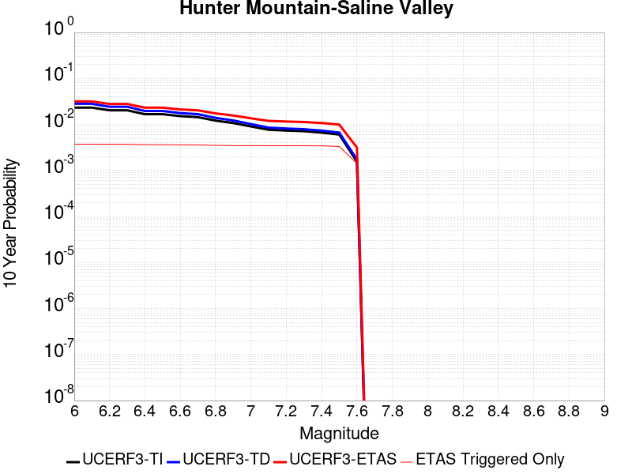 |

| Magnitude | 1 wk TI Prob | 1 wk TD Prob | 1 wk ETAS Prob | 1 wk ETAS/TD Gain | 1 wk ETAS Triggered Only | 1 mo TI Prob | 1 mo TD Prob | 1 mo ETAS Prob | 1 mo ETAS/TD Gain | 1 mo ETAS Triggered Only | 1 yr TI Prob | 1 yr TD Prob | 1 yr ETAS Prob | 1 yr ETAS/TD Gain | 1 yr ETAS Triggered Only | 10 yr TI Prob | 10 yr TD Prob | 10 yr ETAS Prob | 10 yr ETAS/TD Gain | 10 yr ETAS Triggered Only |
|-----|-----|-----|-----|-----|-----|-----|-----|-----|-----|-----|-----|-----|-----|-----|-----|-----|-----|-----|-----|-----|
| 6.0 | 4.5103672E-5 | 5.4576634E-5 | 5.4576634E-5 | 1.0 | 0.0 | 1.9328714E-4 | 2.3387549E-4 | 7.9240405E-4 | 3.388145 | 5.586592E-4 | 0.002350731 | 0.002843864 | 0.006743357 | 2.3711953 | 0.0039106146 | 0.023260195 | 0.028095365 | 0.033525 | 1.1932573 | 0.005586592 |
| 6.1 | 4.5103672E-5 | 5.4576634E-5 | 5.4576634E-5 | 1.0 | 0.0 | 1.9328714E-4 | 2.3387549E-4 | 7.9240405E-4 | 3.388145 | 5.586592E-4 | 0.002350731 | 0.002843864 | 0.006743357 | 2.3711953 | 0.0039106146 | 0.023260195 | 0.028095365 | 0.033525 | 1.1932573 | 0.005586592 |
| 6.2 | 3.9363465E-5 | 4.706859E-5 | 4.706859E-5 | 1.0 | 0.0 | 1.6868966E-4 | 2.017032E-4 | 7.6024974E-4 | 3.7691505 | 5.586592E-4 | 0.002051862 | 0.0024531104 | 0.0063541317 | 2.5902348 | 0.0039106146 | 0.020330196 | 0.024276383 | 0.029727353 | 1.224538 | 0.005586592 |
| 6.3 | 3.9363465E-5 | 4.706859E-5 | 4.706859E-5 | 1.0 | 0.0 | 1.6868966E-4 | 2.017032E-4 | 7.6024974E-4 | 3.7691505 | 5.586592E-4 | 0.002051862 | 0.0024531104 | 0.0063541317 | 2.5902348 | 0.0039106146 | 0.020330196 | 0.024276383 | 0.029727353 | 1.224538 | 0.005586592 |
| 6.4 | 3.2311684E-5 | 3.7955346E-5 | 3.7955346E-5 | 1.0 | 0.0 | 1.384713E-4 | 1.6265604E-4 | 7.212244E-4 | 4.4340463 | 5.586592E-4 | 0.0016845843 | 0.0019786113 | 0.0053239344 | 2.690743 | 0.0033519552 | 0.016718714 | 0.019618697 | 0.024547989 | 1.2512548 | 0.005027933 |
| 6.5 | 3.2311684E-5 | 3.7955346E-5 | 3.7955346E-5 | 1.0 | 0.0 | 1.384713E-4 | 1.6265604E-4 | 7.212244E-4 | 4.4340463 | 5.586592E-4 | 0.0016845843 | 0.0019786113 | 0.0053239344 | 2.690743 | 0.0033519552 | 0.016718714 | 0.019618697 | 0.024547989 | 1.2512548 | 0.005027933 |
| 6.6 | 2.9305844E-5 | 3.4185676E-5 | 3.4185676E-5 | 1.0 | 0.0 | 1.2559042E-4 | 1.4650216E-4 | 7.050795E-4 | 4.8127584 | 5.586592E-4 | 0.0015279909 | 0.0017822674 | 0.0051282486 | 2.8773735 | 0.0033519552 | 0.015175272 | 0.017687662 | 0.022626663 | 1.2792342 | 0.005027933 |
| 6.7 | 2.7826512E-5 | 3.234788E-5 | 3.234788E-5 | 1.0 | 0.0 | 1.19251024E-4 | 1.3862675E-4 | 6.972085E-4 | 5.0293937 | 5.586592E-4 | 0.0014509142 | 0.0016865344 | 0.0050328365 | 2.9841292 | 0.0033519552 | 0.014414776 | 0.01674504 | 0.02168878 | 1.2952361 | 0.005027933 |
| 6.8 | 2.3389874E-5 | 2.686964E-5 | 2.686964E-5 | 1.0 | 0.0 | 1.0023846E-4 | 1.1515078E-4 | 6.7374564E-4 | 5.8509865 | 5.586592E-4 | 0.00121972 | 0.0014011064 | 0.0047483654 | 3.3890111 | 0.0033519552 | 0.01213047 | 0.013928941 | 0.018335963 | 1.3163931 | 0.0044692736 |
| 6.9 | 2.069209E-5 | 2.3572567E-5 | 2.3572567E-5 | 1.0 | 0.0 | 8.867737E-5 | 1.01021586E-4 | 6.5962435E-4 | 6.529539 | 5.586592E-4 | 0.0010791123 | 0.00122928 | 0.0045771147 | 3.723411 | 0.0033519552 | 0.010738871 | 0.012229833 | 0.016644448 | 1.360971 | 0.0044692736 |
| 7.0 | 1.7462342E-5 | 1.9635625E-5 | 1.9635625E-5 | 1.0 | 0.0 | 7.483646E-5 | 8.4150095E-5 | 6.427623E-4 | 7.6382837 | 5.586592E-4 | 9.1075303E-4 | 0.0010240684 | 0.004372591 | 4.269823 | 0.0033519552 | 0.009070295 | 0.010197128 | 0.014620828 | 1.4338182 | 0.0044692736 |
| 7.1 | 1.4807709E-5 | 1.6443486E-5 | 1.6443486E-5 | 1.0 | 0.0 | 6.3460066E-5 | 7.0470276E-5 | 6.290901E-4 | 8.927029 | 5.586592E-4 | 7.723524E-4 | 8.576544E-4 | 0.0042067347 | 4.90493 | 0.0033519552 | 0.007696735 | 0.008546432 | 0.012977509 | 1.518471 | 0.0044692736 |
| 7.2 | 1.4180048E-5 | 1.5700001E-5 | 1.5700001E-5 | 1.0 | 0.0 | 6.077022E-5 | 6.7284076E-5 | 6.259057E-4 | 9.302435 | 5.586592E-4 | 7.396263E-4 | 8.188919E-4 | 0.0041681025 | 5.0899296 | 0.0033519552 | 0.0073716943 | 0.008161696 | 0.012594493 | 1.543122 | 0.0044692736 |
| 7.3 | 1.3730402E-5 | 1.5173691E-5 | 1.5173691E-5 | 1.0 | 0.0 | 5.8843252E-5 | 6.502858E-5 | 6.236515E-4 | 9.590422 | 5.586592E-4 | 7.161811E-4 | 7.914514E-4 | 0.0041407538 | 5.2318482 | 0.0033519552 | 0.007138774 | 0.007889261 | 0.012323275 | 1.5620316 | 0.0044692736 |
| 7.4 | 1.2810095E-5 | 1.4110805E-5 | 1.4110805E-5 | 1.0 | 0.0 | 5.489925E-5 | 6.0473565E-5 | 6.19099E-4 | 10.2375145 | 5.586592E-4 | 6.681934E-4 | 7.360327E-4 | 0.0040855207 | 5.5507326 | 0.0033519552 | 0.006661878 | 0.0073388456 | 0.01177532 | 1.6045194 | 0.0044692736 |
| 7.5 | 1.1595659E-5 | 1.2802062E-5 | 1.2802062E-5 | 1.0 | 0.0 | 4.9694736E-5 | 5.486491E-5 | 6.134935E-4 | 11.181891 | 5.586592E-4 | 6.0486543E-4 | 6.677913E-4 | 0.004017508 | 6.0161138 | 0.0033519552 | 0.006032217 | 0.006660718 | 0.010545285 | 1.5832055 | 0.0039106146 |
| 7.6 | 2.997694E-6 | 3.325705E-6 | 3.325705E-6 | 1.0 | 0.0 | 1.28471975E-5 | 1.4252984E-5 | 1.4252984E-5 | 1.0 | 0.0 | 1.564034E-4 | 1.7352356E-4 | 7.3208584E-4 | 4.218942 | 5.586592E-4 | 0.0015629337 | 0.0017353174 | 0.002850697 | 1.6427525 | 0.0011173184 |

## Ash Hill
*[(top)](#table-of-contents)*

| 1 Week | 1 Month | 1 Year | 10 Year |
|-----|-----|-----|-----|
|  |  |  |  |

| Magnitude | 1 wk TI Prob | 1 wk TD Prob | 1 wk ETAS Prob | 1 wk ETAS/TD Gain | 1 wk ETAS Triggered Only | 1 mo TI Prob | 1 mo TD Prob | 1 mo ETAS Prob | 1 mo ETAS/TD Gain | 1 mo ETAS Triggered Only | 1 yr TI Prob | 1 yr TD Prob | 1 yr ETAS Prob | 1 yr ETAS/TD Gain | 1 yr ETAS Triggered Only | 10 yr TI Prob | 10 yr TD Prob | 10 yr ETAS Prob | 10 yr ETAS/TD Gain | 10 yr ETAS Triggered Only |
|-----|-----|-----|-----|-----|-----|-----|-----|-----|-----|-----|-----|-----|-----|-----|-----|-----|-----|-----|-----|-----|
| 6.0 | 2.1545662E-5 | 2.3195389E-5 | 2.3195389E-5 | 1.0 | 0.0 | 9.2335285E-5 | 9.940547E-5 | 9.940547E-5 | 1.0 | 0.0 | 0.0011236023 | 0.0012096697 | 0.0039995867 | 3.3063462 | 0.002793296 | 0.011179381 | 0.012038835 | 0.01755817 | 1.4584609 | 0.005586592 |
| 6.1 | 2.1545662E-5 | 2.3195389E-5 | 2.3195389E-5 | 1.0 | 0.0 | 9.2335285E-5 | 9.940547E-5 | 9.940547E-5 | 1.0 | 0.0 | 0.0011236023 | 0.0012096697 | 0.0039995867 | 3.3063462 | 0.002793296 | 0.011179381 | 0.012038835 | 0.01755817 | 1.4584609 | 0.005586592 |
| 6.2 | 2.1545662E-5 | 2.3195389E-5 | 2.3195389E-5 | 1.0 | 0.0 | 9.2335285E-5 | 9.940547E-5 | 9.940547E-5 | 1.0 | 0.0 | 0.0011236023 | 0.0012096697 | 0.0039995867 | 3.3063462 | 0.002793296 | 0.011179381 | 0.012038835 | 0.01755817 | 1.4584609 | 0.005586592 |
| 6.3 | 1.0025529E-5 | 1.0747344E-5 | 1.0747344E-5 | 1.0 | 0.0 | 4.2965847E-5 | 4.605931E-5 | 4.605931E-5 | 1.0 | 0.0 | 5.229836E-4 | 5.6064106E-4 | 0.002235679 | 3.9877193 | 0.0016759776 | 0.005217545 | 0.0055935793 | 0.008926786 | 1.5958985 | 0.0033519552 |
| 6.4 | 1.0025529E-5 | 1.0747344E-5 | 1.0747344E-5 | 1.0 | 0.0 | 4.2965847E-5 | 4.605931E-5 | 4.605931E-5 | 1.0 | 0.0 | 5.229836E-4 | 5.6064106E-4 | 0.002235679 | 3.9877193 | 0.0016759776 | 0.005217545 | 0.0055935793 | 0.008926786 | 1.5958985 | 0.0033519552 |
| 6.5 | 6.9617327E-6 | 7.4569152E-6 | 7.4569152E-6 | 1.0 | 0.0 | 2.9835655E-5 | 3.1957865E-5 | 3.1957865E-5 | 1.0 | 0.0 | 3.6318856E-4 | 3.8902622E-4 | 0.00150591 | 3.870973 | 0.0011173184 | 0.0036259557 | 0.0038843066 | 0.0061102635 | 1.5730642 | 0.0022346368 |
| 6.6 | 4.9919777E-6 | 5.34689E-6 | 5.34689E-6 | 1.0 | 0.0 | 2.1394015E-5 | 2.291508E-5 | 2.291508E-5 | 1.0 | 0.0 | 2.60441E-4 | 2.7896208E-4 | 2.7896208E-4 | 1.0 | 0.0 | 0.0026013597 | 0.0027867774 | 0.0039009822 | 1.3998183 | 0.0011173184 |
| 6.7 | 3.6630722E-6 | 3.9247725E-6 | 3.9247725E-6 | 1.0 | 0.0 | 1.5698786E-5 | 1.6820377E-5 | 1.6820377E-5 | 1.0 | 0.0 | 1.9111596E-4 | 2.0477458E-4 | 2.0477458E-4 | 1.0 | 0.0 | 0.0019095168 | 0.002046422 | 0.0031614539 | 1.5448691 | 0.0011173184 |
| 6.8 | 2.5599613E-6 | 2.7450303E-6 | 2.7450303E-6 | 1.0 | 0.0 | 1.0971216E-5 | 1.176439E-5 | 1.176439E-5 | 1.0 | 0.0 | 1.3356637E-4 | 1.4322698E-4 | 1.4322698E-4 | 1.0 | 0.0 | 0.0013348613 | 0.0014318317 | 0.0025475505 | 1.7792246 | 0.0011173184 |
| 6.9 | 1.7684905E-6 | 1.8969438E-6 | 1.8969438E-6 | 1.0 | 0.0 | 7.579223E-6 | 8.129759E-6 | 8.129759E-6 | 1.0 | 0.0 | 9.2273134E-5 | 9.897981E-5 | 9.897981E-5 | 1.0 | 0.0 | 9.223483E-4 | 9.897981E-4 | 0.0015479045 | 1.5638586 | 5.586592E-4 |

## Garlock (East)
*[(top)](#table-of-contents)*

| 1 Week | 1 Month | 1 Year | 10 Year |
|-----|-----|-----|-----|
|  |  |  |  |

| Magnitude | 1 wk TI Prob | 1 wk TD Prob | 1 wk ETAS Prob | 1 wk ETAS/TD Gain | 1 wk ETAS Triggered Only | 1 mo TI Prob | 1 mo TD Prob | 1 mo ETAS Prob | 1 mo ETAS/TD Gain | 1 mo ETAS Triggered Only | 1 yr TI Prob | 1 yr TD Prob | 1 yr ETAS Prob | 1 yr ETAS/TD Gain | 1 yr ETAS Triggered Only | 10 yr TI Prob | 10 yr TD Prob | 10 yr ETAS Prob | 10 yr ETAS/TD Gain | 10 yr ETAS Triggered Only |
|-----|-----|-----|-----|-----|-----|-----|-----|-----|-----|-----|-----|-----|-----|-----|-----|-----|-----|-----|-----|-----|
| 6.0 | 4.5092507E-5 | 6.2917425E-5 | 6.2917425E-5 | 1.0 | 0.0 | 1.9323928E-4 | 2.6962077E-4 | 2.6962077E-4 | 1.0 | 0.0 | 0.0023501497 | 0.0032781374 | 0.0055054487 | 1.6794442 | 0.0022346368 | 0.023254504 | 0.03235903 | 0.037224263 | 1.1503516 | 0.005027933 |
| 6.1 | 4.5092507E-5 | 6.2917425E-5 | 6.2917425E-5 | 1.0 | 0.0 | 1.9323928E-4 | 2.6962077E-4 | 2.6962077E-4 | 1.0 | 0.0 | 0.0023501497 | 0.0032781374 | 0.0055054487 | 1.6794442 | 0.0022346368 | 0.023254504 | 0.03235903 | 0.037224263 | 1.1503516 | 0.005027933 |
| 6.2 | 2.6674514E-5 | 3.452091E-5 | 3.452091E-5 | 1.0 | 0.0 | 1.1431433E-4 | 1.4793854E-4 | 1.4793854E-4 | 1.0 | 0.0 | 0.0013908884 | 0.0017996968 | 0.0034726583 | 1.9295796 | 0.0016759776 | 0.01382215 | 0.017896036 | 0.021736665 | 1.2146078 | 0.0039106146 |
| 6.3 | 2.6674514E-5 | 3.452091E-5 | 3.452091E-5 | 1.0 | 0.0 | 1.1431433E-4 | 1.4793854E-4 | 1.4793854E-4 | 1.0 | 0.0 | 0.0013908884 | 0.0017996968 | 0.0034726583 | 1.9295796 | 0.0016759776 | 0.01382215 | 0.017896036 | 0.021736665 | 1.2146078 | 0.0039106146 |
| 6.4 | 2.5312667E-5 | 3.234991E-5 | 3.234991E-5 | 1.0 | 0.0 | 1.0847834E-4 | 1.3863528E-4 | 1.3863528E-4 | 1.0 | 0.0 | 0.0013199237 | 0.0016866071 | 0.003359758 | 1.9920218 | 0.0016759776 | 0.013121112 | 0.016783953 | 0.020628931 | 1.2290866 | 0.0039106146 |
| 6.5 | 2.5312667E-5 | 3.234991E-5 | 3.234991E-5 | 1.0 | 0.0 | 1.0847834E-4 | 1.3863528E-4 | 1.3863528E-4 | 1.0 | 0.0 | 0.0013199237 | 0.0016866071 | 0.003359758 | 1.9920218 | 0.0016759776 | 0.013121112 | 0.016783953 | 0.020628931 | 1.2290866 | 0.0039106146 |
| 6.6 | 2.246556E-5 | 2.8144346E-5 | 2.8144346E-5 | 1.0 | 0.0 | 9.627742E-5 | 1.20613186E-4 | 1.20613186E-4 | 1.0 | 0.0 | 0.0011715472 | 0.0014674999 | 0.003141018 | 2.1403873 | 0.0016759776 | 0.011653901 | 0.0146240825 | 0.018477509 | 1.2634985 | 0.0039106146 |
| 6.7 | 2.2241198E-5 | 2.781406E-5 | 2.781406E-5 | 1.0 | 0.0 | 9.531594E-5 | 1.1919779E-4 | 1.1919779E-4 | 1.0 | 0.0 | 0.0011598538 | 0.0014502906 | 0.0031238375 | 2.153939 | 0.0016759776 | 0.011538187 | 0.014454261 | 0.01830835 | 1.2666404 | 0.0039106146 |
| 6.8 | 1.9528685E-5 | 2.3908038E-5 | 2.3908038E-5 | 1.0 | 0.0 | 8.369167E-5 | 1.0245911E-4 | 1.0245911E-4 | 1.0 | 0.0 | 0.0010184698 | 0.0012467455 | 0.0023626708 | 1.8950708 | 0.0011173184 | 0.010138147 | 0.012441495 | 0.015751747 | 1.2660655 | 0.0033519552 |
| 6.9 | 1.3318621E-5 | 1.5207374E-5 | 1.5207374E-5 | 1.0 | 0.0 | 5.7078556E-5 | 6.517287E-5 | 6.517287E-5 | 1.0 | 0.0 | 6.9470983E-4 | 7.931965E-4 | 0.0019096287 | 2.4075103 | 0.0011173184 | 0.0069254204 | 0.007944281 | 0.010715386 | 1.3488176 | 0.002793296 |
| 7.0 | 1.1760853E-5 | 1.3115987E-5 | 1.3115987E-5 | 1.0 | 0.0 | 5.0402683E-5 | 5.621019E-5 | 5.621019E-5 | 1.0 | 0.0 | 6.134799E-4 | 6.841492E-4 | 0.0018007032 | 2.6320329 | 0.0011173184 | 0.0061178906 | 0.006860767 | 0.009634899 | 1.4043472 | 0.002793296 |
| 7.1 | 1.0064758E-5 | 1.0910848E-5 | 1.0910848E-5 | 1.0 | 0.0 | 4.3133965E-5 | 4.675996E-5 | 4.675996E-5 | 1.0 | 0.0 | 5.2502943E-4 | 5.691573E-4 | 0.0016858398 | 2.9619927 | 0.0011173184 | 0.005237907 | 0.005717105 | 0.008494432 | 1.4857924 | 0.002793296 |
| 7.2 | 9.768808E-6 | 1.0506669E-5 | 1.0506669E-5 | 1.0 | 0.0 | 4.186565E-5 | 4.5027828E-5 | 4.5027828E-5 | 1.0 | 0.0 | 5.095951E-4 | 5.480794E-4 | 0.0016647854 | 3.0374897 | 0.0011173184 | 0.0050842804 | 0.0055073434 | 0.008285256 | 1.5044016 | 0.002793296 |
| 7.3 | 9.344516E-6 | 9.95218E-6 | 9.95218E-6 | 1.0 | 0.0 | 4.004731E-5 | 4.2651525E-5 | 4.2651525E-5 | 1.0 | 0.0 | 4.8746695E-4 | 5.1916204E-4 | 0.0016359005 | 3.15104 | 0.0011173184 | 0.0048639905 | 0.0052189473 | 0.007997666 | 1.5324289 | 0.002793296 |
| 7.4 | 9.023491E-6 | 9.498219E-6 | 9.498219E-6 | 1.0 | 0.0 | 3.867153E-5 | 4.0706036E-5 | 4.0706036E-5 | 1.0 | 0.0 | 4.7072413E-4 | 4.9548666E-4 | 0.0016122515 | 3.2538748 | 0.0011173184 | 0.004697283 | 0.004982321 | 0.0077617 | 1.5578482 | 0.002793296 |
| 7.5 | 7.081253E-6 | 7.0943947E-6 | 7.0943947E-6 | 1.0 | 0.0 | 3.0347876E-5 | 3.0404199E-5 | 3.0404199E-5 | 1.0 | 0.0 | 3.6942272E-4 | 3.70109E-4 | 9.2856144E-4 | 2.5088866 | 5.586592E-4 | 0.003688092 | 0.00372781 | 0.004840963 | 1.2986078 | 0.0011173184 |
| 7.6 | 6.116396E-6 | 5.9656345E-6 | 5.9656345E-6 | 1.0 | 0.0 | 2.6212863E-5 | 2.5566756E-5 | 2.5566756E-5 | 1.0 | 0.0 | 3.1909486E-4 | 3.1123104E-4 | 8.697164E-4 | 2.7944398 | 5.586592E-4 | 0.0031863707 | 0.0031390795 | 0.0042528906 | 1.3548208 | 0.0011173184 |
| 7.7 | 4.797145E-6 | 4.763327E-6 | 4.763327E-6 | 1.0 | 0.0 | 2.055903E-5 | 2.04141E-5 | 2.04141E-5 | 1.0 | 0.0 | 2.5027743E-4 | 2.4851345E-4 | 2.4851345E-4 | 1.0 | 0.0 | 0.0024999576 | 0.0025124948 | 0.0030697505 | 1.2217938 | 5.586592E-4 |
| 7.8 | 3.4028885E-6 | 3.9838537E-6 | 3.9838537E-6 | 1.0 | 0.0 | 1.4583726E-5 | 1.7073547E-5 | 1.7073547E-5 | 1.0 | 0.0 | 1.775424E-4 | 2.0785068E-4 | 2.0785068E-4 | 1.0 | 0.0 | 0.0017740062 | 0.0021040295 | 0.0021040295 | 1.0 | 0.0 |
| 7.9 | 2.5928412E-6 | 3.3770064E-6 | 3.3770064E-6 | 1.0 | 0.0 | 1.1112129E-5 | 1.4472805E-5 | 1.4472805E-5 | 1.0 | 0.0 | 1.3528178E-4 | 1.7619222E-4 | 1.7619222E-4 | 1.0 | 0.0 | 0.0013519945 | 0.0017836117 | 0.0017836117 | 1.0 | 0.0 |
| 8.0 | 1.3743648E-6 | 1.6755408E-6 | 1.6755408E-6 | 1.0 | 0.0 | 5.8901214E-6 | 7.1808695E-6 | 7.1808695E-6 | 1.0 | 0.0 | 7.1709874E-5 | 8.742361E-5 | 8.742361E-5 | 1.0 | 0.0 | 7.1686733E-4 | 8.847989E-4 | 8.847989E-4 | 1.0 | 0.0 |
| 8.1 | 3.6733252E-7 | 3.1526864E-7 | 3.1526864E-7 | 1.0 | 0.0 | 1.5742813E-6 | 1.3511507E-6 | 1.3511507E-6 | 1.0 | 0.0 | 1.9166706E-5 | 1.645015E-5 | 1.645015E-5 | 1.0 | 0.0 | 1.9165053E-4 | 1.6658098E-4 | 1.6658098E-4 | 1.0 | 0.0 |

## So Sierra Nevada
*[(top)](#table-of-contents)*

| 1 Week | 1 Month | 1 Year | 10 Year |
|-----|-----|-----|-----|
|  |  |  |  |

| Magnitude | 1 wk TI Prob | 1 wk TD Prob | 1 wk ETAS Prob | 1 wk ETAS/TD Gain | 1 wk ETAS Triggered Only | 1 mo TI Prob | 1 mo TD Prob | 1 mo ETAS Prob | 1 mo ETAS/TD Gain | 1 mo ETAS Triggered Only | 1 yr TI Prob | 1 yr TD Prob | 1 yr ETAS Prob | 1 yr ETAS/TD Gain | 1 yr ETAS Triggered Only | 10 yr TI Prob | 10 yr TD Prob | 10 yr ETAS Prob | 10 yr ETAS/TD Gain | 10 yr ETAS Triggered Only |
|-----|-----|-----|-----|-----|-----|-----|-----|-----|-----|-----|-----|-----|-----|-----|-----|-----|-----|-----|-----|-----|
| 6.0 | 1.15488665E-5 | 1.1079958E-5 | 1.1079958E-5 | 1.0 | 0.0 | 4.9494203E-5 | 4.7484744E-5 | 4.7484744E-5 | 1.0 | 0.0 | 6.024253E-4 | 5.779862E-4 | 0.002252995 | 3.8980086 | 0.0016759776 | 0.006007948 | 0.0057660984 | 0.008543288 | 1.481641 | 0.002793296 |
| 6.1 | 1.15488665E-5 | 1.1079958E-5 | 1.1079958E-5 | 1.0 | 0.0 | 4.9494203E-5 | 4.7484744E-5 | 4.7484744E-5 | 1.0 | 0.0 | 6.024253E-4 | 5.779862E-4 | 0.002252995 | 3.8980086 | 0.0016759776 | 0.006007948 | 0.0057660984 | 0.008543288 | 1.481641 | 0.002793296 |
| 6.2 | 1.15488665E-5 | 1.1079958E-5 | 1.1079958E-5 | 1.0 | 0.0 | 4.9494203E-5 | 4.7484744E-5 | 4.7484744E-5 | 1.0 | 0.0 | 6.024253E-4 | 5.779862E-4 | 0.002252995 | 3.8980086 | 0.0016759776 | 0.006007948 | 0.0057660984 | 0.008543288 | 1.481641 | 0.002793296 |
| 6.3 | 1.15488665E-5 | 1.1079958E-5 | 1.1079958E-5 | 1.0 | 0.0 | 4.9494203E-5 | 4.7484744E-5 | 4.7484744E-5 | 1.0 | 0.0 | 6.024253E-4 | 5.779862E-4 | 0.002252995 | 3.8980086 | 0.0016759776 | 0.006007948 | 0.0057660984 | 0.008543288 | 1.481641 | 0.002793296 |
| 6.4 | 1.15488665E-5 | 1.1079958E-5 | 1.1079958E-5 | 1.0 | 0.0 | 4.9494203E-5 | 4.7484744E-5 | 4.7484744E-5 | 1.0 | 0.0 | 6.024253E-4 | 5.779862E-4 | 0.002252995 | 3.8980086 | 0.0016759776 | 0.006007948 | 0.0057660984 | 0.008543288 | 1.481641 | 0.002793296 |
| 6.5 | 1.15488665E-5 | 1.1079958E-5 | 1.1079958E-5 | 1.0 | 0.0 | 4.9494203E-5 | 4.7484744E-5 | 4.7484744E-5 | 1.0 | 0.0 | 6.024253E-4 | 5.779862E-4 | 0.002252995 | 3.8980086 | 0.0016759776 | 0.006007948 | 0.0057660984 | 0.008543288 | 1.481641 | 0.002793296 |
| 6.6 | 7.587044E-6 | 6.9358503E-6 | 6.9358503E-6 | 1.0 | 0.0 | 3.2515498E-5 | 2.972475E-5 | 2.972475E-5 | 1.0 | 0.0 | 3.9580427E-4 | 3.6184167E-4 | 9.2029874E-4 | 2.543374 | 5.586592E-4 | 0.003951 | 0.0036128166 | 0.0041694576 | 1.154074 | 5.586592E-4 |
| 6.7 | 7.587044E-6 | 6.9358503E-6 | 6.9358503E-6 | 1.0 | 0.0 | 3.2515498E-5 | 2.972475E-5 | 2.972475E-5 | 1.0 | 0.0 | 3.9580427E-4 | 3.6184167E-4 | 9.2029874E-4 | 2.543374 | 5.586592E-4 | 0.003951 | 0.0036128166 | 0.0041694576 | 1.154074 | 5.586592E-4 |
| 6.8 | 5.9026956E-6 | 5.179568E-6 | 5.179568E-6 | 1.0 | 0.0 | 2.5297022E-5 | 2.2197966E-5 | 2.2197966E-5 | 1.0 | 0.0 | 3.0794772E-4 | 2.7022787E-4 | 8.287361E-4 | 3.0668046 | 5.586592E-4 | 0.0030752132 | 0.0026991093 | 0.0032562604 | 1.2064204 | 5.586592E-4 |
| 6.9 | 5.0118915E-6 | 4.2525808E-6 | 4.2525808E-6 | 1.0 | 0.0 | 2.1479358E-5 | 1.8225222E-5 | 1.8225222E-5 | 1.0 | 0.0 | 2.614798E-4 | 2.2187021E-4 | 7.804055E-4 | 3.5173965 | 5.586592E-4 | 0.0026117235 | 0.0022165596 | 0.0027739806 | 1.2514802 | 5.586592E-4 |
| 7.0 | 4.4924795E-6 | 3.7140621E-6 | 3.7140621E-6 | 1.0 | 0.0 | 1.925334E-5 | 1.5917316E-5 | 1.5917316E-5 | 1.0 | 0.0 | 2.3438422E-4 | 1.9377672E-4 | 7.523277E-4 | 3.882446 | 5.586592E-4 | 0.0023413717 | 0.0019361405 | 0.0024937182 | 1.287984 | 5.586592E-4 |
| 7.1 | 3.9118436E-6 | 3.1121094E-6 | 3.1121094E-6 | 1.0 | 0.0 | 1.6764936E-5 | 1.3337547E-5 | 1.3337547E-5 | 1.0 | 0.0 | 2.0409399E-4 | 1.6237311E-4 | 7.2094164E-4 | 4.440031 | 5.586592E-4 | 0.0020390663 | 0.0016226007 | 0.0021803535 | 1.34374 | 5.586592E-4 |
| 7.2 | 3.4200818E-6 | 2.605576E-6 | 2.605576E-6 | 1.0 | 0.0 | 1.4657411E-5 | 1.116671E-5 | 1.116671E-5 | 1.0 | 0.0 | 1.7843937E-4 | 1.3594671E-4 | 6.9452997E-4 | 5.10884 | 5.586592E-4 | 0.0017829615 | 0.0013586852 | 0.0019165854 | 1.4106177 | 5.586592E-4 |
| 7.3 | 2.6593618E-6 | 1.8285265E-6 | 1.8285265E-6 | 1.0 | 0.0 | 1.13972155E-5 | 7.83652E-6 | 7.83652E-6 | 1.0 | 0.0 | 1.3875226E-4 | 9.5405754E-5 | 6.540117E-4 | 6.855055 | 5.586592E-4 | 0.0013866565 | 9.536769E-4 | 0.0015118032 | 1.5852364 | 5.586592E-4 |
| 7.4 | 2.2577992E-6 | 1.436535E-6 | 1.436535E-6 | 1.0 | 0.0 | 9.676246E-6 | 6.156565E-6 | 6.156565E-6 | 1.0 | 0.0 | 1.1780193E-4 | 7.495386E-5 | 7.495386E-5 | 1.0 | 0.0 | 0.001177395 | 7.493108E-4 | 7.493108E-4 | 1.0 | 0.0 |
| 7.5 | 1.489319E-6 | 7.354697E-7 | 7.354697E-7 | 1.0 | 0.0 | 6.3827797E-6 | 3.1520092E-6 | 3.1520092E-6 | 1.0 | 0.0 | 7.770758E-5 | 3.837504E-5 | 3.837504E-5 | 1.0 | 0.0 | 7.7680405E-4 | 3.836846E-4 | 3.836846E-4 | 1.0 | 0.0 |
| 7.6 | 1.0680322E-6 | 4.6602182E-7 | 4.6602182E-7 | 1.0 | 0.0 | 4.577273E-6 | 1.997235E-6 | 1.997235E-6 | 1.0 | 0.0 | 5.5726876E-5 | 2.4316065E-5 | 2.4316065E-5 | 1.0 | 0.0 | 5.5712904E-4 | 2.431343E-4 | 2.431343E-4 | 1.0 | 0.0 |
| 7.7 | 5.509146E-7 | 1.558334E-7 | 1.558334E-7 | 1.0 | 0.0 | 2.3610605E-6 | 6.678573E-7 | 6.678573E-7 | 1.0 | 0.0 | 2.8745531E-5 | 8.131134E-6 | 8.131134E-6 | 1.0 | 0.0 | 2.8741814E-4 | 8.130848E-5 | 8.130848E-5 | 1.0 | 0.0 |

## Blackwater
*[(top)](#table-of-contents)*

| 1 Week | 1 Month | 1 Year | 10 Year |
|-----|-----|-----|-----|
|  |  |  |  |

| Magnitude | 1 wk TI Prob | 1 wk TD Prob | 1 wk ETAS Prob | 1 wk ETAS/TD Gain | 1 wk ETAS Triggered Only | 1 mo TI Prob | 1 mo TD Prob | 1 mo ETAS Prob | 1 mo ETAS/TD Gain | 1 mo ETAS Triggered Only | 1 yr TI Prob | 1 yr TD Prob | 1 yr ETAS Prob | 1 yr ETAS/TD Gain | 1 yr ETAS Triggered Only | 10 yr TI Prob | 10 yr TD Prob | 10 yr ETAS Prob | 10 yr ETAS/TD Gain | 10 yr ETAS Triggered Only |
|-----|-----|-----|-----|-----|-----|-----|-----|-----|-----|-----|-----|-----|-----|-----|-----|-----|-----|-----|-----|-----|
| 6.0 | 3.0708583E-5 | 3.3097214E-5 | 3.3097214E-5 | 1.0 | 0.0 | 1.3160157E-4 | 1.4183826E-4 | 0.0012589982 | 8.876294 | 0.0011173184 | 0.0016010714 | 0.0017256497 | 0.0033987353 | 1.9695395 | 0.0016759776 | 0.015895851 | 0.017136335 | 0.019881764 | 1.160211 | 0.002793296 |
| 6.1 | 3.0708583E-5 | 3.3097214E-5 | 3.3097214E-5 | 1.0 | 0.0 | 1.3160157E-4 | 1.4183826E-4 | 0.0012589982 | 8.876294 | 0.0011173184 | 0.0016010714 | 0.0017256497 | 0.0033987353 | 1.9695395 | 0.0016759776 | 0.015895851 | 0.017136335 | 0.019881764 | 1.160211 | 0.002793296 |
| 6.2 | 1.1707779E-5 | 1.2545598E-5 | 1.2545598E-5 | 1.0 | 0.0 | 5.017523E-5 | 5.3765798E-5 | 5.3765798E-5 | 1.0 | 0.0 | 6.107122E-4 | 6.5441156E-4 | 6.5441156E-4 | 1.0 | 0.0 | 0.006090366 | 0.0065258164 | 0.0065258164 | 1.0 | 0.0 |
| 6.3 | 1.1707779E-5 | 1.2545598E-5 | 1.2545598E-5 | 1.0 | 0.0 | 5.017523E-5 | 5.3765798E-5 | 5.3765798E-5 | 1.0 | 0.0 | 6.107122E-4 | 6.5441156E-4 | 6.5441156E-4 | 1.0 | 0.0 | 0.006090366 | 0.0065258164 | 0.0065258164 | 1.0 | 0.0 |
| 6.4 | 7.929244E-6 | 8.4804105E-6 | 8.4804105E-6 | 1.0 | 0.0 | 3.3982033E-5 | 3.6344132E-5 | 3.6344132E-5 | 1.0 | 0.0 | 4.136527E-4 | 4.4240404E-4 | 4.4240404E-4 | 1.0 | 0.0 | 0.0041288356 | 0.0044156383 | 0.0044156383 | 1.0 | 0.0 |
| 6.5 | 5.8832115E-6 | 6.286219E-6 | 6.286219E-6 | 1.0 | 0.0 | 2.521352E-5 | 2.6940676E-5 | 2.6940676E-5 | 1.0 | 0.0 | 3.0693135E-4 | 3.279559E-4 | 3.279559E-4 | 1.0 | 0.0 | 0.0030650778 | 0.0032749726 | 0.0032749726 | 1.0 | 0.0 |
| 6.6 | 5.8832115E-6 | 6.286219E-6 | 6.286219E-6 | 1.0 | 0.0 | 2.521352E-5 | 2.6940676E-5 | 2.6940676E-5 | 1.0 | 0.0 | 3.0693135E-4 | 3.279559E-4 | 3.279559E-4 | 1.0 | 0.0 | 0.0030650778 | 0.0032749726 | 0.0032749726 | 1.0 | 0.0 |
| 6.7 | 3.0715053E-6 | 3.2815851E-6 | 3.2815851E-6 | 1.0 | 0.0 | 1.3163528E-5 | 1.4063868E-5 | 1.4063868E-5 | 1.0 | 0.0 | 1.6025416E-4 | 1.7121529E-4 | 1.7121529E-4 | 1.0 | 0.0 | 0.0016013865 | 0.0017109484 | 0.0017109484 | 1.0 | 0.0 |
| 6.8 | 2.2722281E-6 | 2.4288424E-6 | 2.4288424E-6 | 1.0 | 0.0 | 9.738084E-6 | 1.0409289E-5 | 1.0409289E-5 | 1.0 | 0.0 | 1.1855473E-4 | 1.2672663E-4 | 1.2672663E-4 | 1.0 | 0.0 | 0.001184915 | 0.0012666339 | 0.0012666339 | 1.0 | 0.0 |
| 6.9 | 9.952399E-7 | 1.0653887E-6 | 1.0653887E-6 | 1.0 | 0.0 | 4.265307E-6 | 4.5659463E-6 | 4.5659463E-6 | 1.0 | 0.0 | 5.1928873E-5 | 5.5589495E-5 | 5.5589495E-5 | 1.0 | 0.0 | 5.191674E-4 | 5.558065E-4 | 5.558065E-4 | 1.0 | 0.0 |
| 7.0 | 4.7385504E-7 | 5.075751E-7 | 5.075751E-7 | 1.0 | 0.0 | 2.0308057E-6 | 2.175322E-6 | 2.175322E-6 | 1.0 | 0.0 | 2.4724779E-5 | 2.6484544E-5 | 2.6484544E-5 | 1.0 | 0.0 | 2.4722028E-4 | 2.6484544E-4 | 2.6484544E-4 | 1.0 | 0.0 |

## Gravel Hills-Harper Lk
*[(top)](#table-of-contents)*

| 1 Week | 1 Month | 1 Year | 10 Year |
|-----|-----|-----|-----|
|  |  |  |  |

| Magnitude | 1 wk TI Prob | 1 wk TD Prob | 1 wk ETAS Prob | 1 wk ETAS/TD Gain | 1 wk ETAS Triggered Only | 1 mo TI Prob | 1 mo TD Prob | 1 mo ETAS Prob | 1 mo ETAS/TD Gain | 1 mo ETAS Triggered Only | 1 yr TI Prob | 1 yr TD Prob | 1 yr ETAS Prob | 1 yr ETAS/TD Gain | 1 yr ETAS Triggered Only | 10 yr TI Prob | 10 yr TD Prob | 10 yr ETAS Prob | 10 yr ETAS/TD Gain | 10 yr ETAS Triggered Only |
|-----|-----|-----|-----|-----|-----|-----|-----|-----|-----|-----|-----|-----|-----|-----|-----|-----|-----|-----|-----|-----|
| 6.0 | 3.0679566E-5 | 3.1466803E-5 | 3.1466803E-5 | 1.0 | 0.0 | 1.3147724E-4 | 1.3485197E-4 | 6.9343584E-4 | 5.1422 | 5.586592E-4 | 0.0015995599 | 0.0016408027 | 0.0033140304 | 2.0197616 | 0.0016759776 | 0.015880952 | 0.01630845 | 0.018506642 | 1.1347886 | 0.0022346368 |
| 6.1 | 3.0679566E-5 | 3.1466803E-5 | 3.1466803E-5 | 1.0 | 0.0 | 1.3147724E-4 | 1.3485197E-4 | 6.9343584E-4 | 5.1422 | 5.586592E-4 | 0.0015995599 | 0.0016408027 | 0.0033140304 | 2.0197616 | 0.0016759776 | 0.015880952 | 0.01630845 | 0.018506642 | 1.1347886 | 0.0022346368 |
| 6.2 | 1.514536E-5 | 1.363595E-5 | 1.363595E-5 | 1.0 | 0.0 | 6.490707E-5 | 5.8438545E-5 | 5.8438545E-5 | 1.0 | 0.0 | 7.8995706E-4 | 7.112689E-4 | 0.0012695307 | 1.7848816 | 5.586592E-4 | 0.007871548 | 0.007091126 | 0.008200522 | 1.1564484 | 0.0011173184 |
| 6.3 | 1.514536E-5 | 1.363595E-5 | 1.363595E-5 | 1.0 | 0.0 | 6.490707E-5 | 5.8438545E-5 | 5.8438545E-5 | 1.0 | 0.0 | 7.8995706E-4 | 7.112689E-4 | 0.0012695307 | 1.7848816 | 5.586592E-4 | 0.007871548 | 0.007091126 | 0.008200522 | 1.1564484 | 0.0011173184 |
| 6.4 | 1.2532521E-5 | 1.0690234E-5 | 1.0690234E-5 | 1.0 | 0.0 | 5.37097E-5 | 4.5814515E-5 | 4.5814515E-5 | 1.0 | 0.0 | 6.537194E-4 | 5.576548E-4 | 5.576548E-4 | 1.0 | 0.0 | 0.0065179965 | 0.0055631446 | 0.006118696 | 1.0998628 | 5.586592E-4 |
| 6.5 | 1.1094058E-5 | 9.084107E-6 | 9.084107E-6 | 1.0 | 0.0 | 4.7545094E-5 | 3.8931328E-5 | 3.8931328E-5 | 1.0 | 0.0 | 5.787078E-4 | 4.7388987E-4 | 4.7388987E-4 | 1.0 | 0.0 | 0.0057720304 | 0.004729201 | 0.004729201 | 1.0 | 0.0 |
| 6.6 | 9.688328E-6 | 7.5320527E-6 | 7.5320527E-6 | 1.0 | 0.0 | 4.1520743E-5 | 3.227984E-5 | 3.227984E-5 | 1.0 | 0.0 | 5.053978E-4 | 3.9293873E-4 | 3.9293873E-4 | 1.0 | 0.0 | 0.0050424994 | 0.003922696 | 0.003922696 | 1.0 | 0.0 |
| 6.7 | 8.974824E-6 | 6.7497303E-6 | 6.7497303E-6 | 1.0 | 0.0 | 3.8462964E-5 | 2.8927108E-5 | 2.8927108E-5 | 1.0 | 0.0 | 4.6818596E-4 | 3.5213283E-4 | 3.5213283E-4 | 1.0 | 0.0 | 0.004672008 | 0.0035159695 | 0.0035159695 | 1.0 | 0.0 |
| 6.8 | 7.4780046E-6 | 5.1164316E-6 | 5.1164316E-6 | 1.0 | 0.0 | 3.20482E-5 | 2.1927388E-5 | 2.1927388E-5 | 1.0 | 0.0 | 3.9011694E-4 | 2.6693463E-4 | 2.6693463E-4 | 1.0 | 0.0 | 0.0038943281 | 0.0026662783 | 0.0026662783 | 1.0 | 0.0 |
| 6.9 | 6.3409307E-6 | 3.907683E-6 | 3.907683E-6 | 1.0 | 0.0 | 2.7175134E-5 | 1.674711E-5 | 1.674711E-5 | 1.0 | 0.0 | 3.3080703E-4 | 2.0387798E-4 | 2.0387798E-4 | 1.0 | 0.0 | 0.0033031502 | 0.0020370076 | 0.0020370076 | 1.0 | 0.0 |
| 7.0 | 5.1239335E-6 | 2.6059872E-6 | 2.6059872E-6 | 1.0 | 0.0 | 2.195953E-5 | 1.116847E-5 | 1.116847E-5 | 1.0 | 0.0 | 2.6732447E-4 | 1.3596789E-4 | 1.3596789E-4 | 1.0 | 0.0 | 0.0026700313 | 0.0013588723 | 0.0013588723 | 1.0 | 0.0 |
| 7.1 | 4.438899E-6 | 2.0985822E-6 | 2.0985822E-6 | 1.0 | 0.0 | 1.9023713E-5 | 8.993894E-6 | 8.993894E-6 | 1.0 | 0.0 | 2.315891E-4 | 1.0949538E-4 | 1.0949538E-4 | 1.0 | 0.0 | 0.002313479 | 0.0010944362 | 0.0010944362 | 1.0 | 0.0 |
| 7.2 | 3.50367E-6 | 1.2616524E-6 | 1.2616524E-6 | 1.0 | 0.0 | 1.5015643E-5 | 5.407071E-6 | 5.407071E-6 | 1.0 | 0.0 | 1.8280011E-4 | 6.582918E-5 | 6.582918E-5 | 1.0 | 0.0 | 0.0018264982 | 6.5810507E-4 | 6.5810507E-4 | 1.0 | 0.0 |
| 7.3 | 2.561638E-6 | 7.11978E-7 | 7.11978E-7 | 1.0 | 0.0 | 1.0978401E-5 | 3.0513306E-6 | 3.0513306E-6 | 1.0 | 0.0 | 1.3365384E-4 | 3.7149337E-5 | 3.7149337E-5 | 1.0 | 0.0 | 0.0013357349 | 3.7143327E-4 | 3.7143327E-4 | 1.0 | 0.0 |
| 7.4 | 2.0368864E-6 | 5.3053367E-7 | 5.3053367E-7 | 1.0 | 0.0 | 8.729483E-6 | 2.2737138E-6 | 2.2737138E-6 | 1.0 | 0.0 | 1.06276275E-4 | 2.768212E-5 | 2.768212E-5 | 1.0 | 0.0 | 0.0010622547 | 2.7678726E-4 | 2.7678726E-4 | 1.0 | 0.0 |
| 7.5 | 1.1681728E-6 | 3.6033393E-7 | 3.6033393E-7 | 1.0 | 0.0 | 5.0064455E-6 | 1.5442874E-6 | 1.5442874E-6 | 1.0 | 0.0 | 6.0951766E-5 | 1.8801542E-5 | 1.8801542E-5 | 1.0 | 0.0 | 6.093505E-4 | 1.8799998E-4 | 1.8799998E-4 | 1.0 | 0.0 |
| 7.6 | 1.3154387E-7 | 7.12009E-8 | 7.12009E-8 | 1.0 | 0.0 | 5.6375933E-7 | 3.051467E-7 | 3.051467E-7 | 1.0 | 0.0 | 6.863748E-6 | 3.7151563E-6 | 3.7151563E-6 | 1.0 | 0.0 | 6.863536E-5 | 3.7151098E-5 | 3.7151098E-5 | 1.0 | 0.0 |

## Goldstone Lake
*[(top)](#table-of-contents)*

| 1 Week | 1 Month | 1 Year | 10 Year |
|-----|-----|-----|-----|
|  |  |  |  |

| Magnitude | 1 wk TI Prob | 1 wk TD Prob | 1 wk ETAS Prob | 1 wk ETAS/TD Gain | 1 wk ETAS Triggered Only | 1 mo TI Prob | 1 mo TD Prob | 1 mo ETAS Prob | 1 mo ETAS/TD Gain | 1 mo ETAS Triggered Only | 1 yr TI Prob | 1 yr TD Prob | 1 yr ETAS Prob | 1 yr ETAS/TD Gain | 1 yr ETAS Triggered Only | 10 yr TI Prob | 10 yr TD Prob | 10 yr ETAS Prob | 10 yr ETAS/TD Gain | 10 yr ETAS Triggered Only |
|-----|-----|-----|-----|-----|-----|-----|-----|-----|-----|-----|-----|-----|-----|-----|-----|-----|-----|-----|-----|-----|
| 6.0 | 2.671352E-5 | 3.0378242E-5 | 5.890205E-4 | 19.389551 | 5.586592E-4 | 1.1448149E-4 | 1.3018708E-4 | 6.887736E-4 | 5.2906446 | 5.586592E-4 | 0.001392921 | 0.0015840717 | 0.00269962 | 1.7042285 | 0.0011173184 | 0.013842222 | 0.015747305 | 0.017946752 | 1.1396713 | 0.0022346368 |
| 6.1 | 2.671352E-5 | 3.0378242E-5 | 5.890205E-4 | 19.389551 | 5.586592E-4 | 1.1448149E-4 | 1.3018708E-4 | 6.887736E-4 | 5.2906446 | 5.586592E-4 | 0.001392921 | 0.0015840717 | 0.00269962 | 1.7042285 | 0.0011173184 | 0.013842222 | 0.015747305 | 0.017946752 | 1.1396713 | 0.0022346368 |
| 6.2 | 1.4197047E-5 | 1.6097329E-5 | 1.6097329E-5 | 1.0 | 0.0 | 6.0843064E-5 | 6.898728E-5 | 6.898728E-5 | 1.0 | 0.0 | 7.4051257E-4 | 8.396952E-4 | 8.396952E-4 | 1.0 | 0.0 | 0.007380498 | 0.008374922 | 0.008928902 | 1.0661476 | 5.586592E-4 |
| 6.3 | 1.4197047E-5 | 1.6097329E-5 | 1.6097329E-5 | 1.0 | 0.0 | 6.0843064E-5 | 6.898728E-5 | 6.898728E-5 | 1.0 | 0.0 | 7.4051257E-4 | 8.396952E-4 | 8.396952E-4 | 1.0 | 0.0 | 0.007380498 | 0.008374922 | 0.008928902 | 1.0661476 | 5.586592E-4 |
| 6.4 | 1.3238931E-5 | 1.5009467E-5 | 1.5009467E-5 | 1.0 | 0.0 | 5.6737044E-5 | 6.432525E-5 | 6.432525E-5 | 1.0 | 0.0 | 6.9055456E-4 | 7.829765E-4 | 7.829765E-4 | 1.0 | 0.0 | 0.006884126 | 0.007811806 | 0.008366101 | 1.0709561 | 5.586592E-4 |
| 6.5 | 1.3238931E-5 | 1.5009467E-5 | 1.5009467E-5 | 1.0 | 0.0 | 5.6737044E-5 | 6.432525E-5 | 6.432525E-5 | 1.0 | 0.0 | 6.9055456E-4 | 7.829765E-4 | 7.829765E-4 | 1.0 | 0.0 | 0.006884126 | 0.007811806 | 0.008366101 | 1.0709561 | 5.586592E-4 |
| 6.6 | 1.1328278E-5 | 1.2856027E-5 | 1.2856027E-5 | 1.0 | 0.0 | 4.8548856E-5 | 5.5096636E-5 | 5.5096636E-5 | 1.0 | 0.0 | 5.90922E-4 | 6.706908E-4 | 6.706908E-4 | 1.0 | 0.0 | 0.0058935313 | 0.0066960566 | 0.007250975 | 1.0828724 | 5.586592E-4 |
| 6.7 | 8.651175E-6 | 9.825214E-6 | 9.825214E-6 | 1.0 | 0.0 | 3.707594E-5 | 4.2107888E-5 | 4.2107888E-5 | 1.0 | 0.0 | 4.5130608E-4 | 5.1263353E-4 | 5.1263353E-4 | 1.0 | 0.0 | 0.0045039062 | 0.0051233894 | 0.0056791864 | 1.1084822 | 5.586592E-4 |
| 6.8 | 1.0215377E-6 | 1.1755062E-6 | 1.1755062E-6 | 1.0 | 0.0 | 4.378012E-6 | 5.037875E-6 | 5.037875E-6 | 1.0 | 0.0 | 5.3300988E-5 | 6.133451E-5 | 6.133451E-5 | 1.0 | 0.0 | 5.3288206E-4 | 6.131871E-4 | 6.131871E-4 | 1.0 | 0.0 |
| 6.9 | 7.9360774E-7 | 9.2836456E-7 | 9.2836456E-7 | 1.0 | 0.0 | 3.4011714E-6 | 3.9786996E-6 | 3.9786996E-6 | 1.0 | 0.0 | 4.1408475E-5 | 4.8439662E-5 | 4.8439662E-5 | 1.0 | 0.0 | 4.140076E-4 | 4.8429804E-4 | 4.8429804E-4 | 1.0 | 0.0 |
| 7.0 | 7.4382757E-7 | 8.747556E-7 | 8.747556E-7 | 1.0 | 0.0 | 3.1878285E-6 | 3.7489476E-6 | 3.7489476E-6 | 1.0 | 0.0 | 3.8811122E-5 | 4.5642548E-5 | 4.5642548E-5 | 1.0 | 0.0 | 3.8804344E-4 | 4.5633837E-4 | 4.5633837E-4 | 1.0 | 0.0 |
| 7.1 | 6.4709513E-7 | 7.7114885E-7 | 7.7114885E-7 | 1.0 | 0.0 | 2.773262E-6 | 3.3049198E-6 | 3.3049198E-6 | 1.0 | 0.0 | 3.376394E-5 | 4.0236715E-5 | 4.0236715E-5 | 1.0 | 0.0 | 3.375881E-4 | 4.0230027E-4 | 4.0230027E-4 | 1.0 | 0.0 |
| 7.2 | 6.356704E-7 | 7.588543E-7 | 7.588543E-7 | 1.0 | 0.0 | 2.7242988E-6 | 3.2522291E-6 | 3.2522291E-6 | 1.0 | 0.0 | 3.3167835E-5 | 3.959523E-5 | 3.959523E-5 | 1.0 | 0.0 | 3.3162883E-4 | 3.9588768E-4 | 3.9588768E-4 | 1.0 | 0.0 |
| 7.3 | 5.7695723E-7 | 6.8967347E-7 | 6.8967347E-7 | 1.0 | 0.0 | 2.4726714E-6 | 2.9557402E-6 | 2.9557402E-6 | 1.0 | 0.0 | 3.0104358E-5 | 3.5985602E-5 | 3.5985602E-5 | 1.0 | 0.0 | 3.0100282E-4 | 3.5980347E-4 | 3.5980347E-4 | 1.0 | 0.0 |
| 7.4 | 5.209647E-7 | 6.1936566E-7 | 6.1936566E-7 | 1.0 | 0.0 | 2.232704E-6 | 2.654422E-6 | 2.654422E-6 | 1.0 | 0.0 | 2.718283E-5 | 3.2317163E-5 | 3.2317163E-5 | 1.0 | 0.0 | 2.7179506E-4 | 3.231302E-4 | 3.231302E-4 | 1.0 | 0.0 |
| 7.5 | 4.512955E-7 | 5.3490027E-7 | 5.3490027E-7 | 1.0 | 0.0 | 1.934122E-6 | 2.292428E-6 | 2.292428E-6 | 1.0 | 0.0 | 2.3547682E-5 | 2.7910008E-5 | 2.7910008E-5 | 1.0 | 0.0 | 2.3545188E-4 | 2.7907031E-4 | 2.7907031E-4 | 1.0 | 0.0 |
| 7.6 | 2.21172E-7 | 2.6040124E-7 | 2.6040124E-7 | 1.0 | 0.0 | 9.478797E-7 | 1.116005E-6 | 1.116005E-6 | 1.0 | 0.0 | 1.1540374E-5 | 1.3587305E-5 | 1.3587305E-5 | 1.0 | 0.0 | 1.1539775E-4 | 1.3586757E-4 | 1.3586757E-4 | 1.0 | 0.0 |

## Garlock (West)
*[(top)](#table-of-contents)*

| 1 Week | 1 Month | 1 Year | 10 Year |
|-----|-----|-----|-----|
|  |  |  |  |

| Magnitude | 1 wk TI Prob | 1 wk TD Prob | 1 wk ETAS Prob | 1 wk ETAS/TD Gain | 1 wk ETAS Triggered Only | 1 mo TI Prob | 1 mo TD Prob | 1 mo ETAS Prob | 1 mo ETAS/TD Gain | 1 mo ETAS Triggered Only | 1 yr TI Prob | 1 yr TD Prob | 1 yr ETAS Prob | 1 yr ETAS/TD Gain | 1 yr ETAS Triggered Only | 10 yr TI Prob | 10 yr TD Prob | 10 yr ETAS Prob | 10 yr ETAS/TD Gain | 10 yr ETAS Triggered Only |
|-----|-----|-----|-----|-----|-----|-----|-----|-----|-----|-----|-----|-----|-----|-----|-----|-----|-----|-----|-----|-----|
| 6.0 | 2.5181727E-5 | 2.5216661E-5 | 2.5216661E-5 | 1.0 | 0.0 | 1.0791722E-4 | 1.08066946E-4 | 1.08066946E-4 | 1.0 | 0.0 | 0.0013131002 | 0.0013149243 | 0.0024307736 | 1.8486034 | 0.0011173184 | 0.013053683 | 0.013151911 | 0.015357158 | 1.167675 | 0.0022346368 |
| 6.1 | 2.5077732E-5 | 2.5117724E-5 | 2.5117724E-5 | 1.0 | 0.0 | 1.0747157E-4 | 1.0764297E-4 | 1.0764297E-4 | 1.0 | 0.0 | 0.001307681 | 0.0013097686 | 0.0024256236 | 1.8519481 | 0.0011173184 | 0.013000126 | 0.013100963 | 0.015306324 | 1.1683358 | 0.0022346368 |
| 6.2 | 2.494612E-5 | 2.4999388E-5 | 2.4999388E-5 | 1.0 | 0.0 | 1.0690756E-4 | 1.0713586E-4 | 1.0713586E-4 | 1.0 | 0.0 | 0.0013008224 | 0.001303602 | 0.0024194638 | 1.8559836 | 0.0011173184 | 0.012932341 | 0.013040021 | 0.015245519 | 1.169133 | 0.0022346368 |
| 6.3 | 2.4733758E-5 | 2.4818735E-5 | 2.4818735E-5 | 1.0 | 0.0 | 1.0599751E-4 | 1.0636169E-4 | 1.0636169E-4 | 1.0 | 0.0 | 0.0012897556 | 0.0012941877 | 0.0024100603 | 1.8622184 | 0.0011173184 | 0.012822957 | 0.01294698 | 0.015152684 | 1.1703645 | 0.0022346368 |
| 6.4 | 2.3237335E-5 | 2.3197908E-5 | 2.3197908E-5 | 1.0 | 0.0 | 9.958477E-5 | 9.941583E-5 | 9.941583E-5 | 1.0 | 0.0 | 0.0012117702 | 0.0012097185 | 0.0023256852 | 1.9225012 | 0.0011173184 | 0.012051838 | 0.012111766 | 0.014319338 | 1.1822667 | 0.0022346368 |
| 6.5 | 2.2732203E-5 | 2.3012379E-5 | 2.3012379E-5 | 1.0 | 0.0 | 9.742009E-5 | 9.862077E-5 | 9.862077E-5 | 1.0 | 0.0 | 0.0011854442 | 0.0012000492 | 0.0023160267 | 1.9299432 | 0.0011173184 | 0.011791403 | 0.012016123 | 0.014223909 | 1.1837353 | 0.0022346368 |
| 6.6 | 2.1319436E-5 | 2.1792415E-5 | 2.1792415E-5 | 1.0 | 0.0 | 9.136581E-5 | 9.339274E-5 | 9.339274E-5 | 1.0 | 0.0 | 0.001111811 | 0.0011364657 | 0.0022525145 | 1.9820346 | 0.0011173184 | 0.011062649 | 0.011386949 | 0.01359614 | 1.1940109 | 0.0022346368 |
| 6.7 | 1.970802E-5 | 2.0412112E-5 | 2.0412112E-5 | 1.0 | 0.0 | 8.446021E-5 | 8.747755E-5 | 8.747755E-5 | 1.0 | 0.0 | 0.001027818 | 0.0010645206 | 0.0021806497 | 2.0484805 | 0.0011173184 | 0.010230771 | 0.01067459 | 0.012885373 | 1.2071071 | 0.0022346368 |
| 6.8 | 1.8744462E-5 | 1.9919653E-5 | 1.9919653E-5 | 1.0 | 0.0 | 8.033094E-5 | 8.536715E-5 | 8.536715E-5 | 1.0 | 0.0 | 9.775903E-4 | 0.0010388512 | 0.002155009 | 2.0744154 | 0.0011173184 | 0.009733009 | 0.010420324 | 0.012631675 | 1.2122152 | 0.0022346368 |
| 6.9 | 1.7559682E-5 | 1.8971898E-5 | 1.8971898E-5 | 1.0 | 0.0 | 7.5253614E-5 | 8.13056E-5 | 8.13056E-5 | 1.0 | 0.0 | 9.158276E-4 | 9.894476E-4 | 0.0021056605 | 2.1281173 | 0.0011173184 | 0.0091206245 | 0.009930745 | 0.01214319 | 1.2227875 | 0.0022346368 |
| 7.0 | 1.6794445E-5 | 1.8234585E-5 | 1.8234585E-5 | 1.0 | 0.0 | 7.197421E-5 | 7.814589E-5 | 7.814589E-5 | 1.0 | 0.0 | 8.759337E-4 | 9.5101225E-4 | 0.0020672681 | 2.1737554 | 0.0011173184 | 0.008724891 | 0.009549588 | 0.011762884 | 1.2317688 | 0.0022346368 |
| 7.1 | 1.6337795E-5 | 1.7735292E-5 | 1.7735292E-5 | 1.0 | 0.0 | 7.0017246E-5 | 7.600619E-5 | 7.600619E-5 | 1.0 | 0.0 | 8.521265E-4 | 9.249838E-4 | 0.0020412689 | 2.2068157 | 0.0011173184 | 0.008488664 | 0.009291395 | 0.0115052685 | 1.2382715 | 0.0022346368 |
| 7.2 | 1.5780008E-5 | 1.7183862E-5 | 1.7183862E-5 | 1.0 | 0.0 | 6.762685E-5 | 7.364305E-5 | 7.364305E-5 | 1.0 | 0.0 | 8.2304585E-4 | 8.962366E-4 | 0.0020125536 | 2.2455606 | 0.0011173184 | 0.008200042 | 0.009006202 | 0.011220713 | 1.2458874 | 0.0022346368 |
| 7.3 | 1.5058865E-5 | 1.6636799E-5 | 1.6636799E-5 | 1.0 | 0.0 | 6.45364E-5 | 7.129862E-5 | 7.129862E-5 | 1.0 | 0.0 | 7.854473E-4 | 8.6771627E-4 | 0.0014258907 | 1.6432685 | 5.586592E-4 | 0.00782677 | 0.008722834 | 0.010384193 | 1.1904608 | 0.0016759776 |
| 7.4 | 1.4887923E-5 | 1.647271E-5 | 1.647271E-5 | 1.0 | 0.0 | 6.380382E-5 | 7.059543E-5 | 7.059543E-5 | 1.0 | 0.0 | 7.7653467E-4 | 8.591616E-4 | 0.0014173408 | 1.649679 | 5.586592E-4 | 0.0077382675 | 0.008637666 | 0.010299167 | 1.1923554 | 0.0016759776 |
| 7.5 | 1.4509299E-5 | 1.6064607E-5 | 1.6064607E-5 | 1.0 | 0.0 | 6.218123E-5 | 6.884651E-5 | 6.884651E-5 | 1.0 | 0.0 | 7.567935E-4 | 8.37885E-4 | 0.0013960762 | 1.6661906 | 5.586592E-4 | 0.0075422134 | 0.008425911 | 0.010087767 | 1.1972317 | 0.0016759776 |
| 7.6 | 1.2756717E-5 | 1.4067994E-5 | 1.4067994E-5 | 1.0 | 0.0 | 5.4670498E-5 | 6.029001E-5 | 6.029001E-5 | 1.0 | 0.0 | 6.6541E-4 | 7.3378434E-4 | 0.0012920336 | 1.7607812 | 5.586592E-4 | 0.006634211 | 0.0073905406 | 0.009054132 | 1.2250974 | 0.0016759776 |
| 7.7 | 1.0328985E-5 | 1.147664E-5 | 1.147664E-5 | 1.0 | 0.0 | 4.4266326E-5 | 4.9184677E-5 | 4.9184677E-5 | 1.0 | 0.0 | 5.388092E-4 | 5.986593E-4 | 5.986593E-4 | 1.0 | 0.0 | 0.0053750467 | 0.006046838 | 0.006602119 | 1.09183 | 5.586592E-4 |
| 7.8 | 7.0306583E-6 | 8.912468E-6 | 8.912468E-6 | 1.0 | 0.0 | 3.0131043E-5 | 3.8195732E-5 | 3.8195732E-5 | 1.0 | 0.0 | 3.667837E-4 | 4.6493395E-4 | 4.6493395E-4 | 1.0 | 0.0 | 0.003661789 | 0.0047019436 | 0.0047019436 | 1.0 | 0.0 |
| 7.9 | 4.060633E-6 | 5.4729326E-6 | 5.4729326E-6 | 1.0 | 0.0 | 1.7402595E-5 | 2.3455215E-5 | 2.3455215E-5 | 1.0 | 0.0 | 2.11856E-4 | 2.8552994E-4 | 2.8552994E-4 | 1.0 | 0.0 | 0.0021165414 | 0.0028881172 | 0.0028881172 | 1.0 | 0.0 |
| 8.0 | 1.6729537E-6 | 2.0800776E-6 | 2.0800776E-6 | 1.0 | 0.0 | 7.169782E-6 | 8.914588E-6 | 8.914588E-6 | 1.0 | 0.0 | 8.7288594E-5 | 1.0852974E-4 | 1.0852974E-4 | 1.0 | 0.0 | 8.7254314E-4 | 0.0010982669 | 0.0010982669 | 1.0 | 0.0 |
| 8.1 | 3.6733252E-7 | 3.1526864E-7 | 3.1526864E-7 | 1.0 | 0.0 | 1.5742813E-6 | 1.3511507E-6 | 1.3511507E-6 | 1.0 | 0.0 | 1.9166706E-5 | 1.645015E-5 | 1.645015E-5 | 1.0 | 0.0 | 1.9165053E-4 | 1.6658098E-4 | 1.6658098E-4 | 1.0 | 0.0 |

## San Andreas (Mojave N)
*[(top)](#table-of-contents)*

| 1 Week | 1 Month | 1 Year | 10 Year |
|-----|-----|-----|-----|
|  |  |  |  |

| Magnitude | 1 wk TI Prob | 1 wk TD Prob | 1 wk ETAS Prob | 1 wk ETAS/TD Gain | 1 wk ETAS Triggered Only | 1 mo TI Prob | 1 mo TD Prob | 1 mo ETAS Prob | 1 mo ETAS/TD Gain | 1 mo ETAS Triggered Only | 1 yr TI Prob | 1 yr TD Prob | 1 yr ETAS Prob | 1 yr ETAS/TD Gain | 1 yr ETAS Triggered Only | 10 yr TI Prob | 10 yr TD Prob | 10 yr ETAS Prob | 10 yr ETAS/TD Gain | 10 yr ETAS Triggered Only |
|-----|-----|-----|-----|-----|-----|-----|-----|-----|-----|-----|-----|-----|-----|-----|-----|-----|-----|-----|-----|-----|
| 6.0 | 9.877682E-5 | 1.9435467E-4 | 7.529053E-4 | 3.8738732 | 5.586592E-4 | 4.2326056E-4 | 8.326828E-4 | 0.0013908768 | 1.6703562 | 5.586592E-4 | 0.0051410277 | 0.010090916 | 0.010643939 | 1.054804 | 5.586592E-4 | 0.05023708 | 0.09846656 | 0.09997751 | 1.0153449 | 0.0016759776 |
| 6.1 | 9.877682E-5 | 1.9435467E-4 | 7.529053E-4 | 3.8738732 | 5.586592E-4 | 4.2326056E-4 | 8.326828E-4 | 0.0013908768 | 1.6703562 | 5.586592E-4 | 0.0051410277 | 0.010090916 | 0.010643939 | 1.054804 | 5.586592E-4 | 0.05023708 | 0.09846656 | 0.09997751 | 1.0153449 | 0.0016759776 |
| 6.2 | 9.877682E-5 | 1.9435467E-4 | 7.529053E-4 | 3.8738732 | 5.586592E-4 | 4.2326056E-4 | 8.326828E-4 | 0.0013908768 | 1.6703562 | 5.586592E-4 | 0.0051410277 | 0.010090916 | 0.010643939 | 1.054804 | 5.586592E-4 | 0.05023708 | 0.09846656 | 0.09997751 | 1.0153449 | 0.0016759776 |
| 6.3 | 9.877682E-5 | 1.9435467E-4 | 7.529053E-4 | 3.8738732 | 5.586592E-4 | 4.2326056E-4 | 8.326828E-4 | 0.0013908768 | 1.6703562 | 5.586592E-4 | 0.0051410277 | 0.010090916 | 0.010643939 | 1.054804 | 5.586592E-4 | 0.05023708 | 0.09846656 | 0.09997751 | 1.0153449 | 0.0016759776 |
| 6.4 | 9.877682E-5 | 1.9435467E-4 | 7.529053E-4 | 3.8738732 | 5.586592E-4 | 4.2326056E-4 | 8.326828E-4 | 0.0013908768 | 1.6703562 | 5.586592E-4 | 0.0051410277 | 0.010090916 | 0.010643939 | 1.054804 | 5.586592E-4 | 0.05023708 | 0.09846656 | 0.09997751 | 1.0153449 | 0.0016759776 |
| 6.5 | 9.861474E-5 | 1.9409222E-4 | 7.52643E-4 | 3.8777597 | 5.586592E-4 | 4.2256617E-4 | 8.3155883E-4 | 0.0013897534 | 1.671263 | 5.586592E-4 | 0.0051326132 | 0.010077358 | 0.010630387 | 1.0548785 | 5.586592E-4 | 0.050156746 | 0.09834433 | 0.09985548 | 1.015366 | 0.0016759776 |
| 6.6 | 9.861474E-5 | 1.9409222E-4 | 7.52643E-4 | 3.8777597 | 5.586592E-4 | 4.2256617E-4 | 8.3155883E-4 | 0.0013897534 | 1.671263 | 5.586592E-4 | 0.0051326132 | 0.010077358 | 0.010630387 | 1.0548785 | 5.586592E-4 | 0.050156746 | 0.09834433 | 0.09985548 | 1.015366 | 0.0016759776 |
| 6.7 | 9.8552715E-5 | 1.9399171E-4 | 7.525426E-4 | 3.879251 | 5.586592E-4 | 4.223004E-4 | 8.3112833E-4 | 0.0013893233 | 1.671611 | 5.586592E-4 | 0.0051293927 | 0.010072165 | 0.010625198 | 1.054907 | 5.586592E-4 | 0.050125998 | 0.09829751 | 0.099808745 | 1.0153741 | 0.0016759776 |
| 6.8 | 9.8464974E-5 | 1.9384324E-4 | 7.5239415E-4 | 3.8814569 | 5.586592E-4 | 4.219245E-4 | 8.304924E-4 | 0.0013886876 | 1.6721257 | 5.586592E-4 | 0.0051248376 | 0.010064495 | 0.010617531 | 1.0549493 | 5.586592E-4 | 0.05008251 | 0.0982275 | 0.09973885 | 1.0153862 | 0.0016759776 |
| 6.9 | 9.825824E-5 | 1.9352314E-4 | 7.5207424E-4 | 3.8862238 | 5.586592E-4 | 4.2103877E-4 | 8.2912145E-4 | 0.0013873174 | 1.6732379 | 5.586592E-4 | 0.0051141046 | 0.010047957 | 0.010601003 | 1.0550406 | 5.586592E-4 | 0.049980022 | 0.098076545 | 0.09958815 | 1.0154124 | 0.0016759776 |
| 7.0 | 9.781462E-5 | 1.928364E-4 | 7.513879E-4 | 3.8965044 | 5.586592E-4 | 4.1913814E-4 | 8.2618016E-4 | 0.0013843778 | 1.6756368 | 5.586592E-4 | 0.005091073 | 0.010012477 | 0.010565543 | 1.0552377 | 5.586592E-4 | 0.04976007 | 0.0977528 | 0.09926495 | 1.0154691 | 0.0016759776 |
| 7.1 | 9.7121134E-5 | 1.9185297E-4 | 7.50405E-4 | 3.9113545 | 5.586592E-4 | 4.1616702E-4 | 8.2196813E-4 | 0.0013801681 | 1.6791018 | 5.586592E-4 | 0.005055068 | 0.009961666 | 0.010514759 | 1.0555222 | 5.586592E-4 | 0.04941613 | 0.09728914 | 0.09880207 | 1.0155509 | 0.0016759776 |
| 7.2 | 9.663819E-5 | 1.9116043E-4 | 7.4971287E-4 | 3.9219038 | 5.586592E-4 | 4.1409794E-4 | 8.19002E-4 | 0.0013772036 | 1.6815633 | 5.586592E-4 | 0.0050299936 | 0.009925882 | 0.010478996 | 1.0557244 | 5.586592E-4 | 0.049176537 | 0.09696228 | 0.098475754 | 1.0156089 | 0.0016759776 |
| 7.3 | 9.6277574E-5 | 1.9068507E-4 | 7.492378E-4 | 3.9291894 | 5.586592E-4 | 4.125529E-4 | 8.16966E-4 | 0.0013751688 | 1.6832632 | 5.586592E-4 | 0.0050112694 | 0.00990132 | 0.010454447 | 1.0558641 | 5.586592E-4 | 0.04899759 | 0.09673555 | 0.098249406 | 1.0156493 | 0.0016759776 |
| 7.4 | 9.593308E-5 | 1.9008234E-4 | 7.486354E-4 | 3.9384794 | 5.586592E-4 | 4.1107697E-4 | 8.1438443E-4 | 0.0013725887 | 1.6854309 | 5.586592E-4 | 0.0049933824 | 0.009870174 | 0.010423319 | 1.0560421 | 5.586592E-4 | 0.04882661 | 0.09645354 | 0.09796787 | 1.0157 | 0.0016759776 |
| 7.5 | 9.561707E-5 | 1.8954265E-4 | 7.48096E-4 | 3.9468477 | 5.586592E-4 | 4.0972308E-4 | 8.12073E-4 | 0.0013702785 | 1.6873834 | 5.586592E-4 | 0.0049769743 | 0.009842287 | 0.010395448 | 1.0562024 | 5.586592E-4 | 0.048669744 | 0.09619955 | 0.0977143 | 1.0157459 | 0.0016759776 |
| 7.6 | 9.418194E-5 | 1.8606246E-4 | 7.446177E-4 | 4.0019774 | 5.586592E-4 | 4.0357444E-4 | 7.97167E-4 | 0.0013553809 | 1.700247 | 5.586592E-4 | 0.004902454 | 0.00966243 | 0.010215691 | 1.057259 | 5.586592E-4 | 0.047957025 | 0.09458092 | 0.09609838 | 1.016044 | 0.0016759776 |
| 7.7 | 8.202141E-5 | 1.6052493E-4 | 7.190945E-4 | 4.479644 | 5.586592E-4 | 3.51473E-4 | 6.877826E-4 | 0.0012460576 | 1.8117027 | 5.586592E-4 | 0.00427079 | 0.00834166 | 0.008895658 | 1.0664135 | 5.586592E-4 | 0.04189639 | 0.082371704 | 0.083396986 | 1.012447 | 0.0011173184 |
| 7.8 | 7.2859846E-5 | 1.4544492E-4 | 7.040229E-4 | 4.8404775 | 5.586592E-4 | 3.1221908E-4 | 6.231865E-4 | 0.0011814976 | 1.8958972 | 5.586592E-4 | 0.003794643 | 0.0075609423 | 0.008115377 | 1.0733289 | 5.586592E-4 | 0.037304975 | 0.07485102 | 0.07536786 | 1.006905 | 5.586592E-4 |
| 7.9 | 5.3874453E-5 | 1.0065284E-4 | 6.5925583E-4 | 6.5497985 | 5.586592E-4 | 2.3087008E-4 | 4.3129802E-4 | 9.897163E-4 | 2.2947388 | 5.586592E-4 | 0.0028072202 | 0.0052384217 | 0.0057941545 | 1.1060878 | 5.586592E-4 | 0.02772022 | 0.05251603 | 0.053045347 | 1.0100793 | 5.586592E-4 |
| 8.0 | 3.468538E-5 | 5.4373286E-5 | 6.130021E-4 | 11.273957 | 5.586592E-4 | 1.4864317E-4 | 2.3300757E-4 | 7.915366E-4 | 3.3970425 | 5.586592E-4 | 0.0018082283 | 0.0028331785 | 0.003390255 | 1.196626 | 5.586592E-4 | 0.017935853 | 0.02900292 | 0.029545376 | 1.0187035 | 5.586592E-4 |
| 8.1 | 1.9152367E-5 | 1.9455974E-5 | 5.7810434E-4 | 29.713459 | 5.586592E-4 | 8.207899E-5 | 8.338009E-5 | 6.419927E-4 | 7.699593 | 5.586592E-4 | 9.988535E-4 | 0.0010146805 | 0.0015727727 | 1.5500178 | 5.586592E-4 | 0.009943757 | 0.010884172 | 0.011436751 | 1.050769 | 5.586592E-4 |
| 8.2 | 8.643924E-6 | 5.49522E-6 | 5.49522E-6 | 1.0 | 0.0 | 3.704486E-5 | 2.355073E-5 | 2.355073E-5 | 1.0 | 0.0 | 4.5092785E-4 | 2.866925E-4 | 2.866925E-4 | 1.0 | 0.0 | 0.0045001395 | 0.0032598388 | 0.0032598388 | 1.0 | 0.0 |
| 8.3 | 1.983087E-6 | 7.693574E-7 | 7.693574E-7 | 1.0 | 0.0 | 8.498917E-6 | 3.297242E-6 | 3.297242E-6 | 1.0 | 0.0 | 1.034694E-4 | 4.01432E-5 | 4.01432E-5 | 1.0 | 0.0 | 0.0010342124 | 4.7390026E-4 | 4.7390026E-4 | 1.0 | 0.0 |

## Superstition Hills
*[(top)](#table-of-contents)*

| 1 Week | 1 Month | 1 Year | 10 Year |
|-----|-----|-----|-----|
|  |  |  |  |

| Magnitude | 1 wk TI Prob | 1 wk TD Prob | 1 wk ETAS Prob | 1 wk ETAS/TD Gain | 1 wk ETAS Triggered Only | 1 mo TI Prob | 1 mo TD Prob | 1 mo ETAS Prob | 1 mo ETAS/TD Gain | 1 mo ETAS Triggered Only | 1 yr TI Prob | 1 yr TD Prob | 1 yr ETAS Prob | 1 yr ETAS/TD Gain | 1 yr ETAS Triggered Only | 10 yr TI Prob | 10 yr TD Prob | 10 yr ETAS Prob | 10 yr ETAS/TD Gain | 10 yr ETAS Triggered Only |
|-----|-----|-----|-----|-----|-----|-----|-----|-----|-----|-----|-----|-----|-----|-----|-----|-----|-----|-----|-----|-----|
| 6.0 | 6.6865185E-5 | 1.41497685E-5 | 5.728011E-4 | 40.481304 | 5.586592E-4 | 2.8653358E-4 | 6.064055E-5 | 6.192659E-4 | 10.212076 | 5.586592E-4 | 0.0034829667 | 7.380648E-4 | 0.0012963117 | 1.7563657 | 5.586592E-4 | 0.03428881 | 0.0075266883 | 0.008635597 | 1.1473303 | 0.0011173184 |
| 6.1 | 6.544851E-5 | 1.41497685E-5 | 5.728011E-4 | 40.481304 | 5.586592E-4 | 2.8046346E-4 | 6.064055E-5 | 6.192659E-4 | 10.212076 | 5.586592E-4 | 0.0034092965 | 7.3806476E-4 | 0.0012963116 | 1.7563657 | 5.586592E-4 | 0.033574644 | 0.007526688 | 0.008635596 | 1.1473303 | 0.0011173184 |
| 6.2 | 6.544851E-5 | 1.41497685E-5 | 5.728011E-4 | 40.481304 | 5.586592E-4 | 2.8046346E-4 | 6.064055E-5 | 6.192659E-4 | 10.212076 | 5.586592E-4 | 0.0034092965 | 7.3806476E-4 | 0.0012963116 | 1.7563657 | 5.586592E-4 | 0.033574644 | 0.007526688 | 0.008635596 | 1.1473303 | 0.0011173184 |
| 6.3 | 5.2402065E-5 | 1.4149768E-5 | 5.728011E-4 | 40.481308 | 5.586592E-4 | 2.2456095E-4 | 6.064054E-5 | 6.192659E-4 | 10.212077 | 5.586592E-4 | 0.0027306017 | 7.380647E-4 | 0.0012963116 | 1.7563658 | 5.586592E-4 | 0.02697292 | 0.007526682 | 0.008635591 | 1.1473304 | 0.0011173184 |
| 6.4 | 4.542238E-5 | 1.4149767E-5 | 5.728011E-4 | 40.481308 | 5.586592E-4 | 1.9465282E-4 | 6.0640537E-5 | 6.192659E-4 | 10.212077 | 5.586592E-4 | 0.0023673223 | 7.380647E-4 | 0.0012963116 | 1.7563658 | 5.586592E-4 | 0.023422617 | 0.007526679 | 0.008635588 | 1.1473304 | 0.0011173184 |
| 6.5 | 2.9672969E-5 | 1.4149766E-5 | 5.728011E-4 | 40.48131 | 5.586592E-4 | 1.2716366E-4 | 6.0640534E-5 | 6.192659E-4 | 10.212078 | 5.586592E-4 | 0.0015471181 | 7.380646E-4 | 0.0012963115 | 1.7563659 | 5.586592E-4 | 0.015363912 | 0.0075266724 | 0.0086355815 | 1.1473305 | 0.0011173184 |
| 6.6 | 2.6056105E-5 | 1.3815438E-5 | 5.7246693E-4 | 41.436756 | 5.586592E-4 | 1.1166424E-4 | 5.9207767E-5 | 6.178339E-4 | 10.435015 | 5.586592E-4 | 0.0013586642 | 7.2063226E-4 | 0.0012788889 | 1.7746762 | 5.586592E-4 | 0.013503874 | 0.007351063 | 0.008460169 | 1.1508768 | 0.0011173184 |
| 6.7 | 1.4611248E-5 | 1.3395271E-5 | 5.72047E-4 | 42.705147 | 5.586592E-4 | 6.261813E-5 | 5.740713E-5 | 6.1603426E-4 | 10.730971 | 5.586592E-4 | 7.6210906E-4 | 6.9872366E-4 | 0.0012569925 | 1.7989838 | 5.586592E-4 | 0.0075950073 | 0.007132221 | 0.008241571 | 1.1555406 | 0.0011173184 |
| 6.8 | 1.30607E-5 | 1.0990158E-5 | 5.696432E-4 | 51.832123 | 5.586592E-4 | 5.597323E-5 | 4.709988E-5 | 6.057328E-4 | 12.860601 | 5.586592E-4 | 6.8126095E-4 | 5.732989E-4 | 0.0011316378 | 1.9739056 | 5.586592E-4 | 0.006791762 | 0.0058803135 | 0.0064356877 | 1.0944463 | 5.586592E-4 |
| 6.9 | 1.0443096E-5 | 8.205624E-6 | 5.6686025E-4 | 69.08192 | 5.586592E-4 | 4.4755358E-5 | 3.51665E-5 | 5.938061E-4 | 16.885561 | 5.586592E-4 | 5.447602E-4 | 4.2807037E-4 | 9.864904E-4 | 2.3045053 | 5.586592E-4 | 0.005434267 | 0.004414833 | 0.004971026 | 1.1259828 | 5.586592E-4 |
| 7.0 | 8.045912E-6 | 6.7489877E-6 | 5.654044E-4 | 83.776184 | 5.586592E-4 | 3.4482026E-5 | 2.8923918E-5 | 5.87567E-4 | 20.314224 | 5.586592E-4 | 4.197378E-4 | 3.5209284E-4 | 9.1055536E-4 | 2.586123 | 5.586592E-4 | 0.0041894587 | 0.0036382722 | 0.004194899 | 1.152992 | 5.586592E-4 |
| 7.1 | 8.045912E-6 | 6.7489877E-6 | 5.654044E-4 | 83.776184 | 5.586592E-4 | 3.4482026E-5 | 2.8923918E-5 | 5.87567E-4 | 20.314224 | 5.586592E-4 | 4.197378E-4 | 3.5209284E-4 | 9.1055536E-4 | 2.586123 | 5.586592E-4 | 0.0041894587 | 0.0036382722 | 0.004194899 | 1.152992 | 5.586592E-4 |
| 7.2 | 7.375506E-6 | 6.2557447E-6 | 5.6491146E-4 | 90.30283 | 5.586592E-4 | 3.1608928E-5 | 2.6810065E-5 | 5.854543E-4 | 21.837109 | 5.586592E-4 | 3.8477074E-4 | 3.263645E-4 | 8.8484137E-4 | 2.711206 | 5.586592E-4 | 0.003841052 | 0.0033786567 | 0.0039354283 | 1.1647909 | 5.586592E-4 |
| 7.3 | 6.6063913E-6 | 5.8080136E-6 | 5.6446396E-4 | 97.187096 | 5.586592E-4 | 2.8312797E-5 | 2.4891253E-5 | 5.835366E-4 | 23.443438 | 5.586592E-4 | 3.446538E-4 | 3.0300958E-4 | 8.614995E-4 | 2.8431427 | 5.586592E-4 | 0.0034411973 | 0.003142841 | 0.0036997444 | 1.1771975 | 5.586592E-4 |
| 7.4 | 6.4313126E-6 | 5.6894055E-6 | 5.6434545E-4 | 99.19234 | 5.586592E-4 | 2.7562477E-5 | 2.4382942E-5 | 5.8302854E-4 | 23.911327 | 5.586592E-4 | 3.355215E-4 | 2.9682257E-4 | 8.55316E-4 | 2.8815732 | 5.586592E-4 | 0.0033501536 | 0.0030805867 | 0.0036375248 | 1.1807897 | 5.586592E-4 |
| 7.5 | 6.0742927E-6 | 5.485116E-6 | 5.6414126E-4 | 102.849464 | 5.586592E-4 | 2.6032423E-5 | 2.3507433E-5 | 5.821535E-4 | 24.764658 | 5.586592E-4 | 3.1689866E-4 | 2.861661E-4 | 8.4466545E-4 | 2.9516616 | 5.586592E-4 | 0.0031644711 | 0.0029723656 | 0.0035293642 | 1.1873924 | 5.586592E-4 |
| 7.6 | 5.6987187E-6 | 5.3032036E-6 | 5.639595E-4 | 106.34317 | 5.586592E-4 | 2.4422852E-5 | 2.272782E-5 | 5.8137433E-4 | 25.579855 | 5.586592E-4 | 2.9730765E-4 | 2.7667673E-4 | 8.351814E-4 | 3.018618 | 5.586592E-4 | 0.002969102 | 0.0028755567 | 0.0034326094 | 1.19372 | 5.586592E-4 |
| 7.7 | 5.1658035E-6 | 4.9340665E-6 | 5.6359055E-4 | 114.22435 | 5.586592E-4 | 2.2138971E-5 | 2.1145832E-5 | 5.7979324E-4 | 27.418797 | 5.586592E-4 | 2.6950863E-4 | 2.5742067E-4 | 8.159361E-4 | 3.16966 | 5.586592E-4 | 0.00269182 | 0.002680529 | 0.0032376908 | 1.2078551 | 5.586592E-4 |
| 7.8 | 3.6864697E-6 | 4.204672E-6 | 5.6286156E-4 | 133.86574 | 5.586592E-4 | 1.579906E-5 | 1.80199E-5 | 5.7666906E-4 | 32.00179 | 5.586592E-4 | 1.9233658E-4 | 2.1937068E-4 | 7.779073E-4 | 3.5460863 | 5.586592E-4 | 0.0019217018 | 0.0022935418 | 0.0028509197 | 1.2430207 | 5.586592E-4 |
| 7.9 | 3.0265903E-6 | 3.5712687E-6 | 5.622285E-4 | 157.43102 | 5.586592E-4 | 1.2971037E-5 | 1.530535E-5 | 5.73956E-4 | 37.50035 | 5.586592E-4 | 1.5791094E-4 | 1.8632715E-4 | 7.448823E-4 | 3.997712 | 5.586592E-4 | 0.0015779877 | 0.0019574203 | 0.002514986 | 1.2848471 | 5.586592E-4 |
| 8.0 | 2.5271493E-6 | 3.0936285E-6 | 5.6175113E-4 | 181.58325 | 5.586592E-4 | 1.0830595E-5 | 1.3258343E-5 | 5.719102E-4 | 43.13587 | 5.586592E-4 | 1.3185451E-4 | 1.6140878E-4 | 7.1997783E-4 | 4.4605865 | 5.586592E-4 | 0.0013177631 | 0.0017009631 | 0.0022586721 | 1.3278784 | 5.586592E-4 |
| 8.1 | 2.3749135E-6 | 2.923956E-6 | 5.615815E-4 | 192.06224 | 5.586592E-4 | 1.0178161E-5 | 1.2531182E-5 | 5.711834E-4 | 45.580967 | 5.586592E-4 | 1.2391206E-4 | 1.5255688E-4 | 7.1113085E-4 | 4.6614146 | 5.586592E-4 | 0.0012384299 | 0.0016083925 | 0.0021661532 | 1.3467815 | 5.586592E-4 |
| 8.2 | 1.7186406E-9 | 1.1475616E-9 | 1.1475616E-9 | 1.0 | 0.0 | 7.3656024E-9 | 4.918121E-9 | 4.918121E-9 | 1.0 | 0.0 | 8.9676206E-8 | 5.9878126E-8 | 5.9878126E-8 | 1.0 | 0.0 | 8.9676166E-7 | 6.407935E-7 | 6.407935E-7 | 1.0 | 0.0 |

## San Jacinto (Superstition Mtn)
*[(top)](#table-of-contents)*

| 1 Week | 1 Month | 1 Year | 10 Year |
|-----|-----|-----|-----|
|  |  |  |  |

| Magnitude | 1 wk TI Prob | 1 wk TD Prob | 1 wk ETAS Prob | 1 wk ETAS/TD Gain | 1 wk ETAS Triggered Only | 1 mo TI Prob | 1 mo TD Prob | 1 mo ETAS Prob | 1 mo ETAS/TD Gain | 1 mo ETAS Triggered Only | 1 yr TI Prob | 1 yr TD Prob | 1 yr ETAS Prob | 1 yr ETAS/TD Gain | 1 yr ETAS Triggered Only | 10 yr TI Prob | 10 yr TD Prob | 10 yr ETAS Prob | 10 yr ETAS/TD Gain | 10 yr ETAS Triggered Only |
|-----|-----|-----|-----|-----|-----|-----|-----|-----|-----|-----|-----|-----|-----|-----|-----|-----|-----|-----|-----|-----|
| 6.0 | 6.4193904E-5 | 9.602289E-5 | 6.5462844E-4 | 6.817421 | 5.586592E-4 | 2.7508775E-4 | 4.1147156E-4 | 9.699009E-4 | 2.3571517 | 5.586592E-4 | 0.0033440501 | 0.004999541 | 0.0055554076 | 1.1111834 | 5.586592E-4 | 0.03294174 | 0.04883795 | 0.0499007 | 1.0217607 | 0.0011173184 |
| 6.1 | 6.4193904E-5 | 9.602289E-5 | 6.5462844E-4 | 6.817421 | 5.586592E-4 | 2.7508775E-4 | 4.1147156E-4 | 9.699009E-4 | 2.3571517 | 5.586592E-4 | 0.0033440501 | 0.004999541 | 0.0055554076 | 1.1111834 | 5.586592E-4 | 0.03294174 | 0.04883795 | 0.0499007 | 1.0217607 | 0.0011173184 |
| 6.2 | 5.7023593E-5 | 8.317087E-5 | 6.4178364E-4 | 7.7164474 | 5.586592E-4 | 2.4436394E-4 | 3.5640728E-4 | 9.148674E-4 | 2.5669155 | 5.586592E-4 | 0.002971072 | 0.00433226 | 0.004888499 | 1.1283946 | 5.586592E-4 | 0.029316625 | 0.04251723 | 0.04358704 | 1.0251619 | 0.0011173184 |
| 6.3 | 5.6940098E-5 | 8.301621E-5 | 6.4162904E-4 | 7.728961 | 5.586592E-4 | 2.4400617E-4 | 3.5574468E-4 | 9.1420516E-4 | 2.5698352 | 5.586592E-4 | 0.002966728 | 0.004324225 | 0.004880468 | 1.1286342 | 5.586592E-4 | 0.029274331 | 0.042440474 | 0.04351037 | 1.0252094 | 0.0011173184 |
| 6.4 | 5.4171585E-5 | 7.750957E-5 | 6.361255E-4 | 8.207057 | 5.586592E-4 | 2.3214328E-4 | 3.321509E-4 | 8.9062453E-4 | 2.6813855 | 5.586592E-4 | 0.0028226813 | 0.004038087 | 0.0045944904 | 1.1377889 | 5.586592E-4 | 0.02787096 | 0.03972961 | 0.04080254 | 1.0270058 | 0.0011173184 |
| 6.5 | 4.375144E-5 | 5.6446577E-5 | 6.1507424E-4 | 10.896573 | 5.586592E-4 | 1.874927E-4 | 2.418981E-4 | 8.0042216E-4 | 3.3089228 | 5.586592E-4 | 0.0022803338 | 0.0029423076 | 0.0034993233 | 1.1893125 | 5.586592E-4 | 0.022570757 | 0.02924966 | 0.030334298 | 1.0370821 | 0.0011173184 |
| 6.6 | 2.772192E-5 | 2.5512374E-5 | 5.8415736E-4 | 22.89702 | 5.586592E-4 | 1.1880282E-4 | 1.0933427E-4 | 6.679324E-4 | 6.1090856 | 5.586592E-4 | 0.0014454646 | 0.0013303513 | 0.0018882673 | 1.419375 | 5.586592E-4 | 0.014360986 | 0.013552955 | 0.014655131 | 1.0813236 | 0.0011173184 |
| 6.7 | 2.7124124E-5 | 2.4723291E-5 | 5.833687E-4 | 23.595917 | 5.586592E-4 | 1.1624106E-4 | 1.05952764E-4 | 6.645528E-4 | 6.272161 | 5.586592E-4 | 0.0014143161 | 0.0012892308 | 0.0018471697 | 1.432769 | 5.586592E-4 | 0.014053487 | 0.013146358 | 0.014248988 | 1.0838734 | 0.0011173184 |
| 6.8 | 2.5475807E-5 | 2.218778E-5 | 5.808346E-4 | 26.178131 | 5.586592E-4 | 1.0917746E-4 | 9.508708E-5 | 6.5369316E-4 | 6.874679 | 5.586592E-4 | 0.001328425 | 0.0011570824 | 0.0017150952 | 1.4822584 | 5.586592E-4 | 0.0132051185 | 0.011834319 | 0.012386367 | 1.046648 | 5.586592E-4 |
| 6.9 | 2.1162023E-5 | 1.764776E-5 | 5.762971E-4 | 32.65554 | 5.586592E-4 | 9.069123E-5 | 7.5631084E-5 | 6.342481E-4 | 8.386076 | 5.586592E-4 | 0.0011036064 | 9.204233E-4 | 0.0014785683 | 1.6064004 | 5.586592E-4 | 0.010981417 | 0.009458124 | 0.010011499 | 1.0585079 | 5.586592E-4 |
| 7.0 | 1.8754288E-5 | 1.6182094E-5 | 5.7483226E-4 | 35.52274 | 5.586592E-4 | 8.037304E-5 | 6.935E-5 | 6.279705E-4 | 9.05509 | 5.586592E-4 | 9.781026E-4 | 8.4401167E-4 | 0.0014021994 | 1.6613507 | 5.586592E-4 | 0.009738087 | 0.008680774 | 0.009234583 | 1.0637972 | 5.586592E-4 |
| 7.1 | 1.8678527E-5 | 1.6107217E-5 | 5.7475746E-4 | 35.683228 | 5.586592E-4 | 8.0048376E-5 | 6.902911E-5 | 6.276498E-4 | 9.092537 | 5.586592E-4 | 9.7415317E-4 | 8.4010785E-4 | 0.0013982977 | 1.6644264 | 5.586592E-4 | 0.009698939 | 0.00864172 | 0.009195551 | 1.0640881 | 5.586592E-4 |
| 7.2 | 1.7804578E-5 | 1.5401574E-5 | 5.7405216E-4 | 37.27231 | 5.586592E-4 | 7.6303106E-5 | 6.600509E-5 | 6.2462746E-4 | 9.463323 | 5.586592E-4 | 9.285943E-4 | 8.0331793E-4 | 0.0013615284 | 1.6948811 | 5.586592E-4 | 0.009247236 | 0.008272923 | 0.00882696 | 1.06697 | 5.586592E-4 |
| 7.3 | 1.6583685E-5 | 1.4550439E-5 | 5.732015E-4 | 39.394104 | 5.586592E-4 | 7.1070994E-5 | 6.235755E-5 | 6.209819E-4 | 9.958408 | 5.586592E-4 | 8.649459E-4 | 7.589407E-4 | 0.0013171759 | 1.7355453 | 5.586592E-4 | 0.00861587 | 0.007828114 | 0.0083824 | 1.0708071 | 5.586592E-4 |
| 7.4 | 1.6387552E-5 | 1.44152855E-5 | 5.7306647E-4 | 39.75408 | 5.586592E-4 | 7.023047E-5 | 6.1778344E-5 | 6.2040304E-4 | 10.042403 | 5.586592E-4 | 8.5472054E-4 | 7.518938E-4 | 0.0013101329 | 1.7424442 | 5.586592E-4 | 0.008514405 | 0.007757476 | 0.008311802 | 1.0714569 | 5.586592E-4 |
| 7.5 | 1.5790754E-5 | 1.4055765E-5 | 5.7270715E-4 | 40.745358 | 5.586592E-4 | 6.767291E-5 | 6.0237613E-5 | 6.1886315E-4 | 10.273701 | 5.586592E-4 | 8.236062E-4 | 7.3314813E-4 | 0.0012913977 | 1.7614418 | 5.586592E-4 | 0.008205604 | 0.007567932 | 0.008122363 | 1.0732607 | 5.586592E-4 |
| 7.6 | 1.4248672E-5 | 1.3074211E-5 | 5.717261E-4 | 43.7293 | 5.586592E-4 | 6.106431E-5 | 5.603114E-5 | 6.1465905E-4 | 10.9699545 | 5.586592E-4 | 7.432043E-4 | 6.819673E-4 | 0.0012402455 | 1.818629 | 5.586592E-4 | 0.007407237 | 0.0070502516 | 0.007604972 | 1.078681 | 5.586592E-4 |
| 7.7 | 1.15449975E-5 | 1.0922179E-5 | 5.695753E-4 | 52.148502 | 5.586592E-4 | 4.947762E-5 | 4.68085E-5 | 6.054416E-4 | 12.934436 | 5.586592E-4 | 6.022235E-4 | 5.6974526E-4 | 0.0011280862 | 1.9799834 | 5.586592E-4 | 0.006005941 | 0.005919881 | 0.006475233 | 1.0938114 | 5.586592E-4 |
| 7.8 | 9.1391985E-6 | 9.532076E-6 | 5.68186E-4 | 59.60779 | 5.586592E-4 | 3.9167408E-5 | 4.0851115E-5 | 5.994875E-4 | 14.674936 | 5.586592E-4 | 4.767588E-4 | 4.972494E-4 | 0.0010556309 | 2.1229403 | 5.586592E-4 | 0.0047573727 | 0.0051860143 | 0.0057417764 | 1.1071656 | 5.586592E-4 |
| 7.9 | 6.973017E-6 | 7.397966E-6 | 5.6605303E-4 | 76.51469 | 5.586592E-4 | 2.9884017E-5 | 3.1705185E-5 | 5.903467E-4 | 18.619879 | 5.586592E-4 | 3.6377716E-4 | 3.8594278E-4 | 9.443864E-4 | 2.4469595 | 5.586592E-4 | 0.0036318225 | 0.0040600975 | 0.0046164882 | 1.1370388 | 5.586592E-4 |
| 8.0 | 5.7638235E-6 | 6.2743825E-6 | 5.649301E-4 | 90.03757 | 5.586592E-4 | 2.4701867E-5 | 2.6889935E-5 | 5.8553414E-4 | 21.775215 | 5.586592E-4 | 3.0070372E-4 | 3.2733628E-4 | 8.858126E-4 | 2.706124 | 5.586592E-4 | 0.0030029714 | 0.0034610373 | 0.004017763 | 1.1608552 | 5.586592E-4 |
| 8.1 | 5.1124434E-6 | 5.508789E-6 | 5.6416495E-4 | 102.41178 | 5.586592E-4 | 2.1910288E-5 | 2.3608885E-5 | 5.822549E-4 | 24.662533 | 5.586592E-4 | 2.6672508E-4 | 2.8740076E-4 | 8.458994E-4 | 2.9432747 | 5.586592E-4 | 0.0026640517 | 0.003047253 | 0.0036042097 | 1.1827735 | 5.586592E-4 |
| 8.2 | 1.1075938E-6 | 5.3557983E-7 | 5.3557983E-7 | 1.0 | 0.0 | 4.7468216E-6 | 2.2953402E-6 | 2.2953402E-6 | 1.0 | 0.0 | 5.779102E-5 | 2.7945433E-5 | 2.7945433E-5 | 1.0 | 0.0 | 5.777599E-4 | 3.1453613E-4 | 3.1453613E-4 | 1.0 | 0.0 |
| 8.3 | 1.3584393E-8 | 4.4922075E-9 | 4.4922075E-9 | 1.0 | 0.0 | 5.8218827E-8 | 1.9252319E-8 | 1.9252319E-8 | 1.0 | 0.0 | 7.0881396E-7 | 2.3439698E-7 | 2.3439698E-7 | 1.0 | 0.0 | 7.0881174E-6 | 2.6266084E-6 | 2.6266084E-6 | 1.0 | 0.0 |

## Lenwood-Lockhart-Old Woman Springs
*[(top)](#table-of-contents)*

| 1 Week | 1 Month | 1 Year | 10 Year |
|-----|-----|-----|-----|
| 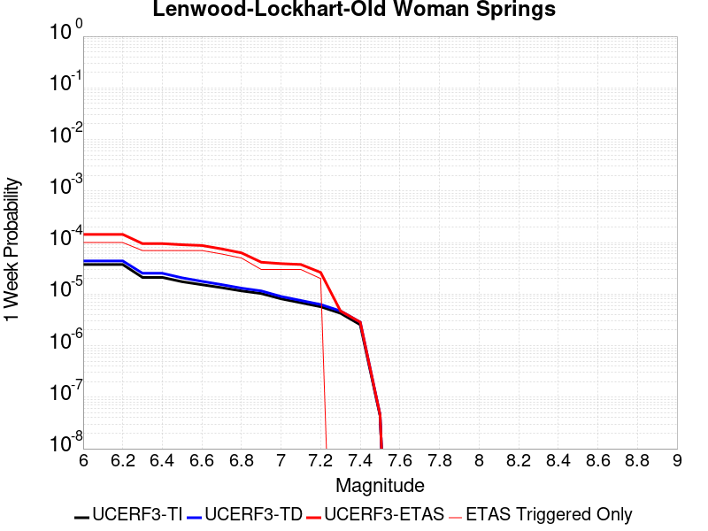 |  |  |  |

| Magnitude | 1 wk TI Prob | 1 wk TD Prob | 1 wk ETAS Prob | 1 wk ETAS/TD Gain | 1 wk ETAS Triggered Only | 1 mo TI Prob | 1 mo TD Prob | 1 mo ETAS Prob | 1 mo ETAS/TD Gain | 1 mo ETAS Triggered Only | 1 yr TI Prob | 1 yr TD Prob | 1 yr ETAS Prob | 1 yr ETAS/TD Gain | 1 yr ETAS Triggered Only | 10 yr TI Prob | 10 yr TD Prob | 10 yr ETAS Prob | 10 yr ETAS/TD Gain | 10 yr ETAS Triggered Only |
|-----|-----|-----|-----|-----|-----|-----|-----|-----|-----|-----|-----|-----|-----|-----|-----|-----|-----|-----|-----|-----|
| 6.0 | 3.744542E-5 | 4.3964304E-5 | 4.3964304E-5 | 1.0 | 0.0 | 1.604705E-4 | 1.8840581E-4 | 1.8840581E-4 | 1.0 | 0.0 | 0.0019519776 | 0.0022915998 | 0.0028489789 | 1.243227 | 5.586592E-4 | 0.019349206 | 0.0226977 | 0.02378966 | 1.0481087 | 0.0011173184 |
| 6.1 | 3.744542E-5 | 4.3964304E-5 | 4.3964304E-5 | 1.0 | 0.0 | 1.604705E-4 | 1.8840581E-4 | 1.8840581E-4 | 1.0 | 0.0 | 0.0019519776 | 0.0022915998 | 0.0028489789 | 1.243227 | 5.586592E-4 | 0.019349206 | 0.0226977 | 0.02378966 | 1.0481087 | 0.0011173184 |
| 6.2 | 3.744542E-5 | 4.3964304E-5 | 4.3964304E-5 | 1.0 | 0.0 | 1.604705E-4 | 1.8840581E-4 | 1.8840581E-4 | 1.0 | 0.0 | 0.0019519776 | 0.0022915998 | 0.0028489789 | 1.243227 | 5.586592E-4 | 0.019349206 | 0.0226977 | 0.02378966 | 1.0481087 | 0.0011173184 |
| 6.3 | 2.1079984E-5 | 2.5354084E-5 | 2.5354084E-5 | 1.0 | 0.0 | 9.0339665E-5 | 1.0865595E-4 | 1.0865595E-4 | 1.0 | 0.0 | 0.0010993304 | 0.0013221033 | 0.001880024 | 1.4219947 | 5.586592E-4 | 0.010939079 | 0.013144593 | 0.014247225 | 1.0838848 | 0.0011173184 |
| 6.4 | 2.1079984E-5 | 2.5354084E-5 | 2.5354084E-5 | 1.0 | 0.0 | 9.0339665E-5 | 1.0865595E-4 | 1.0865595E-4 | 1.0 | 0.0 | 0.0010993304 | 0.0013221033 | 0.001880024 | 1.4219947 | 5.586592E-4 | 0.010939079 | 0.013144593 | 0.014247225 | 1.0838848 | 0.0011173184 |
| 6.5 | 1.7397282E-5 | 2.0662914E-5 | 2.0662914E-5 | 1.0 | 0.0 | 7.455765E-5 | 8.8552406E-5 | 8.8552406E-5 | 1.0 | 0.0 | 9.073613E-4 | 0.001077604 | 0.0016356612 | 1.5178685 | 5.586592E-4 | 0.009036654 | 0.010725081 | 0.011277748 | 1.0515304 | 5.586592E-4 |
| 6.6 | 1.52050325E-5 | 1.7680117E-5 | 1.7680117E-5 | 1.0 | 0.0 | 6.51628E-5 | 7.576977E-5 | 7.576977E-5 | 1.0 | 0.0 | 7.9306826E-4 | 9.221144E-4 | 0.0014802585 | 1.6052872 | 5.586592E-4 | 0.007902439 | 0.009183745 | 0.009737274 | 1.0602727 | 5.586592E-4 |
| 6.7 | 1.332523E-5 | 1.5264359E-5 | 1.5264359E-5 | 1.0 | 0.0 | 5.7106878E-5 | 6.541707E-5 | 6.541707E-5 | 1.0 | 0.0 | 6.950544E-4 | 7.9616765E-4 | 0.001354382 | 1.7011268 | 5.586592E-4 | 0.006928845 | 0.007933783 | 0.00848801 | 1.0698565 | 5.586592E-4 |
| 6.8 | 1.1525329E-5 | 1.3031262E-5 | 1.3031262E-5 | 1.0 | 0.0 | 4.9393333E-5 | 5.5847093E-5 | 5.5847093E-5 | 1.0 | 0.0 | 6.011979E-4 | 6.797305E-4 | 0.00123801 | 1.8213247 | 5.586592E-4 | 0.00599574 | 0.0067769657 | 0.007331839 | 1.0818764 | 5.586592E-4 |
| 6.9 | 1.0253909E-5 | 1.1514676E-5 | 1.1514676E-5 | 1.0 | 0.0 | 4.3944583E-5 | 4.93477E-5 | 4.93477E-5 | 1.0 | 0.0 | 5.3489394E-4 | 6.006462E-4 | 6.006462E-4 | 1.0 | 0.0 | 0.0053360825 | 0.005990607 | 0.005990607 | 1.0 | 0.0 |
| 7.0 | 8.104563E-6 | 8.991446E-6 | 8.991446E-6 | 1.0 | 0.0 | 3.4733377E-5 | 3.8534214E-5 | 3.8534214E-5 | 1.0 | 0.0 | 4.2279682E-4 | 4.6905546E-4 | 4.6905546E-4 | 1.0 | 0.0 | 0.0042199334 | 0.004680902 | 0.004680902 | 1.0 | 0.0 |
| 7.1 | 6.7986157E-6 | 7.515946E-6 | 7.515946E-6 | 1.0 | 0.0 | 2.91366E-5 | 3.221081E-5 | 3.221081E-5 | 1.0 | 0.0 | 3.5468035E-4 | 3.9209818E-4 | 3.9209818E-4 | 1.0 | 0.0 | 0.003541148 | 0.0039142803 | 0.0039142803 | 1.0 | 0.0 |
| 7.2 | 5.6893327E-6 | 6.280115E-6 | 6.280115E-6 | 1.0 | 0.0 | 2.4382627E-5 | 2.6914513E-5 | 2.6914513E-5 | 1.0 | 0.0 | 2.9681803E-4 | 3.2763692E-4 | 3.2763692E-4 | 1.0 | 0.0 | 0.002964219 | 0.0032717374 | 0.0032717374 | 1.0 | 0.0 |
| 7.3 | 4.253348E-6 | 4.7069766E-6 | 4.7069766E-6 | 1.0 | 0.0 | 1.8228506E-5 | 2.0172612E-5 | 2.0172612E-5 | 1.0 | 0.0 | 2.2190946E-4 | 2.455757E-4 | 2.455757E-4 | 1.0 | 0.0 | 0.00221688 | 0.0024532243 | 0.0024532243 | 1.0 | 0.0 |
| 7.4 | 2.5448119E-6 | 2.8520785E-6 | 2.8520785E-6 | 1.0 | 0.0 | 1.0906291E-5 | 1.2223146E-5 | 1.2223146E-5 | 1.0 | 0.0 | 1.3277601E-4 | 1.4880829E-4 | 1.4880829E-4 | 1.0 | 0.0 | 0.001326967 | 0.0014872487 | 0.0014872487 | 1.0 | 0.0 |
| 7.5 | 4.3706837E-8 | 4.5630156E-8 | 4.5630156E-8 | 1.0 | 0.0 | 1.8731501E-7 | 1.955578E-7 | 1.955578E-7 | 1.0 | 0.0 | 2.2805577E-6 | 2.380914E-6 | 2.380914E-6 | 1.0 | 0.0 | 2.2805343E-5 | 2.3808941E-5 | 2.3808941E-5 | 1.0 | 0.0 |

## Towne Pass
*[(top)](#table-of-contents)*

| 1 Week | 1 Month | 1 Year | 10 Year |
|-----|-----|-----|-----|
|  | 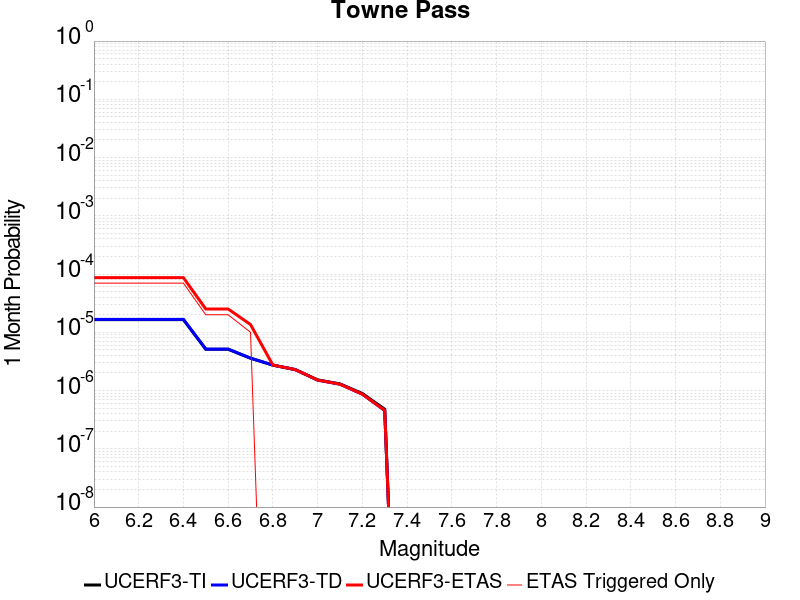 |  |  |

| Magnitude | 1 wk TI Prob | 1 wk TD Prob | 1 wk ETAS Prob | 1 wk ETAS/TD Gain | 1 wk ETAS Triggered Only | 1 mo TI Prob | 1 mo TD Prob | 1 mo ETAS Prob | 1 mo ETAS/TD Gain | 1 mo ETAS Triggered Only | 1 yr TI Prob | 1 yr TD Prob | 1 yr ETAS Prob | 1 yr ETAS/TD Gain | 1 yr ETAS Triggered Only | 10 yr TI Prob | 10 yr TD Prob | 10 yr ETAS Prob | 10 yr ETAS/TD Gain | 10 yr ETAS Triggered Only |
|-----|-----|-----|-----|-----|-----|-----|-----|-----|-----|-----|-----|-----|-----|-----|-----|-----|-----|-----|-----|-----|
| 6.0 | 3.849728E-6 | 3.8945745E-6 | 3.8945745E-6 | 1.0 | 0.0 | 1.649873E-5 | 1.669095E-5 | 1.669095E-5 | 1.0 | 0.0 | 2.0085352E-4 | 2.0319775E-4 | 2.0319775E-4 | 1.0 | 0.0 | 0.0020067208 | 0.0020305486 | 0.0025880735 | 1.2745686 | 5.586592E-4 |
| 6.1 | 3.849728E-6 | 3.8945745E-6 | 3.8945745E-6 | 1.0 | 0.0 | 1.649873E-5 | 1.669095E-5 | 1.669095E-5 | 1.0 | 0.0 | 2.0085352E-4 | 2.0319775E-4 | 2.0319775E-4 | 1.0 | 0.0 | 0.0020067208 | 0.0020305486 | 0.0025880735 | 1.2745686 | 5.586592E-4 |
| 6.2 | 3.849728E-6 | 3.8945745E-6 | 3.8945745E-6 | 1.0 | 0.0 | 1.649873E-5 | 1.669095E-5 | 1.669095E-5 | 1.0 | 0.0 | 2.0085352E-4 | 2.0319775E-4 | 2.0319775E-4 | 1.0 | 0.0 | 0.0020067208 | 0.0020305486 | 0.0025880735 | 1.2745686 | 5.586592E-4 |
| 6.3 | 3.849728E-6 | 3.8945745E-6 | 3.8945745E-6 | 1.0 | 0.0 | 1.649873E-5 | 1.669095E-5 | 1.669095E-5 | 1.0 | 0.0 | 2.0085352E-4 | 2.0319775E-4 | 2.0319775E-4 | 1.0 | 0.0 | 0.0020067208 | 0.0020305486 | 0.0025880735 | 1.2745686 | 5.586592E-4 |
| 6.4 | 3.849728E-6 | 3.8945745E-6 | 3.8945745E-6 | 1.0 | 0.0 | 1.649873E-5 | 1.669095E-5 | 1.669095E-5 | 1.0 | 0.0 | 2.0085352E-4 | 2.0319775E-4 | 2.0319775E-4 | 1.0 | 0.0 | 0.0020067208 | 0.0020305486 | 0.0025880735 | 1.2745686 | 5.586592E-4 |
| 6.5 | 1.1953545E-6 | 1.203065E-6 | 1.203065E-6 | 1.0 | 0.0 | 5.1229376E-6 | 5.1559837E-6 | 5.1559837E-6 | 1.0 | 0.0 | 6.236998E-5 | 6.277241E-5 | 6.277241E-5 | 1.0 | 0.0 | 6.235248E-4 | 6.275585E-4 | 0.0011858671 | 1.8896519 | 5.586592E-4 |
| 6.6 | 1.1953545E-6 | 1.203065E-6 | 1.203065E-6 | 1.0 | 0.0 | 5.1229376E-6 | 5.1559837E-6 | 5.1559837E-6 | 1.0 | 0.0 | 6.236998E-5 | 6.277241E-5 | 6.277241E-5 | 1.0 | 0.0 | 6.235248E-4 | 6.275585E-4 | 0.0011858671 | 1.8896519 | 5.586592E-4 |
| 6.7 | 8.375951E-7 | 8.410778E-7 | 8.410778E-7 | 1.0 | 0.0 | 3.5896885E-6 | 3.6046144E-6 | 3.6046144E-6 | 1.0 | 0.0 | 4.370358E-5 | 4.3885353E-5 | 4.3885353E-5 | 1.0 | 0.0 | 4.3694986E-4 | 4.387726E-4 | 9.971866E-4 | 2.2726731 | 5.586592E-4 |
| 6.8 | 6.38041E-7 | 6.3922516E-7 | 6.3922516E-7 | 1.0 | 0.0 | 2.7344586E-6 | 2.7395338E-6 | 2.7395338E-6 | 1.0 | 0.0 | 3.3291526E-5 | 3.335335E-5 | 3.335335E-5 | 1.0 | 0.0 | 3.3286537E-4 | 3.3348726E-4 | 3.3348726E-4 | 1.0 | 0.0 |
| 6.9 | 5.3460053E-7 | 5.3454215E-7 | 5.3454215E-7 | 1.0 | 0.0 | 2.2911431E-6 | 2.290893E-6 | 2.290893E-6 | 1.0 | 0.0 | 2.789431E-5 | 2.78913E-5 | 2.78913E-5 | 1.0 | 0.0 | 2.789081E-4 | 2.788813E-4 | 2.788813E-4 | 1.0 | 0.0 |
| 7.0 | 3.557783E-7 | 3.5324976E-7 | 3.5324976E-7 | 1.0 | 0.0 | 1.5247632E-6 | 1.5139268E-6 | 1.5139268E-6 | 1.0 | 0.0 | 1.8563835E-5 | 1.843191E-5 | 1.843191E-5 | 1.0 | 0.0 | 1.8562283E-4 | 1.8430466E-4 | 1.8430466E-4 | 1.0 | 0.0 |
| 7.1 | 3.037942E-7 | 3.0002903E-7 | 3.0002903E-7 | 1.0 | 0.0 | 1.3019744E-6 | 1.285838E-6 | 1.285838E-6 | 1.0 | 0.0 | 1.5851423E-5 | 1.5654974E-5 | 1.5654974E-5 | 1.0 | 0.0 | 1.5850292E-4 | 1.5653945E-4 | 1.5653945E-4 | 1.0 | 0.0 |
| 7.2 | 2.0808248E-7 | 2.0218252E-7 | 2.0218252E-7 | 1.0 | 0.0 | 8.917818E-7 | 8.6649624E-7 | 8.6649624E-7 | 1.0 | 0.0 | 1.0857389E-5 | 1.0549546E-5 | 1.0549546E-5 | 1.0 | 0.0 | 1.0856859E-4 | 1.0549091E-4 | 1.0549091E-4 | 1.0 | 0.0 |
| 7.3 | 1.1162073E-7 | 1.0637251E-7 | 1.0637251E-7 | 1.0 | 0.0 | 4.7837443E-7 | 4.5588212E-7 | 4.5588212E-7 | 1.0 | 0.0 | 5.8241935E-6 | 5.5503524E-6 | 5.5503524E-6 | 1.0 | 0.0 | 5.8240406E-5 | 5.550234E-5 | 5.550234E-5 | 1.0 | 0.0 |

## San Andreas (Cholame) rev
*[(top)](#table-of-contents)*

| 1 Week | 1 Month | 1 Year | 10 Year |
|-----|-----|-----|-----|
|  |  |  |  |

| Magnitude | 1 wk TI Prob | 1 wk TD Prob | 1 wk ETAS Prob | 1 wk ETAS/TD Gain | 1 wk ETAS Triggered Only | 1 mo TI Prob | 1 mo TD Prob | 1 mo ETAS Prob | 1 mo ETAS/TD Gain | 1 mo ETAS Triggered Only | 1 yr TI Prob | 1 yr TD Prob | 1 yr ETAS Prob | 1 yr ETAS/TD Gain | 1 yr ETAS Triggered Only | 10 yr TI Prob | 10 yr TD Prob | 10 yr ETAS Prob | 10 yr ETAS/TD Gain | 10 yr ETAS Triggered Only |
|-----|-----|-----|-----|-----|-----|-----|-----|-----|-----|-----|-----|-----|-----|-----|-----|-----|-----|-----|-----|-----|
| 6.0 | 1.2302514E-4 | 2.5242948E-4 | 8.109477E-4 | 3.2125711 | 5.586592E-4 | 5.27144E-4 | 0.0010813937 | 0.0016394488 | 1.5160518 | 5.586592E-4 | 0.0063991086 | 0.013086997 | 0.013638345 | 1.0421294 | 5.586592E-4 | 0.06217949 | 0.1245517 | 0.12504077 | 1.0039268 | 5.586592E-4 |
| 6.1 | 1.2302514E-4 | 2.5242948E-4 | 8.109477E-4 | 3.2125711 | 5.586592E-4 | 5.27144E-4 | 0.0010813937 | 0.0016394488 | 1.5160518 | 5.586592E-4 | 0.0063991086 | 0.013086997 | 0.013638345 | 1.0421294 | 5.586592E-4 | 0.06217949 | 0.1245517 | 0.12504077 | 1.0039268 | 5.586592E-4 |
| 6.2 | 1.2203569E-4 | 2.5059693E-4 | 8.091162E-4 | 3.228755 | 5.586592E-4 | 5.2290526E-4 | 0.0010735465 | 0.0016316059 | 1.519828 | 5.586592E-4 | 0.006347804 | 0.0129926 | 0.013544001 | 1.0424396 | 5.586592E-4 | 0.061695136 | 0.12373783 | 0.12422736 | 1.0039562 | 5.586592E-4 |
| 6.3 | 1.2142645E-4 | 2.4945638E-4 | 8.0797623E-4 | 3.238948 | 5.586592E-4 | 5.202953E-4 | 0.0010686623 | 0.0016267245 | 1.5222063 | 5.586592E-4 | 0.006316212 | 0.012933843 | 0.013485277 | 1.042635 | 5.586592E-4 | 0.06139677 | 0.123231925 | 0.12372174 | 1.0039748 | 5.586592E-4 |
| 6.4 | 1.1865206E-4 | 2.4450937E-4 | 8.03032E-4 | 3.2842586 | 5.586592E-4 | 5.0840975E-4 | 0.001047478 | 0.0016055522 | 1.5327787 | 5.586592E-4 | 0.006172335 | 0.012678952 | 0.013230528 | 1.0435033 | 5.586592E-4 | 0.060036868 | 0.121024184 | 0.12151523 | 1.0040574 | 5.586592E-4 |
| 6.5 | 1.17443946E-4 | 2.4244092E-4 | 8.009647E-4 | 3.3037522 | 5.586592E-4 | 5.032341E-4 | 0.0010386204 | 0.0015966994 | 1.5373272 | 5.586592E-4 | 0.006109677 | 0.012572356 | 0.013123991 | 1.0438769 | 5.586592E-4 | 0.059444077 | 0.12009794 | 0.12058951 | 1.004093 | 5.586592E-4 |
| 6.6 | 1.13579066E-4 | 2.3552658E-4 | 7.9405424E-4 | 3.3713996 | 5.586592E-4 | 4.866766E-4 | 0.0010090107 | 0.0015671062 | 1.5531117 | 5.586592E-4 | 0.0059092017 | 0.012215953 | 0.012767788 | 1.0451733 | 5.586592E-4 | 0.057545185 | 0.11701085 | 0.117504135 | 1.0042157 | 5.586592E-4 |
| 6.7 | 1.1271412E-4 | 2.339688E-4 | 7.924973E-4 | 3.3871922 | 5.586592E-4 | 4.829711E-4 | 0.0010023396 | 0.0015604389 | 1.5567966 | 5.586592E-4 | 0.005864331 | 0.012135641 | 0.012687521 | 1.045476 | 5.586592E-4 | 0.057119697 | 0.116314195 | 0.11680787 | 1.0042443 | 5.586592E-4 |
| 6.8 | 1.1217975E-4 | 2.3285215E-4 | 7.913813E-4 | 3.3986428 | 5.586592E-4 | 4.8068175E-4 | 9.975577E-4 | 0.0015556596 | 1.5594684 | 5.586592E-4 | 0.005836608 | 0.012078067 | 0.012629979 | 1.0456953 | 5.586592E-4 | 0.056856725 | 0.11581219 | 0.11630615 | 1.0042652 | 5.586592E-4 |
| 6.9 | 1.1146753E-4 | 2.3133864E-4 | 7.898686E-4 | 3.4143393 | 5.586592E-4 | 4.7763053E-4 | 9.910761E-4 | 0.0015491816 | 1.5631309 | 5.586592E-4 | 0.0057996577 | 0.012000027 | 0.012551982 | 1.0459962 | 5.586592E-4 | 0.056506127 | 0.11513234 | 0.11562668 | 1.0042937 | 5.586592E-4 |
| 7.0 | 1.0965793E-4 | 2.2756905E-4 | 7.8610115E-4 | 3.4543412 | 5.586592E-4 | 4.698779E-4 | 9.7493286E-4 | 0.0015330474 | 1.5724646 | 5.586592E-4 | 0.005705768 | 0.01180563 | 0.012357694 | 1.0467628 | 5.586592E-4 | 0.055614736 | 0.11343304 | 0.113928325 | 1.0043664 | 5.586592E-4 |
| 7.1 | 9.927982E-5 | 2.0574623E-4 | 7.642905E-4 | 3.7147243 | 5.586592E-4 | 4.2541555E-4 | 8.814726E-4 | 0.0014396394 | 1.6332208 | 5.586592E-4 | 0.0051671406 | 0.0106794145 | 0.011232107 | 1.0517532 | 5.586592E-4 | 0.05048634 | 0.10352388 | 0.10402471 | 1.0048378 | 5.586592E-4 |
| 7.2 | 9.696786E-5 | 2.0078626E-4 | 7.593333E-4 | 3.781799 | 5.586592E-4 | 4.1551032E-4 | 8.602298E-4 | 0.0014184084 | 1.6488715 | 5.586592E-4 | 0.00504711 | 0.010423285 | 0.010976122 | 1.0530386 | 5.586592E-4 | 0.04934009 | 0.10126121 | 0.1017633 | 1.0049584 | 5.586592E-4 |
| 7.3 | 9.4727984E-5 | 1.9507346E-4 | 7.5362367E-4 | 3.8632817 | 5.586592E-4 | 4.0591392E-4 | 8.357622E-4 | 0.0013939545 | 1.6678841 | 5.586592E-4 | 0.0049308087 | 0.010128201 | 0.010681202 | 1.0546001 | 5.586592E-4 | 0.048228268 | 0.09863034 | 0.099133894 | 1.0051055 | 5.586592E-4 |
| 7.4 | 9.220358E-5 | 1.8877286E-4 | 7.4732665E-4 | 3.9588668 | 5.586592E-4 | 3.9509835E-4 | 8.0877665E-4 | 0.001366984 | 1.6901873 | 5.586592E-4 | 0.004799717 | 0.009802646 | 0.010355828 | 1.056432 | 5.586592E-4 | 0.046973653 | 0.09570612 | 0.096211314 | 1.0052786 | 5.586592E-4 |
| 7.5 | 7.71631E-5 | 1.520787E-4 | 7.1065297E-4 | 4.672929 | 5.586592E-4 | 3.306571E-4 | 6.516032E-4 | 0.0012098984 | 1.8568023 | 5.586592E-4 | 0.0040183207 | 0.007904484 | 0.008458727 | 1.0701176 | 5.586592E-4 | 0.03946433 | 0.078419134 | 0.078933984 | 1.0065653 | 5.586592E-4 |
| 7.6 | 7.5634416E-5 | 1.4866945E-4 | 7.072456E-4 | 4.7571683 | 5.586592E-4 | 3.241072E-4 | 6.369994E-4 | 0.0011953027 | 1.8764583 | 5.586592E-4 | 0.0039388672 | 0.007727957 | 0.008282298 | 1.071732 | 5.586592E-4 | 0.038697794 | 0.07678112 | 0.07729688 | 1.0067173 | 5.586592E-4 |
| 7.7 | 6.3783E-5 | 1.2385153E-4 | 6.824416E-4 | 5.5101585 | 5.586592E-4 | 2.7332708E-4 | 5.3068437E-4 | 0.0010890471 | 2.052156 | 5.586592E-4 | 0.0033226798 | 0.0064419676 | 0.006997028 | 1.0861632 | 5.586592E-4 | 0.032734364 | 0.064660996 | 0.065183535 | 1.0080812 | 5.586592E-4 |
| 7.8 | 5.863422E-5 | 1.1440121E-4 | 6.729965E-4 | 5.8827744 | 5.586592E-4 | 2.512653E-4 | 4.9019884E-4 | 0.0010485842 | 2.1390998 | 5.586592E-4 | 0.003054864 | 0.00595186 | 0.006507194 | 1.0933043 | 5.586592E-4 | 0.030132094 | 0.059769355 | 0.06029462 | 1.0087882 | 5.586592E-4 |
| 7.9 | 4.595283E-5 | 8.443828E-5 | 6.430503E-4 | 7.6156254 | 5.586592E-4 | 1.9692584E-4 | 3.6182816E-4 | 9.2028524E-4 | 2.5434318 | 5.586592E-4 | 0.0023949358 | 0.0043963664 | 0.0049525695 | 1.1265143 | 5.586592E-4 | 0.023692891 | 0.04444455 | 0.04497838 | 1.0120112 | 5.586592E-4 |
| 8.0 | 3.2950178E-5 | 5.0881976E-5 | 6.095128E-4 | 11.978952 | 5.586592E-4 | 1.412074E-4 | 2.180474E-4 | 7.765848E-4 | 3.5615413 | 5.586592E-4 | 0.0017178444 | 0.0026514968 | 0.0032086747 | 1.2101371 | 5.586592E-4 | 0.017046256 | 0.027233804 | 0.027777247 | 1.0199548 | 5.586592E-4 |
| 8.1 | 1.9177472E-5 | 1.9238712E-5 | 5.778872E-4 | 30.037725 | 5.586592E-4 | 8.218658E-5 | 8.244903E-5 | 6.4106216E-4 | 7.7752547 | 5.586592E-4 | 0.0010001622 | 0.0010033553 | 0.0015614539 | 1.5562323 | 5.586592E-4 | 0.009956728 | 0.010786239 | 0.011338873 | 1.0512351 | 5.586592E-4 |
| 8.2 | 8.643924E-6 | 5.49522E-6 | 5.49522E-6 | 1.0 | 0.0 | 3.704486E-5 | 2.355073E-5 | 2.355073E-5 | 1.0 | 0.0 | 4.5092785E-4 | 2.866925E-4 | 2.866925E-4 | 1.0 | 0.0 | 0.0045001395 | 0.0032598388 | 0.0032598388 | 1.0 | 0.0 |
| 8.3 | 1.983087E-6 | 7.693574E-7 | 7.693574E-7 | 1.0 | 0.0 | 8.498917E-6 | 3.297242E-6 | 3.297242E-6 | 1.0 | 0.0 | 1.034694E-4 | 4.01432E-5 | 4.01432E-5 | 1.0 | 0.0 | 0.0010342124 | 4.7390026E-4 | 4.7390026E-4 | 1.0 | 0.0 |

## San Jacinto (San Bernardino)
*[(top)](#table-of-contents)*

| 1 Week | 1 Month | 1 Year | 10 Year |
|-----|-----|-----|-----|
| 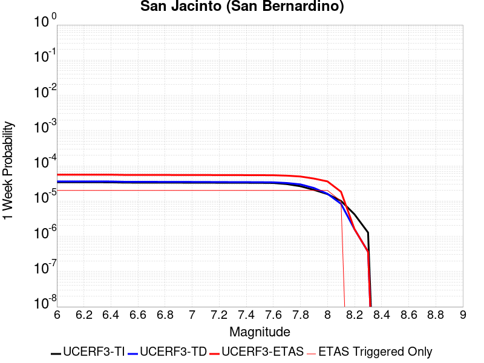 |  |  |  |

| Magnitude | 1 wk TI Prob | 1 wk TD Prob | 1 wk ETAS Prob | 1 wk ETAS/TD Gain | 1 wk ETAS Triggered Only | 1 mo TI Prob | 1 mo TD Prob | 1 mo ETAS Prob | 1 mo ETAS/TD Gain | 1 mo ETAS Triggered Only | 1 yr TI Prob | 1 yr TD Prob | 1 yr ETAS Prob | 1 yr ETAS/TD Gain | 1 yr ETAS Triggered Only | 10 yr TI Prob | 10 yr TD Prob | 10 yr ETAS Prob | 10 yr ETAS/TD Gain | 10 yr ETAS Triggered Only |
|-----|-----|-----|-----|-----|-----|-----|-----|-----|-----|-----|-----|-----|-----|-----|-----|-----|-----|-----|-----|-----|
| 6.0 | 3.409352E-5 | 3.6049758E-5 | 5.946888E-4 | 16.496334 | 5.586592E-4 | 1.461069E-4 | 1.5448983E-4 | 7.130627E-4 | 4.615597 | 5.586592E-4 | 0.0017774 | 0.0018792928 | 0.0024369021 | 1.2967123 | 5.586592E-4 | 0.01763251 | 0.019382251 | 0.019930081 | 1.0282645 | 5.586592E-4 |
| 6.1 | 3.409352E-5 | 3.6049758E-5 | 5.946888E-4 | 16.496334 | 5.586592E-4 | 1.461069E-4 | 1.5448983E-4 | 7.130627E-4 | 4.615597 | 5.586592E-4 | 0.0017774 | 0.0018792928 | 0.0024369021 | 1.2967123 | 5.586592E-4 | 0.01763251 | 0.019382251 | 0.019930081 | 1.0282645 | 5.586592E-4 |
| 6.2 | 3.409352E-5 | 3.6049758E-5 | 5.946888E-4 | 16.496334 | 5.586592E-4 | 1.461069E-4 | 1.5448983E-4 | 7.130627E-4 | 4.615597 | 5.586592E-4 | 0.0017774 | 0.0018792928 | 0.0024369021 | 1.2967123 | 5.586592E-4 | 0.01763251 | 0.019382251 | 0.019930081 | 1.0282645 | 5.586592E-4 |
| 6.3 | 3.409352E-5 | 3.6049758E-5 | 5.946888E-4 | 16.496334 | 5.586592E-4 | 1.461069E-4 | 1.5448983E-4 | 7.130627E-4 | 4.615597 | 5.586592E-4 | 0.0017774 | 0.0018792928 | 0.0024369021 | 1.2967123 | 5.586592E-4 | 0.01763251 | 0.019382251 | 0.019930081 | 1.0282645 | 5.586592E-4 |
| 6.4 | 3.400795E-5 | 3.5942405E-5 | 5.9458154E-4 | 16.54262 | 5.586592E-4 | 1.4574021E-4 | 1.540298E-4 | 7.12603E-4 | 4.6263967 | 5.586592E-4 | 0.0017729428 | 0.0018737017 | 0.0024313142 | 1.2975993 | 5.586592E-4 | 0.017588645 | 0.019327328 | 0.01987519 | 1.0283465 | 5.586592E-4 |
| 6.5 | 3.341482E-5 | 3.5202946E-5 | 5.938425E-4 | 16.869114 | 5.586592E-4 | 1.4319851E-4 | 1.5086106E-4 | 7.09436E-4 | 4.7025785 | 5.586592E-4 | 0.0017420477 | 0.0018351874 | 0.0023928215 | 1.3038567 | 5.586592E-4 | 0.017284546 | 0.018948833 | 0.019496907 | 1.0289239 | 5.586592E-4 |
| 6.6 | 3.3364955E-5 | 3.5140158E-5 | 5.937797E-4 | 16.89747 | 5.586592E-4 | 1.4298483E-4 | 1.50592E-4 | 7.091671E-4 | 4.709195 | 5.586592E-4 | 0.0017394501 | 0.0018319171 | 0.0023895528 | 1.3044001 | 5.586592E-4 | 0.017258976 | 0.018916694 | 0.019464785 | 1.0289739 | 5.586592E-4 |
| 6.7 | 3.335922E-5 | 3.512993E-5 | 5.9376954E-4 | 16.902098 | 5.586592E-4 | 1.4296026E-4 | 1.5054816E-4 | 7.0912327E-4 | 4.710275 | 5.586592E-4 | 0.0017391514 | 0.0018313844 | 0.0023890205 | 1.3044889 | 5.586592E-4 | 0.017256035 | 0.018911485 | 0.01945958 | 1.028982 | 5.586592E-4 |
| 6.8 | 3.327683E-5 | 3.5023982E-5 | 5.9366366E-4 | 16.950205 | 5.586592E-4 | 1.4260718E-4 | 1.5009414E-4 | 7.0866954E-4 | 4.7215 | 5.586592E-4 | 0.0017348597 | 0.0018258659 | 0.0023835052 | 1.3054107 | 5.586592E-4 | 0.017213784 | 0.018857252 | 0.019405376 | 1.029067 | 5.586592E-4 |
| 6.9 | 3.3235785E-5 | 3.4964927E-5 | 5.9360464E-4 | 16.977144 | 5.586592E-4 | 1.4243131E-4 | 1.4984109E-4 | 7.0841657E-4 | 4.727786 | 5.586592E-4 | 0.0017327217 | 0.0018227901 | 0.002380431 | 1.3059272 | 5.586592E-4 | 0.017192734 | 0.018827116 | 0.019375257 | 1.0291145 | 5.586592E-4 |
| 7.0 | 3.3197095E-5 | 3.4904846E-5 | 5.9354457E-4 | 17.004646 | 5.586592E-4 | 1.422655E-4 | 1.4958362E-4 | 7.081593E-4 | 4.7342033 | 5.586592E-4 | 0.0017307063 | 0.0018196608 | 0.0023773033 | 1.3064542 | 5.586592E-4 | 0.017172894 | 0.018796489 | 0.019344646 | 1.0291628 | 5.586592E-4 |
| 7.1 | 3.3129716E-5 | 3.478503E-5 | 5.9342483E-4 | 17.059776 | 5.586592E-4 | 1.4197677E-4 | 1.4907018E-4 | 7.0764613E-4 | 4.7470665 | 5.586592E-4 | 0.0017271966 | 0.0018134202 | 0.0023710662 | 1.3075107 | 5.586592E-4 | 0.017138338 | 0.018735558 | 0.019283751 | 1.0292594 | 5.586592E-4 |
| 7.2 | 3.3034008E-5 | 3.4652458E-5 | 5.932923E-4 | 17.12122 | 5.586592E-4 | 1.4156665E-4 | 1.4850209E-4 | 7.070783E-4 | 4.7614036 | 5.586592E-4 | 0.0017222111 | 0.001806515 | 0.002364165 | 1.3086883 | 5.586592E-4 | 0.017089253 | 0.018667944 | 0.019216172 | 1.0293674 | 5.586592E-4 |
| 7.3 | 3.2956614E-5 | 3.4520177E-5 | 5.931601E-4 | 17.182997 | 5.586592E-4 | 1.4123498E-4 | 1.4793524E-4 | 7.065118E-4 | 4.7758183 | 5.586592E-4 | 0.0017181796 | 0.001799625 | 0.002357279 | 1.3098723 | 5.586592E-4 | 0.017049557 | 0.018600674 | 0.019148942 | 1.0294757 | 5.586592E-4 |
| 7.4 | 3.2915937E-5 | 3.4441844E-5 | 5.930818E-4 | 17.219805 | 5.586592E-4 | 1.4106068E-4 | 1.4759957E-4 | 7.0617633E-4 | 4.7844067 | 5.586592E-4 | 0.0017160608 | 0.0017955449 | 0.002353201 | 1.3105776 | 5.586592E-4 | 0.017028693 | 0.018560927 | 0.019109217 | 1.0295401 | 5.586592E-4 |
| 7.5 | 3.281791E-5 | 3.430671E-5 | 5.929468E-4 | 17.283695 | 5.586592E-4 | 1.406406E-4 | 1.4702049E-4 | 7.055976E-4 | 4.7993145 | 5.586592E-4 | 0.0017109542 | 0.0017885063 | 0.0023461664 | 1.3118021 | 5.586592E-4 | 0.016978411 | 0.018491795 | 0.019040123 | 1.0296526 | 5.586592E-4 |
| 7.6 | 3.2521442E-5 | 3.4031546E-5 | 5.9267174E-4 | 17.415365 | 5.586592E-4 | 1.3937015E-4 | 1.4584133E-4 | 7.044191E-4 | 4.830037 | 5.586592E-4 | 0.0016955109 | 0.0017741736 | 0.0023318415 | 1.3143256 | 5.586592E-4 | 0.016826328 | 0.018349366 | 0.018897774 | 1.0298871 | 5.586592E-4 |
| 7.7 | 3.0287873E-5 | 3.2514843E-5 | 5.911559E-4 | 18.181108 | 5.586592E-4 | 1.297987E-4 | 1.393419E-4 | 6.9792324E-4 | 5.008711 | 5.586592E-4 | 0.0015791537 | 0.0016951686 | 0.0022528807 | 1.3290011 | 5.586592E-4 | 0.01567979 | 0.017559871 | 0.018108722 | 1.0312558 | 5.586592E-4 |
| 7.8 | 2.6316151E-5 | 2.9723395E-5 | 5.88366E-4 | 19.79471 | 5.586592E-4 | 1.1277862E-4 | 1.2737977E-4 | 6.859678E-4 | 5.385218 | 5.586592E-4 | 0.0013722149 | 0.0015497464 | 0.0021075397 | 1.3599256 | 5.586592E-4 | 0.013637724 | 0.016100293 | 0.016649958 | 1.03414 | 5.586592E-4 |
| 7.9 | 2.0761147E-5 | 2.3470231E-5 | 5.8211636E-4 | 24.802326 | 5.586592E-4 | 8.897331E-5 | 1.0058283E-4 | 6.5918587E-4 | 6.553662 | 5.586592E-4 | 0.0010827117 | 0.0012239089 | 0.0017818843 | 1.4558963 | 5.586592E-4 | 0.010774517 | 0.012820105 | 0.013371602 | 1.0430181 | 5.586592E-4 |
| 8.0 | 1.5738568E-5 | 1.607273E-5 | 5.7472294E-4 | 35.757645 | 5.586592E-4 | 6.744926E-5 | 6.8881316E-5 | 6.2750204E-4 | 9.109902 | 5.586592E-4 | 8.2088535E-4 | 8.38308E-4 | 0.0013964989 | 1.6658542 | 5.586592E-4 | 0.008178596 | 0.008886527 | 0.009440222 | 1.0623072 | 5.586592E-4 |
| 8.1 | 1.0105832E-5 | 8.353191E-6 | 5.6700775E-4 | 67.87917 | 5.586592E-4 | 4.3309992E-5 | 3.5798905E-5 | 5.944381E-4 | 16.604925 | 5.586592E-4 | 5.2717153E-4 | 4.35765E-4 | 9.941808E-4 | 2.2814608 | 5.586592E-4 | 0.005259227 | 0.004689436 | 0.005245475 | 1.1185728 | 5.586592E-4 |
| 8.2 | 4.189207E-6 | 1.5851253E-6 | 1.5851253E-6 | 1.0 | 0.0 | 1.7953622E-5 | 6.7933765E-6 | 6.7933765E-6 | 1.0 | 0.0 | 2.1856341E-4 | 8.270625E-5 | 8.270625E-5 | 1.0 | 0.0 | 0.0021834858 | 9.604094E-4 | 9.604094E-4 | 1.0 | 0.0 |
| 8.3 | 1.2758221E-6 | 3.6330252E-7 | 3.6330252E-7 | 1.0 | 0.0 | 5.4677976E-6 | 1.5570099E-6 | 1.5570099E-6 | 1.0 | 0.0 | 6.65684E-5 | 1.8956434E-5 | 1.8956434E-5 | 1.0 | 0.0 | 6.6548464E-4 | 2.2857229E-4 | 2.2857229E-4 | 1.0 | 0.0 |

## San Jacinto (San Jacinto Valley) rev
*[(top)](#table-of-contents)*

| 1 Week | 1 Month | 1 Year | 10 Year |
|-----|-----|-----|-----|
|  |  |  |  |

| Magnitude | 1 wk TI Prob | 1 wk TD Prob | 1 wk ETAS Prob | 1 wk ETAS/TD Gain | 1 wk ETAS Triggered Only | 1 mo TI Prob | 1 mo TD Prob | 1 mo ETAS Prob | 1 mo ETAS/TD Gain | 1 mo ETAS Triggered Only | 1 yr TI Prob | 1 yr TD Prob | 1 yr ETAS Prob | 1 yr ETAS/TD Gain | 1 yr ETAS Triggered Only | 10 yr TI Prob | 10 yr TD Prob | 10 yr ETAS Prob | 10 yr ETAS/TD Gain | 10 yr ETAS Triggered Only |
|-----|-----|-----|-----|-----|-----|-----|-----|-----|-----|-----|-----|-----|-----|-----|-----|-----|-----|-----|-----|-----|
| 6.0 | 3.652694E-5 | 3.4467394E-5 | 5.9310737E-4 | 17.20778 | 5.586592E-4 | 1.5653463E-4 | 1.4770904E-4 | 7.0628576E-4 | 4.7816014 | 5.586592E-4 | 0.0019041431 | 0.001796876 | 0.0023545313 | 1.3103472 | 5.586592E-4 | 0.018879099 | 0.018560216 | 0.019108506 | 1.0295411 | 5.586592E-4 |
| 6.1 | 3.652694E-5 | 3.4467394E-5 | 5.9310737E-4 | 17.20778 | 5.586592E-4 | 1.5653463E-4 | 1.4770904E-4 | 7.0628576E-4 | 4.7816014 | 5.586592E-4 | 0.0019041431 | 0.001796876 | 0.0023545313 | 1.3103472 | 5.586592E-4 | 0.018879099 | 0.018560216 | 0.019108506 | 1.0295411 | 5.586592E-4 |
| 6.2 | 3.652694E-5 | 3.4467394E-5 | 5.9310737E-4 | 17.20778 | 5.586592E-4 | 1.5653463E-4 | 1.4770904E-4 | 7.0628576E-4 | 4.7816014 | 5.586592E-4 | 0.0019041431 | 0.001796876 | 0.0023545313 | 1.3103472 | 5.586592E-4 | 0.018879099 | 0.018560216 | 0.019108506 | 1.0295411 | 5.586592E-4 |
| 6.3 | 3.652694E-5 | 3.4467394E-5 | 5.9310737E-4 | 17.20778 | 5.586592E-4 | 1.5653463E-4 | 1.4770904E-4 | 7.0628576E-4 | 4.7816014 | 5.586592E-4 | 0.0019041431 | 0.001796876 | 0.0023545313 | 1.3103472 | 5.586592E-4 | 0.018879099 | 0.018560216 | 0.019108506 | 1.0295411 | 5.586592E-4 |
| 6.4 | 3.646941E-5 | 3.4388955E-5 | 5.9302896E-4 | 17.244751 | 5.586592E-4 | 1.5628811E-4 | 1.4737292E-4 | 7.059498E-4 | 4.7902274 | 5.586592E-4 | 0.0019011468 | 0.0017927908 | 0.0023504484 | 1.3110557 | 5.586592E-4 | 0.018849645 | 0.01852009 | 0.019068403 | 1.0296063 | 5.586592E-4 |
| 6.5 | 3.646941E-5 | 3.4388955E-5 | 5.9302896E-4 | 17.244751 | 5.586592E-4 | 1.5628811E-4 | 1.4737292E-4 | 7.059498E-4 | 4.7902274 | 5.586592E-4 | 0.0019011468 | 0.0017927908 | 0.0023504484 | 1.3110557 | 5.586592E-4 | 0.018849645 | 0.01852009 | 0.019068403 | 1.0296063 | 5.586592E-4 |
| 6.6 | 3.6442503E-5 | 3.4352335E-5 | 5.9299235E-4 | 17.26207 | 5.586592E-4 | 1.561728E-4 | 1.4721598E-4 | 7.05793E-4 | 4.7942686 | 5.586592E-4 | 0.0018997455 | 0.0017908834 | 0.002348542 | 1.3113875 | 5.586592E-4 | 0.018835869 | 0.018501356 | 0.01904968 | 1.029637 | 5.586592E-4 |
| 6.7 | 3.6432113E-5 | 3.4337903E-5 | 5.929779E-4 | 17.268904 | 5.586592E-4 | 1.5612828E-4 | 1.4715415E-4 | 7.0573116E-4 | 4.795863 | 5.586592E-4 | 0.0018992044 | 0.001790132 | 0.002347791 | 1.3115184 | 5.586592E-4 | 0.018830549 | 0.01849398 | 0.019042308 | 1.029649 | 5.586592E-4 |
| 6.8 | 3.6409598E-5 | 3.430695E-5 | 5.92947E-4 | 17.28358 | 5.586592E-4 | 1.560318E-4 | 1.470215E-4 | 7.055986E-4 | 4.7992883 | 5.586592E-4 | 0.0018980318 | 0.0017885199 | 0.00234618 | 1.3117998 | 5.586592E-4 | 0.018819023 | 0.01847813 | 0.019026468 | 1.0296749 | 5.586592E-4 |
| 6.9 | 3.638078E-5 | 3.4267367E-5 | 5.929074E-4 | 17.302393 | 5.586592E-4 | 1.5590832E-4 | 1.4685189E-4 | 7.0542906E-4 | 4.803677 | 5.586592E-4 | 0.0018965311 | 0.0017864581 | 0.0023441194 | 1.3121603 | 5.586592E-4 | 0.018804269 | 0.018457862 | 0.01900621 | 1.029708 | 5.586592E-4 |
| 7.0 | 3.6294874E-5 | 3.4149365E-5 | 5.927895E-4 | 17.358727 | 5.586592E-4 | 1.5554018E-4 | 1.4634622E-4 | 7.049237E-4 | 4.8168216 | 5.586592E-4 | 0.0018920569 | 0.0017803118 | 0.0023379764 | 1.3132398 | 5.586592E-4 | 0.018760284 | 0.018397434 | 0.018945815 | 1.0298074 | 5.586592E-4 |
| 7.1 | 3.6260717E-5 | 3.410564E-5 | 5.927458E-4 | 17.3797 | 5.586592E-4 | 1.5539382E-4 | 1.4615887E-4 | 7.0473645E-4 | 4.8217154 | 5.586592E-4 | 0.001890278 | 0.0017780344 | 0.0023357002 | 1.3136418 | 5.586592E-4 | 0.018742796 | 0.018375032 | 0.018923426 | 1.0298445 | 5.586592E-4 |
| 7.2 | 3.6210204E-5 | 3.403977E-5 | 5.9267995E-4 | 17.411398 | 5.586592E-4 | 1.5517735E-4 | 1.4587659E-4 | 7.044543E-4 | 4.8291116 | 5.586592E-4 | 0.001887647 | 0.0017746033 | 0.002332271 | 1.3142493 | 5.586592E-4 | 0.01871693 | 0.018341267 | 0.018889679 | 1.0299004 | 5.586592E-4 |
| 7.3 | 3.6119454E-5 | 3.3927867E-5 | 5.9256813E-4 | 17.465528 | 5.586592E-4 | 1.5478847E-4 | 1.4539705E-4 | 7.0397503E-4 | 4.841742 | 5.586592E-4 | 0.0018829206 | 0.0017687745 | 0.0023264454 | 1.3152868 | 5.586592E-4 | 0.018670462 | 0.018283723 | 0.018832168 | 1.0299964 | 5.586592E-4 |
| 7.4 | 3.607848E-5 | 3.387532E-5 | 5.9251563E-4 | 17.49107 | 5.586592E-4 | 1.5461289E-4 | 1.4517189E-4 | 7.0375E-4 | 4.8477015 | 5.586592E-4 | 0.0018807866 | 0.0017660374 | 0.0023237101 | 1.3157762 | 5.586592E-4 | 0.018649481 | 0.018256696 | 0.018805157 | 1.0300416 | 5.586592E-4 |
| 7.5 | 3.5856774E-5 | 3.3684162E-5 | 5.923246E-4 | 17.58466 | 5.586592E-4 | 1.5366284E-4 | 1.4435273E-4 | 7.029313E-4 | 4.8695393 | 5.586592E-4 | 0.0018692396 | 0.0017560803 | 0.0023137585 | 1.3175699 | 5.586592E-4 | 0.018535944 | 0.01815731 | 0.018705826 | 1.0302091 | 5.586592E-4 |
| 7.6 | 3.286655E-5 | 3.220034E-5 | 5.908416E-4 | 18.348923 | 5.586592E-4 | 1.4084904E-4 | 1.3799417E-4 | 6.965763E-4 | 5.0478673 | 5.586592E-4 | 0.001713488 | 0.0016787864 | 0.0022365078 | 1.332217 | 5.586592E-4 | 0.017003361 | 0.017373424 | 0.017922377 | 1.0315973 | 5.586592E-4 |
| 7.7 | 2.8882527E-5 | 2.9291981E-5 | 5.8793486E-4 | 20.07153 | 5.586592E-4 | 1.237764E-4 | 1.2553102E-4 | 6.841201E-4 | 5.449809 | 5.586592E-4 | 0.0015059357 | 0.0015272698 | 0.002085076 | 1.3652308 | 5.586592E-4 | 0.014957713 | 0.015859274 | 0.016409073 | 1.0346674 | 5.586592E-4 |
| 7.8 | 2.4950225E-5 | 2.6580747E-5 | 5.852251E-4 | 22.01688 | 5.586592E-4 | 1.0692515E-4 | 1.13912516E-4 | 6.725081E-4 | 5.9037247 | 5.586592E-4 | 0.0013010362 | 0.0013860033 | 0.0019438883 | 1.4025134 | 5.586592E-4 | 0.012934455 | 0.014439502 | 0.014990095 | 1.038131 | 5.586592E-4 |
| 7.9 | 1.9881603E-5 | 2.155556E-5 | 5.8020273E-4 | 26.916616 | 5.586592E-4 | 8.520408E-5 | 9.2377704E-5 | 6.5098534E-4 | 7.046996 | 5.586592E-4 | 0.001036866 | 0.001124119 | 0.0016821503 | 1.4964164 | 5.586592E-4 | 0.010320415 | 0.011802064 | 0.012354131 | 1.046777 | 5.586592E-4 |
| 8.0 | 1.563292E-5 | 1.5976173E-5 | 5.746265E-4 | 35.967716 | 5.586592E-4 | 6.6996516E-5 | 6.846752E-5 | 6.270885E-4 | 9.158919 | 5.586592E-4 | 8.153773E-4 | 8.332739E-4 | 0.0013914676 | 1.6698803 | 5.586592E-4 | 0.00812392 | 0.008830938 | 0.009384664 | 1.0627029 | 5.586592E-4 |
| 8.1 | 1.0045313E-5 | 8.324356E-6 | 5.6697894E-4 | 68.11085 | 5.586592E-4 | 4.305063E-5 | 3.5675326E-5 | 5.943146E-4 | 16.658983 | 5.586592E-4 | 5.2401534E-4 | 4.3426102E-4 | 9.926776E-4 | 2.2859008 | 5.586592E-4 | 0.0052278144 | 0.0046712374 | 0.005227287 | 1.1190369 | 5.586592E-4 |
| 8.2 | 4.1554413E-6 | 1.5721832E-6 | 1.5721832E-6 | 1.0 | 0.0 | 1.7808914E-5 | 6.737911E-6 | 6.737911E-6 | 1.0 | 0.0 | 2.1680194E-4 | 8.203101E-5 | 8.203101E-5 | 1.0 | 0.0 | 0.0021659054 | 9.520741E-4 | 9.520741E-4 | 1.0 | 0.0 |
| 8.3 | 1.2758221E-6 | 3.6330252E-7 | 3.6330252E-7 | 1.0 | 0.0 | 5.4677976E-6 | 1.5570099E-6 | 1.5570099E-6 | 1.0 | 0.0 | 6.65684E-5 | 1.8956434E-5 | 1.8956434E-5 | 1.0 | 0.0 | 6.6548464E-4 | 2.2857229E-4 | 2.2857229E-4 | 1.0 | 0.0 |

## Coronado Bank alt1
*[(top)](#table-of-contents)*

| 1 Week | 1 Month | 1 Year | 10 Year |
|-----|-----|-----|-----|
|  |  |  |  |

| Magnitude | 1 wk TI Prob | 1 wk TD Prob | 1 wk ETAS Prob | 1 wk ETAS/TD Gain | 1 wk ETAS Triggered Only | 1 mo TI Prob | 1 mo TD Prob | 1 mo ETAS Prob | 1 mo ETAS/TD Gain | 1 mo ETAS Triggered Only | 1 yr TI Prob | 1 yr TD Prob | 1 yr ETAS Prob | 1 yr ETAS/TD Gain | 1 yr ETAS Triggered Only | 10 yr TI Prob | 10 yr TD Prob | 10 yr ETAS Prob | 10 yr ETAS/TD Gain | 10 yr ETAS Triggered Only |
|-----|-----|-----|-----|-----|-----|-----|-----|-----|-----|-----|-----|-----|-----|-----|-----|-----|-----|-----|-----|-----|
| 6.0 | 7.533492E-5 | 9.39618E-5 | 9.39618E-5 | 1.0 | 0.0 | 3.22824E-4 | 4.0263552E-4 | 4.0263552E-4 | 1.0 | 0.0 | 0.0039233007 | 0.0048915995 | 0.005447526 | 1.1136492 | 5.586592E-4 | 0.03854755 | 0.04790961 | 0.048441507 | 1.0111021 | 5.586592E-4 |
| 6.1 | 4.1807285E-5 | 5.049851E-5 | 5.049851E-5 | 1.0 | 0.0 | 1.7916178E-4 | 2.1640482E-4 | 2.1640482E-4 | 1.0 | 0.0 | 0.0021791123 | 0.0026316417 | 0.0031888306 | 1.2117268 | 5.586592E-4 | 0.021578677 | 0.026013888 | 0.026558014 | 1.0209168 | 5.586592E-4 |
| 6.2 | 4.1807285E-5 | 5.049851E-5 | 5.049851E-5 | 1.0 | 0.0 | 1.7916178E-4 | 2.1640482E-4 | 2.1640482E-4 | 1.0 | 0.0 | 0.0021791123 | 0.0026316417 | 0.0031888306 | 1.2117268 | 5.586592E-4 | 0.021578677 | 0.026013888 | 0.026558014 | 1.0209168 | 5.586592E-4 |
| 6.3 | 3.1793104E-5 | 3.7714894E-5 | 3.7714894E-5 | 1.0 | 0.0 | 1.3624904E-4 | 1.6162546E-4 | 1.6162546E-4 | 1.0 | 0.0 | 0.0016575698 | 0.0019660434 | 0.0025236043 | 1.2835954 | 5.586592E-4 | 0.016452603 | 0.019490387 | 0.020038158 | 1.0281047 | 5.586592E-4 |
| 6.4 | 2.9878007E-5 | 3.5339268E-5 | 3.5339268E-5 | 1.0 | 0.0 | 1.2804232E-4 | 1.514454E-4 | 1.514454E-4 | 1.0 | 0.0 | 0.0015578003 | 0.0018423185 | 0.0023999484 | 1.3026783 | 5.586592E-4 | 0.015469253 | 0.018274212 | 0.018822663 | 1.0300122 | 5.586592E-4 |
| 6.5 | 2.4512565E-5 | 2.8766724E-5 | 2.8766724E-5 | 1.0 | 0.0 | 1.0504962E-4 | 1.2328029E-4 | 1.2328029E-4 | 1.0 | 0.0 | 0.0012782287 | 0.0014999318 | 0.002057753 | 1.3718978 | 5.586592E-4 | 0.012709012 | 0.01490106 | 0.015451394 | 1.0369326 | 5.586592E-4 |
| 6.6 | 2.1317413E-5 | 2.4908924E-5 | 2.4908924E-5 | 1.0 | 0.0 | 9.135714E-5 | 1.06748295E-4 | 1.06748295E-4 | 1.0 | 0.0 | 0.0011117056 | 0.0012989079 | 0.0018568415 | 1.4295405 | 5.586592E-4 | 0.011061605 | 0.012915566 | 0.013467009 | 1.0426961 | 5.586592E-4 |
| 6.7 | 1.8585655E-5 | 2.163679E-5 | 2.163679E-5 | 1.0 | 0.0 | 7.9650374E-5 | 9.272592E-5 | 9.272592E-5 | 1.0 | 0.0 | 9.6931186E-4 | 0.0011283738 | 0.0011283738 | 1.0 | 0.0 | 0.0096509475 | 0.011228608 | 0.011228608 | 1.0 | 0.0 |
| 6.8 | 1.5862879E-5 | 1.8421075E-5 | 1.8421075E-5 | 1.0 | 0.0 | 6.798199E-5 | 7.894518E-5 | 7.894518E-5 | 1.0 | 0.0 | 8.273665E-4 | 9.60753E-4 | 9.60753E-4 | 1.0 | 0.0 | 0.008242928 | 0.009567977 | 0.009567977 | 1.0 | 0.0 |
| 6.9 | 1.3021509E-5 | 1.50965625E-5 | 1.50965625E-5 | 1.0 | 0.0 | 5.5805274E-5 | 6.4698055E-5 | 6.4698055E-5 | 1.0 | 0.0 | 6.792174E-4 | 7.8743225E-4 | 7.8743225E-4 | 1.0 | 0.0 | 0.006771452 | 0.007848245 | 0.007848245 | 1.0 | 0.0 |
| 7.0 | 1.0974371E-5 | 1.27212E-5 | 1.27212E-5 | 1.0 | 0.0 | 4.7032172E-5 | 5.4518387E-5 | 5.4518387E-5 | 1.0 | 0.0 | 5.7246623E-4 | 6.6357676E-4 | 6.6357676E-4 | 1.0 | 0.0 | 0.0057099373 | 0.006617703 | 0.006617703 | 1.0 | 0.0 |
| 7.1 | 8.766221E-6 | 1.0164713E-5 | 1.0164713E-5 | 1.0 | 0.0 | 3.7568978E-5 | 4.3562424E-5 | 4.3562424E-5 | 1.0 | 0.0 | 4.573063E-4 | 5.302607E-4 | 5.302607E-4 | 1.0 | 0.0 | 0.0045636636 | 0.0052916543 | 0.0052916543 | 1.0 | 0.0 |
| 7.2 | 8.026024E-7 | 8.332054E-7 | 8.332054E-7 | 1.0 | 0.0 | 3.43972E-6 | 3.5708754E-6 | 3.5708754E-6 | 1.0 | 0.0 | 4.1877785E-5 | 4.3474553E-5 | 4.3474553E-5 | 1.0 | 0.0 | 4.1869894E-4 | 4.3466155E-4 | 4.3466155E-4 | 1.0 | 0.0 |
| 7.3 | 3.7293114E-7 | 3.7001894E-7 | 3.7001894E-7 | 1.0 | 0.0 | 1.5982754E-6 | 1.5857945E-6 | 1.5857945E-6 | 1.0 | 0.0 | 1.9458828E-5 | 1.9306877E-5 | 1.9306877E-5 | 1.0 | 0.0 | 1.9457124E-4 | 1.9305207E-4 | 1.9305207E-4 | 1.0 | 0.0 |
| 7.4 | 2.0557036E-7 | 1.9674766E-7 | 1.9674766E-7 | 1.0 | 0.0 | 8.810155E-7 | 8.4320396E-7 | 8.4320396E-7 | 1.0 | 0.0 | 1.0726311E-5 | 1.0265961E-5 | 1.0265961E-5 | 1.0 | 0.0 | 1.0725793E-4 | 1.0265489E-4 | 1.0265489E-4 | 1.0 | 0.0 |
| 7.5 | 6.845446E-8 | 6.2794456E-8 | 6.2794456E-8 | 1.0 | 0.0 | 2.9337625E-7 | 2.6911906E-7 | 2.6911906E-7 | 1.0 | 0.0 | 3.5718497E-6 | 3.2765197E-6 | 3.2765197E-6 | 1.0 | 0.0 | 3.5717923E-5 | 3.2764725E-5 | 3.2764725E-5 | 1.0 | 0.0 |
| 7.6 | 6.0975145E-9 | 5.5318936E-9 | 5.5318936E-9 | 1.0 | 0.0 | 2.6132206E-8 | 2.3708115E-8 | 2.3708115E-8 | 1.0 | 0.0 | 3.1815955E-7 | 2.8864628E-7 | 2.8864628E-7 | 1.0 | 0.0 | 3.181591E-6 | 2.88646E-6 | 2.88646E-6 | 1.0 | 0.0 |

## Palos Verdes
*[(top)](#table-of-contents)*

| 1 Week | 1 Month | 1 Year | 10 Year |
|-----|-----|-----|-----|
|  |  |  |  |

| Magnitude | 1 wk TI Prob | 1 wk TD Prob | 1 wk ETAS Prob | 1 wk ETAS/TD Gain | 1 wk ETAS Triggered Only | 1 mo TI Prob | 1 mo TD Prob | 1 mo ETAS Prob | 1 mo ETAS/TD Gain | 1 mo ETAS Triggered Only | 1 yr TI Prob | 1 yr TD Prob | 1 yr ETAS Prob | 1 yr ETAS/TD Gain | 1 yr ETAS Triggered Only | 10 yr TI Prob | 10 yr TD Prob | 10 yr ETAS Prob | 10 yr ETAS/TD Gain | 10 yr ETAS Triggered Only |
|-----|-----|-----|-----|-----|-----|-----|-----|-----|-----|-----|-----|-----|-----|-----|-----|-----|-----|-----|-----|-----|
| 6.0 | 6.126063E-5 | 7.623614E-5 | 7.623614E-5 | 1.0 | 0.0 | 2.6251914E-4 | 3.2668875E-4 | 3.2668875E-4 | 1.0 | 0.0 | 0.0031914865 | 0.0039706747 | 0.0045271157 | 1.1401377 | 5.586592E-4 | 0.031460393 | 0.0390538 | 0.039590646 | 1.0137461 | 5.586592E-4 |
| 6.1 | 6.126063E-5 | 7.623614E-5 | 7.623614E-5 | 1.0 | 0.0 | 2.6251914E-4 | 3.2668875E-4 | 3.2668875E-4 | 1.0 | 0.0 | 0.0031914865 | 0.0039706747 | 0.0045271157 | 1.1401377 | 5.586592E-4 | 0.031460393 | 0.0390538 | 0.039590646 | 1.0137461 | 5.586592E-4 |
| 6.2 | 6.126063E-5 | 7.623614E-5 | 7.623614E-5 | 1.0 | 0.0 | 2.6251914E-4 | 3.2668875E-4 | 3.2668875E-4 | 1.0 | 0.0 | 0.0031914865 | 0.0039706747 | 0.0045271157 | 1.1401377 | 5.586592E-4 | 0.031460393 | 0.0390538 | 0.039590646 | 1.0137461 | 5.586592E-4 |
| 6.3 | 4.0838047E-5 | 4.9755265E-5 | 4.9755265E-5 | 1.0 | 0.0 | 1.7500846E-4 | 2.1322069E-4 | 2.1322069E-4 | 1.0 | 0.0 | 0.0021286458 | 0.002593076 | 0.002593076 | 1.0 | 0.0 | 0.021083709 | 0.025649615 | 0.025649615 | 1.0 | 0.0 |
| 6.4 | 4.0838047E-5 | 4.9755265E-5 | 4.9755265E-5 | 1.0 | 0.0 | 1.7500846E-4 | 2.1322069E-4 | 2.1322069E-4 | 1.0 | 0.0 | 0.0021286458 | 0.002593076 | 0.002593076 | 1.0 | 0.0 | 0.021083709 | 0.025649615 | 0.025649615 | 1.0 | 0.0 |
| 6.5 | 3.0512005E-5 | 3.6565507E-5 | 3.6565507E-5 | 1.0 | 0.0 | 1.3075917E-4 | 1.5670057E-4 | 1.5670057E-4 | 1.0 | 0.0 | 0.0015908304 | 0.0019062778 | 0.0019062778 | 1.0 | 0.0 | 0.015794903 | 0.018911136 | 0.018911136 | 1.0 | 0.0 |
| 6.6 | 2.9255087E-5 | 3.5158213E-5 | 3.5158213E-5 | 1.0 | 0.0 | 1.2537291E-4 | 1.5067002E-4 | 1.5067002E-4 | 1.0 | 0.0 | 0.0015253464 | 0.0018329794 | 0.0018329794 | 1.0 | 0.0 | 0.015149189 | 0.018190164 | 0.018190164 | 1.0 | 0.0 |
| 6.7 | 2.287198E-5 | 2.7251068E-5 | 2.7251068E-5 | 1.0 | 0.0 | 9.801909E-5 | 1.1678558E-4 | 1.1678558E-4 | 1.0 | 0.0 | 0.001192729 | 0.0014210287 | 0.0014210287 | 1.0 | 0.0 | 0.011863477 | 0.014128654 | 0.014128654 | 1.0 | 0.0 |
| 6.8 | 2.1325764E-5 | 2.5434496E-5 | 2.5434496E-5 | 1.0 | 0.0 | 9.139293E-5 | 1.0900094E-4 | 1.0900094E-4 | 1.0 | 0.0 | 0.001112141 | 0.0013263688 | 0.0013263688 | 1.0 | 0.0 | 0.011065915 | 0.013193562 | 0.013193562 | 1.0 | 0.0 |
| 6.9 | 1.9009392E-5 | 2.2615843E-5 | 2.2615843E-5 | 1.0 | 0.0 | 8.1466285E-5 | 9.692193E-5 | 9.692193E-5 | 1.0 | 0.0 | 9.914007E-4 | 0.001179473 | 0.001179473 | 1.0 | 0.0 | 0.009869894 | 0.011740818 | 0.011740818 | 1.0 | 0.0 |
| 7.0 | 1.7098473E-5 | 2.0321406E-5 | 2.0321406E-5 | 1.0 | 0.0 | 7.3277115E-5 | 8.708931E-5 | 8.708931E-5 | 1.0 | 0.0 | 8.917837E-4 | 0.0010598819 | 0.0010598819 | 1.0 | 0.0 | 0.008882134 | 0.010556707 | 0.010556707 | 1.0 | 0.0 |
| 7.1 | 1.5982785E-5 | 1.8996678E-5 | 1.8996678E-5 | 1.0 | 0.0 | 6.849585E-5 | 8.141227E-5 | 8.141227E-5 | 1.0 | 0.0 | 8.336179E-4 | 9.908284E-4 | 9.908284E-4 | 1.0 | 0.0 | 0.008304977 | 0.009872472 | 0.009872472 | 1.0 | 0.0 |
| 7.2 | 1.4468002E-5 | 1.7198974E-5 | 1.7198974E-5 | 1.0 | 0.0 | 6.200425E-5 | 7.370828E-5 | 7.370828E-5 | 1.0 | 0.0 | 7.546402E-4 | 8.971129E-4 | 8.971129E-4 | 1.0 | 0.0 | 0.007520827 | 0.008943185 | 0.008943185 | 1.0 | 0.0 |
| 7.3 | 5.288233E-6 | 6.204259E-6 | 6.204259E-6 | 1.0 | 0.0 | 2.2663658E-5 | 2.6589607E-5 | 2.6589607E-5 | 1.0 | 0.0 | 2.7589512E-4 | 3.237153E-4 | 3.237153E-4 | 1.0 | 0.0 | 0.0027555283 | 0.003235861 | 0.003235861 | 1.0 | 0.0 |
| 7.4 | 8.279556E-7 | 8.408416E-7 | 8.408416E-7 | 1.0 | 0.0 | 3.5483763E-6 | 3.6036022E-6 | 3.6036022E-6 | 1.0 | 0.0 | 4.3200624E-5 | 4.387305E-5 | 4.387305E-5 | 1.0 | 0.0 | 4.3192226E-4 | 4.386511E-4 | 4.386511E-4 | 1.0 | 0.0 |
| 7.5 | 6.559831E-7 | 6.667287E-7 | 6.667287E-7 | 1.0 | 0.0 | 2.8113532E-6 | 2.857406E-6 | 2.857406E-6 | 1.0 | 0.0 | 3.4227687E-5 | 3.4788427E-5 | 3.4788427E-5 | 1.0 | 0.0 | 3.4222414E-4 | 3.4783647E-4 | 3.4783647E-4 | 1.0 | 0.0 |
| 7.6 | 3.5018968E-7 | 3.5620351E-7 | 3.5620351E-7 | 1.0 | 0.0 | 1.500812E-6 | 1.526586E-6 | 1.526586E-6 | 1.0 | 0.0 | 1.8272232E-5 | 1.8586072E-5 | 1.8586072E-5 | 1.0 | 0.0 | 1.8270731E-4 | 1.8584977E-4 | 1.8584977E-4 | 1.0 | 0.0 |
| 7.7 | 1.1986104E-7 | 1.2198491E-7 | 1.2198491E-7 | 1.0 | 0.0 | 5.1369005E-7 | 5.227924E-7 | 5.227924E-7 | 1.0 | 0.0 | 6.2541585E-6 | 6.364979E-6 | 6.364979E-6 | 1.0 | 0.0 | 6.2539824E-5 | 6.364801E-5 | 6.364801E-5 | 1.0 | 0.0 |
| 7.8 | 3.0445005E-8 | 3.10279E-8 | 3.10279E-8 | 1.0 | 0.0 | 1.3047858E-7 | 1.3297671E-7 | 1.3297671E-7 | 1.0 | 0.0 | 1.5885756E-6 | 1.6189904E-6 | 1.6189904E-6 | 1.0 | 0.0 | 1.5885644E-5 | 1.6189806E-5 | 1.6189806E-5 | 1.0 | 0.0 |

## San Jacinto (Borrego)
*[(top)](#table-of-contents)*

| 1 Week | 1 Month | 1 Year | 10 Year |
|-----|-----|-----|-----|
| 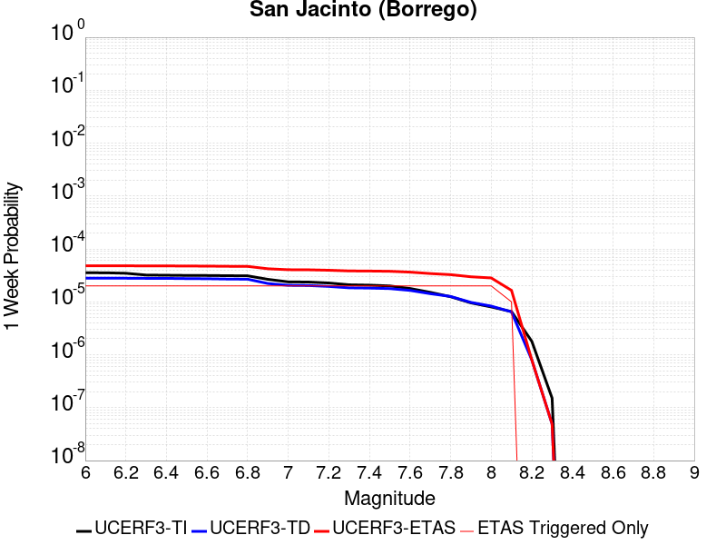 |  |  |  |

| Magnitude | 1 wk TI Prob | 1 wk TD Prob | 1 wk ETAS Prob | 1 wk ETAS/TD Gain | 1 wk ETAS Triggered Only | 1 mo TI Prob | 1 mo TD Prob | 1 mo ETAS Prob | 1 mo ETAS/TD Gain | 1 mo ETAS Triggered Only | 1 yr TI Prob | 1 yr TD Prob | 1 yr ETAS Prob | 1 yr ETAS/TD Gain | 1 yr ETAS Triggered Only | 10 yr TI Prob | 10 yr TD Prob | 10 yr ETAS Prob | 10 yr ETAS/TD Gain | 10 yr ETAS Triggered Only |
|-----|-----|-----|-----|-----|-----|-----|-----|-----|-----|-----|-----|-----|-----|-----|-----|-----|-----|-----|-----|-----|
| 6.0 | 3.543992E-5 | 2.7956603E-5 | 5.866002E-4 | 20.982529 | 5.586592E-4 | 1.5187653E-4 | 1.1980858E-4 | 6.7840086E-4 | 5.662373 | 5.586592E-4 | 0.0018475284 | 0.0014577056 | 0.0020155506 | 1.3826869 | 5.586592E-4 | 0.018322436 | 0.014885285 | 0.015435628 | 1.0369723 | 5.586592E-4 |
| 6.1 | 3.542281E-5 | 2.7956603E-5 | 5.866002E-4 | 20.982529 | 5.586592E-4 | 1.5180321E-4 | 1.1980858E-4 | 6.7840086E-4 | 5.662373 | 5.586592E-4 | 0.0018466372 | 0.0014577056 | 0.0020155506 | 1.3826869 | 5.586592E-4 | 0.018313672 | 0.014885285 | 0.015435628 | 1.0369723 | 5.586592E-4 |
| 6.2 | 3.4688688E-5 | 2.7956603E-5 | 5.866002E-4 | 20.982529 | 5.586592E-4 | 1.4865733E-4 | 1.19808574E-4 | 6.7840086E-4 | 5.662373 | 5.586592E-4 | 0.0018084005 | 0.0014577056 | 0.0020155506 | 1.3826869 | 5.586592E-4 | 0.017937548 | 0.014885284 | 0.015435628 | 1.0369723 | 5.586592E-4 |
| 6.3 | 3.2087122E-5 | 2.7801936E-5 | 5.864456E-4 | 21.093697 | 5.586592E-4 | 1.3750899E-4 | 1.19145785E-4 | 6.7773846E-4 | 5.6883125 | 5.586592E-4 | 0.0016728862 | 0.0014496469 | 0.0020074963 | 1.3848174 | 5.586592E-4 | 0.016603488 | 0.014806312 | 0.015356699 | 1.0371724 | 5.586592E-4 |
| 6.4 | 3.1828724E-5 | 2.7768916E-5 | 5.864126E-4 | 21.11759 | 5.586592E-4 | 1.364017E-4 | 1.1900428E-4 | 6.77597E-4 | 5.6938877 | 5.586592E-4 | 0.0016594254 | 0.0014479264 | 0.0020057766 | 1.3852754 | 5.586592E-4 | 0.016470885 | 0.014789388 | 0.015339784 | 1.0372157 | 5.586592E-4 |
| 6.5 | 3.1563577E-5 | 2.7508588E-5 | 5.861524E-4 | 21.307981 | 5.586592E-4 | 1.3526545E-4 | 1.1788869E-4 | 6.7648204E-4 | 5.738312 | 5.586592E-4 | 0.0016456128 | 0.0014343619 | 0.0019922198 | 1.3889241 | 5.586592E-4 | 0.0163348 | 0.014655951 | 0.015206423 | 1.0375596 | 5.586592E-4 |
| 6.6 | 3.1467625E-5 | 2.735279E-5 | 5.859967E-4 | 21.423655 | 5.586592E-4 | 1.3485427E-4 | 1.1722104E-4 | 6.7581475E-4 | 5.7653027 | 5.586592E-4 | 0.0016406142 | 0.001426244 | 0.0019841064 | 1.3911409 | 5.586592E-4 | 0.016285548 | 0.014576187 | 0.015126703 | 1.0377681 | 5.586592E-4 |
| 6.7 | 3.1223695E-5 | 2.6970763E-5 | 5.8561494E-4 | 21.712954 | 5.586592E-4 | 1.3380898E-4 | 1.15583935E-4 | 6.741786E-4 | 5.832805 | 5.586592E-4 | 0.0016279068 | 0.0014063381 | 0.0019642117 | 1.3966852 | 5.586592E-4 | 0.01616033 | 0.01438054 | 0.014931166 | 1.0382897 | 5.586592E-4 |
| 6.8 | 3.1015585E-5 | 2.6791718E-5 | 5.8543595E-4 | 21.851377 | 5.586592E-4 | 1.3291716E-4 | 1.1481666E-4 | 6.7341176E-4 | 5.8651047 | 5.586592E-4 | 0.001617065 | 0.0013970085 | 0.0019548873 | 1.3993381 | 5.586592E-4 | 0.016053487 | 0.014287795 | 0.014838472 | 1.0385418 | 5.586592E-4 |
| 6.9 | 2.6641965E-5 | 2.2212334E-5 | 5.8085914E-4 | 26.150297 | 5.586592E-4 | 1.1417485E-4 | 9.519226E-5 | 6.537983E-4 | 6.8681874 | 5.586592E-4 | 0.0013891924 | 0.0011583535 | 0.0017163657 | 1.4817287 | 5.586592E-4 | 0.0138054015 | 0.011897102 | 0.012449115 | 1.0463989 | 5.586592E-4 |
| 7.0 | 2.3854353E-5 | 2.0506088E-5 | 5.791538E-4 | 28.24302 | 5.586592E-4 | 1.02228936E-4 | 8.788029E-5 | 6.464904E-4 | 7.356489 | 5.586592E-4 | 0.0012439266 | 0.0010694199 | 0.0016274817 | 1.5218359 | 5.586592E-4 | 0.012369866 | 0.010996936 | 0.011549452 | 1.0502427 | 5.586592E-4 |
| 7.1 | 2.3672901E-5 | 2.0342548E-5 | 5.789904E-4 | 28.46204 | 5.586592E-4 | 1.0145135E-4 | 8.717945E-5 | 6.4578996E-4 | 7.407594 | 5.586592E-4 | 0.0012344702 | 0.0010608955 | 0.001618962 | 1.5260335 | 5.586592E-4 | 0.0122763505 | 0.010912099 | 0.011464662 | 1.0506376 | 5.586592E-4 |
| 7.2 | 2.2717244E-5 | 1.9569701E-5 | 5.7821797E-4 | 29.546593 | 5.586592E-4 | 9.735599E-5 | 8.386746E-5 | 6.424798E-4 | 7.6606565 | 5.586592E-4 | 0.0011846646 | 0.0010206103 | 0.0015786994 | 1.5468189 | 5.586592E-4 | 0.01178369 | 0.010509352 | 0.01106214 | 1.0525997 | 5.586592E-4 |
| 7.3 | 2.1016205E-5 | 1.8410952E-5 | 5.7705987E-4 | 31.343294 | 5.586592E-4 | 9.006634E-5 | 7.890171E-5 | 6.3751685E-4 | 8.079886 | 5.586592E-4 | 0.001096006 | 9.6020696E-4 | 0.0015183297 | 1.5812526 | 5.586592E-4 | 0.010906163 | 0.009904788 | 0.010457913 | 1.0558443 | 5.586592E-4 |
| 7.4 | 2.0683625E-5 | 1.8213394E-5 | 5.768624E-4 | 31.672428 | 5.586592E-4 | 8.86411E-5 | 7.805508E-5 | 6.366707E-4 | 8.156685 | 5.586592E-4 | 0.001078671 | 9.4990834E-4 | 0.0015080369 | 1.5875604 | 5.586592E-4 | 0.010734501 | 0.009801473 | 0.010354657 | 1.0564388 | 5.586592E-4 |
| 7.5 | 1.9993966E-5 | 1.7808186E-5 | 5.764575E-4 | 32.37036 | 5.586592E-4 | 8.568561E-5 | 7.631858E-5 | 6.3493516E-4 | 8.319536 | 5.586592E-4 | 0.001042723 | 9.287846E-4 | 0.001486925 | 1.6009363 | 5.586592E-4 | 0.010378438 | 0.009588276 | 0.0101415785 | 1.0577061 | 5.586592E-4 |
| 7.6 | 1.788966E-5 | 1.6460734E-5 | 5.751108E-4 | 34.938343 | 5.586592E-4 | 7.666772E-5 | 7.0544105E-5 | 6.2916393E-4 | 8.918732 | 5.586592E-4 | 9.3302975E-4 | 8.585378E-4 | 0.0014167174 | 1.6501515 | 5.586592E-4 | 0.00929122 | 0.008879809 | 0.009433507 | 1.0623548 | 5.586592E-4 |
| 7.7 | 1.5125781E-5 | 1.4262029E-5 | 5.7291327E-4 | 40.170532 | 5.586592E-4 | 6.4823165E-5 | 6.112155E-5 | 6.197466E-4 | 10.139576 | 5.586592E-4 | 7.889362E-4 | 7.4390165E-4 | 0.0013021453 | 1.7504267 | 5.586592E-4 | 0.007861412 | 0.007727129 | 0.008281471 | 1.0717398 | 5.586592E-4 |
| 7.8 | 1.250089E-5 | 1.2654241E-5 | 5.713064E-4 | 45.147423 | 5.586592E-4 | 5.3574146E-5 | 5.423134E-5 | 6.1286025E-4 | 11.300851 | 5.586592E-4 | 6.5207E-4 | 6.6006713E-4 | 0.0012183576 | 1.8458086 | 5.586592E-4 | 0.006501599 | 0.0068802256 | 0.007435041 | 1.0806391 | 5.586592E-4 |
| 7.9 | 9.561E-6 | 9.775645E-6 | 5.684294E-4 | 58.14751 | 5.586592E-4 | 4.0975072E-5 | 4.189495E-5 | 6.0053077E-4 | 14.334204 | 5.586592E-4 | 4.987573E-4 | 5.099522E-4 | 0.0010683265 | 2.0949543 | 5.586592E-4 | 0.0049763937 | 0.0053634187 | 0.0059190816 | 1.1036024 | 5.586592E-4 |
| 8.0 | 8.01699E-6 | 8.312629E-6 | 5.669672E-4 | 68.20553 | 5.586592E-4 | 3.4358076E-5 | 3.5625068E-5 | 5.9426436E-4 | 16.681074 | 5.586592E-4 | 4.1822926E-4 | 4.336494E-4 | 9.920663E-4 | 2.2877152 | 5.586592E-4 | 0.0041744304 | 0.00458347 | 0.005139569 | 1.121327 | 5.586592E-4 |
| 8.1 | 6.541947E-6 | 6.477901E-6 | 5.651335E-4 | 87.24022 | 5.586592E-4 | 2.8036617E-5 | 2.7762142E-5 | 5.8640586E-4 | 21.122501 | 5.586592E-4 | 3.4129233E-4 | 3.3795217E-4 | 8.9642254E-4 | 2.6525133 | 5.586592E-4 | 0.0034076865 | 0.003588998 | 0.004145652 | 1.1551002 | 5.586592E-4 |
| 8.2 | 1.7968189E-6 | 8.0012404E-7 | 8.0012404E-7 | 1.0 | 0.0 | 7.70063E-6 | 3.4290986E-6 | 3.4290986E-6 | 1.0 | 0.0 | 9.3751136E-5 | 4.17485E-5 | 4.17485E-5 | 1.0 | 0.0 | 9.371159E-4 | 4.7288055E-4 | 4.7288055E-4 | 1.0 | 0.0 |
| 8.3 | 1.5167889E-7 | 4.9190945E-8 | 4.9190945E-8 | 1.0 | 0.0 | 6.500522E-7 | 2.1081833E-7 | 2.1081833E-7 | 1.0 | 0.0 | 7.9143565E-6 | 2.5667105E-6 | 2.5667105E-6 | 1.0 | 0.0 | 7.914075E-5 | 2.9817646E-5 | 2.9817646E-5 | 1.0 | 0.0 |

## Garlic Springs
*[(top)](#table-of-contents)*

| 1 Week | 1 Month | 1 Year | 10 Year |
|-----|-----|-----|-----|
|  |  |  |  |

| Magnitude | 1 wk TI Prob | 1 wk TD Prob | 1 wk ETAS Prob | 1 wk ETAS/TD Gain | 1 wk ETAS Triggered Only | 1 mo TI Prob | 1 mo TD Prob | 1 mo ETAS Prob | 1 mo ETAS/TD Gain | 1 mo ETAS Triggered Only | 1 yr TI Prob | 1 yr TD Prob | 1 yr ETAS Prob | 1 yr ETAS/TD Gain | 1 yr ETAS Triggered Only | 10 yr TI Prob | 10 yr TD Prob | 10 yr ETAS Prob | 10 yr ETAS/TD Gain | 10 yr ETAS Triggered Only |
|-----|-----|-----|-----|-----|-----|-----|-----|-----|-----|-----|-----|-----|-----|-----|-----|-----|-----|-----|-----|-----|
| 6.0 | 1.6760017E-5 | 1.8778032E-5 | 1.8778032E-5 | 1.0 | 0.0 | 7.182667E-5 | 8.047546E-5 | 8.047546E-5 | 1.0 | 0.0 | 8.7413884E-4 | 9.794658E-4 | 9.794658E-4 | 1.0 | 0.0 | 0.008707083 | 0.009763034 | 0.01031624 | 1.0566633 | 5.586592E-4 |
| 6.1 | 9.852767E-6 | 1.097425E-5 | 1.097425E-5 | 1.0 | 0.0 | 4.222546E-5 | 4.703205E-5 | 4.703205E-5 | 1.0 | 0.0 | 5.139737E-4 | 5.7253573E-4 | 5.7253573E-4 | 1.0 | 0.0 | 0.005127866 | 0.005717566 | 0.005717566 | 1.0 | 0.0 |
| 6.2 | 9.852767E-6 | 1.097425E-5 | 1.097425E-5 | 1.0 | 0.0 | 4.222546E-5 | 4.703205E-5 | 4.703205E-5 | 1.0 | 0.0 | 5.139737E-4 | 5.7253573E-4 | 5.7253573E-4 | 1.0 | 0.0 | 0.005127866 | 0.005717566 | 0.005717566 | 1.0 | 0.0 |
| 6.3 | 4.3167724E-6 | 4.7782996E-6 | 4.7782996E-6 | 1.0 | 0.0 | 1.8500323E-5 | 2.0478396E-5 | 2.0478396E-5 | 1.0 | 0.0 | 2.2521814E-4 | 2.4931898E-4 | 2.4931898E-4 | 1.0 | 0.0 | 0.0022499003 | 0.002492651 | 0.002492651 | 1.0 | 0.0 |
| 6.4 | 4.3167724E-6 | 4.7782996E-6 | 4.7782996E-6 | 1.0 | 0.0 | 1.8500323E-5 | 2.0478396E-5 | 2.0478396E-5 | 1.0 | 0.0 | 2.2521814E-4 | 2.4931898E-4 | 2.4931898E-4 | 1.0 | 0.0 | 0.0022499003 | 0.002492651 | 0.002492651 | 1.0 | 0.0 |
| 6.5 | 4.3167724E-6 | 4.7782996E-6 | 4.7782996E-6 | 1.0 | 0.0 | 1.8500323E-5 | 2.0478396E-5 | 2.0478396E-5 | 1.0 | 0.0 | 2.2521814E-4 | 2.4931898E-4 | 2.4931898E-4 | 1.0 | 0.0 | 0.0022499003 | 0.002492651 | 0.002492651 | 1.0 | 0.0 |
| 6.6 | 4.301311E-6 | 4.761167E-6 | 4.761167E-6 | 1.0 | 0.0 | 1.8434059E-5 | 2.0404972E-5 | 2.0404972E-5 | 1.0 | 0.0 | 2.2441156E-4 | 2.4842523E-4 | 2.4842523E-4 | 1.0 | 0.0 | 0.0022418506 | 0.002483734 | 0.002483734 | 1.0 | 0.0 |
| 6.7 | 3.8599724E-6 | 4.2713013E-6 | 4.2713013E-6 | 1.0 | 0.0 | 1.6542634E-5 | 1.8305576E-5 | 1.8305576E-5 | 1.0 | 0.0 | 2.0138794E-4 | 2.228704E-4 | 2.228704E-4 | 1.0 | 0.0 | 0.0020120554 | 0.0022287038 | 0.0022287038 | 1.0 | 0.0 |

## San Jacinto (Anza) rev
*[(top)](#table-of-contents)*

| 1 Week | 1 Month | 1 Year | 10 Year |
|-----|-----|-----|-----|
| 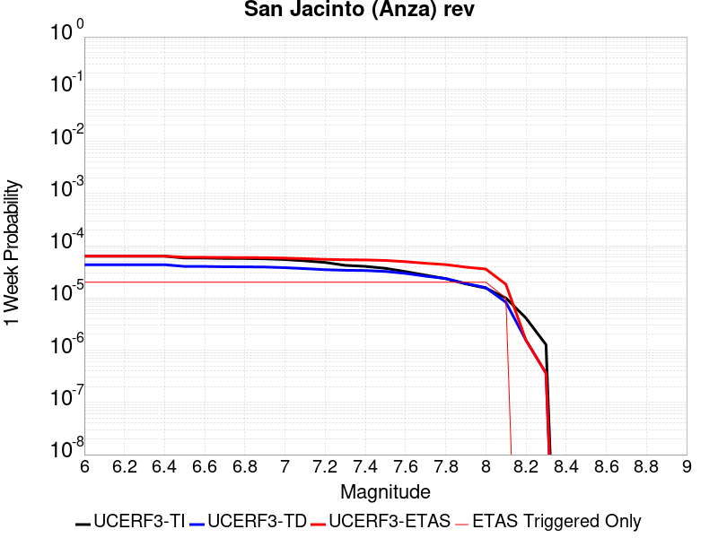 |  |  |  |

| Magnitude | 1 wk TI Prob | 1 wk TD Prob | 1 wk ETAS Prob | 1 wk ETAS/TD Gain | 1 wk ETAS Triggered Only | 1 mo TI Prob | 1 mo TD Prob | 1 mo ETAS Prob | 1 mo ETAS/TD Gain | 1 mo ETAS Triggered Only | 1 yr TI Prob | 1 yr TD Prob | 1 yr ETAS Prob | 1 yr ETAS/TD Gain | 1 yr ETAS Triggered Only | 10 yr TI Prob | 10 yr TD Prob | 10 yr ETAS Prob | 10 yr ETAS/TD Gain | 10 yr ETAS Triggered Only |
|-----|-----|-----|-----|-----|-----|-----|-----|-----|-----|-----|-----|-----|-----|-----|-----|-----|-----|-----|-----|-----|
| 6.0 | 6.3015636E-5 | 4.337693E-5 | 6.020119E-4 | 13.878619 | 5.586592E-4 | 2.7003905E-4 | 1.8588796E-4 | 7.444433E-4 | 4.004796 | 5.586592E-4 | 0.0032827691 | 0.0022608489 | 0.002818245 | 1.2465429 | 5.586592E-4 | 0.032346968 | 0.023334619 | 0.023880243 | 1.0233825 | 5.586592E-4 |
| 6.1 | 6.3015636E-5 | 4.337693E-5 | 6.020119E-4 | 13.878619 | 5.586592E-4 | 2.7003905E-4 | 1.8588796E-4 | 7.444433E-4 | 4.004796 | 5.586592E-4 | 0.0032827691 | 0.0022608489 | 0.002818245 | 1.2465429 | 5.586592E-4 | 0.032346968 | 0.023334619 | 0.023880243 | 1.0233825 | 5.586592E-4 |
| 6.2 | 6.3015636E-5 | 4.337693E-5 | 6.020119E-4 | 13.878619 | 5.586592E-4 | 2.7003905E-4 | 1.8588796E-4 | 7.444433E-4 | 4.004796 | 5.586592E-4 | 0.0032827691 | 0.0022608489 | 0.002818245 | 1.2465429 | 5.586592E-4 | 0.032346968 | 0.023334619 | 0.023880243 | 1.0233825 | 5.586592E-4 |
| 6.3 | 6.3015636E-5 | 4.337693E-5 | 6.020119E-4 | 13.878619 | 5.586592E-4 | 2.7003905E-4 | 1.8588796E-4 | 7.444433E-4 | 4.004796 | 5.586592E-4 | 0.0032827691 | 0.0022608489 | 0.002818245 | 1.2465429 | 5.586592E-4 | 0.032346968 | 0.023334619 | 0.023880243 | 1.0233825 | 5.586592E-4 |
| 6.4 | 6.3015636E-5 | 4.337693E-5 | 6.020119E-4 | 13.878619 | 5.586592E-4 | 2.7003905E-4 | 1.8588796E-4 | 7.444433E-4 | 4.004796 | 5.586592E-4 | 0.0032827691 | 0.0022608489 | 0.002818245 | 1.2465429 | 5.586592E-4 | 0.032346968 | 0.023334619 | 0.023880243 | 1.0233825 | 5.586592E-4 |
| 6.5 | 5.811017E-5 | 4.015336E-5 | 5.987901E-4 | 14.912579 | 5.586592E-4 | 2.4901982E-4 | 1.7207452E-4 | 7.306376E-4 | 4.2460537 | 5.586592E-4 | 0.0030276014 | 0.0020929999 | 0.0026504898 | 1.2663593 | 5.586592E-4 | 0.02986684 | 0.021630494 | 0.02217707 | 1.0252687 | 5.586592E-4 |
| 6.6 | 5.811017E-5 | 4.015336E-5 | 5.987901E-4 | 14.912579 | 5.586592E-4 | 2.4901982E-4 | 1.7207452E-4 | 7.306376E-4 | 4.2460537 | 5.586592E-4 | 0.0030276014 | 0.0020929999 | 0.0026504898 | 1.2663593 | 5.586592E-4 | 0.02986684 | 0.021630494 | 0.02217707 | 1.0252687 | 5.586592E-4 |
| 6.7 | 5.712442E-5 | 3.957534E-5 | 5.982125E-4 | 15.115788 | 5.586592E-4 | 2.4479596E-4 | 1.6959761E-4 | 7.2816206E-4 | 4.293469 | 5.586592E-4 | 0.0029763177 | 0.002062901 | 0.0026204076 | 1.2702538 | 5.586592E-4 | 0.029367693 | 0.021321962 | 0.02186871 | 1.0256425 | 5.586592E-4 |
| 6.8 | 5.6967532E-5 | 3.9431634E-5 | 5.980688E-4 | 15.167234 | 5.586592E-4 | 2.4412372E-4 | 1.689818E-4 | 7.2754663E-4 | 4.3054733 | 5.586592E-4 | 0.0029681553 | 0.0020554175 | 0.0026129286 | 1.2712398 | 5.586592E-4 | 0.029288229 | 0.021246629 | 0.021793418 | 1.0257354 | 5.586592E-4 |
| 6.9 | 5.6211324E-5 | 3.9135975E-5 | 5.9777335E-4 | 15.274267 | 5.586592E-4 | 2.4088343E-4 | 1.6771485E-4 | 7.262804E-4 | 4.3304477 | 5.586592E-4 | 0.0029288116 | 0.0020400216 | 0.002597541 | 1.273291 | 5.586592E-4 | 0.028905109 | 0.021085827 | 0.021632707 | 1.0259359 | 5.586592E-4 |
| 7.0 | 5.4383527E-5 | 3.7995007E-5 | 5.96633E-4 | 15.702931 | 5.586592E-4 | 2.3305144E-4 | 1.6282561E-4 | 7.2139385E-4 | 4.4304695 | 5.586592E-4 | 0.0028337094 | 0.0019806041 | 0.002538157 | 1.2815064 | 5.586592E-4 | 0.027978465 | 0.020476038 | 0.021023259 | 1.0267249 | 5.586592E-4 |
| 7.1 | 5.1393665E-5 | 3.6455618E-5 | 5.9509446E-4 | 16.323807 | 5.586592E-4 | 2.2023996E-4 | 1.5622903E-4 | 7.1480096E-4 | 4.5753403 | 5.586592E-4 | 0.0026781242 | 0.0019004333 | 0.0024580308 | 1.2934054 | 5.586592E-4 | 0.026460782 | 0.019648531 | 0.020196214 | 1.027874 | 5.586592E-4 |
| 7.2 | 4.785222E-5 | 3.480494E-5 | 5.9344474E-4 | 17.050589 | 5.586592E-4 | 2.0506482E-4 | 1.4915552E-4 | 7.077314E-4 | 4.7449226 | 5.586592E-4 | 0.0024938055 | 0.0018144595 | 0.002372105 | 1.3073343 | 5.586592E-4 | 0.024660049 | 0.018761909 | 0.019310087 | 1.0292176 | 5.586592E-4 |
| 7.3 | 4.2143256E-5 | 3.389763E-5 | 5.925379E-4 | 17.480217 | 5.586592E-4 | 1.8060145E-4 | 1.4526749E-4 | 7.038456E-4 | 4.845169 | 5.586592E-4 | 0.002196605 | 0.0017672004 | 0.0023248724 | 1.3155681 | 5.586592E-4 | 0.02175019 | 0.018269178 | 0.01881763 | 1.0300207 | 5.586592E-4 |
| 7.4 | 4.0264713E-5 | 3.3535252E-5 | 5.9217575E-4 | 17.658306 | 5.586592E-4 | 1.7255165E-4 | 1.4371461E-4 | 7.0229353E-4 | 4.8867235 | 5.586592E-4 | 0.002098792 | 0.0017483246 | 0.002306007 | 1.318981 | 5.586592E-4 | 0.020790804 | 0.018073453 | 0.018622017 | 1.0303519 | 5.586592E-4 |
| 7.5 | 3.694492E-5 | 3.2247204E-5 | 5.9088843E-4 | 18.323711 | 5.586592E-4 | 1.5832575E-4 | 1.38195E-4 | 6.96777E-4 | 5.0419846 | 5.586592E-4 | 0.0019259118 | 0.0016812286 | 0.0022389486 | 1.3317336 | 5.586592E-4 | 0.01909306 | 0.017388845 | 0.017937789 | 1.0315688 | 5.586592E-4 |
| 7.6 | 3.200565E-5 | 2.9555436E-5 | 5.8819813E-4 | 19.901522 | 5.586592E-4 | 1.3715986E-4 | 1.2666002E-4 | 6.8524847E-4 | 5.4101405 | 5.586592E-4 | 0.001668642 | 0.0015409971 | 0.0020987955 | 1.3619723 | 5.586592E-4 | 0.01656168 | 0.015973015 | 0.01652275 | 1.0344166 | 5.586592E-4 |
| 7.7 | 2.731642E-5 | 2.6142696E-5 | 5.847873E-4 | 22.369051 | 5.586592E-4 | 1.1706512E-4 | 1.1203532E-4 | 6.7063194E-4 | 5.9858975 | 5.586592E-4 | 0.001424336 | 0.0013631776 | 0.0019210752 | 1.4092627 | 5.586592E-4 | 0.014152412 | 0.01419303 | 0.01474376 | 1.0388029 | 5.586592E-4 |
| 7.8 | 2.3466424E-5 | 2.3552704E-5 | 5.821988E-4 | 24.718979 | 5.586592E-4 | 1.0056651E-4 | 1.0093625E-4 | 6.595391E-4 | 6.534214 | 5.586592E-4 | 0.0012237094 | 0.0012282069 | 0.00178618 | 1.4542989 | 5.586592E-4 | 0.012169928 | 0.012833906 | 0.013385396 | 1.0429713 | 5.586592E-4 |
| 7.9 | 1.8611925E-5 | 1.8951272E-5 | 5.775999E-4 | 30.47816 | 5.586592E-4 | 7.9762955E-5 | 8.1217215E-5 | 6.3983107E-4 | 7.878023 | 5.586592E-4 | 9.7068126E-4 | 9.883717E-4 | 0.0015464787 | 1.5646732 | 5.586592E-4 | 0.0096645225 | 0.010416457 | 0.010969297 | 1.0530736 | 5.586592E-4 |
| 8.0 | 1.5460775E-5 | 1.5779307E-5 | 5.744297E-4 | 36.403988 | 5.586592E-4 | 6.6258784E-5 | 6.762385E-5 | 6.262453E-4 | 9.260716 | 5.586592E-4 | 8.0640207E-4 | 8.2301005E-4 | 0.0013812095 | 1.6782414 | 5.586592E-4 | 0.008034821 | 0.008723064 | 0.00927685 | 1.0634853 | 5.586592E-4 |
| 8.1 | 9.983884E-6 | 8.292369E-6 | 5.66947E-4 | 68.36972 | 5.586592E-4 | 4.2787375E-5 | 3.5538244E-5 | 5.9417763E-4 | 16.719385 | 5.586592E-4 | 5.2081177E-4 | 4.3259273E-4 | 9.910102E-4 | 2.290862 | 5.586592E-4 | 0.0051959283 | 0.00465207 | 0.0052081305 | 1.1195296 | 5.586592E-4 |
| 8.2 | 4.1226E-6 | 1.5595413E-6 | 1.5595413E-6 | 1.0 | 0.0 | 1.7668166E-5 | 6.683731E-6 | 6.683731E-6 | 1.0 | 0.0 | 2.1508869E-4 | 8.137142E-5 | 8.137142E-5 | 1.0 | 0.0 | 0.0021488064 | 9.4425044E-4 | 9.4425044E-4 | 1.0 | 0.0 |
| 8.3 | 1.2750878E-6 | 3.6301523E-7 | 3.6301523E-7 | 1.0 | 0.0 | 5.4646503E-6 | 1.5557786E-6 | 1.5557786E-6 | 1.0 | 0.0 | 6.653009E-5 | 1.8941444E-5 | 1.8941444E-5 | 1.0 | 0.0 | 6.6510175E-4 | 2.2840123E-4 | 2.2840123E-4 | 1.0 | 0.0 |

## San Andreas (San Bernardino N)
*[(top)](#table-of-contents)*

| 1 Week | 1 Month | 1 Year | 10 Year |
|-----|-----|-----|-----|
|  |  |  |  |

| Magnitude | 1 wk TI Prob | 1 wk TD Prob | 1 wk ETAS Prob | 1 wk ETAS/TD Gain | 1 wk ETAS Triggered Only | 1 mo TI Prob | 1 mo TD Prob | 1 mo ETAS Prob | 1 mo ETAS/TD Gain | 1 mo ETAS Triggered Only | 1 yr TI Prob | 1 yr TD Prob | 1 yr ETAS Prob | 1 yr ETAS/TD Gain | 1 yr ETAS Triggered Only | 10 yr TI Prob | 10 yr TD Prob | 10 yr ETAS Prob | 10 yr ETAS/TD Gain | 10 yr ETAS Triggered Only |
|-----|-----|-----|-----|-----|-----|-----|-----|-----|-----|-----|-----|-----|-----|-----|-----|-----|-----|-----|-----|-----|
| 6.0 | 1.4273766E-4 | 3.1635934E-4 | 8.748418E-4 | 2.7653422 | 5.586592E-4 | 6.115894E-4 | 0.0013551271 | 0.0019130294 | 1.4116973 | 5.586592E-4 | 0.0074207084 | 0.016375363 | 0.016924873 | 1.0335572 | 5.586592E-4 | 0.07177748 | 0.15038711 | 0.15086176 | 1.0031562 | 5.586592E-4 |
| 6.1 | 1.4273766E-4 | 3.1635934E-4 | 8.748418E-4 | 2.7653422 | 5.586592E-4 | 6.115894E-4 | 0.0013551271 | 0.0019130294 | 1.4116973 | 5.586592E-4 | 0.0074207084 | 0.016375363 | 0.016924873 | 1.0335572 | 5.586592E-4 | 0.07177748 | 0.15038711 | 0.15086176 | 1.0031562 | 5.586592E-4 |
| 6.2 | 1.4273766E-4 | 3.1635934E-4 | 8.748418E-4 | 2.7653422 | 5.586592E-4 | 6.115894E-4 | 0.0013551271 | 0.0019130294 | 1.4116973 | 5.586592E-4 | 0.0074207084 | 0.016375363 | 0.016924873 | 1.0335572 | 5.586592E-4 | 0.07177748 | 0.15038711 | 0.15086176 | 1.0031562 | 5.586592E-4 |
| 6.3 | 1.3730655E-4 | 3.0540637E-4 | 8.6389494E-4 | 2.8286738 | 5.586592E-4 | 5.883239E-4 | 0.0013082335 | 0.0018661619 | 1.4264746 | 5.586592E-4 | 0.0071393442 | 0.015812824 | 0.016362648 | 1.0347708 | 5.586592E-4 | 0.06914291 | 0.14568701 | 0.14616428 | 1.003276 | 5.586592E-4 |
| 6.4 | 1.3730655E-4 | 3.0540637E-4 | 8.6389494E-4 | 2.8286738 | 5.586592E-4 | 5.883239E-4 | 0.0013082335 | 0.0018661619 | 1.4264746 | 5.586592E-4 | 0.0071393442 | 0.015812824 | 0.016362648 | 1.0347708 | 5.586592E-4 | 0.06914291 | 0.14568701 | 0.14616428 | 1.003276 | 5.586592E-4 |
| 6.5 | 1.2942807E-4 | 2.8954886E-4 | 8.4804633E-4 | 2.928854 | 5.586592E-4 | 5.545738E-4 | 0.0012403387 | 0.001798305 | 1.44985 | 5.586592E-4 | 0.0067310524 | 0.014997809 | 0.01554809 | 1.0366907 | 5.586592E-4 | 0.06530788 | 0.13882978 | 0.13931088 | 1.0034654 | 5.586592E-4 |
| 6.6 | 1.1125901E-4 | 2.5393223E-4 | 8.124496E-4 | 3.199474 | 5.586592E-4 | 4.767372E-4 | 0.0010878295 | 0.001645881 | 1.5129954 | 5.586592E-4 | 0.005788839 | 0.013164529 | 0.013715833 | 1.0418781 | 5.586592E-4 | 0.056403454 | 0.12311955 | 0.12360942 | 1.0039788 | 5.586592E-4 |
| 6.7 | 1.02209575E-4 | 2.3527986E-4 | 7.938077E-4 | 3.3738868 | 5.586592E-4 | 4.3796748E-4 | 0.001007954 | 0.0015660501 | 1.553692 | 5.586592E-4 | 0.0053192247 | 0.012203212 | 0.012755054 | 1.045221 | 5.586592E-4 | 0.051936906 | 0.11491149 | 0.11540595 | 1.004303 | 5.586592E-4 |
| 6.8 | 9.610582E-5 | 2.2053412E-4 | 7.7907013E-4 | 3.5326512 | 5.586592E-4 | 4.1181705E-4 | 9.448046E-4 | 0.001502936 | 1.5907373 | 5.586592E-4 | 0.0050023515 | 0.011442591 | 0.011994858 | 1.0482641 | 5.586592E-4 | 0.048912346 | 0.10831282 | 0.10881097 | 1.0045992 | 5.586592E-4 |
| 6.9 | 9.3877505E-5 | 2.150883E-4 | 7.7362737E-4 | 3.5967898 | 5.586592E-4 | 4.0227012E-4 | 9.2148193E-4 | 0.0014796264 | 1.605703 | 5.586592E-4 | 0.0048866454 | 0.011161577 | 0.011714001 | 1.0494933 | 5.586592E-4 | 0.04780577 | 0.1059029 | 0.1064024 | 1.0047165 | 5.586592E-4 |
| 7.0 | 9.1019785E-5 | 2.0835544E-4 | 7.668983E-4 | 3.680721 | 5.586592E-4 | 3.900265E-4 | 8.926469E-4 | 0.0014508074 | 1.625287 | 5.586592E-4 | 0.0047382377 | 0.010814046 | 0.0113666635 | 1.0511018 | 5.586592E-4 | 0.046384744 | 0.10287278 | 0.10337397 | 1.004872 | 5.586592E-4 |
| 7.1 | 8.771155E-5 | 2.0009889E-4 | 7.5864635E-4 | 3.791357 | 5.586592E-4 | 3.758525E-4 | 8.5728534E-4 | 0.0014154656 | 1.6511021 | 5.586592E-4 | 0.0045664064 | 0.010387696 | 0.010940553 | 1.0532222 | 5.586592E-4 | 0.044737056 | 0.09918398 | 0.099687226 | 1.0050739 | 5.586592E-4 |
| 7.2 | 8.0830236E-5 | 1.8415037E-4 | 7.427067E-4 | 4.0331535 | 5.586592E-4 | 3.4636928E-4 | 7.8897737E-4 | 0.0013471958 | 1.7075216 | 5.586592E-4 | 0.0042088944 | 0.009563598 | 0.010116914 | 1.0578566 | 5.586592E-4 | 0.041300658 | 0.09191379 | 0.0924211 | 1.0055194 | 5.586592E-4 |
| 7.3 | 7.7668235E-5 | 1.7358093E-4 | 7.321432E-4 | 4.217878 | 5.586592E-4 | 3.328214E-4 | 7.437063E-4 | 0.0013019501 | 1.750624 | 5.586592E-4 | 0.0040445733 | 0.009017113 | 0.009570734 | 1.0613968 | 5.586592E-4 | 0.03971748 | 0.08717959 | 0.08768954 | 1.0058495 | 5.586592E-4 |
| 7.4 | 7.520177E-5 | 1.657783E-4 | 7.243449E-4 | 4.369359 | 5.586592E-4 | 3.2225347E-4 | 7.1028504E-4 | 0.0012685475 | 1.7859696 | 5.586592E-4 | 0.0039163795 | 0.008613498 | 0.009167345 | 1.0643 | 5.586592E-4 | 0.038480744 | 0.08363466 | 0.0841466 | 1.006121 | 5.586592E-4 |
| 7.5 | 7.274697E-5 | 1.5865144E-4 | 7.1722205E-4 | 4.5207405 | 5.586592E-4 | 3.1173544E-4 | 6.797576E-4 | 0.0012380371 | 1.8212919 | 5.586592E-4 | 0.003788775 | 0.008244702 | 0.008798755 | 1.0672011 | 5.586592E-4 | 0.03724827 | 0.08035038 | 0.08086415 | 1.0063941 | 5.586592E-4 |
| 7.6 | 7.1185845E-5 | 1.5434787E-4 | 7.1292085E-4 | 4.618922 | 5.586592E-4 | 3.0504653E-4 | 6.6132325E-4 | 0.001219613 | 1.844201 | 5.586592E-4 | 0.0037076178 | 0.008021939 | 0.008576116 | 1.0690827 | 5.586592E-4 | 0.036463667 | 0.078339346 | 0.07885424 | 1.0065726 | 5.586592E-4 |
| 7.7 | 6.709961E-5 | 1.4343053E-4 | 7.0200965E-4 | 4.8944225 | 5.586592E-4 | 2.8753807E-4 | 6.1455753E-4 | 0.0011728734 | 1.9084843 | 5.586592E-4 | 0.003495157 | 0.007456607 | 0.008011101 | 1.0743628 | 5.586592E-4 | 0.034406938 | 0.07316601 | 0.0736838 | 1.0070769 | 5.586592E-4 |
| 7.8 | 6.300812E-5 | 1.3225875E-4 | 6.908441E-4 | 5.2234282 | 5.586592E-4 | 2.7000686E-4 | 5.6670007E-4 | 0.0011250427 | 1.9852524 | 5.586592E-4 | 0.0032823787 | 0.0068777753 | 0.007432592 | 1.0806681 | 5.586592E-4 | 0.032343175 | 0.06781986 | 0.06834063 | 1.0076787 | 5.586592E-4 |
| 7.9 | 4.983037E-5 | 9.7419856E-5 | 6.5602467E-4 | 6.7339935 | 5.586592E-4 | 2.1354125E-4 | 4.1744686E-4 | 9.7587286E-4 | 2.3377175 | 5.586592E-4 | 0.0025967648 | 0.005070582 | 0.0056264084 | 1.109618 | 5.586592E-4 | 0.025666296 | 0.050735 | 0.051265314 | 1.0104526 | 5.586592E-4 |
| 8.0 | 3.2211527E-5 | 5.341288E-5 | 6.1204226E-4 | 11.458701 | 5.586592E-4 | 1.380421E-4 | 2.2889227E-4 | 7.8742363E-4 | 3.4401493 | 5.586592E-4 | 0.0016793669 | 0.002783204 | 0.0033403083 | 1.2001666 | 5.586592E-4 | 0.016667323 | 0.028414162 | 0.028956948 | 1.0191027 | 5.586592E-4 |
| 8.1 | 1.743376E-5 | 1.8874636E-5 | 5.775233E-4 | 30.597853 | 5.586592E-4 | 7.471398E-5 | 8.088879E-5 | 6.3950283E-4 | 7.905951 | 5.586592E-4 | 9.0926304E-4 | 9.843768E-4 | 0.001542486 | 1.5669671 | 5.586592E-4 | 0.009055517 | 0.010510205 | 0.011062993 | 1.0525954 | 5.586592E-4 |
| 8.2 | 7.831616E-6 | 5.1737816E-6 | 5.1737816E-6 | 1.0 | 0.0 | 3.3563636E-5 | 2.217316E-5 | 2.217316E-5 | 1.0 | 0.0 | 4.0856065E-4 | 2.6992487E-4 | 2.6992487E-4 | 1.0 | 0.0 | 0.004078103 | 0.0030519657 | 0.0030519657 | 1.0 | 0.0 |
| 8.3 | 1.983087E-6 | 7.693574E-7 | 7.693574E-7 | 1.0 | 0.0 | 8.498917E-6 | 3.297242E-6 | 3.297242E-6 | 1.0 | 0.0 | 1.034694E-4 | 4.01432E-5 | 4.01432E-5 | 1.0 | 0.0 | 0.0010342124 | 4.7390026E-4 | 4.7390026E-4 | 1.0 | 0.0 |

## San Andreas (Santa Cruz Mts) 2011 CFM
*[(top)](#table-of-contents)*

| 1 Week | 1 Month | 1 Year | 10 Year |
|-----|-----|-----|-----|
|  |  |  |  |

| Magnitude | 1 wk TI Prob | 1 wk TD Prob | 1 wk ETAS Prob | 1 wk ETAS/TD Gain | 1 wk ETAS Triggered Only | 1 mo TI Prob | 1 mo TD Prob | 1 mo ETAS Prob | 1 mo ETAS/TD Gain | 1 mo ETAS Triggered Only | 1 yr TI Prob | 1 yr TD Prob | 1 yr ETAS Prob | 1 yr ETAS/TD Gain | 1 yr ETAS Triggered Only | 10 yr TI Prob | 10 yr TD Prob | 10 yr ETAS Prob | 10 yr ETAS/TD Gain | 10 yr ETAS Triggered Only |
|-----|-----|-----|-----|-----|-----|-----|-----|-----|-----|-----|-----|-----|-----|-----|-----|-----|-----|-----|-----|-----|
| 6.0 | 1.7221631E-4 | 1.3823692E-4 | 6.968189E-4 | 5.040758 | 5.586592E-4 | 7.378611E-4 | 5.923115E-4 | 0.0011506398 | 1.9426261 | 5.586592E-4 | 0.008946515 | 0.0071879383 | 0.0077425824 | 1.0771631 | 5.586592E-4 | 0.08594794 | 0.070697196 | 0.07121636 | 1.0073435 | 5.586592E-4 |
| 6.1 | 1.7221631E-4 | 1.3823692E-4 | 6.968189E-4 | 5.040758 | 5.586592E-4 | 7.378611E-4 | 5.923115E-4 | 0.0011506398 | 1.9426261 | 5.586592E-4 | 0.008946515 | 0.0071879383 | 0.0077425824 | 1.0771631 | 5.586592E-4 | 0.08594794 | 0.070697196 | 0.07121636 | 1.0073435 | 5.586592E-4 |
| 6.2 | 1.7221631E-4 | 1.3823692E-4 | 6.968189E-4 | 5.040758 | 5.586592E-4 | 7.378611E-4 | 5.923115E-4 | 0.0011506398 | 1.9426261 | 5.586592E-4 | 0.008946515 | 0.0071879383 | 0.0077425824 | 1.0771631 | 5.586592E-4 | 0.08594794 | 0.070697196 | 0.07121636 | 1.0073435 | 5.586592E-4 |
| 6.3 | 1.716926E-4 | 1.3743078E-4 | 6.960132E-4 | 5.064464 | 5.586592E-4 | 7.3561794E-4 | 5.888581E-4 | 0.0011471884 | 1.9481575 | 5.586592E-4 | 0.008919428 | 0.0071461694 | 0.0077008363 | 1.0776174 | 5.586592E-4 | 0.08569809 | 0.0703092 | 0.07082858 | 1.007387 | 5.586592E-4 |
| 6.4 | 1.6392978E-4 | 1.3618424E-4 | 6.947674E-4 | 5.1016726 | 5.586592E-4 | 7.02367E-4 | 5.8351824E-4 | 0.0011418514 | 1.9568394 | 5.586592E-4 | 0.008517839 | 0.0070815794 | 0.0076362826 | 1.0783304 | 5.586592E-4 | 0.08198654 | 0.06954003 | 0.07005984 | 1.007475 | 5.586592E-4 |
| 6.5 | 1.5742714E-4 | 1.26776E-4 | 6.8536436E-4 | 5.4061055 | 5.586592E-4 | 6.745133E-4 | 5.4321426E-4 | 0.00110157 | 2.027874 | 5.586592E-4 | 0.00818132 | 0.006593904 | 0.0071488796 | 1.084165 | 5.586592E-4 | 0.078865945 | 0.0649993 | 0.06552165 | 1.0080361 | 5.586592E-4 |
| 6.6 | 1.3038084E-4 | 1.161551E-4 | 6.7474943E-4 | 5.8090386 | 5.586592E-4 | 5.5865536E-4 | 4.9771386E-4 | 0.001056095 | 2.121892 | 5.586592E-4 | 0.006780438 | 0.0060430723 | 0.0065983557 | 1.0918876 | 5.586592E-4 | 0.0657725 | 0.059452567 | 0.059978016 | 1.008838 | 5.586592E-4 |
| 6.7 | 1.2867592E-4 | 1.13418515E-4 | 6.720144E-4 | 5.925085 | 5.586592E-4 | 5.5135164E-4 | 4.8599008E-4 | 0.0010443778 | 2.1489694 | 5.586592E-4 | 0.0066920654 | 0.005901116 | 0.0064564785 | 1.0941114 | 5.586592E-4 | 0.06494093 | 0.05816314 | 0.058689304 | 1.0090464 | 5.586592E-4 |
| 6.8 | 1.2801298E-4 | 1.1279377E-4 | 6.7139E-4 | 5.9523673 | 5.586592E-4 | 5.485117E-4 | 4.833136E-4 | 0.0010417028 | 2.1553352 | 5.586592E-4 | 0.0066577005 | 0.0058687064 | 0.006424087 | 1.0946343 | 5.586592E-4 | 0.06461738 | 0.05787688 | 0.05840321 | 1.0090939 | 5.586592E-4 |
| 6.9 | 1.269149E-4 | 1.11214715E-4 | 6.698118E-4 | 6.0226903 | 5.586592E-4 | 5.4380763E-4 | 4.765487E-4 | 0.0010349416 | 2.1717439 | 5.586592E-4 | 0.006600777 | 0.005786784 | 0.0063422103 | 1.0959818 | 5.586592E-4 | 0.06408122 | 0.057148356 | 0.05767509 | 1.0092169 | 5.586592E-4 |
| 7.0 | 1.2030331E-4 | 1.0851204E-4 | 6.671106E-4 | 6.147803 | 5.586592E-4 | 5.154837E-4 | 4.6496998E-4 | 0.0010233695 | 2.2009366 | 5.586592E-4 | 0.006257969 | 0.005646552 | 0.006202057 | 1.0983795 | 5.586592E-4 | 0.06084648 | 0.055819258 | 0.056346733 | 1.0094497 | 5.586592E-4 |
| 7.1 | 8.049617E-5 | 5.4114953E-5 | 6.1274396E-4 | 11.323006 | 5.586592E-4 | 3.4493793E-4 | 2.319008E-4 | 7.9043047E-4 | 3.4084852 | 5.586592E-4 | 0.0041915346 | 0.0028197719 | 0.0033768557 | 1.1975635 | 5.586592E-4 | 0.041133516 | 0.02971132 | 0.030253379 | 1.0182443 | 5.586592E-4 |
| 7.2 | 7.093979E-5 | 4.310381E-5 | 6.017389E-4 | 13.960227 | 5.586592E-4 | 3.0399222E-4 | 1.8471766E-4 | 7.432737E-4 | 4.0238366 | 5.586592E-4 | 0.0036948253 | 0.0022466409 | 0.002804045 | 1.2481055 | 5.586592E-4 | 0.03633994 | 0.024024088 | 0.024569327 | 1.0226954 | 5.586592E-4 |
| 7.3 | 6.193693E-5 | 2.9018376E-5 | 5.876614E-4 | 20.251352 | 5.586592E-4 | 2.6541698E-4 | 1.2435856E-4 | 6.829483E-4 | 5.491768 | 5.586592E-4 | 0.0032266637 | 0.0015130156 | 0.0020708295 | 1.3686769 | 5.586592E-4 | 0.031802133 | 0.016564084 | 0.01711349 | 1.0331684 | 5.586592E-4 |
| 7.4 | 5.906492E-5 | 2.7136244E-5 | 5.857803E-4 | 21.58664 | 5.586592E-4 | 2.5311083E-4 | 1.16293006E-4 | 6.7488727E-4 | 5.8033347 | 5.586592E-4 | 0.0030772698 | 0.0014149492 | 0.001972818 | 1.3942677 | 5.586592E-4 | 0.030350044 | 0.015530545 | 0.016080528 | 1.035413 | 5.586592E-4 |
| 7.5 | 5.424296E-5 | 2.4776109E-5 | 5.834215E-4 | 23.547745 | 5.586592E-4 | 2.324491E-4 | 1.0617901E-4 | 6.647789E-4 | 6.260926 | 5.586592E-4 | 0.002826395 | 0.0012919641 | 0.0018499015 | 1.4318521 | 5.586592E-4 | 0.027907165 | 0.014215293 | 0.014766011 | 1.0387412 | 5.586592E-4 |
| 7.6 | 4.43084E-5 | 1.9971396E-5 | 5.786195E-4 | 28.97241 | 5.586592E-4 | 1.8987931E-4 | 8.558889E-5 | 6.442003E-4 | 7.5266814 | 5.586592E-4 | 0.0023093296 | 0.0010415468 | 0.0015996242 | 1.535816 | 5.586592E-4 | 0.022854783 | 0.011448878 | 0.012001141 | 1.0482373 | 5.586592E-4 |
| 7.7 | 4.118098E-5 | 1.8999577E-5 | 5.7764817E-4 | 30.403214 | 5.586592E-4 | 1.7647797E-4 | 8.1424216E-5 | 6.4003794E-4 | 7.8605356 | 5.586592E-4 | 0.002146502 | 9.908893E-4 | 0.0015489949 | 1.5632372 | 5.586592E-4 | 0.021258866 | 0.010904559 | 0.011457127 | 1.050673 | 5.586592E-4 |
| 7.8 | 3.5408906E-5 | 1.8625631E-5 | 5.772744E-4 | 30.993551 | 5.586592E-4 | 1.5174363E-4 | 7.982169E-5 | 6.384363E-4 | 7.998281 | 5.586592E-4 | 0.0018459131 | 9.7139605E-4 | 0.0015295126 | 1.574551 | 5.586592E-4 | 0.018306552 | 0.0106848935 | 0.011237583 | 1.0517263 | 5.586592E-4 |
| 7.9 | 2.5860836E-5 | 1.7371205E-5 | 5.7602074E-4 | 33.159515 | 5.586592E-4 | 1.10827445E-4 | 7.4445896E-5 | 6.3306355E-4 | 8.503673 | 5.586592E-4 | 0.001348489 | 9.060022E-4 | 0.0014641553 | 1.6160616 | 5.586592E-4 | 0.013403354 | 0.009936898 | 0.010490006 | 1.055662 | 5.586592E-4 |
| 8.0 | 1.9777332E-5 | 1.4886952E-5 | 5.7353784E-4 | 38.52621 | 5.586592E-4 | 8.4757245E-5 | 6.379966E-5 | 6.2242325E-4 | 9.755901 | 5.586592E-4 | 0.0010314309 | 7.7648426E-4 | 0.0013347097 | 1.718914 | 5.586592E-4 | 0.010266567 | 0.008534084 | 0.009087975 | 1.0649035 | 5.586592E-4 |
| 8.1 | 1.468494E-5 | 1.2146339E-5 | 5.7079876E-4 | 46.993484 | 5.586592E-4 | 6.293394E-5 | 5.20547E-5 | 6.1068486E-4 | 11.731599 | 5.586592E-4 | 7.6595135E-4 | 6.3358183E-4 | 0.0011918871 | 1.8811889 | 5.586592E-4 | 0.0076331664 | 0.0069899 | 0.0075446544 | 1.0793651 | 5.586592E-4 |
| 8.2 | 8.63836E-6 | 5.489407E-6 | 5.489407E-6 | 1.0 | 0.0 | 3.7021015E-5 | 2.3525818E-5 | 2.3525818E-5 | 1.0 | 0.0 | 4.5063766E-4 | 2.863893E-4 | 2.863893E-4 | 1.0 | 0.0 | 0.004497249 | 0.0032568157 | 0.0032568157 | 1.0 | 0.0 |
| 8.3 | 1.983087E-6 | 7.693574E-7 | 7.693574E-7 | 1.0 | 0.0 | 8.498917E-6 | 3.297242E-6 | 3.297242E-6 | 1.0 | 0.0 | 1.034694E-4 | 4.01432E-5 | 4.01432E-5 | 1.0 | 0.0 | 0.0010342124 | 4.7390026E-4 | 4.7390026E-4 | 1.0 | 0.0 |

## Red Pass
*[(top)](#table-of-contents)*

| 1 Week | 1 Month | 1 Year | 10 Year |
|-----|-----|-----|-----|
|  |  | 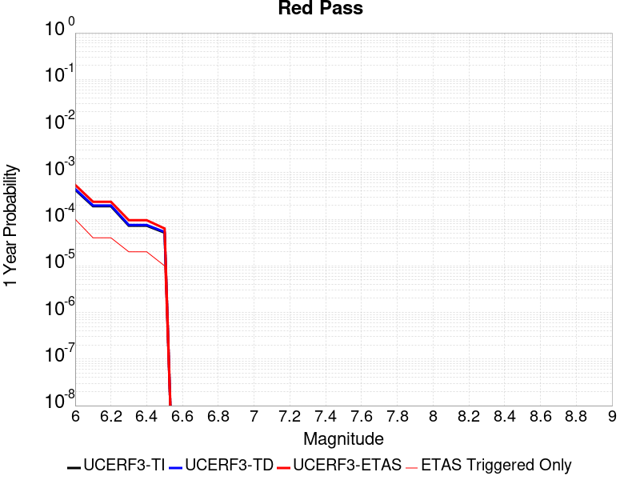 |  |

| Magnitude | 1 wk TI Prob | 1 wk TD Prob | 1 wk ETAS Prob | 1 wk ETAS/TD Gain | 1 wk ETAS Triggered Only | 1 mo TI Prob | 1 mo TD Prob | 1 mo ETAS Prob | 1 mo ETAS/TD Gain | 1 mo ETAS Triggered Only | 1 yr TI Prob | 1 yr TD Prob | 1 yr ETAS Prob | 1 yr ETAS/TD Gain | 1 yr ETAS Triggered Only | 10 yr TI Prob | 10 yr TD Prob | 10 yr ETAS Prob | 10 yr ETAS/TD Gain | 10 yr ETAS Triggered Only |
|-----|-----|-----|-----|-----|-----|-----|-----|-----|-----|-----|-----|-----|-----|-----|-----|-----|-----|-----|-----|-----|
| 6.0 | 8.258278E-6 | 8.551426E-6 | 8.551426E-6 | 1.0 | 0.0 | 3.539214E-5 | 3.6648555E-5 | 3.6648555E-5 | 1.0 | 0.0 | 4.308141E-4 | 4.4612266E-4 | 0.0010045327 | 2.251696 | 5.586592E-4 | 0.0042997985 | 0.0044540283 | 0.0050101993 | 1.1248692 | 5.586592E-4 |
| 6.1 | 3.649988E-6 | 3.7753848E-6 | 3.7753848E-6 | 1.0 | 0.0 | 1.5642712E-5 | 1.6180147E-5 | 1.6180147E-5 | 1.0 | 0.0 | 1.9043336E-4 | 1.9698025E-4 | 1.9698025E-4 | 1.0 | 0.0 | 0.0019027026 | 0.0019685237 | 0.0019685237 | 1.0 | 0.0 |
| 6.2 | 3.649988E-6 | 3.7753848E-6 | 3.7753848E-6 | 1.0 | 0.0 | 1.5642712E-5 | 1.6180147E-5 | 1.6180147E-5 | 1.0 | 0.0 | 1.9043336E-4 | 1.9698025E-4 | 1.9698025E-4 | 1.0 | 0.0 | 0.0019027026 | 0.0019685237 | 0.0019685237 | 1.0 | 0.0 |
| 6.3 | 1.3924937E-6 | 1.4411434E-6 | 1.4411434E-6 | 1.0 | 0.0 | 5.9678164E-6 | 6.1763217E-6 | 6.1763217E-6 | 1.0 | 0.0 | 7.265574E-5 | 7.519554E-5 | 7.519554E-5 | 1.0 | 0.0 | 7.263199E-4 | 7.518397E-4 | 7.518397E-4 | 1.0 | 0.0 |
| 6.4 | 1.3924937E-6 | 1.4411434E-6 | 1.4411434E-6 | 1.0 | 0.0 | 5.9678164E-6 | 6.1763217E-6 | 6.1763217E-6 | 1.0 | 0.0 | 7.265574E-5 | 7.519554E-5 | 7.519554E-5 | 1.0 | 0.0 | 7.263199E-4 | 7.518397E-4 | 7.518397E-4 | 1.0 | 0.0 |
| 6.5 | 9.876812E-7 | 1.0222102E-6 | 1.0222102E-6 | 1.0 | 0.0 | 4.2329125E-6 | 4.3809005E-6 | 4.3809005E-6 | 1.0 | 0.0 | 5.153449E-5 | 5.3337466E-5 | 5.3337466E-5 | 1.0 | 0.0 | 5.1522546E-4 | 5.3337467E-4 | 5.3337467E-4 | 1.0 | 0.0 |

## San Jacinto (Coyote Creek)
*[(top)](#table-of-contents)*

| 1 Week | 1 Month | 1 Year | 10 Year |
|-----|-----|-----|-----|
|  | 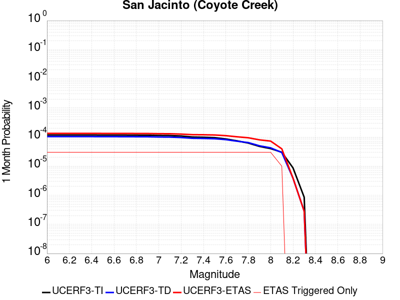 |  |  |

| Magnitude | 1 wk TI Prob | 1 wk TD Prob | 1 wk ETAS Prob | 1 wk ETAS/TD Gain | 1 wk ETAS Triggered Only | 1 mo TI Prob | 1 mo TD Prob | 1 mo ETAS Prob | 1 mo ETAS/TD Gain | 1 mo ETAS Triggered Only | 1 yr TI Prob | 1 yr TD Prob | 1 yr ETAS Prob | 1 yr ETAS/TD Gain | 1 yr ETAS Triggered Only | 10 yr TI Prob | 10 yr TD Prob | 10 yr ETAS Prob | 10 yr ETAS/TD Gain | 10 yr ETAS Triggered Only |
|-----|-----|-----|-----|-----|-----|-----|-----|-----|-----|-----|-----|-----|-----|-----|-----|-----|-----|-----|-----|-----|
| 6.0 | 2.7374346E-5 | 2.4177032E-5 | 5.828227E-4 | 24.106464 | 5.586592E-4 | 1.1731335E-4 | 1.0361175E-4 | 6.622131E-4 | 6.3912935 | 5.586592E-4 | 0.0014273542 | 0.0012607456 | 0.0018187005 | 1.4425595 | 5.586592E-4 | 0.01418221 | 0.012944878 | 0.013496305 | 1.0425981 | 5.586592E-4 |
| 6.1 | 2.7374346E-5 | 2.4177032E-5 | 5.828227E-4 | 24.106464 | 5.586592E-4 | 1.1731335E-4 | 1.0361175E-4 | 6.622131E-4 | 6.3912935 | 5.586592E-4 | 0.0014273542 | 0.0012607456 | 0.0018187005 | 1.4425595 | 5.586592E-4 | 0.01418221 | 0.012944878 | 0.013496305 | 1.0425981 | 5.586592E-4 |
| 6.2 | 2.7374346E-5 | 2.4177032E-5 | 5.828227E-4 | 24.106464 | 5.586592E-4 | 1.1731335E-4 | 1.0361175E-4 | 6.622131E-4 | 6.3912935 | 5.586592E-4 | 0.0014273542 | 0.0012607456 | 0.0018187005 | 1.4425595 | 5.586592E-4 | 0.01418221 | 0.012944878 | 0.013496305 | 1.0425981 | 5.586592E-4 |
| 6.3 | 2.7374346E-5 | 2.4177032E-5 | 5.828227E-4 | 24.106464 | 5.586592E-4 | 1.1731335E-4 | 1.0361175E-4 | 6.622131E-4 | 6.3912935 | 5.586592E-4 | 0.0014273542 | 0.0012607456 | 0.0018187005 | 1.4425595 | 5.586592E-4 | 0.01418221 | 0.012944878 | 0.013496305 | 1.0425981 | 5.586592E-4 |
| 6.4 | 2.7374346E-5 | 2.4177032E-5 | 5.828227E-4 | 24.106464 | 5.586592E-4 | 1.1731335E-4 | 1.0361175E-4 | 6.622131E-4 | 6.3912935 | 5.586592E-4 | 0.0014273542 | 0.0012607456 | 0.0018187005 | 1.4425595 | 5.586592E-4 | 0.01418221 | 0.012944878 | 0.013496305 | 1.0425981 | 5.586592E-4 |
| 6.5 | 2.7282445E-5 | 2.4063094E-5 | 5.8270886E-4 | 24.215874 | 5.586592E-4 | 1.16919524E-4 | 1.03123486E-4 | 6.617251E-4 | 6.4168224 | 5.586592E-4 | 0.0014225657 | 0.0012548079 | 0.0018127662 | 1.4446563 | 5.586592E-4 | 0.014134934 | 0.012886199 | 0.0134376595 | 1.0427946 | 5.586592E-4 |
| 6.6 | 2.7282445E-5 | 2.4063094E-5 | 5.8270886E-4 | 24.215874 | 5.586592E-4 | 1.16919524E-4 | 1.03123486E-4 | 6.617251E-4 | 6.4168224 | 5.586592E-4 | 0.0014225657 | 0.0012548079 | 0.0018127662 | 1.4446563 | 5.586592E-4 | 0.014134934 | 0.012886199 | 0.0134376595 | 1.0427946 | 5.586592E-4 |
| 6.7 | 2.7216198E-5 | 2.3988207E-5 | 5.82634E-4 | 24.288353 | 5.586592E-4 | 1.1663563E-4 | 1.02802565E-4 | 6.6140434E-4 | 6.433734 | 5.586592E-4 | 0.0014191137 | 0.0012509052 | 0.0018088656 | 1.4460453 | 5.586592E-4 | 0.014100855 | 0.012847606 | 0.013399088 | 1.0429249 | 5.586592E-4 |
| 6.8 | 2.7078617E-5 | 2.3905404E-5 | 5.825513E-4 | 24.36902 | 5.586592E-4 | 1.1604605E-4 | 1.02447724E-4 | 6.6104974E-4 | 6.452556 | 5.586592E-4 | 0.001411945 | 0.00124659 | 0.0018045529 | 1.4475913 | 5.586592E-4 | 0.014030075 | 0.012804739 | 0.013356244 | 1.0430704 | 5.586592E-4 |
| 6.9 | 2.6982952E-5 | 2.3824896E-5 | 5.824708E-4 | 24.44799 | 5.586592E-4 | 1.15636096E-4 | 1.0210271E-4 | 6.607049E-4 | 6.4709826 | 5.586592E-4 | 0.0014069602 | 0.0012423943 | 0.0018003595 | 1.4491047 | 5.586592E-4 | 0.013980856 | 0.012763045 | 0.013314574 | 1.043213 | 5.586592E-4 |
| 7.0 | 2.6449972E-5 | 2.3401846E-5 | 5.82048E-4 | 24.871883 | 5.586592E-4 | 1.1335209E-4 | 1.00289784E-4 | 6.5889297E-4 | 6.569891 | 5.586592E-4 | 0.001379188 | 0.0012203468 | 0.0017783243 | 1.4572285 | 5.586592E-4 | 0.0137065975 | 0.012544374 | 0.013096025 | 1.043976 | 5.586592E-4 |
| 7.1 | 2.6257849E-5 | 2.322785E-5 | 5.818741E-4 | 25.050707 | 5.586592E-4 | 1.1252879E-4 | 9.9544144E-5 | 6.5814774E-4 | 6.6116166 | 5.586592E-4 | 0.0013691769 | 0.0012112787 | 0.0017692613 | 1.4606557 | 5.586592E-4 | 0.013607717 | 0.012454224 | 0.013005925 | 1.0442983 | 5.586592E-4 |
| 7.2 | 2.5270041E-5 | 2.2422375E-5 | 5.810691E-4 | 25.914698 | 5.586592E-4 | 1.0829568E-4 | 9.6092364E-5 | 6.546979E-4 | 6.8132143 | 5.586592E-4 | 0.0013177024 | 0.001169299 | 0.001727305 | 1.4772141 | 5.586592E-4 | 0.013099162 | 0.012035143 | 0.012587078 | 1.0458603 | 5.586592E-4 |
| 7.3 | 2.339701E-5 | 2.1153774E-5 | 5.7980116E-4 | 27.408876 | 5.586592E-4 | 1.0026905E-4 | 9.065589E-5 | 6.492645E-4 | 7.161856 | 5.586592E-4 | 0.001220092 | 0.0011031787 | 0.0016612216 | 1.50585 | 5.586592E-4 | 0.012134149 | 0.011373838 | 0.011926143 | 1.0485593 | 5.586592E-4 |
| 7.4 | 2.296333E-5 | 2.0884016E-5 | 5.7953154E-4 | 27.750008 | 5.586592E-4 | 9.841056E-5 | 8.949987E-5 | 6.4810907E-4 | 7.241453 | 5.586592E-4 | 0.0011974899 | 0.0010891182 | 0.001647169 | 1.5123878 | 5.586592E-4 | 0.011910575 | 0.011232895 | 0.011785279 | 1.0491755 | 5.586592E-4 |
| 7.5 | 2.2188895E-5 | 2.0406682E-5 | 5.790545E-4 | 28.37573 | 5.586592E-4 | 9.50918E-5 | 8.745429E-5 | 6.4606464E-4 | 7.3874555 | 5.586592E-4 | 0.0011571277 | 0.0010642379 | 0.0016223026 | 1.5243796 | 5.586592E-4 | 0.011511209 | 0.010982383 | 0.011534907 | 1.05031 | 5.586592E-4 |
| 7.6 | 2.0013189E-5 | 1.8992265E-5 | 5.776409E-4 | 30.414534 | 5.586592E-4 | 8.5767984E-5 | 8.139289E-5 | 6.400066E-4 | 7.8631763 | 5.586592E-4 | 0.001043725 | 9.905098E-4 | 0.0015486155 | 1.5634532 | 5.586592E-4 | 0.010388365 | 0.010240043 | 0.010792981 | 1.0539976 | 5.586592E-4 |
| 7.7 | 1.7230794E-5 | 1.677281E-5 | 5.7542266E-4 | 34.30687 | 5.586592E-4 | 7.384417E-5 | 7.18815E-5 | 6.3050055E-4 | 8.771389 | 5.586592E-4 | 8.986819E-4 | 8.7480666E-4 | 0.0014329772 | 1.6380501 | 5.586592E-4 | 0.008950562 | 0.009078168 | 0.009631756 | 1.0609801 | 5.586592E-4 |
| 7.8 | 1.4478809E-5 | 1.50190535E-5 | 5.736699E-4 | 38.19614 | 5.586592E-4 | 6.205057E-5 | 6.4365784E-5 | 6.22989E-4 | 9.6788845 | 5.586592E-4 | 7.552038E-4 | 7.833723E-4 | 0.0013415939 | 1.7125878 | 5.586592E-4 | 0.0075264242 | 0.00815608 | 0.008710183 | 1.0679374 | 5.586592E-4 |
| 7.9 | 1.1114467E-5 | 1.1670009E-5 | 5.7032274E-4 | 48.8708 | 5.586592E-4 | 4.7632562E-5 | 5.001337E-5 | 6.086446E-4 | 12.169639 | 5.586592E-4 | 5.797721E-4 | 6.087432E-4 | 0.0011670623 | 1.917167 | 5.586592E-4 | 0.0057826187 | 0.006393403 | 0.0069484906 | 1.0868219 | 5.586592E-4 |
| 8.0 | 9.327402E-6 | 9.9217805E-6 | 5.6857546E-4 | 57.30579 | 5.586592E-4 | 3.9973966E-5 | 4.2521227E-5 | 6.011567E-4 | 14.137802 | 5.586592E-4 | 4.8657437E-4 | 5.175735E-4 | 0.0010759436 | 2.0788229 | 5.586592E-4 | 0.0048551033 | 0.005461854 | 0.006017462 | 1.1017251 | 5.586592E-4 |
| 8.1 | 7.0235833E-6 | 6.844232E-6 | 5.6549965E-4 | 82.62427 | 5.586592E-4 | 3.0100724E-5 | 2.9332095E-5 | 5.879749E-4 | 20.045446 | 5.586592E-4 | 3.664147E-4 | 3.5706026E-4 | 9.1552E-4 | 2.564049 | 5.586592E-4 | 0.003658111 | 0.0037964787 | 0.004353017 | 1.1465933 | 5.586592E-4 |
| 8.2 | 2.0358202E-6 | 9.0285533E-7 | 9.0285533E-7 | 1.0 | 0.0 | 8.724915E-6 | 3.8693743E-6 | 3.8693743E-6 | 1.0 | 0.0 | 1.06220665E-4 | 4.710864E-5 | 4.710864E-5 | 1.0 | 0.0 | 0.001061699 | 5.3444994E-4 | 5.3444994E-4 | 1.0 | 0.0 |
| 8.3 | 2.0051264E-7 | 6.646147E-8 | 6.646147E-8 | 1.0 | 0.0 | 8.5933965E-7 | 2.8483484E-7 | 2.8483484E-7 | 1.0 | 0.0 | 1.046241E-5 | 3.467859E-6 | 3.467859E-6 | 1.0 | 0.0 | 1.0461917E-4 | 4.0304385E-5 | 4.0304385E-5 | 1.0 | 0.0 |

## San Andreas (Mojave S)
*[(top)](#table-of-contents)*

| 1 Week | 1 Month | 1 Year | 10 Year |
|-----|-----|-----|-----|
|  |  |  |  |

| Magnitude | 1 wk TI Prob | 1 wk TD Prob | 1 wk ETAS Prob | 1 wk ETAS/TD Gain | 1 wk ETAS Triggered Only | 1 mo TI Prob | 1 mo TD Prob | 1 mo ETAS Prob | 1 mo ETAS/TD Gain | 1 mo ETAS Triggered Only | 1 yr TI Prob | 1 yr TD Prob | 1 yr ETAS Prob | 1 yr ETAS/TD Gain | 1 yr ETAS Triggered Only | 10 yr TI Prob | 10 yr TD Prob | 10 yr ETAS Prob | 10 yr ETAS/TD Gain | 10 yr ETAS Triggered Only |
|-----|-----|-----|-----|-----|-----|-----|-----|-----|-----|-----|-----|-----|-----|-----|-----|-----|-----|-----|-----|-----|
| 6.0 | 3.1064058E-4 | 6.7499664E-4 | 0.0012332788 | 1.8270887 | 5.586592E-4 | 0.0013306376 | 0.0028897638 | 0.0034468086 | 1.1927649 | 5.586592E-4 | 0.016080605 | 0.034641396 | 0.035180703 | 1.0155683 | 5.586592E-4 | 0.1496549 | 0.2867374 | 0.28713587 | 1.0013896 | 5.586592E-4 |
| 6.1 | 3.1064058E-4 | 6.7499664E-4 | 0.0012332788 | 1.8270887 | 5.586592E-4 | 0.0013306376 | 0.0028897638 | 0.0034468086 | 1.1927649 | 5.586592E-4 | 0.016080605 | 0.034641396 | 0.035180703 | 1.0155683 | 5.586592E-4 | 0.1496549 | 0.2867374 | 0.28713587 | 1.0013896 | 5.586592E-4 |
| 6.2 | 3.1064058E-4 | 6.7499664E-4 | 0.0012332788 | 1.8270887 | 5.586592E-4 | 0.0013306376 | 0.0028897638 | 0.0034468086 | 1.1927649 | 5.586592E-4 | 0.016080605 | 0.034641396 | 0.035180703 | 1.0155683 | 5.586592E-4 | 0.1496549 | 0.2867374 | 0.28713587 | 1.0013896 | 5.586592E-4 |
| 6.3 | 3.1064058E-4 | 6.7499664E-4 | 0.0012332788 | 1.8270887 | 5.586592E-4 | 0.0013306376 | 0.0028897638 | 0.0034468086 | 1.1927649 | 5.586592E-4 | 0.016080605 | 0.034641396 | 0.035180703 | 1.0155683 | 5.586592E-4 | 0.1496549 | 0.2867374 | 0.28713587 | 1.0013896 | 5.586592E-4 |
| 6.4 | 1.9872203E-4 | 4.3216298E-4 | 9.905808E-4 | 2.2921462 | 5.586592E-4 | 8.5138786E-4 | 0.0018508406 | 0.0024084658 | 1.3012822 | 5.586592E-4 | 0.010316478 | 0.022307295 | 0.022853492 | 1.0244851 | 5.586592E-4 | 0.098504856 | 0.19713911 | 0.19758764 | 1.0022752 | 5.586592E-4 |
| 6.5 | 1.291105E-4 | 2.8787713E-4 | 8.4637554E-4 | 2.9400582 | 5.586592E-4 | 5.5321335E-4 | 0.0012331787 | 0.0017911489 | 1.452465 | 5.586592E-4 | 0.006714592 | 0.014911419 | 0.015461748 | 1.0369065 | 5.586592E-4 | 0.065152965 | 0.13817947 | 0.13866094 | 1.0034844 | 5.586592E-4 |
| 6.6 | 1.291105E-4 | 2.8787713E-4 | 8.4637554E-4 | 2.9400582 | 5.586592E-4 | 5.5321335E-4 | 0.0012331787 | 0.0017911489 | 1.452465 | 5.586592E-4 | 0.006714592 | 0.014911419 | 0.015461748 | 1.0369065 | 5.586592E-4 | 0.065152965 | 0.13817947 | 0.13866094 | 1.0034844 | 5.586592E-4 |
| 6.7 | 1.08001186E-4 | 2.4368397E-4 | 8.0220704E-4 | 3.2919977 | 5.586592E-4 | 4.6278012E-4 | 0.0010439424 | 0.0016020185 | 1.534585 | 5.586592E-4 | 0.0056198016 | 0.012636229 | 0.0131878285 | 1.0436523 | 5.586592E-4 | 0.054797906 | 0.119323194 | 0.11981519 | 1.0041232 | 5.586592E-4 |
| 6.8 | 1.0624356E-4 | 2.3885963E-4 | 7.973854E-4 | 3.3383012 | 5.586592E-4 | 4.5525006E-4 | 0.001023283 | 0.0015813706 | 1.5453893 | 5.586592E-4 | 0.0055285925 | 0.012387579 | 0.012939318 | 1.0445397 | 5.586592E-4 | 0.053930566 | 0.11727233 | 0.11776548 | 1.0042051 | 5.586592E-4 |
| 6.9 | 1.0393785E-4 | 2.3256175E-4 | 7.9109106E-4 | 3.4016387 | 5.586592E-4 | 4.4537184E-4 | 9.963129E-4 | 0.0015544156 | 1.560168 | 5.586592E-4 | 0.0054089287 | 0.012062895 | 0.012614815 | 1.0457536 | 5.586592E-4 | 0.05279156 | 0.114569746 | 0.115064405 | 1.0043175 | 5.586592E-4 |
| 7.0 | 1.0155622E-4 | 2.262555E-4 | 7.8478834E-4 | 3.4685934 | 5.586592E-4 | 4.3516833E-4 | 9.693065E-4 | 0.0015274242 | 1.5757908 | 5.586592E-4 | 0.005285311 | 0.011737675 | 0.0122897765 | 1.0470368 | 5.586592E-4 | 0.05161361 | 0.11182977 | 0.11232596 | 1.004437 | 5.586592E-4 |
| 7.1 | 9.885595E-5 | 2.191377E-4 | 7.776745E-4 | 3.5487938 | 5.586592E-4 | 4.2359953E-4 | 9.388239E-4 | 0.0014969587 | 1.5945042 | 5.586592E-4 | 0.0051451353 | 0.011370476 | 0.011922783 | 1.0485737 | 5.586592E-4 | 0.05027629 | 0.10871404 | 0.10921196 | 1.0045801 | 5.586592E-4 |
| 7.2 | 9.6411415E-5 | 2.1276584E-4 | 7.713062E-4 | 3.6251411 | 5.586592E-4 | 4.1312634E-4 | 9.115353E-4 | 0.0014696852 | 1.6123185 | 5.586592E-4 | 0.005018219 | 0.0110416515 | 0.011594143 | 1.0500369 | 5.586592E-4 | 0.049064007 | 0.10590357 | 0.10640307 | 1.0047165 | 5.586592E-4 |
| 7.3 | 9.1180635E-5 | 1.950402E-4 | 7.5359043E-4 | 3.86377 | 5.586592E-4 | 3.907156E-4 | 8.356189E-4 | 0.0013938113 | 1.6679988 | 5.586592E-4 | 0.004746591 | 0.010126315 | 0.010679317 | 1.0546104 | 5.586592E-4 | 0.046464786 | 0.09809433 | 0.09859819 | 1.0051365 | 5.586592E-4 |
| 7.4 | 8.887388E-5 | 1.8752231E-4 | 7.4607675E-4 | 3.9786026 | 5.586592E-4 | 3.8083247E-4 | 8.0341956E-4 | 0.0013616299 | 1.6947931 | 5.586592E-4 | 0.0046267817 | 0.00973786 | 0.010291079 | 1.0568112 | 5.586592E-4 | 0.045316286 | 0.09472819 | 0.095233925 | 1.0053388 | 5.586592E-4 |
| 7.5 | 8.6750515E-5 | 1.8083451E-4 | 7.393927E-4 | 4.088781 | 5.586592E-4 | 3.7173493E-4 | 7.7477493E-4 | 0.0013330013 | 1.7205013 | 5.586592E-4 | 0.004516484 | 0.009392173 | 0.009945585 | 1.0589226 | 5.586592E-4 | 0.04425787 | 0.09169095 | 0.09219839 | 1.0055342 | 5.586592E-4 |
| 7.6 | 8.453092E-5 | 1.747065E-4 | 7.332681E-4 | 4.1971426 | 5.586592E-4 | 3.6222505E-4 | 7.485273E-4 | 0.0013067684 | 1.7457858 | 5.586592E-4 | 0.0044011753 | 0.009075315 | 0.009628904 | 1.0609994 | 5.586592E-4 | 0.04315024 | 0.08884873 | 0.089357756 | 1.0057291 | 5.586592E-4 |
| 7.7 | 8.259102E-5 | 1.6992437E-4 | 7.2848867E-4 | 4.2871346 | 5.586592E-4 | 3.539135E-4 | 7.280441E-4 | 0.0012862965 | 1.766784 | 5.586592E-4 | 0.004300386 | 0.008827981 | 0.009381708 | 1.0627241 | 5.586592E-4 | 0.042181134 | 0.08659836 | 0.08710864 | 1.0058925 | 5.586592E-4 |
| 7.8 | 7.444844E-5 | 1.531194E-4 | 7.116931E-4 | 4.6479616 | 5.586592E-4 | 3.1902574E-4 | 6.56061E-4 | 0.0012143537 | 1.8509768 | 5.586592E-4 | 0.0038772223 | 0.007958339 | 0.008512552 | 1.0696393 | 5.586592E-4 | 0.03810269 | 0.07841811 | 0.07893296 | 1.0065655 | 5.586592E-4 |
| 7.9 | 5.2586525E-5 | 1.0025827E-4 | 6.588615E-4 | 6.5716424 | 5.586592E-4 | 2.2535135E-4 | 4.2960755E-4 | 9.880267E-4 | 2.2998357 | 5.586592E-4 | 0.0027402006 | 0.005217939 | 0.005773683 | 1.1065065 | 5.586592E-4 | 0.027066574 | 0.052290585 | 0.05282003 | 1.010125 | 5.586592E-4 |
| 8.0 | 3.379877E-5 | 5.418614E-5 | 6.128151E-4 | 11.3094425 | 5.586592E-4 | 1.4484383E-4 | 2.3220567E-4 | 7.907352E-4 | 3.4053226 | 5.586592E-4 | 0.0017620471 | 0.0028234406 | 0.0033805226 | 1.197306 | 5.586592E-4 | 0.017481409 | 0.028889727 | 0.029432246 | 1.018779 | 5.586592E-4 |
| 8.1 | 1.8668277E-5 | 1.936222E-5 | 5.7801063E-4 | 29.852497 | 5.586592E-4 | 8.000444E-5 | 8.29783E-5 | 6.4159115E-4 | 7.732035 | 5.586592E-4 | 9.736188E-4 | 0.0010097933 | 0.0015678884 | 1.5526825 | 5.586592E-4 | 0.009693642 | 0.010826511 | 0.011379122 | 1.0510424 | 5.586592E-4 |
| 8.2 | 8.541571E-6 | 5.4811067E-6 | 5.4811067E-6 | 1.0 | 0.0 | 3.660622E-5 | 2.3490245E-5 | 2.3490245E-5 | 1.0 | 0.0 | 4.455896E-4 | 2.8595628E-4 | 2.8595628E-4 | 1.0 | 0.0 | 0.0044469717 | 0.0032518986 | 0.0032518986 | 1.0 | 0.0 |
| 8.3 | 1.983087E-6 | 7.693574E-7 | 7.693574E-7 | 1.0 | 0.0 | 8.498917E-6 | 3.297242E-6 | 3.297242E-6 | 1.0 | 0.0 | 1.034694E-4 | 4.01432E-5 | 4.01432E-5 | 1.0 | 0.0 | 0.0010342124 | 4.7390026E-4 | 4.7390026E-4 | 1.0 | 0.0 |

## San Jacinto (Stepovers Combined)
*[(top)](#table-of-contents)*

| 1 Week | 1 Month | 1 Year | 10 Year |
|-----|-----|-----|-----|
|  | 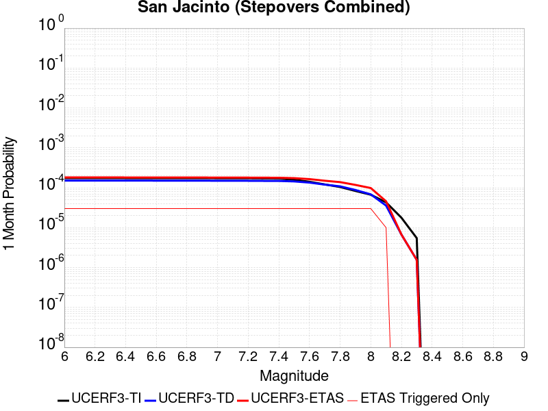 |  |  |

| Magnitude | 1 wk TI Prob | 1 wk TD Prob | 1 wk ETAS Prob | 1 wk ETAS/TD Gain | 1 wk ETAS Triggered Only | 1 mo TI Prob | 1 mo TD Prob | 1 mo ETAS Prob | 1 mo ETAS/TD Gain | 1 mo ETAS Triggered Only | 1 yr TI Prob | 1 yr TD Prob | 1 yr ETAS Prob | 1 yr ETAS/TD Gain | 1 yr ETAS Triggered Only | 10 yr TI Prob | 10 yr TD Prob | 10 yr ETAS Prob | 10 yr ETAS/TD Gain | 10 yr ETAS Triggered Only |
|-----|-----|-----|-----|-----|-----|-----|-----|-----|-----|-----|-----|-----|-----|-----|-----|-----|-----|-----|-----|-----|
| 6.0 | 4.0667746E-5 | 3.5336896E-5 | 5.9397635E-4 | 16.808958 | 5.586592E-4 | 1.742787E-4 | 1.5143506E-4 | 7.1000966E-4 | 4.6885424 | 5.586592E-4 | 0.0021197782 | 0.0018421634 | 0.0023997934 | 1.3027039 | 5.586592E-4 | 0.020996714 | 0.019020144 | 0.019568177 | 1.0288134 | 5.586592E-4 |
| 6.1 | 4.0667746E-5 | 3.5336896E-5 | 5.9397635E-4 | 16.808958 | 5.586592E-4 | 1.742787E-4 | 1.5143506E-4 | 7.1000966E-4 | 4.6885424 | 5.586592E-4 | 0.0021197782 | 0.0018421634 | 0.0023997934 | 1.3027039 | 5.586592E-4 | 0.020996714 | 0.019020144 | 0.019568177 | 1.0288134 | 5.586592E-4 |
| 6.2 | 4.0667746E-5 | 3.5336896E-5 | 5.9397635E-4 | 16.808958 | 5.586592E-4 | 1.742787E-4 | 1.5143506E-4 | 7.1000966E-4 | 4.6885424 | 5.586592E-4 | 0.0021197782 | 0.0018421634 | 0.0023997934 | 1.3027039 | 5.586592E-4 | 0.020996714 | 0.019020144 | 0.019568177 | 1.0288134 | 5.586592E-4 |
| 6.3 | 4.0667746E-5 | 3.5336896E-5 | 5.9397635E-4 | 16.808958 | 5.586592E-4 | 1.742787E-4 | 1.5143506E-4 | 7.1000966E-4 | 4.6885424 | 5.586592E-4 | 0.0021197782 | 0.0018421634 | 0.0023997934 | 1.3027039 | 5.586592E-4 | 0.020996714 | 0.019020144 | 0.019568177 | 1.0288134 | 5.586592E-4 |
| 6.4 | 4.0577226E-5 | 3.5208766E-5 | 5.938483E-4 | 16.86649 | 5.586592E-4 | 1.738908E-4 | 1.50886E-4 | 7.0946093E-4 | 4.701967 | 5.586592E-4 | 0.0021150648 | 0.0018354917 | 0.0023931256 | 1.3038062 | 5.586592E-4 | 0.020950472 | 0.018954702 | 0.019502772 | 1.0289147 | 5.586592E-4 |
| 6.5 | 4.0577226E-5 | 3.5208766E-5 | 5.938483E-4 | 16.86649 | 5.586592E-4 | 1.738908E-4 | 1.50886E-4 | 7.0946093E-4 | 4.701967 | 5.586592E-4 | 0.0021150648 | 0.0018354917 | 0.0023931256 | 1.3038062 | 5.586592E-4 | 0.020950472 | 0.018954702 | 0.019502772 | 1.0289147 | 5.586592E-4 |
| 6.6 | 4.053861E-5 | 3.5154102E-5 | 5.937937E-4 | 16.891165 | 5.586592E-4 | 1.7372532E-4 | 1.5065174E-4 | 7.092268E-4 | 4.707724 | 5.586592E-4 | 0.0021130538 | 0.0018326445 | 0.00239028 | 1.3042791 | 5.586592E-4 | 0.020930743 | 0.018926777 | 0.019474862 | 1.0289582 | 5.586592E-4 |
| 6.7 | 4.0516545E-5 | 3.512316E-5 | 5.937627E-4 | 16.905163 | 5.586592E-4 | 1.7363077E-4 | 1.5051916E-4 | 7.090943E-4 | 4.7109904 | 5.586592E-4 | 0.002111905 | 0.0018310336 | 0.0023886699 | 1.3045473 | 5.586592E-4 | 0.020919468 | 0.01891097 | 0.019459065 | 1.0289829 | 5.586592E-4 |
| 6.8 | 4.049434E-5 | 3.509472E-5 | 5.937343E-4 | 16.918055 | 5.586592E-4 | 1.7353562E-4 | 1.5039727E-4 | 7.0897245E-4 | 4.7139983 | 5.586592E-4 | 0.0021107488 | 0.0018295521 | 0.0023871893 | 1.3047943 | 5.586592E-4 | 0.020908125 | 0.01889638 | 0.019444484 | 1.0290056 | 5.586592E-4 |
| 6.9 | 4.046386E-5 | 3.505727E-5 | 5.936969E-4 | 16.935059 | 5.586592E-4 | 1.73405E-4 | 1.502368E-4 | 7.088121E-4 | 4.7179656 | 5.586592E-4 | 0.0021091616 | 0.0018276017 | 0.0023852398 | 1.3051202 | 5.586592E-4 | 0.020892553 | 0.01887715 | 0.019425264 | 1.0290358 | 5.586592E-4 |
| 7.0 | 4.036382E-5 | 3.4937813E-5 | 5.935775E-4 | 16.989544 | 5.586592E-4 | 1.7297632E-4 | 1.4972492E-4 | 7.083005E-4 | 4.730679 | 5.586592E-4 | 0.0021039525 | 0.00182138 | 0.0023790216 | 1.3061644 | 5.586592E-4 | 0.02084144 | 0.018815752 | 0.019363899 | 1.0291324 | 5.586592E-4 |
| 7.1 | 4.0343282E-5 | 3.4916273E-5 | 5.93556E-4 | 16.999409 | 5.586592E-4 | 1.7288832E-4 | 1.496326E-4 | 7.0820824E-4 | 4.7329807 | 5.586592E-4 | 0.002102883 | 0.0018202579 | 0.0023779003 | 1.3063534 | 5.586592E-4 | 0.020830948 | 0.018804627 | 0.01935278 | 1.0291499 | 5.586592E-4 |
| 7.2 | 4.0257353E-5 | 3.4820667E-5 | 5.9346046E-4 | 17.043339 | 5.586592E-4 | 1.725201E-4 | 1.492229E-4 | 7.0779875E-4 | 4.7432313 | 5.586592E-4 | 0.0020984085 | 0.0018152783 | 0.0023729233 | 1.3071954 | 5.586592E-4 | 0.020787042 | 0.018755313 | 0.019303495 | 1.0292281 | 5.586592E-4 |
| 7.3 | 3.9940667E-5 | 3.4648023E-5 | 5.9328787E-4 | 17.123283 | 5.586592E-4 | 1.7116306E-4 | 1.4848309E-4 | 7.0705934E-4 | 4.7618847 | 5.586592E-4 | 0.0020819185 | 0.0018062859 | 0.002363936 | 1.3087275 | 5.586592E-4 | 0.020625217 | 0.018663792 | 0.019212024 | 1.0293741 | 5.586592E-4 |
| 7.4 | 3.9721202E-5 | 3.453329E-5 | 5.931732E-4 | 17.176853 | 5.586592E-4 | 1.7022261E-4 | 1.4799142E-4 | 7.0656795E-4 | 4.7743845 | 5.586592E-4 | 0.0020704903 | 0.0018003098 | 0.0023579632 | 1.3097541 | 5.586592E-4 | 0.020513052 | 0.01860285 | 0.019151118 | 1.0294722 | 5.586592E-4 |
| 7.5 | 3.7036873E-5 | 3.3598866E-5 | 5.922393E-4 | 17.626766 | 5.586592E-4 | 1.5871979E-4 | 1.439872E-4 | 7.02566E-4 | 4.879364 | 5.586592E-4 | 0.0019307006 | 0.0017516377 | 0.0023093182 | 1.3183768 | 5.586592E-4 | 0.019140124 | 0.018103454 | 0.018652 | 1.0303006 | 5.586592E-4 |
| 7.6 | 3.2940967E-5 | 3.1372547E-5 | 5.900142E-4 | 18.806705 | 5.586592E-4 | 1.4116794E-4 | 1.3444685E-4 | 6.9303095E-4 | 5.154683 | 5.586592E-4 | 0.0017173645 | 0.0016356637 | 0.002193409 | 1.3409903 | 5.586592E-4 | 0.01704153 | 0.01693263 | 0.017481832 | 1.0324343 | 5.586592E-4 |
| 7.7 | 2.8236149E-5 | 2.7937022E-5 | 5.8658066E-4 | 20.996534 | 5.586592E-4 | 1.2100645E-4 | 1.197246E-4 | 6.783169E-4 | 5.6656437 | 5.586592E-4 | 0.0014722579 | 0.0014566735 | 0.002014519 | 1.3829584 | 5.586592E-4 | 0.014625421 | 0.015142685 | 0.015692884 | 1.0363344 | 5.586592E-4 |
| 7.8 | 2.4329287E-5 | 2.5258554E-5 | 5.839037E-4 | 23.117065 | 5.586592E-4 | 1.042642E-4 | 1.0824646E-4 | 6.668452E-4 | 6.1604342 | 5.586592E-4 | 0.0012686774 | 0.0013171048 | 0.0018750281 | 1.4235984 | 5.586592E-4 | 0.012614589 | 0.013738932 | 0.014289916 | 1.0401038 | 5.586592E-4 |
| 7.9 | 1.9370926E-5 | 2.0467445E-5 | 5.7911524E-4 | 28.294456 | 5.586592E-4 | 8.301561E-5 | 8.7714674E-5 | 6.463249E-4 | 7.368492 | 5.586592E-4 | 0.0010102465 | 0.0010674037 | 0.0016254666 | 1.5228227 | 5.586592E-4 | 0.0100566605 | 0.011223499 | 0.011775888 | 1.0492172 | 5.586592E-4 |
| 8.0 | 1.5583017E-5 | 1.5925136E-5 | 5.7457545E-4 | 36.079784 | 5.586592E-4 | 6.6782646E-5 | 6.82488E-5 | 6.268699E-4 | 9.185068 | 5.586592E-4 | 8.127754E-4 | 8.306131E-4 | 0.0013888082 | 1.672028 | 5.586592E-4 | 0.008098091 | 0.008802158 | 0.0093559 | 1.0629097 | 5.586592E-4 |
| 8.1 | 1.0024873E-5 | 8.314913E-6 | 5.669695E-4 | 68.18706 | 5.586592E-4 | 4.2963035E-5 | 3.563486E-5 | 5.942742E-4 | 16.676764 | 5.586592E-4 | 5.229494E-4 | 4.3376858E-4 | 9.921854E-4 | 2.2873614 | 5.586592E-4 | 0.0052172043 | 0.00466551 | 0.005221563 | 1.1191837 | 5.586592E-4 |
| 8.2 | 4.142796E-6 | 1.5676045E-6 | 1.5676045E-6 | 1.0 | 0.0 | 1.775472E-5 | 6.7182878E-6 | 6.7182878E-6 | 1.0 | 0.0 | 2.1614227E-4 | 8.179211E-5 | 8.179211E-5 | 1.0 | 0.0 | 0.0021593217 | 9.4923546E-4 | 9.4923546E-4 | 1.0 | 0.0 |
| 8.3 | 1.2750878E-6 | 3.6301523E-7 | 3.6301523E-7 | 1.0 | 0.0 | 5.4646503E-6 | 1.5557786E-6 | 1.5557786E-6 | 1.0 | 0.0 | 6.653009E-5 | 1.8941444E-5 | 1.8941444E-5 | 1.0 | 0.0 | 6.6510175E-4 | 2.2840123E-4 | 2.2840123E-4 | 1.0 | 0.0 |

## Coyote Canyon
*[(top)](#table-of-contents)*

| 1 Week | 1 Month | 1 Year | 10 Year |
|-----|-----|-----|-----|
|  |  |  |  |

| Magnitude | 1 wk TI Prob | 1 wk TD Prob | 1 wk ETAS Prob | 1 wk ETAS/TD Gain | 1 wk ETAS Triggered Only | 1 mo TI Prob | 1 mo TD Prob | 1 mo ETAS Prob | 1 mo ETAS/TD Gain | 1 mo ETAS Triggered Only | 1 yr TI Prob | 1 yr TD Prob | 1 yr ETAS Prob | 1 yr ETAS/TD Gain | 1 yr ETAS Triggered Only | 10 yr TI Prob | 10 yr TD Prob | 10 yr ETAS Prob | 10 yr ETAS/TD Gain | 10 yr ETAS Triggered Only |
|-----|-----|-----|-----|-----|-----|-----|-----|-----|-----|-----|-----|-----|-----|-----|-----|-----|-----|-----|-----|-----|
| 6.0 | 3.5090034E-5 | 4.0367544E-5 | 4.0367544E-5 | 1.0 | 0.0 | 1.503772E-4 | 1.7299375E-4 | 1.7299375E-4 | 1.0 | 0.0 | 0.0018293047 | 0.0021044204 | 0.0021044204 | 1.0 | 0.0 | 0.018143194 | 0.020870851 | 0.02141785 | 1.0262088 | 5.586592E-4 |
| 6.1 | 3.5090034E-5 | 4.0367544E-5 | 4.0367544E-5 | 1.0 | 0.0 | 1.503772E-4 | 1.7299375E-4 | 1.7299375E-4 | 1.0 | 0.0 | 0.0018293047 | 0.0021044204 | 0.0021044204 | 1.0 | 0.0 | 0.018143194 | 0.020870851 | 0.02141785 | 1.0262088 | 5.586592E-4 |
| 6.2 | 1.841879E-5 | 2.1061396E-5 | 2.1061396E-5 | 1.0 | 0.0 | 7.8935285E-5 | 9.026058E-5 | 9.026058E-5 | 1.0 | 0.0 | 9.606133E-4 | 0.0010984705 | 0.0010984705 | 1.0 | 0.0 | 0.0095647145 | 0.010940496 | 0.010940496 | 1.0 | 0.0 |
| 6.3 | 1.841879E-5 | 2.1061396E-5 | 2.1061396E-5 | 1.0 | 0.0 | 7.8935285E-5 | 9.026058E-5 | 9.026058E-5 | 1.0 | 0.0 | 9.606133E-4 | 0.0010984705 | 0.0010984705 | 1.0 | 0.0 | 0.0095647145 | 0.010940496 | 0.010940496 | 1.0 | 0.0 |
| 6.4 | 1.712201E-5 | 1.9566693E-5 | 1.9566693E-5 | 1.0 | 0.0 | 7.337798E-5 | 8.385513E-5 | 8.385513E-5 | 1.0 | 0.0 | 8.930107E-4 | 0.0010205585 | 0.0010205585 | 1.0 | 0.0 | 0.008894307 | 0.010168637 | 0.010168637 | 1.0 | 0.0 |
| 6.5 | 1.4744935E-5 | 1.683824E-5 | 1.683824E-5 | 1.0 | 0.0 | 6.3191044E-5 | 7.216242E-5 | 7.216242E-5 | 1.0 | 0.0 | 7.6907943E-4 | 8.7831676E-4 | 8.7831676E-4 | 1.0 | 0.0 | 0.007664232 | 0.008757652 | 0.008757652 | 1.0 | 0.0 |
| 6.6 | 1.2017839E-5 | 1.3725124E-5 | 1.3725124E-5 | 1.0 | 0.0 | 5.150401E-5 | 5.882113E-5 | 5.882113E-5 | 1.0 | 0.0 | 6.268809E-4 | 7.1600056E-4 | 7.1600056E-4 | 1.0 | 0.0 | 0.0062511545 | 0.007145631 | 0.007145631 | 1.0 | 0.0 |
| 6.7 | 1.00956095E-5 | 1.1534388E-5 | 1.1534388E-5 | 1.0 | 0.0 | 4.326618E-5 | 4.943265E-5 | 4.943265E-5 | 1.0 | 0.0 | 5.266384E-4 | 6.0176325E-4 | 6.0176325E-4 | 1.0 | 0.0 | 0.005253921 | 0.006009866 | 0.006009866 | 1.0 | 0.0 |

## San Andreas (Carrizo) rev
*[(top)](#table-of-contents)*

| 1 Week | 1 Month | 1 Year | 10 Year |
|-----|-----|-----|-----|
|  |  |  |  |

| Magnitude | 1 wk TI Prob | 1 wk TD Prob | 1 wk ETAS Prob | 1 wk ETAS/TD Gain | 1 wk ETAS Triggered Only | 1 mo TI Prob | 1 mo TD Prob | 1 mo ETAS Prob | 1 mo ETAS/TD Gain | 1 mo ETAS Triggered Only | 1 yr TI Prob | 1 yr TD Prob | 1 yr ETAS Prob | 1 yr ETAS/TD Gain | 1 yr ETAS Triggered Only | 10 yr TI Prob | 10 yr TD Prob | 10 yr ETAS Prob | 10 yr ETAS/TD Gain | 10 yr ETAS Triggered Only |
|-----|-----|-----|-----|-----|-----|-----|-----|-----|-----|-----|-----|-----|-----|-----|-----|-----|-----|-----|-----|-----|
| 6.0 | 1.1674632E-4 | 2.4361293E-4 | 8.02136E-4 | 3.2926662 | 5.586592E-4 | 5.002454E-4 | 0.0010436393 | 0.0016017155 | 1.5347404 | 5.586592E-4 | 0.006073493 | 0.012632766 | 0.013184368 | 1.0436643 | 5.586592E-4 | 0.0591016 | 0.12077509 | 0.121266276 | 1.004067 | 5.586592E-4 |
| 6.1 | 1.1674632E-4 | 2.4361293E-4 | 8.02136E-4 | 3.2926662 | 5.586592E-4 | 5.002454E-4 | 0.0010436393 | 0.0016017155 | 1.5347404 | 5.586592E-4 | 0.006073493 | 0.012632766 | 0.013184368 | 1.0436643 | 5.586592E-4 | 0.0591016 | 0.12077509 | 0.121266276 | 1.004067 | 5.586592E-4 |
| 6.2 | 1.1674632E-4 | 2.4361293E-4 | 8.02136E-4 | 3.2926662 | 5.586592E-4 | 5.002454E-4 | 0.0010436393 | 0.0016017155 | 1.5347404 | 5.586592E-4 | 0.006073493 | 0.012632766 | 0.013184368 | 1.0436643 | 5.586592E-4 | 0.0591016 | 0.12077509 | 0.121266276 | 1.004067 | 5.586592E-4 |
| 6.3 | 1.1674632E-4 | 2.4361293E-4 | 8.02136E-4 | 3.2926662 | 5.586592E-4 | 5.002454E-4 | 0.0010436393 | 0.0016017155 | 1.5347404 | 5.586592E-4 | 0.006073493 | 0.012632766 | 0.013184368 | 1.0436643 | 5.586592E-4 | 0.0591016 | 0.12077509 | 0.121266276 | 1.004067 | 5.586592E-4 |
| 6.4 | 1.1674632E-4 | 2.4361293E-4 | 8.02136E-4 | 3.2926662 | 5.586592E-4 | 5.002454E-4 | 0.0010436393 | 0.0016017155 | 1.5347404 | 5.586592E-4 | 0.006073493 | 0.012632766 | 0.013184368 | 1.0436643 | 5.586592E-4 | 0.0591016 | 0.12077509 | 0.121266276 | 1.004067 | 5.586592E-4 |
| 6.5 | 1.13136164E-4 | 2.3681132E-4 | 7.9533824E-4 | 3.3585312 | 5.586592E-4 | 4.847792E-4 | 0.0010145125 | 0.0015726049 | 1.550109 | 5.586592E-4 | 0.0058862255 | 0.012282185 | 0.012833984 | 1.0449266 | 5.586592E-4 | 0.057327334 | 0.1177463 | 0.11823918 | 1.0041859 | 5.586592E-4 |
| 6.6 | 1.13136164E-4 | 2.3681132E-4 | 7.9533824E-4 | 3.3585312 | 5.586592E-4 | 4.847792E-4 | 0.0010145125 | 0.0015726049 | 1.550109 | 5.586592E-4 | 0.0058862255 | 0.012282185 | 0.012833984 | 1.0449266 | 5.586592E-4 | 0.057327334 | 0.1177463 | 0.11823918 | 1.0041859 | 5.586592E-4 |
| 6.7 | 1.1149675E-4 | 2.3372276E-4 | 7.9225143E-4 | 3.389706 | 5.586592E-4 | 4.777557E-4 | 0.001001286 | 0.0015593858 | 1.5573831 | 5.586592E-4 | 0.0058011734 | 0.012122953 | 0.01267484 | 1.0455241 | 5.586592E-4 | 0.05652051 | 0.116367765 | 0.11686141 | 1.0042422 | 5.586592E-4 |
| 6.8 | 1.1103589E-4 | 2.3274389E-4 | 7.912731E-4 | 3.3997588 | 5.586592E-4 | 4.7578133E-4 | 9.97094E-4 | 0.0015551962 | 1.5597287 | 5.586592E-4 | 0.005777263 | 0.012072483 | 0.012624398 | 1.0457168 | 5.586592E-4 | 0.056293584 | 0.115927964 | 0.116421856 | 1.0042603 | 5.586592E-4 |
| 6.9 | 1.1053259E-4 | 2.316672E-4 | 7.90197E-4 | 3.4109144 | 5.586592E-4 | 4.7362508E-4 | 9.924831E-4 | 0.001550588 | 1.5623317 | 5.586592E-4 | 0.0057511497 | 0.012016967 | 0.0125689125 | 1.0459305 | 5.586592E-4 | 0.05604569 | 0.11544405 | 0.11593821 | 1.0042806 | 5.586592E-4 |
| 7.0 | 1.1005377E-4 | 2.3067516E-4 | 7.892055E-4 | 3.4212854 | 5.586592E-4 | 4.7157376E-4 | 9.882348E-4 | 0.0015463418 | 1.5647516 | 5.586592E-4 | 0.0057263062 | 0.011965811 | 0.012517786 | 1.0461293 | 5.586592E-4 | 0.055809796 | 0.11499625 | 0.11549066 | 1.0042994 | 5.586592E-4 |
| 7.1 | 1.0308142E-4 | 2.1576507E-4 | 7.7430374E-4 | 3.5886426 | 5.586592E-4 | 4.417027E-4 | 9.2438085E-4 | 0.0014825236 | 1.6038018 | 5.586592E-4 | 0.0053644776 | 0.011196577 | 0.011748981 | 1.0493369 | 5.586592E-4 | 0.052368138 | 0.10825095 | 0.10874914 | 1.0046021 | 5.586592E-4 |
| 7.2 | 1.0027479E-4 | 2.098411E-4 | 7.683831E-4 | 3.6617377 | 5.586592E-4 | 4.296783E-4 | 8.9901005E-4 | 0.0014571671 | 1.6208574 | 5.586592E-4 | 0.0052187922 | 0.010890815 | 0.0114433905 | 1.0507377 | 5.586592E-4 | 0.050979212 | 0.105554216 | 0.10605391 | 1.0047339 | 5.586592E-4 |
| 7.3 | 9.816942E-5 | 2.0458816E-4 | 7.6313305E-4 | 3.7300942 | 5.586592E-4 | 4.2065824E-4 | 8.765127E-4 | 0.0014346823 | 1.6368071 | 5.586592E-4 | 0.005109493 | 0.010619612 | 0.011172339 | 1.0520477 | 5.586592E-4 | 0.049935985 | 0.10313633 | 0.10363737 | 1.004858 | 5.586592E-4 |
| 7.4 | 9.5634205E-5 | 1.9827684E-4 | 7.5682526E-4 | 3.817013 | 5.586592E-4 | 4.0979648E-4 | 8.494821E-4 | 0.0014076667 | 1.6570882 | 5.586592E-4 | 0.0049778637 | 0.010293663 | 0.010846571 | 1.0537134 | 5.586592E-4 | 0.048678253 | 0.100220494 | 0.10072316 | 1.0050156 | 5.586592E-4 |
| 7.5 | 8.052417E-5 | 1.6143978E-4 | 7.200088E-4 | 4.459922 | 5.586592E-4 | 3.4505792E-4 | 6.917014E-4 | 0.0012499742 | 1.8071008 | 5.586592E-4 | 0.0041929903 | 0.008389029 | 0.008943001 | 1.0660354 | 5.586592E-4 | 0.04114753 | 0.08295002 | 0.083462335 | 1.0061762 | 5.586592E-4 |
| 7.6 | 7.897024E-5 | 1.579682E-4 | 7.1653916E-4 | 4.5359707 | 5.586592E-4 | 3.384E-4 | 6.768311E-4 | 0.0012351122 | 1.8248456 | 5.586592E-4 | 0.0041122385 | 0.00820936 | 0.008763433 | 1.0674928 | 5.586592E-4 | 0.040369697 | 0.081289805 | 0.08180305 | 1.0063138 | 5.586592E-4 |
| 7.7 | 6.707427E-5 | 1.3303987E-4 | 6.9162477E-4 | 5.198628 | 5.586592E-4 | 2.8742946E-4 | 5.700463E-4 | 0.001128387 | 1.9794656 | 5.586592E-4 | 0.003493839 | 0.0069182604 | 0.007473055 | 1.0801927 | 5.586592E-4 | 0.034394164 | 0.06917457 | 0.069694586 | 1.0075175 | 5.586592E-4 |
| 7.8 | 6.147705E-5 | 1.2222702E-4 | 6.80818E-4 | 5.57011 | 5.586592E-4 | 2.6344648E-4 | 5.23725E-4 | 0.0010820916 | 2.0661447 | 5.586592E-4 | 0.0032027436 | 0.0063577346 | 0.006912842 | 1.0873121 | 5.586592E-4 | 0.031569764 | 0.06362964 | 0.064152755 | 1.0082211 | 5.586592E-4 |
| 7.9 | 4.7636717E-5 | 8.8979046E-5 | 6.475886E-4 | 7.2779894 | 5.586592E-4 | 2.0414138E-4 | 3.8128305E-4 | 9.397293E-4 | 2.46465 | 5.586592E-4 | 0.0024825884 | 0.004632248 | 0.0051883194 | 1.1200435 | 5.586592E-4 | 0.024550365 | 0.046713326 | 0.04724589 | 1.0114007 | 5.586592E-4 |
| 8.0 | 3.3554235E-5 | 5.224805E-5 | 6.108781E-4 | 11.691882 | 5.586592E-4 | 1.4379594E-4 | 2.23901E-4 | 7.824351E-4 | 3.4945583 | 5.586592E-4 | 0.0017493097 | 0.0027225888 | 0.003279727 | 1.2046355 | 5.586592E-4 | 0.017356034 | 0.027935574 | 0.028478626 | 1.0194395 | 5.586592E-4 |
| 8.1 | 1.9175432E-5 | 1.9238541E-5 | 5.77887E-4 | 30.037983 | 5.586592E-4 | 8.217783E-5 | 8.244829E-5 | 6.4106146E-4 | 7.775315 | 5.586592E-4 | 0.0010000558 | 0.0010033463 | 0.0015614451 | 1.5562373 | 5.586592E-4 | 0.009955673 | 0.010786123 | 0.011338756 | 1.0512356 | 5.586592E-4 |
| 8.2 | 8.643924E-6 | 5.49522E-6 | 5.49522E-6 | 1.0 | 0.0 | 3.704486E-5 | 2.355073E-5 | 2.355073E-5 | 1.0 | 0.0 | 4.5092785E-4 | 2.866925E-4 | 2.866925E-4 | 1.0 | 0.0 | 0.0045001395 | 0.0032598388 | 0.0032598388 | 1.0 | 0.0 |
| 8.3 | 1.983087E-6 | 7.693574E-7 | 7.693574E-7 | 1.0 | 0.0 | 8.498917E-6 | 3.297242E-6 | 3.297242E-6 | 1.0 | 0.0 | 1.034694E-4 | 4.01432E-5 | 4.01432E-5 | 1.0 | 0.0 | 0.0010342124 | 4.7390026E-4 | 4.7390026E-4 | 1.0 | 0.0 |

## Paradise
*[(top)](#table-of-contents)*

| 1 Week | 1 Month | 1 Year | 10 Year |
|-----|-----|-----|-----|
|  |  |  |  |

| Magnitude | 1 wk TI Prob | 1 wk TD Prob | 1 wk ETAS Prob | 1 wk ETAS/TD Gain | 1 wk ETAS Triggered Only | 1 mo TI Prob | 1 mo TD Prob | 1 mo ETAS Prob | 1 mo ETAS/TD Gain | 1 mo ETAS Triggered Only | 1 yr TI Prob | 1 yr TD Prob | 1 yr ETAS Prob | 1 yr ETAS/TD Gain | 1 yr ETAS Triggered Only | 10 yr TI Prob | 10 yr TD Prob | 10 yr ETAS Prob | 10 yr ETAS/TD Gain | 10 yr ETAS Triggered Only |
|-----|-----|-----|-----|-----|-----|-----|-----|-----|-----|-----|-----|-----|-----|-----|-----|-----|-----|-----|-----|-----|
| 6.0 | 1.4851273E-5 | 1.6695341E-5 | 1.6695341E-5 | 1.0 | 0.0 | 6.364676E-5 | 7.154963E-5 | 7.154963E-5 | 1.0 | 0.0 | 7.7462377E-4 | 8.707922E-4 | 8.707922E-4 | 1.0 | 0.0 | 0.0077192914 | 0.008676181 | 0.0092299925 | 1.0638313 | 5.586592E-4 |
| 6.1 | 1.4851273E-5 | 1.6695341E-5 | 1.6695341E-5 | 1.0 | 0.0 | 6.364676E-5 | 7.154963E-5 | 7.154963E-5 | 1.0 | 0.0 | 7.7462377E-4 | 8.707922E-4 | 8.707922E-4 | 1.0 | 0.0 | 0.0077192914 | 0.008676181 | 0.0092299925 | 1.0638313 | 5.586592E-4 |
| 6.2 | 1.4851273E-5 | 1.6695341E-5 | 1.6695341E-5 | 1.0 | 0.0 | 6.364676E-5 | 7.154963E-5 | 7.154963E-5 | 1.0 | 0.0 | 7.7462377E-4 | 8.707922E-4 | 8.707922E-4 | 1.0 | 0.0 | 0.0077192914 | 0.008676181 | 0.0092299925 | 1.0638313 | 5.586592E-4 |
| 6.3 | 1.0426831E-5 | 1.1889049E-5 | 1.1889049E-5 | 1.0 | 0.0 | 4.4685654E-5 | 5.095211E-5 | 5.095211E-5 | 1.0 | 0.0 | 5.43912E-4 | 6.2017125E-4 | 6.2017125E-4 | 1.0 | 0.0 | 0.0054258266 | 0.0061850143 | 0.0061850143 | 1.0 | 0.0 |
| 6.4 | 1.0426831E-5 | 1.1889049E-5 | 1.1889049E-5 | 1.0 | 0.0 | 4.4685654E-5 | 5.095211E-5 | 5.095211E-5 | 1.0 | 0.0 | 5.43912E-4 | 6.2017125E-4 | 6.2017125E-4 | 1.0 | 0.0 | 0.0054258266 | 0.0061850143 | 0.0061850143 | 1.0 | 0.0 |
| 6.5 | 9.25027E-6 | 1.0620336E-5 | 1.0620336E-5 | 1.0 | 0.0 | 3.964341E-5 | 4.551496E-5 | 4.551496E-5 | 1.0 | 0.0 | 4.8255164E-4 | 5.5400864E-4 | 5.5400864E-4 | 1.0 | 0.0 | 0.0048150513 | 0.0055267746 | 0.0055267746 | 1.0 | 0.0 |
| 6.6 | 7.904275E-6 | 9.159836E-6 | 9.159836E-6 | 1.0 | 0.0 | 3.3875025E-5 | 3.925587E-5 | 3.925587E-5 | 1.0 | 0.0 | 4.1235037E-4 | 4.7783932E-4 | 4.7783932E-4 | 1.0 | 0.0 | 0.0041158604 | 0.0047685155 | 0.0047685155 | 1.0 | 0.0 |
| 6.7 | 7.2061953E-6 | 8.407527E-6 | 8.407527E-6 | 1.0 | 0.0 | 3.088333E-5 | 3.6031786E-5 | 3.6031786E-5 | 1.0 | 0.0 | 3.7593965E-4 | 4.3860235E-4 | 4.3860235E-4 | 1.0 | 0.0 | 0.003753043 | 0.0043777362 | 0.0043777362 | 1.0 | 0.0 |
| 6.8 | 6.6948724E-6 | 7.842423E-6 | 7.842423E-6 | 1.0 | 0.0 | 2.8691995E-5 | 3.3609973E-5 | 3.3609973E-5 | 1.0 | 0.0 | 3.4926904E-4 | 4.0912814E-4 | 4.0912814E-4 | 1.0 | 0.0 | 0.003487206 | 0.004084107 | 0.004084107 | 1.0 | 0.0 |
| 6.9 | 6.0421025E-6 | 7.1308505E-6 | 7.1308505E-6 | 1.0 | 0.0 | 2.5894467E-5 | 3.0560448E-5 | 3.0560448E-5 | 1.0 | 0.0 | 3.1521954E-4 | 3.7201334E-4 | 3.7201334E-4 | 1.0 | 0.0 | 0.0031477278 | 0.003714244 | 0.003714244 | 1.0 | 0.0 |
| 7.0 | 4.134091E-6 | 5.080469E-6 | 5.080469E-6 | 1.0 | 0.0 | 1.7717413E-5 | 2.1773263E-5 | 2.1773263E-5 | 1.0 | 0.0 | 2.1568815E-4 | 2.6505877E-4 | 2.6505877E-4 | 1.0 | 0.0 | 0.0021547892 | 0.0026475794 | 0.0026475794 | 1.0 | 0.0 |
| 7.1 | 3.7674888E-6 | 4.6320133E-6 | 4.6320133E-6 | 1.0 | 0.0 | 1.6146281E-5 | 1.9851343E-5 | 1.9851343E-5 | 1.0 | 0.0 | 1.9656324E-4 | 2.4166482E-4 | 2.4166482E-4 | 1.0 | 0.0 | 0.0019638946 | 0.002414171 | 0.002414171 | 1.0 | 0.0 |
| 7.2 | 3.4065345E-6 | 4.1568514E-6 | 4.1568514E-6 | 1.0 | 0.0 | 1.4599351E-5 | 1.7814966E-5 | 1.7814966E-5 | 1.0 | 0.0 | 1.777326E-4 | 2.1687712E-4 | 2.1687712E-4 | 1.0 | 0.0 | 0.0017759053 | 0.0021668028 | 0.0021668028 | 1.0 | 0.0 |
| 7.3 | 2.9934936E-6 | 3.629423E-6 | 3.629423E-6 | 1.0 | 0.0 | 1.2829195E-5 | 1.5554586E-5 | 1.5554586E-5 | 1.0 | 0.0 | 1.5618425E-4 | 1.893621E-4 | 1.893621E-4 | 1.0 | 0.0 | 0.0015607453 | 0.0018921527 | 0.0018921527 | 1.0 | 0.0 |
| 7.4 | 2.4049796E-6 | 2.889062E-6 | 2.889062E-6 | 1.0 | 0.0 | 1.0307015E-5 | 1.23816435E-5 | 1.23816435E-5 | 1.0 | 0.0 | 1.2548068E-4 | 1.5073753E-4 | 1.5073753E-4 | 1.0 | 0.0 | 0.0012540985 | 0.0015064942 | 0.0015064942 | 1.0 | 0.0 |
| 7.5 | 1.2710091E-6 | 1.5135054E-6 | 1.5135054E-6 | 1.0 | 0.0 | 5.44717E-6 | 6.4864425E-6 | 6.4864425E-6 | 1.0 | 0.0 | 6.631728E-5 | 7.897083E-5 | 7.897083E-5 | 1.0 | 0.0 | 6.6297496E-4 | 7.8955025E-4 | 7.8955025E-4 | 1.0 | 0.0 |
| 7.6 | 2.21172E-7 | 2.6040124E-7 | 2.6040124E-7 | 1.0 | 0.0 | 9.478797E-7 | 1.116005E-6 | 1.116005E-6 | 1.0 | 0.0 | 1.1540374E-5 | 1.3587305E-5 | 1.3587305E-5 | 1.0 | 0.0 | 1.1539775E-4 | 1.3586757E-4 | 1.3586757E-4 | 1.0 | 0.0 |

## San Andreas (Peninsula) 2011 CFM
*[(top)](#table-of-contents)*

| 1 Week | 1 Month | 1 Year | 10 Year |
|-----|-----|-----|-----|
|  | 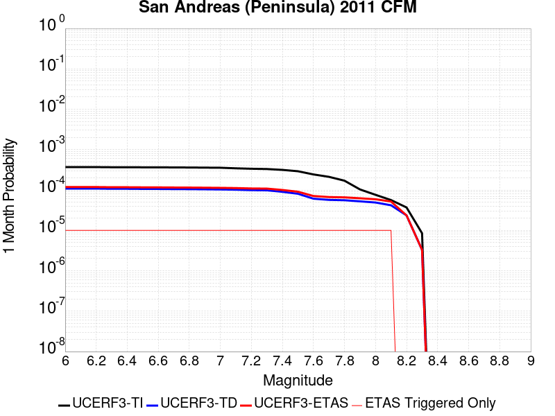 |  |  |

| Magnitude | 1 wk TI Prob | 1 wk TD Prob | 1 wk ETAS Prob | 1 wk ETAS/TD Gain | 1 wk ETAS Triggered Only | 1 mo TI Prob | 1 mo TD Prob | 1 mo ETAS Prob | 1 mo ETAS/TD Gain | 1 mo ETAS Triggered Only | 1 yr TI Prob | 1 yr TD Prob | 1 yr ETAS Prob | 1 yr ETAS/TD Gain | 1 yr ETAS Triggered Only | 10 yr TI Prob | 10 yr TD Prob | 10 yr ETAS Prob | 10 yr ETAS/TD Gain | 10 yr ETAS Triggered Only |
|-----|-----|-----|-----|-----|-----|-----|-----|-----|-----|-----|-----|-----|-----|-----|-----|-----|-----|-----|-----|-----|
| 6.0 | 8.6200685E-5 | 2.5333706E-5 | 5.839788E-4 | 23.051455 | 5.586592E-4 | 3.6937918E-4 | 1.08568514E-4 | 6.6716707E-4 | 6.145125 | 5.586592E-4 | 0.0044879215 | 0.0013210218 | 0.0018789431 | 1.4223406 | 5.586592E-4 | 0.043983612 | 0.014838956 | 0.015389325 | 1.0370895 | 5.586592E-4 |
| 6.1 | 8.6200685E-5 | 2.5333706E-5 | 5.839788E-4 | 23.051455 | 5.586592E-4 | 3.6937918E-4 | 1.08568514E-4 | 6.6716707E-4 | 6.145125 | 5.586592E-4 | 0.0044879215 | 0.0013210218 | 0.0018789431 | 1.4223406 | 5.586592E-4 | 0.043983612 | 0.014838956 | 0.015389325 | 1.0370895 | 5.586592E-4 |
| 6.2 | 8.6200685E-5 | 2.5333706E-5 | 5.839788E-4 | 23.051455 | 5.586592E-4 | 3.6937918E-4 | 1.08568514E-4 | 6.6716707E-4 | 6.145125 | 5.586592E-4 | 0.0044879215 | 0.0013210218 | 0.0018789431 | 1.4223406 | 5.586592E-4 | 0.043983612 | 0.014838956 | 0.015389325 | 1.0370895 | 5.586592E-4 |
| 6.3 | 8.551163E-5 | 2.5024961E-5 | 5.836702E-4 | 23.32352 | 5.586592E-4 | 3.6642692E-4 | 1.0724543E-4 | 6.658447E-4 | 6.208607 | 5.586592E-4 | 0.004452125 | 0.0013049326 | 0.0018628628 | 1.4275547 | 5.586592E-4 | 0.043639794 | 0.014665611 | 0.015216077 | 1.0375345 | 5.586592E-4 |
| 6.4 | 8.551163E-5 | 2.5024961E-5 | 5.836702E-4 | 23.32352 | 5.586592E-4 | 3.6642692E-4 | 1.0724543E-4 | 6.658447E-4 | 6.208607 | 5.586592E-4 | 0.004452125 | 0.0013049326 | 0.0018628628 | 1.4275547 | 5.586592E-4 | 0.043639794 | 0.014665611 | 0.015216077 | 1.0375345 | 5.586592E-4 |
| 6.5 | 8.511146E-5 | 2.4846031E-5 | 5.8349135E-4 | 23.48429 | 5.586592E-4 | 3.647124E-4 | 1.0647865E-4 | 6.650784E-4 | 6.2461195 | 5.586592E-4 | 0.004431336 | 0.0012956082 | 0.0018535437 | 1.4306359 | 5.586592E-4 | 0.04344007 | 0.014565198 | 0.01511572 | 1.0377971 | 5.586592E-4 |
| 6.6 | 8.4985084E-5 | 2.477655E-5 | 5.834219E-4 | 23.547344 | 5.586592E-4 | 3.6417096E-4 | 1.061809E-4 | 6.647808E-4 | 6.2608323 | 5.586592E-4 | 0.0044247704 | 0.0012919875 | 0.0018499249 | 1.4318444 | 5.586592E-4 | 0.043376986 | 0.014527207 | 0.01507775 | 1.0378973 | 5.586592E-4 |
| 6.7 | 8.462618E-5 | 2.4604726E-5 | 5.832502E-4 | 23.704803 | 5.586592E-4 | 3.6263323E-4 | 1.05444575E-4 | 6.6404487E-4 | 6.297573 | 5.586592E-4 | 0.004406125 | 0.0012830333 | 0.0018409757 | 1.434862 | 5.586592E-4 | 0.043197807 | 0.01443185 | 0.014982447 | 1.0381515 | 5.586592E-4 |
| 6.8 | 8.42337E-5 | 2.4500272E-5 | 5.831458E-4 | 23.801605 | 5.586592E-4 | 3.6095164E-4 | 1.0499695E-4 | 6.635975E-4 | 6.32016 | 5.586592E-4 | 0.004385734 | 0.0012775898 | 0.0018355353 | 1.4367173 | 5.586592E-4 | 0.043001823 | 0.014372395 | 0.014923026 | 1.0383116 | 5.586592E-4 |
| 6.9 | 8.365989E-5 | 2.4304522E-5 | 5.829502E-4 | 23.985256 | 5.586592E-4 | 3.5849313E-4 | 1.0415808E-4 | 6.627591E-4 | 6.363012 | 5.586592E-4 | 0.004355922 | 0.0012673886 | 0.0018253397 | 1.4402369 | 5.586592E-4 | 0.04271523 | 0.014264696 | 0.014815386 | 1.0386051 | 5.586592E-4 |
| 7.0 | 8.30936E-5 | 2.4065685E-5 | 5.827115E-4 | 24.213375 | 5.586592E-4 | 3.560668E-4 | 1.0313458E-4 | 6.617362E-4 | 6.4162397 | 5.586592E-4 | 0.004326499 | 0.0012549418 | 0.0018129 | 1.4446088 | 5.586592E-4 | 0.042432297 | 0.0141355125 | 0.014686275 | 1.0389631 | 5.586592E-4 |
| 7.1 | 8.041264E-5 | 2.3751329E-5 | 5.823973E-4 | 24.520618 | 5.586592E-4 | 3.4458007E-4 | 1.01787446E-4 | 6.603898E-4 | 6.48793 | 5.586592E-4 | 0.0041871946 | 0.0012385593 | 0.0017965265 | 1.450497 | 5.586592E-4 | 0.041091725 | 0.013957874 | 0.014508736 | 1.039466 | 5.586592E-4 |
| 7.2 | 7.8427016E-5 | 2.3174005E-5 | 5.8182026E-4 | 25.106592 | 5.586592E-4 | 3.3607247E-4 | 9.931339E-5 | 6.579171E-4 | 6.6246567 | 5.586592E-4 | 0.004084008 | 0.0012084715 | 0.0017664555 | 1.4617271 | 5.586592E-4 | 0.040097635 | 0.013641416 | 0.0141924545 | 1.0403945 | 5.586592E-4 |
| 7.3 | 7.721087E-5 | 2.2958477E-5 | 5.816049E-4 | 25.332905 | 5.586592E-4 | 3.3086175E-4 | 9.838976E-5 | 6.56994E-4 | 6.677463 | 5.586592E-4 | 0.004020803 | 0.0011972387 | 0.0017552291 | 1.4660645 | 5.586592E-4 | 0.03948827 | 0.013524936 | 0.014076039 | 1.0407472 | 5.586592E-4 |
| 7.4 | 7.3536525E-5 | 2.1064485E-5 | 5.797119E-4 | 27.520823 | 5.586592E-4 | 3.1511846E-4 | 9.027325E-5 | 6.48882E-4 | 7.1879773 | 5.586592E-4 | 0.0038298194 | 0.001098524 | 0.0016565694 | 1.5079957 | 5.586592E-4 | 0.037644852 | 0.01247618 | 0.013027869 | 1.0442194 | 5.586592E-4 |
| 7.5 | 6.806207E-5 | 1.8855704E-5 | 5.775044E-4 | 30.62757 | 5.586592E-4 | 2.9166197E-4 | 8.080766E-5 | 6.3942175E-4 | 7.912885 | 5.586592E-4 | 0.0035452035 | 9.833903E-4 | 0.0015415001 | 1.5675365 | 5.586592E-4 | 0.034891766 | 0.011221583 | 0.011773974 | 1.0492257 | 5.586592E-4 |
| 7.6 | 5.6731416E-5 | 1.4235568E-5 | 5.7288684E-4 | 40.243343 | 5.586592E-4 | 2.43112E-4 | 6.100815E-5 | 6.196333E-4 | 10.156566 | 5.586592E-4 | 0.0029558712 | 7.4252125E-4 | 0.0013007657 | 1.7518228 | 5.586592E-4 | 0.02916862 | 0.008518306 | 0.009072206 | 1.0650247 | 5.586592E-4 |
| 7.7 | 4.946994E-5 | 1.3298509E-5 | 5.719503E-4 | 43.008602 | 5.586592E-4 | 2.1199681E-4 | 5.6992365E-5 | 6.1561976E-4 | 10.801793 | 5.586592E-4 | 0.002578006 | 6.936613E-4 | 0.0012519329 | 1.8048189 | 5.586592E-4 | 0.02548303 | 0.007937518 | 0.008491743 | 1.0698234 | 5.586592E-4 |
| 7.8 | 3.9718198E-5 | 1.3032537E-5 | 5.7168445E-4 | 43.86594 | 5.586592E-4 | 1.7020974E-4 | 5.585253E-5 | 6.144805E-4 | 11.001839 | 5.586592E-4 | 0.0020703338 | 6.7979255E-4 | 0.001238072 | 1.8212497 | 5.586592E-4 | 0.020511515 | 0.007746509 | 0.008300841 | 1.0715588 | 5.586592E-4 |
| 7.9 | 2.4115114E-5 | 1.2229653E-5 | 5.7088205E-4 | 46.68015 | 5.586592E-4 | 1.0334639E-4 | 5.2411746E-5 | 6.110417E-4 | 11.658487 | 5.586592E-4 | 0.001257516 | 6.3792634E-4 | 0.0011962291 | 1.8751839 | 5.586592E-4 | 0.012504238 | 0.0071830763 | 0.0077377227 | 1.0772157 | 5.586592E-4 |
| 8.0 | 1.7756569E-5 | 1.144976E-5 | 5.701026E-4 | 49.79166 | 5.586592E-4 | 7.6097356E-5 | 4.9069477E-5 | 6.077013E-4 | 12.384507 | 5.586592E-4 | 9.260915E-4 | 5.972573E-4 | 0.0011555828 | 1.9348159 | 5.586592E-4 | 0.009222416 | 0.006680902 | 0.007235829 | 1.0830617 | 5.586592E-4 |
| 8.1 | 1.3159258E-5 | 9.77991E-6 | 5.6843366E-4 | 58.122585 | 5.586592E-4 | 5.6395602E-5 | 4.1913227E-5 | 6.0054904E-4 | 14.328389 | 5.586592E-4 | 6.864001E-4 | 5.101742E-4 | 0.0010685484 | 2.0944777 | 5.586592E-4 | 0.0068428386 | 0.0057076924 | 0.006263163 | 1.0973196 | 5.586592E-4 |
| 8.2 | 8.635426E-6 | 5.4872503E-6 | 5.4872503E-6 | 1.0 | 0.0 | 3.700844E-5 | 2.3516575E-5 | 2.3516575E-5 | 1.0 | 0.0 | 4.5048463E-4 | 2.8627677E-4 | 2.8627677E-4 | 1.0 | 0.0 | 0.004495725 | 0.0032556232 | 0.0032556232 | 1.0 | 0.0 |
| 8.3 | 1.983087E-6 | 7.693574E-7 | 7.693574E-7 | 1.0 | 0.0 | 8.498917E-6 | 3.297242E-6 | 3.297242E-6 | 1.0 | 0.0 | 1.034694E-4 | 4.01432E-5 | 4.01432E-5 | 1.0 | 0.0 | 0.0010342124 | 4.7390026E-4 | 4.7390026E-4 | 1.0 | 0.0 |

## San Andreas (Creeping Section) 2011 CFM
*[(top)](#table-of-contents)*

| 1 Week | 1 Month | 1 Year | 10 Year |
|-----|-----|-----|-----|
| 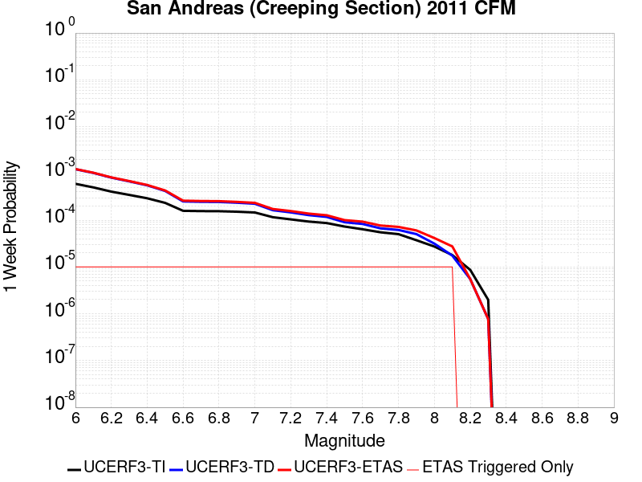 |  |  |  |

| Magnitude | 1 wk TI Prob | 1 wk TD Prob | 1 wk ETAS Prob | 1 wk ETAS/TD Gain | 1 wk ETAS Triggered Only | 1 mo TI Prob | 1 mo TD Prob | 1 mo ETAS Prob | 1 mo ETAS/TD Gain | 1 mo ETAS Triggered Only | 1 yr TI Prob | 1 yr TD Prob | 1 yr ETAS Prob | 1 yr ETAS/TD Gain | 1 yr ETAS Triggered Only | 10 yr TI Prob | 10 yr TD Prob | 10 yr ETAS Prob | 10 yr ETAS/TD Gain | 10 yr ETAS Triggered Only |
|-----|-----|-----|-----|-----|-----|-----|-----|-----|-----|-----|-----|-----|-----|-----|-----|-----|-----|-----|-----|-----|
| 6.0 | 5.986481E-4 | 0.0012277901 | 0.0017857634 | 1.4544533 | 5.586592E-4 | 0.0025631124 | 0.0052455855 | 0.005801314 | 1.1059421 | 5.586592E-4 | 0.030762846 | 0.061229862 | 0.061754316 | 1.0085653 | 5.586592E-4 | 0.26835477 | 0.42607152 | 0.42639214 | 1.0007526 | 5.586592E-4 |
| 6.1 | 5.015945E-4 | 0.0010218644 | 0.0015799527 | 1.5461472 | 5.586592E-4 | 0.00214792 | 0.0043676887 | 0.0049239076 | 1.1273487 | 5.586592E-4 | 0.025839351 | 0.051269703 | 0.05179972 | 1.0103378 | 5.586592E-4 | 0.23032776 | 0.37298882 | 0.3733391 | 1.0009391 | 5.586592E-4 |
| 6.2 | 4.073338E-4 | 8.109829E-4 | 0.001369189 | 1.6883082 | 5.586592E-4 | 0.0017445484 | 0.0034675654 | 0.004024287 | 1.1605513 | 5.586592E-4 | 0.021034058 | 0.040954083 | 0.041489862 | 1.0130825 | 5.586592E-4 | 0.19150782 | 0.31317768 | 0.31356138 | 1.0012252 | 5.586592E-4 |
| 6.3 | 3.464099E-4 | 6.7405414E-4 | 0.0012323369 | 1.828246 | 5.586592E-4 | 0.0014837692 | 0.0028840431 | 0.0034410912 | 1.1931483 | 5.586592E-4 | 0.017915873 | 0.034210727 | 0.03475027 | 1.0157713 | 5.586592E-4 | 0.16538359 | 0.27146977 | 0.27187675 | 1.0014993 | 5.586592E-4 |
| 6.4 | 2.935057E-4 | 5.543318E-4 | 0.0011126813 | 2.007248 | 5.586592E-4 | 0.0012572751 | 0.0023728115 | 0.0029301452 | 1.2348832 | 5.586592E-4 | 0.015200248 | 0.028285956 | 0.028828813 | 1.0191917 | 5.586592E-4 | 0.14201577 | 0.23314685 | 0.23357525 | 1.0018375 | 5.586592E-4 |
| 6.5 | 2.3409708E-4 | 4.2106997E-4 | 9.79494E-4 | 2.3262024 | 5.586592E-4 | 0.0010028875 | 0.001803265 | 0.0023609167 | 1.3092456 | 5.586592E-4 | 0.012141965 | 0.02160988 | 0.022156468 | 1.0252934 | 5.586592E-4 | 0.11499573 | 0.18699536 | 0.18744954 | 1.0024289 | 5.586592E-4 |
| 6.6 | 1.5842178E-4 | 2.5115322E-4 | 8.096721E-4 | 3.2238173 | 5.586592E-4 | 6.7877385E-4 | 0.0010759257 | 0.0016339838 | 1.5186772 | 5.586592E-4 | 0.0082328 | 0.013019121 | 0.013570508 | 1.042352 | 5.586592E-4 | 0.07934396 | 0.12333139 | 0.123821154 | 1.0039711 | 5.586592E-4 |
| 6.7 | 1.5616413E-4 | 2.4651614E-4 | 8.050376E-4 | 3.2656589 | 5.586592E-4 | 6.691031E-4 | 0.0010560687 | 0.001614138 | 1.5284402 | 5.586592E-4 | 0.0081159435 | 0.012780937 | 0.013332456 | 1.0431517 | 5.586592E-4 | 0.0782586 | 0.12135857 | 0.12184943 | 1.0040448 | 5.586592E-4 |
| 6.8 | 1.5538467E-4 | 2.4475376E-4 | 8.0327626E-4 | 3.2819772 | 5.586592E-4 | 6.6576427E-4 | 0.0010485224 | 0.0016065959 | 1.5322475 | 5.586592E-4 | 0.008075596 | 0.0126902815 | 0.013241851 | 1.043464 | 5.586592E-4 | 0.07788358 | 0.12058931 | 0.1210806 | 1.0040741 | 5.586592E-4 |
| 6.9 | 1.5153569E-4 | 2.3584193E-4 | 7.943694E-4 | 3.368228 | 5.586592E-4 | 6.49277E-4 | 0.0010103616 | 0.0015684564 | 1.5523713 | 5.586592E-4 | 0.007876333 | 0.0122323 | 0.012784126 | 1.0451121 | 5.586592E-4 | 0.07602952 | 0.11665895 | 0.11715244 | 1.0042301 | 5.586592E-4 |
| 7.0 | 1.4588932E-4 | 2.2441045E-4 | 7.829443E-4 | 3.488894 | 5.586592E-4 | 6.250901E-4 | 9.6140656E-4 | 0.0015195287 | 1.5805266 | 5.586592E-4 | 0.0075839474 | 0.011642803 | 0.012194958 | 1.0474246 | 5.586592E-4 | 0.073302895 | 0.11150479 | 0.11200116 | 1.0044515 | 5.586592E-4 |
| 7.1 | 1.1565079E-4 | 1.6318668E-4 | 7.2175474E-4 | 4.422878 | 5.586592E-4 | 4.955521E-4 | 6.991849E-4 | 0.0012574535 | 1.7984563 | 5.586592E-4 | 0.006016669 | 0.008479553 | 0.009033475 | 1.0653244 | 5.586592E-4 | 0.058563538 | 0.08383247 | 0.0843443 | 1.0061053 | 5.586592E-4 |
| 7.2 | 1.0393792E-4 | 1.4650424E-4 | 7.050816E-4 | 4.8127046 | 5.586592E-4 | 4.4537216E-4 | 6.2772504E-4 | 0.0011860336 | 1.8894157 | 5.586592E-4 | 0.005408933 | 0.007615941 | 0.008170346 | 1.0727953 | 5.586592E-4 | 0.052791595 | 0.075774014 | 0.07629034 | 1.006814 | 5.586592E-4 |
| 7.3 | 9.332884E-5 | 1.2811116E-4 | 6.866988E-4 | 5.3601794 | 5.586592E-4 | 3.999194E-4 | 5.4893293E-4 | 0.0011072855 | 2.0171597 | 5.586592E-4 | 0.0048581534 | 0.006662914 | 0.007217851 | 1.0832875 | 5.586592E-4 | 0.047533102 | 0.06662133 | 0.06714278 | 1.0078269 | 5.586592E-4 |
| 7.4 | 8.670252E-5 | 1.17293064E-4 | 6.7588675E-4 | 5.7623763 | 5.586592E-4 | 3.715293E-4 | 5.0258834E-4 | 0.0010609668 | 2.1110055 | 5.586592E-4 | 0.004513991 | 0.006101966 | 0.006657216 | 1.0909953 | 5.586592E-4 | 0.044233937 | 0.06127167 | 0.061796103 | 1.0085591 | 5.586592E-4 |
| 7.5 | 7.3036405E-5 | 9.027501E-5 | 6.488838E-4 | 7.187856 | 5.586592E-4 | 3.129756E-4 | 3.8683563E-4 | 9.4527873E-4 | 2.4436185 | 5.586592E-4 | 0.0038038217 | 0.0046995743 | 0.0052556084 | 1.1183158 | 5.586592E-4 | 0.03739367 | 0.047980286 | 0.048512142 | 1.0110849 | 5.586592E-4 |
| 7.6 | 6.3935775E-5 | 8.298733E-5 | 6.4160017E-4 | 7.731303 | 5.586592E-4 | 2.7398168E-4 | 3.5561158E-4 | 9.1407215E-4 | 2.570423 | 5.586592E-4 | 0.0033306254 | 0.0043209945 | 0.00487724 | 1.1287309 | 5.586592E-4 | 0.032811474 | 0.04407886 | 0.044612896 | 1.0121155 | 5.586592E-4 |
| 7.7 | 5.5050095E-5 | 6.6780485E-5 | 6.254024E-4 | 9.365047 | 5.586592E-4 | 2.3590765E-4 | 2.861707E-4 | 8.4467005E-4 | 2.95163 | 5.586592E-4 | 0.0028683927 | 0.003478566 | 0.004035282 | 1.1600418 | 5.586592E-4 | 0.0283165 | 0.035874426 | 0.036413044 | 1.0150139 | 5.586592E-4 |
| 7.8 | 5.027131E-5 | 6.177649E-5 | 6.204012E-4 | 10.042675 | 5.586592E-4 | 2.1543067E-4 | 2.6472952E-4 | 8.2324084E-4 | 3.1097434 | 5.586592E-4 | 0.0026197135 | 0.0032183218 | 0.003775183 | 1.1730285 | 5.586592E-4 | 0.025890453 | 0.033198178 | 0.033738293 | 1.0162693 | 5.586592E-4 |
| 7.9 | 3.7271806E-5 | 5.034326E-5 | 6.0897437E-4 | 12.096443 | 5.586592E-4 | 1.5972654E-4 | 2.15739E-4 | 7.7427767E-4 | 3.5889556 | 5.586592E-4 | 0.0019429359 | 0.0026234603 | 0.003180654 | 1.2123888 | 5.586592E-4 | 0.019260362 | 0.027125074 | 0.027668579 | 1.020037 | 5.586592E-4 |
| 8.0 | 2.7310243E-5 | 3.1506686E-5 | 5.901483E-4 | 18.73089 | 5.586592E-4 | 1.17038646E-4 | 1.3502168E-4 | 6.9360546E-4 | 5.1369934 | 5.586592E-4 | 0.0014240141 | 0.0016426502 | 0.0022003916 | 1.3395376 | 5.586592E-4 | 0.014149235 | 0.017253635 | 0.017802656 | 1.0318205 | 5.586592E-4 |
| 8.1 | 1.7940547E-5 | 1.7450684E-5 | 5.7610014E-4 | 33.013042 | 5.586592E-4 | 7.688579E-5 | 7.4786505E-5 | 6.3340395E-4 | 8.469495 | 5.586592E-4 | 9.3568244E-4 | 9.1014587E-4 | 0.0014682966 | 1.6132542 | 5.586592E-4 | 0.009317525 | 0.009825298 | 0.010378468 | 1.0563006 | 5.586592E-4 |
| 8.2 | 8.643924E-6 | 5.49522E-6 | 5.49522E-6 | 1.0 | 0.0 | 3.704486E-5 | 2.355073E-5 | 2.355073E-5 | 1.0 | 0.0 | 4.5092785E-4 | 2.866925E-4 | 2.866925E-4 | 1.0 | 0.0 | 0.0045001395 | 0.0032598388 | 0.0032598388 | 1.0 | 0.0 |
| 8.3 | 1.983087E-6 | 7.693574E-7 | 7.693574E-7 | 1.0 | 0.0 | 8.498917E-6 | 3.297242E-6 | 3.297242E-6 | 1.0 | 0.0 | 1.034694E-4 | 4.01432E-5 | 4.01432E-5 | 1.0 | 0.0 | 0.0010342124 | 4.7390026E-4 | 4.7390026E-4 | 1.0 | 0.0 |

## San Andreas (Big Bend)
*[(top)](#table-of-contents)*

| 1 Week | 1 Month | 1 Year | 10 Year |
|-----|-----|-----|-----|
|  |  |  |  |

| Magnitude | 1 wk TI Prob | 1 wk TD Prob | 1 wk ETAS Prob | 1 wk ETAS/TD Gain | 1 wk ETAS Triggered Only | 1 mo TI Prob | 1 mo TD Prob | 1 mo ETAS Prob | 1 mo ETAS/TD Gain | 1 mo ETAS Triggered Only | 1 yr TI Prob | 1 yr TD Prob | 1 yr ETAS Prob | 1 yr ETAS/TD Gain | 1 yr ETAS Triggered Only | 10 yr TI Prob | 10 yr TD Prob | 10 yr ETAS Prob | 10 yr ETAS/TD Gain | 10 yr ETAS Triggered Only |
|-----|-----|-----|-----|-----|-----|-----|-----|-----|-----|-----|-----|-----|-----|-----|-----|-----|-----|-----|-----|-----|
| 6.0 | 1.0179969E-4 | 2.0106303E-4 | 7.596099E-4 | 3.7779691 | 5.586592E-4 | 4.362114E-4 | 8.614151E-4 | 0.0014195931 | 1.647978 | 5.586592E-4 | 0.0052979486 | 0.010437581 | 0.010990409 | 1.0529652 | 5.586592E-4 | 0.051734097 | 0.10159716 | 0.10209906 | 1.0049402 | 5.586592E-4 |
| 6.1 | 1.0179969E-4 | 2.0106303E-4 | 7.596099E-4 | 3.7779691 | 5.586592E-4 | 4.362114E-4 | 8.614151E-4 | 0.0014195931 | 1.647978 | 5.586592E-4 | 0.0052979486 | 0.010437581 | 0.010990409 | 1.0529652 | 5.586592E-4 | 0.051734097 | 0.10159716 | 0.10209906 | 1.0049402 | 5.586592E-4 |
| 6.2 | 1.0179969E-4 | 2.0106303E-4 | 7.596099E-4 | 3.7779691 | 5.586592E-4 | 4.362114E-4 | 8.614151E-4 | 0.0014195931 | 1.647978 | 5.586592E-4 | 0.0052979486 | 0.010437581 | 0.010990409 | 1.0529652 | 5.586592E-4 | 0.051734097 | 0.10159716 | 0.10209906 | 1.0049402 | 5.586592E-4 |
| 6.3 | 1.0179969E-4 | 2.0106303E-4 | 7.596099E-4 | 3.7779691 | 5.586592E-4 | 4.362114E-4 | 8.614151E-4 | 0.0014195931 | 1.647978 | 5.586592E-4 | 0.0052979486 | 0.010437581 | 0.010990409 | 1.0529652 | 5.586592E-4 | 0.051734097 | 0.10159716 | 0.10209906 | 1.0049402 | 5.586592E-4 |
| 6.4 | 9.1639464E-5 | 1.8462905E-4 | 7.431851E-4 | 4.025288 | 5.586592E-4 | 3.9268145E-4 | 7.910276E-4 | 0.001349245 | 1.7056862 | 5.586592E-4 | 0.0047704205 | 0.009588352 | 0.010141655 | 1.0577058 | 5.586592E-4 | 0.046693064 | 0.093921766 | 0.09442795 | 1.0053895 | 5.586592E-4 |
| 6.5 | 9.1639464E-5 | 1.8462905E-4 | 7.431851E-4 | 4.025288 | 5.586592E-4 | 3.9268145E-4 | 7.910276E-4 | 0.001349245 | 1.7056862 | 5.586592E-4 | 0.0047704205 | 0.009588352 | 0.010141655 | 1.0577058 | 5.586592E-4 | 0.046693064 | 0.093921766 | 0.09442795 | 1.0053895 | 5.586592E-4 |
| 6.6 | 9.042622E-5 | 1.826988E-4 | 7.4125594E-4 | 4.0572567 | 5.586592E-4 | 3.8748336E-4 | 7.827601E-4 | 0.001340982 | 1.7131456 | 5.586592E-4 | 0.0047074095 | 0.009488574 | 0.010041933 | 1.0583184 | 5.586592E-4 | 0.046089325 | 0.093015574 | 0.093522266 | 1.0054474 | 5.586592E-4 |
| 6.7 | 8.9836685E-5 | 1.8184188E-4 | 7.403995E-4 | 4.0716667 | 5.586592E-4 | 3.8495753E-4 | 7.790898E-4 | 0.0013373138 | 1.7165079 | 5.586592E-4 | 0.00467679 | 0.009444275 | 0.009997658 | 1.0585946 | 5.586592E-4 | 0.045795817 | 0.09260978 | 0.0931167 | 1.0054737 | 5.586592E-4 |
| 6.8 | 8.9471854E-5 | 1.8130938E-4 | 7.3986733E-4 | 4.0806894 | 5.586592E-4 | 3.8339442E-4 | 7.7680906E-4 | 0.0013350343 | 1.7186133 | 5.586592E-4 | 0.004657841 | 0.009416748 | 0.009970146 | 1.0587674 | 5.586592E-4 | 0.04561414 | 0.09235688 | 0.09286395 | 1.0054903 | 5.586592E-4 |
| 6.9 | 8.858234E-5 | 1.8012857E-4 | 7.386872E-4 | 4.1008883 | 5.586592E-4 | 3.7958333E-4 | 7.717514E-4 | 0.0013299795 | 1.7233263 | 5.586592E-4 | 0.004611638 | 0.009355701 | 0.009909133 | 1.0591546 | 5.586592E-4 | 0.04517103 | 0.09179684 | 0.092304215 | 1.0055271 | 5.586592E-4 |
| 7.0 | 8.7433385E-5 | 1.7851574E-4 | 7.370752E-4 | 4.128909 | 5.586592E-4 | 3.746607E-4 | 7.648433E-4 | 0.0013230753 | 1.7298645 | 5.586592E-4 | 0.004551957 | 0.009272313 | 0.009825792 | 1.0596915 | 5.586592E-4 | 0.044598386 | 0.091031015 | 0.09153882 | 1.0055784 | 5.586592E-4 |
| 7.1 | 8.684964E-5 | 1.7763473E-4 | 7.361947E-4 | 4.1444297 | 5.586592E-4 | 3.7215967E-4 | 7.610698E-4 | 0.0013193039 | 1.7334859 | 5.586592E-4 | 0.0045216335 | 0.009226761 | 0.009780265 | 1.0599891 | 5.586592E-4 | 0.04430731 | 0.09061238 | 0.09112042 | 1.0056068 | 5.586592E-4 |
| 7.2 | 8.606521E-5 | 1.7654036E-4 | 7.3510094E-4 | 4.1639256 | 5.586592E-4 | 3.6879873E-4 | 7.5638236E-4 | 0.001314619 | 1.738035 | 5.586592E-4 | 0.0044808835 | 0.009170174 | 0.00972371 | 1.0603627 | 5.586592E-4 | 0.043916024 | 0.09009273 | 0.090601064 | 1.0056423 | 5.586592E-4 |
| 7.3 | 8.568266E-5 | 1.7595981E-4 | 7.345207E-4 | 4.1743665 | 5.586592E-4 | 3.6715972E-4 | 7.5389567E-4 | 0.0013121337 | 1.7404712 | 5.586592E-4 | 0.0044610105 | 0.0091401525 | 0.0096937055 | 1.0605627 | 5.586592E-4 | 0.043725148 | 0.08981366 | 0.09032214 | 1.0056615 | 5.586592E-4 |
| 7.4 | 8.5432206E-5 | 1.7558529E-4 | 7.341464E-4 | 4.1811385 | 5.586592E-4 | 3.6608664E-4 | 7.522915E-4 | 0.0013105305 | 1.7420514 | 5.586592E-4 | 0.004447999 | 0.009120786 | 0.009674349 | 1.0606925 | 5.586592E-4 | 0.043600157 | 0.08963369 | 0.09014227 | 1.005674 | 5.586592E-4 |
| 7.5 | 8.4791965E-5 | 1.742772E-4 | 7.3283905E-4 | 4.2050195 | 5.586592E-4 | 3.633435E-4 | 7.466887E-4 | 0.0013049308 | 1.7476236 | 5.586592E-4 | 0.0044147377 | 0.00905314 | 0.009606741 | 1.0611502 | 5.586592E-4 | 0.043280575 | 0.08901084 | 0.08951978 | 1.0057176 | 5.586592E-4 |
| 7.6 | 8.241105E-5 | 1.6872598E-4 | 7.272909E-4 | 4.310486 | 5.586592E-4 | 3.531424E-4 | 7.229111E-4 | 0.0012811664 | 1.7722324 | 5.586592E-4 | 0.0042910352 | 0.008766012 | 0.009319775 | 1.0631715 | 5.586592E-4 | 0.042091176 | 0.086385906 | 0.08689631 | 1.0059084 | 5.586592E-4 |
| 7.7 | 7.00432E-5 | 1.4233537E-4 | 7.0091506E-4 | 4.9243917 | 5.586592E-4 | 3.001506E-4 | 6.0986617E-4 | 0.0011681847 | 1.9154772 | 5.586592E-4 | 0.0036482112 | 0.0073998813 | 0.007954407 | 1.074937 | 5.586592E-4 | 0.035888977 | 0.07364825 | 0.07416577 | 1.0070268 | 5.586592E-4 |
| 7.8 | 6.415362E-5 | 1.2995097E-4 | 6.885376E-4 | 5.298441 | 5.586592E-4 | 2.749151E-4 | 5.568139E-4 | 0.001115162 | 2.0027554 | 5.586592E-4 | 0.0033419547 | 0.006758167 | 0.007313051 | 1.0821056 | 5.586592E-4 | 0.03292141 | 0.06737108 | 0.0678921 | 1.0077336 | 5.586592E-4 |
| 7.9 | 4.939911E-5 | 9.359872E-5 | 6.5220566E-4 | 6.9681044 | 5.586592E-4 | 2.116933E-4 | 4.0107573E-4 | 9.5951086E-4 | 2.3923435 | 5.586592E-4 | 0.0025743195 | 0.0048721726 | 0.0054281102 | 1.1141046 | 5.586592E-4 | 0.025447013 | 0.04900208 | 0.049533363 | 1.0108421 | 5.586592E-4 |
| 8.0 | 3.344983E-5 | 5.2337946E-5 | 6.109679E-4 | 11.673517 | 5.586592E-4 | 1.4334853E-4 | 2.2428621E-4 | 7.828201E-4 | 3.4902732 | 5.586592E-4 | 0.0017438711 | 0.0027272669 | 0.0032844024 | 1.2042835 | 5.586592E-4 | 0.017302496 | 0.027976755 | 0.028519783 | 1.01941 | 5.586592E-4 |
| 8.1 | 1.9104898E-5 | 1.9226556E-5 | 5.77875E-4 | 30.056087 | 5.586592E-4 | 8.1875565E-5 | 8.2396924E-5 | 6.410101E-4 | 7.7795396 | 5.586592E-4 | 9.963791E-4 | 0.0010027215 | 0.0015608205 | 1.5565844 | 5.586592E-4 | 0.009919235 | 0.01077785 | 0.011330488 | 1.0512754 | 5.586592E-4 |
| 8.2 | 8.643924E-6 | 5.49522E-6 | 5.49522E-6 | 1.0 | 0.0 | 3.704486E-5 | 2.355073E-5 | 2.355073E-5 | 1.0 | 0.0 | 4.5092785E-4 | 2.866925E-4 | 2.866925E-4 | 1.0 | 0.0 | 0.0045001395 | 0.0032598388 | 0.0032598388 | 1.0 | 0.0 |
| 8.3 | 1.983087E-6 | 7.693574E-7 | 7.693574E-7 | 1.0 | 0.0 | 8.498917E-6 | 3.297242E-6 | 3.297242E-6 | 1.0 | 0.0 | 1.034694E-4 | 4.01432E-5 | 4.01432E-5 | 1.0 | 0.0 | 0.0010342124 | 4.7390026E-4 | 4.7390026E-4 | 1.0 | 0.0 |

## San Andreas (Parkfield)
*[(top)](#table-of-contents)*

| 1 Week | 1 Month | 1 Year | 10 Year |
|-----|-----|-----|-----|
|  |  |  |  |

| Magnitude | 1 wk TI Prob | 1 wk TD Prob | 1 wk ETAS Prob | 1 wk ETAS/TD Gain | 1 wk ETAS Triggered Only | 1 mo TI Prob | 1 mo TD Prob | 1 mo ETAS Prob | 1 mo ETAS/TD Gain | 1 mo ETAS Triggered Only | 1 yr TI Prob | 1 yr TD Prob | 1 yr ETAS Prob | 1 yr ETAS/TD Gain | 1 yr ETAS Triggered Only | 10 yr TI Prob | 10 yr TD Prob | 10 yr ETAS Prob | 10 yr ETAS/TD Gain | 10 yr ETAS Triggered Only |
|-----|-----|-----|-----|-----|-----|-----|-----|-----|-----|-----|-----|-----|-----|-----|-----|-----|-----|-----|-----|-----|
| 6.0 | 5.556969E-4 | 7.819087E-4 | 0.001340131 | 1.7139227 | 5.586592E-4 | 0.0023793848 | 0.0033472886 | 0.003904078 | 1.1663404 | 5.586592E-4 | 0.028586963 | 0.040385824 | 0.04092192 | 1.0132744 | 5.586592E-4 | 0.25176284 | 0.33777508 | 0.33814505 | 1.0010953 | 5.586592E-4 |
| 6.1 | 1.925858E-4 | 3.0390357E-4 | 8.62393E-4 | 2.8377192 | 5.586592E-4 | 8.2510663E-4 | 0.0013018888 | 0.0018598208 | 1.4285557 | 5.586592E-4 | 0.0099994885 | 0.015834767 | 0.016384581 | 1.0347219 | 5.586592E-4 | 0.095613256 | 0.14999957 | 0.15047443 | 1.0031657 | 5.586592E-4 |
| 6.2 | 9.4306815E-5 | 1.8273306E-4 | 7.4129016E-4 | 4.0566835 | 5.586592E-4 | 4.0410945E-4 | 7.829079E-4 | 0.0013411297 | 1.7130109 | 5.586592E-4 | 0.0049089384 | 0.009490452 | 0.010043809 | 1.0583067 | 5.586592E-4 | 0.048019063 | 0.09198628 | 0.09249356 | 1.0055146 | 5.586592E-4 |
| 6.3 | 9.283051E-5 | 1.7969737E-4 | 7.382562E-4 | 4.1083307 | 5.586592E-4 | 3.9778434E-4 | 7.6990545E-4 | 0.0013281346 | 1.7250619 | 5.586592E-4 | 0.0048322747 | 0.009333515 | 0.00988696 | 1.0592965 | 5.586592E-4 | 0.047285385 | 0.09063911 | 0.09114713 | 1.0056049 | 5.586592E-4 |
| 6.4 | 9.138826E-5 | 1.7731739E-4 | 7.3587755E-4 | 4.1500583 | 5.586592E-4 | 3.916052E-4 | 7.5971155E-4 | 0.0013179464 | 1.7347983 | 5.586592E-4 | 0.0047573745 | 0.00921046 | 0.009763974 | 1.0600963 | 5.586592E-4 | 0.046568092 | 0.0895407 | 0.090049334 | 1.0056806 | 5.586592E-4 |
| 6.5 | 9.000255E-5 | 1.7489606E-4 | 7.3345756E-4 | 4.193677 | 5.586592E-4 | 3.8566816E-4 | 7.493404E-4 | 0.001307581 | 1.744976 | 5.586592E-4 | 0.0046854047 | 0.009085262 | 0.009638846 | 1.060932 | 5.586592E-4 | 0.045878403 | 0.08842592 | 0.088935174 | 1.0057591 | 5.586592E-4 |
| 6.6 | 8.8109264E-5 | 1.7170387E-4 | 7.3026714E-4 | 4.253062 | 5.586592E-4 | 3.7755648E-4 | 7.3566736E-4 | 0.0012939156 | 1.7588325 | 5.586592E-4 | 0.0045870654 | 0.0089201825 | 0.009473858 | 1.06207 | 5.586592E-4 | 0.04493529 | 0.08695624 | 0.08746632 | 1.0058659 | 5.586592E-4 |
| 6.7 | 8.738073E-5 | 1.7037381E-4 | 7.2893786E-4 | 4.278462 | 5.586592E-4 | 3.7443507E-4 | 7.2997034E-4 | 0.0012882217 | 1.7647591 | 5.586592E-4 | 0.0045492216 | 0.0088514285 | 0.009405143 | 1.0625565 | 5.586592E-4 | 0.04457213 | 0.08635636 | 0.08686677 | 1.0059105 | 5.586592E-4 |
| 6.8 | 8.710195E-5 | 1.6982816E-4 | 7.283925E-4 | 4.288997 | 5.586592E-4 | 3.7324068E-4 | 7.2763313E-4 | 0.0012858858 | 1.7672173 | 5.586592E-4 | 0.0045347405 | 0.008823211 | 0.009376941 | 1.0627583 | 5.586592E-4 | 0.04443313 | 0.08610373 | 0.08661429 | 1.0059296 | 5.586592E-4 |
| 6.9 | 8.6801556E-5 | 1.6923707E-4 | 7.2780176E-4 | 4.3004866 | 5.586592E-4 | 3.7195362E-4 | 7.251013E-4 | 0.0012833554 | 1.7698982 | 5.586592E-4 | 0.0045191357 | 0.008792636 | 0.009346383 | 1.0629785 | 5.586592E-4 | 0.044283327 | 0.08582957 | 0.08634028 | 1.0059503 | 5.586592E-4 |
| 7.0 | 8.5571606E-5 | 1.6676294E-4 | 7.25329E-4 | 4.3494616 | 5.586592E-4 | 3.6668387E-4 | 7.145037E-4 | 0.0012727637 | 1.7813256 | 5.586592E-4 | 0.004455241 | 0.008664643 | 0.009218462 | 1.063917 | 5.586592E-4 | 0.043669727 | 0.08467713 | 0.085188486 | 1.0060389 | 5.586592E-4 |
| 7.1 | 7.82589E-5 | 1.5156237E-4 | 7.101369E-4 | 4.6854434 | 5.586592E-4 | 3.3535215E-4 | 6.493921E-4 | 0.0012076885 | 1.8597217 | 5.586592E-4 | 0.0040752706 | 0.007877857 | 0.008432115 | 1.0703565 | 5.586592E-4 | 0.040013418 | 0.077585794 | 0.07810111 | 1.0066419 | 5.586592E-4 |
| 7.2 | 7.690929E-5 | 1.489332E-4 | 7.075092E-4 | 4.7505136 | 5.586592E-4 | 3.2956956E-4 | 6.381298E-4 | 0.0011964325 | 1.8749046 | 5.586592E-4 | 0.004005129 | 0.007741721 | 0.008296055 | 1.0716035 | 5.586592E-4 | 0.0393371 | 0.076358445 | 0.07687444 | 1.0067576 | 5.586592E-4 |
| 7.3 | 7.5543794E-5 | 1.4589565E-4 | 7.0447335E-4 | 4.828611 | 5.586592E-4 | 3.2371894E-4 | 6.25118E-4 | 0.001183428 | 1.8931274 | 5.586592E-4 | 0.003934157 | 0.0075844154 | 0.008138837 | 1.0731002 | 5.586592E-4 | 0.038652334 | 0.07492032 | 0.07543712 | 1.006898 | 5.586592E-4 |
| 7.4 | 7.4214564E-5 | 1.4290171E-4 | 7.014811E-4 | 4.908836 | 5.586592E-4 | 3.1802364E-4 | 6.122929E-4 | 0.0011706101 | 1.9118465 | 5.586592E-4 | 0.003865065 | 0.007429345 | 0.007983854 | 1.0746377 | 5.586592E-4 | 0.03798529 | 0.07349284 | 0.07401044 | 1.0070429 | 5.586592E-4 |
| 7.5 | 6.149578E-5 | 1.1214155E-4 | 6.707381E-4 | 5.981174 | 5.586592E-4 | 2.6352672E-4 | 4.8051824E-4 | 0.001038909 | 2.1620595 | 5.586592E-4 | 0.0032037178 | 0.005834648 | 0.0063900477 | 1.0951899 | 5.586592E-4 | 0.03157923 | 0.058665328 | 0.059191212 | 1.0089642 | 5.586592E-4 |
| 7.6 | 6.0643448E-5 | 1.10425855E-4 | 6.690234E-4 | 6.0585756 | 5.586592E-4 | 2.598746E-4 | 4.7316792E-4 | 0.0010315628 | 2.18012 | 5.586592E-4 | 0.0031593828 | 0.0057456335 | 0.006301083 | 1.0966733 | 5.586592E-4 | 0.031148417 | 0.05782546 | 0.058351815 | 1.0091025 | 5.586592E-4 |
| 7.7 | 5.1652263E-5 | 9.1955124E-5 | 6.50563E-4 | 7.0747876 | 5.586592E-4 | 2.2134806E-4 | 3.9403388E-4 | 9.5247297E-4 | 2.417236 | 5.586592E-4 | 0.002691582 | 0.00478682 | 0.005342805 | 1.1161492 | 5.586592E-4 | 0.026592141 | 0.048633553 | 0.04916504 | 1.0109285 | 5.586592E-4 |
| 7.8 | 4.8090482E-5 | 8.578783E-5 | 6.4439914E-4 | 7.5115447 | 5.586592E-4 | 2.060858E-4 | 3.6761034E-4 | 9.260642E-4 | 2.5191462 | 5.586592E-4 | 0.0025062072 | 0.004466479 | 0.005022643 | 1.1245196 | 5.586592E-4 | 0.024781305 | 0.045392275 | 0.045925576 | 1.0117487 | 5.586592E-4 |
| 7.9 | 3.970278E-5 | 6.7652974E-5 | 6.262744E-4 | 9.25716 | 5.586592E-4 | 1.7014367E-4 | 2.899091E-4 | 8.4840634E-4 | 2.9264565 | 5.586592E-4 | 0.002069531 | 0.0035239344 | 0.004080625 | 1.1579741 | 5.586592E-4 | 0.020503636 | 0.035952512 | 0.036491085 | 1.0149802 | 5.586592E-4 |
| 8.0 | 2.8982335E-5 | 4.079188E-5 | 5.994283E-4 | 14.694795 | 5.586592E-4 | 1.2420409E-4 | 1.7481064E-4 | 7.333722E-4 | 4.1952376 | 5.586592E-4 | 0.0015111357 | 0.0021262432 | 0.0026837147 | 1.262186 | 5.586592E-4 | 0.015009012 | 0.022057572 | 0.022603909 | 1.0247687 | 5.586592E-4 |
| 8.1 | 1.8836186E-5 | 1.8733741E-5 | 5.773825E-4 | 30.82046 | 5.586592E-4 | 8.0724014E-5 | 8.028499E-5 | 6.3889934E-4 | 7.957893 | 5.586592E-4 | 9.823717E-4 | 9.77032E-4 | 0.0015351454 | 1.5712335 | 5.586592E-4 | 0.009780403 | 0.010515724 | 0.011068509 | 1.0525675 | 5.586592E-4 |
| 8.2 | 8.643924E-6 | 5.49522E-6 | 5.49522E-6 | 1.0 | 0.0 | 3.704486E-5 | 2.355073E-5 | 2.355073E-5 | 1.0 | 0.0 | 4.5092785E-4 | 2.866925E-4 | 2.866925E-4 | 1.0 | 0.0 | 0.0045001395 | 0.0032598388 | 0.0032598388 | 1.0 | 0.0 |
| 8.3 | 1.983087E-6 | 7.693574E-7 | 7.693574E-7 | 1.0 | 0.0 | 8.498917E-6 | 3.297242E-6 | 3.297242E-6 | 1.0 | 0.0 | 1.034694E-4 | 4.01432E-5 | 4.01432E-5 | 1.0 | 0.0 | 0.0010342124 | 4.7390026E-4 | 4.7390026E-4 | 1.0 | 0.0 |

## McLean Lake
*[(top)](#table-of-contents)*

| 1 Week | 1 Month | 1 Year | 10 Year |
|-----|-----|-----|-----|
|  |  |  |  |

| Magnitude | 1 wk TI Prob | 1 wk TD Prob | 1 wk ETAS Prob | 1 wk ETAS/TD Gain | 1 wk ETAS Triggered Only | 1 mo TI Prob | 1 mo TD Prob | 1 mo ETAS Prob | 1 mo ETAS/TD Gain | 1 mo ETAS Triggered Only | 1 yr TI Prob | 1 yr TD Prob | 1 yr ETAS Prob | 1 yr ETAS/TD Gain | 1 yr ETAS Triggered Only | 10 yr TI Prob | 10 yr TD Prob | 10 yr ETAS Prob | 10 yr ETAS/TD Gain | 10 yr ETAS Triggered Only |
|-----|-----|-----|-----|-----|-----|-----|-----|-----|-----|-----|-----|-----|-----|-----|-----|-----|-----|-----|-----|-----|
| 6.0 | 1.7360222E-5 | 1.8502275E-5 | 1.8502275E-5 | 1.0 | 0.0 | 7.439883E-5 | 7.929332E-5 | 7.929332E-5 | 1.0 | 0.0 | 9.0542925E-4 | 9.6501724E-4 | 9.6501724E-4 | 1.0 | 0.0 | 0.009017491 | 0.009613109 | 0.010166397 | 1.0575557 | 5.586592E-4 |
| 6.1 | 9.062689E-6 | 9.592492E-6 | 9.592492E-6 | 1.0 | 0.0 | 3.8839516E-5 | 4.1110077E-5 | 4.1110077E-5 | 1.0 | 0.0 | 4.727685E-4 | 5.0040917E-4 | 5.0040917E-4 | 1.0 | 0.0 | 0.0047176396 | 0.0049937065 | 0.0049937065 | 1.0 | 0.0 |
| 6.2 | 9.062689E-6 | 9.592492E-6 | 9.592492E-6 | 1.0 | 0.0 | 3.8839516E-5 | 4.1110077E-5 | 4.1110077E-5 | 1.0 | 0.0 | 4.727685E-4 | 5.0040917E-4 | 5.0040917E-4 | 1.0 | 0.0 | 0.0047176396 | 0.0049937065 | 0.0049937065 | 1.0 | 0.0 |
| 6.3 | 7.2575485E-6 | 7.66794E-6 | 7.66794E-6 | 1.0 | 0.0 | 3.110341E-5 | 3.2862223E-5 | 3.2862223E-5 | 1.0 | 0.0 | 3.786182E-4 | 4.0003125E-4 | 4.0003125E-4 | 1.0 | 0.0 | 0.0037797375 | 0.003993816 | 0.003993816 | 1.0 | 0.0 |
| 6.4 | 7.2575485E-6 | 7.66794E-6 | 7.66794E-6 | 1.0 | 0.0 | 3.110341E-5 | 3.2862223E-5 | 3.2862223E-5 | 1.0 | 0.0 | 3.786182E-4 | 4.0003125E-4 | 4.0003125E-4 | 1.0 | 0.0 | 0.0037797375 | 0.003993816 | 0.003993816 | 1.0 | 0.0 |
| 6.5 | 6.06582E-6 | 6.4040664E-6 | 6.4040664E-6 | 1.0 | 0.0 | 2.5996113E-5 | 2.7445747E-5 | 2.7445747E-5 | 1.0 | 0.0 | 3.164567E-4 | 3.3410723E-4 | 3.3410723E-4 | 1.0 | 0.0 | 0.0031600643 | 0.0033366878 | 0.0033366878 | 1.0 | 0.0 |
| 6.6 | 5.598744E-6 | 5.910437E-6 | 5.910437E-6 | 1.0 | 0.0 | 2.3994397E-5 | 2.5330233E-5 | 2.5330233E-5 | 1.0 | 0.0 | 2.9209262E-4 | 3.0835834E-4 | 3.0835834E-4 | 1.0 | 0.0 | 0.0029170897 | 0.003079934 | 0.003079934 | 1.0 | 0.0 |
| 6.7 | 5.246996E-6 | 5.5393257E-6 | 5.5393257E-6 | 1.0 | 0.0 | 2.2486933E-5 | 2.3739787E-5 | 2.3739787E-5 | 1.0 | 0.0 | 2.73744E-4 | 2.8899993E-4 | 2.8899993E-4 | 1.0 | 0.0 | 0.0027340704 | 0.0028868648 | 0.0028868648 | 1.0 | 0.0 |
| 6.8 | 4.02324E-6 | 4.2470297E-6 | 4.2470297E-6 | 1.0 | 0.0 | 1.7242342E-5 | 1.8201463E-5 | 1.8201463E-5 | 1.0 | 0.0 | 2.099053E-4 | 2.2158623E-4 | 2.2158623E-4 | 1.0 | 0.0 | 0.0020970714 | 0.0022142373 | 0.0022142373 | 1.0 | 0.0 |
| 6.9 | 6.835972E-7 | 7.140097E-7 | 7.140097E-7 | 1.0 | 0.0 | 2.9296991E-6 | 3.0600397E-6 | 3.0600397E-6 | 1.0 | 0.0 | 3.56685E-5 | 3.7255664E-5 | 3.7255664E-5 | 1.0 | 0.0 | 3.5662777E-4 | 3.7252545E-4 | 3.7252545E-4 | 1.0 | 0.0 |

