# Parent Section Magnitude-Probability Distributions

Only fault sections with at least one triggered aftershock are plotted. Sections are sorted by total supraseismogenic trigger rate (decreasing)

## Table Of Contents

* [Tank Canyon](#tank-canyon)
* [Garlock (Central)](#garlock-central)
* [Little Lake](#little-lake)
* [Owl Lake](#owl-lake)
* [Panamint Valley](#panamint-valley)
* [Ash Hill](#ash-hill)
* [Airport Lake](#airport-lake)
* [Garlock (East)](#garlock-east)
* [Hunter Mountain-Saline Valley](#hunter-mountain-saline-valley)
* [Blackwater](#blackwater)
* [Garlock (West)](#garlock-west)
* [Gravel Hills-Harper Lk](#gravel-hills-harper-lk)
* [So Sierra Nevada](#so-sierra-nevada)
* [McLean Lake](#mclean-lake)
* [Lenwood-Lockhart-Old Woman Springs](#lenwood-lockhart-old-woman-springs)
* [Goldstone Lake](#goldstone-lake)
* [San Andreas (Mojave S)](#san-andreas-mojave-s)
* [San Andreas (Mojave N)](#san-andreas-mojave-n)
* [Coyote Canyon](#coyote-canyon)
* [Death Valley (So)](#death-valley-so)
* [Towne Pass](#towne-pass)
* [San Andreas (San Bernardino N)](#san-andreas-san-bernardino-n)
* [Bicycle Lake](#bicycle-lake)
* [Death Valley (Black Mtns Frontal)](#death-valley-black-mtns-frontal)
* [Coyote Lake](#coyote-lake)
* [Garlic Springs](#garlic-springs)
* [San Andreas (Parkfield)](#san-andreas-parkfield)
* [San Andreas (Big Bend)](#san-andreas-big-bend)
* [Helendale-So Lockhart](#helendale-so-lockhart)
* [San Andreas (San Bernardino S)](#san-andreas-san-bernardino-s)
* [Sierra Nevada  (No Extension)](#sierra-nevada--no-extension)
* [Paradise](#paradise)
* [Nelson Lake](#nelson-lake)
* [Death Valley (No)](#death-valley-no)
* [Independence rev 2011](#independence-rev-2011)
* [Scodie Lineament](#scodie-lineament)
* [San Andreas (Cholame) rev](#san-andreas-cholame-rev)
* [San Andreas (Carrizo) rev](#san-andreas-carrizo-rev)
* [Red Pass](#red-pass)
* [Lake Isabella (Seismicity)](#lake-isabella-seismicity)
* [San Andreas (San Gorgonio Pass-Garnet HIll)](#san-andreas-san-gorgonio-pass-garnet-hill)
* [Manix-Afton Hills](#manix-afton-hills)
* [San Andreas (Coachella) rev](#san-andreas-coachella-rev)
* [Pinto Mtn](#pinto-mtn)
* [Pleito](#pleito)
* [Ludlow](#ludlow)
* [White Wolf (Extension)](#white-wolf-extension)
* [Cady](#cady)
* [San Jacinto (Coyote Creek)](#san-jacinto-coyote-creek)
* [San Jacinto (San Jacinto Valley) rev](#san-jacinto-san-jacinto-valley-rev)
* [San Jacinto (Superstition Mtn)](#san-jacinto-superstition-mtn)
* [San Jacinto (Stepovers Combined)](#san-jacinto-stepovers-combined)
* [Calico-Hidalgo](#calico-hidalgo)
* [San Andreas (Creeping Section) 2011 CFM](#san-andreas-creeping-section-2011-cfm)
* [San Jacinto (Borrego)](#san-jacinto-borrego)
* [Whittier alt 1](#whittier-alt-1)
* [Superstition Hills](#superstition-hills)
* [San Jacinto (San Bernardino)](#san-jacinto-san-bernardino)
* [San Jacinto (Anza) rev](#san-jacinto-anza-rev)
* [Blue Cut](#blue-cut)
* [Mission Creek](#mission-creek)
* [Death Valley (Fish Lake Valley)](#death-valley-fish-lake-valley)
* [Baker](#baker)
* [Palos Verdes](#palos-verdes)
* [Great Valley 09 (Laguna Seca)](#great-valley-09-laguna-seca)
* [Deep Springs](#deep-springs)
* [Cleghorn Lake](#cleghorn-lake)
* [Bennett Valley 2011 CFM](#bennett-valley-2011-cfm)
* [Cerro Prieto](#cerro-prieto)
* [Chino alt 1](#chino-alt-1)
* [Sierra Madre](#sierra-madre)
* [Kern Canyon (Lake Isabella) 2011](#kern-canyon-lake-isabella-2011)
* [Santa Rosa Island](#santa-rosa-island)
* [Hollywood](#hollywood)
* [Kern Canyon (North Kern) 2011](#kern-canyon-north-kern-2011)
* [Santa Ynez (East)](#santa-ynez-east)
* [Raymond](#raymond)
* [Dry Mountain](#dry-mountain)
* [Verdugo](#verdugo)
* [White Mountains](#white-mountains)
* [Elysian Park (Upper)](#elysian-park-upper)
* [Cleghorn](#cleghorn)
* [Sheephole](#sheephole)
* [Tin Mountain](#tin-mountain)
* [Owens Valley](#owens-valley)
* [San Andreas (Peninsula) 2011 CFM](#san-andreas-peninsula-2011-cfm)
* [Rodgers Creek - Healdsburg 2011 CFM](#rodgers-creek---healdsburg-2011-cfm)
* [Coronado Bank alt1](#coronado-bank-alt1)
* [Hayward (No) 2011 CFM](#hayward-no-2011-cfm)
* [Mono Lake 2011 CFM](#mono-lake-2011-cfm)
* [Kern Canyon (South Kern) 2011](#kern-canyon-south-kern-2011)
* [Ortigalita (North)](#ortigalita-north)
* [White Wolf](#white-wolf)
* [San Andreas (Santa Cruz Mts) 2011 CFM](#san-andreas-santa-cruz-mts-2011-cfm)
* [Newport-Inglewood (Offshore)](#newport-inglewood-offshore)

## Tank Canyon
*[(top)](#table-of-contents)*

| 1 Week | 1 Month | 1 Year | 10 Year |
|-----|-----|-----|-----|
|  |  |  |  |

| Magnitude | 1 wk TI Prob | 1 wk TD Prob | 1 wk ETAS Prob | 1 wk ETAS/TD Gain | 1 wk ETAS Triggered Only | 1 mo TI Prob | 1 mo TD Prob | 1 mo ETAS Prob | 1 mo ETAS/TD Gain | 1 mo ETAS Triggered Only | 1 yr TI Prob | 1 yr TD Prob | 1 yr ETAS Prob | 1 yr ETAS/TD Gain | 1 yr ETAS Triggered Only | 10 yr TI Prob | 10 yr TD Prob | 10 yr ETAS Prob | 10 yr ETAS/TD Gain | 10 yr ETAS Triggered Only |
|-----|-----|-----|-----|-----|-----|-----|-----|-----|-----|-----|-----|-----|-----|-----|-----|-----|-----|-----|-----|-----|
| 6.0 | 4.8284557E-5 | 5.7970923E-5 | 0.0018119225 | 31.255713 | 0.0017540533 | 2.0691741E-4 | 2.48427E-4 | 0.0063149957 | 25.419926 | 0.006068076 | 0.0025163088 | 0.0030210684 | 0.024667809 | 8.16526 | 0.021712335 | 0.02488006 | 0.029866708 | 0.071856454 | 2.4059048 | 0.04328245 |
| 6.1 | 1.7796336E-5 | 2.0875108E-5 | 4.949337E-4 | 23.709274 | 4.7406845E-4 | 7.626778E-5 | 8.946191E-5 | 0.001985566 | 22.194542 | 0.0018962738 | 9.281647E-4 | 0.0010886913 | 0.008428752 | 7.742096 | 0.007348061 | 0.009242975 | 0.010837668 | 0.027015775 | 2.4927666 | 0.016355362 |
| 6.2 | 1.7796336E-5 | 2.0875108E-5 | 4.949337E-4 | 23.709274 | 4.7406845E-4 | 7.626778E-5 | 8.946191E-5 | 0.001985566 | 22.194542 | 0.0018962738 | 9.281647E-4 | 0.0010886913 | 0.008428752 | 7.742096 | 0.007348061 | 0.009242975 | 0.010837668 | 0.027015775 | 2.4927666 | 0.016355362 |
| 6.3 | 1.3515912E-5 | 1.5760828E-5 | 3.0019743E-4 | 19.047058 | 2.8444108E-4 | 5.792405E-5 | 6.7544795E-5 | 0.0013948468 | 20.650694 | 0.0013273917 | 7.049971E-4 | 8.220716E-4 | 0.005890434 | 7.165354 | 0.0050725327 | 0.007027647 | 0.008192917 | 0.020370696 | 2.4863787 | 0.012278373 |
| 6.4 | 1.0870146E-5 | 1.2618972E-5 | 2.0224396E-4 | 16.026976 | 1.8962738E-4 | 4.658551E-5 | 5.4080287E-5 | 0.0010495702 | 19.40763 | 9.955438E-4 | 5.67031E-4 | 6.582465E-4 | 0.0047325515 | 7.1896343 | 0.004076989 | 0.005655863 | 0.006564983 | 0.016125394 | 2.4562736 | 0.00962359 |
| 6.5 | 7.964826E-6 | 9.196723E-6 | 5.6603134E-5 | 6.1547065 | 4.7406844E-5 | 3.4134522E-5 | 3.9413993E-5 | 6.082737E-4 | 15.432938 | 5.6888215E-4 | 4.1550855E-4 | 4.797704E-4 | 0.00313328 | 6.530791 | 0.0026547834 | 0.0041473247 | 0.0047886474 | 0.011299464 | 2.3596358 | 0.006542145 |
| 6.6 | 6.6317E-6 | 7.612777E-6 | 5.5019264E-5 | 7.2272263 | 4.7406844E-5 | 2.8421264E-5 | 3.262583E-5 | 4.118682E-4 | 12.623992 | 3.7925475E-4 | 3.4597394E-4 | 3.9715623E-4 | 0.002482229 | 6.2500067 | 0.002085901 | 0.0034543579 | 0.003965616 | 0.008829158 | 2.2264276 | 0.004882905 |
| 6.7 | 4.793663E-6 | 5.4310603E-6 | 5.2837648E-5 | 9.72879 | 4.7406844E-5 | 2.0544108E-5 | 2.327579E-5 | 1.1808727E-4 | 5.073395 | 9.481369E-5 | 2.500958E-4 | 2.8335027E-4 | 0.0012312186 | 4.345217 | 9.481369E-4 | 0.0024981452 | 0.0028305824 | 0.0051469426 | 1.8183334 | 0.0023229355 |
| 6.8 | 4.382823E-6 | 4.9694927E-6 | 5.23761E-5 | 10.539527 | 4.7406844E-5 | 1.8783392E-5 | 2.1297676E-5 | 1.16109346E-4 | 5.451738 | 9.481369E-5 | 2.286638E-4 | 2.592726E-4 | 0.0011123746 | 4.2903666 | 8.533232E-4 | 0.0022842865 | 0.0025903755 | 0.0046708733 | 1.8031646 | 0.002085901 |
| 6.9 | 2.729601E-6 | 3.0736521E-6 | 5.048035E-5 | 16.423574 | 4.7406844E-5 | 1.1698237E-5 | 1.3172735E-5 | 6.0578957E-5 | 4.598814 | 4.7406844E-5 | 1.4241673E-4 | 1.6036748E-4 | 6.8175915E-4 | 4.2512307 | 5.214753E-4 | 0.001423255 | 0.0016026833 | 0.0026439624 | 1.6497098 | 0.0010429505 |
| 7.0 | 1.8987357E-6 | 2.1269989E-6 | 4.9533744E-5 | 23.28809 | 4.7406844E-5 | 8.137413E-6 | 9.115682E-6 | 5.6522094E-5 | 6.200534 | 4.7406844E-5 | 9.90685E-5 | 1.1097847E-4 | 3.9538796E-4 | 3.5627449 | 2.8444108E-4 | 9.902435E-4 | 0.0011092991 | 0.001630196 | 1.4695729 | 5.214753E-4 |
| 7.1 | 1.4928986E-6 | 1.6641684E-6 | 4.9070935E-5 | 29.486761 | 4.7406844E-5 | 6.398121E-6 | 7.1321338E-6 | 5.4538643E-5 | 7.6468897 | 4.7406844E-5 | 7.789434E-5 | 8.683086E-5 | 1.8163632E-4 | 2.0918405 | 9.481369E-5 | 7.786704E-4 | 8.680272E-4 | 0.0011522213 | 1.3274024 | 2.8444108E-4 |
| 7.2 | 1.069082E-6 | 1.1828834E-6 | 1.1828834E-6 | 1.0 | 0.0 | 4.581772E-6 | 5.0694935E-6 | 5.0694935E-6 | 1.0 | 0.0 | 5.5781646E-5 | 6.171987E-5 | 1.0912379E-4 | 1.7680496 | 4.7406844E-5 | 5.576765E-4 | 6.170795E-4 | 7.592123E-4 | 1.2303314 | 1.4222054E-4 |
| 7.3 | 8.776551E-7 | 9.770195E-7 | 9.770195E-7 | 1.0 | 0.0 | 3.7613736E-6 | 4.1872227E-6 | 4.1872227E-6 | 1.0 | 0.0 | 4.579376E-5 | 5.0978764E-5 | 9.838319E-5 | 1.9298859 | 4.7406844E-5 | 4.5784327E-4 | 5.097217E-4 | 6.5186975E-4 | 1.2788738 | 1.4222054E-4 |
| 7.4 | 7.55721E-7 | 8.510402E-7 | 8.510402E-7 | 1.0 | 0.0 | 3.2388E-6 | 3.647313E-6 | 3.647313E-6 | 1.0 | 0.0 | 3.9431678E-5 | 4.440565E-5 | 9.181039E-5 | 2.0675385 | 4.7406844E-5 | 3.942468E-4 | 4.440186E-4 | 5.86176E-4 | 1.3201609 | 1.4222054E-4 |
| 7.5 | 5.587665E-7 | 6.305733E-7 | 6.305733E-7 | 1.0 | 0.0 | 2.3947114E-6 | 2.702457E-6 | 2.702457E-6 | 1.0 | 0.0 | 2.915522E-5 | 3.2902415E-5 | 3.2902415E-5 | 1.0 | 0.0 | 2.9151395E-4 | 3.2902416E-4 | 3.2902416E-4 | 1.0 | 0.0 |

## Garlock (Central)
*[(top)](#table-of-contents)*

| 1 Week | 1 Month | 1 Year | 10 Year |
|-----|-----|-----|-----|
|  |  |  |  |

| Magnitude | 1 wk TI Prob | 1 wk TD Prob | 1 wk ETAS Prob | 1 wk ETAS/TD Gain | 1 wk ETAS Triggered Only | 1 mo TI Prob | 1 mo TD Prob | 1 mo ETAS Prob | 1 mo ETAS/TD Gain | 1 mo ETAS Triggered Only | 1 yr TI Prob | 1 yr TD Prob | 1 yr ETAS Prob | 1 yr ETAS/TD Gain | 1 yr ETAS Triggered Only | 10 yr TI Prob | 10 yr TD Prob | 10 yr ETAS Prob | 10 yr ETAS/TD Gain | 10 yr ETAS Triggered Only |
|-----|-----|-----|-----|-----|-----|-----|-----|-----|-----|-----|-----|-----|-----|-----|-----|-----|-----|-----|-----|-----|
| 6.0 | 5.5131142E-5 | 7.027124E-5 | 0.0014449732 | 20.562796 | 0.0013747985 | 2.3625491E-4 | 3.0112805E-4 | 0.0037133931 | 12.331608 | 0.0034132928 | 0.0028726095 | 0.0036601364 | 0.016365902 | 4.471391 | 0.012752442 | 0.028357591 | 0.036092084 | 0.05994531 | 1.660899 | 0.024746373 |
| 6.1 | 5.5131142E-5 | 7.027124E-5 | 0.0014449732 | 20.562796 | 0.0013747985 | 2.3625491E-4 | 3.0112805E-4 | 0.0037133931 | 12.331608 | 0.0034132928 | 0.0028726095 | 0.0036601364 | 0.016365902 | 4.471391 | 0.012752442 | 0.028357591 | 0.036092084 | 0.05994531 | 1.660899 | 0.024746373 |
| 6.2 | 4.216245E-5 | 5.1683597E-5 | 8.5755833E-4 | 16.592466 | 8.059164E-4 | 1.806837E-4 | 2.214825E-4 | 0.002496507 | 11.271803 | 0.0022755286 | 0.0021976046 | 0.0026932466 | 0.0110143805 | 4.089629 | 0.008343604 | 0.021759989 | 0.026701005 | 0.042342816 | 1.5858135 | 0.016070921 |
| 6.3 | 4.216245E-5 | 5.1683597E-5 | 8.5755833E-4 | 16.592466 | 8.059164E-4 | 1.806837E-4 | 2.214825E-4 | 0.002496507 | 11.271803 | 0.0022755286 | 0.0021976046 | 0.0026932466 | 0.0110143805 | 4.089629 | 0.008343604 | 0.021759989 | 0.026701005 | 0.042342816 | 1.5858135 | 0.016070921 |
| 6.4 | 3.6858168E-5 | 4.4131746E-5 | 6.6039356E-4 | 14.964138 | 6.16289E-4 | 1.5795401E-4 | 1.8912248E-4 | 0.0020376397 | 10.77418 | 0.0018488669 | 0.0019213937 | 0.00230016 | 0.008921852 | 3.8787966 | 0.0066369586 | 0.019048655 | 0.022859743 | 0.035459638 | 1.5511826 | 0.012894662 |
| 6.5 | 3.39199E-5 | 4.0038896E-5 | 5.6149333E-4 | 14.023696 | 5.214753E-4 | 1.453629E-4 | 1.715841E-4 | 0.0016883429 | 9.839739 | 0.001517019 | 0.0017683565 | 0.0020870569 | 0.007905929 | 3.7880757 | 0.005831042 | 0.017543508 | 0.020770492 | 0.031911816 | 1.5364015 | 0.011377643 |
| 6.6 | 3.3571985E-5 | 3.9493032E-5 | 5.6094775E-4 | 14.203714 | 5.214753E-4 | 1.4387199E-4 | 1.6924499E-4 | 0.0016860073 | 9.961933 | 0.001517019 | 0.0017502342 | 0.0020586322 | 0.00787767 | 3.8266525 | 0.005831042 | 0.017365133 | 0.020491783 | 0.031636275 | 1.5438519 | 0.011377643 |
| 6.7 | 3.2580007E-5 | 3.8109323E-5 | 5.5956474E-4 | 14.6831455 | 5.214753E-4 | 1.3962112E-4 | 1.6331558E-4 | 0.0016800868 | 10.287365 | 0.001517019 | 0.0016985617 | 0.0019865753 | 0.007616783 | 3.8341274 | 0.005641415 | 0.016856372 | 0.019784356 | 0.030565146 | 1.544915 | 0.010998388 |
| 6.8 | 3.2185937E-5 | 3.7536465E-5 | 5.589922E-4 | 14.891977 | 5.214753E-4 | 1.3793244E-4 | 1.6086077E-4 | 0.0016776358 | 10.429117 | 0.001517019 | 0.0016780337 | 0.001956742 | 0.0074924896 | 3.8290637 | 0.005546601 | 0.016654192 | 0.01949112 | 0.030042723 | 1.5413544 | 0.010761354 |
| 6.9 | 3.165394E-5 | 3.6740938E-5 | 5.581971E-4 | 15.192782 | 5.214753E-4 | 1.3565269E-4 | 1.5745178E-4 | 0.001674232 | 10.6333 | 0.001517019 | 0.0016503202 | 0.0019153113 | 0.007451289 | 3.89038 | 0.005546601 | 0.01638118 | 0.0190837 | 0.029546682 | 1.5482681 | 0.01066654 |
| 7.0 | 3.0903822E-5 | 3.564605E-5 | 5.096976E-4 | 14.298852 | 4.7406845E-4 | 1.3243823E-4 | 1.5275997E-4 | 0.0016221476 | 10.618933 | 0.0014696122 | 0.0016112428 | 0.0018582871 | 0.007157987 | 3.8519273 | 0.005309567 | 0.015996104 | 0.018522795 | 0.028526476 | 1.5400739 | 0.010192472 |
| 7.1 | 3.0069863E-5 | 3.441218E-5 | 4.610591E-4 | 13.398136 | 4.266616E-4 | 1.2886449E-4 | 1.4747256E-4 | 0.0014746685 | 9.999613 | 0.0013273917 | 0.0015677959 | 0.0017940209 | 0.006668166 | 3.7168832 | 0.004882905 | 0.01556781 | 0.017890377 | 0.02720212 | 1.520489 | 0.0094813695 |
| 7.2 | 2.7957109E-5 | 3.1301115E-5 | 4.5794938E-4 | 14.630449 | 4.266616E-4 | 1.1981068E-4 | 1.3414085E-4 | 0.0011769516 | 8.773998 | 0.0010429505 | 0.0014577188 | 0.0016319609 | 0.005607637 | 3.4361346 | 0.003982175 | 0.014481937 | 0.016293783 | 0.024035096 | 1.4751083 | 0.007869536 |
| 7.3 | 2.4519275E-5 | 2.6733265E-5 | 3.5857232E-4 | 13.412963 | 3.3184793E-4 | 1.0507837E-4 | 1.1456619E-4 | 8.7298884E-4 | 7.6199517 | 7.585095E-4 | 0.0012785783 | 0.0013939656 | 0.0046604783 | 3.3433237 | 0.0032710724 | 0.012712469 | 0.013937555 | 0.020201534 | 1.4494317 | 0.0063525173 |
| 7.4 | 2.3225532E-5 | 2.5217494E-5 | 3.5705706E-4 | 14.1591015 | 3.3184793E-4 | 9.95342E-5 | 1.0807058E-4 | 8.190964E-4 | 7.579273 | 7.111027E-4 | 0.0012111551 | 0.0013149795 | 0.0043450277 | 3.3042552 | 0.003034038 | 0.012045753 | 0.01315504 | 0.019049725 | 1.4480932 | 0.0059732627 |
| 7.5 | 2.097765E-5 | 2.250088E-5 | 3.5434135E-4 | 15.747887 | 3.3184793E-4 | 8.9901114E-5 | 9.6428856E-5 | 7.600607E-4 | 7.8820877 | 6.6369586E-4 | 0.0010939965 | 0.0011734008 | 0.0037303665 | 3.179107 | 0.0025599697 | 0.010886264 | 0.01174923 | 0.016762165 | 1.4266607 | 0.0050725327 |
| 7.6 | 1.511254E-5 | 1.6007341E-5 | 2.5303778E-4 | 15.807609 | 2.3703423E-4 | 6.476642E-5 | 6.860113E-5 | 4.4782987E-4 | 6.5280247 | 3.7925475E-4 | 7.882459E-4 | 8.3490653E-4 | 0.0022085572 | 2.6452749 | 0.0013747985 | 0.007854558 | 0.00839184 | 0.010930328 | 1.3024946 | 0.0025599697 |
| 7.7 | 9.934069E-6 | 1.0693656E-5 | 5.8099995E-5 | 5.4331274 | 4.7406844E-5 | 4.2573887E-5 | 4.582915E-5 | 9.323382E-5 | 2.0343783 | 4.7406844E-5 | 5.182138E-4 | 5.578274E-4 | 9.84251E-4 | 1.7644364 | 4.266616E-4 | 0.00517007 | 0.005635394 | 0.006389629 | 1.1338389 | 7.585095E-4 |
| 7.8 | 6.7562896E-6 | 8.440562E-6 | 5.584701E-5 | 6.6165032 | 4.7406844E-5 | 2.8955206E-5 | 3.6173336E-5 | 8.357847E-5 | 2.3104992 | 4.7406844E-5 | 3.5247262E-4 | 4.4032154E-4 | 8.667953E-4 | 1.9685507 | 4.266616E-4 | 0.0035191406 | 0.0044529405 | 0.0051136813 | 1.1483829 | 6.6369586E-4 |
| 7.9 | 3.975453E-6 | 5.3784297E-6 | 5.278502E-5 | 9.814206 | 4.7406844E-5 | 1.7037546E-5 | 2.305021E-5 | 7.0455964E-5 | 3.05663 | 4.7406844E-5 | 2.0741238E-4 | 2.8060027E-4 | 5.1756797E-4 | 1.8445028 | 2.3703423E-4 | 0.002072189 | 0.0028374717 | 0.003168378 | 1.1166202 | 3.3184793E-4 |
| 8.0 | 1.6729537E-6 | 2.0800776E-6 | 4.9486825E-5 | 23.790855 | 4.7406844E-5 | 7.169782E-6 | 8.914588E-6 | 5.6321012E-5 | 6.3178477 | 4.7406844E-5 | 8.7288594E-5 | 1.0852974E-4 | 2.5073483E-4 | 2.310287 | 1.4222054E-4 | 8.7254314E-4 | 0.0010982669 | 0.0012403313 | 1.1293532 | 1.4222054E-4 |
| 8.1 | 3.6733252E-7 | 3.1526864E-7 | 3.1526864E-7 | 1.0 | 0.0 | 1.5742813E-6 | 1.3511507E-6 | 1.3511507E-6 | 1.0 | 0.0 | 1.9166706E-5 | 1.645015E-5 | 1.645015E-5 | 1.0 | 0.0 | 1.9165053E-4 | 1.6658098E-4 | 1.6658098E-4 | 1.0 | 0.0 |

## Little Lake
*[(top)](#table-of-contents)*

| 1 Week | 1 Month | 1 Year | 10 Year |
|-----|-----|-----|-----|
|  |  |  |  |

| Magnitude | 1 wk TI Prob | 1 wk TD Prob | 1 wk ETAS Prob | 1 wk ETAS/TD Gain | 1 wk ETAS Triggered Only | 1 mo TI Prob | 1 mo TD Prob | 1 mo ETAS Prob | 1 mo ETAS/TD Gain | 1 mo ETAS Triggered Only | 1 yr TI Prob | 1 yr TD Prob | 1 yr ETAS Prob | 1 yr ETAS/TD Gain | 1 yr ETAS Triggered Only | 10 yr TI Prob | 10 yr TD Prob | 10 yr ETAS Prob | 10 yr ETAS/TD Gain | 10 yr ETAS Triggered Only |
|-----|-----|-----|-----|-----|-----|-----|-----|-----|-----|-----|-----|-----|-----|-----|-----|-----|-----|-----|-----|-----|
| 6.0 | 2.8424427E-5 | 3.1207477E-5 | 5.526665E-4 | 17.709427 | 5.214753E-4 | 1.2181328E-4 | 1.3374022E-4 | 0.0021245615 | 15.885733 | 0.0019910876 | 0.0014820677 | 0.0016272042 | 0.008206033 | 5.043026 | 0.0065895515 | 0.014722223 | 0.016166303 | 0.02819954 | 1.7443407 | 0.012230966 |
| 6.1 | 2.8424427E-5 | 3.1207477E-5 | 5.526665E-4 | 17.709427 | 5.214753E-4 | 1.2181328E-4 | 1.3374022E-4 | 0.0021245615 | 15.885733 | 0.0019910876 | 0.0014820677 | 0.0016272042 | 0.008206033 | 5.043026 | 0.0065895515 | 0.014722223 | 0.016166303 | 0.02819954 | 1.7443407 | 0.012230966 |
| 6.2 | 2.8424427E-5 | 3.1207477E-5 | 5.526665E-4 | 17.709427 | 5.214753E-4 | 1.2181328E-4 | 1.3374022E-4 | 0.0021245615 | 15.885733 | 0.0019910876 | 0.0014820677 | 0.0016272042 | 0.008206033 | 5.043026 | 0.0065895515 | 0.014722223 | 0.016166303 | 0.02819954 | 1.7443407 | 0.012230966 |
| 6.3 | 1.48860645E-5 | 1.6082206E-5 | 3.005187E-4 | 18.68641 | 2.8444108E-4 | 6.379586E-5 | 6.8922076E-5 | 0.0012540115 | 18.194628 | 0.0011851712 | 7.7643775E-4 | 8.388314E-4 | 0.004770299 | 5.6868386 | 0.003934768 | 0.007737305 | 0.00835947 | 0.015411053 | 1.8435441 | 0.007111027 |
| 6.4 | 1.48860645E-5 | 1.6082206E-5 | 3.005187E-4 | 18.68641 | 2.8444108E-4 | 6.379586E-5 | 6.8922076E-5 | 0.0012540115 | 18.194628 | 0.0011851712 | 7.7643775E-4 | 8.388314E-4 | 0.004770299 | 5.6868386 | 0.003934768 | 0.007737305 | 0.00835947 | 0.015411053 | 1.8435441 | 0.007111027 |
| 6.5 | 1.2797581E-5 | 1.3766247E-5 | 2.5079722E-4 | 18.218271 | 2.3703423E-4 | 5.4845623E-5 | 5.899701E-5 | 0.0011966942 | 20.28398 | 0.0011377643 | 6.675408E-4 | 7.180776E-4 | 0.0043657837 | 6.079821 | 0.0036503272 | 0.006655392 | 0.007160124 | 0.013373021 | 1.8677082 | 0.0062577035 |
| 6.6 | 9.661896E-6 | 1.0289519E-5 | 1.9991495E-4 | 19.428988 | 1.8962738E-4 | 4.1407468E-5 | 4.4097287E-5 | 8.499781E-4 | 19.275066 | 8.059164E-4 | 5.040193E-4 | 5.3676846E-4 | 0.0034744153 | 6.472838 | 0.0029392245 | 0.005028777 | 0.0053563244 | 0.010307381 | 1.9243385 | 0.004977719 |
| 6.7 | 7.767871E-6 | 8.200053E-6 | 1.9782588E-4 | 24.124949 | 1.8962738E-4 | 3.329045E-5 | 3.514269E-5 | 6.5141E-4 | 18.536144 | 6.16289E-4 | 4.0523586E-4 | 4.27792E-4 | 0.0028918935 | 6.7600455 | 0.002465156 | 0.004044977 | 0.004271037 | 0.008283408 | 1.9394373 | 0.004029582 |
| 6.8 | 6.4235196E-6 | 6.736042E-6 | 1.4895562E-4 | 22.113226 | 1.4222054E-4 | 2.752908E-5 | 2.8868506E-5 | 4.555178E-4 | 15.7790575 | 4.266616E-4 | 3.35115E-4 | 3.514302E-4 | 0.002057477 | 5.854582 | 0.0017066464 | 0.003346101 | 0.0035100048 | 0.006486153 | 1.8479043 | 0.0029866314 |
| 6.9 | 3.1283696E-6 | 3.1122859E-6 | 1.4533238E-4 | 46.69635 | 1.4222054E-4 | 1.3407229E-5 | 1.3338308E-5 | 3.92588E-4 | 29.43312 | 3.7925475E-4 | 1.6322079E-4 | 1.6238331E-4 | 0.0013947611 | 8.5893135 | 0.001232578 | 0.0016310095 | 0.0016227949 | 0.0035633214 | 2.195793 | 0.0019436807 |
| 7.0 | 2.290603E-6 | 2.2287613E-6 | 1.4444898E-4 | 64.81133 | 1.4222054E-4 | 9.816834E-6 | 9.551805E-6 | 2.9399016E-4 | 30.778494 | 2.8444108E-4 | 1.19513395E-4 | 1.1628806E-4 | 7.325054E-4 | 6.2990594 | 6.16289E-4 | 0.0011944914 | 0.0011623743 | 0.002298816 | 1.9776901 | 0.0011377643 |
| 7.1 | 1.293693E-6 | 1.1777322E-6 | 9.599131E-5 | 81.50521 | 9.481369E-5 | 5.5443866E-6 | 5.0474177E-6 | 1.9467385E-4 | 38.568996 | 1.8962738E-4 | 6.750081E-5 | 6.1451276E-5 | 2.5106702E-4 | 4.085627 | 1.8962738E-4 | 6.7480316E-4 | 6.144114E-4 | 0.0010881885 | 1.7711074 | 4.7406845E-4 |
| 7.2 | 4.715842E-7 | 3.09202E-7 | 4.7716032E-5 | 154.31995 | 4.7406844E-5 | 2.0210737E-6 | 1.3251507E-6 | 4.8731934E-5 | 36.774635 | 4.7406844E-5 | 2.4606294E-5 | 1.6133596E-5 | 6.353968E-5 | 3.9383457 | 4.7406844E-5 | 2.460357E-4 | 1.6132479E-4 | 2.0872398E-4 | 1.2938123 | 4.7406844E-5 |
| 7.3 | 3.9430947E-7 | 2.3099639E-7 | 2.3099639E-7 | 1.0 | 0.0 | 1.6898966E-6 | 9.899842E-7 | 9.899842E-7 | 1.0 | 0.0 | 2.0574296E-5 | 1.2052991E-5 | 1.2052991E-5 | 1.0 | 0.0 | 2.0572392E-4 | 1.20523444E-4 | 1.20523444E-4 | 1.0 | 0.0 |
| 7.4 | 3.547123E-7 | 1.9681133E-7 | 1.9681133E-7 | 1.0 | 0.0 | 1.5201948E-6 | 8.4347687E-7 | 8.4347687E-7 | 1.0 | 0.0 | 1.8508214E-5 | 1.0269283E-5 | 1.0269283E-5 | 1.0 | 0.0 | 1.8506673E-4 | 1.02688144E-4 | 1.02688144E-4 | 1.0 | 0.0 |
| 7.5 | 2.6354266E-7 | 1.4424535E-7 | 1.4424535E-7 | 1.0 | 0.0 | 1.129468E-6 | 6.1819424E-7 | 6.1819424E-7 | 1.0 | 0.0 | 1.3751187E-5 | 7.5264893E-6 | 7.5264893E-6 | 1.0 | 0.0 | 1.3750336E-4 | 7.52624E-5 | 7.52624E-5 | 1.0 | 0.0 |
| 7.6 | 1.269913E-7 | 7.573149E-8 | 7.573149E-8 | 1.0 | 0.0 | 5.4424834E-7 | 3.245635E-7 | 3.245635E-7 | 1.0 | 0.0 | 6.6262032E-6 | 3.951554E-6 | 3.951554E-6 | 1.0 | 0.0 | 6.626006E-5 | 3.951487E-5 | 3.951487E-5 | 1.0 | 0.0 |

## Owl Lake
*[(top)](#table-of-contents)*

| 1 Week | 1 Month | 1 Year | 10 Year |
|-----|-----|-----|-----|
|  |  |  | 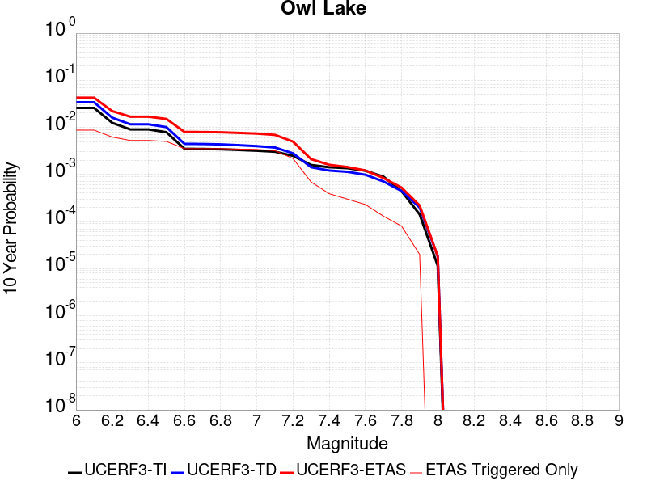 |

| Magnitude | 1 wk TI Prob | 1 wk TD Prob | 1 wk ETAS Prob | 1 wk ETAS/TD Gain | 1 wk ETAS Triggered Only | 1 mo TI Prob | 1 mo TD Prob | 1 mo ETAS Prob | 1 mo ETAS/TD Gain | 1 mo ETAS Triggered Only | 1 yr TI Prob | 1 yr TD Prob | 1 yr ETAS Prob | 1 yr ETAS/TD Gain | 1 yr ETAS Triggered Only | 10 yr TI Prob | 10 yr TD Prob | 10 yr ETAS Prob | 10 yr ETAS/TD Gain | 10 yr ETAS Triggered Only |
|-----|-----|-----|-----|-----|-----|-----|-----|-----|-----|-----|-----|-----|-----|-----|-----|-----|-----|-----|-----|-----|
| 6.0 | 5.0320643E-5 | 6.637151E-5 | 2.0858261E-4 | 3.1426528 | 1.4222054E-4 | 2.1564208E-4 | 2.844246E-4 | 0.0013270786 | 4.665836 | 0.0010429505 | 0.0026222812 | 0.0034584238 | 0.007615798 | 2.202101 | 0.004171802 | 0.02591553 | 0.034147043 | 0.042800985 | 1.2534316 | 0.008959894 |
| 6.1 | 5.0320643E-5 | 6.637151E-5 | 2.0858261E-4 | 3.1426528 | 1.4222054E-4 | 2.1564208E-4 | 2.844246E-4 | 0.0013270786 | 4.665836 | 0.0010429505 | 0.0026222812 | 0.0034584238 | 0.007615798 | 2.202101 | 0.004171802 | 0.02591553 | 0.034147043 | 0.042800985 | 1.2534316 | 0.008959894 |
| 6.2 | 2.4125871E-5 | 3.098766E-5 | 1.2579841E-4 | 4.0596294 | 9.481369E-5 | 1.0339249E-4 | 1.3279865E-4 | 7.9640636E-4 | 5.9970965 | 6.6369586E-4 | 0.0012580766 | 0.0016157742 | 0.004455589 | 2.7575567 | 0.0028444107 | 0.012509781 | 0.016073797 | 0.022044336 | 1.3714455 | 0.006068076 |
| 6.3 | 1.7433485E-5 | 2.2360802E-5 | 1.1717237E-4 | 5.240079 | 9.481369E-5 | 7.471279E-5 | 9.582938E-5 | 7.120593E-4 | 7.4304905 | 6.16289E-4 | 9.0924866E-4 | 0.0011662478 | 0.0035811772 | 3.070683 | 0.002417749 | 0.009055373 | 0.01163159 | 0.016738832 | 1.4390837 | 0.005167346 |
| 6.4 | 1.7433485E-5 | 2.2360802E-5 | 1.1717237E-4 | 5.240079 | 9.481369E-5 | 7.471279E-5 | 9.582938E-5 | 7.120593E-4 | 7.4304905 | 6.16289E-4 | 9.0924866E-4 | 0.0011662478 | 0.0035811772 | 3.070683 | 0.002417749 | 0.009055373 | 0.01163159 | 0.016738832 | 1.4390837 | 0.005167346 |
| 6.5 | 1.5182742E-5 | 1.9433977E-5 | 1.1424583E-4 | 5.8786645 | 9.481369E-5 | 6.506727E-5 | 8.3286664E-5 | 6.995243E-4 | 8.398995 | 6.16289E-4 | 7.919061E-4 | 0.0010136948 | 0.0033342754 | 3.28923 | 0.0023229355 | 0.0078909 | 0.0101209 | 0.014907459 | 1.4729381 | 0.004835498 |
| 6.6 | 6.7271576E-6 | 8.550545E-6 | 5.5956985E-5 | 6.544259 | 4.7406844E-5 | 2.8830356E-5 | 3.6644713E-5 | 5.106958E-4 | 13.936412 | 4.7406845E-4 | 3.5095305E-4 | 4.460637E-4 | 0.0021519489 | 4.8243084 | 0.0017066464 | 0.0035039932 | 0.0044694655 | 0.008009087 | 1.7919564 | 0.0035555135 |
| 6.7 | 6.682835E-6 | 8.482986E-6 | 5.5889428E-5 | 6.5884147 | 4.7406844E-5 | 2.8640408E-5 | 3.635518E-5 | 5.104064E-4 | 14.039441 | 4.7406845E-4 | 3.4864116E-4 | 4.4254007E-4 | 0.0021484313 | 4.854772 | 0.0017066464 | 0.003480947 | 0.004434389 | 0.007974136 | 1.798249 | 0.0035555135 |
| 6.8 | 6.5774975E-6 | 8.329444E-6 | 5.5735894E-5 | 6.69143 | 4.7406844E-5 | 2.8188972E-5 | 3.569716E-5 | 5.097487E-4 | 14.27981 | 4.7406845E-4 | 3.4314668E-4 | 4.3453192E-4 | 0.0021404368 | 4.9258447 | 0.0017066464 | 0.0034261728 | 0.004354527 | 0.007894558 | 1.8129541 | 0.0035555135 |
| 6.9 | 6.363419E-6 | 8.002579E-6 | 5.5409044E-5 | 6.923898 | 4.7406844E-5 | 2.727151E-5 | 3.429635E-5 | 5.083486E-4 | 14.822235 | 4.7406845E-4 | 3.3198006E-4 | 4.1748365E-4 | 0.0021234176 | 5.0862293 | 0.0017066464 | 0.0033148455 | 0.0041844994 | 0.007677926 | 1.8348495 | 0.0035081066 |
| 7.0 | 6.1342453E-6 | 7.63473E-6 | 5.504121E-5 | 7.2093205 | 4.7406844E-5 | 2.6289357E-5 | 3.271989E-5 | 5.0677283E-4 | 15.488219 | 4.7406845E-4 | 3.2002592E-4 | 3.9829736E-4 | 0.0020094882 | 5.0451956 | 0.0016118328 | 0.0031956544 | 0.0039931675 | 0.007345613 | 1.8395454 | 0.003365886 |
| 7.1 | 5.842926E-6 | 7.14521E-6 | 5.4551718E-5 | 7.634725 | 4.7406844E-5 | 2.504087E-5 | 3.0622E-5 | 5.0467596E-4 | 16.48083 | 4.7406845E-4 | 3.0482994E-4 | 3.7276448E-4 | 0.0018892181 | 5.0681276 | 0.001517019 | 0.0030441214 | 0.0037385917 | 0.0068085166 | 1.8211447 | 0.003081445 |
| 7.2 | 4.77173E-6 | 5.361204E-6 | 5.2767795E-5 | 9.842527 | 4.7406844E-5 | 2.045011E-5 | 2.297641E-5 | 2.6000518E-4 | 11.31618 | 2.3703423E-4 | 2.4895166E-4 | 2.7970594E-4 | 0.0010853969 | 3.880493 | 8.059164E-4 | 0.0024867293 | 0.0028100624 | 0.0044646394 | 1.5888044 | 0.0016592396 |
| 7.3 | 3.0494948E-6 | 2.7124704E-6 | 2.7124704E-6 | 1.0 | 0.0 | 1.3069198E-5 | 1.1624823E-5 | 5.9031117E-5 | 5.078023 | 4.7406844E-5 | 1.5910587E-4 | 1.4152318E-4 | 5.207243E-4 | 3.6794274 | 3.7925475E-4 | 0.0015899199 | 0.0014242887 | 0.0020870392 | 1.4653203 | 6.6369586E-4 |
| 7.4 | 2.7263884E-6 | 2.3075613E-6 | 2.3075613E-6 | 1.0 | 0.0 | 1.1684469E-5 | 9.889511E-6 | 9.889511E-6 | 1.0 | 0.0 | 1.4224913E-4 | 1.2039825E-4 | 3.5740394E-4 | 2.9685144 | 2.3703423E-4 | 0.0014215811 | 0.0012122075 | 0.0016383519 | 1.3515441 | 4.266616E-4 |
| 7.5 | 2.6090431E-6 | 2.1674637E-6 | 2.1674637E-6 | 1.0 | 0.0 | 1.1181565E-5 | 9.289097E-6 | 9.289097E-6 | 1.0 | 0.0 | 1.3612706E-4 | 1.1308899E-4 | 3.500964E-4 | 3.0957606 | 2.3703423E-4 | 0.001360437 | 0.0011389464 | 0.001565122 | 1.3741841 | 4.266616E-4 |
| 7.6 | 2.3008756E-6 | 1.8745708E-6 | 1.8745708E-6 | 1.0 | 0.0 | 9.860858E-6 | 8.0338505E-6 | 8.0338505E-6 | 1.0 | 0.0 | 1.20049335E-4 | 9.7807824E-5 | 2.8741665E-4 | 2.9385855 | 1.8962738E-4 | 0.001199845 | 9.85921E-4 | 0.0013174417 | 1.3362548 | 3.3184793E-4 |
| 7.7 | 1.7184348E-6 | 1.343562E-6 | 1.343562E-6 | 1.0 | 0.0 | 7.3646997E-6 | 5.7581105E-6 | 5.7581105E-6 | 1.0 | 0.0 | 8.966153E-5 | 7.010278E-5 | 1.6490983E-4 | 2.3524005 | 9.481369E-5 | 8.962536E-4 | 7.086945E-4 | 9.4556075E-4 | 1.334229 | 2.3703423E-4 |
| 7.8 | 8.4612907E-7 | 8.4176E-7 | 8.4176E-7 | 1.0 | 0.0 | 3.6262625E-6 | 3.607538E-6 | 3.607538E-6 | 1.0 | 0.0 | 4.4148852E-5 | 4.392091E-5 | 1.3873044E-4 | 3.158642 | 9.481369E-5 | 4.414008E-4 | 4.4459777E-4 | 6.3414086E-4 | 1.4263248 | 1.8962738E-4 |
| 7.9 | 2.716738E-7 | 3.7732943E-7 | 3.7732943E-7 | 1.0 | 0.0 | 1.1643157E-6 | 1.6171252E-6 | 1.6171252E-6 | 1.0 | 0.0 | 1.4175452E-5 | 1.9688332E-5 | 6.7094246E-5 | 3.4078176 | 4.7406844E-5 | 1.4174548E-4 | 1.9863734E-4 | 2.934322E-4 | 1.4772258 | 9.481369E-5 |
| 8.0 | 2.1995428E-8 | 3.389418E-8 | 3.389418E-8 | 1.0 | 0.0 | 9.426611E-8 | 1.4526077E-7 | 1.4526077E-7 | 1.0 | 0.0 | 1.1476893E-6 | 1.768549E-6 | 1.768549E-6 | 1.0 | 0.0 | 1.14768345E-5 | 1.798665E-5 | 1.798665E-5 | 1.0 | 0.0 |

## Panamint Valley
*[(top)](#table-of-contents)*

| 1 Week | 1 Month | 1 Year | 10 Year |
|-----|-----|-----|-----|
| 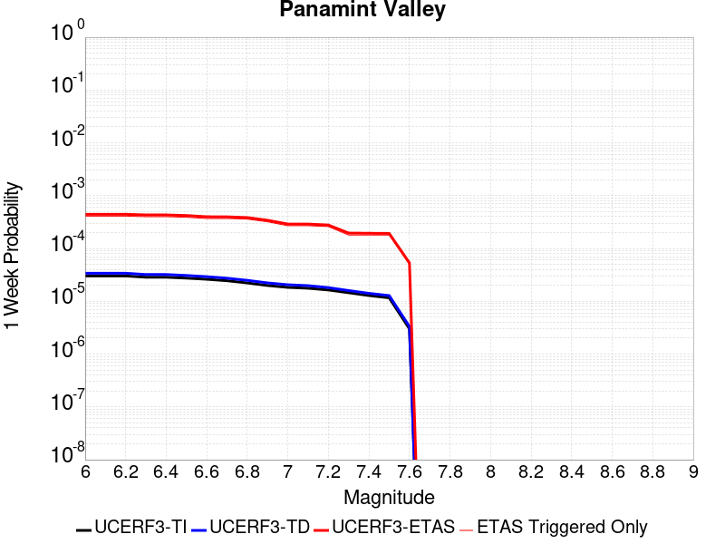 | 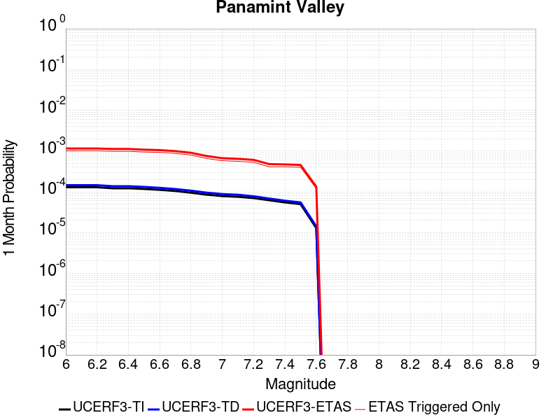 | 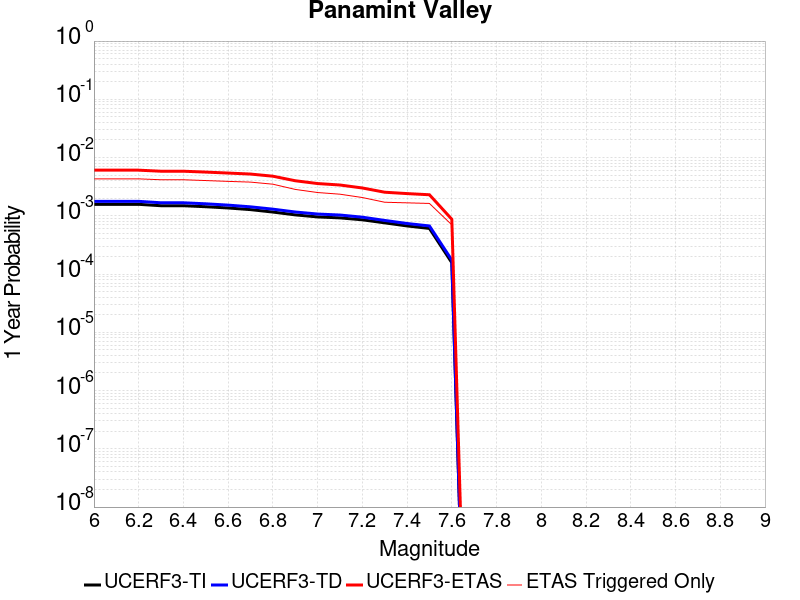 | 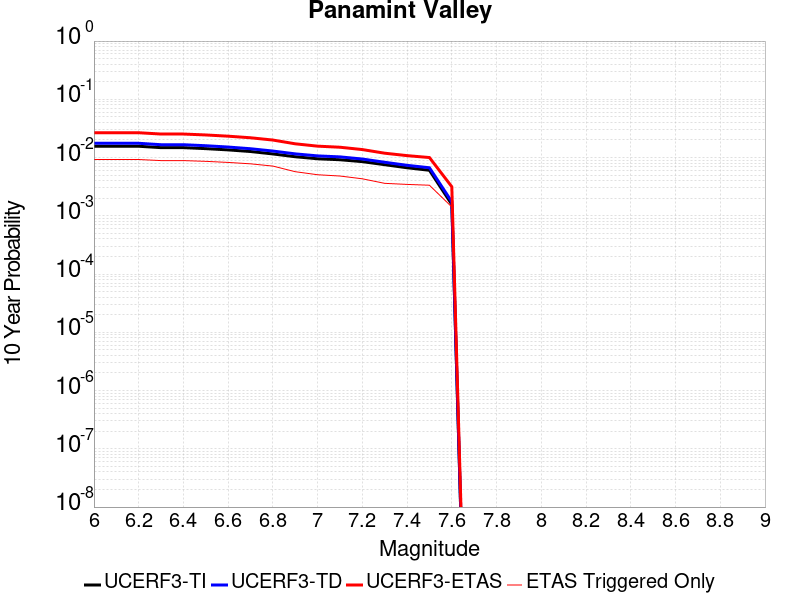 |

| Magnitude | 1 wk TI Prob | 1 wk TD Prob | 1 wk ETAS Prob | 1 wk ETAS/TD Gain | 1 wk ETAS Triggered Only | 1 mo TI Prob | 1 mo TD Prob | 1 mo ETAS Prob | 1 mo ETAS/TD Gain | 1 mo ETAS Triggered Only | 1 yr TI Prob | 1 yr TD Prob | 1 yr ETAS Prob | 1 yr ETAS/TD Gain | 1 yr ETAS Triggered Only | 10 yr TI Prob | 10 yr TD Prob | 10 yr ETAS Prob | 10 yr ETAS/TD Gain | 10 yr ETAS Triggered Only |
|-----|-----|-----|-----|-----|-----|-----|-----|-----|-----|-----|-----|-----|-----|-----|-----|-----|-----|-----|-----|-----|
| 6.0 | 3.0211835E-5 | 3.39879E-5 | 3.184193E-4 | 9.3686075 | 2.8444108E-4 | 1.2947287E-4 | 1.4565447E-4 | 9.040535E-4 | 6.2068367 | 7.585095E-4 | 0.0015751923 | 0.0017719301 | 0.005747049 | 3.2433834 | 0.003982175 | 0.015640736 | 0.017584875 | 0.026620075 | 1.5138053 | 0.009196928 |
| 6.1 | 3.0211835E-5 | 3.39879E-5 | 3.184193E-4 | 9.3686075 | 2.8444108E-4 | 1.2947287E-4 | 1.4565447E-4 | 9.040535E-4 | 6.2068367 | 7.585095E-4 | 0.0015751923 | 0.0017719301 | 0.005747049 | 3.2433834 | 0.003982175 | 0.015640736 | 0.017584875 | 0.026620075 | 1.5138053 | 0.009196928 |
| 6.2 | 3.0211835E-5 | 3.39879E-5 | 3.184193E-4 | 9.3686075 | 2.8444108E-4 | 1.2947287E-4 | 1.4565447E-4 | 9.040535E-4 | 6.2068367 | 7.585095E-4 | 0.0015751923 | 0.0017719301 | 0.005747049 | 3.2433834 | 0.003982175 | 0.015640736 | 0.017584875 | 0.026620075 | 1.5138053 | 0.009196928 |
| 6.3 | 2.8573924E-5 | 3.210589E-5 | 3.1653783E-4 | 9.859182 | 2.8444108E-4 | 1.2245393E-4 | 1.3758958E-4 | 8.959948E-4 | 6.512083 | 7.585095E-4 | 0.001489857 | 0.0016738938 | 0.0053654383 | 3.2053635 | 0.0036977339 | 0.01479908 | 0.01661945 | 0.02515072 | 1.5133306 | 0.008675452 |
| 6.4 | 2.8573924E-5 | 3.210589E-5 | 3.1653783E-4 | 9.859182 | 2.8444108E-4 | 1.2245393E-4 | 1.3758958E-4 | 8.959948E-4 | 6.512083 | 7.585095E-4 | 0.001489857 | 0.0016738938 | 0.0053654383 | 3.2053635 | 0.0036977339 | 0.01479908 | 0.01661945 | 0.02515072 | 1.5133306 | 0.008675452 |
| 6.5 | 2.7468774E-5 | 3.0831525E-5 | 3.1526384E-4 | 10.225373 | 2.8444108E-4 | 1.1771801E-4 | 1.3212857E-4 | 8.9053786E-4 | 6.7399344 | 7.585095E-4 | 0.0014322745 | 0.0016075056 | 0.0051573035 | 3.2082648 | 0.0035555135 | 0.014230782 | 0.015965264 | 0.02422231 | 1.5171883 | 0.0083910115 |
| 6.6 | 2.6135967E-5 | 2.9255436E-5 | 3.136882E-4 | 10.72239 | 2.8444108E-4 | 1.1200648E-4 | 1.2537456E-4 | 8.83789E-4 | 7.049189 | 7.585095E-4 | 0.0013628257 | 0.001525393 | 0.005028148 | 3.296297 | 0.0035081066 | 0.013544982 | 0.015155562 | 0.022999208 | 1.5175424 | 0.00796435 |
| 6.7 | 2.4498746E-5 | 2.7344193E-5 | 3.117775E-4 | 11.401964 | 2.8444108E-4 | 1.04990395E-4 | 1.17184274E-4 | 7.8080234E-4 | 6.66303 | 6.6369586E-4 | 0.0012775084 | 0.0014258098 | 0.004786897 | 3.3573177 | 0.003365886 | 0.012701893 | 0.014172745 | 0.021463398 | 1.5144137 | 0.0073954677 |
| 6.8 | 2.2244329E-5 | 2.4938103E-5 | 3.093721E-4 | 12.405599 | 2.8444108E-4 | 9.532935E-5 | 1.06873325E-4 | 7.7049824E-4 | 7.209453 | 6.6369586E-4 | 0.0011600169 | 0.0013004278 | 0.0043778657 | 3.3664808 | 0.003081445 | 0.011539802 | 0.012933899 | 0.019485015 | 1.5065075 | 0.0066369586 |
| 6.9 | 1.9902658E-5 | 2.2292743E-5 | 3.0672748E-4 | 13.759072 | 2.8444108E-4 | 8.529431E-5 | 9.553693E-5 | 7.1176706E-4 | 7.4501767 | 6.16289E-4 | 0.0010379635 | 0.00116256 | 0.0037669053 | 3.2401814 | 0.0026073765 | 0.010331288 | 0.011569886 | 0.016958596 | 1.4657532 | 0.0054517873 |
| 7.0 | 1.8353881E-5 | 2.0568525E-5 | 3.0500375E-4 | 14.828665 | 2.8444108E-4 | 7.865712E-5 | 8.814794E-5 | 7.043826E-4 | 7.990914 | 6.16289E-4 | 9.5722964E-4 | 0.0010726905 | 0.0034404902 | 3.2073464 | 0.0023703424 | 0.009531168 | 0.010680057 | 0.015463912 | 1.4479241 | 0.004835498 |
| 7.1 | 1.7667631E-5 | 1.9774876E-5 | 3.0421032E-4 | 15.383678 | 2.8444108E-4 | 7.571623E-5 | 8.474681E-5 | 7.0098357E-4 | 8.271503 | 6.16289E-4 | 9.2145515E-4 | 0.0010313216 | 0.0031150717 | 3.0204656 | 0.002085901 | 0.009176437 | 0.010270242 | 0.014727639 | 1.4340109 | 0.00450365 |
| 7.2 | 1.6381597E-5 | 1.8160366E-5 | 2.551903E-4 | 14.052045 | 2.3703423E-4 | 7.020495E-5 | 7.782792E-5 | 5.9926265E-4 | 7.6998415 | 5.214753E-4 | 8.544101E-4 | 9.471603E-4 | 0.002794276 | 2.950162 | 0.0018488669 | 0.008511325 | 0.0094358865 | 0.013521365 | 1.4329723 | 0.0041243955 |
| 7.3 | 1.4520491E-5 | 1.5968182E-5 | 2.0559254E-4 | 12.875137 | 1.8962738E-4 | 6.222919E-5 | 6.8433365E-5 | 4.9506576E-4 | 7.2342753 | 4.266616E-4 | 7.57377E-4 | 8.328739E-4 | 0.0023486295 | 2.81991 | 0.001517019 | 0.0075480095 | 0.008300635 | 0.011732609 | 1.4134592 | 0.0034606997 |
| 7.4 | 1.2852287E-5 | 1.4146948E-5 | 2.0377165E-4 | 14.40393 | 1.8962738E-4 | 5.5080065E-5 | 6.0628456E-5 | 4.872642E-4 | 8.036889 | 4.266616E-4 | 6.7039346E-4 | 7.379173E-4 | 0.002253817 | 3.0542948 | 0.001517019 | 0.0066837464 | 0.0073575918 | 0.010698713 | 1.4541053 | 0.003365886 |
| 7.5 | 1.1637851E-5 | 1.2838205E-5 | 2.0246315E-4 | 15.770363 | 1.8962738E-4 | 4.987555E-5 | 5.5019806E-5 | 4.8165795E-4 | 8.754265 | 4.266616E-4 | 6.070656E-4 | 6.6967594E-4 | 0.002138304 | 3.1930428 | 0.0014696122 | 0.006054099 | 0.006679477 | 0.00988161 | 1.4793987 | 0.0032236655 |
| 7.6 | 3.0068115E-6 | 3.3335807E-6 | 1.4555364E-4 | 43.662853 | 1.4222054E-4 | 1.2886271E-5 | 1.4286737E-5 | 2.039114E-4 | 14.272778 | 1.8962738E-4 | 1.5687906E-4 | 1.7393442E-4 | 6.479204E-4 | 3.7250845 | 4.7406845E-4 | 0.0015676835 | 0.0017394236 | 0.0028752089 | 1.6529664 | 0.0011377643 |

## Ash Hill
*[(top)](#table-of-contents)*

| 1 Week | 1 Month | 1 Year | 10 Year |
|-----|-----|-----|-----|
| 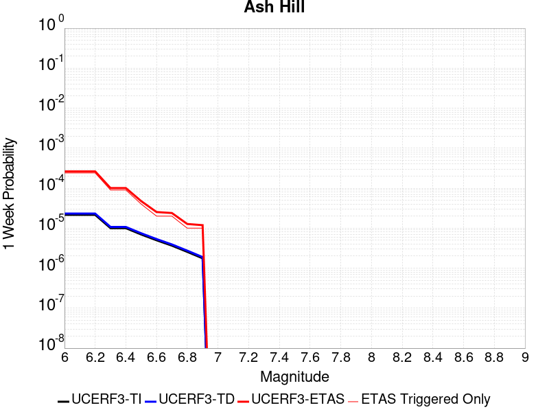 |  |  |  |

| Magnitude | 1 wk TI Prob | 1 wk TD Prob | 1 wk ETAS Prob | 1 wk ETAS/TD Gain | 1 wk ETAS Triggered Only | 1 mo TI Prob | 1 mo TD Prob | 1 mo ETAS Prob | 1 mo ETAS/TD Gain | 1 mo ETAS Triggered Only | 1 yr TI Prob | 1 yr TD Prob | 1 yr ETAS Prob | 1 yr ETAS/TD Gain | 1 yr ETAS Triggered Only | 10 yr TI Prob | 10 yr TD Prob | 10 yr ETAS Prob | 10 yr ETAS/TD Gain | 10 yr ETAS Triggered Only |
|-----|-----|-----|-----|-----|-----|-----|-----|-----|-----|-----|-----|-----|-----|-----|-----|-----|-----|-----|-----|-----|
| 6.0 | 2.1545662E-5 | 2.3195389E-5 | 2.6022413E-4 | 11.218786 | 2.3703423E-4 | 9.2335285E-5 | 9.940547E-5 | 7.156332E-4 | 7.199133 | 6.16289E-4 | 0.0011236023 | 0.0012096697 | 0.0047135325 | 3.8965452 | 0.0035081066 | 0.011179381 | 0.012038835 | 0.019204762 | 1.5952343 | 0.0072532473 |
| 6.1 | 2.1545662E-5 | 2.3195389E-5 | 2.6022413E-4 | 11.218786 | 2.3703423E-4 | 9.2335285E-5 | 9.940547E-5 | 7.156332E-4 | 7.199133 | 6.16289E-4 | 0.0011236023 | 0.0012096697 | 0.0047135325 | 3.8965452 | 0.0035081066 | 0.011179381 | 0.012038835 | 0.019204762 | 1.5952343 | 0.0072532473 |
| 6.2 | 2.1545662E-5 | 2.3195389E-5 | 2.6022413E-4 | 11.218786 | 2.3703423E-4 | 9.2335285E-5 | 9.940547E-5 | 7.156332E-4 | 7.199133 | 6.16289E-4 | 0.0011236023 | 0.0012096697 | 0.0047135325 | 3.8965452 | 0.0035081066 | 0.011179381 | 0.012038835 | 0.019204762 | 1.5952343 | 0.0072532473 |
| 6.3 | 1.0025529E-5 | 1.0747344E-5 | 1.05560015E-4 | 9.821962 | 9.481369E-5 | 4.2965847E-5 | 4.605931E-5 | 2.8308263E-4 | 6.1460457 | 2.3703423E-4 | 5.229836E-4 | 5.6064106E-4 | 0.0016503872 | 2.9437501 | 0.0010903574 | 0.005217545 | 0.0055935793 | 0.008374938 | 1.4972413 | 0.0027970038 |
| 6.4 | 1.0025529E-5 | 1.0747344E-5 | 1.05560015E-4 | 9.821962 | 9.481369E-5 | 4.2965847E-5 | 4.605931E-5 | 2.8308263E-4 | 6.1460457 | 2.3703423E-4 | 5.229836E-4 | 5.6064106E-4 | 0.0016503872 | 2.9437501 | 0.0010903574 | 0.005217545 | 0.0055935793 | 0.008374938 | 1.4972413 | 0.0027970038 |
| 6.5 | 6.9617327E-6 | 7.4569152E-6 | 1.022699E-4 | 13.714773 | 9.481369E-5 | 2.9835655E-5 | 3.1957865E-5 | 2.6898453E-4 | 8.416848 | 2.3703423E-4 | 3.6318856E-4 | 3.8902622E-4 | 0.0011472406 | 2.949006 | 7.585095E-4 | 0.0036259557 | 0.0038843066 | 0.0058204373 | 1.4984496 | 0.0019436807 |
| 6.6 | 4.9919777E-6 | 5.34689E-6 | 5.2753483E-5 | 9.8661995 | 4.7406844E-5 | 2.1394015E-5 | 2.291508E-5 | 2.1253811E-4 | 9.275033 | 1.8962738E-4 | 2.60441E-4 | 2.7896208E-4 | 7.055047E-4 | 2.5290344 | 4.266616E-4 | 0.0026013597 | 0.0027867774 | 0.00411047 | 1.4749904 | 0.0013273917 |
| 6.7 | 3.6630722E-6 | 3.9247725E-6 | 5.1331433E-5 | 13.078831 | 4.7406844E-5 | 1.5698786E-5 | 1.6820377E-5 | 2.0644457E-4 | 12.27348 | 1.8962738E-4 | 1.9111596E-4 | 2.0477458E-4 | 5.839517E-4 | 2.8516805 | 3.7925475E-4 | 0.0019095168 | 0.002046422 | 0.003181858 | 1.5548396 | 0.0011377643 |
| 6.8 | 2.5599613E-6 | 2.7450303E-6 | 5.0151746E-5 | 18.270016 | 4.7406844E-5 | 1.0971216E-5 | 1.176439E-5 | 1.0657697E-4 | 9.059285 | 9.481369E-5 | 1.3356637E-4 | 1.4322698E-4 | 4.2762732E-4 | 2.9856617 | 2.8444108E-4 | 0.0013348613 | 0.0014318317 | 0.002283933 | 1.5951128 | 8.533232E-4 |
| 6.9 | 1.7684905E-6 | 1.8969438E-6 | 4.93037E-5 | 25.991123 | 4.7406844E-5 | 7.579223E-6 | 8.129759E-6 | 5.553622E-5 | 6.831226 | 4.7406844E-5 | 9.2273134E-5 | 9.897981E-5 | 2.8858843E-4 | 2.9156291 | 1.8962738E-4 | 9.223483E-4 | 9.897981E-4 | 0.001652837 | 1.6698729 | 6.6369586E-4 |

## Airport Lake
*[(top)](#table-of-contents)*

| 1 Week | 1 Month | 1 Year | 10 Year |
|-----|-----|-----|-----|
|  |  |  |  |

| Magnitude | 1 wk TI Prob | 1 wk TD Prob | 1 wk ETAS Prob | 1 wk ETAS/TD Gain | 1 wk ETAS Triggered Only | 1 mo TI Prob | 1 mo TD Prob | 1 mo ETAS Prob | 1 mo ETAS/TD Gain | 1 mo ETAS Triggered Only | 1 yr TI Prob | 1 yr TD Prob | 1 yr ETAS Prob | 1 yr ETAS/TD Gain | 1 yr ETAS Triggered Only | 10 yr TI Prob | 10 yr TD Prob | 10 yr ETAS Prob | 10 yr ETAS/TD Gain | 10 yr ETAS Triggered Only |
|-----|-----|-----|-----|-----|-----|-----|-----|-----|-----|-----|-----|-----|-----|-----|-----|-----|-----|-----|-----|-----|
| 6.0 | 1.2387061E-5 | 1.3103559E-5 | 2.5013468E-4 | 19.089064 | 2.3703423E-4 | 5.3086325E-5 | 5.615706E-5 | 0.0012886658 | 22.94753 | 0.001232578 | 6.461343E-4 | 6.8352616E-4 | 0.0049946005 | 7.3071094 | 0.004314023 | 0.0064425888 | 0.006817048 | 0.014162101 | 2.0774536 | 0.0073954677 |
| 6.1 | 1.2387061E-5 | 1.3103559E-5 | 2.5013468E-4 | 19.089064 | 2.3703423E-4 | 5.3086325E-5 | 5.615706E-5 | 0.0012886658 | 22.94753 | 0.001232578 | 6.461343E-4 | 6.8352616E-4 | 0.0049946005 | 7.3071094 | 0.004314023 | 0.0064425888 | 0.006817048 | 0.014162101 | 2.0774536 | 0.0073954677 |
| 6.2 | 1.2387061E-5 | 1.3103559E-5 | 2.5013468E-4 | 19.089064 | 2.3703423E-4 | 5.3086325E-5 | 5.615706E-5 | 0.0012886658 | 22.94753 | 0.001232578 | 6.461343E-4 | 6.8352616E-4 | 0.0049946005 | 7.3071094 | 0.004314023 | 0.0064425888 | 0.006817048 | 0.014162101 | 2.0774536 | 0.0073954677 |
| 6.3 | 1.2387061E-5 | 1.3103559E-5 | 2.5013468E-4 | 19.089064 | 2.3703423E-4 | 5.3086325E-5 | 5.615706E-5 | 0.0012886658 | 22.94753 | 0.001232578 | 6.461343E-4 | 6.8352616E-4 | 0.0049946005 | 7.3071094 | 0.004314023 | 0.0064425888 | 0.006817048 | 0.014162101 | 2.0774536 | 0.0073954677 |
| 6.4 | 1.2387061E-5 | 1.3103559E-5 | 2.5013468E-4 | 19.089064 | 2.3703423E-4 | 5.3086325E-5 | 5.615706E-5 | 0.0012886658 | 22.94753 | 0.001232578 | 6.461343E-4 | 6.8352616E-4 | 0.0049946005 | 7.3071094 | 0.004314023 | 0.0064425888 | 0.006817048 | 0.014162101 | 2.0774536 | 0.0073954677 |
| 6.5 | 6.9922594E-6 | 7.385145E-6 | 1.9701113E-4 | 26.676676 | 1.8962738E-4 | 2.996648E-5 | 3.165027E-5 | 9.797572E-4 | 30.95573 | 9.481369E-4 | 3.6478083E-4 | 3.8527933E-4 | 0.0036550914 | 9.486861 | 0.0032710724 | 0.003641826 | 0.003846651 | 0.009324691 | 2.4241064 | 0.005499194 |
| 6.6 | 6.9922594E-6 | 7.385145E-6 | 1.9701113E-4 | 26.676676 | 1.8962738E-4 | 2.996648E-5 | 3.165027E-5 | 9.797572E-4 | 30.95573 | 9.481369E-4 | 3.6478083E-4 | 3.8527933E-4 | 0.0036550914 | 9.486861 | 0.0032710724 | 0.003641826 | 0.003846651 | 0.009324691 | 2.4241064 | 0.005499194 |
| 6.7 | 5.477277E-6 | 5.7862417E-6 | 1.4800596E-4 | 25.578945 | 1.4222054E-4 | 2.3473833E-5 | 2.4797964E-5 | 9.255057E-4 | 37.321842 | 9.007301E-4 | 2.8575645E-4 | 3.0187727E-4 | 0.003192822 | 10.576556 | 0.0028918176 | 0.0028538927 | 0.003015056 | 0.0077887108 | 2.5832725 | 0.0047880914 |
| 6.8 | 3.9950432E-6 | 4.2192128E-6 | 1.4643915E-4 | 34.707695 | 1.4222054E-4 | 1.7121502E-5 | 1.808223E-5 | 5.8695406E-4 | 32.46027 | 5.6888215E-4 | 2.0843433E-4 | 2.2013167E-4 | 0.0022581774 | 10.258303 | 0.0020384945 | 0.0020823893 | 0.0021994072 | 0.0055105877 | 2.5054877 | 0.0033184793 |
| 6.9 | 2.95695E-6 | 3.1231173E-6 | 9.7936514E-5 | 31.358576 | 9.481369E-5 | 1.2672582E-5 | 1.33847325E-5 | 5.348531E-4 | 39.959934 | 5.214753E-4 | 1.5427776E-4 | 1.629492E-4 | 0.001679721 | 10.308249 | 0.001517019 | 0.001541707 | 0.0016285196 | 0.004089661 | 2.5112753 | 0.002465156 |
| 7.0 | 1.456072E-6 | 1.5408596E-6 | 9.635441E-5 | 62.53289 | 9.481369E-5 | 6.2402937E-6 | 6.603673E-6 | 2.4363633E-4 | 36.894066 | 2.3703423E-4 | 7.597293E-5 | 8.039776E-5 | 6.018311E-4 | 7.4856706 | 5.214753E-4 | 7.594696E-4 | 8.0378563E-4 | 0.0017985292 | 2.2375731 | 9.955438E-4 |
| 7.1 | 6.995192E-7 | 7.409207E-7 | 4.8147733E-5 | 64.98365 | 4.7406844E-5 | 2.997936E-6 | 3.1753743E-6 | 1.4539546E-4 | 45.788445 | 1.4222054E-4 | 3.649926E-5 | 3.8660182E-5 | 1.8087523E-4 | 4.6785917 | 1.4222054E-4 | 3.6493264E-4 | 3.8660184E-4 | 7.6570996E-4 | 1.9806166 | 3.7925475E-4 |

## Garlock (East)
*[(top)](#table-of-contents)*

| 1 Week | 1 Month | 1 Year | 10 Year |
|-----|-----|-----|-----|
|  |  |  |  |

| Magnitude | 1 wk TI Prob | 1 wk TD Prob | 1 wk ETAS Prob | 1 wk ETAS/TD Gain | 1 wk ETAS Triggered Only | 1 mo TI Prob | 1 mo TD Prob | 1 mo ETAS Prob | 1 mo ETAS/TD Gain | 1 mo ETAS Triggered Only | 1 yr TI Prob | 1 yr TD Prob | 1 yr ETAS Prob | 1 yr ETAS/TD Gain | 1 yr ETAS Triggered Only | 10 yr TI Prob | 10 yr TD Prob | 10 yr ETAS Prob | 10 yr ETAS/TD Gain | 10 yr ETAS Triggered Only |
|-----|-----|-----|-----|-----|-----|-----|-----|-----|-----|-----|-----|-----|-----|-----|-----|-----|-----|-----|-----|-----|
| 6.0 | 4.5092507E-5 | 6.2917425E-5 | 2.525329E-4 | 4.013719 | 1.8962738E-4 | 1.9323928E-4 | 2.6962077E-4 | 8.857436E-4 | 3.2851462 | 6.16289E-4 | 0.0023501497 | 0.0032781374 | 0.005829715 | 1.778362 | 0.0025599697 | 0.023254504 | 0.03235903 | 0.038001385 | 1.1743672 | 0.005831042 |
| 6.1 | 4.5092507E-5 | 6.2917425E-5 | 2.525329E-4 | 4.013719 | 1.8962738E-4 | 1.9323928E-4 | 2.6962077E-4 | 8.857436E-4 | 3.2851462 | 6.16289E-4 | 0.0023501497 | 0.0032781374 | 0.005829715 | 1.778362 | 0.0025599697 | 0.023254504 | 0.03235903 | 0.038001385 | 1.1743672 | 0.005831042 |
| 6.2 | 2.6674514E-5 | 3.452091E-5 | 2.2414174E-4 | 6.492927 | 1.8962738E-4 | 1.1431433E-4 | 1.4793854E-4 | 5.74537E-4 | 3.8836195 | 4.266616E-4 | 0.0013908884 | 0.0017996968 | 0.0036452364 | 2.0254724 | 0.0018488669 | 0.01382215 | 0.017896036 | 0.021620711 | 1.2081286 | 0.0037925476 |
| 6.3 | 2.6674514E-5 | 3.452091E-5 | 2.2414174E-4 | 6.492927 | 1.8962738E-4 | 1.1431433E-4 | 1.4793854E-4 | 5.74537E-4 | 3.8836195 | 4.266616E-4 | 0.0013908884 | 0.0017996968 | 0.0036452364 | 2.0254724 | 0.0018488669 | 0.01382215 | 0.017896036 | 0.021620711 | 1.2081286 | 0.0037925476 |
| 6.4 | 2.5312667E-5 | 3.234991E-5 | 2.2197116E-4 | 6.8615694 | 1.8962738E-4 | 1.0847834E-4 | 1.3863528E-4 | 5.652377E-4 | 4.0771565 | 4.266616E-4 | 0.0013199237 | 0.0016866071 | 0.0034850289 | 2.0662956 | 0.0018014602 | 0.013121112 | 0.016783953 | 0.020419624 | 1.2166159 | 0.0036977339 |
| 6.5 | 2.5312667E-5 | 3.234991E-5 | 2.2197116E-4 | 6.8615694 | 1.8962738E-4 | 1.0847834E-4 | 1.3863528E-4 | 5.652377E-4 | 4.0771565 | 4.266616E-4 | 0.0013199237 | 0.0016866071 | 0.0034850289 | 2.0662956 | 0.0018014602 | 0.013121112 | 0.016783953 | 0.020419624 | 1.2166159 | 0.0036977339 |
| 6.6 | 2.246556E-5 | 2.8144346E-5 | 2.177664E-4 | 7.7374825 | 1.8962738E-4 | 9.627742E-5 | 1.20613186E-4 | 5.472233E-4 | 4.5370107 | 4.266616E-4 | 0.0011715472 | 0.0014674999 | 0.003218979 | 2.1935122 | 0.0017540533 | 0.011653901 | 0.0146240825 | 0.018080886 | 1.2363775 | 0.0035081066 |
| 6.7 | 2.2241198E-5 | 2.781406E-5 | 2.1743617E-4 | 7.8174915 | 1.8962738E-4 | 9.531594E-5 | 1.1919779E-4 | 5.458085E-4 | 4.5790153 | 4.266616E-4 | 0.0011598538 | 0.0014502906 | 0.0032018 | 2.2076955 | 0.0017540533 | 0.011538187 | 0.014454261 | 0.017818218 | 1.2327311 | 0.0034132928 |
| 6.8 | 1.9528685E-5 | 2.3908038E-5 | 2.1353089E-4 | 8.931343 | 1.8962738E-4 | 8.369167E-5 | 1.0245911E-4 | 5.29077E-4 | 5.163787 | 4.266616E-4 | 0.0010184698 | 0.0012467455 | 0.0028565687 | 2.2912204 | 0.0016118328 | 0.010138147 | 0.012441495 | 0.01553142 | 1.2483563 | 0.0031288518 |
| 6.9 | 1.3318621E-5 | 1.5207374E-5 | 1.5742575E-4 | 10.351934 | 1.4222054E-4 | 5.7078556E-5 | 6.517287E-5 | 3.9699915E-4 | 6.0914793 | 3.3184793E-4 | 6.9470983E-4 | 7.931965E-4 | 0.0023090122 | 2.9110217 | 0.001517019 | 0.0069254204 | 0.007944281 | 0.010719065 | 1.3492807 | 0.0027970038 |
| 7.0 | 1.1760853E-5 | 1.3115987E-5 | 1.5533465E-4 | 11.843155 | 1.4222054E-4 | 5.0402683E-5 | 5.621019E-5 | 3.8803945E-4 | 6.903365 | 3.3184793E-4 | 6.134799E-4 | 6.841492E-4 | 0.0022001304 | 3.2158635 | 0.001517019 | 0.0061178906 | 0.006860767 | 0.009591499 | 1.3980215 | 0.002749597 |
| 7.1 | 1.0064758E-5 | 1.0910848E-5 | 1.5312983E-4 | 14.03464 | 1.4222054E-4 | 4.3133965E-5 | 4.675996E-5 | 3.7859235E-4 | 8.096507 | 3.3184793E-4 | 5.2502943E-4 | 5.691573E-4 | 0.0019905532 | 3.497369 | 0.0014222054 | 0.005237907 | 0.005717105 | 0.008168167 | 1.4287244 | 0.002465156 |
| 7.2 | 9.768808E-6 | 1.0506669E-5 | 1.5272571E-4 | 14.536073 | 1.4222054E-4 | 4.186565E-5 | 4.5027828E-5 | 3.7686081E-4 | 8.369509 | 3.3184793E-4 | 5.095951E-4 | 5.480794E-4 | 0.0019221244 | 3.5070183 | 0.0013747985 | 0.0050842804 | 0.0055073434 | 0.007911777 | 1.4365869 | 0.002417749 |
| 7.3 | 9.344516E-6 | 9.95218E-6 | 1.521713E-4 | 15.290247 | 1.4222054E-4 | 4.004731E-5 | 4.2651525E-5 | 3.744853E-4 | 8.780115 | 3.3184793E-4 | 4.8746695E-4 | 5.1916204E-4 | 0.0018932468 | 3.6467357 | 0.0013747985 | 0.0048639905 | 0.0052189473 | 0.0076240785 | 1.460846 | 0.002417749 |
| 7.4 | 9.023491E-6 | 9.498219E-6 | 1.5171741E-4 | 15.9732485 | 1.4222054E-4 | 3.867153E-5 | 4.0706036E-5 | 3.7254044E-4 | 9.151971 | 3.3184793E-4 | 4.7072413E-4 | 4.9548666E-4 | 0.0017748373 | 3.5820084 | 0.0012799848 | 0.004697283 | 0.004982321 | 0.007246512 | 1.4544451 | 0.0022755286 |
| 7.5 | 7.081253E-6 | 7.0943947E-6 | 1.4931393E-4 | 21.046745 | 1.4222054E-4 | 3.0347876E-5 | 3.0404199E-5 | 3.1483662E-4 | 10.355038 | 2.8444108E-4 | 3.6942272E-4 | 3.70109E-4 | 0.0011757271 | 3.1767051 | 8.059164E-4 | 0.003688092 | 0.00372781 | 0.005050253 | 1.3547508 | 0.0013273917 |
| 7.6 | 6.116396E-6 | 5.9656345E-6 | 1.0077876E-4 | 16.893217 | 9.481369E-5 | 2.6212863E-5 | 2.5566756E-5 | 2.1518928E-4 | 8.416761 | 1.8962738E-4 | 3.1909486E-4 | 3.1123104E-4 | 9.2732825E-4 | 2.9795492 | 6.16289E-4 | 0.0031863707 | 0.0031390795 | 0.004036982 | 1.2860401 | 9.007301E-4 |
| 7.7 | 4.797145E-6 | 4.763327E-6 | 5.2169948E-5 | 10.952417 | 4.7406844E-5 | 2.055903E-5 | 2.04141E-5 | 6.781998E-5 | 3.3222125 | 4.7406844E-5 | 2.5027743E-4 | 2.4851345E-4 | 4.8548877E-4 | 1.9535714 | 2.3703423E-4 | 0.0024999576 | 0.0025124948 | 0.0028907966 | 1.1505682 | 3.7925475E-4 |
| 7.8 | 3.4028885E-6 | 3.9838537E-6 | 5.139051E-5 | 12.899698 | 4.7406844E-5 | 1.4583726E-5 | 1.7073547E-5 | 6.447958E-5 | 3.776578 | 4.7406844E-5 | 1.775424E-4 | 2.0785068E-4 | 4.4483563E-4 | 2.1401691 | 2.3703423E-4 | 0.0017740062 | 0.0021040295 | 0.0024351792 | 1.1573883 | 3.3184793E-4 |
| 7.9 | 2.5928412E-6 | 3.3770064E-6 | 5.0783692E-5 | 15.03808 | 4.7406844E-5 | 1.1112129E-5 | 1.4472805E-5 | 6.187896E-5 | 4.2755337 | 4.7406844E-5 | 1.3528178E-4 | 1.7619222E-4 | 3.657862E-4 | 2.0760634 | 1.8962738E-4 | 0.0013519945 | 0.0017836117 | 0.002020223 | 1.1326586 | 2.3703423E-4 |
| 8.0 | 1.3743648E-6 | 1.6755408E-6 | 4.9082308E-5 | 29.293411 | 4.7406844E-5 | 5.8901214E-6 | 7.1808695E-6 | 5.4587374E-5 | 7.6017776 | 4.7406844E-5 | 7.1709874E-5 | 8.742361E-5 | 2.2963171E-4 | 2.6266556 | 1.4222054E-4 | 7.1686733E-4 | 8.847989E-4 | 0.0010268936 | 1.1605955 | 1.4222054E-4 |
| 8.1 | 3.6733252E-7 | 3.1526864E-7 | 3.1526864E-7 | 1.0 | 0.0 | 1.5742813E-6 | 1.3511507E-6 | 1.3511507E-6 | 1.0 | 0.0 | 1.9166706E-5 | 1.645015E-5 | 1.645015E-5 | 1.0 | 0.0 | 1.9165053E-4 | 1.6658098E-4 | 1.6658098E-4 | 1.0 | 0.0 |

## Hunter Mountain-Saline Valley
*[(top)](#table-of-contents)*

| 1 Week | 1 Month | 1 Year | 10 Year |
|-----|-----|-----|-----|
|  |  |  |  |

| Magnitude | 1 wk TI Prob | 1 wk TD Prob | 1 wk ETAS Prob | 1 wk ETAS/TD Gain | 1 wk ETAS Triggered Only | 1 mo TI Prob | 1 mo TD Prob | 1 mo ETAS Prob | 1 mo ETAS/TD Gain | 1 mo ETAS Triggered Only | 1 yr TI Prob | 1 yr TD Prob | 1 yr ETAS Prob | 1 yr ETAS/TD Gain | 1 yr ETAS Triggered Only | 10 yr TI Prob | 10 yr TD Prob | 10 yr ETAS Prob | 10 yr ETAS/TD Gain | 10 yr ETAS Triggered Only |
|-----|-----|-----|-----|-----|-----|-----|-----|-----|-----|-----|-----|-----|-----|-----|-----|-----|-----|-----|-----|-----|
| 6.0 | 4.5103672E-5 | 5.4576634E-5 | 2.4419368E-4 | 4.474326 | 1.8962738E-4 | 1.9328714E-4 | 2.3387549E-4 | 6.6043733E-4 | 2.8238842 | 4.266616E-4 | 0.002350731 | 0.002843864 | 0.004545657 | 1.5984087 | 0.0017066464 | 0.023260195 | 0.028095365 | 0.031827435 | 1.1328357 | 0.0038399545 |
| 6.1 | 4.5103672E-5 | 5.4576634E-5 | 2.4419368E-4 | 4.474326 | 1.8962738E-4 | 1.9328714E-4 | 2.3387549E-4 | 6.6043733E-4 | 2.8238842 | 4.266616E-4 | 0.002350731 | 0.002843864 | 0.004545657 | 1.5984087 | 0.0017066464 | 0.023260195 | 0.028095365 | 0.031827435 | 1.1328357 | 0.0038399545 |
| 6.2 | 3.9363465E-5 | 4.706859E-5 | 2.3668705E-4 | 5.028556 | 1.8962738E-4 | 1.6868966E-4 | 2.017032E-4 | 6.2827877E-4 | 3.1148674 | 4.266616E-4 | 0.002051862 | 0.0024531104 | 0.00415557 | 1.6940005 | 0.0017066464 | 0.020330196 | 0.024276383 | 0.028023116 | 1.1543366 | 0.0038399545 |
| 6.3 | 3.9363465E-5 | 4.706859E-5 | 2.3668705E-4 | 5.028556 | 1.8962738E-4 | 1.6868966E-4 | 2.017032E-4 | 6.2827877E-4 | 3.1148674 | 4.266616E-4 | 0.002051862 | 0.0024531104 | 0.00415557 | 1.6940005 | 0.0017066464 | 0.020330196 | 0.024276383 | 0.028023116 | 1.1543366 | 0.0038399545 |
| 6.4 | 3.2311684E-5 | 3.7955346E-5 | 2.2757553E-4 | 5.9958754 | 1.8962738E-4 | 1.384713E-4 | 1.6265604E-4 | 5.8924826E-4 | 3.6226645 | 4.266616E-4 | 0.0016845843 | 0.0019786113 | 0.0036345678 | 1.8369287 | 0.0016592396 | 0.016718714 | 0.019618697 | 0.023290364 | 1.1871513 | 0.0037451407 |
| 6.5 | 3.2311684E-5 | 3.7955346E-5 | 2.2757553E-4 | 5.9958754 | 1.8962738E-4 | 1.384713E-4 | 1.6265604E-4 | 5.8924826E-4 | 3.6226645 | 4.266616E-4 | 0.0016845843 | 0.0019786113 | 0.0036345678 | 1.8369287 | 0.0016592396 | 0.016718714 | 0.019618697 | 0.023290364 | 1.1871513 | 0.0037451407 |
| 6.6 | 2.9305844E-5 | 3.4185676E-5 | 2.2380658E-4 | 6.546794 | 1.8962738E-4 | 1.2559042E-4 | 1.4650216E-4 | 5.731013E-4 | 3.9118962 | 4.266616E-4 | 0.0015279909 | 0.0017822674 | 0.0034385496 | 1.929312 | 0.0016592396 | 0.015175272 | 0.017687662 | 0.021319993 | 1.2053595 | 0.0036977339 |
| 6.7 | 2.7826512E-5 | 3.234788E-5 | 2.2196914E-4 | 6.861937 | 1.8962738E-4 | 1.19251024E-4 | 1.3862675E-4 | 5.652292E-4 | 4.077346 | 4.266616E-4 | 0.0014509142 | 0.0016865344 | 0.0033429756 | 1.9821568 | 0.0016592396 | 0.014414776 | 0.01674504 | 0.020380855 | 1.2171279 | 0.0036977339 |
| 6.8 | 2.3389874E-5 | 2.686964E-5 | 2.1649193E-4 | 8.05712 | 1.8962738E-4 | 1.0023846E-4 | 1.1515078E-4 | 5.4176326E-4 | 4.7048163 | 4.266616E-4 | 0.00121972 | 0.0014011064 | 0.003010681 | 2.1487882 | 0.0016118328 | 0.01213047 | 0.013928941 | 0.01743493 | 1.2517053 | 0.0035555135 |
| 6.9 | 2.069209E-5 | 2.3572567E-5 | 2.1319548E-4 | 9.044219 | 1.8962738E-4 | 8.867737E-5 | 1.01021586E-4 | 5.276401E-4 | 5.223043 | 4.266616E-4 | 0.0010791123 | 0.00122928 | 0.0027444342 | 2.2325542 | 0.001517019 | 0.010738871 | 0.012229833 | 0.015601382 | 1.2756823 | 0.0034132928 |
| 7.0 | 1.7462342E-5 | 1.9635625E-5 | 2.0925929E-4 | 10.657124 | 1.8962738E-4 | 7.483646E-5 | 8.4150095E-5 | 5.107758E-4 | 6.0698185 | 4.266616E-4 | 9.1075303E-4 | 0.0010240684 | 0.0025395341 | 2.479848 | 0.001517019 | 0.009070295 | 0.010197128 | 0.013575615 | 1.3313175 | 0.0034132928 |
| 7.1 | 1.4807709E-5 | 1.6443486E-5 | 2.0606775E-4 | 12.5318775 | 1.8962738E-4 | 6.3460066E-5 | 7.0470276E-5 | 4.971018E-4 | 7.054064 | 4.266616E-4 | 7.723524E-4 | 8.576544E-4 | 0.0023733724 | 2.767283 | 0.001517019 | 0.007696735 | 0.008546432 | 0.011883551 | 1.3904693 | 0.003365886 |
| 7.2 | 1.4180048E-5 | 1.5700001E-5 | 2.0532441E-4 | 13.077987 | 1.8962738E-4 | 6.077022E-5 | 6.7284076E-5 | 4.93917E-4 | 7.340771 | 4.266616E-4 | 7.396263E-4 | 8.188919E-4 | 0.0023346688 | 2.8510096 | 0.001517019 | 0.0073716943 | 0.008161696 | 0.011500111 | 1.4090345 | 0.003365886 |
| 7.3 | 1.3730402E-5 | 1.5173691E-5 | 2.047982E-4 | 13.496926 | 1.8962738E-4 | 5.8843252E-5 | 6.502858E-5 | 4.916624E-4 | 7.5607133 | 4.266616E-4 | 7.161811E-4 | 7.914514E-4 | 0.0023072697 | 2.9152386 | 0.001517019 | 0.007138774 | 0.007889261 | 0.011228592 | 1.4232756 | 0.003365886 |
| 7.4 | 1.2810095E-5 | 1.4110805E-5 | 2.0373552E-4 | 14.438263 | 1.8962738E-4 | 5.489925E-5 | 6.0473565E-5 | 4.8710938E-4 | 8.054914 | 4.266616E-4 | 6.681934E-4 | 7.360327E-4 | 0.0022519352 | 3.0595584 | 0.001517019 | 0.006661878 | 0.0073388456 | 0.01068003 | 1.4552739 | 0.003365886 |
| 7.5 | 1.1595659E-5 | 1.2802062E-5 | 2.0242702E-4 | 15.812064 | 1.8962738E-4 | 4.9694736E-5 | 5.486491E-5 | 4.815031E-4 | 8.776157 | 4.266616E-4 | 6.0486543E-4 | 6.677913E-4 | 0.002136422 | 3.1992364 | 0.0014696122 | 0.006032217 | 0.006660718 | 0.009862912 | 1.480758 | 0.0032236655 |
| 7.6 | 2.997694E-6 | 3.325705E-6 | 1.4554577E-4 | 43.763885 | 1.4222054E-4 | 1.28471975E-5 | 1.4252984E-5 | 2.0387766E-4 | 14.304209 | 1.8962738E-4 | 1.564034E-4 | 1.7352356E-4 | 6.4750976E-4 | 3.731538 | 4.7406845E-4 | 0.0015629337 | 0.0017353174 | 0.0028711073 | 1.6545142 | 0.0011377643 |

## Blackwater
*[(top)](#table-of-contents)*

| 1 Week | 1 Month | 1 Year | 10 Year |
|-----|-----|-----|-----|
|  |  |  |  |

| Magnitude | 1 wk TI Prob | 1 wk TD Prob | 1 wk ETAS Prob | 1 wk ETAS/TD Gain | 1 wk ETAS Triggered Only | 1 mo TI Prob | 1 mo TD Prob | 1 mo ETAS Prob | 1 mo ETAS/TD Gain | 1 mo ETAS Triggered Only | 1 yr TI Prob | 1 yr TD Prob | 1 yr ETAS Prob | 1 yr ETAS/TD Gain | 1 yr ETAS Triggered Only | 10 yr TI Prob | 10 yr TD Prob | 10 yr ETAS Prob | 10 yr ETAS/TD Gain | 10 yr ETAS Triggered Only |
|-----|-----|-----|-----|-----|-----|-----|-----|-----|-----|-----|-----|-----|-----|-----|-----|-----|-----|-----|-----|-----|
| 6.0 | 3.0708583E-5 | 3.3097214E-5 | 1.7531305E-4 | 5.296912 | 1.4222054E-4 | 1.3160157E-4 | 1.4183826E-4 | 5.2103924E-4 | 3.6734743 | 3.7925475E-4 | 0.0016010714 | 0.0017256497 | 0.0029561007 | 1.7130364 | 0.001232578 | 0.015895851 | 0.017136335 | 0.020071788 | 1.1712998 | 0.0029866314 |
| 6.1 | 3.0708583E-5 | 3.3097214E-5 | 1.7531305E-4 | 5.296912 | 1.4222054E-4 | 1.3160157E-4 | 1.4183826E-4 | 5.2103924E-4 | 3.6734743 | 3.7925475E-4 | 0.0016010714 | 0.0017256497 | 0.0029561007 | 1.7130364 | 0.001232578 | 0.015895851 | 0.017136335 | 0.020071788 | 1.1712998 | 0.0029866314 |
| 6.2 | 1.1707779E-5 | 1.2545598E-5 | 1.2545598E-5 | 1.0 | 0.0 | 5.017523E-5 | 5.3765798E-5 | 1.01170095E-4 | 1.8816813 | 4.7406844E-5 | 6.107122E-4 | 6.5441156E-4 | 9.860423E-4 | 1.5067618 | 3.3184793E-4 | 0.006090366 | 0.0065258164 | 0.007561961 | 1.1587762 | 0.0010429505 |
| 6.3 | 1.1707779E-5 | 1.2545598E-5 | 1.2545598E-5 | 1.0 | 0.0 | 5.017523E-5 | 5.3765798E-5 | 1.01170095E-4 | 1.8816813 | 4.7406844E-5 | 6.107122E-4 | 6.5441156E-4 | 9.860423E-4 | 1.5067618 | 3.3184793E-4 | 0.006090366 | 0.0065258164 | 0.007561961 | 1.1587762 | 0.0010429505 |
| 6.4 | 7.929244E-6 | 8.4804105E-6 | 8.4804105E-6 | 1.0 | 0.0 | 3.3982033E-5 | 3.6344132E-5 | 3.6344132E-5 | 1.0 | 0.0 | 4.136527E-4 | 4.4240404E-4 | 5.8456167E-4 | 1.3213298 | 1.4222054E-4 | 0.0041288356 | 0.0044156383 | 0.0048876135 | 1.1068872 | 4.7406845E-4 |
| 6.5 | 5.8832115E-6 | 6.286219E-6 | 6.286219E-6 | 1.0 | 0.0 | 2.521352E-5 | 2.6940676E-5 | 2.6940676E-5 | 1.0 | 0.0 | 3.0693135E-4 | 3.279559E-4 | 4.701298E-4 | 1.4335153 | 1.4222054E-4 | 0.0030650778 | 0.0032749726 | 0.0037002368 | 1.1298528 | 4.266616E-4 |
| 6.6 | 5.8832115E-6 | 6.286219E-6 | 6.286219E-6 | 1.0 | 0.0 | 2.521352E-5 | 2.6940676E-5 | 2.6940676E-5 | 1.0 | 0.0 | 3.0693135E-4 | 3.279559E-4 | 4.701298E-4 | 1.4335153 | 1.4222054E-4 | 0.0030650778 | 0.0032749726 | 0.0037002368 | 1.1298528 | 4.266616E-4 |
| 6.7 | 3.0715053E-6 | 3.2815851E-6 | 3.2815851E-6 | 1.0 | 0.0 | 1.3163528E-5 | 1.4063868E-5 | 1.4063868E-5 | 1.0 | 0.0 | 1.6025416E-4 | 1.7121529E-4 | 2.6601276E-4 | 1.553674 | 9.481369E-5 | 0.0016013865 | 0.0017109484 | 0.0019475771 | 1.1383027 | 2.3703423E-4 |
| 6.8 | 2.2722281E-6 | 2.4288424E-6 | 2.4288424E-6 | 1.0 | 0.0 | 9.738084E-6 | 1.0409289E-5 | 1.0409289E-5 | 1.0 | 0.0 | 1.1855473E-4 | 1.2672663E-4 | 1.7412748E-4 | 1.37404 | 4.7406844E-5 | 0.001184915 | 0.0012666339 | 0.0014560211 | 1.14952 | 1.8962738E-4 |
| 6.9 | 9.952399E-7 | 1.0653887E-6 | 1.0653887E-6 | 1.0 | 0.0 | 4.265307E-6 | 4.5659463E-6 | 4.5659463E-6 | 1.0 | 0.0 | 5.1928873E-5 | 5.5589495E-5 | 1.02993705E-4 | 1.8527548 | 4.7406844E-5 | 5.191674E-4 | 5.558065E-4 | 6.97948E-4 | 1.2557392 | 1.4222054E-4 |
| 7.0 | 4.7385504E-7 | 5.075751E-7 | 5.075751E-7 | 1.0 | 0.0 | 2.0308057E-6 | 2.175322E-6 | 2.175322E-6 | 1.0 | 0.0 | 2.4724779E-5 | 2.6484544E-5 | 2.6484544E-5 | 1.0 | 0.0 | 2.4722028E-4 | 2.6484544E-4 | 3.1223972E-4 | 1.1789508 | 4.7406844E-5 |

## Garlock (West)
*[(top)](#table-of-contents)*

| 1 Week | 1 Month | 1 Year | 10 Year |
|-----|-----|-----|-----|
|  |  |  | 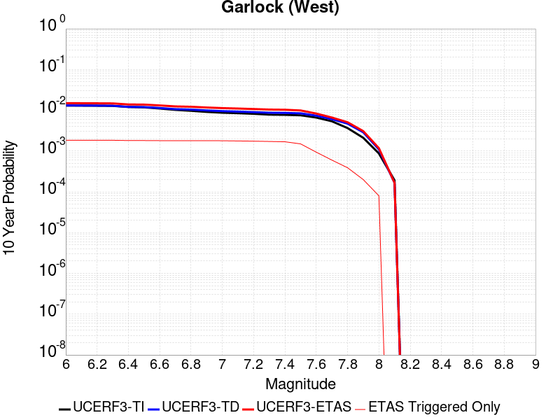 |

| Magnitude | 1 wk TI Prob | 1 wk TD Prob | 1 wk ETAS Prob | 1 wk ETAS/TD Gain | 1 wk ETAS Triggered Only | 1 mo TI Prob | 1 mo TD Prob | 1 mo ETAS Prob | 1 mo ETAS/TD Gain | 1 mo ETAS Triggered Only | 1 yr TI Prob | 1 yr TD Prob | 1 yr ETAS Prob | 1 yr ETAS/TD Gain | 1 yr ETAS Triggered Only | 10 yr TI Prob | 10 yr TD Prob | 10 yr ETAS Prob | 10 yr ETAS/TD Gain | 10 yr ETAS Triggered Only |
|-----|-----|-----|-----|-----|-----|-----|-----|-----|-----|-----|-----|-----|-----|-----|-----|-----|-----|-----|-----|-----|
| 6.0 | 2.5181727E-5 | 2.5216661E-5 | 1.6743361E-4 | 6.639801 | 1.4222054E-4 | 1.0791722E-4 | 1.08066946E-4 | 4.39879E-4 | 4.0704308 | 3.3184793E-4 | 0.0013131002 | 0.0013149243 | 0.0027352597 | 2.080165 | 0.0014222054 | 0.013053683 | 0.013151911 | 0.015491079 | 1.1778576 | 0.0023703424 |
| 6.1 | 2.5077732E-5 | 2.5117724E-5 | 1.6733469E-4 | 6.6620164 | 1.4222054E-4 | 1.0747157E-4 | 1.0764297E-4 | 4.3945518E-4 | 4.0825257 | 3.3184793E-4 | 0.001307681 | 0.0013097686 | 0.0027301114 | 2.0844226 | 0.0014222054 | 0.013000126 | 0.013100963 | 0.015440252 | 1.1785585 | 0.0023703424 |
| 6.2 | 2.494612E-5 | 2.4999388E-5 | 1.6721636E-4 | 6.6888185 | 1.4222054E-4 | 1.0690756E-4 | 1.0713586E-4 | 4.3894822E-4 | 4.097118 | 3.3184793E-4 | 0.0013008224 | 0.001303602 | 0.0027239535 | 2.089559 | 0.0014222054 | 0.012932341 | 0.013040021 | 0.015379454 | 1.179404 | 0.0023703424 |
| 6.3 | 2.4733758E-5 | 2.4818735E-5 | 1.6703575E-4 | 6.730228 | 1.4222054E-4 | 1.0599751E-4 | 1.0636169E-4 | 4.3817432E-4 | 4.119663 | 3.3184793E-4 | 0.0012897556 | 0.0012941877 | 0.0027145525 | 2.097495 | 0.0014222054 | 0.012822957 | 0.01294698 | 0.015286633 | 1.1807103 | 0.0023703424 |
| 6.4 | 2.3237335E-5 | 2.3197908E-5 | 1.6541514E-4 | 7.130606 | 1.4222054E-4 | 9.958477E-5 | 9.941583E-5 | 3.8382862E-4 | 3.86084 | 2.8444108E-4 | 0.0012117702 | 0.0012097185 | 0.002582854 | 2.1350868 | 0.0013747985 | 0.012051838 | 0.012111766 | 0.0144065665 | 1.1894687 | 0.0023229355 |
| 6.5 | 2.2732203E-5 | 2.3012379E-5 | 1.6522965E-4 | 7.180033 | 1.4222054E-4 | 9.742009E-5 | 9.862077E-5 | 3.830338E-4 | 3.8839061 | 2.8444108E-4 | 0.0011854442 | 0.0012000492 | 0.002573198 | 2.1442437 | 0.0013747985 | 0.011791403 | 0.012016123 | 0.014311146 | 1.1909952 | 0.0023229355 |
| 6.6 | 2.1319436E-5 | 2.1792415E-5 | 1.6400985E-4 | 7.526006 | 1.4222054E-4 | 9.136581E-5 | 9.339274E-5 | 3.7780724E-4 | 4.04536 | 2.8444108E-4 | 0.001111811 | 0.0011364657 | 0.0025097018 | 2.2083392 | 0.0013747985 | 0.011062649 | 0.011386949 | 0.013683434 | 1.2016768 | 0.0023229355 |
| 6.7 | 1.970802E-5 | 2.0412112E-5 | 1.6262975E-4 | 7.967316 | 1.4222054E-4 | 8.446021E-5 | 8.747755E-5 | 3.7189375E-4 | 4.251305 | 2.8444108E-4 | 0.001027818 | 0.0010645206 | 0.0024378556 | 2.2900972 | 0.0013747985 | 0.010230771 | 0.01067459 | 0.012972729 | 1.2152905 | 0.0023229355 |
| 6.8 | 1.8744462E-5 | 1.9919653E-5 | 1.6213735E-4 | 8.139567 | 1.4222054E-4 | 8.033094E-5 | 8.536715E-5 | 3.6978396E-4 | 4.331689 | 2.8444108E-4 | 9.775903E-4 | 0.0010388512 | 0.0024122216 | 2.3220086 | 0.0013747985 | 0.009733009 | 0.010420324 | 0.012719054 | 1.2206006 | 0.0023229355 |
| 6.9 | 1.7559682E-5 | 1.8971898E-5 | 1.6118973E-4 | 8.496237 | 1.4222054E-4 | 7.5253614E-5 | 8.13056E-5 | 3.6572354E-4 | 4.4981346 | 2.8444108E-4 | 9.158276E-4 | 9.894476E-4 | 0.0023628857 | 2.3880858 | 0.0013747985 | 0.0091206245 | 0.009930745 | 0.012230611 | 1.2315906 | 0.0023229355 |
| 7.0 | 1.6794445E-5 | 1.8234585E-5 | 1.6045253E-4 | 8.799352 | 1.4222054E-4 | 7.197421E-5 | 7.814589E-5 | 3.6256472E-4 | 4.6395884 | 2.8444108E-4 | 8.759337E-4 | 9.5101225E-4 | 0.0022771417 | 2.3944397 | 0.0013273917 | 0.008724891 | 0.009549588 | 0.011803386 | 1.23601 | 0.0022755286 |
| 7.1 | 1.6337795E-5 | 1.7735292E-5 | 1.5995331E-4 | 9.018927 | 1.4222054E-4 | 7.0017246E-5 | 7.600619E-5 | 3.6042565E-4 | 4.7420564 | 2.8444108E-4 | 8.521265E-4 | 9.249838E-4 | 0.0022511478 | 2.4337158 | 0.0013273917 | 0.008488664 | 0.009291395 | 0.0114988135 | 1.2375767 | 0.0022281217 |
| 7.2 | 1.5780008E-5 | 1.7183862E-5 | 1.5940196E-4 | 9.276259 | 1.4222054E-4 | 6.762685E-5 | 7.364305E-5 | 3.5806317E-4 | 4.862145 | 2.8444108E-4 | 8.2304585E-4 | 8.962366E-4 | 0.0022224386 | 2.4797454 | 0.0013273917 | 0.008200042 | 0.009006202 | 0.011214257 | 1.2451705 | 0.0022281217 |
| 7.3 | 1.5058865E-5 | 1.6636799E-5 | 1.5885496E-4 | 9.548409 | 1.4222054E-4 | 6.45364E-5 | 7.129862E-5 | 3.557194E-4 | 4.989148 | 2.8444108E-4 | 7.854473E-4 | 8.6771627E-4 | 0.0021465905 | 2.473839 | 0.0012799848 | 0.00782677 | 0.008722834 | 0.0108375335 | 1.2424326 | 0.002133308 |
| 7.4 | 1.4887923E-5 | 1.647271E-5 | 1.586909E-4 | 9.633563 | 1.4222054E-4 | 6.380382E-5 | 7.059543E-5 | 3.550164E-4 | 5.028887 | 2.8444108E-4 | 7.7653467E-4 | 8.591616E-4 | 0.0021380468 | 2.4885268 | 0.0012799848 | 0.0077382675 | 0.008637666 | 0.010752547 | 1.2448441 | 0.002133308 |
| 7.5 | 1.4509299E-5 | 1.6064607E-5 | 1.5828286E-4 | 9.852894 | 1.4222054E-4 | 6.218123E-5 | 6.884651E-5 | 3.53268E-4 | 5.131241 | 2.8444108E-4 | 7.567935E-4 | 8.37885E-4 | 0.0020220631 | 2.4132943 | 0.0011851712 | 0.0075422134 | 0.008425911 | 0.010447228 | 1.2398932 | 0.0020384945 |
| 7.6 | 1.2756717E-5 | 1.4067994E-5 | 1.08880355E-4 | 7.739579 | 9.481369E-5 | 5.4670498E-5 | 6.029001E-5 | 2.4990595E-4 | 4.145064 | 1.8962738E-4 | 6.6541E-4 | 7.3378434E-4 | 0.0016338534 | 2.2266126 | 9.007301E-4 | 0.006634211 | 0.0073905406 | 0.008802235 | 1.1910137 | 0.0014222054 |
| 7.7 | 1.0328985E-5 | 1.147664E-5 | 5.8882943E-5 | 5.1306777 | 4.7406844E-5 | 4.4266326E-5 | 4.9184677E-5 | 9.658919E-5 | 1.9638066 | 4.7406844E-5 | 5.388092E-4 | 5.986593E-4 | 0.0010250654 | 1.7122686 | 4.266616E-4 | 0.0053750467 | 0.006046838 | 0.006800761 | 1.1246805 | 7.585095E-4 |
| 7.8 | 7.0306583E-6 | 8.912468E-6 | 5.631889E-5 | 6.3191133 | 4.7406844E-5 | 3.0131043E-5 | 3.8195732E-5 | 8.560077E-5 | 2.2411082 | 4.7406844E-5 | 3.667837E-4 | 4.6493395E-4 | 8.913972E-4 | 1.9172555 | 4.266616E-4 | 0.003661789 | 0.0047019436 | 0.0053625186 | 1.1404898 | 6.6369586E-4 |
| 7.9 | 4.060633E-6 | 5.4729326E-6 | 5.2879517E-5 | 9.662007 | 4.7406844E-5 | 1.7402595E-5 | 2.3455215E-5 | 7.086095E-5 | 3.021117 | 4.7406844E-5 | 2.11856E-4 | 2.8552994E-4 | 5.2249647E-4 | 1.8299184 | 2.3703423E-4 | 0.0021165414 | 0.0028881172 | 0.0032190068 | 1.1145693 | 3.3184793E-4 |
| 8.0 | 1.6729537E-6 | 2.0800776E-6 | 4.9486825E-5 | 23.790855 | 4.7406844E-5 | 7.169782E-6 | 8.914588E-6 | 5.6321012E-5 | 6.3178477 | 4.7406844E-5 | 8.7288594E-5 | 1.0852974E-4 | 2.5073483E-4 | 2.310287 | 1.4222054E-4 | 8.7254314E-4 | 0.0010982669 | 0.0012403313 | 1.1293532 | 1.4222054E-4 |
| 8.1 | 3.6733252E-7 | 3.1526864E-7 | 3.1526864E-7 | 1.0 | 0.0 | 1.5742813E-6 | 1.3511507E-6 | 1.3511507E-6 | 1.0 | 0.0 | 1.9166706E-5 | 1.645015E-5 | 1.645015E-5 | 1.0 | 0.0 | 1.9165053E-4 | 1.6658098E-4 | 1.6658098E-4 | 1.0 | 0.0 |

## Gravel Hills-Harper Lk
*[(top)](#table-of-contents)*

| 1 Week | 1 Month | 1 Year | 10 Year |
|-----|-----|-----|-----|
|  |  |  |  |

| Magnitude | 1 wk TI Prob | 1 wk TD Prob | 1 wk ETAS Prob | 1 wk ETAS/TD Gain | 1 wk ETAS Triggered Only | 1 mo TI Prob | 1 mo TD Prob | 1 mo ETAS Prob | 1 mo ETAS/TD Gain | 1 mo ETAS Triggered Only | 1 yr TI Prob | 1 yr TD Prob | 1 yr ETAS Prob | 1 yr ETAS/TD Gain | 1 yr ETAS Triggered Only | 10 yr TI Prob | 10 yr TD Prob | 10 yr ETAS Prob | 10 yr ETAS/TD Gain | 10 yr ETAS Triggered Only |
|-----|-----|-----|-----|-----|-----|-----|-----|-----|-----|-----|-----|-----|-----|-----|-----|-----|-----|-----|-----|-----|
| 6.0 | 3.0679566E-5 | 3.1466803E-5 | 3.1466803E-5 | 1.0 | 0.0 | 1.3147724E-4 | 1.3485197E-4 | 3.2445378E-4 | 2.4059994 | 1.8962738E-4 | 0.0015995599 | 0.0016408027 | 0.0022560805 | 1.3749858 | 6.16289E-4 | 0.015880952 | 0.01630845 | 0.017893994 | 1.0972223 | 0.0016118328 |
| 6.1 | 3.0679566E-5 | 3.1466803E-5 | 3.1466803E-5 | 1.0 | 0.0 | 1.3147724E-4 | 1.3485197E-4 | 3.2445378E-4 | 2.4059994 | 1.8962738E-4 | 0.0015995599 | 0.0016408027 | 0.0022560805 | 1.3749858 | 6.16289E-4 | 0.015880952 | 0.01630845 | 0.017893994 | 1.0972223 | 0.0016118328 |
| 6.2 | 1.514536E-5 | 1.363595E-5 | 1.363595E-5 | 1.0 | 0.0 | 6.490707E-5 | 5.8438545E-5 | 1.0584262E-4 | 1.8111782 | 4.7406844E-5 | 7.8995706E-4 | 7.112689E-4 | 9.007614E-4 | 1.2664148 | 1.8962738E-4 | 0.007871548 | 0.007091126 | 0.007655974 | 1.0796556 | 5.6888215E-4 |
| 6.3 | 1.514536E-5 | 1.363595E-5 | 1.363595E-5 | 1.0 | 0.0 | 6.490707E-5 | 5.8438545E-5 | 1.0584262E-4 | 1.8111782 | 4.7406844E-5 | 7.8995706E-4 | 7.112689E-4 | 9.007614E-4 | 1.2664148 | 1.8962738E-4 | 0.007871548 | 0.007091126 | 0.007655974 | 1.0796556 | 5.6888215E-4 |
| 6.4 | 1.2532521E-5 | 1.0690234E-5 | 1.0690234E-5 | 1.0 | 0.0 | 5.37097E-5 | 4.5814515E-5 | 4.5814515E-5 | 1.0 | 0.0 | 6.537194E-4 | 5.576548E-4 | 6.524156E-4 | 1.1699274 | 9.481369E-5 | 0.0065179965 | 0.0055631446 | 0.0059402897 | 1.0677935 | 3.7925475E-4 |
| 6.5 | 1.1094058E-5 | 9.084107E-6 | 9.084107E-6 | 1.0 | 0.0 | 4.7545094E-5 | 3.8931328E-5 | 3.8931328E-5 | 1.0 | 0.0 | 5.787078E-4 | 4.7388987E-4 | 5.212743E-4 | 1.0999902 | 4.7406844E-5 | 0.0057720304 | 0.004729201 | 0.0049179313 | 1.0399075 | 1.8962738E-4 |
| 6.6 | 9.688328E-6 | 7.5320527E-6 | 7.5320527E-6 | 1.0 | 0.0 | 4.1520743E-5 | 3.227984E-5 | 3.227984E-5 | 1.0 | 0.0 | 5.053978E-4 | 3.9293873E-4 | 4.4032696E-4 | 1.1205995 | 4.7406844E-5 | 0.0050424994 | 0.003922696 | 0.004017138 | 1.0240757 | 9.481369E-5 |
| 6.7 | 8.974824E-6 | 6.7497303E-6 | 6.7497303E-6 | 1.0 | 0.0 | 3.8462964E-5 | 2.8927108E-5 | 2.8927108E-5 | 1.0 | 0.0 | 4.6818596E-4 | 3.5213283E-4 | 3.9952298E-4 | 1.1345804 | 4.7406844E-5 | 0.004672008 | 0.0035159695 | 0.0036104498 | 1.0268718 | 9.481369E-5 |
| 6.8 | 7.4780046E-6 | 5.1164316E-6 | 5.1164316E-6 | 1.0 | 0.0 | 3.20482E-5 | 2.1927388E-5 | 2.1927388E-5 | 1.0 | 0.0 | 3.9011694E-4 | 2.6693463E-4 | 3.1432882E-4 | 1.1775498 | 4.7406844E-5 | 0.0038943281 | 0.0026662783 | 0.0027135587 | 1.0177327 | 4.7406844E-5 |
| 6.9 | 6.3409307E-6 | 3.907683E-6 | 3.907683E-6 | 1.0 | 0.0 | 2.7175134E-5 | 1.674711E-5 | 1.674711E-5 | 1.0 | 0.0 | 3.3080703E-4 | 2.0387798E-4 | 2.5127517E-4 | 1.2324781 | 4.7406844E-5 | 0.0033031502 | 0.0020370076 | 0.0020843178 | 1.0232254 | 4.7406844E-5 |
| 7.0 | 5.1239335E-6 | 2.6059872E-6 | 2.6059872E-6 | 1.0 | 0.0 | 2.195953E-5 | 1.116847E-5 | 1.116847E-5 | 1.0 | 0.0 | 2.6732447E-4 | 1.3596789E-4 | 1.3596789E-4 | 1.0 | 0.0 | 0.0026700313 | 0.0013588723 | 0.0013588723 | 1.0 | 0.0 |
| 7.1 | 4.438899E-6 | 2.0985822E-6 | 2.0985822E-6 | 1.0 | 0.0 | 1.9023713E-5 | 8.993894E-6 | 8.993894E-6 | 1.0 | 0.0 | 2.315891E-4 | 1.0949538E-4 | 1.0949538E-4 | 1.0 | 0.0 | 0.002313479 | 0.0010944362 | 0.0010944362 | 1.0 | 0.0 |
| 7.2 | 3.50367E-6 | 1.2616524E-6 | 1.2616524E-6 | 1.0 | 0.0 | 1.5015643E-5 | 5.407071E-6 | 5.407071E-6 | 1.0 | 0.0 | 1.8280011E-4 | 6.582918E-5 | 6.582918E-5 | 1.0 | 0.0 | 0.0018264982 | 6.5810507E-4 | 6.5810507E-4 | 1.0 | 0.0 |
| 7.3 | 2.561638E-6 | 7.11978E-7 | 7.11978E-7 | 1.0 | 0.0 | 1.0978401E-5 | 3.0513306E-6 | 3.0513306E-6 | 1.0 | 0.0 | 1.3365384E-4 | 3.7149337E-5 | 3.7149337E-5 | 1.0 | 0.0 | 0.0013357349 | 3.7143327E-4 | 3.7143327E-4 | 1.0 | 0.0 |
| 7.4 | 2.0368864E-6 | 5.3053367E-7 | 5.3053367E-7 | 1.0 | 0.0 | 8.729483E-6 | 2.2737138E-6 | 2.2737138E-6 | 1.0 | 0.0 | 1.06276275E-4 | 2.768212E-5 | 2.768212E-5 | 1.0 | 0.0 | 0.0010622547 | 2.7678726E-4 | 2.7678726E-4 | 1.0 | 0.0 |
| 7.5 | 1.1681728E-6 | 3.6033393E-7 | 3.6033393E-7 | 1.0 | 0.0 | 5.0064455E-6 | 1.5442874E-6 | 1.5442874E-6 | 1.0 | 0.0 | 6.0951766E-5 | 1.8801542E-5 | 1.8801542E-5 | 1.0 | 0.0 | 6.093505E-4 | 1.8799998E-4 | 1.8799998E-4 | 1.0 | 0.0 |
| 7.6 | 1.3154387E-7 | 7.12009E-8 | 7.12009E-8 | 1.0 | 0.0 | 5.6375933E-7 | 3.051467E-7 | 3.051467E-7 | 1.0 | 0.0 | 6.863748E-6 | 3.7151563E-6 | 3.7151563E-6 | 1.0 | 0.0 | 6.863536E-5 | 3.7151098E-5 | 3.7151098E-5 | 1.0 | 0.0 |

## So Sierra Nevada
*[(top)](#table-of-contents)*

| 1 Week | 1 Month | 1 Year | 10 Year |
|-----|-----|-----|-----|
|  |  |  |  |

| Magnitude | 1 wk TI Prob | 1 wk TD Prob | 1 wk ETAS Prob | 1 wk ETAS/TD Gain | 1 wk ETAS Triggered Only | 1 mo TI Prob | 1 mo TD Prob | 1 mo ETAS Prob | 1 mo ETAS/TD Gain | 1 mo ETAS Triggered Only | 1 yr TI Prob | 1 yr TD Prob | 1 yr ETAS Prob | 1 yr ETAS/TD Gain | 1 yr ETAS Triggered Only | 10 yr TI Prob | 10 yr TD Prob | 10 yr ETAS Prob | 10 yr ETAS/TD Gain | 10 yr ETAS Triggered Only |
|-----|-----|-----|-----|-----|-----|-----|-----|-----|-----|-----|-----|-----|-----|-----|-----|-----|-----|-----|-----|-----|
| 6.0 | 1.15488665E-5 | 1.1079958E-5 | 1.058926E-4 | 9.55713 | 9.481369E-5 | 4.9494203E-5 | 4.7484744E-5 | 2.8450773E-4 | 5.9915605 | 2.3703423E-4 | 6.024253E-4 | 5.779862E-4 | 0.0015729545 | 2.7214396 | 9.955438E-4 | 0.006007948 | 0.0057660984 | 0.0075100376 | 1.302447 | 0.0017540533 |
| 6.1 | 1.15488665E-5 | 1.1079958E-5 | 1.058926E-4 | 9.55713 | 9.481369E-5 | 4.9494203E-5 | 4.7484744E-5 | 2.8450773E-4 | 5.9915605 | 2.3703423E-4 | 6.024253E-4 | 5.779862E-4 | 0.0015729545 | 2.7214396 | 9.955438E-4 | 0.006007948 | 0.0057660984 | 0.0075100376 | 1.302447 | 0.0017540533 |
| 6.2 | 1.15488665E-5 | 1.1079958E-5 | 1.058926E-4 | 9.55713 | 9.481369E-5 | 4.9494203E-5 | 4.7484744E-5 | 2.8450773E-4 | 5.9915605 | 2.3703423E-4 | 6.024253E-4 | 5.779862E-4 | 0.0015729545 | 2.7214396 | 9.955438E-4 | 0.006007948 | 0.0057660984 | 0.0075100376 | 1.302447 | 0.0017540533 |
| 6.3 | 1.15488665E-5 | 1.1079958E-5 | 1.058926E-4 | 9.55713 | 9.481369E-5 | 4.9494203E-5 | 4.7484744E-5 | 2.8450773E-4 | 5.9915605 | 2.3703423E-4 | 6.024253E-4 | 5.779862E-4 | 0.0015729545 | 2.7214396 | 9.955438E-4 | 0.006007948 | 0.0057660984 | 0.0075100376 | 1.302447 | 0.0017540533 |
| 6.4 | 1.15488665E-5 | 1.1079958E-5 | 1.058926E-4 | 9.55713 | 9.481369E-5 | 4.9494203E-5 | 4.7484744E-5 | 2.8450773E-4 | 5.9915605 | 2.3703423E-4 | 6.024253E-4 | 5.779862E-4 | 0.0015729545 | 2.7214396 | 9.955438E-4 | 0.006007948 | 0.0057660984 | 0.0075100376 | 1.302447 | 0.0017540533 |
| 6.5 | 1.15488665E-5 | 1.1079958E-5 | 1.058926E-4 | 9.55713 | 9.481369E-5 | 4.9494203E-5 | 4.7484744E-5 | 2.8450773E-4 | 5.9915605 | 2.3703423E-4 | 6.024253E-4 | 5.779862E-4 | 0.0015729545 | 2.7214396 | 9.955438E-4 | 0.006007948 | 0.0057660984 | 0.0075100376 | 1.302447 | 0.0017540533 |
| 6.6 | 7.587044E-6 | 6.9358503E-6 | 1.0174888E-4 | 14.669994 | 9.481369E-5 | 3.2515498E-5 | 2.972475E-5 | 2.1934649E-4 | 7.3792543 | 1.8962738E-4 | 3.9580427E-4 | 3.6184167E-4 | 0.0010252973 | 2.8335526 | 6.6369586E-4 | 0.003951 | 0.0036128166 | 0.004651999 | 1.2876378 | 0.0010429505 |
| 6.7 | 7.587044E-6 | 6.9358503E-6 | 1.0174888E-4 | 14.669994 | 9.481369E-5 | 3.2515498E-5 | 2.972475E-5 | 2.1934649E-4 | 7.3792543 | 1.8962738E-4 | 3.9580427E-4 | 3.6184167E-4 | 0.0010252973 | 2.8335526 | 6.6369586E-4 | 0.003951 | 0.0036128166 | 0.004651999 | 1.2876378 | 0.0010429505 |
| 6.8 | 5.9026956E-6 | 5.179568E-6 | 9.9992765E-5 | 19.305233 | 9.481369E-5 | 2.5297022E-5 | 2.2197966E-5 | 2.1182114E-4 | 9.542367 | 1.8962738E-4 | 3.0794772E-4 | 2.7022787E-4 | 8.8635035E-4 | 3.2800107 | 6.16289E-4 | 0.0030752132 | 0.0026991093 | 0.003644687 | 1.3503296 | 9.481369E-4 |
| 6.9 | 5.0118915E-6 | 4.2525808E-6 | 9.906587E-5 | 23.295471 | 9.481369E-5 | 2.1479358E-5 | 1.8225222E-5 | 2.0784915E-4 | 11.404478 | 1.8962738E-4 | 2.614798E-4 | 2.2187021E-4 | 7.432298E-4 | 3.3498404 | 5.214753E-4 | 0.0026117235 | 0.0022165596 | 0.0030679915 | 1.3841231 | 8.533232E-4 |
| 7.0 | 4.4924795E-6 | 3.7140621E-6 | 5.1120733E-5 | 13.764102 | 4.7406844E-5 | 1.925334E-5 | 1.5917316E-5 | 1.5813559E-4 | 9.934814 | 1.4222054E-4 | 2.3438422E-4 | 1.9377672E-4 | 6.6775334E-4 | 3.4459934 | 4.7406845E-4 | 0.0023413717 | 0.0019361405 | 0.0027404965 | 1.415443 | 8.059164E-4 |
| 7.1 | 3.9118436E-6 | 3.1121094E-6 | 5.0518807E-5 | 16.232979 | 4.7406844E-5 | 1.6764936E-5 | 1.3337547E-5 | 1.5555619E-4 | 11.663028 | 1.4222054E-4 | 2.0409399E-4 | 1.6237311E-4 | 5.415663E-4 | 3.3353202 | 3.7925475E-4 | 0.0020390663 | 0.0016226007 | 0.0023325495 | 1.4375376 | 7.111027E-4 |
| 7.2 | 3.4200818E-6 | 2.605576E-6 | 5.00123E-5 | 19.194334 | 4.7406844E-5 | 1.4657411E-5 | 1.116671E-5 | 1.0597934E-4 | 9.490651 | 9.481369E-5 | 1.7843937E-4 | 1.3594671E-4 | 4.203491E-4 | 3.0920138 | 2.8444108E-4 | 0.0017829615 | 0.0013586852 | 0.0018321095 | 1.348443 | 4.7406845E-4 |
| 7.3 | 2.6593618E-6 | 1.8285265E-6 | 1.8285265E-6 | 1.0 | 0.0 | 1.13972155E-5 | 7.83652E-6 | 5.5242996E-5 | 7.049429 | 4.7406844E-5 | 1.3875226E-4 | 9.5405754E-5 | 2.8501503E-4 | 2.9873989 | 1.8962738E-4 | 0.0013866565 | 9.536769E-4 | 0.00133257 | 1.3972971 | 3.7925475E-4 |
| 7.4 | 2.2577992E-6 | 1.436535E-6 | 1.436535E-6 | 1.0 | 0.0 | 9.676246E-6 | 6.156565E-6 | 5.356312E-5 | 8.700163 | 4.7406844E-5 | 1.1780193E-4 | 7.495386E-5 | 2.1716373E-4 | 2.897299 | 1.4222054E-4 | 0.001177395 | 7.493108E-4 | 0.0010809101 | 1.442539 | 3.3184793E-4 |
| 7.5 | 1.489319E-6 | 7.354697E-7 | 7.354697E-7 | 1.0 | 0.0 | 6.3827797E-6 | 3.1520092E-6 | 5.0558705E-5 | 16.040152 | 4.7406844E-5 | 7.770758E-5 | 3.837504E-5 | 1.8059013E-4 | 4.7059264 | 1.4222054E-4 | 7.7680405E-4 | 3.836846E-4 | 5.732392E-4 | 1.4940376 | 1.8962738E-4 |
| 7.6 | 1.0680322E-6 | 4.6602182E-7 | 4.6602182E-7 | 1.0 | 0.0 | 4.577273E-6 | 1.997235E-6 | 4.9403985E-5 | 24.736193 | 4.7406844E-5 | 5.5726876E-5 | 2.4316065E-5 | 1.6653314E-4 | 6.848688 | 1.4222054E-4 | 5.5712904E-4 | 2.431343E-4 | 4.3271558E-4 | 1.7797389 | 1.8962738E-4 |
| 7.7 | 5.509146E-7 | 1.558334E-7 | 1.558334E-7 | 1.0 | 0.0 | 2.3610605E-6 | 6.678573E-7 | 6.678573E-7 | 1.0 | 0.0 | 2.8745531E-5 | 8.131134E-6 | 5.5537592E-5 | 6.8302402 | 4.7406844E-5 | 2.8741814E-4 | 8.130848E-5 | 1.7611445E-4 | 2.1660037 | 9.481369E-5 |

## McLean Lake
*[(top)](#table-of-contents)*

| 1 Week | 1 Month | 1 Year | 10 Year |
|-----|-----|-----|-----|
| 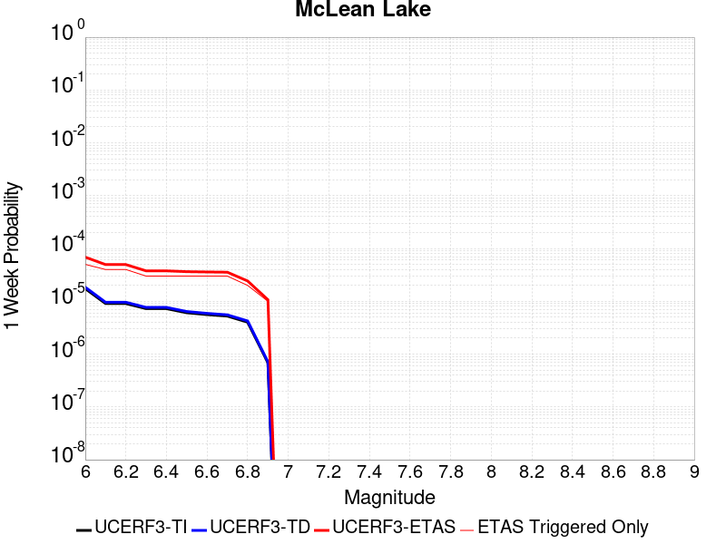 |  |  |  |

| Magnitude | 1 wk TI Prob | 1 wk TD Prob | 1 wk ETAS Prob | 1 wk ETAS/TD Gain | 1 wk ETAS Triggered Only | 1 mo TI Prob | 1 mo TD Prob | 1 mo ETAS Prob | 1 mo ETAS/TD Gain | 1 mo ETAS Triggered Only | 1 yr TI Prob | 1 yr TD Prob | 1 yr ETAS Prob | 1 yr ETAS/TD Gain | 1 yr ETAS Triggered Only | 10 yr TI Prob | 10 yr TD Prob | 10 yr ETAS Prob | 10 yr ETAS/TD Gain | 10 yr ETAS Triggered Only |
|-----|-----|-----|-----|-----|-----|-----|-----|-----|-----|-----|-----|-----|-----|-----|-----|-----|-----|-----|-----|-----|
| 6.0 | 1.7360222E-5 | 1.8502275E-5 | 1.13314214E-4 | 6.1243396 | 9.481369E-5 | 7.439883E-5 | 7.929332E-5 | 2.2150259E-4 | 2.7934582 | 1.4222054E-4 | 9.0542925E-4 | 9.6501724E-4 | 0.0015333504 | 1.5889357 | 5.6888215E-4 | 0.009017491 | 0.009613109 | 0.011162496 | 1.1611744 | 0.0015644259 |
| 6.1 | 9.062689E-6 | 9.592492E-6 | 5.699888E-5 | 5.9420314 | 4.7406844E-5 | 3.8839516E-5 | 4.1110077E-5 | 8.851498E-5 | 2.153121 | 4.7406844E-5 | 4.727685E-4 | 5.0040917E-4 | 8.32091E-4 | 1.6628213 | 3.3184793E-4 | 0.0047176396 | 0.0049937065 | 0.005748428 | 1.1511346 | 7.585095E-4 |
| 6.2 | 9.062689E-6 | 9.592492E-6 | 5.699888E-5 | 5.9420314 | 4.7406844E-5 | 3.8839516E-5 | 4.1110077E-5 | 8.851498E-5 | 2.153121 | 4.7406844E-5 | 4.727685E-4 | 5.0040917E-4 | 8.32091E-4 | 1.6628213 | 3.3184793E-4 | 0.0047176396 | 0.0049937065 | 0.005748428 | 1.1511346 | 7.585095E-4 |
| 6.3 | 7.2575485E-6 | 7.66794E-6 | 7.66794E-6 | 1.0 | 0.0 | 3.110341E-5 | 3.2862223E-5 | 3.2862223E-5 | 1.0 | 0.0 | 3.786182E-4 | 4.0003125E-4 | 5.895828E-4 | 1.4738418 | 1.8962738E-4 | 0.0037797375 | 0.003993816 | 0.0044659916 | 1.1182265 | 4.7406845E-4 |
| 6.4 | 7.2575485E-6 | 7.66794E-6 | 7.66794E-6 | 1.0 | 0.0 | 3.110341E-5 | 3.2862223E-5 | 3.2862223E-5 | 1.0 | 0.0 | 3.786182E-4 | 4.0003125E-4 | 5.895828E-4 | 1.4738418 | 1.8962738E-4 | 0.0037797375 | 0.003993816 | 0.0044659916 | 1.1182265 | 4.7406845E-4 |
| 6.5 | 6.06582E-6 | 6.4040664E-6 | 6.4040664E-6 | 1.0 | 0.0 | 2.5996113E-5 | 2.7445747E-5 | 2.7445747E-5 | 1.0 | 0.0 | 3.164567E-4 | 3.3410723E-4 | 4.7628026E-4 | 1.4255311 | 1.4222054E-4 | 0.0031600643 | 0.0033366878 | 0.0036201798 | 1.0849621 | 2.8444108E-4 |
| 6.6 | 5.598744E-6 | 5.910437E-6 | 5.910437E-6 | 1.0 | 0.0 | 2.3994397E-5 | 2.5330233E-5 | 2.5330233E-5 | 1.0 | 0.0 | 2.9209262E-4 | 3.0835834E-4 | 4.5053504E-4 | 1.4610761 | 1.4222054E-4 | 0.0029170897 | 0.003079934 | 0.003316238 | 1.0767238 | 2.3703423E-4 |
| 6.7 | 5.246996E-6 | 5.5393257E-6 | 5.5393257E-6 | 1.0 | 0.0 | 2.2486933E-5 | 2.3739787E-5 | 2.3739787E-5 | 1.0 | 0.0 | 2.73744E-4 | 2.8899993E-4 | 4.3117936E-4 | 1.4919705 | 1.4222054E-4 | 0.0027340704 | 0.0028868648 | 0.0031232147 | 1.0818708 | 2.3703423E-4 |
| 6.8 | 4.02324E-6 | 4.2470297E-6 | 4.2470297E-6 | 1.0 | 0.0 | 1.7242342E-5 | 1.8201463E-5 | 1.8201463E-5 | 1.0 | 0.0 | 2.099053E-4 | 2.2158623E-4 | 3.6377527E-4 | 1.641687 | 1.4222054E-4 | 0.0020970714 | 0.0022142373 | 0.0024507467 | 1.1068131 | 2.3703423E-4 |
| 6.9 | 6.835972E-7 | 7.140097E-7 | 7.140097E-7 | 1.0 | 0.0 | 2.9296991E-6 | 3.0600397E-6 | 3.0600397E-6 | 1.0 | 0.0 | 3.56685E-5 | 3.7255664E-5 | 3.7255664E-5 | 1.0 | 0.0 | 3.5662777E-4 | 3.7252545E-4 | 3.7252545E-4 | 1.0 | 0.0 |

## Lenwood-Lockhart-Old Woman Springs
*[(top)](#table-of-contents)*

| 1 Week | 1 Month | 1 Year | 10 Year |
|-----|-----|-----|-----|
|  |  |  |  |

| Magnitude | 1 wk TI Prob | 1 wk TD Prob | 1 wk ETAS Prob | 1 wk ETAS/TD Gain | 1 wk ETAS Triggered Only | 1 mo TI Prob | 1 mo TD Prob | 1 mo ETAS Prob | 1 mo ETAS/TD Gain | 1 mo ETAS Triggered Only | 1 yr TI Prob | 1 yr TD Prob | 1 yr ETAS Prob | 1 yr ETAS/TD Gain | 1 yr ETAS Triggered Only | 10 yr TI Prob | 10 yr TD Prob | 10 yr ETAS Prob | 10 yr ETAS/TD Gain | 10 yr ETAS Triggered Only |
|-----|-----|-----|-----|-----|-----|-----|-----|-----|-----|-----|-----|-----|-----|-----|-----|-----|-----|-----|-----|-----|
| 6.0 | 3.744542E-5 | 4.3964304E-5 | 1.3877383E-4 | 3.1565113 | 9.481369E-5 | 1.604705E-4 | 1.8840581E-4 | 3.7799746E-4 | 2.006294 | 1.8962738E-4 | 0.0019519776 | 0.0022915998 | 0.0031902657 | 1.3921566 | 9.007301E-4 | 0.019349206 | 0.0226977 | 0.024180287 | 1.0653188 | 0.001517019 |
| 6.1 | 3.744542E-5 | 4.3964304E-5 | 1.3877383E-4 | 3.1565113 | 9.481369E-5 | 1.604705E-4 | 1.8840581E-4 | 3.7799746E-4 | 2.006294 | 1.8962738E-4 | 0.0019519776 | 0.0022915998 | 0.0031902657 | 1.3921566 | 9.007301E-4 | 0.019349206 | 0.0226977 | 0.024180287 | 1.0653188 | 0.001517019 |
| 6.2 | 3.744542E-5 | 4.3964304E-5 | 1.3877383E-4 | 3.1565113 | 9.481369E-5 | 1.604705E-4 | 1.8840581E-4 | 3.7799746E-4 | 2.006294 | 1.8962738E-4 | 0.0019519776 | 0.0022915998 | 0.0031902657 | 1.3921566 | 9.007301E-4 | 0.019349206 | 0.0226977 | 0.024180287 | 1.0653188 | 0.001517019 |
| 6.3 | 2.1079984E-5 | 2.5354084E-5 | 7.275973E-5 | 2.8697438 | 4.7406844E-5 | 9.0339665E-5 | 1.0865595E-4 | 2.0345933E-4 | 1.8725098 | 9.481369E-5 | 0.0010993304 | 0.0013221033 | 0.0016061683 | 1.2148584 | 2.8444108E-4 | 0.010939079 | 0.013144593 | 0.013752781 | 1.046269 | 6.16289E-4 |
| 6.4 | 2.1079984E-5 | 2.5354084E-5 | 7.275973E-5 | 2.8697438 | 4.7406844E-5 | 9.0339665E-5 | 1.0865595E-4 | 2.0345933E-4 | 1.8725098 | 9.481369E-5 | 0.0010993304 | 0.0013221033 | 0.0016061683 | 1.2148584 | 2.8444108E-4 | 0.010939079 | 0.013144593 | 0.013752781 | 1.046269 | 6.16289E-4 |
| 6.5 | 1.7397282E-5 | 2.0662914E-5 | 6.806878E-5 | 3.2942488 | 4.7406844E-5 | 7.455765E-5 | 8.8552406E-5 | 1.833577E-4 | 2.0706124 | 9.481369E-5 | 9.073613E-4 | 0.001077604 | 0.0013617385 | 1.2636725 | 2.8444108E-4 | 0.009036654 | 0.010725081 | 0.011194065 | 1.0437278 | 4.7406845E-4 |
| 6.6 | 1.52050325E-5 | 1.7680117E-5 | 6.5086126E-5 | 3.6813176 | 4.7406844E-5 | 6.51628E-5 | 7.576977E-5 | 1.7057627E-4 | 2.2512445 | 9.481369E-5 | 7.9306826E-4 | 9.221144E-4 | 0.00115893 | 1.256818 | 2.3703423E-4 | 0.007902439 | 0.009183745 | 0.009559517 | 1.040917 | 3.7925475E-4 |
| 6.7 | 1.332523E-5 | 1.5264359E-5 | 6.267048E-5 | 4.1056743 | 4.7406844E-5 | 5.7106878E-5 | 6.541707E-5 | 1.6022456E-4 | 2.4492774 | 9.481369E-5 | 6.950544E-4 | 7.9616765E-4 | 0.0010330131 | 1.297482 | 2.3703423E-4 | 0.006928845 | 0.007933783 | 0.008310028 | 1.0474232 | 3.7925475E-4 |
| 6.8 | 1.1525329E-5 | 1.3031262E-5 | 6.043749E-5 | 4.6378846 | 4.7406844E-5 | 4.9393333E-5 | 5.5847093E-5 | 1.0325129E-4 | 1.8488212 | 4.7406844E-5 | 6.011979E-4 | 6.797305E-4 | 7.744797E-4 | 1.1393924 | 9.481369E-5 | 0.00599574 | 0.0067769657 | 0.007012394 | 1.0347394 | 2.3703423E-4 |
| 6.9 | 1.0253909E-5 | 1.1514676E-5 | 1.1514676E-5 | 1.0 | 0.0 | 4.3944583E-5 | 4.93477E-5 | 4.93477E-5 | 1.0 | 0.0 | 5.3489394E-4 | 6.006462E-4 | 6.006462E-4 | 1.0 | 0.0 | 0.0053360825 | 0.005990607 | 0.006084853 | 1.0157323 | 9.481369E-5 |
| 7.0 | 8.104563E-6 | 8.991446E-6 | 8.991446E-6 | 1.0 | 0.0 | 3.4733377E-5 | 3.8534214E-5 | 3.8534214E-5 | 1.0 | 0.0 | 4.2279682E-4 | 4.6905546E-4 | 4.6905546E-4 | 1.0 | 0.0 | 0.0042199334 | 0.004680902 | 0.004775272 | 1.0201607 | 9.481369E-5 |
| 7.1 | 6.7986157E-6 | 7.515946E-6 | 7.515946E-6 | 1.0 | 0.0 | 2.91366E-5 | 3.221081E-5 | 3.221081E-5 | 1.0 | 0.0 | 3.5468035E-4 | 3.9209818E-4 | 3.9209818E-4 | 1.0 | 0.0 | 0.003541148 | 0.0039142803 | 0.004008723 | 1.0241277 | 9.481369E-5 |
| 7.2 | 5.6893327E-6 | 6.280115E-6 | 6.280115E-6 | 1.0 | 0.0 | 2.4382627E-5 | 2.6914513E-5 | 2.6914513E-5 | 1.0 | 0.0 | 2.9681803E-4 | 3.2763692E-4 | 3.2763692E-4 | 1.0 | 0.0 | 0.002964219 | 0.0032717374 | 0.0033662408 | 1.0288848 | 9.481369E-5 |
| 7.3 | 4.253348E-6 | 4.7069766E-6 | 4.7069766E-6 | 1.0 | 0.0 | 1.8228506E-5 | 2.0172612E-5 | 2.0172612E-5 | 1.0 | 0.0 | 2.2190946E-4 | 2.455757E-4 | 2.455757E-4 | 1.0 | 0.0 | 0.00221688 | 0.0024532243 | 0.0025005147 | 1.0192769 | 4.7406844E-5 |
| 7.4 | 2.5448119E-6 | 2.8520785E-6 | 2.8520785E-6 | 1.0 | 0.0 | 1.0906291E-5 | 1.2223146E-5 | 1.2223146E-5 | 1.0 | 0.0 | 1.3277601E-4 | 1.4880829E-4 | 1.4880829E-4 | 1.0 | 0.0 | 0.001326967 | 0.0014872487 | 0.001534585 | 1.0318282 | 4.7406844E-5 |
| 7.5 | 4.3706837E-8 | 4.5630156E-8 | 4.5630156E-8 | 1.0 | 0.0 | 1.8731501E-7 | 1.955578E-7 | 1.955578E-7 | 1.0 | 0.0 | 2.2805577E-6 | 2.380914E-6 | 2.380914E-6 | 1.0 | 0.0 | 2.2805343E-5 | 2.3808941E-5 | 2.3808941E-5 | 1.0 | 0.0 |

## Goldstone Lake
*[(top)](#table-of-contents)*

| 1 Week | 1 Month | 1 Year | 10 Year |
|-----|-----|-----|-----|
| 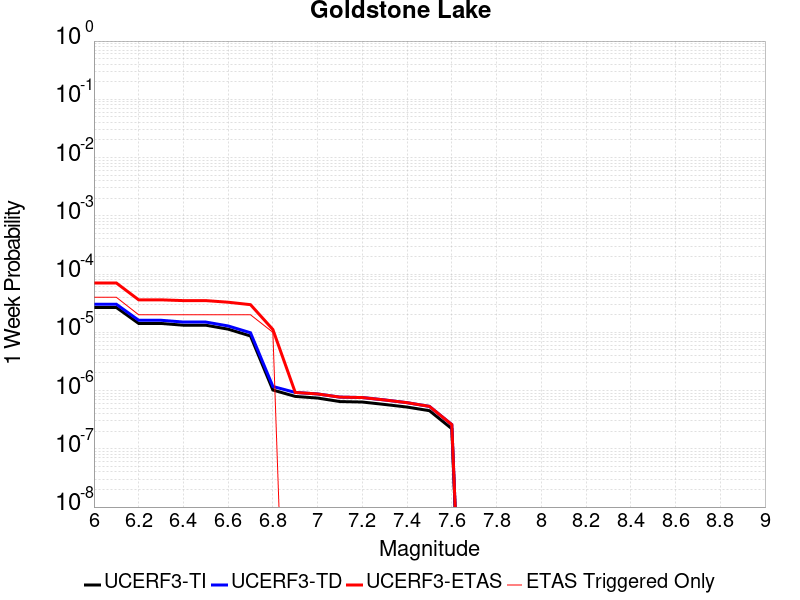 |  |  |  |

| Magnitude | 1 wk TI Prob | 1 wk TD Prob | 1 wk ETAS Prob | 1 wk ETAS/TD Gain | 1 wk ETAS Triggered Only | 1 mo TI Prob | 1 mo TD Prob | 1 mo ETAS Prob | 1 mo ETAS/TD Gain | 1 mo ETAS Triggered Only | 1 yr TI Prob | 1 yr TD Prob | 1 yr ETAS Prob | 1 yr ETAS/TD Gain | 1 yr ETAS Triggered Only | 10 yr TI Prob | 10 yr TD Prob | 10 yr ETAS Prob | 10 yr ETAS/TD Gain | 10 yr ETAS Triggered Only |
|-----|-----|-----|-----|-----|-----|-----|-----|-----|-----|-----|-----|-----|-----|-----|-----|-----|-----|-----|-----|-----|
| 6.0 | 2.671352E-5 | 3.0378242E-5 | 7.778365E-5 | 2.5605052 | 4.7406844E-5 | 1.1448149E-4 | 1.3018708E-4 | 2.2498843E-4 | 1.7281932 | 9.481369E-5 | 0.001392921 | 0.0015840717 | 0.002294048 | 1.448197 | 7.111027E-4 | 0.013842222 | 0.015747305 | 0.017193774 | 1.091855 | 0.0014696122 |
| 6.1 | 2.671352E-5 | 3.0378242E-5 | 7.778365E-5 | 2.5605052 | 4.7406844E-5 | 1.1448149E-4 | 1.3018708E-4 | 2.2498843E-4 | 1.7281932 | 9.481369E-5 | 0.001392921 | 0.0015840717 | 0.002294048 | 1.448197 | 7.111027E-4 | 0.013842222 | 0.015747305 | 0.017193774 | 1.091855 | 0.0014696122 |
| 6.2 | 1.4197047E-5 | 1.6097329E-5 | 1.6097329E-5 | 1.0 | 0.0 | 6.0843064E-5 | 6.898728E-5 | 6.898728E-5 | 1.0 | 0.0 | 7.4051257E-4 | 8.396952E-4 | 0.0011712644 | 1.3948686 | 3.3184793E-4 | 0.007380498 | 0.008374922 | 0.00893904 | 1.067358 | 5.6888215E-4 |
| 6.3 | 1.4197047E-5 | 1.6097329E-5 | 1.6097329E-5 | 1.0 | 0.0 | 6.0843064E-5 | 6.898728E-5 | 6.898728E-5 | 1.0 | 0.0 | 7.4051257E-4 | 8.396952E-4 | 0.0011712644 | 1.3948686 | 3.3184793E-4 | 0.007380498 | 0.008374922 | 0.00893904 | 1.067358 | 5.6888215E-4 |
| 6.4 | 1.3238931E-5 | 1.5009467E-5 | 1.5009467E-5 | 1.0 | 0.0 | 5.6737044E-5 | 6.432525E-5 | 6.432525E-5 | 1.0 | 0.0 | 6.9055456E-4 | 7.829765E-4 | 0.0011145646 | 1.4234968 | 3.3184793E-4 | 0.006884126 | 0.007811806 | 0.008329208 | 1.0662333 | 5.214753E-4 |
| 6.5 | 1.3238931E-5 | 1.5009467E-5 | 1.5009467E-5 | 1.0 | 0.0 | 5.6737044E-5 | 6.432525E-5 | 6.432525E-5 | 1.0 | 0.0 | 6.9055456E-4 | 7.829765E-4 | 0.0011145646 | 1.4234968 | 3.3184793E-4 | 0.006884126 | 0.007811806 | 0.008329208 | 1.0662333 | 5.214753E-4 |
| 6.6 | 1.1328278E-5 | 1.2856027E-5 | 1.2856027E-5 | 1.0 | 0.0 | 4.8548856E-5 | 5.5096636E-5 | 5.5096636E-5 | 1.0 | 0.0 | 5.90922E-4 | 6.706908E-4 | 9.549411E-4 | 1.4238173 | 2.8444108E-4 | 0.0058935313 | 0.0066960566 | 0.0071669505 | 1.0703241 | 4.7406845E-4 |
| 6.7 | 8.651175E-6 | 9.825214E-6 | 9.825214E-6 | 1.0 | 0.0 | 3.707594E-5 | 4.2107888E-5 | 4.2107888E-5 | 1.0 | 0.0 | 4.5130608E-4 | 5.1263353E-4 | 7.0216367E-4 | 1.3697187 | 1.8962738E-4 | 0.0045039062 | 0.0051233894 | 0.005406373 | 1.0552337 | 2.8444108E-4 |
| 6.8 | 1.0215377E-6 | 1.1755062E-6 | 1.1755062E-6 | 1.0 | 0.0 | 4.378012E-6 | 5.037875E-6 | 5.037875E-6 | 1.0 | 0.0 | 5.3300988E-5 | 6.133451E-5 | 1.0873845E-4 | 1.7728754 | 4.7406844E-5 | 5.3288206E-4 | 6.131871E-4 | 6.6056487E-4 | 1.0772648 | 4.7406844E-5 |
| 6.9 | 7.9360774E-7 | 9.2836456E-7 | 9.2836456E-7 | 1.0 | 0.0 | 3.4011714E-6 | 3.9786996E-6 | 3.9786996E-6 | 1.0 | 0.0 | 4.1408475E-5 | 4.8439662E-5 | 9.584421E-5 | 1.9786309 | 4.7406844E-5 | 4.140076E-4 | 4.8429804E-4 | 5.3168193E-4 | 1.0978403 | 4.7406844E-5 |
| 7.0 | 7.4382757E-7 | 8.747556E-7 | 8.747556E-7 | 1.0 | 0.0 | 3.1878285E-6 | 3.7489476E-6 | 3.7489476E-6 | 1.0 | 0.0 | 3.8811122E-5 | 4.5642548E-5 | 9.304723E-5 | 2.0386074 | 4.7406844E-5 | 3.8804344E-4 | 4.5633837E-4 | 5.0372357E-4 | 1.1038378 | 4.7406844E-5 |
| 7.1 | 6.4709513E-7 | 7.7114885E-7 | 7.7114885E-7 | 1.0 | 0.0 | 2.773262E-6 | 3.3049198E-6 | 3.3049198E-6 | 1.0 | 0.0 | 3.376394E-5 | 4.0236715E-5 | 8.764165E-5 | 2.1781514 | 4.7406844E-5 | 3.375881E-4 | 4.0230027E-4 | 4.4968803E-4 | 1.117792 | 4.7406844E-5 |
| 7.2 | 6.356704E-7 | 7.588543E-7 | 7.588543E-7 | 1.0 | 0.0 | 2.7242988E-6 | 3.2522291E-6 | 3.2522291E-6 | 1.0 | 0.0 | 3.3167835E-5 | 3.959523E-5 | 8.70002E-5 | 2.1972394 | 4.7406844E-5 | 3.3162883E-4 | 3.9588768E-4 | 4.4327576E-4 | 1.1197008 | 4.7406844E-5 |
| 7.3 | 5.7695723E-7 | 6.8967347E-7 | 6.8967347E-7 | 1.0 | 0.0 | 2.4726714E-6 | 2.9557402E-6 | 2.9557402E-6 | 1.0 | 0.0 | 3.0104358E-5 | 3.5985602E-5 | 8.339074E-5 | 2.3173363 | 4.7406844E-5 | 3.0100282E-4 | 3.5980347E-4 | 4.0719326E-4 | 1.1317102 | 4.7406844E-5 |
| 7.4 | 5.209647E-7 | 6.1936566E-7 | 6.1936566E-7 | 1.0 | 0.0 | 2.232704E-6 | 2.654422E-6 | 2.654422E-6 | 1.0 | 0.0 | 2.718283E-5 | 3.2317163E-5 | 3.2317163E-5 | 1.0 | 0.0 | 2.7179506E-4 | 3.231302E-4 | 3.231302E-4 | 1.0 | 0.0 |
| 7.5 | 4.512955E-7 | 5.3490027E-7 | 5.3490027E-7 | 1.0 | 0.0 | 1.934122E-6 | 2.292428E-6 | 2.292428E-6 | 1.0 | 0.0 | 2.3547682E-5 | 2.7910008E-5 | 2.7910008E-5 | 1.0 | 0.0 | 2.3545188E-4 | 2.7907031E-4 | 2.7907031E-4 | 1.0 | 0.0 |
| 7.6 | 2.21172E-7 | 2.6040124E-7 | 2.6040124E-7 | 1.0 | 0.0 | 9.478797E-7 | 1.116005E-6 | 1.116005E-6 | 1.0 | 0.0 | 1.1540374E-5 | 1.3587305E-5 | 1.3587305E-5 | 1.0 | 0.0 | 1.1539775E-4 | 1.3586757E-4 | 1.3586757E-4 | 1.0 | 0.0 |

## San Andreas (Mojave S)
*[(top)](#table-of-contents)*

| 1 Week | 1 Month | 1 Year | 10 Year |
|-----|-----|-----|-----|
|  |  |  |  |

| Magnitude | 1 wk TI Prob | 1 wk TD Prob | 1 wk ETAS Prob | 1 wk ETAS/TD Gain | 1 wk ETAS Triggered Only | 1 mo TI Prob | 1 mo TD Prob | 1 mo ETAS Prob | 1 mo ETAS/TD Gain | 1 mo ETAS Triggered Only | 1 yr TI Prob | 1 yr TD Prob | 1 yr ETAS Prob | 1 yr ETAS/TD Gain | 1 yr ETAS Triggered Only | 10 yr TI Prob | 10 yr TD Prob | 10 yr ETAS Prob | 10 yr ETAS/TD Gain | 10 yr ETAS Triggered Only |
|-----|-----|-----|-----|-----|-----|-----|-----|-----|-----|-----|-----|-----|-----|-----|-----|-----|-----|-----|-----|-----|
| 6.0 | 3.1064058E-4 | 6.7499664E-4 | 7.697463E-4 | 1.1403706 | 9.481369E-5 | 0.0013306376 | 0.0028897638 | 0.0029843035 | 1.0327153 | 9.481369E-5 | 0.016080605 | 0.034641396 | 0.03514481 | 1.0145321 | 5.214753E-4 | 0.1496549 | 0.2867374 | 0.28744748 | 1.0024765 | 9.955438E-4 |
| 6.1 | 3.1064058E-4 | 6.7499664E-4 | 7.697463E-4 | 1.1403706 | 9.481369E-5 | 0.0013306376 | 0.0028897638 | 0.0029843035 | 1.0327153 | 9.481369E-5 | 0.016080605 | 0.034641396 | 0.03514481 | 1.0145321 | 5.214753E-4 | 0.1496549 | 0.2867374 | 0.28744748 | 1.0024765 | 9.955438E-4 |
| 6.2 | 3.1064058E-4 | 6.7499664E-4 | 7.697463E-4 | 1.1403706 | 9.481369E-5 | 0.0013306376 | 0.0028897638 | 0.0029843035 | 1.0327153 | 9.481369E-5 | 0.016080605 | 0.034641396 | 0.03514481 | 1.0145321 | 5.214753E-4 | 0.1496549 | 0.2867374 | 0.28744748 | 1.0024765 | 9.955438E-4 |
| 6.3 | 3.1064058E-4 | 6.7499664E-4 | 7.697463E-4 | 1.1403706 | 9.481369E-5 | 0.0013306376 | 0.0028897638 | 0.0029843035 | 1.0327153 | 9.481369E-5 | 0.016080605 | 0.034641396 | 0.03514481 | 1.0145321 | 5.214753E-4 | 0.1496549 | 0.2867374 | 0.28744748 | 1.0024765 | 9.955438E-4 |
| 6.4 | 1.9872203E-4 | 4.3216298E-4 | 5.269357E-4 | 1.2192986 | 9.481369E-5 | 8.5138786E-4 | 0.0018508406 | 0.0019454788 | 1.0511326 | 9.481369E-5 | 0.010316478 | 0.022307295 | 0.022770789 | 1.0207777 | 4.7406845E-4 | 0.098504856 | 0.19713911 | 0.19778615 | 1.0032822 | 8.059164E-4 |
| 6.5 | 1.291105E-4 | 2.8787713E-4 | 3.8266354E-4 | 1.3292599 | 9.481369E-5 | 5.5321335E-4 | 0.0012331787 | 0.0013278754 | 1.0767908 | 9.481369E-5 | 0.006714592 | 0.014911419 | 0.015378418 | 1.0313182 | 4.7406845E-4 | 0.065152965 | 0.13817947 | 0.13887402 | 1.0050265 | 8.059164E-4 |
| 6.6 | 1.291105E-4 | 2.8787713E-4 | 3.8266354E-4 | 1.3292599 | 9.481369E-5 | 5.5321335E-4 | 0.0012331787 | 0.0013278754 | 1.0767908 | 9.481369E-5 | 0.006714592 | 0.014911419 | 0.015378418 | 1.0313182 | 4.7406845E-4 | 0.065152965 | 0.13817947 | 0.13887402 | 1.0050265 | 8.059164E-4 |
| 6.7 | 1.08001186E-4 | 2.4368397E-4 | 3.3847455E-4 | 1.3889898 | 9.481369E-5 | 4.6278012E-4 | 0.0010439424 | 0.0011386571 | 1.0907279 | 9.481369E-5 | 0.0056198016 | 0.012636229 | 0.0131043065 | 1.0370425 | 4.7406845E-4 | 0.054797906 | 0.119323194 | 0.1199912 | 1.0055983 | 7.585095E-4 |
| 6.8 | 1.0624356E-4 | 2.3885963E-4 | 3.3365068E-4 | 1.3968483 | 9.481369E-5 | 4.5525006E-4 | 0.001023283 | 0.0011179997 | 1.0925616 | 9.481369E-5 | 0.0055285925 | 0.012387579 | 0.012855775 | 1.0377955 | 4.7406845E-4 | 0.053930566 | 0.11727233 | 0.117941886 | 1.0057094 | 7.585095E-4 |
| 6.9 | 1.0393785E-4 | 2.3256175E-4 | 3.273534E-4 | 1.4075978 | 9.481369E-5 | 4.4537184E-4 | 9.963129E-4 | 0.0010910322 | 1.0950698 | 9.481369E-5 | 0.0054089287 | 0.012062895 | 0.012531244 | 1.0388256 | 4.7406845E-4 | 0.05279156 | 0.114569746 | 0.115241356 | 1.005862 | 7.585095E-4 |
| 7.0 | 1.0155622E-4 | 2.262555E-4 | 3.2104773E-4 | 1.418961 | 9.481369E-5 | 4.3516833E-4 | 9.693065E-4 | 0.0010640282 | 1.0977212 | 9.481369E-5 | 0.005285311 | 0.011737675 | 0.012206179 | 1.0399145 | 4.7406845E-4 | 0.05161361 | 0.11182977 | 0.11250346 | 1.0060242 | 7.585095E-4 |
| 7.1 | 9.885595E-5 | 2.191377E-4 | 3.1393062E-4 | 1.4325724 | 9.481369E-5 | 4.2359953E-4 | 9.388239E-4 | 0.0010335486 | 1.1008972 | 9.481369E-5 | 0.0051451353 | 0.011370476 | 0.011839154 | 1.0412189 | 4.7406845E-4 | 0.05027629 | 0.10871404 | 0.10939008 | 1.0062186 | 7.585095E-4 |
| 7.2 | 9.6411415E-5 | 2.1276584E-4 | 3.0755936E-4 | 1.4455298 | 9.481369E-5 | 4.1312634E-4 | 9.115353E-4 | 0.0010062625 | 1.1039206 | 9.481369E-5 | 0.005018219 | 0.0110416515 | 0.011510486 | 1.0424604 | 4.7406845E-4 | 0.049064007 | 0.10590357 | 0.10658175 | 1.0064038 | 7.585095E-4 |
| 7.3 | 9.1180635E-5 | 1.950402E-4 | 2.8983539E-4 | 1.486029 | 9.481369E-5 | 3.907156E-4 | 8.356189E-4 | 9.3035336E-4 | 1.1133704 | 9.481369E-5 | 0.004746591 | 0.010126315 | 0.010595582 | 1.0463414 | 4.7406845E-4 | 0.046464786 | 0.09809433 | 0.098778434 | 1.006974 | 7.585095E-4 |
| 7.4 | 8.887388E-5 | 1.8752231E-4 | 2.8231821E-4 | 1.5055181 | 9.481369E-5 | 3.8083247E-4 | 8.0341956E-4 | 8.981571E-4 | 1.1179179 | 9.481369E-5 | 0.0046267817 | 0.00973786 | 0.010207312 | 1.048209 | 4.7406845E-4 | 0.045316286 | 0.09472819 | 0.09541484 | 1.0072488 | 7.585095E-4 |
| 7.5 | 8.6750515E-5 | 1.8083451E-4 | 2.7563106E-4 | 1.5242171 | 9.481369E-5 | 3.7173493E-4 | 7.7477493E-4 | 8.695152E-4 | 1.122281 | 9.481369E-5 | 0.004516484 | 0.009392173 | 0.009861789 | 1.0500008 | 4.7406845E-4 | 0.04425787 | 0.09169095 | 0.09237991 | 1.007514 | 7.585095E-4 |
| 7.6 | 8.453092E-5 | 1.747065E-4 | 2.6950362E-4 | 1.5426079 | 9.481369E-5 | 3.6222505E-4 | 7.485273E-4 | 8.4327004E-4 | 1.1265721 | 9.481369E-5 | 0.0044011753 | 0.009075315 | 0.00954508 | 1.051763 | 4.7406845E-4 | 0.04315024 | 0.08884873 | 0.08953985 | 1.0077785 | 7.585095E-4 |
| 7.7 | 8.259102E-5 | 1.6992437E-4 | 2.6472195E-4 | 1.557881 | 9.481369E-5 | 3.539135E-4 | 7.280441E-4 | 8.2278874E-4 | 1.1301359 | 9.481369E-5 | 0.004300386 | 0.008827981 | 0.009297864 | 1.0532266 | 4.7406845E-4 | 0.042181134 | 0.08659836 | 0.08729118 | 1.0080004 | 7.585095E-4 |
| 7.8 | 7.444844E-5 | 1.531194E-4 | 2.4791856E-4 | 1.6191193 | 9.481369E-5 | 3.1902574E-4 | 6.56061E-4 | 7.508125E-4 | 1.1444248 | 9.481369E-5 | 0.0038772223 | 0.007958339 | 0.008428634 | 1.0590947 | 4.7406845E-4 | 0.03810269 | 0.07841811 | 0.07911714 | 1.0089141 | 7.585095E-4 |
| 7.9 | 5.2586525E-5 | 1.0025827E-4 | 1.9506246E-4 | 1.9455997 | 9.481369E-5 | 2.2535135E-4 | 4.2960755E-4 | 5.2438054E-4 | 1.2206036 | 9.481369E-5 | 0.0027402006 | 0.005217939 | 0.005500896 | 1.0542277 | 2.8444108E-4 | 0.027066574 | 0.052290585 | 0.052694935 | 1.0077327 | 4.266616E-4 |
| 8.0 | 3.379877E-5 | 5.418614E-5 | 1.489947E-4 | 2.7496827 | 9.481369E-5 | 1.4484383E-4 | 2.3220567E-4 | 3.2699734E-4 | 1.4082229 | 9.481369E-5 | 0.0017620471 | 0.0028234406 | 0.0030125326 | 1.0669721 | 1.8962738E-4 | 0.017481409 | 0.028889727 | 0.029073875 | 1.0063742 | 1.8962738E-4 |
| 8.1 | 1.8668277E-5 | 1.936222E-5 | 6.6768145E-5 | 3.4483726 | 4.7406844E-5 | 8.000444E-5 | 8.29783E-5 | 1.3038122E-4 | 1.5712688 | 4.7406844E-5 | 9.736188E-4 | 0.0010097933 | 0.0010571523 | 1.0468997 | 4.7406844E-5 | 0.009693642 | 0.010826511 | 0.010873404 | 1.0043314 | 4.7406844E-5 |
| 8.2 | 8.541571E-6 | 5.4811067E-6 | 5.4811067E-6 | 1.0 | 0.0 | 3.660622E-5 | 2.3490245E-5 | 2.3490245E-5 | 1.0 | 0.0 | 4.455896E-4 | 2.8595628E-4 | 2.8595628E-4 | 1.0 | 0.0 | 0.0044469717 | 0.0032518986 | 0.0032518986 | 1.0 | 0.0 |
| 8.3 | 1.983087E-6 | 7.693574E-7 | 7.693574E-7 | 1.0 | 0.0 | 8.498917E-6 | 3.297242E-6 | 3.297242E-6 | 1.0 | 0.0 | 1.034694E-4 | 4.01432E-5 | 4.01432E-5 | 1.0 | 0.0 | 0.0010342124 | 4.7390026E-4 | 4.7390026E-4 | 1.0 | 0.0 |

## San Andreas (Mojave N)
*[(top)](#table-of-contents)*

| 1 Week | 1 Month | 1 Year | 10 Year |
|-----|-----|-----|-----|
|  |  |  |  |

| Magnitude | 1 wk TI Prob | 1 wk TD Prob | 1 wk ETAS Prob | 1 wk ETAS/TD Gain | 1 wk ETAS Triggered Only | 1 mo TI Prob | 1 mo TD Prob | 1 mo ETAS Prob | 1 mo ETAS/TD Gain | 1 mo ETAS Triggered Only | 1 yr TI Prob | 1 yr TD Prob | 1 yr ETAS Prob | 1 yr ETAS/TD Gain | 1 yr ETAS Triggered Only | 10 yr TI Prob | 10 yr TD Prob | 10 yr ETAS Prob | 10 yr ETAS/TD Gain | 10 yr ETAS Triggered Only |
|-----|-----|-----|-----|-----|-----|-----|-----|-----|-----|-----|-----|-----|-----|-----|-----|-----|-----|-----|-----|-----|
| 6.0 | 9.877682E-5 | 1.9435467E-4 | 3.3654756E-4 | 1.7316155 | 1.4222054E-4 | 4.2326056E-4 | 8.326828E-4 | 9.7478495E-4 | 1.1706557 | 1.4222054E-4 | 0.0051410277 | 0.010090916 | 0.010700987 | 1.0604573 | 6.16289E-4 | 0.05023708 | 0.09846656 | 0.099406816 | 1.009549 | 0.0010429505 |
| 6.1 | 9.877682E-5 | 1.9435467E-4 | 3.3654756E-4 | 1.7316155 | 1.4222054E-4 | 4.2326056E-4 | 8.326828E-4 | 9.7478495E-4 | 1.1706557 | 1.4222054E-4 | 0.0051410277 | 0.010090916 | 0.010700987 | 1.0604573 | 6.16289E-4 | 0.05023708 | 0.09846656 | 0.099406816 | 1.009549 | 0.0010429505 |
| 6.2 | 9.877682E-5 | 1.9435467E-4 | 3.3654756E-4 | 1.7316155 | 1.4222054E-4 | 4.2326056E-4 | 8.326828E-4 | 9.7478495E-4 | 1.1706557 | 1.4222054E-4 | 0.0051410277 | 0.010090916 | 0.010700987 | 1.0604573 | 6.16289E-4 | 0.05023708 | 0.09846656 | 0.099406816 | 1.009549 | 0.0010429505 |
| 6.3 | 9.877682E-5 | 1.9435467E-4 | 3.3654756E-4 | 1.7316155 | 1.4222054E-4 | 4.2326056E-4 | 8.326828E-4 | 9.7478495E-4 | 1.1706557 | 1.4222054E-4 | 0.0051410277 | 0.010090916 | 0.010700987 | 1.0604573 | 6.16289E-4 | 0.05023708 | 0.09846656 | 0.099406816 | 1.009549 | 0.0010429505 |
| 6.4 | 9.877682E-5 | 1.9435467E-4 | 3.3654756E-4 | 1.7316155 | 1.4222054E-4 | 4.2326056E-4 | 8.326828E-4 | 9.7478495E-4 | 1.1706557 | 1.4222054E-4 | 0.0051410277 | 0.010090916 | 0.010700987 | 1.0604573 | 6.16289E-4 | 0.05023708 | 0.09846656 | 0.099406816 | 1.009549 | 0.0010429505 |
| 6.5 | 9.861474E-5 | 1.9409222E-4 | 3.3628516E-4 | 1.732605 | 1.4222054E-4 | 4.2256617E-4 | 8.3155883E-4 | 9.736611E-4 | 1.1708866 | 1.4222054E-4 | 0.0051326132 | 0.010077358 | 0.010687436 | 1.0605395 | 6.16289E-4 | 0.050156746 | 0.09834433 | 0.099284716 | 1.0095621 | 0.0010429505 |
| 6.6 | 9.861474E-5 | 1.9409222E-4 | 3.3628516E-4 | 1.732605 | 1.4222054E-4 | 4.2256617E-4 | 8.3155883E-4 | 9.736611E-4 | 1.1708866 | 1.4222054E-4 | 0.0051326132 | 0.010077358 | 0.010687436 | 1.0605395 | 6.16289E-4 | 0.050156746 | 0.09834433 | 0.099284716 | 1.0095621 | 0.0010429505 |
| 6.7 | 9.8552715E-5 | 1.9399171E-4 | 3.3618466E-4 | 1.7329847 | 1.4222054E-4 | 4.223004E-4 | 8.3112833E-4 | 9.7323064E-4 | 1.1709752 | 1.4222054E-4 | 0.0051293927 | 0.010072165 | 0.010682247 | 1.0605711 | 6.16289E-4 | 0.050125998 | 0.09829751 | 0.09923794 | 1.0095671 | 0.0010429505 |
| 6.8 | 9.8464974E-5 | 1.9384324E-4 | 3.360362E-4 | 1.7335461 | 1.4222054E-4 | 4.219245E-4 | 8.304924E-4 | 9.7259483E-4 | 1.1711062 | 1.4222054E-4 | 0.0051248376 | 0.010064495 | 0.010674581 | 1.0606177 | 6.16289E-4 | 0.05008251 | 0.0982275 | 0.099168 | 1.0095748 | 0.0010429505 |
| 6.9 | 9.825824E-5 | 1.9352314E-4 | 3.3571615E-4 | 1.7347597 | 1.4222054E-4 | 4.2103877E-4 | 8.2912145E-4 | 9.712241E-4 | 1.1713893 | 1.4222054E-4 | 0.0051141046 | 0.010047957 | 0.010658054 | 1.0607184 | 6.16289E-4 | 0.049980022 | 0.098076545 | 0.0990172 | 1.0095911 | 0.0010429505 |
| 7.0 | 9.781462E-5 | 1.928364E-4 | 3.350295E-4 | 1.7373769 | 1.4222054E-4 | 4.1913814E-4 | 8.2618016E-4 | 9.682832E-4 | 1.172 | 1.4222054E-4 | 0.005091073 | 0.010012477 | 0.0106225945 | 1.0609359 | 6.16289E-4 | 0.04976007 | 0.0977528 | 0.0986938 | 1.0096263 | 0.0010429505 |
| 7.1 | 9.7121134E-5 | 1.9185297E-4 | 3.3404623E-4 | 1.7411574 | 1.4222054E-4 | 4.1616702E-4 | 8.2196813E-4 | 9.640718E-4 | 1.1728822 | 1.4222054E-4 | 0.005055068 | 0.009961666 | 0.010571815 | 1.0612497 | 6.16289E-4 | 0.04941613 | 0.09728914 | 0.09823062 | 1.0096772 | 0.0010429505 |
| 7.2 | 9.663819E-5 | 1.9116043E-4 | 3.333538E-4 | 1.743843 | 1.4222054E-4 | 4.1409794E-4 | 8.19002E-4 | 9.6110604E-4 | 1.1735088 | 1.4222054E-4 | 0.0050299936 | 0.009925882 | 0.010536054 | 1.0614728 | 6.16289E-4 | 0.049176537 | 0.09696228 | 0.0979041 | 1.0097133 | 0.0010429505 |
| 7.3 | 9.6277574E-5 | 1.9068507E-4 | 3.328785E-4 | 1.7456977 | 1.4222054E-4 | 4.125529E-4 | 8.16966E-4 | 9.5907034E-4 | 1.1739416 | 1.4222054E-4 | 0.0050112694 | 0.00990132 | 0.010511506 | 1.0616268 | 6.16289E-4 | 0.04899759 | 0.09673555 | 0.09767761 | 1.0097386 | 0.0010429505 |
| 7.4 | 9.593308E-5 | 1.9008234E-4 | 3.3227584E-4 | 1.7480626 | 1.4222054E-4 | 4.1107697E-4 | 8.1438443E-4 | 9.564892E-4 | 1.1744934 | 1.4222054E-4 | 0.0049933824 | 0.009870174 | 0.010480381 | 1.0618232 | 6.16289E-4 | 0.04882661 | 0.09645354 | 0.0973959 | 1.00977 | 0.0010429505 |
| 7.5 | 9.561707E-5 | 1.8954265E-4 | 3.3173623E-4 | 1.750193 | 1.4222054E-4 | 4.0972308E-4 | 8.12073E-4 | 9.5417805E-4 | 1.1749905 | 1.4222054E-4 | 0.0049769743 | 0.009842287 | 0.010452511 | 1.0620002 | 6.16289E-4 | 0.048669744 | 0.09619955 | 0.09714217 | 1.0097985 | 0.0010429505 |
| 7.6 | 9.418194E-5 | 1.8606246E-4 | 3.2825654E-4 | 1.7642276 | 1.4222054E-4 | 4.0357444E-4 | 7.97167E-4 | 9.392742E-4 | 1.1782652 | 1.4222054E-4 | 0.004902454 | 0.00966243 | 0.010225816 | 1.0583068 | 5.6888215E-4 | 0.047957025 | 0.09458092 | 0.095482305 | 1.0095303 | 9.955438E-4 |
| 7.7 | 8.202141E-5 | 1.6052493E-4 | 2.553234E-4 | 1.590553 | 9.481369E-5 | 3.51473E-4 | 6.877826E-4 | 7.825311E-4 | 1.1377593 | 9.481369E-5 | 0.00427079 | 0.00834166 | 0.008811774 | 1.0563574 | 4.7406845E-4 | 0.04189639 | 0.082371704 | 0.08315474 | 1.0095061 | 8.533232E-4 |
| 7.8 | 7.2859846E-5 | 1.4544492E-4 | 2.4024483E-4 | 1.6517924 | 9.481369E-5 | 3.1221908E-4 | 6.231865E-4 | 7.1794115E-4 | 1.1520486 | 9.481369E-5 | 0.003794643 | 0.0075609423 | 0.008031426 | 1.0622256 | 4.7406845E-4 | 0.037304975 | 0.07485102 | 0.075552754 | 1.0093751 | 7.585095E-4 |
| 7.9 | 5.3874453E-5 | 1.0065284E-4 | 1.9545699E-4 | 1.9418924 | 9.481369E-5 | 2.3087008E-4 | 4.3129802E-4 | 5.260708E-4 | 1.2197386 | 9.481369E-5 | 0.0028072202 | 0.0052384217 | 0.0055213724 | 1.0540146 | 2.8444108E-4 | 0.02772022 | 0.05251603 | 0.052920282 | 1.0076977 | 4.266616E-4 |
| 8.0 | 3.468538E-5 | 5.4373286E-5 | 1.4918183E-4 | 2.7436602 | 9.481369E-5 | 1.4864317E-4 | 2.3300757E-4 | 3.2779918E-4 | 1.4068177 | 9.481369E-5 | 0.0018082283 | 0.0028331785 | 0.0030222686 | 1.0667413 | 1.8962738E-4 | 0.017935853 | 0.02900292 | 0.029187048 | 1.0063486 | 1.8962738E-4 |
| 8.1 | 1.9152367E-5 | 1.9455974E-5 | 6.6861896E-5 | 3.436574 | 4.7406844E-5 | 8.207899E-5 | 8.338009E-5 | 1.3078298E-4 | 1.5685158 | 4.7406844E-5 | 9.988535E-4 | 0.0010146805 | 0.0010620392 | 1.0466735 | 4.7406844E-5 | 0.009943757 | 0.010884172 | 0.010931063 | 1.0043082 | 4.7406844E-5 |
| 8.2 | 8.643924E-6 | 5.49522E-6 | 5.49522E-6 | 1.0 | 0.0 | 3.704486E-5 | 2.355073E-5 | 2.355073E-5 | 1.0 | 0.0 | 4.5092785E-4 | 2.866925E-4 | 2.866925E-4 | 1.0 | 0.0 | 0.0045001395 | 0.0032598388 | 0.0032598388 | 1.0 | 0.0 |
| 8.3 | 1.983087E-6 | 7.693574E-7 | 7.693574E-7 | 1.0 | 0.0 | 8.498917E-6 | 3.297242E-6 | 3.297242E-6 | 1.0 | 0.0 | 1.034694E-4 | 4.01432E-5 | 4.01432E-5 | 1.0 | 0.0 | 0.0010342124 | 4.7390026E-4 | 4.7390026E-4 | 1.0 | 0.0 |

## Coyote Canyon
*[(top)](#table-of-contents)*

| 1 Week | 1 Month | 1 Year | 10 Year |
|-----|-----|-----|-----|
|  |  |  |  |

| Magnitude | 1 wk TI Prob | 1 wk TD Prob | 1 wk ETAS Prob | 1 wk ETAS/TD Gain | 1 wk ETAS Triggered Only | 1 mo TI Prob | 1 mo TD Prob | 1 mo ETAS Prob | 1 mo ETAS/TD Gain | 1 mo ETAS Triggered Only | 1 yr TI Prob | 1 yr TD Prob | 1 yr ETAS Prob | 1 yr ETAS/TD Gain | 1 yr ETAS Triggered Only | 10 yr TI Prob | 10 yr TD Prob | 10 yr ETAS Prob | 10 yr ETAS/TD Gain | 10 yr ETAS Triggered Only |
|-----|-----|-----|-----|-----|-----|-----|-----|-----|-----|-----|-----|-----|-----|-----|-----|-----|-----|-----|-----|-----|
| 6.0 | 3.5090034E-5 | 4.0367544E-5 | 4.0367544E-5 | 1.0 | 0.0 | 1.503772E-4 | 1.7299375E-4 | 2.203924E-4 | 1.2739905 | 4.7406844E-5 | 0.0018293047 | 0.0021044204 | 0.0026247983 | 1.2472785 | 5.214753E-4 | 0.018143194 | 0.020870851 | 0.021752782 | 1.0422566 | 9.007301E-4 |
| 6.1 | 3.5090034E-5 | 4.0367544E-5 | 4.0367544E-5 | 1.0 | 0.0 | 1.503772E-4 | 1.7299375E-4 | 2.203924E-4 | 1.2739905 | 4.7406844E-5 | 0.0018293047 | 0.0021044204 | 0.0026247983 | 1.2472785 | 5.214753E-4 | 0.018143194 | 0.020870851 | 0.021752782 | 1.0422566 | 9.007301E-4 |
| 6.2 | 1.841879E-5 | 2.1061396E-5 | 2.1061396E-5 | 1.0 | 0.0 | 7.8935285E-5 | 9.026058E-5 | 1.3766314E-4 | 1.5251746 | 4.7406844E-5 | 9.606133E-4 | 0.0010984705 | 0.0014773087 | 1.3448778 | 3.7925475E-4 | 0.0095647145 | 0.010940496 | 0.011409378 | 1.0428574 | 4.7406845E-4 |
| 6.3 | 1.841879E-5 | 2.1061396E-5 | 2.1061396E-5 | 1.0 | 0.0 | 7.8935285E-5 | 9.026058E-5 | 1.3766314E-4 | 1.5251746 | 4.7406844E-5 | 9.606133E-4 | 0.0010984705 | 0.0014773087 | 1.3448778 | 3.7925475E-4 | 0.0095647145 | 0.010940496 | 0.011409378 | 1.0428574 | 4.7406845E-4 |
| 6.4 | 1.712201E-5 | 1.9566693E-5 | 1.9566693E-5 | 1.0 | 0.0 | 7.337798E-5 | 8.385513E-5 | 1.31258E-4 | 1.5652949 | 4.7406844E-5 | 8.930107E-4 | 0.0010205585 | 0.0013520678 | 1.3248311 | 3.3184793E-4 | 0.008894307 | 0.010168637 | 0.01059096 | 1.0415319 | 4.266616E-4 |
| 6.5 | 1.4744935E-5 | 1.683824E-5 | 1.683824E-5 | 1.0 | 0.0 | 6.3191044E-5 | 7.216242E-5 | 1.1956584E-4 | 1.6568991 | 4.7406844E-5 | 7.6907943E-4 | 8.7831676E-4 | 0.0012098732 | 1.3774908 | 3.3184793E-4 | 0.007664232 | 0.008757652 | 0.009133585 | 1.0429263 | 3.7925475E-4 |
| 6.6 | 1.2017839E-5 | 1.3725124E-5 | 1.3725124E-5 | 1.0 | 0.0 | 5.150401E-5 | 5.882113E-5 | 5.882113E-5 | 1.0 | 0.0 | 6.268809E-4 | 7.1600056E-4 | 9.5286506E-4 | 1.3308161 | 2.3703423E-4 | 0.0062511545 | 0.007145631 | 0.0074280393 | 1.0395218 | 2.8444108E-4 |
| 6.7 | 1.00956095E-5 | 1.1534388E-5 | 1.1534388E-5 | 1.0 | 0.0 | 4.326618E-5 | 4.943265E-5 | 4.943265E-5 | 1.0 | 0.0 | 5.266384E-4 | 6.0176325E-4 | 7.912765E-4 | 1.31493 | 1.8962738E-4 | 0.005253921 | 0.006009866 | 0.0062454757 | 1.0392038 | 2.3703423E-4 |

## Death Valley (So)
*[(top)](#table-of-contents)*

| 1 Week | 1 Month | 1 Year | 10 Year |
|-----|-----|-----|-----|
|  |  |  |  |

| Magnitude | 1 wk TI Prob | 1 wk TD Prob | 1 wk ETAS Prob | 1 wk ETAS/TD Gain | 1 wk ETAS Triggered Only | 1 mo TI Prob | 1 mo TD Prob | 1 mo ETAS Prob | 1 mo ETAS/TD Gain | 1 mo ETAS Triggered Only | 1 yr TI Prob | 1 yr TD Prob | 1 yr ETAS Prob | 1 yr ETAS/TD Gain | 1 yr ETAS Triggered Only | 10 yr TI Prob | 10 yr TD Prob | 10 yr ETAS Prob | 10 yr ETAS/TD Gain | 10 yr ETAS Triggered Only |
|-----|-----|-----|-----|-----|-----|-----|-----|-----|-----|-----|-----|-----|-----|-----|-----|-----|-----|-----|-----|-----|
| 6.0 | 2.0684236E-5 | 2.562036E-5 | 2.562036E-5 | 1.0 | 0.0 | 8.864371E-5 | 1.0979702E-4 | 1.5719866E-4 | 1.4317206 | 4.7406844E-5 | 0.0010787029 | 0.0013359758 | 0.001714724 | 1.2834992 | 3.7925475E-4 | 0.010734817 | 0.013282726 | 0.014218269 | 1.070433 | 9.481369E-4 |
| 6.1 | 2.0684236E-5 | 2.562036E-5 | 2.562036E-5 | 1.0 | 0.0 | 8.864371E-5 | 1.0979702E-4 | 1.5719866E-4 | 1.4317206 | 4.7406844E-5 | 0.0010787029 | 0.0013359758 | 0.001714724 | 1.2834992 | 3.7925475E-4 | 0.010734817 | 0.013282726 | 0.014218269 | 1.070433 | 9.481369E-4 |
| 6.2 | 2.0684236E-5 | 2.562036E-5 | 2.562036E-5 | 1.0 | 0.0 | 8.864371E-5 | 1.0979702E-4 | 1.5719866E-4 | 1.4317206 | 4.7406844E-5 | 0.0010787029 | 0.0013359758 | 0.001714724 | 1.2834992 | 3.7925475E-4 | 0.010734817 | 0.013282726 | 0.014218269 | 1.070433 | 9.481369E-4 |
| 6.3 | 2.0240292E-5 | 2.5120411E-5 | 2.5120411E-5 | 1.0 | 0.0 | 8.6741224E-5 | 1.0765456E-4 | 1.550563E-4 | 1.4403133 | 4.7406844E-5 | 0.0010555626 | 0.0013099229 | 0.0016886808 | 1.2891452 | 3.7925475E-4 | 0.010505628 | 0.013025268 | 0.013961055 | 1.071844 | 9.481369E-4 |
| 6.4 | 2.0240292E-5 | 2.5120411E-5 | 2.5120411E-5 | 1.0 | 0.0 | 8.6741224E-5 | 1.0765456E-4 | 1.550563E-4 | 1.4403133 | 4.7406844E-5 | 0.0010555626 | 0.0013099229 | 0.0016886808 | 1.2891452 | 3.7925475E-4 | 0.010505628 | 0.013025268 | 0.013961055 | 1.071844 | 9.481369E-4 |
| 6.5 | 1.9962767E-5 | 2.4809646E-5 | 2.4809646E-5 | 1.0 | 0.0 | 8.55519E-5 | 1.0632281E-4 | 1.5372461E-4 | 1.4458292 | 4.7406844E-5 | 0.0010410968 | 0.0012937282 | 0.0016251468 | 1.2561733 | 3.3184793E-4 | 0.010362327 | 0.012865204 | 0.013754346 | 1.0691122 | 9.007301E-4 |
| 6.6 | 1.8937297E-5 | 2.331338E-5 | 2.331338E-5 | 1.0 | 0.0 | 8.115732E-5 | 9.991074E-5 | 1.4731285E-4 | 1.4744446 | 4.7406844E-5 | 9.876423E-4 | 0.0012157491 | 0.0015471935 | 1.2726257 | 3.3184793E-4 | 0.009832645 | 0.012094032 | 0.012890202 | 1.0658317 | 8.059164E-4 |
| 6.7 | 1.8621096E-5 | 2.2913995E-5 | 2.2913995E-5 | 1.0 | 0.0 | 7.980225E-5 | 9.819922E-5 | 1.4560141E-4 | 1.4827145 | 4.7406844E-5 | 9.711593E-4 | 0.0011949344 | 0.0014316853 | 1.1981288 | 2.3703423E-4 | 0.009669261 | 0.011888134 | 0.01254394 | 1.0551647 | 6.6369586E-4 |
| 6.8 | 1.7830353E-5 | 2.1807928E-5 | 2.1807928E-5 | 1.0 | 0.0 | 7.641356E-5 | 9.3459275E-5 | 1.408617E-4 | 1.5071986 | 4.7406844E-5 | 9.29938E-4 | 0.0011372868 | 0.0013740514 | 1.2081838 | 2.3703423E-4 | 0.009260561 | 0.011317508 | 0.011973692 | 1.0579796 | 6.6369586E-4 |
| 6.9 | 1.3135183E-5 | 1.530519E-5 | 1.530519E-5 | 1.0 | 0.0 | 5.6292425E-5 | 6.559206E-5 | 6.559206E-5 | 1.0 | 0.0 | 6.8514474E-4 | 7.9829723E-4 | 9.877732E-4 | 1.2373502 | 1.8962738E-4 | 0.006830362 | 0.007955303 | 0.0084256 | 1.0591174 | 4.7406845E-4 |
| 7.0 | 1.1507512E-5 | 1.3155178E-5 | 1.3155178E-5 | 1.0 | 0.0 | 4.9316975E-5 | 5.6378147E-5 | 5.6378147E-5 | 1.0 | 0.0 | 6.002687E-4 | 6.861935E-4 | 8.756908E-4 | 1.2761571 | 1.8962738E-4 | 0.0059864987 | 0.0068414486 | 0.007265191 | 1.0619376 | 4.266616E-4 |
| 7.1 | 9.715903E-6 | 1.08659815E-5 | 1.08659815E-5 | 1.0 | 0.0 | 4.1638916E-5 | 4.6567682E-5 | 4.6567682E-5 | 1.0 | 0.0 | 5.068359E-4 | 5.6681834E-4 | 7.0895825E-4 | 1.2507681 | 1.4222054E-4 | 0.0050568148 | 0.0056541795 | 0.0058427346 | 1.033348 | 1.8962738E-4 |
| 7.2 | 9.233269E-6 | 1.0286961E-5 | 1.0286961E-5 | 1.0 | 0.0 | 3.9570554E-5 | 4.4086253E-5 | 4.4086253E-5 | 1.0 | 0.0 | 4.81665E-4 | 5.366222E-4 | 6.31385E-4 | 1.1765913 | 9.481369E-5 | 0.0048062233 | 0.0053536952 | 0.0054480014 | 1.0176151 | 9.481369E-5 |
| 7.3 | 8.8041315E-6 | 9.80876E-6 | 9.80876E-6 | 1.0 | 0.0 | 3.7731446E-5 | 4.203689E-5 | 4.203689E-5 | 1.0 | 0.0 | 4.592835E-4 | 5.116832E-4 | 6.0644833E-4 | 1.1852028 | 9.481369E-5 | 0.0045833546 | 0.005105477 | 0.0051998063 | 1.0184761 | 9.481369E-5 |
| 7.4 | 8.708749E-6 | 9.707768E-6 | 9.707768E-6 | 1.0 | 0.0 | 3.7322676E-5 | 4.1604082E-5 | 4.1604082E-5 | 1.0 | 0.0 | 4.5430884E-4 | 5.0641614E-4 | 6.011818E-4 | 1.1871301 | 9.481369E-5 | 0.004533812 | 0.0050530476 | 0.005147382 | 1.0186689 | 9.481369E-5 |
| 7.5 | 8.612678E-6 | 9.605406E-6 | 9.605406E-6 | 1.0 | 0.0 | 3.6910955E-5 | 4.1165404E-5 | 4.1165404E-5 | 1.0 | 0.0 | 4.492982E-4 | 5.0107774E-4 | 5.958439E-4 | 1.1891247 | 9.481369E-5 | 0.004483909 | 0.004999905 | 0.0050942446 | 1.0188683 | 9.481369E-5 |
| 7.6 | 8.319024E-6 | 9.28449E-6 | 9.28449E-6 | 1.0 | 0.0 | 3.5652476E-5 | 3.9790088E-5 | 3.9790088E-5 | 1.0 | 0.0 | 4.3398244E-4 | 4.8434082E-4 | 5.791086E-4 | 1.1956633 | 9.481369E-5 | 0.0043313587 | 0.0048332764 | 0.0049276315 | 1.0195221 | 9.481369E-5 |
| 7.7 | 7.4718328E-6 | 8.345689E-6 | 8.345689E-6 | 1.0 | 0.0 | 3.2021748E-5 | 3.576677E-5 | 3.576677E-5 | 1.0 | 0.0 | 3.8979502E-4 | 4.3537747E-4 | 4.827637E-4 | 1.1088394 | 4.7406844E-5 | 0.00389112 | 0.0043456503 | 0.004392851 | 1.0108616 | 4.7406844E-5 |
| 7.8 | 3.4586725E-7 | 3.648368E-7 | 3.648368E-7 | 1.0 | 0.0 | 1.4822873E-6 | 1.5635853E-6 | 1.5635853E-6 | 1.0 | 0.0 | 1.80467E-5 | 1.903649E-5 | 1.903649E-5 | 1.0 | 0.0 | 1.8045233E-4 | 1.9034903E-4 | 1.9034903E-4 | 1.0 | 0.0 |
| 7.9 | 2.5591178E-9 | 2.6697329E-9 | 2.6697329E-9 | 1.0 | 0.0 | 1.0967647E-8 | 1.14417125E-8 | 1.14417125E-8 | 1.0 | 0.0 | 1.335311E-7 | 1.3930286E-7 | 1.3930286E-7 | 1.0 | 0.0 | 1.3353102E-6 | 1.3930285E-6 | 1.3930285E-6 | 1.0 | 0.0 |

## Towne Pass
*[(top)](#table-of-contents)*

| 1 Week | 1 Month | 1 Year | 10 Year |
|-----|-----|-----|-----|
|  |  |  |  |

| Magnitude | 1 wk TI Prob | 1 wk TD Prob | 1 wk ETAS Prob | 1 wk ETAS/TD Gain | 1 wk ETAS Triggered Only | 1 mo TI Prob | 1 mo TD Prob | 1 mo ETAS Prob | 1 mo ETAS/TD Gain | 1 mo ETAS Triggered Only | 1 yr TI Prob | 1 yr TD Prob | 1 yr ETAS Prob | 1 yr ETAS/TD Gain | 1 yr ETAS Triggered Only | 10 yr TI Prob | 10 yr TD Prob | 10 yr ETAS Prob | 10 yr ETAS/TD Gain | 10 yr ETAS Triggered Only |
|-----|-----|-----|-----|-----|-----|-----|-----|-----|-----|-----|-----|-----|-----|-----|-----|-----|-----|-----|-----|-----|
| 6.0 | 3.849728E-6 | 3.8945745E-6 | 3.8945745E-6 | 1.0 | 0.0 | 1.649873E-5 | 1.669095E-5 | 1.669095E-5 | 1.0 | 0.0 | 2.0085352E-4 | 2.0319775E-4 | 3.927866E-4 | 1.9330263 | 1.8962738E-4 | 0.0020067208 | 0.0020305486 | 0.002882139 | 1.4193894 | 8.533232E-4 |
| 6.1 | 3.849728E-6 | 3.8945745E-6 | 3.8945745E-6 | 1.0 | 0.0 | 1.649873E-5 | 1.669095E-5 | 1.669095E-5 | 1.0 | 0.0 | 2.0085352E-4 | 2.0319775E-4 | 3.927866E-4 | 1.9330263 | 1.8962738E-4 | 0.0020067208 | 0.0020305486 | 0.002882139 | 1.4193894 | 8.533232E-4 |
| 6.2 | 3.849728E-6 | 3.8945745E-6 | 3.8945745E-6 | 1.0 | 0.0 | 1.649873E-5 | 1.669095E-5 | 1.669095E-5 | 1.0 | 0.0 | 2.0085352E-4 | 2.0319775E-4 | 3.927866E-4 | 1.9330263 | 1.8962738E-4 | 0.0020067208 | 0.0020305486 | 0.002882139 | 1.4193894 | 8.533232E-4 |
| 6.3 | 3.849728E-6 | 3.8945745E-6 | 3.8945745E-6 | 1.0 | 0.0 | 1.649873E-5 | 1.669095E-5 | 1.669095E-5 | 1.0 | 0.0 | 2.0085352E-4 | 2.0319775E-4 | 3.927866E-4 | 1.9330263 | 1.8962738E-4 | 0.0020067208 | 0.0020305486 | 0.002882139 | 1.4193894 | 8.533232E-4 |
| 6.4 | 3.849728E-6 | 3.8945745E-6 | 3.8945745E-6 | 1.0 | 0.0 | 1.649873E-5 | 1.669095E-5 | 1.669095E-5 | 1.0 | 0.0 | 2.0085352E-4 | 2.0319775E-4 | 3.927866E-4 | 1.9330263 | 1.8962738E-4 | 0.0020067208 | 0.0020305486 | 0.002882139 | 1.4193894 | 8.533232E-4 |
| 6.5 | 1.1953545E-6 | 1.203065E-6 | 1.203065E-6 | 1.0 | 0.0 | 5.1229376E-6 | 5.1559837E-6 | 5.1559837E-6 | 1.0 | 0.0 | 6.236998E-5 | 6.277241E-5 | 6.277241E-5 | 1.0 | 0.0 | 6.235248E-4 | 6.275585E-4 | 7.696898E-4 | 1.2264829 | 1.4222054E-4 |
| 6.6 | 1.1953545E-6 | 1.203065E-6 | 1.203065E-6 | 1.0 | 0.0 | 5.1229376E-6 | 5.1559837E-6 | 5.1559837E-6 | 1.0 | 0.0 | 6.236998E-5 | 6.277241E-5 | 6.277241E-5 | 1.0 | 0.0 | 6.235248E-4 | 6.275585E-4 | 7.696898E-4 | 1.2264829 | 1.4222054E-4 |
| 6.7 | 8.375951E-7 | 8.410778E-7 | 8.410778E-7 | 1.0 | 0.0 | 3.5896885E-6 | 3.6046144E-6 | 3.6046144E-6 | 1.0 | 0.0 | 4.370358E-5 | 4.3885353E-5 | 4.3885353E-5 | 1.0 | 0.0 | 4.3694986E-4 | 4.387726E-4 | 4.8615865E-4 | 1.1079968 | 4.7406844E-5 |
| 6.8 | 6.38041E-7 | 6.3922516E-7 | 6.3922516E-7 | 1.0 | 0.0 | 2.7344586E-6 | 2.7395338E-6 | 2.7395338E-6 | 1.0 | 0.0 | 3.3291526E-5 | 3.335335E-5 | 3.335335E-5 | 1.0 | 0.0 | 3.3286537E-4 | 3.3348726E-4 | 3.3348726E-4 | 1.0 | 0.0 |
| 6.9 | 5.3460053E-7 | 5.3454215E-7 | 5.3454215E-7 | 1.0 | 0.0 | 2.2911431E-6 | 2.290893E-6 | 2.290893E-6 | 1.0 | 0.0 | 2.789431E-5 | 2.78913E-5 | 2.78913E-5 | 1.0 | 0.0 | 2.789081E-4 | 2.788813E-4 | 2.788813E-4 | 1.0 | 0.0 |
| 7.0 | 3.557783E-7 | 3.5324976E-7 | 3.5324976E-7 | 1.0 | 0.0 | 1.5247632E-6 | 1.5139268E-6 | 1.5139268E-6 | 1.0 | 0.0 | 1.8563835E-5 | 1.843191E-5 | 1.843191E-5 | 1.0 | 0.0 | 1.8562283E-4 | 1.8430466E-4 | 1.8430466E-4 | 1.0 | 0.0 |
| 7.1 | 3.037942E-7 | 3.0002903E-7 | 3.0002903E-7 | 1.0 | 0.0 | 1.3019744E-6 | 1.285838E-6 | 1.285838E-6 | 1.0 | 0.0 | 1.5851423E-5 | 1.5654974E-5 | 1.5654974E-5 | 1.0 | 0.0 | 1.5850292E-4 | 1.5653945E-4 | 1.5653945E-4 | 1.0 | 0.0 |
| 7.2 | 2.0808248E-7 | 2.0218252E-7 | 2.0218252E-7 | 1.0 | 0.0 | 8.917818E-7 | 8.6649624E-7 | 8.6649624E-7 | 1.0 | 0.0 | 1.0857389E-5 | 1.0549546E-5 | 1.0549546E-5 | 1.0 | 0.0 | 1.0856859E-4 | 1.0549091E-4 | 1.0549091E-4 | 1.0 | 0.0 |
| 7.3 | 1.1162073E-7 | 1.0637251E-7 | 1.0637251E-7 | 1.0 | 0.0 | 4.7837443E-7 | 4.5588212E-7 | 4.5588212E-7 | 1.0 | 0.0 | 5.8241935E-6 | 5.5503524E-6 | 5.5503524E-6 | 1.0 | 0.0 | 5.8240406E-5 | 5.550234E-5 | 5.550234E-5 | 1.0 | 0.0 |

## San Andreas (San Bernardino N)
*[(top)](#table-of-contents)*

| 1 Week | 1 Month | 1 Year | 10 Year |
|-----|-----|-----|-----|
|  |  |  |  |

| Magnitude | 1 wk TI Prob | 1 wk TD Prob | 1 wk ETAS Prob | 1 wk ETAS/TD Gain | 1 wk ETAS Triggered Only | 1 mo TI Prob | 1 mo TD Prob | 1 mo ETAS Prob | 1 mo ETAS/TD Gain | 1 mo ETAS Triggered Only | 1 yr TI Prob | 1 yr TD Prob | 1 yr ETAS Prob | 1 yr ETAS/TD Gain | 1 yr ETAS Triggered Only | 10 yr TI Prob | 10 yr TD Prob | 10 yr ETAS Prob | 10 yr ETAS/TD Gain | 10 yr ETAS Triggered Only |
|-----|-----|-----|-----|-----|-----|-----|-----|-----|-----|-----|-----|-----|-----|-----|-----|-----|-----|-----|-----|-----|
| 6.0 | 1.4273766E-4 | 3.1635934E-4 | 4.1114303E-4 | 1.2996078 | 9.481369E-5 | 6.115894E-4 | 0.0013551271 | 0.0014498123 | 1.0698718 | 9.481369E-5 | 0.0074207084 | 0.016375363 | 0.016748406 | 1.0227808 | 3.7925475E-4 | 0.07177748 | 0.15038711 | 0.15087043 | 1.0032139 | 5.6888215E-4 |
| 6.1 | 1.4273766E-4 | 3.1635934E-4 | 4.1114303E-4 | 1.2996078 | 9.481369E-5 | 6.115894E-4 | 0.0013551271 | 0.0014498123 | 1.0698718 | 9.481369E-5 | 0.0074207084 | 0.016375363 | 0.016748406 | 1.0227808 | 3.7925475E-4 | 0.07177748 | 0.15038711 | 0.15087043 | 1.0032139 | 5.6888215E-4 |
| 6.2 | 1.4273766E-4 | 3.1635934E-4 | 4.1114303E-4 | 1.2996078 | 9.481369E-5 | 6.115894E-4 | 0.0013551271 | 0.0014498123 | 1.0698718 | 9.481369E-5 | 0.0074207084 | 0.016375363 | 0.016748406 | 1.0227808 | 3.7925475E-4 | 0.07177748 | 0.15038711 | 0.15087043 | 1.0032139 | 5.6888215E-4 |
| 6.3 | 1.3730655E-4 | 3.0540637E-4 | 4.001911E-4 | 1.3103561 | 9.481369E-5 | 5.883239E-4 | 0.0013082335 | 0.0014029231 | 1.0723798 | 9.481369E-5 | 0.0071393442 | 0.015812824 | 0.01618608 | 1.0236048 | 3.7925475E-4 | 0.06914291 | 0.14568701 | 0.14617302 | 1.003336 | 5.6888215E-4 |
| 6.4 | 1.3730655E-4 | 3.0540637E-4 | 4.001911E-4 | 1.3103561 | 9.481369E-5 | 5.883239E-4 | 0.0013082335 | 0.0014029231 | 1.0723798 | 9.481369E-5 | 0.0071393442 | 0.015812824 | 0.01618608 | 1.0236048 | 3.7925475E-4 | 0.06914291 | 0.14568701 | 0.14617302 | 1.003336 | 5.6888215E-4 |
| 6.5 | 1.2942807E-4 | 2.8954886E-4 | 3.843351E-4 | 1.3273584 | 9.481369E-5 | 5.545738E-4 | 0.0012403387 | 0.0013350347 | 1.076347 | 9.481369E-5 | 0.0067310524 | 0.014997809 | 0.015371377 | 1.0249081 | 3.7925475E-4 | 0.06530788 | 0.13882978 | 0.13931969 | 1.0035288 | 5.6888215E-4 |
| 6.6 | 1.1125901E-4 | 2.5393223E-4 | 3.4872186E-4 | 1.3732871 | 9.481369E-5 | 4.767372E-4 | 0.0010878295 | 0.00118254 | 1.0870638 | 9.481369E-5 | 0.005788839 | 0.013164529 | 0.013538791 | 1.0284296 | 3.7925475E-4 | 0.056403454 | 0.12311955 | 0.12361839 | 1.0040517 | 5.6888215E-4 |
| 6.7 | 1.02209575E-4 | 2.3527986E-4 | 3.3007126E-4 | 1.4028878 | 9.481369E-5 | 4.3796748E-4 | 0.001007954 | 0.0011026722 | 1.0939707 | 9.481369E-5 | 0.0053192247 | 0.012203212 | 0.012577839 | 1.030699 | 3.7925475E-4 | 0.051936906 | 0.11491149 | 0.115415 | 1.0043818 | 5.6888215E-4 |
| 6.8 | 9.610582E-5 | 2.2053412E-4 | 3.153269E-4 | 1.4298327 | 9.481369E-5 | 4.1181705E-4 | 9.448046E-4 | 0.0010395286 | 1.1002579 | 9.481369E-5 | 0.0050023515 | 0.011442591 | 0.0118175065 | 1.0327649 | 3.7925475E-4 | 0.048912346 | 0.10831282 | 0.10882009 | 1.0046834 | 5.6888215E-4 |
| 6.9 | 9.3877505E-5 | 2.150883E-4 | 3.0988158E-4 | 1.440718 | 9.481369E-5 | 4.0227012E-4 | 9.2148193E-4 | 0.0010162083 | 1.1027977 | 9.481369E-5 | 0.0048866454 | 0.011161577 | 0.011536599 | 1.0335994 | 3.7925475E-4 | 0.04780577 | 0.1059029 | 0.10641154 | 1.0048028 | 5.6888215E-4 |
| 7.0 | 9.1019785E-5 | 2.0835544E-4 | 3.0314937E-4 | 1.4549626 | 9.481369E-5 | 3.900265E-4 | 8.926469E-4 | 9.87376E-4 | 1.1061215 | 9.481369E-5 | 0.0047382377 | 0.010814046 | 0.011189199 | 1.0346913 | 3.7925475E-4 | 0.046384744 | 0.10287278 | 0.10338314 | 1.0049611 | 5.6888215E-4 |
| 7.1 | 8.771155E-5 | 2.0009889E-4 | 2.948936E-4 | 1.4737394 | 9.481369E-5 | 3.758525E-4 | 8.5728534E-4 | 9.520178E-4 | 1.1105027 | 9.481369E-5 | 0.0045664064 | 0.010387696 | 0.010763012 | 1.0361308 | 3.7925475E-4 | 0.044737056 | 0.09918398 | 0.099696435 | 1.0051668 | 5.6888215E-4 |
| 7.2 | 8.0830236E-5 | 1.8415037E-4 | 2.789466E-4 | 1.5147762 | 9.481369E-5 | 3.4636928E-4 | 7.8897737E-4 | 8.837162E-4 | 1.1200781 | 9.481369E-5 | 0.0042088944 | 0.009563598 | 0.009939225 | 1.0392768 | 3.7925475E-4 | 0.041300658 | 0.09191379 | 0.09243038 | 1.0056204 | 5.6888215E-4 |
| 7.3 | 7.7668235E-5 | 1.7358093E-4 | 2.6837818E-4 | 1.546127 | 9.481369E-5 | 3.328214E-4 | 7.437063E-4 | 8.3844946E-4 | 1.1273932 | 9.481369E-5 | 0.0040445733 | 0.009017113 | 0.009392947 | 1.0416802 | 3.7925475E-4 | 0.03971748 | 0.08717959 | 0.08769888 | 1.0059565 | 5.6888215E-4 |
| 7.4 | 7.520177E-5 | 1.657783E-4 | 2.6057626E-4 | 1.5718359 | 9.481369E-5 | 3.2225347E-4 | 7.1028504E-4 | 8.050314E-4 | 1.133392 | 9.481369E-5 | 0.0039163795 | 0.008613498 | 0.008989486 | 1.043651 | 3.7925475E-4 | 0.038480744 | 0.08363466 | 0.08415597 | 1.0062331 | 5.6888215E-4 |
| 7.5 | 7.274697E-5 | 1.5865144E-4 | 2.534501E-4 | 1.5975279 | 9.481369E-5 | 3.1173544E-4 | 6.797576E-4 | 7.745069E-4 | 1.1393868 | 9.481369E-5 | 0.003788775 | 0.008244702 | 0.008620829 | 1.0456206 | 3.7925475E-4 | 0.03724827 | 0.08035038 | 0.08087355 | 1.0065111 | 5.6888215E-4 |
| 7.6 | 7.1185845E-5 | 1.5434787E-4 | 2.4914692E-4 | 1.6141909 | 9.481369E-5 | 3.0504653E-4 | 6.6132325E-4 | 7.560742E-4 | 1.1432749 | 9.481369E-5 | 0.0037076178 | 0.008021939 | 0.008398151 | 1.0468979 | 3.7925475E-4 | 0.036463667 | 0.078339346 | 0.078863665 | 1.0066929 | 5.6888215E-4 |
| 7.7 | 6.709961E-5 | 1.4343053E-4 | 2.3823063E-4 | 1.6609478 | 9.481369E-5 | 2.8753807E-4 | 6.1455753E-4 | 7.093129E-4 | 1.1541848 | 9.481369E-5 | 0.003495157 | 0.007456607 | 0.007833034 | 1.0504823 | 3.7925475E-4 | 0.034406938 | 0.07316601 | 0.07369327 | 1.0072063 | 5.6888215E-4 |
| 7.8 | 6.300812E-5 | 1.3225875E-4 | 2.2705989E-4 | 1.7167856 | 9.481369E-5 | 2.7000686E-4 | 5.6670007E-4 | 6.6146004E-4 | 1.1672136 | 9.481369E-5 | 0.0032823787 | 0.0068777753 | 0.0072544217 | 1.0547628 | 3.7925475E-4 | 0.032343175 | 0.06781986 | 0.06835016 | 1.0078193 | 5.6888215E-4 |
| 7.9 | 4.983037E-5 | 9.7419856E-5 | 1.9222431E-4 | 1.9731534 | 9.481369E-5 | 2.1354125E-4 | 4.1744686E-4 | 5.1222095E-4 | 1.2270328 | 9.481369E-5 | 0.0025967648 | 0.005070582 | 0.0053535807 | 1.0558119 | 2.8444108E-4 | 0.025666296 | 0.050735 | 0.051140014 | 1.007983 | 4.266616E-4 |
| 8.0 | 3.2211527E-5 | 5.341288E-5 | 1.482215E-4 | 2.7750142 | 9.481369E-5 | 1.380421E-4 | 2.2889227E-4 | 3.2368427E-4 | 1.4141337 | 9.481369E-5 | 0.0016793669 | 0.002783204 | 0.0029723034 | 1.0679431 | 1.8962738E-4 | 0.016667323 | 0.028414162 | 0.028598402 | 1.006484 | 1.8962738E-4 |
| 8.1 | 1.743376E-5 | 1.8874636E-5 | 6.628058E-5 | 3.5116222 | 4.7406844E-5 | 7.471398E-5 | 8.088879E-5 | 1.282918E-4 | 1.5860269 | 4.7406844E-5 | 9.0926304E-4 | 9.843768E-4 | 0.0010317368 | 1.0481118 | 4.7406844E-5 | 0.009055517 | 0.010510205 | 0.010557113 | 1.0044632 | 4.7406844E-5 |
| 8.2 | 7.831616E-6 | 5.1737816E-6 | 5.1737816E-6 | 1.0 | 0.0 | 3.3563636E-5 | 2.217316E-5 | 2.217316E-5 | 1.0 | 0.0 | 4.0856065E-4 | 2.6992487E-4 | 2.6992487E-4 | 1.0 | 0.0 | 0.004078103 | 0.0030519657 | 0.0030519657 | 1.0 | 0.0 |
| 8.3 | 1.983087E-6 | 7.693574E-7 | 7.693574E-7 | 1.0 | 0.0 | 8.498917E-6 | 3.297242E-6 | 3.297242E-6 | 1.0 | 0.0 | 1.034694E-4 | 4.01432E-5 | 4.01432E-5 | 1.0 | 0.0 | 0.0010342124 | 4.7390026E-4 | 4.7390026E-4 | 1.0 | 0.0 |

## Bicycle Lake
*[(top)](#table-of-contents)*

| 1 Week | 1 Month | 1 Year | 10 Year |
|-----|-----|-----|-----|
|  |  |  |  |

| Magnitude | 1 wk TI Prob | 1 wk TD Prob | 1 wk ETAS Prob | 1 wk ETAS/TD Gain | 1 wk ETAS Triggered Only | 1 mo TI Prob | 1 mo TD Prob | 1 mo ETAS Prob | 1 mo ETAS/TD Gain | 1 mo ETAS Triggered Only | 1 yr TI Prob | 1 yr TD Prob | 1 yr ETAS Prob | 1 yr ETAS/TD Gain | 1 yr ETAS Triggered Only | 10 yr TI Prob | 10 yr TD Prob | 10 yr ETAS Prob | 10 yr ETAS/TD Gain | 10 yr ETAS Triggered Only |
|-----|-----|-----|-----|-----|-----|-----|-----|-----|-----|-----|-----|-----|-----|-----|-----|-----|-----|-----|-----|-----|
| 6.0 | 1.9621975E-5 | 2.2098558E-5 | 2.2098558E-5 | 1.0 | 0.0 | 8.4091465E-5 | 9.470543E-5 | 9.470543E-5 | 1.0 | 0.0 | 0.0010233327 | 0.0011525637 | 0.001436677 | 1.2465055 | 2.8444108E-4 | 0.01018633 | 0.011479173 | 0.011900937 | 1.0367416 | 4.266616E-4 |
| 6.1 | 1.9621975E-5 | 2.2098558E-5 | 2.2098558E-5 | 1.0 | 0.0 | 8.4091465E-5 | 9.470543E-5 | 9.470543E-5 | 1.0 | 0.0 | 0.0010233327 | 0.0011525637 | 0.001436677 | 1.2465055 | 2.8444108E-4 | 0.01018633 | 0.011479173 | 0.011900937 | 1.0367416 | 4.266616E-4 |
| 6.2 | 9.9971285E-6 | 1.1256391E-5 | 1.1256391E-5 | 1.0 | 0.0 | 4.2844134E-5 | 4.824108E-5 | 4.824108E-5 | 1.0 | 0.0 | 5.2150246E-4 | 5.8722886E-4 | 7.293659E-4 | 1.2420471 | 1.4222054E-4 | 0.0052028033 | 0.0058618775 | 0.006050393 | 1.0321597 | 1.8962738E-4 |
| 6.3 | 9.589428E-6 | 1.0799068E-5 | 1.0799068E-5 | 1.0 | 0.0 | 4.10969E-5 | 4.628119E-5 | 4.628119E-5 | 1.0 | 0.0 | 5.002399E-4 | 5.633797E-4 | 7.0552016E-4 | 1.2522994 | 1.4222054E-4 | 0.0049911533 | 0.0056246053 | 0.005813166 | 1.0335243 | 1.8962738E-4 |
| 6.4 | 9.589428E-6 | 1.0799068E-5 | 1.0799068E-5 | 1.0 | 0.0 | 4.10969E-5 | 4.628119E-5 | 4.628119E-5 | 1.0 | 0.0 | 5.002399E-4 | 5.633797E-4 | 7.0552016E-4 | 1.2522994 | 1.4222054E-4 | 0.0049911533 | 0.0056246053 | 0.005813166 | 1.0335243 | 1.8962738E-4 |
| 6.5 | 5.557707E-6 | 6.286038E-6 | 6.286038E-6 | 1.0 | 0.0 | 2.3818526E-5 | 2.6940037E-5 | 2.6940037E-5 | 1.0 | 0.0 | 2.8995197E-4 | 3.2797246E-4 | 4.7014636E-4 | 1.4334934 | 1.4222054E-4 | 0.0028957394 | 0.0032775209 | 0.0034665267 | 1.0576674 | 1.8962738E-4 |
| 6.6 | 4.8742945E-6 | 5.5136734E-6 | 5.5136734E-6 | 1.0 | 0.0 | 2.0889667E-5 | 2.3629962E-5 | 2.3629962E-5 | 1.0 | 0.0 | 2.54302E-4 | 2.87683E-4 | 3.824694E-4 | 1.3294822 | 9.481369E-5 | 0.002540112 | 0.0028756752 | 0.0030174868 | 1.0493141 | 1.4222054E-4 |
| 6.7 | 3.991108E-6 | 4.5162255E-6 | 4.5162255E-6 | 1.0 | 0.0 | 1.7104636E-5 | 1.9355251E-5 | 1.9355251E-5 | 1.0 | 0.0 | 2.0822904E-4 | 2.3565018E-4 | 2.8304587E-4 | 1.2011273 | 4.7406844E-5 | 0.0020803404 | 0.0023565018 | 0.0024510922 | 1.0401402 | 9.481369E-5 |

## Death Valley (Black Mtns Frontal)
*[(top)](#table-of-contents)*

| 1 Week | 1 Month | 1 Year | 10 Year |
|-----|-----|-----|-----|
|  |  |  | 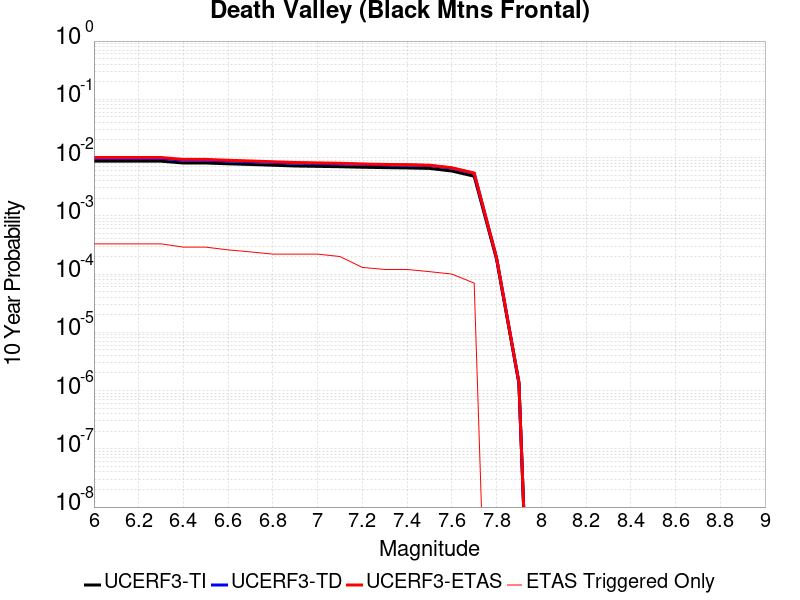 |

| Magnitude | 1 wk TI Prob | 1 wk TD Prob | 1 wk ETAS Prob | 1 wk ETAS/TD Gain | 1 wk ETAS Triggered Only | 1 mo TI Prob | 1 mo TD Prob | 1 mo ETAS Prob | 1 mo ETAS/TD Gain | 1 mo ETAS Triggered Only | 1 yr TI Prob | 1 yr TD Prob | 1 yr ETAS Prob | 1 yr ETAS/TD Gain | 1 yr ETAS Triggered Only | 10 yr TI Prob | 10 yr TD Prob | 10 yr ETAS Prob | 10 yr ETAS/TD Gain | 10 yr ETAS Triggered Only |
|-----|-----|-----|-----|-----|-----|-----|-----|-----|-----|-----|-----|-----|-----|-----|-----|-----|-----|-----|-----|-----|
| 6.0 | 1.6707214E-5 | 1.8671435E-5 | 1.8671435E-5 | 1.0 | 0.0 | 7.160038E-5 | 8.001803E-5 | 1.7482413E-4 | 2.1848092 | 9.481369E-5 | 8.71386E-4 | 9.737917E-4 | 0.0012105951 | 1.2431767 | 2.3703423E-4 | 0.00867977 | 0.0096961 | 0.010118624 | 1.0435767 | 4.266616E-4 |
| 6.1 | 1.6707214E-5 | 1.8671435E-5 | 1.8671435E-5 | 1.0 | 0.0 | 7.160038E-5 | 8.001803E-5 | 1.7482413E-4 | 2.1848092 | 9.481369E-5 | 8.71386E-4 | 9.737917E-4 | 0.0012105951 | 1.2431767 | 2.3703423E-4 | 0.00867977 | 0.0096961 | 0.010118624 | 1.0435767 | 4.266616E-4 |
| 6.2 | 1.6707214E-5 | 1.8671435E-5 | 1.8671435E-5 | 1.0 | 0.0 | 7.160038E-5 | 8.001803E-5 | 1.7482413E-4 | 2.1848092 | 9.481369E-5 | 8.71386E-4 | 9.737917E-4 | 0.0012105951 | 1.2431767 | 2.3703423E-4 | 0.00867977 | 0.0096961 | 0.010118624 | 1.0435767 | 4.266616E-4 |
| 6.3 | 1.6707214E-5 | 1.8671435E-5 | 1.8671435E-5 | 1.0 | 0.0 | 7.160038E-5 | 8.001803E-5 | 1.7482413E-4 | 2.1848092 | 9.481369E-5 | 8.71386E-4 | 9.737917E-4 | 0.0012105951 | 1.2431767 | 2.3703423E-4 | 0.00867977 | 0.0096961 | 0.010118624 | 1.0435767 | 4.266616E-4 |
| 6.4 | 1.5515609E-5 | 1.7339296E-5 | 1.7339296E-5 | 1.0 | 0.0 | 6.649377E-5 | 7.430919E-5 | 1.6911584E-4 | 2.27584 | 9.481369E-5 | 8.0926094E-4 | 9.04345E-4 | 0.0011411648 | 1.261869 | 2.3703423E-4 | 0.008063202 | 0.009007333 | 0.009336192 | 1.0365101 | 3.3184793E-4 |
| 6.5 | 1.5515609E-5 | 1.7339296E-5 | 1.7339296E-5 | 1.0 | 0.0 | 6.649377E-5 | 7.430919E-5 | 1.6911584E-4 | 2.27584 | 9.481369E-5 | 8.0926094E-4 | 9.04345E-4 | 0.0011411648 | 1.261869 | 2.3703423E-4 | 0.008063202 | 0.009007333 | 0.009336192 | 1.0365101 | 3.3184793E-4 |
| 6.6 | 1.5041828E-5 | 1.6810196E-5 | 1.6810196E-5 | 1.0 | 0.0 | 6.4463384E-5 | 7.204174E-5 | 1.1944517E-4 | 1.6579995 | 4.7406844E-5 | 7.8455906E-4 | 8.767611E-4 | 0.0010662222 | 1.2160921 | 1.8962738E-4 | 0.00781795 | 0.008733676 | 0.00896864 | 1.0269033 | 2.3703423E-4 |
| 6.7 | 1.4634985E-5 | 1.635704E-5 | 1.635704E-5 | 1.0 | 0.0 | 6.271985E-5 | 7.009975E-5 | 1.17503274E-4 | 1.6762296 | 4.7406844E-5 | 7.6334673E-4 | 8.53136E-4 | 9.952352E-4 | 1.166561 | 1.4222054E-4 | 0.007607299 | 0.008499245 | 0.008687261 | 1.0221214 | 1.8962738E-4 |
| 6.8 | 1.4209158E-5 | 1.5883043E-5 | 1.5883043E-5 | 1.0 | 0.0 | 6.089497E-5 | 6.806844E-5 | 1.1547206E-4 | 1.6964111 | 4.7406844E-5 | 7.4114406E-4 | 8.2842377E-4 | 9.705265E-4 | 1.1715338 | 1.4222054E-4 | 0.007386771 | 0.008253971 | 0.008442034 | 1.0227845 | 1.8962738E-4 |
| 6.9 | 1.3780098E-5 | 1.540556E-5 | 1.540556E-5 | 1.0 | 0.0 | 5.9056227E-5 | 6.6022185E-5 | 1.134259E-4 | 1.7179967 | 4.7406844E-5 | 7.1877235E-4 | 8.0352917E-4 | 9.4563543E-4 | 1.1768527 | 1.4222054E-4 | 0.0071645193 | 0.0080068335 | 0.008194942 | 1.0234935 | 1.8962738E-4 |
| 7.0 | 1.3585064E-5 | 1.5189109E-5 | 1.5189109E-5 | 1.0 | 0.0 | 5.8220405E-5 | 6.509459E-5 | 1.1249835E-4 | 1.7282289 | 4.7406844E-5 | 7.086029E-4 | 7.922439E-4 | 9.3435176E-4 | 1.1793739 | 1.4222054E-4 | 0.007063476 | 0.007894788 | 0.008082918 | 1.0238297 | 1.8962738E-4 |
| 7.1 | 1.3398601E-5 | 1.4982282E-5 | 1.4982282E-5 | 1.0 | 0.0 | 5.742131E-5 | 6.420823E-5 | 1.1161203E-4 | 1.7382823 | 4.7406844E-5 | 6.9888023E-4 | 7.8146026E-4 | 9.2356966E-4 | 1.181851 | 1.4222054E-4 | 0.0069668638 | 0.007787712 | 0.007975862 | 1.0241599 | 1.8962738E-4 |
| 7.2 | 1.3126312E-5 | 1.4680485E-5 | 1.4680485E-5 | 1.0 | 0.0 | 5.6254412E-5 | 6.291488E-5 | 1.1031874E-4 | 1.7534603 | 4.7406844E-5 | 6.846822E-4 | 7.6572486E-4 | 9.0783654E-4 | 1.185591 | 1.4222054E-4 | 0.006825765 | 0.007631449 | 0.007772584 | 1.0184939 | 1.4222054E-4 |
| 7.3 | 1.2922429E-5 | 1.4454699E-5 | 1.4454699E-5 | 1.0 | 0.0 | 5.5380664E-5 | 6.194727E-5 | 1.0935118E-4 | 1.76523 | 4.7406844E-5 | 6.74051E-4 | 7.539525E-4 | 8.960658E-4 | 1.1884911 | 1.4222054E-4 | 0.006720101 | 0.007514527 | 0.007655679 | 1.0187838 | 1.4222054E-4 |
| 7.4 | 1.2768878E-5 | 1.4284673E-5 | 1.4284673E-5 | 1.0 | 0.0 | 5.4722615E-5 | 6.121862E-5 | 1.0862257E-4 | 1.7743386 | 4.7406844E-5 | 6.660441E-4 | 7.450873E-4 | 8.8720187E-4 | 1.1907355 | 1.4222054E-4 | 0.0066405144 | 0.007426471 | 0.0075676353 | 1.0190083 | 1.4222054E-4 |
| 7.5 | 1.2521929E-5 | 1.4012902E-5 | 1.4012902E-5 | 1.0 | 0.0 | 5.366431E-5 | 6.0053942E-5 | 1.0745794E-4 | 1.789357 | 4.7406844E-5 | 6.531671E-4 | 7.309169E-4 | 8.730335E-4 | 1.1944361 | 1.4222054E-4 | 0.006512506 | 0.0072857053 | 0.0074268896 | 1.0193783 | 1.4222054E-4 |
| 7.6 | 1.1301089E-5 | 1.2648951E-5 | 1.2648951E-5 | 1.0 | 0.0 | 4.8432343E-5 | 5.4208693E-5 | 5.4208693E-5 | 1.0 | 0.0 | 5.895042E-4 | 6.597963E-4 | 7.545474E-4 | 1.1436067 | 9.481369E-5 | 0.0058794282 | 0.006578926 | 0.0066731162 | 1.0143169 | 9.481369E-5 |
| 7.7 | 9.189108E-6 | 1.02840095E-5 | 1.02840095E-5 | 1.0 | 0.0 | 3.93813E-5 | 4.407361E-5 | 4.407361E-5 | 1.0 | 0.0 | 4.7936183E-4 | 5.3646916E-4 | 5.8385055E-4 | 1.0883209 | 4.7406844E-5 | 0.004783291 | 0.005352252 | 0.005399405 | 1.0088099 | 4.7406844E-5 |
| 7.8 | 3.4586725E-7 | 3.648368E-7 | 3.648368E-7 | 1.0 | 0.0 | 1.4822873E-6 | 1.5635853E-6 | 1.5635853E-6 | 1.0 | 0.0 | 1.80467E-5 | 1.903649E-5 | 1.903649E-5 | 1.0 | 0.0 | 1.8045233E-4 | 1.9034903E-4 | 1.9034903E-4 | 1.0 | 0.0 |
| 7.9 | 2.5591178E-9 | 2.6697329E-9 | 2.6697329E-9 | 1.0 | 0.0 | 1.0967647E-8 | 1.14417125E-8 | 1.14417125E-8 | 1.0 | 0.0 | 1.335311E-7 | 1.3930286E-7 | 1.3930286E-7 | 1.0 | 0.0 | 1.3353102E-6 | 1.3930285E-6 | 1.3930285E-6 | 1.0 | 0.0 |

## Coyote Lake
*[(top)](#table-of-contents)*

| 1 Week | 1 Month | 1 Year | 10 Year |
|-----|-----|-----|-----|
|  |  |  |  |

| Magnitude | 1 wk TI Prob | 1 wk TD Prob | 1 wk ETAS Prob | 1 wk ETAS/TD Gain | 1 wk ETAS Triggered Only | 1 mo TI Prob | 1 mo TD Prob | 1 mo ETAS Prob | 1 mo ETAS/TD Gain | 1 mo ETAS Triggered Only | 1 yr TI Prob | 1 yr TD Prob | 1 yr ETAS Prob | 1 yr ETAS/TD Gain | 1 yr ETAS Triggered Only | 10 yr TI Prob | 10 yr TD Prob | 10 yr ETAS Prob | 10 yr ETAS/TD Gain | 10 yr ETAS Triggered Only |
|-----|-----|-----|-----|-----|-----|-----|-----|-----|-----|-----|-----|-----|-----|-----|-----|-----|-----|-----|-----|-----|
| 6.0 | 1.980352E-5 | 2.1707852E-5 | 2.1707852E-5 | 1.0 | 0.0 | 8.486947E-5 | 9.303074E-5 | 9.303074E-5 | 1.0 | 0.0 | 0.0010327959 | 0.0011321327 | 0.0013688987 | 1.2091326 | 2.3703423E-4 | 0.010280091 | 0.01127083 | 0.011598938 | 1.0291113 | 3.3184793E-4 |
| 6.1 | 1.980352E-5 | 2.1707852E-5 | 2.1707852E-5 | 1.0 | 0.0 | 8.486947E-5 | 9.303074E-5 | 9.303074E-5 | 1.0 | 0.0 | 0.0010327959 | 0.0011321327 | 0.0013688987 | 1.2091326 | 2.3703423E-4 | 0.010280091 | 0.01127083 | 0.011598938 | 1.0291113 | 3.3184793E-4 |
| 6.2 | 1.980352E-5 | 2.1707852E-5 | 2.1707852E-5 | 1.0 | 0.0 | 8.486947E-5 | 9.303074E-5 | 9.303074E-5 | 1.0 | 0.0 | 0.0010327959 | 0.0011321327 | 0.0013688987 | 1.2091326 | 2.3703423E-4 | 0.010280091 | 0.01127083 | 0.011598938 | 1.0291113 | 3.3184793E-4 |
| 6.3 | 1.5344787E-5 | 1.6821528E-5 | 1.6821528E-5 | 1.0 | 0.0 | 6.576172E-5 | 7.209062E-5 | 7.209062E-5 | 1.0 | 0.0 | 8.003548E-4 | 8.7741105E-4 | 9.721415E-4 | 1.107966 | 9.481369E-5 | 0.007974784 | 0.008745514 | 0.008839498 | 1.0107466 | 9.481369E-5 |
| 6.4 | 1.5344787E-5 | 1.6821528E-5 | 1.6821528E-5 | 1.0 | 0.0 | 6.576172E-5 | 7.209062E-5 | 7.209062E-5 | 1.0 | 0.0 | 8.003548E-4 | 8.7741105E-4 | 9.721415E-4 | 1.107966 | 9.481369E-5 | 0.007974784 | 0.008745514 | 0.008839498 | 1.0107466 | 9.481369E-5 |
| 6.5 | 1.4189697E-5 | 1.5558782E-5 | 1.5558782E-5 | 1.0 | 0.0 | 6.081157E-5 | 6.667913E-5 | 6.667913E-5 | 1.0 | 0.0 | 7.401293E-4 | 8.115764E-4 | 9.0631313E-4 | 1.1167318 | 9.481369E-5 | 0.0073766913 | 0.008092069 | 0.008186115 | 1.0116221 | 9.481369E-5 |
| 6.6 | 1.3469301E-5 | 1.4772335E-5 | 1.4772335E-5 | 1.0 | 0.0 | 5.7724297E-5 | 6.330881E-5 | 6.330881E-5 | 1.0 | 0.0 | 7.025667E-4 | 7.7057217E-4 | 8.653128E-4 | 1.1229484 | 9.481369E-5 | 0.0070034964 | 0.0076849074 | 0.0077789924 | 1.0122428 | 9.481369E-5 |
| 6.7 | 1.3027966E-5 | 1.4282475E-5 | 1.4282475E-5 | 1.0 | 0.0 | 5.5832945E-5 | 6.12095E-5 | 6.12095E-5 | 1.0 | 0.0 | 6.7955407E-4 | 7.450307E-4 | 8.3977374E-4 | 1.1271666 | 9.481369E-5 | 0.006774798 | 0.007431207 | 0.0075253164 | 1.0126641 | 9.481369E-5 |
| 6.8 | 5.695434E-6 | 6.2247245E-6 | 6.2247245E-6 | 1.0 | 0.0 | 2.4408775E-5 | 2.6677288E-5 | 2.6677288E-5 | 1.0 | 0.0 | 2.971363E-4 | 3.2477756E-4 | 4.1956044E-4 | 1.2918395 | 9.481369E-5 | 0.0029673933 | 0.0032459702 | 0.0033404762 | 1.0291148 | 9.481369E-5 |
| 6.9 | 4.385688E-6 | 4.7932917E-6 | 4.7932917E-6 | 1.0 | 0.0 | 1.879567E-5 | 2.0542679E-5 | 2.0542679E-5 | 1.0 | 0.0 | 2.2881327E-4 | 2.501071E-4 | 3.448971E-4 | 1.3789976 | 9.481369E-5 | 0.002285778 | 0.002501071 | 0.0025956477 | 1.0378144 | 9.481369E-5 |

## Garlic Springs
*[(top)](#table-of-contents)*

| 1 Week | 1 Month | 1 Year | 10 Year |
|-----|-----|-----|-----|
|  |  |  |  |

| Magnitude | 1 wk TI Prob | 1 wk TD Prob | 1 wk ETAS Prob | 1 wk ETAS/TD Gain | 1 wk ETAS Triggered Only | 1 mo TI Prob | 1 mo TD Prob | 1 mo ETAS Prob | 1 mo ETAS/TD Gain | 1 mo ETAS Triggered Only | 1 yr TI Prob | 1 yr TD Prob | 1 yr ETAS Prob | 1 yr ETAS/TD Gain | 1 yr ETAS Triggered Only | 10 yr TI Prob | 10 yr TD Prob | 10 yr ETAS Prob | 10 yr ETAS/TD Gain | 10 yr ETAS Triggered Only |
|-----|-----|-----|-----|-----|-----|-----|-----|-----|-----|-----|-----|-----|-----|-----|-----|-----|-----|-----|-----|-----|
| 6.0 | 1.6760017E-5 | 1.8778032E-5 | 1.8778032E-5 | 1.0 | 0.0 | 7.182667E-5 | 8.047546E-5 | 8.047546E-5 | 1.0 | 0.0 | 8.7413884E-4 | 9.794658E-4 | 0.0011689074 | 1.1934133 | 1.8962738E-4 | 0.008707083 | 0.009763034 | 0.010091642 | 1.0336584 | 3.3184793E-4 |
| 6.1 | 9.852767E-6 | 1.097425E-5 | 1.097425E-5 | 1.0 | 0.0 | 4.222546E-5 | 4.703205E-5 | 4.703205E-5 | 1.0 | 0.0 | 5.139737E-4 | 5.7253573E-4 | 6.672951E-4 | 1.1655083 | 9.481369E-5 | 0.005127866 | 0.005717566 | 0.005906109 | 1.0329762 | 1.8962738E-4 |
| 6.2 | 9.852767E-6 | 1.097425E-5 | 1.097425E-5 | 1.0 | 0.0 | 4.222546E-5 | 4.703205E-5 | 4.703205E-5 | 1.0 | 0.0 | 5.139737E-4 | 5.7253573E-4 | 6.672951E-4 | 1.1655083 | 9.481369E-5 | 0.005127866 | 0.005717566 | 0.005906109 | 1.0329762 | 1.8962738E-4 |
| 6.3 | 4.3167724E-6 | 4.7782996E-6 | 4.7782996E-6 | 1.0 | 0.0 | 1.8500323E-5 | 2.0478396E-5 | 2.0478396E-5 | 1.0 | 0.0 | 2.2521814E-4 | 2.4931898E-4 | 2.4931898E-4 | 1.0 | 0.0 | 0.0022499003 | 0.002492651 | 0.002492651 | 1.0 | 0.0 |
| 6.4 | 4.3167724E-6 | 4.7782996E-6 | 4.7782996E-6 | 1.0 | 0.0 | 1.8500323E-5 | 2.0478396E-5 | 2.0478396E-5 | 1.0 | 0.0 | 2.2521814E-4 | 2.4931898E-4 | 2.4931898E-4 | 1.0 | 0.0 | 0.0022499003 | 0.002492651 | 0.002492651 | 1.0 | 0.0 |
| 6.5 | 4.3167724E-6 | 4.7782996E-6 | 4.7782996E-6 | 1.0 | 0.0 | 1.8500323E-5 | 2.0478396E-5 | 2.0478396E-5 | 1.0 | 0.0 | 2.2521814E-4 | 2.4931898E-4 | 2.4931898E-4 | 1.0 | 0.0 | 0.0022499003 | 0.002492651 | 0.002492651 | 1.0 | 0.0 |
| 6.6 | 4.301311E-6 | 4.761167E-6 | 4.761167E-6 | 1.0 | 0.0 | 1.8434059E-5 | 2.0404972E-5 | 2.0404972E-5 | 1.0 | 0.0 | 2.2441156E-4 | 2.4842523E-4 | 2.4842523E-4 | 1.0 | 0.0 | 0.0022418506 | 0.002483734 | 0.002483734 | 1.0 | 0.0 |
| 6.7 | 3.8599724E-6 | 4.2713013E-6 | 4.2713013E-6 | 1.0 | 0.0 | 1.6542634E-5 | 1.8305576E-5 | 1.8305576E-5 | 1.0 | 0.0 | 2.0138794E-4 | 2.228704E-4 | 2.228704E-4 | 1.0 | 0.0 | 0.0020120554 | 0.0022287038 | 0.0022287038 | 1.0 | 0.0 |

## San Andreas (Parkfield)
*[(top)](#table-of-contents)*

| 1 Week | 1 Month | 1 Year | 10 Year |
|-----|-----|-----|-----|
|  |  |  |  |

| Magnitude | 1 wk TI Prob | 1 wk TD Prob | 1 wk ETAS Prob | 1 wk ETAS/TD Gain | 1 wk ETAS Triggered Only | 1 mo TI Prob | 1 mo TD Prob | 1 mo ETAS Prob | 1 mo ETAS/TD Gain | 1 mo ETAS Triggered Only | 1 yr TI Prob | 1 yr TD Prob | 1 yr ETAS Prob | 1 yr ETAS/TD Gain | 1 yr ETAS Triggered Only | 10 yr TI Prob | 10 yr TD Prob | 10 yr ETAS Prob | 10 yr ETAS/TD Gain | 10 yr ETAS Triggered Only |
|-----|-----|-----|-----|-----|-----|-----|-----|-----|-----|-----|-----|-----|-----|-----|-----|-----|-----|-----|-----|-----|
| 6.0 | 5.556969E-4 | 7.819087E-4 | 9.24018E-4 | 1.1817467 | 1.4222054E-4 | 0.0023793848 | 0.0033472886 | 0.003489033 | 1.042346 | 1.4222054E-4 | 0.028586963 | 0.040385824 | 0.040613282 | 1.0056322 | 2.3703423E-4 | 0.25176284 | 0.33777508 | 0.33796346 | 1.0005577 | 2.8444108E-4 |
| 6.1 | 1.925858E-4 | 3.0390357E-4 | 3.51296E-4 | 1.1559457 | 4.7406844E-5 | 8.2510663E-4 | 0.0013018888 | 0.001349234 | 1.0363665 | 4.7406844E-5 | 0.0099994885 | 0.015834767 | 0.01592808 | 1.0058929 | 9.481369E-5 | 0.095613256 | 0.14999957 | 0.15012045 | 1.000806 | 1.4222054E-4 |
| 6.2 | 9.4306815E-5 | 1.8273306E-4 | 2.3013123E-4 | 1.2593849 | 4.7406844E-5 | 4.0410945E-4 | 7.829079E-4 | 8.302776E-4 | 1.0605049 | 4.7406844E-5 | 0.0049089384 | 0.009490452 | 0.009584366 | 1.0098956 | 9.481369E-5 | 0.048019063 | 0.09198628 | 0.092115425 | 1.0014039 | 1.4222054E-4 |
| 6.3 | 9.283051E-5 | 1.7969737E-4 | 2.2709569E-4 | 1.2637675 | 4.7406844E-5 | 3.9778434E-4 | 7.6990545E-4 | 8.1727584E-4 | 1.0615275 | 4.7406844E-5 | 0.0048322747 | 0.009333515 | 0.009427443 | 1.0100636 | 9.481369E-5 | 0.047285385 | 0.09063911 | 0.090768434 | 1.0014268 | 1.4222054E-4 |
| 6.4 | 9.138826E-5 | 1.7731739E-4 | 2.2471583E-4 | 1.2673085 | 4.7406844E-5 | 3.916052E-4 | 7.5971155E-4 | 8.070824E-4 | 1.0623537 | 4.7406844E-5 | 0.0047573745 | 0.00921046 | 0.0093044005 | 1.0101993 | 9.481369E-5 | 0.046568092 | 0.0895407 | 0.08967018 | 1.0014461 | 1.4222054E-4 |
| 6.5 | 9.000255E-5 | 1.7489606E-4 | 2.222946E-4 | 1.2710098 | 4.7406844E-5 | 3.8566816E-4 | 7.493404E-4 | 7.967117E-4 | 1.0632174 | 4.7406844E-5 | 0.0046854047 | 0.009085262 | 0.009179214 | 1.0103412 | 9.481369E-5 | 0.045878403 | 0.08842592 | 0.08855556 | 1.0014662 | 1.4222054E-4 |
| 6.6 | 8.8109264E-5 | 1.7170387E-4 | 2.1910257E-4 | 1.2760491 | 4.7406844E-5 | 3.7755648E-4 | 7.3566736E-4 | 7.830393E-4 | 1.0643932 | 4.7406844E-5 | 0.0045870654 | 0.0089201825 | 0.00901415 | 1.0105343 | 9.481369E-5 | 0.04493529 | 0.08695624 | 0.0870861 | 1.0014933 | 1.4222054E-4 |
| 6.7 | 8.738073E-5 | 1.7037381E-4 | 2.1777258E-4 | 1.2782046 | 4.7406844E-5 | 3.7443507E-4 | 7.2997034E-4 | 7.773426E-4 | 1.0648961 | 4.7406844E-5 | 0.0045492216 | 0.0088514285 | 0.008945403 | 1.0106169 | 9.481369E-5 | 0.04457213 | 0.08635636 | 0.086486295 | 1.0015047 | 1.4222054E-4 |
| 6.8 | 8.710195E-5 | 1.6982816E-4 | 2.1722696E-4 | 1.2790985 | 4.7406844E-5 | 3.7324068E-4 | 7.2763313E-4 | 7.7500544E-4 | 1.0651047 | 4.7406844E-5 | 0.0045347405 | 0.008823211 | 0.008917188 | 1.0106511 | 9.481369E-5 | 0.04443313 | 0.08610373 | 0.086233705 | 1.0015095 | 1.4222054E-4 |
| 6.9 | 8.6801556E-5 | 1.6923707E-4 | 2.1663589E-4 | 1.2800735 | 4.7406844E-5 | 3.7195362E-4 | 7.251013E-4 | 7.7247375E-4 | 1.0653322 | 4.7406844E-5 | 0.0045191357 | 0.008792636 | 0.008886616 | 1.0106885 | 9.481369E-5 | 0.044283327 | 0.08582957 | 0.08595958 | 1.0015148 | 1.4222054E-4 |
| 7.0 | 8.5571606E-5 | 1.6676294E-4 | 2.1416188E-4 | 1.2842294 | 4.7406844E-5 | 3.6668387E-4 | 7.145037E-4 | 7.618767E-4 | 1.066302 | 4.7406844E-5 | 0.004455241 | 0.008664643 | 0.008758635 | 1.0108478 | 9.481369E-5 | 0.043669727 | 0.08467713 | 0.08480731 | 1.0015373 | 1.4222054E-4 |
| 7.1 | 7.82589E-5 | 1.5156237E-4 | 1.9896204E-4 | 1.3127403 | 4.7406844E-5 | 3.3535215E-4 | 6.493921E-4 | 6.967681E-4 | 1.0729545 | 4.7406844E-5 | 0.0040752706 | 0.007877857 | 0.007971924 | 1.0119406 | 9.481369E-5 | 0.040013418 | 0.077585794 | 0.077716984 | 1.0016909 | 1.4222054E-4 |
| 7.2 | 7.690929E-5 | 1.489332E-4 | 1.96333E-4 | 1.318262 | 4.7406844E-5 | 3.2956956E-4 | 6.381298E-4 | 6.855064E-4 | 1.0742428 | 4.7406844E-5 | 0.004005129 | 0.007741721 | 0.007835801 | 1.0121523 | 9.481369E-5 | 0.0393371 | 0.076358445 | 0.076489806 | 1.0017203 | 1.4222054E-4 |
| 7.3 | 7.5543794E-5 | 1.4589565E-4 | 1.9329558E-4 | 1.3248893 | 4.7406844E-5 | 3.2371894E-4 | 6.25118E-4 | 6.7249517E-4 | 1.0757892 | 4.7406844E-5 | 0.003934157 | 0.0075844154 | 0.0076785097 | 1.0124063 | 9.481369E-5 | 0.038652334 | 0.07492032 | 0.07505188 | 1.0017561 | 1.4222054E-4 |
| 7.4 | 7.4214564E-5 | 1.4290171E-4 | 1.9030178E-4 | 1.331697 | 4.7406844E-5 | 3.1802364E-4 | 6.122929E-4 | 6.5967074E-4 | 1.0773777 | 4.7406844E-5 | 0.003865065 | 0.007429345 | 0.0075234543 | 1.0126673 | 9.481369E-5 | 0.03798529 | 0.07349284 | 0.0736246 | 1.0017929 | 1.4222054E-4 |
| 7.5 | 6.149578E-5 | 1.1214155E-4 | 1.5954308E-4 | 1.4226937 | 4.7406844E-5 | 2.6352672E-4 | 4.8051824E-4 | 5.279023E-4 | 1.0986103 | 4.7406844E-5 | 0.0032037178 | 0.005834648 | 0.0058817784 | 1.0080776 | 4.7406844E-5 | 0.03157923 | 0.058665328 | 0.05875458 | 1.0015213 | 9.481369E-5 |
| 7.6 | 6.0643448E-5 | 1.10425855E-4 | 1.5782747E-4 | 1.4292619 | 4.7406844E-5 | 2.598746E-4 | 4.7316792E-4 | 5.2055233E-4 | 1.100143 | 4.7406844E-5 | 0.0031593828 | 0.0057456335 | 0.005792768 | 1.0082035 | 4.7406844E-5 | 0.031148417 | 0.05782546 | 0.057914793 | 1.0015448 | 9.481369E-5 |
| 7.7 | 5.1652263E-5 | 9.1955124E-5 | 1.3935761E-4 | 1.5154959 | 4.7406844E-5 | 2.2134806E-4 | 3.9403388E-4 | 4.4142205E-4 | 1.1202642 | 4.7406844E-5 | 0.002691582 | 0.00478682 | 0.004834 | 1.0098562 | 4.7406844E-5 | 0.026592141 | 0.048633553 | 0.048723754 | 1.0018548 | 9.481369E-5 |
| 7.8 | 4.8090482E-5 | 8.578783E-5 | 1.3319061E-4 | 1.5525583 | 4.7406844E-5 | 2.060858E-4 | 3.6761034E-4 | 4.1499975E-4 | 1.1289121 | 4.7406844E-5 | 0.0025062072 | 0.004466479 | 0.0045136744 | 1.0105665 | 4.7406844E-5 | 0.024781305 | 0.045392275 | 0.045482785 | 1.0019939 | 9.481369E-5 |
| 7.9 | 3.970278E-5 | 6.7652974E-5 | 1.1505661E-4 | 1.7006882 | 4.7406844E-5 | 1.7014367E-4 | 2.899091E-4 | 3.373022E-4 | 1.1634758 | 4.7406844E-5 | 0.002069531 | 0.0035239344 | 0.003571174 | 1.0134054 | 4.7406844E-5 | 0.020503636 | 0.035952512 | 0.036043916 | 1.0025424 | 9.481369E-5 |
| 8.0 | 2.8982335E-5 | 4.079188E-5 | 8.819679E-5 | 2.1621163 | 4.7406844E-5 | 1.2420409E-4 | 1.7481064E-4 | 2.222092E-4 | 1.2711422 | 4.7406844E-5 | 0.0015111357 | 0.0021262432 | 0.0021735493 | 1.0222486 | 4.7406844E-5 | 0.015009012 | 0.022057572 | 0.022103934 | 1.0021018 | 4.7406844E-5 |
| 8.1 | 1.8836186E-5 | 1.8733741E-5 | 6.61397E-5 | 3.530512 | 4.7406844E-5 | 8.0724014E-5 | 8.028499E-5 | 1.2768804E-4 | 1.5904347 | 4.7406844E-5 | 9.823717E-4 | 9.77032E-4 | 0.0010243925 | 1.0484738 | 4.7406844E-5 | 0.009780403 | 0.010515724 | 0.010562632 | 1.0044608 | 4.7406844E-5 |
| 8.2 | 8.643924E-6 | 5.49522E-6 | 5.49522E-6 | 1.0 | 0.0 | 3.704486E-5 | 2.355073E-5 | 2.355073E-5 | 1.0 | 0.0 | 4.5092785E-4 | 2.866925E-4 | 2.866925E-4 | 1.0 | 0.0 | 0.0045001395 | 0.0032598388 | 0.0032598388 | 1.0 | 0.0 |
| 8.3 | 1.983087E-6 | 7.693574E-7 | 7.693574E-7 | 1.0 | 0.0 | 8.498917E-6 | 3.297242E-6 | 3.297242E-6 | 1.0 | 0.0 | 1.034694E-4 | 4.01432E-5 | 4.01432E-5 | 1.0 | 0.0 | 0.0010342124 | 4.7390026E-4 | 4.7390026E-4 | 1.0 | 0.0 |

## San Andreas (Big Bend)
*[(top)](#table-of-contents)*

| 1 Week | 1 Month | 1 Year | 10 Year |
|-----|-----|-----|-----|
|  |  |  |  |

| Magnitude | 1 wk TI Prob | 1 wk TD Prob | 1 wk ETAS Prob | 1 wk ETAS/TD Gain | 1 wk ETAS Triggered Only | 1 mo TI Prob | 1 mo TD Prob | 1 mo ETAS Prob | 1 mo ETAS/TD Gain | 1 mo ETAS Triggered Only | 1 yr TI Prob | 1 yr TD Prob | 1 yr ETAS Prob | 1 yr ETAS/TD Gain | 1 yr ETAS Triggered Only | 10 yr TI Prob | 10 yr TD Prob | 10 yr ETAS Prob | 10 yr ETAS/TD Gain | 10 yr ETAS Triggered Only |
|-----|-----|-----|-----|-----|-----|-----|-----|-----|-----|-----|-----|-----|-----|-----|-----|-----|-----|-----|-----|-----|
| 6.0 | 1.0179969E-4 | 2.0106303E-4 | 2.4846033E-4 | 1.2357336 | 4.7406844E-5 | 4.362114E-4 | 8.614151E-4 | 9.5614715E-4 | 1.1099726 | 9.481369E-5 | 0.0052979486 | 0.010437581 | 0.010578317 | 1.0134836 | 1.4222054E-4 | 0.051734097 | 0.10159716 | 0.10185271 | 1.0025152 | 2.8444108E-4 |
| 6.1 | 1.0179969E-4 | 2.0106303E-4 | 2.4846033E-4 | 1.2357336 | 4.7406844E-5 | 4.362114E-4 | 8.614151E-4 | 9.5614715E-4 | 1.1099726 | 9.481369E-5 | 0.0052979486 | 0.010437581 | 0.010578317 | 1.0134836 | 1.4222054E-4 | 0.051734097 | 0.10159716 | 0.10185271 | 1.0025152 | 2.8444108E-4 |
| 6.2 | 1.0179969E-4 | 2.0106303E-4 | 2.4846033E-4 | 1.2357336 | 4.7406844E-5 | 4.362114E-4 | 8.614151E-4 | 9.5614715E-4 | 1.1099726 | 9.481369E-5 | 0.0052979486 | 0.010437581 | 0.010578317 | 1.0134836 | 1.4222054E-4 | 0.051734097 | 0.10159716 | 0.10185271 | 1.0025152 | 2.8444108E-4 |
| 6.3 | 1.0179969E-4 | 2.0106303E-4 | 2.4846033E-4 | 1.2357336 | 4.7406844E-5 | 4.362114E-4 | 8.614151E-4 | 9.5614715E-4 | 1.1099726 | 9.481369E-5 | 0.0052979486 | 0.010437581 | 0.010578317 | 1.0134836 | 1.4222054E-4 | 0.051734097 | 0.10159716 | 0.10185271 | 1.0025152 | 2.8444108E-4 |
| 6.4 | 9.1639464E-5 | 1.8462905E-4 | 2.3202715E-4 | 1.2567207 | 4.7406844E-5 | 3.9268145E-4 | 7.910276E-4 | 8.3839695E-4 | 1.0598834 | 4.7406844E-5 | 0.0047704205 | 0.009588352 | 0.009682257 | 1.0097936 | 9.481369E-5 | 0.046693064 | 0.093921766 | 0.094093576 | 1.0018294 | 1.8962738E-4 |
| 6.5 | 9.1639464E-5 | 1.8462905E-4 | 2.3202715E-4 | 1.2567207 | 4.7406844E-5 | 3.9268145E-4 | 7.910276E-4 | 8.3839695E-4 | 1.0598834 | 4.7406844E-5 | 0.0047704205 | 0.009588352 | 0.009682257 | 1.0097936 | 9.481369E-5 | 0.046693064 | 0.093921766 | 0.094093576 | 1.0018294 | 1.8962738E-4 |
| 6.6 | 9.042622E-5 | 1.826988E-4 | 2.3009698E-4 | 1.2594335 | 4.7406844E-5 | 3.8748336E-4 | 7.827601E-4 | 8.3012984E-4 | 1.0605162 | 4.7406844E-5 | 0.0047074095 | 0.009488574 | 0.009582488 | 1.0098976 | 9.481369E-5 | 0.046089325 | 0.093015574 | 0.093144566 | 1.0013868 | 1.4222054E-4 |
| 6.7 | 8.9836685E-5 | 1.8184188E-4 | 2.292401E-4 | 1.2606562 | 4.7406844E-5 | 3.8495753E-4 | 7.790898E-4 | 8.2645967E-4 | 1.0608016 | 4.7406844E-5 | 0.00467679 | 0.009444275 | 0.009538193 | 1.0099444 | 9.481369E-5 | 0.045795817 | 0.09260978 | 0.09273883 | 1.0013934 | 1.4222054E-4 |
| 6.8 | 8.9471854E-5 | 1.8130938E-4 | 2.2870763E-4 | 1.2614219 | 4.7406844E-5 | 3.8339442E-4 | 7.7680906E-4 | 8.2417903E-4 | 1.0609803 | 4.7406844E-5 | 0.004657841 | 0.009416748 | 0.009510668 | 1.0099738 | 9.481369E-5 | 0.04561414 | 0.09235688 | 0.092485964 | 1.0013977 | 1.4222054E-4 |
| 6.9 | 8.858234E-5 | 1.8012857E-4 | 2.2752688E-4 | 1.2631359 | 4.7406844E-5 | 3.7958333E-4 | 7.717514E-4 | 8.1912166E-4 | 1.0613801 | 4.7406844E-5 | 0.004611638 | 0.009355701 | 0.009449627 | 1.0100396 | 9.481369E-5 | 0.04517103 | 0.09179684 | 0.091926 | 1.001407 | 1.4222054E-4 |
| 7.0 | 8.7433385E-5 | 1.7851574E-4 | 2.2591412E-4 | 1.2655138 | 4.7406844E-5 | 3.746607E-4 | 7.648433E-4 | 8.1221387E-4 | 1.0619351 | 4.7406844E-5 | 0.004551957 | 0.009272313 | 0.009366248 | 1.0101306 | 9.481369E-5 | 0.044598386 | 0.091031015 | 0.09116029 | 1.0014201 | 1.4222054E-4 |
| 7.1 | 8.684964E-5 | 1.7763473E-4 | 2.2503316E-4 | 1.2668308 | 4.7406844E-5 | 3.7215967E-4 | 7.610698E-4 | 8.084406E-4 | 1.0622424 | 4.7406844E-5 | 0.0045216335 | 0.009226761 | 0.009320701 | 1.0101812 | 9.481369E-5 | 0.04430731 | 0.09061238 | 0.09074172 | 1.0014273 | 1.4222054E-4 |
| 7.2 | 8.606521E-5 | 1.7654036E-4 | 2.2393884E-4 | 1.2684852 | 4.7406844E-5 | 3.6879873E-4 | 7.5638236E-4 | 8.037533E-4 | 1.0626284 | 4.7406844E-5 | 0.0044808835 | 0.009170174 | 0.009264117 | 1.0102445 | 9.481369E-5 | 0.043916024 | 0.09009273 | 0.09022214 | 1.0014364 | 1.4222054E-4 |
| 7.3 | 8.568266E-5 | 1.7595981E-4 | 2.233583E-4 | 1.2693712 | 4.7406844E-5 | 3.6715972E-4 | 7.5389567E-4 | 8.012668E-4 | 1.0628351 | 4.7406844E-5 | 0.0044610105 | 0.0091401525 | 0.0092341 | 1.0102785 | 9.481369E-5 | 0.043725148 | 0.08981366 | 0.0899431 | 1.0014412 | 1.4222054E-4 |
| 7.4 | 8.5432206E-5 | 1.7558529E-4 | 2.229838E-4 | 1.2699459 | 4.7406844E-5 | 3.6608664E-4 | 7.522915E-4 | 7.996627E-4 | 1.0629692 | 4.7406844E-5 | 0.004447999 | 0.009120786 | 0.009214735 | 1.0103005 | 9.481369E-5 | 0.043600157 | 0.08963369 | 0.08976316 | 1.0014445 | 1.4222054E-4 |
| 7.5 | 8.4791965E-5 | 1.742772E-4 | 2.2167579E-4 | 1.2719724 | 4.7406844E-5 | 3.633435E-4 | 7.466887E-4 | 7.940601E-4 | 1.063442 | 4.7406844E-5 | 0.0044147377 | 0.00905314 | 0.009100118 | 1.0051891 | 4.7406844E-5 | 0.043280575 | 0.08901084 | 0.08909722 | 1.0009704 | 9.481369E-5 |
| 7.6 | 8.241105E-5 | 1.6872598E-4 | 2.1612483E-4 | 1.280922 | 4.7406844E-5 | 3.531424E-4 | 7.229111E-4 | 7.702837E-4 | 1.0655303 | 4.7406844E-5 | 0.0042910352 | 0.008766012 | 0.008813004 | 1.0053606 | 4.7406844E-5 | 0.042091176 | 0.086385906 | 0.086472526 | 1.0010028 | 9.481369E-5 |
| 7.7 | 7.00432E-5 | 1.4233537E-4 | 1.8973547E-4 | 1.333017 | 4.7406844E-5 | 3.001506E-4 | 6.0986617E-4 | 6.5724406E-4 | 1.0776858 | 4.7406844E-5 | 0.0036482112 | 0.0073998813 | 0.0074469373 | 1.006359 | 4.7406844E-5 | 0.035888977 | 0.07364825 | 0.07373609 | 1.0011926 | 9.481369E-5 |
| 7.8 | 6.415362E-5 | 1.2995097E-4 | 1.7735166E-4 | 1.3647583 | 4.7406844E-5 | 2.749151E-4 | 5.568139E-4 | 6.0419436E-4 | 1.0850921 | 4.7406844E-5 | 0.0033419547 | 0.006758167 | 0.0068052537 | 1.0069673 | 4.7406844E-5 | 0.03292141 | 0.06737108 | 0.0674595 | 1.0013125 | 9.481369E-5 |
| 7.9 | 4.939911E-5 | 9.359872E-5 | 1.4100113E-4 | 1.5064429 | 4.7406844E-5 | 2.116933E-4 | 4.0107573E-4 | 4.4846354E-4 | 1.1181518 | 4.7406844E-5 | 0.0025743195 | 0.0048721726 | 0.0049193488 | 1.0096828 | 4.7406844E-5 | 0.025447013 | 0.04900208 | 0.049092248 | 1.0018401 | 9.481369E-5 |
| 8.0 | 3.344983E-5 | 5.2337946E-5 | 9.974231E-5 | 1.9057361 | 4.7406844E-5 | 1.4334853E-4 | 2.2428621E-4 | 2.7168242E-4 | 1.2113203 | 4.7406844E-5 | 0.0017438711 | 0.0027272669 | 0.0027745445 | 1.0173352 | 4.7406844E-5 | 0.017302496 | 0.027976755 | 0.028022835 | 1.0016471 | 4.7406844E-5 |
| 8.1 | 1.9104898E-5 | 1.9226556E-5 | 6.663249E-5 | 3.465649 | 4.7406844E-5 | 8.1875565E-5 | 8.2396924E-5 | 1.2979987E-4 | 1.5752999 | 4.7406844E-5 | 9.963791E-4 | 0.0010027215 | 0.0010500808 | 1.0472307 | 4.7406844E-5 | 0.009919235 | 0.01077785 | 0.0108247455 | 1.0043511 | 4.7406844E-5 |
| 8.2 | 8.643924E-6 | 5.49522E-6 | 5.49522E-6 | 1.0 | 0.0 | 3.704486E-5 | 2.355073E-5 | 2.355073E-5 | 1.0 | 0.0 | 4.5092785E-4 | 2.866925E-4 | 2.866925E-4 | 1.0 | 0.0 | 0.0045001395 | 0.0032598388 | 0.0032598388 | 1.0 | 0.0 |
| 8.3 | 1.983087E-6 | 7.693574E-7 | 7.693574E-7 | 1.0 | 0.0 | 8.498917E-6 | 3.297242E-6 | 3.297242E-6 | 1.0 | 0.0 | 1.034694E-4 | 4.01432E-5 | 4.01432E-5 | 1.0 | 0.0 | 0.0010342124 | 4.7390026E-4 | 4.7390026E-4 | 1.0 | 0.0 |

## Helendale-So Lockhart
*[(top)](#table-of-contents)*

| 1 Week | 1 Month | 1 Year | 10 Year |
|-----|-----|-----|-----|
|  |  |  |  |

| Magnitude | 1 wk TI Prob | 1 wk TD Prob | 1 wk ETAS Prob | 1 wk ETAS/TD Gain | 1 wk ETAS Triggered Only | 1 mo TI Prob | 1 mo TD Prob | 1 mo ETAS Prob | 1 mo ETAS/TD Gain | 1 mo ETAS Triggered Only | 1 yr TI Prob | 1 yr TD Prob | 1 yr ETAS Prob | 1 yr ETAS/TD Gain | 1 yr ETAS Triggered Only | 10 yr TI Prob | 10 yr TD Prob | 10 yr ETAS Prob | 10 yr ETAS/TD Gain | 10 yr ETAS Triggered Only |
|-----|-----|-----|-----|-----|-----|-----|-----|-----|-----|-----|-----|-----|-----|-----|-----|-----|-----|-----|-----|-----|
| 6.0 | 1.7296055E-5 | 1.810418E-5 | 6.551017E-5 | 3.6185107 | 4.7406844E-5 | 7.412385E-5 | 7.7587145E-5 | 1.2499031E-4 | 1.6109668 | 4.7406844E-5 | 9.0208417E-4 | 9.442349E-4 | 0.0011336833 | 1.2006369 | 1.8962738E-4 | 0.008984311 | 0.009404349 | 0.009686115 | 1.0299612 | 2.8444108E-4 |
| 6.1 | 1.7296055E-5 | 1.810418E-5 | 6.551017E-5 | 3.6185107 | 4.7406844E-5 | 7.412385E-5 | 7.7587145E-5 | 1.2499031E-4 | 1.6109668 | 4.7406844E-5 | 9.0208417E-4 | 9.442349E-4 | 0.0011336833 | 1.2006369 | 1.8962738E-4 | 0.008984311 | 0.009404349 | 0.009686115 | 1.0299612 | 2.8444108E-4 |
| 6.2 | 1.7296055E-5 | 1.810418E-5 | 6.551017E-5 | 3.6185107 | 4.7406844E-5 | 7.412385E-5 | 7.7587145E-5 | 1.2499031E-4 | 1.6109668 | 4.7406844E-5 | 9.0208417E-4 | 9.442349E-4 | 0.0011336833 | 1.2006369 | 1.8962738E-4 | 0.008984311 | 0.009404349 | 0.009686115 | 1.0299612 | 2.8444108E-4 |
| 6.3 | 1.0669118E-5 | 1.1135683E-5 | 5.8542002E-5 | 5.257154 | 4.7406844E-5 | 4.5723988E-5 | 4.7723497E-5 | 9.512808E-5 | 1.9933175 | 4.7406844E-5 | 5.5654737E-4 | 5.808815E-4 | 7.703987E-4 | 1.326258 | 1.8962738E-4 | 0.0055515557 | 0.0057939277 | 0.0060295886 | 1.0406737 | 2.3703423E-4 |
| 6.4 | 1.0669118E-5 | 1.1135683E-5 | 5.8542002E-5 | 5.257154 | 4.7406844E-5 | 4.5723988E-5 | 4.7723497E-5 | 9.512808E-5 | 1.9933175 | 4.7406844E-5 | 5.5654737E-4 | 5.808815E-4 | 7.703987E-4 | 1.326258 | 1.8962738E-4 | 0.0055515557 | 0.0057939277 | 0.0060295886 | 1.0406737 | 2.3703423E-4 |
| 6.5 | 8.790038E-6 | 9.170408E-6 | 5.6576817E-5 | 6.169499 | 4.7406844E-5 | 3.767105E-5 | 3.930116E-5 | 8.6706146E-5 | 2.206198 | 4.7406844E-5 | 4.585485E-4 | 4.7838816E-4 | 6.679248E-4 | 1.3961985 | 1.8962738E-4 | 0.0045760344 | 0.0047737476 | 0.0050096507 | 1.0494167 | 2.3703423E-4 |
| 6.6 | 7.396949E-6 | 7.715714E-6 | 5.5122193E-5 | 7.1441474 | 4.7406844E-5 | 3.1700827E-5 | 3.306693E-5 | 8.047221E-5 | 2.433616 | 4.7406844E-5 | 3.858892E-4 | 4.025165E-4 | 5.446798E-4 | 1.3531862 | 1.4222054E-4 | 0.003852198 | 0.0040179817 | 0.004206847 | 1.047005 | 1.8962738E-4 |
| 6.7 | 6.4600285E-6 | 6.738185E-6 | 5.414471E-5 | 8.035503 | 4.7406844E-5 | 2.7685543E-5 | 2.8877621E-5 | 7.62831E-5 | 2.6415992 | 4.7406844E-5 | 3.3701936E-4 | 3.515291E-4 | 4.936996E-4 | 1.4044347 | 1.4222054E-4 | 0.0033650869 | 0.003509812 | 0.003698774 | 1.0538381 | 1.8962738E-4 |
| 6.8 | 5.600104E-6 | 5.8361397E-6 | 5.3242708E-5 | 9.122932 | 4.7406844E-5 | 2.4000226E-5 | 2.5011792E-5 | 7.241745E-5 | 2.8953323 | 4.7406844E-5 | 2.9216358E-4 | 3.0447662E-4 | 3.9926142E-4 | 1.3113041 | 9.481369E-5 | 0.0029177975 | 0.003040656 | 0.003182444 | 1.0466307 | 1.4222054E-4 |
| 6.9 | 4.839122E-6 | 5.03962E-6 | 5.03962E-6 | 1.0 | 0.0 | 2.0738931E-5 | 2.1598196E-5 | 2.1598196E-5 | 1.0 | 0.0 | 2.5246723E-4 | 2.6292677E-4 | 3.1032113E-4 | 1.180257 | 4.7406844E-5 | 0.002521806 | 0.0026262044 | 0.0026734867 | 1.0180041 | 4.7406844E-5 |
| 7.0 | 3.6937633E-6 | 3.8452918E-6 | 3.8452918E-6 | 1.0 | 0.0 | 1.5830317E-5 | 1.6479718E-5 | 1.6479718E-5 | 1.0 | 0.0 | 1.9271708E-4 | 2.0062242E-4 | 2.4801976E-4 | 1.2362515 | 4.7406844E-5 | 0.0019255003 | 0.0020044446 | 0.0020517563 | 1.0236034 | 4.7406844E-5 |
| 7.1 | 2.7858857E-6 | 2.8979157E-6 | 2.8979157E-6 | 1.0 | 0.0 | 1.1939455E-5 | 1.241958E-5 | 1.241958E-5 | 1.0 | 0.0 | 1.4535317E-4 | 1.5119811E-4 | 1.9859779E-4 | 1.3134938 | 4.7406844E-5 | 0.0014525814 | 0.0015109739 | 0.0015583092 | 1.0313276 | 4.7406844E-5 |
| 7.2 | 2.1672065E-6 | 2.2540607E-6 | 2.2540607E-6 | 1.0 | 0.0 | 9.2879945E-6 | 9.660225E-6 | 9.660225E-6 | 1.0 | 0.0 | 1.1307546E-4 | 1.1760708E-4 | 1.6500834E-4 | 1.4030478 | 4.7406844E-5 | 0.0011301794 | 0.0011754666 | 0.0012228177 | 1.0402828 | 4.7406844E-5 |
| 7.3 | 1.4823496E-6 | 1.5422432E-6 | 1.5422432E-6 | 1.0 | 0.0 | 6.3529114E-6 | 6.609598E-6 | 6.609598E-6 | 1.0 | 0.0 | 7.734395E-5 | 8.0469035E-5 | 8.0469035E-5 | 1.0 | 0.0 | 7.731704E-4 | 8.044141E-4 | 8.044141E-4 | 1.0 | 0.0 |
| 7.4 | 4.2321457E-7 | 4.4109754E-7 | 4.4109754E-7 | 1.0 | 0.0 | 1.8137755E-6 | 1.8904169E-6 | 1.8904169E-6 | 1.0 | 0.0 | 2.2082493E-5 | 2.301563E-5 | 2.301563E-5 | 1.0 | 0.0 | 2.2080299E-4 | 2.3013698E-4 | 2.3013698E-4 | 1.0 | 0.0 |
| 7.5 | 5.6942316E-8 | 5.9417015E-8 | 5.9417015E-8 | 1.0 | 0.0 | 2.440385E-7 | 2.5464433E-7 | 2.5464433E-7 | 1.0 | 0.0 | 2.9711643E-6 | 3.100291E-6 | 3.100291E-6 | 1.0 | 0.0 | 2.9711247E-5 | 3.1002557E-5 | 3.1002557E-5 | 1.0 | 0.0 |

## San Andreas (San Bernardino S)
*[(top)](#table-of-contents)*

| 1 Week | 1 Month | 1 Year | 10 Year |
|-----|-----|-----|-----|
|  |  |  |  |

| Magnitude | 1 wk TI Prob | 1 wk TD Prob | 1 wk ETAS Prob | 1 wk ETAS/TD Gain | 1 wk ETAS Triggered Only | 1 mo TI Prob | 1 mo TD Prob | 1 mo ETAS Prob | 1 mo ETAS/TD Gain | 1 mo ETAS Triggered Only | 1 yr TI Prob | 1 yr TD Prob | 1 yr ETAS Prob | 1 yr ETAS/TD Gain | 1 yr ETAS Triggered Only | 10 yr TI Prob | 10 yr TD Prob | 10 yr ETAS Prob | 10 yr ETAS/TD Gain | 10 yr ETAS Triggered Only |
|-----|-----|-----|-----|-----|-----|-----|-----|-----|-----|-----|-----|-----|-----|-----|-----|-----|-----|-----|-----|-----|
| 6.0 | 1.2336002E-4 | 3.0023555E-4 | 3.0023555E-4 | 1.0 | 0.0 | 5.2857865E-4 | 0.0012861154 | 0.0012861154 | 1.0 | 0.0 | 0.006416472 | 0.015550992 | 0.015691001 | 1.0090032 | 1.4222054E-4 | 0.06234337 | 0.14291383 | 0.14315763 | 1.0017059 | 2.8444108E-4 |
| 6.1 | 1.2336002E-4 | 3.0023555E-4 | 3.0023555E-4 | 1.0 | 0.0 | 5.2857865E-4 | 0.0012861154 | 0.0012861154 | 1.0 | 0.0 | 0.006416472 | 0.015550992 | 0.015691001 | 1.0090032 | 1.4222054E-4 | 0.06234337 | 0.14291383 | 0.14315763 | 1.0017059 | 2.8444108E-4 |
| 6.2 | 1.2336002E-4 | 3.0023555E-4 | 3.0023555E-4 | 1.0 | 0.0 | 5.2857865E-4 | 0.0012861154 | 0.0012861154 | 1.0 | 0.0 | 0.006416472 | 0.015550992 | 0.015691001 | 1.0090032 | 1.4222054E-4 | 0.06234337 | 0.14291383 | 0.14315763 | 1.0017059 | 2.8444108E-4 |
| 6.3 | 1.1712257E-4 | 2.8811657E-4 | 2.8811657E-4 | 1.0 | 0.0 | 5.018573E-4 | 0.0012342266 | 0.0012342266 | 1.0 | 0.0 | 0.006093008 | 0.0149280215 | 0.015068119 | 1.0093849 | 1.4222054E-4 | 0.059286322 | 0.13762207 | 0.13786736 | 1.0017824 | 2.8444108E-4 |
| 6.4 | 1.1712257E-4 | 2.8811657E-4 | 2.8811657E-4 | 1.0 | 0.0 | 5.018573E-4 | 0.0012342266 | 0.0012342266 | 1.0 | 0.0 | 0.006093008 | 0.0149280215 | 0.015068119 | 1.0093849 | 1.4222054E-4 | 0.059286322 | 0.13762207 | 0.13786736 | 1.0017824 | 2.8444108E-4 |
| 6.5 | 1.0689076E-4 | 2.682418E-4 | 2.682418E-4 | 1.0 | 0.0 | 4.5802278E-4 | 0.001149126 | 0.001149126 | 1.0 | 0.0 | 0.0055621783 | 0.013905481 | 0.014045724 | 1.0100855 | 1.4222054E-4 | 0.05425003 | 0.12886871 | 0.1291165 | 1.0019227 | 2.8444108E-4 |
| 6.6 | 9.7648895E-5 | 2.506867E-4 | 2.506867E-4 | 1.0 | 0.0 | 4.1842813E-4 | 0.0010739529 | 0.0010739529 | 1.0 | 0.0 | 0.005082469 | 0.0130013535 | 0.013141725 | 1.0107967 | 1.4222054E-4 | 0.049677886 | 0.12102797 | 0.12127798 | 1.0020658 | 2.8444108E-4 |
| 6.7 | 8.757013E-5 | 2.3139146E-4 | 2.3139146E-4 | 1.0 | 0.0 | 3.7524657E-4 | 9.913231E-4 | 9.913231E-4 | 1.0 | 0.0 | 0.00455906 | 0.012006655 | 0.012147169 | 1.0117029 | 1.4222054E-4 | 0.04466656 | 0.112335846 | 0.11258833 | 1.0022476 | 2.8444108E-4 |
| 6.8 | 8.562978E-5 | 2.2698891E-4 | 2.2698891E-4 | 1.0 | 0.0 | 3.6693315E-4 | 9.7246916E-4 | 9.7246916E-4 | 1.0 | 0.0 | 0.004458263 | 0.011779605 | 0.011920151 | 1.0119312 | 1.4222054E-4 | 0.043698758 | 0.11034572 | 0.11059877 | 1.0022932 | 2.8444108E-4 |
| 6.9 | 6.124075E-5 | 1.7082063E-4 | 1.7082063E-4 | 1.0 | 0.0 | 2.6243398E-4 | 7.318838E-4 | 7.318838E-4 | 1.0 | 0.0 | 0.0031904527 | 0.008874487 | 0.009015446 | 1.0158836 | 1.4222054E-4 | 0.031450346 | 0.08425208 | 0.08451256 | 1.0030916 | 2.8444108E-4 |
| 7.0 | 5.8598747E-5 | 1.6510907E-4 | 1.6510907E-4 | 1.0 | 0.0 | 2.5111332E-4 | 7.0741924E-4 | 7.0741924E-4 | 1.0 | 0.0 | 0.0030530186 | 0.008579012 | 0.008720012 | 1.0164355 | 1.4222054E-4 | 0.03011414 | 0.08156926 | 0.0818305 | 1.0032027 | 2.8444108E-4 |
| 7.1 | 5.613814E-5 | 1.5929298E-4 | 1.5929298E-4 | 1.0 | 0.0 | 2.4056983E-4 | 6.825063E-4 | 6.825063E-4 | 1.0 | 0.0 | 0.0029250039 | 0.0082780365 | 0.00841908 | 1.0170382 | 1.4222054E-4 | 0.028868021 | 0.078867756 | 0.07912976 | 1.0033221 | 2.8444108E-4 |
| 7.2 | 4.991222E-5 | 1.4535384E-4 | 1.4535384E-4 | 1.0 | 0.0 | 2.1389198E-4 | 6.227967E-4 | 6.227967E-4 | 1.0 | 0.0 | 0.002601025 | 0.0075562913 | 0.007697437 | 1.0186793 | 1.4222054E-4 | 0.025707912 | 0.072320335 | 0.072584204 | 1.0036486 | 2.8444108E-4 |
| 7.3 | 4.7410045E-5 | 1.3729246E-4 | 1.3729246E-4 | 1.0 | 0.0 | 2.0317009E-4 | 5.882639E-4 | 5.882639E-4 | 1.0 | 0.0 | 0.0024707897 | 0.0071386793 | 0.0072798845 | 1.0197803 | 1.4222054E-4 | 0.024434982 | 0.06860168 | 0.06886661 | 1.0038618 | 2.8444108E-4 |
| 7.4 | 4.5556746E-5 | 1.313689E-4 | 1.313689E-4 | 1.0 | 0.0 | 1.952286E-4 | 5.628884E-4 | 5.628884E-4 | 1.0 | 0.0 | 0.002374317 | 0.006831711 | 0.0069729597 | 1.0206755 | 1.4222054E-4 | 0.023491086 | 0.06585319 | 0.0661189 | 1.0040349 | 2.8444108E-4 |
| 7.5 | 4.3084514E-5 | 1.2371907E-4 | 1.2371907E-4 | 1.0 | 0.0 | 1.8463485E-4 | 5.3011713E-4 | 5.3011713E-4 | 1.0 | 0.0 | 0.0022456115 | 0.0064351484 | 0.0065764533 | 1.0219584 | 1.4222054E-4 | 0.022230545 | 0.062252887 | 0.062519625 | 1.0042847 | 2.8444108E-4 |
| 7.6 | 3.408608E-5 | 9.8489814E-5 | 9.8489814E-5 | 1.0 | 0.0 | 1.4607502E-4 | 4.2203104E-4 | 4.2203104E-4 | 1.0 | 0.0 | 0.0017770125 | 0.005126148 | 0.0052676396 | 1.027602 | 1.4222054E-4 | 0.017628696 | 0.050079897 | 0.050350092 | 1.0053953 | 2.8444108E-4 |
| 7.7 | 2.8315713E-5 | 8.261325E-5 | 8.261325E-5 | 1.0 | 0.0 | 1.2134742E-4 | 3.5400878E-4 | 3.5400878E-4 | 1.0 | 0.0 | 0.0014764034 | 0.004301548 | 0.004443157 | 1.0329204 | 1.4222054E-4 | 0.01466633 | 0.042327844 | 0.042600244 | 1.0064355 | 2.8444108E-4 |
| 7.8 | 2.6222975E-5 | 7.4749165E-5 | 7.4749165E-5 | 1.0 | 0.0 | 1.1237934E-4 | 3.2031426E-4 | 3.2031426E-4 | 1.0 | 0.0 | 0.0013673597 | 0.0038928585 | 0.0040345252 | 1.0363915 | 1.4222054E-4 | 0.013589768 | 0.038489804 | 0.038763296 | 1.0071056 | 2.8444108E-4 |
| 7.9 | 2.1469694E-5 | 5.7977377E-5 | 5.7977377E-5 | 1.0 | 0.0 | 9.200973E-5 | 2.4845081E-4 | 2.4845081E-4 | 1.0 | 0.0 | 0.0011196428 | 0.003020696 | 0.003162487 | 1.0469398 | 1.4222054E-4 | 0.011140184 | 0.030197 | 0.030472852 | 1.0091351 | 2.8444108E-4 |
| 8.0 | 1.2420249E-5 | 3.1373827E-5 | 3.1373827E-5 | 1.0 | 0.0 | 5.322855E-5 | 1.3445233E-4 | 1.3445233E-4 | 1.0 | 0.0 | 6.478649E-4 | 0.001635729 | 0.0017303877 | 1.0578693 | 9.481369E-5 | 0.0064597935 | 0.016548108 | 0.016641352 | 1.0056348 | 9.481369E-5 |
| 8.1 | 4.9197724E-6 | 7.842378E-6 | 7.842378E-6 | 1.0 | 0.0 | 2.1084568E-5 | 3.360976E-5 | 3.360976E-5 | 1.0 | 0.0 | 2.566744E-4 | 4.0912212E-4 | 4.0912212E-4 | 1.0 | 0.0 | 0.002563781 | 0.004394436 | 0.004394436 | 1.0 | 0.0 |
| 8.2 | 2.5634774E-6 | 2.9160003E-6 | 2.9160003E-6 | 1.0 | 0.0 | 1.0986286E-5 | 1.2497085E-5 | 1.2497085E-5 | 1.0 | 0.0 | 1.3374983E-4 | 1.5214144E-4 | 1.5214144E-4 | 1.0 | 0.0 | 0.0013366934 | 0.0017098442 | 0.0017098442 | 1.0 | 0.0 |
| 8.3 | 5.2850464E-7 | 3.2211614E-7 | 3.2211614E-7 | 1.0 | 0.0 | 2.2650179E-6 | 1.380497E-6 | 1.380497E-6 | 1.0 | 0.0 | 2.7576245E-5 | 1.6807435E-5 | 1.6807435E-5 | 1.0 | 0.0 | 2.7572823E-4 | 1.9939634E-4 | 1.9939634E-4 | 1.0 | 0.0 |

## Sierra Nevada  (No Extension)
*[(top)](#table-of-contents)*

| 1 Week | 1 Month | 1 Year | 10 Year |
|-----|-----|-----|-----|
|  |  |  |  |

| Magnitude | 1 wk TI Prob | 1 wk TD Prob | 1 wk ETAS Prob | 1 wk ETAS/TD Gain | 1 wk ETAS Triggered Only | 1 mo TI Prob | 1 mo TD Prob | 1 mo ETAS Prob | 1 mo ETAS/TD Gain | 1 mo ETAS Triggered Only | 1 yr TI Prob | 1 yr TD Prob | 1 yr ETAS Prob | 1 yr ETAS/TD Gain | 1 yr ETAS Triggered Only | 10 yr TI Prob | 10 yr TD Prob | 10 yr ETAS Prob | 10 yr ETAS/TD Gain | 10 yr ETAS Triggered Only |
|-----|-----|-----|-----|-----|-----|-----|-----|-----|-----|-----|-----|-----|-----|-----|-----|-----|-----|-----|-----|-----|
| 6.0 | 7.7690465E-6 | 6.976568E-6 | 6.976568E-6 | 1.0 | 0.0 | 3.329549E-5 | 2.9899435E-5 | 7.730486E-5 | 2.5854957 | 4.7406844E-5 | 4.0529718E-4 | 3.6400068E-4 | 5.0616945E-4 | 1.3905728 | 1.4222054E-4 | 0.004045588 | 0.0036375606 | 0.003920967 | 1.0779111 | 2.8444108E-4 |
| 6.1 | 7.7690465E-6 | 6.976568E-6 | 6.976568E-6 | 1.0 | 0.0 | 3.329549E-5 | 2.9899435E-5 | 7.730486E-5 | 2.5854957 | 4.7406844E-5 | 4.0529718E-4 | 3.6400068E-4 | 5.0616945E-4 | 1.3905728 | 1.4222054E-4 | 0.004045588 | 0.0036375606 | 0.003920967 | 1.0779111 | 2.8444108E-4 |
| 6.2 | 7.7690465E-6 | 6.976568E-6 | 6.976568E-6 | 1.0 | 0.0 | 3.329549E-5 | 2.9899435E-5 | 7.730486E-5 | 2.5854957 | 4.7406844E-5 | 4.0529718E-4 | 3.6400068E-4 | 5.0616945E-4 | 1.3905728 | 1.4222054E-4 | 0.004045588 | 0.0036375606 | 0.003920967 | 1.0779111 | 2.8444108E-4 |
| 6.3 | 7.7690465E-6 | 6.976568E-6 | 6.976568E-6 | 1.0 | 0.0 | 3.329549E-5 | 2.9899435E-5 | 7.730486E-5 | 2.5854957 | 4.7406844E-5 | 4.0529718E-4 | 3.6400068E-4 | 5.0616945E-4 | 1.3905728 | 1.4222054E-4 | 0.004045588 | 0.0036375606 | 0.003920967 | 1.0779111 | 2.8444108E-4 |
| 6.4 | 7.7690465E-6 | 6.976568E-6 | 6.976568E-6 | 1.0 | 0.0 | 3.329549E-5 | 2.9899435E-5 | 7.730486E-5 | 2.5854957 | 4.7406844E-5 | 4.0529718E-4 | 3.6400068E-4 | 5.0616945E-4 | 1.3905728 | 1.4222054E-4 | 0.004045588 | 0.0036375606 | 0.003920967 | 1.0779111 | 2.8444108E-4 |
| 6.5 | 7.7690465E-6 | 6.976568E-6 | 6.976568E-6 | 1.0 | 0.0 | 3.329549E-5 | 2.9899435E-5 | 7.730486E-5 | 2.5854957 | 4.7406844E-5 | 4.0529718E-4 | 3.6400068E-4 | 5.0616945E-4 | 1.3905728 | 1.4222054E-4 | 0.004045588 | 0.0036375606 | 0.003920967 | 1.0779111 | 2.8444108E-4 |
| 6.6 | 2.653E-6 | 1.6149635E-6 | 1.6149635E-6 | 1.0 | 0.0 | 1.136995E-5 | 6.9212538E-6 | 5.432777E-5 | 7.849412 | 4.7406844E-5 | 1.3842035E-4 | 8.426304E-5 | 2.2647159E-4 | 2.687674 | 1.4222054E-4 | 0.0013833415 | 8.4231433E-4 | 0.001079149 | 1.2811712 | 2.3703423E-4 |
| 6.7 | 2.5902466E-6 | 1.5502959E-6 | 1.5502959E-6 | 1.0 | 0.0 | 1.11010095E-5 | 6.644109E-6 | 5.405064E-5 | 8.135122 | 4.7406844E-5 | 1.351464E-4 | 8.0889055E-5 | 2.2309809E-4 | 2.7580752 | 1.4222054E-4 | 0.0013506424 | 8.0859906E-4 | 0.0010454416 | 1.2929049 | 2.3703423E-4 |
| 6.8 | 2.5853892E-6 | 1.5470957E-6 | 1.5470957E-6 | 1.0 | 0.0 | 1.1080193E-5 | 6.6303933E-6 | 5.4036926E-5 | 8.149882 | 4.7406844E-5 | 1.34893E-4 | 8.072208E-5 | 2.2293114E-4 | 2.761712 | 1.4222054E-4 | 0.0013481114 | 8.069306E-4 | 0.0010437735 | 1.2935109 | 2.3703423E-4 |
| 6.9 | 2.458257E-6 | 1.4221675E-6 | 1.4221675E-6 | 1.0 | 0.0 | 1.0535345E-5 | 6.0949897E-6 | 5.3501546E-5 | 8.777955 | 4.7406844E-5 | 1.2826028E-4 | 7.420399E-5 | 2.1641397E-4 | 2.9164736 | 1.4222054E-4 | 0.0012818627 | 7.4179407E-4 | 9.786525E-4 | 1.3193048 | 2.3703423E-4 |
| 7.0 | 2.4341468E-6 | 1.3991308E-6 | 1.3991308E-6 | 1.0 | 0.0 | 1.0432016E-5 | 5.9962613E-6 | 5.3402822E-5 | 8.90602 | 4.7406844E-5 | 1.270024E-4 | 7.3002055E-5 | 2.152122E-4 | 2.9480295 | 1.4222054E-4 | 0.0012692984 | 7.297827E-4 | 9.666439E-4 | 1.3245641 | 2.3703423E-4 |
| 7.1 | 2.3652476E-6 | 1.334079E-6 | 1.334079E-6 | 1.0 | 0.0 | 1.0136736E-5 | 5.717469E-6 | 5.3124044E-5 | 9.291532 | 4.7406844E-5 | 1.2340778E-4 | 6.960797E-5 | 2.1181861E-4 | 3.0430222 | 1.4222054E-4 | 0.0012333926 | 6.9586345E-4 | 9.327327E-4 | 1.3403962 | 2.3703423E-4 |
| 7.2 | 2.272158E-6 | 1.2503832E-6 | 1.2503832E-6 | 1.0 | 0.0 | 9.737784E-6 | 5.358774E-6 | 5.2765365E-5 | 9.846537 | 4.7406844E-5 | 1.1855107E-4 | 6.524114E-5 | 2.074524E-4 | 3.1797788 | 1.4222054E-4 | 0.0011848784 | 6.522214E-4 | 8.89101E-4 | 1.363189 | 2.3703423E-4 |
| 7.3 | 2.1382127E-6 | 1.1420682E-6 | 1.1420682E-6 | 1.0 | 0.0 | 9.163737E-6 | 4.894569E-6 | 5.2301184E-5 | 10.6855545 | 4.7406844E-5 | 1.1156279E-4 | 5.9589758E-5 | 2.0180181E-4 | 3.3865185 | 1.4222054E-4 | 0.001115068 | 5.95739E-4 | 8.32632E-4 | 1.3976457 | 2.3703423E-4 |
| 7.4 | 1.9048055E-6 | 9.57617E-7 | 9.57617E-7 | 1.0 | 0.0 | 8.163426E-6 | 4.104066E-6 | 5.1510717E-5 | 12.551142 | 4.7406844E-5 | 9.9385186E-5 | 4.9965867E-5 | 1.921793E-4 | 3.8462117 | 1.4222054E-4 | 9.934074E-4 | 4.99547E-4 | 7.364628E-4 | 1.4742613 | 2.3703423E-4 |
| 7.5 | 1.5373403E-6 | 7.560832E-7 | 7.560832E-7 | 1.0 | 0.0 | 6.5885843E-6 | 3.2403525E-6 | 5.0647046E-5 | 15.630103 | 4.7406844E-5 | 8.021306E-5 | 3.9450584E-5 | 1.8166551E-4 | 4.604888 | 1.4222054E-4 | 8.0184115E-4 | 3.9443627E-4 | 5.8398885E-4 | 1.4805658 | 1.8962738E-4 |
| 7.6 | 1.0680322E-6 | 4.6602182E-7 | 4.6602182E-7 | 1.0 | 0.0 | 4.577273E-6 | 1.997235E-6 | 4.9403985E-5 | 24.736193 | 4.7406844E-5 | 5.5726876E-5 | 2.4316065E-5 | 1.6653314E-4 | 6.848688 | 1.4222054E-4 | 5.5712904E-4 | 2.431343E-4 | 4.3271558E-4 | 1.7797389 | 1.8962738E-4 |
| 7.7 | 5.509146E-7 | 1.558334E-7 | 1.558334E-7 | 1.0 | 0.0 | 2.3610605E-6 | 6.678573E-7 | 6.678573E-7 | 1.0 | 0.0 | 2.8745531E-5 | 8.131134E-6 | 5.5537592E-5 | 6.8302402 | 4.7406844E-5 | 2.8741814E-4 | 8.130848E-5 | 1.7611445E-4 | 2.1660037 | 9.481369E-5 |

## Paradise
*[(top)](#table-of-contents)*

| 1 Week | 1 Month | 1 Year | 10 Year |
|-----|-----|-----|-----|
|  |  |  |  |

| Magnitude | 1 wk TI Prob | 1 wk TD Prob | 1 wk ETAS Prob | 1 wk ETAS/TD Gain | 1 wk ETAS Triggered Only | 1 mo TI Prob | 1 mo TD Prob | 1 mo ETAS Prob | 1 mo ETAS/TD Gain | 1 mo ETAS Triggered Only | 1 yr TI Prob | 1 yr TD Prob | 1 yr ETAS Prob | 1 yr ETAS/TD Gain | 1 yr ETAS Triggered Only | 10 yr TI Prob | 10 yr TD Prob | 10 yr ETAS Prob | 10 yr ETAS/TD Gain | 10 yr ETAS Triggered Only |
|-----|-----|-----|-----|-----|-----|-----|-----|-----|-----|-----|-----|-----|-----|-----|-----|-----|-----|-----|-----|-----|
| 6.0 | 1.4851273E-5 | 1.6695341E-5 | 1.6695341E-5 | 1.0 | 0.0 | 6.364676E-5 | 7.154963E-5 | 7.154963E-5 | 1.0 | 0.0 | 7.7462377E-4 | 8.707922E-4 | 0.0010602545 | 1.2175746 | 1.8962738E-4 | 0.0077192914 | 0.008676181 | 0.008958153 | 1.0324997 | 2.8444108E-4 |
| 6.1 | 1.4851273E-5 | 1.6695341E-5 | 1.6695341E-5 | 1.0 | 0.0 | 6.364676E-5 | 7.154963E-5 | 7.154963E-5 | 1.0 | 0.0 | 7.7462377E-4 | 8.707922E-4 | 0.0010602545 | 1.2175746 | 1.8962738E-4 | 0.0077192914 | 0.008676181 | 0.008958153 | 1.0324997 | 2.8444108E-4 |
| 6.2 | 1.4851273E-5 | 1.6695341E-5 | 1.6695341E-5 | 1.0 | 0.0 | 6.364676E-5 | 7.154963E-5 | 7.154963E-5 | 1.0 | 0.0 | 7.7462377E-4 | 8.707922E-4 | 0.0010602545 | 1.2175746 | 1.8962738E-4 | 0.0077192914 | 0.008676181 | 0.008958153 | 1.0324997 | 2.8444108E-4 |
| 6.3 | 1.0426831E-5 | 1.1889049E-5 | 1.1889049E-5 | 1.0 | 0.0 | 4.4685654E-5 | 5.095211E-5 | 5.095211E-5 | 1.0 | 0.0 | 5.43912E-4 | 6.2017125E-4 | 7.623036E-4 | 1.2291824 | 1.4222054E-4 | 0.0054258266 | 0.0061850143 | 0.006326355 | 1.0228522 | 1.4222054E-4 |
| 6.4 | 1.0426831E-5 | 1.1889049E-5 | 1.1889049E-5 | 1.0 | 0.0 | 4.4685654E-5 | 5.095211E-5 | 5.095211E-5 | 1.0 | 0.0 | 5.43912E-4 | 6.2017125E-4 | 7.623036E-4 | 1.2291824 | 1.4222054E-4 | 0.0054258266 | 0.0061850143 | 0.006326355 | 1.0228522 | 1.4222054E-4 |
| 6.5 | 9.25027E-6 | 1.0620336E-5 | 1.0620336E-5 | 1.0 | 0.0 | 3.964341E-5 | 4.551496E-5 | 4.551496E-5 | 1.0 | 0.0 | 4.8255164E-4 | 5.5400864E-4 | 6.961504E-4 | 1.2565695 | 1.4222054E-4 | 0.0048150513 | 0.0055267746 | 0.0056682094 | 1.0255908 | 1.4222054E-4 |
| 6.6 | 7.904275E-6 | 9.159836E-6 | 9.159836E-6 | 1.0 | 0.0 | 3.3875025E-5 | 3.925587E-5 | 3.925587E-5 | 1.0 | 0.0 | 4.1235037E-4 | 4.7783932E-4 | 6.199919E-4 | 1.2974904 | 1.4222054E-4 | 0.0041158604 | 0.0047685155 | 0.004910058 | 1.0296826 | 1.4222054E-4 |
| 6.7 | 7.2061953E-6 | 8.407527E-6 | 8.407527E-6 | 1.0 | 0.0 | 3.088333E-5 | 3.6031786E-5 | 3.6031786E-5 | 1.0 | 0.0 | 3.7593965E-4 | 4.3860235E-4 | 5.807605E-4 | 1.3241162 | 1.4222054E-4 | 0.003753043 | 0.0043777362 | 0.004519334 | 1.032345 | 1.4222054E-4 |
| 6.8 | 6.6948724E-6 | 7.842423E-6 | 7.842423E-6 | 1.0 | 0.0 | 2.8691995E-5 | 3.3609973E-5 | 3.3609973E-5 | 1.0 | 0.0 | 3.4926904E-4 | 4.0912814E-4 | 5.512905E-4 | 1.3474764 | 1.4222054E-4 | 0.003487206 | 0.004084107 | 0.0042257467 | 1.0346807 | 1.4222054E-4 |
| 6.9 | 6.0421025E-6 | 7.1308505E-6 | 7.1308505E-6 | 1.0 | 0.0 | 2.5894467E-5 | 3.0560448E-5 | 3.0560448E-5 | 1.0 | 0.0 | 3.1521954E-4 | 3.7201334E-4 | 5.14181E-4 | 1.3821573 | 1.4222054E-4 | 0.0031477278 | 0.003714244 | 0.0038559365 | 1.0381484 | 1.4222054E-4 |
| 7.0 | 4.134091E-6 | 5.080469E-6 | 5.080469E-6 | 1.0 | 0.0 | 1.7717413E-5 | 2.1773263E-5 | 2.1773263E-5 | 1.0 | 0.0 | 2.1568815E-4 | 2.6505877E-4 | 3.5984736E-4 | 1.3576133 | 9.481369E-5 | 0.0021547892 | 0.0026475794 | 0.0027421422 | 1.0357167 | 9.481369E-5 |
| 7.1 | 3.7674888E-6 | 4.6320133E-6 | 4.6320133E-6 | 1.0 | 0.0 | 1.6146281E-5 | 1.9851343E-5 | 1.9851343E-5 | 1.0 | 0.0 | 1.9656324E-4 | 2.4166482E-4 | 3.364556E-4 | 1.3922408 | 9.481369E-5 | 0.0019638946 | 0.002414171 | 0.0025087555 | 1.039179 | 9.481369E-5 |
| 7.2 | 3.4065345E-6 | 4.1568514E-6 | 4.1568514E-6 | 1.0 | 0.0 | 1.4599351E-5 | 1.7814966E-5 | 1.7814966E-5 | 1.0 | 0.0 | 1.777326E-4 | 2.1687712E-4 | 3.1167024E-4 | 1.4370822 | 9.481369E-5 | 0.0017759053 | 0.0021668028 | 0.002261411 | 1.0436625 | 9.481369E-5 |
| 7.3 | 2.9934936E-6 | 3.629423E-6 | 3.629423E-6 | 1.0 | 0.0 | 1.2829195E-5 | 1.5554586E-5 | 1.5554586E-5 | 1.0 | 0.0 | 1.5618425E-4 | 1.893621E-4 | 2.8415784E-4 | 1.5006057 | 9.481369E-5 | 0.0015607453 | 0.0018921527 | 0.001986787 | 1.0500141 | 9.481369E-5 |
| 7.4 | 2.4049796E-6 | 2.889062E-6 | 2.889062E-6 | 1.0 | 0.0 | 1.0307015E-5 | 1.23816435E-5 | 1.23816435E-5 | 1.0 | 0.0 | 1.2548068E-4 | 1.5073753E-4 | 1.9813722E-4 | 1.3144519 | 4.7406844E-5 | 0.0012540985 | 0.0015064942 | 0.0015538296 | 1.031421 | 4.7406844E-5 |
| 7.5 | 1.2710091E-6 | 1.5135054E-6 | 1.5135054E-6 | 1.0 | 0.0 | 5.44717E-6 | 6.4864425E-6 | 6.4864425E-6 | 1.0 | 0.0 | 6.631728E-5 | 7.897083E-5 | 7.897083E-5 | 1.0 | 0.0 | 6.6297496E-4 | 7.8955025E-4 | 7.8955025E-4 | 1.0 | 0.0 |
| 7.6 | 2.21172E-7 | 2.6040124E-7 | 2.6040124E-7 | 1.0 | 0.0 | 9.478797E-7 | 1.116005E-6 | 1.116005E-6 | 1.0 | 0.0 | 1.1540374E-5 | 1.3587305E-5 | 1.3587305E-5 | 1.0 | 0.0 | 1.1539775E-4 | 1.3586757E-4 | 1.3586757E-4 | 1.0 | 0.0 |

## Nelson Lake
*[(top)](#table-of-contents)*

| 1 Week | 1 Month | 1 Year | 10 Year |
|-----|-----|-----|-----|
|  |  |  |  |

| Magnitude | 1 wk TI Prob | 1 wk TD Prob | 1 wk ETAS Prob | 1 wk ETAS/TD Gain | 1 wk ETAS Triggered Only | 1 mo TI Prob | 1 mo TD Prob | 1 mo ETAS Prob | 1 mo ETAS/TD Gain | 1 mo ETAS Triggered Only | 1 yr TI Prob | 1 yr TD Prob | 1 yr ETAS Prob | 1 yr ETAS/TD Gain | 1 yr ETAS Triggered Only | 10 yr TI Prob | 10 yr TD Prob | 10 yr ETAS Prob | 10 yr ETAS/TD Gain | 10 yr ETAS Triggered Only |
|-----|-----|-----|-----|-----|-----|-----|-----|-----|-----|-----|-----|-----|-----|-----|-----|-----|-----|-----|-----|-----|
| 6.0 | 9.913453E-6 | 1.0192408E-5 | 1.0192408E-5 | 1.0 | 0.0 | 4.2485535E-5 | 4.3681073E-5 | 4.3681073E-5 | 1.0 | 0.0 | 5.1713863E-4 | 5.3169765E-4 | 6.2646094E-4 | 1.1782278 | 9.481369E-5 | 0.0051593683 | 0.0053052832 | 0.0055410597 | 1.0444418 | 2.3703423E-4 |
| 6.1 | 9.913453E-6 | 1.0192408E-5 | 1.0192408E-5 | 1.0 | 0.0 | 4.2485535E-5 | 4.3681073E-5 | 4.3681073E-5 | 1.0 | 0.0 | 5.1713863E-4 | 5.3169765E-4 | 6.2646094E-4 | 1.1782278 | 9.481369E-5 | 0.0051593683 | 0.0053052832 | 0.0055410597 | 1.0444418 | 2.3703423E-4 |
| 6.2 | 4.5596407E-6 | 4.696388E-6 | 4.696388E-6 | 1.0 | 0.0 | 1.954117E-5 | 2.0127229E-5 | 2.0127229E-5 | 1.0 | 0.0 | 2.3788778E-4 | 2.4502273E-4 | 3.3981318E-4 | 1.386864 | 9.481369E-5 | 0.0023763329 | 0.0024476517 | 0.0025895243 | 1.0579627 | 1.4222054E-4 |
| 6.3 | 4.5596407E-6 | 4.696388E-6 | 4.696388E-6 | 1.0 | 0.0 | 1.954117E-5 | 2.0127229E-5 | 2.0127229E-5 | 1.0 | 0.0 | 2.3788778E-4 | 2.4502273E-4 | 3.3981318E-4 | 1.386864 | 9.481369E-5 | 0.0023763329 | 0.0024476517 | 0.0025895243 | 1.0579627 | 1.4222054E-4 |
| 6.4 | 3.4025713E-6 | 3.509956E-6 | 3.509956E-6 | 1.0 | 0.0 | 1.4582367E-5 | 1.5042587E-5 | 1.5042587E-5 | 1.0 | 0.0 | 1.7752586E-4 | 1.8312894E-4 | 2.7792528E-4 | 1.517648 | 9.481369E-5 | 0.001773841 | 0.0018298633 | 0.0019718236 | 1.0775797 | 1.4222054E-4 |
| 6.5 | 2.8352947E-6 | 2.927907E-6 | 2.927907E-6 | 1.0 | 0.0 | 1.2151207E-5 | 1.25481165E-5 | 1.25481165E-5 | 1.0 | 0.0 | 1.479309E-4 | 1.5276336E-4 | 2.4756257E-4 | 1.6205624 | 9.481369E-5 | 0.0014783246 | 0.0015266574 | 0.0016213263 | 1.0620106 | 9.481369E-5 |
| 6.6 | 2.251518E-6 | 2.3291102E-6 | 2.3291102E-6 | 1.0 | 0.0 | 9.649328E-6 | 9.981866E-6 | 9.981866E-6 | 1.0 | 0.0 | 1.1747423E-4 | 1.2152307E-4 | 2.1632524E-4 | 1.7801167 | 9.481369E-5 | 0.0011741214 | 0.001214628 | 0.0013093265 | 1.077965 | 9.481369E-5 |
| 6.7 | 1.8911853E-6 | 1.959177E-6 | 1.959177E-6 | 1.0 | 0.0 | 8.105055E-6 | 8.39645E-6 | 8.39645E-6 | 1.0 | 0.0 | 9.867457E-5 | 1.0222256E-4 | 1.4962457E-4 | 1.4637136 | 4.7406844E-5 | 9.863076E-4 | 0.0010218129 | 0.0010691714 | 1.0463474 | 4.7406844E-5 |
| 6.8 | 1.4874814E-6 | 1.5438616E-6 | 1.5438616E-6 | 1.0 | 0.0 | 6.374905E-6 | 6.6165358E-6 | 6.6165358E-6 | 1.0 | 0.0 | 7.76117E-5 | 8.0553866E-5 | 1.279569E-4 | 1.5884637 | 4.7406844E-5 | 7.75846E-4 | 8.0529775E-4 | 8.5266645E-4 | 1.0588213 | 4.7406844E-5 |
| 6.9 | 6.835972E-7 | 7.140097E-7 | 7.140097E-7 | 1.0 | 0.0 | 2.9296991E-6 | 3.0600397E-6 | 3.0600397E-6 | 1.0 | 0.0 | 3.56685E-5 | 3.7255664E-5 | 3.7255664E-5 | 1.0 | 0.0 | 3.5662777E-4 | 3.7252545E-4 | 3.7252545E-4 | 1.0 | 0.0 |

## Death Valley (No)
*[(top)](#table-of-contents)*

| 1 Week | 1 Month | 1 Year | 10 Year |
|-----|-----|-----|-----|
|  |  |  |  |

| Magnitude | 1 wk TI Prob | 1 wk TD Prob | 1 wk ETAS Prob | 1 wk ETAS/TD Gain | 1 wk ETAS Triggered Only | 1 mo TI Prob | 1 mo TD Prob | 1 mo ETAS Prob | 1 mo ETAS/TD Gain | 1 mo ETAS Triggered Only | 1 yr TI Prob | 1 yr TD Prob | 1 yr ETAS Prob | 1 yr ETAS/TD Gain | 1 yr ETAS Triggered Only | 10 yr TI Prob | 10 yr TD Prob | 10 yr ETAS Prob | 10 yr ETAS/TD Gain | 10 yr ETAS Triggered Only |
|-----|-----|-----|-----|-----|-----|-----|-----|-----|-----|-----|-----|-----|-----|-----|-----|-----|-----|-----|-----|-----|
| 6.0 | 2.0074807E-5 | 2.2501532E-5 | 2.2501532E-5 | 1.0 | 0.0 | 8.603206E-5 | 9.643161E-5 | 1.438339E-4 | 1.4915637 | 4.7406844E-5 | 0.001046937 | 0.00117343 | 0.0013628348 | 1.1614113 | 1.8962738E-4 | 0.010420183 | 0.011673254 | 0.011907521 | 1.0200688 | 2.3703423E-4 |
| 6.1 | 2.0074807E-5 | 2.2501532E-5 | 2.2501532E-5 | 1.0 | 0.0 | 8.603206E-5 | 9.643161E-5 | 1.438339E-4 | 1.4915637 | 4.7406844E-5 | 0.001046937 | 0.00117343 | 0.0013628348 | 1.1614113 | 1.8962738E-4 | 0.010420183 | 0.011673254 | 0.011907521 | 1.0200688 | 2.3703423E-4 |
| 6.2 | 2.0074807E-5 | 2.2501532E-5 | 2.2501532E-5 | 1.0 | 0.0 | 8.603206E-5 | 9.643161E-5 | 1.438339E-4 | 1.4915637 | 4.7406844E-5 | 0.001046937 | 0.00117343 | 0.0013628348 | 1.1614113 | 1.8962738E-4 | 0.010420183 | 0.011673254 | 0.011907521 | 1.0200688 | 2.3703423E-4 |
| 6.3 | 1.9050609E-5 | 2.1338312E-5 | 2.1338312E-5 | 1.0 | 0.0 | 8.164292E-5 | 9.1446746E-5 | 1.3884925E-4 | 1.5183619 | 4.7406844E-5 | 9.935491E-4 | 0.0011128022 | 0.0012548645 | 1.1276617 | 1.4222054E-4 | 0.009891188 | 0.011073124 | 0.011260651 | 1.0169353 | 1.8962738E-4 |
| 6.4 | 1.9050609E-5 | 2.1338312E-5 | 2.1338312E-5 | 1.0 | 0.0 | 8.164292E-5 | 9.1446746E-5 | 1.3884925E-4 | 1.5183619 | 4.7406844E-5 | 9.935491E-4 | 0.0011128022 | 0.0012548645 | 1.1276617 | 1.4222054E-4 | 0.009891188 | 0.011073124 | 0.011260651 | 1.0169353 | 1.8962738E-4 |
| 6.5 | 1.8367004E-5 | 2.0562318E-5 | 2.0562318E-5 | 1.0 | 0.0 | 7.8713354E-5 | 8.8121276E-5 | 1.3552395E-4 | 1.5379254 | 4.7406844E-5 | 9.5791375E-4 | 0.0010723551 | 0.0012144231 | 1.1324823 | 1.4222054E-4 | 0.009537951 | 0.010672592 | 0.010860195 | 1.0175781 | 1.8962738E-4 |
| 6.6 | 1.779439E-5 | 1.9912191E-5 | 1.9912191E-5 | 1.0 | 0.0 | 7.625944E-5 | 8.53352E-5 | 1.32738E-4 | 1.5554894 | 4.7406844E-5 | 9.280632E-4 | 0.0010384673 | 0.0011805402 | 1.1368102 | 1.4222054E-4 | 0.009241969 | 0.010336905 | 0.010524572 | 1.0181551 | 1.8962738E-4 |
| 6.7 | 1.7025437E-5 | 1.904463E-5 | 1.904463E-5 | 1.0 | 0.0 | 7.296412E-5 | 8.161732E-5 | 1.2902029E-4 | 1.5807955 | 4.7406844E-5 | 8.87976E-4 | 9.93244E-4 | 0.0011353233 | 1.1430457 | 1.4222054E-4 | 0.008844362 | 0.009888767 | 0.010076519 | 1.0189865 | 1.8962738E-4 |
| 6.8 | 1.6545107E-5 | 1.851372E-5 | 1.851372E-5 | 1.0 | 0.0 | 7.090568E-5 | 7.934213E-5 | 1.2674522E-4 | 1.5974516 | 4.7406844E-5 | 8.629347E-4 | 9.6556847E-4 | 0.0011076516 | 1.1471498 | 1.4222054E-4 | 0.008595915 | 0.009614435 | 0.009802239 | 1.0195335 | 1.8962738E-4 |
| 6.9 | 1.615478E-5 | 1.8088747E-5 | 1.8088747E-5 | 1.0 | 0.0 | 6.9232934E-5 | 7.7520934E-5 | 1.249241E-4 | 1.6114887 | 4.7406844E-5 | 8.4258494E-4 | 9.4341475E-4 | 0.0010855012 | 1.1506085 | 1.4222054E-4 | 0.008393973 | 0.009394792 | 0.009535676 | 1.014996 | 1.4222054E-4 |
| 7.0 | 1.5894311E-5 | 1.780669E-5 | 1.780669E-5 | 1.0 | 0.0 | 6.81167E-5 | 7.6312186E-5 | 1.2371542E-4 | 1.621175 | 4.7406844E-5 | 8.2900526E-4 | 9.287109E-4 | 0.0010707994 | 1.1529953 | 1.4222054E-4 | 0.008259195 | 0.009248987 | 0.009389892 | 1.0152347 | 1.4222054E-4 |
| 7.1 | 1.5602263E-5 | 1.7484625E-5 | 1.7484625E-5 | 1.0 | 0.0 | 6.6865134E-5 | 7.493199E-5 | 1.2233529E-4 | 1.6326176 | 4.7406844E-5 | 8.137789E-4 | 9.119212E-4 | 0.0010540121 | 1.1558148 | 1.4222054E-4 | 0.008108052 | 0.009082474 | 0.009223403 | 1.0155165 | 1.4222054E-4 |
| 7.2 | 1.5323829E-5 | 1.7171731E-5 | 1.7171731E-5 | 1.0 | 0.0 | 6.56719E-5 | 7.3591094E-5 | 1.2099445E-4 | 1.6441453 | 4.7406844E-5 | 7.99262E-4 | 8.956093E-4 | 0.0010377025 | 1.1586553 | 1.4222054E-4 | 0.007963934 | 0.008920676 | 0.009061628 | 1.0158006 | 1.4222054E-4 |
| 7.3 | 1.4556212E-5 | 1.6303497E-5 | 1.6303497E-5 | 1.0 | 0.0 | 6.238227E-5 | 6.9870286E-5 | 1.1727382E-4 | 1.6784505 | 4.7406844E-5 | 7.592395E-4 | 8.503446E-4 | 9.924442E-4 | 1.1671083 | 1.4222054E-4 | 0.0075665074 | 0.008471553 | 0.0086125685 | 1.0166458 | 1.4222054E-4 |
| 7.4 | 1.411725E-5 | 1.5808968E-5 | 1.5808968E-5 | 1.0 | 0.0 | 6.0501097E-5 | 6.775099E-5 | 1.15154624E-4 | 1.6996744 | 4.7406844E-5 | 7.363519E-4 | 8.24562E-4 | 9.666653E-4 | 1.1723379 | 1.4222054E-4 | 0.0073391674 | 0.00821566 | 0.008356712 | 1.0171686 | 1.4222054E-4 |
| 7.5 | 1.3503312E-5 | 1.5127256E-5 | 1.5127256E-5 | 1.0 | 0.0 | 5.7870053E-5 | 6.4829524E-5 | 1.1223329E-4 | 1.7312065 | 4.7406844E-5 | 7.043401E-4 | 7.890194E-4 | 9.311277E-4 | 1.1801075 | 1.4222054E-4 | 0.007021119 | 0.007862805 | 0.008003907 | 1.0179455 | 1.4222054E-4 |
| 7.6 | 1.1279839E-5 | 1.2627129E-5 | 1.2627129E-5 | 1.0 | 0.0 | 4.834127E-5 | 5.4115175E-5 | 5.4115175E-5 | 1.0 | 0.0 | 5.88396E-4 | 6.586584E-4 | 7.5340964E-4 | 1.1438549 | 9.481369E-5 | 0.005868405 | 0.006567614 | 0.0066618053 | 1.0143417 | 9.481369E-5 |
| 7.7 | 9.189108E-6 | 1.02840095E-5 | 1.02840095E-5 | 1.0 | 0.0 | 3.93813E-5 | 4.407361E-5 | 4.407361E-5 | 1.0 | 0.0 | 4.7936183E-4 | 5.3646916E-4 | 5.8385055E-4 | 1.0883209 | 4.7406844E-5 | 0.004783291 | 0.005352252 | 0.005399405 | 1.0088099 | 4.7406844E-5 |
| 7.8 | 3.4586725E-7 | 3.648368E-7 | 3.648368E-7 | 1.0 | 0.0 | 1.4822873E-6 | 1.5635853E-6 | 1.5635853E-6 | 1.0 | 0.0 | 1.80467E-5 | 1.903649E-5 | 1.903649E-5 | 1.0 | 0.0 | 1.8045233E-4 | 1.9034903E-4 | 1.9034903E-4 | 1.0 | 0.0 |
| 7.9 | 2.5591178E-9 | 2.6697329E-9 | 2.6697329E-9 | 1.0 | 0.0 | 1.0967647E-8 | 1.14417125E-8 | 1.14417125E-8 | 1.0 | 0.0 | 1.335311E-7 | 1.3930286E-7 | 1.3930286E-7 | 1.0 | 0.0 | 1.3353102E-6 | 1.3930285E-6 | 1.3930285E-6 | 1.0 | 0.0 |

## Independence rev 2011
*[(top)](#table-of-contents)*

| 1 Week | 1 Month | 1 Year | 10 Year |
|-----|-----|-----|-----|
|  |  |  |  |

| Magnitude | 1 wk TI Prob | 1 wk TD Prob | 1 wk ETAS Prob | 1 wk ETAS/TD Gain | 1 wk ETAS Triggered Only | 1 mo TI Prob | 1 mo TD Prob | 1 mo ETAS Prob | 1 mo ETAS/TD Gain | 1 mo ETAS Triggered Only | 1 yr TI Prob | 1 yr TD Prob | 1 yr ETAS Prob | 1 yr ETAS/TD Gain | 1 yr ETAS Triggered Only | 10 yr TI Prob | 10 yr TD Prob | 10 yr ETAS Prob | 10 yr ETAS/TD Gain | 10 yr ETAS Triggered Only |
|-----|-----|-----|-----|-----|-----|-----|-----|-----|-----|-----|-----|-----|-----|-----|-----|-----|-----|-----|-----|-----|
| 6.0 | 4.422171E-6 | 4.3263003E-6 | 4.3263003E-6 | 1.0 | 0.0 | 1.8952025E-5 | 1.8541172E-5 | 1.8541172E-5 | 1.0 | 0.0 | 2.3071647E-4 | 2.2571837E-4 | 3.2051065E-4 | 1.4199582 | 9.481369E-5 | 0.0023047708 | 0.0022551846 | 0.0024916844 | 1.1048694 | 2.3703423E-4 |
| 6.1 | 4.422171E-6 | 4.3263003E-6 | 4.3263003E-6 | 1.0 | 0.0 | 1.8952025E-5 | 1.8541172E-5 | 1.8541172E-5 | 1.0 | 0.0 | 2.3071647E-4 | 2.2571837E-4 | 3.2051065E-4 | 1.4199582 | 9.481369E-5 | 0.0023047708 | 0.0022551846 | 0.0024916844 | 1.1048694 | 2.3703423E-4 |
| 6.2 | 4.422171E-6 | 4.3263003E-6 | 4.3263003E-6 | 1.0 | 0.0 | 1.8952025E-5 | 1.8541172E-5 | 1.8541172E-5 | 1.0 | 0.0 | 2.3071647E-4 | 2.2571837E-4 | 3.2051065E-4 | 1.4199582 | 9.481369E-5 | 0.0023047708 | 0.0022551846 | 0.0024916844 | 1.1048694 | 2.3703423E-4 |
| 6.3 | 4.422171E-6 | 4.3263003E-6 | 4.3263003E-6 | 1.0 | 0.0 | 1.8952025E-5 | 1.8541172E-5 | 1.8541172E-5 | 1.0 | 0.0 | 2.3071647E-4 | 2.2571837E-4 | 3.2051065E-4 | 1.4199582 | 9.481369E-5 | 0.0023047708 | 0.0022551846 | 0.0024916844 | 1.1048694 | 2.3703423E-4 |
| 6.4 | 4.422171E-6 | 4.3263003E-6 | 4.3263003E-6 | 1.0 | 0.0 | 1.8952025E-5 | 1.8541172E-5 | 1.8541172E-5 | 1.0 | 0.0 | 2.3071647E-4 | 2.2571837E-4 | 3.2051065E-4 | 1.4199582 | 9.481369E-5 | 0.0023047708 | 0.0022551846 | 0.0024916844 | 1.1048694 | 2.3703423E-4 |
| 6.5 | 4.422171E-6 | 4.3263003E-6 | 4.3263003E-6 | 1.0 | 0.0 | 1.8952025E-5 | 1.8541172E-5 | 1.8541172E-5 | 1.0 | 0.0 | 2.3071647E-4 | 2.2571837E-4 | 3.2051065E-4 | 1.4199582 | 9.481369E-5 | 0.0023047708 | 0.0022551846 | 0.0024916844 | 1.1048694 | 2.3703423E-4 |
| 6.6 | 2.663744E-6 | 2.53204E-6 | 2.53204E-6 | 1.0 | 0.0 | 1.1415996E-5 | 1.0851558E-5 | 1.0851558E-5 | 1.0 | 0.0 | 1.3898089E-4 | 1.3211019E-4 | 2.2691136E-4 | 1.7175916 | 9.481369E-5 | 0.0013889399 | 0.0013203648 | 0.0015097418 | 1.1434278 | 1.8962738E-4 |
| 6.7 | 2.663744E-6 | 2.53204E-6 | 2.53204E-6 | 1.0 | 0.0 | 1.1415996E-5 | 1.0851558E-5 | 1.0851558E-5 | 1.0 | 0.0 | 1.3898089E-4 | 1.3211019E-4 | 2.2691136E-4 | 1.7175916 | 9.481369E-5 | 0.0013889399 | 0.0013203648 | 0.0015097418 | 1.1434278 | 1.8962738E-4 |
| 6.8 | 1.9716529E-6 | 1.8323044E-6 | 1.8323044E-6 | 1.0 | 0.0 | 8.449913E-6 | 7.85271E-6 | 7.85271E-6 | 1.0 | 0.0 | 1.0287284E-4 | 9.5602685E-5 | 1.9040731E-4 | 1.9916524 | 9.481369E-5 | 0.0010282523 | 9.5562846E-4 | 0.0011450746 | 1.1982425 | 1.8962738E-4 |
| 6.9 | 1.8788617E-6 | 1.7430435E-6 | 1.7430435E-6 | 1.0 | 0.0 | 8.0522395E-6 | 7.470166E-6 | 7.470166E-6 | 1.0 | 0.0 | 9.80316E-5 | 9.09456E-5 | 1.8575066E-4 | 2.042437 | 9.481369E-5 | 9.798837E-4 | 9.090958E-4 | 0.0010985507 | 1.2083994 | 1.8962738E-4 |
| 7.0 | 1.5045488E-6 | 1.384987E-6 | 1.384987E-6 | 1.0 | 0.0 | 6.44805E-6 | 5.9356453E-6 | 5.9356453E-6 | 1.0 | 0.0 | 7.8502184E-5 | 7.2264134E-5 | 1.6707098E-4 | 2.3119488 | 9.481369E-5 | 7.8474457E-4 | 7.224115E-4 | 9.1190194E-4 | 1.2623025 | 1.8962738E-4 |
| 7.1 | 1.272341E-6 | 1.1625416E-6 | 1.1625416E-6 | 1.0 | 0.0 | 5.4528787E-6 | 4.9823116E-6 | 4.9823116E-6 | 1.0 | 0.0 | 6.6386776E-5 | 6.065799E-5 | 1.5546592E-4 | 2.5629919 | 9.481369E-5 | 6.636695E-4 | 6.0641754E-4 | 7.959299E-4 | 1.3125114 | 1.8962738E-4 |
| 7.2 | 1.0416892E-6 | 9.410155E-7 | 9.410155E-7 | 1.0 | 0.0 | 4.464375E-6 | 4.032918E-6 | 4.032918E-6 | 1.0 | 0.0 | 5.4352407E-5 | 4.9099683E-5 | 1.4390872E-4 | 2.93095 | 9.481369E-5 | 5.4339116E-4 | 4.9089023E-4 | 6.804245E-4 | 1.3861033 | 1.8962738E-4 |
| 7.3 | 7.9450155E-7 | 7.2352077E-7 | 7.2352077E-7 | 1.0 | 0.0 | 3.4050022E-6 | 3.1007996E-6 | 3.1007996E-6 | 1.0 | 0.0 | 4.1455114E-5 | 3.7751593E-5 | 1.325617E-4 | 3.5114202 | 9.481369E-5 | 4.144738E-4 | 3.774529E-4 | 5.6700874E-4 | 1.5021973 | 1.8962738E-4 |
| 7.4 | 5.3893444E-7 | 5.01964E-7 | 5.01964E-7 | 1.0 | 0.0 | 2.309717E-6 | 2.1512726E-6 | 2.1512726E-6 | 1.0 | 0.0 | 2.8120441E-5 | 2.6191434E-5 | 1.2100264E-4 | 4.6199317 | 9.481369E-5 | 2.8116882E-4 | 2.6188392E-4 | 4.5146164E-4 | 1.7238998 | 1.8962738E-4 |
| 7.5 | 3.8852085E-7 | 3.6826376E-7 | 3.6826376E-7 | 1.0 | 0.0 | 1.6650882E-6 | 1.5782723E-6 | 1.5782723E-6 | 1.0 | 0.0 | 2.027226E-5 | 1.9215298E-5 | 1.1402717E-4 | 5.934187 | 9.481369E-5 | 2.0270412E-4 | 1.9213658E-4 | 3.343298E-4 | 1.7400632 | 1.4222054E-4 |
| 7.6 | 2.414929E-7 | 2.3457987E-7 | 2.3457987E-7 | 1.0 | 0.0 | 1.0349692E-6 | 1.0053419E-6 | 1.0053419E-6 | 1.0 | 0.0 | 1.2600677E-5 | 1.2239971E-5 | 1.070525E-4 | 8.7461405 | 9.481369E-5 | 1.2599962E-4 | 1.2239309E-4 | 2.6459622E-4 | 2.161856 | 1.4222054E-4 |
| 7.7 | 6.8298014E-8 | 6.8590616E-8 | 6.8590616E-8 | 1.0 | 0.0 | 2.9270575E-7 | 2.9395974E-7 | 2.9395974E-7 | 1.0 | 0.0 | 3.5636867E-6 | 3.5789546E-6 | 5.098563E-5 | 14.245956 | 4.7406844E-5 | 3.5636294E-5 | 3.5789017E-5 | 1.3059932E-4 | 3.6491451 | 9.481369E-5 |

## Scodie Lineament
*[(top)](#table-of-contents)*

| 1 Week | 1 Month | 1 Year | 10 Year |
|-----|-----|-----|-----|
|  |  |  |  |

| Magnitude | 1 wk TI Prob | 1 wk TD Prob | 1 wk ETAS Prob | 1 wk ETAS/TD Gain | 1 wk ETAS Triggered Only | 1 mo TI Prob | 1 mo TD Prob | 1 mo ETAS Prob | 1 mo ETAS/TD Gain | 1 mo ETAS Triggered Only | 1 yr TI Prob | 1 yr TD Prob | 1 yr ETAS Prob | 1 yr ETAS/TD Gain | 1 yr ETAS Triggered Only | 10 yr TI Prob | 10 yr TD Prob | 10 yr ETAS Prob | 10 yr ETAS/TD Gain | 10 yr ETAS Triggered Only |
|-----|-----|-----|-----|-----|-----|-----|-----|-----|-----|-----|-----|-----|-----|-----|-----|-----|-----|-----|-----|-----|
| 6.0 | 3.2919327E-6 | 3.0133992E-6 | 3.0133992E-6 | 1.0 | 0.0 | 1.4108206E-5 | 1.2914522E-5 | 6.0320755E-5 | 4.6707697 | 4.7406844E-5 | 1.7175387E-4 | 1.5722614E-4 | 2.0462552E-4 | 1.3014728 | 4.7406844E-5 | 0.0017162118 | 0.0015714606 | 0.00176079 | 1.12048 | 1.8962738E-4 |
| 6.1 | 1.8663811E-6 | 1.5490858E-6 | 1.5490858E-6 | 1.0 | 0.0 | 7.998751E-6 | 6.6389252E-6 | 5.4045457E-5 | 8.140694 | 4.7406844E-5 | 9.738045E-5 | 8.082641E-5 | 1.2822943E-4 | 1.5864793 | 4.7406844E-5 | 9.7337784E-4 | 8.0801896E-4 | 9.0275606E-4 | 1.1172462 | 9.481369E-5 |
| 6.2 | 1.8663811E-6 | 1.5490858E-6 | 1.5490858E-6 | 1.0 | 0.0 | 7.998751E-6 | 6.6389252E-6 | 5.4045457E-5 | 8.140694 | 4.7406844E-5 | 9.738045E-5 | 8.082641E-5 | 1.2822943E-4 | 1.5864793 | 4.7406844E-5 | 9.7337784E-4 | 8.0801896E-4 | 9.0275606E-4 | 1.1172462 | 9.481369E-5 |
| 6.3 | 1.8663811E-6 | 1.5490858E-6 | 1.5490858E-6 | 1.0 | 0.0 | 7.998751E-6 | 6.6389252E-6 | 5.4045457E-5 | 8.140694 | 4.7406844E-5 | 9.738045E-5 | 8.082641E-5 | 1.2822943E-4 | 1.5864793 | 4.7406844E-5 | 9.7337784E-4 | 8.0801896E-4 | 9.0275606E-4 | 1.1172462 | 9.481369E-5 |
| 6.4 | 1.8663811E-6 | 1.5490858E-6 | 1.5490858E-6 | 1.0 | 0.0 | 7.998751E-6 | 6.6389252E-6 | 5.4045457E-5 | 8.140694 | 4.7406844E-5 | 9.738045E-5 | 8.082641E-5 | 1.2822943E-4 | 1.5864793 | 4.7406844E-5 | 9.7337784E-4 | 8.0801896E-4 | 9.0275606E-4 | 1.1172462 | 9.481369E-5 |
| 6.5 | 1.8106311E-6 | 1.4910186E-6 | 1.4910186E-6 | 1.0 | 0.0 | 7.759824E-6 | 6.3900666E-6 | 5.3796608E-5 | 8.418787 | 4.7406844E-5 | 9.447177E-5 | 7.779678E-5 | 1.2519993E-4 | 1.6093203 | 4.7406844E-5 | 9.4431615E-4 | 7.777441E-4 | 8.7248406E-4 | 1.1218138 | 9.481369E-5 |
| 6.6 | 1.2414679E-6 | 8.997782E-7 | 8.997782E-7 | 1.0 | 0.0 | 5.320566E-6 | 3.856187E-6 | 3.856187E-6 | 1.0 | 0.0 | 6.477596E-5 | 4.6948153E-5 | 4.6948153E-5 | 1.0 | 0.0 | 6.475708E-4 | 4.69391E-4 | 5.167756E-4 | 1.100949 | 4.7406844E-5 |
| 6.7 | 1.1062215E-6 | 7.5945076E-7 | 7.5945076E-7 | 1.0 | 0.0 | 4.7409408E-6 | 3.2547853E-6 | 3.2547853E-6 | 1.0 | 0.0 | 5.7719422E-5 | 3.962636E-5 | 3.962636E-5 | 1.0 | 0.0 | 5.770443E-4 | 3.9619993E-4 | 4.4358798E-4 | 1.1196065 | 4.7406844E-5 |
| 6.8 | 1.0006736E-6 | 6.500572E-7 | 6.500572E-7 | 1.0 | 0.0 | 4.288594E-6 | 2.7859567E-6 | 2.7859567E-6 | 1.0 | 0.0 | 5.221238E-5 | 3.3918557E-5 | 3.3918557E-5 | 1.0 | 0.0 | 5.220012E-4 | 3.391399E-4 | 3.8653065E-4 | 1.1397381 | 4.7406844E-5 |
| 6.9 | 9.167364E-7 | 5.631784E-7 | 5.631784E-7 | 1.0 | 0.0 | 3.9288643E-6 | 2.4136198E-6 | 2.4136198E-6 | 1.0 | 0.0 | 4.7832873E-5 | 2.9385481E-5 | 2.9385481E-5 | 1.0 | 0.0 | 4.782258E-4 | 2.9382162E-4 | 3.4121456E-4 | 1.1612983 | 4.7406844E-5 |
| 7.0 | 7.6987664E-7 | 4.113515E-7 | 4.113515E-7 | 1.0 | 0.0 | 3.2994672E-6 | 1.762934E-6 | 1.762934E-6 | 1.0 | 0.0 | 4.0170275E-5 | 2.146355E-5 | 2.146355E-5 | 1.0 | 0.0 | 4.0163012E-4 | 2.1461862E-4 | 2.620153E-4 | 1.2208414 | 4.7406844E-5 |
| 7.1 | 7.1038727E-7 | 3.5212707E-7 | 3.5212707E-7 | 1.0 | 0.0 | 3.0445133E-6 | 1.5091154E-6 | 1.5091154E-6 | 1.0 | 0.0 | 3.706632E-5 | 1.837336E-5 | 1.837336E-5 | 1.0 | 0.0 | 3.7060137E-4 | 1.837219E-4 | 2.3112004E-4 | 1.2579885 | 4.7406844E-5 |
| 7.2 | 2.0799602E-7 | 3.1190186E-8 | 3.1190186E-8 | 1.0 | 0.0 | 8.914113E-7 | 1.3367222E-7 | 1.3367222E-7 | 1.0 | 0.0 | 1.0852878E-5 | 1.6274581E-6 | 1.6274581E-6 | 1.0 | 0.0 | 1.08523476E-4 | 1.6274469E-5 | 1.6274469E-5 | 1.0 | 0.0 |
| 7.3 | 1.5048182E-7 | 1.5947961E-8 | 1.5947961E-8 | 1.0 | 0.0 | 6.449219E-7 | 6.8348406E-8 | 6.8348406E-8 | 1.0 | 0.0 | 7.851896E-6 | 8.3214155E-7 | 8.3214155E-7 | 1.0 | 0.0 | 7.851618E-5 | 8.321387E-6 | 8.321387E-6 | 1.0 | 0.0 |
| 7.4 | 5.9334678E-8 | 4.86919E-9 | 4.86919E-9 | 1.0 | 0.0 | 2.5429145E-7 | 2.0867958E-8 | 2.0867958E-8 | 1.0 | 0.0 | 3.095994E-6 | 2.5406737E-7 | 2.5406737E-7 | 1.0 | 0.0 | 3.095951E-5 | 2.5406719E-6 | 2.5406719E-6 | 1.0 | 0.0 |

## San Andreas (Cholame) rev
*[(top)](#table-of-contents)*

| 1 Week | 1 Month | 1 Year | 10 Year |
|-----|-----|-----|-----|
|  |  |  |  |

| Magnitude | 1 wk TI Prob | 1 wk TD Prob | 1 wk ETAS Prob | 1 wk ETAS/TD Gain | 1 wk ETAS Triggered Only | 1 mo TI Prob | 1 mo TD Prob | 1 mo ETAS Prob | 1 mo ETAS/TD Gain | 1 mo ETAS Triggered Only | 1 yr TI Prob | 1 yr TD Prob | 1 yr ETAS Prob | 1 yr ETAS/TD Gain | 1 yr ETAS Triggered Only | 10 yr TI Prob | 10 yr TD Prob | 10 yr ETAS Prob | 10 yr ETAS/TD Gain | 10 yr ETAS Triggered Only |
|-----|-----|-----|-----|-----|-----|-----|-----|-----|-----|-----|-----|-----|-----|-----|-----|-----|-----|-----|-----|-----|
| 6.0 | 1.2302514E-4 | 2.5242948E-4 | 2.9982434E-4 | 1.187755 | 4.7406844E-5 | 5.27144E-4 | 0.0010813937 | 0.0011287493 | 1.0437913 | 4.7406844E-5 | 0.0063991086 | 0.013086997 | 0.01318057 | 1.00715 | 9.481369E-5 | 0.06217949 | 0.1245517 | 0.124717705 | 1.0013329 | 1.8962738E-4 |
| 6.1 | 1.2302514E-4 | 2.5242948E-4 | 2.9982434E-4 | 1.187755 | 4.7406844E-5 | 5.27144E-4 | 0.0010813937 | 0.0011287493 | 1.0437913 | 4.7406844E-5 | 0.0063991086 | 0.013086997 | 0.01318057 | 1.00715 | 9.481369E-5 | 0.06217949 | 0.1245517 | 0.124717705 | 1.0013329 | 1.8962738E-4 |
| 6.2 | 1.2203569E-4 | 2.5059693E-4 | 2.979919E-4 | 1.1891283 | 4.7406844E-5 | 5.2290526E-4 | 0.0010735465 | 0.0011209025 | 1.0441117 | 4.7406844E-5 | 0.006347804 | 0.0129926 | 0.013086182 | 1.0072027 | 9.481369E-5 | 0.061695136 | 0.12373783 | 0.12390399 | 1.0013429 | 1.8962738E-4 |
| 6.3 | 1.2142645E-4 | 2.4945638E-4 | 2.968514E-4 | 1.1899933 | 4.7406844E-5 | 5.202953E-4 | 0.0010686623 | 0.0011160185 | 1.0443135 | 4.7406844E-5 | 0.006316212 | 0.012933843 | 0.0130274305 | 1.0072359 | 9.481369E-5 | 0.06139677 | 0.123231925 | 0.123398185 | 1.0013492 | 1.8962738E-4 |
| 6.4 | 1.1865206E-4 | 2.4450937E-4 | 2.9190464E-4 | 1.1938382 | 4.7406844E-5 | 5.0840975E-4 | 0.001047478 | 0.0010948352 | 1.0452107 | 4.7406844E-5 | 0.006172335 | 0.012678952 | 0.012772564 | 1.0073832 | 9.481369E-5 | 0.060036868 | 0.121024184 | 0.12119086 | 1.0013772 | 1.8962738E-4 |
| 6.5 | 1.17443946E-4 | 2.4244092E-4 | 2.8983626E-4 | 1.1954924 | 4.7406844E-5 | 5.032341E-4 | 0.0010386204 | 0.001085978 | 1.0455966 | 4.7406844E-5 | 0.006109677 | 0.012572356 | 0.012665978 | 1.0074466 | 9.481369E-5 | 0.059444077 | 0.12009794 | 0.1202648 | 1.0013893 | 1.8962738E-4 |
| 6.6 | 1.13579066E-4 | 2.3552658E-4 | 2.8292226E-4 | 1.2012328 | 4.7406844E-5 | 4.866766E-4 | 0.0010090107 | 0.0010563696 | 1.046936 | 4.7406844E-5 | 0.0059092017 | 0.012215953 | 0.012309608 | 1.0076667 | 9.481369E-5 | 0.057545185 | 0.11701085 | 0.11717828 | 1.001431 | 1.8962738E-4 |
| 6.7 | 1.1271412E-4 | 2.339688E-4 | 2.8136457E-4 | 1.202573 | 4.7406844E-5 | 4.829711E-4 | 0.0010023396 | 0.0010496989 | 1.0472488 | 4.7406844E-5 | 0.005864331 | 0.012135641 | 0.012229304 | 1.007718 | 9.481369E-5 | 0.057119697 | 0.116314195 | 0.116481766 | 1.0014406 | 1.8962738E-4 |
| 6.8 | 1.1217975E-4 | 2.3285215E-4 | 2.8024794E-4 | 1.2035446 | 4.7406844E-5 | 4.8068175E-4 | 9.975577E-4 | 0.0010449172 | 1.0474755 | 4.7406844E-5 | 0.005836608 | 0.012078067 | 0.012171736 | 1.0077553 | 9.481369E-5 | 0.056856725 | 0.11581219 | 0.11597985 | 1.0014478 | 1.8962738E-4 |
| 6.9 | 1.1146753E-4 | 2.3133864E-4 | 2.7873451E-4 | 1.2048767 | 4.7406844E-5 | 4.7763053E-4 | 9.910761E-4 | 0.001038436 | 1.0477864 | 4.7406844E-5 | 0.0057996577 | 0.012000027 | 0.012093702 | 1.0078063 | 9.481369E-5 | 0.056506127 | 0.11513234 | 0.115300134 | 1.0014575 | 1.8962738E-4 |
| 7.0 | 1.0965793E-4 | 2.2756905E-4 | 2.749651E-4 | 1.2082711 | 4.7406844E-5 | 4.698779E-4 | 9.7493286E-4 | 0.0010222935 | 1.0485784 | 4.7406844E-5 | 0.005705768 | 0.01180563 | 0.011899324 | 1.0079364 | 9.481369E-5 | 0.055614736 | 0.11343304 | 0.113601156 | 1.0014821 | 1.8962738E-4 |
| 7.1 | 9.927982E-5 | 2.0574623E-4 | 2.531433E-4 | 1.2303667 | 4.7406844E-5 | 4.2541555E-4 | 8.814726E-4 | 9.288377E-4 | 1.0537341 | 4.7406844E-5 | 0.0051671406 | 0.0106794145 | 0.010773215 | 1.0087833 | 9.481369E-5 | 0.05048634 | 0.10352388 | 0.10369388 | 1.0016421 | 1.8962738E-4 |
| 7.2 | 9.696786E-5 | 2.0078626E-4 | 2.4818358E-4 | 1.2360586 | 4.7406844E-5 | 4.1551032E-4 | 8.602298E-4 | 9.0759585E-4 | 1.055062 | 4.7406844E-5 | 0.00504711 | 0.010423285 | 0.010517111 | 1.0090015 | 9.481369E-5 | 0.04934009 | 0.10126121 | 0.10143164 | 1.001683 | 1.8962738E-4 |
| 7.3 | 9.4727984E-5 | 1.9507346E-4 | 2.4247105E-4 | 1.2429731 | 4.7406844E-5 | 4.0591392E-4 | 8.357622E-4 | 8.831294E-4 | 1.0566754 | 4.7406844E-5 | 0.0049308087 | 0.010128201 | 0.010222054 | 1.0092665 | 9.481369E-5 | 0.048228268 | 0.09863034 | 0.09880126 | 1.001733 | 1.8962738E-4 |
| 7.4 | 9.220358E-5 | 1.8877286E-4 | 2.3617076E-4 | 1.2510843 | 4.7406844E-5 | 3.9509835E-4 | 8.0877665E-4 | 8.561451E-4 | 1.0585681 | 4.7406844E-5 | 0.004799717 | 0.009802646 | 0.00989653 | 1.0095774 | 9.481369E-5 | 0.046973653 | 0.09570612 | 0.0958776 | 1.0017917 | 1.8962738E-4 |
| 7.5 | 7.71631E-5 | 1.520787E-4 | 1.9947834E-4 | 1.3116783 | 4.7406844E-5 | 3.306571E-4 | 6.516032E-4 | 6.989792E-4 | 1.0727067 | 4.7406844E-5 | 0.0040183207 | 0.007904484 | 0.007951516 | 1.0059501 | 4.7406844E-5 | 0.03946433 | 0.078419134 | 0.078506514 | 1.0011142 | 9.481369E-5 |
| 7.6 | 7.5634416E-5 | 1.4866945E-4 | 1.9606925E-4 | 1.3188268 | 4.7406844E-5 | 3.241072E-4 | 6.369994E-4 | 6.8437605E-4 | 1.0743747 | 4.7406844E-5 | 0.0039388672 | 0.007727957 | 0.007774997 | 1.0060871 | 4.7406844E-5 | 0.038697794 | 0.07678112 | 0.076868646 | 1.00114 | 9.481369E-5 |
| 7.7 | 6.3783E-5 | 1.2385153E-4 | 1.7125251E-4 | 1.3827242 | 4.7406844E-5 | 2.7332708E-4 | 5.3068437E-4 | 5.7806604E-4 | 1.0892842 | 4.7406844E-5 | 0.0033226798 | 0.0064419676 | 0.006489069 | 1.0073117 | 4.7406844E-5 | 0.032734364 | 0.064660996 | 0.06474968 | 1.0013715 | 9.481369E-5 |
| 7.8 | 5.863422E-5 | 1.1440121E-4 | 1.6180263E-4 | 1.4143437 | 4.7406844E-5 | 2.512653E-4 | 4.9019884E-4 | 5.3758244E-4 | 1.096662 | 4.7406844E-5 | 0.003054864 | 0.00595186 | 0.0059989844 | 1.0079176 | 4.7406844E-5 | 0.030132094 | 0.059769355 | 0.0598585 | 1.0014915 | 9.481369E-5 |
| 7.9 | 4.595283E-5 | 8.443828E-5 | 1.3184112E-4 | 1.5613904 | 4.7406844E-5 | 1.9692584E-4 | 3.6182816E-4 | 4.0921787E-4 | 1.1309729 | 4.7406844E-5 | 0.0023949358 | 0.0043963664 | 0.004443565 | 1.0107358 | 4.7406844E-5 | 0.023692891 | 0.04444455 | 0.04453515 | 1.0020385 | 9.481369E-5 |
| 8.0 | 3.2950178E-5 | 5.0881976E-5 | 9.828641E-5 | 1.9316547 | 4.7406844E-5 | 1.412074E-4 | 2.180474E-4 | 2.654439E-4 | 1.2173679 | 4.7406844E-5 | 0.0017178444 | 0.0026514968 | 0.002698778 | 1.0178319 | 4.7406844E-5 | 0.017046256 | 0.027233804 | 0.027279919 | 1.0016934 | 4.7406844E-5 |
| 8.1 | 1.9177472E-5 | 1.9238712E-5 | 6.664465E-5 | 3.4640906 | 4.7406844E-5 | 8.218658E-5 | 8.244903E-5 | 1.2985196E-4 | 1.5749363 | 4.7406844E-5 | 0.0010001622 | 0.0010033553 | 0.0010507145 | 1.0472009 | 4.7406844E-5 | 0.009956728 | 0.010786239 | 0.010833135 | 1.0043477 | 4.7406844E-5 |
| 8.2 | 8.643924E-6 | 5.49522E-6 | 5.49522E-6 | 1.0 | 0.0 | 3.704486E-5 | 2.355073E-5 | 2.355073E-5 | 1.0 | 0.0 | 4.5092785E-4 | 2.866925E-4 | 2.866925E-4 | 1.0 | 0.0 | 0.0045001395 | 0.0032598388 | 0.0032598388 | 1.0 | 0.0 |
| 8.3 | 1.983087E-6 | 7.693574E-7 | 7.693574E-7 | 1.0 | 0.0 | 8.498917E-6 | 3.297242E-6 | 3.297242E-6 | 1.0 | 0.0 | 1.034694E-4 | 4.01432E-5 | 4.01432E-5 | 1.0 | 0.0 | 0.0010342124 | 4.7390026E-4 | 4.7390026E-4 | 1.0 | 0.0 |

## San Andreas (Carrizo) rev
*[(top)](#table-of-contents)*

| 1 Week | 1 Month | 1 Year | 10 Year |
|-----|-----|-----|-----|
|  |  |  |  |

| Magnitude | 1 wk TI Prob | 1 wk TD Prob | 1 wk ETAS Prob | 1 wk ETAS/TD Gain | 1 wk ETAS Triggered Only | 1 mo TI Prob | 1 mo TD Prob | 1 mo ETAS Prob | 1 mo ETAS/TD Gain | 1 mo ETAS Triggered Only | 1 yr TI Prob | 1 yr TD Prob | 1 yr ETAS Prob | 1 yr ETAS/TD Gain | 1 yr ETAS Triggered Only | 10 yr TI Prob | 10 yr TD Prob | 10 yr ETAS Prob | 10 yr ETAS/TD Gain | 10 yr ETAS Triggered Only |
|-----|-----|-----|-----|-----|-----|-----|-----|-----|-----|-----|-----|-----|-----|-----|-----|-----|-----|-----|-----|-----|
| 6.0 | 1.1674632E-4 | 2.4361293E-4 | 2.910082E-4 | 1.1945517 | 4.7406844E-5 | 5.002454E-4 | 0.0010436393 | 0.0010909967 | 1.0453771 | 4.7406844E-5 | 0.006073493 | 0.012632766 | 0.012726381 | 1.0074105 | 9.481369E-5 | 0.0591016 | 0.12077509 | 0.12094182 | 1.0013804 | 1.8962738E-4 |
| 6.1 | 1.1674632E-4 | 2.4361293E-4 | 2.910082E-4 | 1.1945517 | 4.7406844E-5 | 5.002454E-4 | 0.0010436393 | 0.0010909967 | 1.0453771 | 4.7406844E-5 | 0.006073493 | 0.012632766 | 0.012726381 | 1.0074105 | 9.481369E-5 | 0.0591016 | 0.12077509 | 0.12094182 | 1.0013804 | 1.8962738E-4 |
| 6.2 | 1.1674632E-4 | 2.4361293E-4 | 2.910082E-4 | 1.1945517 | 4.7406844E-5 | 5.002454E-4 | 0.0010436393 | 0.0010909967 | 1.0453771 | 4.7406844E-5 | 0.006073493 | 0.012632766 | 0.012726381 | 1.0074105 | 9.481369E-5 | 0.0591016 | 0.12077509 | 0.12094182 | 1.0013804 | 1.8962738E-4 |
| 6.3 | 1.1674632E-4 | 2.4361293E-4 | 2.910082E-4 | 1.1945517 | 4.7406844E-5 | 5.002454E-4 | 0.0010436393 | 0.0010909967 | 1.0453771 | 4.7406844E-5 | 0.006073493 | 0.012632766 | 0.012726381 | 1.0074105 | 9.481369E-5 | 0.0591016 | 0.12077509 | 0.12094182 | 1.0013804 | 1.8962738E-4 |
| 6.4 | 1.1674632E-4 | 2.4361293E-4 | 2.910082E-4 | 1.1945517 | 4.7406844E-5 | 5.002454E-4 | 0.0010436393 | 0.0010909967 | 1.0453771 | 4.7406844E-5 | 0.006073493 | 0.012632766 | 0.012726381 | 1.0074105 | 9.481369E-5 | 0.0591016 | 0.12077509 | 0.12094182 | 1.0013804 | 1.8962738E-4 |
| 6.5 | 1.13136164E-4 | 2.3681132E-4 | 2.8420694E-4 | 1.2001408 | 4.7406844E-5 | 4.847792E-4 | 0.0010145125 | 0.0010618712 | 1.0466813 | 4.7406844E-5 | 0.0058862255 | 0.012282185 | 0.012375834 | 1.0076247 | 9.481369E-5 | 0.057327334 | 0.1177463 | 0.1179136 | 1.0014209 | 1.8962738E-4 |
| 6.6 | 1.13136164E-4 | 2.3681132E-4 | 2.8420694E-4 | 1.2001408 | 4.7406844E-5 | 4.847792E-4 | 0.0010145125 | 0.0010618712 | 1.0466813 | 4.7406844E-5 | 0.0058862255 | 0.012282185 | 0.012375834 | 1.0076247 | 9.481369E-5 | 0.057327334 | 0.1177463 | 0.1179136 | 1.0014209 | 1.8962738E-4 |
| 6.7 | 1.1149675E-4 | 2.3372276E-4 | 2.8111853E-4 | 1.2027862 | 4.7406844E-5 | 4.777557E-4 | 0.001001286 | 0.0010486454 | 1.0472986 | 4.7406844E-5 | 0.0058011734 | 0.012122953 | 0.012216617 | 1.0077262 | 9.481369E-5 | 0.05652051 | 0.116367765 | 0.11653533 | 1.0014399 | 1.8962738E-4 |
| 6.8 | 1.1103589E-4 | 2.3274389E-4 | 2.801397E-4 | 1.2036394 | 4.7406844E-5 | 4.7578133E-4 | 9.97094E-4 | 0.0010444536 | 1.0474976 | 4.7406844E-5 | 0.005777263 | 0.012072483 | 0.012166152 | 1.0077589 | 9.481369E-5 | 0.056293584 | 0.115927964 | 0.11609561 | 1.0014461 | 1.8962738E-4 |
| 6.9 | 1.1053259E-4 | 2.316672E-4 | 2.7906307E-4 | 1.204586 | 4.7406844E-5 | 4.7362508E-4 | 9.924831E-4 | 0.001039843 | 1.0477185 | 4.7406844E-5 | 0.0057511497 | 0.012016967 | 0.012110641 | 1.0077952 | 9.481369E-5 | 0.05604569 | 0.11544405 | 0.115611784 | 1.0014529 | 1.8962738E-4 |
| 7.0 | 1.1005377E-4 | 2.3067516E-4 | 2.7807106E-4 | 1.205466 | 4.7406844E-5 | 4.7157376E-4 | 9.882348E-4 | 0.0010355947 | 1.0479238 | 4.7406844E-5 | 0.0057263062 | 0.011965811 | 0.012059491 | 1.007829 | 9.481369E-5 | 0.055809796 | 0.11499625 | 0.11516407 | 1.0014594 | 1.8962738E-4 |
| 7.1 | 1.0308142E-4 | 2.1576507E-4 | 2.631617E-4 | 1.2196677 | 4.7406844E-5 | 4.417027E-4 | 9.2438085E-4 | 9.7174384E-4 | 1.0512376 | 4.7406844E-5 | 0.0053644776 | 0.011196577 | 0.0112903295 | 1.0083733 | 9.481369E-5 | 0.052368138 | 0.10825095 | 0.10842005 | 1.0015621 | 1.8962738E-4 |
| 7.2 | 1.0027479E-4 | 2.098411E-4 | 2.57238E-4 | 1.2258704 | 4.7406844E-5 | 4.296783E-4 | 8.9901005E-4 | 9.463743E-4 | 1.0526849 | 4.7406844E-5 | 0.0052187922 | 0.010890815 | 0.010984597 | 1.0086111 | 9.481369E-5 | 0.050979212 | 0.105554216 | 0.10572383 | 1.0016068 | 1.8962738E-4 |
| 7.3 | 9.816942E-5 | 2.0458816E-4 | 2.519853E-4 | 1.231671 | 4.7406844E-5 | 4.2065824E-4 | 8.765127E-4 | 9.2387805E-4 | 1.0540383 | 4.7406844E-5 | 0.005109493 | 0.010619612 | 0.01071342 | 1.0088334 | 9.481369E-5 | 0.049935985 | 0.10313633 | 0.1033064 | 1.001649 | 1.8962738E-4 |
| 7.4 | 9.5634205E-5 | 1.9827684E-4 | 2.4567428E-4 | 1.2390468 | 4.7406844E-5 | 4.0979648E-4 | 8.494821E-4 | 8.968486E-4 | 1.0557593 | 4.7406844E-5 | 0.0049778637 | 0.010293663 | 0.0103875 | 1.009116 | 9.481369E-5 | 0.048678253 | 0.100220494 | 0.10039111 | 1.0017024 | 1.8962738E-4 |
| 7.5 | 8.052417E-5 | 1.6143978E-4 | 2.0883896E-4 | 1.293603 | 4.7406844E-5 | 3.4505792E-4 | 6.917014E-4 | 7.3907553E-4 | 1.0684892 | 4.7406844E-5 | 0.0041929903 | 0.008389029 | 0.008436037 | 1.0056037 | 4.7406844E-5 | 0.04114753 | 0.08295002 | 0.08303697 | 1.0010482 | 9.481369E-5 |
| 7.6 | 7.897024E-5 | 1.579682E-4 | 2.0536756E-4 | 1.3000563 | 4.7406844E-5 | 3.384E-4 | 6.768311E-4 | 7.2420586E-4 | 1.0699949 | 4.7406844E-5 | 0.0041122385 | 0.00820936 | 0.008256378 | 1.0057273 | 4.7406844E-5 | 0.040369697 | 0.081289805 | 0.08137692 | 1.0010716 | 9.481369E-5 |
| 7.7 | 6.707427E-5 | 1.3303987E-4 | 1.804404E-4 | 1.3562882 | 4.7406844E-5 | 2.8742946E-4 | 5.700463E-4 | 6.174261E-4 | 1.0831157 | 4.7406844E-5 | 0.003493839 | 0.0069182604 | 0.006965339 | 1.0068051 | 4.7406844E-5 | 0.034394164 | 0.06917457 | 0.069262825 | 1.0012758 | 9.481369E-5 |
| 7.8 | 6.147705E-5 | 1.2222702E-4 | 1.6962808E-4 | 1.3878115 | 4.7406844E-5 | 2.6344648E-4 | 5.23725E-4 | 5.71107E-4 | 1.0904711 | 4.7406844E-5 | 0.0032027436 | 0.0063577346 | 0.0064048404 | 1.0074092 | 4.7406844E-5 | 0.031569764 | 0.06362964 | 0.06371842 | 1.0013952 | 9.481369E-5 |
| 7.9 | 4.7636717E-5 | 8.8979046E-5 | 1.3638167E-4 | 1.5327393 | 4.7406844E-5 | 2.0414138E-4 | 3.8128305E-4 | 4.286718E-4 | 1.1242876 | 4.7406844E-5 | 0.0024825884 | 0.004632248 | 0.0046794354 | 1.0101867 | 4.7406844E-5 | 0.024550365 | 0.046713326 | 0.046803713 | 1.0019349 | 9.481369E-5 |
| 8.0 | 3.3554235E-5 | 5.224805E-5 | 9.965242E-5 | 1.9072945 | 4.7406844E-5 | 1.4379594E-4 | 2.23901E-4 | 2.7129723E-4 | 1.2116839 | 4.7406844E-5 | 0.0017493097 | 0.0027225888 | 0.0027698665 | 1.017365 | 4.7406844E-5 | 0.017356034 | 0.027935574 | 0.027981656 | 1.0016496 | 4.7406844E-5 |
| 8.1 | 1.9175432E-5 | 1.9238541E-5 | 6.6644476E-5 | 3.4641125 | 4.7406844E-5 | 8.217783E-5 | 8.244829E-5 | 1.2985124E-4 | 1.5749414 | 4.7406844E-5 | 0.0010000558 | 0.0010033463 | 0.0010507057 | 1.0472013 | 4.7406844E-5 | 0.009955673 | 0.010786123 | 0.010833018 | 1.0043478 | 4.7406844E-5 |
| 8.2 | 8.643924E-6 | 5.49522E-6 | 5.49522E-6 | 1.0 | 0.0 | 3.704486E-5 | 2.355073E-5 | 2.355073E-5 | 1.0 | 0.0 | 4.5092785E-4 | 2.866925E-4 | 2.866925E-4 | 1.0 | 0.0 | 0.0045001395 | 0.0032598388 | 0.0032598388 | 1.0 | 0.0 |
| 8.3 | 1.983087E-6 | 7.693574E-7 | 7.693574E-7 | 1.0 | 0.0 | 8.498917E-6 | 3.297242E-6 | 3.297242E-6 | 1.0 | 0.0 | 1.034694E-4 | 4.01432E-5 | 4.01432E-5 | 1.0 | 0.0 | 0.0010342124 | 4.7390026E-4 | 4.7390026E-4 | 1.0 | 0.0 |

## Red Pass
*[(top)](#table-of-contents)*

| 1 Week | 1 Month | 1 Year | 10 Year |
|-----|-----|-----|-----|
|  |  |  |  |

| Magnitude | 1 wk TI Prob | 1 wk TD Prob | 1 wk ETAS Prob | 1 wk ETAS/TD Gain | 1 wk ETAS Triggered Only | 1 mo TI Prob | 1 mo TD Prob | 1 mo ETAS Prob | 1 mo ETAS/TD Gain | 1 mo ETAS Triggered Only | 1 yr TI Prob | 1 yr TD Prob | 1 yr ETAS Prob | 1 yr ETAS/TD Gain | 1 yr ETAS Triggered Only | 10 yr TI Prob | 10 yr TD Prob | 10 yr ETAS Prob | 10 yr ETAS/TD Gain | 10 yr ETAS Triggered Only |
|-----|-----|-----|-----|-----|-----|-----|-----|-----|-----|-----|-----|-----|-----|-----|-----|-----|-----|-----|-----|-----|
| 6.0 | 8.258278E-6 | 8.551426E-6 | 8.551426E-6 | 1.0 | 0.0 | 3.539214E-5 | 3.6648555E-5 | 3.6648555E-5 | 1.0 | 0.0 | 4.308141E-4 | 4.4612266E-4 | 5.8827974E-4 | 1.3186502 | 1.4222054E-4 | 0.0042997985 | 0.0044540283 | 0.0045956154 | 1.0317886 | 1.4222054E-4 |
| 6.1 | 3.649988E-6 | 3.7753848E-6 | 3.7753848E-6 | 1.0 | 0.0 | 1.5642712E-5 | 1.6180147E-5 | 1.6180147E-5 | 1.0 | 0.0 | 1.9043336E-4 | 1.9698025E-4 | 1.9698025E-4 | 1.0 | 0.0 | 0.0019027026 | 0.0019685237 | 0.0019685237 | 1.0 | 0.0 |
| 6.2 | 3.649988E-6 | 3.7753848E-6 | 3.7753848E-6 | 1.0 | 0.0 | 1.5642712E-5 | 1.6180147E-5 | 1.6180147E-5 | 1.0 | 0.0 | 1.9043336E-4 | 1.9698025E-4 | 1.9698025E-4 | 1.0 | 0.0 | 0.0019027026 | 0.0019685237 | 0.0019685237 | 1.0 | 0.0 |
| 6.3 | 1.3924937E-6 | 1.4411434E-6 | 1.4411434E-6 | 1.0 | 0.0 | 5.9678164E-6 | 6.1763217E-6 | 6.1763217E-6 | 1.0 | 0.0 | 7.265574E-5 | 7.519554E-5 | 7.519554E-5 | 1.0 | 0.0 | 7.263199E-4 | 7.518397E-4 | 7.518397E-4 | 1.0 | 0.0 |
| 6.4 | 1.3924937E-6 | 1.4411434E-6 | 1.4411434E-6 | 1.0 | 0.0 | 5.9678164E-6 | 6.1763217E-6 | 6.1763217E-6 | 1.0 | 0.0 | 7.265574E-5 | 7.519554E-5 | 7.519554E-5 | 1.0 | 0.0 | 7.263199E-4 | 7.518397E-4 | 7.518397E-4 | 1.0 | 0.0 |
| 6.5 | 9.876812E-7 | 1.0222102E-6 | 1.0222102E-6 | 1.0 | 0.0 | 4.2329125E-6 | 4.3809005E-6 | 4.3809005E-6 | 1.0 | 0.0 | 5.153449E-5 | 5.3337466E-5 | 5.3337466E-5 | 1.0 | 0.0 | 5.1522546E-4 | 5.3337467E-4 | 5.3337467E-4 | 1.0 | 0.0 |

## Lake Isabella (Seismicity)
*[(top)](#table-of-contents)*

| 1 Week | 1 Month | 1 Year | 10 Year |
|-----|-----|-----|-----|
|  |  |  |  |

| Magnitude | 1 wk TI Prob | 1 wk TD Prob | 1 wk ETAS Prob | 1 wk ETAS/TD Gain | 1 wk ETAS Triggered Only | 1 mo TI Prob | 1 mo TD Prob | 1 mo ETAS Prob | 1 mo ETAS/TD Gain | 1 mo ETAS Triggered Only | 1 yr TI Prob | 1 yr TD Prob | 1 yr ETAS Prob | 1 yr ETAS/TD Gain | 1 yr ETAS Triggered Only | 10 yr TI Prob | 10 yr TD Prob | 10 yr ETAS Prob | 10 yr ETAS/TD Gain | 10 yr ETAS Triggered Only |
|-----|-----|-----|-----|-----|-----|-----|-----|-----|-----|-----|-----|-----|-----|-----|-----|-----|-----|-----|-----|-----|
| 6.0 | 9.431637E-6 | 9.7418215E-6 | 9.7418215E-6 | 1.0 | 0.0 | 4.0420677E-5 | 4.175007E-5 | 8.9154935E-5 | 2.135444 | 4.7406844E-5 | 4.920106E-4 | 5.082016E-4 | 5.555844E-4 | 1.0932361 | 4.7406844E-5 | 0.004909227 | 0.005071687 | 0.005213186 | 1.0278999 | 1.4222054E-4 |
| 6.1 | 9.431637E-6 | 9.7418215E-6 | 9.7418215E-6 | 1.0 | 0.0 | 4.0420677E-5 | 4.175007E-5 | 8.9154935E-5 | 2.135444 | 4.7406844E-5 | 4.920106E-4 | 5.082016E-4 | 5.555844E-4 | 1.0932361 | 4.7406844E-5 | 0.004909227 | 0.005071687 | 0.005213186 | 1.0278999 | 1.4222054E-4 |
| 6.2 | 9.431637E-6 | 9.7418215E-6 | 9.7418215E-6 | 1.0 | 0.0 | 4.0420677E-5 | 4.175007E-5 | 8.9154935E-5 | 2.135444 | 4.7406844E-5 | 4.920106E-4 | 5.082016E-4 | 5.555844E-4 | 1.0932361 | 4.7406844E-5 | 0.004909227 | 0.005071687 | 0.005213186 | 1.0278999 | 1.4222054E-4 |
| 6.3 | 9.431637E-6 | 9.7418215E-6 | 9.7418215E-6 | 1.0 | 0.0 | 4.0420677E-5 | 4.175007E-5 | 8.9154935E-5 | 2.135444 | 4.7406844E-5 | 4.920106E-4 | 5.082016E-4 | 5.555844E-4 | 1.0932361 | 4.7406844E-5 | 0.004909227 | 0.005071687 | 0.005213186 | 1.0278999 | 1.4222054E-4 |
| 6.4 | 5.144063E-6 | 5.3001613E-6 | 5.3001613E-6 | 1.0 | 0.0 | 2.2045799E-5 | 2.27148E-5 | 2.27148E-5 | 1.0 | 0.0 | 2.6837454E-4 | 2.7652105E-4 | 2.7652105E-4 | 1.0 | 0.0 | 0.0026805066 | 0.0027621102 | 0.0028566618 | 1.0342318 | 9.481369E-5 |
| 6.5 | 5.144063E-6 | 5.3001613E-6 | 5.3001613E-6 | 1.0 | 0.0 | 2.2045799E-5 | 2.27148E-5 | 2.27148E-5 | 1.0 | 0.0 | 2.6837454E-4 | 2.7652105E-4 | 2.7652105E-4 | 1.0 | 0.0 | 0.0026805066 | 0.0027621102 | 0.0028566618 | 1.0342318 | 9.481369E-5 |
| 6.6 | 3.4009804E-6 | 3.4988395E-6 | 3.4988395E-6 | 1.0 | 0.0 | 1.4575549E-5 | 1.4994949E-5 | 1.4994949E-5 | 1.0 | 0.0 | 1.7744285E-4 | 1.8254982E-4 | 1.8254982E-4 | 1.0 | 0.0 | 0.0017730123 | 0.0018241564 | 0.0018241564 | 1.0 | 0.0 |
| 6.7 | 3.3880428E-6 | 3.485706E-6 | 3.485706E-6 | 1.0 | 0.0 | 1.4520103E-5 | 1.4938664E-5 | 1.4938664E-5 | 1.0 | 0.0 | 1.767679E-4 | 1.8186466E-4 | 1.8186466E-4 | 1.0 | 0.0 | 0.0017662736 | 0.0018173159 | 0.0018173159 | 1.0 | 0.0 |
| 6.8 | 2.6582E-6 | 2.7337414E-6 | 2.7337414E-6 | 1.0 | 0.0 | 1.1392236E-5 | 1.171599E-5 | 1.171599E-5 | 1.0 | 0.0 | 1.3869164E-4 | 1.4263418E-4 | 1.4263418E-4 | 1.0 | 0.0 | 0.0013860512 | 0.0014255584 | 0.0014255584 | 1.0 | 0.0 |
| 6.9 | 2.406011E-6 | 2.474366E-6 | 2.474366E-6 | 1.0 | 0.0 | 1.0311434E-5 | 1.0604391E-5 | 1.0604391E-5 | 1.0 | 0.0 | 1.2553448E-4 | 1.2910213E-4 | 1.2910213E-4 | 1.0 | 0.0 | 0.0012546359 | 0.0012904009 | 0.0012904009 | 1.0 | 0.0 |
| 7.0 | 1.6953097E-6 | 1.7429631E-6 | 1.7429631E-6 | 1.0 | 0.0 | 7.265593E-6 | 7.469827E-6 | 7.469827E-6 | 1.0 | 0.0 | 8.8455E-5 | 9.094239E-5 | 9.094239E-5 | 1.0 | 0.0 | 8.84198E-4 | 9.0915454E-4 | 9.0915454E-4 | 1.0 | 0.0 |
| 7.1 | 3.5013824E-7 | 3.5715203E-7 | 3.5715203E-7 | 1.0 | 0.0 | 1.5005916E-6 | 1.5306507E-6 | 1.5306507E-6 | 1.0 | 0.0 | 1.826955E-5 | 1.8635516E-5 | 1.8635516E-5 | 1.0 | 0.0 | 1.8268047E-4 | 1.8633978E-4 | 1.8633978E-4 | 1.0 | 0.0 |
| 7.2 | 2.2321095E-7 | 2.2750805E-7 | 2.2750805E-7 | 1.0 | 0.0 | 9.56618E-7 | 9.750341E-7 | 9.750341E-7 | 1.0 | 0.0 | 1.1646762E-5 | 1.1870978E-5 | 1.1870978E-5 | 1.0 | 0.0 | 1.1646151E-4 | 1.1870354E-4 | 1.1870354E-4 | 1.0 | 0.0 |
| 7.3 | 1.5760406E-7 | 1.6061085E-7 | 1.6061085E-7 | 1.0 | 0.0 | 6.7544585E-7 | 6.88332E-7 | 6.88332E-7 | 1.0 | 0.0 | 8.223522E-6 | 8.380411E-6 | 8.380411E-6 | 1.0 | 0.0 | 8.2232174E-5 | 8.380101E-5 | 8.380101E-5 | 1.0 | 0.0 |
| 7.4 | 1.1216497E-7 | 1.14318226E-7 | 1.14318226E-7 | 1.0 | 0.0 | 4.8070694E-7 | 4.899352E-7 | 4.899352E-7 | 1.0 | 0.0 | 5.852591E-6 | 5.9649446E-6 | 5.9649446E-6 | 1.0 | 0.0 | 5.8524372E-5 | 5.964789E-5 | 5.964789E-5 | 1.0 | 0.0 |
| 7.5 | 4.885185E-8 | 4.9788245E-8 | 4.9788245E-8 | 1.0 | 0.0 | 2.0936506E-7 | 2.1337817E-7 | 2.1337817E-7 | 1.0 | 0.0 | 2.5490165E-6 | 2.5978763E-6 | 2.5978763E-6 | 1.0 | 0.0 | 2.5489873E-5 | 2.5978477E-5 | 2.5978477E-5 | 1.0 | 0.0 |
| 7.6 | 1.504641E-9 | 1.5318049E-9 | 1.5318049E-9 | 1.0 | 0.0 | 6.4484613E-9 | 6.5648784E-9 | 6.5648784E-9 | 1.0 | 0.0 | 7.851001E-8 | 7.9927396E-8 | 7.9927396E-8 | 1.0 | 0.0 | 7.8509987E-7 | 7.9927395E-7 | 7.9927395E-7 | 1.0 | 0.0 |

## San Andreas (San Gorgonio Pass-Garnet HIll)
*[(top)](#table-of-contents)*

| 1 Week | 1 Month | 1 Year | 10 Year |
|-----|-----|-----|-----|
|  |  |  |  |

| Magnitude | 1 wk TI Prob | 1 wk TD Prob | 1 wk ETAS Prob | 1 wk ETAS/TD Gain | 1 wk ETAS Triggered Only | 1 mo TI Prob | 1 mo TD Prob | 1 mo ETAS Prob | 1 mo ETAS/TD Gain | 1 mo ETAS Triggered Only | 1 yr TI Prob | 1 yr TD Prob | 1 yr ETAS Prob | 1 yr ETAS/TD Gain | 1 yr ETAS Triggered Only | 10 yr TI Prob | 10 yr TD Prob | 10 yr ETAS Prob | 10 yr ETAS/TD Gain | 10 yr ETAS Triggered Only |
|-----|-----|-----|-----|-----|-----|-----|-----|-----|-----|-----|-----|-----|-----|-----|-----|-----|-----|-----|-----|-----|
| 6.0 | 8.31567E-5 | 2.3398406E-4 | 2.3398406E-4 | 1.0 | 0.0 | 3.5633717E-4 | 0.001002406 | 0.001002406 | 1.0 | 0.0 | 0.004329778 | 0.012136027 | 0.01222969 | 1.0077177 | 9.481369E-5 | 0.042463828 | 0.11264349 | 0.112769686 | 1.0011203 | 1.4222054E-4 |
| 6.1 | 8.31567E-5 | 2.3398406E-4 | 2.3398406E-4 | 1.0 | 0.0 | 3.5633717E-4 | 0.001002406 | 0.001002406 | 1.0 | 0.0 | 0.004329778 | 0.012136027 | 0.01222969 | 1.0077177 | 9.481369E-5 | 0.042463828 | 0.11264349 | 0.112769686 | 1.0011203 | 1.4222054E-4 |
| 6.2 | 8.31567E-5 | 2.3398406E-4 | 2.3398406E-4 | 1.0 | 0.0 | 3.5633717E-4 | 0.001002406 | 0.001002406 | 1.0 | 0.0 | 0.004329778 | 0.012136027 | 0.01222969 | 1.0077177 | 9.481369E-5 | 0.042463828 | 0.11264349 | 0.112769686 | 1.0011203 | 1.4222054E-4 |
| 6.3 | 8.31567E-5 | 2.3398406E-4 | 2.3398406E-4 | 1.0 | 0.0 | 3.5633717E-4 | 0.001002406 | 0.001002406 | 1.0 | 0.0 | 0.004329778 | 0.012136027 | 0.01222969 | 1.0077177 | 9.481369E-5 | 0.042463828 | 0.11264349 | 0.112769686 | 1.0011203 | 1.4222054E-4 |
| 6.4 | 8.059055E-5 | 2.2956554E-4 | 2.2956554E-4 | 1.0 | 0.0 | 3.4534236E-4 | 9.834839E-4 | 9.834839E-4 | 1.0 | 0.0 | 0.0041964394 | 0.011908189 | 0.012001874 | 1.0078672 | 9.481369E-5 | 0.041180745 | 0.11062444 | 0.11075093 | 1.0011433 | 1.4222054E-4 |
| 6.5 | 8.059055E-5 | 2.2956554E-4 | 2.2956554E-4 | 1.0 | 0.0 | 3.4534236E-4 | 9.834839E-4 | 9.834839E-4 | 1.0 | 0.0 | 0.0041964394 | 0.011908189 | 0.012001874 | 1.0078672 | 9.481369E-5 | 0.041180745 | 0.11062444 | 0.11075093 | 1.0011433 | 1.4222054E-4 |
| 6.6 | 7.619237E-5 | 2.2200657E-4 | 2.2200657E-4 | 1.0 | 0.0 | 3.2649786E-4 | 9.511121E-4 | 9.511121E-4 | 1.0 | 0.0 | 0.0039678677 | 0.011518859 | 0.011612581 | 1.0081364 | 9.481369E-5 | 0.03897764 | 0.107160784 | 0.107287765 | 1.0011849 | 1.4222054E-4 |
| 6.7 | 7.440636E-5 | 2.1876446E-4 | 2.1876446E-4 | 1.0 | 0.0 | 3.188454E-4 | 9.372274E-4 | 9.372274E-4 | 1.0 | 0.0 | 0.0038750346 | 0.01135158 | 0.011445317 | 1.0082576 | 9.481369E-5 | 0.038081564 | 0.105669186 | 0.10579638 | 1.0012037 | 1.4222054E-4 |
| 6.8 | 7.3735864E-5 | 2.1723597E-4 | 2.1723597E-4 | 1.0 | 0.0 | 3.1597257E-4 | 9.306814E-4 | 9.306814E-4 | 1.0 | 0.0 | 0.0038401815 | 0.011272711 | 0.011366456 | 1.008316 | 9.481369E-5 | 0.03774495 | 0.1049707 | 0.105097994 | 1.0012126 | 1.4222054E-4 |
| 6.9 | 7.27575E-5 | 2.1492546E-4 | 2.1492546E-4 | 1.0 | 0.0 | 3.117806E-4 | 9.207862E-4 | 9.207862E-4 | 1.0 | 0.0 | 0.003789323 | 0.011153476 | 0.011247233 | 1.008406 | 9.481369E-5 | 0.037253562 | 0.10391858 | 0.104046024 | 1.0012263 | 1.4222054E-4 |
| 7.0 | 7.102591E-5 | 2.1076521E-4 | 2.1076521E-4 | 1.0 | 0.0 | 3.0436125E-4 | 9.02969E-4 | 9.02969E-4 | 1.0 | 0.0 | 0.003699303 | 0.010938748 | 0.0110325245 | 1.0085729 | 9.481369E-5 | 0.03638325 | 0.102020636 | 0.10214835 | 1.0012518 | 1.4222054E-4 |
| 7.1 | 7.028513E-5 | 2.0912137E-4 | 2.0912137E-4 | 1.0 | 0.0 | 3.0118722E-4 | 8.959288E-4 | 8.959288E-4 | 1.0 | 0.0 | 0.0036607897 | 0.01085389 | 0.010947675 | 1.0086406 | 9.481369E-5 | 0.036010686 | 0.10126359 | 0.10139141 | 1.0012622 | 1.4222054E-4 |
| 7.2 | 6.8498244E-5 | 2.0519937E-4 | 2.0519937E-4 | 1.0 | 0.0 | 2.9353087E-4 | 8.7913166E-4 | 8.7913166E-4 | 1.0 | 0.0 | 0.003567883 | 0.0106514 | 0.010745204 | 1.0088067 | 9.481369E-5 | 0.035111405 | 0.09945543 | 0.09958351 | 1.0012878 | 1.4222054E-4 |
| 7.3 | 6.622592E-5 | 1.9747039E-4 | 1.9747039E-4 | 1.0 | 0.0 | 2.8379448E-4 | 8.460293E-4 | 8.460293E-4 | 1.0 | 0.0 | 0.0034497243 | 0.010252241 | 0.010346082 | 1.0091532 | 9.481369E-5 | 0.033966612 | 0.09595134 | 0.096079916 | 1.00134 | 1.4222054E-4 |
| 7.4 | 5.1050705E-5 | 1.4701985E-4 | 1.4701985E-4 | 1.0 | 0.0 | 2.1877038E-4 | 6.299338E-4 | 6.299338E-4 | 1.0 | 0.0 | 0.002660276 | 0.0076426673 | 0.0077367565 | 1.012311 | 9.481369E-5 | 0.02628654 | 0.07291896 | 0.07305081 | 1.0018082 | 1.4222054E-4 |
| 7.5 | 3.9302922E-5 | 1.1141107E-4 | 1.1141107E-4 | 1.0 | 0.0 | 1.6843023E-4 | 4.7738897E-4 | 4.7738897E-4 | 1.0 | 0.0 | 0.0020487092 | 0.005796791 | 0.005891055 | 1.0162615 | 9.481369E-5 | 0.020299247 | 0.056059215 | 0.056193464 | 1.0023948 | 1.4222054E-4 |
| 7.6 | 2.9851626E-5 | 8.504997E-5 | 8.504997E-5 | 1.0 | 0.0 | 1.2792926E-4 | 3.6444908E-4 | 3.6444908E-4 | 1.0 | 0.0 | 0.0015564259 | 0.0044281655 | 0.0045225592 | 1.0213166 | 9.481369E-5 | 0.0154556995 | 0.043238558 | 0.04337463 | 1.003147 | 1.4222054E-4 |
| 7.7 | 2.1135214E-5 | 6.361802E-5 | 6.361802E-5 | 1.0 | 0.0 | 9.0576345E-5 | 2.726202E-4 | 2.726202E-4 | 1.0 | 0.0 | 0.0011022091 | 0.0033141046 | 0.003408604 | 1.0285144 | 9.481369E-5 | 0.010967582 | 0.032622673 | 0.03276025 | 1.0042174 | 1.4222054E-4 |
| 7.8 | 1.883379E-5 | 5.572194E-5 | 5.572194E-5 | 1.0 | 0.0 | 8.0713755E-5 | 2.3878647E-4 | 2.3878647E-4 | 1.0 | 0.0 | 9.822468E-4 | 0.0029033525 | 0.002997891 | 1.0325618 | 9.481369E-5 | 0.0097791655 | 0.028732158 | 0.028870294 | 1.0048077 | 1.4222054E-4 |
| 7.9 | 1.5156185E-5 | 4.1725576E-5 | 4.1725576E-5 | 1.0 | 0.0 | 6.495346E-5 | 1.7881165E-4 | 1.7881165E-4 | 1.0 | 0.0 | 7.9052144E-4 | 0.0021748596 | 0.002269467 | 1.0435005 | 9.481369E-5 | 0.007877152 | 0.021790246 | 0.021929368 | 1.0063846 | 1.4222054E-4 |
| 8.0 | 1.1405907E-5 | 3.0024876E-5 | 3.0024876E-5 | 1.0 | 0.0 | 4.8881542E-5 | 1.286717E-4 | 1.286717E-4 | 1.0 | 0.0 | 5.9497025E-4 | 0.0015654531 | 0.0016601185 | 1.0604715 | 9.481369E-5 | 0.005933798 | 0.015796356 | 0.015889673 | 1.0059074 | 9.481369E-5 |
| 8.1 | 4.3511436E-6 | 7.3873994E-6 | 7.3873994E-6 | 1.0 | 0.0 | 1.8647626E-5 | 3.16599E-5 | 3.16599E-5 | 1.0 | 0.0 | 2.2701119E-4 | 3.8539123E-4 | 3.8539123E-4 | 1.0 | 0.0 | 0.0022677942 | 0.0041254 | 0.0041254 | 1.0 | 0.0 |
| 8.2 | 2.3042528E-6 | 2.74142E-6 | 2.74142E-6 | 1.0 | 0.0 | 9.875332E-6 | 1.174889E-5 | 1.174889E-5 | 1.0 | 0.0 | 1.2022553E-4 | 1.430334E-4 | 1.430334E-4 | 1.0 | 0.0 | 0.0012016051 | 0.0016024038 | 0.0016024038 | 1.0 | 0.0 |
| 8.3 | 5.202968E-7 | 3.171921E-7 | 3.171921E-7 | 1.0 | 0.0 | 2.2298414E-6 | 1.3593941E-6 | 1.3593941E-6 | 1.0 | 0.0 | 2.714798E-5 | 1.655051E-5 | 1.655051E-5 | 1.0 | 0.0 | 2.7144665E-4 | 1.9631305E-4 | 1.9631305E-4 | 1.0 | 0.0 |

## Manix-Afton Hills
*[(top)](#table-of-contents)*

| 1 Week | 1 Month | 1 Year | 10 Year |
|-----|-----|-----|-----|
|  |  |  |  |

| Magnitude | 1 wk TI Prob | 1 wk TD Prob | 1 wk ETAS Prob | 1 wk ETAS/TD Gain | 1 wk ETAS Triggered Only | 1 mo TI Prob | 1 mo TD Prob | 1 mo ETAS Prob | 1 mo ETAS/TD Gain | 1 mo ETAS Triggered Only | 1 yr TI Prob | 1 yr TD Prob | 1 yr ETAS Prob | 1 yr ETAS/TD Gain | 1 yr ETAS Triggered Only | 10 yr TI Prob | 10 yr TD Prob | 10 yr ETAS Prob | 10 yr ETAS/TD Gain | 10 yr ETAS Triggered Only |
|-----|-----|-----|-----|-----|-----|-----|-----|-----|-----|-----|-----|-----|-----|-----|-----|-----|-----|-----|-----|-----|
| 6.0 | 1.3783202E-5 | 1.4711616E-5 | 1.4711616E-5 | 1.0 | 0.0 | 5.906953E-5 | 6.3048356E-5 | 6.3048356E-5 | 1.0 | 0.0 | 7.189342E-4 | 7.673609E-4 | 8.1473135E-4 | 1.0617317 | 4.7406844E-5 | 0.0071661277 | 0.0076488685 | 0.007742957 | 1.012301 | 9.481369E-5 |
| 6.1 | 1.3783202E-5 | 1.4711616E-5 | 1.4711616E-5 | 1.0 | 0.0 | 5.906953E-5 | 6.3048356E-5 | 6.3048356E-5 | 1.0 | 0.0 | 7.189342E-4 | 7.673609E-4 | 8.1473135E-4 | 1.0617317 | 4.7406844E-5 | 0.0071661277 | 0.0076488685 | 0.007742957 | 1.012301 | 9.481369E-5 |
| 6.2 | 1.3783202E-5 | 1.4711616E-5 | 1.4711616E-5 | 1.0 | 0.0 | 5.906953E-5 | 6.3048356E-5 | 6.3048356E-5 | 1.0 | 0.0 | 7.189342E-4 | 7.673609E-4 | 8.1473135E-4 | 1.0617317 | 4.7406844E-5 | 0.0071661277 | 0.0076488685 | 0.007742957 | 1.012301 | 9.481369E-5 |
| 6.3 | 1.10494875E-5 | 1.1793558E-5 | 1.1793558E-5 | 1.0 | 0.0 | 4.7354086E-5 | 5.0542898E-5 | 5.0542898E-5 | 1.0 | 0.0 | 5.763835E-4 | 6.151964E-4 | 6.625741E-4 | 1.0770123 | 4.7406844E-5 | 0.005748908 | 0.0061359745 | 0.00618309 | 1.0076786 | 4.7406844E-5 |
| 6.4 | 1.10494875E-5 | 1.1793558E-5 | 1.1793558E-5 | 1.0 | 0.0 | 4.7354086E-5 | 5.0542898E-5 | 5.0542898E-5 | 1.0 | 0.0 | 5.763835E-4 | 6.151964E-4 | 6.625741E-4 | 1.0770123 | 4.7406844E-5 | 0.005748908 | 0.0061359745 | 0.00618309 | 1.0076786 | 4.7406844E-5 |
| 6.5 | 9.788949E-6 | 1.0454697E-5 | 1.0454697E-5 | 1.0 | 0.0 | 4.1951964E-5 | 4.480513E-5 | 4.480513E-5 | 1.0 | 0.0 | 5.1064545E-4 | 5.453752E-4 | 5.927562E-4 | 1.0868778 | 4.7406844E-5 | 0.0050947363 | 0.005441295 | 0.0054884437 | 1.008665 | 4.7406844E-5 |
| 6.6 | 8.810006E-6 | 9.413971E-6 | 9.413971E-6 | 1.0 | 0.0 | 3.775662E-5 | 4.0345018E-5 | 4.0345018E-5 | 1.0 | 0.0 | 4.5958988E-4 | 4.9109873E-4 | 4.9109873E-4 | 1.0 | 0.0 | 0.0045864056 | 0.0049010175 | 0.004948192 | 1.0096254 | 4.7406844E-5 |
| 6.7 | 8.80128E-6 | 9.404451E-6 | 9.404451E-6 | 1.0 | 0.0 | 3.7719226E-5 | 4.0304214E-5 | 4.0304214E-5 | 1.0 | 0.0 | 4.591348E-4 | 4.906022E-4 | 4.906022E-4 | 1.0 | 0.0 | 0.004581874 | 0.004896074 | 0.004943249 | 1.0096352 | 4.7406844E-5 |
| 6.8 | 6.8994877E-6 | 7.3803494E-6 | 7.3803494E-6 | 1.0 | 0.0 | 2.9568899E-5 | 3.162973E-5 | 3.162973E-5 | 1.0 | 0.0 | 3.5994186E-4 | 3.850321E-4 | 3.850321E-4 | 1.0 | 0.0 | 0.003593594 | 0.0038444551 | 0.0038916797 | 1.0122838 | 4.7406844E-5 |
| 6.9 | 4.9328037E-6 | 5.271154E-6 | 5.271154E-6 | 1.0 | 0.0 | 2.1140417E-5 | 2.2590497E-5 | 2.2590497E-5 | 1.0 | 0.0 | 2.5735417E-4 | 2.7501077E-4 | 2.7501077E-4 | 1.0 | 0.0 | 0.0025705635 | 0.0027473096 | 0.0027473096 | 1.0 | 0.0 |
| 7.0 | 3.347973E-6 | 3.590168E-6 | 3.590168E-6 | 1.0 | 0.0 | 1.4348378E-5 | 1.5386368E-5 | 1.5386368E-5 | 1.0 | 0.0 | 1.746775E-4 | 1.8731703E-4 | 1.8731703E-4 | 1.0 | 0.0 | 0.0017454025 | 0.0018719939 | 0.0018719939 | 1.0 | 0.0 |
| 7.1 | 1.2073567E-6 | 1.293531E-6 | 1.293531E-6 | 1.0 | 0.0 | 5.1743755E-6 | 5.5437017E-6 | 5.5437017E-6 | 1.0 | 0.0 | 6.29962E-5 | 6.749411E-5 | 6.749411E-5 | 1.0 | 0.0 | 6.297835E-4 | 6.748963E-4 | 6.748963E-4 | 1.0 | 0.0 |

## San Andreas (Coachella) rev
*[(top)](#table-of-contents)*

| 1 Week | 1 Month | 1 Year | 10 Year |
|-----|-----|-----|-----|
|  |  |  |  |

| Magnitude | 1 wk TI Prob | 1 wk TD Prob | 1 wk ETAS Prob | 1 wk ETAS/TD Gain | 1 wk ETAS Triggered Only | 1 mo TI Prob | 1 mo TD Prob | 1 mo ETAS Prob | 1 mo ETAS/TD Gain | 1 mo ETAS Triggered Only | 1 yr TI Prob | 1 yr TD Prob | 1 yr ETAS Prob | 1 yr ETAS/TD Gain | 1 yr ETAS Triggered Only | 10 yr TI Prob | 10 yr TD Prob | 10 yr ETAS Prob | 10 yr ETAS/TD Gain | 10 yr ETAS Triggered Only |
|-----|-----|-----|-----|-----|-----|-----|-----|-----|-----|-----|-----|-----|-----|-----|-----|-----|-----|-----|-----|-----|
| 6.0 | 1.1925945E-4 | 3.2747045E-4 | 3.2747045E-4 | 1.0 | 0.0 | 5.110118E-4 | 0.0014026947 | 0.0014026947 | 1.0 | 0.0 | 0.0062038354 | 0.016945418 | 0.017085228 | 1.0082506 | 1.4222054E-4 | 0.060334753 | 0.15272202 | 0.15284252 | 1.000789 | 1.4222054E-4 |
| 6.1 | 1.1925945E-4 | 3.2747045E-4 | 3.2747045E-4 | 1.0 | 0.0 | 5.110118E-4 | 0.0014026947 | 0.0014026947 | 1.0 | 0.0 | 0.0062038354 | 0.016945418 | 0.017085228 | 1.0082506 | 1.4222054E-4 | 0.060334753 | 0.15272202 | 0.15284252 | 1.000789 | 1.4222054E-4 |
| 6.2 | 1.07432395E-4 | 3.0247675E-4 | 3.0247675E-4 | 1.0 | 0.0 | 4.603433E-4 | 0.0012956889 | 0.0012956889 | 1.0 | 0.0 | 0.005590286 | 0.015662009 | 0.015802002 | 1.0089384 | 1.4222054E-4 | 0.05451731 | 0.14189328 | 0.14201532 | 1.0008601 | 1.4222054E-4 |
| 6.3 | 1.0718766E-4 | 3.019298E-4 | 3.019298E-4 | 1.0 | 0.0 | 4.592948E-4 | 0.0012933471 | 0.0012933471 | 1.0 | 0.0 | 0.005577586 | 0.015633909 | 0.015773905 | 1.0089548 | 1.4222054E-4 | 0.054396555 | 0.14166155 | 0.14178362 | 1.0008618 | 1.4222054E-4 |
| 6.4 | 1.0355944E-4 | 2.9401045E-4 | 2.9401045E-4 | 1.0 | 0.0 | 4.4375064E-4 | 0.0012594402 | 0.0012594402 | 1.0 | 0.0 | 0.0053892885 | 0.015226932 | 0.015366987 | 1.0091978 | 1.4222054E-4 | 0.052604496 | 0.13822177 | 0.13834433 | 1.0008867 | 1.4222054E-4 |
| 6.5 | 1.0227914E-4 | 2.912047E-4 | 2.912047E-4 | 1.0 | 0.0 | 4.382655E-4 | 0.0012474272 | 0.0012474272 | 1.0 | 0.0 | 0.0053228354 | 0.015082708 | 0.015222783 | 1.0092871 | 1.4222054E-4 | 0.051971316 | 0.13700101 | 0.13712373 | 1.0008959 | 1.4222054E-4 |
| 6.6 | 1.0116757E-4 | 2.8886212E-4 | 2.8886212E-4 | 1.0 | 0.0 | 4.3350324E-4 | 0.0012373971 | 0.0012373971 | 1.0 | 0.0 | 0.0052651367 | 0.0149622755 | 0.015102368 | 1.009363 | 1.4222054E-4 | 0.051421247 | 0.13597922 | 0.13610211 | 1.0009037 | 1.4222054E-4 |
| 6.7 | 1.0050676E-4 | 2.874477E-4 | 2.874477E-4 | 1.0 | 0.0 | 4.3067214E-4 | 0.001231341 | 0.001231341 | 1.0 | 0.0 | 0.005230834 | 0.014889553 | 0.015029656 | 1.0094094 | 1.4222054E-4 | 0.051094085 | 0.13536398 | 0.13548695 | 1.0009084 | 1.4222054E-4 |
| 6.8 | 9.976819E-5 | 2.8548407E-4 | 2.8548407E-4 | 1.0 | 0.0 | 4.2750788E-4 | 0.0012229334 | 0.0012229334 | 1.0 | 0.0 | 0.0051924936 | 0.014788584 | 0.014928701 | 1.0094746 | 1.4222054E-4 | 0.050728295 | 0.13451566 | 0.13463874 | 1.000915 | 1.4222054E-4 |
| 6.9 | 9.77719E-5 | 2.80452E-4 | 2.80452E-4 | 1.0 | 0.0 | 4.1895514E-4 | 0.0012013874 | 0.0012013874 | 1.0 | 0.0 | 0.0050888555 | 0.01452979 | 0.014669944 | 1.0096459 | 1.4222054E-4 | 0.049738888 | 0.13234389 | 0.13246728 | 1.0009325 | 1.4222054E-4 |
| 7.0 | 8.500761E-5 | 2.4778847E-4 | 2.4778847E-4 | 1.0 | 0.0 | 3.6426744E-4 | 0.0010615216 | 0.0010615216 | 1.0 | 0.0 | 0.0044259406 | 0.012848215 | 0.012941811 | 1.0072848 | 9.481369E-5 | 0.04338823 | 0.11819933 | 0.11828294 | 1.0007074 | 9.481369E-5 |
| 7.1 | 8.319876E-5 | 2.4381404E-4 | 2.4381404E-4 | 1.0 | 0.0 | 3.5651738E-4 | 0.0010445021 | 0.0010445021 | 1.0 | 0.0 | 0.004331963 | 0.012643427 | 0.012737041 | 1.0074042 | 9.481369E-5 | 0.042484846 | 0.11641899 | 0.11650276 | 1.0007195 | 9.481369E-5 |
| 7.2 | 7.563917E-5 | 2.2429357E-4 | 2.2429357E-4 | 1.0 | 0.0 | 3.2412758E-4 | 9.609071E-4 | 9.609071E-4 | 1.0 | 0.0 | 0.0039391145 | 0.011636979 | 0.01173069 | 1.0080528 | 9.481369E-5 | 0.03870018 | 0.107823946 | 0.10790853 | 1.0007845 | 9.481369E-5 |
| 7.3 | 7.082985E-5 | 2.074492E-4 | 2.074492E-4 | 1.0 | 0.0 | 3.0352117E-4 | 8.8876794E-4 | 8.8876794E-4 | 1.0 | 0.0 | 0.0036891096 | 0.010767689 | 0.010861482 | 1.0087106 | 9.481369E-5 | 0.03628465 | 0.10034482 | 0.10043012 | 1.0008501 | 9.481369E-5 |
| 7.4 | 5.146215E-5 | 1.428607E-4 | 1.428607E-4 | 1.0 | 0.0 | 2.2053342E-4 | 6.121174E-4 | 6.121174E-4 | 1.0 | 0.0 | 0.0026816884 | 0.0074272524 | 0.007521362 | 1.0126709 | 9.481369E-5 | 0.02649557 | 0.07090313 | 0.07099122 | 1.0012424 | 9.481369E-5 |
| 7.5 | 4.0285166E-5 | 1.0952253E-4 | 1.0952253E-4 | 1.0 | 0.0 | 1.7263928E-4 | 4.6929816E-4 | 4.6929816E-4 | 1.0 | 0.0 | 0.002099857 | 0.0056988057 | 0.0057930793 | 1.0165427 | 9.481369E-5 | 0.020801254 | 0.05505857 | 0.055148162 | 1.0016272 | 9.481369E-5 |
| 7.6 | 3.1168736E-5 | 8.4483814E-5 | 8.4483814E-5 | 1.0 | 0.0 | 1.3357346E-4 | 3.6202336E-4 | 3.6202336E-4 | 1.0 | 0.0 | 0.0016250437 | 0.0043987534 | 0.00449315 | 1.0214598 | 9.481369E-5 | 0.016132116 | 0.04285275 | 0.0429435 | 1.0021178 | 9.481369E-5 |
| 7.7 | 2.2100989E-5 | 6.2470855E-5 | 6.2470855E-5 | 1.0 | 0.0 | 9.4715084E-5 | 2.677048E-4 | 2.677048E-4 | 1.0 | 0.0 | 0.001152546 | 0.0032544413 | 0.0033489463 | 1.0290388 | 9.481369E-5 | 0.011465867 | 0.031938035 | 0.03202982 | 1.0028739 | 9.481369E-5 |
| 7.8 | 1.7484861E-5 | 5.187001E-5 | 5.187001E-5 | 1.0 | 0.0 | 7.493296E-5 | 2.2228112E-4 | 2.2228112E-4 | 1.0 | 0.0 | 9.1192697E-4 | 0.002702917 | 0.0027974744 | 1.0349835 | 9.481369E-5 | 0.009081938 | 0.026673956 | 0.02676624 | 1.0034597 | 9.481369E-5 |
| 7.9 | 1.3967285E-5 | 3.8283448E-5 | 3.8283448E-5 | 1.0 | 0.0 | 5.985842E-5 | 1.6406161E-4 | 1.6406161E-4 | 1.0 | 0.0 | 7.2853256E-4 | 0.0019956212 | 0.0020902457 | 1.0474161 | 9.481369E-5 | 0.0072614877 | 0.019937595 | 0.020030519 | 1.0046607 | 9.481369E-5 |
| 8.0 | 1.1887396E-5 | 3.1117535E-5 | 3.1117535E-5 | 1.0 | 0.0 | 5.094499E-5 | 1.3335406E-4 | 1.3335406E-4 | 1.0 | 0.0 | 6.200787E-4 | 0.0016223775 | 0.0017170374 | 1.0583464 | 9.481369E-5 | 0.006183513 | 0.016303658 | 0.016396927 | 1.0057206 | 9.481369E-5 |
| 8.1 | 5.100864E-6 | 8.994677E-6 | 8.994677E-6 | 1.0 | 0.0 | 2.1860664E-5 | 3.854805E-5 | 3.854805E-5 | 1.0 | 0.0 | 2.6612106E-4 | 4.6922156E-4 | 4.6922156E-4 | 1.0 | 0.0 | 0.002658026 | 0.00492833 | 0.00492833 | 1.0 | 0.0 |
| 8.2 | 2.3004484E-6 | 2.795008E-6 | 2.795008E-6 | 1.0 | 0.0 | 9.859027E-6 | 1.1978551E-5 | 1.1978551E-5 | 1.0 | 0.0 | 1.2002704E-4 | 1.4582912E-4 | 1.4582912E-4 | 1.0 | 0.0 | 0.0011996223 | 0.0016018103 | 0.0016018103 | 1.0 | 0.0 |
| 8.3 | 1.0424446E-7 | 5.8393972E-8 | 5.8393972E-8 | 1.0 | 0.0 | 4.4676187E-7 | 2.5025986E-7 | 2.5025986E-7 | 1.0 | 0.0 | 5.439312E-6 | 3.0469098E-6 | 3.0469098E-6 | 1.0 | 0.0 | 5.4391792E-5 | 3.203139E-5 | 3.203139E-5 | 1.0 | 0.0 |

## Pinto Mtn
*[(top)](#table-of-contents)*

| 1 Week | 1 Month | 1 Year | 10 Year |
|-----|-----|-----|-----|
|  |  |  |  |

| Magnitude | 1 wk TI Prob | 1 wk TD Prob | 1 wk ETAS Prob | 1 wk ETAS/TD Gain | 1 wk ETAS Triggered Only | 1 mo TI Prob | 1 mo TD Prob | 1 mo ETAS Prob | 1 mo ETAS/TD Gain | 1 mo ETAS Triggered Only | 1 yr TI Prob | 1 yr TD Prob | 1 yr ETAS Prob | 1 yr ETAS/TD Gain | 1 yr ETAS Triggered Only | 10 yr TI Prob | 10 yr TD Prob | 10 yr ETAS Prob | 10 yr ETAS/TD Gain | 10 yr ETAS Triggered Only |
|-----|-----|-----|-----|-----|-----|-----|-----|-----|-----|-----|-----|-----|-----|-----|-----|-----|-----|-----|-----|-----|
| 6.0 | 4.4194956E-5 | 4.786006E-5 | 4.786006E-5 | 1.0 | 0.0 | 1.893932E-4 | 2.0509934E-4 | 2.0509934E-4 | 1.0 | 0.0 | 0.0023034236 | 0.0024943894 | 0.002541678 | 1.018958 | 4.7406844E-5 | 0.022796938 | 0.024681423 | 0.024773898 | 1.0037466 | 9.481369E-5 |
| 6.1 | 4.4194956E-5 | 4.786006E-5 | 4.786006E-5 | 1.0 | 0.0 | 1.893932E-4 | 2.0509934E-4 | 2.0509934E-4 | 1.0 | 0.0 | 0.0023034236 | 0.0024943894 | 0.002541678 | 1.018958 | 4.7406844E-5 | 0.022796938 | 0.024681423 | 0.024773898 | 1.0037466 | 9.481369E-5 |
| 6.2 | 4.4194956E-5 | 4.786006E-5 | 4.786006E-5 | 1.0 | 0.0 | 1.893932E-4 | 2.0509934E-4 | 2.0509934E-4 | 1.0 | 0.0 | 0.0023034236 | 0.0024943894 | 0.002541678 | 1.018958 | 4.7406844E-5 | 0.022796938 | 0.024681423 | 0.024773898 | 1.0037466 | 9.481369E-5 |
| 6.3 | 4.4194956E-5 | 4.786006E-5 | 4.786006E-5 | 1.0 | 0.0 | 1.893932E-4 | 2.0509934E-4 | 2.0509934E-4 | 1.0 | 0.0 | 0.0023034236 | 0.0024943894 | 0.002541678 | 1.018958 | 4.7406844E-5 | 0.022796938 | 0.024681423 | 0.024773898 | 1.0037466 | 9.481369E-5 |
| 6.4 | 3.729929E-5 | 3.9608763E-5 | 3.9608763E-5 | 1.0 | 0.0 | 1.5984432E-4 | 1.6974132E-4 | 1.6974132E-4 | 1.0 | 0.0 | 0.0019443673 | 0.0020647354 | 0.0021120445 | 1.0229129 | 4.7406844E-5 | 0.019274427 | 0.020465542 | 0.02051198 | 1.002269 | 4.7406844E-5 |
| 6.5 | 3.729929E-5 | 3.9608763E-5 | 3.9608763E-5 | 1.0 | 0.0 | 1.5984432E-4 | 1.6974132E-4 | 1.6974132E-4 | 1.0 | 0.0 | 0.0019443673 | 0.0020647354 | 0.0021120445 | 1.0229129 | 4.7406844E-5 | 0.019274427 | 0.020465542 | 0.02051198 | 1.002269 | 4.7406844E-5 |
| 6.6 | 3.0204548E-5 | 3.1210056E-5 | 3.1210056E-5 | 1.0 | 0.0 | 1.2944164E-4 | 1.3375071E-4 | 1.3375071E-4 | 1.0 | 0.0 | 0.0015748127 | 0.0016272333 | 0.0016272333 | 1.0 | 0.0 | 0.015636992 | 0.016157052 | 0.016157052 | 1.0 | 0.0 |
| 6.7 | 2.9857754E-5 | 3.0819414E-5 | 3.0819414E-5 | 1.0 | 0.0 | 1.2795553E-4 | 1.320767E-4 | 1.320767E-4 | 1.0 | 0.0 | 0.0015567453 | 0.0016068824 | 0.0016068824 | 1.0 | 0.0 | 0.015458848 | 0.015956478 | 0.015956478 | 1.0 | 0.0 |
| 6.8 | 2.4819734E-5 | 2.5013624E-5 | 2.5013624E-5 | 1.0 | 0.0 | 1.0636595E-4 | 1.0719696E-4 | 1.0719696E-4 | 1.0 | 0.0 | 0.0012942362 | 0.0013043632 | 0.0013043632 | 1.0 | 0.0 | 0.012867244 | 0.012969442 | 0.012969442 | 1.0 | 0.0 |
| 6.9 | 2.331124E-5 | 2.3341807E-5 | 2.3341807E-5 | 1.0 | 0.0 | 9.990149E-5 | 1.00032594E-4 | 1.00032594E-4 | 1.0 | 0.0 | 0.001215622 | 0.0012172367 | 0.0012172367 | 1.0 | 0.0 | 0.012089936 | 0.012107888 | 0.012107888 | 1.0 | 0.0 |
| 7.0 | 2.1818534E-5 | 2.1764856E-5 | 2.1764856E-5 | 1.0 | 0.0 | 9.3504656E-5 | 9.327473E-5 | 9.327473E-5 | 1.0 | 0.0 | 0.0011378246 | 0.0011350481 | 0.0011350481 | 1.0 | 0.0 | 0.011320163 | 0.011294611 | 0.011294611 | 1.0 | 0.0 |
| 7.1 | 2.066081E-5 | 2.0544425E-5 | 2.0544425E-5 | 1.0 | 0.0 | 8.854332E-5 | 8.8044675E-5 | 8.8044675E-5 | 1.0 | 0.0 | 0.0010774818 | 0.0010714363 | 0.0010714363 | 1.0 | 0.0 | 0.010722724 | 0.010664757 | 0.010664757 | 1.0 | 0.0 |
| 7.2 | 1.8990233E-5 | 1.9057632E-5 | 1.9057632E-5 | 1.0 | 0.0 | 8.138417E-5 | 8.167311E-5 | 8.167311E-5 | 1.0 | 0.0 | 9.904018E-4 | 9.939359E-4 | 9.939359E-4 | 1.0 | 0.0 | 0.009859995 | 0.009896904 | 0.009896904 | 1.0 | 0.0 |
| 7.3 | 1.3335872E-5 | 1.4909989E-5 | 1.4909989E-5 | 1.0 | 0.0 | 5.7152483E-5 | 6.389846E-5 | 6.389846E-5 | 1.0 | 0.0 | 6.956093E-4 | 7.776988E-4 | 7.776988E-4 | 1.0 | 0.0 | 0.006934359 | 0.0077510723 | 0.0077510723 | 1.0 | 0.0 |
| 7.4 | 9.414066E-6 | 1.1864049E-5 | 1.1864049E-5 | 1.0 | 0.0 | 4.0345374E-5 | 5.0844985E-5 | 5.0844985E-5 | 1.0 | 0.0 | 4.910942E-4 | 6.188713E-4 | 6.188713E-4 | 1.0 | 0.0 | 0.0049001034 | 0.0061724274 | 0.0061724274 | 1.0 | 0.0 |
| 7.5 | 7.2101157E-6 | 9.16125E-6 | 9.16125E-6 | 1.0 | 0.0 | 3.090013E-5 | 3.926195E-5 | 3.926195E-5 | 1.0 | 0.0 | 3.7614413E-4 | 4.7791723E-4 | 4.7791723E-4 | 1.0 | 0.0 | 0.0037550807 | 0.0047696703 | 0.0047696703 | 1.0 | 0.0 |
| 7.6 | 3.296375E-6 | 4.5485344E-6 | 4.5485344E-6 | 1.0 | 0.0 | 1.4127245E-5 | 1.9493582E-5 | 1.9493582E-5 | 1.0 | 0.0 | 1.7198564E-4 | 2.373099E-4 | 2.373099E-4 | 1.0 | 0.0 | 0.0017185259 | 0.0023707023 | 0.0023707023 | 1.0 | 0.0 |
| 7.7 | 2.5741092E-6 | 3.5872815E-6 | 3.5872815E-6 | 1.0 | 0.0 | 1.103185E-5 | 1.537398E-5 | 1.537398E-5 | 1.0 | 0.0 | 1.3430449E-4 | 1.8716346E-4 | 1.8716346E-4 | 1.0 | 0.0 | 0.0013422335 | 0.0018701884 | 0.0018701884 | 1.0 | 0.0 |

## Pleito
*[(top)](#table-of-contents)*

| 1 Week | 1 Month | 1 Year | 10 Year |
|-----|-----|-----|-----|
|  |  |  |  |

| Magnitude | 1 wk TI Prob | 1 wk TD Prob | 1 wk ETAS Prob | 1 wk ETAS/TD Gain | 1 wk ETAS Triggered Only | 1 mo TI Prob | 1 mo TD Prob | 1 mo ETAS Prob | 1 mo ETAS/TD Gain | 1 mo ETAS Triggered Only | 1 yr TI Prob | 1 yr TD Prob | 1 yr ETAS Prob | 1 yr ETAS/TD Gain | 1 yr ETAS Triggered Only | 10 yr TI Prob | 10 yr TD Prob | 10 yr ETAS Prob | 10 yr ETAS/TD Gain | 10 yr ETAS Triggered Only |
|-----|-----|-----|-----|-----|-----|-----|-----|-----|-----|-----|-----|-----|-----|-----|-----|-----|-----|-----|-----|-----|
| 6.0 | 1.6763008E-5 | 2.479053E-5 | 2.479053E-5 | 1.0 | 0.0 | 7.183948E-5 | 1.0624121E-4 | 1.0624121E-4 | 1.0 | 0.0 | 8.742947E-4 | 0.0012927912 | 0.0012927912 | 1.0 | 0.0 | 0.00870863 | 0.012967364 | 0.013060948 | 1.0072169 | 9.481369E-5 |
| 6.1 | 1.6763008E-5 | 2.479053E-5 | 2.479053E-5 | 1.0 | 0.0 | 7.183948E-5 | 1.0624121E-4 | 1.0624121E-4 | 1.0 | 0.0 | 8.742947E-4 | 0.0012927912 | 0.0012927912 | 1.0 | 0.0 | 0.00870863 | 0.012967364 | 0.013060948 | 1.0072169 | 9.481369E-5 |
| 6.2 | 1.6763008E-5 | 2.479053E-5 | 2.479053E-5 | 1.0 | 0.0 | 7.183948E-5 | 1.0624121E-4 | 1.0624121E-4 | 1.0 | 0.0 | 8.742947E-4 | 0.0012927912 | 0.0012927912 | 1.0 | 0.0 | 0.00870863 | 0.012967364 | 0.013060948 | 1.0072169 | 9.481369E-5 |
| 6.3 | 1.6763008E-5 | 2.479053E-5 | 2.479053E-5 | 1.0 | 0.0 | 7.183948E-5 | 1.0624121E-4 | 1.0624121E-4 | 1.0 | 0.0 | 8.742947E-4 | 0.0012927912 | 0.0012927912 | 1.0 | 0.0 | 0.00870863 | 0.012967364 | 0.013060948 | 1.0072169 | 9.481369E-5 |
| 6.4 | 1.6763008E-5 | 2.479053E-5 | 2.479053E-5 | 1.0 | 0.0 | 7.183948E-5 | 1.0624121E-4 | 1.0624121E-4 | 1.0 | 0.0 | 8.742947E-4 | 0.0012927912 | 0.0012927912 | 1.0 | 0.0 | 0.00870863 | 0.012967364 | 0.013060948 | 1.0072169 | 9.481369E-5 |
| 6.5 | 1.6763008E-5 | 2.479053E-5 | 2.479053E-5 | 1.0 | 0.0 | 7.183948E-5 | 1.0624121E-4 | 1.0624121E-4 | 1.0 | 0.0 | 8.742947E-4 | 0.0012927912 | 0.0012927912 | 1.0 | 0.0 | 0.00870863 | 0.012967364 | 0.013060948 | 1.0072169 | 9.481369E-5 |
| 6.6 | 9.910213E-6 | 1.7240907E-5 | 1.7240907E-5 | 1.0 | 0.0 | 4.247165E-5 | 7.388753E-5 | 7.388753E-5 | 1.0 | 0.0 | 5.169696E-4 | 8.992132E-4 | 8.992132E-4 | 1.0 | 0.0 | 0.0051576863 | 0.009064018 | 0.009110995 | 1.0051829 | 4.7406844E-5 |
| 6.7 | 9.910213E-6 | 1.7240907E-5 | 1.7240907E-5 | 1.0 | 0.0 | 4.247165E-5 | 7.388753E-5 | 7.388753E-5 | 1.0 | 0.0 | 5.169696E-4 | 8.992132E-4 | 8.992132E-4 | 1.0 | 0.0 | 0.0051576863 | 0.009064018 | 0.009110995 | 1.0051829 | 4.7406844E-5 |
| 6.8 | 8.300162E-6 | 1.5500442E-5 | 1.5500442E-5 | 1.0 | 0.0 | 3.557164E-5 | 6.642878E-5 | 6.642878E-5 | 1.0 | 0.0 | 4.3299864E-4 | 8.0847176E-4 | 8.0847176E-4 | 1.0 | 0.0 | 0.004321559 | 0.008163428 | 0.008210448 | 1.0057598 | 4.7406844E-5 |
| 6.9 | 8.183114E-6 | 1.5371645E-5 | 1.5371645E-5 | 1.0 | 0.0 | 3.5070017E-5 | 6.5876826E-5 | 6.5876826E-5 | 1.0 | 0.0 | 4.2689382E-4 | 8.017566E-4 | 8.017566E-4 | 1.0 | 0.0 | 0.0042607468 | 0.008096768 | 0.00814379 | 1.0058076 | 4.7406844E-5 |
| 7.0 | 7.1748823E-6 | 1.4158308E-5 | 1.4158308E-5 | 1.0 | 0.0 | 3.0749135E-5 | 6.067705E-5 | 6.067705E-5 | 1.0 | 0.0 | 3.743064E-4 | 7.384933E-4 | 7.384933E-4 | 1.0 | 0.0 | 0.0037367654 | 0.0074680606 | 0.0074680606 | 1.0 | 0.0 |
| 7.1 | 7.1671807E-6 | 1.4148675E-5 | 1.4148675E-5 | 1.0 | 0.0 | 3.0716128E-5 | 6.063577E-5 | 6.063577E-5 | 1.0 | 0.0 | 3.7390468E-4 | 7.37991E-4 | 7.37991E-4 | 1.0 | 0.0 | 0.0037327618 | 0.007463072 | 0.007463072 | 1.0 | 0.0 |
| 7.2 | 7.0649667E-6 | 1.399588E-5 | 1.399588E-5 | 1.0 | 0.0 | 3.0278077E-5 | 5.998097E-5 | 5.998097E-5 | 1.0 | 0.0 | 3.6857324E-4 | 7.300241E-4 | 7.300241E-4 | 1.0 | 0.0 | 0.0036796255 | 0.007383786 | 0.007383786 | 1.0 | 0.0 |
| 7.3 | 7.02082E-6 | 1.3939285E-5 | 1.3939285E-5 | 1.0 | 0.0 | 3.008888E-5 | 5.9738428E-5 | 5.9738428E-5 | 1.0 | 0.0 | 3.6627054E-4 | 7.270732E-4 | 7.270732E-4 | 1.0 | 0.0 | 0.0036566744 | 0.0073542604 | 0.0073542604 | 1.0 | 0.0 |
| 7.4 | 6.987146E-6 | 1.3898819E-5 | 1.3898819E-5 | 1.0 | 0.0 | 2.9944567E-5 | 5.956501E-5 | 5.956501E-5 | 1.0 | 0.0 | 3.6451413E-4 | 7.249632E-4 | 7.249632E-4 | 1.0 | 0.0 | 0.0036391679 | 0.007333182 | 0.007333182 | 1.0 | 0.0 |
| 7.5 | 6.9494554E-6 | 1.3855703E-5 | 1.3855703E-5 | 1.0 | 0.0 | 2.9783041E-5 | 5.9380236E-5 | 5.9380236E-5 | 1.0 | 0.0 | 3.625482E-4 | 7.2271505E-4 | 7.2271505E-4 | 1.0 | 0.0 | 0.0036195726 | 0.0073107993 | 0.0073107993 | 1.0 | 0.0 |
| 7.6 | 6.92694E-6 | 1.3814777E-5 | 1.3814777E-5 | 1.0 | 0.0 | 2.9686547E-5 | 5.9204845E-5 | 5.9204845E-5 | 1.0 | 0.0 | 3.6137376E-4 | 7.205811E-4 | 7.205811E-4 | 1.0 | 0.0 | 0.0036078666 | 0.007289532 | 0.007289532 | 1.0 | 0.0 |
| 7.7 | 6.395867E-6 | 1.2692768E-5 | 1.2692768E-5 | 1.0 | 0.0 | 2.741057E-5 | 5.439644E-5 | 5.439644E-5 | 1.0 | 0.0 | 3.336726E-4 | 6.6207576E-4 | 6.6207576E-4 | 1.0 | 0.0 | 0.0033317201 | 0.0067076497 | 0.0067076497 | 1.0 | 0.0 |
| 7.8 | 5.8664327E-6 | 1.155828E-5 | 1.155828E-5 | 1.0 | 0.0 | 2.5141611E-5 | 4.953455E-5 | 4.953455E-5 | 1.0 | 0.0 | 3.060561E-4 | 6.0291647E-4 | 6.0291647E-4 | 1.0 | 0.0 | 0.0030563495 | 0.00611206 | 0.00611206 | 1.0 | 0.0 |
| 7.9 | 3.7167474E-6 | 7.1276354E-6 | 7.1276354E-6 | 1.0 | 0.0 | 1.592882E-5 | 3.0546653E-5 | 3.0546653E-5 | 1.0 | 0.0 | 1.9391612E-4 | 3.7184218E-4 | 3.7184218E-4 | 1.0 | 0.0 | 0.0019374699 | 0.003774384 | 0.003774384 | 1.0 | 0.0 |
| 8.0 | 1.0903841E-6 | 1.2909164E-6 | 1.2909164E-6 | 1.0 | 0.0 | 4.6730665E-6 | 5.532487E-6 | 5.532487E-6 | 1.0 | 0.0 | 5.68931E-5 | 6.735596E-5 | 6.735596E-5 | 1.0 | 0.0 | 5.6878536E-4 | 6.957586E-4 | 6.957586E-4 | 1.0 | 0.0 |
| 8.1 | 2.6894583E-7 | 1.1110662E-7 | 1.1110662E-7 | 1.0 | 0.0 | 1.1526245E-6 | 4.7617115E-7 | 4.7617115E-7 | 1.0 | 0.0 | 1.4033113E-5 | 5.7973684E-6 | 5.7973684E-6 | 1.0 | 0.0 | 1.4032227E-4 | 6.485011E-5 | 6.485011E-5 | 1.0 | 0.0 |
| 8.2 | 5.2967013E-9 | 2.4698603E-9 | 2.4698603E-9 | 1.0 | 0.0 | 2.2700148E-8 | 1.0585116E-8 | 1.0585116E-8 | 1.0 | 0.0 | 2.7637427E-7 | 1.2887378E-7 | 1.2887378E-7 | 1.0 | 0.0 | 2.7637393E-6 | 1.466009E-6 | 1.466009E-6 | 1.0 | 0.0 |

## Ludlow
*[(top)](#table-of-contents)*

| 1 Week | 1 Month | 1 Year | 10 Year |
|-----|-----|-----|-----|
|  |  |  |  |

| Magnitude | 1 wk TI Prob | 1 wk TD Prob | 1 wk ETAS Prob | 1 wk ETAS/TD Gain | 1 wk ETAS Triggered Only | 1 mo TI Prob | 1 mo TD Prob | 1 mo ETAS Prob | 1 mo ETAS/TD Gain | 1 mo ETAS Triggered Only | 1 yr TI Prob | 1 yr TD Prob | 1 yr ETAS Prob | 1 yr ETAS/TD Gain | 1 yr ETAS Triggered Only | 10 yr TI Prob | 10 yr TD Prob | 10 yr ETAS Prob | 10 yr ETAS/TD Gain | 10 yr ETAS Triggered Only |
|-----|-----|-----|-----|-----|-----|-----|-----|-----|-----|-----|-----|-----|-----|-----|-----|-----|-----|-----|-----|-----|
| 6.0 | 2.2407607E-5 | 2.3657954E-5 | 2.3657954E-5 | 1.0 | 0.0 | 9.602906E-5 | 1.0138754E-4 | 1.0138754E-4 | 1.0 | 0.0 | 0.0011685267 | 0.0012337384 | 0.0012810868 | 1.038378 | 4.7406844E-5 | 0.011624013 | 0.012273403 | 0.012367053 | 1.0076303 | 9.481369E-5 |
| 6.1 | 2.2407607E-5 | 2.3657954E-5 | 2.3657954E-5 | 1.0 | 0.0 | 9.602906E-5 | 1.0138754E-4 | 1.0138754E-4 | 1.0 | 0.0 | 0.0011685267 | 0.0012337384 | 0.0012810868 | 1.038378 | 4.7406844E-5 | 0.011624013 | 0.012273403 | 0.012367053 | 1.0076303 | 9.481369E-5 |
| 6.2 | 1.0781252E-5 | 1.1365991E-5 | 1.1365991E-5 | 1.0 | 0.0 | 4.620455E-5 | 4.8710503E-5 | 4.8710503E-5 | 1.0 | 0.0 | 5.623952E-4 | 5.92893E-4 | 6.4027176E-4 | 1.0799111 | 4.7406844E-5 | 0.00560974 | 0.005913531 | 0.006007784 | 1.0159385 | 9.481369E-5 |
| 6.3 | 1.0781252E-5 | 1.1365991E-5 | 1.1365991E-5 | 1.0 | 0.0 | 4.620455E-5 | 4.8710503E-5 | 4.8710503E-5 | 1.0 | 0.0 | 5.623952E-4 | 5.92893E-4 | 6.4027176E-4 | 1.0799111 | 4.7406844E-5 | 0.00560974 | 0.005913531 | 0.006007784 | 1.0159385 | 9.481369E-5 |
| 6.4 | 7.814439E-6 | 8.237966E-6 | 8.237966E-6 | 1.0 | 0.0 | 3.3490025E-5 | 3.5305096E-5 | 3.5305096E-5 | 1.0 | 0.0 | 4.0766477E-4 | 4.2975618E-4 | 4.7714266E-4 | 1.1102636 | 4.7406844E-5 | 0.0040691774 | 0.0042893975 | 0.0043838047 | 1.0220094 | 9.481369E-5 |
| 6.5 | 6.4986366E-6 | 6.8511167E-6 | 6.8511167E-6 | 1.0 | 0.0 | 2.7851002E-5 | 2.9361603E-5 | 2.9361603E-5 | 1.0 | 0.0 | 3.390332E-4 | 3.574198E-4 | 4.0480972E-4 | 1.1325889 | 4.7406844E-5 | 0.003385164 | 0.003568546 | 0.0036630211 | 1.0264745 | 9.481369E-5 |
| 6.6 | 5.582177E-6 | 5.8861756E-6 | 5.8861756E-6 | 1.0 | 0.0 | 2.3923398E-5 | 2.5226227E-5 | 2.5226227E-5 | 1.0 | 0.0 | 2.9122844E-4 | 3.0708674E-4 | 3.5447904E-4 | 1.1543287 | 4.7406844E-5 | 0.0029084706 | 0.0030666974 | 0.0031612203 | 1.0308224 | 9.481369E-5 |
| 6.7 | 4.6858763E-6 | 4.94057E-6 | 4.94057E-6 | 1.0 | 0.0 | 2.0082172E-5 | 2.1173702E-5 | 2.1173702E-5 | 1.0 | 0.0 | 2.4447302E-4 | 2.5775988E-4 | 3.051545E-4 | 1.1838713 | 4.7406844E-5 | 0.0024420423 | 0.0025746655 | 0.002669235 | 1.0367308 | 9.481369E-5 |
| 6.8 | 3.5584908E-6 | 3.7521265E-6 | 3.7521265E-6 | 1.0 | 0.0 | 1.5250586E-5 | 1.6080447E-5 | 1.6080447E-5 | 1.0 | 0.0 | 1.8566006E-4 | 1.9576224E-4 | 2.4315981E-4 | 1.242118 | 4.7406844E-5 | 0.0018550502 | 0.0019559392 | 0.0020505674 | 1.0483799 | 9.481369E-5 |
| 6.9 | 2.532834E-6 | 2.6710807E-6 | 2.6710807E-6 | 1.0 | 0.0 | 1.0854958E-5 | 1.1447441E-5 | 1.1447441E-5 | 1.0 | 0.0 | 1.3215111E-4 | 1.3936395E-4 | 1.8676418E-4 | 1.3401184 | 4.7406844E-5 | 0.0013207254 | 0.0013927931 | 0.0014401339 | 1.0339898 | 4.7406844E-5 |
| 7.0 | 1.7083285E-6 | 1.8019963E-6 | 1.8019963E-6 | 1.0 | 0.0 | 7.3213873E-6 | 7.722819E-6 | 7.722819E-6 | 1.0 | 0.0 | 8.913424E-5 | 9.402143E-5 | 9.402143E-5 | 1.0 | 0.0 | 8.9098496E-4 | 9.3983306E-4 | 9.3983306E-4 | 1.0 | 0.0 |
| 7.1 | 1.0905424E-6 | 1.1497951E-6 | 1.1497951E-6 | 1.0 | 0.0 | 4.6737446E-6 | 4.9276846E-6 | 4.9276846E-6 | 1.0 | 0.0 | 5.6901354E-5 | 5.9993006E-5 | 5.9993006E-5 | 1.0 | 0.0 | 5.6886784E-4 | 5.997779E-4 | 5.997779E-4 | 1.0 | 0.0 |
| 7.2 | 6.06668E-7 | 6.387457E-7 | 6.387457E-7 | 1.0 | 0.0 | 2.600003E-6 | 2.737479E-6 | 2.737479E-6 | 1.0 | 0.0 | 3.1654577E-5 | 3.3328364E-5 | 3.3328364E-5 | 1.0 | 0.0 | 3.1650066E-4 | 3.3324052E-4 | 3.3324052E-4 | 1.0 | 0.0 |

## White Wolf (Extension)
*[(top)](#table-of-contents)*

| 1 Week | 1 Month | 1 Year | 10 Year |
|-----|-----|-----|-----|
|  |  |  |  |

| Magnitude | 1 wk TI Prob | 1 wk TD Prob | 1 wk ETAS Prob | 1 wk ETAS/TD Gain | 1 wk ETAS Triggered Only | 1 mo TI Prob | 1 mo TD Prob | 1 mo ETAS Prob | 1 mo ETAS/TD Gain | 1 mo ETAS Triggered Only | 1 yr TI Prob | 1 yr TD Prob | 1 yr ETAS Prob | 1 yr ETAS/TD Gain | 1 yr ETAS Triggered Only | 10 yr TI Prob | 10 yr TD Prob | 10 yr ETAS Prob | 10 yr ETAS/TD Gain | 10 yr ETAS Triggered Only |
|-----|-----|-----|-----|-----|-----|-----|-----|-----|-----|-----|-----|-----|-----|-----|-----|-----|-----|-----|-----|-----|
| 6.0 | 8.222555E-6 | 6.0668267E-6 | 6.0668267E-6 | 1.0 | 0.0 | 3.5239045E-5 | 2.6000464E-5 | 7.3406074E-5 | 2.8232603 | 4.7406844E-5 | 4.289509E-4 | 3.165163E-4 | 3.6390813E-4 | 1.1497296 | 4.7406844E-5 | 0.0042812387 | 0.0031613067 | 0.0032558206 | 1.0298971 | 9.481369E-5 |
| 6.1 | 8.222555E-6 | 6.0668267E-6 | 6.0668267E-6 | 1.0 | 0.0 | 3.5239045E-5 | 2.6000464E-5 | 7.3406074E-5 | 2.8232603 | 4.7406844E-5 | 4.289509E-4 | 3.165163E-4 | 3.6390813E-4 | 1.1497296 | 4.7406844E-5 | 0.0042812387 | 0.0031613067 | 0.0032558206 | 1.0298971 | 9.481369E-5 |
| 6.2 | 8.222555E-6 | 6.0668267E-6 | 6.0668267E-6 | 1.0 | 0.0 | 3.5239045E-5 | 2.6000464E-5 | 7.3406074E-5 | 2.8232603 | 4.7406844E-5 | 4.289509E-4 | 3.165163E-4 | 3.6390813E-4 | 1.1497296 | 4.7406844E-5 | 0.0042812387 | 0.0031613067 | 0.0032558206 | 1.0298971 | 9.481369E-5 |
| 6.3 | 8.222555E-6 | 6.0668267E-6 | 6.0668267E-6 | 1.0 | 0.0 | 3.5239045E-5 | 2.6000464E-5 | 7.3406074E-5 | 2.8232603 | 4.7406844E-5 | 4.289509E-4 | 3.165163E-4 | 3.6390813E-4 | 1.1497296 | 4.7406844E-5 | 0.0042812387 | 0.0031613067 | 0.0032558206 | 1.0298971 | 9.481369E-5 |
| 6.4 | 5.821773E-6 | 3.557277E-6 | 3.557277E-6 | 1.0 | 0.0 | 2.4950215E-5 | 1.52453895E-5 | 6.265151E-5 | 4.109538 | 4.7406844E-5 | 3.0372653E-4 | 1.855979E-4 | 2.3299595E-4 | 1.2553803 | 4.7406844E-5 | 0.0030331176 | 0.0018545374 | 0.0019491753 | 1.0510304 | 9.481369E-5 |
| 6.5 | 5.766023E-6 | 3.49921E-6 | 3.49921E-6 | 1.0 | 0.0 | 2.4711293E-5 | 1.49965335E-5 | 6.2402665E-5 | 4.1611395 | 4.7406844E-5 | 3.0081844E-4 | 1.8256859E-4 | 2.2996678E-4 | 1.2596185 | 4.7406844E-5 | 0.0030041158 | 0.0018242942 | 0.001918935 | 1.051878 | 9.481369E-5 |
| 6.6 | 4.643576E-6 | 2.332699E-6 | 2.332699E-6 | 1.0 | 0.0 | 1.9900888E-5 | 9.997246E-6 | 9.997246E-6 | 1.0 | 0.0 | 2.4226638E-4 | 1.21710094E-4 | 1.21710094E-4 | 1.0 | 0.0 | 0.0024200242 | 0.0012164768 | 0.001263826 | 1.0389233 | 4.7406844E-5 |
| 6.7 | 3.9529173E-6 | 1.648408E-6 | 1.648408E-6 | 1.0 | 0.0 | 1.6940963E-5 | 7.0645874E-6 | 7.0645874E-6 | 1.0 | 0.0 | 2.0623671E-4 | 8.600815E-5 | 8.600815E-5 | 1.0 | 0.0 | 0.002060454 | 8.597671E-4 | 9.071332E-4 | 1.0550917 | 4.7406844E-5 |
| 6.8 | 3.4377522E-6 | 1.2245736E-6 | 1.2245736E-6 | 1.0 | 0.0 | 1.473314E-5 | 5.2481623E-6 | 5.2481623E-6 | 1.0 | 0.0 | 1.7936122E-4 | 6.389459E-5 | 6.389459E-5 | 1.0 | 0.0 | 0.0017921652 | 6.3877134E-4 | 6.861479E-4 | 1.0741683 | 4.7406844E-5 |
| 6.9 | 3.1367306E-6 | 1.0034221E-6 | 1.0034221E-6 | 1.0 | 0.0 | 1.3443062E-5 | 4.300374E-6 | 4.300374E-6 | 1.0 | 0.0 | 1.63657E-4 | 5.2355874E-5 | 5.2355874E-5 | 1.0 | 0.0 | 0.0016353652 | 5.2344304E-4 | 5.7082507E-4 | 1.0905199 | 4.7406844E-5 |
| 7.0 | 2.8298145E-6 | 7.429045E-7 | 7.429045E-7 | 1.0 | 0.0 | 1.2127721E-5 | 3.1838729E-6 | 3.1838729E-6 | 1.0 | 0.0 | 1.47645E-4 | 3.8763013E-5 | 3.8763013E-5 | 1.0 | 0.0 | 0.0014754693 | 3.875675E-4 | 4.34956E-4 | 1.1222715 | 4.7406844E-5 |
| 7.1 | 2.4091064E-6 | 5.4230577E-7 | 5.4230577E-7 | 1.0 | 0.0 | 1.03247E-5 | 2.3241657E-6 | 2.3241657E-6 | 1.0 | 0.0 | 1.2569598E-4 | 2.8296392E-5 | 2.8296392E-5 | 1.0 | 0.0 | 0.001256249 | 2.8293193E-4 | 3.3032536E-4 | 1.1675082 | 4.7406844E-5 |
| 7.2 | 1.3875518E-6 | 1.0744563E-7 | 1.0744563E-7 | 1.0 | 0.0 | 5.9466374E-6 | 4.604812E-7 | 4.604812E-7 | 1.0 | 0.0 | 7.23979E-5 | 5.6063454E-6 | 5.6063454E-6 | 1.0 | 0.0 | 7.2374323E-4 | 5.6062152E-5 | 5.6062152E-5 | 1.0 | 0.0 |
| 7.3 | 7.056077E-7 | 5.002896E-8 | 5.002896E-8 | 1.0 | 0.0 | 3.0240296E-6 | 2.1440981E-7 | 2.1440981E-7 | 1.0 | 0.0 | 3.681694E-5 | 2.6104367E-6 | 2.6104367E-6 | 1.0 | 0.0 | 3.681084E-4 | 2.6104108E-5 | 2.6104108E-5 | 1.0 | 0.0 |
| 7.4 | 5.9334678E-8 | 4.86919E-9 | 4.86919E-9 | 1.0 | 0.0 | 2.5429145E-7 | 2.0867958E-8 | 2.0867958E-8 | 1.0 | 0.0 | 3.095994E-6 | 2.5406737E-7 | 2.5406737E-7 | 1.0 | 0.0 | 3.095951E-5 | 2.5406719E-6 | 2.5406719E-6 | 1.0 | 0.0 |

## Cady
*[(top)](#table-of-contents)*

| 1 Week | 1 Month | 1 Year | 10 Year |
|-----|-----|-----|-----|
|  |  | 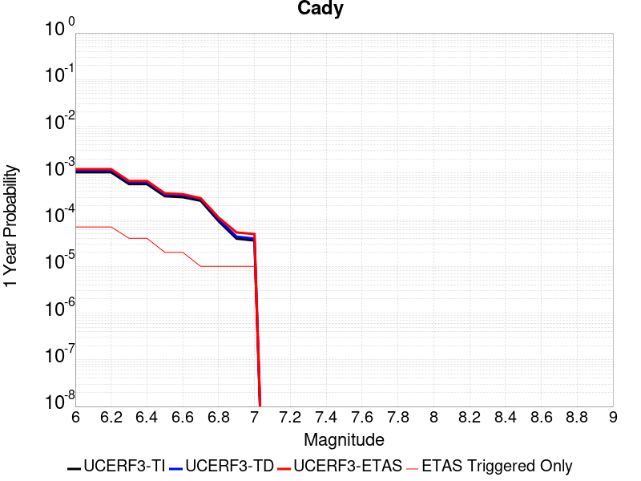 |  |

| Magnitude | 1 wk TI Prob | 1 wk TD Prob | 1 wk ETAS Prob | 1 wk ETAS/TD Gain | 1 wk ETAS Triggered Only | 1 mo TI Prob | 1 mo TD Prob | 1 mo ETAS Prob | 1 mo ETAS/TD Gain | 1 mo ETAS Triggered Only | 1 yr TI Prob | 1 yr TD Prob | 1 yr ETAS Prob | 1 yr ETAS/TD Gain | 1 yr ETAS Triggered Only | 10 yr TI Prob | 10 yr TD Prob | 10 yr ETAS Prob | 10 yr ETAS/TD Gain | 10 yr ETAS Triggered Only |
|-----|-----|-----|-----|-----|-----|-----|-----|-----|-----|-----|-----|-----|-----|-----|-----|-----|-----|-----|-----|-----|
| 6.0 | 1.9892565E-5 | 2.1859876E-5 | 2.1859876E-5 | 1.0 | 0.0 | 8.525106E-5 | 9.3682334E-5 | 9.3682334E-5 | 1.0 | 0.0 | 0.0010374374 | 0.0011400766 | 0.0011874293 | 1.0415348 | 4.7406844E-5 | 0.010326075 | 0.011351293 | 0.011445031 | 1.0082579 | 9.481369E-5 |
| 6.1 | 1.9892565E-5 | 2.1859876E-5 | 2.1859876E-5 | 1.0 | 0.0 | 8.525106E-5 | 9.3682334E-5 | 9.3682334E-5 | 1.0 | 0.0 | 0.0010374374 | 0.0011400766 | 0.0011874293 | 1.0415348 | 4.7406844E-5 | 0.010326075 | 0.011351293 | 0.011445031 | 1.0082579 | 9.481369E-5 |
| 6.2 | 1.9892565E-5 | 2.1859876E-5 | 2.1859876E-5 | 1.0 | 0.0 | 8.525106E-5 | 9.3682334E-5 | 9.3682334E-5 | 1.0 | 0.0 | 0.0010374374 | 0.0011400766 | 0.0011874293 | 1.0415348 | 4.7406844E-5 | 0.010326075 | 0.011351293 | 0.011445031 | 1.0082579 | 9.481369E-5 |
| 6.3 | 1.1117327E-5 | 1.2177199E-5 | 1.2177199E-5 | 1.0 | 0.0 | 4.764482E-5 | 5.218713E-5 | 5.218713E-5 | 1.0 | 0.0 | 5.7992124E-4 | 6.352246E-4 | 6.352246E-4 | 1.0 | 0.0 | 0.0057841022 | 0.006337195 | 0.0063843015 | 1.0074333 | 4.7406844E-5 |
| 6.4 | 1.1117327E-5 | 1.2177199E-5 | 1.2177199E-5 | 1.0 | 0.0 | 4.764482E-5 | 5.218713E-5 | 5.218713E-5 | 1.0 | 0.0 | 5.7992124E-4 | 6.352246E-4 | 6.352246E-4 | 1.0 | 0.0 | 0.0057841022 | 0.006337195 | 0.0063843015 | 1.0074333 | 4.7406844E-5 |
| 6.5 | 6.103093E-6 | 6.672351E-6 | 6.672351E-6 | 1.0 | 0.0 | 2.615585E-5 | 2.8595547E-5 | 2.8595547E-5 | 1.0 | 0.0 | 3.1840094E-4 | 3.4810771E-4 | 3.4810771E-4 | 1.0 | 0.0 | 0.0031794512 | 0.0034768586 | 0.0035241006 | 1.0135876 | 4.7406844E-5 |
| 6.6 | 5.817237E-6 | 6.3659772E-6 | 6.3659772E-6 | 1.0 | 0.0 | 2.4930776E-5 | 2.7282544E-5 | 2.7282544E-5 | 1.0 | 0.0 | 3.034899E-4 | 3.321268E-4 | 3.321268E-4 | 1.0 | 0.0 | 0.0030307577 | 0.0033175263 | 0.003364776 | 1.0142424 | 4.7406844E-5 |
| 6.7 | 4.8846314E-6 | 5.340833E-6 | 5.340833E-6 | 1.0 | 0.0 | 2.0933967E-5 | 2.288915E-5 | 2.288915E-5 | 1.0 | 0.0 | 2.5484123E-4 | 2.7865154E-4 | 2.7865154E-4 | 1.0 | 0.0 | 0.0025454918 | 0.002784177 | 0.0028314518 | 1.0169798 | 4.7406844E-5 |
| 6.8 | 1.7788773E-6 | 1.940001E-6 | 1.940001E-6 | 1.0 | 0.0 | 7.6237375E-6 | 8.314273E-6 | 8.314273E-6 | 1.0 | 0.0 | 9.281505E-5 | 1.0122315E-4 | 1.0122315E-4 | 1.0 | 0.0 | 9.2776294E-4 | 0.001011925 | 0.001059284 | 1.0468007 | 4.7406844E-5 |
| 6.9 | 7.5455404E-7 | 8.2975305E-7 | 8.2975305E-7 | 1.0 | 0.0 | 3.233799E-6 | 3.5560815E-6 | 3.5560815E-6 | 1.0 | 0.0 | 3.937079E-5 | 4.329477E-5 | 4.329477E-5 | 1.0 | 0.0 | 3.9363815E-4 | 4.3289628E-4 | 4.3289628E-4 | 1.0 | 0.0 |
| 7.0 | 6.8578805E-7 | 7.542215E-7 | 7.542215E-7 | 1.0 | 0.0 | 2.9390883E-6 | 3.2323758E-6 | 3.2323758E-6 | 1.0 | 0.0 | 3.578281E-5 | 3.9353796E-5 | 3.9353796E-5 | 1.0 | 0.0 | 3.577705E-4 | 3.9350073E-4 | 3.9350073E-4 | 1.0 | 0.0 |

## San Jacinto (Coyote Creek)
*[(top)](#table-of-contents)*

| 1 Week | 1 Month | 1 Year | 10 Year |
|-----|-----|-----|-----|
|  |  |  |  |

| Magnitude | 1 wk TI Prob | 1 wk TD Prob | 1 wk ETAS Prob | 1 wk ETAS/TD Gain | 1 wk ETAS Triggered Only | 1 mo TI Prob | 1 mo TD Prob | 1 mo ETAS Prob | 1 mo ETAS/TD Gain | 1 mo ETAS Triggered Only | 1 yr TI Prob | 1 yr TD Prob | 1 yr ETAS Prob | 1 yr ETAS/TD Gain | 1 yr ETAS Triggered Only | 10 yr TI Prob | 10 yr TD Prob | 10 yr ETAS Prob | 10 yr ETAS/TD Gain | 10 yr ETAS Triggered Only |
|-----|-----|-----|-----|-----|-----|-----|-----|-----|-----|-----|-----|-----|-----|-----|-----|-----|-----|-----|-----|-----|
| 6.0 | 2.7374346E-5 | 2.4177032E-5 | 1.1898843E-4 | 4.9215484 | 9.481369E-5 | 1.1731335E-4 | 1.0361175E-4 | 1.9841561E-4 | 1.9149915 | 9.481369E-5 | 0.0014273542 | 0.0012607456 | 0.0013554398 | 1.0751096 | 9.481369E-5 | 0.01418221 | 0.012944878 | 0.013038464 | 1.0072296 | 9.481369E-5 |
| 6.1 | 2.7374346E-5 | 2.4177032E-5 | 1.1898843E-4 | 4.9215484 | 9.481369E-5 | 1.1731335E-4 | 1.0361175E-4 | 1.9841561E-4 | 1.9149915 | 9.481369E-5 | 0.0014273542 | 0.0012607456 | 0.0013554398 | 1.0751096 | 9.481369E-5 | 0.01418221 | 0.012944878 | 0.013038464 | 1.0072296 | 9.481369E-5 |
| 6.2 | 2.7374346E-5 | 2.4177032E-5 | 1.1898843E-4 | 4.9215484 | 9.481369E-5 | 1.1731335E-4 | 1.0361175E-4 | 1.9841561E-4 | 1.9149915 | 9.481369E-5 | 0.0014273542 | 0.0012607456 | 0.0013554398 | 1.0751096 | 9.481369E-5 | 0.01418221 | 0.012944878 | 0.013038464 | 1.0072296 | 9.481369E-5 |
| 6.3 | 2.7374346E-5 | 2.4177032E-5 | 1.1898843E-4 | 4.9215484 | 9.481369E-5 | 1.1731335E-4 | 1.0361175E-4 | 1.9841561E-4 | 1.9149915 | 9.481369E-5 | 0.0014273542 | 0.0012607456 | 0.0013554398 | 1.0751096 | 9.481369E-5 | 0.01418221 | 0.012944878 | 0.013038464 | 1.0072296 | 9.481369E-5 |
| 6.4 | 2.7374346E-5 | 2.4177032E-5 | 1.1898843E-4 | 4.9215484 | 9.481369E-5 | 1.1731335E-4 | 1.0361175E-4 | 1.9841561E-4 | 1.9149915 | 9.481369E-5 | 0.0014273542 | 0.0012607456 | 0.0013554398 | 1.0751096 | 9.481369E-5 | 0.01418221 | 0.012944878 | 0.013038464 | 1.0072296 | 9.481369E-5 |
| 6.5 | 2.7282445E-5 | 2.4063094E-5 | 1.1887451E-4 | 4.940117 | 9.481369E-5 | 1.16919524E-4 | 1.03123486E-4 | 1.9792741E-4 | 1.9193242 | 9.481369E-5 | 0.0014225657 | 0.0012548079 | 0.0013495027 | 1.0754656 | 9.481369E-5 | 0.014134934 | 0.012886199 | 0.0129797915 | 1.007263 | 9.481369E-5 |
| 6.6 | 2.7282445E-5 | 2.4063094E-5 | 1.1887451E-4 | 4.940117 | 9.481369E-5 | 1.16919524E-4 | 1.03123486E-4 | 1.9792741E-4 | 1.9193242 | 9.481369E-5 | 0.0014225657 | 0.0012548079 | 0.0013495027 | 1.0754656 | 9.481369E-5 | 0.014134934 | 0.012886199 | 0.0129797915 | 1.007263 | 9.481369E-5 |
| 6.7 | 2.7216198E-5 | 2.3988207E-5 | 1.18799624E-4 | 4.952418 | 9.481369E-5 | 1.1663563E-4 | 1.02802565E-4 | 1.9760651E-4 | 1.9221944 | 9.481369E-5 | 0.0014191137 | 0.0012509052 | 0.0013456004 | 1.0757012 | 9.481369E-5 | 0.014100855 | 0.012847606 | 0.012941201 | 1.0072851 | 9.481369E-5 |
| 6.8 | 2.7078617E-5 | 2.3905404E-5 | 1.1871683E-4 | 4.9661083 | 9.481369E-5 | 1.1604605E-4 | 1.02447724E-4 | 1.972517E-4 | 1.9253888 | 9.481369E-5 | 0.001411945 | 0.00124659 | 0.0013412855 | 1.0759636 | 9.481369E-5 | 0.014030075 | 0.012804739 | 0.012898339 | 1.0073098 | 9.481369E-5 |
| 6.9 | 2.6982952E-5 | 2.3824896E-5 | 1.1863633E-4 | 4.979511 | 9.481369E-5 | 1.15636096E-4 | 1.0210271E-4 | 1.9690672E-4 | 1.928516 | 9.481369E-5 | 0.0014069602 | 0.0012423943 | 0.0013370902 | 1.0762205 | 9.481369E-5 | 0.013980856 | 0.012763045 | 0.012856648 | 1.007334 | 9.481369E-5 |
| 7.0 | 2.6449972E-5 | 2.3401846E-5 | 1.1821332E-4 | 5.0514526 | 9.481369E-5 | 1.1335209E-4 | 1.00289784E-4 | 1.9509398E-4 | 1.9453025 | 9.481369E-5 | 0.001379188 | 0.0012203468 | 0.0013150448 | 1.0775993 | 9.481369E-5 | 0.0137065975 | 0.012544374 | 0.012637998 | 1.0074635 | 9.481369E-5 |
| 7.1 | 2.6257849E-5 | 2.322785E-5 | 1.1803934E-4 | 5.081802 | 9.481369E-5 | 1.1252879E-4 | 9.9544144E-5 | 1.943484E-4 | 1.952384 | 9.481369E-5 | 0.0013691769 | 0.0012112787 | 0.0013059776 | 1.0781809 | 9.481369E-5 | 0.013607717 | 0.012454224 | 0.012547856 | 1.0075182 | 9.481369E-5 |
| 7.2 | 2.5270041E-5 | 2.2422375E-5 | 1.1723394E-4 | 5.2284355 | 9.481369E-5 | 1.0829568E-4 | 9.6092364E-5 | 1.9089694E-4 | 1.9865985 | 9.481369E-5 | 0.0013177024 | 0.001169299 | 0.0012640018 | 1.0809911 | 9.481369E-5 | 0.013099162 | 0.012035143 | 0.012128815 | 1.0077833 | 9.481369E-5 |
| 7.3 | 2.339701E-5 | 2.1153774E-5 | 1.1596546E-4 | 5.4820223 | 9.481369E-5 | 1.0026905E-4 | 9.065589E-5 | 1.8546099E-4 | 2.0457687 | 9.481369E-5 | 0.001220092 | 0.0011031787 | 0.0011978878 | 1.0858511 | 9.481369E-5 | 0.012134149 | 0.011373838 | 0.011467574 | 1.0082413 | 9.481369E-5 |
| 7.4 | 2.296333E-5 | 2.0884016E-5 | 1.1569573E-4 | 5.539918 | 9.481369E-5 | 9.841056E-5 | 8.949987E-5 | 1.8430507E-4 | 2.0592775 | 9.481369E-5 | 0.0011974899 | 0.0010891182 | 0.0011838286 | 1.0869607 | 9.481369E-5 | 0.011910575 | 0.011232895 | 0.011326644 | 1.008346 | 9.481369E-5 |
| 7.5 | 2.2188895E-5 | 2.0406682E-5 | 1.15218434E-4 | 5.6461134 | 9.481369E-5 | 9.50918E-5 | 8.745429E-5 | 1.8225968E-4 | 2.0840566 | 9.481369E-5 | 0.0011571277 | 0.0010642379 | 0.0011589506 | 1.0889959 | 9.481369E-5 | 0.011511209 | 0.010982383 | 0.011076155 | 1.0085385 | 9.481369E-5 |
| 7.6 | 2.0013189E-5 | 1.8992265E-5 | 1.13804155E-4 | 5.9921317 | 9.481369E-5 | 8.5767984E-5 | 8.139289E-5 | 1.7619887E-4 | 2.1647942 | 9.481369E-5 | 0.001043725 | 9.905098E-4 | 0.0010852295 | 1.0956273 | 9.481369E-5 | 0.010388365 | 0.010240043 | 0.010333885 | 1.0091643 | 9.481369E-5 |
| 7.7 | 1.7230794E-5 | 1.677281E-5 | 1.1158491E-4 | 6.6527257 | 9.481369E-5 | 7.384417E-5 | 7.18815E-5 | 1.6668838E-4 | 2.318933 | 9.481369E-5 | 8.986819E-4 | 8.7480666E-4 | 9.695374E-4 | 1.1082877 | 9.481369E-5 | 0.008950562 | 0.009078168 | 0.009172121 | 1.0103493 | 9.481369E-5 |
| 7.8 | 1.4478809E-5 | 1.50190535E-5 | 1.0983132E-4 | 7.312799 | 9.481369E-5 | 6.205057E-5 | 6.4365784E-5 | 1.5917337E-4 | 2.47295 | 9.481369E-5 | 7.552038E-4 | 7.833723E-4 | 8.7811175E-4 | 1.120938 | 9.481369E-5 | 0.0075264242 | 0.00815608 | 0.00825012 | 1.01153 | 9.481369E-5 |
| 7.9 | 1.1114467E-5 | 1.1670009E-5 | 1.0648259E-4 | 9.124465 | 9.481369E-5 | 4.7632562E-5 | 5.001337E-5 | 1.4482232E-4 | 2.895672 | 9.481369E-5 | 5.797721E-4 | 6.087432E-4 | 7.034992E-4 | 1.1556584 | 9.481369E-5 | 0.0057826187 | 0.006393403 | 0.0064876107 | 1.0147351 | 9.481369E-5 |
| 8.0 | 9.327402E-6 | 9.9217805E-6 | 1.0473453E-4 | 10.556022 | 9.481369E-5 | 3.9973966E-5 | 4.2521227E-5 | 1.3733089E-4 | 3.229702 | 9.481369E-5 | 4.8657437E-4 | 5.175735E-4 | 6.1233813E-4 | 1.183094 | 9.481369E-5 | 0.0048551033 | 0.005461854 | 0.00555615 | 1.0172645 | 9.481369E-5 |
| 8.1 | 7.0235833E-6 | 6.844232E-6 | 5.425075E-5 | 7.9264927 | 4.7406844E-5 | 3.0100724E-5 | 2.9332095E-5 | 7.673755E-5 | 2.6161633 | 4.7406844E-5 | 3.664147E-4 | 3.5706026E-4 | 4.0445017E-4 | 1.1327225 | 4.7406844E-5 | 0.003658111 | 0.0037964787 | 0.0038437056 | 1.0124396 | 4.7406844E-5 |
| 8.2 | 2.0358202E-6 | 9.0285533E-7 | 9.0285533E-7 | 1.0 | 0.0 | 8.724915E-6 | 3.8693743E-6 | 3.8693743E-6 | 1.0 | 0.0 | 1.06220665E-4 | 4.710864E-5 | 4.710864E-5 | 1.0 | 0.0 | 0.001061699 | 5.3444994E-4 | 5.3444994E-4 | 1.0 | 0.0 |
| 8.3 | 2.0051264E-7 | 6.646147E-8 | 6.646147E-8 | 1.0 | 0.0 | 8.5933965E-7 | 2.8483484E-7 | 2.8483484E-7 | 1.0 | 0.0 | 1.046241E-5 | 3.467859E-6 | 3.467859E-6 | 1.0 | 0.0 | 1.0461917E-4 | 4.0304385E-5 | 4.0304385E-5 | 1.0 | 0.0 |

## San Jacinto (San Jacinto Valley) rev
*[(top)](#table-of-contents)*

| 1 Week | 1 Month | 1 Year | 10 Year |
|-----|-----|-----|-----|
|  |  |  |  |

| Magnitude | 1 wk TI Prob | 1 wk TD Prob | 1 wk ETAS Prob | 1 wk ETAS/TD Gain | 1 wk ETAS Triggered Only | 1 mo TI Prob | 1 mo TD Prob | 1 mo ETAS Prob | 1 mo ETAS/TD Gain | 1 mo ETAS Triggered Only | 1 yr TI Prob | 1 yr TD Prob | 1 yr ETAS Prob | 1 yr ETAS/TD Gain | 1 yr ETAS Triggered Only | 10 yr TI Prob | 10 yr TD Prob | 10 yr ETAS Prob | 10 yr ETAS/TD Gain | 10 yr ETAS Triggered Only |
|-----|-----|-----|-----|-----|-----|-----|-----|-----|-----|-----|-----|-----|-----|-----|-----|-----|-----|-----|-----|-----|
| 6.0 | 3.652694E-5 | 3.4467394E-5 | 1.2927782E-4 | 3.750728 | 9.481369E-5 | 1.5653463E-4 | 1.4770904E-4 | 2.4250873E-4 | 1.6418002 | 9.481369E-5 | 0.0019041431 | 0.001796876 | 0.0018915192 | 1.0526711 | 9.481369E-5 | 0.018879099 | 0.018560216 | 0.01865327 | 1.0050136 | 9.481369E-5 |
| 6.1 | 3.652694E-5 | 3.4467394E-5 | 1.2927782E-4 | 3.750728 | 9.481369E-5 | 1.5653463E-4 | 1.4770904E-4 | 2.4250873E-4 | 1.6418002 | 9.481369E-5 | 0.0019041431 | 0.001796876 | 0.0018915192 | 1.0526711 | 9.481369E-5 | 0.018879099 | 0.018560216 | 0.01865327 | 1.0050136 | 9.481369E-5 |
| 6.2 | 3.652694E-5 | 3.4467394E-5 | 1.2927782E-4 | 3.750728 | 9.481369E-5 | 1.5653463E-4 | 1.4770904E-4 | 2.4250873E-4 | 1.6418002 | 9.481369E-5 | 0.0019041431 | 0.001796876 | 0.0018915192 | 1.0526711 | 9.481369E-5 | 0.018879099 | 0.018560216 | 0.01865327 | 1.0050136 | 9.481369E-5 |
| 6.3 | 3.652694E-5 | 3.4467394E-5 | 1.2927782E-4 | 3.750728 | 9.481369E-5 | 1.5653463E-4 | 1.4770904E-4 | 2.4250873E-4 | 1.6418002 | 9.481369E-5 | 0.0019041431 | 0.001796876 | 0.0018915192 | 1.0526711 | 9.481369E-5 | 0.018879099 | 0.018560216 | 0.01865327 | 1.0050136 | 9.481369E-5 |
| 6.4 | 3.646941E-5 | 3.4388955E-5 | 1.2919938E-4 | 3.7570024 | 9.481369E-5 | 1.5628811E-4 | 1.4737292E-4 | 2.4217264E-4 | 1.6432642 | 9.481369E-5 | 0.0019011468 | 0.0017927908 | 0.0018874345 | 1.0527912 | 9.481369E-5 | 0.018849645 | 0.01852009 | 0.018613148 | 1.0050247 | 9.481369E-5 |
| 6.5 | 3.646941E-5 | 3.4388955E-5 | 1.2919938E-4 | 3.7570024 | 9.481369E-5 | 1.5628811E-4 | 1.4737292E-4 | 2.4217264E-4 | 1.6432642 | 9.481369E-5 | 0.0019011468 | 0.0017927908 | 0.0018874345 | 1.0527912 | 9.481369E-5 | 0.018849645 | 0.01852009 | 0.018613148 | 1.0050247 | 9.481369E-5 |
| 6.6 | 3.6442503E-5 | 3.4352335E-5 | 1.2916277E-4 | 3.7599416 | 9.481369E-5 | 1.561728E-4 | 1.4721598E-4 | 2.4201571E-4 | 1.64395 | 9.481369E-5 | 0.0018997455 | 0.0017908834 | 0.0018855273 | 1.0528476 | 9.481369E-5 | 0.018835869 | 0.018501356 | 0.018594416 | 1.0050299 | 9.481369E-5 |
| 6.7 | 3.6432113E-5 | 3.4337903E-5 | 1.2914833E-4 | 3.7611015 | 9.481369E-5 | 1.5612828E-4 | 1.4715415E-4 | 2.4195388E-4 | 1.6442207 | 9.481369E-5 | 0.0018992044 | 0.001790132 | 0.0018847759 | 1.0528698 | 9.481369E-5 | 0.018830549 | 0.01849398 | 0.01858704 | 1.005032 | 9.481369E-5 |
| 6.8 | 3.6409598E-5 | 3.430695E-5 | 1.2911738E-4 | 3.7635927 | 9.481369E-5 | 1.560318E-4 | 1.470215E-4 | 2.4182127E-4 | 1.644802 | 9.481369E-5 | 0.0018980318 | 0.0017885199 | 0.001883164 | 1.0529176 | 9.481369E-5 | 0.018819023 | 0.01847813 | 0.018571192 | 1.0050364 | 9.481369E-5 |
| 6.9 | 3.638078E-5 | 3.4267367E-5 | 1.2907782E-4 | 3.7667851 | 9.481369E-5 | 1.5590832E-4 | 1.4685189E-4 | 2.4165165E-4 | 1.6455468 | 9.481369E-5 | 0.0018965311 | 0.0017864581 | 0.0018811024 | 1.0529788 | 9.481369E-5 | 0.018804269 | 0.018457862 | 0.018550925 | 1.005042 | 9.481369E-5 |
| 7.0 | 3.6294874E-5 | 3.4149365E-5 | 1.2895981E-4 | 3.776346 | 9.481369E-5 | 1.5554018E-4 | 1.4634622E-4 | 2.4114604E-4 | 1.6477777 | 9.481369E-5 | 0.0018920569 | 0.0017803118 | 0.0018749568 | 1.053162 | 9.481369E-5 | 0.018760284 | 0.018397434 | 0.018490504 | 1.0050588 | 9.481369E-5 |
| 7.1 | 3.6260717E-5 | 3.410564E-5 | 1.289161E-4 | 3.7799053 | 9.481369E-5 | 1.5539382E-4 | 1.4615887E-4 | 2.4095869E-4 | 1.6486082 | 9.481369E-5 | 0.001890278 | 0.0017780344 | 0.0018726795 | 1.0532302 | 9.481369E-5 | 0.018742796 | 0.018375032 | 0.018468104 | 1.0050651 | 9.481369E-5 |
| 7.2 | 3.6210204E-5 | 3.403977E-5 | 1.2885024E-4 | 3.785285 | 9.481369E-5 | 1.5517735E-4 | 1.4587659E-4 | 2.4067644E-4 | 1.6498635 | 9.481369E-5 | 0.001887647 | 0.0017746033 | 0.0018692487 | 1.0533333 | 9.481369E-5 | 0.01871693 | 0.018341267 | 0.018434342 | 1.0050746 | 9.481369E-5 |
| 7.3 | 3.6119454E-5 | 3.3927867E-5 | 1.2873833E-4 | 3.794472 | 9.481369E-5 | 1.5478847E-4 | 1.4539705E-4 | 2.4019695E-4 | 1.6520071 | 9.481369E-5 | 0.0018829206 | 0.0017687745 | 0.0018634205 | 1.0535094 | 9.481369E-5 | 0.018670462 | 0.018283723 | 0.018376803 | 1.0050908 | 9.481369E-5 |
| 7.4 | 3.607848E-5 | 3.387532E-5 | 1.286858E-4 | 3.798807 | 9.481369E-5 | 1.5461289E-4 | 1.4517189E-4 | 2.399718E-4 | 1.6530185 | 9.481369E-5 | 0.0018807866 | 0.0017660374 | 0.0018606838 | 1.0535924 | 9.481369E-5 | 0.018649481 | 0.018256696 | 0.01834978 | 1.0050986 | 9.481369E-5 |
| 7.5 | 3.5856774E-5 | 3.3684162E-5 | 1.2849466E-4 | 3.8146906 | 9.481369E-5 | 1.5366284E-4 | 1.4435273E-4 | 2.3915274E-4 | 1.6567247 | 9.481369E-5 | 0.0018692396 | 0.0017560803 | 0.0018507276 | 1.0538969 | 9.481369E-5 | 0.018535944 | 0.01815731 | 0.018250402 | 1.005127 | 9.481369E-5 |
| 7.6 | 3.286655E-5 | 3.220034E-5 | 1.2701098E-4 | 3.9443986 | 9.481369E-5 | 1.4084904E-4 | 1.3799417E-4 | 2.3279479E-4 | 1.6869899 | 9.481369E-5 | 0.001713488 | 0.0016787864 | 0.001773441 | 1.0563827 | 9.481369E-5 | 0.017003361 | 0.017373424 | 0.01746659 | 1.0053626 | 9.481369E-5 |
| 7.7 | 2.8882527E-5 | 2.9291981E-5 | 1.241029E-4 | 4.2367535 | 9.481369E-5 | 1.237764E-4 | 1.2553102E-4 | 2.2033282E-4 | 1.755206 | 9.481369E-5 | 0.0015059357 | 0.0015272698 | 0.0016219388 | 1.0619857 | 9.481369E-5 | 0.014957713 | 0.015859274 | 0.015952583 | 1.0058836 | 9.481369E-5 |
| 7.8 | 2.4950225E-5 | 2.6580747E-5 | 1.2139192E-4 | 4.5669117 | 9.481369E-5 | 1.0692515E-4 | 1.13912516E-4 | 2.087154E-4 | 1.832243 | 9.481369E-5 | 0.0013010362 | 0.0013860033 | 0.0014806857 | 1.0683131 | 9.481369E-5 | 0.012934455 | 0.014439502 | 0.014532947 | 1.0064715 | 9.481369E-5 |
| 7.9 | 1.9881603E-5 | 2.155556E-5 | 1.16367206E-4 | 5.3984776 | 9.481369E-5 | 8.520408E-5 | 9.2377704E-5 | 1.8718264E-4 | 2.0262752 | 9.481369E-5 | 0.001036866 | 0.001124119 | 0.0012188262 | 1.0842501 | 9.481369E-5 | 0.010320415 | 0.011802064 | 0.011895759 | 1.0079389 | 9.481369E-5 |
| 8.0 | 1.563292E-5 | 1.5976173E-5 | 1.1078835E-4 | 6.934599 | 9.481369E-5 | 6.6996516E-5 | 6.846752E-5 | 1.6327472E-4 | 2.3847034 | 9.481369E-5 | 8.153773E-4 | 8.332739E-4 | 9.280086E-4 | 1.1136898 | 9.481369E-5 | 0.00812392 | 0.008830938 | 0.0089249145 | 1.0106417 | 9.481369E-5 |
| 8.1 | 1.0045313E-5 | 8.324356E-6 | 5.5730805E-5 | 6.6949096 | 4.7406844E-5 | 4.305063E-5 | 3.5675326E-5 | 8.308048E-5 | 2.328794 | 4.7406844E-5 | 5.2401534E-4 | 4.3426102E-4 | 4.816473E-4 | 1.1091193 | 4.7406844E-5 | 0.0052278144 | 0.0046712374 | 0.004718423 | 1.0101013 | 4.7406844E-5 |
| 8.2 | 4.1554413E-6 | 1.5721832E-6 | 1.5721832E-6 | 1.0 | 0.0 | 1.7808914E-5 | 6.737911E-6 | 6.737911E-6 | 1.0 | 0.0 | 2.1680194E-4 | 8.203101E-5 | 8.203101E-5 | 1.0 | 0.0 | 0.0021659054 | 9.520741E-4 | 9.520741E-4 | 1.0 | 0.0 |
| 8.3 | 1.2758221E-6 | 3.6330252E-7 | 3.6330252E-7 | 1.0 | 0.0 | 5.4677976E-6 | 1.5570099E-6 | 1.5570099E-6 | 1.0 | 0.0 | 6.65684E-5 | 1.8956434E-5 | 1.8956434E-5 | 1.0 | 0.0 | 6.6548464E-4 | 2.2857229E-4 | 2.2857229E-4 | 1.0 | 0.0 |

## San Jacinto (Superstition Mtn)
*[(top)](#table-of-contents)*

| 1 Week | 1 Month | 1 Year | 10 Year |
|-----|-----|-----|-----|
|  | 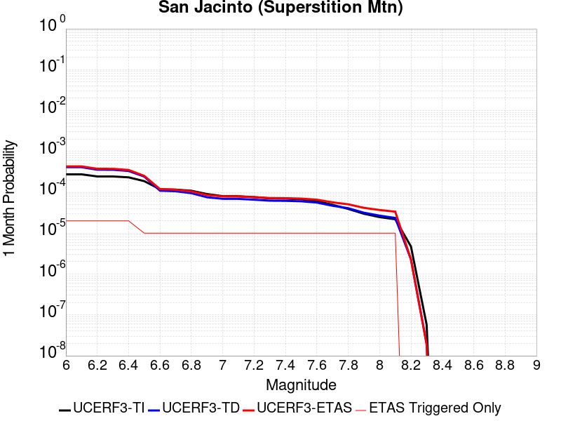 |  |  |

| Magnitude | 1 wk TI Prob | 1 wk TD Prob | 1 wk ETAS Prob | 1 wk ETAS/TD Gain | 1 wk ETAS Triggered Only | 1 mo TI Prob | 1 mo TD Prob | 1 mo ETAS Prob | 1 mo ETAS/TD Gain | 1 mo ETAS Triggered Only | 1 yr TI Prob | 1 yr TD Prob | 1 yr ETAS Prob | 1 yr ETAS/TD Gain | 1 yr ETAS Triggered Only | 10 yr TI Prob | 10 yr TD Prob | 10 yr ETAS Prob | 10 yr ETAS/TD Gain | 10 yr ETAS Triggered Only |
|-----|-----|-----|-----|-----|-----|-----|-----|-----|-----|-----|-----|-----|-----|-----|-----|-----|-----|-----|-----|-----|
| 6.0 | 6.4193904E-5 | 9.602289E-5 | 1.4342519E-4 | 1.4936562 | 4.7406844E-5 | 2.7508775E-4 | 4.1147156E-4 | 4.588589E-4 | 1.1151655 | 4.7406844E-5 | 0.0033440501 | 0.004999541 | 0.0050467113 | 1.0094348 | 4.7406844E-5 | 0.03294174 | 0.04883795 | 0.048928134 | 1.0018466 | 9.481369E-5 |
| 6.1 | 6.4193904E-5 | 9.602289E-5 | 1.4342519E-4 | 1.4936562 | 4.7406844E-5 | 2.7508775E-4 | 4.1147156E-4 | 4.588589E-4 | 1.1151655 | 4.7406844E-5 | 0.0033440501 | 0.004999541 | 0.0050467113 | 1.0094348 | 4.7406844E-5 | 0.03294174 | 0.04883795 | 0.048928134 | 1.0018466 | 9.481369E-5 |
| 6.2 | 5.7023593E-5 | 8.317087E-5 | 1.3057377E-4 | 1.569946 | 4.7406844E-5 | 2.4436394E-4 | 3.5640728E-4 | 4.0379725E-4 | 1.1329657 | 4.7406844E-5 | 0.002971072 | 0.00433226 | 0.0043794615 | 1.0108954 | 4.7406844E-5 | 0.029316625 | 0.04251723 | 0.04260801 | 1.0021352 | 9.481369E-5 |
| 6.3 | 5.6940098E-5 | 8.301621E-5 | 1.3041912E-4 | 1.5710078 | 4.7406844E-5 | 2.4400617E-4 | 3.5574468E-4 | 4.0313465E-4 | 1.1332135 | 4.7406844E-5 | 0.002966728 | 0.004324225 | 0.0043714265 | 1.0109156 | 4.7406844E-5 | 0.029274331 | 0.042440474 | 0.042531263 | 1.0021392 | 9.481369E-5 |
| 6.4 | 5.4171585E-5 | 7.750957E-5 | 1.2491274E-4 | 1.6115783 | 4.7406844E-5 | 2.3214328E-4 | 3.321509E-4 | 3.7954198E-4 | 1.1426795 | 4.7406844E-5 | 0.0028226813 | 0.004038087 | 0.0040853024 | 1.0116925 | 4.7406844E-5 | 0.02787096 | 0.03972961 | 0.039820656 | 1.0022917 | 9.481369E-5 |
| 6.5 | 4.375144E-5 | 5.6446577E-5 | 1.0385075E-4 | 1.839806 | 4.7406844E-5 | 1.874927E-4 | 2.418981E-4 | 2.892935E-4 | 1.1959312 | 4.7406844E-5 | 0.0022803338 | 0.0029423076 | 0.002989575 | 1.0160648 | 4.7406844E-5 | 0.022570757 | 0.02924966 | 0.029341701 | 1.0031468 | 9.481369E-5 |
| 6.6 | 2.772192E-5 | 2.5512374E-5 | 7.291801E-5 | 2.8581429 | 4.7406844E-5 | 1.1880282E-4 | 1.0933427E-4 | 1.5673593E-4 | 1.4335481 | 4.7406844E-5 | 0.0014454646 | 0.0013303513 | 0.0013776951 | 1.0355874 | 4.7406844E-5 | 0.014360986 | 0.013552955 | 0.013646484 | 1.006901 | 9.481369E-5 |
| 6.7 | 2.7124124E-5 | 2.4723291E-5 | 7.212896E-5 | 2.91745 | 4.7406844E-5 | 1.1624106E-4 | 1.05952764E-4 | 1.5335459E-4 | 1.4473864 | 4.7406844E-5 | 0.0014143161 | 0.0012892308 | 0.0013365765 | 1.036724 | 4.7406844E-5 | 0.014053487 | 0.013146358 | 0.013239925 | 1.0071174 | 9.481369E-5 |
| 6.8 | 2.5475807E-5 | 2.218778E-5 | 6.9593574E-5 | 3.1365724 | 4.7406844E-5 | 1.0917746E-4 | 9.508708E-5 | 1.4248943E-4 | 1.498515 | 4.7406844E-5 | 0.001328425 | 0.0011570824 | 0.0012044344 | 1.0409236 | 4.7406844E-5 | 0.0132051185 | 0.011834319 | 0.011881164 | 1.0039585 | 4.7406844E-5 |
| 6.9 | 2.1162023E-5 | 1.764776E-5 | 6.505377E-5 | 3.6862338 | 4.7406844E-5 | 9.069123E-5 | 7.5631084E-5 | 1.2303435E-4 | 1.6267695 | 4.7406844E-5 | 0.0011036064 | 9.204233E-4 | 9.677865E-4 | 1.0514581 | 4.7406844E-5 | 0.010981417 | 0.009458124 | 0.009505082 | 1.0049648 | 4.7406844E-5 |
| 7.0 | 1.8754288E-5 | 1.6182094E-5 | 6.358817E-5 | 3.9295392 | 4.7406844E-5 | 8.037304E-5 | 6.935E-5 | 1.1675356E-4 | 1.6835408 | 4.7406844E-5 | 9.781026E-4 | 8.4401167E-4 | 8.913785E-4 | 1.0561211 | 4.7406844E-5 | 0.009738087 | 0.008680774 | 0.008727768 | 1.0054138 | 4.7406844E-5 |
| 7.1 | 1.8678527E-5 | 1.6107217E-5 | 6.35133E-5 | 3.9431581 | 4.7406844E-5 | 8.0048376E-5 | 6.902911E-5 | 1.1643268E-4 | 1.6867186 | 4.7406844E-5 | 9.7415317E-4 | 8.4010785E-4 | 8.8747486E-4 | 1.0563821 | 4.7406844E-5 | 0.009698939 | 0.00864172 | 0.008688717 | 1.0054384 | 4.7406844E-5 |
| 7.2 | 1.7804578E-5 | 1.5401574E-5 | 6.280769E-5 | 4.078005 | 4.7406844E-5 | 7.6303106E-5 | 6.600509E-5 | 1.134088E-4 | 1.7181828 | 4.7406844E-5 | 9.285943E-4 | 8.0331793E-4 | 8.506867E-4 | 1.0589664 | 4.7406844E-5 | 0.009247236 | 0.008272923 | 0.008319938 | 1.005683 | 4.7406844E-5 |
| 7.3 | 1.6583685E-5 | 1.4550439E-5 | 6.19566E-5 | 4.2580566 | 4.7406844E-5 | 7.1070994E-5 | 6.235755E-5 | 1.0976144E-4 | 1.7601949 | 4.7406844E-5 | 8.649459E-4 | 7.589407E-4 | 8.0631155E-4 | 1.062417 | 4.7406844E-5 | 0.00861587 | 0.007828114 | 0.007875149 | 1.0060086 | 4.7406844E-5 |
| 7.4 | 1.6387552E-5 | 1.44152855E-5 | 6.182145E-5 | 4.288604 | 4.7406844E-5 | 7.023047E-5 | 6.1778344E-5 | 1.0918226E-4 | 1.7673225 | 4.7406844E-5 | 8.5472054E-4 | 7.518938E-4 | 7.99265E-4 | 1.0630025 | 4.7406844E-5 | 0.008514405 | 0.007757476 | 0.007804515 | 1.0060637 | 4.7406844E-5 |
| 7.5 | 1.5790754E-5 | 1.4055765E-5 | 6.146194E-5 | 4.3727217 | 4.7406844E-5 | 6.767291E-5 | 6.0237613E-5 | 1.076416E-4 | 1.78695 | 4.7406844E-5 | 8.236062E-4 | 7.3314813E-4 | 7.805202E-4 | 1.0646147 | 4.7406844E-5 | 0.008205604 | 0.007567932 | 0.00761498 | 1.0062168 | 4.7406844E-5 |
| 7.6 | 1.4248672E-5 | 1.3074211E-5 | 6.0480437E-5 | 4.625934 | 4.7406844E-5 | 6.106431E-5 | 5.603114E-5 | 1.03435326E-4 | 1.846033 | 4.7406844E-5 | 7.432043E-4 | 6.819673E-4 | 7.293418E-4 | 1.0694674 | 4.7406844E-5 | 0.007407237 | 0.0070502516 | 0.007097324 | 1.0066767 | 4.7406844E-5 |
| 7.7 | 1.15449975E-5 | 1.0922179E-5 | 5.8328507E-5 | 5.3403726 | 4.7406844E-5 | 4.947762E-5 | 4.68085E-5 | 9.421313E-5 | 2.0127354 | 4.7406844E-5 | 6.022235E-4 | 5.6974526E-4 | 6.1712513E-4 | 1.0831597 | 4.7406844E-5 | 0.006005941 | 0.005919881 | 0.0059670075 | 1.0079607 | 4.7406844E-5 |
| 7.8 | 9.1391985E-6 | 9.532076E-6 | 5.693847E-5 | 5.973355 | 4.7406844E-5 | 3.9167408E-5 | 4.0851115E-5 | 8.825603E-5 | 2.1604311 | 4.7406844E-5 | 4.767588E-4 | 4.972494E-4 | 5.446327E-4 | 1.0952908 | 4.7406844E-5 | 0.0047573727 | 0.0051860143 | 0.0052331756 | 1.0090939 | 4.7406844E-5 |
| 7.9 | 6.973017E-6 | 7.397966E-6 | 5.480446E-5 | 7.408045 | 4.7406844E-5 | 2.9884017E-5 | 3.1705185E-5 | 7.911053E-5 | 2.495192 | 4.7406844E-5 | 3.6377716E-4 | 3.8594278E-4 | 4.3333136E-4 | 1.1227864 | 4.7406844E-5 | 0.0036318225 | 0.0040600975 | 0.004107312 | 1.0116289 | 4.7406844E-5 |
| 8.0 | 5.7638235E-6 | 6.2743825E-6 | 5.368093E-5 | 8.5555725 | 4.7406844E-5 | 2.4701867E-5 | 2.6889935E-5 | 7.429551E-5 | 2.7629485 | 4.7406844E-5 | 3.0070372E-4 | 3.2733628E-4 | 3.7472762E-4 | 1.1447787 | 4.7406844E-5 | 0.0030029714 | 0.0034610373 | 0.00350828 | 1.01365 | 4.7406844E-5 |
| 8.1 | 5.1124434E-6 | 5.508789E-6 | 5.2915373E-5 | 9.605627 | 4.7406844E-5 | 2.1910288E-5 | 2.3608885E-5 | 7.101461E-5 | 3.0079613 | 4.7406844E-5 | 2.6672508E-4 | 2.8740076E-4 | 3.3479396E-4 | 1.1649029 | 4.7406844E-5 | 0.0026640517 | 0.003047253 | 0.0030945153 | 1.0155098 | 4.7406844E-5 |
| 8.2 | 1.1075938E-6 | 5.3557983E-7 | 5.3557983E-7 | 1.0 | 0.0 | 4.7468216E-6 | 2.2953402E-6 | 2.2953402E-6 | 1.0 | 0.0 | 5.779102E-5 | 2.7945433E-5 | 2.7945433E-5 | 1.0 | 0.0 | 5.777599E-4 | 3.1453613E-4 | 3.1453613E-4 | 1.0 | 0.0 |
| 8.3 | 1.3584393E-8 | 4.4922075E-9 | 4.4922075E-9 | 1.0 | 0.0 | 5.8218827E-8 | 1.9252319E-8 | 1.9252319E-8 | 1.0 | 0.0 | 7.0881396E-7 | 2.3439698E-7 | 2.3439698E-7 | 1.0 | 0.0 | 7.0881174E-6 | 2.6266084E-6 | 2.6266084E-6 | 1.0 | 0.0 |

## San Jacinto (Stepovers Combined)
*[(top)](#table-of-contents)*

| 1 Week | 1 Month | 1 Year | 10 Year |
|-----|-----|-----|-----|
|  |  |  |  |

| Magnitude | 1 wk TI Prob | 1 wk TD Prob | 1 wk ETAS Prob | 1 wk ETAS/TD Gain | 1 wk ETAS Triggered Only | 1 mo TI Prob | 1 mo TD Prob | 1 mo ETAS Prob | 1 mo ETAS/TD Gain | 1 mo ETAS Triggered Only | 1 yr TI Prob | 1 yr TD Prob | 1 yr ETAS Prob | 1 yr ETAS/TD Gain | 1 yr ETAS Triggered Only | 10 yr TI Prob | 10 yr TD Prob | 10 yr ETAS Prob | 10 yr ETAS/TD Gain | 10 yr ETAS Triggered Only |
|-----|-----|-----|-----|-----|-----|-----|-----|-----|-----|-----|-----|-----|-----|-----|-----|-----|-----|-----|-----|-----|
| 6.0 | 4.0667746E-5 | 3.5336896E-5 | 1.3014724E-4 | 3.683041 | 9.481369E-5 | 1.742787E-4 | 1.5143506E-4 | 2.4623438E-4 | 1.6260065 | 9.481369E-5 | 0.0021197782 | 0.0018421634 | 0.0019368024 | 1.0513738 | 9.481369E-5 | 0.020996714 | 0.019020144 | 0.019113153 | 1.0048901 | 9.481369E-5 |
| 6.1 | 4.0667746E-5 | 3.5336896E-5 | 1.3014724E-4 | 3.683041 | 9.481369E-5 | 1.742787E-4 | 1.5143506E-4 | 2.4623438E-4 | 1.6260065 | 9.481369E-5 | 0.0021197782 | 0.0018421634 | 0.0019368024 | 1.0513738 | 9.481369E-5 | 0.020996714 | 0.019020144 | 0.019113153 | 1.0048901 | 9.481369E-5 |
| 6.2 | 4.0667746E-5 | 3.5336896E-5 | 1.3014724E-4 | 3.683041 | 9.481369E-5 | 1.742787E-4 | 1.5143506E-4 | 2.4623438E-4 | 1.6260065 | 9.481369E-5 | 0.0021197782 | 0.0018421634 | 0.0019368024 | 1.0513738 | 9.481369E-5 | 0.020996714 | 0.019020144 | 0.019113153 | 1.0048901 | 9.481369E-5 |
| 6.3 | 4.0667746E-5 | 3.5336896E-5 | 1.3014724E-4 | 3.683041 | 9.481369E-5 | 1.742787E-4 | 1.5143506E-4 | 2.4623438E-4 | 1.6260065 | 9.481369E-5 | 0.0021197782 | 0.0018421634 | 0.0019368024 | 1.0513738 | 9.481369E-5 | 0.020996714 | 0.019020144 | 0.019113153 | 1.0048901 | 9.481369E-5 |
| 6.4 | 4.0577226E-5 | 3.5208766E-5 | 1.3001912E-4 | 3.6928053 | 9.481369E-5 | 1.738908E-4 | 1.50886E-4 | 2.4568537E-4 | 1.6282848 | 9.481369E-5 | 0.0021150648 | 0.0018354917 | 0.0019301313 | 1.0515609 | 9.481369E-5 | 0.020950472 | 0.018954702 | 0.019047718 | 1.0049073 | 9.481369E-5 |
| 6.5 | 4.0577226E-5 | 3.5208766E-5 | 1.3001912E-4 | 3.6928053 | 9.481369E-5 | 1.738908E-4 | 1.50886E-4 | 2.4568537E-4 | 1.6282848 | 9.481369E-5 | 0.0021150648 | 0.0018354917 | 0.0019301313 | 1.0515609 | 9.481369E-5 | 0.020950472 | 0.018954702 | 0.019047718 | 1.0049073 | 9.481369E-5 |
| 6.6 | 4.053861E-5 | 3.5154102E-5 | 1.2996446E-4 | 3.6969929 | 9.481369E-5 | 1.7372532E-4 | 1.5065174E-4 | 2.4545114E-4 | 1.629262 | 9.481369E-5 | 0.0021130538 | 0.0018326445 | 0.0019272844 | 1.0516412 | 9.481369E-5 | 0.020930743 | 0.018926777 | 0.019019796 | 1.0049146 | 9.481369E-5 |
| 6.7 | 4.0516545E-5 | 3.512316E-5 | 1.2993353E-4 | 3.6993687 | 9.481369E-5 | 1.7363077E-4 | 1.5051916E-4 | 2.4531857E-4 | 1.6298163 | 9.481369E-5 | 0.002111905 | 0.0018310336 | 0.0019256737 | 1.0516866 | 9.481369E-5 | 0.020919468 | 0.01891097 | 0.019003991 | 1.0049189 | 9.481369E-5 |
| 6.8 | 4.049434E-5 | 3.509472E-5 | 1.2990508E-4 | 3.7015564 | 9.481369E-5 | 1.7353562E-4 | 1.5039727E-4 | 2.451967E-4 | 1.6303269 | 9.481369E-5 | 0.0021107488 | 0.0018295521 | 0.0019241923 | 1.0517286 | 9.481369E-5 | 0.020908125 | 0.01889638 | 0.018989403 | 1.0049227 | 9.481369E-5 |
| 6.9 | 4.046386E-5 | 3.505727E-5 | 1.2986764E-4 | 3.7044423 | 9.481369E-5 | 1.73405E-4 | 1.502368E-4 | 2.4503624E-4 | 1.6310002 | 9.481369E-5 | 0.0021091616 | 0.0018276017 | 0.0019222421 | 1.0517839 | 9.481369E-5 | 0.020892553 | 0.01887715 | 0.018970175 | 1.0049279 | 9.481369E-5 |
| 7.0 | 4.036382E-5 | 3.4937813E-5 | 1.297482E-4 | 3.7136896 | 9.481369E-5 | 1.7297632E-4 | 1.4972492E-4 | 2.4452442E-4 | 1.6331578 | 9.481369E-5 | 0.0021039525 | 0.00182138 | 0.001916021 | 1.0519612 | 9.481369E-5 | 0.02084144 | 0.018815752 | 0.018908782 | 1.0049442 | 9.481369E-5 |
| 7.1 | 4.0343282E-5 | 3.4916273E-5 | 1.2972666E-4 | 3.7153637 | 9.481369E-5 | 1.7288832E-4 | 1.496326E-4 | 2.444321E-4 | 1.6335485 | 9.481369E-5 | 0.002102883 | 0.0018202579 | 0.001914899 | 1.0519933 | 9.481369E-5 | 0.020830948 | 0.018804627 | 0.018897656 | 1.0049472 | 9.481369E-5 |
| 7.2 | 4.0257353E-5 | 3.4820667E-5 | 1.2963105E-4 | 3.7228196 | 9.481369E-5 | 1.725201E-4 | 1.492229E-4 | 2.4402245E-4 | 1.6352881 | 9.481369E-5 | 0.0020984085 | 0.0018152783 | 0.0019099199 | 1.0521362 | 9.481369E-5 | 0.020787042 | 0.018755313 | 0.018848348 | 1.0049605 | 9.481369E-5 |
| 7.3 | 3.9940667E-5 | 3.4648023E-5 | 1.2945842E-4 | 3.7363873 | 9.481369E-5 | 1.7116306E-4 | 1.4848309E-4 | 2.432827E-4 | 1.638454 | 9.481369E-5 | 0.0020819185 | 0.0018062859 | 0.0019009284 | 1.0523962 | 9.481369E-5 | 0.020625217 | 0.018663792 | 0.018756837 | 1.0049853 | 9.481369E-5 |
| 7.4 | 3.9721202E-5 | 3.453329E-5 | 1.2934371E-4 | 3.745479 | 9.481369E-5 | 1.7022261E-4 | 1.4799142E-4 | 2.4279108E-4 | 1.6405754 | 9.481369E-5 | 0.0020704903 | 0.0018003098 | 0.0018949528 | 1.0525703 | 9.481369E-5 | 0.020513052 | 0.01860285 | 0.0186959 | 1.0050019 | 9.481369E-5 |
| 7.5 | 3.7036873E-5 | 3.3598866E-5 | 1.2840937E-4 | 3.8218365 | 9.481369E-5 | 1.5871979E-4 | 1.439872E-4 | 2.3878724E-4 | 1.6583921 | 9.481369E-5 | 0.0019307006 | 0.0017516377 | 0.0018462852 | 1.0540338 | 9.481369E-5 | 0.019140124 | 0.018103454 | 0.018196553 | 1.0051426 | 9.481369E-5 |
| 7.6 | 3.2940967E-5 | 3.1372547E-5 | 1.2618327E-4 | 4.022092 | 9.481369E-5 | 1.4116794E-4 | 1.3444685E-4 | 2.292478E-4 | 1.7051183 | 9.481369E-5 | 0.0017173645 | 0.0016356637 | 0.0017303223 | 1.0578717 | 9.481369E-5 | 0.01704153 | 0.01693263 | 0.01702584 | 1.0055046 | 9.481369E-5 |
| 7.7 | 2.8236149E-5 | 2.7937022E-5 | 1.2274807E-4 | 4.393742 | 9.481369E-5 | 1.2100645E-4 | 1.197246E-4 | 2.1452694E-4 | 1.7918367 | 9.481369E-5 | 0.0014722579 | 0.0014566735 | 0.0015513491 | 1.0649943 | 9.481369E-5 | 0.014625421 | 0.015142685 | 0.015236063 | 1.0061666 | 9.481369E-5 |
| 7.8 | 2.4329287E-5 | 2.5258554E-5 | 1.2006985E-4 | 4.753631 | 9.481369E-5 | 1.042642E-4 | 1.0824646E-4 | 2.0304989E-4 | 1.8758109 | 9.481369E-5 | 0.0012686774 | 0.0013171048 | 0.0014117935 | 1.0718917 | 9.481369E-5 | 0.012614589 | 0.013738932 | 0.013832442 | 1.0068063 | 9.481369E-5 |
| 7.9 | 1.9370926E-5 | 2.0467445E-5 | 1.15279196E-4 | 5.63232 | 9.481369E-5 | 8.301561E-5 | 8.7714674E-5 | 1.8252005E-4 | 2.0808382 | 9.481369E-5 | 0.0010102465 | 0.0010674037 | 0.0011621162 | 1.0887316 | 9.481369E-5 | 0.0100566605 | 0.011223499 | 0.011317248 | 1.008353 | 9.481369E-5 |
| 8.0 | 1.5583017E-5 | 1.5925136E-5 | 1.1073732E-4 | 6.953618 | 9.481369E-5 | 6.6782646E-5 | 6.82488E-5 | 1.6305603E-4 | 2.389141 | 9.481369E-5 | 8.127754E-4 | 8.306131E-4 | 9.25348E-4 | 1.1140542 | 9.481369E-5 | 0.008098091 | 0.008802158 | 0.008896137 | 1.0106769 | 9.481369E-5 |
| 8.1 | 1.0024873E-5 | 8.314913E-6 | 5.5721364E-5 | 6.701376 | 4.7406844E-5 | 4.2963035E-5 | 3.563486E-5 | 8.304002E-5 | 2.3303027 | 4.7406844E-5 | 5.229494E-4 | 4.3376858E-4 | 4.8115486E-4 | 1.1092433 | 4.7406844E-5 | 0.0052172043 | 0.00466551 | 0.0047126957 | 1.0101137 | 4.7406844E-5 |
| 8.2 | 4.142796E-6 | 1.5676045E-6 | 1.5676045E-6 | 1.0 | 0.0 | 1.775472E-5 | 6.7182878E-6 | 6.7182878E-6 | 1.0 | 0.0 | 2.1614227E-4 | 8.179211E-5 | 8.179211E-5 | 1.0 | 0.0 | 0.0021593217 | 9.4923546E-4 | 9.4923546E-4 | 1.0 | 0.0 |
| 8.3 | 1.2750878E-6 | 3.6301523E-7 | 3.6301523E-7 | 1.0 | 0.0 | 5.4646503E-6 | 1.5557786E-6 | 1.5557786E-6 | 1.0 | 0.0 | 6.653009E-5 | 1.8941444E-5 | 1.8941444E-5 | 1.0 | 0.0 | 6.6510175E-4 | 2.2840123E-4 | 2.2840123E-4 | 1.0 | 0.0 |

## Calico-Hidalgo
*[(top)](#table-of-contents)*

| 1 Week | 1 Month | 1 Year | 10 Year |
|-----|-----|-----|-----|
|  |  |  |  |

| Magnitude | 1 wk TI Prob | 1 wk TD Prob | 1 wk ETAS Prob | 1 wk ETAS/TD Gain | 1 wk ETAS Triggered Only | 1 mo TI Prob | 1 mo TD Prob | 1 mo ETAS Prob | 1 mo ETAS/TD Gain | 1 mo ETAS Triggered Only | 1 yr TI Prob | 1 yr TD Prob | 1 yr ETAS Prob | 1 yr ETAS/TD Gain | 1 yr ETAS Triggered Only | 10 yr TI Prob | 10 yr TD Prob | 10 yr ETAS Prob | 10 yr ETAS/TD Gain | 10 yr ETAS Triggered Only |
|-----|-----|-----|-----|-----|-----|-----|-----|-----|-----|-----|-----|-----|-----|-----|-----|-----|-----|-----|-----|-----|
| 6.0 | 4.0906612E-5 | 5.0707546E-5 | 5.0707546E-5 | 1.0 | 0.0 | 1.7530227E-4 | 2.1730224E-4 | 2.1730224E-4 | 1.0 | 0.0 | 0.0021322158 | 0.0026428488 | 0.0027374118 | 1.0357808 | 9.481369E-5 | 0.02111873 | 0.026154567 | 0.0262469 | 1.0035303 | 9.481369E-5 |
| 6.1 | 4.0906612E-5 | 5.0707546E-5 | 5.0707546E-5 | 1.0 | 0.0 | 1.7530227E-4 | 2.1730224E-4 | 2.1730224E-4 | 1.0 | 0.0 | 0.0021322158 | 0.0026428488 | 0.0027374118 | 1.0357808 | 9.481369E-5 | 0.02111873 | 0.026154567 | 0.0262469 | 1.0035303 | 9.481369E-5 |
| 6.2 | 4.0906612E-5 | 5.0707546E-5 | 5.0707546E-5 | 1.0 | 0.0 | 1.7530227E-4 | 2.1730224E-4 | 2.1730224E-4 | 1.0 | 0.0 | 0.0021322158 | 0.0026428488 | 0.0027374118 | 1.0357808 | 9.481369E-5 | 0.02111873 | 0.026154567 | 0.0262469 | 1.0035303 | 9.481369E-5 |
| 6.3 | 2.4242801E-5 | 3.0092122E-5 | 3.0092122E-5 | 1.0 | 0.0 | 1.0389358E-4 | 1.2896005E-4 | 1.2896005E-4 | 1.0 | 0.0 | 0.0012641704 | 0.0015689905 | 0.0016636554 | 1.0603349 | 9.481369E-5 | 0.01257003 | 0.015582806 | 0.015676143 | 1.0059897 | 9.481369E-5 |
| 6.4 | 2.4242801E-5 | 3.0092122E-5 | 3.0092122E-5 | 1.0 | 0.0 | 1.0389358E-4 | 1.2896005E-4 | 1.2896005E-4 | 1.0 | 0.0 | 0.0012641704 | 0.0015689905 | 0.0016636554 | 1.0603349 | 9.481369E-5 | 0.01257003 | 0.015582806 | 0.015676143 | 1.0059897 | 9.481369E-5 |
| 6.5 | 2.0286952E-5 | 2.5316727E-5 | 2.5316727E-5 | 1.0 | 0.0 | 8.694118E-5 | 1.0849584E-4 | 1.0849584E-4 | 1.0 | 0.0 | 0.0010579949 | 0.0013201536 | 0.0014148421 | 1.0717254 | 9.481369E-5 | 0.010529719 | 0.013125047 | 0.013218616 | 1.0071291 | 9.481369E-5 |
| 6.6 | 2.0269223E-5 | 2.5297675E-5 | 2.5297675E-5 | 1.0 | 0.0 | 8.6865206E-5 | 1.084142E-4 | 1.084142E-4 | 1.0 | 0.0 | 0.0010570707 | 0.0013191608 | 0.0014138494 | 1.0717795 | 9.481369E-5 | 0.010520565 | 0.013115237 | 0.0132088065 | 1.0071344 | 9.481369E-5 |
| 6.7 | 1.799852E-5 | 2.25414E-5 | 2.25414E-5 | 1.0 | 0.0 | 7.713423E-5 | 9.660251E-5 | 9.660251E-5 | 1.0 | 0.0 | 9.3870464E-4 | 0.0011755156 | 0.0012702178 | 1.0805624 | 9.481369E-5 | 0.009347493 | 0.011694587 | 0.011788292 | 1.0080127 | 9.481369E-5 |
| 6.8 | 1.7458793E-5 | 2.1842892E-5 | 2.1842892E-5 | 1.0 | 0.0 | 7.4821255E-5 | 9.360912E-5 | 9.360912E-5 | 1.0 | 0.0 | 9.10568E-4 | 0.0011391096 | 0.0012338153 | 1.0831401 | 9.481369E-5 | 0.009068459 | 0.011334292 | 0.011428031 | 1.0082704 | 9.481369E-5 |
| 6.9 | 1.542884E-5 | 1.9026567E-5 | 1.9026567E-5 | 1.0 | 0.0 | 6.612192E-5 | 8.1539954E-5 | 8.1539954E-5 | 1.0 | 0.0 | 8.04737E-4 | 9.923099E-4 | 0.0010870296 | 1.0954536 | 9.481369E-5 | 0.008018291 | 0.009880188 | 0.009974065 | 1.0095016 | 9.481369E-5 |
| 7.0 | 1.468253E-5 | 1.803119E-5 | 1.803119E-5 | 1.0 | 0.0 | 6.292361E-5 | 7.7274315E-5 | 7.7274315E-5 | 1.0 | 0.0 | 7.658257E-4 | 9.404217E-4 | 0.0010351463 | 1.1007255 | 9.481369E-5 | 0.0076319184 | 0.009365788 | 0.0094597135 | 1.0100286 | 9.481369E-5 |
| 7.1 | 1.3139281E-5 | 1.620145E-5 | 1.620145E-5 | 1.0 | 0.0 | 5.6309986E-5 | 6.943301E-5 | 6.943301E-5 | 1.0 | 0.0 | 6.853584E-4 | 8.450316E-4 | 9.397652E-4 | 1.1121066 | 9.481369E-5 | 0.0068324856 | 0.008419481 | 0.008513496 | 1.0111665 | 9.481369E-5 |
| 7.2 | 1.1127404E-5 | 1.3867019E-5 | 1.3867019E-5 | 1.0 | 0.0 | 4.7688E-5 | 5.942879E-5 | 5.942879E-5 | 1.0 | 0.0 | 5.8044674E-4 | 7.233162E-4 | 8.1806135E-4 | 1.1309872 | 9.481369E-5 | 0.0057893298 | 0.0072107273 | 0.007304857 | 1.0130541 | 9.481369E-5 |
| 7.3 | 9.808154E-6 | 1.217656E-5 | 1.217656E-5 | 1.0 | 0.0 | 4.2034266E-5 | 5.218427E-5 | 5.218427E-5 | 1.0 | 0.0 | 5.11647E-4 | 6.3516904E-4 | 7.299225E-4 | 1.1491784 | 9.481369E-5 | 0.0051047057 | 0.0063346117 | 0.0064288247 | 1.0148728 | 9.481369E-5 |
| 7.4 | 7.942452E-6 | 9.7924E-6 | 9.7924E-6 | 1.0 | 0.0 | 3.4038632E-5 | 4.196681E-5 | 4.196681E-5 | 1.0 | 0.0 | 4.1434157E-4 | 5.108356E-4 | 5.582182E-4 | 1.0927552 | 4.7406844E-5 | 0.0041356985 | 0.0050975545 | 0.00514472 | 1.0092525 | 4.7406844E-5 |
| 7.5 | 4.7121216E-6 | 5.772976E-6 | 5.772976E-6 | 1.0 | 0.0 | 2.019465E-5 | 2.4741134E-5 | 2.4741134E-5 | 1.0 | 0.0 | 2.4584212E-4 | 3.011893E-4 | 3.011893E-4 | 1.0 | 0.0 | 0.0024557032 | 0.0030085635 | 0.0030085635 | 1.0 | 0.0 |
| 7.6 | 2.21172E-7 | 2.6040124E-7 | 2.6040124E-7 | 1.0 | 0.0 | 9.478797E-7 | 1.116005E-6 | 1.116005E-6 | 1.0 | 0.0 | 1.1540374E-5 | 1.3587305E-5 | 1.3587305E-5 | 1.0 | 0.0 | 1.1539775E-4 | 1.3586757E-4 | 1.3586757E-4 | 1.0 | 0.0 |

## San Andreas (Creeping Section) 2011 CFM
*[(top)](#table-of-contents)*

| 1 Week | 1 Month | 1 Year | 10 Year |
|-----|-----|-----|-----|
|  |  |  |  |

| Magnitude | 1 wk TI Prob | 1 wk TD Prob | 1 wk ETAS Prob | 1 wk ETAS/TD Gain | 1 wk ETAS Triggered Only | 1 mo TI Prob | 1 mo TD Prob | 1 mo ETAS Prob | 1 mo ETAS/TD Gain | 1 mo ETAS Triggered Only | 1 yr TI Prob | 1 yr TD Prob | 1 yr ETAS Prob | 1 yr ETAS/TD Gain | 1 yr ETAS Triggered Only | 10 yr TI Prob | 10 yr TD Prob | 10 yr ETAS Prob | 10 yr ETAS/TD Gain | 10 yr ETAS Triggered Only |
|-----|-----|-----|-----|-----|-----|-----|-----|-----|-----|-----|-----|-----|-----|-----|-----|-----|-----|-----|-----|-----|
| 6.0 | 5.986481E-4 | 0.0012277901 | 0.0012751388 | 1.0385641 | 4.7406844E-5 | 0.0025631124 | 0.0052455855 | 0.0052927434 | 1.00899 | 4.7406844E-5 | 0.030762846 | 0.061229862 | 0.06127437 | 1.0007268 | 4.7406844E-5 | 0.26835477 | 0.42607152 | 0.4261259 | 1.0001277 | 9.481369E-5 |
| 6.1 | 5.015945E-4 | 0.0010218644 | 0.0010692227 | 1.0463451 | 4.7406844E-5 | 0.00214792 | 0.0043676887 | 0.0044148886 | 1.0108066 | 4.7406844E-5 | 0.025839351 | 0.051269703 | 0.051314678 | 1.0008773 | 4.7406844E-5 | 0.23032776 | 0.37298882 | 0.37304828 | 1.0001594 | 9.481369E-5 |
| 6.2 | 4.073338E-4 | 8.109829E-4 | 8.583513E-4 | 1.0584086 | 4.7406844E-5 | 0.0017445484 | 0.0034675654 | 0.0035148077 | 1.0136241 | 4.7406844E-5 | 0.021034058 | 0.040954083 | 0.04099955 | 1.0011102 | 4.7406844E-5 | 0.19150782 | 0.31317768 | 0.3132428 | 1.0002079 | 9.481369E-5 |
| 6.3 | 3.464099E-4 | 6.7405414E-4 | 7.2142907E-4 | 1.0702835 | 4.7406844E-5 | 0.0014837692 | 0.0028840431 | 0.0029313131 | 1.0163902 | 4.7406844E-5 | 0.017915873 | 0.034210727 | 0.03425651 | 1.0013384 | 4.7406844E-5 | 0.16538359 | 0.27146977 | 0.27153882 | 1.0002544 | 9.481369E-5 |
| 6.4 | 2.935057E-4 | 5.543318E-4 | 6.017124E-4 | 1.0854733 | 4.7406844E-5 | 0.0012572751 | 0.0023728115 | 0.002420106 | 1.0199318 | 4.7406844E-5 | 0.015200248 | 0.028285956 | 0.028332021 | 1.0016286 | 4.7406844E-5 | 0.14201577 | 0.23314685 | 0.23321955 | 1.0003119 | 9.481369E-5 |
| 6.5 | 2.3409708E-4 | 4.2106997E-4 | 4.6845686E-4 | 1.1125392 | 4.7406844E-5 | 0.0010028875 | 0.001803265 | 0.0018505863 | 1.026242 | 4.7406844E-5 | 0.012141965 | 0.02160988 | 0.021656264 | 1.0021464 | 4.7406844E-5 | 0.11499573 | 0.18699536 | 0.18707244 | 1.0004122 | 9.481369E-5 |
| 6.6 | 1.5842178E-4 | 2.5115322E-4 | 2.9854817E-4 | 1.1887093 | 4.7406844E-5 | 6.7877385E-4 | 0.0010759257 | 0.0011232815 | 1.0440141 | 4.7406844E-5 | 0.0082328 | 0.013019121 | 0.013065911 | 1.0035939 | 4.7406844E-5 | 0.07934396 | 0.12333139 | 0.12341452 | 1.000674 | 9.481369E-5 |
| 6.7 | 1.5616413E-4 | 2.4651614E-4 | 2.9391132E-4 | 1.1922599 | 4.7406844E-5 | 6.691031E-4 | 0.0010560687 | 0.0011034255 | 1.0448425 | 4.7406844E-5 | 0.0081159435 | 0.012780937 | 0.012827738 | 1.0036618 | 4.7406844E-5 | 0.0782586 | 0.12135857 | 0.12144188 | 1.0006864 | 9.481369E-5 |
| 6.8 | 1.5538467E-4 | 2.4475376E-4 | 2.92149E-4 | 1.1936446 | 4.7406844E-5 | 6.6576427E-4 | 0.0010485224 | 0.0010958796 | 1.0451655 | 4.7406844E-5 | 0.008075596 | 0.0126902815 | 0.012737086 | 1.0036882 | 4.7406844E-5 | 0.07788358 | 0.12058931 | 0.12067269 | 1.0006914 | 9.481369E-5 |
| 6.9 | 1.5153569E-4 | 2.3584193E-4 | 2.832376E-4 | 1.2009637 | 4.7406844E-5 | 6.49277E-4 | 0.0010103616 | 0.0010577205 | 1.0468732 | 4.7406844E-5 | 0.007876333 | 0.0122323 | 0.012279127 | 1.0038282 | 4.7406844E-5 | 0.07602952 | 0.11665895 | 0.1167427 | 1.0007179 | 9.481369E-5 |
| 7.0 | 1.4588932E-4 | 2.2441045E-4 | 2.7180667E-4 | 1.2112032 | 4.7406844E-5 | 6.250901E-4 | 9.6140656E-4 | 0.0010087679 | 1.0492625 | 4.7406844E-5 | 0.0075839474 | 0.011642803 | 0.011689658 | 1.0040244 | 4.7406844E-5 | 0.073302895 | 0.11150479 | 0.11158904 | 1.0007555 | 9.481369E-5 |
| 7.1 | 1.1565079E-4 | 1.6318668E-4 | 2.1058579E-4 | 1.2904594 | 4.7406844E-5 | 4.955521E-4 | 6.991849E-4 | 7.465586E-4 | 1.0677556 | 4.7406844E-5 | 0.006016669 | 0.008479553 | 0.008526558 | 1.0055434 | 4.7406844E-5 | 0.058563538 | 0.08383247 | 0.08391934 | 1.0010362 | 9.481369E-5 |
| 7.2 | 1.0393792E-4 | 1.4650424E-4 | 1.9390414E-4 | 1.3235394 | 4.7406844E-5 | 4.4537216E-4 | 6.2772504E-4 | 6.751021E-4 | 1.0754743 | 4.7406844E-5 | 0.005408933 | 0.007615941 | 0.007662987 | 1.0061773 | 4.7406844E-5 | 0.052791595 | 0.075774014 | 0.07586164 | 1.0011564 | 9.481369E-5 |
| 7.3 | 9.332884E-5 | 1.2811116E-4 | 1.7551194E-4 | 1.3699971 | 4.7406844E-5 | 3.999194E-4 | 5.4893293E-4 | 5.963138E-4 | 1.0863144 | 4.7406844E-5 | 0.0048581534 | 0.006662914 | 0.006710005 | 1.0070677 | 4.7406844E-5 | 0.047533102 | 0.06662133 | 0.06670983 | 1.0013283 | 9.481369E-5 |
| 7.4 | 8.670252E-5 | 1.17293064E-4 | 1.6469436E-4 | 1.4041269 | 4.7406844E-5 | 3.715293E-4 | 5.0258834E-4 | 5.4997136E-4 | 1.094278 | 4.7406844E-5 | 0.004513991 | 0.006101966 | 0.006149084 | 1.0077217 | 4.7406844E-5 | 0.044233937 | 0.06127167 | 0.061360676 | 1.0014526 | 9.481369E-5 |
| 7.5 | 7.3036405E-5 | 9.027501E-5 | 1.3767758E-4 | 1.5250907 | 4.7406844E-5 | 3.129756E-4 | 3.8683563E-4 | 4.3422412E-4 | 1.1225029 | 4.7406844E-5 | 0.0038038217 | 0.0046995743 | 0.0047467584 | 1.01004 | 4.7406844E-5 | 0.03739367 | 0.047980286 | 0.04807055 | 1.0018812 | 9.481369E-5 |
| 7.6 | 6.3935775E-5 | 8.298733E-5 | 1.3039024E-4 | 1.5712066 | 4.7406844E-5 | 2.7398168E-4 | 3.5561158E-4 | 4.0300156E-4 | 1.1332633 | 4.7406844E-5 | 0.0033306254 | 0.0043209945 | 0.0043681967 | 1.0109239 | 4.7406844E-5 | 0.032811474 | 0.04407886 | 0.044169497 | 1.0020562 | 9.481369E-5 |
| 7.7 | 5.5050095E-5 | 6.6780485E-5 | 1.14184164E-4 | 1.7098433 | 4.7406844E-5 | 2.3590765E-4 | 2.861707E-4 | 3.3356398E-4 | 1.165612 | 4.7406844E-5 | 0.0028683927 | 0.003478566 | 0.003525808 | 1.0135809 | 4.7406844E-5 | 0.0283165 | 0.035874426 | 0.035965838 | 1.0025481 | 9.481369E-5 |
| 7.8 | 5.027131E-5 | 6.177649E-5 | 1.0918041E-4 | 1.7673457 | 4.7406844E-5 | 2.1543067E-4 | 2.6472952E-4 | 3.1212383E-4 | 1.1790291 | 4.7406844E-5 | 0.0026197135 | 0.0032183218 | 0.003265576 | 1.0146829 | 4.7406844E-5 | 0.025890453 | 0.033198178 | 0.033289846 | 1.0027611 | 9.481369E-5 |
| 7.9 | 3.7271806E-5 | 5.034326E-5 | 9.774772E-5 | 1.9416248 | 4.7406844E-5 | 1.5972654E-4 | 2.15739E-4 | 2.6313562E-4 | 1.2196943 | 4.7406844E-5 | 0.0019429359 | 0.0026234603 | 0.0026707428 | 1.0180229 | 4.7406844E-5 | 0.019260362 | 0.027125074 | 0.027217316 | 1.0034006 | 9.481369E-5 |
| 8.0 | 2.7310243E-5 | 3.1506686E-5 | 7.891204E-5 | 2.5046124 | 4.7406844E-5 | 1.17038646E-4 | 1.3502168E-4 | 1.8242213E-4 | 1.351058 | 4.7406844E-5 | 0.0014240141 | 0.0016426502 | 0.0016899791 | 1.0288125 | 4.7406844E-5 | 0.014149235 | 0.017253635 | 0.017300224 | 1.0027002 | 4.7406844E-5 |
| 8.1 | 1.7940547E-5 | 1.7450684E-5 | 6.48567E-5 | 3.7165709 | 4.7406844E-5 | 7.688579E-5 | 7.4786505E-5 | 1.221898E-4 | 1.6338483 | 4.7406844E-5 | 9.3568244E-4 | 9.1014587E-4 | 9.5750956E-4 | 1.0520396 | 4.7406844E-5 | 0.009317525 | 0.009825298 | 0.009872238 | 1.0047776 | 4.7406844E-5 |
| 8.2 | 8.643924E-6 | 5.49522E-6 | 5.49522E-6 | 1.0 | 0.0 | 3.704486E-5 | 2.355073E-5 | 2.355073E-5 | 1.0 | 0.0 | 4.5092785E-4 | 2.866925E-4 | 2.866925E-4 | 1.0 | 0.0 | 0.0045001395 | 0.0032598388 | 0.0032598388 | 1.0 | 0.0 |
| 8.3 | 1.983087E-6 | 7.693574E-7 | 7.693574E-7 | 1.0 | 0.0 | 8.498917E-6 | 3.297242E-6 | 3.297242E-6 | 1.0 | 0.0 | 1.034694E-4 | 4.01432E-5 | 4.01432E-5 | 1.0 | 0.0 | 0.0010342124 | 4.7390026E-4 | 4.7390026E-4 | 1.0 | 0.0 |

## San Jacinto (Borrego)
*[(top)](#table-of-contents)*

| 1 Week | 1 Month | 1 Year | 10 Year |
|-----|-----|-----|-----|
|  |  |  |  |

| Magnitude | 1 wk TI Prob | 1 wk TD Prob | 1 wk ETAS Prob | 1 wk ETAS/TD Gain | 1 wk ETAS Triggered Only | 1 mo TI Prob | 1 mo TD Prob | 1 mo ETAS Prob | 1 mo ETAS/TD Gain | 1 mo ETAS Triggered Only | 1 yr TI Prob | 1 yr TD Prob | 1 yr ETAS Prob | 1 yr ETAS/TD Gain | 1 yr ETAS Triggered Only | 10 yr TI Prob | 10 yr TD Prob | 10 yr ETAS Prob | 10 yr ETAS/TD Gain | 10 yr ETAS Triggered Only |
|-----|-----|-----|-----|-----|-----|-----|-----|-----|-----|-----|-----|-----|-----|-----|-----|-----|-----|-----|-----|-----|
| 6.0 | 3.543992E-5 | 2.7956603E-5 | 1.2276764E-4 | 4.391365 | 9.481369E-5 | 1.5187653E-4 | 1.1980858E-4 | 2.146109E-4 | 1.7912817 | 9.481369E-5 | 0.0018475284 | 0.0014577056 | 0.0015523812 | 1.0649483 | 9.481369E-5 | 0.018322436 | 0.014885285 | 0.014978687 | 1.0062748 | 9.481369E-5 |
| 6.1 | 3.542281E-5 | 2.7956603E-5 | 1.2276764E-4 | 4.391365 | 9.481369E-5 | 1.5180321E-4 | 1.1980858E-4 | 2.146109E-4 | 1.7912817 | 9.481369E-5 | 0.0018466372 | 0.0014577056 | 0.0015523812 | 1.0649483 | 9.481369E-5 | 0.018313672 | 0.014885285 | 0.014978687 | 1.0062748 | 9.481369E-5 |
| 6.2 | 3.4688688E-5 | 2.7956603E-5 | 1.2276764E-4 | 4.391365 | 9.481369E-5 | 1.4865733E-4 | 1.19808574E-4 | 2.146109E-4 | 1.7912817 | 9.481369E-5 | 0.0018084005 | 0.0014577056 | 0.0015523811 | 1.0649483 | 9.481369E-5 | 0.017937548 | 0.014885284 | 0.014978686 | 1.0062748 | 9.481369E-5 |
| 6.3 | 3.2087122E-5 | 2.7801936E-5 | 1.22613E-4 | 4.410232 | 9.481369E-5 | 1.3750899E-4 | 1.19145785E-4 | 2.1394818E-4 | 1.795684 | 9.481369E-5 | 0.0016728862 | 0.0014496469 | 0.0015443232 | 1.0653099 | 9.481369E-5 | 0.016603488 | 0.014806312 | 0.014899721 | 1.0063088 | 9.481369E-5 |
| 6.4 | 3.1828724E-5 | 2.7768916E-5 | 1.2257998E-4 | 4.414287 | 9.481369E-5 | 1.364017E-4 | 1.1900428E-4 | 2.1380669E-4 | 1.7966303 | 9.481369E-5 | 0.0016594254 | 0.0014479264 | 0.0015426028 | 1.0653876 | 9.481369E-5 | 0.016470885 | 0.014789388 | 0.014882799 | 1.0063161 | 9.481369E-5 |
| 6.5 | 3.1563577E-5 | 2.7508588E-5 | 1.2231967E-4 | 4.4465995 | 9.481369E-5 | 1.3526545E-4 | 1.1788869E-4 | 2.126912E-4 | 1.8041698 | 9.481369E-5 | 0.0016456128 | 0.0014343619 | 0.0015290397 | 1.0660068 | 9.481369E-5 | 0.0163348 | 0.014655951 | 0.014749375 | 1.0063745 | 9.481369E-5 |
| 6.6 | 3.1467625E-5 | 2.735279E-5 | 1.2216388E-4 | 4.4662313 | 9.481369E-5 | 1.3485427E-4 | 1.1722104E-4 | 2.1202362E-4 | 1.8087505 | 9.481369E-5 | 0.0016406142 | 0.001426244 | 0.0015209225 | 1.0663831 | 9.481369E-5 | 0.016285548 | 0.014576187 | 0.0146696195 | 1.0064099 | 9.481369E-5 |
| 6.7 | 3.1223695E-5 | 2.6970763E-5 | 1.2178189E-4 | 4.51533 | 9.481369E-5 | 1.3380898E-4 | 1.15583935E-4 | 2.1038666E-4 | 1.8202069 | 9.481369E-5 | 0.0016279068 | 0.0014063381 | 0.0015010184 | 1.067324 | 9.481369E-5 | 0.01616033 | 0.01438054 | 0.014473991 | 1.0064983 | 9.481369E-5 |
| 6.8 | 3.1015585E-5 | 2.6791718E-5 | 1.2160287E-4 | 4.538823 | 9.481369E-5 | 1.3291716E-4 | 1.1481666E-4 | 2.0961947E-4 | 1.8256886 | 9.481369E-5 | 0.001617065 | 0.0013970085 | 0.0014916898 | 1.0677743 | 9.481369E-5 | 0.016053487 | 0.014287795 | 0.014381253 | 1.0065411 | 9.481369E-5 |
| 6.9 | 2.6641965E-5 | 2.2212334E-5 | 1.1702392E-4 | 5.2684207 | 9.481369E-5 | 1.1417485E-4 | 9.519226E-5 | 1.8999694E-4 | 1.9959283 | 9.481369E-5 | 0.0013891924 | 0.0011583535 | 0.0012530574 | 1.0817573 | 9.481369E-5 | 0.0138054015 | 0.011897102 | 0.011990787 | 1.0078746 | 9.481369E-5 |
| 7.0 | 2.3854353E-5 | 2.0506088E-5 | 1.1531784E-4 | 5.62359 | 9.481369E-5 | 1.02228936E-4 | 8.788029E-5 | 1.8268565E-4 | 2.0788012 | 9.481369E-5 | 0.0012439266 | 0.0010694199 | 0.0011641323 | 1.0885642 | 9.481369E-5 | 0.012369866 | 0.010996936 | 0.011090707 | 1.008527 | 9.481369E-5 |
| 7.1 | 2.3672901E-5 | 2.0342548E-5 | 1.1515431E-4 | 5.6607614 | 9.481369E-5 | 1.0145135E-4 | 8.717945E-5 | 1.8198487E-4 | 2.0874746 | 9.481369E-5 | 0.0012344702 | 0.0010608955 | 0.0011556086 | 1.0892766 | 9.481369E-5 | 0.0122763505 | 0.010912099 | 0.011005878 | 1.008594 | 9.481369E-5 |
| 7.2 | 2.2717244E-5 | 1.9569701E-5 | 1.1438154E-4 | 5.844828 | 9.481369E-5 | 9.735599E-5 | 8.386746E-5 | 1.786732E-4 | 2.1304233 | 9.481369E-5 | 0.0011846646 | 0.0010206103 | 0.0011153274 | 1.0928042 | 9.481369E-5 | 0.01178369 | 0.010509352 | 0.010603169 | 1.008927 | 9.481369E-5 |
| 7.3 | 2.1016205E-5 | 1.8410952E-5 | 1.132229E-4 | 6.149758 | 9.481369E-5 | 9.006634E-5 | 7.890171E-5 | 1.7370791E-4 | 2.2015736 | 9.481369E-5 | 0.001096006 | 9.6020696E-4 | 0.0010549296 | 1.0986482 | 9.481369E-5 | 0.010906163 | 0.009904788 | 0.009998662 | 1.0094777 | 9.481369E-5 |
| 7.4 | 2.0683625E-5 | 1.8213394E-5 | 1.1302536E-4 | 6.2056174 | 9.481369E-5 | 8.86411E-5 | 7.805508E-5 | 1.7286137E-4 | 2.2146075 | 9.481369E-5 | 0.001078671 | 9.4990834E-4 | 0.0010446319 | 1.0997187 | 9.481369E-5 | 0.010734501 | 0.009801473 | 0.009895357 | 1.0095786 | 9.481369E-5 |
| 7.5 | 1.9993966E-5 | 1.7808186E-5 | 1.1262019E-4 | 6.3240685 | 9.481369E-5 | 8.568561E-5 | 7.631858E-5 | 1.7112504E-4 | 2.2422462 | 9.481369E-5 | 0.001042723 | 9.287846E-4 | 0.0010235102 | 1.1019888 | 9.481369E-5 | 0.010378438 | 0.009588276 | 0.00968218 | 1.0097936 | 9.481369E-5 |
| 7.6 | 1.788966E-5 | 1.6460734E-5 | 1.11272864E-4 | 6.7598968 | 9.481369E-5 | 7.666772E-5 | 7.0544105E-5 | 1.6535111E-4 | 2.3439395 | 9.481369E-5 | 9.3302975E-4 | 8.585378E-4 | 9.5327006E-4 | 1.1103414 | 9.481369E-5 | 0.00929122 | 0.008879809 | 0.00897378 | 1.0105827 | 9.481369E-5 |
| 7.7 | 1.5125781E-5 | 1.4262029E-5 | 1.0907437E-4 | 7.647886 | 9.481369E-5 | 6.4823165E-5 | 6.112155E-5 | 1.5592945E-4 | 2.551137 | 9.481369E-5 | 7.889362E-4 | 7.4390165E-4 | 8.386448E-4 | 1.1273597 | 9.481369E-5 | 0.007861412 | 0.007727129 | 0.00782121 | 1.0121754 | 9.481369E-5 |
| 7.8 | 1.250089E-5 | 1.2654241E-5 | 1.0746673E-4 | 8.492547 | 9.481369E-5 | 5.3574146E-5 | 5.423134E-5 | 1.4903989E-4 | 2.7482245 | 9.481369E-5 | 6.5207E-4 | 6.6006713E-4 | 7.5481826E-4 | 1.1435477 | 9.481369E-5 | 0.006501599 | 0.0068802256 | 0.006974387 | 1.0136858 | 9.481369E-5 |
| 7.9 | 9.561E-6 | 9.775645E-6 | 1.04588406E-4 | 10.698876 | 9.481369E-5 | 4.0975072E-5 | 4.189495E-5 | 1.3670466E-4 | 3.2630346 | 9.481369E-5 | 4.987573E-4 | 5.099522E-4 | 6.047175E-4 | 1.1858318 | 9.481369E-5 | 0.0049763937 | 0.0053634187 | 0.0054577235 | 1.017583 | 9.481369E-5 |
| 8.0 | 8.01699E-6 | 8.312629E-6 | 1.0312553E-4 | 12.405888 | 9.481369E-5 | 3.4358076E-5 | 3.5625068E-5 | 1.3043538E-4 | 3.6613371 | 9.481369E-5 | 4.1822926E-4 | 4.336494E-4 | 5.2842195E-4 | 1.2185465 | 9.481369E-5 | 0.0041744304 | 0.00458347 | 0.0046778494 | 1.0205911 | 9.481369E-5 |
| 8.1 | 6.541947E-6 | 6.477901E-6 | 5.388444E-5 | 8.318194 | 4.7406844E-5 | 2.8036617E-5 | 2.7762142E-5 | 7.516767E-5 | 2.7075603 | 4.7406844E-5 | 3.4129233E-4 | 3.3795217E-4 | 3.8534298E-4 | 1.1402293 | 4.7406844E-5 | 0.0034076865 | 0.003588998 | 0.0036362347 | 1.0131615 | 4.7406844E-5 |
| 8.2 | 1.7968189E-6 | 8.0012404E-7 | 8.0012404E-7 | 1.0 | 0.0 | 7.70063E-6 | 3.4290986E-6 | 3.4290986E-6 | 1.0 | 0.0 | 9.3751136E-5 | 4.17485E-5 | 4.17485E-5 | 1.0 | 0.0 | 9.371159E-4 | 4.7288055E-4 | 4.7288055E-4 | 1.0 | 0.0 |
| 8.3 | 1.5167889E-7 | 4.9190945E-8 | 4.9190945E-8 | 1.0 | 0.0 | 6.500522E-7 | 2.1081833E-7 | 2.1081833E-7 | 1.0 | 0.0 | 7.9143565E-6 | 2.5667105E-6 | 2.5667105E-6 | 1.0 | 0.0 | 7.914075E-5 | 2.9817646E-5 | 2.9817646E-5 | 1.0 | 0.0 |

## Whittier alt 1
*[(top)](#table-of-contents)*

| 1 Week | 1 Month | 1 Year | 10 Year |
|-----|-----|-----|-----|
|  |  |  |  |

| Magnitude | 1 wk TI Prob | 1 wk TD Prob | 1 wk ETAS Prob | 1 wk ETAS/TD Gain | 1 wk ETAS Triggered Only | 1 mo TI Prob | 1 mo TD Prob | 1 mo ETAS Prob | 1 mo ETAS/TD Gain | 1 mo ETAS Triggered Only | 1 yr TI Prob | 1 yr TD Prob | 1 yr ETAS Prob | 1 yr ETAS/TD Gain | 1 yr ETAS Triggered Only | 10 yr TI Prob | 10 yr TD Prob | 10 yr ETAS Prob | 10 yr ETAS/TD Gain | 10 yr ETAS Triggered Only |
|-----|-----|-----|-----|-----|-----|-----|-----|-----|-----|-----|-----|-----|-----|-----|-----|-----|-----|-----|-----|-----|
| 6.0 | 4.2554693E-5 | 4.7257003E-5 | 4.7257003E-5 | 1.0 | 0.0 | 1.8236451E-4 | 2.0251611E-4 | 2.0251611E-4 | 1.0 | 0.0 | 0.002218027 | 0.0024631664 | 0.0025577464 | 1.0383978 | 9.481369E-5 | 0.02196019 | 0.024392692 | 0.024485193 | 1.0037922 | 9.481369E-5 |
| 6.1 | 4.2554693E-5 | 4.7257003E-5 | 4.7257003E-5 | 1.0 | 0.0 | 1.8236451E-4 | 2.0251611E-4 | 2.0251611E-4 | 1.0 | 0.0 | 0.002218027 | 0.0024631664 | 0.0025577464 | 1.0383978 | 9.481369E-5 | 0.02196019 | 0.024392692 | 0.024485193 | 1.0037922 | 9.481369E-5 |
| 6.2 | 4.2554693E-5 | 4.7257003E-5 | 4.7257003E-5 | 1.0 | 0.0 | 1.8236451E-4 | 2.0251611E-4 | 2.0251611E-4 | 1.0 | 0.0 | 0.002218027 | 0.0024631664 | 0.0025577464 | 1.0383978 | 9.481369E-5 | 0.02196019 | 0.024392692 | 0.024485193 | 1.0037922 | 9.481369E-5 |
| 6.3 | 1.9617712E-5 | 1.827117E-5 | 1.827117E-5 | 1.0 | 0.0 | 8.40732E-5 | 7.830277E-5 | 7.830277E-5 | 1.0 | 0.0 | 0.0010231105 | 9.5293834E-4 | 9.5293834E-4 | 1.0 | 0.0 | 0.01018413 | 0.009491804 | 0.009491804 | 1.0 | 0.0 |
| 6.4 | 1.5611336E-5 | 1.3606451E-5 | 1.3606451E-5 | 1.0 | 0.0 | 6.690401E-5 | 5.8312093E-5 | 5.8312093E-5 | 1.0 | 0.0 | 8.142519E-4 | 7.0972444E-4 | 7.0972444E-4 | 1.0 | 0.0 | 0.008112748 | 0.007076542 | 0.007076542 | 1.0 | 0.0 |
| 6.5 | 1.5150166E-5 | 1.310308E-5 | 1.310308E-5 | 1.0 | 0.0 | 6.492767E-5 | 5.615488E-5 | 5.615488E-5 | 1.0 | 0.0 | 7.9020765E-4 | 6.834771E-4 | 6.834771E-4 | 1.0 | 0.0 | 0.007874036 | 0.006815699 | 0.006815699 | 1.0 | 0.0 |
| 6.6 | 1.295588E-5 | 1.03825105E-5 | 1.03825105E-5 | 1.0 | 0.0 | 5.552402E-5 | 4.4495726E-5 | 4.4495726E-5 | 1.0 | 0.0 | 6.7579525E-4 | 5.416028E-4 | 5.416028E-4 | 1.0 | 0.0 | 0.006737438 | 0.005404262 | 0.005404262 | 1.0 | 0.0 |
| 6.7 | 1.2542085E-5 | 9.90111E-6 | 9.90111E-6 | 1.0 | 0.0 | 5.3750682E-5 | 4.243265E-5 | 4.243265E-5 | 1.0 | 0.0 | 6.542181E-4 | 5.1649695E-4 | 5.1649695E-4 | 1.0 | 0.0 | 0.006522954 | 0.005154383 | 0.005154383 | 1.0 | 0.0 |
| 6.8 | 1.2195878E-5 | 9.4970965E-6 | 9.4970965E-6 | 1.0 | 0.0 | 5.2267E-5 | 4.070122E-5 | 4.070122E-5 | 1.0 | 0.0 | 6.36165E-4 | 4.9542653E-4 | 4.9542653E-4 | 1.0 | 0.0 | 0.0063434686 | 0.0049445615 | 0.0049445615 | 1.0 | 0.0 |
| 6.9 | 1.1580298E-5 | 8.774486E-6 | 8.774486E-6 | 1.0 | 0.0 | 4.9628903E-5 | 3.7604408E-5 | 3.7604408E-5 | 1.0 | 0.0 | 6.040644E-4 | 4.577391E-4 | 4.577391E-4 | 1.0 | 0.0 | 0.00602425 | 0.004569222 | 0.004569222 | 1.0 | 0.0 |
| 7.0 | 1.0964795E-5 | 8.085466E-6 | 8.085466E-6 | 1.0 | 0.0 | 4.6991136E-5 | 3.4651544E-5 | 3.4651544E-5 | 1.0 | 0.0 | 5.7196687E-4 | 4.2180243E-4 | 4.2180243E-4 | 1.0 | 0.0 | 0.0057049696 | 0.004211227 | 0.004211227 | 1.0 | 0.0 |
| 7.1 | 1.0230601E-5 | 7.327922E-6 | 7.327922E-6 | 1.0 | 0.0 | 4.3844695E-5 | 3.140501E-5 | 3.140501E-5 | 1.0 | 0.0 | 5.336784E-4 | 3.8229022E-4 | 3.8229022E-4 | 1.0 | 0.0 | 0.005323986 | 0.0038174891 | 0.0038174891 | 1.0 | 0.0 |
| 7.2 | 9.40865E-6 | 6.5444156E-6 | 6.5444156E-6 | 1.0 | 0.0 | 4.032216E-5 | 2.8047201E-5 | 2.8047201E-5 | 1.0 | 0.0 | 4.908117E-4 | 3.414224E-4 | 3.414224E-4 | 1.0 | 0.0 | 0.0048972913 | 0.0034100711 | 0.0034100711 | 1.0 | 0.0 |
| 7.3 | 8.237384E-6 | 5.5987134E-6 | 5.5987134E-6 | 1.0 | 0.0 | 3.5302593E-5 | 2.3994271E-5 | 2.3994271E-5 | 1.0 | 0.0 | 4.2972428E-4 | 2.9209215E-4 | 2.9209215E-4 | 1.0 | 0.0 | 0.0042889426 | 0.0029174031 | 0.0029174031 | 1.0 | 0.0 |
| 7.4 | 7.5316966E-6 | 5.0286876E-6 | 5.0286876E-6 | 1.0 | 0.0 | 3.2278298E-5 | 2.1551346E-5 | 2.1551346E-5 | 1.0 | 0.0 | 3.9291743E-4 | 2.6235706E-4 | 2.6235706E-4 | 1.0 | 0.0 | 0.0039222343 | 0.0026205853 | 0.0026205853 | 1.0 | 0.0 |
| 7.5 | 6.149649E-6 | 3.934522E-6 | 3.934522E-6 | 1.0 | 0.0 | 2.6355372E-5 | 1.6862132E-5 | 1.6862132E-5 | 1.0 | 0.0 | 3.208294E-4 | 2.0527802E-4 | 2.0527802E-4 | 1.0 | 0.0 | 0.003203666 | 0.0020509732 | 0.0020509732 | 1.0 | 0.0 |
| 7.6 | 5.457711E-6 | 3.3959725E-6 | 3.3959725E-6 | 1.0 | 0.0 | 2.338998E-5 | 1.4554091E-5 | 1.4554091E-5 | 1.0 | 0.0 | 2.8473578E-4 | 1.7718246E-4 | 1.7718246E-4 | 1.0 | 0.0 | 0.0028437122 | 0.0017704928 | 0.0017704928 | 1.0 | 0.0 |
| 7.7 | 4.1676276E-6 | 2.3336488E-6 | 2.3336488E-6 | 1.0 | 0.0 | 1.7861139E-5 | 1.0001318E-5 | 1.0001318E-5 | 1.0 | 0.0 | 2.1743766E-4 | 1.2175998E-4 | 1.2175998E-4 | 1.0 | 0.0 | 0.0021722503 | 0.0012170058 | 0.0012170058 | 1.0 | 0.0 |
| 7.8 | 2.2692414E-7 | 9.3873886E-8 | 9.3873886E-8 | 1.0 | 0.0 | 9.725317E-7 | 4.023166E-7 | 4.023166E-7 | 1.0 | 0.0 | 1.1840509E-5 | 4.898197E-6 | 4.898197E-6 | 1.0 | 0.0 | 1.1839878E-4 | 4.898122E-5 | 4.898122E-5 | 1.0 | 0.0 |
| 7.9 | 6.676829E-9 | 3.4403498E-9 | 3.4403498E-9 | 1.0 | 0.0 | 2.861498E-8 | 1.4744357E-8 | 1.4744357E-8 | 1.0 | 0.0 | 3.4838732E-7 | 1.7951253E-7 | 1.7951253E-7 | 1.0 | 0.0 | 3.4838679E-6 | 1.7951239E-6 | 1.7951239E-6 | 1.0 | 0.0 |

## Superstition Hills
*[(top)](#table-of-contents)*

| 1 Week | 1 Month | 1 Year | 10 Year |
|-----|-----|-----|-----|
|  |  |  |  |

| Magnitude | 1 wk TI Prob | 1 wk TD Prob | 1 wk ETAS Prob | 1 wk ETAS/TD Gain | 1 wk ETAS Triggered Only | 1 mo TI Prob | 1 mo TD Prob | 1 mo ETAS Prob | 1 mo ETAS/TD Gain | 1 mo ETAS Triggered Only | 1 yr TI Prob | 1 yr TD Prob | 1 yr ETAS Prob | 1 yr ETAS/TD Gain | 1 yr ETAS Triggered Only | 10 yr TI Prob | 10 yr TD Prob | 10 yr ETAS Prob | 10 yr ETAS/TD Gain | 10 yr ETAS Triggered Only |
|-----|-----|-----|-----|-----|-----|-----|-----|-----|-----|-----|-----|-----|-----|-----|-----|-----|-----|-----|-----|-----|
| 6.0 | 6.6865185E-5 | 1.41497685E-5 | 6.155594E-5 | 4.3503146 | 4.7406844E-5 | 2.8653358E-4 | 6.064055E-5 | 1.0804452E-4 | 1.7817206 | 4.7406844E-5 | 0.0034829667 | 7.380648E-4 | 7.8543666E-4 | 1.0641838 | 4.7406844E-5 | 0.03428881 | 0.0075266883 | 0.007620788 | 1.0125022 | 9.481369E-5 |
| 6.1 | 6.544851E-5 | 1.41497685E-5 | 6.155594E-5 | 4.3503146 | 4.7406844E-5 | 2.8046346E-4 | 6.064055E-5 | 1.08044514E-4 | 1.7817206 | 4.7406844E-5 | 0.0034092965 | 7.3806476E-4 | 7.8543666E-4 | 1.0641838 | 4.7406844E-5 | 0.033574644 | 0.007526688 | 0.0076207877 | 1.0125022 | 9.481369E-5 |
| 6.2 | 6.544851E-5 | 1.41497685E-5 | 6.155594E-5 | 4.3503146 | 4.7406844E-5 | 2.8046346E-4 | 6.064055E-5 | 1.08044514E-4 | 1.7817206 | 4.7406844E-5 | 0.0034092965 | 7.3806476E-4 | 7.8543666E-4 | 1.0641838 | 4.7406844E-5 | 0.033574644 | 0.007526688 | 0.0076207877 | 1.0125022 | 9.481369E-5 |
| 6.3 | 5.2402065E-5 | 1.4149768E-5 | 6.155594E-5 | 4.3503146 | 4.7406844E-5 | 2.2456095E-4 | 6.064054E-5 | 1.08044514E-4 | 1.7817208 | 4.7406844E-5 | 0.0027306017 | 7.380647E-4 | 7.854366E-4 | 1.0641838 | 4.7406844E-5 | 0.02697292 | 0.007526682 | 0.007620782 | 1.0125022 | 9.481369E-5 |
| 6.4 | 4.542238E-5 | 1.4149767E-5 | 6.155594E-5 | 4.350315 | 4.7406844E-5 | 1.9465282E-4 | 6.0640537E-5 | 1.0804451E-4 | 1.7817208 | 4.7406844E-5 | 0.0023673223 | 7.380647E-4 | 7.8543654E-4 | 1.0641838 | 4.7406844E-5 | 0.023422617 | 0.007526679 | 0.007620779 | 1.0125022 | 9.481369E-5 |
| 6.5 | 2.9672969E-5 | 1.4149766E-5 | 6.155594E-5 | 4.350315 | 4.7406844E-5 | 1.2716366E-4 | 6.0640534E-5 | 1.0804451E-4 | 1.7817209 | 4.7406844E-5 | 0.0015471181 | 7.380646E-4 | 7.854365E-4 | 1.0641838 | 4.7406844E-5 | 0.015363912 | 0.0075266724 | 0.0076207723 | 1.0125022 | 9.481369E-5 |
| 6.6 | 2.6056105E-5 | 1.3815438E-5 | 6.122163E-5 | 4.431392 | 4.7406844E-5 | 1.1166424E-4 | 5.9207767E-5 | 1.06611806E-4 | 1.8006388 | 4.7406844E-5 | 0.0013586642 | 7.2063226E-4 | 7.680049E-4 | 1.0657377 | 4.7406844E-5 | 0.013503874 | 0.007351063 | 0.0074451803 | 1.0128032 | 9.481369E-5 |
| 6.7 | 1.4611248E-5 | 1.3395271E-5 | 6.080148E-5 | 4.539026 | 4.7406844E-5 | 6.261813E-5 | 5.740713E-5 | 1.0481125E-4 | 1.8257532 | 4.7406844E-5 | 7.6210906E-4 | 6.9872366E-4 | 7.4609736E-4 | 1.0678004 | 4.7406844E-5 | 0.0075950073 | 0.007132221 | 0.0072263586 | 1.0131989 | 9.481369E-5 |
| 6.8 | 1.30607E-5 | 1.0990158E-5 | 5.8396483E-5 | 5.313525 | 4.7406844E-5 | 5.597323E-5 | 4.709988E-5 | 9.450449E-5 | 2.00647 | 4.7406844E-5 | 6.8126095E-4 | 5.732989E-4 | 6.2067853E-4 | 1.0826439 | 4.7406844E-5 | 0.006791762 | 0.0058803135 | 0.005927441 | 1.0080146 | 4.7406844E-5 |
| 6.9 | 1.0443096E-5 | 8.205624E-6 | 5.561208E-5 | 6.7773128 | 4.7406844E-5 | 4.4755358E-5 | 3.51665E-5 | 8.257168E-5 | 2.348021 | 4.7406844E-5 | 5.447602E-4 | 4.2807037E-4 | 4.754569E-4 | 1.1106981 | 4.7406844E-5 | 0.005434267 | 0.004414833 | 0.0044620307 | 1.0106907 | 4.7406844E-5 |
| 7.0 | 8.045912E-6 | 6.7489877E-6 | 5.4155513E-5 | 8.024242 | 4.7406844E-5 | 3.4482026E-5 | 2.8923918E-5 | 7.6329394E-5 | 2.6389713 | 4.7406844E-5 | 4.197378E-4 | 3.5209284E-4 | 3.99483E-4 | 1.1345956 | 4.7406844E-5 | 0.0041894587 | 0.0036382722 | 0.0036855065 | 1.0129826 | 4.7406844E-5 |
| 7.1 | 8.045912E-6 | 6.7489877E-6 | 5.4155513E-5 | 8.024242 | 4.7406844E-5 | 3.4482026E-5 | 2.8923918E-5 | 7.6329394E-5 | 2.6389713 | 4.7406844E-5 | 4.197378E-4 | 3.5209284E-4 | 3.99483E-4 | 1.1345956 | 4.7406844E-5 | 0.0041894587 | 0.0036382722 | 0.0036855065 | 1.0129826 | 4.7406844E-5 |
| 7.2 | 7.375506E-6 | 6.2557447E-6 | 5.3662294E-5 | 8.578082 | 4.7406844E-5 | 3.1608928E-5 | 2.6810065E-5 | 7.421564E-5 | 2.7682006 | 4.7406844E-5 | 3.8477074E-4 | 3.263645E-4 | 3.7375587E-4 | 1.1452099 | 4.7406844E-5 | 0.003841052 | 0.0033786567 | 0.0034259032 | 1.0139838 | 4.7406844E-5 |
| 7.3 | 6.6063913E-6 | 5.8080136E-6 | 5.3214582E-5 | 9.162269 | 4.7406844E-5 | 2.8312797E-5 | 2.4891253E-5 | 7.229692E-5 | 2.904511 | 4.7406844E-5 | 3.446538E-4 | 3.0300958E-4 | 3.5040206E-4 | 1.1564059 | 4.7406844E-5 | 0.0034411973 | 0.003142841 | 0.0031900988 | 1.0150367 | 4.7406844E-5 |
| 7.4 | 6.4313126E-6 | 5.6894055E-6 | 5.309598E-5 | 9.332431 | 4.7406844E-5 | 2.7562477E-5 | 2.4382942E-5 | 7.178863E-5 | 2.9442153 | 4.7406844E-5 | 3.355215E-4 | 2.9682257E-4 | 3.4421537E-4 | 1.159667 | 4.7406844E-5 | 0.0033501536 | 0.0030805867 | 0.0031278473 | 1.0153415 | 4.7406844E-5 |
| 7.5 | 6.0742927E-6 | 5.485116E-6 | 5.28917E-5 | 9.642768 | 4.7406844E-5 | 2.6032423E-5 | 2.3507433E-5 | 7.0913164E-5 | 3.0166273 | 4.7406844E-5 | 3.1689866E-4 | 2.861661E-4 | 3.3355935E-4 | 1.1656146 | 4.7406844E-5 | 0.0031644711 | 0.0029723656 | 0.0030196314 | 1.0159018 | 4.7406844E-5 |
| 7.6 | 5.6987187E-6 | 5.3032036E-6 | 5.27098E-5 | 9.939238 | 4.7406844E-5 | 2.4422852E-5 | 2.272782E-5 | 7.013359E-5 | 3.0858035 | 4.7406844E-5 | 2.9730765E-4 | 2.7667673E-4 | 3.2407045E-4 | 1.1712964 | 4.7406844E-5 | 0.002969102 | 0.0028755567 | 0.0029228271 | 1.0164387 | 4.7406844E-5 |
| 7.7 | 5.1658035E-6 | 4.9340665E-6 | 5.2340678E-5 | 10.608021 | 4.7406844E-5 | 2.2138971E-5 | 2.1145832E-5 | 6.855167E-5 | 3.241853 | 4.7406844E-5 | 2.6950863E-4 | 2.5742067E-4 | 3.0481533E-4 | 1.1841136 | 4.7406844E-5 | 0.00269182 | 0.002680529 | 0.002727809 | 1.0176382 | 4.7406844E-5 |
| 7.8 | 3.6864697E-6 | 4.204672E-6 | 5.1611318E-5 | 12.274755 | 4.7406844E-5 | 1.579906E-5 | 1.80199E-5 | 6.542589E-5 | 3.6307576 | 4.7406844E-5 | 1.9233658E-4 | 2.1937068E-4 | 2.6676714E-4 | 1.2160565 | 4.7406844E-5 | 0.0019217018 | 0.0022935418 | 0.00234084 | 1.0206223 | 4.7406844E-5 |
| 7.9 | 3.0265903E-6 | 3.5712687E-6 | 5.0977946E-5 | 14.274463 | 4.7406844E-5 | 1.2971037E-5 | 1.530535E-5 | 6.271147E-5 | 4.097356 | 4.7406844E-5 | 1.5791094E-4 | 1.8632715E-4 | 2.3372516E-4 | 1.2543806 | 4.7406844E-5 | 0.0015779877 | 0.0019574203 | 0.0020047345 | 1.0241716 | 4.7406844E-5 |
| 8.0 | 2.5271493E-6 | 3.0936285E-6 | 5.0500326E-5 | 16.323978 | 4.7406844E-5 | 1.0830595E-5 | 1.3258343E-5 | 6.066456E-5 | 4.5755763 | 4.7406844E-5 | 1.3185451E-4 | 1.6140878E-4 | 2.0880798E-4 | 1.2936593 | 4.7406844E-5 | 0.0013177631 | 0.0017009631 | 0.0017482893 | 1.0278232 | 4.7406844E-5 |
| 8.1 | 2.3749135E-6 | 2.923956E-6 | 5.0330662E-5 | 17.21321 | 4.7406844E-5 | 1.0178161E-5 | 1.2531182E-5 | 5.9937433E-5 | 4.783063 | 4.7406844E-5 | 1.2391206E-4 | 1.5255688E-4 | 1.9995648E-4 | 1.3107013 | 4.7406844E-5 | 0.0012384299 | 0.0016083925 | 0.001655723 | 1.0294273 | 4.7406844E-5 |
| 8.2 | 1.7186406E-9 | 1.1475616E-9 | 1.1475616E-9 | 1.0 | 0.0 | 7.3656024E-9 | 4.918121E-9 | 4.918121E-9 | 1.0 | 0.0 | 8.9676206E-8 | 5.9878126E-8 | 5.9878126E-8 | 1.0 | 0.0 | 8.9676166E-7 | 6.407935E-7 | 6.407935E-7 | 1.0 | 0.0 |

## San Jacinto (San Bernardino)
*[(top)](#table-of-contents)*

| 1 Week | 1 Month | 1 Year | 10 Year |
|-----|-----|-----|-----|
|  |  |  |  |

| Magnitude | 1 wk TI Prob | 1 wk TD Prob | 1 wk ETAS Prob | 1 wk ETAS/TD Gain | 1 wk ETAS Triggered Only | 1 mo TI Prob | 1 mo TD Prob | 1 mo ETAS Prob | 1 mo ETAS/TD Gain | 1 mo ETAS Triggered Only | 1 yr TI Prob | 1 yr TD Prob | 1 yr ETAS Prob | 1 yr ETAS/TD Gain | 1 yr ETAS Triggered Only | 10 yr TI Prob | 10 yr TD Prob | 10 yr ETAS Prob | 10 yr ETAS/TD Gain | 10 yr ETAS Triggered Only |
|-----|-----|-----|-----|-----|-----|-----|-----|-----|-----|-----|-----|-----|-----|-----|-----|-----|-----|-----|-----|-----|
| 6.0 | 3.409352E-5 | 3.6049758E-5 | 1.3086003E-4 | 3.6299837 | 9.481369E-5 | 1.461069E-4 | 1.5448983E-4 | 2.4928886E-4 | 1.6136265 | 9.481369E-5 | 0.0017774 | 0.0018792928 | 0.0019739282 | 1.050357 | 9.481369E-5 | 0.01763251 | 0.019382251 | 0.019475227 | 1.004797 | 9.481369E-5 |
| 6.1 | 3.409352E-5 | 3.6049758E-5 | 1.3086003E-4 | 3.6299837 | 9.481369E-5 | 1.461069E-4 | 1.5448983E-4 | 2.4928886E-4 | 1.6136265 | 9.481369E-5 | 0.0017774 | 0.0018792928 | 0.0019739282 | 1.050357 | 9.481369E-5 | 0.01763251 | 0.019382251 | 0.019475227 | 1.004797 | 9.481369E-5 |
| 6.2 | 3.409352E-5 | 3.6049758E-5 | 1.3086003E-4 | 3.6299837 | 9.481369E-5 | 1.461069E-4 | 1.5448983E-4 | 2.4928886E-4 | 1.6136265 | 9.481369E-5 | 0.0017774 | 0.0018792928 | 0.0019739282 | 1.050357 | 9.481369E-5 | 0.01763251 | 0.019382251 | 0.019475227 | 1.004797 | 9.481369E-5 |
| 6.3 | 3.409352E-5 | 3.6049758E-5 | 1.3086003E-4 | 3.6299837 | 9.481369E-5 | 1.461069E-4 | 1.5448983E-4 | 2.4928886E-4 | 1.6136265 | 9.481369E-5 | 0.0017774 | 0.0018792928 | 0.0019739282 | 1.050357 | 9.481369E-5 | 0.01763251 | 0.019382251 | 0.019475227 | 1.004797 | 9.481369E-5 |
| 6.4 | 3.400795E-5 | 3.5942405E-5 | 1.3075268E-4 | 3.637839 | 9.481369E-5 | 1.4574021E-4 | 1.540298E-4 | 2.4882887E-4 | 1.6154594 | 9.481369E-5 | 0.0017729428 | 0.0018737017 | 0.0019683377 | 1.0505075 | 9.481369E-5 | 0.017588645 | 0.019327328 | 0.019420309 | 1.0048108 | 9.481369E-5 |
| 6.5 | 3.341482E-5 | 3.5202946E-5 | 1.300133E-4 | 3.6932504 | 9.481369E-5 | 1.4319851E-4 | 1.5086106E-4 | 2.4566046E-4 | 1.6283888 | 9.481369E-5 | 0.0017420477 | 0.0018351874 | 0.0019298272 | 1.0515695 | 9.481369E-5 | 0.017284546 | 0.018948833 | 0.01904185 | 1.0049088 | 9.481369E-5 |
| 6.6 | 3.3364955E-5 | 3.5140158E-5 | 1.2995052E-4 | 3.698063 | 9.481369E-5 | 1.4298483E-4 | 1.50592E-4 | 2.453914E-4 | 1.6295117 | 9.481369E-5 | 0.0017394501 | 0.0018319171 | 0.001926557 | 1.0516617 | 9.481369E-5 | 0.017258976 | 0.018916694 | 0.019009715 | 1.0049174 | 9.481369E-5 |
| 6.7 | 3.335922E-5 | 3.512993E-5 | 1.299403E-4 | 3.6988485 | 9.481369E-5 | 1.4296026E-4 | 1.5054816E-4 | 2.453476E-4 | 1.6296949 | 9.481369E-5 | 0.0017391514 | 0.0018313844 | 0.0019260244 | 1.0516768 | 9.481369E-5 | 0.017256035 | 0.018911485 | 0.019004507 | 1.0049187 | 9.481369E-5 |
| 6.8 | 3.327683E-5 | 3.5023982E-5 | 1.2983436E-4 | 3.707013 | 9.481369E-5 | 1.4260718E-4 | 1.5009414E-4 | 2.448936E-4 | 1.6316 | 9.481369E-5 | 0.0017348597 | 0.0018258659 | 0.0019205066 | 1.0518333 | 9.481369E-5 | 0.017213784 | 0.018857252 | 0.018950276 | 1.0049331 | 9.481369E-5 |
| 6.9 | 3.3235785E-5 | 3.4964927E-5 | 1.297753E-4 | 3.7115853 | 9.481369E-5 | 1.4243131E-4 | 1.4984109E-4 | 2.4464057E-4 | 1.6326668 | 9.481369E-5 | 0.0017327217 | 0.0018227901 | 0.0019174309 | 1.0519209 | 9.481369E-5 | 0.017192734 | 0.018827116 | 0.018920144 | 1.0049412 | 9.481369E-5 |
| 7.0 | 3.3197095E-5 | 3.4904846E-5 | 1.2971522E-4 | 3.7162528 | 9.481369E-5 | 1.422655E-4 | 1.4958362E-4 | 2.4438312E-4 | 1.6337559 | 9.481369E-5 | 0.0017307063 | 0.0018196608 | 0.0019143019 | 1.0520103 | 9.481369E-5 | 0.017172894 | 0.018796489 | 0.01888952 | 1.0049495 | 9.481369E-5 |
| 7.1 | 3.3129716E-5 | 3.478503E-5 | 1.2959543E-4 | 3.725609 | 9.481369E-5 | 1.4197677E-4 | 1.4907018E-4 | 2.4386974E-4 | 1.6359391 | 9.481369E-5 | 0.0017271966 | 0.0018134202 | 0.0019080619 | 1.0521896 | 9.481369E-5 | 0.017138338 | 0.018735558 | 0.018828595 | 1.0049658 | 9.481369E-5 |
| 7.2 | 3.3034008E-5 | 3.4652458E-5 | 1.2946286E-4 | 3.736037 | 9.481369E-5 | 1.4156665E-4 | 1.4850209E-4 | 2.4330169E-4 | 1.6383723 | 9.481369E-5 | 0.0017222111 | 0.001806515 | 0.0019011574 | 1.0523895 | 9.481369E-5 | 0.017089253 | 0.018667944 | 0.018760987 | 1.0049841 | 9.481369E-5 |
| 7.3 | 3.2956614E-5 | 3.4520177E-5 | 1.293306E-4 | 3.7465217 | 9.481369E-5 | 1.4123498E-4 | 1.4793524E-4 | 2.427349E-4 | 1.6408187 | 9.481369E-5 | 0.0017181796 | 0.001799625 | 0.0018942681 | 1.0525905 | 9.481369E-5 | 0.017049557 | 0.018600674 | 0.018693725 | 1.0050025 | 9.481369E-5 |
| 7.4 | 3.2915937E-5 | 3.4441844E-5 | 1.2925226E-4 | 3.7527685 | 9.481369E-5 | 1.4106068E-4 | 1.4759957E-4 | 2.4239926E-4 | 1.6422763 | 9.481369E-5 | 0.0017160608 | 0.0017955449 | 0.0018901883 | 1.0527102 | 9.481369E-5 | 0.017028693 | 0.018560927 | 0.018653981 | 1.0050135 | 9.481369E-5 |
| 7.5 | 3.281791E-5 | 3.430671E-5 | 1.2911715E-4 | 3.7636118 | 9.481369E-5 | 1.406406E-4 | 1.4702049E-4 | 2.4182025E-4 | 1.6448064 | 9.481369E-5 | 0.0017109542 | 0.0017885063 | 0.0018831504 | 1.052918 | 9.481369E-5 | 0.016978411 | 0.018491795 | 0.018584855 | 1.0050325 | 9.481369E-5 |
| 7.6 | 3.2521442E-5 | 3.4031546E-5 | 1.28842E-4 | 3.7859583 | 9.481369E-5 | 1.3937015E-4 | 1.4584133E-4 | 2.406412E-4 | 1.6500206 | 9.481369E-5 | 0.0016955109 | 0.0017741736 | 0.001868819 | 1.0533463 | 9.481369E-5 | 0.016826328 | 0.018349366 | 0.01844244 | 1.0050724 | 9.481369E-5 |
| 7.7 | 3.0287873E-5 | 3.2514843E-5 | 1.2732545E-4 | 3.9159176 | 9.481369E-5 | 1.297987E-4 | 1.393419E-4 | 2.3414237E-4 | 1.6803445 | 9.481369E-5 | 0.0015791537 | 0.0016951686 | 0.0017898215 | 1.0558369 | 9.481369E-5 | 0.01567979 | 0.017559871 | 0.01765302 | 1.0053047 | 9.481369E-5 |
| 7.8 | 2.6316151E-5 | 2.9723395E-5 | 1.2453427E-4 | 4.1897726 | 9.481369E-5 | 1.1277862E-4 | 1.2737977E-4 | 2.2218138E-4 | 1.7442439 | 9.481369E-5 | 0.0013722149 | 0.0015497464 | 0.0016444131 | 1.0610853 | 9.481369E-5 | 0.013637724 | 0.016100293 | 0.01619358 | 1.0057942 | 9.481369E-5 |
| 7.9 | 2.0761147E-5 | 2.3470231E-5 | 1.182817E-4 | 5.0396476 | 9.481369E-5 | 8.897331E-5 | 1.0058283E-4 | 1.9538698E-4 | 1.942548 | 9.481369E-5 | 0.0010827117 | 0.0012239089 | 0.0013186065 | 1.0773731 | 9.481369E-5 | 0.010774517 | 0.012820105 | 0.012913703 | 1.0073009 | 9.481369E-5 |
| 8.0 | 1.5738568E-5 | 1.607273E-5 | 1.10884896E-4 | 6.898946 | 9.481369E-5 | 6.744926E-5 | 6.8881316E-5 | 1.6368847E-4 | 2.3763843 | 9.481369E-5 | 8.2088535E-4 | 8.38308E-4 | 9.3304226E-4 | 1.1130065 | 9.481369E-5 | 0.008178596 | 0.008886527 | 0.008980499 | 1.0105746 | 9.481369E-5 |
| 8.1 | 1.0105832E-5 | 8.353191E-6 | 5.575964E-5 | 6.67525 | 4.7406844E-5 | 4.3309992E-5 | 3.5798905E-5 | 8.320405E-5 | 2.3242068 | 4.7406844E-5 | 5.2717153E-4 | 4.35765E-4 | 4.8315118E-4 | 1.1087425 | 4.7406844E-5 | 0.005259227 | 0.004689436 | 0.0047366205 | 1.0100619 | 4.7406844E-5 |
| 8.2 | 4.189207E-6 | 1.5851253E-6 | 1.5851253E-6 | 1.0 | 0.0 | 1.7953622E-5 | 6.7933765E-6 | 6.7933765E-6 | 1.0 | 0.0 | 2.1856341E-4 | 8.270625E-5 | 8.270625E-5 | 1.0 | 0.0 | 0.0021834858 | 9.604094E-4 | 9.604094E-4 | 1.0 | 0.0 |
| 8.3 | 1.2758221E-6 | 3.6330252E-7 | 3.6330252E-7 | 1.0 | 0.0 | 5.4677976E-6 | 1.5570099E-6 | 1.5570099E-6 | 1.0 | 0.0 | 6.65684E-5 | 1.8956434E-5 | 1.8956434E-5 | 1.0 | 0.0 | 6.6548464E-4 | 2.2857229E-4 | 2.2857229E-4 | 1.0 | 0.0 |

## San Jacinto (Anza) rev
*[(top)](#table-of-contents)*

| 1 Week | 1 Month | 1 Year | 10 Year |
|-----|-----|-----|-----|
|  |  |  |  |

| Magnitude | 1 wk TI Prob | 1 wk TD Prob | 1 wk ETAS Prob | 1 wk ETAS/TD Gain | 1 wk ETAS Triggered Only | 1 mo TI Prob | 1 mo TD Prob | 1 mo ETAS Prob | 1 mo ETAS/TD Gain | 1 mo ETAS Triggered Only | 1 yr TI Prob | 1 yr TD Prob | 1 yr ETAS Prob | 1 yr ETAS/TD Gain | 1 yr ETAS Triggered Only | 10 yr TI Prob | 10 yr TD Prob | 10 yr ETAS Prob | 10 yr ETAS/TD Gain | 10 yr ETAS Triggered Only |
|-----|-----|-----|-----|-----|-----|-----|-----|-----|-----|-----|-----|-----|-----|-----|-----|-----|-----|-----|-----|-----|
| 6.0 | 6.3015636E-5 | 4.337693E-5 | 1.3818651E-4 | 3.1857142 | 9.481369E-5 | 2.7003905E-4 | 1.8588796E-4 | 2.8068403E-4 | 1.5099635 | 9.481369E-5 | 0.0032827691 | 0.0022608489 | 0.0023554482 | 1.0418423 | 9.481369E-5 | 0.032346968 | 0.023334619 | 0.02342722 | 1.0039684 | 9.481369E-5 |
| 6.1 | 6.3015636E-5 | 4.337693E-5 | 1.3818651E-4 | 3.1857142 | 9.481369E-5 | 2.7003905E-4 | 1.8588796E-4 | 2.8068403E-4 | 1.5099635 | 9.481369E-5 | 0.0032827691 | 0.0022608489 | 0.0023554482 | 1.0418423 | 9.481369E-5 | 0.032346968 | 0.023334619 | 0.02342722 | 1.0039684 | 9.481369E-5 |
| 6.2 | 6.3015636E-5 | 4.337693E-5 | 1.3818651E-4 | 3.1857142 | 9.481369E-5 | 2.7003905E-4 | 1.8588796E-4 | 2.8068403E-4 | 1.5099635 | 9.481369E-5 | 0.0032827691 | 0.0022608489 | 0.0023554482 | 1.0418423 | 9.481369E-5 | 0.032346968 | 0.023334619 | 0.02342722 | 1.0039684 | 9.481369E-5 |
| 6.3 | 6.3015636E-5 | 4.337693E-5 | 1.3818651E-4 | 3.1857142 | 9.481369E-5 | 2.7003905E-4 | 1.8588796E-4 | 2.8068403E-4 | 1.5099635 | 9.481369E-5 | 0.0032827691 | 0.0022608489 | 0.0023554482 | 1.0418423 | 9.481369E-5 | 0.032346968 | 0.023334619 | 0.02342722 | 1.0039684 | 9.481369E-5 |
| 6.4 | 6.3015636E-5 | 4.337693E-5 | 1.3818651E-4 | 3.1857142 | 9.481369E-5 | 2.7003905E-4 | 1.8588796E-4 | 2.8068403E-4 | 1.5099635 | 9.481369E-5 | 0.0032827691 | 0.0022608489 | 0.0023554482 | 1.0418423 | 9.481369E-5 | 0.032346968 | 0.023334619 | 0.02342722 | 1.0039684 | 9.481369E-5 |
| 6.5 | 5.811017E-5 | 4.015336E-5 | 1.3496325E-4 | 3.3611941 | 9.481369E-5 | 2.4901982E-4 | 1.7207452E-4 | 2.6687188E-4 | 1.5509089 | 9.481369E-5 | 0.0030276014 | 0.0020929999 | 0.0021876153 | 1.0452056 | 9.481369E-5 | 0.02986684 | 0.021630494 | 0.021723257 | 1.0042886 | 9.481369E-5 |
| 6.6 | 5.811017E-5 | 4.015336E-5 | 1.3496325E-4 | 3.3611941 | 9.481369E-5 | 2.4901982E-4 | 1.7207452E-4 | 2.6687188E-4 | 1.5509089 | 9.481369E-5 | 0.0030276014 | 0.0020929999 | 0.0021876153 | 1.0452056 | 9.481369E-5 | 0.02986684 | 0.021630494 | 0.021723257 | 1.0042886 | 9.481369E-5 |
| 6.7 | 5.712442E-5 | 3.957534E-5 | 1.3438528E-4 | 3.3956823 | 9.481369E-5 | 2.4479596E-4 | 1.6959761E-4 | 2.643952E-4 | 1.558956 | 9.481369E-5 | 0.0029763177 | 0.002062901 | 0.0021575189 | 1.0458665 | 9.481369E-5 | 0.029367693 | 0.021321962 | 0.021414755 | 1.004352 | 9.481369E-5 |
| 6.8 | 5.6967532E-5 | 3.9431634E-5 | 1.3424158E-4 | 3.4044135 | 9.481369E-5 | 2.4412372E-4 | 1.689818E-4 | 2.6377945E-4 | 1.5609934 | 9.481369E-5 | 0.0029681553 | 0.0020554175 | 0.0021500364 | 1.0460339 | 9.481369E-5 | 0.029288229 | 0.021246629 | 0.021339428 | 1.0043677 | 9.481369E-5 |
| 6.9 | 5.6211324E-5 | 3.9135975E-5 | 1.3394596E-4 | 3.4225788 | 9.481369E-5 | 2.4088343E-4 | 1.6771485E-4 | 2.6251265E-4 | 1.5652319 | 9.481369E-5 | 0.0029288116 | 0.0020400216 | 0.0021346419 | 1.046382 | 9.481369E-5 | 0.028905109 | 0.021085827 | 0.02117864 | 1.0044018 | 9.481369E-5 |
| 7.0 | 5.4383527E-5 | 3.7995007E-5 | 1.328051E-4 | 3.49533 | 9.481369E-5 | 2.3305144E-4 | 1.6282561E-4 | 2.5762388E-4 | 1.5822073 | 9.481369E-5 | 0.0028337094 | 0.0019806041 | 0.0020752302 | 1.0477762 | 9.481369E-5 | 0.027978465 | 0.020476038 | 0.020568911 | 1.0045357 | 9.481369E-5 |
| 7.1 | 5.1393665E-5 | 3.6455618E-5 | 1.3126586E-4 | 3.600703 | 9.481369E-5 | 2.2023996E-4 | 1.5622903E-4 | 2.510279E-4 | 1.6067942 | 9.481369E-5 | 0.0026781242 | 0.0019004333 | 0.0019950669 | 1.0497957 | 9.481369E-5 | 0.026460782 | 0.019648531 | 0.019741481 | 1.0047307 | 9.481369E-5 |
| 7.2 | 4.785222E-5 | 3.480494E-5 | 1.2961534E-4 | 3.7240498 | 9.481369E-5 | 2.0506482E-4 | 1.4915552E-4 | 2.4395507E-4 | 1.6355752 | 9.481369E-5 | 0.0024938055 | 0.0018144595 | 0.001909101 | 1.0521597 | 9.481369E-5 | 0.024660049 | 0.018761909 | 0.018854944 | 1.0049587 | 9.481369E-5 |
| 7.3 | 4.2143256E-5 | 3.389763E-5 | 1.2870811E-4 | 3.7969646 | 9.481369E-5 | 1.8060145E-4 | 1.4526749E-4 | 2.4006741E-4 | 1.6525886 | 9.481369E-5 | 0.002196605 | 0.0017672004 | 0.0018618465 | 1.0535572 | 9.481369E-5 | 0.02175019 | 0.018269178 | 0.018362258 | 1.005095 | 9.481369E-5 |
| 7.4 | 4.0264713E-5 | 3.3535252E-5 | 1.2834577E-4 | 3.8271894 | 9.481369E-5 | 1.7255165E-4 | 1.4371461E-4 | 2.3851468E-4 | 1.6596411 | 9.481369E-5 | 0.002098792 | 0.0017483246 | 0.0018429725 | 1.0541364 | 9.481369E-5 | 0.020790804 | 0.018073453 | 0.018166553 | 1.0051512 | 9.481369E-5 |
| 7.5 | 3.694492E-5 | 3.2247204E-5 | 1.2705784E-4 | 3.9401197 | 9.481369E-5 | 1.5832575E-4 | 1.38195E-4 | 2.3299558E-4 | 1.6859915 | 9.481369E-5 | 0.0019259118 | 0.0016812286 | 0.0017758829 | 1.0563006 | 9.481369E-5 | 0.01909306 | 0.017388845 | 0.017482009 | 1.0053577 | 9.481369E-5 |
| 7.6 | 3.200565E-5 | 2.9555436E-5 | 1.2436633E-4 | 4.2079 | 9.481369E-5 | 1.3715986E-4 | 1.2666002E-4 | 2.214617E-4 | 1.7484736 | 9.481369E-5 | 0.001668642 | 0.0015409971 | 0.0016356647 | 1.0614327 | 9.481369E-5 | 0.01656168 | 0.015973015 | 0.016066313 | 1.005841 | 9.481369E-5 |
| 7.7 | 2.731642E-5 | 2.6142696E-5 | 1.2095391E-4 | 4.626681 | 9.481369E-5 | 1.1706512E-4 | 1.1203532E-4 | 2.0683839E-4 | 1.8461891 | 9.481369E-5 | 0.001424336 | 0.0013631776 | 0.001457862 | 1.0694586 | 9.481369E-5 | 0.014152412 | 0.01419303 | 0.014286499 | 1.0065855 | 9.481369E-5 |
| 7.8 | 2.3466424E-5 | 2.3552704E-5 | 1.1836416E-4 | 5.025502 | 9.481369E-5 | 1.0056651E-4 | 1.0093625E-4 | 1.9574037E-4 | 1.9392475 | 9.481369E-5 | 0.0012237094 | 0.0012282069 | 0.0013229041 | 1.0771021 | 9.481369E-5 | 0.012169928 | 0.012833906 | 0.012927503 | 1.007293 | 9.481369E-5 |
| 7.9 | 1.8611925E-5 | 1.8951272E-5 | 1.1376316E-4 | 6.0029306 | 9.481369E-5 | 7.9762955E-5 | 8.1217215E-5 | 1.760232E-4 | 2.167314 | 9.481369E-5 | 9.7068126E-4 | 9.883717E-4 | 0.0010830917 | 1.0958344 | 9.481369E-5 | 0.0096645225 | 0.010416457 | 0.0105102835 | 1.0090075 | 9.481369E-5 |
| 8.0 | 1.5460775E-5 | 1.5779307E-5 | 1.105915E-4 | 7.0086412 | 9.481369E-5 | 6.6258784E-5 | 6.762385E-5 | 1.6243113E-4 | 2.40198 | 9.481369E-5 | 8.0640207E-4 | 8.2301005E-4 | 9.1774575E-4 | 1.1151087 | 9.481369E-5 | 0.008034821 | 0.008723064 | 0.008817051 | 1.0107745 | 9.481369E-5 |
| 8.1 | 9.983884E-6 | 8.292369E-6 | 5.569882E-5 | 6.716877 | 4.7406844E-5 | 4.2787375E-5 | 3.5538244E-5 | 8.294341E-5 | 2.3339195 | 4.7406844E-5 | 5.2081177E-4 | 4.3259273E-4 | 4.7997906E-4 | 1.1095403 | 4.7406844E-5 | 0.0051959283 | 0.00465207 | 0.0046992563 | 1.010143 | 4.7406844E-5 |
| 8.2 | 4.1226E-6 | 1.5595413E-6 | 1.5595413E-6 | 1.0 | 0.0 | 1.7668166E-5 | 6.683731E-6 | 6.683731E-6 | 1.0 | 0.0 | 2.1508869E-4 | 8.137142E-5 | 8.137142E-5 | 1.0 | 0.0 | 0.0021488064 | 9.4425044E-4 | 9.4425044E-4 | 1.0 | 0.0 |
| 8.3 | 1.2750878E-6 | 3.6301523E-7 | 3.6301523E-7 | 1.0 | 0.0 | 5.4646503E-6 | 1.5557786E-6 | 1.5557786E-6 | 1.0 | 0.0 | 6.653009E-5 | 1.8941444E-5 | 1.8941444E-5 | 1.0 | 0.0 | 6.6510175E-4 | 2.2840123E-4 | 2.2840123E-4 | 1.0 | 0.0 |

## Blue Cut
*[(top)](#table-of-contents)*

| 1 Week | 1 Month | 1 Year | 10 Year |
|-----|-----|-----|-----|
|  |  |  |  |

| Magnitude | 1 wk TI Prob | 1 wk TD Prob | 1 wk ETAS Prob | 1 wk ETAS/TD Gain | 1 wk ETAS Triggered Only | 1 mo TI Prob | 1 mo TD Prob | 1 mo ETAS Prob | 1 mo ETAS/TD Gain | 1 mo ETAS Triggered Only | 1 yr TI Prob | 1 yr TD Prob | 1 yr ETAS Prob | 1 yr ETAS/TD Gain | 1 yr ETAS Triggered Only | 10 yr TI Prob | 10 yr TD Prob | 10 yr ETAS Prob | 10 yr ETAS/TD Gain | 10 yr ETAS Triggered Only |
|-----|-----|-----|-----|-----|-----|-----|-----|-----|-----|-----|-----|-----|-----|-----|-----|-----|-----|-----|-----|-----|
| 6.0 | 2.1227985E-5 | 2.2720424E-5 | 2.2720424E-5 | 1.0 | 0.0 | 9.097391E-5 | 9.7369935E-5 | 9.7369935E-5 | 1.0 | 0.0 | 0.0011070445 | 0.0011848924 | 0.001232243 | 1.039962 | 4.7406844E-5 | 0.011015458 | 0.01179159 | 0.011885285 | 1.007946 | 9.481369E-5 |
| 6.1 | 2.1227985E-5 | 2.2720424E-5 | 2.2720424E-5 | 1.0 | 0.0 | 9.097391E-5 | 9.7369935E-5 | 9.7369935E-5 | 1.0 | 0.0 | 0.0011070445 | 0.0011848924 | 0.001232243 | 1.039962 | 4.7406844E-5 | 0.011015458 | 0.01179159 | 0.011885285 | 1.007946 | 9.481369E-5 |
| 6.2 | 2.1227985E-5 | 2.2720424E-5 | 2.2720424E-5 | 1.0 | 0.0 | 9.097391E-5 | 9.7369935E-5 | 9.7369935E-5 | 1.0 | 0.0 | 0.0011070445 | 0.0011848924 | 0.001232243 | 1.039962 | 4.7406844E-5 | 0.011015458 | 0.01179159 | 0.011885285 | 1.007946 | 9.481369E-5 |
| 6.3 | 1.1613981E-5 | 1.2353959E-5 | 1.2353959E-5 | 1.0 | 0.0 | 4.9773254E-5 | 5.2944535E-5 | 5.2944535E-5 | 1.0 | 0.0 | 6.0582085E-4 | 6.4442155E-4 | 6.917978E-4 | 1.0735176 | 4.7406844E-5 | 0.0060417196 | 0.006426776 | 0.006473878 | 1.0073291 | 4.7406844E-5 |
| 6.4 | 1.1613981E-5 | 1.2353959E-5 | 1.2353959E-5 | 1.0 | 0.0 | 4.9773254E-5 | 5.2944535E-5 | 5.2944535E-5 | 1.0 | 0.0 | 6.0582085E-4 | 6.4442155E-4 | 6.917978E-4 | 1.0735176 | 4.7406844E-5 | 0.0060417196 | 0.006426776 | 0.006473878 | 1.0073291 | 4.7406844E-5 |
| 6.5 | 8.931326E-6 | 9.48191E-6 | 9.48191E-6 | 1.0 | 0.0 | 3.8276554E-5 | 4.0636176E-5 | 4.0636176E-5 | 1.0 | 0.0 | 4.6591737E-4 | 4.9464224E-4 | 5.4202566E-4 | 1.0957932 | 4.7406844E-5 | 0.0046494175 | 0.004936322 | 0.004983495 | 1.0095563 | 4.7406844E-5 |
| 6.6 | 7.345353E-6 | 7.79053E-6 | 7.79053E-6 | 1.0 | 0.0 | 3.1479703E-5 | 3.33876E-5 | 3.33876E-5 | 1.0 | 0.0 | 3.83198E-4 | 4.0642623E-4 | 4.5381382E-4 | 1.1165957 | 4.7406844E-5 | 0.0038253788 | 0.004057621 | 0.0041048354 | 1.011636 | 4.7406844E-5 |
| 6.7 | 6.2775666E-6 | 6.655361E-6 | 6.655361E-6 | 1.0 | 0.0 | 2.690358E-5 | 2.8522707E-5 | 2.8522707E-5 | 1.0 | 0.0 | 3.2750185E-4 | 3.4721615E-4 | 3.9460656E-4 | 1.1364866 | 4.7406844E-5 | 0.0032701963 | 0.0034674776 | 0.0035147201 | 1.0136244 | 4.7406844E-5 |
| 6.8 | 5.5234095E-6 | 5.855298E-6 | 5.855298E-6 | 1.0 | 0.0 | 2.367154E-5 | 2.5093934E-5 | 2.5093934E-5 | 1.0 | 0.0 | 2.8816288E-4 | 3.054831E-4 | 3.5287545E-4 | 1.1551391 | 4.7406844E-5 | 0.002877895 | 0.0030513476 | 0.0030986099 | 1.015489 | 4.7406844E-5 |
| 6.9 | 4.7780054E-6 | 5.065582E-6 | 5.065582E-6 | 1.0 | 0.0 | 2.0477004E-5 | 2.1709497E-5 | 2.1709497E-5 | 1.0 | 0.0 | 2.4927902E-4 | 2.642881E-4 | 2.642881E-4 | 1.0 | 0.0 | 0.0024899957 | 0.0026404303 | 0.0026404303 | 1.0 | 0.0 |
| 7.0 | 3.883171E-6 | 4.1186195E-6 | 4.1186195E-6 | 1.0 | 0.0 | 1.6642054E-5 | 1.7651146E-5 | 1.7651146E-5 | 1.0 | 0.0 | 2.0259817E-4 | 2.148884E-4 | 2.148884E-4 | 1.0 | 0.0 | 0.0020241356 | 0.0021474818 | 0.0021474818 | 1.0 | 0.0 |
| 7.1 | 2.8358215E-6 | 3.0098138E-6 | 3.0098138E-6 | 1.0 | 0.0 | 1.2153464E-5 | 1.2899175E-5 | 1.2899175E-5 | 1.0 | 0.0 | 1.4795837E-4 | 1.5704273E-4 | 1.5704273E-4 | 1.0 | 0.0 | 0.001478599 | 0.0015699627 | 0.0015699627 | 1.0 | 0.0 |

## Mission Creek
*[(top)](#table-of-contents)*

| 1 Week | 1 Month | 1 Year | 10 Year |
|-----|-----|-----|-----|
|  |  |  |  |

| Magnitude | 1 wk TI Prob | 1 wk TD Prob | 1 wk ETAS Prob | 1 wk ETAS/TD Gain | 1 wk ETAS Triggered Only | 1 mo TI Prob | 1 mo TD Prob | 1 mo ETAS Prob | 1 mo ETAS/TD Gain | 1 mo ETAS Triggered Only | 1 yr TI Prob | 1 yr TD Prob | 1 yr ETAS Prob | 1 yr ETAS/TD Gain | 1 yr ETAS Triggered Only | 10 yr TI Prob | 10 yr TD Prob | 10 yr ETAS Prob | 10 yr ETAS/TD Gain | 10 yr ETAS Triggered Only |
|-----|-----|-----|-----|-----|-----|-----|-----|-----|-----|-----|-----|-----|-----|-----|-----|-----|-----|-----|-----|-----|
| 6.0 | 1.1549387E-5 | 1.6331744E-5 | 1.6331744E-5 | 1.0 | 0.0 | 4.9496433E-5 | 6.9991394E-5 | 6.9991394E-5 | 1.0 | 0.0 | 6.0245243E-4 | 8.5182703E-4 | 8.991935E-4 | 1.0556058 | 4.7406844E-5 | 0.006008218 | 0.008514742 | 0.008561746 | 1.0055202 | 4.7406844E-5 |
| 6.1 | 1.1549387E-5 | 1.6331744E-5 | 1.6331744E-5 | 1.0 | 0.0 | 4.9496433E-5 | 6.9991394E-5 | 6.9991394E-5 | 1.0 | 0.0 | 6.0245243E-4 | 8.5182703E-4 | 8.991935E-4 | 1.0556058 | 4.7406844E-5 | 0.006008218 | 0.008514742 | 0.008561746 | 1.0055202 | 4.7406844E-5 |
| 6.2 | 1.1549387E-5 | 1.6331744E-5 | 1.6331744E-5 | 1.0 | 0.0 | 4.9496433E-5 | 6.9991394E-5 | 6.9991394E-5 | 1.0 | 0.0 | 6.0245243E-4 | 8.5182703E-4 | 8.991935E-4 | 1.0556058 | 4.7406844E-5 | 0.006008218 | 0.008514742 | 0.008561746 | 1.0055202 | 4.7406844E-5 |
| 6.3 | 1.1549387E-5 | 1.6331744E-5 | 1.6331744E-5 | 1.0 | 0.0 | 4.9496433E-5 | 6.9991394E-5 | 6.9991394E-5 | 1.0 | 0.0 | 6.0245243E-4 | 8.5182703E-4 | 8.991935E-4 | 1.0556058 | 4.7406844E-5 | 0.006008218 | 0.008514742 | 0.008561746 | 1.0055202 | 4.7406844E-5 |
| 6.4 | 1.1549387E-5 | 1.6331744E-5 | 1.6331744E-5 | 1.0 | 0.0 | 4.9496433E-5 | 6.9991394E-5 | 6.9991394E-5 | 1.0 | 0.0 | 6.0245243E-4 | 8.5182703E-4 | 8.991935E-4 | 1.0556058 | 4.7406844E-5 | 0.006008218 | 0.008514742 | 0.008561746 | 1.0055202 | 4.7406844E-5 |
| 6.5 | 1.1549387E-5 | 1.6331744E-5 | 1.6331744E-5 | 1.0 | 0.0 | 4.9496433E-5 | 6.9991394E-5 | 6.9991394E-5 | 1.0 | 0.0 | 6.0245243E-4 | 8.5182703E-4 | 8.991935E-4 | 1.0556058 | 4.7406844E-5 | 0.006008218 | 0.008514742 | 0.008561746 | 1.0055202 | 4.7406844E-5 |
| 6.6 | 9.202681E-6 | 1.3854947E-5 | 1.3854947E-5 | 1.0 | 0.0 | 3.9439463E-5 | 5.9377046E-5 | 5.9377046E-5 | 1.0 | 0.0 | 4.800697E-4 | 7.226848E-4 | 7.700574E-4 | 1.0655508 | 4.7406844E-5 | 0.004790339 | 0.007231895 | 0.007278959 | 1.0065079 | 4.7406844E-5 |
| 6.7 | 9.019164E-6 | 1.366061E-5 | 1.366061E-5 | 1.0 | 0.0 | 3.8652986E-5 | 5.854421E-5 | 5.854421E-5 | 1.0 | 0.0 | 4.7049852E-4 | 7.1255164E-4 | 7.599247E-4 | 1.0664837 | 4.7406844E-5 | 0.004695036 | 0.007131216 | 0.007178285 | 1.0066004 | 4.7406844E-5 |
| 6.8 | 8.673558E-6 | 1.3282702E-5 | 1.3282702E-5 | 1.0 | 0.0 | 3.717186E-5 | 5.6924673E-5 | 5.6924673E-5 | 1.0 | 0.0 | 4.524734E-4 | 6.928463E-4 | 7.402203E-4 | 1.068376 | 4.7406844E-5 | 0.0045155324 | 0.0069353953 | 0.006982473 | 1.0067881 | 4.7406844E-5 |
| 6.9 | 7.002255E-6 | 1.1486859E-5 | 1.1486859E-5 | 1.0 | 0.0 | 3.000932E-5 | 4.9228507E-5 | 4.9228507E-5 | 1.0 | 0.0 | 3.653022E-4 | 5.991991E-4 | 6.465775E-4 | 1.0790696 | 4.7406844E-5 | 0.0036470229 | 0.0060041854 | 0.006051308 | 1.0078483 | 4.7406844E-5 |
| 7.0 | 5.84644E-6 | 9.683714E-6 | 9.683714E-6 | 1.0 | 0.0 | 2.5055931E-5 | 4.1500996E-5 | 4.1500996E-5 | 1.0 | 0.0 | 3.0501327E-4 | 5.0516205E-4 | 5.5254495E-4 | 1.0937974 | 4.7406844E-5 | 0.0030459496 | 0.005068281 | 0.0051154476 | 1.0093062 | 4.7406844E-5 |
| 7.1 | 5.54703E-6 | 9.338158E-6 | 9.338158E-6 | 1.0 | 0.0 | 2.377277E-5 | 4.0020088E-5 | 4.0020088E-5 | 1.0 | 0.0 | 2.8939504E-4 | 4.871401E-4 | 5.3452386E-4 | 1.0972693 | 4.7406844E-5 | 0.0028901845 | 0.0048888596 | 0.004936035 | 1.0096495 | 4.7406844E-5 |
| 7.2 | 4.384709E-6 | 7.689885E-6 | 7.689885E-6 | 1.0 | 0.0 | 1.8791474E-5 | 3.2956254E-5 | 3.2956254E-5 | 1.0 | 0.0 | 2.2876218E-4 | 4.0117218E-4 | 4.4856E-4 | 1.1181234 | 4.7406844E-5 | 0.0022852682 | 0.0040325816 | 0.004079797 | 1.0117085 | 4.7406844E-5 |
| 7.3 | 3.7888456E-6 | 6.923602E-6 | 6.923602E-6 | 1.0 | 0.0 | 1.623781E-5 | 2.9672263E-5 | 2.9672263E-5 | 1.0 | 0.0 | 1.9767738E-4 | 3.6120327E-4 | 4.0859298E-4 | 1.1311996 | 4.7406844E-5 | 0.0019750162 | 0.0036342472 | 0.0036814818 | 1.012997 | 4.7406844E-5 |
| 7.4 | 2.1982462E-6 | 5.0316853E-6 | 5.0316853E-6 | 1.0 | 0.0 | 9.421021E-6 | 2.1564189E-5 | 2.1564189E-5 | 1.0 | 0.0 | 1.1469489E-4 | 2.6251256E-4 | 3.0990696E-4 | 1.1805415 | 4.7406844E-5 | 0.0011463572 | 0.0026498951 | 0.0026971763 | 1.0178427 | 4.7406844E-5 |
| 7.5 | 2.051923E-6 | 4.6227096E-6 | 4.6227096E-6 | 1.0 | 0.0 | 8.793926E-6 | 1.9811463E-5 | 1.9811463E-5 | 1.0 | 0.0 | 1.0706078E-4 | 2.4117802E-4 | 2.885734E-4 | 1.1965163 | 4.7406844E-5 | 0.0010700922 | 0.0024374423 | 0.0024847337 | 1.019402 | 4.7406844E-5 |
| 7.6 | 1.8733427E-6 | 4.1308053E-6 | 4.1308053E-6 | 1.0 | 0.0 | 8.028587E-6 | 1.7703333E-5 | 1.7703333E-5 | 1.0 | 0.0 | 9.774366E-5 | 2.1551683E-4 | 2.6291347E-4 | 1.2199208 | 4.7406844E-5 | 9.770069E-4 | 0.002181846 | 0.0022291492 | 1.0216805 | 4.7406844E-5 |
| 7.7 | 1.8411953E-6 | 4.0504306E-6 | 4.0504306E-6 | 1.0 | 0.0 | 7.890813E-6 | 1.7358872E-5 | 1.7358872E-5 | 1.0 | 0.0 | 9.606641E-5 | 2.1132386E-4 | 2.5872068E-4 | 1.2242852 | 4.7406844E-5 | 9.6024893E-4 | 0.0021401057 | 0.0021874113 | 1.0221043 | 4.7406844E-5 |
| 7.8 | 1.7194251E-6 | 3.7173024E-6 | 3.7173024E-6 | 1.0 | 0.0 | 7.368944E-6 | 1.59312E-5 | 1.59312E-5 | 1.0 | 0.0 | 8.97132E-5 | 1.9394518E-4 | 2.4134282E-4 | 1.2443869 | 4.7406844E-5 | 8.967699E-4 | 0.0019658357 | 0.0020131492 | 1.024068 | 4.7406844E-5 |
| 7.9 | 1.4035052E-6 | 2.9557E-6 | 2.9557E-6 | 1.0 | 0.0 | 6.0150082E-6 | 1.2667225E-5 | 1.2667225E-5 | 1.0 | 0.0 | 7.3230265E-5 | 1.5421261E-4 | 2.0161214E-4 | 1.3073648 | 4.7406844E-5 | 7.3206134E-4 | 0.0015659636 | 0.0016132962 | 1.0302259 | 4.7406844E-5 |
| 8.0 | 3.9318823E-7 | 5.542283E-7 | 5.542283E-7 | 1.0 | 0.0 | 1.6850913E-6 | 2.3752618E-6 | 2.3752618E-6 | 1.0 | 0.0 | 2.0515794E-5 | 2.8918435E-5 | 2.8918435E-5 | 1.0 | 0.0 | 2.0513899E-4 | 2.997098E-4 | 2.997098E-4 | 1.0 | 0.0 |
| 8.1 | 1.596793E-7 | 1.1427638E-7 | 1.1427638E-7 | 1.0 | 0.0 | 6.8433974E-7 | 4.8975585E-7 | 4.8975585E-7 | 1.0 | 0.0 | 8.331805E-6 | 5.962761E-6 | 5.962761E-6 | 1.0 | 0.0 | 8.331492E-5 | 6.57585E-5 | 6.57585E-5 | 1.0 | 0.0 |
| 8.2 | 4.9003038E-8 | 2.5565779E-8 | 2.5565779E-8 | 1.0 | 0.0 | 2.10013E-7 | 1.09567615E-7 | 1.09567615E-7 | 1.0 | 0.0 | 2.5569052E-6 | 1.3339849E-6 | 1.3339849E-6 | 1.0 | 0.0 | 2.556876E-5 | 1.5023335E-5 | 1.5023335E-5 | 1.0 | 0.0 |

## Death Valley (Fish Lake Valley)
*[(top)](#table-of-contents)*

| 1 Week | 1 Month | 1 Year | 10 Year |
|-----|-----|-----|-----|
|  |  |  |  |

| Magnitude | 1 wk TI Prob | 1 wk TD Prob | 1 wk ETAS Prob | 1 wk ETAS/TD Gain | 1 wk ETAS Triggered Only | 1 mo TI Prob | 1 mo TD Prob | 1 mo ETAS Prob | 1 mo ETAS/TD Gain | 1 mo ETAS Triggered Only | 1 yr TI Prob | 1 yr TD Prob | 1 yr ETAS Prob | 1 yr ETAS/TD Gain | 1 yr ETAS Triggered Only | 10 yr TI Prob | 10 yr TD Prob | 10 yr ETAS Prob | 10 yr ETAS/TD Gain | 10 yr ETAS Triggered Only |
|-----|-----|-----|-----|-----|-----|-----|-----|-----|-----|-----|-----|-----|-----|-----|-----|-----|-----|-----|-----|-----|
| 6.0 | 3.872328E-5 | 4.727316E-5 | 4.727316E-5 | 1.0 | 0.0 | 1.6594635E-4 | 2.0258522E-4 | 2.0258522E-4 | 1.0 | 0.0 | 0.0020185246 | 0.0024638134 | 0.0025111034 | 1.0191939 | 4.7406844E-5 | 0.02000288 | 0.024390986 | 0.024437236 | 1.0018963 | 4.7406844E-5 |
| 6.1 | 3.872328E-5 | 4.727316E-5 | 4.727316E-5 | 1.0 | 0.0 | 1.6594635E-4 | 2.0258522E-4 | 2.0258522E-4 | 1.0 | 0.0 | 0.0020185246 | 0.0024638134 | 0.0025111034 | 1.0191939 | 4.7406844E-5 | 0.02000288 | 0.024390986 | 0.024437236 | 1.0018963 | 4.7406844E-5 |
| 6.2 | 3.872328E-5 | 4.727316E-5 | 4.727316E-5 | 1.0 | 0.0 | 1.6594635E-4 | 2.0258522E-4 | 2.0258522E-4 | 1.0 | 0.0 | 0.0020185246 | 0.0024638134 | 0.0025111034 | 1.0191939 | 4.7406844E-5 | 0.02000288 | 0.024390986 | 0.024437236 | 1.0018963 | 4.7406844E-5 |
| 6.3 | 2.8356371E-5 | 3.361322E-5 | 3.361322E-5 | 1.0 | 0.0 | 1.2152165E-4 | 1.4404916E-4 | 1.4404916E-4 | 1.0 | 0.0 | 0.0014785219 | 0.0017524667 | 0.0017997904 | 1.0270041 | 4.7406844E-5 | 0.014687235 | 0.017393492 | 0.017440075 | 1.0026782 | 4.7406844E-5 |
| 6.4 | 2.8356371E-5 | 3.361322E-5 | 3.361322E-5 | 1.0 | 0.0 | 1.2152165E-4 | 1.4404916E-4 | 1.4404916E-4 | 1.0 | 0.0 | 0.0014785219 | 0.0017524667 | 0.0017997904 | 1.0270041 | 4.7406844E-5 | 0.014687235 | 0.017393492 | 0.017440075 | 1.0026782 | 4.7406844E-5 |
| 6.5 | 2.4448687E-5 | 2.8610175E-5 | 2.8610175E-5 | 1.0 | 0.0 | 1.0477588E-4 | 1.2260956E-4 | 1.2260956E-4 | 1.0 | 0.0 | 0.0012748998 | 0.0014917998 | 0.0015391359 | 1.0317309 | 4.7406844E-5 | 0.012676105 | 0.014822718 | 0.014869423 | 1.0031508 | 4.7406844E-5 |
| 6.6 | 2.1298161E-5 | 2.4662175E-5 | 2.4662175E-5 | 1.0 | 0.0 | 9.127464E-5 | 1.05690946E-4 | 1.05690946E-4 | 1.0 | 0.0 | 0.0011107022 | 0.0012860615 | 0.0013334074 | 1.0368146 | 4.7406844E-5 | 0.011051672 | 0.012789601 | 0.012836401 | 1.0036592 | 4.7406844E-5 |
| 6.7 | 1.8959729E-5 | 2.1782762E-5 | 2.1782762E-5 | 1.0 | 0.0 | 8.125345E-5 | 9.3351504E-5 | 9.3351504E-5 | 1.0 | 0.0 | 9.888117E-4 | 0.0011359875 | 0.0011833404 | 1.0416844 | 4.7406844E-5 | 0.009844234 | 0.011304467 | 0.011351338 | 1.0041462 | 4.7406844E-5 |
| 6.8 | 1.6691629E-5 | 1.901977E-5 | 1.901977E-5 | 1.0 | 0.0 | 7.153359E-5 | 8.151084E-5 | 8.151084E-5 | 1.0 | 0.0 | 8.7057345E-4 | 9.919596E-4 | 0.0010393194 | 1.0477437 | 4.7406844E-5 | 0.008671708 | 0.009877076 | 0.009924015 | 1.0047523 | 4.7406844E-5 |
| 6.9 | 1.450505E-5 | 1.6390675E-5 | 1.6390675E-5 | 1.0 | 0.0 | 6.216302E-5 | 7.024391E-5 | 7.024391E-5 | 1.0 | 0.0 | 7.5657194E-4 | 8.5489283E-4 | 9.0225914E-4 | 1.0554061 | 4.7406844E-5 | 0.007540013 | 0.008516973 | 0.008563976 | 1.0055188 | 4.7406844E-5 |
| 7.0 | 1.2940855E-5 | 1.4538927E-5 | 1.4538927E-5 | 1.0 | 0.0 | 5.545963E-5 | 6.230823E-5 | 6.230823E-5 | 1.0 | 0.0 | 6.750118E-4 | 7.583444E-4 | 8.0571533E-4 | 1.0624661 | 4.7406844E-5 | 0.006729651 | 0.007558184 | 0.0076052328 | 1.0062249 | 4.7406844E-5 |
| 7.1 | 1.2544658E-5 | 1.4079123E-5 | 1.4079123E-5 | 1.0 | 0.0 | 5.3761712E-5 | 6.0337734E-5 | 6.0337734E-5 | 1.0 | 0.0 | 6.5435225E-4 | 7.343699E-4 | 7.817419E-4 | 1.064507 | 4.7406844E-5 | 0.006524288 | 0.007320025 | 0.0073670847 | 1.006429 | 4.7406844E-5 |
| 7.2 | 1.2489416E-5 | 1.4016585E-5 | 1.4016585E-5 | 1.0 | 0.0 | 5.3524967E-5 | 6.0069728E-5 | 6.0069728E-5 | 1.0 | 0.0 | 6.514716E-4 | 7.311091E-4 | 7.784813E-4 | 1.064795 | 4.7406844E-5 | 0.006495651 | 0.0072876317 | 0.007334693 | 1.0064577 | 4.7406844E-5 |
| 7.3 | 1.2368307E-5 | 1.38807145E-5 | 1.38807145E-5 | 1.0 | 0.0 | 5.3005948E-5 | 5.948745E-5 | 5.948745E-5 | 1.0 | 0.0 | 6.451563E-4 | 7.2402466E-4 | 7.713972E-4 | 1.0654294 | 4.7406844E-5 | 0.0064328653 | 0.0072172494 | 0.0072643138 | 1.0065211 | 4.7406844E-5 |
| 7.4 | 1.2161707E-5 | 1.3648755E-5 | 1.3648755E-5 | 1.0 | 0.0 | 5.212056E-5 | 5.8493384E-5 | 5.8493384E-5 | 1.0 | 0.0 | 6.3438306E-4 | 7.1192987E-4 | 7.5930293E-4 | 1.0665418 | 4.7406844E-5 | 0.006325751 | 0.0070970803 | 0.0071441503 | 1.0066323 | 4.7406844E-5 |
| 7.5 | 1.1707948E-5 | 1.3146373E-5 | 1.3146373E-5 | 1.0 | 0.0 | 5.0175953E-5 | 5.6340414E-5 | 5.6340414E-5 | 1.0 | 0.0 | 6.10721E-4 | 6.857342E-4 | 7.3310855E-4 | 1.0690856 | 4.7406844E-5 | 0.0060904534 | 0.006836766 | 0.0068838485 | 1.0068867 | 4.7406844E-5 |
| 7.6 | 1.0319538E-5 | 1.1580373E-5 | 1.1580373E-5 | 1.0 | 0.0 | 4.4225842E-5 | 4.9629256E-5 | 4.9629256E-5 | 1.0 | 0.0 | 5.383166E-4 | 6.0407387E-4 | 6.5145205E-4 | 1.0784311 | 4.7406844E-5 | 0.0053701443 | 0.00602485 | 0.0060719713 | 1.0078212 | 4.7406844E-5 |
| 7.7 | 8.937764E-6 | 1.0023426E-5 | 1.0023426E-5 | 1.0 | 0.0 | 3.830414E-5 | 4.295686E-5 | 4.295686E-5 | 1.0 | 0.0 | 4.6625308E-4 | 5.228793E-4 | 5.702614E-4 | 1.0906175 | 4.7406844E-5 | 0.0046527605 | 0.005217 | 0.0052641593 | 1.0090396 | 4.7406844E-5 |
| 7.8 | 3.108007E-7 | 3.2847535E-7 | 3.2847535E-7 | 1.0 | 0.0 | 1.3320023E-6 | 1.4077508E-6 | 1.4077508E-6 | 1.0 | 0.0 | 1.6217007E-5 | 1.7139235E-5 | 1.7139235E-5 | 1.0 | 0.0 | 1.6215823E-4 | 1.713795E-4 | 1.713795E-4 | 1.0 | 0.0 |
| 7.9 | 2.5591178E-9 | 2.6697329E-9 | 2.6697329E-9 | 1.0 | 0.0 | 1.0967647E-8 | 1.14417125E-8 | 1.14417125E-8 | 1.0 | 0.0 | 1.335311E-7 | 1.3930286E-7 | 1.3930286E-7 | 1.0 | 0.0 | 1.3353102E-6 | 1.3930285E-6 | 1.3930285E-6 | 1.0 | 0.0 |

## Baker
*[(top)](#table-of-contents)*

| 1 Week | 1 Month | 1 Year | 10 Year |
|-----|-----|-----|-----|
|  |  |  |  |

| Magnitude | 1 wk TI Prob | 1 wk TD Prob | 1 wk ETAS Prob | 1 wk ETAS/TD Gain | 1 wk ETAS Triggered Only | 1 mo TI Prob | 1 mo TD Prob | 1 mo ETAS Prob | 1 mo ETAS/TD Gain | 1 mo ETAS Triggered Only | 1 yr TI Prob | 1 yr TD Prob | 1 yr ETAS Prob | 1 yr ETAS/TD Gain | 1 yr ETAS Triggered Only | 10 yr TI Prob | 10 yr TD Prob | 10 yr ETAS Prob | 10 yr ETAS/TD Gain | 10 yr ETAS Triggered Only |
|-----|-----|-----|-----|-----|-----|-----|-----|-----|-----|-----|-----|-----|-----|-----|-----|-----|-----|-----|-----|-----|
| 6.0 | 5.695525E-6 | 5.8349133E-6 | 5.8349133E-6 | 1.0 | 0.0 | 2.4409164E-5 | 2.5006555E-5 | 2.5006555E-5 | 1.0 | 0.0 | 2.9714106E-4 | 3.0441626E-4 | 3.5180867E-4 | 1.1556829 | 4.7406844E-5 | 0.0029674405 | 0.0030403885 | 0.003087651 | 1.015545 | 4.7406844E-5 |
| 6.1 | 5.695525E-6 | 5.8349133E-6 | 5.8349133E-6 | 1.0 | 0.0 | 2.4409164E-5 | 2.5006555E-5 | 2.5006555E-5 | 1.0 | 0.0 | 2.9714106E-4 | 3.0441626E-4 | 3.5180867E-4 | 1.1556829 | 4.7406844E-5 | 0.0029674405 | 0.0030403885 | 0.003087651 | 1.015545 | 4.7406844E-5 |
| 6.2 | 5.695525E-6 | 5.8349133E-6 | 5.8349133E-6 | 1.0 | 0.0 | 2.4409164E-5 | 2.5006555E-5 | 2.5006555E-5 | 1.0 | 0.0 | 2.9714106E-4 | 3.0441626E-4 | 3.5180867E-4 | 1.1556829 | 4.7406844E-5 | 0.0029674405 | 0.0030403885 | 0.003087651 | 1.015545 | 4.7406844E-5 |
| 6.3 | 3.2995713E-6 | 3.3837132E-6 | 3.3837132E-6 | 1.0 | 0.0 | 1.4140943E-5 | 1.450155E-5 | 1.450155E-5 | 1.0 | 0.0 | 1.7215237E-4 | 1.7654254E-4 | 2.2394102E-4 | 1.2684819 | 4.7406844E-5 | 0.0017201907 | 0.00176407 | 0.0018113933 | 1.0268261 | 4.7406844E-5 |
| 6.4 | 3.2995713E-6 | 3.3837132E-6 | 3.3837132E-6 | 1.0 | 0.0 | 1.4140943E-5 | 1.450155E-5 | 1.450155E-5 | 1.0 | 0.0 | 1.7215237E-4 | 1.7654254E-4 | 2.2394102E-4 | 1.2684819 | 4.7406844E-5 | 0.0017201907 | 0.00176407 | 0.0018113933 | 1.0268261 | 4.7406844E-5 |
| 6.5 | 2.782202E-6 | 2.855881E-6 | 2.855881E-6 | 1.0 | 0.0 | 1.1923668E-5 | 1.2239434E-5 | 1.2239434E-5 | 1.0 | 0.0 | 1.4516099E-4 | 1.4900525E-4 | 1.9640503E-4 | 1.3181081 | 4.7406844E-5 | 0.001450662 | 0.0014890862 | 0.0015364224 | 1.0317888 | 4.7406844E-5 |
| 6.6 | 2.3163404E-6 | 2.3809555E-6 | 2.3809555E-6 | 1.0 | 0.0 | 9.927136E-6 | 1.0204057E-5 | 1.0204057E-5 | 1.0 | 0.0 | 1.20856166E-4 | 1.242275E-4 | 1.7162846E-4 | 1.3815657 | 4.7406844E-5 | 0.0012079047 | 0.0012416008 | 0.0012889488 | 1.0381346 | 4.7406844E-5 |
| 6.7 | 2.037056E-6 | 2.0965333E-6 | 2.0965333E-6 | 1.0 | 0.0 | 8.7302105E-6 | 8.985113E-6 | 8.985113E-6 | 1.0 | 0.0 | 1.0628513E-4 | 1.0938842E-4 | 1.5679008E-4 | 1.4333334 | 4.7406844E-5 | 0.0010623431 | 0.0010933619 | 0.0011407168 | 1.0433114 | 4.7406844E-5 |
| 6.8 | 1.8356744E-6 | 1.8915596E-6 | 1.8915596E-6 | 1.0 | 0.0 | 7.867153E-6 | 8.106659E-6 | 8.106659E-6 | 1.0 | 0.0 | 9.577837E-5 | 9.869425E-5 | 1.4609641E-4 | 1.4802932 | 4.7406844E-5 | 9.57371E-4 | 9.865181E-4 | 0.0010338782 | 1.0480072 | 4.7406844E-5 |
| 6.9 | 1.6310546E-6 | 1.6832361E-6 | 1.6832361E-6 | 1.0 | 0.0 | 6.9902153E-6 | 7.2138496E-6 | 7.2138496E-6 | 1.0 | 0.0 | 8.510255E-5 | 8.7825196E-5 | 1.3522788E-4 | 1.539739 | 4.7406844E-5 | 8.5069967E-4 | 8.779161E-4 | 9.252813E-4 | 1.0539519 | 4.7406844E-5 |
| 7.0 | 1.2058036E-6 | 1.2508916E-6 | 1.2508916E-6 | 1.0 | 0.0 | 5.1677193E-6 | 5.3609533E-6 | 5.3609533E-6 | 1.0 | 0.0 | 6.291517E-5 | 6.5267675E-5 | 1.1267143E-4 | 1.7262976 | 4.7406844E-5 | 6.289736E-4 | 6.5248733E-4 | 6.9986325E-4 | 1.0726081 | 4.7406844E-5 |
| 7.1 | 1.052382E-6 | 1.0951846E-6 | 1.0951846E-6 | 1.0 | 0.0 | 4.5102006E-6 | 4.69364E-6 | 4.69364E-6 | 1.0 | 0.0 | 5.491031E-5 | 5.714358E-5 | 1.0454772E-4 | 1.829562 | 4.7406844E-5 | 5.4896745E-4 | 5.7128974E-4 | 6.186695E-4 | 1.0829347 | 4.7406844E-5 |
| 7.2 | 1.0067454E-6 | 1.0487945E-6 | 1.0487945E-6 | 1.0 | 0.0 | 4.3146156E-6 | 4.4948256E-6 | 4.4948256E-6 | 1.0 | 0.0 | 5.252918E-5 | 5.472314E-5 | 1.0212739E-4 | 1.8662561 | 4.7406844E-5 | 5.251676E-4 | 5.470975E-4 | 5.944784E-4 | 1.0866041 | 4.7406844E-5 |
| 7.3 | 9.3596316E-7 | 9.76795E-7 | 9.76795E-7 | 1.0 | 0.0 | 4.0112645E-6 | 4.186258E-6 | 4.186258E-6 | 1.0 | 0.0 | 4.8836053E-5 | 5.0966508E-5 | 9.837094E-5 | 1.9301095 | 4.7406844E-5 | 4.8825322E-4 | 5.09549E-4 | 5.5693166E-4 | 1.0929894 | 4.7406844E-5 |
| 7.4 | 8.8117395E-7 | 9.207884E-7 | 9.207884E-7 | 1.0 | 0.0 | 3.7764542E-6 | 3.94623E-6 | 3.94623E-6 | 1.0 | 0.0 | 4.5977362E-5 | 4.80443E-5 | 9.544887E-5 | 1.9866846 | 4.7406844E-5 | 4.596785E-4 | 4.803399E-4 | 5.27724E-4 | 1.098647 | 4.7406844E-5 |
| 7.5 | 8.292386E-7 | 8.6748094E-7 | 8.6748094E-7 | 1.0 | 0.0 | 3.5538749E-6 | 3.7177701E-6 | 3.7177701E-6 | 1.0 | 0.0 | 4.326757E-5 | 4.5262917E-5 | 9.2667615E-5 | 2.0473187 | 4.7406844E-5 | 4.3259145E-4 | 4.5253773E-4 | 4.9992313E-4 | 1.1047103 | 4.7406844E-5 |
| 7.6 | 7.553842E-7 | 7.9146724E-7 | 7.9146724E-7 | 1.0 | 0.0 | 3.2373566E-6 | 3.391998E-6 | 3.391998E-6 | 1.0 | 0.0 | 3.9414106E-5 | 4.12968E-5 | 8.870169E-5 | 2.147907 | 4.7406844E-5 | 3.9407116E-4 | 4.1289197E-4 | 4.6027923E-4 | 1.1147692 | 4.7406844E-5 |
| 7.7 | 6.5285366E-7 | 6.8529783E-7 | 6.8529783E-7 | 1.0 | 0.0 | 2.797941E-6 | 2.9369874E-6 | 2.9369874E-6 | 1.0 | 0.0 | 3.40644E-5 | 3.5757243E-5 | 3.5757243E-5 | 1.0 | 0.0 | 3.405918E-4 | 3.5751556E-4 | 3.5751556E-4 | 1.0 | 0.0 |
| 7.8 | 3.4586725E-7 | 3.648368E-7 | 3.648368E-7 | 1.0 | 0.0 | 1.4822873E-6 | 1.5635853E-6 | 1.5635853E-6 | 1.0 | 0.0 | 1.80467E-5 | 1.903649E-5 | 1.903649E-5 | 1.0 | 0.0 | 1.8045233E-4 | 1.9034903E-4 | 1.9034903E-4 | 1.0 | 0.0 |
| 7.9 | 2.5591178E-9 | 2.6697329E-9 | 2.6697329E-9 | 1.0 | 0.0 | 1.0967647E-8 | 1.14417125E-8 | 1.14417125E-8 | 1.0 | 0.0 | 1.335311E-7 | 1.3930286E-7 | 1.3930286E-7 | 1.0 | 0.0 | 1.3353102E-6 | 1.3930285E-6 | 1.3930285E-6 | 1.0 | 0.0 |

## Palos Verdes
*[(top)](#table-of-contents)*

| 1 Week | 1 Month | 1 Year | 10 Year |
|-----|-----|-----|-----|
|  |  | 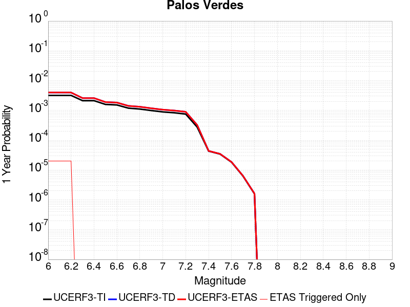 |  |

| Magnitude | 1 wk TI Prob | 1 wk TD Prob | 1 wk ETAS Prob | 1 wk ETAS/TD Gain | 1 wk ETAS Triggered Only | 1 mo TI Prob | 1 mo TD Prob | 1 mo ETAS Prob | 1 mo ETAS/TD Gain | 1 mo ETAS Triggered Only | 1 yr TI Prob | 1 yr TD Prob | 1 yr ETAS Prob | 1 yr ETAS/TD Gain | 1 yr ETAS Triggered Only | 10 yr TI Prob | 10 yr TD Prob | 10 yr ETAS Prob | 10 yr ETAS/TD Gain | 10 yr ETAS Triggered Only |
|-----|-----|-----|-----|-----|-----|-----|-----|-----|-----|-----|-----|-----|-----|-----|-----|-----|-----|-----|-----|-----|
| 6.0 | 6.126063E-5 | 7.623614E-5 | 7.623614E-5 | 1.0 | 0.0 | 2.6251914E-4 | 3.2668875E-4 | 3.2668875E-4 | 1.0 | 0.0 | 0.0031914865 | 0.0039706747 | 0.004017893 | 1.0118918 | 4.7406844E-5 | 0.031460393 | 0.0390538 | 0.039099358 | 1.0011665 | 4.7406844E-5 |
| 6.1 | 6.126063E-5 | 7.623614E-5 | 7.623614E-5 | 1.0 | 0.0 | 2.6251914E-4 | 3.2668875E-4 | 3.2668875E-4 | 1.0 | 0.0 | 0.0031914865 | 0.0039706747 | 0.004017893 | 1.0118918 | 4.7406844E-5 | 0.031460393 | 0.0390538 | 0.039099358 | 1.0011665 | 4.7406844E-5 |
| 6.2 | 6.126063E-5 | 7.623614E-5 | 7.623614E-5 | 1.0 | 0.0 | 2.6251914E-4 | 3.2668875E-4 | 3.2668875E-4 | 1.0 | 0.0 | 0.0031914865 | 0.0039706747 | 0.004017893 | 1.0118918 | 4.7406844E-5 | 0.031460393 | 0.0390538 | 0.039099358 | 1.0011665 | 4.7406844E-5 |
| 6.3 | 4.0838047E-5 | 4.9755265E-5 | 4.9755265E-5 | 1.0 | 0.0 | 1.7500846E-4 | 2.1322069E-4 | 2.1322069E-4 | 1.0 | 0.0 | 0.0021286458 | 0.002593076 | 0.002593076 | 1.0 | 0.0 | 0.021083709 | 0.025649615 | 0.025649615 | 1.0 | 0.0 |
| 6.4 | 4.0838047E-5 | 4.9755265E-5 | 4.9755265E-5 | 1.0 | 0.0 | 1.7500846E-4 | 2.1322069E-4 | 2.1322069E-4 | 1.0 | 0.0 | 0.0021286458 | 0.002593076 | 0.002593076 | 1.0 | 0.0 | 0.021083709 | 0.025649615 | 0.025649615 | 1.0 | 0.0 |
| 6.5 | 3.0512005E-5 | 3.6565507E-5 | 3.6565507E-5 | 1.0 | 0.0 | 1.3075917E-4 | 1.5670057E-4 | 1.5670057E-4 | 1.0 | 0.0 | 0.0015908304 | 0.0019062778 | 0.0019062778 | 1.0 | 0.0 | 0.015794903 | 0.018911136 | 0.018911136 | 1.0 | 0.0 |
| 6.6 | 2.9255087E-5 | 3.5158213E-5 | 3.5158213E-5 | 1.0 | 0.0 | 1.2537291E-4 | 1.5067002E-4 | 1.5067002E-4 | 1.0 | 0.0 | 0.0015253464 | 0.0018329794 | 0.0018329794 | 1.0 | 0.0 | 0.015149189 | 0.018190164 | 0.018190164 | 1.0 | 0.0 |
| 6.7 | 2.287198E-5 | 2.7251068E-5 | 2.7251068E-5 | 1.0 | 0.0 | 9.801909E-5 | 1.1678558E-4 | 1.1678558E-4 | 1.0 | 0.0 | 0.001192729 | 0.0014210287 | 0.0014210287 | 1.0 | 0.0 | 0.011863477 | 0.014128654 | 0.014128654 | 1.0 | 0.0 |
| 6.8 | 2.1325764E-5 | 2.5434496E-5 | 2.5434496E-5 | 1.0 | 0.0 | 9.139293E-5 | 1.0900094E-4 | 1.0900094E-4 | 1.0 | 0.0 | 0.001112141 | 0.0013263688 | 0.0013263688 | 1.0 | 0.0 | 0.011065915 | 0.013193562 | 0.013193562 | 1.0 | 0.0 |
| 6.9 | 1.9009392E-5 | 2.2615843E-5 | 2.2615843E-5 | 1.0 | 0.0 | 8.1466285E-5 | 9.692193E-5 | 9.692193E-5 | 1.0 | 0.0 | 9.914007E-4 | 0.001179473 | 0.001179473 | 1.0 | 0.0 | 0.009869894 | 0.011740818 | 0.011740818 | 1.0 | 0.0 |
| 7.0 | 1.7098473E-5 | 2.0321406E-5 | 2.0321406E-5 | 1.0 | 0.0 | 7.3277115E-5 | 8.708931E-5 | 8.708931E-5 | 1.0 | 0.0 | 8.917837E-4 | 0.0010598819 | 0.0010598819 | 1.0 | 0.0 | 0.008882134 | 0.010556707 | 0.010556707 | 1.0 | 0.0 |
| 7.1 | 1.5982785E-5 | 1.8996678E-5 | 1.8996678E-5 | 1.0 | 0.0 | 6.849585E-5 | 8.141227E-5 | 8.141227E-5 | 1.0 | 0.0 | 8.336179E-4 | 9.908284E-4 | 9.908284E-4 | 1.0 | 0.0 | 0.008304977 | 0.009872472 | 0.009872472 | 1.0 | 0.0 |
| 7.2 | 1.4468002E-5 | 1.7198974E-5 | 1.7198974E-5 | 1.0 | 0.0 | 6.200425E-5 | 7.370828E-5 | 7.370828E-5 | 1.0 | 0.0 | 7.546402E-4 | 8.971129E-4 | 8.971129E-4 | 1.0 | 0.0 | 0.007520827 | 0.008943185 | 0.008943185 | 1.0 | 0.0 |
| 7.3 | 5.288233E-6 | 6.204259E-6 | 6.204259E-6 | 1.0 | 0.0 | 2.2663658E-5 | 2.6589607E-5 | 2.6589607E-5 | 1.0 | 0.0 | 2.7589512E-4 | 3.237153E-4 | 3.237153E-4 | 1.0 | 0.0 | 0.0027555283 | 0.003235861 | 0.003235861 | 1.0 | 0.0 |
| 7.4 | 8.279556E-7 | 8.408416E-7 | 8.408416E-7 | 1.0 | 0.0 | 3.5483763E-6 | 3.6036022E-6 | 3.6036022E-6 | 1.0 | 0.0 | 4.3200624E-5 | 4.387305E-5 | 4.387305E-5 | 1.0 | 0.0 | 4.3192226E-4 | 4.386511E-4 | 4.386511E-4 | 1.0 | 0.0 |
| 7.5 | 6.559831E-7 | 6.667287E-7 | 6.667287E-7 | 1.0 | 0.0 | 2.8113532E-6 | 2.857406E-6 | 2.857406E-6 | 1.0 | 0.0 | 3.4227687E-5 | 3.4788427E-5 | 3.4788427E-5 | 1.0 | 0.0 | 3.4222414E-4 | 3.4783647E-4 | 3.4783647E-4 | 1.0 | 0.0 |
| 7.6 | 3.5018968E-7 | 3.5620351E-7 | 3.5620351E-7 | 1.0 | 0.0 | 1.500812E-6 | 1.526586E-6 | 1.526586E-6 | 1.0 | 0.0 | 1.8272232E-5 | 1.8586072E-5 | 1.8586072E-5 | 1.0 | 0.0 | 1.8270731E-4 | 1.8584977E-4 | 1.8584977E-4 | 1.0 | 0.0 |
| 7.7 | 1.1986104E-7 | 1.2198491E-7 | 1.2198491E-7 | 1.0 | 0.0 | 5.1369005E-7 | 5.227924E-7 | 5.227924E-7 | 1.0 | 0.0 | 6.2541585E-6 | 6.364979E-6 | 6.364979E-6 | 1.0 | 0.0 | 6.2539824E-5 | 6.364801E-5 | 6.364801E-5 | 1.0 | 0.0 |
| 7.8 | 3.0445005E-8 | 3.10279E-8 | 3.10279E-8 | 1.0 | 0.0 | 1.3047858E-7 | 1.3297671E-7 | 1.3297671E-7 | 1.0 | 0.0 | 1.5885756E-6 | 1.6189904E-6 | 1.6189904E-6 | 1.0 | 0.0 | 1.5885644E-5 | 1.6189806E-5 | 1.6189806E-5 | 1.0 | 0.0 |

## Great Valley 09 (Laguna Seca)
*[(top)](#table-of-contents)*

| 1 Week | 1 Month | 1 Year | 10 Year |
|-----|-----|-----|-----|
|  |  |  |  |

| Magnitude | 1 wk TI Prob | 1 wk TD Prob | 1 wk ETAS Prob | 1 wk ETAS/TD Gain | 1 wk ETAS Triggered Only | 1 mo TI Prob | 1 mo TD Prob | 1 mo ETAS Prob | 1 mo ETAS/TD Gain | 1 mo ETAS Triggered Only | 1 yr TI Prob | 1 yr TD Prob | 1 yr ETAS Prob | 1 yr ETAS/TD Gain | 1 yr ETAS Triggered Only | 10 yr TI Prob | 10 yr TD Prob | 10 yr ETAS Prob | 10 yr ETAS/TD Gain | 10 yr ETAS Triggered Only |
|-----|-----|-----|-----|-----|-----|-----|-----|-----|-----|-----|-----|-----|-----|-----|-----|-----|-----|-----|-----|-----|
| 6.0 | 5.4353277E-5 | 7.051288E-5 | 7.051288E-5 | 1.0 | 0.0 | 2.3292181E-4 | 3.021651E-4 | 3.021651E-4 | 1.0 | 0.0 | 0.0028321352 | 0.0036727623 | 0.0036727623 | 1.0 | 0.0 | 0.02796312 | 0.036121234 | 0.03616693 | 1.001265 | 4.7406844E-5 |
| 6.1 | 4.5578287E-5 | 5.8229198E-5 | 5.8229198E-5 | 1.0 | 0.0 | 1.953209E-4 | 2.4953127E-4 | 2.4953127E-4 | 1.0 | 0.0 | 0.0023754383 | 0.0030339046 | 0.0030339046 | 1.0 | 0.0 | 0.023502063 | 0.029924182 | 0.029970169 | 1.0015368 | 4.7406844E-5 |
| 6.2 | 2.8536782E-5 | 3.4740468E-5 | 3.4740468E-5 | 1.0 | 0.0 | 1.2229476E-4 | 1.4887958E-4 | 1.4887958E-4 | 1.0 | 0.0 | 0.0014879217 | 0.0018110707 | 0.0018110707 | 1.0 | 0.0 | 0.014779986 | 0.017960638 | 0.018007193 | 1.0025921 | 4.7406844E-5 |
| 6.3 | 2.3698774E-5 | 2.8215252E-5 | 2.8215252E-5 | 1.0 | 0.0 | 1.01562226E-4 | 1.2091713E-4 | 1.2091713E-4 | 1.0 | 0.0 | 0.0012358186 | 0.0014712278 | 0.0014712278 | 1.0 | 0.0 | 0.012289686 | 0.014613301 | 0.014613301 | 1.0 | 0.0 |
| 6.4 | 1.9191197E-5 | 2.2123982E-5 | 2.2123982E-5 | 1.0 | 0.0 | 8.2245395E-5 | 9.481376E-5 | 9.481376E-5 | 1.0 | 0.0 | 0.0010008777 | 0.001153789 | 0.001153789 | 1.0 | 0.0 | 0.009963818 | 0.011478378 | 0.011478378 | 1.0 | 0.0 |
| 6.5 | 1.5203241E-5 | 1.6802042E-5 | 1.6802042E-5 | 1.0 | 0.0 | 6.5155116E-5 | 7.200683E-5 | 7.200683E-5 | 1.0 | 0.0 | 7.9297484E-4 | 8.76362E-4 | 8.76362E-4 | 1.0 | 0.0 | 0.007901512 | 0.008730489 | 0.008730489 | 1.0 | 0.0 |
| 6.6 | 1.0984925E-5 | 1.1243591E-5 | 1.1243591E-5 | 1.0 | 0.0 | 4.70774E-5 | 4.8185837E-5 | 4.8185837E-5 | 1.0 | 0.0 | 5.730166E-4 | 5.865083E-4 | 5.865083E-4 | 1.0 | 0.0 | 0.005715413 | 0.0058500012 | 0.0058500012 | 1.0 | 0.0 |
| 6.7 | 9.134616E-6 | 9.020651E-6 | 9.020651E-6 | 1.0 | 0.0 | 3.9147766E-5 | 3.8659375E-5 | 3.8659375E-5 | 1.0 | 0.0 | 4.7651984E-4 | 4.705786E-4 | 4.705786E-4 | 1.0 | 0.0 | 0.004754993 | 0.0046960665 | 0.0046960665 | 1.0 | 0.0 |
| 6.8 | 7.785589E-6 | 7.4525665E-6 | 7.4525665E-6 | 1.0 | 0.0 | 3.3366385E-5 | 3.193919E-5 | 3.193919E-5 | 1.0 | 0.0 | 4.0616E-4 | 3.8879228E-4 | 3.8879228E-4 | 1.0 | 0.0 | 0.0040541845 | 0.003881325 | 0.003881325 | 1.0 | 0.0 |
| 6.9 | 5.579095E-6 | 4.8989014E-6 | 4.8989014E-6 | 1.0 | 0.0 | 2.3910188E-5 | 2.099513E-5 | 2.099513E-5 | 1.0 | 0.0 | 2.9106764E-4 | 2.555871E-4 | 2.555871E-4 | 1.0 | 0.0 | 0.002906867 | 0.002553069 | 0.002553069 | 1.0 | 0.0 |
| 7.0 | 2.6816688E-6 | 1.5217248E-6 | 1.5217248E-6 | 1.0 | 0.0 | 1.1492816E-5 | 6.5216623E-6 | 6.5216623E-6 | 1.0 | 0.0 | 1.3991605E-4 | 7.939843E-5 | 7.939843E-5 | 1.0 | 0.0 | 0.0013982799 | 7.9370936E-4 | 7.9370936E-4 | 1.0 | 0.0 |
| 7.1 | 1.9951021E-6 | 7.4544107E-7 | 7.4544107E-7 | 1.0 | 0.0 | 8.55041E-6 | 3.1947436E-6 | 3.1947436E-6 | 1.0 | 0.0 | 1.0409627E-4 | 3.8895352E-5 | 3.8895352E-5 | 1.0 | 0.0 | 0.0010404752 | 3.888896E-4 | 3.888896E-4 | 1.0 | 0.0 |
| 7.2 | 1.9951021E-6 | 7.4544107E-7 | 7.4544107E-7 | 1.0 | 0.0 | 8.55041E-6 | 3.1947436E-6 | 3.1947436E-6 | 1.0 | 0.0 | 1.0409627E-4 | 3.8895352E-5 | 3.8895352E-5 | 1.0 | 0.0 | 0.0010404752 | 3.888896E-4 | 3.888896E-4 | 1.0 | 0.0 |
| 7.3 | 1.7087556E-6 | 6.579369E-7 | 6.579369E-7 | 1.0 | 0.0 | 7.3232177E-6 | 2.8197267E-6 | 2.8197267E-6 | 1.0 | 0.0 | 8.915652E-5 | 3.4329674E-5 | 3.4329674E-5 | 1.0 | 0.0 | 8.9120766E-4 | 3.4324775E-4 | 3.4324775E-4 | 1.0 | 0.0 |
| 7.4 | 1.3804846E-6 | 6.074255E-7 | 6.074255E-7 | 1.0 | 0.0 | 5.916349E-6 | 2.6032496E-6 | 2.6032496E-6 | 1.0 | 0.0 | 7.2029165E-5 | 3.1694144E-5 | 3.1694144E-5 | 1.0 | 0.0 | 7.200583E-4 | 3.1690026E-4 | 3.1690026E-4 | 1.0 | 0.0 |
| 7.5 | 1.3804846E-6 | 6.074255E-7 | 6.074255E-7 | 1.0 | 0.0 | 5.916349E-6 | 2.6032496E-6 | 2.6032496E-6 | 1.0 | 0.0 | 7.2029165E-5 | 3.1694144E-5 | 3.1694144E-5 | 1.0 | 0.0 | 7.200583E-4 | 3.1690026E-4 | 3.1690026E-4 | 1.0 | 0.0 |

## Deep Springs
*[(top)](#table-of-contents)*

| 1 Week | 1 Month | 1 Year | 10 Year |
|-----|-----|-----|-----|
|  |  |  |  |

| Magnitude | 1 wk TI Prob | 1 wk TD Prob | 1 wk ETAS Prob | 1 wk ETAS/TD Gain | 1 wk ETAS Triggered Only | 1 mo TI Prob | 1 mo TD Prob | 1 mo ETAS Prob | 1 mo ETAS/TD Gain | 1 mo ETAS Triggered Only | 1 yr TI Prob | 1 yr TD Prob | 1 yr ETAS Prob | 1 yr ETAS/TD Gain | 1 yr ETAS Triggered Only | 10 yr TI Prob | 10 yr TD Prob | 10 yr ETAS Prob | 10 yr ETAS/TD Gain | 10 yr ETAS Triggered Only |
|-----|-----|-----|-----|-----|-----|-----|-----|-----|-----|-----|-----|-----|-----|-----|-----|-----|-----|-----|-----|-----|
| 6.0 | 1.9810619E-5 | 2.3114564E-5 | 2.3114564E-5 | 1.0 | 0.0 | 8.489989E-5 | 9.9061515E-5 | 9.9061515E-5 | 1.0 | 0.0 | 0.001033166 | 0.0012059145 | 0.0012059145 | 1.0 | 0.0 | 0.010283757 | 0.012043487 | 0.0120903235 | 1.0038888 | 4.7406844E-5 |
| 6.1 | 1.9810619E-5 | 2.3114564E-5 | 2.3114564E-5 | 1.0 | 0.0 | 8.489989E-5 | 9.9061515E-5 | 9.9061515E-5 | 1.0 | 0.0 | 0.001033166 | 0.0012059145 | 0.0012059145 | 1.0 | 0.0 | 0.010283757 | 0.012043487 | 0.0120903235 | 1.0038888 | 4.7406844E-5 |
| 6.2 | 1.9810619E-5 | 2.3114564E-5 | 2.3114564E-5 | 1.0 | 0.0 | 8.489989E-5 | 9.9061515E-5 | 9.9061515E-5 | 1.0 | 0.0 | 0.001033166 | 0.0012059145 | 0.0012059145 | 1.0 | 0.0 | 0.010283757 | 0.012043487 | 0.0120903235 | 1.0038888 | 4.7406844E-5 |
| 6.3 | 1.9810619E-5 | 2.3114564E-5 | 2.3114564E-5 | 1.0 | 0.0 | 8.489989E-5 | 9.9061515E-5 | 9.9061515E-5 | 1.0 | 0.0 | 0.001033166 | 0.0012059145 | 0.0012059145 | 1.0 | 0.0 | 0.010283757 | 0.012043487 | 0.0120903235 | 1.0038888 | 4.7406844E-5 |
| 6.4 | 1.9810619E-5 | 2.3114564E-5 | 2.3114564E-5 | 1.0 | 0.0 | 8.489989E-5 | 9.9061515E-5 | 9.9061515E-5 | 1.0 | 0.0 | 0.001033166 | 0.0012059145 | 0.0012059145 | 1.0 | 0.0 | 0.010283757 | 0.012043487 | 0.0120903235 | 1.0038888 | 4.7406844E-5 |
| 6.5 | 1.7190405E-5 | 2.0052325E-5 | 2.0052325E-5 | 1.0 | 0.0 | 7.367108E-5 | 8.593854E-5 | 8.593854E-5 | 1.0 | 0.0 | 8.9657627E-4 | 0.0010463017 | 0.0010463017 | 1.0 | 0.0 | 0.008929676 | 0.010462979 | 0.01050989 | 1.0044835 | 4.7406844E-5 |
| 6.6 | 1.7190405E-5 | 2.0052325E-5 | 2.0052325E-5 | 1.0 | 0.0 | 7.367108E-5 | 8.593854E-5 | 8.593854E-5 | 1.0 | 0.0 | 8.9657627E-4 | 0.0010463017 | 0.0010463017 | 1.0 | 0.0 | 0.008929676 | 0.010462979 | 0.01050989 | 1.0044835 | 4.7406844E-5 |

## Cleghorn Lake
*[(top)](#table-of-contents)*

| 1 Week | 1 Month | 1 Year | 10 Year |
|-----|-----|-----|-----|
|  |  |  |  |

| Magnitude | 1 wk TI Prob | 1 wk TD Prob | 1 wk ETAS Prob | 1 wk ETAS/TD Gain | 1 wk ETAS Triggered Only | 1 mo TI Prob | 1 mo TD Prob | 1 mo ETAS Prob | 1 mo ETAS/TD Gain | 1 mo ETAS Triggered Only | 1 yr TI Prob | 1 yr TD Prob | 1 yr ETAS Prob | 1 yr ETAS/TD Gain | 1 yr ETAS Triggered Only | 10 yr TI Prob | 10 yr TD Prob | 10 yr ETAS Prob | 10 yr ETAS/TD Gain | 10 yr ETAS Triggered Only |
|-----|-----|-----|-----|-----|-----|-----|-----|-----|-----|-----|-----|-----|-----|-----|-----|-----|-----|-----|-----|-----|
| 6.0 | 1.5467183E-5 | 1.6794971E-5 | 1.6794971E-5 | 1.0 | 0.0 | 6.6286244E-5 | 7.197677E-5 | 7.197677E-5 | 1.0 | 0.0 | 8.067362E-4 | 8.760197E-4 | 8.760197E-4 | 1.0 | 0.0 | 0.008038137 | 0.008731093 | 0.008778086 | 1.0053823 | 4.7406844E-5 |
| 6.1 | 1.5467183E-5 | 1.6794971E-5 | 1.6794971E-5 | 1.0 | 0.0 | 6.6286244E-5 | 7.197677E-5 | 7.197677E-5 | 1.0 | 0.0 | 8.067362E-4 | 8.760197E-4 | 8.760197E-4 | 1.0 | 0.0 | 0.008038137 | 0.008731093 | 0.008778086 | 1.0053823 | 4.7406844E-5 |
| 6.2 | 1.2624631E-5 | 1.36821545E-5 | 1.36821545E-5 | 1.0 | 0.0 | 5.410444E-5 | 5.863676E-5 | 5.863676E-5 | 1.0 | 0.0 | 6.585225E-4 | 7.137174E-4 | 7.137174E-4 | 1.0 | 0.0 | 0.0065657445 | 0.0071190484 | 0.0071190484 | 1.0 | 0.0 |
| 6.3 | 1.2624631E-5 | 1.36821545E-5 | 1.36821545E-5 | 1.0 | 0.0 | 5.410444E-5 | 5.863676E-5 | 5.863676E-5 | 1.0 | 0.0 | 6.585225E-4 | 7.137174E-4 | 7.137174E-4 | 1.0 | 0.0 | 0.0065657445 | 0.0071190484 | 0.0071190484 | 1.0 | 0.0 |
| 6.4 | 9.417684E-6 | 1.0170551E-5 | 1.0170551E-5 | 1.0 | 0.0 | 4.036088E-5 | 4.3587577E-5 | 4.3587577E-5 | 1.0 | 0.0 | 4.912829E-4 | 5.3059065E-4 | 5.3059065E-4 | 1.0 | 0.0 | 0.004901982 | 0.0052972743 | 0.0052972743 | 1.0 | 0.0 |
| 6.5 | 9.368219E-6 | 1.0117976E-5 | 1.0117976E-5 | 1.0 | 0.0 | 4.014889E-5 | 4.3362263E-5 | 4.3362263E-5 | 1.0 | 0.0 | 4.8870314E-4 | 5.278488E-4 | 5.278488E-4 | 1.0 | 0.0 | 0.004876298 | 0.0052699856 | 0.0052699856 | 1.0 | 0.0 |
| 6.6 | 7.803798E-6 | 8.442198E-6 | 8.442198E-6 | 1.0 | 0.0 | 3.3444423E-5 | 3.6180576E-5 | 3.6180576E-5 | 1.0 | 0.0 | 4.0710976E-4 | 4.404494E-4 | 4.404494E-4 | 1.0 | 0.0 | 0.0040636472 | 0.004399682 | 0.004399682 | 1.0 | 0.0 |
| 6.7 | 2.3108669E-6 | 2.4439082E-6 | 2.4439082E-6 | 1.0 | 0.0 | 9.903678E-6 | 1.0473852E-5 | 1.0473852E-5 | 1.0 | 0.0 | 1.205706E-4 | 1.2751187E-4 | 1.2751187E-4 | 1.0 | 0.0 | 0.001205052 | 0.0012744057 | 0.0012744057 | 1.0 | 0.0 |
| 6.8 | 2.0882828E-6 | 2.2063484E-6 | 2.2063484E-6 | 1.0 | 0.0 | 8.949753E-6 | 9.455745E-6 | 9.455745E-6 | 1.0 | 0.0 | 1.08957785E-4 | 1.15117786E-4 | 1.15117786E-4 | 1.0 | 0.0 | 0.0010890438 | 0.0011505984 | 0.0011505984 | 1.0 | 0.0 |
| 6.9 | 1.876935E-6 | 1.9811093E-6 | 1.9811093E-6 | 1.0 | 0.0 | 8.043982E-6 | 8.490441E-6 | 8.490441E-6 | 1.0 | 0.0 | 9.7931086E-5 | 1.0336639E-4 | 1.0336639E-4 | 1.0 | 0.0 | 9.788794E-4 | 0.001033199 | 0.001033199 | 1.0 | 0.0 |
| 7.0 | 1.5357559E-6 | 1.620328E-6 | 1.620328E-6 | 1.0 | 0.0 | 6.5817944E-6 | 6.9442453E-6 | 6.9442453E-6 | 1.0 | 0.0 | 8.01304E-5 | 8.454303E-5 | 8.454303E-5 | 1.0 | 0.0 | 8.010151E-4 | 8.4512116E-4 | 8.4512116E-4 | 1.0 | 0.0 |
| 7.1 | 1.0905424E-6 | 1.1497951E-6 | 1.1497951E-6 | 1.0 | 0.0 | 4.6737446E-6 | 4.9276846E-6 | 4.9276846E-6 | 1.0 | 0.0 | 5.6901354E-5 | 5.9993006E-5 | 5.9993006E-5 | 1.0 | 0.0 | 5.6886784E-4 | 5.997779E-4 | 5.997779E-4 | 1.0 | 0.0 |
| 7.2 | 6.06668E-7 | 6.387457E-7 | 6.387457E-7 | 1.0 | 0.0 | 2.600003E-6 | 2.737479E-6 | 2.737479E-6 | 1.0 | 0.0 | 3.1654577E-5 | 3.3328364E-5 | 3.3328364E-5 | 1.0 | 0.0 | 3.1650066E-4 | 3.3324052E-4 | 3.3324052E-4 | 1.0 | 0.0 |

## Bennett Valley 2011 CFM
*[(top)](#table-of-contents)*

| 1 Week | 1 Month | 1 Year | 10 Year |
|-----|-----|-----|-----|
|  |  |  |  |

| Magnitude | 1 wk TI Prob | 1 wk TD Prob | 1 wk ETAS Prob | 1 wk ETAS/TD Gain | 1 wk ETAS Triggered Only | 1 mo TI Prob | 1 mo TD Prob | 1 mo ETAS Prob | 1 mo ETAS/TD Gain | 1 mo ETAS Triggered Only | 1 yr TI Prob | 1 yr TD Prob | 1 yr ETAS Prob | 1 yr ETAS/TD Gain | 1 yr ETAS Triggered Only | 10 yr TI Prob | 10 yr TD Prob | 10 yr ETAS Prob | 10 yr ETAS/TD Gain | 10 yr ETAS Triggered Only |
|-----|-----|-----|-----|-----|-----|-----|-----|-----|-----|-----|-----|-----|-----|-----|-----|-----|-----|-----|-----|-----|
| 6.0 | 2.3893934E-5 | 2.8241704E-5 | 2.8241704E-5 | 1.0 | 0.0 | 1.0239855E-4 | 1.210313E-4 | 1.210313E-4 | 1.0 | 0.0 | 0.0012459893 | 0.001472745 | 0.001472745 | 1.0 | 0.0 | 0.012390262 | 0.014652503 | 0.014699215 | 1.003188 | 4.7406844E-5 |
| 6.1 | 2.3893934E-5 | 2.8241704E-5 | 2.8241704E-5 | 1.0 | 0.0 | 1.0239855E-4 | 1.210313E-4 | 1.210313E-4 | 1.0 | 0.0 | 0.0012459893 | 0.001472745 | 0.001472745 | 1.0 | 0.0 | 0.012390262 | 0.014652503 | 0.014699215 | 1.003188 | 4.7406844E-5 |
| 6.2 | 1.6657146E-5 | 1.9855883E-5 | 1.9855883E-5 | 1.0 | 0.0 | 7.138582E-5 | 8.509466E-5 | 8.509466E-5 | 1.0 | 0.0 | 8.6877577E-4 | 0.0010356767 | 0.0010356767 | 1.0 | 0.0 | 0.008653872 | 0.010326771 | 0.010326771 | 1.0 | 0.0 |
| 6.3 | 1.6657146E-5 | 1.9855883E-5 | 1.9855883E-5 | 1.0 | 0.0 | 7.138582E-5 | 8.509466E-5 | 8.509466E-5 | 1.0 | 0.0 | 8.6877577E-4 | 0.0010356767 | 0.0010356767 | 1.0 | 0.0 | 0.008653872 | 0.010326771 | 0.010326771 | 1.0 | 0.0 |
| 6.4 | 1.29418495E-5 | 1.5569252E-5 | 1.5569252E-5 | 1.0 | 0.0 | 5.546389E-5 | 6.6724395E-5 | 6.6724395E-5 | 1.0 | 0.0 | 6.7506364E-4 | 8.1219705E-4 | 8.1219705E-4 | 1.0 | 0.0 | 0.0067301663 | 0.008109432 | 0.008109432 | 1.0 | 0.0 |
| 6.5 | 1.2582504E-5 | 1.51362465E-5 | 1.51362465E-5 | 1.0 | 0.0 | 5.39239E-5 | 6.486875E-5 | 6.486875E-5 | 1.0 | 0.0 | 6.563257E-4 | 7.896211E-4 | 7.896211E-4 | 1.0 | 0.0 | 0.006543907 | 0.007885315 | 0.007885315 | 1.0 | 0.0 |
| 6.6 | 1.0846706E-5 | 1.3038316E-5 | 1.3038316E-5 | 1.0 | 0.0 | 4.6485053E-5 | 5.5878027E-5 | 5.5878027E-5 | 1.0 | 0.0 | 5.6580856E-4 | 6.8023097E-4 | 6.8023097E-4 | 1.0 | 0.0 | 0.005643701 | 0.0067984806 | 0.0067984806 | 1.0 | 0.0 |
| 6.7 | 1.6803231E-6 | 2.3785226E-6 | 2.3785226E-6 | 1.0 | 0.0 | 7.2013645E-6 | 1.0193628E-5 | 1.0193628E-5 | 1.0 | 0.0 | 8.7673085E-5 | 1.241005E-4 | 1.241005E-4 | 1.0 | 0.0 | 8.76385E-4 | 0.0012447466 | 0.0012447466 | 1.0 | 0.0 |
| 6.8 | 1.4609833E-6 | 2.094572E-6 | 2.094572E-6 | 1.0 | 0.0 | 6.261342E-6 | 8.976706E-6 | 8.976706E-6 | 1.0 | 0.0 | 7.6229175E-5 | 1.0928598E-4 | 1.0928598E-4 | 1.0 | 0.0 | 7.620303E-4 | 0.0010967137 | 0.0010967137 | 1.0 | 0.0 |
| 6.9 | 1.3492396E-6 | 1.9465033E-6 | 1.9465033E-6 | 1.0 | 0.0 | 5.7824427E-6 | 8.342131E-6 | 8.342131E-6 | 1.0 | 0.0 | 7.0398964E-5 | 1.0156077E-4 | 1.0156077E-4 | 1.0 | 0.0 | 7.037667E-4 | 0.0010195051 | 0.0010195051 | 1.0 | 0.0 |
| 7.0 | 1.2347921E-6 | 1.7894824E-6 | 1.7894824E-6 | 1.0 | 0.0 | 5.291955E-6 | 7.669189E-6 | 7.669189E-6 | 1.0 | 0.0 | 6.442765E-5 | 9.336842E-5 | 9.336842E-5 | 1.0 | 0.0 | 6.440897E-4 | 9.376385E-4 | 9.376385E-4 | 1.0 | 0.0 |
| 7.1 | 1.1262973E-6 | 1.6364918E-6 | 1.6364918E-6 | 1.0 | 0.0 | 4.8269794E-6 | 7.013518E-6 | 7.013518E-6 | 1.0 | 0.0 | 5.876689E-5 | 8.538629E-5 | 8.538629E-5 | 1.0 | 0.0 | 5.875135E-4 | 8.578582E-4 | 8.578582E-4 | 1.0 | 0.0 |
| 7.2 | 9.351744E-7 | 1.3617328E-6 | 1.3617328E-6 | 1.0 | 0.0 | 4.007884E-6 | 5.835984E-6 | 5.835984E-6 | 1.0 | 0.0 | 4.8794896E-5 | 7.105082E-5 | 7.105082E-5 | 1.0 | 0.0 | 4.878418E-4 | 7.1455166E-4 | 7.1455166E-4 | 1.0 | 0.0 |
| 7.3 | 8.5039534E-7 | 1.2391943E-6 | 1.2391943E-6 | 1.0 | 0.0 | 3.6445463E-6 | 5.310822E-6 | 5.310822E-6 | 1.0 | 0.0 | 4.437145E-5 | 6.465736E-5 | 6.465736E-5 | 1.0 | 0.0 | 4.436259E-4 | 6.5036706E-4 | 6.5036706E-4 | 1.0 | 0.0 |
| 7.4 | 6.7875015E-7 | 9.604516E-7 | 9.604516E-7 | 1.0 | 0.0 | 2.908926E-6 | 4.116215E-6 | 4.116215E-6 | 1.0 | 0.0 | 3.54156E-5 | 5.0113777E-5 | 5.0113777E-5 | 1.0 | 0.0 | 3.5409955E-4 | 5.043087E-4 | 5.043087E-4 | 1.0 | 0.0 |
| 7.5 | 5.826867E-7 | 8.191633E-7 | 8.191633E-7 | 1.0 | 0.0 | 2.4972264E-6 | 3.510695E-6 | 3.510695E-6 | 1.0 | 0.0 | 3.0403306E-5 | 4.274188E-5 | 4.274188E-5 | 1.0 | 0.0 | 3.0399146E-4 | 4.3019673E-4 | 4.3019673E-4 | 1.0 | 0.0 |
| 7.6 | 2.7734902E-7 | 3.6836647E-7 | 3.6836647E-7 | 1.0 | 0.0 | 1.1886381E-6 | 1.5787125E-6 | 1.5787125E-6 | 1.0 | 0.0 | 1.4471572E-5 | 1.9220655E-5 | 1.9220655E-5 | 1.0 | 0.0 | 1.447063E-4 | 1.9319801E-4 | 1.9319801E-4 | 1.0 | 0.0 |
| 7.7 | 1.0530888E-7 | 1.3757607E-7 | 1.3757607E-7 | 1.0 | 0.0 | 4.513237E-7 | 5.896116E-7 | 5.896116E-7 | 1.0 | 0.0 | 5.4948523E-6 | 7.1784975E-6 | 7.1784975E-6 | 1.0 | 0.0 | 5.4947162E-5 | 7.260757E-5 | 7.260757E-5 | 1.0 | 0.0 |
| 7.8 | 1.2714258E-8 | 1.9661249E-8 | 1.9661249E-8 | 1.0 | 0.0 | 5.448968E-8 | 8.426249E-8 | 8.426249E-8 | 1.0 | 0.0 | 6.6341164E-7 | 1.0258954E-6 | 1.0258954E-6 | 1.0 | 0.0 | 6.6340967E-6 | 1.0672463E-5 | 1.0672463E-5 | 1.0 | 0.0 |
| 7.9 | 4.075888E-9 | 7.576082E-9 | 7.576082E-9 | 1.0 | 0.0 | 1.7468091E-8 | 3.246892E-8 | 3.246892E-8 | 1.0 | 0.0 | 2.12674E-7 | 3.9530903E-7 | 3.9530903E-7 | 1.0 | 0.0 | 2.1267379E-6 | 4.2029656E-6 | 4.2029656E-6 | 1.0 | 0.0 |
| 8.0 | 1.9126138E-9 | 4.003808E-9 | 4.003808E-9 | 1.0 | 0.0 | 8.196917E-9 | 1.7159175E-8 | 1.7159175E-8 | 1.0 | 0.0 | 9.9797454E-8 | 2.0891295E-7 | 2.0891295E-7 | 1.0 | 0.0 | 9.979741E-7 | 2.2020392E-6 | 2.2020392E-6 | 1.0 | 0.0 |

## Cerro Prieto
*[(top)](#table-of-contents)*

| 1 Week | 1 Month | 1 Year | 10 Year |
|-----|-----|-----|-----|
|  |  |  |  |

| Magnitude | 1 wk TI Prob | 1 wk TD Prob | 1 wk ETAS Prob | 1 wk ETAS/TD Gain | 1 wk ETAS Triggered Only | 1 mo TI Prob | 1 mo TD Prob | 1 mo ETAS Prob | 1 mo ETAS/TD Gain | 1 mo ETAS Triggered Only | 1 yr TI Prob | 1 yr TD Prob | 1 yr ETAS Prob | 1 yr ETAS/TD Gain | 1 yr ETAS Triggered Only | 10 yr TI Prob | 10 yr TD Prob | 10 yr ETAS Prob | 10 yr ETAS/TD Gain | 10 yr ETAS Triggered Only |
|-----|-----|-----|-----|-----|-----|-----|-----|-----|-----|-----|-----|-----|-----|-----|-----|-----|-----|-----|-----|-----|
| 6.0 | 2.9101528E-4 | 5.9692067E-4 | 5.9692067E-4 | 1.0 | 0.0 | 0.0012466122 | 0.0025559657 | 0.0025559657 | 1.0 | 0.0 | 0.015072231 | 0.030669998 | 0.030669998 | 1.0 | 0.0 | 0.14089979 | 0.25411007 | 0.25414544 | 1.0001391 | 4.7406844E-5 |
| 6.1 | 2.9101528E-4 | 5.9692067E-4 | 5.9692067E-4 | 1.0 | 0.0 | 0.0012466122 | 0.0025559657 | 0.0025559657 | 1.0 | 0.0 | 0.015072231 | 0.030669998 | 0.030669998 | 1.0 | 0.0 | 0.14089979 | 0.25411007 | 0.25414544 | 1.0001391 | 4.7406844E-5 |
| 6.2 | 2.9101528E-4 | 5.9692067E-4 | 5.9692067E-4 | 1.0 | 0.0 | 0.0012466122 | 0.0025559657 | 0.0025559657 | 1.0 | 0.0 | 0.015072231 | 0.030669998 | 0.030669998 | 1.0 | 0.0 | 0.14089979 | 0.25411007 | 0.25414544 | 1.0001391 | 4.7406844E-5 |
| 6.3 | 2.9101528E-4 | 5.9692067E-4 | 5.9692067E-4 | 1.0 | 0.0 | 0.0012466122 | 0.0025559657 | 0.0025559657 | 1.0 | 0.0 | 0.015072231 | 0.030669998 | 0.030669998 | 1.0 | 0.0 | 0.14089979 | 0.25411007 | 0.25414544 | 1.0001391 | 4.7406844E-5 |
| 6.4 | 2.508648E-4 | 5.143929E-4 | 5.143929E-4 | 1.0 | 0.0 | 0.0010746918 | 0.0022028775 | 0.0022028775 | 1.0 | 0.0 | 0.013006088 | 0.02649131 | 0.02649131 | 1.0 | 0.0 | 0.12270685 | 0.22453524 | 0.224572 | 1.0001637 | 4.7406844E-5 |
| 6.5 | 2.508648E-4 | 5.143929E-4 | 5.143929E-4 | 1.0 | 0.0 | 0.0010746918 | 0.0022028775 | 0.0022028775 | 1.0 | 0.0 | 0.013006088 | 0.02649131 | 0.02649131 | 1.0 | 0.0 | 0.12270685 | 0.22453524 | 0.224572 | 1.0001637 | 4.7406844E-5 |
| 6.6 | 2.294914E-4 | 4.715732E-4 | 4.715732E-4 | 1.0 | 0.0 | 9.831638E-4 | 0.0020196505 | 0.0020196505 | 1.0 | 0.0 | 0.011904482 | 0.024317956 | 0.024317956 | 1.0 | 0.0 | 0.11286586 | 0.2087159 | 0.20875342 | 1.0001798 | 4.7406844E-5 |
| 6.7 | 1.9621674E-4 | 4.0457462E-4 | 4.0457462E-4 | 1.0 | 0.0 | 8.4065786E-4 | 0.0017328978 | 0.0017328978 | 1.0 | 0.0 | 0.010187071 | 0.020903941 | 0.020903941 | 1.0 | 0.0 | 0.09732539 | 0.18303102 | 0.18306975 | 1.0002116 | 4.7406844E-5 |
| 6.8 | 1.5476145E-4 | 3.059677E-4 | 3.059677E-4 | 1.0 | 0.0 | 6.6309475E-4 | 0.0013107335 | 0.0013107335 | 1.0 | 0.0 | 0.008043335 | 0.015853675 | 0.015853675 | 1.0 | 0.0 | 0.07758363 | 0.14347729 | 0.1435179 | 1.000283 | 4.7406844E-5 |
| 6.9 | 1.20509176E-4 | 2.2608276E-4 | 2.2608276E-4 | 1.0 | 0.0 | 5.1636563E-4 | 9.686297E-4 | 9.686297E-4 | 1.0 | 0.0 | 0.006268645 | 0.011739796 | 0.011739796 | 1.0 | 0.0 | 0.060947374 | 0.10954975 | 0.10959197 | 1.0003853 | 4.7406844E-5 |
| 7.0 | 9.3269155E-5 | 1.6737288E-4 | 1.6737288E-4 | 1.0 | 0.0 | 3.9966372E-4 | 7.171584E-4 | 7.171584E-4 | 1.0 | 0.0 | 0.0048550544 | 0.0087041175 | 0.0087041175 | 1.0 | 0.0 | 0.04750344 | 0.08324219 | 0.08328565 | 1.0005221 | 4.7406844E-5 |
| 7.1 | 5.029709E-5 | 8.183576E-5 | 8.183576E-5 | 1.0 | 0.0 | 2.1554115E-4 | 3.5069685E-4 | 3.5069685E-4 | 1.0 | 0.0 | 0.0026210553 | 0.0042647994 | 0.0042647994 | 1.0 | 0.0 | 0.025903556 | 0.04241657 | 0.042461965 | 1.0010703 | 4.7406844E-5 |
| 7.2 | 6.5445185E-8 | 6.838605E-8 | 6.838605E-8 | 1.0 | 0.0 | 2.8047933E-7 | 2.9308308E-7 | 2.9308308E-7 | 1.0 | 0.0 | 3.4148304E-6 | 3.5682863E-6 | 3.5682863E-6 | 1.0 | 0.0 | 3.414778E-5 | 3.5682864E-5 | 3.5682864E-5 | 1.0 | 0.0 |

## Chino alt 1
*[(top)](#table-of-contents)*

| 1 Week | 1 Month | 1 Year | 10 Year |
|-----|-----|-----|-----|
|  |  |  |  |

| Magnitude | 1 wk TI Prob | 1 wk TD Prob | 1 wk ETAS Prob | 1 wk ETAS/TD Gain | 1 wk ETAS Triggered Only | 1 mo TI Prob | 1 mo TD Prob | 1 mo ETAS Prob | 1 mo ETAS/TD Gain | 1 mo ETAS Triggered Only | 1 yr TI Prob | 1 yr TD Prob | 1 yr ETAS Prob | 1 yr ETAS/TD Gain | 1 yr ETAS Triggered Only | 10 yr TI Prob | 10 yr TD Prob | 10 yr ETAS Prob | 10 yr ETAS/TD Gain | 10 yr ETAS Triggered Only |
|-----|-----|-----|-----|-----|-----|-----|-----|-----|-----|-----|-----|-----|-----|-----|-----|-----|-----|-----|-----|-----|
| 6.0 | 3.939946E-5 | 4.8955757E-5 | 4.8955757E-5 | 1.0 | 0.0 | 1.6884391E-4 | 2.0979645E-4 | 2.0979645E-4 | 1.0 | 0.0 | 0.0020537362 | 0.0025517642 | 0.00259905 | 1.0185306 | 4.7406844E-5 | 0.020348595 | 0.025281483 | 0.025327692 | 1.0018277 | 4.7406844E-5 |
| 6.1 | 2.1505624E-5 | 2.6883481E-5 | 2.6883481E-5 | 1.0 | 0.0 | 9.2163704E-5 | 1.1521046E-4 | 1.1521046E-4 | 1.0 | 0.0 | 0.0011215154 | 0.0014018962 | 0.0014018962 | 1.0 | 0.0 | 0.011158722 | 0.013947416 | 0.013947416 | 1.0 | 0.0 |
| 6.2 | 2.1505624E-5 | 2.6883481E-5 | 2.6883481E-5 | 1.0 | 0.0 | 9.2163704E-5 | 1.1521046E-4 | 1.1521046E-4 | 1.0 | 0.0 | 0.0011215154 | 0.0014018962 | 0.0014018962 | 1.0 | 0.0 | 0.011158722 | 0.013947416 | 0.013947416 | 1.0 | 0.0 |
| 6.3 | 1.4290785E-5 | 1.816862E-5 | 1.816862E-5 | 1.0 | 0.0 | 6.1244784E-5 | 7.786344E-5 | 7.786344E-5 | 1.0 | 0.0 | 7.454001E-4 | 9.4762055E-4 | 9.4762055E-4 | 1.0 | 0.0 | 0.007429048 | 0.009446246 | 0.009446246 | 1.0 | 0.0 |
| 6.4 | 1.4290785E-5 | 1.816862E-5 | 1.816862E-5 | 1.0 | 0.0 | 6.1244784E-5 | 7.786344E-5 | 7.786344E-5 | 1.0 | 0.0 | 7.454001E-4 | 9.4762055E-4 | 9.4762055E-4 | 1.0 | 0.0 | 0.007429048 | 0.009446246 | 0.009446246 | 1.0 | 0.0 |
| 6.5 | 1.3017944E-5 | 1.665543E-5 | 1.665543E-5 | 1.0 | 0.0 | 5.5789995E-5 | 7.13787E-5 | 7.13787E-5 | 1.0 | 0.0 | 6.790315E-4 | 8.6873304E-4 | 8.6873304E-4 | 1.0 | 0.0 | 0.0067696036 | 0.00866366 | 0.00866366 | 1.0 | 0.0 |
| 6.6 | 9.470016E-6 | 1.2041898E-5 | 1.2041898E-5 | 1.0 | 0.0 | 4.058515E-5 | 5.1607305E-5 | 5.1607305E-5 | 1.0 | 0.0 | 4.940122E-4 | 6.281718E-4 | 6.281718E-4 | 1.0 | 0.0 | 0.004929154 | 0.006273171 | 0.006273171 | 1.0 | 0.0 |
| 6.7 | 8.314155E-6 | 1.0409905E-5 | 1.0409905E-5 | 1.0 | 0.0 | 3.5631605E-5 | 4.46133E-5 | 4.46133E-5 | 1.0 | 0.0 | 4.3372845E-4 | 5.430638E-4 | 5.430638E-4 | 1.0 | 0.0 | 0.004328829 | 0.005426893 | 0.005426893 | 1.0 | 0.0 |
| 6.8 | 3.4856364E-6 | 3.8139801E-6 | 3.8139801E-6 | 1.0 | 0.0 | 1.4938357E-5 | 1.6345539E-5 | 1.6345539E-5 | 1.0 | 0.0 | 1.8185932E-4 | 1.9899083E-4 | 1.9899083E-4 | 1.0 | 0.0 | 0.0018171056 | 0.001989803 | 0.001989803 | 1.0 | 0.0 |
| 6.9 | 2.2645952E-6 | 2.1532328E-6 | 2.1532328E-6 | 1.0 | 0.0 | 9.705372E-6 | 9.228109E-6 | 9.228109E-6 | 1.0 | 0.0 | 1.18156495E-4 | 1.1234665E-4 | 1.1234665E-4 | 1.0 | 0.0 | 0.0011809369 | 0.0011235146 | 0.0011235146 | 1.0 | 0.0 |
| 7.0 | 1.7864003E-6 | 1.5433379E-6 | 1.5433379E-6 | 1.0 | 0.0 | 7.655979E-6 | 6.6142893E-6 | 6.6142893E-6 | 1.0 | 0.0 | 9.3207556E-5 | 8.052605E-5 | 8.052605E-5 | 1.0 | 0.0 | 9.316847E-4 | 8.054159E-4 | 8.054159E-4 | 1.0 | 0.0 |
| 7.1 | 1.7315456E-6 | 1.4736019E-6 | 1.4736019E-6 | 1.0 | 0.0 | 7.420889E-6 | 6.3154216E-6 | 6.3154216E-6 | 1.0 | 0.0 | 9.034557E-5 | 7.6887605E-5 | 7.6887605E-5 | 1.0 | 0.0 | 9.0308854E-4 | 7.690479E-4 | 7.690479E-4 | 1.0 | 0.0 |
| 7.2 | 1.6008337E-6 | 1.3576367E-6 | 1.3576367E-6 | 1.0 | 0.0 | 6.860698E-6 | 5.8184305E-6 | 5.8184305E-6 | 1.0 | 0.0 | 8.352579E-5 | 7.0837144E-5 | 7.0837144E-5 | 1.0 | 0.0 | 8.34944E-4 | 7.085699E-4 | 7.085699E-4 | 1.0 | 0.0 |
| 7.3 | 1.3320939E-6 | 1.1219545E-6 | 1.1219545E-6 | 1.0 | 0.0 | 5.7089615E-6 | 4.8083675E-6 | 4.8083675E-6 | 1.0 | 0.0 | 6.9504385E-5 | 5.854035E-5 | 5.854035E-5 | 1.0 | 0.0 | 6.9482654E-4 | 5.8539386E-4 | 5.8539386E-4 | 1.0 | 0.0 |
| 7.4 | 1.114294E-6 | 9.2384767E-7 | 9.2384767E-7 | 1.0 | 0.0 | 4.775537E-6 | 3.9593415E-6 | 3.9593415E-6 | 1.0 | 0.0 | 5.8140613E-5 | 4.820395E-5 | 4.820395E-5 | 1.0 | 0.0 | 5.81254E-4 | 4.8195178E-4 | 4.8195178E-4 | 1.0 | 0.0 |
| 7.5 | 9.354081E-7 | 7.62451E-7 | 7.62451E-7 | 1.0 | 0.0 | 4.0088858E-6 | 3.2676433E-6 | 3.2676433E-6 | 1.0 | 0.0 | 4.8807087E-5 | 3.9782866E-5 | 3.9782866E-5 | 1.0 | 0.0 | 4.879637E-4 | 3.9776083E-4 | 3.9776083E-4 | 1.0 | 0.0 |
| 7.6 | 8.521771E-7 | 6.881667E-7 | 6.881667E-7 | 1.0 | 0.0 | 3.6521824E-6 | 2.9492828E-6 | 2.9492828E-6 | 1.0 | 0.0 | 4.4464414E-5 | 3.590696E-5 | 3.590696E-5 | 1.0 | 0.0 | 4.4455516E-4 | 3.5901475E-4 | 3.5901475E-4 | 1.0 | 0.0 |
| 7.7 | 2.1803626E-7 | 1.4189133E-7 | 1.4189133E-7 | 1.0 | 0.0 | 9.344408E-7 | 6.0810567E-7 | 6.0810567E-7 | 1.0 | 0.0 | 1.1376757E-5 | 7.4036707E-6 | 7.4036707E-6 | 1.0 | 0.0 | 1.13761744E-4 | 7.4035204E-5 | 7.4035204E-5 | 1.0 | 0.0 |

## Sierra Madre
*[(top)](#table-of-contents)*

| 1 Week | 1 Month | 1 Year | 10 Year |
|-----|-----|-----|-----|
| 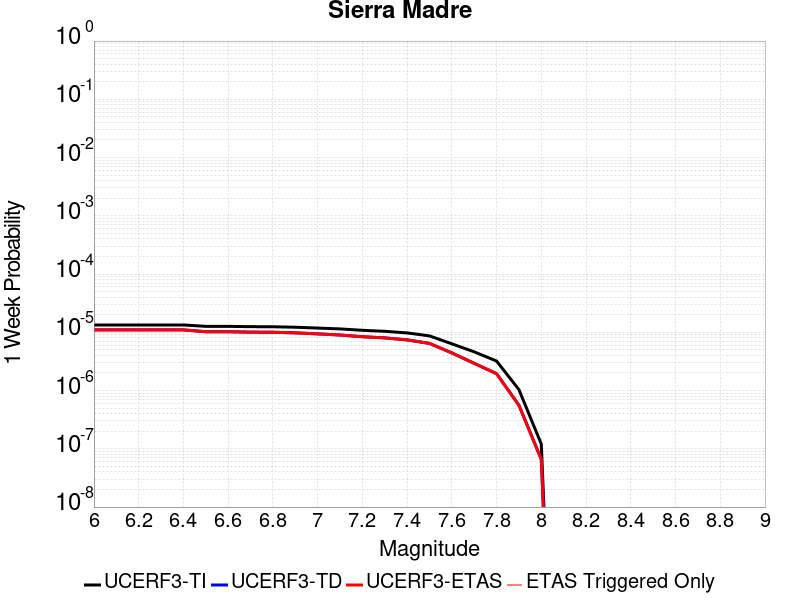 |  |  |  |

| Magnitude | 1 wk TI Prob | 1 wk TD Prob | 1 wk ETAS Prob | 1 wk ETAS/TD Gain | 1 wk ETAS Triggered Only | 1 mo TI Prob | 1 mo TD Prob | 1 mo ETAS Prob | 1 mo ETAS/TD Gain | 1 mo ETAS Triggered Only | 1 yr TI Prob | 1 yr TD Prob | 1 yr ETAS Prob | 1 yr ETAS/TD Gain | 1 yr ETAS Triggered Only | 10 yr TI Prob | 10 yr TD Prob | 10 yr ETAS Prob | 10 yr ETAS/TD Gain | 10 yr ETAS Triggered Only |
|-----|-----|-----|-----|-----|-----|-----|-----|-----|-----|-----|-----|-----|-----|-----|-----|-----|-----|-----|-----|-----|
| 6.0 | 1.3379373E-5 | 1.1002111E-5 | 1.1002111E-5 | 1.0 | 0.0 | 5.7338908E-5 | 4.715106E-5 | 4.715106E-5 | 1.0 | 0.0 | 6.978776E-4 | 5.7391444E-4 | 5.7391444E-4 | 1.0 | 0.0 | 0.0069569005 | 0.005724687 | 0.0057718223 | 1.0082337 | 4.7406844E-5 |
| 6.1 | 1.3379373E-5 | 1.1002111E-5 | 1.1002111E-5 | 1.0 | 0.0 | 5.7338908E-5 | 4.715106E-5 | 4.715106E-5 | 1.0 | 0.0 | 6.978776E-4 | 5.7391444E-4 | 5.7391444E-4 | 1.0 | 0.0 | 0.0069569005 | 0.005724687 | 0.0057718223 | 1.0082337 | 4.7406844E-5 |
| 6.2 | 1.3379373E-5 | 1.1002111E-5 | 1.1002111E-5 | 1.0 | 0.0 | 5.7338908E-5 | 4.715106E-5 | 4.715106E-5 | 1.0 | 0.0 | 6.978776E-4 | 5.7391444E-4 | 5.7391444E-4 | 1.0 | 0.0 | 0.0069569005 | 0.005724687 | 0.0057718223 | 1.0082337 | 4.7406844E-5 |
| 6.3 | 1.3379373E-5 | 1.1002111E-5 | 1.1002111E-5 | 1.0 | 0.0 | 5.7338908E-5 | 4.715106E-5 | 4.715106E-5 | 1.0 | 0.0 | 6.978776E-4 | 5.7391444E-4 | 5.7391444E-4 | 1.0 | 0.0 | 0.0069569005 | 0.005724687 | 0.0057718223 | 1.0082337 | 4.7406844E-5 |
| 6.4 | 1.3379373E-5 | 1.1002111E-5 | 1.1002111E-5 | 1.0 | 0.0 | 5.7338908E-5 | 4.715106E-5 | 4.715106E-5 | 1.0 | 0.0 | 6.978776E-4 | 5.7391444E-4 | 5.7391444E-4 | 1.0 | 0.0 | 0.0069569005 | 0.005724687 | 0.0057718223 | 1.0082337 | 4.7406844E-5 |
| 6.5 | 1.26563245E-5 | 1.023154E-5 | 1.023154E-5 | 1.0 | 0.0 | 5.4240263E-5 | 4.3848726E-5 | 4.3848726E-5 | 1.0 | 0.0 | 6.601751E-4 | 5.3372857E-4 | 5.3372857E-4 | 1.0 | 0.0 | 0.006582173 | 0.005324789 | 0.005371943 | 1.0088556 | 4.7406844E-5 |
| 6.6 | 1.26563245E-5 | 1.023154E-5 | 1.023154E-5 | 1.0 | 0.0 | 5.4240263E-5 | 4.3848726E-5 | 4.3848726E-5 | 1.0 | 0.0 | 6.601751E-4 | 5.3372857E-4 | 5.3372857E-4 | 1.0 | 0.0 | 0.006582173 | 0.005324789 | 0.005371943 | 1.0088556 | 4.7406844E-5 |
| 6.7 | 1.2502474E-5 | 1.0067679E-5 | 1.0067679E-5 | 1.0 | 0.0 | 5.3580934E-5 | 4.3146487E-5 | 4.3146487E-5 | 1.0 | 0.0 | 6.521526E-4 | 5.251829E-4 | 5.251829E-4 | 1.0 | 0.0 | 0.0065024206 | 0.005239737 | 0.0052868957 | 1.0090002 | 4.7406844E-5 |
| 6.8 | 1.2454966E-5 | 1.0019962E-5 | 1.0019962E-5 | 1.0 | 0.0 | 5.3377335E-5 | 4.2941996E-5 | 4.2941996E-5 | 1.0 | 0.0 | 6.4967526E-4 | 5.2269443E-4 | 5.2269443E-4 | 1.0 | 0.0 | 0.006477792 | 0.005214969 | 0.0052621285 | 1.0090431 | 4.7406844E-5 |
| 6.9 | 1.2225574E-5 | 9.793931E-6 | 9.793931E-6 | 1.0 | 0.0 | 5.2394265E-5 | 4.1973322E-5 | 4.1973322E-5 | 1.0 | 0.0 | 6.3771347E-4 | 5.109064E-4 | 5.109064E-4 | 1.0 | 0.0 | 0.006358865 | 0.0050976346 | 0.0051447996 | 1.0092523 | 4.7406844E-5 |
| 7.0 | 1.182946E-5 | 9.400459E-6 | 9.400459E-6 | 1.0 | 0.0 | 5.06967E-5 | 4.0287065E-5 | 4.0287065E-5 | 1.0 | 0.0 | 6.1705755E-4 | 4.9038563E-4 | 4.9038563E-4 | 1.0 | 0.0 | 0.006153469 | 0.004893347 | 0.004940522 | 1.0096406 | 4.7406844E-5 |
| 7.1 | 1.14369095E-5 | 8.987441E-6 | 8.987441E-6 | 1.0 | 0.0 | 4.9014405E-5 | 3.8517042E-5 | 3.8517042E-5 | 1.0 | 0.0 | 5.9658696E-4 | 4.6884507E-4 | 4.6884507E-4 | 1.0 | 0.0 | 0.005949879 | 0.004678865 | 0.00472605 | 1.0100847 | 4.7406844E-5 |
| 7.2 | 1.0836419E-5 | 8.400803E-6 | 8.400803E-6 | 1.0 | 0.0 | 4.644097E-5 | 3.6002948E-5 | 3.6002948E-5 | 1.0 | 0.0 | 5.652721E-4 | 4.3824865E-4 | 4.3824865E-4 | 1.0 | 0.0 | 0.0056383642 | 0.0043741413 | 0.004421341 | 1.0107906 | 4.7406844E-5 |
| 7.3 | 1.0403439E-5 | 8.022045E-6 | 8.022045E-6 | 1.0 | 0.0 | 4.4585406E-5 | 3.4379744E-5 | 3.4379744E-5 | 1.0 | 0.0 | 5.426921E-4 | 4.184939E-4 | 4.184939E-4 | 1.0 | 0.0 | 0.005413687 | 0.0041773533 | 0.0041773533 | 1.0 | 0.0 |
| 7.4 | 9.768864E-6 | 7.415638E-6 | 7.415638E-6 | 1.0 | 0.0 | 4.186589E-5 | 3.178092E-5 | 3.178092E-5 | 1.0 | 0.0 | 5.09598E-4 | 3.868649E-4 | 3.868649E-4 | 1.0 | 0.0 | 0.0050843097 | 0.0038622064 | 0.0038622064 | 1.0 | 0.0 |
| 7.5 | 8.687089E-6 | 6.4511987E-6 | 6.4511987E-6 | 1.0 | 0.0 | 3.722985E-5 | 2.7647708E-5 | 2.7647708E-5 | 1.0 | 0.0 | 4.5317915E-4 | 3.365597E-4 | 3.365597E-4 | 1.0 | 0.0 | 0.004522561 | 0.0033607872 | 0.0033607872 | 1.0 | 0.0 |
| 7.6 | 6.3506063E-6 | 4.431258E-6 | 4.431258E-6 | 1.0 | 0.0 | 2.72166E-5 | 1.8990968E-5 | 1.8990968E-5 | 1.0 | 0.0 | 3.3131172E-4 | 2.3119076E-4 | 2.3119076E-4 | 1.0 | 0.0 | 0.003308182 | 0.0023097275 | 0.0023097275 | 1.0 | 0.0 |
| 7.7 | 4.62223E-6 | 2.9338423E-6 | 2.9338423E-6 | 1.0 | 0.0 | 1.9809406E-5 | 1.257355E-5 | 1.257355E-5 | 1.0 | 0.0 | 2.4115283E-4 | 1.5307224E-4 | 1.5307224E-4 | 1.0 | 0.0 | 0.0024089129 | 0.001529869 | 0.001529869 | 1.0 | 0.0 |
| 7.8 | 3.2145008E-6 | 1.950051E-6 | 1.950051E-6 | 1.0 | 0.0 | 1.3776359E-5 | 8.357335E-6 | 8.357335E-6 | 1.0 | 0.0 | 1.6771426E-4 | 1.0174581E-4 | 1.0174581E-4 | 1.0 | 0.0 | 0.0016758774 | 0.0010171367 | 0.0010171367 | 1.0 | 0.0 |
| 7.9 | 1.0391769E-6 | 5.604388E-7 | 5.604388E-7 | 1.0 | 0.0 | 4.4536077E-6 | 2.4018784E-6 | 2.4018784E-6 | 1.0 | 0.0 | 5.4221324E-5 | 2.9242481E-5 | 2.9242481E-5 | 1.0 | 0.0 | 5.4208096E-4 | 2.9238674E-4 | 2.9238674E-4 | 1.0 | 0.0 |
| 8.0 | 1.210983E-7 | 6.615224E-8 | 6.615224E-8 | 1.0 | 0.0 | 5.1899264E-7 | 2.8350954E-7 | 2.8350954E-7 | 1.0 | 0.0 | 6.3187167E-6 | 3.4517234E-6 | 3.4517234E-6 | 1.0 | 0.0 | 6.318537E-5 | 3.4516717E-5 | 3.4516717E-5 | 1.0 | 0.0 |

## Kern Canyon (Lake Isabella) 2011
*[(top)](#table-of-contents)*

| 1 Week | 1 Month | 1 Year | 10 Year |
|-----|-----|-----|-----|
|  |  |  |  |

| Magnitude | 1 wk TI Prob | 1 wk TD Prob | 1 wk ETAS Prob | 1 wk ETAS/TD Gain | 1 wk ETAS Triggered Only | 1 mo TI Prob | 1 mo TD Prob | 1 mo ETAS Prob | 1 mo ETAS/TD Gain | 1 mo ETAS Triggered Only | 1 yr TI Prob | 1 yr TD Prob | 1 yr ETAS Prob | 1 yr ETAS/TD Gain | 1 yr ETAS Triggered Only | 10 yr TI Prob | 10 yr TD Prob | 10 yr ETAS Prob | 10 yr ETAS/TD Gain | 10 yr ETAS Triggered Only |
|-----|-----|-----|-----|-----|-----|-----|-----|-----|-----|-----|-----|-----|-----|-----|-----|-----|-----|-----|-----|-----|
| 6.0 | 4.2387383E-6 | 4.0016866E-6 | 4.0016866E-6 | 1.0 | 0.0 | 1.8165894E-5 | 1.7149983E-5 | 1.7149983E-5 | 1.0 | 0.0 | 2.2114732E-4 | 2.0878292E-4 | 2.0878292E-4 | 1.0 | 0.0 | 0.0022092736 | 0.0020860515 | 0.0021333594 | 1.0226783 | 4.7406844E-5 |
| 6.1 | 4.2387383E-6 | 4.0016866E-6 | 4.0016866E-6 | 1.0 | 0.0 | 1.8165894E-5 | 1.7149983E-5 | 1.7149983E-5 | 1.0 | 0.0 | 2.2114732E-4 | 2.0878292E-4 | 2.0878292E-4 | 1.0 | 0.0 | 0.0022092736 | 0.0020860515 | 0.0021333594 | 1.0226783 | 4.7406844E-5 |
| 6.2 | 4.2387383E-6 | 4.0016866E-6 | 4.0016866E-6 | 1.0 | 0.0 | 1.8165894E-5 | 1.7149983E-5 | 1.7149983E-5 | 1.0 | 0.0 | 2.2114732E-4 | 2.0878292E-4 | 2.0878292E-4 | 1.0 | 0.0 | 0.0022092736 | 0.0020860515 | 0.0021333594 | 1.0226783 | 4.7406844E-5 |
| 6.3 | 4.2387383E-6 | 4.0016866E-6 | 4.0016866E-6 | 1.0 | 0.0 | 1.8165894E-5 | 1.7149983E-5 | 1.7149983E-5 | 1.0 | 0.0 | 2.2114732E-4 | 2.0878292E-4 | 2.0878292E-4 | 1.0 | 0.0 | 0.0022092736 | 0.0020860515 | 0.0021333594 | 1.0226783 | 4.7406844E-5 |
| 6.4 | 4.2387383E-6 | 4.0016866E-6 | 4.0016866E-6 | 1.0 | 0.0 | 1.8165894E-5 | 1.7149983E-5 | 1.7149983E-5 | 1.0 | 0.0 | 2.2114732E-4 | 2.0878292E-4 | 2.0878292E-4 | 1.0 | 0.0 | 0.0022092736 | 0.0020860515 | 0.0021333594 | 1.0226783 | 4.7406844E-5 |
| 6.5 | 2.7857532E-6 | 2.5178983E-6 | 2.5178983E-6 | 1.0 | 0.0 | 1.1938888E-5 | 1.079095E-5 | 1.079095E-5 | 1.0 | 0.0 | 1.4534626E-4 | 1.3137223E-4 | 1.3137223E-4 | 1.0 | 0.0 | 0.0014525123 | 0.0013129783 | 0.0013603229 | 1.0360589 | 4.7406844E-5 |
| 6.6 | 2.2233348E-6 | 1.9441488E-6 | 1.9441488E-6 | 1.0 | 0.0 | 9.528543E-6 | 8.33204E-6 | 8.33204E-6 | 1.0 | 0.0 | 1.1600384E-4 | 1.0143795E-4 | 1.0143795E-4 | 1.0 | 0.0 | 0.001159433 | 0.0010139252 | 0.001061284 | 1.0467083 | 4.7406844E-5 |
| 6.7 | 2.1635126E-6 | 1.8835284E-6 | 1.8835284E-6 | 1.0 | 0.0 | 9.272164E-6 | 8.07224E-6 | 8.07224E-6 | 1.0 | 0.0 | 1.1288274E-4 | 9.827517E-5 | 9.827517E-5 | 1.0 | 0.0 | 0.0011282542 | 9.823253E-4 | 0.0010296856 | 1.0482124 | 4.7406844E-5 |
| 6.8 | 1.8685711E-6 | 1.5831645E-6 | 1.5831645E-6 | 1.0 | 0.0 | 8.008137E-6 | 6.7849733E-6 | 6.7849733E-6 | 1.0 | 0.0 | 9.74947E-5 | 8.260396E-5 | 8.260396E-5 | 1.0 | 0.0 | 9.745194E-4 | 8.2573754E-4 | 8.7310525E-4 | 1.0573641 | 4.7406844E-5 |
| 6.9 | 1.5815071E-6 | 1.3065115E-6 | 1.3065115E-6 | 1.0 | 0.0 | 6.77787E-6 | 5.5993232E-6 | 5.5993232E-6 | 1.0 | 0.0 | 8.251744E-5 | 6.8169655E-5 | 6.8169655E-5 | 1.0 | 0.0 | 8.248681E-4 | 6.814901E-4 | 7.288647E-4 | 1.0695161 | 4.7406844E-5 |
| 7.0 | 1.3772564E-6 | 1.1210881E-6 | 1.1210881E-6 | 1.0 | 0.0 | 5.9025137E-6 | 4.804654E-6 | 4.804654E-6 | 1.0 | 0.0 | 7.186073E-5 | 5.8495116E-5 | 5.8495116E-5 | 1.0 | 0.0 | 7.18375E-4 | 5.847992E-4 | 6.321784E-4 | 1.0810177 | 4.7406844E-5 |
| 7.1 | 1.0916998E-6 | 8.763901E-7 | 8.763901E-7 | 1.0 | 0.0 | 4.678705E-6 | 3.7559523E-6 | 3.7559523E-6 | 1.0 | 0.0 | 5.6961744E-5 | 4.572777E-5 | 4.572777E-5 | 1.0 | 0.0 | 5.6947145E-4 | 4.5718497E-4 | 5.0457014E-4 | 1.1036456 | 4.7406844E-5 |
| 7.2 | 7.6277024E-7 | 5.901538E-7 | 5.901538E-7 | 1.0 | 0.0 | 3.2690114E-6 | 2.5292281E-6 | 2.5292281E-6 | 1.0 | 0.0 | 3.9799485E-5 | 3.0792922E-5 | 3.0792922E-5 | 1.0 | 0.0 | 3.9792358E-4 | 3.0788718E-4 | 3.5527942E-4 | 1.1539273 | 4.7406844E-5 |
| 7.3 | 5.3265916E-7 | 4.3825008E-7 | 4.3825008E-7 | 1.0 | 0.0 | 2.282823E-6 | 1.8782133E-6 | 1.8782133E-6 | 1.0 | 0.0 | 2.7793016E-5 | 2.286701E-5 | 2.286701E-5 | 1.0 | 0.0 | 2.778954E-4 | 2.2864695E-4 | 2.7604296E-4 | 1.207289 | 4.7406844E-5 |
| 7.4 | 3.4946007E-7 | 3.0066107E-7 | 3.0066107E-7 | 1.0 | 0.0 | 1.497685E-6 | 1.2885469E-6 | 1.2885469E-6 | 1.0 | 0.0 | 1.8234163E-5 | 1.5687947E-5 | 1.5687947E-5 | 1.0 | 0.0 | 1.8232666E-4 | 1.5686861E-4 | 1.5686861E-4 | 1.0 | 0.0 |
| 7.5 | 1.8317026E-7 | 1.4245036E-7 | 1.4245036E-7 | 1.0 | 0.0 | 7.850152E-7 | 6.1050144E-7 | 6.1050144E-7 | 1.0 | 0.0 | 9.557518E-6 | 7.4328304E-6 | 7.4328304E-6 | 1.0 | 0.0 | 9.5571064E-5 | 7.432589E-5 | 7.432589E-5 | 1.0 | 0.0 |
| 7.6 | 2.572245E-8 | 1.7352884E-8 | 1.7352884E-8 | 1.0 | 0.0 | 1.10239064E-7 | 7.43695E-8 | 7.43695E-8 | 1.0 | 0.0 | 1.3421597E-6 | 9.0544836E-7 | 9.0544836E-7 | 1.0 | 0.0 | 1.3421517E-5 | 9.054452E-6 | 9.054452E-6 | 1.0 | 0.0 |

## Santa Rosa Island
*[(top)](#table-of-contents)*

| 1 Week | 1 Month | 1 Year | 10 Year |
|-----|-----|-----|-----|
|  |  |  |  |

| Magnitude | 1 wk TI Prob | 1 wk TD Prob | 1 wk ETAS Prob | 1 wk ETAS/TD Gain | 1 wk ETAS Triggered Only | 1 mo TI Prob | 1 mo TD Prob | 1 mo ETAS Prob | 1 mo ETAS/TD Gain | 1 mo ETAS Triggered Only | 1 yr TI Prob | 1 yr TD Prob | 1 yr ETAS Prob | 1 yr ETAS/TD Gain | 1 yr ETAS Triggered Only | 10 yr TI Prob | 10 yr TD Prob | 10 yr ETAS Prob | 10 yr ETAS/TD Gain | 10 yr ETAS Triggered Only |
|-----|-----|-----|-----|-----|-----|-----|-----|-----|-----|-----|-----|-----|-----|-----|-----|-----|-----|-----|-----|-----|
| 6.0 | 4.1143165E-5 | 4.7094767E-5 | 4.7094767E-5 | 1.0 | 0.0 | 1.7631594E-4 | 2.018202E-4 | 2.018202E-4 | 1.0 | 0.0 | 0.002144533 | 0.0024545891 | 0.0024545891 | 1.0 | 0.0 | 0.021239553 | 0.024295403 | 0.024341658 | 1.0019039 | 4.7406844E-5 |
| 6.1 | 2.1061249E-5 | 2.3866654E-5 | 2.3866654E-5 | 1.0 | 0.0 | 9.0259375E-5 | 1.0228182E-4 | 1.0228182E-4 | 1.0 | 0.0 | 0.0010983539 | 0.0012445987 | 0.0012445987 | 1.0 | 0.0 | 0.01092941 | 0.012379322 | 0.012426142 | 1.0037822 | 4.7406844E-5 |
| 6.2 | 2.1061249E-5 | 2.3866654E-5 | 2.3866654E-5 | 1.0 | 0.0 | 9.0259375E-5 | 1.0228182E-4 | 1.0228182E-4 | 1.0 | 0.0 | 0.0010983539 | 0.0012445987 | 0.0012445987 | 1.0 | 0.0 | 0.01092941 | 0.012379322 | 0.012426142 | 1.0037822 | 4.7406844E-5 |
| 6.3 | 1.5158236E-5 | 1.7075572E-5 | 1.7075572E-5 | 1.0 | 0.0 | 6.496225E-5 | 7.3179035E-5 | 7.3179035E-5 | 1.0 | 0.0 | 7.906284E-4 | 8.906025E-4 | 8.906025E-4 | 1.0 | 0.0 | 0.007878214 | 0.008871585 | 0.008871585 | 1.0 | 0.0 |
| 6.4 | 1.2341918E-5 | 1.3853823E-5 | 1.3853823E-5 | 1.0 | 0.0 | 5.2892858E-5 | 5.9372218E-5 | 5.9372218E-5 | 1.0 | 0.0 | 6.437803E-4 | 7.226252E-4 | 7.226252E-4 | 1.0 | 0.0 | 0.006419184 | 0.0072035906 | 0.0072035906 | 1.0 | 0.0 |
| 6.5 | 9.061158E-6 | 1.0117661E-5 | 1.0117661E-5 | 1.0 | 0.0 | 3.883296E-5 | 4.3360717E-5 | 4.3360717E-5 | 1.0 | 0.0 | 4.726887E-4 | 5.277942E-4 | 5.277942E-4 | 1.0 | 0.0 | 0.004716845 | 0.0052659446 | 0.0052659446 | 1.0 | 0.0 |
| 6.6 | 7.5461685E-6 | 8.401243E-6 | 8.401243E-6 | 1.0 | 0.0 | 3.2340322E-5 | 3.6004854E-5 | 3.6004854E-5 | 1.0 | 0.0 | 3.936723E-4 | 4.3827522E-4 | 4.3827522E-4 | 1.0 | 0.0 | 0.003929756 | 0.0043745385 | 0.0043745385 | 1.0 | 0.0 |
| 6.7 | 5.5023775E-6 | 6.0877283E-6 | 6.0877283E-6 | 1.0 | 0.0 | 2.3581404E-5 | 2.6090021E-5 | 2.6090021E-5 | 1.0 | 0.0 | 2.8706578E-4 | 3.1760297E-4 | 3.1760297E-4 | 1.0 | 0.0 | 0.0028669522 | 0.0031718123 | 0.0031718123 | 1.0 | 0.0 |
| 6.8 | 3.7351679E-6 | 4.083345E-6 | 4.083345E-6 | 1.0 | 0.0 | 1.6007763E-5 | 1.7499948E-5 | 1.7499948E-5 | 1.0 | 0.0 | 1.948771E-4 | 2.1304353E-4 | 2.1304353E-4 | 1.0 | 0.0 | 0.0019470629 | 0.002128638 | 0.002128638 | 1.0 | 0.0 |
| 6.9 | 2.456366E-6 | 2.6293699E-6 | 2.6293699E-6 | 1.0 | 0.0 | 1.0527241E-5 | 1.1268679E-5 | 1.1268679E-5 | 1.0 | 0.0 | 1.2816161E-4 | 1.3718756E-4 | 1.3718756E-4 | 1.0 | 0.0 | 0.0012808773 | 0.0013710316 | 0.0013710316 | 1.0 | 0.0 |
| 7.0 | 2.3245157E-6 | 2.482869E-6 | 2.482869E-6 | 1.0 | 0.0 | 9.962172E-6 | 1.0640823E-5 | 1.0640823E-5 | 1.0 | 0.0 | 1.2128269E-4 | 1.2954435E-4 | 1.2954435E-4 | 1.0 | 0.0 | 0.0012121652 | 0.0012946905 | 0.0012946905 | 1.0 | 0.0 |
| 7.1 | 2.2248344E-6 | 2.3733348E-6 | 2.3733348E-6 | 1.0 | 0.0 | 9.53497E-6 | 1.0171396E-5 | 1.0171396E-5 | 1.0 | 0.0 | 1.1608207E-4 | 1.2382973E-4 | 1.2382973E-4 | 1.0 | 0.0 | 0.0011602144 | 0.0012376092 | 0.0012376092 | 1.0 | 0.0 |
| 7.2 | 2.1350402E-6 | 2.2762347E-6 | 2.2762347E-6 | 1.0 | 0.0 | 9.150141E-6 | 9.755255E-6 | 9.755255E-6 | 1.0 | 0.0 | 1.1139726E-4 | 1.18763775E-4 | 1.18763775E-4 | 1.0 | 0.0 | 0.0011134144 | 0.001187005 | 0.001187005 | 1.0 | 0.0 |
| 7.3 | 1.9793572E-6 | 2.108793E-6 | 2.108793E-6 | 1.0 | 0.0 | 8.482932E-6 | 9.037653E-6 | 9.037653E-6 | 1.0 | 0.0 | 1.032748E-4 | 1.1002789E-4 | 1.1002789E-4 | 1.0 | 0.0 | 0.0010322682 | 0.001099736 | 0.001099736 | 1.0 | 0.0 |
| 7.4 | 1.6951194E-6 | 1.804636E-6 | 1.804636E-6 | 1.0 | 0.0 | 7.264777E-6 | 7.734132E-6 | 7.734132E-6 | 1.0 | 0.0 | 8.844508E-5 | 9.4159E-5 | 9.4159E-5 | 1.0 | 0.0 | 8.840988E-4 | 9.4119273E-4 | 9.4119273E-4 | 1.0 | 0.0 |
| 7.5 | 8.987207E-7 | 9.512517E-7 | 9.512517E-7 | 1.0 | 0.0 | 3.8516546E-6 | 4.076787E-6 | 4.076787E-6 | 1.0 | 0.0 | 4.6892885E-5 | 4.963376E-5 | 4.963376E-5 | 1.0 | 0.0 | 4.688299E-4 | 4.9622793E-4 | 4.9622793E-4 | 1.0 | 0.0 |
| 7.6 | 3.8783037E-7 | 4.0530355E-7 | 4.0530355E-7 | 1.0 | 0.0 | 1.6621291E-6 | 1.737014E-6 | 1.737014E-6 | 1.0 | 0.0 | 2.0236233E-5 | 2.1147947E-5 | 2.1147947E-5 | 1.0 | 0.0 | 2.023439E-4 | 2.1146E-4 | 2.1146E-4 | 1.0 | 0.0 |
| 7.7 | 6.181804E-8 | 6.33916E-8 | 6.33916E-8 | 1.0 | 0.0 | 2.6493444E-7 | 2.7167826E-7 | 2.7167826E-7 | 1.0 | 0.0 | 3.225572E-6 | 3.3076778E-6 | 3.3076778E-6 | 1.0 | 0.0 | 3.225525E-5 | 3.3076292E-5 | 3.3076292E-5 | 1.0 | 0.0 |
| 7.8 | 1.3704449E-9 | 1.3964294E-9 | 1.3964294E-9 | 1.0 | 0.0 | 5.873335E-9 | 5.984697E-9 | 5.984697E-9 | 1.0 | 0.0 | 7.1507856E-8 | 7.2863685E-8 | 7.2863685E-8 | 1.0 | 0.0 | 7.1507833E-7 | 7.2863673E-7 | 7.2863673E-7 | 1.0 | 0.0 |

## Hollywood
*[(top)](#table-of-contents)*

| 1 Week | 1 Month | 1 Year | 10 Year |
|-----|-----|-----|-----|
|  |  |  |  |

| Magnitude | 1 wk TI Prob | 1 wk TD Prob | 1 wk ETAS Prob | 1 wk ETAS/TD Gain | 1 wk ETAS Triggered Only | 1 mo TI Prob | 1 mo TD Prob | 1 mo ETAS Prob | 1 mo ETAS/TD Gain | 1 mo ETAS Triggered Only | 1 yr TI Prob | 1 yr TD Prob | 1 yr ETAS Prob | 1 yr ETAS/TD Gain | 1 yr ETAS Triggered Only | 10 yr TI Prob | 10 yr TD Prob | 10 yr ETAS Prob | 10 yr ETAS/TD Gain | 10 yr ETAS Triggered Only |
|-----|-----|-----|-----|-----|-----|-----|-----|-----|-----|-----|-----|-----|-----|-----|-----|-----|-----|-----|-----|-----|
| 6.0 | 1.24487615E-5 | 1.2593849E-5 | 1.2593849E-5 | 1.0 | 0.0 | 5.3350745E-5 | 5.3972544E-5 | 5.3972544E-5 | 1.0 | 0.0 | 6.4935174E-4 | 6.569223E-4 | 6.569223E-4 | 1.0 | 0.0 | 0.0064745755 | 0.0065502916 | 0.006597388 | 1.00719 | 4.7406844E-5 |
| 6.1 | 1.24487615E-5 | 1.2593849E-5 | 1.2593849E-5 | 1.0 | 0.0 | 5.3350745E-5 | 5.3972544E-5 | 5.3972544E-5 | 1.0 | 0.0 | 6.4935174E-4 | 6.569223E-4 | 6.569223E-4 | 1.0 | 0.0 | 0.0064745755 | 0.0065502916 | 0.006597388 | 1.00719 | 4.7406844E-5 |
| 6.2 | 1.24487615E-5 | 1.2593849E-5 | 1.2593849E-5 | 1.0 | 0.0 | 5.3350745E-5 | 5.3972544E-5 | 5.3972544E-5 | 1.0 | 0.0 | 6.4935174E-4 | 6.569223E-4 | 6.569223E-4 | 1.0 | 0.0 | 0.0064745755 | 0.0065502916 | 0.006597388 | 1.00719 | 4.7406844E-5 |
| 6.3 | 1.24487615E-5 | 1.2593849E-5 | 1.2593849E-5 | 1.0 | 0.0 | 5.3350745E-5 | 5.3972544E-5 | 5.3972544E-5 | 1.0 | 0.0 | 6.4935174E-4 | 6.569223E-4 | 6.569223E-4 | 1.0 | 0.0 | 0.0064745755 | 0.0065502916 | 0.006597388 | 1.00719 | 4.7406844E-5 |
| 6.4 | 1.2431024E-5 | 1.2574461E-5 | 1.2574461E-5 | 1.0 | 0.0 | 5.327473E-5 | 5.388946E-5 | 5.388946E-5 | 1.0 | 0.0 | 6.4842677E-4 | 6.559113E-4 | 6.559113E-4 | 1.0 | 0.0 | 0.0064653796 | 0.0065402417 | 0.006587338 | 1.0072011 | 4.7406844E-5 |
| 6.5 | 1.1242222E-5 | 1.1318384E-5 | 1.1318384E-5 | 1.0 | 0.0 | 4.8180063E-5 | 4.8506474E-5 | 4.8506474E-5 | 1.0 | 0.0 | 5.864344E-4 | 5.90409E-4 | 5.90409E-4 | 1.0 | 0.0 | 0.0058488925 | 0.0058886907 | 0.0059358184 | 1.0080031 | 4.7406844E-5 |
| 6.6 | 1.1234066E-5 | 1.13094975E-5 | 1.13094975E-5 | 1.0 | 0.0 | 4.8145106E-5 | 4.846839E-5 | 4.846839E-5 | 1.0 | 0.0 | 5.86009E-4 | 5.899455E-4 | 5.899455E-4 | 1.0 | 0.0 | 0.005844661 | 0.005884081 | 0.005931209 | 1.0080094 | 4.7406844E-5 |
| 6.7 | 1.12294E-5 | 1.1304241E-5 | 1.1304241E-5 | 1.0 | 0.0 | 4.812511E-5 | 4.844586E-5 | 4.844586E-5 | 1.0 | 0.0 | 5.857657E-4 | 5.896714E-4 | 5.896714E-4 | 1.0 | 0.0 | 0.0058422405 | 0.005881354 | 0.0059284824 | 1.0080131 | 4.7406844E-5 |
| 6.8 | 1.0252819E-5 | 1.0218963E-5 | 1.0218963E-5 | 1.0 | 0.0 | 4.3939912E-5 | 4.3794833E-5 | 4.3794833E-5 | 1.0 | 0.0 | 5.3483713E-4 | 5.330738E-4 | 5.330738E-4 | 1.0 | 0.0 | 0.005335517 | 0.005318177 | 0.0053653317 | 1.0088667 | 4.7406844E-5 |
| 6.9 | 9.252289E-6 | 9.110761E-6 | 9.110761E-6 | 1.0 | 0.0 | 3.9652066E-5 | 3.9045543E-5 | 3.9045543E-5 | 1.0 | 0.0 | 4.8265693E-4 | 4.7527745E-4 | 4.7527745E-4 | 1.0 | 0.0 | 0.0048161 | 0.004742783 | 0.004789965 | 1.0099481 | 4.7406844E-5 |
| 7.0 | 8.474604E-6 | 8.2586685E-6 | 8.2586685E-6 | 1.0 | 0.0 | 3.6319227E-5 | 3.5393823E-5 | 3.5393823E-5 | 1.0 | 0.0 | 4.4209688E-4 | 4.3083602E-4 | 4.3083602E-4 | 1.0 | 0.0 | 0.004412184 | 0.004300158 | 0.0043473607 | 1.010977 | 4.7406844E-5 |
| 7.1 | 6.643643E-6 | 6.26868E-6 | 6.26868E-6 | 1.0 | 0.0 | 2.8472443E-5 | 2.6865497E-5 | 2.6865497E-5 | 1.0 | 0.0 | 3.4659685E-4 | 3.2703875E-4 | 3.2703875E-4 | 1.0 | 0.0 | 0.0034605677 | 0.003265621 | 0.003312873 | 1.0144695 | 4.7406844E-5 |
| 7.2 | 5.549002E-6 | 5.1089696E-6 | 5.1089696E-6 | 1.0 | 0.0 | 2.378122E-5 | 2.1895401E-5 | 2.1895401E-5 | 1.0 | 0.0 | 2.8949787E-4 | 2.6654406E-4 | 2.6654406E-4 | 1.0 | 0.0 | 0.0028912104 | 0.00266226 | 0.0027095405 | 1.0177596 | 4.7406844E-5 |
| 7.3 | 4.3059727E-6 | 3.960103E-6 | 3.960103E-6 | 1.0 | 0.0 | 1.8454039E-5 | 1.6971762E-5 | 1.6971762E-5 | 1.0 | 0.0 | 2.2465475E-4 | 2.066117E-4 | 2.066117E-4 | 1.0 | 0.0 | 0.0022442779 | 0.0020642062 | 0.0020642062 | 1.0 | 0.0 |
| 7.4 | 2.8550733E-6 | 2.701466E-6 | 2.701466E-6 | 1.0 | 0.0 | 1.2235971E-5 | 1.1577661E-5 | 1.1577661E-5 | 1.0 | 0.0 | 1.4896276E-4 | 1.4094895E-4 | 1.4094895E-4 | 1.0 | 0.0 | 0.0014886294 | 0.0014086006 | 0.0014086006 | 1.0 | 0.0 |
| 7.5 | 1.9927045E-6 | 1.897771E-6 | 1.897771E-6 | 1.0 | 0.0 | 8.540134E-6 | 8.133279E-6 | 8.133279E-6 | 1.0 | 0.0 | 1.0397117E-4 | 9.901821E-5 | 9.901821E-5 | 1.0 | 0.0 | 0.0010392254 | 9.897444E-4 | 9.897444E-4 | 1.0 | 0.0 |
| 7.6 | 1.345084E-6 | 1.221694E-6 | 1.221694E-6 | 1.0 | 0.0 | 5.764633E-6 | 5.235821E-6 | 5.235821E-6 | 1.0 | 0.0 | 7.018215E-5 | 6.374427E-5 | 6.374427E-5 | 1.0 | 0.0 | 7.0159987E-4 | 6.372619E-4 | 6.372619E-4 | 1.0 | 0.0 |
| 7.7 | 7.6835164E-7 | 6.2783954E-7 | 6.2783954E-7 | 1.0 | 0.0 | 3.2929315E-6 | 2.6907383E-6 | 2.6907383E-6 | 1.0 | 0.0 | 4.00907E-5 | 3.275926E-5 | 3.275926E-5 | 1.0 | 0.0 | 4.0083472E-4 | 3.275458E-4 | 3.275458E-4 | 1.0 | 0.0 |
| 7.8 | 3.6562128E-7 | 2.4540546E-7 | 2.4540546E-7 | 1.0 | 0.0 | 1.5669474E-6 | 1.0517372E-6 | 1.0517372E-6 | 1.0 | 0.0 | 1.9077417E-5 | 1.280483E-5 | 1.280483E-5 | 1.0 | 0.0 | 1.907578E-4 | 1.2804128E-4 | 1.2804128E-4 | 1.0 | 0.0 |
| 7.9 | 7.5024424E-8 | 5.3828998E-8 | 5.3828998E-8 | 1.0 | 0.0 | 3.215332E-7 | 2.3069569E-7 | 2.3069569E-7 | 1.0 | 0.0 | 3.91466E-6 | 2.808718E-6 | 2.808718E-6 | 1.0 | 0.0 | 3.9145907E-5 | 2.8086954E-5 | 2.8086954E-5 | 1.0 | 0.0 |

## Kern Canyon (North Kern) 2011
*[(top)](#table-of-contents)*

| 1 Week | 1 Month | 1 Year | 10 Year |
|-----|-----|-----|-----|
|  |  |  |  |

| Magnitude | 1 wk TI Prob | 1 wk TD Prob | 1 wk ETAS Prob | 1 wk ETAS/TD Gain | 1 wk ETAS Triggered Only | 1 mo TI Prob | 1 mo TD Prob | 1 mo ETAS Prob | 1 mo ETAS/TD Gain | 1 mo ETAS Triggered Only | 1 yr TI Prob | 1 yr TD Prob | 1 yr ETAS Prob | 1 yr ETAS/TD Gain | 1 yr ETAS Triggered Only | 10 yr TI Prob | 10 yr TD Prob | 10 yr ETAS Prob | 10 yr ETAS/TD Gain | 10 yr ETAS Triggered Only |
|-----|-----|-----|-----|-----|-----|-----|-----|-----|-----|-----|-----|-----|-----|-----|-----|-----|-----|-----|-----|-----|
| 6.0 | 6.6264497E-6 | 6.7574156E-6 | 6.7574156E-6 | 1.0 | 0.0 | 2.8398761E-5 | 2.8960078E-5 | 2.8960078E-5 | 1.0 | 0.0 | 3.4570007E-4 | 3.525399E-4 | 3.525399E-4 | 1.0 | 0.0 | 0.0034516277 | 0.003520595 | 0.0035678349 | 1.0134182 | 4.7406844E-5 |
| 6.1 | 6.6264497E-6 | 6.7574156E-6 | 6.7574156E-6 | 1.0 | 0.0 | 2.8398761E-5 | 2.8960078E-5 | 2.8960078E-5 | 1.0 | 0.0 | 3.4570007E-4 | 3.525399E-4 | 3.525399E-4 | 1.0 | 0.0 | 0.0034516277 | 0.003520595 | 0.0035678349 | 1.0134182 | 4.7406844E-5 |
| 6.2 | 6.6264497E-6 | 6.7574156E-6 | 6.7574156E-6 | 1.0 | 0.0 | 2.8398761E-5 | 2.8960078E-5 | 2.8960078E-5 | 1.0 | 0.0 | 3.4570007E-4 | 3.525399E-4 | 3.525399E-4 | 1.0 | 0.0 | 0.0034516277 | 0.003520595 | 0.0035678349 | 1.0134182 | 4.7406844E-5 |
| 6.3 | 6.6264497E-6 | 6.7574156E-6 | 6.7574156E-6 | 1.0 | 0.0 | 2.8398761E-5 | 2.8960078E-5 | 2.8960078E-5 | 1.0 | 0.0 | 3.4570007E-4 | 3.525399E-4 | 3.525399E-4 | 1.0 | 0.0 | 0.0034516277 | 0.003520595 | 0.0035678349 | 1.0134182 | 4.7406844E-5 |
| 6.4 | 6.6264497E-6 | 6.7574156E-6 | 6.7574156E-6 | 1.0 | 0.0 | 2.8398761E-5 | 2.8960078E-5 | 2.8960078E-5 | 1.0 | 0.0 | 3.4570007E-4 | 3.525399E-4 | 3.525399E-4 | 1.0 | 0.0 | 0.0034516277 | 0.003520595 | 0.0035678349 | 1.0134182 | 4.7406844E-5 |
| 6.5 | 3.2162225E-6 | 3.2571281E-6 | 3.2571281E-6 | 1.0 | 0.0 | 1.3783738E-5 | 1.395905E-5 | 1.395905E-5 | 1.0 | 0.0 | 1.6780409E-4 | 1.69939E-4 | 1.69939E-4 | 1.0 | 0.0 | 0.0016767744 | 0.0016981701 | 0.0017454964 | 1.027869 | 4.7406844E-5 |
| 6.6 | 3.2162225E-6 | 3.2571281E-6 | 3.2571281E-6 | 1.0 | 0.0 | 1.3783738E-5 | 1.395905E-5 | 1.395905E-5 | 1.0 | 0.0 | 1.6780409E-4 | 1.69939E-4 | 1.69939E-4 | 1.0 | 0.0 | 0.0016767744 | 0.0016981701 | 0.0017454964 | 1.027869 | 4.7406844E-5 |
| 6.7 | 2.1908265E-6 | 2.2071454E-6 | 2.2071454E-6 | 1.0 | 0.0 | 9.389223E-6 | 9.459161E-6 | 9.459161E-6 | 1.0 | 0.0 | 1.1430779E-4 | 1.15159404E-4 | 1.15159404E-4 | 1.0 | 0.0 | 0.0011424901 | 0.0011510167 | 0.001198369 | 1.0411395 | 4.7406844E-5 |
| 6.8 | 1.7303895E-6 | 1.7365707E-6 | 1.7365707E-6 | 1.0 | 0.0 | 7.415934E-6 | 7.442425E-6 | 7.442425E-6 | 1.0 | 0.0 | 9.028525E-5 | 9.060786E-5 | 9.060786E-5 | 1.0 | 0.0 | 9.024858E-4 | 9.057189E-4 | 9.5308275E-4 | 1.0522943 | 4.7406844E-5 |
| 6.9 | 1.3700314E-6 | 1.368876E-6 | 1.368876E-6 | 1.0 | 0.0 | 5.87155E-6 | 5.8665987E-6 | 5.8665987E-6 | 1.0 | 0.0 | 7.148377E-5 | 7.142354E-5 | 7.142354E-5 | 1.0 | 0.0 | 7.146078E-4 | 7.1401044E-4 | 7.6138345E-4 | 1.0663477 | 4.7406844E-5 |
| 7.0 | 1.1467797E-6 | 1.141392E-6 | 1.141392E-6 | 1.0 | 0.0 | 4.9147607E-6 | 4.891671E-6 | 4.891671E-6 | 1.0 | 0.0 | 5.983557E-5 | 5.95545E-5 | 5.95545E-5 | 1.0 | 0.0 | 5.981946E-4 | 5.953885E-4 | 6.427672E-4 | 1.079576 | 4.7406844E-5 |
| 7.1 | 9.3952065E-7 | 9.3027853E-7 | 9.3027853E-7 | 1.0 | 0.0 | 4.026511E-6 | 3.986902E-6 | 3.986902E-6 | 1.0 | 0.0 | 4.9021666E-5 | 4.8539467E-5 | 4.8539467E-5 | 1.0 | 0.0 | 4.901085E-4 | 4.8529042E-4 | 5.3267425E-4 | 1.0976402 | 4.7406844E-5 |
| 7.2 | 6.858055E-7 | 6.71937E-7 | 6.71937E-7 | 1.0 | 0.0 | 2.939163E-6 | 2.879727E-6 | 2.879727E-6 | 1.0 | 0.0 | 3.5783723E-5 | 3.506012E-5 | 3.506012E-5 | 1.0 | 0.0 | 3.5777962E-4 | 3.5054676E-4 | 3.97937E-4 | 1.1351894 | 4.7406844E-5 |
| 7.3 | 5.1101983E-7 | 4.939352E-7 | 4.939352E-7 | 1.0 | 0.0 | 2.1900833E-6 | 2.1168635E-6 | 2.1168635E-6 | 1.0 | 0.0 | 2.6663936E-5 | 2.5772513E-5 | 2.5772513E-5 | 1.0 | 0.0 | 2.6660739E-4 | 2.5769573E-4 | 3.0509036E-4 | 1.183917 | 4.7406844E-5 |
| 7.4 | 3.4999414E-7 | 3.299627E-7 | 3.299627E-7 | 1.0 | 0.0 | 1.499974E-6 | 1.4141251E-6 | 1.4141251E-6 | 1.0 | 0.0 | 1.8262032E-5 | 1.721684E-5 | 1.721684E-5 | 1.0 | 0.0 | 1.826053E-4 | 1.721553E-4 | 1.721553E-4 | 1.0 | 0.0 |
| 7.5 | 1.7021522E-7 | 1.475023E-7 | 1.475023E-7 | 1.0 | 0.0 | 7.2949354E-7 | 6.321526E-7 | 6.321526E-7 | 1.0 | 0.0 | 8.881548E-6 | 7.696432E-6 | 7.696432E-6 | 1.0 | 0.0 | 8.8811925E-5 | 7.6961725E-5 | 7.6961725E-5 | 1.0 | 0.0 |
| 7.6 | 2.572245E-8 | 1.7352884E-8 | 1.7352884E-8 | 1.0 | 0.0 | 1.10239064E-7 | 7.43695E-8 | 7.43695E-8 | 1.0 | 0.0 | 1.3421597E-6 | 9.0544836E-7 | 9.0544836E-7 | 1.0 | 0.0 | 1.3421517E-5 | 9.054452E-6 | 9.054452E-6 | 1.0 | 0.0 |

## Santa Ynez (East)
*[(top)](#table-of-contents)*

| 1 Week | 1 Month | 1 Year | 10 Year |
|-----|-----|-----|-----|
|  |  |  |  |

| Magnitude | 1 wk TI Prob | 1 wk TD Prob | 1 wk ETAS Prob | 1 wk ETAS/TD Gain | 1 wk ETAS Triggered Only | 1 mo TI Prob | 1 mo TD Prob | 1 mo ETAS Prob | 1 mo ETAS/TD Gain | 1 mo ETAS Triggered Only | 1 yr TI Prob | 1 yr TD Prob | 1 yr ETAS Prob | 1 yr ETAS/TD Gain | 1 yr ETAS Triggered Only | 10 yr TI Prob | 10 yr TD Prob | 10 yr ETAS Prob | 10 yr ETAS/TD Gain | 10 yr ETAS Triggered Only |
|-----|-----|-----|-----|-----|-----|-----|-----|-----|-----|-----|-----|-----|-----|-----|-----|-----|-----|-----|-----|-----|
| 6.0 | 3.2269712E-5 | 3.675388E-5 | 3.675388E-5 | 1.0 | 0.0 | 1.3829143E-4 | 1.5751045E-4 | 1.5751045E-4 | 1.0 | 0.0 | 0.0016823979 | 0.0019165927 | 0.0019639086 | 1.0246875 | 4.7406844E-5 | 0.016697178 | 0.019058175 | 0.01910468 | 1.0024401 | 4.7406844E-5 |
| 6.1 | 3.2269712E-5 | 3.675388E-5 | 3.675388E-5 | 1.0 | 0.0 | 1.3829143E-4 | 1.5751045E-4 | 1.5751045E-4 | 1.0 | 0.0 | 0.0016823979 | 0.0019165927 | 0.0019639086 | 1.0246875 | 4.7406844E-5 | 0.016697178 | 0.019058175 | 0.01910468 | 1.0024401 | 4.7406844E-5 |
| 6.2 | 3.2269712E-5 | 3.675388E-5 | 3.675388E-5 | 1.0 | 0.0 | 1.3829143E-4 | 1.5751045E-4 | 1.5751045E-4 | 1.0 | 0.0 | 0.0016823979 | 0.0019165927 | 0.0019639086 | 1.0246875 | 4.7406844E-5 | 0.016697178 | 0.019058175 | 0.01910468 | 1.0024401 | 4.7406844E-5 |
| 6.3 | 3.2269712E-5 | 3.675388E-5 | 3.675388E-5 | 1.0 | 0.0 | 1.3829143E-4 | 1.5751045E-4 | 1.5751045E-4 | 1.0 | 0.0 | 0.0016823979 | 0.0019165927 | 0.0019639086 | 1.0246875 | 4.7406844E-5 | 0.016697178 | 0.019058175 | 0.01910468 | 1.0024401 | 4.7406844E-5 |
| 6.4 | 1.4404779E-5 | 1.485013E-5 | 1.485013E-5 | 1.0 | 0.0 | 6.1733306E-5 | 6.364189E-5 | 6.364189E-5 | 1.0 | 0.0 | 7.513438E-4 | 7.745696E-4 | 8.219397E-4 | 1.0611567 | 4.7406844E-5 | 0.0074880854 | 0.0077192495 | 0.00776629 | 1.006094 | 4.7406844E-5 |
| 6.5 | 1.4404779E-5 | 1.485013E-5 | 1.485013E-5 | 1.0 | 0.0 | 6.1733306E-5 | 6.364189E-5 | 6.364189E-5 | 1.0 | 0.0 | 7.513438E-4 | 7.745696E-4 | 8.219397E-4 | 1.0611567 | 4.7406844E-5 | 0.0074880854 | 0.0077192495 | 0.00776629 | 1.006094 | 4.7406844E-5 |
| 6.6 | 1.280208E-5 | 1.3012552E-5 | 1.3012552E-5 | 1.0 | 0.0 | 5.4864904E-5 | 5.5766897E-5 | 5.5766897E-5 | 1.0 | 0.0 | 6.6777546E-4 | 6.7875226E-4 | 6.7875226E-4 | 1.0 | 0.0 | 0.006657724 | 0.006767002 | 0.006767002 | 1.0 | 0.0 |
| 6.7 | 1.2457027E-5 | 1.262905E-5 | 1.262905E-5 | 1.0 | 0.0 | 5.3386164E-5 | 5.4123386E-5 | 5.4123386E-5 | 1.0 | 0.0 | 6.497827E-4 | 6.5875467E-4 | 6.5875467E-4 | 1.0 | 0.0 | 0.00647886 | 0.0065682167 | 0.0065682167 | 1.0 | 0.0 |
| 6.8 | 1.2095134E-5 | 1.2231476E-5 | 1.2231476E-5 | 1.0 | 0.0 | 5.1835254E-5 | 5.2419568E-5 | 5.2419568E-5 | 1.0 | 0.0 | 6.309115E-4 | 6.3802296E-4 | 6.3802296E-4 | 1.0 | 0.0 | 0.0062912325 | 0.0063621 | 0.0063621 | 1.0 | 0.0 |
| 6.9 | 1.1104036E-5 | 1.115786E-5 | 1.115786E-5 | 1.0 | 0.0 | 4.758786E-5 | 4.7818532E-5 | 4.7818532E-5 | 1.0 | 0.0 | 5.7922816E-4 | 5.820364E-4 | 5.820364E-4 | 1.0 | 0.0 | 0.005777207 | 0.005805265 | 0.005805265 | 1.0 | 0.0 |
| 7.0 | 1.0577444E-5 | 1.0582165E-5 | 1.0582165E-5 | 1.0 | 0.0 | 4.5331115E-5 | 4.5351353E-5 | 4.5351353E-5 | 1.0 | 0.0 | 5.5176654E-4 | 5.5201404E-4 | 5.5201404E-4 | 1.0 | 0.0 | 0.0055039856 | 0.005506567 | 0.005506567 | 1.0 | 0.0 |
| 7.1 | 1.0021775E-5 | 9.981446E-6 | 9.981446E-6 | 1.0 | 0.0 | 4.294976E-5 | 4.277693E-5 | 4.277693E-5 | 1.0 | 0.0 | 5.2278786E-4 | 5.2068586E-4 | 5.2068586E-4 | 1.0 | 0.0 | 0.0052155964 | 0.0051947916 | 0.0051947916 | 1.0 | 0.0 |
| 7.2 | 8.874109E-6 | 8.749197E-6 | 8.749197E-6 | 1.0 | 0.0 | 3.8031343E-5 | 3.7496025E-5 | 3.7496025E-5 | 1.0 | 0.0 | 4.629332E-4 | 4.564196E-4 | 4.564196E-4 | 1.0 | 0.0 | 0.0046197 | 0.00455494 | 0.00455494 | 1.0 | 0.0 |
| 7.3 | 7.5504267E-6 | 7.505443E-6 | 7.505443E-6 | 1.0 | 0.0 | 3.235857E-5 | 3.2165794E-5 | 3.2165794E-5 | 1.0 | 0.0 | 3.9389438E-4 | 3.915492E-4 | 3.915492E-4 | 1.0 | 0.0 | 0.0039319694 | 0.0039087003 | 0.0039087003 | 1.0 | 0.0 |
| 7.4 | 6.309394E-6 | 6.183419E-6 | 6.183419E-6 | 1.0 | 0.0 | 2.703998E-5 | 2.6500104E-5 | 2.6500104E-5 | 1.0 | 0.0 | 3.2916202E-4 | 3.2259195E-4 | 3.2259195E-4 | 1.0 | 0.0 | 0.003286749 | 0.003221334 | 0.003221334 | 1.0 | 0.0 |
| 7.5 | 4.6103073E-6 | 4.4410685E-6 | 4.4410685E-6 | 1.0 | 0.0 | 1.975831E-5 | 1.9033017E-5 | 1.9033017E-5 | 1.0 | 0.0 | 2.4053088E-4 | 2.3170303E-4 | 2.3170303E-4 | 1.0 | 0.0 | 0.002402707 | 0.002314684 | 0.002314684 | 1.0 | 0.0 |
| 7.6 | 1.2858658E-6 | 1.3008554E-6 | 1.3008554E-6 | 1.0 | 0.0 | 5.5108417E-6 | 5.575083E-6 | 5.575083E-6 | 1.0 | 0.0 | 6.7092435E-5 | 6.7874586E-5 | 6.7874586E-5 | 1.0 | 0.0 | 6.707218E-4 | 6.7854545E-4 | 6.7854545E-4 | 1.0 | 0.0 |
| 7.7 | 5.3302307E-7 | 5.612297E-7 | 5.612297E-7 | 1.0 | 0.0 | 2.2843826E-6 | 2.4052679E-6 | 2.4052679E-6 | 1.0 | 0.0 | 2.7812002E-5 | 2.9283781E-5 | 2.9283781E-5 | 1.0 | 0.0 | 2.7808524E-4 | 2.9280278E-4 | 2.9280278E-4 | 1.0 | 0.0 |
| 7.8 | 4.613933E-8 | 4.8031144E-8 | 4.8031144E-8 | 1.0 | 0.0 | 1.9773998E-7 | 2.0584774E-7 | 2.0584774E-7 | 1.0 | 0.0 | 2.4074816E-6 | 2.5061934E-6 | 2.5061934E-6 | 1.0 | 0.0 | 2.4074554E-5 | 2.5061661E-5 | 2.5061661E-5 | 1.0 | 0.0 |

## Raymond
*[(top)](#table-of-contents)*

| 1 Week | 1 Month | 1 Year | 10 Year |
|-----|-----|-----|-----|
|  |  |  |  |

| Magnitude | 1 wk TI Prob | 1 wk TD Prob | 1 wk ETAS Prob | 1 wk ETAS/TD Gain | 1 wk ETAS Triggered Only | 1 mo TI Prob | 1 mo TD Prob | 1 mo ETAS Prob | 1 mo ETAS/TD Gain | 1 mo ETAS Triggered Only | 1 yr TI Prob | 1 yr TD Prob | 1 yr ETAS Prob | 1 yr ETAS/TD Gain | 1 yr ETAS Triggered Only | 10 yr TI Prob | 10 yr TD Prob | 10 yr ETAS Prob | 10 yr ETAS/TD Gain | 10 yr ETAS Triggered Only |
|-----|-----|-----|-----|-----|-----|-----|-----|-----|-----|-----|-----|-----|-----|-----|-----|-----|-----|-----|-----|-----|
| 6.0 | 1.5157413E-5 | 1.5811214E-5 | 1.5811214E-5 | 1.0 | 0.0 | 6.4958724E-5 | 6.776073E-5 | 6.776073E-5 | 1.0 | 0.0 | 7.905855E-4 | 8.246997E-4 | 8.246997E-4 | 1.0 | 0.0 | 0.007877788 | 0.008218911 | 0.008265927 | 1.0057206 | 4.7406844E-5 |
| 6.1 | 1.5157413E-5 | 1.5811214E-5 | 1.5811214E-5 | 1.0 | 0.0 | 6.4958724E-5 | 6.776073E-5 | 6.776073E-5 | 1.0 | 0.0 | 7.905855E-4 | 8.246997E-4 | 8.246997E-4 | 1.0 | 0.0 | 0.007877788 | 0.008218911 | 0.008265927 | 1.0057206 | 4.7406844E-5 |
| 6.2 | 1.5157413E-5 | 1.5811214E-5 | 1.5811214E-5 | 1.0 | 0.0 | 6.4958724E-5 | 6.776073E-5 | 6.776073E-5 | 1.0 | 0.0 | 7.905855E-4 | 8.246997E-4 | 8.246997E-4 | 1.0 | 0.0 | 0.007877788 | 0.008218911 | 0.008265927 | 1.0057206 | 4.7406844E-5 |
| 6.3 | 1.5157413E-5 | 1.5811214E-5 | 1.5811214E-5 | 1.0 | 0.0 | 6.4958724E-5 | 6.776073E-5 | 6.776073E-5 | 1.0 | 0.0 | 7.905855E-4 | 8.246997E-4 | 8.246997E-4 | 1.0 | 0.0 | 0.007877788 | 0.008218911 | 0.008265927 | 1.0057206 | 4.7406844E-5 |
| 6.4 | 1.3941944E-5 | 1.4455694E-5 | 1.4455694E-5 | 1.0 | 0.0 | 5.9749822E-5 | 6.1951636E-5 | 6.1951636E-5 | 1.0 | 0.0 | 7.2721124E-4 | 7.5402344E-4 | 7.5402344E-4 | 1.0 | 0.0 | 0.007248361 | 0.007516985 | 0.0075640352 | 1.0062592 | 4.7406844E-5 |
| 6.5 | 1.3941944E-5 | 1.4455694E-5 | 1.4455694E-5 | 1.0 | 0.0 | 5.9749822E-5 | 6.1951636E-5 | 6.1951636E-5 | 1.0 | 0.0 | 7.2721124E-4 | 7.5402344E-4 | 7.5402344E-4 | 1.0 | 0.0 | 0.007248361 | 0.007516985 | 0.0075640352 | 1.0062592 | 4.7406844E-5 |
| 6.6 | 1.0542609E-5 | 1.0671889E-5 | 1.0671889E-5 | 1.0 | 0.0 | 4.5181827E-5 | 4.57359E-5 | 4.57359E-5 | 1.0 | 0.0 | 5.499499E-4 | 5.566977E-4 | 5.566977E-4 | 1.0 | 0.0 | 0.005485909 | 0.0055535934 | 0.005600737 | 1.0084889 | 4.7406844E-5 |
| 6.7 | 1.0542609E-5 | 1.0671889E-5 | 1.0671889E-5 | 1.0 | 0.0 | 4.5181827E-5 | 4.57359E-5 | 4.57359E-5 | 1.0 | 0.0 | 5.499499E-4 | 5.566977E-4 | 5.566977E-4 | 1.0 | 0.0 | 0.005485909 | 0.0055535934 | 0.005600737 | 1.0084889 | 4.7406844E-5 |
| 6.8 | 1.0079132E-5 | 1.0177405E-5 | 1.0177405E-5 | 1.0 | 0.0 | 4.3195567E-5 | 4.361675E-5 | 4.361675E-5 | 1.0 | 0.0 | 5.257791E-4 | 5.309099E-4 | 5.309099E-4 | 1.0 | 0.0 | 0.0052453685 | 0.005296965 | 0.005344121 | 1.0089024 | 4.7406844E-5 |
| 6.9 | 7.721598E-6 | 7.549502E-6 | 7.549502E-6 | 1.0 | 0.0 | 3.3092143E-5 | 3.2354612E-5 | 3.2354612E-5 | 1.0 | 0.0 | 4.0282236E-4 | 3.9384744E-4 | 3.9384744E-4 | 1.0 | 0.0 | 0.0040209293 | 0.003931628 | 0.0039788485 | 1.0120105 | 4.7406844E-5 |
| 7.0 | 7.137566E-6 | 6.9118714E-6 | 6.9118714E-6 | 1.0 | 0.0 | 3.058921E-5 | 2.9621975E-5 | 2.9621975E-5 | 1.0 | 0.0 | 3.7236E-4 | 3.6058895E-4 | 3.6058895E-4 | 1.0 | 0.0 | 0.0037173668 | 0.0036001569 | 0.003647393 | 1.0131205 | 4.7406844E-5 |
| 7.1 | 5.654976E-6 | 5.3000313E-6 | 5.3000313E-6 | 1.0 | 0.0 | 2.4235387E-5 | 2.2714223E-5 | 2.2714223E-5 | 1.0 | 0.0 | 2.9502588E-4 | 2.7651078E-4 | 2.7651078E-4 | 1.0 | 0.0 | 0.0029463451 | 0.0027616983 | 0.0028089744 | 1.0171185 | 4.7406844E-5 |
| 7.2 | 4.9358455E-6 | 4.5271145E-6 | 4.5271145E-6 | 1.0 | 0.0 | 2.1153453E-5 | 1.9401774E-5 | 1.9401774E-5 | 1.0 | 0.0 | 2.5751285E-4 | 2.3619113E-4 | 2.3619113E-4 | 1.0 | 0.0 | 0.0025721465 | 0.0023594233 | 0.0024067182 | 1.0200452 | 4.7406844E-5 |
| 7.3 | 4.2368597E-6 | 3.8060439E-6 | 3.8060439E-6 | 1.0 | 0.0 | 1.8157843E-5 | 1.6311516E-5 | 1.6311516E-5 | 1.0 | 0.0 | 2.2104931E-4 | 1.9857471E-4 | 1.9857471E-4 | 1.0 | 0.0 | 0.0022082955 | 0.0019839914 | 0.0019839914 | 1.0 | 0.0 |
| 7.4 | 3.4999923E-6 | 3.0441354E-6 | 3.0441354E-6 | 1.0 | 0.0 | 1.49998805E-5 | 1.30462295E-5 | 1.30462295E-5 | 1.0 | 0.0 | 1.8260824E-4 | 1.5882634E-4 | 1.5882634E-4 | 1.0 | 0.0 | 0.0018245826 | 0.001587144 | 0.001587144 | 1.0 | 0.0 |
| 7.5 | 2.738017E-6 | 2.3023013E-6 | 2.3023013E-6 | 1.0 | 0.0 | 1.1734306E-5 | 9.866968E-6 | 9.866968E-6 | 1.0 | 0.0 | 1.428558E-4 | 1.2012378E-4 | 1.2012378E-4 | 1.0 | 0.0 | 0.0014276401 | 0.0012006029 | 0.0012006029 | 1.0 | 0.0 |
| 7.6 | 1.8186392E-6 | 1.4424903E-6 | 1.4424903E-6 | 1.0 | 0.0 | 7.794145E-6 | 6.1820865E-6 | 6.1820865E-6 | 1.0 | 0.0 | 9.488958E-5 | 7.526435E-5 | 7.526435E-5 | 1.0 | 0.0 | 9.4849075E-4 | 7.524001E-4 | 7.524001E-4 | 1.0 | 0.0 |
| 7.7 | 1.0660348E-6 | 7.6452443E-7 | 7.6452443E-7 | 1.0 | 0.0 | 4.5687125E-6 | 3.2765292E-6 | 3.2765292E-6 | 1.0 | 0.0 | 5.5622655E-5 | 3.989103E-5 | 3.989103E-5 | 1.0 | 0.0 | 5.5608735E-4 | 3.9884783E-4 | 3.9884783E-4 | 1.0 | 0.0 |
| 7.8 | 6.913602E-7 | 4.3216164E-7 | 4.3216164E-7 | 1.0 | 0.0 | 2.962969E-6 | 1.85212E-6 | 1.85212E-6 | 1.0 | 0.0 | 3.607355E-5 | 2.2549335E-5 | 2.2549335E-5 | 1.0 | 0.0 | 3.6067693E-4 | 2.2547832E-4 | 2.2547832E-4 | 1.0 | 0.0 |
| 7.9 | 7.425201E-8 | 5.3234306E-8 | 5.3234306E-8 | 1.0 | 0.0 | 3.1822285E-7 | 2.28147E-7 | 2.28147E-7 | 1.0 | 0.0 | 3.874356E-6 | 2.7776875E-6 | 2.7776875E-6 | 1.0 | 0.0 | 3.8742884E-5 | 2.777666E-5 | 2.777666E-5 | 1.0 | 0.0 |

## Dry Mountain
*[(top)](#table-of-contents)*

| 1 Week | 1 Month | 1 Year | 10 Year |
|-----|-----|-----|-----|
|  |  |  |  |

| Magnitude | 1 wk TI Prob | 1 wk TD Prob | 1 wk ETAS Prob | 1 wk ETAS/TD Gain | 1 wk ETAS Triggered Only | 1 mo TI Prob | 1 mo TD Prob | 1 mo ETAS Prob | 1 mo ETAS/TD Gain | 1 mo ETAS Triggered Only | 1 yr TI Prob | 1 yr TD Prob | 1 yr ETAS Prob | 1 yr ETAS/TD Gain | 1 yr ETAS Triggered Only | 10 yr TI Prob | 10 yr TD Prob | 10 yr ETAS Prob | 10 yr ETAS/TD Gain | 10 yr ETAS Triggered Only |
|-----|-----|-----|-----|-----|-----|-----|-----|-----|-----|-----|-----|-----|-----|-----|-----|-----|-----|-----|-----|-----|
| 6.0 | 6.222801E-6 | 6.4395003E-6 | 6.4395003E-6 | 1.0 | 0.0 | 2.6668875E-5 | 2.7597656E-5 | 2.7597656E-5 | 1.0 | 0.0 | 3.2464517E-4 | 3.3596557E-4 | 3.3596557E-4 | 1.0 | 0.0 | 0.0032417132 | 0.0033561387 | 0.0034033866 | 1.014078 | 4.7406844E-5 |
| 6.1 | 6.222801E-6 | 6.4395003E-6 | 6.4395003E-6 | 1.0 | 0.0 | 2.6668875E-5 | 2.7597656E-5 | 2.7597656E-5 | 1.0 | 0.0 | 3.2464517E-4 | 3.3596557E-4 | 3.3596557E-4 | 1.0 | 0.0 | 0.0032417132 | 0.0033561387 | 0.0034033866 | 1.014078 | 4.7406844E-5 |
| 6.2 | 6.222801E-6 | 6.4395003E-6 | 6.4395003E-6 | 1.0 | 0.0 | 2.6668875E-5 | 2.7597656E-5 | 2.7597656E-5 | 1.0 | 0.0 | 3.2464517E-4 | 3.3596557E-4 | 3.3596557E-4 | 1.0 | 0.0 | 0.0032417132 | 0.0033561387 | 0.0034033866 | 1.014078 | 4.7406844E-5 |
| 6.3 | 6.222801E-6 | 6.4395003E-6 | 6.4395003E-6 | 1.0 | 0.0 | 2.6668875E-5 | 2.7597656E-5 | 2.7597656E-5 | 1.0 | 0.0 | 3.2464517E-4 | 3.3596557E-4 | 3.3596557E-4 | 1.0 | 0.0 | 0.0032417132 | 0.0033561387 | 0.0034033866 | 1.014078 | 4.7406844E-5 |
| 6.4 | 6.222801E-6 | 6.4395003E-6 | 6.4395003E-6 | 1.0 | 0.0 | 2.6668875E-5 | 2.7597656E-5 | 2.7597656E-5 | 1.0 | 0.0 | 3.2464517E-4 | 3.3596557E-4 | 3.3596557E-4 | 1.0 | 0.0 | 0.0032417132 | 0.0033561387 | 0.0034033866 | 1.014078 | 4.7406844E-5 |
| 6.5 | 2.8528623E-6 | 2.952223E-6 | 2.952223E-6 | 1.0 | 0.0 | 1.22264955E-5 | 1.2652372E-5 | 1.2652372E-5 | 1.0 | 0.0 | 1.4884741E-4 | 1.5404043E-4 | 1.5404043E-4 | 1.0 | 0.0 | 0.0014874774 | 0.0015401901 | 0.0015875238 | 1.0307325 | 4.7406844E-5 |
| 6.6 | 2.8528623E-6 | 2.952223E-6 | 2.952223E-6 | 1.0 | 0.0 | 1.22264955E-5 | 1.2652372E-5 | 1.2652372E-5 | 1.0 | 0.0 | 1.4884741E-4 | 1.5404043E-4 | 1.5404043E-4 | 1.0 | 0.0 | 0.0014874774 | 0.0015401901 | 0.0015875238 | 1.0307325 | 4.7406844E-5 |
| 6.7 | 2.541E-6 | 2.6294065E-6 | 2.6294065E-6 | 1.0 | 0.0 | 1.0889954E-5 | 1.1268885E-5 | 1.1268885E-5 | 1.0 | 0.0 | 1.3257713E-4 | 1.3719867E-4 | 1.3719867E-4 | 1.0 | 0.0 | 0.0013249806 | 0.0013719867 | 0.0014193285 | 1.034506 | 4.7406844E-5 |

## Verdugo
*[(top)](#table-of-contents)*

| 1 Week | 1 Month | 1 Year | 10 Year |
|-----|-----|-----|-----|
|  |  |  |  |

| Magnitude | 1 wk TI Prob | 1 wk TD Prob | 1 wk ETAS Prob | 1 wk ETAS/TD Gain | 1 wk ETAS Triggered Only | 1 mo TI Prob | 1 mo TD Prob | 1 mo ETAS Prob | 1 mo ETAS/TD Gain | 1 mo ETAS Triggered Only | 1 yr TI Prob | 1 yr TD Prob | 1 yr ETAS Prob | 1 yr ETAS/TD Gain | 1 yr ETAS Triggered Only | 10 yr TI Prob | 10 yr TD Prob | 10 yr ETAS Prob | 10 yr ETAS/TD Gain | 10 yr ETAS Triggered Only |
|-----|-----|-----|-----|-----|-----|-----|-----|-----|-----|-----|-----|-----|-----|-----|-----|-----|-----|-----|-----|-----|
| 6.0 | 5.392987E-6 | 4.2168244E-6 | 4.2168244E-6 | 1.0 | 0.0 | 2.3112598E-5 | 1.8071984E-5 | 1.8071984E-5 | 1.0 | 0.0 | 2.8135953E-4 | 2.2000464E-4 | 2.2000464E-4 | 1.0 | 0.0 | 0.0028100356 | 0.0021979162 | 0.002245219 | 1.0215216 | 4.7406844E-5 |
| 6.1 | 5.392987E-6 | 4.2168244E-6 | 4.2168244E-6 | 1.0 | 0.0 | 2.3112598E-5 | 1.8071984E-5 | 1.8071984E-5 | 1.0 | 0.0 | 2.8135953E-4 | 2.2000464E-4 | 2.2000464E-4 | 1.0 | 0.0 | 0.0028100356 | 0.0021979162 | 0.002245219 | 1.0215216 | 4.7406844E-5 |
| 6.2 | 5.392987E-6 | 4.2168244E-6 | 4.2168244E-6 | 1.0 | 0.0 | 2.3112598E-5 | 1.8071984E-5 | 1.8071984E-5 | 1.0 | 0.0 | 2.8135953E-4 | 2.2000464E-4 | 2.2000464E-4 | 1.0 | 0.0 | 0.0028100356 | 0.0021979162 | 0.002245219 | 1.0215216 | 4.7406844E-5 |
| 6.3 | 5.392987E-6 | 4.2168244E-6 | 4.2168244E-6 | 1.0 | 0.0 | 2.3112598E-5 | 1.8071984E-5 | 1.8071984E-5 | 1.0 | 0.0 | 2.8135953E-4 | 2.2000464E-4 | 2.2000464E-4 | 1.0 | 0.0 | 0.0028100356 | 0.0021979162 | 0.002245219 | 1.0215216 | 4.7406844E-5 |
| 6.4 | 5.392987E-6 | 4.2168244E-6 | 4.2168244E-6 | 1.0 | 0.0 | 2.3112598E-5 | 1.8071984E-5 | 1.8071984E-5 | 1.0 | 0.0 | 2.8135953E-4 | 2.2000464E-4 | 2.2000464E-4 | 1.0 | 0.0 | 0.0028100356 | 0.0021979162 | 0.002245219 | 1.0215216 | 4.7406844E-5 |
| 6.5 | 4.9154837E-6 | 3.7227633E-6 | 3.7227633E-6 | 1.0 | 0.0 | 2.1066187E-5 | 1.5954603E-5 | 1.5954603E-5 | 1.0 | 0.0 | 2.5645064E-4 | 1.9423019E-4 | 1.9423019E-4 | 1.0 | 0.0 | 0.002561549 | 0.0019406251 | 0.00198794 | 1.0243813 | 4.7406844E-5 |
| 6.6 | 4.9154837E-6 | 3.7227633E-6 | 3.7227633E-6 | 1.0 | 0.0 | 2.1066187E-5 | 1.5954603E-5 | 1.5954603E-5 | 1.0 | 0.0 | 2.5645064E-4 | 1.9423019E-4 | 1.9423019E-4 | 1.0 | 0.0 | 0.002561549 | 0.0019406251 | 0.00198794 | 1.0243813 | 4.7406844E-5 |
| 6.7 | 4.817006E-6 | 3.6209483E-6 | 3.6209483E-6 | 1.0 | 0.0 | 2.0644147E-5 | 1.5518259E-5 | 1.5518259E-5 | 1.0 | 0.0 | 2.513135E-4 | 1.8891861E-4 | 1.8891861E-4 | 1.0 | 0.0 | 0.0025102948 | 0.0018875997 | 0.0019349171 | 1.0250674 | 4.7406844E-5 |
| 6.8 | 4.507407E-6 | 3.3073918E-6 | 3.3073918E-6 | 1.0 | 0.0 | 1.9317316E-5 | 1.417446E-5 | 1.417446E-5 | 1.0 | 0.0 | 2.3516294E-4 | 1.7256053E-4 | 1.7256053E-4 | 1.0 | 0.0 | 0.0023491425 | 0.0017242797 | 0.0017716048 | 1.0274463 | 4.7406844E-5 |
| 6.9 | 4.3573054E-6 | 3.1612947E-6 | 3.1612947E-6 | 1.0 | 0.0 | 1.8674033E-5 | 1.3548336E-5 | 1.3548336E-5 | 1.0 | 0.0 | 2.2733262E-4 | 1.6493862E-4 | 1.6493862E-4 | 1.0 | 0.0 | 0.0022710022 | 0.0016481745 | 0.0016955031 | 1.0287158 | 4.7406844E-5 |
| 7.0 | 4.171527E-6 | 2.9839493E-6 | 2.9839493E-6 | 1.0 | 0.0 | 1.787785E-5 | 1.2788292E-5 | 1.2788292E-5 | 1.0 | 0.0 | 2.1764109E-4 | 1.5568644E-4 | 1.5568644E-4 | 1.0 | 0.0 | 0.0021742806 | 0.0015557851 | 0.0016031181 | 1.0304239 | 4.7406844E-5 |
| 7.1 | 4.0405484E-6 | 2.8825361E-6 | 2.8825361E-6 | 1.0 | 0.0 | 1.731652E-5 | 1.2353669E-5 | 1.2353669E-5 | 1.0 | 0.0 | 2.1080824E-4 | 1.5039564E-4 | 1.5039564E-4 | 1.0 | 0.0 | 0.0021060838 | 0.0015029497 | 0.0015502853 | 1.0314951 | 4.7406844E-5 |
| 7.2 | 3.8306007E-6 | 2.7021142E-6 | 2.7021142E-6 | 1.0 | 0.0 | 1.6416758E-5 | 1.1580439E-5 | 1.1580439E-5 | 1.0 | 0.0 | 1.9985568E-4 | 1.4098283E-4 | 1.4098283E-4 | 1.0 | 0.0 | 0.0019967605 | 0.0014089446 | 0.0014562847 | 1.0335996 | 4.7406844E-5 |
| 7.3 | 3.5750938E-6 | 2.5124377E-6 | 2.5124377E-6 | 1.0 | 0.0 | 1.532174E-5 | 1.0767546E-5 | 1.0767546E-5 | 1.0 | 0.0 | 1.8652623E-4 | 1.310871E-4 | 1.310871E-4 | 1.0 | 0.0 | 0.0018636974 | 0.0013101082 | 0.0013101082 | 1.0 | 0.0 |
| 7.4 | 3.3510041E-6 | 2.341114E-6 | 2.341114E-6 | 1.0 | 0.0 | 1.4361368E-5 | 1.0033307E-5 | 1.0033307E-5 | 1.0 | 0.0 | 1.7483562E-4 | 1.2214878E-4 | 1.2214878E-4 | 1.0 | 0.0 | 0.0017469813 | 0.0012208268 | 0.0012208268 | 1.0 | 0.0 |
| 7.5 | 2.948287E-6 | 2.0392326E-6 | 2.0392326E-6 | 1.0 | 0.0 | 1.2635454E-5 | 8.73954E-6 | 8.73954E-6 | 1.0 | 0.0 | 1.538258E-4 | 1.0639881E-4 | 1.0639881E-4 | 1.0 | 0.0 | 0.0015371935 | 0.0010634889 | 0.0010634889 | 1.0 | 0.0 |
| 7.6 | 2.0134323E-6 | 1.4472091E-6 | 1.4472091E-6 | 1.0 | 0.0 | 8.628967E-6 | 6.2023105E-6 | 6.2023105E-6 | 1.0 | 0.0 | 1.05052604E-4 | 7.551061E-5 | 7.551061E-5 | 1.0 | 0.0 | 0.0010500296 | 7.548583E-4 | 7.548583E-4 | 1.0 | 0.0 |
| 7.7 | 5.726436E-7 | 4.0454935E-7 | 4.0454935E-7 | 1.0 | 0.0 | 2.4541846E-6 | 1.733782E-6 | 1.733782E-6 | 1.0 | 0.0 | 2.9879287E-5 | 2.1108617E-5 | 2.1108617E-5 | 1.0 | 0.0 | 2.987527E-4 | 2.1106866E-4 | 2.1106866E-4 | 1.0 | 0.0 |
| 7.8 | 1.6248204E-7 | 1.0689272E-7 | 1.0689272E-7 | 1.0 | 0.0 | 6.963514E-7 | 4.581116E-7 | 4.581116E-7 | 1.0 | 0.0 | 8.478045E-6 | 5.5774944E-6 | 5.5774944E-6 | 1.0 | 0.0 | 8.477722E-5 | 5.577358E-5 | 5.577358E-5 | 1.0 | 0.0 |
| 7.9 | 4.4475744E-8 | 3.037644E-8 | 3.037644E-8 | 1.0 | 0.0 | 1.9061031E-7 | 1.3018474E-7 | 1.3018474E-7 | 1.0 | 0.0 | 2.320678E-6 | 1.5849984E-6 | 1.5849984E-6 | 1.0 | 0.0 | 2.3206538E-5 | 1.5849884E-5 | 1.5849884E-5 | 1.0 | 0.0 |

## White Mountains
*[(top)](#table-of-contents)*

| 1 Week | 1 Month | 1 Year | 10 Year |
|-----|-----|-----|-----|
|  |  |  |  |

| Magnitude | 1 wk TI Prob | 1 wk TD Prob | 1 wk ETAS Prob | 1 wk ETAS/TD Gain | 1 wk ETAS Triggered Only | 1 mo TI Prob | 1 mo TD Prob | 1 mo ETAS Prob | 1 mo ETAS/TD Gain | 1 mo ETAS Triggered Only | 1 yr TI Prob | 1 yr TD Prob | 1 yr ETAS Prob | 1 yr ETAS/TD Gain | 1 yr ETAS Triggered Only | 10 yr TI Prob | 10 yr TD Prob | 10 yr ETAS Prob | 10 yr ETAS/TD Gain | 10 yr ETAS Triggered Only |
|-----|-----|-----|-----|-----|-----|-----|-----|-----|-----|-----|-----|-----|-----|-----|-----|-----|-----|-----|-----|-----|
| 6.0 | 3.503579E-5 | 3.378569E-5 | 3.378569E-5 | 1.0 | 0.0 | 1.5014476E-4 | 1.4478847E-4 | 1.4478847E-4 | 1.0 | 0.0 | 0.0018264796 | 0.001761495 | 0.0018088184 | 1.0268655 | 4.7406844E-5 | 0.018115403 | 0.017487662 | 0.01753424 | 1.0026635 | 4.7406844E-5 |
| 6.1 | 3.503579E-5 | 3.378569E-5 | 3.378569E-5 | 1.0 | 0.0 | 1.5014476E-4 | 1.4478847E-4 | 1.4478847E-4 | 1.0 | 0.0 | 0.0018264796 | 0.001761495 | 0.0018088184 | 1.0268655 | 4.7406844E-5 | 0.018115403 | 0.017487662 | 0.01753424 | 1.0026635 | 4.7406844E-5 |
| 6.2 | 3.503579E-5 | 3.378569E-5 | 3.378569E-5 | 1.0 | 0.0 | 1.5014476E-4 | 1.4478847E-4 | 1.4478847E-4 | 1.0 | 0.0 | 0.0018264796 | 0.001761495 | 0.0018088184 | 1.0268655 | 4.7406844E-5 | 0.018115403 | 0.017487662 | 0.01753424 | 1.0026635 | 4.7406844E-5 |
| 6.3 | 1.7818425E-5 | 1.5916867E-5 | 1.5916867E-5 | 1.0 | 0.0 | 7.636245E-5 | 6.821344E-5 | 6.821344E-5 | 1.0 | 0.0 | 9.293162E-4 | 8.301964E-4 | 8.301964E-4 | 1.0 | 0.0 | 0.009254395 | 0.0082724085 | 0.0082724085 | 1.0 | 0.0 |
| 6.4 | 1.7818425E-5 | 1.5916867E-5 | 1.5916867E-5 | 1.0 | 0.0 | 7.636245E-5 | 6.821344E-5 | 6.821344E-5 | 1.0 | 0.0 | 9.293162E-4 | 8.301964E-4 | 8.301964E-4 | 1.0 | 0.0 | 0.009254395 | 0.0082724085 | 0.0082724085 | 1.0 | 0.0 |
| 6.5 | 1.3397557E-5 | 1.1336862E-5 | 1.1336862E-5 | 1.0 | 0.0 | 5.741684E-5 | 4.8585687E-5 | 4.8585687E-5 | 1.0 | 0.0 | 6.988258E-4 | 5.9137715E-4 | 5.9137715E-4 | 1.0 | 0.0 | 0.006966323 | 0.00589874 | 0.00589874 | 1.0 | 0.0 |
| 6.6 | 1.0818695E-5 | 8.625775E-6 | 8.625775E-6 | 1.0 | 0.0 | 4.6365014E-5 | 3.696711E-5 | 3.696711E-5 | 1.0 | 0.0 | 5.6434784E-4 | 4.4998596E-4 | 4.4998596E-4 | 1.0 | 0.0 | 0.005629168 | 0.004491185 | 0.004491185 | 1.0 | 0.0 |
| 6.7 | 9.067908E-6 | 6.8027375E-6 | 6.8027375E-6 | 1.0 | 0.0 | 3.8861883E-5 | 2.9154282E-5 | 2.9154282E-5 | 1.0 | 0.0 | 4.7304068E-4 | 3.5489874E-4 | 3.5489874E-4 | 1.0 | 0.0 | 0.00472035 | 0.003543637 | 0.003543637 | 1.0 | 0.0 |
| 6.8 | 7.295947E-6 | 4.9365945E-6 | 4.9365945E-6 | 1.0 | 0.0 | 3.126797E-5 | 2.1156668E-5 | 2.1156668E-5 | 1.0 | 0.0 | 3.8062103E-4 | 2.5755313E-4 | 2.5755313E-4 | 1.0 | 0.0 | 0.0037996976 | 0.0025726592 | 0.0025726592 | 1.0 | 0.0 |
| 6.9 | 6.2243444E-6 | 3.83238E-6 | 3.83238E-6 | 1.0 | 0.0 | 2.6675489E-5 | 1.6424385E-5 | 1.6424385E-5 | 1.0 | 0.0 | 3.2472567E-4 | 1.9994906E-4 | 1.9994906E-4 | 1.0 | 0.0 | 0.0032425157 | 0.0019977444 | 0.0019977444 | 1.0 | 0.0 |
| 7.0 | 4.9878413E-6 | 2.6796765E-6 | 2.6796765E-6 | 1.0 | 0.0 | 2.1376287E-5 | 1.1484279E-5 | 1.1484279E-5 | 1.0 | 0.0 | 2.602252E-4 | 1.3981239E-4 | 1.3981239E-4 | 1.0 | 0.0 | 0.002599207 | 0.0013972705 | 0.0013972705 | 1.0 | 0.0 |
| 7.1 | 4.0252844E-6 | 1.8858877E-6 | 1.8858877E-6 | 1.0 | 0.0 | 1.7251105E-5 | 8.082352E-6 | 8.082352E-6 | 1.0 | 0.0 | 2.1001195E-4 | 9.839832E-5 | 9.839832E-5 | 1.0 | 0.0 | 0.0020981359 | 9.835603E-4 | 9.835603E-4 | 1.0 | 0.0 |
| 7.2 | 3.3284066E-6 | 1.2820851E-6 | 1.2820851E-6 | 1.0 | 0.0 | 1.4264522E-5 | 5.49464E-6 | 5.49464E-6 | 1.0 | 0.0 | 1.736567E-4 | 6.6895285E-5 | 6.6895285E-5 | 1.0 | 0.0 | 0.0017352107 | 6.6876155E-4 | 6.6876155E-4 | 1.0 | 0.0 |
| 7.3 | 2.458226E-6 | 6.058311E-7 | 6.058311E-7 | 1.0 | 0.0 | 1.0535211E-5 | 2.5964166E-6 | 2.5964166E-6 | 1.0 | 0.0 | 1.2825865E-4 | 3.161095E-5 | 3.161095E-5 | 1.0 | 0.0 | 0.0012818464 | 3.160683E-4 | 3.160683E-4 | 1.0 | 0.0 |
| 7.4 | 1.965953E-6 | 3.1098764E-7 | 3.1098764E-7 | 1.0 | 0.0 | 8.425486E-6 | 1.3328034E-6 | 1.3328034E-6 | 1.0 | 0.0 | 1.0257547E-4 | 1.6226762E-5 | 1.6226762E-5 | 1.0 | 0.0 | 0.0010252813 | 1.622559E-4 | 1.622559E-4 | 1.0 | 0.0 |
| 7.5 | 1.2014192E-6 | 1.8250802E-7 | 1.8250802E-7 | 1.0 | 0.0 | 5.148929E-6 | 7.82177E-7 | 7.82177E-7 | 1.0 | 0.0 | 6.2686406E-5 | 9.522963E-6 | 9.522963E-6 | 1.0 | 0.0 | 6.266873E-4 | 9.522564E-5 | 9.522564E-5 | 1.0 | 0.0 |
| 7.6 | 2.5612175E-7 | 4.8963752E-8 | 4.8963752E-8 | 1.0 | 0.0 | 1.0976642E-6 | 2.0984464E-7 | 2.0984464E-7 | 1.0 | 0.0 | 1.3363979E-5 | 2.5548559E-6 | 2.5548559E-6 | 1.0 | 0.0 | 1.3363175E-4 | 2.5548301E-5 | 2.5548301E-5 | 1.0 | 0.0 |

## Elysian Park (Upper)
*[(top)](#table-of-contents)*

| 1 Week | 1 Month | 1 Year | 10 Year |
|-----|-----|-----|-----|
|  |  |  |  |

| Magnitude | 1 wk TI Prob | 1 wk TD Prob | 1 wk ETAS Prob | 1 wk ETAS/TD Gain | 1 wk ETAS Triggered Only | 1 mo TI Prob | 1 mo TD Prob | 1 mo ETAS Prob | 1 mo ETAS/TD Gain | 1 mo ETAS Triggered Only | 1 yr TI Prob | 1 yr TD Prob | 1 yr ETAS Prob | 1 yr ETAS/TD Gain | 1 yr ETAS Triggered Only | 10 yr TI Prob | 10 yr TD Prob | 10 yr ETAS Prob | 10 yr ETAS/TD Gain | 10 yr ETAS Triggered Only |
|-----|-----|-----|-----|-----|-----|-----|-----|-----|-----|-----|-----|-----|-----|-----|-----|-----|-----|-----|-----|-----|
| 6.0 | 3.1876025E-5 | 3.7039532E-5 | 3.7039532E-5 | 1.0 | 0.0 | 1.3660437E-4 | 1.5873392E-4 | 1.5873392E-4 | 1.0 | 0.0 | 0.0016618895 | 0.0019313111 | 0.0019313111 | 1.0 | 0.0 | 0.016495159 | 0.019191828 | 0.019238325 | 1.0024228 | 4.7406844E-5 |
| 6.1 | 3.1876025E-5 | 3.7039532E-5 | 3.7039532E-5 | 1.0 | 0.0 | 1.3660437E-4 | 1.5873392E-4 | 1.5873392E-4 | 1.0 | 0.0 | 0.0016618895 | 0.0019313111 | 0.0019313111 | 1.0 | 0.0 | 0.016495159 | 0.019191828 | 0.019238325 | 1.0024228 | 4.7406844E-5 |
| 6.2 | 3.1876025E-5 | 3.7039532E-5 | 3.7039532E-5 | 1.0 | 0.0 | 1.3660437E-4 | 1.5873392E-4 | 1.5873392E-4 | 1.0 | 0.0 | 0.0016618895 | 0.0019313111 | 0.0019313111 | 1.0 | 0.0 | 0.016495159 | 0.019191828 | 0.019238325 | 1.0024228 | 4.7406844E-5 |
| 6.3 | 3.1876025E-5 | 3.7039532E-5 | 3.7039532E-5 | 1.0 | 0.0 | 1.3660437E-4 | 1.5873392E-4 | 1.5873392E-4 | 1.0 | 0.0 | 0.0016618895 | 0.0019313111 | 0.0019313111 | 1.0 | 0.0 | 0.016495159 | 0.019191828 | 0.019238325 | 1.0024228 | 4.7406844E-5 |
| 6.4 | 1.9273462E-5 | 2.1204127E-5 | 2.1204127E-5 | 1.0 | 0.0 | 8.259794E-5 | 9.087264E-5 | 9.087264E-5 | 1.0 | 0.0 | 0.001005166 | 0.0011059863 | 0.0011059863 | 1.0 | 0.0 | 0.010006315 | 0.011021685 | 0.011068569 | 1.0042539 | 4.7406844E-5 |
| 6.5 | 1.9273462E-5 | 2.1204127E-5 | 2.1204127E-5 | 1.0 | 0.0 | 8.259794E-5 | 9.087264E-5 | 9.087264E-5 | 1.0 | 0.0 | 0.001005166 | 0.0011059863 | 0.0011059863 | 1.0 | 0.0 | 0.010006315 | 0.011021685 | 0.011068569 | 1.0042539 | 4.7406844E-5 |
| 6.6 | 9.813258E-6 | 9.666116E-6 | 9.666116E-6 | 1.0 | 0.0 | 4.205614E-5 | 4.1425592E-5 | 4.1425592E-5 | 1.0 | 0.0 | 5.119132E-4 | 5.0424715E-4 | 5.0424715E-4 | 1.0 | 0.0 | 0.005107356 | 0.0050317533 | 0.0050317533 | 1.0 | 0.0 |
| 6.7 | 9.801478E-6 | 9.653685E-6 | 9.653685E-6 | 1.0 | 0.0 | 4.2005657E-5 | 4.1372317E-5 | 4.1372317E-5 | 1.0 | 0.0 | 5.112989E-4 | 5.035988E-4 | 5.035988E-4 | 1.0 | 0.0 | 0.0051012407 | 0.0050252997 | 0.0050252997 | 1.0 | 0.0 |
| 6.8 | 8.102489E-6 | 7.773414E-6 | 7.773414E-6 | 1.0 | 0.0 | 3.4724493E-5 | 3.3314234E-5 | 3.3314234E-5 | 1.0 | 0.0 | 4.2268867E-4 | 4.0553027E-4 | 4.0553027E-4 | 1.0 | 0.0 | 0.004218856 | 0.004048397 | 0.004048397 | 1.0 | 0.0 |
| 6.9 | 6.08275E-6 | 5.4816974E-6 | 5.4816974E-6 | 1.0 | 0.0 | 2.6068668E-5 | 2.3492783E-5 | 2.3492783E-5 | 1.0 | 0.0 | 3.173398E-4 | 2.8598786E-4 | 2.8598786E-4 | 1.0 | 0.0 | 0.0031688702 | 0.0028562758 | 0.0028562758 | 1.0 | 0.0 |
| 7.0 | 5.5995934E-6 | 4.983003E-6 | 4.983003E-6 | 1.0 | 0.0 | 2.3998036E-5 | 2.1355554E-5 | 2.1355554E-5 | 1.0 | 0.0 | 2.9213692E-4 | 2.5997352E-4 | 2.5997352E-4 | 1.0 | 0.0 | 0.0029175316 | 0.0025967613 | 0.0025967613 | 1.0 | 0.0 |
| 7.1 | 4.709881E-6 | 4.0875825E-6 | 4.0875825E-6 | 1.0 | 0.0 | 2.0185047E-5 | 1.7518096E-5 | 1.7518096E-5 | 1.0 | 0.0 | 2.4572524E-4 | 2.1326235E-4 | 2.1326235E-4 | 1.0 | 0.0 | 0.002454537 | 0.0021306183 | 0.0021306183 | 1.0 | 0.0 |
| 7.2 | 3.6063436E-6 | 2.9780829E-6 | 2.9780829E-6 | 1.0 | 0.0 | 1.5455667E-5 | 1.2763151E-5 | 1.2763151E-5 | 1.0 | 0.0 | 1.881565E-4 | 1.5538039E-4 | 1.5538039E-4 | 1.0 | 0.0 | 0.0018799726 | 0.0015527287 | 0.0015527287 | 1.0 | 0.0 |
| 7.3 | 2.471135E-6 | 2.095552E-6 | 2.095552E-6 | 1.0 | 0.0 | 1.0590536E-5 | 8.980906E-6 | 8.980906E-6 | 1.0 | 0.0 | 1.2893214E-4 | 1.09337125E-4 | 1.09337125E-4 | 1.0 | 0.0 | 0.0012885736 | 0.0010928405 | 0.0010928405 | 1.0 | 0.0 |
| 7.4 | 1.163943E-6 | 1.0275575E-6 | 1.0275575E-6 | 1.0 | 0.0 | 4.988318E-6 | 4.40381E-6 | 4.40381E-6 | 1.0 | 0.0 | 6.0731076E-5 | 5.3615102E-5 | 5.3615102E-5 | 1.0 | 0.0 | 6.071448E-4 | 5.360246E-4 | 5.360246E-4 | 1.0 | 0.0 |
| 7.5 | 4.99459E-7 | 4.9178306E-7 | 4.9178306E-7 | 1.0 | 0.0 | 2.140537E-6 | 2.10764E-6 | 2.10764E-6 | 1.0 | 0.0 | 2.6060725E-5 | 2.5660232E-5 | 2.5660232E-5 | 1.0 | 0.0 | 2.605767E-4 | 2.5657425E-4 | 2.5657425E-4 | 1.0 | 0.0 |
| 7.6 | 2.4667852E-7 | 2.4779692E-7 | 2.4779692E-7 | 1.0 | 0.0 | 1.0571932E-6 | 1.0619864E-6 | 1.0619864E-6 | 1.0 | 0.0 | 1.2871251E-5 | 1.2929611E-5 | 1.2929611E-5 | 1.0 | 0.0 | 1.2870505E-4 | 1.2928895E-4 | 1.2928895E-4 | 1.0 | 0.0 |
| 7.7 | 8.2312795E-8 | 7.38718E-8 | 7.38718E-8 | 1.0 | 0.0 | 3.527691E-7 | 3.165934E-7 | 3.165934E-7 | 1.0 | 0.0 | 4.294955E-6 | 3.854519E-6 | 3.854519E-6 | 1.0 | 0.0 | 4.2948723E-5 | 3.854464E-5 | 3.854464E-5 | 1.0 | 0.0 |
| 7.8 | 2.7819295E-8 | 1.7571217E-8 | 1.7571217E-8 | 1.0 | 0.0 | 1.1922555E-7 | 7.5305216E-8 | 7.5305216E-8 | 1.0 | 0.0 | 1.45157E-6 | 9.168408E-7 | 9.168408E-7 | 1.0 | 0.0 | 1.45156055E-5 | 9.168385E-6 | 9.168385E-6 | 1.0 | 0.0 |

## Cleghorn
*[(top)](#table-of-contents)*

| 1 Week | 1 Month | 1 Year | 10 Year |
|-----|-----|-----|-----|
|  |  |  |  |

| Magnitude | 1 wk TI Prob | 1 wk TD Prob | 1 wk ETAS Prob | 1 wk ETAS/TD Gain | 1 wk ETAS Triggered Only | 1 mo TI Prob | 1 mo TD Prob | 1 mo ETAS Prob | 1 mo ETAS/TD Gain | 1 mo ETAS Triggered Only | 1 yr TI Prob | 1 yr TD Prob | 1 yr ETAS Prob | 1 yr ETAS/TD Gain | 1 yr ETAS Triggered Only | 10 yr TI Prob | 10 yr TD Prob | 10 yr ETAS Prob | 10 yr ETAS/TD Gain | 10 yr ETAS Triggered Only |
|-----|-----|-----|-----|-----|-----|-----|-----|-----|-----|-----|-----|-----|-----|-----|-----|-----|-----|-----|-----|-----|
| 6.0 | 7.9267165E-6 | 9.838367E-6 | 9.838367E-6 | 1.0 | 0.0 | 3.39712E-5 | 4.216381E-5 | 4.216381E-5 | 1.0 | 0.0 | 4.1352084E-4 | 5.1323406E-4 | 5.1323406E-4 | 1.0 | 0.0 | 0.004127522 | 0.005135526 | 0.005182689 | 1.0091838 | 4.7406844E-5 |
| 6.1 | 7.9267165E-6 | 9.838367E-6 | 9.838367E-6 | 1.0 | 0.0 | 3.39712E-5 | 4.216381E-5 | 4.216381E-5 | 1.0 | 0.0 | 4.1352084E-4 | 5.1323406E-4 | 5.1323406E-4 | 1.0 | 0.0 | 0.004127522 | 0.005135526 | 0.005182689 | 1.0091838 | 4.7406844E-5 |
| 6.2 | 7.9267165E-6 | 9.838367E-6 | 9.838367E-6 | 1.0 | 0.0 | 3.39712E-5 | 4.216381E-5 | 4.216381E-5 | 1.0 | 0.0 | 4.1352084E-4 | 5.1323406E-4 | 5.1323406E-4 | 1.0 | 0.0 | 0.004127522 | 0.005135526 | 0.005182689 | 1.0091838 | 4.7406844E-5 |
| 6.3 | 7.9267165E-6 | 9.838367E-6 | 9.838367E-6 | 1.0 | 0.0 | 3.39712E-5 | 4.216381E-5 | 4.216381E-5 | 1.0 | 0.0 | 4.1352084E-4 | 5.1323406E-4 | 5.1323406E-4 | 1.0 | 0.0 | 0.004127522 | 0.005135526 | 0.005182689 | 1.0091838 | 4.7406844E-5 |
| 6.4 | 4.3445207E-6 | 6.0981406E-6 | 6.0981406E-6 | 1.0 | 0.0 | 1.8619241E-5 | 2.6134632E-5 | 2.6134632E-5 | 1.0 | 0.0 | 2.2666567E-4 | 3.181437E-4 | 3.181437E-4 | 1.0 | 0.0 | 0.0022643462 | 0.003190997 | 0.0032382526 | 1.014809 | 4.7406844E-5 |
| 6.5 | 4.3445207E-6 | 6.0981406E-6 | 6.0981406E-6 | 1.0 | 0.0 | 1.8619241E-5 | 2.6134632E-5 | 2.6134632E-5 | 1.0 | 0.0 | 2.2666567E-4 | 3.181437E-4 | 3.181437E-4 | 1.0 | 0.0 | 0.0022643462 | 0.003190997 | 0.0032382526 | 1.014809 | 4.7406844E-5 |
| 6.6 | 4.040109E-6 | 5.780541E-6 | 5.780541E-6 | 1.0 | 0.0 | 1.7314638E-5 | 2.4773517E-5 | 2.4773517E-5 | 1.0 | 0.0 | 2.1078532E-4 | 3.0157674E-4 | 3.0157674E-4 | 1.0 | 0.0 | 0.002105855 | 0.0030257835 | 0.003073047 | 1.0156202 | 4.7406844E-5 |
| 6.7 | 3.3632055E-6 | 5.074022E-6 | 5.074022E-6 | 1.0 | 0.0 | 1.4413658E-5 | 2.1745627E-5 | 2.1745627E-5 | 1.0 | 0.0 | 1.7547216E-4 | 2.6472117E-4 | 2.6472117E-4 | 1.0 | 0.0 | 0.0017533366 | 0.0026581106 | 0.0026581106 | 1.0 | 0.0 |
| 6.8 | 3.2902772E-6 | 4.9959262E-6 | 4.9959262E-6 | 1.0 | 0.0 | 1.4101111E-5 | 2.1410939E-5 | 2.1410939E-5 | 1.0 | 0.0 | 1.716675E-4 | 2.606473E-4 | 2.606473E-4 | 1.0 | 0.0 | 0.0017153495 | 0.0026174681 | 0.0026174681 | 1.0 | 0.0 |
| 6.9 | 3.031547E-6 | 4.6974637E-6 | 4.6974637E-6 | 1.0 | 0.0 | 1.299228E-5 | 2.0131833E-5 | 2.0131833E-5 | 1.0 | 0.0 | 1.5816953E-4 | 2.4507777E-4 | 2.4507777E-4 | 1.0 | 0.0 | 0.00158057 | 0.002462125 | 0.002462125 | 1.0 | 0.0 |
| 7.0 | 2.8259715E-6 | 4.3764653E-6 | 4.3764653E-6 | 1.0 | 0.0 | 1.211125E-5 | 1.8756145E-5 | 1.8756145E-5 | 1.0 | 0.0 | 1.4744449E-4 | 2.2833238E-4 | 2.2833238E-4 | 1.0 | 0.0 | 0.001473467 | 0.0022950263 | 0.0022950263 | 1.0 | 0.0 |
| 7.1 | 2.5962665E-6 | 4.071453E-6 | 4.071453E-6 | 1.0 | 0.0 | 1.1126809E-5 | 1.7448969E-5 | 1.7448969E-5 | 1.0 | 0.0 | 1.3546048E-4 | 2.124207E-4 | 2.124207E-4 | 1.0 | 0.0 | 0.0013537793 | 0.0021362302 | 0.0021362302 | 1.0 | 0.0 |
| 7.2 | 2.3247253E-6 | 3.6817423E-6 | 3.6817423E-6 | 1.0 | 0.0 | 9.96307E-6 | 1.5778802E-5 | 1.5778802E-5 | 1.0 | 0.0 | 1.21293626E-4 | 1.9209016E-4 | 1.9209016E-4 | 1.0 | 0.0 | 0.0012122744 | 0.0019333162 | 0.0019333162 | 1.0 | 0.0 |
| 7.3 | 2.056928E-6 | 3.2399425E-6 | 3.2399425E-6 | 1.0 | 0.0 | 8.815376E-6 | 1.3885395E-5 | 1.3885395E-5 | 1.0 | 0.0 | 1.0732192E-4 | 1.6904173E-4 | 1.6904173E-4 | 1.0 | 0.0 | 0.001072701 | 0.0017032728 | 0.0017032728 | 1.0 | 0.0 |
| 7.4 | 1.8055999E-6 | 2.8298966E-6 | 2.8298966E-6 | 1.0 | 0.0 | 7.738263E-6 | 1.2128073E-5 | 1.2128073E-5 | 1.0 | 0.0 | 9.4209274E-5 | 1.4764942E-4 | 1.4764942E-4 | 1.0 | 0.0 | 9.4169343E-4 | 0.0014897923 | 0.0014897923 | 1.0 | 0.0 |
| 7.5 | 1.4683443E-6 | 2.4289393E-6 | 2.4289393E-6 | 1.0 | 0.0 | 6.292889E-6 | 1.0409699E-5 | 1.0409699E-5 | 1.0 | 0.0 | 7.661323E-5 | 1.2673081E-4 | 1.2673081E-4 | 1.0 | 0.0 | 7.658682E-4 | 0.0012809072 | 0.0012809072 | 1.0 | 0.0 |
| 7.6 | 9.804088E-7 | 1.9043657E-6 | 1.9043657E-6 | 1.0 | 0.0 | 4.201745E-6 | 8.161543E-6 | 8.161543E-6 | 1.0 | 0.0 | 5.1155046E-5 | 9.9362296E-5 | 9.9362296E-5 | 1.0 | 0.0 | 5.114327E-4 | 0.0010075356 | 0.0010075356 | 1.0 | 0.0 |
| 7.7 | 7.3434086E-7 | 1.6324341E-6 | 1.6324341E-6 | 1.0 | 0.0 | 3.1471714E-6 | 6.9961275E-6 | 6.9961275E-6 | 1.0 | 0.0 | 3.831614E-5 | 8.517455E-5 | 8.517455E-5 | 1.0 | 0.0 | 3.8309532E-4 | 8.6581067E-4 | 8.6581067E-4 | 1.0 | 0.0 |
| 7.8 | 6.434184E-7 | 1.5257981E-6 | 1.5257981E-6 | 1.0 | 0.0 | 2.7575045E-6 | 6.5391187E-6 | 6.5391187E-6 | 1.0 | 0.0 | 3.35721E-5 | 7.961089E-5 | 7.961089E-5 | 1.0 | 0.0 | 3.3567028E-4 | 8.098763E-4 | 8.098763E-4 | 1.0 | 0.0 |
| 7.9 | 3.4943926E-7 | 7.594313E-7 | 7.594313E-7 | 1.0 | 0.0 | 1.497596E-6 | 3.2547016E-6 | 3.2547016E-6 | 1.0 | 0.0 | 1.8233079E-5 | 3.962528E-5 | 3.962528E-5 | 1.0 | 0.0 | 1.8231584E-4 | 4.050159E-4 | 4.050159E-4 | 1.0 | 0.0 |
| 8.0 | 6.717524E-8 | 5.8598772E-8 | 5.8598772E-8 | 1.0 | 0.0 | 2.8789387E-7 | 2.5113755E-7 | 2.5113755E-7 | 1.0 | 0.0 | 3.505102E-6 | 3.0575957E-6 | 3.0575957E-6 | 1.0 | 0.0 | 3.5050467E-5 | 3.28481E-5 | 3.28481E-5 | 1.0 | 0.0 |
| 8.1 | 3.1984914E-8 | 1.3024658E-8 | 1.3024658E-8 | 1.0 | 0.0 | 1.370782E-7 | 5.5819964E-8 | 5.5819964E-8 | 1.0 | 0.0 | 1.6689258E-6 | 6.7960787E-7 | 6.7960787E-7 | 1.0 | 0.0 | 1.6689133E-5 | 7.7832365E-6 | 7.7832365E-6 | 1.0 | 0.0 |
| 8.2 | 1.21887656E-8 | 3.6706735E-9 | 3.6706735E-9 | 1.0 | 0.0 | 5.2237567E-8 | 1.5731459E-8 | 1.5731459E-8 | 1.0 | 0.0 | 6.359922E-7 | 1.9153049E-7 | 1.9153049E-7 | 1.0 | 0.0 | 6.3599036E-6 | 2.2593056E-6 | 2.2593056E-6 | 1.0 | 0.0 |

## Sheephole
*[(top)](#table-of-contents)*

| 1 Week | 1 Month | 1 Year | 10 Year |
|-----|-----|-----|-----|
|  |  |  |  |

| Magnitude | 1 wk TI Prob | 1 wk TD Prob | 1 wk ETAS Prob | 1 wk ETAS/TD Gain | 1 wk ETAS Triggered Only | 1 mo TI Prob | 1 mo TD Prob | 1 mo ETAS Prob | 1 mo ETAS/TD Gain | 1 mo ETAS Triggered Only | 1 yr TI Prob | 1 yr TD Prob | 1 yr ETAS Prob | 1 yr ETAS/TD Gain | 1 yr ETAS Triggered Only | 10 yr TI Prob | 10 yr TD Prob | 10 yr ETAS Prob | 10 yr ETAS/TD Gain | 10 yr ETAS Triggered Only |
|-----|-----|-----|-----|-----|-----|-----|-----|-----|-----|-----|-----|-----|-----|-----|-----|-----|-----|-----|-----|-----|
| 6.0 | 4.5579695E-6 | 4.741364E-6 | 4.741364E-6 | 1.0 | 0.0 | 1.9534009E-5 | 2.0320003E-5 | 2.0320003E-5 | 1.0 | 0.0 | 2.3780059E-4 | 2.473735E-4 | 2.473735E-4 | 1.0 | 0.0 | 0.0023754628 | 0.002471526 | 0.0025188157 | 1.0191338 | 4.7406844E-5 |
| 6.1 | 4.5579695E-6 | 4.741364E-6 | 4.741364E-6 | 1.0 | 0.0 | 1.9534009E-5 | 2.0320003E-5 | 2.0320003E-5 | 1.0 | 0.0 | 2.3780059E-4 | 2.473735E-4 | 2.473735E-4 | 1.0 | 0.0 | 0.0023754628 | 0.002471526 | 0.0025188157 | 1.0191338 | 4.7406844E-5 |
| 6.2 | 2.6677674E-6 | 2.7874607E-6 | 2.7874607E-6 | 1.0 | 0.0 | 1.1433239E-5 | 1.1946211E-5 | 1.1946211E-5 | 1.0 | 0.0 | 1.3919079E-4 | 1.454365E-4 | 1.454365E-4 | 1.0 | 0.0 | 0.0013910364 | 0.001453519 | 0.001453519 | 1.0 | 0.0 |
| 6.3 | 2.6677674E-6 | 2.7874607E-6 | 2.7874607E-6 | 1.0 | 0.0 | 1.1433239E-5 | 1.1946211E-5 | 1.1946211E-5 | 1.0 | 0.0 | 1.3919079E-4 | 1.454365E-4 | 1.454365E-4 | 1.0 | 0.0 | 0.0013910364 | 0.001453519 | 0.001453519 | 1.0 | 0.0 |
| 6.4 | 2.2159759E-6 | 2.3229381E-6 | 2.3229381E-6 | 1.0 | 0.0 | 9.497005E-6 | 9.955416E-6 | 9.955416E-6 | 1.0 | 0.0 | 1.156199E-4 | 1.2120126E-4 | 1.2120126E-4 | 1.0 | 0.0 | 0.0011555976 | 0.0012114309 | 0.0012114309 | 1.0 | 0.0 |
| 6.5 | 2.1986082E-6 | 2.304818E-6 | 2.304818E-6 | 1.0 | 0.0 | 9.4225725E-6 | 9.877759E-6 | 9.877759E-6 | 1.0 | 0.0 | 1.1471378E-4 | 1.20255885E-4 | 1.20255885E-4 | 1.0 | 0.0 | 0.0011465458 | 0.0012019875 | 0.0012019875 | 1.0 | 0.0 |
| 6.6 | 1.5232331E-6 | 1.6019358E-6 | 1.6019358E-6 | 1.0 | 0.0 | 6.5281256E-6 | 6.8654217E-6 | 6.8654217E-6 | 1.0 | 0.0 | 7.947703E-5 | 8.3583494E-5 | 8.3583494E-5 | 1.0 | 0.0 | 7.9448614E-4 | 8.355393E-4 | 8.355393E-4 | 1.0 | 0.0 |
| 6.7 | 1.3137362E-6 | 1.3828576E-6 | 1.3828576E-6 | 1.0 | 0.0 | 5.6302856E-6 | 5.92652E-6 | 5.92652E-6 | 1.0 | 0.0 | 6.854657E-5 | 7.215313E-5 | 7.215313E-5 | 1.0 | 0.0 | 6.8525434E-4 | 7.2131096E-4 | 7.2131096E-4 | 1.0 | 0.0 |
| 6.8 | 1.2275751E-6 | 1.2923208E-6 | 1.2923208E-6 | 1.0 | 0.0 | 5.2610258E-6 | 5.5385067E-6 | 5.5385067E-6 | 1.0 | 0.0 | 6.4051106E-5 | 6.742937E-5 | 6.742937E-5 | 1.0 | 0.0 | 6.4032647E-4 | 6.7410246E-4 | 6.7410246E-4 | 1.0 | 0.0 |
| 6.9 | 1.1837088E-6 | 1.2461369E-6 | 1.2461369E-6 | 1.0 | 0.0 | 5.0730278E-6 | 5.3405765E-6 | 5.3405765E-6 | 1.0 | 0.0 | 6.176237E-5 | 6.501971E-5 | 6.501971E-5 | 1.0 | 0.0 | 6.17452E-4 | 6.5002E-4 | 6.5002E-4 | 1.0 | 0.0 |
| 7.0 | 9.849371E-7 | 1.0366576E-6 | 1.0366576E-6 | 1.0 | 0.0 | 4.2211523E-6 | 4.4428116E-6 | 4.4428116E-6 | 1.0 | 0.0 | 5.1391315E-5 | 5.4089993E-5 | 5.4089993E-5 | 1.0 | 0.0 | 5.137943E-4 | 5.4077833E-4 | 5.4077833E-4 | 1.0 | 0.0 |
| 7.1 | 8.1643645E-7 | 8.591908E-7 | 8.591908E-7 | 1.0 | 0.0 | 3.4990085E-6 | 3.6822414E-6 | 3.6822414E-6 | 1.0 | 0.0 | 4.2599597E-5 | 4.4830453E-5 | 4.4830453E-5 | 1.0 | 0.0 | 4.259143E-4 | 4.4822274E-4 | 4.4822274E-4 | 1.0 | 0.0 |
| 7.2 | 5.7295756E-7 | 6.029669E-7 | 6.029669E-7 | 1.0 | 0.0 | 2.45553E-6 | 2.5841418E-6 | 2.5841418E-6 | 1.0 | 0.0 | 2.9895667E-5 | 3.146154E-5 | 3.146154E-5 | 1.0 | 0.0 | 2.9891645E-4 | 3.1457754E-4 | 3.1457754E-4 | 1.0 | 0.0 |

## Tin Mountain
*[(top)](#table-of-contents)*

| 1 Week | 1 Month | 1 Year | 10 Year |
|-----|-----|-----|-----|
|  |  | 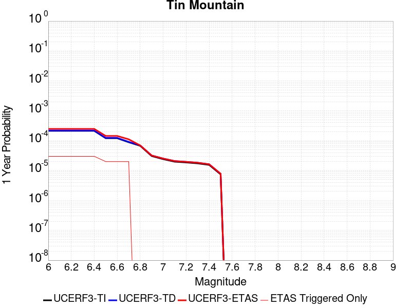 |  |

| Magnitude | 1 wk TI Prob | 1 wk TD Prob | 1 wk ETAS Prob | 1 wk ETAS/TD Gain | 1 wk ETAS Triggered Only | 1 mo TI Prob | 1 mo TD Prob | 1 mo ETAS Prob | 1 mo ETAS/TD Gain | 1 mo ETAS Triggered Only | 1 yr TI Prob | 1 yr TD Prob | 1 yr ETAS Prob | 1 yr ETAS/TD Gain | 1 yr ETAS Triggered Only | 10 yr TI Prob | 10 yr TD Prob | 10 yr ETAS Prob | 10 yr ETAS/TD Gain | 10 yr ETAS Triggered Only |
|-----|-----|-----|-----|-----|-----|-----|-----|-----|-----|-----|-----|-----|-----|-----|-----|-----|-----|-----|-----|-----|
| 6.0 | 4.083776E-6 | 4.18159E-6 | 4.18159E-6 | 1.0 | 0.0 | 1.750178E-5 | 1.7920998E-5 | 1.7920998E-5 | 1.0 | 0.0 | 2.1306332E-4 | 2.1817003E-4 | 2.1817003E-4 | 1.0 | 0.0 | 0.0021285915 | 0.0021799242 | 0.0022272277 | 1.0216997 | 4.7406844E-5 |
| 6.1 | 4.083776E-6 | 4.18159E-6 | 4.18159E-6 | 1.0 | 0.0 | 1.750178E-5 | 1.7920998E-5 | 1.7920998E-5 | 1.0 | 0.0 | 2.1306332E-4 | 2.1817003E-4 | 2.1817003E-4 | 1.0 | 0.0 | 0.0021285915 | 0.0021799242 | 0.0022272277 | 1.0216997 | 4.7406844E-5 |
| 6.2 | 4.083776E-6 | 4.18159E-6 | 4.18159E-6 | 1.0 | 0.0 | 1.750178E-5 | 1.7920998E-5 | 1.7920998E-5 | 1.0 | 0.0 | 2.1306332E-4 | 2.1817003E-4 | 2.1817003E-4 | 1.0 | 0.0 | 0.0021285915 | 0.0021799242 | 0.0022272277 | 1.0216997 | 4.7406844E-5 |
| 6.3 | 4.083776E-6 | 4.18159E-6 | 4.18159E-6 | 1.0 | 0.0 | 1.750178E-5 | 1.7920998E-5 | 1.7920998E-5 | 1.0 | 0.0 | 2.1306332E-4 | 2.1817003E-4 | 2.1817003E-4 | 1.0 | 0.0 | 0.0021285915 | 0.0021799242 | 0.0022272277 | 1.0216997 | 4.7406844E-5 |
| 6.4 | 4.083776E-6 | 4.18159E-6 | 4.18159E-6 | 1.0 | 0.0 | 1.750178E-5 | 1.7920998E-5 | 1.7920998E-5 | 1.0 | 0.0 | 2.1306332E-4 | 2.1817003E-4 | 2.1817003E-4 | 1.0 | 0.0 | 0.0021285915 | 0.0021799242 | 0.0022272277 | 1.0216997 | 4.7406844E-5 |
| 6.5 | 2.3143427E-6 | 2.3731893E-6 | 2.3731893E-6 | 1.0 | 0.0 | 9.9185745E-6 | 1.01707765E-5 | 1.01707765E-5 | 1.0 | 0.0 | 1.2075195E-4 | 1.2382293E-4 | 1.2382293E-4 | 1.0 | 0.0 | 0.0012068636 | 0.0012376154 | 0.0012849636 | 1.0382576 | 4.7406844E-5 |
| 6.6 | 2.3143427E-6 | 2.3731893E-6 | 2.3731893E-6 | 1.0 | 0.0 | 9.9185745E-6 | 1.01707765E-5 | 1.01707765E-5 | 1.0 | 0.0 | 1.2075195E-4 | 1.2382293E-4 | 1.2382293E-4 | 1.0 | 0.0 | 0.0012068636 | 0.0012376154 | 0.0012849636 | 1.0382576 | 4.7406844E-5 |
| 6.7 | 1.7029532E-6 | 1.7498172E-6 | 1.7498172E-6 | 1.0 | 0.0 | 7.2983503E-6 | 7.499198E-6 | 7.499198E-6 | 1.0 | 0.0 | 8.885379E-5 | 9.1299444E-5 | 9.1299444E-5 | 1.0 | 0.0 | 8.881827E-4 | 9.12672E-4 | 9.600356E-4 | 1.0518955 | 4.7406844E-5 |
| 6.8 | 1.2914646E-6 | 1.329959E-6 | 1.329959E-6 | 1.0 | 0.0 | 5.534837E-6 | 5.699814E-6 | 5.699814E-6 | 1.0 | 0.0 | 6.738455E-5 | 6.939347E-5 | 6.939347E-5 | 1.0 | 0.0 | 6.736412E-4 | 6.937614E-4 | 6.937614E-4 | 1.0 | 0.0 |
| 6.9 | 5.8708974E-7 | 6.11713E-7 | 6.11713E-7 | 1.0 | 0.0 | 2.5160964E-6 | 2.6216248E-6 | 2.6216248E-6 | 1.0 | 0.0 | 3.0633044E-5 | 3.1917854E-5 | 3.1917854E-5 | 1.0 | 0.0 | 3.0628822E-4 | 3.1913683E-4 | 3.1913683E-4 | 1.0 | 0.0 |
| 7.0 | 4.6248786E-7 | 4.8321306E-7 | 4.8321306E-7 | 1.0 | 0.0 | 1.9820893E-6 | 2.0709115E-6 | 2.0709115E-6 | 1.0 | 0.0 | 2.413167E-5 | 2.5213094E-5 | 2.5213094E-5 | 1.0 | 0.0 | 2.412905E-4 | 2.5210602E-4 | 2.5210602E-4 | 1.0 | 0.0 |
| 7.1 | 3.804606E-7 | 3.9872486E-7 | 3.9872486E-7 | 1.0 | 0.0 | 1.6305444E-6 | 1.7088199E-6 | 1.7088199E-6 | 1.0 | 0.0 | 1.9851697E-5 | 2.0804719E-5 | 2.0804719E-5 | 1.0 | 0.0 | 1.9849923E-4 | 2.0803107E-4 | 2.0803107E-4 | 1.0 | 0.0 |
| 7.2 | 3.5864858E-7 | 3.7617838E-7 | 3.7617838E-7 | 1.0 | 0.0 | 1.5370645E-6 | 1.6121922E-6 | 1.6121922E-6 | 1.0 | 0.0 | 1.87136E-5 | 1.9628298E-5 | 1.9628298E-5 | 1.0 | 0.0 | 1.8712023E-4 | 1.9626896E-4 | 1.9626896E-4 | 1.0 | 0.0 |
| 7.3 | 3.342063E-7 | 3.5064386E-7 | 3.5064386E-7 | 1.0 | 0.0 | 1.4323119E-6 | 1.5027588E-6 | 1.5027588E-6 | 1.0 | 0.0 | 1.7438259E-5 | 1.8295968E-5 | 1.8295968E-5 | 1.0 | 0.0 | 1.743689E-4 | 1.8294792E-4 | 1.8294792E-4 | 1.0 | 0.0 |
| 7.4 | 2.971242E-7 | 3.1166627E-7 | 3.1166627E-7 | 1.0 | 0.0 | 1.2733886E-6 | 1.3357121E-6 | 1.3357121E-6 | 1.0 | 0.0 | 1.5503398E-5 | 1.6262207E-5 | 1.6262207E-5 | 1.0 | 0.0 | 1.5502315E-4 | 1.6261345E-4 | 1.6261345E-4 | 1.0 | 0.0 |
| 7.5 | 1.4326713E-7 | 1.5012905E-7 | 1.5012905E-7 | 1.0 | 0.0 | 6.140018E-7 | 6.434102E-7 | 6.434102E-7 | 1.0 | 0.0 | 7.4754466E-6 | 7.83352E-6 | 7.83352E-6 | 1.0 | 0.0 | 7.475195E-5 | 7.833519E-5 | 7.833519E-5 | 1.0 | 0.0 |

## Owens Valley
*[(top)](#table-of-contents)*

| 1 Week | 1 Month | 1 Year | 10 Year |
|-----|-----|-----|-----|
|  |  |  |  |

| Magnitude | 1 wk TI Prob | 1 wk TD Prob | 1 wk ETAS Prob | 1 wk ETAS/TD Gain | 1 wk ETAS Triggered Only | 1 mo TI Prob | 1 mo TD Prob | 1 mo ETAS Prob | 1 mo ETAS/TD Gain | 1 mo ETAS Triggered Only | 1 yr TI Prob | 1 yr TD Prob | 1 yr ETAS Prob | 1 yr ETAS/TD Gain | 1 yr ETAS Triggered Only | 10 yr TI Prob | 10 yr TD Prob | 10 yr ETAS Prob | 10 yr ETAS/TD Gain | 10 yr ETAS Triggered Only |
|-----|-----|-----|-----|-----|-----|-----|-----|-----|-----|-----|-----|-----|-----|-----|-----|-----|-----|-----|-----|-----|
| 6.0 | 4.83821E-5 | 3.6298834E-6 | 3.6298834E-6 | 1.0 | 0.0 | 2.0733538E-4 | 1.5556556E-5 | 6.296267E-5 | 4.0473394 | 4.7406844E-5 | 0.002521386 | 1.893856E-4 | 2.3678347E-4 | 1.2502718 | 4.7406844E-5 | 0.024929691 | 0.0019267192 | 0.0019740346 | 1.0245576 | 4.7406844E-5 |
| 6.1 | 4.83821E-5 | 3.6298834E-6 | 3.6298834E-6 | 1.0 | 0.0 | 2.0733538E-4 | 1.5556556E-5 | 6.296267E-5 | 4.0473394 | 4.7406844E-5 | 0.002521386 | 1.893856E-4 | 2.3678347E-4 | 1.2502718 | 4.7406844E-5 | 0.024929691 | 0.0019267192 | 0.0019740346 | 1.0245576 | 4.7406844E-5 |
| 6.2 | 4.83821E-5 | 3.6298834E-6 | 3.6298834E-6 | 1.0 | 0.0 | 2.0733538E-4 | 1.5556556E-5 | 6.296267E-5 | 4.0473394 | 4.7406844E-5 | 0.002521386 | 1.893856E-4 | 2.3678347E-4 | 1.2502718 | 4.7406844E-5 | 0.024929691 | 0.0019267192 | 0.0019740346 | 1.0245576 | 4.7406844E-5 |
| 6.3 | 3.953008E-5 | 3.1571942E-6 | 3.1571942E-6 | 1.0 | 0.0 | 1.6940363E-4 | 1.3530766E-5 | 6.093697E-5 | 4.503586 | 4.7406844E-5 | 0.002060538 | 1.6472537E-4 | 2.121244E-4 | 1.2877458 | 4.7406844E-5 | 0.020415364 | 0.0016601578 | 0.0017074859 | 1.0285082 | 4.7406844E-5 |
| 6.4 | 3.953008E-5 | 3.1571942E-6 | 3.1571942E-6 | 1.0 | 0.0 | 1.6940363E-4 | 1.3530766E-5 | 6.093697E-5 | 4.503586 | 4.7406844E-5 | 0.002060538 | 1.6472537E-4 | 2.121244E-4 | 1.2877458 | 4.7406844E-5 | 0.020415364 | 0.0016601578 | 0.0017074859 | 1.0285082 | 4.7406844E-5 |
| 6.5 | 3.457342E-5 | 2.9727623E-6 | 2.9727623E-6 | 1.0 | 0.0 | 1.4816338E-4 | 1.2740352E-5 | 6.0146594E-5 | 4.7209525 | 4.7406844E-5 | 0.0018023965 | 1.5510344E-4 | 2.0250292E-4 | 1.3055992 | 4.7406844E-5 | 0.017878477 | 0.0015563503 | 0.0016036832 | 1.0304129 | 4.7406844E-5 |
| 6.6 | 3.1127765E-5 | 2.8753116E-6 | 2.8753116E-6 | 1.0 | 0.0 | 1.3339789E-4 | 1.232271E-5 | 5.9728973E-5 | 4.8470645 | 4.7406844E-5 | 0.0016229092 | 1.5001935E-4 | 1.9741908E-4 | 1.3159574 | 4.7406844E-5 | 0.016111081 | 0.0015016922 | 0.0015490279 | 1.0315216 | 4.7406844E-5 |
| 6.7 | 2.806885E-5 | 2.8110242E-6 | 2.8110242E-6 | 1.0 | 0.0 | 1.2028952E-4 | 1.2047194E-5 | 5.945347E-5 | 4.9350467 | 4.7406844E-5 | 0.001463541 | 1.466654E-4 | 1.940653E-4 | 1.3231839 | 4.7406844E-5 | 0.014539397 | 0.0014660707 | 0.0015134079 | 1.0322886 | 4.7406844E-5 |
| 6.8 | 2.524524E-5 | 2.2358972E-6 | 2.2358972E-6 | 1.0 | 0.0 | 1.0818939E-4 | 9.582383E-6 | 5.6988774E-5 | 5.947244 | 4.7406844E-5 | 0.0013164099 | 1.16659576E-4 | 1.6406088E-4 | 1.4063216 | 4.7406844E-5 | 0.01308639 | 0.001166257 | 0.0012136085 | 1.0406013 | 4.7406844E-5 |
| 6.9 | 2.2704568E-5 | 1.6085578E-6 | 1.6085578E-6 | 1.0 | 0.0 | 9.730166E-5 | 6.893801E-6 | 5.430032E-5 | 7.876688 | 4.7406844E-5 | 0.0011840039 | 8.392881E-5 | 1.3133168E-4 | 1.5647985 | 4.7406844E-5 | 0.011777153 | 8.391837E-4 | 8.8655076E-4 | 1.0564442 | 4.7406844E-5 |
| 7.0 | 2.0871712E-5 | 1.5399135E-6 | 1.5399135E-6 | 1.0 | 0.0 | 8.944713E-5 | 6.5996123E-6 | 5.4006145E-5 | 8.183229 | 4.7406844E-5 | 0.0010884746 | 8.034734E-5 | 1.2775038E-4 | 1.5899764 | 4.7406844E-5 | 0.010831586 | 8.0335594E-4 | 8.507247E-4 | 1.0589637 | 4.7406844E-5 |
| 7.1 | 1.944928E-5 | 1.3867325E-6 | 1.3867325E-6 | 1.0 | 0.0 | 8.335139E-5 | 5.943126E-6 | 5.334969E-5 | 8.976706 | 4.7406844E-5 | 0.0010143308 | 7.2355164E-5 | 1.1975858E-4 | 1.655149 | 4.7406844E-5 | 0.010097133 | 7.23475E-4 | 7.7084755E-4 | 1.0654792 | 4.7406844E-5 |
| 7.2 | 1.7876306E-5 | 1.249191E-6 | 1.249191E-6 | 1.0 | 0.0 | 7.6610486E-5 | 5.3536646E-6 | 5.2760257E-5 | 9.8549795 | 4.7406844E-5 | 9.3233347E-4 | 6.517892E-5 | 1.1258268E-4 | 1.7272866 | 4.7406844E-5 | 0.009284316 | 6.517364E-4 | 6.9911237E-4 | 1.0726919 | 4.7406844E-5 |
| 7.3 | 1.2618672E-5 | 1.1117779E-6 | 1.1117779E-6 | 1.0 | 0.0 | 5.40789E-5 | 4.764754E-6 | 5.2171374E-5 | 10.949437 | 4.7406844E-5 | 6.582117E-4 | 5.8009344E-5 | 1.0541344E-4 | 1.8171804 | 4.7406844E-5 | 0.0065626553 | 5.800754E-4 | 6.274547E-4 | 1.0816779 | 4.7406844E-5 |
| 7.4 | 7.4874442E-6 | 8.550806E-7 | 8.550806E-7 | 1.0 | 0.0 | 3.208865E-5 | 3.6646259E-6 | 5.1071296E-5 | 13.936293 | 4.7406844E-5 | 3.906093E-4 | 4.461591E-5 | 9.2020644E-5 | 2.0625074 | 4.7406844E-5 | 0.003899234 | 4.461625E-4 | 4.935482E-4 | 1.1062073 | 4.7406844E-5 |
| 7.5 | 2.4734156E-6 | 6.0700546E-7 | 6.0700546E-7 | 1.0 | 0.0 | 1.060031E-5 | 2.6014495E-6 | 5.0008173E-5 | 19.223196 | 4.7406844E-5 | 1.2905113E-4 | 3.167219E-5 | 7.907753E-5 | 2.4967499 | 4.7406844E-5 | 0.0012897621 | 3.166771E-4 | 3.6406892E-4 | 1.1496536 | 4.7406844E-5 |
| 7.6 | 1.1328841E-6 | 3.1972448E-7 | 3.1972448E-7 | 1.0 | 0.0 | 4.8552088E-6 | 1.3702471E-6 | 4.8777027E-5 | 35.597248 | 4.7406844E-5 | 5.9110564E-5 | 1.6682632E-5 | 6.408869E-5 | 3.8416412 | 4.7406844E-5 | 5.9094845E-4 | 1.6681399E-4 | 2.1421292E-4 | 1.2841425 | 4.7406844E-5 |
| 7.7 | 4.8613185E-7 | 8.967469E-8 | 8.967469E-8 | 1.0 | 0.0 | 2.0834207E-6 | 3.8432006E-7 | 3.8432006E-7 | 1.0 | 0.0 | 2.536535E-5 | 4.6790874E-6 | 4.6790874E-6 | 1.0 | 0.0 | 2.5362454E-4 | 4.678996E-5 | 4.678996E-5 | 1.0 | 0.0 |

## San Andreas (Peninsula) 2011 CFM
*[(top)](#table-of-contents)*

| 1 Week | 1 Month | 1 Year | 10 Year |
|-----|-----|-----|-----|
|  |  |  |  |

| Magnitude | 1 wk TI Prob | 1 wk TD Prob | 1 wk ETAS Prob | 1 wk ETAS/TD Gain | 1 wk ETAS Triggered Only | 1 mo TI Prob | 1 mo TD Prob | 1 mo ETAS Prob | 1 mo ETAS/TD Gain | 1 mo ETAS Triggered Only | 1 yr TI Prob | 1 yr TD Prob | 1 yr ETAS Prob | 1 yr ETAS/TD Gain | 1 yr ETAS Triggered Only | 10 yr TI Prob | 10 yr TD Prob | 10 yr ETAS Prob | 10 yr ETAS/TD Gain | 10 yr ETAS Triggered Only |
|-----|-----|-----|-----|-----|-----|-----|-----|-----|-----|-----|-----|-----|-----|-----|-----|-----|-----|-----|-----|-----|
| 6.0 | 8.6200685E-5 | 2.5333706E-5 | 7.273935E-5 | 2.871248 | 4.7406844E-5 | 3.6937918E-4 | 1.08568514E-4 | 1.559702E-4 | 1.4366063 | 4.7406844E-5 | 0.0044879215 | 0.0013210218 | 0.0013683661 | 1.0358391 | 4.7406844E-5 | 0.043983612 | 0.014838956 | 0.014885659 | 1.0031474 | 4.7406844E-5 |
| 6.1 | 8.6200685E-5 | 2.5333706E-5 | 7.273935E-5 | 2.871248 | 4.7406844E-5 | 3.6937918E-4 | 1.08568514E-4 | 1.559702E-4 | 1.4366063 | 4.7406844E-5 | 0.0044879215 | 0.0013210218 | 0.0013683661 | 1.0358391 | 4.7406844E-5 | 0.043983612 | 0.014838956 | 0.014885659 | 1.0031474 | 4.7406844E-5 |
| 6.2 | 8.6200685E-5 | 2.5333706E-5 | 7.273935E-5 | 2.871248 | 4.7406844E-5 | 3.6937918E-4 | 1.08568514E-4 | 1.559702E-4 | 1.4366063 | 4.7406844E-5 | 0.0044879215 | 0.0013210218 | 0.0013683661 | 1.0358391 | 4.7406844E-5 | 0.043983612 | 0.014838956 | 0.014885659 | 1.0031474 | 4.7406844E-5 |
| 6.3 | 8.551163E-5 | 2.5024961E-5 | 7.243062E-5 | 2.894335 | 4.7406844E-5 | 3.6642692E-4 | 1.0724543E-4 | 1.5464719E-4 | 1.4419934 | 4.7406844E-5 | 0.004452125 | 0.0013049326 | 0.0013522777 | 1.0362816 | 4.7406844E-5 | 0.043639794 | 0.014665611 | 0.0147123225 | 1.0031852 | 4.7406844E-5 |
| 6.4 | 8.551163E-5 | 2.5024961E-5 | 7.243062E-5 | 2.894335 | 4.7406844E-5 | 3.6642692E-4 | 1.0724543E-4 | 1.5464719E-4 | 1.4419934 | 4.7406844E-5 | 0.004452125 | 0.0013049326 | 0.0013522777 | 1.0362816 | 4.7406844E-5 | 0.043639794 | 0.014665611 | 0.0147123225 | 1.0031852 | 4.7406844E-5 |
| 6.5 | 8.511146E-5 | 2.4846031E-5 | 7.22517E-5 | 2.9079776 | 4.7406844E-5 | 3.647124E-4 | 1.0647865E-4 | 1.5388045E-4 | 1.4451765 | 4.7406844E-5 | 0.004431336 | 0.0012956082 | 0.0013429536 | 1.036543 | 4.7406844E-5 | 0.04344007 | 0.014565198 | 0.014611914 | 1.0032074 | 4.7406844E-5 |
| 6.6 | 8.4985084E-5 | 2.477655E-5 | 7.218222E-5 | 2.9133282 | 4.7406844E-5 | 3.6417096E-4 | 1.061809E-4 | 1.5358272E-4 | 1.4464251 | 4.7406844E-5 | 0.0044247704 | 0.0012919875 | 0.001339333 | 1.0366455 | 4.7406844E-5 | 0.043376986 | 0.014527207 | 0.014573925 | 1.0032159 | 4.7406844E-5 |
| 6.7 | 8.462618E-5 | 2.4604726E-5 | 7.201041E-5 | 2.92669 | 4.7406844E-5 | 3.6263323E-4 | 1.05444575E-4 | 1.5284642E-4 | 1.4495428 | 4.7406844E-5 | 0.004406125 | 0.0012830333 | 0.0013303793 | 1.0369016 | 4.7406844E-5 | 0.043197807 | 0.01443185 | 0.014478573 | 1.0032375 | 4.7406844E-5 |
| 6.8 | 8.42337E-5 | 2.4500272E-5 | 7.190595E-5 | 2.9349043 | 4.7406844E-5 | 3.6095164E-4 | 1.0499695E-4 | 1.5239882E-4 | 1.4514595 | 4.7406844E-5 | 0.004385734 | 0.0012775898 | 0.0013249362 | 1.0370591 | 4.7406844E-5 | 0.043001823 | 0.014372395 | 0.014419121 | 1.0032511 | 4.7406844E-5 |
| 6.9 | 8.365989E-5 | 2.4304522E-5 | 7.1710216E-5 | 2.9504888 | 4.7406844E-5 | 3.5849313E-4 | 1.0415808E-4 | 1.5155999E-4 | 1.4550958 | 4.7406844E-5 | 0.004355922 | 0.0012673886 | 0.0013147353 | 1.0373577 | 4.7406844E-5 | 0.04271523 | 0.014264696 | 0.014311427 | 1.003276 | 4.7406844E-5 |
| 7.0 | 8.30936E-5 | 2.4065685E-5 | 7.147139E-5 | 2.9698465 | 4.7406844E-5 | 3.560668E-4 | 1.0313458E-4 | 1.5053654E-4 | 1.4596126 | 4.7406844E-5 | 0.004326499 | 0.0012549418 | 0.0013022892 | 1.0377287 | 4.7406844E-5 | 0.042432297 | 0.0141355125 | 0.01418225 | 1.0033064 | 4.7406844E-5 |
| 7.1 | 8.041264E-5 | 2.3751329E-5 | 7.115705E-5 | 2.9959188 | 4.7406844E-5 | 3.4458007E-4 | 1.01787446E-4 | 1.4918947E-4 | 1.4656961 | 4.7406844E-5 | 0.0041871946 | 0.0012385593 | 0.0012859073 | 1.0382284 | 4.7406844E-5 | 0.041091725 | 0.013957874 | 0.01400462 | 1.0033491 | 4.7406844E-5 |
| 7.2 | 7.8427016E-5 | 2.3174005E-5 | 7.057975E-5 | 3.0456433 | 4.7406844E-5 | 3.3607247E-4 | 9.931339E-5 | 1.4671552E-4 | 1.4772986 | 4.7406844E-5 | 0.004084008 | 0.0012084715 | 0.001255821 | 1.0391814 | 4.7406844E-5 | 0.040097635 | 0.013641416 | 0.013688176 | 1.0034279 | 4.7406844E-5 |
| 7.3 | 7.721087E-5 | 2.2958477E-5 | 7.0364236E-5 | 3.0648477 | 4.7406844E-5 | 3.3086175E-4 | 9.838976E-5 | 1.4579194E-4 | 1.4817796 | 4.7406844E-5 | 0.004020803 | 0.0011972387 | 0.0012445889 | 1.0395495 | 4.7406844E-5 | 0.03948827 | 0.013524936 | 0.013571701 | 1.0034578 | 4.7406844E-5 |
| 7.4 | 7.3536525E-5 | 2.1064485E-5 | 6.8470334E-5 | 3.2505107 | 4.7406844E-5 | 3.1511846E-4 | 9.027325E-5 | 1.3767582E-4 | 1.525101 | 4.7406844E-5 | 0.0038298194 | 0.001098524 | 0.0011458787 | 1.0431076 | 4.7406844E-5 | 0.037644852 | 0.01247618 | 0.012522995 | 1.0037524 | 4.7406844E-5 |
| 7.5 | 6.806207E-5 | 1.8855704E-5 | 6.626166E-5 | 3.5141437 | 4.7406844E-5 | 2.9166197E-4 | 8.080766E-5 | 1.2821068E-4 | 1.5866153 | 4.7406844E-5 | 0.0035452035 | 9.833903E-4 | 0.0010307506 | 1.0481602 | 4.7406844E-5 | 0.034891766 | 0.011221583 | 0.011268458 | 1.0041772 | 4.7406844E-5 |
| 7.6 | 5.6731416E-5 | 1.4235568E-5 | 6.164174E-5 | 4.3301215 | 4.7406844E-5 | 2.43112E-4 | 6.100815E-5 | 1.084121E-4 | 1.7770102 | 4.7406844E-5 | 0.0029558712 | 7.4252125E-4 | 7.898929E-4 | 1.0637984 | 4.7406844E-5 | 0.02916862 | 0.008518306 | 0.0085653085 | 1.0055178 | 4.7406844E-5 |
| 7.7 | 4.946994E-5 | 1.3298509E-5 | 6.0704726E-5 | 4.564777 | 4.7406844E-5 | 2.1199681E-4 | 5.6992365E-5 | 1.0439651E-4 | 1.831763 | 4.7406844E-5 | 0.002578006 | 6.936613E-4 | 7.410352E-4 | 1.0682955 | 4.7406844E-5 | 0.02548303 | 0.007937518 | 0.007984549 | 1.005925 | 4.7406844E-5 |
| 7.8 | 3.9718198E-5 | 1.3032537E-5 | 6.0438764E-5 | 4.637529 | 4.7406844E-5 | 1.7020974E-4 | 5.585253E-5 | 1.0325673E-4 | 1.8487386 | 4.7406844E-5 | 0.0020703338 | 6.7979255E-4 | 7.271672E-4 | 1.0696899 | 4.7406844E-5 | 0.020511515 | 0.007746509 | 0.0077935485 | 1.0060724 | 4.7406844E-5 |
| 7.9 | 2.4115114E-5 | 1.2229653E-5 | 5.963592E-5 | 4.8763375 | 4.7406844E-5 | 1.0334639E-4 | 5.2411746E-5 | 9.9816105E-5 | 1.9044607 | 4.7406844E-5 | 0.001257516 | 6.3792634E-4 | 6.8530295E-4 | 1.0742666 | 4.7406844E-5 | 0.012504238 | 0.0071830763 | 0.0072301426 | 1.0065523 | 4.7406844E-5 |
| 8.0 | 1.7756569E-5 | 1.144976E-5 | 5.885606E-5 | 5.140375 | 4.7406844E-5 | 7.6097356E-5 | 4.9069477E-5 | 9.6473996E-5 | 1.9660693 | 4.7406844E-5 | 9.260915E-4 | 5.972573E-4 | 6.446358E-4 | 1.0793269 | 4.7406844E-5 | 0.009222416 | 0.006680902 | 0.006727992 | 1.0070485 | 4.7406844E-5 |
| 8.1 | 1.3159258E-5 | 9.77991E-6 | 5.718629E-5 | 5.847323 | 4.7406844E-5 | 5.6395602E-5 | 4.1913227E-5 | 8.9318084E-5 | 2.131024 | 4.7406844E-5 | 6.864001E-4 | 5.101742E-4 | 5.5755686E-4 | 1.0928755 | 4.7406844E-5 | 0.0068428386 | 0.0057076924 | 0.0057548285 | 1.0082583 | 4.7406844E-5 |
| 8.2 | 8.635426E-6 | 5.4872503E-6 | 5.4872503E-6 | 1.0 | 0.0 | 3.700844E-5 | 2.3516575E-5 | 2.3516575E-5 | 1.0 | 0.0 | 4.5048463E-4 | 2.8627677E-4 | 2.8627677E-4 | 1.0 | 0.0 | 0.004495725 | 0.0032556232 | 0.0032556232 | 1.0 | 0.0 |
| 8.3 | 1.983087E-6 | 7.693574E-7 | 7.693574E-7 | 1.0 | 0.0 | 8.498917E-6 | 3.297242E-6 | 3.297242E-6 | 1.0 | 0.0 | 1.034694E-4 | 4.01432E-5 | 4.01432E-5 | 1.0 | 0.0 | 0.0010342124 | 4.7390026E-4 | 4.7390026E-4 | 1.0 | 0.0 |

## Rodgers Creek - Healdsburg 2011 CFM
*[(top)](#table-of-contents)*

| 1 Week | 1 Month | 1 Year | 10 Year |
|-----|-----|-----|-----|
|  |  |  |  |

| Magnitude | 1 wk TI Prob | 1 wk TD Prob | 1 wk ETAS Prob | 1 wk ETAS/TD Gain | 1 wk ETAS Triggered Only | 1 mo TI Prob | 1 mo TD Prob | 1 mo ETAS Prob | 1 mo ETAS/TD Gain | 1 mo ETAS Triggered Only | 1 yr TI Prob | 1 yr TD Prob | 1 yr ETAS Prob | 1 yr ETAS/TD Gain | 1 yr ETAS Triggered Only | 10 yr TI Prob | 10 yr TD Prob | 10 yr ETAS Prob | 10 yr ETAS/TD Gain | 10 yr ETAS Triggered Only |
|-----|-----|-----|-----|-----|-----|-----|-----|-----|-----|-----|-----|-----|-----|-----|-----|-----|-----|-----|-----|-----|
| 6.0 | 7.390182E-5 | 1.3142917E-4 | 1.3142917E-4 | 1.0 | 0.0 | 3.1668364E-4 | 5.631467E-4 | 5.631467E-4 | 1.0 | 0.0 | 0.0038488081 | 0.0068347882 | 0.0068347882 | 1.0 | 0.0 | 0.037828278 | 0.06622128 | 0.066265546 | 1.0006685 | 4.7406844E-5 |
| 6.1 | 7.318768E-5 | 1.3040975E-4 | 1.3040975E-4 | 1.0 | 0.0 | 3.1362378E-4 | 5.587797E-4 | 5.587797E-4 | 1.0 | 0.0 | 0.0038116854 | 0.0067819515 | 0.0067819515 | 1.0 | 0.0 | 0.037469655 | 0.06572582 | 0.06577011 | 1.0006739 | 4.7406844E-5 |
| 6.2 | 7.1379836E-5 | 1.273379E-4 | 1.273379E-4 | 1.0 | 0.0 | 3.058777E-4 | 5.456202E-4 | 5.456202E-4 | 1.0 | 0.0 | 0.003717703 | 0.0066227177 | 0.0066227177 | 1.0 | 0.0 | 0.0365612 | 0.06424386 | 0.06428823 | 1.0006905 | 4.7406844E-5 |
| 6.3 | 6.9255926E-5 | 1.2388272E-4 | 1.2388272E-4 | 1.0 | 0.0 | 2.9677735E-4 | 5.3081836E-4 | 5.3081836E-4 | 1.0 | 0.0 | 0.0036072785 | 0.006443587 | 0.006443587 | 1.0 | 0.0 | 0.035492823 | 0.06257 | 0.06261444 | 1.0007102 | 4.7406844E-5 |
| 6.4 | 6.6757144E-5 | 1.196489E-4 | 1.196489E-4 | 1.0 | 0.0 | 2.8607066E-4 | 5.126806E-4 | 5.126806E-4 | 1.0 | 0.0 | 0.0034773487 | 0.006224091 | 0.006224091 | 1.0 | 0.0 | 0.034234364 | 0.060519043 | 0.06056358 | 1.0007359 | 4.7406844E-5 |
| 6.5 | 6.5735134E-5 | 1.1813918E-4 | 1.1813918E-4 | 1.0 | 0.0 | 2.8169158E-4 | 5.0621293E-4 | 5.0621293E-4 | 1.0 | 0.0 | 0.003424202 | 0.006145812 | 0.006145812 | 1.0 | 0.0 | 0.03371918 | 0.059782747 | 0.05982732 | 1.0007455 | 4.7406844E-5 |
| 6.6 | 6.289601E-5 | 1.1349227E-4 | 1.1349227E-4 | 1.0 | 0.0 | 2.6952647E-4 | 4.8630516E-4 | 4.8630516E-4 | 1.0 | 0.0 | 0.0032765474 | 0.0059047723 | 0.0059047723 | 1.0 | 0.0 | 0.032286562 | 0.0575201 | 0.057564776 | 1.0007768 | 4.7406844E-5 |
| 6.7 | 6.115274E-5 | 1.1066158E-4 | 1.1066158E-4 | 1.0 | 0.0 | 2.6205686E-4 | 4.741781E-4 | 4.741781E-4 | 1.0 | 0.0 | 0.0031858748 | 0.0057579153 | 0.0057579153 | 1.0 | 0.0 | 0.031405866 | 0.056137886 | 0.056182634 | 1.000797 | 4.7406844E-5 |
| 6.8 | 5.9232367E-5 | 1.073346E-4 | 1.073346E-4 | 1.0 | 0.0 | 2.538283E-4 | 4.599247E-4 | 4.599247E-4 | 1.0 | 0.0 | 0.0030859804 | 0.005585283 | 0.005585283 | 1.0 | 0.0 | 0.030434765 | 0.05450447 | 0.05454929 | 1.0008224 | 4.7406844E-5 |
| 6.9 | 5.4030377E-5 | 9.827546E-5 | 9.827546E-5 | 1.0 | 0.0 | 2.315382E-4 | 4.2111287E-4 | 4.2111287E-4 | 1.0 | 0.0 | 0.0028153337 | 0.0051150625 | 0.0051150625 | 1.0 | 0.0 | 0.027799325 | 0.050039466 | 0.0500845 | 1.0009 | 4.7406844E-5 |
| 7.0 | 4.8260714E-5 | 8.745495E-5 | 8.745495E-5 | 1.0 | 0.0 | 2.0681522E-4 | 3.7475338E-4 | 3.7475338E-4 | 1.0 | 0.0 | 0.0025150678 | 0.0045531313 | 0.0045531313 | 1.0 | 0.0 | 0.024867928 | 0.044691484 | 0.044736773 | 1.0010134 | 4.7406844E-5 |
| 7.1 | 4.0294493E-5 | 7.3932846E-5 | 7.3932846E-5 | 1.0 | 0.0 | 1.7267925E-4 | 3.168168E-4 | 3.168168E-4 | 1.0 | 0.0 | 0.0021003427 | 0.0038504603 | 0.0038504603 | 1.0 | 0.0 | 0.02080602 | 0.03794385 | 0.037989456 | 1.001202 | 4.7406844E-5 |
| 7.2 | 3.096388E-5 | 5.7018166E-5 | 5.7018166E-5 | 1.0 | 0.0 | 1.326956E-4 | 2.443408E-4 | 2.443408E-4 | 1.0 | 0.0 | 0.0016143717 | 0.002970813 | 0.002970813 | 1.0 | 0.0 | 0.01602694 | 0.029456772 | 0.029456772 | 1.0 | 0.0 |
| 7.3 | 2.3615226E-5 | 4.366579E-5 | 4.366579E-5 | 1.0 | 0.0 | 1.0120418E-4 | 1.8712576E-4 | 1.8712576E-4 | 1.0 | 0.0 | 0.0012314644 | 0.0022758893 | 0.0022758893 | 1.0 | 0.0 | 0.0122466255 | 0.022655508 | 0.022655508 | 1.0 | 0.0 |
| 7.4 | 1.8251132E-5 | 3.3575096E-5 | 3.3575096E-5 | 1.0 | 0.0 | 7.821679E-5 | 1.438854E-4 | 1.438854E-4 | 1.0 | 0.0 | 9.518733E-4 | 0.0017504068 | 0.0017504068 | 1.0 | 0.0 | 0.009478063 | 0.017482331 | 0.017482331 | 1.0 | 0.0 |
| 7.5 | 1.2411432E-5 | 2.2486745E-5 | 2.2486745E-5 | 1.0 | 0.0 | 5.3190768E-5 | 9.636824E-5 | 9.636824E-5 | 1.0 | 0.0 | 6.4740516E-4 | 0.0011726576 | 0.0011726576 | 1.0 | 0.0 | 0.006455223 | 0.011756561 | 0.011756561 | 1.0 | 0.0 |
| 7.6 | 4.4771446E-6 | 8.09296E-6 | 8.09296E-6 | 1.0 | 0.0 | 1.918762E-5 | 3.4683664E-5 | 3.4683664E-5 | 1.0 | 0.0 | 2.3358424E-4 | 4.22193E-4 | 4.22193E-4 | 1.0 | 0.0 | 0.0023333887 | 0.004250496 | 0.004250496 | 1.0 | 0.0 |
| 7.7 | 2.157941E-7 | 3.539757E-7 | 3.539757E-7 | 1.0 | 0.0 | 9.248315E-7 | 1.5170377E-6 | 1.5170377E-6 | 1.0 | 0.0 | 1.1259765E-5 | 1.8469778E-5 | 1.8469778E-5 | 1.0 | 0.0 | 1.1259195E-4 | 1.9093022E-4 | 1.9093022E-4 | 1.0 | 0.0 |
| 7.8 | 9.9623286E-8 | 1.9936476E-7 | 1.9936476E-7 | 1.0 | 0.0 | 4.269569E-7 | 8.544201E-7 | 8.544201E-7 | 1.0 | 0.0 | 5.1981874E-6 | 1.0402515E-5 | 1.0402515E-5 | 1.0 | 0.0 | 5.198066E-5 | 1.0919859E-4 | 1.0919859E-4 | 1.0 | 0.0 |
| 7.9 | 5.6745257E-8 | 1.1796928E-7 | 1.1796928E-7 | 1.0 | 0.0 | 2.4319394E-7 | 5.055825E-7 | 5.055825E-7 | 1.0 | 0.0 | 2.960882E-6 | 6.1554497E-6 | 6.1554497E-6 | 1.0 | 0.0 | 2.9608427E-5 | 6.482142E-5 | 6.482142E-5 | 1.0 | 0.0 |
| 8.0 | 2.8614323E-8 | 6.590836E-8 | 6.590836E-8 | 1.0 | 0.0 | 1.2263281E-7 | 2.8246436E-7 | 2.8246436E-7 | 1.0 | 0.0 | 1.4930534E-6 | 3.4389982E-6 | 3.4389982E-6 | 1.0 | 0.0 | 1.4930434E-5 | 3.5885336E-5 | 3.5885336E-5 | 1.0 | 0.0 |
| 8.1 | 3.5045191E-9 | 8.981429E-9 | 8.981429E-9 | 1.0 | 0.0 | 1.5019367E-8 | 3.8491837E-8 | 3.8491837E-8 | 1.0 | 0.0 | 1.8286079E-7 | 4.68638E-7 | 4.68638E-7 | 1.0 | 0.0 | 1.8286064E-6 | 4.84019E-6 | 4.84019E-6 | 1.0 | 0.0 |

## Coronado Bank alt1
*[(top)](#table-of-contents)*

| 1 Week | 1 Month | 1 Year | 10 Year |
|-----|-----|-----|-----|
|  |  |  |  |

| Magnitude | 1 wk TI Prob | 1 wk TD Prob | 1 wk ETAS Prob | 1 wk ETAS/TD Gain | 1 wk ETAS Triggered Only | 1 mo TI Prob | 1 mo TD Prob | 1 mo ETAS Prob | 1 mo ETAS/TD Gain | 1 mo ETAS Triggered Only | 1 yr TI Prob | 1 yr TD Prob | 1 yr ETAS Prob | 1 yr ETAS/TD Gain | 1 yr ETAS Triggered Only | 10 yr TI Prob | 10 yr TD Prob | 10 yr ETAS Prob | 10 yr ETAS/TD Gain | 10 yr ETAS Triggered Only |
|-----|-----|-----|-----|-----|-----|-----|-----|-----|-----|-----|-----|-----|-----|-----|-----|-----|-----|-----|-----|-----|
| 6.0 | 7.533492E-5 | 9.39618E-5 | 9.39618E-5 | 1.0 | 0.0 | 3.22824E-4 | 4.0263552E-4 | 4.0263552E-4 | 1.0 | 0.0 | 0.0039233007 | 0.0048915995 | 0.0049387747 | 1.009644 | 4.7406844E-5 | 0.03854755 | 0.04790961 | 0.047954746 | 1.0009421 | 4.7406844E-5 |
| 6.1 | 4.1807285E-5 | 5.049851E-5 | 5.049851E-5 | 1.0 | 0.0 | 1.7916178E-4 | 2.1640482E-4 | 2.1640482E-4 | 1.0 | 0.0 | 0.0021791123 | 0.0026316417 | 0.0026789238 | 1.0179667 | 4.7406844E-5 | 0.021578677 | 0.026013888 | 0.026060062 | 1.0017749 | 4.7406844E-5 |
| 6.2 | 4.1807285E-5 | 5.049851E-5 | 5.049851E-5 | 1.0 | 0.0 | 1.7916178E-4 | 2.1640482E-4 | 2.1640482E-4 | 1.0 | 0.0 | 0.0021791123 | 0.0026316417 | 0.0026789238 | 1.0179667 | 4.7406844E-5 | 0.021578677 | 0.026013888 | 0.026060062 | 1.0017749 | 4.7406844E-5 |
| 6.3 | 3.1793104E-5 | 3.7714894E-5 | 3.7714894E-5 | 1.0 | 0.0 | 1.3624904E-4 | 1.6162546E-4 | 1.6162546E-4 | 1.0 | 0.0 | 0.0016575698 | 0.0019660434 | 0.0020133571 | 1.0240654 | 4.7406844E-5 | 0.016452603 | 0.019490387 | 0.01953687 | 1.0023849 | 4.7406844E-5 |
| 6.4 | 2.9878007E-5 | 3.5339268E-5 | 3.5339268E-5 | 1.0 | 0.0 | 1.2804232E-4 | 1.514454E-4 | 1.514454E-4 | 1.0 | 0.0 | 0.0015578003 | 0.0018423185 | 0.0018896379 | 1.0256847 | 4.7406844E-5 | 0.015469253 | 0.018274212 | 0.018320752 | 1.0025468 | 4.7406844E-5 |
| 6.5 | 2.4512565E-5 | 2.8766724E-5 | 2.8766724E-5 | 1.0 | 0.0 | 1.0504962E-4 | 1.2328029E-4 | 1.2328029E-4 | 1.0 | 0.0 | 0.0012782287 | 0.0014999318 | 0.0015472675 | 1.0315586 | 4.7406844E-5 | 0.012709012 | 0.01490106 | 0.01494776 | 1.003134 | 4.7406844E-5 |
| 6.6 | 2.1317413E-5 | 2.4908924E-5 | 2.4908924E-5 | 1.0 | 0.0 | 9.135714E-5 | 1.06748295E-4 | 1.06748295E-4 | 1.0 | 0.0 | 0.0011117056 | 0.0012989079 | 0.0013462532 | 1.03645 | 4.7406844E-5 | 0.011061605 | 0.012915566 | 0.01296236 | 1.0036231 | 4.7406844E-5 |
| 6.7 | 1.8585655E-5 | 2.163679E-5 | 2.163679E-5 | 1.0 | 0.0 | 7.9650374E-5 | 9.272592E-5 | 9.272592E-5 | 1.0 | 0.0 | 9.6931186E-4 | 0.0011283738 | 0.0011283738 | 1.0 | 0.0 | 0.0096509475 | 0.011228608 | 0.011228608 | 1.0 | 0.0 |
| 6.8 | 1.5862879E-5 | 1.8421075E-5 | 1.8421075E-5 | 1.0 | 0.0 | 6.798199E-5 | 7.894518E-5 | 7.894518E-5 | 1.0 | 0.0 | 8.273665E-4 | 9.60753E-4 | 9.60753E-4 | 1.0 | 0.0 | 0.008242928 | 0.009567977 | 0.009567977 | 1.0 | 0.0 |
| 6.9 | 1.3021509E-5 | 1.50965625E-5 | 1.50965625E-5 | 1.0 | 0.0 | 5.5805274E-5 | 6.4698055E-5 | 6.4698055E-5 | 1.0 | 0.0 | 6.792174E-4 | 7.8743225E-4 | 7.8743225E-4 | 1.0 | 0.0 | 0.006771452 | 0.007848245 | 0.007848245 | 1.0 | 0.0 |
| 7.0 | 1.0974371E-5 | 1.27212E-5 | 1.27212E-5 | 1.0 | 0.0 | 4.7032172E-5 | 5.4518387E-5 | 5.4518387E-5 | 1.0 | 0.0 | 5.7246623E-4 | 6.6357676E-4 | 6.6357676E-4 | 1.0 | 0.0 | 0.0057099373 | 0.006617703 | 0.006617703 | 1.0 | 0.0 |
| 7.1 | 8.766221E-6 | 1.0164713E-5 | 1.0164713E-5 | 1.0 | 0.0 | 3.7568978E-5 | 4.3562424E-5 | 4.3562424E-5 | 1.0 | 0.0 | 4.573063E-4 | 5.302607E-4 | 5.302607E-4 | 1.0 | 0.0 | 0.0045636636 | 0.0052916543 | 0.0052916543 | 1.0 | 0.0 |
| 7.2 | 8.026024E-7 | 8.332054E-7 | 8.332054E-7 | 1.0 | 0.0 | 3.43972E-6 | 3.5708754E-6 | 3.5708754E-6 | 1.0 | 0.0 | 4.1877785E-5 | 4.3474553E-5 | 4.3474553E-5 | 1.0 | 0.0 | 4.1869894E-4 | 4.3466155E-4 | 4.3466155E-4 | 1.0 | 0.0 |
| 7.3 | 3.7293114E-7 | 3.7001894E-7 | 3.7001894E-7 | 1.0 | 0.0 | 1.5982754E-6 | 1.5857945E-6 | 1.5857945E-6 | 1.0 | 0.0 | 1.9458828E-5 | 1.9306877E-5 | 1.9306877E-5 | 1.0 | 0.0 | 1.9457124E-4 | 1.9305207E-4 | 1.9305207E-4 | 1.0 | 0.0 |
| 7.4 | 2.0557036E-7 | 1.9674766E-7 | 1.9674766E-7 | 1.0 | 0.0 | 8.810155E-7 | 8.4320396E-7 | 8.4320396E-7 | 1.0 | 0.0 | 1.0726311E-5 | 1.0265961E-5 | 1.0265961E-5 | 1.0 | 0.0 | 1.0725793E-4 | 1.0265489E-4 | 1.0265489E-4 | 1.0 | 0.0 |
| 7.5 | 6.845446E-8 | 6.2794456E-8 | 6.2794456E-8 | 1.0 | 0.0 | 2.9337625E-7 | 2.6911906E-7 | 2.6911906E-7 | 1.0 | 0.0 | 3.5718497E-6 | 3.2765197E-6 | 3.2765197E-6 | 1.0 | 0.0 | 3.5717923E-5 | 3.2764725E-5 | 3.2764725E-5 | 1.0 | 0.0 |
| 7.6 | 6.0975145E-9 | 5.5318936E-9 | 5.5318936E-9 | 1.0 | 0.0 | 2.6132206E-8 | 2.3708115E-8 | 2.3708115E-8 | 1.0 | 0.0 | 3.1815955E-7 | 2.8864628E-7 | 2.8864628E-7 | 1.0 | 0.0 | 3.181591E-6 | 2.88646E-6 | 2.88646E-6 | 1.0 | 0.0 |

## Hayward (No) 2011 CFM
*[(top)](#table-of-contents)*

| 1 Week | 1 Month | 1 Year | 10 Year |
|-----|-----|-----|-----|
|  |  |  |  |

| Magnitude | 1 wk TI Prob | 1 wk TD Prob | 1 wk ETAS Prob | 1 wk ETAS/TD Gain | 1 wk ETAS Triggered Only | 1 mo TI Prob | 1 mo TD Prob | 1 mo ETAS Prob | 1 mo ETAS/TD Gain | 1 mo ETAS Triggered Only | 1 yr TI Prob | 1 yr TD Prob | 1 yr ETAS Prob | 1 yr ETAS/TD Gain | 1 yr ETAS Triggered Only | 10 yr TI Prob | 10 yr TD Prob | 10 yr ETAS Prob | 10 yr ETAS/TD Gain | 10 yr ETAS Triggered Only |
|-----|-----|-----|-----|-----|-----|-----|-----|-----|-----|-----|-----|-----|-----|-----|-----|-----|-----|-----|-----|-----|
| 6.0 | 9.3068506E-5 | 1.74068E-4 | 1.74068E-4 | 1.0 | 0.0 | 3.9880406E-4 | 7.457933E-4 | 7.457933E-4 | 1.0 | 0.0 | 0.0048446343 | 0.009042277 | 0.009042277 | 1.0 | 0.0 | 0.047403704 | 0.086425416 | 0.08646873 | 1.0005012 | 4.7406844E-5 |
| 6.1 | 9.055486E-5 | 1.6958236E-4 | 1.6958236E-4 | 1.0 | 0.0 | 3.880345E-4 | 7.265799E-4 | 7.265799E-4 | 1.0 | 0.0 | 0.0047140904 | 0.008810335 | 0.008810335 | 1.0 | 0.0 | 0.046153355 | 0.08431842 | 0.08436183 | 1.0005149 | 4.7406844E-5 |
| 6.2 | 9.006742E-5 | 1.6878804E-4 | 1.6878804E-4 | 1.0 | 0.0 | 3.859461E-4 | 7.231776E-4 | 7.231776E-4 | 1.0 | 0.0 | 0.0046887742 | 0.0087693 | 0.0087693 | 1.0 | 0.0 | 0.0459107 | 0.08394261 | 0.08398604 | 1.0005174 | 4.7406844E-5 |
| 6.3 | 8.8336754E-5 | 1.6558412E-4 | 1.6558412E-4 | 1.0 | 0.0 | 3.7853114E-4 | 7.09454E-4 | 7.09454E-4 | 1.0 | 0.0 | 0.004598882 | 0.008603558 | 0.008603558 | 1.0 | 0.0 | 0.04504866 | 0.082435764 | 0.08247926 | 1.0005276 | 4.7406844E-5 |
| 6.4 | 8.526157E-5 | 1.5984823E-4 | 1.5984823E-4 | 1.0 | 0.0 | 3.6535555E-4 | 6.848848E-4 | 6.848848E-4 | 1.0 | 0.0 | 0.0044391346 | 0.008306746 | 0.008306746 | 1.0 | 0.0 | 0.043514993 | 0.07973017 | 0.0797738 | 1.0005472 | 4.7406844E-5 |
| 6.5 | 8.152396E-5 | 1.5317152E-4 | 1.5317152E-4 | 1.0 | 0.0 | 3.493416E-4 | 6.56285E-4 | 6.56285E-4 | 1.0 | 0.0 | 0.0042449418 | 0.007961143 | 0.007961143 | 1.0 | 0.0 | 0.04164765 | 0.07656097 | 0.07660475 | 1.0005718 | 4.7406844E-5 |
| 6.6 | 7.987405E-5 | 1.5021319E-4 | 1.5021319E-4 | 1.0 | 0.0 | 3.4227243E-4 | 6.436127E-4 | 6.436127E-4 | 1.0 | 0.0 | 0.0041592065 | 0.0078079863 | 0.0078079863 | 1.0 | 0.0 | 0.04082218 | 0.07515338 | 0.07519722 | 1.0005834 | 4.7406844E-5 |
| 6.7 | 7.777665E-5 | 1.4660071E-4 | 1.4660071E-4 | 1.0 | 0.0 | 3.332859E-4 | 6.2813814E-4 | 6.2813814E-4 | 1.0 | 0.0 | 0.004050208 | 0.007620921 | 0.007620921 | 1.0 | 0.0 | 0.039771806 | 0.07342759 | 0.07347152 | 1.0005982 | 4.7406844E-5 |
| 6.8 | 7.3284005E-5 | 1.3809837E-4 | 1.3809837E-4 | 1.0 | 0.0 | 3.140365E-4 | 5.917165E-4 | 5.917165E-4 | 1.0 | 0.0 | 0.0038166929 | 0.007180489 | 0.007180489 | 1.0 | 0.0 | 0.037518036 | 0.06933746 | 0.06938157 | 1.0006363 | 4.7406844E-5 |
| 6.9 | 6.458263E-5 | 1.2138554E-4 | 1.2138554E-4 | 1.0 | 0.0 | 2.7675333E-4 | 5.201205E-4 | 5.201205E-4 | 1.0 | 0.0 | 0.0033642664 | 0.006314182 | 0.006314182 | 1.0 | 0.0 | 0.033137884 | 0.0612579 | 0.0613024 | 1.0007265 | 4.7406844E-5 |
| 7.0 | 5.3853604E-5 | 1.00309575E-4 | 1.00309575E-4 | 1.0 | 0.0 | 2.3078074E-4 | 4.2982766E-4 | 4.2982766E-4 | 1.0 | 0.0 | 0.0028061352 | 0.0052206595 | 0.0052206595 | 1.0 | 0.0 | 0.027709642 | 0.05098569 | 0.05103068 | 1.0008824 | 4.7406844E-5 |
| 7.1 | 4.4308683E-5 | 8.175333E-5 | 8.175333E-5 | 1.0 | 0.0 | 1.8988053E-4 | 3.5032458E-4 | 3.5032458E-4 | 1.0 | 0.0 | 0.0023093442 | 0.004256902 | 0.004256902 | 1.0 | 0.0 | 0.022854926 | 0.041847244 | 0.041892666 | 1.0010854 | 4.7406844E-5 |
| 7.2 | 3.295973E-5 | 6.0814917E-5 | 6.0814917E-5 | 1.0 | 0.0 | 1.4124835E-4 | 2.6060943E-4 | 2.6060943E-4 | 1.0 | 0.0 | 0.0017183421 | 0.0031683263 | 0.0031683263 | 1.0 | 0.0 | 0.017051157 | 0.031391077 | 0.031391077 | 1.0 | 0.0 |
| 7.3 | 2.452256E-5 | 4.521987E-5 | 4.521987E-5 | 1.0 | 0.0 | 1.05092455E-4 | 1.9378512E-4 | 1.9378512E-4 | 1.0 | 0.0 | 0.0012787496 | 0.002356795 | 0.002356795 | 1.0 | 0.0 | 0.0127141625 | 0.023460438 | 0.023460438 | 1.0 | 0.0 |
| 7.4 | 1.8829967E-5 | 3.4637967E-5 | 3.4637967E-5 | 1.0 | 0.0 | 8.069736E-5 | 1.4844004E-4 | 1.4844004E-4 | 1.0 | 0.0 | 9.820475E-4 | 0.0018057693 | 0.0018057693 | 1.0 | 0.0 | 0.009777189 | 0.018036935 | 0.018036935 | 1.0 | 0.0 |
| 7.5 | 1.26374125E-5 | 2.2948794E-5 | 2.2948794E-5 | 1.0 | 0.0 | 5.4159216E-5 | 9.83483E-5 | 9.83483E-5 | 1.0 | 0.0 | 6.5918895E-4 | 0.0011967387 | 0.0011967387 | 1.0 | 0.0 | 0.00657237 | 0.012002571 | 0.012002571 | 1.0 | 0.0 |
| 7.6 | 4.666429E-6 | 8.4890125E-6 | 8.4890125E-6 | 1.0 | 0.0 | 1.9998828E-5 | 3.638098E-5 | 3.638098E-5 | 1.0 | 0.0 | 2.4345852E-4 | 4.4284965E-4 | 4.4284965E-4 | 1.0 | 0.0 | 0.0024319198 | 0.004463953 | 0.004463953 | 1.0 | 0.0 |
| 7.7 | 3.8399318E-7 | 7.146951E-7 | 7.146951E-7 | 1.0 | 0.0 | 1.6456839E-6 | 3.0629753E-6 | 3.0629753E-6 | 1.0 | 0.0 | 2.003602E-5 | 3.7291087E-5 | 3.7291087E-5 | 1.0 | 0.0 | 2.0034213E-4 | 3.867874E-4 | 3.867874E-4 | 1.0 | 0.0 |
| 7.8 | 2.5637698E-7 | 5.3775256E-7 | 5.3775256E-7 | 1.0 | 0.0 | 1.098758E-6 | 2.3046516E-6 | 2.3046516E-6 | 1.0 | 0.0 | 1.3377297E-5 | 2.8058774E-5 | 2.8058774E-5 | 1.0 | 0.0 | 1.3376492E-4 | 2.9299298E-4 | 2.9299298E-4 | 1.0 | 0.0 |
| 7.9 | 1.7141245E-7 | 3.7368818E-7 | 3.7368818E-7 | 1.0 | 0.0 | 7.3462456E-7 | 1.6015197E-6 | 1.6015197E-6 | 1.0 | 0.0 | 8.944017E-6 | 1.9498328E-5 | 1.9498328E-5 | 1.0 | 0.0 | 8.943657E-5 | 2.02833E-4 | 2.02833E-4 | 1.0 | 0.0 |
| 8.0 | 1.1808895E-7 | 2.7563618E-7 | 2.7563618E-7 | 1.0 | 0.0 | 5.060954E-7 | 1.1812973E-6 | 1.1812973E-6 | 1.0 | 0.0 | 6.161694E-6 | 1.4382201E-5 | 1.4382201E-5 | 1.0 | 0.0 | 6.161523E-5 | 1.4842243E-4 | 1.4842243E-4 | 1.0 | 0.0 |
| 8.1 | 5.138535E-8 | 1.1250157E-7 | 1.1250157E-7 | 1.0 | 0.0 | 2.2022292E-7 | 4.8214946E-7 | 4.8214946E-7 | 1.0 | 0.0 | 2.6812106E-6 | 5.8701544E-6 | 5.8701544E-6 | 1.0 | 0.0 | 2.6811784E-5 | 6.025778E-5 | 6.025778E-5 | 1.0 | 0.0 |

## Mono Lake 2011 CFM
*[(top)](#table-of-contents)*

| 1 Week | 1 Month | 1 Year | 10 Year |
|-----|-----|-----|-----|
|  |  |  |  |

| Magnitude | 1 wk TI Prob | 1 wk TD Prob | 1 wk ETAS Prob | 1 wk ETAS/TD Gain | 1 wk ETAS Triggered Only | 1 mo TI Prob | 1 mo TD Prob | 1 mo ETAS Prob | 1 mo ETAS/TD Gain | 1 mo ETAS Triggered Only | 1 yr TI Prob | 1 yr TD Prob | 1 yr ETAS Prob | 1 yr ETAS/TD Gain | 1 yr ETAS Triggered Only | 10 yr TI Prob | 10 yr TD Prob | 10 yr ETAS Prob | 10 yr ETAS/TD Gain | 10 yr ETAS Triggered Only |
|-----|-----|-----|-----|-----|-----|-----|-----|-----|-----|-----|-----|-----|-----|-----|-----|-----|-----|-----|-----|-----|
| 6.0 | 2.0341662E-5 | 2.3830333E-5 | 2.3830333E-5 | 1.0 | 0.0 | 8.717564E-5 | 1.02129E-4 | 1.02129E-4 | 1.0 | 0.0 | 0.0010608466 | 0.0012432429 | 0.0012432429 | 1.0 | 0.0 | 0.010557966 | 0.012414961 | 0.01246178 | 1.0037711 | 4.7406844E-5 |
| 6.1 | 2.0341662E-5 | 2.3830333E-5 | 2.3830333E-5 | 1.0 | 0.0 | 8.717564E-5 | 1.02129E-4 | 1.02129E-4 | 1.0 | 0.0 | 0.0010608466 | 0.0012432429 | 0.0012432429 | 1.0 | 0.0 | 0.010557966 | 0.012414961 | 0.01246178 | 1.0037711 | 4.7406844E-5 |
| 6.2 | 2.0341662E-5 | 2.3830333E-5 | 2.3830333E-5 | 1.0 | 0.0 | 8.717564E-5 | 1.02129E-4 | 1.02129E-4 | 1.0 | 0.0 | 0.0010608466 | 0.0012432429 | 0.0012432429 | 1.0 | 0.0 | 0.010557966 | 0.012414961 | 0.01246178 | 1.0037711 | 4.7406844E-5 |
| 6.3 | 2.0341662E-5 | 2.3830333E-5 | 2.3830333E-5 | 1.0 | 0.0 | 8.717564E-5 | 1.02129E-4 | 1.02129E-4 | 1.0 | 0.0 | 0.0010608466 | 0.0012432429 | 0.0012432429 | 1.0 | 0.0 | 0.010557966 | 0.012414961 | 0.01246178 | 1.0037711 | 4.7406844E-5 |
| 6.4 | 1.749821E-5 | 2.0492844E-5 | 2.0492844E-5 | 1.0 | 0.0 | 7.499018E-5 | 8.782648E-5 | 8.782648E-5 | 1.0 | 0.0 | 9.1262296E-4 | 0.0010692873 | 0.0010692873 | 1.0 | 0.0 | 0.009088841 | 0.010692834 | 0.010739734 | 1.0043861 | 4.7406844E-5 |
| 6.5 | 1.749821E-5 | 2.0492844E-5 | 2.0492844E-5 | 1.0 | 0.0 | 7.499018E-5 | 8.782648E-5 | 8.782648E-5 | 1.0 | 0.0 | 9.1262296E-4 | 0.0010692873 | 0.0010692873 | 1.0 | 0.0 | 0.009088841 | 0.010692834 | 0.010739734 | 1.0043861 | 4.7406844E-5 |

## Kern Canyon (South Kern) 2011
*[(top)](#table-of-contents)*

| 1 Week | 1 Month | 1 Year | 10 Year |
|-----|-----|-----|-----|
|  |  |  |  |

| Magnitude | 1 wk TI Prob | 1 wk TD Prob | 1 wk ETAS Prob | 1 wk ETAS/TD Gain | 1 wk ETAS Triggered Only | 1 mo TI Prob | 1 mo TD Prob | 1 mo ETAS Prob | 1 mo ETAS/TD Gain | 1 mo ETAS Triggered Only | 1 yr TI Prob | 1 yr TD Prob | 1 yr ETAS Prob | 1 yr ETAS/TD Gain | 1 yr ETAS Triggered Only | 10 yr TI Prob | 10 yr TD Prob | 10 yr ETAS Prob | 10 yr ETAS/TD Gain | 10 yr ETAS Triggered Only |
|-----|-----|-----|-----|-----|-----|-----|-----|-----|-----|-----|-----|-----|-----|-----|-----|-----|-----|-----|-----|-----|
| 6.0 | 4.105075E-6 | 4.1137673E-6 | 4.1137673E-6 | 1.0 | 0.0 | 1.7593058E-5 | 1.7630317E-5 | 1.7630317E-5 | 1.0 | 0.0 | 2.1417443E-4 | 2.146286E-4 | 2.146286E-4 | 1.0 | 0.0 | 0.0021396813 | 0.002144277 | 0.0021915822 | 1.0220611 | 4.7406844E-5 |
| 6.1 | 4.105075E-6 | 4.1137673E-6 | 4.1137673E-6 | 1.0 | 0.0 | 1.7593058E-5 | 1.7630317E-5 | 1.7630317E-5 | 1.0 | 0.0 | 2.1417443E-4 | 2.146286E-4 | 2.146286E-4 | 1.0 | 0.0 | 0.0021396813 | 0.002144277 | 0.0021915822 | 1.0220611 | 4.7406844E-5 |
| 6.2 | 4.105075E-6 | 4.1137673E-6 | 4.1137673E-6 | 1.0 | 0.0 | 1.7593058E-5 | 1.7630317E-5 | 1.7630317E-5 | 1.0 | 0.0 | 2.1417443E-4 | 2.146286E-4 | 2.146286E-4 | 1.0 | 0.0 | 0.0021396813 | 0.002144277 | 0.0021915822 | 1.0220611 | 4.7406844E-5 |
| 6.3 | 4.105075E-6 | 4.1137673E-6 | 4.1137673E-6 | 1.0 | 0.0 | 1.7593058E-5 | 1.7630317E-5 | 1.7630317E-5 | 1.0 | 0.0 | 2.1417443E-4 | 2.146286E-4 | 2.146286E-4 | 1.0 | 0.0 | 0.0021396813 | 0.002144277 | 0.0021915822 | 1.0220611 | 4.7406844E-5 |
| 6.4 | 4.105075E-6 | 4.1137673E-6 | 4.1137673E-6 | 1.0 | 0.0 | 1.7593058E-5 | 1.7630317E-5 | 1.7630317E-5 | 1.0 | 0.0 | 2.1417443E-4 | 2.146286E-4 | 2.146286E-4 | 1.0 | 0.0 | 0.0021396813 | 0.002144277 | 0.0021915822 | 1.0220611 | 4.7406844E-5 |
| 6.5 | 2.9849807E-6 | 2.9731848E-6 | 2.9731848E-6 | 1.0 | 0.0 | 1.2792712E-5 | 1.2742159E-5 | 1.2742159E-5 | 1.0 | 0.0 | 1.5574014E-4 | 1.5512489E-4 | 1.5512489E-4 | 1.0 | 0.0 | 0.0015563103 | 0.0015501813 | 0.0015975146 | 1.030534 | 4.7406844E-5 |
| 6.6 | 2.9849807E-6 | 2.9731848E-6 | 2.9731848E-6 | 1.0 | 0.0 | 1.2792712E-5 | 1.2742159E-5 | 1.2742159E-5 | 1.0 | 0.0 | 1.5574014E-4 | 1.5512489E-4 | 1.5512489E-4 | 1.0 | 0.0 | 0.0015563103 | 0.0015501813 | 0.0015975146 | 1.030534 | 4.7406844E-5 |
| 6.7 | 2.6756725E-6 | 2.6582477E-6 | 2.6582477E-6 | 1.0 | 0.0 | 1.1467117E-5 | 1.1392441E-5 | 1.1392441E-5 | 1.0 | 0.0 | 1.396032E-4 | 1.3869425E-4 | 1.3869425E-4 | 1.0 | 0.0 | 0.0013951553 | 0.0013860879 | 0.001433429 | 1.0341545 | 4.7406844E-5 |
| 6.8 | 2.3283721E-6 | 2.3048024E-6 | 2.3048024E-6 | 1.0 | 0.0 | 9.9787E-6 | 9.877688E-6 | 9.877688E-6 | 1.0 | 0.0 | 1.214839E-4 | 1.20254284E-4 | 1.20254284E-4 | 1.0 | 0.0 | 0.001214175 | 0.0012018996 | 0.0012492494 | 1.0393958 | 4.7406844E-5 |
| 6.9 | 2.0972677E-6 | 2.0696625E-6 | 2.0696625E-6 | 1.0 | 0.0 | 8.988259E-6 | 8.869953E-6 | 8.869953E-6 | 1.0 | 0.0 | 1.0942656E-4 | 1.0798638E-4 | 1.0798638E-4 | 1.0 | 0.0 | 0.0010937268 | 0.0010793449 | 0.0011267005 | 1.0438745 | 4.7406844E-5 |
| 7.0 | 1.7132242E-6 | 1.6787213E-6 | 1.6787213E-6 | 1.0 | 0.0 | 7.3423685E-6 | 7.1945E-6 | 7.1945E-6 | 1.0 | 0.0 | 8.938967E-5 | 8.758956E-5 | 8.758956E-5 | 1.0 | 0.0 | 8.935372E-4 | 8.755542E-4 | 9.2291954E-4 | 1.0540975 | 4.7406844E-5 |
| 7.1 | 1.4215541E-6 | 1.38159E-6 | 1.38159E-6 | 1.0 | 0.0 | 6.0923603E-6 | 5.9210865E-6 | 5.9210865E-6 | 1.0 | 0.0 | 7.417196E-5 | 7.208687E-5 | 7.208687E-5 | 1.0 | 0.0 | 7.414721E-4 | 7.206376E-4 | 7.680103E-4 | 1.0657371 | 4.7406844E-5 |
| 7.2 | 9.097853E-7 | 8.603873E-7 | 8.603873E-7 | 1.0 | 0.0 | 3.899074E-6 | 3.687369E-6 | 3.687369E-6 | 1.0 | 0.0 | 4.7470192E-5 | 4.48928E-5 | 4.48928E-5 | 1.0 | 0.0 | 4.7460053E-4 | 4.488384E-4 | 4.96224E-4 | 1.1055738 | 4.7406844E-5 |
| 7.3 | 6.144169E-7 | 5.628273E-7 | 5.628273E-7 | 1.0 | 0.0 | 2.6332125E-6 | 2.412115E-6 | 2.412115E-6 | 1.0 | 0.0 | 3.205889E-5 | 2.936711E-5 | 2.936711E-5 | 1.0 | 0.0 | 3.2054266E-4 | 2.936328E-4 | 3.410257E-4 | 1.161402 | 4.7406844E-5 |
| 7.4 | 4.049844E-7 | 3.5728772E-7 | 3.5728772E-7 | 1.0 | 0.0 | 1.7356463E-6 | 1.5312322E-6 | 1.5312322E-6 | 1.0 | 0.0 | 2.1131287E-5 | 1.8642595E-5 | 1.8642595E-5 | 1.0 | 0.0 | 2.1129279E-4 | 1.8641056E-4 | 1.8641056E-4 | 1.0 | 0.0 |
| 7.5 | 1.9871162E-7 | 1.5830682E-7 | 1.5830682E-7 | 1.0 | 0.0 | 8.5162094E-7 | 6.7845764E-7 | 6.7845764E-7 | 1.0 | 0.0 | 1.0368436E-5 | 8.260191E-6 | 8.260191E-6 | 1.0 | 0.0 | 1.0367952E-4 | 8.259893E-5 | 8.259893E-5 | 1.0 | 0.0 |
| 7.6 | 2.572245E-8 | 1.7352884E-8 | 1.7352884E-8 | 1.0 | 0.0 | 1.10239064E-7 | 7.43695E-8 | 7.43695E-8 | 1.0 | 0.0 | 1.3421597E-6 | 9.0544836E-7 | 9.0544836E-7 | 1.0 | 0.0 | 1.3421517E-5 | 9.054452E-6 | 9.054452E-6 | 1.0 | 0.0 |

## Ortigalita (North)
*[(top)](#table-of-contents)*

| 1 Week | 1 Month | 1 Year | 10 Year |
|-----|-----|-----|-----|
|  |  |  |  |

| Magnitude | 1 wk TI Prob | 1 wk TD Prob | 1 wk ETAS Prob | 1 wk ETAS/TD Gain | 1 wk ETAS Triggered Only | 1 mo TI Prob | 1 mo TD Prob | 1 mo ETAS Prob | 1 mo ETAS/TD Gain | 1 mo ETAS Triggered Only | 1 yr TI Prob | 1 yr TD Prob | 1 yr ETAS Prob | 1 yr ETAS/TD Gain | 1 yr ETAS Triggered Only | 10 yr TI Prob | 10 yr TD Prob | 10 yr ETAS Prob | 10 yr ETAS/TD Gain | 10 yr ETAS Triggered Only |
|-----|-----|-----|-----|-----|-----|-----|-----|-----|-----|-----|-----|-----|-----|-----|-----|-----|-----|-----|-----|-----|
| 6.0 | 7.711876E-5 | 1.05086016E-4 | 1.05086016E-4 | 1.0 | 0.0 | 3.3046713E-4 | 4.5030177E-4 | 4.5030177E-4 | 1.0 | 0.0 | 0.004016016 | 0.005468958 | 0.005468958 | 1.0 | 0.0 | 0.039442103 | 0.053463764 | 0.05350864 | 1.0008394 | 4.7406844E-5 |
| 6.1 | 4.607858E-5 | 6.024935E-5 | 6.024935E-5 | 1.0 | 0.0 | 1.9746469E-4 | 2.5818875E-4 | 2.5818875E-4 | 1.0 | 0.0 | 0.0024014818 | 0.003139252 | 0.003139252 | 1.0 | 0.0 | 0.023756953 | 0.030979859 | 0.030979859 | 1.0 | 0.0 |
| 6.2 | 4.607858E-5 | 6.024935E-5 | 6.024935E-5 | 1.0 | 0.0 | 1.9746469E-4 | 2.5818875E-4 | 2.5818875E-4 | 1.0 | 0.0 | 0.0024014818 | 0.003139252 | 0.003139252 | 1.0 | 0.0 | 0.023756953 | 0.030979859 | 0.030979859 | 1.0 | 0.0 |
| 6.3 | 3.327423E-5 | 4.2481566E-5 | 4.2481566E-5 | 1.0 | 0.0 | 1.4259605E-4 | 1.8205289E-4 | 1.8205289E-4 | 1.0 | 0.0 | 0.0017347244 | 0.0022145277 | 0.0022145277 | 1.0 | 0.0 | 0.017212452 | 0.021948816 | 0.021948816 | 1.0 | 0.0 |
| 6.4 | 2.7732503E-5 | 3.5003635E-5 | 3.5003635E-5 | 1.0 | 0.0 | 1.1884817E-4 | 1.5000845E-4 | 1.5000845E-4 | 1.0 | 0.0 | 0.001446016 | 0.0018250674 | 0.0018250674 | 1.0 | 0.0 | 0.014366428 | 0.018123753 | 0.018123753 | 1.0 | 0.0 |
| 6.5 | 2.7689714E-5 | 3.4953442E-5 | 3.4953442E-5 | 1.0 | 0.0 | 1.186648E-4 | 1.4979337E-4 | 1.4979337E-4 | 1.0 | 0.0 | 0.0014437864 | 0.0018224533 | 0.0018224533 | 1.0 | 0.0 | 0.014344421 | 0.018098038 | 0.018098038 | 1.0 | 0.0 |
| 6.6 | 2.2976905E-5 | 2.8722226E-5 | 2.8722226E-5 | 1.0 | 0.0 | 9.846873E-5 | 1.2309088E-4 | 1.2309088E-4 | 1.0 | 0.0 | 0.0011981975 | 0.001497839 | 0.001497839 | 1.0 | 0.0 | 0.011917574 | 0.014900712 | 0.014900712 | 1.0 | 0.0 |
| 6.7 | 1.9871539E-5 | 2.4907882E-5 | 2.4907882E-5 | 1.0 | 0.0 | 8.516096E-5 | 1.067451E-4 | 1.067451E-4 | 1.0 | 0.0 | 0.0010363415 | 0.0012990955 | 0.0012990955 | 1.0 | 0.0 | 0.010315218 | 0.012938703 | 0.012938703 | 1.0 | 0.0 |
| 6.8 | 6.5640475E-6 | 7.6061337E-6 | 7.6061337E-6 | 1.0 | 0.0 | 2.813133E-5 | 3.2597323E-5 | 3.2597323E-5 | 1.0 | 0.0 | 3.424451E-4 | 3.9680302E-4 | 3.9680302E-4 | 1.0 | 0.0 | 0.0034191788 | 0.0039612325 | 0.0039612325 | 1.0 | 0.0 |
| 6.9 | 5.6219683E-6 | 6.5023783E-6 | 6.5023783E-6 | 1.0 | 0.0 | 2.4093928E-5 | 2.7867052E-5 | 2.7867052E-5 | 1.0 | 0.0 | 2.933041E-4 | 3.3923113E-4 | 3.3923113E-4 | 1.0 | 0.0 | 0.0029291727 | 0.00338739 | 0.00338739 | 1.0 | 0.0 |
| 7.0 | 3.875591E-6 | 4.4851295E-6 | 4.4851295E-6 | 1.0 | 0.0 | 1.6609569E-5 | 1.9221854E-5 | 1.9221854E-5 | 1.0 | 0.0 | 2.0220275E-4 | 2.3400305E-4 | 2.3400305E-4 | 1.0 | 0.0 | 0.0020201886 | 0.0023377747 | 0.0023377747 | 1.0 | 0.0 |
| 7.1 | 1.6017933E-6 | 1.857199E-6 | 1.857199E-6 | 1.0 | 0.0 | 6.8648105E-6 | 7.959406E-6 | 7.959406E-6 | 1.0 | 0.0 | 8.357586E-5 | 9.690253E-5 | 9.690253E-5 | 1.0 | 0.0 | 8.3544437E-4 | 9.6870743E-4 | 9.6870743E-4 | 1.0 | 0.0 |

## White Wolf
*[(top)](#table-of-contents)*

| 1 Week | 1 Month | 1 Year | 10 Year |
|-----|-----|-----|-----|
|  |  |  |  |

| Magnitude | 1 wk TI Prob | 1 wk TD Prob | 1 wk ETAS Prob | 1 wk ETAS/TD Gain | 1 wk ETAS Triggered Only | 1 mo TI Prob | 1 mo TD Prob | 1 mo ETAS Prob | 1 mo ETAS/TD Gain | 1 mo ETAS Triggered Only | 1 yr TI Prob | 1 yr TD Prob | 1 yr ETAS Prob | 1 yr ETAS/TD Gain | 1 yr ETAS Triggered Only | 10 yr TI Prob | 10 yr TD Prob | 10 yr ETAS Prob | 10 yr ETAS/TD Gain | 10 yr ETAS Triggered Only |
|-----|-----|-----|-----|-----|-----|-----|-----|-----|-----|-----|-----|-----|-----|-----|-----|-----|-----|-----|-----|-----|
| 6.0 | 2.0037822E-5 | 1.0469729E-6 | 1.0469729E-6 | 1.0 | 0.0 | 8.587355E-5 | 4.4870194E-6 | 4.4870194E-6 | 1.0 | 0.0 | 0.001045009 | 5.462814E-5 | 5.462814E-5 | 1.0 | 0.0 | 0.010401085 | 5.461522E-4 | 5.9353316E-4 | 1.0867541 | 4.7406844E-5 |
| 6.1 | 2.0037822E-5 | 1.0469729E-6 | 1.0469729E-6 | 1.0 | 0.0 | 8.587355E-5 | 4.4870194E-6 | 4.4870194E-6 | 1.0 | 0.0 | 0.001045009 | 5.462814E-5 | 5.462814E-5 | 1.0 | 0.0 | 0.010401085 | 5.461522E-4 | 5.9353316E-4 | 1.0867541 | 4.7406844E-5 |
| 6.2 | 2.0037822E-5 | 1.0469729E-6 | 1.0469729E-6 | 1.0 | 0.0 | 8.587355E-5 | 4.4870194E-6 | 4.4870194E-6 | 1.0 | 0.0 | 0.001045009 | 5.462814E-5 | 5.462814E-5 | 1.0 | 0.0 | 0.010401085 | 5.461522E-4 | 5.9353316E-4 | 1.0867541 | 4.7406844E-5 |
| 6.3 | 2.0037822E-5 | 1.0469729E-6 | 1.0469729E-6 | 1.0 | 0.0 | 8.587355E-5 | 4.4870194E-6 | 4.4870194E-6 | 1.0 | 0.0 | 0.001045009 | 5.462814E-5 | 5.462814E-5 | 1.0 | 0.0 | 0.010401085 | 5.461522E-4 | 5.9353316E-4 | 1.0867541 | 4.7406844E-5 |
| 6.4 | 1.132487E-5 | 1.0469729E-6 | 1.0469729E-6 | 1.0 | 0.0 | 4.8534253E-5 | 4.4870194E-6 | 4.4870194E-6 | 1.0 | 0.0 | 5.907443E-4 | 5.462814E-5 | 5.462814E-5 | 1.0 | 0.0 | 0.005891764 | 5.461522E-4 | 5.9353316E-4 | 1.0867541 | 4.7406844E-5 |
| 6.5 | 1.132487E-5 | 1.0469729E-6 | 1.0469729E-6 | 1.0 | 0.0 | 4.8534253E-5 | 4.4870194E-6 | 4.4870194E-6 | 1.0 | 0.0 | 5.907443E-4 | 5.462814E-5 | 5.462814E-5 | 1.0 | 0.0 | 0.005891764 | 5.461522E-4 | 5.9353316E-4 | 1.0867541 | 4.7406844E-5 |
| 6.6 | 9.347473E-6 | 1.0469729E-6 | 1.0469729E-6 | 1.0 | 0.0 | 4.0059982E-5 | 4.4870194E-6 | 4.4870194E-6 | 1.0 | 0.0 | 4.8762115E-4 | 5.462814E-5 | 5.462814E-5 | 1.0 | 0.0 | 0.0048655253 | 5.461522E-4 | 5.9353316E-4 | 1.0867541 | 4.7406844E-5 |
| 6.7 | 7.842647E-6 | 1.004888E-6 | 1.004888E-6 | 1.0 | 0.0 | 3.361091E-5 | 4.3066557E-6 | 4.3066557E-6 | 1.0 | 0.0 | 4.0913603E-4 | 5.2432322E-5 | 5.2432322E-5 | 1.0 | 0.0 | 0.004083836 | 5.2420446E-4 | 5.715865E-4 | 1.0903884 | 4.7406844E-5 |
| 6.8 | 6.26597E-6 | 9.735327E-7 | 9.735327E-7 | 1.0 | 0.0 | 2.685388E-5 | 4.1722765E-6 | 4.1722765E-6 | 1.0 | 0.0 | 3.2689696E-4 | 5.0796334E-5 | 5.0796334E-5 | 1.0 | 0.0 | 0.003264165 | 5.078521E-4 | 5.552349E-4 | 1.0933003 | 4.7406844E-5 |
| 6.9 | 5.258436E-6 | 9.1837234E-7 | 9.1837234E-7 | 1.0 | 0.0 | 2.2535958E-5 | 3.9358756E-6 | 3.9358756E-6 | 1.0 | 0.0 | 2.7434074E-4 | 4.791828E-5 | 4.791828E-5 | 1.0 | 0.0 | 0.0027400232 | 4.790843E-4 | 5.2646844E-4 | 1.0989057 | 4.7406844E-5 |
| 7.0 | 4.675028E-6 | 8.661622E-7 | 8.661622E-7 | 1.0 | 0.0 | 2.003568E-5 | 3.7121188E-6 | 3.7121188E-6 | 1.0 | 0.0 | 2.4390711E-4 | 4.5194156E-5 | 4.5194156E-5 | 1.0 | 0.0 | 0.0024363957 | 4.5185437E-4 | 4.992398E-4 | 1.1048688 | 4.7406844E-5 |
| 7.1 | 2.8270078E-6 | 6.8745294E-7 | 6.8745294E-7 | 1.0 | 0.0 | 1.2115692E-5 | 2.9462237E-6 | 2.9462237E-6 | 1.0 | 0.0 | 1.4749856E-4 | 3.5869725E-5 | 3.5869725E-5 | 1.0 | 0.0 | 0.001474007 | 3.5864345E-4 | 4.060333E-4 | 1.1321363 | 4.7406844E-5 |
| 7.2 | 1.6881406E-6 | 2.270827E-7 | 2.270827E-7 | 1.0 | 0.0 | 7.2348685E-6 | 9.732112E-7 | 9.732112E-7 | 1.0 | 0.0 | 8.808096E-5 | 1.1848783E-5 | 1.1848783E-5 | 1.0 | 0.0 | 8.8046055E-4 | 1.1848167E-4 | 1.1848167E-4 | 1.0 | 0.0 |
| 7.3 | 9.086107E-7 | 1.5267518E-7 | 1.5267518E-7 | 1.0 | 0.0 | 3.8940398E-6 | 6.543221E-7 | 6.543221E-7 | 1.0 | 0.0 | 4.7408903E-5 | 7.966343E-6 | 7.966343E-6 | 1.0 | 0.0 | 4.739879E-4 | 7.9660655E-5 | 7.9660655E-5 | 1.0 | 0.0 |
| 7.4 | 1.9717383E-7 | 9.004186E-8 | 9.004186E-8 | 1.0 | 0.0 | 8.450304E-7 | 3.8589363E-7 | 3.8589363E-7 | 1.0 | 0.0 | 1.0288197E-5 | 4.698245E-6 | 4.698245E-6 | 1.0 | 0.0 | 1.028772E-4 | 4.6981488E-5 | 4.6981488E-5 | 1.0 | 0.0 |
| 7.5 | 1.086975E-7 | 6.65987E-8 | 6.65987E-8 | 1.0 | 0.0 | 4.6584634E-7 | 2.8542297E-7 | 2.8542297E-7 | 1.0 | 0.0 | 5.6716644E-6 | 3.4750192E-6 | 3.4750192E-6 | 1.0 | 0.0 | 5.6715195E-5 | 3.474967E-5 | 3.474967E-5 | 1.0 | 0.0 |
| 7.6 | 2.4217808E-8 | 1.582108E-8 | 1.582108E-8 | 1.0 | 0.0 | 1.03790605E-7 | 6.780462E-8 | 6.780462E-8 | 1.0 | 0.0 | 1.2636499E-6 | 8.25521E-7 | 8.25521E-7 | 1.0 | 0.0 | 1.2636427E-5 | 8.255184E-6 | 8.255184E-6 | 1.0 | 0.0 |

## San Andreas (Santa Cruz Mts) 2011 CFM
*[(top)](#table-of-contents)*

| 1 Week | 1 Month | 1 Year | 10 Year |
|-----|-----|-----|-----|
|  |  |  |  |

| Magnitude | 1 wk TI Prob | 1 wk TD Prob | 1 wk ETAS Prob | 1 wk ETAS/TD Gain | 1 wk ETAS Triggered Only | 1 mo TI Prob | 1 mo TD Prob | 1 mo ETAS Prob | 1 mo ETAS/TD Gain | 1 mo ETAS Triggered Only | 1 yr TI Prob | 1 yr TD Prob | 1 yr ETAS Prob | 1 yr ETAS/TD Gain | 1 yr ETAS Triggered Only | 10 yr TI Prob | 10 yr TD Prob | 10 yr ETAS Prob | 10 yr ETAS/TD Gain | 10 yr ETAS Triggered Only |
|-----|-----|-----|-----|-----|-----|-----|-----|-----|-----|-----|-----|-----|-----|-----|-----|-----|-----|-----|-----|-----|
| 6.0 | 1.7221631E-4 | 1.3823692E-4 | 1.8563721E-4 | 1.3428917 | 4.7406844E-5 | 7.378611E-4 | 5.923115E-4 | 6.3969026E-4 | 1.0799896 | 4.7406844E-5 | 0.008946515 | 0.0071879383 | 0.0072350046 | 1.0065479 | 4.7406844E-5 | 0.08594794 | 0.070697196 | 0.07074125 | 1.0006231 | 4.7406844E-5 |
| 6.1 | 1.7221631E-4 | 1.3823692E-4 | 1.8563721E-4 | 1.3428917 | 4.7406844E-5 | 7.378611E-4 | 5.923115E-4 | 6.3969026E-4 | 1.0799896 | 4.7406844E-5 | 0.008946515 | 0.0071879383 | 0.0072350046 | 1.0065479 | 4.7406844E-5 | 0.08594794 | 0.070697196 | 0.07074125 | 1.0006231 | 4.7406844E-5 |
| 6.2 | 1.7221631E-4 | 1.3823692E-4 | 1.8563721E-4 | 1.3428917 | 4.7406844E-5 | 7.378611E-4 | 5.923115E-4 | 6.3969026E-4 | 1.0799896 | 4.7406844E-5 | 0.008946515 | 0.0071879383 | 0.0072350046 | 1.0065479 | 4.7406844E-5 | 0.08594794 | 0.070697196 | 0.07074125 | 1.0006231 | 4.7406844E-5 |
| 6.3 | 1.716926E-4 | 1.3743078E-4 | 1.848311E-4 | 1.3449033 | 4.7406844E-5 | 7.3561794E-4 | 5.888581E-4 | 6.3623703E-4 | 1.080459 | 4.7406844E-5 | 0.008919428 | 0.0071461694 | 0.0071932375 | 1.0065864 | 4.7406844E-5 | 0.08569809 | 0.0703092 | 0.07035328 | 1.0006268 | 4.7406844E-5 |
| 6.4 | 1.6392978E-4 | 1.3618424E-4 | 1.8358462E-4 | 1.3480607 | 4.7406844E-5 | 7.02367E-4 | 5.8351824E-4 | 6.308974E-4 | 1.0811957 | 4.7406844E-5 | 0.008517839 | 0.0070815794 | 0.007128651 | 1.006647 | 4.7406844E-5 | 0.08198654 | 0.06954003 | 0.069584146 | 1.0006343 | 4.7406844E-5 |
| 6.5 | 1.5742714E-4 | 1.26776E-4 | 1.7417682E-4 | 1.3738945 | 4.7406844E-5 | 6.745133E-4 | 5.4321426E-4 | 5.9059536E-4 | 1.0872235 | 4.7406844E-5 | 0.00818132 | 0.006593904 | 0.006640998 | 1.0071421 | 4.7406844E-5 | 0.078865945 | 0.0649993 | 0.06504363 | 1.000682 | 4.7406844E-5 |
| 6.6 | 1.3038084E-4 | 1.161551E-4 | 1.6355644E-4 | 1.4080867 | 4.7406844E-5 | 5.5865536E-4 | 4.9771386E-4 | 5.450971E-4 | 1.0952017 | 4.7406844E-5 | 0.006780438 | 0.0060430723 | 0.006090193 | 1.0077974 | 4.7406844E-5 | 0.0657725 | 0.059452567 | 0.059497155 | 1.00075 | 4.7406844E-5 |
| 6.7 | 1.2867592E-4 | 1.13418515E-4 | 1.6081998E-4 | 1.4179342 | 4.7406844E-5 | 5.5135164E-4 | 4.8599008E-4 | 5.333739E-4 | 1.0974995 | 4.7406844E-5 | 0.0066920654 | 0.005901116 | 0.005948243 | 1.0079862 | 4.7406844E-5 | 0.06494093 | 0.05816314 | 0.058207788 | 1.0007677 | 4.7406844E-5 |
| 6.8 | 1.2801298E-4 | 1.1279377E-4 | 1.6019527E-4 | 1.4202492 | 4.7406844E-5 | 5.485117E-4 | 4.833136E-4 | 5.306975E-4 | 1.0980397 | 4.7406844E-5 | 0.0066577005 | 0.0058687064 | 0.005915835 | 1.0080305 | 4.7406844E-5 | 0.06461738 | 0.05787688 | 0.057921544 | 1.0007716 | 4.7406844E-5 |
| 6.9 | 1.269149E-4 | 1.11214715E-4 | 1.5861628E-4 | 1.4262167 | 4.7406844E-5 | 5.4380763E-4 | 4.765487E-4 | 5.23933E-4 | 1.0994321 | 4.7406844E-5 | 0.006600777 | 0.005786784 | 0.0058339164 | 1.0081449 | 4.7406844E-5 | 0.06408122 | 0.057148356 | 0.057193056 | 1.0007821 | 4.7406844E-5 |
| 7.0 | 1.2030331E-4 | 1.0851204E-4 | 1.5591375E-4 | 1.4368336 | 4.7406844E-5 | 5.154837E-4 | 4.6496998E-4 | 5.123548E-4 | 1.1019094 | 4.7406844E-5 | 0.006257969 | 0.005646552 | 0.0056936913 | 1.0083483 | 4.7406844E-5 | 0.06084648 | 0.055819258 | 0.055864017 | 1.0008019 | 4.7406844E-5 |
| 7.1 | 8.049617E-5 | 5.4114953E-5 | 1.0151923E-4 | 1.8759923 | 4.7406844E-5 | 3.4493793E-4 | 2.319008E-4 | 2.7929666E-4 | 1.2043798 | 4.7406844E-5 | 0.0041915346 | 0.0028197719 | 0.002867045 | 1.0167649 | 4.7406844E-5 | 0.041133516 | 0.02971132 | 0.029757317 | 1.0015482 | 4.7406844E-5 |
| 7.2 | 7.093979E-5 | 4.310381E-5 | 9.050861E-5 | 2.0997822 | 4.7406844E-5 | 3.0399222E-4 | 1.8471766E-4 | 2.3211575E-4 | 1.2565975 | 4.7406844E-5 | 0.0036948253 | 0.0022466409 | 0.0022939413 | 1.0210538 | 4.7406844E-5 | 0.03633994 | 0.024024088 | 0.024070356 | 1.001926 | 4.7406844E-5 |
| 7.3 | 6.193693E-5 | 2.9018376E-5 | 7.642385E-5 | 2.6336362 | 4.7406844E-5 | 2.6541698E-4 | 1.2435856E-4 | 1.717595E-4 | 1.3811636 | 4.7406844E-5 | 0.0032266637 | 0.0015130156 | 0.0015603506 | 1.0312853 | 4.7406844E-5 | 0.031802133 | 0.016564084 | 0.016610704 | 1.0028147 | 4.7406844E-5 |
| 7.4 | 5.906492E-5 | 2.7136244E-5 | 7.45418E-5 | 2.7469463 | 4.7406844E-5 | 2.5311083E-4 | 1.16293006E-4 | 1.6369435E-4 | 1.4076025 | 4.7406844E-5 | 0.0030772698 | 0.0014149492 | 0.001462289 | 1.0334569 | 4.7406844E-5 | 0.030350044 | 0.015530545 | 0.015577216 | 1.003005 | 4.7406844E-5 |
| 7.5 | 5.424296E-5 | 2.4776109E-5 | 7.218178E-5 | 2.9133623 | 4.7406844E-5 | 2.324491E-4 | 1.0617901E-4 | 1.5358083E-4 | 1.446433 | 4.7406844E-5 | 0.002826395 | 0.0012919641 | 0.0013393096 | 1.0366462 | 4.7406844E-5 | 0.027907165 | 0.014215293 | 0.014262026 | 1.0032876 | 4.7406844E-5 |
| 7.6 | 4.43084E-5 | 1.9971396E-5 | 6.7377296E-5 | 3.37369 | 4.7406844E-5 | 1.8987931E-4 | 8.558889E-5 | 1.3299167E-4 | 1.5538428 | 4.7406844E-5 | 0.0023093296 | 0.0010415468 | 0.0010889042 | 1.0454684 | 4.7406844E-5 | 0.022854783 | 0.011448878 | 0.011495742 | 1.0040933 | 4.7406844E-5 |
| 7.7 | 4.118098E-5 | 1.8999577E-5 | 6.640552E-5 | 3.4951053 | 4.7406844E-5 | 1.7647797E-4 | 8.1424216E-5 | 1.288272E-4 | 1.5821731 | 4.7406844E-5 | 0.002146502 | 9.908893E-4 | 0.0010382491 | 1.0477953 | 4.7406844E-5 | 0.021258866 | 0.010904559 | 0.010951449 | 1.0043 | 4.7406844E-5 |
| 7.8 | 3.5408906E-5 | 1.8625631E-5 | 6.603159E-5 | 3.5452003 | 4.7406844E-5 | 1.5174363E-4 | 7.982169E-5 | 1.2722476E-4 | 1.5938619 | 4.7406844E-5 | 0.0018459131 | 9.7139605E-4 | 0.0010187569 | 1.0487554 | 4.7406844E-5 | 0.018306552 | 0.0106848935 | 0.010731794 | 1.0043894 | 4.7406844E-5 |
| 7.9 | 2.5860836E-5 | 1.7371205E-5 | 6.4777225E-5 | 3.729 | 4.7406844E-5 | 1.10827445E-4 | 7.4445896E-5 | 1.2184922E-4 | 1.6367486 | 4.7406844E-5 | 0.001348489 | 9.060022E-4 | 9.5336605E-4 | 1.0522779 | 4.7406844E-5 | 0.013403354 | 0.009936898 | 0.009983834 | 1.0047234 | 4.7406844E-5 |
| 8.0 | 1.9777332E-5 | 1.4886952E-5 | 6.229309E-5 | 4.1844087 | 4.7406844E-5 | 8.4757245E-5 | 6.379966E-5 | 1.1120348E-4 | 1.7430105 | 4.7406844E-5 | 0.0010314309 | 7.7648426E-4 | 8.238543E-4 | 1.0610058 | 4.7406844E-5 | 0.010266567 | 0.008534084 | 0.008581086 | 1.0055076 | 4.7406844E-5 |
| 8.1 | 1.468494E-5 | 1.2146339E-5 | 5.9552607E-5 | 4.902927 | 4.7406844E-5 | 6.293394E-5 | 5.20547E-5 | 9.9459074E-5 | 1.9106647 | 4.7406844E-5 | 7.6595135E-4 | 6.3358183E-4 | 6.809587E-4 | 1.0747762 | 4.7406844E-5 | 0.0076331664 | 0.0069899 | 0.0070369756 | 1.0067347 | 4.7406844E-5 |
| 8.2 | 8.63836E-6 | 5.489407E-6 | 5.489407E-6 | 1.0 | 0.0 | 3.7021015E-5 | 2.3525818E-5 | 2.3525818E-5 | 1.0 | 0.0 | 4.5063766E-4 | 2.863893E-4 | 2.863893E-4 | 1.0 | 0.0 | 0.004497249 | 0.0032568157 | 0.0032568157 | 1.0 | 0.0 |
| 8.3 | 1.983087E-6 | 7.693574E-7 | 7.693574E-7 | 1.0 | 0.0 | 8.498917E-6 | 3.297242E-6 | 3.297242E-6 | 1.0 | 0.0 | 1.034694E-4 | 4.01432E-5 | 4.01432E-5 | 1.0 | 0.0 | 0.0010342124 | 4.7390026E-4 | 4.7390026E-4 | 1.0 | 0.0 |

## Newport-Inglewood (Offshore)
*[(top)](#table-of-contents)*

| 1 Week | 1 Month | 1 Year | 10 Year |
|-----|-----|-----|-----|
|  |  |  |  |

| Magnitude | 1 wk TI Prob | 1 wk TD Prob | 1 wk ETAS Prob | 1 wk ETAS/TD Gain | 1 wk ETAS Triggered Only | 1 mo TI Prob | 1 mo TD Prob | 1 mo ETAS Prob | 1 mo ETAS/TD Gain | 1 mo ETAS Triggered Only | 1 yr TI Prob | 1 yr TD Prob | 1 yr ETAS Prob | 1 yr ETAS/TD Gain | 1 yr ETAS Triggered Only | 10 yr TI Prob | 10 yr TD Prob | 10 yr ETAS Prob | 10 yr ETAS/TD Gain | 10 yr ETAS Triggered Only |
|-----|-----|-----|-----|-----|-----|-----|-----|-----|-----|-----|-----|-----|-----|-----|-----|-----|-----|-----|-----|-----|
| 6.0 | 1.9626508E-5 | 1.896613E-5 | 1.896613E-5 | 1.0 | 0.0 | 8.411089E-5 | 8.1280945E-5 | 1.2868394E-4 | 1.5831993 | 4.7406844E-5 | 0.001023569 | 9.891589E-4 | 0.0010365188 | 1.047879 | 4.7406844E-5 | 0.010188672 | 0.009848903 | 0.0098958425 | 1.004766 | 4.7406844E-5 |
| 6.1 | 1.331886E-5 | 1.2218616E-5 | 1.2218616E-5 | 1.0 | 0.0 | 5.707958E-5 | 5.2364452E-5 | 5.2364452E-5 | 1.0 | 0.0 | 6.947222E-4 | 6.3735223E-4 | 6.3735223E-4 | 1.0 | 0.0 | 0.006925544 | 0.00635542 | 0.00635542 | 1.0 | 0.0 |
| 6.2 | 1.2250852E-5 | 1.107651E-5 | 1.107651E-5 | 1.0 | 0.0 | 5.2502597E-5 | 4.74699E-5 | 4.74699E-5 | 1.0 | 0.0 | 6.3903164E-4 | 5.777938E-4 | 5.777938E-4 | 1.0 | 0.0 | 0.006371971 | 0.005763036 | 0.005763036 | 1.0 | 0.0 |
| 6.3 | 1.2106258E-5 | 1.0919365E-5 | 1.0919365E-5 | 1.0 | 0.0 | 5.1882926E-5 | 4.6796446E-5 | 4.6796446E-5 | 1.0 | 0.0 | 6.3149154E-4 | 5.6959875E-4 | 5.6959875E-4 | 1.0 | 0.0 | 0.0062970007 | 0.005681505 | 0.005681505 | 1.0 | 0.0 |
| 6.4 | 1.1348758E-5 | 1.0109807E-5 | 1.0109807E-5 | 1.0 | 0.0 | 4.8636626E-5 | 4.3327025E-5 | 4.3327025E-5 | 1.0 | 0.0 | 5.919901E-4 | 5.273797E-4 | 5.273797E-4 | 1.0 | 0.0 | 0.005904155 | 0.005261377 | 0.005261377 | 1.0 | 0.0 |
| 6.5 | 1.100837E-5 | 9.743819E-6 | 9.743819E-6 | 1.0 | 0.0 | 4.7177873E-5 | 4.175856E-5 | 4.175856E-5 | 1.0 | 0.0 | 5.7423924E-4 | 5.0829264E-4 | 5.0829264E-4 | 1.0 | 0.0 | 0.005727576 | 0.005071392 | 0.005071392 | 1.0 | 0.0 |
| 6.6 | 1.0634696E-5 | 9.345958E-6 | 9.345958E-6 | 1.0 | 0.0 | 4.557647E-5 | 4.0053492E-5 | 4.0053492E-5 | 1.0 | 0.0 | 5.5475225E-4 | 4.875429E-4 | 4.875429E-4 | 1.0 | 0.0 | 0.0055336943 | 0.0048648193 | 0.0048648193 | 1.0 | 0.0 |
| 6.7 | 9.9780855E-6 | 8.6682985E-6 | 8.6682985E-6 | 1.0 | 0.0 | 4.276252E-5 | 3.7149326E-5 | 3.7149326E-5 | 1.0 | 0.0 | 5.205093E-4 | 4.521999E-4 | 4.521999E-4 | 1.0 | 0.0 | 0.0051929182 | 0.0045128767 | 0.0045128767 | 1.0 | 0.0 |
| 6.8 | 9.59546E-6 | 8.273325E-6 | 8.273325E-6 | 1.0 | 0.0 | 4.1122752E-5 | 3.545663E-5 | 3.545663E-5 | 1.0 | 0.0 | 5.0055445E-4 | 4.3159962E-4 | 4.3159962E-4 | 1.0 | 0.0 | 0.004994285 | 0.0043076896 | 0.0043076896 | 1.0 | 0.0 |
| 6.9 | 9.000614E-6 | 7.707188E-6 | 7.707188E-6 | 1.0 | 0.0 | 3.857349E-5 | 3.3030392E-5 | 3.3030392E-5 | 1.0 | 0.0 | 4.6953102E-4 | 4.0207148E-4 | 4.0207148E-4 | 1.0 | 0.0 | 0.004685402 | 0.004013512 | 0.004013512 | 1.0 | 0.0 |
| 7.0 | 7.4070194E-6 | 6.14917E-6 | 6.14917E-6 | 1.0 | 0.0 | 3.1743984E-5 | 2.635332E-5 | 2.635332E-5 | 1.0 | 0.0 | 3.8641447E-4 | 3.208046E-4 | 3.208046E-4 | 1.0 | 0.0 | 0.0038574322 | 0.0032034346 | 0.0032034346 | 1.0 | 0.0 |
| 7.1 | 6.299615E-6 | 5.056818E-6 | 5.056818E-6 | 1.0 | 0.0 | 2.699807E-5 | 2.1671896E-5 | 2.1671896E-5 | 1.0 | 0.0 | 3.2865192E-4 | 2.6382352E-4 | 2.6382352E-4 | 1.0 | 0.0 | 0.003281663 | 0.002635118 | 0.002635118 | 1.0 | 0.0 |
| 7.2 | 5.096653E-6 | 3.892961E-6 | 3.892961E-6 | 1.0 | 0.0 | 2.1842614E-5 | 1.6684013E-5 | 1.6684013E-5 | 1.0 | 0.0 | 2.6590136E-4 | 2.0310901E-4 | 2.0310901E-4 | 1.0 | 0.0 | 0.0026558342 | 0.002029245 | 0.002029245 | 1.0 | 0.0 |
| 7.3 | 3.9753018E-6 | 2.9100247E-6 | 2.9100247E-6 | 1.0 | 0.0 | 1.7036897E-5 | 1.2471476E-5 | 1.2471476E-5 | 1.0 | 0.0 | 2.0740448E-4 | 1.5182972E-4 | 1.5182972E-4 | 1.0 | 0.0 | 0.00207211 | 0.0015172679 | 0.0015172679 | 1.0 | 0.0 |
| 7.4 | 3.0568392E-6 | 2.145087E-6 | 2.145087E-6 | 1.0 | 0.0 | 1.3100675E-5 | 9.193198E-6 | 9.193198E-6 | 1.0 | 0.0 | 1.5948903E-4 | 1.11921494E-4 | 1.11921494E-4 | 1.0 | 0.0 | 0.0015937461 | 0.0011186575 | 0.0011186575 | 1.0 | 0.0 |
| 7.5 | 1.7279019E-6 | 1.1470418E-6 | 1.1470418E-6 | 1.0 | 0.0 | 7.405273E-6 | 4.9158843E-6 | 4.9158843E-6 | 1.0 | 0.0 | 9.015547E-5 | 5.9849288E-5 | 5.9849288E-5 | 1.0 | 0.0 | 9.01189E-4 | 5.983356E-4 | 5.983356E-4 | 1.0 | 0.0 |
| 7.6 | 1.1156416E-6 | 7.2233786E-7 | 7.2233786E-7 | 1.0 | 0.0 | 4.7813123E-6 | 3.09573E-6 | 3.09573E-6 | 1.0 | 0.0 | 5.821092E-5 | 3.7689886E-5 | 3.7689886E-5 | 1.0 | 0.0 | 5.8195676E-4 | 3.7683727E-4 | 3.7683727E-4 | 1.0 | 0.0 |
| 7.7 | 9.117973E-8 | 6.7343215E-8 | 6.7343215E-8 | 1.0 | 0.0 | 3.907702E-7 | 2.8861376E-7 | 2.8861376E-7 | 1.0 | 0.0 | 4.757617E-6 | 3.5138671E-6 | 3.5138671E-6 | 1.0 | 0.0 | 4.7575148E-5 | 3.5138146E-5 | 3.5138146E-5 | 1.0 | 0.0 |

