# Parent Section Magnitude-Probability Distributions

Only fault sections with at least one triggered aftershock are plotted. Sections are sorted by total supraseismogenic trigger rate (decreasing)

## Table Of Contents

* [Tank Canyon](#tank-canyon)
* [Garlock (Central)](#garlock-central)
* [Little Lake](#little-lake)
* [Owl Lake](#owl-lake)
* [Panamint Valley](#panamint-valley)
* [Ash Hill](#ash-hill)
* [Airport Lake](#airport-lake)
* [Garlock (East)](#garlock-east)
* [Hunter Mountain-Saline Valley](#hunter-mountain-saline-valley)
* [Blackwater](#blackwater)
* [Garlock (West)](#garlock-west)
* [Gravel Hills-Harper Lk](#gravel-hills-harper-lk)
* [McLean Lake](#mclean-lake)
* [So Sierra Nevada](#so-sierra-nevada)
* [Goldstone Lake](#goldstone-lake)
* [Coyote Canyon](#coyote-canyon)
* [Lenwood-Lockhart-Old Woman Springs](#lenwood-lockhart-old-woman-springs)
* [Death Valley (So)](#death-valley-so)
* [San Andreas (Mojave S)](#san-andreas-mojave-s)
* [San Andreas (Mojave N)](#san-andreas-mojave-n)
* [Bicycle Lake](#bicycle-lake)
* [Towne Pass](#towne-pass)
* [Nelson Lake](#nelson-lake)
* [Paradise](#paradise)
* [Garlic Springs](#garlic-springs)
* [San Andreas (San Bernardino N)](#san-andreas-san-bernardino-n)
* [Death Valley (Black Mtns Frontal)](#death-valley-black-mtns-frontal)
* [Coyote Lake](#coyote-lake)
* [Helendale-So Lockhart](#helendale-so-lockhart)
* [Sierra Nevada  (No Extension)](#sierra-nevada--no-extension)
* [San Andreas (Parkfield)](#san-andreas-parkfield)
* [San Andreas (San Bernardino S)](#san-andreas-san-bernardino-s)
* [San Andreas (Big Bend)](#san-andreas-big-bend)
* [Death Valley (No)](#death-valley-no)
* [Red Pass](#red-pass)
* [San Andreas (Cholame) rev](#san-andreas-cholame-rev)
* [San Andreas (Carrizo) rev](#san-andreas-carrizo-rev)
* [Scodie Lineament](#scodie-lineament)
* [Manix-Afton Hills](#manix-afton-hills)
* [Ludlow](#ludlow)
* [Lake Isabella (Seismicity)](#lake-isabella-seismicity)
* [White Wolf (Extension)](#white-wolf-extension)
* [Death Valley (Fish Lake Valley)](#death-valley-fish-lake-valley)
* [Owens Valley](#owens-valley)
* [San Jacinto (San Bernardino)](#san-jacinto-san-bernardino)
* [Cady](#cady)
* [Pinto Mtn](#pinto-mtn)
* [San Jacinto (San Jacinto Valley) rev](#san-jacinto-san-jacinto-valley-rev)
* [Dry Mountain](#dry-mountain)
* [San Andreas (San Gorgonio Pass-Garnet HIll)](#san-andreas-san-gorgonio-pass-garnet-hill)
* [San Jacinto (Stepovers Combined)](#san-jacinto-stepovers-combined)
* [Calico-Hidalgo](#calico-hidalgo)
* [Pleito](#pleito)
* [Tin Mountain](#tin-mountain)
* [Elsinore (Glen Ivy) rev](#elsinore-glen-ivy-rev)
* [San Andreas (Coachella) rev](#san-andreas-coachella-rev)
* [Independence rev 2011](#independence-rev-2011)
* [San Jacinto (Anza) rev](#san-jacinto-anza-rev)
* [Blue Cut](#blue-cut)
* [San Andreas (Creeping Section) 2011 CFM](#san-andreas-creeping-section-2011-cfm)
* [Palos Verdes](#palos-verdes)
* [San Jacinto (Superstition Mtn)](#san-jacinto-superstition-mtn)
* [Elysian Park (Upper)](#elysian-park-upper)
* [Santa Ynez (West)](#santa-ynez-west)
* [San Jacinto (Coyote Creek)](#san-jacinto-coyote-creek)
* [Ventura-Pitas Point](#ventura-pitas-point)
* [Deep Springs](#deep-springs)
* [Ortigalita (North)](#ortigalita-north)
* [Baker](#baker)
* [Oak Ridge (Onshore)](#oak-ridge-onshore)
* [Superstition Hills](#superstition-hills)
* [San Diego Trough north alt1](#san-diego-trough-north-alt1)
* [San Pedro Basin](#san-pedro-basin)
* [San Jacinto (Lytle Creek connector)](#san-jacinto-lytle-creek-connector)
* [Green Valley 2011 CFM](#green-valley-2011-cfm)
* [Cleghorn Lake](#cleghorn-lake)
* [San Jacinto (Borrego)](#san-jacinto-borrego)
* [White Mountains](#white-mountains)
* [West Napa 2011 CFM](#west-napa-2011-cfm)
* [Santa Rosa Island](#santa-rosa-island)
* [San Andreas (North Branch Mill Creek)](#san-andreas-north-branch-mill-creek)
* [Santa Ynez (East)](#santa-ynez-east)
* [Mission Ridge-Arroyo Parida-Santa Ana](#mission-ridge-arroyo-parida-santa-ana)
* [Kern Canyon (North Kern) 2011](#kern-canyon-north-kern-2011)
* [Channel Islands Thrust](#channel-islands-thrust)
* [Bullion Mountains](#bullion-mountains)
* [Coronado Bank alt1](#coronado-bank-alt1)
* [Mono Lake 2011 CFM](#mono-lake-2011-cfm)
* [Calaveras (So) 2011 CFM](#calaveras-so-2011-cfm)
* [White Wolf](#white-wolf)
* [Red Mountain](#red-mountain)
* [Oceanic - West Huasna](#oceanic---west-huasna)
* [Concord 2011 CFM](#concord-2011-cfm)
* [San Juan](#san-juan)
* [San Clemente](#san-clemente)
* [Big Pine (East)](#big-pine-east)
* [San Cayetano](#san-cayetano)
* [Great Valley 09 (Laguna Seca)](#great-valley-09-laguna-seca)
* [Camp Rock 2011](#camp-rock-2011)
* [Raymond](#raymond)
* [San Andreas (Peninsula) 2011 CFM](#san-andreas-peninsula-2011-cfm)
* [Whittier alt 1](#whittier-alt-1)
* [Santa Susana alt 1](#santa-susana-alt-1)
* [Santa Cruz Island](#santa-cruz-island)
* [San Diego Trough south](#san-diego-trough-south)
* [Shoreline](#shoreline)
* [Mission Creek](#mission-creek)
* [Brawley (Seismic Zone) alt 1](#brawley-seismic-zone-alt-1)
* [Great Valley 04b Gordon Valley](#great-valley-04b-gordon-valley)
* [Elsinore (Coyote Mountains)](#elsinore-coyote-mountains)
* [Cedar Mtn-Mahogany Mtn](#cedar-mtn-mahogany-mtn)
* [San Gregorio (North) 2011 CFM](#san-gregorio-north-2011-cfm)
* [Cleghorn](#cleghorn)
* [Rodgers Creek - Healdsburg 2011 CFM](#rodgers-creek---healdsburg-2011-cfm)
* [Calaveras (So) - Paicines extension 2011 CFM](#calaveras-so---paicines-extension-2011-cfm)
* [Elmore Ranch](#elmore-ranch)
* [Sheephole](#sheephole)
* [Hollywood](#hollywood)
* [Hayward (No) 2011 CFM](#hayward-no-2011-cfm)
* [Pisgah-Bullion Mtn-Mesquite Lk](#pisgah-bullion-mtn-mesquite-lk)
* [Los Osos 2011](#los-osos-2011)
* [Verdugo](#verdugo)
* [Bennett Valley 2011 CFM](#bennett-valley-2011-cfm)
* [San Andreas (North Coast) 2011 CFM](#san-andreas-north-coast-2011-cfm)
* [Cerro Prieto](#cerro-prieto)
* [Newport-Inglewood (Offshore)](#newport-inglewood-offshore)
* [Imperial](#imperial)
* [Simi-Santa Rosa](#simi-santa-rosa)
* [Ortigalita (South)](#ortigalita-south)
* [Rinconada 2011 CFM](#rinconada-2011-cfm)
* [Point Reyes 2011 CFM](#point-reyes-2011-cfm)
* [Del Valle](#del-valle)
* [Hayward (So) 2011 CFM](#hayward-so-2011-cfm)
* [Cucamonga](#cucamonga)
* [Great Valley 04a Trout Creek](#great-valley-04a-trout-creek)
* [Kern Canyon (South Kern) 2011](#kern-canyon-south-kern-2011)
* [Monte Vista - Shannon 2011 CFM](#monte-vista---shannon-2011-cfm)
* [Hosgri](#hosgri)
* [San Andreas (Santa Cruz Mts) 2011 CFM](#san-andreas-santa-cruz-mts-2011-cfm)
* [Channel Islands Western Deep Ramp](#channel-islands-western-deep-ramp)
* [Chino alt 1](#chino-alt-1)
* [Malibu Coast (Extension) alt 1](#malibu-coast-extension-alt-1)
* [Quien Sabe 2011 CFM](#quien-sabe-2011-cfm)
* [Kern Canyon (Lake Isabella) 2011](#kern-canyon-lake-isabella-2011)
* [Hunting Creek - Berryessa 2011 CFM](#hunting-creek---berryessa-2011-cfm)
* [Big Pine (Central)](#big-pine-central)
* [Hector Mine](#hector-mine)
* [Sierra Madre](#sierra-madre)

## Tank Canyon
*[(top)](#table-of-contents)*

| 1 Week | 1 Month | 1 Year | 10 Year |
|-----|-----|-----|-----|
| 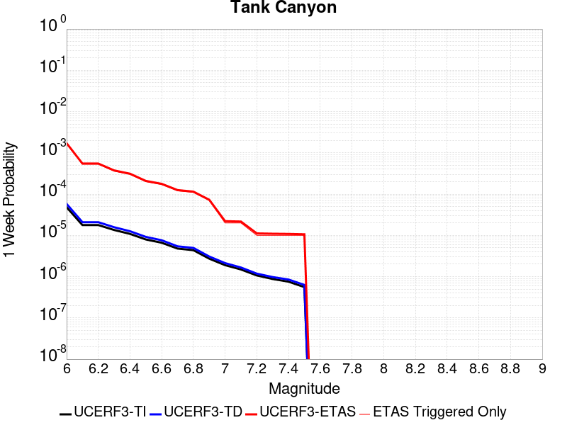 |  |  |  |

| Magnitude | 1 wk TI Prob | 1 wk TD Prob | 1 wk ETAS Prob | 1 wk ETAS/TD Gain | 1 wk ETAS Triggered Only | 1 mo TI Prob | 1 mo TD Prob | 1 mo ETAS Prob | 1 mo ETAS/TD Gain | 1 mo ETAS Triggered Only | 1 yr TI Prob | 1 yr TD Prob | 1 yr ETAS Prob | 1 yr ETAS/TD Gain | 1 yr ETAS Triggered Only | 10 yr TI Prob | 10 yr TD Prob | 10 yr ETAS Prob | 10 yr ETAS/TD Gain | 10 yr ETAS Triggered Only |
|-----|-----|-----|-----|-----|-----|-----|-----|-----|-----|-----|-----|-----|-----|-----|-----|-----|-----|-----|-----|-----|
| 6.0 | 4.8284557E-5 | 5.7970923E-5 | 0.001717512 | 29.627129 | 0.0016596373 | 2.0691741E-4 | 2.48427E-4 | 0.006002437 | 24.161772 | 0.0057554394 | 0.0025163088 | 0.0030210684 | 0.024956213 | 8.260724 | 0.022001615 | 0.02488006 | 0.029866708 | 0.07224551 | 2.418931 | 0.04368348 |
| 6.1 | 1.7796336E-5 | 2.0875108E-5 | 5.385493E-4 | 25.798635 | 5.17685E-4 | 7.626778E-5 | 8.946191E-5 | 0.0021752415 | 24.314724 | 0.002085966 | 9.281647E-4 | 0.0010886913 | 0.009317006 | 8.557986 | 0.008237283 | 0.009242975 | 0.010837668 | 0.027585518 | 2.545337 | 0.016931346 |
| 6.2 | 1.7796336E-5 | 2.0875108E-5 | 5.385493E-4 | 25.798635 | 5.17685E-4 | 7.626778E-5 | 8.946191E-5 | 0.0021752415 | 24.314724 | 0.002085966 | 9.281647E-4 | 0.0010886913 | 0.009317006 | 8.557986 | 0.008237283 | 0.009242975 | 0.010837668 | 0.027585518 | 2.545337 | 0.016931346 |
| 6.3 | 1.3515912E-5 | 1.5760828E-5 | 3.65954E-4 | 23.219212 | 3.501987E-4 | 5.792405E-5 | 6.7544795E-5 | 0.0015900449 | 23.5406 | 0.0015226031 | 7.049971E-4 | 8.220716E-4 | 0.006907477 | 8.402524 | 0.0060904124 | 0.007027647 | 0.008192917 | 0.02080249 | 2.539082 | 0.012713735 |
| 6.4 | 1.0870146E-5 | 1.2618972E-5 | 2.714582E-4 | 21.511913 | 2.588425E-4 | 4.658551E-5 | 5.4080287E-5 | 0.0012568716 | 23.240847 | 0.0012028564 | 5.67031E-4 | 6.582465E-4 | 0.005451289 | 8.281531 | 0.0047961995 | 0.005655863 | 0.006564983 | 0.01639693 | 2.4976346 | 0.00989692 |
| 6.5 | 7.964826E-6 | 9.196723E-6 | 1.4622974E-4 | 15.900199 | 1.3703428E-4 | 3.4134522E-5 | 3.9413993E-5 | 8.159109E-4 | 20.701046 | 7.7652757E-4 | 4.1550855E-4 | 4.797704E-4 | 0.0034778593 | 7.2490077 | 0.002999528 | 0.0041473247 | 0.0047886474 | 0.011077192 | 2.3132193 | 0.0063188025 |
| 6.6 | 6.6317E-6 | 7.612777E-6 | 1.4464601E-4 | 19.000425 | 1.3703428E-4 | 2.8421264E-5 | 3.262583E-5 | 5.959706E-4 | 18.266832 | 5.6336314E-4 | 3.4597394E-4 | 3.9715623E-4 | 0.0025583939 | 6.441782 | 0.0021620963 | 0.0034543579 | 0.003965616 | 0.008515311 | 2.1472857 | 0.004567809 |
| 6.7 | 4.793663E-6 | 5.4310603E-6 | 1.4246459E-4 | 26.231451 | 1.3703428E-4 | 2.0544108E-5 | 2.327579E-5 | 2.9733795E-4 | 12.774559 | 2.7406856E-4 | 2.500958E-4 | 2.8335027E-4 | 0.0015163093 | 5.35136 | 0.0012333085 | 0.0024981452 | 0.0028305824 | 0.005472413 | 1.9333168 | 0.0026493294 |
| 6.8 | 4.382823E-6 | 4.9694927E-6 | 1.2677713E-4 | 25.511082 | 1.2180824E-4 | 1.8783392E-5 | 2.1297676E-5 | 2.8013467E-4 | 13.153298 | 2.588425E-4 | 2.286638E-4 | 2.592726E-4 | 0.001416151 | 5.4620147 | 0.0011571783 | 0.0022842865 | 0.0025903755 | 0.0050202296 | 1.9380317 | 0.0024361648 |
| 6.9 | 2.729601E-6 | 3.0736521E-6 | 7.920357E-5 | 25.768555 | 7.613015E-5 | 1.1698237E-5 | 1.3172735E-5 | 1.502052E-4 | 11.402735 | 1.3703428E-4 | 1.4241673E-4 | 1.6036748E-4 | 7.2364026E-4 | 4.5123878 | 5.6336314E-4 | 0.001423255 | 0.0016026833 | 0.002590789 | 1.6165322 | 9.896919E-4 |
| 7.0 | 1.8987357E-6 | 2.1269989E-6 | 3.2578995E-5 | 15.316884 | 3.045206E-5 | 8.137413E-6 | 9.115682E-6 | 8.524514E-5 | 9.351482 | 7.613015E-5 | 9.90685E-5 | 1.1097847E-4 | 4.0024094E-4 | 3.6064737 | 2.8929458E-4 | 9.902435E-4 | 0.0011092991 | 0.0015351551 | 1.3838964 | 4.2632886E-4 |
| 7.1 | 1.4928986E-6 | 1.6641684E-6 | 3.211618E-5 | 19.298635 | 3.045206E-5 | 6.398121E-6 | 7.1321338E-6 | 5.28099E-5 | 7.404502 | 4.567809E-5 | 7.789434E-5 | 8.683086E-5 | 2.5430266E-4 | 2.9287128 | 1.6748633E-4 | 7.786704E-4 | 8.680272E-4 | 0.0011418578 | 1.3154632 | 2.7406856E-4 |
| 7.2 | 1.069082E-6 | 1.1828834E-6 | 1.6408896E-5 | 13.871947 | 1.522603E-5 | 4.581772E-6 | 5.0694935E-6 | 3.55214E-5 | 7.0068936 | 3.045206E-5 | 5.5781646E-5 | 6.171987E-5 | 1.5307042E-4 | 2.4800832 | 9.135618E-5 | 5.576765E-4 | 6.170795E-4 | 7.844625E-4 | 1.2712502 | 1.6748633E-4 |
| 7.3 | 8.776551E-7 | 9.770195E-7 | 1.6203036E-5 | 16.584146 | 1.522603E-5 | 3.7613736E-6 | 4.1872227E-6 | 3.4639157E-5 | 8.272585 | 3.045206E-5 | 4.579376E-5 | 5.0978764E-5 | 1.2710503E-4 | 2.4932938 | 7.613015E-5 | 4.5784327E-4 | 5.097217E-4 | 6.466861E-4 | 1.2687043 | 1.3703428E-4 |
| 7.4 | 7.55721E-7 | 8.510402E-7 | 1.6077058E-5 | 18.891068 | 1.522603E-5 | 3.2388E-6 | 3.647313E-6 | 3.4099263E-5 | 9.349146 | 3.045206E-5 | 3.9431678E-5 | 4.440565E-5 | 1.2053242E-4 | 2.7143488 | 7.613015E-5 | 3.942468E-4 | 4.440186E-4 | 5.6577276E-4 | 1.2742096 | 1.2180824E-4 |
| 7.5 | 5.587665E-7 | 6.305733E-7 | 1.5856594E-5 | 25.146313 | 1.522603E-5 | 2.3947114E-6 | 2.702457E-6 | 3.3154436E-5 | 12.268256 | 3.045206E-5 | 2.915522E-5 | 3.2902415E-5 | 9.3804534E-5 | 2.8509924 | 6.090412E-5 | 2.9151395E-4 | 3.2902416E-4 | 4.0512925E-4 | 1.2313055 | 7.613015E-5 |

## Garlock (Central)
*[(top)](#table-of-contents)*

| 1 Week | 1 Month | 1 Year | 10 Year |
|-----|-----|-----|-----|
|  | 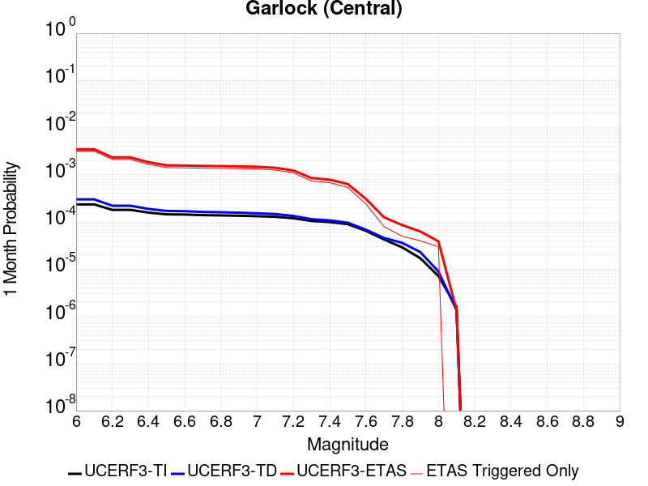 |  |  |

| Magnitude | 1 wk TI Prob | 1 wk TD Prob | 1 wk ETAS Prob | 1 wk ETAS/TD Gain | 1 wk ETAS Triggered Only | 1 mo TI Prob | 1 mo TD Prob | 1 mo ETAS Prob | 1 mo ETAS/TD Gain | 1 mo ETAS Triggered Only | 1 yr TI Prob | 1 yr TD Prob | 1 yr ETAS Prob | 1 yr ETAS/TD Gain | 1 yr ETAS Triggered Only | 10 yr TI Prob | 10 yr TD Prob | 10 yr ETAS Prob | 10 yr ETAS/TD Gain | 10 yr ETAS Triggered Only |
|-----|-----|-----|-----|-----|-----|-----|-----|-----|-----|-----|-----|-----|-----|-----|-----|-----|-----|-----|-----|-----|
| 6.0 | 5.5131142E-5 | 7.027124E-5 | 0.0011055686 | 15.732874 | 0.00103537 | 2.3625491E-4 | 3.0112805E-4 | 0.0035737387 | 11.867837 | 0.0032735965 | 0.0028726095 | 0.0036601364 | 0.016479041 | 4.502302 | 0.012865996 | 0.028357591 | 0.036092084 | 0.060014766 | 1.6628234 | 0.02481843 |
| 6.1 | 5.5131142E-5 | 7.027124E-5 | 0.0011055686 | 15.732874 | 0.00103537 | 2.3625491E-4 | 3.0112805E-4 | 0.0035737387 | 11.867837 | 0.0032735965 | 0.0028726095 | 0.0036601364 | 0.016479041 | 4.502302 | 0.012865996 | 0.028357591 | 0.036092084 | 0.060014766 | 1.6628234 | 0.02481843 |
| 6.2 | 4.216245E-5 | 5.1683597E-5 | 7.215943E-4 | 13.961766 | 6.699453E-4 | 1.806837E-4 | 2.214825E-4 | 0.002428768 | 10.965959 | 0.0022077744 | 0.0021976046 | 0.0026932466 | 0.011060194 | 4.10664 | 0.008389543 | 0.021759989 | 0.026701005 | 0.04251339 | 1.5922018 | 0.016246174 |
| 6.3 | 4.216245E-5 | 5.1683597E-5 | 7.215943E-4 | 13.961766 | 6.699453E-4 | 1.806837E-4 | 2.214825E-4 | 0.002428768 | 10.965959 | 0.0022077744 | 0.0021976046 | 0.0026932466 | 0.011060194 | 4.10664 | 0.008389543 | 0.021759989 | 0.026701005 | 0.04251339 | 1.5922018 | 0.016246174 |
| 6.4 | 3.6858168E-5 | 4.4131746E-5 | 5.770193E-4 | 13.074925 | 5.3291104E-4 | 1.5795401E-4 | 1.8912248E-4 | 0.0019397849 | 10.256764 | 0.0017509935 | 0.0019213937 | 0.00230016 | 0.008999394 | 3.9125082 | 0.0067146793 | 0.019048655 | 0.022859743 | 0.035565525 | 1.5558149 | 0.01300303 |
| 6.5 | 3.39199E-5 | 4.0038896E-5 | 4.815761E-4 | 12.027706 | 4.4155488E-4 | 1.453629E-4 | 1.715841E-4 | 0.0016178088 | 9.428663 | 0.001446473 | 0.0017683565 | 0.0020870569 | 0.0080432035 | 3.8538501 | 0.005968604 | 0.017543508 | 0.020770492 | 0.032116834 | 1.5462722 | 0.011587009 |
| 6.6 | 3.3571985E-5 | 3.9493032E-5 | 4.6580506E-4 | 11.794614 | 4.2632886E-4 | 1.4387199E-4 | 1.6924499E-4 | 0.0016002497 | 9.455226 | 0.0014312469 | 0.0017502342 | 0.0020586322 | 0.00798456 | 3.878575 | 0.005938152 | 0.017365133 | 0.020491783 | 0.031781696 | 1.5509484 | 0.011526105 |
| 6.7 | 3.2580007E-5 | 3.8109323E-5 | 4.491965E-4 | 11.787049 | 4.111028E-4 | 1.3962112E-4 | 1.6331558E-4 | 0.0015638816 | 9.575827 | 0.0014007948 | 0.0016985617 | 0.0019865753 | 0.007745777 | 3.8990605 | 0.0057706656 | 0.016856372 | 0.019784356 | 0.03066453 | 1.5499383 | 0.011099776 |
| 6.8 | 3.2185937E-5 | 3.7536465E-5 | 4.4862385E-4 | 11.951681 | 4.111028E-4 | 1.3793244E-4 | 1.6086077E-4 | 0.0015462067 | 9.612081 | 0.0013855688 | 0.0016780337 | 0.001956742 | 0.007655331 | 3.9122841 | 0.0057097613 | 0.016654192 | 0.01949112 | 0.030210327 | 1.5499533 | 0.01093229 |
| 6.9 | 3.165394E-5 | 3.6740938E-5 | 4.4782864E-4 | 12.188819 | 4.111028E-4 | 1.3565269E-4 | 1.5745178E-4 | 0.0015275788 | 9.701883 | 0.0013703427 | 0.0016503202 | 0.0019153113 | 0.0075229555 | 3.9277978 | 0.005618405 | 0.01638118 | 0.0190837 | 0.029598264 | 1.550971 | 0.010719125 |
| 7.0 | 3.0903822E-5 | 3.564605E-5 | 4.3150873E-4 | 12.105373 | 3.958768E-4 | 1.3243823E-4 | 1.5275997E-4 | 0.0015076697 | 9.8695345 | 0.0013551167 | 0.0016112428 | 0.0018582871 | 0.0072990768 | 3.927852 | 0.005450919 | 0.015996104 | 0.018522795 | 0.028729549 | 1.5510374 | 0.010399379 |
| 7.1 | 3.0069863E-5 | 3.441218E-5 | 3.9982435E-4 | 11.618686 | 3.6542473E-4 | 1.2886449E-4 | 1.4747256E-4 | 0.0014262705 | 9.67143 | 0.0012789866 | 0.0015677959 | 0.0017940209 | 0.006946385 | 3.8719645 | 0.0051616244 | 0.01556781 | 0.017890377 | 0.027610237 | 1.5433011 | 0.00989692 |
| 7.2 | 2.7957109E-5 | 3.1301115E-5 | 3.967144E-4 | 12.67413 | 3.6542473E-4 | 1.1981068E-4 | 1.3414085E-4 | 0.001260716 | 9.39845 | 0.0011267263 | 0.0014577188 | 0.0016319609 | 0.0060099014 | 3.682626 | 0.004385097 | 0.014481937 | 0.016293783 | 0.024531651 | 1.5055834 | 0.008374317 |
| 7.3 | 2.4519275E-5 | 2.6733265E-5 | 2.7034324E-4 | 10.112616 | 2.4361648E-4 | 1.0507837E-4 | 1.1456619E-4 | 8.910048E-4 | 7.7772055 | 7.7652757E-4 | 0.0012785783 | 0.0013939656 | 0.0046173846 | 3.3124092 | 0.0032279184 | 0.012712469 | 0.013937555 | 0.020018151 | 1.4362742 | 0.0061665424 |
| 7.4 | 2.3225532E-5 | 2.5217494E-5 | 2.6882783E-4 | 10.660371 | 2.4361648E-4 | 9.95342E-5 | 1.0807058E-4 | 8.540654E-4 | 7.9028487 | 7.460755E-4 | 0.0012111551 | 0.0013149795 | 0.004310563 | 3.278046 | 0.002999528 | 0.012045753 | 0.01315504 | 0.018564304 | 1.4111933 | 0.0054813707 |
| 7.5 | 2.097765E-5 | 2.250088E-5 | 2.2043483E-4 | 9.79672 | 1.979384E-4 | 8.9901114E-5 | 9.6428856E-5 | 6.901868E-4 | 7.1574717 | 5.938152E-4 | 0.0010939965 | 0.0011734008 | 0.0035306662 | 3.0089176 | 0.0023600347 | 0.010886264 | 0.01174923 | 0.016022617 | 1.3637162 | 0.0043241926 |
| 7.6 | 1.511254E-5 | 1.6007341E-5 | 1.3781364E-4 | 8.609402 | 1.2180824E-4 | 6.476642E-5 | 6.860113E-5 | 3.4265086E-4 | 4.994828 | 2.7406856E-4 | 7.882459E-4 | 8.3490653E-4 | 0.0021888919 | 2.6217208 | 0.0013551167 | 0.007854558 | 0.00839184 | 0.010762267 | 1.282468 | 0.002390487 |
| 7.7 | 9.934069E-6 | 1.0693656E-5 | 5.637126E-5 | 5.2714677 | 4.567809E-5 | 4.2573887E-5 | 4.582915E-5 | 1.3718115E-4 | 2.9933164 | 9.135618E-5 | 5.182138E-4 | 5.578274E-4 | 9.687009E-4 | 1.7365602 | 4.111028E-4 | 0.00517007 | 0.005635394 | 0.0062864237 | 1.1155251 | 6.547193E-4 |
| 7.8 | 6.7562896E-6 | 8.440562E-6 | 3.8892365E-5 | 4.6077933 | 3.045206E-5 | 2.8955206E-5 | 3.6173336E-5 | 9.707526E-5 | 2.6836135 | 6.090412E-5 | 3.5247262E-4 | 4.4032154E-4 | 7.2948873E-4 | 1.6567183 | 2.8929458E-4 | 0.0035191406 | 0.0044529405 | 0.0048925295 | 1.0987188 | 4.4155488E-4 |
| 7.9 | 3.975453E-6 | 5.3784297E-6 | 2.0604379E-5 | 3.8309283 | 1.522603E-5 | 1.7037546E-5 | 2.305021E-5 | 6.872725E-5 | 2.9816322 | 4.567809E-5 | 2.0741238E-4 | 2.8060027E-4 | 4.4803962E-4 | 1.5967184 | 1.6748633E-4 | 0.002072189 | 0.0028374717 | 0.003065214 | 1.0802624 | 2.2839046E-4 |
| 8.0 | 1.6729537E-6 | 2.0800776E-6 | 1.7306076E-5 | 8.319919 | 1.522603E-5 | 7.169782E-6 | 8.914588E-6 | 3.9366376E-5 | 4.4159503 | 3.045206E-5 | 8.7288594E-5 | 1.0852974E-4 | 1.8465162E-4 | 1.701392 | 7.613015E-5 | 8.7254314E-4 | 0.0010982669 | 0.0011743135 | 1.0692424 | 7.613015E-5 |
| 8.1 | 3.6733252E-7 | 3.1526864E-7 | 3.1526864E-7 | 1.0 | 0.0 | 1.5742813E-6 | 1.3511507E-6 | 1.3511507E-6 | 1.0 | 0.0 | 1.9166706E-5 | 1.645015E-5 | 1.645015E-5 | 1.0 | 0.0 | 1.9165053E-4 | 1.6658098E-4 | 1.6658098E-4 | 1.0 | 0.0 |

## Little Lake
*[(top)](#table-of-contents)*

| 1 Week | 1 Month | 1 Year | 10 Year |
|-----|-----|-----|-----|
|  |  |  |  |

| Magnitude | 1 wk TI Prob | 1 wk TD Prob | 1 wk ETAS Prob | 1 wk ETAS/TD Gain | 1 wk ETAS Triggered Only | 1 mo TI Prob | 1 mo TD Prob | 1 mo ETAS Prob | 1 mo ETAS/TD Gain | 1 mo ETAS Triggered Only | 1 yr TI Prob | 1 yr TD Prob | 1 yr ETAS Prob | 1 yr ETAS/TD Gain | 1 yr ETAS Triggered Only | 10 yr TI Prob | 10 yr TD Prob | 10 yr ETAS Prob | 10 yr ETAS/TD Gain | 10 yr ETAS Triggered Only |
|-----|-----|-----|-----|-----|-----|-----|-----|-----|-----|-----|-----|-----|-----|-----|-----|-----|-----|-----|-----|-----|
| 6.0 | 2.8424427E-5 | 3.1207477E-5 | 5.031997E-4 | 16.12433 | 4.7200694E-4 | 1.2181328E-4 | 1.3374022E-4 | 0.0019149475 | 14.318411 | 0.0017814456 | 0.0014820677 | 0.0016272042 | 0.0080877375 | 4.9703274 | 0.006471063 | 0.014722223 | 0.016166303 | 0.027790692 | 1.7190504 | 0.0118154 |
| 6.1 | 2.8424427E-5 | 3.1207477E-5 | 5.031997E-4 | 16.12433 | 4.7200694E-4 | 1.2181328E-4 | 1.3374022E-4 | 0.0019149475 | 14.318411 | 0.0017814456 | 0.0014820677 | 0.0016272042 | 0.0080877375 | 4.9703274 | 0.006471063 | 0.014722223 | 0.016166303 | 0.027790692 | 1.7190504 | 0.0118154 |
| 6.2 | 2.8424427E-5 | 3.1207477E-5 | 5.031997E-4 | 16.12433 | 4.7200694E-4 | 1.2181328E-4 | 1.3374022E-4 | 0.0019149475 | 14.318411 | 0.0017814456 | 0.0014820677 | 0.0016272042 | 0.0080877375 | 4.9703274 | 0.006471063 | 0.014722223 | 0.016166303 | 0.027790692 | 1.7190504 | 0.0118154 |
| 6.3 | 1.48860645E-5 | 1.6082206E-5 | 2.1401742E-4 | 13.307715 | 1.979384E-4 | 6.379586E-5 | 6.8922076E-5 | 0.0010433209 | 15.137688 | 9.744659E-4 | 7.7643775E-4 | 8.388314E-4 | 0.0043074545 | 5.1350656 | 0.003471535 | 0.007737305 | 0.00835947 | 0.0147764385 | 1.7676286 | 0.006471063 |
| 6.4 | 1.48860645E-5 | 1.6082206E-5 | 2.1401742E-4 | 13.307715 | 1.979384E-4 | 6.379586E-5 | 6.8922076E-5 | 0.0010433209 | 15.137688 | 9.744659E-4 | 7.7643775E-4 | 8.388314E-4 | 0.0043074545 | 5.1350656 | 0.003471535 | 0.007737305 | 0.00835947 | 0.0147764385 | 1.7676286 | 0.006471063 |
| 6.5 | 1.2797581E-5 | 1.3766247E-5 | 1.964761E-4 | 14.272306 | 1.8271236E-4 | 5.4845623E-5 | 5.899701E-5 | 9.572798E-4 | 16.225903 | 8.9833577E-4 | 6.675408E-4 | 7.180776E-4 | 0.003776312 | 5.2589192 | 0.0030604322 | 0.006655392 | 0.007160124 | 0.012768534 | 1.7832841 | 0.0056488574 |
| 6.6 | 9.661896E-6 | 1.0289519E-5 | 1.7777413E-4 | 17.277205 | 1.6748633E-4 | 4.1407468E-5 | 4.4097287E-5 | 6.9878774E-4 | 15.846502 | 6.547193E-4 | 5.040193E-4 | 5.3676846E-4 | 0.0028651007 | 5.3376846 | 0.0023295826 | 0.005028777 | 0.0053563244 | 0.009687644 | 1.8086365 | 0.0043546446 |
| 6.7 | 7.767871E-6 | 8.200053E-6 | 1.7568501E-4 | 21.424862 | 1.6748633E-4 | 3.329045E-5 | 3.514269E-5 | 6.1371154E-4 | 17.463419 | 5.7858916E-4 | 4.0523586E-4 | 4.27792E-4 | 0.0024367683 | 5.6961517 | 0.002009836 | 0.004044977 | 0.004271037 | 0.007924838 | 1.8554833 | 0.0036694733 |
| 6.8 | 6.4235196E-6 | 6.736042E-6 | 1.4376939E-4 | 21.343304 | 1.3703428E-4 | 2.752908E-5 | 2.8868506E-5 | 5.0086185E-4 | 17.349766 | 4.7200694E-4 | 3.35115E-4 | 3.514302E-4 | 0.0019648222 | 5.590932 | 0.0016139592 | 0.003346101 | 0.0035100048 | 0.006423142 | 1.8299524 | 0.0029233978 |
| 6.9 | 3.1283696E-6 | 3.1122859E-6 | 1.4014613E-4 | 45.02997 | 1.3703428E-4 | 1.3407229E-5 | 1.3338308E-5 | 4.092098E-4 | 30.67929 | 3.958768E-4 | 1.6322079E-4 | 1.6238331E-4 | 0.0012584794 | 7.7500544 | 0.0010962742 | 0.0016310095 | 0.0016227949 | 0.0034469534 | 2.1240845 | 0.0018271237 |
| 7.0 | 2.290603E-6 | 2.2287613E-6 | 1.0881074E-4 | 48.82117 | 1.06582214E-4 | 9.816834E-6 | 9.551805E-6 | 2.6839186E-4 | 28.098549 | 2.588425E-4 | 1.19513395E-4 | 1.1628806E-4 | 8.0137973E-4 | 6.891333 | 6.8517134E-4 | 0.0011944914 | 0.0011623743 | 0.0022877909 | 1.968205 | 0.0011267263 |
| 7.1 | 1.293693E-6 | 1.1777322E-6 | 6.208178E-5 | 52.712986 | 6.090412E-5 | 5.5443866E-6 | 5.0474177E-6 | 1.11629095E-4 | 22.11608 | 1.06582214E-4 | 6.750081E-5 | 6.1451276E-5 | 3.8117828E-4 | 6.2029347 | 3.1974664E-4 | 6.7480316E-4 | 6.144114E-4 | 0.0011774283 | 1.9163519 | 5.6336314E-4 |
| 7.2 | 4.715842E-7 | 3.09202E-7 | 1.5535228E-5 | 50.242977 | 1.522603E-5 | 2.0210737E-6 | 1.3251507E-6 | 1.6551161E-5 | 12.490022 | 1.522603E-5 | 2.4606294E-5 | 1.6133596E-5 | 4.6585166E-5 | 2.8874633 | 3.045206E-5 | 2.460357E-4 | 1.6132479E-4 | 2.2221908E-4 | 1.3774639 | 6.090412E-5 |
| 7.3 | 3.9430947E-7 | 2.3099639E-7 | 2.3099639E-7 | 1.0 | 0.0 | 1.6898966E-6 | 9.899842E-7 | 9.899842E-7 | 1.0 | 0.0 | 2.0574296E-5 | 1.2052991E-5 | 2.7278838E-5 | 2.2632422 | 1.522603E-5 | 2.0572392E-4 | 1.20523444E-4 | 1.6619603E-4 | 1.3789519 | 4.567809E-5 |
| 7.4 | 3.547123E-7 | 1.9681133E-7 | 1.9681133E-7 | 1.0 | 0.0 | 1.5201948E-6 | 8.4347687E-7 | 8.4347687E-7 | 1.0 | 0.0 | 1.8508214E-5 | 1.0269283E-5 | 2.5495157E-5 | 2.482662 | 1.522603E-5 | 1.8506673E-4 | 1.02688144E-4 | 1.3313709E-4 | 1.2965184 | 3.045206E-5 |
| 7.5 | 2.6354266E-7 | 1.4424535E-7 | 1.4424535E-7 | 1.0 | 0.0 | 1.129468E-6 | 6.1819424E-7 | 6.1819424E-7 | 1.0 | 0.0 | 1.3751187E-5 | 7.5264893E-6 | 7.5264893E-6 | 1.0 | 0.0 | 1.3750336E-4 | 7.52624E-5 | 9.048728E-5 | 1.2022908 | 1.522603E-5 |
| 7.6 | 1.269913E-7 | 7.573149E-8 | 7.573149E-8 | 1.0 | 0.0 | 5.4424834E-7 | 3.245635E-7 | 3.245635E-7 | 1.0 | 0.0 | 6.6262032E-6 | 3.951554E-6 | 3.951554E-6 | 1.0 | 0.0 | 6.626006E-5 | 3.951487E-5 | 3.951487E-5 | 1.0 | 0.0 |

## Owl Lake
*[(top)](#table-of-contents)*

| 1 Week | 1 Month | 1 Year | 10 Year |
|-----|-----|-----|-----|
|  |  |  |  |

| Magnitude | 1 wk TI Prob | 1 wk TD Prob | 1 wk ETAS Prob | 1 wk ETAS/TD Gain | 1 wk ETAS Triggered Only | 1 mo TI Prob | 1 mo TD Prob | 1 mo ETAS Prob | 1 mo ETAS/TD Gain | 1 mo ETAS Triggered Only | 1 yr TI Prob | 1 yr TD Prob | 1 yr ETAS Prob | 1 yr ETAS/TD Gain | 1 yr ETAS Triggered Only | 10 yr TI Prob | 10 yr TD Prob | 10 yr ETAS Prob | 10 yr ETAS/TD Gain | 10 yr ETAS Triggered Only |
|-----|-----|-----|-----|-----|-----|-----|-----|-----|-----|-----|-----|-----|-----|-----|-----|-----|-----|-----|-----|-----|
| 6.0 | 5.0320643E-5 | 6.637151E-5 | 2.3384673E-4 | 3.5232997 | 1.6748633E-4 | 2.1564208E-4 | 2.844246E-4 | 0.0011977266 | 4.2110515 | 9.1356185E-4 | 0.0026222812 | 0.0034584238 | 0.0076159276 | 2.2021384 | 0.004171932 | 0.02591553 | 0.034147043 | 0.042647175 | 1.2489272 | 0.008800645 |
| 6.1 | 5.0320643E-5 | 6.637151E-5 | 2.3384673E-4 | 3.5232997 | 1.6748633E-4 | 2.1564208E-4 | 2.844246E-4 | 0.0011977266 | 4.2110515 | 9.1356185E-4 | 0.0026222812 | 0.0034584238 | 0.0076159276 | 2.2021384 | 0.004171932 | 0.02591553 | 0.034147043 | 0.042647175 | 1.2489272 | 0.008800645 |
| 6.2 | 2.4125871E-5 | 3.098766E-5 | 1.3756657E-4 | 4.439399 | 1.06582214E-4 | 1.0339249E-4 | 1.3279865E-4 | 7.87431E-4 | 5.9295106 | 6.547193E-4 | 0.0012580766 | 0.0016157742 | 0.0046864627 | 2.900444 | 0.003075658 | 0.012509781 | 0.016073797 | 0.022306014 | 1.3877252 | 0.0063340287 |
| 6.3 | 1.7433485E-5 | 2.2360802E-5 | 1.13714945E-4 | 5.0854588 | 9.135618E-5 | 7.471279E-5 | 9.582938E-5 | 6.5913855E-4 | 6.8782506 | 5.6336314E-4 | 9.0924866E-4 | 0.0011662478 | 0.003797279 | 3.2559795 | 0.0026341032 | 0.009055373 | 0.01163159 | 0.01697396 | 1.4592983 | 0.0054052407 |
| 6.4 | 1.7433485E-5 | 2.2360802E-5 | 1.13714945E-4 | 5.0854588 | 9.135618E-5 | 7.471279E-5 | 9.582938E-5 | 6.5913855E-4 | 6.8782506 | 5.6336314E-4 | 9.0924866E-4 | 0.0011662478 | 0.003797279 | 3.2559795 | 0.0026341032 | 0.009055373 | 0.01163159 | 0.01697396 | 1.4592983 | 0.0054052407 |
| 6.5 | 1.5182742E-5 | 1.9433977E-5 | 9.5562646E-5 | 4.917298 | 7.613015E-5 | 6.506727E-5 | 8.3286664E-5 | 6.0092856E-4 | 7.2151837 | 5.17685E-4 | 7.919061E-4 | 0.0010136948 | 0.003493022 | 3.445832 | 0.0024818429 | 0.0078909 | 0.0101209 | 0.0152152125 | 1.5033457 | 0.005146398 |
| 6.6 | 6.7271576E-6 | 8.550545E-6 | 6.9454145E-5 | 8.122774 | 6.090412E-5 | 2.8830356E-5 | 3.6644713E-5 | 4.6295795E-4 | 12.633691 | 4.2632886E-4 | 3.5095305E-4 | 4.460637E-4 | 0.0023028108 | 5.1625156 | 0.0018575757 | 0.0035039932 | 0.0044694655 | 0.008168012 | 1.8275143 | 0.0037151515 |
| 6.7 | 6.682835E-6 | 8.482986E-6 | 6.938659E-5 | 8.179501 | 6.090412E-5 | 2.8640408E-5 | 3.635518E-5 | 4.6266854E-4 | 12.726344 | 4.2632886E-4 | 3.4864116E-4 | 4.4254007E-4 | 0.0022992936 | 5.1956735 | 0.0018575757 | 0.003480947 | 0.004434389 | 0.008133066 | 1.8340894 | 0.0037151515 |
| 6.8 | 6.5774975E-6 | 8.329444E-6 | 6.923306E-5 | 8.311846 | 6.090412E-5 | 2.8188972E-5 | 3.569716E-5 | 4.620108E-4 | 12.942508 | 4.2632886E-4 | 3.4314668E-4 | 4.3453192E-4 | 0.0022913006 | 5.273031 | 0.0018575757 | 0.0034261728 | 0.004354527 | 0.008038341 | 1.8459734 | 0.0036999255 |
| 6.9 | 6.363419E-6 | 8.002579E-6 | 6.8906214E-5 | 8.6105 | 6.090412E-5 | 2.727151E-5 | 3.429635E-5 | 4.6061058E-4 | 13.430309 | 4.2632886E-4 | 3.3198006E-4 | 4.1748365E-4 | 0.0022590642 | 5.4111443 | 0.0018423497 | 0.0033148455 | 0.0041844994 | 0.007823455 | 1.8696276 | 0.0036542474 |
| 7.0 | 6.1342453E-6 | 7.63473E-6 | 6.8538386E-5 | 8.977186 | 6.090412E-5 | 2.6289357E-5 | 3.271989E-5 | 4.5903478E-4 | 14.029228 | 4.2632886E-4 | 3.2002592E-4 | 3.9829736E-4 | 0.0021942533 | 5.5090833 | 0.0017966715 | 0.0031956544 | 0.0039931675 | 0.007572162 | 1.8962796 | 0.003593343 |
| 7.1 | 5.842926E-6 | 7.14521E-6 | 6.8048896E-5 | 9.523708 | 6.090412E-5 | 2.504087E-5 | 3.0622E-5 | 4.4171224E-4 | 14.424669 | 4.111028E-4 | 3.0482994E-4 | 3.7276448E-4 | 0.0020470035 | 5.491412 | 0.0016748634 | 0.0030441214 | 0.0037385917 | 0.007045457 | 1.8845216 | 0.0033192746 |
| 7.2 | 4.77173E-6 | 5.361204E-6 | 6.6265E-5 | 12.360097 | 6.090412E-5 | 2.045011E-5 | 2.297641E-5 | 3.2749E-4 | 14.253316 | 3.045206E-4 | 2.4895166E-4 | 2.7970594E-4 | 0.0014213388 | 5.081547 | 0.0011419522 | 0.0024867293 | 0.0028100624 | 0.0049964497 | 1.7780565 | 0.0021925485 |
| 7.3 | 3.0494948E-6 | 2.7124704E-6 | 1.7938459E-5 | 6.613329 | 1.522603E-5 | 1.3069198E-5 | 1.1624823E-5 | 8.775409E-5 | 7.5488544 | 7.613015E-5 | 1.5910587E-4 | 1.4152318E-4 | 4.916723E-4 | 3.4741468 | 3.501987E-4 | 0.0015899199 | 0.0014242887 | 0.0021084843 | 1.480377 | 6.8517134E-4 |
| 7.4 | 2.7263884E-6 | 2.3075613E-6 | 1.7533557E-5 | 7.598306 | 1.522603E-5 | 1.1684469E-5 | 9.889511E-6 | 7.079303E-5 | 7.1583953 | 6.090412E-5 | 1.4224913E-4 | 1.2039825E-4 | 3.792096E-4 | 3.1496272 | 2.588425E-4 | 0.0014215811 | 0.0012122075 | 0.001622812 | 1.3387246 | 4.111028E-4 |
| 7.5 | 2.6090431E-6 | 2.1674637E-6 | 2.1674637E-6 | 1.0 | 0.0 | 1.1181565E-5 | 9.289097E-6 | 5.4966764E-5 | 5.917342 | 4.567809E-5 | 1.3612706E-4 | 1.1308899E-4 | 3.11005E-4 | 2.750091 | 1.979384E-4 | 0.001360437 | 0.0011389464 | 0.0014583288 | 1.2804192 | 3.1974664E-4 |
| 7.6 | 2.3008756E-6 | 1.8745708E-6 | 1.8745708E-6 | 1.0 | 0.0 | 9.860858E-6 | 8.0338505E-6 | 2.325976E-5 | 2.8952193 | 1.522603E-5 | 1.20049335E-4 | 9.7807824E-5 | 2.348287E-4 | 2.4009194 | 1.3703428E-4 | 0.001199845 | 9.85921E-4 | 0.0012292973 | 1.2468517 | 2.4361648E-4 |
| 7.7 | 1.7184348E-6 | 1.343562E-6 | 1.343562E-6 | 1.0 | 0.0 | 7.3646997E-6 | 5.7581105E-6 | 5.7581105E-6 | 1.0 | 0.0 | 8.966153E-5 | 7.010278E-5 | 1.3100263E-4 | 1.8687223 | 6.090412E-5 | 8.962536E-4 | 7.086945E-4 | 8.3041645E-4 | 1.1717551 | 1.2180824E-4 |
| 7.8 | 8.4612907E-7 | 8.4176E-7 | 8.4176E-7 | 1.0 | 0.0 | 3.6262625E-6 | 3.607538E-6 | 3.607538E-6 | 1.0 | 0.0 | 4.4148852E-5 | 4.392091E-5 | 7.437164E-5 | 1.6933081 | 3.045206E-5 | 4.414008E-4 | 4.4459777E-4 | 5.2069407E-4 | 1.1711576 | 7.613015E-5 |
| 7.9 | 2.716738E-7 | 3.7732943E-7 | 3.7732943E-7 | 1.0 | 0.0 | 1.1643157E-6 | 1.6171252E-6 | 1.6171252E-6 | 1.0 | 0.0 | 1.4175452E-5 | 1.9688332E-5 | 3.4914065E-5 | 1.7733377 | 1.522603E-5 | 1.4174548E-4 | 1.9863734E-4 | 2.2908335E-4 | 1.1532744 | 3.045206E-5 |
| 8.0 | 2.1995428E-8 | 3.389418E-8 | 3.389418E-8 | 1.0 | 0.0 | 9.426611E-8 | 1.4526077E-7 | 1.4526077E-7 | 1.0 | 0.0 | 1.1476893E-6 | 1.768549E-6 | 1.768549E-6 | 1.0 | 0.0 | 1.14768345E-5 | 1.798665E-5 | 1.798665E-5 | 1.0 | 0.0 |

## Panamint Valley
*[(top)](#table-of-contents)*

| 1 Week | 1 Month | 1 Year | 10 Year |
|-----|-----|-----|-----|
|  |  |  |  |

| Magnitude | 1 wk TI Prob | 1 wk TD Prob | 1 wk ETAS Prob | 1 wk ETAS/TD Gain | 1 wk ETAS Triggered Only | 1 mo TI Prob | 1 mo TD Prob | 1 mo ETAS Prob | 1 mo ETAS/TD Gain | 1 mo ETAS Triggered Only | 1 yr TI Prob | 1 yr TD Prob | 1 yr ETAS Prob | 1 yr ETAS/TD Gain | 1 yr ETAS Triggered Only | 10 yr TI Prob | 10 yr TD Prob | 10 yr ETAS Prob | 10 yr ETAS/TD Gain | 10 yr ETAS Triggered Only |
|-----|-----|-----|-----|-----|-----|-----|-----|-----|-----|-----|-----|-----|-----|-----|-----|-----|-----|-----|-----|-----|
| 6.0 | 3.0211835E-5 | 3.39879E-5 | 4.146257E-4 | 12.199215 | 3.8065077E-4 | 1.2947287E-4 | 1.4565447E-4 | 0.0011047546 | 7.5847635 | 9.592399E-4 | 0.0015751923 | 0.0017719301 | 0.0060428637 | 3.4103281 | 0.0042785145 | 0.015640736 | 0.017584875 | 0.026380345 | 1.5001725 | 0.008952905 |
| 6.1 | 3.0211835E-5 | 3.39879E-5 | 4.146257E-4 | 12.199215 | 3.8065077E-4 | 1.2947287E-4 | 1.4565447E-4 | 0.0011047546 | 7.5847635 | 9.592399E-4 | 0.0015751923 | 0.0017719301 | 0.0060428637 | 3.4103281 | 0.0042785145 | 0.015640736 | 0.017584875 | 0.026380345 | 1.5001725 | 0.008952905 |
| 6.2 | 3.0211835E-5 | 3.39879E-5 | 4.146257E-4 | 12.199215 | 3.8065077E-4 | 1.2947287E-4 | 1.4565447E-4 | 0.0011047546 | 7.5847635 | 9.592399E-4 | 0.0015751923 | 0.0017719301 | 0.0060428637 | 3.4103281 | 0.0042785145 | 0.015640736 | 0.017584875 | 0.026380345 | 1.5001725 | 0.008952905 |
| 6.3 | 2.8573924E-5 | 3.210589E-5 | 4.1274444E-4 | 12.855722 | 3.8065077E-4 | 1.2245393E-4 | 1.3758958E-4 | 0.0010814735 | 7.8601418 | 9.440139E-4 | 0.001489857 | 0.0016738938 | 0.00576284 | 3.4427752 | 0.004095802 | 0.01479908 | 0.01661945 | 0.02500432 | 1.5045215 | 0.008526577 |
| 6.4 | 2.8573924E-5 | 3.210589E-5 | 4.1274444E-4 | 12.855722 | 3.8065077E-4 | 1.2245393E-4 | 1.3758958E-4 | 0.0010814735 | 7.8601418 | 9.440139E-4 | 0.001489857 | 0.0016738938 | 0.00576284 | 3.4427752 | 0.004095802 | 0.01479908 | 0.01661945 | 0.02500432 | 1.5045215 | 0.008526577 |
| 6.5 | 2.7468774E-5 | 3.0831525E-5 | 4.1147054E-4 | 13.345774 | 3.8065077E-4 | 1.1771801E-4 | 1.3212857E-4 | 0.0010607938 | 8.028497 | 9.2878786E-4 | 0.0014322745 | 0.0016075056 | 0.005590313 | 3.477632 | 0.00398922 | 0.014230782 | 0.015965264 | 0.024160933 | 1.5133438 | 0.008328639 |
| 6.6 | 2.6135967E-5 | 2.9255436E-5 | 4.0989506E-4 | 14.010902 | 3.8065077E-4 | 1.1200648E-4 | 1.2537456E-4 | 0.001054046 | 8.407176 | 9.2878786E-4 | 0.0013628257 | 0.001525393 | 0.005432514 | 3.5613863 | 0.0039130896 | 0.013544982 | 0.015155562 | 0.02308806 | 1.5234051 | 0.00805457 |
| 6.7 | 2.4498746E-5 | 2.7344193E-5 | 4.0798454E-4 | 14.920337 | 3.8065077E-4 | 1.04990395E-4 | 1.17184274E-4 | 9.849663E-4 | 8.405277 | 8.6788373E-4 | 0.0012775084 | 0.0014258098 | 0.00522689 | 3.6659098 | 0.0038065077 | 0.012701893 | 0.014172745 | 0.021737903 | 1.5337822 | 0.007673919 |
| 6.8 | 2.2244329E-5 | 2.4938103E-5 | 3.9035373E-4 | 15.652904 | 3.6542473E-4 | 9.532935E-5 | 1.06873325E-4 | 9.289911E-4 | 8.692451 | 8.222056E-4 | 0.0011600169 | 0.0013004278 | 0.0048434795 | 3.7245276 | 0.0035476652 | 0.011539802 | 0.012933899 | 0.019877343 | 1.5368407 | 0.007034426 |
| 6.9 | 1.9902658E-5 | 2.2292743E-5 | 3.4203226E-4 | 15.342762 | 3.1974664E-4 | 8.529431E-5 | 9.553693E-5 | 7.8064285E-4 | 8.17111 | 6.8517134E-4 | 0.0010379635 | 0.00116256 | 0.0040521426 | 3.4855342 | 0.002892946 | 0.010331288 | 0.011569886 | 0.017032987 | 1.4721829 | 0.005527049 |
| 7.0 | 1.8353881E-5 | 2.0568525E-5 | 2.9463143E-4 | 14.324384 | 2.7406856E-4 | 7.865712E-5 | 8.814794E-5 | 6.9713546E-4 | 7.9086986 | 6.090412E-4 | 9.5722964E-4 | 0.0010726905 | 0.0035975003 | 3.3537169 | 0.002527521 | 0.009531168 | 0.010680057 | 0.015470223 | 1.448515 | 0.0048418776 |
| 7.1 | 1.7667631E-5 | 1.9774876E-5 | 2.93838E-4 | 14.8591585 | 2.7406856E-4 | 7.571623E-5 | 8.474681E-5 | 6.6328695E-4 | 7.826689 | 5.7858916E-4 | 9.2145515E-4 | 0.0010313216 | 0.003373712 | 3.2712512 | 0.0023448088 | 0.009176437 | 0.010270242 | 0.014821278 | 1.4431285 | 0.0045982613 |
| 7.2 | 1.6381597E-5 | 1.8160366E-5 | 2.7699818E-4 | 15.252896 | 2.588425E-4 | 7.020495E-5 | 7.782792E-5 | 6.106975E-4 | 7.8467665 | 5.3291104E-4 | 8.544101E-4 | 9.471603E-4 | 0.0029855159 | 3.1520705 | 0.0020402882 | 0.008511325 | 0.0094358865 | 0.013477959 | 1.4283723 | 0.0040805764 |
| 7.3 | 1.4520491E-5 | 1.5968182E-5 | 1.8345185E-4 | 11.488586 | 1.6748633E-4 | 6.222919E-5 | 6.8433365E-5 | 4.7950805E-4 | 7.006934 | 4.111028E-4 | 7.57377E-4 | 8.328739E-4 | 0.0025215556 | 3.027536 | 0.0016900894 | 0.0075480095 | 0.008300635 | 0.0116527565 | 1.4038391 | 0.0033801787 |
| 7.4 | 1.2852287E-5 | 1.4146948E-5 | 1.8163091E-4 | 12.838876 | 1.6748633E-4 | 5.5080065E-5 | 6.0628456E-5 | 4.7170636E-4 | 7.7802796 | 4.111028E-4 | 6.7039346E-4 | 7.379173E-4 | 0.00239633 | 3.2474234 | 0.0016596373 | 0.0066837464 | 0.0073575918 | 0.0105617605 | 1.4354914 | 0.0032279184 |
| 7.5 | 1.1637851E-5 | 1.2838205E-5 | 1.8032239E-4 | 14.045763 | 1.6748633E-4 | 4.987555E-5 | 5.5019806E-5 | 4.5087482E-4 | 8.194773 | 3.958768E-4 | 6.070656E-4 | 6.6967594E-4 | 0.0022977702 | 3.4311671 | 0.0016291853 | 0.006054099 | 0.006679477 | 0.009779965 | 1.4641812 | 0.0031213362 |
| 7.6 | 3.0068115E-6 | 3.3335807E-6 | 6.42375E-5 | 19.269821 | 6.090412E-5 | 1.2886271E-5 | 1.4286737E-5 | 1.3609324E-4 | 9.525845 | 1.2180824E-4 | 1.5687906E-4 | 1.7393442E-4 | 8.894334E-4 | 5.1136136 | 7.1562344E-4 | 0.0015676835 | 0.0017394236 | 0.0030769836 | 1.7689674 | 0.0013398906 |

## Ash Hill
*[(top)](#table-of-contents)*

| 1 Week | 1 Month | 1 Year | 10 Year |
|-----|-----|-----|-----|
|  |  |  |  |

| Magnitude | 1 wk TI Prob | 1 wk TD Prob | 1 wk ETAS Prob | 1 wk ETAS/TD Gain | 1 wk ETAS Triggered Only | 1 mo TI Prob | 1 mo TD Prob | 1 mo ETAS Prob | 1 mo ETAS/TD Gain | 1 mo ETAS Triggered Only | 1 yr TI Prob | 1 yr TD Prob | 1 yr ETAS Prob | 1 yr ETAS/TD Gain | 1 yr ETAS Triggered Only | 10 yr TI Prob | 10 yr TD Prob | 10 yr ETAS Prob | 10 yr ETAS/TD Gain | 10 yr ETAS Triggered Only |
|-----|-----|-----|-----|-----|-----|-----|-----|-----|-----|-----|-----|-----|-----|-----|-----|-----|-----|-----|-----|-----|
| 6.0 | 2.1545662E-5 | 2.3195389E-5 | 2.6680622E-4 | 11.502555 | 2.4361648E-4 | 9.2335285E-5 | 9.940547E-5 | 8.454068E-4 | 8.50463 | 7.460755E-4 | 0.0011236023 | 0.0012096697 | 0.0044793063 | 3.7029169 | 0.0032735965 | 0.011179381 | 0.012038835 | 0.018943448 | 1.5735282 | 0.006988748 |
| 6.1 | 2.1545662E-5 | 2.3195389E-5 | 2.6680622E-4 | 11.502555 | 2.4361648E-4 | 9.2335285E-5 | 9.940547E-5 | 8.454068E-4 | 8.50463 | 7.460755E-4 | 0.0011236023 | 0.0012096697 | 0.0044793063 | 3.7029169 | 0.0032735965 | 0.011179381 | 0.012038835 | 0.018943448 | 1.5735282 | 0.006988748 |
| 6.2 | 2.1545662E-5 | 2.3195389E-5 | 2.6680622E-4 | 11.502555 | 2.4361648E-4 | 9.2335285E-5 | 9.940547E-5 | 8.454068E-4 | 8.50463 | 7.460755E-4 | 0.0011236023 | 0.0012096697 | 0.0044793063 | 3.7029169 | 0.0032735965 | 0.011179381 | 0.012038835 | 0.018943448 | 1.5735282 | 0.006988748 |
| 6.3 | 1.0025529E-5 | 1.0747344E-5 | 1.1732841E-4 | 10.916967 | 1.06582214E-4 | 4.2965847E-5 | 4.605931E-5 | 3.6579123E-4 | 7.9417434 | 3.1974664E-4 | 5.229836E-4 | 5.6064106E-4 | 0.0018389105 | 3.280014 | 0.0012789866 | 0.005217545 | 0.0055935793 | 0.008334075 | 1.489936 | 0.0027559116 |
| 6.4 | 1.0025529E-5 | 1.0747344E-5 | 1.1732841E-4 | 10.916967 | 1.06582214E-4 | 4.2965847E-5 | 4.605931E-5 | 3.6579123E-4 | 7.9417434 | 3.1974664E-4 | 5.229836E-4 | 5.6064106E-4 | 0.0018389105 | 3.280014 | 0.0012789866 | 0.005217545 | 0.0055935793 | 0.008334075 | 1.489936 | 0.0027559116 |
| 6.5 | 6.9617327E-6 | 7.4569152E-6 | 6.836058E-5 | 9.167408 | 6.090412E-5 | 2.9835655E-5 | 3.1957865E-5 | 2.451155E-4 | 7.6699576 | 2.1316443E-4 | 3.6318856E-4 | 3.8902622E-4 | 0.001210912 | 3.1126745 | 8.222056E-4 | 0.0036259557 | 0.0038843066 | 0.0056588324 | 1.4568449 | 0.0017814456 |
| 6.6 | 4.9919777E-6 | 5.34689E-6 | 3.579879E-5 | 6.6952543 | 3.045206E-5 | 2.1394015E-5 | 2.291508E-5 | 1.751719E-4 | 7.6443944 | 1.522603E-4 | 2.60441E-4 | 2.7896208E-4 | 8.1172446E-4 | 2.9098022 | 5.3291104E-4 | 0.0026013597 | 0.0027867774 | 0.004031833 | 1.4467723 | 0.0012485345 |
| 6.7 | 3.6630722E-6 | 3.9247725E-6 | 3.4376713E-5 | 8.758906 | 3.045206E-5 | 1.5698786E-5 | 1.6820377E-5 | 1.3862656E-4 | 8.241586 | 1.2180824E-4 | 1.9111596E-4 | 2.0477458E-4 | 6.3101616E-4 | 3.081516 | 4.2632886E-4 | 0.0019095168 | 0.002046422 | 0.002988504 | 1.4603558 | 9.440139E-4 |
| 6.8 | 2.5599613E-6 | 2.7450303E-6 | 1.7971019E-5 | 6.546747 | 1.522603E-5 | 1.0971216E-5 | 1.176439E-5 | 8.789365E-5 | 7.4711604 | 7.613015E-5 | 1.3356637E-4 | 1.4322698E-4 | 4.3248013E-4 | 3.0195436 | 2.8929458E-4 | 0.0013348613 | 0.0014318317 | 0.0021008179 | 1.467224 | 6.699453E-4 |
| 6.9 | 1.7684905E-6 | 1.8969438E-6 | 1.7122946E-5 | 9.026596 | 1.522603E-5 | 7.579223E-6 | 8.129759E-6 | 5.380748E-5 | 6.6185822 | 4.567809E-5 | 9.2273134E-5 | 9.897981E-5 | 3.1212316E-4 | 3.1534019 | 2.1316443E-4 | 9.223483E-4 | 9.897981E-4 | 0.0015221818 | 1.5378709 | 5.3291104E-4 |

## Airport Lake
*[(top)](#table-of-contents)*

| 1 Week | 1 Month | 1 Year | 10 Year |
|-----|-----|-----|-----|
|  |  |  |  |

| Magnitude | 1 wk TI Prob | 1 wk TD Prob | 1 wk ETAS Prob | 1 wk ETAS/TD Gain | 1 wk ETAS Triggered Only | 1 mo TI Prob | 1 mo TD Prob | 1 mo ETAS Prob | 1 mo ETAS/TD Gain | 1 mo ETAS Triggered Only | 1 yr TI Prob | 1 yr TD Prob | 1 yr ETAS Prob | 1 yr ETAS/TD Gain | 1 yr ETAS Triggered Only | 10 yr TI Prob | 10 yr TD Prob | 10 yr ETAS Prob | 10 yr ETAS/TD Gain | 10 yr ETAS Triggered Only |
|-----|-----|-----|-----|-----|-----|-----|-----|-----|-----|-----|-----|-----|-----|-----|-----|-----|-----|-----|-----|-----|
| 6.0 | 1.2387061E-5 | 1.3103559E-5 | 3.4807183E-4 | 26.563152 | 3.3497266E-4 | 5.3086325E-5 | 5.615706E-5 | 0.0011980452 | 21.33383 | 0.0011419522 | 6.461343E-4 | 6.8352616E-4 | 0.004335276 | 6.3425164 | 0.0036542474 | 0.0064425888 | 0.006817048 | 0.013516198 | 1.9827054 | 0.0067451317 |
| 6.1 | 1.2387061E-5 | 1.3103559E-5 | 3.4807183E-4 | 26.563152 | 3.3497266E-4 | 5.3086325E-5 | 5.615706E-5 | 0.0011980452 | 21.33383 | 0.0011419522 | 6.461343E-4 | 6.8352616E-4 | 0.004335276 | 6.3425164 | 0.0036542474 | 0.0064425888 | 0.006817048 | 0.013516198 | 1.9827054 | 0.0067451317 |
| 6.2 | 1.2387061E-5 | 1.3103559E-5 | 3.4807183E-4 | 26.563152 | 3.3497266E-4 | 5.3086325E-5 | 5.615706E-5 | 0.0011980452 | 21.33383 | 0.0011419522 | 6.461343E-4 | 6.8352616E-4 | 0.004335276 | 6.3425164 | 0.0036542474 | 0.0064425888 | 0.006817048 | 0.013516198 | 1.9827054 | 0.0067451317 |
| 6.3 | 1.2387061E-5 | 1.3103559E-5 | 3.4807183E-4 | 26.563152 | 3.3497266E-4 | 5.3086325E-5 | 5.615706E-5 | 0.0011980452 | 21.33383 | 0.0011419522 | 6.461343E-4 | 6.8352616E-4 | 0.004335276 | 6.3425164 | 0.0036542474 | 0.0064425888 | 0.006817048 | 0.013516198 | 1.9827054 | 0.0067451317 |
| 6.4 | 1.2387061E-5 | 1.3103559E-5 | 3.4807183E-4 | 26.563152 | 3.3497266E-4 | 5.3086325E-5 | 5.615706E-5 | 0.0011980452 | 21.33383 | 0.0011419522 | 6.461343E-4 | 6.8352616E-4 | 0.004335276 | 6.3425164 | 0.0036542474 | 0.0064425888 | 0.006817048 | 0.013516198 | 1.9827054 | 0.0067451317 |
| 6.5 | 6.9922594E-6 | 7.385145E-6 | 2.3577391E-4 | 31.925426 | 2.2839046E-4 | 2.996648E-5 | 3.165027E-5 | 8.9950656E-4 | 28.420185 | 8.6788373E-4 | 3.6478083E-4 | 3.8527933E-4 | 0.0030792484 | 7.9922495 | 0.0026950075 | 0.003641826 | 0.003846651 | 0.008745741 | 2.2735987 | 0.0049180076 |
| 6.6 | 6.9922594E-6 | 7.385145E-6 | 2.3577391E-4 | 31.925426 | 2.2839046E-4 | 2.996648E-5 | 3.165027E-5 | 8.9950656E-4 | 28.420185 | 8.6788373E-4 | 3.6478083E-4 | 3.8527933E-4 | 0.0030792484 | 7.9922495 | 0.0026950075 | 0.003641826 | 0.003846651 | 0.008745741 | 2.2735987 | 0.0049180076 |
| 6.7 | 5.477277E-6 | 5.7862417E-6 | 2.037235E-4 | 35.20826 | 1.979384E-4 | 2.3473833E-5 | 2.4797964E-5 | 8.013063E-4 | 32.31339 | 7.7652757E-4 | 2.8575645E-4 | 3.0187727E-4 | 0.0026155352 | 8.664233 | 0.0023143566 | 0.0028538927 | 0.003015056 | 0.00720477 | 2.3895974 | 0.0042023845 |
| 6.8 | 3.9950432E-6 | 4.2192128E-6 | 1.5647887E-4 | 37.087223 | 1.522603E-4 | 1.7121502E-5 | 1.808223E-5 | 5.6620943E-4 | 31.31303 | 5.481371E-4 | 2.0843433E-4 | 2.2013167E-4 | 0.0019859625 | 9.021703 | 0.0017662195 | 0.0020823893 | 0.0021994072 | 0.005253108 | 2.38842 | 0.0030604322 |
| 6.9 | 2.95695E-6 | 3.1231173E-6 | 1.09705E-4 | 35.126762 | 1.06582214E-4 | 1.2672582E-5 | 1.33847325E-5 | 4.8538536E-4 | 36.264107 | 4.7200694E-4 | 1.5427776E-4 | 1.629492E-4 | 0.0015026216 | 9.221411 | 0.0013398906 | 0.001541707 | 0.0016285196 | 0.003908705 | 2.4001582 | 0.0022839045 |
| 7.0 | 1.456072E-6 | 1.5408596E-6 | 7.767089E-5 | 50.40751 | 7.613015E-5 | 6.2402937E-6 | 6.603673E-6 | 2.3499262E-4 | 35.58514 | 2.2839046E-4 | 7.597293E-5 | 8.039776E-5 | 6.741652E-4 | 8.385373 | 5.938152E-4 | 7.594696E-4 | 8.0378563E-4 | 0.0017926821 | 2.2302988 | 9.896919E-4 |
| 7.1 | 6.995192E-7 | 7.409207E-7 | 4.641898E-5 | 62.650402 | 4.567809E-5 | 2.997936E-6 | 3.1753743E-6 | 9.4531264E-5 | 29.770117 | 9.135618E-5 | 3.649926E-5 | 3.8660182E-5 | 3.1271813E-4 | 8.088894 | 2.7406856E-4 | 3.6493264E-4 | 3.8660184E-4 | 8.5842627E-4 | 2.2204404 | 4.7200694E-4 |

## Garlock (East)
*[(top)](#table-of-contents)*

| 1 Week | 1 Month | 1 Year | 10 Year |
|-----|-----|-----|-----|
|  |  |  |  |

| Magnitude | 1 wk TI Prob | 1 wk TD Prob | 1 wk ETAS Prob | 1 wk ETAS/TD Gain | 1 wk ETAS Triggered Only | 1 mo TI Prob | 1 mo TD Prob | 1 mo ETAS Prob | 1 mo ETAS/TD Gain | 1 mo ETAS Triggered Only | 1 yr TI Prob | 1 yr TD Prob | 1 yr ETAS Prob | 1 yr ETAS/TD Gain | 1 yr ETAS Triggered Only | 10 yr TI Prob | 10 yr TD Prob | 10 yr ETAS Prob | 10 yr ETAS/TD Gain | 10 yr ETAS Triggered Only |
|-----|-----|-----|-----|-----|-----|-----|-----|-----|-----|-----|-----|-----|-----|-----|-----|-----|-----|-----|-----|-----|
| 6.0 | 4.5092507E-5 | 6.2917425E-5 | 2.1516815E-4 | 3.4198499 | 1.522603E-4 | 1.9323928E-4 | 2.6962077E-4 | 8.9371967E-4 | 3.3147287 | 6.2426727E-4 | 0.0023501497 | 0.0032781374 | 0.0058429013 | 1.7823845 | 0.002573199 | 0.023254504 | 0.03235903 | 0.03798716 | 1.1739277 | 0.0058163437 |
| 6.1 | 4.5092507E-5 | 6.2917425E-5 | 2.1516815E-4 | 3.4198499 | 1.522603E-4 | 1.9323928E-4 | 2.6962077E-4 | 8.9371967E-4 | 3.3147287 | 6.2426727E-4 | 0.0023501497 | 0.0032781374 | 0.0058429013 | 1.7823845 | 0.002573199 | 0.023254504 | 0.03235903 | 0.03798716 | 1.1739277 | 0.0058163437 |
| 6.2 | 2.6674514E-5 | 3.452091E-5 | 1.5632494E-4 | 4.528414 | 1.2180824E-4 | 1.1431433E-4 | 1.4793854E-4 | 6.198757E-4 | 4.1900887 | 4.7200694E-4 | 0.0013908884 | 0.0017996968 | 0.0036235321 | 2.0134125 | 0.0018271237 | 0.01382215 | 0.017896036 | 0.021724142 | 1.2139081 | 0.0038978637 |
| 6.3 | 2.6674514E-5 | 3.452091E-5 | 1.5632494E-4 | 4.528414 | 1.2180824E-4 | 1.1431433E-4 | 1.4793854E-4 | 6.198757E-4 | 4.1900887 | 4.7200694E-4 | 0.0013908884 | 0.0017996968 | 0.0036235321 | 2.0134125 | 0.0018271237 | 0.01382215 | 0.017896036 | 0.021724142 | 1.2139081 | 0.0038978637 |
| 6.4 | 2.5312667E-5 | 3.234991E-5 | 1.5415422E-4 | 4.765213 | 1.2180824E-4 | 1.0847834E-4 | 1.3863528E-4 | 6.1057677E-4 | 4.404195 | 4.7200694E-4 | 0.0013199237 | 0.0016866071 | 0.0034954487 | 2.0724738 | 0.0018118976 | 0.013121112 | 0.016783953 | 0.020571483 | 1.2256638 | 0.0038521858 |
| 6.5 | 2.5312667E-5 | 3.234991E-5 | 1.5415422E-4 | 4.765213 | 1.2180824E-4 | 1.0847834E-4 | 1.3863528E-4 | 6.1057677E-4 | 4.404195 | 4.7200694E-4 | 0.0013199237 | 0.0016866071 | 0.0034954487 | 2.0724738 | 0.0018118976 | 0.013121112 | 0.016783953 | 0.020571483 | 1.2256638 | 0.0038521858 |
| 6.6 | 2.246556E-5 | 2.8144346E-5 | 1.3472357E-4 | 4.786878 | 1.06582214E-4 | 9.627742E-5 | 1.20613186E-4 | 5.7733903E-4 | 4.786699 | 4.5678092E-4 | 0.0011715472 | 0.0014674999 | 0.0031703128 | 2.1603496 | 0.0017053154 | 0.011653901 | 0.0146240825 | 0.018119866 | 1.2390429 | 0.0035476652 |
| 6.7 | 2.2241198E-5 | 2.781406E-5 | 1.3439331E-4 | 4.831848 | 1.06582214E-4 | 9.531594E-5 | 1.1919779E-4 | 5.7592423E-4 | 4.831669 | 4.5678092E-4 | 0.0011598538 | 0.0014502906 | 0.0031531327 | 2.1741385 | 0.0017053154 | 0.011538187 | 0.014454261 | 0.017920636 | 1.2398168 | 0.003517213 |
| 6.8 | 1.9528685E-5 | 2.3908038E-5 | 1.3048771E-4 | 5.457901 | 1.06582214E-4 | 8.369167E-5 | 1.0245911E-4 | 5.287443E-4 | 5.1605396 | 4.2632886E-4 | 0.0010184698 | 0.0012467455 | 0.0028282783 | 2.2685292 | 0.0015835072 | 0.010138147 | 0.012441495 | 0.015584144 | 1.2525941 | 0.0031822403 |
| 6.9 | 1.3318621E-5 | 1.5207374E-5 | 9.133637E-5 | 6.0060577 | 7.613015E-5 | 5.7078556E-5 | 6.517287E-5 | 4.3057377E-4 | 6.606642 | 3.6542473E-4 | 6.9470983E-4 | 7.931965E-4 | 0.0021776662 | 2.745431 | 0.0013855688 | 0.0069254204 | 0.007944281 | 0.010678299 | 1.3441492 | 0.0027559116 |
| 7.0 | 1.1760853E-5 | 1.3115987E-5 | 8.924514E-5 | 6.804302 | 7.613015E-5 | 5.0402683E-5 | 5.621019E-5 | 4.216144E-4 | 7.500675 | 3.6542473E-4 | 6.134799E-4 | 6.841492E-4 | 0.0020535544 | 3.001618 | 0.0013703427 | 0.0061178906 | 0.006860767 | 0.009537284 | 1.3901193 | 0.0026950075 |
| 7.1 | 1.0064758E-5 | 1.0910848E-5 | 8.704017E-5 | 7.9773974 | 7.613015E-5 | 4.3133965E-5 | 4.675996E-5 | 4.121676E-4 | 8.814542 | 3.6542473E-4 | 5.2502943E-4 | 5.691573E-4 | 0.0018626333 | 3.272616 | 0.0012942125 | 0.005237907 | 0.005717105 | 0.0081998985 | 1.4342746 | 0.002497069 |
| 7.2 | 9.768808E-6 | 1.0506669E-5 | 8.663602E-5 | 8.245812 | 7.613015E-5 | 4.186565E-5 | 4.5027828E-5 | 4.104361E-4 | 9.115166 | 3.6542473E-4 | 5.095951E-4 | 5.480794E-4 | 0.0018263649 | 3.3323 | 0.0012789866 | 0.0050842804 | 0.0055073434 | 0.007960376 | 1.4454112 | 0.002466617 |
| 7.3 | 9.344516E-6 | 9.95218E-6 | 8.608158E-5 | 8.649519 | 7.613015E-5 | 4.004731E-5 | 4.2651525E-5 | 3.7760992E-4 | 8.8533745 | 3.3497266E-4 | 4.8746695E-4 | 5.1916204E-4 | 0.0017366121 | 3.3450289 | 0.0012180824 | 0.0048639905 | 0.0052189473 | 0.007536372 | 1.4440407 | 0.0023295826 |
| 7.4 | 9.023491E-6 | 9.498219E-6 | 8.5627646E-5 | 9.015127 | 7.613015E-5 | 3.867153E-5 | 4.0706036E-5 | 3.6043965E-4 | 8.854698 | 3.1974664E-4 | 4.7072413E-4 | 4.9548666E-4 | 0.0015912176 | 3.2114239 | 0.0010962742 | 0.004697283 | 0.004982321 | 0.0069972933 | 1.4044244 | 0.002025062 |
| 7.5 | 7.081253E-6 | 7.0943947E-6 | 5.277216E-5 | 7.4385715 | 4.567809E-5 | 3.0347876E-5 | 3.0404199E-5 | 2.2833658E-4 | 7.510034 | 1.979384E-4 | 3.6942272E-4 | 3.70109E-4 | 9.028228E-4 | 2.4393432 | 5.3291104E-4 | 0.003688092 | 0.00372781 | 0.0046986435 | 1.26043 | 9.744659E-4 |
| 7.6 | 6.116396E-6 | 5.9656345E-6 | 3.6417514E-5 | 6.10455 | 3.045206E-5 | 2.6212863E-5 | 2.5566756E-5 | 1.3214625E-4 | 5.168675 | 1.06582214E-4 | 3.1909486E-4 | 3.1123104E-4 | 6.7654205E-4 | 2.1737614 | 3.6542473E-4 | 0.0031863707 | 0.0031390795 | 0.0037765654 | 1.2030805 | 6.394933E-4 |
| 7.7 | 4.797145E-6 | 4.763327E-6 | 1.9989286E-5 | 4.1964965 | 1.522603E-5 | 2.055903E-5 | 2.04141E-5 | 8.1316975E-5 | 3.9833732 | 6.090412E-5 | 2.5027743E-4 | 2.4851345E-4 | 4.616249E-4 | 1.857545 | 2.1316443E-4 | 0.0024999576 | 0.0025124948 | 0.0028921892 | 1.1511225 | 3.8065077E-4 |
| 7.8 | 3.4028885E-6 | 3.9838537E-6 | 1.9209823E-5 | 4.82192 | 1.522603E-5 | 1.4583726E-5 | 1.7073547E-5 | 6.2750856E-5 | 3.6753263 | 4.567809E-5 | 1.775424E-4 | 2.0785068E-4 | 3.6007934E-4 | 1.7323943 | 1.522603E-4 | 0.0017740062 | 0.0021040295 | 0.0023471334 | 1.115542 | 2.4361648E-4 |
| 7.9 | 2.5928412E-6 | 3.3770064E-6 | 1.8602985E-5 | 5.508721 | 1.522603E-5 | 1.1112129E-5 | 1.4472805E-5 | 6.0150236E-5 | 4.156087 | 4.567809E-5 | 1.3528178E-4 | 1.7619222E-4 | 3.1320233E-4 | 1.7776175 | 1.3703428E-4 | 0.0013519945 | 0.0017836117 | 0.0019659982 | 1.1022568 | 1.8271236E-4 |
| 8.0 | 1.3743648E-6 | 1.6755408E-6 | 1.6901546E-5 | 10.087218 | 1.522603E-5 | 5.8901214E-6 | 7.1808695E-6 | 3.763271E-5 | 5.24069 | 3.045206E-5 | 7.1709874E-5 | 8.742361E-5 | 1.6354711E-4 | 1.870743 | 7.613015E-5 | 7.1686733E-4 | 8.847989E-4 | 9.608617E-4 | 1.0859662 | 7.613015E-5 |
| 8.1 | 3.6733252E-7 | 3.1526864E-7 | 3.1526864E-7 | 1.0 | 0.0 | 1.5742813E-6 | 1.3511507E-6 | 1.3511507E-6 | 1.0 | 0.0 | 1.9166706E-5 | 1.645015E-5 | 1.645015E-5 | 1.0 | 0.0 | 1.9165053E-4 | 1.6658098E-4 | 1.6658098E-4 | 1.0 | 0.0 |

## Hunter Mountain-Saline Valley
*[(top)](#table-of-contents)*

| 1 Week | 1 Month | 1 Year | 10 Year |
|-----|-----|-----|-----|
|  |  |  |  |

| Magnitude | 1 wk TI Prob | 1 wk TD Prob | 1 wk ETAS Prob | 1 wk ETAS/TD Gain | 1 wk ETAS Triggered Only | 1 mo TI Prob | 1 mo TD Prob | 1 mo ETAS Prob | 1 mo ETAS/TD Gain | 1 mo ETAS Triggered Only | 1 yr TI Prob | 1 yr TD Prob | 1 yr ETAS Prob | 1 yr ETAS/TD Gain | 1 yr ETAS Triggered Only | 10 yr TI Prob | 10 yr TD Prob | 10 yr ETAS Prob | 10 yr ETAS/TD Gain | 10 yr ETAS Triggered Only |
|-----|-----|-----|-----|-----|-----|-----|-----|-----|-----|-----|-----|-----|-----|-----|-----|-----|-----|-----|-----|-----|
| 6.0 | 4.5103672E-5 | 5.4576634E-5 | 2.2205383E-4 | 4.068661 | 1.6748633E-4 | 1.9328714E-4 | 2.3387549E-4 | 6.753271E-4 | 2.8875496 | 4.4155488E-4 | 0.002350731 | 0.002843864 | 0.004635426 | 1.6299746 | 0.0017966715 | 0.023260195 | 0.028095365 | 0.031572953 | 1.123778 | 0.0035781171 |
| 6.1 | 4.5103672E-5 | 5.4576634E-5 | 2.2205383E-4 | 4.068661 | 1.6748633E-4 | 1.9328714E-4 | 2.3387549E-4 | 6.753271E-4 | 2.8875496 | 4.4155488E-4 | 0.002350731 | 0.002843864 | 0.004635426 | 1.6299746 | 0.0017966715 | 0.023260195 | 0.028095365 | 0.031572953 | 1.123778 | 0.0035781171 |
| 6.2 | 3.9363465E-5 | 4.706859E-5 | 2.1454705E-4 | 4.5581784 | 1.6748633E-4 | 1.6868966E-4 | 2.017032E-4 | 6.4316904E-4 | 3.1886902 | 4.4155488E-4 | 0.002051862 | 0.0024531104 | 0.004245375 | 1.7306088 | 0.0017966715 | 0.020330196 | 0.024276383 | 0.027737923 | 1.1425889 | 0.0035476652 |
| 6.3 | 3.9363465E-5 | 4.706859E-5 | 2.1454705E-4 | 4.5581784 | 1.6748633E-4 | 1.6868966E-4 | 2.017032E-4 | 6.4316904E-4 | 3.1886902 | 4.4155488E-4 | 0.002051862 | 0.0024531104 | 0.004245375 | 1.7306088 | 0.0017966715 | 0.020330196 | 0.024276383 | 0.027737923 | 1.1425889 | 0.0035476652 |
| 6.4 | 3.2311684E-5 | 3.7955346E-5 | 2.0543532E-4 | 5.4125533 | 1.6748633E-4 | 1.384713E-4 | 1.6265604E-4 | 5.8891554E-4 | 3.620619 | 4.2632886E-4 | 0.0016845843 | 0.0019786113 | 0.003741336 | 1.89089 | 0.0017662195 | 0.016718714 | 0.019618697 | 0.023022125 | 1.1734788 | 0.003471535 |
| 6.5 | 3.2311684E-5 | 3.7955346E-5 | 2.0543532E-4 | 5.4125533 | 1.6748633E-4 | 1.384713E-4 | 1.6265604E-4 | 5.8891554E-4 | 3.620619 | 4.2632886E-4 | 0.0016845843 | 0.0019786113 | 0.003741336 | 1.89089 | 0.0017662195 | 0.016718714 | 0.019618697 | 0.023022125 | 1.1734788 | 0.003471535 |
| 6.6 | 2.9305844E-5 | 3.4185676E-5 | 2.0166629E-4 | 5.8991456 | 1.6748633E-4 | 1.2559042E-4 | 1.4650216E-4 | 5.5754476E-4 | 3.8057098 | 4.111028E-4 | 0.0015279909 | 0.0017822674 | 0.00353014 | 1.9807018 | 0.0017509935 | 0.015175272 | 0.017687662 | 0.02106788 | 1.191106 | 0.0034410828 |
| 6.7 | 2.7826512E-5 | 3.234788E-5 | 1.998288E-4 | 6.177492 | 1.6748633E-4 | 1.19251024E-4 | 1.3862675E-4 | 5.3444866E-4 | 3.8553066 | 3.958768E-4 | 0.0014509142 | 0.0016865344 | 0.003404174 | 2.0184433 | 0.0017205414 | 0.014414776 | 0.01674504 | 0.02009856 | 1.2002695 | 0.0034106309 |
| 6.8 | 2.3389874E-5 | 2.686964E-5 | 1.9435148E-4 | 7.2331257 | 1.6748633E-4 | 1.0023846E-4 | 1.1515078E-4 | 5.10982E-4 | 4.4375033 | 3.958768E-4 | 0.00121972 | 0.0014011064 | 0.0030888277 | 2.2045634 | 0.0016900894 | 0.01213047 | 0.013928941 | 0.017201982 | 1.2349813 | 0.0033192746 |
| 6.9 | 2.069209E-5 | 2.3572567E-5 | 1.9105496E-4 | 8.10497 | 1.6748633E-4 | 8.867737E-5 | 1.01021586E-4 | 4.968584E-4 | 4.918339 | 3.958768E-4 | 0.0010791123 | 0.00122928 | 0.0028868772 | 2.3484292 | 0.0016596373 | 0.010738871 | 0.012229833 | 0.015448354 | 1.2631696 | 0.0032583706 |
| 7.0 | 1.7462342E-5 | 1.9635625E-5 | 1.8711867E-4 | 9.52955 | 1.6748633E-4 | 7.483646E-5 | 8.4150095E-5 | 4.7999359E-4 | 5.704017 | 3.958768E-4 | 9.1075303E-4 | 0.0010240684 | 0.0026820062 | 2.6189716 | 0.0016596373 | 0.009070295 | 0.010197128 | 0.013422272 | 1.3162796 | 0.0032583706 |
| 7.1 | 1.4807709E-5 | 1.6443486E-5 | 1.8392707E-4 | 11.185406 | 1.6748633E-4 | 6.3460066E-5 | 7.0470276E-5 | 4.6631918E-4 | 6.6172466 | 3.958768E-4 | 7.723524E-4 | 8.576544E-4 | 0.0025158683 | 2.9334292 | 0.0016596373 | 0.007696735 | 0.008546432 | 0.011746763 | 1.374464 | 0.0032279184 |
| 7.2 | 1.4180048E-5 | 1.5700001E-5 | 1.831837E-4 | 11.667751 | 1.6748633E-4 | 6.077022E-5 | 6.7284076E-5 | 4.6313423E-4 | 6.883267 | 3.958768E-4 | 7.396263E-4 | 8.188919E-4 | 0.0024771702 | 3.025027 | 0.0016596373 | 0.0073716943 | 0.008161696 | 0.011363269 | 1.3922682 | 0.0032279184 |
| 7.3 | 1.3730402E-5 | 1.5173691E-5 | 1.8265749E-4 | 12.037775 | 1.6748633E-4 | 5.8843252E-5 | 6.502858E-5 | 4.6087962E-4 | 7.08734 | 3.958768E-4 | 7.161811E-4 | 7.914514E-4 | 0.002449775 | 3.0952945 | 0.0016596373 | 0.007138774 | 0.007889261 | 0.011091714 | 1.4059255 | 0.0032279184 |
| 7.4 | 1.2810095E-5 | 1.4110805E-5 | 1.8159478E-4 | 12.869201 | 1.6748633E-4 | 5.489925E-5 | 6.0473565E-5 | 4.563264E-4 | 7.5458827 | 3.958768E-4 | 6.681934E-4 | 7.360327E-4 | 0.0023792337 | 3.2325106 | 0.0016444112 | 0.006661878 | 0.0073388456 | 0.010527961 | 1.4345527 | 0.0032126924 |
| 7.5 | 1.1595659E-5 | 1.2802062E-5 | 1.8028625E-4 | 14.082595 | 1.6748633E-4 | 4.9694736E-5 | 5.486491E-5 | 4.354948E-4 | 7.937583 | 3.8065077E-4 | 6.0486543E-4 | 6.677913E-4 | 0.0022806728 | 3.415248 | 0.0016139592 | 0.006032217 | 0.006660718 | 0.00974614 | 1.4632266 | 0.0031061103 |
| 7.6 | 2.997694E-6 | 3.325705E-6 | 6.422962E-5 | 19.313086 | 6.090412E-5 | 1.28471975E-5 | 1.4252984E-5 | 1.3605949E-4 | 9.546035 | 1.2180824E-4 | 1.564034E-4 | 1.7352356E-4 | 8.890228E-4 | 5.1233554 | 7.1562344E-4 | 0.0015629337 | 0.0017353174 | 0.003072883 | 1.7707901 | 0.0013398906 |

## Blackwater
*[(top)](#table-of-contents)*

| 1 Week | 1 Month | 1 Year | 10 Year |
|-----|-----|-----|-----|
|  |  |  |  |

| Magnitude | 1 wk TI Prob | 1 wk TD Prob | 1 wk ETAS Prob | 1 wk ETAS/TD Gain | 1 wk ETAS Triggered Only | 1 mo TI Prob | 1 mo TD Prob | 1 mo ETAS Prob | 1 mo ETAS/TD Gain | 1 mo ETAS Triggered Only | 1 yr TI Prob | 1 yr TD Prob | 1 yr ETAS Prob | 1 yr ETAS/TD Gain | 1 yr ETAS Triggered Only | 10 yr TI Prob | 10 yr TD Prob | 10 yr ETAS Prob | 10 yr ETAS/TD Gain | 10 yr ETAS Triggered Only |
|-----|-----|-----|-----|-----|-----|-----|-----|-----|-----|-----|-----|-----|-----|-----|-----|-----|-----|-----|-----|-----|
| 6.0 | 3.0708583E-5 | 3.3097214E-5 | 1.8535247E-4 | 5.600244 | 1.522603E-4 | 1.3160157E-4 | 1.4183826E-4 | 6.1377825E-4 | 4.3273106 | 4.7200694E-4 | 0.0016010714 | 0.0017256497 | 0.0032760247 | 1.8984298 | 0.0015530551 | 0.015895851 | 0.017136335 | 0.02030894 | 1.185139 | 0.0032279184 |
| 6.1 | 3.0708583E-5 | 3.3097214E-5 | 1.8535247E-4 | 5.600244 | 1.522603E-4 | 1.3160157E-4 | 1.4183826E-4 | 6.1377825E-4 | 4.3273106 | 4.7200694E-4 | 0.0016010714 | 0.0017256497 | 0.0032760247 | 1.8984298 | 0.0015530551 | 0.015895851 | 0.017136335 | 0.02030894 | 1.185139 | 0.0032279184 |
| 6.2 | 1.1707779E-5 | 1.2545598E-5 | 7.344896E-5 | 5.85456 | 6.090412E-5 | 5.017523E-5 | 5.3765798E-5 | 2.2124313E-4 | 4.1149416 | 1.6748633E-4 | 6.107122E-4 | 6.5441156E-4 | 0.0012782703 | 1.9533125 | 6.2426727E-4 | 0.006090366 | 0.0065258164 | 0.007811583 | 1.1970277 | 0.0012942125 |
| 6.3 | 1.1707779E-5 | 1.2545598E-5 | 7.344896E-5 | 5.85456 | 6.090412E-5 | 5.017523E-5 | 5.3765798E-5 | 2.2124313E-4 | 4.1149416 | 1.6748633E-4 | 6.107122E-4 | 6.5441156E-4 | 0.0012782703 | 1.9533125 | 6.2426727E-4 | 0.006090366 | 0.0065258164 | 0.007811583 | 1.1970277 | 0.0012942125 |
| 6.4 | 7.929244E-6 | 8.4804105E-6 | 3.8932212E-5 | 4.5908403 | 3.045206E-5 | 3.3982033E-5 | 3.6344132E-5 | 1.4292248E-4 | 3.932477 | 1.06582214E-4 | 4.136527E-4 | 4.4240404E-4 | 8.076671E-4 | 1.8256323 | 3.6542473E-4 | 0.0041288356 | 0.0044156383 | 0.005188737 | 1.175082 | 7.7652757E-4 |
| 6.5 | 5.8832115E-6 | 6.286219E-6 | 2.1512154E-5 | 3.4221132 | 1.522603E-5 | 2.521352E-5 | 2.6940676E-5 | 1.0306878E-4 | 3.825768 | 7.613015E-5 | 3.0693135E-4 | 3.279559E-4 | 6.0193456E-4 | 1.8354131 | 2.7406856E-4 | 0.0030650778 | 0.0032749726 | 0.0038213145 | 1.1668234 | 5.481371E-4 |
| 6.6 | 5.8832115E-6 | 6.286219E-6 | 2.1512154E-5 | 3.4221132 | 1.522603E-5 | 2.521352E-5 | 2.6940676E-5 | 1.0306878E-4 | 3.825768 | 7.613015E-5 | 3.0693135E-4 | 3.279559E-4 | 6.0193456E-4 | 1.8354131 | 2.7406856E-4 | 0.0030650778 | 0.0032749726 | 0.0038213145 | 1.1668234 | 5.481371E-4 |
| 6.7 | 3.0715053E-6 | 3.2815851E-6 | 1.8507566E-5 | 5.639825 | 1.522603E-5 | 1.3163528E-5 | 1.4063868E-5 | 4.45155E-5 | 3.1652389 | 3.045206E-5 | 1.6025416E-4 | 1.7121529E-4 | 2.9300267E-4 | 1.7113113 | 1.2180824E-4 | 0.0016013865 | 0.0017109484 | 0.001984548 | 1.159911 | 2.7406856E-4 |
| 6.8 | 2.2722281E-6 | 2.4288424E-6 | 1.7654836E-5 | 7.2688274 | 1.522603E-5 | 9.738084E-6 | 1.0409289E-5 | 4.0861032E-5 | 3.9254396 | 3.045206E-5 | 1.1855473E-4 | 1.2672663E-4 | 2.0284714E-4 | 1.600667 | 7.613015E-5 | 0.001184915 | 0.0012666339 | 0.001494735 | 1.1800846 | 2.2839046E-4 |
| 6.9 | 9.952399E-7 | 1.0653887E-6 | 1.0653887E-6 | 1.0 | 0.0 | 4.265307E-6 | 4.5659463E-6 | 1.9791907E-5 | 4.334678 | 1.522603E-5 | 5.1928873E-5 | 5.5589495E-5 | 1.0126505E-4 | 1.821658 | 4.567809E-5 | 5.191674E-4 | 5.558065E-4 | 7.079822E-4 | 1.2737925 | 1.522603E-4 |
| 7.0 | 4.7385504E-7 | 5.075751E-7 | 5.075751E-7 | 1.0 | 0.0 | 2.0308057E-6 | 2.175322E-6 | 2.175322E-6 | 1.0 | 0.0 | 2.4724779E-5 | 2.6484544E-5 | 2.6484544E-5 | 1.0 | 0.0 | 2.4722028E-4 | 2.6484544E-4 | 3.1051142E-4 | 1.172425 | 4.567809E-5 |

## Garlock (West)
*[(top)](#table-of-contents)*

| 1 Week | 1 Month | 1 Year | 10 Year |
|-----|-----|-----|-----|
|  |  |  |  |

| Magnitude | 1 wk TI Prob | 1 wk TD Prob | 1 wk ETAS Prob | 1 wk ETAS/TD Gain | 1 wk ETAS Triggered Only | 1 mo TI Prob | 1 mo TD Prob | 1 mo ETAS Prob | 1 mo ETAS/TD Gain | 1 mo ETAS Triggered Only | 1 yr TI Prob | 1 yr TD Prob | 1 yr ETAS Prob | 1 yr ETAS/TD Gain | 1 yr ETAS Triggered Only | 10 yr TI Prob | 10 yr TD Prob | 10 yr ETAS Prob | 10 yr ETAS/TD Gain | 10 yr ETAS Triggered Only |
|-----|-----|-----|-----|-----|-----|-----|-----|-----|-----|-----|-----|-----|-----|-----|-----|-----|-----|-----|-----|-----|
| 6.0 | 2.5181727E-5 | 2.5216661E-5 | 1.1657054E-4 | 4.622759 | 9.135618E-5 | 1.0791722E-4 | 1.08066946E-4 | 4.886766E-4 | 4.52198 | 3.8065077E-4 | 0.0013131002 | 0.0013149243 | 0.002470581 | 1.8788769 | 0.0011571783 | 0.013053683 | 0.013151911 | 0.015030134 | 1.1428099 | 0.0019032538 |
| 6.1 | 2.5077732E-5 | 2.5117724E-5 | 1.16471616E-4 | 4.6370287 | 9.135618E-5 | 1.0747157E-4 | 1.0764297E-4 | 4.8825276E-4 | 4.535854 | 3.8065077E-4 | 0.001307681 | 0.0013097686 | 0.0024654313 | 1.882341 | 0.0011571783 | 0.013000126 | 0.013100963 | 0.014979282 | 1.1433727 | 0.0019032538 |
| 6.2 | 2.494612E-5 | 2.4999388E-5 | 1.1635329E-4 | 4.6542454 | 9.135618E-5 | 1.0690756E-4 | 1.0713586E-4 | 4.8774583E-4 | 4.552592 | 3.8065077E-4 | 0.0013008224 | 0.001303602 | 0.0024592718 | 1.8865204 | 0.0011571783 | 0.012932341 | 0.013040021 | 0.014918457 | 1.1440516 | 0.0019032538 |
| 6.3 | 2.4733758E-5 | 2.4818735E-5 | 1.1617265E-4 | 4.680845 | 9.135618E-5 | 1.0599751E-4 | 1.0636169E-4 | 4.8697196E-4 | 4.5784526 | 3.8065077E-4 | 0.0012897556 | 0.0012941877 | 0.0024498685 | 1.8929776 | 0.0011571783 | 0.012822957 | 0.01294698 | 0.014825592 | 1.1451005 | 0.0019032538 |
| 6.4 | 2.3237335E-5 | 2.3197908E-5 | 1.1455197E-4 | 4.9380302 | 9.135618E-5 | 9.958477E-5 | 9.941583E-5 | 4.6480424E-4 | 4.6753545 | 3.6542473E-4 | 0.0012117702 | 0.0012097185 | 0.0023502894 | 1.9428399 | 0.0011419522 | 0.012051838 | 0.012111766 | 0.013976927 | 1.1539958 | 0.0018880278 |
| 6.5 | 2.2732203E-5 | 2.3012379E-5 | 1.14366456E-4 | 4.96978 | 9.135618E-5 | 9.742009E-5 | 9.862077E-5 | 4.6400947E-4 | 4.7049875 | 3.6542473E-4 | 0.0011854442 | 0.0012000492 | 0.002340631 | 1.9504459 | 0.0011419522 | 0.011791403 | 0.012016123 | 0.0138814645 | 1.1552365 | 0.0018880278 |
| 6.6 | 2.1319436E-5 | 2.1792415E-5 | 1.13146605E-4 | 5.192018 | 9.135618E-5 | 9.136581E-5 | 9.339274E-5 | 4.5878332E-4 | 4.9124093 | 3.6542473E-4 | 0.001111811 | 0.0011364657 | 0.0022771202 | 2.0036857 | 0.0011419522 | 0.011062649 | 0.011386949 | 0.013253478 | 1.1639183 | 0.0018880278 |
| 6.7 | 1.970802E-5 | 2.0412112E-5 | 1.1176643E-4 | 5.475496 | 9.135618E-5 | 8.446021E-5 | 8.747755E-5 | 4.5287033E-4 | 5.176989 | 3.6542473E-4 | 0.001027818 | 0.0010645206 | 0.0022052573 | 2.0715966 | 0.0011419522 | 0.010230771 | 0.01067459 | 0.012542465 | 1.1749831 | 0.0018880278 |
| 6.8 | 1.8744462E-5 | 1.9919653E-5 | 1.11274014E-4 | 5.5861425 | 9.135618E-5 | 8.033094E-5 | 8.536715E-5 | 4.5076068E-4 | 5.280259 | 3.6542473E-4 | 9.775903E-4 | 0.0010388512 | 0.002179617 | 2.0981033 | 0.0011419522 | 0.009733009 | 0.010420324 | 0.0122886775 | 1.179299 | 0.0018880278 |
| 6.9 | 1.7559682E-5 | 1.8971898E-5 | 1.1032635E-4 | 5.8152514 | 9.135618E-5 | 7.5253614E-5 | 8.13056E-5 | 4.4670064E-4 | 5.494094 | 3.6542473E-4 | 9.158276E-4 | 9.894476E-4 | 0.00213027 | 2.1529891 | 0.0011419522 | 0.0091206245 | 0.009930745 | 0.011800023 | 1.1882315 | 0.0018880278 |
| 7.0 | 1.6794445E-5 | 1.8234585E-5 | 1.095891E-4 | 6.0099587 | 9.135618E-5 | 7.197421E-5 | 7.814589E-5 | 4.4354206E-4 | 5.675821 | 3.6542473E-4 | 8.759337E-4 | 9.5101225E-4 | 0.002076667 | 2.1836386 | 0.0011267263 | 0.008724891 | 0.009549588 | 0.011404505 | 1.1942406 | 0.0018728017 |
| 7.1 | 1.6337795E-5 | 1.7735292E-5 | 1.0908985E-4 | 6.1510043 | 9.135618E-5 | 7.0017246E-5 | 7.600619E-5 | 4.4140316E-4 | 5.807463 | 3.6542473E-4 | 8.521265E-4 | 9.249838E-4 | 0.0020506678 | 2.2169771 | 0.0011267263 | 0.008488664 | 0.009291395 | 0.011116626 | 1.1964432 | 0.0018423497 |
| 7.2 | 1.5780008E-5 | 1.7183862E-5 | 1.0853847E-4 | 6.316303 | 9.135618E-5 | 6.762685E-5 | 7.364305E-5 | 4.2381595E-4 | 5.755003 | 3.501987E-4 | 8.2304585E-4 | 8.962366E-4 | 0.0020067408 | 2.2390747 | 0.0011115002 | 0.008200042 | 0.009006202 | 0.01081687 | 1.2010468 | 0.0018271237 |
| 7.3 | 1.5058865E-5 | 1.6636799E-5 | 1.0799146E-4 | 6.4911203 | 9.135618E-5 | 6.45364E-5 | 7.129862E-5 | 4.2147236E-4 | 5.9113674 | 3.501987E-4 | 7.854473E-4 | 8.6771627E-4 | 0.0019630392 | 2.2623055 | 0.0010962742 | 0.00782677 | 0.008722834 | 0.010503833 | 1.2041767 | 0.0017966715 |
| 7.4 | 1.4887923E-5 | 1.647271E-5 | 1.07827385E-4 | 6.5458193 | 9.135618E-5 | 6.380382E-5 | 7.059543E-5 | 4.2076941E-4 | 5.960293 | 3.501987E-4 | 7.7653467E-4 | 8.591616E-4 | 0.0019544938 | 2.2748852 | 0.0010962742 | 0.0077382675 | 0.008637666 | 0.0103886295 | 1.2027125 | 0.0017662195 |
| 7.5 | 1.4509299E-5 | 1.6064607E-5 | 9.2193535E-5 | 5.7389226 | 7.613015E-5 | 6.218123E-5 | 6.884651E-5 | 3.7334615E-4 | 5.4228773 | 3.045206E-4 | 7.567935E-4 | 8.37885E-4 | 0.0017658947 | 2.107562 | 9.2878786E-4 | 0.0075422134 | 0.008425911 | 0.00996588 | 1.182766 | 0.0015530551 |
| 7.6 | 1.2756717E-5 | 1.4067994E-5 | 7.4971256E-5 | 5.3292074 | 6.090412E-5 | 5.4670498E-5 | 6.029001E-5 | 2.1254114E-4 | 3.5253124 | 1.522603E-4 | 6.6541E-4 | 7.3378434E-4 | 0.0013728084 | 1.8708608 | 6.394933E-4 | 0.006634211 | 0.0073905406 | 0.008433373 | 1.1411035 | 0.0010505961 |
| 7.7 | 1.0328985E-5 | 1.147664E-5 | 5.7154208E-5 | 4.980047 | 4.567809E-5 | 4.4266326E-5 | 4.9184677E-5 | 1.4053636E-4 | 2.85732 | 9.135618E-5 | 5.388092E-4 | 5.986593E-4 | 0.001009516 | 1.6862947 | 4.111028E-4 | 0.0053750467 | 0.006046838 | 0.0066975984 | 1.1076199 | 6.547193E-4 |
| 7.8 | 7.0306583E-6 | 8.912468E-6 | 3.936426E-5 | 4.416763 | 3.045206E-5 | 3.0131043E-5 | 3.8195732E-5 | 9.9097524E-5 | 2.594466 | 6.090412E-5 | 3.667837E-4 | 4.6493395E-4 | 7.5409404E-4 | 1.621938 | 2.8929458E-4 | 0.003661789 | 0.0047019436 | 0.005141422 | 1.0934675 | 4.4155488E-4 |
| 7.9 | 4.060633E-6 | 5.4729326E-6 | 2.069888E-5 | 3.7820454 | 1.522603E-5 | 1.7402595E-5 | 2.3455215E-5 | 6.9132235E-5 | 2.9474142 | 4.567809E-5 | 2.11856E-4 | 2.8552994E-4 | 4.5296844E-4 | 1.5864131 | 1.6748633E-4 | 0.0021165414 | 0.0028881172 | 0.0031158482 | 1.078851 | 2.2839046E-4 |
| 8.0 | 1.6729537E-6 | 2.0800776E-6 | 1.7306076E-5 | 8.319919 | 1.522603E-5 | 7.169782E-6 | 8.914588E-6 | 3.9366376E-5 | 4.4159503 | 3.045206E-5 | 8.7288594E-5 | 1.0852974E-4 | 1.8465162E-4 | 1.701392 | 7.613015E-5 | 8.7254314E-4 | 0.0010982669 | 0.0011743135 | 1.0692424 | 7.613015E-5 |
| 8.1 | 3.6733252E-7 | 3.1526864E-7 | 3.1526864E-7 | 1.0 | 0.0 | 1.5742813E-6 | 1.3511507E-6 | 1.3511507E-6 | 1.0 | 0.0 | 1.9166706E-5 | 1.645015E-5 | 1.645015E-5 | 1.0 | 0.0 | 1.9165053E-4 | 1.6658098E-4 | 1.6658098E-4 | 1.0 | 0.0 |

## Gravel Hills-Harper Lk
*[(top)](#table-of-contents)*

| 1 Week | 1 Month | 1 Year | 10 Year |
|-----|-----|-----|-----|
|  |  |  |  |

| Magnitude | 1 wk TI Prob | 1 wk TD Prob | 1 wk ETAS Prob | 1 wk ETAS/TD Gain | 1 wk ETAS Triggered Only | 1 mo TI Prob | 1 mo TD Prob | 1 mo ETAS Prob | 1 mo ETAS/TD Gain | 1 mo ETAS Triggered Only | 1 yr TI Prob | 1 yr TD Prob | 1 yr ETAS Prob | 1 yr ETAS/TD Gain | 1 yr ETAS Triggered Only | 10 yr TI Prob | 10 yr TD Prob | 10 yr ETAS Prob | 10 yr ETAS/TD Gain | 10 yr ETAS Triggered Only |
|-----|-----|-----|-----|-----|-----|-----|-----|-----|-----|-----|-----|-----|-----|-----|-----|-----|-----|-----|-----|-----|
| 6.0 | 3.0679566E-5 | 3.1466803E-5 | 6.1917905E-5 | 1.9677216 | 3.045206E-5 | 1.3147724E-4 | 1.3485197E-4 | 3.0231572E-4 | 2.241834 | 1.6748633E-4 | 0.0015995599 | 0.0016408027 | 0.0023248498 | 1.4168979 | 6.8517134E-4 | 0.015880952 | 0.01630845 | 0.01800093 | 1.1037794 | 0.0017205414 |
| 6.1 | 3.0679566E-5 | 3.1466803E-5 | 6.1917905E-5 | 1.9677216 | 3.045206E-5 | 1.3147724E-4 | 1.3485197E-4 | 3.0231572E-4 | 2.241834 | 1.6748633E-4 | 0.0015995599 | 0.0016408027 | 0.0023248498 | 1.4168979 | 6.8517134E-4 | 0.015880952 | 0.01630845 | 0.01800093 | 1.1037794 | 0.0017205414 |
| 6.2 | 1.514536E-5 | 1.363595E-5 | 2.8861772E-5 | 2.1165943 | 1.522603E-5 | 6.490707E-5 | 5.8438545E-5 | 1.0411397E-4 | 1.7815975 | 4.567809E-5 | 7.8995706E-4 | 7.112689E-4 | 9.242817E-4 | 1.2994828 | 2.1316443E-4 | 0.007871548 | 0.007091126 | 0.00768073 | 1.0831468 | 5.938152E-4 |
| 6.3 | 1.514536E-5 | 1.363595E-5 | 2.8861772E-5 | 2.1165943 | 1.522603E-5 | 6.490707E-5 | 5.8438545E-5 | 1.0411397E-4 | 1.7815975 | 4.567809E-5 | 7.8995706E-4 | 7.112689E-4 | 9.242817E-4 | 1.2994828 | 2.1316443E-4 | 0.007871548 | 0.007091126 | 0.00768073 | 1.0831468 | 5.938152E-4 |
| 6.4 | 1.2532521E-5 | 1.0690234E-5 | 1.0690234E-5 | 1.0 | 0.0 | 5.37097E-5 | 4.5814515E-5 | 6.103985E-5 | 1.3323255 | 1.522603E-5 | 6.537194E-4 | 5.576548E-4 | 6.793951E-4 | 1.2183076 | 1.2180824E-4 | 0.0065179965 | 0.0055631446 | 0.005941678 | 1.068043 | 3.8065077E-4 |
| 6.5 | 1.1094058E-5 | 9.084107E-6 | 9.084107E-6 | 1.0 | 0.0 | 4.7545094E-5 | 3.8931328E-5 | 5.4156768E-5 | 1.3910844 | 1.522603E-5 | 5.787078E-4 | 4.7388987E-4 | 5.4998393E-4 | 1.1605734 | 7.613015E-5 | 0.0057720304 | 0.004729201 | 0.0049868193 | 1.054474 | 2.588425E-4 |
| 6.6 | 9.688328E-6 | 7.5320527E-6 | 7.5320527E-6 | 1.0 | 0.0 | 4.1520743E-5 | 3.227984E-5 | 4.750538E-5 | 1.4716733 | 1.522603E-5 | 5.053978E-4 | 3.9293873E-4 | 4.69039E-4 | 1.1936694 | 7.613015E-5 | 0.0050424994 | 0.003922696 | 0.004089526 | 1.0425292 | 1.6748633E-4 |
| 6.7 | 8.974824E-6 | 6.7497303E-6 | 6.7497303E-6 | 1.0 | 0.0 | 3.8462964E-5 | 2.8927108E-5 | 4.4152697E-5 | 1.5263433 | 1.522603E-5 | 4.6818596E-4 | 3.5213283E-4 | 4.130155E-4 | 1.1728969 | 6.090412E-5 | 0.004672008 | 0.0035159695 | 0.003652522 | 1.0388378 | 1.3703428E-4 |
| 6.8 | 7.4780046E-6 | 5.1164316E-6 | 5.1164316E-6 | 1.0 | 0.0 | 3.20482E-5 | 2.1927388E-5 | 3.7153084E-5 | 1.694369 | 1.522603E-5 | 3.9011694E-4 | 2.6693463E-4 | 3.1260052E-4 | 1.1710752 | 4.567809E-5 | 0.0038943281 | 0.0026662783 | 0.0027270198 | 1.0227815 | 6.090412E-5 |
| 6.9 | 6.3409307E-6 | 3.907683E-6 | 3.907683E-6 | 1.0 | 0.0 | 2.7175134E-5 | 1.674711E-5 | 3.1972886E-5 | 1.9091583 | 1.522603E-5 | 3.3080703E-4 | 2.0387798E-4 | 2.4954678E-4 | 1.2240006 | 4.567809E-5 | 0.0033031502 | 0.0020370076 | 0.0020977876 | 1.029838 | 6.090412E-5 |
| 7.0 | 5.1239335E-6 | 2.6059872E-6 | 2.6059872E-6 | 1.0 | 0.0 | 2.195953E-5 | 1.116847E-5 | 1.116847E-5 | 1.0 | 0.0 | 2.6732447E-4 | 1.3596789E-4 | 1.5119185E-4 | 1.1119673 | 1.522603E-5 | 0.0026700313 | 0.0013588723 | 0.001389283 | 1.0223794 | 3.045206E-5 |
| 7.1 | 4.438899E-6 | 2.0985822E-6 | 2.0985822E-6 | 1.0 | 0.0 | 1.9023713E-5 | 8.993894E-6 | 8.993894E-6 | 1.0 | 0.0 | 2.315891E-4 | 1.0949538E-4 | 1.2471974E-4 | 1.1390412 | 1.522603E-5 | 0.002313479 | 0.0010944362 | 0.0011248549 | 1.027794 | 3.045206E-5 |
| 7.2 | 3.50367E-6 | 1.2616524E-6 | 1.2616524E-6 | 1.0 | 0.0 | 1.5015643E-5 | 5.407071E-6 | 5.407071E-6 | 1.0 | 0.0 | 1.8280011E-4 | 6.582918E-5 | 8.105421E-5 | 1.2312808 | 1.522603E-5 | 0.0018264982 | 6.5810507E-4 | 6.885371E-4 | 1.0462419 | 3.045206E-5 |
| 7.3 | 2.561638E-6 | 7.11978E-7 | 7.11978E-7 | 1.0 | 0.0 | 1.0978401E-5 | 3.0513306E-6 | 3.0513306E-6 | 1.0 | 0.0 | 1.3365384E-4 | 3.7149337E-5 | 3.7149337E-5 | 1.0 | 0.0 | 0.0013357349 | 3.7143327E-4 | 3.7143327E-4 | 1.0 | 0.0 |
| 7.4 | 2.0368864E-6 | 5.3053367E-7 | 5.3053367E-7 | 1.0 | 0.0 | 8.729483E-6 | 2.2737138E-6 | 2.2737138E-6 | 1.0 | 0.0 | 1.06276275E-4 | 2.768212E-5 | 2.768212E-5 | 1.0 | 0.0 | 0.0010622547 | 2.7678726E-4 | 2.7678726E-4 | 1.0 | 0.0 |
| 7.5 | 1.1681728E-6 | 3.6033393E-7 | 3.6033393E-7 | 1.0 | 0.0 | 5.0064455E-6 | 1.5442874E-6 | 1.5442874E-6 | 1.0 | 0.0 | 6.0951766E-5 | 1.8801542E-5 | 1.8801542E-5 | 1.0 | 0.0 | 6.093505E-4 | 1.8799998E-4 | 1.8799998E-4 | 1.0 | 0.0 |
| 7.6 | 1.3154387E-7 | 7.12009E-8 | 7.12009E-8 | 1.0 | 0.0 | 5.6375933E-7 | 3.051467E-7 | 3.051467E-7 | 1.0 | 0.0 | 6.863748E-6 | 3.7151563E-6 | 3.7151563E-6 | 1.0 | 0.0 | 6.863536E-5 | 3.7151098E-5 | 3.7151098E-5 | 1.0 | 0.0 |

## McLean Lake
*[(top)](#table-of-contents)*

| 1 Week | 1 Month | 1 Year | 10 Year |
|-----|-----|-----|-----|
|  |  |  |  |

| Magnitude | 1 wk TI Prob | 1 wk TD Prob | 1 wk ETAS Prob | 1 wk ETAS/TD Gain | 1 wk ETAS Triggered Only | 1 mo TI Prob | 1 mo TD Prob | 1 mo ETAS Prob | 1 mo ETAS/TD Gain | 1 mo ETAS Triggered Only | 1 yr TI Prob | 1 yr TD Prob | 1 yr ETAS Prob | 1 yr ETAS/TD Gain | 1 yr ETAS Triggered Only | 10 yr TI Prob | 10 yr TD Prob | 10 yr ETAS Prob | 10 yr ETAS/TD Gain | 10 yr ETAS Triggered Only |
|-----|-----|-----|-----|-----|-----|-----|-----|-----|-----|-----|-----|-----|-----|-----|-----|-----|-----|-----|-----|-----|
| 6.0 | 1.7360222E-5 | 1.8502275E-5 | 6.417952E-5 | 3.468737 | 4.567809E-5 | 7.439883E-5 | 7.929332E-5 | 2.0109191E-4 | 2.536051 | 1.2180824E-4 | 9.0542925E-4 | 9.6501724E-4 | 0.0015278368 | 1.5832222 | 5.6336314E-4 | 0.009017491 | 0.009613109 | 0.01136235 | 1.181964 | 0.0017662195 |
| 6.1 | 9.062689E-6 | 9.592492E-6 | 4.004426E-5 | 4.1745424 | 3.045206E-5 | 3.8839516E-5 | 4.1110077E-5 | 8.678629E-5 | 2.1110709 | 4.567809E-5 | 4.727685E-4 | 5.0040917E-4 | 7.89559E-4 | 1.5778267 | 2.8929458E-4 | 0.0047176396 | 0.0049937065 | 0.005902706 | 1.1820291 | 9.1356185E-4 |
| 6.2 | 9.062689E-6 | 9.592492E-6 | 4.004426E-5 | 4.1745424 | 3.045206E-5 | 3.8839516E-5 | 4.1110077E-5 | 8.678629E-5 | 2.1110709 | 4.567809E-5 | 4.727685E-4 | 5.0040917E-4 | 7.89559E-4 | 1.5778267 | 2.8929458E-4 | 0.0047176396 | 0.0049937065 | 0.005902706 | 1.1820291 | 9.1356185E-4 |
| 6.3 | 7.2575485E-6 | 7.66794E-6 | 2.2893853E-5 | 2.9856591 | 1.522603E-5 | 3.110341E-5 | 3.2862223E-5 | 6.331328E-5 | 1.9266281 | 3.045206E-5 | 3.786182E-4 | 4.0003125E-4 | 5.826705E-4 | 1.4565625 | 1.8271236E-4 | 0.0037797375 | 0.003993816 | 0.00458526 | 1.1480899 | 5.938152E-4 |
| 6.4 | 7.2575485E-6 | 7.66794E-6 | 2.2893853E-5 | 2.9856591 | 1.522603E-5 | 3.110341E-5 | 3.2862223E-5 | 6.331328E-5 | 1.9266281 | 3.045206E-5 | 3.786182E-4 | 4.0003125E-4 | 5.826705E-4 | 1.4565625 | 1.8271236E-4 | 0.0037797375 | 0.003993816 | 0.00458526 | 1.1480899 | 5.938152E-4 |
| 6.5 | 6.06582E-6 | 6.4040664E-6 | 2.163E-5 | 3.3775413 | 1.522603E-5 | 2.5996113E-5 | 2.7445747E-5 | 5.7896974E-5 | 2.1095061 | 3.045206E-5 | 3.164567E-4 | 3.3410723E-4 | 4.5587478E-4 | 1.3644565 | 1.2180824E-4 | 0.0031600643 | 0.0033366878 | 0.0038071198 | 1.1409878 | 4.7200694E-4 |
| 6.6 | 5.598744E-6 | 5.910437E-6 | 2.1136377E-5 | 3.5761108 | 1.522603E-5 | 2.3994397E-5 | 2.5330233E-5 | 5.5781522E-5 | 2.2021716 | 3.045206E-5 | 2.9209262E-4 | 3.0835834E-4 | 3.9968637E-4 | 1.2961749 | 9.135618E-5 | 0.0029170897 | 0.003079934 | 0.0034897707 | 1.1330667 | 4.111028E-4 |
| 6.7 | 5.246996E-6 | 5.5393257E-6 | 2.0765272E-5 | 3.7487001 | 1.522603E-5 | 2.2486933E-5 | 2.3739787E-5 | 5.4191125E-5 | 2.2827132 | 3.045206E-5 | 2.73744E-4 | 2.8899993E-4 | 3.6510808E-4 | 1.2633501 | 7.613015E-5 | 0.0027340704 | 0.0028868648 | 0.0032512348 | 1.1262164 | 3.6542473E-4 |
| 6.8 | 4.02324E-6 | 4.2470297E-6 | 1.9472996E-5 | 4.585086 | 1.522603E-5 | 1.7242342E-5 | 1.8201463E-5 | 4.8652968E-5 | 2.6730251 | 3.045206E-5 | 2.099053E-4 | 2.2158623E-4 | 2.976995E-4 | 1.3434929 | 7.613015E-5 | 0.0020970714 | 0.0022142373 | 0.0025028912 | 1.1303627 | 2.8929458E-4 |
| 6.9 | 6.835972E-7 | 7.140097E-7 | 1.594003E-5 | 22.324669 | 1.522603E-5 | 2.9296991E-6 | 3.0600397E-6 | 1.8286024E-5 | 5.975747 | 1.522603E-5 | 3.56685E-5 | 3.7255664E-5 | 5.2481126E-5 | 1.4086751 | 1.522603E-5 | 3.5662777E-4 | 3.7252545E-4 | 4.3340688E-4 | 1.1634289 | 6.090412E-5 |

## So Sierra Nevada
*[(top)](#table-of-contents)*

| 1 Week | 1 Month | 1 Year | 10 Year |
|-----|-----|-----|-----|
|  |  |  |  |

| Magnitude | 1 wk TI Prob | 1 wk TD Prob | 1 wk ETAS Prob | 1 wk ETAS/TD Gain | 1 wk ETAS Triggered Only | 1 mo TI Prob | 1 mo TD Prob | 1 mo ETAS Prob | 1 mo ETAS/TD Gain | 1 mo ETAS Triggered Only | 1 yr TI Prob | 1 yr TD Prob | 1 yr ETAS Prob | 1 yr ETAS/TD Gain | 1 yr ETAS Triggered Only | 10 yr TI Prob | 10 yr TD Prob | 10 yr ETAS Prob | 10 yr ETAS/TD Gain | 10 yr ETAS Triggered Only |
|-----|-----|-----|-----|-----|-----|-----|-----|-----|-----|-----|-----|-----|-----|-----|-----|-----|-----|-----|-----|-----|
| 6.0 | 1.15488665E-5 | 1.1079958E-5 | 7.1983406E-5 | 6.4967213 | 6.090412E-5 | 4.9494203E-5 | 4.7484744E-5 | 1.9973781E-4 | 4.2063575 | 1.522603E-4 | 6.024253E-4 | 5.779862E-4 | 0.0013540649 | 2.3427289 | 7.7652757E-4 | 0.006007948 | 0.0057660984 | 0.0075069955 | 1.3019195 | 0.0017509935 |
| 6.1 | 1.15488665E-5 | 1.1079958E-5 | 7.1983406E-5 | 6.4967213 | 6.090412E-5 | 4.9494203E-5 | 4.7484744E-5 | 1.9973781E-4 | 4.2063575 | 1.522603E-4 | 6.024253E-4 | 5.779862E-4 | 0.0013540649 | 2.3427289 | 7.7652757E-4 | 0.006007948 | 0.0057660984 | 0.0075069955 | 1.3019195 | 0.0017509935 |
| 6.2 | 1.15488665E-5 | 1.1079958E-5 | 7.1983406E-5 | 6.4967213 | 6.090412E-5 | 4.9494203E-5 | 4.7484744E-5 | 1.9973781E-4 | 4.2063575 | 1.522603E-4 | 6.024253E-4 | 5.779862E-4 | 0.0013540649 | 2.3427289 | 7.7652757E-4 | 0.006007948 | 0.0057660984 | 0.0075069955 | 1.3019195 | 0.0017509935 |
| 6.3 | 1.15488665E-5 | 1.1079958E-5 | 7.1983406E-5 | 6.4967213 | 6.090412E-5 | 4.9494203E-5 | 4.7484744E-5 | 1.9973781E-4 | 4.2063575 | 1.522603E-4 | 6.024253E-4 | 5.779862E-4 | 0.0013540649 | 2.3427289 | 7.7652757E-4 | 0.006007948 | 0.0057660984 | 0.0075069955 | 1.3019195 | 0.0017509935 |
| 6.4 | 1.15488665E-5 | 1.1079958E-5 | 7.1983406E-5 | 6.4967213 | 6.090412E-5 | 4.9494203E-5 | 4.7484744E-5 | 1.9973781E-4 | 4.2063575 | 1.522603E-4 | 6.024253E-4 | 5.779862E-4 | 0.0013540649 | 2.3427289 | 7.7652757E-4 | 0.006007948 | 0.0057660984 | 0.0075069955 | 1.3019195 | 0.0017509935 |
| 6.5 | 1.15488665E-5 | 1.1079958E-5 | 7.1983406E-5 | 6.4967213 | 6.090412E-5 | 4.9494203E-5 | 4.7484744E-5 | 1.9973781E-4 | 4.2063575 | 1.522603E-4 | 6.024253E-4 | 5.779862E-4 | 0.0013540649 | 2.3427289 | 7.7652757E-4 | 0.006007948 | 0.0057660984 | 0.0075069955 | 1.3019195 | 0.0017509935 |
| 6.6 | 7.587044E-6 | 6.9358503E-6 | 6.783955E-5 | 9.781 | 6.090412E-5 | 3.2515498E-5 | 2.972475E-5 | 1.3630379E-4 | 4.585532 | 1.06582214E-4 | 3.9580427E-4 | 3.6184167E-4 | 8.336778E-4 | 2.303985 | 4.7200694E-4 | 0.003951 | 0.0036128166 | 0.004644446 | 1.2855471 | 0.00103537 |
| 6.7 | 7.587044E-6 | 6.9358503E-6 | 6.783955E-5 | 9.781 | 6.090412E-5 | 3.2515498E-5 | 2.972475E-5 | 1.3630379E-4 | 4.585532 | 1.06582214E-4 | 3.9580427E-4 | 3.6184167E-4 | 8.336778E-4 | 2.303985 | 4.7200694E-4 | 0.003951 | 0.0036128166 | 0.004644446 | 1.2855471 | 0.00103537 |
| 6.8 | 5.9026956E-6 | 5.179568E-6 | 6.6083376E-5 | 12.758472 | 6.090412E-5 | 2.5297022E-5 | 2.2197966E-5 | 1.2877781E-4 | 5.801334 | 1.06582214E-4 | 3.0794772E-4 | 2.7022787E-4 | 7.1166345E-4 | 2.6335678 | 4.4155488E-4 | 0.0030752132 | 0.0026991093 | 0.0035494654 | 1.3150507 | 8.526577E-4 |
| 6.9 | 5.0118915E-6 | 4.2525808E-6 | 6.515644E-5 | 15.321625 | 6.090412E-5 | 2.1479358E-5 | 1.8225222E-5 | 1.2480549E-4 | 6.8479548 | 1.06582214E-4 | 2.614798E-4 | 2.2187021E-4 | 6.176592E-4 | 2.783876 | 3.958768E-4 | 0.0026117235 | 0.0022165596 | 0.0029457891 | 1.3289917 | 7.3084945E-4 |
| 7.0 | 4.4924795E-6 | 3.7140621E-6 | 4.9391983E-5 | 13.298642 | 4.567809E-5 | 1.925334E-5 | 1.5917316E-5 | 1.0727205E-4 | 6.73933 | 9.135618E-5 | 2.3438422E-4 | 1.9377672E-4 | 5.7435373E-4 | 2.9639976 | 3.8065077E-4 | 0.0023413717 | 0.0019361405 | 0.0026199853 | 1.3532 | 6.8517134E-4 |
| 7.1 | 3.9118436E-6 | 3.1121094E-6 | 3.3564076E-5 | 10.784992 | 3.045206E-5 | 1.6764936E-5 | 1.3337547E-5 | 8.946668E-5 | 6.7078815 | 7.613015E-5 | 2.0409399E-4 | 1.6237311E-4 | 4.8206782E-4 | 2.9688897 | 3.1974664E-4 | 0.0020390663 | 0.0016226007 | 0.002245855 | 1.3841082 | 6.2426727E-4 |
| 7.2 | 3.4200818E-6 | 2.605576E-6 | 3.3057557E-5 | 12.687236 | 3.045206E-5 | 1.4657411E-5 | 1.116671E-5 | 7.207015E-5 | 6.4540186 | 6.090412E-5 | 1.7843937E-4 | 1.3594671E-4 | 3.7953007E-4 | 2.7917564 | 2.4361648E-4 | 0.0017829615 | 0.0013586852 | 0.0018452562 | 1.358119 | 4.8723296E-4 |
| 7.3 | 2.6593618E-6 | 1.8285265E-6 | 1.8285265E-6 | 1.0 | 0.0 | 1.13972155E-5 | 7.83652E-6 | 3.828834E-5 | 4.8858857 | 3.045206E-5 | 1.3875226E-4 | 9.5405754E-5 | 2.628761E-4 | 2.7553487 | 1.6748633E-4 | 0.0013866565 | 9.536769E-4 | 0.0013035416 | 1.3668587 | 3.501987E-4 |
| 7.4 | 2.2577992E-6 | 1.436535E-6 | 1.436535E-6 | 1.0 | 0.0 | 9.676246E-6 | 6.156565E-6 | 3.660844E-5 | 5.9462442 | 3.045206E-5 | 1.1780193E-4 | 7.495386E-5 | 2.1197787E-4 | 2.8281114 | 1.3703428E-4 | 0.001177395 | 7.493108E-4 | 0.001023174 | 1.3654867 | 2.7406856E-4 |
| 7.5 | 1.489319E-6 | 7.354697E-7 | 7.354697E-7 | 1.0 | 0.0 | 6.3827797E-6 | 3.1520092E-6 | 1.8377992E-5 | 5.830564 | 1.522603E-5 | 7.770758E-5 | 3.837504E-5 | 9.9276825E-5 | 2.5870154 | 6.090412E-5 | 7.7680405E-4 | 3.836846E-4 | 5.2066625E-4 | 1.3570164 | 1.3703428E-4 |
| 7.6 | 1.0680322E-6 | 4.6602182E-7 | 4.6602182E-7 | 1.0 | 0.0 | 4.577273E-6 | 1.997235E-6 | 1.7223234E-5 | 8.62354 | 1.522603E-5 | 5.5726876E-5 | 2.4316065E-5 | 8.521871E-5 | 3.5046258 | 6.090412E-5 | 5.5712904E-4 | 2.431343E-4 | 3.6491294E-4 | 1.5008698 | 1.2180824E-4 |
| 7.7 | 5.509146E-7 | 1.558334E-7 | 1.558334E-7 | 1.0 | 0.0 | 2.3610605E-6 | 6.678573E-7 | 6.678573E-7 | 1.0 | 0.0 | 2.8745531E-5 | 8.131134E-6 | 2.335704E-5 | 2.8725443 | 1.522603E-5 | 2.8741814E-4 | 8.130848E-5 | 1.1175806E-4 | 1.3744946 | 3.045206E-5 |

## Goldstone Lake
*[(top)](#table-of-contents)*

| 1 Week | 1 Month | 1 Year | 10 Year |
|-----|-----|-----|-----|
|  |  |  |  |

| Magnitude | 1 wk TI Prob | 1 wk TD Prob | 1 wk ETAS Prob | 1 wk ETAS/TD Gain | 1 wk ETAS Triggered Only | 1 mo TI Prob | 1 mo TD Prob | 1 mo ETAS Prob | 1 mo ETAS/TD Gain | 1 mo ETAS Triggered Only | 1 yr TI Prob | 1 yr TD Prob | 1 yr ETAS Prob | 1 yr ETAS/TD Gain | 1 yr ETAS Triggered Only | 10 yr TI Prob | 10 yr TD Prob | 10 yr ETAS Prob | 10 yr ETAS/TD Gain | 10 yr ETAS Triggered Only |
|-----|-----|-----|-----|-----|-----|-----|-----|-----|-----|-----|-----|-----|-----|-----|-----|-----|-----|-----|-----|-----|
| 6.0 | 2.671352E-5 | 3.0378242E-5 | 7.6054945E-5 | 2.5035992 | 4.567809E-5 | 1.1448149E-4 | 1.3018708E-4 | 2.5197945E-4 | 1.9355183 | 1.2180824E-4 | 0.001392921 | 0.0015840717 | 0.0021769463 | 1.3742726 | 5.938152E-4 | 0.013842222 | 0.015747305 | 0.017380808 | 1.1037322 | 0.0016596373 |
| 6.1 | 2.671352E-5 | 3.0378242E-5 | 7.6054945E-5 | 2.5035992 | 4.567809E-5 | 1.1448149E-4 | 1.3018708E-4 | 2.5197945E-4 | 1.9355183 | 1.2180824E-4 | 0.001392921 | 0.0015840717 | 0.0021769463 | 1.3742726 | 5.938152E-4 | 0.013842222 | 0.015747305 | 0.017380808 | 1.1037322 | 0.0016596373 |
| 6.2 | 1.4197047E-5 | 1.6097329E-5 | 4.65489E-5 | 2.8917158 | 3.045206E-5 | 6.0843064E-5 | 6.898728E-5 | 1.2988721E-4 | 1.8827702 | 6.090412E-5 | 7.4051257E-4 | 8.396952E-4 | 0.0011895999 | 1.4167043 | 3.501987E-4 | 0.007380498 | 0.008374922 | 0.009175143 | 1.0955497 | 8.069796E-4 |
| 6.3 | 1.4197047E-5 | 1.6097329E-5 | 4.65489E-5 | 2.8917158 | 3.045206E-5 | 6.0843064E-5 | 6.898728E-5 | 1.2988721E-4 | 1.8827702 | 6.090412E-5 | 7.4051257E-4 | 8.396952E-4 | 0.0011895999 | 1.4167043 | 3.501987E-4 | 0.007380498 | 0.008374922 | 0.009175143 | 1.0955497 | 8.069796E-4 |
| 6.4 | 1.3238931E-5 | 1.5009467E-5 | 4.546107E-5 | 3.0288265 | 3.045206E-5 | 5.6737044E-5 | 6.432525E-5 | 1.2522546E-4 | 1.9467542 | 6.090412E-5 | 6.9055456E-4 | 7.829765E-4 | 0.001117687 | 1.4274846 | 3.3497266E-4 | 0.006884126 | 0.007811806 | 0.008582268 | 1.0986278 | 7.7652757E-4 |
| 6.5 | 1.3238931E-5 | 1.5009467E-5 | 4.546107E-5 | 3.0288265 | 3.045206E-5 | 5.6737044E-5 | 6.432525E-5 | 1.2522546E-4 | 1.9467542 | 6.090412E-5 | 6.9055456E-4 | 7.829765E-4 | 0.001117687 | 1.4274846 | 3.3497266E-4 | 0.006884126 | 0.007811806 | 0.008582268 | 1.0986278 | 7.7652757E-4 |
| 6.6 | 1.1328278E-5 | 1.2856027E-5 | 4.3307697E-5 | 3.3686688 | 3.045206E-5 | 4.8548856E-5 | 5.5096636E-5 | 1.159974E-4 | 2.1053445 | 6.090412E-5 | 5.90922E-4 | 6.706908E-4 | 9.902229E-4 | 1.4764225 | 3.1974664E-4 | 0.0058935313 | 0.0066960566 | 0.007361516 | 1.0993807 | 6.699453E-4 |
| 6.7 | 8.651175E-6 | 9.825214E-6 | 4.0276977E-5 | 4.0993485 | 3.045206E-5 | 3.707594E-5 | 4.2107888E-5 | 1.0300945E-4 | 2.4463217 | 6.090412E-5 | 4.5130608E-4 | 5.1263353E-4 | 7.4090686E-4 | 1.4452955 | 2.2839046E-4 | 0.0045039062 | 0.0051233894 | 0.005592978 | 1.0916559 | 4.7200694E-4 |
| 6.8 | 1.0215377E-6 | 1.1755062E-6 | 1.6401518E-5 | 13.952728 | 1.522603E-5 | 4.378012E-6 | 5.037875E-6 | 2.0263828E-5 | 4.022297 | 1.522603E-5 | 5.3300988E-5 | 6.133451E-5 | 1.070098E-4 | 1.7446915 | 4.567809E-5 | 5.3288206E-4 | 6.131871E-4 | 6.588372E-4 | 1.0744473 | 4.567809E-5 |
| 6.9 | 7.9360774E-7 | 9.2836456E-7 | 9.2836456E-7 | 1.0 | 0.0 | 3.4011714E-6 | 3.9786996E-6 | 3.9786996E-6 | 1.0 | 0.0 | 4.1408475E-5 | 4.8439662E-5 | 6.366496E-5 | 1.3143146 | 1.522603E-5 | 4.140076E-4 | 4.8429804E-4 | 4.995167E-4 | 1.0314242 | 1.522603E-5 |
| 7.0 | 7.4382757E-7 | 8.747556E-7 | 8.747556E-7 | 1.0 | 0.0 | 3.1878285E-6 | 3.7489476E-6 | 3.7489476E-6 | 1.0 | 0.0 | 3.8811122E-5 | 4.5642548E-5 | 6.0867886E-5 | 1.3335776 | 1.522603E-5 | 3.8804344E-4 | 4.5633837E-4 | 4.7155746E-4 | 1.0333505 | 1.522603E-5 |
| 7.1 | 6.4709513E-7 | 7.7114885E-7 | 7.7114885E-7 | 1.0 | 0.0 | 2.773262E-6 | 3.3049198E-6 | 3.3049198E-6 | 1.0 | 0.0 | 3.376394E-5 | 4.0236715E-5 | 5.5462133E-5 | 1.3783962 | 1.522603E-5 | 3.375881E-4 | 4.0230027E-4 | 4.1752018E-4 | 1.0378323 | 1.522603E-5 |
| 7.2 | 6.356704E-7 | 7.588543E-7 | 7.588543E-7 | 1.0 | 0.0 | 2.7242988E-6 | 3.2522291E-6 | 3.2522291E-6 | 1.0 | 0.0 | 3.3167835E-5 | 3.959523E-5 | 5.4820655E-5 | 1.3845268 | 1.522603E-5 | 3.3162883E-4 | 3.9588768E-4 | 4.111077E-4 | 1.0384452 | 1.522603E-5 |
| 7.3 | 5.7695723E-7 | 6.8967347E-7 | 6.8967347E-7 | 1.0 | 0.0 | 2.4726714E-6 | 2.9557402E-6 | 2.9557402E-6 | 1.0 | 0.0 | 3.0104358E-5 | 3.5985602E-5 | 5.1211086E-5 | 1.4230993 | 1.522603E-5 | 3.0100282E-4 | 3.5980347E-4 | 3.7502404E-4 | 1.0423024 | 1.522603E-5 |
| 7.4 | 5.209647E-7 | 6.1936566E-7 | 6.1936566E-7 | 1.0 | 0.0 | 2.232704E-6 | 2.654422E-6 | 2.654422E-6 | 1.0 | 0.0 | 2.718283E-5 | 3.2317163E-5 | 3.2317163E-5 | 1.0 | 0.0 | 2.7179506E-4 | 3.231302E-4 | 3.231302E-4 | 1.0 | 0.0 |
| 7.5 | 4.512955E-7 | 5.3490027E-7 | 5.3490027E-7 | 1.0 | 0.0 | 1.934122E-6 | 2.292428E-6 | 2.292428E-6 | 1.0 | 0.0 | 2.3547682E-5 | 2.7910008E-5 | 2.7910008E-5 | 1.0 | 0.0 | 2.3545188E-4 | 2.7907031E-4 | 2.7907031E-4 | 1.0 | 0.0 |
| 7.6 | 2.21172E-7 | 2.6040124E-7 | 2.6040124E-7 | 1.0 | 0.0 | 9.478797E-7 | 1.116005E-6 | 1.116005E-6 | 1.0 | 0.0 | 1.1540374E-5 | 1.3587305E-5 | 1.3587305E-5 | 1.0 | 0.0 | 1.1539775E-4 | 1.3586757E-4 | 1.3586757E-4 | 1.0 | 0.0 |

## Coyote Canyon
*[(top)](#table-of-contents)*

| 1 Week | 1 Month | 1 Year | 10 Year |
|-----|-----|-----|-----|
|  |  |  |  |

| Magnitude | 1 wk TI Prob | 1 wk TD Prob | 1 wk ETAS Prob | 1 wk ETAS/TD Gain | 1 wk ETAS Triggered Only | 1 mo TI Prob | 1 mo TD Prob | 1 mo ETAS Prob | 1 mo ETAS/TD Gain | 1 mo ETAS Triggered Only | 1 yr TI Prob | 1 yr TD Prob | 1 yr ETAS Prob | 1 yr ETAS/TD Gain | 1 yr ETAS Triggered Only | 10 yr TI Prob | 10 yr TD Prob | 10 yr ETAS Prob | 10 yr ETAS/TD Gain | 10 yr ETAS Triggered Only |
|-----|-----|-----|-----|-----|-----|-----|-----|-----|-----|-----|-----|-----|-----|-----|-----|-----|-----|-----|-----|-----|
| 6.0 | 3.5090034E-5 | 4.0367544E-5 | 7.081838E-5 | 1.7543395 | 3.045206E-5 | 1.503772E-4 | 1.7299375E-4 | 2.795575E-4 | 1.6159978 | 1.06582214E-4 | 0.0018293047 | 0.0021044204 | 0.0026058222 | 1.2382611 | 5.02459E-4 | 0.018143194 | 0.020870851 | 0.022063512 | 1.0571448 | 0.0012180824 |
| 6.1 | 3.5090034E-5 | 4.0367544E-5 | 7.081838E-5 | 1.7543395 | 3.045206E-5 | 1.503772E-4 | 1.7299375E-4 | 2.795575E-4 | 1.6159978 | 1.06582214E-4 | 0.0018293047 | 0.0021044204 | 0.0026058222 | 1.2382611 | 5.02459E-4 | 0.018143194 | 0.020870851 | 0.022063512 | 1.0571448 | 0.0012180824 |
| 6.2 | 1.841879E-5 | 2.1061396E-5 | 5.1512816E-5 | 2.4458406 | 3.045206E-5 | 7.8935285E-5 | 9.026058E-5 | 1.511592E-4 | 1.6746979 | 6.090412E-5 | 9.606133E-4 | 0.0010984705 | 0.0014178659 | 1.2907637 | 3.1974664E-4 | 0.0095647145 | 0.010940496 | 0.01164829 | 1.0646949 | 7.1562344E-4 |
| 6.3 | 1.841879E-5 | 2.1061396E-5 | 5.1512816E-5 | 2.4458406 | 3.045206E-5 | 7.8935285E-5 | 9.026058E-5 | 1.511592E-4 | 1.6746979 | 6.090412E-5 | 9.606133E-4 | 0.0010984705 | 0.0014178659 | 1.2907637 | 3.1974664E-4 | 0.0095647145 | 0.010940496 | 0.01164829 | 1.0646949 | 7.1562344E-4 |
| 6.4 | 1.712201E-5 | 1.9566693E-5 | 5.001816E-5 | 2.5562909 | 3.045206E-5 | 7.337798E-5 | 8.385513E-5 | 1.4475414E-4 | 1.7262408 | 6.090412E-5 | 8.930107E-4 | 0.0010205585 | 0.0013095579 | 1.2831776 | 2.8929458E-4 | 0.008894307 | 0.010168637 | 0.0108317705 | 1.0652136 | 6.699453E-4 |
| 6.5 | 1.4744935E-5 | 1.683824E-5 | 4.728979E-5 | 2.8084757 | 3.045206E-5 | 6.3191044E-5 | 7.216242E-5 | 1.3306215E-4 | 1.8439258 | 6.090412E-5 | 7.6907943E-4 | 8.7831676E-4 | 0.0011521446 | 1.3117644 | 2.7406856E-4 | 0.007664232 | 0.008757652 | 0.009331174 | 1.0654881 | 5.7858916E-4 |
| 6.6 | 1.2017839E-5 | 1.3725124E-5 | 2.8950944E-5 | 2.1093395 | 1.522603E-5 | 5.150401E-5 | 5.882113E-5 | 8.92714E-5 | 1.5176756 | 3.045206E-5 | 6.268809E-4 | 7.1600056E-4 | 9.290123E-4 | 1.2975023 | 2.1316443E-4 | 0.0062511545 | 0.007145631 | 0.007614265 | 1.0655833 | 4.7200694E-4 |
| 6.7 | 1.00956095E-5 | 1.1534388E-5 | 1.1534388E-5 | 1.0 | 0.0 | 4.326618E-5 | 4.943265E-5 | 6.465793E-5 | 1.3080004 | 1.522603E-5 | 5.266384E-4 | 6.0176325E-4 | 7.843657E-4 | 1.3034456 | 1.8271236E-4 | 0.005253921 | 0.006009866 | 0.006403364 | 1.0654752 | 3.958768E-4 |

## Lenwood-Lockhart-Old Woman Springs
*[(top)](#table-of-contents)*

| 1 Week | 1 Month | 1 Year | 10 Year |
|-----|-----|-----|-----|
|  |  |  |  |

| Magnitude | 1 wk TI Prob | 1 wk TD Prob | 1 wk ETAS Prob | 1 wk ETAS/TD Gain | 1 wk ETAS Triggered Only | 1 mo TI Prob | 1 mo TD Prob | 1 mo ETAS Prob | 1 mo ETAS/TD Gain | 1 mo ETAS Triggered Only | 1 yr TI Prob | 1 yr TD Prob | 1 yr ETAS Prob | 1 yr ETAS/TD Gain | 1 yr ETAS Triggered Only | 10 yr TI Prob | 10 yr TD Prob | 10 yr ETAS Prob | 10 yr ETAS/TD Gain | 10 yr ETAS Triggered Only |
|-----|-----|-----|-----|-----|-----|-----|-----|-----|-----|-----|-----|-----|-----|-----|-----|-----|-----|-----|-----|-----|
| 6.0 | 3.744542E-5 | 4.3964304E-5 | 1.3531647E-4 | 3.0778713 | 9.135618E-5 | 1.604705E-4 | 1.8840581E-4 | 3.2541426E-4 | 1.7271986 | 1.3703428E-4 | 0.0019519776 | 0.0022915998 | 0.0029448187 | 1.2850493 | 6.547193E-4 | 0.019349206 | 0.0226977 | 0.023813734 | 1.0491694 | 0.0011419522 |
| 6.1 | 3.744542E-5 | 4.3964304E-5 | 1.3531647E-4 | 3.0778713 | 9.135618E-5 | 1.604705E-4 | 1.8840581E-4 | 3.2541426E-4 | 1.7271986 | 1.3703428E-4 | 0.0019519776 | 0.0022915998 | 0.0029448187 | 1.2850493 | 6.547193E-4 | 0.019349206 | 0.0226977 | 0.023813734 | 1.0491694 | 0.0011419522 |
| 6.2 | 3.744542E-5 | 4.3964304E-5 | 1.3531647E-4 | 3.0778713 | 9.135618E-5 | 1.604705E-4 | 1.8840581E-4 | 3.2541426E-4 | 1.7271986 | 1.3703428E-4 | 0.0019519776 | 0.0022915998 | 0.0029448187 | 1.2850493 | 6.547193E-4 | 0.019349206 | 0.0226977 | 0.023813734 | 1.0491694 | 0.0011419522 |
| 6.3 | 2.1079984E-5 | 2.5354084E-5 | 8.625666E-5 | 3.4020815 | 6.090412E-5 | 9.0339665E-5 | 1.0865595E-4 | 2.000022E-4 | 1.8406926 | 9.135618E-5 | 0.0010993304 | 0.0013221033 | 0.0016110154 | 1.2185246 | 2.8929458E-4 | 0.010939079 | 0.013144593 | 0.01359537 | 1.0342937 | 4.5678092E-4 |
| 6.4 | 2.1079984E-5 | 2.5354084E-5 | 8.625666E-5 | 3.4020815 | 6.090412E-5 | 9.0339665E-5 | 1.0865595E-4 | 2.000022E-4 | 1.8406926 | 9.135618E-5 | 0.0010993304 | 0.0013221033 | 0.0016110154 | 1.2185246 | 2.8929458E-4 | 0.010939079 | 0.013144593 | 0.01359537 | 1.0342937 | 4.5678092E-4 |
| 6.5 | 1.7397282E-5 | 2.0662914E-5 | 8.156578E-5 | 3.947448 | 6.090412E-5 | 7.455765E-5 | 8.8552406E-5 | 1.799005E-4 | 2.031571 | 9.135618E-5 | 9.073613E-4 | 0.001077604 | 0.0013361676 | 1.239943 | 2.588425E-4 | 0.009036654 | 0.010725081 | 0.011071524 | 1.0323021 | 3.501987E-4 |
| 6.6 | 1.52050325E-5 | 1.7680117E-5 | 7.858316E-5 | 4.44472 | 6.090412E-5 | 6.51628E-5 | 7.576977E-5 | 1.6711903E-4 | 2.2056162 | 9.135618E-5 | 7.9306826E-4 | 9.221144E-4 | 0.0011655062 | 1.2639498 | 2.4361648E-4 | 0.007902439 | 0.009183745 | 0.009485468 | 1.0328541 | 3.045206E-4 |
| 6.7 | 1.332523E-5 | 1.5264359E-5 | 7.616755E-5 | 4.9898953 | 6.090412E-5 | 5.7106878E-5 | 6.541707E-5 | 1.5676727E-4 | 2.3964276 | 9.135618E-5 | 6.950544E-4 | 7.9616765E-4 | 0.0010243763 | 1.2866338 | 2.2839046E-4 | 0.006928845 | 0.007933783 | 0.008205677 | 1.0342704 | 2.7406856E-4 |
| 6.8 | 1.1525329E-5 | 1.3031262E-5 | 5.8708756E-5 | 4.505224 | 4.567809E-5 | 4.9393333E-5 | 5.5847093E-5 | 1.1674781E-4 | 2.0904903 | 6.090412E-5 | 6.011979E-4 | 6.797305E-4 | 8.1667164E-4 | 1.2014638 | 1.3703428E-4 | 0.00599574 | 0.0067769657 | 0.00695844 | 1.0267781 | 1.8271236E-4 |
| 6.9 | 1.0253909E-5 | 1.1514676E-5 | 4.1966385E-5 | 3.6446 | 3.045206E-5 | 4.3944583E-5 | 4.93477E-5 | 7.979826E-5 | 1.6170614 | 3.045206E-5 | 5.3489394E-4 | 6.006462E-4 | 6.7673065E-4 | 1.126671 | 7.613015E-5 | 0.0053360825 | 0.005990607 | 0.006096551 | 1.0176849 | 1.06582214E-4 |
| 7.0 | 8.104563E-6 | 8.991446E-6 | 3.944323E-5 | 4.3867507 | 3.045206E-5 | 3.4733377E-5 | 3.8534214E-5 | 6.89851E-5 | 1.7902299 | 3.045206E-5 | 4.2279682E-4 | 4.6905546E-4 | 5.147121E-4 | 1.0973375 | 4.567809E-5 | 0.0042199334 | 0.004680902 | 0.004756676 | 1.0161879 | 7.613015E-5 |
| 7.1 | 6.7986157E-6 | 7.515946E-6 | 3.7967777E-5 | 5.05163 | 3.045206E-5 | 2.91366E-5 | 3.221081E-5 | 6.266189E-5 | 1.9453683 | 3.045206E-5 | 3.5468035E-4 | 3.9209818E-4 | 4.3775837E-4 | 1.1164509 | 4.567809E-5 | 0.003541148 | 0.0039142803 | 0.0039901123 | 1.0193732 | 7.613015E-5 |
| 7.2 | 5.6893327E-6 | 6.280115E-6 | 2.150605E-5 | 3.4244673 | 1.522603E-5 | 2.4382627E-5 | 2.6914513E-5 | 4.2140135E-5 | 1.565703 | 1.522603E-5 | 2.9681803E-4 | 3.2763692E-4 | 3.4285797E-4 | 1.046457 | 1.522603E-5 | 0.002964219 | 0.0032717374 | 0.003317266 | 1.0139158 | 4.567809E-5 |
| 7.3 | 4.253348E-6 | 4.7069766E-6 | 4.7069766E-6 | 1.0 | 0.0 | 1.8228506E-5 | 2.0172612E-5 | 2.0172612E-5 | 1.0 | 0.0 | 2.2190946E-4 | 2.455757E-4 | 2.455757E-4 | 1.0 | 0.0 | 0.00221688 | 0.0024532243 | 0.002468413 | 1.0061913 | 1.522603E-5 |
| 7.4 | 2.5448119E-6 | 2.8520785E-6 | 2.8520785E-6 | 1.0 | 0.0 | 1.0906291E-5 | 1.2223146E-5 | 1.2223146E-5 | 1.0 | 0.0 | 1.3277601E-4 | 1.4880829E-4 | 1.4880829E-4 | 1.0 | 0.0 | 0.001326967 | 0.0014872487 | 0.0015024521 | 1.0102224 | 1.522603E-5 |
| 7.5 | 4.3706837E-8 | 4.5630156E-8 | 4.5630156E-8 | 1.0 | 0.0 | 1.8731501E-7 | 1.955578E-7 | 1.955578E-7 | 1.0 | 0.0 | 2.2805577E-6 | 2.380914E-6 | 2.380914E-6 | 1.0 | 0.0 | 2.2805343E-5 | 2.3808941E-5 | 2.3808941E-5 | 1.0 | 0.0 |

## Death Valley (So)
*[(top)](#table-of-contents)*

| 1 Week | 1 Month | 1 Year | 10 Year |
|-----|-----|-----|-----|
|  |  |  |  |

| Magnitude | 1 wk TI Prob | 1 wk TD Prob | 1 wk ETAS Prob | 1 wk ETAS/TD Gain | 1 wk ETAS Triggered Only | 1 mo TI Prob | 1 mo TD Prob | 1 mo ETAS Prob | 1 mo ETAS/TD Gain | 1 mo ETAS Triggered Only | 1 yr TI Prob | 1 yr TD Prob | 1 yr ETAS Prob | 1 yr ETAS/TD Gain | 1 yr ETAS Triggered Only | 10 yr TI Prob | 10 yr TD Prob | 10 yr ETAS Prob | 10 yr ETAS/TD Gain | 10 yr ETAS Triggered Only |
|-----|-----|-----|-----|-----|-----|-----|-----|-----|-----|-----|-----|-----|-----|-----|-----|-----|-----|-----|-----|-----|
| 6.0 | 2.0684236E-5 | 2.562036E-5 | 5.607164E-5 | 2.1885579 | 3.045206E-5 | 8.864371E-5 | 1.0979702E-4 | 1.8591882E-4 | 1.6932956 | 7.613015E-5 | 0.0010787029 | 0.0013359758 | 0.0017161181 | 1.2845427 | 3.8065077E-4 | 0.010734817 | 0.013282726 | 0.014274295 | 1.0746511 | 0.001004918 |
| 6.1 | 2.0684236E-5 | 2.562036E-5 | 5.607164E-5 | 2.1885579 | 3.045206E-5 | 8.864371E-5 | 1.0979702E-4 | 1.8591882E-4 | 1.6932956 | 7.613015E-5 | 0.0010787029 | 0.0013359758 | 0.0017161181 | 1.2845427 | 3.8065077E-4 | 0.010734817 | 0.013282726 | 0.014274295 | 1.0746511 | 0.001004918 |
| 6.2 | 2.0684236E-5 | 2.562036E-5 | 5.607164E-5 | 2.1885579 | 3.045206E-5 | 8.864371E-5 | 1.0979702E-4 | 1.8591882E-4 | 1.6932956 | 7.613015E-5 | 0.0010787029 | 0.0013359758 | 0.0017161181 | 1.2845427 | 3.8065077E-4 | 0.010734817 | 0.013282726 | 0.014274295 | 1.0746511 | 0.001004918 |
| 6.3 | 2.0240292E-5 | 2.5120411E-5 | 5.557171E-5 | 2.2122133 | 3.045206E-5 | 8.6741224E-5 | 1.0765456E-4 | 1.8377652E-4 | 1.7070946 | 7.613015E-5 | 0.0010555626 | 0.0013099229 | 0.0016596629 | 1.2669928 | 3.501987E-4 | 0.010505628 | 0.013025268 | 0.013987041 | 1.0738391 | 9.744659E-4 |
| 6.4 | 2.0240292E-5 | 2.5120411E-5 | 5.557171E-5 | 2.2122133 | 3.045206E-5 | 8.6741224E-5 | 1.0765456E-4 | 1.8377652E-4 | 1.7070946 | 7.613015E-5 | 0.0010555626 | 0.0013099229 | 0.0016596629 | 1.2669928 | 3.501987E-4 | 0.010505628 | 0.013025268 | 0.013987041 | 1.0738391 | 9.744659E-4 |
| 6.5 | 1.9962767E-5 | 2.4809646E-5 | 5.526095E-5 | 2.227398 | 3.045206E-5 | 8.55519E-5 | 1.0632281E-4 | 1.8244487E-4 | 1.7159523 | 7.613015E-5 | 0.0010410968 | 0.0012937282 | 0.0016282676 | 1.2585855 | 3.3497266E-4 | 0.010362327 | 0.012865204 | 0.013797074 | 1.0724332 | 9.440139E-4 |
| 6.6 | 1.8937297E-5 | 2.331338E-5 | 3.8539056E-5 | 1.6530874 | 1.522603E-5 | 8.115732E-5 | 9.991074E-5 | 1.6080878E-4 | 1.6095244 | 6.090412E-5 | 9.876423E-4 | 0.0012157491 | 0.0015046919 | 1.2376665 | 2.8929458E-4 | 0.009832645 | 0.012094032 | 0.012906294 | 1.0671622 | 8.222056E-4 |
| 6.7 | 1.8621096E-5 | 2.2913995E-5 | 3.813968E-5 | 1.6644708 | 1.522603E-5 | 7.980225E-5 | 9.819922E-5 | 1.5909737E-4 | 1.6201489 | 6.090412E-5 | 9.711593E-4 | 0.0011949344 | 0.0014534675 | 1.2163577 | 2.588425E-4 | 0.009669261 | 0.011888134 | 0.012610295 | 1.0607464 | 7.3084945E-4 |
| 6.8 | 1.7830353E-5 | 2.1807928E-5 | 3.7033624E-5 | 1.6981727 | 1.522603E-5 | 7.641356E-5 | 9.3459275E-5 | 1.5435771E-4 | 1.6516039 | 6.090412E-5 | 9.29938E-4 | 0.0011372868 | 0.0013958348 | 1.2273377 | 2.588425E-4 | 0.009260561 | 0.011317508 | 0.011979871 | 1.0585256 | 6.699453E-4 |
| 6.9 | 1.3135183E-5 | 1.530519E-5 | 1.530519E-5 | 1.0 | 0.0 | 5.6292425E-5 | 6.559206E-5 | 9.6042124E-5 | 1.464234 | 3.045206E-5 | 6.8514474E-4 | 7.9829723E-4 | 9.352221E-4 | 1.1715212 | 1.3703428E-4 | 0.006830362 | 0.007955303 | 0.00837824 | 1.0531642 | 4.2632886E-4 |
| 7.0 | 1.1507512E-5 | 1.3155178E-5 | 1.3155178E-5 | 1.0 | 0.0 | 4.9316975E-5 | 5.6378147E-5 | 8.682849E-5 | 1.540109 | 3.045206E-5 | 6.002687E-4 | 6.861935E-4 | 8.079182E-4 | 1.1773912 | 1.2180824E-4 | 0.0059864987 | 0.0068414486 | 0.0072043734 | 1.0530479 | 3.6542473E-4 |
| 7.1 | 9.715903E-6 | 1.08659815E-5 | 1.08659815E-5 | 1.0 | 0.0 | 4.1638916E-5 | 4.6567682E-5 | 7.7018325E-5 | 1.6539007 | 3.045206E-5 | 5.068359E-4 | 5.6681834E-4 | 6.429053E-4 | 1.1342353 | 7.613015E-5 | 0.0050568148 | 0.0056541795 | 0.0058358586 | 1.0321319 | 1.8271236E-4 |
| 7.2 | 9.233269E-6 | 1.0286961E-5 | 1.0286961E-5 | 1.0 | 0.0 | 3.9570554E-5 | 4.4086253E-5 | 5.9311613E-5 | 1.3453538 | 1.522603E-5 | 4.81665E-4 | 5.366222E-4 | 5.8227574E-4 | 1.0850759 | 4.567809E-5 | 0.0048062233 | 0.0053536952 | 0.0054445625 | 1.0169728 | 9.135618E-5 |
| 7.3 | 8.8041315E-6 | 9.80876E-6 | 9.80876E-6 | 1.0 | 0.0 | 3.7731446E-5 | 4.203689E-5 | 5.726228E-5 | 1.3621912 | 1.522603E-5 | 4.592835E-4 | 5.116832E-4 | 5.573379E-4 | 1.0892246 | 4.567809E-5 | 0.0045833546 | 0.005105477 | 0.0051812185 | 1.0148354 | 7.613015E-5 |
| 7.4 | 8.708749E-6 | 9.707768E-6 | 9.707768E-6 | 1.0 | 0.0 | 3.7322676E-5 | 4.1604082E-5 | 5.6829478E-5 | 1.3659592 | 1.522603E-5 | 4.5430884E-4 | 5.0641614E-4 | 5.5207114E-4 | 1.0901531 | 4.567809E-5 | 0.004533812 | 0.0050530476 | 0.005128793 | 1.0149901 | 7.613015E-5 |
| 7.5 | 8.612678E-6 | 9.605406E-6 | 9.605406E-6 | 1.0 | 0.0 | 3.6910955E-5 | 4.1165404E-5 | 5.6390807E-5 | 1.3698592 | 1.522603E-5 | 4.492982E-4 | 5.0107774E-4 | 5.467329E-4 | 1.091114 | 4.567809E-5 | 0.004483909 | 0.004999905 | 0.0050756545 | 1.0151502 | 7.613015E-5 |
| 7.6 | 8.319024E-6 | 9.28449E-6 | 9.28449E-6 | 1.0 | 0.0 | 3.5652476E-5 | 3.9790088E-5 | 5.5015513E-5 | 1.3826437 | 1.522603E-5 | 4.3398244E-4 | 4.8434082E-4 | 5.299968E-4 | 1.0942641 | 4.567809E-5 | 0.0043313587 | 0.0048332764 | 0.0049090385 | 1.0156751 | 7.613015E-5 |
| 7.7 | 7.4718328E-6 | 8.345689E-6 | 8.345689E-6 | 1.0 | 0.0 | 3.2021748E-5 | 3.576677E-5 | 5.0992257E-5 | 1.425688 | 1.522603E-5 | 3.8979502E-4 | 4.3537747E-4 | 4.658163E-4 | 1.0699136 | 3.045206E-5 | 0.00389112 | 0.0043456503 | 0.00439113 | 1.0104655 | 4.567809E-5 |
| 7.8 | 3.4586725E-7 | 3.648368E-7 | 3.648368E-7 | 1.0 | 0.0 | 1.4822873E-6 | 1.5635853E-6 | 1.5635853E-6 | 1.0 | 0.0 | 1.80467E-5 | 1.903649E-5 | 1.903649E-5 | 1.0 | 0.0 | 1.8045233E-4 | 1.9034903E-4 | 1.9034903E-4 | 1.0 | 0.0 |
| 7.9 | 2.5591178E-9 | 2.6697329E-9 | 2.6697329E-9 | 1.0 | 0.0 | 1.0967647E-8 | 1.14417125E-8 | 1.14417125E-8 | 1.0 | 0.0 | 1.335311E-7 | 1.3930286E-7 | 1.3930286E-7 | 1.0 | 0.0 | 1.3353102E-6 | 1.3930285E-6 | 1.3930285E-6 | 1.0 | 0.0 |

## San Andreas (Mojave S)
*[(top)](#table-of-contents)*

| 1 Week | 1 Month | 1 Year | 10 Year |
|-----|-----|-----|-----|
|  | 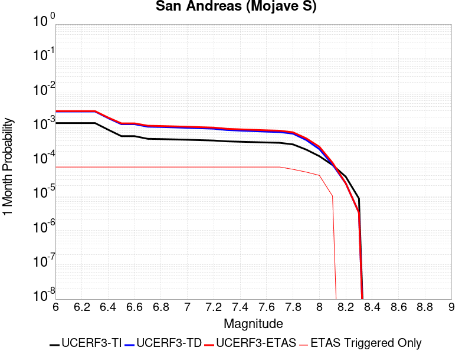 |  |  |

| Magnitude | 1 wk TI Prob | 1 wk TD Prob | 1 wk ETAS Prob | 1 wk ETAS/TD Gain | 1 wk ETAS Triggered Only | 1 mo TI Prob | 1 mo TD Prob | 1 mo ETAS Prob | 1 mo ETAS/TD Gain | 1 mo ETAS Triggered Only | 1 yr TI Prob | 1 yr TD Prob | 1 yr ETAS Prob | 1 yr ETAS/TD Gain | 1 yr ETAS Triggered Only | 10 yr TI Prob | 10 yr TD Prob | 10 yr ETAS Prob | 10 yr ETAS/TD Gain | 10 yr ETAS Triggered Only |
|-----|-----|-----|-----|-----|-----|-----|-----|-----|-----|-----|-----|-----|-----|-----|-----|-----|-----|-----|-----|-----|
| 6.0 | 3.1064058E-4 | 6.7499664E-4 | 7.358596E-4 | 1.0901679 | 6.090412E-5 | 0.0013306376 | 0.0028897638 | 0.002980856 | 1.0315224 | 9.135618E-5 | 0.016080605 | 0.034641396 | 0.03512645 | 1.0140021 | 5.02459E-4 | 0.1496549 | 0.2867374 | 0.28735644 | 1.0021589 | 8.6788373E-4 |
| 6.1 | 3.1064058E-4 | 6.7499664E-4 | 7.358596E-4 | 1.0901679 | 6.090412E-5 | 0.0013306376 | 0.0028897638 | 0.002980856 | 1.0315224 | 9.135618E-5 | 0.016080605 | 0.034641396 | 0.03512645 | 1.0140021 | 5.02459E-4 | 0.1496549 | 0.2867374 | 0.28735644 | 1.0021589 | 8.6788373E-4 |
| 6.2 | 3.1064058E-4 | 6.7499664E-4 | 7.358596E-4 | 1.0901679 | 6.090412E-5 | 0.0013306376 | 0.0028897638 | 0.002980856 | 1.0315224 | 9.135618E-5 | 0.016080605 | 0.034641396 | 0.03512645 | 1.0140021 | 5.02459E-4 | 0.1496549 | 0.2867374 | 0.28735644 | 1.0021589 | 8.6788373E-4 |
| 6.3 | 3.1064058E-4 | 6.7499664E-4 | 7.358596E-4 | 1.0901679 | 6.090412E-5 | 0.0013306376 | 0.0028897638 | 0.002980856 | 1.0315224 | 9.135618E-5 | 0.016080605 | 0.034641396 | 0.03512645 | 1.0140021 | 5.02459E-4 | 0.1496549 | 0.2867374 | 0.28735644 | 1.0021589 | 8.6788373E-4 |
| 6.4 | 1.9872203E-4 | 4.3216298E-4 | 4.930408E-4 | 1.1408677 | 6.090412E-5 | 8.5138786E-4 | 0.0018508406 | 0.0019420277 | 1.0492679 | 9.135618E-5 | 0.010316478 | 0.022307295 | 0.022738999 | 1.0193527 | 4.4155488E-4 | 0.098504856 | 0.19713911 | 0.19770144 | 1.0028524 | 7.003974E-4 |
| 6.5 | 1.291105E-4 | 2.8787713E-4 | 3.4876374E-4 | 1.211502 | 6.090412E-5 | 5.5321335E-4 | 0.0012331787 | 0.0013244222 | 1.0739905 | 9.135618E-5 | 0.006714592 | 0.014911419 | 0.015346389 | 1.0291703 | 4.4155488E-4 | 0.065152965 | 0.13817947 | 0.13874373 | 1.0040835 | 6.547193E-4 |
| 6.6 | 1.291105E-4 | 2.8787713E-4 | 3.4876374E-4 | 1.211502 | 6.090412E-5 | 5.5321335E-4 | 0.0012331787 | 0.0013244222 | 1.0739905 | 9.135618E-5 | 0.006714592 | 0.014911419 | 0.015346389 | 1.0291703 | 4.4155488E-4 | 0.065152965 | 0.13817947 | 0.13874373 | 1.0040835 | 6.547193E-4 |
| 6.7 | 1.08001186E-4 | 2.4368397E-4 | 3.0457324E-4 | 1.2498698 | 6.090412E-5 | 4.6278012E-4 | 0.0010439424 | 0.0011352033 | 1.0874194 | 9.135618E-5 | 0.0056198016 | 0.012636229 | 0.013072204 | 1.034502 | 4.4155488E-4 | 0.054797906 | 0.119323194 | 0.11987297 | 1.0046074 | 6.2426727E-4 |
| 6.8 | 1.0624356E-4 | 2.3885963E-4 | 2.997492E-4 | 1.2549179 | 6.090412E-5 | 4.5525006E-4 | 0.001023283 | 0.0011145457 | 1.0891862 | 9.135618E-5 | 0.0055285925 | 0.012387579 | 0.012823664 | 1.0352035 | 4.4155488E-4 | 0.053930566 | 0.11727233 | 0.11782339 | 1.004699 | 6.2426727E-4 |
| 6.9 | 1.0393785E-4 | 2.3256175E-4 | 2.934517E-4 | 1.2618227 | 6.090412E-5 | 4.4537184E-4 | 9.963129E-4 | 0.0010875781 | 1.0916029 | 9.135618E-5 | 0.0054089287 | 0.012062895 | 0.012484081 | 1.0349158 | 4.2632886E-4 | 0.05279156 | 0.114569746 | 0.11510901 | 1.0047069 | 6.090412E-4 |
| 7.0 | 1.0155622E-4 | 2.262555E-4 | 2.8714584E-4 | 1.269122 | 6.090412E-5 | 4.3516833E-4 | 9.693065E-4 | 0.0010605741 | 1.0941577 | 9.135618E-5 | 0.005285311 | 0.011737675 | 0.012159 | 1.0358951 | 4.2632886E-4 | 0.05161361 | 0.11182977 | 0.11237071 | 1.0048372 | 6.090412E-4 |
| 7.1 | 9.885595E-5 | 2.191377E-4 | 2.8002847E-4 | 1.2778654 | 6.090412E-5 | 4.2359953E-4 | 9.388239E-4 | 0.0010300943 | 1.0972178 | 9.135618E-5 | 0.0051451353 | 0.011370476 | 0.011791958 | 1.037068 | 4.2632886E-4 | 0.05027629 | 0.10871404 | 0.10925686 | 1.0049932 | 6.090412E-4 |
| 7.2 | 9.6411415E-5 | 2.1276584E-4 | 2.73657E-4 | 1.2861886 | 6.090412E-5 | 4.1312634E-4 | 9.115353E-4 | 0.0010028082 | 1.1001309 | 9.135618E-5 | 0.005018219 | 0.0110416515 | 0.011463273 | 1.0381846 | 4.2632886E-4 | 0.049064007 | 0.10590357 | 0.106448114 | 1.0051419 | 6.090412E-4 |
| 7.3 | 9.1180635E-5 | 1.950402E-4 | 2.5593245E-4 | 1.3122035 | 6.090412E-5 | 3.907156E-4 | 8.356189E-4 | 9.2689873E-4 | 1.1092362 | 9.135618E-5 | 0.004746591 | 0.010126315 | 0.010533255 | 1.0401864 | 4.111028E-4 | 0.046464786 | 0.09809433 | 0.0986299 | 1.0054597 | 5.938152E-4 |
| 7.4 | 8.887388E-5 | 1.8752231E-4 | 2.4841502E-4 | 1.3247224 | 6.090412E-5 | 3.8083247E-4 | 8.0341956E-4 | 8.9470233E-4 | 1.1136178 | 9.135618E-5 | 0.0046267817 | 0.00973786 | 0.01014496 | 1.0418059 | 4.111028E-4 | 0.045316286 | 0.09472819 | 0.095265746 | 1.0056748 | 5.938152E-4 |
| 7.5 | 8.6750515E-5 | 1.8083451E-4 | 2.4172763E-4 | 1.3367338 | 6.090412E-5 | 3.7173493E-4 | 7.7477493E-4 | 8.660604E-4 | 1.1178218 | 9.135618E-5 | 0.004516484 | 0.009392173 | 0.009799414 | 1.0433596 | 4.111028E-4 | 0.04425787 | 0.09169095 | 0.09223032 | 1.0058825 | 5.938152E-4 |
| 7.6 | 8.453092E-5 | 1.747065E-4 | 2.3559997E-4 | 1.3485473 | 6.090412E-5 | 3.6222505E-4 | 7.485273E-4 | 8.398151E-4 | 1.1219566 | 9.135618E-5 | 0.0044011753 | 0.009075315 | 0.009482686 | 1.0448879 | 4.111028E-4 | 0.04315024 | 0.08884873 | 0.089389786 | 1.0060896 | 5.938152E-4 |
| 7.7 | 8.259102E-5 | 1.6992437E-4 | 2.3081814E-4 | 1.3583581 | 6.090412E-5 | 3.539135E-4 | 7.280441E-4 | 8.1933377E-4 | 1.1253903 | 9.135618E-5 | 0.004300386 | 0.008827981 | 0.009235454 | 1.046157 | 4.111028E-4 | 0.042181134 | 0.08659836 | 0.087140754 | 1.0062633 | 5.938152E-4 |
| 7.8 | 7.444844E-5 | 1.531194E-4 | 1.987905E-4 | 1.2982712 | 4.567809E-5 | 3.1902574E-4 | 6.56061E-4 | 7.321412E-4 | 1.1159651 | 7.613015E-5 | 0.0038772223 | 0.007958339 | 0.008290646 | 1.0417558 | 3.3497266E-4 | 0.03810269 | 0.07841811 | 0.078895204 | 1.006084 | 5.17685E-4 |
| 7.9 | 5.2586525E-5 | 1.0025827E-4 | 1.3070728E-4 | 1.3037057 | 3.045206E-5 | 2.2535135E-4 | 4.2960755E-4 | 4.904855E-4 | 1.141706 | 6.090412E-5 | 0.0027402006 | 0.005217939 | 0.005429991 | 1.040639 | 2.1316443E-4 | 0.027066574 | 0.052290585 | 0.05257918 | 1.0055192 | 3.045206E-4 |
| 8.0 | 3.379877E-5 | 5.418614E-5 | 8.463655E-5 | 1.5619594 | 3.045206E-5 | 1.4484383E-4 | 2.3220567E-4 | 2.7787316E-4 | 1.1966683 | 4.567809E-5 | 0.0017620471 | 0.0028234406 | 0.0029145388 | 1.032265 | 9.135618E-5 | 0.017481409 | 0.028889727 | 0.028978443 | 1.0030708 | 9.135618E-5 |
| 8.1 | 1.8668277E-5 | 1.936222E-5 | 3.4587956E-5 | 1.7863631 | 1.522603E-5 | 8.000444E-5 | 8.29783E-5 | 9.820307E-5 | 1.1834788 | 1.522603E-5 | 9.736188E-4 | 0.0010097933 | 0.001025004 | 1.0150632 | 1.522603E-5 | 0.009693642 | 0.010826511 | 0.010841573 | 1.0013912 | 1.522603E-5 |
| 8.2 | 8.541571E-6 | 5.4811067E-6 | 5.4811067E-6 | 1.0 | 0.0 | 3.660622E-5 | 2.3490245E-5 | 2.3490245E-5 | 1.0 | 0.0 | 4.455896E-4 | 2.8595628E-4 | 2.8595628E-4 | 1.0 | 0.0 | 0.0044469717 | 0.0032518986 | 0.0032518986 | 1.0 | 0.0 |
| 8.3 | 1.983087E-6 | 7.693574E-7 | 7.693574E-7 | 1.0 | 0.0 | 8.498917E-6 | 3.297242E-6 | 3.297242E-6 | 1.0 | 0.0 | 1.034694E-4 | 4.01432E-5 | 4.01432E-5 | 1.0 | 0.0 | 0.0010342124 | 4.7390026E-4 | 4.7390026E-4 | 1.0 | 0.0 |

## San Andreas (Mojave N)
*[(top)](#table-of-contents)*

| 1 Week | 1 Month | 1 Year | 10 Year |
|-----|-----|-----|-----|
|  |  |  |  |

| Magnitude | 1 wk TI Prob | 1 wk TD Prob | 1 wk ETAS Prob | 1 wk ETAS/TD Gain | 1 wk ETAS Triggered Only | 1 mo TI Prob | 1 mo TD Prob | 1 mo ETAS Prob | 1 mo ETAS/TD Gain | 1 mo ETAS Triggered Only | 1 yr TI Prob | 1 yr TD Prob | 1 yr ETAS Prob | 1 yr ETAS/TD Gain | 1 yr ETAS Triggered Only | 10 yr TI Prob | 10 yr TD Prob | 10 yr ETAS Prob | 10 yr ETAS/TD Gain | 10 yr ETAS Triggered Only |
|-----|-----|-----|-----|-----|-----|-----|-----|-----|-----|-----|-----|-----|-----|-----|-----|-----|-----|-----|-----|-----|
| 6.0 | 9.877682E-5 | 1.9435467E-4 | 2.7047002E-4 | 1.3916312 | 7.613015E-5 | 4.2326056E-4 | 8.326828E-4 | 9.69603E-4 | 1.1644325 | 1.3703428E-4 | 0.0051410277 | 0.010090916 | 0.010603378 | 1.0507843 | 5.17685E-4 | 0.05023708 | 0.09846656 | 0.09919408 | 1.0073885 | 8.069796E-4 |
| 6.1 | 9.877682E-5 | 1.9435467E-4 | 2.7047002E-4 | 1.3916312 | 7.613015E-5 | 4.2326056E-4 | 8.326828E-4 | 9.69603E-4 | 1.1644325 | 1.3703428E-4 | 0.0051410277 | 0.010090916 | 0.010603378 | 1.0507843 | 5.17685E-4 | 0.05023708 | 0.09846656 | 0.09919408 | 1.0073885 | 8.069796E-4 |
| 6.2 | 9.877682E-5 | 1.9435467E-4 | 2.7047002E-4 | 1.3916312 | 7.613015E-5 | 4.2326056E-4 | 8.326828E-4 | 9.69603E-4 | 1.1644325 | 1.3703428E-4 | 0.0051410277 | 0.010090916 | 0.010603378 | 1.0507843 | 5.17685E-4 | 0.05023708 | 0.09846656 | 0.09919408 | 1.0073885 | 8.069796E-4 |
| 6.3 | 9.877682E-5 | 1.9435467E-4 | 2.7047002E-4 | 1.3916312 | 7.613015E-5 | 4.2326056E-4 | 8.326828E-4 | 9.69603E-4 | 1.1644325 | 1.3703428E-4 | 0.0051410277 | 0.010090916 | 0.010603378 | 1.0507843 | 5.17685E-4 | 0.05023708 | 0.09846656 | 0.09919408 | 1.0073885 | 8.069796E-4 |
| 6.4 | 9.877682E-5 | 1.9435467E-4 | 2.7047002E-4 | 1.3916312 | 7.613015E-5 | 4.2326056E-4 | 8.326828E-4 | 9.69603E-4 | 1.1644325 | 1.3703428E-4 | 0.0051410277 | 0.010090916 | 0.010603378 | 1.0507843 | 5.17685E-4 | 0.05023708 | 0.09846656 | 0.09919408 | 1.0073885 | 8.069796E-4 |
| 6.5 | 9.861474E-5 | 1.9409222E-4 | 2.702076E-4 | 1.3921609 | 7.613015E-5 | 4.2256617E-4 | 8.3155883E-4 | 9.6847914E-4 | 1.164655 | 1.3703428E-4 | 0.0051326132 | 0.010077358 | 0.010589826 | 1.0508534 | 5.17685E-4 | 0.050156746 | 0.09834433 | 0.09907195 | 1.0073987 | 8.069796E-4 |
| 6.6 | 9.861474E-5 | 1.9409222E-4 | 2.702076E-4 | 1.3921609 | 7.613015E-5 | 4.2256617E-4 | 8.3155883E-4 | 9.6847914E-4 | 1.164655 | 1.3703428E-4 | 0.0051326132 | 0.010077358 | 0.010589826 | 1.0508534 | 5.17685E-4 | 0.050156746 | 0.09834433 | 0.09907195 | 1.0073987 | 8.069796E-4 |
| 6.7 | 9.8552715E-5 | 1.9399171E-4 | 2.701071E-4 | 1.3923641 | 7.613015E-5 | 4.223004E-4 | 8.3112833E-4 | 9.680487E-4 | 1.1647403 | 1.3703428E-4 | 0.0051293927 | 0.010072165 | 0.010584636 | 1.05088 | 5.17685E-4 | 0.050125998 | 0.09829751 | 0.09902517 | 1.0074025 | 8.069796E-4 |
| 6.8 | 9.8464974E-5 | 1.9384324E-4 | 2.6995863E-4 | 1.3926647 | 7.613015E-5 | 4.219245E-4 | 8.304924E-4 | 9.674129E-4 | 1.1648666 | 1.3703428E-4 | 0.0051248376 | 0.010064495 | 0.010576969 | 1.050919 | 5.17685E-4 | 0.05008251 | 0.0982275 | 0.098955214 | 1.0074084 | 8.069796E-4 |
| 6.9 | 9.825824E-5 | 1.9352314E-4 | 2.6963855E-4 | 1.3933142 | 7.613015E-5 | 4.2103877E-4 | 8.2912145E-4 | 9.660421E-4 | 1.1651394 | 1.3703428E-4 | 0.0051141046 | 0.010047957 | 0.010560441 | 1.0510037 | 5.17685E-4 | 0.049980022 | 0.098076545 | 0.09880438 | 1.0074211 | 8.069796E-4 |
| 7.0 | 9.781462E-5 | 1.928364E-4 | 2.6895187E-4 | 1.3947153 | 7.613015E-5 | 4.1913814E-4 | 8.2618016E-4 | 9.631012E-4 | 1.1657279 | 1.3703428E-4 | 0.005091073 | 0.010012477 | 0.010524978 | 1.0511863 | 5.17685E-4 | 0.04976007 | 0.0977528 | 0.098480895 | 1.0074483 | 8.069796E-4 |
| 7.1 | 9.7121134E-5 | 1.9185297E-4 | 2.679685E-4 | 1.3967389 | 7.613015E-5 | 4.1616702E-4 | 8.2196813E-4 | 9.588898E-4 | 1.1665778 | 1.3703428E-4 | 0.005055068 | 0.009961666 | 0.010474193 | 1.05145 | 5.17685E-4 | 0.04941613 | 0.09728914 | 0.09801761 | 1.0074877 | 8.069796E-4 |
| 7.2 | 9.663819E-5 | 1.9116043E-4 | 2.6727605E-4 | 1.3981766 | 7.613015E-5 | 4.1409794E-4 | 8.19002E-4 | 9.5592404E-4 | 1.1671816 | 1.3703428E-4 | 0.0050299936 | 0.009925882 | 0.010438428 | 1.0516374 | 5.17685E-4 | 0.049176537 | 0.09696228 | 0.097691014 | 1.0075157 | 8.069796E-4 |
| 7.3 | 9.6277574E-5 | 1.9068507E-4 | 2.6680072E-4 | 1.3991693 | 7.613015E-5 | 4.125529E-4 | 8.16966E-4 | 9.538883E-4 | 1.1675986 | 1.3703428E-4 | 0.0050112694 | 0.00990132 | 0.010413879 | 1.0517668 | 5.17685E-4 | 0.04899759 | 0.09673555 | 0.097464465 | 1.0075351 | 8.069796E-4 |
| 7.4 | 9.593308E-5 | 1.9008234E-4 | 2.66198E-4 | 1.4004353 | 7.613015E-5 | 4.1107697E-4 | 8.1438443E-4 | 9.513071E-4 | 1.1681303 | 1.3703428E-4 | 0.0049933824 | 0.009870174 | 0.01038275 | 1.0519317 | 5.17685E-4 | 0.04882661 | 0.09645354 | 0.09718268 | 1.0075595 | 8.069796E-4 |
| 7.5 | 9.561707E-5 | 1.8954265E-4 | 2.656584E-4 | 1.4015757 | 7.613015E-5 | 4.0972308E-4 | 8.12073E-4 | 9.48996E-4 | 1.1686093 | 1.3703428E-4 | 0.0049769743 | 0.009842287 | 0.0103548765 | 1.0520804 | 5.17685E-4 | 0.048669744 | 0.09619955 | 0.096928895 | 1.0075816 | 8.069796E-4 |
| 7.6 | 9.418194E-5 | 1.8606246E-4 | 2.6217845E-4 | 1.4090884 | 7.613015E-5 | 4.0357444E-4 | 7.97167E-4 | 9.3409204E-4 | 1.1717645 | 1.3703428E-4 | 0.004902454 | 0.00966243 | 0.0101600345 | 1.0514989 | 5.02459E-4 | 0.047957025 | 0.09458092 | 0.09529779 | 1.0075794 | 7.917536E-4 |
| 7.7 | 8.202141E-5 | 1.6052493E-4 | 2.2141926E-4 | 1.3793452 | 6.090412E-5 | 3.51473E-4 | 6.877826E-4 | 7.942915E-4 | 1.1548584 | 1.06582214E-4 | 0.00427079 | 0.00834166 | 0.00879463 | 1.0543022 | 4.5678092E-4 | 0.04189639 | 0.082371704 | 0.08304235 | 1.0081418 | 7.3084945E-4 |
| 7.8 | 7.2859846E-5 | 1.4544492E-4 | 1.9111637E-4 | 1.3140119 | 4.567809E-5 | 3.1221908E-4 | 6.231865E-4 | 6.9926924E-4 | 1.1220865 | 7.613015E-5 | 0.003794643 | 0.0075609423 | 0.007893383 | 1.0439681 | 3.3497266E-4 | 0.037304975 | 0.07485102 | 0.07532996 | 1.0063986 | 5.17685E-4 |
| 7.9 | 5.3874453E-5 | 1.0065284E-4 | 1.3110183E-4 | 1.302515 | 3.045206E-5 | 2.3087008E-4 | 4.3129802E-4 | 4.9217587E-4 | 1.1411504 | 6.090412E-5 | 0.0028072202 | 0.0052384217 | 0.0054504694 | 1.0404793 | 2.1316443E-4 | 0.02772022 | 0.05251603 | 0.052804556 | 1.0054941 | 3.045206E-4 |
| 8.0 | 3.468538E-5 | 5.4373286E-5 | 8.482369E-5 | 1.5600251 | 3.045206E-5 | 1.4864317E-4 | 2.3300757E-4 | 2.7867503E-4 | 1.1959913 | 4.567809E-5 | 0.0018082283 | 0.0028331785 | 0.0029242758 | 1.0321537 | 9.135618E-5 | 0.017935853 | 0.02900292 | 0.029091626 | 1.0030586 | 9.135618E-5 |
| 8.1 | 1.9152367E-5 | 1.9455974E-5 | 3.468171E-5 | 1.7825737 | 1.522603E-5 | 8.207899E-5 | 8.338009E-5 | 9.860485E-5 | 1.1825947 | 1.522603E-5 | 9.988535E-4 | 0.0010146805 | 0.001029891 | 1.0149906 | 1.522603E-5 | 0.009943757 | 0.010884172 | 0.010899233 | 1.0013837 | 1.522603E-5 |
| 8.2 | 8.643924E-6 | 5.49522E-6 | 5.49522E-6 | 1.0 | 0.0 | 3.704486E-5 | 2.355073E-5 | 2.355073E-5 | 1.0 | 0.0 | 4.5092785E-4 | 2.866925E-4 | 2.866925E-4 | 1.0 | 0.0 | 0.0045001395 | 0.0032598388 | 0.0032598388 | 1.0 | 0.0 |
| 8.3 | 1.983087E-6 | 7.693574E-7 | 7.693574E-7 | 1.0 | 0.0 | 8.498917E-6 | 3.297242E-6 | 3.297242E-6 | 1.0 | 0.0 | 1.034694E-4 | 4.01432E-5 | 4.01432E-5 | 1.0 | 0.0 | 0.0010342124 | 4.7390026E-4 | 4.7390026E-4 | 1.0 | 0.0 |

## Bicycle Lake
*[(top)](#table-of-contents)*

| 1 Week | 1 Month | 1 Year | 10 Year |
|-----|-----|-----|-----|
|  |  |  |  |

| Magnitude | 1 wk TI Prob | 1 wk TD Prob | 1 wk ETAS Prob | 1 wk ETAS/TD Gain | 1 wk ETAS Triggered Only | 1 mo TI Prob | 1 mo TD Prob | 1 mo ETAS Prob | 1 mo ETAS/TD Gain | 1 mo ETAS Triggered Only | 1 yr TI Prob | 1 yr TD Prob | 1 yr ETAS Prob | 1 yr ETAS/TD Gain | 1 yr ETAS Triggered Only | 10 yr TI Prob | 10 yr TD Prob | 10 yr ETAS Prob | 10 yr ETAS/TD Gain | 10 yr ETAS Triggered Only |
|-----|-----|-----|-----|-----|-----|-----|-----|-----|-----|-----|-----|-----|-----|-----|-----|-----|-----|-----|-----|-----|
| 6.0 | 1.9621975E-5 | 2.2098558E-5 | 3.732425E-5 | 1.6889904 | 1.522603E-5 | 8.4091465E-5 | 9.470543E-5 | 1.251546E-4 | 1.3215146 | 3.045206E-5 | 0.0010233327 | 0.0011525637 | 0.0014871503 | 1.2902977 | 3.3497266E-4 | 0.01018633 | 0.011479173 | 0.012201633 | 1.0629365 | 7.3084945E-4 |
| 6.1 | 1.9621975E-5 | 2.2098558E-5 | 3.732425E-5 | 1.6889904 | 1.522603E-5 | 8.4091465E-5 | 9.470543E-5 | 1.251546E-4 | 1.3215146 | 3.045206E-5 | 0.0010233327 | 0.0011525637 | 0.0014871503 | 1.2902977 | 3.3497266E-4 | 0.01018633 | 0.011479173 | 0.012201633 | 1.0629365 | 7.3084945E-4 |
| 6.2 | 9.9971285E-6 | 1.1256391E-5 | 2.648225E-5 | 2.3526413 | 1.522603E-5 | 4.2844134E-5 | 4.824108E-5 | 7.869167E-5 | 1.631217 | 3.045206E-5 | 5.2150246E-4 | 5.8722886E-4 | 7.5461686E-4 | 1.2850473 | 1.6748633E-4 | 0.0052028033 | 0.0058618775 | 0.0061948863 | 1.0568093 | 3.3497266E-4 |
| 6.3 | 9.589428E-6 | 1.0799068E-5 | 2.6024934E-5 | 2.409924 | 1.522603E-5 | 4.10969E-5 | 4.628119E-5 | 7.673184E-5 | 1.6579487 | 3.045206E-5 | 5.002399E-4 | 5.633797E-4 | 7.307717E-4 | 1.297121 | 1.6748633E-4 | 0.0049911533 | 0.0056246053 | 0.005957694 | 1.05922 | 3.3497266E-4 |
| 6.4 | 9.589428E-6 | 1.0799068E-5 | 2.6024934E-5 | 2.409924 | 1.522603E-5 | 4.10969E-5 | 4.628119E-5 | 7.673184E-5 | 1.6579487 | 3.045206E-5 | 5.002399E-4 | 5.633797E-4 | 7.307717E-4 | 1.297121 | 1.6748633E-4 | 0.0049911533 | 0.0056246053 | 0.005957694 | 1.05922 | 3.3497266E-4 |
| 6.5 | 5.557707E-6 | 6.286038E-6 | 2.1511973E-5 | 3.422183 | 1.522603E-5 | 2.3818526E-5 | 2.6940037E-5 | 5.7391277E-5 | 2.1303341 | 3.045206E-5 | 2.8995197E-4 | 3.2797246E-4 | 4.8018285E-4 | 1.464095 | 1.522603E-4 | 0.0028957394 | 0.0032775209 | 0.0035658674 | 1.0879769 | 2.8929458E-4 |
| 6.6 | 4.8742945E-6 | 5.5136734E-6 | 5.5136734E-6 | 1.0 | 0.0 | 2.0889667E-5 | 2.3629962E-5 | 3.8855633E-5 | 1.6443375 | 1.522603E-5 | 2.54302E-4 | 2.87683E-4 | 3.9423455E-4 | 1.3703784 | 1.06582214E-4 | 0.002540112 | 0.0028756752 | 0.0030882265 | 1.0739136 | 2.1316443E-4 |
| 6.7 | 3.991108E-6 | 4.5162255E-6 | 4.5162255E-6 | 1.0 | 0.0 | 1.7104636E-5 | 1.9355251E-5 | 3.4580986E-5 | 1.7866462 | 1.522603E-5 | 2.0822904E-4 | 2.3565018E-4 | 3.2698485E-4 | 1.3875858 | 9.135618E-5 | 0.0020803404 | 0.0023565018 | 0.0025235936 | 1.0709066 | 1.6748633E-4 |

## Towne Pass
*[(top)](#table-of-contents)*

| 1 Week | 1 Month | 1 Year | 10 Year |
|-----|-----|-----|-----|
|  |  |  |  |

| Magnitude | 1 wk TI Prob | 1 wk TD Prob | 1 wk ETAS Prob | 1 wk ETAS/TD Gain | 1 wk ETAS Triggered Only | 1 mo TI Prob | 1 mo TD Prob | 1 mo ETAS Prob | 1 mo ETAS/TD Gain | 1 mo ETAS Triggered Only | 1 yr TI Prob | 1 yr TD Prob | 1 yr ETAS Prob | 1 yr ETAS/TD Gain | 1 yr ETAS Triggered Only | 10 yr TI Prob | 10 yr TD Prob | 10 yr ETAS Prob | 10 yr ETAS/TD Gain | 10 yr ETAS Triggered Only |
|-----|-----|-----|-----|-----|-----|-----|-----|-----|-----|-----|-----|-----|-----|-----|-----|-----|-----|-----|-----|-----|
| 6.0 | 3.849728E-6 | 3.8945745E-6 | 1.9120545E-5 | 4.909534 | 1.522603E-5 | 1.649873E-5 | 1.669095E-5 | 6.236828E-5 | 3.7366524 | 4.567809E-5 | 2.0085352E-4 | 2.0319775E-4 | 4.9243355E-4 | 2.4234202 | 2.8929458E-4 | 0.0020067208 | 0.0020305486 | 0.0027599141 | 1.3591962 | 7.3084945E-4 |
| 6.1 | 3.849728E-6 | 3.8945745E-6 | 1.9120545E-5 | 4.909534 | 1.522603E-5 | 1.649873E-5 | 1.669095E-5 | 6.236828E-5 | 3.7366524 | 4.567809E-5 | 2.0085352E-4 | 2.0319775E-4 | 4.9243355E-4 | 2.4234202 | 2.8929458E-4 | 0.0020067208 | 0.0020305486 | 0.0027599141 | 1.3591962 | 7.3084945E-4 |
| 6.2 | 3.849728E-6 | 3.8945745E-6 | 1.9120545E-5 | 4.909534 | 1.522603E-5 | 1.649873E-5 | 1.669095E-5 | 6.236828E-5 | 3.7366524 | 4.567809E-5 | 2.0085352E-4 | 2.0319775E-4 | 4.9243355E-4 | 2.4234202 | 2.8929458E-4 | 0.0020067208 | 0.0020305486 | 0.0027599141 | 1.3591962 | 7.3084945E-4 |
| 6.3 | 3.849728E-6 | 3.8945745E-6 | 1.9120545E-5 | 4.909534 | 1.522603E-5 | 1.649873E-5 | 1.669095E-5 | 6.236828E-5 | 3.7366524 | 4.567809E-5 | 2.0085352E-4 | 2.0319775E-4 | 4.9243355E-4 | 2.4234202 | 2.8929458E-4 | 0.0020067208 | 0.0020305486 | 0.0027599141 | 1.3591962 | 7.3084945E-4 |
| 6.4 | 3.849728E-6 | 3.8945745E-6 | 1.9120545E-5 | 4.909534 | 1.522603E-5 | 1.649873E-5 | 1.669095E-5 | 6.236828E-5 | 3.7366524 | 4.567809E-5 | 2.0085352E-4 | 2.0319775E-4 | 4.9243355E-4 | 2.4234202 | 2.8929458E-4 | 0.0020067208 | 0.0020305486 | 0.0027599141 | 1.3591962 | 7.3084945E-4 |
| 6.5 | 1.1953545E-6 | 1.203065E-6 | 1.6429078E-5 | 13.656017 | 1.522603E-5 | 5.1229376E-6 | 5.1559837E-6 | 2.0381935E-5 | 3.9530644 | 1.522603E-5 | 6.236998E-5 | 6.277241E-5 | 1.3889778E-4 | 2.2127202 | 7.613015E-5 | 6.235248E-4 | 6.275585E-4 | 8.101562E-4 | 1.2909652 | 1.8271236E-4 |
| 6.6 | 1.1953545E-6 | 1.203065E-6 | 1.6429078E-5 | 13.656017 | 1.522603E-5 | 5.1229376E-6 | 5.1559837E-6 | 2.0381935E-5 | 3.9530644 | 1.522603E-5 | 6.236998E-5 | 6.277241E-5 | 1.3889778E-4 | 2.2127202 | 7.613015E-5 | 6.235248E-4 | 6.275585E-4 | 8.101562E-4 | 1.2909652 | 1.8271236E-4 |
| 6.7 | 8.375951E-7 | 8.410778E-7 | 8.410778E-7 | 1.0 | 0.0 | 3.5896885E-6 | 3.6046144E-6 | 3.6046144E-6 | 1.0 | 0.0 | 4.370358E-5 | 4.3885353E-5 | 5.9110716E-5 | 1.3469349 | 1.522603E-5 | 4.3694986E-4 | 4.387726E-4 | 5.1486935E-4 | 1.1734309 | 7.613015E-5 |
| 6.8 | 6.38041E-7 | 6.3922516E-7 | 6.3922516E-7 | 1.0 | 0.0 | 2.7344586E-6 | 2.7395338E-6 | 2.7395338E-6 | 1.0 | 0.0 | 3.3291526E-5 | 3.335335E-5 | 4.8578873E-5 | 1.4564916 | 1.522603E-5 | 3.3286537E-4 | 3.3348726E-4 | 3.7915012E-4 | 1.1369253 | 4.567809E-5 |
| 6.9 | 5.3460053E-7 | 5.3454215E-7 | 5.3454215E-7 | 1.0 | 0.0 | 2.2911431E-6 | 2.290893E-6 | 2.290893E-6 | 1.0 | 0.0 | 2.789431E-5 | 2.78913E-5 | 2.78913E-5 | 1.0 | 0.0 | 2.789081E-4 | 2.788813E-4 | 3.0932488E-4 | 1.1091632 | 3.045206E-5 |
| 7.0 | 3.557783E-7 | 3.5324976E-7 | 3.5324976E-7 | 1.0 | 0.0 | 1.5247632E-6 | 1.5139268E-6 | 1.5139268E-6 | 1.0 | 0.0 | 1.8563835E-5 | 1.843191E-5 | 1.843191E-5 | 1.0 | 0.0 | 1.8562283E-4 | 1.8430466E-4 | 1.9952789E-4 | 1.0825981 | 1.522603E-5 |
| 7.1 | 3.037942E-7 | 3.0002903E-7 | 3.0002903E-7 | 1.0 | 0.0 | 1.3019744E-6 | 1.285838E-6 | 1.285838E-6 | 1.0 | 0.0 | 1.5851423E-5 | 1.5654974E-5 | 1.5654974E-5 | 1.0 | 0.0 | 1.5850292E-4 | 1.5653945E-4 | 1.7176311E-4 | 1.0972512 | 1.522603E-5 |
| 7.2 | 2.0808248E-7 | 2.0218252E-7 | 2.0218252E-7 | 1.0 | 0.0 | 8.917818E-7 | 8.6649624E-7 | 8.6649624E-7 | 1.0 | 0.0 | 1.0857389E-5 | 1.0549546E-5 | 1.0549546E-5 | 1.0 | 0.0 | 1.0856859E-4 | 1.0549091E-4 | 1.2071533E-4 | 1.1443198 | 1.522603E-5 |
| 7.3 | 1.1162073E-7 | 1.0637251E-7 | 1.0637251E-7 | 1.0 | 0.0 | 4.7837443E-7 | 4.5588212E-7 | 4.5588212E-7 | 1.0 | 0.0 | 5.8241935E-6 | 5.5503524E-6 | 5.5503524E-6 | 1.0 | 0.0 | 5.8240406E-5 | 5.550234E-5 | 7.0727525E-5 | 1.2743161 | 1.522603E-5 |

## Nelson Lake
*[(top)](#table-of-contents)*

| 1 Week | 1 Month | 1 Year | 10 Year |
|-----|-----|-----|-----|
|  |  |  |  |

| Magnitude | 1 wk TI Prob | 1 wk TD Prob | 1 wk ETAS Prob | 1 wk ETAS/TD Gain | 1 wk ETAS Triggered Only | 1 mo TI Prob | 1 mo TD Prob | 1 mo ETAS Prob | 1 mo ETAS/TD Gain | 1 mo ETAS Triggered Only | 1 yr TI Prob | 1 yr TD Prob | 1 yr ETAS Prob | 1 yr ETAS/TD Gain | 1 yr ETAS Triggered Only | 10 yr TI Prob | 10 yr TD Prob | 10 yr ETAS Prob | 10 yr ETAS/TD Gain | 10 yr ETAS Triggered Only |
|-----|-----|-----|-----|-----|-----|-----|-----|-----|-----|-----|-----|-----|-----|-----|-----|-----|-----|-----|-----|-----|
| 6.0 | 9.913453E-6 | 1.0192408E-5 | 4.0644158E-5 | 3.9876897 | 3.045206E-5 | 4.2485535E-5 | 4.3681073E-5 | 1.04582534E-4 | 2.39423 | 6.090412E-5 | 5.1713863E-4 | 5.3169765E-4 | 7.904025E-4 | 1.4865639 | 2.588425E-4 | 0.0051593683 | 0.0053052832 | 0.0059413835 | 1.1198995 | 6.394933E-4 |
| 6.1 | 9.913453E-6 | 1.0192408E-5 | 4.0644158E-5 | 3.9876897 | 3.045206E-5 | 4.2485535E-5 | 4.3681073E-5 | 1.04582534E-4 | 2.39423 | 6.090412E-5 | 5.1713863E-4 | 5.3169765E-4 | 7.904025E-4 | 1.4865639 | 2.588425E-4 | 0.0051593683 | 0.0053052832 | 0.0059413835 | 1.1198995 | 6.394933E-4 |
| 6.2 | 4.5596407E-6 | 4.696388E-6 | 1.9922347E-5 | 4.2420573 | 1.522603E-5 | 1.954117E-5 | 2.0127229E-5 | 5.0578677E-5 | 2.5129478 | 3.045206E-5 | 2.3788778E-4 | 2.4502273E-4 | 3.3635652E-4 | 1.3727565 | 9.135618E-5 | 0.0023763329 | 0.0024476517 | 0.002690672 | 1.099287 | 2.4361648E-4 |
| 6.3 | 4.5596407E-6 | 4.696388E-6 | 1.9922347E-5 | 4.2420573 | 1.522603E-5 | 1.954117E-5 | 2.0127229E-5 | 5.0578677E-5 | 2.5129478 | 3.045206E-5 | 2.3788778E-4 | 2.4502273E-4 | 3.3635652E-4 | 1.3727565 | 9.135618E-5 | 0.0023763329 | 0.0024476517 | 0.002690672 | 1.099287 | 2.4361648E-4 |
| 6.4 | 3.4025713E-6 | 3.509956E-6 | 1.8735933E-5 | 5.3379393 | 1.522603E-5 | 1.4582367E-5 | 1.5042587E-5 | 4.549419E-5 | 3.0243595 | 3.045206E-5 | 1.7752586E-4 | 1.8312894E-4 | 2.744684E-4 | 1.4987712 | 9.135618E-5 | 0.001773841 | 0.0018298633 | 0.002057836 | 1.1245844 | 2.2839046E-4 |
| 6.5 | 2.8352947E-6 | 2.927907E-6 | 1.8153893E-5 | 6.200297 | 1.522603E-5 | 1.2151207E-5 | 1.25481165E-5 | 2.7773956E-5 | 2.2133963 | 1.522603E-5 | 1.479309E-4 | 1.5276336E-4 | 2.2888188E-4 | 1.4982773 | 7.613015E-5 | 0.0014783246 | 0.0015266574 | 0.0017090908 | 1.1194986 | 1.8271236E-4 |
| 6.6 | 2.251518E-6 | 2.3291102E-6 | 1.7555105E-5 | 7.537258 | 1.522603E-5 | 9.649328E-6 | 9.981866E-6 | 2.5207744E-5 | 2.525354 | 1.522603E-5 | 1.1747423E-4 | 1.2152307E-4 | 1.9764397E-4 | 1.6263906 | 7.613015E-5 | 0.0011741214 | 0.001214628 | 0.0013971183 | 1.1502439 | 1.8271236E-4 |
| 6.7 | 1.8911853E-6 | 1.959177E-6 | 1.7185177E-5 | 8.77163 | 1.522603E-5 | 8.105055E-6 | 8.39645E-6 | 2.3622351E-5 | 2.8133738 | 1.522603E-5 | 9.867457E-5 | 1.0222256E-4 | 1.3267151E-4 | 1.2978692 | 3.045206E-5 | 9.863076E-4 | 0.0010218129 | 0.0011130758 | 1.0893146 | 9.135618E-5 |
| 6.8 | 1.4874814E-6 | 1.5438616E-6 | 1.6769869E-5 | 10.8622875 | 1.522603E-5 | 6.374905E-6 | 6.6165358E-6 | 2.1842465E-5 | 3.3011935 | 1.522603E-5 | 7.76117E-5 | 8.0553866E-5 | 1.1100347E-4 | 1.3780031 | 3.045206E-5 | 7.75846E-4 | 8.0529775E-4 | 8.9658034E-4 | 1.1133527 | 9.135618E-5 |
| 6.9 | 6.835972E-7 | 7.140097E-7 | 1.594003E-5 | 22.324669 | 1.522603E-5 | 2.9296991E-6 | 3.0600397E-6 | 1.8286024E-5 | 5.975747 | 1.522603E-5 | 3.56685E-5 | 3.7255664E-5 | 5.2481126E-5 | 1.4086751 | 1.522603E-5 | 3.5662777E-4 | 3.7252545E-4 | 4.3340688E-4 | 1.1634289 | 6.090412E-5 |

## Paradise
*[(top)](#table-of-contents)*

| 1 Week | 1 Month | 1 Year | 10 Year |
|-----|-----|-----|-----|
|  |  |  |  |

| Magnitude | 1 wk TI Prob | 1 wk TD Prob | 1 wk ETAS Prob | 1 wk ETAS/TD Gain | 1 wk ETAS Triggered Only | 1 mo TI Prob | 1 mo TD Prob | 1 mo ETAS Prob | 1 mo ETAS/TD Gain | 1 mo ETAS Triggered Only | 1 yr TI Prob | 1 yr TD Prob | 1 yr ETAS Prob | 1 yr ETAS/TD Gain | 1 yr ETAS Triggered Only | 10 yr TI Prob | 10 yr TD Prob | 10 yr ETAS Prob | 10 yr ETAS/TD Gain | 10 yr ETAS Triggered Only |
|-----|-----|-----|-----|-----|-----|-----|-----|-----|-----|-----|-----|-----|-----|-----|-----|-----|-----|-----|-----|-----|
| 6.0 | 1.4851273E-5 | 1.6695341E-5 | 3.1921118E-5 | 1.9119775 | 1.522603E-5 | 6.364676E-5 | 7.154963E-5 | 1.1722445E-4 | 1.6383656 | 4.567809E-5 | 7.7462377E-4 | 8.707922E-4 | 0.0011141966 | 1.2795206 | 2.4361648E-4 | 0.0077192914 | 0.008676181 | 0.00917428 | 1.05741 | 5.02459E-4 |
| 6.1 | 1.4851273E-5 | 1.6695341E-5 | 3.1921118E-5 | 1.9119775 | 1.522603E-5 | 6.364676E-5 | 7.154963E-5 | 1.1722445E-4 | 1.6383656 | 4.567809E-5 | 7.7462377E-4 | 8.707922E-4 | 0.0011141966 | 1.2795206 | 2.4361648E-4 | 0.0077192914 | 0.008676181 | 0.00917428 | 1.05741 | 5.02459E-4 |
| 6.2 | 1.4851273E-5 | 1.6695341E-5 | 3.1921118E-5 | 1.9119775 | 1.522603E-5 | 6.364676E-5 | 7.154963E-5 | 1.1722445E-4 | 1.6383656 | 4.567809E-5 | 7.7462377E-4 | 8.707922E-4 | 0.0011141966 | 1.2795206 | 2.4361648E-4 | 0.0077192914 | 0.008676181 | 0.00917428 | 1.05741 | 5.02459E-4 |
| 6.3 | 1.0426831E-5 | 1.1889049E-5 | 2.7114898E-5 | 2.2806616 | 1.522603E-5 | 4.4685654E-5 | 5.095211E-5 | 8.140261E-5 | 1.59763 | 3.045206E-5 | 5.43912E-4 | 6.2017125E-4 | 7.7233714E-4 | 1.2453611 | 1.522603E-4 | 0.0054258266 | 0.0061850143 | 0.006442256 | 1.041591 | 2.588425E-4 |
| 6.4 | 1.0426831E-5 | 1.1889049E-5 | 2.7114898E-5 | 2.2806616 | 1.522603E-5 | 4.4685654E-5 | 5.095211E-5 | 8.140261E-5 | 1.59763 | 3.045206E-5 | 5.43912E-4 | 6.2017125E-4 | 7.7233714E-4 | 1.2453611 | 1.522603E-4 | 0.0054258266 | 0.0061850143 | 0.006442256 | 1.041591 | 2.588425E-4 |
| 6.5 | 9.25027E-6 | 1.0620336E-5 | 2.5846204E-5 | 2.4336522 | 1.522603E-5 | 3.964341E-5 | 4.551496E-5 | 6.0740298E-5 | 1.3345128 | 1.522603E-5 | 4.8255164E-4 | 5.5400864E-4 | 6.90967E-4 | 1.2472134 | 1.3703428E-4 | 0.0048150513 | 0.0055267746 | 0.0057539027 | 1.041096 | 2.2839046E-4 |
| 6.6 | 7.904275E-6 | 9.159836E-6 | 2.4385727E-5 | 2.662245 | 1.522603E-5 | 3.3875025E-5 | 3.925587E-5 | 5.44813E-5 | 1.3878511 | 1.522603E-5 | 4.1235037E-4 | 4.7783932E-4 | 5.995894E-4 | 1.2547928 | 1.2180824E-4 | 0.0041158604 | 0.0047685155 | 0.0049503567 | 1.0381337 | 1.8271236E-4 |
| 6.7 | 7.2061953E-6 | 8.407527E-6 | 2.363343E-5 | 2.8109846 | 1.522603E-5 | 3.088333E-5 | 3.6031786E-5 | 5.1257266E-5 | 1.422557 | 1.522603E-5 | 3.7593965E-4 | 4.3860235E-4 | 5.2991847E-4 | 1.208198 | 9.135618E-5 | 0.003753043 | 0.0043777362 | 0.0045141703 | 1.0311655 | 1.3703428E-4 |
| 6.8 | 6.6948724E-6 | 7.842423E-6 | 2.3068334E-5 | 2.9414804 | 1.522603E-5 | 2.8691995E-5 | 3.3609973E-5 | 4.883549E-5 | 1.453006 | 1.522603E-5 | 3.4926904E-4 | 4.0912814E-4 | 5.0044694E-4 | 1.2232034 | 9.135618E-5 | 0.003487206 | 0.004084107 | 0.0042205816 | 1.033416 | 1.3703428E-4 |
| 6.9 | 6.0421025E-6 | 7.1308505E-6 | 7.1308505E-6 | 1.0 | 0.0 | 2.5894467E-5 | 3.0560448E-5 | 3.0560448E-5 | 1.0 | 0.0 | 3.1521954E-4 | 3.7201334E-4 | 4.328948E-4 | 1.163654 | 6.090412E-5 | 0.0031477278 | 0.003714244 | 0.0038204305 | 1.0285889 | 1.06582214E-4 |
| 7.0 | 4.134091E-6 | 5.080469E-6 | 5.080469E-6 | 1.0 | 0.0 | 1.7717413E-5 | 2.1773263E-5 | 2.1773263E-5 | 1.0 | 0.0 | 2.1568815E-4 | 2.6505877E-4 | 2.9550277E-4 | 1.1148576 | 3.045206E-5 | 0.0021547892 | 0.0026475794 | 0.0026931367 | 1.0172071 | 4.567809E-5 |
| 7.1 | 3.7674888E-6 | 4.6320133E-6 | 4.6320133E-6 | 1.0 | 0.0 | 1.6146281E-5 | 1.9851343E-5 | 1.9851343E-5 | 1.0 | 0.0 | 1.9656324E-4 | 2.4166482E-4 | 2.7210952E-4 | 1.1259791 | 3.045206E-5 | 0.0019638946 | 0.002414171 | 0.0024597386 | 1.0188751 | 4.567809E-5 |
| 7.2 | 3.4065345E-6 | 4.1568514E-6 | 4.1568514E-6 | 1.0 | 0.0 | 1.4599351E-5 | 1.7814966E-5 | 1.7814966E-5 | 1.0 | 0.0 | 1.777326E-4 | 2.1687712E-4 | 2.4732258E-4 | 1.1403811 | 3.045206E-5 | 0.0017759053 | 0.0021668028 | 0.002212382 | 1.0210352 | 4.567809E-5 |
| 7.3 | 2.9934936E-6 | 3.629423E-6 | 3.629423E-6 | 1.0 | 0.0 | 1.2829195E-5 | 1.5554586E-5 | 1.5554586E-5 | 1.0 | 0.0 | 1.5618425E-4 | 1.893621E-4 | 2.1980838E-4 | 1.1607834 | 3.045206E-5 | 0.0015607453 | 0.0018921527 | 0.0019225471 | 1.0160635 | 3.045206E-5 |
| 7.4 | 2.4049796E-6 | 2.889062E-6 | 2.889062E-6 | 1.0 | 0.0 | 1.0307015E-5 | 1.23816435E-5 | 1.23816435E-5 | 1.0 | 0.0 | 1.2548068E-4 | 1.5073753E-4 | 1.6596126E-4 | 1.100995 | 1.522603E-5 | 0.0012540985 | 0.0015064942 | 0.0015216974 | 1.0100917 | 1.522603E-5 |
| 7.5 | 1.2710091E-6 | 1.5135054E-6 | 1.5135054E-6 | 1.0 | 0.0 | 5.44717E-6 | 6.4864425E-6 | 6.4864425E-6 | 1.0 | 0.0 | 6.631728E-5 | 7.897083E-5 | 7.897083E-5 | 1.0 | 0.0 | 6.6297496E-4 | 7.8955025E-4 | 7.8955025E-4 | 1.0 | 0.0 |
| 7.6 | 2.21172E-7 | 2.6040124E-7 | 2.6040124E-7 | 1.0 | 0.0 | 9.478797E-7 | 1.116005E-6 | 1.116005E-6 | 1.0 | 0.0 | 1.1540374E-5 | 1.3587305E-5 | 1.3587305E-5 | 1.0 | 0.0 | 1.1539775E-4 | 1.3586757E-4 | 1.3586757E-4 | 1.0 | 0.0 |

## Garlic Springs
*[(top)](#table-of-contents)*

| 1 Week | 1 Month | 1 Year | 10 Year |
|-----|-----|-----|-----|
|  |  |  |  |

| Magnitude | 1 wk TI Prob | 1 wk TD Prob | 1 wk ETAS Prob | 1 wk ETAS/TD Gain | 1 wk ETAS Triggered Only | 1 mo TI Prob | 1 mo TD Prob | 1 mo ETAS Prob | 1 mo ETAS/TD Gain | 1 mo ETAS Triggered Only | 1 yr TI Prob | 1 yr TD Prob | 1 yr ETAS Prob | 1 yr ETAS/TD Gain | 1 yr ETAS Triggered Only | 10 yr TI Prob | 10 yr TD Prob | 10 yr ETAS Prob | 10 yr ETAS/TD Gain | 10 yr ETAS Triggered Only |
|-----|-----|-----|-----|-----|-----|-----|-----|-----|-----|-----|-----|-----|-----|-----|-----|-----|-----|-----|-----|-----|
| 6.0 | 1.6760017E-5 | 1.8778032E-5 | 1.8778032E-5 | 1.0 | 0.0 | 7.182667E-5 | 8.047546E-5 | 9.570026E-5 | 1.1891857 | 1.522603E-5 | 8.7413884E-4 | 9.794658E-4 | 0.001146788 | 1.1708301 | 1.6748633E-4 | 0.008707083 | 0.009763034 | 0.010215356 | 1.04633 | 4.5678092E-4 |
| 6.1 | 9.852767E-6 | 1.097425E-5 | 1.097425E-5 | 1.0 | 0.0 | 4.222546E-5 | 4.703205E-5 | 6.2257364E-5 | 1.3237221 | 1.522603E-5 | 5.139737E-4 | 5.7253573E-4 | 6.790569E-4 | 1.1860516 | 1.06582214E-4 | 0.005127866 | 0.005717566 | 0.0060052066 | 1.0503082 | 2.8929458E-4 |
| 6.2 | 9.852767E-6 | 1.097425E-5 | 1.097425E-5 | 1.0 | 0.0 | 4.222546E-5 | 4.703205E-5 | 6.2257364E-5 | 1.3237221 | 1.522603E-5 | 5.139737E-4 | 5.7253573E-4 | 6.790569E-4 | 1.1860516 | 1.06582214E-4 | 0.005127866 | 0.005717566 | 0.0060052066 | 1.0503082 | 2.8929458E-4 |
| 6.3 | 4.3167724E-6 | 4.7782996E-6 | 4.7782996E-6 | 1.0 | 0.0 | 1.8500323E-5 | 2.0478396E-5 | 3.5704114E-5 | 1.7435015 | 1.522603E-5 | 2.2521814E-4 | 2.4931898E-4 | 2.7976345E-4 | 1.1221105 | 3.045206E-5 | 0.0022499003 | 0.002492651 | 0.0026141559 | 1.0487452 | 1.2180824E-4 |
| 6.4 | 4.3167724E-6 | 4.7782996E-6 | 4.7782996E-6 | 1.0 | 0.0 | 1.8500323E-5 | 2.0478396E-5 | 3.5704114E-5 | 1.7435015 | 1.522603E-5 | 2.2521814E-4 | 2.4931898E-4 | 2.7976345E-4 | 1.1221105 | 3.045206E-5 | 0.0022499003 | 0.002492651 | 0.0026141559 | 1.0487452 | 1.2180824E-4 |
| 6.5 | 4.3167724E-6 | 4.7782996E-6 | 4.7782996E-6 | 1.0 | 0.0 | 1.8500323E-5 | 2.0478396E-5 | 3.5704114E-5 | 1.7435015 | 1.522603E-5 | 2.2521814E-4 | 2.4931898E-4 | 2.7976345E-4 | 1.1221105 | 3.045206E-5 | 0.0022499003 | 0.002492651 | 0.0026141559 | 1.0487452 | 1.2180824E-4 |
| 6.6 | 4.301311E-6 | 4.761167E-6 | 4.761167E-6 | 1.0 | 0.0 | 1.8434059E-5 | 2.0404972E-5 | 3.5630692E-5 | 1.746177 | 1.522603E-5 | 2.2441156E-4 | 2.4842523E-4 | 2.7886973E-4 | 1.1225499 | 3.045206E-5 | 0.0022418506 | 0.002483734 | 0.0026052396 | 1.0489206 | 1.2180824E-4 |
| 6.7 | 3.8599724E-6 | 4.2713013E-6 | 4.2713013E-6 | 1.0 | 0.0 | 1.6542634E-5 | 1.8305576E-5 | 3.3531327E-5 | 1.8317548 | 1.522603E-5 | 2.0138794E-4 | 2.228704E-4 | 2.5331567E-4 | 1.1366053 | 3.045206E-5 | 0.0020120554 | 0.0022287038 | 0.0023350485 | 1.0477159 | 1.06582214E-4 |

## San Andreas (San Bernardino N)
*[(top)](#table-of-contents)*

| 1 Week | 1 Month | 1 Year | 10 Year |
|-----|-----|-----|-----|
|  |  |  |  |

| Magnitude | 1 wk TI Prob | 1 wk TD Prob | 1 wk ETAS Prob | 1 wk ETAS/TD Gain | 1 wk ETAS Triggered Only | 1 mo TI Prob | 1 mo TD Prob | 1 mo ETAS Prob | 1 mo ETAS/TD Gain | 1 mo ETAS Triggered Only | 1 yr TI Prob | 1 yr TD Prob | 1 yr ETAS Prob | 1 yr ETAS/TD Gain | 1 yr ETAS Triggered Only | 10 yr TI Prob | 10 yr TD Prob | 10 yr ETAS Prob | 10 yr ETAS/TD Gain | 10 yr ETAS Triggered Only |
|-----|-----|-----|-----|-----|-----|-----|-----|-----|-----|-----|-----|-----|-----|-----|-----|-----|-----|-----|-----|-----|
| 6.0 | 1.4273766E-4 | 3.1635934E-4 | 3.6202295E-4 | 1.1443411 | 4.567809E-5 | 6.115894E-4 | 0.0013551271 | 0.0014311541 | 1.0561032 | 7.613015E-5 | 0.0074207084 | 0.016375363 | 0.016689872 | 1.0192063 | 3.1974664E-4 | 0.07177748 | 0.15038711 | 0.15074933 | 1.0024085 | 4.2632886E-4 |
| 6.1 | 1.4273766E-4 | 3.1635934E-4 | 3.6202295E-4 | 1.1443411 | 4.567809E-5 | 6.115894E-4 | 0.0013551271 | 0.0014311541 | 1.0561032 | 7.613015E-5 | 0.0074207084 | 0.016375363 | 0.016689872 | 1.0192063 | 3.1974664E-4 | 0.07177748 | 0.15038711 | 0.15074933 | 1.0024085 | 4.2632886E-4 |
| 6.2 | 1.4273766E-4 | 3.1635934E-4 | 3.6202295E-4 | 1.1443411 | 4.567809E-5 | 6.115894E-4 | 0.0013551271 | 0.0014311541 | 1.0561032 | 7.613015E-5 | 0.0074207084 | 0.016375363 | 0.016689872 | 1.0192063 | 3.1974664E-4 | 0.07177748 | 0.15038711 | 0.15074933 | 1.0024085 | 4.2632886E-4 |
| 6.3 | 1.3730655E-4 | 3.0540637E-4 | 3.510705E-4 | 1.1495193 | 4.567809E-5 | 5.883239E-4 | 0.0013082335 | 0.0013842641 | 1.0581169 | 7.613015E-5 | 0.0071393442 | 0.015812824 | 0.016127514 | 1.0199009 | 3.1974664E-4 | 0.06914291 | 0.14568701 | 0.14605123 | 1.0025 | 4.2632886E-4 |
| 6.4 | 1.3730655E-4 | 3.0540637E-4 | 3.510705E-4 | 1.1495193 | 4.567809E-5 | 5.883239E-4 | 0.0013082335 | 0.0013842641 | 1.0581169 | 7.613015E-5 | 0.0071393442 | 0.015812824 | 0.016127514 | 1.0199009 | 3.1974664E-4 | 0.06914291 | 0.14568701 | 0.14605123 | 1.0025 | 4.2632886E-4 |
| 6.5 | 1.2942807E-4 | 2.8954886E-4 | 3.3521373E-4 | 1.1577104 | 4.567809E-5 | 5.545738E-4 | 0.0012403387 | 0.0013163744 | 1.0613024 | 7.613015E-5 | 0.0067310524 | 0.014997809 | 0.015312761 | 1.0209998 | 3.1974664E-4 | 0.06530788 | 0.13882978 | 0.13919693 | 1.0026445 | 4.2632886E-4 |
| 6.6 | 1.1125901E-4 | 2.5393223E-4 | 2.9959873E-4 | 1.1798373 | 4.567809E-5 | 4.767372E-4 | 0.0010878295 | 0.0011638767 | 1.0699074 | 7.613015E-5 | 0.005788839 | 0.013164529 | 0.013480065 | 1.0239687 | 3.1974664E-4 | 0.056403454 | 0.12311955 | 0.12349338 | 1.0030364 | 4.2632886E-4 |
| 6.7 | 1.02209575E-4 | 2.3527986E-4 | 2.8094722E-4 | 1.194098 | 4.567809E-5 | 4.3796748E-4 | 0.001007954 | 0.0010840074 | 1.0754533 | 7.613015E-5 | 0.0053192247 | 0.012203212 | 0.012519057 | 1.0258821 | 3.1974664E-4 | 0.051936906 | 0.11491149 | 0.115288824 | 1.0032837 | 4.2632886E-4 |
| 6.8 | 9.610582E-5 | 2.2053412E-4 | 2.6620214E-4 | 1.2070792 | 4.567809E-5 | 4.1181705E-4 | 9.448046E-4 | 0.0010208628 | 1.0805016 | 7.613015E-5 | 0.0050023515 | 0.011442591 | 0.0117586795 | 1.0276238 | 3.1974664E-4 | 0.048912346 | 0.10831282 | 0.108692974 | 1.0035098 | 4.2632886E-4 |
| 6.9 | 9.3877505E-5 | 2.150883E-4 | 2.6075655E-4 | 1.2123233 | 4.567809E-5 | 4.0227012E-4 | 9.2148193E-4 | 9.975419E-4 | 1.082541 | 7.613015E-5 | 0.0048866454 | 0.011161577 | 0.011462699 | 1.0269784 | 3.045206E-4 | 0.04780577 | 0.1059029 | 0.10627047 | 1.0034708 | 4.111028E-4 |
| 7.0 | 9.1019785E-5 | 2.0835544E-4 | 2.5402402E-4 | 1.219186 | 4.567809E-5 | 3.900265E-4 | 8.926469E-4 | 9.687091E-4 | 1.0852097 | 7.613015E-5 | 0.0047382377 | 0.010814046 | 0.0111152725 | 1.0278552 | 3.045206E-4 | 0.046384744 | 0.10287278 | 0.10324159 | 1.0035851 | 4.111028E-4 |
| 7.1 | 8.771155E-5 | 2.0009889E-4 | 2.4576785E-4 | 1.2282319 | 4.567809E-5 | 3.758525E-4 | 8.5728534E-4 | 9.3335024E-4 | 1.0887276 | 7.613015E-5 | 0.0045664064 | 0.010387696 | 0.010689054 | 1.029011 | 3.045206E-4 | 0.044737056 | 0.09918398 | 0.09955431 | 1.0037338 | 4.111028E-4 |
| 7.2 | 8.0830236E-5 | 1.8415037E-4 | 2.2982006E-4 | 1.248002 | 4.567809E-5 | 3.4636928E-4 | 7.8897737E-4 | 8.6504745E-4 | 1.0964161 | 7.613015E-5 | 0.0042088944 | 0.009563598 | 0.009865206 | 1.0315372 | 3.045206E-4 | 0.041300658 | 0.09191379 | 0.0922871 | 1.0040616 | 4.111028E-4 |
| 7.3 | 7.7668235E-5 | 1.7358093E-4 | 2.192511E-4 | 1.2631059 | 4.567809E-5 | 3.328214E-4 | 7.437063E-4 | 8.197798E-4 | 1.1022898 | 7.613015E-5 | 0.0040445733 | 0.009017113 | 0.009318887 | 1.0334669 | 3.045206E-4 | 0.03971748 | 0.08717959 | 0.08755485 | 1.0043045 | 4.111028E-4 |
| 7.4 | 7.520177E-5 | 1.657783E-4 | 2.1144882E-4 | 1.2754916 | 4.567809E-5 | 3.2225347E-4 | 7.1028504E-4 | 7.863611E-4 | 1.1071064 | 7.613015E-5 | 0.0039163795 | 0.008613498 | 0.0089153955 | 1.0350493 | 3.045206E-4 | 0.038480744 | 0.08363466 | 0.08401138 | 1.0045043 | 4.111028E-4 |
| 7.5 | 7.274697E-5 | 1.5865144E-4 | 2.0432229E-4 | 1.2878691 | 4.567809E-5 | 3.1173544E-4 | 6.797576E-4 | 7.55836E-4 | 1.1119199 | 7.613015E-5 | 0.003788775 | 0.008244702 | 0.008546712 | 1.0366307 | 3.045206E-4 | 0.03724827 | 0.08035038 | 0.08072845 | 1.0047053 | 4.111028E-4 |
| 7.6 | 7.1185845E-5 | 1.5434787E-4 | 2.0001891E-4 | 1.2958968 | 4.567809E-5 | 3.0504653E-4 | 6.6132325E-4 | 7.3740305E-4 | 1.1150417 | 7.613015E-5 | 0.0037076178 | 0.008021939 | 0.008324016 | 1.0376564 | 3.045206E-4 | 0.036463667 | 0.078339346 | 0.078718245 | 1.0048366 | 4.111028E-4 |
| 7.7 | 6.709961E-5 | 1.4343053E-4 | 1.8910208E-4 | 1.3184227 | 4.567809E-5 | 2.8753807E-4 | 6.1455753E-4 | 6.906409E-4 | 1.1238018 | 7.613015E-5 | 0.003495157 | 0.007456607 | 0.007758857 | 1.0405345 | 3.045206E-4 | 0.034406938 | 0.07316601 | 0.073547035 | 1.0052077 | 4.111028E-4 |
| 7.8 | 6.300812E-5 | 1.3225875E-4 | 1.779308E-4 | 1.3453234 | 4.567809E-5 | 2.7000686E-4 | 5.6670007E-4 | 6.427871E-4 | 1.1342633 | 7.613015E-5 | 0.0032823787 | 0.0068777753 | 0.0071802014 | 1.0439715 | 3.045206E-4 | 0.032343175 | 0.06781986 | 0.068203084 | 1.0056506 | 4.111028E-4 |
| 7.9 | 4.983037E-5 | 9.7419856E-5 | 1.2786895E-4 | 1.3125553 | 3.045206E-5 | 2.1354125E-4 | 4.1744686E-4 | 4.7832556E-4 | 1.1458358 | 6.090412E-5 | 0.0025967648 | 0.005070582 | 0.0052826656 | 1.0418262 | 2.1316443E-4 | 0.025666296 | 0.050735 | 0.051024072 | 1.0056976 | 3.045206E-4 |
| 8.0 | 3.2211527E-5 | 5.341288E-5 | 8.386331E-5 | 1.5700953 | 3.045206E-5 | 1.380421E-4 | 2.2889227E-4 | 2.7455992E-4 | 1.1995158 | 4.567809E-5 | 0.0016793669 | 0.002783204 | 0.002874306 | 1.0327327 | 9.135618E-5 | 0.016667323 | 0.028414162 | 0.028502923 | 1.0031238 | 9.135618E-5 |
| 8.1 | 1.743376E-5 | 1.8874636E-5 | 3.410038E-5 | 1.8066775 | 1.522603E-5 | 7.471398E-5 | 8.088879E-5 | 9.611359E-5 | 1.188219 | 1.522603E-5 | 9.0926304E-4 | 9.843768E-4 | 9.995877E-4 | 1.0154525 | 1.522603E-5 | 0.009055517 | 0.010510205 | 0.010525271 | 1.0014335 | 1.522603E-5 |
| 8.2 | 7.831616E-6 | 5.1737816E-6 | 5.1737816E-6 | 1.0 | 0.0 | 3.3563636E-5 | 2.217316E-5 | 2.217316E-5 | 1.0 | 0.0 | 4.0856065E-4 | 2.6992487E-4 | 2.6992487E-4 | 1.0 | 0.0 | 0.004078103 | 0.0030519657 | 0.0030519657 | 1.0 | 0.0 |
| 8.3 | 1.983087E-6 | 7.693574E-7 | 7.693574E-7 | 1.0 | 0.0 | 8.498917E-6 | 3.297242E-6 | 3.297242E-6 | 1.0 | 0.0 | 1.034694E-4 | 4.01432E-5 | 4.01432E-5 | 1.0 | 0.0 | 0.0010342124 | 4.7390026E-4 | 4.7390026E-4 | 1.0 | 0.0 |

## Death Valley (Black Mtns Frontal)
*[(top)](#table-of-contents)*

| 1 Week | 1 Month | 1 Year | 10 Year |
|-----|-----|-----|-----|
|  |  |  |  |

| Magnitude | 1 wk TI Prob | 1 wk TD Prob | 1 wk ETAS Prob | 1 wk ETAS/TD Gain | 1 wk ETAS Triggered Only | 1 mo TI Prob | 1 mo TD Prob | 1 mo ETAS Prob | 1 mo ETAS/TD Gain | 1 mo ETAS Triggered Only | 1 yr TI Prob | 1 yr TD Prob | 1 yr ETAS Prob | 1 yr ETAS/TD Gain | 1 yr ETAS Triggered Only | 10 yr TI Prob | 10 yr TD Prob | 10 yr ETAS Prob | 10 yr ETAS/TD Gain | 10 yr ETAS Triggered Only |
|-----|-----|-----|-----|-----|-----|-----|-----|-----|-----|-----|-----|-----|-----|-----|-----|-----|-----|-----|-----|-----|
| 6.0 | 1.6707214E-5 | 1.8671435E-5 | 1.8671435E-5 | 1.0 | 0.0 | 7.160038E-5 | 8.001803E-5 | 1.4091727E-4 | 1.761069 | 6.090412E-5 | 8.71386E-4 | 9.737917E-4 | 0.0011106925 | 1.1405853 | 1.3703428E-4 | 0.00867977 | 0.0096961 | 0.010027825 | 1.0342122 | 3.3497266E-4 |
| 6.1 | 1.6707214E-5 | 1.8671435E-5 | 1.8671435E-5 | 1.0 | 0.0 | 7.160038E-5 | 8.001803E-5 | 1.4091727E-4 | 1.761069 | 6.090412E-5 | 8.71386E-4 | 9.737917E-4 | 0.0011106925 | 1.1405853 | 1.3703428E-4 | 0.00867977 | 0.0096961 | 0.010027825 | 1.0342122 | 3.3497266E-4 |
| 6.2 | 1.6707214E-5 | 1.8671435E-5 | 1.8671435E-5 | 1.0 | 0.0 | 7.160038E-5 | 8.001803E-5 | 1.4091727E-4 | 1.761069 | 6.090412E-5 | 8.71386E-4 | 9.737917E-4 | 0.0011106925 | 1.1405853 | 1.3703428E-4 | 0.00867977 | 0.0096961 | 0.010027825 | 1.0342122 | 3.3497266E-4 |
| 6.3 | 1.6707214E-5 | 1.8671435E-5 | 1.8671435E-5 | 1.0 | 0.0 | 7.160038E-5 | 8.001803E-5 | 1.4091727E-4 | 1.761069 | 6.090412E-5 | 8.71386E-4 | 9.737917E-4 | 0.0011106925 | 1.1405853 | 1.3703428E-4 | 0.00867977 | 0.0096961 | 0.010027825 | 1.0342122 | 3.3497266E-4 |
| 6.4 | 1.5515609E-5 | 1.7339296E-5 | 1.7339296E-5 | 1.0 | 0.0 | 6.649377E-5 | 7.430919E-5 | 1.3520879E-4 | 1.8195432 | 6.090412E-5 | 8.0926094E-4 | 9.04345E-4 | 0.0010260431 | 1.1345705 | 1.2180824E-4 | 0.008063202 | 0.009007333 | 0.009294022 | 1.0318284 | 2.8929458E-4 |
| 6.5 | 1.5515609E-5 | 1.7339296E-5 | 1.7339296E-5 | 1.0 | 0.0 | 6.649377E-5 | 7.430919E-5 | 1.3520879E-4 | 1.8195432 | 6.090412E-5 | 8.0926094E-4 | 9.04345E-4 | 0.0010260431 | 1.1345705 | 1.2180824E-4 | 0.008063202 | 0.009007333 | 0.009294022 | 1.0318284 | 2.8929458E-4 |
| 6.6 | 1.5041828E-5 | 1.6810196E-5 | 1.6810196E-5 | 1.0 | 0.0 | 6.4463384E-5 | 7.204174E-5 | 1.1771654E-4 | 1.6340047 | 4.567809E-5 | 7.8455906E-4 | 8.767611E-4 | 9.680372E-4 | 1.104106 | 9.135618E-5 | 0.00781795 | 0.008733676 | 0.008975165 | 1.0276504 | 2.4361648E-4 |
| 6.7 | 1.4634985E-5 | 1.635704E-5 | 1.635704E-5 | 1.0 | 0.0 | 6.271985E-5 | 7.009975E-5 | 1.1577464E-4 | 1.65157 | 4.567809E-5 | 7.6334673E-4 | 8.53136E-4 | 9.292012E-4 | 1.0891595 | 7.613015E-5 | 0.007607299 | 0.008499245 | 0.008710598 | 1.0248672 | 2.1316443E-4 |
| 6.8 | 1.4209158E-5 | 1.5883043E-5 | 1.5883043E-5 | 1.0 | 0.0 | 6.089497E-5 | 6.806844E-5 | 1.1374342E-4 | 1.6710156 | 4.567809E-5 | 7.4114406E-4 | 8.2842377E-4 | 9.044908E-4 | 1.0918214 | 7.613015E-5 | 0.007386771 | 0.008253971 | 0.008450276 | 1.0237831 | 1.979384E-4 |
| 6.9 | 1.3780098E-5 | 1.540556E-5 | 1.540556E-5 | 1.0 | 0.0 | 5.9056227E-5 | 6.6022185E-5 | 1.1169726E-4 | 1.6918141 | 4.567809E-5 | 7.1877235E-4 | 8.0352917E-4 | 8.7959814E-4 | 1.0946686 | 7.613015E-5 | 0.0071645193 | 0.0080068335 | 0.008203187 | 1.0245233 | 1.979384E-4 |
| 7.0 | 1.3585064E-5 | 1.5189109E-5 | 1.5189109E-5 | 1.0 | 0.0 | 5.8220405E-5 | 6.509459E-5 | 1.1076971E-4 | 1.701673 | 4.567809E-5 | 7.086029E-4 | 7.922439E-4 | 8.683138E-4 | 1.0960182 | 7.613015E-5 | 0.007063476 | 0.007894788 | 0.008091164 | 1.0248741 | 1.979384E-4 |
| 7.1 | 1.3398601E-5 | 1.4982282E-5 | 1.4982282E-5 | 1.0 | 0.0 | 5.742131E-5 | 6.420823E-5 | 1.0988339E-4 | 1.7113599 | 4.567809E-5 | 6.9888023E-4 | 7.8146026E-4 | 8.575309E-4 | 1.0973443 | 7.613015E-5 | 0.0069668638 | 0.007787712 | 0.007984108 | 1.0252188 | 1.979384E-4 |
| 7.2 | 1.3126312E-5 | 1.4680485E-5 | 1.4680485E-5 | 1.0 | 0.0 | 5.6254412E-5 | 6.291488E-5 | 9.336502E-5 | 1.4839896 | 3.045206E-5 | 6.846822E-4 | 7.6572486E-4 | 8.2658237E-4 | 1.079477 | 6.090412E-5 | 0.006825765 | 0.007631449 | 0.0077674375 | 1.0178195 | 1.3703428E-4 |
| 7.3 | 1.2922429E-5 | 1.4454699E-5 | 1.4454699E-5 | 1.0 | 0.0 | 5.5380664E-5 | 6.194727E-5 | 9.2397444E-5 | 1.4915498 | 3.045206E-5 | 6.74051E-4 | 7.539525E-4 | 8.148107E-4 | 1.0807189 | 6.090412E-5 | 0.006720101 | 0.007514527 | 0.0076354197 | 1.0160879 | 1.2180824E-4 |
| 7.4 | 1.2768878E-5 | 1.4284673E-5 | 1.4284673E-5 | 1.0 | 0.0 | 5.4722615E-5 | 6.121862E-5 | 9.166882E-5 | 1.4974009 | 3.045206E-5 | 6.660441E-4 | 7.450873E-4 | 8.05946E-4 | 1.08168 | 6.090412E-5 | 0.0066405144 | 0.007426471 | 0.0075473743 | 1.01628 | 1.2180824E-4 |
| 7.5 | 1.2521929E-5 | 1.4012902E-5 | 1.4012902E-5 | 1.0 | 0.0 | 5.366431E-5 | 6.0053942E-5 | 9.0504174E-5 | 1.507048 | 3.045206E-5 | 6.531671E-4 | 7.309169E-4 | 7.917765E-4 | 1.0832647 | 6.090412E-5 | 0.006512506 | 0.0072857053 | 0.0074066264 | 1.016597 | 1.2180824E-4 |
| 7.6 | 1.1301089E-5 | 1.2648951E-5 | 1.2648951E-5 | 1.0 | 0.0 | 4.8432343E-5 | 5.4208693E-5 | 6.9433896E-5 | 1.2808628 | 1.522603E-5 | 5.895042E-4 | 6.597963E-4 | 7.0544425E-4 | 1.0691849 | 4.567809E-5 | 0.0058794282 | 0.006578926 | 0.006684807 | 1.016094 | 1.06582214E-4 |
| 7.7 | 9.189108E-6 | 1.02840095E-5 | 1.02840095E-5 | 1.0 | 0.0 | 3.93813E-5 | 4.407361E-5 | 5.929897E-5 | 1.3454529 | 1.522603E-5 | 4.7936183E-4 | 5.3646916E-4 | 5.669049E-4 | 1.0567334 | 3.045206E-5 | 0.004783291 | 0.005352252 | 0.0054128305 | 1.0113182 | 6.090412E-5 |
| 7.8 | 3.4586725E-7 | 3.648368E-7 | 3.648368E-7 | 1.0 | 0.0 | 1.4822873E-6 | 1.5635853E-6 | 1.5635853E-6 | 1.0 | 0.0 | 1.80467E-5 | 1.903649E-5 | 1.903649E-5 | 1.0 | 0.0 | 1.8045233E-4 | 1.9034903E-4 | 1.9034903E-4 | 1.0 | 0.0 |
| 7.9 | 2.5591178E-9 | 2.6697329E-9 | 2.6697329E-9 | 1.0 | 0.0 | 1.0967647E-8 | 1.14417125E-8 | 1.14417125E-8 | 1.0 | 0.0 | 1.335311E-7 | 1.3930286E-7 | 1.3930286E-7 | 1.0 | 0.0 | 1.3353102E-6 | 1.3930285E-6 | 1.3930285E-6 | 1.0 | 0.0 |

## Coyote Lake
*[(top)](#table-of-contents)*

| 1 Week | 1 Month | 1 Year | 10 Year |
|-----|-----|-----|-----|
| 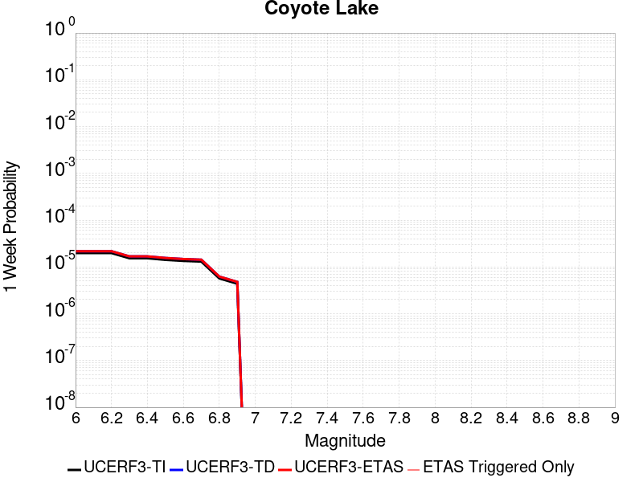 |  |  |  |

| Magnitude | 1 wk TI Prob | 1 wk TD Prob | 1 wk ETAS Prob | 1 wk ETAS/TD Gain | 1 wk ETAS Triggered Only | 1 mo TI Prob | 1 mo TD Prob | 1 mo ETAS Prob | 1 mo ETAS/TD Gain | 1 mo ETAS Triggered Only | 1 yr TI Prob | 1 yr TD Prob | 1 yr ETAS Prob | 1 yr ETAS/TD Gain | 1 yr ETAS Triggered Only | 10 yr TI Prob | 10 yr TD Prob | 10 yr ETAS Prob | 10 yr ETAS/TD Gain | 10 yr ETAS Triggered Only |
|-----|-----|-----|-----|-----|-----|-----|-----|-----|-----|-----|-----|-----|-----|-----|-----|-----|-----|-----|-----|-----|
| 6.0 | 1.980352E-5 | 2.1707852E-5 | 2.1707852E-5 | 1.0 | 0.0 | 8.486947E-5 | 9.303074E-5 | 1.2347997E-4 | 1.3273028 | 3.045206E-5 | 0.0010327959 | 0.0011321327 | 0.0012842207 | 1.1343375 | 1.522603E-4 | 0.010280091 | 0.01127083 | 0.011571919 | 1.026714 | 3.045206E-4 |
| 6.1 | 1.980352E-5 | 2.1707852E-5 | 2.1707852E-5 | 1.0 | 0.0 | 8.486947E-5 | 9.303074E-5 | 1.2347997E-4 | 1.3273028 | 3.045206E-5 | 0.0010327959 | 0.0011321327 | 0.0012842207 | 1.1343375 | 1.522603E-4 | 0.010280091 | 0.01127083 | 0.011571919 | 1.026714 | 3.045206E-4 |
| 6.2 | 1.980352E-5 | 2.1707852E-5 | 2.1707852E-5 | 1.0 | 0.0 | 8.486947E-5 | 9.303074E-5 | 1.2347997E-4 | 1.3273028 | 3.045206E-5 | 0.0010327959 | 0.0011321327 | 0.0012842207 | 1.1343375 | 1.522603E-4 | 0.010280091 | 0.01127083 | 0.011571919 | 1.026714 | 3.045206E-4 |
| 6.3 | 1.5344787E-5 | 1.6821528E-5 | 1.6821528E-5 | 1.0 | 0.0 | 6.576172E-5 | 7.209062E-5 | 1.0254048E-4 | 1.4223832 | 3.045206E-5 | 8.003548E-4 | 8.7741105E-4 | 9.6868706E-4 | 1.1040288 | 9.135618E-5 | 0.007974784 | 0.008745514 | 0.008941721 | 1.0224352 | 1.979384E-4 |
| 6.4 | 1.5344787E-5 | 1.6821528E-5 | 1.6821528E-5 | 1.0 | 0.0 | 6.576172E-5 | 7.209062E-5 | 1.0254048E-4 | 1.4223832 | 3.045206E-5 | 8.003548E-4 | 8.7741105E-4 | 9.6868706E-4 | 1.1040288 | 9.135618E-5 | 0.007974784 | 0.008745514 | 0.008941721 | 1.0224352 | 1.979384E-4 |
| 6.5 | 1.4189697E-5 | 1.5558782E-5 | 1.5558782E-5 | 1.0 | 0.0 | 6.081157E-5 | 6.667913E-5 | 9.712917E-5 | 1.456665 | 3.045206E-5 | 7.401293E-4 | 8.115764E-4 | 9.0285845E-4 | 1.112475 | 9.135618E-5 | 0.0073766913 | 0.008092069 | 0.008288406 | 1.0242629 | 1.979384E-4 |
| 6.6 | 1.3469301E-5 | 1.4772335E-5 | 1.4772335E-5 | 1.0 | 0.0 | 5.7724297E-5 | 6.330881E-5 | 9.375894E-5 | 1.4809778 | 3.045206E-5 | 7.025667E-4 | 7.7057217E-4 | 8.6185796E-4 | 1.118465 | 9.135618E-5 | 0.0070034964 | 0.0076849074 | 0.007881325 | 1.0255588 | 1.979384E-4 |
| 6.7 | 1.3027966E-5 | 1.4282475E-5 | 1.4282475E-5 | 1.0 | 0.0 | 5.5832945E-5 | 6.12095E-5 | 9.1659706E-5 | 1.4974749 | 3.045206E-5 | 6.7955407E-4 | 7.450307E-4 | 8.3631877E-4 | 1.1225294 | 9.135618E-5 | 0.006774798 | 0.007431207 | 0.007612562 | 1.0244044 | 1.8271236E-4 |
| 6.8 | 5.695434E-6 | 6.2247245E-6 | 6.2247245E-6 | 1.0 | 0.0 | 2.4408775E-5 | 2.6677288E-5 | 4.190291E-5 | 1.5707337 | 1.522603E-5 | 2.971363E-4 | 3.2477756E-4 | 3.704408E-4 | 1.1405985 | 4.567809E-5 | 0.0029673933 | 0.0032459702 | 0.0033066766 | 1.0187021 | 6.090412E-5 |
| 6.9 | 4.385688E-6 | 4.7932917E-6 | 4.7932917E-6 | 1.0 | 0.0 | 1.879567E-5 | 2.0542679E-5 | 3.5768397E-5 | 1.7411749 | 1.522603E-5 | 2.2881327E-4 | 2.501071E-4 | 2.9577376E-4 | 1.1825885 | 4.567809E-5 | 0.002285778 | 0.002501071 | 0.0025618228 | 1.0242903 | 6.090412E-5 |

## Helendale-So Lockhart
*[(top)](#table-of-contents)*

| 1 Week | 1 Month | 1 Year | 10 Year |
|-----|-----|-----|-----|
|  |  |  |  |

| Magnitude | 1 wk TI Prob | 1 wk TD Prob | 1 wk ETAS Prob | 1 wk ETAS/TD Gain | 1 wk ETAS Triggered Only | 1 mo TI Prob | 1 mo TD Prob | 1 mo ETAS Prob | 1 mo ETAS/TD Gain | 1 mo ETAS Triggered Only | 1 yr TI Prob | 1 yr TD Prob | 1 yr ETAS Prob | 1 yr ETAS/TD Gain | 1 yr ETAS Triggered Only | 10 yr TI Prob | 10 yr TD Prob | 10 yr ETAS Prob | 10 yr ETAS/TD Gain | 10 yr ETAS Triggered Only |
|-----|-----|-----|-----|-----|-----|-----|-----|-----|-----|-----|-----|-----|-----|-----|-----|-----|-----|-----|-----|-----|
| 6.0 | 1.7296055E-5 | 1.810418E-5 | 6.3781445E-5 | 3.5230234 | 4.567809E-5 | 7.412385E-5 | 7.7587145E-5 | 1.3848655E-4 | 1.784916 | 6.090412E-5 | 9.0208417E-4 | 9.442349E-4 | 0.001157198 | 1.2255404 | 2.1316443E-4 | 0.008984311 | 0.009404349 | 0.009645674 | 1.025661 | 2.4361648E-4 |
| 6.1 | 1.7296055E-5 | 1.810418E-5 | 6.3781445E-5 | 3.5230234 | 4.567809E-5 | 7.412385E-5 | 7.7587145E-5 | 1.3848655E-4 | 1.784916 | 6.090412E-5 | 9.0208417E-4 | 9.442349E-4 | 0.001157198 | 1.2255404 | 2.1316443E-4 | 0.008984311 | 0.009404349 | 0.009645674 | 1.025661 | 2.4361648E-4 |
| 6.2 | 1.7296055E-5 | 1.810418E-5 | 6.3781445E-5 | 3.5230234 | 4.567809E-5 | 7.412385E-5 | 7.7587145E-5 | 1.3848655E-4 | 1.784916 | 6.090412E-5 | 9.0208417E-4 | 9.442349E-4 | 0.001157198 | 1.2255404 | 2.1316443E-4 | 0.008984311 | 0.009404349 | 0.009645674 | 1.025661 | 2.4361648E-4 |
| 6.3 | 1.0669118E-5 | 1.1135683E-5 | 5.6813267E-5 | 5.101911 | 4.567809E-5 | 4.5723988E-5 | 4.7723497E-5 | 1.08624714E-4 | 2.2761264 | 6.090412E-5 | 5.5654737E-4 | 5.808815E-4 | 7.634877E-4 | 1.3143606 | 1.8271236E-4 | 0.0055515557 | 0.0057939277 | 0.0059907194 | 1.0339651 | 1.979384E-4 |
| 6.4 | 1.0669118E-5 | 1.1135683E-5 | 5.6813267E-5 | 5.101911 | 4.567809E-5 | 4.5723988E-5 | 4.7723497E-5 | 1.08624714E-4 | 2.2761264 | 6.090412E-5 | 5.5654737E-4 | 5.808815E-4 | 7.634877E-4 | 1.3143606 | 1.8271236E-4 | 0.0055515557 | 0.0057939277 | 0.0059907194 | 1.0339651 | 1.979384E-4 |
| 6.5 | 8.790038E-6 | 9.170408E-6 | 5.484808E-5 | 5.980986 | 4.567809E-5 | 3.767105E-5 | 3.930116E-5 | 1.00202895E-4 | 2.5496163 | 6.090412E-5 | 4.585485E-4 | 4.7838816E-4 | 6.610131E-4 | 1.3817506 | 1.8271236E-4 | 0.0045760344 | 0.0047737476 | 0.0049707415 | 1.041266 | 1.979384E-4 |
| 6.6 | 7.396949E-6 | 7.715714E-6 | 5.339345E-5 | 6.9200926 | 4.567809E-5 | 3.1700827E-5 | 3.306693E-5 | 9.3969036E-5 | 2.841783 | 6.090412E-5 | 3.858892E-4 | 4.025165E-4 | 5.547155E-4 | 1.3781186 | 1.522603E-4 | 0.003852198 | 0.0040179817 | 0.004184795 | 1.0415167 | 1.6748633E-4 |
| 6.7 | 6.4600285E-6 | 6.738185E-6 | 5.241597E-5 | 7.7789445 | 4.567809E-5 | 2.7685543E-5 | 2.8877621E-5 | 8.9779984E-5 | 3.1089814 | 6.090412E-5 | 3.3701936E-4 | 3.515291E-4 | 5.0373585E-4 | 1.4329848 | 1.522603E-4 | 0.0033650869 | 0.003509812 | 0.0036767107 | 1.047552 | 1.6748633E-4 |
| 6.8 | 5.600104E-6 | 5.8361397E-6 | 5.1513965E-5 | 8.826718 | 4.567809E-5 | 2.4000226E-5 | 2.5011792E-5 | 8.591439E-5 | 3.4349554 | 6.090412E-5 | 2.9216358E-4 | 3.0447662E-4 | 4.2624777E-4 | 1.399936 | 1.2180824E-4 | 0.0029177975 | 0.003040656 | 0.0031772736 | 1.0449303 | 1.3703428E-4 |
| 6.9 | 4.839122E-6 | 5.03962E-6 | 3.549153E-5 | 7.0425005 | 3.045206E-5 | 2.0738931E-5 | 2.1598196E-5 | 5.20496E-5 | 2.409905 | 3.045206E-5 | 2.5246723E-4 | 2.6292677E-4 | 3.390369E-4 | 1.2894727 | 7.613015E-5 | 0.002521806 | 0.0026262044 | 0.0027021347 | 1.0289125 | 7.613015E-5 |
| 7.0 | 3.6937633E-6 | 3.8452918E-6 | 3.4297234E-5 | 8.919281 | 3.045206E-5 | 1.5830317E-5 | 1.6479718E-5 | 4.693128E-5 | 2.8478203 | 3.045206E-5 | 1.9271708E-4 | 2.0062242E-4 | 2.4629134E-4 | 1.2276362 | 4.567809E-5 | 0.0019255003 | 0.0020044446 | 0.002050031 | 1.0227427 | 4.567809E-5 |
| 7.1 | 2.7858857E-6 | 2.8979157E-6 | 3.3349887E-5 | 11.508233 | 3.045206E-5 | 1.1939455E-5 | 1.241958E-5 | 4.2871263E-5 | 3.451909 | 3.045206E-5 | 1.4535317E-4 | 1.5119811E-4 | 1.968693E-4 | 1.3020619 | 4.567809E-5 | 0.0014525814 | 0.0015109739 | 0.001556583 | 1.0301852 | 4.567809E-5 |
| 7.2 | 2.1672065E-6 | 2.2540607E-6 | 1.7480057E-5 | 7.7549186 | 1.522603E-5 | 9.2879945E-6 | 9.660225E-6 | 2.4886109E-5 | 2.5761416 | 1.522603E-5 | 1.1307546E-4 | 1.1760708E-4 | 1.4805557E-4 | 1.2589 | 3.045206E-5 | 0.0011301794 | 0.0011754666 | 0.0012058829 | 1.0258759 | 3.045206E-5 |
| 7.3 | 1.4823496E-6 | 1.5422432E-6 | 1.5422432E-6 | 1.0 | 0.0 | 6.3529114E-6 | 6.609598E-6 | 6.609598E-6 | 1.0 | 0.0 | 7.734395E-5 | 8.0469035E-5 | 8.0469035E-5 | 1.0 | 0.0 | 7.731704E-4 | 8.044141E-4 | 8.044141E-4 | 1.0 | 0.0 |
| 7.4 | 4.2321457E-7 | 4.4109754E-7 | 4.4109754E-7 | 1.0 | 0.0 | 1.8137755E-6 | 1.8904169E-6 | 1.8904169E-6 | 1.0 | 0.0 | 2.2082493E-5 | 2.301563E-5 | 2.301563E-5 | 1.0 | 0.0 | 2.2080299E-4 | 2.3013698E-4 | 2.3013698E-4 | 1.0 | 0.0 |
| 7.5 | 5.6942316E-8 | 5.9417015E-8 | 5.9417015E-8 | 1.0 | 0.0 | 2.440385E-7 | 2.5464433E-7 | 2.5464433E-7 | 1.0 | 0.0 | 2.9711643E-6 | 3.100291E-6 | 3.100291E-6 | 1.0 | 0.0 | 2.9711247E-5 | 3.1002557E-5 | 3.1002557E-5 | 1.0 | 0.0 |

## Sierra Nevada  (No Extension)
*[(top)](#table-of-contents)*

| 1 Week | 1 Month | 1 Year | 10 Year |
|-----|-----|-----|-----|
|  |  |  |  |

| Magnitude | 1 wk TI Prob | 1 wk TD Prob | 1 wk ETAS Prob | 1 wk ETAS/TD Gain | 1 wk ETAS Triggered Only | 1 mo TI Prob | 1 mo TD Prob | 1 mo ETAS Prob | 1 mo ETAS/TD Gain | 1 mo ETAS Triggered Only | 1 yr TI Prob | 1 yr TD Prob | 1 yr ETAS Prob | 1 yr ETAS/TD Gain | 1 yr ETAS Triggered Only | 10 yr TI Prob | 10 yr TD Prob | 10 yr ETAS Prob | 10 yr ETAS/TD Gain | 10 yr ETAS Triggered Only |
|-----|-----|-----|-----|-----|-----|-----|-----|-----|-----|-----|-----|-----|-----|-----|-----|-----|-----|-----|-----|-----|
| 6.0 | 7.7690465E-6 | 6.976568E-6 | 6.976568E-6 | 1.0 | 0.0 | 3.329549E-5 | 2.9899435E-5 | 4.512501E-5 | 1.5092262 | 1.522603E-5 | 4.0529718E-4 | 3.6400068E-4 | 4.705441E-4 | 1.2927011 | 1.06582214E-4 | 0.004045588 | 0.0036375606 | 0.003880291 | 1.0667288 | 2.4361648E-4 |
| 6.1 | 7.7690465E-6 | 6.976568E-6 | 6.976568E-6 | 1.0 | 0.0 | 3.329549E-5 | 2.9899435E-5 | 4.512501E-5 | 1.5092262 | 1.522603E-5 | 4.0529718E-4 | 3.6400068E-4 | 4.705441E-4 | 1.2927011 | 1.06582214E-4 | 0.004045588 | 0.0036375606 | 0.003880291 | 1.0667288 | 2.4361648E-4 |
| 6.2 | 7.7690465E-6 | 6.976568E-6 | 6.976568E-6 | 1.0 | 0.0 | 3.329549E-5 | 2.9899435E-5 | 4.512501E-5 | 1.5092262 | 1.522603E-5 | 4.0529718E-4 | 3.6400068E-4 | 4.705441E-4 | 1.2927011 | 1.06582214E-4 | 0.004045588 | 0.0036375606 | 0.003880291 | 1.0667288 | 2.4361648E-4 |
| 6.3 | 7.7690465E-6 | 6.976568E-6 | 6.976568E-6 | 1.0 | 0.0 | 3.329549E-5 | 2.9899435E-5 | 4.512501E-5 | 1.5092262 | 1.522603E-5 | 4.0529718E-4 | 3.6400068E-4 | 4.705441E-4 | 1.2927011 | 1.06582214E-4 | 0.004045588 | 0.0036375606 | 0.003880291 | 1.0667288 | 2.4361648E-4 |
| 6.4 | 7.7690465E-6 | 6.976568E-6 | 6.976568E-6 | 1.0 | 0.0 | 3.329549E-5 | 2.9899435E-5 | 4.512501E-5 | 1.5092262 | 1.522603E-5 | 4.0529718E-4 | 3.6400068E-4 | 4.705441E-4 | 1.2927011 | 1.06582214E-4 | 0.004045588 | 0.0036375606 | 0.003880291 | 1.0667288 | 2.4361648E-4 |
| 6.5 | 7.7690465E-6 | 6.976568E-6 | 6.976568E-6 | 1.0 | 0.0 | 3.329549E-5 | 2.9899435E-5 | 4.512501E-5 | 1.5092262 | 1.522603E-5 | 4.0529718E-4 | 3.6400068E-4 | 4.705441E-4 | 1.2927011 | 1.06582214E-4 | 0.004045588 | 0.0036375606 | 0.003880291 | 1.0667288 | 2.4361648E-4 |
| 6.6 | 2.653E-6 | 1.6149635E-6 | 1.6149635E-6 | 1.0 | 0.0 | 1.136995E-5 | 6.9212538E-6 | 2.2147178E-5 | 3.1998796 | 1.522603E-5 | 1.3842035E-4 | 8.426304E-5 | 1.7561152E-4 | 2.0840871 | 9.135618E-5 | 0.0013833415 | 8.4231433E-4 | 0.001040086 | 1.2347956 | 1.979384E-4 |
| 6.7 | 2.5902466E-6 | 1.5502959E-6 | 1.5502959E-6 | 1.0 | 0.0 | 1.11010095E-5 | 6.644109E-6 | 2.1870039E-5 | 3.2916436 | 1.522603E-5 | 1.351464E-4 | 8.0889055E-5 | 1.7223785E-4 | 2.1293097 | 9.135618E-5 | 0.0013506424 | 8.0859906E-4 | 0.0010063774 | 1.2445939 | 1.979384E-4 |
| 6.8 | 2.5853892E-6 | 1.5470957E-6 | 1.5470957E-6 | 1.0 | 0.0 | 1.1080193E-5 | 6.6303933E-6 | 2.1856324E-5 | 3.296384 | 1.522603E-5 | 1.34893E-4 | 8.072208E-5 | 1.7207088E-4 | 2.131646 | 9.135618E-5 | 0.0013481114 | 8.069306E-4 | 0.0010047093 | 1.2451 | 1.979384E-4 |
| 6.9 | 2.458257E-6 | 1.4221675E-6 | 1.4221675E-6 | 1.0 | 0.0 | 1.0535345E-5 | 6.0949897E-6 | 2.1320928E-5 | 3.4981072 | 1.522603E-5 | 1.2826028E-4 | 7.420399E-5 | 1.655534E-4 | 2.231058 | 9.135618E-5 | 0.0012818627 | 7.4179407E-4 | 9.395857E-4 | 1.2666395 | 1.979384E-4 |
| 7.0 | 2.4341468E-6 | 1.3991308E-6 | 1.3991308E-6 | 1.0 | 0.0 | 1.0432016E-5 | 5.9962613E-6 | 2.12222E-5 | 3.5392387 | 1.522603E-5 | 1.270024E-4 | 7.3002055E-5 | 1.6435157E-4 | 2.251328 | 9.135618E-5 | 0.0012692984 | 7.297827E-4 | 9.275766E-4 | 1.2710313 | 1.979384E-4 |
| 7.1 | 2.3652476E-6 | 1.334079E-6 | 1.334079E-6 | 1.0 | 0.0 | 1.0136736E-5 | 5.717469E-6 | 2.0943413E-5 | 3.6630566 | 1.522603E-5 | 1.2340778E-4 | 6.960797E-5 | 1.609578E-4 | 2.3123472 | 9.135618E-5 | 0.0012333926 | 6.9586345E-4 | 8.936641E-4 | 1.2842522 | 1.979384E-4 |
| 7.2 | 2.272158E-6 | 1.2503832E-6 | 1.2503832E-6 | 1.0 | 0.0 | 9.737784E-6 | 5.358774E-6 | 2.0584723E-5 | 3.8413117 | 1.522603E-5 | 1.1855107E-4 | 6.524114E-5 | 1.5659136E-4 | 2.4001935 | 9.135618E-5 | 0.0011848784 | 6.522214E-4 | 8.500307E-4 | 1.3032855 | 1.979384E-4 |
| 7.3 | 2.1382127E-6 | 1.1420682E-6 | 1.1420682E-6 | 1.0 | 0.0 | 9.163737E-6 | 4.894569E-6 | 2.0120524E-5 | 4.110786 | 1.522603E-5 | 1.1156279E-4 | 5.9589758E-5 | 1.509405E-4 | 2.532994 | 9.135618E-5 | 0.001115068 | 5.95739E-4 | 7.935594E-4 | 1.332059 | 1.979384E-4 |
| 7.4 | 1.9048055E-6 | 9.57617E-7 | 9.57617E-7 | 1.0 | 0.0 | 8.163426E-6 | 4.104066E-6 | 1.9330035E-5 | 4.7099714 | 1.522603E-5 | 9.9385186E-5 | 4.9965867E-5 | 1.2609221E-4 | 2.523567 | 7.613015E-5 | 9.934074E-4 | 4.99547E-4 | 6.6694967E-4 | 1.3351089 | 1.6748633E-4 |
| 7.5 | 1.5373403E-6 | 7.560832E-7 | 7.560832E-7 | 1.0 | 0.0 | 6.5885843E-6 | 3.2403525E-6 | 1.8466333E-5 | 5.6988654 | 1.522603E-5 | 8.021306E-5 | 3.9450584E-5 | 1.003523E-4 | 2.543747 | 6.090412E-5 | 8.0184115E-4 | 3.9443627E-4 | 5.314165E-4 | 1.347281 | 1.3703428E-4 |
| 7.6 | 1.0680322E-6 | 4.6602182E-7 | 4.6602182E-7 | 1.0 | 0.0 | 4.577273E-6 | 1.997235E-6 | 1.7223234E-5 | 8.62354 | 1.522603E-5 | 5.5726876E-5 | 2.4316065E-5 | 8.521871E-5 | 3.5046258 | 6.090412E-5 | 5.5712904E-4 | 2.431343E-4 | 3.6491294E-4 | 1.5008698 | 1.2180824E-4 |
| 7.7 | 5.509146E-7 | 1.558334E-7 | 1.558334E-7 | 1.0 | 0.0 | 2.3610605E-6 | 6.678573E-7 | 6.678573E-7 | 1.0 | 0.0 | 2.8745531E-5 | 8.131134E-6 | 2.335704E-5 | 2.8725443 | 1.522603E-5 | 2.8741814E-4 | 8.130848E-5 | 1.1175806E-4 | 1.3744946 | 3.045206E-5 |

## San Andreas (Parkfield)
*[(top)](#table-of-contents)*

| 1 Week | 1 Month | 1 Year | 10 Year |
|-----|-----|-----|-----|
|  |  |  |  |

| Magnitude | 1 wk TI Prob | 1 wk TD Prob | 1 wk ETAS Prob | 1 wk ETAS/TD Gain | 1 wk ETAS Triggered Only | 1 mo TI Prob | 1 mo TD Prob | 1 mo ETAS Prob | 1 mo ETAS/TD Gain | 1 mo ETAS Triggered Only | 1 yr TI Prob | 1 yr TD Prob | 1 yr ETAS Prob | 1 yr ETAS/TD Gain | 1 yr ETAS Triggered Only | 10 yr TI Prob | 10 yr TD Prob | 10 yr ETAS Prob | 10 yr ETAS/TD Gain | 10 yr ETAS Triggered Only |
|-----|-----|-----|-----|-----|-----|-----|-----|-----|-----|-----|-----|-----|-----|-----|-----|-----|-----|-----|-----|-----|
| 6.0 | 5.556969E-4 | 7.819087E-4 | 8.2755106E-4 | 1.058373 | 4.567809E-5 | 0.0023793848 | 0.0033472886 | 0.003407989 | 1.0181341 | 6.090412E-5 | 0.028586963 | 0.040385824 | 0.040517323 | 1.0032561 | 1.3703428E-4 | 0.25176284 | 0.33777508 | 0.33790615 | 1.000388 | 1.979384E-4 |
| 6.1 | 1.925858E-4 | 3.0390357E-4 | 3.1912499E-4 | 1.0500863 | 1.522603E-5 | 8.2510663E-4 | 0.0013018888 | 0.001317095 | 1.0116801 | 1.522603E-5 | 0.0099994885 | 0.015834767 | 0.015879722 | 1.002839 | 4.567809E-5 | 0.095613256 | 0.14999957 | 0.15007722 | 1.0005177 | 9.135618E-5 |
| 6.2 | 9.4306815E-5 | 1.8273306E-4 | 1.9795631E-4 | 1.0833087 | 1.522603E-5 | 4.0410945E-4 | 7.829079E-4 | 7.9812197E-4 | 1.0194328 | 1.522603E-5 | 0.0049089384 | 0.009490452 | 0.009535696 | 1.0047674 | 4.567809E-5 | 0.048019063 | 0.09198628 | 0.09206924 | 1.0009018 | 9.135618E-5 |
| 6.3 | 9.283051E-5 | 1.7969737E-4 | 1.9492066E-4 | 1.0847163 | 1.522603E-5 | 3.9778434E-4 | 7.6990545E-4 | 7.851198E-4 | 1.0197613 | 1.522603E-5 | 0.0048322747 | 0.009333515 | 0.009378767 | 1.0048484 | 4.567809E-5 | 0.047285385 | 0.09063911 | 0.09072218 | 1.0009166 | 9.135618E-5 |
| 6.4 | 9.138826E-5 | 1.7731739E-4 | 1.9254073E-4 | 1.0858536 | 1.522603E-5 | 3.916052E-4 | 7.5971155E-4 | 7.7492604E-4 | 1.0200267 | 1.522603E-5 | 0.0047573745 | 0.00921046 | 0.0092557175 | 1.0049137 | 4.567809E-5 | 0.046568092 | 0.0895407 | 0.089623876 | 1.0009289 | 9.135618E-5 |
| 6.5 | 9.000255E-5 | 1.7489606E-4 | 1.9011942E-4 | 1.0870423 | 1.522603E-5 | 3.8566816E-4 | 7.493404E-4 | 7.64555E-4 | 1.020304 | 1.522603E-5 | 0.0046854047 | 0.009085262 | 0.009130525 | 1.004982 | 4.567809E-5 | 0.045878403 | 0.08842592 | 0.088509195 | 1.0009418 | 9.135618E-5 |
| 6.6 | 8.8109264E-5 | 1.7170387E-4 | 1.8692728E-4 | 1.0886608 | 1.522603E-5 | 3.7755648E-4 | 7.3566736E-4 | 7.508822E-4 | 1.0206816 | 1.522603E-5 | 0.0045870654 | 0.0089201825 | 0.008965453 | 1.0050751 | 4.567809E-5 | 0.04493529 | 0.08695624 | 0.08703966 | 1.0009593 | 9.135618E-5 |
| 6.7 | 8.738073E-5 | 1.7037381E-4 | 1.8559725E-4 | 1.0893532 | 1.522603E-5 | 3.7443507E-4 | 7.2997034E-4 | 7.4518524E-4 | 1.0208431 | 1.522603E-5 | 0.0045492216 | 0.0088514285 | 0.008896702 | 1.0051149 | 4.567809E-5 | 0.04457213 | 0.08635636 | 0.086439826 | 1.0009665 | 9.135618E-5 |
| 6.8 | 8.710195E-5 | 1.6982816E-4 | 1.8505161E-4 | 1.0896403 | 1.522603E-5 | 3.7324068E-4 | 7.2763313E-4 | 7.428481E-4 | 1.0209101 | 1.522603E-5 | 0.0045347405 | 0.008823211 | 0.008868487 | 1.0051314 | 4.567809E-5 | 0.04443313 | 0.08610373 | 0.08618722 | 1.0009696 | 9.135618E-5 |
| 6.9 | 8.6801556E-5 | 1.6923707E-4 | 1.8446053E-4 | 1.0899534 | 1.522603E-5 | 3.7195362E-4 | 7.251013E-4 | 7.4031623E-4 | 1.0209832 | 1.522603E-5 | 0.0045191357 | 0.008792636 | 0.008837912 | 1.0051494 | 4.567809E-5 | 0.044283327 | 0.08582957 | 0.085913084 | 1.000973 | 9.135618E-5 |
| 7.0 | 8.5571606E-5 | 1.6676294E-4 | 1.8198643E-4 | 1.0912882 | 1.522603E-5 | 3.6668387E-4 | 7.145037E-4 | 7.297188E-4 | 1.0212947 | 1.522603E-5 | 0.004455241 | 0.008664643 | 0.008709925 | 1.0052261 | 4.567809E-5 | 0.043669727 | 0.08467713 | 0.084760755 | 1.0009875 | 9.135618E-5 |
| 7.1 | 7.82589E-5 | 1.5156237E-4 | 1.6678609E-4 | 1.1004453 | 1.522603E-5 | 3.3535215E-4 | 6.493921E-4 | 6.646082E-4 | 1.0234314 | 1.522603E-5 | 0.0040752706 | 0.007877857 | 0.007923176 | 1.0057526 | 4.567809E-5 | 0.040013418 | 0.077585794 | 0.07765602 | 1.0009052 | 7.613015E-5 |
| 7.2 | 7.690929E-5 | 1.489332E-4 | 1.6415697E-4 | 1.1022187 | 1.522603E-5 | 3.2956956E-4 | 6.381298E-4 | 6.5334607E-4 | 1.0238452 | 1.522603E-5 | 0.004005129 | 0.007741721 | 0.0077870456 | 1.0058546 | 4.567809E-5 | 0.0393371 | 0.076358445 | 0.07642876 | 1.0009209 | 7.613015E-5 |
| 7.3 | 7.5543794E-5 | 1.4589565E-4 | 1.6111946E-4 | 1.1043472 | 1.522603E-5 | 3.2371894E-4 | 6.25118E-4 | 6.403345E-4 | 1.0243418 | 1.522603E-5 | 0.003934157 | 0.0075844154 | 0.007629747 | 1.0059769 | 4.567809E-5 | 0.038652334 | 0.07492032 | 0.07499074 | 1.00094 | 7.613015E-5 |
| 7.4 | 7.4214564E-5 | 1.4290171E-4 | 1.5812558E-4 | 1.1065338 | 1.522603E-5 | 3.1802364E-4 | 6.122929E-4 | 6.275096E-4 | 1.024852 | 1.522603E-5 | 0.003865065 | 0.007429345 | 0.0074746837 | 1.0061027 | 4.567809E-5 | 0.03798529 | 0.07349284 | 0.073563375 | 1.0009598 | 7.613015E-5 |
| 7.5 | 6.149578E-5 | 1.1214155E-4 | 1.2736587E-4 | 1.1357598 | 1.522603E-5 | 2.6352672E-4 | 4.8051824E-4 | 4.9573695E-4 | 1.0316714 | 1.522603E-5 | 0.0032037178 | 0.005834648 | 0.0058649224 | 1.0051887 | 3.045206E-5 | 0.03157923 | 0.058665328 | 0.05872266 | 1.0009773 | 6.090412E-5 |
| 7.6 | 6.0643448E-5 | 1.10425855E-4 | 1.256502E-4 | 1.1378695 | 1.522603E-5 | 2.598746E-4 | 4.7316792E-4 | 4.883867E-4 | 1.0321637 | 1.522603E-5 | 0.0031593828 | 0.0057456335 | 0.005775911 | 1.0052695 | 3.045206E-5 | 0.031148417 | 0.05782546 | 0.057882845 | 1.0009923 | 6.090412E-5 |
| 7.7 | 5.1652263E-5 | 9.1955124E-5 | 1.0717975E-4 | 1.1655658 | 1.522603E-5 | 2.2134806E-4 | 3.9403388E-4 | 4.0925393E-4 | 1.0386262 | 1.522603E-5 | 0.002691582 | 0.00478682 | 0.0048171263 | 1.0063312 | 3.045206E-5 | 0.026592141 | 0.048633553 | 0.048691496 | 1.0011914 | 6.090412E-5 |
| 7.8 | 4.8090482E-5 | 8.578783E-5 | 1.01012556E-4 | 1.1774695 | 1.522603E-5 | 2.060858E-4 | 3.6761034E-4 | 3.828308E-4 | 1.0414038 | 1.522603E-5 | 0.0025062072 | 0.004466479 | 0.004496795 | 1.0067874 | 3.045206E-5 | 0.024781305 | 0.045392275 | 0.045450415 | 1.0012808 | 6.090412E-5 |
| 7.9 | 3.970278E-5 | 6.7652974E-5 | 8.2877974E-5 | 1.2250456 | 1.522603E-5 | 1.7014367E-4 | 2.899091E-4 | 3.0513073E-4 | 1.0525048 | 1.522603E-5 | 0.002069531 | 0.0035239344 | 0.0035542792 | 1.0086111 | 3.045206E-5 | 0.020503636 | 0.035952512 | 0.036011226 | 1.0016332 | 6.090412E-5 |
| 8.0 | 2.8982335E-5 | 4.079188E-5 | 5.6017292E-5 | 1.3732461 | 1.522603E-5 | 1.2420409E-4 | 1.7481064E-4 | 1.9003401E-4 | 1.0870849 | 1.522603E-5 | 0.0015111357 | 0.0021262432 | 0.0021414368 | 1.0071458 | 1.522603E-5 | 0.015009012 | 0.022057572 | 0.022072462 | 1.0006751 | 1.522603E-5 |
| 8.1 | 1.8836186E-5 | 1.8733741E-5 | 3.3959484E-5 | 1.8127445 | 1.522603E-5 | 8.0724014E-5 | 8.028499E-5 | 9.55098E-5 | 1.1896346 | 1.522603E-5 | 9.823717E-4 | 9.77032E-4 | 9.922432E-4 | 1.0155687 | 1.522603E-5 | 0.009780403 | 0.010515724 | 0.01053079 | 1.0014327 | 1.522603E-5 |
| 8.2 | 8.643924E-6 | 5.49522E-6 | 5.49522E-6 | 1.0 | 0.0 | 3.704486E-5 | 2.355073E-5 | 2.355073E-5 | 1.0 | 0.0 | 4.5092785E-4 | 2.866925E-4 | 2.866925E-4 | 1.0 | 0.0 | 0.0045001395 | 0.0032598388 | 0.0032598388 | 1.0 | 0.0 |
| 8.3 | 1.983087E-6 | 7.693574E-7 | 7.693574E-7 | 1.0 | 0.0 | 8.498917E-6 | 3.297242E-6 | 3.297242E-6 | 1.0 | 0.0 | 1.034694E-4 | 4.01432E-5 | 4.01432E-5 | 1.0 | 0.0 | 0.0010342124 | 4.7390026E-4 | 4.7390026E-4 | 1.0 | 0.0 |

## San Andreas (San Bernardino S)
*[(top)](#table-of-contents)*

| 1 Week | 1 Month | 1 Year | 10 Year |
|-----|-----|-----|-----|
|  |  |  |  |

| Magnitude | 1 wk TI Prob | 1 wk TD Prob | 1 wk ETAS Prob | 1 wk ETAS/TD Gain | 1 wk ETAS Triggered Only | 1 mo TI Prob | 1 mo TD Prob | 1 mo ETAS Prob | 1 mo ETAS/TD Gain | 1 mo ETAS Triggered Only | 1 yr TI Prob | 1 yr TD Prob | 1 yr ETAS Prob | 1 yr ETAS/TD Gain | 1 yr ETAS Triggered Only | 10 yr TI Prob | 10 yr TD Prob | 10 yr ETAS Prob | 10 yr ETAS/TD Gain | 10 yr ETAS Triggered Only |
|-----|-----|-----|-----|-----|-----|-----|-----|-----|-----|-----|-----|-----|-----|-----|-----|-----|-----|-----|-----|-----|
| 6.0 | 1.2336002E-4 | 3.0023555E-4 | 3.0023555E-4 | 1.0 | 0.0 | 5.2857865E-4 | 0.0012861154 | 0.0013013218 | 1.0118235 | 1.522603E-5 | 0.006416472 | 0.015550992 | 0.015685895 | 1.0086749 | 1.3703428E-4 | 0.06234337 | 0.14291383 | 0.14309654 | 1.0012784 | 2.1316443E-4 |
| 6.1 | 1.2336002E-4 | 3.0023555E-4 | 3.0023555E-4 | 1.0 | 0.0 | 5.2857865E-4 | 0.0012861154 | 0.0013013218 | 1.0118235 | 1.522603E-5 | 0.006416472 | 0.015550992 | 0.015685895 | 1.0086749 | 1.3703428E-4 | 0.06234337 | 0.14291383 | 0.14309654 | 1.0012784 | 2.1316443E-4 |
| 6.2 | 1.2336002E-4 | 3.0023555E-4 | 3.0023555E-4 | 1.0 | 0.0 | 5.2857865E-4 | 0.0012861154 | 0.0013013218 | 1.0118235 | 1.522603E-5 | 0.006416472 | 0.015550992 | 0.015685895 | 1.0086749 | 1.3703428E-4 | 0.06234337 | 0.14291383 | 0.14309654 | 1.0012784 | 2.1316443E-4 |
| 6.3 | 1.1712257E-4 | 2.8811657E-4 | 2.8811657E-4 | 1.0 | 0.0 | 5.018573E-4 | 0.0012342266 | 0.0012494338 | 1.0123212 | 1.522603E-5 | 0.006093008 | 0.0149280215 | 0.01506301 | 1.0090426 | 1.3703428E-4 | 0.059286322 | 0.13762207 | 0.1378059 | 1.0013357 | 2.1316443E-4 |
| 6.4 | 1.1712257E-4 | 2.8811657E-4 | 2.8811657E-4 | 1.0 | 0.0 | 5.018573E-4 | 0.0012342266 | 0.0012494338 | 1.0123212 | 1.522603E-5 | 0.006093008 | 0.0149280215 | 0.01506301 | 1.0090426 | 1.3703428E-4 | 0.059286322 | 0.13762207 | 0.1378059 | 1.0013357 | 2.1316443E-4 |
| 6.5 | 1.0689076E-4 | 2.682418E-4 | 2.682418E-4 | 1.0 | 0.0 | 4.5802278E-4 | 0.001149126 | 0.0011643346 | 1.0132349 | 1.522603E-5 | 0.0055621783 | 0.013905481 | 0.01404061 | 1.0097177 | 1.3703428E-4 | 0.05425003 | 0.12886871 | 0.12905441 | 1.001441 | 2.1316443E-4 |
| 6.6 | 9.7648895E-5 | 2.506867E-4 | 2.506867E-4 | 1.0 | 0.0 | 4.1842813E-4 | 0.0010739529 | 0.0010891625 | 1.0141623 | 1.522603E-5 | 0.005082469 | 0.0130013535 | 0.013121578 | 1.0092471 | 1.2180824E-4 | 0.049677886 | 0.12102797 | 0.12120195 | 1.0014375 | 1.979384E-4 |
| 6.7 | 8.757013E-5 | 2.3139146E-4 | 2.3139146E-4 | 1.0 | 0.0 | 3.7524657E-4 | 9.913231E-4 | 0.0010065341 | 1.015344 | 1.522603E-5 | 0.00455906 | 0.012006655 | 0.012111958 | 1.0087703 | 1.06582214E-4 | 0.04466656 | 0.112335846 | 0.112484515 | 1.0013235 | 1.6748633E-4 |
| 6.8 | 8.562978E-5 | 2.2698891E-4 | 2.2698891E-4 | 1.0 | 0.0 | 3.6693315E-4 | 9.7246916E-4 | 9.876804E-4 | 1.0156418 | 1.522603E-5 | 0.004458263 | 0.011779605 | 0.011884932 | 1.0089414 | 1.06582214E-4 | 0.043698758 | 0.11034572 | 0.110494725 | 1.0013504 | 1.6748633E-4 |
| 6.9 | 6.124075E-5 | 1.7082063E-4 | 1.7082063E-4 | 1.0 | 0.0 | 2.6243398E-4 | 7.318838E-4 | 7.470987E-4 | 1.0207887 | 1.522603E-5 | 0.0031904527 | 0.008874487 | 0.008965032 | 1.0102029 | 9.135618E-5 | 0.031450346 | 0.08425208 | 0.08439152 | 1.001655 | 1.522603E-4 |
| 7.0 | 5.8598747E-5 | 1.6510907E-4 | 1.6510907E-4 | 1.0 | 0.0 | 2.5111332E-4 | 7.0741924E-4 | 7.226345E-4 | 1.0215081 | 1.522603E-5 | 0.0030530186 | 0.008579012 | 0.008669585 | 1.0105574 | 9.135618E-5 | 0.03011414 | 0.08156926 | 0.0817091 | 1.0017143 | 1.522603E-4 |
| 7.1 | 5.613814E-5 | 1.5929298E-4 | 1.5929298E-4 | 1.0 | 0.0 | 2.4056983E-4 | 6.825063E-4 | 6.9772196E-4 | 1.0222938 | 1.522603E-5 | 0.0029250039 | 0.0082780365 | 0.0083686365 | 1.0109446 | 9.135618E-5 | 0.028868021 | 0.078867756 | 0.079008006 | 1.0017784 | 1.522603E-4 |
| 7.2 | 4.991222E-5 | 1.4535384E-4 | 1.4535384E-4 | 1.0 | 0.0 | 2.1389198E-4 | 6.227967E-4 | 6.3801324E-4 | 1.0244327 | 1.522603E-5 | 0.002601025 | 0.0075562913 | 0.007646957 | 1.0119988 | 9.135618E-5 | 0.025707912 | 0.072320335 | 0.07246158 | 1.0019531 | 1.522603E-4 |
| 7.3 | 4.7410045E-5 | 1.3729246E-4 | 1.3729246E-4 | 1.0 | 0.0 | 2.0317009E-4 | 5.882639E-4 | 6.03481E-4 | 1.0258678 | 1.522603E-5 | 0.0024707897 | 0.0071386793 | 0.0072293836 | 1.012706 | 9.135618E-5 | 0.024434982 | 0.06860168 | 0.0687435 | 1.0020672 | 1.522603E-4 |
| 7.4 | 4.5556746E-5 | 1.313689E-4 | 1.313689E-4 | 1.0 | 0.0 | 1.952286E-4 | 5.628884E-4 | 5.7810586E-4 | 1.0270346 | 1.522603E-5 | 0.002374317 | 0.006831711 | 0.006922443 | 1.013281 | 9.135618E-5 | 0.023491086 | 0.06585319 | 0.065995425 | 1.0021598 | 1.522603E-4 |
| 7.5 | 4.3084514E-5 | 1.2371907E-4 | 1.2371907E-4 | 1.0 | 0.0 | 1.8463485E-4 | 5.3011713E-4 | 5.453351E-4 | 1.0287068 | 1.522603E-5 | 0.0022456115 | 0.0064351484 | 0.0065259165 | 1.0141051 | 9.135618E-5 | 0.022230545 | 0.062252887 | 0.06239567 | 1.0022936 | 1.522603E-4 |
| 7.6 | 3.408608E-5 | 9.8489814E-5 | 9.8489814E-5 | 1.0 | 0.0 | 1.4607502E-4 | 4.2203104E-4 | 4.2203104E-4 | 1.0 | 0.0 | 0.0017770125 | 0.005126148 | 0.005201888 | 1.0147752 | 7.613015E-5 | 0.017628696 | 0.050079897 | 0.05021007 | 1.0025992 | 1.3703428E-4 |
| 7.7 | 2.8315713E-5 | 8.261325E-5 | 8.261325E-5 | 1.0 | 0.0 | 1.2134742E-4 | 3.5400878E-4 | 3.5400878E-4 | 1.0 | 0.0 | 0.0014764034 | 0.004301548 | 0.0043773507 | 1.0176222 | 7.613015E-5 | 0.01466633 | 0.042327844 | 0.042459074 | 1.0031004 | 1.3703428E-4 |
| 7.8 | 2.6222975E-5 | 7.4749165E-5 | 7.4749165E-5 | 1.0 | 0.0 | 1.1237934E-4 | 3.2031426E-4 | 3.2031426E-4 | 1.0 | 0.0 | 0.0013673597 | 0.0038928585 | 0.0039686924 | 1.0194802 | 7.613015E-5 | 0.013589768 | 0.038489804 | 0.038621563 | 1.0034232 | 1.3703428E-4 |
| 7.9 | 2.1469694E-5 | 5.7977377E-5 | 5.7977377E-5 | 1.0 | 0.0 | 9.200973E-5 | 2.4845081E-4 | 2.4845081E-4 | 1.0 | 0.0 | 0.0011196428 | 0.003020696 | 0.003096596 | 1.0251267 | 7.613015E-5 | 0.011140184 | 0.030197 | 0.030329896 | 1.004401 | 1.3703428E-4 |
| 8.0 | 1.2420249E-5 | 3.1373827E-5 | 3.1373827E-5 | 1.0 | 0.0 | 5.322855E-5 | 1.3445233E-4 | 1.3445233E-4 | 1.0 | 0.0 | 6.478649E-4 | 0.001635729 | 0.0016661313 | 1.0185864 | 3.045206E-5 | 0.0064597935 | 0.016548108 | 0.016578056 | 1.0018097 | 3.045206E-5 |
| 8.1 | 4.9197724E-6 | 7.842378E-6 | 7.842378E-6 | 1.0 | 0.0 | 2.1084568E-5 | 3.360976E-5 | 3.360976E-5 | 1.0 | 0.0 | 2.566744E-4 | 4.0912212E-4 | 4.0912212E-4 | 1.0 | 0.0 | 0.002563781 | 0.004394436 | 0.004394436 | 1.0 | 0.0 |
| 8.2 | 2.5634774E-6 | 2.9160003E-6 | 2.9160003E-6 | 1.0 | 0.0 | 1.0986286E-5 | 1.2497085E-5 | 1.2497085E-5 | 1.0 | 0.0 | 1.3374983E-4 | 1.5214144E-4 | 1.5214144E-4 | 1.0 | 0.0 | 0.0013366934 | 0.0017098442 | 0.0017098442 | 1.0 | 0.0 |
| 8.3 | 5.2850464E-7 | 3.2211614E-7 | 3.2211614E-7 | 1.0 | 0.0 | 2.2650179E-6 | 1.380497E-6 | 1.380497E-6 | 1.0 | 0.0 | 2.7576245E-5 | 1.6807435E-5 | 1.6807435E-5 | 1.0 | 0.0 | 2.7572823E-4 | 1.9939634E-4 | 1.9939634E-4 | 1.0 | 0.0 |

## San Andreas (Big Bend)
*[(top)](#table-of-contents)*

| 1 Week | 1 Month | 1 Year | 10 Year |
|-----|-----|-----|-----|
|  |  |  |  |

| Magnitude | 1 wk TI Prob | 1 wk TD Prob | 1 wk ETAS Prob | 1 wk ETAS/TD Gain | 1 wk ETAS Triggered Only | 1 mo TI Prob | 1 mo TD Prob | 1 mo ETAS Prob | 1 mo ETAS/TD Gain | 1 mo ETAS Triggered Only | 1 yr TI Prob | 1 yr TD Prob | 1 yr ETAS Prob | 1 yr ETAS/TD Gain | 1 yr ETAS Triggered Only | 10 yr TI Prob | 10 yr TD Prob | 10 yr ETAS Prob | 10 yr ETAS/TD Gain | 10 yr ETAS Triggered Only |
|-----|-----|-----|-----|-----|-----|-----|-----|-----|-----|-----|-----|-----|-----|-----|-----|-----|-----|-----|-----|-----|
| 6.0 | 1.0179969E-4 | 2.0106303E-4 | 2.16286E-4 | 1.0757124 | 1.522603E-5 | 4.362114E-4 | 8.614151E-4 | 8.9184096E-4 | 1.0353208 | 3.045206E-5 | 0.0052979486 | 0.010437581 | 0.01054305 | 1.0101048 | 1.06582214E-4 | 0.051734097 | 0.10159716 | 0.10178867 | 1.0018849 | 2.1316443E-4 |
| 6.1 | 1.0179969E-4 | 2.0106303E-4 | 2.16286E-4 | 1.0757124 | 1.522603E-5 | 4.362114E-4 | 8.614151E-4 | 8.9184096E-4 | 1.0353208 | 3.045206E-5 | 0.0052979486 | 0.010437581 | 0.01054305 | 1.0101048 | 1.06582214E-4 | 0.051734097 | 0.10159716 | 0.10178867 | 1.0018849 | 2.1316443E-4 |
| 6.2 | 1.0179969E-4 | 2.0106303E-4 | 2.16286E-4 | 1.0757124 | 1.522603E-5 | 4.362114E-4 | 8.614151E-4 | 8.9184096E-4 | 1.0353208 | 3.045206E-5 | 0.0052979486 | 0.010437581 | 0.01054305 | 1.0101048 | 1.06582214E-4 | 0.051734097 | 0.10159716 | 0.10178867 | 1.0018849 | 2.1316443E-4 |
| 6.3 | 1.0179969E-4 | 2.0106303E-4 | 2.16286E-4 | 1.0757124 | 1.522603E-5 | 4.362114E-4 | 8.614151E-4 | 8.9184096E-4 | 1.0353208 | 3.045206E-5 | 0.0052979486 | 0.010437581 | 0.01054305 | 1.0101048 | 1.06582214E-4 | 0.051734097 | 0.10159716 | 0.10178867 | 1.0018849 | 2.1316443E-4 |
| 6.4 | 9.1639464E-5 | 1.8462905E-4 | 1.9985226E-4 | 1.082453 | 1.522603E-5 | 3.9268145E-4 | 7.910276E-4 | 8.062416E-4 | 1.0192332 | 1.522603E-5 | 0.0047704205 | 0.009588352 | 0.009663752 | 1.0078638 | 7.613015E-5 | 0.046693064 | 0.093921766 | 0.09405972 | 1.0014689 | 1.522603E-4 |
| 6.5 | 9.1639464E-5 | 1.8462905E-4 | 1.9985226E-4 | 1.082453 | 1.522603E-5 | 3.9268145E-4 | 7.910276E-4 | 8.062416E-4 | 1.0192332 | 1.522603E-5 | 0.0047704205 | 0.009588352 | 0.009663752 | 1.0078638 | 7.613015E-5 | 0.046693064 | 0.093921766 | 0.09405972 | 1.0014689 | 1.522603E-4 |
| 6.6 | 9.042622E-5 | 1.826988E-4 | 1.9792205E-4 | 1.0833243 | 1.522603E-5 | 3.8748336E-4 | 7.827601E-4 | 7.9797424E-4 | 1.0194365 | 1.522603E-5 | 0.0047074095 | 0.009488574 | 0.009563982 | 1.0079472 | 7.613015E-5 | 0.046089325 | 0.093015574 | 0.09313986 | 1.0013362 | 1.3703428E-4 |
| 6.7 | 8.9836685E-5 | 1.8184188E-4 | 1.9706514E-4 | 1.083717 | 1.522603E-5 | 3.8495753E-4 | 7.790898E-4 | 7.9430395E-4 | 1.0195282 | 1.522603E-5 | 0.00467679 | 0.009444275 | 0.009519686 | 1.0079849 | 7.613015E-5 | 0.045795817 | 0.09260978 | 0.09270649 | 1.0010443 | 1.06582214E-4 |
| 6.8 | 8.9471854E-5 | 1.8130938E-4 | 1.9653265E-4 | 1.0839629 | 1.522603E-5 | 3.8339442E-4 | 7.7680906E-4 | 7.9202326E-4 | 1.0195855 | 1.522603E-5 | 0.004657841 | 0.009416748 | 0.009492161 | 1.0080084 | 7.613015E-5 | 0.04561414 | 0.09235688 | 0.09245362 | 1.0010475 | 1.06582214E-4 |
| 6.9 | 8.858234E-5 | 1.8012857E-4 | 1.9535187E-4 | 1.0845134 | 1.522603E-5 | 3.7958333E-4 | 7.717514E-4 | 7.8696565E-4 | 1.019714 | 1.522603E-5 | 0.004611638 | 0.009355701 | 0.009431118 | 1.0080612 | 7.613015E-5 | 0.04517103 | 0.09179684 | 0.091893636 | 1.0010545 | 1.06582214E-4 |
| 7.0 | 8.7433385E-5 | 1.7851574E-4 | 1.9373905E-4 | 1.0852772 | 1.522603E-5 | 3.746607E-4 | 7.648433E-4 | 7.800577E-4 | 1.0198922 | 1.522603E-5 | 0.004551957 | 0.009272313 | 0.009347738 | 1.0081344 | 7.613015E-5 | 0.044598386 | 0.091031015 | 0.091127895 | 1.0010643 | 1.06582214E-4 |
| 7.1 | 8.684964E-5 | 1.7763473E-4 | 1.9285806E-4 | 1.0857002 | 1.522603E-5 | 3.7215967E-4 | 7.610698E-4 | 7.7628426E-4 | 1.0199909 | 1.522603E-5 | 0.0045216335 | 0.009226761 | 0.009302189 | 1.0081749 | 7.613015E-5 | 0.04430731 | 0.09061238 | 0.09070931 | 1.0010697 | 1.06582214E-4 |
| 7.2 | 8.606521E-5 | 1.7654036E-4 | 1.917637E-4 | 1.0862315 | 1.522603E-5 | 3.6879873E-4 | 7.5638236E-4 | 7.7159685E-4 | 1.0201149 | 1.522603E-5 | 0.0044808835 | 0.009170174 | 0.009245605 | 1.0082258 | 7.613015E-5 | 0.043916024 | 0.09009273 | 0.09018971 | 1.0010765 | 1.06582214E-4 |
| 7.3 | 8.568266E-5 | 1.7595981E-4 | 1.9118315E-4 | 1.086516 | 1.522603E-5 | 3.6715972E-4 | 7.5389567E-4 | 7.691102E-4 | 1.0201813 | 1.522603E-5 | 0.0044610105 | 0.0091401525 | 0.009215587 | 1.0082531 | 7.613015E-5 | 0.043725148 | 0.08981366 | 0.08991066 | 1.0010802 | 1.06582214E-4 |
| 7.4 | 8.5432206E-5 | 1.7558529E-4 | 1.9080864E-4 | 1.0867007 | 1.522603E-5 | 3.6608664E-4 | 7.522915E-4 | 7.675061E-4 | 1.0202243 | 1.522603E-5 | 0.004447999 | 0.009120786 | 0.009196221 | 1.0082707 | 7.613015E-5 | 0.043600157 | 0.08963369 | 0.08973072 | 1.0010825 | 1.06582214E-4 |
| 7.5 | 8.4791965E-5 | 1.742772E-4 | 1.8950058E-4 | 1.0873516 | 1.522603E-5 | 3.633435E-4 | 7.466887E-4 | 7.6190336E-4 | 1.0203762 | 1.522603E-5 | 0.0044147377 | 0.00905314 | 0.009113492 | 1.0066665 | 6.090412E-5 | 0.043280575 | 0.08901084 | 0.08909407 | 1.000935 | 9.135618E-5 |
| 7.6 | 8.241105E-5 | 1.6872598E-4 | 1.8394944E-4 | 1.0902259 | 1.522603E-5 | 3.531424E-4 | 7.229111E-4 | 7.381261E-4 | 1.0210469 | 1.522603E-5 | 0.0042910352 | 0.008766012 | 0.008826383 | 1.0068868 | 6.090412E-5 | 0.042091176 | 0.086385906 | 0.08646937 | 1.0009662 | 9.135618E-5 |
| 7.7 | 7.00432E-5 | 1.4233537E-4 | 1.5755923E-4 | 1.1069577 | 1.522603E-5 | 3.001506E-4 | 6.0986617E-4 | 6.250829E-4 | 1.024951 | 1.522603E-5 | 0.0036482112 | 0.0073998813 | 0.0074452213 | 1.0061271 | 4.567809E-5 | 0.035888977 | 0.07364825 | 0.07371878 | 1.0009576 | 7.613015E-5 |
| 7.8 | 6.415362E-5 | 1.2995097E-4 | 1.4517503E-4 | 1.1171522 | 1.522603E-5 | 2.749151E-4 | 5.568139E-4 | 5.720315E-4 | 1.0273297 | 1.522603E-5 | 0.0033419547 | 0.006758167 | 0.0068035363 | 1.0067133 | 4.567809E-5 | 0.03292141 | 0.06737108 | 0.067442074 | 1.0010539 | 7.613015E-5 |
| 7.9 | 4.939911E-5 | 9.359872E-5 | 1.08823326E-4 | 1.1626582 | 1.522603E-5 | 2.116933E-4 | 4.0107573E-4 | 4.1629563E-4 | 1.0379478 | 1.522603E-5 | 0.0025743195 | 0.0048721726 | 0.004917628 | 1.0093297 | 4.567809E-5 | 0.025447013 | 0.04900208 | 0.04907448 | 1.0014775 | 7.613015E-5 |
| 8.0 | 3.344983E-5 | 5.2337946E-5 | 6.756318E-5 | 1.2909024 | 1.522603E-5 | 1.4334853E-4 | 2.2428621E-4 | 2.3950882E-4 | 1.0678713 | 1.522603E-5 | 0.0017438711 | 0.0027272669 | 0.0027424514 | 1.0055677 | 1.522603E-5 | 0.017302496 | 0.027976755 | 0.027991554 | 1.000529 | 1.522603E-5 |
| 8.1 | 1.9104898E-5 | 1.9226556E-5 | 3.4452292E-5 | 1.7919118 | 1.522603E-5 | 8.1875565E-5 | 8.2396924E-5 | 9.76217E-5 | 1.1847736 | 1.522603E-5 | 9.963791E-4 | 0.0010027215 | 0.0010179322 | 1.0151695 | 1.522603E-5 | 0.009919235 | 0.01077785 | 0.010792912 | 1.0013975 | 1.522603E-5 |
| 8.2 | 8.643924E-6 | 5.49522E-6 | 5.49522E-6 | 1.0 | 0.0 | 3.704486E-5 | 2.355073E-5 | 2.355073E-5 | 1.0 | 0.0 | 4.5092785E-4 | 2.866925E-4 | 2.866925E-4 | 1.0 | 0.0 | 0.0045001395 | 0.0032598388 | 0.0032598388 | 1.0 | 0.0 |
| 8.3 | 1.983087E-6 | 7.693574E-7 | 7.693574E-7 | 1.0 | 0.0 | 8.498917E-6 | 3.297242E-6 | 3.297242E-6 | 1.0 | 0.0 | 1.034694E-4 | 4.01432E-5 | 4.01432E-5 | 1.0 | 0.0 | 0.0010342124 | 4.7390026E-4 | 4.7390026E-4 | 1.0 | 0.0 |

## Death Valley (No)
*[(top)](#table-of-contents)*

| 1 Week | 1 Month | 1 Year | 10 Year |
|-----|-----|-----|-----|
| 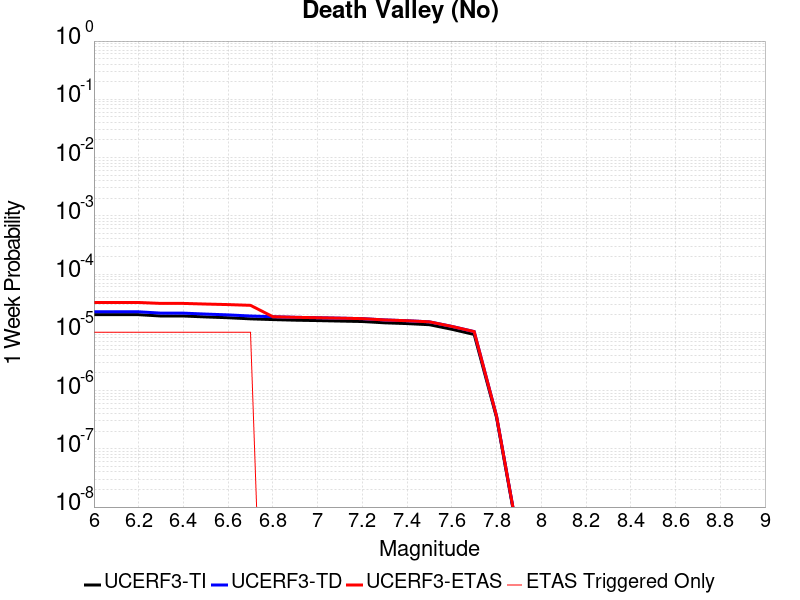 | 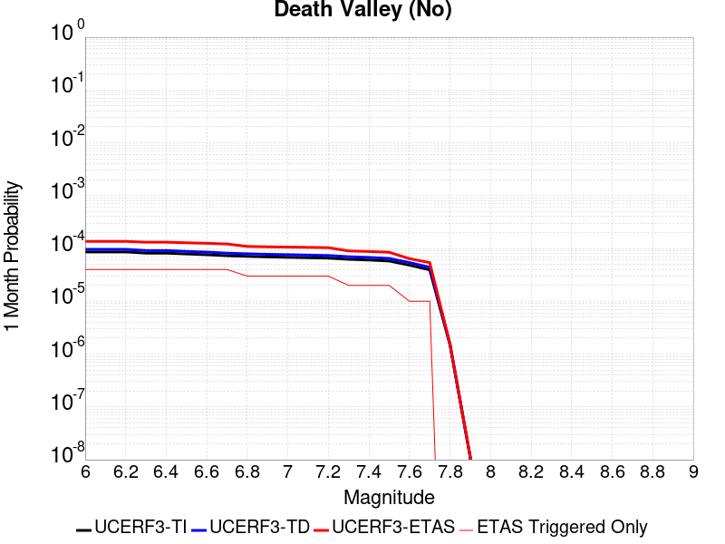 |  |  |

| Magnitude | 1 wk TI Prob | 1 wk TD Prob | 1 wk ETAS Prob | 1 wk ETAS/TD Gain | 1 wk ETAS Triggered Only | 1 mo TI Prob | 1 mo TD Prob | 1 mo ETAS Prob | 1 mo ETAS/TD Gain | 1 mo ETAS Triggered Only | 1 yr TI Prob | 1 yr TD Prob | 1 yr ETAS Prob | 1 yr ETAS/TD Gain | 1 yr ETAS Triggered Only | 10 yr TI Prob | 10 yr TD Prob | 10 yr ETAS Prob | 10 yr ETAS/TD Gain | 10 yr ETAS Triggered Only |
|-----|-----|-----|-----|-----|-----|-----|-----|-----|-----|-----|-----|-----|-----|-----|-----|-----|-----|-----|-----|-----|
| 6.0 | 2.0074807E-5 | 2.2501532E-5 | 3.772722E-5 | 1.6766511 | 1.522603E-5 | 8.603206E-5 | 9.643161E-5 | 1.421053E-4 | 1.473638 | 4.567809E-5 | 0.001046937 | 0.00117343 | 0.001264679 | 1.0777626 | 9.135618E-5 | 0.010420183 | 0.011673254 | 0.01188393 | 1.0180478 | 2.1316443E-4 |
| 6.1 | 2.0074807E-5 | 2.2501532E-5 | 3.772722E-5 | 1.6766511 | 1.522603E-5 | 8.603206E-5 | 9.643161E-5 | 1.421053E-4 | 1.473638 | 4.567809E-5 | 0.001046937 | 0.00117343 | 0.001264679 | 1.0777626 | 9.135618E-5 | 0.010420183 | 0.011673254 | 0.01188393 | 1.0180478 | 2.1316443E-4 |
| 6.2 | 2.0074807E-5 | 2.2501532E-5 | 3.772722E-5 | 1.6766511 | 1.522603E-5 | 8.603206E-5 | 9.643161E-5 | 1.421053E-4 | 1.473638 | 4.567809E-5 | 0.001046937 | 0.00117343 | 0.001264679 | 1.0777626 | 9.135618E-5 | 0.010420183 | 0.011673254 | 0.01188393 | 1.0180478 | 2.1316443E-4 |
| 6.3 | 1.9050609E-5 | 2.1338312E-5 | 3.656402E-5 | 1.7135384 | 1.522603E-5 | 8.164292E-5 | 9.1446746E-5 | 1.3712066E-4 | 1.4994591 | 4.567809E-5 | 9.935491E-4 | 0.0011128022 | 0.0011888476 | 1.0683368 | 7.613015E-5 | 0.009891188 | 0.011073124 | 0.01126887 | 1.0176777 | 1.979384E-4 |
| 6.4 | 1.9050609E-5 | 2.1338312E-5 | 3.656402E-5 | 1.7135384 | 1.522603E-5 | 8.164292E-5 | 9.1446746E-5 | 1.3712066E-4 | 1.4994591 | 4.567809E-5 | 9.935491E-4 | 0.0011128022 | 0.0011888476 | 1.0683368 | 7.613015E-5 | 0.009891188 | 0.011073124 | 0.01126887 | 1.0176777 | 1.979384E-4 |
| 6.5 | 1.8367004E-5 | 2.0562318E-5 | 3.5788034E-5 | 1.740467 | 1.522603E-5 | 7.8713354E-5 | 8.8121276E-5 | 1.3379534E-4 | 1.5183091 | 4.567809E-5 | 9.5791375E-4 | 0.0010723551 | 0.0011484036 | 1.0709172 | 7.613015E-5 | 0.009537951 | 0.010672592 | 0.010853354 | 1.016937 | 1.8271236E-4 |
| 6.6 | 1.779439E-5 | 1.9912191E-5 | 3.5137917E-5 | 1.7646435 | 1.522603E-5 | 7.625944E-5 | 8.53352E-5 | 1.310094E-4 | 1.5352327 | 4.567809E-5 | 9.280632E-4 | 0.0010384673 | 0.0011145184 | 1.073234 | 7.613015E-5 | 0.009241969 | 0.010336905 | 0.01050266 | 1.0160353 | 1.6748633E-4 |
| 6.7 | 1.7025437E-5 | 1.904463E-5 | 3.4270368E-5 | 1.7994769 | 1.522603E-5 | 7.296412E-5 | 8.161732E-5 | 1.2729169E-4 | 1.5596161 | 4.567809E-5 | 8.87976E-4 | 9.93244E-4 | 0.0010692986 | 1.0765718 | 7.613015E-5 | 0.008844362 | 0.009888767 | 0.010054598 | 1.0167695 | 1.6748633E-4 |
| 6.8 | 1.6545107E-5 | 1.851372E-5 | 1.851372E-5 | 1.0 | 0.0 | 7.090568E-5 | 7.934213E-5 | 1.0979178E-4 | 1.3837765 | 3.045206E-5 | 8.629347E-4 | 9.6556847E-4 | 0.0010264138 | 1.063015 | 6.090412E-5 | 0.008595915 | 0.009614435 | 0.009765232 | 1.0156844 | 1.522603E-4 |
| 6.9 | 1.615478E-5 | 1.8088747E-5 | 1.8088747E-5 | 1.0 | 0.0 | 6.9232934E-5 | 7.7520934E-5 | 1.07970634E-4 | 1.3927933 | 3.045206E-5 | 8.4258494E-4 | 9.4341475E-4 | 0.0010042614 | 1.0644962 | 6.090412E-5 | 0.008393973 | 0.009394792 | 0.009530539 | 1.0144491 | 1.3703428E-4 |
| 7.0 | 1.5894311E-5 | 1.780669E-5 | 1.780669E-5 | 1.0 | 0.0 | 6.81167E-5 | 7.6312186E-5 | 1.0676192E-4 | 1.3990154 | 3.045206E-5 | 8.2900526E-4 | 9.287109E-4 | 9.895585E-4 | 1.0655183 | 6.090412E-5 | 0.008259195 | 0.009248987 | 0.009384754 | 1.0146791 | 1.3703428E-4 |
| 7.1 | 1.5602263E-5 | 1.7484625E-5 | 1.7484625E-5 | 1.0 | 0.0 | 6.6865134E-5 | 7.493199E-5 | 1.0538177E-4 | 1.4063655 | 3.045206E-5 | 8.137789E-4 | 9.119212E-4 | 9.727698E-4 | 1.0667257 | 6.090412E-5 | 0.008108052 | 0.009082474 | 0.009218263 | 1.0149508 | 1.3703428E-4 |
| 7.2 | 1.5323829E-5 | 1.7171731E-5 | 1.7171731E-5 | 1.0 | 0.0 | 6.56719E-5 | 7.3591094E-5 | 1.0404091E-4 | 1.4137704 | 3.045206E-5 | 7.99262E-4 | 8.956093E-4 | 9.564589E-4 | 1.0679421 | 6.090412E-5 | 0.007963934 | 0.008920676 | 0.009056488 | 1.0152243 | 1.3703428E-4 |
| 7.3 | 1.4556212E-5 | 1.6303497E-5 | 1.6303497E-5 | 1.0 | 0.0 | 6.238227E-5 | 6.9870286E-5 | 1.0032022E-4 | 1.4358066 | 3.045206E-5 | 7.592395E-4 | 8.503446E-4 | 9.11197E-4 | 1.0715619 | 6.090412E-5 | 0.0075665074 | 0.008471553 | 0.008607427 | 1.0160388 | 1.3703428E-4 |
| 7.4 | 1.411725E-5 | 1.5808968E-5 | 1.5808968E-5 | 1.0 | 0.0 | 6.0501097E-5 | 6.775099E-5 | 9.820099E-5 | 1.4494399 | 3.045206E-5 | 7.363519E-4 | 8.24562E-4 | 8.854159E-4 | 1.0738015 | 6.090412E-5 | 0.0073391674 | 0.00821566 | 0.008351568 | 1.0165426 | 1.3703428E-4 |
| 7.5 | 1.3503312E-5 | 1.5127256E-5 | 1.5127256E-5 | 1.0 | 0.0 | 5.7870053E-5 | 6.4829524E-5 | 9.527961E-5 | 1.4696947 | 3.045206E-5 | 7.043401E-4 | 7.890194E-4 | 8.4987545E-4 | 1.0771288 | 6.090412E-5 | 0.007021119 | 0.007862805 | 0.007998762 | 1.0172912 | 1.3703428E-4 |
| 7.6 | 1.1279839E-5 | 1.2627129E-5 | 1.2627129E-5 | 1.0 | 0.0 | 4.834127E-5 | 5.4115175E-5 | 6.934038E-5 | 1.2813482 | 1.522603E-5 | 5.88396E-4 | 6.586584E-4 | 7.043064E-4 | 1.0693045 | 4.567809E-5 | 0.005868405 | 0.006567614 | 0.0066734967 | 1.0161219 | 1.06582214E-4 |
| 7.7 | 9.189108E-6 | 1.02840095E-5 | 1.02840095E-5 | 1.0 | 0.0 | 3.93813E-5 | 4.407361E-5 | 5.929897E-5 | 1.3454529 | 1.522603E-5 | 4.7936183E-4 | 5.3646916E-4 | 5.669049E-4 | 1.0567334 | 3.045206E-5 | 0.004783291 | 0.005352252 | 0.0054128305 | 1.0113182 | 6.090412E-5 |
| 7.8 | 3.4586725E-7 | 3.648368E-7 | 3.648368E-7 | 1.0 | 0.0 | 1.4822873E-6 | 1.5635853E-6 | 1.5635853E-6 | 1.0 | 0.0 | 1.80467E-5 | 1.903649E-5 | 1.903649E-5 | 1.0 | 0.0 | 1.8045233E-4 | 1.9034903E-4 | 1.9034903E-4 | 1.0 | 0.0 |
| 7.9 | 2.5591178E-9 | 2.6697329E-9 | 2.6697329E-9 | 1.0 | 0.0 | 1.0967647E-8 | 1.14417125E-8 | 1.14417125E-8 | 1.0 | 0.0 | 1.335311E-7 | 1.3930286E-7 | 1.3930286E-7 | 1.0 | 0.0 | 1.3353102E-6 | 1.3930285E-6 | 1.3930285E-6 | 1.0 | 0.0 |

## Red Pass
*[(top)](#table-of-contents)*

| 1 Week | 1 Month | 1 Year | 10 Year |
|-----|-----|-----|-----|
|  |  |  |  |

| Magnitude | 1 wk TI Prob | 1 wk TD Prob | 1 wk ETAS Prob | 1 wk ETAS/TD Gain | 1 wk ETAS Triggered Only | 1 mo TI Prob | 1 mo TD Prob | 1 mo ETAS Prob | 1 mo ETAS/TD Gain | 1 mo ETAS Triggered Only | 1 yr TI Prob | 1 yr TD Prob | 1 yr ETAS Prob | 1 yr ETAS/TD Gain | 1 yr ETAS Triggered Only | 10 yr TI Prob | 10 yr TD Prob | 10 yr ETAS Prob | 10 yr ETAS/TD Gain | 10 yr ETAS Triggered Only |
|-----|-----|-----|-----|-----|-----|-----|-----|-----|-----|-----|-----|-----|-----|-----|-----|-----|-----|-----|-----|-----|
| 6.0 | 8.258278E-6 | 8.551426E-6 | 8.551426E-6 | 1.0 | 0.0 | 3.539214E-5 | 3.6648555E-5 | 3.6648555E-5 | 1.0 | 0.0 | 4.308141E-4 | 4.4612266E-4 | 5.830958E-4 | 1.3070302 | 1.3703428E-4 | 0.0042997985 | 0.0044540283 | 0.0046510855 | 1.0442424 | 1.979384E-4 |
| 6.1 | 3.649988E-6 | 3.7753848E-6 | 3.7753848E-6 | 1.0 | 0.0 | 1.5642712E-5 | 1.6180147E-5 | 1.6180147E-5 | 1.0 | 0.0 | 1.9043336E-4 | 1.9698025E-4 | 2.5787237E-4 | 1.309128 | 6.090412E-5 | 0.0019027026 | 0.0019685237 | 0.0020748961 | 1.0540366 | 1.06582214E-4 |
| 6.2 | 3.649988E-6 | 3.7753848E-6 | 3.7753848E-6 | 1.0 | 0.0 | 1.5642712E-5 | 1.6180147E-5 | 1.6180147E-5 | 1.0 | 0.0 | 1.9043336E-4 | 1.9698025E-4 | 2.5787237E-4 | 1.309128 | 6.090412E-5 | 0.0019027026 | 0.0019685237 | 0.0020748961 | 1.0540366 | 1.06582214E-4 |
| 6.3 | 1.3924937E-6 | 1.4411434E-6 | 1.4411434E-6 | 1.0 | 0.0 | 5.9678164E-6 | 6.1763217E-6 | 6.1763217E-6 | 1.0 | 0.0 | 7.265574E-5 | 7.519554E-5 | 1.0564531E-4 | 1.4049412 | 3.045206E-5 | 7.263199E-4 | 7.518397E-4 | 7.974835E-4 | 1.0607094 | 4.567809E-5 |
| 6.4 | 1.3924937E-6 | 1.4411434E-6 | 1.4411434E-6 | 1.0 | 0.0 | 5.9678164E-6 | 6.1763217E-6 | 6.1763217E-6 | 1.0 | 0.0 | 7.265574E-5 | 7.519554E-5 | 1.0564531E-4 | 1.4049412 | 3.045206E-5 | 7.263199E-4 | 7.518397E-4 | 7.974835E-4 | 1.0607094 | 4.567809E-5 |
| 6.5 | 9.876812E-7 | 1.0222102E-6 | 1.0222102E-6 | 1.0 | 0.0 | 4.2329125E-6 | 4.3809005E-6 | 4.3809005E-6 | 1.0 | 0.0 | 5.153449E-5 | 5.3337466E-5 | 6.856269E-5 | 1.2854507 | 1.522603E-5 | 5.1522546E-4 | 5.3337467E-4 | 5.6381046E-4 | 1.0570627 | 3.045206E-5 |

## San Andreas (Cholame) rev
*[(top)](#table-of-contents)*

| 1 Week | 1 Month | 1 Year | 10 Year |
|-----|-----|-----|-----|
|  |  |  |  |

| Magnitude | 1 wk TI Prob | 1 wk TD Prob | 1 wk ETAS Prob | 1 wk ETAS/TD Gain | 1 wk ETAS Triggered Only | 1 mo TI Prob | 1 mo TD Prob | 1 mo ETAS Prob | 1 mo ETAS/TD Gain | 1 mo ETAS Triggered Only | 1 yr TI Prob | 1 yr TD Prob | 1 yr ETAS Prob | 1 yr ETAS/TD Gain | 1 yr ETAS Triggered Only | 10 yr TI Prob | 10 yr TD Prob | 10 yr ETAS Prob | 10 yr ETAS/TD Gain | 10 yr ETAS Triggered Only |
|-----|-----|-----|-----|-----|-----|-----|-----|-----|-----|-----|-----|-----|-----|-----|-----|-----|-----|-----|-----|-----|
| 6.0 | 1.2302514E-4 | 2.5242948E-4 | 2.6765166E-4 | 1.0603027 | 1.522603E-5 | 5.27144E-4 | 0.0010813937 | 0.0010966032 | 1.0140648 | 1.522603E-5 | 0.0063991086 | 0.013086997 | 0.0131621305 | 1.0057411 | 7.613015E-5 | 0.06217949 | 0.1245517 | 0.12469832 | 1.0011772 | 1.6748633E-4 |
| 6.1 | 1.2302514E-4 | 2.5242948E-4 | 2.6765166E-4 | 1.0603027 | 1.522603E-5 | 5.27144E-4 | 0.0010813937 | 0.0010966032 | 1.0140648 | 1.522603E-5 | 0.0063991086 | 0.013086997 | 0.0131621305 | 1.0057411 | 7.613015E-5 | 0.06217949 | 0.1245517 | 0.12469832 | 1.0011772 | 1.6748633E-4 |
| 6.2 | 1.2203569E-4 | 2.5059693E-4 | 2.6581917E-4 | 1.0607438 | 1.522603E-5 | 5.2290526E-4 | 0.0010735465 | 0.0010887561 | 1.0141677 | 1.522603E-5 | 0.006347804 | 0.0129926 | 0.013067741 | 1.0057833 | 7.613015E-5 | 0.061695136 | 0.12373783 | 0.12387125 | 1.0010782 | 1.522603E-4 |
| 6.3 | 1.2142645E-4 | 2.4945638E-4 | 2.6467862E-4 | 1.0610216 | 1.522603E-5 | 5.202953E-4 | 0.0010686623 | 0.001083872 | 1.0142325 | 1.522603E-5 | 0.006316212 | 0.012933843 | 0.013008988 | 1.00581 | 7.613015E-5 | 0.06139677 | 0.123231925 | 0.123365425 | 1.0010833 | 1.522603E-4 |
| 6.4 | 1.1865206E-4 | 2.4450937E-4 | 2.597317E-4 | 1.0622566 | 1.522603E-5 | 5.0840975E-4 | 0.001047478 | 0.0010626882 | 1.0145206 | 1.522603E-5 | 0.006172335 | 0.012678952 | 0.012754117 | 1.0059283 | 7.613015E-5 | 0.060036868 | 0.121024184 | 0.12115802 | 1.0011058 | 1.522603E-4 |
| 6.5 | 1.17443946E-4 | 2.4244092E-4 | 2.5766325E-4 | 1.0627878 | 1.522603E-5 | 5.032341E-4 | 0.0010386204 | 0.0010538306 | 1.0146446 | 1.522603E-5 | 0.006109677 | 0.012572356 | 0.012647528 | 1.0059792 | 7.613015E-5 | 0.059444077 | 0.12009794 | 0.12023192 | 1.0011156 | 1.522603E-4 |
| 6.6 | 1.13579066E-4 | 2.3552658E-4 | 2.5074903E-4 | 1.0646316 | 1.522603E-5 | 4.866766E-4 | 0.0010090107 | 0.0010242213 | 1.0150748 | 1.522603E-5 | 0.0059092017 | 0.012215953 | 0.012291153 | 1.0061558 | 7.613015E-5 | 0.057545185 | 0.11701085 | 0.11714529 | 1.0011489 | 1.522603E-4 |
| 6.7 | 1.1271412E-4 | 2.339688E-4 | 2.4919127E-4 | 1.0650619 | 1.522603E-5 | 4.829711E-4 | 0.0010023396 | 0.0010175504 | 1.0151752 | 1.522603E-5 | 0.005864331 | 0.012135641 | 0.012210848 | 1.0061971 | 7.613015E-5 | 0.057119697 | 0.116314195 | 0.116448745 | 1.0011568 | 1.522603E-4 |
| 6.8 | 1.1217975E-4 | 2.3285215E-4 | 2.4807465E-4 | 1.065374 | 1.522603E-5 | 4.8068175E-4 | 9.975577E-4 | 0.0010127685 | 1.0152481 | 1.522603E-5 | 0.005836608 | 0.012078067 | 0.012153278 | 1.006227 | 7.613015E-5 | 0.056856725 | 0.11581219 | 0.115946814 | 1.0011624 | 1.522603E-4 |
| 6.9 | 1.1146753E-4 | 2.3133864E-4 | 2.4656113E-4 | 1.0658019 | 1.522603E-5 | 4.7763053E-4 | 9.910761E-4 | 0.001006287 | 1.015348 | 1.522603E-5 | 0.0057996577 | 0.012000027 | 0.0120752435 | 1.006268 | 7.613015E-5 | 0.056506127 | 0.11513234 | 0.11526707 | 1.0011703 | 1.522603E-4 |
| 7.0 | 1.0965793E-4 | 2.2756905E-4 | 2.4279162E-4 | 1.066892 | 1.522603E-5 | 4.698779E-4 | 9.7493286E-4 | 9.901441E-4 | 1.0156022 | 1.522603E-5 | 0.005705768 | 0.01180563 | 0.011880862 | 1.0063725 | 7.613015E-5 | 0.055614736 | 0.11343304 | 0.11356803 | 1.0011901 | 1.522603E-4 |
| 7.1 | 9.927982E-5 | 2.0574623E-4 | 2.2096913E-4 | 1.0739887 | 1.522603E-5 | 4.2541555E-4 | 8.814726E-4 | 8.9668523E-4 | 1.0172582 | 1.522603E-5 | 0.0051671406 | 0.0106794145 | 0.0107547315 | 1.0070525 | 7.613015E-5 | 0.05048634 | 0.10352388 | 0.103646725 | 1.0011866 | 1.3703428E-4 |
| 7.2 | 9.696786E-5 | 2.0078626E-4 | 2.1600923E-4 | 1.0758168 | 1.522603E-5 | 4.1551032E-4 | 8.602298E-4 | 8.754427E-4 | 1.0176847 | 1.522603E-5 | 0.00504711 | 0.010423285 | 0.0104986215 | 1.0072278 | 7.613015E-5 | 0.04934009 | 0.10126121 | 0.10138437 | 1.0012163 | 1.3703428E-4 |
| 7.3 | 9.4727984E-5 | 1.9507346E-4 | 2.1029651E-4 | 1.0780376 | 1.522603E-5 | 4.0591392E-4 | 8.357622E-4 | 8.509755E-4 | 1.0182029 | 1.522603E-5 | 0.0049308087 | 0.010128201 | 0.01020356 | 1.0074406 | 7.613015E-5 | 0.048228268 | 0.09863034 | 0.098753855 | 1.0012523 | 1.3703428E-4 |
| 7.4 | 9.220358E-5 | 1.8877286E-4 | 2.0399601E-4 | 1.0806427 | 1.522603E-5 | 3.9509835E-4 | 8.0877665E-4 | 8.239903E-4 | 1.0188107 | 1.522603E-5 | 0.004799717 | 0.009802646 | 0.00987803 | 1.0076902 | 7.613015E-5 | 0.046973653 | 0.09570612 | 0.09581627 | 1.001151 | 1.2180824E-4 |
| 7.5 | 7.71631E-5 | 1.520787E-4 | 1.6730242E-4 | 1.1001042 | 1.522603E-5 | 3.306571E-4 | 6.516032E-4 | 6.6681934E-4 | 1.0233518 | 1.522603E-5 | 0.0040183207 | 0.007904484 | 0.007949801 | 1.0057331 | 4.567809E-5 | 0.03946433 | 0.078419134 | 0.078489296 | 1.0008947 | 7.613015E-5 |
| 7.6 | 7.5634416E-5 | 1.4866945E-4 | 1.6389322E-4 | 1.1024001 | 1.522603E-5 | 3.241072E-4 | 6.369994E-4 | 6.5221573E-4 | 1.0238875 | 1.522603E-5 | 0.0039388672 | 0.007727957 | 0.007773282 | 1.0058651 | 4.567809E-5 | 0.038697794 | 0.07678112 | 0.0768514 | 1.0009154 | 7.613015E-5 |
| 7.7 | 6.3783E-5 | 1.2385153E-4 | 1.3907568E-4 | 1.1229225 | 1.522603E-5 | 2.7332708E-4 | 5.3068437E-4 | 5.459023E-4 | 1.028676 | 1.522603E-5 | 0.0033226798 | 0.0064419676 | 0.0064722234 | 1.0046967 | 3.045206E-5 | 0.032734364 | 0.064660996 | 0.06471796 | 1.000881 | 6.090412E-5 |
| 7.8 | 5.863422E-5 | 1.1440121E-4 | 1.296255E-4 | 1.133078 | 1.522603E-5 | 2.512653E-4 | 4.9019884E-4 | 5.054174E-4 | 1.0310457 | 1.522603E-5 | 0.003054864 | 0.00595186 | 0.0059821308 | 1.005086 | 3.045206E-5 | 0.030132094 | 0.059769355 | 0.059826616 | 1.0009581 | 6.090412E-5 |
| 7.9 | 4.595283E-5 | 8.443828E-5 | 9.9663026E-5 | 1.1803062 | 1.522603E-5 | 1.9692584E-4 | 3.6182816E-4 | 3.770487E-4 | 1.0420656 | 1.522603E-5 | 0.0023949358 | 0.0043963664 | 0.0044266847 | 1.0068961 | 3.045206E-5 | 0.023692891 | 0.04444455 | 0.044502746 | 1.0013094 | 6.090412E-5 |
| 8.0 | 3.2950178E-5 | 5.0881976E-5 | 6.610723E-5 | 1.2992269 | 1.522603E-5 | 1.412074E-4 | 2.180474E-4 | 2.332701E-4 | 1.0698137 | 1.522603E-5 | 0.0017178444 | 0.0026514968 | 0.0026666825 | 1.0057272 | 1.522603E-5 | 0.017046256 | 0.027233804 | 0.027248614 | 1.0005438 | 1.522603E-5 |
| 8.1 | 1.9177472E-5 | 1.9238712E-5 | 3.446445E-5 | 1.7914114 | 1.522603E-5 | 8.218658E-5 | 8.244903E-5 | 9.76738E-5 | 1.1846569 | 1.522603E-5 | 0.0010001622 | 0.0010033553 | 0.001018566 | 1.0151598 | 1.522603E-5 | 0.009956728 | 0.010786239 | 0.0108013 | 1.0013964 | 1.522603E-5 |
| 8.2 | 8.643924E-6 | 5.49522E-6 | 5.49522E-6 | 1.0 | 0.0 | 3.704486E-5 | 2.355073E-5 | 2.355073E-5 | 1.0 | 0.0 | 4.5092785E-4 | 2.866925E-4 | 2.866925E-4 | 1.0 | 0.0 | 0.0045001395 | 0.0032598388 | 0.0032598388 | 1.0 | 0.0 |
| 8.3 | 1.983087E-6 | 7.693574E-7 | 7.693574E-7 | 1.0 | 0.0 | 8.498917E-6 | 3.297242E-6 | 3.297242E-6 | 1.0 | 0.0 | 1.034694E-4 | 4.01432E-5 | 4.01432E-5 | 1.0 | 0.0 | 0.0010342124 | 4.7390026E-4 | 4.7390026E-4 | 1.0 | 0.0 |

## San Andreas (Carrizo) rev
*[(top)](#table-of-contents)*

| 1 Week | 1 Month | 1 Year | 10 Year |
|-----|-----|-----|-----|
|  |  |  |  |

| Magnitude | 1 wk TI Prob | 1 wk TD Prob | 1 wk ETAS Prob | 1 wk ETAS/TD Gain | 1 wk ETAS Triggered Only | 1 mo TI Prob | 1 mo TD Prob | 1 mo ETAS Prob | 1 mo ETAS/TD Gain | 1 mo ETAS Triggered Only | 1 yr TI Prob | 1 yr TD Prob | 1 yr ETAS Prob | 1 yr ETAS/TD Gain | 1 yr ETAS Triggered Only | 10 yr TI Prob | 10 yr TD Prob | 10 yr ETAS Prob | 10 yr ETAS/TD Gain | 10 yr ETAS Triggered Only |
|-----|-----|-----|-----|-----|-----|-----|-----|-----|-----|-----|-----|-----|-----|-----|-----|-----|-----|-----|-----|-----|
| 6.0 | 1.1674632E-4 | 2.4361293E-4 | 2.5883524E-4 | 1.0624857 | 1.522603E-5 | 5.002454E-4 | 0.0010436393 | 0.0010588494 | 1.0145742 | 1.522603E-5 | 0.006073493 | 0.012632766 | 0.012707934 | 1.0059503 | 7.613015E-5 | 0.0591016 | 0.12077509 | 0.12090896 | 1.0011084 | 1.522603E-4 |
| 6.1 | 1.1674632E-4 | 2.4361293E-4 | 2.5883524E-4 | 1.0624857 | 1.522603E-5 | 5.002454E-4 | 0.0010436393 | 0.0010588494 | 1.0145742 | 1.522603E-5 | 0.006073493 | 0.012632766 | 0.012707934 | 1.0059503 | 7.613015E-5 | 0.0591016 | 0.12077509 | 0.12090896 | 1.0011084 | 1.522603E-4 |
| 6.2 | 1.1674632E-4 | 2.4361293E-4 | 2.5883524E-4 | 1.0624857 | 1.522603E-5 | 5.002454E-4 | 0.0010436393 | 0.0010588494 | 1.0145742 | 1.522603E-5 | 0.006073493 | 0.012632766 | 0.012707934 | 1.0059503 | 7.613015E-5 | 0.0591016 | 0.12077509 | 0.12090896 | 1.0011084 | 1.522603E-4 |
| 6.3 | 1.1674632E-4 | 2.4361293E-4 | 2.5883524E-4 | 1.0624857 | 1.522603E-5 | 5.002454E-4 | 0.0010436393 | 0.0010588494 | 1.0145742 | 1.522603E-5 | 0.006073493 | 0.012632766 | 0.012707934 | 1.0059503 | 7.613015E-5 | 0.0591016 | 0.12077509 | 0.12090896 | 1.0011084 | 1.522603E-4 |
| 6.4 | 1.1674632E-4 | 2.4361293E-4 | 2.5883524E-4 | 1.0624857 | 1.522603E-5 | 5.002454E-4 | 0.0010436393 | 0.0010588494 | 1.0145742 | 1.522603E-5 | 0.006073493 | 0.012632766 | 0.012707934 | 1.0059503 | 7.613015E-5 | 0.0591016 | 0.12077509 | 0.12090896 | 1.0011084 | 1.522603E-4 |
| 6.5 | 1.13136164E-4 | 2.3681132E-4 | 2.5203376E-4 | 1.0642809 | 1.522603E-5 | 4.847792E-4 | 0.0010145125 | 0.001029723 | 1.014993 | 1.522603E-5 | 0.0058862255 | 0.012282185 | 0.01235738 | 1.0061222 | 7.613015E-5 | 0.057327334 | 0.1177463 | 0.117880635 | 1.0011408 | 1.522603E-4 |
| 6.6 | 1.13136164E-4 | 2.3681132E-4 | 2.5203376E-4 | 1.0642809 | 1.522603E-5 | 4.847792E-4 | 0.0010145125 | 0.001029723 | 1.014993 | 1.522603E-5 | 0.0058862255 | 0.012282185 | 0.01235738 | 1.0061222 | 7.613015E-5 | 0.057327334 | 0.1177463 | 0.117880635 | 1.0011408 | 1.522603E-4 |
| 6.7 | 1.1149675E-4 | 2.3372276E-4 | 2.4894523E-4 | 1.0651305 | 1.522603E-5 | 4.777557E-4 | 0.001001286 | 0.0010164968 | 1.0151912 | 1.522603E-5 | 0.0058011734 | 0.012122953 | 0.01219816 | 1.0062037 | 7.613015E-5 | 0.05652051 | 0.116367765 | 0.11650231 | 1.0011562 | 1.522603E-4 |
| 6.8 | 1.1103589E-4 | 2.3274389E-4 | 2.4796638E-4 | 1.0654044 | 1.522603E-5 | 4.7578133E-4 | 9.97094E-4 | 0.0010123048 | 1.0152552 | 1.522603E-5 | 0.005777263 | 0.012072483 | 0.012147694 | 1.00623 | 7.613015E-5 | 0.056293584 | 0.115927964 | 0.116062574 | 1.0011611 | 1.522603E-4 |
| 6.9 | 1.1053259E-4 | 2.316672E-4 | 2.4688971E-4 | 1.0657085 | 1.522603E-5 | 4.7362508E-4 | 9.924831E-4 | 0.001007694 | 1.0153261 | 1.522603E-5 | 0.0057511497 | 0.012016967 | 0.012092182 | 1.0062591 | 7.613015E-5 | 0.05604569 | 0.11544405 | 0.115578726 | 1.0011667 | 1.522603E-4 |
| 7.0 | 1.1005377E-4 | 2.3067516E-4 | 2.4589768E-4 | 1.0659912 | 1.522603E-5 | 4.7157376E-4 | 9.882348E-4 | 0.0010034457 | 1.0153921 | 1.522603E-5 | 0.0057263062 | 0.011965811 | 0.01204103 | 1.0062861 | 7.613015E-5 | 0.055809796 | 0.11499625 | 0.115131 | 1.0011718 | 1.522603E-4 |
| 7.1 | 1.0308142E-4 | 2.1576507E-4 | 2.3098782E-4 | 1.0705523 | 1.522603E-5 | 4.417027E-4 | 9.2438085E-4 | 9.395928E-4 | 1.0164564 | 1.522603E-5 | 0.0053644776 | 0.011196577 | 0.011271855 | 1.0067233 | 7.613015E-5 | 0.052368138 | 0.10825095 | 0.10837315 | 1.0011289 | 1.3703428E-4 |
| 7.2 | 1.0027479E-4 | 2.098411E-4 | 2.2506394E-4 | 1.0725446 | 1.522603E-5 | 4.296783E-4 | 8.9901005E-4 | 9.142224E-4 | 1.0169212 | 1.522603E-5 | 0.0052187922 | 0.010890815 | 0.010966117 | 1.0069141 | 7.613015E-5 | 0.050979212 | 0.105554216 | 0.105676785 | 1.0011612 | 1.3703428E-4 |
| 7.3 | 9.816942E-5 | 2.0458816E-4 | 2.1981107E-4 | 1.0744076 | 1.522603E-5 | 4.2065824E-4 | 8.765127E-4 | 8.917254E-4 | 1.0173559 | 1.522603E-5 | 0.005109493 | 0.010619612 | 0.010694934 | 1.0070927 | 7.613015E-5 | 0.049935985 | 0.10313633 | 0.10325923 | 1.0011916 | 1.3703428E-4 |
| 7.4 | 9.5634205E-5 | 1.9827684E-4 | 2.1349985E-4 | 1.0767765 | 1.522603E-5 | 4.0979648E-4 | 8.494821E-4 | 8.646952E-4 | 1.0179087 | 1.522603E-5 | 0.0049778637 | 0.010293663 | 0.010369009 | 1.0073197 | 7.613015E-5 | 0.048678253 | 0.100220494 | 0.10033009 | 1.0010936 | 1.2180824E-4 |
| 7.5 | 8.052417E-5 | 1.6143978E-4 | 1.7666335E-4 | 1.0942987 | 1.522603E-5 | 3.4505792E-4 | 6.917014E-4 | 7.0691697E-4 | 1.0219972 | 1.522603E-5 | 0.0041929903 | 0.008389029 | 0.008434324 | 1.0053993 | 4.567809E-5 | 0.04114753 | 0.08295002 | 0.08301983 | 1.0008416 | 7.613015E-5 |
| 7.6 | 7.897024E-5 | 1.579682E-4 | 1.7319183E-4 | 1.0963714 | 1.522603E-5 | 3.384E-4 | 6.768311E-4 | 6.9204683E-4 | 1.0224808 | 1.522603E-5 | 0.0041122385 | 0.00820936 | 0.008254663 | 1.0055184 | 4.567809E-5 | 0.040369697 | 0.081289805 | 0.08135975 | 1.0008605 | 7.613015E-5 |
| 7.7 | 6.707427E-5 | 1.3303987E-4 | 1.4826386E-4 | 1.1144319 | 1.522603E-5 | 2.8742946E-4 | 5.700463E-4 | 5.8526365E-4 | 1.0266949 | 1.522603E-5 | 0.003493839 | 0.0069182604 | 0.006948502 | 1.0043713 | 3.045206E-5 | 0.034394164 | 0.06917457 | 0.069231264 | 1.0008196 | 6.090412E-5 |
| 7.8 | 6.147705E-5 | 1.2222702E-4 | 1.3745119E-4 | 1.1245565 | 1.522603E-5 | 2.6344648E-4 | 5.23725E-4 | 5.3894304E-4 | 1.0290574 | 1.522603E-5 | 0.0032027436 | 0.0063577346 | 0.006387993 | 1.0047593 | 3.045206E-5 | 0.031569764 | 0.06362964 | 0.06368668 | 1.0008962 | 6.090412E-5 |
| 7.9 | 4.7636717E-5 | 8.8979046E-5 | 1.0420372E-4 | 1.1711041 | 1.522603E-5 | 2.0414138E-4 | 3.8128305E-4 | 3.9650328E-4 | 1.0399184 | 1.522603E-5 | 0.0024825884 | 0.004632248 | 0.004662559 | 1.0065435 | 3.045206E-5 | 0.024550365 | 0.046713326 | 0.046771385 | 1.0012429 | 6.090412E-5 |
| 8.0 | 3.3554235E-5 | 5.224805E-5 | 6.747329E-5 | 1.2914029 | 1.522603E-5 | 1.4379594E-4 | 2.23901E-4 | 2.3912363E-4 | 1.0679882 | 1.522603E-5 | 0.0017493097 | 0.0027225888 | 0.0027377733 | 1.0055772 | 1.522603E-5 | 0.017356034 | 0.027935574 | 0.027950374 | 1.0005298 | 1.522603E-5 |
| 8.1 | 1.9175432E-5 | 1.9238541E-5 | 3.446428E-5 | 1.7914184 | 1.522603E-5 | 8.217783E-5 | 8.244829E-5 | 9.7673066E-5 | 1.1846584 | 1.522603E-5 | 0.0010000558 | 0.0010033463 | 0.0010185571 | 1.01516 | 1.522603E-5 | 0.009955673 | 0.010786123 | 0.010801185 | 1.0013964 | 1.522603E-5 |
| 8.2 | 8.643924E-6 | 5.49522E-6 | 5.49522E-6 | 1.0 | 0.0 | 3.704486E-5 | 2.355073E-5 | 2.355073E-5 | 1.0 | 0.0 | 4.5092785E-4 | 2.866925E-4 | 2.866925E-4 | 1.0 | 0.0 | 0.0045001395 | 0.0032598388 | 0.0032598388 | 1.0 | 0.0 |
| 8.3 | 1.983087E-6 | 7.693574E-7 | 7.693574E-7 | 1.0 | 0.0 | 8.498917E-6 | 3.297242E-6 | 3.297242E-6 | 1.0 | 0.0 | 1.034694E-4 | 4.01432E-5 | 4.01432E-5 | 1.0 | 0.0 | 0.0010342124 | 4.7390026E-4 | 4.7390026E-4 | 1.0 | 0.0 |

## Scodie Lineament
*[(top)](#table-of-contents)*

| 1 Week | 1 Month | 1 Year | 10 Year |
|-----|-----|-----|-----|
|  | 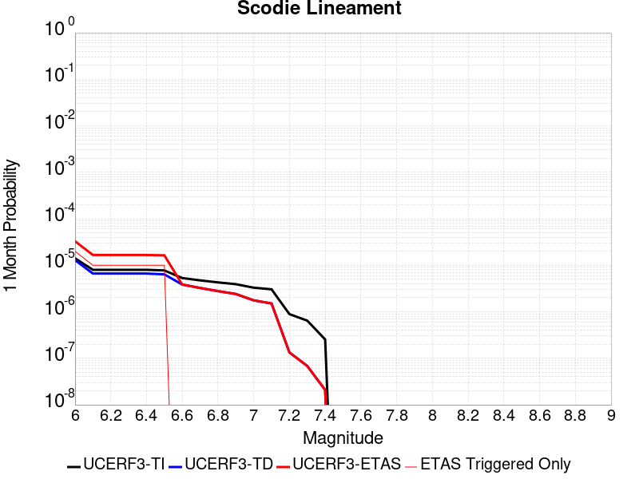 |  |  |

| Magnitude | 1 wk TI Prob | 1 wk TD Prob | 1 wk ETAS Prob | 1 wk ETAS/TD Gain | 1 wk ETAS Triggered Only | 1 mo TI Prob | 1 mo TD Prob | 1 mo ETAS Prob | 1 mo ETAS/TD Gain | 1 mo ETAS Triggered Only | 1 yr TI Prob | 1 yr TD Prob | 1 yr ETAS Prob | 1 yr ETAS/TD Gain | 1 yr ETAS Triggered Only | 10 yr TI Prob | 10 yr TD Prob | 10 yr ETAS Prob | 10 yr ETAS/TD Gain | 10 yr ETAS Triggered Only |
|-----|-----|-----|-----|-----|-----|-----|-----|-----|-----|-----|-----|-----|-----|-----|-----|-----|-----|-----|-----|-----|
| 6.0 | 3.2919327E-6 | 3.0133992E-6 | 3.0133992E-6 | 1.0 | 0.0 | 1.4108206E-5 | 1.2914522E-5 | 4.3366188E-5 | 3.35794 | 3.045206E-5 | 1.7175387E-4 | 1.5722614E-4 | 2.3334433E-4 | 1.4841318 | 7.613015E-5 | 0.0017162118 | 0.0015714606 | 0.0017082795 | 1.0870649 | 1.3703428E-4 |
| 6.1 | 1.8663811E-6 | 1.5490858E-6 | 1.5490858E-6 | 1.0 | 0.0 | 7.998751E-6 | 6.6389252E-6 | 2.1864855E-5 | 3.293433 | 1.522603E-5 | 9.738045E-5 | 8.082641E-5 | 1.11276015E-4 | 1.3767283 | 3.045206E-5 | 9.7337784E-4 | 8.0801896E-4 | 8.6887385E-4 | 1.0753137 | 6.090412E-5 |
| 6.2 | 1.8663811E-6 | 1.5490858E-6 | 1.5490858E-6 | 1.0 | 0.0 | 7.998751E-6 | 6.6389252E-6 | 2.1864855E-5 | 3.293433 | 1.522603E-5 | 9.738045E-5 | 8.082641E-5 | 1.11276015E-4 | 1.3767283 | 3.045206E-5 | 9.7337784E-4 | 8.0801896E-4 | 8.6887385E-4 | 1.0753137 | 6.090412E-5 |
| 6.3 | 1.8663811E-6 | 1.5490858E-6 | 1.5490858E-6 | 1.0 | 0.0 | 7.998751E-6 | 6.6389252E-6 | 2.1864855E-5 | 3.293433 | 1.522603E-5 | 9.738045E-5 | 8.082641E-5 | 1.11276015E-4 | 1.3767283 | 3.045206E-5 | 9.7337784E-4 | 8.0801896E-4 | 8.6887385E-4 | 1.0753137 | 6.090412E-5 |
| 6.4 | 1.8663811E-6 | 1.5490858E-6 | 1.5490858E-6 | 1.0 | 0.0 | 7.998751E-6 | 6.6389252E-6 | 2.1864855E-5 | 3.293433 | 1.522603E-5 | 9.738045E-5 | 8.082641E-5 | 1.11276015E-4 | 1.3767283 | 3.045206E-5 | 9.7337784E-4 | 8.0801896E-4 | 8.6887385E-4 | 1.0753137 | 6.090412E-5 |
| 6.5 | 1.8106311E-6 | 1.4910186E-6 | 1.4910186E-6 | 1.0 | 0.0 | 7.759824E-6 | 6.3900666E-6 | 2.1616E-5 | 3.3827503 | 1.522603E-5 | 9.447177E-5 | 7.779678E-5 | 1.0824647E-4 | 1.3914005 | 3.045206E-5 | 9.4431615E-4 | 7.777441E-4 | 8.3860086E-4 | 1.0782478 | 6.090412E-5 |
| 6.6 | 1.2414679E-6 | 8.997782E-7 | 8.997782E-7 | 1.0 | 0.0 | 5.320566E-6 | 3.856187E-6 | 3.856187E-6 | 1.0 | 0.0 | 6.477596E-5 | 4.6948153E-5 | 4.6948153E-5 | 1.0 | 0.0 | 6.475708E-4 | 4.69391E-4 | 4.998288E-4 | 1.0648452 | 3.045206E-5 |
| 6.7 | 1.1062215E-6 | 7.5945076E-7 | 7.5945076E-7 | 1.0 | 0.0 | 4.7409408E-6 | 3.2547853E-6 | 3.2547853E-6 | 1.0 | 0.0 | 5.7719422E-5 | 3.962636E-5 | 3.962636E-5 | 1.0 | 0.0 | 5.770443E-4 | 3.9619993E-4 | 4.2663992E-4 | 1.0768299 | 3.045206E-5 |
| 6.8 | 1.0006736E-6 | 6.500572E-7 | 6.500572E-7 | 1.0 | 0.0 | 4.288594E-6 | 2.7859567E-6 | 2.7859567E-6 | 1.0 | 0.0 | 5.221238E-5 | 3.3918557E-5 | 3.3918557E-5 | 1.0 | 0.0 | 5.220012E-4 | 3.391399E-4 | 3.6958163E-4 | 1.0897616 | 3.045206E-5 |
| 6.9 | 9.167364E-7 | 5.631784E-7 | 5.631784E-7 | 1.0 | 0.0 | 3.9288643E-6 | 2.4136198E-6 | 2.4136198E-6 | 1.0 | 0.0 | 4.7832873E-5 | 2.9385481E-5 | 2.9385481E-5 | 1.0 | 0.0 | 4.782258E-4 | 2.9382162E-4 | 3.2426475E-4 | 1.1036109 | 3.045206E-5 |
| 7.0 | 7.6987664E-7 | 4.113515E-7 | 4.113515E-7 | 1.0 | 0.0 | 3.2994672E-6 | 1.762934E-6 | 1.762934E-6 | 1.0 | 0.0 | 4.0170275E-5 | 2.146355E-5 | 2.146355E-5 | 1.0 | 0.0 | 4.0163012E-4 | 2.1461862E-4 | 2.4506415E-4 | 1.1418587 | 3.045206E-5 |
| 7.1 | 7.1038727E-7 | 3.5212707E-7 | 3.5212707E-7 | 1.0 | 0.0 | 3.0445133E-6 | 1.5091154E-6 | 1.5091154E-6 | 1.0 | 0.0 | 3.706632E-5 | 1.837336E-5 | 1.837336E-5 | 1.0 | 0.0 | 3.7060137E-4 | 1.837219E-4 | 2.1416837E-4 | 1.1657203 | 3.045206E-5 |
| 7.2 | 2.0799602E-7 | 3.1190186E-8 | 3.1190186E-8 | 1.0 | 0.0 | 8.914113E-7 | 1.3367222E-7 | 1.3367222E-7 | 1.0 | 0.0 | 1.0852878E-5 | 1.6274581E-6 | 1.6274581E-6 | 1.0 | 0.0 | 1.08523476E-4 | 1.6274469E-5 | 1.6274469E-5 | 1.0 | 0.0 |
| 7.3 | 1.5048182E-7 | 1.5947961E-8 | 1.5947961E-8 | 1.0 | 0.0 | 6.449219E-7 | 6.8348406E-8 | 6.8348406E-8 | 1.0 | 0.0 | 7.851896E-6 | 8.3214155E-7 | 8.3214155E-7 | 1.0 | 0.0 | 7.851618E-5 | 8.321387E-6 | 8.321387E-6 | 1.0 | 0.0 |
| 7.4 | 5.9334678E-8 | 4.86919E-9 | 4.86919E-9 | 1.0 | 0.0 | 2.5429145E-7 | 2.0867958E-8 | 2.0867958E-8 | 1.0 | 0.0 | 3.095994E-6 | 2.5406737E-7 | 2.5406737E-7 | 1.0 | 0.0 | 3.095951E-5 | 2.5406719E-6 | 2.5406719E-6 | 1.0 | 0.0 |

## Manix-Afton Hills
*[(top)](#table-of-contents)*

| 1 Week | 1 Month | 1 Year | 10 Year |
|-----|-----|-----|-----|
|  | 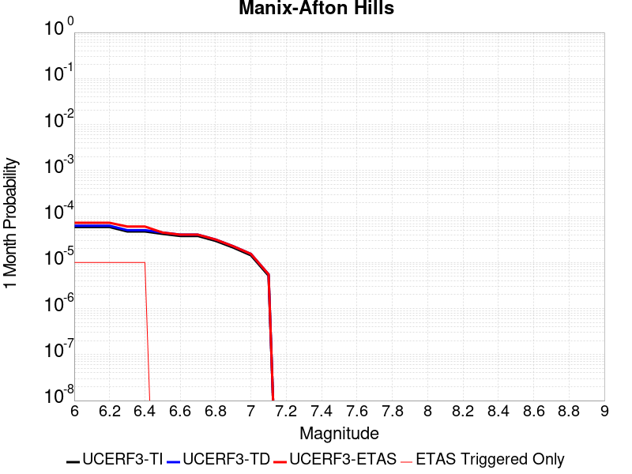 |  |  |

| Magnitude | 1 wk TI Prob | 1 wk TD Prob | 1 wk ETAS Prob | 1 wk ETAS/TD Gain | 1 wk ETAS Triggered Only | 1 mo TI Prob | 1 mo TD Prob | 1 mo ETAS Prob | 1 mo ETAS/TD Gain | 1 mo ETAS Triggered Only | 1 yr TI Prob | 1 yr TD Prob | 1 yr ETAS Prob | 1 yr ETAS/TD Gain | 1 yr ETAS Triggered Only | 10 yr TI Prob | 10 yr TD Prob | 10 yr ETAS Prob | 10 yr ETAS/TD Gain | 10 yr ETAS Triggered Only |
|-----|-----|-----|-----|-----|-----|-----|-----|-----|-----|-----|-----|-----|-----|-----|-----|-----|-----|-----|-----|-----|
| 6.0 | 1.3783202E-5 | 1.4711616E-5 | 1.4711616E-5 | 1.0 | 0.0 | 5.906953E-5 | 6.3048356E-5 | 6.3048356E-5 | 1.0 | 0.0 | 7.189342E-4 | 7.673609E-4 | 7.977896E-4 | 1.0396537 | 3.045206E-5 | 0.0071661277 | 0.0076488685 | 0.0077546355 | 1.0138278 | 1.06582214E-4 |
| 6.1 | 1.3783202E-5 | 1.4711616E-5 | 1.4711616E-5 | 1.0 | 0.0 | 5.906953E-5 | 6.3048356E-5 | 6.3048356E-5 | 1.0 | 0.0 | 7.189342E-4 | 7.673609E-4 | 7.977896E-4 | 1.0396537 | 3.045206E-5 | 0.0071661277 | 0.0076488685 | 0.0077546355 | 1.0138278 | 1.06582214E-4 |
| 6.2 | 1.3783202E-5 | 1.4711616E-5 | 1.4711616E-5 | 1.0 | 0.0 | 5.906953E-5 | 6.3048356E-5 | 6.3048356E-5 | 1.0 | 0.0 | 7.189342E-4 | 7.673609E-4 | 7.977896E-4 | 1.0396537 | 3.045206E-5 | 0.0071661277 | 0.0076488685 | 0.0077546355 | 1.0138278 | 1.06582214E-4 |
| 6.3 | 1.10494875E-5 | 1.1793558E-5 | 1.1793558E-5 | 1.0 | 0.0 | 4.7354086E-5 | 5.0542898E-5 | 5.0542898E-5 | 1.0 | 0.0 | 5.763835E-4 | 6.151964E-4 | 6.4562977E-4 | 1.0494692 | 3.045206E-5 | 0.005748908 | 0.0061359745 | 0.00622677 | 1.0147972 | 9.135618E-5 |
| 6.4 | 1.10494875E-5 | 1.1793558E-5 | 1.1793558E-5 | 1.0 | 0.0 | 4.7354086E-5 | 5.0542898E-5 | 5.0542898E-5 | 1.0 | 0.0 | 5.763835E-4 | 6.151964E-4 | 6.4562977E-4 | 1.0494692 | 3.045206E-5 | 0.005748908 | 0.0061359745 | 0.00622677 | 1.0147972 | 9.135618E-5 |
| 6.5 | 9.788949E-6 | 1.0454697E-5 | 1.0454697E-5 | 1.0 | 0.0 | 4.1951964E-5 | 4.480513E-5 | 4.480513E-5 | 1.0 | 0.0 | 5.1064545E-4 | 5.453752E-4 | 5.7581067E-4 | 1.0558064 | 3.045206E-5 | 0.0050947363 | 0.005441295 | 0.005532154 | 1.0166981 | 9.135618E-5 |
| 6.6 | 8.810006E-6 | 9.413971E-6 | 9.413971E-6 | 1.0 | 0.0 | 3.775662E-5 | 4.0345018E-5 | 4.0345018E-5 | 1.0 | 0.0 | 4.5958988E-4 | 4.9109873E-4 | 5.063173E-4 | 1.0309888 | 1.522603E-5 | 0.0045864056 | 0.0049010175 | 0.004991926 | 1.0185488 | 9.135618E-5 |
| 6.7 | 8.80128E-6 | 9.404451E-6 | 9.404451E-6 | 1.0 | 0.0 | 3.7719226E-5 | 4.0304214E-5 | 4.0304214E-5 | 1.0 | 0.0 | 4.591348E-4 | 4.906022E-4 | 5.058208E-4 | 1.0310202 | 1.522603E-5 | 0.004581874 | 0.004896074 | 0.004986983 | 1.0185677 | 9.135618E-5 |
| 6.8 | 6.8994877E-6 | 7.3803494E-6 | 7.3803494E-6 | 1.0 | 0.0 | 2.9568899E-5 | 3.162973E-5 | 3.162973E-5 | 1.0 | 0.0 | 3.5994186E-4 | 3.850321E-4 | 4.0025226E-4 | 1.0395296 | 1.522603E-5 | 0.003593594 | 0.0038444551 | 0.003905125 | 1.0157812 | 6.090412E-5 |
| 6.9 | 4.9328037E-6 | 5.271154E-6 | 5.271154E-6 | 1.0 | 0.0 | 2.1140417E-5 | 2.2590497E-5 | 2.2590497E-5 | 1.0 | 0.0 | 2.5735417E-4 | 2.7501077E-4 | 2.902326E-4 | 1.05535 | 1.522603E-5 | 0.0025705635 | 0.0027473096 | 0.002777678 | 1.0110539 | 3.045206E-5 |
| 7.0 | 3.347973E-6 | 3.590168E-6 | 3.590168E-6 | 1.0 | 0.0 | 1.4348378E-5 | 1.5386368E-5 | 1.5386368E-5 | 1.0 | 0.0 | 1.746775E-4 | 1.8731703E-4 | 2.0254019E-4 | 1.0812696 | 1.522603E-5 | 0.0017454025 | 0.0018719939 | 0.001902389 | 1.0162368 | 3.045206E-5 |
| 7.1 | 1.2073567E-6 | 1.293531E-6 | 1.293531E-6 | 1.0 | 0.0 | 5.1743755E-6 | 5.5437017E-6 | 5.5437017E-6 | 1.0 | 0.0 | 6.29962E-5 | 6.749411E-5 | 6.749411E-5 | 1.0 | 0.0 | 6.297835E-4 | 6.748963E-4 | 6.9011207E-4 | 1.0225453 | 1.522603E-5 |

## Ludlow
*[(top)](#table-of-contents)*

| 1 Week | 1 Month | 1 Year | 10 Year |
|-----|-----|-----|-----|
|  |  |  |  |

| Magnitude | 1 wk TI Prob | 1 wk TD Prob | 1 wk ETAS Prob | 1 wk ETAS/TD Gain | 1 wk ETAS Triggered Only | 1 mo TI Prob | 1 mo TD Prob | 1 mo ETAS Prob | 1 mo ETAS/TD Gain | 1 mo ETAS Triggered Only | 1 yr TI Prob | 1 yr TD Prob | 1 yr ETAS Prob | 1 yr ETAS/TD Gain | 1 yr ETAS Triggered Only | 10 yr TI Prob | 10 yr TD Prob | 10 yr ETAS Prob | 10 yr ETAS/TD Gain | 10 yr ETAS Triggered Only |
|-----|-----|-----|-----|-----|-----|-----|-----|-----|-----|-----|-----|-----|-----|-----|-----|-----|-----|-----|-----|-----|
| 6.0 | 2.2407607E-5 | 2.3657954E-5 | 2.3657954E-5 | 1.0 | 0.0 | 9.602906E-5 | 1.0138754E-4 | 1.0138754E-4 | 1.0 | 0.0 | 0.0011685267 | 0.0012337384 | 0.0012945674 | 1.0493046 | 6.090412E-5 | 0.011624013 | 0.012273403 | 0.012393717 | 1.0098028 | 1.2180824E-4 |
| 6.1 | 2.2407607E-5 | 2.3657954E-5 | 2.3657954E-5 | 1.0 | 0.0 | 9.602906E-5 | 1.0138754E-4 | 1.0138754E-4 | 1.0 | 0.0 | 0.0011685267 | 0.0012337384 | 0.0012945674 | 1.0493046 | 6.090412E-5 | 0.011624013 | 0.012273403 | 0.012393717 | 1.0098028 | 1.2180824E-4 |
| 6.2 | 1.0781252E-5 | 1.1365991E-5 | 1.1365991E-5 | 1.0 | 0.0 | 4.620455E-5 | 4.8710503E-5 | 4.8710503E-5 | 1.0 | 0.0 | 5.623952E-4 | 5.92893E-4 | 6.5376103E-4 | 1.1026627 | 6.090412E-5 | 0.00560974 | 0.005913531 | 0.006004347 | 1.0153573 | 9.135618E-5 |
| 6.3 | 1.0781252E-5 | 1.1365991E-5 | 1.1365991E-5 | 1.0 | 0.0 | 4.620455E-5 | 4.8710503E-5 | 4.8710503E-5 | 1.0 | 0.0 | 5.623952E-4 | 5.92893E-4 | 6.5376103E-4 | 1.1026627 | 6.090412E-5 | 0.00560974 | 0.005913531 | 0.006004347 | 1.0153573 | 9.135618E-5 |
| 6.4 | 7.814439E-6 | 8.237966E-6 | 8.237966E-6 | 1.0 | 0.0 | 3.3490025E-5 | 3.5305096E-5 | 3.5305096E-5 | 1.0 | 0.0 | 4.0766477E-4 | 4.2975618E-4 | 4.7541465E-4 | 1.1062427 | 4.567809E-5 | 0.0040691774 | 0.0042893975 | 0.004365201 | 1.0176723 | 7.613015E-5 |
| 6.5 | 6.4986366E-6 | 6.8511167E-6 | 6.8511167E-6 | 1.0 | 0.0 | 2.7851002E-5 | 2.9361603E-5 | 2.9361603E-5 | 1.0 | 0.0 | 3.390332E-4 | 3.574198E-4 | 4.030816E-4 | 1.1277539 | 4.567809E-5 | 0.003385164 | 0.003568546 | 0.0036292325 | 1.017006 | 6.090412E-5 |
| 6.6 | 5.582177E-6 | 5.8861756E-6 | 5.8861756E-6 | 1.0 | 0.0 | 2.3923398E-5 | 2.5226227E-5 | 2.5226227E-5 | 1.0 | 0.0 | 2.9122844E-4 | 3.0708674E-4 | 3.3752946E-4 | 1.099134 | 3.045206E-5 | 0.0029084706 | 0.0030666974 | 0.0031122353 | 1.0148492 | 4.567809E-5 |
| 6.7 | 4.6858763E-6 | 4.94057E-6 | 4.94057E-6 | 1.0 | 0.0 | 2.0082172E-5 | 2.1173702E-5 | 2.1173702E-5 | 1.0 | 0.0 | 2.4447302E-4 | 2.5775988E-4 | 2.882041E-4 | 1.1181108 | 3.045206E-5 | 0.0024420423 | 0.0025746655 | 0.002620226 | 1.0176957 | 4.567809E-5 |
| 6.8 | 3.5584908E-6 | 3.7521265E-6 | 3.7521265E-6 | 1.0 | 0.0 | 1.5250586E-5 | 1.6080447E-5 | 1.6080447E-5 | 1.0 | 0.0 | 1.8566006E-4 | 1.9576224E-4 | 2.2620834E-4 | 1.1555259 | 3.045206E-5 | 0.0018550502 | 0.0019559392 | 0.002001528 | 1.0233078 | 4.567809E-5 |
| 6.9 | 2.532834E-6 | 2.6710807E-6 | 2.6710807E-6 | 1.0 | 0.0 | 1.0854958E-5 | 1.1447441E-5 | 1.1447441E-5 | 1.0 | 0.0 | 1.3215111E-4 | 1.3936395E-4 | 1.6981177E-4 | 1.218477 | 3.045206E-5 | 0.0013207254 | 0.0013927931 | 0.0014232028 | 1.0218335 | 3.045206E-5 |
| 7.0 | 1.7083285E-6 | 1.8019963E-6 | 1.8019963E-6 | 1.0 | 0.0 | 7.3213873E-6 | 7.722819E-6 | 7.722819E-6 | 1.0 | 0.0 | 8.913424E-5 | 9.402143E-5 | 1.0924603E-4 | 1.1619269 | 1.522603E-5 | 8.9098496E-4 | 9.3983306E-4 | 9.5504476E-4 | 1.0161855 | 1.522603E-5 |
| 7.1 | 1.0905424E-6 | 1.1497951E-6 | 1.1497951E-6 | 1.0 | 0.0 | 4.6737446E-6 | 4.9276846E-6 | 4.9276846E-6 | 1.0 | 0.0 | 5.6901354E-5 | 5.9993006E-5 | 7.521812E-5 | 1.2537816 | 1.522603E-5 | 5.6886784E-4 | 5.997779E-4 | 6.149948E-4 | 1.0253708 | 1.522603E-5 |
| 7.2 | 6.06668E-7 | 6.387457E-7 | 6.387457E-7 | 1.0 | 0.0 | 2.600003E-6 | 2.737479E-6 | 2.737479E-6 | 1.0 | 0.0 | 3.1654577E-5 | 3.3328364E-5 | 4.8553888E-5 | 1.4568337 | 1.522603E-5 | 3.1650066E-4 | 3.3324052E-4 | 3.4846147E-4 | 1.0456756 | 1.522603E-5 |

## Lake Isabella (Seismicity)
*[(top)](#table-of-contents)*

| 1 Week | 1 Month | 1 Year | 10 Year |
|-----|-----|-----|-----|
|  |  |  |  |

| Magnitude | 1 wk TI Prob | 1 wk TD Prob | 1 wk ETAS Prob | 1 wk ETAS/TD Gain | 1 wk ETAS Triggered Only | 1 mo TI Prob | 1 mo TD Prob | 1 mo ETAS Prob | 1 mo ETAS/TD Gain | 1 mo ETAS Triggered Only | 1 yr TI Prob | 1 yr TD Prob | 1 yr ETAS Prob | 1 yr ETAS/TD Gain | 1 yr ETAS Triggered Only | 10 yr TI Prob | 10 yr TD Prob | 10 yr ETAS Prob | 10 yr ETAS/TD Gain | 10 yr ETAS Triggered Only |
|-----|-----|-----|-----|-----|-----|-----|-----|-----|-----|-----|-----|-----|-----|-----|-----|-----|-----|-----|-----|-----|
| 6.0 | 9.431637E-6 | 9.7418215E-6 | 9.7418215E-6 | 1.0 | 0.0 | 4.0420677E-5 | 4.175007E-5 | 7.220086E-5 | 1.729359 | 3.045206E-5 | 4.920106E-4 | 5.082016E-4 | 5.6907476E-4 | 1.1197815 | 6.090412E-5 | 0.004909227 | 0.005071687 | 0.0051928777 | 1.0238955 | 1.2180824E-4 |
| 6.1 | 9.431637E-6 | 9.7418215E-6 | 9.7418215E-6 | 1.0 | 0.0 | 4.0420677E-5 | 4.175007E-5 | 7.220086E-5 | 1.729359 | 3.045206E-5 | 4.920106E-4 | 5.082016E-4 | 5.6907476E-4 | 1.1197815 | 6.090412E-5 | 0.004909227 | 0.005071687 | 0.0051928777 | 1.0238955 | 1.2180824E-4 |
| 6.2 | 9.431637E-6 | 9.7418215E-6 | 9.7418215E-6 | 1.0 | 0.0 | 4.0420677E-5 | 4.175007E-5 | 7.220086E-5 | 1.729359 | 3.045206E-5 | 4.920106E-4 | 5.082016E-4 | 5.6907476E-4 | 1.1197815 | 6.090412E-5 | 0.004909227 | 0.005071687 | 0.0051928777 | 1.0238955 | 1.2180824E-4 |
| 6.3 | 9.431637E-6 | 9.7418215E-6 | 9.7418215E-6 | 1.0 | 0.0 | 4.0420677E-5 | 4.175007E-5 | 7.220086E-5 | 1.729359 | 3.045206E-5 | 4.920106E-4 | 5.082016E-4 | 5.6907476E-4 | 1.1197815 | 6.090412E-5 | 0.004909227 | 0.005071687 | 0.0051928777 | 1.0238955 | 1.2180824E-4 |
| 6.4 | 5.144063E-6 | 5.3001613E-6 | 5.3001613E-6 | 1.0 | 0.0 | 2.2045799E-5 | 2.27148E-5 | 2.27148E-5 | 1.0 | 0.0 | 2.6837454E-4 | 2.7652105E-4 | 3.0696468E-4 | 1.1100953 | 3.045206E-5 | 0.0026805066 | 0.0027621102 | 0.002822846 | 1.021989 | 6.090412E-5 |
| 6.5 | 5.144063E-6 | 5.3001613E-6 | 5.3001613E-6 | 1.0 | 0.0 | 2.2045799E-5 | 2.27148E-5 | 2.27148E-5 | 1.0 | 0.0 | 2.6837454E-4 | 2.7652105E-4 | 3.0696468E-4 | 1.1100953 | 3.045206E-5 | 0.0026805066 | 0.0027621102 | 0.002822846 | 1.021989 | 6.090412E-5 |
| 6.6 | 3.4009804E-6 | 3.4988395E-6 | 3.4988395E-6 | 1.0 | 0.0 | 1.4575549E-5 | 1.4994949E-5 | 1.4994949E-5 | 1.0 | 0.0 | 1.7744285E-4 | 1.8254982E-4 | 1.9777307E-4 | 1.0833923 | 1.522603E-5 | 0.0017730123 | 0.0018241564 | 0.0018393546 | 1.0083317 | 1.522603E-5 |
| 6.7 | 3.3880428E-6 | 3.485706E-6 | 3.485706E-6 | 1.0 | 0.0 | 1.4520103E-5 | 1.4938664E-5 | 1.4938664E-5 | 1.0 | 0.0 | 1.767679E-4 | 1.8186466E-4 | 1.9708792E-4 | 1.0837065 | 1.522603E-5 | 0.0017662736 | 0.0018173159 | 0.0018325143 | 1.0083631 | 1.522603E-5 |
| 6.8 | 2.6582E-6 | 2.7337414E-6 | 2.7337414E-6 | 1.0 | 0.0 | 1.1392236E-5 | 1.171599E-5 | 1.171599E-5 | 1.0 | 0.0 | 1.3869164E-4 | 1.4263418E-4 | 1.5785804E-4 | 1.1067336 | 1.522603E-5 | 0.0013860512 | 0.0014255584 | 0.0014407628 | 1.0106655 | 1.522603E-5 |
| 6.9 | 2.406011E-6 | 2.474366E-6 | 2.474366E-6 | 1.0 | 0.0 | 1.0311434E-5 | 1.0604391E-5 | 1.0604391E-5 | 1.0 | 0.0 | 1.2553448E-4 | 1.2910213E-4 | 1.4432619E-4 | 1.1179227 | 1.522603E-5 | 0.0012546359 | 0.0012904009 | 0.0013056073 | 1.0117842 | 1.522603E-5 |
| 7.0 | 1.6953097E-6 | 1.7429631E-6 | 1.7429631E-6 | 1.0 | 0.0 | 7.265593E-6 | 7.469827E-6 | 7.469827E-6 | 1.0 | 0.0 | 8.8455E-5 | 9.094239E-5 | 1.06167034E-4 | 1.1674098 | 1.522603E-5 | 8.84198E-4 | 9.0915454E-4 | 9.243667E-4 | 1.0167322 | 1.522603E-5 |
| 7.1 | 3.5013824E-7 | 3.5715203E-7 | 3.5715203E-7 | 1.0 | 0.0 | 1.5005916E-6 | 1.5306507E-6 | 1.5306507E-6 | 1.0 | 0.0 | 1.826955E-5 | 1.8635516E-5 | 1.8635516E-5 | 1.0 | 0.0 | 1.8268047E-4 | 1.8633978E-4 | 1.8633978E-4 | 1.0 | 0.0 |
| 7.2 | 2.2321095E-7 | 2.2750805E-7 | 2.2750805E-7 | 1.0 | 0.0 | 9.56618E-7 | 9.750341E-7 | 9.750341E-7 | 1.0 | 0.0 | 1.1646762E-5 | 1.1870978E-5 | 1.1870978E-5 | 1.0 | 0.0 | 1.1646151E-4 | 1.1870354E-4 | 1.1870354E-4 | 1.0 | 0.0 |
| 7.3 | 1.5760406E-7 | 1.6061085E-7 | 1.6061085E-7 | 1.0 | 0.0 | 6.7544585E-7 | 6.88332E-7 | 6.88332E-7 | 1.0 | 0.0 | 8.223522E-6 | 8.380411E-6 | 8.380411E-6 | 1.0 | 0.0 | 8.2232174E-5 | 8.380101E-5 | 8.380101E-5 | 1.0 | 0.0 |
| 7.4 | 1.1216497E-7 | 1.14318226E-7 | 1.14318226E-7 | 1.0 | 0.0 | 4.8070694E-7 | 4.899352E-7 | 4.899352E-7 | 1.0 | 0.0 | 5.852591E-6 | 5.9649446E-6 | 5.9649446E-6 | 1.0 | 0.0 | 5.8524372E-5 | 5.964789E-5 | 5.964789E-5 | 1.0 | 0.0 |
| 7.5 | 4.885185E-8 | 4.9788245E-8 | 4.9788245E-8 | 1.0 | 0.0 | 2.0936506E-7 | 2.1337817E-7 | 2.1337817E-7 | 1.0 | 0.0 | 2.5490165E-6 | 2.5978763E-6 | 2.5978763E-6 | 1.0 | 0.0 | 2.5489873E-5 | 2.5978477E-5 | 2.5978477E-5 | 1.0 | 0.0 |
| 7.6 | 1.504641E-9 | 1.5318049E-9 | 1.5318049E-9 | 1.0 | 0.0 | 6.4484613E-9 | 6.5648784E-9 | 6.5648784E-9 | 1.0 | 0.0 | 7.851001E-8 | 7.9927396E-8 | 7.9927396E-8 | 1.0 | 0.0 | 7.8509987E-7 | 7.9927395E-7 | 7.9927395E-7 | 1.0 | 0.0 |

## White Wolf (Extension)
*[(top)](#table-of-contents)*

| 1 Week | 1 Month | 1 Year | 10 Year |
|-----|-----|-----|-----|
|  | 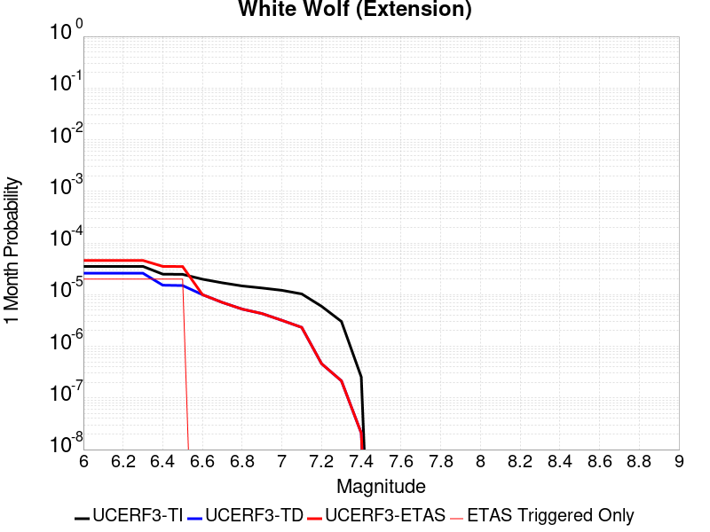 |  |  |

| Magnitude | 1 wk TI Prob | 1 wk TD Prob | 1 wk ETAS Prob | 1 wk ETAS/TD Gain | 1 wk ETAS Triggered Only | 1 mo TI Prob | 1 mo TD Prob | 1 mo ETAS Prob | 1 mo ETAS/TD Gain | 1 mo ETAS Triggered Only | 1 yr TI Prob | 1 yr TD Prob | 1 yr ETAS Prob | 1 yr ETAS/TD Gain | 1 yr ETAS Triggered Only | 10 yr TI Prob | 10 yr TD Prob | 10 yr ETAS Prob | 10 yr ETAS/TD Gain | 10 yr ETAS Triggered Only |
|-----|-----|-----|-----|-----|-----|-----|-----|-----|-----|-----|-----|-----|-----|-----|-----|-----|-----|-----|-----|-----|
| 6.0 | 8.222555E-6 | 6.0668267E-6 | 2.1292764E-5 | 3.5097039 | 1.522603E-5 | 3.5239045E-5 | 2.6000464E-5 | 5.6451732E-5 | 2.1711817 | 3.045206E-5 | 4.289509E-4 | 3.165163E-4 | 3.7740113E-4 | 1.1923593 | 6.090412E-5 | 0.0042812387 | 0.0031613067 | 0.0032827298 | 1.0384091 | 1.2180824E-4 |
| 6.1 | 8.222555E-6 | 6.0668267E-6 | 2.1292764E-5 | 3.5097039 | 1.522603E-5 | 3.5239045E-5 | 2.6000464E-5 | 5.6451732E-5 | 2.1711817 | 3.045206E-5 | 4.289509E-4 | 3.165163E-4 | 3.7740113E-4 | 1.1923593 | 6.090412E-5 | 0.0042812387 | 0.0031613067 | 0.0032827298 | 1.0384091 | 1.2180824E-4 |
| 6.2 | 8.222555E-6 | 6.0668267E-6 | 2.1292764E-5 | 3.5097039 | 1.522603E-5 | 3.5239045E-5 | 2.6000464E-5 | 5.6451732E-5 | 2.1711817 | 3.045206E-5 | 4.289509E-4 | 3.165163E-4 | 3.7740113E-4 | 1.1923593 | 6.090412E-5 | 0.0042812387 | 0.0031613067 | 0.0032827298 | 1.0384091 | 1.2180824E-4 |
| 6.3 | 8.222555E-6 | 6.0668267E-6 | 2.1292764E-5 | 3.5097039 | 1.522603E-5 | 3.5239045E-5 | 2.6000464E-5 | 5.6451732E-5 | 2.1711817 | 3.045206E-5 | 4.289509E-4 | 3.165163E-4 | 3.7740113E-4 | 1.1923593 | 6.090412E-5 | 0.0042812387 | 0.0031613067 | 0.0032827298 | 1.0384091 | 1.2180824E-4 |
| 6.4 | 5.821773E-6 | 3.557277E-6 | 1.8783254E-5 | 5.2802334 | 1.522603E-5 | 2.4950215E-5 | 1.52453895E-5 | 4.5696986E-5 | 2.9974298 | 3.045206E-5 | 3.0372653E-4 | 1.855979E-4 | 2.4649073E-4 | 1.32809 | 6.090412E-5 | 0.0030331176 | 0.0018545374 | 0.0019457241 | 1.0491695 | 9.135618E-5 |
| 6.5 | 5.766023E-6 | 3.49921E-6 | 1.8725186E-5 | 5.3512616 | 1.522603E-5 | 2.4711293E-5 | 1.49965335E-5 | 4.5448138E-5 | 3.0305762 | 3.045206E-5 | 3.0081844E-4 | 1.8256859E-4 | 2.434616E-4 | 1.333535 | 6.090412E-5 | 0.0030041158 | 0.0018242942 | 0.0019154839 | 1.0499862 | 9.135618E-5 |
| 6.6 | 4.643576E-6 | 2.332699E-6 | 2.332699E-6 | 1.0 | 0.0 | 1.9900888E-5 | 9.997246E-6 | 9.997246E-6 | 1.0 | 0.0 | 2.4226638E-4 | 1.21710094E-4 | 1.3693428E-4 | 1.1250856 | 1.522603E-5 | 0.0024200242 | 0.0012164768 | 0.0012620994 | 1.0375038 | 4.567809E-5 |
| 6.7 | 3.9529173E-6 | 1.648408E-6 | 1.648408E-6 | 1.0 | 0.0 | 1.6940963E-5 | 7.0645874E-6 | 7.0645874E-6 | 1.0 | 0.0 | 2.0623671E-4 | 8.600815E-5 | 1.01232865E-4 | 1.1770148 | 1.522603E-5 | 0.002060454 | 8.597671E-4 | 9.054059E-4 | 1.0530828 | 4.567809E-5 |
| 6.8 | 3.4377522E-6 | 1.2245736E-6 | 1.2245736E-6 | 1.0 | 0.0 | 1.473314E-5 | 5.2481623E-6 | 5.2481623E-6 | 1.0 | 0.0 | 1.7936122E-4 | 6.389459E-5 | 6.389459E-5 | 1.0 | 0.0 | 0.0017921652 | 6.3877134E-4 | 6.6920393E-4 | 1.0476425 | 3.045206E-5 |
| 6.9 | 3.1367306E-6 | 1.0034221E-6 | 1.0034221E-6 | 1.0 | 0.0 | 1.3443062E-5 | 4.300374E-6 | 4.300374E-6 | 1.0 | 0.0 | 1.63657E-4 | 5.2355874E-5 | 5.2355874E-5 | 1.0 | 0.0 | 0.0016353652 | 5.2344304E-4 | 5.5387913E-4 | 1.058146 | 3.045206E-5 |
| 7.0 | 2.8298145E-6 | 7.429045E-7 | 7.429045E-7 | 1.0 | 0.0 | 1.2127721E-5 | 3.1838729E-6 | 3.1838729E-6 | 1.0 | 0.0 | 1.47645E-4 | 3.8763013E-5 | 3.8763013E-5 | 1.0 | 0.0 | 0.0014754693 | 3.875675E-4 | 4.1800778E-4 | 1.0785419 | 3.045206E-5 |
| 7.1 | 2.4091064E-6 | 5.4230577E-7 | 5.4230577E-7 | 1.0 | 0.0 | 1.03247E-5 | 2.3241657E-6 | 2.3241657E-6 | 1.0 | 0.0 | 1.2569598E-4 | 2.8296392E-5 | 2.8296392E-5 | 1.0 | 0.0 | 0.001256249 | 2.8293193E-4 | 3.1337538E-4 | 1.1075999 | 3.045206E-5 |
| 7.2 | 1.3875518E-6 | 1.0744563E-7 | 1.0744563E-7 | 1.0 | 0.0 | 5.9466374E-6 | 4.604812E-7 | 4.604812E-7 | 1.0 | 0.0 | 7.23979E-5 | 5.6063454E-6 | 5.6063454E-6 | 1.0 | 0.0 | 7.2374323E-4 | 5.6062152E-5 | 5.6062152E-5 | 1.0 | 0.0 |
| 7.3 | 7.056077E-7 | 5.002896E-8 | 5.002896E-8 | 1.0 | 0.0 | 3.0240296E-6 | 2.1440981E-7 | 2.1440981E-7 | 1.0 | 0.0 | 3.681694E-5 | 2.6104367E-6 | 2.6104367E-6 | 1.0 | 0.0 | 3.681084E-4 | 2.6104108E-5 | 2.6104108E-5 | 1.0 | 0.0 |
| 7.4 | 5.9334678E-8 | 4.86919E-9 | 4.86919E-9 | 1.0 | 0.0 | 2.5429145E-7 | 2.0867958E-8 | 2.0867958E-8 | 1.0 | 0.0 | 3.095994E-6 | 2.5406737E-7 | 2.5406737E-7 | 1.0 | 0.0 | 3.095951E-5 | 2.5406719E-6 | 2.5406719E-6 | 1.0 | 0.0 |

## Death Valley (Fish Lake Valley)
*[(top)](#table-of-contents)*

| 1 Week | 1 Month | 1 Year | 10 Year |
|-----|-----|-----|-----|
|  |  |  |  |

| Magnitude | 1 wk TI Prob | 1 wk TD Prob | 1 wk ETAS Prob | 1 wk ETAS/TD Gain | 1 wk ETAS Triggered Only | 1 mo TI Prob | 1 mo TD Prob | 1 mo ETAS Prob | 1 mo ETAS/TD Gain | 1 mo ETAS Triggered Only | 1 yr TI Prob | 1 yr TD Prob | 1 yr ETAS Prob | 1 yr ETAS/TD Gain | 1 yr ETAS Triggered Only | 10 yr TI Prob | 10 yr TD Prob | 10 yr ETAS Prob | 10 yr ETAS/TD Gain | 10 yr ETAS Triggered Only |
|-----|-----|-----|-----|-----|-----|-----|-----|-----|-----|-----|-----|-----|-----|-----|-----|-----|-----|-----|-----|-----|
| 6.0 | 3.872328E-5 | 4.727316E-5 | 4.727316E-5 | 1.0 | 0.0 | 1.6594635E-4 | 2.0258522E-4 | 2.1780816E-4 | 1.0751435 | 1.522603E-5 | 0.0020185246 | 0.0024638134 | 0.0025093788 | 1.0184939 | 4.567809E-5 | 0.02000288 | 0.024390986 | 0.024494968 | 1.0042632 | 1.06582214E-4 |
| 6.1 | 3.872328E-5 | 4.727316E-5 | 4.727316E-5 | 1.0 | 0.0 | 1.6594635E-4 | 2.0258522E-4 | 2.1780816E-4 | 1.0751435 | 1.522603E-5 | 0.0020185246 | 0.0024638134 | 0.0025093788 | 1.0184939 | 4.567809E-5 | 0.02000288 | 0.024390986 | 0.024494968 | 1.0042632 | 1.06582214E-4 |
| 6.2 | 3.872328E-5 | 4.727316E-5 | 4.727316E-5 | 1.0 | 0.0 | 1.6594635E-4 | 2.0258522E-4 | 2.1780816E-4 | 1.0751435 | 1.522603E-5 | 0.0020185246 | 0.0024638134 | 0.0025093788 | 1.0184939 | 4.567809E-5 | 0.02000288 | 0.024390986 | 0.024494968 | 1.0042632 | 1.06582214E-4 |
| 6.3 | 2.8356371E-5 | 3.361322E-5 | 3.361322E-5 | 1.0 | 0.0 | 1.2152165E-4 | 1.4404916E-4 | 1.59273E-4 | 1.105685 | 1.522603E-5 | 0.0014785219 | 0.0017524667 | 0.0017980647 | 1.0260193 | 4.567809E-5 | 0.014687235 | 0.017393492 | 0.017498221 | 1.0060211 | 1.06582214E-4 |
| 6.4 | 2.8356371E-5 | 3.361322E-5 | 3.361322E-5 | 1.0 | 0.0 | 1.2152165E-4 | 1.4404916E-4 | 1.59273E-4 | 1.105685 | 1.522603E-5 | 0.0014785219 | 0.0017524667 | 0.0017980647 | 1.0260193 | 4.567809E-5 | 0.014687235 | 0.017393492 | 0.017498221 | 1.0060211 | 1.06582214E-4 |
| 6.5 | 2.4448687E-5 | 2.8610175E-5 | 2.8610175E-5 | 1.0 | 0.0 | 1.0477588E-4 | 1.2260956E-4 | 1.3783372E-4 | 1.1241678 | 1.522603E-5 | 0.0012748998 | 0.0014917998 | 0.0015374097 | 1.0305737 | 4.567809E-5 | 0.012676105 | 0.014822718 | 0.014927721 | 1.0070839 | 1.06582214E-4 |
| 6.6 | 2.1298161E-5 | 2.4662175E-5 | 2.4662175E-5 | 1.0 | 0.0 | 9.127464E-5 | 1.05690946E-4 | 1.2091536E-4 | 1.1440465 | 1.522603E-5 | 0.0011107022 | 0.0012860615 | 0.0013316809 | 1.0354722 | 4.567809E-5 | 0.011051672 | 0.012789601 | 0.01289482 | 1.0082269 | 1.06582214E-4 |
| 6.7 | 1.8959729E-5 | 2.1782762E-5 | 2.1782762E-5 | 1.0 | 0.0 | 8.125345E-5 | 9.3351504E-5 | 1.0857611E-4 | 1.163089 | 1.522603E-5 | 9.888117E-4 | 0.0011359875 | 0.0011816137 | 1.0401644 | 4.567809E-5 | 0.009844234 | 0.011304467 | 0.011409844 | 1.0093217 | 1.06582214E-4 |
| 6.8 | 1.6691629E-5 | 1.901977E-5 | 1.901977E-5 | 1.0 | 0.0 | 7.153359E-5 | 8.151084E-5 | 9.673563E-5 | 1.1867824 | 1.522603E-5 | 8.7057345E-4 | 9.919596E-4 | 0.0010375923 | 1.0460026 | 4.567809E-5 | 0.008671708 | 0.009877076 | 0.009982605 | 1.0106843 | 1.06582214E-4 |
| 6.9 | 1.450505E-5 | 1.6390675E-5 | 1.6390675E-5 | 1.0 | 0.0 | 6.216302E-5 | 7.024391E-5 | 8.546887E-5 | 1.2167442 | 1.522603E-5 | 7.5657194E-4 | 8.5489283E-4 | 8.8531885E-4 | 1.0355904 | 3.045206E-5 | 0.007540013 | 0.008516973 | 0.008607551 | 1.010635 | 9.135618E-5 |
| 7.0 | 1.2940855E-5 | 1.4538927E-5 | 1.4538927E-5 | 1.0 | 0.0 | 5.545963E-5 | 6.230823E-5 | 7.753331E-5 | 1.244351 | 1.522603E-5 | 6.750118E-4 | 7.583444E-4 | 7.887734E-4 | 1.0401255 | 3.045206E-5 | 0.006729651 | 0.007558184 | 0.00764885 | 1.0119957 | 9.135618E-5 |
| 7.1 | 1.2544658E-5 | 1.4079123E-5 | 1.4079123E-5 | 1.0 | 0.0 | 5.3761712E-5 | 6.0337734E-5 | 7.556285E-5 | 1.2523315 | 1.522603E-5 | 6.5435225E-4 | 7.343699E-4 | 7.647996E-4 | 1.0414364 | 3.045206E-5 | 0.006524288 | 0.007320025 | 0.0074107125 | 1.012389 | 9.135618E-5 |
| 7.2 | 1.2489416E-5 | 1.4016585E-5 | 1.4016585E-5 | 1.0 | 0.0 | 5.3524967E-5 | 6.0069728E-5 | 7.529485E-5 | 1.2534574 | 1.522603E-5 | 6.514716E-4 | 7.311091E-4 | 7.615389E-4 | 1.0416214 | 3.045206E-5 | 0.006495651 | 0.0072876317 | 0.007378322 | 1.0124444 | 9.135618E-5 |
| 7.3 | 1.2368307E-5 | 1.38807145E-5 | 1.38807145E-5 | 1.0 | 0.0 | 5.3005948E-5 | 5.948745E-5 | 7.4712574E-5 | 1.2559384 | 1.522603E-5 | 6.451563E-4 | 7.2402466E-4 | 7.544547E-4 | 1.042029 | 3.045206E-5 | 0.0064328653 | 0.0072172494 | 0.007307946 | 1.0125667 | 9.135618E-5 |
| 7.4 | 1.2161707E-5 | 1.3648755E-5 | 1.3648755E-5 | 1.0 | 0.0 | 5.212056E-5 | 5.8493384E-5 | 7.3718526E-5 | 1.2602882 | 1.522603E-5 | 6.3438306E-4 | 7.1192987E-4 | 7.423602E-4 | 1.0427436 | 3.045206E-5 | 0.006325751 | 0.0070970803 | 0.007187788 | 1.012781 | 9.135618E-5 |
| 7.5 | 1.1707948E-5 | 1.3146373E-5 | 1.3146373E-5 | 1.0 | 0.0 | 5.0175953E-5 | 5.6340414E-5 | 7.1565584E-5 | 1.2702354 | 1.522603E-5 | 6.10721E-4 | 6.857342E-4 | 7.161654E-4 | 1.0443776 | 3.045206E-5 | 0.0060904534 | 0.006836766 | 0.0069274977 | 1.0132711 | 9.135618E-5 |
| 7.6 | 1.0319538E-5 | 1.1580373E-5 | 1.1580373E-5 | 1.0 | 0.0 | 4.4225842E-5 | 4.9629256E-5 | 6.485453E-5 | 1.3067802 | 1.522603E-5 | 5.383166E-4 | 6.0407387E-4 | 6.345075E-4 | 1.0503807 | 3.045206E-5 | 0.0053701443 | 0.00602485 | 0.0061005214 | 1.0125599 | 7.613015E-5 |
| 7.7 | 8.937764E-6 | 1.0023426E-5 | 1.0023426E-5 | 1.0 | 0.0 | 3.830414E-5 | 4.295686E-5 | 5.8182235E-5 | 1.3544341 | 1.522603E-5 | 4.6625308E-4 | 5.228793E-4 | 5.5331545E-4 | 1.0582087 | 3.045206E-5 | 0.0046527605 | 0.005217 | 0.005277586 | 1.0116132 | 6.090412E-5 |
| 7.8 | 3.108007E-7 | 3.2847535E-7 | 3.2847535E-7 | 1.0 | 0.0 | 1.3320023E-6 | 1.4077508E-6 | 1.4077508E-6 | 1.0 | 0.0 | 1.6217007E-5 | 1.7139235E-5 | 1.7139235E-5 | 1.0 | 0.0 | 1.6215823E-4 | 1.713795E-4 | 1.713795E-4 | 1.0 | 0.0 |
| 7.9 | 2.5591178E-9 | 2.6697329E-9 | 2.6697329E-9 | 1.0 | 0.0 | 1.0967647E-8 | 1.14417125E-8 | 1.14417125E-8 | 1.0 | 0.0 | 1.335311E-7 | 1.3930286E-7 | 1.3930286E-7 | 1.0 | 0.0 | 1.3353102E-6 | 1.3930285E-6 | 1.3930285E-6 | 1.0 | 0.0 |

## Owens Valley
*[(top)](#table-of-contents)*

| 1 Week | 1 Month | 1 Year | 10 Year |
|-----|-----|-----|-----|
|  |  |  |  |

| Magnitude | 1 wk TI Prob | 1 wk TD Prob | 1 wk ETAS Prob | 1 wk ETAS/TD Gain | 1 wk ETAS Triggered Only | 1 mo TI Prob | 1 mo TD Prob | 1 mo ETAS Prob | 1 mo ETAS/TD Gain | 1 mo ETAS Triggered Only | 1 yr TI Prob | 1 yr TD Prob | 1 yr ETAS Prob | 1 yr ETAS/TD Gain | 1 yr ETAS Triggered Only | 10 yr TI Prob | 10 yr TD Prob | 10 yr ETAS Prob | 10 yr ETAS/TD Gain | 10 yr ETAS Triggered Only |
|-----|-----|-----|-----|-----|-----|-----|-----|-----|-----|-----|-----|-----|-----|-----|-----|-----|-----|-----|-----|-----|
| 6.0 | 4.83821E-5 | 3.6298834E-6 | 3.6298834E-6 | 1.0 | 0.0 | 2.0733538E-4 | 1.5556556E-5 | 3.078235E-5 | 1.9787381 | 1.522603E-5 | 0.002521386 | 1.893856E-4 | 2.502782E-4 | 1.321527 | 6.090412E-5 | 0.024929691 | 0.0019267192 | 0.0020482927 | 1.0630988 | 1.2180824E-4 |
| 6.1 | 4.83821E-5 | 3.6298834E-6 | 3.6298834E-6 | 1.0 | 0.0 | 2.0733538E-4 | 1.5556556E-5 | 3.078235E-5 | 1.9787381 | 1.522603E-5 | 0.002521386 | 1.893856E-4 | 2.502782E-4 | 1.321527 | 6.090412E-5 | 0.024929691 | 0.0019267192 | 0.0020482927 | 1.0630988 | 1.2180824E-4 |
| 6.2 | 4.83821E-5 | 3.6298834E-6 | 3.6298834E-6 | 1.0 | 0.0 | 2.0733538E-4 | 1.5556556E-5 | 3.078235E-5 | 1.9787381 | 1.522603E-5 | 0.002521386 | 1.893856E-4 | 2.502782E-4 | 1.321527 | 6.090412E-5 | 0.024929691 | 0.0019267192 | 0.0020482927 | 1.0630988 | 1.2180824E-4 |
| 6.3 | 3.953008E-5 | 3.1571942E-6 | 3.1571942E-6 | 1.0 | 0.0 | 1.6940363E-4 | 1.3530766E-5 | 2.875659E-5 | 2.1252744 | 1.522603E-5 | 0.002060538 | 1.6472537E-4 | 2.1039593E-4 | 1.2772528 | 4.567809E-5 | 0.020415364 | 0.0016601578 | 0.001766563 | 1.0640935 | 1.06582214E-4 |
| 6.4 | 3.953008E-5 | 3.1571942E-6 | 3.1571942E-6 | 1.0 | 0.0 | 1.6940363E-4 | 1.3530766E-5 | 2.875659E-5 | 2.1252744 | 1.522603E-5 | 0.002060538 | 1.6472537E-4 | 2.1039593E-4 | 1.2772528 | 4.567809E-5 | 0.020415364 | 0.0016601578 | 0.001766563 | 1.0640935 | 1.06582214E-4 |
| 6.5 | 3.457342E-5 | 2.9727623E-6 | 2.9727623E-6 | 1.0 | 0.0 | 1.4816338E-4 | 1.2740352E-5 | 2.7966187E-5 | 2.1950877 | 1.522603E-5 | 0.0018023965 | 1.5510344E-4 | 2.0077445E-4 | 1.2944552 | 4.567809E-5 | 0.017878477 | 0.0015563503 | 0.0016627666 | 1.0683756 | 1.06582214E-4 |
| 6.6 | 3.1127765E-5 | 2.8753116E-6 | 2.8753116E-6 | 1.0 | 0.0 | 1.3339789E-4 | 1.232271E-5 | 2.7548553E-5 | 2.2355921 | 1.522603E-5 | 0.0016229092 | 1.5001935E-4 | 1.9569059E-4 | 1.3044356 | 4.567809E-5 | 0.016111081 | 0.0015016922 | 0.0016081143 | 1.0708681 | 1.06582214E-4 |
| 6.7 | 2.806885E-5 | 2.8110242E-6 | 2.8110242E-6 | 1.0 | 0.0 | 1.2028952E-4 | 1.2047194E-5 | 2.7273041E-5 | 2.26385 | 1.522603E-5 | 0.001463541 | 1.466654E-4 | 1.923368E-4 | 1.3113985 | 4.567809E-5 | 0.014539397 | 0.0014660707 | 0.0015724966 | 1.0725926 | 1.06582214E-4 |
| 6.8 | 2.524524E-5 | 2.2358972E-6 | 2.2358972E-6 | 1.0 | 0.0 | 1.0818939E-4 | 9.582383E-6 | 2.4808267E-5 | 2.5889454 | 1.522603E-5 | 0.0013164099 | 1.16659576E-4 | 1.6233233E-4 | 1.3915046 | 4.567809E-5 | 0.01308639 | 0.001166257 | 0.0012727148 | 1.0912817 | 1.06582214E-4 |
| 6.9 | 2.2704568E-5 | 1.6085578E-6 | 1.6085578E-6 | 1.0 | 0.0 | 9.730166E-5 | 6.893801E-6 | 2.2119726E-5 | 3.20864 | 1.522603E-5 | 0.0011840039 | 8.392881E-5 | 1.2960307E-4 | 1.5442023 | 4.567809E-5 | 0.011777153 | 8.391837E-4 | 9.4567647E-4 | 1.1269004 | 1.06582214E-4 |
| 7.0 | 2.0871712E-5 | 1.5399135E-6 | 1.5399135E-6 | 1.0 | 0.0 | 8.944713E-5 | 6.5996123E-6 | 2.1825543E-5 | 3.3070946 | 1.522603E-5 | 0.0010884746 | 8.034734E-5 | 1.2602175E-4 | 1.5684621 | 4.567809E-5 | 0.010831586 | 8.0335594E-4 | 9.098525E-4 | 1.1325647 | 1.06582214E-4 |
| 7.1 | 1.944928E-5 | 1.3867325E-6 | 1.3867325E-6 | 1.0 | 0.0 | 8.335139E-5 | 5.943126E-6 | 2.1169066E-5 | 3.5619414 | 1.522603E-5 | 0.0010143308 | 7.2355164E-5 | 1.1802995E-4 | 1.6312581 | 4.567809E-5 | 0.010097133 | 7.23475E-4 | 8.299801E-4 | 1.1472132 | 1.06582214E-4 |
| 7.2 | 1.7876306E-5 | 1.249191E-6 | 1.249191E-6 | 1.0 | 0.0 | 7.6610486E-5 | 5.3536646E-6 | 2.0579613E-5 | 3.8440237 | 1.522603E-5 | 9.3233347E-4 | 6.517892E-5 | 1.1085404E-4 | 1.700765 | 4.567809E-5 | 0.009284316 | 6.517364E-4 | 7.5824914E-4 | 1.1634291 | 1.06582214E-4 |
| 7.3 | 1.2618672E-5 | 1.1117779E-6 | 1.1117779E-6 | 1.0 | 0.0 | 5.40789E-5 | 4.764754E-6 | 1.9990712E-5 | 4.195539 | 1.522603E-5 | 6.582117E-4 | 5.8009344E-5 | 1.0368478E-4 | 1.7873808 | 4.567809E-5 | 0.0065626553 | 5.800754E-4 | 6.865958E-4 | 1.183632 | 1.06582214E-4 |
| 7.4 | 7.4874442E-6 | 8.550806E-7 | 8.550806E-7 | 1.0 | 0.0 | 3.208865E-5 | 3.6646259E-6 | 1.88906E-5 | 5.154851 | 1.522603E-5 | 3.906093E-4 | 4.461591E-5 | 9.0291964E-5 | 2.0237615 | 4.567809E-5 | 0.003899234 | 4.461625E-4 | 5.5269717E-4 | 1.2387799 | 1.06582214E-4 |
| 7.5 | 2.4734156E-6 | 6.0700546E-7 | 6.0700546E-7 | 1.0 | 0.0 | 1.060031E-5 | 2.6014495E-6 | 1.782744E-5 | 6.8528876 | 1.522603E-5 | 1.2905113E-4 | 3.167219E-5 | 6.212328E-5 | 1.9614459 | 3.045206E-5 | 0.0012897621 | 3.166771E-4 | 4.0800433E-4 | 1.2883923 | 9.135618E-5 |
| 7.6 | 1.1328841E-6 | 3.1972448E-7 | 3.1972448E-7 | 1.0 | 0.0 | 4.8552088E-6 | 1.3702471E-6 | 1.6596257E-5 | 12.111872 | 1.522603E-5 | 5.9110564E-5 | 1.6682632E-5 | 4.7134185E-5 | 2.8253446 | 3.045206E-5 | 5.9094845E-4 | 1.6681399E-4 | 2.4293143E-4 | 1.4563013 | 7.613015E-5 |
| 7.7 | 4.8613185E-7 | 8.967469E-8 | 8.967469E-8 | 1.0 | 0.0 | 2.0834207E-6 | 3.8432006E-7 | 3.8432006E-7 | 1.0 | 0.0 | 2.536535E-5 | 4.6790874E-6 | 4.6790874E-6 | 1.0 | 0.0 | 2.5362454E-4 | 4.678996E-5 | 4.678996E-5 | 1.0 | 0.0 |

## San Jacinto (San Bernardino)
*[(top)](#table-of-contents)*

| 1 Week | 1 Month | 1 Year | 10 Year |
|-----|-----|-----|-----|
|  |  |  |  |

| Magnitude | 1 wk TI Prob | 1 wk TD Prob | 1 wk ETAS Prob | 1 wk ETAS/TD Gain | 1 wk ETAS Triggered Only | 1 mo TI Prob | 1 mo TD Prob | 1 mo ETAS Prob | 1 mo ETAS/TD Gain | 1 mo ETAS Triggered Only | 1 yr TI Prob | 1 yr TD Prob | 1 yr ETAS Prob | 1 yr ETAS/TD Gain | 1 yr ETAS Triggered Only | 10 yr TI Prob | 10 yr TD Prob | 10 yr ETAS Prob | 10 yr ETAS/TD Gain | 10 yr ETAS Triggered Only |
|-----|-----|-----|-----|-----|-----|-----|-----|-----|-----|-----|-----|-----|-----|-----|-----|-----|-----|-----|-----|-----|
| 6.0 | 3.409352E-5 | 3.6049758E-5 | 6.650072E-5 | 1.8446926 | 3.045206E-5 | 1.461069E-4 | 1.5448983E-4 | 2.1538454E-4 | 1.3941665 | 6.090412E-5 | 0.0017774 | 0.0018792928 | 0.0019552798 | 1.0404339 | 7.613015E-5 | 0.01763251 | 0.019382251 | 0.019486768 | 1.0053924 | 1.06582214E-4 |
| 6.1 | 3.409352E-5 | 3.6049758E-5 | 6.650072E-5 | 1.8446926 | 3.045206E-5 | 1.461069E-4 | 1.5448983E-4 | 2.1538454E-4 | 1.3941665 | 6.090412E-5 | 0.0017774 | 0.0018792928 | 0.0019552798 | 1.0404339 | 7.613015E-5 | 0.01763251 | 0.019382251 | 0.019486768 | 1.0053924 | 1.06582214E-4 |
| 6.2 | 3.409352E-5 | 3.6049758E-5 | 6.650072E-5 | 1.8446926 | 3.045206E-5 | 1.461069E-4 | 1.5448983E-4 | 2.1538454E-4 | 1.3941665 | 6.090412E-5 | 0.0017774 | 0.0018792928 | 0.0019552798 | 1.0404339 | 7.613015E-5 | 0.01763251 | 0.019382251 | 0.019486768 | 1.0053924 | 1.06582214E-4 |
| 6.3 | 3.409352E-5 | 3.6049758E-5 | 6.650072E-5 | 1.8446926 | 3.045206E-5 | 1.461069E-4 | 1.5448983E-4 | 2.1538454E-4 | 1.3941665 | 6.090412E-5 | 0.0017774 | 0.0018792928 | 0.0019552798 | 1.0404339 | 7.613015E-5 | 0.01763251 | 0.019382251 | 0.019486768 | 1.0053924 | 1.06582214E-4 |
| 6.4 | 3.400795E-5 | 3.5942405E-5 | 6.6393375E-5 | 1.8472155 | 3.045206E-5 | 1.4574021E-4 | 1.540298E-4 | 2.1492454E-4 | 1.3953439 | 6.090412E-5 | 0.0017729428 | 0.0018737017 | 0.0019496892 | 1.0405548 | 7.613015E-5 | 0.017588645 | 0.019327328 | 0.01943185 | 1.005408 | 1.06582214E-4 |
| 6.5 | 3.341482E-5 | 3.5202946E-5 | 6.5653934E-5 | 1.8650125 | 3.045206E-5 | 1.4319851E-4 | 1.5086106E-4 | 2.1175599E-4 | 1.4036491 | 6.090412E-5 | 0.0017420477 | 0.0018351874 | 0.0019111779 | 1.0414075 | 7.613015E-5 | 0.017284546 | 0.018948833 | 0.019053396 | 1.0055182 | 1.06582214E-4 |
| 6.6 | 3.3364955E-5 | 3.5140158E-5 | 6.559115E-5 | 1.8665582 | 3.045206E-5 | 1.4298483E-4 | 1.50592E-4 | 2.1148694E-4 | 1.4043704 | 6.090412E-5 | 0.0017394501 | 0.0018319171 | 0.0019079078 | 1.0414815 | 7.613015E-5 | 0.017258976 | 0.018916694 | 0.01902126 | 1.0055277 | 1.06582214E-4 |
| 6.7 | 3.335922E-5 | 3.512993E-5 | 6.558092E-5 | 1.8668104 | 3.045206E-5 | 1.4296026E-4 | 1.5054816E-4 | 2.1144311E-4 | 1.4044882 | 6.090412E-5 | 0.0017391514 | 0.0018313844 | 0.0019073751 | 1.0414937 | 7.613015E-5 | 0.017256035 | 0.018911485 | 0.019016052 | 1.0055293 | 1.06582214E-4 |
| 6.8 | 3.327683E-5 | 3.5023982E-5 | 6.5474975E-5 | 1.8694327 | 3.045206E-5 | 1.4260718E-4 | 1.5009414E-4 | 2.1098912E-4 | 1.4057119 | 6.090412E-5 | 0.0017348597 | 0.0018258659 | 0.0019018571 | 1.0416192 | 7.613015E-5 | 0.017213784 | 0.018857252 | 0.018961823 | 1.0055455 | 1.06582214E-4 |
| 6.9 | 3.3235785E-5 | 3.4964927E-5 | 6.541592E-5 | 1.8709012 | 3.045206E-5 | 1.4243131E-4 | 1.4984109E-4 | 2.1073608E-4 | 1.4063972 | 6.090412E-5 | 0.0017327217 | 0.0018227901 | 0.0018987815 | 1.0416896 | 7.613015E-5 | 0.017192734 | 0.018827116 | 0.01893169 | 1.0055546 | 1.06582214E-4 |
| 7.0 | 3.3197095E-5 | 3.4904846E-5 | 6.5355845E-5 | 1.8724003 | 3.045206E-5 | 1.422655E-4 | 1.4958362E-4 | 2.1047863E-4 | 1.4070967 | 6.090412E-5 | 0.0017307063 | 0.0018196608 | 0.0018956524 | 1.0417614 | 7.613015E-5 | 0.017172894 | 0.018796489 | 0.018901067 | 1.0055637 | 1.06582214E-4 |
| 7.1 | 3.3129716E-5 | 3.478503E-5 | 6.523603E-5 | 1.8754053 | 3.045206E-5 | 1.4197677E-4 | 1.4907018E-4 | 2.0996523E-4 | 1.4084991 | 6.090412E-5 | 0.0017271966 | 0.0018134202 | 0.0018894123 | 1.0419054 | 7.613015E-5 | 0.017138338 | 0.018735558 | 0.018840143 | 1.0055822 | 1.06582214E-4 |
| 7.2 | 3.3034008E-5 | 3.4652458E-5 | 6.5103464E-5 | 1.8787546 | 3.045206E-5 | 1.4156665E-4 | 1.4850209E-4 | 2.0939717E-4 | 1.4100621 | 6.090412E-5 | 0.0017222111 | 0.001806515 | 0.0018825076 | 1.0420659 | 7.613015E-5 | 0.017089253 | 0.018667944 | 0.018772535 | 1.0056028 | 1.06582214E-4 |
| 7.3 | 3.2956614E-5 | 3.4520177E-5 | 6.497119E-5 | 1.882122 | 3.045206E-5 | 1.4123498E-4 | 1.4793524E-4 | 2.0883034E-4 | 1.4116336 | 6.090412E-5 | 0.0017181796 | 0.001799625 | 0.0018756181 | 1.0422273 | 7.613015E-5 | 0.017049557 | 0.018600674 | 0.018705275 | 1.0056235 | 1.06582214E-4 |
| 7.4 | 3.2915937E-5 | 3.4441844E-5 | 6.4892854E-5 | 1.8841283 | 3.045206E-5 | 1.4106068E-4 | 1.4759957E-4 | 2.0849469E-4 | 1.4125699 | 6.090412E-5 | 0.0017160608 | 0.0017955449 | 0.0018715383 | 1.0423234 | 7.613015E-5 | 0.017028693 | 0.018560927 | 0.018665532 | 1.0056357 | 1.06582214E-4 |
| 7.5 | 3.281791E-5 | 3.430671E-5 | 6.475773E-5 | 1.887611 | 3.045206E-5 | 1.406406E-4 | 1.4702049E-4 | 2.0791565E-4 | 1.4141951 | 6.090412E-5 | 0.0017109542 | 0.0017885063 | 0.0018645003 | 1.0424902 | 7.613015E-5 | 0.016978411 | 0.018491795 | 0.018596405 | 1.0056572 | 1.06582214E-4 |
| 7.6 | 3.2521442E-5 | 3.4031546E-5 | 6.448257E-5 | 1.8947881 | 3.045206E-5 | 1.3937015E-4 | 1.4584133E-4 | 2.0673657E-4 | 1.4175445 | 6.090412E-5 | 0.0016955109 | 0.0017741736 | 0.0018501686 | 1.042834 | 7.613015E-5 | 0.016826328 | 0.018349366 | 0.018453993 | 1.0057019 | 1.06582214E-4 |
| 7.7 | 3.0287873E-5 | 3.2514843E-5 | 6.296591E-5 | 1.9365283 | 3.045206E-5 | 1.297987E-4 | 1.393419E-4 | 2.0023753E-4 | 1.4370232 | 6.090412E-5 | 0.0015791537 | 0.0016951686 | 0.0017711697 | 1.0448339 | 7.613015E-5 | 0.01567979 | 0.017559871 | 0.017664582 | 1.0059631 | 1.06582214E-4 |
| 7.8 | 2.6316151E-5 | 2.9723395E-5 | 6.0174552E-5 | 2.0244844 | 3.045206E-5 | 1.1277862E-4 | 1.2737977E-4 | 1.8827613E-4 | 1.4780694 | 6.090412E-5 | 0.0013722149 | 0.0015497464 | 0.0016257585 | 1.0490482 | 7.613015E-5 | 0.013637724 | 0.016100293 | 0.01620516 | 1.0065134 | 1.06582214E-4 |
| 7.9 | 2.0761147E-5 | 2.3470231E-5 | 5.3921576E-5 | 2.2974455 | 3.045206E-5 | 8.897331E-5 | 1.0058283E-4 | 1.6148083E-4 | 1.6054512 | 6.090412E-5 | 0.0010827117 | 0.0012239089 | 0.0012999459 | 1.0621263 | 7.613015E-5 | 0.010774517 | 0.012820105 | 0.01292532 | 1.0082071 | 1.06582214E-4 |
| 8.0 | 1.5738568E-5 | 1.607273E-5 | 4.6524303E-5 | 2.894611 | 3.045206E-5 | 6.744926E-5 | 6.8881316E-5 | 1.14556264E-4 | 1.6630963 | 4.567809E-5 | 8.2088535E-4 | 8.38308E-4 | 8.991611E-4 | 1.0725904 | 6.090412E-5 | 0.008178596 | 0.008886527 | 0.00894689 | 1.0067927 | 6.090412E-5 |
| 8.1 | 1.0105832E-5 | 8.353191E-6 | 2.3579094E-5 | 2.8227649 | 1.522603E-5 | 4.3309992E-5 | 3.5798905E-5 | 5.1024388E-5 | 1.425306 | 1.522603E-5 | 5.2717153E-4 | 4.35765E-4 | 4.509844E-4 | 1.0349257 | 1.522603E-5 | 0.005259227 | 0.004689436 | 0.0047045904 | 1.0032316 | 1.522603E-5 |
| 8.2 | 4.189207E-6 | 1.5851253E-6 | 1.5851253E-6 | 1.0 | 0.0 | 1.7953622E-5 | 6.7933765E-6 | 6.7933765E-6 | 1.0 | 0.0 | 2.1856341E-4 | 8.270625E-5 | 8.270625E-5 | 1.0 | 0.0 | 0.0021834858 | 9.604094E-4 | 9.604094E-4 | 1.0 | 0.0 |
| 8.3 | 1.2758221E-6 | 3.6330252E-7 | 3.6330252E-7 | 1.0 | 0.0 | 5.4677976E-6 | 1.5570099E-6 | 1.5570099E-6 | 1.0 | 0.0 | 6.65684E-5 | 1.8956434E-5 | 1.8956434E-5 | 1.0 | 0.0 | 6.6548464E-4 | 2.2857229E-4 | 2.2857229E-4 | 1.0 | 0.0 |

## Cady
*[(top)](#table-of-contents)*

| 1 Week | 1 Month | 1 Year | 10 Year |
|-----|-----|-----|-----|
|  |  |  |  |

| Magnitude | 1 wk TI Prob | 1 wk TD Prob | 1 wk ETAS Prob | 1 wk ETAS/TD Gain | 1 wk ETAS Triggered Only | 1 mo TI Prob | 1 mo TD Prob | 1 mo ETAS Prob | 1 mo ETAS/TD Gain | 1 mo ETAS Triggered Only | 1 yr TI Prob | 1 yr TD Prob | 1 yr ETAS Prob | 1 yr ETAS/TD Gain | 1 yr ETAS Triggered Only | 10 yr TI Prob | 10 yr TD Prob | 10 yr ETAS Prob | 10 yr ETAS/TD Gain | 10 yr ETAS Triggered Only |
|-----|-----|-----|-----|-----|-----|-----|-----|-----|-----|-----|-----|-----|-----|-----|-----|-----|-----|-----|-----|-----|
| 6.0 | 1.9892565E-5 | 2.1859876E-5 | 2.1859876E-5 | 1.0 | 0.0 | 8.525106E-5 | 9.3682334E-5 | 9.3682334E-5 | 1.0 | 0.0 | 0.0010374374 | 0.0011400766 | 0.0011857025 | 1.0400201 | 4.567809E-5 | 0.010326075 | 0.011351293 | 0.011441613 | 1.0079567 | 9.135618E-5 |
| 6.1 | 1.9892565E-5 | 2.1859876E-5 | 2.1859876E-5 | 1.0 | 0.0 | 8.525106E-5 | 9.3682334E-5 | 9.3682334E-5 | 1.0 | 0.0 | 0.0010374374 | 0.0011400766 | 0.0011857025 | 1.0400201 | 4.567809E-5 | 0.010326075 | 0.011351293 | 0.011441613 | 1.0079567 | 9.135618E-5 |
| 6.2 | 1.9892565E-5 | 2.1859876E-5 | 2.1859876E-5 | 1.0 | 0.0 | 8.525106E-5 | 9.3682334E-5 | 9.3682334E-5 | 1.0 | 0.0 | 0.0010374374 | 0.0011400766 | 0.0011857025 | 1.0400201 | 4.567809E-5 | 0.010326075 | 0.011351293 | 0.011441613 | 1.0079567 | 9.135618E-5 |
| 6.3 | 1.1117327E-5 | 1.2177199E-5 | 1.2177199E-5 | 1.0 | 0.0 | 4.764482E-5 | 5.218713E-5 | 5.218713E-5 | 1.0 | 0.0 | 5.7992124E-4 | 6.352246E-4 | 6.50441E-4 | 1.0239543 | 1.522603E-5 | 0.0057841022 | 0.006337195 | 0.0063977134 | 1.0095496 | 6.090412E-5 |
| 6.4 | 1.1117327E-5 | 1.2177199E-5 | 1.2177199E-5 | 1.0 | 0.0 | 4.764482E-5 | 5.218713E-5 | 5.218713E-5 | 1.0 | 0.0 | 5.7992124E-4 | 6.352246E-4 | 6.50441E-4 | 1.0239543 | 1.522603E-5 | 0.0057841022 | 0.006337195 | 0.0063977134 | 1.0095496 | 6.090412E-5 |
| 6.5 | 6.103093E-6 | 6.672351E-6 | 6.672351E-6 | 1.0 | 0.0 | 2.615585E-5 | 2.8595547E-5 | 2.8595547E-5 | 1.0 | 0.0 | 3.1840094E-4 | 3.4810771E-4 | 3.6332847E-4 | 1.0437242 | 1.522603E-5 | 0.0031794512 | 0.0034768586 | 0.0035223777 | 1.013092 | 4.567809E-5 |
| 6.6 | 5.817237E-6 | 6.3659772E-6 | 6.3659772E-6 | 1.0 | 0.0 | 2.4930776E-5 | 2.7282544E-5 | 2.7282544E-5 | 1.0 | 0.0 | 3.034899E-4 | 3.321268E-4 | 3.4734776E-4 | 1.0458288 | 1.522603E-5 | 0.0030307577 | 0.0033175263 | 0.0033630528 | 1.013723 | 4.567809E-5 |
| 6.7 | 4.8846314E-6 | 5.340833E-6 | 5.340833E-6 | 1.0 | 0.0 | 2.0933967E-5 | 2.288915E-5 | 2.288915E-5 | 1.0 | 0.0 | 2.5484123E-4 | 2.7865154E-4 | 2.7865154E-4 | 1.0 | 0.0 | 0.0025454918 | 0.002784177 | 0.0028145441 | 1.010907 | 3.045206E-5 |
| 6.8 | 1.7788773E-6 | 1.940001E-6 | 1.940001E-6 | 1.0 | 0.0 | 7.6237375E-6 | 8.314273E-6 | 8.314273E-6 | 1.0 | 0.0 | 9.281505E-5 | 1.0122315E-4 | 1.0122315E-4 | 1.0 | 0.0 | 9.2776294E-4 | 0.001011925 | 0.0010271358 | 1.0150313 | 1.522603E-5 |
| 6.9 | 7.5455404E-7 | 8.2975305E-7 | 8.2975305E-7 | 1.0 | 0.0 | 3.233799E-6 | 3.5560815E-6 | 3.5560815E-6 | 1.0 | 0.0 | 3.937079E-5 | 4.329477E-5 | 4.329477E-5 | 1.0 | 0.0 | 3.9363815E-4 | 4.3289628E-4 | 4.3289628E-4 | 1.0 | 0.0 |
| 7.0 | 6.8578805E-7 | 7.542215E-7 | 7.542215E-7 | 1.0 | 0.0 | 2.9390883E-6 | 3.2323758E-6 | 3.2323758E-6 | 1.0 | 0.0 | 3.578281E-5 | 3.9353796E-5 | 3.9353796E-5 | 1.0 | 0.0 | 3.577705E-4 | 3.9350073E-4 | 3.9350073E-4 | 1.0 | 0.0 |

## Pinto Mtn
*[(top)](#table-of-contents)*

| 1 Week | 1 Month | 1 Year | 10 Year |
|-----|-----|-----|-----|
|  |  |  |  |

| Magnitude | 1 wk TI Prob | 1 wk TD Prob | 1 wk ETAS Prob | 1 wk ETAS/TD Gain | 1 wk ETAS Triggered Only | 1 mo TI Prob | 1 mo TD Prob | 1 mo ETAS Prob | 1 mo ETAS/TD Gain | 1 mo ETAS Triggered Only | 1 yr TI Prob | 1 yr TD Prob | 1 yr ETAS Prob | 1 yr ETAS/TD Gain | 1 yr ETAS Triggered Only | 10 yr TI Prob | 10 yr TD Prob | 10 yr ETAS Prob | 10 yr ETAS/TD Gain | 10 yr ETAS Triggered Only |
|-----|-----|-----|-----|-----|-----|-----|-----|-----|-----|-----|-----|-----|-----|-----|-----|-----|-----|-----|-----|-----|
| 6.0 | 4.4194956E-5 | 4.786006E-5 | 4.786006E-5 | 1.0 | 0.0 | 1.893932E-4 | 2.0509934E-4 | 2.0509934E-4 | 1.0 | 0.0 | 0.0023034236 | 0.0024943894 | 0.0025399534 | 1.0182667 | 4.567809E-5 | 0.022796938 | 0.024681423 | 0.024770524 | 1.00361 | 9.135618E-5 |
| 6.1 | 4.4194956E-5 | 4.786006E-5 | 4.786006E-5 | 1.0 | 0.0 | 1.893932E-4 | 2.0509934E-4 | 2.0509934E-4 | 1.0 | 0.0 | 0.0023034236 | 0.0024943894 | 0.0025399534 | 1.0182667 | 4.567809E-5 | 0.022796938 | 0.024681423 | 0.024770524 | 1.00361 | 9.135618E-5 |
| 6.2 | 4.4194956E-5 | 4.786006E-5 | 4.786006E-5 | 1.0 | 0.0 | 1.893932E-4 | 2.0509934E-4 | 2.0509934E-4 | 1.0 | 0.0 | 0.0023034236 | 0.0024943894 | 0.0025399534 | 1.0182667 | 4.567809E-5 | 0.022796938 | 0.024681423 | 0.024770524 | 1.00361 | 9.135618E-5 |
| 6.3 | 4.4194956E-5 | 4.786006E-5 | 4.786006E-5 | 1.0 | 0.0 | 1.893932E-4 | 2.0509934E-4 | 2.0509934E-4 | 1.0 | 0.0 | 0.0023034236 | 0.0024943894 | 0.0025399534 | 1.0182667 | 4.567809E-5 | 0.022796938 | 0.024681423 | 0.024770524 | 1.00361 | 9.135618E-5 |
| 6.4 | 3.729929E-5 | 3.9608763E-5 | 3.9608763E-5 | 1.0 | 0.0 | 1.5984432E-4 | 1.6974132E-4 | 1.6974132E-4 | 1.0 | 0.0 | 0.0019443673 | 0.0020647354 | 0.0020951247 | 1.0147182 | 3.045206E-5 | 0.019274427 | 0.020465542 | 0.0205252 | 1.002915 | 6.090412E-5 |
| 6.5 | 3.729929E-5 | 3.9608763E-5 | 3.9608763E-5 | 1.0 | 0.0 | 1.5984432E-4 | 1.6974132E-4 | 1.6974132E-4 | 1.0 | 0.0 | 0.0019443673 | 0.0020647354 | 0.0020951247 | 1.0147182 | 3.045206E-5 | 0.019274427 | 0.020465542 | 0.0205252 | 1.002915 | 6.090412E-5 |
| 6.6 | 3.0204548E-5 | 3.1210056E-5 | 3.1210056E-5 | 1.0 | 0.0 | 1.2944164E-4 | 1.3375071E-4 | 1.3375071E-4 | 1.0 | 0.0 | 0.0015748127 | 0.0016272333 | 0.0016424346 | 1.0093418 | 1.522603E-5 | 0.015636992 | 0.016157052 | 0.016187012 | 1.0018543 | 3.045206E-5 |
| 6.7 | 2.9857754E-5 | 3.0819414E-5 | 3.0819414E-5 | 1.0 | 0.0 | 1.2795553E-4 | 1.320767E-4 | 1.320767E-4 | 1.0 | 0.0 | 0.0015567453 | 0.0016068824 | 0.0016220841 | 1.0094603 | 1.522603E-5 | 0.015458848 | 0.015956478 | 0.015986444 | 1.001878 | 3.045206E-5 |
| 6.8 | 2.4819734E-5 | 2.5013624E-5 | 2.5013624E-5 | 1.0 | 0.0 | 1.0636595E-4 | 1.0719696E-4 | 1.0719696E-4 | 1.0 | 0.0 | 0.0012942362 | 0.0013043632 | 0.0013195694 | 1.011658 | 1.522603E-5 | 0.012867244 | 0.012969442 | 0.012999499 | 1.0023175 | 3.045206E-5 |
| 6.9 | 2.331124E-5 | 2.3341807E-5 | 2.3341807E-5 | 1.0 | 0.0 | 9.990149E-5 | 1.00032594E-4 | 1.00032594E-4 | 1.0 | 0.0 | 0.001215622 | 0.0012172367 | 0.0012324442 | 1.0124935 | 1.522603E-5 | 0.012089936 | 0.012107888 | 0.012137972 | 1.0024846 | 3.045206E-5 |
| 7.0 | 2.1818534E-5 | 2.1764856E-5 | 2.1764856E-5 | 1.0 | 0.0 | 9.3504656E-5 | 9.327473E-5 | 9.327473E-5 | 1.0 | 0.0 | 0.0011378246 | 0.0011350481 | 0.0011502568 | 1.0133992 | 1.522603E-5 | 0.011320163 | 0.011294611 | 0.011324719 | 1.0026658 | 3.045206E-5 |
| 7.1 | 2.066081E-5 | 2.0544425E-5 | 2.0544425E-5 | 1.0 | 0.0 | 8.854332E-5 | 8.8044675E-5 | 8.8044675E-5 | 1.0 | 0.0 | 0.0010774818 | 0.0010714363 | 0.001086646 | 1.0141957 | 1.522603E-5 | 0.010722724 | 0.010664757 | 0.010694885 | 1.0028249 | 3.045206E-5 |
| 7.2 | 1.8990233E-5 | 1.9057632E-5 | 1.9057632E-5 | 1.0 | 0.0 | 8.138417E-5 | 8.167311E-5 | 8.167311E-5 | 1.0 | 0.0 | 9.904018E-4 | 9.939359E-4 | 0.0010091468 | 1.0153037 | 1.522603E-5 | 0.009859995 | 0.009896904 | 0.009927055 | 1.0030465 | 3.045206E-5 |
| 7.3 | 1.3335872E-5 | 1.4909989E-5 | 1.4909989E-5 | 1.0 | 0.0 | 5.7152483E-5 | 6.389846E-5 | 6.389846E-5 | 1.0 | 0.0 | 6.956093E-4 | 7.776988E-4 | 7.9291296E-4 | 1.0195631 | 1.522603E-5 | 0.006934359 | 0.0077510723 | 0.007781288 | 1.0038983 | 3.045206E-5 |
| 7.4 | 9.414066E-6 | 1.1864049E-5 | 1.1864049E-5 | 1.0 | 0.0 | 4.0345374E-5 | 5.0844985E-5 | 5.0844985E-5 | 1.0 | 0.0 | 4.910942E-4 | 6.188713E-4 | 6.340879E-4 | 1.0245876 | 1.522603E-5 | 0.0049001034 | 0.0061724274 | 0.0062026917 | 1.0049031 | 3.045206E-5 |
| 7.5 | 7.2101157E-6 | 9.16125E-6 | 9.16125E-6 | 1.0 | 0.0 | 3.090013E-5 | 3.926195E-5 | 3.926195E-5 | 1.0 | 0.0 | 3.7614413E-4 | 4.7791723E-4 | 4.93136E-4 | 1.0318439 | 1.522603E-5 | 0.0037550807 | 0.0047696703 | 0.0047848234 | 1.003177 | 1.522603E-5 |
| 7.6 | 3.296375E-6 | 4.5485344E-6 | 4.5485344E-6 | 1.0 | 0.0 | 1.4127245E-5 | 1.9493582E-5 | 1.9493582E-5 | 1.0 | 0.0 | 1.7198564E-4 | 2.373099E-4 | 2.373099E-4 | 1.0 | 0.0 | 0.0017185259 | 0.0023707023 | 0.0023707023 | 1.0 | 0.0 |
| 7.7 | 2.5741092E-6 | 3.5872815E-6 | 3.5872815E-6 | 1.0 | 0.0 | 1.103185E-5 | 1.537398E-5 | 1.537398E-5 | 1.0 | 0.0 | 1.3430449E-4 | 1.8716346E-4 | 1.8716346E-4 | 1.0 | 0.0 | 0.0013422335 | 0.0018701884 | 0.0018701884 | 1.0 | 0.0 |

## San Jacinto (San Jacinto Valley) rev
*[(top)](#table-of-contents)*

| 1 Week | 1 Month | 1 Year | 10 Year |
|-----|-----|-----|-----|
|  |  |  |  |

| Magnitude | 1 wk TI Prob | 1 wk TD Prob | 1 wk ETAS Prob | 1 wk ETAS/TD Gain | 1 wk ETAS Triggered Only | 1 mo TI Prob | 1 mo TD Prob | 1 mo ETAS Prob | 1 mo ETAS/TD Gain | 1 mo ETAS Triggered Only | 1 yr TI Prob | 1 yr TD Prob | 1 yr ETAS Prob | 1 yr ETAS/TD Gain | 1 yr ETAS Triggered Only | 10 yr TI Prob | 10 yr TD Prob | 10 yr ETAS Prob | 10 yr ETAS/TD Gain | 10 yr ETAS Triggered Only |
|-----|-----|-----|-----|-----|-----|-----|-----|-----|-----|-----|-----|-----|-----|-----|-----|-----|-----|-----|-----|-----|
| 6.0 | 3.652694E-5 | 3.4467394E-5 | 6.491841E-5 | 1.883473 | 3.045206E-5 | 1.5653463E-4 | 1.4770904E-4 | 1.9338039E-4 | 1.309198 | 4.567809E-5 | 0.0019041431 | 0.001796876 | 0.0018576706 | 1.0338335 | 6.090412E-5 | 0.018879099 | 0.018560216 | 0.018649876 | 1.0048308 | 9.135618E-5 |
| 6.1 | 3.652694E-5 | 3.4467394E-5 | 6.491841E-5 | 1.883473 | 3.045206E-5 | 1.5653463E-4 | 1.4770904E-4 | 1.9338039E-4 | 1.309198 | 4.567809E-5 | 0.0019041431 | 0.001796876 | 0.0018576706 | 1.0338335 | 6.090412E-5 | 0.018879099 | 0.018560216 | 0.018649876 | 1.0048308 | 9.135618E-5 |
| 6.2 | 3.652694E-5 | 3.4467394E-5 | 6.491841E-5 | 1.883473 | 3.045206E-5 | 1.5653463E-4 | 1.4770904E-4 | 1.9338039E-4 | 1.309198 | 4.567809E-5 | 0.0019041431 | 0.001796876 | 0.0018576706 | 1.0338335 | 6.090412E-5 | 0.018879099 | 0.018560216 | 0.018649876 | 1.0048308 | 9.135618E-5 |
| 6.3 | 3.652694E-5 | 3.4467394E-5 | 6.491841E-5 | 1.883473 | 3.045206E-5 | 1.5653463E-4 | 1.4770904E-4 | 1.9338039E-4 | 1.309198 | 4.567809E-5 | 0.0019041431 | 0.001796876 | 0.0018576706 | 1.0338335 | 6.090412E-5 | 0.018879099 | 0.018560216 | 0.018649876 | 1.0048308 | 9.135618E-5 |
| 6.4 | 3.646941E-5 | 3.4388955E-5 | 6.4839965E-5 | 1.8854882 | 3.045206E-5 | 1.5628811E-4 | 1.4737292E-4 | 1.9304427E-4 | 1.3099034 | 4.567809E-5 | 0.0019011468 | 0.0017927908 | 0.0018535858 | 1.0339108 | 6.090412E-5 | 0.018849645 | 0.01852009 | 0.018609755 | 1.0048414 | 9.135618E-5 |
| 6.5 | 3.646941E-5 | 3.4388955E-5 | 6.4839965E-5 | 1.8854882 | 3.045206E-5 | 1.5628811E-4 | 1.4737292E-4 | 1.9304427E-4 | 1.3099034 | 4.567809E-5 | 0.0019011468 | 0.0017927908 | 0.0018535858 | 1.0339108 | 6.090412E-5 | 0.018849645 | 0.01852009 | 0.018609755 | 1.0048414 | 9.135618E-5 |
| 6.6 | 3.6442503E-5 | 3.4352335E-5 | 6.4803346E-5 | 1.8864322 | 3.045206E-5 | 1.561728E-4 | 1.4721598E-4 | 1.9288735E-4 | 1.3102337 | 4.567809E-5 | 0.0018997455 | 0.0017908834 | 0.0018516784 | 1.033947 | 6.090412E-5 | 0.018835869 | 0.018501356 | 0.018591022 | 1.0048465 | 9.135618E-5 |
| 6.7 | 3.6432113E-5 | 3.4337903E-5 | 6.478892E-5 | 1.8868047 | 3.045206E-5 | 1.5612828E-4 | 1.4715415E-4 | 1.9282551E-4 | 1.3103641 | 4.567809E-5 | 0.0018992044 | 0.001790132 | 0.0018509271 | 1.0339612 | 6.090412E-5 | 0.018830549 | 0.01849398 | 0.018583646 | 1.0048485 | 9.135618E-5 |
| 6.8 | 3.6409598E-5 | 3.430695E-5 | 6.4757965E-5 | 1.8876048 | 3.045206E-5 | 1.560318E-4 | 1.470215E-4 | 1.9269288E-4 | 1.3106441 | 4.567809E-5 | 0.0018980318 | 0.0017885199 | 0.0018493151 | 1.0339919 | 6.090412E-5 | 0.018819023 | 0.01847813 | 0.0185678 | 1.0048527 | 9.135618E-5 |
| 6.9 | 3.638078E-5 | 3.4267367E-5 | 6.4718384E-5 | 1.8886302 | 3.045206E-5 | 1.5590832E-4 | 1.4685189E-4 | 1.9252326E-4 | 1.3110031 | 4.567809E-5 | 0.0018965311 | 0.0017864581 | 0.0018472534 | 1.0340312 | 6.090412E-5 | 0.018804269 | 0.018457862 | 0.018547531 | 1.0048581 | 9.135618E-5 |
| 7.0 | 3.6294874E-5 | 3.4149365E-5 | 6.460039E-5 | 1.8917009 | 3.045206E-5 | 1.5554018E-4 | 1.4634622E-4 | 1.9201763E-4 | 1.3120778 | 4.567809E-5 | 0.0018920569 | 0.0017803118 | 0.0018411075 | 1.0341489 | 6.090412E-5 | 0.018760284 | 0.018397434 | 0.01848711 | 1.0048743 | 9.135618E-5 |
| 7.1 | 3.6260717E-5 | 3.410564E-5 | 6.455666E-5 | 1.8928441 | 3.045206E-5 | 1.5539382E-4 | 1.4615887E-4 | 1.9183027E-4 | 1.312478 | 4.567809E-5 | 0.001890278 | 0.0017780344 | 0.0018388302 | 1.0341927 | 6.090412E-5 | 0.018742796 | 0.018375032 | 0.01846471 | 1.0048804 | 9.135618E-5 |
| 7.2 | 3.6210204E-5 | 3.403977E-5 | 6.449079E-5 | 1.894572 | 3.045206E-5 | 1.5517735E-4 | 1.4587659E-4 | 1.9154801E-4 | 1.3130827 | 4.567809E-5 | 0.001887647 | 0.0017746033 | 0.0018353993 | 1.034259 | 6.090412E-5 | 0.01871693 | 0.018341267 | 0.018430946 | 1.0048896 | 9.135618E-5 |
| 7.3 | 3.6119454E-5 | 3.3927867E-5 | 6.4378895E-5 | 1.8975227 | 3.045206E-5 | 1.5478847E-4 | 1.4539705E-4 | 1.910685E-4 | 1.3141154 | 4.567809E-5 | 0.0018829206 | 0.0017687745 | 0.0018295709 | 1.0343721 | 6.090412E-5 | 0.018670462 | 0.018283723 | 0.01837341 | 1.0049052 | 9.135618E-5 |
| 7.4 | 3.607848E-5 | 3.387532E-5 | 6.432635E-5 | 1.8989148 | 3.045206E-5 | 1.5461289E-4 | 1.4517189E-4 | 1.9084335E-4 | 1.3146026 | 4.567809E-5 | 0.0018807866 | 0.0017660374 | 0.001826834 | 1.0344254 | 6.090412E-5 | 0.018649481 | 0.018256696 | 0.018346384 | 1.0049126 | 9.135618E-5 |
| 7.5 | 3.5856774E-5 | 3.3684162E-5 | 6.41352E-5 | 1.9040164 | 3.045206E-5 | 1.5366284E-4 | 1.4435273E-4 | 1.9002422E-4 | 1.3163881 | 4.567809E-5 | 0.0018692396 | 0.0017560803 | 0.0018168775 | 1.034621 | 6.090412E-5 | 0.018535944 | 0.01815731 | 0.018247008 | 1.00494 | 9.135618E-5 |
| 7.6 | 3.286655E-5 | 3.220034E-5 | 6.265142E-5 | 1.9456757 | 3.045206E-5 | 1.4084904E-4 | 1.3799417E-4 | 1.8366596E-4 | 1.330969 | 4.567809E-5 | 0.001713488 | 0.0016787864 | 0.0017395883 | 1.0362178 | 6.090412E-5 | 0.017003361 | 0.017373424 | 0.017463192 | 1.005167 | 9.135618E-5 |
| 7.7 | 2.8882527E-5 | 2.9291981E-5 | 5.974315E-5 | 2.0395737 | 3.045206E-5 | 1.237764E-4 | 1.2553102E-4 | 1.7120338E-4 | 1.3638332 | 4.567809E-5 | 0.0015059357 | 0.0015272698 | 0.0015880809 | 1.0398169 | 6.090412E-5 | 0.014957713 | 0.015859274 | 0.01594918 | 1.0056691 | 9.135618E-5 |
| 7.8 | 2.4950225E-5 | 2.6580747E-5 | 5.7031997E-5 | 2.1456132 | 3.045206E-5 | 1.0692515E-4 | 1.13912516E-4 | 1.595854E-4 | 1.4009471 | 4.567809E-5 | 0.0013010362 | 0.0013860033 | 0.0014468231 | 1.0438813 | 6.090412E-5 | 0.012934455 | 0.014439502 | 0.014529539 | 1.0062355 | 9.135618E-5 |
| 7.9 | 1.9881603E-5 | 2.155556E-5 | 5.2006963E-5 | 2.4126937 | 3.045206E-5 | 8.520408E-5 | 9.2377704E-5 | 1.3805158E-4 | 1.4944253 | 4.567809E-5 | 0.001036866 | 0.001124119 | 0.0011849547 | 1.0541185 | 6.090412E-5 | 0.010320415 | 0.011802064 | 0.011892343 | 1.0076493 | 9.135618E-5 |
| 8.0 | 1.563292E-5 | 1.5976173E-5 | 4.6427747E-5 | 2.906062 | 3.045206E-5 | 6.6996516E-5 | 6.846752E-5 | 1.1414248E-4 | 1.6671041 | 4.567809E-5 | 8.153773E-4 | 8.332739E-4 | 8.941273E-4 | 1.0730293 | 6.090412E-5 | 0.00812392 | 0.008830938 | 0.008891304 | 1.0068358 | 6.090412E-5 |
| 8.1 | 1.0045313E-5 | 8.324356E-6 | 2.355026E-5 | 2.829079 | 1.522603E-5 | 4.305063E-5 | 3.5675326E-5 | 5.0900813E-5 | 1.4267793 | 1.522603E-5 | 5.2401534E-4 | 4.3426102E-4 | 4.4948046E-4 | 1.0350467 | 1.522603E-5 | 0.0052278144 | 0.0046712374 | 0.0046863924 | 1.0032443 | 1.522603E-5 |
| 8.2 | 4.1554413E-6 | 1.5721832E-6 | 1.5721832E-6 | 1.0 | 0.0 | 1.7808914E-5 | 6.737911E-6 | 6.737911E-6 | 1.0 | 0.0 | 2.1680194E-4 | 8.203101E-5 | 8.203101E-5 | 1.0 | 0.0 | 0.0021659054 | 9.520741E-4 | 9.520741E-4 | 1.0 | 0.0 |
| 8.3 | 1.2758221E-6 | 3.6330252E-7 | 3.6330252E-7 | 1.0 | 0.0 | 5.4677976E-6 | 1.5570099E-6 | 1.5570099E-6 | 1.0 | 0.0 | 6.65684E-5 | 1.8956434E-5 | 1.8956434E-5 | 1.0 | 0.0 | 6.6548464E-4 | 2.2857229E-4 | 2.2857229E-4 | 1.0 | 0.0 |

## Dry Mountain
*[(top)](#table-of-contents)*

| 1 Week | 1 Month | 1 Year | 10 Year |
|-----|-----|-----|-----|
|  | 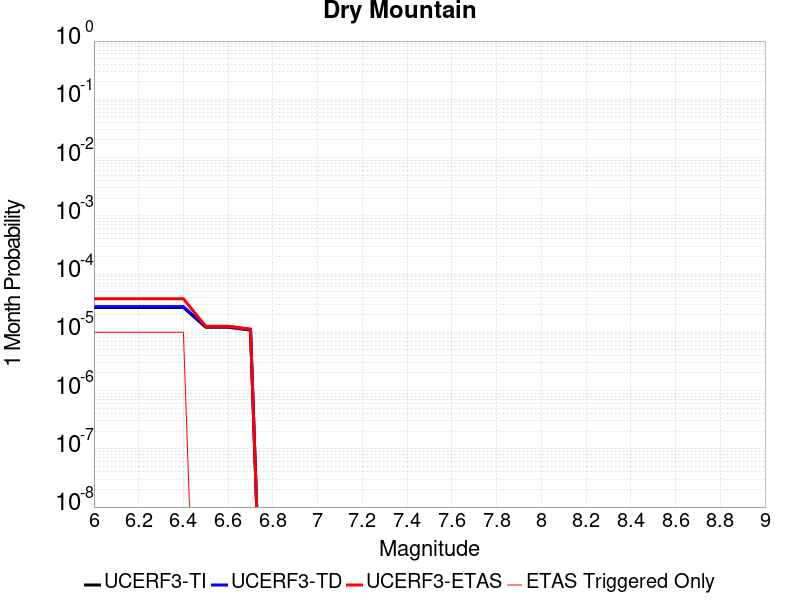 |  |  |

| Magnitude | 1 wk TI Prob | 1 wk TD Prob | 1 wk ETAS Prob | 1 wk ETAS/TD Gain | 1 wk ETAS Triggered Only | 1 mo TI Prob | 1 mo TD Prob | 1 mo ETAS Prob | 1 mo ETAS/TD Gain | 1 mo ETAS Triggered Only | 1 yr TI Prob | 1 yr TD Prob | 1 yr ETAS Prob | 1 yr ETAS/TD Gain | 1 yr ETAS Triggered Only | 10 yr TI Prob | 10 yr TD Prob | 10 yr ETAS Prob | 10 yr ETAS/TD Gain | 10 yr ETAS Triggered Only |
|-----|-----|-----|-----|-----|-----|-----|-----|-----|-----|-----|-----|-----|-----|-----|-----|-----|-----|-----|-----|-----|
| 6.0 | 6.222801E-6 | 6.4395003E-6 | 2.1665432E-5 | 3.3644588 | 1.522603E-5 | 2.6668875E-5 | 2.7597656E-5 | 4.2823267E-5 | 1.5516994 | 1.522603E-5 | 3.2464517E-4 | 3.3596557E-4 | 3.664074E-4 | 1.09061 | 3.045206E-5 | 0.0032417132 | 0.0033561387 | 0.0034471883 | 1.0271293 | 9.135618E-5 |
| 6.1 | 6.222801E-6 | 6.4395003E-6 | 2.1665432E-5 | 3.3644588 | 1.522603E-5 | 2.6668875E-5 | 2.7597656E-5 | 4.2823267E-5 | 1.5516994 | 1.522603E-5 | 3.2464517E-4 | 3.3596557E-4 | 3.664074E-4 | 1.09061 | 3.045206E-5 | 0.0032417132 | 0.0033561387 | 0.0034471883 | 1.0271293 | 9.135618E-5 |
| 6.2 | 6.222801E-6 | 6.4395003E-6 | 2.1665432E-5 | 3.3644588 | 1.522603E-5 | 2.6668875E-5 | 2.7597656E-5 | 4.2823267E-5 | 1.5516994 | 1.522603E-5 | 3.2464517E-4 | 3.3596557E-4 | 3.664074E-4 | 1.09061 | 3.045206E-5 | 0.0032417132 | 0.0033561387 | 0.0034471883 | 1.0271293 | 9.135618E-5 |
| 6.3 | 6.222801E-6 | 6.4395003E-6 | 2.1665432E-5 | 3.3644588 | 1.522603E-5 | 2.6668875E-5 | 2.7597656E-5 | 4.2823267E-5 | 1.5516994 | 1.522603E-5 | 3.2464517E-4 | 3.3596557E-4 | 3.664074E-4 | 1.09061 | 3.045206E-5 | 0.0032417132 | 0.0033561387 | 0.0034471883 | 1.0271293 | 9.135618E-5 |
| 6.4 | 6.222801E-6 | 6.4395003E-6 | 2.1665432E-5 | 3.3644588 | 1.522603E-5 | 2.6668875E-5 | 2.7597656E-5 | 4.2823267E-5 | 1.5516994 | 1.522603E-5 | 3.2464517E-4 | 3.3596557E-4 | 3.664074E-4 | 1.09061 | 3.045206E-5 | 0.0032417132 | 0.0033561387 | 0.0034471883 | 1.0271293 | 9.135618E-5 |
| 6.5 | 2.8528623E-6 | 2.952223E-6 | 2.952223E-6 | 1.0 | 0.0 | 1.22264955E-5 | 1.2652372E-5 | 1.2652372E-5 | 1.0 | 0.0 | 1.4884741E-4 | 1.5404043E-4 | 1.6926412E-4 | 1.0988292 | 1.522603E-5 | 0.0014874774 | 0.0015401901 | 0.0016010003 | 1.0394824 | 6.090412E-5 |
| 6.6 | 2.8528623E-6 | 2.952223E-6 | 2.952223E-6 | 1.0 | 0.0 | 1.22264955E-5 | 1.2652372E-5 | 1.2652372E-5 | 1.0 | 0.0 | 1.4884741E-4 | 1.5404043E-4 | 1.6926412E-4 | 1.0988292 | 1.522603E-5 | 0.0014874774 | 0.0015401901 | 0.0016010003 | 1.0394824 | 6.090412E-5 |
| 6.7 | 2.541E-6 | 2.6294065E-6 | 2.6294065E-6 | 1.0 | 0.0 | 1.0889954E-5 | 1.1268885E-5 | 1.1268885E-5 | 1.0 | 0.0 | 1.3257713E-4 | 1.3719867E-4 | 1.5242261E-4 | 1.1109627 | 1.522603E-5 | 0.0013249806 | 0.0013719867 | 0.0014328073 | 1.0443302 | 6.090412E-5 |

## San Andreas (San Gorgonio Pass-Garnet HIll)
*[(top)](#table-of-contents)*

| 1 Week | 1 Month | 1 Year | 10 Year |
|-----|-----|-----|-----|
|  |  |  |  |

| Magnitude | 1 wk TI Prob | 1 wk TD Prob | 1 wk ETAS Prob | 1 wk ETAS/TD Gain | 1 wk ETAS Triggered Only | 1 mo TI Prob | 1 mo TD Prob | 1 mo ETAS Prob | 1 mo ETAS/TD Gain | 1 mo ETAS Triggered Only | 1 yr TI Prob | 1 yr TD Prob | 1 yr ETAS Prob | 1 yr ETAS/TD Gain | 1 yr ETAS Triggered Only | 10 yr TI Prob | 10 yr TD Prob | 10 yr ETAS Prob | 10 yr ETAS/TD Gain | 10 yr ETAS Triggered Only |
|-----|-----|-----|-----|-----|-----|-----|-----|-----|-----|-----|-----|-----|-----|-----|-----|-----|-----|-----|-----|-----|
| 6.0 | 8.31567E-5 | 2.3398406E-4 | 2.3398406E-4 | 1.0 | 0.0 | 3.5633717E-4 | 0.001002406 | 0.0010176167 | 1.0151743 | 1.522603E-5 | 0.004329778 | 0.012136027 | 0.012196192 | 1.0049576 | 6.090412E-5 | 0.042463828 | 0.11264349 | 0.11272455 | 1.0007197 | 9.135618E-5 |
| 6.1 | 8.31567E-5 | 2.3398406E-4 | 2.3398406E-4 | 1.0 | 0.0 | 3.5633717E-4 | 0.001002406 | 0.0010176167 | 1.0151743 | 1.522603E-5 | 0.004329778 | 0.012136027 | 0.012196192 | 1.0049576 | 6.090412E-5 | 0.042463828 | 0.11264349 | 0.11272455 | 1.0007197 | 9.135618E-5 |
| 6.2 | 8.31567E-5 | 2.3398406E-4 | 2.3398406E-4 | 1.0 | 0.0 | 3.5633717E-4 | 0.001002406 | 0.0010176167 | 1.0151743 | 1.522603E-5 | 0.004329778 | 0.012136027 | 0.012196192 | 1.0049576 | 6.090412E-5 | 0.042463828 | 0.11264349 | 0.11272455 | 1.0007197 | 9.135618E-5 |
| 6.3 | 8.31567E-5 | 2.3398406E-4 | 2.3398406E-4 | 1.0 | 0.0 | 3.5633717E-4 | 0.001002406 | 0.0010176167 | 1.0151743 | 1.522603E-5 | 0.004329778 | 0.012136027 | 0.012196192 | 1.0049576 | 6.090412E-5 | 0.042463828 | 0.11264349 | 0.11272455 | 1.0007197 | 9.135618E-5 |
| 6.4 | 8.059055E-5 | 2.2956554E-4 | 2.2956554E-4 | 1.0 | 0.0 | 3.4534236E-4 | 9.834839E-4 | 9.986949E-4 | 1.0154665 | 1.522603E-5 | 0.0041964394 | 0.011908189 | 0.011968369 | 1.0050535 | 6.090412E-5 | 0.041180745 | 0.11062444 | 0.110705696 | 1.0007344 | 9.135618E-5 |
| 6.5 | 8.059055E-5 | 2.2956554E-4 | 2.2956554E-4 | 1.0 | 0.0 | 3.4534236E-4 | 9.834839E-4 | 9.986949E-4 | 1.0154665 | 1.522603E-5 | 0.0041964394 | 0.011908189 | 0.011968369 | 1.0050535 | 6.090412E-5 | 0.041180745 | 0.11062444 | 0.110705696 | 1.0007344 | 9.135618E-5 |
| 6.6 | 7.619237E-5 | 2.2200657E-4 | 2.2200657E-4 | 1.0 | 0.0 | 3.2649786E-4 | 9.511121E-4 | 9.663236E-4 | 1.0159935 | 1.522603E-5 | 0.0039678677 | 0.011518859 | 0.011564011 | 1.0039198 | 4.567809E-5 | 0.03897764 | 0.107160784 | 0.107228756 | 1.0006343 | 7.613015E-5 |
| 6.7 | 7.440636E-5 | 2.1876446E-4 | 2.1876446E-4 | 1.0 | 0.0 | 3.188454E-4 | 9.372274E-4 | 9.5243915E-4 | 1.0162306 | 1.522603E-5 | 0.0038750346 | 0.01135158 | 0.01139674 | 1.0039783 | 4.567809E-5 | 0.038081564 | 0.105669186 | 0.10573727 | 1.0006443 | 7.613015E-5 |
| 6.8 | 7.3735864E-5 | 2.1723597E-4 | 2.1723597E-4 | 1.0 | 0.0 | 3.1597257E-4 | 9.306814E-4 | 9.4589323E-4 | 1.0163449 | 1.522603E-5 | 0.0038401815 | 0.011272711 | 0.011317873 | 1.0040064 | 4.567809E-5 | 0.03774495 | 0.1049707 | 0.10503884 | 1.0006491 | 7.613015E-5 |
| 6.9 | 7.27575E-5 | 2.1492546E-4 | 2.1492546E-4 | 1.0 | 0.0 | 3.117806E-4 | 9.207862E-4 | 9.359982E-4 | 1.0165206 | 1.522603E-5 | 0.003789323 | 0.011153476 | 0.0111986445 | 1.0040498 | 4.567809E-5 | 0.037253562 | 0.10391858 | 0.1039868 | 1.0006565 | 7.613015E-5 |
| 7.0 | 7.102591E-5 | 2.1076521E-4 | 2.1076521E-4 | 1.0 | 0.0 | 3.0436125E-4 | 9.02969E-4 | 9.1818126E-4 | 1.016847 | 1.522603E-5 | 0.003699303 | 0.010938748 | 0.010983926 | 1.0041301 | 4.567809E-5 | 0.03638325 | 0.102020636 | 0.102088995 | 1.0006701 | 7.613015E-5 |
| 7.1 | 7.028513E-5 | 2.0912137E-4 | 2.0912137E-4 | 1.0 | 0.0 | 3.0118722E-4 | 8.959288E-4 | 9.111412E-4 | 1.0169795 | 1.522603E-5 | 0.0036607897 | 0.01085389 | 0.0108990725 | 1.0041628 | 4.567809E-5 | 0.036010686 | 0.10126359 | 0.10133202 | 1.0006757 | 7.613015E-5 |
| 7.2 | 6.8498244E-5 | 2.0519937E-4 | 2.0519937E-4 | 1.0 | 0.0 | 2.9353087E-4 | 8.7913166E-4 | 8.943443E-4 | 1.0173042 | 1.522603E-5 | 0.003567883 | 0.0106514 | 0.010696592 | 1.0042428 | 4.567809E-5 | 0.035111405 | 0.09945543 | 0.099523984 | 1.0006894 | 7.613015E-5 |
| 7.3 | 6.622592E-5 | 1.9747039E-4 | 1.9747039E-4 | 1.0 | 0.0 | 2.8379448E-4 | 8.460293E-4 | 8.612425E-4 | 1.0179818 | 1.522603E-5 | 0.0034497243 | 0.010252241 | 0.01029745 | 1.0044098 | 4.567809E-5 | 0.033966612 | 0.09595134 | 0.09602017 | 1.0007173 | 7.613015E-5 |
| 7.4 | 5.1050705E-5 | 1.4701985E-4 | 1.4701985E-4 | 1.0 | 0.0 | 2.1877038E-4 | 6.299338E-4 | 6.4515026E-4 | 1.0241556 | 1.522603E-5 | 0.002660276 | 0.0076426673 | 0.007687996 | 1.005931 | 4.567809E-5 | 0.02628654 | 0.07291896 | 0.07298954 | 1.0009679 | 7.613015E-5 |
| 7.5 | 3.9302922E-5 | 1.1141107E-4 | 1.1141107E-4 | 1.0 | 0.0 | 1.6843023E-4 | 4.7738897E-4 | 4.9260777E-4 | 1.0318792 | 1.522603E-5 | 0.0020487092 | 0.005796791 | 0.005842204 | 1.0078342 | 4.567809E-5 | 0.020299247 | 0.056059215 | 0.056131076 | 1.0012819 | 7.613015E-5 |
| 7.6 | 2.9851626E-5 | 8.504997E-5 | 8.504997E-5 | 1.0 | 0.0 | 1.2792926E-4 | 3.6444908E-4 | 3.6444908E-4 | 1.0 | 0.0 | 0.0015564259 | 0.0044281655 | 0.004458483 | 1.0068464 | 3.045206E-5 | 0.0154556995 | 0.043238558 | 0.04329683 | 1.0013477 | 6.090412E-5 |
| 7.7 | 2.1135214E-5 | 6.361802E-5 | 6.361802E-5 | 1.0 | 0.0 | 9.0576345E-5 | 2.726202E-4 | 2.726202E-4 | 1.0 | 0.0 | 0.0011022091 | 0.0033141046 | 0.0033444557 | 1.0091581 | 3.045206E-5 | 0.010967582 | 0.032622673 | 0.032681588 | 1.001806 | 6.090412E-5 |
| 7.8 | 1.883379E-5 | 5.572194E-5 | 5.572194E-5 | 1.0 | 0.0 | 8.0713755E-5 | 2.3878647E-4 | 2.3878647E-4 | 1.0 | 0.0 | 9.822468E-4 | 0.0029033525 | 0.0029337162 | 1.0104581 | 3.045206E-5 | 0.0097791655 | 0.028732158 | 0.028791314 | 1.0020589 | 6.090412E-5 |
| 7.9 | 1.5156185E-5 | 4.1725576E-5 | 4.1725576E-5 | 1.0 | 0.0 | 6.495346E-5 | 1.7881165E-4 | 1.7881165E-4 | 1.0 | 0.0 | 7.9052144E-4 | 0.0021748596 | 0.0022052454 | 1.0139714 | 3.045206E-5 | 0.007877152 | 0.021790246 | 0.021849824 | 1.0027341 | 6.090412E-5 |
| 8.0 | 1.1405907E-5 | 3.0024876E-5 | 3.0024876E-5 | 1.0 | 0.0 | 4.8881542E-5 | 1.286717E-4 | 1.286717E-4 | 1.0 | 0.0 | 5.9497025E-4 | 0.0015654531 | 0.0015958576 | 1.019422 | 3.045206E-5 | 0.005933798 | 0.015796356 | 0.015826328 | 1.0018973 | 3.045206E-5 |
| 8.1 | 4.3511436E-6 | 7.3873994E-6 | 7.3873994E-6 | 1.0 | 0.0 | 1.8647626E-5 | 3.16599E-5 | 3.16599E-5 | 1.0 | 0.0 | 2.2701119E-4 | 3.8539123E-4 | 3.8539123E-4 | 1.0 | 0.0 | 0.0022677942 | 0.0041254 | 0.0041254 | 1.0 | 0.0 |
| 8.2 | 2.3042528E-6 | 2.74142E-6 | 2.74142E-6 | 1.0 | 0.0 | 9.875332E-6 | 1.174889E-5 | 1.174889E-5 | 1.0 | 0.0 | 1.2022553E-4 | 1.430334E-4 | 1.430334E-4 | 1.0 | 0.0 | 0.0012016051 | 0.0016024038 | 0.0016024038 | 1.0 | 0.0 |
| 8.3 | 5.202968E-7 | 3.171921E-7 | 3.171921E-7 | 1.0 | 0.0 | 2.2298414E-6 | 1.3593941E-6 | 1.3593941E-6 | 1.0 | 0.0 | 2.714798E-5 | 1.655051E-5 | 1.655051E-5 | 1.0 | 0.0 | 2.7144665E-4 | 1.9631305E-4 | 1.9631305E-4 | 1.0 | 0.0 |

## San Jacinto (Stepovers Combined)
*[(top)](#table-of-contents)*

| 1 Week | 1 Month | 1 Year | 10 Year |
|-----|-----|-----|-----|
|  |  |  |  |

| Magnitude | 1 wk TI Prob | 1 wk TD Prob | 1 wk ETAS Prob | 1 wk ETAS/TD Gain | 1 wk ETAS Triggered Only | 1 mo TI Prob | 1 mo TD Prob | 1 mo ETAS Prob | 1 mo ETAS/TD Gain | 1 mo ETAS Triggered Only | 1 yr TI Prob | 1 yr TD Prob | 1 yr ETAS Prob | 1 yr ETAS/TD Gain | 1 yr ETAS Triggered Only | 10 yr TI Prob | 10 yr TD Prob | 10 yr ETAS Prob | 10 yr ETAS/TD Gain | 10 yr ETAS Triggered Only |
|-----|-----|-----|-----|-----|-----|-----|-----|-----|-----|-----|-----|-----|-----|-----|-----|-----|-----|-----|-----|-----|
| 6.0 | 4.0667746E-5 | 3.5336896E-5 | 6.578788E-5 | 1.8617334 | 3.045206E-5 | 1.742787E-4 | 1.5143506E-4 | 1.9710623E-4 | 1.3015891 | 4.567809E-5 | 0.0021197782 | 0.0018421634 | 0.0019029554 | 1.0330002 | 6.090412E-5 | 0.020996714 | 0.019020144 | 0.019109761 | 1.0047117 | 9.135618E-5 |
| 6.1 | 4.0667746E-5 | 3.5336896E-5 | 6.578788E-5 | 1.8617334 | 3.045206E-5 | 1.742787E-4 | 1.5143506E-4 | 1.9710623E-4 | 1.3015891 | 4.567809E-5 | 0.0021197782 | 0.0018421634 | 0.0019029554 | 1.0330002 | 6.090412E-5 | 0.020996714 | 0.019020144 | 0.019109761 | 1.0047117 | 9.135618E-5 |
| 6.2 | 4.0667746E-5 | 3.5336896E-5 | 6.578788E-5 | 1.8617334 | 3.045206E-5 | 1.742787E-4 | 1.5143506E-4 | 1.9710623E-4 | 1.3015891 | 4.567809E-5 | 0.0021197782 | 0.0018421634 | 0.0019029554 | 1.0330002 | 6.090412E-5 | 0.020996714 | 0.019020144 | 0.019109761 | 1.0047117 | 9.135618E-5 |
| 6.3 | 4.0667746E-5 | 3.5336896E-5 | 6.578788E-5 | 1.8617334 | 3.045206E-5 | 1.742787E-4 | 1.5143506E-4 | 1.9710623E-4 | 1.3015891 | 4.567809E-5 | 0.0021197782 | 0.0018421634 | 0.0019029554 | 1.0330002 | 6.090412E-5 | 0.020996714 | 0.019020144 | 0.019109761 | 1.0047117 | 9.135618E-5 |
| 6.4 | 4.0577226E-5 | 3.5208766E-5 | 6.5659755E-5 | 1.8648695 | 3.045206E-5 | 1.738908E-4 | 1.50886E-4 | 1.9655719E-4 | 1.3026868 | 4.567809E-5 | 0.0021150648 | 0.0018354917 | 0.001896284 | 1.0331205 | 6.090412E-5 | 0.020950472 | 0.018954702 | 0.019044327 | 1.0047283 | 9.135618E-5 |
| 6.5 | 4.0577226E-5 | 3.5208766E-5 | 6.5659755E-5 | 1.8648695 | 3.045206E-5 | 1.738908E-4 | 1.50886E-4 | 1.9655719E-4 | 1.3026868 | 4.567809E-5 | 0.0021150648 | 0.0018354917 | 0.001896284 | 1.0331205 | 6.090412E-5 | 0.020950472 | 0.018954702 | 0.019044327 | 1.0047283 | 9.135618E-5 |
| 6.6 | 4.053861E-5 | 3.5154102E-5 | 6.560509E-5 | 1.8662145 | 3.045206E-5 | 1.7372532E-4 | 1.5065174E-4 | 1.9632294E-4 | 1.3031576 | 4.567809E-5 | 0.0021130538 | 0.0018326445 | 0.001893437 | 1.033172 | 6.090412E-5 | 0.020930743 | 0.018926777 | 0.019016404 | 1.0047355 | 9.135618E-5 |
| 6.7 | 4.0516545E-5 | 3.512316E-5 | 6.557415E-5 | 1.8669776 | 3.045206E-5 | 1.7363077E-4 | 1.5051916E-4 | 1.9619038E-4 | 1.3034246 | 4.567809E-5 | 0.002111905 | 0.0018310336 | 0.0018918262 | 1.0332012 | 6.090412E-5 | 0.020919468 | 0.01891097 | 0.0190006 | 1.0047395 | 9.135618E-5 |
| 6.8 | 4.049434E-5 | 3.509472E-5 | 6.554571E-5 | 1.8676802 | 3.045206E-5 | 1.7353562E-4 | 1.5039727E-4 | 1.9606849E-4 | 1.3036705 | 4.567809E-5 | 0.0021107488 | 0.0018295521 | 0.0018903448 | 1.0332282 | 6.090412E-5 | 0.020908125 | 0.01889638 | 0.01898601 | 1.0047432 | 9.135618E-5 |
| 6.9 | 4.046386E-5 | 3.505727E-5 | 6.550826E-5 | 1.868607 | 3.045206E-5 | 1.73405E-4 | 1.502368E-4 | 1.9590803E-4 | 1.3039949 | 4.567809E-5 | 0.0021091616 | 0.0018276017 | 0.0018883945 | 1.0332637 | 6.090412E-5 | 0.020892553 | 0.01887715 | 0.018966781 | 1.0047481 | 9.135618E-5 |
| 7.0 | 4.036382E-5 | 3.4937813E-5 | 6.538881E-5 | 1.871577 | 3.045206E-5 | 1.7297632E-4 | 1.4972492E-4 | 1.9539616E-4 | 1.3050344 | 4.567809E-5 | 0.0021039525 | 0.00182138 | 0.0018821731 | 1.0333775 | 6.090412E-5 | 0.02084144 | 0.018815752 | 0.01890539 | 1.004764 | 9.135618E-5 |
| 7.1 | 4.0343282E-5 | 3.4916273E-5 | 6.536727E-5 | 1.8721148 | 3.045206E-5 | 1.7288832E-4 | 1.496326E-4 | 1.9530386E-4 | 1.3052226 | 4.567809E-5 | 0.002102883 | 0.0018202579 | 0.0018810511 | 1.0333982 | 6.090412E-5 | 0.020830948 | 0.018804627 | 0.018894264 | 1.0047668 | 9.135618E-5 |
| 7.2 | 4.0257353E-5 | 3.4820667E-5 | 6.527167E-5 | 1.8745095 | 3.045206E-5 | 1.725201E-4 | 1.492229E-4 | 1.9489418E-4 | 1.3060608 | 4.567809E-5 | 0.0020984085 | 0.0018152783 | 0.0018760718 | 1.03349 | 6.090412E-5 | 0.020787042 | 0.018755313 | 0.018844957 | 1.0047796 | 9.135618E-5 |
| 7.3 | 3.9940667E-5 | 3.4648023E-5 | 6.5099026E-5 | 1.878867 | 3.045206E-5 | 1.7116306E-4 | 1.4848309E-4 | 1.941544E-4 | 1.307586 | 4.567809E-5 | 0.0020819185 | 0.0018062859 | 0.0018670801 | 1.033657 | 6.090412E-5 | 0.020625217 | 0.018663792 | 0.018753443 | 1.0048035 | 9.135618E-5 |
| 7.4 | 3.9721202E-5 | 3.453329E-5 | 6.49843E-5 | 1.8817872 | 3.045206E-5 | 1.7022261E-4 | 1.4799142E-4 | 1.9366275E-4 | 1.3086079 | 4.567809E-5 | 0.0020704903 | 0.0018003098 | 0.0018611043 | 1.0337689 | 6.090412E-5 | 0.020513052 | 0.01860285 | 0.018692506 | 1.0048195 | 9.135618E-5 |
| 7.5 | 3.7036873E-5 | 3.3598866E-5 | 6.4049906E-5 | 1.9063115 | 3.045206E-5 | 1.5871979E-4 | 1.439872E-4 | 1.8965872E-4 | 1.3171915 | 4.567809E-5 | 0.0019307006 | 0.0017516377 | 0.0018124351 | 1.0347089 | 6.090412E-5 | 0.019140124 | 0.018103454 | 0.018193157 | 1.0049549 | 9.135618E-5 |
| 7.6 | 3.2940967E-5 | 3.1372547E-5 | 6.182365E-5 | 1.9706291 | 3.045206E-5 | 1.4116794E-4 | 1.3444685E-4 | 1.801188E-4 | 1.3397026 | 4.567809E-5 | 0.0017173645 | 0.0016356637 | 0.0016964682 | 1.0371742 | 6.090412E-5 | 0.01704153 | 0.01693263 | 0.01702244 | 1.0053039 | 9.135618E-5 |
| 7.7 | 2.8236149E-5 | 2.7937022E-5 | 5.8388232E-5 | 2.089995 | 3.045206E-5 | 1.2100645E-4 | 1.197246E-4 | 1.6539723E-4 | 1.3814807 | 4.567809E-5 | 0.0014722579 | 0.0014566735 | 0.0015174889 | 1.0417495 | 6.090412E-5 | 0.014625421 | 0.015142685 | 0.015232658 | 1.0059416 | 9.135618E-5 |
| 7.8 | 2.4329287E-5 | 2.5258554E-5 | 5.5709846E-5 | 2.2055833 | 3.045206E-5 | 1.042642E-4 | 1.0824646E-4 | 1.5391961E-4 | 1.4219366 | 4.567809E-5 | 0.0012686774 | 0.0013171048 | 0.0013779287 | 1.04618 | 6.090412E-5 | 0.012614589 | 0.013738932 | 0.013829033 | 1.0065581 | 9.135618E-5 |
| 7.9 | 1.9370926E-5 | 2.0467445E-5 | 5.0918883E-5 | 2.4877987 | 3.045206E-5 | 8.301561E-5 | 8.7714674E-5 | 1.3338876E-4 | 1.520712 | 4.567809E-5 | 0.0010102465 | 0.0010674037 | 0.0011282428 | 1.0569973 | 6.090412E-5 | 0.0100566605 | 0.011223499 | 0.01131383 | 1.0080484 | 9.135618E-5 |
| 8.0 | 1.5583017E-5 | 1.5925136E-5 | 4.6376714E-5 | 2.9121704 | 3.045206E-5 | 6.6782646E-5 | 6.82488E-5 | 1.1392377E-4 | 1.6692421 | 4.567809E-5 | 8.127754E-4 | 8.306131E-4 | 8.914666E-4 | 1.0732634 | 6.090412E-5 | 0.008098091 | 0.008802158 | 0.008862526 | 1.0068583 | 6.090412E-5 |
| 8.1 | 1.0024873E-5 | 8.314913E-6 | 2.3540817E-5 | 2.831156 | 1.522603E-5 | 4.2963035E-5 | 3.563486E-5 | 5.0860348E-5 | 1.4272639 | 1.522603E-5 | 5.229494E-4 | 4.3376858E-4 | 4.4898802E-4 | 1.0350865 | 1.522603E-5 | 0.0052172043 | 0.00466551 | 0.0046806647 | 1.0032483 | 1.522603E-5 |
| 8.2 | 4.142796E-6 | 1.5676045E-6 | 1.5676045E-6 | 1.0 | 0.0 | 1.775472E-5 | 6.7182878E-6 | 6.7182878E-6 | 1.0 | 0.0 | 2.1614227E-4 | 8.179211E-5 | 8.179211E-5 | 1.0 | 0.0 | 0.0021593217 | 9.4923546E-4 | 9.4923546E-4 | 1.0 | 0.0 |
| 8.3 | 1.2750878E-6 | 3.6301523E-7 | 3.6301523E-7 | 1.0 | 0.0 | 5.4646503E-6 | 1.5557786E-6 | 1.5557786E-6 | 1.0 | 0.0 | 6.653009E-5 | 1.8941444E-5 | 1.8941444E-5 | 1.0 | 0.0 | 6.6510175E-4 | 2.2840123E-4 | 2.2840123E-4 | 1.0 | 0.0 |

## Calico-Hidalgo
*[(top)](#table-of-contents)*

| 1 Week | 1 Month | 1 Year | 10 Year |
|-----|-----|-----|-----|
|  |  |  |  |

| Magnitude | 1 wk TI Prob | 1 wk TD Prob | 1 wk ETAS Prob | 1 wk ETAS/TD Gain | 1 wk ETAS Triggered Only | 1 mo TI Prob | 1 mo TD Prob | 1 mo ETAS Prob | 1 mo ETAS/TD Gain | 1 mo ETAS Triggered Only | 1 yr TI Prob | 1 yr TD Prob | 1 yr ETAS Prob | 1 yr ETAS/TD Gain | 1 yr ETAS Triggered Only | 10 yr TI Prob | 10 yr TD Prob | 10 yr ETAS Prob | 10 yr ETAS/TD Gain | 10 yr ETAS Triggered Only |
|-----|-----|-----|-----|-----|-----|-----|-----|-----|-----|-----|-----|-----|-----|-----|-----|-----|-----|-----|-----|-----|
| 6.0 | 4.0906612E-5 | 5.0707546E-5 | 5.0707546E-5 | 1.0 | 0.0 | 1.7530227E-4 | 2.1730224E-4 | 2.1730224E-4 | 1.0 | 0.0 | 0.0021322158 | 0.0026428488 | 0.002688406 | 1.017238 | 4.567809E-5 | 0.02111873 | 0.026154567 | 0.026243534 | 1.0034016 | 9.135618E-5 |
| 6.1 | 4.0906612E-5 | 5.0707546E-5 | 5.0707546E-5 | 1.0 | 0.0 | 1.7530227E-4 | 2.1730224E-4 | 2.1730224E-4 | 1.0 | 0.0 | 0.0021322158 | 0.0026428488 | 0.002688406 | 1.017238 | 4.567809E-5 | 0.02111873 | 0.026154567 | 0.026243534 | 1.0034016 | 9.135618E-5 |
| 6.2 | 4.0906612E-5 | 5.0707546E-5 | 5.0707546E-5 | 1.0 | 0.0 | 1.7530227E-4 | 2.1730224E-4 | 2.1730224E-4 | 1.0 | 0.0 | 0.0021322158 | 0.0026428488 | 0.002688406 | 1.017238 | 4.567809E-5 | 0.02111873 | 0.026154567 | 0.026243534 | 1.0034016 | 9.135618E-5 |
| 6.3 | 2.4242801E-5 | 3.0092122E-5 | 3.0092122E-5 | 1.0 | 0.0 | 1.0389358E-4 | 1.2896005E-4 | 1.2896005E-4 | 1.0 | 0.0 | 0.0012641704 | 0.0015689905 | 0.0016145969 | 1.0290674 | 4.567809E-5 | 0.01257003 | 0.015582806 | 0.01567274 | 1.0057713 | 9.135618E-5 |
| 6.4 | 2.4242801E-5 | 3.0092122E-5 | 3.0092122E-5 | 1.0 | 0.0 | 1.0389358E-4 | 1.2896005E-4 | 1.2896005E-4 | 1.0 | 0.0 | 0.0012641704 | 0.0015689905 | 0.0016145969 | 1.0290674 | 4.567809E-5 | 0.01257003 | 0.015582806 | 0.01567274 | 1.0057713 | 9.135618E-5 |
| 6.5 | 2.0286952E-5 | 2.5316727E-5 | 2.5316727E-5 | 1.0 | 0.0 | 8.694118E-5 | 1.0849584E-4 | 1.0849584E-4 | 1.0 | 0.0 | 0.0010579949 | 0.0013201536 | 0.0013657714 | 1.034555 | 4.567809E-5 | 0.010529719 | 0.013125047 | 0.013215204 | 1.0068691 | 9.135618E-5 |
| 6.6 | 2.0269223E-5 | 2.5297675E-5 | 2.5297675E-5 | 1.0 | 0.0 | 8.6865206E-5 | 1.084142E-4 | 1.084142E-4 | 1.0 | 0.0 | 0.0010570707 | 0.0013191608 | 0.0013647786 | 1.034581 | 4.567809E-5 | 0.010520565 | 0.013115237 | 0.013205394 | 1.0068743 | 9.135618E-5 |
| 6.7 | 1.799852E-5 | 2.25414E-5 | 2.25414E-5 | 1.0 | 0.0 | 7.713423E-5 | 9.660251E-5 | 9.660251E-5 | 1.0 | 0.0 | 9.3870464E-4 | 0.0011755156 | 0.0012211399 | 1.0388123 | 4.567809E-5 | 0.009347493 | 0.011694587 | 0.011784875 | 1.0077205 | 9.135618E-5 |
| 6.8 | 1.7458793E-5 | 2.1842892E-5 | 2.1842892E-5 | 1.0 | 0.0 | 7.4821255E-5 | 9.360912E-5 | 9.360912E-5 | 1.0 | 0.0 | 9.10568E-4 | 0.0011391096 | 0.0011847357 | 1.0400542 | 4.567809E-5 | 0.009068459 | 0.011334292 | 0.011424612 | 1.0079688 | 9.135618E-5 |
| 6.9 | 1.542884E-5 | 1.9026567E-5 | 1.9026567E-5 | 1.0 | 0.0 | 6.612192E-5 | 8.1539954E-5 | 8.1539954E-5 | 1.0 | 0.0 | 8.04737E-4 | 9.923099E-4 | 0.0010379427 | 1.0459864 | 4.567809E-5 | 0.008018291 | 0.009880188 | 0.009970642 | 1.009155 | 9.135618E-5 |
| 7.0 | 1.468253E-5 | 1.803119E-5 | 1.803119E-5 | 1.0 | 0.0 | 6.292361E-5 | 7.7274315E-5 | 7.7274315E-5 | 1.0 | 0.0 | 7.658257E-4 | 9.404217E-4 | 9.860569E-4 | 1.0485263 | 4.567809E-5 | 0.0076319184 | 0.009365788 | 0.009456288 | 1.0096629 | 9.135618E-5 |
| 7.1 | 1.3139281E-5 | 1.620145E-5 | 1.620145E-5 | 1.0 | 0.0 | 5.6309986E-5 | 6.943301E-5 | 6.943301E-5 | 1.0 | 0.0 | 6.853584E-4 | 8.450316E-4 | 8.906711E-4 | 1.0540092 | 4.567809E-5 | 0.0068324856 | 0.008419481 | 0.008510068 | 1.0107592 | 9.135618E-5 |
| 7.2 | 1.1127404E-5 | 1.3867019E-5 | 1.3867019E-5 | 1.0 | 0.0 | 4.7688E-5 | 5.942879E-5 | 5.942879E-5 | 1.0 | 0.0 | 5.8044674E-4 | 7.233162E-4 | 7.6896127E-4 | 1.0631052 | 4.567809E-5 | 0.0057893298 | 0.0072107273 | 0.0072863083 | 1.0104817 | 7.613015E-5 |
| 7.3 | 9.808154E-6 | 1.217656E-5 | 1.217656E-5 | 1.0 | 0.0 | 4.2034266E-5 | 5.218427E-5 | 5.218427E-5 | 1.0 | 0.0 | 5.11647E-4 | 6.3516904E-4 | 6.808181E-4 | 1.0718691 | 4.567809E-5 | 0.0051047057 | 0.0063346117 | 0.00639513 | 1.0095536 | 6.090412E-5 |
| 7.4 | 7.942452E-6 | 9.7924E-6 | 9.7924E-6 | 1.0 | 0.0 | 3.4038632E-5 | 4.196681E-5 | 4.196681E-5 | 1.0 | 0.0 | 4.1434157E-4 | 5.108356E-4 | 5.412721E-4 | 1.0595818 | 3.045206E-5 | 0.0041356985 | 0.0050975545 | 0.005143 | 1.0089151 | 4.567809E-5 |
| 7.5 | 4.7121216E-6 | 5.772976E-6 | 5.772976E-6 | 1.0 | 0.0 | 2.019465E-5 | 2.4741134E-5 | 2.4741134E-5 | 1.0 | 0.0 | 2.4584212E-4 | 3.011893E-4 | 3.1641076E-4 | 1.0505378 | 1.522603E-5 | 0.0024557032 | 0.0030085635 | 0.0030237439 | 1.0050457 | 1.522603E-5 |
| 7.6 | 2.21172E-7 | 2.6040124E-7 | 2.6040124E-7 | 1.0 | 0.0 | 9.478797E-7 | 1.116005E-6 | 1.116005E-6 | 1.0 | 0.0 | 1.1540374E-5 | 1.3587305E-5 | 1.3587305E-5 | 1.0 | 0.0 | 1.1539775E-4 | 1.3586757E-4 | 1.3586757E-4 | 1.0 | 0.0 |

## Pleito
*[(top)](#table-of-contents)*

| 1 Week | 1 Month | 1 Year | 10 Year |
|-----|-----|-----|-----|
|  |  | 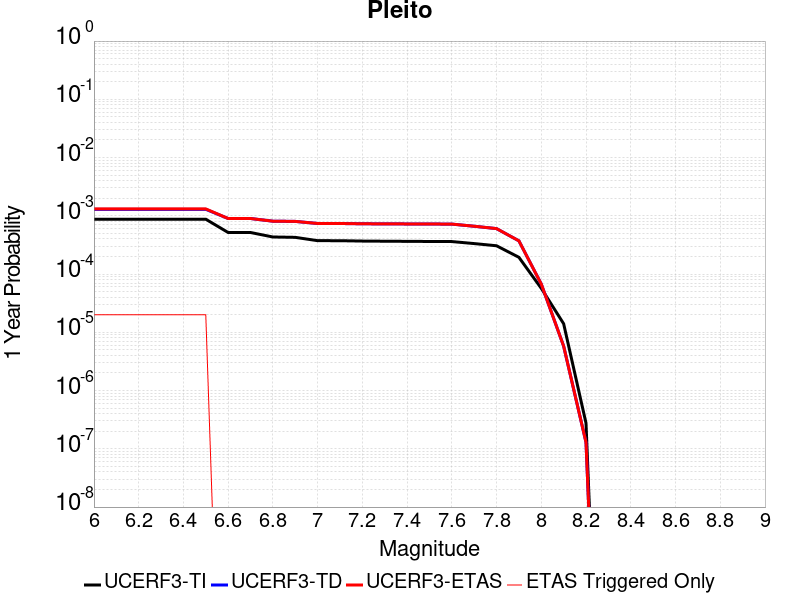 |  |

| Magnitude | 1 wk TI Prob | 1 wk TD Prob | 1 wk ETAS Prob | 1 wk ETAS/TD Gain | 1 wk ETAS Triggered Only | 1 mo TI Prob | 1 mo TD Prob | 1 mo ETAS Prob | 1 mo ETAS/TD Gain | 1 mo ETAS Triggered Only | 1 yr TI Prob | 1 yr TD Prob | 1 yr ETAS Prob | 1 yr ETAS/TD Gain | 1 yr ETAS Triggered Only | 10 yr TI Prob | 10 yr TD Prob | 10 yr ETAS Prob | 10 yr ETAS/TD Gain | 10 yr ETAS Triggered Only |
|-----|-----|-----|-----|-----|-----|-----|-----|-----|-----|-----|-----|-----|-----|-----|-----|-----|-----|-----|-----|-----|
| 6.0 | 1.6763008E-5 | 2.479053E-5 | 2.479053E-5 | 1.0 | 0.0 | 7.183948E-5 | 1.0624121E-4 | 1.0624121E-4 | 1.0 | 0.0 | 8.742947E-4 | 0.0012927912 | 0.001323204 | 1.0235249 | 3.045206E-5 | 0.00870863 | 0.012967364 | 0.013042507 | 1.0057948 | 7.613015E-5 |
| 6.1 | 1.6763008E-5 | 2.479053E-5 | 2.479053E-5 | 1.0 | 0.0 | 7.183948E-5 | 1.0624121E-4 | 1.0624121E-4 | 1.0 | 0.0 | 8.742947E-4 | 0.0012927912 | 0.001323204 | 1.0235249 | 3.045206E-5 | 0.00870863 | 0.012967364 | 0.013042507 | 1.0057948 | 7.613015E-5 |
| 6.2 | 1.6763008E-5 | 2.479053E-5 | 2.479053E-5 | 1.0 | 0.0 | 7.183948E-5 | 1.0624121E-4 | 1.0624121E-4 | 1.0 | 0.0 | 8.742947E-4 | 0.0012927912 | 0.001323204 | 1.0235249 | 3.045206E-5 | 0.00870863 | 0.012967364 | 0.013042507 | 1.0057948 | 7.613015E-5 |
| 6.3 | 1.6763008E-5 | 2.479053E-5 | 2.479053E-5 | 1.0 | 0.0 | 7.183948E-5 | 1.0624121E-4 | 1.0624121E-4 | 1.0 | 0.0 | 8.742947E-4 | 0.0012927912 | 0.001323204 | 1.0235249 | 3.045206E-5 | 0.00870863 | 0.012967364 | 0.013042507 | 1.0057948 | 7.613015E-5 |
| 6.4 | 1.6763008E-5 | 2.479053E-5 | 2.479053E-5 | 1.0 | 0.0 | 7.183948E-5 | 1.0624121E-4 | 1.0624121E-4 | 1.0 | 0.0 | 8.742947E-4 | 0.0012927912 | 0.001323204 | 1.0235249 | 3.045206E-5 | 0.00870863 | 0.012967364 | 0.013042507 | 1.0057948 | 7.613015E-5 |
| 6.5 | 1.6763008E-5 | 2.479053E-5 | 2.479053E-5 | 1.0 | 0.0 | 7.183948E-5 | 1.0624121E-4 | 1.0624121E-4 | 1.0 | 0.0 | 8.742947E-4 | 0.0012927912 | 0.001323204 | 1.0235249 | 3.045206E-5 | 0.00870863 | 0.012967364 | 0.013042507 | 1.0057948 | 7.613015E-5 |
| 6.6 | 9.910213E-6 | 1.7240907E-5 | 1.7240907E-5 | 1.0 | 0.0 | 4.247165E-5 | 7.388753E-5 | 7.388753E-5 | 1.0 | 0.0 | 5.169696E-4 | 8.992132E-4 | 8.992132E-4 | 1.0 | 0.0 | 0.0051576863 | 0.009064018 | 0.009079105 | 1.0016646 | 1.522603E-5 |
| 6.7 | 9.910213E-6 | 1.7240907E-5 | 1.7240907E-5 | 1.0 | 0.0 | 4.247165E-5 | 7.388753E-5 | 7.388753E-5 | 1.0 | 0.0 | 5.169696E-4 | 8.992132E-4 | 8.992132E-4 | 1.0 | 0.0 | 0.0051576863 | 0.009064018 | 0.009079105 | 1.0016646 | 1.522603E-5 |
| 6.8 | 8.300162E-6 | 1.5500442E-5 | 1.5500442E-5 | 1.0 | 0.0 | 3.557164E-5 | 6.642878E-5 | 6.642878E-5 | 1.0 | 0.0 | 4.3299864E-4 | 8.0847176E-4 | 8.0847176E-4 | 1.0 | 0.0 | 0.004321559 | 0.008163428 | 0.008178529 | 1.0018499 | 1.522603E-5 |
| 6.9 | 8.183114E-6 | 1.5371645E-5 | 1.5371645E-5 | 1.0 | 0.0 | 3.5070017E-5 | 6.5876826E-5 | 6.5876826E-5 | 1.0 | 0.0 | 4.2689382E-4 | 8.017566E-4 | 8.017566E-4 | 1.0 | 0.0 | 0.0042607468 | 0.008096768 | 0.00811187 | 1.0018653 | 1.522603E-5 |
| 7.0 | 7.1748823E-6 | 1.4158308E-5 | 1.4158308E-5 | 1.0 | 0.0 | 3.0749135E-5 | 6.067705E-5 | 6.067705E-5 | 1.0 | 0.0 | 3.743064E-4 | 7.384933E-4 | 7.384933E-4 | 1.0 | 0.0 | 0.0037367654 | 0.0074680606 | 0.0074680606 | 1.0 | 0.0 |
| 7.1 | 7.1671807E-6 | 1.4148675E-5 | 1.4148675E-5 | 1.0 | 0.0 | 3.0716128E-5 | 6.063577E-5 | 6.063577E-5 | 1.0 | 0.0 | 3.7390468E-4 | 7.37991E-4 | 7.37991E-4 | 1.0 | 0.0 | 0.0037327618 | 0.007463072 | 0.007463072 | 1.0 | 0.0 |
| 7.2 | 7.0649667E-6 | 1.399588E-5 | 1.399588E-5 | 1.0 | 0.0 | 3.0278077E-5 | 5.998097E-5 | 5.998097E-5 | 1.0 | 0.0 | 3.6857324E-4 | 7.300241E-4 | 7.300241E-4 | 1.0 | 0.0 | 0.0036796255 | 0.007383786 | 0.007383786 | 1.0 | 0.0 |
| 7.3 | 7.02082E-6 | 1.3939285E-5 | 1.3939285E-5 | 1.0 | 0.0 | 3.008888E-5 | 5.9738428E-5 | 5.9738428E-5 | 1.0 | 0.0 | 3.6627054E-4 | 7.270732E-4 | 7.270732E-4 | 1.0 | 0.0 | 0.0036566744 | 0.0073542604 | 0.0073542604 | 1.0 | 0.0 |
| 7.4 | 6.987146E-6 | 1.3898819E-5 | 1.3898819E-5 | 1.0 | 0.0 | 2.9944567E-5 | 5.956501E-5 | 5.956501E-5 | 1.0 | 0.0 | 3.6451413E-4 | 7.249632E-4 | 7.249632E-4 | 1.0 | 0.0 | 0.0036391679 | 0.007333182 | 0.007333182 | 1.0 | 0.0 |
| 7.5 | 6.9494554E-6 | 1.3855703E-5 | 1.3855703E-5 | 1.0 | 0.0 | 2.9783041E-5 | 5.9380236E-5 | 5.9380236E-5 | 1.0 | 0.0 | 3.625482E-4 | 7.2271505E-4 | 7.2271505E-4 | 1.0 | 0.0 | 0.0036195726 | 0.0073107993 | 0.0073107993 | 1.0 | 0.0 |
| 7.6 | 6.92694E-6 | 1.3814777E-5 | 1.3814777E-5 | 1.0 | 0.0 | 2.9686547E-5 | 5.9204845E-5 | 5.9204845E-5 | 1.0 | 0.0 | 3.6137376E-4 | 7.205811E-4 | 7.205811E-4 | 1.0 | 0.0 | 0.0036078666 | 0.007289532 | 0.007289532 | 1.0 | 0.0 |
| 7.7 | 6.395867E-6 | 1.2692768E-5 | 1.2692768E-5 | 1.0 | 0.0 | 2.741057E-5 | 5.439644E-5 | 5.439644E-5 | 1.0 | 0.0 | 3.336726E-4 | 6.6207576E-4 | 6.6207576E-4 | 1.0 | 0.0 | 0.0033317201 | 0.0067076497 | 0.0067076497 | 1.0 | 0.0 |
| 7.8 | 5.8664327E-6 | 1.155828E-5 | 1.155828E-5 | 1.0 | 0.0 | 2.5141611E-5 | 4.953455E-5 | 4.953455E-5 | 1.0 | 0.0 | 3.060561E-4 | 6.0291647E-4 | 6.0291647E-4 | 1.0 | 0.0 | 0.0030563495 | 0.00611206 | 0.00611206 | 1.0 | 0.0 |
| 7.9 | 3.7167474E-6 | 7.1276354E-6 | 7.1276354E-6 | 1.0 | 0.0 | 1.592882E-5 | 3.0546653E-5 | 3.0546653E-5 | 1.0 | 0.0 | 1.9391612E-4 | 3.7184218E-4 | 3.7184218E-4 | 1.0 | 0.0 | 0.0019374699 | 0.003774384 | 0.003774384 | 1.0 | 0.0 |
| 8.0 | 1.0903841E-6 | 1.2909164E-6 | 1.2909164E-6 | 1.0 | 0.0 | 4.6730665E-6 | 5.532487E-6 | 5.532487E-6 | 1.0 | 0.0 | 5.68931E-5 | 6.735596E-5 | 6.735596E-5 | 1.0 | 0.0 | 5.6878536E-4 | 6.957586E-4 | 6.957586E-4 | 1.0 | 0.0 |
| 8.1 | 2.6894583E-7 | 1.1110662E-7 | 1.1110662E-7 | 1.0 | 0.0 | 1.1526245E-6 | 4.7617115E-7 | 4.7617115E-7 | 1.0 | 0.0 | 1.4033113E-5 | 5.7973684E-6 | 5.7973684E-6 | 1.0 | 0.0 | 1.4032227E-4 | 6.485011E-5 | 6.485011E-5 | 1.0 | 0.0 |
| 8.2 | 5.2967013E-9 | 2.4698603E-9 | 2.4698603E-9 | 1.0 | 0.0 | 2.2700148E-8 | 1.0585116E-8 | 1.0585116E-8 | 1.0 | 0.0 | 2.7637427E-7 | 1.2887378E-7 | 1.2887378E-7 | 1.0 | 0.0 | 2.7637393E-6 | 1.466009E-6 | 1.466009E-6 | 1.0 | 0.0 |

## Tin Mountain
*[(top)](#table-of-contents)*

| 1 Week | 1 Month | 1 Year | 10 Year |
|-----|-----|-----|-----|
|  |  |  |  |

| Magnitude | 1 wk TI Prob | 1 wk TD Prob | 1 wk ETAS Prob | 1 wk ETAS/TD Gain | 1 wk ETAS Triggered Only | 1 mo TI Prob | 1 mo TD Prob | 1 mo ETAS Prob | 1 mo ETAS/TD Gain | 1 mo ETAS Triggered Only | 1 yr TI Prob | 1 yr TD Prob | 1 yr ETAS Prob | 1 yr ETAS/TD Gain | 1 yr ETAS Triggered Only | 10 yr TI Prob | 10 yr TD Prob | 10 yr ETAS Prob | 10 yr ETAS/TD Gain | 10 yr ETAS Triggered Only |
|-----|-----|-----|-----|-----|-----|-----|-----|-----|-----|-----|-----|-----|-----|-----|-----|-----|-----|-----|-----|-----|
| 6.0 | 4.083776E-6 | 4.18159E-6 | 1.9407556E-5 | 4.641191 | 1.522603E-5 | 1.750178E-5 | 1.7920998E-5 | 3.3146756E-5 | 1.8496044 | 1.522603E-5 | 2.1306332E-4 | 2.1817003E-4 | 2.6383816E-4 | 1.2093235 | 4.567809E-5 | 0.0021285915 | 0.0021799242 | 0.0022558882 | 1.0348471 | 7.613015E-5 |
| 6.1 | 4.083776E-6 | 4.18159E-6 | 1.9407556E-5 | 4.641191 | 1.522603E-5 | 1.750178E-5 | 1.7920998E-5 | 3.3146756E-5 | 1.8496044 | 1.522603E-5 | 2.1306332E-4 | 2.1817003E-4 | 2.6383816E-4 | 1.2093235 | 4.567809E-5 | 0.0021285915 | 0.0021799242 | 0.0022558882 | 1.0348471 | 7.613015E-5 |
| 6.2 | 4.083776E-6 | 4.18159E-6 | 1.9407556E-5 | 4.641191 | 1.522603E-5 | 1.750178E-5 | 1.7920998E-5 | 3.3146756E-5 | 1.8496044 | 1.522603E-5 | 2.1306332E-4 | 2.1817003E-4 | 2.6383816E-4 | 1.2093235 | 4.567809E-5 | 0.0021285915 | 0.0021799242 | 0.0022558882 | 1.0348471 | 7.613015E-5 |
| 6.3 | 4.083776E-6 | 4.18159E-6 | 1.9407556E-5 | 4.641191 | 1.522603E-5 | 1.750178E-5 | 1.7920998E-5 | 3.3146756E-5 | 1.8496044 | 1.522603E-5 | 2.1306332E-4 | 2.1817003E-4 | 2.6383816E-4 | 1.2093235 | 4.567809E-5 | 0.0021285915 | 0.0021799242 | 0.0022558882 | 1.0348471 | 7.613015E-5 |
| 6.4 | 4.083776E-6 | 4.18159E-6 | 1.9407556E-5 | 4.641191 | 1.522603E-5 | 1.750178E-5 | 1.7920998E-5 | 3.3146756E-5 | 1.8496044 | 1.522603E-5 | 2.1306332E-4 | 2.1817003E-4 | 2.6383816E-4 | 1.2093235 | 4.567809E-5 | 0.0021285915 | 0.0021799242 | 0.0022558882 | 1.0348471 | 7.613015E-5 |
| 6.5 | 2.3143427E-6 | 2.3731893E-6 | 1.7599185E-5 | 7.4158363 | 1.522603E-5 | 9.9185745E-6 | 1.01707765E-5 | 2.5396652E-5 | 2.497022 | 1.522603E-5 | 1.2075195E-4 | 1.2382293E-4 | 1.5427123E-4 | 1.2459018 | 3.045206E-5 | 0.0012068636 | 0.0012376154 | 0.0012984441 | 1.04915 | 6.090412E-5 |
| 6.6 | 2.3143427E-6 | 2.3731893E-6 | 1.7599185E-5 | 7.4158363 | 1.522603E-5 | 9.9185745E-6 | 1.01707765E-5 | 2.5396652E-5 | 2.497022 | 1.522603E-5 | 1.2075195E-4 | 1.2382293E-4 | 1.5427123E-4 | 1.2459018 | 3.045206E-5 | 0.0012068636 | 0.0012376154 | 0.0012984441 | 1.04915 | 6.090412E-5 |
| 6.7 | 1.7029532E-6 | 1.7498172E-6 | 1.697582E-5 | 9.701483 | 1.522603E-5 | 7.2983503E-6 | 7.499198E-6 | 2.2725115E-5 | 3.0303392 | 1.522603E-5 | 8.885379E-5 | 9.1299444E-5 | 1.2174872E-4 | 1.33351 | 3.045206E-5 | 8.881827E-4 | 9.12672E-4 | 9.735205E-4 | 1.0666708 | 6.090412E-5 |
| 6.8 | 1.2914646E-6 | 1.329959E-6 | 1.329959E-6 | 1.0 | 0.0 | 5.534837E-6 | 5.699814E-6 | 5.699814E-6 | 1.0 | 0.0 | 6.738455E-5 | 6.939347E-5 | 6.939347E-5 | 1.0 | 0.0 | 6.736412E-4 | 6.937614E-4 | 6.937614E-4 | 1.0 | 0.0 |
| 6.9 | 5.8708974E-7 | 6.11713E-7 | 6.11713E-7 | 1.0 | 0.0 | 2.5160964E-6 | 2.6216248E-6 | 2.6216248E-6 | 1.0 | 0.0 | 3.0633044E-5 | 3.1917854E-5 | 3.1917854E-5 | 1.0 | 0.0 | 3.0628822E-4 | 3.1913683E-4 | 3.1913683E-4 | 1.0 | 0.0 |
| 7.0 | 4.6248786E-7 | 4.8321306E-7 | 4.8321306E-7 | 1.0 | 0.0 | 1.9820893E-6 | 2.0709115E-6 | 2.0709115E-6 | 1.0 | 0.0 | 2.413167E-5 | 2.5213094E-5 | 2.5213094E-5 | 1.0 | 0.0 | 2.412905E-4 | 2.5210602E-4 | 2.5210602E-4 | 1.0 | 0.0 |
| 7.1 | 3.804606E-7 | 3.9872486E-7 | 3.9872486E-7 | 1.0 | 0.0 | 1.6305444E-6 | 1.7088199E-6 | 1.7088199E-6 | 1.0 | 0.0 | 1.9851697E-5 | 2.0804719E-5 | 2.0804719E-5 | 1.0 | 0.0 | 1.9849923E-4 | 2.0803107E-4 | 2.0803107E-4 | 1.0 | 0.0 |
| 7.2 | 3.5864858E-7 | 3.7617838E-7 | 3.7617838E-7 | 1.0 | 0.0 | 1.5370645E-6 | 1.6121922E-6 | 1.6121922E-6 | 1.0 | 0.0 | 1.87136E-5 | 1.9628298E-5 | 1.9628298E-5 | 1.0 | 0.0 | 1.8712023E-4 | 1.9626896E-4 | 1.9626896E-4 | 1.0 | 0.0 |
| 7.3 | 3.342063E-7 | 3.5064386E-7 | 3.5064386E-7 | 1.0 | 0.0 | 1.4323119E-6 | 1.5027588E-6 | 1.5027588E-6 | 1.0 | 0.0 | 1.7438259E-5 | 1.8295968E-5 | 1.8295968E-5 | 1.0 | 0.0 | 1.743689E-4 | 1.8294792E-4 | 1.8294792E-4 | 1.0 | 0.0 |
| 7.4 | 2.971242E-7 | 3.1166627E-7 | 3.1166627E-7 | 1.0 | 0.0 | 1.2733886E-6 | 1.3357121E-6 | 1.3357121E-6 | 1.0 | 0.0 | 1.5503398E-5 | 1.6262207E-5 | 1.6262207E-5 | 1.0 | 0.0 | 1.5502315E-4 | 1.6261345E-4 | 1.6261345E-4 | 1.0 | 0.0 |
| 7.5 | 1.4326713E-7 | 1.5012905E-7 | 1.5012905E-7 | 1.0 | 0.0 | 6.140018E-7 | 6.434102E-7 | 6.434102E-7 | 1.0 | 0.0 | 7.4754466E-6 | 7.83352E-6 | 7.83352E-6 | 1.0 | 0.0 | 7.475195E-5 | 7.833519E-5 | 7.833519E-5 | 1.0 | 0.0 |

## Elsinore (Glen Ivy) rev
*[(top)](#table-of-contents)*

| 1 Week | 1 Month | 1 Year | 10 Year |
|-----|-----|-----|-----|
|  |  |  |  |

| Magnitude | 1 wk TI Prob | 1 wk TD Prob | 1 wk ETAS Prob | 1 wk ETAS/TD Gain | 1 wk ETAS Triggered Only | 1 mo TI Prob | 1 mo TD Prob | 1 mo ETAS Prob | 1 mo ETAS/TD Gain | 1 mo ETAS Triggered Only | 1 yr TI Prob | 1 yr TD Prob | 1 yr ETAS Prob | 1 yr ETAS/TD Gain | 1 yr ETAS Triggered Only | 10 yr TI Prob | 10 yr TD Prob | 10 yr ETAS Prob | 10 yr ETAS/TD Gain | 10 yr ETAS Triggered Only |
|-----|-----|-----|-----|-----|-----|-----|-----|-----|-----|-----|-----|-----|-----|-----|-----|-----|-----|-----|-----|-----|
| 6.0 | 1.6204086E-4 | 2.936593E-4 | 2.936593E-4 | 1.0 | 0.0 | 6.94276E-4 | 0.0012580877 | 0.0012732946 | 1.0120873 | 1.522603E-5 | 0.008420097 | 0.015237179 | 0.015267166 | 1.001968 | 3.045206E-5 | 0.081081145 | 0.13970533 | 0.13975772 | 1.000375 | 6.090412E-5 |
| 6.1 | 1.6204086E-4 | 2.936593E-4 | 2.936593E-4 | 1.0 | 0.0 | 6.94276E-4 | 0.0012580877 | 0.0012732946 | 1.0120873 | 1.522603E-5 | 0.008420097 | 0.015237179 | 0.015267166 | 1.001968 | 3.045206E-5 | 0.081081145 | 0.13970533 | 0.13975772 | 1.000375 | 6.090412E-5 |
| 6.2 | 1.6204086E-4 | 2.936593E-4 | 2.936593E-4 | 1.0 | 0.0 | 6.94276E-4 | 0.0012580877 | 0.0012732946 | 1.0120873 | 1.522603E-5 | 0.008420097 | 0.015237179 | 0.015267166 | 1.001968 | 3.045206E-5 | 0.081081145 | 0.13970533 | 0.13975772 | 1.000375 | 6.090412E-5 |
| 6.3 | 1.0111737E-4 | 1.7704896E-4 | 1.7704896E-4 | 1.0 | 0.0 | 4.332882E-4 | 7.5867726E-4 | 7.7389175E-4 | 1.020054 | 1.522603E-5 | 0.005262531 | 0.009218467 | 0.0092486385 | 1.0032729 | 3.045206E-5 | 0.0513964 | 0.087025836 | 0.087067544 | 1.0004792 | 4.567809E-5 |
| 6.4 | 1.0111737E-4 | 1.7704896E-4 | 1.7704896E-4 | 1.0 | 0.0 | 4.332882E-4 | 7.5867726E-4 | 7.7389175E-4 | 1.020054 | 1.522603E-5 | 0.005262531 | 0.009218467 | 0.0092486385 | 1.0032729 | 3.045206E-5 | 0.0513964 | 0.087025836 | 0.087067544 | 1.0004792 | 4.567809E-5 |
| 6.5 | 3.6624708E-5 | 4.6398443E-5 | 4.6398443E-5 | 1.0 | 0.0 | 1.569536E-4 | 1.9883736E-4 | 1.9883736E-4 | 1.0 | 0.0 | 0.001909235 | 0.0024185202 | 0.0024185202 | 1.0 | 0.0 | 0.01892915 | 0.02374361 | 0.02374361 | 1.0 | 0.0 |
| 6.6 | 2.5051324E-5 | 2.615282E-5 | 2.615282E-5 | 1.0 | 0.0 | 1.073584E-4 | 1.12078946E-4 | 1.12078946E-4 | 1.0 | 0.0 | 0.0013063047 | 0.0013637516 | 0.0013637516 | 1.0 | 0.0 | 0.012986525 | 0.013567226 | 0.013567226 | 1.0 | 0.0 |
| 6.7 | 2.2189772E-5 | 2.2077227E-5 | 2.2077227E-5 | 1.0 | 0.0 | 9.509556E-5 | 9.461347E-5 | 9.461347E-5 | 1.0 | 0.0 | 0.0011571734 | 0.0011513466 | 0.0011513466 | 1.0 | 0.0 | 0.011511663 | 0.0114676645 | 0.0114676645 | 1.0 | 0.0 |
| 6.8 | 1.6654378E-5 | 1.4440319E-5 | 1.4440319E-5 | 1.0 | 0.0 | 7.137396E-5 | 6.188564E-5 | 6.188564E-5 | 1.0 | 0.0 | 8.686314E-4 | 7.532024E-4 | 7.532024E-4 | 1.0 | 0.0 | 0.008652439 | 0.0075118328 | 0.0075118328 | 1.0 | 0.0 |
| 6.9 | 1.5042909E-5 | 1.2334286E-5 | 1.2334286E-5 | 1.0 | 0.0 | 6.446802E-5 | 5.286017E-5 | 5.286017E-5 | 1.0 | 0.0 | 7.8461546E-4 | 6.433857E-4 | 6.433857E-4 | 1.0 | 0.0 | 0.007818509 | 0.006419453 | 0.006419453 | 1.0 | 0.0 |
| 7.0 | 1.4361385E-5 | 1.1453455E-5 | 1.1453455E-5 | 1.0 | 0.0 | 6.154734E-5 | 4.908533E-5 | 4.908533E-5 | 1.0 | 0.0 | 7.490812E-4 | 5.974529E-4 | 5.974529E-4 | 1.0 | 0.0 | 0.007465612 | 0.005962458 | 0.005962458 | 1.0 | 0.0 |
| 7.1 | 1.3265571E-5 | 1.0246749E-5 | 1.0246749E-5 | 1.0 | 0.0 | 5.6851208E-5 | 4.3913915E-5 | 4.3913915E-5 | 1.0 | 0.0 | 6.919436E-4 | 5.345233E-4 | 5.345233E-4 | 1.0 | 0.0 | 0.006897931 | 0.0053357324 | 0.0053357324 | 1.0 | 0.0 |
| 7.2 | 1.1596403E-5 | 8.506553E-6 | 8.506553E-6 | 1.0 | 0.0 | 4.9697923E-5 | 3.6456157E-5 | 3.6456157E-5 | 1.0 | 0.0 | 6.049042E-4 | 4.4376502E-4 | 4.4376502E-4 | 1.0 | 0.0 | 0.006032603 | 0.004430204 | 0.004430204 | 1.0 | 0.0 |
| 7.3 | 1.0150827E-5 | 7.2399926E-6 | 7.2399926E-6 | 1.0 | 0.0 | 4.3502816E-5 | 3.102818E-5 | 3.102818E-5 | 1.0 | 0.0 | 5.2951806E-4 | 3.77704E-4 | 3.77704E-4 | 1.0 | 0.0 | 0.005282581 | 0.0037710073 | 0.0037710073 | 1.0 | 0.0 |
| 7.4 | 9.080705E-6 | 6.3535763E-6 | 6.3535763E-6 | 1.0 | 0.0 | 3.8916725E-5 | 2.7229335E-5 | 2.7229335E-5 | 1.0 | 0.0 | 4.7370812E-4 | 3.314681E-4 | 3.314681E-4 | 1.0 | 0.0 | 0.004726996 | 0.0033098878 | 0.0033098878 | 1.0 | 0.0 |
| 7.5 | 7.671649E-6 | 5.2264927E-6 | 5.2264927E-6 | 1.0 | 0.0 | 3.287808E-5 | 2.2399068E-5 | 2.2399068E-5 | 1.0 | 0.0 | 4.0021708E-4 | 2.726758E-4 | 2.726758E-4 | 1.0 | 0.0 | 0.0039949706 | 0.0027235372 | 0.0027235372 | 1.0 | 0.0 |
| 7.6 | 6.990086E-6 | 4.6883147E-6 | 4.6883147E-6 | 1.0 | 0.0 | 2.9957167E-5 | 2.009263E-5 | 2.009263E-5 | 1.0 | 0.0 | 3.6466747E-4 | 2.4460148E-4 | 2.4460148E-4 | 1.0 | 0.0 | 0.0036406964 | 0.0024434389 | 0.0024434389 | 1.0 | 0.0 |
| 7.7 | 4.163505E-6 | 2.3299876E-6 | 2.3299876E-6 | 1.0 | 0.0 | 1.7843471E-5 | 9.985628E-6 | 9.985628E-6 | 1.0 | 0.0 | 2.172226E-4 | 1.2156898E-4 | 1.2156898E-4 | 1.0 | 0.0 | 0.0021701038 | 0.0012150978 | 0.0012150978 | 1.0 | 0.0 |
| 7.8 | 2.2692414E-7 | 9.3873886E-8 | 9.3873886E-8 | 1.0 | 0.0 | 9.725317E-7 | 4.023166E-7 | 4.023166E-7 | 1.0 | 0.0 | 1.1840509E-5 | 4.898197E-6 | 4.898197E-6 | 1.0 | 0.0 | 1.1839878E-4 | 4.898122E-5 | 4.898122E-5 | 1.0 | 0.0 |
| 7.9 | 6.676829E-9 | 3.4403498E-9 | 3.4403498E-9 | 1.0 | 0.0 | 2.861498E-8 | 1.4744357E-8 | 1.4744357E-8 | 1.0 | 0.0 | 3.4838732E-7 | 1.7951253E-7 | 1.7951253E-7 | 1.0 | 0.0 | 3.4838679E-6 | 1.7951239E-6 | 1.7951239E-6 | 1.0 | 0.0 |

## San Andreas (Coachella) rev
*[(top)](#table-of-contents)*

| 1 Week | 1 Month | 1 Year | 10 Year |
|-----|-----|-----|-----|
|  | 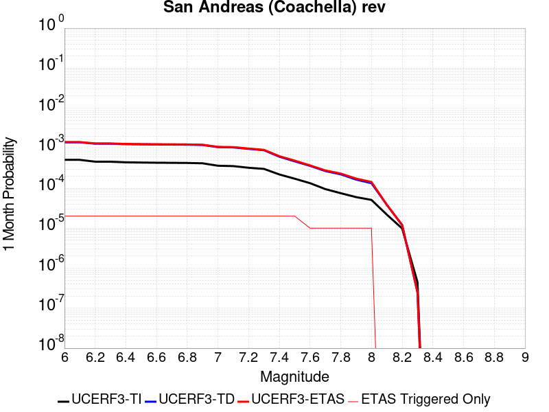 |  |  |

| Magnitude | 1 wk TI Prob | 1 wk TD Prob | 1 wk ETAS Prob | 1 wk ETAS/TD Gain | 1 wk ETAS Triggered Only | 1 mo TI Prob | 1 mo TD Prob | 1 mo ETAS Prob | 1 mo ETAS/TD Gain | 1 mo ETAS Triggered Only | 1 yr TI Prob | 1 yr TD Prob | 1 yr ETAS Prob | 1 yr ETAS/TD Gain | 1 yr ETAS Triggered Only | 10 yr TI Prob | 10 yr TD Prob | 10 yr ETAS Prob | 10 yr ETAS/TD Gain | 10 yr ETAS Triggered Only |
|-----|-----|-----|-----|-----|-----|-----|-----|-----|-----|-----|-----|-----|-----|-----|-----|-----|-----|-----|-----|-----|
| 6.0 | 1.1925945E-4 | 3.2747045E-4 | 3.2747045E-4 | 1.0 | 0.0 | 5.110118E-4 | 0.0014026947 | 0.0014178994 | 1.0108396 | 1.522603E-5 | 0.0062038354 | 0.016945418 | 0.017020259 | 1.0044166 | 7.613015E-5 | 0.060334753 | 0.15272202 | 0.15278652 | 1.0004224 | 7.613015E-5 |
| 6.1 | 1.1925945E-4 | 3.2747045E-4 | 3.2747045E-4 | 1.0 | 0.0 | 5.110118E-4 | 0.0014026947 | 0.0014178994 | 1.0108396 | 1.522603E-5 | 0.0062038354 | 0.016945418 | 0.017020259 | 1.0044166 | 7.613015E-5 | 0.060334753 | 0.15272202 | 0.15278652 | 1.0004224 | 7.613015E-5 |
| 6.2 | 1.07432395E-4 | 3.0247675E-4 | 3.0247675E-4 | 1.0 | 0.0 | 4.603433E-4 | 0.0012956889 | 0.0013108952 | 1.011736 | 1.522603E-5 | 0.005590286 | 0.015662009 | 0.015736947 | 1.0047847 | 7.613015E-5 | 0.05451731 | 0.14189328 | 0.14195861 | 1.0004604 | 7.613015E-5 |
| 6.3 | 1.0718766E-4 | 3.019298E-4 | 3.019298E-4 | 1.0 | 0.0 | 4.592948E-4 | 0.0012933471 | 0.0013085535 | 1.0117574 | 1.522603E-5 | 0.005577586 | 0.015633909 | 0.015708849 | 1.0047934 | 7.613015E-5 | 0.054396555 | 0.14166155 | 0.1417269 | 1.0004612 | 7.613015E-5 |
| 6.4 | 1.0355944E-4 | 2.9401045E-4 | 2.9401045E-4 | 1.0 | 0.0 | 4.4375064E-4 | 0.0012594402 | 0.0012746471 | 1.0120744 | 1.522603E-5 | 0.0053892885 | 0.015226932 | 0.015301904 | 1.0049236 | 7.613015E-5 | 0.052604496 | 0.13822177 | 0.13828737 | 1.0004747 | 7.613015E-5 |
| 6.5 | 1.0227914E-4 | 2.912047E-4 | 2.912047E-4 | 1.0 | 0.0 | 4.382655E-4 | 0.0012474272 | 0.0012626342 | 1.0121907 | 1.522603E-5 | 0.0053228354 | 0.015082708 | 0.01515769 | 1.0049714 | 7.613015E-5 | 0.051971316 | 0.13700101 | 0.1370667 | 1.0004796 | 7.613015E-5 |
| 6.6 | 1.0116757E-4 | 2.8886212E-4 | 2.8886212E-4 | 1.0 | 0.0 | 4.3350324E-4 | 0.0012373971 | 0.0012526043 | 1.0122896 | 1.522603E-5 | 0.0052651367 | 0.0149622755 | 0.015037267 | 1.005012 | 7.613015E-5 | 0.051421247 | 0.13597922 | 0.13604501 | 1.0004838 | 7.613015E-5 |
| 6.7 | 1.0050676E-4 | 2.874477E-4 | 2.874477E-4 | 1.0 | 0.0 | 4.3067214E-4 | 0.001231341 | 0.0012465484 | 1.0123502 | 1.522603E-5 | 0.005230834 | 0.014889553 | 0.01496455 | 1.0050368 | 7.613015E-5 | 0.051094085 | 0.13536398 | 0.1354298 | 1.0004863 | 7.613015E-5 |
| 6.8 | 9.976819E-5 | 2.8548407E-4 | 2.8548407E-4 | 1.0 | 0.0 | 4.2750788E-4 | 0.0012229334 | 0.0012381409 | 1.0124352 | 1.522603E-5 | 0.0051924936 | 0.014788584 | 0.014863589 | 1.0050718 | 7.613015E-5 | 0.050728295 | 0.13451566 | 0.13458155 | 1.0004898 | 7.613015E-5 |
| 6.9 | 9.77719E-5 | 2.80452E-4 | 2.80452E-4 | 1.0 | 0.0 | 4.1895514E-4 | 0.0012013874 | 0.0012165951 | 1.0126585 | 1.522603E-5 | 0.0050888555 | 0.01452979 | 0.014604813 | 1.0051634 | 7.613015E-5 | 0.049738888 | 0.13234389 | 0.13240995 | 1.0004991 | 7.613015E-5 |
| 7.0 | 8.500761E-5 | 2.4778847E-4 | 2.4778847E-4 | 1.0 | 0.0 | 3.6426744E-4 | 0.0010615216 | 0.0010767315 | 1.0143284 | 1.522603E-5 | 0.0044259406 | 0.012848215 | 0.012908337 | 1.0046793 | 6.090412E-5 | 0.04338823 | 0.11819933 | 0.11825304 | 1.0004543 | 6.090412E-5 |
| 7.1 | 8.319876E-5 | 2.4381404E-4 | 2.4381404E-4 | 1.0 | 0.0 | 3.5651738E-4 | 0.0010445021 | 0.0010597123 | 1.0145621 | 1.522603E-5 | 0.004331963 | 0.012643427 | 0.01270356 | 1.0047562 | 6.090412E-5 | 0.042484846 | 0.11641899 | 0.1164728 | 1.0004623 | 6.090412E-5 |
| 7.2 | 7.563917E-5 | 2.2429357E-4 | 2.2429357E-4 | 1.0 | 0.0 | 3.2412758E-4 | 9.609071E-4 | 9.761185E-4 | 1.0158303 | 1.522603E-5 | 0.0039391145 | 0.011636979 | 0.011697174 | 1.0051727 | 6.090412E-5 | 0.03870018 | 0.107823946 | 0.10787828 | 1.0005039 | 6.090412E-5 |
| 7.3 | 7.082985E-5 | 2.074492E-4 | 2.074492E-4 | 1.0 | 0.0 | 3.0352117E-4 | 8.8876794E-4 | 9.0398046E-4 | 1.0171164 | 1.522603E-5 | 0.0036891096 | 0.010767689 | 0.010827937 | 1.0055953 | 6.090412E-5 | 0.03628465 | 0.10034482 | 0.10039961 | 1.0005461 | 6.090412E-5 |
| 7.4 | 5.146215E-5 | 1.428607E-4 | 1.428607E-4 | 1.0 | 0.0 | 2.2053342E-4 | 6.121174E-4 | 6.273341E-4 | 1.0248592 | 1.522603E-5 | 0.0026816884 | 0.0074272524 | 0.007487704 | 1.0081391 | 6.090412E-5 | 0.02649557 | 0.07090313 | 0.07095972 | 1.0007981 | 6.090412E-5 |
| 7.5 | 4.0285166E-5 | 1.0952253E-4 | 1.0952253E-4 | 1.0 | 0.0 | 1.7263928E-4 | 4.6929816E-4 | 4.8451705E-4 | 1.032429 | 1.522603E-5 | 0.002099857 | 0.0056988057 | 0.0057593626 | 1.0106263 | 6.090412E-5 | 0.020801254 | 0.05505857 | 0.05511612 | 1.0010452 | 6.090412E-5 |
| 7.6 | 3.1168736E-5 | 8.4483814E-5 | 8.4483814E-5 | 1.0 | 0.0 | 1.3357346E-4 | 3.6202336E-4 | 3.6202336E-4 | 1.0 | 0.0 | 0.0016250437 | 0.0043987534 | 0.0044442303 | 1.0103387 | 4.567809E-5 | 0.016132116 | 0.04285275 | 0.04289647 | 1.0010203 | 4.567809E-5 |
| 7.7 | 2.2100989E-5 | 6.2470855E-5 | 6.2470855E-5 | 1.0 | 0.0 | 9.4715084E-5 | 2.677048E-4 | 2.677048E-4 | 1.0 | 0.0 | 0.001152546 | 0.0032544413 | 0.0032999706 | 1.0139899 | 4.567809E-5 | 0.011465867 | 0.031938035 | 0.031982254 | 1.0013845 | 4.567809E-5 |
| 7.8 | 1.7484861E-5 | 5.187001E-5 | 5.187001E-5 | 1.0 | 0.0 | 7.493296E-5 | 2.2228112E-4 | 2.2228112E-4 | 1.0 | 0.0 | 9.1192697E-4 | 0.002702917 | 0.0027484715 | 1.0168539 | 4.567809E-5 | 0.009081938 | 0.026673956 | 0.026718415 | 1.0016668 | 4.567809E-5 |
| 7.9 | 1.3967285E-5 | 3.8283448E-5 | 3.8283448E-5 | 1.0 | 0.0 | 5.985842E-5 | 1.6406161E-4 | 1.6406161E-4 | 1.0 | 0.0 | 7.2853256E-4 | 0.0019956212 | 0.0020412083 | 1.0228435 | 4.567809E-5 | 0.0072614877 | 0.019937595 | 0.019982364 | 1.0022454 | 4.567809E-5 |
| 8.0 | 1.1887396E-5 | 3.1117535E-5 | 3.1117535E-5 | 1.0 | 0.0 | 5.094499E-5 | 1.3335406E-4 | 1.3335406E-4 | 1.0 | 0.0 | 6.200787E-4 | 0.0016223775 | 0.0016527802 | 1.0187396 | 3.045206E-5 | 0.006183513 | 0.016303658 | 0.016333615 | 1.0018374 | 3.045206E-5 |
| 8.1 | 5.100864E-6 | 8.994677E-6 | 8.994677E-6 | 1.0 | 0.0 | 2.1860664E-5 | 3.854805E-5 | 3.854805E-5 | 1.0 | 0.0 | 2.6612106E-4 | 4.6922156E-4 | 4.6922156E-4 | 1.0 | 0.0 | 0.002658026 | 0.00492833 | 0.00492833 | 1.0 | 0.0 |
| 8.2 | 2.3004484E-6 | 2.795008E-6 | 2.795008E-6 | 1.0 | 0.0 | 9.859027E-6 | 1.1978551E-5 | 1.1978551E-5 | 1.0 | 0.0 | 1.2002704E-4 | 1.4582912E-4 | 1.4582912E-4 | 1.0 | 0.0 | 0.0011996223 | 0.0016018103 | 0.0016018103 | 1.0 | 0.0 |
| 8.3 | 1.0424446E-7 | 5.8393972E-8 | 5.8393972E-8 | 1.0 | 0.0 | 4.4676187E-7 | 2.5025986E-7 | 2.5025986E-7 | 1.0 | 0.0 | 5.439312E-6 | 3.0469098E-6 | 3.0469098E-6 | 1.0 | 0.0 | 5.4391792E-5 | 3.203139E-5 | 3.203139E-5 | 1.0 | 0.0 |

## Independence rev 2011
*[(top)](#table-of-contents)*

| 1 Week | 1 Month | 1 Year | 10 Year |
|-----|-----|-----|-----|
|  |  |  |  |

| Magnitude | 1 wk TI Prob | 1 wk TD Prob | 1 wk ETAS Prob | 1 wk ETAS/TD Gain | 1 wk ETAS Triggered Only | 1 mo TI Prob | 1 mo TD Prob | 1 mo ETAS Prob | 1 mo ETAS/TD Gain | 1 mo ETAS Triggered Only | 1 yr TI Prob | 1 yr TD Prob | 1 yr ETAS Prob | 1 yr ETAS/TD Gain | 1 yr ETAS Triggered Only | 10 yr TI Prob | 10 yr TD Prob | 10 yr ETAS Prob | 10 yr ETAS/TD Gain | 10 yr ETAS Triggered Only |
|-----|-----|-----|-----|-----|-----|-----|-----|-----|-----|-----|-----|-----|-----|-----|-----|-----|-----|-----|-----|-----|
| 6.0 | 4.422171E-6 | 4.3263003E-6 | 4.3263003E-6 | 1.0 | 0.0 | 1.8952025E-5 | 1.8541172E-5 | 1.8541172E-5 | 1.0 | 0.0 | 2.3071647E-4 | 2.2571837E-4 | 2.5616356E-4 | 1.1348813 | 3.045206E-5 | 0.0023047708 | 0.0022551846 | 0.002331143 | 1.0336818 | 7.613015E-5 |
| 6.1 | 4.422171E-6 | 4.3263003E-6 | 4.3263003E-6 | 1.0 | 0.0 | 1.8952025E-5 | 1.8541172E-5 | 1.8541172E-5 | 1.0 | 0.0 | 2.3071647E-4 | 2.2571837E-4 | 2.5616356E-4 | 1.1348813 | 3.045206E-5 | 0.0023047708 | 0.0022551846 | 0.002331143 | 1.0336818 | 7.613015E-5 |
| 6.2 | 4.422171E-6 | 4.3263003E-6 | 4.3263003E-6 | 1.0 | 0.0 | 1.8952025E-5 | 1.8541172E-5 | 1.8541172E-5 | 1.0 | 0.0 | 2.3071647E-4 | 2.2571837E-4 | 2.5616356E-4 | 1.1348813 | 3.045206E-5 | 0.0023047708 | 0.0022551846 | 0.002331143 | 1.0336818 | 7.613015E-5 |
| 6.3 | 4.422171E-6 | 4.3263003E-6 | 4.3263003E-6 | 1.0 | 0.0 | 1.8952025E-5 | 1.8541172E-5 | 1.8541172E-5 | 1.0 | 0.0 | 2.3071647E-4 | 2.2571837E-4 | 2.5616356E-4 | 1.1348813 | 3.045206E-5 | 0.0023047708 | 0.0022551846 | 0.002331143 | 1.0336818 | 7.613015E-5 |
| 6.4 | 4.422171E-6 | 4.3263003E-6 | 4.3263003E-6 | 1.0 | 0.0 | 1.8952025E-5 | 1.8541172E-5 | 1.8541172E-5 | 1.0 | 0.0 | 2.3071647E-4 | 2.2571837E-4 | 2.5616356E-4 | 1.1348813 | 3.045206E-5 | 0.0023047708 | 0.0022551846 | 0.002331143 | 1.0336818 | 7.613015E-5 |
| 6.5 | 4.422171E-6 | 4.3263003E-6 | 4.3263003E-6 | 1.0 | 0.0 | 1.8952025E-5 | 1.8541172E-5 | 1.8541172E-5 | 1.0 | 0.0 | 2.3071647E-4 | 2.2571837E-4 | 2.5616356E-4 | 1.1348813 | 3.045206E-5 | 0.0023047708 | 0.0022551846 | 0.002331143 | 1.0336818 | 7.613015E-5 |
| 6.6 | 2.663744E-6 | 2.53204E-6 | 2.53204E-6 | 1.0 | 0.0 | 1.1415996E-5 | 1.0851558E-5 | 1.0851558E-5 | 1.0 | 0.0 | 1.3898089E-4 | 1.3211019E-4 | 1.6255822E-4 | 1.2304746 | 3.045206E-5 | 0.0013889399 | 0.0013203648 | 0.0013811885 | 1.0460658 | 6.090412E-5 |
| 6.7 | 2.663744E-6 | 2.53204E-6 | 2.53204E-6 | 1.0 | 0.0 | 1.1415996E-5 | 1.0851558E-5 | 1.0851558E-5 | 1.0 | 0.0 | 1.3898089E-4 | 1.3211019E-4 | 1.6255822E-4 | 1.2304746 | 3.045206E-5 | 0.0013889399 | 0.0013203648 | 0.0013811885 | 1.0460658 | 6.090412E-5 |
| 6.8 | 1.9716529E-6 | 1.8323044E-6 | 1.8323044E-6 | 1.0 | 0.0 | 8.449913E-6 | 7.85271E-6 | 7.85271E-6 | 1.0 | 0.0 | 1.0287284E-4 | 9.5602685E-5 | 1.2605183E-4 | 1.3184968 | 3.045206E-5 | 0.0010282523 | 9.5562846E-4 | 0.0010164744 | 1.0636711 | 6.090412E-5 |
| 6.9 | 1.8788617E-6 | 1.7430435E-6 | 1.7430435E-6 | 1.0 | 0.0 | 8.0522395E-6 | 7.470166E-6 | 7.470166E-6 | 1.0 | 0.0 | 9.80316E-5 | 9.09456E-5 | 1.21394885E-4 | 1.3348078 | 3.045206E-5 | 9.798837E-4 | 9.090958E-4 | 9.699446E-4 | 1.0669333 | 6.090412E-5 |
| 7.0 | 1.5045488E-6 | 1.384987E-6 | 1.384987E-6 | 1.0 | 0.0 | 6.44805E-6 | 5.9356453E-6 | 5.9356453E-6 | 1.0 | 0.0 | 7.8502184E-5 | 7.2264134E-5 | 1.02713995E-4 | 1.421369 | 3.045206E-5 | 7.8474457E-4 | 7.224115E-4 | 7.832716E-4 | 1.0842458 | 6.090412E-5 |
| 7.1 | 1.272341E-6 | 1.1625416E-6 | 1.1625416E-6 | 1.0 | 0.0 | 5.4528787E-6 | 4.9823116E-6 | 4.9823116E-6 | 1.0 | 0.0 | 6.6386776E-5 | 6.065799E-5 | 9.11082E-5 | 1.5019984 | 3.045206E-5 | 6.636695E-4 | 6.0641754E-4 | 6.672847E-4 | 1.1003717 | 6.090412E-5 |
| 7.2 | 1.0416892E-6 | 9.410155E-7 | 9.410155E-7 | 1.0 | 0.0 | 4.464375E-6 | 4.032918E-6 | 4.032918E-6 | 1.0 | 0.0 | 5.4352407E-5 | 4.9099683E-5 | 7.955025E-5 | 1.6201785 | 3.045206E-5 | 5.4339116E-4 | 4.9089023E-4 | 5.5176445E-4 | 1.1240078 | 6.090412E-5 |
| 7.3 | 7.9450155E-7 | 7.2352077E-7 | 7.2352077E-7 | 1.0 | 0.0 | 3.4050022E-6 | 3.1007996E-6 | 3.1007996E-6 | 1.0 | 0.0 | 4.1455114E-5 | 3.7751593E-5 | 6.8202506E-5 | 1.8066126 | 3.045206E-5 | 4.144738E-4 | 3.774529E-4 | 4.3833404E-4 | 1.1612947 | 6.090412E-5 |
| 7.4 | 5.3893444E-7 | 5.01964E-7 | 5.01964E-7 | 1.0 | 0.0 | 2.309717E-6 | 2.1512726E-6 | 2.1512726E-6 | 1.0 | 0.0 | 2.8120441E-5 | 2.6191434E-5 | 5.6642697E-5 | 2.162642 | 3.045206E-5 | 2.8116882E-4 | 2.6188392E-4 | 3.227721E-4 | 1.2325006 | 6.090412E-5 |
| 7.5 | 3.8852085E-7 | 3.6826376E-7 | 3.6826376E-7 | 1.0 | 0.0 | 1.6650882E-6 | 1.5782723E-6 | 1.5782723E-6 | 1.0 | 0.0 | 2.027226E-5 | 1.9215298E-5 | 4.9666774E-5 | 2.5847516 | 3.045206E-5 | 2.0270412E-4 | 1.9213658E-4 | 2.378059E-4 | 1.2376919 | 4.567809E-5 |
| 7.6 | 2.414929E-7 | 2.3457987E-7 | 2.3457987E-7 | 1.0 | 0.0 | 1.0349692E-6 | 1.0053419E-6 | 1.0053419E-6 | 1.0 | 0.0 | 1.2600677E-5 | 1.2239971E-5 | 4.269166E-5 | 3.487889 | 3.045206E-5 | 1.2599962E-4 | 1.2239309E-4 | 1.6806558E-4 | 1.3731624 | 4.567809E-5 |
| 7.7 | 6.8298014E-8 | 6.8590616E-8 | 6.8590616E-8 | 1.0 | 0.0 | 2.9270575E-7 | 2.9395974E-7 | 2.9395974E-7 | 1.0 | 0.0 | 3.5636867E-6 | 3.5789546E-6 | 1.880493E-5 | 5.254308 | 1.522603E-5 | 3.5636294E-5 | 3.5789017E-5 | 6.623999E-5 | 1.8508468 | 3.045206E-5 |

## San Jacinto (Anza) rev
*[(top)](#table-of-contents)*

| 1 Week | 1 Month | 1 Year | 10 Year |
|-----|-----|-----|-----|
|  |  |  |  |

| Magnitude | 1 wk TI Prob | 1 wk TD Prob | 1 wk ETAS Prob | 1 wk ETAS/TD Gain | 1 wk ETAS Triggered Only | 1 mo TI Prob | 1 mo TD Prob | 1 mo ETAS Prob | 1 mo ETAS/TD Gain | 1 mo ETAS Triggered Only | 1 yr TI Prob | 1 yr TD Prob | 1 yr ETAS Prob | 1 yr ETAS/TD Gain | 1 yr ETAS Triggered Only | 10 yr TI Prob | 10 yr TD Prob | 10 yr ETAS Prob | 10 yr ETAS/TD Gain | 10 yr ETAS Triggered Only |
|-----|-----|-----|-----|-----|-----|-----|-----|-----|-----|-----|-----|-----|-----|-----|-----|-----|-----|-----|-----|-----|
| 6.0 | 6.3015636E-5 | 4.337693E-5 | 7.382767E-5 | 1.7020031 | 3.045206E-5 | 2.7003905E-4 | 1.8588796E-4 | 2.3155755E-4 | 1.2456834 | 4.567809E-5 | 0.0032827691 | 0.0022608489 | 0.0023216151 | 1.0268778 | 6.090412E-5 | 0.032346968 | 0.023334619 | 0.023394102 | 1.0025492 | 6.090412E-5 |
| 6.1 | 6.3015636E-5 | 4.337693E-5 | 7.382767E-5 | 1.7020031 | 3.045206E-5 | 2.7003905E-4 | 1.8588796E-4 | 2.3155755E-4 | 1.2456834 | 4.567809E-5 | 0.0032827691 | 0.0022608489 | 0.0023216151 | 1.0268778 | 6.090412E-5 | 0.032346968 | 0.023334619 | 0.023394102 | 1.0025492 | 6.090412E-5 |
| 6.2 | 6.3015636E-5 | 4.337693E-5 | 7.382767E-5 | 1.7020031 | 3.045206E-5 | 2.7003905E-4 | 1.8588796E-4 | 2.3155755E-4 | 1.2456834 | 4.567809E-5 | 0.0032827691 | 0.0022608489 | 0.0023216151 | 1.0268778 | 6.090412E-5 | 0.032346968 | 0.023334619 | 0.023394102 | 1.0025492 | 6.090412E-5 |
| 6.3 | 6.3015636E-5 | 4.337693E-5 | 7.382767E-5 | 1.7020031 | 3.045206E-5 | 2.7003905E-4 | 1.8588796E-4 | 2.3155755E-4 | 1.2456834 | 4.567809E-5 | 0.0032827691 | 0.0022608489 | 0.0023216151 | 1.0268778 | 6.090412E-5 | 0.032346968 | 0.023334619 | 0.023394102 | 1.0025492 | 6.090412E-5 |
| 6.4 | 6.3015636E-5 | 4.337693E-5 | 7.382767E-5 | 1.7020031 | 3.045206E-5 | 2.7003905E-4 | 1.8588796E-4 | 2.3155755E-4 | 1.2456834 | 4.567809E-5 | 0.0032827691 | 0.0022608489 | 0.0023216151 | 1.0268778 | 6.090412E-5 | 0.032346968 | 0.023334619 | 0.023394102 | 1.0025492 | 6.090412E-5 |
| 6.5 | 5.811017E-5 | 4.015336E-5 | 7.06042E-5 | 1.7583634 | 3.045206E-5 | 2.4901982E-4 | 1.7207452E-4 | 2.1774475E-4 | 1.2654096 | 4.567809E-5 | 0.0030276014 | 0.0020929999 | 0.0021537766 | 1.0290381 | 6.090412E-5 | 0.02986684 | 0.021630494 | 0.021690082 | 1.0027548 | 6.090412E-5 |
| 6.6 | 5.811017E-5 | 4.015336E-5 | 7.06042E-5 | 1.7583634 | 3.045206E-5 | 2.4901982E-4 | 1.7207452E-4 | 2.1774475E-4 | 1.2654096 | 4.567809E-5 | 0.0030276014 | 0.0020929999 | 0.0021537766 | 1.0290381 | 6.090412E-5 | 0.02986684 | 0.021630494 | 0.021690082 | 1.0027548 | 6.090412E-5 |
| 6.7 | 5.712442E-5 | 3.957534E-5 | 7.0026195E-5 | 1.7694402 | 3.045206E-5 | 2.4479596E-4 | 1.6959761E-4 | 2.1526795E-4 | 1.2692865 | 4.567809E-5 | 0.0029763177 | 0.002062901 | 0.0021236793 | 1.0294626 | 6.090412E-5 | 0.029367693 | 0.021321962 | 0.021381568 | 1.0027955 | 6.090412E-5 |
| 6.8 | 5.6967532E-5 | 3.9431634E-5 | 6.9882495E-5 | 1.7722445 | 3.045206E-5 | 2.4412372E-4 | 1.689818E-4 | 2.1465217E-4 | 1.270268 | 4.567809E-5 | 0.0029681553 | 0.0020554175 | 0.0021161966 | 1.0295701 | 6.090412E-5 | 0.029288229 | 0.021246629 | 0.021306239 | 1.0028056 | 6.090412E-5 |
| 6.9 | 5.6211324E-5 | 3.9135975E-5 | 6.9586844E-5 | 1.7780787 | 3.045206E-5 | 2.4088343E-4 | 1.6771485E-4 | 2.1338528E-4 | 1.27231 | 4.567809E-5 | 0.0029288116 | 0.0020400216 | 0.0021008013 | 1.0297937 | 6.090412E-5 | 0.028905109 | 0.021085827 | 0.021145446 | 1.0028275 | 6.090412E-5 |
| 7.0 | 5.4383527E-5 | 3.7995007E-5 | 6.844591E-5 | 1.8014449 | 3.045206E-5 | 2.3305144E-4 | 1.6282561E-4 | 2.0849626E-4 | 1.2804881 | 4.567809E-5 | 0.0028337094 | 0.0019806041 | 0.0020413876 | 1.0306894 | 6.090412E-5 | 0.027978465 | 0.020476038 | 0.020535694 | 1.0029135 | 6.090412E-5 |
| 7.1 | 5.1393665E-5 | 3.6455618E-5 | 6.690657E-5 | 1.8352883 | 3.045206E-5 | 2.2023996E-4 | 1.5622903E-4 | 2.019E-4 | 1.2923334 | 4.567809E-5 | 0.0026781242 | 0.0019004333 | 0.0019612217 | 1.0319866 | 6.090412E-5 | 0.026460782 | 0.019648531 | 0.019708239 | 1.0030388 | 6.090412E-5 |
| 7.2 | 4.785222E-5 | 3.480494E-5 | 6.525594E-5 | 1.8749045 | 3.045206E-5 | 2.0506482E-4 | 1.4915552E-4 | 1.948268E-4 | 1.3061991 | 4.567809E-5 | 0.0024938055 | 0.0018144595 | 0.001875253 | 1.0335051 | 6.090412E-5 | 0.024660049 | 0.018761909 | 0.01882167 | 1.0031853 | 6.090412E-5 |
| 7.3 | 4.2143256E-5 | 3.389763E-5 | 6.434866E-5 | 1.8983232 | 3.045206E-5 | 1.8060145E-4 | 1.4526749E-4 | 1.9093894E-4 | 1.3143955 | 4.567809E-5 | 0.002196605 | 0.0017672004 | 0.0018279969 | 1.0344027 | 6.090412E-5 | 0.02175019 | 0.018269178 | 0.018328968 | 1.0032728 | 6.090412E-5 |
| 7.4 | 4.0264713E-5 | 3.3535252E-5 | 6.398629E-5 | 1.9080307 | 3.045206E-5 | 1.7255165E-4 | 1.4371461E-4 | 1.8938613E-4 | 1.3177933 | 4.567809E-5 | 0.002098792 | 0.0017483246 | 0.0018091222 | 1.0347748 | 6.090412E-5 | 0.020790804 | 0.018073453 | 0.018133257 | 1.0033089 | 6.090412E-5 |
| 7.5 | 3.694492E-5 | 3.2247204E-5 | 6.269828E-5 | 1.9443014 | 3.045206E-5 | 1.5832575E-4 | 1.38195E-4 | 1.8386677E-4 | 1.330488 | 4.567809E-5 | 0.0019259118 | 0.0016812286 | 0.0017420304 | 1.036165 | 6.090412E-5 | 0.01909306 | 0.017388845 | 0.01744869 | 1.0034416 | 6.090412E-5 |
| 7.6 | 3.200565E-5 | 2.9555436E-5 | 6.0006598E-5 | 2.0303066 | 3.045206E-5 | 1.3715986E-4 | 1.2666002E-4 | 1.7233232E-4 | 1.3605897 | 4.567809E-5 | 0.001668642 | 0.0015409971 | 0.0016018074 | 1.0394616 | 6.090412E-5 | 0.01656168 | 0.015973015 | 0.016032945 | 1.003752 | 6.090412E-5 |
| 7.7 | 2.731642E-5 | 2.6142696E-5 | 5.659396E-5 | 2.1648097 | 3.045206E-5 | 1.1706512E-4 | 1.1203532E-4 | 1.5770829E-4 | 1.4076658 | 4.567809E-5 | 0.001424336 | 0.0013631776 | 0.0014239986 | 1.0446172 | 6.090412E-5 | 0.014152412 | 0.01419303 | 0.01425307 | 1.0042303 | 6.090412E-5 |
| 7.8 | 2.3466424E-5 | 2.3552704E-5 | 5.4004046E-5 | 2.2929022 | 3.045206E-5 | 1.0056651E-4 | 1.0093625E-4 | 1.4660973E-4 | 1.4524983 | 4.567809E-5 | 0.0012237094 | 0.0012282069 | 0.0012890362 | 1.0495269 | 6.090412E-5 | 0.012169928 | 0.012833906 | 0.012894029 | 1.0046847 | 6.090412E-5 |
| 7.9 | 1.8611925E-5 | 1.8951272E-5 | 4.9402755E-5 | 2.6068306 | 3.045206E-5 | 7.9762955E-5 | 8.1217215E-5 | 1.268916E-4 | 1.5623732 | 4.567809E-5 | 9.7068126E-4 | 9.883717E-4 | 0.0010492157 | 1.0615598 | 6.090412E-5 | 0.0096645225 | 0.010416457 | 0.010476727 | 1.0057861 | 6.090412E-5 |
| 8.0 | 1.5460775E-5 | 1.5779307E-5 | 4.6230885E-5 | 2.9298427 | 3.045206E-5 | 6.6258784E-5 | 6.762385E-5 | 1.13298855E-4 | 1.6754274 | 4.567809E-5 | 8.0640207E-4 | 8.2301005E-4 | 8.8386406E-4 | 1.0739408 | 6.090412E-5 | 0.008034821 | 0.008723064 | 0.008783437 | 1.006921 | 6.090412E-5 |
| 8.1 | 9.983884E-6 | 8.292369E-6 | 2.3518272E-5 | 2.8361344 | 1.522603E-5 | 4.2787375E-5 | 3.5538244E-5 | 5.0763734E-5 | 1.4284254 | 1.522603E-5 | 5.2081177E-4 | 4.3259273E-4 | 4.4781217E-4 | 1.0351819 | 1.522603E-5 | 0.0051959283 | 0.00465207 | 0.0046672253 | 1.0032578 | 1.522603E-5 |
| 8.2 | 4.1226E-6 | 1.5595413E-6 | 1.5595413E-6 | 1.0 | 0.0 | 1.7668166E-5 | 6.683731E-6 | 6.683731E-6 | 1.0 | 0.0 | 2.1508869E-4 | 8.137142E-5 | 8.137142E-5 | 1.0 | 0.0 | 0.0021488064 | 9.4425044E-4 | 9.4425044E-4 | 1.0 | 0.0 |
| 8.3 | 1.2750878E-6 | 3.6301523E-7 | 3.6301523E-7 | 1.0 | 0.0 | 5.4646503E-6 | 1.5557786E-6 | 1.5557786E-6 | 1.0 | 0.0 | 6.653009E-5 | 1.8941444E-5 | 1.8941444E-5 | 1.0 | 0.0 | 6.6510175E-4 | 2.2840123E-4 | 2.2840123E-4 | 1.0 | 0.0 |

## Blue Cut
*[(top)](#table-of-contents)*

| 1 Week | 1 Month | 1 Year | 10 Year |
|-----|-----|-----|-----|
|  |  |  |  |

| Magnitude | 1 wk TI Prob | 1 wk TD Prob | 1 wk ETAS Prob | 1 wk ETAS/TD Gain | 1 wk ETAS Triggered Only | 1 mo TI Prob | 1 mo TD Prob | 1 mo ETAS Prob | 1 mo ETAS/TD Gain | 1 mo ETAS Triggered Only | 1 yr TI Prob | 1 yr TD Prob | 1 yr ETAS Prob | 1 yr ETAS/TD Gain | 1 yr ETAS Triggered Only | 10 yr TI Prob | 10 yr TD Prob | 10 yr ETAS Prob | 10 yr ETAS/TD Gain | 10 yr ETAS Triggered Only |
|-----|-----|-----|-----|-----|-----|-----|-----|-----|-----|-----|-----|-----|-----|-----|-----|-----|-----|-----|-----|-----|
| 6.0 | 2.1227985E-5 | 2.2720424E-5 | 2.2720424E-5 | 1.0 | 0.0 | 9.097391E-5 | 9.7369935E-5 | 9.7369935E-5 | 1.0 | 0.0 | 0.0011070445 | 0.0011848924 | 0.0012001003 | 1.0128349 | 1.522603E-5 | 0.011015458 | 0.01179159 | 0.011851775 | 1.0051042 | 6.090412E-5 |
| 6.1 | 2.1227985E-5 | 2.2720424E-5 | 2.2720424E-5 | 1.0 | 0.0 | 9.097391E-5 | 9.7369935E-5 | 9.7369935E-5 | 1.0 | 0.0 | 0.0011070445 | 0.0011848924 | 0.0012001003 | 1.0128349 | 1.522603E-5 | 0.011015458 | 0.01179159 | 0.011851775 | 1.0051042 | 6.090412E-5 |
| 6.2 | 2.1227985E-5 | 2.2720424E-5 | 2.2720424E-5 | 1.0 | 0.0 | 9.097391E-5 | 9.7369935E-5 | 9.7369935E-5 | 1.0 | 0.0 | 0.0011070445 | 0.0011848924 | 0.0012001003 | 1.0128349 | 1.522603E-5 | 0.011015458 | 0.01179159 | 0.011851775 | 1.0051042 | 6.090412E-5 |
| 6.3 | 1.1613981E-5 | 1.2353959E-5 | 1.2353959E-5 | 1.0 | 0.0 | 4.9773254E-5 | 5.2944535E-5 | 5.2944535E-5 | 1.0 | 0.0 | 6.0582085E-4 | 6.4442155E-4 | 6.5963774E-4 | 1.0236123 | 1.522603E-5 | 0.0060417196 | 0.006426776 | 0.0064419038 | 1.0023539 | 1.522603E-5 |
| 6.4 | 1.1613981E-5 | 1.2353959E-5 | 1.2353959E-5 | 1.0 | 0.0 | 4.9773254E-5 | 5.2944535E-5 | 5.2944535E-5 | 1.0 | 0.0 | 6.0582085E-4 | 6.4442155E-4 | 6.5963774E-4 | 1.0236123 | 1.522603E-5 | 0.0060417196 | 0.006426776 | 0.0064419038 | 1.0023539 | 1.522603E-5 |
| 6.5 | 8.931326E-6 | 9.48191E-6 | 9.48191E-6 | 1.0 | 0.0 | 3.8276554E-5 | 4.0636176E-5 | 4.0636176E-5 | 1.0 | 0.0 | 4.6591737E-4 | 4.9464224E-4 | 5.0986075E-4 | 1.0307667 | 1.522603E-5 | 0.0046494175 | 0.004936322 | 0.004951473 | 1.0030693 | 1.522603E-5 |
| 6.6 | 7.345353E-6 | 7.79053E-6 | 7.79053E-6 | 1.0 | 0.0 | 3.1479703E-5 | 3.33876E-5 | 3.33876E-5 | 1.0 | 0.0 | 3.83198E-4 | 4.0642623E-4 | 4.2164608E-4 | 1.0374479 | 1.522603E-5 | 0.0038253788 | 0.004057621 | 0.0040727854 | 1.0037372 | 1.522603E-5 |
| 6.7 | 6.2775666E-6 | 6.655361E-6 | 6.655361E-6 | 1.0 | 0.0 | 2.690358E-5 | 2.8522707E-5 | 2.8522707E-5 | 1.0 | 0.0 | 3.2750185E-4 | 3.4721615E-4 | 3.624369E-4 | 1.0438365 | 1.522603E-5 | 0.0032701963 | 0.0034674776 | 0.0034826507 | 1.0043758 | 1.522603E-5 |
| 6.8 | 5.5234095E-6 | 5.855298E-6 | 5.855298E-6 | 1.0 | 0.0 | 2.367154E-5 | 2.5093934E-5 | 2.5093934E-5 | 1.0 | 0.0 | 2.8816288E-4 | 3.054831E-4 | 3.2070445E-4 | 1.0498272 | 1.522603E-5 | 0.002877895 | 0.0030513476 | 0.0030665272 | 1.0049747 | 1.522603E-5 |
| 6.9 | 4.7780054E-6 | 5.065582E-6 | 5.065582E-6 | 1.0 | 0.0 | 2.0477004E-5 | 2.1709497E-5 | 2.1709497E-5 | 1.0 | 0.0 | 2.4927902E-4 | 2.642881E-4 | 2.642881E-4 | 1.0 | 0.0 | 0.0024899957 | 0.0026404303 | 0.0026404303 | 1.0 | 0.0 |
| 7.0 | 3.883171E-6 | 4.1186195E-6 | 4.1186195E-6 | 1.0 | 0.0 | 1.6642054E-5 | 1.7651146E-5 | 1.7651146E-5 | 1.0 | 0.0 | 2.0259817E-4 | 2.148884E-4 | 2.148884E-4 | 1.0 | 0.0 | 0.0020241356 | 0.0021474818 | 0.0021474818 | 1.0 | 0.0 |
| 7.1 | 2.8358215E-6 | 3.0098138E-6 | 3.0098138E-6 | 1.0 | 0.0 | 1.2153464E-5 | 1.2899175E-5 | 1.2899175E-5 | 1.0 | 0.0 | 1.4795837E-4 | 1.5704273E-4 | 1.5704273E-4 | 1.0 | 0.0 | 0.001478599 | 0.0015699627 | 0.0015699627 | 1.0 | 0.0 |

## San Andreas (Creeping Section) 2011 CFM
*[(top)](#table-of-contents)*

| 1 Week | 1 Month | 1 Year | 10 Year |
|-----|-----|-----|-----|
|  |  |  |  |

| Magnitude | 1 wk TI Prob | 1 wk TD Prob | 1 wk ETAS Prob | 1 wk ETAS/TD Gain | 1 wk ETAS Triggered Only | 1 mo TI Prob | 1 mo TD Prob | 1 mo ETAS Prob | 1 mo ETAS/TD Gain | 1 mo ETAS Triggered Only | 1 yr TI Prob | 1 yr TD Prob | 1 yr ETAS Prob | 1 yr ETAS/TD Gain | 1 yr ETAS Triggered Only | 10 yr TI Prob | 10 yr TD Prob | 10 yr ETAS Prob | 10 yr ETAS/TD Gain | 10 yr ETAS Triggered Only |
|-----|-----|-----|-----|-----|-----|-----|-----|-----|-----|-----|-----|-----|-----|-----|-----|-----|-----|-----|-----|-----|
| 6.0 | 5.986481E-4 | 0.0012277901 | 0.0012429975 | 1.012386 | 1.522603E-5 | 0.0025631124 | 0.0052455855 | 0.0052607316 | 1.0028874 | 1.522603E-5 | 0.030762846 | 0.061229862 | 0.061272744 | 1.0007004 | 4.567809E-5 | 0.26835477 | 0.42607152 | 0.42610645 | 1.000082 | 6.090412E-5 |
| 6.1 | 5.015945E-4 | 0.0010218644 | 0.0010370748 | 1.0148851 | 1.522603E-5 | 0.00214792 | 0.0043676887 | 0.0043828483 | 1.0034708 | 1.522603E-5 | 0.025839351 | 0.051269703 | 0.051298592 | 1.0005635 | 3.045206E-5 | 0.23032776 | 0.37298882 | 0.37301746 | 1.0000768 | 4.567809E-5 |
| 6.2 | 4.073338E-4 | 8.109829E-4 | 8.2619657E-4 | 1.0187596 | 1.522603E-5 | 0.0017445484 | 0.0034675654 | 0.0034827385 | 1.0043758 | 1.522603E-5 | 0.021034058 | 0.040954083 | 0.04098329 | 1.0007131 | 3.045206E-5 | 0.19150782 | 0.31317768 | 0.31320906 | 1.0001001 | 4.567809E-5 |
| 6.3 | 3.464099E-4 | 6.7405414E-4 | 6.892699E-4 | 1.0225735 | 1.522603E-5 | 0.0014837692 | 0.0028840431 | 0.002899225 | 1.0052642 | 1.522603E-5 | 0.017915873 | 0.034210727 | 0.034240138 | 1.0008597 | 3.045206E-5 | 0.16538359 | 0.27146977 | 0.27150303 | 1.0001225 | 4.567809E-5 |
| 6.4 | 2.935057E-4 | 5.543318E-4 | 5.695494E-4 | 1.0274521 | 1.522603E-5 | 0.0012572751 | 0.0023728115 | 0.0023880014 | 1.0064017 | 1.522603E-5 | 0.015200248 | 0.028285956 | 0.028315546 | 1.0010462 | 3.045206E-5 | 0.14201577 | 0.23314685 | 0.23318186 | 1.0001502 | 4.567809E-5 |
| 6.5 | 2.3409708E-4 | 4.2106997E-4 | 4.3628959E-4 | 1.0361451 | 1.522603E-5 | 0.0010028875 | 0.001803265 | 0.0018184634 | 1.0084283 | 1.522603E-5 | 0.012141965 | 0.02160988 | 0.021624777 | 1.0006894 | 1.522603E-5 | 0.11499573 | 0.18699536 | 0.18702011 | 1.0001324 | 3.045206E-5 |
| 6.6 | 1.5842178E-4 | 2.5115322E-4 | 2.6637543E-4 | 1.0606092 | 1.522603E-5 | 6.7877385E-4 | 0.0010759257 | 0.0010911353 | 1.0141363 | 1.522603E-5 | 0.0082328 | 0.013019121 | 0.013034149 | 1.0011543 | 1.522603E-5 | 0.07934396 | 0.12333139 | 0.12335809 | 1.0002165 | 3.045206E-5 |
| 6.7 | 1.5616413E-4 | 2.4651614E-4 | 2.6173843E-4 | 1.0617496 | 1.522603E-5 | 6.691031E-4 | 0.0010560687 | 0.0010712787 | 1.0144024 | 1.522603E-5 | 0.0081159435 | 0.012780937 | 0.012795969 | 1.0011761 | 1.522603E-5 | 0.0782586 | 0.12135857 | 0.12138533 | 1.0002204 | 3.045206E-5 |
| 6.8 | 1.5538467E-4 | 2.4475376E-4 | 2.5997605E-4 | 1.0621943 | 1.522603E-5 | 6.6576427E-4 | 0.0010485224 | 0.0010637325 | 1.0145062 | 1.522603E-5 | 0.008075596 | 0.0126902815 | 0.012705314 | 1.0011846 | 1.522603E-5 | 0.07788358 | 0.12058931 | 0.120616086 | 1.0002221 | 3.045206E-5 |
| 6.9 | 1.5153569E-4 | 2.3584193E-4 | 2.5106437E-4 | 1.064545 | 1.522603E-5 | 6.49277E-4 | 0.0010103616 | 0.0010255723 | 1.0150547 | 1.522603E-5 | 0.007876333 | 0.0122323 | 0.01224734 | 1.0012295 | 1.522603E-5 | 0.07602952 | 0.11665895 | 0.11668585 | 1.0002306 | 3.045206E-5 |
| 7.0 | 1.4588932E-4 | 2.2441045E-4 | 2.3963307E-4 | 1.0678338 | 1.522603E-5 | 6.250901E-4 | 9.6140656E-4 | 9.766179E-4 | 1.015822 | 1.522603E-5 | 0.0075839474 | 0.011642803 | 0.011657852 | 1.0012926 | 1.522603E-5 | 0.073302895 | 0.11150479 | 0.11153185 | 1.0002426 | 3.045206E-5 |
| 7.1 | 1.1565079E-4 | 1.6318668E-4 | 1.7841022E-4 | 1.0932891 | 1.522603E-5 | 4.955521E-4 | 6.991849E-4 | 7.1440026E-4 | 1.0217617 | 1.522603E-5 | 0.006016669 | 0.008479553 | 0.00849465 | 1.0017804 | 1.522603E-5 | 0.058563538 | 0.08383247 | 0.08386037 | 1.0003328 | 3.045206E-5 |
| 7.2 | 1.0393792E-4 | 1.4650424E-4 | 1.6172805E-4 | 1.1039137 | 1.522603E-5 | 4.4537216E-4 | 6.2772504E-4 | 6.429415E-4 | 1.0242406 | 1.522603E-5 | 0.005408933 | 0.007615941 | 0.0076310514 | 1.001984 | 1.522603E-5 | 0.052791595 | 0.075774014 | 0.075802155 | 1.0003715 | 3.045206E-5 |
| 7.3 | 9.332884E-5 | 1.2811116E-4 | 1.4333524E-4 | 1.118835 | 1.522603E-5 | 3.999194E-4 | 5.4893293E-4 | 5.641506E-4 | 1.0277222 | 1.522603E-5 | 0.0048581534 | 0.006662914 | 0.0066780387 | 1.00227 | 1.522603E-5 | 0.047533102 | 0.06662133 | 0.06664976 | 1.0004267 | 3.045206E-5 |
| 7.4 | 8.670252E-5 | 1.17293064E-4 | 1.325173E-4 | 1.1297966 | 1.522603E-5 | 3.715293E-4 | 5.0258834E-4 | 5.178067E-4 | 1.03028 | 1.522603E-5 | 0.004513991 | 0.006101966 | 0.006117099 | 1.00248 | 1.522603E-5 | 0.044233937 | 0.06127167 | 0.06130026 | 1.0004666 | 3.045206E-5 |
| 7.5 | 7.3036405E-5 | 9.027501E-5 | 1.0549967E-4 | 1.1686475 | 1.522603E-5 | 3.129756E-4 | 3.8683563E-4 | 4.0205577E-4 | 1.0393453 | 1.522603E-5 | 0.0038038217 | 0.0046995743 | 0.004714729 | 1.0032246 | 1.522603E-5 | 0.03739367 | 0.047980286 | 0.048009276 | 1.0006043 | 3.045206E-5 |
| 7.6 | 6.3935775E-5 | 8.298733E-5 | 9.82121E-5 | 1.1834589 | 1.522603E-5 | 2.7398168E-4 | 3.5561158E-4 | 3.708322E-4 | 1.0428013 | 1.522603E-5 | 0.0033306254 | 0.0043209945 | 0.004336155 | 1.0035084 | 1.522603E-5 | 0.032811474 | 0.04407886 | 0.04410797 | 1.0006604 | 3.045206E-5 |
| 7.7 | 5.5050095E-5 | 6.6780485E-5 | 8.200549E-5 | 1.227986 | 1.522603E-5 | 2.3590765E-4 | 2.861707E-4 | 3.0139237E-4 | 1.053191 | 1.522603E-5 | 0.0028683927 | 0.003478566 | 0.003493739 | 1.0043619 | 1.522603E-5 | 0.0283165 | 0.035874426 | 0.035903785 | 1.0008184 | 3.045206E-5 |
| 7.8 | 5.027131E-5 | 6.177649E-5 | 7.7001576E-5 | 1.2464545 | 1.522603E-5 | 2.1543067E-4 | 2.6472952E-4 | 2.7995152E-4 | 1.0575002 | 1.522603E-5 | 0.0026197135 | 0.0032183218 | 0.003233499 | 1.0047158 | 1.522603E-5 | 0.025890453 | 0.033198178 | 0.03322762 | 1.0008868 | 3.045206E-5 |
| 7.9 | 3.7271806E-5 | 5.034326E-5 | 6.556852E-5 | 1.3024291 | 1.522603E-5 | 1.5972654E-4 | 2.15739E-4 | 2.3096174E-4 | 1.0705609 | 1.522603E-5 | 0.0019429359 | 0.0026234603 | 0.0026386464 | 1.0057886 | 1.522603E-5 | 0.019260362 | 0.027125074 | 0.027154699 | 1.0010922 | 3.045206E-5 |
| 8.0 | 2.7310243E-5 | 3.1506686E-5 | 4.673224E-5 | 1.4832482 | 1.522603E-5 | 1.17038646E-4 | 1.3502168E-4 | 1.5024564E-4 | 1.1127521 | 1.522603E-5 | 0.0014240141 | 0.0016426502 | 0.0016578512 | 1.009254 | 1.522603E-5 | 0.014149235 | 0.017253635 | 0.017268598 | 1.0008672 | 1.522603E-5 |
| 8.1 | 1.7940547E-5 | 1.7450684E-5 | 3.267645E-5 | 1.8725024 | 1.522603E-5 | 7.688579E-5 | 7.4786505E-5 | 9.0011396E-5 | 1.2035781 | 1.522603E-5 | 9.3568244E-4 | 9.1014587E-4 | 9.2535804E-4 | 1.016714 | 1.522603E-5 | 0.009317525 | 0.009825298 | 0.009840374 | 1.0015345 | 1.522603E-5 |
| 8.2 | 8.643924E-6 | 5.49522E-6 | 5.49522E-6 | 1.0 | 0.0 | 3.704486E-5 | 2.355073E-5 | 2.355073E-5 | 1.0 | 0.0 | 4.5092785E-4 | 2.866925E-4 | 2.866925E-4 | 1.0 | 0.0 | 0.0045001395 | 0.0032598388 | 0.0032598388 | 1.0 | 0.0 |
| 8.3 | 1.983087E-6 | 7.693574E-7 | 7.693574E-7 | 1.0 | 0.0 | 8.498917E-6 | 3.297242E-6 | 3.297242E-6 | 1.0 | 0.0 | 1.034694E-4 | 4.01432E-5 | 4.01432E-5 | 1.0 | 0.0 | 0.0010342124 | 4.7390026E-4 | 4.7390026E-4 | 1.0 | 0.0 |

## Palos Verdes
*[(top)](#table-of-contents)*

| 1 Week | 1 Month | 1 Year | 10 Year |
|-----|-----|-----|-----|
|  |  |  |  |

| Magnitude | 1 wk TI Prob | 1 wk TD Prob | 1 wk ETAS Prob | 1 wk ETAS/TD Gain | 1 wk ETAS Triggered Only | 1 mo TI Prob | 1 mo TD Prob | 1 mo ETAS Prob | 1 mo ETAS/TD Gain | 1 mo ETAS Triggered Only | 1 yr TI Prob | 1 yr TD Prob | 1 yr ETAS Prob | 1 yr ETAS/TD Gain | 1 yr ETAS Triggered Only | 10 yr TI Prob | 10 yr TD Prob | 10 yr ETAS Prob | 10 yr ETAS/TD Gain | 10 yr ETAS Triggered Only |
|-----|-----|-----|-----|-----|-----|-----|-----|-----|-----|-----|-----|-----|-----|-----|-----|-----|-----|-----|-----|-----|
| 6.0 | 6.126063E-5 | 7.623614E-5 | 7.623614E-5 | 1.0 | 0.0 | 2.6251914E-4 | 3.2668875E-4 | 3.2668875E-4 | 1.0 | 0.0 | 0.0031914865 | 0.0039706747 | 0.004001006 | 1.0076388 | 3.045206E-5 | 0.031460393 | 0.0390538 | 0.03911233 | 1.0014986 | 6.090412E-5 |
| 6.1 | 6.126063E-5 | 7.623614E-5 | 7.623614E-5 | 1.0 | 0.0 | 2.6251914E-4 | 3.2668875E-4 | 3.2668875E-4 | 1.0 | 0.0 | 0.0031914865 | 0.0039706747 | 0.004001006 | 1.0076388 | 3.045206E-5 | 0.031460393 | 0.0390538 | 0.03911233 | 1.0014986 | 6.090412E-5 |
| 6.2 | 6.126063E-5 | 7.623614E-5 | 7.623614E-5 | 1.0 | 0.0 | 2.6251914E-4 | 3.2668875E-4 | 3.2668875E-4 | 1.0 | 0.0 | 0.0031914865 | 0.0039706747 | 0.004001006 | 1.0076388 | 3.045206E-5 | 0.031460393 | 0.0390538 | 0.03911233 | 1.0014986 | 6.090412E-5 |
| 6.3 | 4.0838047E-5 | 4.9755265E-5 | 4.9755265E-5 | 1.0 | 0.0 | 1.7500846E-4 | 2.1322069E-4 | 2.1322069E-4 | 1.0 | 0.0 | 0.0021286458 | 0.002593076 | 0.002593076 | 1.0 | 0.0 | 0.021083709 | 0.025649615 | 0.025679285 | 1.0011568 | 3.045206E-5 |
| 6.4 | 4.0838047E-5 | 4.9755265E-5 | 4.9755265E-5 | 1.0 | 0.0 | 1.7500846E-4 | 2.1322069E-4 | 2.1322069E-4 | 1.0 | 0.0 | 0.0021286458 | 0.002593076 | 0.002593076 | 1.0 | 0.0 | 0.021083709 | 0.025649615 | 0.025679285 | 1.0011568 | 3.045206E-5 |
| 6.5 | 3.0512005E-5 | 3.6565507E-5 | 3.6565507E-5 | 1.0 | 0.0 | 1.3075917E-4 | 1.5670057E-4 | 1.5670057E-4 | 1.0 | 0.0 | 0.0015908304 | 0.0019062778 | 0.0019062778 | 1.0 | 0.0 | 0.015794903 | 0.018911136 | 0.018926075 | 1.0007899 | 1.522603E-5 |
| 6.6 | 2.9255087E-5 | 3.5158213E-5 | 3.5158213E-5 | 1.0 | 0.0 | 1.2537291E-4 | 1.5067002E-4 | 1.5067002E-4 | 1.0 | 0.0 | 0.0015253464 | 0.0018329794 | 0.0018329794 | 1.0 | 0.0 | 0.015149189 | 0.018190164 | 0.018205112 | 1.0008218 | 1.522603E-5 |
| 6.7 | 2.287198E-5 | 2.7251068E-5 | 2.7251068E-5 | 1.0 | 0.0 | 9.801909E-5 | 1.1678558E-4 | 1.1678558E-4 | 1.0 | 0.0 | 0.001192729 | 0.0014210287 | 0.0014210287 | 1.0 | 0.0 | 0.011863477 | 0.014128654 | 0.014143665 | 1.0010624 | 1.522603E-5 |
| 6.8 | 2.1325764E-5 | 2.5434496E-5 | 2.5434496E-5 | 1.0 | 0.0 | 9.139293E-5 | 1.0900094E-4 | 1.0900094E-4 | 1.0 | 0.0 | 0.001112141 | 0.0013263688 | 0.0013263688 | 1.0 | 0.0 | 0.011065915 | 0.013193562 | 0.013208587 | 1.0011388 | 1.522603E-5 |
| 6.9 | 1.9009392E-5 | 2.2615843E-5 | 2.2615843E-5 | 1.0 | 0.0 | 8.1466285E-5 | 9.692193E-5 | 9.692193E-5 | 1.0 | 0.0 | 9.914007E-4 | 0.001179473 | 0.001179473 | 1.0 | 0.0 | 0.009869894 | 0.011740818 | 0.011755865 | 1.0012816 | 1.522603E-5 |
| 7.0 | 1.7098473E-5 | 2.0321406E-5 | 2.0321406E-5 | 1.0 | 0.0 | 7.3277115E-5 | 8.708931E-5 | 8.708931E-5 | 1.0 | 0.0 | 8.917837E-4 | 0.0010598819 | 0.0010598819 | 1.0 | 0.0 | 0.008882134 | 0.010556707 | 0.010571772 | 1.001427 | 1.522603E-5 |
| 7.1 | 1.5982785E-5 | 1.8996678E-5 | 1.8996678E-5 | 1.0 | 0.0 | 6.849585E-5 | 8.141227E-5 | 8.141227E-5 | 1.0 | 0.0 | 8.336179E-4 | 9.908284E-4 | 9.908284E-4 | 1.0 | 0.0 | 0.008304977 | 0.009872472 | 0.009872472 | 1.0 | 0.0 |
| 7.2 | 1.4468002E-5 | 1.7198974E-5 | 1.7198974E-5 | 1.0 | 0.0 | 6.200425E-5 | 7.370828E-5 | 7.370828E-5 | 1.0 | 0.0 | 7.546402E-4 | 8.971129E-4 | 8.971129E-4 | 1.0 | 0.0 | 0.007520827 | 0.008943185 | 0.008943185 | 1.0 | 0.0 |
| 7.3 | 5.288233E-6 | 6.204259E-6 | 6.204259E-6 | 1.0 | 0.0 | 2.2663658E-5 | 2.6589607E-5 | 2.6589607E-5 | 1.0 | 0.0 | 2.7589512E-4 | 3.237153E-4 | 3.237153E-4 | 1.0 | 0.0 | 0.0027555283 | 0.003235861 | 0.003235861 | 1.0 | 0.0 |
| 7.4 | 8.279556E-7 | 8.408416E-7 | 8.408416E-7 | 1.0 | 0.0 | 3.5483763E-6 | 3.6036022E-6 | 3.6036022E-6 | 1.0 | 0.0 | 4.3200624E-5 | 4.387305E-5 | 4.387305E-5 | 1.0 | 0.0 | 4.3192226E-4 | 4.386511E-4 | 4.386511E-4 | 1.0 | 0.0 |
| 7.5 | 6.559831E-7 | 6.667287E-7 | 6.667287E-7 | 1.0 | 0.0 | 2.8113532E-6 | 2.857406E-6 | 2.857406E-6 | 1.0 | 0.0 | 3.4227687E-5 | 3.4788427E-5 | 3.4788427E-5 | 1.0 | 0.0 | 3.4222414E-4 | 3.4783647E-4 | 3.4783647E-4 | 1.0 | 0.0 |
| 7.6 | 3.5018968E-7 | 3.5620351E-7 | 3.5620351E-7 | 1.0 | 0.0 | 1.500812E-6 | 1.526586E-6 | 1.526586E-6 | 1.0 | 0.0 | 1.8272232E-5 | 1.8586072E-5 | 1.8586072E-5 | 1.0 | 0.0 | 1.8270731E-4 | 1.8584977E-4 | 1.8584977E-4 | 1.0 | 0.0 |
| 7.7 | 1.1986104E-7 | 1.2198491E-7 | 1.2198491E-7 | 1.0 | 0.0 | 5.1369005E-7 | 5.227924E-7 | 5.227924E-7 | 1.0 | 0.0 | 6.2541585E-6 | 6.364979E-6 | 6.364979E-6 | 1.0 | 0.0 | 6.2539824E-5 | 6.364801E-5 | 6.364801E-5 | 1.0 | 0.0 |
| 7.8 | 3.0445005E-8 | 3.10279E-8 | 3.10279E-8 | 1.0 | 0.0 | 1.3047858E-7 | 1.3297671E-7 | 1.3297671E-7 | 1.0 | 0.0 | 1.5885756E-6 | 1.6189904E-6 | 1.6189904E-6 | 1.0 | 0.0 | 1.5885644E-5 | 1.6189806E-5 | 1.6189806E-5 | 1.0 | 0.0 |

## San Jacinto (Superstition Mtn)
*[(top)](#table-of-contents)*

| 1 Week | 1 Month | 1 Year | 10 Year |
|-----|-----|-----|-----|
|  |  |  |  |

| Magnitude | 1 wk TI Prob | 1 wk TD Prob | 1 wk ETAS Prob | 1 wk ETAS/TD Gain | 1 wk ETAS Triggered Only | 1 mo TI Prob | 1 mo TD Prob | 1 mo ETAS Prob | 1 mo ETAS/TD Gain | 1 mo ETAS Triggered Only | 1 yr TI Prob | 1 yr TD Prob | 1 yr ETAS Prob | 1 yr ETAS/TD Gain | 1 yr ETAS Triggered Only | 10 yr TI Prob | 10 yr TD Prob | 10 yr ETAS Prob | 10 yr ETAS/TD Gain | 10 yr ETAS Triggered Only |
|-----|-----|-----|-----|-----|-----|-----|-----|-----|-----|-----|-----|-----|-----|-----|-----|-----|-----|-----|-----|-----|
| 6.0 | 6.4193904E-5 | 9.602289E-5 | 1.11247464E-4 | 1.1585515 | 1.522603E-5 | 2.7508775E-4 | 4.1147156E-4 | 4.419111E-4 | 1.0739772 | 3.045206E-5 | 0.0033440501 | 0.004999541 | 0.005044991 | 1.0090908 | 4.567809E-5 | 0.03294174 | 0.04883795 | 0.04889588 | 1.0011861 | 6.090412E-5 |
| 6.1 | 6.4193904E-5 | 9.602289E-5 | 1.11247464E-4 | 1.1585515 | 1.522603E-5 | 2.7508775E-4 | 4.1147156E-4 | 4.419111E-4 | 1.0739772 | 3.045206E-5 | 0.0033440501 | 0.004999541 | 0.005044991 | 1.0090908 | 4.567809E-5 | 0.03294174 | 0.04883795 | 0.04889588 | 1.0011861 | 6.090412E-5 |
| 6.2 | 5.7023593E-5 | 8.317087E-5 | 9.8395634E-5 | 1.1830541 | 1.522603E-5 | 2.4436394E-4 | 3.5640728E-4 | 3.868485E-4 | 1.0854113 | 3.045206E-5 | 0.002971072 | 0.00433226 | 0.0043777404 | 1.010498 | 4.567809E-5 | 0.029316625 | 0.04251723 | 0.042575542 | 1.0013715 | 6.090412E-5 |
| 6.3 | 5.6940098E-5 | 8.301621E-5 | 9.824098E-5 | 1.1833951 | 1.522603E-5 | 2.4400617E-4 | 3.5574468E-4 | 3.861859E-4 | 1.0855705 | 3.045206E-5 | 0.002966728 | 0.004324225 | 0.0043697054 | 1.0105176 | 4.567809E-5 | 0.029274331 | 0.042440474 | 0.042498793 | 1.0013741 | 6.090412E-5 |
| 6.4 | 5.4171585E-5 | 7.750957E-5 | 9.273442E-5 | 1.1964254 | 1.522603E-5 | 2.3214328E-4 | 3.321509E-4 | 3.6259284E-4 | 1.091651 | 3.045206E-5 | 0.0028226813 | 0.004038087 | 0.004083581 | 1.0112661 | 4.567809E-5 | 0.02787096 | 0.03972961 | 0.039788093 | 1.0014721 | 6.090412E-5 |
| 6.5 | 4.375144E-5 | 5.6446577E-5 | 7.167175E-5 | 1.2697271 | 1.522603E-5 | 1.874927E-4 | 2.418981E-4 | 2.5712047E-4 | 1.0629288 | 1.522603E-5 | 0.0022803338 | 0.0029423076 | 0.0029726701 | 1.0103192 | 3.045206E-5 | 0.022570757 | 0.02924966 | 0.029294003 | 1.001516 | 4.567809E-5 |
| 6.6 | 2.772192E-5 | 2.5512374E-5 | 4.0738018E-5 | 1.5967944 | 1.522603E-5 | 1.1880282E-4 | 1.0933427E-4 | 1.2455863E-4 | 1.1392461 | 1.522603E-5 | 0.0014454646 | 0.0013303513 | 0.0013607629 | 1.0228598 | 3.045206E-5 | 0.014360986 | 0.013552955 | 0.013598015 | 1.0033246 | 4.567809E-5 |
| 6.7 | 2.7124124E-5 | 2.4723291E-5 | 3.9948944E-5 | 1.6158426 | 1.522603E-5 | 1.1624106E-4 | 1.05952764E-4 | 1.2117718E-4 | 1.1436906 | 1.522603E-5 | 0.0014143161 | 0.0012892308 | 0.0013196436 | 1.0235898 | 3.045206E-5 | 0.014053487 | 0.013146358 | 0.0131914355 | 1.0034289 | 4.567809E-5 |
| 6.8 | 2.5475807E-5 | 2.218778E-5 | 3.7413472E-5 | 1.6862198 | 1.522603E-5 | 1.0917746E-4 | 9.508708E-5 | 1.1031167E-4 | 1.160112 | 1.522603E-5 | 0.001328425 | 0.0011570824 | 0.0011874993 | 1.0262876 | 3.045206E-5 | 0.0132051185 | 0.011834319 | 0.01186441 | 1.0025427 | 3.045206E-5 |
| 6.9 | 2.1162023E-5 | 1.764776E-5 | 3.2873522E-5 | 1.8627589 | 1.522603E-5 | 9.069123E-5 | 7.5631084E-5 | 9.085597E-5 | 1.2013046 | 1.522603E-5 | 0.0011036064 | 9.204233E-4 | 9.356353E-4 | 1.0165272 | 1.522603E-5 | 0.010981417 | 0.009458124 | 0.009473206 | 1.0015947 | 1.522603E-5 |
| 7.0 | 1.8754288E-5 | 1.6182094E-5 | 3.140788E-5 | 1.9409032 | 1.522603E-5 | 8.037304E-5 | 6.935E-5 | 8.4574975E-5 | 1.2195382 | 1.522603E-5 | 9.781026E-4 | 8.4401167E-4 | 8.592248E-4 | 1.0180248 | 1.522603E-5 | 0.009738087 | 0.008680774 | 0.008695867 | 1.0017388 | 1.522603E-5 |
| 7.1 | 1.8678527E-5 | 1.6107217E-5 | 3.1333002E-5 | 1.9452773 | 1.522603E-5 | 8.0048376E-5 | 6.902911E-5 | 8.425409E-5 | 1.2205588 | 1.522603E-5 | 9.7415317E-4 | 8.4010785E-4 | 8.553211E-4 | 1.0181087 | 1.522603E-5 | 0.009698939 | 0.00864172 | 0.008656815 | 1.0017467 | 1.522603E-5 |
| 7.2 | 1.7804578E-5 | 1.5401574E-5 | 3.062737E-5 | 1.988587 | 1.522603E-5 | 7.6303106E-5 | 6.600509E-5 | 8.1230115E-5 | 1.2306644 | 1.522603E-5 | 9.285943E-4 | 8.0331793E-4 | 8.185317E-4 | 1.0189387 | 1.522603E-5 | 0.009247236 | 0.008272923 | 0.008288022 | 1.0018252 | 1.522603E-5 |
| 7.3 | 1.6583685E-5 | 1.4550439E-5 | 2.9776249E-5 | 2.0464158 | 1.522603E-5 | 7.1070994E-5 | 6.235755E-5 | 7.758263E-5 | 1.2441578 | 1.522603E-5 | 8.649459E-4 | 7.589407E-4 | 7.741552E-4 | 1.020047 | 1.522603E-5 | 0.00861587 | 0.007828114 | 0.007843221 | 1.0019298 | 1.522603E-5 |
| 7.4 | 1.6387552E-5 | 1.44152855E-5 | 2.9641096E-5 | 2.0562267 | 1.522603E-5 | 7.023047E-5 | 6.1778344E-5 | 7.700343E-5 | 1.2464471 | 1.522603E-5 | 8.5472054E-4 | 7.518938E-4 | 7.6710834E-4 | 1.0202351 | 1.522603E-5 | 0.008514405 | 0.007757476 | 0.007772584 | 1.0019475 | 1.522603E-5 |
| 7.5 | 1.5790754E-5 | 1.4055765E-5 | 2.928158E-5 | 2.0832436 | 1.522603E-5 | 6.767291E-5 | 6.0237613E-5 | 7.5462725E-5 | 1.252751 | 1.522603E-5 | 8.236062E-4 | 7.3314813E-4 | 7.48363E-4 | 1.0207528 | 1.522603E-5 | 0.008205604 | 0.007567932 | 0.0075830426 | 1.0019966 | 1.522603E-5 |
| 7.6 | 1.4248672E-5 | 1.3074211E-5 | 2.8300043E-5 | 2.1645699 | 1.522603E-5 | 6.106431E-5 | 5.603114E-5 | 7.125631E-5 | 1.2717271 | 1.522603E-5 | 7.432043E-4 | 6.819673E-4 | 6.9718296E-4 | 1.0223114 | 1.522603E-5 | 0.007407237 | 0.0070502516 | 0.00706537 | 1.0021445 | 1.522603E-5 |
| 7.7 | 1.15449975E-5 | 1.0922179E-5 | 2.6148044E-5 | 2.3940318 | 1.522603E-5 | 4.947762E-5 | 4.68085E-5 | 6.203382E-5 | 1.3252681 | 1.522603E-5 | 6.022235E-4 | 5.6974526E-4 | 5.8496266E-4 | 1.0267091 | 1.522603E-5 | 0.006005941 | 0.005919881 | 0.005935017 | 1.0025568 | 1.522603E-5 |
| 7.8 | 9.1391985E-6 | 9.532076E-6 | 2.4757961E-5 | 2.5973315 | 1.522603E-5 | 3.9167408E-5 | 4.0851115E-5 | 5.6076526E-5 | 1.3727049 | 1.522603E-5 | 4.767588E-4 | 4.972494E-4 | 5.124679E-4 | 1.0306053 | 1.522603E-5 | 0.0047573727 | 0.0051860143 | 0.005201162 | 1.0029207 | 1.522603E-5 |
| 7.9 | 6.973017E-6 | 7.397966E-6 | 2.2623884E-5 | 3.0581222 | 1.522603E-5 | 2.9884017E-5 | 3.1705185E-5 | 4.6930734E-5 | 1.4802226 | 1.522603E-5 | 3.6377716E-4 | 3.8594278E-4 | 4.0116295E-4 | 1.0394363 | 1.522603E-5 | 0.0036318225 | 0.0040600975 | 0.0040752618 | 1.003735 | 1.522603E-5 |
| 8.0 | 5.7638235E-6 | 6.2743825E-6 | 2.1500317E-5 | 3.4266827 | 1.522603E-5 | 2.4701867E-5 | 2.6889935E-5 | 4.2115556E-5 | 1.56622 | 1.522603E-5 | 3.0070372E-4 | 3.2733628E-4 | 3.4255732E-4 | 1.0464997 | 1.522603E-5 | 0.0030029714 | 0.0034610373 | 0.0034762106 | 1.004384 | 1.522603E-5 |
| 8.1 | 5.1124434E-6 | 5.508789E-6 | 2.0734735E-5 | 3.763937 | 1.522603E-5 | 2.1910288E-5 | 2.3608885E-5 | 3.8834558E-5 | 1.6449127 | 1.522603E-5 | 2.6672508E-4 | 2.8740076E-4 | 3.0262241E-4 | 1.0529631 | 1.522603E-5 | 0.0026640517 | 0.003047253 | 0.0030624326 | 1.0049814 | 1.522603E-5 |
| 8.2 | 1.1075938E-6 | 5.3557983E-7 | 5.3557983E-7 | 1.0 | 0.0 | 4.7468216E-6 | 2.2953402E-6 | 2.2953402E-6 | 1.0 | 0.0 | 5.779102E-5 | 2.7945433E-5 | 2.7945433E-5 | 1.0 | 0.0 | 5.777599E-4 | 3.1453613E-4 | 3.1453613E-4 | 1.0 | 0.0 |
| 8.3 | 1.3584393E-8 | 4.4922075E-9 | 4.4922075E-9 | 1.0 | 0.0 | 5.8218827E-8 | 1.9252319E-8 | 1.9252319E-8 | 1.0 | 0.0 | 7.0881396E-7 | 2.3439698E-7 | 2.3439698E-7 | 1.0 | 0.0 | 7.0881174E-6 | 2.6266084E-6 | 2.6266084E-6 | 1.0 | 0.0 |

## Elysian Park (Upper)
*[(top)](#table-of-contents)*

| 1 Week | 1 Month | 1 Year | 10 Year |
|-----|-----|-----|-----|
|  |  |  |  |

| Magnitude | 1 wk TI Prob | 1 wk TD Prob | 1 wk ETAS Prob | 1 wk ETAS/TD Gain | 1 wk ETAS Triggered Only | 1 mo TI Prob | 1 mo TD Prob | 1 mo ETAS Prob | 1 mo ETAS/TD Gain | 1 mo ETAS Triggered Only | 1 yr TI Prob | 1 yr TD Prob | 1 yr ETAS Prob | 1 yr ETAS/TD Gain | 1 yr ETAS Triggered Only | 10 yr TI Prob | 10 yr TD Prob | 10 yr ETAS Prob | 10 yr ETAS/TD Gain | 10 yr ETAS Triggered Only |
|-----|-----|-----|-----|-----|-----|-----|-----|-----|-----|-----|-----|-----|-----|-----|-----|-----|-----|-----|-----|-----|
| 6.0 | 3.1876025E-5 | 3.7039532E-5 | 3.7039532E-5 | 1.0 | 0.0 | 1.3660437E-4 | 1.5873392E-4 | 1.5873392E-4 | 1.0 | 0.0 | 0.0016618895 | 0.0019313111 | 0.0019465077 | 1.0078685 | 1.522603E-5 | 0.016495159 | 0.019191828 | 0.01923663 | 1.0023344 | 4.567809E-5 |
| 6.1 | 3.1876025E-5 | 3.7039532E-5 | 3.7039532E-5 | 1.0 | 0.0 | 1.3660437E-4 | 1.5873392E-4 | 1.5873392E-4 | 1.0 | 0.0 | 0.0016618895 | 0.0019313111 | 0.0019465077 | 1.0078685 | 1.522603E-5 | 0.016495159 | 0.019191828 | 0.01923663 | 1.0023344 | 4.567809E-5 |
| 6.2 | 3.1876025E-5 | 3.7039532E-5 | 3.7039532E-5 | 1.0 | 0.0 | 1.3660437E-4 | 1.5873392E-4 | 1.5873392E-4 | 1.0 | 0.0 | 0.0016618895 | 0.0019313111 | 0.0019465077 | 1.0078685 | 1.522603E-5 | 0.016495159 | 0.019191828 | 0.01923663 | 1.0023344 | 4.567809E-5 |
| 6.3 | 3.1876025E-5 | 3.7039532E-5 | 3.7039532E-5 | 1.0 | 0.0 | 1.3660437E-4 | 1.5873392E-4 | 1.5873392E-4 | 1.0 | 0.0 | 0.0016618895 | 0.0019313111 | 0.0019465077 | 1.0078685 | 1.522603E-5 | 0.016495159 | 0.019191828 | 0.01923663 | 1.0023344 | 4.567809E-5 |
| 6.4 | 1.9273462E-5 | 2.1204127E-5 | 2.1204127E-5 | 1.0 | 0.0 | 8.259794E-5 | 9.087264E-5 | 9.087264E-5 | 1.0 | 0.0 | 0.001005166 | 0.0011059863 | 0.0011211955 | 1.0137517 | 1.522603E-5 | 0.010006315 | 0.011021685 | 0.011066859 | 1.0040987 | 4.567809E-5 |
| 6.5 | 1.9273462E-5 | 2.1204127E-5 | 2.1204127E-5 | 1.0 | 0.0 | 8.259794E-5 | 9.087264E-5 | 9.087264E-5 | 1.0 | 0.0 | 0.001005166 | 0.0011059863 | 0.0011211955 | 1.0137517 | 1.522603E-5 | 0.010006315 | 0.011021685 | 0.011066859 | 1.0040987 | 4.567809E-5 |
| 6.6 | 9.813258E-6 | 9.666116E-6 | 9.666116E-6 | 1.0 | 0.0 | 4.205614E-5 | 4.1425592E-5 | 4.1425592E-5 | 1.0 | 0.0 | 5.119132E-4 | 5.0424715E-4 | 5.0424715E-4 | 1.0 | 0.0 | 0.005107356 | 0.0050317533 | 0.0050469027 | 1.0030107 | 1.522603E-5 |
| 6.7 | 9.801478E-6 | 9.653685E-6 | 9.653685E-6 | 1.0 | 0.0 | 4.2005657E-5 | 4.1372317E-5 | 4.1372317E-5 | 1.0 | 0.0 | 5.112989E-4 | 5.035988E-4 | 5.035988E-4 | 1.0 | 0.0 | 0.0051012407 | 0.0050252997 | 0.005040449 | 1.0030147 | 1.522603E-5 |
| 6.8 | 8.102489E-6 | 7.773414E-6 | 7.773414E-6 | 1.0 | 0.0 | 3.4724493E-5 | 3.3314234E-5 | 3.3314234E-5 | 1.0 | 0.0 | 4.2268867E-4 | 4.0553027E-4 | 4.0553027E-4 | 1.0 | 0.0 | 0.004218856 | 0.004048397 | 0.004063561 | 1.0037458 | 1.522603E-5 |
| 6.9 | 6.08275E-6 | 5.4816974E-6 | 5.4816974E-6 | 1.0 | 0.0 | 2.6068668E-5 | 2.3492783E-5 | 2.3492783E-5 | 1.0 | 0.0 | 3.173398E-4 | 2.8598786E-4 | 2.8598786E-4 | 1.0 | 0.0 | 0.0031688702 | 0.0028562758 | 0.0028562758 | 1.0 | 0.0 |
| 7.0 | 5.5995934E-6 | 4.983003E-6 | 4.983003E-6 | 1.0 | 0.0 | 2.3998036E-5 | 2.1355554E-5 | 2.1355554E-5 | 1.0 | 0.0 | 2.9213692E-4 | 2.5997352E-4 | 2.5997352E-4 | 1.0 | 0.0 | 0.0029175316 | 0.0025967613 | 0.0025967613 | 1.0 | 0.0 |
| 7.1 | 4.709881E-6 | 4.0875825E-6 | 4.0875825E-6 | 1.0 | 0.0 | 2.0185047E-5 | 1.7518096E-5 | 1.7518096E-5 | 1.0 | 0.0 | 2.4572524E-4 | 2.1326235E-4 | 2.1326235E-4 | 1.0 | 0.0 | 0.002454537 | 0.0021306183 | 0.0021306183 | 1.0 | 0.0 |
| 7.2 | 3.6063436E-6 | 2.9780829E-6 | 2.9780829E-6 | 1.0 | 0.0 | 1.5455667E-5 | 1.2763151E-5 | 1.2763151E-5 | 1.0 | 0.0 | 1.881565E-4 | 1.5538039E-4 | 1.5538039E-4 | 1.0 | 0.0 | 0.0018799726 | 0.0015527287 | 0.0015527287 | 1.0 | 0.0 |
| 7.3 | 2.471135E-6 | 2.095552E-6 | 2.095552E-6 | 1.0 | 0.0 | 1.0590536E-5 | 8.980906E-6 | 8.980906E-6 | 1.0 | 0.0 | 1.2893214E-4 | 1.09337125E-4 | 1.09337125E-4 | 1.0 | 0.0 | 0.0012885736 | 0.0010928405 | 0.0010928405 | 1.0 | 0.0 |
| 7.4 | 1.163943E-6 | 1.0275575E-6 | 1.0275575E-6 | 1.0 | 0.0 | 4.988318E-6 | 4.40381E-6 | 4.40381E-6 | 1.0 | 0.0 | 6.0731076E-5 | 5.3615102E-5 | 5.3615102E-5 | 1.0 | 0.0 | 6.071448E-4 | 5.360246E-4 | 5.360246E-4 | 1.0 | 0.0 |
| 7.5 | 4.99459E-7 | 4.9178306E-7 | 4.9178306E-7 | 1.0 | 0.0 | 2.140537E-6 | 2.10764E-6 | 2.10764E-6 | 1.0 | 0.0 | 2.6060725E-5 | 2.5660232E-5 | 2.5660232E-5 | 1.0 | 0.0 | 2.605767E-4 | 2.5657425E-4 | 2.5657425E-4 | 1.0 | 0.0 |
| 7.6 | 2.4667852E-7 | 2.4779692E-7 | 2.4779692E-7 | 1.0 | 0.0 | 1.0571932E-6 | 1.0619864E-6 | 1.0619864E-6 | 1.0 | 0.0 | 1.2871251E-5 | 1.2929611E-5 | 1.2929611E-5 | 1.0 | 0.0 | 1.2870505E-4 | 1.2928895E-4 | 1.2928895E-4 | 1.0 | 0.0 |
| 7.7 | 8.2312795E-8 | 7.38718E-8 | 7.38718E-8 | 1.0 | 0.0 | 3.527691E-7 | 3.165934E-7 | 3.165934E-7 | 1.0 | 0.0 | 4.294955E-6 | 3.854519E-6 | 3.854519E-6 | 1.0 | 0.0 | 4.2948723E-5 | 3.854464E-5 | 3.854464E-5 | 1.0 | 0.0 |
| 7.8 | 2.7819295E-8 | 1.7571217E-8 | 1.7571217E-8 | 1.0 | 0.0 | 1.1922555E-7 | 7.5305216E-8 | 7.5305216E-8 | 1.0 | 0.0 | 1.45157E-6 | 9.168408E-7 | 9.168408E-7 | 1.0 | 0.0 | 1.45156055E-5 | 9.168385E-6 | 9.168385E-6 | 1.0 | 0.0 |

## Santa Ynez (West)
*[(top)](#table-of-contents)*

| 1 Week | 1 Month | 1 Year | 10 Year |
|-----|-----|-----|-----|
| 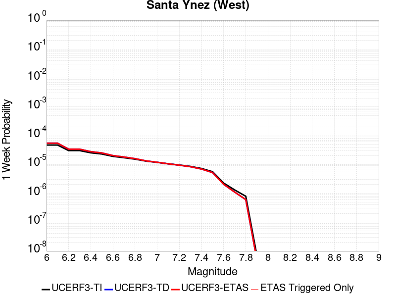 |  |  |  |

| Magnitude | 1 wk TI Prob | 1 wk TD Prob | 1 wk ETAS Prob | 1 wk ETAS/TD Gain | 1 wk ETAS Triggered Only | 1 mo TI Prob | 1 mo TD Prob | 1 mo ETAS Prob | 1 mo ETAS/TD Gain | 1 mo ETAS Triggered Only | 1 yr TI Prob | 1 yr TD Prob | 1 yr ETAS Prob | 1 yr ETAS/TD Gain | 1 yr ETAS Triggered Only | 10 yr TI Prob | 10 yr TD Prob | 10 yr ETAS Prob | 10 yr ETAS/TD Gain | 10 yr ETAS Triggered Only |
|-----|-----|-----|-----|-----|-----|-----|-----|-----|-----|-----|-----|-----|-----|-----|-----|-----|-----|-----|-----|-----|
| 6.0 | 4.7352758E-5 | 5.4977594E-5 | 5.4977594E-5 | 1.0 | 0.0 | 2.0292461E-4 | 2.3559865E-4 | 2.3559865E-4 | 1.0 | 0.0 | 0.0024678076 | 0.0028648009 | 0.0028951657 | 1.0105993 | 3.045206E-5 | 0.024405818 | 0.028307132 | 0.028366312 | 1.0020907 | 6.090412E-5 |
| 6.1 | 4.7352758E-5 | 5.4977594E-5 | 5.4977594E-5 | 1.0 | 0.0 | 2.0292461E-4 | 2.3559865E-4 | 2.3559865E-4 | 1.0 | 0.0 | 0.0024678076 | 0.0028648009 | 0.0028951657 | 1.0105993 | 3.045206E-5 | 0.024405818 | 0.028307132 | 0.028351517 | 1.001568 | 4.567809E-5 |
| 6.2 | 3.0415853E-5 | 3.3927812E-5 | 3.3927812E-5 | 1.0 | 0.0 | 1.3034715E-4 | 1.4539702E-4 | 1.4539702E-4 | 1.0 | 0.0 | 0.0015858212 | 0.0017688064 | 0.0017840056 | 1.0085928 | 1.522603E-5 | 0.015745522 | 0.017551184 | 0.017581102 | 1.0017046 | 3.045206E-5 |
| 6.3 | 3.0415853E-5 | 3.3927812E-5 | 3.3927812E-5 | 1.0 | 0.0 | 1.3034715E-4 | 1.4539702E-4 | 1.4539702E-4 | 1.0 | 0.0 | 0.0015858212 | 0.0017688064 | 0.0017840056 | 1.0085928 | 1.522603E-5 | 0.015745522 | 0.017551184 | 0.017581102 | 1.0017046 | 3.045206E-5 |
| 6.4 | 2.5452082E-5 | 2.7914437E-5 | 2.7914437E-5 | 1.0 | 0.0 | 1.09075794E-4 | 1.1962793E-4 | 1.1962793E-4 | 1.0 | 0.0 | 0.0013271887 | 0.0014555135 | 0.0014707174 | 1.0104457 | 1.522603E-5 | 0.013192902 | 0.014461986 | 0.014491997 | 1.0020752 | 3.045206E-5 |
| 6.5 | 2.3143784E-5 | 2.5129964E-5 | 2.5129964E-5 | 1.0 | 0.0 | 9.9183875E-5 | 1.0769549E-4 | 1.0769549E-4 | 1.0 | 0.0 | 0.0012068948 | 0.0013104154 | 0.0013256215 | 1.0116041 | 1.522603E-5 | 0.012003611 | 0.013028558 | 0.013058614 | 1.0023069 | 3.045206E-5 |
| 6.6 | 1.9118515E-5 | 2.0355572E-5 | 2.0355572E-5 | 1.0 | 0.0 | 8.193392E-5 | 8.72353E-5 | 8.72353E-5 | 1.0 | 0.0 | 9.97089E-4 | 0.0010615803 | 0.0010615803 | 1.0 | 0.0 | 0.00992627 | 0.010566001 | 0.010566001 | 1.0 | 0.0 |
| 6.7 | 1.722807E-5 | 1.814738E-5 | 1.814738E-5 | 1.0 | 0.0 | 7.3832496E-5 | 7.77722E-5 | 7.77722E-5 | 1.0 | 0.0 | 8.985399E-4 | 9.464708E-4 | 9.464708E-4 | 1.0 | 0.0 | 0.008949154 | 0.009425044 | 0.009425044 | 1.0 | 0.0 |
| 6.8 | 1.5317364E-5 | 1.5927328E-5 | 1.5927328E-5 | 1.0 | 0.0 | 6.56442E-5 | 6.825821E-5 | 6.825821E-5 | 1.0 | 0.0 | 7.98925E-4 | 8.307311E-4 | 8.307311E-4 | 1.0 | 0.0 | 0.007960589 | 0.008276746 | 0.008276746 | 1.0 | 0.0 |
| 6.9 | 1.3071226E-5 | 1.3330249E-5 | 1.3330249E-5 | 1.0 | 0.0 | 5.6018336E-5 | 5.71284E-5 | 5.71284E-5 | 1.0 | 0.0 | 6.8180985E-4 | 6.9531857E-4 | 6.9531857E-4 | 1.0 | 0.0 | 0.0067972173 | 0.006931691 | 0.006931691 | 1.0 | 0.0 |
| 7.0 | 1.1836986E-5 | 1.1933308E-5 | 1.1933308E-5 | 1.0 | 0.0 | 5.0728955E-5 | 5.1141757E-5 | 5.1141757E-5 | 1.0 | 0.0 | 6.1745E-4 | 6.224747E-4 | 6.224747E-4 | 1.0 | 0.0 | 0.006157372 | 0.0062075043 | 0.0062075043 | 1.0 | 0.0 |
| 7.1 | 1.0597169E-5 | 1.0542637E-5 | 1.0542637E-5 | 1.0 | 0.0 | 4.541565E-5 | 4.5181954E-5 | 4.5181954E-5 | 1.0 | 0.0 | 5.5279525E-4 | 5.499526E-4 | 5.499526E-4 | 1.0 | 0.0 | 0.0055142213 | 0.0054860474 | 0.0054860474 | 1.0 | 0.0 |
| 7.2 | 9.59113E-6 | 9.459535E-6 | 9.459535E-6 | 1.0 | 0.0 | 4.11042E-5 | 4.0540242E-5 | 4.0540242E-5 | 1.0 | 0.0 | 5.0032866E-4 | 4.9346674E-4 | 4.9346674E-4 | 1.0 | 0.0 | 0.004992037 | 0.0049238284 | 0.0049238284 | 1.0 | 0.0 |
| 7.3 | 8.586084E-6 | 8.379932E-6 | 8.379932E-6 | 1.0 | 0.0 | 3.679698E-5 | 3.5913505E-5 | 3.5913505E-5 | 1.0 | 0.0 | 4.4791115E-4 | 4.3716026E-4 | 4.3716026E-4 | 1.0 | 0.0 | 0.004470094 | 0.004363114 | 0.004363114 | 1.0 | 0.0 |
| 7.4 | 7.2622997E-6 | 6.95183E-6 | 6.95183E-6 | 1.0 | 0.0 | 3.112377E-5 | 2.9793222E-5 | 2.9793222E-5 | 1.0 | 0.0 | 3.78866E-4 | 3.6267308E-4 | 3.6267308E-4 | 1.0 | 0.0 | 0.0037822074 | 0.0036209123 | 0.0036209123 | 1.0 | 0.0 |
| 7.5 | 5.627296E-6 | 5.251797E-6 | 5.251797E-6 | 1.0 | 0.0 | 2.411676E-5 | 2.2507513E-5 | 2.2507513E-5 | 1.0 | 0.0 | 2.9358198E-4 | 2.7399522E-4 | 2.7399522E-4 | 1.0 | 0.0 | 0.0029319443 | 0.002736646 | 0.002736646 | 1.0 | 0.0 |
| 7.6 | 2.265244E-6 | 2.0609314E-6 | 2.0609314E-6 | 1.0 | 0.0 | 9.708152E-6 | 8.832533E-6 | 8.832533E-6 | 1.0 | 0.0 | 1.18190335E-4 | 1.07530876E-4 | 1.07530876E-4 | 1.0 | 0.0 | 0.001181275 | 0.001074797 | 0.001074797 | 1.0 | 0.0 |
| 7.7 | 1.3099874E-6 | 1.1016656E-6 | 1.1016656E-6 | 1.0 | 0.0 | 5.61422E-6 | 4.7214157E-6 | 4.7214157E-6 | 1.0 | 0.0 | 6.8350986E-5 | 5.7481746E-5 | 5.7481746E-5 | 1.0 | 0.0 | 6.832996E-4 | 5.7467114E-4 | 5.7467114E-4 | 1.0 | 0.0 |
| 7.8 | 7.903951E-7 | 6.071338E-7 | 6.071338E-7 | 1.0 | 0.0 | 3.3874032E-6 | 2.6019995E-6 | 2.6019995E-6 | 1.0 | 0.0 | 4.1240855E-5 | 3.1678897E-5 | 3.1678897E-5 | 1.0 | 0.0 | 4.12332E-4 | 3.1674514E-4 | 3.1674514E-4 | 1.0 | 0.0 |
| 7.9 | 7.0753297E-9 | 5.0900715E-9 | 5.0900715E-9 | 1.0 | 0.0 | 3.032284E-8 | 2.1814591E-8 | 2.1814591E-8 | 1.0 | 0.0 | 3.6918053E-7 | 2.6559263E-7 | 2.6559263E-7 | 1.0 | 0.0 | 3.691799E-6 | 2.655924E-6 | 2.655924E-6 | 1.0 | 0.0 |

## San Jacinto (Coyote Creek)
*[(top)](#table-of-contents)*

| 1 Week | 1 Month | 1 Year | 10 Year |
|-----|-----|-----|-----|
|  |  |  |  |

| Magnitude | 1 wk TI Prob | 1 wk TD Prob | 1 wk ETAS Prob | 1 wk ETAS/TD Gain | 1 wk ETAS Triggered Only | 1 mo TI Prob | 1 mo TD Prob | 1 mo ETAS Prob | 1 mo ETAS/TD Gain | 1 mo ETAS Triggered Only | 1 yr TI Prob | 1 yr TD Prob | 1 yr ETAS Prob | 1 yr ETAS/TD Gain | 1 yr ETAS Triggered Only | 10 yr TI Prob | 10 yr TD Prob | 10 yr ETAS Prob | 10 yr ETAS/TD Gain | 10 yr ETAS Triggered Only |
|-----|-----|-----|-----|-----|-----|-----|-----|-----|-----|-----|-----|-----|-----|-----|-----|-----|-----|-----|-----|-----|
| 6.0 | 2.7374346E-5 | 2.4177032E-5 | 5.4628355E-5 | 2.2595146 | 3.045206E-5 | 1.1731335E-4 | 1.0361175E-4 | 1.492851E-4 | 1.4408126 | 4.567809E-5 | 0.0014273542 | 0.0012607456 | 0.0013215729 | 1.0482471 | 6.090412E-5 | 0.01418221 | 0.012944878 | 0.013004994 | 1.004644 | 6.090412E-5 |
| 6.1 | 2.7374346E-5 | 2.4177032E-5 | 5.4628355E-5 | 2.2595146 | 3.045206E-5 | 1.1731335E-4 | 1.0361175E-4 | 1.492851E-4 | 1.4408126 | 4.567809E-5 | 0.0014273542 | 0.0012607456 | 0.0013215729 | 1.0482471 | 6.090412E-5 | 0.01418221 | 0.012944878 | 0.013004994 | 1.004644 | 6.090412E-5 |
| 6.2 | 2.7374346E-5 | 2.4177032E-5 | 5.4628355E-5 | 2.2595146 | 3.045206E-5 | 1.1731335E-4 | 1.0361175E-4 | 1.492851E-4 | 1.4408126 | 4.567809E-5 | 0.0014273542 | 0.0012607456 | 0.0013215729 | 1.0482471 | 6.090412E-5 | 0.01418221 | 0.012944878 | 0.013004994 | 1.004644 | 6.090412E-5 |
| 6.3 | 2.7374346E-5 | 2.4177032E-5 | 5.4628355E-5 | 2.2595146 | 3.045206E-5 | 1.1731335E-4 | 1.0361175E-4 | 1.492851E-4 | 1.4408126 | 4.567809E-5 | 0.0014273542 | 0.0012607456 | 0.0013215729 | 1.0482471 | 6.090412E-5 | 0.01418221 | 0.012944878 | 0.013004994 | 1.004644 | 6.090412E-5 |
| 6.4 | 2.7374346E-5 | 2.4177032E-5 | 5.4628355E-5 | 2.2595146 | 3.045206E-5 | 1.1731335E-4 | 1.0361175E-4 | 1.492851E-4 | 1.4408126 | 4.567809E-5 | 0.0014273542 | 0.0012607456 | 0.0013215729 | 1.0482471 | 6.090412E-5 | 0.01418221 | 0.012944878 | 0.013004994 | 1.004644 | 6.090412E-5 |
| 6.5 | 2.7282445E-5 | 2.4063094E-5 | 5.4514425E-5 | 2.2654784 | 3.045206E-5 | 1.16919524E-4 | 1.03123486E-4 | 1.4879687E-4 | 1.4428998 | 4.567809E-5 | 0.0014225657 | 0.0012548079 | 0.0013156356 | 1.0484757 | 6.090412E-5 | 0.014134934 | 0.012886199 | 0.012946319 | 1.0046654 | 6.090412E-5 |
| 6.6 | 2.7282445E-5 | 2.4063094E-5 | 5.4514425E-5 | 2.2654784 | 3.045206E-5 | 1.16919524E-4 | 1.03123486E-4 | 1.4879687E-4 | 1.4428998 | 4.567809E-5 | 0.0014225657 | 0.0012548079 | 0.0013156356 | 1.0484757 | 6.090412E-5 | 0.014134934 | 0.012886199 | 0.012946319 | 1.0046654 | 6.090412E-5 |
| 6.7 | 2.7216198E-5 | 2.3988207E-5 | 5.4439537E-5 | 2.2694292 | 3.045206E-5 | 1.1663563E-4 | 1.02802565E-4 | 1.4847596E-4 | 1.4442827 | 4.567809E-5 | 0.0014191137 | 0.0012509052 | 0.0013117332 | 1.0486271 | 6.090412E-5 | 0.014100855 | 0.012847606 | 0.012907728 | 1.0046796 | 6.090412E-5 |
| 6.8 | 2.7078617E-5 | 2.3905404E-5 | 5.4356737E-5 | 2.2738264 | 3.045206E-5 | 1.1604605E-4 | 1.02447724E-4 | 1.4812114E-4 | 1.4458216 | 4.567809E-5 | 0.001411945 | 0.00124659 | 0.0013074182 | 1.0487957 | 6.090412E-5 | 0.014030075 | 0.012804739 | 0.0128648635 | 1.0046954 | 6.090412E-5 |
| 6.9 | 2.6982952E-5 | 2.3824896E-5 | 5.4276232E-5 | 2.278131 | 3.045206E-5 | 1.15636096E-4 | 1.0210271E-4 | 1.4777614E-4 | 1.4473282 | 4.567809E-5 | 0.0014069602 | 0.0012423943 | 0.0013032227 | 1.0489607 | 6.090412E-5 | 0.013980856 | 0.012763045 | 0.012823172 | 1.004711 | 6.090412E-5 |
| 7.0 | 2.6449972E-5 | 2.3401846E-5 | 5.3853193E-5 | 2.3012369 | 3.045206E-5 | 1.1335209E-4 | 1.00289784E-4 | 1.4596329E-4 | 1.4554154 | 4.567809E-5 | 0.001379188 | 0.0012203468 | 0.0012811766 | 1.0498463 | 6.090412E-5 | 0.0137065975 | 0.012544374 | 0.012604514 | 1.0047942 | 6.090412E-5 |
| 7.1 | 2.6257849E-5 | 2.322785E-5 | 5.3679203E-5 | 2.3109846 | 3.045206E-5 | 1.1252879E-4 | 9.9544144E-5 | 1.452177E-4 | 1.458827 | 4.567809E-5 | 0.0013691769 | 0.0012112787 | 0.0012721091 | 1.0502199 | 6.090412E-5 | 0.013607717 | 0.012454224 | 0.012514369 | 1.0048293 | 6.090412E-5 |
| 7.2 | 2.5270041E-5 | 2.2422375E-5 | 5.2873755E-5 | 2.35808 | 3.045206E-5 | 1.0829568E-4 | 9.6092364E-5 | 1.4176607E-4 | 1.4753104 | 4.567809E-5 | 0.0013177024 | 0.001169299 | 0.001230132 | 1.0520251 | 6.090412E-5 | 0.013099162 | 0.012035143 | 0.0120953135 | 1.0049996 | 6.090412E-5 |
| 7.3 | 2.339701E-5 | 2.1153774E-5 | 5.160519E-5 | 2.4395263 | 3.045206E-5 | 1.0026905E-4 | 9.065589E-5 | 1.3632984E-4 | 1.5038167 | 4.567809E-5 | 0.001220092 | 0.0011031787 | 0.0011640156 | 1.0551469 | 6.090412E-5 | 0.012134149 | 0.011373838 | 0.01143405 | 1.0052938 | 6.090412E-5 |
| 7.4 | 2.296333E-5 | 2.0884016E-5 | 5.133544E-5 | 2.458121 | 3.045206E-5 | 9.841056E-5 | 8.949987E-5 | 1.3517386E-4 | 1.5103248 | 4.567809E-5 | 0.0011974899 | 0.0010891182 | 0.001149956 | 1.0558597 | 6.090412E-5 | 0.011910575 | 0.011232895 | 0.011293115 | 1.0053611 | 6.090412E-5 |
| 7.5 | 2.2188895E-5 | 2.0406682E-5 | 5.085812E-5 | 2.492229 | 3.045206E-5 | 9.50918E-5 | 8.745429E-5 | 1.3312839E-4 | 1.5222626 | 4.567809E-5 | 0.0011571277 | 0.0010642379 | 0.0011250771 | 1.057167 | 6.090412E-5 | 0.011511209 | 0.010982383 | 0.011042618 | 1.0054847 | 6.090412E-5 |
| 7.6 | 2.0013189E-5 | 1.8992265E-5 | 4.9443748E-5 | 2.6033623 | 3.045206E-5 | 8.5767984E-5 | 8.139289E-5 | 1.2706727E-4 | 1.5611593 | 4.567809E-5 | 0.001043725 | 9.905098E-4 | 0.0010513535 | 1.0614268 | 6.090412E-5 | 0.010388365 | 0.010240043 | 0.010300322 | 1.0058868 | 6.090412E-5 |
| 7.7 | 1.7230794E-5 | 1.677281E-5 | 4.722436E-5 | 2.8155305 | 3.045206E-5 | 7.384417E-5 | 7.18815E-5 | 1.1755631E-4 | 1.6354182 | 4.567809E-5 | 8.986819E-4 | 8.7480666E-4 | 9.3565753E-4 | 1.0695592 | 6.090412E-5 | 0.008950562 | 0.009078168 | 0.009138519 | 1.006648 | 6.090412E-5 |
| 7.8 | 1.4478809E-5 | 1.50190535E-5 | 4.5470657E-5 | 3.0275314 | 3.045206E-5 | 6.205057E-5 | 6.4365784E-5 | 1.10040935E-4 | 1.7096184 | 4.567809E-5 | 7.552038E-4 | 7.833723E-4 | 8.442288E-4 | 1.0776851 | 6.090412E-5 | 0.0075264242 | 0.00815608 | 0.008216487 | 1.0074065 | 6.090412E-5 |
| 7.9 | 1.1114467E-5 | 1.1670009E-5 | 4.2121716E-5 | 3.6093986 | 3.045206E-5 | 4.7632562E-5 | 5.001337E-5 | 9.5689174E-5 | 1.9132719 | 4.567809E-5 | 5.797721E-4 | 6.087432E-4 | 6.696103E-4 | 1.0999881 | 6.090412E-5 | 0.0057826187 | 0.006393403 | 0.006453918 | 1.0094652 | 6.090412E-5 |
| 8.0 | 9.327402E-6 | 9.9217805E-6 | 4.037354E-5 | 4.069183 | 3.045206E-5 | 3.9973966E-5 | 4.2521227E-5 | 8.8197376E-5 | 2.0741963 | 4.567809E-5 | 4.8657437E-4 | 5.175735E-4 | 5.784461E-4 | 1.1176115 | 6.090412E-5 | 0.0048551033 | 0.005461854 | 0.0055224253 | 1.0110899 | 6.090412E-5 |
| 8.1 | 7.0235833E-6 | 6.844232E-6 | 2.2070159E-5 | 3.2246363 | 1.522603E-5 | 3.0100724E-5 | 2.9332095E-5 | 4.4557677E-5 | 1.5190759 | 1.522603E-5 | 3.664147E-4 | 3.5706026E-4 | 3.7228083E-4 | 1.0426276 | 1.522603E-5 | 0.003658111 | 0.0037964787 | 0.003811647 | 1.0039953 | 1.522603E-5 |
| 8.2 | 2.0358202E-6 | 9.0285533E-7 | 9.0285533E-7 | 1.0 | 0.0 | 8.724915E-6 | 3.8693743E-6 | 3.8693743E-6 | 1.0 | 0.0 | 1.06220665E-4 | 4.710864E-5 | 4.710864E-5 | 1.0 | 0.0 | 0.001061699 | 5.3444994E-4 | 5.3444994E-4 | 1.0 | 0.0 |
| 8.3 | 2.0051264E-7 | 6.646147E-8 | 6.646147E-8 | 1.0 | 0.0 | 8.5933965E-7 | 2.8483484E-7 | 2.8483484E-7 | 1.0 | 0.0 | 1.046241E-5 | 3.467859E-6 | 3.467859E-6 | 1.0 | 0.0 | 1.0461917E-4 | 4.0304385E-5 | 4.0304385E-5 | 1.0 | 0.0 |

## Ventura-Pitas Point
*[(top)](#table-of-contents)*

| 1 Week | 1 Month | 1 Year | 10 Year |
|-----|-----|-----|-----|
|  |  |  |  |

| Magnitude | 1 wk TI Prob | 1 wk TD Prob | 1 wk ETAS Prob | 1 wk ETAS/TD Gain | 1 wk ETAS Triggered Only | 1 mo TI Prob | 1 mo TD Prob | 1 mo ETAS Prob | 1 mo ETAS/TD Gain | 1 mo ETAS Triggered Only | 1 yr TI Prob | 1 yr TD Prob | 1 yr ETAS Prob | 1 yr ETAS/TD Gain | 1 yr ETAS Triggered Only | 10 yr TI Prob | 10 yr TD Prob | 10 yr ETAS Prob | 10 yr ETAS/TD Gain | 10 yr ETAS Triggered Only |
|-----|-----|-----|-----|-----|-----|-----|-----|-----|-----|-----|-----|-----|-----|-----|-----|-----|-----|-----|-----|-----|
| 6.0 | 3.3179622E-5 | 3.373905E-5 | 3.373905E-5 | 1.0 | 0.0 | 1.4219063E-4 | 1.4458936E-4 | 1.4458936E-4 | 1.0 | 0.0 | 0.0017297962 | 0.001759211 | 0.0017896094 | 1.0172796 | 3.045206E-5 | 0.017163932 | 0.017478386 | 0.017523265 | 1.0025678 | 4.567809E-5 |
| 6.1 | 3.3179622E-5 | 3.373905E-5 | 3.373905E-5 | 1.0 | 0.0 | 1.4219063E-4 | 1.4458936E-4 | 1.4458936E-4 | 1.0 | 0.0 | 0.0017297962 | 0.001759211 | 0.0017896094 | 1.0172796 | 3.045206E-5 | 0.017163932 | 0.017478386 | 0.017523265 | 1.0025678 | 4.567809E-5 |
| 6.2 | 3.3179622E-5 | 3.373905E-5 | 3.373905E-5 | 1.0 | 0.0 | 1.4219063E-4 | 1.4458936E-4 | 1.4458936E-4 | 1.0 | 0.0 | 0.0017297962 | 0.001759211 | 0.0017896094 | 1.0172796 | 3.045206E-5 | 0.017163932 | 0.017478386 | 0.017523265 | 1.0025678 | 4.567809E-5 |
| 6.3 | 3.3179622E-5 | 3.373905E-5 | 3.373905E-5 | 1.0 | 0.0 | 1.4219063E-4 | 1.4458936E-4 | 1.4458936E-4 | 1.0 | 0.0 | 0.0017297962 | 0.001759211 | 0.0017896094 | 1.0172796 | 3.045206E-5 | 0.017163932 | 0.017478386 | 0.017523265 | 1.0025678 | 4.567809E-5 |
| 6.4 | 1.8754668E-5 | 1.7022061E-5 | 1.7022061E-5 | 1.0 | 0.0 | 8.037467E-5 | 7.2949784E-5 | 7.2949784E-5 | 1.0 | 0.0 | 9.781223E-4 | 8.878248E-4 | 9.030373E-4 | 1.0171345 | 1.522603E-5 | 0.009738282 | 0.008845116 | 0.008875298 | 1.0034124 | 3.045206E-5 |
| 6.5 | 1.8754668E-5 | 1.7022061E-5 | 1.7022061E-5 | 1.0 | 0.0 | 8.037467E-5 | 7.2949784E-5 | 7.2949784E-5 | 1.0 | 0.0 | 9.781223E-4 | 8.878248E-4 | 9.030373E-4 | 1.0171345 | 1.522603E-5 | 0.009738282 | 0.008845116 | 0.008875298 | 1.0034124 | 3.045206E-5 |
| 6.6 | 1.4361558E-5 | 1.21244275E-5 | 1.21244275E-5 | 1.0 | 0.0 | 6.154808E-5 | 5.196081E-5 | 5.196081E-5 | 1.0 | 0.0 | 7.490902E-4 | 6.3244154E-4 | 6.4765796E-4 | 1.0240598 | 1.522603E-5 | 0.0074657016 | 0.006306674 | 0.006336934 | 1.004798 | 3.045206E-5 |
| 6.7 | 1.4361558E-5 | 1.21244275E-5 | 1.21244275E-5 | 1.0 | 0.0 | 6.154808E-5 | 5.196081E-5 | 5.196081E-5 | 1.0 | 0.0 | 7.490902E-4 | 6.3244154E-4 | 6.4765796E-4 | 1.0240598 | 1.522603E-5 | 0.0074657016 | 0.006306674 | 0.006336934 | 1.004798 | 3.045206E-5 |
| 6.8 | 1.3663846E-5 | 1.1346523E-5 | 1.1346523E-5 | 1.0 | 0.0 | 5.8558027E-5 | 4.8627062E-5 | 4.8627062E-5 | 1.0 | 0.0 | 7.127108E-4 | 5.918756E-4 | 6.0709263E-4 | 1.0257099 | 1.522603E-5 | 0.007104293 | 0.005903208 | 0.005933481 | 1.0051281 | 3.045206E-5 |
| 6.9 | 1.3644157E-5 | 1.1324622E-5 | 1.1324622E-5 | 1.0 | 0.0 | 5.8473648E-5 | 4.8533206E-5 | 4.8533206E-5 | 1.0 | 0.0 | 7.116841E-4 | 5.907335E-4 | 6.0595054E-4 | 1.0257596 | 1.522603E-5 | 0.007094092 | 0.005891848 | 0.0059221205 | 1.005138 | 3.045206E-5 |
| 7.0 | 1.3568845E-5 | 1.1244184E-5 | 1.1244184E-5 | 1.0 | 0.0 | 5.8150898E-5 | 4.8188478E-5 | 4.8188478E-5 | 1.0 | 0.0 | 7.077572E-4 | 5.8653875E-4 | 6.0175586E-4 | 1.0259439 | 1.522603E-5 | 0.007055073 | 0.005850122 | 0.005880396 | 1.0051749 | 3.045206E-5 |
| 7.1 | 1.306572E-5 | 1.07226015E-5 | 1.07226015E-5 | 1.0 | 0.0 | 5.599474E-5 | 4.5953206E-5 | 4.5953206E-5 | 1.0 | 0.0 | 6.815227E-4 | 5.5933854E-4 | 5.7455606E-4 | 1.0272063 | 1.522603E-5 | 0.0067943637 | 0.005579512 | 0.005594653 | 1.0027137 | 1.522603E-5 |
| 7.2 | 1.232604E-5 | 9.9971385E-6 | 9.9971385E-6 | 1.0 | 0.0 | 5.2824813E-5 | 4.2844185E-5 | 4.2844185E-5 | 1.0 | 0.0 | 6.429523E-4 | 5.2150484E-4 | 5.3672295E-4 | 1.0291811 | 1.522603E-5 | 0.0064109527 | 0.0052030026 | 0.005218149 | 1.0029112 | 1.522603E-5 |
| 7.3 | 1.0917261E-5 | 8.844411E-6 | 8.844411E-6 | 1.0 | 0.0 | 4.678742E-5 | 3.7904076E-5 | 3.7904076E-5 | 1.0 | 0.0 | 5.69488E-4 | 4.6138596E-4 | 4.7660497E-4 | 1.0329854 | 1.522603E-5 | 0.0056803077 | 0.0046044462 | 0.004619602 | 1.0032916 | 1.522603E-5 |
| 7.4 | 1.039959E-5 | 8.4240955E-6 | 8.4240955E-6 | 1.0 | 0.0 | 4.456891E-5 | 3.6102774E-5 | 3.6102774E-5 | 1.0 | 0.0 | 5.424914E-4 | 4.3946414E-4 | 4.546835E-4 | 1.0346316 | 1.522603E-5 | 0.0054116896 | 0.0043861126 | 0.004401272 | 1.0034562 | 1.522603E-5 |
| 7.5 | 9.015877E-6 | 7.2979265E-6 | 7.2979265E-6 | 1.0 | 0.0 | 3.86389E-5 | 3.127646E-5 | 3.127646E-5 | 1.0 | 0.0 | 4.7032707E-4 | 3.8072577E-4 | 3.95946E-4 | 1.0399768 | 1.522603E-5 | 0.004693329 | 0.0038008802 | 0.0038160484 | 1.0039907 | 1.522603E-5 |
| 7.6 | 4.900162E-6 | 3.874264E-6 | 3.874264E-6 | 1.0 | 0.0 | 2.1000526E-5 | 1.6603883E-5 | 1.6603883E-5 | 1.0 | 0.0 | 2.556514E-4 | 2.0213365E-4 | 2.0213365E-4 | 1.0 | 0.0 | 0.0025535747 | 0.0020195118 | 0.0020195118 | 1.0 | 0.0 |
| 7.7 | 3.8850626E-6 | 3.1268457E-6 | 3.1268457E-6 | 1.0 | 0.0 | 1.6650163E-5 | 1.34007E-5 | 1.34007E-5 | 1.0 | 0.0 | 2.0269687E-4 | 1.6314139E-4 | 1.6314139E-4 | 1.0 | 0.0 | 0.002025121 | 0.0016302256 | 0.0016302256 | 1.0 | 0.0 |
| 7.8 | 2.4654719E-6 | 2.0299424E-6 | 2.0299424E-6 | 1.0 | 0.0 | 1.0566265E-5 | 8.699724E-6 | 8.699724E-6 | 1.0 | 0.0 | 1.2863669E-4 | 1.0591404E-4 | 1.0591404E-4 | 1.0 | 0.0 | 0.0012856225 | 0.0010586403 | 0.0010586403 | 1.0 | 0.0 |
| 7.9 | 4.095894E-7 | 3.27659E-7 | 3.27659E-7 | 1.0 | 0.0 | 1.7553821E-6 | 1.404252E-6 | 1.404252E-6 | 1.0 | 0.0 | 2.1371567E-5 | 1.7096638E-5 | 1.7096638E-5 | 1.0 | 0.0 | 2.1369511E-4 | 1.7095353E-4 | 1.7095353E-4 | 1.0 | 0.0 |
| 8.0 | 7.791402E-9 | 5.683722E-9 | 5.683722E-9 | 1.0 | 0.0 | 3.3391725E-8 | 2.4358807E-8 | 2.4358807E-8 | 1.0 | 0.0 | 4.0654416E-7 | 2.9656846E-7 | 2.9656846E-7 | 1.0 | 0.0 | 4.065434E-6 | 2.9656826E-6 | 2.9656826E-6 | 1.0 | 0.0 |

## Deep Springs
*[(top)](#table-of-contents)*

| 1 Week | 1 Month | 1 Year | 10 Year |
|-----|-----|-----|-----|
|  |  |  |  |

| Magnitude | 1 wk TI Prob | 1 wk TD Prob | 1 wk ETAS Prob | 1 wk ETAS/TD Gain | 1 wk ETAS Triggered Only | 1 mo TI Prob | 1 mo TD Prob | 1 mo ETAS Prob | 1 mo ETAS/TD Gain | 1 mo ETAS Triggered Only | 1 yr TI Prob | 1 yr TD Prob | 1 yr ETAS Prob | 1 yr ETAS/TD Gain | 1 yr ETAS Triggered Only | 10 yr TI Prob | 10 yr TD Prob | 10 yr ETAS Prob | 10 yr ETAS/TD Gain | 10 yr ETAS Triggered Only |
|-----|-----|-----|-----|-----|-----|-----|-----|-----|-----|-----|-----|-----|-----|-----|-----|-----|-----|-----|-----|-----|
| 6.0 | 1.9810619E-5 | 2.3114564E-5 | 2.3114564E-5 | 1.0 | 0.0 | 8.489989E-5 | 9.9061515E-5 | 9.9061515E-5 | 1.0 | 0.0 | 0.001033166 | 0.0012059145 | 0.0012363299 | 1.0252218 | 3.045206E-5 | 0.010283757 | 0.012043487 | 0.012088615 | 1.0037471 | 4.567809E-5 |
| 6.1 | 1.9810619E-5 | 2.3114564E-5 | 2.3114564E-5 | 1.0 | 0.0 | 8.489989E-5 | 9.9061515E-5 | 9.9061515E-5 | 1.0 | 0.0 | 0.001033166 | 0.0012059145 | 0.0012363299 | 1.0252218 | 3.045206E-5 | 0.010283757 | 0.012043487 | 0.012088615 | 1.0037471 | 4.567809E-5 |
| 6.2 | 1.9810619E-5 | 2.3114564E-5 | 2.3114564E-5 | 1.0 | 0.0 | 8.489989E-5 | 9.9061515E-5 | 9.9061515E-5 | 1.0 | 0.0 | 0.001033166 | 0.0012059145 | 0.0012363299 | 1.0252218 | 3.045206E-5 | 0.010283757 | 0.012043487 | 0.012088615 | 1.0037471 | 4.567809E-5 |
| 6.3 | 1.9810619E-5 | 2.3114564E-5 | 2.3114564E-5 | 1.0 | 0.0 | 8.489989E-5 | 9.9061515E-5 | 9.9061515E-5 | 1.0 | 0.0 | 0.001033166 | 0.0012059145 | 0.0012363299 | 1.0252218 | 3.045206E-5 | 0.010283757 | 0.012043487 | 0.012088615 | 1.0037471 | 4.567809E-5 |
| 6.4 | 1.9810619E-5 | 2.3114564E-5 | 2.3114564E-5 | 1.0 | 0.0 | 8.489989E-5 | 9.9061515E-5 | 9.9061515E-5 | 1.0 | 0.0 | 0.001033166 | 0.0012059145 | 0.0012363299 | 1.0252218 | 3.045206E-5 | 0.010283757 | 0.012043487 | 0.012088615 | 1.0037471 | 4.567809E-5 |
| 6.5 | 1.7190405E-5 | 2.0052325E-5 | 2.0052325E-5 | 1.0 | 0.0 | 7.367108E-5 | 8.593854E-5 | 8.593854E-5 | 1.0 | 0.0 | 8.9657627E-4 | 0.0010463017 | 0.0010767219 | 1.0290741 | 3.045206E-5 | 0.008929676 | 0.010462979 | 0.01050818 | 1.00432 | 4.567809E-5 |
| 6.6 | 1.7190405E-5 | 2.0052325E-5 | 2.0052325E-5 | 1.0 | 0.0 | 7.367108E-5 | 8.593854E-5 | 8.593854E-5 | 1.0 | 0.0 | 8.9657627E-4 | 0.0010463017 | 0.0010767219 | 1.0290741 | 3.045206E-5 | 0.008929676 | 0.010462979 | 0.01050818 | 1.00432 | 4.567809E-5 |

## Ortigalita (North)
*[(top)](#table-of-contents)*

| 1 Week | 1 Month | 1 Year | 10 Year |
|-----|-----|-----|-----|
|  |  | 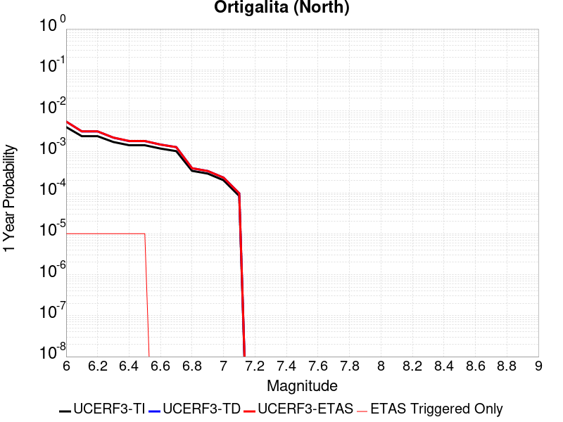 |  |

| Magnitude | 1 wk TI Prob | 1 wk TD Prob | 1 wk ETAS Prob | 1 wk ETAS/TD Gain | 1 wk ETAS Triggered Only | 1 mo TI Prob | 1 mo TD Prob | 1 mo ETAS Prob | 1 mo ETAS/TD Gain | 1 mo ETAS Triggered Only | 1 yr TI Prob | 1 yr TD Prob | 1 yr ETAS Prob | 1 yr ETAS/TD Gain | 1 yr ETAS Triggered Only | 10 yr TI Prob | 10 yr TD Prob | 10 yr ETAS Prob | 10 yr ETAS/TD Gain | 10 yr ETAS Triggered Only |
|-----|-----|-----|-----|-----|-----|-----|-----|-----|-----|-----|-----|-----|-----|-----|-----|-----|-----|-----|-----|-----|
| 6.0 | 7.711876E-5 | 1.05086016E-4 | 1.05086016E-4 | 1.0 | 0.0 | 3.3046713E-4 | 4.5030177E-4 | 4.5030177E-4 | 1.0 | 0.0 | 0.004016016 | 0.005468958 | 0.0054841004 | 1.0027689 | 1.522603E-5 | 0.039442103 | 0.053463764 | 0.053507004 | 1.0008087 | 4.567809E-5 |
| 6.1 | 4.607858E-5 | 6.024935E-5 | 6.024935E-5 | 1.0 | 0.0 | 1.9746469E-4 | 2.5818875E-4 | 2.5818875E-4 | 1.0 | 0.0 | 0.0024014818 | 0.003139252 | 0.0031544303 | 1.004835 | 1.522603E-5 | 0.023756953 | 0.030979859 | 0.030994613 | 1.0004762 | 1.522603E-5 |
| 6.2 | 4.607858E-5 | 6.024935E-5 | 6.024935E-5 | 1.0 | 0.0 | 1.9746469E-4 | 2.5818875E-4 | 2.5818875E-4 | 1.0 | 0.0 | 0.0024014818 | 0.003139252 | 0.0031544303 | 1.004835 | 1.522603E-5 | 0.023756953 | 0.030979859 | 0.030994613 | 1.0004762 | 1.522603E-5 |
| 6.3 | 3.327423E-5 | 4.2481566E-5 | 4.2481566E-5 | 1.0 | 0.0 | 1.4259605E-4 | 1.8205289E-4 | 1.8205289E-4 | 1.0 | 0.0 | 0.0017347244 | 0.0022145277 | 0.0022297201 | 1.0068603 | 1.522603E-5 | 0.017212452 | 0.021948816 | 0.021963708 | 1.0006785 | 1.522603E-5 |
| 6.4 | 2.7732503E-5 | 3.5003635E-5 | 3.5003635E-5 | 1.0 | 0.0 | 1.1884817E-4 | 1.5000845E-4 | 1.5000845E-4 | 1.0 | 0.0 | 0.001446016 | 0.0018250674 | 0.0018402657 | 1.0083275 | 1.522603E-5 | 0.014366428 | 0.018123753 | 0.018138705 | 1.0008249 | 1.522603E-5 |
| 6.5 | 2.7689714E-5 | 3.4953442E-5 | 3.4953442E-5 | 1.0 | 0.0 | 1.186648E-4 | 1.4979337E-4 | 1.4979337E-4 | 1.0 | 0.0 | 0.0014437864 | 0.0018224533 | 0.0018376516 | 1.0083394 | 1.522603E-5 | 0.014344421 | 0.018098038 | 0.01811299 | 1.0008261 | 1.522603E-5 |
| 6.6 | 2.2976905E-5 | 2.8722226E-5 | 2.8722226E-5 | 1.0 | 0.0 | 9.846873E-5 | 1.2309088E-4 | 1.2309088E-4 | 1.0 | 0.0 | 0.0011981975 | 0.001497839 | 0.001497839 | 1.0 | 0.0 | 0.011917574 | 0.014900712 | 0.014900712 | 1.0 | 0.0 |
| 6.7 | 1.9871539E-5 | 2.4907882E-5 | 2.4907882E-5 | 1.0 | 0.0 | 8.516096E-5 | 1.067451E-4 | 1.067451E-4 | 1.0 | 0.0 | 0.0010363415 | 0.0012990955 | 0.0012990955 | 1.0 | 0.0 | 0.010315218 | 0.012938703 | 0.012938703 | 1.0 | 0.0 |
| 6.8 | 6.5640475E-6 | 7.6061337E-6 | 7.6061337E-6 | 1.0 | 0.0 | 2.813133E-5 | 3.2597323E-5 | 3.2597323E-5 | 1.0 | 0.0 | 3.424451E-4 | 3.9680302E-4 | 3.9680302E-4 | 1.0 | 0.0 | 0.0034191788 | 0.0039612325 | 0.0039612325 | 1.0 | 0.0 |
| 6.9 | 5.6219683E-6 | 6.5023783E-6 | 6.5023783E-6 | 1.0 | 0.0 | 2.4093928E-5 | 2.7867052E-5 | 2.7867052E-5 | 1.0 | 0.0 | 2.933041E-4 | 3.3923113E-4 | 3.3923113E-4 | 1.0 | 0.0 | 0.0029291727 | 0.00338739 | 0.00338739 | 1.0 | 0.0 |
| 7.0 | 3.875591E-6 | 4.4851295E-6 | 4.4851295E-6 | 1.0 | 0.0 | 1.6609569E-5 | 1.9221854E-5 | 1.9221854E-5 | 1.0 | 0.0 | 2.0220275E-4 | 2.3400305E-4 | 2.3400305E-4 | 1.0 | 0.0 | 0.0020201886 | 0.0023377747 | 0.0023377747 | 1.0 | 0.0 |
| 7.1 | 1.6017933E-6 | 1.857199E-6 | 1.857199E-6 | 1.0 | 0.0 | 6.8648105E-6 | 7.959406E-6 | 7.959406E-6 | 1.0 | 0.0 | 8.357586E-5 | 9.690253E-5 | 9.690253E-5 | 1.0 | 0.0 | 8.3544437E-4 | 9.6870743E-4 | 9.6870743E-4 | 1.0 | 0.0 |

## Baker
*[(top)](#table-of-contents)*

| 1 Week | 1 Month | 1 Year | 10 Year |
|-----|-----|-----|-----|
|  |  | 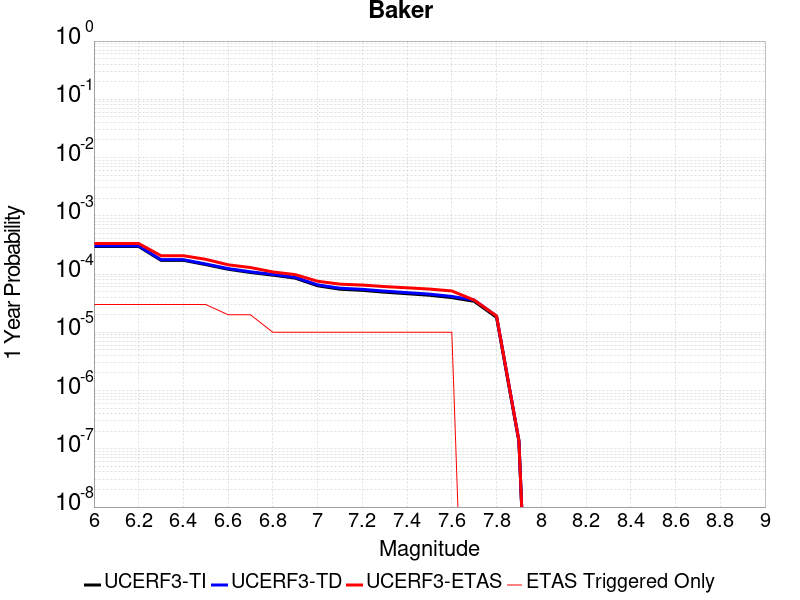 |  |

| Magnitude | 1 wk TI Prob | 1 wk TD Prob | 1 wk ETAS Prob | 1 wk ETAS/TD Gain | 1 wk ETAS Triggered Only | 1 mo TI Prob | 1 mo TD Prob | 1 mo ETAS Prob | 1 mo ETAS/TD Gain | 1 mo ETAS Triggered Only | 1 yr TI Prob | 1 yr TD Prob | 1 yr ETAS Prob | 1 yr ETAS/TD Gain | 1 yr ETAS Triggered Only | 10 yr TI Prob | 10 yr TD Prob | 10 yr ETAS Prob | 10 yr ETAS/TD Gain | 10 yr ETAS Triggered Only |
|-----|-----|-----|-----|-----|-----|-----|-----|-----|-----|-----|-----|-----|-----|-----|-----|-----|-----|-----|-----|-----|
| 6.0 | 5.695525E-6 | 5.8349133E-6 | 5.8349133E-6 | 1.0 | 0.0 | 2.4409164E-5 | 2.5006555E-5 | 2.5006555E-5 | 1.0 | 0.0 | 2.9714106E-4 | 3.0441626E-4 | 3.3485907E-4 | 1.1000038 | 3.045206E-5 | 0.0029674405 | 0.0030403885 | 0.0030859276 | 1.014978 | 4.567809E-5 |
| 6.1 | 5.695525E-6 | 5.8349133E-6 | 5.8349133E-6 | 1.0 | 0.0 | 2.4409164E-5 | 2.5006555E-5 | 2.5006555E-5 | 1.0 | 0.0 | 2.9714106E-4 | 3.0441626E-4 | 3.3485907E-4 | 1.1000038 | 3.045206E-5 | 0.0029674405 | 0.0030403885 | 0.0030859276 | 1.014978 | 4.567809E-5 |
| 6.2 | 5.695525E-6 | 5.8349133E-6 | 5.8349133E-6 | 1.0 | 0.0 | 2.4409164E-5 | 2.5006555E-5 | 2.5006555E-5 | 1.0 | 0.0 | 2.9714106E-4 | 3.0441626E-4 | 3.3485907E-4 | 1.1000038 | 3.045206E-5 | 0.0029674405 | 0.0030403885 | 0.0030859276 | 1.014978 | 4.567809E-5 |
| 6.3 | 3.2995713E-6 | 3.3837132E-6 | 3.3837132E-6 | 1.0 | 0.0 | 1.4140943E-5 | 1.450155E-5 | 1.450155E-5 | 1.0 | 0.0 | 1.7215237E-4 | 1.7654254E-4 | 2.0698924E-4 | 1.1724609 | 3.045206E-5 | 0.0017201907 | 0.00176407 | 0.0018096676 | 1.0258479 | 4.567809E-5 |
| 6.4 | 3.2995713E-6 | 3.3837132E-6 | 3.3837132E-6 | 1.0 | 0.0 | 1.4140943E-5 | 1.450155E-5 | 1.450155E-5 | 1.0 | 0.0 | 1.7215237E-4 | 1.7654254E-4 | 2.0698924E-4 | 1.1724609 | 3.045206E-5 | 0.0017201907 | 0.00176407 | 0.0018096676 | 1.0258479 | 4.567809E-5 |
| 6.5 | 2.782202E-6 | 2.855881E-6 | 2.855881E-6 | 1.0 | 0.0 | 1.1923668E-5 | 1.2239434E-5 | 1.2239434E-5 | 1.0 | 0.0 | 1.4516099E-4 | 1.4900525E-4 | 1.7945278E-4 | 1.2043386 | 3.045206E-5 | 0.001450662 | 0.0014890862 | 0.0015346962 | 1.0306295 | 4.567809E-5 |
| 6.6 | 2.3163404E-6 | 2.3809555E-6 | 2.3809555E-6 | 1.0 | 0.0 | 9.927136E-6 | 1.0204057E-5 | 1.0204057E-5 | 1.0 | 0.0 | 1.20856166E-4 | 1.242275E-4 | 1.5467578E-4 | 1.245101 | 3.045206E-5 | 0.0012079047 | 0.0012416008 | 0.0012872223 | 1.036744 | 4.567809E-5 |
| 6.7 | 2.037056E-6 | 2.0965333E-6 | 2.0965333E-6 | 1.0 | 0.0 | 8.7302105E-6 | 8.985113E-6 | 8.985113E-6 | 1.0 | 0.0 | 1.0628513E-4 | 1.0938842E-4 | 1.3983715E-4 | 1.2783543 | 3.045206E-5 | 0.0010623431 | 0.0010933619 | 0.00113899 | 1.041732 | 4.567809E-5 |
| 6.8 | 1.8356744E-6 | 1.8915596E-6 | 1.8915596E-6 | 1.0 | 0.0 | 7.867153E-6 | 8.106659E-6 | 8.106659E-6 | 1.0 | 0.0 | 9.577837E-5 | 9.869425E-5 | 1.1391877E-4 | 1.1542596 | 1.522603E-5 | 9.57371E-4 | 9.865181E-4 | 0.0010169401 | 1.0308378 | 3.045206E-5 |
| 6.9 | 1.6310546E-6 | 1.6832361E-6 | 1.6832361E-6 | 1.0 | 0.0 | 6.9902153E-6 | 7.2138496E-6 | 7.2138496E-6 | 1.0 | 0.0 | 8.510255E-5 | 8.7825196E-5 | 1.0304988E-4 | 1.1733522 | 1.522603E-5 | 8.5069967E-4 | 8.779161E-4 | 9.0834143E-4 | 1.0346563 | 3.045206E-5 |
| 7.0 | 1.2058036E-6 | 1.2508916E-6 | 1.2508916E-6 | 1.0 | 0.0 | 5.1677193E-6 | 5.3609533E-6 | 5.3609533E-6 | 1.0 | 0.0 | 6.291517E-5 | 6.5267675E-5 | 8.049271E-5 | 1.2332708 | 1.522603E-5 | 6.289736E-4 | 6.5248733E-4 | 6.829195E-4 | 1.0466403 | 3.045206E-5 |
| 7.1 | 1.052382E-6 | 1.0951846E-6 | 1.0951846E-6 | 1.0 | 0.0 | 4.5102006E-6 | 4.69364E-6 | 4.69364E-6 | 1.0 | 0.0 | 5.491031E-5 | 5.714358E-5 | 7.236874E-5 | 1.2664369 | 1.522603E-5 | 5.4896745E-4 | 5.7128974E-4 | 6.0172443E-4 | 1.0532736 | 3.045206E-5 |
| 7.2 | 1.0067454E-6 | 1.0487945E-6 | 1.0487945E-6 | 1.0 | 0.0 | 4.3146156E-6 | 4.4948256E-6 | 4.4948256E-6 | 1.0 | 0.0 | 5.252918E-5 | 5.472314E-5 | 6.9948335E-5 | 1.2782223 | 1.522603E-5 | 5.251676E-4 | 5.470975E-4 | 5.775329E-4 | 1.0556307 | 3.045206E-5 |
| 7.3 | 9.3596316E-7 | 9.76795E-7 | 9.76795E-7 | 1.0 | 0.0 | 4.0112645E-6 | 4.186258E-6 | 4.186258E-6 | 1.0 | 0.0 | 4.8836053E-5 | 5.0966508E-5 | 6.619176E-5 | 1.2987306 | 1.522603E-5 | 4.8825322E-4 | 5.09549E-4 | 5.2476727E-4 | 1.0298662 | 1.522603E-5 |
| 7.4 | 8.8117395E-7 | 9.207884E-7 | 9.207884E-7 | 1.0 | 0.0 | 3.7764542E-6 | 3.94623E-6 | 3.94623E-6 | 1.0 | 0.0 | 4.5977362E-5 | 4.80443E-5 | 6.32696E-5 | 1.3169012 | 1.522603E-5 | 4.596785E-4 | 4.803399E-4 | 4.955586E-4 | 1.0316832 | 1.522603E-5 |
| 7.5 | 8.292386E-7 | 8.6748094E-7 | 8.6748094E-7 | 1.0 | 0.0 | 3.5538749E-6 | 3.7177701E-6 | 3.7177701E-6 | 1.0 | 0.0 | 4.326757E-5 | 4.5262917E-5 | 6.048826E-5 | 1.3363756 | 1.522603E-5 | 4.3259145E-4 | 4.5253773E-4 | 4.6775688E-4 | 1.0336306 | 1.522603E-5 |
| 7.6 | 7.553842E-7 | 7.9146724E-7 | 7.9146724E-7 | 1.0 | 0.0 | 3.2373566E-6 | 3.391998E-6 | 3.391998E-6 | 1.0 | 0.0 | 3.9414106E-5 | 4.12968E-5 | 5.65222E-5 | 1.3686824 | 1.522603E-5 | 3.9407116E-4 | 4.1289197E-4 | 4.281117E-4 | 1.0368613 | 1.522603E-5 |
| 7.7 | 6.5285366E-7 | 6.8529783E-7 | 6.8529783E-7 | 1.0 | 0.0 | 2.797941E-6 | 2.9369874E-6 | 2.9369874E-6 | 1.0 | 0.0 | 3.40644E-5 | 3.5757243E-5 | 3.5757243E-5 | 1.0 | 0.0 | 3.405918E-4 | 3.5751556E-4 | 3.5751556E-4 | 1.0 | 0.0 |
| 7.8 | 3.4586725E-7 | 3.648368E-7 | 3.648368E-7 | 1.0 | 0.0 | 1.4822873E-6 | 1.5635853E-6 | 1.5635853E-6 | 1.0 | 0.0 | 1.80467E-5 | 1.903649E-5 | 1.903649E-5 | 1.0 | 0.0 | 1.8045233E-4 | 1.9034903E-4 | 1.9034903E-4 | 1.0 | 0.0 |
| 7.9 | 2.5591178E-9 | 2.6697329E-9 | 2.6697329E-9 | 1.0 | 0.0 | 1.0967647E-8 | 1.14417125E-8 | 1.14417125E-8 | 1.0 | 0.0 | 1.335311E-7 | 1.3930286E-7 | 1.3930286E-7 | 1.0 | 0.0 | 1.3353102E-6 | 1.3930285E-6 | 1.3930285E-6 | 1.0 | 0.0 |

## Oak Ridge (Onshore)
*[(top)](#table-of-contents)*

| 1 Week | 1 Month | 1 Year | 10 Year |
|-----|-----|-----|-----|
|  |  |  |  |

| Magnitude | 1 wk TI Prob | 1 wk TD Prob | 1 wk ETAS Prob | 1 wk ETAS/TD Gain | 1 wk ETAS Triggered Only | 1 mo TI Prob | 1 mo TD Prob | 1 mo ETAS Prob | 1 mo ETAS/TD Gain | 1 mo ETAS Triggered Only | 1 yr TI Prob | 1 yr TD Prob | 1 yr ETAS Prob | 1 yr ETAS/TD Gain | 1 yr ETAS Triggered Only | 10 yr TI Prob | 10 yr TD Prob | 10 yr ETAS Prob | 10 yr ETAS/TD Gain | 10 yr ETAS Triggered Only |
|-----|-----|-----|-----|-----|-----|-----|-----|-----|-----|-----|-----|-----|-----|-----|-----|-----|-----|-----|-----|-----|
| 6.0 | 3.155064E-5 | 2.9529447E-5 | 2.9529447E-5 | 1.0 | 0.0 | 1.3521002E-4 | 1.2654884E-4 | 1.5699705E-4 | 1.2406044 | 3.045206E-5 | 0.001644939 | 0.0015396813 | 0.001585289 | 1.0296216 | 4.567809E-5 | 0.01632816 | 0.015294643 | 0.015339623 | 1.0029409 | 4.567809E-5 |
| 6.1 | 3.155064E-5 | 2.9529447E-5 | 2.9529447E-5 | 1.0 | 0.0 | 1.3521002E-4 | 1.2654884E-4 | 1.5699705E-4 | 1.2406044 | 3.045206E-5 | 0.001644939 | 0.0015396813 | 0.001585289 | 1.0296216 | 4.567809E-5 | 0.01632816 | 0.015294643 | 0.015339623 | 1.0029409 | 4.567809E-5 |
| 6.2 | 3.155064E-5 | 2.9529447E-5 | 2.9529447E-5 | 1.0 | 0.0 | 1.3521002E-4 | 1.2654884E-4 | 1.5699705E-4 | 1.2406044 | 3.045206E-5 | 0.001644939 | 0.0015396813 | 0.001585289 | 1.0296216 | 4.567809E-5 | 0.01632816 | 0.015294643 | 0.015339623 | 1.0029409 | 4.567809E-5 |
| 6.3 | 3.155064E-5 | 2.9529447E-5 | 2.9529447E-5 | 1.0 | 0.0 | 1.3521002E-4 | 1.2654884E-4 | 1.5699705E-4 | 1.2406044 | 3.045206E-5 | 0.001644939 | 0.0015396813 | 0.001585289 | 1.0296216 | 4.567809E-5 | 0.01632816 | 0.015294643 | 0.015339623 | 1.0029409 | 4.567809E-5 |
| 6.4 | 3.155064E-5 | 2.9529447E-5 | 2.9529447E-5 | 1.0 | 0.0 | 1.3521002E-4 | 1.2654884E-4 | 1.5699705E-4 | 1.2406044 | 3.045206E-5 | 0.001644939 | 0.0015396813 | 0.001585289 | 1.0296216 | 4.567809E-5 | 0.01632816 | 0.015294643 | 0.015339623 | 1.0029409 | 4.567809E-5 |
| 6.5 | 3.155064E-5 | 2.9529447E-5 | 2.9529447E-5 | 1.0 | 0.0 | 1.3521002E-4 | 1.2654884E-4 | 1.5699705E-4 | 1.2406044 | 3.045206E-5 | 0.001644939 | 0.0015396813 | 0.001585289 | 1.0296216 | 4.567809E-5 | 0.01632816 | 0.015294643 | 0.015339623 | 1.0029409 | 4.567809E-5 |
| 6.6 | 3.155064E-5 | 2.9529447E-5 | 2.9529447E-5 | 1.0 | 0.0 | 1.3521002E-4 | 1.2654884E-4 | 1.5699705E-4 | 1.2406044 | 3.045206E-5 | 0.001644939 | 0.0015396813 | 0.001585289 | 1.0296216 | 4.567809E-5 | 0.01632816 | 0.015294643 | 0.015339623 | 1.0029409 | 4.567809E-5 |
| 6.7 | 3.098897E-5 | 2.8867584E-5 | 2.8867584E-5 | 1.0 | 0.0 | 1.328031E-4 | 1.2371257E-4 | 1.5416085E-4 | 1.2461213 | 3.045206E-5 | 0.0016156785 | 0.0015051975 | 0.0015508068 | 1.0303012 | 4.567809E-5 | 0.016039822 | 0.014954466 | 0.014999461 | 1.0030088 | 4.567809E-5 |
| 6.8 | 3.0449872E-5 | 2.824273E-5 | 2.824273E-5 | 1.0 | 0.0 | 1.3049292E-4 | 1.21034864E-4 | 1.5148324E-4 | 1.251567 | 3.045206E-5 | 0.0015875935 | 0.0014726405 | 0.0015182514 | 1.0309721 | 4.567809E-5 | 0.015762992 | 0.014633188 | 0.014678198 | 1.0030758 | 4.567809E-5 |
| 6.9 | 2.697928E-5 | 2.4222792E-5 | 2.4222792E-5 | 1.0 | 0.0 | 1.15620365E-4 | 1.0380796E-4 | 1.3425686E-4 | 1.2933195 | 3.045206E-5 | 0.0014067689 | 0.0012631506 | 0.001308771 | 1.0361164 | 4.567809E-5 | 0.0139789665 | 0.012562426 | 0.01260753 | 1.0035905 | 4.567809E-5 |
| 7.0 | 2.4893961E-5 | 2.1864875E-5 | 2.1864875E-5 | 1.0 | 0.0 | 1.0668404E-4 | 9.370334E-5 | 1.0892795E-4 | 1.1624767 | 1.522603E-5 | 0.0012981043 | 0.0011402589 | 0.0011706762 | 1.0266758 | 3.045206E-5 | 0.012905477 | 0.011346367 | 0.011376474 | 1.0026534 | 3.045206E-5 |
| 7.1 | 2.0945363E-5 | 1.7356973E-5 | 1.7356973E-5 | 1.0 | 0.0 | 8.976275E-5 | 7.438494E-5 | 8.9609835E-5 | 1.2046771 | 1.522603E-5 | 0.0010923136 | 9.0526504E-4 | 9.3568955E-4 | 1.0336084 | 3.045206E-5 | 0.0108696 | 0.009016709 | 0.009046886 | 1.0033468 | 3.045206E-5 |
| 7.2 | 2.0439404E-5 | 1.6811871E-5 | 1.6811871E-5 | 1.0 | 0.0 | 8.7594504E-5 | 7.204891E-5 | 7.204891E-5 | 1.0 | 0.0 | 0.0010659413 | 8.768472E-4 | 8.920599E-4 | 1.0173492 | 1.522603E-5 | 0.010608427 | 0.0087347925 | 0.0087498855 | 1.0017279 | 1.522603E-5 |
| 7.3 | 1.8463334E-5 | 1.538278E-5 | 1.538278E-5 | 1.0 | 0.0 | 7.912617E-5 | 6.5924556E-5 | 6.5924556E-5 | 1.0 | 0.0 | 9.6293533E-4 | 8.023403E-4 | 8.1755413E-4 | 1.0189618 | 1.522603E-5 | 0.009587734 | 0.007995299 | 0.008010403 | 1.0018891 | 1.522603E-5 |
| 7.4 | 1.763139E-5 | 1.4517647E-5 | 1.4517647E-5 | 1.0 | 0.0 | 7.556091E-5 | 6.221703E-5 | 6.221703E-5 | 1.0 | 0.0 | 9.1956573E-4 | 7.57233E-4 | 7.724475E-4 | 1.0200922 | 1.522603E-5 | 0.009157699 | 0.007547332 | 0.007562443 | 1.0020022 | 1.522603E-5 |
| 7.5 | 1.3594944E-5 | 1.116386E-5 | 1.116386E-5 | 1.0 | 0.0 | 5.8262744E-5 | 4.784425E-5 | 4.784425E-5 | 1.0 | 0.0 | 7.0911803E-4 | 5.823506E-4 | 5.9756776E-4 | 1.0261306 | 1.522603E-5 | 0.007068595 | 0.005808517 | 0.0058236546 | 1.0026062 | 1.522603E-5 |
| 7.6 | 6.9889534E-6 | 5.6369217E-6 | 5.6369217E-6 | 1.0 | 0.0 | 2.9952313E-5 | 2.4158015E-5 | 2.4158015E-5 | 1.0 | 0.0 | 3.646084E-4 | 2.9408454E-4 | 2.9408454E-4 | 1.0 | 0.0 | 0.0036401073 | 0.0029369977 | 0.0029369977 | 1.0 | 0.0 |
| 7.7 | 4.0824193E-6 | 3.2833782E-6 | 3.2833782E-6 | 1.0 | 0.0 | 1.7495966E-5 | 1.40715465E-5 | 1.40715465E-5 | 1.0 | 0.0 | 2.1299256E-4 | 1.7130774E-4 | 1.7130774E-4 | 1.0 | 0.0 | 0.0021278851 | 0.0017117702 | 0.0017117702 | 1.0 | 0.0 |
| 7.8 | 1.7023609E-6 | 1.4370928E-6 | 1.4370928E-6 | 1.0 | 0.0 | 7.295812E-6 | 6.158955E-6 | 6.158955E-6 | 1.0 | 0.0 | 8.882289E-5 | 7.498272E-5 | 7.498272E-5 | 1.0 | 0.0 | 8.8787393E-4 | 7.49577E-4 | 7.49577E-4 | 1.0 | 0.0 |
| 7.9 | 2.721225E-7 | 2.2617367E-7 | 2.2617367E-7 | 1.0 | 0.0 | 1.1662388E-6 | 9.693154E-7 | 9.693154E-7 | 1.0 | 0.0 | 1.4198865E-5 | 1.1801353E-5 | 1.1801353E-5 | 1.0 | 0.0 | 1.4197957E-4 | 1.1800755E-4 | 1.1800755E-4 | 1.0 | 0.0 |
| 8.0 | 9.364255E-9 | 5.1216933E-9 | 5.1216933E-9 | 1.0 | 0.0 | 4.0132523E-8 | 2.1950115E-8 | 2.1950115E-8 | 1.0 | 0.0 | 4.8861335E-7 | 2.6724263E-7 | 2.6724263E-7 | 1.0 | 0.0 | 4.8861225E-6 | 2.6724233E-6 | 2.6724233E-6 | 1.0 | 0.0 |

## Superstition Hills
*[(top)](#table-of-contents)*

| 1 Week | 1 Month | 1 Year | 10 Year |
|-----|-----|-----|-----|
|  |  |  | 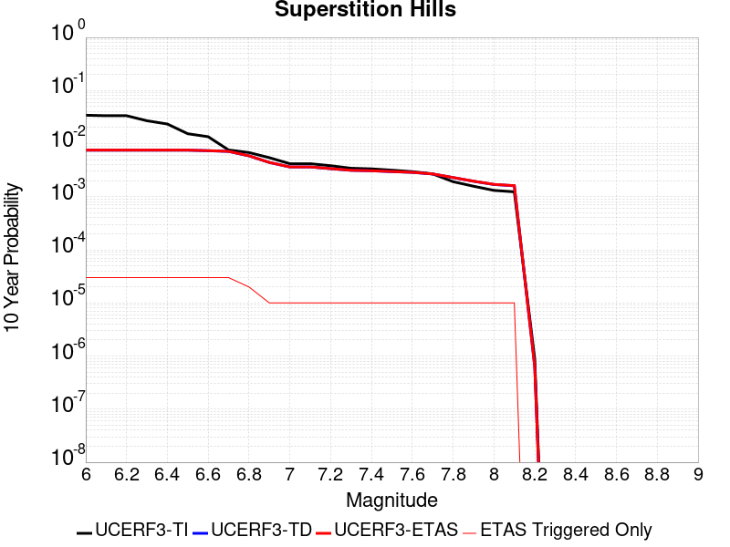 |

| Magnitude | 1 wk TI Prob | 1 wk TD Prob | 1 wk ETAS Prob | 1 wk ETAS/TD Gain | 1 wk ETAS Triggered Only | 1 mo TI Prob | 1 mo TD Prob | 1 mo ETAS Prob | 1 mo ETAS/TD Gain | 1 mo ETAS Triggered Only | 1 yr TI Prob | 1 yr TD Prob | 1 yr ETAS Prob | 1 yr ETAS/TD Gain | 1 yr ETAS Triggered Only | 10 yr TI Prob | 10 yr TD Prob | 10 yr ETAS Prob | 10 yr ETAS/TD Gain | 10 yr ETAS Triggered Only |
|-----|-----|-----|-----|-----|-----|-----|-----|-----|-----|-----|-----|-----|-----|-----|-----|-----|-----|-----|-----|-----|
| 6.0 | 6.6865185E-5 | 1.41497685E-5 | 2.9375584E-5 | 2.076047 | 1.522603E-5 | 2.8653358E-4 | 6.064055E-5 | 7.586565E-5 | 1.2510715 | 1.522603E-5 | 0.0034829667 | 7.380648E-4 | 7.684944E-4 | 1.0412289 | 3.045206E-5 | 0.03428881 | 0.0075266883 | 0.0075720227 | 1.0060232 | 4.567809E-5 |
| 6.1 | 6.544851E-5 | 1.41497685E-5 | 2.9375584E-5 | 2.076047 | 1.522603E-5 | 2.8046346E-4 | 6.064055E-5 | 7.586565E-5 | 1.2510715 | 1.522603E-5 | 0.0034092965 | 7.3806476E-4 | 7.684944E-4 | 1.0412289 | 3.045206E-5 | 0.033574644 | 0.007526688 | 0.007572022 | 1.0060232 | 4.567809E-5 |
| 6.2 | 6.544851E-5 | 1.41497685E-5 | 2.9375584E-5 | 2.076047 | 1.522603E-5 | 2.8046346E-4 | 6.064055E-5 | 7.586565E-5 | 1.2510715 | 1.522603E-5 | 0.0034092965 | 7.3806476E-4 | 7.684944E-4 | 1.0412289 | 3.045206E-5 | 0.033574644 | 0.007526688 | 0.007572022 | 1.0060232 | 4.567809E-5 |
| 6.3 | 5.2402065E-5 | 1.4149768E-5 | 2.9375582E-5 | 2.076047 | 1.522603E-5 | 2.2456095E-4 | 6.064054E-5 | 7.5865646E-5 | 1.2510715 | 1.522603E-5 | 0.0027306017 | 7.380647E-4 | 7.684943E-4 | 1.0412289 | 3.045206E-5 | 0.02697292 | 0.007526682 | 0.007572016 | 1.0060232 | 4.567809E-5 |
| 6.4 | 4.542238E-5 | 1.4149767E-5 | 2.9375582E-5 | 2.0760472 | 1.522603E-5 | 1.9465282E-4 | 6.0640537E-5 | 7.5865646E-5 | 1.2510715 | 1.522603E-5 | 0.0023673223 | 7.380647E-4 | 7.6849427E-4 | 1.0412289 | 3.045206E-5 | 0.023422617 | 0.007526679 | 0.0075720134 | 1.0060232 | 4.567809E-5 |
| 6.5 | 2.9672969E-5 | 1.4149766E-5 | 2.937558E-5 | 2.0760472 | 1.522603E-5 | 1.2716366E-4 | 6.0640534E-5 | 7.586564E-5 | 1.2510715 | 1.522603E-5 | 0.0015471181 | 7.380646E-4 | 7.684942E-4 | 1.0412289 | 3.045206E-5 | 0.015363912 | 0.0075266724 | 0.007572007 | 1.0060232 | 4.567809E-5 |
| 6.6 | 2.6056105E-5 | 1.3815438E-5 | 2.9041259E-5 | 2.1020873 | 1.522603E-5 | 1.1166424E-4 | 5.9207767E-5 | 7.44329E-5 | 1.2571474 | 1.522603E-5 | 0.0013586642 | 7.2063226E-4 | 7.5106235E-4 | 1.042227 | 3.045206E-5 | 0.013503874 | 0.007351063 | 0.0073964056 | 1.0061681 | 4.567809E-5 |
| 6.7 | 1.4611248E-5 | 1.3395271E-5 | 2.8621098E-5 | 2.1366568 | 1.522603E-5 | 6.261813E-5 | 5.740713E-5 | 7.263228E-5 | 1.2652137 | 1.522603E-5 | 7.6210906E-4 | 6.9872366E-4 | 7.291544E-4 | 1.0435519 | 3.045206E-5 | 0.0075950073 | 0.007132221 | 0.0071775736 | 1.0063587 | 4.567809E-5 |
| 6.8 | 1.30607E-5 | 1.0990158E-5 | 2.6216021E-5 | 2.3854089 | 1.522603E-5 | 5.597323E-5 | 4.709988E-5 | 6.232519E-5 | 1.3232559 | 1.522603E-5 | 6.8126095E-4 | 5.732989E-4 | 6.0373347E-4 | 1.0530868 | 3.045206E-5 | 0.006791762 | 0.0058803135 | 0.005910586 | 1.0051482 | 3.045206E-5 |
| 6.9 | 1.0443096E-5 | 8.205624E-6 | 2.343153E-5 | 2.855545 | 1.522603E-5 | 4.4755358E-5 | 3.51665E-5 | 5.0391995E-5 | 1.4329545 | 1.522603E-5 | 5.447602E-4 | 4.2807037E-4 | 4.4328987E-4 | 1.0355538 | 1.522603E-5 | 0.005434267 | 0.004414833 | 0.004429992 | 1.0034336 | 1.522603E-5 |
| 7.0 | 8.045912E-6 | 6.7489877E-6 | 2.1974916E-5 | 3.2560313 | 1.522603E-5 | 3.4482026E-5 | 2.8923918E-5 | 4.4149507E-5 | 1.5264014 | 1.522603E-5 | 4.197378E-4 | 3.5209284E-4 | 3.673135E-4 | 1.0432291 | 1.522603E-5 | 0.0041894587 | 0.0036382722 | 0.003653443 | 1.0041697 | 1.522603E-5 |
| 7.1 | 8.045912E-6 | 6.7489877E-6 | 2.1974916E-5 | 3.2560313 | 1.522603E-5 | 3.4482026E-5 | 2.8923918E-5 | 4.4149507E-5 | 1.5264014 | 1.522603E-5 | 4.197378E-4 | 3.5209284E-4 | 3.673135E-4 | 1.0432291 | 1.522603E-5 | 0.0041894587 | 0.0036382722 | 0.003653443 | 1.0041697 | 1.522603E-5 |
| 7.2 | 7.375506E-6 | 6.2557447E-6 | 2.148168E-5 | 3.4339125 | 1.522603E-5 | 3.1608928E-5 | 2.6810065E-5 | 4.2035685E-5 | 1.567907 | 1.522603E-5 | 3.8477074E-4 | 3.263645E-4 | 3.4158555E-4 | 1.0466383 | 1.522603E-5 | 0.003841052 | 0.0033786567 | 0.0033938312 | 1.0044913 | 1.522603E-5 |
| 7.3 | 6.6063913E-6 | 5.8080136E-6 | 2.1033955E-5 | 3.6215403 | 1.522603E-5 | 2.8312797E-5 | 2.4891253E-5 | 4.0116905E-5 | 1.6116868 | 1.522603E-5 | 3.446538E-4 | 3.0300958E-4 | 3.18231E-4 | 1.0502341 | 1.522603E-5 | 0.0034411973 | 0.003142841 | 0.0031580192 | 1.0048294 | 1.522603E-5 |
| 7.4 | 6.4313126E-6 | 5.6894055E-6 | 2.091535E-5 | 3.6761923 | 1.522603E-5 | 2.7562477E-5 | 2.4382942E-5 | 3.9608603E-5 | 1.624439 | 1.522603E-5 | 3.355215E-4 | 2.9682257E-4 | 3.1204408E-4 | 1.0512816 | 1.522603E-5 | 0.0033501536 | 0.0030805867 | 0.0030957656 | 1.0049274 | 1.522603E-5 |
| 7.5 | 6.0742927E-6 | 5.485116E-6 | 2.0711062E-5 | 3.7758658 | 1.522603E-5 | 2.6032423E-5 | 2.3507433E-5 | 3.8733106E-5 | 1.6476961 | 1.522603E-5 | 3.1689866E-4 | 2.861661E-4 | 3.0138774E-4 | 1.0531918 | 1.522603E-5 | 0.0031644711 | 0.0029723656 | 0.0029875464 | 1.0051073 | 1.522603E-5 |
| 7.6 | 5.6987187E-6 | 5.3032036E-6 | 2.0529153E-5 | 3.8710854 | 1.522603E-5 | 2.4422852E-5 | 2.272782E-5 | 3.7953505E-5 | 1.669914 | 1.522603E-5 | 2.9730765E-4 | 2.7667673E-4 | 2.9189856E-4 | 1.0550166 | 1.522603E-5 | 0.002969102 | 0.0028755567 | 0.002890739 | 1.0052798 | 1.522603E-5 |
| 7.7 | 5.1658035E-6 | 4.9340665E-6 | 2.0160021E-5 | 4.0858836 | 1.522603E-5 | 2.2138971E-5 | 2.1145832E-5 | 3.637154E-5 | 1.7200335 | 1.522603E-5 | 2.6950863E-4 | 2.5742067E-4 | 2.726428E-4 | 1.0591332 | 1.522603E-5 | 0.00269182 | 0.002680529 | 0.0026957141 | 1.0056651 | 1.522603E-5 |
| 7.8 | 3.6864697E-6 | 4.204672E-6 | 1.9430638E-5 | 4.621202 | 1.522603E-5 | 1.579906E-5 | 1.80199E-5 | 3.324566E-5 | 1.8449411 | 1.522603E-5 | 1.9233658E-4 | 2.1937068E-4 | 2.3459336E-4 | 1.0693926 | 1.522603E-5 | 0.0019217018 | 0.0022935418 | 0.0023087328 | 1.0066234 | 1.522603E-5 |
| 7.9 | 3.0265903E-6 | 3.5712687E-6 | 1.8797246E-5 | 5.263464 | 1.522603E-5 | 1.2971037E-5 | 1.530535E-5 | 3.0531148E-5 | 1.9948022 | 1.522603E-5 | 1.5791094E-4 | 1.8632715E-4 | 2.0155034E-4 | 1.0817014 | 1.522603E-5 | 0.0015779877 | 0.0019574203 | 0.0019726167 | 1.0077634 | 1.522603E-5 |
| 8.0 | 2.5271493E-6 | 3.0936285E-6 | 1.8319612E-5 | 5.9217234 | 1.522603E-5 | 1.0830595E-5 | 1.3258343E-5 | 2.8484172E-5 | 2.148396 | 1.522603E-5 | 1.3185451E-4 | 1.6140878E-4 | 1.7663235E-4 | 1.0943168 | 1.522603E-5 | 0.0013177631 | 0.0017009631 | 0.0017161632 | 1.0089362 | 1.522603E-5 |
| 8.1 | 2.3749135E-6 | 2.923956E-6 | 1.8149942E-5 | 6.207324 | 1.522603E-5 | 1.0178161E-5 | 1.2531182E-5 | 2.7757022E-5 | 2.2150362 | 1.522603E-5 | 1.2391206E-4 | 1.5255688E-4 | 1.6778058E-4 | 1.0997903 | 1.522603E-5 | 0.0012384299 | 0.0016083925 | 0.001623594 | 1.0094514 | 1.522603E-5 |
| 8.2 | 1.7186406E-9 | 1.1475616E-9 | 1.1475616E-9 | 1.0 | 0.0 | 7.3656024E-9 | 4.918121E-9 | 4.918121E-9 | 1.0 | 0.0 | 8.9676206E-8 | 5.9878126E-8 | 5.9878126E-8 | 1.0 | 0.0 | 8.9676166E-7 | 6.407935E-7 | 6.407935E-7 | 1.0 | 0.0 |

## San Diego Trough north alt1
*[(top)](#table-of-contents)*

| 1 Week | 1 Month | 1 Year | 10 Year |
|-----|-----|-----|-----|
|  |  |  |  |

| Magnitude | 1 wk TI Prob | 1 wk TD Prob | 1 wk ETAS Prob | 1 wk ETAS/TD Gain | 1 wk ETAS Triggered Only | 1 mo TI Prob | 1 mo TD Prob | 1 mo ETAS Prob | 1 mo ETAS/TD Gain | 1 mo ETAS Triggered Only | 1 yr TI Prob | 1 yr TD Prob | 1 yr ETAS Prob | 1 yr ETAS/TD Gain | 1 yr ETAS Triggered Only | 10 yr TI Prob | 10 yr TD Prob | 10 yr ETAS Prob | 10 yr ETAS/TD Gain | 10 yr ETAS Triggered Only |
|-----|-----|-----|-----|-----|-----|-----|-----|-----|-----|-----|-----|-----|-----|-----|-----|-----|-----|-----|-----|-----|
| 6.0 | 7.329252E-5 | 8.822077E-5 | 8.822077E-5 | 1.0 | 0.0 | 3.14073E-4 | 3.7803786E-4 | 3.7803786E-4 | 1.0 | 0.0 | 0.0038171355 | 0.0045935363 | 0.0045935363 | 1.0 | 0.0 | 0.03752231 | 0.04504978 | 0.0450934 | 1.0009682 | 4.567809E-5 |
| 6.1 | 3.7940346E-5 | 4.488948E-5 | 4.488948E-5 | 1.0 | 0.0 | 1.6259136E-4 | 1.9236986E-4 | 1.9236986E-4 | 1.0 | 0.0 | 0.0019777524 | 0.0023396744 | 0.0023396744 | 1.0 | 0.0 | 0.019602431 | 0.023158934 | 0.023158934 | 1.0 | 0.0 |
| 6.2 | 2.8645263E-5 | 3.3299704E-5 | 3.3299704E-5 | 1.0 | 0.0 | 1.2275964E-4 | 1.4270536E-4 | 1.4270536E-4 | 1.0 | 0.0 | 0.0014935739 | 0.0017360692 | 0.0017360692 | 1.0 | 0.0 | 0.0148357535 | 0.017227737 | 0.017227737 | 1.0 | 0.0 |
| 6.3 | 2.8645263E-5 | 3.3299704E-5 | 3.3299704E-5 | 1.0 | 0.0 | 1.2275964E-4 | 1.4270536E-4 | 1.4270536E-4 | 1.0 | 0.0 | 0.0014935739 | 0.0017360692 | 0.0017360692 | 1.0 | 0.0 | 0.0148357535 | 0.017227737 | 0.017227737 | 1.0 | 0.0 |
| 6.4 | 2.2204576E-5 | 2.5450314E-5 | 2.5450314E-5 | 1.0 | 0.0 | 9.5159E-5 | 1.0906827E-4 | 1.0906827E-4 | 1.0 | 0.0 | 0.001157945 | 0.0013271073 | 0.0013271073 | 1.0 | 0.0 | 0.011519298 | 0.013192981 | 0.013192981 | 1.0 | 0.0 |
| 6.5 | 2.1004838E-5 | 2.4026547E-5 | 2.4026547E-5 | 1.0 | 0.0 | 9.0017624E-5 | 1.0296691E-4 | 1.0296691E-4 | 1.0 | 0.0 | 0.0010954136 | 0.0012529104 | 0.0012529104 | 1.0 | 0.0 | 0.010900296 | 0.012459543 | 0.012459543 | 1.0 | 0.0 |
| 6.6 | 1.820557E-5 | 2.0706308E-5 | 2.0706308E-5 | 1.0 | 0.0 | 7.802154E-5 | 8.8738336E-5 | 8.8738336E-5 | 1.0 | 0.0 | 9.4949827E-4 | 0.0010798592 | 0.0010798592 | 1.0 | 0.0 | 0.009454516 | 0.01074679 | 0.01074679 | 1.0 | 0.0 |
| 6.7 | 1.5884485E-5 | 1.7984918E-5 | 1.7984918E-5 | 1.0 | 0.0 | 6.807459E-5 | 7.707596E-5 | 7.707596E-5 | 1.0 | 0.0 | 8.284929E-4 | 9.379985E-4 | 9.379985E-4 | 1.0 | 0.0 | 0.008254109 | 0.009340761 | 0.009340761 | 1.0 | 0.0 |
| 6.8 | 1.4331171E-5 | 1.6202195E-5 | 1.6202195E-5 | 1.0 | 0.0 | 6.141786E-5 | 6.9436144E-5 | 6.9436144E-5 | 1.0 | 0.0 | 7.4750587E-4 | 8.450591E-4 | 8.450591E-4 | 1.0 | 0.0 | 0.0074499645 | 0.008418724 | 0.008418724 | 1.0 | 0.0 |
| 6.9 | 1.2574203E-5 | 1.4206819E-5 | 1.4206819E-5 | 1.0 | 0.0 | 5.3888325E-5 | 6.0884955E-5 | 6.0884955E-5 | 1.0 | 0.0 | 6.558929E-4 | 7.410236E-4 | 7.410236E-4 | 1.0 | 0.0 | 0.0065396037 | 0.0073857135 | 0.0073857135 | 1.0 | 0.0 |
| 7.0 | 1.0883844E-5 | 1.2290109E-5 | 1.2290109E-5 | 1.0 | 0.0 | 4.664421E-5 | 5.267084E-5 | 5.267084E-5 | 1.0 | 0.0 | 5.677453E-4 | 6.4107974E-4 | 6.4107974E-4 | 1.0 | 0.0 | 0.00566297 | 0.0063924324 | 0.0063924324 | 1.0 | 0.0 |
| 7.1 | 9.393088E-6 | 1.0607752E-5 | 1.0607752E-5 | 1.0 | 0.0 | 4.025547E-5 | 4.546101E-5 | 4.546101E-5 | 1.0 | 0.0 | 4.900001E-4 | 5.53348E-4 | 5.53348E-4 | 1.0 | 0.0 | 0.0048892107 | 0.005519798 | 0.005519798 | 1.0 | 0.0 |
| 7.2 | 8.190791E-6 | 9.259271E-6 | 9.259271E-6 | 1.0 | 0.0 | 3.510292E-5 | 3.968199E-5 | 3.968199E-5 | 1.0 | 0.0 | 4.2729423E-4 | 4.830218E-4 | 4.830218E-4 | 1.0 | 0.0 | 0.0042647356 | 0.0048197997 | 0.0048197997 | 1.0 | 0.0 |
| 7.3 | 6.268162E-6 | 7.090212E-6 | 7.090212E-6 | 1.0 | 0.0 | 2.6863276E-5 | 3.0386273E-5 | 3.0386273E-5 | 1.0 | 0.0 | 3.2701128E-4 | 3.6989048E-4 | 3.6989048E-4 | 1.0 | 0.0 | 0.003265305 | 0.0036927941 | 0.0036927941 | 1.0 | 0.0 |
| 7.4 | 4.985186E-6 | 5.643079E-6 | 5.643079E-6 | 1.0 | 0.0 | 2.1364907E-5 | 2.4184403E-5 | 2.4184403E-5 | 1.0 | 0.0 | 2.600867E-4 | 2.944057E-4 | 2.944057E-4 | 1.0 | 0.0 | 0.002597825 | 0.0029401982 | 0.0029401982 | 1.0 | 0.0 |
| 7.5 | 1.7489613E-6 | 1.9698116E-6 | 1.9698116E-6 | 1.0 | 0.0 | 7.495527E-6 | 8.4420235E-6 | 8.4420235E-6 | 1.0 | 0.0 | 9.125422E-5 | 1.0277701E-4 | 1.0277701E-4 | 1.0 | 0.0 | 9.1216754E-4 | 0.0010273168 | 0.0010273168 | 1.0 | 0.0 |
| 7.6 | 1.6988751E-7 | 1.7534121E-7 | 1.7534121E-7 | 1.0 | 0.0 | 7.2808916E-7 | 7.5146215E-7 | 7.5146215E-7 | 1.0 | 0.0 | 8.864449E-6 | 9.149016E-6 | 9.149016E-6 | 1.0 | 0.0 | 8.8640954E-5 | 9.148658E-5 | 9.148658E-5 | 1.0 | 0.0 |

## San Pedro Basin
*[(top)](#table-of-contents)*

| 1 Week | 1 Month | 1 Year | 10 Year |
|-----|-----|-----|-----|
|  |  |  |  |

| Magnitude | 1 wk TI Prob | 1 wk TD Prob | 1 wk ETAS Prob | 1 wk ETAS/TD Gain | 1 wk ETAS Triggered Only | 1 mo TI Prob | 1 mo TD Prob | 1 mo ETAS Prob | 1 mo ETAS/TD Gain | 1 mo ETAS Triggered Only | 1 yr TI Prob | 1 yr TD Prob | 1 yr ETAS Prob | 1 yr ETAS/TD Gain | 1 yr ETAS Triggered Only | 10 yr TI Prob | 10 yr TD Prob | 10 yr ETAS Prob | 10 yr ETAS/TD Gain | 10 yr ETAS Triggered Only |
|-----|-----|-----|-----|-----|-----|-----|-----|-----|-----|-----|-----|-----|-----|-----|-----|-----|-----|-----|-----|-----|
| 6.0 | 5.3449043E-5 | 6.337589E-5 | 6.337589E-5 | 1.0 | 0.0 | 2.2904722E-4 | 2.7158615E-4 | 2.7158615E-4 | 1.0 | 0.0 | 0.0027850836 | 0.0033021553 | 0.0033325069 | 1.0091914 | 3.045206E-5 | 0.027504366 | 0.032592643 | 0.032636832 | 1.0013558 | 4.567809E-5 |
| 6.1 | 5.3449043E-5 | 6.337589E-5 | 6.337589E-5 | 1.0 | 0.0 | 2.2904722E-4 | 2.7158615E-4 | 2.7158615E-4 | 1.0 | 0.0 | 0.0027850836 | 0.0033021553 | 0.0033325069 | 1.0091914 | 3.045206E-5 | 0.027504366 | 0.032592643 | 0.032636832 | 1.0013558 | 4.567809E-5 |
| 6.2 | 2.3189454E-5 | 2.6644948E-5 | 2.6644948E-5 | 1.0 | 0.0 | 9.9379584E-5 | 1.14187904E-4 | 1.14187904E-4 | 1.0 | 0.0 | 0.0012092749 | 0.0013893985 | 0.0014046034 | 1.0109435 | 1.522603E-5 | 0.012027155 | 0.013811991 | 0.013827006 | 1.0010872 | 1.522603E-5 |
| 6.3 | 2.3189454E-5 | 2.6644948E-5 | 2.6644948E-5 | 1.0 | 0.0 | 9.9379584E-5 | 1.14187904E-4 | 1.14187904E-4 | 1.0 | 0.0 | 0.0012092749 | 0.0013893985 | 0.0014046034 | 1.0109435 | 1.522603E-5 | 0.012027155 | 0.013811991 | 0.013827006 | 1.0010872 | 1.522603E-5 |
| 6.4 | 1.966056E-5 | 2.2465154E-5 | 2.2465154E-5 | 1.0 | 0.0 | 8.425682E-5 | 9.62759E-5 | 9.62759E-5 | 1.0 | 0.0 | 0.001025344 | 0.001171569 | 0.0011867773 | 1.012981 | 1.522603E-5 | 0.010206259 | 0.011658015 | 0.011673063 | 1.0012908 | 1.522603E-5 |
| 6.5 | 1.7342953E-5 | 1.974664E-5 | 1.974664E-5 | 1.0 | 0.0 | 7.4324824E-5 | 8.462592E-5 | 8.462592E-5 | 1.0 | 0.0 | 9.04529E-4 | 0.0010298705 | 0.0010450808 | 1.0147692 | 1.522603E-5 | 0.009008561 | 0.010254702 | 0.010269771 | 1.0014696 | 1.522603E-5 |
| 6.6 | 1.439804E-5 | 1.6323911E-5 | 1.6323911E-5 | 1.0 | 0.0 | 6.170443E-5 | 6.9957925E-5 | 6.9957925E-5 | 1.0 | 0.0 | 7.509924E-4 | 8.5143704E-4 | 8.6665014E-4 | 1.0178676 | 1.522603E-5 | 0.0074845953 | 0.008484951 | 0.008500048 | 1.0017792 | 1.522603E-5 |
| 6.7 | 1.2634884E-5 | 1.4286325E-5 | 1.4286325E-5 | 1.0 | 0.0 | 5.414838E-5 | 6.1225845E-5 | 6.1225845E-5 | 1.0 | 0.0 | 6.590571E-4 | 7.4520014E-4 | 7.604148E-4 | 1.0204169 | 1.522603E-5 | 0.006571059 | 0.007430034 | 0.007445147 | 1.0020341 | 1.522603E-5 |
| 6.8 | 1.146091E-5 | 1.2934111E-5 | 1.2934111E-5 | 1.0 | 0.0 | 4.911726E-5 | 5.5430894E-5 | 5.5430894E-5 | 1.0 | 0.0 | 5.9783855E-4 | 6.746919E-4 | 6.8990764E-4 | 1.0225521 | 1.522603E-5 | 0.0059623276 | 0.006729376 | 0.0067444993 | 1.0022475 | 1.522603E-5 |
| 6.9 | 9.109035E-6 | 1.023572E-5 | 1.023572E-5 | 1.0 | 0.0 | 3.9038136E-5 | 4.386679E-5 | 4.386679E-5 | 1.0 | 0.0 | 4.7518566E-4 | 5.3397525E-4 | 5.491932E-4 | 1.0284992 | 1.522603E-5 | 0.0047417083 | 0.005329677 | 0.0053448216 | 1.0028416 | 1.522603E-5 |
| 7.0 | 5.9351028E-6 | 6.5843806E-6 | 6.5843806E-6 | 1.0 | 0.0 | 2.5435906E-5 | 2.8218601E-5 | 2.8218601E-5 | 1.0 | 0.0 | 3.0963816E-4 | 3.4353093E-4 | 3.587517E-4 | 1.0443069 | 1.522603E-5 | 0.0030920706 | 0.003432316 | 0.0034474898 | 1.0044209 | 1.522603E-5 |
| 7.1 | 2.1557585E-6 | 2.2096988E-6 | 2.2096988E-6 | 1.0 | 0.0 | 9.238933E-6 | 9.4701045E-6 | 9.4701045E-6 | 1.0 | 0.0 | 1.1247819E-4 | 1.15292576E-4 | 1.15292576E-4 | 1.0 | 0.0 | 0.0011242128 | 0.001152343 | 0.001152343 | 1.0 | 0.0 |
| 7.2 | 2.1251979E-6 | 2.1780445E-6 | 2.1780445E-6 | 1.0 | 0.0 | 9.107958E-6 | 9.334444E-6 | 9.334444E-6 | 1.0 | 0.0 | 1.1088375E-4 | 1.1364108E-4 | 1.1364108E-4 | 1.0 | 0.0 | 0.0011082845 | 0.001135845 | 0.001135845 | 1.0 | 0.0 |
| 7.3 | 1.7145798E-6 | 1.7443245E-6 | 1.7443245E-6 | 1.0 | 0.0 | 7.3481783E-6 | 7.475656E-6 | 7.475656E-6 | 1.0 | 0.0 | 8.94604E-5 | 9.10124E-5 | 9.10124E-5 | 1.0 | 0.0 | 8.9424395E-4 | 9.097604E-4 | 9.097604E-4 | 1.0 | 0.0 |
| 7.4 | 1.4467993E-6 | 1.464217E-6 | 1.464217E-6 | 1.0 | 0.0 | 6.200554E-6 | 6.275201E-6 | 6.275201E-6 | 1.0 | 0.0 | 7.548913E-5 | 7.639797E-5 | 7.639797E-5 | 1.0 | 0.0 | 7.546349E-4 | 7.637243E-4 | 7.637243E-4 | 1.0 | 0.0 |
| 7.5 | 1.2803735E-6 | 1.2931764E-6 | 1.2931764E-6 | 1.0 | 0.0 | 5.487303E-6 | 5.5421733E-6 | 5.5421733E-6 | 1.0 | 0.0 | 6.680587E-5 | 6.747394E-5 | 6.747394E-5 | 1.0 | 0.0 | 6.678579E-4 | 6.7454163E-4 | 6.7454163E-4 | 1.0 | 0.0 |
| 7.6 | 6.755009E-7 | 6.7696067E-7 | 6.7696067E-7 | 1.0 | 0.0 | 2.8950008E-6 | 2.9012572E-6 | 2.9012572E-6 | 1.0 | 0.0 | 3.5246063E-5 | 3.5322293E-5 | 3.5322293E-5 | 1.0 | 0.0 | 3.5240475E-4 | 3.531725E-4 | 3.531725E-4 | 1.0 | 0.0 |
| 7.7 | 6.211885E-8 | 4.5700858E-8 | 4.5700858E-8 | 1.0 | 0.0 | 2.6622362E-7 | 1.958608E-7 | 1.958608E-7 | 1.0 | 0.0 | 3.2412677E-6 | 2.3846028E-6 | 2.3846028E-6 | 1.0 | 0.0 | 3.2412205E-5 | 2.3845794E-5 | 2.3845794E-5 | 1.0 | 0.0 |
| 7.8 | 2.6580573E-9 | 1.5140237E-9 | 1.5140237E-9 | 1.0 | 0.0 | 1.1391674E-8 | 6.4886727E-9 | 6.4886727E-9 | 1.0 | 0.0 | 1.3869362E-7 | 7.899959E-8 | 7.899959E-8 | 1.0 | 0.0 | 1.3869354E-6 | 7.899959E-7 | 7.899959E-7 | 1.0 | 0.0 |

## San Jacinto (Lytle Creek connector)
*[(top)](#table-of-contents)*

| 1 Week | 1 Month | 1 Year | 10 Year |
|-----|-----|-----|-----|
|  | 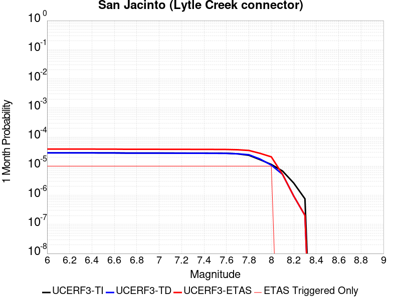 |  |  |

| Magnitude | 1 wk TI Prob | 1 wk TD Prob | 1 wk ETAS Prob | 1 wk ETAS/TD Gain | 1 wk ETAS Triggered Only | 1 mo TI Prob | 1 mo TD Prob | 1 mo ETAS Prob | 1 mo ETAS/TD Gain | 1 mo ETAS Triggered Only | 1 yr TI Prob | 1 yr TD Prob | 1 yr ETAS Prob | 1 yr ETAS/TD Gain | 1 yr ETAS Triggered Only | 10 yr TI Prob | 10 yr TD Prob | 10 yr ETAS Prob | 10 yr ETAS/TD Gain | 10 yr ETAS Triggered Only |
|-----|-----|-----|-----|-----|-----|-----|-----|-----|-----|-----|-----|-----|-----|-----|-----|-----|-----|-----|-----|-----|
| 6.0 | 6.693995E-6 | 6.6710027E-6 | 6.6710027E-6 | 1.0 | 0.0 | 2.8688235E-5 | 2.8589699E-5 | 4.3815293E-5 | 1.5325552 | 1.522603E-5 | 3.492233E-4 | 3.4802407E-4 | 3.632448E-4 | 1.0437347 | 1.522603E-5 | 0.00348675 | 0.0035549873 | 0.0036005029 | 1.0128033 | 4.567809E-5 |
| 6.1 | 6.693995E-6 | 6.6710027E-6 | 6.6710027E-6 | 1.0 | 0.0 | 2.8688235E-5 | 2.8589699E-5 | 4.3815293E-5 | 1.5325552 | 1.522603E-5 | 3.492233E-4 | 3.4802407E-4 | 3.632448E-4 | 1.0437347 | 1.522603E-5 | 0.00348675 | 0.0035549873 | 0.0036005029 | 1.0128033 | 4.567809E-5 |
| 6.2 | 6.693995E-6 | 6.6710027E-6 | 6.6710027E-6 | 1.0 | 0.0 | 2.8688235E-5 | 2.8589699E-5 | 4.3815293E-5 | 1.5325552 | 1.522603E-5 | 3.492233E-4 | 3.4802407E-4 | 3.632448E-4 | 1.0437347 | 1.522603E-5 | 0.00348675 | 0.0035549873 | 0.0036005029 | 1.0128033 | 4.567809E-5 |
| 6.3 | 6.693995E-6 | 6.6710027E-6 | 6.6710027E-6 | 1.0 | 0.0 | 2.8688235E-5 | 2.8589699E-5 | 4.3815293E-5 | 1.5325552 | 1.522603E-5 | 3.492233E-4 | 3.4802407E-4 | 3.632448E-4 | 1.0437347 | 1.522603E-5 | 0.00348675 | 0.0035549873 | 0.0036005029 | 1.0128033 | 4.567809E-5 |
| 6.4 | 6.693995E-6 | 6.6710027E-6 | 6.6710027E-6 | 1.0 | 0.0 | 2.8688235E-5 | 2.8589699E-5 | 4.3815293E-5 | 1.5325552 | 1.522603E-5 | 3.492233E-4 | 3.4802407E-4 | 3.632448E-4 | 1.0437347 | 1.522603E-5 | 0.00348675 | 0.0035549873 | 0.0036005029 | 1.0128033 | 4.567809E-5 |
| 6.5 | 6.6561875E-6 | 6.63122E-6 | 6.63122E-6 | 1.0 | 0.0 | 2.8526205E-5 | 2.8419205E-5 | 4.3644803E-5 | 1.5357503 | 1.522603E-5 | 3.472512E-4 | 3.4594897E-4 | 3.6116972E-4 | 1.0439972 | 1.522603E-5 | 0.0034670907 | 0.0035343023 | 0.0035798189 | 1.0128785 | 4.567809E-5 |
| 6.6 | 6.6561875E-6 | 6.63122E-6 | 6.63122E-6 | 1.0 | 0.0 | 2.8526205E-5 | 2.8419205E-5 | 4.3644803E-5 | 1.5357503 | 1.522603E-5 | 3.472512E-4 | 3.4594897E-4 | 3.6116972E-4 | 1.0439972 | 1.522603E-5 | 0.0034670907 | 0.0035343023 | 0.0035798189 | 1.0128785 | 4.567809E-5 |
| 6.7 | 6.5802237E-6 | 6.550394E-6 | 6.550394E-6 | 1.0 | 0.0 | 2.8200653E-5 | 2.8072815E-5 | 4.329842E-5 | 1.5423611 | 1.522603E-5 | 3.4328885E-4 | 3.41733E-4 | 3.5695382E-4 | 1.0445402 | 1.522603E-5 | 0.0034275902 | 0.0034922757 | 0.003537794 | 1.0130341 | 4.567809E-5 |
| 6.8 | 6.575632E-6 | 6.544883E-6 | 6.544883E-6 | 1.0 | 0.0 | 2.8180975E-5 | 2.8049197E-5 | 4.3274802E-5 | 1.5428178 | 1.522603E-5 | 3.4304935E-4 | 3.4144553E-4 | 3.5666637E-4 | 1.0445776 | 1.522603E-5 | 0.0034252026 | 0.00348941 | 0.003534929 | 1.0130448 | 4.567809E-5 |
| 6.9 | 6.570433E-6 | 6.5362756E-6 | 6.5362756E-6 | 1.0 | 0.0 | 2.8158694E-5 | 2.801231E-5 | 4.3237913E-5 | 1.5435326 | 1.522603E-5 | 3.4277816E-4 | 3.4099657E-4 | 3.562174E-4 | 1.0446364 | 1.522603E-5 | 0.0034224992 | 0.0034849346 | 0.0035304534 | 1.0130616 | 4.567809E-5 |
| 7.0 | 6.5643826E-6 | 6.526395E-6 | 6.526395E-6 | 1.0 | 0.0 | 2.8132765E-5 | 2.7969963E-5 | 4.319557E-5 | 1.5443555 | 1.522603E-5 | 3.424626E-4 | 3.4048117E-4 | 3.55702E-4 | 1.044704 | 1.522603E-5 | 0.0034193532 | 0.0034797967 | 0.003525316 | 1.013081 | 4.567809E-5 |
| 7.1 | 6.557402E-6 | 6.515105E-6 | 6.515105E-6 | 1.0 | 0.0 | 2.8102848E-5 | 2.792158E-5 | 4.3147185E-5 | 1.5452988 | 1.522603E-5 | 3.4209844E-4 | 3.3989229E-4 | 3.5511312E-4 | 1.0447814 | 1.522603E-5 | 0.0034157229 | 0.0034739273 | 0.0035194466 | 1.0131031 | 4.567809E-5 |
| 7.2 | 6.546394E-6 | 6.4970677E-6 | 6.4970677E-6 | 1.0 | 0.0 | 2.8055672E-5 | 2.784428E-5 | 4.3069886E-5 | 1.5468128 | 1.522603E-5 | 3.4152428E-4 | 3.3895145E-4 | 3.541723E-4 | 1.0449058 | 1.522603E-5 | 0.0034099987 | 0.0034645528 | 0.0035100726 | 1.0131388 | 4.567809E-5 |
| 7.3 | 6.5364216E-6 | 6.477847E-6 | 6.477847E-6 | 1.0 | 0.0 | 2.8012933E-5 | 2.7761906E-5 | 4.2987514E-5 | 1.5484352 | 1.522603E-5 | 3.4100408E-4 | 3.3794885E-4 | 3.5316974E-4 | 1.045039 | 1.522603E-5 | 0.003404813 | 0.003454571 | 0.0035000911 | 1.0131768 | 4.567809E-5 |
| 7.4 | 6.5269523E-6 | 6.4589262E-6 | 6.4589262E-6 | 1.0 | 0.0 | 2.7972354E-5 | 2.7680819E-5 | 4.2906428E-5 | 1.5500419 | 1.522603E-5 | 3.4051016E-4 | 3.3696194E-4 | 3.5218283E-4 | 1.045171 | 1.522603E-5 | 0.0033998888 | 0.003444749 | 0.0034902699 | 1.0132146 | 4.567809E-5 |
| 7.5 | 6.5111835E-6 | 6.435192E-6 | 6.435192E-6 | 1.0 | 0.0 | 2.7904773E-5 | 2.7579103E-5 | 4.2804713E-5 | 1.5520705 | 1.522603E-5 | 3.3968766E-4 | 3.3572392E-4 | 3.5094484E-4 | 1.0453376 | 1.522603E-5 | 0.0033916887 | 0.003432418 | 0.0034779392 | 1.0132622 | 4.567809E-5 |
| 7.6 | 6.4768806E-6 | 6.3942884E-6 | 6.3942884E-6 | 1.0 | 0.0 | 2.7757764E-5 | 2.7403805E-5 | 4.2629417E-5 | 1.5556022 | 1.522603E-5 | 3.3789838E-4 | 3.3359032E-4 | 3.4881127E-4 | 1.0456277 | 1.522603E-5 | 0.0033738504 | 0.0034111436 | 0.003456666 | 1.0133451 | 4.567809E-5 |
| 7.7 | 6.1655364E-6 | 6.1866886E-6 | 6.1866886E-6 | 1.0 | 0.0 | 2.642346E-5 | 2.651411E-5 | 4.1739735E-5 | 1.5742462 | 1.522603E-5 | 3.2165812E-4 | 3.2276154E-4 | 3.3798264E-4 | 1.047159 | 1.522603E-5 | 0.0032119295 | 0.0033027146 | 0.0033482418 | 1.0137848 | 4.567809E-5 |
| 7.8 | 5.5043524E-6 | 5.747449E-6 | 5.747449E-6 | 1.0 | 0.0 | 2.3589868E-5 | 2.4631692E-5 | 3.9857347E-5 | 1.6181327 | 1.522603E-5 | 2.871688E-4 | 2.9984963E-4 | 3.1507108E-4 | 1.0507636 | 1.522603E-5 | 0.0028679797 | 0.0030726613 | 0.003118199 | 1.0148203 | 4.567809E-5 |
| 7.9 | 3.889249E-6 | 4.0851965E-6 | 4.0851965E-6 | 1.0 | 0.0 | 1.6668104E-5 | 1.7507866E-5 | 3.273363E-5 | 1.8696527 | 1.522603E-5 | 2.0291525E-4 | 2.1313746E-4 | 2.2836025E-4 | 1.0714223 | 1.522603E-5 | 0.0020273007 | 0.0021987387 | 0.0022443163 | 1.020729 | 4.567809E-5 |
| 8.0 | 2.668535E-6 | 2.537347E-6 | 2.537347E-6 | 1.0 | 0.0 | 1.1436528E-5 | 1.0874299E-5 | 2.6100162E-5 | 2.4001698 | 1.522603E-5 | 1.3923083E-4 | 1.3238657E-4 | 1.4761058E-4 | 1.1149967 | 1.522603E-5 | 0.0013914363 | 0.0013788831 | 0.0013940881 | 1.0110271 | 1.522603E-5 |
| 8.1 | 1.5911459E-6 | 1.2217948E-6 | 1.2217948E-6 | 1.0 | 0.0 | 6.8191785E-6 | 5.2362534E-6 | 5.2362534E-6 | 1.0 | 0.0 | 8.3020335E-5 | 6.374954E-5 | 6.374954E-5 | 1.0 | 0.0 | 8.298933E-4 | 6.7100645E-4 | 6.7100645E-4 | 1.0 | 0.0 |
| 8.2 | 6.1294963E-7 | 2.1905348E-7 | 2.1905348E-7 | 1.0 | 0.0 | 2.6269242E-6 | 9.3880027E-7 | 9.3880027E-7 | 1.0 | 0.0 | 3.1982334E-5 | 1.1429834E-5 | 1.1429834E-5 | 1.0 | 0.0 | 3.1977732E-4 | 1.2836853E-4 | 1.2836853E-4 | 1.0 | 0.0 |
| 8.3 | 1.762871E-7 | 4.7785655E-8 | 4.7785655E-8 | 1.0 | 0.0 | 7.5551594E-7 | 2.0479564E-7 | 2.0479564E-7 | 1.0 | 0.0 | 9.1983675E-6 | 2.4933843E-6 | 2.4933843E-6 | 1.0 | 0.0 | 9.197987E-5 | 2.8824745E-5 | 2.8824745E-5 | 1.0 | 0.0 |

## Green Valley 2011 CFM
*[(top)](#table-of-contents)*

| 1 Week | 1 Month | 1 Year | 10 Year |
|-----|-----|-----|-----|
|  |  |  |  |

| Magnitude | 1 wk TI Prob | 1 wk TD Prob | 1 wk ETAS Prob | 1 wk ETAS/TD Gain | 1 wk ETAS Triggered Only | 1 mo TI Prob | 1 mo TD Prob | 1 mo ETAS Prob | 1 mo ETAS/TD Gain | 1 mo ETAS Triggered Only | 1 yr TI Prob | 1 yr TD Prob | 1 yr ETAS Prob | 1 yr ETAS/TD Gain | 1 yr ETAS Triggered Only | 10 yr TI Prob | 10 yr TD Prob | 10 yr ETAS Prob | 10 yr ETAS/TD Gain | 10 yr ETAS Triggered Only |
|-----|-----|-----|-----|-----|-----|-----|-----|-----|-----|-----|-----|-----|-----|-----|-----|-----|-----|-----|-----|-----|
| 6.0 | 9.9629346E-5 | 1.7306388E-4 | 1.7306388E-4 | 1.0 | 0.0 | 4.2691303E-4 | 7.4149936E-4 | 7.4149936E-4 | 1.0 | 0.0 | 0.0051852856 | 0.008987381 | 0.008987381 | 1.0 | 0.0 | 0.050659515 | 0.08552948 | 0.085571244 | 1.0004884 | 4.567809E-5 |
| 6.1 | 9.88615E-5 | 1.7153693E-4 | 1.7153693E-4 | 1.0 | 0.0 | 4.2362334E-4 | 7.3495903E-4 | 7.3495903E-4 | 1.0 | 0.0 | 0.0051454236 | 0.008908406 | 0.008908406 | 1.0 | 0.0 | 0.050279044 | 0.084817074 | 0.08485888 | 1.0004928 | 4.567809E-5 |
| 6.2 | 9.696895E-5 | 1.679268E-4 | 1.679268E-4 | 1.0 | 0.0 | 4.15515E-4 | 7.194957E-4 | 7.194957E-4 | 1.0 | 0.0 | 0.0050471667 | 0.008721775 | 0.008721775 | 1.0 | 0.0 | 0.04934063 | 0.08312591 | 0.08316779 | 1.0005038 | 4.567809E-5 |
| 6.3 | 9.275224E-5 | 1.597199E-4 | 1.597199E-4 | 1.0 | 0.0 | 3.9744904E-4 | 6.843419E-4 | 6.843419E-4 | 1.0 | 0.0 | 0.0048282105 | 0.008297088 | 0.008297088 | 1.0 | 0.0 | 0.047246475 | 0.07926428 | 0.07930634 | 1.0005306 | 4.567809E-5 |
| 6.4 | 8.391499E-5 | 1.4370102E-4 | 1.4370102E-4 | 1.0 | 0.0 | 3.595861E-4 | 6.1572343E-4 | 6.1572343E-4 | 1.0 | 0.0 | 0.004369175 | 0.0074676727 | 0.0074676727 | 1.0 | 0.0 | 0.04284265 | 0.07163763 | 0.0716659 | 1.0003946 | 3.045206E-5 |
| 6.5 | 5.9519385E-5 | 9.935902E-5 | 9.935902E-5 | 1.0 | 0.0 | 2.5505814E-4 | 4.257589E-4 | 4.257589E-4 | 1.0 | 0.0 | 0.0031009112 | 0.0051687798 | 0.0051687798 | 1.0 | 0.0 | 0.030579966 | 0.050151456 | 0.050165918 | 1.0002884 | 1.522603E-5 |
| 6.6 | 4.5361558E-5 | 7.404101E-5 | 7.404101E-5 | 1.0 | 0.0 | 1.9439218E-4 | 3.1728283E-4 | 3.1728283E-4 | 1.0 | 0.0 | 0.0023641558 | 0.0038543646 | 0.0038543646 | 1.0 | 0.0 | 0.023391623 | 0.037670802 | 0.037670802 | 1.0 | 0.0 |
| 6.7 | 3.8808106E-5 | 6.2664265E-5 | 6.2664265E-5 | 1.0 | 0.0 | 1.6630985E-4 | 2.6853604E-4 | 2.6853604E-4 | 1.0 | 0.0 | 0.0020229418 | 0.0032630423 | 0.0032630423 | 1.0 | 0.0 | 0.020046256 | 0.03201008 | 0.03201008 | 1.0 | 0.0 |
| 6.8 | 2.2284667E-5 | 3.128693E-5 | 3.128693E-5 | 1.0 | 0.0 | 9.550222E-5 | 1.3407998E-4 | 1.3407998E-4 | 1.0 | 0.0 | 0.0011621192 | 0.0016311917 | 0.0016311917 | 1.0 | 0.0 | 0.011560607 | 0.016166827 | 0.016166827 | 1.0 | 0.0 |
| 6.9 | 1.8050168E-5 | 2.4449284E-5 | 2.4449284E-5 | 1.0 | 0.0 | 7.735557E-5 | 1.04778395E-4 | 1.04778395E-4 | 1.0 | 0.0 | 9.4139716E-4 | 0.0012749347 | 0.0012749347 | 1.0 | 0.0 | 0.009374191 | 0.012668457 | 0.012668457 | 1.0 | 0.0 |
| 7.0 | 1.4763166E-5 | 1.9583895E-5 | 1.9583895E-5 | 1.0 | 0.0 | 6.326917E-5 | 8.3928295E-5 | 8.3928295E-5 | 1.0 | 0.0 | 7.7002996E-4 | 0.001021351 | 0.001021351 | 1.0 | 0.0 | 0.007673672 | 0.010165877 | 0.010165877 | 1.0 | 0.0 |
| 7.1 | 1.2399713E-5 | 1.6304628E-5 | 1.6304628E-5 | 1.0 | 0.0 | 5.3140546E-5 | 6.987512E-5 | 6.987512E-5 | 1.0 | 0.0 | 6.467941E-4 | 8.5039943E-4 | 8.5039943E-4 | 1.0 | 0.0 | 0.006449148 | 0.008471731 | 0.008471731 | 1.0 | 0.0 |
| 7.2 | 1.0584195E-5 | 1.3922591E-5 | 1.3922591E-5 | 1.0 | 0.0 | 4.5360044E-5 | 5.966689E-5 | 5.966689E-5 | 1.0 | 0.0 | 5.521186E-4 | 7.262039E-4 | 7.262039E-4 | 1.0 | 0.0 | 0.0055074887 | 0.0072387247 | 0.0072387247 | 1.0 | 0.0 |
| 7.3 | 7.998173E-6 | 1.0544779E-5 | 1.0544779E-5 | 1.0 | 0.0 | 3.4277433E-5 | 4.5191133E-5 | 4.5191133E-5 | 1.0 | 0.0 | 4.1724785E-4 | 5.500642E-4 | 5.500642E-4 | 1.0 | 0.0 | 0.004164653 | 0.005487293 | 0.005487293 | 1.0 | 0.0 |
| 7.4 | 6.7571127E-6 | 8.933404E-6 | 8.933404E-6 | 1.0 | 0.0 | 2.8958733E-5 | 3.828546E-5 | 3.828546E-5 | 1.0 | 0.0 | 3.5251552E-4 | 4.6602674E-4 | 4.6602674E-4 | 1.0 | 0.0 | 0.0035195686 | 0.0046506976 | 0.0046506976 | 1.0 | 0.0 |
| 7.5 | 5.69878E-6 | 7.516847E-6 | 7.516847E-6 | 1.0 | 0.0 | 2.4423114E-5 | 3.2214666E-5 | 3.2214666E-5 | 1.0 | 0.0 | 2.9731085E-4 | 3.9214385E-4 | 3.9214385E-4 | 1.0 | 0.0 | 0.002969134 | 0.0039146706 | 0.0039146706 | 1.0 | 0.0 |
| 7.6 | 4.503664E-6 | 5.935998E-6 | 5.935998E-6 | 1.0 | 0.0 | 1.9301275E-5 | 2.543975E-5 | 2.543975E-5 | 1.0 | 0.0 | 2.3496768E-4 | 3.0968577E-4 | 3.0968577E-4 | 1.0 | 0.0 | 0.002347194 | 0.003092667 | 0.003092667 | 1.0 | 0.0 |
| 7.7 | 1.0873546E-6 | 1.4107495E-6 | 1.4107495E-6 | 1.0 | 0.0 | 4.6600826E-6 | 6.0460557E-6 | 6.0460557E-6 | 1.0 | 0.0 | 5.6735033E-5 | 7.360827E-5 | 7.360827E-5 | 1.0 | 0.0 | 5.672055E-4 | 7.3584093E-4 | 7.3584093E-4 | 1.0 | 0.0 |
| 7.8 | 4.9373917E-8 | 6.178006E-8 | 6.178006E-8 | 1.0 | 0.0 | 2.1160248E-7 | 2.6477167E-7 | 2.6477167E-7 | 1.0 | 0.0 | 2.5762572E-6 | 3.2235916E-6 | 3.2235916E-6 | 1.0 | 0.0 | 2.5762274E-5 | 3.223383E-5 | 3.223383E-5 | 1.0 | 0.0 |

## Cleghorn Lake
*[(top)](#table-of-contents)*

| 1 Week | 1 Month | 1 Year | 10 Year |
|-----|-----|-----|-----|
|  |  |  |  |

| Magnitude | 1 wk TI Prob | 1 wk TD Prob | 1 wk ETAS Prob | 1 wk ETAS/TD Gain | 1 wk ETAS Triggered Only | 1 mo TI Prob | 1 mo TD Prob | 1 mo ETAS Prob | 1 mo ETAS/TD Gain | 1 mo ETAS Triggered Only | 1 yr TI Prob | 1 yr TD Prob | 1 yr ETAS Prob | 1 yr ETAS/TD Gain | 1 yr ETAS Triggered Only | 10 yr TI Prob | 10 yr TD Prob | 10 yr ETAS Prob | 10 yr ETAS/TD Gain | 10 yr ETAS Triggered Only |
|-----|-----|-----|-----|-----|-----|-----|-----|-----|-----|-----|-----|-----|-----|-----|-----|-----|-----|-----|-----|-----|
| 6.0 | 1.5467183E-5 | 1.6794971E-5 | 1.6794971E-5 | 1.0 | 0.0 | 6.6286244E-5 | 7.197677E-5 | 7.197677E-5 | 1.0 | 0.0 | 8.067362E-4 | 8.760197E-4 | 9.064451E-4 | 1.0347314 | 3.045206E-5 | 0.008038137 | 0.008731093 | 0.008776372 | 1.005186 | 4.567809E-5 |
| 6.1 | 1.5467183E-5 | 1.6794971E-5 | 1.6794971E-5 | 1.0 | 0.0 | 6.6286244E-5 | 7.197677E-5 | 7.197677E-5 | 1.0 | 0.0 | 8.067362E-4 | 8.760197E-4 | 9.064451E-4 | 1.0347314 | 3.045206E-5 | 0.008038137 | 0.008731093 | 0.008776372 | 1.005186 | 4.567809E-5 |
| 6.2 | 1.2624631E-5 | 1.36821545E-5 | 1.36821545E-5 | 1.0 | 0.0 | 5.410444E-5 | 5.863676E-5 | 5.863676E-5 | 1.0 | 0.0 | 6.585225E-4 | 7.137174E-4 | 7.4414775E-4 | 1.0426364 | 3.045206E-5 | 0.0065657445 | 0.0071190484 | 0.007149284 | 1.0042471 | 3.045206E-5 |
| 6.3 | 1.2624631E-5 | 1.36821545E-5 | 1.36821545E-5 | 1.0 | 0.0 | 5.410444E-5 | 5.863676E-5 | 5.863676E-5 | 1.0 | 0.0 | 6.585225E-4 | 7.137174E-4 | 7.4414775E-4 | 1.0426364 | 3.045206E-5 | 0.0065657445 | 0.0071190484 | 0.007149284 | 1.0042471 | 3.045206E-5 |
| 6.4 | 9.417684E-6 | 1.0170551E-5 | 1.0170551E-5 | 1.0 | 0.0 | 4.036088E-5 | 4.3587577E-5 | 4.3587577E-5 | 1.0 | 0.0 | 4.912829E-4 | 5.3059065E-4 | 5.458086E-4 | 1.0286812 | 1.522603E-5 | 0.004901982 | 0.0052972743 | 0.0053124195 | 1.0028591 | 1.522603E-5 |
| 6.5 | 9.368219E-6 | 1.0117976E-5 | 1.0117976E-5 | 1.0 | 0.0 | 4.014889E-5 | 4.3362263E-5 | 4.3362263E-5 | 1.0 | 0.0 | 4.8870314E-4 | 5.278488E-4 | 5.4306677E-4 | 1.0288302 | 1.522603E-5 | 0.004876298 | 0.0052699856 | 0.0052851317 | 1.002874 | 1.522603E-5 |
| 6.6 | 7.803798E-6 | 8.442198E-6 | 8.442198E-6 | 1.0 | 0.0 | 3.3444423E-5 | 3.6180576E-5 | 3.6180576E-5 | 1.0 | 0.0 | 4.0710976E-4 | 4.404494E-4 | 4.5566872E-4 | 1.0345541 | 1.522603E-5 | 0.0040636472 | 0.004399682 | 0.0044148406 | 1.0034455 | 1.522603E-5 |
| 6.7 | 2.3108669E-6 | 2.4439082E-6 | 2.4439082E-6 | 1.0 | 0.0 | 9.903678E-6 | 1.0473852E-5 | 1.0473852E-5 | 1.0 | 0.0 | 1.205706E-4 | 1.2751187E-4 | 1.4273595E-4 | 1.1193935 | 1.522603E-5 | 0.001205052 | 0.0012744057 | 0.0012896124 | 1.0119324 | 1.522603E-5 |
| 6.8 | 2.0882828E-6 | 2.2063484E-6 | 2.2063484E-6 | 1.0 | 0.0 | 8.949753E-6 | 9.455745E-6 | 9.455745E-6 | 1.0 | 0.0 | 1.08957785E-4 | 1.15117786E-4 | 1.3034207E-4 | 1.1322496 | 1.522603E-5 | 0.0010890438 | 0.0011505984 | 0.0011658069 | 1.0132179 | 1.522603E-5 |
| 6.9 | 1.876935E-6 | 1.9811093E-6 | 1.9811093E-6 | 1.0 | 0.0 | 8.043982E-6 | 8.490441E-6 | 8.490441E-6 | 1.0 | 0.0 | 9.7931086E-5 | 1.0336639E-4 | 1.1859084E-4 | 1.1472863 | 1.522603E-5 | 9.788794E-4 | 0.001033199 | 0.0010484094 | 1.0147215 | 1.522603E-5 |
| 7.0 | 1.5357559E-6 | 1.620328E-6 | 1.620328E-6 | 1.0 | 0.0 | 6.5817944E-6 | 6.9442453E-6 | 6.9442453E-6 | 1.0 | 0.0 | 8.01304E-5 | 8.454303E-5 | 9.976778E-5 | 1.1800828 | 1.522603E-5 | 8.010151E-4 | 8.4512116E-4 | 8.603343E-4 | 1.0180012 | 1.522603E-5 |
| 7.1 | 1.0905424E-6 | 1.1497951E-6 | 1.1497951E-6 | 1.0 | 0.0 | 4.6737446E-6 | 4.9276846E-6 | 4.9276846E-6 | 1.0 | 0.0 | 5.6901354E-5 | 5.9993006E-5 | 7.521812E-5 | 1.2537816 | 1.522603E-5 | 5.6886784E-4 | 5.997779E-4 | 6.149948E-4 | 1.0253708 | 1.522603E-5 |
| 7.2 | 6.06668E-7 | 6.387457E-7 | 6.387457E-7 | 1.0 | 0.0 | 2.600003E-6 | 2.737479E-6 | 2.737479E-6 | 1.0 | 0.0 | 3.1654577E-5 | 3.3328364E-5 | 4.8553888E-5 | 1.4568337 | 1.522603E-5 | 3.1650066E-4 | 3.3324052E-4 | 3.4846147E-4 | 1.0456756 | 1.522603E-5 |

## San Jacinto (Borrego)
*[(top)](#table-of-contents)*

| 1 Week | 1 Month | 1 Year | 10 Year |
|-----|-----|-----|-----|
|  |  |  |  |

| Magnitude | 1 wk TI Prob | 1 wk TD Prob | 1 wk ETAS Prob | 1 wk ETAS/TD Gain | 1 wk ETAS Triggered Only | 1 mo TI Prob | 1 mo TD Prob | 1 mo ETAS Prob | 1 mo ETAS/TD Gain | 1 mo ETAS Triggered Only | 1 yr TI Prob | 1 yr TD Prob | 1 yr ETAS Prob | 1 yr ETAS/TD Gain | 1 yr ETAS Triggered Only | 10 yr TI Prob | 10 yr TD Prob | 10 yr ETAS Prob | 10 yr ETAS/TD Gain | 10 yr ETAS Triggered Only |
|-----|-----|-----|-----|-----|-----|-----|-----|-----|-----|-----|-----|-----|-----|-----|-----|-----|-----|-----|-----|-----|
| 6.0 | 3.543992E-5 | 2.7956603E-5 | 5.840781E-5 | 2.0892315 | 3.045206E-5 | 1.5187653E-4 | 1.1980858E-4 | 1.50257E-4 | 1.2541422 | 3.045206E-5 | 0.0018475284 | 0.0014577056 | 0.0015033172 | 1.0312899 | 4.567809E-5 | 0.018322436 | 0.014885285 | 0.014930283 | 1.003023 | 4.567809E-5 |
| 6.1 | 3.542281E-5 | 2.7956603E-5 | 5.840781E-5 | 2.0892315 | 3.045206E-5 | 1.5180321E-4 | 1.1980858E-4 | 1.50257E-4 | 1.2541422 | 3.045206E-5 | 0.0018466372 | 0.0014577056 | 0.0015033172 | 1.0312899 | 4.567809E-5 | 0.018313672 | 0.014885285 | 0.014930283 | 1.003023 | 4.567809E-5 |
| 6.2 | 3.4688688E-5 | 2.7956603E-5 | 5.840781E-5 | 2.0892315 | 3.045206E-5 | 1.4865733E-4 | 1.19808574E-4 | 1.50257E-4 | 1.2541422 | 3.045206E-5 | 0.0018084005 | 0.0014577056 | 0.0015033172 | 1.0312899 | 4.567809E-5 | 0.017937548 | 0.014885284 | 0.014930283 | 1.003023 | 4.567809E-5 |
| 6.3 | 3.2087122E-5 | 2.7801936E-5 | 5.825315E-5 | 2.0952911 | 3.045206E-5 | 1.3750899E-4 | 1.19145785E-4 | 1.4959421E-4 | 1.2555561 | 3.045206E-5 | 0.0016728862 | 0.0014496469 | 0.0014952588 | 1.0314641 | 4.567809E-5 | 0.016603488 | 0.014806312 | 0.014851313 | 1.0030394 | 4.567809E-5 |
| 6.4 | 3.1828724E-5 | 2.7768916E-5 | 5.8220132E-5 | 2.0965936 | 3.045206E-5 | 1.364017E-4 | 1.1900428E-4 | 1.4945272E-4 | 1.25586 | 3.045206E-5 | 0.0016594254 | 0.0014479264 | 0.0014935384 | 1.0315015 | 4.567809E-5 | 0.016470885 | 0.014789388 | 0.01483439 | 1.0030429 | 4.567809E-5 |
| 6.5 | 3.1563577E-5 | 2.7508588E-5 | 5.795981E-5 | 2.1069715 | 3.045206E-5 | 1.3526545E-4 | 1.1788869E-4 | 1.4833716E-4 | 1.2582816 | 3.045206E-5 | 0.0016456128 | 0.0014343619 | 0.0014799745 | 1.0317999 | 4.567809E-5 | 0.0163348 | 0.014655951 | 0.014700959 | 1.0030711 | 4.567809E-5 |
| 6.6 | 3.1467625E-5 | 2.735279E-5 | 5.7804016E-5 | 2.113277 | 3.045206E-5 | 1.3485427E-4 | 1.1722104E-4 | 1.4766953E-4 | 1.2597528 | 3.045206E-5 | 0.0016406142 | 0.001426244 | 0.001471857 | 1.0319811 | 4.567809E-5 | 0.016285548 | 0.014576187 | 0.0146212 | 1.0030881 | 4.567809E-5 |
| 6.7 | 3.1223695E-5 | 2.6970763E-5 | 5.7422003E-5 | 2.1290462 | 3.045206E-5 | 1.3380898E-4 | 1.15583935E-4 | 1.4603247E-4 | 1.2634323 | 3.045206E-5 | 0.0016279068 | 0.0014063381 | 0.0014519519 | 1.0324345 | 4.567809E-5 | 0.01616033 | 0.01438054 | 0.014425561 | 1.0031307 | 4.567809E-5 |
| 6.8 | 3.1015585E-5 | 2.6791718E-5 | 5.7242964E-5 | 2.1365917 | 3.045206E-5 | 1.3291716E-4 | 1.1481666E-4 | 1.4526522E-4 | 1.2651929 | 3.045206E-5 | 0.001617065 | 0.0013970085 | 0.0014426229 | 1.0326514 | 4.567809E-5 | 0.016053487 | 0.014287795 | 0.01433282 | 1.0031513 | 4.567809E-5 |
| 6.9 | 2.6641965E-5 | 2.2212334E-5 | 5.266372E-5 | 2.3709223 | 3.045206E-5 | 1.1417485E-4 | 9.519226E-5 | 1.2564143E-4 | 1.3198701 | 3.045206E-5 | 0.0013891924 | 0.0011583535 | 0.0011887703 | 1.0262586 | 3.045206E-5 | 0.0138054015 | 0.011897102 | 0.011927192 | 1.0025291 | 3.045206E-5 |
| 7.0 | 2.3854353E-5 | 2.0506088E-5 | 5.0957526E-5 | 2.484995 | 3.045206E-5 | 1.02228936E-4 | 8.788029E-5 | 1.1832968E-4 | 1.346487 | 3.045206E-5 | 0.0012439266 | 0.0010694199 | 0.0010998395 | 1.0284449 | 3.045206E-5 | 0.012369866 | 0.010996936 | 0.011027054 | 1.0027387 | 3.045206E-5 |
| 7.1 | 2.3672901E-5 | 2.0342548E-5 | 5.0793988E-5 | 2.4969335 | 3.045206E-5 | 1.0145135E-4 | 8.717945E-5 | 1.1762885E-4 | 1.3492727 | 3.045206E-5 | 0.0012344702 | 0.0010608955 | 0.0010913153 | 1.0286736 | 3.045206E-5 | 0.0122763505 | 0.010912099 | 0.010942219 | 1.0027602 | 3.045206E-5 |
| 7.2 | 2.2717244E-5 | 1.9569701E-5 | 5.0021164E-5 | 2.5560517 | 3.045206E-5 | 9.735599E-5 | 8.386746E-5 | 1.1431697E-4 | 1.363067 | 3.045206E-5 | 0.0011846646 | 0.0010206103 | 0.0010510314 | 1.0298066 | 3.045206E-5 | 0.01178369 | 0.010509352 | 0.010539484 | 1.0028672 | 3.045206E-5 |
| 7.3 | 2.1016205E-5 | 1.8410952E-5 | 4.8862454E-5 | 2.6539884 | 3.045206E-5 | 9.006634E-5 | 7.890171E-5 | 1.09351364E-4 | 1.3859189 | 3.045206E-5 | 0.001096006 | 9.6020696E-4 | 9.906298E-4 | 1.0316836 | 3.045206E-5 | 0.010906163 | 0.009904788 | 0.0099349385 | 1.003044 | 3.045206E-5 |
| 7.4 | 2.0683625E-5 | 1.8213394E-5 | 4.86649E-5 | 2.6719291 | 3.045206E-5 | 8.86411E-5 | 7.805508E-5 | 1.0850476E-4 | 1.3901051 | 3.045206E-5 | 0.001078671 | 9.4990834E-4 | 9.803314E-4 | 1.0320275 | 3.045206E-5 | 0.010734501 | 0.009801473 | 0.009831627 | 1.0030764 | 3.045206E-5 |
| 7.5 | 1.9993966E-5 | 1.7808186E-5 | 4.8259706E-5 | 2.709973 | 3.045206E-5 | 8.568561E-5 | 7.631858E-5 | 1.0676832E-4 | 1.3989819 | 3.045206E-5 | 0.001042723 | 9.287846E-4 | 9.592084E-4 | 1.0327566 | 3.045206E-5 | 0.010378438 | 0.009588276 | 0.009618436 | 1.0031456 | 3.045206E-5 |
| 7.6 | 1.788966E-5 | 1.6460734E-5 | 4.6912293E-5 | 2.8499515 | 3.045206E-5 | 7.666772E-5 | 7.0544105E-5 | 1.0099402E-4 | 1.4316436 | 3.045206E-5 | 9.3302975E-4 | 8.585378E-4 | 8.889637E-4 | 1.0354393 | 3.045206E-5 | 0.00929122 | 0.008879809 | 0.00890999 | 1.0033989 | 3.045206E-5 |
| 7.7 | 1.5125781E-5 | 1.4262029E-5 | 4.4713655E-5 | 3.1351538 | 3.045206E-5 | 6.4823165E-5 | 6.112155E-5 | 9.1571754E-5 | 1.4981909 | 3.045206E-5 | 7.889362E-4 | 7.4390165E-4 | 7.7433104E-4 | 1.0409051 | 3.045206E-5 | 0.007861412 | 0.007727129 | 0.0077573457 | 1.0039104 | 3.045206E-5 |
| 7.8 | 1.250089E-5 | 1.2654241E-5 | 4.3105916E-5 | 3.4064403 | 3.045206E-5 | 5.3574146E-5 | 5.423134E-5 | 8.468175E-5 | 1.561491 | 3.045206E-5 | 6.5207E-4 | 6.6006713E-4 | 6.904991E-4 | 1.0461043 | 3.045206E-5 | 0.006501599 | 0.0068802256 | 0.006910468 | 1.0043956 | 3.045206E-5 |
| 7.9 | 9.561E-6 | 9.775645E-6 | 4.022741E-5 | 4.1150646 | 3.045206E-5 | 4.0975072E-5 | 4.189495E-5 | 7.2345734E-5 | 1.7268367 | 3.045206E-5 | 4.987573E-4 | 5.099522E-4 | 5.4038875E-4 | 1.0596851 | 3.045206E-5 | 0.0049763937 | 0.0053634187 | 0.005393707 | 1.0056473 | 3.045206E-5 |
| 8.0 | 8.01699E-6 | 8.312629E-6 | 3.8764436E-5 | 4.6633186 | 3.045206E-5 | 3.4358076E-5 | 3.5625068E-5 | 6.607604E-5 | 1.8547627 | 3.045206E-5 | 4.1822926E-4 | 4.336494E-4 | 4.6408825E-4 | 1.0701923 | 3.045206E-5 | 0.0041744304 | 0.00458347 | 0.0046137827 | 1.0066135 | 3.045206E-5 |
| 8.1 | 6.541947E-6 | 6.477901E-6 | 2.1703832E-5 | 3.3504422 | 1.522603E-5 | 2.8036617E-5 | 2.7762142E-5 | 4.2987747E-5 | 1.5484306 | 1.522603E-5 | 3.4129233E-4 | 3.3795217E-4 | 3.5317303E-4 | 1.0450386 | 1.522603E-5 | 0.0034076865 | 0.003588998 | 0.0036041692 | 1.0042272 | 1.522603E-5 |
| 8.2 | 1.7968189E-6 | 8.0012404E-7 | 8.0012404E-7 | 1.0 | 0.0 | 7.70063E-6 | 3.4290986E-6 | 3.4290986E-6 | 1.0 | 0.0 | 9.3751136E-5 | 4.17485E-5 | 4.17485E-5 | 1.0 | 0.0 | 9.371159E-4 | 4.7288055E-4 | 4.7288055E-4 | 1.0 | 0.0 |
| 8.3 | 1.5167889E-7 | 4.9190945E-8 | 4.9190945E-8 | 1.0 | 0.0 | 6.500522E-7 | 2.1081833E-7 | 2.1081833E-7 | 1.0 | 0.0 | 7.9143565E-6 | 2.5667105E-6 | 2.5667105E-6 | 1.0 | 0.0 | 7.914075E-5 | 2.9817646E-5 | 2.9817646E-5 | 1.0 | 0.0 |

## White Mountains
*[(top)](#table-of-contents)*

| 1 Week | 1 Month | 1 Year | 10 Year |
|-----|-----|-----|-----|
|  |  |  |  |

| Magnitude | 1 wk TI Prob | 1 wk TD Prob | 1 wk ETAS Prob | 1 wk ETAS/TD Gain | 1 wk ETAS Triggered Only | 1 mo TI Prob | 1 mo TD Prob | 1 mo ETAS Prob | 1 mo ETAS/TD Gain | 1 mo ETAS Triggered Only | 1 yr TI Prob | 1 yr TD Prob | 1 yr ETAS Prob | 1 yr ETAS/TD Gain | 1 yr ETAS Triggered Only | 10 yr TI Prob | 10 yr TD Prob | 10 yr ETAS Prob | 10 yr ETAS/TD Gain | 10 yr ETAS Triggered Only |
|-----|-----|-----|-----|-----|-----|-----|-----|-----|-----|-----|-----|-----|-----|-----|-----|-----|-----|-----|-----|-----|
| 6.0 | 3.503579E-5 | 3.378569E-5 | 3.378569E-5 | 1.0 | 0.0 | 1.5014476E-4 | 1.4478847E-4 | 1.4478847E-4 | 1.0 | 0.0 | 0.0018264796 | 0.001761495 | 0.0017766942 | 1.0086286 | 1.522603E-5 | 0.018115403 | 0.017487662 | 0.01753254 | 1.0025663 | 4.567809E-5 |
| 6.1 | 3.503579E-5 | 3.378569E-5 | 3.378569E-5 | 1.0 | 0.0 | 1.5014476E-4 | 1.4478847E-4 | 1.4478847E-4 | 1.0 | 0.0 | 0.0018264796 | 0.001761495 | 0.0017766942 | 1.0086286 | 1.522603E-5 | 0.018115403 | 0.017487662 | 0.01753254 | 1.0025663 | 4.567809E-5 |
| 6.2 | 3.503579E-5 | 3.378569E-5 | 3.378569E-5 | 1.0 | 0.0 | 1.5014476E-4 | 1.4478847E-4 | 1.4478847E-4 | 1.0 | 0.0 | 0.0018264796 | 0.001761495 | 0.0017766942 | 1.0086286 | 1.522603E-5 | 0.018115403 | 0.017487662 | 0.01753254 | 1.0025663 | 4.567809E-5 |
| 6.3 | 1.7818425E-5 | 1.5916867E-5 | 1.5916867E-5 | 1.0 | 0.0 | 7.636245E-5 | 6.821344E-5 | 6.821344E-5 | 1.0 | 0.0 | 9.293162E-4 | 8.301964E-4 | 8.301964E-4 | 1.0 | 0.0 | 0.009254395 | 0.0082724085 | 0.008287509 | 1.0018253 | 1.522603E-5 |
| 6.4 | 1.7818425E-5 | 1.5916867E-5 | 1.5916867E-5 | 1.0 | 0.0 | 7.636245E-5 | 6.821344E-5 | 6.821344E-5 | 1.0 | 0.0 | 9.293162E-4 | 8.301964E-4 | 8.301964E-4 | 1.0 | 0.0 | 0.009254395 | 0.0082724085 | 0.008287509 | 1.0018253 | 1.522603E-5 |
| 6.5 | 1.3397557E-5 | 1.1336862E-5 | 1.1336862E-5 | 1.0 | 0.0 | 5.741684E-5 | 4.8585687E-5 | 4.8585687E-5 | 1.0 | 0.0 | 6.988258E-4 | 5.9137715E-4 | 5.9137715E-4 | 1.0 | 0.0 | 0.006966323 | 0.00589874 | 0.00589874 | 1.0 | 0.0 |
| 6.6 | 1.0818695E-5 | 8.625775E-6 | 8.625775E-6 | 1.0 | 0.0 | 4.6365014E-5 | 3.696711E-5 | 3.696711E-5 | 1.0 | 0.0 | 5.6434784E-4 | 4.4998596E-4 | 4.4998596E-4 | 1.0 | 0.0 | 0.005629168 | 0.004491185 | 0.004491185 | 1.0 | 0.0 |
| 6.7 | 9.067908E-6 | 6.8027375E-6 | 6.8027375E-6 | 1.0 | 0.0 | 3.8861883E-5 | 2.9154282E-5 | 2.9154282E-5 | 1.0 | 0.0 | 4.7304068E-4 | 3.5489874E-4 | 3.5489874E-4 | 1.0 | 0.0 | 0.00472035 | 0.003543637 | 0.003543637 | 1.0 | 0.0 |
| 6.8 | 7.295947E-6 | 4.9365945E-6 | 4.9365945E-6 | 1.0 | 0.0 | 3.126797E-5 | 2.1156668E-5 | 2.1156668E-5 | 1.0 | 0.0 | 3.8062103E-4 | 2.5755313E-4 | 2.5755313E-4 | 1.0 | 0.0 | 0.0037996976 | 0.0025726592 | 0.0025726592 | 1.0 | 0.0 |
| 6.9 | 6.2243444E-6 | 3.83238E-6 | 3.83238E-6 | 1.0 | 0.0 | 2.6675489E-5 | 1.6424385E-5 | 1.6424385E-5 | 1.0 | 0.0 | 3.2472567E-4 | 1.9994906E-4 | 1.9994906E-4 | 1.0 | 0.0 | 0.0032425157 | 0.0019977444 | 0.0019977444 | 1.0 | 0.0 |
| 7.0 | 4.9878413E-6 | 2.6796765E-6 | 2.6796765E-6 | 1.0 | 0.0 | 2.1376287E-5 | 1.1484279E-5 | 1.1484279E-5 | 1.0 | 0.0 | 2.602252E-4 | 1.3981239E-4 | 1.3981239E-4 | 1.0 | 0.0 | 0.002599207 | 0.0013972705 | 0.0013972705 | 1.0 | 0.0 |
| 7.1 | 4.0252844E-6 | 1.8858877E-6 | 1.8858877E-6 | 1.0 | 0.0 | 1.7251105E-5 | 8.082352E-6 | 8.082352E-6 | 1.0 | 0.0 | 2.1001195E-4 | 9.839832E-5 | 9.839832E-5 | 1.0 | 0.0 | 0.0020981359 | 9.835603E-4 | 9.835603E-4 | 1.0 | 0.0 |
| 7.2 | 3.3284066E-6 | 1.2820851E-6 | 1.2820851E-6 | 1.0 | 0.0 | 1.4264522E-5 | 5.49464E-6 | 5.49464E-6 | 1.0 | 0.0 | 1.736567E-4 | 6.6895285E-5 | 6.6895285E-5 | 1.0 | 0.0 | 0.0017352107 | 6.6876155E-4 | 6.6876155E-4 | 1.0 | 0.0 |
| 7.3 | 2.458226E-6 | 6.058311E-7 | 6.058311E-7 | 1.0 | 0.0 | 1.0535211E-5 | 2.5964166E-6 | 2.5964166E-6 | 1.0 | 0.0 | 1.2825865E-4 | 3.161095E-5 | 3.161095E-5 | 1.0 | 0.0 | 0.0012818464 | 3.160683E-4 | 3.160683E-4 | 1.0 | 0.0 |
| 7.4 | 1.965953E-6 | 3.1098764E-7 | 3.1098764E-7 | 1.0 | 0.0 | 8.425486E-6 | 1.3328034E-6 | 1.3328034E-6 | 1.0 | 0.0 | 1.0257547E-4 | 1.6226762E-5 | 1.6226762E-5 | 1.0 | 0.0 | 0.0010252813 | 1.622559E-4 | 1.622559E-4 | 1.0 | 0.0 |
| 7.5 | 1.2014192E-6 | 1.8250802E-7 | 1.8250802E-7 | 1.0 | 0.0 | 5.148929E-6 | 7.82177E-7 | 7.82177E-7 | 1.0 | 0.0 | 6.2686406E-5 | 9.522963E-6 | 9.522963E-6 | 1.0 | 0.0 | 6.266873E-4 | 9.522564E-5 | 9.522564E-5 | 1.0 | 0.0 |
| 7.6 | 2.5612175E-7 | 4.8963752E-8 | 4.8963752E-8 | 1.0 | 0.0 | 1.0976642E-6 | 2.0984464E-7 | 2.0984464E-7 | 1.0 | 0.0 | 1.3363979E-5 | 2.5548559E-6 | 2.5548559E-6 | 1.0 | 0.0 | 1.3363175E-4 | 2.5548301E-5 | 2.5548301E-5 | 1.0 | 0.0 |

## West Napa 2011 CFM
*[(top)](#table-of-contents)*

| 1 Week | 1 Month | 1 Year | 10 Year |
|-----|-----|-----|-----|
|  |  |  | 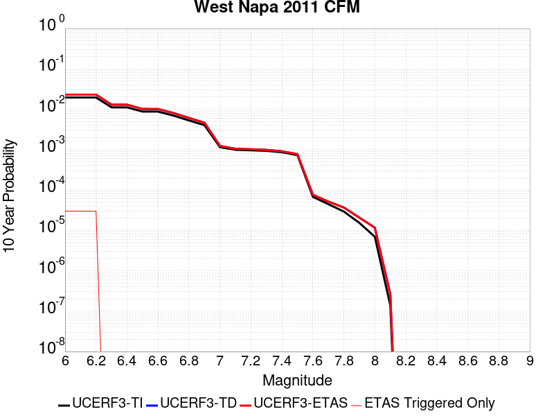 |

| Magnitude | 1 wk TI Prob | 1 wk TD Prob | 1 wk ETAS Prob | 1 wk ETAS/TD Gain | 1 wk ETAS Triggered Only | 1 mo TI Prob | 1 mo TD Prob | 1 mo ETAS Prob | 1 mo ETAS/TD Gain | 1 mo ETAS Triggered Only | 1 yr TI Prob | 1 yr TD Prob | 1 yr ETAS Prob | 1 yr ETAS/TD Gain | 1 yr ETAS Triggered Only | 10 yr TI Prob | 10 yr TD Prob | 10 yr ETAS Prob | 10 yr ETAS/TD Gain | 10 yr ETAS Triggered Only |
|-----|-----|-----|-----|-----|-----|-----|-----|-----|-----|-----|-----|-----|-----|-----|-----|-----|-----|-----|-----|-----|
| 6.0 | 3.773104E-5 | 4.453331E-5 | 5.9758662E-5 | 1.3418869 | 1.522603E-5 | 1.6169442E-4 | 1.9084488E-4 | 2.0606801E-4 | 1.079767 | 1.522603E-5 | 0.001966852 | 0.0023213772 | 0.0023365677 | 1.0065439 | 1.522603E-5 | 0.019495348 | 0.023004726 | 0.023049353 | 1.0019399 | 4.567809E-5 |
| 6.1 | 3.773104E-5 | 4.453331E-5 | 5.9758662E-5 | 1.3418869 | 1.522603E-5 | 1.6169442E-4 | 1.9084488E-4 | 2.0606801E-4 | 1.079767 | 1.522603E-5 | 0.001966852 | 0.0023213772 | 0.0023365677 | 1.0065439 | 1.522603E-5 | 0.019495348 | 0.023004726 | 0.023049353 | 1.0019399 | 4.567809E-5 |
| 6.2 | 3.773104E-5 | 4.453331E-5 | 5.9758662E-5 | 1.3418869 | 1.522603E-5 | 1.6169442E-4 | 1.9084488E-4 | 2.0606801E-4 | 1.079767 | 1.522603E-5 | 0.001966852 | 0.0023213772 | 0.0023365677 | 1.0065439 | 1.522603E-5 | 0.019495348 | 0.023004726 | 0.023049353 | 1.0019399 | 4.567809E-5 |
| 6.3 | 2.147964E-5 | 2.4989802E-5 | 2.4989802E-5 | 1.0 | 0.0 | 9.2052345E-5 | 1.0709527E-4 | 1.0709527E-4 | 1.0 | 0.0 | 0.001120161 | 0.0013031967 | 0.0013031967 | 1.0 | 0.0 | 0.011145315 | 0.0129661625 | 0.0129661625 | 1.0 | 0.0 |
| 6.4 | 2.147964E-5 | 2.4989802E-5 | 2.4989802E-5 | 1.0 | 0.0 | 9.2052345E-5 | 1.0709527E-4 | 1.0709527E-4 | 1.0 | 0.0 | 0.001120161 | 0.0013031967 | 0.0013031967 | 1.0 | 0.0 | 0.011145315 | 0.0129661625 | 0.0129661625 | 1.0 | 0.0 |
| 6.5 | 1.688201E-5 | 1.954958E-5 | 1.954958E-5 | 1.0 | 0.0 | 7.234947E-5 | 8.378163E-5 | 8.378163E-5 | 1.0 | 0.0 | 8.804988E-4 | 0.0010196365 | 0.0010196365 | 1.0 | 0.0 | 0.008770182 | 0.010158253 | 0.010158253 | 1.0 | 0.0 |
| 6.6 | 1.6846381E-5 | 1.9509269E-5 | 1.9509269E-5 | 1.0 | 0.0 | 7.219678E-5 | 8.360889E-5 | 8.360889E-5 | 1.0 | 0.0 | 8.7864127E-4 | 0.0010175353 | 0.0010175353 | 1.0 | 0.0 | 0.008751754 | 0.010137432 | 0.010137432 | 1.0 | 0.0 |
| 6.7 | 1.3396501E-5 | 1.5469519E-5 | 1.5469519E-5 | 1.0 | 0.0 | 5.7412315E-5 | 6.629661E-5 | 6.629661E-5 | 1.0 | 0.0 | 6.9877075E-4 | 8.069259E-4 | 8.069259E-4 | 1.0 | 0.0 | 0.0069657755 | 0.008047685 | 0.008047685 | 1.0 | 0.0 |
| 6.8 | 1.0139058E-5 | 1.1673681E-5 | 1.1673681E-5 | 1.0 | 0.0 | 4.3452383E-5 | 5.0029415E-5 | 5.0029415E-5 | 1.0 | 0.0 | 5.289043E-4 | 6.089934E-4 | 6.089934E-4 | 1.0 | 0.0 | 0.005276473 | 0.0060801683 | 0.0060801683 | 1.0 | 0.0 |
| 6.9 | 7.761281E-6 | 8.891974E-6 | 8.891974E-6 | 1.0 | 0.0 | 3.326221E-5 | 3.8108195E-5 | 3.8108195E-5 | 1.0 | 0.0 | 4.0489217E-4 | 4.639199E-4 | 4.639199E-4 | 1.0 | 0.0 | 0.0040415525 | 0.0046360292 | 0.0046360292 | 1.0 | 0.0 |
| 7.0 | 2.2109202E-6 | 2.3672765E-6 | 2.3672765E-6 | 1.0 | 0.0 | 9.475338E-6 | 1.0145431E-5 | 1.0145431E-5 | 1.0 | 0.0 | 1.1535613E-4 | 1.235137E-4 | 1.235137E-4 | 1.0 | 0.0 | 0.0011529627 | 0.0012359362 | 0.0012359362 | 1.0 | 0.0 |
| 7.1 | 1.9008926E-6 | 2.013939E-6 | 2.013939E-6 | 1.0 | 0.0 | 8.146657E-6 | 8.631138E-6 | 8.631138E-6 | 1.0 | 0.0 | 9.918104E-5 | 1.05079074E-4 | 1.05079074E-4 | 1.0 | 0.0 | 9.913679E-4 | 0.0010517744 | 0.0010517744 | 1.0 | 0.0 |
| 7.2 | 1.8495944E-6 | 1.9567422E-6 | 1.9567422E-6 | 1.0 | 0.0 | 7.926808E-6 | 8.386011E-6 | 8.386011E-6 | 1.0 | 0.0 | 9.650462E-5 | 1.0209493E-4 | 1.0209493E-4 | 1.0 | 0.0 | 9.6462725E-4 | 0.0010219608 | 0.0010219608 | 1.0 | 0.0 |
| 7.3 | 1.7883189E-6 | 1.8887007E-6 | 1.8887007E-6 | 1.0 | 0.0 | 7.664201E-6 | 8.094406E-6 | 8.094406E-6 | 1.0 | 0.0 | 9.330765E-5 | 9.854497E-5 | 9.854497E-5 | 1.0 | 0.0 | 9.3268487E-4 | 9.864931E-4 | 9.864931E-4 | 1.0 | 0.0 |
| 7.4 | 1.6520572E-6 | 1.7421038E-6 | 1.7421038E-6 | 1.0 | 0.0 | 7.0802257E-6 | 7.466138E-6 | 7.466138E-6 | 1.0 | 0.0 | 8.6198335E-5 | 9.0896465E-5 | 9.0896465E-5 | 1.0 | 0.0 | 8.616491E-4 | 9.1006904E-4 | 9.1006904E-4 | 1.0 | 0.0 |
| 7.5 | 1.4040345E-6 | 1.4805248E-6 | 1.4805248E-6 | 1.0 | 0.0 | 6.0172765E-6 | 6.345091E-6 | 6.345091E-6 | 1.0 | 0.0 | 7.325788E-5 | 7.724877E-5 | 7.724877E-5 | 1.0 | 0.0 | 7.3233736E-4 | 7.736636E-4 | 7.736636E-4 | 1.0 | 0.0 |
| 7.6 | 1.3013842E-7 | 1.4432896E-7 | 1.4432896E-7 | 1.0 | 0.0 | 5.57736E-7 | 6.185526E-7 | 6.185526E-7 | 1.0 | 0.0 | 6.790414E-6 | 7.5308512E-6 | 7.5308512E-6 | 1.0 | 0.0 | 6.790207E-5 | 7.6237025E-5 | 7.6237025E-5 | 1.0 | 0.0 |
| 7.7 | 8.541512E-8 | 9.731841E-8 | 9.731841E-8 | 1.0 | 0.0 | 3.6606474E-7 | 4.1707887E-7 | 4.1707887E-7 | 1.0 | 0.0 | 4.456829E-6 | 5.077923E-6 | 5.077923E-6 | 1.0 | 0.0 | 4.4567398E-5 | 5.168383E-5 | 5.168383E-5 | 1.0 | 0.0 |
| 7.8 | 5.6074793E-8 | 6.908223E-8 | 6.908223E-8 | 1.0 | 0.0 | 2.403205E-7 | 2.9606667E-7 | 2.9606667E-7 | 1.0 | 0.0 | 2.9258983E-6 | 3.6046058E-6 | 3.6046058E-6 | 1.0 | 0.0 | 2.9258597E-5 | 3.6881407E-5 | 3.6881407E-5 | 1.0 | 0.0 |
| 7.9 | 2.9475839E-8 | 3.8642522E-8 | 3.8642522E-8 | 1.0 | 0.0 | 1.2632502E-7 | 1.656108E-7 | 1.656108E-7 | 1.0 | 0.0 | 1.538006E-6 | 2.0163097E-6 | 2.0163097E-6 | 1.0 | 0.0 | 1.5379954E-5 | 2.0705578E-5 | 2.0705578E-5 | 1.0 | 0.0 |
| 8.0 | 1.3337122E-8 | 2.1675831E-8 | 2.1675831E-8 | 1.0 | 0.0 | 5.7159088E-8 | 9.2896414E-8 | 9.2896414E-8 | 1.0 | 0.0 | 6.959117E-7 | 1.1310133E-6 | 1.1310133E-6 | 1.0 | 0.0 | 6.959095E-6 | 1.1668609E-5 | 1.1668609E-5 | 1.0 | 0.0 |
| 8.1 | 2.6589986E-10 | 4.870925E-10 | 4.870925E-10 | 1.0 | 0.0 | 1.1395708E-9 | 2.0875381E-9 | 2.0875381E-9 | 1.0 | 0.0 | 1.3874274E-8 | 2.541578E-8 | 2.541578E-8 | 1.0 | 0.0 | 1.3874273E-7 | 2.608409E-7 | 2.608409E-7 | 1.0 | 0.0 |

## Santa Rosa Island
*[(top)](#table-of-contents)*

| 1 Week | 1 Month | 1 Year | 10 Year |
|-----|-----|-----|-----|
|  |  |  |  |

| Magnitude | 1 wk TI Prob | 1 wk TD Prob | 1 wk ETAS Prob | 1 wk ETAS/TD Gain | 1 wk ETAS Triggered Only | 1 mo TI Prob | 1 mo TD Prob | 1 mo ETAS Prob | 1 mo ETAS/TD Gain | 1 mo ETAS Triggered Only | 1 yr TI Prob | 1 yr TD Prob | 1 yr ETAS Prob | 1 yr ETAS/TD Gain | 1 yr ETAS Triggered Only | 10 yr TI Prob | 10 yr TD Prob | 10 yr ETAS Prob | 10 yr ETAS/TD Gain | 10 yr ETAS Triggered Only |
|-----|-----|-----|-----|-----|-----|-----|-----|-----|-----|-----|-----|-----|-----|-----|-----|-----|-----|-----|-----|-----|
| 6.0 | 4.1143165E-5 | 4.7094767E-5 | 4.7094767E-5 | 1.0 | 0.0 | 1.7631594E-4 | 2.018202E-4 | 2.018202E-4 | 1.0 | 0.0 | 0.002144533 | 0.0024545891 | 0.0024545891 | 1.0 | 0.0 | 0.021239553 | 0.024295403 | 0.024339972 | 1.0018344 | 4.567809E-5 |
| 6.1 | 2.1061249E-5 | 2.3866654E-5 | 2.3866654E-5 | 1.0 | 0.0 | 9.0259375E-5 | 1.0228182E-4 | 1.0228182E-4 | 1.0 | 0.0 | 0.0010983539 | 0.0012445987 | 0.0012445987 | 1.0 | 0.0 | 0.01092941 | 0.012379322 | 0.012409397 | 1.0024295 | 3.045206E-5 |
| 6.2 | 2.1061249E-5 | 2.3866654E-5 | 2.3866654E-5 | 1.0 | 0.0 | 9.0259375E-5 | 1.0228182E-4 | 1.0228182E-4 | 1.0 | 0.0 | 0.0010983539 | 0.0012445987 | 0.0012445987 | 1.0 | 0.0 | 0.01092941 | 0.012379322 | 0.012409397 | 1.0024295 | 3.045206E-5 |
| 6.3 | 1.5158236E-5 | 1.7075572E-5 | 1.7075572E-5 | 1.0 | 0.0 | 6.496225E-5 | 7.3179035E-5 | 7.3179035E-5 | 1.0 | 0.0 | 7.906284E-4 | 8.906025E-4 | 8.906025E-4 | 1.0 | 0.0 | 0.007878214 | 0.008871585 | 0.008886676 | 1.001701 | 1.522603E-5 |
| 6.4 | 1.2341918E-5 | 1.3853823E-5 | 1.3853823E-5 | 1.0 | 0.0 | 5.2892858E-5 | 5.9372218E-5 | 5.9372218E-5 | 1.0 | 0.0 | 6.437803E-4 | 7.226252E-4 | 7.226252E-4 | 1.0 | 0.0 | 0.006419184 | 0.0072035906 | 0.007218707 | 1.0020984 | 1.522603E-5 |
| 6.5 | 9.061158E-6 | 1.0117661E-5 | 1.0117661E-5 | 1.0 | 0.0 | 3.883296E-5 | 4.3360717E-5 | 4.3360717E-5 | 1.0 | 0.0 | 4.726887E-4 | 5.277942E-4 | 5.277942E-4 | 1.0 | 0.0 | 0.004716845 | 0.0052659446 | 0.0052810907 | 1.0028762 | 1.522603E-5 |
| 6.6 | 7.5461685E-6 | 8.401243E-6 | 8.401243E-6 | 1.0 | 0.0 | 3.2340322E-5 | 3.6004854E-5 | 3.6004854E-5 | 1.0 | 0.0 | 3.936723E-4 | 4.3827522E-4 | 4.3827522E-4 | 1.0 | 0.0 | 0.003929756 | 0.0043745385 | 0.0043896977 | 1.0034654 | 1.522603E-5 |
| 6.7 | 5.5023775E-6 | 6.0877283E-6 | 6.0877283E-6 | 1.0 | 0.0 | 2.3581404E-5 | 2.6090021E-5 | 2.6090021E-5 | 1.0 | 0.0 | 2.8706578E-4 | 3.1760297E-4 | 3.1760297E-4 | 1.0 | 0.0 | 0.0028669522 | 0.0031718123 | 0.0031718123 | 1.0 | 0.0 |
| 6.8 | 3.7351679E-6 | 4.083345E-6 | 4.083345E-6 | 1.0 | 0.0 | 1.6007763E-5 | 1.7499948E-5 | 1.7499948E-5 | 1.0 | 0.0 | 1.948771E-4 | 2.1304353E-4 | 2.1304353E-4 | 1.0 | 0.0 | 0.0019470629 | 0.002128638 | 0.002128638 | 1.0 | 0.0 |
| 6.9 | 2.456366E-6 | 2.6293699E-6 | 2.6293699E-6 | 1.0 | 0.0 | 1.0527241E-5 | 1.1268679E-5 | 1.1268679E-5 | 1.0 | 0.0 | 1.2816161E-4 | 1.3718756E-4 | 1.3718756E-4 | 1.0 | 0.0 | 0.0012808773 | 0.0013710316 | 0.0013710316 | 1.0 | 0.0 |
| 7.0 | 2.3245157E-6 | 2.482869E-6 | 2.482869E-6 | 1.0 | 0.0 | 9.962172E-6 | 1.0640823E-5 | 1.0640823E-5 | 1.0 | 0.0 | 1.2128269E-4 | 1.2954435E-4 | 1.2954435E-4 | 1.0 | 0.0 | 0.0012121652 | 0.0012946905 | 0.0012946905 | 1.0 | 0.0 |
| 7.1 | 2.2248344E-6 | 2.3733348E-6 | 2.3733348E-6 | 1.0 | 0.0 | 9.53497E-6 | 1.0171396E-5 | 1.0171396E-5 | 1.0 | 0.0 | 1.1608207E-4 | 1.2382973E-4 | 1.2382973E-4 | 1.0 | 0.0 | 0.0011602144 | 0.0012376092 | 0.0012376092 | 1.0 | 0.0 |
| 7.2 | 2.1350402E-6 | 2.2762347E-6 | 2.2762347E-6 | 1.0 | 0.0 | 9.150141E-6 | 9.755255E-6 | 9.755255E-6 | 1.0 | 0.0 | 1.1139726E-4 | 1.18763775E-4 | 1.18763775E-4 | 1.0 | 0.0 | 0.0011134144 | 0.001187005 | 0.001187005 | 1.0 | 0.0 |
| 7.3 | 1.9793572E-6 | 2.108793E-6 | 2.108793E-6 | 1.0 | 0.0 | 8.482932E-6 | 9.037653E-6 | 9.037653E-6 | 1.0 | 0.0 | 1.032748E-4 | 1.1002789E-4 | 1.1002789E-4 | 1.0 | 0.0 | 0.0010322682 | 0.001099736 | 0.001099736 | 1.0 | 0.0 |
| 7.4 | 1.6951194E-6 | 1.804636E-6 | 1.804636E-6 | 1.0 | 0.0 | 7.264777E-6 | 7.734132E-6 | 7.734132E-6 | 1.0 | 0.0 | 8.844508E-5 | 9.4159E-5 | 9.4159E-5 | 1.0 | 0.0 | 8.840988E-4 | 9.4119273E-4 | 9.4119273E-4 | 1.0 | 0.0 |
| 7.5 | 8.987207E-7 | 9.512517E-7 | 9.512517E-7 | 1.0 | 0.0 | 3.8516546E-6 | 4.076787E-6 | 4.076787E-6 | 1.0 | 0.0 | 4.6892885E-5 | 4.963376E-5 | 4.963376E-5 | 1.0 | 0.0 | 4.688299E-4 | 4.9622793E-4 | 4.9622793E-4 | 1.0 | 0.0 |
| 7.6 | 3.8783037E-7 | 4.0530355E-7 | 4.0530355E-7 | 1.0 | 0.0 | 1.6621291E-6 | 1.737014E-6 | 1.737014E-6 | 1.0 | 0.0 | 2.0236233E-5 | 2.1147947E-5 | 2.1147947E-5 | 1.0 | 0.0 | 2.023439E-4 | 2.1146E-4 | 2.1146E-4 | 1.0 | 0.0 |
| 7.7 | 6.181804E-8 | 6.33916E-8 | 6.33916E-8 | 1.0 | 0.0 | 2.6493444E-7 | 2.7167826E-7 | 2.7167826E-7 | 1.0 | 0.0 | 3.225572E-6 | 3.3076778E-6 | 3.3076778E-6 | 1.0 | 0.0 | 3.225525E-5 | 3.3076292E-5 | 3.3076292E-5 | 1.0 | 0.0 |
| 7.8 | 1.3704449E-9 | 1.3964294E-9 | 1.3964294E-9 | 1.0 | 0.0 | 5.873335E-9 | 5.984697E-9 | 5.984697E-9 | 1.0 | 0.0 | 7.1507856E-8 | 7.2863685E-8 | 7.2863685E-8 | 1.0 | 0.0 | 7.1507833E-7 | 7.2863673E-7 | 7.2863673E-7 | 1.0 | 0.0 |

## San Andreas (North Branch Mill Creek)
*[(top)](#table-of-contents)*

| 1 Week | 1 Month | 1 Year | 10 Year |
|-----|-----|-----|-----|
|  |  |  |  |

| Magnitude | 1 wk TI Prob | 1 wk TD Prob | 1 wk ETAS Prob | 1 wk ETAS/TD Gain | 1 wk ETAS Triggered Only | 1 mo TI Prob | 1 mo TD Prob | 1 mo ETAS Prob | 1 mo ETAS/TD Gain | 1 mo ETAS Triggered Only | 1 yr TI Prob | 1 yr TD Prob | 1 yr ETAS Prob | 1 yr ETAS/TD Gain | 1 yr ETAS Triggered Only | 10 yr TI Prob | 10 yr TD Prob | 10 yr ETAS Prob | 10 yr ETAS/TD Gain | 10 yr ETAS Triggered Only |
|-----|-----|-----|-----|-----|-----|-----|-----|-----|-----|-----|-----|-----|-----|-----|-----|-----|-----|-----|-----|-----|
| 6.0 | 1.3461156E-5 | 2.3527407E-5 | 2.3527407E-5 | 1.0 | 0.0 | 5.7689394E-5 | 1.0082787E-4 | 1.0082787E-4 | 1.0 | 0.0 | 7.02142E-4 | 0.0012268913 | 0.0012725134 | 1.0371851 | 4.567809E-5 | 0.0069992766 | 0.012243656 | 0.012288775 | 1.0036851 | 4.567809E-5 |
| 6.1 | 1.3461156E-5 | 2.3527407E-5 | 2.3527407E-5 | 1.0 | 0.0 | 5.7689394E-5 | 1.0082787E-4 | 1.0082787E-4 | 1.0 | 0.0 | 7.02142E-4 | 0.0012268913 | 0.0012725134 | 1.0371851 | 4.567809E-5 | 0.0069992766 | 0.012243656 | 0.012288775 | 1.0036851 | 4.567809E-5 |
| 6.2 | 1.3461156E-5 | 2.3527407E-5 | 2.3527407E-5 | 1.0 | 0.0 | 5.7689394E-5 | 1.0082787E-4 | 1.0082787E-4 | 1.0 | 0.0 | 7.02142E-4 | 0.0012268913 | 0.0012725134 | 1.0371851 | 4.567809E-5 | 0.0069992766 | 0.012243656 | 0.012288775 | 1.0036851 | 4.567809E-5 |
| 6.3 | 1.3461156E-5 | 2.3527407E-5 | 2.3527407E-5 | 1.0 | 0.0 | 5.7689394E-5 | 1.0082787E-4 | 1.0082787E-4 | 1.0 | 0.0 | 7.02142E-4 | 0.0012268913 | 0.0012725134 | 1.0371851 | 4.567809E-5 | 0.0069992766 | 0.012243656 | 0.012288775 | 1.0036851 | 4.567809E-5 |
| 6.4 | 1.3461156E-5 | 2.3527407E-5 | 2.3527407E-5 | 1.0 | 0.0 | 5.7689394E-5 | 1.0082787E-4 | 1.0082787E-4 | 1.0 | 0.0 | 7.02142E-4 | 0.0012268913 | 0.0012725134 | 1.0371851 | 4.567809E-5 | 0.0069992766 | 0.012243656 | 0.012288775 | 1.0036851 | 4.567809E-5 |
| 6.5 | 1.3450706E-5 | 2.3516368E-5 | 2.3516368E-5 | 1.0 | 0.0 | 5.764461E-5 | 1.00780555E-4 | 1.00780555E-4 | 1.0 | 0.0 | 7.0159714E-4 | 0.001226316 | 0.001271938 | 1.0372026 | 4.567809E-5 | 0.006993862 | 0.012237966 | 0.012283086 | 1.0036868 | 4.567809E-5 |
| 6.6 | 1.3074523E-5 | 2.313064E-5 | 2.313064E-5 | 1.0 | 0.0 | 5.6032466E-5 | 9.912757E-5 | 9.912757E-5 | 1.0 | 0.0 | 6.8198174E-4 | 0.0012062131 | 0.0012518362 | 1.0378233 | 4.567809E-5 | 0.006798926 | 0.012039129 | 0.012084257 | 1.0037484 | 4.567809E-5 |
| 6.7 | 1.3050216E-5 | 2.3105935E-5 | 2.3105935E-5 | 1.0 | 0.0 | 5.59283E-5 | 9.9021694E-5 | 9.9021694E-5 | 1.0 | 0.0 | 6.8071426E-4 | 0.0012049256 | 0.0012505486 | 1.0378639 | 4.567809E-5 | 0.0067863287 | 0.012026393 | 0.012071522 | 1.0037525 | 4.567809E-5 |
| 6.8 | 1.29049395E-5 | 2.2954338E-5 | 2.2954338E-5 | 1.0 | 0.0 | 5.530571E-5 | 9.8372046E-5 | 9.8372046E-5 | 1.0 | 0.0 | 6.73139E-4 | 0.0011970248 | 0.0012426482 | 1.038114 | 4.567809E-5 | 0.0067110364 | 0.011948236 | 0.011993368 | 1.0037773 | 4.567809E-5 |
| 6.9 | 1.2867369E-5 | 2.2913739E-5 | 2.2913739E-5 | 1.0 | 0.0 | 5.51447E-5 | 9.8198056E-5 | 9.8198056E-5 | 1.0 | 0.0 | 6.711799E-4 | 0.0011949089 | 0.0012405324 | 1.0381815 | 4.567809E-5 | 0.006691564 | 0.011927304 | 0.011972437 | 1.0037841 | 4.567809E-5 |
| 7.0 | 1.2495996E-5 | 2.2313627E-5 | 2.2313627E-5 | 1.0 | 0.0 | 5.3553173E-5 | 9.562634E-5 | 9.562634E-5 | 1.0 | 0.0 | 6.518148E-4 | 0.0011636318 | 0.0012092567 | 1.0392091 | 4.567809E-5 | 0.0064990623 | 0.011617814 | 0.011662962 | 1.0038861 | 4.567809E-5 |
| 7.1 | 1.2452067E-5 | 2.2258691E-5 | 2.2258691E-5 | 1.0 | 0.0 | 5.3364907E-5 | 9.539092E-5 | 9.539092E-5 | 1.0 | 0.0 | 6.4952404E-4 | 0.0011607686 | 0.0012063936 | 1.0393059 | 4.567809E-5 | 0.0064762887 | 0.011589482 | 0.011634631 | 1.0038956 | 4.567809E-5 |
| 7.2 | 1.2002777E-5 | 2.163711E-5 | 2.163711E-5 | 1.0 | 0.0 | 5.143946E-5 | 9.272719E-5 | 9.272719E-5 | 1.0 | 0.0 | 6.2609545E-4 | 0.0011283715 | 0.0011739981 | 1.0404358 | 4.567809E-5 | 0.006243344 | 0.011268834 | 0.011313997 | 1.0040078 | 4.567809E-5 |
| 7.3 | 1.1923425E-5 | 2.150691E-5 | 2.150691E-5 | 1.0 | 0.0 | 5.109939E-5 | 9.216923E-5 | 9.216923E-5 | 1.0 | 0.0 | 6.219575E-4 | 0.0011215854 | 0.0011672123 | 1.0406806 | 4.567809E-5 | 0.0062021962 | 0.011201685 | 0.011246852 | 1.0040321 | 4.567809E-5 |
| 7.4 | 1.16105175E-5 | 2.0880623E-5 | 2.0880623E-5 | 1.0 | 0.0 | 4.975841E-5 | 8.948533E-5 | 8.948533E-5 | 1.0 | 0.0 | 6.0564023E-4 | 0.0010889419 | 0.0011345703 | 1.0419016 | 4.567809E-5 | 0.006039923 | 0.010879163 | 0.010924344 | 1.004153 | 4.567809E-5 |
| 7.5 | 1.1037265E-5 | 1.9579818E-5 | 1.9579818E-5 | 1.0 | 0.0 | 4.7301706E-5 | 8.3910825E-5 | 8.3910825E-5 | 1.0 | 0.0 | 5.757461E-4 | 0.0010211377 | 0.0010667691 | 1.0446869 | 4.567809E-5 | 0.005742567 | 0.010208193 | 0.010253405 | 1.004429 | 4.567809E-5 |
| 7.6 | 1.0720915E-5 | 1.9021407E-5 | 1.9021407E-5 | 1.0 | 0.0 | 4.5945973E-5 | 8.151778E-5 | 8.151778E-5 | 1.0 | 0.0 | 5.592486E-4 | 9.920292E-4 | 0.001037662 | 1.0459994 | 4.567809E-5 | 0.005578433 | 0.009919754 | 0.009964979 | 1.004559 | 4.567809E-5 |
| 7.7 | 9.276279E-6 | 1.6466016E-5 | 1.6466016E-5 | 1.0 | 0.0 | 3.9754876E-5 | 7.056674E-5 | 7.056674E-5 | 1.0 | 0.0 | 4.839081E-4 | 8.5881306E-4 | 9.044519E-4 | 1.0531418 | 4.567809E-5 | 0.0048285574 | 0.008598559 | 0.008643844 | 1.0052667 | 4.567809E-5 |
| 7.8 | 5.8346777E-6 | 1.11748E-5 | 1.11748E-5 | 1.0 | 0.0 | 2.5005522E-5 | 4.7891124E-5 | 4.7891124E-5 | 1.0 | 0.0 | 3.043997E-4 | 5.829186E-4 | 6.2857004E-4 | 1.0783154 | 4.567809E-5 | 0.0030398308 | 0.005857104 | 0.005902515 | 1.007753 | 4.567809E-5 |
| 7.9 | 4.690204E-6 | 8.525594E-6 | 8.525594E-6 | 1.0 | 0.0 | 2.0100719E-5 | 3.653775E-5 | 3.653775E-5 | 1.0 | 0.0 | 2.4469878E-4 | 4.4475638E-4 | 4.9041415E-4 | 1.1026579 | 4.567809E-5 | 0.002444295 | 0.004479242 | 0.0045247157 | 1.0101521 | 4.567809E-5 |
| 8.0 | 2.9570454E-6 | 4.857035E-6 | 4.857035E-6 | 1.0 | 0.0 | 1.267299E-5 | 2.0815698E-5 | 2.0815698E-5 | 1.0 | 0.0 | 1.5428272E-4 | 2.534017E-4 | 2.534017E-4 | 1.0 | 0.0 | 0.0015417566 | 0.002554891 | 0.002554891 | 1.0 | 0.0 |
| 8.1 | 1.6376824E-6 | 2.2021889E-6 | 2.2021889E-6 | 1.0 | 0.0 | 7.01862E-6 | 9.437918E-6 | 9.437918E-6 | 1.0 | 0.0 | 8.544835E-5 | 1.14900606E-4 | 1.14900606E-4 | 1.0 | 0.0 | 8.54155E-4 | 0.0011634289 | 0.0011634289 | 1.0 | 0.0 |
| 8.2 | 6.9631557E-7 | 4.5525482E-7 | 4.5525482E-7 | 1.0 | 0.0 | 2.984206E-6 | 1.9510906E-6 | 1.9510906E-6 | 1.0 | 0.0 | 3.63321E-5 | 2.3754272E-5 | 2.3754272E-5 | 1.0 | 0.0 | 3.6326164E-4 | 2.4603383E-4 | 2.4603383E-4 | 1.0 | 0.0 |
| 8.3 | 1.7876137E-7 | 8.3938964E-8 | 8.3938964E-8 | 1.0 | 0.0 | 7.661199E-7 | 3.5973835E-7 | 3.5973835E-7 | 1.0 | 0.0 | 9.32747E-6 | 4.3798063E-6 | 4.3798063E-6 | 1.0 | 0.0 | 9.3270784E-5 | 4.599691E-5 | 4.599691E-5 | 1.0 | 0.0 |

## Santa Ynez (East)
*[(top)](#table-of-contents)*

| 1 Week | 1 Month | 1 Year | 10 Year |
|-----|-----|-----|-----|
|  | 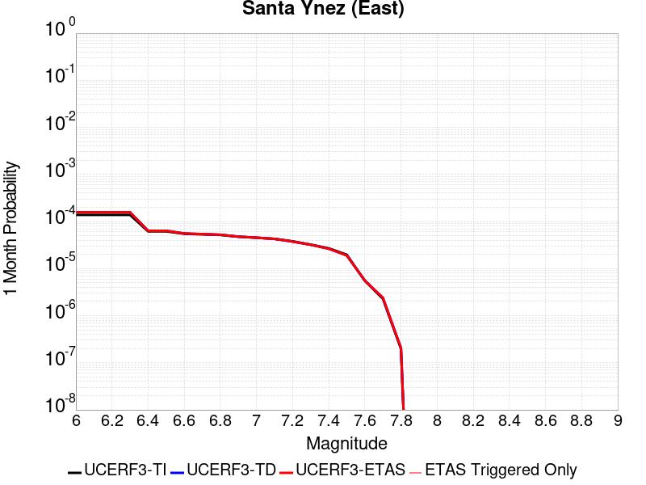 |  |  |

| Magnitude | 1 wk TI Prob | 1 wk TD Prob | 1 wk ETAS Prob | 1 wk ETAS/TD Gain | 1 wk ETAS Triggered Only | 1 mo TI Prob | 1 mo TD Prob | 1 mo ETAS Prob | 1 mo ETAS/TD Gain | 1 mo ETAS Triggered Only | 1 yr TI Prob | 1 yr TD Prob | 1 yr ETAS Prob | 1 yr ETAS/TD Gain | 1 yr ETAS Triggered Only | 10 yr TI Prob | 10 yr TD Prob | 10 yr ETAS Prob | 10 yr ETAS/TD Gain | 10 yr ETAS Triggered Only |
|-----|-----|-----|-----|-----|-----|-----|-----|-----|-----|-----|-----|-----|-----|-----|-----|-----|-----|-----|-----|-----|
| 6.0 | 3.2269712E-5 | 3.675388E-5 | 3.675388E-5 | 1.0 | 0.0 | 1.3829143E-4 | 1.5751045E-4 | 1.5751045E-4 | 1.0 | 0.0 | 0.0016823979 | 0.0019165927 | 0.0019317896 | 1.0079291 | 1.522603E-5 | 0.016697178 | 0.019058175 | 0.019088048 | 1.0015674 | 3.045206E-5 |
| 6.1 | 3.2269712E-5 | 3.675388E-5 | 3.675388E-5 | 1.0 | 0.0 | 1.3829143E-4 | 1.5751045E-4 | 1.5751045E-4 | 1.0 | 0.0 | 0.0016823979 | 0.0019165927 | 0.0019317896 | 1.0079291 | 1.522603E-5 | 0.016697178 | 0.019058175 | 0.019088048 | 1.0015674 | 3.045206E-5 |
| 6.2 | 3.2269712E-5 | 3.675388E-5 | 3.675388E-5 | 1.0 | 0.0 | 1.3829143E-4 | 1.5751045E-4 | 1.5751045E-4 | 1.0 | 0.0 | 0.0016823979 | 0.0019165927 | 0.0019317896 | 1.0079291 | 1.522603E-5 | 0.016697178 | 0.019058175 | 0.019088048 | 1.0015674 | 3.045206E-5 |
| 6.3 | 3.2269712E-5 | 3.675388E-5 | 3.675388E-5 | 1.0 | 0.0 | 1.3829143E-4 | 1.5751045E-4 | 1.5751045E-4 | 1.0 | 0.0 | 0.0016823979 | 0.0019165927 | 0.0019317896 | 1.0079291 | 1.522603E-5 | 0.016697178 | 0.019058175 | 0.019088048 | 1.0015674 | 3.045206E-5 |
| 6.4 | 1.4404779E-5 | 1.485013E-5 | 1.485013E-5 | 1.0 | 0.0 | 6.1733306E-5 | 6.364189E-5 | 6.364189E-5 | 1.0 | 0.0 | 7.513438E-4 | 7.745696E-4 | 7.8978384E-4 | 1.0196422 | 1.522603E-5 | 0.0074880854 | 0.0077192495 | 0.007734358 | 1.0019573 | 1.522603E-5 |
| 6.5 | 1.4404779E-5 | 1.485013E-5 | 1.485013E-5 | 1.0 | 0.0 | 6.1733306E-5 | 6.364189E-5 | 6.364189E-5 | 1.0 | 0.0 | 7.513438E-4 | 7.745696E-4 | 7.8978384E-4 | 1.0196422 | 1.522603E-5 | 0.0074880854 | 0.0077192495 | 0.007734358 | 1.0019573 | 1.522603E-5 |
| 6.6 | 1.280208E-5 | 1.3012552E-5 | 1.3012552E-5 | 1.0 | 0.0 | 5.4864904E-5 | 5.5766897E-5 | 5.5766897E-5 | 1.0 | 0.0 | 6.6777546E-4 | 6.7875226E-4 | 6.7875226E-4 | 1.0 | 0.0 | 0.006657724 | 0.006767002 | 0.006767002 | 1.0 | 0.0 |
| 6.7 | 1.2457027E-5 | 1.262905E-5 | 1.262905E-5 | 1.0 | 0.0 | 5.3386164E-5 | 5.4123386E-5 | 5.4123386E-5 | 1.0 | 0.0 | 6.497827E-4 | 6.5875467E-4 | 6.5875467E-4 | 1.0 | 0.0 | 0.00647886 | 0.0065682167 | 0.0065682167 | 1.0 | 0.0 |
| 6.8 | 1.2095134E-5 | 1.2231476E-5 | 1.2231476E-5 | 1.0 | 0.0 | 5.1835254E-5 | 5.2419568E-5 | 5.2419568E-5 | 1.0 | 0.0 | 6.309115E-4 | 6.3802296E-4 | 6.3802296E-4 | 1.0 | 0.0 | 0.0062912325 | 0.0063621 | 0.0063621 | 1.0 | 0.0 |
| 6.9 | 1.1104036E-5 | 1.115786E-5 | 1.115786E-5 | 1.0 | 0.0 | 4.758786E-5 | 4.7818532E-5 | 4.7818532E-5 | 1.0 | 0.0 | 5.7922816E-4 | 5.820364E-4 | 5.820364E-4 | 1.0 | 0.0 | 0.005777207 | 0.005805265 | 0.005805265 | 1.0 | 0.0 |
| 7.0 | 1.0577444E-5 | 1.0582165E-5 | 1.0582165E-5 | 1.0 | 0.0 | 4.5331115E-5 | 4.5351353E-5 | 4.5351353E-5 | 1.0 | 0.0 | 5.5176654E-4 | 5.5201404E-4 | 5.5201404E-4 | 1.0 | 0.0 | 0.0055039856 | 0.005506567 | 0.005506567 | 1.0 | 0.0 |
| 7.1 | 1.0021775E-5 | 9.981446E-6 | 9.981446E-6 | 1.0 | 0.0 | 4.294976E-5 | 4.277693E-5 | 4.277693E-5 | 1.0 | 0.0 | 5.2278786E-4 | 5.2068586E-4 | 5.2068586E-4 | 1.0 | 0.0 | 0.0052155964 | 0.0051947916 | 0.0051947916 | 1.0 | 0.0 |
| 7.2 | 8.874109E-6 | 8.749197E-6 | 8.749197E-6 | 1.0 | 0.0 | 3.8031343E-5 | 3.7496025E-5 | 3.7496025E-5 | 1.0 | 0.0 | 4.629332E-4 | 4.564196E-4 | 4.564196E-4 | 1.0 | 0.0 | 0.0046197 | 0.00455494 | 0.00455494 | 1.0 | 0.0 |
| 7.3 | 7.5504267E-6 | 7.505443E-6 | 7.505443E-6 | 1.0 | 0.0 | 3.235857E-5 | 3.2165794E-5 | 3.2165794E-5 | 1.0 | 0.0 | 3.9389438E-4 | 3.915492E-4 | 3.915492E-4 | 1.0 | 0.0 | 0.0039319694 | 0.0039087003 | 0.0039087003 | 1.0 | 0.0 |
| 7.4 | 6.309394E-6 | 6.183419E-6 | 6.183419E-6 | 1.0 | 0.0 | 2.703998E-5 | 2.6500104E-5 | 2.6500104E-5 | 1.0 | 0.0 | 3.2916202E-4 | 3.2259195E-4 | 3.2259195E-4 | 1.0 | 0.0 | 0.003286749 | 0.003221334 | 0.003221334 | 1.0 | 0.0 |
| 7.5 | 4.6103073E-6 | 4.4410685E-6 | 4.4410685E-6 | 1.0 | 0.0 | 1.975831E-5 | 1.9033017E-5 | 1.9033017E-5 | 1.0 | 0.0 | 2.4053088E-4 | 2.3170303E-4 | 2.3170303E-4 | 1.0 | 0.0 | 0.002402707 | 0.002314684 | 0.002314684 | 1.0 | 0.0 |
| 7.6 | 1.2858658E-6 | 1.3008554E-6 | 1.3008554E-6 | 1.0 | 0.0 | 5.5108417E-6 | 5.575083E-6 | 5.575083E-6 | 1.0 | 0.0 | 6.7092435E-5 | 6.7874586E-5 | 6.7874586E-5 | 1.0 | 0.0 | 6.707218E-4 | 6.7854545E-4 | 6.7854545E-4 | 1.0 | 0.0 |
| 7.7 | 5.3302307E-7 | 5.612297E-7 | 5.612297E-7 | 1.0 | 0.0 | 2.2843826E-6 | 2.4052679E-6 | 2.4052679E-6 | 1.0 | 0.0 | 2.7812002E-5 | 2.9283781E-5 | 2.9283781E-5 | 1.0 | 0.0 | 2.7808524E-4 | 2.9280278E-4 | 2.9280278E-4 | 1.0 | 0.0 |
| 7.8 | 4.613933E-8 | 4.8031144E-8 | 4.8031144E-8 | 1.0 | 0.0 | 1.9773998E-7 | 2.0584774E-7 | 2.0584774E-7 | 1.0 | 0.0 | 2.4074816E-6 | 2.5061934E-6 | 2.5061934E-6 | 1.0 | 0.0 | 2.4074554E-5 | 2.5061661E-5 | 2.5061661E-5 | 1.0 | 0.0 |

## Mission Ridge-Arroyo Parida-Santa Ana
*[(top)](#table-of-contents)*

| 1 Week | 1 Month | 1 Year | 10 Year |
|-----|-----|-----|-----|
|  |  |  |  |

| Magnitude | 1 wk TI Prob | 1 wk TD Prob | 1 wk ETAS Prob | 1 wk ETAS/TD Gain | 1 wk ETAS Triggered Only | 1 mo TI Prob | 1 mo TD Prob | 1 mo ETAS Prob | 1 mo ETAS/TD Gain | 1 mo ETAS Triggered Only | 1 yr TI Prob | 1 yr TD Prob | 1 yr ETAS Prob | 1 yr ETAS/TD Gain | 1 yr ETAS Triggered Only | 10 yr TI Prob | 10 yr TD Prob | 10 yr ETAS Prob | 10 yr ETAS/TD Gain | 10 yr ETAS Triggered Only |
|-----|-----|-----|-----|-----|-----|-----|-----|-----|-----|-----|-----|-----|-----|-----|-----|-----|-----|-----|-----|-----|
| 6.0 | 4.169034E-5 | 4.71435E-5 | 4.71435E-5 | 1.0 | 0.0 | 1.7866064E-4 | 2.0203278E-4 | 2.0203278E-4 | 1.0 | 0.0 | 0.0021730233 | 0.0024577067 | 0.0024577067 | 1.0 | 0.0 | 0.021518968 | 0.024387252 | 0.02441696 | 1.0012182 | 3.045206E-5 |
| 6.1 | 1.73813E-5 | 1.6855427E-5 | 1.6855427E-5 | 1.0 | 0.0 | 7.4489166E-5 | 7.2235605E-5 | 7.2235605E-5 | 1.0 | 0.0 | 9.065282E-4 | 8.791244E-4 | 8.791244E-4 | 1.0 | 0.0 | 0.009028391 | 0.008757609 | 0.008772702 | 1.0017234 | 1.522603E-5 |
| 6.2 | 1.4622182E-5 | 1.3674228E-5 | 1.3674228E-5 | 1.0 | 0.0 | 6.2664985E-5 | 5.8602538E-5 | 5.8602538E-5 | 1.0 | 0.0 | 7.6267915E-4 | 7.1325625E-4 | 7.1325625E-4 | 1.0 | 0.0 | 0.007600669 | 0.0071101133 | 0.0071101133 | 1.0 | 0.0 |
| 6.3 | 1.3552434E-5 | 1.2483067E-5 | 1.2483067E-5 | 1.0 | 0.0 | 5.8080568E-5 | 5.3497777E-5 | 5.3497777E-5 | 1.0 | 0.0 | 7.069015E-4 | 6.5114396E-4 | 6.5114396E-4 | 1.0 | 0.0 | 0.00704657 | 0.0064927237 | 0.0064927237 | 1.0 | 0.0 |
| 6.4 | 1.30977305E-5 | 1.1979993E-5 | 1.1979993E-5 | 1.0 | 0.0 | 5.613192E-5 | 5.1341834E-5 | 5.1341834E-5 | 1.0 | 0.0 | 6.831918E-4 | 6.249106E-4 | 6.249106E-4 | 1.0 | 0.0 | 0.006810953 | 0.0062318784 | 0.0062318784 | 1.0 | 0.0 |
| 6.5 | 1.225205E-5 | 1.104959E-5 | 1.104959E-5 | 1.0 | 0.0 | 5.2507727E-5 | 4.7354544E-5 | 4.7354544E-5 | 1.0 | 0.0 | 6.3909404E-4 | 5.7639176E-4 | 5.7639176E-4 | 1.0 | 0.0 | 0.006372592 | 0.005749278 | 0.005749278 | 1.0 | 0.0 |
| 6.6 | 1.1352241E-5 | 1.0064273E-5 | 1.0064273E-5 | 1.0 | 0.0 | 4.8651553E-5 | 4.3131895E-5 | 4.3131895E-5 | 1.0 | 0.0 | 5.921717E-4 | 5.2500644E-4 | 5.2500644E-4 | 1.0 | 0.0 | 0.0059059616 | 0.005237907 | 0.005237907 | 1.0 | 0.0 |
| 6.7 | 1.0864116E-5 | 9.517729E-6 | 9.517729E-6 | 1.0 | 0.0 | 4.6559664E-5 | 4.0789644E-5 | 4.0789644E-5 | 1.0 | 0.0 | 5.667165E-4 | 4.9650273E-4 | 4.9650273E-4 | 1.0 | 0.0 | 0.005652734 | 0.0049541686 | 0.0049541686 | 1.0 | 0.0 |
| 6.8 | 1.0666365E-5 | 9.30047E-6 | 9.30047E-6 | 1.0 | 0.0 | 4.571219E-5 | 3.9858558E-5 | 3.9858558E-5 | 1.0 | 0.0 | 5.564038E-4 | 4.851719E-4 | 4.851719E-4 | 1.0 | 0.0 | 0.005550127 | 0.004841359 | 0.004841359 | 1.0 | 0.0 |
| 6.9 | 1.0038665E-5 | 8.592689E-6 | 8.592689E-6 | 1.0 | 0.0 | 4.302214E-5 | 3.68253E-5 | 3.68253E-5 | 1.0 | 0.0 | 5.236687E-4 | 4.4825758E-4 | 4.4825758E-4 | 1.0 | 0.0 | 0.005224364 | 0.004473745 | 0.004473745 | 1.0 | 0.0 |
| 7.0 | 9.5379955E-6 | 8.025674E-6 | 8.025674E-6 | 1.0 | 0.0 | 4.0876483E-5 | 3.4395303E-5 | 3.4395303E-5 | 1.0 | 0.0 | 4.975576E-4 | 4.1868407E-4 | 4.1868407E-4 | 1.0 | 0.0 | 0.00496445 | 0.004179152 | 0.004179152 | 1.0 | 0.0 |
| 7.1 | 9.207389E-6 | 7.652948E-6 | 7.652948E-6 | 1.0 | 0.0 | 3.945964E-5 | 3.2797943E-5 | 3.2797943E-5 | 1.0 | 0.0 | 4.803152E-4 | 3.992435E-4 | 3.992435E-4 | 1.0 | 0.0 | 0.004792784 | 0.003985459 | 0.003985459 | 1.0 | 0.0 |
| 7.2 | 7.638091E-6 | 5.9315435E-6 | 5.9315435E-6 | 1.0 | 0.0 | 3.2734264E-5 | 2.5420655E-5 | 2.5420655E-5 | 1.0 | 0.0 | 3.984668E-4 | 3.0945282E-4 | 3.0945282E-4 | 1.0 | 0.0 | 0.0039775306 | 0.0030902762 | 0.0030902762 | 1.0 | 0.0 |
| 7.3 | 7.2500147E-6 | 5.5965506E-6 | 5.5965506E-6 | 1.0 | 0.0 | 3.1071122E-5 | 2.3985E-5 | 2.3985E-5 | 1.0 | 0.0 | 3.7822526E-4 | 2.9197853E-4 | 2.9197853E-4 | 1.0 | 0.0 | 0.0037758215 | 0.0029160045 | 0.0029160045 | 1.0 | 0.0 |
| 7.4 | 6.3899715E-6 | 4.918836E-6 | 4.918836E-6 | 1.0 | 0.0 | 2.7385306E-5 | 2.1080557E-5 | 2.1080557E-5 | 1.0 | 0.0 | 3.3336508E-4 | 2.5662576E-4 | 2.5662576E-4 | 1.0 | 0.0 | 0.0033286542 | 0.0025633385 | 0.0025633385 | 1.0 | 0.0 |
| 7.5 | 5.379025E-6 | 4.0841346E-6 | 4.0841346E-6 | 1.0 | 0.0 | 2.305276E-5 | 1.7503316E-5 | 1.7503316E-5 | 1.0 | 0.0 | 2.806312E-4 | 2.1308215E-4 | 2.1308215E-4 | 1.0 | 0.0 | 0.0028027708 | 0.0021287897 | 0.0021287897 | 1.0 | 0.0 |
| 7.6 | 4.1270696E-6 | 3.0885622E-6 | 3.0885622E-6 | 1.0 | 0.0 | 1.768732E-5 | 1.3236629E-5 | 1.3236629E-5 | 1.0 | 0.0 | 2.1532185E-4 | 1.6114411E-4 | 1.6114411E-4 | 1.0 | 0.0 | 0.0021511333 | 0.0016102807 | 0.0016102807 | 1.0 | 0.0 |
| 7.7 | 2.5406805E-6 | 1.8283382E-6 | 1.8283382E-6 | 1.0 | 0.0 | 1.0888585E-5 | 7.8357125E-6 | 7.8357125E-6 | 1.0 | 0.0 | 1.3256045E-4 | 9.539568E-5 | 9.539568E-5 | 1.0 | 0.0 | 0.0013248142 | 9.535535E-4 | 9.535535E-4 | 1.0 | 0.0 |
| 7.8 | 4.8608285E-7 | 3.5100658E-7 | 3.5100658E-7 | 1.0 | 0.0 | 2.0832106E-6 | 1.504313E-6 | 1.504313E-6 | 1.0 | 0.0 | 2.5362791E-5 | 1.8314859E-5 | 1.8314859E-5 | 1.0 | 0.0 | 2.5359896E-4 | 1.8313361E-4 | 1.8313361E-4 | 1.0 | 0.0 |
| 7.9 | 2.0472514E-8 | 1.2690024E-8 | 1.2690024E-8 | 1.0 | 0.0 | 8.7739345E-8 | 5.438582E-8 | 5.438582E-8 | 1.0 | 0.0 | 1.068226E-6 | 6.621471E-7 | 6.621471E-7 | 1.0 | 0.0 | 1.0682209E-5 | 6.6214525E-6 | 6.6214525E-6 | 1.0 | 0.0 |
| 8.0 | 4.443582E-9 | 2.0326807E-9 | 2.0326807E-9 | 1.0 | 0.0 | 1.9043922E-8 | 8.711488E-9 | 8.711488E-9 | 1.0 | 0.0 | 2.3185973E-7 | 1.06062366E-7 | 1.06062366E-7 | 1.0 | 0.0 | 2.3185949E-6 | 1.0606232E-6 | 1.0606232E-6 | 1.0 | 0.0 |

## Kern Canyon (North Kern) 2011
*[(top)](#table-of-contents)*

| 1 Week | 1 Month | 1 Year | 10 Year |
|-----|-----|-----|-----|
|  |  |  |  |

| Magnitude | 1 wk TI Prob | 1 wk TD Prob | 1 wk ETAS Prob | 1 wk ETAS/TD Gain | 1 wk ETAS Triggered Only | 1 mo TI Prob | 1 mo TD Prob | 1 mo ETAS Prob | 1 mo ETAS/TD Gain | 1 mo ETAS Triggered Only | 1 yr TI Prob | 1 yr TD Prob | 1 yr ETAS Prob | 1 yr ETAS/TD Gain | 1 yr ETAS Triggered Only | 10 yr TI Prob | 10 yr TD Prob | 10 yr ETAS Prob | 10 yr ETAS/TD Gain | 10 yr ETAS Triggered Only |
|-----|-----|-----|-----|-----|-----|-----|-----|-----|-----|-----|-----|-----|-----|-----|-----|-----|-----|-----|-----|-----|
| 6.0 | 6.6264497E-6 | 6.7574156E-6 | 6.7574156E-6 | 1.0 | 0.0 | 2.8398761E-5 | 2.8960078E-5 | 2.8960078E-5 | 1.0 | 0.0 | 3.4570007E-4 | 3.525399E-4 | 3.6776057E-4 | 1.0431743 | 1.522603E-5 | 0.0034516277 | 0.003520595 | 0.0035509397 | 1.0086192 | 3.045206E-5 |
| 6.1 | 6.6264497E-6 | 6.7574156E-6 | 6.7574156E-6 | 1.0 | 0.0 | 2.8398761E-5 | 2.8960078E-5 | 2.8960078E-5 | 1.0 | 0.0 | 3.4570007E-4 | 3.525399E-4 | 3.6776057E-4 | 1.0431743 | 1.522603E-5 | 0.0034516277 | 0.003520595 | 0.0035509397 | 1.0086192 | 3.045206E-5 |
| 6.2 | 6.6264497E-6 | 6.7574156E-6 | 6.7574156E-6 | 1.0 | 0.0 | 2.8398761E-5 | 2.8960078E-5 | 2.8960078E-5 | 1.0 | 0.0 | 3.4570007E-4 | 3.525399E-4 | 3.6776057E-4 | 1.0431743 | 1.522603E-5 | 0.0034516277 | 0.003520595 | 0.0035509397 | 1.0086192 | 3.045206E-5 |
| 6.3 | 6.6264497E-6 | 6.7574156E-6 | 6.7574156E-6 | 1.0 | 0.0 | 2.8398761E-5 | 2.8960078E-5 | 2.8960078E-5 | 1.0 | 0.0 | 3.4570007E-4 | 3.525399E-4 | 3.6776057E-4 | 1.0431743 | 1.522603E-5 | 0.0034516277 | 0.003520595 | 0.0035509397 | 1.0086192 | 3.045206E-5 |
| 6.4 | 6.6264497E-6 | 6.7574156E-6 | 6.7574156E-6 | 1.0 | 0.0 | 2.8398761E-5 | 2.8960078E-5 | 2.8960078E-5 | 1.0 | 0.0 | 3.4570007E-4 | 3.525399E-4 | 3.6776057E-4 | 1.0431743 | 1.522603E-5 | 0.0034516277 | 0.003520595 | 0.0035509397 | 1.0086192 | 3.045206E-5 |
| 6.5 | 3.2162225E-6 | 3.2571281E-6 | 3.2571281E-6 | 1.0 | 0.0 | 1.3783738E-5 | 1.395905E-5 | 1.395905E-5 | 1.0 | 0.0 | 1.6780409E-4 | 1.69939E-4 | 1.69939E-4 | 1.0 | 0.0 | 0.0016767744 | 0.0016981701 | 0.0017133702 | 1.008951 | 1.522603E-5 |
| 6.6 | 3.2162225E-6 | 3.2571281E-6 | 3.2571281E-6 | 1.0 | 0.0 | 1.3783738E-5 | 1.395905E-5 | 1.395905E-5 | 1.0 | 0.0 | 1.6780409E-4 | 1.69939E-4 | 1.69939E-4 | 1.0 | 0.0 | 0.0016767744 | 0.0016981701 | 0.0017133702 | 1.008951 | 1.522603E-5 |
| 6.7 | 2.1908265E-6 | 2.2071454E-6 | 2.2071454E-6 | 1.0 | 0.0 | 9.389223E-6 | 9.459161E-6 | 9.459161E-6 | 1.0 | 0.0 | 1.1430779E-4 | 1.15159404E-4 | 1.15159404E-4 | 1.0 | 0.0 | 0.0011424901 | 0.0011510167 | 0.0011662252 | 1.0132132 | 1.522603E-5 |
| 6.8 | 1.7303895E-6 | 1.7365707E-6 | 1.7365707E-6 | 1.0 | 0.0 | 7.415934E-6 | 7.442425E-6 | 7.442425E-6 | 1.0 | 0.0 | 9.028525E-5 | 9.060786E-5 | 9.060786E-5 | 1.0 | 0.0 | 9.024858E-4 | 9.057189E-4 | 9.209311E-4 | 1.0167958 | 1.522603E-5 |
| 6.9 | 1.3700314E-6 | 1.368876E-6 | 1.368876E-6 | 1.0 | 0.0 | 5.87155E-6 | 5.8665987E-6 | 5.8665987E-6 | 1.0 | 0.0 | 7.148377E-5 | 7.142354E-5 | 7.142354E-5 | 1.0 | 0.0 | 7.146078E-4 | 7.1401044E-4 | 7.2922563E-4 | 1.0213094 | 1.522603E-5 |
| 7.0 | 1.1467797E-6 | 1.141392E-6 | 1.141392E-6 | 1.0 | 0.0 | 4.9147607E-6 | 4.891671E-6 | 4.891671E-6 | 1.0 | 0.0 | 5.983557E-5 | 5.95545E-5 | 5.95545E-5 | 1.0 | 0.0 | 5.981946E-4 | 5.953885E-4 | 6.1060546E-4 | 1.025558 | 1.522603E-5 |
| 7.1 | 9.3952065E-7 | 9.3027853E-7 | 9.3027853E-7 | 1.0 | 0.0 | 4.026511E-6 | 3.986902E-6 | 3.986902E-6 | 1.0 | 0.0 | 4.9021666E-5 | 4.8539467E-5 | 4.8539467E-5 | 1.0 | 0.0 | 4.901085E-4 | 4.8529042E-4 | 5.0050905E-4 | 1.0313599 | 1.522603E-5 |
| 7.2 | 6.858055E-7 | 6.71937E-7 | 6.71937E-7 | 1.0 | 0.0 | 2.939163E-6 | 2.879727E-6 | 2.879727E-6 | 1.0 | 0.0 | 3.5783723E-5 | 3.506012E-5 | 3.506012E-5 | 1.0 | 0.0 | 3.5777962E-4 | 3.5054676E-4 | 3.6576745E-4 | 1.0434198 | 1.522603E-5 |
| 7.3 | 5.1101983E-7 | 4.939352E-7 | 4.939352E-7 | 1.0 | 0.0 | 2.1900833E-6 | 2.1168635E-6 | 2.1168635E-6 | 1.0 | 0.0 | 2.6663936E-5 | 2.5772513E-5 | 2.5772513E-5 | 1.0 | 0.0 | 2.6660739E-4 | 2.5769573E-4 | 2.7291782E-4 | 1.0590701 | 1.522603E-5 |
| 7.4 | 3.4999414E-7 | 3.299627E-7 | 3.299627E-7 | 1.0 | 0.0 | 1.499974E-6 | 1.4141251E-6 | 1.4141251E-6 | 1.0 | 0.0 | 1.8262032E-5 | 1.721684E-5 | 1.721684E-5 | 1.0 | 0.0 | 1.826053E-4 | 1.721553E-4 | 1.721553E-4 | 1.0 | 0.0 |
| 7.5 | 1.7021522E-7 | 1.475023E-7 | 1.475023E-7 | 1.0 | 0.0 | 7.2949354E-7 | 6.321526E-7 | 6.321526E-7 | 1.0 | 0.0 | 8.881548E-6 | 7.696432E-6 | 7.696432E-6 | 1.0 | 0.0 | 8.8811925E-5 | 7.6961725E-5 | 7.6961725E-5 | 1.0 | 0.0 |
| 7.6 | 2.572245E-8 | 1.7352884E-8 | 1.7352884E-8 | 1.0 | 0.0 | 1.10239064E-7 | 7.43695E-8 | 7.43695E-8 | 1.0 | 0.0 | 1.3421597E-6 | 9.0544836E-7 | 9.0544836E-7 | 1.0 | 0.0 | 1.3421517E-5 | 9.054452E-6 | 9.054452E-6 | 1.0 | 0.0 |

## Channel Islands Thrust
*[(top)](#table-of-contents)*

| 1 Week | 1 Month | 1 Year | 10 Year |
|-----|-----|-----|-----|
|  |  |  |  |

| Magnitude | 1 wk TI Prob | 1 wk TD Prob | 1 wk ETAS Prob | 1 wk ETAS/TD Gain | 1 wk ETAS Triggered Only | 1 mo TI Prob | 1 mo TD Prob | 1 mo ETAS Prob | 1 mo ETAS/TD Gain | 1 mo ETAS Triggered Only | 1 yr TI Prob | 1 yr TD Prob | 1 yr ETAS Prob | 1 yr ETAS/TD Gain | 1 yr ETAS Triggered Only | 10 yr TI Prob | 10 yr TD Prob | 10 yr ETAS Prob | 10 yr ETAS/TD Gain | 10 yr ETAS Triggered Only |
|-----|-----|-----|-----|-----|-----|-----|-----|-----|-----|-----|-----|-----|-----|-----|-----|-----|-----|-----|-----|-----|
| 6.0 | 2.2156251E-5 | 2.4093148E-5 | 2.4093148E-5 | 1.0 | 0.0 | 9.495191E-5 | 1.0325286E-4 | 1.0325286E-4 | 1.0 | 0.0 | 0.0011554264 | 0.0012564851 | 0.0012564851 | 1.0 | 0.0 | 0.011494373 | 0.012504402 | 0.012534473 | 1.0024048 | 3.045206E-5 |
| 6.1 | 2.2156251E-5 | 2.4093148E-5 | 2.4093148E-5 | 1.0 | 0.0 | 9.495191E-5 | 1.0325286E-4 | 1.0325286E-4 | 1.0 | 0.0 | 0.0011554264 | 0.0012564851 | 0.0012564851 | 1.0 | 0.0 | 0.011494373 | 0.012504402 | 0.012534473 | 1.0024048 | 3.045206E-5 |
| 6.2 | 2.2156251E-5 | 2.4093148E-5 | 2.4093148E-5 | 1.0 | 0.0 | 9.495191E-5 | 1.0325286E-4 | 1.0325286E-4 | 1.0 | 0.0 | 0.0011554264 | 0.0012564851 | 0.0012564851 | 1.0 | 0.0 | 0.011494373 | 0.012504402 | 0.012534473 | 1.0024048 | 3.045206E-5 |
| 6.3 | 2.2156251E-5 | 2.4093148E-5 | 2.4093148E-5 | 1.0 | 0.0 | 9.495191E-5 | 1.0325286E-4 | 1.0325286E-4 | 1.0 | 0.0 | 0.0011554264 | 0.0012564851 | 0.0012564851 | 1.0 | 0.0 | 0.011494373 | 0.012504402 | 0.012534473 | 1.0024048 | 3.045206E-5 |
| 6.4 | 2.2156251E-5 | 2.4093148E-5 | 2.4093148E-5 | 1.0 | 0.0 | 9.495191E-5 | 1.0325286E-4 | 1.0325286E-4 | 1.0 | 0.0 | 0.0011554264 | 0.0012564851 | 0.0012564851 | 1.0 | 0.0 | 0.011494373 | 0.012504402 | 0.012534473 | 1.0024048 | 3.045206E-5 |
| 6.5 | 2.2156251E-5 | 2.4093148E-5 | 2.4093148E-5 | 1.0 | 0.0 | 9.495191E-5 | 1.0325286E-4 | 1.0325286E-4 | 1.0 | 0.0 | 0.0011554264 | 0.0012564851 | 0.0012564851 | 1.0 | 0.0 | 0.011494373 | 0.012504402 | 0.012534473 | 1.0024048 | 3.045206E-5 |
| 6.6 | 2.2156251E-5 | 2.4093148E-5 | 2.4093148E-5 | 1.0 | 0.0 | 9.495191E-5 | 1.0325286E-4 | 1.0325286E-4 | 1.0 | 0.0 | 0.0011554264 | 0.0012564851 | 0.0012564851 | 1.0 | 0.0 | 0.011494373 | 0.012504402 | 0.012534473 | 1.0024048 | 3.045206E-5 |
| 6.7 | 1.0601296E-5 | 1.1379993E-5 | 1.1379993E-5 | 1.0 | 0.0 | 4.5433335E-5 | 4.8770515E-5 | 4.8770515E-5 | 1.0 | 0.0 | 5.5301044E-4 | 5.9362414E-4 | 5.9362414E-4 | 1.0 | 0.0 | 0.005516363 | 0.0059208865 | 0.0059208865 | 1.0 | 0.0 |
| 6.8 | 1.0246747E-5 | 1.09971015E-5 | 1.09971015E-5 | 1.0 | 0.0 | 4.391389E-5 | 4.712961E-5 | 4.712961E-5 | 1.0 | 0.0 | 5.345204E-4 | 5.7365675E-4 | 5.7365675E-4 | 1.0 | 0.0 | 0.0053323656 | 0.0057222494 | 0.0057222494 | 1.0 | 0.0 |
| 6.9 | 9.049551E-6 | 9.70002E-6 | 9.70002E-6 | 1.0 | 0.0 | 3.878322E-5 | 4.1570875E-5 | 4.1570875E-5 | 1.0 | 0.0 | 4.7208337E-4 | 5.0601194E-4 | 5.0601194E-4 | 1.0 | 0.0 | 0.0047108172 | 0.0050490154 | 0.0050490154 | 1.0 | 0.0 |
| 7.0 | 8.6542195E-6 | 9.2749615E-6 | 9.2749615E-6 | 1.0 | 0.0 | 3.7088983E-5 | 3.9749255E-5 | 3.9749255E-5 | 1.0 | 0.0 | 4.5146482E-4 | 4.8384376E-4 | 4.8384376E-4 | 1.0 | 0.0 | 0.004505487 | 0.004828315 | 0.004828315 | 1.0 | 0.0 |
| 7.1 | 8.391028E-6 | 8.993273E-6 | 8.993273E-6 | 1.0 | 0.0 | 3.5961057E-5 | 3.8542054E-5 | 3.8542054E-5 | 1.0 | 0.0 | 4.3773788E-4 | 4.6915252E-4 | 4.6915252E-4 | 1.0 | 0.0 | 0.004368766 | 0.004682031 | 0.004682031 | 1.0 | 0.0 |
| 7.2 | 5.965188E-6 | 6.3719312E-6 | 6.3719312E-6 | 1.0 | 0.0 | 2.556484E-5 | 2.7307993E-5 | 2.7307993E-5 | 1.0 | 0.0 | 3.1120746E-4 | 3.3242465E-4 | 3.3242465E-4 | 1.0 | 0.0 | 0.00310772 | 0.003319332 | 0.003319332 | 1.0 | 0.0 |
| 7.3 | 4.877518E-6 | 5.2061982E-6 | 5.2061982E-6 | 1.0 | 0.0 | 2.0903482E-5 | 2.231209E-5 | 2.231209E-5 | 1.0 | 0.0 | 2.5447016E-4 | 2.7161627E-4 | 2.7161627E-4 | 1.0 | 0.0 | 0.0025417898 | 0.002712889 | 0.002712889 | 1.0 | 0.0 |
| 7.4 | 3.8829853E-6 | 4.142015E-6 | 4.142015E-6 | 1.0 | 0.0 | 1.664126E-5 | 1.7751374E-5 | 1.7751374E-5 | 1.0 | 0.0 | 2.0258849E-4 | 2.1610195E-4 | 2.1610195E-4 | 1.0 | 0.0 | 0.002024039 | 0.0021589599 | 0.0021589599 | 1.0 | 0.0 |
| 7.5 | 1.3489616E-6 | 1.4278398E-6 | 1.4278398E-6 | 1.0 | 0.0 | 5.7812517E-6 | 6.1192995E-6 | 6.1192995E-6 | 1.0 | 0.0 | 7.038446E-5 | 7.449996E-5 | 7.449996E-5 | 1.0 | 0.0 | 7.036218E-4 | 7.4475387E-4 | 7.4475387E-4 | 1.0 | 0.0 |
| 7.6 | 6.058192E-7 | 6.353994E-7 | 6.353994E-7 | 1.0 | 0.0 | 2.5963652E-6 | 2.7231374E-6 | 2.7231374E-6 | 1.0 | 0.0 | 3.161029E-5 | 3.315371E-5 | 3.315371E-5 | 1.0 | 0.0 | 3.1605794E-4 | 3.3148925E-4 | 3.3148925E-4 | 1.0 | 0.0 |
| 7.7 | 2.2170494E-7 | 2.260861E-7 | 2.260861E-7 | 1.0 | 0.0 | 9.5016367E-7 | 9.689402E-7 | 9.689402E-7 | 1.0 | 0.0 | 1.1568181E-5 | 1.1796794E-5 | 1.1796794E-5 | 1.0 | 0.0 | 1.1567579E-4 | 1.1796278E-4 | 1.1796278E-4 | 1.0 | 0.0 |
| 7.8 | 2.1613102E-8 | 1.5467108E-8 | 1.5467108E-8 | 1.0 | 0.0 | 9.262757E-8 | 6.6287605E-8 | 6.6287605E-8 | 1.0 | 0.0 | 1.1277401E-6 | 8.070513E-7 | 8.070513E-7 | 1.0 | 0.0 | 1.1277344E-5 | 8.070492E-6 | 8.070492E-6 | 1.0 | 0.0 |

## Bullion Mountains
*[(top)](#table-of-contents)*

| 1 Week | 1 Month | 1 Year | 10 Year |
|-----|-----|-----|-----|
|  |  |  |  |

| Magnitude | 1 wk TI Prob | 1 wk TD Prob | 1 wk ETAS Prob | 1 wk ETAS/TD Gain | 1 wk ETAS Triggered Only | 1 mo TI Prob | 1 mo TD Prob | 1 mo ETAS Prob | 1 mo ETAS/TD Gain | 1 mo ETAS Triggered Only | 1 yr TI Prob | 1 yr TD Prob | 1 yr ETAS Prob | 1 yr ETAS/TD Gain | 1 yr ETAS Triggered Only | 10 yr TI Prob | 10 yr TD Prob | 10 yr ETAS Prob | 10 yr ETAS/TD Gain | 10 yr ETAS Triggered Only |
|-----|-----|-----|-----|-----|-----|-----|-----|-----|-----|-----|-----|-----|-----|-----|-----|-----|-----|-----|-----|-----|
| 6.0 | 1.6420427E-5 | 1.4692955E-5 | 1.4692955E-5 | 1.0 | 0.0 | 7.037136E-5 | 6.29685E-5 | 6.29685E-5 | 1.0 | 0.0 | 8.5643446E-4 | 7.6641026E-4 | 7.6641026E-4 | 1.0 | 0.0 | 0.008531413 | 0.007641465 | 0.0076716845 | 1.0039546 | 3.045206E-5 |
| 6.1 | 1.6420427E-5 | 1.4692955E-5 | 1.4692955E-5 | 1.0 | 0.0 | 7.037136E-5 | 6.29685E-5 | 6.29685E-5 | 1.0 | 0.0 | 8.5643446E-4 | 7.6641026E-4 | 7.6641026E-4 | 1.0 | 0.0 | 0.008531413 | 0.007641465 | 0.0076716845 | 1.0039546 | 3.045206E-5 |
| 6.2 | 1.6420427E-5 | 1.4692955E-5 | 1.4692955E-5 | 1.0 | 0.0 | 7.037136E-5 | 6.29685E-5 | 6.29685E-5 | 1.0 | 0.0 | 8.5643446E-4 | 7.6641026E-4 | 7.6641026E-4 | 1.0 | 0.0 | 0.008531413 | 0.007641465 | 0.0076716845 | 1.0039546 | 3.045206E-5 |
| 6.3 | 1.2046778E-5 | 9.862933E-6 | 9.862933E-6 | 1.0 | 0.0 | 5.1628023E-5 | 4.2269163E-5 | 4.2269163E-5 | 1.0 | 0.0 | 6.283899E-4 | 5.145287E-4 | 5.145287E-4 | 1.0 | 0.0 | 0.0062661595 | 0.005135656 | 0.005150804 | 1.0029496 | 1.522603E-5 |
| 6.4 | 1.2046778E-5 | 9.862933E-6 | 9.862933E-6 | 1.0 | 0.0 | 5.1628023E-5 | 4.2269163E-5 | 4.2269163E-5 | 1.0 | 0.0 | 6.283899E-4 | 5.145287E-4 | 5.145287E-4 | 1.0 | 0.0 | 0.0062661595 | 0.005135656 | 0.005150804 | 1.0029496 | 1.522603E-5 |
| 6.5 | 1.0244343E-5 | 7.879951E-6 | 7.879951E-6 | 1.0 | 0.0 | 4.390359E-5 | 3.37709E-5 | 3.37709E-5 | 1.0 | 0.0 | 5.343951E-4 | 4.1110383E-4 | 4.1110383E-4 | 1.0 | 0.0 | 0.005331118 | 0.0041054646 | 0.004120628 | 1.0036935 | 1.522603E-5 |
| 6.6 | 9.605408E-6 | 7.1779527E-6 | 7.1779527E-6 | 1.0 | 0.0 | 4.1165385E-5 | 3.0762407E-5 | 3.0762407E-5 | 1.0 | 0.0 | 5.010733E-4 | 3.744883E-4 | 3.744883E-4 | 1.0 | 0.0 | 0.00499945 | 0.0037405696 | 0.0037557387 | 1.0040553 | 1.522603E-5 |
| 6.7 | 8.60418E-6 | 6.1244036E-6 | 6.1244036E-6 | 1.0 | 0.0 | 3.687454E-5 | 2.624729E-5 | 2.624729E-5 | 1.0 | 0.0 | 4.48855E-4 | 3.1953337E-4 | 3.1953337E-4 | 1.0 | 0.0 | 0.004479495 | 0.0031926516 | 0.003207829 | 1.0047538 | 1.522603E-5 |
| 6.8 | 5.187994E-6 | 2.5633778E-6 | 2.5633778E-6 | 1.0 | 0.0 | 2.223407E-5 | 1.0985881E-5 | 1.0985881E-5 | 1.0 | 0.0 | 2.7066618E-4 | 1.3374888E-4 | 1.3374888E-4 | 1.0 | 0.0 | 0.0027033675 | 0.0013370755 | 0.0013522812 | 1.0113723 | 1.522603E-5 |
| 6.9 | 4.5302368E-6 | 2.3444993E-6 | 2.3444993E-6 | 1.0 | 0.0 | 1.9415156E-5 | 1.0047837E-5 | 1.0047837E-5 | 1.0 | 0.0 | 2.3635388E-4 | 1.2232953E-4 | 1.2232953E-4 | 1.0 | 0.0 | 0.0023610266 | 0.0012230111 | 0.0012382184 | 1.0124344 | 1.522603E-5 |
| 7.0 | 3.431668E-6 | 1.688382E-6 | 1.688382E-6 | 1.0 | 0.0 | 1.4707065E-5 | 7.235923E-6 | 7.235923E-6 | 1.0 | 0.0 | 1.7904381E-4 | 8.809736E-5 | 8.809736E-5 | 1.0 | 0.0 | 0.0017889962 | 8.809736E-4 | 8.961862E-4 | 1.017268 | 1.522603E-5 |

## Coronado Bank alt1
*[(top)](#table-of-contents)*

| 1 Week | 1 Month | 1 Year | 10 Year |
|-----|-----|-----|-----|
|  |  |  |  |

| Magnitude | 1 wk TI Prob | 1 wk TD Prob | 1 wk ETAS Prob | 1 wk ETAS/TD Gain | 1 wk ETAS Triggered Only | 1 mo TI Prob | 1 mo TD Prob | 1 mo ETAS Prob | 1 mo ETAS/TD Gain | 1 mo ETAS Triggered Only | 1 yr TI Prob | 1 yr TD Prob | 1 yr ETAS Prob | 1 yr ETAS/TD Gain | 1 yr ETAS Triggered Only | 10 yr TI Prob | 10 yr TD Prob | 10 yr ETAS Prob | 10 yr ETAS/TD Gain | 10 yr ETAS Triggered Only |
|-----|-----|-----|-----|-----|-----|-----|-----|-----|-----|-----|-----|-----|-----|-----|-----|-----|-----|-----|-----|-----|
| 6.0 | 7.533492E-5 | 9.39618E-5 | 9.39618E-5 | 1.0 | 0.0 | 3.22824E-4 | 4.0263552E-4 | 4.0263552E-4 | 1.0 | 0.0 | 0.0039233007 | 0.0048915995 | 0.004921903 | 1.006195 | 3.045206E-5 | 0.03854755 | 0.04790961 | 0.047938604 | 1.0006051 | 3.045206E-5 |
| 6.1 | 4.1807285E-5 | 5.049851E-5 | 5.049851E-5 | 1.0 | 0.0 | 1.7916178E-4 | 2.1640482E-4 | 2.1640482E-4 | 1.0 | 0.0 | 0.0021791123 | 0.0026316417 | 0.0026620135 | 1.011541 | 3.045206E-5 | 0.021578677 | 0.026013888 | 0.026043547 | 1.0011401 | 3.045206E-5 |
| 6.2 | 4.1807285E-5 | 5.049851E-5 | 5.049851E-5 | 1.0 | 0.0 | 1.7916178E-4 | 2.1640482E-4 | 2.1640482E-4 | 1.0 | 0.0 | 0.0021791123 | 0.0026316417 | 0.0026620135 | 1.011541 | 3.045206E-5 | 0.021578677 | 0.026013888 | 0.026043547 | 1.0011401 | 3.045206E-5 |
| 6.3 | 3.1793104E-5 | 3.7714894E-5 | 3.7714894E-5 | 1.0 | 0.0 | 1.3624904E-4 | 1.6162546E-4 | 1.6162546E-4 | 1.0 | 0.0 | 0.0016575698 | 0.0019660434 | 0.0019964357 | 1.0154586 | 3.045206E-5 | 0.016452603 | 0.019490387 | 0.019520245 | 1.001532 | 3.045206E-5 |
| 6.4 | 2.9878007E-5 | 3.5339268E-5 | 3.5339268E-5 | 1.0 | 0.0 | 1.2804232E-4 | 1.514454E-4 | 1.514454E-4 | 1.0 | 0.0 | 0.0015578003 | 0.0018423185 | 0.0018727144 | 1.0164988 | 3.045206E-5 | 0.015469253 | 0.018274212 | 0.018304108 | 1.0016359 | 3.045206E-5 |
| 6.5 | 2.4512565E-5 | 2.8766724E-5 | 2.8766724E-5 | 1.0 | 0.0 | 1.0504962E-4 | 1.2328029E-4 | 1.2328029E-4 | 1.0 | 0.0 | 0.0012782287 | 0.0014999318 | 0.0015303382 | 1.0202719 | 3.045206E-5 | 0.012709012 | 0.01490106 | 0.0149310585 | 1.0020132 | 3.045206E-5 |
| 6.6 | 2.1317413E-5 | 2.4908924E-5 | 2.4908924E-5 | 1.0 | 0.0 | 9.135714E-5 | 1.06748295E-4 | 1.06748295E-4 | 1.0 | 0.0 | 0.0011117056 | 0.0012989079 | 0.0013293205 | 1.0234139 | 3.045206E-5 | 0.011061605 | 0.012915566 | 0.012945624 | 1.0023273 | 3.045206E-5 |
| 6.7 | 1.8585655E-5 | 2.163679E-5 | 2.163679E-5 | 1.0 | 0.0 | 7.9650374E-5 | 9.272592E-5 | 9.272592E-5 | 1.0 | 0.0 | 9.6931186E-4 | 0.0011283738 | 0.0011435826 | 1.0134785 | 1.522603E-5 | 0.0096509475 | 0.011228608 | 0.011243663 | 1.0013407 | 1.522603E-5 |
| 6.8 | 1.5862879E-5 | 1.8421075E-5 | 1.8421075E-5 | 1.0 | 0.0 | 6.798199E-5 | 7.894518E-5 | 7.894518E-5 | 1.0 | 0.0 | 8.273665E-4 | 9.60753E-4 | 9.759644E-4 | 1.0158328 | 1.522603E-5 | 0.008242928 | 0.009567977 | 0.009583057 | 1.0015762 | 1.522603E-5 |
| 6.9 | 1.3021509E-5 | 1.50965625E-5 | 1.50965625E-5 | 1.0 | 0.0 | 5.5805274E-5 | 6.4698055E-5 | 6.4698055E-5 | 1.0 | 0.0 | 6.792174E-4 | 7.8743225E-4 | 8.026463E-4 | 1.0193211 | 1.522603E-5 | 0.006771452 | 0.007848245 | 0.007863351 | 1.0019249 | 1.522603E-5 |
| 7.0 | 1.0974371E-5 | 1.27212E-5 | 1.27212E-5 | 1.0 | 0.0 | 4.7032172E-5 | 5.4518387E-5 | 5.4518387E-5 | 1.0 | 0.0 | 5.7246623E-4 | 6.6357676E-4 | 6.787927E-4 | 1.0229301 | 1.522603E-5 | 0.0057099373 | 0.006617703 | 0.006632828 | 1.0022856 | 1.522603E-5 |
| 7.1 | 8.766221E-6 | 1.0164713E-5 | 1.0164713E-5 | 1.0 | 0.0 | 3.7568978E-5 | 4.3562424E-5 | 4.3562424E-5 | 1.0 | 0.0 | 4.573063E-4 | 5.302607E-4 | 5.454786E-4 | 1.028699 | 1.522603E-5 | 0.0045636636 | 0.0052916543 | 0.0053067994 | 1.0028621 | 1.522603E-5 |
| 7.2 | 8.026024E-7 | 8.332054E-7 | 8.332054E-7 | 1.0 | 0.0 | 3.43972E-6 | 3.5708754E-6 | 3.5708754E-6 | 1.0 | 0.0 | 4.1877785E-5 | 4.3474553E-5 | 4.3474553E-5 | 1.0 | 0.0 | 4.1869894E-4 | 4.3466155E-4 | 4.3466155E-4 | 1.0 | 0.0 |
| 7.3 | 3.7293114E-7 | 3.7001894E-7 | 3.7001894E-7 | 1.0 | 0.0 | 1.5982754E-6 | 1.5857945E-6 | 1.5857945E-6 | 1.0 | 0.0 | 1.9458828E-5 | 1.9306877E-5 | 1.9306877E-5 | 1.0 | 0.0 | 1.9457124E-4 | 1.9305207E-4 | 1.9305207E-4 | 1.0 | 0.0 |
| 7.4 | 2.0557036E-7 | 1.9674766E-7 | 1.9674766E-7 | 1.0 | 0.0 | 8.810155E-7 | 8.4320396E-7 | 8.4320396E-7 | 1.0 | 0.0 | 1.0726311E-5 | 1.0265961E-5 | 1.0265961E-5 | 1.0 | 0.0 | 1.0725793E-4 | 1.0265489E-4 | 1.0265489E-4 | 1.0 | 0.0 |
| 7.5 | 6.845446E-8 | 6.2794456E-8 | 6.2794456E-8 | 1.0 | 0.0 | 2.9337625E-7 | 2.6911906E-7 | 2.6911906E-7 | 1.0 | 0.0 | 3.5718497E-6 | 3.2765197E-6 | 3.2765197E-6 | 1.0 | 0.0 | 3.5717923E-5 | 3.2764725E-5 | 3.2764725E-5 | 1.0 | 0.0 |
| 7.6 | 6.0975145E-9 | 5.5318936E-9 | 5.5318936E-9 | 1.0 | 0.0 | 2.6132206E-8 | 2.3708115E-8 | 2.3708115E-8 | 1.0 | 0.0 | 3.1815955E-7 | 2.8864628E-7 | 2.8864628E-7 | 1.0 | 0.0 | 3.181591E-6 | 2.88646E-6 | 2.88646E-6 | 1.0 | 0.0 |

## Mono Lake 2011 CFM
*[(top)](#table-of-contents)*

| 1 Week | 1 Month | 1 Year | 10 Year |
|-----|-----|-----|-----|
|  |  |  | 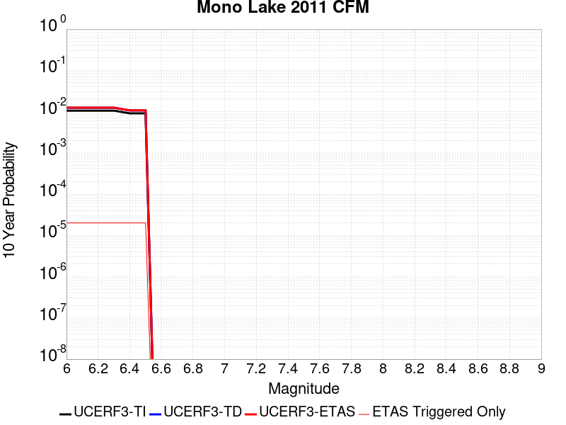 |

| Magnitude | 1 wk TI Prob | 1 wk TD Prob | 1 wk ETAS Prob | 1 wk ETAS/TD Gain | 1 wk ETAS Triggered Only | 1 mo TI Prob | 1 mo TD Prob | 1 mo ETAS Prob | 1 mo ETAS/TD Gain | 1 mo ETAS Triggered Only | 1 yr TI Prob | 1 yr TD Prob | 1 yr ETAS Prob | 1 yr ETAS/TD Gain | 1 yr ETAS Triggered Only | 10 yr TI Prob | 10 yr TD Prob | 10 yr ETAS Prob | 10 yr ETAS/TD Gain | 10 yr ETAS Triggered Only |
|-----|-----|-----|-----|-----|-----|-----|-----|-----|-----|-----|-----|-----|-----|-----|-----|-----|-----|-----|-----|-----|
| 6.0 | 2.0341662E-5 | 2.3830333E-5 | 2.3830333E-5 | 1.0 | 0.0 | 8.717564E-5 | 1.02129E-4 | 1.02129E-4 | 1.0 | 0.0 | 0.0010608466 | 0.0012432429 | 0.00125845 | 1.0122318 | 1.522603E-5 | 0.010557966 | 0.012414961 | 0.012445035 | 1.0024225 | 3.045206E-5 |
| 6.1 | 2.0341662E-5 | 2.3830333E-5 | 2.3830333E-5 | 1.0 | 0.0 | 8.717564E-5 | 1.02129E-4 | 1.02129E-4 | 1.0 | 0.0 | 0.0010608466 | 0.0012432429 | 0.00125845 | 1.0122318 | 1.522603E-5 | 0.010557966 | 0.012414961 | 0.012445035 | 1.0024225 | 3.045206E-5 |
| 6.2 | 2.0341662E-5 | 2.3830333E-5 | 2.3830333E-5 | 1.0 | 0.0 | 8.717564E-5 | 1.02129E-4 | 1.02129E-4 | 1.0 | 0.0 | 0.0010608466 | 0.0012432429 | 0.00125845 | 1.0122318 | 1.522603E-5 | 0.010557966 | 0.012414961 | 0.012445035 | 1.0024225 | 3.045206E-5 |
| 6.3 | 2.0341662E-5 | 2.3830333E-5 | 2.3830333E-5 | 1.0 | 0.0 | 8.717564E-5 | 1.02129E-4 | 1.02129E-4 | 1.0 | 0.0 | 0.0010608466 | 0.0012432429 | 0.00125845 | 1.0122318 | 1.522603E-5 | 0.010557966 | 0.012414961 | 0.012445035 | 1.0024225 | 3.045206E-5 |
| 6.4 | 1.749821E-5 | 2.0492844E-5 | 2.0492844E-5 | 1.0 | 0.0 | 7.499018E-5 | 8.782648E-5 | 8.782648E-5 | 1.0 | 0.0 | 9.1262296E-4 | 0.0010692873 | 0.0010844971 | 1.0142242 | 1.522603E-5 | 0.009088841 | 0.010692834 | 0.01072296 | 1.0028174 | 3.045206E-5 |
| 6.5 | 1.749821E-5 | 2.0492844E-5 | 2.0492844E-5 | 1.0 | 0.0 | 7.499018E-5 | 8.782648E-5 | 8.782648E-5 | 1.0 | 0.0 | 9.1262296E-4 | 0.0010692873 | 0.0010844971 | 1.0142242 | 1.522603E-5 | 0.009088841 | 0.010692834 | 0.01072296 | 1.0028174 | 3.045206E-5 |

## Calaveras (So) 2011 CFM
*[(top)](#table-of-contents)*

| 1 Week | 1 Month | 1 Year | 10 Year |
|-----|-----|-----|-----|
|  |  | 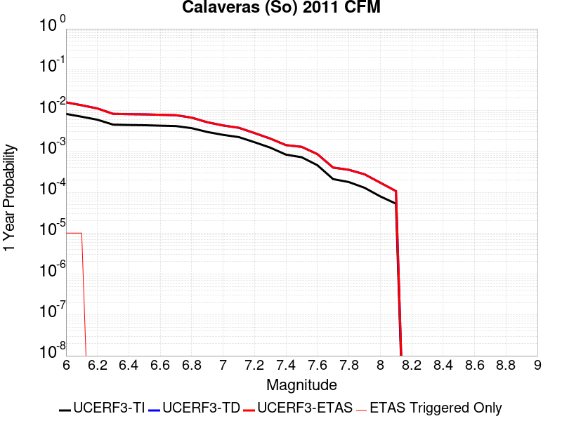 |  |

| Magnitude | 1 wk TI Prob | 1 wk TD Prob | 1 wk ETAS Prob | 1 wk ETAS/TD Gain | 1 wk ETAS Triggered Only | 1 mo TI Prob | 1 mo TD Prob | 1 mo ETAS Prob | 1 mo ETAS/TD Gain | 1 mo ETAS Triggered Only | 1 yr TI Prob | 1 yr TD Prob | 1 yr ETAS Prob | 1 yr ETAS/TD Gain | 1 yr ETAS Triggered Only | 10 yr TI Prob | 10 yr TD Prob | 10 yr ETAS Prob | 10 yr ETAS/TD Gain | 10 yr ETAS Triggered Only |
|-----|-----|-----|-----|-----|-----|-----|-----|-----|-----|-----|-----|-----|-----|-----|-----|-----|-----|-----|-----|-----|
| 6.0 | 1.5950744E-4 | 3.0739905E-4 | 3.0739905E-4 | 1.0 | 0.0 | 6.834242E-4 | 0.0013167706 | 0.0013167706 | 1.0 | 0.0 | 0.00828899 | 0.015865553 | 0.015880538 | 1.0009445 | 1.522603E-5 | 0.079865426 | 0.14445968 | 0.14448574 | 1.0001804 | 3.045206E-5 |
| 6.1 | 1.3584697E-4 | 2.6061598E-4 | 2.6061598E-4 | 1.0 | 0.0 | 5.8207137E-4 | 0.0011164517 | 0.0011164517 | 1.0 | 0.0 | 0.007063716 | 0.013468163 | 0.013483184 | 1.0011153 | 1.522603E-5 | 0.06843361 | 0.124085724 | 0.1241124 | 1.0002149 | 3.045206E-5 |
| 6.2 | 1.14676266E-4 | 2.1746816E-4 | 2.1746816E-4 | 1.0 | 0.0 | 4.9137714E-4 | 9.316741E-4 | 9.316741E-4 | 1.0 | 0.0 | 0.0059661185 | 0.011251126 | 0.011251126 | 1.0 | 0.0 | 0.058084648 | 0.10507494 | 0.10508857 | 1.0001297 | 1.522603E-5 |
| 6.3 | 8.691518E-5 | 1.6001116E-4 | 1.6001116E-4 | 1.0 | 0.0 | 3.7244044E-4 | 6.855628E-4 | 6.855628E-4 | 1.0 | 0.0 | 0.004525038 | 0.008307241 | 0.008307241 | 1.0 | 0.0 | 0.044339992 | 0.079390146 | 0.07940416 | 1.0001765 | 1.522603E-5 |
| 6.4 | 8.50982E-5 | 1.5707467E-4 | 1.5707467E-4 | 1.0 | 0.0 | 3.646556E-4 | 6.7298434E-4 | 6.7298434E-4 | 1.0 | 0.0 | 0.0044306475 | 0.008155251 | 0.008155251 | 1.0 | 0.0 | 0.04343345 | 0.077996135 | 0.07801018 | 1.00018 | 1.522603E-5 |
| 6.5 | 8.4062965E-5 | 1.5531975E-4 | 1.5531975E-4 | 1.0 | 0.0 | 3.602201E-4 | 6.654671E-4 | 6.654671E-4 | 1.0 | 0.0 | 0.004376863 | 0.008064441 | 0.008064441 | 1.0 | 0.0 | 0.042916555 | 0.07716733 | 0.077181384 | 1.000182 | 1.522603E-5 |
| 6.6 | 8.194716E-5 | 1.516774E-4 | 1.516774E-4 | 1.0 | 0.0 | 3.5115483E-4 | 6.498649E-4 | 6.498649E-4 | 1.0 | 0.0 | 0.0042669317 | 0.007876252 | 0.007876252 | 1.0 | 0.0 | 0.04185927 | 0.0754524 | 0.075466484 | 1.0001866 | 1.522603E-5 |
| 6.7 | 8.012326E-5 | 1.483531E-4 | 1.483531E-4 | 1.0 | 0.0 | 3.433402E-4 | 6.3563243E-4 | 6.3563243E-4 | 1.0 | 0.0 | 0.004172157 | 0.0077047227 | 0.0077047227 | 1.0 | 0.0 | 0.040946912 | 0.0738944 | 0.0739085 | 1.0001909 | 1.522603E-5 |
| 6.8 | 7.119773E-5 | 1.289278E-4 | 1.289278E-4 | 1.0 | 0.0 | 3.0509746E-4 | 5.524251E-4 | 5.524251E-4 | 1.0 | 0.0 | 0.0037082357 | 0.0067017726 | 0.0067017726 | 1.0 | 0.0 | 0.036469642 | 0.06473622 | 0.06473622 | 1.0 | 0.0 |
| 6.9 | 5.7343088E-5 | 9.928818E-5 | 9.928818E-5 | 1.0 | 0.0 | 2.4573295E-4 | 4.254518E-4 | 4.254518E-4 | 1.0 | 0.0 | 0.0029876942 | 0.0051676547 | 0.0051676547 | 1.0 | 0.0 | 0.02947844 | 0.05055552 | 0.05055552 | 1.0 | 0.0 |
| 7.0 | 4.8746577E-5 | 8.294431E-5 | 8.294431E-5 | 1.0 | 0.0 | 2.0889717E-4 | 3.5542753E-4 | 3.5542753E-4 | 1.0 | 0.0 | 0.0025403565 | 0.0043188105 | 0.0043188105 | 1.0 | 0.0 | 0.025115121 | 0.04253077 | 0.04253077 | 1.0 | 0.0 |
| 7.1 | 4.2998014E-5 | 7.27236E-5 | 7.27236E-5 | 1.0 | 0.0 | 1.8426418E-4 | 3.1163564E-4 | 3.1163564E-4 | 1.0 | 0.0 | 0.002241108 | 0.0037876235 | 0.0037876235 | 1.0 | 0.0 | 0.022186412 | 0.037458975 | 0.037458975 | 1.0 | 0.0 |
| 7.2 | 3.221292E-5 | 5.3976983E-5 | 5.3976983E-5 | 1.0 | 0.0 | 1.3804805E-4 | 2.3130958E-4 | 2.3130958E-4 | 1.0 | 0.0 | 0.0016794393 | 0.002812585 | 0.002812585 | 1.0 | 0.0 | 0.016668037 | 0.02807059 | 0.02807059 | 1.0 | 0.0 |
| 7.3 | 2.3756531E-5 | 3.9534E-5 | 3.9534E-5 | 1.0 | 0.0 | 1.0180973E-4 | 1.6942051E-4 | 1.6942051E-4 | 1.0 | 0.0 | 0.0012388286 | 0.0020607605 | 0.0020607605 | 1.0 | 0.0 | 0.012319452 | 0.020674022 | 0.020674022 | 1.0 | 0.0 |
| 7.4 | 1.5997684E-5 | 2.737303E-5 | 2.737303E-5 | 1.0 | 0.0 | 6.8559704E-5 | 1.1730772E-4 | 1.1730772E-4 | 1.0 | 0.0 | 8.343947E-4 | 0.0014272883 | 0.0014272883 | 1.0 | 0.0 | 0.008312687 | 0.0143921655 | 0.0143921655 | 1.0 | 0.0 |
| 7.5 | 1.3814293E-5 | 2.481389E-5 | 2.481389E-5 | 1.0 | 0.0 | 5.9202768E-5 | 1.0634092E-4 | 1.0634092E-4 | 1.0 | 0.0 | 7.205553E-4 | 0.0012939342 | 0.0012939342 | 1.0 | 0.0 | 0.007182234 | 0.013070965 | 0.013070965 | 1.0 | 0.0 |
| 7.6 | 8.817309E-6 | 1.6456672E-5 | 1.6456672E-5 | 1.0 | 0.0 | 3.7787922E-5 | 7.0526694E-5 | 7.0526694E-5 | 1.0 | 0.0 | 4.5997082E-4 | 8.5832557E-4 | 8.5832557E-4 | 1.0 | 0.0 | 0.004590199 | 0.008732965 | 0.008732965 | 1.0 | 0.0 |
| 7.7 | 4.0352206E-6 | 7.724012E-6 | 7.724012E-6 | 1.0 | 0.0 | 1.7293689E-5 | 3.310249E-5 | 3.310249E-5 | 1.0 | 0.0 | 2.1053031E-4 | 4.0294835E-4 | 4.0294835E-4 | 1.0 | 0.0 | 0.0021033096 | 0.0041733775 | 0.0041733775 | 1.0 | 0.0 |
| 7.8 | 3.413169E-6 | 6.8018153E-6 | 6.8018153E-6 | 1.0 | 0.0 | 1.4627784E-5 | 2.9150313E-5 | 2.9150313E-5 | 1.0 | 0.0 | 1.7807873E-4 | 3.5484732E-4 | 3.5484732E-4 | 1.0 | 0.0 | 0.0017793609 | 0.0036736047 | 0.0036736047 | 1.0 | 0.0 |
| 7.9 | 2.4740732E-6 | 5.2897763E-6 | 5.2897763E-6 | 1.0 | 0.0 | 1.06031275E-5 | 2.2670272E-5 | 2.2670272E-5 | 1.0 | 0.0 | 1.2908543E-4 | 2.7597568E-4 | 2.7597568E-4 | 1.0 | 0.0 | 0.0012901047 | 0.002839954 | 0.002839954 | 1.0 | 0.0 |
| 8.0 | 1.5231818E-6 | 3.2950636E-6 | 3.2950636E-6 | 1.0 | 0.0 | 6.527906E-6 | 1.4121625E-5 | 1.4121625E-5 | 1.0 | 0.0 | 7.9474354E-5 | 1.7191726E-4 | 1.7191726E-4 | 1.0 | 0.0 | 7.944594E-4 | 0.0017594753 | 0.0017594753 | 1.0 | 0.0 |
| 8.1 | 1.0104524E-6 | 2.049573E-6 | 2.049573E-6 | 1.0 | 0.0 | 4.330503E-6 | 8.783854E-6 | 8.783854E-6 | 1.0 | 0.0 | 5.2722597E-5 | 1.0693821E-4 | 1.0693821E-4 | 1.0 | 0.0 | 5.271009E-4 | 0.0010948586 | 0.0010948586 | 1.0 | 0.0 |

## White Wolf
*[(top)](#table-of-contents)*

| 1 Week | 1 Month | 1 Year | 10 Year |
|-----|-----|-----|-----|
|  |  |  |  |

| Magnitude | 1 wk TI Prob | 1 wk TD Prob | 1 wk ETAS Prob | 1 wk ETAS/TD Gain | 1 wk ETAS Triggered Only | 1 mo TI Prob | 1 mo TD Prob | 1 mo ETAS Prob | 1 mo ETAS/TD Gain | 1 mo ETAS Triggered Only | 1 yr TI Prob | 1 yr TD Prob | 1 yr ETAS Prob | 1 yr ETAS/TD Gain | 1 yr ETAS Triggered Only | 10 yr TI Prob | 10 yr TD Prob | 10 yr ETAS Prob | 10 yr ETAS/TD Gain | 10 yr ETAS Triggered Only |
|-----|-----|-----|-----|-----|-----|-----|-----|-----|-----|-----|-----|-----|-----|-----|-----|-----|-----|-----|-----|-----|
| 6.0 | 2.0037822E-5 | 1.0469729E-6 | 1.0469729E-6 | 1.0 | 0.0 | 8.587355E-5 | 4.4870194E-6 | 4.4870194E-6 | 1.0 | 0.0 | 0.001045009 | 5.462814E-5 | 5.462814E-5 | 1.0 | 0.0 | 0.010401085 | 5.461522E-4 | 5.765876E-4 | 1.055727 | 3.045206E-5 |
| 6.1 | 2.0037822E-5 | 1.0469729E-6 | 1.0469729E-6 | 1.0 | 0.0 | 8.587355E-5 | 4.4870194E-6 | 4.4870194E-6 | 1.0 | 0.0 | 0.001045009 | 5.462814E-5 | 5.462814E-5 | 1.0 | 0.0 | 0.010401085 | 5.461522E-4 | 5.765876E-4 | 1.055727 | 3.045206E-5 |
| 6.2 | 2.0037822E-5 | 1.0469729E-6 | 1.0469729E-6 | 1.0 | 0.0 | 8.587355E-5 | 4.4870194E-6 | 4.4870194E-6 | 1.0 | 0.0 | 0.001045009 | 5.462814E-5 | 5.462814E-5 | 1.0 | 0.0 | 0.010401085 | 5.461522E-4 | 5.765876E-4 | 1.055727 | 3.045206E-5 |
| 6.3 | 2.0037822E-5 | 1.0469729E-6 | 1.0469729E-6 | 1.0 | 0.0 | 8.587355E-5 | 4.4870194E-6 | 4.4870194E-6 | 1.0 | 0.0 | 0.001045009 | 5.462814E-5 | 5.462814E-5 | 1.0 | 0.0 | 0.010401085 | 5.461522E-4 | 5.765876E-4 | 1.055727 | 3.045206E-5 |
| 6.4 | 1.132487E-5 | 1.0469729E-6 | 1.0469729E-6 | 1.0 | 0.0 | 4.8534253E-5 | 4.4870194E-6 | 4.4870194E-6 | 1.0 | 0.0 | 5.907443E-4 | 5.462814E-5 | 5.462814E-5 | 1.0 | 0.0 | 0.005891764 | 5.461522E-4 | 5.765876E-4 | 1.055727 | 3.045206E-5 |
| 6.5 | 1.132487E-5 | 1.0469729E-6 | 1.0469729E-6 | 1.0 | 0.0 | 4.8534253E-5 | 4.4870194E-6 | 4.4870194E-6 | 1.0 | 0.0 | 5.907443E-4 | 5.462814E-5 | 5.462814E-5 | 1.0 | 0.0 | 0.005891764 | 5.461522E-4 | 5.765876E-4 | 1.055727 | 3.045206E-5 |
| 6.6 | 9.347473E-6 | 1.0469729E-6 | 1.0469729E-6 | 1.0 | 0.0 | 4.0059982E-5 | 4.4870194E-6 | 4.4870194E-6 | 1.0 | 0.0 | 4.8762115E-4 | 5.462814E-5 | 5.462814E-5 | 1.0 | 0.0 | 0.0048655253 | 5.461522E-4 | 5.765876E-4 | 1.055727 | 3.045206E-5 |
| 6.7 | 7.842647E-6 | 1.004888E-6 | 1.004888E-6 | 1.0 | 0.0 | 3.361091E-5 | 4.3066557E-6 | 4.3066557E-6 | 1.0 | 0.0 | 4.0913603E-4 | 5.2432322E-5 | 5.2432322E-5 | 1.0 | 0.0 | 0.004083836 | 5.2420446E-4 | 5.5464054E-4 | 1.0580615 | 3.045206E-5 |
| 6.8 | 6.26597E-6 | 9.735327E-7 | 9.735327E-7 | 1.0 | 0.0 | 2.685388E-5 | 4.1722765E-6 | 4.1722765E-6 | 1.0 | 0.0 | 3.2689696E-4 | 5.0796334E-5 | 5.0796334E-5 | 1.0 | 0.0 | 0.003264165 | 5.078521E-4 | 5.3828873E-4 | 1.059932 | 3.045206E-5 |
| 6.9 | 5.258436E-6 | 9.1837234E-7 | 9.1837234E-7 | 1.0 | 0.0 | 2.2535958E-5 | 3.9358756E-6 | 3.9358756E-6 | 1.0 | 0.0 | 2.7434074E-4 | 4.791828E-5 | 4.791828E-5 | 1.0 | 0.0 | 0.0027400232 | 4.790843E-4 | 5.0952175E-4 | 1.0635326 | 3.045206E-5 |
| 7.0 | 4.675028E-6 | 8.661622E-7 | 8.661622E-7 | 1.0 | 0.0 | 2.003568E-5 | 3.7121188E-6 | 3.7121188E-6 | 1.0 | 0.0 | 2.4390711E-4 | 4.5194156E-5 | 4.5194156E-5 | 1.0 | 0.0 | 0.0024363957 | 4.5185437E-4 | 4.8229267E-4 | 1.067363 | 3.045206E-5 |
| 7.1 | 2.8270078E-6 | 6.8745294E-7 | 6.8745294E-7 | 1.0 | 0.0 | 1.2115692E-5 | 2.9462237E-6 | 2.9462237E-6 | 1.0 | 0.0 | 1.4749856E-4 | 3.5869725E-5 | 3.5869725E-5 | 1.0 | 0.0 | 0.001474007 | 3.5864345E-4 | 3.890846E-4 | 1.0848786 | 3.045206E-5 |
| 7.2 | 1.6881406E-6 | 2.270827E-7 | 2.270827E-7 | 1.0 | 0.0 | 7.2348685E-6 | 9.732112E-7 | 9.732112E-7 | 1.0 | 0.0 | 8.808096E-5 | 1.1848783E-5 | 1.1848783E-5 | 1.0 | 0.0 | 8.8046055E-4 | 1.1848167E-4 | 1.1848167E-4 | 1.0 | 0.0 |
| 7.3 | 9.086107E-7 | 1.5267518E-7 | 1.5267518E-7 | 1.0 | 0.0 | 3.8940398E-6 | 6.543221E-7 | 6.543221E-7 | 1.0 | 0.0 | 4.7408903E-5 | 7.966343E-6 | 7.966343E-6 | 1.0 | 0.0 | 4.739879E-4 | 7.9660655E-5 | 7.9660655E-5 | 1.0 | 0.0 |
| 7.4 | 1.9717383E-7 | 9.004186E-8 | 9.004186E-8 | 1.0 | 0.0 | 8.450304E-7 | 3.8589363E-7 | 3.8589363E-7 | 1.0 | 0.0 | 1.0288197E-5 | 4.698245E-6 | 4.698245E-6 | 1.0 | 0.0 | 1.028772E-4 | 4.6981488E-5 | 4.6981488E-5 | 1.0 | 0.0 |
| 7.5 | 1.086975E-7 | 6.65987E-8 | 6.65987E-8 | 1.0 | 0.0 | 4.6584634E-7 | 2.8542297E-7 | 2.8542297E-7 | 1.0 | 0.0 | 5.6716644E-6 | 3.4750192E-6 | 3.4750192E-6 | 1.0 | 0.0 | 5.6715195E-5 | 3.474967E-5 | 3.474967E-5 | 1.0 | 0.0 |
| 7.6 | 2.4217808E-8 | 1.582108E-8 | 1.582108E-8 | 1.0 | 0.0 | 1.03790605E-7 | 6.780462E-8 | 6.780462E-8 | 1.0 | 0.0 | 1.2636499E-6 | 8.25521E-7 | 8.25521E-7 | 1.0 | 0.0 | 1.2636427E-5 | 8.255184E-6 | 8.255184E-6 | 1.0 | 0.0 |

## Red Mountain
*[(top)](#table-of-contents)*

| 1 Week | 1 Month | 1 Year | 10 Year |
|-----|-----|-----|-----|
| 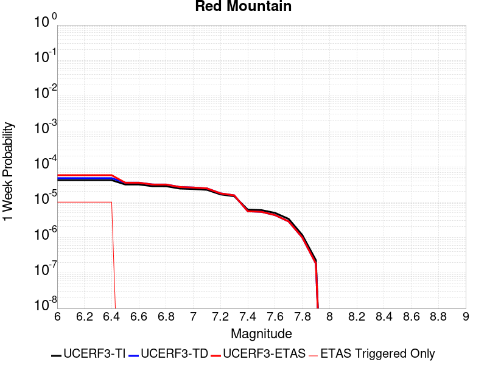 |  |  |  |

| Magnitude | 1 wk TI Prob | 1 wk TD Prob | 1 wk ETAS Prob | 1 wk ETAS/TD Gain | 1 wk ETAS Triggered Only | 1 mo TI Prob | 1 mo TD Prob | 1 mo ETAS Prob | 1 mo ETAS/TD Gain | 1 mo ETAS Triggered Only | 1 yr TI Prob | 1 yr TD Prob | 1 yr ETAS Prob | 1 yr ETAS/TD Gain | 1 yr ETAS Triggered Only | 10 yr TI Prob | 10 yr TD Prob | 10 yr ETAS Prob | 10 yr ETAS/TD Gain | 10 yr ETAS Triggered Only |
|-----|-----|-----|-----|-----|-----|-----|-----|-----|-----|-----|-----|-----|-----|-----|-----|-----|-----|-----|-----|-----|
| 6.0 | 4.1810763E-5 | 4.759418E-5 | 4.759418E-5 | 1.0 | 0.0 | 1.7917668E-4 | 2.0396004E-4 | 2.0396004E-4 | 1.0 | 0.0 | 0.0021792934 | 0.0024805511 | 0.0024805511 | 1.0 | 0.0 | 0.021580452 | 0.024546249 | 0.024575954 | 1.0012101 | 3.045206E-5 |
| 6.1 | 4.1810763E-5 | 4.759418E-5 | 4.759418E-5 | 1.0 | 0.0 | 1.7917668E-4 | 2.0396004E-4 | 2.0396004E-4 | 1.0 | 0.0 | 0.0021792934 | 0.0024805511 | 0.0024805511 | 1.0 | 0.0 | 0.021580452 | 0.024546249 | 0.024575954 | 1.0012101 | 3.045206E-5 |
| 6.2 | 4.1810763E-5 | 4.759418E-5 | 4.759418E-5 | 1.0 | 0.0 | 1.7917668E-4 | 2.0396004E-4 | 2.0396004E-4 | 1.0 | 0.0 | 0.0021792934 | 0.0024805511 | 0.0024805511 | 1.0 | 0.0 | 0.021580452 | 0.024546249 | 0.024575954 | 1.0012101 | 3.045206E-5 |
| 6.3 | 4.1810763E-5 | 4.759418E-5 | 4.759418E-5 | 1.0 | 0.0 | 1.7917668E-4 | 2.0396004E-4 | 2.0396004E-4 | 1.0 | 0.0 | 0.0021792934 | 0.0024805511 | 0.0024805511 | 1.0 | 0.0 | 0.021580452 | 0.024546249 | 0.024575954 | 1.0012101 | 3.045206E-5 |
| 6.4 | 4.1810763E-5 | 4.759418E-5 | 4.759418E-5 | 1.0 | 0.0 | 1.7917668E-4 | 2.0396004E-4 | 2.0396004E-4 | 1.0 | 0.0 | 0.0021792934 | 0.0024805511 | 0.0024805511 | 1.0 | 0.0 | 0.021580452 | 0.024546249 | 0.024575954 | 1.0012101 | 3.045206E-5 |
| 6.5 | 3.154503E-5 | 3.5362722E-5 | 3.5362722E-5 | 1.0 | 0.0 | 1.3518598E-4 | 1.5154622E-4 | 1.5154622E-4 | 1.0 | 0.0 | 0.0016446467 | 0.001843606 | 0.001843606 | 1.0 | 0.0 | 0.01632528 | 0.018292768 | 0.018307716 | 1.0008172 | 1.522603E-5 |
| 6.6 | 3.1535834E-5 | 3.5352103E-5 | 3.5352103E-5 | 1.0 | 0.0 | 1.3514658E-4 | 1.5150072E-4 | 1.5150072E-4 | 1.0 | 0.0 | 0.0016441676 | 0.0018430529 | 0.0018430529 | 1.0 | 0.0 | 0.01632056 | 0.018287329 | 0.018302277 | 1.0008174 | 1.522603E-5 |
| 6.7 | 2.8267326E-5 | 3.1471947E-5 | 3.1471947E-5 | 1.0 | 0.0 | 1.2114006E-4 | 1.3487328E-4 | 1.3487328E-4 | 1.0 | 0.0 | 0.0014738824 | 0.0016409304 | 0.0016409304 | 1.0 | 0.0 | 0.014641452 | 0.016296903 | 0.016311882 | 1.0009191 | 1.522603E-5 |
| 6.8 | 2.8212884E-5 | 3.140983E-5 | 3.140983E-5 | 1.0 | 0.0 | 1.20906756E-4 | 1.3460708E-4 | 1.3460708E-4 | 1.0 | 0.0 | 0.0014710457 | 0.0016376943 | 0.0016376943 | 1.0 | 0.0 | 0.014613459 | 0.016265018 | 0.016279995 | 1.0009209 | 1.522603E-5 |
| 6.9 | 2.4227871E-5 | 2.6709133E-5 | 2.6709133E-5 | 1.0 | 0.0 | 1.03829596E-4 | 1.1446312E-4 | 1.1446312E-4 | 1.0 | 0.0 | 0.0012633923 | 0.0013927735 | 0.0013927735 | 1.0 | 0.0 | 0.012562336 | 0.013848136 | 0.013863151 | 1.0010843 | 1.522603E-5 |
| 7.0 | 2.348524E-5 | 2.5837837E-5 | 2.5837837E-5 | 1.0 | 0.0 | 1.0064714E-4 | 1.10729314E-4 | 1.10729314E-4 | 1.0 | 0.0 | 0.0012246901 | 0.0013473714 | 0.0013473714 | 1.0 | 0.0 | 0.012179627 | 0.013399659 | 0.013414681 | 1.001121 | 1.522603E-5 |
| 7.1 | 2.2311642E-5 | 2.4464778E-5 | 2.4464778E-5 | 1.0 | 0.0 | 9.561782E-5 | 1.0484526E-4 | 1.0484526E-4 | 1.0 | 0.0 | 0.0011635252 | 0.0012758184 | 0.0012758184 | 1.0 | 0.0 | 0.01157452 | 0.012692457 | 0.0127074905 | 1.0011843 | 1.522603E-5 |
| 7.2 | 1.6533986E-5 | 1.7671664E-5 | 1.7671664E-5 | 1.0 | 0.0 | 7.085802E-5 | 7.573386E-5 | 7.573386E-5 | 1.0 | 0.0 | 8.623549E-4 | 9.2173315E-4 | 9.2173315E-4 | 1.0 | 0.0 | 0.008590161 | 0.00918538 | 0.009200467 | 1.0016425 | 1.522603E-5 |
| 7.3 | 1.4703092E-5 | 1.5560665E-5 | 1.5560665E-5 | 1.0 | 0.0 | 6.301173E-5 | 6.668721E-5 | 6.668721E-5 | 1.0 | 0.0 | 7.668978E-4 | 8.116759E-4 | 8.116759E-4 | 1.0 | 0.0 | 0.0076425658 | 0.008093189 | 0.008108292 | 1.0018661 | 1.522603E-5 |
| 7.4 | 6.1331984E-6 | 5.5291057E-6 | 5.5291057E-6 | 1.0 | 0.0 | 2.6284872E-5 | 2.3695955E-5 | 2.3695955E-5 | 1.0 | 0.0 | 3.199713E-4 | 2.8846058E-4 | 2.8846058E-4 | 1.0 | 0.0 | 0.0031951098 | 0.002880916 | 0.002880916 | 1.0 | 0.0 |
| 7.5 | 5.954766E-6 | 5.338727E-6 | 5.338727E-6 | 1.0 | 0.0 | 2.5520176E-5 | 2.288006E-5 | 2.288006E-5 | 1.0 | 0.0 | 3.1066386E-4 | 2.7852965E-4 | 2.7852965E-4 | 1.0 | 0.0 | 0.003102299 | 0.0027818596 | 0.0027818596 | 1.0 | 0.0 |
| 7.6 | 4.9726646E-6 | 4.315478E-6 | 4.315478E-6 | 1.0 | 0.0 | 2.1311245E-5 | 1.8494777E-5 | 1.8494777E-5 | 1.0 | 0.0 | 2.5943352E-4 | 2.2515097E-4 | 2.2515097E-4 | 1.0 | 0.0 | 0.0025913084 | 0.0022492632 | 0.0022492632 | 1.0 | 0.0 |
| 7.7 | 3.3613894E-6 | 2.8527843E-6 | 2.8527843E-6 | 1.0 | 0.0 | 1.4405875E-5 | 1.2226163E-5 | 1.2226163E-5 | 1.0 | 0.0 | 1.7537741E-4 | 1.4884362E-4 | 1.4884362E-4 | 1.0 | 0.0 | 0.0017523908 | 0.0014874657 | 0.0014874657 | 1.0 | 0.0 |
| 7.8 | 1.1828961E-6 | 1.0123111E-6 | 1.0123111E-6 | 1.0 | 0.0 | 5.069545E-6 | 4.3384694E-6 | 4.3384694E-6 | 1.0 | 0.0 | 6.171996E-5 | 5.281961E-5 | 5.281961E-5 | 1.0 | 0.0 | 6.170282E-4 | 5.280735E-4 | 5.280735E-4 | 1.0 | 0.0 |
| 7.9 | 2.2967266E-7 | 1.8619616E-7 | 1.8619616E-7 | 1.0 | 0.0 | 9.843111E-7 | 7.9798326E-7 | 7.9798326E-7 | 1.0 | 0.0 | 1.19839215E-5 | 9.715406E-6 | 9.715406E-6 | 1.0 | 0.0 | 1.1983275E-4 | 9.71501E-5 | 9.71501E-5 | 1.0 | 0.0 |

## Oceanic - West Huasna
*[(top)](#table-of-contents)*

| 1 Week | 1 Month | 1 Year | 10 Year |
|-----|-----|-----|-----|
|  |  |  |  |

| Magnitude | 1 wk TI Prob | 1 wk TD Prob | 1 wk ETAS Prob | 1 wk ETAS/TD Gain | 1 wk ETAS Triggered Only | 1 mo TI Prob | 1 mo TD Prob | 1 mo ETAS Prob | 1 mo ETAS/TD Gain | 1 mo ETAS Triggered Only | 1 yr TI Prob | 1 yr TD Prob | 1 yr ETAS Prob | 1 yr ETAS/TD Gain | 1 yr ETAS Triggered Only | 10 yr TI Prob | 10 yr TD Prob | 10 yr ETAS Prob | 10 yr ETAS/TD Gain | 10 yr ETAS Triggered Only |
|-----|-----|-----|-----|-----|-----|-----|-----|-----|-----|-----|-----|-----|-----|-----|-----|-----|-----|-----|-----|-----|
| 6.0 | 3.195567E-5 | 2.792801E-5 | 2.792801E-5 | 1.0 | 0.0 | 1.3694567E-4 | 1.1968623E-4 | 1.1968623E-4 | 1.0 | 0.0 | 0.0016660384 | 0.0014562489 | 0.0014714528 | 1.0104405 | 1.522603E-5 | 0.016536033 | 0.014471616 | 0.014501627 | 1.0020738 | 3.045206E-5 |
| 6.1 | 2.1156782E-5 | 1.7574157E-5 | 1.7574157E-5 | 1.0 | 0.0 | 9.066878E-5 | 7.53157E-5 | 7.53157E-5 | 1.0 | 0.0 | 0.0011033333 | 9.1659225E-4 | 9.318043E-4 | 1.0165963 | 1.522603E-5 | 0.010978713 | 0.009129126 | 0.0091593 | 1.0033052 | 3.045206E-5 |
| 6.2 | 1.6195117E-5 | 1.332762E-5 | 1.332762E-5 | 1.0 | 0.0 | 6.9405796E-5 | 5.7117133E-5 | 5.7117133E-5 | 1.0 | 0.0 | 8.44688E-4 | 6.9518184E-4 | 7.1039726E-4 | 1.021887 | 1.522603E-5 | 0.008414844 | 0.006930365 | 0.0069454857 | 1.0021818 | 1.522603E-5 |
| 6.3 | 1.3559345E-5 | 1.1179509E-5 | 1.1179509E-5 | 1.0 | 0.0 | 5.811018E-5 | 4.7911308E-5 | 4.7911308E-5 | 1.0 | 0.0 | 7.072618E-4 | 5.83165E-4 | 5.9838215E-4 | 1.0260941 | 1.522603E-5 | 0.0070501505 | 0.0058164652 | 0.0058316025 | 1.0026026 | 1.522603E-5 |
| 6.4 | 1.2120619E-5 | 1.0001292E-5 | 1.0001292E-5 | 1.0 | 0.0 | 5.1944477E-5 | 4.286198E-5 | 4.286198E-5 | 1.0 | 0.0 | 6.322405E-4 | 5.2172015E-4 | 5.3693826E-4 | 1.0291691 | 1.522603E-5 | 0.006304447 | 0.005205021 | 0.005220168 | 1.00291 | 1.522603E-5 |
| 6.5 | 1.13511915E-5 | 9.3677645E-6 | 9.3677645E-6 | 1.0 | 0.0 | 4.8647056E-5 | 4.0146948E-5 | 4.0146948E-5 | 1.0 | 0.0 | 5.9211696E-4 | 4.886799E-4 | 5.038985E-4 | 1.0311422 | 1.522603E-5 | 0.0059054173 | 0.004876112 | 0.004891264 | 1.0031073 | 1.522603E-5 |
| 6.6 | 9.850605E-6 | 8.135666E-6 | 8.135666E-6 | 1.0 | 0.0 | 4.2216197E-5 | 3.4866673E-5 | 3.4866673E-5 | 1.0 | 0.0 | 5.1386096E-4 | 4.2441927E-4 | 4.3963885E-4 | 1.0358597 | 1.522603E-5 | 0.0051267436 | 0.0042361193 | 0.004251281 | 1.0035791 | 1.522603E-5 |
| 6.7 | 8.8558645E-6 | 7.3186534E-6 | 7.3186534E-6 | 1.0 | 0.0 | 3.7953152E-5 | 3.136528E-5 | 3.136528E-5 | 1.0 | 0.0 | 4.6198163E-4 | 3.8180556E-4 | 3.9702578E-4 | 1.0398638 | 1.522603E-5 | 0.004610224 | 0.0038115215 | 0.0038266894 | 1.0039796 | 1.522603E-5 |
| 6.8 | 7.67136E-6 | 6.3919483E-6 | 6.3919483E-6 | 1.0 | 0.0 | 3.2876844E-5 | 2.7393779E-5 | 2.7393779E-5 | 1.0 | 0.0 | 4.0020206E-4 | 3.3346837E-4 | 3.4868933E-4 | 1.0456444 | 1.522603E-5 | 0.003994821 | 0.0033297008 | 0.003344876 | 1.0045576 | 1.522603E-5 |
| 6.9 | 6.534529E-6 | 5.4584953E-6 | 5.4584953E-6 | 1.0 | 0.0 | 2.8004823E-5 | 2.3393342E-5 | 2.3393342E-5 | 1.0 | 0.0 | 3.4090536E-4 | 2.8477685E-4 | 2.9999853E-4 | 1.0534513 | 1.522603E-5 | 0.0034038287 | 0.002844136 | 0.0028593186 | 1.0053383 | 1.522603E-5 |
| 7.0 | 5.460525E-6 | 4.570095E-6 | 4.570095E-6 | 1.0 | 0.0 | 2.3402039E-5 | 1.9585976E-5 | 1.9585976E-5 | 1.0 | 0.0 | 2.8488258E-4 | 2.3843326E-4 | 2.5365566E-4 | 1.0638435 | 1.522603E-5 | 0.0028451765 | 0.0023817883 | 0.0023969782 | 1.0063775 | 1.522603E-5 |
| 7.1 | 4.4825083E-6 | 3.7525715E-6 | 3.7525715E-6 | 1.0 | 0.0 | 1.9210609E-5 | 1.6082351E-5 | 1.6082351E-5 | 1.0 | 0.0 | 2.3386406E-4 | 1.9578513E-4 | 2.1100818E-4 | 1.0777539 | 1.522603E-5 | 0.002336181 | 0.0019561385 | 0.0019713347 | 1.0077685 | 1.522603E-5 |
| 7.2 | 2.821708E-6 | 2.4250364E-6 | 2.4250364E-6 | 1.0 | 0.0 | 1.2092979E-5 | 1.03929715E-5 | 1.03929715E-5 | 1.0 | 0.0 | 1.4722206E-4 | 1.265271E-4 | 1.417512E-4 | 1.1203228 | 1.522603E-5 | 0.0014712457 | 0.001264553 | 0.0012797598 | 1.0120255 | 1.522603E-5 |
| 7.3 | 2.0644757E-6 | 1.7688327E-6 | 1.7688327E-6 | 1.0 | 0.0 | 8.847723E-6 | 7.5806893E-6 | 7.5806893E-6 | 1.0 | 0.0 | 1.0771569E-4 | 9.229099E-5 | 1.0751561E-4 | 1.1649632 | 1.522603E-5 | 0.001076635 | 9.225283E-4 | 9.377403E-4 | 1.0164895 | 1.522603E-5 |
| 7.4 | 1.6980367E-6 | 1.4380759E-6 | 1.4380759E-6 | 1.0 | 0.0 | 7.27728E-6 | 6.1631677E-6 | 6.1631677E-6 | 1.0 | 0.0 | 8.8597284E-5 | 7.503398E-5 | 7.503398E-5 | 1.0 | 0.0 | 8.8561967E-4 | 7.500881E-4 | 7.500881E-4 | 1.0 | 0.0 |
| 7.5 | 1.3637683E-6 | 1.130346E-6 | 1.130346E-6 | 1.0 | 0.0 | 5.844708E-6 | 4.844331E-6 | 4.844331E-6 | 1.0 | 0.0 | 7.1156996E-5 | 5.897814E-5 | 5.897814E-5 | 1.0 | 0.0 | 7.1134215E-4 | 5.896264E-4 | 5.896264E-4 | 1.0 | 0.0 |
| 7.6 | 9.802994E-7 | 7.6780117E-7 | 7.6780117E-7 | 1.0 | 0.0 | 4.2012766E-6 | 3.290572E-6 | 3.290572E-6 | 1.0 | 0.0 | 5.1149345E-5 | 4.006198E-5 | 4.006198E-5 | 1.0 | 0.0 | 5.113757E-4 | 4.00549E-4 | 4.00549E-4 | 1.0 | 0.0 |
| 7.7 | 5.986191E-7 | 4.005761E-7 | 4.005761E-7 | 1.0 | 0.0 | 2.5655079E-6 | 1.7167536E-6 | 1.7167536E-6 | 1.0 | 0.0 | 3.1234613E-5 | 2.0901274E-5 | 2.0901274E-5 | 1.0 | 0.0 | 3.123022E-4 | 2.0899443E-4 | 2.0899443E-4 | 1.0 | 0.0 |
| 7.8 | 2.9189815E-7 | 1.529205E-7 | 1.529205E-7 | 1.0 | 0.0 | 1.2509914E-6 | 6.553734E-7 | 6.553734E-7 | 1.0 | 0.0 | 1.5230714E-5 | 7.9791425E-6 | 7.9791425E-6 | 1.0 | 0.0 | 1.522967E-4 | 7.978987E-5 | 7.978987E-5 | 1.0 | 0.0 |
| 7.9 | 1.2057845E-7 | 4.6247223E-8 | 4.6247223E-8 | 1.0 | 0.0 | 5.1676466E-7 | 1.9820237E-7 | 1.9820237E-7 | 1.0 | 0.0 | 6.2915915E-6 | 2.4131111E-6 | 2.4131111E-6 | 1.0 | 0.0 | 6.2914136E-5 | 2.4132154E-5 | 2.4132154E-5 | 1.0 | 0.0 |
| 8.0 | 3.3806387E-9 | 9.024813E-10 | 9.024813E-10 | 1.0 | 0.0 | 1.4488451E-8 | 3.8677777E-9 | 3.8677777E-9 | 1.0 | 0.0 | 1.7639688E-7 | 4.7090193E-8 | 4.7090193E-8 | 1.0 | 0.0 | 1.7639674E-6 | 4.7199646E-7 | 4.7199646E-7 | 1.0 | 0.0 |

## Concord 2011 CFM
*[(top)](#table-of-contents)*

| 1 Week | 1 Month | 1 Year | 10 Year |
|-----|-----|-----|-----|
|  | 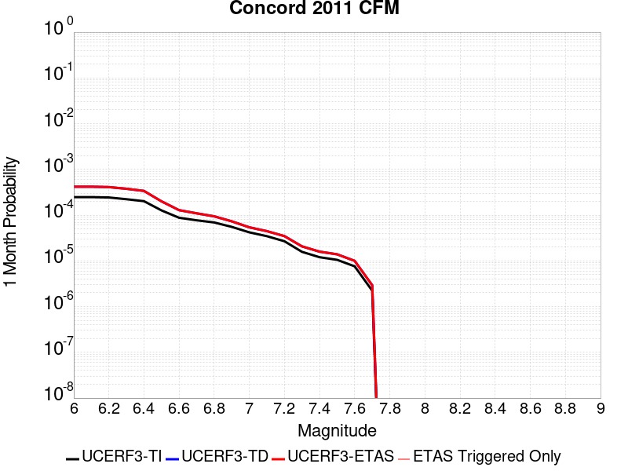 |  |  |

| Magnitude | 1 wk TI Prob | 1 wk TD Prob | 1 wk ETAS Prob | 1 wk ETAS/TD Gain | 1 wk ETAS Triggered Only | 1 mo TI Prob | 1 mo TD Prob | 1 mo ETAS Prob | 1 mo ETAS/TD Gain | 1 mo ETAS Triggered Only | 1 yr TI Prob | 1 yr TD Prob | 1 yr ETAS Prob | 1 yr ETAS/TD Gain | 1 yr ETAS Triggered Only | 10 yr TI Prob | 10 yr TD Prob | 10 yr ETAS Prob | 10 yr ETAS/TD Gain | 10 yr ETAS Triggered Only |
|-----|-----|-----|-----|-----|-----|-----|-----|-----|-----|-----|-----|-----|-----|-----|-----|-----|-----|-----|-----|-----|
| 6.0 | 5.7865112E-5 | 9.75978E-5 | 9.75978E-5 | 1.0 | 0.0 | 2.4796976E-4 | 4.1818517E-4 | 4.1818517E-4 | 1.0 | 0.0 | 0.0030148525 | 0.0050797113 | 0.0050797113 | 1.0 | 0.0 | 0.029742775 | 0.049251437 | 0.04928039 | 1.0005878 | 3.045206E-5 |
| 6.1 | 5.7865112E-5 | 9.75978E-5 | 9.75978E-5 | 1.0 | 0.0 | 2.4796976E-4 | 4.1818517E-4 | 4.1818517E-4 | 1.0 | 0.0 | 0.0030148525 | 0.0050797113 | 0.0050797113 | 1.0 | 0.0 | 0.029742775 | 0.049251437 | 0.04928039 | 1.0005878 | 3.045206E-5 |
| 6.2 | 5.6789337E-5 | 9.580088E-5 | 9.580088E-5 | 1.0 | 0.0 | 2.4336016E-4 | 4.1048654E-4 | 4.1048654E-4 | 1.0 | 0.0 | 0.0029588845 | 0.004986411 | 0.004986411 | 1.0 | 0.0 | 0.029197963 | 0.048367858 | 0.048396837 | 1.0005991 | 3.045206E-5 |
| 6.3 | 5.203322E-5 | 8.803388E-5 | 8.803388E-5 | 1.0 | 0.0 | 2.2298045E-4 | 3.7723788E-4 | 3.7723788E-4 | 1.0 | 0.0 | 0.0027114071 | 0.0045839828 | 0.0045839828 | 1.0 | 0.0 | 0.026785625 | 0.044538308 | 0.044567406 | 1.0006533 | 3.045206E-5 |
| 6.4 | 4.7120942E-5 | 7.897702E-5 | 7.897702E-5 | 1.0 | 0.0 | 2.0193127E-4 | 3.3843325E-4 | 3.3843325E-4 | 1.0 | 0.0 | 0.0024557412 | 0.004113385 | 0.004113385 | 1.0 | 0.0 | 0.024287801 | 0.04006697 | 0.040081583 | 1.0003648 | 1.522603E-5 |
| 6.5 | 2.9598437E-5 | 4.6676752E-5 | 4.6676752E-5 | 1.0 | 0.0 | 1.2684427E-4 | 2.0002908E-4 | 2.0002908E-4 | 1.0 | 0.0 | 0.001543235 | 0.0024328444 | 0.0024328444 | 1.0 | 0.0 | 0.015325619 | 0.023910914 | 0.023925776 | 1.0006216 | 1.522603E-5 |
| 6.6 | 2.0443718E-5 | 2.9985775E-5 | 2.9985775E-5 | 1.0 | 0.0 | 8.7613E-5 | 1.2850434E-4 | 1.2850434E-4 | 1.0 | 0.0 | 0.0010661662 | 0.0015634537 | 0.0015634537 | 1.0 | 0.0 | 0.010610655 | 0.015467727 | 0.015467727 | 1.0 | 0.0 |
| 6.7 | 1.798539E-5 | 2.5558722E-5 | 2.5558722E-5 | 1.0 | 0.0 | 7.7077966E-5 | 1.09532906E-4 | 1.09532906E-4 | 1.0 | 0.0 | 9.380202E-4 | 0.0013327688 | 0.0013327688 | 1.0 | 0.0 | 0.009340706 | 0.013218116 | 0.013218116 | 1.0 | 0.0 |
| 6.8 | 1.613555E-5 | 2.1960415E-5 | 2.1960415E-5 | 1.0 | 0.0 | 6.915052E-5 | 9.411275E-5 | 9.411275E-5 | 1.0 | 0.0 | 8.4158237E-4 | 0.0011452344 | 0.0011452344 | 1.0 | 0.0 | 0.008384023 | 0.011378822 | 0.011378822 | 1.0 | 0.0 |
| 6.9 | 1.2916435E-5 | 1.7082068E-5 | 1.7082068E-5 | 1.0 | 0.0 | 5.5354973E-5 | 7.320684E-5 | 7.320684E-5 | 1.0 | 0.0 | 6.7373837E-4 | 8.909346E-4 | 8.909346E-4 | 1.0 | 0.0 | 0.006716994 | 0.008867661 | 0.008867661 | 1.0 | 0.0 |
| 7.0 | 9.81129E-6 | 1.2631684E-5 | 1.2631684E-5 | 1.0 | 0.0 | 4.2047708E-5 | 5.4134674E-5 | 5.4134674E-5 | 1.0 | 0.0 | 5.118106E-4 | 6.58892E-4 | 6.58892E-4 | 1.0 | 0.0 | 0.005106334 | 0.006569596 | 0.006569596 | 1.0 | 0.0 |
| 7.1 | 8.0889195E-6 | 1.04190285E-5 | 1.04190285E-5 | 1.0 | 0.0 | 3.4666336E-5 | 4.465222E-5 | 4.465222E-5 | 1.0 | 0.0 | 4.219809E-4 | 5.4350623E-4 | 5.4350623E-4 | 1.0 | 0.0 | 0.004211805 | 0.0054219957 | 0.0054219957 | 1.0 | 0.0 |
| 7.2 | 6.267438E-6 | 8.1163535E-6 | 8.1163535E-6 | 1.0 | 0.0 | 2.6860173E-5 | 3.4783912E-5 | 3.4783912E-5 | 1.0 | 0.0 | 3.2697353E-4 | 4.234126E-4 | 4.234126E-4 | 1.0 | 0.0 | 0.0032649285 | 0.0042263092 | 0.0042263092 | 1.0 | 0.0 |
| 7.3 | 3.6761196E-6 | 4.8406678E-6 | 4.8406678E-6 | 1.0 | 0.0 | 1.5754704E-5 | 2.0745554E-5 | 2.0745554E-5 | 1.0 | 0.0 | 1.9179663E-4 | 2.5254808E-4 | 2.5254808E-4 | 1.0 | 0.0 | 0.0019163118 | 0.0025227482 | 0.0025227482 | 1.0 | 0.0 |
| 7.4 | 2.8044356E-6 | 3.7100665E-6 | 3.7100665E-6 | 1.0 | 0.0 | 1.2018954E-5 | 1.5900188E-5 | 1.5900188E-5 | 1.0 | 0.0 | 1.4632095E-4 | 1.9356771E-4 | 1.9356771E-4 | 1.0 | 0.0 | 0.0014622464 | 0.0019340892 | 0.0019340892 | 1.0 | 0.0 |
| 7.5 | 2.4578699E-6 | 3.2450664E-6 | 3.2450664E-6 | 1.0 | 0.0 | 1.0533685E-5 | 1.3907354E-5 | 1.3907354E-5 | 1.0 | 0.0 | 1.2824008E-4 | 1.6930899E-4 | 1.6930899E-4 | 1.0 | 0.0 | 0.0012816609 | 0.0016918806 | 0.0016918806 | 1.0 | 0.0 |
| 7.6 | 1.7713267E-6 | 2.335252E-6 | 2.335252E-6 | 1.0 | 0.0 | 7.591378E-6 | 1.0008185E-5 | 1.0008185E-5 | 1.0 | 0.0 | 9.2421105E-5 | 1.2184294E-4 | 1.2184294E-4 | 1.0 | 0.0 | 9.2382677E-4 | 0.0012178146 | 0.0012178146 | 1.0 | 0.0 |
| 7.7 | 5.1912366E-7 | 6.829115E-7 | 6.829115E-7 | 1.0 | 0.0 | 2.2248137E-6 | 2.9267603E-6 | 2.9267603E-6 | 1.0 | 0.0 | 2.708677E-5 | 3.5632736E-5 | 3.5632736E-5 | 1.0 | 0.0 | 2.708347E-4 | 3.5627818E-4 | 3.5627818E-4 | 1.0 | 0.0 |

## San Juan
*[(top)](#table-of-contents)*

| 1 Week | 1 Month | 1 Year | 10 Year |
|-----|-----|-----|-----|
|  |  | 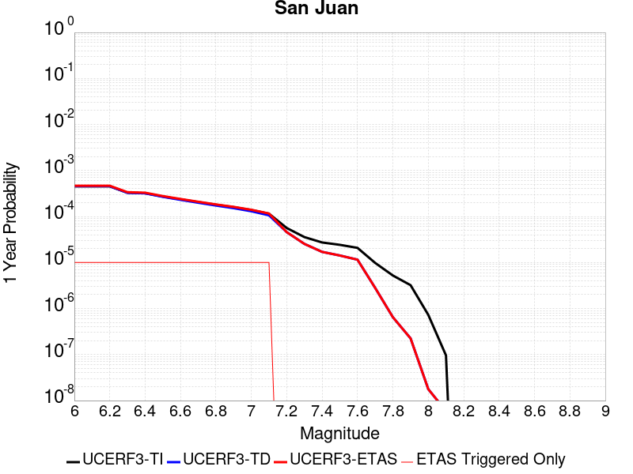 |  |

| Magnitude | 1 wk TI Prob | 1 wk TD Prob | 1 wk ETAS Prob | 1 wk ETAS/TD Gain | 1 wk ETAS Triggered Only | 1 mo TI Prob | 1 mo TD Prob | 1 mo ETAS Prob | 1 mo ETAS/TD Gain | 1 mo ETAS Triggered Only | 1 yr TI Prob | 1 yr TD Prob | 1 yr ETAS Prob | 1 yr ETAS/TD Gain | 1 yr ETAS Triggered Only | 10 yr TI Prob | 10 yr TD Prob | 10 yr ETAS Prob | 10 yr ETAS/TD Gain | 10 yr ETAS Triggered Only |
|-----|-----|-----|-----|-----|-----|-----|-----|-----|-----|-----|-----|-----|-----|-----|-----|-----|-----|-----|-----|-----|
| 6.0 | 8.682808E-6 | 8.750746E-6 | 8.750746E-6 | 1.0 | 0.0 | 3.72115E-5 | 3.7502687E-5 | 3.7502687E-5 | 1.0 | 0.0 | 4.5295584E-4 | 4.5650435E-4 | 4.7172344E-4 | 1.0333383 | 1.522603E-5 | 0.004520337 | 0.004556207 | 0.0045865206 | 1.0066532 | 3.045206E-5 |
| 6.1 | 8.682808E-6 | 8.750746E-6 | 8.750746E-6 | 1.0 | 0.0 | 3.72115E-5 | 3.7502687E-5 | 3.7502687E-5 | 1.0 | 0.0 | 4.5295584E-4 | 4.5650435E-4 | 4.7172344E-4 | 1.0333383 | 1.522603E-5 | 0.004520337 | 0.004556207 | 0.0045865206 | 1.0066532 | 3.045206E-5 |
| 6.2 | 8.682808E-6 | 8.750746E-6 | 8.750746E-6 | 1.0 | 0.0 | 3.72115E-5 | 3.7502687E-5 | 3.7502687E-5 | 1.0 | 0.0 | 4.5295584E-4 | 4.5650435E-4 | 4.7172344E-4 | 1.0333383 | 1.522603E-5 | 0.004520337 | 0.004556207 | 0.0045865206 | 1.0066532 | 3.045206E-5 |
| 6.3 | 6.3054235E-6 | 6.284118E-6 | 6.284118E-6 | 1.0 | 0.0 | 2.7022963E-5 | 2.6931666E-5 | 2.6931666E-5 | 1.0 | 0.0 | 3.2895492E-4 | 3.278451E-4 | 3.4306615E-4 | 1.0464275 | 1.522603E-5 | 0.003284684 | 0.0032738145 | 0.0032889908 | 1.0046356 | 1.522603E-5 |
| 6.4 | 6.1490473E-6 | 6.115788E-6 | 6.115788E-6 | 1.0 | 0.0 | 2.6352795E-5 | 2.6210264E-5 | 2.6210264E-5 | 1.0 | 0.0 | 3.2079802E-4 | 3.1906462E-4 | 3.3428578E-4 | 1.0477057 | 1.522603E-5 | 0.0032033534 | 0.0031862615 | 0.003201439 | 1.0047635 | 1.522603E-5 |
| 6.5 | 5.204848E-6 | 5.1385127E-6 | 5.1385127E-6 | 1.0 | 0.0 | 2.23063E-5 | 2.2022017E-5 | 2.2022017E-5 | 1.0 | 0.0 | 2.7154534E-4 | 2.6808603E-4 | 2.8330798E-4 | 1.0567801 | 1.522603E-5 | 0.0027121378 | 0.0026777803 | 0.0026929656 | 1.0056708 | 1.522603E-5 |
| 6.6 | 4.5179986E-6 | 4.4159874E-6 | 4.4159874E-6 | 1.0 | 0.0 | 1.9362706E-5 | 1.8925528E-5 | 1.8925528E-5 | 1.0 | 0.0 | 2.3571544E-4 | 2.3039473E-4 | 2.4561724E-4 | 1.0660715 | 1.522603E-5 | 0.0023546559 | 0.0023016958 | 0.0023168868 | 1.0065999 | 1.522603E-5 |
| 6.7 | 3.9442616E-6 | 3.820683E-6 | 3.820683E-6 | 1.0 | 0.0 | 1.6903869E-5 | 1.6374257E-5 | 1.6374257E-5 | 1.0 | 0.0 | 2.0578515E-4 | 1.9933902E-4 | 2.1456201E-4 | 1.0763674 | 1.522603E-5 | 0.002055947 | 0.0019917272 | 0.0020069228 | 1.0076294 | 1.522603E-5 |
| 6.8 | 3.4536245E-6 | 3.3171548E-6 | 3.3171548E-6 | 1.0 | 0.0 | 1.4801163E-5 | 1.42163035E-5 | 1.42163035E-5 | 1.0 | 0.0 | 1.8018926E-4 | 1.7307035E-4 | 1.8829375E-4 | 1.0879607 | 1.522603E-5 | 0.0018004322 | 0.0017294746 | 0.0017446743 | 1.0087886 | 1.522603E-5 |
| 6.9 | 3.059865E-6 | 2.912814E-6 | 2.912814E-6 | 1.0 | 0.0 | 1.3113641E-5 | 1.2483431E-5 | 1.2483431E-5 | 1.0 | 0.0 | 1.596469E-4 | 1.5197575E-4 | 1.6719947E-4 | 1.100172 | 1.522603E-5 | 0.0015953224 | 0.0015188329 | 0.0015340358 | 1.0100096 | 1.522603E-5 |
| 7.0 | 2.6504351E-6 | 2.492739E-6 | 2.492739E-6 | 1.0 | 0.0 | 1.1358958E-5 | 1.0683126E-5 | 1.0683126E-5 | 1.0 | 0.0 | 1.3828653E-4 | 1.3005984E-4 | 1.4528389E-4 | 1.1170542 | 1.522603E-5 | 0.0013820052 | 0.0012999491 | 0.0013151554 | 1.0116975 | 1.522603E-5 |
| 7.1 | 2.2039317E-6 | 2.034434E-6 | 2.034434E-6 | 1.0 | 0.0 | 9.445387E-6 | 8.7189765E-6 | 8.7189765E-6 | 1.0 | 0.0 | 1.1499152E-4 | 1.06148895E-4 | 1.2137331E-4 | 1.1434251 | 1.522603E-5 | 0.0011493203 | 0.001061092 | 0.0010763019 | 1.0143342 | 1.522603E-5 |
| 7.2 | 1.0786707E-6 | 8.775373E-7 | 8.775373E-7 | 1.0 | 0.0 | 4.622866E-6 | 3.7608686E-6 | 3.7608686E-6 | 1.0 | 0.0 | 5.628194E-5 | 4.5787623E-5 | 4.5787623E-5 | 1.0 | 0.0 | 5.6267687E-4 | 4.5784103E-4 | 4.5784103E-4 | 1.0 | 0.0 |
| 7.3 | 6.846433E-7 | 4.8720807E-7 | 4.8720807E-7 | 1.0 | 0.0 | 2.9341822E-6 | 2.088033E-6 | 2.088033E-6 | 1.0 | 0.0 | 3.5723086E-5 | 2.5421505E-5 | 2.5421505E-5 | 1.0 | 0.0 | 3.571734E-4 | 2.542195E-4 | 2.542195E-4 | 1.0 | 0.0 |
| 7.4 | 5.23043E-7 | 3.2652449E-7 | 3.2652449E-7 | 1.0 | 0.0 | 2.2416111E-6 | 1.3993898E-6 | 1.3993898E-6 | 1.0 | 0.0 | 2.7291273E-5 | 1.7037439E-5 | 1.7037439E-5 | 1.0 | 0.0 | 2.7287923E-4 | 1.7039331E-4 | 1.7039331E-4 | 1.0 | 0.0 |
| 7.5 | 4.648444E-7 | 2.725582E-7 | 2.725582E-7 | 1.0 | 0.0 | 1.9921886E-6 | 1.168106E-6 | 1.168106E-6 | 1.0 | 0.0 | 2.4254627E-5 | 1.4221598E-5 | 1.4221598E-5 | 1.0 | 0.0 | 2.425198E-4 | 1.4223653E-4 | 1.4223653E-4 | 1.0 | 0.0 |
| 7.6 | 3.9906567E-7 | 2.2099975E-7 | 2.2099975E-7 | 1.0 | 0.0 | 1.7102802E-6 | 9.471414E-7 | 9.471414E-7 | 1.0 | 0.0 | 2.0822463E-5 | 1.1531386E-5 | 1.1531386E-5 | 1.0 | 0.0 | 2.0820512E-4 | 1.1533252E-4 | 1.1533252E-4 | 1.0 | 0.0 |
| 7.7 | 1.8784601E-7 | 5.3729043E-8 | 5.3729043E-8 | 1.0 | 0.0 | 8.0505407E-7 | 2.302673E-7 | 2.302673E-7 | 1.0 | 0.0 | 9.80149E-6 | 2.8035008E-6 | 2.8035008E-6 | 1.0 | 0.0 | 9.801057E-5 | 2.8043742E-5 | 2.8043742E-5 | 1.0 | 0.0 |
| 7.8 | 1.00154914E-7 | 1.2435763E-8 | 1.2435763E-8 | 1.0 | 0.0 | 4.2923529E-7 | 5.329612E-8 | 5.329612E-8 | 1.0 | 0.0 | 5.225927E-6 | 6.488801E-7 | 6.488801E-7 | 1.0 | 0.0 | 5.225804E-5 | 6.4947103E-6 | 6.4947103E-6 | 1.0 | 0.0 |
| 7.9 | 6.171429E-8 | 4.306961E-9 | 4.306961E-9 | 1.0 | 0.0 | 2.6448978E-7 | 1.8458394E-8 | 1.8458394E-8 | 1.0 | 0.0 | 3.2201583E-6 | 2.2473097E-7 | 2.2473097E-7 | 1.0 | 0.0 | 3.2201115E-5 | 2.2526308E-6 | 2.2526308E-6 | 1.0 | 0.0 |
| 8.0 | 1.3974572E-8 | 3.397712E-10 | 3.397712E-10 | 1.0 | 0.0 | 5.989102E-8 | 1.4561616E-9 | 1.4561616E-9 | 1.0 | 0.0 | 7.2917294E-7 | 1.7728782E-8 | 1.7728782E-8 | 1.0 | 0.0 | 7.2917055E-6 | 1.8161353E-7 | 1.8161353E-7 | 1.0 | 0.0 |
| 8.1 | 1.8403477E-9 | 1.13495546E-10 | 1.13495546E-10 | 1.0 | 0.0 | 7.887204E-9 | 4.864098E-10 | 4.864098E-10 | 1.0 | 0.0 | 9.602671E-8 | 5.922048E-9 | 5.922048E-9 | 1.0 | 0.0 | 9.602667E-7 | 6.0468224E-8 | 6.0468224E-8 | 1.0 | 0.0 |

## San Clemente
*[(top)](#table-of-contents)*

| 1 Week | 1 Month | 1 Year | 10 Year |
|-----|-----|-----|-----|
|  |  | 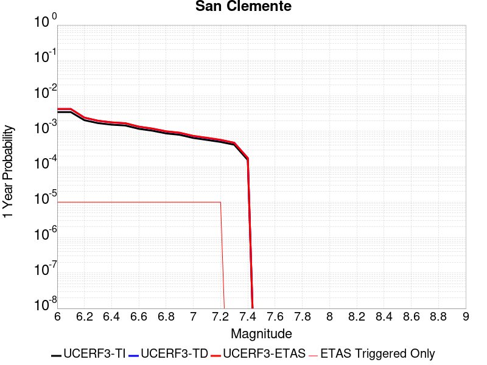 | 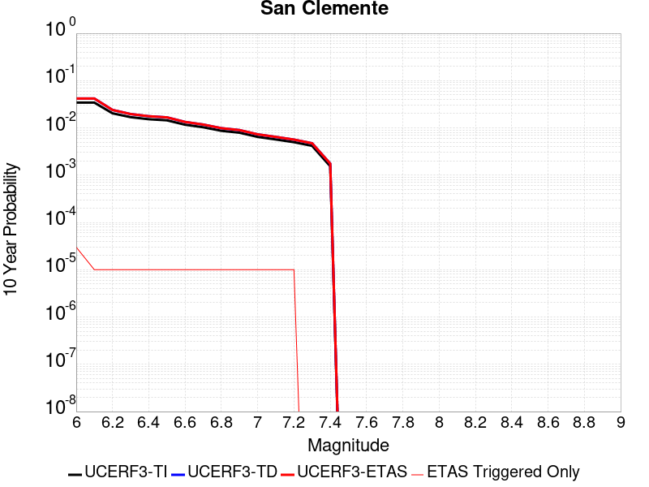 |

| Magnitude | 1 wk TI Prob | 1 wk TD Prob | 1 wk ETAS Prob | 1 wk ETAS/TD Gain | 1 wk ETAS Triggered Only | 1 mo TI Prob | 1 mo TD Prob | 1 mo ETAS Prob | 1 mo ETAS/TD Gain | 1 mo ETAS Triggered Only | 1 yr TI Prob | 1 yr TD Prob | 1 yr ETAS Prob | 1 yr ETAS/TD Gain | 1 yr ETAS Triggered Only | 10 yr TI Prob | 10 yr TD Prob | 10 yr ETAS Prob | 10 yr ETAS/TD Gain | 10 yr ETAS Triggered Only |
|-----|-----|-----|-----|-----|-----|-----|-----|-----|-----|-----|-----|-----|-----|-----|-----|-----|-----|-----|-----|-----|
| 6.0 | 6.681379E-5 | 8.164408E-5 | 8.164408E-5 | 1.0 | 0.0 | 2.8631336E-4 | 3.4985956E-4 | 3.4985956E-4 | 1.0 | 0.0 | 0.003480294 | 0.0042518 | 0.0042518 | 1.0 | 0.0 | 0.03426291 | 0.04176052 | 0.0417897 | 1.0006988 | 3.045206E-5 |
| 6.1 | 6.681379E-5 | 8.164408E-5 | 8.164408E-5 | 1.0 | 0.0 | 2.8631336E-4 | 3.4985956E-4 | 3.4985956E-4 | 1.0 | 0.0 | 0.003480294 | 0.0042518 | 0.0042518 | 1.0 | 0.0 | 0.03426291 | 0.04176052 | 0.04176052 | 1.0 | 0.0 |
| 6.2 | 3.9400576E-5 | 4.645645E-5 | 4.645645E-5 | 1.0 | 0.0 | 1.6884868E-4 | 1.9908424E-4 | 1.9908424E-4 | 1.0 | 0.0 | 0.0020537945 | 0.0024212173 | 0.0024212173 | 1.0 | 0.0 | 0.020349167 | 0.02395512 | 0.02395512 | 1.0 | 0.0 |
| 6.3 | 3.2590255E-5 | 3.79324E-5 | 3.79324E-5 | 1.0 | 0.0 | 1.3966505E-4 | 1.625575E-4 | 1.625575E-4 | 1.0 | 0.0 | 0.0016990956 | 0.001977371 | 0.001977371 | 1.0 | 0.0 | 0.01686163 | 0.019601561 | 0.019601561 | 1.0 | 0.0 |
| 6.4 | 2.9454652E-5 | 3.4100634E-5 | 3.4100634E-5 | 1.0 | 0.0 | 1.2622811E-4 | 1.4613755E-4 | 1.4613755E-4 | 1.0 | 0.0 | 0.0015357438 | 0.0017777971 | 0.0017777971 | 1.0 | 0.0 | 0.015251739 | 0.017638927 | 0.017638927 | 1.0 | 0.0 |
| 6.5 | 2.790836E-5 | 3.2250126E-5 | 3.2250126E-5 | 1.0 | 0.0 | 1.1960178E-4 | 1.3820764E-4 | 1.3820764E-4 | 1.0 | 0.0 | 0.001455179 | 0.0016814041 | 0.0016814041 | 1.0 | 0.0 | 0.014456868 | 0.016689846 | 0.016689846 | 1.0 | 0.0 |
| 6.6 | 2.2492153E-5 | 2.5764699E-5 | 2.5764699E-5 | 1.0 | 0.0 | 9.639138E-5 | 1.10415545E-4 | 1.10415545E-4 | 1.0 | 0.0 | 0.0011729331 | 0.0013434946 | 0.0013434946 | 1.0 | 0.0 | 0.011667615 | 0.013355441 | 0.013355441 | 1.0 | 0.0 |
| 6.7 | 1.9862755E-5 | 2.2668124E-5 | 2.2668124E-5 | 1.0 | 0.0 | 8.512331E-5 | 9.7145545E-5 | 9.7145545E-5 | 1.0 | 0.0 | 0.0010358836 | 0.0011821166 | 0.0011821166 | 1.0 | 0.0 | 0.010310682 | 0.011759577 | 0.011759577 | 1.0 | 0.0 |
| 6.8 | 1.6697575E-5 | 1.8979084E-5 | 1.8979084E-5 | 1.0 | 0.0 | 7.155907E-5 | 8.133645E-5 | 8.133645E-5 | 1.0 | 0.0 | 8.7088346E-4 | 9.898308E-4 | 9.898308E-4 | 1.0 | 0.0 | 0.008674784 | 0.009855248 | 0.009855248 | 1.0 | 0.0 |
| 6.9 | 1.5218415E-5 | 1.7270635E-5 | 1.7270635E-5 | 1.0 | 0.0 | 6.522015E-5 | 7.401496E-5 | 7.401496E-5 | 1.0 | 0.0 | 7.93766E-4 | 9.007684E-4 | 9.007684E-4 | 1.0 | 0.0 | 0.007909367 | 0.00897212 | 0.00897212 | 1.0 | 0.0 |
| 7.0 | 1.2392958E-5 | 1.4034001E-5 | 1.4034001E-5 | 1.0 | 0.0 | 5.3111595E-5 | 6.0144375E-5 | 6.0144375E-5 | 1.0 | 0.0 | 6.4644177E-4 | 7.320193E-4 | 7.320193E-4 | 1.0 | 0.0 | 0.0064456454 | 0.007296867 | 0.007296867 | 1.0 | 0.0 |
| 7.1 | 1.0934128E-5 | 1.2376004E-5 | 1.2376004E-5 | 1.0 | 0.0 | 4.6859706E-5 | 5.3038977E-5 | 5.3038977E-5 | 1.0 | 0.0 | 5.7036756E-4 | 6.4556557E-4 | 6.4556557E-4 | 1.0 | 0.0 | 0.0056890585 | 0.0064376486 | 0.0064376486 | 1.0 | 0.0 |
| 7.2 | 9.5798805E-6 | 1.0845695E-5 | 1.0845695E-5 | 1.0 | 0.0 | 4.1055984E-5 | 4.6480764E-5 | 4.6480764E-5 | 1.0 | 0.0 | 4.9974193E-4 | 5.6576356E-4 | 5.6576356E-4 | 1.0 | 0.0 | 0.0049861963 | 0.005643956 | 0.005643956 | 1.0 | 0.0 |
| 7.3 | 8.0167365E-6 | 9.084559E-6 | 9.084559E-6 | 1.0 | 0.0 | 3.4356988E-5 | 3.893328E-5 | 3.893328E-5 | 1.0 | 0.0 | 4.1821605E-4 | 4.7391668E-4 | 4.7391668E-4 | 1.0 | 0.0 | 0.0041742986 | 0.004729763 | 0.004729763 | 1.0 | 0.0 |
| 7.4 | 2.9581017E-6 | 3.362623E-6 | 3.362623E-6 | 1.0 | 0.0 | 1.2677518E-5 | 1.441119E-5 | 1.441119E-5 | 1.0 | 0.0 | 1.5433785E-4 | 1.7544716E-4 | 1.7544716E-4 | 1.0 | 0.0 | 0.001542307 | 0.0017535817 | 0.0017535817 | 1.0 | 0.0 |

## Big Pine (East)
*[(top)](#table-of-contents)*

| 1 Week | 1 Month | 1 Year | 10 Year |
|-----|-----|-----|-----|
|  |  |  |  |

| Magnitude | 1 wk TI Prob | 1 wk TD Prob | 1 wk ETAS Prob | 1 wk ETAS/TD Gain | 1 wk ETAS Triggered Only | 1 mo TI Prob | 1 mo TD Prob | 1 mo ETAS Prob | 1 mo ETAS/TD Gain | 1 mo ETAS Triggered Only | 1 yr TI Prob | 1 yr TD Prob | 1 yr ETAS Prob | 1 yr ETAS/TD Gain | 1 yr ETAS Triggered Only | 10 yr TI Prob | 10 yr TD Prob | 10 yr ETAS Prob | 10 yr ETAS/TD Gain | 10 yr ETAS Triggered Only |
|-----|-----|-----|-----|-----|-----|-----|-----|-----|-----|-----|-----|-----|-----|-----|-----|-----|-----|-----|-----|-----|
| 6.0 | 9.916913E-6 | 1.282197E-5 | 1.282197E-5 | 1.0 | 0.0 | 4.250036E-5 | 5.495027E-5 | 5.495027E-5 | 1.0 | 0.0 | 5.173191E-4 | 6.6883623E-4 | 6.6883623E-4 | 1.0 | 0.0 | 0.0051611643 | 0.0066729826 | 0.0067032315 | 1.004533 | 3.045206E-5 |
| 6.1 | 9.916913E-6 | 1.282197E-5 | 1.282197E-5 | 1.0 | 0.0 | 4.250036E-5 | 5.495027E-5 | 5.495027E-5 | 1.0 | 0.0 | 5.173191E-4 | 6.6883623E-4 | 6.6883623E-4 | 1.0 | 0.0 | 0.0051611643 | 0.0066729826 | 0.0067032315 | 1.004533 | 3.045206E-5 |
| 6.2 | 9.916913E-6 | 1.282197E-5 | 1.282197E-5 | 1.0 | 0.0 | 4.250036E-5 | 5.495027E-5 | 5.495027E-5 | 1.0 | 0.0 | 5.173191E-4 | 6.6883623E-4 | 6.6883623E-4 | 1.0 | 0.0 | 0.0051611643 | 0.0066729826 | 0.0067032315 | 1.004533 | 3.045206E-5 |
| 6.3 | 5.479711E-6 | 8.117787E-6 | 8.117787E-6 | 1.0 | 0.0 | 2.3484265E-5 | 3.4790068E-5 | 3.4790068E-5 | 1.0 | 0.0 | 2.858834E-4 | 4.2348995E-4 | 4.2348995E-4 | 1.0 | 0.0 | 0.0028551589 | 0.004229713 | 0.0042600366 | 1.0071691 | 3.045206E-5 |
| 6.4 | 5.465009E-6 | 8.10208E-6 | 8.10208E-6 | 1.0 | 0.0 | 2.3421257E-5 | 3.4722754E-5 | 3.4722754E-5 | 1.0 | 0.0 | 2.851165E-4 | 4.2267074E-4 | 4.2267074E-4 | 1.0 | 0.0 | 0.0028475097 | 0.004221552 | 0.0042518754 | 1.0071831 | 3.045206E-5 |
| 6.5 | 4.826767E-6 | 7.4271156E-6 | 7.4271156E-6 | 1.0 | 0.0 | 2.068598E-5 | 3.183012E-5 | 3.183012E-5 | 1.0 | 0.0 | 2.518227E-4 | 3.874656E-4 | 3.874656E-4 | 1.0 | 0.0 | 0.0025153751 | 0.0038707424 | 0.0039010767 | 1.0078368 | 3.045206E-5 |
| 6.6 | 4.3146847E-6 | 6.887036E-6 | 6.887036E-6 | 1.0 | 0.0 | 1.8491375E-5 | 2.9515548E-5 | 2.9515548E-5 | 1.0 | 0.0 | 2.2510924E-4 | 3.59295E-4 | 3.59295E-4 | 1.0 | 0.0 | 0.0022488134 | 0.0035899505 | 0.0036202932 | 1.0084522 | 3.045206E-5 |
| 6.7 | 3.6968106E-6 | 5.9999884E-6 | 5.9999884E-6 | 1.0 | 0.0 | 1.5843378E-5 | 2.571399E-5 | 2.571399E-5 | 1.0 | 0.0 | 1.9287605E-4 | 3.130244E-4 | 3.130244E-4 | 1.0 | 0.0 | 0.0019270873 | 0.0031285542 | 0.0031285542 | 1.0 | 0.0 |
| 6.8 | 3.4671132E-6 | 5.7065704E-6 | 5.7065704E-6 | 1.0 | 0.0 | 1.4858972E-5 | 2.4456509E-5 | 2.4456509E-5 | 1.0 | 0.0 | 1.8089297E-4 | 2.9771877E-4 | 2.9771877E-4 | 1.0 | 0.0 | 0.0018074579 | 0.0029759097 | 0.0029759097 | 1.0 | 0.0 |
| 6.9 | 2.7686972E-6 | 4.829279E-6 | 4.829279E-6 | 1.0 | 0.0 | 1.1865792E-5 | 2.069675E-5 | 2.069675E-5 | 1.0 | 0.0 | 1.4445644E-4 | 2.5195457E-4 | 2.5195457E-4 | 1.0 | 0.0 | 0.0014436257 | 0.0025193316 | 0.0025193316 | 1.0 | 0.0 |
| 7.0 | 2.1472624E-6 | 3.988725E-6 | 3.988725E-6 | 1.0 | 0.0 | 9.20252E-6 | 1.7094428E-5 | 1.7094428E-5 | 1.0 | 0.0 | 1.12034926E-4 | 2.0810531E-4 | 2.0810531E-4 | 1.0 | 0.0 | 0.0011197845 | 0.002081715 | 0.002081715 | 1.0 | 0.0 |
| 7.1 | 1.7018335E-6 | 3.348229E-6 | 3.348229E-6 | 1.0 | 0.0 | 7.293552E-6 | 1.4349476E-5 | 1.4349476E-5 | 1.0 | 0.0 | 8.879537E-5 | 1.7469123E-4 | 1.7469123E-4 | 1.0 | 0.0 | 8.87599E-4 | 0.0017481181 | 0.0017481181 | 1.0 | 0.0 |
| 7.2 | 1.25603E-6 | 2.7976516E-6 | 2.7976516E-6 | 1.0 | 0.0 | 5.3829745E-6 | 1.1989882E-5 | 1.1989882E-5 | 1.0 | 0.0 | 6.553574E-5 | 1.4596726E-4 | 1.4596726E-4 | 1.0 | 0.0 | 6.551642E-4 | 0.0014612685 | 0.0014612685 | 1.0 | 0.0 |
| 7.3 | 1.112297E-6 | 2.613323E-6 | 2.613323E-6 | 1.0 | 0.0 | 4.7669787E-6 | 1.1199909E-5 | 1.1199909E-5 | 1.0 | 0.0 | 5.803642E-5 | 1.3635057E-4 | 1.3635057E-4 | 1.0 | 0.0 | 5.802127E-4 | 0.0013650558 | 0.0013650558 | 1.0 | 0.0 |
| 7.4 | 1.0137181E-6 | 2.4863546E-6 | 2.4863546E-6 | 1.0 | 0.0 | 4.3444993E-6 | 1.0655763E-5 | 1.0655763E-5 | 1.0 | 0.0 | 5.2892992E-5 | 1.297264E-4 | 1.297264E-4 | 1.0 | 0.0 | 5.288041E-4 | 0.0012986774 | 0.0012986774 | 1.0 | 0.0 |
| 7.5 | 9.598608E-7 | 2.4099256E-6 | 2.4099256E-6 | 1.0 | 0.0 | 4.1136827E-6 | 1.0328214E-5 | 1.0328214E-5 | 1.0 | 0.0 | 5.0082934E-5 | 1.2573895E-4 | 1.2573895E-4 | 1.0 | 0.0 | 5.007165E-4 | 0.0012586572 | 0.0012586572 | 1.0 | 0.0 |
| 7.6 | 7.929459E-7 | 2.047312E-6 | 2.047312E-6 | 1.0 | 0.0 | 3.3983351E-6 | 8.7741655E-6 | 8.7741655E-6 | 1.0 | 0.0 | 4.1373947E-5 | 1.0682041E-4 | 1.0682041E-4 | 1.0 | 0.0 | 4.1366243E-4 | 0.0010697625 | 0.0010697625 | 1.0 | 0.0 |
| 7.7 | 4.155788E-7 | 1.162298E-6 | 1.162298E-6 | 1.0 | 0.0 | 1.7810507E-6 | 4.981268E-6 | 4.981268E-6 | 1.0 | 0.0 | 2.1684076E-5 | 6.064529E-5 | 6.064529E-5 | 1.0 | 0.0 | 2.1681961E-4 | 6.09451E-4 | 6.09451E-4 | 1.0 | 0.0 |
| 7.8 | 1.14666925E-7 | 2.5959213E-7 | 2.5959213E-7 | 1.0 | 0.0 | 4.914296E-7 | 1.1125372E-6 | 1.1125372E-6 | 1.0 | 0.0 | 5.9831386E-6 | 1.354506E-5 | 1.354506E-5 | 1.0 | 0.0 | 5.9829777E-5 | 1.3654139E-4 | 1.3654139E-4 | 1.0 | 0.0 |
| 7.9 | 2.9231824E-8 | 4.15291E-8 | 4.15291E-8 | 1.0 | 0.0 | 1.2527924E-7 | 1.7798183E-7 | 1.7798183E-7 | 1.0 | 0.0 | 1.5252737E-6 | 2.1669268E-6 | 2.1669268E-6 | 1.0 | 0.0 | 1.5252632E-5 | 2.2001832E-5 | 2.2001832E-5 | 1.0 | 0.0 |

## San Cayetano
*[(top)](#table-of-contents)*

| 1 Week | 1 Month | 1 Year | 10 Year |
|-----|-----|-----|-----|
| 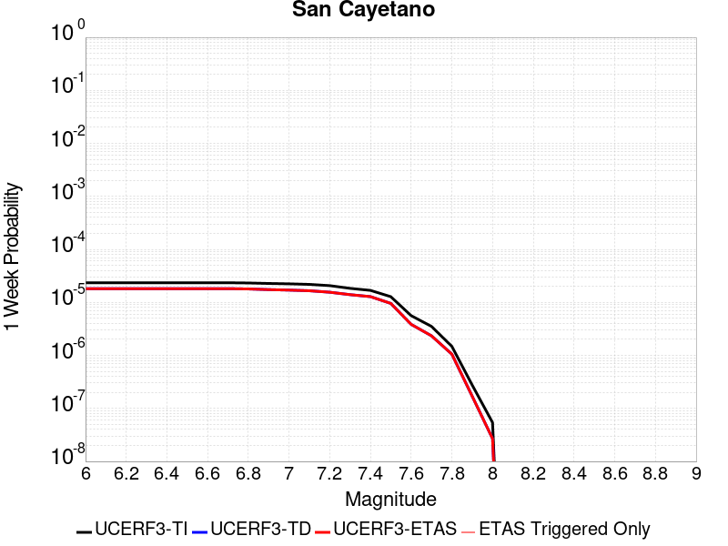 |  |  |  |

| Magnitude | 1 wk TI Prob | 1 wk TD Prob | 1 wk ETAS Prob | 1 wk ETAS/TD Gain | 1 wk ETAS Triggered Only | 1 mo TI Prob | 1 mo TD Prob | 1 mo ETAS Prob | 1 mo ETAS/TD Gain | 1 mo ETAS Triggered Only | 1 yr TI Prob | 1 yr TD Prob | 1 yr ETAS Prob | 1 yr ETAS/TD Gain | 1 yr ETAS Triggered Only | 10 yr TI Prob | 10 yr TD Prob | 10 yr ETAS Prob | 10 yr ETAS/TD Gain | 10 yr ETAS Triggered Only |
|-----|-----|-----|-----|-----|-----|-----|-----|-----|-----|-----|-----|-----|-----|-----|-----|-----|-----|-----|-----|-----|
| 6.0 | 2.3476267E-5 | 1.8172246E-5 | 1.8172246E-5 | 1.0 | 0.0 | 1.0060869E-4 | 7.787875E-5 | 7.787875E-5 | 1.0 | 0.0 | 0.0012242225 | 9.4776496E-4 | 9.6297654E-4 | 1.01605 | 1.522603E-5 | 0.012175002 | 0.009438118 | 0.009468283 | 1.003196 | 3.045206E-5 |
| 6.1 | 2.3476267E-5 | 1.8172246E-5 | 1.8172246E-5 | 1.0 | 0.0 | 1.0060869E-4 | 7.787875E-5 | 7.787875E-5 | 1.0 | 0.0 | 0.0012242225 | 9.4776496E-4 | 9.6297654E-4 | 1.01605 | 1.522603E-5 | 0.012175002 | 0.009438118 | 0.009468283 | 1.003196 | 3.045206E-5 |
| 6.2 | 2.3476267E-5 | 1.8172246E-5 | 1.8172246E-5 | 1.0 | 0.0 | 1.0060869E-4 | 7.787875E-5 | 7.787875E-5 | 1.0 | 0.0 | 0.0012242225 | 9.4776496E-4 | 9.6297654E-4 | 1.01605 | 1.522603E-5 | 0.012175002 | 0.009438118 | 0.009468283 | 1.003196 | 3.045206E-5 |
| 6.3 | 2.3476267E-5 | 1.8172246E-5 | 1.8172246E-5 | 1.0 | 0.0 | 1.0060869E-4 | 7.787875E-5 | 7.787875E-5 | 1.0 | 0.0 | 0.0012242225 | 9.4776496E-4 | 9.6297654E-4 | 1.01605 | 1.522603E-5 | 0.012175002 | 0.009438118 | 0.009468283 | 1.003196 | 3.045206E-5 |
| 6.4 | 2.3476267E-5 | 1.8172246E-5 | 1.8172246E-5 | 1.0 | 0.0 | 1.0060869E-4 | 7.787875E-5 | 7.787875E-5 | 1.0 | 0.0 | 0.0012242225 | 9.4776496E-4 | 9.6297654E-4 | 1.01605 | 1.522603E-5 | 0.012175002 | 0.009438118 | 0.009468283 | 1.003196 | 3.045206E-5 |
| 6.5 | 2.3476267E-5 | 1.8172246E-5 | 1.8172246E-5 | 1.0 | 0.0 | 1.0060869E-4 | 7.787875E-5 | 7.787875E-5 | 1.0 | 0.0 | 0.0012242225 | 9.4776496E-4 | 9.6297654E-4 | 1.01605 | 1.522603E-5 | 0.012175002 | 0.009438118 | 0.009468283 | 1.003196 | 3.045206E-5 |
| 6.6 | 2.3476267E-5 | 1.8172246E-5 | 1.8172246E-5 | 1.0 | 0.0 | 1.0060869E-4 | 7.787875E-5 | 7.787875E-5 | 1.0 | 0.0 | 0.0012242225 | 9.4776496E-4 | 9.6297654E-4 | 1.01605 | 1.522603E-5 | 0.012175002 | 0.009438118 | 0.009468283 | 1.003196 | 3.045206E-5 |
| 6.7 | 2.3476267E-5 | 1.8172246E-5 | 1.8172246E-5 | 1.0 | 0.0 | 1.0060869E-4 | 7.787875E-5 | 7.787875E-5 | 1.0 | 0.0 | 0.0012242225 | 9.4776496E-4 | 9.6297654E-4 | 1.01605 | 1.522603E-5 | 0.012175002 | 0.009438118 | 0.009468283 | 1.003196 | 3.045206E-5 |
| 6.8 | 2.3241924E-5 | 1.7939927E-5 | 1.7939927E-5 | 1.0 | 0.0 | 9.960445E-5 | 7.688316E-5 | 7.688316E-5 | 1.0 | 0.0 | 0.0012120095 | 9.356541E-4 | 9.5086585E-4 | 1.0162579 | 1.522603E-5 | 0.012054204 | 0.009318002 | 0.00934817 | 1.0032376 | 3.045206E-5 |
| 6.9 | 2.2761007E-5 | 1.7435323E-5 | 1.7435323E-5 | 1.0 | 0.0 | 9.7543525E-5 | 7.4720694E-5 | 7.4720694E-5 | 1.0 | 0.0 | 0.0011869454 | 9.093482E-4 | 9.2456036E-4 | 1.0167286 | 1.522603E-5 | 0.011806256 | 0.009057103 | 0.0090872785 | 1.0033318 | 3.045206E-5 |
| 7.0 | 2.240283E-5 | 1.7069042E-5 | 1.7069042E-5 | 1.0 | 0.0 | 9.600859E-5 | 7.3151E-5 | 7.3151E-5 | 1.0 | 0.0 | 0.0011682777 | 8.9025294E-4 | 9.0546545E-4 | 1.0170878 | 1.522603E-5 | 0.011621549 | 0.008867681 | 0.008897863 | 1.0034035 | 3.045206E-5 |
| 7.1 | 2.1871154E-5 | 1.6588847E-5 | 1.6588847E-5 | 1.0 | 0.0 | 9.373015E-5 | 7.1093134E-5 | 7.1093134E-5 | 1.0 | 0.0 | 0.0011405671 | 8.652186E-4 | 8.8043144E-4 | 1.0175827 | 1.522603E-5 | 0.011347309 | 0.008619301 | 0.008634396 | 1.0017513 | 1.522603E-5 |
| 7.2 | 2.0714133E-5 | 1.5567295E-5 | 1.5567295E-5 | 1.0 | 0.0 | 8.8771834E-5 | 6.671529E-5 | 6.671529E-5 | 1.0 | 0.0 | 0.0010802611 | 8.1195927E-4 | 8.2717295E-4 | 1.018737 | 1.522603E-5 | 0.010750249 | 0.008090701 | 0.008105804 | 1.0018667 | 1.522603E-5 |
| 7.3 | 1.8408395E-5 | 1.3998046E-5 | 1.3998046E-5 | 1.0 | 0.0 | 7.8890735E-5 | 5.999026E-5 | 5.999026E-5 | 1.0 | 0.0 | 9.600714E-4 | 7.3013967E-4 | 7.4535457E-4 | 1.0208384 | 1.522603E-5 | 0.009559342 | 0.007278127 | 0.0072932425 | 1.0020767 | 1.522603E-5 |
| 7.4 | 1.6856795E-5 | 1.2851064E-5 | 1.2851064E-5 | 1.0 | 0.0 | 7.2241404E-5 | 5.507484E-5 | 5.507484E-5 | 1.0 | 0.0 | 8.7918417E-4 | 6.7033275E-4 | 6.855486E-4 | 1.0226989 | 1.522603E-5 | 0.00875714 | 0.006683788 | 0.006698912 | 1.0022628 | 1.522603E-5 |
| 7.5 | 1.2822778E-5 | 9.578205E-6 | 9.578205E-6 | 1.0 | 0.0 | 5.495361E-5 | 4.1048817E-5 | 4.1048817E-5 | 1.0 | 0.0 | 6.688548E-4 | 4.996563E-4 | 5.1487476E-4 | 1.0304577 | 1.522603E-5 | 0.006668452 | 0.0049855 | 0.00500065 | 1.0030389 | 1.522603E-5 |
| 7.6 | 5.6272684E-6 | 3.855203E-6 | 3.855203E-6 | 1.0 | 0.0 | 2.4116642E-5 | 1.6522194E-5 | 1.6522194E-5 | 1.0 | 0.0 | 2.9358055E-4 | 2.0113925E-4 | 2.0113925E-4 | 1.0 | 0.0 | 0.0029319301 | 0.002009583 | 0.002009583 | 1.0 | 0.0 |
| 7.7 | 3.5261346E-6 | 2.3408893E-6 | 2.3408893E-6 | 1.0 | 0.0 | 1.5111918E-5 | 1.0032345E-5 | 1.0032345E-5 | 1.0 | 0.0 | 1.8397206E-4 | 1.2213703E-4 | 1.2213703E-4 | 1.0 | 0.0 | 0.0018381984 | 0.0012207064 | 0.0012207064 | 1.0 | 0.0 |
| 7.8 | 1.4826929E-6 | 1.0564999E-6 | 1.0564999E-6 | 1.0 | 0.0 | 6.354383E-6 | 4.527849E-6 | 4.527849E-6 | 1.0 | 0.0 | 7.736187E-5 | 5.5125187E-5 | 5.5125187E-5 | 1.0 | 0.0 | 7.733494E-4 | 5.511172E-4 | 5.511172E-4 | 1.0 | 0.0 |
| 7.9 | 2.7568166E-7 | 1.6979952E-7 | 1.6979952E-7 | 1.0 | 0.0 | 1.1814923E-6 | 7.27712E-7 | 7.27712E-7 | 1.0 | 0.0 | 1.4384574E-5 | 8.859858E-6 | 8.859858E-6 | 1.0 | 0.0 | 1.4383643E-4 | 8.859509E-5 | 8.859509E-5 | 1.0 | 0.0 |
| 8.0 | 5.407832E-8 | 2.6893451E-8 | 2.6893451E-8 | 1.0 | 0.0 | 2.3176422E-7 | 1.1525764E-7 | 1.1525764E-7 | 1.0 | 0.0 | 2.8217257E-6 | 1.403261E-6 | 1.403261E-6 | 1.0 | 0.0 | 2.8216898E-5 | 1.4032525E-5 | 1.4032525E-5 | 1.0 | 0.0 |

## Great Valley 09 (Laguna Seca)
*[(top)](#table-of-contents)*

| 1 Week | 1 Month | 1 Year | 10 Year |
|-----|-----|-----|-----|
|  |  |  |  |

| Magnitude | 1 wk TI Prob | 1 wk TD Prob | 1 wk ETAS Prob | 1 wk ETAS/TD Gain | 1 wk ETAS Triggered Only | 1 mo TI Prob | 1 mo TD Prob | 1 mo ETAS Prob | 1 mo ETAS/TD Gain | 1 mo ETAS Triggered Only | 1 yr TI Prob | 1 yr TD Prob | 1 yr ETAS Prob | 1 yr ETAS/TD Gain | 1 yr ETAS Triggered Only | 10 yr TI Prob | 10 yr TD Prob | 10 yr ETAS Prob | 10 yr ETAS/TD Gain | 10 yr ETAS Triggered Only |
|-----|-----|-----|-----|-----|-----|-----|-----|-----|-----|-----|-----|-----|-----|-----|-----|-----|-----|-----|-----|-----|
| 6.0 | 5.4353277E-5 | 7.051288E-5 | 7.051288E-5 | 1.0 | 0.0 | 2.3292181E-4 | 3.021651E-4 | 3.021651E-4 | 1.0 | 0.0 | 0.0028321352 | 0.0036727623 | 0.0036727623 | 1.0 | 0.0 | 0.02796312 | 0.036121234 | 0.036150586 | 1.0008126 | 3.045206E-5 |
| 6.1 | 4.5578287E-5 | 5.8229198E-5 | 5.8229198E-5 | 1.0 | 0.0 | 1.953209E-4 | 2.4953127E-4 | 2.4953127E-4 | 1.0 | 0.0 | 0.0023754383 | 0.0030339046 | 0.0030339046 | 1.0 | 0.0 | 0.023502063 | 0.029924182 | 0.029938951 | 1.0004936 | 1.522603E-5 |
| 6.2 | 2.8536782E-5 | 3.4740468E-5 | 3.4740468E-5 | 1.0 | 0.0 | 1.2229476E-4 | 1.4887958E-4 | 1.4887958E-4 | 1.0 | 0.0 | 0.0014879217 | 0.0018110707 | 0.0018110707 | 1.0 | 0.0 | 0.014779986 | 0.017960638 | 0.01797559 | 1.0008326 | 1.522603E-5 |
| 6.3 | 2.3698774E-5 | 2.8215252E-5 | 2.8215252E-5 | 1.0 | 0.0 | 1.01562226E-4 | 1.2091713E-4 | 1.2091713E-4 | 1.0 | 0.0 | 0.0012358186 | 0.0014712278 | 0.0014712278 | 1.0 | 0.0 | 0.012289686 | 0.014613301 | 0.014613301 | 1.0 | 0.0 |
| 6.4 | 1.9191197E-5 | 2.2123982E-5 | 2.2123982E-5 | 1.0 | 0.0 | 8.2245395E-5 | 9.481376E-5 | 9.481376E-5 | 1.0 | 0.0 | 0.0010008777 | 0.001153789 | 0.001153789 | 1.0 | 0.0 | 0.009963818 | 0.011478378 | 0.011478378 | 1.0 | 0.0 |
| 6.5 | 1.5203241E-5 | 1.6802042E-5 | 1.6802042E-5 | 1.0 | 0.0 | 6.5155116E-5 | 7.200683E-5 | 7.200683E-5 | 1.0 | 0.0 | 7.9297484E-4 | 8.76362E-4 | 8.76362E-4 | 1.0 | 0.0 | 0.007901512 | 0.008730489 | 0.008730489 | 1.0 | 0.0 |
| 6.6 | 1.0984925E-5 | 1.1243591E-5 | 1.1243591E-5 | 1.0 | 0.0 | 4.70774E-5 | 4.8185837E-5 | 4.8185837E-5 | 1.0 | 0.0 | 5.730166E-4 | 5.865083E-4 | 5.865083E-4 | 1.0 | 0.0 | 0.005715413 | 0.0058500012 | 0.0058500012 | 1.0 | 0.0 |
| 6.7 | 9.134616E-6 | 9.020651E-6 | 9.020651E-6 | 1.0 | 0.0 | 3.9147766E-5 | 3.8659375E-5 | 3.8659375E-5 | 1.0 | 0.0 | 4.7651984E-4 | 4.705786E-4 | 4.705786E-4 | 1.0 | 0.0 | 0.004754993 | 0.0046960665 | 0.0046960665 | 1.0 | 0.0 |
| 6.8 | 7.785589E-6 | 7.4525665E-6 | 7.4525665E-6 | 1.0 | 0.0 | 3.3366385E-5 | 3.193919E-5 | 3.193919E-5 | 1.0 | 0.0 | 4.0616E-4 | 3.8879228E-4 | 3.8879228E-4 | 1.0 | 0.0 | 0.0040541845 | 0.003881325 | 0.003881325 | 1.0 | 0.0 |
| 6.9 | 5.579095E-6 | 4.8989014E-6 | 4.8989014E-6 | 1.0 | 0.0 | 2.3910188E-5 | 2.099513E-5 | 2.099513E-5 | 1.0 | 0.0 | 2.9106764E-4 | 2.555871E-4 | 2.555871E-4 | 1.0 | 0.0 | 0.002906867 | 0.002553069 | 0.002553069 | 1.0 | 0.0 |
| 7.0 | 2.6816688E-6 | 1.5217248E-6 | 1.5217248E-6 | 1.0 | 0.0 | 1.1492816E-5 | 6.5216623E-6 | 6.5216623E-6 | 1.0 | 0.0 | 1.3991605E-4 | 7.939843E-5 | 7.939843E-5 | 1.0 | 0.0 | 0.0013982799 | 7.9370936E-4 | 7.9370936E-4 | 1.0 | 0.0 |
| 7.1 | 1.9951021E-6 | 7.4544107E-7 | 7.4544107E-7 | 1.0 | 0.0 | 8.55041E-6 | 3.1947436E-6 | 3.1947436E-6 | 1.0 | 0.0 | 1.0409627E-4 | 3.8895352E-5 | 3.8895352E-5 | 1.0 | 0.0 | 0.0010404752 | 3.888896E-4 | 3.888896E-4 | 1.0 | 0.0 |
| 7.2 | 1.9951021E-6 | 7.4544107E-7 | 7.4544107E-7 | 1.0 | 0.0 | 8.55041E-6 | 3.1947436E-6 | 3.1947436E-6 | 1.0 | 0.0 | 1.0409627E-4 | 3.8895352E-5 | 3.8895352E-5 | 1.0 | 0.0 | 0.0010404752 | 3.888896E-4 | 3.888896E-4 | 1.0 | 0.0 |
| 7.3 | 1.7087556E-6 | 6.579369E-7 | 6.579369E-7 | 1.0 | 0.0 | 7.3232177E-6 | 2.8197267E-6 | 2.8197267E-6 | 1.0 | 0.0 | 8.915652E-5 | 3.4329674E-5 | 3.4329674E-5 | 1.0 | 0.0 | 8.9120766E-4 | 3.4324775E-4 | 3.4324775E-4 | 1.0 | 0.0 |
| 7.4 | 1.3804846E-6 | 6.074255E-7 | 6.074255E-7 | 1.0 | 0.0 | 5.916349E-6 | 2.6032496E-6 | 2.6032496E-6 | 1.0 | 0.0 | 7.2029165E-5 | 3.1694144E-5 | 3.1694144E-5 | 1.0 | 0.0 | 7.200583E-4 | 3.1690026E-4 | 3.1690026E-4 | 1.0 | 0.0 |
| 7.5 | 1.3804846E-6 | 6.074255E-7 | 6.074255E-7 | 1.0 | 0.0 | 5.916349E-6 | 2.6032496E-6 | 2.6032496E-6 | 1.0 | 0.0 | 7.2029165E-5 | 3.1694144E-5 | 3.1694144E-5 | 1.0 | 0.0 | 7.200583E-4 | 3.1690026E-4 | 3.1690026E-4 | 1.0 | 0.0 |

## Camp Rock 2011
*[(top)](#table-of-contents)*

| 1 Week | 1 Month | 1 Year | 10 Year |
|-----|-----|-----|-----|
|  |  |  |  |

| Magnitude | 1 wk TI Prob | 1 wk TD Prob | 1 wk ETAS Prob | 1 wk ETAS/TD Gain | 1 wk ETAS Triggered Only | 1 mo TI Prob | 1 mo TD Prob | 1 mo ETAS Prob | 1 mo ETAS/TD Gain | 1 mo ETAS Triggered Only | 1 yr TI Prob | 1 yr TD Prob | 1 yr ETAS Prob | 1 yr ETAS/TD Gain | 1 yr ETAS Triggered Only | 10 yr TI Prob | 10 yr TD Prob | 10 yr ETAS Prob | 10 yr ETAS/TD Gain | 10 yr ETAS Triggered Only |
|-----|-----|-----|-----|-----|-----|-----|-----|-----|-----|-----|-----|-----|-----|-----|-----|-----|-----|-----|-----|-----|
| 6.0 | 1.6710783E-5 | 4.2504644E-6 | 4.2504644E-6 | 1.0 | 0.0 | 7.161568E-5 | 1.8216151E-5 | 1.8216151E-5 | 1.0 | 0.0 | 8.7157206E-4 | 2.217596E-4 | 2.3698226E-4 | 1.0686449 | 1.522603E-5 | 0.008681616 | 0.002215436 | 0.0022458206 | 1.0137149 | 3.045206E-5 |
| 6.1 | 1.6710783E-5 | 4.2504644E-6 | 4.2504644E-6 | 1.0 | 0.0 | 7.161568E-5 | 1.8216151E-5 | 1.8216151E-5 | 1.0 | 0.0 | 8.7157206E-4 | 2.217596E-4 | 2.3698226E-4 | 1.0686449 | 1.522603E-5 | 0.008681616 | 0.002215436 | 0.0022458206 | 1.0137149 | 3.045206E-5 |
| 6.2 | 1.6710783E-5 | 4.2504644E-6 | 4.2504644E-6 | 1.0 | 0.0 | 7.161568E-5 | 1.8216151E-5 | 1.8216151E-5 | 1.0 | 0.0 | 8.7157206E-4 | 2.217596E-4 | 2.3698226E-4 | 1.0686449 | 1.522603E-5 | 0.008681616 | 0.002215436 | 0.0022458206 | 1.0137149 | 3.045206E-5 |
| 6.3 | 1.6710783E-5 | 4.2504644E-6 | 4.2504644E-6 | 1.0 | 0.0 | 7.161568E-5 | 1.8216151E-5 | 1.8216151E-5 | 1.0 | 0.0 | 8.7157206E-4 | 2.217596E-4 | 2.3698226E-4 | 1.0686449 | 1.522603E-5 | 0.008681616 | 0.002215436 | 0.0022458206 | 1.0137149 | 3.045206E-5 |
| 6.4 | 7.982846E-6 | 3.6822685E-6 | 3.6822685E-6 | 1.0 | 0.0 | 3.421175E-5 | 1.5781057E-5 | 1.5781057E-5 | 1.0 | 0.0 | 4.1644843E-4 | 1.9211778E-4 | 2.0734088E-4 | 1.0792384 | 1.522603E-5 | 0.0041566887 | 0.0019195518 | 0.0019499453 | 1.0158337 | 3.045206E-5 |
| 6.5 | 7.982846E-6 | 3.6822685E-6 | 3.6822685E-6 | 1.0 | 0.0 | 3.421175E-5 | 1.5781057E-5 | 1.5781057E-5 | 1.0 | 0.0 | 4.1644843E-4 | 1.9211778E-4 | 2.0734088E-4 | 1.0792384 | 1.522603E-5 | 0.0041566887 | 0.0019195518 | 0.0019499453 | 1.0158337 | 3.045206E-5 |
| 6.6 | 7.048869E-6 | 3.4245295E-6 | 3.4245295E-6 | 1.0 | 0.0 | 3.0209088E-5 | 1.4676474E-5 | 1.4676474E-5 | 1.0 | 0.0 | 3.677336E-4 | 1.7867173E-4 | 1.9389504E-4 | 1.0852027 | 1.522603E-5 | 0.0036712566 | 0.0017853125 | 0.0018157102 | 1.0170265 | 3.045206E-5 |
| 6.7 | 6.987307E-6 | 3.3625051E-6 | 3.3625051E-6 | 1.0 | 0.0 | 2.9945259E-5 | 1.4410658E-5 | 1.4410658E-5 | 1.0 | 0.0 | 3.6452254E-4 | 1.7543595E-4 | 1.9065931E-4 | 1.0867745 | 1.522603E-5 | 0.0036392517 | 0.0017530057 | 0.0017834044 | 1.0173409 | 3.045206E-5 |
| 6.8 | 6.3737602E-6 | 3.1180682E-6 | 3.1180682E-6 | 1.0 | 0.0 | 2.731583E-5 | 1.3363083E-5 | 1.3363083E-5 | 1.0 | 0.0 | 3.3251947E-4 | 1.6268367E-4 | 1.7790723E-4 | 1.0935776 | 1.522603E-5 | 0.0033202237 | 0.0016256744 | 0.001656077 | 1.0187016 | 3.045206E-5 |
| 6.9 | 6.112211E-6 | 2.9332696E-6 | 2.9332696E-6 | 1.0 | 0.0 | 2.6194928E-5 | 1.2571097E-5 | 1.2571097E-5 | 1.0 | 0.0 | 3.1887658E-4 | 1.5304264E-4 | 1.6826633E-4 | 1.0994736 | 1.522603E-5 | 0.003184194 | 0.0015294001 | 0.0015598056 | 1.0198807 | 3.045206E-5 |
| 7.0 | 5.5140117E-6 | 2.642059E-6 | 2.642059E-6 | 1.0 | 0.0 | 2.3631264E-5 | 1.1323062E-5 | 1.1323062E-5 | 1.0 | 0.0 | 2.8767265E-4 | 1.3784981E-4 | 1.5307375E-4 | 1.1104386 | 1.522603E-5 | 0.0028730053 | 0.0013776683 | 0.0014080785 | 1.0220736 | 3.045206E-5 |
| 7.1 | 4.8151105E-6 | 2.134385E-6 | 2.134385E-6 | 1.0 | 0.0 | 2.0636026E-5 | 9.147334E-6 | 9.147334E-6 | 1.0 | 0.0 | 2.5121463E-4 | 1.1136332E-4 | 1.2658765E-4 | 1.1367087 | 1.522603E-5 | 0.0025093083 | 0.0011130971 | 0.0011435152 | 1.0273275 | 3.045206E-5 |
| 7.2 | 3.818335E-6 | 1.2938276E-6 | 1.2938276E-6 | 1.0 | 0.0 | 1.6364189E-5 | 5.544964E-6 | 5.544964E-6 | 1.0 | 0.0 | 1.9921579E-4 | 6.750793E-5 | 8.2732935E-5 | 1.2255291 | 1.522603E-5 | 0.0019903728 | 6.748825E-4 | 7.05314E-4 | 1.0450915 | 3.045206E-5 |
| 7.3 | 2.7166698E-6 | 7.38423E-7 | 7.38423E-7 | 1.0 | 0.0 | 1.1642818E-5 | 3.1646662E-6 | 3.1646662E-6 | 1.0 | 0.0 | 1.4174209E-4 | 3.852915E-5 | 3.852915E-5 | 1.0 | 0.0 | 0.0014165172 | 3.852267E-4 | 3.852267E-4 | 1.0 | 0.0 |
| 7.4 | 2.0893426E-6 | 5.462354E-7 | 5.462354E-7 | 1.0 | 0.0 | 8.954295E-6 | 2.3410068E-6 | 2.3410068E-6 | 1.0 | 0.0 | 1.0901308E-4 | 2.850139E-5 | 2.850139E-5 | 1.0 | 0.0 | 0.0010895962 | 2.849779E-4 | 2.849779E-4 | 1.0 | 0.0 |
| 7.5 | 1.1681728E-6 | 3.6033393E-7 | 3.6033393E-7 | 1.0 | 0.0 | 5.0064455E-6 | 1.5442874E-6 | 1.5442874E-6 | 1.0 | 0.0 | 6.0951766E-5 | 1.8801542E-5 | 1.8801542E-5 | 1.0 | 0.0 | 6.093505E-4 | 1.8799998E-4 | 1.8799998E-4 | 1.0 | 0.0 |
| 7.6 | 1.3154387E-7 | 7.12009E-8 | 7.12009E-8 | 1.0 | 0.0 | 5.6375933E-7 | 3.051467E-7 | 3.051467E-7 | 1.0 | 0.0 | 6.863748E-6 | 3.7151563E-6 | 3.7151563E-6 | 1.0 | 0.0 | 6.863536E-5 | 3.7151098E-5 | 3.7151098E-5 | 1.0 | 0.0 |

## Raymond
*[(top)](#table-of-contents)*

| 1 Week | 1 Month | 1 Year | 10 Year |
|-----|-----|-----|-----|
|  |  |  |  |

| Magnitude | 1 wk TI Prob | 1 wk TD Prob | 1 wk ETAS Prob | 1 wk ETAS/TD Gain | 1 wk ETAS Triggered Only | 1 mo TI Prob | 1 mo TD Prob | 1 mo ETAS Prob | 1 mo ETAS/TD Gain | 1 mo ETAS Triggered Only | 1 yr TI Prob | 1 yr TD Prob | 1 yr ETAS Prob | 1 yr ETAS/TD Gain | 1 yr ETAS Triggered Only | 10 yr TI Prob | 10 yr TD Prob | 10 yr ETAS Prob | 10 yr ETAS/TD Gain | 10 yr ETAS Triggered Only |
|-----|-----|-----|-----|-----|-----|-----|-----|-----|-----|-----|-----|-----|-----|-----|-----|-----|-----|-----|-----|-----|
| 6.0 | 1.5157413E-5 | 1.5811214E-5 | 1.5811214E-5 | 1.0 | 0.0 | 6.4958724E-5 | 6.776073E-5 | 6.776073E-5 | 1.0 | 0.0 | 7.905855E-4 | 8.246997E-4 | 8.246997E-4 | 1.0 | 0.0 | 0.007877788 | 0.008218911 | 0.008249112 | 1.0036746 | 3.045206E-5 |
| 6.1 | 1.5157413E-5 | 1.5811214E-5 | 1.5811214E-5 | 1.0 | 0.0 | 6.4958724E-5 | 6.776073E-5 | 6.776073E-5 | 1.0 | 0.0 | 7.905855E-4 | 8.246997E-4 | 8.246997E-4 | 1.0 | 0.0 | 0.007877788 | 0.008218911 | 0.008249112 | 1.0036746 | 3.045206E-5 |
| 6.2 | 1.5157413E-5 | 1.5811214E-5 | 1.5811214E-5 | 1.0 | 0.0 | 6.4958724E-5 | 6.776073E-5 | 6.776073E-5 | 1.0 | 0.0 | 7.905855E-4 | 8.246997E-4 | 8.246997E-4 | 1.0 | 0.0 | 0.007877788 | 0.008218911 | 0.008249112 | 1.0036746 | 3.045206E-5 |
| 6.3 | 1.5157413E-5 | 1.5811214E-5 | 1.5811214E-5 | 1.0 | 0.0 | 6.4958724E-5 | 6.776073E-5 | 6.776073E-5 | 1.0 | 0.0 | 7.905855E-4 | 8.246997E-4 | 8.246997E-4 | 1.0 | 0.0 | 0.007877788 | 0.008218911 | 0.008249112 | 1.0036746 | 3.045206E-5 |
| 6.4 | 1.3941944E-5 | 1.4455694E-5 | 1.4455694E-5 | 1.0 | 0.0 | 5.9749822E-5 | 6.1951636E-5 | 6.1951636E-5 | 1.0 | 0.0 | 7.2721124E-4 | 7.5402344E-4 | 7.5402344E-4 | 1.0 | 0.0 | 0.007248361 | 0.007516985 | 0.0075472076 | 1.0040207 | 3.045206E-5 |
| 6.5 | 1.3941944E-5 | 1.4455694E-5 | 1.4455694E-5 | 1.0 | 0.0 | 5.9749822E-5 | 6.1951636E-5 | 6.1951636E-5 | 1.0 | 0.0 | 7.2721124E-4 | 7.5402344E-4 | 7.5402344E-4 | 1.0 | 0.0 | 0.007248361 | 0.007516985 | 0.0075472076 | 1.0040207 | 3.045206E-5 |
| 6.6 | 1.0542609E-5 | 1.0671889E-5 | 1.0671889E-5 | 1.0 | 0.0 | 4.5181827E-5 | 4.57359E-5 | 4.57359E-5 | 1.0 | 0.0 | 5.499499E-4 | 5.566977E-4 | 5.566977E-4 | 1.0 | 0.0 | 0.005485909 | 0.0055535934 | 0.0055838763 | 1.0054529 | 3.045206E-5 |
| 6.7 | 1.0542609E-5 | 1.0671889E-5 | 1.0671889E-5 | 1.0 | 0.0 | 4.5181827E-5 | 4.57359E-5 | 4.57359E-5 | 1.0 | 0.0 | 5.499499E-4 | 5.566977E-4 | 5.566977E-4 | 1.0 | 0.0 | 0.005485909 | 0.0055535934 | 0.0055838763 | 1.0054529 | 3.045206E-5 |
| 6.8 | 1.0079132E-5 | 1.0177405E-5 | 1.0177405E-5 | 1.0 | 0.0 | 4.3195567E-5 | 4.361675E-5 | 4.361675E-5 | 1.0 | 0.0 | 5.257791E-4 | 5.309099E-4 | 5.309099E-4 | 1.0 | 0.0 | 0.0052453685 | 0.005296965 | 0.005327256 | 1.0057185 | 3.045206E-5 |
| 6.9 | 7.721598E-6 | 7.549502E-6 | 7.549502E-6 | 1.0 | 0.0 | 3.3092143E-5 | 3.2354612E-5 | 3.2354612E-5 | 1.0 | 0.0 | 4.0282236E-4 | 3.9384744E-4 | 3.9384744E-4 | 1.0 | 0.0 | 0.0040209293 | 0.003931628 | 0.003946794 | 1.0038575 | 1.522603E-5 |
| 7.0 | 7.137566E-6 | 6.9118714E-6 | 6.9118714E-6 | 1.0 | 0.0 | 3.058921E-5 | 2.9621975E-5 | 2.9621975E-5 | 1.0 | 0.0 | 3.7236E-4 | 3.6058895E-4 | 3.6058895E-4 | 1.0 | 0.0 | 0.0037173668 | 0.0036001569 | 0.003615328 | 1.004214 | 1.522603E-5 |
| 7.1 | 5.654976E-6 | 5.3000313E-6 | 5.3000313E-6 | 1.0 | 0.0 | 2.4235387E-5 | 2.2714223E-5 | 2.2714223E-5 | 1.0 | 0.0 | 2.9502588E-4 | 2.7651078E-4 | 2.7651078E-4 | 1.0 | 0.0 | 0.0029463451 | 0.0027616983 | 0.0027768824 | 1.005498 | 1.522603E-5 |
| 7.2 | 4.9358455E-6 | 4.5271145E-6 | 4.5271145E-6 | 1.0 | 0.0 | 2.1153453E-5 | 1.9401774E-5 | 1.9401774E-5 | 1.0 | 0.0 | 2.5751285E-4 | 2.3619113E-4 | 2.3619113E-4 | 1.0 | 0.0 | 0.0025721465 | 0.0023594233 | 0.0023746134 | 1.006438 | 1.522603E-5 |
| 7.3 | 4.2368597E-6 | 3.8060439E-6 | 3.8060439E-6 | 1.0 | 0.0 | 1.8157843E-5 | 1.6311516E-5 | 1.6311516E-5 | 1.0 | 0.0 | 2.2104931E-4 | 1.9857471E-4 | 1.9857471E-4 | 1.0 | 0.0 | 0.0022082955 | 0.0019839914 | 0.0019839914 | 1.0 | 0.0 |
| 7.4 | 3.4999923E-6 | 3.0441354E-6 | 3.0441354E-6 | 1.0 | 0.0 | 1.49998805E-5 | 1.30462295E-5 | 1.30462295E-5 | 1.0 | 0.0 | 1.8260824E-4 | 1.5882634E-4 | 1.5882634E-4 | 1.0 | 0.0 | 0.0018245826 | 0.001587144 | 0.001587144 | 1.0 | 0.0 |
| 7.5 | 2.738017E-6 | 2.3023013E-6 | 2.3023013E-6 | 1.0 | 0.0 | 1.1734306E-5 | 9.866968E-6 | 9.866968E-6 | 1.0 | 0.0 | 1.428558E-4 | 1.2012378E-4 | 1.2012378E-4 | 1.0 | 0.0 | 0.0014276401 | 0.0012006029 | 0.0012006029 | 1.0 | 0.0 |
| 7.6 | 1.8186392E-6 | 1.4424903E-6 | 1.4424903E-6 | 1.0 | 0.0 | 7.794145E-6 | 6.1820865E-6 | 6.1820865E-6 | 1.0 | 0.0 | 9.488958E-5 | 7.526435E-5 | 7.526435E-5 | 1.0 | 0.0 | 9.4849075E-4 | 7.524001E-4 | 7.524001E-4 | 1.0 | 0.0 |
| 7.7 | 1.0660348E-6 | 7.6452443E-7 | 7.6452443E-7 | 1.0 | 0.0 | 4.5687125E-6 | 3.2765292E-6 | 3.2765292E-6 | 1.0 | 0.0 | 5.5622655E-5 | 3.989103E-5 | 3.989103E-5 | 1.0 | 0.0 | 5.5608735E-4 | 3.9884783E-4 | 3.9884783E-4 | 1.0 | 0.0 |
| 7.8 | 6.913602E-7 | 4.3216164E-7 | 4.3216164E-7 | 1.0 | 0.0 | 2.962969E-6 | 1.85212E-6 | 1.85212E-6 | 1.0 | 0.0 | 3.607355E-5 | 2.2549335E-5 | 2.2549335E-5 | 1.0 | 0.0 | 3.6067693E-4 | 2.2547832E-4 | 2.2547832E-4 | 1.0 | 0.0 |
| 7.9 | 7.425201E-8 | 5.3234306E-8 | 5.3234306E-8 | 1.0 | 0.0 | 3.1822285E-7 | 2.28147E-7 | 2.28147E-7 | 1.0 | 0.0 | 3.874356E-6 | 2.7776875E-6 | 2.7776875E-6 | 1.0 | 0.0 | 3.8742884E-5 | 2.777666E-5 | 2.777666E-5 | 1.0 | 0.0 |

## San Andreas (Peninsula) 2011 CFM
*[(top)](#table-of-contents)*

| 1 Week | 1 Month | 1 Year | 10 Year |
|-----|-----|-----|-----|
|  |  |  |  |

| Magnitude | 1 wk TI Prob | 1 wk TD Prob | 1 wk ETAS Prob | 1 wk ETAS/TD Gain | 1 wk ETAS Triggered Only | 1 mo TI Prob | 1 mo TD Prob | 1 mo ETAS Prob | 1 mo ETAS/TD Gain | 1 mo ETAS Triggered Only | 1 yr TI Prob | 1 yr TD Prob | 1 yr ETAS Prob | 1 yr ETAS/TD Gain | 1 yr ETAS Triggered Only | 10 yr TI Prob | 10 yr TD Prob | 10 yr ETAS Prob | 10 yr ETAS/TD Gain | 10 yr ETAS Triggered Only |
|-----|-----|-----|-----|-----|-----|-----|-----|-----|-----|-----|-----|-----|-----|-----|-----|-----|-----|-----|-----|-----|
| 6.0 | 8.6200685E-5 | 2.5333706E-5 | 4.055935E-5 | 1.6010034 | 1.522603E-5 | 3.6937918E-4 | 1.08568514E-4 | 1.237929E-4 | 1.1402283 | 1.522603E-5 | 0.0044879215 | 0.0013210218 | 0.0013362278 | 1.0115107 | 1.522603E-5 | 0.043983612 | 0.014838956 | 0.014868956 | 1.0020217 | 3.045206E-5 |
| 6.1 | 8.6200685E-5 | 2.5333706E-5 | 4.055935E-5 | 1.6010034 | 1.522603E-5 | 3.6937918E-4 | 1.08568514E-4 | 1.237929E-4 | 1.1402283 | 1.522603E-5 | 0.0044879215 | 0.0013210218 | 0.0013362278 | 1.0115107 | 1.522603E-5 | 0.043983612 | 0.014838956 | 0.014868956 | 1.0020217 | 3.045206E-5 |
| 6.2 | 8.6200685E-5 | 2.5333706E-5 | 4.055935E-5 | 1.6010034 | 1.522603E-5 | 3.6937918E-4 | 1.08568514E-4 | 1.237929E-4 | 1.1402283 | 1.522603E-5 | 0.0044879215 | 0.0013210218 | 0.0013362278 | 1.0115107 | 1.522603E-5 | 0.043983612 | 0.014838956 | 0.014868956 | 1.0020217 | 3.045206E-5 |
| 6.3 | 8.551163E-5 | 2.5024961E-5 | 4.025061E-5 | 1.6084185 | 1.522603E-5 | 3.6642692E-4 | 1.0724543E-4 | 1.2246984E-4 | 1.1419585 | 1.522603E-5 | 0.004452125 | 0.0013049326 | 0.0013201388 | 1.0116528 | 1.522603E-5 | 0.043639794 | 0.014665611 | 0.014695616 | 1.002046 | 3.045206E-5 |
| 6.4 | 8.551163E-5 | 2.5024961E-5 | 4.025061E-5 | 1.6084185 | 1.522603E-5 | 3.6642692E-4 | 1.0724543E-4 | 1.2246984E-4 | 1.1419585 | 1.522603E-5 | 0.004452125 | 0.0013049326 | 0.0013201388 | 1.0116528 | 1.522603E-5 | 0.043639794 | 0.014665611 | 0.014695616 | 1.002046 | 3.045206E-5 |
| 6.5 | 8.511146E-5 | 2.4846031E-5 | 4.007168E-5 | 1.6128001 | 1.522603E-5 | 3.647124E-4 | 1.0647865E-4 | 1.2170306E-4 | 1.1429808 | 1.522603E-5 | 0.004431336 | 0.0012956082 | 0.0013108146 | 1.0117368 | 1.522603E-5 | 0.04344007 | 0.014565198 | 0.014595206 | 1.0020603 | 3.045206E-5 |
| 6.6 | 8.4985084E-5 | 2.477655E-5 | 4.0002204E-5 | 1.6145186 | 1.522603E-5 | 3.6417096E-4 | 1.061809E-4 | 1.2140531E-4 | 1.1433818 | 1.522603E-5 | 0.0044247704 | 0.0012919875 | 0.0013071938 | 1.0117698 | 1.522603E-5 | 0.043376986 | 0.014527207 | 0.014557216 | 1.0020658 | 3.045206E-5 |
| 6.7 | 8.462618E-5 | 2.4604726E-5 | 3.9830382E-5 | 1.6188102 | 1.522603E-5 | 3.6263323E-4 | 1.05444575E-4 | 1.20669E-4 | 1.1443832 | 1.522603E-5 | 0.004406125 | 0.0012830333 | 0.0012982397 | 1.011852 | 1.522603E-5 | 0.043197807 | 0.01443185 | 0.014461863 | 1.0020796 | 3.045206E-5 |
| 6.8 | 8.42337E-5 | 2.4500272E-5 | 3.972593E-5 | 1.6214485 | 1.522603E-5 | 3.6095164E-4 | 1.0499695E-4 | 1.2022138E-4 | 1.1449988 | 1.522603E-5 | 0.004385734 | 0.0012775898 | 0.0012927965 | 1.0119026 | 1.522603E-5 | 0.043001823 | 0.014372395 | 0.01440241 | 1.0020883 | 3.045206E-5 |
| 6.9 | 8.365989E-5 | 2.4304522E-5 | 3.953018E-5 | 1.6264539 | 1.522603E-5 | 3.5849313E-4 | 1.0415808E-4 | 1.1938252E-4 | 1.1461667 | 1.522603E-5 | 0.004355922 | 0.0012673886 | 0.0012825953 | 1.0119985 | 1.522603E-5 | 0.04271523 | 0.014264696 | 0.014294714 | 1.0021043 | 3.045206E-5 |
| 7.0 | 8.30936E-5 | 2.4065685E-5 | 3.929135E-5 | 1.6326711 | 1.522603E-5 | 3.560668E-4 | 1.0313458E-4 | 1.18359036E-4 | 1.1476175 | 1.522603E-5 | 0.004326499 | 0.0012549418 | 0.0012701488 | 1.0121176 | 1.522603E-5 | 0.042432297 | 0.0141355125 | 0.014165535 | 1.0021238 | 3.045206E-5 |
| 7.1 | 8.041264E-5 | 2.3751329E-5 | 3.8976996E-5 | 1.641045 | 1.522603E-5 | 3.4458007E-4 | 1.01787446E-4 | 1.1701192E-4 | 1.1495713 | 1.522603E-5 | 0.0041871946 | 0.0012385593 | 0.0012537664 | 1.0122781 | 1.522603E-5 | 0.041091725 | 0.013957874 | 0.013987902 | 1.0021513 | 3.045206E-5 |
| 7.2 | 7.8427016E-5 | 2.3174005E-5 | 3.839968E-5 | 1.6570154 | 1.522603E-5 | 3.3607247E-4 | 9.931339E-5 | 1.1453791E-4 | 1.1532978 | 1.522603E-5 | 0.004084008 | 0.0012084715 | 0.001223679 | 1.0125842 | 1.522603E-5 | 0.040097635 | 0.013641416 | 0.013671452 | 1.0022019 | 3.045206E-5 |
| 7.3 | 7.721087E-5 | 2.2958477E-5 | 3.8184156E-5 | 1.6631835 | 1.522603E-5 | 3.3086175E-4 | 9.838976E-5 | 1.136143E-4 | 1.154737 | 1.522603E-5 | 0.004020803 | 0.0011972387 | 0.0012124465 | 1.0127023 | 1.522603E-5 | 0.03948827 | 0.013524936 | 0.013554976 | 1.0022211 | 3.045206E-5 |
| 7.4 | 7.3536525E-5 | 2.1064485E-5 | 3.6290196E-5 | 1.7228142 | 1.522603E-5 | 3.1511846E-4 | 9.027325E-5 | 1.054979E-4 | 1.1686509 | 1.522603E-5 | 0.0038298194 | 0.001098524 | 0.0011137333 | 1.0138452 | 1.522603E-5 | 0.037644852 | 0.01247618 | 0.012506251 | 1.0024104 | 3.045206E-5 |
| 7.5 | 6.806207E-5 | 1.8855704E-5 | 3.4081448E-5 | 1.8074874 | 1.522603E-5 | 2.9166197E-4 | 8.080766E-5 | 9.603246E-5 | 1.1884079 | 1.522603E-5 | 0.0035452035 | 9.833903E-4 | 9.986013E-4 | 1.015468 | 1.522603E-5 | 0.034891766 | 0.011221583 | 0.011251694 | 1.0026833 | 3.045206E-5 |
| 7.6 | 5.6731416E-5 | 1.4235568E-5 | 2.9461382E-5 | 2.0695612 | 1.522603E-5 | 2.43112E-4 | 6.100815E-5 | 7.623325E-5 | 1.2495584 | 1.522603E-5 | 0.0029558712 | 7.4252125E-4 | 7.57736E-4 | 1.0204906 | 1.522603E-5 | 0.02916862 | 0.008518306 | 0.008533402 | 1.0017722 | 1.522603E-5 |
| 7.7 | 4.946994E-5 | 1.3298509E-5 | 2.8524337E-5 | 2.1449275 | 1.522603E-5 | 2.1199681E-4 | 5.6992365E-5 | 7.2217525E-5 | 1.2671438 | 1.522603E-5 | 0.002578006 | 6.936613E-4 | 7.0887676E-4 | 1.021935 | 1.522603E-5 | 0.02548303 | 0.007937518 | 0.007952623 | 1.001903 | 1.522603E-5 |
| 7.8 | 3.9718198E-5 | 1.3032537E-5 | 2.8258368E-5 | 2.1682937 | 1.522603E-5 | 1.7020974E-4 | 5.585253E-5 | 7.107771E-5 | 1.272596 | 1.522603E-5 | 0.0020703338 | 6.7979255E-4 | 6.9500826E-4 | 1.0223829 | 1.522603E-5 | 0.020511515 | 0.007746509 | 0.007761617 | 1.0019503 | 1.522603E-5 |
| 7.9 | 2.4115114E-5 | 1.2229653E-5 | 2.7455497E-5 | 2.244994 | 1.522603E-5 | 1.0334639E-4 | 5.2411746E-5 | 6.763698E-5 | 1.2904928 | 1.522603E-5 | 0.001257516 | 6.3792634E-4 | 6.5314263E-4 | 1.0238528 | 1.522603E-5 | 0.012504238 | 0.0071830763 | 0.007198193 | 1.0021045 | 1.522603E-5 |
| 8.0 | 1.7756569E-5 | 1.144976E-5 | 2.6675616E-5 | 2.329797 | 1.522603E-5 | 7.6097356E-5 | 4.9069477E-5 | 6.429476E-5 | 1.3102801 | 1.522603E-5 | 9.260915E-4 | 5.972573E-4 | 6.124742E-4 | 1.025478 | 1.522603E-5 | 0.009222416 | 0.006680902 | 0.0066960263 | 1.0022638 | 1.522603E-5 |
| 8.1 | 1.3159258E-5 | 9.77991E-6 | 2.5005791E-5 | 2.5568528 | 1.522603E-5 | 5.6395602E-5 | 4.1913227E-5 | 5.713862E-5 | 1.3632598 | 1.522603E-5 | 6.864001E-4 | 5.101742E-4 | 5.253925E-4 | 1.0298295 | 1.522603E-5 | 0.0068428386 | 0.0057076924 | 0.0057228315 | 1.0026524 | 1.522603E-5 |
| 8.2 | 8.635426E-6 | 5.4872503E-6 | 5.4872503E-6 | 1.0 | 0.0 | 3.700844E-5 | 2.3516575E-5 | 2.3516575E-5 | 1.0 | 0.0 | 4.5048463E-4 | 2.8627677E-4 | 2.8627677E-4 | 1.0 | 0.0 | 0.004495725 | 0.0032556232 | 0.0032556232 | 1.0 | 0.0 |
| 8.3 | 1.983087E-6 | 7.693574E-7 | 7.693574E-7 | 1.0 | 0.0 | 8.498917E-6 | 3.297242E-6 | 3.297242E-6 | 1.0 | 0.0 | 1.034694E-4 | 4.01432E-5 | 4.01432E-5 | 1.0 | 0.0 | 0.0010342124 | 4.7390026E-4 | 4.7390026E-4 | 1.0 | 0.0 |

## Whittier alt 1
*[(top)](#table-of-contents)*

| 1 Week | 1 Month | 1 Year | 10 Year |
|-----|-----|-----|-----|
| 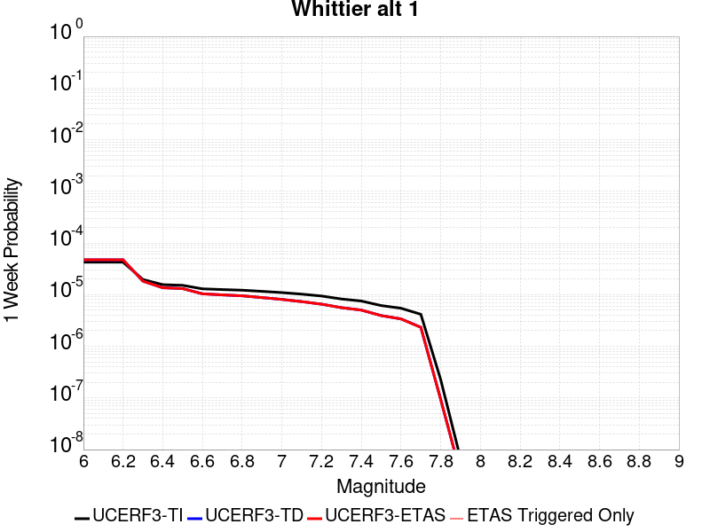 |  |  | 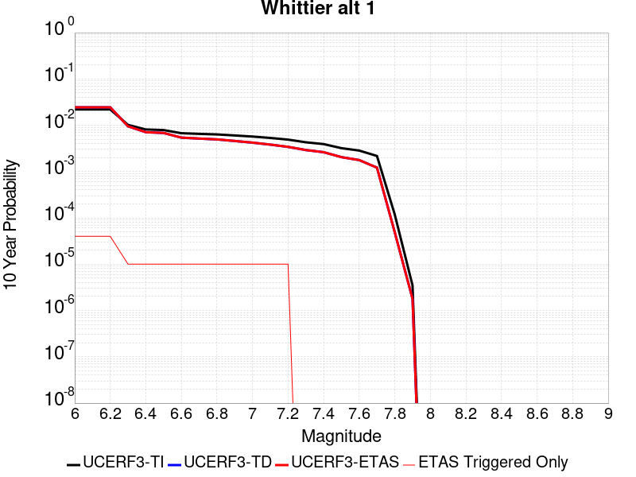 |

| Magnitude | 1 wk TI Prob | 1 wk TD Prob | 1 wk ETAS Prob | 1 wk ETAS/TD Gain | 1 wk ETAS Triggered Only | 1 mo TI Prob | 1 mo TD Prob | 1 mo ETAS Prob | 1 mo ETAS/TD Gain | 1 mo ETAS Triggered Only | 1 yr TI Prob | 1 yr TD Prob | 1 yr ETAS Prob | 1 yr ETAS/TD Gain | 1 yr ETAS Triggered Only | 10 yr TI Prob | 10 yr TD Prob | 10 yr ETAS Prob | 10 yr ETAS/TD Gain | 10 yr ETAS Triggered Only |
|-----|-----|-----|-----|-----|-----|-----|-----|-----|-----|-----|-----|-----|-----|-----|-----|-----|-----|-----|-----|-----|
| 6.0 | 4.2554693E-5 | 4.7257003E-5 | 4.7257003E-5 | 1.0 | 0.0 | 1.8236451E-4 | 2.0251611E-4 | 2.0251611E-4 | 1.0 | 0.0 | 0.002218027 | 0.0024631664 | 0.0024935433 | 1.0123326 | 3.045206E-5 | 0.02196019 | 0.024392692 | 0.024422402 | 1.001218 | 3.045206E-5 |
| 6.1 | 4.2554693E-5 | 4.7257003E-5 | 4.7257003E-5 | 1.0 | 0.0 | 1.8236451E-4 | 2.0251611E-4 | 2.0251611E-4 | 1.0 | 0.0 | 0.002218027 | 0.0024631664 | 0.0024935433 | 1.0123326 | 3.045206E-5 | 0.02196019 | 0.024392692 | 0.024422402 | 1.001218 | 3.045206E-5 |
| 6.2 | 4.2554693E-5 | 4.7257003E-5 | 4.7257003E-5 | 1.0 | 0.0 | 1.8236451E-4 | 2.0251611E-4 | 2.0251611E-4 | 1.0 | 0.0 | 0.002218027 | 0.0024631664 | 0.0024935433 | 1.0123326 | 3.045206E-5 | 0.02196019 | 0.024392692 | 0.024422402 | 1.001218 | 3.045206E-5 |
| 6.3 | 1.9617712E-5 | 1.827117E-5 | 1.827117E-5 | 1.0 | 0.0 | 8.40732E-5 | 7.830277E-5 | 7.830277E-5 | 1.0 | 0.0 | 0.0010231105 | 9.5293834E-4 | 9.5293834E-4 | 1.0 | 0.0 | 0.01018413 | 0.009491804 | 0.009491804 | 1.0 | 0.0 |
| 6.4 | 1.5611336E-5 | 1.3606451E-5 | 1.3606451E-5 | 1.0 | 0.0 | 6.690401E-5 | 5.8312093E-5 | 5.8312093E-5 | 1.0 | 0.0 | 8.142519E-4 | 7.0972444E-4 | 7.0972444E-4 | 1.0 | 0.0 | 0.008112748 | 0.007076542 | 0.007076542 | 1.0 | 0.0 |
| 6.5 | 1.5150166E-5 | 1.310308E-5 | 1.310308E-5 | 1.0 | 0.0 | 6.492767E-5 | 5.615488E-5 | 5.615488E-5 | 1.0 | 0.0 | 7.9020765E-4 | 6.834771E-4 | 6.834771E-4 | 1.0 | 0.0 | 0.007874036 | 0.006815699 | 0.006815699 | 1.0 | 0.0 |
| 6.6 | 1.295588E-5 | 1.03825105E-5 | 1.03825105E-5 | 1.0 | 0.0 | 5.552402E-5 | 4.4495726E-5 | 4.4495726E-5 | 1.0 | 0.0 | 6.7579525E-4 | 5.416028E-4 | 5.416028E-4 | 1.0 | 0.0 | 0.006737438 | 0.005404262 | 0.005404262 | 1.0 | 0.0 |
| 6.7 | 1.2542085E-5 | 9.90111E-6 | 9.90111E-6 | 1.0 | 0.0 | 5.3750682E-5 | 4.243265E-5 | 4.243265E-5 | 1.0 | 0.0 | 6.542181E-4 | 5.1649695E-4 | 5.1649695E-4 | 1.0 | 0.0 | 0.006522954 | 0.005154383 | 0.005154383 | 1.0 | 0.0 |
| 6.8 | 1.2195878E-5 | 9.4970965E-6 | 9.4970965E-6 | 1.0 | 0.0 | 5.2267E-5 | 4.070122E-5 | 4.070122E-5 | 1.0 | 0.0 | 6.36165E-4 | 4.9542653E-4 | 4.9542653E-4 | 1.0 | 0.0 | 0.0063434686 | 0.0049445615 | 0.0049445615 | 1.0 | 0.0 |
| 6.9 | 1.1580298E-5 | 8.774486E-6 | 8.774486E-6 | 1.0 | 0.0 | 4.9628903E-5 | 3.7604408E-5 | 3.7604408E-5 | 1.0 | 0.0 | 6.040644E-4 | 4.577391E-4 | 4.577391E-4 | 1.0 | 0.0 | 0.00602425 | 0.004569222 | 0.004569222 | 1.0 | 0.0 |
| 7.0 | 1.0964795E-5 | 8.085466E-6 | 8.085466E-6 | 1.0 | 0.0 | 4.6991136E-5 | 3.4651544E-5 | 3.4651544E-5 | 1.0 | 0.0 | 5.7196687E-4 | 4.2180243E-4 | 4.2180243E-4 | 1.0 | 0.0 | 0.0057049696 | 0.004211227 | 0.004211227 | 1.0 | 0.0 |
| 7.1 | 1.0230601E-5 | 7.327922E-6 | 7.327922E-6 | 1.0 | 0.0 | 4.3844695E-5 | 3.140501E-5 | 3.140501E-5 | 1.0 | 0.0 | 5.336784E-4 | 3.8229022E-4 | 3.8229022E-4 | 1.0 | 0.0 | 0.005323986 | 0.0038174891 | 0.0038174891 | 1.0 | 0.0 |
| 7.2 | 9.40865E-6 | 6.5444156E-6 | 6.5444156E-6 | 1.0 | 0.0 | 4.032216E-5 | 2.8047201E-5 | 2.8047201E-5 | 1.0 | 0.0 | 4.908117E-4 | 3.414224E-4 | 3.414224E-4 | 1.0 | 0.0 | 0.0048972913 | 0.0034100711 | 0.0034100711 | 1.0 | 0.0 |
| 7.3 | 8.237384E-6 | 5.5987134E-6 | 5.5987134E-6 | 1.0 | 0.0 | 3.5302593E-5 | 2.3994271E-5 | 2.3994271E-5 | 1.0 | 0.0 | 4.2972428E-4 | 2.9209215E-4 | 2.9209215E-4 | 1.0 | 0.0 | 0.0042889426 | 0.0029174031 | 0.0029174031 | 1.0 | 0.0 |
| 7.4 | 7.5316966E-6 | 5.0286876E-6 | 5.0286876E-6 | 1.0 | 0.0 | 3.2278298E-5 | 2.1551346E-5 | 2.1551346E-5 | 1.0 | 0.0 | 3.9291743E-4 | 2.6235706E-4 | 2.6235706E-4 | 1.0 | 0.0 | 0.0039222343 | 0.0026205853 | 0.0026205853 | 1.0 | 0.0 |
| 7.5 | 6.149649E-6 | 3.934522E-6 | 3.934522E-6 | 1.0 | 0.0 | 2.6355372E-5 | 1.6862132E-5 | 1.6862132E-5 | 1.0 | 0.0 | 3.208294E-4 | 2.0527802E-4 | 2.0527802E-4 | 1.0 | 0.0 | 0.003203666 | 0.0020509732 | 0.0020509732 | 1.0 | 0.0 |
| 7.6 | 5.457711E-6 | 3.3959725E-6 | 3.3959725E-6 | 1.0 | 0.0 | 2.338998E-5 | 1.4554091E-5 | 1.4554091E-5 | 1.0 | 0.0 | 2.8473578E-4 | 1.7718246E-4 | 1.7718246E-4 | 1.0 | 0.0 | 0.0028437122 | 0.0017704928 | 0.0017704928 | 1.0 | 0.0 |
| 7.7 | 4.1676276E-6 | 2.3336488E-6 | 2.3336488E-6 | 1.0 | 0.0 | 1.7861139E-5 | 1.0001318E-5 | 1.0001318E-5 | 1.0 | 0.0 | 2.1743766E-4 | 1.2175998E-4 | 1.2175998E-4 | 1.0 | 0.0 | 0.0021722503 | 0.0012170058 | 0.0012170058 | 1.0 | 0.0 |
| 7.8 | 2.2692414E-7 | 9.3873886E-8 | 9.3873886E-8 | 1.0 | 0.0 | 9.725317E-7 | 4.023166E-7 | 4.023166E-7 | 1.0 | 0.0 | 1.1840509E-5 | 4.898197E-6 | 4.898197E-6 | 1.0 | 0.0 | 1.1839878E-4 | 4.898122E-5 | 4.898122E-5 | 1.0 | 0.0 |
| 7.9 | 6.676829E-9 | 3.4403498E-9 | 3.4403498E-9 | 1.0 | 0.0 | 2.861498E-8 | 1.4744357E-8 | 1.4744357E-8 | 1.0 | 0.0 | 3.4838732E-7 | 1.7951253E-7 | 1.7951253E-7 | 1.0 | 0.0 | 3.4838679E-6 | 1.7951239E-6 | 1.7951239E-6 | 1.0 | 0.0 |

## Santa Susana alt 1
*[(top)](#table-of-contents)*

| 1 Week | 1 Month | 1 Year | 10 Year |
|-----|-----|-----|-----|
|  |  |  | 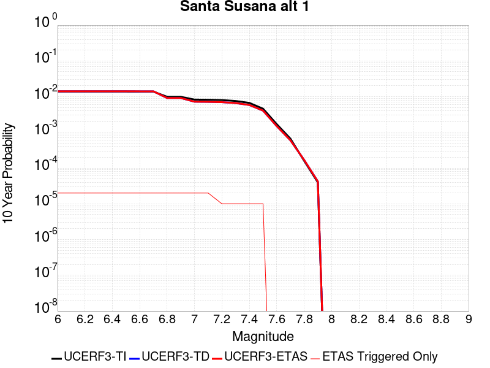 |

| Magnitude | 1 wk TI Prob | 1 wk TD Prob | 1 wk ETAS Prob | 1 wk ETAS/TD Gain | 1 wk ETAS Triggered Only | 1 mo TI Prob | 1 mo TD Prob | 1 mo ETAS Prob | 1 mo ETAS/TD Gain | 1 mo ETAS Triggered Only | 1 yr TI Prob | 1 yr TD Prob | 1 yr ETAS Prob | 1 yr ETAS/TD Gain | 1 yr ETAS Triggered Only | 10 yr TI Prob | 10 yr TD Prob | 10 yr ETAS Prob | 10 yr ETAS/TD Gain | 10 yr ETAS Triggered Only |
|-----|-----|-----|-----|-----|-----|-----|-----|-----|-----|-----|-----|-----|-----|-----|-----|-----|-----|-----|-----|-----|
| 6.0 | 2.674877E-5 | 2.7200571E-5 | 2.7200571E-5 | 1.0 | 0.0 | 1.1463255E-4 | 1.165693E-4 | 1.3179357E-4 | 1.1306026 | 1.522603E-5 | 0.0013947578 | 0.001418421 | 0.0014488299 | 1.0214385 | 3.045206E-5 | 0.013860362 | 0.014105441 | 0.014135464 | 1.0021285 | 3.045206E-5 |
| 6.1 | 2.674877E-5 | 2.7200571E-5 | 2.7200571E-5 | 1.0 | 0.0 | 1.1463255E-4 | 1.165693E-4 | 1.3179357E-4 | 1.1306026 | 1.522603E-5 | 0.0013947578 | 0.001418421 | 0.0014488299 | 1.0214385 | 3.045206E-5 | 0.013860362 | 0.014105441 | 0.014135464 | 1.0021285 | 3.045206E-5 |
| 6.2 | 2.674877E-5 | 2.7200571E-5 | 2.7200571E-5 | 1.0 | 0.0 | 1.1463255E-4 | 1.165693E-4 | 1.3179357E-4 | 1.1306026 | 1.522603E-5 | 0.0013947578 | 0.001418421 | 0.0014488299 | 1.0214385 | 3.045206E-5 | 0.013860362 | 0.014105441 | 0.014135464 | 1.0021285 | 3.045206E-5 |
| 6.3 | 2.674877E-5 | 2.7200571E-5 | 2.7200571E-5 | 1.0 | 0.0 | 1.1463255E-4 | 1.165693E-4 | 1.3179357E-4 | 1.1306026 | 1.522603E-5 | 0.0013947578 | 0.001418421 | 0.0014488299 | 1.0214385 | 3.045206E-5 | 0.013860362 | 0.014105441 | 0.014135464 | 1.0021285 | 3.045206E-5 |
| 6.4 | 2.674877E-5 | 2.7200571E-5 | 2.7200571E-5 | 1.0 | 0.0 | 1.1463255E-4 | 1.165693E-4 | 1.3179357E-4 | 1.1306026 | 1.522603E-5 | 0.0013947578 | 0.001418421 | 0.0014488299 | 1.0214385 | 3.045206E-5 | 0.013860362 | 0.014105441 | 0.014135464 | 1.0021285 | 3.045206E-5 |
| 6.5 | 2.674877E-5 | 2.7200571E-5 | 2.7200571E-5 | 1.0 | 0.0 | 1.1463255E-4 | 1.165693E-4 | 1.3179357E-4 | 1.1306026 | 1.522603E-5 | 0.0013947578 | 0.001418421 | 0.0014488299 | 1.0214385 | 3.045206E-5 | 0.013860362 | 0.014105441 | 0.014135464 | 1.0021285 | 3.045206E-5 |
| 6.6 | 2.6647976E-5 | 2.7076892E-5 | 2.7076892E-5 | 1.0 | 0.0 | 1.14200615E-4 | 1.1603931E-4 | 1.3126357E-4 | 1.1311992 | 1.522603E-5 | 0.0013895056 | 0.0014119769 | 0.001442386 | 1.0215365 | 3.045206E-5 | 0.013808494 | 0.01404182 | 0.014071844 | 1.0021383 | 3.045206E-5 |
| 6.7 | 2.6647976E-5 | 2.7076892E-5 | 2.7076892E-5 | 1.0 | 0.0 | 1.14200615E-4 | 1.1603931E-4 | 1.3126357E-4 | 1.1311992 | 1.522603E-5 | 0.0013895056 | 0.0014119769 | 0.001442386 | 1.0215365 | 3.045206E-5 | 0.013808494 | 0.01404182 | 0.014071844 | 1.0021383 | 3.045206E-5 |
| 6.8 | 1.9073179E-5 | 1.7638586E-5 | 1.7638586E-5 | 1.0 | 0.0 | 8.1739636E-5 | 7.5591845E-5 | 9.081673E-5 | 1.201409 | 1.522603E-5 | 9.947256E-4 | 9.199603E-4 | 9.5038436E-4 | 1.033071 | 3.045206E-5 | 0.009902848 | 0.009163775 | 0.009193948 | 1.0032927 | 3.045206E-5 |
| 6.9 | 1.9041876E-5 | 1.7620714E-5 | 1.7620714E-5 | 1.0 | 0.0 | 8.160549E-5 | 7.5515265E-5 | 9.074015E-5 | 1.2016133 | 1.522603E-5 | 9.930939E-4 | 9.190287E-4 | 9.4945275E-4 | 1.0331045 | 3.045206E-5 | 0.0098866755 | 0.009154535 | 0.009184708 | 1.003296 | 3.045206E-5 |
| 7.0 | 1.5917482E-5 | 1.3864736E-5 | 1.3864736E-5 | 1.0 | 0.0 | 6.8215995E-5 | 5.941897E-5 | 7.464409E-5 | 1.2562335 | 1.522603E-5 | 8.302132E-4 | 7.231905E-4 | 7.536205E-4 | 1.0420775 | 3.045206E-5 | 0.008271185 | 0.0072092656 | 0.007239498 | 1.0041935 | 3.045206E-5 |
| 7.1 | 1.577788E-5 | 1.3744735E-5 | 1.3744735E-5 | 1.0 | 0.0 | 6.761774E-5 | 5.89047E-5 | 7.4129835E-5 | 1.2584705 | 1.522603E-5 | 8.2293496E-4 | 7.169334E-4 | 7.4736367E-4 | 1.042445 | 3.045206E-5 | 0.008198941 | 0.007147099 | 0.0071773333 | 1.0042303 | 3.045206E-5 |
| 7.2 | 1.5416446E-5 | 1.3470787E-5 | 1.3470787E-5 | 1.0 | 0.0 | 6.606882E-5 | 5.7730693E-5 | 5.7730693E-5 | 1.0 | 0.0 | 8.0409093E-4 | 7.026491E-4 | 7.178645E-4 | 1.0216542 | 1.522603E-5 | 0.008011877 | 0.00700516 | 0.0070202798 | 1.0021583 | 1.522603E-5 |
| 7.3 | 1.4534083E-5 | 1.27186495E-5 | 1.27186495E-5 | 1.0 | 0.0 | 6.228744E-5 | 5.4507385E-5 | 5.4507385E-5 | 1.0 | 0.0 | 7.580857E-4 | 6.634298E-4 | 6.7864574E-4 | 1.0229353 | 1.522603E-5 | 0.007555048 | 0.006615344 | 0.006630469 | 1.0022864 | 1.522603E-5 |
| 7.4 | 1.2858995E-5 | 1.1230286E-5 | 1.1230286E-5 | 1.0 | 0.0 | 5.5108816E-5 | 4.812893E-5 | 4.812893E-5 | 1.0 | 0.0 | 6.7074323E-4 | 5.858161E-4 | 6.010332E-4 | 1.025976 | 1.522603E-5 | 0.0066872234 | 0.0058434936 | 0.005858631 | 1.0025904 | 1.522603E-5 |
| 7.5 | 8.827668E-6 | 7.805781E-6 | 7.805781E-6 | 1.0 | 0.0 | 3.7832317E-5 | 3.3452932E-5 | 3.3452932E-5 | 1.0 | 0.0 | 4.605111E-4 | 4.072158E-4 | 4.2243564E-4 | 1.0373753 | 1.522603E-5 | 0.0045955796 | 0.004064945 | 0.004080109 | 1.0037304 | 1.522603E-5 |
| 7.6 | 3.2533426E-6 | 2.872068E-6 | 2.872068E-6 | 1.0 | 0.0 | 1.3942822E-5 | 1.23088075E-5 | 1.23088075E-5 | 1.0 | 0.0 | 1.6974064E-4 | 1.498498E-4 | 1.498498E-4 | 1.0 | 0.0 | 0.0016961104 | 0.0014975243 | 0.0014975243 | 1.0 | 0.0 |
| 7.7 | 1.2751709E-6 | 1.1491525E-6 | 1.1491525E-6 | 1.0 | 0.0 | 5.4650063E-6 | 4.92493E-6 | 4.92493E-6 | 1.0 | 0.0 | 6.653442E-5 | 5.9959468E-5 | 5.9959468E-5 | 1.0 | 0.0 | 6.6514505E-4 | 5.994418E-4 | 5.994418E-4 | 1.0 | 0.0 |
| 7.8 | 3.067544E-7 | 3.2401567E-7 | 3.2401567E-7 | 1.0 | 0.0 | 1.3146611E-6 | 1.388638E-6 | 1.388638E-6 | 1.0 | 0.0 | 1.600588E-5 | 1.6906546E-5 | 1.6906546E-5 | 1.0 | 0.0 | 1.6004729E-4 | 1.6905363E-4 | 1.6905363E-4 | 1.0 | 0.0 |
| 7.9 | 7.622999E-8 | 8.088237E-8 | 8.088237E-8 | 1.0 | 0.0 | 3.2669993E-7 | 3.466387E-7 | 3.466387E-7 | 1.0 | 0.0 | 3.977564E-6 | 4.22032E-6 | 4.22032E-6 | 1.0 | 0.0 | 3.977493E-5 | 4.220261E-5 | 4.220261E-5 | 1.0 | 0.0 |

## Santa Cruz Island
*[(top)](#table-of-contents)*

| 1 Week | 1 Month | 1 Year | 10 Year |
|-----|-----|-----|-----|
|  |  | 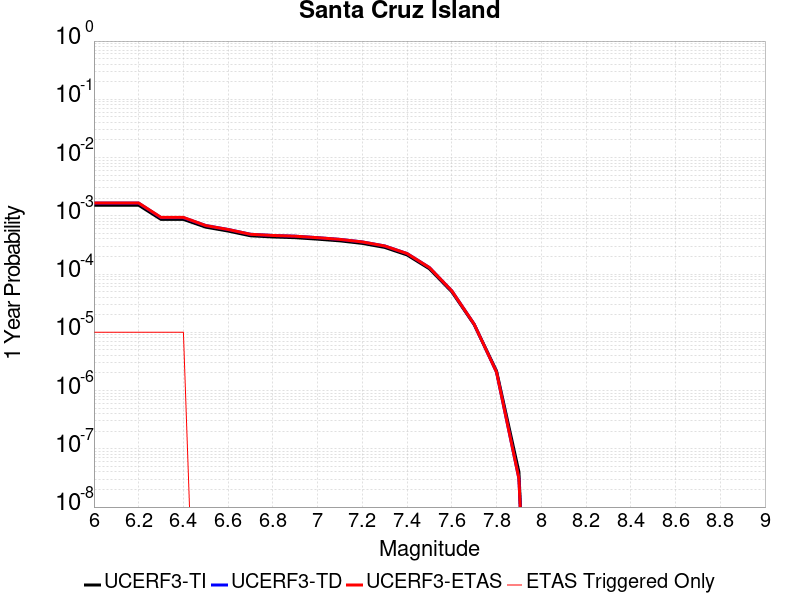 |  |

| Magnitude | 1 wk TI Prob | 1 wk TD Prob | 1 wk ETAS Prob | 1 wk ETAS/TD Gain | 1 wk ETAS Triggered Only | 1 mo TI Prob | 1 mo TD Prob | 1 mo ETAS Prob | 1 mo ETAS/TD Gain | 1 mo ETAS Triggered Only | 1 yr TI Prob | 1 yr TD Prob | 1 yr ETAS Prob | 1 yr ETAS/TD Gain | 1 yr ETAS Triggered Only | 10 yr TI Prob | 10 yr TD Prob | 10 yr ETAS Prob | 10 yr ETAS/TD Gain | 10 yr ETAS Triggered Only |
|-----|-----|-----|-----|-----|-----|-----|-----|-----|-----|-----|-----|-----|-----|-----|-----|-----|-----|-----|-----|-----|
| 6.0 | 2.9164563E-5 | 3.1601154E-5 | 3.1601154E-5 | 1.0 | 0.0 | 1.2498499E-4 | 1.3542725E-4 | 1.3542725E-4 | 1.0 | 0.0 | 0.0015206301 | 0.001647716 | 0.001662917 | 1.0092255 | 1.522603E-5 | 0.015102667 | 0.016368724 | 0.016398678 | 1.00183 | 3.045206E-5 |
| 6.1 | 2.9164563E-5 | 3.1601154E-5 | 3.1601154E-5 | 1.0 | 0.0 | 1.2498499E-4 | 1.3542725E-4 | 1.3542725E-4 | 1.0 | 0.0 | 0.0015206301 | 0.001647716 | 0.001662917 | 1.0092255 | 1.522603E-5 | 0.015102667 | 0.016368724 | 0.016398678 | 1.00183 | 3.045206E-5 |
| 6.2 | 2.9164563E-5 | 3.1601154E-5 | 3.1601154E-5 | 1.0 | 0.0 | 1.2498499E-4 | 1.3542725E-4 | 1.3542725E-4 | 1.0 | 0.0 | 0.0015206301 | 0.001647716 | 0.001662917 | 1.0092255 | 1.522603E-5 | 0.015102667 | 0.016368724 | 0.016398678 | 1.00183 | 3.045206E-5 |
| 6.3 | 1.6635553E-5 | 1.7805029E-5 | 1.7805029E-5 | 1.0 | 0.0 | 7.1293274E-5 | 7.6305136E-5 | 7.6305136E-5 | 1.0 | 0.0 | 8.6765E-4 | 9.286373E-4 | 9.4384915E-4 | 1.0163809 | 1.522603E-5 | 0.008642701 | 0.009249439 | 0.009264525 | 1.0016309 | 1.522603E-5 |
| 6.4 | 1.6635553E-5 | 1.7805029E-5 | 1.7805029E-5 | 1.0 | 0.0 | 7.1293274E-5 | 7.6305136E-5 | 7.6305136E-5 | 1.0 | 0.0 | 8.6765E-4 | 9.286373E-4 | 9.4384915E-4 | 1.0163809 | 1.522603E-5 | 0.008642701 | 0.009249439 | 0.009264525 | 1.0016309 | 1.522603E-5 |
| 6.5 | 1.2238748E-5 | 1.30434555E-5 | 1.30434555E-5 | 1.0 | 0.0 | 5.2450723E-5 | 5.5899345E-5 | 5.5899345E-5 | 1.0 | 0.0 | 6.3840044E-4 | 6.803657E-4 | 6.803657E-4 | 1.0 | 0.0 | 0.0063656955 | 0.006783226 | 0.006783226 | 1.0 | 0.0 |
| 6.6 | 1.0489767E-5 | 1.1157017E-5 | 1.1157017E-5 | 1.0 | 0.0 | 4.495537E-5 | 4.7814923E-5 | 4.7814923E-5 | 1.0 | 0.0 | 5.4719415E-4 | 5.8199343E-4 | 5.8199343E-4 | 1.0 | 0.0 | 0.005458487 | 0.0058049336 | 0.0058049336 | 1.0 | 0.0 |
| 6.7 | 8.699222E-6 | 9.23709E-6 | 9.23709E-6 | 1.0 | 0.0 | 3.7281847E-5 | 3.958693E-5 | 3.958693E-5 | 1.0 | 0.0 | 4.5381195E-4 | 4.8186484E-4 | 4.8186484E-4 | 1.0 | 0.0 | 0.0045288634 | 0.0048082676 | 0.0048082676 | 1.0 | 0.0 |
| 6.8 | 8.307732E-6 | 8.8171955E-6 | 8.8171955E-6 | 1.0 | 0.0 | 3.560408E-5 | 3.7787435E-5 | 3.7787435E-5 | 1.0 | 0.0 | 4.3339343E-4 | 4.5996535E-4 | 4.5996535E-4 | 1.0 | 0.0 | 0.004325492 | 0.0045901868 | 0.0045901868 | 1.0 | 0.0 |
| 6.9 | 8.073121E-6 | 8.565221E-6 | 8.565221E-6 | 1.0 | 0.0 | 3.459863E-5 | 3.6707574E-5 | 3.6707574E-5 | 1.0 | 0.0 | 4.2115687E-4 | 4.4682348E-4 | 4.4682348E-4 | 1.0 | 0.0 | 0.004203596 | 0.0044593024 | 0.0044593024 | 1.0 | 0.0 |
| 7.0 | 7.617019E-6 | 8.074926E-6 | 8.074926E-6 | 1.0 | 0.0 | 3.264396E-5 | 3.4606368E-5 | 3.4606368E-5 | 1.0 | 0.0 | 3.9736772E-4 | 4.212515E-4 | 4.212515E-4 | 1.0 | 0.0 | 0.003966579 | 0.0042045773 | 0.0042045773 | 1.0 | 0.0 |
| 7.1 | 7.1224836E-6 | 7.5460302E-6 | 7.5460302E-6 | 1.0 | 0.0 | 3.052457E-5 | 3.233973E-5 | 3.233973E-5 | 1.0 | 0.0 | 3.715733E-4 | 3.9366545E-4 | 3.9366545E-4 | 1.0 | 0.0 | 0.003709526 | 0.003929724 | 0.003929724 | 1.0 | 0.0 |
| 7.2 | 6.441115E-6 | 6.827605E-6 | 6.827605E-6 | 1.0 | 0.0 | 2.7604487E-5 | 2.9260837E-5 | 2.9260837E-5 | 1.0 | 0.0 | 3.360328E-4 | 3.5619267E-4 | 3.5619267E-4 | 1.0 | 0.0 | 0.0033552512 | 0.0035562462 | 0.0035562462 | 1.0 | 0.0 |
| 7.3 | 5.494274E-6 | 5.8201813E-6 | 5.8201813E-6 | 1.0 | 0.0 | 2.3546674E-5 | 2.4943398E-5 | 2.4943398E-5 | 1.0 | 0.0 | 2.8664304E-4 | 3.0364376E-4 | 3.0364376E-4 | 1.0 | 0.0 | 0.002862736 | 0.0030323118 | 0.0030323118 | 1.0 | 0.0 |
| 7.4 | 4.0802624E-6 | 4.31239E-6 | 4.31239E-6 | 1.0 | 0.0 | 1.7486722E-5 | 1.8481542E-5 | 1.8481542E-5 | 1.0 | 0.0 | 2.1288003E-4 | 2.249896E-4 | 2.249896E-4 | 1.0 | 0.0 | 0.0021267622 | 0.0022476274 | 0.0022476274 | 1.0 | 0.0 |
| 7.5 | 2.3584746E-6 | 2.4753783E-6 | 2.4753783E-6 | 1.0 | 0.0 | 1.0107709E-5 | 1.0608721E-5 | 1.0608721E-5 | 1.0 | 0.0 | 1.2305441E-4 | 1.2915357E-4 | 1.2915357E-4 | 1.0 | 0.0 | 0.0012298629 | 0.0012907902 | 0.0012907902 | 1.0 | 0.0 |
| 7.6 | 9.4981914E-7 | 9.861161E-7 | 9.861161E-7 | 1.0 | 0.0 | 4.0706473E-6 | 4.226205E-6 | 4.226205E-6 | 1.0 | 0.0 | 4.9559E-5 | 5.1452847E-5 | 5.1452847E-5 | 1.0 | 0.0 | 4.954795E-4 | 5.144106E-4 | 5.144106E-4 | 1.0 | 0.0 |
| 7.7 | 2.6013532E-7 | 2.6417067E-7 | 2.6417067E-7 | 1.0 | 0.0 | 1.1148652E-6 | 1.1321595E-6 | 1.1321595E-6 | 1.0 | 0.0 | 1.3573399E-5 | 1.3783956E-5 | 1.3783956E-5 | 1.0 | 0.0 | 1.357257E-4 | 1.3783107E-4 | 1.3783107E-4 | 1.0 | 0.0 |
| 7.8 | 4.1522263E-8 | 3.9657305E-8 | 3.9657305E-8 | 1.0 | 0.0 | 1.7795254E-7 | 1.6995986E-7 | 1.6995986E-7 | 1.0 | 0.0 | 2.16657E-6 | 2.0692596E-6 | 2.0692596E-6 | 1.0 | 0.0 | 2.1665488E-5 | 2.0692425E-5 | 2.0692425E-5 | 1.0 | 0.0 |
| 7.9 | 7.7242046E-10 | 5.946944E-10 | 5.946944E-10 | 1.0 | 0.0 | 3.3103735E-9 | 2.5486908E-9 | 2.5486908E-9 | 1.0 | 0.0 | 4.0303796E-8 | 3.103031E-8 | 3.103031E-8 | 1.0 | 0.0 | 4.030379E-7 | 3.1030308E-7 | 3.1030308E-7 | 1.0 | 0.0 |

## San Diego Trough south
*[(top)](#table-of-contents)*

| 1 Week | 1 Month | 1 Year | 10 Year |
|-----|-----|-----|-----|
|  |  |  |  |

| Magnitude | 1 wk TI Prob | 1 wk TD Prob | 1 wk ETAS Prob | 1 wk ETAS/TD Gain | 1 wk ETAS Triggered Only | 1 mo TI Prob | 1 mo TD Prob | 1 mo ETAS Prob | 1 mo ETAS/TD Gain | 1 mo ETAS Triggered Only | 1 yr TI Prob | 1 yr TD Prob | 1 yr ETAS Prob | 1 yr ETAS/TD Gain | 1 yr ETAS Triggered Only | 10 yr TI Prob | 10 yr TD Prob | 10 yr ETAS Prob | 10 yr ETAS/TD Gain | 10 yr ETAS Triggered Only |
|-----|-----|-----|-----|-----|-----|-----|-----|-----|-----|-----|-----|-----|-----|-----|-----|-----|-----|-----|-----|-----|
| 6.0 | 8.279495E-5 | 1.0425644E-4 | 1.0425644E-4 | 1.0 | 0.0 | 3.5478722E-4 | 4.467418E-4 | 4.467418E-4 | 1.0 | 0.0 | 0.004310982 | 0.0054263812 | 0.0054263812 | 1.0 | 0.0 | 0.042283054 | 0.052999042 | 0.05301346 | 1.000272 | 1.522603E-5 |
| 6.1 | 4.6961468E-5 | 5.7736743E-5 | 5.7736743E-5 | 1.0 | 0.0 | 2.0124791E-4 | 2.4742068E-4 | 2.4742068E-4 | 1.0 | 0.0 | 0.00244744 | 0.0030083342 | 0.0030083342 | 1.0 | 0.0 | 0.024206603 | 0.029682966 | 0.029682966 | 1.0 | 0.0 |
| 6.2 | 3.5079658E-5 | 4.2146152E-5 | 4.2146152E-5 | 1.0 | 0.0 | 1.5033272E-4 | 1.8061412E-4 | 1.8061412E-4 | 1.0 | 0.0 | 0.0018287642 | 0.0021968025 | 0.0021968025 | 1.0 | 0.0 | 0.018137876 | 0.021753421 | 0.021753421 | 1.0 | 0.0 |
| 6.3 | 3.5079658E-5 | 4.2146152E-5 | 4.2146152E-5 | 1.0 | 0.0 | 1.5033272E-4 | 1.8061412E-4 | 1.8061412E-4 | 1.0 | 0.0 | 0.0018287642 | 0.0021968025 | 0.0021968025 | 1.0 | 0.0 | 0.018137876 | 0.021753421 | 0.021753421 | 1.0 | 0.0 |
| 6.4 | 2.7196904E-5 | 3.2090265E-5 | 3.2090265E-5 | 1.0 | 0.0 | 1.16552954E-4 | 1.3752255E-4 | 1.3752255E-4 | 1.0 | 0.0 | 0.0014181085 | 0.0016730648 | 0.0016730648 | 1.0 | 0.0 | 0.014090929 | 0.016606223 | 0.016606223 | 1.0 | 0.0 |
| 6.5 | 2.5584688E-5 | 3.0104491E-5 | 3.0104491E-5 | 1.0 | 0.0 | 1.0964406E-4 | 1.2901296E-4 | 1.2901296E-4 | 1.0 | 0.0 | 0.0013340989 | 0.0015696133 | 0.0015696133 | 1.0 | 0.0 | 0.013261181 | 0.015586771 | 0.015586771 | 1.0 | 0.0 |
| 6.6 | 2.2034688E-5 | 2.5745056E-5 | 2.5745056E-5 | 1.0 | 0.0 | 9.443096E-5 | 1.1033134E-4 | 1.1033134E-4 | 1.0 | 0.0 | 0.0011490905 | 0.0013424625 | 0.0013424625 | 1.0 | 0.0 | 0.011431668 | 0.013344509 | 0.013344509 | 1.0 | 0.0 |
| 6.7 | 1.9394853E-5 | 2.2543714E-5 | 2.2543714E-5 | 1.0 | 0.0 | 8.311815E-5 | 9.661237E-5 | 9.661237E-5 | 1.0 | 0.0 | 0.0010114936 | 0.0011756261 | 0.0011756261 | 1.0 | 0.0 | 0.01006902 | 0.011694773 | 0.011694773 | 1.0 | 0.0 |
| 6.8 | 1.7615313E-5 | 2.0404905E-5 | 2.0404905E-5 | 1.0 | 0.0 | 7.549201E-5 | 8.7446686E-5 | 8.7446686E-5 | 1.0 | 0.0 | 9.1872766E-4 | 0.0010641477 | 0.0010641477 | 1.0 | 0.0 | 0.009149387 | 0.010591088 | 0.010591088 | 1.0 | 0.0 |
| 6.9 | 1.5621423E-5 | 1.8027593E-5 | 1.8027593E-5 | 1.0 | 0.0 | 6.6947236E-5 | 7.725885E-5 | 7.725885E-5 | 1.0 | 0.0 | 8.147778E-4 | 9.402241E-4 | 9.402241E-4 | 1.0 | 0.0 | 0.008117969 | 0.009362906 | 0.009362906 | 1.0 | 0.0 |
| 7.0 | 1.3444376E-5 | 1.5449315E-5 | 1.5449315E-5 | 1.0 | 0.0 | 5.7617483E-5 | 6.6209686E-5 | 6.6209686E-5 | 1.0 | 0.0 | 7.0126704E-4 | 8.0580753E-4 | 8.0580753E-4 | 1.0 | 0.0 | 0.006990582 | 0.00802919 | 0.00802919 | 1.0 | 0.0 |
| 7.1 | 1.2268361E-5 | 1.4074132E-5 | 1.4074132E-5 | 1.0 | 0.0 | 5.2577634E-5 | 6.031633E-5 | 6.031633E-5 | 1.0 | 0.0 | 6.399447E-4 | 7.341065E-4 | 7.341065E-4 | 1.0 | 0.0 | 0.0063810493 | 0.00731712 | 0.00731712 | 1.0 | 0.0 |
| 7.2 | 1.0922655E-5 | 1.2514534E-5 | 1.2514534E-5 | 1.0 | 0.0 | 4.681054E-5 | 5.363263E-5 | 5.363263E-5 | 1.0 | 0.0 | 5.697693E-4 | 6.5278413E-4 | 6.5278413E-4 | 1.0 | 0.0 | 0.0056831064 | 0.006508947 | 0.006508947 | 1.0 | 0.0 |
| 7.3 | 6.1106753E-6 | 6.9294197E-6 | 6.9294197E-6 | 1.0 | 0.0 | 2.6188345E-5 | 2.9697178E-5 | 2.9697178E-5 | 1.0 | 0.0 | 3.1879646E-4 | 3.6150354E-4 | 3.6150354E-4 | 1.0 | 0.0 | 0.0031833951 | 0.0036092002 | 0.0036092002 | 1.0 | 0.0 |
| 7.4 | 4.933187E-6 | 5.5899495E-6 | 5.5899495E-6 | 1.0 | 0.0 | 2.114206E-5 | 2.3956709E-5 | 2.3956709E-5 | 1.0 | 0.0 | 2.5737417E-4 | 2.9163426E-4 | 2.9163426E-4 | 1.0 | 0.0 | 0.002570763 | 0.0029125568 | 0.0029125568 | 1.0 | 0.0 |
| 7.5 | 1.7489613E-6 | 1.9698116E-6 | 1.9698116E-6 | 1.0 | 0.0 | 7.495527E-6 | 8.4420235E-6 | 8.4420235E-6 | 1.0 | 0.0 | 9.125422E-5 | 1.0277701E-4 | 1.0277701E-4 | 1.0 | 0.0 | 9.1216754E-4 | 0.0010273168 | 0.0010273168 | 1.0 | 0.0 |
| 7.6 | 1.6988751E-7 | 1.7534121E-7 | 1.7534121E-7 | 1.0 | 0.0 | 7.2808916E-7 | 7.5146215E-7 | 7.5146215E-7 | 1.0 | 0.0 | 8.864449E-6 | 9.149016E-6 | 9.149016E-6 | 1.0 | 0.0 | 8.8640954E-5 | 9.148658E-5 | 9.148658E-5 | 1.0 | 0.0 |

## Shoreline
*[(top)](#table-of-contents)*

| 1 Week | 1 Month | 1 Year | 10 Year |
|-----|-----|-----|-----|
|  |  | 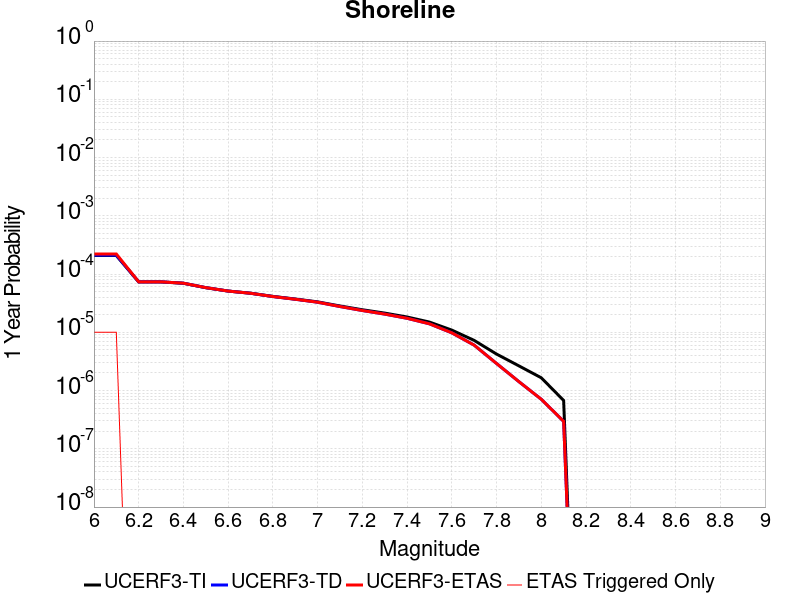 | 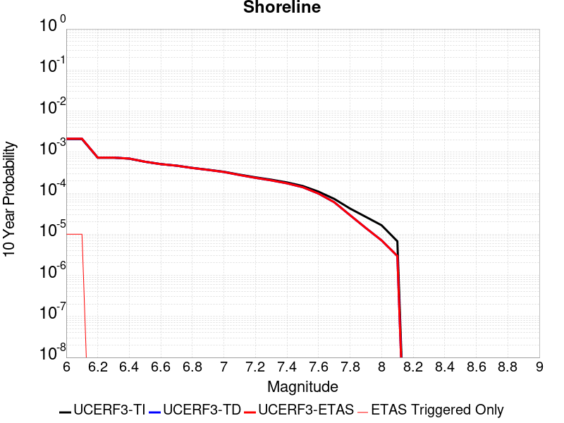 |

| Magnitude | 1 wk TI Prob | 1 wk TD Prob | 1 wk ETAS Prob | 1 wk ETAS/TD Gain | 1 wk ETAS Triggered Only | 1 mo TI Prob | 1 mo TD Prob | 1 mo ETAS Prob | 1 mo ETAS/TD Gain | 1 mo ETAS Triggered Only | 1 yr TI Prob | 1 yr TD Prob | 1 yr ETAS Prob | 1 yr ETAS/TD Gain | 1 yr ETAS Triggered Only | 10 yr TI Prob | 10 yr TD Prob | 10 yr ETAS Prob | 10 yr ETAS/TD Gain | 10 yr ETAS Triggered Only |
|-----|-----|-----|-----|-----|-----|-----|-----|-----|-----|-----|-----|-----|-----|-----|-----|-----|-----|-----|-----|-----|
| 6.0 | 3.9888673E-6 | 4.047993E-6 | 4.047993E-6 | 1.0 | 0.0 | 1.7095033E-5 | 1.7348459E-5 | 1.7348459E-5 | 1.0 | 0.0 | 2.0811215E-4 | 2.1120261E-4 | 2.2642541E-4 | 1.0720768 | 1.522603E-5 | 0.0020791737 | 0.0021105676 | 0.0021257615 | 1.0071989 | 1.522603E-5 |
| 6.1 | 3.9888673E-6 | 4.047993E-6 | 4.047993E-6 | 1.0 | 0.0 | 1.7095033E-5 | 1.7348459E-5 | 1.7348459E-5 | 1.0 | 0.0 | 2.0811215E-4 | 2.1120261E-4 | 2.2642541E-4 | 1.0720768 | 1.522603E-5 | 0.0020791737 | 0.0021105676 | 0.0021257615 | 1.0071989 | 1.522603E-5 |
| 6.2 | 1.4039653E-6 | 1.4101247E-6 | 1.4101247E-6 | 1.0 | 0.0 | 6.0169805E-6 | 6.0433777E-6 | 6.0433777E-6 | 1.0 | 0.0 | 7.325427E-5 | 7.35757E-5 | 7.35757E-5 | 1.0 | 0.0 | 7.3230127E-4 | 7.355194E-4 | 7.355194E-4 | 1.0 | 0.0 |
| 6.3 | 1.4039653E-6 | 1.4101247E-6 | 1.4101247E-6 | 1.0 | 0.0 | 6.0169805E-6 | 6.0433777E-6 | 6.0433777E-6 | 1.0 | 0.0 | 7.325427E-5 | 7.35757E-5 | 7.35757E-5 | 1.0 | 0.0 | 7.3230127E-4 | 7.355194E-4 | 7.355194E-4 | 1.0 | 0.0 |
| 6.4 | 1.3314152E-6 | 1.3361953E-6 | 1.3361953E-6 | 1.0 | 0.0 | 5.7060524E-6 | 5.7265393E-6 | 5.7265393E-6 | 1.0 | 0.0 | 6.946897E-5 | 6.971844E-5 | 6.971844E-5 | 1.0 | 0.0 | 6.9447263E-4 | 6.96971E-4 | 6.96971E-4 | 1.0 | 0.0 |
| 6.5 | 1.1187026E-6 | 1.1203972E-6 | 1.1203972E-6 | 1.0 | 0.0 | 4.794431E-6 | 4.801693E-6 | 4.801693E-6 | 1.0 | 0.0 | 5.8370628E-5 | 5.8459074E-5 | 5.8459074E-5 | 1.0 | 0.0 | 5.83553E-4 | 5.844395E-4 | 5.844395E-4 | 1.0 | 0.0 |
| 6.6 | 9.793089E-7 | 9.785238E-7 | 9.785238E-7 | 1.0 | 0.0 | 4.1970316E-6 | 4.193667E-6 | 4.193667E-6 | 1.0 | 0.0 | 5.1097657E-5 | 5.1056708E-5 | 5.1056708E-5 | 1.0 | 0.0 | 5.108591E-4 | 5.104511E-4 | 5.104511E-4 | 1.0 | 0.0 |
| 6.7 | 8.995986E-7 | 8.97311E-7 | 8.97311E-7 | 1.0 | 0.0 | 3.8554167E-6 | 3.845613E-6 | 3.845613E-6 | 1.0 | 0.0 | 4.693869E-5 | 4.6819343E-5 | 4.6819343E-5 | 1.0 | 0.0 | 4.6928777E-4 | 4.6809574E-4 | 4.6809574E-4 | 1.0 | 0.0 |
| 6.8 | 7.931612E-7 | 7.8806977E-7 | 7.8806977E-7 | 1.0 | 0.0 | 3.3992578E-6 | 3.3774375E-6 | 3.3774375E-6 | 1.0 | 0.0 | 4.1385178E-5 | 4.1119532E-5 | 4.1119532E-5 | 1.0 | 0.0 | 4.1377472E-4 | 4.1111978E-4 | 4.1111978E-4 | 1.0 | 0.0 |
| 6.9 | 7.1465956E-7 | 7.0782914E-7 | 7.0782914E-7 | 1.0 | 0.0 | 3.062823E-6 | 3.03355E-6 | 3.03355E-6 | 1.0 | 0.0 | 3.7289232E-5 | 3.6932848E-5 | 3.6932848E-5 | 1.0 | 0.0 | 3.7282976E-4 | 3.6926748E-4 | 3.6926748E-4 | 1.0 | 0.0 |
| 7.0 | 6.389046E-7 | 6.299732E-7 | 6.299732E-7 | 1.0 | 0.0 | 2.7381598E-6 | 2.6998825E-6 | 2.6998825E-6 | 1.0 | 0.0 | 3.3336586E-5 | 3.2870576E-5 | 3.2870576E-5 | 1.0 | 0.0 | 3.3331584E-4 | 3.2865736E-4 | 3.2865736E-4 | 1.0 | 0.0 |
| 7.1 | 5.4300875E-7 | 5.311389E-7 | 5.311389E-7 | 1.0 | 0.0 | 2.3271782E-6 | 2.2763074E-6 | 2.2763074E-6 | 1.0 | 0.0 | 2.8333026E-5 | 2.7713693E-5 | 2.7713693E-5 | 1.0 | 0.0 | 2.8329415E-4 | 2.771025E-4 | 2.771025E-4 | 1.0 | 0.0 |
| 7.2 | 4.6768855E-7 | 4.5351405E-7 | 4.5351405E-7 | 1.0 | 0.0 | 2.0043778E-6 | 1.9436302E-6 | 1.9436302E-6 | 1.0 | 0.0 | 2.4403027E-5 | 2.366344E-5 | 2.366344E-5 | 1.0 | 0.0 | 2.4400349E-4 | 2.3660927E-4 | 2.3660927E-4 | 1.0 | 0.0 |
| 7.3 | 4.0966103E-7 | 3.9388027E-7 | 3.9388027E-7 | 1.0 | 0.0 | 1.7556889E-6 | 1.6880572E-6 | 1.6880572E-6 | 1.0 | 0.0 | 2.1375303E-5 | 2.0551903E-5 | 2.0551903E-5 | 1.0 | 0.0 | 2.1373246E-4 | 2.0550007E-4 | 2.0550007E-4 | 1.0 | 0.0 |
| 7.4 | 3.5105785E-7 | 3.336625E-7 | 3.336625E-7 | 1.0 | 0.0 | 1.5045327E-6 | 1.4299814E-6 | 1.4299814E-6 | 1.0 | 0.0 | 1.8317533E-5 | 1.7409884E-5 | 1.7409884E-5 | 1.0 | 0.0 | 1.8316023E-4 | 1.7408523E-4 | 1.7408523E-4 | 1.0 | 0.0 |
| 7.5 | 2.8737534E-7 | 2.6822218E-7 | 2.6822218E-7 | 1.0 | 0.0 | 1.2316079E-6 | 1.1495231E-6 | 1.1495231E-6 | 1.0 | 0.0 | 1.4994724E-5 | 1.39953545E-5 | 1.39953545E-5 | 1.0 | 0.0 | 1.4993713E-4 | 1.3994475E-4 | 1.3994475E-4 | 1.0 | 0.0 |
| 7.6 | 2.0924051E-7 | 1.8781041E-7 | 1.8781041E-7 | 1.0 | 0.0 | 8.967448E-7 | 8.0490156E-7 | 8.0490156E-7 | 1.0 | 0.0 | 1.0917813E-5 | 9.799632E-6 | 9.799632E-6 | 1.0 | 0.0 | 1.0917276E-4 | 9.799201E-5 | 9.799201E-5 | 1.0 | 0.0 |
| 7.7 | 1.392265E-7 | 1.1545315E-7 | 1.1545315E-7 | 1.0 | 0.0 | 5.9668486E-7 | 4.947991E-7 | 4.947991E-7 | 1.0 | 0.0 | 7.2646135E-6 | 6.0241623E-6 | 6.0241623E-6 | 1.0 | 0.0 | 7.2643765E-5 | 6.0239996E-5 | 6.0239996E-5 | 1.0 | 0.0 |
| 7.8 | 8.1080074E-8 | 5.58853E-8 | 5.58853E-8 | 1.0 | 0.0 | 3.4748598E-7 | 2.395084E-7 | 2.395084E-7 | 1.0 | 0.0 | 4.2306337E-6 | 2.916011E-6 | 2.916011E-6 | 1.0 | 0.0 | 4.230553E-5 | 2.9159728E-5 | 2.9159728E-5 | 1.0 | 0.0 |
| 7.9 | 5.0859036E-8 | 2.7260723E-8 | 2.7260723E-8 | 1.0 | 0.0 | 2.1796728E-7 | 1.1683167E-7 | 1.1683167E-7 | 1.0 | 0.0 | 2.6537484E-6 | 1.4224246E-6 | 1.4224246E-6 | 1.0 | 0.0 | 2.6537167E-5 | 1.4224156E-5 | 1.4224156E-5 | 1.0 | 0.0 |
| 8.0 | 3.1760536E-8 | 1.3589531E-8 | 1.3589531E-8 | 1.0 | 0.0 | 1.3611657E-7 | 5.8240847E-8 | 5.8240847E-8 | 1.0 | 0.0 | 1.6572179E-6 | 7.090821E-7 | 7.090821E-7 | 1.0 | 0.0 | 1.6572056E-5 | 7.0907986E-6 | 7.0907986E-6 | 1.0 | 0.0 |
| 8.1 | 1.2947896E-8 | 5.6681917E-9 | 5.6681917E-9 | 1.0 | 0.0 | 5.5490982E-8 | 2.4292248E-8 | 2.4292248E-8 | 1.0 | 0.0 | 6.756025E-7 | 2.957581E-7 | 2.957581E-7 | 1.0 | 0.0 | 6.7560045E-6 | 2.9575772E-6 | 2.9575772E-6 | 1.0 | 0.0 |

## Mission Creek
*[(top)](#table-of-contents)*

| 1 Week | 1 Month | 1 Year | 10 Year |
|-----|-----|-----|-----|
|  |  |  |  |

| Magnitude | 1 wk TI Prob | 1 wk TD Prob | 1 wk ETAS Prob | 1 wk ETAS/TD Gain | 1 wk ETAS Triggered Only | 1 mo TI Prob | 1 mo TD Prob | 1 mo ETAS Prob | 1 mo ETAS/TD Gain | 1 mo ETAS Triggered Only | 1 yr TI Prob | 1 yr TD Prob | 1 yr ETAS Prob | 1 yr ETAS/TD Gain | 1 yr ETAS Triggered Only | 10 yr TI Prob | 10 yr TD Prob | 10 yr ETAS Prob | 10 yr ETAS/TD Gain | 10 yr ETAS Triggered Only |
|-----|-----|-----|-----|-----|-----|-----|-----|-----|-----|-----|-----|-----|-----|-----|-----|-----|-----|-----|-----|-----|
| 6.0 | 1.1549387E-5 | 1.6331744E-5 | 1.6331744E-5 | 1.0 | 0.0 | 4.9496433E-5 | 6.9991394E-5 | 6.9991394E-5 | 1.0 | 0.0 | 6.0245243E-4 | 8.5182703E-4 | 8.6704013E-4 | 1.0178593 | 1.522603E-5 | 0.006008218 | 0.008514742 | 0.008529839 | 1.001773 | 1.522603E-5 |
| 6.1 | 1.1549387E-5 | 1.6331744E-5 | 1.6331744E-5 | 1.0 | 0.0 | 4.9496433E-5 | 6.9991394E-5 | 6.9991394E-5 | 1.0 | 0.0 | 6.0245243E-4 | 8.5182703E-4 | 8.6704013E-4 | 1.0178593 | 1.522603E-5 | 0.006008218 | 0.008514742 | 0.008529839 | 1.001773 | 1.522603E-5 |
| 6.2 | 1.1549387E-5 | 1.6331744E-5 | 1.6331744E-5 | 1.0 | 0.0 | 4.9496433E-5 | 6.9991394E-5 | 6.9991394E-5 | 1.0 | 0.0 | 6.0245243E-4 | 8.5182703E-4 | 8.6704013E-4 | 1.0178593 | 1.522603E-5 | 0.006008218 | 0.008514742 | 0.008529839 | 1.001773 | 1.522603E-5 |
| 6.3 | 1.1549387E-5 | 1.6331744E-5 | 1.6331744E-5 | 1.0 | 0.0 | 4.9496433E-5 | 6.9991394E-5 | 6.9991394E-5 | 1.0 | 0.0 | 6.0245243E-4 | 8.5182703E-4 | 8.6704013E-4 | 1.0178593 | 1.522603E-5 | 0.006008218 | 0.008514742 | 0.008529839 | 1.001773 | 1.522603E-5 |
| 6.4 | 1.1549387E-5 | 1.6331744E-5 | 1.6331744E-5 | 1.0 | 0.0 | 4.9496433E-5 | 6.9991394E-5 | 6.9991394E-5 | 1.0 | 0.0 | 6.0245243E-4 | 8.5182703E-4 | 8.6704013E-4 | 1.0178593 | 1.522603E-5 | 0.006008218 | 0.008514742 | 0.008529839 | 1.001773 | 1.522603E-5 |
| 6.5 | 1.1549387E-5 | 1.6331744E-5 | 1.6331744E-5 | 1.0 | 0.0 | 4.9496433E-5 | 6.9991394E-5 | 6.9991394E-5 | 1.0 | 0.0 | 6.0245243E-4 | 8.5182703E-4 | 8.6704013E-4 | 1.0178593 | 1.522603E-5 | 0.006008218 | 0.008514742 | 0.008529839 | 1.001773 | 1.522603E-5 |
| 6.6 | 9.202681E-6 | 1.3854947E-5 | 1.3854947E-5 | 1.0 | 0.0 | 3.9439463E-5 | 5.9377046E-5 | 5.9377046E-5 | 1.0 | 0.0 | 4.800697E-4 | 7.226848E-4 | 7.378998E-4 | 1.0210534 | 1.522603E-5 | 0.004790339 | 0.007231895 | 0.0072470107 | 1.0020902 | 1.522603E-5 |
| 6.7 | 9.019164E-6 | 1.366061E-5 | 1.366061E-5 | 1.0 | 0.0 | 3.8652986E-5 | 5.854421E-5 | 5.854421E-5 | 1.0 | 0.0 | 4.7049852E-4 | 7.1255164E-4 | 7.2776683E-4 | 1.0213531 | 1.522603E-5 | 0.004695036 | 0.007131216 | 0.007146334 | 1.0021199 | 1.522603E-5 |
| 6.8 | 8.673558E-6 | 1.3282702E-5 | 1.3282702E-5 | 1.0 | 0.0 | 3.717186E-5 | 5.6924673E-5 | 5.6924673E-5 | 1.0 | 0.0 | 4.524734E-4 | 6.928463E-4 | 7.080618E-4 | 1.0219609 | 1.522603E-5 | 0.0045155324 | 0.0069353953 | 0.006950516 | 1.0021802 | 1.522603E-5 |
| 6.9 | 7.002255E-6 | 1.1486859E-5 | 1.1486859E-5 | 1.0 | 0.0 | 3.000932E-5 | 4.9228507E-5 | 4.9228507E-5 | 1.0 | 0.0 | 3.653022E-4 | 5.991991E-4 | 6.14416E-4 | 1.0253954 | 1.522603E-5 | 0.0036470229 | 0.0060041854 | 0.0060193203 | 1.0025207 | 1.522603E-5 |
| 7.0 | 5.84644E-6 | 9.683714E-6 | 9.683714E-6 | 1.0 | 0.0 | 2.5055931E-5 | 4.1500996E-5 | 4.1500996E-5 | 1.0 | 0.0 | 3.0501327E-4 | 5.0516205E-4 | 5.203804E-4 | 1.0301256 | 1.522603E-5 | 0.0030459496 | 0.005068281 | 0.00508343 | 1.0029889 | 1.522603E-5 |
| 7.1 | 5.54703E-6 | 9.338158E-6 | 9.338158E-6 | 1.0 | 0.0 | 2.377277E-5 | 4.0020088E-5 | 4.0020088E-5 | 1.0 | 0.0 | 2.8939504E-4 | 4.871401E-4 | 5.023587E-4 | 1.0312407 | 1.522603E-5 | 0.0028901845 | 0.0048888596 | 0.0049040113 | 1.0030992 | 1.522603E-5 |
| 7.2 | 4.384709E-6 | 7.689885E-6 | 7.689885E-6 | 1.0 | 0.0 | 1.8791474E-5 | 3.2956254E-5 | 3.2956254E-5 | 1.0 | 0.0 | 2.2876218E-4 | 4.0117218E-4 | 4.163921E-4 | 1.0379386 | 1.522603E-5 | 0.0022852682 | 0.0040325816 | 0.004047746 | 1.0037606 | 1.522603E-5 |
| 7.3 | 3.7888456E-6 | 6.923602E-6 | 6.923602E-6 | 1.0 | 0.0 | 1.623781E-5 | 2.9672263E-5 | 2.9672263E-5 | 1.0 | 0.0 | 1.9767738E-4 | 3.6120327E-4 | 3.764238E-4 | 1.0421385 | 1.522603E-5 | 0.0019750162 | 0.0036342472 | 0.003649418 | 1.0041744 | 1.522603E-5 |
| 7.4 | 2.1982462E-6 | 5.0316853E-6 | 5.0316853E-6 | 1.0 | 0.0 | 9.421021E-6 | 2.1564189E-5 | 2.1564189E-5 | 1.0 | 0.0 | 1.1469489E-4 | 2.6251256E-4 | 2.777346E-4 | 1.0579859 | 1.522603E-5 | 0.0011463572 | 0.0026498951 | 0.0026650808 | 1.0057306 | 1.522603E-5 |
| 7.5 | 2.051923E-6 | 4.6227096E-6 | 4.6227096E-6 | 1.0 | 0.0 | 8.793926E-6 | 1.9811463E-5 | 1.9811463E-5 | 1.0 | 0.0 | 1.0706078E-4 | 2.4117802E-4 | 2.5640038E-4 | 1.0631167 | 1.522603E-5 | 0.0010700922 | 0.0024374423 | 0.0024526312 | 1.0062315 | 1.522603E-5 |
| 7.6 | 1.8733427E-6 | 4.1308053E-6 | 4.1308053E-6 | 1.0 | 0.0 | 8.028587E-6 | 1.7703333E-5 | 1.7703333E-5 | 1.0 | 0.0 | 9.774366E-5 | 2.1551683E-4 | 2.3073958E-4 | 1.0706336 | 1.522603E-5 | 9.770069E-4 | 0.002181846 | 0.0021970386 | 1.0069633 | 1.522603E-5 |
| 7.7 | 1.8411953E-6 | 4.0504306E-6 | 4.0504306E-6 | 1.0 | 0.0 | 7.890813E-6 | 1.7358872E-5 | 1.7358872E-5 | 1.0 | 0.0 | 9.606641E-5 | 2.1132386E-4 | 2.2654668E-4 | 1.0720354 | 1.522603E-5 | 9.6024893E-4 | 0.0021401057 | 0.0021552993 | 1.0070994 | 1.522603E-5 |
| 7.8 | 1.7194251E-6 | 3.7173024E-6 | 3.7173024E-6 | 1.0 | 0.0 | 7.368944E-6 | 1.59312E-5 | 1.59312E-5 | 1.0 | 0.0 | 8.97132E-5 | 1.9394518E-4 | 2.0916824E-4 | 1.0784917 | 1.522603E-5 | 8.967699E-4 | 0.0019658357 | 0.0019810316 | 1.0077301 | 1.522603E-5 |
| 7.9 | 1.4035052E-6 | 2.9557E-6 | 2.9557E-6 | 1.0 | 0.0 | 6.0150082E-6 | 1.2667225E-5 | 1.2667225E-5 | 1.0 | 0.0 | 7.3230265E-5 | 1.5421261E-4 | 1.6943629E-4 | 1.0987188 | 1.522603E-5 | 7.3206134E-4 | 0.0015659636 | 0.0015811658 | 1.0097079 | 1.522603E-5 |
| 8.0 | 3.9318823E-7 | 5.542283E-7 | 5.542283E-7 | 1.0 | 0.0 | 1.6850913E-6 | 2.3752618E-6 | 2.3752618E-6 | 1.0 | 0.0 | 2.0515794E-5 | 2.8918435E-5 | 2.8918435E-5 | 1.0 | 0.0 | 2.0513899E-4 | 2.997098E-4 | 2.997098E-4 | 1.0 | 0.0 |
| 8.1 | 1.596793E-7 | 1.1427638E-7 | 1.1427638E-7 | 1.0 | 0.0 | 6.8433974E-7 | 4.8975585E-7 | 4.8975585E-7 | 1.0 | 0.0 | 8.331805E-6 | 5.962761E-6 | 5.962761E-6 | 1.0 | 0.0 | 8.331492E-5 | 6.57585E-5 | 6.57585E-5 | 1.0 | 0.0 |
| 8.2 | 4.9003038E-8 | 2.5565779E-8 | 2.5565779E-8 | 1.0 | 0.0 | 2.10013E-7 | 1.09567615E-7 | 1.09567615E-7 | 1.0 | 0.0 | 2.5569052E-6 | 1.3339849E-6 | 1.3339849E-6 | 1.0 | 0.0 | 2.556876E-5 | 1.5023335E-5 | 1.5023335E-5 | 1.0 | 0.0 |

## Brawley (Seismic Zone) alt 1
*[(top)](#table-of-contents)*

| 1 Week | 1 Month | 1 Year | 10 Year |
|-----|-----|-----|-----|
|  | 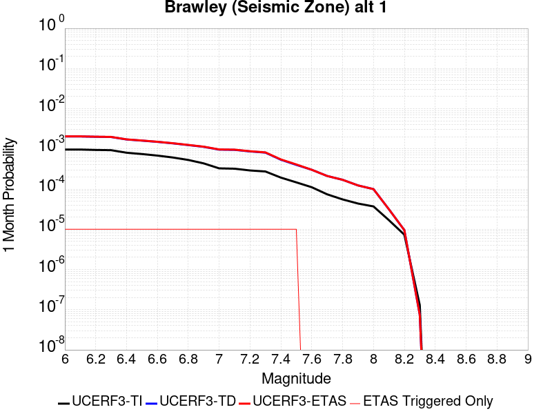 |  |  |

| Magnitude | 1 wk TI Prob | 1 wk TD Prob | 1 wk ETAS Prob | 1 wk ETAS/TD Gain | 1 wk ETAS Triggered Only | 1 mo TI Prob | 1 mo TD Prob | 1 mo ETAS Prob | 1 mo ETAS/TD Gain | 1 mo ETAS Triggered Only | 1 yr TI Prob | 1 yr TD Prob | 1 yr ETAS Prob | 1 yr ETAS/TD Gain | 1 yr ETAS Triggered Only | 10 yr TI Prob | 10 yr TD Prob | 10 yr ETAS Prob | 10 yr ETAS/TD Gain | 10 yr ETAS Triggered Only |
|-----|-----|-----|-----|-----|-----|-----|-----|-----|-----|-----|-----|-----|-----|-----|-----|-----|-----|-----|-----|-----|
| 6.0 | 2.2521618E-4 | 4.7667572E-4 | 4.7667572E-4 | 1.0 | 0.0 | 9.6485513E-4 | 0.0020413336 | 0.0020565286 | 1.0074437 | 1.522603E-5 | 0.011683988 | 0.024564065 | 0.024578918 | 1.0006046 | 1.522603E-5 | 0.11088423 | 0.21362062 | 0.2136326 | 1.000056 | 1.522603E-5 |
| 6.1 | 2.2521618E-4 | 4.7667572E-4 | 4.7667572E-4 | 1.0 | 0.0 | 9.6485513E-4 | 0.0020413336 | 0.0020565286 | 1.0074437 | 1.522603E-5 | 0.011683988 | 0.024564065 | 0.024578918 | 1.0006046 | 1.522603E-5 | 0.11088423 | 0.21362062 | 0.2136326 | 1.000056 | 1.522603E-5 |
| 6.2 | 2.198148E-4 | 4.6751375E-4 | 4.6751375E-4 | 1.0 | 0.0 | 9.417233E-4 | 0.0020021286 | 0.002017324 | 1.0075897 | 1.522603E-5 | 0.011405343 | 0.024097936 | 0.024112795 | 1.0006167 | 1.522603E-5 | 0.10837428 | 0.2100555 | 0.21006753 | 1.0000572 | 1.522603E-5 |
| 6.3 | 2.1704129E-4 | 4.6186932E-4 | 4.6186932E-4 | 1.0 | 0.0 | 9.298453E-4 | 0.001977975 | 0.001993171 | 1.0076826 | 1.522603E-5 | 0.011262234 | 0.023811033 | 0.023825897 | 1.0006242 | 1.522603E-5 | 0.107082725 | 0.20794643 | 0.2079585 | 1.0000579 | 1.522603E-5 |
| 6.4 | 1.876142E-4 | 4.007805E-4 | 4.007805E-4 | 1.0 | 0.0 | 8.038131E-4 | 0.0017165145 | 0.0017317144 | 1.0088551 | 1.522603E-5 | 0.00974259 | 0.020697333 | 0.020712243 | 1.0007204 | 1.522603E-5 | 0.093263686 | 0.18469763 | 0.18471004 | 1.0000672 | 1.522603E-5 |
| 6.5 | 1.7390939E-4 | 3.750906E-4 | 3.750906E-4 | 1.0 | 0.0 | 7.45113E-4 | 0.001606553 | 0.0016217545 | 1.0094622 | 1.522603E-5 | 0.009034078 | 0.019385088 | 0.01940002 | 1.0007702 | 1.522603E-5 | 0.086755216 | 0.17451778 | 0.17453034 | 1.000072 | 1.522603E-5 |
| 6.6 | 1.591791E-4 | 3.4922338E-4 | 3.4922338E-4 | 1.0 | 0.0 | 6.8201777E-4 | 0.0014958231 | 0.0015110264 | 1.0101638 | 1.522603E-5 | 0.008271996 | 0.018061135 | 0.018076085 | 1.0008278 | 1.522603E-5 | 0.07970774 | 0.16392244 | 0.16393518 | 1.0000776 | 1.522603E-5 |
| 6.7 | 1.4268003E-4 | 3.208674E-4 | 3.208674E-4 | 1.0 | 0.0 | 6.1134255E-4 | 0.0013744296 | 0.0013896347 | 1.0110629 | 1.522603E-5 | 0.007417723 | 0.016607253 | 0.016622225 | 1.0009016 | 1.522603E-5 | 0.07174956 | 0.1520427 | 0.15205562 | 1.0000849 | 1.522603E-5 |
| 6.8 | 1.239713E-4 | 2.9077847E-4 | 2.9077847E-4 | 1.0 | 0.0 | 5.3119735E-4 | 0.0012456045 | 0.0012608116 | 1.0122086 | 1.522603E-5 | 0.0064481674 | 0.0150612155 | 0.015076213 | 1.0009958 | 1.522603E-5 | 0.06264243 | 0.13847366 | 0.13848677 | 1.0000948 | 1.522603E-5 |
| 6.9 | 1.0180238E-4 | 2.6273142E-4 | 2.6273142E-4 | 1.0 | 0.0 | 4.3622297E-4 | 0.0011255102 | 0.001140719 | 1.0135128 | 1.522603E-5 | 0.005298089 | 0.013617991 | 0.013633009 | 1.0011028 | 1.522603E-5 | 0.05173543 | 0.1250377 | 0.12505104 | 1.0001066 | 1.522603E-5 |
| 7.0 | 7.6619996E-5 | 2.2413618E-4 | 2.2413618E-4 | 1.0 | 0.0 | 3.283301E-4 | 9.602332E-4 | 9.754446E-4 | 1.0158414 | 1.522603E-5 | 0.0039900932 | 0.011628882 | 0.011643931 | 1.0012941 | 1.522603E-5 | 0.039192066 | 0.10732558 | 0.10733917 | 1.0001266 | 1.522603E-5 |
| 7.1 | 7.5127435E-5 | 2.20966E-4 | 2.20966E-4 | 1.0 | 0.0 | 3.2193496E-4 | 9.466566E-4 | 9.6186827E-4 | 1.0160688 | 1.522603E-5 | 0.0039125155 | 0.011465338 | 0.01148039 | 1.0013127 | 1.522603E-5 | 0.038443442 | 0.105888925 | 0.105902545 | 1.0001285 | 1.522603E-5 |
| 7.2 | 6.788582E-5 | 2.022384E-4 | 2.022384E-4 | 1.0 | 0.0 | 2.9090676E-4 | 8.664511E-4 | 8.8166393E-4 | 1.0175576 | 1.522603E-5 | 0.0035360386 | 0.010498658 | 0.010513724 | 1.001435 | 1.522603E-5 | 0.034803 | 0.09755801 | 0.097571746 | 1.0001408 | 1.522603E-5 |
| 7.3 | 6.399602E-5 | 1.8854217E-4 | 1.8854217E-4 | 1.0 | 0.0 | 2.7423984E-4 | 8.0779055E-4 | 8.230043E-4 | 1.0188338 | 1.522603E-5 | 0.0033337586 | 0.009791091 | 0.009806168 | 1.0015398 | 1.522603E-5 | 0.03284188 | 0.09145105 | 0.09146488 | 1.0001513 | 1.522603E-5 |
| 7.4 | 4.506759E-5 | 1.253954E-4 | 1.253954E-4 | 1.0 | 0.0 | 1.9313251E-4 | 5.37299E-4 | 5.525169E-4 | 1.0283228 | 1.522603E-5 | 0.0023488526 | 0.0065221693 | 0.0065372963 | 1.0023193 | 1.522603E-5 | 0.023241805 | 0.062409032 | 0.062423307 | 1.0002288 | 1.522603E-5 |
| 7.5 | 3.43289E-5 | 9.344148E-5 | 9.344148E-5 | 1.0 | 0.0 | 1.4711556E-4 | 4.0040232E-4 | 4.1562226E-4 | 1.0380116 | 1.522603E-5 | 0.0017896603 | 0.004864064 | 0.004879216 | 1.003115 | 1.522603E-5 | 0.01775316 | 0.047094297 | 0.047108807 | 1.000308 | 1.522603E-5 |
| 7.6 | 2.5980507E-5 | 7.0607166E-5 | 7.0607166E-5 | 1.0 | 0.0 | 1.1134028E-4 | 3.0256718E-4 | 3.0256718E-4 | 1.0 | 0.0 | 0.001354725 | 0.0036775572 | 0.0036775572 | 1.0 | 0.0 | 0.013464959 | 0.0358753 | 0.0358753 | 1.0 | 0.0 |
| 7.7 | 1.7292105E-5 | 4.9472306E-5 | 4.9472306E-5 | 1.0 | 0.0 | 7.4106916E-5 | 2.1200697E-4 | 2.1200697E-4 | 1.0 | 0.0 | 9.018782E-4 | 0.002578135 | 0.002578135 | 1.0 | 0.0 | 0.008982267 | 0.02531998 | 0.02531998 | 1.0 | 0.0 |
| 7.8 | 1.2927471E-5 | 3.974989E-5 | 3.974989E-5 | 1.0 | 0.0 | 5.5402274E-5 | 1.7034556E-4 | 1.7034556E-4 | 1.0 | 0.0 | 6.743139E-4 | 0.0020719871 | 0.0020719871 | 1.0 | 0.0 | 0.0067227143 | 0.020457525 | 0.020457525 | 1.0 | 0.0 |
| 7.9 | 1.0200774E-5 | 2.8791523E-5 | 2.8791523E-5 | 1.0 | 0.0 | 4.371687E-5 | 1.233864E-4 | 1.233864E-4 | 1.0 | 0.0 | 5.321229E-4 | 0.0015011955 | 0.0015011955 | 1.0 | 0.0 | 0.005308505 | 0.015012851 | 0.015012851 | 1.0 | 0.0 |
| 8.0 | 8.650396E-6 | 2.3316703E-5 | 2.3316703E-5 | 1.0 | 0.0 | 3.70726E-5 | 9.992491E-5 | 9.992491E-5 | 1.0 | 0.0 | 4.5126543E-4 | 0.0012159076 | 0.0012159076 | 1.0 | 0.0 | 0.0045035016 | 0.0122294305 | 0.0122294305 | 1.0 | 0.0 |
| 8.1 | 3.9368224E-6 | 7.3449833E-6 | 7.3449833E-6 | 1.0 | 0.0 | 1.6871985E-5 | 3.147812E-5 | 3.147812E-5 | 1.0 | 0.0 | 2.0539707E-4 | 3.8317885E-4 | 3.8317885E-4 | 1.0 | 0.0 | 0.0020520731 | 0.0040096184 | 0.0040096184 | 1.0 | 0.0 |
| 8.2 | 1.7101195E-6 | 2.2245397E-6 | 2.2245397E-6 | 1.0 | 0.0 | 7.329063E-6 | 9.533706E-6 | 9.533706E-6 | 1.0 | 0.0 | 8.922769E-5 | 1.1606672E-4 | 1.1606672E-4 | 1.0 | 0.0 | 8.9191867E-4 | 0.0012700944 | 0.0012700944 | 1.0 | 0.0 |
| 8.3 | 3.0346666E-8 | 1.7284824E-8 | 1.7284824E-8 | 1.0 | 0.0 | 1.3005713E-7 | 7.407782E-8 | 7.407782E-8 | 1.0 | 0.0 | 1.5834444E-6 | 9.018973E-7 | 9.018973E-7 | 1.0 | 0.0 | 1.5834332E-5 | 9.40451E-6 | 9.40451E-6 | 1.0 | 0.0 |

## Great Valley 04b Gordon Valley
*[(top)](#table-of-contents)*

| 1 Week | 1 Month | 1 Year | 10 Year |
|-----|-----|-----|-----|
|  |  | 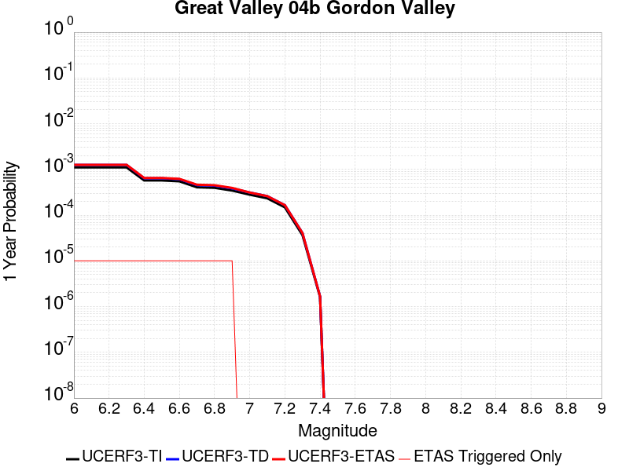 |  |

| Magnitude | 1 wk TI Prob | 1 wk TD Prob | 1 wk ETAS Prob | 1 wk ETAS/TD Gain | 1 wk ETAS Triggered Only | 1 mo TI Prob | 1 mo TD Prob | 1 mo ETAS Prob | 1 mo ETAS/TD Gain | 1 mo ETAS Triggered Only | 1 yr TI Prob | 1 yr TD Prob | 1 yr ETAS Prob | 1 yr ETAS/TD Gain | 1 yr ETAS Triggered Only | 10 yr TI Prob | 10 yr TD Prob | 10 yr ETAS Prob | 10 yr ETAS/TD Gain | 10 yr ETAS Triggered Only |
|-----|-----|-----|-----|-----|-----|-----|-----|-----|-----|-----|-----|-----|-----|-----|-----|-----|-----|-----|-----|-----|
| 6.0 | 2.1181217E-5 | 2.398364E-5 | 2.398364E-5 | 1.0 | 0.0 | 9.077348E-5 | 1.02783924E-4 | 1.02783924E-4 | 1.0 | 0.0 | 0.0011046068 | 0.0012508426 | 0.0012660496 | 1.0121574 | 1.522603E-5 | 0.010991322 | 0.012454471 | 0.012469508 | 1.0012074 | 1.522603E-5 |
| 6.1 | 2.1181217E-5 | 2.398364E-5 | 2.398364E-5 | 1.0 | 0.0 | 9.077348E-5 | 1.02783924E-4 | 1.02783924E-4 | 1.0 | 0.0 | 0.0011046068 | 0.0012508426 | 0.0012660496 | 1.0121574 | 1.522603E-5 | 0.010991322 | 0.012454471 | 0.012469508 | 1.0012074 | 1.522603E-5 |
| 6.2 | 2.1181217E-5 | 2.398364E-5 | 2.398364E-5 | 1.0 | 0.0 | 9.077348E-5 | 1.02783924E-4 | 1.02783924E-4 | 1.0 | 0.0 | 0.0011046068 | 0.0012508426 | 0.0012660496 | 1.0121574 | 1.522603E-5 | 0.010991322 | 0.012454471 | 0.012469508 | 1.0012074 | 1.522603E-5 |
| 6.3 | 2.1181217E-5 | 2.398364E-5 | 2.398364E-5 | 1.0 | 0.0 | 9.077348E-5 | 1.02783924E-4 | 1.02783924E-4 | 1.0 | 0.0 | 0.0011046068 | 0.0012508426 | 0.0012660496 | 1.0121574 | 1.522603E-5 | 0.010991322 | 0.012454471 | 0.012469508 | 1.0012074 | 1.522603E-5 |
| 6.4 | 1.0988268E-5 | 1.2255248E-5 | 1.2255248E-5 | 1.0 | 0.0 | 4.7091726E-5 | 5.2521526E-5 | 5.2521526E-5 | 1.0 | 0.0 | 5.731909E-4 | 6.392779E-4 | 6.544942E-4 | 1.0238023 | 1.522603E-5 | 0.005717147 | 0.0063759764 | 0.0063911052 | 1.0023729 | 1.522603E-5 |
| 6.5 | 1.0988268E-5 | 1.2255248E-5 | 1.2255248E-5 | 1.0 | 0.0 | 4.7091726E-5 | 5.2521526E-5 | 5.2521526E-5 | 1.0 | 0.0 | 5.731909E-4 | 6.392779E-4 | 6.544942E-4 | 1.0238023 | 1.522603E-5 | 0.005717147 | 0.0063759764 | 0.0063911052 | 1.0023729 | 1.522603E-5 |
| 6.6 | 1.0517822E-5 | 1.17247755E-5 | 1.17247755E-5 | 1.0 | 0.0 | 4.5075605E-5 | 5.024816E-5 | 5.024816E-5 | 1.0 | 0.0 | 5.4865726E-4 | 6.1161525E-4 | 6.2683196E-4 | 1.0248796 | 1.522603E-5 | 0.0054730466 | 0.0061008735 | 0.0061160065 | 1.0024805 | 1.522603E-5 |
| 6.7 | 7.789219E-6 | 8.67817E-6 | 8.67817E-6 | 1.0 | 0.0 | 3.3381937E-5 | 3.7191654E-5 | 3.7191654E-5 | 1.0 | 0.0 | 4.063493E-4 | 4.527195E-4 | 4.6793863E-4 | 1.0336171 | 1.522603E-5 | 0.004056071 | 0.0045184894 | 0.0045336466 | 1.0033545 | 1.522603E-5 |
| 6.8 | 7.5850853E-6 | 8.452902E-6 | 8.452902E-6 | 1.0 | 0.0 | 3.2507105E-5 | 3.622625E-5 | 3.622625E-5 | 1.0 | 0.0 | 3.957021E-4 | 4.4097047E-4 | 4.5618977E-4 | 1.0345132 | 1.522603E-5 | 0.0039499826 | 0.004401467 | 0.004416626 | 1.0034441 | 1.522603E-5 |
| 6.9 | 6.604105E-6 | 7.3589954E-6 | 7.3589954E-6 | 1.0 | 0.0 | 2.8303E-5 | 3.153819E-5 | 3.153819E-5 | 1.0 | 0.0 | 3.4453452E-4 | 3.8391372E-4 | 3.9913392E-4 | 1.0396448 | 1.522603E-5 | 0.0034400085 | 0.0038328916 | 0.0038480593 | 1.0039573 | 1.522603E-5 |
| 7.0 | 5.3701115E-6 | 5.9887843E-6 | 5.9887843E-6 | 1.0 | 0.0 | 2.301456E-5 | 2.5665984E-5 | 2.5665984E-5 | 1.0 | 0.0 | 2.8016625E-4 | 3.1244147E-4 | 3.1244147E-4 | 1.0 | 0.0 | 0.0027981328 | 0.0031203104 | 0.0031203104 | 1.0 | 0.0 |
| 7.1 | 4.4685607E-6 | 4.986785E-6 | 4.986785E-6 | 1.0 | 0.0 | 1.9150835E-5 | 2.1371776E-5 | 2.1371776E-5 | 1.0 | 0.0 | 2.3313647E-4 | 2.6017276E-4 | 2.6017276E-4 | 1.0 | 0.0 | 0.0023289204 | 0.0025989267 | 0.0025989267 | 1.0 | 0.0 |
| 7.2 | 2.833378E-6 | 3.1646157E-6 | 3.1646157E-6 | 1.0 | 0.0 | 1.2142991E-5 | 1.3562578E-5 | 1.3562578E-5 | 1.0 | 0.0 | 1.4783088E-4 | 1.6511363E-4 | 1.6511363E-4 | 1.0 | 0.0 | 0.0014773258 | 0.0016500814 | 0.0016500814 | 1.0 | 0.0 |
| 7.3 | 7.0087293E-7 | 7.773268E-7 | 7.773268E-7 | 1.0 | 0.0 | 3.0037377E-6 | 3.331399E-6 | 3.331399E-6 | 1.0 | 0.0 | 3.656989E-5 | 4.0559487E-5 | 4.0559487E-5 | 1.0 | 0.0 | 3.6563876E-4 | 4.0556584E-4 | 4.0556584E-4 | 1.0 | 0.0 |
| 7.4 | 3.112171E-8 | 3.2068883E-8 | 3.2068883E-8 | 1.0 | 0.0 | 1.3337875E-7 | 1.3743806E-7 | 1.3743806E-7 | 1.0 | 0.0 | 1.6238852E-6 | 1.6733072E-6 | 1.6733072E-6 | 1.0 | 0.0 | 1.6238733E-5 | 1.6732954E-5 | 1.6732954E-5 | 1.0 | 0.0 |

## Elsinore (Coyote Mountains)
*[(top)](#table-of-contents)*

| 1 Week | 1 Month | 1 Year | 10 Year |
|-----|-----|-----|-----|
|  |  |  |  |

| Magnitude | 1 wk TI Prob | 1 wk TD Prob | 1 wk ETAS Prob | 1 wk ETAS/TD Gain | 1 wk ETAS Triggered Only | 1 mo TI Prob | 1 mo TD Prob | 1 mo ETAS Prob | 1 mo ETAS/TD Gain | 1 mo ETAS Triggered Only | 1 yr TI Prob | 1 yr TD Prob | 1 yr ETAS Prob | 1 yr ETAS/TD Gain | 1 yr ETAS Triggered Only | 10 yr TI Prob | 10 yr TD Prob | 10 yr ETAS Prob | 10 yr ETAS/TD Gain | 10 yr ETAS Triggered Only |
|-----|-----|-----|-----|-----|-----|-----|-----|-----|-----|-----|-----|-----|-----|-----|-----|-----|-----|-----|-----|-----|
| 6.0 | 4.20513E-5 | 4.8638663E-5 | 4.8638663E-5 | 1.0 | 0.0 | 1.8020741E-4 | 2.0843801E-4 | 2.0843801E-4 | 1.0 | 0.0 | 0.0021918174 | 0.002535353 | 0.0025505403 | 1.0059903 | 1.522603E-5 | 0.021703249 | 0.025114654 | 0.025129497 | 1.000591 | 1.522603E-5 |
| 6.1 | 4.20513E-5 | 4.8638663E-5 | 4.8638663E-5 | 1.0 | 0.0 | 1.8020741E-4 | 2.0843801E-4 | 2.0843801E-4 | 1.0 | 0.0 | 0.0021918174 | 0.002535353 | 0.0025505403 | 1.0059903 | 1.522603E-5 | 0.021703249 | 0.025114654 | 0.025129497 | 1.000591 | 1.522603E-5 |
| 6.2 | 2.3413893E-5 | 2.4698767E-5 | 2.4698767E-5 | 1.0 | 0.0 | 1.0034139E-4 | 1.0584811E-4 | 1.0584811E-4 | 1.0 | 0.0 | 0.0012209718 | 0.0012880323 | 0.0012880323 | 1.0 | 0.0 | 0.012142851 | 0.0128142275 | 0.0128142275 | 1.0 | 0.0 |
| 6.3 | 2.3413893E-5 | 2.4698767E-5 | 2.4698767E-5 | 1.0 | 0.0 | 1.0034139E-4 | 1.0584811E-4 | 1.0584811E-4 | 1.0 | 0.0 | 0.0012209718 | 0.0012880323 | 0.0012880323 | 1.0 | 0.0 | 0.012142851 | 0.0128142275 | 0.0128142275 | 1.0 | 0.0 |
| 6.4 | 1.6894814E-5 | 1.6570395E-5 | 1.6570395E-5 | 1.0 | 0.0 | 7.240433E-5 | 7.101426E-5 | 7.101426E-5 | 1.0 | 0.0 | 8.811662E-4 | 8.642923E-4 | 8.642923E-4 | 1.0 | 0.0 | 0.0087768035 | 0.008612989 | 0.008612989 | 1.0 | 0.0 |
| 6.5 | 1.6894814E-5 | 1.6570395E-5 | 1.6570395E-5 | 1.0 | 0.0 | 7.240433E-5 | 7.101426E-5 | 7.101426E-5 | 1.0 | 0.0 | 8.811662E-4 | 8.642923E-4 | 8.642923E-4 | 1.0 | 0.0 | 0.0087768035 | 0.008612989 | 0.008612989 | 1.0 | 0.0 |
| 6.6 | 1.1910969E-5 | 1.0532126E-5 | 1.0532126E-5 | 1.0 | 0.0 | 5.1046012E-5 | 4.5136978E-5 | 4.5136978E-5 | 1.0 | 0.0 | 6.21308E-4 | 5.494154E-4 | 5.494154E-4 | 1.0 | 0.0 | 0.0061957375 | 0.0054818755 | 0.0054818755 | 1.0 | 0.0 |
| 6.7 | 9.1486E-6 | 7.2038497E-6 | 7.2038497E-6 | 1.0 | 0.0 | 3.9207694E-5 | 3.08733E-5 | 3.08733E-5 | 1.0 | 0.0 | 4.7724912E-4 | 3.758214E-4 | 3.758214E-4 | 1.0 | 0.0 | 0.0047622547 | 0.0037522377 | 0.0037522377 | 1.0 | 0.0 |
| 6.8 | 7.90441E-6 | 5.7298735E-6 | 5.7298735E-6 | 1.0 | 0.0 | 3.3875604E-5 | 2.4556377E-5 | 2.4556377E-5 | 1.0 | 0.0 | 4.1235742E-4 | 2.9893414E-4 | 2.9893414E-4 | 1.0 | 0.0 | 0.0041159308 | 0.002985449 | 0.002985449 | 1.0 | 0.0 |
| 6.9 | 7.77015E-6 | 5.583821E-6 | 5.583821E-6 | 1.0 | 0.0 | 3.3300217E-5 | 2.3930448E-5 | 2.3930448E-5 | 1.0 | 0.0 | 4.0535472E-4 | 2.9131552E-4 | 2.9131552E-4 | 1.0 | 0.0 | 0.004046161 | 0.0029094636 | 0.0029094636 | 1.0 | 0.0 |
| 7.0 | 7.675798E-6 | 5.480674E-6 | 5.480674E-6 | 1.0 | 0.0 | 3.289586E-5 | 2.3488401E-5 | 2.3488401E-5 | 1.0 | 0.0 | 4.004335E-4 | 2.85935E-4 | 2.85935E-4 | 1.0 | 0.0 | 0.003997127 | 0.0028557975 | 0.0028557975 | 1.0 | 0.0 |
| 7.1 | 7.447814E-6 | 5.2395403E-6 | 5.2395403E-6 | 1.0 | 0.0 | 3.191881E-5 | 2.2454986E-5 | 2.2454986E-5 | 1.0 | 0.0 | 3.8854225E-4 | 2.7335642E-4 | 2.7335642E-4 | 1.0 | 0.0 | 0.003878636 | 0.002730326 | 0.002730326 | 1.0 | 0.0 |
| 7.2 | 7.128185E-6 | 4.9061937E-6 | 4.9061937E-6 | 1.0 | 0.0 | 3.0549007E-5 | 2.1026382E-5 | 2.1026382E-5 | 1.0 | 0.0 | 3.7187067E-4 | 2.5596732E-4 | 2.5596732E-4 | 1.0 | 0.0 | 0.00371249 | 0.0025568435 | 0.0025568435 | 1.0 | 0.0 |
| 7.3 | 7.0913875E-6 | 4.8748675E-6 | 4.8748675E-6 | 1.0 | 0.0 | 3.0391306E-5 | 2.0892128E-5 | 2.0892128E-5 | 1.0 | 0.0 | 3.6995133E-4 | 2.5433316E-4 | 2.5433316E-4 | 1.0 | 0.0 | 0.0036933604 | 0.0025405393 | 0.0025405393 | 1.0 | 0.0 |
| 7.4 | 7.051521E-6 | 4.838718E-6 | 4.838718E-6 | 1.0 | 0.0 | 3.0220453E-5 | 2.0737203E-5 | 2.0737203E-5 | 1.0 | 0.0 | 3.6787192E-4 | 2.5244738E-4 | 2.5244738E-4 | 1.0 | 0.0 | 0.0036726352 | 0.0025217244 | 0.0025217244 | 1.0 | 0.0 |
| 7.5 | 6.910666E-6 | 4.7341928E-6 | 4.7341928E-6 | 1.0 | 0.0 | 2.9616802E-5 | 2.0289246E-5 | 2.0289246E-5 | 1.0 | 0.0 | 3.605249E-4 | 2.4699475E-4 | 2.4699475E-4 | 1.0 | 0.0 | 0.0035994058 | 0.0024673205 | 0.0024673205 | 1.0 | 0.0 |
| 7.6 | 6.341753E-6 | 4.3072587E-6 | 4.3072587E-6 | 1.0 | 0.0 | 2.7178658E-5 | 1.8459556E-5 | 1.8459556E-5 | 1.0 | 0.0 | 3.3084993E-4 | 2.2472307E-4 | 2.2472307E-4 | 1.0 | 0.0 | 0.0033035777 | 0.0022450737 | 0.0022450737 | 1.0 | 0.0 |
| 7.7 | 3.9205916E-6 | 2.2443742E-6 | 2.2443742E-6 | 1.0 | 0.0 | 1.6802427E-5 | 9.618715E-6 | 9.618715E-6 | 1.0 | 0.0 | 2.0455034E-4 | 1.171023E-4 | 1.171023E-4 | 1.0 | 0.0 | 0.0020436216 | 0.001170479 | 0.001170479 | 1.0 | 0.0 |
| 7.8 | 2.0846227E-7 | 8.488185E-8 | 8.488185E-8 | 1.0 | 0.0 | 8.9340944E-7 | 3.637793E-7 | 3.637793E-7 | 1.0 | 0.0 | 1.0877206E-5 | 4.4290073E-6 | 4.4290073E-6 | 1.0 | 0.0 | 1.0876673E-4 | 4.4289518E-5 | 4.4289518E-5 | 1.0 | 0.0 |
| 7.9 | 4.4969806E-9 | 2.2695175E-9 | 2.2695175E-9 | 1.0 | 0.0 | 1.9272775E-8 | 9.726504E-9 | 9.726504E-9 | 1.0 | 0.0 | 2.3464601E-7 | 1.18420175E-7 | 1.18420175E-7 | 1.0 | 0.0 | 2.3464577E-6 | 1.1842012E-6 | 1.1842012E-6 | 1.0 | 0.0 |

## Cedar Mtn-Mahogany Mtn
*[(top)](#table-of-contents)*

| 1 Week | 1 Month | 1 Year | 10 Year |
|-----|-----|-----|-----|
|  |  |  |  |

| Magnitude | 1 wk TI Prob | 1 wk TD Prob | 1 wk ETAS Prob | 1 wk ETAS/TD Gain | 1 wk ETAS Triggered Only | 1 mo TI Prob | 1 mo TD Prob | 1 mo ETAS Prob | 1 mo ETAS/TD Gain | 1 mo ETAS Triggered Only | 1 yr TI Prob | 1 yr TD Prob | 1 yr ETAS Prob | 1 yr ETAS/TD Gain | 1 yr ETAS Triggered Only | 10 yr TI Prob | 10 yr TD Prob | 10 yr ETAS Prob | 10 yr ETAS/TD Gain | 10 yr ETAS Triggered Only |
|-----|-----|-----|-----|-----|-----|-----|-----|-----|-----|-----|-----|-----|-----|-----|-----|-----|-----|-----|-----|-----|
| 6.0 | 2.7763876E-5 | 2.9589899E-5 | 2.9589899E-5 | 1.0 | 0.0 | 1.1898261E-4 | 1.2680808E-4 | 1.2680808E-4 | 1.0 | 0.0 | 0.0014476506 | 0.0015428651 | 0.0015580676 | 1.0098535 | 1.522603E-5 | 0.0143825635 | 0.015328757 | 0.01534375 | 1.0009781 | 1.522603E-5 |
| 6.1 | 1.6162443E-5 | 1.7143519E-5 | 1.7143519E-5 | 1.0 | 0.0 | 6.926578E-5 | 7.347025E-5 | 7.347025E-5 | 1.0 | 0.0 | 8.4298453E-4 | 8.9415093E-4 | 9.093634E-4 | 1.0170133 | 1.522603E-5 | 0.008397939 | 0.008907345 | 0.008922435 | 1.0016942 | 1.522603E-5 |
| 6.2 | 1.6162443E-5 | 1.7143519E-5 | 1.7143519E-5 | 1.0 | 0.0 | 6.926578E-5 | 7.347025E-5 | 7.347025E-5 | 1.0 | 0.0 | 8.4298453E-4 | 8.9415093E-4 | 9.093634E-4 | 1.0170133 | 1.522603E-5 | 0.008397939 | 0.008907345 | 0.008922435 | 1.0016942 | 1.522603E-5 |
| 6.3 | 9.746053E-6 | 1.03034645E-5 | 1.03034645E-5 | 1.0 | 0.0 | 4.1768133E-5 | 4.415698E-5 | 4.415698E-5 | 1.0 | 0.0 | 5.0840835E-4 | 5.3748273E-4 | 5.5270054E-4 | 1.0283132 | 1.522603E-5 | 0.0050724675 | 0.0053622467 | 0.005377391 | 1.0028243 | 1.522603E-5 |
| 6.4 | 9.746053E-6 | 1.03034645E-5 | 1.03034645E-5 | 1.0 | 0.0 | 4.1768133E-5 | 4.415698E-5 | 4.415698E-5 | 1.0 | 0.0 | 5.0840835E-4 | 5.3748273E-4 | 5.5270054E-4 | 1.0283132 | 1.522603E-5 | 0.0050724675 | 0.0053622467 | 0.005377391 | 1.0028243 | 1.522603E-5 |
| 6.5 | 7.290083E-6 | 7.695551E-6 | 7.695551E-6 | 1.0 | 0.0 | 3.124284E-5 | 3.298053E-5 | 3.298053E-5 | 1.0 | 0.0 | 3.8031515E-4 | 4.0146615E-4 | 4.1668606E-4 | 1.0379108 | 1.522603E-5 | 0.0037966494 | 0.004007629 | 0.004022794 | 1.0037841 | 1.522603E-5 |
| 6.6 | 5.67907E-6 | 5.9893264E-6 | 5.9893264E-6 | 1.0 | 0.0 | 2.4338644E-5 | 2.5668296E-5 | 2.5668296E-5 | 1.0 | 0.0 | 2.962827E-4 | 3.1246804E-4 | 3.276893E-4 | 1.0487131 | 1.522603E-5 | 0.0029588798 | 0.003120423 | 0.0031356015 | 1.0048642 | 1.522603E-5 |
| 6.7 | 3.4853963E-6 | 3.6727356E-6 | 3.6727356E-6 | 1.0 | 0.0 | 1.4937327E-5 | 1.5740205E-5 | 1.5740205E-5 | 1.0 | 0.0 | 1.8184677E-4 | 1.9162075E-4 | 1.9162075E-4 | 1.0 | 0.0 | 0.0018169804 | 0.0019146174 | 0.0019146174 | 1.0 | 0.0 |
| 6.8 | 2.7535168E-6 | 2.9016592E-6 | 2.9016592E-6 | 1.0 | 0.0 | 1.1800733E-5 | 1.2435626E-5 | 1.2435626E-5 | 1.0 | 0.0 | 1.4366445E-4 | 1.513937E-4 | 1.513937E-4 | 1.0 | 0.0 | 0.0014357162 | 0.0015129528 | 0.0015129528 | 1.0 | 0.0 |
| 6.9 | 1.6594106E-6 | 1.7497491E-6 | 1.7497491E-6 | 1.0 | 0.0 | 7.1117406E-6 | 7.498905E-6 | 7.498905E-6 | 1.0 | 0.0 | 8.6582E-5 | 9.129565E-5 | 9.129565E-5 | 1.0 | 0.0 | 8.654827E-4 | 9.126119E-4 | 9.126119E-4 | 1.0 | 0.0 |
| 7.0 | 5.10215E-7 | 5.389415E-7 | 5.389415E-7 | 1.0 | 0.0 | 2.186634E-6 | 2.3097477E-6 | 2.3097477E-6 | 1.0 | 0.0 | 2.6621943E-5 | 2.8120945E-5 | 2.8120945E-5 | 1.0 | 0.0 | 2.6618753E-4 | 2.8118643E-4 | 2.8118643E-4 | 1.0 | 0.0 |

## San Gregorio (North) 2011 CFM
*[(top)](#table-of-contents)*

| 1 Week | 1 Month | 1 Year | 10 Year |
|-----|-----|-----|-----|
|  |  |  |  |

| Magnitude | 1 wk TI Prob | 1 wk TD Prob | 1 wk ETAS Prob | 1 wk ETAS/TD Gain | 1 wk ETAS Triggered Only | 1 mo TI Prob | 1 mo TD Prob | 1 mo ETAS Prob | 1 mo ETAS/TD Gain | 1 mo ETAS Triggered Only | 1 yr TI Prob | 1 yr TD Prob | 1 yr ETAS Prob | 1 yr ETAS/TD Gain | 1 yr ETAS Triggered Only | 10 yr TI Prob | 10 yr TD Prob | 10 yr ETAS Prob | 10 yr ETAS/TD Gain | 10 yr ETAS Triggered Only |
|-----|-----|-----|-----|-----|-----|-----|-----|-----|-----|-----|-----|-----|-----|-----|-----|-----|-----|-----|-----|-----|
| 6.0 | 5.0283932E-5 | 4.30766E-5 | 4.30766E-5 | 1.0 | 0.0 | 2.1548476E-4 | 1.8460107E-4 | 1.8460107E-4 | 1.0 | 0.0 | 0.0026203706 | 0.002245218 | 0.0022604098 | 1.0067663 | 1.522603E-5 | 0.02589687 | 0.022302931 | 0.02231782 | 1.0006675 | 1.522603E-5 |
| 6.1 | 5.0283932E-5 | 4.30766E-5 | 4.30766E-5 | 1.0 | 0.0 | 2.1548476E-4 | 1.8460107E-4 | 1.8460107E-4 | 1.0 | 0.0 | 0.0026203706 | 0.002245218 | 0.0022604098 | 1.0067663 | 1.522603E-5 | 0.02589687 | 0.022302931 | 0.02231782 | 1.0006675 | 1.522603E-5 |
| 6.2 | 4.2998647E-5 | 3.445908E-5 | 3.445908E-5 | 1.0 | 0.0 | 1.842669E-4 | 1.476735E-4 | 1.476735E-4 | 1.0 | 0.0 | 0.0022411412 | 0.0017964557 | 0.0018116544 | 1.0084604 | 1.522603E-5 | 0.022186736 | 0.017895678 | 0.017910631 | 1.0008355 | 1.522603E-5 |
| 6.3 | 4.2998647E-5 | 3.445908E-5 | 3.445908E-5 | 1.0 | 0.0 | 1.842669E-4 | 1.476735E-4 | 1.476735E-4 | 1.0 | 0.0 | 0.0022411412 | 0.0017964557 | 0.0018116544 | 1.0084604 | 1.522603E-5 | 0.022186736 | 0.017895678 | 0.017910631 | 1.0008355 | 1.522603E-5 |
| 6.4 | 4.1101295E-5 | 3.2344054E-5 | 3.2344054E-5 | 1.0 | 0.0 | 1.7613651E-4 | 1.3861009E-4 | 1.3861009E-4 | 1.0 | 0.0 | 0.0021423528 | 0.0016862852 | 0.0017014856 | 1.0090141 | 1.522603E-5 | 0.02121817 | 0.01681089 | 0.01682586 | 1.0008905 | 1.522603E-5 |
| 6.5 | 4.1032585E-5 | 3.226208E-5 | 3.226208E-5 | 1.0 | 0.0 | 1.7584208E-4 | 1.3825881E-4 | 1.3825881E-4 | 1.0 | 0.0 | 0.0021387753 | 0.001682015 | 0.001682015 | 1.0 | 0.0 | 0.021183075 | 0.01676884 | 0.01676884 | 1.0 | 0.0 |
| 6.6 | 4.011629E-5 | 3.1283573E-5 | 3.1283573E-5 | 1.0 | 0.0 | 1.7191563E-4 | 1.3406565E-4 | 1.3406565E-4 | 1.0 | 0.0 | 0.0020910634 | 0.0016310415 | 0.0016310415 | 1.0 | 0.0 | 0.020714961 | 0.016266337 | 0.016266337 | 1.0 | 0.0 |
| 6.7 | 3.8583938E-5 | 2.9470419E-5 | 2.9470419E-5 | 1.0 | 0.0 | 1.6534925E-4 | 1.2629577E-4 | 1.2629577E-4 | 1.0 | 0.0 | 0.0020112682 | 0.0015365805 | 0.0015365805 | 1.0 | 0.0 | 0.019931622 | 0.015334755 | 0.015334755 | 1.0 | 0.0 |
| 6.8 | 3.44341E-5 | 2.4467021E-5 | 2.4467021E-5 | 1.0 | 0.0 | 1.4756636E-4 | 1.0485451E-4 | 1.0485451E-4 | 1.0 | 0.0 | 0.0017951399 | 0.0012758662 | 0.0012758662 | 1.0 | 0.0 | 0.017807078 | 0.012759615 | 0.012759615 | 1.0 | 0.0 |
| 6.9 | 3.221199E-5 | 2.179033E-5 | 2.179033E-5 | 1.0 | 0.0 | 1.3804408E-4 | 9.338383E-5 | 9.338383E-5 | 1.0 | 0.0 | 0.0016793909 | 0.0011363634 | 0.0011363634 | 1.0 | 0.0 | 0.01666756 | 0.011379083 | 0.011379083 | 1.0 | 0.0 |
| 7.0 | 2.9186718E-5 | 1.815688E-5 | 1.815688E-5 | 1.0 | 0.0 | 1.2507994E-4 | 7.78129E-5 | 7.78129E-5 | 1.0 | 0.0 | 0.0015217843 | 9.4696466E-4 | 9.4696466E-4 | 1.0 | 0.0 | 0.015114053 | 0.009502123 | 0.009502123 | 1.0 | 0.0 |
| 7.1 | 2.6840138E-5 | 1.5293754E-5 | 1.5293754E-5 | 1.0 | 0.0 | 1.1502409E-4 | 6.554302E-5 | 6.554302E-5 | 1.0 | 0.0 | 0.0013995186 | 7.97696E-4 | 7.97696E-4 | 1.0 | 0.0 | 0.013907375 | 0.008020661 | 0.008020661 | 1.0 | 0.0 |
| 7.2 | 2.453002E-5 | 1.2615369E-5 | 1.2615369E-5 | 1.0 | 0.0 | 1.05124425E-4 | 5.4064752E-5 | 5.4064752E-5 | 1.0 | 0.0 | 0.0012791384 | 6.5804017E-4 | 6.5804017E-4 | 1.0 | 0.0 | 0.012718005 | 0.0066322917 | 0.0066322917 | 1.0 | 0.0 |
| 7.3 | 2.3330727E-5 | 1.1497131E-5 | 1.1497131E-5 | 1.0 | 0.0 | 9.9985E-5 | 4.9272487E-5 | 4.9272487E-5 | 1.0 | 0.0 | 0.0012166376 | 5.9972785E-4 | 5.9972785E-4 | 1.0 | 0.0 | 0.012099981 | 0.0060511003 | 0.0060511003 | 1.0 | 0.0 |
| 7.4 | 2.2136466E-5 | 1.0376991E-5 | 1.0376991E-5 | 1.0 | 0.0 | 9.486712E-5 | 4.447206E-5 | 4.447206E-5 | 1.0 | 0.0 | 0.0011543952 | 5.413131E-4 | 5.413131E-4 | 1.0 | 0.0 | 0.011484168 | 0.0054685515 | 0.0054685515 | 1.0 | 0.0 |
| 7.5 | 2.0994974E-5 | 9.434951E-6 | 9.434951E-6 | 1.0 | 0.0 | 8.997535E-5 | 4.0434876E-5 | 4.0434876E-5 | 1.0 | 0.0 | 0.0010948994 | 4.9218367E-4 | 4.9218367E-4 | 1.0 | 0.0 | 0.010895205 | 0.004977516 | 0.004977516 | 1.0 | 0.0 |
| 7.6 | 1.7091823E-5 | 6.899775E-6 | 6.899775E-6 | 1.0 | 0.0 | 7.3248615E-5 | 2.9570128E-5 | 2.9570128E-5 | 1.0 | 0.0 | 8.9143694E-4 | 3.5995696E-4 | 3.5995696E-4 | 1.0 | 0.0 | 0.008878695 | 0.0036515344 | 0.0036515344 | 1.0 | 0.0 |
| 7.7 | 1.2772179E-5 | 4.02515E-6 | 4.02515E-6 | 1.0 | 0.0 | 5.473676E-5 | 1.7250528E-5 | 1.7250528E-5 | 1.0 | 0.0 | 6.6621625E-4 | 2.1000496E-4 | 2.1000496E-4 | 1.0 | 0.0 | 0.006642225 | 0.002139257 | 0.002139257 | 1.0 | 0.0 |
| 7.8 | 7.041923E-6 | 1.9434224E-6 | 1.9434224E-6 | 1.0 | 0.0 | 3.017932E-5 | 8.328926E-6 | 8.328926E-6 | 1.0 | 0.0 | 3.6737128E-4 | 1.0139996E-4 | 1.0139996E-4 | 1.0 | 0.0 | 0.0036676454 | 0.0010394283 | 0.0010394283 | 1.0 | 0.0 |
| 7.9 | 2.946768E-6 | 1.005017E-6 | 1.005017E-6 | 1.0 | 0.0 | 1.2628945E-5 | 4.307208E-6 | 4.307208E-6 | 1.0 | 0.0 | 1.5374656E-4 | 5.2439E-5 | 5.2439E-5 | 1.0 | 0.0 | 0.0015364023 | 5.348889E-4 | 5.348889E-4 | 1.0 | 0.0 |
| 8.0 | 1.1433375E-6 | 5.1909757E-7 | 5.1909757E-7 | 1.0 | 0.0 | 4.9000087E-6 | 2.2247018E-6 | 2.2247018E-6 | 1.0 | 0.0 | 5.965597E-5 | 2.7085409E-5 | 2.7085409E-5 | 1.0 | 0.0 | 5.963996E-4 | 2.7448457E-4 | 2.7448457E-4 | 1.0 | 0.0 |
| 8.1 | 2.6675295E-7 | 1.6325848E-7 | 1.6325848E-7 | 1.0 | 0.0 | 1.1432264E-6 | 6.99679E-7 | 6.99679E-7 | 1.0 | 0.0 | 1.3918692E-5 | 8.518558E-6 | 8.518558E-6 | 1.0 | 0.0 | 1.391782E-4 | 8.6569096E-5 | 8.6569096E-5 | 1.0 | 0.0 |
| 8.2 | 1.2704569E-8 | 9.463868E-9 | 9.463868E-9 | 1.0 | 0.0 | 5.444815E-8 | 4.055943E-8 | 4.055943E-8 | 1.0 | 0.0 | 6.629061E-7 | 4.93811E-7 | 4.93811E-7 | 1.0 | 0.0 | 6.629041E-6 | 5.1294255E-6 | 5.1294255E-6 | 1.0 | 0.0 |

## Cleghorn
*[(top)](#table-of-contents)*

| 1 Week | 1 Month | 1 Year | 10 Year |
|-----|-----|-----|-----|
|  |  |  |  |

| Magnitude | 1 wk TI Prob | 1 wk TD Prob | 1 wk ETAS Prob | 1 wk ETAS/TD Gain | 1 wk ETAS Triggered Only | 1 mo TI Prob | 1 mo TD Prob | 1 mo ETAS Prob | 1 mo ETAS/TD Gain | 1 mo ETAS Triggered Only | 1 yr TI Prob | 1 yr TD Prob | 1 yr ETAS Prob | 1 yr ETAS/TD Gain | 1 yr ETAS Triggered Only | 10 yr TI Prob | 10 yr TD Prob | 10 yr ETAS Prob | 10 yr ETAS/TD Gain | 10 yr ETAS Triggered Only |
|-----|-----|-----|-----|-----|-----|-----|-----|-----|-----|-----|-----|-----|-----|-----|-----|-----|-----|-----|-----|-----|
| 6.0 | 7.9267165E-6 | 9.838367E-6 | 9.838367E-6 | 1.0 | 0.0 | 3.39712E-5 | 4.216381E-5 | 4.216381E-5 | 1.0 | 0.0 | 4.1352084E-4 | 5.1323406E-4 | 5.1323406E-4 | 1.0 | 0.0 | 0.004127522 | 0.005135526 | 0.0051506734 | 1.0029496 | 1.522603E-5 |
| 6.1 | 7.9267165E-6 | 9.838367E-6 | 9.838367E-6 | 1.0 | 0.0 | 3.39712E-5 | 4.216381E-5 | 4.216381E-5 | 1.0 | 0.0 | 4.1352084E-4 | 5.1323406E-4 | 5.1323406E-4 | 1.0 | 0.0 | 0.004127522 | 0.005135526 | 0.0051506734 | 1.0029496 | 1.522603E-5 |
| 6.2 | 7.9267165E-6 | 9.838367E-6 | 9.838367E-6 | 1.0 | 0.0 | 3.39712E-5 | 4.216381E-5 | 4.216381E-5 | 1.0 | 0.0 | 4.1352084E-4 | 5.1323406E-4 | 5.1323406E-4 | 1.0 | 0.0 | 0.004127522 | 0.005135526 | 0.0051506734 | 1.0029496 | 1.522603E-5 |
| 6.3 | 7.9267165E-6 | 9.838367E-6 | 9.838367E-6 | 1.0 | 0.0 | 3.39712E-5 | 4.216381E-5 | 4.216381E-5 | 1.0 | 0.0 | 4.1352084E-4 | 5.1323406E-4 | 5.1323406E-4 | 1.0 | 0.0 | 0.004127522 | 0.005135526 | 0.0051506734 | 1.0029496 | 1.522603E-5 |
| 6.4 | 4.3445207E-6 | 6.0981406E-6 | 6.0981406E-6 | 1.0 | 0.0 | 1.8619241E-5 | 2.6134632E-5 | 2.6134632E-5 | 1.0 | 0.0 | 2.2666567E-4 | 3.181437E-4 | 3.181437E-4 | 1.0 | 0.0 | 0.0022643462 | 0.003190997 | 0.0032061746 | 1.0047563 | 1.522603E-5 |
| 6.5 | 4.3445207E-6 | 6.0981406E-6 | 6.0981406E-6 | 1.0 | 0.0 | 1.8619241E-5 | 2.6134632E-5 | 2.6134632E-5 | 1.0 | 0.0 | 2.2666567E-4 | 3.181437E-4 | 3.181437E-4 | 1.0 | 0.0 | 0.0022643462 | 0.003190997 | 0.0032061746 | 1.0047563 | 1.522603E-5 |
| 6.6 | 4.040109E-6 | 5.780541E-6 | 5.780541E-6 | 1.0 | 0.0 | 1.7314638E-5 | 2.4773517E-5 | 2.4773517E-5 | 1.0 | 0.0 | 2.1078532E-4 | 3.0157674E-4 | 3.0157674E-4 | 1.0 | 0.0 | 0.002105855 | 0.0030257835 | 0.0030409636 | 1.0050169 | 1.522603E-5 |
| 6.7 | 3.3632055E-6 | 5.074022E-6 | 5.074022E-6 | 1.0 | 0.0 | 1.4413658E-5 | 2.1745627E-5 | 2.1745627E-5 | 1.0 | 0.0 | 1.7547216E-4 | 2.6472117E-4 | 2.6472117E-4 | 1.0 | 0.0 | 0.0017533366 | 0.0026581106 | 0.0026581106 | 1.0 | 0.0 |
| 6.8 | 3.2902772E-6 | 4.9959262E-6 | 4.9959262E-6 | 1.0 | 0.0 | 1.4101111E-5 | 2.1410939E-5 | 2.1410939E-5 | 1.0 | 0.0 | 1.716675E-4 | 2.606473E-4 | 2.606473E-4 | 1.0 | 0.0 | 0.0017153495 | 0.0026174681 | 0.0026174681 | 1.0 | 0.0 |
| 6.9 | 3.031547E-6 | 4.6974637E-6 | 4.6974637E-6 | 1.0 | 0.0 | 1.299228E-5 | 2.0131833E-5 | 2.0131833E-5 | 1.0 | 0.0 | 1.5816953E-4 | 2.4507777E-4 | 2.4507777E-4 | 1.0 | 0.0 | 0.00158057 | 0.002462125 | 0.002462125 | 1.0 | 0.0 |
| 7.0 | 2.8259715E-6 | 4.3764653E-6 | 4.3764653E-6 | 1.0 | 0.0 | 1.211125E-5 | 1.8756145E-5 | 1.8756145E-5 | 1.0 | 0.0 | 1.4744449E-4 | 2.2833238E-4 | 2.2833238E-4 | 1.0 | 0.0 | 0.001473467 | 0.0022950263 | 0.0022950263 | 1.0 | 0.0 |
| 7.1 | 2.5962665E-6 | 4.071453E-6 | 4.071453E-6 | 1.0 | 0.0 | 1.1126809E-5 | 1.7448969E-5 | 1.7448969E-5 | 1.0 | 0.0 | 1.3546048E-4 | 2.124207E-4 | 2.124207E-4 | 1.0 | 0.0 | 0.0013537793 | 0.0021362302 | 0.0021362302 | 1.0 | 0.0 |
| 7.2 | 2.3247253E-6 | 3.6817423E-6 | 3.6817423E-6 | 1.0 | 0.0 | 9.96307E-6 | 1.5778802E-5 | 1.5778802E-5 | 1.0 | 0.0 | 1.21293626E-4 | 1.9209016E-4 | 1.9209016E-4 | 1.0 | 0.0 | 0.0012122744 | 0.0019333162 | 0.0019333162 | 1.0 | 0.0 |
| 7.3 | 2.056928E-6 | 3.2399425E-6 | 3.2399425E-6 | 1.0 | 0.0 | 8.815376E-6 | 1.3885395E-5 | 1.3885395E-5 | 1.0 | 0.0 | 1.0732192E-4 | 1.6904173E-4 | 1.6904173E-4 | 1.0 | 0.0 | 0.001072701 | 0.0017032728 | 0.0017032728 | 1.0 | 0.0 |
| 7.4 | 1.8055999E-6 | 2.8298966E-6 | 2.8298966E-6 | 1.0 | 0.0 | 7.738263E-6 | 1.2128073E-5 | 1.2128073E-5 | 1.0 | 0.0 | 9.4209274E-5 | 1.4764942E-4 | 1.4764942E-4 | 1.0 | 0.0 | 9.4169343E-4 | 0.0014897923 | 0.0014897923 | 1.0 | 0.0 |
| 7.5 | 1.4683443E-6 | 2.4289393E-6 | 2.4289393E-6 | 1.0 | 0.0 | 6.292889E-6 | 1.0409699E-5 | 1.0409699E-5 | 1.0 | 0.0 | 7.661323E-5 | 1.2673081E-4 | 1.2673081E-4 | 1.0 | 0.0 | 7.658682E-4 | 0.0012809072 | 0.0012809072 | 1.0 | 0.0 |
| 7.6 | 9.804088E-7 | 1.9043657E-6 | 1.9043657E-6 | 1.0 | 0.0 | 4.201745E-6 | 8.161543E-6 | 8.161543E-6 | 1.0 | 0.0 | 5.1155046E-5 | 9.9362296E-5 | 9.9362296E-5 | 1.0 | 0.0 | 5.114327E-4 | 0.0010075356 | 0.0010075356 | 1.0 | 0.0 |
| 7.7 | 7.3434086E-7 | 1.6324341E-6 | 1.6324341E-6 | 1.0 | 0.0 | 3.1471714E-6 | 6.9961275E-6 | 6.9961275E-6 | 1.0 | 0.0 | 3.831614E-5 | 8.517455E-5 | 8.517455E-5 | 1.0 | 0.0 | 3.8309532E-4 | 8.6581067E-4 | 8.6581067E-4 | 1.0 | 0.0 |
| 7.8 | 6.434184E-7 | 1.5257981E-6 | 1.5257981E-6 | 1.0 | 0.0 | 2.7575045E-6 | 6.5391187E-6 | 6.5391187E-6 | 1.0 | 0.0 | 3.35721E-5 | 7.961089E-5 | 7.961089E-5 | 1.0 | 0.0 | 3.3567028E-4 | 8.098763E-4 | 8.098763E-4 | 1.0 | 0.0 |
| 7.9 | 3.4943926E-7 | 7.594313E-7 | 7.594313E-7 | 1.0 | 0.0 | 1.497596E-6 | 3.2547016E-6 | 3.2547016E-6 | 1.0 | 0.0 | 1.8233079E-5 | 3.962528E-5 | 3.962528E-5 | 1.0 | 0.0 | 1.8231584E-4 | 4.050159E-4 | 4.050159E-4 | 1.0 | 0.0 |
| 8.0 | 6.717524E-8 | 5.8598772E-8 | 5.8598772E-8 | 1.0 | 0.0 | 2.8789387E-7 | 2.5113755E-7 | 2.5113755E-7 | 1.0 | 0.0 | 3.505102E-6 | 3.0575957E-6 | 3.0575957E-6 | 1.0 | 0.0 | 3.5050467E-5 | 3.28481E-5 | 3.28481E-5 | 1.0 | 0.0 |
| 8.1 | 3.1984914E-8 | 1.3024658E-8 | 1.3024658E-8 | 1.0 | 0.0 | 1.370782E-7 | 5.5819964E-8 | 5.5819964E-8 | 1.0 | 0.0 | 1.6689258E-6 | 6.7960787E-7 | 6.7960787E-7 | 1.0 | 0.0 | 1.6689133E-5 | 7.7832365E-6 | 7.7832365E-6 | 1.0 | 0.0 |
| 8.2 | 1.21887656E-8 | 3.6706735E-9 | 3.6706735E-9 | 1.0 | 0.0 | 5.2237567E-8 | 1.5731459E-8 | 1.5731459E-8 | 1.0 | 0.0 | 6.359922E-7 | 1.9153049E-7 | 1.9153049E-7 | 1.0 | 0.0 | 6.3599036E-6 | 2.2593056E-6 | 2.2593056E-6 | 1.0 | 0.0 |

## Rodgers Creek - Healdsburg 2011 CFM
*[(top)](#table-of-contents)*

| 1 Week | 1 Month | 1 Year | 10 Year |
|-----|-----|-----|-----|
|  |  |  |  |

| Magnitude | 1 wk TI Prob | 1 wk TD Prob | 1 wk ETAS Prob | 1 wk ETAS/TD Gain | 1 wk ETAS Triggered Only | 1 mo TI Prob | 1 mo TD Prob | 1 mo ETAS Prob | 1 mo ETAS/TD Gain | 1 mo ETAS Triggered Only | 1 yr TI Prob | 1 yr TD Prob | 1 yr ETAS Prob | 1 yr ETAS/TD Gain | 1 yr ETAS Triggered Only | 10 yr TI Prob | 10 yr TD Prob | 10 yr ETAS Prob | 10 yr ETAS/TD Gain | 10 yr ETAS Triggered Only |
|-----|-----|-----|-----|-----|-----|-----|-----|-----|-----|-----|-----|-----|-----|-----|-----|-----|-----|-----|-----|-----|
| 6.0 | 7.390182E-5 | 1.3142917E-4 | 1.3142917E-4 | 1.0 | 0.0 | 3.1668364E-4 | 5.631467E-4 | 5.631467E-4 | 1.0 | 0.0 | 0.0038488081 | 0.0068347882 | 0.0068347882 | 1.0 | 0.0 | 0.037828278 | 0.06622128 | 0.0662355 | 1.0002147 | 1.522603E-5 |
| 6.1 | 7.318768E-5 | 1.3040975E-4 | 1.3040975E-4 | 1.0 | 0.0 | 3.1362378E-4 | 5.587797E-4 | 5.587797E-4 | 1.0 | 0.0 | 0.0038116854 | 0.0067819515 | 0.0067819515 | 1.0 | 0.0 | 0.037469655 | 0.06572582 | 0.06574004 | 1.0002165 | 1.522603E-5 |
| 6.2 | 7.1379836E-5 | 1.273379E-4 | 1.273379E-4 | 1.0 | 0.0 | 3.058777E-4 | 5.456202E-4 | 5.456202E-4 | 1.0 | 0.0 | 0.003717703 | 0.0066227177 | 0.0066227177 | 1.0 | 0.0 | 0.0365612 | 0.06424386 | 0.06425811 | 1.0002217 | 1.522603E-5 |
| 6.3 | 6.9255926E-5 | 1.2388272E-4 | 1.2388272E-4 | 1.0 | 0.0 | 2.9677735E-4 | 5.3081836E-4 | 5.3081836E-4 | 1.0 | 0.0 | 0.0036072785 | 0.006443587 | 0.006443587 | 1.0 | 0.0 | 0.035492823 | 0.06257 | 0.06258427 | 1.0002282 | 1.522603E-5 |
| 6.4 | 6.6757144E-5 | 1.196489E-4 | 1.196489E-4 | 1.0 | 0.0 | 2.8607066E-4 | 5.126806E-4 | 5.126806E-4 | 1.0 | 0.0 | 0.0034773487 | 0.006224091 | 0.006224091 | 1.0 | 0.0 | 0.034234364 | 0.060519043 | 0.060533345 | 1.0002364 | 1.522603E-5 |
| 6.5 | 6.5735134E-5 | 1.1813918E-4 | 1.1813918E-4 | 1.0 | 0.0 | 2.8169158E-4 | 5.0621293E-4 | 5.0621293E-4 | 1.0 | 0.0 | 0.003424202 | 0.006145812 | 0.006145812 | 1.0 | 0.0 | 0.03371918 | 0.059782747 | 0.059797063 | 1.0002395 | 1.522603E-5 |
| 6.6 | 6.289601E-5 | 1.1349227E-4 | 1.1349227E-4 | 1.0 | 0.0 | 2.6952647E-4 | 4.8630516E-4 | 4.8630516E-4 | 1.0 | 0.0 | 0.0032765474 | 0.0059047723 | 0.0059047723 | 1.0 | 0.0 | 0.032286562 | 0.0575201 | 0.05753445 | 1.0002495 | 1.522603E-5 |
| 6.7 | 6.115274E-5 | 1.1066158E-4 | 1.1066158E-4 | 1.0 | 0.0 | 2.6205686E-4 | 4.741781E-4 | 4.741781E-4 | 1.0 | 0.0 | 0.0031858748 | 0.0057579153 | 0.0057579153 | 1.0 | 0.0 | 0.031405866 | 0.056137886 | 0.056152258 | 1.000256 | 1.522603E-5 |
| 6.8 | 5.9232367E-5 | 1.073346E-4 | 1.073346E-4 | 1.0 | 0.0 | 2.538283E-4 | 4.599247E-4 | 4.599247E-4 | 1.0 | 0.0 | 0.0030859804 | 0.005585283 | 0.005585283 | 1.0 | 0.0 | 0.030434765 | 0.05450447 | 0.054518867 | 1.0002642 | 1.522603E-5 |
| 6.9 | 5.4030377E-5 | 9.827546E-5 | 9.827546E-5 | 1.0 | 0.0 | 2.315382E-4 | 4.2111287E-4 | 4.2111287E-4 | 1.0 | 0.0 | 0.0028153337 | 0.0051150625 | 0.0051150625 | 1.0 | 0.0 | 0.027799325 | 0.050039466 | 0.05005393 | 1.0002891 | 1.522603E-5 |
| 7.0 | 4.8260714E-5 | 8.745495E-5 | 8.745495E-5 | 1.0 | 0.0 | 2.0681522E-4 | 3.7475338E-4 | 3.7475338E-4 | 1.0 | 0.0 | 0.0025150678 | 0.0045531313 | 0.0045531313 | 1.0 | 0.0 | 0.024867928 | 0.044691484 | 0.04470603 | 1.0003254 | 1.522603E-5 |
| 7.1 | 4.0294493E-5 | 7.3932846E-5 | 7.3932846E-5 | 1.0 | 0.0 | 1.7267925E-4 | 3.168168E-4 | 3.168168E-4 | 1.0 | 0.0 | 0.0021003427 | 0.0038504603 | 0.0038504603 | 1.0 | 0.0 | 0.02080602 | 0.03794385 | 0.0379585 | 1.000386 | 1.522603E-5 |
| 7.2 | 3.096388E-5 | 5.7018166E-5 | 5.7018166E-5 | 1.0 | 0.0 | 1.326956E-4 | 2.443408E-4 | 2.443408E-4 | 1.0 | 0.0 | 0.0016143717 | 0.002970813 | 0.002970813 | 1.0 | 0.0 | 0.01602694 | 0.029456772 | 0.029456772 | 1.0 | 0.0 |
| 7.3 | 2.3615226E-5 | 4.366579E-5 | 4.366579E-5 | 1.0 | 0.0 | 1.0120418E-4 | 1.8712576E-4 | 1.8712576E-4 | 1.0 | 0.0 | 0.0012314644 | 0.0022758893 | 0.0022758893 | 1.0 | 0.0 | 0.0122466255 | 0.022655508 | 0.022655508 | 1.0 | 0.0 |
| 7.4 | 1.8251132E-5 | 3.3575096E-5 | 3.3575096E-5 | 1.0 | 0.0 | 7.821679E-5 | 1.438854E-4 | 1.438854E-4 | 1.0 | 0.0 | 9.518733E-4 | 0.0017504068 | 0.0017504068 | 1.0 | 0.0 | 0.009478063 | 0.017482331 | 0.017482331 | 1.0 | 0.0 |
| 7.5 | 1.2411432E-5 | 2.2486745E-5 | 2.2486745E-5 | 1.0 | 0.0 | 5.3190768E-5 | 9.636824E-5 | 9.636824E-5 | 1.0 | 0.0 | 6.4740516E-4 | 0.0011726576 | 0.0011726576 | 1.0 | 0.0 | 0.006455223 | 0.011756561 | 0.011756561 | 1.0 | 0.0 |
| 7.6 | 4.4771446E-6 | 8.09296E-6 | 8.09296E-6 | 1.0 | 0.0 | 1.918762E-5 | 3.4683664E-5 | 3.4683664E-5 | 1.0 | 0.0 | 2.3358424E-4 | 4.22193E-4 | 4.22193E-4 | 1.0 | 0.0 | 0.0023333887 | 0.004250496 | 0.004250496 | 1.0 | 0.0 |
| 7.7 | 2.157941E-7 | 3.539757E-7 | 3.539757E-7 | 1.0 | 0.0 | 9.248315E-7 | 1.5170377E-6 | 1.5170377E-6 | 1.0 | 0.0 | 1.1259765E-5 | 1.8469778E-5 | 1.8469778E-5 | 1.0 | 0.0 | 1.1259195E-4 | 1.9093022E-4 | 1.9093022E-4 | 1.0 | 0.0 |
| 7.8 | 9.9623286E-8 | 1.9936476E-7 | 1.9936476E-7 | 1.0 | 0.0 | 4.269569E-7 | 8.544201E-7 | 8.544201E-7 | 1.0 | 0.0 | 5.1981874E-6 | 1.0402515E-5 | 1.0402515E-5 | 1.0 | 0.0 | 5.198066E-5 | 1.0919859E-4 | 1.0919859E-4 | 1.0 | 0.0 |
| 7.9 | 5.6745257E-8 | 1.1796928E-7 | 1.1796928E-7 | 1.0 | 0.0 | 2.4319394E-7 | 5.055825E-7 | 5.055825E-7 | 1.0 | 0.0 | 2.960882E-6 | 6.1554497E-6 | 6.1554497E-6 | 1.0 | 0.0 | 2.9608427E-5 | 6.482142E-5 | 6.482142E-5 | 1.0 | 0.0 |
| 8.0 | 2.8614323E-8 | 6.590836E-8 | 6.590836E-8 | 1.0 | 0.0 | 1.2263281E-7 | 2.8246436E-7 | 2.8246436E-7 | 1.0 | 0.0 | 1.4930534E-6 | 3.4389982E-6 | 3.4389982E-6 | 1.0 | 0.0 | 1.4930434E-5 | 3.5885336E-5 | 3.5885336E-5 | 1.0 | 0.0 |
| 8.1 | 3.5045191E-9 | 8.981429E-9 | 8.981429E-9 | 1.0 | 0.0 | 1.5019367E-8 | 3.8491837E-8 | 3.8491837E-8 | 1.0 | 0.0 | 1.8286079E-7 | 4.68638E-7 | 4.68638E-7 | 1.0 | 0.0 | 1.8286064E-6 | 4.84019E-6 | 4.84019E-6 | 1.0 | 0.0 |

## Calaveras (So) - Paicines extension 2011 CFM
*[(top)](#table-of-contents)*

| 1 Week | 1 Month | 1 Year | 10 Year |
|-----|-----|-----|-----|
|  |  |  |  |

| Magnitude | 1 wk TI Prob | 1 wk TD Prob | 1 wk ETAS Prob | 1 wk ETAS/TD Gain | 1 wk ETAS Triggered Only | 1 mo TI Prob | 1 mo TD Prob | 1 mo ETAS Prob | 1 mo ETAS/TD Gain | 1 mo ETAS Triggered Only | 1 yr TI Prob | 1 yr TD Prob | 1 yr ETAS Prob | 1 yr ETAS/TD Gain | 1 yr ETAS Triggered Only | 10 yr TI Prob | 10 yr TD Prob | 10 yr ETAS Prob | 10 yr ETAS/TD Gain | 10 yr ETAS Triggered Only |
|-----|-----|-----|-----|-----|-----|-----|-----|-----|-----|-----|-----|-----|-----|-----|-----|-----|-----|-----|-----|-----|
| 6.0 | 1.5183659E-4 | 3.0538742E-4 | 3.0538742E-4 | 1.0 | 0.0 | 6.5056595E-4 | 0.0013080107 | 0.0013080107 | 1.0 | 0.0 | 0.007891912 | 0.015702842 | 0.015702842 | 1.0 | 0.0 | 0.076174594 | 0.13854265 | 0.13855578 | 1.0000947 | 1.522603E-5 |
| 6.1 | 1.5024997E-4 | 3.0232652E-4 | 3.0232652E-4 | 1.0 | 0.0 | 6.437695E-4 | 0.0012949064 | 0.0012949064 | 1.0 | 0.0 | 0.0078097614 | 0.0155462185 | 0.0155462185 | 1.0 | 0.0 | 0.075409345 | 0.13721214 | 0.13722529 | 1.0000957 | 1.522603E-5 |
| 6.2 | 1.2743923E-4 | 2.5341182E-4 | 2.5341182E-4 | 1.0 | 0.0 | 5.460538E-4 | 0.001085454 | 0.001085454 | 1.0 | 0.0 | 0.0066279583 | 0.013053368 | 0.013053368 | 1.0 | 0.0 | 0.064337276 | 0.117310405 | 0.117323846 | 1.0001146 | 1.522603E-5 |
| 6.3 | 1.1525114E-4 | 2.262457E-4 | 2.262457E-4 | 1.0 | 0.0 | 4.9383997E-4 | 9.6911576E-4 | 9.6911576E-4 | 1.0 | 0.0 | 0.0059959386 | 0.011674539 | 0.011674539 | 1.0 | 0.0 | 0.058367174 | 0.1064267 | 0.106440306 | 1.0001278 | 1.522603E-5 |
| 6.4 | 1.07200925E-4 | 2.0861623E-4 | 2.0861623E-4 | 1.0 | 0.0 | 4.5935164E-4 | 8.93614E-4 | 8.93614E-4 | 1.0 | 0.0 | 0.0055782744 | 0.010779322 | 0.010779322 | 1.0 | 0.0 | 0.0544031 | 0.099249505 | 0.09926322 | 1.0001382 | 1.522603E-5 |
| 6.5 | 9.69631E-5 | 1.8751183E-4 | 1.8751183E-4 | 1.0 | 0.0 | 4.1548995E-4 | 8.0336037E-4 | 8.0336037E-4 | 1.0 | 0.0 | 0.0050468626 | 0.009701113 | 0.009701113 | 1.0 | 0.0 | 0.04933773 | 0.09014108 | 0.09015494 | 1.0001537 | 1.522603E-5 |
| 6.6 | 8.0552316E-5 | 1.508417E-4 | 1.508417E-4 | 1.0 | 0.0 | 3.4517853E-4 | 6.4628234E-4 | 6.4628234E-4 | 1.0 | 0.0 | 0.0041944524 | 0.007832806 | 0.007832806 | 1.0 | 0.0 | 0.04116161 | 0.07491137 | 0.07492546 | 1.000188 | 1.522603E-5 |
| 6.7 | 7.815757E-5 | 1.4624608E-4 | 1.4624608E-4 | 1.0 | 0.0 | 3.34918E-4 | 6.2660675E-4 | 6.2660675E-4 | 1.0 | 0.0 | 0.004070005 | 0.0075956066 | 0.0075956066 | 1.0 | 0.0 | 0.039962657 | 0.07276075 | 0.07277487 | 1.0001941 | 1.522603E-5 |
| 6.8 | 6.965264E-5 | 1.273421E-4 | 1.273421E-4 | 1.0 | 0.0 | 2.9847719E-4 | 5.456321E-4 | 5.456321E-4 | 1.0 | 0.0 | 0.0036279052 | 0.006619586 | 0.006619586 | 1.0 | 0.0 | 0.03569247 | 0.06385353 | 0.06385353 | 1.0 | 0.0 |
| 6.9 | 5.8000453E-5 | 1.0154083E-4 | 1.0154083E-4 | 1.0 | 0.0 | 2.4854968E-4 | 4.3510293E-4 | 4.3510293E-4 | 1.0 | 0.0 | 0.0030218933 | 0.0052846153 | 0.0052846153 | 1.0 | 0.0 | 0.029811295 | 0.051550873 | 0.051550873 | 1.0 | 0.0 |
| 7.0 | 4.9865852E-5 | 8.578075E-5 | 8.578075E-5 | 1.0 | 0.0 | 2.1369329E-4 | 3.6758048E-4 | 3.6758048E-4 | 1.0 | 0.0 | 0.0025986114 | 0.004466198 | 0.004466198 | 1.0 | 0.0 | 0.025684336 | 0.04383052 | 0.04383052 | 1.0 | 0.0 |
| 7.1 | 4.283875E-5 | 7.120278E-5 | 7.120278E-5 | 1.0 | 0.0 | 1.8358172E-4 | 3.051194E-4 | 3.051194E-4 | 1.0 | 0.0 | 0.0022328163 | 0.0037085575 | 0.0037085575 | 1.0 | 0.0 | 0.022105146 | 0.03677475 | 0.03677475 | 1.0 | 0.0 |
| 7.2 | 3.450115E-5 | 5.5854773E-5 | 5.5854773E-5 | 1.0 | 0.0 | 1.478537E-4 | 2.393558E-4 | 2.393558E-4 | 1.0 | 0.0 | 0.0017986323 | 0.0029102915 | 0.0029102915 | 1.0 | 0.0 | 0.017841442 | 0.02911727 | 0.02911727 | 1.0 | 0.0 |
| 7.3 | 2.5709045E-5 | 4.0657033E-5 | 4.0657033E-5 | 1.0 | 0.0 | 1.1017697E-4 | 1.7423289E-4 | 1.7423289E-4 | 1.0 | 0.0 | 0.0013405791 | 0.0021192385 | 0.0021192385 | 1.0 | 0.0 | 0.013325208 | 0.021331005 | 0.021331005 | 1.0 | 0.0 |
| 7.4 | 1.8003093E-5 | 2.8548406E-5 | 2.8548406E-5 | 1.0 | 0.0 | 7.715383E-5 | 1.2234459E-4 | 1.2234459E-4 | 1.0 | 0.0 | 9.3894306E-4 | 0.00148853 | 0.00148853 | 1.0 | 0.0 | 0.009349857 | 0.015070891 | 0.015070891 | 1.0 | 0.0 |
| 7.5 | 1.5595824E-5 | 2.5859636E-5 | 2.5859636E-5 | 1.0 | 0.0 | 6.683753E-5 | 1.10822315E-4 | 1.10822315E-4 | 1.0 | 0.0 | 8.134431E-4 | 0.0013484288 | 0.0013484288 | 1.0 | 0.0 | 0.008104719 | 0.013670188 | 0.013670188 | 1.0 | 0.0 |
| 7.6 | 1.1110309E-5 | 1.9254814E-5 | 1.9254814E-5 | 1.0 | 0.0 | 4.761474E-5 | 8.251803E-5 | 8.251803E-5 | 1.0 | 0.0 | 5.795553E-4 | 0.0010041953 | 0.0010041953 | 1.0 | 0.0 | 0.0057804612 | 0.010219867 | 0.010219867 | 1.0 | 0.0 |
| 7.7 | 6.2140443E-6 | 1.0459921E-5 | 1.0459921E-5 | 1.0 | 0.0 | 2.6631347E-5 | 4.4827466E-5 | 4.4827466E-5 | 1.0 | 0.0 | 3.241884E-4 | 5.456378E-4 | 5.456378E-4 | 1.0 | 0.0 | 0.0032371588 | 0.005630981 | 0.005630981 | 1.0 | 0.0 |
| 7.8 | 5.305533E-6 | 9.453423E-6 | 9.453423E-6 | 1.0 | 0.0 | 2.27378E-5 | 4.051404E-5 | 4.051404E-5 | 1.0 | 0.0 | 2.7679754E-4 | 4.931469E-4 | 4.931469E-4 | 1.0 | 0.0 | 0.0027645302 | 0.0050842287 | 0.0050842287 | 1.0 | 0.0 |
| 7.9 | 3.363505E-6 | 7.399955E-6 | 7.399955E-6 | 1.0 | 0.0 | 1.4414942E-5 | 3.171371E-5 | 3.171371E-5 | 1.0 | 0.0 | 1.7548777E-4 | 3.8604607E-4 | 3.8604607E-4 | 1.0 | 0.0 | 0.0017534926 | 0.003955788 | 0.003955788 | 1.0 | 0.0 |
| 8.0 | 2.0271132E-6 | 4.421605E-6 | 4.421605E-6 | 1.0 | 0.0 | 8.687599E-6 | 1.8949599E-5 | 1.8949599E-5 | 1.0 | 0.0 | 1.05766376E-4 | 2.3068699E-4 | 2.3068699E-4 | 1.0 | 0.0 | 0.0010571606 | 0.0023552408 | 0.0023552408 | 1.0 | 0.0 |
| 8.1 | 1.2206116E-6 | 2.379743E-6 | 2.379743E-6 | 1.0 | 0.0 | 5.2311816E-6 | 1.0198858E-5 | 1.0198858E-5 | 1.0 | 0.0 | 6.3687774E-5 | 1.2416406E-4 | 1.2416406E-4 | 1.0 | 0.0 | 6.366953E-4 | 0.0012728416 | 0.0012728416 | 1.0 | 0.0 |

## Elmore Ranch
*[(top)](#table-of-contents)*

| 1 Week | 1 Month | 1 Year | 10 Year |
|-----|-----|-----|-----|
|  |  |  |  |

| Magnitude | 1 wk TI Prob | 1 wk TD Prob | 1 wk ETAS Prob | 1 wk ETAS/TD Gain | 1 wk ETAS Triggered Only | 1 mo TI Prob | 1 mo TD Prob | 1 mo ETAS Prob | 1 mo ETAS/TD Gain | 1 mo ETAS Triggered Only | 1 yr TI Prob | 1 yr TD Prob | 1 yr ETAS Prob | 1 yr ETAS/TD Gain | 1 yr ETAS Triggered Only | 10 yr TI Prob | 10 yr TD Prob | 10 yr ETAS Prob | 10 yr ETAS/TD Gain | 10 yr ETAS Triggered Only |
|-----|-----|-----|-----|-----|-----|-----|-----|-----|-----|-----|-----|-----|-----|-----|-----|-----|-----|-----|-----|-----|
| 6.0 | 9.102099E-5 | 8.954503E-5 | 8.954503E-5 | 1.0 | 0.0 | 3.9003167E-4 | 3.837211E-4 | 3.989413E-4 | 1.0396647 | 1.522603E-5 | 0.0047383 | 0.0046632043 | 0.0046783593 | 1.0032499 | 1.522603E-5 | 0.046385348 | 0.045880616 | 0.045895144 | 1.0003166 | 1.522603E-5 |
| 6.1 | 3.8306698E-5 | 4.1508196E-5 | 4.1508196E-5 | 1.0 | 0.0 | 1.6416123E-4 | 1.7788421E-4 | 1.9310754E-4 | 1.08558 | 1.522603E-5 | 0.0019968306 | 0.002163561 | 0.0021787542 | 1.0070223 | 1.522603E-5 | 0.019789828 | 0.021632731 | 0.021647628 | 1.0006887 | 1.522603E-5 |
| 6.2 | 3.8306698E-5 | 4.1508196E-5 | 4.1508196E-5 | 1.0 | 0.0 | 1.6416123E-4 | 1.7788421E-4 | 1.9310754E-4 | 1.08558 | 1.522603E-5 | 0.0019968306 | 0.002163561 | 0.0021787542 | 1.0070223 | 1.522603E-5 | 0.019789828 | 0.021632731 | 0.021647628 | 1.0006887 | 1.522603E-5 |
| 6.3 | 3.3197924E-5 | 3.656194E-5 | 3.656194E-5 | 1.0 | 0.0 | 1.4226905E-4 | 1.5668859E-4 | 1.5668859E-4 | 1.0 | 0.0 | 0.0017307495 | 0.001906266 | 0.001906266 | 1.0 | 0.0 | 0.017173318 | 0.019093616 | 0.019093616 | 1.0 | 0.0 |
| 6.4 | 2.5148964E-5 | 2.7425167E-5 | 2.7425167E-5 | 1.0 | 0.0 | 1.0777682E-4 | 1.1753479E-4 | 1.1753479E-4 | 1.0 | 0.0 | 0.0013113929 | 0.001430695 | 0.001430695 | 1.0 | 0.0 | 0.01303681 | 0.014389615 | 0.014389615 | 1.0 | 0.0 |
| 6.5 | 2.5148964E-5 | 2.7425167E-5 | 2.7425167E-5 | 1.0 | 0.0 | 1.0777682E-4 | 1.1753479E-4 | 1.1753479E-4 | 1.0 | 0.0 | 0.0013113929 | 0.001430695 | 0.001430695 | 1.0 | 0.0 | 0.01303681 | 0.014389615 | 0.014389615 | 1.0 | 0.0 |

## Sheephole
*[(top)](#table-of-contents)*

| 1 Week | 1 Month | 1 Year | 10 Year |
|-----|-----|-----|-----|
|  |  |  |  |

| Magnitude | 1 wk TI Prob | 1 wk TD Prob | 1 wk ETAS Prob | 1 wk ETAS/TD Gain | 1 wk ETAS Triggered Only | 1 mo TI Prob | 1 mo TD Prob | 1 mo ETAS Prob | 1 mo ETAS/TD Gain | 1 mo ETAS Triggered Only | 1 yr TI Prob | 1 yr TD Prob | 1 yr ETAS Prob | 1 yr ETAS/TD Gain | 1 yr ETAS Triggered Only | 10 yr TI Prob | 10 yr TD Prob | 10 yr ETAS Prob | 10 yr ETAS/TD Gain | 10 yr ETAS Triggered Only |
|-----|-----|-----|-----|-----|-----|-----|-----|-----|-----|-----|-----|-----|-----|-----|-----|-----|-----|-----|-----|-----|
| 6.0 | 4.5579695E-6 | 4.741364E-6 | 4.741364E-6 | 1.0 | 0.0 | 1.9534009E-5 | 2.0320003E-5 | 2.0320003E-5 | 1.0 | 0.0 | 2.3780059E-4 | 2.473735E-4 | 2.473735E-4 | 1.0 | 0.0 | 0.0023754628 | 0.002471526 | 0.0024867144 | 1.0061454 | 1.522603E-5 |
| 6.1 | 4.5579695E-6 | 4.741364E-6 | 4.741364E-6 | 1.0 | 0.0 | 1.9534009E-5 | 2.0320003E-5 | 2.0320003E-5 | 1.0 | 0.0 | 2.3780059E-4 | 2.473735E-4 | 2.473735E-4 | 1.0 | 0.0 | 0.0023754628 | 0.002471526 | 0.0024867144 | 1.0061454 | 1.522603E-5 |
| 6.2 | 2.6677674E-6 | 2.7874607E-6 | 2.7874607E-6 | 1.0 | 0.0 | 1.1433239E-5 | 1.1946211E-5 | 1.1946211E-5 | 1.0 | 0.0 | 1.3919079E-4 | 1.454365E-4 | 1.454365E-4 | 1.0 | 0.0 | 0.0013910364 | 0.001453519 | 0.001453519 | 1.0 | 0.0 |
| 6.3 | 2.6677674E-6 | 2.7874607E-6 | 2.7874607E-6 | 1.0 | 0.0 | 1.1433239E-5 | 1.1946211E-5 | 1.1946211E-5 | 1.0 | 0.0 | 1.3919079E-4 | 1.454365E-4 | 1.454365E-4 | 1.0 | 0.0 | 0.0013910364 | 0.001453519 | 0.001453519 | 1.0 | 0.0 |
| 6.4 | 2.2159759E-6 | 2.3229381E-6 | 2.3229381E-6 | 1.0 | 0.0 | 9.497005E-6 | 9.955416E-6 | 9.955416E-6 | 1.0 | 0.0 | 1.156199E-4 | 1.2120126E-4 | 1.2120126E-4 | 1.0 | 0.0 | 0.0011555976 | 0.0012114309 | 0.0012114309 | 1.0 | 0.0 |
| 6.5 | 2.1986082E-6 | 2.304818E-6 | 2.304818E-6 | 1.0 | 0.0 | 9.4225725E-6 | 9.877759E-6 | 9.877759E-6 | 1.0 | 0.0 | 1.1471378E-4 | 1.20255885E-4 | 1.20255885E-4 | 1.0 | 0.0 | 0.0011465458 | 0.0012019875 | 0.0012019875 | 1.0 | 0.0 |
| 6.6 | 1.5232331E-6 | 1.6019358E-6 | 1.6019358E-6 | 1.0 | 0.0 | 6.5281256E-6 | 6.8654217E-6 | 6.8654217E-6 | 1.0 | 0.0 | 7.947703E-5 | 8.3583494E-5 | 8.3583494E-5 | 1.0 | 0.0 | 7.9448614E-4 | 8.355393E-4 | 8.355393E-4 | 1.0 | 0.0 |
| 6.7 | 1.3137362E-6 | 1.3828576E-6 | 1.3828576E-6 | 1.0 | 0.0 | 5.6302856E-6 | 5.92652E-6 | 5.92652E-6 | 1.0 | 0.0 | 6.854657E-5 | 7.215313E-5 | 7.215313E-5 | 1.0 | 0.0 | 6.8525434E-4 | 7.2131096E-4 | 7.2131096E-4 | 1.0 | 0.0 |
| 6.8 | 1.2275751E-6 | 1.2923208E-6 | 1.2923208E-6 | 1.0 | 0.0 | 5.2610258E-6 | 5.5385067E-6 | 5.5385067E-6 | 1.0 | 0.0 | 6.4051106E-5 | 6.742937E-5 | 6.742937E-5 | 1.0 | 0.0 | 6.4032647E-4 | 6.7410246E-4 | 6.7410246E-4 | 1.0 | 0.0 |
| 6.9 | 1.1837088E-6 | 1.2461369E-6 | 1.2461369E-6 | 1.0 | 0.0 | 5.0730278E-6 | 5.3405765E-6 | 5.3405765E-6 | 1.0 | 0.0 | 6.176237E-5 | 6.501971E-5 | 6.501971E-5 | 1.0 | 0.0 | 6.17452E-4 | 6.5002E-4 | 6.5002E-4 | 1.0 | 0.0 |
| 7.0 | 9.849371E-7 | 1.0366576E-6 | 1.0366576E-6 | 1.0 | 0.0 | 4.2211523E-6 | 4.4428116E-6 | 4.4428116E-6 | 1.0 | 0.0 | 5.1391315E-5 | 5.4089993E-5 | 5.4089993E-5 | 1.0 | 0.0 | 5.137943E-4 | 5.4077833E-4 | 5.4077833E-4 | 1.0 | 0.0 |
| 7.1 | 8.1643645E-7 | 8.591908E-7 | 8.591908E-7 | 1.0 | 0.0 | 3.4990085E-6 | 3.6822414E-6 | 3.6822414E-6 | 1.0 | 0.0 | 4.2599597E-5 | 4.4830453E-5 | 4.4830453E-5 | 1.0 | 0.0 | 4.259143E-4 | 4.4822274E-4 | 4.4822274E-4 | 1.0 | 0.0 |
| 7.2 | 5.7295756E-7 | 6.029669E-7 | 6.029669E-7 | 1.0 | 0.0 | 2.45553E-6 | 2.5841418E-6 | 2.5841418E-6 | 1.0 | 0.0 | 2.9895667E-5 | 3.146154E-5 | 3.146154E-5 | 1.0 | 0.0 | 2.9891645E-4 | 3.1457754E-4 | 3.1457754E-4 | 1.0 | 0.0 |

## Hollywood
*[(top)](#table-of-contents)*

| 1 Week | 1 Month | 1 Year | 10 Year |
|-----|-----|-----|-----|
|  |  |  |  |

| Magnitude | 1 wk TI Prob | 1 wk TD Prob | 1 wk ETAS Prob | 1 wk ETAS/TD Gain | 1 wk ETAS Triggered Only | 1 mo TI Prob | 1 mo TD Prob | 1 mo ETAS Prob | 1 mo ETAS/TD Gain | 1 mo ETAS Triggered Only | 1 yr TI Prob | 1 yr TD Prob | 1 yr ETAS Prob | 1 yr ETAS/TD Gain | 1 yr ETAS Triggered Only | 10 yr TI Prob | 10 yr TD Prob | 10 yr ETAS Prob | 10 yr ETAS/TD Gain | 10 yr ETAS Triggered Only |
|-----|-----|-----|-----|-----|-----|-----|-----|-----|-----|-----|-----|-----|-----|-----|-----|-----|-----|-----|-----|-----|
| 6.0 | 1.24487615E-5 | 1.2593849E-5 | 1.2593849E-5 | 1.0 | 0.0 | 5.3350745E-5 | 5.3972544E-5 | 5.3972544E-5 | 1.0 | 0.0 | 6.4935174E-4 | 6.569223E-4 | 6.569223E-4 | 1.0 | 0.0 | 0.0064745755 | 0.0065502916 | 0.006565418 | 1.0023092 | 1.522603E-5 |
| 6.1 | 1.24487615E-5 | 1.2593849E-5 | 1.2593849E-5 | 1.0 | 0.0 | 5.3350745E-5 | 5.3972544E-5 | 5.3972544E-5 | 1.0 | 0.0 | 6.4935174E-4 | 6.569223E-4 | 6.569223E-4 | 1.0 | 0.0 | 0.0064745755 | 0.0065502916 | 0.006565418 | 1.0023092 | 1.522603E-5 |
| 6.2 | 1.24487615E-5 | 1.2593849E-5 | 1.2593849E-5 | 1.0 | 0.0 | 5.3350745E-5 | 5.3972544E-5 | 5.3972544E-5 | 1.0 | 0.0 | 6.4935174E-4 | 6.569223E-4 | 6.569223E-4 | 1.0 | 0.0 | 0.0064745755 | 0.0065502916 | 0.006565418 | 1.0023092 | 1.522603E-5 |
| 6.3 | 1.24487615E-5 | 1.2593849E-5 | 1.2593849E-5 | 1.0 | 0.0 | 5.3350745E-5 | 5.3972544E-5 | 5.3972544E-5 | 1.0 | 0.0 | 6.4935174E-4 | 6.569223E-4 | 6.569223E-4 | 1.0 | 0.0 | 0.0064745755 | 0.0065502916 | 0.006565418 | 1.0023092 | 1.522603E-5 |
| 6.4 | 1.2431024E-5 | 1.2574461E-5 | 1.2574461E-5 | 1.0 | 0.0 | 5.327473E-5 | 5.388946E-5 | 5.388946E-5 | 1.0 | 0.0 | 6.4842677E-4 | 6.559113E-4 | 6.559113E-4 | 1.0 | 0.0 | 0.0064653796 | 0.0065402417 | 0.006555368 | 1.0023128 | 1.522603E-5 |
| 6.5 | 1.1242222E-5 | 1.1318384E-5 | 1.1318384E-5 | 1.0 | 0.0 | 4.8180063E-5 | 4.8506474E-5 | 4.8506474E-5 | 1.0 | 0.0 | 5.864344E-4 | 5.90409E-4 | 5.90409E-4 | 1.0 | 0.0 | 0.0058488925 | 0.0058886907 | 0.005903827 | 1.0025704 | 1.522603E-5 |
| 6.6 | 1.1234066E-5 | 1.13094975E-5 | 1.13094975E-5 | 1.0 | 0.0 | 4.8145106E-5 | 4.846839E-5 | 4.846839E-5 | 1.0 | 0.0 | 5.86009E-4 | 5.899455E-4 | 5.899455E-4 | 1.0 | 0.0 | 0.005844661 | 0.005884081 | 0.0058992174 | 1.0025724 | 1.522603E-5 |
| 6.7 | 1.12294E-5 | 1.1304241E-5 | 1.1304241E-5 | 1.0 | 0.0 | 4.812511E-5 | 4.844586E-5 | 4.844586E-5 | 1.0 | 0.0 | 5.857657E-4 | 5.896714E-4 | 5.896714E-4 | 1.0 | 0.0 | 0.0058422405 | 0.005881354 | 0.0058964905 | 1.0025736 | 1.522603E-5 |
| 6.8 | 1.0252819E-5 | 1.0218963E-5 | 1.0218963E-5 | 1.0 | 0.0 | 4.3939912E-5 | 4.3794833E-5 | 4.3794833E-5 | 1.0 | 0.0 | 5.3483713E-4 | 5.330738E-4 | 5.330738E-4 | 1.0 | 0.0 | 0.005335517 | 0.005318177 | 0.0053333216 | 1.0028478 | 1.522603E-5 |
| 6.9 | 9.252289E-6 | 9.110761E-6 | 9.110761E-6 | 1.0 | 0.0 | 3.9652066E-5 | 3.9045543E-5 | 3.9045543E-5 | 1.0 | 0.0 | 4.8265693E-4 | 4.7527745E-4 | 4.7527745E-4 | 1.0 | 0.0 | 0.0048161 | 0.004742783 | 0.004757937 | 1.0031952 | 1.522603E-5 |
| 7.0 | 8.474604E-6 | 8.2586685E-6 | 8.2586685E-6 | 1.0 | 0.0 | 3.6319227E-5 | 3.5393823E-5 | 3.5393823E-5 | 1.0 | 0.0 | 4.4209688E-4 | 4.3083602E-4 | 4.3083602E-4 | 1.0 | 0.0 | 0.004412184 | 0.004300158 | 0.0043153185 | 1.0035256 | 1.522603E-5 |
| 7.1 | 6.643643E-6 | 6.26868E-6 | 6.26868E-6 | 1.0 | 0.0 | 2.8472443E-5 | 2.6865497E-5 | 2.6865497E-5 | 1.0 | 0.0 | 3.4659685E-4 | 3.2703875E-4 | 3.2703875E-4 | 1.0 | 0.0 | 0.0034605677 | 0.003265621 | 0.003280797 | 1.0046473 | 1.522603E-5 |
| 7.2 | 5.549002E-6 | 5.1089696E-6 | 5.1089696E-6 | 1.0 | 0.0 | 2.378122E-5 | 2.1895401E-5 | 2.1895401E-5 | 1.0 | 0.0 | 2.8949787E-4 | 2.6654406E-4 | 2.6654406E-4 | 1.0 | 0.0 | 0.0028912104 | 0.00266226 | 0.0026774455 | 1.005704 | 1.522603E-5 |
| 7.3 | 4.3059727E-6 | 3.960103E-6 | 3.960103E-6 | 1.0 | 0.0 | 1.8454039E-5 | 1.6971762E-5 | 1.6971762E-5 | 1.0 | 0.0 | 2.2465475E-4 | 2.066117E-4 | 2.066117E-4 | 1.0 | 0.0 | 0.0022442779 | 0.0020642062 | 0.0020642062 | 1.0 | 0.0 |
| 7.4 | 2.8550733E-6 | 2.701466E-6 | 2.701466E-6 | 1.0 | 0.0 | 1.2235971E-5 | 1.1577661E-5 | 1.1577661E-5 | 1.0 | 0.0 | 1.4896276E-4 | 1.4094895E-4 | 1.4094895E-4 | 1.0 | 0.0 | 0.0014886294 | 0.0014086006 | 0.0014086006 | 1.0 | 0.0 |
| 7.5 | 1.9927045E-6 | 1.897771E-6 | 1.897771E-6 | 1.0 | 0.0 | 8.540134E-6 | 8.133279E-6 | 8.133279E-6 | 1.0 | 0.0 | 1.0397117E-4 | 9.901821E-5 | 9.901821E-5 | 1.0 | 0.0 | 0.0010392254 | 9.897444E-4 | 9.897444E-4 | 1.0 | 0.0 |
| 7.6 | 1.345084E-6 | 1.221694E-6 | 1.221694E-6 | 1.0 | 0.0 | 5.764633E-6 | 5.235821E-6 | 5.235821E-6 | 1.0 | 0.0 | 7.018215E-5 | 6.374427E-5 | 6.374427E-5 | 1.0 | 0.0 | 7.0159987E-4 | 6.372619E-4 | 6.372619E-4 | 1.0 | 0.0 |
| 7.7 | 7.6835164E-7 | 6.2783954E-7 | 6.2783954E-7 | 1.0 | 0.0 | 3.2929315E-6 | 2.6907383E-6 | 2.6907383E-6 | 1.0 | 0.0 | 4.00907E-5 | 3.275926E-5 | 3.275926E-5 | 1.0 | 0.0 | 4.0083472E-4 | 3.275458E-4 | 3.275458E-4 | 1.0 | 0.0 |
| 7.8 | 3.6562128E-7 | 2.4540546E-7 | 2.4540546E-7 | 1.0 | 0.0 | 1.5669474E-6 | 1.0517372E-6 | 1.0517372E-6 | 1.0 | 0.0 | 1.9077417E-5 | 1.280483E-5 | 1.280483E-5 | 1.0 | 0.0 | 1.907578E-4 | 1.2804128E-4 | 1.2804128E-4 | 1.0 | 0.0 |
| 7.9 | 7.5024424E-8 | 5.3828998E-8 | 5.3828998E-8 | 1.0 | 0.0 | 3.215332E-7 | 2.3069569E-7 | 2.3069569E-7 | 1.0 | 0.0 | 3.91466E-6 | 2.808718E-6 | 2.808718E-6 | 1.0 | 0.0 | 3.9145907E-5 | 2.8086954E-5 | 2.8086954E-5 | 1.0 | 0.0 |

## Hayward (No) 2011 CFM
*[(top)](#table-of-contents)*

| 1 Week | 1 Month | 1 Year | 10 Year |
|-----|-----|-----|-----|
|  | 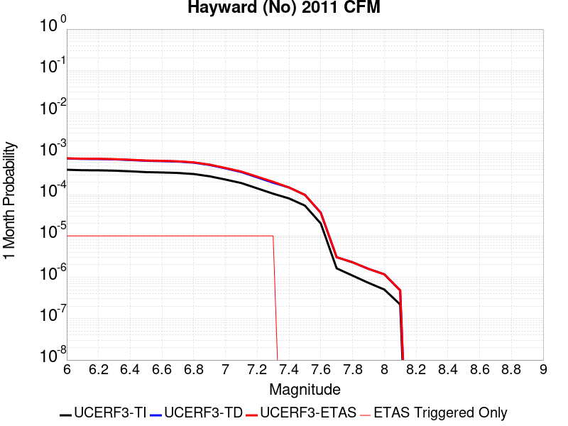 |  |  |

| Magnitude | 1 wk TI Prob | 1 wk TD Prob | 1 wk ETAS Prob | 1 wk ETAS/TD Gain | 1 wk ETAS Triggered Only | 1 mo TI Prob | 1 mo TD Prob | 1 mo ETAS Prob | 1 mo ETAS/TD Gain | 1 mo ETAS Triggered Only | 1 yr TI Prob | 1 yr TD Prob | 1 yr ETAS Prob | 1 yr ETAS/TD Gain | 1 yr ETAS Triggered Only | 10 yr TI Prob | 10 yr TD Prob | 10 yr ETAS Prob | 10 yr ETAS/TD Gain | 10 yr ETAS Triggered Only |
|-----|-----|-----|-----|-----|-----|-----|-----|-----|-----|-----|-----|-----|-----|-----|-----|-----|-----|-----|-----|-----|
| 6.0 | 9.3068506E-5 | 1.74068E-4 | 1.74068E-4 | 1.0 | 0.0 | 3.9880406E-4 | 7.457933E-4 | 7.457933E-4 | 1.0 | 0.0 | 0.0048446343 | 0.009042277 | 0.009042277 | 1.0 | 0.0 | 0.047403704 | 0.086425416 | 0.08643933 | 1.0001609 | 1.522603E-5 |
| 6.1 | 9.055486E-5 | 1.6958236E-4 | 1.6958236E-4 | 1.0 | 0.0 | 3.880345E-4 | 7.265799E-4 | 7.265799E-4 | 1.0 | 0.0 | 0.0047140904 | 0.008810335 | 0.008810335 | 1.0 | 0.0 | 0.046153355 | 0.08431842 | 0.08433236 | 1.0001653 | 1.522603E-5 |
| 6.2 | 9.006742E-5 | 1.6878804E-4 | 1.6878804E-4 | 1.0 | 0.0 | 3.859461E-4 | 7.231776E-4 | 7.231776E-4 | 1.0 | 0.0 | 0.0046887742 | 0.0087693 | 0.0087693 | 1.0 | 0.0 | 0.0459107 | 0.08394261 | 0.083956555 | 1.0001662 | 1.522603E-5 |
| 6.3 | 8.8336754E-5 | 1.6558412E-4 | 1.6558412E-4 | 1.0 | 0.0 | 3.7853114E-4 | 7.09454E-4 | 7.09454E-4 | 1.0 | 0.0 | 0.004598882 | 0.008603558 | 0.008603558 | 1.0 | 0.0 | 0.04504866 | 0.082435764 | 0.082449734 | 1.0001695 | 1.522603E-5 |
| 6.4 | 8.526157E-5 | 1.5984823E-4 | 1.5984823E-4 | 1.0 | 0.0 | 3.6535555E-4 | 6.848848E-4 | 6.848848E-4 | 1.0 | 0.0 | 0.0044391346 | 0.008306746 | 0.008306746 | 1.0 | 0.0 | 0.043514993 | 0.07973017 | 0.07974418 | 1.0001757 | 1.522603E-5 |
| 6.5 | 8.152396E-5 | 1.5317152E-4 | 1.5317152E-4 | 1.0 | 0.0 | 3.493416E-4 | 6.56285E-4 | 6.56285E-4 | 1.0 | 0.0 | 0.0042449418 | 0.007961143 | 0.007961143 | 1.0 | 0.0 | 0.04164765 | 0.07656097 | 0.076575026 | 1.0001837 | 1.522603E-5 |
| 6.6 | 7.987405E-5 | 1.5021319E-4 | 1.5021319E-4 | 1.0 | 0.0 | 3.4227243E-4 | 6.436127E-4 | 6.436127E-4 | 1.0 | 0.0 | 0.0041592065 | 0.0078079863 | 0.0078079863 | 1.0 | 0.0 | 0.04082218 | 0.07515338 | 0.07516746 | 1.0001874 | 1.522603E-5 |
| 6.7 | 7.777665E-5 | 1.4660071E-4 | 1.4660071E-4 | 1.0 | 0.0 | 3.332859E-4 | 6.2813814E-4 | 6.2813814E-4 | 1.0 | 0.0 | 0.004050208 | 0.007620921 | 0.007620921 | 1.0 | 0.0 | 0.039771806 | 0.07342759 | 0.0734417 | 1.0001922 | 1.522603E-5 |
| 6.8 | 7.3284005E-5 | 1.3809837E-4 | 1.3809837E-4 | 1.0 | 0.0 | 3.140365E-4 | 5.917165E-4 | 5.917165E-4 | 1.0 | 0.0 | 0.0038166929 | 0.007180489 | 0.007180489 | 1.0 | 0.0 | 0.037518036 | 0.06933746 | 0.06935162 | 1.0002043 | 1.522603E-5 |
| 6.9 | 6.458263E-5 | 1.2138554E-4 | 1.2138554E-4 | 1.0 | 0.0 | 2.7675333E-4 | 5.201205E-4 | 5.201205E-4 | 1.0 | 0.0 | 0.0033642664 | 0.006314182 | 0.006314182 | 1.0 | 0.0 | 0.033137884 | 0.0612579 | 0.061272193 | 1.0002333 | 1.522603E-5 |
| 7.0 | 5.3853604E-5 | 1.00309575E-4 | 1.00309575E-4 | 1.0 | 0.0 | 2.3078074E-4 | 4.2982766E-4 | 4.2982766E-4 | 1.0 | 0.0 | 0.0028061352 | 0.0052206595 | 0.0052206595 | 1.0 | 0.0 | 0.027709642 | 0.05098569 | 0.05100014 | 1.0002834 | 1.522603E-5 |
| 7.1 | 4.4308683E-5 | 8.175333E-5 | 8.175333E-5 | 1.0 | 0.0 | 1.8988053E-4 | 3.5032458E-4 | 3.5032458E-4 | 1.0 | 0.0 | 0.0023093442 | 0.004256902 | 0.004256902 | 1.0 | 0.0 | 0.022854926 | 0.041847244 | 0.041861832 | 1.0003486 | 1.522603E-5 |
| 7.2 | 3.295973E-5 | 6.0814917E-5 | 6.0814917E-5 | 1.0 | 0.0 | 1.4124835E-4 | 2.6060943E-4 | 2.6060943E-4 | 1.0 | 0.0 | 0.0017183421 | 0.0031683263 | 0.0031683263 | 1.0 | 0.0 | 0.017051157 | 0.031391077 | 0.031391077 | 1.0 | 0.0 |
| 7.3 | 2.452256E-5 | 4.521987E-5 | 4.521987E-5 | 1.0 | 0.0 | 1.05092455E-4 | 1.9378512E-4 | 1.9378512E-4 | 1.0 | 0.0 | 0.0012787496 | 0.002356795 | 0.002356795 | 1.0 | 0.0 | 0.0127141625 | 0.023460438 | 0.023460438 | 1.0 | 0.0 |
| 7.4 | 1.8829967E-5 | 3.4637967E-5 | 3.4637967E-5 | 1.0 | 0.0 | 8.069736E-5 | 1.4844004E-4 | 1.4844004E-4 | 1.0 | 0.0 | 9.820475E-4 | 0.0018057693 | 0.0018057693 | 1.0 | 0.0 | 0.009777189 | 0.018036935 | 0.018036935 | 1.0 | 0.0 |
| 7.5 | 1.26374125E-5 | 2.2948794E-5 | 2.2948794E-5 | 1.0 | 0.0 | 5.4159216E-5 | 9.83483E-5 | 9.83483E-5 | 1.0 | 0.0 | 6.5918895E-4 | 0.0011967387 | 0.0011967387 | 1.0 | 0.0 | 0.00657237 | 0.012002571 | 0.012002571 | 1.0 | 0.0 |
| 7.6 | 4.666429E-6 | 8.4890125E-6 | 8.4890125E-6 | 1.0 | 0.0 | 1.9998828E-5 | 3.638098E-5 | 3.638098E-5 | 1.0 | 0.0 | 2.4345852E-4 | 4.4284965E-4 | 4.4284965E-4 | 1.0 | 0.0 | 0.0024319198 | 0.004463953 | 0.004463953 | 1.0 | 0.0 |
| 7.7 | 3.8399318E-7 | 7.146951E-7 | 7.146951E-7 | 1.0 | 0.0 | 1.6456839E-6 | 3.0629753E-6 | 3.0629753E-6 | 1.0 | 0.0 | 2.003602E-5 | 3.7291087E-5 | 3.7291087E-5 | 1.0 | 0.0 | 2.0034213E-4 | 3.867874E-4 | 3.867874E-4 | 1.0 | 0.0 |
| 7.8 | 2.5637698E-7 | 5.3775256E-7 | 5.3775256E-7 | 1.0 | 0.0 | 1.098758E-6 | 2.3046516E-6 | 2.3046516E-6 | 1.0 | 0.0 | 1.3377297E-5 | 2.8058774E-5 | 2.8058774E-5 | 1.0 | 0.0 | 1.3376492E-4 | 2.9299298E-4 | 2.9299298E-4 | 1.0 | 0.0 |
| 7.9 | 1.7141245E-7 | 3.7368818E-7 | 3.7368818E-7 | 1.0 | 0.0 | 7.3462456E-7 | 1.6015197E-6 | 1.6015197E-6 | 1.0 | 0.0 | 8.944017E-6 | 1.9498328E-5 | 1.9498328E-5 | 1.0 | 0.0 | 8.943657E-5 | 2.02833E-4 | 2.02833E-4 | 1.0 | 0.0 |
| 8.0 | 1.1808895E-7 | 2.7563618E-7 | 2.7563618E-7 | 1.0 | 0.0 | 5.060954E-7 | 1.1812973E-6 | 1.1812973E-6 | 1.0 | 0.0 | 6.161694E-6 | 1.4382201E-5 | 1.4382201E-5 | 1.0 | 0.0 | 6.161523E-5 | 1.4842243E-4 | 1.4842243E-4 | 1.0 | 0.0 |
| 8.1 | 5.138535E-8 | 1.1250157E-7 | 1.1250157E-7 | 1.0 | 0.0 | 2.2022292E-7 | 4.8214946E-7 | 4.8214946E-7 | 1.0 | 0.0 | 2.6812106E-6 | 5.8701544E-6 | 5.8701544E-6 | 1.0 | 0.0 | 2.6811784E-5 | 6.025778E-5 | 6.025778E-5 | 1.0 | 0.0 |

## Pisgah-Bullion Mtn-Mesquite Lk
*[(top)](#table-of-contents)*

| 1 Week | 1 Month | 1 Year | 10 Year |
|-----|-----|-----|-----|
|  |  |  |  |

| Magnitude | 1 wk TI Prob | 1 wk TD Prob | 1 wk ETAS Prob | 1 wk ETAS/TD Gain | 1 wk ETAS Triggered Only | 1 mo TI Prob | 1 mo TD Prob | 1 mo ETAS Prob | 1 mo ETAS/TD Gain | 1 mo ETAS Triggered Only | 1 yr TI Prob | 1 yr TD Prob | 1 yr ETAS Prob | 1 yr ETAS/TD Gain | 1 yr ETAS Triggered Only | 10 yr TI Prob | 10 yr TD Prob | 10 yr ETAS Prob | 10 yr ETAS/TD Gain | 10 yr ETAS Triggered Only |
|-----|-----|-----|-----|-----|-----|-----|-----|-----|-----|-----|-----|-----|-----|-----|-----|-----|-----|-----|-----|-----|
| 6.0 | 3.0240792E-5 | 2.409264E-5 | 2.409264E-5 | 1.0 | 0.0 | 1.2959696E-4 | 1.03250655E-4 | 1.03250655E-4 | 1.0 | 0.0 | 0.0015767008 | 0.0012564523 | 0.0012564523 | 1.0 | 0.0 | 0.015655609 | 0.012503509 | 0.012518545 | 1.0012025 | 1.522603E-5 |
| 6.1 | 3.0240792E-5 | 2.409264E-5 | 2.409264E-5 | 1.0 | 0.0 | 1.2959696E-4 | 1.03250655E-4 | 1.03250655E-4 | 1.0 | 0.0 | 0.0015767008 | 0.0012564523 | 0.0012564523 | 1.0 | 0.0 | 0.015655609 | 0.012503509 | 0.012518545 | 1.0012025 | 1.522603E-5 |
| 6.2 | 3.0240792E-5 | 2.409264E-5 | 2.409264E-5 | 1.0 | 0.0 | 1.2959696E-4 | 1.03250655E-4 | 1.03250655E-4 | 1.0 | 0.0 | 0.0015767008 | 0.0012564523 | 0.0012564523 | 1.0 | 0.0 | 0.015655609 | 0.012503509 | 0.012518545 | 1.0012025 | 1.522603E-5 |
| 6.3 | 2.0498217E-5 | 1.3638809E-5 | 1.3638809E-5 | 1.0 | 0.0 | 8.784654E-5 | 5.845082E-5 | 5.845082E-5 | 1.0 | 0.0 | 0.0010690069 | 7.114226E-4 | 7.114226E-4 | 1.0 | 0.0 | 0.01063879 | 0.0070930775 | 0.0071081957 | 1.0021313 | 1.522603E-5 |
| 6.4 | 2.0498217E-5 | 1.3638809E-5 | 1.3638809E-5 | 1.0 | 0.0 | 8.784654E-5 | 5.845082E-5 | 5.845082E-5 | 1.0 | 0.0 | 0.0010690069 | 7.114226E-4 | 7.114226E-4 | 1.0 | 0.0 | 0.01063879 | 0.0070930775 | 0.0071081957 | 1.0021313 | 1.522603E-5 |
| 6.5 | 1.7316182E-5 | 1.0477582E-5 | 1.0477582E-5 | 1.0 | 0.0 | 7.42101E-5 | 4.490321E-5 | 4.490321E-5 | 1.0 | 0.0 | 9.0313336E-4 | 5.465694E-4 | 5.465694E-4 | 1.0 | 0.0 | 0.008994718 | 0.005453247 | 0.005453247 | 1.0 | 0.0 |
| 6.6 | 1.5251077E-5 | 8.414691E-6 | 8.414691E-6 | 1.0 | 0.0 | 6.536012E-5 | 3.6062505E-5 | 3.6062505E-5 | 1.0 | 0.0 | 7.9546886E-4 | 4.389798E-4 | 4.389798E-4 | 1.0 | 0.0 | 0.007926274 | 0.004381844 | 0.004381844 | 1.0 | 0.0 |
| 6.7 | 1.2997425E-5 | 6.4118035E-6 | 6.4118035E-6 | 1.0 | 0.0 | 5.570206E-5 | 2.7478894E-5 | 2.7478894E-5 | 1.0 | 0.0 | 6.7796157E-4 | 3.3450883E-4 | 3.3450883E-4 | 1.0 | 0.0 | 0.0067589693 | 0.0033405134 | 0.0033405134 | 1.0 | 0.0 |
| 6.8 | 1.035386E-5 | 4.3334735E-6 | 4.3334735E-6 | 1.0 | 0.0 | 4.437293E-5 | 1.8571902E-5 | 1.8571902E-5 | 1.0 | 0.0 | 5.401065E-4 | 2.2609031E-4 | 2.2609031E-4 | 1.0 | 0.0 | 0.0053879567 | 0.0022586898 | 0.0022586898 | 1.0 | 0.0 |
| 6.9 | 8.816252E-6 | 3.580855E-6 | 3.580855E-6 | 1.0 | 0.0 | 3.778339E-5 | 1.5346433E-5 | 1.5346433E-5 | 1.0 | 0.0 | 4.5991567E-4 | 1.8682741E-4 | 1.8682741E-4 | 1.0 | 0.0 | 0.00458965 | 0.0018667618 | 0.0018667618 | 1.0 | 0.0 |
| 7.0 | 6.8232207E-6 | 2.5677498E-6 | 2.5677498E-6 | 1.0 | 0.0 | 2.9242048E-5 | 1.1004598E-5 | 1.1004598E-5 | 1.0 | 0.0 | 3.5596377E-4 | 1.3397305E-4 | 1.3397305E-4 | 1.0 | 0.0 | 0.0035539411 | 0.0013389539 | 0.0013389539 | 1.0 | 0.0 |
| 7.1 | 5.837013E-6 | 2.2275226E-6 | 2.2275226E-6 | 1.0 | 0.0 | 2.501553E-5 | 9.546492E-6 | 9.546492E-6 | 1.0 | 0.0 | 3.045215E-4 | 1.1622263E-4 | 1.1622263E-4 | 1.0 | 0.0 | 0.0030410455 | 0.0011616475 | 0.0011616475 | 1.0 | 0.0 |
| 7.2 | 4.278052E-6 | 1.6276728E-6 | 1.6276728E-6 | 1.0 | 0.0 | 1.833438E-5 | 6.975723E-6 | 6.975723E-6 | 1.0 | 0.0 | 2.231982E-4 | 8.492635E-5 | 8.492635E-5 | 1.0 | 0.0 | 0.0022297418 | 8.489622E-4 | 8.489622E-4 | 1.0 | 0.0 |
| 7.3 | 1.8803692E-6 | 8.345377E-7 | 8.345377E-7 | 1.0 | 0.0 | 8.0587E-6 | 3.576586E-6 | 3.576586E-6 | 1.0 | 0.0 | 9.811026E-5 | 4.3544213E-5 | 4.3544213E-5 | 1.0 | 0.0 | 9.806695E-4 | 4.3537127E-4 | 4.3537127E-4 | 1.0 | 0.0 |

## Los Osos 2011
*[(top)](#table-of-contents)*

| 1 Week | 1 Month | 1 Year | 10 Year |
|-----|-----|-----|-----|
|  |  |  |  |

| Magnitude | 1 wk TI Prob | 1 wk TD Prob | 1 wk ETAS Prob | 1 wk ETAS/TD Gain | 1 wk ETAS Triggered Only | 1 mo TI Prob | 1 mo TD Prob | 1 mo ETAS Prob | 1 mo ETAS/TD Gain | 1 mo ETAS Triggered Only | 1 yr TI Prob | 1 yr TD Prob | 1 yr ETAS Prob | 1 yr ETAS/TD Gain | 1 yr ETAS Triggered Only | 10 yr TI Prob | 10 yr TD Prob | 10 yr ETAS Prob | 10 yr ETAS/TD Gain | 10 yr ETAS Triggered Only |
|-----|-----|-----|-----|-----|-----|-----|-----|-----|-----|-----|-----|-----|-----|-----|-----|-----|-----|-----|-----|-----|
| 6.0 | 4.8871775E-6 | 4.981565E-6 | 4.981565E-6 | 1.0 | 0.0 | 2.0944879E-5 | 2.1349404E-5 | 2.1349404E-5 | 1.0 | 0.0 | 2.5497406E-4 | 2.599008E-4 | 2.7512285E-4 | 1.0585688 | 1.522603E-5 | 0.002546817 | 0.0025962426 | 0.0026114292 | 1.0058494 | 1.522603E-5 |
| 6.1 | 4.8871775E-6 | 4.981565E-6 | 4.981565E-6 | 1.0 | 0.0 | 2.0944879E-5 | 2.1349404E-5 | 2.1349404E-5 | 1.0 | 0.0 | 2.5497406E-4 | 2.599008E-4 | 2.7512285E-4 | 1.0585688 | 1.522603E-5 | 0.002546817 | 0.0025962426 | 0.0026114292 | 1.0058494 | 1.522603E-5 |
| 6.2 | 4.8871775E-6 | 4.981565E-6 | 4.981565E-6 | 1.0 | 0.0 | 2.0944879E-5 | 2.1349404E-5 | 2.1349404E-5 | 1.0 | 0.0 | 2.5497406E-4 | 2.599008E-4 | 2.7512285E-4 | 1.0585688 | 1.522603E-5 | 0.002546817 | 0.0025962426 | 0.0026114292 | 1.0058494 | 1.522603E-5 |
| 6.3 | 4.8871775E-6 | 4.981565E-6 | 4.981565E-6 | 1.0 | 0.0 | 2.0944879E-5 | 2.1349404E-5 | 2.1349404E-5 | 1.0 | 0.0 | 2.5497406E-4 | 2.599008E-4 | 2.7512285E-4 | 1.0585688 | 1.522603E-5 | 0.002546817 | 0.0025962426 | 0.0026114292 | 1.0058494 | 1.522603E-5 |
| 6.4 | 4.8871775E-6 | 4.981565E-6 | 4.981565E-6 | 1.0 | 0.0 | 2.0944879E-5 | 2.1349404E-5 | 2.1349404E-5 | 1.0 | 0.0 | 2.5497406E-4 | 2.599008E-4 | 2.7512285E-4 | 1.0585688 | 1.522603E-5 | 0.002546817 | 0.0025962426 | 0.0026114292 | 1.0058494 | 1.522603E-5 |
| 6.5 | 3.1724062E-6 | 3.2234527E-6 | 3.2234527E-6 | 1.0 | 0.0 | 1.3595956E-5 | 1.3814725E-5 | 1.3814725E-5 | 1.0 | 0.0 | 1.6551818E-4 | 1.6818143E-4 | 1.8340489E-4 | 1.0905181 | 1.522603E-5 | 0.0016539496 | 0.0016805549 | 0.0016957554 | 1.0090449 | 1.522603E-5 |
| 6.6 | 3.1022591E-6 | 3.151161E-6 | 3.151161E-6 | 1.0 | 0.0 | 1.3295328E-5 | 1.3504907E-5 | 1.3504907E-5 | 1.0 | 0.0 | 1.618586E-4 | 1.6440995E-4 | 1.7963348E-4 | 1.092595 | 1.522603E-5 | 0.0016174077 | 0.0016428961 | 0.001658097 | 1.0092525 | 1.522603E-5 |
| 6.7 | 2.611518E-6 | 2.6492337E-6 | 2.6492337E-6 | 1.0 | 0.0 | 1.1192172E-5 | 1.135381E-5 | 1.135381E-5 | 1.0 | 0.0 | 1.3625617E-4 | 1.3822391E-4 | 1.5344784E-4 | 1.1101396 | 1.522603E-5 | 0.0013617266 | 0.0013813839 | 0.0013965889 | 1.0110071 | 1.522603E-5 |
| 6.8 | 2.4780884E-6 | 2.5122079E-6 | 2.5122079E-6 | 1.0 | 0.0 | 1.0620336E-5 | 1.0766561E-5 | 1.0766561E-5 | 1.0 | 0.0 | 1.2929492E-4 | 1.3107504E-4 | 1.4629906E-4 | 1.1161475 | 1.522603E-5 | 0.0012921972 | 0.0013099813 | 0.0013251874 | 1.0116079 | 1.522603E-5 |
| 6.9 | 2.1376322E-6 | 2.1635497E-6 | 2.1635497E-6 | 1.0 | 0.0 | 9.161248E-6 | 9.272323E-6 | 9.272323E-6 | 1.0 | 0.0 | 1.1153249E-4 | 1.128847E-4 | 1.2810901E-4 | 1.134866 | 1.522603E-5 | 0.0011147653 | 0.0011282755 | 0.0011434844 | 1.0134797 | 1.522603E-5 |
| 7.0 | 1.9282882E-6 | 1.9495E-6 | 1.9495E-6 | 1.0 | 0.0 | 8.264066E-6 | 8.354974E-6 | 8.354974E-6 | 1.0 | 0.0 | 1.0061036E-4 | 1.01717065E-4 | 1.1694155E-4 | 1.1496748 | 1.522603E-5 | 0.0010056482 | 0.0010167065 | 0.001031917 | 1.0149606 | 1.522603E-5 |
| 7.1 | 1.6353226E-6 | 1.6501499E-6 | 1.6501499E-6 | 1.0 | 0.0 | 7.0085066E-6 | 7.0720516E-6 | 7.0720516E-6 | 1.0 | 0.0 | 8.532523E-5 | 8.609884E-5 | 1.0132355E-4 | 1.1768284 | 1.522603E-5 | 8.529247E-4 | 8.606555E-4 | 8.758685E-4 | 1.017676 | 1.522603E-5 |
| 7.2 | 1.4446276E-6 | 1.45537E-6 | 1.45537E-6 | 1.0 | 0.0 | 6.191247E-6 | 6.237285E-6 | 6.237285E-6 | 1.0 | 0.0 | 7.537582E-5 | 7.59363E-5 | 9.116118E-5 | 1.2004954 | 1.522603E-5 | 7.535026E-4 | 7.5910415E-4 | 7.743186E-4 | 1.0200427 | 1.522603E-5 |
| 7.3 | 1.2014582E-6 | 1.2069403E-6 | 1.2069403E-6 | 1.0 | 0.0 | 5.149096E-6 | 5.172591E-6 | 5.172591E-6 | 1.0 | 0.0 | 6.268844E-5 | 6.2974475E-5 | 7.819955E-5 | 1.2417657 | 1.522603E-5 | 6.267076E-4 | 6.295667E-4 | 6.447832E-4 | 1.0241697 | 1.522603E-5 |
| 7.4 | 9.707733E-7 | 9.710075E-7 | 9.710075E-7 | 1.0 | 0.0 | 4.16045E-6 | 4.161454E-6 | 4.161454E-6 | 1.0 | 0.0 | 5.0652303E-5 | 5.0664526E-5 | 5.0664526E-5 | 1.0 | 0.0 | 5.064076E-4 | 5.0653E-4 | 5.0653E-4 | 1.0 | 0.0 |
| 7.5 | 7.174908E-7 | 7.1151817E-7 | 7.1151817E-7 | 1.0 | 0.0 | 3.074957E-6 | 3.04936E-6 | 3.04936E-6 | 1.0 | 0.0 | 3.743696E-5 | 3.7125326E-5 | 3.7125326E-5 | 1.0 | 0.0 | 3.7430652E-4 | 3.7119142E-4 | 3.7119142E-4 | 1.0 | 0.0 |
| 7.6 | 4.5535776E-7 | 4.4210202E-7 | 4.4210202E-7 | 1.0 | 0.0 | 1.9515319E-6 | 1.8947215E-6 | 1.8947215E-6 | 1.0 | 0.0 | 2.3759641E-5 | 2.306799E-5 | 2.306799E-5 | 1.0 | 0.0 | 2.37571E-4 | 2.3065606E-4 | 2.3065606E-4 | 1.0 | 0.0 |
| 7.7 | 2.1173553E-7 | 1.9062645E-7 | 1.9062645E-7 | 1.0 | 0.0 | 9.0743765E-7 | 8.1697027E-7 | 8.1697027E-7 | 1.0 | 0.0 | 1.1047998E-5 | 9.946568E-6 | 9.946568E-6 | 1.0 | 0.0 | 1.1047449E-4 | 9.946126E-5 | 9.946126E-5 | 1.0 | 0.0 |
| 7.8 | 9.873608E-8 | 7.369176E-8 | 7.369176E-8 | 1.0 | 0.0 | 4.2315455E-7 | 3.1582178E-7 | 3.1582178E-7 | 1.0 | 0.0 | 5.1518946E-6 | 3.845123E-6 | 3.845123E-6 | 1.0 | 0.0 | 5.1517753E-5 | 3.8450573E-5 | 3.8450573E-5 | 1.0 | 0.0 |
| 7.9 | 5.4399106E-8 | 3.189444E-8 | 3.189444E-8 | 1.0 | 0.0 | 2.33139E-7 | 1.3669045E-7 | 1.3669045E-7 | 1.0 | 0.0 | 2.8384638E-6 | 1.664205E-6 | 1.664205E-6 | 1.0 | 0.0 | 2.8384275E-5 | 1.6641927E-5 | 1.6641927E-5 | 1.0 | 0.0 |
| 8.0 | 1.817203E-8 | 8.426773E-9 | 8.426773E-9 | 1.0 | 0.0 | 7.7880124E-8 | 3.6114738E-8 | 3.6114738E-8 | 1.0 | 0.0 | 9.481901E-7 | 4.3969686E-7 | 4.3969686E-7 | 1.0 | 0.0 | 9.481861E-6 | 4.3969603E-6 | 4.3969603E-6 | 1.0 | 0.0 |

## Verdugo
*[(top)](#table-of-contents)*

| 1 Week | 1 Month | 1 Year | 10 Year |
|-----|-----|-----|-----|
|  |  |  |  |

| Magnitude | 1 wk TI Prob | 1 wk TD Prob | 1 wk ETAS Prob | 1 wk ETAS/TD Gain | 1 wk ETAS Triggered Only | 1 mo TI Prob | 1 mo TD Prob | 1 mo ETAS Prob | 1 mo ETAS/TD Gain | 1 mo ETAS Triggered Only | 1 yr TI Prob | 1 yr TD Prob | 1 yr ETAS Prob | 1 yr ETAS/TD Gain | 1 yr ETAS Triggered Only | 10 yr TI Prob | 10 yr TD Prob | 10 yr ETAS Prob | 10 yr ETAS/TD Gain | 10 yr ETAS Triggered Only |
|-----|-----|-----|-----|-----|-----|-----|-----|-----|-----|-----|-----|-----|-----|-----|-----|-----|-----|-----|-----|-----|
| 6.0 | 5.392987E-6 | 4.2168244E-6 | 4.2168244E-6 | 1.0 | 0.0 | 2.3112598E-5 | 1.8071984E-5 | 1.8071984E-5 | 1.0 | 0.0 | 2.8135953E-4 | 2.2000464E-4 | 2.2000464E-4 | 1.0 | 0.0 | 0.0028100356 | 0.0021979162 | 0.0022131088 | 1.0069122 | 1.522603E-5 |
| 6.1 | 5.392987E-6 | 4.2168244E-6 | 4.2168244E-6 | 1.0 | 0.0 | 2.3112598E-5 | 1.8071984E-5 | 1.8071984E-5 | 1.0 | 0.0 | 2.8135953E-4 | 2.2000464E-4 | 2.2000464E-4 | 1.0 | 0.0 | 0.0028100356 | 0.0021979162 | 0.0022131088 | 1.0069122 | 1.522603E-5 |
| 6.2 | 5.392987E-6 | 4.2168244E-6 | 4.2168244E-6 | 1.0 | 0.0 | 2.3112598E-5 | 1.8071984E-5 | 1.8071984E-5 | 1.0 | 0.0 | 2.8135953E-4 | 2.2000464E-4 | 2.2000464E-4 | 1.0 | 0.0 | 0.0028100356 | 0.0021979162 | 0.0022131088 | 1.0069122 | 1.522603E-5 |
| 6.3 | 5.392987E-6 | 4.2168244E-6 | 4.2168244E-6 | 1.0 | 0.0 | 2.3112598E-5 | 1.8071984E-5 | 1.8071984E-5 | 1.0 | 0.0 | 2.8135953E-4 | 2.2000464E-4 | 2.2000464E-4 | 1.0 | 0.0 | 0.0028100356 | 0.0021979162 | 0.0022131088 | 1.0069122 | 1.522603E-5 |
| 6.4 | 5.392987E-6 | 4.2168244E-6 | 4.2168244E-6 | 1.0 | 0.0 | 2.3112598E-5 | 1.8071984E-5 | 1.8071984E-5 | 1.0 | 0.0 | 2.8135953E-4 | 2.2000464E-4 | 2.2000464E-4 | 1.0 | 0.0 | 0.0028100356 | 0.0021979162 | 0.0022131088 | 1.0069122 | 1.522603E-5 |
| 6.5 | 4.9154837E-6 | 3.7227633E-6 | 3.7227633E-6 | 1.0 | 0.0 | 2.1066187E-5 | 1.5954603E-5 | 1.5954603E-5 | 1.0 | 0.0 | 2.5645064E-4 | 1.9423019E-4 | 1.9423019E-4 | 1.0 | 0.0 | 0.002561549 | 0.0019406251 | 0.0019558216 | 1.0078307 | 1.522603E-5 |
| 6.6 | 4.9154837E-6 | 3.7227633E-6 | 3.7227633E-6 | 1.0 | 0.0 | 2.1066187E-5 | 1.5954603E-5 | 1.5954603E-5 | 1.0 | 0.0 | 2.5645064E-4 | 1.9423019E-4 | 1.9423019E-4 | 1.0 | 0.0 | 0.002561549 | 0.0019406251 | 0.0019558216 | 1.0078307 | 1.522603E-5 |
| 6.7 | 4.817006E-6 | 3.6209483E-6 | 3.6209483E-6 | 1.0 | 0.0 | 2.0644147E-5 | 1.5518259E-5 | 1.5518259E-5 | 1.0 | 0.0 | 2.513135E-4 | 1.8891861E-4 | 1.8891861E-4 | 1.0 | 0.0 | 0.0025102948 | 0.0018875997 | 0.001902797 | 1.0080512 | 1.522603E-5 |
| 6.8 | 4.507407E-6 | 3.3073918E-6 | 3.3073918E-6 | 1.0 | 0.0 | 1.9317316E-5 | 1.417446E-5 | 1.417446E-5 | 1.0 | 0.0 | 2.3516294E-4 | 1.7256053E-4 | 1.7256053E-4 | 1.0 | 0.0 | 0.0023491425 | 0.0017242797 | 0.0017394795 | 1.0088152 | 1.522603E-5 |
| 6.9 | 4.3573054E-6 | 3.1612947E-6 | 3.1612947E-6 | 1.0 | 0.0 | 1.8674033E-5 | 1.3548336E-5 | 1.3548336E-5 | 1.0 | 0.0 | 2.2733262E-4 | 1.6493862E-4 | 1.6493862E-4 | 1.0 | 0.0 | 0.0022710022 | 0.0016481745 | 0.0016633754 | 1.0092229 | 1.522603E-5 |
| 7.0 | 4.171527E-6 | 2.9839493E-6 | 2.9839493E-6 | 1.0 | 0.0 | 1.787785E-5 | 1.2788292E-5 | 1.2788292E-5 | 1.0 | 0.0 | 2.1764109E-4 | 1.5568644E-4 | 1.5568644E-4 | 1.0 | 0.0 | 0.0021742806 | 0.0015557851 | 0.0015709874 | 1.0097715 | 1.522603E-5 |
| 7.1 | 4.0405484E-6 | 2.8825361E-6 | 2.8825361E-6 | 1.0 | 0.0 | 1.731652E-5 | 1.2353669E-5 | 1.2353669E-5 | 1.0 | 0.0 | 2.1080824E-4 | 1.5039564E-4 | 1.5039564E-4 | 1.0 | 0.0 | 0.0021060838 | 0.0015029497 | 0.0015181529 | 1.0101155 | 1.522603E-5 |
| 7.2 | 3.8306007E-6 | 2.7021142E-6 | 2.7021142E-6 | 1.0 | 0.0 | 1.6416758E-5 | 1.1580439E-5 | 1.1580439E-5 | 1.0 | 0.0 | 1.9985568E-4 | 1.4098283E-4 | 1.4098283E-4 | 1.0 | 0.0 | 0.0019967605 | 0.0014089446 | 0.0014241491 | 1.0107914 | 1.522603E-5 |
| 7.3 | 3.5750938E-6 | 2.5124377E-6 | 2.5124377E-6 | 1.0 | 0.0 | 1.532174E-5 | 1.0767546E-5 | 1.0767546E-5 | 1.0 | 0.0 | 1.8652623E-4 | 1.310871E-4 | 1.310871E-4 | 1.0 | 0.0 | 0.0018636974 | 0.0013101082 | 0.0013101082 | 1.0 | 0.0 |
| 7.4 | 3.3510041E-6 | 2.341114E-6 | 2.341114E-6 | 1.0 | 0.0 | 1.4361368E-5 | 1.0033307E-5 | 1.0033307E-5 | 1.0 | 0.0 | 1.7483562E-4 | 1.2214878E-4 | 1.2214878E-4 | 1.0 | 0.0 | 0.0017469813 | 0.0012208268 | 0.0012208268 | 1.0 | 0.0 |
| 7.5 | 2.948287E-6 | 2.0392326E-6 | 2.0392326E-6 | 1.0 | 0.0 | 1.2635454E-5 | 8.73954E-6 | 8.73954E-6 | 1.0 | 0.0 | 1.538258E-4 | 1.0639881E-4 | 1.0639881E-4 | 1.0 | 0.0 | 0.0015371935 | 0.0010634889 | 0.0010634889 | 1.0 | 0.0 |
| 7.6 | 2.0134323E-6 | 1.4472091E-6 | 1.4472091E-6 | 1.0 | 0.0 | 8.628967E-6 | 6.2023105E-6 | 6.2023105E-6 | 1.0 | 0.0 | 1.05052604E-4 | 7.551061E-5 | 7.551061E-5 | 1.0 | 0.0 | 0.0010500296 | 7.548583E-4 | 7.548583E-4 | 1.0 | 0.0 |
| 7.7 | 5.726436E-7 | 4.0454935E-7 | 4.0454935E-7 | 1.0 | 0.0 | 2.4541846E-6 | 1.733782E-6 | 1.733782E-6 | 1.0 | 0.0 | 2.9879287E-5 | 2.1108617E-5 | 2.1108617E-5 | 1.0 | 0.0 | 2.987527E-4 | 2.1106866E-4 | 2.1106866E-4 | 1.0 | 0.0 |
| 7.8 | 1.6248204E-7 | 1.0689272E-7 | 1.0689272E-7 | 1.0 | 0.0 | 6.963514E-7 | 4.581116E-7 | 4.581116E-7 | 1.0 | 0.0 | 8.478045E-6 | 5.5774944E-6 | 5.5774944E-6 | 1.0 | 0.0 | 8.477722E-5 | 5.577358E-5 | 5.577358E-5 | 1.0 | 0.0 |
| 7.9 | 4.4475744E-8 | 3.037644E-8 | 3.037644E-8 | 1.0 | 0.0 | 1.9061031E-7 | 1.3018474E-7 | 1.3018474E-7 | 1.0 | 0.0 | 2.320678E-6 | 1.5849984E-6 | 1.5849984E-6 | 1.0 | 0.0 | 2.3206538E-5 | 1.5849884E-5 | 1.5849884E-5 | 1.0 | 0.0 |

## Bennett Valley 2011 CFM
*[(top)](#table-of-contents)*

| 1 Week | 1 Month | 1 Year | 10 Year |
|-----|-----|-----|-----|
|  |  |  |  |

| Magnitude | 1 wk TI Prob | 1 wk TD Prob | 1 wk ETAS Prob | 1 wk ETAS/TD Gain | 1 wk ETAS Triggered Only | 1 mo TI Prob | 1 mo TD Prob | 1 mo ETAS Prob | 1 mo ETAS/TD Gain | 1 mo ETAS Triggered Only | 1 yr TI Prob | 1 yr TD Prob | 1 yr ETAS Prob | 1 yr ETAS/TD Gain | 1 yr ETAS Triggered Only | 10 yr TI Prob | 10 yr TD Prob | 10 yr ETAS Prob | 10 yr ETAS/TD Gain | 10 yr ETAS Triggered Only |
|-----|-----|-----|-----|-----|-----|-----|-----|-----|-----|-----|-----|-----|-----|-----|-----|-----|-----|-----|-----|-----|
| 6.0 | 2.3893934E-5 | 2.8241704E-5 | 2.8241704E-5 | 1.0 | 0.0 | 1.0239855E-4 | 1.210313E-4 | 1.210313E-4 | 1.0 | 0.0 | 0.0012459893 | 0.001472745 | 0.001472745 | 1.0 | 0.0 | 0.012390262 | 0.014652503 | 0.014667506 | 1.0010239 | 1.522603E-5 |
| 6.1 | 2.3893934E-5 | 2.8241704E-5 | 2.8241704E-5 | 1.0 | 0.0 | 1.0239855E-4 | 1.210313E-4 | 1.210313E-4 | 1.0 | 0.0 | 0.0012459893 | 0.001472745 | 0.001472745 | 1.0 | 0.0 | 0.012390262 | 0.014652503 | 0.014667506 | 1.0010239 | 1.522603E-5 |
| 6.2 | 1.6657146E-5 | 1.9855883E-5 | 1.9855883E-5 | 1.0 | 0.0 | 7.138582E-5 | 8.509466E-5 | 8.509466E-5 | 1.0 | 0.0 | 8.6877577E-4 | 0.0010356767 | 0.0010356767 | 1.0 | 0.0 | 0.008653872 | 0.010326771 | 0.010326771 | 1.0 | 0.0 |
| 6.3 | 1.6657146E-5 | 1.9855883E-5 | 1.9855883E-5 | 1.0 | 0.0 | 7.138582E-5 | 8.509466E-5 | 8.509466E-5 | 1.0 | 0.0 | 8.6877577E-4 | 0.0010356767 | 0.0010356767 | 1.0 | 0.0 | 0.008653872 | 0.010326771 | 0.010326771 | 1.0 | 0.0 |
| 6.4 | 1.29418495E-5 | 1.5569252E-5 | 1.5569252E-5 | 1.0 | 0.0 | 5.546389E-5 | 6.6724395E-5 | 6.6724395E-5 | 1.0 | 0.0 | 6.7506364E-4 | 8.1219705E-4 | 8.1219705E-4 | 1.0 | 0.0 | 0.0067301663 | 0.008109432 | 0.008109432 | 1.0 | 0.0 |
| 6.5 | 1.2582504E-5 | 1.51362465E-5 | 1.51362465E-5 | 1.0 | 0.0 | 5.39239E-5 | 6.486875E-5 | 6.486875E-5 | 1.0 | 0.0 | 6.563257E-4 | 7.896211E-4 | 7.896211E-4 | 1.0 | 0.0 | 0.006543907 | 0.007885315 | 0.007885315 | 1.0 | 0.0 |
| 6.6 | 1.0846706E-5 | 1.3038316E-5 | 1.3038316E-5 | 1.0 | 0.0 | 4.6485053E-5 | 5.5878027E-5 | 5.5878027E-5 | 1.0 | 0.0 | 5.6580856E-4 | 6.8023097E-4 | 6.8023097E-4 | 1.0 | 0.0 | 0.005643701 | 0.0067984806 | 0.0067984806 | 1.0 | 0.0 |
| 6.7 | 1.6803231E-6 | 2.3785226E-6 | 2.3785226E-6 | 1.0 | 0.0 | 7.2013645E-6 | 1.0193628E-5 | 1.0193628E-5 | 1.0 | 0.0 | 8.7673085E-5 | 1.241005E-4 | 1.241005E-4 | 1.0 | 0.0 | 8.76385E-4 | 0.0012447466 | 0.0012447466 | 1.0 | 0.0 |
| 6.8 | 1.4609833E-6 | 2.094572E-6 | 2.094572E-6 | 1.0 | 0.0 | 6.261342E-6 | 8.976706E-6 | 8.976706E-6 | 1.0 | 0.0 | 7.6229175E-5 | 1.0928598E-4 | 1.0928598E-4 | 1.0 | 0.0 | 7.620303E-4 | 0.0010967137 | 0.0010967137 | 1.0 | 0.0 |
| 6.9 | 1.3492396E-6 | 1.9465033E-6 | 1.9465033E-6 | 1.0 | 0.0 | 5.7824427E-6 | 8.342131E-6 | 8.342131E-6 | 1.0 | 0.0 | 7.0398964E-5 | 1.0156077E-4 | 1.0156077E-4 | 1.0 | 0.0 | 7.037667E-4 | 0.0010195051 | 0.0010195051 | 1.0 | 0.0 |
| 7.0 | 1.2347921E-6 | 1.7894824E-6 | 1.7894824E-6 | 1.0 | 0.0 | 5.291955E-6 | 7.669189E-6 | 7.669189E-6 | 1.0 | 0.0 | 6.442765E-5 | 9.336842E-5 | 9.336842E-5 | 1.0 | 0.0 | 6.440897E-4 | 9.376385E-4 | 9.376385E-4 | 1.0 | 0.0 |
| 7.1 | 1.1262973E-6 | 1.6364918E-6 | 1.6364918E-6 | 1.0 | 0.0 | 4.8269794E-6 | 7.013518E-6 | 7.013518E-6 | 1.0 | 0.0 | 5.876689E-5 | 8.538629E-5 | 8.538629E-5 | 1.0 | 0.0 | 5.875135E-4 | 8.578582E-4 | 8.578582E-4 | 1.0 | 0.0 |
| 7.2 | 9.351744E-7 | 1.3617328E-6 | 1.3617328E-6 | 1.0 | 0.0 | 4.007884E-6 | 5.835984E-6 | 5.835984E-6 | 1.0 | 0.0 | 4.8794896E-5 | 7.105082E-5 | 7.105082E-5 | 1.0 | 0.0 | 4.878418E-4 | 7.1455166E-4 | 7.1455166E-4 | 1.0 | 0.0 |
| 7.3 | 8.5039534E-7 | 1.2391943E-6 | 1.2391943E-6 | 1.0 | 0.0 | 3.6445463E-6 | 5.310822E-6 | 5.310822E-6 | 1.0 | 0.0 | 4.437145E-5 | 6.465736E-5 | 6.465736E-5 | 1.0 | 0.0 | 4.436259E-4 | 6.5036706E-4 | 6.5036706E-4 | 1.0 | 0.0 |
| 7.4 | 6.7875015E-7 | 9.604516E-7 | 9.604516E-7 | 1.0 | 0.0 | 2.908926E-6 | 4.116215E-6 | 4.116215E-6 | 1.0 | 0.0 | 3.54156E-5 | 5.0113777E-5 | 5.0113777E-5 | 1.0 | 0.0 | 3.5409955E-4 | 5.043087E-4 | 5.043087E-4 | 1.0 | 0.0 |
| 7.5 | 5.826867E-7 | 8.191633E-7 | 8.191633E-7 | 1.0 | 0.0 | 2.4972264E-6 | 3.510695E-6 | 3.510695E-6 | 1.0 | 0.0 | 3.0403306E-5 | 4.274188E-5 | 4.274188E-5 | 1.0 | 0.0 | 3.0399146E-4 | 4.3019673E-4 | 4.3019673E-4 | 1.0 | 0.0 |
| 7.6 | 2.7734902E-7 | 3.6836647E-7 | 3.6836647E-7 | 1.0 | 0.0 | 1.1886381E-6 | 1.5787125E-6 | 1.5787125E-6 | 1.0 | 0.0 | 1.4471572E-5 | 1.9220655E-5 | 1.9220655E-5 | 1.0 | 0.0 | 1.447063E-4 | 1.9319801E-4 | 1.9319801E-4 | 1.0 | 0.0 |
| 7.7 | 1.0530888E-7 | 1.3757607E-7 | 1.3757607E-7 | 1.0 | 0.0 | 4.513237E-7 | 5.896116E-7 | 5.896116E-7 | 1.0 | 0.0 | 5.4948523E-6 | 7.1784975E-6 | 7.1784975E-6 | 1.0 | 0.0 | 5.4947162E-5 | 7.260757E-5 | 7.260757E-5 | 1.0 | 0.0 |
| 7.8 | 1.2714258E-8 | 1.9661249E-8 | 1.9661249E-8 | 1.0 | 0.0 | 5.448968E-8 | 8.426249E-8 | 8.426249E-8 | 1.0 | 0.0 | 6.6341164E-7 | 1.0258954E-6 | 1.0258954E-6 | 1.0 | 0.0 | 6.6340967E-6 | 1.0672463E-5 | 1.0672463E-5 | 1.0 | 0.0 |
| 7.9 | 4.075888E-9 | 7.576082E-9 | 7.576082E-9 | 1.0 | 0.0 | 1.7468091E-8 | 3.246892E-8 | 3.246892E-8 | 1.0 | 0.0 | 2.12674E-7 | 3.9530903E-7 | 3.9530903E-7 | 1.0 | 0.0 | 2.1267379E-6 | 4.2029656E-6 | 4.2029656E-6 | 1.0 | 0.0 |
| 8.0 | 1.9126138E-9 | 4.003808E-9 | 4.003808E-9 | 1.0 | 0.0 | 8.196917E-9 | 1.7159175E-8 | 1.7159175E-8 | 1.0 | 0.0 | 9.9797454E-8 | 2.0891295E-7 | 2.0891295E-7 | 1.0 | 0.0 | 9.979741E-7 | 2.2020392E-6 | 2.2020392E-6 | 1.0 | 0.0 |

## San Andreas (North Coast) 2011 CFM
*[(top)](#table-of-contents)*

| 1 Week | 1 Month | 1 Year | 10 Year |
|-----|-----|-----|-----|
|  |  |  |  |

| Magnitude | 1 wk TI Prob | 1 wk TD Prob | 1 wk ETAS Prob | 1 wk ETAS/TD Gain | 1 wk ETAS Triggered Only | 1 mo TI Prob | 1 mo TD Prob | 1 mo ETAS Prob | 1 mo ETAS/TD Gain | 1 mo ETAS Triggered Only | 1 yr TI Prob | 1 yr TD Prob | 1 yr ETAS Prob | 1 yr ETAS/TD Gain | 1 yr ETAS Triggered Only | 10 yr TI Prob | 10 yr TD Prob | 10 yr ETAS Prob | 10 yr ETAS/TD Gain | 10 yr ETAS Triggered Only |
|-----|-----|-----|-----|-----|-----|-----|-----|-----|-----|-----|-----|-----|-----|-----|-----|-----|-----|-----|-----|-----|
| 6.0 | 1.5333705E-4 | 7.1250375E-5 | 7.1250375E-5 | 1.0 | 0.0 | 6.5699324E-4 | 3.053232E-4 | 3.053232E-4 | 1.0 | 0.0 | 0.007969595 | 0.0037110075 | 0.0037110075 | 1.0 | 0.0 | 0.0768977 | 0.039427705 | 0.03944233 | 1.000371 | 1.522603E-5 |
| 6.1 | 1.5333705E-4 | 7.1250375E-5 | 7.1250375E-5 | 1.0 | 0.0 | 6.5699324E-4 | 3.053232E-4 | 3.053232E-4 | 1.0 | 0.0 | 0.007969595 | 0.0037110075 | 0.0037110075 | 1.0 | 0.0 | 0.0768977 | 0.039427705 | 0.03944233 | 1.000371 | 1.522603E-5 |
| 6.2 | 1.3912938E-4 | 6.062947E-5 | 6.062947E-5 | 1.0 | 0.0 | 5.961325E-4 | 2.5981484E-4 | 2.5981484E-4 | 1.0 | 0.0 | 0.007233787 | 0.0031586846 | 0.0031586846 | 1.0 | 0.0 | 0.07002798 | 0.033759642 | 0.033774354 | 1.0004358 | 1.522603E-5 |
| 6.3 | 1.3912938E-4 | 6.062947E-5 | 6.062947E-5 | 1.0 | 0.0 | 5.961325E-4 | 2.5981484E-4 | 2.5981484E-4 | 1.0 | 0.0 | 0.007233787 | 0.0031586846 | 0.0031586846 | 1.0 | 0.0 | 0.07002798 | 0.033759642 | 0.033774354 | 1.0004358 | 1.522603E-5 |
| 6.4 | 1.2623647E-4 | 5.0554227E-5 | 5.0554227E-5 | 1.0 | 0.0 | 5.4090127E-4 | 2.166431E-4 | 2.166431E-4 | 1.0 | 0.0 | 0.0065656058 | 0.0026344592 | 0.0026344592 | 1.0 | 0.0 | 0.06374981 | 0.028363641 | 0.028378434 | 1.0005215 | 1.522603E-5 |
| 6.5 | 1.1736096E-4 | 4.3625514E-5 | 4.3625514E-5 | 1.0 | 0.0 | 5.028786E-4 | 1.8695318E-4 | 1.8695318E-4 | 1.0 | 0.0 | 0.006105373 | 0.0022737952 | 0.0022737952 | 1.0 | 0.0 | 0.05940335 | 0.024634827 | 0.024649678 | 1.0006028 | 1.522603E-5 |
| 6.6 | 1.1586959E-4 | 4.252367E-5 | 4.252367E-5 | 1.0 | 0.0 | 4.964894E-4 | 1.8223166E-4 | 1.8223166E-4 | 1.0 | 0.0 | 0.006028018 | 0.002216429 | 0.002216429 | 1.0 | 0.0 | 0.058671024 | 0.02403969 | 0.02405455 | 1.0006181 | 1.522603E-5 |
| 6.7 | 1.13693764E-4 | 4.0833464E-5 | 4.0833464E-5 | 1.0 | 0.0 | 4.87168E-4 | 1.749889E-4 | 1.749889E-4 | 1.0 | 0.0 | 0.005915152 | 0.0021284241 | 0.0021284241 | 1.0 | 0.0 | 0.057601593 | 0.023129925 | 0.023144798 | 1.000643 | 1.522603E-5 |
| 6.8 | 1.1204889E-4 | 4.0049228E-5 | 4.0049228E-5 | 1.0 | 0.0 | 4.8012115E-4 | 1.7162834E-4 | 1.7162834E-4 | 1.0 | 0.0 | 0.005829819 | 0.0020875887 | 0.0020875887 | 1.0 | 0.0 | 0.05679232 | 0.022689283 | 0.022704164 | 1.0006559 | 1.522603E-5 |
| 6.9 | 1.1005794E-4 | 3.9103095E-5 | 3.9103095E-5 | 1.0 | 0.0 | 4.7159163E-4 | 1.6757402E-4 | 1.6757402E-4 | 1.0 | 0.0 | 0.0057265228 | 0.0020383205 | 0.0020383205 | 1.0 | 0.0 | 0.055811852 | 0.022154024 | 0.022168912 | 1.0006721 | 1.522603E-5 |
| 7.0 | 1.0647948E-4 | 3.7253933E-5 | 3.7253933E-5 | 1.0 | 0.0 | 4.562608E-4 | 1.5965004E-4 | 1.5965004E-4 | 1.0 | 0.0 | 0.0055408357 | 0.0019420219 | 0.0019420219 | 1.0 | 0.0 | 0.054047033 | 0.021110756 | 0.02112566 | 1.0007061 | 1.522603E-5 |
| 7.1 | 1.04795035E-4 | 3.630107E-5 | 3.630107E-5 | 1.0 | 0.0 | 4.4904428E-4 | 1.5556683E-4 | 1.5556683E-4 | 1.0 | 0.0 | 0.0054534175 | 0.0018923962 | 0.0018923962 | 1.0 | 0.0 | 0.053215165 | 0.020577554 | 0.020592466 | 1.0007247 | 1.522603E-5 |
| 7.2 | 1.02724036E-4 | 3.5206915E-5 | 3.5206915E-5 | 1.0 | 0.0 | 4.401716E-4 | 1.5087813E-4 | 1.5087813E-4 | 1.0 | 0.0 | 0.0053459285 | 0.001835409 | 0.001835409 | 1.0 | 0.0 | 0.052191395 | 0.019965103 | 0.019980026 | 1.0007474 | 1.522603E-5 |
| 7.3 | 1.00650694E-4 | 3.4672295E-5 | 3.4672295E-5 | 1.0 | 0.0 | 4.312888E-4 | 1.4858718E-4 | 1.4858718E-4 | 1.0 | 0.0 | 0.005238306 | 0.0018075631 | 0.0018075631 | 1.0 | 0.0 | 0.051165357 | 0.019641154 | 0.01965608 | 1.00076 | 1.522603E-5 |
| 7.4 | 9.672919E-5 | 3.345712E-5 | 3.345712E-5 | 1.0 | 0.0 | 4.144878E-4 | 1.4337986E-4 | 1.4337986E-4 | 1.0 | 0.0 | 0.005034718 | 0.0017442673 | 0.0017442673 | 1.0 | 0.0 | 0.049221683 | 0.01891206 | 0.018926997 | 1.0007899 | 1.522603E-5 |
| 7.5 | 8.7600405E-5 | 2.2763736E-5 | 2.2763736E-5 | 1.0 | 0.0 | 3.753763E-4 | 9.7555225E-5 | 9.7555225E-5 | 1.0 | 0.0 | 0.0045606326 | 0.0011870895 | 0.0011870895 | 1.0 | 0.0 | 0.04468165 | 0.013166346 | 0.013181371 | 1.0011412 | 1.522603E-5 |
| 7.6 | 7.9562284E-5 | 1.9283596E-5 | 1.9283596E-5 | 1.0 | 0.0 | 3.4093665E-4 | 8.264137E-5 | 8.264137E-5 | 1.0 | 0.0 | 0.0041430052 | 0.0010056958 | 0.0010056958 | 1.0 | 0.0 | 0.040666126 | 0.011254854 | 0.011254854 | 1.0 | 0.0 |
| 7.7 | 6.3866544E-5 | 1.1986498E-5 | 1.1986498E-5 | 1.0 | 0.0 | 2.7368503E-4 | 5.1369694E-5 | 5.1369694E-5 | 1.0 | 0.0 | 0.0033270244 | 6.2524684E-4 | 6.2524684E-4 | 1.0 | 0.0 | 0.032776527 | 0.0072368314 | 0.0072368314 | 1.0 | 0.0 |
| 7.8 | 4.2543215E-5 | 9.112785E-6 | 9.112785E-6 | 1.0 | 0.0 | 1.8231533E-4 | 3.9054208E-5 | 3.9054208E-5 | 1.0 | 0.0 | 0.0022174292 | 4.7538136E-4 | 4.7538136E-4 | 1.0 | 0.0 | 0.021954332 | 0.005511731 | 0.005511731 | 1.0 | 0.0 |
| 7.9 | 2.2636612E-5 | 7.844561E-6 | 7.844561E-6 | 1.0 | 0.0 | 9.7010445E-5 | 3.3619115E-5 | 3.3619115E-5 | 1.0 | 0.0 | 0.0011804621 | 4.0923594E-4 | 4.0923594E-4 | 1.0 | 0.0 | 0.011742111 | 0.004700338 | 0.004700338 | 1.0 | 0.0 |
| 8.0 | 1.5167874E-5 | 7.07659E-6 | 7.07659E-6 | 1.0 | 0.0 | 6.500356E-5 | 3.032789E-5 | 3.032789E-5 | 1.0 | 0.0 | 7.9113094E-4 | 3.691796E-4 | 3.691796E-4 | 1.0 | 0.0 | 0.007883203 | 0.004230647 | 0.004230647 | 1.0 | 0.0 |
| 8.1 | 1.0681047E-5 | 6.411601E-6 | 6.411601E-6 | 1.0 | 0.0 | 4.5775112E-5 | 2.7478001E-5 | 2.7478001E-5 | 1.0 | 0.0 | 5.5716943E-4 | 3.344934E-4 | 3.344934E-4 | 1.0 | 0.0 | 0.0055577457 | 0.0038309463 | 0.0038309463 | 1.0 | 0.0 |
| 8.2 | 8.226114E-6 | 5.13432E-6 | 5.13432E-6 | 1.0 | 0.0 | 3.52543E-5 | 2.2004044E-5 | 2.2004044E-5 | 1.0 | 0.0 | 4.2913653E-4 | 2.678664E-4 | 2.678664E-4 | 1.0 | 0.0 | 0.004283088 | 0.0030556484 | 0.0030556484 | 1.0 | 0.0 |
| 8.3 | 1.983087E-6 | 7.693574E-7 | 7.693574E-7 | 1.0 | 0.0 | 8.498917E-6 | 3.297242E-6 | 3.297242E-6 | 1.0 | 0.0 | 1.034694E-4 | 4.01432E-5 | 4.01432E-5 | 1.0 | 0.0 | 0.0010342124 | 4.7390026E-4 | 4.7390026E-4 | 1.0 | 0.0 |

## Cerro Prieto
*[(top)](#table-of-contents)*

| 1 Week | 1 Month | 1 Year | 10 Year |
|-----|-----|-----|-----|
|  |  |  |  |

| Magnitude | 1 wk TI Prob | 1 wk TD Prob | 1 wk ETAS Prob | 1 wk ETAS/TD Gain | 1 wk ETAS Triggered Only | 1 mo TI Prob | 1 mo TD Prob | 1 mo ETAS Prob | 1 mo ETAS/TD Gain | 1 mo ETAS Triggered Only | 1 yr TI Prob | 1 yr TD Prob | 1 yr ETAS Prob | 1 yr ETAS/TD Gain | 1 yr ETAS Triggered Only | 10 yr TI Prob | 10 yr TD Prob | 10 yr ETAS Prob | 10 yr ETAS/TD Gain | 10 yr ETAS Triggered Only |
|-----|-----|-----|-----|-----|-----|-----|-----|-----|-----|-----|-----|-----|-----|-----|-----|-----|-----|-----|-----|-----|
| 6.0 | 2.9101528E-4 | 5.9692067E-4 | 5.9692067E-4 | 1.0 | 0.0 | 0.0012466122 | 0.0025559657 | 0.0025559657 | 1.0 | 0.0 | 0.015072231 | 0.030669998 | 0.030669998 | 1.0 | 0.0 | 0.14089979 | 0.25411007 | 0.25412142 | 1.0000447 | 1.522603E-5 |
| 6.1 | 2.9101528E-4 | 5.9692067E-4 | 5.9692067E-4 | 1.0 | 0.0 | 0.0012466122 | 0.0025559657 | 0.0025559657 | 1.0 | 0.0 | 0.015072231 | 0.030669998 | 0.030669998 | 1.0 | 0.0 | 0.14089979 | 0.25411007 | 0.25412142 | 1.0000447 | 1.522603E-5 |
| 6.2 | 2.9101528E-4 | 5.9692067E-4 | 5.9692067E-4 | 1.0 | 0.0 | 0.0012466122 | 0.0025559657 | 0.0025559657 | 1.0 | 0.0 | 0.015072231 | 0.030669998 | 0.030669998 | 1.0 | 0.0 | 0.14089979 | 0.25411007 | 0.25412142 | 1.0000447 | 1.522603E-5 |
| 6.3 | 2.9101528E-4 | 5.9692067E-4 | 5.9692067E-4 | 1.0 | 0.0 | 0.0012466122 | 0.0025559657 | 0.0025559657 | 1.0 | 0.0 | 0.015072231 | 0.030669998 | 0.030669998 | 1.0 | 0.0 | 0.14089979 | 0.25411007 | 0.25412142 | 1.0000447 | 1.522603E-5 |
| 6.4 | 2.508648E-4 | 5.143929E-4 | 5.143929E-4 | 1.0 | 0.0 | 0.0010746918 | 0.0022028775 | 0.0022028775 | 1.0 | 0.0 | 0.013006088 | 0.02649131 | 0.02649131 | 1.0 | 0.0 | 0.12270685 | 0.22453524 | 0.22454704 | 1.0000526 | 1.522603E-5 |
| 6.5 | 2.508648E-4 | 5.143929E-4 | 5.143929E-4 | 1.0 | 0.0 | 0.0010746918 | 0.0022028775 | 0.0022028775 | 1.0 | 0.0 | 0.013006088 | 0.02649131 | 0.02649131 | 1.0 | 0.0 | 0.12270685 | 0.22453524 | 0.22454704 | 1.0000526 | 1.522603E-5 |
| 6.6 | 2.294914E-4 | 4.715732E-4 | 4.715732E-4 | 1.0 | 0.0 | 9.831638E-4 | 0.0020196505 | 0.0020196505 | 1.0 | 0.0 | 0.011904482 | 0.024317956 | 0.024317956 | 1.0 | 0.0 | 0.11286586 | 0.2087159 | 0.20872796 | 1.0000577 | 1.522603E-5 |
| 6.7 | 1.9621674E-4 | 4.0457462E-4 | 4.0457462E-4 | 1.0 | 0.0 | 8.4065786E-4 | 0.0017328978 | 0.0017328978 | 1.0 | 0.0 | 0.010187071 | 0.020903941 | 0.020903941 | 1.0 | 0.0 | 0.09732539 | 0.18303102 | 0.18304345 | 1.000068 | 1.522603E-5 |
| 6.8 | 1.5476145E-4 | 3.059677E-4 | 3.059677E-4 | 1.0 | 0.0 | 6.6309475E-4 | 0.0013107335 | 0.0013107335 | 1.0 | 0.0 | 0.008043335 | 0.015853675 | 0.015853675 | 1.0 | 0.0 | 0.07758363 | 0.14347729 | 0.14349033 | 1.0000908 | 1.522603E-5 |
| 6.9 | 1.20509176E-4 | 2.2608276E-4 | 2.2608276E-4 | 1.0 | 0.0 | 5.1636563E-4 | 9.686297E-4 | 9.686297E-4 | 1.0 | 0.0 | 0.006268645 | 0.011739796 | 0.011739796 | 1.0 | 0.0 | 0.060947374 | 0.10954975 | 0.109563306 | 1.0001237 | 1.522603E-5 |
| 7.0 | 9.3269155E-5 | 1.6737288E-4 | 1.6737288E-4 | 1.0 | 0.0 | 3.9966372E-4 | 7.171584E-4 | 7.171584E-4 | 1.0 | 0.0 | 0.0048550544 | 0.0087041175 | 0.0087041175 | 1.0 | 0.0 | 0.04750344 | 0.08324219 | 0.08325615 | 1.0001677 | 1.522603E-5 |
| 7.1 | 5.029709E-5 | 8.183576E-5 | 8.183576E-5 | 1.0 | 0.0 | 2.1554115E-4 | 3.5069685E-4 | 3.5069685E-4 | 1.0 | 0.0 | 0.0026210553 | 0.0042647994 | 0.0042647994 | 1.0 | 0.0 | 0.025903556 | 0.04241657 | 0.04243115 | 1.0003437 | 1.522603E-5 |
| 7.2 | 6.5445185E-8 | 6.838605E-8 | 6.838605E-8 | 1.0 | 0.0 | 2.8047933E-7 | 2.9308308E-7 | 2.9308308E-7 | 1.0 | 0.0 | 3.4148304E-6 | 3.5682863E-6 | 3.5682863E-6 | 1.0 | 0.0 | 3.414778E-5 | 3.5682864E-5 | 3.5682864E-5 | 1.0 | 0.0 |

## Newport-Inglewood (Offshore)
*[(top)](#table-of-contents)*

| 1 Week | 1 Month | 1 Year | 10 Year |
|-----|-----|-----|-----|
|  |  |  |  |

| Magnitude | 1 wk TI Prob | 1 wk TD Prob | 1 wk ETAS Prob | 1 wk ETAS/TD Gain | 1 wk ETAS Triggered Only | 1 mo TI Prob | 1 mo TD Prob | 1 mo ETAS Prob | 1 mo ETAS/TD Gain | 1 mo ETAS Triggered Only | 1 yr TI Prob | 1 yr TD Prob | 1 yr ETAS Prob | 1 yr ETAS/TD Gain | 1 yr ETAS Triggered Only | 10 yr TI Prob | 10 yr TD Prob | 10 yr ETAS Prob | 10 yr ETAS/TD Gain | 10 yr ETAS Triggered Only |
|-----|-----|-----|-----|-----|-----|-----|-----|-----|-----|-----|-----|-----|-----|-----|-----|-----|-----|-----|-----|-----|
| 6.0 | 1.9626508E-5 | 1.896613E-5 | 1.896613E-5 | 1.0 | 0.0 | 8.411089E-5 | 8.1280945E-5 | 9.650574E-5 | 1.1873107 | 1.522603E-5 | 0.001023569 | 9.891589E-4 | 0.0010043698 | 1.0153776 | 1.522603E-5 | 0.010188672 | 0.009848903 | 0.009863979 | 1.0015308 | 1.522603E-5 |
| 6.1 | 1.331886E-5 | 1.2218616E-5 | 1.2218616E-5 | 1.0 | 0.0 | 5.707958E-5 | 5.2364452E-5 | 5.2364452E-5 | 1.0 | 0.0 | 6.947222E-4 | 6.3735223E-4 | 6.3735223E-4 | 1.0 | 0.0 | 0.006925544 | 0.00635542 | 0.00635542 | 1.0 | 0.0 |
| 6.2 | 1.2250852E-5 | 1.107651E-5 | 1.107651E-5 | 1.0 | 0.0 | 5.2502597E-5 | 4.74699E-5 | 4.74699E-5 | 1.0 | 0.0 | 6.3903164E-4 | 5.777938E-4 | 5.777938E-4 | 1.0 | 0.0 | 0.006371971 | 0.005763036 | 0.005763036 | 1.0 | 0.0 |
| 6.3 | 1.2106258E-5 | 1.0919365E-5 | 1.0919365E-5 | 1.0 | 0.0 | 5.1882926E-5 | 4.6796446E-5 | 4.6796446E-5 | 1.0 | 0.0 | 6.3149154E-4 | 5.6959875E-4 | 5.6959875E-4 | 1.0 | 0.0 | 0.0062970007 | 0.005681505 | 0.005681505 | 1.0 | 0.0 |
| 6.4 | 1.1348758E-5 | 1.0109807E-5 | 1.0109807E-5 | 1.0 | 0.0 | 4.8636626E-5 | 4.3327025E-5 | 4.3327025E-5 | 1.0 | 0.0 | 5.919901E-4 | 5.273797E-4 | 5.273797E-4 | 1.0 | 0.0 | 0.005904155 | 0.005261377 | 0.005261377 | 1.0 | 0.0 |
| 6.5 | 1.100837E-5 | 9.743819E-6 | 9.743819E-6 | 1.0 | 0.0 | 4.7177873E-5 | 4.175856E-5 | 4.175856E-5 | 1.0 | 0.0 | 5.7423924E-4 | 5.0829264E-4 | 5.0829264E-4 | 1.0 | 0.0 | 0.005727576 | 0.005071392 | 0.005071392 | 1.0 | 0.0 |
| 6.6 | 1.0634696E-5 | 9.345958E-6 | 9.345958E-6 | 1.0 | 0.0 | 4.557647E-5 | 4.0053492E-5 | 4.0053492E-5 | 1.0 | 0.0 | 5.5475225E-4 | 4.875429E-4 | 4.875429E-4 | 1.0 | 0.0 | 0.0055336943 | 0.0048648193 | 0.0048648193 | 1.0 | 0.0 |
| 6.7 | 9.9780855E-6 | 8.6682985E-6 | 8.6682985E-6 | 1.0 | 0.0 | 4.276252E-5 | 3.7149326E-5 | 3.7149326E-5 | 1.0 | 0.0 | 5.205093E-4 | 4.521999E-4 | 4.521999E-4 | 1.0 | 0.0 | 0.0051929182 | 0.0045128767 | 0.0045128767 | 1.0 | 0.0 |
| 6.8 | 9.59546E-6 | 8.273325E-6 | 8.273325E-6 | 1.0 | 0.0 | 4.1122752E-5 | 3.545663E-5 | 3.545663E-5 | 1.0 | 0.0 | 5.0055445E-4 | 4.3159962E-4 | 4.3159962E-4 | 1.0 | 0.0 | 0.004994285 | 0.0043076896 | 0.0043076896 | 1.0 | 0.0 |
| 6.9 | 9.000614E-6 | 7.707188E-6 | 7.707188E-6 | 1.0 | 0.0 | 3.857349E-5 | 3.3030392E-5 | 3.3030392E-5 | 1.0 | 0.0 | 4.6953102E-4 | 4.0207148E-4 | 4.0207148E-4 | 1.0 | 0.0 | 0.004685402 | 0.004013512 | 0.004013512 | 1.0 | 0.0 |
| 7.0 | 7.4070194E-6 | 6.14917E-6 | 6.14917E-6 | 1.0 | 0.0 | 3.1743984E-5 | 2.635332E-5 | 2.635332E-5 | 1.0 | 0.0 | 3.8641447E-4 | 3.208046E-4 | 3.208046E-4 | 1.0 | 0.0 | 0.0038574322 | 0.0032034346 | 0.0032034346 | 1.0 | 0.0 |
| 7.1 | 6.299615E-6 | 5.056818E-6 | 5.056818E-6 | 1.0 | 0.0 | 2.699807E-5 | 2.1671896E-5 | 2.1671896E-5 | 1.0 | 0.0 | 3.2865192E-4 | 2.6382352E-4 | 2.6382352E-4 | 1.0 | 0.0 | 0.003281663 | 0.002635118 | 0.002635118 | 1.0 | 0.0 |
| 7.2 | 5.096653E-6 | 3.892961E-6 | 3.892961E-6 | 1.0 | 0.0 | 2.1842614E-5 | 1.6684013E-5 | 1.6684013E-5 | 1.0 | 0.0 | 2.6590136E-4 | 2.0310901E-4 | 2.0310901E-4 | 1.0 | 0.0 | 0.0026558342 | 0.002029245 | 0.002029245 | 1.0 | 0.0 |
| 7.3 | 3.9753018E-6 | 2.9100247E-6 | 2.9100247E-6 | 1.0 | 0.0 | 1.7036897E-5 | 1.2471476E-5 | 1.2471476E-5 | 1.0 | 0.0 | 2.0740448E-4 | 1.5182972E-4 | 1.5182972E-4 | 1.0 | 0.0 | 0.00207211 | 0.0015172679 | 0.0015172679 | 1.0 | 0.0 |
| 7.4 | 3.0568392E-6 | 2.145087E-6 | 2.145087E-6 | 1.0 | 0.0 | 1.3100675E-5 | 9.193198E-6 | 9.193198E-6 | 1.0 | 0.0 | 1.5948903E-4 | 1.11921494E-4 | 1.11921494E-4 | 1.0 | 0.0 | 0.0015937461 | 0.0011186575 | 0.0011186575 | 1.0 | 0.0 |
| 7.5 | 1.7279019E-6 | 1.1470418E-6 | 1.1470418E-6 | 1.0 | 0.0 | 7.405273E-6 | 4.9158843E-6 | 4.9158843E-6 | 1.0 | 0.0 | 9.015547E-5 | 5.9849288E-5 | 5.9849288E-5 | 1.0 | 0.0 | 9.01189E-4 | 5.983356E-4 | 5.983356E-4 | 1.0 | 0.0 |
| 7.6 | 1.1156416E-6 | 7.2233786E-7 | 7.2233786E-7 | 1.0 | 0.0 | 4.7813123E-6 | 3.09573E-6 | 3.09573E-6 | 1.0 | 0.0 | 5.821092E-5 | 3.7689886E-5 | 3.7689886E-5 | 1.0 | 0.0 | 5.8195676E-4 | 3.7683727E-4 | 3.7683727E-4 | 1.0 | 0.0 |
| 7.7 | 9.117973E-8 | 6.7343215E-8 | 6.7343215E-8 | 1.0 | 0.0 | 3.907702E-7 | 2.8861376E-7 | 2.8861376E-7 | 1.0 | 0.0 | 4.757617E-6 | 3.5138671E-6 | 3.5138671E-6 | 1.0 | 0.0 | 4.7575148E-5 | 3.5138146E-5 | 3.5138146E-5 | 1.0 | 0.0 |

## Imperial
*[(top)](#table-of-contents)*

| 1 Week | 1 Month | 1 Year | 10 Year |
|-----|-----|-----|-----|
|  | 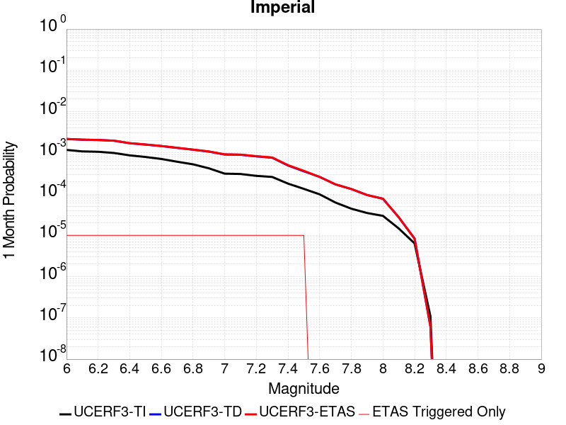 |  |  |

| Magnitude | 1 wk TI Prob | 1 wk TD Prob | 1 wk ETAS Prob | 1 wk ETAS/TD Gain | 1 wk ETAS Triggered Only | 1 mo TI Prob | 1 mo TD Prob | 1 mo ETAS Prob | 1 mo ETAS/TD Gain | 1 mo ETAS Triggered Only | 1 yr TI Prob | 1 yr TD Prob | 1 yr ETAS Prob | 1 yr ETAS/TD Gain | 1 yr ETAS Triggered Only | 10 yr TI Prob | 10 yr TD Prob | 10 yr ETAS Prob | 10 yr ETAS/TD Gain | 10 yr ETAS Triggered Only |
|-----|-----|-----|-----|-----|-----|-----|-----|-----|-----|-----|-----|-----|-----|-----|-----|-----|-----|-----|-----|-----|
| 6.0 | 2.7496446E-4 | 5.060379E-4 | 5.060379E-4 | 1.0 | 0.0 | 0.0011778869 | 0.0021669706 | 0.0021821638 | 1.0070112 | 1.522603E-5 | 0.0142467655 | 0.026064837 | 0.026079668 | 1.000569 | 1.522603E-5 | 0.13367249 | 0.22821419 | 0.22822595 | 1.0000515 | 1.522603E-5 |
| 6.1 | 2.5356023E-4 | 4.8701192E-4 | 4.8701192E-4 | 1.0 | 0.0 | 0.001086234 | 0.0020855628 | 0.002100757 | 1.0072855 | 1.522603E-5 | 0.013144928 | 0.02509391 | 0.025108753 | 1.0005915 | 1.522603E-5 | 0.123940155 | 0.21963087 | 0.21964274 | 1.0000541 | 1.522603E-5 |
| 6.2 | 2.4820742E-4 | 4.7795815E-4 | 4.7795815E-4 | 1.0 | 0.0 | 0.0010633124 | 0.0020468219 | 0.0020620169 | 1.0074236 | 1.522603E-5 | 0.01286919 | 0.024633536 | 0.024648387 | 1.0006028 | 1.522603E-5 | 0.12148927 | 0.21613504 | 0.21614698 | 1.0000552 | 1.522603E-5 |
| 6.3 | 2.3205351E-4 | 4.5929378E-4 | 4.5929378E-4 | 1.0 | 0.0 | 9.94136E-4 | 0.001966954 | 0.00198215 | 1.0077257 | 1.522603E-5 | 0.012036599 | 0.02368102 | 0.023695886 | 1.0006278 | 1.522603E-5 | 0.11405133 | 0.20807077 | 0.20808282 | 1.0000579 | 1.522603E-5 |
| 6.4 | 2.0304754E-4 | 3.991441E-4 | 3.991441E-4 | 1.0 | 0.0 | 8.6991355E-4 | 0.0017095108 | 0.0017247108 | 1.0088915 | 1.522603E-5 | 0.010539869 | 0.020614926 | 0.020629838 | 1.0007234 | 1.522603E-5 | 0.100537635 | 0.18520407 | 0.18521647 | 1.000067 | 1.522603E-5 |
| 6.5 | 1.854992E-4 | 3.702423E-4 | 3.702423E-4 | 1.0 | 0.0 | 7.9475436E-4 | 0.0015858002 | 0.0016010021 | 1.0095862 | 1.522603E-5 | 0.009633281 | 0.01913749 | 0.019152425 | 1.0007803 | 1.522603E-5 | 0.0922623 | 0.17342903 | 0.17344162 | 1.0000726 | 1.522603E-5 |
| 6.6 | 1.6586106E-4 | 3.406714E-4 | 3.406714E-4 | 1.0 | 0.0 | 7.106394E-4 | 0.0014592134 | 0.0014744173 | 1.0104191 | 1.522603E-5 | 0.008617763 | 0.017622843 | 0.0176378 | 1.0008488 | 1.522603E-5 | 0.08291132 | 0.16089731 | 0.1609101 | 1.0000794 | 1.522603E-5 |
| 6.7 | 1.4224656E-4 | 3.0794923E-4 | 3.0794923E-4 | 1.0 | 0.0 | 6.094856E-4 | 0.0013191231 | 0.0013343291 | 1.0115273 | 1.522603E-5 | 0.0073952693 | 0.015943963 | 0.015958946 | 1.0009397 | 1.522603E-5 | 0.07153955 | 0.14659329 | 0.14660628 | 1.0000887 | 1.522603E-5 |
| 6.8 | 1.2317259E-4 | 2.781478E-4 | 2.781478E-4 | 1.0 | 0.0 | 5.2777573E-4 | 0.0011915236 | 0.0012067314 | 1.0127634 | 1.522603E-5 | 0.0064067547 | 0.0144116925 | 0.014426699 | 1.0010413 | 1.522603E-5 | 0.06225166 | 0.13303171 | 0.13304491 | 1.0000992 | 1.522603E-5 |
| 6.9 | 9.859898E-5 | 2.503195E-4 | 2.503195E-4 | 1.0 | 0.0 | 4.2249862E-4 | 0.0010723611 | 0.0010875709 | 1.0141834 | 1.522603E-5 | 0.0051317946 | 0.012978803 | 0.012993832 | 1.0011579 | 1.522603E-5 | 0.05014893 | 0.11947842 | 0.11949182 | 1.0001122 | 1.522603E-5 |
| 7.0 | 7.3191884E-5 | 2.127993E-4 | 2.127993E-4 | 1.0 | 0.0 | 3.136418E-4 | 9.116815E-4 | 9.268936E-4 | 1.0166858 | 1.522603E-5 | 0.003811904 | 0.011043918 | 0.011058976 | 1.0013634 | 1.522603E-5 | 0.037471764 | 0.10211917 | 0.10213284 | 1.0001339 | 1.522603E-5 |
| 7.1 | 7.1760296E-5 | 2.0981116E-4 | 2.0981116E-4 | 1.0 | 0.0 | 3.0750787E-4 | 8.9888397E-4 | 9.1409637E-4 | 1.0169235 | 1.522603E-5 | 0.003737482 | 0.010889676 | 0.010904736 | 1.001383 | 1.522603E-5 | 0.03675245 | 0.10075505 | 0.100768745 | 1.0001359 | 1.522603E-5 |
| 7.2 | 6.46614E-5 | 1.9149172E-4 | 1.9149172E-4 | 1.0 | 0.0 | 2.7709085E-4 | 8.204237E-4 | 8.356373E-4 | 1.0185435 | 1.522603E-5 | 0.0033683628 | 0.009943534 | 0.009958609 | 1.001516 | 1.522603E-5 | 0.033177625 | 0.09256114 | 0.092574954 | 1.0001493 | 1.522603E-5 |
| 7.3 | 6.088115E-5 | 1.7820326E-4 | 1.7820326E-4 | 1.0 | 0.0 | 2.6089314E-4 | 7.635076E-4 | 7.78722E-4 | 1.019927 | 1.522603E-5 | 0.0031717476 | 0.009256661 | 0.0092717465 | 1.0016296 | 1.522603E-5 | 0.031268585 | 0.08661022 | 0.08662412 | 1.0001606 | 1.522603E-5 |
| 7.4 | 4.199346E-5 | 1.1519547E-4 | 1.1519547E-4 | 1.0 | 0.0 | 1.7995955E-4 | 4.9360236E-4 | 5.0882087E-4 | 1.0308316 | 1.522603E-5 | 0.0021888057 | 0.0059932186 | 0.0060083535 | 1.0025253 | 1.522603E-5 | 0.02167372 | 0.05748037 | 0.05749472 | 1.0002496 | 1.522603E-5 |
| 7.5 | 3.130448E-5 | 8.340871E-5 | 8.340871E-5 | 1.0 | 0.0 | 1.3415517E-4 | 3.5741724E-4 | 3.7263785E-4 | 1.0425849 | 1.522603E-5 | 0.0016321153 | 0.0043429323 | 0.0043580923 | 1.0034907 | 1.522603E-5 | 0.016201803 | 0.04216626 | 0.042180844 | 1.0003458 | 1.522603E-5 |
| 7.6 | 2.3074248E-5 | 6.0909417E-5 | 6.0909417E-5 | 1.0 | 0.0 | 9.888588E-5 | 2.610144E-4 | 2.610144E-4 | 1.0 | 0.0 | 0.0012032706 | 0.0031732426 | 0.0031732426 | 1.0 | 0.0 | 0.011967761 | 0.031055957 | 0.031055957 | 1.0 | 0.0 |
| 7.7 | 1.45864815E-5 | 4.0178427E-5 | 4.0178427E-5 | 1.0 | 0.0 | 6.2511994E-5 | 1.7218193E-4 | 1.7218193E-4 | 1.0 | 0.0 | 7.608177E-4 | 0.002094305 | 0.002094305 | 1.0 | 0.0 | 0.007582182 | 0.020652408 | 0.020652408 | 1.0 | 0.0 |
| 7.8 | 1.0352979E-5 | 3.1006606E-5 | 3.1006606E-5 | 1.0 | 0.0 | 4.4369157E-5 | 1.328787E-4 | 1.328787E-4 | 1.0 | 0.0 | 5.400606E-4 | 0.0016166 | 0.0016166 | 1.0 | 0.0 | 0.0053875 | 0.016037801 | 0.016037801 | 1.0 | 0.0 |
| 7.9 | 8.137906E-6 | 2.2185837E-5 | 2.2185837E-5 | 1.0 | 0.0 | 3.4876273E-5 | 9.50787E-5 | 9.50787E-5 | 1.0 | 0.0 | 4.2453592E-4 | 0.0011569695 | 0.0011569695 | 1.0 | 0.0 | 0.004237258 | 0.011635021 | 0.011635021 | 1.0 | 0.0 |
| 8.0 | 6.93792E-6 | 1.8040371E-5 | 1.8040371E-5 | 1.0 | 0.0 | 2.9733603E-5 | 7.731359E-5 | 7.731359E-5 | 1.0 | 0.0 | 3.6194647E-4 | 9.408872E-4 | 9.408872E-4 | 1.0 | 0.0 | 0.0036135751 | 0.00951638 | 0.00951638 | 1.0 | 0.0 |
| 8.1 | 3.4286315E-6 | 6.39459E-6 | 6.39459E-6 | 1.0 | 0.0 | 1.4694053E-5 | 2.7405098E-5 | 2.7405098E-5 | 1.0 | 0.0 | 1.7888541E-4 | 3.336061E-4 | 3.336061E-4 | 1.0 | 0.0 | 0.0017874148 | 0.003493339 | 0.003493339 | 1.0 | 0.0 |
| 8.2 | 1.4906886E-6 | 1.9424117E-6 | 1.9424117E-6 | 1.0 | 0.0 | 6.3886496E-6 | 8.324595E-6 | 8.324595E-6 | 1.0 | 0.0 | 7.7779034E-5 | 1.0134726E-4 | 1.0134726E-4 | 1.0 | 0.0 | 7.775182E-4 | 0.0011104804 | 0.0011104804 | 1.0 | 0.0 |
| 8.3 | 2.5758007E-8 | 1.45585295E-8 | 1.45585295E-8 | 1.0 | 0.0 | 1.10391454E-7 | 6.23937E-8 | 6.23937E-8 | 1.0 | 0.0 | 1.3440151E-6 | 7.596433E-7 | 7.596433E-7 | 1.0 | 0.0 | 1.344007E-5 | 7.918924E-6 | 7.918924E-6 | 1.0 | 0.0 |

## Simi-Santa Rosa
*[(top)](#table-of-contents)*

| 1 Week | 1 Month | 1 Year | 10 Year |
|-----|-----|-----|-----|
|  |  |  |  |

| Magnitude | 1 wk TI Prob | 1 wk TD Prob | 1 wk ETAS Prob | 1 wk ETAS/TD Gain | 1 wk ETAS Triggered Only | 1 mo TI Prob | 1 mo TD Prob | 1 mo ETAS Prob | 1 mo ETAS/TD Gain | 1 mo ETAS Triggered Only | 1 yr TI Prob | 1 yr TD Prob | 1 yr ETAS Prob | 1 yr ETAS/TD Gain | 1 yr ETAS Triggered Only | 10 yr TI Prob | 10 yr TD Prob | 10 yr ETAS Prob | 10 yr ETAS/TD Gain | 10 yr ETAS Triggered Only |
|-----|-----|-----|-----|-----|-----|-----|-----|-----|-----|-----|-----|-----|-----|-----|-----|-----|-----|-----|-----|-----|
| 6.0 | 2.198912E-5 | 2.2277061E-5 | 2.2277061E-5 | 1.0 | 0.0 | 9.4235686E-5 | 9.546988E-5 | 1.10694455E-4 | 1.15947 | 1.522603E-5 | 0.0011467156 | 0.0011617698 | 0.0011769781 | 1.0130906 | 1.522603E-5 | 0.011408163 | 0.011561411 | 0.011576462 | 1.0013018 | 1.522603E-5 |
| 6.1 | 2.198912E-5 | 2.2277061E-5 | 2.2277061E-5 | 1.0 | 0.0 | 9.4235686E-5 | 9.546988E-5 | 1.10694455E-4 | 1.15947 | 1.522603E-5 | 0.0011467156 | 0.0011617698 | 0.0011769781 | 1.0130906 | 1.522603E-5 | 0.011408163 | 0.011561411 | 0.011576462 | 1.0013018 | 1.522603E-5 |
| 6.2 | 1.69983E-5 | 1.6669812E-5 | 1.6669812E-5 | 1.0 | 0.0 | 7.284782E-5 | 7.1440256E-5 | 8.6665204E-5 | 1.2131144 | 1.522603E-5 | 8.865613E-4 | 8.694672E-4 | 8.8468E-4 | 1.0174967 | 1.522603E-5 | 0.008830327 | 0.008663576 | 0.00867867 | 1.0017422 | 1.522603E-5 |
| 6.3 | 1.69983E-5 | 1.6669812E-5 | 1.6669812E-5 | 1.0 | 0.0 | 7.284782E-5 | 7.1440256E-5 | 8.6665204E-5 | 1.2131144 | 1.522603E-5 | 8.865613E-4 | 8.694672E-4 | 8.8468E-4 | 1.0174967 | 1.522603E-5 | 0.008830327 | 0.008663576 | 0.00867867 | 1.0017422 | 1.522603E-5 |
| 6.4 | 1.4666188E-5 | 1.4053627E-5 | 1.4053627E-5 | 1.0 | 0.0 | 6.285358E-5 | 6.0228576E-5 | 7.545369E-5 | 1.2527889 | 1.522603E-5 | 7.6497364E-4 | 7.330611E-4 | 7.48276E-4 | 1.0207553 | 1.522603E-5 | 0.0076234564 | 0.0073089055 | 0.0073240204 | 1.002068 | 1.522603E-5 |
| 6.5 | 1.4666188E-5 | 1.4053627E-5 | 1.4053627E-5 | 1.0 | 0.0 | 6.285358E-5 | 6.0228576E-5 | 7.545369E-5 | 1.2527889 | 1.522603E-5 | 7.6497364E-4 | 7.330611E-4 | 7.48276E-4 | 1.0207553 | 1.522603E-5 | 0.0076234564 | 0.0073089055 | 0.0073240204 | 1.002068 | 1.522603E-5 |
| 6.6 | 1.4377586E-5 | 1.3730646E-5 | 1.3730646E-5 | 1.0 | 0.0 | 6.1616774E-5 | 5.8844438E-5 | 7.406957E-5 | 1.2587353 | 1.522603E-5 | 7.4992597E-4 | 7.162204E-4 | 7.314355E-4 | 1.0212437 | 1.522603E-5 | 0.007474003 | 0.0071415897 | 0.007156707 | 1.0021168 | 1.522603E-5 |
| 6.7 | 1.3881404E-5 | 1.320858E-5 | 1.320858E-5 | 1.0 | 0.0 | 5.9490372E-5 | 5.660711E-5 | 7.183228E-5 | 1.2689621 | 1.522603E-5 | 7.240546E-4 | 6.889984E-4 | 7.042139E-4 | 1.0220835 | 1.522603E-5 | 0.007217 | 0.006871072 | 0.0068861935 | 1.0022007 | 1.522603E-5 |
| 6.8 | 1.0176516E-5 | 9.154907E-6 | 9.154907E-6 | 1.0 | 0.0 | 4.3612912E-5 | 3.923482E-5 | 5.4460255E-5 | 1.3880591 | 1.522603E-5 | 5.308578E-4 | 4.7759584E-4 | 4.928146E-4 | 1.0318654 | 1.522603E-5 | 0.0052959146 | 0.0047673276 | 0.004782481 | 1.0031786 | 1.522603E-5 |
| 6.9 | 9.699797E-6 | 8.775444E-6 | 8.775444E-6 | 1.0 | 0.0 | 4.15699E-5 | 3.7608595E-5 | 5.2834053E-5 | 1.4048399 | 1.522603E-5 | 5.05996E-4 | 4.578049E-4 | 4.7302397E-4 | 1.0332435 | 1.522603E-5 | 0.005048454 | 0.004570236 | 0.004585393 | 1.0033163 | 1.522603E-5 |
| 7.0 | 7.4049476E-6 | 6.559884E-6 | 6.559884E-6 | 1.0 | 0.0 | 3.1735104E-5 | 2.8113554E-5 | 2.8113554E-5 | 1.0 | 0.0 | 3.8630638E-4 | 3.4224143E-4 | 3.4224143E-4 | 1.0 | 0.0 | 0.0038563553 | 0.0034183862 | 0.0034183862 | 1.0 | 0.0 |
| 7.1 | 3.873439E-6 | 2.7597737E-6 | 2.7597737E-6 | 1.0 | 0.0 | 1.6600346E-5 | 1.1827549E-5 | 1.1827549E-5 | 1.0 | 0.0 | 2.0209046E-4 | 1.4399113E-4 | 1.4399113E-4 | 1.0 | 0.0 | 0.0020190678 | 0.0014390019 | 0.0014390019 | 1.0 | 0.0 |
| 7.2 | 3.417706E-6 | 2.3678895E-6 | 2.3678895E-6 | 1.0 | 0.0 | 1.4647229E-5 | 1.0148059E-5 | 1.0148059E-5 | 1.0 | 0.0 | 1.7831543E-4 | 1.2354583E-4 | 1.2354583E-4 | 1.0 | 0.0 | 0.0017817242 | 0.0012347938 | 0.0012347938 | 1.0 | 0.0 |
| 7.3 | 1.90225E-6 | 1.4075586E-6 | 1.4075586E-6 | 1.0 | 0.0 | 8.152474E-6 | 6.03238E-6 | 6.03238E-6 | 1.0 | 0.0 | 9.9251854E-5 | 7.344177E-5 | 7.344177E-5 | 1.0 | 0.0 | 9.920754E-4 | 7.3417724E-4 | 7.3417724E-4 | 1.0 | 0.0 |
| 7.4 | 1.5170556E-6 | 1.1026477E-6 | 1.1026477E-6 | 1.0 | 0.0 | 6.5016507E-6 | 4.7256244E-6 | 4.7256244E-6 | 1.0 | 0.0 | 7.915472E-5 | 5.753297E-5 | 5.753297E-5 | 1.0 | 0.0 | 7.9126534E-4 | 5.7518185E-4 | 5.7518185E-4 | 1.0 | 0.0 |
| 7.5 | 1.178732E-6 | 8.536725E-7 | 8.536725E-7 | 1.0 | 0.0 | 5.0516987E-6 | 3.6585911E-6 | 3.6585911E-6 | 1.0 | 0.0 | 6.1502695E-5 | 4.4542445E-5 | 4.4542445E-5 | 1.0 | 0.0 | 6.148568E-4 | 4.4533613E-4 | 4.4533613E-4 | 1.0 | 0.0 |
| 7.6 | 6.8722386E-7 | 4.794698E-7 | 4.794698E-7 | 1.0 | 0.0 | 2.9452417E-6 | 2.0548691E-6 | 2.0548691E-6 | 1.0 | 0.0 | 3.5857727E-5 | 2.5017745E-5 | 2.5017745E-5 | 1.0 | 0.0 | 3.5851944E-4 | 2.501494E-4 | 2.501494E-4 | 1.0 | 0.0 |
| 7.7 | 5.5126515E-7 | 3.674588E-7 | 3.674588E-7 | 1.0 | 0.0 | 2.3625628E-6 | 1.5748224E-6 | 1.5748224E-6 | 1.0 | 0.0 | 2.8763823E-5 | 1.9173296E-5 | 1.9173296E-5 | 1.0 | 0.0 | 2.87601E-4 | 1.9171652E-4 | 1.9171652E-4 | 1.0 | 0.0 |
| 7.8 | 3.3860243E-7 | 2.008463E-7 | 2.008463E-7 | 1.0 | 0.0 | 1.4511525E-6 | 8.607696E-7 | 8.607696E-7 | 1.0 | 0.0 | 1.7667637E-5 | 1.047982E-5 | 1.047982E-5 | 1.0 | 0.0 | 1.7666233E-4 | 1.0479331E-4 | 1.0479331E-4 | 1.0 | 0.0 |
| 7.9 | 2.7955386E-7 | 1.4657186E-7 | 1.4657186E-7 | 1.0 | 0.0 | 1.1980875E-6 | 6.2816497E-7 | 6.2816497E-7 | 1.0 | 0.0 | 1.4586617E-5 | 7.647883E-6 | 7.647883E-6 | 1.0 | 0.0 | 1.458566E-4 | 7.647623E-5 | 7.647623E-5 | 1.0 | 0.0 |
| 8.0 | 5.6259015E-8 | 3.3362383E-8 | 3.3362383E-8 | 1.0 | 0.0 | 2.4111003E-7 | 1.4298163E-7 | 1.4298163E-7 | 1.0 | 0.0 | 2.9355108E-6 | 1.7408001E-6 | 1.7408001E-6 | 1.0 | 0.0 | 2.935472E-5 | 1.740788E-5 | 1.740788E-5 | 1.0 | 0.0 |

## Ortigalita (South)
*[(top)](#table-of-contents)*

| 1 Week | 1 Month | 1 Year | 10 Year |
|-----|-----|-----|-----|
|  |  | 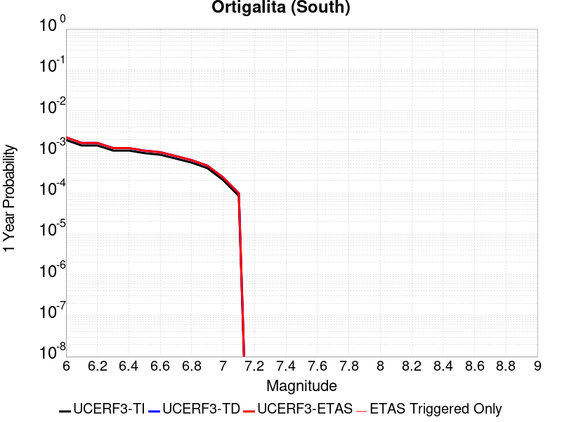 | 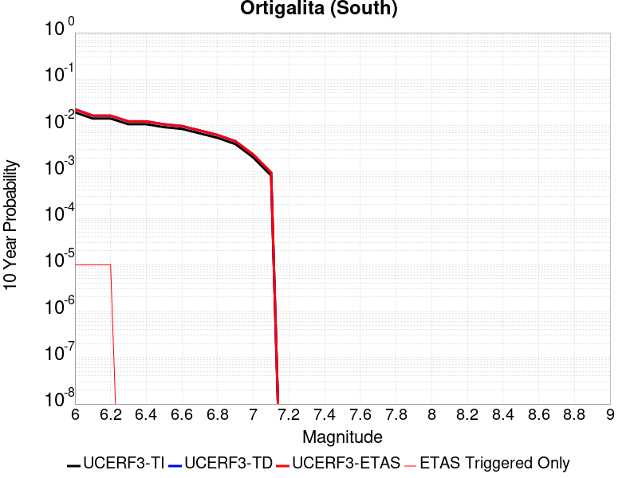 |

| Magnitude | 1 wk TI Prob | 1 wk TD Prob | 1 wk ETAS Prob | 1 wk ETAS/TD Gain | 1 wk ETAS Triggered Only | 1 mo TI Prob | 1 mo TD Prob | 1 mo ETAS Prob | 1 mo ETAS/TD Gain | 1 mo ETAS Triggered Only | 1 yr TI Prob | 1 yr TD Prob | 1 yr ETAS Prob | 1 yr ETAS/TD Gain | 1 yr ETAS Triggered Only | 10 yr TI Prob | 10 yr TD Prob | 10 yr ETAS Prob | 10 yr ETAS/TD Gain | 10 yr ETAS Triggered Only |
|-----|-----|-----|-----|-----|-----|-----|-----|-----|-----|-----|-----|-----|-----|-----|-----|-----|-----|-----|-----|-----|
| 6.0 | 3.72394E-5 | 4.3259344E-5 | 4.3259344E-5 | 1.0 | 0.0 | 1.5958765E-4 | 1.853849E-4 | 1.853849E-4 | 1.0 | 0.0 | 0.0019412481 | 0.0022548812 | 0.0022548812 | 1.0 | 0.0 | 0.019243775 | 0.0223364 | 0.022351285 | 1.0006665 | 1.522603E-5 |
| 6.1 | 2.7299884E-5 | 3.1494616E-5 | 3.1494616E-5 | 1.0 | 0.0 | 1.16994255E-4 | 1.3497027E-4 | 1.3497027E-4 | 1.0 | 0.0 | 0.0014234743 | 0.0016420797 | 0.0016420797 | 1.0 | 0.0 | 0.014143906 | 0.016305393 | 0.01632037 | 1.0009186 | 1.522603E-5 |
| 6.2 | 2.7299884E-5 | 3.1494616E-5 | 3.1494616E-5 | 1.0 | 0.0 | 1.16994255E-4 | 1.3497027E-4 | 1.3497027E-4 | 1.0 | 0.0 | 0.0014234743 | 0.0016420797 | 0.0016420797 | 1.0 | 0.0 | 0.014143906 | 0.016305393 | 0.01632037 | 1.0009186 | 1.522603E-5 |
| 6.3 | 2.0546433E-5 | 2.3633338E-5 | 2.3633338E-5 | 1.0 | 0.0 | 8.805317E-5 | 1.0128191E-4 | 1.0128191E-4 | 1.0 | 0.0 | 0.00107152 | 0.0012324287 | 0.0012324287 | 1.0 | 0.0 | 0.010663681 | 0.0122580035 | 0.0122580035 | 1.0 | 0.0 |
| 6.4 | 2.0546433E-5 | 2.3633338E-5 | 2.3633338E-5 | 1.0 | 0.0 | 8.805317E-5 | 1.0128191E-4 | 1.0128191E-4 | 1.0 | 0.0 | 0.00107152 | 0.0012324287 | 0.0012324287 | 1.0 | 0.0 | 0.010663681 | 0.0122580035 | 0.0122580035 | 1.0 | 0.0 |
| 6.5 | 1.7779594E-5 | 2.0448608E-5 | 2.0448608E-5 | 1.0 | 0.0 | 7.619603E-5 | 8.763402E-5 | 8.763402E-5 | 1.0 | 0.0 | 9.272918E-4 | 0.0010664355 | 0.0010664355 | 1.0 | 0.0 | 0.009234319 | 0.010614647 | 0.010614647 | 1.0 | 0.0 |
| 6.6 | 1.6272212E-5 | 1.8716462E-5 | 1.8716462E-5 | 1.0 | 0.0 | 6.973618E-5 | 8.0211015E-5 | 8.0211015E-5 | 1.0 | 0.0 | 8.487073E-4 | 9.761438E-4 | 9.761438E-4 | 1.0 | 0.0 | 0.008454733 | 0.0097198635 | 0.0097198635 | 1.0 | 0.0 |
| 6.7 | 1.3051484E-5 | 1.5039977E-5 | 1.5039977E-5 | 1.0 | 0.0 | 5.593373E-5 | 6.4455504E-5 | 6.4455504E-5 | 1.0 | 0.0 | 6.807804E-4 | 7.8447274E-4 | 7.8447274E-4 | 1.0 | 0.0 | 0.006786986 | 0.007818019 | 0.007818019 | 1.0 | 0.0 |
| 6.8 | 1.04277415E-5 | 1.1988188E-5 | 1.1988188E-5 | 1.0 | 0.0 | 4.4689557E-5 | 5.137698E-5 | 5.137698E-5 | 1.0 | 0.0 | 5.439595E-4 | 6.2534265E-4 | 6.2534265E-4 | 1.0 | 0.0 | 0.0054262993 | 0.0062365844 | 0.0062365844 | 1.0 | 0.0 |
| 6.9 | 7.639968E-6 | 8.792207E-6 | 8.792207E-6 | 1.0 | 0.0 | 3.274231E-5 | 3.7680376E-5 | 3.7680376E-5 | 1.0 | 0.0 | 3.9856473E-4 | 4.586679E-4 | 4.586679E-4 | 1.0 | 0.0 | 0.003978506 | 0.004577799 | 0.004577799 | 1.0 | 0.0 |
| 7.0 | 3.919831E-6 | 4.5337783E-6 | 4.5337783E-6 | 1.0 | 0.0 | 1.679917E-5 | 1.9430345E-5 | 1.9430345E-5 | 1.0 | 0.0 | 2.045107E-4 | 2.3654089E-4 | 2.3654089E-4 | 1.0 | 0.0 | 0.0020432258 | 0.0023630997 | 0.0023630997 | 1.0 | 0.0 |
| 7.1 | 1.6017933E-6 | 1.857199E-6 | 1.857199E-6 | 1.0 | 0.0 | 6.8648105E-6 | 7.959406E-6 | 7.959406E-6 | 1.0 | 0.0 | 8.357586E-5 | 9.690253E-5 | 9.690253E-5 | 1.0 | 0.0 | 8.3544437E-4 | 9.6870743E-4 | 9.6870743E-4 | 1.0 | 0.0 |

## Rinconada 2011 CFM
*[(top)](#table-of-contents)*

| 1 Week | 1 Month | 1 Year | 10 Year |
|-----|-----|-----|-----|
| 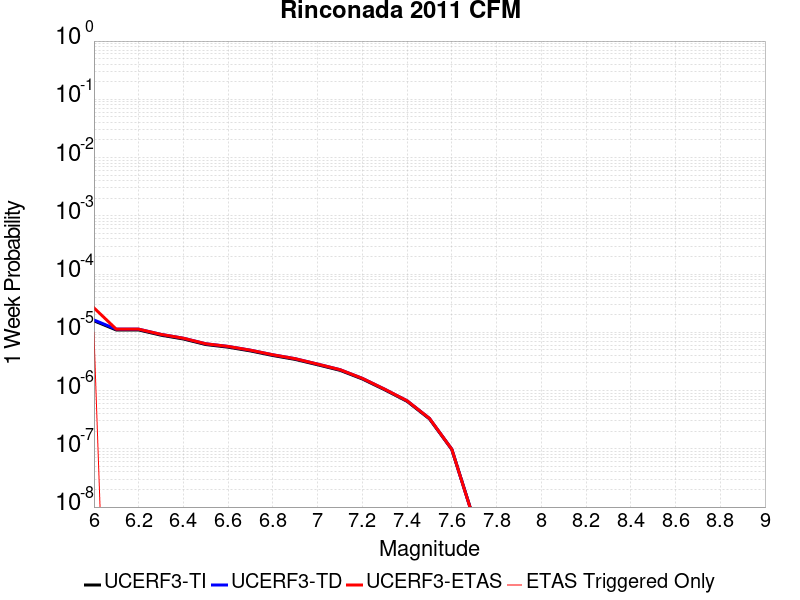 |  |  |  |

| Magnitude | 1 wk TI Prob | 1 wk TD Prob | 1 wk ETAS Prob | 1 wk ETAS/TD Gain | 1 wk ETAS Triggered Only | 1 mo TI Prob | 1 mo TD Prob | 1 mo ETAS Prob | 1 mo ETAS/TD Gain | 1 mo ETAS Triggered Only | 1 yr TI Prob | 1 yr TD Prob | 1 yr ETAS Prob | 1 yr ETAS/TD Gain | 1 yr ETAS Triggered Only | 10 yr TI Prob | 10 yr TD Prob | 10 yr ETAS Prob | 10 yr ETAS/TD Gain | 10 yr ETAS Triggered Only |
|-----|-----|-----|-----|-----|-----|-----|-----|-----|-----|-----|-----|-----|-----|-----|-----|-----|-----|-----|-----|-----|
| 6.0 | 1.5752368E-5 | 1.6275004E-5 | 3.1500786E-5 | 1.9355317 | 1.522603E-5 | 6.75084E-5 | 6.974817E-5 | 8.497314E-5 | 1.2182848 | 1.522603E-5 | 8.2160486E-4 | 8.4885623E-4 | 8.640693E-4 | 1.0179219 | 1.522603E-5 | 0.008185739 | 0.008456519 | 0.008471616 | 1.0017853 | 1.522603E-5 |
| 6.1 | 1.0966133E-5 | 1.1323225E-5 | 1.1323225E-5 | 1.0 | 0.0 | 4.6996865E-5 | 4.852721E-5 | 4.852721E-5 | 1.0 | 0.0 | 5.720366E-4 | 5.906594E-4 | 5.906594E-4 | 1.0 | 0.0 | 0.0057056635 | 0.005890991 | 0.005890991 | 1.0 | 0.0 |
| 6.2 | 1.0966133E-5 | 1.1323225E-5 | 1.1323225E-5 | 1.0 | 0.0 | 4.6996865E-5 | 4.852721E-5 | 4.852721E-5 | 1.0 | 0.0 | 5.720366E-4 | 5.906594E-4 | 5.906594E-4 | 1.0 | 0.0 | 0.0057056635 | 0.005890991 | 0.005890991 | 1.0 | 0.0 |
| 6.3 | 8.926149E-6 | 9.212929E-6 | 9.212929E-6 | 1.0 | 0.0 | 3.8254362E-5 | 3.9483388E-5 | 3.9483388E-5 | 1.0 | 0.0 | 4.6564735E-4 | 4.8060456E-4 | 4.8060456E-4 | 1.0 | 0.0 | 0.0046467283 | 0.0047956966 | 0.0047956966 | 1.0 | 0.0 |
| 6.4 | 7.676955E-6 | 7.9203255E-6 | 7.9203255E-6 | 1.0 | 0.0 | 3.290082E-5 | 3.3943812E-5 | 3.3943812E-5 | 1.0 | 0.0 | 4.0049385E-4 | 4.131877E-4 | 4.131877E-4 | 1.0 | 0.0 | 0.0039977287 | 0.004124221 | 0.004124221 | 1.0 | 0.0 |
| 6.5 | 6.1671026E-6 | 6.359061E-6 | 6.359061E-6 | 1.0 | 0.0 | 2.6430173E-5 | 2.7252834E-5 | 2.7252834E-5 | 1.0 | 0.0 | 3.2173982E-4 | 3.3175282E-4 | 3.3175282E-4 | 1.0 | 0.0 | 0.003212744 | 0.0033125877 | 0.0033125877 | 1.0 | 0.0 |
| 6.6 | 5.553456E-6 | 5.7249076E-6 | 5.7249076E-6 | 1.0 | 0.0 | 2.3800309E-5 | 2.4535088E-5 | 2.4535088E-5 | 1.0 | 0.0 | 2.897302E-4 | 2.986738E-4 | 2.986738E-4 | 1.0 | 0.0 | 0.0028935277 | 0.0029827326 | 0.0029827326 | 1.0 | 0.0 |
| 6.7 | 4.787857E-6 | 4.9333903E-6 | 4.9333903E-6 | 1.0 | 0.0 | 2.0519226E-5 | 2.114293E-5 | 2.114293E-5 | 1.0 | 0.0 | 2.4979294E-4 | 2.573848E-4 | 2.573848E-4 | 1.0 | 0.0 | 0.0024951235 | 0.002570873 | 0.002570873 | 1.0 | 0.0 |
| 6.8 | 3.9955166E-6 | 4.1135418E-6 | 4.1135418E-6 | 1.0 | 0.0 | 1.7123532E-5 | 1.7629345E-5 | 1.7629345E-5 | 1.0 | 0.0 | 2.0845905E-4 | 2.1461617E-4 | 2.1461617E-4 | 1.0 | 0.0 | 0.002082636 | 0.0021440927 | 0.0021440927 | 1.0 | 0.0 |
| 6.9 | 3.4250072E-6 | 3.5225005E-6 | 3.5225005E-6 | 1.0 | 0.0 | 1.46785205E-5 | 1.5096344E-5 | 1.5096344E-5 | 1.0 | 0.0 | 1.7869633E-4 | 1.837825E-4 | 1.837825E-4 | 1.0 | 0.0 | 0.001785527 | 0.0018363077 | 0.0018363077 | 1.0 | 0.0 |
| 7.0 | 2.7712713E-6 | 2.846742E-6 | 2.846742E-6 | 1.0 | 0.0 | 1.1876823E-5 | 1.2200267E-5 | 1.2200267E-5 | 1.0 | 0.0 | 1.4459073E-4 | 1.4852812E-4 | 1.4852812E-4 | 1.0 | 0.0 | 0.0014449668 | 0.0014842902 | 0.0014842902 | 1.0 | 0.0 |
| 7.1 | 2.227358E-6 | 2.2857312E-6 | 2.2857312E-6 | 1.0 | 0.0 | 9.545785E-6 | 9.795955E-6 | 9.795955E-6 | 1.0 | 0.0 | 1.16213734E-4 | 1.19259224E-4 | 1.19259224E-4 | 1.0 | 0.0 | 0.0011615298 | 0.0011919533 | 0.0011919533 | 1.0 | 0.0 |
| 7.2 | 1.581796E-6 | 1.6209234E-6 | 1.6209234E-6 | 1.0 | 0.0 | 6.779108E-6 | 6.946796E-6 | 6.946796E-6 | 1.0 | 0.0 | 8.253252E-5 | 8.457396E-5 | 8.457396E-5 | 1.0 | 0.0 | 8.250187E-4 | 8.454183E-4 | 8.454183E-4 | 1.0 | 0.0 |
| 7.3 | 1.0306567E-6 | 1.0546617E-6 | 1.0546617E-6 | 1.0 | 0.0 | 4.4170924E-6 | 4.519971E-6 | 4.519971E-6 | 1.0 | 0.0 | 5.3776774E-5 | 5.5029257E-5 | 5.5029257E-5 | 1.0 | 0.0 | 5.376376E-4 | 5.501566E-4 | 5.501566E-4 | 1.0 | 0.0 |
| 7.4 | 6.535541E-7 | 6.682831E-7 | 6.682831E-7 | 1.0 | 0.0 | 2.800943E-6 | 2.8640675E-6 | 2.8640675E-6 | 1.0 | 0.0 | 3.4100947E-5 | 3.4869463E-5 | 3.4869463E-5 | 1.0 | 0.0 | 3.4095717E-4 | 3.4864005E-4 | 3.4864005E-4 | 1.0 | 0.0 |
| 7.5 | 3.2656962E-7 | 3.3317139E-7 | 3.3317139E-7 | 1.0 | 0.0 | 1.3995833E-6 | 1.4278766E-6 | 1.4278766E-6 | 1.0 | 0.0 | 1.7039794E-5 | 1.7384258E-5 | 1.7384258E-5 | 1.0 | 0.0 | 1.7038487E-4 | 1.7382903E-4 | 1.7382903E-4 | 1.0 | 0.0 |
| 7.6 | 9.754343E-8 | 9.821119E-8 | 9.821119E-8 | 1.0 | 0.0 | 4.180432E-7 | 4.2090502E-7 | 4.2090502E-7 | 1.0 | 0.0 | 5.089664E-6 | 5.1245065E-6 | 5.1245065E-6 | 1.0 | 0.0 | 5.0895473E-5 | 5.1243893E-5 | 5.1243893E-5 | 1.0 | 0.0 |
| 7.7 | 6.0001453E-9 | 5.8491465E-9 | 5.8491465E-9 | 1.0 | 0.0 | 2.5714908E-8 | 2.5067772E-8 | 2.5067772E-8 | 1.0 | 0.0 | 3.1307894E-7 | 3.0520007E-7 | 3.0520007E-7 | 1.0 | 0.0 | 3.1307852E-6 | 3.0519968E-6 | 3.0519968E-6 | 1.0 | 0.0 |
| 7.8 | 7.400003E-11 | 7.465484E-11 | 7.465484E-11 | 1.0 | 0.0 | 3.171432E-10 | 3.1994918E-10 | 3.1994918E-10 | 1.0 | 0.0 | 3.861218E-9 | 3.8953814E-9 | 3.8953814E-9 | 1.0 | 0.0 | 3.861218E-8 | 3.8953814E-8 | 3.8953814E-8 | 1.0 | 0.0 |

## Point Reyes 2011 CFM
*[(top)](#table-of-contents)*

| 1 Week | 1 Month | 1 Year | 10 Year |
|-----|-----|-----|-----|
|  |  |  |  |

| Magnitude | 1 wk TI Prob | 1 wk TD Prob | 1 wk ETAS Prob | 1 wk ETAS/TD Gain | 1 wk ETAS Triggered Only | 1 mo TI Prob | 1 mo TD Prob | 1 mo ETAS Prob | 1 mo ETAS/TD Gain | 1 mo ETAS Triggered Only | 1 yr TI Prob | 1 yr TD Prob | 1 yr ETAS Prob | 1 yr ETAS/TD Gain | 1 yr ETAS Triggered Only | 10 yr TI Prob | 10 yr TD Prob | 10 yr ETAS Prob | 10 yr ETAS/TD Gain | 10 yr ETAS Triggered Only |
|-----|-----|-----|-----|-----|-----|-----|-----|-----|-----|-----|-----|-----|-----|-----|-----|-----|-----|-----|-----|-----|
| 6.0 | 8.8644965E-6 | 8.967317E-6 | 8.967317E-6 | 1.0 | 0.0 | 3.7990147E-5 | 3.8430826E-5 | 5.3656273E-5 | 1.3961779 | 1.522603E-5 | 4.624319E-4 | 4.6780115E-4 | 4.8302006E-4 | 1.0325328 | 1.522603E-5 | 0.0046147075 | 0.0046687927 | 0.0046839477 | 1.003246 | 1.522603E-5 |
| 6.1 | 4.526405E-6 | 4.539323E-6 | 4.539323E-6 | 1.0 | 0.0 | 1.9398734E-5 | 1.9454103E-5 | 3.4679837E-5 | 1.782649 | 1.522603E-5 | 2.36154E-4 | 2.36829E-4 | 2.5205142E-4 | 1.064276 | 1.522603E-5 | 0.002359032 | 0.0023658723 | 0.0023810624 | 1.0064205 | 1.522603E-5 |
| 6.2 | 4.526405E-6 | 4.539323E-6 | 4.539323E-6 | 1.0 | 0.0 | 1.9398734E-5 | 1.9454103E-5 | 3.4679837E-5 | 1.782649 | 1.522603E-5 | 2.36154E-4 | 2.36829E-4 | 2.5205142E-4 | 1.064276 | 1.522603E-5 | 0.002359032 | 0.0023658723 | 0.0023810624 | 1.0064205 | 1.522603E-5 |
| 6.3 | 2.6842322E-6 | 2.660761E-6 | 2.660761E-6 | 1.0 | 0.0 | 1.1503801E-5 | 1.1403213E-5 | 1.1403213E-5 | 1.0 | 0.0 | 1.4004979E-4 | 1.3882546E-4 | 1.3882546E-4 | 1.0 | 0.0 | 0.0013996155 | 0.0013874093 | 0.0013874093 | 1.0 | 0.0 |
| 6.4 | 2.6842322E-6 | 2.660761E-6 | 2.660761E-6 | 1.0 | 0.0 | 1.1503801E-5 | 1.1403213E-5 | 1.1403213E-5 | 1.0 | 0.0 | 1.4004979E-4 | 1.3882546E-4 | 1.3882546E-4 | 1.0 | 0.0 | 0.0013996155 | 0.0013874093 | 0.0013874093 | 1.0 | 0.0 |
| 6.5 | 1.9281833E-6 | 1.8907036E-6 | 1.8907036E-6 | 1.0 | 0.0 | 8.263617E-6 | 8.102991E-6 | 8.102991E-6 | 1.0 | 0.0 | 1.0060489E-4 | 9.8649536E-5 | 9.8649536E-5 | 1.0 | 0.0 | 0.0010055936 | 9.860683E-4 | 9.860683E-4 | 1.0 | 0.0 |
| 6.6 | 1.4726726E-6 | 1.4270307E-6 | 1.4270307E-6 | 1.0 | 0.0 | 6.3114385E-6 | 6.1158316E-6 | 6.1158316E-6 | 1.0 | 0.0 | 7.683905E-5 | 7.4457756E-5 | 7.4457756E-5 | 1.0 | 0.0 | 7.6812494E-4 | 7.4433524E-4 | 7.4433524E-4 | 1.0 | 0.0 |
| 6.7 | 8.572307E-7 | 8.0078837E-7 | 8.0078837E-7 | 1.0 | 0.0 | 3.6738406E-6 | 3.4319457E-6 | 3.4319457E-6 | 1.0 | 0.0 | 4.472809E-5 | 4.1783154E-5 | 4.1783154E-5 | 1.0 | 0.0 | 4.471909E-4 | 4.177569E-4 | 4.177569E-4 | 1.0 | 0.0 |
| 6.8 | 6.6745434E-7 | 6.077954E-7 | 6.077954E-7 | 1.0 | 0.0 | 2.8605155E-6 | 2.604835E-6 | 2.604835E-6 | 1.0 | 0.0 | 3.482622E-5 | 3.1713415E-5 | 3.1713415E-5 | 1.0 | 0.0 | 3.4820763E-4 | 3.170922E-4 | 3.170922E-4 | 1.0 | 0.0 |
| 6.9 | 4.291521E-7 | 3.654226E-7 | 3.654226E-7 | 1.0 | 0.0 | 1.839222E-6 | 1.566096E-6 | 1.566096E-6 | 1.0 | 0.0 | 2.2392298E-5 | 1.9067056E-5 | 1.9067056E-5 | 1.0 | 0.0 | 2.2390042E-4 | 1.9065685E-4 | 1.9065685E-4 | 1.0 | 0.0 |
| 7.0 | 2.6812808E-7 | 2.0193588E-7 | 2.0193588E-7 | 1.0 | 0.0 | 1.1491198E-6 | 8.6543923E-7 | 8.6543923E-7 | 1.0 | 0.0 | 1.3990444E-5 | 1.0536672E-5 | 1.0536672E-5 | 1.0 | 0.0 | 1.3989564E-4 | 1.0536407E-4 | 1.0536407E-4 | 1.0 | 0.0 |
| 7.1 | 1.9451231E-7 | 1.2731599E-7 | 1.2731599E-7 | 1.0 | 0.0 | 8.336239E-7 | 5.4563986E-7 | 5.4563986E-7 | 1.0 | 0.0 | 1.0149324E-5 | 6.643145E-6 | 6.643145E-6 | 1.0 | 0.0 | 1.014886E-4 | 6.643174E-5 | 6.643174E-5 | 1.0 | 0.0 |
| 7.2 | 1.6715143E-7 | 1.00488506E-7 | 1.00488506E-7 | 1.0 | 0.0 | 7.1636305E-7 | 4.3066498E-7 | 4.3066498E-7 | 1.0 | 0.0 | 8.721685E-6 | 5.2433334E-6 | 5.2433334E-6 | 1.0 | 0.0 | 8.721343E-5 | 5.243437E-5 | 5.243437E-5 | 1.0 | 0.0 |
| 7.3 | 1.5503173E-7 | 9.019025E-8 | 9.019025E-8 | 1.0 | 0.0 | 6.644215E-7 | 3.865296E-7 | 3.865296E-7 | 1.0 | 0.0 | 8.089301E-6 | 4.7059875E-6 | 4.7059875E-6 | 1.0 | 0.0 | 8.089007E-5 | 4.7061152E-5 | 4.7061152E-5 | 1.0 | 0.0 |
| 7.4 | 1.4251614E-7 | 8.1033846E-8 | 8.1033846E-8 | 1.0 | 0.0 | 6.1078333E-7 | 3.472879E-7 | 3.472879E-7 | 1.0 | 0.0 | 7.4362615E-6 | 4.2282218E-6 | 4.2282218E-6 | 1.0 | 0.0 | 7.436013E-5 | 4.2283686E-5 | 4.2283686E-5 | 1.0 | 0.0 |
| 7.5 | 1.2710186E-7 | 7.035172E-8 | 7.035172E-8 | 1.0 | 0.0 | 5.447221E-7 | 3.0150736E-7 | 3.0150736E-7 | 1.0 | 0.0 | 6.6319717E-6 | 3.670846E-6 | 3.670846E-6 | 1.0 | 0.0 | 6.6317734E-5 | 3.6710124E-5 | 3.6710124E-5 | 1.0 | 0.0 |
| 7.6 | 1.0144708E-7 | 5.5002833E-8 | 5.5002833E-8 | 1.0 | 0.0 | 4.347731E-7 | 2.3572643E-7 | 2.3572643E-7 | 1.0 | 0.0 | 5.2933497E-6 | 2.8699656E-6 | 2.8699656E-6 | 1.0 | 0.0 | 5.293224E-5 | 2.8701557E-5 | 2.8701557E-5 | 1.0 | 0.0 |
| 7.7 | 7.090527E-8 | 3.986544E-8 | 3.986544E-8 | 1.0 | 0.0 | 3.038797E-7 | 1.7085189E-7 | 1.7085189E-7 | 1.0 | 0.0 | 3.699729E-6 | 2.0801199E-6 | 2.0801199E-6 | 1.0 | 0.0 | 3.6996673E-5 | 2.0803276E-5 | 2.0803276E-5 | 1.0 | 0.0 |
| 7.8 | 3.8712045E-8 | 2.7476268E-8 | 2.7476268E-8 | 1.0 | 0.0 | 1.6590876E-7 | 1.1775545E-7 | 1.1775545E-7 | 1.0 | 0.0 | 2.0199373E-6 | 1.4336716E-6 | 1.4336716E-6 | 1.0 | 0.0 | 2.0199188E-5 | 1.4338897E-5 | 1.4338897E-5 | 1.0 | 0.0 |
| 7.9 | 1.7068782E-8 | 1.1862781E-8 | 1.1862781E-8 | 1.0 | 0.0 | 7.315192E-8 | 5.08405E-8 | 5.08405E-8 | 1.0 | 0.0 | 8.906242E-7 | 6.1898294E-7 | 6.1898294E-7 | 1.0 | 0.0 | 8.906207E-6 | 6.1920855E-6 | 6.1920855E-6 | 1.0 | 0.0 |
| 8.0 | 1.0172592E-8 | 7.0528134E-9 | 7.0528134E-9 | 1.0 | 0.0 | 4.359682E-8 | 3.022635E-8 | 3.022635E-8 | 1.0 | 0.0 | 5.3079117E-7 | 3.6800577E-7 | 3.6800577E-7 | 1.0 | 0.0 | 5.307899E-6 | 3.6823246E-6 | 3.6823246E-6 | 1.0 | 0.0 |
| 8.1 | 3.7861243E-9 | 3.5571786E-9 | 3.5571786E-9 | 1.0 | 0.0 | 1.6226247E-8 | 1.5245055E-8 | 1.5245055E-8 | 1.0 | 0.0 | 1.9755454E-7 | 1.8560854E-7 | 1.8560854E-7 | 1.0 | 0.0 | 1.9755437E-6 | 1.8580849E-6 | 1.8580849E-6 | 1.0 | 0.0 |

## Del Valle
*[(top)](#table-of-contents)*

| 1 Week | 1 Month | 1 Year | 10 Year |
|-----|-----|-----|-----|
|  |  |  |  |

| Magnitude | 1 wk TI Prob | 1 wk TD Prob | 1 wk ETAS Prob | 1 wk ETAS/TD Gain | 1 wk ETAS Triggered Only | 1 mo TI Prob | 1 mo TD Prob | 1 mo ETAS Prob | 1 mo ETAS/TD Gain | 1 mo ETAS Triggered Only | 1 yr TI Prob | 1 yr TD Prob | 1 yr ETAS Prob | 1 yr ETAS/TD Gain | 1 yr ETAS Triggered Only | 10 yr TI Prob | 10 yr TD Prob | 10 yr ETAS Prob | 10 yr ETAS/TD Gain | 10 yr ETAS Triggered Only |
|-----|-----|-----|-----|-----|-----|-----|-----|-----|-----|-----|-----|-----|-----|-----|-----|-----|-----|-----|-----|-----|
| 6.0 | 1.0716125E-5 | 8.768574E-6 | 8.768574E-6 | 1.0 | 0.0 | 4.592544E-5 | 3.7579175E-5 | 3.7579175E-5 | 1.0 | 0.0 | 5.589988E-4 | 4.5745014E-4 | 4.5745014E-4 | 1.0 | 0.0 | 0.0055759475 | 0.00456704 | 0.0045821965 | 1.0033187 | 1.522603E-5 |
| 6.1 | 1.0716125E-5 | 8.768574E-6 | 8.768574E-6 | 1.0 | 0.0 | 4.592544E-5 | 3.7579175E-5 | 3.7579175E-5 | 1.0 | 0.0 | 5.589988E-4 | 4.5745014E-4 | 4.5745014E-4 | 1.0 | 0.0 | 0.0055759475 | 0.00456704 | 0.0045821965 | 1.0033187 | 1.522603E-5 |
| 6.2 | 1.0716125E-5 | 8.768574E-6 | 8.768574E-6 | 1.0 | 0.0 | 4.592544E-5 | 3.7579175E-5 | 3.7579175E-5 | 1.0 | 0.0 | 5.589988E-4 | 4.5745014E-4 | 4.5745014E-4 | 1.0 | 0.0 | 0.0055759475 | 0.00456704 | 0.0045821965 | 1.0033187 | 1.522603E-5 |
| 6.3 | 7.1293784E-6 | 4.8663333E-6 | 4.8663333E-6 | 1.0 | 0.0 | 3.055412E-5 | 2.085555E-5 | 2.085555E-5 | 1.0 | 0.0 | 3.7193293E-4 | 2.5388747E-4 | 2.5388747E-4 | 1.0 | 0.0 | 0.0037131102 | 0.0025360603 | 0.0025360603 | 1.0 | 0.0 |
| 6.4 | 7.1293784E-6 | 4.8663333E-6 | 4.8663333E-6 | 1.0 | 0.0 | 3.055412E-5 | 2.085555E-5 | 2.085555E-5 | 1.0 | 0.0 | 3.7193293E-4 | 2.5388747E-4 | 2.5388747E-4 | 1.0 | 0.0 | 0.0037131102 | 0.0025360603 | 0.0025360603 | 1.0 | 0.0 |
| 6.5 | 7.1293784E-6 | 4.8663333E-6 | 4.8663333E-6 | 1.0 | 0.0 | 3.055412E-5 | 2.085555E-5 | 2.085555E-5 | 1.0 | 0.0 | 3.7193293E-4 | 2.5388747E-4 | 2.5388747E-4 | 1.0 | 0.0 | 0.0037131102 | 0.0025360603 | 0.0025360603 | 1.0 | 0.0 |
| 6.6 | 7.1293784E-6 | 4.8663333E-6 | 4.8663333E-6 | 1.0 | 0.0 | 3.055412E-5 | 2.085555E-5 | 2.085555E-5 | 1.0 | 0.0 | 3.7193293E-4 | 2.5388747E-4 | 2.5388747E-4 | 1.0 | 0.0 | 0.0037131102 | 0.0025360603 | 0.0025360603 | 1.0 | 0.0 |
| 6.7 | 7.12272E-6 | 4.8637085E-6 | 4.8637085E-6 | 1.0 | 0.0 | 3.0525585E-5 | 2.0844302E-5 | 2.0844302E-5 | 1.0 | 0.0 | 3.7158563E-4 | 2.5375056E-4 | 2.5375056E-4 | 1.0 | 0.0 | 0.003709649 | 0.0025346943 | 0.0025346943 | 1.0 | 0.0 |
| 6.8 | 6.7558703E-6 | 4.5598863E-6 | 4.5598863E-6 | 1.0 | 0.0 | 2.895341E-5 | 1.9542227E-5 | 1.9542227E-5 | 1.0 | 0.0 | 3.5245073E-4 | 2.3790127E-4 | 2.3790127E-4 | 1.0 | 0.0 | 0.0035189227 | 0.0023765413 | 0.0023765413 | 1.0 | 0.0 |
| 6.9 | 6.6700386E-6 | 4.503013E-6 | 4.503013E-6 | 1.0 | 0.0 | 2.8585566E-5 | 1.9298488E-5 | 1.9298488E-5 | 1.0 | 0.0 | 3.479737E-4 | 2.3493438E-4 | 2.3493438E-4 | 1.0 | 0.0 | 0.003474293 | 0.0023469352 | 0.0023469352 | 1.0 | 0.0 |
| 7.0 | 6.3181424E-6 | 4.099144E-6 | 4.099144E-6 | 1.0 | 0.0 | 2.7077473E-5 | 1.7567643E-5 | 1.7567643E-5 | 1.0 | 0.0 | 3.2961834E-4 | 2.138655E-4 | 2.138655E-4 | 1.0 | 0.0 | 0.0032912986 | 0.0021366514 | 0.0021366514 | 1.0 | 0.0 |
| 7.1 | 6.248759E-6 | 4.034328E-6 | 4.034328E-6 | 1.0 | 0.0 | 2.678012E-5 | 1.7289865E-5 | 1.7289865E-5 | 1.0 | 0.0 | 3.2599916E-4 | 2.104842E-4 | 2.104842E-4 | 1.0 | 0.0 | 0.0032552136 | 0.0021029029 | 0.0021029029 | 1.0 | 0.0 |
| 7.2 | 6.0411944E-6 | 3.870302E-6 | 3.870302E-6 | 1.0 | 0.0 | 2.5890577E-5 | 1.6586906E-5 | 1.6586906E-5 | 1.0 | 0.0 | 3.1517216E-4 | 2.0192728E-4 | 2.0192728E-4 | 1.0 | 0.0 | 0.0031472554 | 0.0020174913 | 0.0020174913 | 1.0 | 0.0 |
| 7.3 | 4.7691183E-6 | 3.0784236E-6 | 3.0784236E-6 | 1.0 | 0.0 | 2.0438918E-5 | 1.3193178E-5 | 1.3193178E-5 | 1.0 | 0.0 | 2.488154E-4 | 1.6061532E-4 | 1.6061532E-4 | 1.0 | 0.0 | 0.00248537 | 0.0016050183 | 0.0016050183 | 1.0 | 0.0 |
| 7.4 | 3.5524722E-6 | 2.189551E-6 | 2.189551E-6 | 1.0 | 0.0 | 1.5224792E-5 | 9.383756E-6 | 9.383756E-6 | 1.0 | 0.0 | 1.8534607E-4 | 1.1424133E-4 | 1.1424133E-4 | 1.0 | 0.0 | 0.0018519156 | 0.0011418343 | 0.0011418343 | 1.0 | 0.0 |
| 7.5 | 2.7133442E-6 | 1.5917716E-6 | 1.5917716E-6 | 1.0 | 0.0 | 1.1628566E-5 | 6.8218606E-6 | 6.8218606E-6 | 1.0 | 0.0 | 1.415686E-4 | 8.3053004E-5 | 8.3053004E-5 | 1.0 | 0.0 | 0.0014147845 | 8.3022163E-4 | 8.3022163E-4 | 1.0 | 0.0 |
| 7.6 | 1.915338E-6 | 1.1740314E-6 | 1.1740314E-6 | 1.0 | 0.0 | 8.208566E-6 | 5.0315534E-6 | 5.0315534E-6 | 1.0 | 0.0 | 9.993471E-5 | 6.125745E-5 | 6.125745E-5 | 1.0 | 0.0 | 9.988978E-4 | 6.124066E-4 | 6.124066E-4 | 1.0 | 0.0 |
| 7.7 | 1.2120448E-6 | 7.181144E-7 | 7.181144E-7 | 1.0 | 0.0 | 5.194467E-6 | 3.0776296E-6 | 3.0776296E-6 | 1.0 | 0.0 | 6.3240805E-5 | 3.7469497E-5 | 3.7469497E-5 | 1.0 | 0.0 | 6.322281E-4 | 3.746322E-4 | 3.746322E-4 | 1.0 | 0.0 |
| 7.8 | 6.272381E-7 | 3.9329873E-7 | 3.9329873E-7 | 1.0 | 0.0 | 2.6881603E-6 | 1.6855649E-6 | 1.6855649E-6 | 1.0 | 0.0 | 3.272786E-5 | 2.0521562E-5 | 2.0521562E-5 | 1.0 | 0.0 | 3.272304E-4 | 2.0519682E-4 | 2.0519682E-4 | 1.0 | 0.0 |
| 7.9 | 2.0292627E-7 | 1.200618E-7 | 1.200618E-7 | 1.0 | 0.0 | 8.6968373E-7 | 5.1455044E-7 | 5.1455044E-7 | 1.0 | 0.0 | 1.0588348E-5 | 6.264634E-6 | 6.264634E-6 | 1.0 | 0.0 | 1.0587843E-4 | 6.26446E-5 | 6.26446E-5 | 1.0 | 0.0 |
| 8.0 | 4.374492E-8 | 2.1904274E-8 | 2.1904274E-8 | 1.0 | 0.0 | 1.8747821E-7 | 9.387546E-8 | 9.387546E-8 | 1.0 | 0.0 | 2.2825448E-6 | 1.1429331E-6 | 1.1429331E-6 | 1.0 | 0.0 | 2.2825214E-5 | 1.1429277E-5 | 1.1429277E-5 | 1.0 | 0.0 |

## Hayward (So) 2011 CFM
*[(top)](#table-of-contents)*

| 1 Week | 1 Month | 1 Year | 10 Year |
|-----|-----|-----|-----|
|  |  |  |  |

| Magnitude | 1 wk TI Prob | 1 wk TD Prob | 1 wk ETAS Prob | 1 wk ETAS/TD Gain | 1 wk ETAS Triggered Only | 1 mo TI Prob | 1 mo TD Prob | 1 mo ETAS Prob | 1 mo ETAS/TD Gain | 1 mo ETAS Triggered Only | 1 yr TI Prob | 1 yr TD Prob | 1 yr ETAS Prob | 1 yr ETAS/TD Gain | 1 yr ETAS Triggered Only | 10 yr TI Prob | 10 yr TD Prob | 10 yr ETAS Prob | 10 yr ETAS/TD Gain | 10 yr ETAS Triggered Only |
|-----|-----|-----|-----|-----|-----|-----|-----|-----|-----|-----|-----|-----|-----|-----|-----|-----|-----|-----|-----|-----|
| 6.0 | 1.8091932E-4 | 3.5726093E-4 | 3.5726093E-4 | 1.0 | 0.0 | 7.751381E-4 | 0.0015302298 | 0.0015302298 | 1.0 | 0.0 | 0.00939654 | 0.018473808 | 0.018473808 | 1.0 | 0.0 | 0.090090066 | 0.16681154 | 0.16682422 | 1.000076 | 1.522603E-5 |
| 6.1 | 1.8091932E-4 | 3.5726093E-4 | 3.5726093E-4 | 1.0 | 0.0 | 7.751381E-4 | 0.0015302298 | 0.0015302298 | 1.0 | 0.0 | 0.00939654 | 0.018473808 | 0.018473808 | 1.0 | 0.0 | 0.090090066 | 0.16681154 | 0.16682422 | 1.000076 | 1.522603E-5 |
| 6.2 | 1.8091932E-4 | 3.5726093E-4 | 3.5726093E-4 | 1.0 | 0.0 | 7.751381E-4 | 0.0015302298 | 0.0015302298 | 1.0 | 0.0 | 0.00939654 | 0.018473808 | 0.018473808 | 1.0 | 0.0 | 0.090090066 | 0.16681154 | 0.16682422 | 1.000076 | 1.522603E-5 |
| 6.3 | 1.7322872E-4 | 3.4282645E-4 | 3.4282645E-4 | 1.0 | 0.0 | 7.4219756E-4 | 0.0014684385 | 0.0014684385 | 1.0 | 0.0 | 0.0089988755 | 0.017733958 | 0.017733958 | 1.0 | 0.0 | 0.08643075 | 0.16074646 | 0.16075924 | 1.0000795 | 1.522603E-5 |
| 6.4 | 1.6334097E-4 | 3.2363975E-4 | 3.2363975E-4 | 1.0 | 0.0 | 6.998449E-4 | 0.0013862988 | 0.0013862988 | 1.0 | 0.0 | 0.008487372 | 0.016749581 | 0.016749581 | 1.0 | 0.0 | 0.081704415 | 0.15263419 | 0.1526471 | 1.0000845 | 1.522603E-5 |
| 6.5 | 1.5600289E-4 | 3.103831E-4 | 3.103831E-4 | 1.0 | 0.0 | 6.684125E-4 | 0.0013295435 | 0.0013295435 | 1.0 | 0.0 | 0.008107598 | 0.016068943 | 0.016068943 | 1.0 | 0.0 | 0.078181036 | 0.14691001 | 0.146923 | 1.0000885 | 1.522603E-5 |
| 6.6 | 1.4046066E-4 | 2.805153E-4 | 2.805153E-4 | 1.0 | 0.0 | 6.018354E-4 | 0.0012016613 | 0.0012016613 | 1.0 | 0.0 | 0.0073027555 | 0.014533587 | 0.014533587 | 1.0 | 0.0 | 0.07067384 | 0.13399512 | 0.1340083 | 1.0000983 | 1.522603E-5 |
| 6.7 | 1.14696966E-4 | 2.3288323E-4 | 2.3288323E-4 | 1.0 | 0.0 | 4.914658E-4 | 9.976943E-4 | 9.976943E-4 | 1.0 | 0.0 | 0.0059671924 | 0.01208034 | 0.01208034 | 1.0 | 0.0 | 0.058094822 | 0.11281668 | 0.11281668 | 1.0 | 0.0 |
| 6.8 | 9.3874296E-5 | 1.8875435E-4 | 1.8875435E-4 | 1.0 | 0.0 | 4.0225635E-4 | 8.0870016E-4 | 8.0870016E-4 | 1.0 | 0.0 | 0.0048864787 | 0.00980221 | 0.00980221 | 1.0 | 0.0 | 0.047804173 | 0.09265828 | 0.09265828 | 1.0 | 0.0 |
| 6.9 | 5.551852E-5 | 1.0737576E-4 | 1.0737576E-4 | 1.0 | 0.0 | 2.3791482E-4 | 4.601013E-4 | 4.601013E-4 | 1.0 | 0.0 | 0.0028927654 | 0.005587464 | 0.005587464 | 1.0 | 0.0 | 0.028553981 | 0.054282483 | 0.054282483 | 1.0 | 0.0 |
| 7.0 | 4.2662363E-5 | 8.252773E-5 | 8.252773E-5 | 1.0 | 0.0 | 1.8282588E-4 | 3.5364274E-4 | 3.5364274E-4 | 1.0 | 0.0 | 0.0022236328 | 0.0042971736 | 0.0042971736 | 1.0 | 0.0 | 0.022015138 | 0.042094123 | 0.042094123 | 1.0 | 0.0 |
| 7.1 | 3.305886E-5 | 6.307206E-5 | 6.307206E-5 | 1.0 | 0.0 | 1.4167312E-4 | 2.7028093E-4 | 2.7028093E-4 | 1.0 | 0.0 | 0.0017235056 | 0.0032857237 | 0.0032857237 | 1.0 | 0.0 | 0.017101998 | 0.032478187 | 0.032478187 | 1.0 | 0.0 |
| 7.2 | 2.9856887E-5 | 5.7064462E-5 | 5.7064462E-5 | 1.0 | 0.0 | 1.2795182E-4 | 2.4453914E-4 | 2.4453914E-4 | 1.0 | 0.0 | 0.0015567001 | 0.0029732161 | 0.0029732161 | 1.0 | 0.0 | 0.015458403 | 0.029477973 | 0.029477973 | 1.0 | 0.0 |
| 7.3 | 2.4559737E-5 | 4.603359E-5 | 4.603359E-5 | 1.0 | 0.0 | 1.0525176E-4 | 1.9727198E-4 | 1.9727198E-4 | 1.0 | 0.0 | 0.0012806869 | 0.0023991538 | 0.0023991538 | 1.0 | 0.0 | 0.012733313 | 0.023878254 | 0.023878254 | 1.0 | 0.0 |
| 7.4 | 1.9002231E-5 | 3.5085814E-5 | 3.5085814E-5 | 1.0 | 0.0 | 8.143559E-5 | 1.5035916E-4 | 1.5035916E-4 | 1.0 | 0.0 | 9.910273E-4 | 0.0018290955 | 0.0018290955 | 1.0 | 0.0 | 0.009866194 | 0.01827623 | 0.01827623 | 1.0 | 0.0 |
| 7.5 | 1.2783333E-5 | 2.3358793E-5 | 2.3358793E-5 | 1.0 | 0.0 | 5.4784563E-5 | 1.001053E-4 | 1.001053E-4 | 1.0 | 0.0 | 6.667979E-4 | 0.0012181065 | 0.0012181065 | 1.0 | 0.0 | 0.006648007 | 0.012223811 | 0.012223811 | 1.0 | 0.0 |
| 7.6 | 4.8149627E-6 | 8.8984125E-6 | 8.8984125E-6 | 1.0 | 0.0 | 2.063539E-5 | 3.8135506E-5 | 3.8135506E-5 | 1.0 | 0.0 | 2.5120692E-4 | 4.6420208E-4 | 4.6420208E-4 | 1.0 | 0.0 | 0.0025092314 | 0.0046865833 | 0.0046865833 | 1.0 | 0.0 |
| 7.7 | 6.0838227E-7 | 1.2079701E-6 | 1.2079701E-6 | 1.0 | 0.0 | 2.6073499E-6 | 5.177004E-6 | 5.177004E-6 | 1.0 | 0.0 | 3.174402E-5 | 6.30282E-5 | 6.30282E-5 | 1.0 | 0.0 | 3.1739488E-4 | 6.5405015E-4 | 6.5405015E-4 | 1.0 | 0.0 |
| 7.8 | 4.5542808E-7 | 9.812286E-7 | 9.812286E-7 | 1.0 | 0.0 | 1.9518332E-6 | 4.2052584E-6 | 4.2052584E-6 | 1.0 | 0.0 | 2.376331E-5 | 5.119782E-5 | 5.119782E-5 | 1.0 | 0.0 | 2.3760769E-4 | 5.331101E-4 | 5.331101E-4 | 1.0 | 0.0 |
| 7.9 | 3.3016747E-7 | 7.401128E-7 | 7.401128E-7 | 1.0 | 0.0 | 1.4150027E-6 | 3.171908E-6 | 3.171908E-6 | 1.0 | 0.0 | 1.7227521E-5 | 3.8617298E-5 | 3.8617298E-5 | 1.0 | 0.0 | 1.7226185E-4 | 4.0002094E-4 | 4.0002094E-4 | 1.0 | 0.0 |
| 8.0 | 2.347038E-7 | 5.4817883E-7 | 5.4817883E-7 | 1.0 | 0.0 | 1.0058731E-6 | 2.3493355E-6 | 2.3493355E-6 | 1.0 | 0.0 | 1.2246436E-5 | 2.8602788E-5 | 2.8602788E-5 | 1.0 | 0.0 | 1.2245761E-4 | 2.940476E-4 | 2.940476E-4 | 1.0 | 0.0 |
| 8.1 | 1.18822804E-7 | 2.6104607E-7 | 2.6104607E-7 | 1.0 | 0.0 | 5.092405E-7 | 1.1187684E-6 | 1.1187684E-6 | 1.0 | 0.0 | 6.1999854E-6 | 1.3620921E-5 | 1.3620921E-5 | 1.0 | 0.0 | 6.199812E-5 | 1.394018E-4 | 1.394018E-4 | 1.0 | 0.0 |

## Cucamonga
*[(top)](#table-of-contents)*

| 1 Week | 1 Month | 1 Year | 10 Year |
|-----|-----|-----|-----|
|  |  |  |  |

| Magnitude | 1 wk TI Prob | 1 wk TD Prob | 1 wk ETAS Prob | 1 wk ETAS/TD Gain | 1 wk ETAS Triggered Only | 1 mo TI Prob | 1 mo TD Prob | 1 mo ETAS Prob | 1 mo ETAS/TD Gain | 1 mo ETAS Triggered Only | 1 yr TI Prob | 1 yr TD Prob | 1 yr ETAS Prob | 1 yr ETAS/TD Gain | 1 yr ETAS Triggered Only | 10 yr TI Prob | 10 yr TD Prob | 10 yr ETAS Prob | 10 yr ETAS/TD Gain | 10 yr ETAS Triggered Only |
|-----|-----|-----|-----|-----|-----|-----|-----|-----|-----|-----|-----|-----|-----|-----|-----|-----|-----|-----|-----|-----|
| 6.0 | 1.1848348E-5 | 1.1739686E-5 | 1.1739686E-5 | 1.0 | 0.0 | 5.0777642E-5 | 5.0311985E-5 | 6.553725E-5 | 1.3026171 | 1.522603E-5 | 6.180424E-4 | 6.1237894E-4 | 6.2759564E-4 | 1.0248485 | 1.522603E-5 | 0.0061632637 | 0.0061080856 | 0.0061232187 | 1.0024775 | 1.522603E-5 |
| 6.1 | 1.1848348E-5 | 1.1739686E-5 | 1.1739686E-5 | 1.0 | 0.0 | 5.0777642E-5 | 5.0311985E-5 | 6.553725E-5 | 1.3026171 | 1.522603E-5 | 6.180424E-4 | 6.1237894E-4 | 6.2759564E-4 | 1.0248485 | 1.522603E-5 | 0.0061632637 | 0.0061080856 | 0.0061232187 | 1.0024775 | 1.522603E-5 |
| 6.2 | 1.1848348E-5 | 1.1739686E-5 | 1.1739686E-5 | 1.0 | 0.0 | 5.0777642E-5 | 5.0311985E-5 | 6.553725E-5 | 1.3026171 | 1.522603E-5 | 6.180424E-4 | 6.1237894E-4 | 6.2759564E-4 | 1.0248485 | 1.522603E-5 | 0.0061632637 | 0.0061080856 | 0.0061232187 | 1.0024775 | 1.522603E-5 |
| 6.3 | 1.1848348E-5 | 1.1739686E-5 | 1.1739686E-5 | 1.0 | 0.0 | 5.0777642E-5 | 5.0311985E-5 | 6.553725E-5 | 1.3026171 | 1.522603E-5 | 6.180424E-4 | 6.1237894E-4 | 6.2759564E-4 | 1.0248485 | 1.522603E-5 | 0.0061632637 | 0.0061080856 | 0.0061232187 | 1.0024775 | 1.522603E-5 |
| 6.4 | 1.1848348E-5 | 1.1739686E-5 | 1.1739686E-5 | 1.0 | 0.0 | 5.0777642E-5 | 5.0311985E-5 | 6.553725E-5 | 1.3026171 | 1.522603E-5 | 6.180424E-4 | 6.1237894E-4 | 6.2759564E-4 | 1.0248485 | 1.522603E-5 | 0.0061632637 | 0.0061080856 | 0.0061232187 | 1.0024775 | 1.522603E-5 |
| 6.5 | 1.16988695E-5 | 1.157871E-5 | 1.157871E-5 | 1.0 | 0.0 | 5.013705E-5 | 4.9622115E-5 | 6.484739E-5 | 1.3068244 | 1.522603E-5 | 6.102476E-4 | 6.0398446E-4 | 6.192013E-4 | 1.025194 | 1.522603E-5 | 0.006085745 | 0.0060245967 | 0.006039731 | 1.0025121 | 1.522603E-5 |
| 6.6 | 1.16988695E-5 | 1.157871E-5 | 1.157871E-5 | 1.0 | 0.0 | 5.013705E-5 | 4.9622115E-5 | 6.484739E-5 | 1.3068244 | 1.522603E-5 | 6.102476E-4 | 6.0398446E-4 | 6.192013E-4 | 1.025194 | 1.522603E-5 | 0.006085745 | 0.0060245967 | 0.006039731 | 1.0025121 | 1.522603E-5 |
| 6.7 | 1.1397107E-5 | 1.111755E-5 | 1.111755E-5 | 1.0 | 0.0 | 4.884383E-5 | 4.7645786E-5 | 6.287109E-5 | 1.319552 | 1.522603E-5 | 5.9451134E-4 | 5.7993556E-4 | 5.951527E-4 | 1.0262395 | 1.522603E-5 | 0.005929234 | 0.005785368 | 0.005800506 | 1.0026166 | 1.522603E-5 |
| 6.8 | 1.058387E-5 | 9.787276E-6 | 9.787276E-6 | 1.0 | 0.0 | 4.5358654E-5 | 4.19448E-5 | 5.7170193E-5 | 1.3629863 | 1.522603E-5 | 5.521017E-4 | 5.105594E-4 | 5.257777E-4 | 1.029807 | 1.522603E-5 | 0.00550732 | 0.005094869 | 0.0051100175 | 1.0029733 | 1.522603E-5 |
| 6.9 | 9.690046E-6 | 8.581557E-6 | 8.581557E-6 | 1.0 | 0.0 | 4.1528107E-5 | 3.6777587E-5 | 3.6777587E-5 | 1.0 | 0.0 | 5.054874E-4 | 4.4767553E-4 | 4.4767553E-4 | 1.0 | 0.0 | 0.005043391 | 0.0044686683 | 0.0044686683 | 1.0 | 0.0 |
| 7.0 | 9.381461E-6 | 8.189123E-6 | 8.189123E-6 | 1.0 | 0.0 | 4.020564E-5 | 3.509577E-5 | 3.509577E-5 | 1.0 | 0.0 | 4.893937E-4 | 4.272076E-4 | 4.272076E-4 | 1.0 | 0.0 | 0.0048831734 | 0.004264793 | 0.004264793 | 1.0 | 0.0 |
| 7.1 | 8.946492E-6 | 7.783867E-6 | 7.783867E-6 | 1.0 | 0.0 | 3.8341543E-5 | 3.3359003E-5 | 3.3359003E-5 | 1.0 | 0.0 | 4.667083E-4 | 4.060705E-4 | 4.060705E-4 | 1.0 | 0.0 | 0.0046572937 | 0.0040542167 | 0.0040542167 | 1.0 | 0.0 |
| 7.2 | 8.251016E-6 | 6.977125E-6 | 6.977125E-6 | 1.0 | 0.0 | 3.5361016E-5 | 2.9901623E-5 | 2.9901623E-5 | 1.0 | 0.0 | 4.3043532E-4 | 3.6399168E-4 | 3.6399168E-4 | 1.0 | 0.0 | 0.0042960253 | 0.0036348838 | 0.0036348838 | 1.0 | 0.0 |
| 7.3 | 7.717881E-6 | 6.4881356E-6 | 6.4881356E-6 | 1.0 | 0.0 | 3.3076216E-5 | 2.7806E-5 | 2.7806E-5 | 1.0 | 0.0 | 4.026285E-4 | 3.3848567E-4 | 3.3848567E-4 | 1.0 | 0.0 | 0.004018998 | 0.0033806337 | 0.0033806337 | 1.0 | 0.0 |
| 7.4 | 7.275623E-6 | 6.0337097E-6 | 6.0337097E-6 | 1.0 | 0.0 | 3.118087E-5 | 2.58585E-5 | 2.58585E-5 | 1.0 | 0.0 | 3.7956095E-4 | 3.14782E-4 | 3.14782E-4 | 1.0 | 0.0 | 0.0037891332 | 0.0031442924 | 0.0031442924 | 1.0 | 0.0 |
| 7.5 | 6.5109502E-6 | 5.102118E-6 | 5.102118E-6 | 1.0 | 0.0 | 2.7903774E-5 | 2.1866037E-5 | 2.1866037E-5 | 1.0 | 0.0 | 3.3967546E-4 | 2.6618663E-4 | 2.6618663E-4 | 1.0 | 0.0 | 0.0033915674 | 0.002659598 | 0.002659598 | 1.0 | 0.0 |
| 7.6 | 5.4495326E-6 | 3.909914E-6 | 3.909914E-6 | 1.0 | 0.0 | 2.335493E-5 | 1.6756667E-5 | 1.6756667E-5 | 1.0 | 0.0 | 2.8430918E-4 | 2.0399339E-4 | 2.0399339E-4 | 1.0 | 0.0 | 0.0028394572 | 0.0020389776 | 0.0020389776 | 1.0 | 0.0 |
| 7.7 | 4.7997164E-6 | 3.201463E-6 | 3.201463E-6 | 1.0 | 0.0 | 2.057005E-5 | 1.3720483E-5 | 1.3720483E-5 | 1.0 | 0.0 | 2.504116E-4 | 1.6703412E-4 | 1.6703412E-4 | 1.0 | 0.0 | 0.002501296 | 0.0016700128 | 0.0016700128 | 1.0 | 0.0 |
| 7.8 | 3.3941733E-6 | 2.0648838E-6 | 2.0648838E-6 | 1.0 | 0.0 | 1.4546376E-5 | 8.849473E-6 | 8.849473E-6 | 1.0 | 0.0 | 1.7708774E-4 | 1.0773702E-4 | 1.0773702E-4 | 1.0 | 0.0 | 0.0017694668 | 0.0010770849 | 0.0010770849 | 1.0 | 0.0 |
| 7.9 | 9.750552E-7 | 5.1576814E-7 | 5.1576814E-7 | 1.0 | 0.0 | 4.178801E-6 | 2.210433E-6 | 2.210433E-6 | 1.0 | 0.0 | 5.0875715E-5 | 2.6911694E-5 | 2.6911694E-5 | 1.0 | 0.0 | 5.086407E-4 | 2.6908476E-4 | 2.6908476E-4 | 1.0 | 0.0 |
| 8.0 | 1.133857E-7 | 6.055087E-8 | 6.055087E-8 | 1.0 | 0.0 | 4.8593864E-7 | 2.595037E-7 | 2.595037E-7 | 1.0 | 0.0 | 5.9162867E-6 | 3.1594532E-6 | 3.1594532E-6 | 1.0 | 0.0 | 5.916129E-5 | 3.15941E-5 | 3.15941E-5 | 1.0 | 0.0 |

## Great Valley 04a Trout Creek
*[(top)](#table-of-contents)*

| 1 Week | 1 Month | 1 Year | 10 Year |
|-----|-----|-----|-----|
|  |  |  |  |

| Magnitude | 1 wk TI Prob | 1 wk TD Prob | 1 wk ETAS Prob | 1 wk ETAS/TD Gain | 1 wk ETAS Triggered Only | 1 mo TI Prob | 1 mo TD Prob | 1 mo ETAS Prob | 1 mo ETAS/TD Gain | 1 mo ETAS Triggered Only | 1 yr TI Prob | 1 yr TD Prob | 1 yr ETAS Prob | 1 yr ETAS/TD Gain | 1 yr ETAS Triggered Only | 10 yr TI Prob | 10 yr TD Prob | 10 yr ETAS Prob | 10 yr ETAS/TD Gain | 10 yr ETAS Triggered Only |
|-----|-----|-----|-----|-----|-----|-----|-----|-----|-----|-----|-----|-----|-----|-----|-----|-----|-----|-----|-----|-----|
| 6.0 | 1.4088538E-5 | 1.572052E-5 | 1.572052E-5 | 1.0 | 0.0 | 6.037805E-5 | 6.737199E-5 | 6.737199E-5 | 1.0 | 0.0 | 7.3485484E-4 | 8.1995776E-4 | 8.351713E-4 | 1.0185541 | 1.522603E-5 | 0.007324295 | 0.008170608 | 0.00818571 | 1.0018483 | 1.522603E-5 |
| 6.1 | 1.4088538E-5 | 1.572052E-5 | 1.572052E-5 | 1.0 | 0.0 | 6.037805E-5 | 6.737199E-5 | 6.737199E-5 | 1.0 | 0.0 | 7.3485484E-4 | 8.1995776E-4 | 8.351713E-4 | 1.0185541 | 1.522603E-5 | 0.007324295 | 0.008170608 | 0.00818571 | 1.0018483 | 1.522603E-5 |
| 6.2 | 1.4088538E-5 | 1.572052E-5 | 1.572052E-5 | 1.0 | 0.0 | 6.037805E-5 | 6.737199E-5 | 6.737199E-5 | 1.0 | 0.0 | 7.3485484E-4 | 8.1995776E-4 | 8.351713E-4 | 1.0185541 | 1.522603E-5 | 0.007324295 | 0.008170608 | 0.00818571 | 1.0018483 | 1.522603E-5 |
| 6.3 | 1.2882862E-5 | 1.437949E-5 | 1.437949E-5 | 1.0 | 0.0 | 5.5211098E-5 | 6.162498E-5 | 6.162498E-5 | 1.0 | 0.0 | 6.7198783E-4 | 7.500363E-4 | 7.6525094E-4 | 1.0202851 | 1.522603E-5 | 0.0066995937 | 0.0074761123 | 0.0074912244 | 1.0020214 | 1.522603E-5 |
| 6.4 | 1.2882862E-5 | 1.437949E-5 | 1.437949E-5 | 1.0 | 0.0 | 5.5211098E-5 | 6.162498E-5 | 6.162498E-5 | 1.0 | 0.0 | 6.7198783E-4 | 7.500363E-4 | 7.6525094E-4 | 1.0202851 | 1.522603E-5 | 0.0066995937 | 0.0074761123 | 0.0074912244 | 1.0020214 | 1.522603E-5 |
| 6.5 | 1.2762329E-5 | 1.42460385E-5 | 1.42460385E-5 | 1.0 | 0.0 | 5.469455E-5 | 6.1053084E-5 | 6.1053084E-5 | 1.0 | 0.0 | 6.657027E-4 | 7.430781E-4 | 7.5829285E-4 | 1.0204753 | 1.522603E-5 | 0.00663712 | 0.0074069947 | 0.0074221077 | 1.0020404 | 1.522603E-5 |
| 6.6 | 1.2762329E-5 | 1.42460385E-5 | 1.42460385E-5 | 1.0 | 0.0 | 5.469455E-5 | 6.1053084E-5 | 6.1053084E-5 | 1.0 | 0.0 | 6.657027E-4 | 7.430781E-4 | 7.5829285E-4 | 1.0204753 | 1.522603E-5 | 0.00663712 | 0.0074069947 | 0.0074221077 | 1.0020404 | 1.522603E-5 |
| 6.7 | 1.2557959E-5 | 1.4020262E-5 | 1.4020262E-5 | 1.0 | 0.0 | 5.3818712E-5 | 6.008551E-5 | 6.008551E-5 | 1.0 | 0.0 | 6.5504585E-4 | 7.3130586E-4 | 7.4652076E-4 | 1.0208051 | 1.522603E-5 | 0.006531183 | 0.007290047 | 0.0073051625 | 1.0020734 | 1.522603E-5 |
| 6.8 | 1.1871544E-5 | 1.3259646E-5 | 1.3259646E-5 | 1.0 | 0.0 | 5.0877054E-5 | 5.6825873E-5 | 5.6825873E-5 | 1.0 | 0.0 | 6.1925204E-4 | 6.9164543E-4 | 7.068609E-4 | 1.021999 | 1.522603E-5 | 0.0061752927 | 0.006895945 | 0.0069110664 | 1.0021927 | 1.522603E-5 |
| 6.9 | 1.0500373E-5 | 1.1731991E-5 | 1.1731991E-5 | 1.0 | 0.0 | 4.5000823E-5 | 5.0279043E-5 | 5.0279043E-5 | 1.0 | 0.0 | 5.4774724E-4 | 6.11984E-4 | 6.272007E-4 | 1.0248646 | 1.522603E-5 | 0.005463991 | 0.0061038528 | 0.006118986 | 1.0024793 | 1.522603E-5 |
| 7.0 | 8.524332E-6 | 9.534083E-6 | 9.534083E-6 | 1.0 | 0.0 | 3.653234E-5 | 4.085976E-5 | 4.085976E-5 | 1.0 | 0.0 | 4.4469046E-4 | 4.9736135E-4 | 4.9736135E-4 | 1.0 | 0.0 | 0.0044380166 | 0.0049632136 | 0.0049632136 | 1.0 | 0.0 |
| 7.1 | 6.006849E-6 | 6.7119777E-6 | 6.7119777E-6 | 1.0 | 0.0 | 2.5743384E-5 | 2.8765333E-5 | 2.8765333E-5 | 1.0 | 0.0 | 3.1338062E-4 | 3.5016722E-4 | 3.5016722E-4 | 1.0 | 0.0 | 0.0031293905 | 0.0034967053 | 0.0034967053 | 1.0 | 0.0 |
| 7.2 | 2.9122193E-6 | 3.2467287E-6 | 3.2467287E-6 | 1.0 | 0.0 | 1.248088E-5 | 1.3914488E-5 | 1.3914488E-5 | 1.0 | 0.0 | 1.5194413E-4 | 1.6939746E-4 | 1.6939746E-4 | 1.0 | 0.0 | 0.0015184027 | 0.0016928554 | 0.0016928554 | 1.0 | 0.0 |
| 7.3 | 7.2194007E-7 | 7.989217E-7 | 7.989217E-7 | 1.0 | 0.0 | 3.0940253E-6 | 3.423948E-6 | 3.423948E-6 | 1.0 | 0.0 | 3.7669106E-5 | 4.168623E-5 | 4.168623E-5 | 1.0 | 0.0 | 3.766272E-4 | 4.168291E-4 | 4.168291E-4 | 1.0 | 0.0 |
| 7.4 | 3.112171E-8 | 3.2068883E-8 | 3.2068883E-8 | 1.0 | 0.0 | 1.3337875E-7 | 1.3743806E-7 | 1.3743806E-7 | 1.0 | 0.0 | 1.6238852E-6 | 1.6733072E-6 | 1.6733072E-6 | 1.0 | 0.0 | 1.6238733E-5 | 1.6732954E-5 | 1.6732954E-5 | 1.0 | 0.0 |

## Kern Canyon (South Kern) 2011
*[(top)](#table-of-contents)*

| 1 Week | 1 Month | 1 Year | 10 Year |
|-----|-----|-----|-----|
|  |  |  | 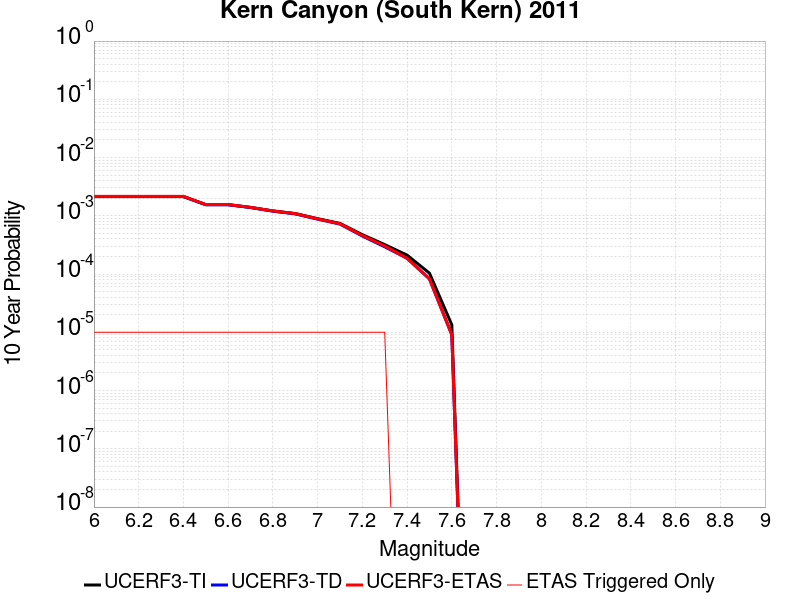 |

| Magnitude | 1 wk TI Prob | 1 wk TD Prob | 1 wk ETAS Prob | 1 wk ETAS/TD Gain | 1 wk ETAS Triggered Only | 1 mo TI Prob | 1 mo TD Prob | 1 mo ETAS Prob | 1 mo ETAS/TD Gain | 1 mo ETAS Triggered Only | 1 yr TI Prob | 1 yr TD Prob | 1 yr ETAS Prob | 1 yr ETAS/TD Gain | 1 yr ETAS Triggered Only | 10 yr TI Prob | 10 yr TD Prob | 10 yr ETAS Prob | 10 yr ETAS/TD Gain | 10 yr ETAS Triggered Only |
|-----|-----|-----|-----|-----|-----|-----|-----|-----|-----|-----|-----|-----|-----|-----|-----|-----|-----|-----|-----|-----|
| 6.0 | 4.105075E-6 | 4.1137673E-6 | 4.1137673E-6 | 1.0 | 0.0 | 1.7593058E-5 | 1.7630317E-5 | 1.7630317E-5 | 1.0 | 0.0 | 2.1417443E-4 | 2.146286E-4 | 2.146286E-4 | 1.0 | 0.0 | 0.0021396813 | 0.002144277 | 0.0021594705 | 1.0070856 | 1.522603E-5 |
| 6.1 | 4.105075E-6 | 4.1137673E-6 | 4.1137673E-6 | 1.0 | 0.0 | 1.7593058E-5 | 1.7630317E-5 | 1.7630317E-5 | 1.0 | 0.0 | 2.1417443E-4 | 2.146286E-4 | 2.146286E-4 | 1.0 | 0.0 | 0.0021396813 | 0.002144277 | 0.0021594705 | 1.0070856 | 1.522603E-5 |
| 6.2 | 4.105075E-6 | 4.1137673E-6 | 4.1137673E-6 | 1.0 | 0.0 | 1.7593058E-5 | 1.7630317E-5 | 1.7630317E-5 | 1.0 | 0.0 | 2.1417443E-4 | 2.146286E-4 | 2.146286E-4 | 1.0 | 0.0 | 0.0021396813 | 0.002144277 | 0.0021594705 | 1.0070856 | 1.522603E-5 |
| 6.3 | 4.105075E-6 | 4.1137673E-6 | 4.1137673E-6 | 1.0 | 0.0 | 1.7593058E-5 | 1.7630317E-5 | 1.7630317E-5 | 1.0 | 0.0 | 2.1417443E-4 | 2.146286E-4 | 2.146286E-4 | 1.0 | 0.0 | 0.0021396813 | 0.002144277 | 0.0021594705 | 1.0070856 | 1.522603E-5 |
| 6.4 | 4.105075E-6 | 4.1137673E-6 | 4.1137673E-6 | 1.0 | 0.0 | 1.7593058E-5 | 1.7630317E-5 | 1.7630317E-5 | 1.0 | 0.0 | 2.1417443E-4 | 2.146286E-4 | 2.146286E-4 | 1.0 | 0.0 | 0.0021396813 | 0.002144277 | 0.0021594705 | 1.0070856 | 1.522603E-5 |
| 6.5 | 2.9849807E-6 | 2.9731848E-6 | 2.9731848E-6 | 1.0 | 0.0 | 1.2792712E-5 | 1.2742159E-5 | 1.2742159E-5 | 1.0 | 0.0 | 1.5574014E-4 | 1.5512489E-4 | 1.5512489E-4 | 1.0 | 0.0 | 0.0015563103 | 0.0015501813 | 0.0015653836 | 1.0098069 | 1.522603E-5 |
| 6.6 | 2.9849807E-6 | 2.9731848E-6 | 2.9731848E-6 | 1.0 | 0.0 | 1.2792712E-5 | 1.2742159E-5 | 1.2742159E-5 | 1.0 | 0.0 | 1.5574014E-4 | 1.5512489E-4 | 1.5512489E-4 | 1.0 | 0.0 | 0.0015563103 | 0.0015501813 | 0.0015653836 | 1.0098069 | 1.522603E-5 |
| 6.7 | 2.6756725E-6 | 2.6582477E-6 | 2.6582477E-6 | 1.0 | 0.0 | 1.1467117E-5 | 1.1392441E-5 | 1.1392441E-5 | 1.0 | 0.0 | 1.396032E-4 | 1.3869425E-4 | 1.3869425E-4 | 1.0 | 0.0 | 0.0013951553 | 0.0013860879 | 0.0014012927 | 1.0109696 | 1.522603E-5 |
| 6.8 | 2.3283721E-6 | 2.3048024E-6 | 2.3048024E-6 | 1.0 | 0.0 | 9.9787E-6 | 9.877688E-6 | 9.877688E-6 | 1.0 | 0.0 | 1.214839E-4 | 1.20254284E-4 | 1.20254284E-4 | 1.0 | 0.0 | 0.001214175 | 0.0012018996 | 0.0012171073 | 1.0126531 | 1.522603E-5 |
| 6.9 | 2.0972677E-6 | 2.0696625E-6 | 2.0696625E-6 | 1.0 | 0.0 | 8.988259E-6 | 8.869953E-6 | 8.869953E-6 | 1.0 | 0.0 | 1.0942656E-4 | 1.0798638E-4 | 1.0798638E-4 | 1.0 | 0.0 | 0.0010937268 | 0.0010793449 | 0.0010945546 | 1.0140915 | 1.522603E-5 |
| 7.0 | 1.7132242E-6 | 1.6787213E-6 | 1.6787213E-6 | 1.0 | 0.0 | 7.3423685E-6 | 7.1945E-6 | 7.1945E-6 | 1.0 | 0.0 | 8.938967E-5 | 8.758956E-5 | 8.758956E-5 | 1.0 | 0.0 | 8.935372E-4 | 8.755542E-4 | 8.907669E-4 | 1.017375 | 1.522603E-5 |
| 7.1 | 1.4215541E-6 | 1.38159E-6 | 1.38159E-6 | 1.0 | 0.0 | 6.0923603E-6 | 5.9210865E-6 | 5.9210865E-6 | 1.0 | 0.0 | 7.417196E-5 | 7.208687E-5 | 7.208687E-5 | 1.0 | 0.0 | 7.414721E-4 | 7.206376E-4 | 7.3585263E-4 | 1.0211133 | 1.522603E-5 |
| 7.2 | 9.097853E-7 | 8.603873E-7 | 8.603873E-7 | 1.0 | 0.0 | 3.899074E-6 | 3.687369E-6 | 3.687369E-6 | 1.0 | 0.0 | 4.7470192E-5 | 4.48928E-5 | 4.48928E-5 | 1.0 | 0.0 | 4.7460053E-4 | 4.488384E-4 | 4.640576E-4 | 1.033908 | 1.522603E-5 |
| 7.3 | 6.144169E-7 | 5.628273E-7 | 5.628273E-7 | 1.0 | 0.0 | 2.6332125E-6 | 2.412115E-6 | 2.412115E-6 | 1.0 | 0.0 | 3.205889E-5 | 2.936711E-5 | 2.936711E-5 | 1.0 | 0.0 | 3.2054266E-4 | 2.936328E-4 | 3.0885436E-4 | 1.0518388 | 1.522603E-5 |
| 7.4 | 4.049844E-7 | 3.5728772E-7 | 3.5728772E-7 | 1.0 | 0.0 | 1.7356463E-6 | 1.5312322E-6 | 1.5312322E-6 | 1.0 | 0.0 | 2.1131287E-5 | 1.8642595E-5 | 1.8642595E-5 | 1.0 | 0.0 | 2.1129279E-4 | 1.8641056E-4 | 1.8641056E-4 | 1.0 | 0.0 |
| 7.5 | 1.9871162E-7 | 1.5830682E-7 | 1.5830682E-7 | 1.0 | 0.0 | 8.5162094E-7 | 6.7845764E-7 | 6.7845764E-7 | 1.0 | 0.0 | 1.0368436E-5 | 8.260191E-6 | 8.260191E-6 | 1.0 | 0.0 | 1.0367952E-4 | 8.259893E-5 | 8.259893E-5 | 1.0 | 0.0 |
| 7.6 | 2.572245E-8 | 1.7352884E-8 | 1.7352884E-8 | 1.0 | 0.0 | 1.10239064E-7 | 7.43695E-8 | 7.43695E-8 | 1.0 | 0.0 | 1.3421597E-6 | 9.0544836E-7 | 9.0544836E-7 | 1.0 | 0.0 | 1.3421517E-5 | 9.054452E-6 | 9.054452E-6 | 1.0 | 0.0 |

## Monte Vista - Shannon 2011 CFM
*[(top)](#table-of-contents)*

| 1 Week | 1 Month | 1 Year | 10 Year |
|-----|-----|-----|-----|
|  |  | 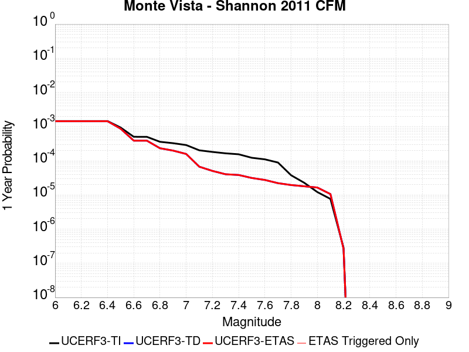 |  |

| Magnitude | 1 wk TI Prob | 1 wk TD Prob | 1 wk ETAS Prob | 1 wk ETAS/TD Gain | 1 wk ETAS Triggered Only | 1 mo TI Prob | 1 mo TD Prob | 1 mo ETAS Prob | 1 mo ETAS/TD Gain | 1 mo ETAS Triggered Only | 1 yr TI Prob | 1 yr TD Prob | 1 yr ETAS Prob | 1 yr ETAS/TD Gain | 1 yr ETAS Triggered Only | 10 yr TI Prob | 10 yr TD Prob | 10 yr ETAS Prob | 10 yr ETAS/TD Gain | 10 yr ETAS Triggered Only |
|-----|-----|-----|-----|-----|-----|-----|-----|-----|-----|-----|-----|-----|-----|-----|-----|-----|-----|-----|-----|-----|
| 6.0 | 2.7907707E-5 | 2.75877E-5 | 2.75877E-5 | 1.0 | 0.0 | 1.19598975E-4 | 1.1822833E-4 | 1.1822833E-4 | 1.0 | 0.0 | 0.0014551448 | 0.0014386033 | 0.0014386033 | 1.0 | 0.0 | 0.014456532 | 0.014322008 | 0.014337015 | 1.0010478 | 1.522603E-5 |
| 6.1 | 2.7907707E-5 | 2.75877E-5 | 2.75877E-5 | 1.0 | 0.0 | 1.19598975E-4 | 1.1822833E-4 | 1.1822833E-4 | 1.0 | 0.0 | 0.0014551448 | 0.0014386033 | 0.0014386033 | 1.0 | 0.0 | 0.014456532 | 0.014322008 | 0.014337015 | 1.0010478 | 1.522603E-5 |
| 6.2 | 2.7907707E-5 | 2.75877E-5 | 2.75877E-5 | 1.0 | 0.0 | 1.19598975E-4 | 1.1822833E-4 | 1.1822833E-4 | 1.0 | 0.0 | 0.0014551448 | 0.0014386033 | 0.0014386033 | 1.0 | 0.0 | 0.014456532 | 0.014322008 | 0.014337015 | 1.0010478 | 1.522603E-5 |
| 6.3 | 2.7907707E-5 | 2.75877E-5 | 2.75877E-5 | 1.0 | 0.0 | 1.19598975E-4 | 1.1822833E-4 | 1.1822833E-4 | 1.0 | 0.0 | 0.0014551448 | 0.0014386033 | 0.0014386033 | 1.0 | 0.0 | 0.014456532 | 0.014322008 | 0.014337015 | 1.0010478 | 1.522603E-5 |
| 6.4 | 2.7907707E-5 | 2.75877E-5 | 2.75877E-5 | 1.0 | 0.0 | 1.19598975E-4 | 1.1822833E-4 | 1.1822833E-4 | 1.0 | 0.0 | 0.0014551448 | 0.0014386033 | 0.0014386033 | 1.0 | 0.0 | 0.014456532 | 0.014322008 | 0.014337015 | 1.0010478 | 1.522603E-5 |
| 6.5 | 1.7990213E-5 | 1.6642773E-5 | 1.6642773E-5 | 1.0 | 0.0 | 7.709863E-5 | 7.132459E-5 | 7.132459E-5 | 1.0 | 0.0 | 9.382716E-4 | 8.680973E-4 | 8.680973E-4 | 1.0 | 0.0 | 0.0093431985 | 0.008670452 | 0.008685546 | 1.0017408 | 1.522603E-5 |
| 6.6 | 9.650407E-6 | 7.4595387E-6 | 7.4595387E-6 | 1.0 | 0.0 | 4.135823E-5 | 3.1969106E-5 | 3.1969106E-5 | 1.0 | 0.0 | 5.0342013E-4 | 3.8916216E-4 | 3.8916216E-4 | 1.0 | 0.0 | 0.005022812 | 0.0039025035 | 0.0039025035 | 1.0 | 0.0 |
| 6.7 | 9.62828E-6 | 7.4374507E-6 | 7.4374507E-6 | 1.0 | 0.0 | 4.1263404E-5 | 3.1874442E-5 | 3.1874442E-5 | 1.0 | 0.0 | 5.022661E-4 | 3.8801008E-4 | 3.8801008E-4 | 1.0 | 0.0 | 0.0050113243 | 0.003891023 | 0.003891023 | 1.0 | 0.0 |
| 6.8 | 6.887523E-6 | 4.463821E-6 | 4.463821E-6 | 1.0 | 0.0 | 2.9517621E-5 | 1.9130533E-5 | 1.9130533E-5 | 1.0 | 0.0 | 3.5931775E-4 | 2.3289157E-4 | 2.3289157E-4 | 1.0 | 0.0 | 0.0035873733 | 0.0023436449 | 0.0023436449 | 1.0 | 0.0 |
| 6.9 | 6.2722347E-6 | 3.805659E-6 | 3.805659E-6 | 1.0 | 0.0 | 2.6880729E-5 | 1.6309876E-5 | 1.6309876E-5 | 1.0 | 0.0 | 3.2722374E-4 | 1.9855668E-4 | 1.9855668E-4 | 1.0 | 0.0 | 0.003267423 | 0.0020009486 | 0.0020009486 | 1.0 | 0.0 |
| 7.0 | 5.5320347E-6 | 3.0327608E-6 | 3.0327608E-6 | 1.0 | 0.0 | 2.3708504E-5 | 1.29974915E-5 | 1.29974915E-5 | 1.0 | 0.0 | 2.8861282E-4 | 1.582348E-4 | 1.582348E-4 | 1.0 | 0.0 | 0.0028823826 | 0.0015983633 | 0.0015983633 | 1.0 | 0.0 |
| 7.1 | 3.8794055E-6 | 1.285852E-6 | 1.285852E-6 | 1.0 | 0.0 | 1.6625918E-5 | 5.510783E-6 | 5.510783E-6 | 1.0 | 0.0 | 2.0240174E-4 | 6.709173E-5 | 6.709173E-5 | 1.0 | 0.0 | 0.002022175 | 6.876822E-4 | 6.876822E-4 | 1.0 | 0.0 |
| 7.2 | 3.4813652E-6 | 9.690727E-7 | 9.690727E-7 | 1.0 | 0.0 | 1.49200505E-5 | 4.153162E-6 | 4.153162E-6 | 1.0 | 0.0 | 1.8163648E-4 | 5.0563587E-5 | 5.0563587E-5 | 1.0 | 0.0 | 0.0018148809 | 5.22476E-4 | 5.22476E-4 | 1.0 | 0.0 |
| 7.3 | 3.1682148E-6 | 7.7381594E-7 | 7.7381594E-7 | 1.0 | 0.0 | 1.3577992E-5 | 3.3163496E-6 | 3.3163496E-6 | 1.0 | 0.0 | 1.6529951E-4 | 4.0375813E-5 | 4.0375813E-5 | 1.0 | 0.0 | 0.0016517661 | 4.2061496E-4 | 4.2061496E-4 | 1.0 | 0.0 |
| 7.4 | 2.9707667E-6 | 7.3642167E-7 | 7.3642167E-7 | 1.0 | 0.0 | 1.2731795E-5 | 3.1560892E-6 | 3.1560892E-6 | 1.0 | 0.0 | 1.5499859E-4 | 3.842471E-5 | 3.842471E-5 | 1.0 | 0.0 | 0.0015489052 | 4.0090227E-4 | 4.0090227E-4 | 1.0 | 0.0 |
| 7.5 | 2.3462758E-6 | 6.023677E-7 | 6.023677E-7 | 1.0 | 0.0 | 1.0055429E-5 | 2.5815734E-6 | 2.5815734E-6 | 1.0 | 0.0 | 1.2241797E-4 | 3.1430205E-5 | 3.1430205E-5 | 1.0 | 0.0 | 0.0012235056 | 3.2923152E-4 | 3.2923152E-4 | 1.0 | 0.0 |
| 7.6 | 2.112783E-6 | 5.266409E-7 | 5.266409E-7 | 1.0 | 0.0 | 9.054753E-6 | 2.2570305E-6 | 2.2570305E-6 | 1.0 | 0.0 | 1.1023604E-4 | 2.7479E-5 | 2.7479E-5 | 1.0 | 0.0 | 0.0011018137 | 2.8929894E-4 | 2.8929894E-4 | 1.0 | 0.0 |
| 7.7 | 1.7022471E-6 | 4.2444987E-7 | 4.2444987E-7 | 1.0 | 0.0 | 7.2953244E-6 | 1.8190696E-6 | 1.8190696E-6 | 1.0 | 0.0 | 8.881695E-5 | 2.2146949E-5 | 2.2146949E-5 | 1.0 | 0.0 | 8.878146E-4 | 2.3466849E-4 | 2.3466849E-4 | 1.0 | 0.0 |
| 7.8 | 7.230914E-7 | 3.7402418E-7 | 3.7402418E-7 | 1.0 | 0.0 | 3.0989595E-6 | 1.6029599E-6 | 1.6029599E-6 | 1.0 | 0.0 | 3.772918E-5 | 1.9515863E-5 | 1.9515863E-5 | 1.0 | 0.0 | 3.7722773E-4 | 2.0788297E-4 | 2.0788297E-4 | 1.0 | 0.0 |
| 7.9 | 4.3588446E-7 | 3.4407202E-7 | 3.4407202E-7 | 1.0 | 0.0 | 1.868075E-6 | 1.4745935E-6 | 1.4745935E-6 | 1.0 | 0.0 | 2.2743576E-5 | 1.795303E-5 | 1.795303E-5 | 1.0 | 0.0 | 2.2741247E-4 | 1.9048195E-4 | 1.9048195E-4 | 1.0 | 0.0 |
| 8.0 | 2.3317523E-7 | 3.1602372E-7 | 3.1602372E-7 | 1.0 | 0.0 | 9.99322E-7 | 1.3543867E-6 | 1.3543867E-6 | 1.0 | 0.0 | 1.2166677E-5 | 1.6489534E-5 | 1.6489534E-5 | 1.0 | 0.0 | 1.21660116E-4 | 1.7445331E-4 | 1.7445331E-4 | 1.0 | 0.0 |
| 8.1 | 1.4662456E-7 | 2.0360646E-7 | 2.0360646E-7 | 1.0 | 0.0 | 6.283908E-7 | 8.725988E-7 | 8.725988E-7 | 1.0 | 0.0 | 7.650631E-6 | 1.0623839E-5 | 1.0623839E-5 | 1.0 | 0.0 | 7.650368E-5 | 1.1159559E-4 | 1.1159559E-4 | 1.0 | 0.0 |
| 8.2 | 5.4931775E-9 | 5.089579E-9 | 5.089579E-9 | 1.0 | 0.0 | 2.3542189E-8 | 2.181248E-8 | 2.181248E-8 | 1.0 | 0.0 | 2.8662612E-7 | 2.6556694E-7 | 2.6556694E-7 | 1.0 | 0.0 | 2.8662573E-6 | 2.7612602E-6 | 2.7612602E-6 | 1.0 | 0.0 |

## Hosgri
*[(top)](#table-of-contents)*

| 1 Week | 1 Month | 1 Year | 10 Year |
|-----|-----|-----|-----|
|  |  |  |  |

| Magnitude | 1 wk TI Prob | 1 wk TD Prob | 1 wk ETAS Prob | 1 wk ETAS/TD Gain | 1 wk ETAS Triggered Only | 1 mo TI Prob | 1 mo TD Prob | 1 mo ETAS Prob | 1 mo ETAS/TD Gain | 1 mo ETAS Triggered Only | 1 yr TI Prob | 1 yr TD Prob | 1 yr ETAS Prob | 1 yr ETAS/TD Gain | 1 yr ETAS Triggered Only | 10 yr TI Prob | 10 yr TD Prob | 10 yr ETAS Prob | 10 yr ETAS/TD Gain | 10 yr ETAS Triggered Only |
|-----|-----|-----|-----|-----|-----|-----|-----|-----|-----|-----|-----|-----|-----|-----|-----|-----|-----|-----|-----|-----|
| 6.0 | 2.883978E-5 | 2.9130051E-5 | 2.9130051E-5 | 1.0 | 0.0 | 1.235932E-4 | 1.2483726E-4 | 1.2483726E-4 | 1.0 | 0.0 | 0.0015037085 | 0.0015188612 | 0.0015340641 | 1.0100094 | 1.522603E-5 | 0.01493574 | 0.015088581 | 0.015103577 | 1.0009938 | 1.522603E-5 |
| 6.1 | 2.883978E-5 | 2.9130051E-5 | 2.9130051E-5 | 1.0 | 0.0 | 1.235932E-4 | 1.2483726E-4 | 1.2483726E-4 | 1.0 | 0.0 | 0.0015037085 | 0.0015188612 | 0.0015340641 | 1.0100094 | 1.522603E-5 | 0.01493574 | 0.015088581 | 0.015103577 | 1.0009938 | 1.522603E-5 |
| 6.2 | 2.883978E-5 | 2.9130051E-5 | 2.9130051E-5 | 1.0 | 0.0 | 1.235932E-4 | 1.2483726E-4 | 1.2483726E-4 | 1.0 | 0.0 | 0.0015037085 | 0.0015188612 | 0.0015340641 | 1.0100094 | 1.522603E-5 | 0.01493574 | 0.015088581 | 0.015103577 | 1.0009938 | 1.522603E-5 |
| 6.3 | 2.2914428E-5 | 2.2643277E-5 | 2.2643277E-5 | 1.0 | 0.0 | 9.8200995E-5 | 9.703903E-5 | 9.703903E-5 | 1.0 | 0.0 | 0.0011949413 | 0.0011808148 | 0.0011960228 | 1.0128793 | 1.522603E-5 | 0.011885363 | 0.011746808 | 0.011761855 | 1.0012809 | 1.522603E-5 |
| 6.4 | 2.0195741E-5 | 1.9697736E-5 | 1.9697736E-5 | 1.0 | 0.0 | 8.65503E-5 | 8.441615E-5 | 8.441615E-5 | 1.0 | 0.0 | 0.0010532405 | 0.0010272841 | 0.0010424944 | 1.0148064 | 1.522603E-5 | 0.010482626 | 0.0102264015 | 0.010241471 | 1.0014737 | 1.522603E-5 |
| 6.5 | 1.9924333E-5 | 1.9410149E-5 | 1.9410149E-5 | 1.0 | 0.0 | 8.53872E-5 | 8.318371E-5 | 8.318371E-5 | 1.0 | 0.0 | 0.0010390934 | 0.001012293 | 0.0010275036 | 1.0150259 | 1.522603E-5 | 0.010342481 | 0.0100778565 | 0.010092929 | 1.0014956 | 1.522603E-5 |
| 6.6 | 1.809694E-5 | 1.7459393E-5 | 1.7459393E-5 | 1.0 | 0.0 | 7.7556004E-5 | 7.482383E-5 | 7.482383E-5 | 1.0 | 0.0 | 9.438353E-4 | 9.106007E-4 | 9.2581287E-4 | 1.0167056 | 1.522603E-5 | 0.009398366 | 0.009069638 | 0.009084727 | 1.0016636 | 1.522603E-5 |
| 6.7 | 1.675989E-5 | 1.6043807E-5 | 1.6043807E-5 | 1.0 | 0.0 | 7.182612E-5 | 6.875736E-5 | 6.875736E-5 | 1.0 | 0.0 | 8.7413215E-4 | 8.3680055E-4 | 8.520138E-4 | 1.0181803 | 1.522603E-5 | 0.008707017 | 0.008337403 | 0.008352502 | 1.001811 | 1.522603E-5 |
| 6.8 | 1.5401129E-5 | 1.4615074E-5 | 1.4615074E-5 | 1.0 | 0.0 | 6.6003166E-5 | 6.2634535E-5 | 6.2634535E-5 | 1.0 | 0.0 | 8.032922E-4 | 7.623095E-4 | 7.775239E-4 | 1.0199584 | 1.522603E-5 | 0.008003947 | 0.0075978106 | 0.007612921 | 1.0019888 | 1.522603E-5 |
| 6.9 | 1.356559E-5 | 1.2690892E-5 | 1.2690892E-5 | 1.0 | 0.0 | 5.8136946E-5 | 5.4388405E-5 | 5.4388405E-5 | 1.0 | 0.0 | 7.0758746E-4 | 6.619781E-4 | 6.7719404E-4 | 1.0229856 | 1.522603E-5 | 0.007053386 | 0.006600868 | 0.006615993 | 1.0022914 | 1.522603E-5 |
| 7.0 | 1.2030819E-5 | 1.1096832E-5 | 1.1096832E-5 | 1.0 | 0.0 | 5.155963E-5 | 4.7556987E-5 | 4.7556987E-5 | 1.0 | 0.0 | 6.275577E-4 | 5.788526E-4 | 5.9406983E-4 | 1.0262886 | 1.522603E-5 | 0.006257884 | 0.0057742097 | 0.005789348 | 1.0026217 | 1.522603E-5 |
| 7.1 | 1.0972698E-5 | 1.0023018E-5 | 1.0023018E-5 | 1.0 | 0.0 | 4.7025E-5 | 4.2955086E-5 | 4.2955086E-5 | 1.0 | 0.0 | 5.72379E-4 | 5.2285276E-4 | 5.380708E-4 | 1.0291059 | 1.522603E-5 | 0.0057090693 | 0.0052169785 | 0.005232125 | 1.0029033 | 1.522603E-5 |
| 7.2 | 9.961926E-6 | 9.035558E-6 | 9.035558E-6 | 1.0 | 0.0 | 4.2693267E-5 | 3.8723243E-5 | 3.8723243E-5 | 1.0 | 0.0 | 5.1966653E-4 | 4.713536E-4 | 4.8657242E-4 | 1.0322876 | 1.522603E-5 | 0.00518453 | 0.004704285 | 0.0047194394 | 1.0032214 | 1.522603E-5 |
| 7.3 | 8.700929E-6 | 7.82888E-6 | 7.82888E-6 | 1.0 | 0.0 | 3.7289166E-5 | 3.3551914E-5 | 3.3551914E-5 | 1.0 | 0.0 | 4.53901E-4 | 4.0841804E-4 | 4.2363783E-4 | 1.0372653 | 1.522603E-5 | 0.00452975 | 0.0040774145 | 0.0040925783 | 1.003719 | 1.522603E-5 |
| 7.4 | 7.866285E-6 | 6.9995003E-6 | 6.9995003E-6 | 1.0 | 0.0 | 3.3712215E-5 | 2.9997515E-5 | 2.9997515E-5 | 1.0 | 0.0 | 4.103689E-4 | 3.6515854E-4 | 3.6515854E-4 | 1.0 | 0.0 | 0.004096119 | 0.0036463232 | 0.0036463232 | 1.0 | 0.0 |
| 7.5 | 6.8381305E-6 | 5.9604317E-6 | 5.9604317E-6 | 1.0 | 0.0 | 2.9305946E-5 | 2.5544457E-5 | 2.5544457E-5 | 1.0 | 0.0 | 3.5674145E-4 | 3.109594E-4 | 3.109594E-4 | 1.0 | 0.0 | 0.0035616932 | 0.0031059785 | 0.0031059785 | 1.0 | 0.0 |
| 7.6 | 5.503376E-6 | 4.5959455E-6 | 4.5959455E-6 | 1.0 | 0.0 | 2.3585684E-5 | 1.969676E-5 | 1.969676E-5 | 1.0 | 0.0 | 2.8711787E-4 | 2.3978167E-4 | 2.3978167E-4 | 1.0 | 0.0 | 0.002867472 | 0.002395963 | 0.002395963 | 1.0 | 0.0 |
| 7.7 | 3.6144982E-6 | 2.652859E-6 | 2.652859E-6 | 1.0 | 0.0 | 1.5490614E-5 | 1.1369346E-5 | 1.1369346E-5 | 1.0 | 0.0 | 1.8858191E-4 | 1.38413E-4 | 1.38413E-4 | 1.0 | 0.0 | 0.0018842196 | 0.0013839996 | 0.0013839996 | 1.0 | 0.0 |
| 7.8 | 1.9853494E-6 | 1.1366585E-6 | 1.1366585E-6 | 1.0 | 0.0 | 8.508612E-6 | 4.8713846E-6 | 4.8713846E-6 | 1.0 | 0.0 | 1.0358743E-4 | 5.930749E-5 | 5.930749E-5 | 1.0 | 0.0 | 0.0010353916 | 5.9364707E-4 | 5.9364707E-4 | 1.0 | 0.0 |
| 7.9 | 1.1818757E-6 | 5.2994693E-7 | 5.2994693E-7 | 1.0 | 0.0 | 5.0651715E-6 | 2.271199E-6 | 2.271199E-6 | 1.0 | 0.0 | 6.1666724E-5 | 2.7651497E-5 | 2.7651497E-5 | 1.0 | 0.0 | 6.1649614E-4 | 2.771693E-4 | 2.771693E-4 | 1.0 | 0.0 |
| 8.0 | 6.962958E-7 | 2.716916E-7 | 2.716916E-7 | 1.0 | 0.0 | 2.9841215E-6 | 1.164392E-6 | 1.164392E-6 | 1.0 | 0.0 | 3.6331072E-5 | 1.417638E-5 | 1.417638E-5 | 1.0 | 0.0 | 3.6325134E-4 | 1.423256E-4 | 1.423256E-4 | 1.0 | 0.0 |
| 8.1 | 1.5033264E-7 | 6.5338824E-8 | 6.5338824E-8 | 1.0 | 0.0 | 6.442826E-7 | 2.800235E-7 | 2.800235E-7 | 1.0 | 0.0 | 7.844113E-6 | 3.409281E-6 | 3.409281E-6 | 1.0 | 0.0 | 7.843835E-5 | 3.410959E-5 | 3.410959E-5 | 1.0 | 0.0 |

## San Andreas (Santa Cruz Mts) 2011 CFM
*[(top)](#table-of-contents)*

| 1 Week | 1 Month | 1 Year | 10 Year |
|-----|-----|-----|-----|
|  |  |  |  |

| Magnitude | 1 wk TI Prob | 1 wk TD Prob | 1 wk ETAS Prob | 1 wk ETAS/TD Gain | 1 wk ETAS Triggered Only | 1 mo TI Prob | 1 mo TD Prob | 1 mo ETAS Prob | 1 mo ETAS/TD Gain | 1 mo ETAS Triggered Only | 1 yr TI Prob | 1 yr TD Prob | 1 yr ETAS Prob | 1 yr ETAS/TD Gain | 1 yr ETAS Triggered Only | 10 yr TI Prob | 10 yr TD Prob | 10 yr ETAS Prob | 10 yr ETAS/TD Gain | 10 yr ETAS Triggered Only |
|-----|-----|-----|-----|-----|-----|-----|-----|-----|-----|-----|-----|-----|-----|-----|-----|-----|-----|-----|-----|-----|
| 6.0 | 1.7221631E-4 | 1.3823692E-4 | 1.5346085E-4 | 1.1101292 | 1.522603E-5 | 7.378611E-4 | 5.923115E-4 | 6.075285E-4 | 1.0256909 | 1.522603E-5 | 0.008946515 | 0.0071879383 | 0.007203055 | 1.0021031 | 1.522603E-5 | 0.08594794 | 0.070697196 | 0.070711344 | 1.0002002 | 1.522603E-5 |
| 6.1 | 1.7221631E-4 | 1.3823692E-4 | 1.5346085E-4 | 1.1101292 | 1.522603E-5 | 7.378611E-4 | 5.923115E-4 | 6.075285E-4 | 1.0256909 | 1.522603E-5 | 0.008946515 | 0.0071879383 | 0.007203055 | 1.0021031 | 1.522603E-5 | 0.08594794 | 0.070697196 | 0.070711344 | 1.0002002 | 1.522603E-5 |
| 6.2 | 1.7221631E-4 | 1.3823692E-4 | 1.5346085E-4 | 1.1101292 | 1.522603E-5 | 7.378611E-4 | 5.923115E-4 | 6.075285E-4 | 1.0256909 | 1.522603E-5 | 0.008946515 | 0.0071879383 | 0.007203055 | 1.0021031 | 1.522603E-5 | 0.08594794 | 0.070697196 | 0.070711344 | 1.0002002 | 1.522603E-5 |
| 6.3 | 1.716926E-4 | 1.3743078E-4 | 1.5265471E-4 | 1.1107754 | 1.522603E-5 | 7.3561794E-4 | 5.888581E-4 | 6.0407515E-4 | 1.0258416 | 1.522603E-5 | 0.008919428 | 0.0071461694 | 0.0071612867 | 1.0021155 | 1.522603E-5 | 0.08569809 | 0.0703092 | 0.070323355 | 1.0002013 | 1.522603E-5 |
| 6.4 | 1.6392978E-4 | 1.3618424E-4 | 1.514082E-4 | 1.1117895 | 1.522603E-5 | 7.02367E-4 | 5.8351824E-4 | 5.9873535E-4 | 1.0260782 | 1.522603E-5 | 0.008517839 | 0.0070815794 | 0.0070966976 | 1.0021349 | 1.522603E-5 | 0.08198654 | 0.06954003 | 0.0695542 | 1.0002037 | 1.522603E-5 |
| 6.5 | 1.5742714E-4 | 1.26776E-4 | 1.4200009E-4 | 1.1200867 | 1.522603E-5 | 6.745133E-4 | 5.4321426E-4 | 5.58432E-4 | 1.0280143 | 1.522603E-5 | 0.00818132 | 0.006593904 | 0.0066090296 | 1.0022938 | 1.522603E-5 | 0.078865945 | 0.0649993 | 0.065013535 | 1.000219 | 1.522603E-5 |
| 6.6 | 1.3038084E-4 | 1.161551E-4 | 1.3137936E-4 | 1.1310683 | 1.522603E-5 | 5.5865536E-4 | 4.9771386E-4 | 5.129323E-4 | 1.0305767 | 1.522603E-5 | 0.006780438 | 0.0060430723 | 0.006058207 | 1.0025043 | 1.522603E-5 | 0.0657725 | 0.059452567 | 0.05946689 | 1.0002409 | 1.522603E-5 |
| 6.7 | 1.2867592E-4 | 1.13418515E-4 | 1.2864282E-4 | 1.1342312 | 1.522603E-5 | 5.5135164E-4 | 4.8599008E-4 | 5.012087E-4 | 1.0313147 | 1.522603E-5 | 0.0066920654 | 0.005901116 | 0.0059162523 | 1.002565 | 1.522603E-5 | 0.06494093 | 0.05816314 | 0.05817748 | 1.0002465 | 1.522603E-5 |
| 6.8 | 1.2801298E-4 | 1.1279377E-4 | 1.2801809E-4 | 1.1349747 | 1.522603E-5 | 5.485117E-4 | 4.833136E-4 | 4.9853226E-4 | 1.0314882 | 1.522603E-5 | 0.0066577005 | 0.0058687064 | 0.005883843 | 1.0025792 | 1.522603E-5 | 0.06461738 | 0.05787688 | 0.057891227 | 1.0002478 | 1.522603E-5 |
| 6.9 | 1.269149E-4 | 1.11214715E-4 | 1.2643904E-4 | 1.1368914 | 1.522603E-5 | 5.4380763E-4 | 4.765487E-4 | 4.917675E-4 | 1.0319355 | 1.522603E-5 | 0.006600777 | 0.005786784 | 0.005801922 | 1.0026159 | 1.522603E-5 | 0.06408122 | 0.057148356 | 0.057162713 | 1.0002512 | 1.522603E-5 |
| 7.0 | 1.2030331E-4 | 1.0851204E-4 | 1.2373642E-4 | 1.1403012 | 1.522603E-5 | 5.154837E-4 | 4.6496998E-4 | 4.8018893E-4 | 1.032731 | 1.522603E-5 | 0.006257969 | 0.005646552 | 0.005661692 | 1.0026813 | 1.522603E-5 | 0.06084648 | 0.055819258 | 0.055833634 | 1.0002575 | 1.522603E-5 |
| 7.1 | 8.049617E-5 | 5.4114953E-5 | 6.934016E-5 | 1.2813493 | 1.522603E-5 | 3.4493793E-4 | 2.319008E-4 | 2.471233E-4 | 1.0656422 | 1.522603E-5 | 0.0041915346 | 0.0028197719 | 0.002834955 | 1.0053846 | 1.522603E-5 | 0.041133516 | 0.02971132 | 0.029726092 | 1.0004972 | 1.522603E-5 |
| 7.2 | 7.093979E-5 | 4.310381E-5 | 5.8329184E-5 | 1.3532257 | 1.522603E-5 | 3.0399222E-4 | 1.8471766E-4 | 1.9994089E-4 | 1.0824134 | 1.522603E-5 | 0.0036948253 | 0.0022466409 | 0.0022618328 | 1.006762 | 1.522603E-5 | 0.03633994 | 0.024024088 | 0.02403895 | 1.0006186 | 1.522603E-5 |
| 7.3 | 6.193693E-5 | 2.9018376E-5 | 4.4243967E-5 | 1.5246878 | 1.522603E-5 | 2.6541698E-4 | 1.2435856E-4 | 1.3958268E-4 | 1.1224213 | 1.522603E-5 | 0.0032266637 | 0.0015130156 | 0.0015282186 | 1.0100482 | 1.522603E-5 | 0.031802133 | 0.016564084 | 0.016579058 | 1.000904 | 1.522603E-5 |
| 7.4 | 5.906492E-5 | 2.7136244E-5 | 4.2361862E-5 | 1.5610805 | 1.522603E-5 | 2.5311083E-4 | 1.16293006E-4 | 1.3151727E-4 | 1.1309129 | 1.522603E-5 | 0.0030772698 | 0.0014149492 | 0.0014301537 | 1.0107456 | 1.522603E-5 | 0.030350044 | 0.015530545 | 0.015545535 | 1.0009651 | 1.522603E-5 |
| 7.5 | 5.424296E-5 | 2.4776109E-5 | 4.0001763E-5 | 1.6145296 | 1.522603E-5 | 2.324491E-4 | 1.0617901E-4 | 1.2140342E-4 | 1.1433845 | 1.522603E-5 | 0.002826395 | 0.0012919641 | 0.0013071704 | 1.01177 | 1.522603E-5 | 0.027907165 | 0.014215293 | 0.014230303 | 1.0010558 | 1.522603E-5 |
| 7.6 | 4.43084E-5 | 1.9971396E-5 | 3.519712E-5 | 1.7623767 | 1.522603E-5 | 1.8987931E-4 | 8.558889E-5 | 1.0081362E-4 | 1.1778821 | 1.522603E-5 | 0.0023093296 | 0.0010415468 | 0.0010567569 | 1.0146035 | 1.522603E-5 | 0.022854783 | 0.011448878 | 0.01146393 | 1.0013146 | 1.522603E-5 |
| 7.7 | 4.118098E-5 | 1.8999577E-5 | 3.422532E-5 | 1.8013726 | 1.522603E-5 | 1.7647797E-4 | 8.1424216E-5 | 9.6649004E-5 | 1.1869811 | 1.522603E-5 | 0.002146502 | 9.908893E-4 | 0.0010061002 | 1.0153508 | 1.522603E-5 | 0.021258866 | 0.010904559 | 0.010919619 | 1.001381 | 1.522603E-5 |
| 7.8 | 3.5408906E-5 | 1.8625631E-5 | 3.385138E-5 | 1.8174621 | 1.522603E-5 | 1.5174363E-4 | 7.982169E-5 | 9.504651E-5 | 1.1907353 | 1.522603E-5 | 0.0018459131 | 9.7139605E-4 | 9.866073E-4 | 1.0156591 | 1.522603E-5 | 0.018306552 | 0.0106848935 | 0.010699957 | 1.0014098 | 1.522603E-5 |
| 7.9 | 2.5860836E-5 | 1.7371205E-5 | 3.259697E-5 | 1.8764945 | 1.522603E-5 | 1.10827445E-4 | 7.4445896E-5 | 8.967079E-5 | 1.2045095 | 1.522603E-5 | 0.001348489 | 9.060022E-4 | 9.212144E-4 | 1.0167905 | 1.522603E-5 | 0.013403354 | 0.009936898 | 0.009951972 | 1.001517 | 1.522603E-5 |
| 8.0 | 1.9777332E-5 | 1.4886952E-5 | 3.0112755E-5 | 2.0227616 | 1.522603E-5 | 8.4757245E-5 | 6.379966E-5 | 7.902472E-5 | 1.2386385 | 1.522603E-5 | 0.0010314309 | 7.7648426E-4 | 7.9169846E-4 | 1.0195937 | 1.522603E-5 | 0.010266567 | 0.008534084 | 0.00854918 | 1.001769 | 1.522603E-5 |
| 8.1 | 1.468494E-5 | 1.2146339E-5 | 2.7372183E-5 | 2.2535338 | 1.522603E-5 | 6.293394E-5 | 5.20547E-5 | 6.7279936E-5 | 1.2924854 | 1.522603E-5 | 7.6595135E-4 | 6.3358183E-4 | 6.4879825E-4 | 1.0240165 | 1.522603E-5 | 0.0076331664 | 0.0069899 | 0.0070050196 | 1.002163 | 1.522603E-5 |
| 8.2 | 8.63836E-6 | 5.489407E-6 | 5.489407E-6 | 1.0 | 0.0 | 3.7021015E-5 | 2.3525818E-5 | 2.3525818E-5 | 1.0 | 0.0 | 4.5063766E-4 | 2.863893E-4 | 2.863893E-4 | 1.0 | 0.0 | 0.004497249 | 0.0032568157 | 0.0032568157 | 1.0 | 0.0 |
| 8.3 | 1.983087E-6 | 7.693574E-7 | 7.693574E-7 | 1.0 | 0.0 | 8.498917E-6 | 3.297242E-6 | 3.297242E-6 | 1.0 | 0.0 | 1.034694E-4 | 4.01432E-5 | 4.01432E-5 | 1.0 | 0.0 | 0.0010342124 | 4.7390026E-4 | 4.7390026E-4 | 1.0 | 0.0 |

## Channel Islands Western Deep Ramp
*[(top)](#table-of-contents)*

| 1 Week | 1 Month | 1 Year | 10 Year |
|-----|-----|-----|-----|
|  |  |  |  |

| Magnitude | 1 wk TI Prob | 1 wk TD Prob | 1 wk ETAS Prob | 1 wk ETAS/TD Gain | 1 wk ETAS Triggered Only | 1 mo TI Prob | 1 mo TD Prob | 1 mo ETAS Prob | 1 mo ETAS/TD Gain | 1 mo ETAS Triggered Only | 1 yr TI Prob | 1 yr TD Prob | 1 yr ETAS Prob | 1 yr ETAS/TD Gain | 1 yr ETAS Triggered Only | 10 yr TI Prob | 10 yr TD Prob | 10 yr ETAS Prob | 10 yr ETAS/TD Gain | 10 yr ETAS Triggered Only |
|-----|-----|-----|-----|-----|-----|-----|-----|-----|-----|-----|-----|-----|-----|-----|-----|-----|-----|-----|-----|-----|
| 6.0 | 6.0213506E-6 | 6.2549975E-6 | 6.2549975E-6 | 1.0 | 0.0 | 2.5805533E-5 | 2.6806882E-5 | 2.6806882E-5 | 1.0 | 0.0 | 3.1413708E-4 | 3.2632938E-4 | 3.2632938E-4 | 1.0 | 0.0 | 0.0031369338 | 0.0032589433 | 0.0032741197 | 1.0046568 | 1.522603E-5 |
| 6.1 | 6.0213506E-6 | 6.2549975E-6 | 6.2549975E-6 | 1.0 | 0.0 | 2.5805533E-5 | 2.6806882E-5 | 2.6806882E-5 | 1.0 | 0.0 | 3.1413708E-4 | 3.2632938E-4 | 3.2632938E-4 | 1.0 | 0.0 | 0.0031369338 | 0.0032589433 | 0.0032741197 | 1.0046568 | 1.522603E-5 |
| 6.2 | 6.0213506E-6 | 6.2549975E-6 | 6.2549975E-6 | 1.0 | 0.0 | 2.5805533E-5 | 2.6806882E-5 | 2.6806882E-5 | 1.0 | 0.0 | 3.1413708E-4 | 3.2632938E-4 | 3.2632938E-4 | 1.0 | 0.0 | 0.0031369338 | 0.0032589433 | 0.0032741197 | 1.0046568 | 1.522603E-5 |
| 6.3 | 6.0213506E-6 | 6.2549975E-6 | 6.2549975E-6 | 1.0 | 0.0 | 2.5805533E-5 | 2.6806882E-5 | 2.6806882E-5 | 1.0 | 0.0 | 3.1413708E-4 | 3.2632938E-4 | 3.2632938E-4 | 1.0 | 0.0 | 0.0031369338 | 0.0032589433 | 0.0032741197 | 1.0046568 | 1.522603E-5 |
| 6.4 | 6.0213506E-6 | 6.2549975E-6 | 6.2549975E-6 | 1.0 | 0.0 | 2.5805533E-5 | 2.6806882E-5 | 2.6806882E-5 | 1.0 | 0.0 | 3.1413708E-4 | 3.2632938E-4 | 3.2632938E-4 | 1.0 | 0.0 | 0.0031369338 | 0.0032589433 | 0.0032741197 | 1.0046568 | 1.522603E-5 |
| 6.5 | 6.0213506E-6 | 6.2549975E-6 | 6.2549975E-6 | 1.0 | 0.0 | 2.5805533E-5 | 2.6806882E-5 | 2.6806882E-5 | 1.0 | 0.0 | 3.1413708E-4 | 3.2632938E-4 | 3.2632938E-4 | 1.0 | 0.0 | 0.0031369338 | 0.0032589433 | 0.0032741197 | 1.0046568 | 1.522603E-5 |
| 6.6 | 6.0213506E-6 | 6.2549975E-6 | 6.2549975E-6 | 1.0 | 0.0 | 2.5805533E-5 | 2.6806882E-5 | 2.6806882E-5 | 1.0 | 0.0 | 3.1413708E-4 | 3.2632938E-4 | 3.2632938E-4 | 1.0 | 0.0 | 0.0031369338 | 0.0032589433 | 0.0032741197 | 1.0046568 | 1.522603E-5 |
| 6.7 | 5.313309E-6 | 5.5253577E-6 | 5.5253577E-6 | 1.0 | 0.0 | 2.2771126E-5 | 2.3679913E-5 | 2.3679913E-5 | 1.0 | 0.0 | 2.772032E-4 | 2.8826887E-4 | 2.8826887E-4 | 1.0 | 0.0 | 0.0027685766 | 0.0028793528 | 0.002894535 | 1.0052727 | 1.522603E-5 |
| 6.8 | 5.313309E-6 | 5.5253577E-6 | 5.5253577E-6 | 1.0 | 0.0 | 2.2771126E-5 | 2.3679913E-5 | 2.3679913E-5 | 1.0 | 0.0 | 2.772032E-4 | 2.8826887E-4 | 2.8826887E-4 | 1.0 | 0.0 | 0.0027685766 | 0.0028793528 | 0.002894535 | 1.0052727 | 1.522603E-5 |
| 6.9 | 4.744377E-6 | 4.9395385E-6 | 4.9395385E-6 | 1.0 | 0.0 | 2.0332885E-5 | 2.11693E-5 | 2.11693E-5 | 1.0 | 0.0 | 2.4752476E-4 | 2.5770947E-4 | 2.5770947E-4 | 1.0 | 0.0 | 0.0024724922 | 0.0025744736 | 0.0025896605 | 1.005899 | 1.522603E-5 |
| 7.0 | 4.722209E-6 | 4.9165806E-6 | 4.9165806E-6 | 1.0 | 0.0 | 2.0237881E-5 | 2.1070911E-5 | 2.1070911E-5 | 1.0 | 0.0 | 2.4636835E-4 | 2.5651188E-4 | 2.5651188E-4 | 1.0 | 0.0 | 0.002460954 | 0.0025625252 | 0.0025777123 | 1.0059266 | 1.522603E-5 |
| 7.1 | 4.611174E-6 | 4.8015145E-6 | 4.8015145E-6 | 1.0 | 0.0 | 1.9762025E-5 | 2.0577778E-5 | 2.0577778E-5 | 1.0 | 0.0 | 2.4057609E-4 | 2.5050936E-4 | 2.5050936E-4 | 1.0 | 0.0 | 0.002403158 | 0.0025026368 | 0.0025178248 | 1.0060688 | 1.522603E-5 |
| 7.2 | 4.043994E-6 | 4.2121196E-6 | 4.2121196E-6 | 1.0 | 0.0 | 1.7331287E-5 | 1.8051836E-5 | 1.8051836E-5 | 1.0 | 0.0 | 2.10988E-4 | 2.1976251E-4 | 2.1976251E-4 | 1.0 | 0.0 | 0.002107878 | 0.0021958028 | 0.0021958028 | 1.0 | 0.0 |
| 7.3 | 2.1233036E-6 | 2.2298468E-6 | 2.2298468E-6 | 1.0 | 0.0 | 9.099841E-6 | 9.556452E-6 | 9.556452E-6 | 1.0 | 0.0 | 1.1078493E-4 | 1.1634364E-4 | 1.1634364E-4 | 1.0 | 0.0 | 0.0011072971 | 0.0011628328 | 0.0011628328 | 1.0 | 0.0 |
| 7.4 | 1.9051884E-6 | 2.001551E-6 | 2.001551E-6 | 1.0 | 0.0 | 8.165067E-6 | 8.5780475E-6 | 8.5780475E-6 | 1.0 | 0.0 | 9.940516E-5 | 1.0443278E-4 | 1.0443278E-4 | 1.0 | 0.0 | 9.93607E-4 | 0.0010438423 | 0.0010438423 | 1.0 | 0.0 |
| 7.5 | 1.2408497E-6 | 1.3039191E-6 | 1.3039191E-6 | 1.0 | 0.0 | 5.317916E-6 | 5.588213E-6 | 5.588213E-6 | 1.0 | 0.0 | 6.4743705E-5 | 6.803439E-5 | 6.803439E-5 | 1.0 | 0.0 | 6.4724847E-4 | 6.801378E-4 | 6.801378E-4 | 1.0 | 0.0 |
| 7.6 | 6.5440025E-7 | 6.88691E-7 | 6.88691E-7 | 1.0 | 0.0 | 2.8045695E-6 | 2.9515295E-6 | 2.9515295E-6 | 1.0 | 0.0 | 3.4145098E-5 | 3.5934292E-5 | 3.5934292E-5 | 1.0 | 0.0 | 3.4139853E-4 | 3.5928623E-4 | 3.5928623E-4 | 1.0 | 0.0 |
| 7.7 | 3.985963E-7 | 4.1931946E-7 | 4.1931946E-7 | 1.0 | 0.0 | 1.7082689E-6 | 1.7970822E-6 | 1.7970822E-6 | 1.0 | 0.0 | 2.0797976E-5 | 2.1879268E-5 | 2.1879268E-5 | 1.0 | 0.0 | 2.0796029E-4 | 2.187723E-4 | 2.187723E-4 | 1.0 | 0.0 |
| 7.8 | 3.706329E-8 | 3.859264E-8 | 3.859264E-8 | 1.0 | 0.0 | 1.5884267E-7 | 1.6539701E-7 | 1.6539701E-7 | 1.0 | 0.0 | 1.9339077E-6 | 2.013707E-6 | 2.013707E-6 | 1.0 | 0.0 | 1.933891E-5 | 2.0136898E-5 | 2.0136898E-5 | 1.0 | 0.0 |

## Chino alt 1
*[(top)](#table-of-contents)*

| 1 Week | 1 Month | 1 Year | 10 Year |
|-----|-----|-----|-----|
|  |  |  |  |

| Magnitude | 1 wk TI Prob | 1 wk TD Prob | 1 wk ETAS Prob | 1 wk ETAS/TD Gain | 1 wk ETAS Triggered Only | 1 mo TI Prob | 1 mo TD Prob | 1 mo ETAS Prob | 1 mo ETAS/TD Gain | 1 mo ETAS Triggered Only | 1 yr TI Prob | 1 yr TD Prob | 1 yr ETAS Prob | 1 yr ETAS/TD Gain | 1 yr ETAS Triggered Only | 10 yr TI Prob | 10 yr TD Prob | 10 yr ETAS Prob | 10 yr ETAS/TD Gain | 10 yr ETAS Triggered Only |
|-----|-----|-----|-----|-----|-----|-----|-----|-----|-----|-----|-----|-----|-----|-----|-----|-----|-----|-----|-----|-----|
| 6.0 | 3.939946E-5 | 4.8955757E-5 | 4.8955757E-5 | 1.0 | 0.0 | 1.6884391E-4 | 2.0979645E-4 | 2.0979645E-4 | 1.0 | 0.0 | 0.0020537362 | 0.0025517642 | 0.0025669513 | 1.0059516 | 1.522603E-5 | 0.020348595 | 0.025281483 | 0.025296325 | 1.000587 | 1.522603E-5 |
| 6.1 | 2.1505624E-5 | 2.6883481E-5 | 2.6883481E-5 | 1.0 | 0.0 | 9.2163704E-5 | 1.1521046E-4 | 1.1521046E-4 | 1.0 | 0.0 | 0.0011215154 | 0.0014018962 | 0.0014018962 | 1.0 | 0.0 | 0.011158722 | 0.013947416 | 0.013947416 | 1.0 | 0.0 |
| 6.2 | 2.1505624E-5 | 2.6883481E-5 | 2.6883481E-5 | 1.0 | 0.0 | 9.2163704E-5 | 1.1521046E-4 | 1.1521046E-4 | 1.0 | 0.0 | 0.0011215154 | 0.0014018962 | 0.0014018962 | 1.0 | 0.0 | 0.011158722 | 0.013947416 | 0.013947416 | 1.0 | 0.0 |
| 6.3 | 1.4290785E-5 | 1.816862E-5 | 1.816862E-5 | 1.0 | 0.0 | 6.1244784E-5 | 7.786344E-5 | 7.786344E-5 | 1.0 | 0.0 | 7.454001E-4 | 9.4762055E-4 | 9.4762055E-4 | 1.0 | 0.0 | 0.007429048 | 0.009446246 | 0.009446246 | 1.0 | 0.0 |
| 6.4 | 1.4290785E-5 | 1.816862E-5 | 1.816862E-5 | 1.0 | 0.0 | 6.1244784E-5 | 7.786344E-5 | 7.786344E-5 | 1.0 | 0.0 | 7.454001E-4 | 9.4762055E-4 | 9.4762055E-4 | 1.0 | 0.0 | 0.007429048 | 0.009446246 | 0.009446246 | 1.0 | 0.0 |
| 6.5 | 1.3017944E-5 | 1.665543E-5 | 1.665543E-5 | 1.0 | 0.0 | 5.5789995E-5 | 7.13787E-5 | 7.13787E-5 | 1.0 | 0.0 | 6.790315E-4 | 8.6873304E-4 | 8.6873304E-4 | 1.0 | 0.0 | 0.0067696036 | 0.00866366 | 0.00866366 | 1.0 | 0.0 |
| 6.6 | 9.470016E-6 | 1.2041898E-5 | 1.2041898E-5 | 1.0 | 0.0 | 4.058515E-5 | 5.1607305E-5 | 5.1607305E-5 | 1.0 | 0.0 | 4.940122E-4 | 6.281718E-4 | 6.281718E-4 | 1.0 | 0.0 | 0.004929154 | 0.006273171 | 0.006273171 | 1.0 | 0.0 |
| 6.7 | 8.314155E-6 | 1.0409905E-5 | 1.0409905E-5 | 1.0 | 0.0 | 3.5631605E-5 | 4.46133E-5 | 4.46133E-5 | 1.0 | 0.0 | 4.3372845E-4 | 5.430638E-4 | 5.430638E-4 | 1.0 | 0.0 | 0.004328829 | 0.005426893 | 0.005426893 | 1.0 | 0.0 |
| 6.8 | 3.4856364E-6 | 3.8139801E-6 | 3.8139801E-6 | 1.0 | 0.0 | 1.4938357E-5 | 1.6345539E-5 | 1.6345539E-5 | 1.0 | 0.0 | 1.8185932E-4 | 1.9899083E-4 | 1.9899083E-4 | 1.0 | 0.0 | 0.0018171056 | 0.001989803 | 0.001989803 | 1.0 | 0.0 |
| 6.9 | 2.2645952E-6 | 2.1532328E-6 | 2.1532328E-6 | 1.0 | 0.0 | 9.705372E-6 | 9.228109E-6 | 9.228109E-6 | 1.0 | 0.0 | 1.18156495E-4 | 1.1234665E-4 | 1.1234665E-4 | 1.0 | 0.0 | 0.0011809369 | 0.0011235146 | 0.0011235146 | 1.0 | 0.0 |
| 7.0 | 1.7864003E-6 | 1.5433379E-6 | 1.5433379E-6 | 1.0 | 0.0 | 7.655979E-6 | 6.6142893E-6 | 6.6142893E-6 | 1.0 | 0.0 | 9.3207556E-5 | 8.052605E-5 | 8.052605E-5 | 1.0 | 0.0 | 9.316847E-4 | 8.054159E-4 | 8.054159E-4 | 1.0 | 0.0 |
| 7.1 | 1.7315456E-6 | 1.4736019E-6 | 1.4736019E-6 | 1.0 | 0.0 | 7.420889E-6 | 6.3154216E-6 | 6.3154216E-6 | 1.0 | 0.0 | 9.034557E-5 | 7.6887605E-5 | 7.6887605E-5 | 1.0 | 0.0 | 9.0308854E-4 | 7.690479E-4 | 7.690479E-4 | 1.0 | 0.0 |
| 7.2 | 1.6008337E-6 | 1.3576367E-6 | 1.3576367E-6 | 1.0 | 0.0 | 6.860698E-6 | 5.8184305E-6 | 5.8184305E-6 | 1.0 | 0.0 | 8.352579E-5 | 7.0837144E-5 | 7.0837144E-5 | 1.0 | 0.0 | 8.34944E-4 | 7.085699E-4 | 7.085699E-4 | 1.0 | 0.0 |
| 7.3 | 1.3320939E-6 | 1.1219545E-6 | 1.1219545E-6 | 1.0 | 0.0 | 5.7089615E-6 | 4.8083675E-6 | 4.8083675E-6 | 1.0 | 0.0 | 6.9504385E-5 | 5.854035E-5 | 5.854035E-5 | 1.0 | 0.0 | 6.9482654E-4 | 5.8539386E-4 | 5.8539386E-4 | 1.0 | 0.0 |
| 7.4 | 1.114294E-6 | 9.2384767E-7 | 9.2384767E-7 | 1.0 | 0.0 | 4.775537E-6 | 3.9593415E-6 | 3.9593415E-6 | 1.0 | 0.0 | 5.8140613E-5 | 4.820395E-5 | 4.820395E-5 | 1.0 | 0.0 | 5.81254E-4 | 4.8195178E-4 | 4.8195178E-4 | 1.0 | 0.0 |
| 7.5 | 9.354081E-7 | 7.62451E-7 | 7.62451E-7 | 1.0 | 0.0 | 4.0088858E-6 | 3.2676433E-6 | 3.2676433E-6 | 1.0 | 0.0 | 4.8807087E-5 | 3.9782866E-5 | 3.9782866E-5 | 1.0 | 0.0 | 4.879637E-4 | 3.9776083E-4 | 3.9776083E-4 | 1.0 | 0.0 |
| 7.6 | 8.521771E-7 | 6.881667E-7 | 6.881667E-7 | 1.0 | 0.0 | 3.6521824E-6 | 2.9492828E-6 | 2.9492828E-6 | 1.0 | 0.0 | 4.4464414E-5 | 3.590696E-5 | 3.590696E-5 | 1.0 | 0.0 | 4.4455516E-4 | 3.5901475E-4 | 3.5901475E-4 | 1.0 | 0.0 |
| 7.7 | 2.1803626E-7 | 1.4189133E-7 | 1.4189133E-7 | 1.0 | 0.0 | 9.344408E-7 | 6.0810567E-7 | 6.0810567E-7 | 1.0 | 0.0 | 1.1376757E-5 | 7.4036707E-6 | 7.4036707E-6 | 1.0 | 0.0 | 1.13761744E-4 | 7.4035204E-5 | 7.4035204E-5 | 1.0 | 0.0 |

## Malibu Coast (Extension) alt 1
*[(top)](#table-of-contents)*

| 1 Week | 1 Month | 1 Year | 10 Year |
|-----|-----|-----|-----|
|  |  |  | 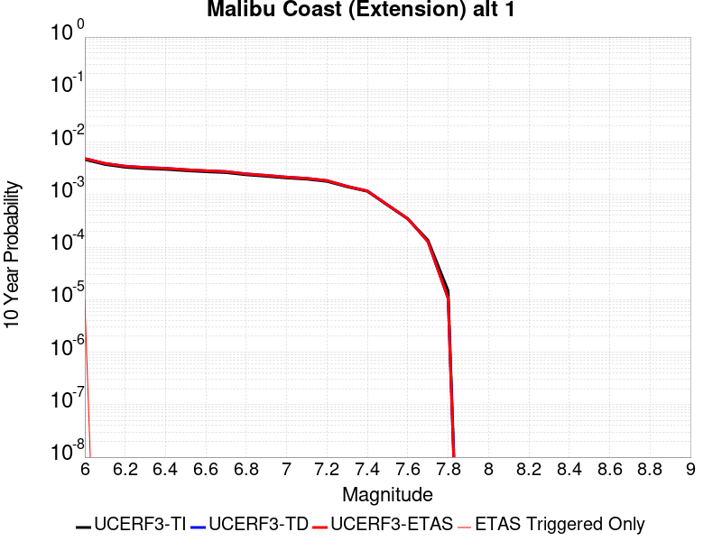 |

| Magnitude | 1 wk TI Prob | 1 wk TD Prob | 1 wk ETAS Prob | 1 wk ETAS/TD Gain | 1 wk ETAS Triggered Only | 1 mo TI Prob | 1 mo TD Prob | 1 mo ETAS Prob | 1 mo ETAS/TD Gain | 1 mo ETAS Triggered Only | 1 yr TI Prob | 1 yr TD Prob | 1 yr ETAS Prob | 1 yr ETAS/TD Gain | 1 yr ETAS Triggered Only | 10 yr TI Prob | 10 yr TD Prob | 10 yr ETAS Prob | 10 yr ETAS/TD Gain | 10 yr ETAS Triggered Only |
|-----|-----|-----|-----|-----|-----|-----|-----|-----|-----|-----|-----|-----|-----|-----|-----|-----|-----|-----|-----|-----|
| 6.0 | 8.930738E-6 | 9.329555E-6 | 9.329555E-6 | 1.0 | 0.0 | 3.827403E-5 | 3.9983202E-5 | 3.9983202E-5 | 1.0 | 0.0 | 4.6588664E-4 | 4.8668848E-4 | 4.8668848E-4 | 1.0 | 0.0 | 0.0046491115 | 0.0048564086 | 0.0048715607 | 1.0031201 | 1.522603E-5 |
| 6.1 | 7.199952E-6 | 7.530538E-6 | 7.530538E-6 | 1.0 | 0.0 | 3.0856572E-5 | 3.2273336E-5 | 3.2273336E-5 | 1.0 | 0.0 | 3.75614E-4 | 3.9285765E-4 | 3.9285765E-4 | 1.0 | 0.0 | 0.0037497976 | 0.003921698 | 0.003921698 | 1.0 | 0.0 |
| 6.2 | 6.3721413E-6 | 6.667013E-6 | 6.667013E-6 | 1.0 | 0.0 | 2.7308892E-5 | 2.8572602E-5 | 2.8572602E-5 | 1.0 | 0.0 | 3.3243504E-4 | 3.4781627E-4 | 3.4781627E-4 | 1.0 | 0.0 | 0.0033193815 | 0.003472759 | 0.003472759 | 1.0 | 0.0 |
| 6.3 | 6.016345E-6 | 6.295371E-6 | 6.295371E-6 | 1.0 | 0.0 | 2.578408E-5 | 2.6979884E-5 | 2.6979884E-5 | 1.0 | 0.0 | 3.1387596E-4 | 3.284309E-4 | 3.284309E-4 | 1.0 | 0.0 | 0.00313433 | 0.0032794913 | 0.0032794913 | 1.0 | 0.0 |
| 6.4 | 5.8104883E-6 | 6.079752E-6 | 6.079752E-6 | 1.0 | 0.0 | 2.4901856E-5 | 2.605582E-5 | 2.605582E-5 | 1.0 | 0.0 | 3.031379E-4 | 3.1718376E-4 | 3.1718376E-4 | 1.0 | 0.0 | 0.0030272473 | 0.0031673452 | 0.0031673452 | 1.0 | 0.0 |
| 6.5 | 5.476925E-6 | 5.72771E-6 | 5.72771E-6 | 1.0 | 0.0 | 2.3472323E-5 | 2.45471E-5 | 2.45471E-5 | 1.0 | 0.0 | 2.8573806E-4 | 2.9882023E-4 | 2.9882023E-4 | 1.0 | 0.0 | 0.0028537093 | 0.0029842162 | 0.0029842162 | 1.0 | 0.0 |
| 6.6 | 5.222387E-6 | 5.4587686E-6 | 5.4587686E-6 | 1.0 | 0.0 | 2.2381464E-5 | 2.3394514E-5 | 2.3394514E-5 | 1.0 | 0.0 | 2.7246025E-4 | 2.8479125E-4 | 2.8479125E-4 | 1.0 | 0.0 | 0.0027212645 | 0.0028442936 | 0.0028442936 | 1.0 | 0.0 |
| 6.7 | 5.0337076E-6 | 5.259286E-6 | 5.259286E-6 | 1.0 | 0.0 | 2.1572854E-5 | 2.2539603E-5 | 2.2539603E-5 | 1.0 | 0.0 | 2.6261783E-4 | 2.7438538E-4 | 2.7438538E-4 | 1.0 | 0.0 | 0.002623077 | 0.0027404963 | 0.0027404963 | 1.0 | 0.0 |
| 6.8 | 4.5675624E-6 | 4.7588796E-6 | 4.7588796E-6 | 1.0 | 0.0 | 1.9575122E-5 | 2.039504E-5 | 2.039504E-5 | 1.0 | 0.0 | 2.3830103E-4 | 2.482815E-4 | 2.482815E-4 | 1.0 | 0.0 | 0.0023804565 | 0.0024800608 | 0.0024800608 | 1.0 | 0.0 |
| 6.9 | 4.2802412E-6 | 4.4521726E-6 | 4.4521726E-6 | 1.0 | 0.0 | 1.8343762E-5 | 1.9080602E-5 | 1.9080602E-5 | 1.0 | 0.0 | 2.2331243E-4 | 2.3228172E-4 | 2.3228172E-4 | 1.0 | 0.0 | 0.0022308815 | 0.002320406 | 0.002320406 | 1.0 | 0.0 |
| 7.0 | 3.9794063E-6 | 4.130239E-6 | 4.130239E-6 | 1.0 | 0.0 | 1.7054486E-5 | 1.7700906E-5 | 1.7700906E-5 | 1.0 | 0.0 | 2.0761859E-4 | 2.1548735E-4 | 2.1548735E-4 | 1.0 | 0.0 | 0.0020742472 | 0.0021527975 | 0.0021527975 | 1.0 | 0.0 |
| 7.1 | 3.7730424E-6 | 3.91135E-6 | 3.91135E-6 | 1.0 | 0.0 | 1.6170083E-5 | 1.6762822E-5 | 1.6762822E-5 | 1.0 | 0.0 | 1.9685295E-4 | 2.0406838E-4 | 2.0406838E-4 | 1.0 | 0.0 | 0.0019667868 | 0.0020388227 | 0.0020388227 | 1.0 | 0.0 |
| 7.2 | 3.424985E-6 | 3.5414578E-6 | 3.5414578E-6 | 1.0 | 0.0 | 1.4678424E-5 | 1.51775885E-5 | 1.51775885E-5 | 1.0 | 0.0 | 1.7869516E-4 | 1.8477159E-4 | 1.8477159E-4 | 1.0 | 0.0 | 0.0017855153 | 0.0018461917 | 0.0018461917 | 1.0 | 0.0 |
| 7.3 | 2.6966375E-6 | 2.7597437E-6 | 2.7597437E-6 | 1.0 | 0.0 | 1.15569665E-5 | 1.1827419E-5 | 1.1827419E-5 | 1.0 | 0.0 | 1.4069698E-4 | 1.4398935E-4 | 1.4398935E-4 | 1.0 | 0.0 | 0.0014060794 | 0.0014389647 | 0.0014389647 | 1.0 | 0.0 |
| 7.4 | 2.215957E-6 | 2.2494507E-6 | 2.2494507E-6 | 1.0 | 0.0 | 9.496924E-6 | 9.640467E-6 | 9.640467E-6 | 1.0 | 0.0 | 1.1561892E-4 | 1.17366406E-4 | 1.17366406E-4 | 1.0 | 0.0 | 0.0011555878 | 0.0011730479 | 0.0011730479 | 1.0 | 0.0 |
| 7.5 | 1.2040218E-6 | 1.221948E-6 | 1.221948E-6 | 1.0 | 0.0 | 5.160083E-6 | 5.2369096E-6 | 5.2369096E-6 | 1.0 | 0.0 | 6.2822204E-5 | 6.375753E-5 | 6.375753E-5 | 1.0 | 0.0 | 6.280445E-4 | 6.373942E-4 | 6.373942E-4 | 1.0 | 0.0 |
| 7.6 | 6.6157446E-7 | 6.679209E-7 | 6.679209E-7 | 1.0 | 0.0 | 2.835316E-6 | 2.862515E-6 | 2.862515E-6 | 1.0 | 0.0 | 3.4519428E-5 | 3.485058E-5 | 3.485058E-5 | 1.0 | 0.0 | 3.4514067E-4 | 3.4845265E-4 | 3.4845265E-4 | 1.0 | 0.0 |
| 7.7 | 2.6012302E-7 | 2.43584E-7 | 2.43584E-7 | 1.0 | 0.0 | 1.1148124E-6 | 1.0439311E-6 | 1.0439311E-6 | 1.0 | 0.0 | 1.3572758E-5 | 1.2709797E-5 | 1.2709797E-5 | 1.0 | 0.0 | 1.3571928E-4 | 1.2709177E-4 | 1.2709177E-4 | 1.0 | 0.0 |
| 7.8 | 2.8323132E-8 | 2.0267372E-8 | 2.0267372E-8 | 1.0 | 0.0 | 1.2138484E-7 | 8.686016E-8 | 8.686016E-8 | 1.0 | 0.0 | 1.4778595E-6 | 1.057522E-6 | 1.057522E-6 | 1.0 | 0.0 | 1.4778497E-5 | 1.0575178E-5 | 1.0575178E-5 | 1.0 | 0.0 |

## Quien Sabe 2011 CFM
*[(top)](#table-of-contents)*

| 1 Week | 1 Month | 1 Year | 10 Year |
|-----|-----|-----|-----|
|  |  |  |  |

| Magnitude | 1 wk TI Prob | 1 wk TD Prob | 1 wk ETAS Prob | 1 wk ETAS/TD Gain | 1 wk ETAS Triggered Only | 1 mo TI Prob | 1 mo TD Prob | 1 mo ETAS Prob | 1 mo ETAS/TD Gain | 1 mo ETAS Triggered Only | 1 yr TI Prob | 1 yr TD Prob | 1 yr ETAS Prob | 1 yr ETAS/TD Gain | 1 yr ETAS Triggered Only | 10 yr TI Prob | 10 yr TD Prob | 10 yr ETAS Prob | 10 yr ETAS/TD Gain | 10 yr ETAS Triggered Only |
|-----|-----|-----|-----|-----|-----|-----|-----|-----|-----|-----|-----|-----|-----|-----|-----|-----|-----|-----|-----|-----|
| 6.0 | 3.729899E-5 | 7.092325E-5 | 7.092325E-5 | 1.0 | 0.0 | 1.5984301E-4 | 3.0393052E-4 | 3.0393052E-4 | 1.0 | 0.0 | 0.0019443515 | 0.0036857617 | 0.0037009318 | 1.0041158 | 1.522603E-5 | 0.019274272 | 0.035356108 | 0.035370797 | 1.0004154 | 1.522603E-5 |
| 6.1 | 1.7825725E-5 | 3.3166325E-5 | 3.3166325E-5 | 1.0 | 0.0 | 7.639373E-5 | 1.4213617E-4 | 1.4213617E-4 | 1.0 | 0.0 | 9.296967E-4 | 0.0017270017 | 0.0017422015 | 1.0088012 | 1.522603E-5 | 0.009258169 | 0.016701793 | 0.016716765 | 1.0008965 | 1.522603E-5 |
| 6.2 | 4.8865336E-6 | 7.807912E-6 | 7.807912E-6 | 1.0 | 0.0 | 2.0942118E-5 | 3.3462104E-5 | 3.3462104E-5 | 1.0 | 0.0 | 2.5494045E-4 | 4.0700758E-4 | 4.0700758E-4 | 1.0 | 0.0 | 0.0025464818 | 0.0040144515 | 0.0040144515 | 1.0 | 0.0 |
| 6.3 | 3.858491E-6 | 5.7910643E-6 | 5.7910643E-6 | 1.0 | 0.0 | 1.6536285E-5 | 2.4818637E-5 | 2.4818637E-5 | 1.0 | 0.0 | 2.0131067E-4 | 3.0212972E-4 | 3.0212972E-4 | 1.0 | 0.0 | 0.002011284 | 0.0030027127 | 0.0030027127 | 1.0 | 0.0 |
| 6.4 | 3.0771805E-6 | 4.3862256E-6 | 4.3862256E-6 | 1.0 | 0.0 | 1.318785E-5 | 1.8797988E-5 | 1.8797988E-5 | 1.0 | 0.0 | 1.6055023E-4 | 2.288439E-4 | 2.288439E-4 | 1.0 | 0.0 | 0.001604343 | 0.0022871757 | 0.0022871757 | 1.0 | 0.0 |
| 6.5 | 2.5081235E-6 | 3.464801E-6 | 3.464801E-6 | 1.0 | 0.0 | 1.0749056E-5 | 1.4849071E-5 | 1.4849071E-5 | 1.0 | 0.0 | 1.308619E-4 | 1.8077392E-4 | 1.8077392E-4 | 1.0 | 0.0 | 0.0013078486 | 0.0018129501 | 0.0018129501 | 1.0 | 0.0 |
| 6.6 | 1.7505364E-6 | 2.4032984E-6 | 2.4032984E-6 | 1.0 | 0.0 | 7.502277E-6 | 1.0299814E-5 | 1.0299814E-5 | 1.0 | 0.0 | 9.13364E-5 | 1.2539372E-4 | 1.2539372E-4 | 1.0 | 0.0 | 9.129886E-4 | 0.0012587844 | 0.0012587844 | 1.0 | 0.0 |
| 6.7 | 1.505737E-6 | 2.0646307E-6 | 2.0646307E-6 | 1.0 | 0.0 | 6.4531428E-6 | 8.848391E-6 | 8.848391E-6 | 1.0 | 0.0 | 7.8564175E-5 | 1.0772444E-4 | 1.0772444E-4 | 1.0 | 0.0 | 7.853641E-4 | 0.0010822661 | 0.0010822661 | 1.0 | 0.0 |
| 6.8 | 1.2924105E-6 | 1.7492055E-6 | 1.7492055E-6 | 1.0 | 0.0 | 5.5388905E-6 | 7.4965765E-6 | 7.4965765E-6 | 1.0 | 0.0 | 6.74339E-5 | 9.1267546E-5 | 9.1267546E-5 | 1.0 | 0.0 | 6.741344E-4 | 9.1650325E-4 | 9.1650325E-4 | 1.0 | 0.0 |
| 6.9 | 8.9075286E-7 | 1.1253261E-6 | 1.1253261E-6 | 1.0 | 0.0 | 3.8175067E-6 | 4.822818E-6 | 4.822818E-6 | 1.0 | 0.0 | 4.6477155E-5 | 5.8716454E-5 | 5.8716454E-5 | 1.0 | 0.0 | 4.6467435E-4 | 5.9056317E-4 | 5.9056317E-4 | 1.0 | 0.0 |
| 7.0 | 6.6891175E-7 | 8.519068E-7 | 8.519068E-7 | 1.0 | 0.0 | 2.8667614E-6 | 3.6510253E-6 | 3.6510253E-6 | 1.0 | 0.0 | 3.4902263E-5 | 4.4450524E-5 | 4.4450524E-5 | 1.0 | 0.0 | 3.4896782E-4 | 4.4691085E-4 | 4.4691085E-4 | 1.0 | 0.0 |
| 7.1 | 4.4205015E-7 | 5.393645E-7 | 5.393645E-7 | 1.0 | 0.0 | 1.8944993E-6 | 2.3115613E-6 | 2.3115613E-6 | 1.0 | 0.0 | 2.3065284E-5 | 2.8143064E-5 | 2.8143064E-5 | 1.0 | 0.0 | 2.3062891E-4 | 2.8277887E-4 | 2.8277887E-4 | 1.0 | 0.0 |
| 7.2 | 1.6620965E-7 | 1.5997604E-7 | 1.5997604E-7 | 1.0 | 0.0 | 7.123269E-7 | 6.856114E-7 | 6.856114E-7 | 1.0 | 0.0 | 8.672545E-6 | 8.347291E-6 | 8.347291E-6 | 1.0 | 0.0 | 8.6722066E-5 | 8.362542E-5 | 8.362542E-5 | 1.0 | 0.0 |
| 7.3 | 1.2142488E-7 | 1.17287904E-7 | 1.17287904E-7 | 1.0 | 0.0 | 5.2039223E-7 | 5.026624E-7 | 5.026624E-7 | 1.0 | 0.0 | 6.335757E-6 | 6.1199007E-6 | 6.1199007E-6 | 1.0 | 0.0 | 6.3355765E-5 | 6.1260405E-5 | 6.1260405E-5 | 1.0 | 0.0 |
| 7.4 | 2.4192937E-8 | 2.4547367E-8 | 2.4547367E-8 | 1.0 | 0.0 | 1.0368401E-7 | 1.0520299E-7 | 1.0520299E-7 | 1.0 | 0.0 | 1.2623522E-6 | 1.2808458E-6 | 1.2808458E-6 | 1.0 | 0.0 | 1.2623449E-5 | 1.28147285E-5 | 1.28147285E-5 | 1.0 | 0.0 |
| 7.5 | 1.4432802E-8 | 1.4507986E-8 | 1.4507986E-8 | 1.0 | 0.0 | 6.185486E-8 | 6.217708E-8 | 6.217708E-8 | 1.0 | 0.0 | 7.530827E-7 | 7.570058E-7 | 7.570058E-7 | 1.0 | 0.0 | 7.530801E-6 | 7.574308E-6 | 7.574308E-6 | 1.0 | 0.0 |

## Kern Canyon (Lake Isabella) 2011
*[(top)](#table-of-contents)*

| 1 Week | 1 Month | 1 Year | 10 Year |
|-----|-----|-----|-----|
|  |  |  |  |

| Magnitude | 1 wk TI Prob | 1 wk TD Prob | 1 wk ETAS Prob | 1 wk ETAS/TD Gain | 1 wk ETAS Triggered Only | 1 mo TI Prob | 1 mo TD Prob | 1 mo ETAS Prob | 1 mo ETAS/TD Gain | 1 mo ETAS Triggered Only | 1 yr TI Prob | 1 yr TD Prob | 1 yr ETAS Prob | 1 yr ETAS/TD Gain | 1 yr ETAS Triggered Only | 10 yr TI Prob | 10 yr TD Prob | 10 yr ETAS Prob | 10 yr ETAS/TD Gain | 10 yr ETAS Triggered Only |
|-----|-----|-----|-----|-----|-----|-----|-----|-----|-----|-----|-----|-----|-----|-----|-----|-----|-----|-----|-----|-----|
| 6.0 | 4.2387383E-6 | 4.0016866E-6 | 4.0016866E-6 | 1.0 | 0.0 | 1.8165894E-5 | 1.7149983E-5 | 1.7149983E-5 | 1.0 | 0.0 | 2.2114732E-4 | 2.0878292E-4 | 2.0878292E-4 | 1.0 | 0.0 | 0.0022092736 | 0.0020860515 | 0.0021012458 | 1.0072837 | 1.522603E-5 |
| 6.1 | 4.2387383E-6 | 4.0016866E-6 | 4.0016866E-6 | 1.0 | 0.0 | 1.8165894E-5 | 1.7149983E-5 | 1.7149983E-5 | 1.0 | 0.0 | 2.2114732E-4 | 2.0878292E-4 | 2.0878292E-4 | 1.0 | 0.0 | 0.0022092736 | 0.0020860515 | 0.0021012458 | 1.0072837 | 1.522603E-5 |
| 6.2 | 4.2387383E-6 | 4.0016866E-6 | 4.0016866E-6 | 1.0 | 0.0 | 1.8165894E-5 | 1.7149983E-5 | 1.7149983E-5 | 1.0 | 0.0 | 2.2114732E-4 | 2.0878292E-4 | 2.0878292E-4 | 1.0 | 0.0 | 0.0022092736 | 0.0020860515 | 0.0021012458 | 1.0072837 | 1.522603E-5 |
| 6.3 | 4.2387383E-6 | 4.0016866E-6 | 4.0016866E-6 | 1.0 | 0.0 | 1.8165894E-5 | 1.7149983E-5 | 1.7149983E-5 | 1.0 | 0.0 | 2.2114732E-4 | 2.0878292E-4 | 2.0878292E-4 | 1.0 | 0.0 | 0.0022092736 | 0.0020860515 | 0.0021012458 | 1.0072837 | 1.522603E-5 |
| 6.4 | 4.2387383E-6 | 4.0016866E-6 | 4.0016866E-6 | 1.0 | 0.0 | 1.8165894E-5 | 1.7149983E-5 | 1.7149983E-5 | 1.0 | 0.0 | 2.2114732E-4 | 2.0878292E-4 | 2.0878292E-4 | 1.0 | 0.0 | 0.0022092736 | 0.0020860515 | 0.0021012458 | 1.0072837 | 1.522603E-5 |
| 6.5 | 2.7857532E-6 | 2.5178983E-6 | 2.5178983E-6 | 1.0 | 0.0 | 1.1938888E-5 | 1.079095E-5 | 1.079095E-5 | 1.0 | 0.0 | 1.4534626E-4 | 1.3137223E-4 | 1.3137223E-4 | 1.0 | 0.0 | 0.0014525123 | 0.0013129783 | 0.0013281844 | 1.0115813 | 1.522603E-5 |
| 6.6 | 2.2233348E-6 | 1.9441488E-6 | 1.9441488E-6 | 1.0 | 0.0 | 9.528543E-6 | 8.33204E-6 | 8.33204E-6 | 1.0 | 0.0 | 1.1600384E-4 | 1.0143795E-4 | 1.0143795E-4 | 1.0 | 0.0 | 0.001159433 | 0.0010139252 | 0.0010291358 | 1.0150017 | 1.522603E-5 |
| 6.7 | 2.1635126E-6 | 1.8835284E-6 | 1.8835284E-6 | 1.0 | 0.0 | 9.272164E-6 | 8.07224E-6 | 8.07224E-6 | 1.0 | 0.0 | 1.1288274E-4 | 9.827517E-5 | 9.827517E-5 | 1.0 | 0.0 | 0.0011282542 | 9.823253E-4 | 9.975364E-4 | 1.0154848 | 1.522603E-5 |
| 6.8 | 1.8685711E-6 | 1.5831645E-6 | 1.5831645E-6 | 1.0 | 0.0 | 8.008137E-6 | 6.7849733E-6 | 6.7849733E-6 | 1.0 | 0.0 | 9.74947E-5 | 8.260396E-5 | 8.260396E-5 | 1.0 | 0.0 | 9.745194E-4 | 8.2573754E-4 | 8.40951E-4 | 1.018424 | 1.522603E-5 |
| 6.9 | 1.5815071E-6 | 1.3065115E-6 | 1.3065115E-6 | 1.0 | 0.0 | 6.77787E-6 | 5.5993232E-6 | 5.5993232E-6 | 1.0 | 0.0 | 8.251744E-5 | 6.8169655E-5 | 6.8169655E-5 | 1.0 | 0.0 | 8.248681E-4 | 6.814901E-4 | 6.9670577E-4 | 1.0223271 | 1.522603E-5 |
| 7.0 | 1.3772564E-6 | 1.1210881E-6 | 1.1210881E-6 | 1.0 | 0.0 | 5.9025137E-6 | 4.804654E-6 | 4.804654E-6 | 1.0 | 0.0 | 7.186073E-5 | 5.8495116E-5 | 5.8495116E-5 | 1.0 | 0.0 | 7.18375E-4 | 5.847992E-4 | 6.000164E-4 | 1.0260211 | 1.522603E-5 |
| 7.1 | 1.0916998E-6 | 8.763901E-7 | 8.763901E-7 | 1.0 | 0.0 | 4.678705E-6 | 3.7559523E-6 | 3.7559523E-6 | 1.0 | 0.0 | 5.6961744E-5 | 4.572777E-5 | 4.572777E-5 | 1.0 | 0.0 | 5.6947145E-4 | 4.5718497E-4 | 4.7240403E-4 | 1.0332886 | 1.522603E-5 |
| 7.2 | 7.6277024E-7 | 5.901538E-7 | 5.901538E-7 | 1.0 | 0.0 | 3.2690114E-6 | 2.5292281E-6 | 2.5292281E-6 | 1.0 | 0.0 | 3.9799485E-5 | 3.0792922E-5 | 3.0792922E-5 | 1.0 | 0.0 | 3.9792358E-4 | 3.0788718E-4 | 3.231085E-4 | 1.049438 | 1.522603E-5 |
| 7.3 | 5.3265916E-7 | 4.3825008E-7 | 4.3825008E-7 | 1.0 | 0.0 | 2.282823E-6 | 1.8782133E-6 | 1.8782133E-6 | 1.0 | 0.0 | 2.7793016E-5 | 2.286701E-5 | 2.286701E-5 | 1.0 | 0.0 | 2.778954E-4 | 2.2864695E-4 | 2.4386951E-4 | 1.0665766 | 1.522603E-5 |
| 7.4 | 3.4946007E-7 | 3.0066107E-7 | 3.0066107E-7 | 1.0 | 0.0 | 1.497685E-6 | 1.2885469E-6 | 1.2885469E-6 | 1.0 | 0.0 | 1.8234163E-5 | 1.5687947E-5 | 1.5687947E-5 | 1.0 | 0.0 | 1.8232666E-4 | 1.5686861E-4 | 1.5686861E-4 | 1.0 | 0.0 |
| 7.5 | 1.8317026E-7 | 1.4245036E-7 | 1.4245036E-7 | 1.0 | 0.0 | 7.850152E-7 | 6.1050144E-7 | 6.1050144E-7 | 1.0 | 0.0 | 9.557518E-6 | 7.4328304E-6 | 7.4328304E-6 | 1.0 | 0.0 | 9.5571064E-5 | 7.432589E-5 | 7.432589E-5 | 1.0 | 0.0 |
| 7.6 | 2.572245E-8 | 1.7352884E-8 | 1.7352884E-8 | 1.0 | 0.0 | 1.10239064E-7 | 7.43695E-8 | 7.43695E-8 | 1.0 | 0.0 | 1.3421597E-6 | 9.0544836E-7 | 9.0544836E-7 | 1.0 | 0.0 | 1.3421517E-5 | 9.054452E-6 | 9.054452E-6 | 1.0 | 0.0 |

## Hunting Creek - Berryessa 2011 CFM
*[(top)](#table-of-contents)*

| 1 Week | 1 Month | 1 Year | 10 Year |
|-----|-----|-----|-----|
|  |  |  |  |

| Magnitude | 1 wk TI Prob | 1 wk TD Prob | 1 wk ETAS Prob | 1 wk ETAS/TD Gain | 1 wk ETAS Triggered Only | 1 mo TI Prob | 1 mo TD Prob | 1 mo ETAS Prob | 1 mo ETAS/TD Gain | 1 mo ETAS Triggered Only | 1 yr TI Prob | 1 yr TD Prob | 1 yr ETAS Prob | 1 yr ETAS/TD Gain | 1 yr ETAS Triggered Only | 10 yr TI Prob | 10 yr TD Prob | 10 yr ETAS Prob | 10 yr ETAS/TD Gain | 10 yr ETAS Triggered Only |
|-----|-----|-----|-----|-----|-----|-----|-----|-----|-----|-----|-----|-----|-----|-----|-----|-----|-----|-----|-----|-----|
| 6.0 | 1.1270982E-4 | 2.0017775E-4 | 2.0017775E-4 | 1.0 | 0.0 | 4.8295266E-4 | 8.5742475E-4 | 8.5742475E-4 | 1.0 | 0.0 | 0.0058641075 | 0.010388056 | 0.010388056 | 1.0 | 0.0 | 0.057117578 | 0.09805172 | 0.09806546 | 1.0001401 | 1.522603E-5 |
| 6.1 | 1.1239393E-4 | 1.9965896E-4 | 1.9965896E-4 | 1.0 | 0.0 | 4.8159933E-4 | 8.552031E-4 | 8.552031E-4 | 1.0 | 0.0 | 0.0058477195 | 0.010361288 | 0.010361288 | 1.0 | 0.0 | 0.056962132 | 0.09781016 | 0.097823896 | 1.0001404 | 1.522603E-5 |
| 6.2 | 7.596265E-5 | 1.2940993E-4 | 1.2940993E-4 | 1.0 | 0.0 | 3.2551357E-4 | 5.5426615E-4 | 5.5426615E-4 | 1.0 | 0.0 | 0.0039559277 | 0.006721831 | 0.006721831 | 1.0 | 0.0 | 0.038862433 | 0.064600885 | 0.06461513 | 1.0002204 | 1.522603E-5 |
| 6.3 | 6.78794E-5 | 1.1452538E-4 | 1.1452538E-4 | 1.0 | 0.0 | 2.9087928E-4 | 4.9073447E-4 | 4.9073447E-4 | 1.0 | 0.0 | 0.003535705 | 0.0059534037 | 0.0059534037 | 1.0 | 0.0 | 0.034799766 | 0.05747386 | 0.05748821 | 1.0002497 | 1.522603E-5 |
| 6.4 | 6.2165134E-5 | 1.04393934E-4 | 1.04393934E-4 | 1.0 | 0.0 | 2.6639478E-4 | 4.4732942E-4 | 4.4732942E-4 | 1.0 | 0.0 | 0.0032385332 | 0.0054282364 | 0.0054282364 | 1.0 | 0.0 | 0.03191742 | 0.052558403 | 0.052572828 | 1.0002744 | 1.522603E-5 |
| 6.5 | 5.4368087E-5 | 9.073724E-5 | 9.073724E-5 | 1.0 | 0.0 | 2.3298527E-4 | 3.8881917E-4 | 3.8881917E-4 | 1.0 | 0.0 | 0.0028329059 | 0.004720476 | 0.004720476 | 1.0 | 0.0 | 0.027970633 | 0.04588709 | 0.04588709 | 1.0 | 0.0 |
| 6.6 | 4.729947E-5 | 7.849487E-5 | 7.849487E-5 | 1.0 | 0.0 | 2.0269625E-4 | 3.3636627E-4 | 3.3636627E-4 | 1.0 | 0.0 | 0.002465034 | 0.0040854933 | 0.0040854933 | 1.0 | 0.0 | 0.02437869 | 0.039857663 | 0.039857663 | 1.0 | 0.0 |
| 6.7 | 3.6875328E-5 | 6.0465416E-5 | 6.0465416E-5 | 1.0 | 0.0 | 1.5802756E-4 | 2.5911423E-4 | 2.5911423E-4 | 1.0 | 0.0 | 0.0019222875 | 0.0031486591 | 0.0031486591 | 1.0 | 0.0 | 0.019057442 | 0.030897204 | 0.030897204 | 1.0 | 0.0 |
| 6.8 | 2.0292036E-5 | 2.897928E-5 | 2.897928E-5 | 1.0 | 0.0 | 8.6962966E-5 | 1.2419096E-4 | 1.2419096E-4 | 1.0 | 0.0 | 0.0010582599 | 0.0015109582 | 0.0015109582 | 1.0 | 0.0 | 0.010532344 | 0.014980009 | 0.014980009 | 1.0 | 0.0 |
| 6.9 | 1.7871042E-5 | 2.4474773E-5 | 2.4474773E-5 | 1.0 | 0.0 | 7.658793E-5 | 1.0488762E-4 | 1.0488762E-4 | 1.0 | 0.0 | 9.320591E-4 | 0.0012762607 | 0.0012762607 | 1.0 | 0.0 | 0.009281595 | 0.01268106 | 0.01268106 | 1.0 | 0.0 |
| 7.0 | 1.6415532E-5 | 2.1908601E-5 | 2.1908601E-5 | 1.0 | 0.0 | 7.035038E-5 | 9.3890645E-5 | 9.3890645E-5 | 1.0 | 0.0 | 8.561793E-4 | 0.0011425226 | 0.0011425226 | 1.0 | 0.0 | 0.008528882 | 0.011365713 | 0.011365713 | 1.0 | 0.0 |
| 7.1 | 1.5409885E-5 | 2.034855E-5 | 2.034855E-5 | 1.0 | 0.0 | 6.6040695E-5 | 8.720518E-5 | 8.720518E-5 | 1.0 | 0.0 | 8.0374884E-4 | 0.0010612089 | 0.0010612089 | 1.0 | 0.0 | 0.00800848 | 0.010561734 | 0.010561734 | 1.0 | 0.0 |
| 7.2 | 1.4497423E-5 | 1.905703E-5 | 1.905703E-5 | 1.0 | 0.0 | 6.213033E-5 | 8.167045E-5 | 8.167045E-5 | 1.0 | 0.0 | 7.5617427E-4 | 9.938872E-4 | 9.938872E-4 | 1.0 | 0.0 | 0.0075360634 | 0.009894996 | 0.009894996 | 1.0 | 0.0 |
| 7.3 | 1.3615175E-5 | 1.7828126E-5 | 1.7828126E-5 | 1.0 | 0.0 | 5.8349444E-5 | 7.640403E-5 | 7.640403E-5 | 1.0 | 0.0 | 7.101729E-4 | 9.2982507E-4 | 9.2982507E-4 | 1.0 | 0.0 | 0.0070790765 | 0.009259855 | 0.009259855 | 1.0 | 0.0 |
| 7.4 | 1.2252825E-5 | 1.6028054E-5 | 1.6028054E-5 | 1.0 | 0.0 | 5.251105E-5 | 6.8689864E-5 | 6.8689864E-5 | 1.0 | 0.0 | 6.391345E-4 | 8.3598105E-4 | 8.3598105E-4 | 1.0 | 0.0 | 0.0063729943 | 0.008328805 | 0.008328805 | 1.0 | 0.0 |
| 7.5 | 1.0913301E-5 | 1.4242686E-5 | 1.4242686E-5 | 1.0 | 0.0 | 4.6770452E-5 | 6.103867E-5 | 6.103867E-5 | 1.0 | 0.0 | 5.6928146E-4 | 7.428952E-4 | 7.428952E-4 | 1.0 | 0.0 | 0.0056782532 | 0.0074044922 | 0.0074044922 | 1.0 | 0.0 |
| 7.6 | 8.623192E-6 | 1.1235767E-5 | 1.1235767E-5 | 1.0 | 0.0 | 3.6956015E-5 | 4.815241E-5 | 4.815241E-5 | 1.0 | 0.0 | 4.4984656E-4 | 5.861005E-4 | 5.861005E-4 | 1.0 | 0.0 | 0.00448937 | 0.005845862 | 0.005845862 | 1.0 | 0.0 |
| 7.7 | 2.0993634E-6 | 2.6627938E-6 | 2.6627938E-6 | 1.0 | 0.0 | 8.997241E-6 | 1.1411924E-5 | 1.1411924E-5 | 1.0 | 0.0 | 1.09535904E-4 | 1.3893138E-4 | 1.3893138E-4 | 1.0 | 0.0 | 0.0010948193 | 0.0013884519 | 0.0013884519 | 1.0 | 0.0 |
| 7.8 | 1.8428308E-7 | 2.1675888E-7 | 2.1675888E-7 | 1.0 | 0.0 | 7.897844E-7 | 9.289663E-7 | 9.289663E-7 | 1.0 | 0.0 | 9.615583E-6 | 1.131011E-5 | 1.131011E-5 | 1.0 | 0.0 | 9.615166E-5 | 1.1309395E-4 | 1.1309395E-4 | 1.0 | 0.0 |

## Big Pine (Central)
*[(top)](#table-of-contents)*

| 1 Week | 1 Month | 1 Year | 10 Year |
|-----|-----|-----|-----|
| 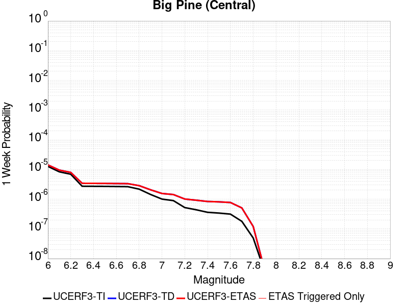 |  |  |  |

| Magnitude | 1 wk TI Prob | 1 wk TD Prob | 1 wk ETAS Prob | 1 wk ETAS/TD Gain | 1 wk ETAS Triggered Only | 1 mo TI Prob | 1 mo TD Prob | 1 mo ETAS Prob | 1 mo ETAS/TD Gain | 1 mo ETAS Triggered Only | 1 yr TI Prob | 1 yr TD Prob | 1 yr ETAS Prob | 1 yr ETAS/TD Gain | 1 yr ETAS Triggered Only | 10 yr TI Prob | 10 yr TD Prob | 10 yr ETAS Prob | 10 yr ETAS/TD Gain | 10 yr ETAS Triggered Only |
|-----|-----|-----|-----|-----|-----|-----|-----|-----|-----|-----|-----|-----|-----|-----|-----|-----|-----|-----|-----|-----|
| 6.0 | 1.2706755E-5 | 1.4252463E-5 | 1.4252463E-5 | 1.0 | 0.0 | 5.4456385E-5 | 6.108076E-5 | 6.108076E-5 | 1.0 | 0.0 | 6.628048E-4 | 7.434411E-4 | 7.434411E-4 | 1.0 | 0.0 | 0.006608314 | 0.007414557 | 0.00742967 | 1.0020384 | 1.522603E-5 |
| 6.1 | 8.342579E-6 | 9.512481E-6 | 9.512481E-6 | 1.0 | 0.0 | 3.5753423E-5 | 4.076726E-5 | 4.076726E-5 | 1.0 | 0.0 | 4.3521097E-4 | 4.9625005E-4 | 4.9625005E-4 | 1.0 | 0.0 | 0.0043435963 | 0.0049549625 | 0.0049549625 | 1.0 | 0.0 |
| 6.2 | 6.923899E-6 | 7.968794E-6 | 7.968794E-6 | 1.0 | 0.0 | 2.9673516E-5 | 3.4151635E-5 | 3.4151635E-5 | 1.0 | 0.0 | 3.6121515E-4 | 4.1573608E-4 | 4.1573608E-4 | 1.0 | 0.0 | 0.003606286 | 0.00415288 | 0.00415288 | 1.0 | 0.0 |
| 6.3 | 2.728396E-6 | 3.4257378E-6 | 3.4257378E-6 | 1.0 | 0.0 | 1.1693074E-5 | 1.4681656E-5 | 1.4681656E-5 | 1.0 | 0.0 | 1.4235388E-4 | 1.7873537E-4 | 1.7873537E-4 | 1.0 | 0.0 | 0.0014226272 | 0.0017874117 | 0.0017874117 | 1.0 | 0.0 |
| 6.4 | 2.7136944E-6 | 3.4100306E-6 | 3.4100306E-6 | 1.0 | 0.0 | 1.1630066E-5 | 1.461434E-5 | 1.461434E-5 | 1.0 | 0.0 | 1.4158686E-4 | 1.7791594E-4 | 1.7791594E-4 | 1.0 | 0.0 | 0.0014149669 | 0.0017792305 | 0.0017792305 | 1.0 | 0.0 |
| 6.5 | 2.6971882E-6 | 3.392375E-6 | 3.392375E-6 | 1.0 | 0.0 | 1.1559327E-5 | 1.4538674E-5 | 1.4538674E-5 | 1.0 | 0.0 | 1.4072572E-4 | 1.7699486E-4 | 1.7699486E-4 | 1.0 | 0.0 | 0.0014063664 | 0.0017700344 | 0.0017700344 | 1.0 | 0.0 |
| 6.6 | 2.669092E-6 | 3.3623944E-6 | 3.3623944E-6 | 1.0 | 0.0 | 1.1438916E-5 | 1.4410188E-5 | 1.4410188E-5 | 1.0 | 0.0 | 1.3925991E-4 | 1.7543077E-4 | 1.7543077E-4 | 1.0 | 0.0 | 0.0013917267 | 0.0017544184 | 0.0017544184 | 1.0 | 0.0 |
| 6.7 | 2.6408059E-6 | 3.332419E-6 | 3.332419E-6 | 1.0 | 0.0 | 1.1317691E-5 | 1.4281723E-5 | 1.4281723E-5 | 1.0 | 0.0 | 1.3778417E-4 | 1.7386697E-4 | 1.7386697E-4 | 1.0 | 0.0 | 0.0013769877 | 0.001738805 | 0.001738805 | 1.0 | 0.0 |
| 6.8 | 2.1786943E-6 | 2.8558686E-6 | 2.8558686E-6 | 1.0 | 0.0 | 9.337228E-6 | 1.2239383E-5 | 1.2239383E-5 | 1.0 | 0.0 | 1.1367482E-4 | 1.4900503E-4 | 1.4900503E-4 | 1.0 | 0.0 | 0.0011361669 | 0.0014905332 | 0.0014905332 | 1.0 | 0.0 |
| 6.9 | 1.4411696E-6 | 2.0698712E-6 | 2.0698712E-6 | 1.0 | 0.0 | 6.1764263E-6 | 8.870848E-6 | 8.870848E-6 | 1.0 | 0.0 | 7.51954E-5 | 1.079975E-4 | 1.079975E-4 | 1.0 | 0.0 | 7.5169955E-4 | 0.0010808875 | 0.0010808875 | 1.0 | 0.0 |
| 7.0 | 1.0073411E-6 | 1.5554864E-6 | 1.5554864E-6 | 1.0 | 0.0 | 4.317169E-6 | 6.666354E-6 | 6.666354E-6 | 1.0 | 0.0 | 5.2560266E-5 | 8.115999E-5 | 8.115999E-5 | 1.0 | 0.0 | 5.2547833E-4 | 8.1272965E-4 | 8.1272965E-4 | 1.0 | 0.0 |
| 7.1 | 8.947104E-7 | 1.4314573E-6 | 1.4314573E-6 | 1.0 | 0.0 | 3.834468E-6 | 6.1348037E-6 | 6.1348037E-6 | 1.0 | 0.0 | 4.6683643E-5 | 7.4688825E-5 | 7.4688825E-5 | 1.0 | 0.0 | 4.6673836E-4 | 7.4806315E-4 | 7.4806315E-4 | 1.0 | 0.0 |
| 7.2 | 5.215166E-7 | 1.0122951E-6 | 1.0122951E-6 | 1.0 | 0.0 | 2.2350691E-6 | 4.3384007E-6 | 4.3384007E-6 | 1.0 | 0.0 | 2.7211627E-5 | 5.2818792E-5 | 5.2818792E-5 | 1.0 | 0.0 | 2.7208295E-4 | 5.2947813E-4 | 5.2947813E-4 | 1.0 | 0.0 |
| 7.3 | 4.4024807E-7 | 9.230527E-7 | 9.230527E-7 | 1.0 | 0.0 | 1.8867761E-6 | 3.9559345E-6 | 3.9559345E-6 | 1.0 | 0.0 | 2.2971257E-5 | 4.8162477E-5 | 4.8162477E-5 | 1.0 | 0.0 | 2.2968883E-4 | 4.82936E-4 | 4.82936E-4 | 1.0 | 0.0 |
| 7.4 | 3.6130905E-7 | 8.3691214E-7 | 8.3691214E-7 | 1.0 | 0.0 | 1.5484665E-6 | 3.5867617E-6 | 3.5867617E-6 | 1.0 | 0.0 | 1.8852415E-5 | 4.3667987E-5 | 4.3667987E-5 | 1.0 | 0.0 | 1.8850817E-4 | 4.380001E-4 | 4.380001E-4 | 1.0 | 0.0 |
| 7.5 | 3.408184E-7 | 8.118514E-7 | 8.118514E-7 | 1.0 | 0.0 | 1.4606494E-6 | 3.4793588E-6 | 3.4793588E-6 | 1.0 | 0.0 | 1.7783263E-5 | 4.2360407E-5 | 4.2360407E-5 | 1.0 | 0.0 | 1.778184E-4 | 4.2490795E-4 | 4.2490795E-4 | 1.0 | 0.0 |
| 7.6 | 3.1428627E-7 | 7.7415996E-7 | 7.7415996E-7 | 1.0 | 0.0 | 1.3469405E-6 | 3.3178244E-6 | 3.3178244E-6 | 1.0 | 0.0 | 1.6398877E-5 | 4.03938E-5 | 4.03938E-5 | 1.0 | 0.0 | 1.6397667E-4 | 4.0522031E-4 | 4.0522031E-4 | 1.0 | 0.0 |
| 7.7 | 1.7972785E-7 | 5.085394E-7 | 5.085394E-7 | 1.0 | 0.0 | 7.70262E-7 | 2.1794528E-6 | 2.1794528E-6 | 1.0 | 0.0 | 9.377899E-6 | 2.6534526E-5 | 2.6534526E-5 | 1.0 | 0.0 | 9.377503E-5 | 2.666768E-4 | 2.666768E-4 | 1.0 | 0.0 |
| 7.8 | 4.9230927E-8 | 1.1998821E-7 | 1.1998821E-7 | 1.0 | 0.0 | 2.1098968E-7 | 5.142351E-7 | 5.142351E-7 | 1.0 | 0.0 | 2.5687964E-6 | 6.2607965E-6 | 6.2607965E-6 | 1.0 | 0.0 | 2.5687666E-5 | 6.304645E-5 | 6.304645E-5 | 1.0 | 0.0 |
| 7.9 | 3.6805972E-9 | 4.112396E-9 | 4.112396E-9 | 1.0 | 0.0 | 1.5773987E-8 | 1.7624556E-8 | 1.7624556E-8 | 1.0 | 0.0 | 1.9204828E-7 | 2.1457895E-7 | 2.1457895E-7 | 1.0 | 0.0 | 1.920481E-6 | 2.1937853E-6 | 2.1937853E-6 | 1.0 | 0.0 |

## Hector Mine
*[(top)](#table-of-contents)*

| 1 Week | 1 Month | 1 Year | 10 Year |
|-----|-----|-----|-----|
|  |  |  |  |

| Magnitude | 1 wk TI Prob | 1 wk TD Prob | 1 wk ETAS Prob | 1 wk ETAS/TD Gain | 1 wk ETAS Triggered Only | 1 mo TI Prob | 1 mo TD Prob | 1 mo ETAS Prob | 1 mo ETAS/TD Gain | 1 mo ETAS Triggered Only | 1 yr TI Prob | 1 yr TD Prob | 1 yr ETAS Prob | 1 yr ETAS/TD Gain | 1 yr ETAS Triggered Only | 10 yr TI Prob | 10 yr TD Prob | 10 yr ETAS Prob | 10 yr ETAS/TD Gain | 10 yr ETAS Triggered Only |
|-----|-----|-----|-----|-----|-----|-----|-----|-----|-----|-----|-----|-----|-----|-----|-----|-----|-----|-----|-----|-----|
| 6.0 | 1.8760093E-5 | 2.7966346E-6 | 2.7966346E-6 | 1.0 | 0.0 | 8.039792E-5 | 1.1985544E-5 | 1.1985544E-5 | 1.0 | 0.0 | 9.78405E-4 | 1.4591822E-4 | 1.4591822E-4 | 1.0 | 0.0 | 0.009741086 | 0.0014586165 | 0.0014738202 | 1.0104234 | 1.522603E-5 |
| 6.1 | 1.8760093E-5 | 2.7966346E-6 | 2.7966346E-6 | 1.0 | 0.0 | 8.039792E-5 | 1.1985544E-5 | 1.1985544E-5 | 1.0 | 0.0 | 9.78405E-4 | 1.4591822E-4 | 1.4591822E-4 | 1.0 | 0.0 | 0.009741086 | 0.0014586165 | 0.0014738202 | 1.0104234 | 1.522603E-5 |
| 6.2 | 1.8760093E-5 | 2.7966346E-6 | 2.7966346E-6 | 1.0 | 0.0 | 8.039792E-5 | 1.1985544E-5 | 1.1985544E-5 | 1.0 | 0.0 | 9.78405E-4 | 1.4591822E-4 | 1.4591822E-4 | 1.0 | 0.0 | 0.009741086 | 0.0014586165 | 0.0014738202 | 1.0104234 | 1.522603E-5 |
| 6.3 | 1.8760093E-5 | 2.7966346E-6 | 2.7966346E-6 | 1.0 | 0.0 | 8.039792E-5 | 1.1985544E-5 | 1.1985544E-5 | 1.0 | 0.0 | 9.78405E-4 | 1.4591822E-4 | 1.4591822E-4 | 1.0 | 0.0 | 0.009741086 | 0.0014586165 | 0.0014738202 | 1.0104234 | 1.522603E-5 |
| 6.4 | 1.0888055E-5 | 2.7966346E-6 | 2.7966346E-6 | 1.0 | 0.0 | 4.666226E-5 | 1.1985544E-5 | 1.1985544E-5 | 1.0 | 0.0 | 5.679649E-4 | 1.4591822E-4 | 1.4591822E-4 | 1.0 | 0.0 | 0.0056651547 | 0.0014586165 | 0.0014738202 | 1.0104234 | 1.522603E-5 |
| 6.5 | 1.0888055E-5 | 2.7966346E-6 | 2.7966346E-6 | 1.0 | 0.0 | 4.666226E-5 | 1.1985544E-5 | 1.1985544E-5 | 1.0 | 0.0 | 5.679649E-4 | 1.4591822E-4 | 1.4591822E-4 | 1.0 | 0.0 | 0.0056651547 | 0.0014586165 | 0.0014738202 | 1.0104234 | 1.522603E-5 |
| 6.6 | 1.0730738E-5 | 2.7966346E-6 | 2.7966346E-6 | 1.0 | 0.0 | 4.5988065E-5 | 1.1985544E-5 | 1.1985544E-5 | 1.0 | 0.0 | 5.5976084E-4 | 1.4591822E-4 | 1.4591822E-4 | 1.0 | 0.0 | 0.0055835294 | 0.0014586165 | 0.0014738202 | 1.0104234 | 1.522603E-5 |
| 6.7 | 7.881326E-6 | 2.7713115E-6 | 2.7713115E-6 | 1.0 | 0.0 | 3.3776672E-5 | 1.1877018E-5 | 1.1877018E-5 | 1.0 | 0.0 | 4.111534E-4 | 1.445971E-4 | 1.445971E-4 | 1.0 | 0.0 | 0.0041039353 | 0.0014454223 | 0.0014606264 | 1.0105188 | 1.522603E-5 |
| 6.8 | 7.5683483E-6 | 2.7330557E-6 | 2.7330557E-6 | 1.0 | 0.0 | 3.2435375E-5 | 1.1713066E-5 | 1.1713066E-5 | 1.0 | 0.0 | 3.9482914E-4 | 1.4260123E-4 | 1.4260123E-4 | 1.0 | 0.0 | 0.0039412836 | 0.0014254894 | 0.0014406937 | 1.010666 | 1.522603E-5 |
| 6.9 | 6.473048E-6 | 2.514108E-6 | 2.514108E-6 | 1.0 | 0.0 | 2.7741338E-5 | 1.0774726E-5 | 1.0774726E-5 | 1.0 | 0.0 | 3.3769844E-4 | 1.3117837E-4 | 1.3117837E-4 | 1.0 | 0.0 | 0.0033718573 | 0.0013113989 | 0.0013266051 | 1.0115952 | 1.522603E-5 |
| 7.0 | 4.9959954E-6 | 1.8566844E-6 | 1.8566844E-6 | 1.0 | 0.0 | 2.1411232E-5 | 7.957215E-6 | 7.957215E-6 | 1.0 | 0.0 | 2.6065056E-4 | 9.687835E-5 | 9.687835E-5 | 1.0 | 0.0 | 0.0026034506 | 9.687108E-4 | 9.83922E-4 | 1.0157026 | 1.522603E-5 |
| 7.1 | 1.2997541E-6 | 1.5604898E-7 | 1.5604898E-7 | 1.0 | 0.0 | 5.5703626E-6 | 6.687812E-7 | 6.687812E-7 | 1.0 | 0.0 | 6.7817055E-5 | 8.142385E-6 | 8.142385E-6 | 1.0 | 0.0 | 6.779636E-4 | 8.142126E-5 | 8.142126E-5 | 1.0 | 0.0 |
| 7.2 | 8.392699E-7 | 9.7293345E-8 | 9.7293345E-8 | 1.0 | 0.0 | 3.596866E-6 | 4.1697143E-7 | 4.1697143E-7 | 1.0 | 0.0 | 4.3790962E-5 | 5.076617E-6 | 5.076617E-6 | 1.0 | 0.0 | 4.3782333E-4 | 5.0765204E-5 | 5.0765204E-5 | 1.0 | 0.0 |
| 7.3 | 3.13015E-7 | 4.8300148E-8 | 4.8300148E-8 | 1.0 | 0.0 | 1.3414921E-6 | 2.0700061E-7 | 2.0700061E-7 | 1.0 | 0.0 | 1.6332544E-5 | 2.5202305E-6 | 2.5202305E-6 | 1.0 | 0.0 | 1.6331344E-4 | 2.5202104E-5 | 2.5202104E-5 | 1.0 | 0.0 |

## Sierra Madre
*[(top)](#table-of-contents)*

| 1 Week | 1 Month | 1 Year | 10 Year |
|-----|-----|-----|-----|
|  |  |  |  |

| Magnitude | 1 wk TI Prob | 1 wk TD Prob | 1 wk ETAS Prob | 1 wk ETAS/TD Gain | 1 wk ETAS Triggered Only | 1 mo TI Prob | 1 mo TD Prob | 1 mo ETAS Prob | 1 mo ETAS/TD Gain | 1 mo ETAS Triggered Only | 1 yr TI Prob | 1 yr TD Prob | 1 yr ETAS Prob | 1 yr ETAS/TD Gain | 1 yr ETAS Triggered Only | 10 yr TI Prob | 10 yr TD Prob | 10 yr ETAS Prob | 10 yr ETAS/TD Gain | 10 yr ETAS Triggered Only |
|-----|-----|-----|-----|-----|-----|-----|-----|-----|-----|-----|-----|-----|-----|-----|-----|-----|-----|-----|-----|-----|
| 6.0 | 1.3379373E-5 | 1.1002111E-5 | 1.1002111E-5 | 1.0 | 0.0 | 5.7338908E-5 | 4.715106E-5 | 4.715106E-5 | 1.0 | 0.0 | 6.978776E-4 | 5.7391444E-4 | 5.7391444E-4 | 1.0 | 0.0 | 0.0069569005 | 0.005724687 | 0.005739826 | 1.0026445 | 1.522603E-5 |
| 6.1 | 1.3379373E-5 | 1.1002111E-5 | 1.1002111E-5 | 1.0 | 0.0 | 5.7338908E-5 | 4.715106E-5 | 4.715106E-5 | 1.0 | 0.0 | 6.978776E-4 | 5.7391444E-4 | 5.7391444E-4 | 1.0 | 0.0 | 0.0069569005 | 0.005724687 | 0.005739826 | 1.0026445 | 1.522603E-5 |
| 6.2 | 1.3379373E-5 | 1.1002111E-5 | 1.1002111E-5 | 1.0 | 0.0 | 5.7338908E-5 | 4.715106E-5 | 4.715106E-5 | 1.0 | 0.0 | 6.978776E-4 | 5.7391444E-4 | 5.7391444E-4 | 1.0 | 0.0 | 0.0069569005 | 0.005724687 | 0.005739826 | 1.0026445 | 1.522603E-5 |
| 6.3 | 1.3379373E-5 | 1.1002111E-5 | 1.1002111E-5 | 1.0 | 0.0 | 5.7338908E-5 | 4.715106E-5 | 4.715106E-5 | 1.0 | 0.0 | 6.978776E-4 | 5.7391444E-4 | 5.7391444E-4 | 1.0 | 0.0 | 0.0069569005 | 0.005724687 | 0.005739826 | 1.0026445 | 1.522603E-5 |
| 6.4 | 1.3379373E-5 | 1.1002111E-5 | 1.1002111E-5 | 1.0 | 0.0 | 5.7338908E-5 | 4.715106E-5 | 4.715106E-5 | 1.0 | 0.0 | 6.978776E-4 | 5.7391444E-4 | 5.7391444E-4 | 1.0 | 0.0 | 0.0069569005 | 0.005724687 | 0.005739826 | 1.0026445 | 1.522603E-5 |
| 6.5 | 1.26563245E-5 | 1.023154E-5 | 1.023154E-5 | 1.0 | 0.0 | 5.4240263E-5 | 4.3848726E-5 | 4.3848726E-5 | 1.0 | 0.0 | 6.601751E-4 | 5.3372857E-4 | 5.3372857E-4 | 1.0 | 0.0 | 0.006582173 | 0.005324789 | 0.0053399336 | 1.0028442 | 1.522603E-5 |
| 6.6 | 1.26563245E-5 | 1.023154E-5 | 1.023154E-5 | 1.0 | 0.0 | 5.4240263E-5 | 4.3848726E-5 | 4.3848726E-5 | 1.0 | 0.0 | 6.601751E-4 | 5.3372857E-4 | 5.3372857E-4 | 1.0 | 0.0 | 0.006582173 | 0.005324789 | 0.0053399336 | 1.0028442 | 1.522603E-5 |
| 6.7 | 1.2502474E-5 | 1.0067679E-5 | 1.0067679E-5 | 1.0 | 0.0 | 5.3580934E-5 | 4.3146487E-5 | 4.3146487E-5 | 1.0 | 0.0 | 6.521526E-4 | 5.251829E-4 | 5.251829E-4 | 1.0 | 0.0 | 0.0065024206 | 0.005239737 | 0.0052548833 | 1.0028907 | 1.522603E-5 |
| 6.8 | 1.2454966E-5 | 1.0019962E-5 | 1.0019962E-5 | 1.0 | 0.0 | 5.3377335E-5 | 4.2941996E-5 | 4.2941996E-5 | 1.0 | 0.0 | 6.4967526E-4 | 5.2269443E-4 | 5.2269443E-4 | 1.0 | 0.0 | 0.006477792 | 0.005214969 | 0.0052301157 | 1.0029044 | 1.522603E-5 |
| 6.9 | 1.2225574E-5 | 9.793931E-6 | 9.793931E-6 | 1.0 | 0.0 | 5.2394265E-5 | 4.1973322E-5 | 4.1973322E-5 | 1.0 | 0.0 | 6.3771347E-4 | 5.109064E-4 | 5.109064E-4 | 1.0 | 0.0 | 0.006358865 | 0.0050976346 | 0.005112783 | 1.0029716 | 1.522603E-5 |
| 7.0 | 1.182946E-5 | 9.400459E-6 | 9.400459E-6 | 1.0 | 0.0 | 5.06967E-5 | 4.0287065E-5 | 4.0287065E-5 | 1.0 | 0.0 | 6.1705755E-4 | 4.9038563E-4 | 4.9038563E-4 | 1.0 | 0.0 | 0.006153469 | 0.004893347 | 0.0049084984 | 1.0030963 | 1.522603E-5 |
| 7.1 | 1.14369095E-5 | 8.987441E-6 | 8.987441E-6 | 1.0 | 0.0 | 4.9014405E-5 | 3.8517042E-5 | 3.8517042E-5 | 1.0 | 0.0 | 5.9658696E-4 | 4.6884507E-4 | 4.6884507E-4 | 1.0 | 0.0 | 0.005949879 | 0.004678865 | 0.00469402 | 1.003239 | 1.522603E-5 |
| 7.2 | 1.0836419E-5 | 8.400803E-6 | 8.400803E-6 | 1.0 | 0.0 | 4.644097E-5 | 3.6002948E-5 | 3.6002948E-5 | 1.0 | 0.0 | 5.652721E-4 | 4.3824865E-4 | 4.3824865E-4 | 1.0 | 0.0 | 0.0056383642 | 0.0043741413 | 0.004389301 | 1.0034657 | 1.522603E-5 |
| 7.3 | 1.0403439E-5 | 8.022045E-6 | 8.022045E-6 | 1.0 | 0.0 | 4.4585406E-5 | 3.4379744E-5 | 3.4379744E-5 | 1.0 | 0.0 | 5.426921E-4 | 4.184939E-4 | 4.184939E-4 | 1.0 | 0.0 | 0.005413687 | 0.0041773533 | 0.0041773533 | 1.0 | 0.0 |
| 7.4 | 9.768864E-6 | 7.415638E-6 | 7.415638E-6 | 1.0 | 0.0 | 4.186589E-5 | 3.178092E-5 | 3.178092E-5 | 1.0 | 0.0 | 5.09598E-4 | 3.868649E-4 | 3.868649E-4 | 1.0 | 0.0 | 0.0050843097 | 0.0038622064 | 0.0038622064 | 1.0 | 0.0 |
| 7.5 | 8.687089E-6 | 6.4511987E-6 | 6.4511987E-6 | 1.0 | 0.0 | 3.722985E-5 | 2.7647708E-5 | 2.7647708E-5 | 1.0 | 0.0 | 4.5317915E-4 | 3.365597E-4 | 3.365597E-4 | 1.0 | 0.0 | 0.004522561 | 0.0033607872 | 0.0033607872 | 1.0 | 0.0 |
| 7.6 | 6.3506063E-6 | 4.431258E-6 | 4.431258E-6 | 1.0 | 0.0 | 2.72166E-5 | 1.8990968E-5 | 1.8990968E-5 | 1.0 | 0.0 | 3.3131172E-4 | 2.3119076E-4 | 2.3119076E-4 | 1.0 | 0.0 | 0.003308182 | 0.0023097275 | 0.0023097275 | 1.0 | 0.0 |
| 7.7 | 4.62223E-6 | 2.9338423E-6 | 2.9338423E-6 | 1.0 | 0.0 | 1.9809406E-5 | 1.257355E-5 | 1.257355E-5 | 1.0 | 0.0 | 2.4115283E-4 | 1.5307224E-4 | 1.5307224E-4 | 1.0 | 0.0 | 0.0024089129 | 0.001529869 | 0.001529869 | 1.0 | 0.0 |
| 7.8 | 3.2145008E-6 | 1.950051E-6 | 1.950051E-6 | 1.0 | 0.0 | 1.3776359E-5 | 8.357335E-6 | 8.357335E-6 | 1.0 | 0.0 | 1.6771426E-4 | 1.0174581E-4 | 1.0174581E-4 | 1.0 | 0.0 | 0.0016758774 | 0.0010171367 | 0.0010171367 | 1.0 | 0.0 |
| 7.9 | 1.0391769E-6 | 5.604388E-7 | 5.604388E-7 | 1.0 | 0.0 | 4.4536077E-6 | 2.4018784E-6 | 2.4018784E-6 | 1.0 | 0.0 | 5.4221324E-5 | 2.9242481E-5 | 2.9242481E-5 | 1.0 | 0.0 | 5.4208096E-4 | 2.9238674E-4 | 2.9238674E-4 | 1.0 | 0.0 |
| 8.0 | 1.210983E-7 | 6.615224E-8 | 6.615224E-8 | 1.0 | 0.0 | 5.1899264E-7 | 2.8350954E-7 | 2.8350954E-7 | 1.0 | 0.0 | 6.3187167E-6 | 3.4517234E-6 | 3.4517234E-6 | 1.0 | 0.0 | 6.318537E-5 | 3.4516717E-5 | 3.4516717E-5 | 1.0 | 0.0 |

