# Parent Section Magnitude-Probability Distributions

Only fault sections with at least one triggered aftershock are plotted. Sections are sorted by total supraseismogenic trigger rate (decreasing)

## Table Of Contents

* [Tank Canyon](#tank-canyon)
* [Garlock (Central)](#garlock-central)
* [Little Lake](#little-lake)
* [Owl Lake](#owl-lake)
* [Panamint Valley](#panamint-valley)
* [Ash Hill](#ash-hill)
* [Airport Lake](#airport-lake)
* [Garlock (East)](#garlock-east)
* [Hunter Mountain-Saline Valley](#hunter-mountain-saline-valley)
* [Blackwater](#blackwater)
* [McLean Lake](#mclean-lake)
* [Gravel Hills-Harper Lk](#gravel-hills-harper-lk)
* [Garlock (West)](#garlock-west)
* [Goldstone Lake](#goldstone-lake)
* [So Sierra Nevada](#so-sierra-nevada)
* [Coyote Canyon](#coyote-canyon)
* [Death Valley (So)](#death-valley-so)
* [Lenwood-Lockhart-Old Woman Springs](#lenwood-lockhart-old-woman-springs)
* [San Andreas (Mojave S)](#san-andreas-mojave-s)
* [Towne Pass](#towne-pass)
* [Nelson Lake](#nelson-lake)
* [San Andreas (Mojave N)](#san-andreas-mojave-n)
* [Bicycle Lake](#bicycle-lake)
* [Paradise](#paradise)
* [Garlic Springs](#garlic-springs)
* [San Andreas (San Bernardino N)](#san-andreas-san-bernardino-n)
* [Coyote Lake](#coyote-lake)
* [Death Valley (Black Mtns Frontal)](#death-valley-black-mtns-frontal)
* [Helendale-So Lockhart](#helendale-so-lockhart)
* [San Andreas (Parkfield)](#san-andreas-parkfield)
* [San Andreas (San Bernardino S)](#san-andreas-san-bernardino-s)
* [Sierra Nevada  (No Extension)](#sierra-nevada--no-extension)
* [Death Valley (No)](#death-valley-no)
* [Red Pass](#red-pass)
* [San Andreas (Big Bend)](#san-andreas-big-bend)
* [San Andreas (Cholame) rev](#san-andreas-cholame-rev)
* [San Andreas (Carrizo) rev](#san-andreas-carrizo-rev)
* [Manix-Afton Hills](#manix-afton-hills)
* [Death Valley (Fish Lake Valley)](#death-valley-fish-lake-valley)
* [Scodie Lineament](#scodie-lineament)
* [Lake Isabella (Seismicity)](#lake-isabella-seismicity)
* [Elsinore (Glen Ivy) rev](#elsinore-glen-ivy-rev)
* [Cady](#cady)
* [Pinto Mtn](#pinto-mtn)
* [White Wolf (Extension)](#white-wolf-extension)
* [San Andreas (San Gorgonio Pass-Garnet HIll)](#san-andreas-san-gorgonio-pass-garnet-hill)
* [Ludlow](#ludlow)
* [Owens Valley](#owens-valley)
* [Calico-Hidalgo](#calico-hidalgo)
* [Santa Ynez (West)](#santa-ynez-west)
* [San Andreas (Creeping Section) 2011 CFM](#san-andreas-creeping-section-2011-cfm)
* [San Jacinto (San Bernardino)](#san-jacinto-san-bernardino)
* [Dry Mountain](#dry-mountain)
* [San Andreas (Coachella) rev](#san-andreas-coachella-rev)
* [Baker](#baker)
* [San Jacinto (Stepovers Combined)](#san-jacinto-stepovers-combined)
* [San Jacinto (San Jacinto Valley) rev](#san-jacinto-san-jacinto-valley-rev)
* [Tin Mountain](#tin-mountain)
* [Independence rev 2011](#independence-rev-2011)
* [Pleito](#pleito)
* [Camp Rock 2011](#camp-rock-2011)
* [Oceanic - West Huasna](#oceanic---west-huasna)
* [Elysian Park (Upper)](#elysian-park-upper)
* [San Jacinto (Superstition Mtn)](#san-jacinto-superstition-mtn)
* [San Diego Trough north alt1](#san-diego-trough-north-alt1)
* [Cleghorn Lake](#cleghorn-lake)
* [Palos Verdes](#palos-verdes)
* [Red Mountain](#red-mountain)
* [Coronado Bank alt1](#coronado-bank-alt1)
* [San Jacinto (Coyote Creek)](#san-jacinto-coyote-creek)
* [Kern Canyon (North Kern) 2011](#kern-canyon-north-kern-2011)
* [Whittier alt 1](#whittier-alt-1)
* [White Mountains](#white-mountains)
* [Blue Cut](#blue-cut)
* [San Jacinto (Anza) rev](#san-jacinto-anza-rev)
* [Ventura-Pitas Point](#ventura-pitas-point)
* [Hayward (So) 2011 CFM](#hayward-so-2011-cfm)
* [San Cayetano](#san-cayetano)
* [Mission Ridge-Arroyo Parida-Santa Ana](#mission-ridge-arroyo-parida-santa-ana)
* [Brawley (Seismic Zone) alt 1](#brawley-seismic-zone-alt-1)
* [San Clemente](#san-clemente)
* [Imperial](#imperial)
* [San Andreas (North Branch Mill Creek)](#san-andreas-north-branch-mill-creek)
* [West Napa 2011 CFM](#west-napa-2011-cfm)
* [Santa Rosa Island](#santa-rosa-island)
* [Oak Ridge (Onshore)](#oak-ridge-onshore)
* [Santa Ynez (East)](#santa-ynez-east)
* [Superstition Hills](#superstition-hills)
* [San Jacinto (Borrego)](#san-jacinto-borrego)
* [Big Pine (East)](#big-pine-east)
* [Deep Springs](#deep-springs)
* [Hayward (No) 2011 CFM](#hayward-no-2011-cfm)
* [Pisgah-Bullion Mtn-Mesquite Lk](#pisgah-bullion-mtn-mesquite-lk)
* [Calaveras (So) 2011 CFM](#calaveras-so-2011-cfm)
* [San Pedro Basin](#san-pedro-basin)
* [Ortigalita (North)](#ortigalita-north)
* [San Jacinto (Lytle Creek connector)](#san-jacinto-lytle-creek-connector)
* [Green Valley 2011 CFM](#green-valley-2011-cfm)
* [White Wolf](#white-wolf)
* [Bullion Mountains](#bullion-mountains)
* [Rinconada 2011 CFM](#rinconada-2011-cfm)
* [Mono Lake 2011 CFM](#mono-lake-2011-cfm)
* [San Andreas (Offshore) 2011 CFM](#san-andreas-offshore-2011-cfm)
* [San Juan](#san-juan)
* [Big Pine (Central)](#big-pine-central)
* [Channel Islands Thrust](#channel-islands-thrust)
* [Rodgers Creek - Healdsburg 2011 CFM](#rodgers-creek---healdsburg-2011-cfm)
* [Raymond](#raymond)
* [Calaveras (So) - Paicines extension 2011 CFM](#calaveras-so---paicines-extension-2011-cfm)
* [Chino alt 1](#chino-alt-1)
* [Concord 2011 CFM](#concord-2011-cfm)
* [Elsinore (Temecula) rev](#elsinore-temecula-rev)
* [Santa Cruz Island](#santa-cruz-island)
* [Likely 2011 CFM](#likely-2011-cfm)
* [Calaveras (Central) 2011 CFM](#calaveras-central-2011-cfm)
* [Mission Creek](#mission-creek)
* [Santa Susana alt 1](#santa-susana-alt-1)
* [Great Valley 09 (Laguna Seca)](#great-valley-09-laguna-seca)
* [San Andreas (Peninsula) 2011 CFM](#san-andreas-peninsula-2011-cfm)
* [Sheephole](#sheephole)
* [Cerro Prieto](#cerro-prieto)
* [Elmore Ranch](#elmore-ranch)
* [Cleghorn](#cleghorn)
* [King Range 2011 CFM](#king-range-2011-cfm)
* [South Klamath Lake East](#south-klamath-lake-east)
* [Quien Sabe 2011 CFM](#quien-sabe-2011-cfm)
* [Mount Diablo Thrust South](#mount-diablo-thrust-south)
* [Johnson Valley (No) 2011 rev](#johnson-valley-no-2011-rev)
* [Elsinore (Stepovers Combined)](#elsinore-stepovers-combined)
* [Sierra Madre](#sierra-madre)
* [Cucamonga](#cucamonga)
* [West Tahoe](#west-tahoe)
* [Great Valley 04b Gordon Valley](#great-valley-04b-gordon-valley)
* [Ortigalita (South)](#ortigalita-south)
* [Hartley Springs 2011 CFM](#hartley-springs-2011-cfm)
* [Lost Hills](#lost-hills)
* [Newport-Inglewood (Offshore)](#newport-inglewood-offshore)
* [Hunting Creek - Berryessa 2011 CFM](#hunting-creek---berryessa-2011-cfm)
* [Malibu Coast (Extension) alt 1](#malibu-coast-extension-alt-1)
* [San Gabriel](#san-gabriel)
* [San Andreas (Santa Cruz Mts) 2011 CFM](#san-andreas-santa-cruz-mts-2011-cfm)
* [Kern Canyon (South Kern) 2011](#kern-canyon-south-kern-2011)
* [Verdugo](#verdugo)
* [Bennett Valley 2011 CFM](#bennett-valley-2011-cfm)
* [Hector Mine](#hector-mine)
* [San Gregorio (North) 2011 CFM](#san-gregorio-north-2011-cfm)
* [Franklin 2011 CFM](#franklin-2011-cfm)
* [Great Valley 04a Trout Creek](#great-valley-04a-trout-creek)
* [Santa Cruz Catalina Ridge alt1](#santa-cruz-catalina-ridge-alt1)
* [Santa Monica alt 1](#santa-monica-alt-1)
* [Channel Islands Western Deep Ramp](#channel-islands-western-deep-ramp)
* [Shoreline](#shoreline)
* [Monterey Bay-Tularcitos](#monterey-bay-tularcitos)
* [Great Valley 03a Dunnigan Hills](#great-valley-03a-dunnigan-hills)
* [Cedar Mtn-Mahogany Mtn](#cedar-mtn-mahogany-mtn)
* [Point Reyes 2011 CFM](#point-reyes-2011-cfm)
* [Simi-Santa Rosa](#simi-santa-rosa)
* [Cleghorn Pass](#cleghorn-pass)
* [Los Osos 2011](#los-osos-2011)
* [San Diego Trough south](#san-diego-trough-south)
* [Garberville - Briceland 2011 CFM](#garberville---briceland-2011-cfm)
* [Monte Vista - Shannon 2011 CFM](#monte-vista---shannon-2011-cfm)
* [Malibu Coast alt 1](#malibu-coast-alt-1)
* [Hosgri (Extension)](#hosgri-extension)
* [San Andreas (North Coast) 2011 CFM](#san-andreas-north-coast-2011-cfm)
* [Elsinore (Coyote Mountains)](#elsinore-coyote-mountains)
* [Hollywood](#hollywood)
* [Del Valle](#del-valle)
* [Kern Canyon (Lake Isabella) 2011](#kern-canyon-lake-isabella-2011)
* [Hosgri](#hosgri)

## Tank Canyon
*[(top)](#table-of-contents)*

| 1 Week | 1 Month | 1 Year | 10 Year |
|-----|-----|-----|-----|
|  |  |  |  |

| Magnitude | 1 wk TI Prob | 1 wk TD Prob | 1 wk ETAS Prob | 1 wk ETAS/TD Gain | 1 wk ETAS Triggered Only | 1 mo TI Prob | 1 mo TD Prob | 1 mo ETAS Prob | 1 mo ETAS/TD Gain | 1 mo ETAS Triggered Only | 1 yr TI Prob | 1 yr TD Prob | 1 yr ETAS Prob | 1 yr ETAS/TD Gain | 1 yr ETAS Triggered Only | 10 yr TI Prob | 10 yr TD Prob | 10 yr ETAS Prob | 10 yr ETAS/TD Gain | 10 yr ETAS Triggered Only |
|-----|-----|-----|-----|-----|-----|-----|-----|-----|-----|-----|-----|-----|-----|-----|-----|-----|-----|-----|-----|-----|
| 6.0 | 4.8284557E-5 | 5.797054E-5 | 0.0017178743 | 29.633574 | 0.00166 | 2.0691741E-4 | 2.4842535E-4 | 0.0057170666 | 23.013216 | 0.00547 | 0.0025163088 | 0.003021048 | 0.024834948 | 8.22064 | 0.02188 | 0.02488006 | 0.02986708 | 0.072960384 | 2.4428363 | 0.04442 |
| 6.1 | 1.7796336E-5 | 2.0875163E-5 | 5.508641E-4 | 26.388494 | 5.3E-4 | 7.626778E-5 | 8.946213E-5 | 0.002159277 | 24.136211 | 0.00207 | 9.281647E-4 | 0.0010886953 | 0.009299746 | 8.542102 | 0.00822 | 0.009242975 | 0.010837966 | 0.027861444 | 2.5707264 | 0.01721 |
| 6.2 | 1.7796336E-5 | 2.0875163E-5 | 5.508641E-4 | 26.388494 | 5.3E-4 | 7.626778E-5 | 8.946213E-5 | 0.002159277 | 24.136211 | 0.00207 | 9.281647E-4 | 0.0010886953 | 0.009299746 | 8.542102 | 0.00822 | 0.009242975 | 0.010837966 | 0.027861444 | 2.5707264 | 0.01721 |
| 6.3 | 1.3515912E-5 | 1.5760907E-5 | 3.7575522E-4 | 23.840965 | 3.6E-4 | 5.792405E-5 | 6.754513E-5 | 0.0015574445 | 23.057835 | 0.00149 | 7.049971E-4 | 8.220753E-4 | 0.006867102 | 8.353374 | 0.00605 | 0.007027647 | 0.00819321 | 0.020987518 | 2.5615745 | 0.0129 |
| 6.4 | 1.0870146E-5 | 1.2619056E-5 | 3.1261527E-4 | 24.77327 | 3.0E-4 | 4.658551E-5 | 5.4080647E-5 | 0.0012340168 | 22.818085 | 0.00118 | 5.67031E-4 | 6.582507E-4 | 0.005355157 | 8.135437 | 0.0047 | 0.005655863 | 0.0065652747 | 0.016489688 | 2.5116525 | 0.00999 |
| 6.5 | 7.964826E-6 | 9.196807E-6 | 2.0919497E-4 | 22.746479 | 2.0E-4 | 3.4134522E-5 | 3.941435E-5 | 8.193836E-4 | 20.788967 | 7.8E-4 | 4.1550855E-4 | 4.7977458E-4 | 0.00346834 | 7.2291036 | 0.00299 | 0.0041473247 | 0.004788939 | 0.011198099 | 2.3383255 | 0.00644 |
| 6.6 | 6.6317E-6 | 7.6128526E-6 | 1.7761155E-4 | 23.330486 | 1.7E-4 | 2.8421264E-5 | 3.2626154E-5 | 6.226069E-4 | 19.083061 | 5.9E-4 | 3.4597394E-4 | 3.971601E-4 | 0.0025463062 | 6.4112844 | 0.00215 | 0.0034543579 | 0.003965905 | 0.008577542 | 2.162821 | 0.00463 |
| 6.7 | 4.793663E-6 | 5.431129E-6 | 1.2543048E-4 | 23.094734 | 1.2E-4 | 2.0544108E-5 | 2.3276085E-5 | 3.0326957E-4 | 13.029235 | 2.8E-4 | 2.500958E-4 | 2.8335385E-4 | 0.001493011 | 5.269069 | 0.00121 | 0.0024981452 | 0.0028308667 | 0.005363676 | 1.8947117 | 0.00254 |
| 6.8 | 4.382823E-6 | 4.96956E-6 | 1.14969014E-4 | 23.134645 | 1.1E-4 | 1.8783392E-5 | 2.1297965E-5 | 2.7129264E-4 | 12.737961 | 2.5E-4 | 2.286638E-4 | 2.5927613E-4 | 0.0013789857 | 5.3185987 | 0.00112 | 0.0022842865 | 0.0025906577 | 0.0049146214 | 1.8970555 | 0.00233 |
| 6.9 | 2.729601E-6 | 3.073687E-6 | 7.307347E-5 | 23.773884 | 7.0E-5 | 1.1698237E-5 | 1.3172884E-5 | 1.4317117E-4 | 10.868628 | 1.3E-4 | 1.4241673E-4 | 1.6036928E-4 | 6.7028747E-4 | 4.1796503 | 5.1E-4 | 0.001423255 | 0.0016027665 | 0.0025911797 | 1.6166921 | 9.9E-4 |
| 7.0 | 1.8987357E-6 | 2.1270264E-6 | 2.2126984E-5 | 10.402779 | 2.0E-5 | 8.137413E-6 | 9.1158E-6 | 6.911525E-5 | 7.5819187 | 6.0E-5 | 9.90685E-5 | 1.10979905E-4 | 3.7095105E-4 | 3.3425064 | 2.6E-4 | 9.902435E-4 | 0.0011093135 | 0.0015588143 | 1.4052063 | 4.5E-4 |
| 7.1 | 1.4928986E-6 | 1.66419E-6 | 2.1664157E-5 | 13.0178385 | 2.0E-5 | 6.398121E-6 | 7.1322265E-6 | 4.713194E-5 | 6.608307 | 4.0E-5 | 7.789434E-5 | 8.683199E-5 | 2.3681896E-4 | 2.727324 | 1.5E-4 | 7.786704E-4 | 8.680385E-4 | 0.0011477955 | 1.3222864 | 2.8E-4 |
| 7.2 | 1.069082E-6 | 1.1829021E-6 | 1.118289E-5 | 9.453774 | 1.0E-5 | 4.581772E-6 | 5.069574E-6 | 3.506942E-5 | 6.9176273 | 3.0E-5 | 5.5781646E-5 | 6.172085E-5 | 1.5171529E-4 | 2.4580884 | 9.0E-5 | 5.576765E-4 | 6.1708933E-4 | 7.6699676E-4 | 1.2429266 | 1.5E-4 |
| 7.3 | 8.776551E-7 | 9.770343E-7 | 1.0977024E-5 | 11.2350445 | 1.0E-5 | 3.7613736E-6 | 4.1872863E-6 | 2.4187202E-5 | 5.776343 | 2.0E-5 | 4.579376E-5 | 5.097954E-5 | 1.2097597E-4 | 2.37303 | 7.0E-5 | 4.5784327E-4 | 5.0972943E-4 | 6.196734E-4 | 1.2156907 | 1.1E-4 |
| 7.4 | 7.55721E-7 | 8.5105546E-7 | 1.0851047E-5 | 12.750106 | 1.0E-5 | 3.2388E-6 | 3.6473784E-6 | 2.3647306E-5 | 6.4833703 | 2.0E-5 | 3.9431678E-5 | 4.4406446E-5 | 1.1440334E-4 | 2.5762777 | 7.0E-5 | 3.942468E-4 | 4.4402658E-4 | 5.439822E-4 | 1.2251117 | 1.0E-4 |
| 7.5 | 5.587665E-7 | 6.3058303E-7 | 1.0630577E-5 | 16.85833 | 1.0E-5 | 2.3947114E-6 | 2.7024987E-6 | 2.2702445E-5 | 8.400538 | 2.0E-5 | 2.915522E-5 | 3.290292E-5 | 7.29016E-5 | 2.2156575 | 4.0E-5 | 2.9151395E-4 | 3.2902922E-4 | 3.7901275E-4 | 1.1519122 | 5.0E-5 |

## Garlock (Central)
*[(top)](#table-of-contents)*

| 1 Week | 1 Month | 1 Year | 10 Year |
|-----|-----|-----|-----|
|  |  |  |  |

| Magnitude | 1 wk TI Prob | 1 wk TD Prob | 1 wk ETAS Prob | 1 wk ETAS/TD Gain | 1 wk ETAS Triggered Only | 1 mo TI Prob | 1 mo TD Prob | 1 mo ETAS Prob | 1 mo ETAS/TD Gain | 1 mo ETAS Triggered Only | 1 yr TI Prob | 1 yr TD Prob | 1 yr ETAS Prob | 1 yr ETAS/TD Gain | 1 yr ETAS Triggered Only | 10 yr TI Prob | 10 yr TD Prob | 10 yr ETAS Prob | 10 yr ETAS/TD Gain | 10 yr ETAS Triggered Only |
|-----|-----|-----|-----|-----|-----|-----|-----|-----|-----|-----|-----|-----|-----|-----|-----|-----|-----|-----|-----|-----|
| 6.0 | 5.5131142E-5 | 7.0271424E-5 | 0.0010802004 | 15.371831 | 0.00101 | 2.3625491E-4 | 3.0112884E-4 | 0.0034801713 | 11.557084 | 0.00318 | 0.0028726095 | 0.0036601445 | 0.016353514 | 4.4679966 | 0.01274 | 0.028357591 | 0.03610883 | 0.059897665 | 1.6588093 | 0.02468 |
| 6.1 | 5.5131142E-5 | 7.0271424E-5 | 0.0010802004 | 15.371831 | 0.00101 | 2.3625491E-4 | 3.0112884E-4 | 0.0034801713 | 11.557084 | 0.00318 | 0.0028726095 | 0.0036601445 | 0.016353514 | 4.4679966 | 0.01274 | 0.028357591 | 0.03610883 | 0.059897665 | 1.6588093 | 0.02468 |
| 6.2 | 4.216245E-5 | 5.1684234E-5 | 7.4164855E-4 | 14.349609 | 6.9E-4 | 1.806837E-4 | 2.2148523E-4 | 0.0023410157 | 10.569624 | 0.00212 | 0.0021976046 | 0.0026932796 | 0.011020791 | 4.0919595 | 0.00835 | 0.021759989 | 0.026699346 | 0.042554412 | 1.5938373 | 0.01629 |
| 6.3 | 4.216245E-5 | 5.1684234E-5 | 7.4164855E-4 | 14.349609 | 6.9E-4 | 1.806837E-4 | 2.2148523E-4 | 0.0023410157 | 10.569624 | 0.00212 | 0.0021976046 | 0.0026932796 | 0.011020791 | 4.0919595 | 0.00835 | 0.021759989 | 0.026699346 | 0.042554412 | 1.5938373 | 0.01629 |
| 6.4 | 3.6858168E-5 | 4.4131644E-5 | 5.741083E-4 | 13.008993 | 5.3E-4 | 1.5795401E-4 | 1.8912205E-4 | 0.0018488081 | 9.775741 | 0.00166 | 0.0019213937 | 0.0023001547 | 0.008805158 | 3.828072 | 0.00652 | 0.019048655 | 0.022866493 | 0.03538357 | 1.5473983 | 0.01281 |
| 6.5 | 3.39199E-5 | 4.0038954E-5 | 5.100201E-4 | 12.738098 | 4.7E-4 | 1.453629E-4 | 1.7158437E-4 | 0.0015913408 | 9.274392 | 0.00142 | 0.0017683565 | 0.00208706 | 0.007914871 | 3.7923548 | 0.00584 | 0.017543508 | 0.020775849 | 0.032046717 | 1.5424987 | 0.01151 |
| 6.6 | 3.3571985E-5 | 3.9493098E-5 | 4.894753E-4 | 12.393946 | 4.5E-4 | 1.4387199E-4 | 1.6924528E-4 | 0.0015690083 | 9.2706175 | 0.0014 | 0.0017502342 | 0.0020586357 | 0.007836716 | 3.8067524 | 0.00579 | 0.017365133 | 0.02049695 | 0.03169267 | 1.546214 | 0.01143 |
| 6.7 | 3.2580007E-5 | 3.8109458E-5 | 4.780927E-4 | 12.545251 | 4.4E-4 | 1.3962112E-4 | 1.6331614E-4 | 0.0015430908 | 9.448489 | 0.00138 | 0.0016985617 | 0.001986582 | 0.0076053976 | 3.8283832 | 0.00563 | 0.016856372 | 0.019786576 | 0.030568924 | 1.5449325 | 0.011 |
| 6.8 | 3.2185937E-5 | 3.7536578E-5 | 4.7752005E-4 | 12.72146 | 4.4E-4 | 1.3793244E-4 | 1.6086125E-4 | 0.0015306409 | 9.515286 | 0.00137 | 0.0016780337 | 0.0019567478 | 0.0074859075 | 3.8256884 | 0.00554 | 0.016654192 | 0.019493341 | 0.03009262 | 1.5437384 | 0.01081 |
| 6.9 | 3.165394E-5 | 3.6741036E-5 | 4.6672524E-4 | 12.703105 | 4.3E-4 | 1.3565269E-4 | 1.5745219E-4 | 0.0015072396 | 9.572681 | 0.00135 | 0.0016503202 | 0.0019153163 | 0.007344897 | 3.834822 | 0.00544 | 0.01638118 | 0.019086242 | 0.02948393 | 1.5447738 | 0.0106 |
| 7.0 | 3.0903822E-5 | 3.5646088E-5 | 4.5563112E-4 | 12.782079 | 4.2E-4 | 1.3243823E-4 | 1.5276013E-4 | 0.0014825569 | 9.705131 | 0.00133 | 0.0016112428 | 0.0018582892 | 0.007138459 | 3.8414145 | 0.00529 | 0.015996104 | 0.01852385 | 0.028633054 | 1.5457399 | 0.0103 |
| 7.1 | 3.0069863E-5 | 3.4412176E-5 | 4.2439875E-4 | 12.3328085 | 3.9E-4 | 1.2886449E-4 | 1.4747253E-4 | 0.0014072867 | 9.542704 | 0.00126 | 0.0015677959 | 0.0017940205 | 0.0068249786 | 3.8042924 | 0.00504 | 0.01556781 | 0.017891437 | 0.027565207 | 1.5406927 | 0.00985 |
| 7.2 | 2.7957109E-5 | 3.1300966E-5 | 4.1128907E-4 | 13.13982 | 3.8E-4 | 1.1981068E-4 | 1.3414022E-4 | 0.0012339926 | 9.199274 | 0.0011 | 0.0014577188 | 0.0016319532 | 0.005914952 | 3.624462 | 0.00429 | 0.014481937 | 0.016294453 | 0.024616603 | 1.510735 | 0.00846 |
| 7.3 | 2.4519275E-5 | 2.6732969E-5 | 2.767263E-4 | 10.351499 | 2.5E-4 | 1.0507837E-4 | 1.14564915E-4 | 8.5448014E-4 | 7.4584804 | 7.4E-4 | 0.0012785783 | 0.0013939501 | 0.004519587 | 3.2422876 | 0.00313 | 0.012712469 | 0.013937883 | 0.02008105 | 1.4407532 | 0.00623 |
| 7.4 | 2.3225532E-5 | 2.5217167E-5 | 2.7521086E-4 | 10.913631 | 2.5E-4 | 9.95342E-5 | 1.0806918E-4 | 7.879957E-4 | 7.291586 | 6.8E-4 | 0.0012111551 | 0.0013149625 | 0.0041412413 | 3.1493225 | 0.00283 | 0.012045753 | 0.013155304 | 0.018592818 | 1.4133325 | 0.00551 |
| 7.5 | 2.097765E-5 | 2.2500466E-5 | 2.2249596E-4 | 9.888505 | 2.0E-4 | 8.9901114E-5 | 9.642707E-5 | 6.36375E-4 | 6.599547 | 5.4E-4 | 0.0010939965 | 0.0011733791 | 0.0033907741 | 2.8897517 | 0.00222 | 0.010886264 | 0.011749807 | 0.016098108 | 1.3700743 | 0.0044 |
| 7.6 | 1.511254E-5 | 1.6006861E-5 | 1.1600526E-4 | 7.247221 | 1.0E-4 | 6.476642E-5 | 6.8599074E-5 | 3.0858262E-4 | 4.498349 | 2.4E-4 | 7.882459E-4 | 8.3488156E-4 | 0.0020338797 | 2.4361296 | 0.0012 | 0.007854558 | 0.008392387 | 0.010732582 | 1.2788472 | 0.00236 |
| 7.7 | 9.934069E-6 | 1.0693293E-5 | 5.0692866E-5 | 4.7406225 | 4.0E-5 | 4.2573887E-5 | 4.5827597E-5 | 1.2582394E-4 | 2.745593 | 8.0E-5 | 5.182138E-4 | 5.5780855E-4 | 8.8762445E-4 | 1.5912708 | 3.3E-4 | 0.00517007 | 0.005635492 | 0.006232111 | 1.1058681 | 6.0E-4 |
| 7.8 | 6.7562896E-6 | 8.440426E-6 | 2.8440258E-5 | 3.3695285 | 2.0E-5 | 2.8955206E-5 | 3.6172754E-5 | 8.617095E-5 | 2.3822057 | 5.0E-5 | 3.5247262E-4 | 4.4031447E-4 | 6.602176E-4 | 1.4994229 | 2.2E-4 | 0.0035191406 | 0.004453119 | 0.004841382 | 1.0871891 | 3.9E-4 |
| 7.9 | 3.975453E-6 | 5.378374E-6 | 1.537832E-5 | 2.859288 | 1.0E-5 | 1.7037546E-5 | 2.3049972E-5 | 6.304905E-5 | 2.73532 | 4.0E-5 | 2.0741238E-4 | 2.8059736E-4 | 4.005637E-4 | 1.427539 | 1.2E-4 | 0.002072189 | 0.0028377224 | 0.003037155 | 1.070279 | 2.0E-4 |
| 8.0 | 1.6729537E-6 | 2.080019E-6 | 1.2079999E-5 | 5.807638 | 1.0E-5 | 7.169782E-6 | 8.914337E-6 | 3.891407E-5 | 4.3653355 | 3.0E-5 | 8.7288594E-5 | 1.08526685E-4 | 1.6852017E-4 | 1.5527995 | 6.0E-5 | 8.7254314E-4 | 0.0010985459 | 0.001178458 | 1.0727435 | 8.0E-5 |
| 8.1 | 3.6733252E-7 | 3.1523513E-7 | 3.1523513E-7 | 1.0 | 0.0 | 1.5742813E-6 | 1.3510071E-6 | 1.3510071E-6 | 1.0 | 0.0 | 1.9166706E-5 | 1.6448403E-5 | 1.6448403E-5 | 1.0 | 0.0 | 1.9165053E-4 | 1.6662726E-4 | 1.6662726E-4 | 1.0 | 0.0 |

## Little Lake
*[(top)](#table-of-contents)*

| 1 Week | 1 Month | 1 Year | 10 Year |
|-----|-----|-----|-----|
|  | 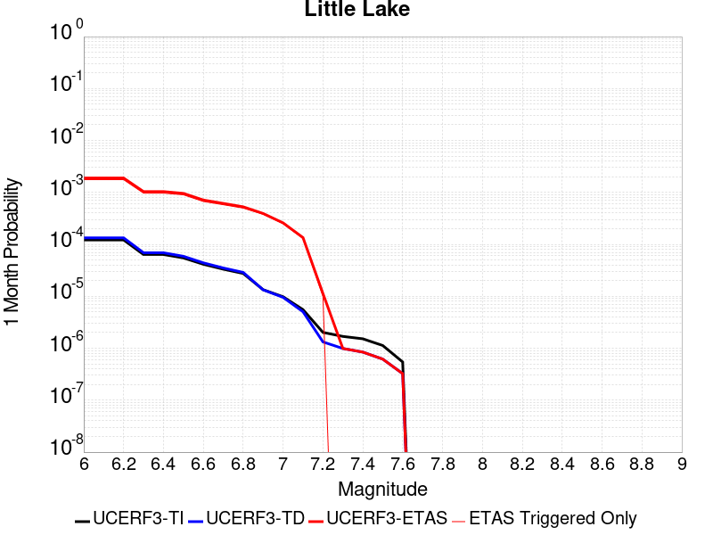 |  |  |

| Magnitude | 1 wk TI Prob | 1 wk TD Prob | 1 wk ETAS Prob | 1 wk ETAS/TD Gain | 1 wk ETAS Triggered Only | 1 mo TI Prob | 1 mo TD Prob | 1 mo ETAS Prob | 1 mo ETAS/TD Gain | 1 mo ETAS Triggered Only | 1 yr TI Prob | 1 yr TD Prob | 1 yr ETAS Prob | 1 yr ETAS/TD Gain | 1 yr ETAS Triggered Only | 10 yr TI Prob | 10 yr TD Prob | 10 yr ETAS Prob | 10 yr ETAS/TD Gain | 10 yr ETAS Triggered Only |
|-----|-----|-----|-----|-----|-----|-----|-----|-----|-----|-----|-----|-----|-----|-----|-----|-----|-----|-----|-----|-----|
| 6.0 | 2.8424427E-5 | 3.1207474E-5 | 4.911931E-4 | 15.739599 | 4.6E-4 | 1.2181328E-4 | 1.337402E-4 | 0.0018935049 | 14.158082 | 0.00176 | 0.0014820677 | 0.001627204 | 0.008026774 | 4.9328623 | 0.00641 | 0.014722223 | 0.016166301 | 0.027932953 | 1.7278506 | 0.01196 |
| 6.1 | 2.8424427E-5 | 3.1207474E-5 | 4.911931E-4 | 15.739599 | 4.6E-4 | 1.2181328E-4 | 1.337402E-4 | 0.0018935049 | 14.158082 | 0.00176 | 0.0014820677 | 0.001627204 | 0.008026774 | 4.9328623 | 0.00641 | 0.014722223 | 0.016166301 | 0.027932953 | 1.7278506 | 0.01196 |
| 6.2 | 2.8424427E-5 | 3.1207474E-5 | 4.911931E-4 | 15.739599 | 4.6E-4 | 1.2181328E-4 | 1.337402E-4 | 0.0018935049 | 14.158082 | 0.00176 | 0.0014820677 | 0.001627204 | 0.008026774 | 4.9328623 | 0.00641 | 0.014722223 | 0.016166301 | 0.027932953 | 1.7278506 | 0.01196 |
| 6.3 | 1.48860645E-5 | 1.60822E-5 | 2.460785E-4 | 15.301295 | 2.3E-4 | 6.379586E-5 | 6.8922054E-5 | 0.0010388552 | 15.072899 | 9.7E-4 | 7.7643775E-4 | 8.388312E-4 | 0.0044657863 | 5.32382 | 0.00363 | 0.007737305 | 0.008359468 | 0.015033209 | 1.7983452 | 0.00673 |
| 6.4 | 1.48860645E-5 | 1.60822E-5 | 2.460785E-4 | 15.301295 | 2.3E-4 | 6.379586E-5 | 6.8922054E-5 | 0.0010388552 | 15.072899 | 9.7E-4 | 7.7643775E-4 | 8.388312E-4 | 0.0044657863 | 5.32382 | 0.00363 | 0.007737305 | 0.008359468 | 0.015033209 | 1.7983452 | 0.00673 |
| 6.5 | 1.2797581E-5 | 1.3766243E-5 | 2.3376322E-4 | 16.980902 | 2.2E-4 | 5.4845623E-5 | 5.8996993E-5 | 9.589439E-4 | 16.254114 | 9.0E-4 | 6.675408E-4 | 7.1807735E-4 | 0.0039257724 | 5.4670606 | 0.00321 | 0.006655392 | 0.007160121 | 0.012988091 | 1.8139485 | 0.00587 |
| 6.6 | 9.661896E-6 | 1.0289515E-5 | 1.8028777E-4 | 17.521503 | 1.7E-4 | 4.1407468E-5 | 4.4097265E-5 | 7.140677E-4 | 16.193016 | 6.7E-4 | 5.040193E-4 | 5.367682E-4 | 0.003015437 | 5.617764 | 0.00248 | 0.005028777 | 0.005356322 | 0.009961522 | 1.8597691 | 0.00463 |
| 6.7 | 7.767871E-6 | 8.200049E-6 | 1.5819882E-4 | 19.292423 | 1.5E-4 | 3.329045E-5 | 3.514267E-5 | 6.1512226E-4 | 17.503572 | 5.8E-4 | 4.0523586E-4 | 4.2779176E-4 | 0.0025468848 | 5.9535623 | 0.00212 | 0.004044977 | 0.0042710346 | 0.008164335 | 1.9115591 | 0.00391 |
| 6.8 | 6.4235196E-6 | 6.7360374E-6 | 1.3673517E-4 | 20.29905 | 1.3E-4 | 2.752908E-5 | 2.8868486E-5 | 5.28854E-4 | 18.319426 | 5.0E-4 | 3.35115E-4 | 3.5142995E-4 | 0.002080822 | 5.921015 | 0.00173 | 0.003346101 | 0.0035100025 | 0.0065991217 | 1.8800902 | 0.0031 |
| 6.9 | 3.1283696E-6 | 3.1122813E-6 | 1.2311191E-4 | 39.55681 | 1.2E-4 | 1.3407229E-5 | 1.3338288E-5 | 3.9333323E-4 | 29.489033 | 3.8E-4 | 1.6322079E-4 | 1.6238306E-4 | 0.001252206 | 7.7114325 | 0.00109 | 0.0016310095 | 0.0016227924 | 0.0035197092 | 2.1689212 | 0.0019 |
| 7.0 | 2.290603E-6 | 2.2287568E-6 | 9.2228554E-5 | 41.38117 | 9.0E-5 | 9.816834E-6 | 9.551785E-6 | 2.595494E-4 | 27.172867 | 2.5E-4 | 1.19513395E-4 | 1.16287825E-4 | 7.562134E-4 | 6.502946 | 6.4E-4 | 0.0011944914 | 0.0011623718 | 0.0022710816 | 1.9538339 | 0.00111 |
| 7.1 | 1.293693E-6 | 1.1777277E-6 | 6.1177656E-5 | 51.945503 | 6.0E-5 | 5.5443866E-6 | 5.0473986E-6 | 1.3504674E-4 | 26.755713 | 1.3E-4 | 6.750081E-5 | 6.145104E-5 | 3.9143077E-4 | 6.3697987 | 3.3E-4 | 6.7480316E-4 | 6.14409E-4 | 0.0011940526 | 1.9434166 | 5.8E-4 |
| 7.2 | 4.715842E-7 | 3.0919745E-7 | 1.0309194E-5 | 33.341785 | 1.0E-5 | 2.0210737E-6 | 1.3251313E-6 | 1.1325118E-5 | 8.546412 | 1.0E-5 | 2.4606294E-5 | 1.613336E-5 | 3.6133035E-5 | 2.2396474 | 2.0E-5 | 2.460357E-4 | 1.6132242E-4 | 2.0131597E-4 | 1.2479106 | 4.0E-5 |
| 7.3 | 3.9430947E-7 | 2.3099179E-7 | 2.3099179E-7 | 1.0 | 0.0 | 1.6898966E-6 | 9.899644E-7 | 9.899644E-7 | 1.0 | 0.0 | 2.0574296E-5 | 1.2052751E-5 | 2.205263E-5 | 1.829676 | 1.0E-5 | 2.0572392E-4 | 1.2052105E-4 | 1.5051743E-4 | 1.2488892 | 3.0E-5 |
| 7.4 | 3.547123E-7 | 1.9680678E-7 | 1.9680678E-7 | 1.0 | 0.0 | 1.5201948E-6 | 8.434573E-7 | 8.434573E-7 | 1.0 | 0.0 | 1.8508214E-5 | 1.0269046E-5 | 2.0268943E-5 | 1.9737904 | 1.0E-5 | 1.8506673E-4 | 1.0268577E-4 | 1.2268372E-4 | 1.194749 | 2.0E-5 |
| 7.5 | 2.6354266E-7 | 1.4424151E-7 | 1.4424151E-7 | 1.0 | 0.0 | 1.129468E-6 | 6.1817775E-7 | 6.1817775E-7 | 1.0 | 0.0 | 1.3751187E-5 | 7.5262888E-6 | 7.5262888E-6 | 1.0 | 0.0 | 1.3750336E-4 | 7.526039E-5 | 8.5259635E-5 | 1.132862 | 1.0E-5 |
| 7.6 | 1.269913E-7 | 7.572964E-8 | 7.572964E-8 | 1.0 | 0.0 | 5.4424834E-7 | 3.2455554E-7 | 3.2455554E-7 | 1.0 | 0.0 | 6.6262032E-6 | 3.951457E-6 | 3.951457E-6 | 1.0 | 0.0 | 6.626006E-5 | 3.9513903E-5 | 3.9513903E-5 | 1.0 | 0.0 |

## Owl Lake
*[(top)](#table-of-contents)*

| 1 Week | 1 Month | 1 Year | 10 Year |
|-----|-----|-----|-----|
|  |  |  |  |

| Magnitude | 1 wk TI Prob | 1 wk TD Prob | 1 wk ETAS Prob | 1 wk ETAS/TD Gain | 1 wk ETAS Triggered Only | 1 mo TI Prob | 1 mo TD Prob | 1 mo ETAS Prob | 1 mo ETAS/TD Gain | 1 mo ETAS Triggered Only | 1 yr TI Prob | 1 yr TD Prob | 1 yr ETAS Prob | 1 yr ETAS/TD Gain | 1 yr ETAS Triggered Only | 10 yr TI Prob | 10 yr TD Prob | 10 yr ETAS Prob | 10 yr ETAS/TD Gain | 10 yr ETAS Triggered Only |
|-----|-----|-----|-----|-----|-----|-----|-----|-----|-----|-----|-----|-----|-----|-----|-----|-----|-----|-----|-----|-----|
| 6.0 | 5.0320643E-5 | 6.637038E-5 | 2.863558E-4 | 4.314512 | 2.2E-4 | 2.1564208E-4 | 2.8441957E-4 | 0.0012541437 | 4.4094844 | 9.7E-4 | 0.0026222812 | 0.0034582033 | 0.007673575 | 2.2189486 | 0.00423 | 0.02591553 | 0.034148198 | 0.042599402 | 1.2474861 | 0.00875 |
| 6.1 | 5.0320643E-5 | 6.637038E-5 | 2.863558E-4 | 4.314512 | 2.2E-4 | 2.1564208E-4 | 2.8441957E-4 | 0.0012541437 | 4.4094844 | 9.7E-4 | 0.0026222812 | 0.0034582033 | 0.007673575 | 2.2189486 | 0.00423 | 0.02591553 | 0.034148198 | 0.042599402 | 1.2474861 | 0.00875 |
| 6.2 | 2.4125871E-5 | 3.09871E-5 | 1.7098276E-4 | 5.5178695 | 1.4E-4 | 1.0339249E-4 | 1.3279608E-4 | 8.3270314E-4 | 6.27054 | 7.0E-4 | 0.0012580766 | 0.0016157634 | 0.0046408675 | 2.8722446 | 0.00303 | 0.012509781 | 0.016074665 | 0.022214359 | 1.3819485 | 0.00624 |
| 6.3 | 1.7433485E-5 | 2.2360797E-5 | 1.4235811E-4 | 6.366415 | 1.2E-4 | 7.471279E-5 | 9.582917E-5 | 6.9577165E-4 | 7.2605414 | 6.0E-4 | 9.0924866E-4 | 0.0011662331 | 0.0037332359 | 3.201106 | 0.00257 | 0.009055373 | 0.011632415 | 0.016850995 | 1.448624 | 0.00528 |
| 6.4 | 1.7433485E-5 | 2.2360797E-5 | 1.4235811E-4 | 6.366415 | 1.2E-4 | 7.471279E-5 | 9.582917E-5 | 6.9577165E-4 | 7.2605414 | 6.0E-4 | 9.0924866E-4 | 0.0011662331 | 0.0037332359 | 3.201106 | 0.00257 | 0.009055373 | 0.011632415 | 0.016850995 | 1.448624 | 0.00528 |
| 6.5 | 1.5182742E-5 | 1.9434077E-5 | 1.2943194E-4 | 6.660051 | 1.1E-4 | 6.506727E-5 | 8.328693E-5 | 6.5323943E-4 | 7.843241 | 5.7E-4 | 7.919061E-4 | 0.0010136823 | 0.0034412192 | 3.3947706 | 0.00243 | 0.0078909 | 0.010121727 | 0.015100815 | 1.4919207 | 0.00503 |
| 6.6 | 6.7271576E-6 | 8.550671E-6 | 9.85499E-5 | 11.525399 | 9.0E-5 | 2.8830356E-5 | 3.664525E-5 | 5.06628E-4 | 13.825203 | 4.7E-4 | 3.5095305E-4 | 4.4607025E-4 | 0.0022652585 | 5.0782547 | 0.00182 | 0.0035039932 | 0.0044702506 | 0.007994426 | 1.7883619 | 0.00354 |
| 6.7 | 6.682835E-6 | 8.48311E-6 | 9.848235E-5 | 11.609227 | 9.0E-5 | 2.8640408E-5 | 3.635571E-5 | 5.063386E-4 | 13.927348 | 4.7E-4 | 3.4864116E-4 | 4.4254653E-4 | 0.002261741 | 5.110742 | 0.00182 | 0.003480947 | 0.0044352226 | 0.007959522 | 1.7946161 | 0.00354 |
| 6.8 | 6.5774975E-6 | 8.32956E-6 | 9.832881E-5 | 11.804802 | 9.0E-5 | 2.8188972E-5 | 3.569766E-5 | 5.0568086E-4 | 14.165659 | 4.7E-4 | 3.4314668E-4 | 4.3453797E-4 | 0.002253747 | 5.186537 | 0.00182 | 0.0034261728 | 0.0043553766 | 0.007870002 | 1.8069625 | 0.00353 |
| 6.9 | 6.363419E-6 | 8.002683E-6 | 8.8002045E-5 | 10.996568 | 8.0E-5 | 2.727151E-5 | 3.429679E-5 | 4.94281E-4 | 14.411873 | 4.6E-4 | 3.3198006E-4 | 4.1748903E-4 | 0.0022067418 | 5.285748 | 0.00179 | 0.0033148455 | 0.0041853474 | 0.007630866 | 1.8232336 | 0.00346 |
| 7.0 | 6.1342453E-6 | 7.634817E-6 | 8.763421E-5 | 11.478233 | 8.0E-5 | 2.6289357E-5 | 3.272026E-5 | 4.927052E-4 | 15.058106 | 4.6E-4 | 3.2002592E-4 | 3.983019E-4 | 0.002147605 | 5.3919024 | 0.00175 | 0.0031956544 | 0.003994015 | 0.0073804352 | 1.8478737 | 0.0034 |
| 7.1 | 5.842926E-6 | 7.1452696E-6 | 8.71447E-5 | 12.196138 | 8.0E-5 | 2.504087E-5 | 3.0622254E-5 | 4.8060846E-4 | 15.694745 | 4.5E-4 | 3.0482994E-4 | 3.727676E-4 | 0.0020221525 | 5.4247007 | 0.00165 | 0.0030441214 | 0.0037395519 | 0.006927585 | 1.8525175 | 0.0032 |
| 7.2 | 4.77173E-6 | 5.3611675E-6 | 7.536079E-5 | 14.056788 | 7.0E-5 | 2.045011E-5 | 2.2976252E-5 | 3.5296867E-4 | 15.362326 | 3.3E-4 | 2.4895166E-4 | 2.7970402E-4 | 0.0014293824 | 5.110339 | 0.00115 | 0.0024867293 | 0.0028107075 | 0.0049845804 | 1.7734255 | 0.00218 |
| 7.3 | 3.0494948E-6 | 2.712334E-6 | 1.2712307E-5 | 4.6868515 | 1.0E-5 | 1.3069198E-5 | 1.1624238E-5 | 1.0162319E-4 | 8.742353 | 9.0E-5 | 1.5910587E-4 | 1.4151607E-4 | 4.9146655E-4 | 3.4728675 | 3.5E-4 | 0.0015899199 | 0.0014246284 | 0.0021136454 | 1.4836469 | 6.9E-4 |
| 7.4 | 2.7263884E-6 | 2.307415E-6 | 1.2307391E-5 | 5.333844 | 1.0E-5 | 1.1684469E-5 | 9.888884E-6 | 5.988839E-5 | 6.0561323 | 5.0E-5 | 1.4224913E-4 | 1.20390614E-4 | 3.4036415E-4 | 2.827165 | 2.2E-4 | 0.0014215811 | 0.0012125135 | 0.0016020406 | 1.3212559 | 3.9E-4 |
| 7.5 | 2.6090431E-6 | 2.1673172E-6 | 2.1673172E-6 | 1.0 | 0.0 | 1.1181565E-5 | 9.288469E-6 | 3.9288192E-5 | 4.2297807 | 3.0E-5 | 1.3612706E-4 | 1.1308135E-4 | 2.6306437E-4 | 2.3263288 | 1.5E-4 | 0.001360437 | 0.0011392768 | 0.0014389349 | 1.2630249 | 3.0E-4 |
| 7.6 | 2.3008756E-6 | 1.8744257E-6 | 1.8744257E-6 | 1.0 | 0.0 | 9.860858E-6 | 8.033228E-6 | 1.8033148E-5 | 2.2448194 | 1.0E-5 | 1.20049335E-4 | 9.780025E-5 | 2.0778949E-4 | 2.1246314 | 1.1E-4 | 0.001199845 | 9.862278E-4 | 0.001216001 | 1.2329818 | 2.3E-4 |
| 7.7 | 1.7184348E-6 | 1.3434202E-6 | 1.3434202E-6 | 1.0 | 0.0 | 7.3646997E-6 | 5.7575025E-6 | 5.7575025E-6 | 1.0 | 0.0 | 8.966153E-5 | 7.0095375E-5 | 1.3009117E-4 | 1.8559165 | 6.0E-5 | 8.962536E-4 | 7.0897903E-4 | 8.388869E-4 | 1.1832323 | 1.3E-4 |
| 7.8 | 8.4612907E-7 | 8.416933E-7 | 8.416933E-7 | 1.0 | 0.0 | 3.6262625E-6 | 3.6072522E-6 | 3.6072522E-6 | 1.0 | 0.0 | 4.4148852E-5 | 4.391743E-5 | 7.391611E-5 | 1.6830701 | 3.0E-5 | 4.414008E-4 | 4.4484966E-4 | 5.2481407E-4 | 1.179756 | 8.0E-5 |
| 7.9 | 2.716738E-7 | 3.773008E-7 | 3.773008E-7 | 1.0 | 0.0 | 1.1643157E-6 | 1.6170025E-6 | 1.6170025E-6 | 1.0 | 0.0 | 1.4175452E-5 | 1.9686839E-5 | 2.9686642E-5 | 1.5079436 | 1.0E-5 | 1.4174548E-4 | 1.9892666E-4 | 2.1892268E-4 | 1.1005195 | 2.0E-5 |
| 8.0 | 2.1995428E-8 | 3.3868776E-8 | 3.3868776E-8 | 1.0 | 0.0 | 9.426611E-8 | 1.4515189E-7 | 1.4515189E-7 | 1.0 | 0.0 | 1.1476893E-6 | 1.7672235E-6 | 1.7672235E-6 | 1.0 | 0.0 | 1.14768345E-5 | 1.8218208E-5 | 1.8218208E-5 | 1.0 | 0.0 |

## Panamint Valley
*[(top)](#table-of-contents)*

| 1 Week | 1 Month | 1 Year | 10 Year |
|-----|-----|-----|-----|
|  |  |  |  |

| Magnitude | 1 wk TI Prob | 1 wk TD Prob | 1 wk ETAS Prob | 1 wk ETAS/TD Gain | 1 wk ETAS Triggered Only | 1 mo TI Prob | 1 mo TD Prob | 1 mo ETAS Prob | 1 mo ETAS/TD Gain | 1 mo ETAS Triggered Only | 1 yr TI Prob | 1 yr TD Prob | 1 yr ETAS Prob | 1 yr ETAS/TD Gain | 1 yr ETAS Triggered Only | 10 yr TI Prob | 10 yr TD Prob | 10 yr ETAS Prob | 10 yr ETAS/TD Gain | 10 yr ETAS Triggered Only |
|-----|-----|-----|-----|-----|-----|-----|-----|-----|-----|-----|-----|-----|-----|-----|-----|-----|-----|-----|-----|-----|
| 6.0 | 3.0211835E-5 | 3.3987795E-5 | 4.4397387E-4 | 13.062744 | 4.1E-4 | 1.2947287E-4 | 1.4565402E-4 | 0.0011555069 | 7.933231 | 0.00101 | 0.0015751923 | 0.0017719247 | 0.0060742875 | 3.4280734 | 0.00431 | 0.015640736 | 0.017584749 | 0.026681915 | 1.5173327 | 0.00926 |
| 6.1 | 3.0211835E-5 | 3.3987795E-5 | 4.4397387E-4 | 13.062744 | 4.1E-4 | 1.2947287E-4 | 1.4565402E-4 | 0.0011555069 | 7.933231 | 0.00101 | 0.0015751923 | 0.0017719247 | 0.0060742875 | 3.4280734 | 0.00431 | 0.015640736 | 0.017584749 | 0.026681915 | 1.5173327 | 0.00926 |
| 6.2 | 3.0211835E-5 | 3.3987795E-5 | 4.4397387E-4 | 13.062744 | 4.1E-4 | 1.2947287E-4 | 1.4565402E-4 | 0.0011555069 | 7.933231 | 0.00101 | 0.0015751923 | 0.0017719247 | 0.0060742875 | 3.4280734 | 0.00431 | 0.015640736 | 0.017584749 | 0.026681915 | 1.5173327 | 0.00926 |
| 6.3 | 2.8573924E-5 | 3.2105843E-5 | 4.32093E-4 | 13.458391 | 4.0E-4 | 1.2245393E-4 | 1.3758938E-4 | 0.0011274532 | 8.194333 | 9.9E-4 | 0.001489857 | 0.0016738913 | 0.0058269277 | 3.4810672 | 0.00416 | 0.01479908 | 0.016619716 | 0.0253423 | 1.5248334 | 0.00887 |
| 6.4 | 2.8573924E-5 | 3.2105843E-5 | 4.32093E-4 | 13.458391 | 4.0E-4 | 1.2245393E-4 | 1.3758938E-4 | 0.0011274532 | 8.194333 | 9.9E-4 | 0.001489857 | 0.0016738913 | 0.0058269277 | 3.4810672 | 0.00416 | 0.01479908 | 0.016619716 | 0.0253423 | 1.5248334 | 0.00887 |
| 6.5 | 2.7468774E-5 | 3.0831467E-5 | 4.2081944E-4 | 13.649025 | 3.9E-4 | 1.1771801E-4 | 1.321283E-4 | 0.0010820028 | 8.189031 | 9.5E-4 | 0.0014322745 | 0.0016075026 | 0.0056310245 | 3.5029645 | 0.00403 | 0.014230782 | 0.015965527 | 0.024438063 | 1.530677 | 0.00861 |
| 6.6 | 2.6135967E-5 | 2.9255378E-5 | 3.9924454E-4 | 13.646877 | 3.7E-4 | 1.1200648E-4 | 1.2537432E-4 | 0.0010552577 | 8.416857 | 9.3E-4 | 0.0013628257 | 0.0015253901 | 0.005419441 | 3.552823 | 0.0039 | 0.013544982 | 0.015155784 | 0.02328075 | 1.5360967 | 0.00825 |
| 6.7 | 2.4498746E-5 | 2.7344215E-5 | 3.973341E-4 | 14.530829 | 3.7E-4 | 1.04990395E-4 | 1.1718437E-4 | 9.970813E-4 | 8.508655 | 8.8E-4 | 0.0012775084 | 0.001425811 | 0.005210407 | 3.6543465 | 0.00379 | 0.012701893 | 0.014173006 | 0.021872314 | 1.5432376 | 0.00781 |
| 6.8 | 2.2244329E-5 | 2.4938487E-5 | 3.849295E-4 | 15.435159 | 3.6E-4 | 9.532935E-5 | 1.0687498E-4 | 9.067895E-4 | 8.484582 | 8.0E-4 | 0.0011600169 | 0.001300448 | 0.0047859093 | 3.6802006 | 0.00349 | 0.011539802 | 0.012934348 | 0.019981997 | 1.5448786 | 0.00714 |
| 6.9 | 1.9902658E-5 | 2.229314E-5 | 3.4228602E-4 | 15.353871 | 3.2E-4 | 8.529431E-5 | 9.5538635E-5 | 7.554756E-4 | 7.90754 | 6.6E-4 | 0.0010379635 | 0.0011625807 | 0.003999279 | 3.4400012 | 0.00284 | 0.010331288 | 0.01157016 | 0.017223978 | 1.4886552 | 0.00572 |
| 7.0 | 1.8353881E-5 | 2.0568947E-5 | 2.905634E-4 | 14.126313 | 2.7E-4 | 7.865712E-5 | 8.814975E-5 | 6.680986E-4 | 7.5791326 | 5.8E-4 | 9.5722964E-4 | 0.0010727125 | 0.00358002 | 3.3373528 | 0.00251 | 0.009531168 | 0.010680287 | 0.015696138 | 1.4696363 | 0.00507 |
| 7.1 | 1.7667631E-5 | 1.9775267E-5 | 2.8976993E-4 | 14.653149 | 2.7E-4 | 7.571623E-5 | 8.474849E-5 | 6.44701E-4 | 7.6072273 | 5.6E-4 | 9.2145515E-4 | 0.0010313421 | 0.0033789184 | 3.2762344 | 0.00235 | 0.009176437 | 0.010270455 | 0.015040951 | 1.4644873 | 0.00482 |
| 7.2 | 1.6381597E-5 | 1.8160737E-5 | 2.7815602E-4 | 15.316339 | 2.6E-4 | 7.020495E-5 | 7.782951E-5 | 6.077883E-4 | 7.8092265 | 5.3E-4 | 8.544101E-4 | 9.471797E-4 | 0.0030052285 | 3.1728177 | 0.00206 | 0.008511325 | 0.009436136 | 0.0137153715 | 1.4534945 | 0.00432 |
| 7.3 | 1.4520491E-5 | 1.5968153E-5 | 1.9596527E-4 | 12.272258 | 1.8E-4 | 6.222919E-5 | 6.843323E-5 | 4.7840519E-4 | 6.990831 | 4.1E-4 | 7.57377E-4 | 8.3287235E-4 | 0.0025414482 | 3.0514257 | 0.00171 | 0.0075480095 | 0.0083006555 | 0.01188069 | 1.4312954 | 0.00361 |
| 7.4 | 1.2852287E-5 | 1.41469245E-5 | 1.9414438E-4 | 13.7234335 | 1.8E-4 | 5.5080065E-5 | 6.0628357E-5 | 4.706035E-4 | 7.762102 | 4.1E-4 | 6.7039346E-4 | 7.379161E-4 | 0.0024066838 | 3.26146 | 0.00167 | 0.0066837464 | 0.007357609 | 0.010792151 | 1.4668015 | 0.00346 |
| 7.5 | 1.1637851E-5 | 1.2838173E-5 | 1.9283585E-4 | 15.020508 | 1.8E-4 | 4.987555E-5 | 5.5019667E-5 | 4.5499764E-4 | 8.269728 | 4.0E-4 | 6.070656E-4 | 6.6967425E-4 | 0.0022985826 | 3.4323893 | 0.00163 | 0.006054099 | 0.006679489 | 0.010007112 | 1.4981854 | 0.00335 |
| 7.6 | 3.0068115E-6 | 3.333561E-6 | 5.3333395E-5 | 15.998926 | 5.0E-5 | 1.2886271E-5 | 1.4286652E-5 | 1.3428494E-4 | 9.399328 | 1.2E-4 | 1.5687906E-4 | 1.739334E-4 | 8.7381166E-4 | 5.023829 | 7.0E-4 | 0.0015676835 | 0.0017394735 | 0.0031570035 | 1.8149189 | 0.00142 |

## Ash Hill
*[(top)](#table-of-contents)*

| 1 Week | 1 Month | 1 Year | 10 Year |
|-----|-----|-----|-----|
|  |  |  |  |

| Magnitude | 1 wk TI Prob | 1 wk TD Prob | 1 wk ETAS Prob | 1 wk ETAS/TD Gain | 1 wk ETAS Triggered Only | 1 mo TI Prob | 1 mo TD Prob | 1 mo ETAS Prob | 1 mo ETAS/TD Gain | 1 mo ETAS Triggered Only | 1 yr TI Prob | 1 yr TD Prob | 1 yr ETAS Prob | 1 yr ETAS/TD Gain | 1 yr ETAS Triggered Only | 10 yr TI Prob | 10 yr TD Prob | 10 yr ETAS Prob | 10 yr ETAS/TD Gain | 10 yr ETAS Triggered Only |
|-----|-----|-----|-----|-----|-----|-----|-----|-----|-----|-----|-----|-----|-----|-----|-----|-----|-----|-----|-----|-----|
| 6.0 | 2.1545662E-5 | 2.3195389E-5 | 2.631898E-4 | 11.346644 | 2.4E-4 | 9.2335285E-5 | 9.940547E-5 | 8.9932594E-4 | 9.047047 | 8.0E-4 | 0.0011236023 | 0.0012096697 | 0.004585581 | 3.7907712 | 0.00338 | 0.011179381 | 0.012038835 | 0.018905165 | 1.5703484 | 0.00695 |
| 6.1 | 2.1545662E-5 | 2.3195389E-5 | 2.631898E-4 | 11.346644 | 2.4E-4 | 9.2335285E-5 | 9.940547E-5 | 8.9932594E-4 | 9.047047 | 8.0E-4 | 0.0011236023 | 0.0012096697 | 0.004585581 | 3.7907712 | 0.00338 | 0.011179381 | 0.012038835 | 0.018905165 | 1.5703484 | 0.00695 |
| 6.2 | 2.1545662E-5 | 2.3195389E-5 | 2.631898E-4 | 11.346644 | 2.4E-4 | 9.2335285E-5 | 9.940547E-5 | 8.9932594E-4 | 9.047047 | 8.0E-4 | 0.0011236023 | 0.0012096697 | 0.004585581 | 3.7907712 | 0.00338 | 0.011179381 | 0.012038835 | 0.018905165 | 1.5703484 | 0.00695 |
| 6.3 | 1.0025529E-5 | 1.0747344E-5 | 1.0074638E-4 | 9.374071 | 9.0E-5 | 4.2965847E-5 | 4.605931E-5 | 3.6604458E-4 | 7.947244 | 3.2E-4 | 5.229836E-4 | 5.6064106E-4 | 0.0018399234 | 3.2818208 | 0.00128 | 0.005217545 | 0.0055935793 | 0.008308309 | 1.4853296 | 0.00273 |
| 6.4 | 1.0025529E-5 | 1.0747344E-5 | 1.0074638E-4 | 9.374071 | 9.0E-5 | 4.2965847E-5 | 4.605931E-5 | 3.6604458E-4 | 7.947244 | 3.2E-4 | 5.229836E-4 | 5.6064106E-4 | 0.0018399234 | 3.2818208 | 0.00128 | 0.005217545 | 0.0055935793 | 0.008308309 | 1.4853296 | 0.00273 |
| 6.5 | 6.9617327E-6 | 7.4569152E-6 | 4.745662E-5 | 6.3641086 | 4.0E-5 | 2.9835655E-5 | 3.1957865E-5 | 2.1195211E-4 | 6.632236 | 1.8E-4 | 3.6318856E-4 | 3.8902622E-4 | 0.0011287384 | 2.9014454 | 7.4E-4 | 0.0036259557 | 0.0038843066 | 0.0055378587 | 1.4257007 | 0.00166 |
| 6.6 | 4.9919777E-6 | 5.34689E-6 | 2.5346782E-5 | 4.7404723 | 2.0E-5 | 2.1394015E-5 | 2.291508E-5 | 1.4291232E-4 | 6.2366066 | 1.2E-4 | 2.60441E-4 | 2.7896208E-4 | 7.588282E-4 | 2.720184 | 4.8E-4 | 0.0026013597 | 0.0027867774 | 0.003973461 | 1.4258265 | 0.00119 |
| 6.7 | 3.6630722E-6 | 3.9247725E-6 | 2.3924695E-5 | 6.095817 | 2.0E-5 | 1.5698786E-5 | 1.6820377E-5 | 1.16818694E-4 | 6.9450703 | 1.0E-4 | 1.9111596E-4 | 2.0477458E-4 | 6.046927E-4 | 2.9529674 | 4.0E-4 | 0.0019095168 | 0.002046422 | 0.0029545596 | 1.4437686 | 9.1E-4 |
| 6.8 | 2.5599613E-6 | 2.7450303E-6 | 1.2745003E-5 | 4.642937 | 1.0E-5 | 1.0971216E-5 | 1.176439E-5 | 7.176369E-5 | 6.1000767 | 6.0E-5 | 1.3356637E-4 | 1.4322698E-4 | 4.0318974E-4 | 2.8150403 | 2.6E-4 | 0.0013348613 | 0.0014318317 | 0.0021008723 | 1.467262 | 6.7E-4 |
| 6.9 | 1.7684905E-6 | 1.8969438E-6 | 1.1896925E-5 | 6.2716274 | 1.0E-5 | 7.579223E-6 | 8.129759E-6 | 3.8129514E-5 | 4.6901164 | 3.0E-5 | 9.2273134E-5 | 9.897981E-5 | 2.9896002E-4 | 3.0204139 | 2.0E-4 | 9.223483E-4 | 9.897981E-4 | 0.0014992934 | 1.5147465 | 5.1E-4 |

## Airport Lake
*[(top)](#table-of-contents)*

| 1 Week | 1 Month | 1 Year | 10 Year |
|-----|-----|-----|-----|
|  |  |  |  |

| Magnitude | 1 wk TI Prob | 1 wk TD Prob | 1 wk ETAS Prob | 1 wk ETAS/TD Gain | 1 wk ETAS Triggered Only | 1 mo TI Prob | 1 mo TD Prob | 1 mo ETAS Prob | 1 mo ETAS/TD Gain | 1 mo ETAS Triggered Only | 1 yr TI Prob | 1 yr TD Prob | 1 yr ETAS Prob | 1 yr ETAS/TD Gain | 1 yr ETAS Triggered Only | 10 yr TI Prob | 10 yr TD Prob | 10 yr ETAS Prob | 10 yr ETAS/TD Gain | 10 yr ETAS Triggered Only |
|-----|-----|-----|-----|-----|-----|-----|-----|-----|-----|-----|-----|-----|-----|-----|-----|-----|-----|-----|-----|-----|
| 6.0 | 1.2387061E-5 | 1.3103559E-5 | 3.6309898E-4 | 27.709951 | 3.5E-4 | 5.3086325E-5 | 5.615706E-5 | 0.0011560953 | 20.58682 | 0.0011 | 6.461343E-4 | 6.8352616E-4 | 0.0043310313 | 6.3363066 | 0.00365 | 0.0064425888 | 0.006817048 | 0.013580624 | 1.9921561 | 0.00681 |
| 6.1 | 1.2387061E-5 | 1.3103559E-5 | 3.6309898E-4 | 27.709951 | 3.5E-4 | 5.3086325E-5 | 5.615706E-5 | 0.0011560953 | 20.58682 | 0.0011 | 6.461343E-4 | 6.8352616E-4 | 0.0043310313 | 6.3363066 | 0.00365 | 0.0064425888 | 0.006817048 | 0.013580624 | 1.9921561 | 0.00681 |
| 6.2 | 1.2387061E-5 | 1.3103559E-5 | 3.6309898E-4 | 27.709951 | 3.5E-4 | 5.3086325E-5 | 5.615706E-5 | 0.0011560953 | 20.58682 | 0.0011 | 6.461343E-4 | 6.8352616E-4 | 0.0043310313 | 6.3363066 | 0.00365 | 0.0064425888 | 0.006817048 | 0.013580624 | 1.9921561 | 0.00681 |
| 6.3 | 1.2387061E-5 | 1.3103559E-5 | 3.6309898E-4 | 27.709951 | 3.5E-4 | 5.3086325E-5 | 5.615706E-5 | 0.0011560953 | 20.58682 | 0.0011 | 6.461343E-4 | 6.8352616E-4 | 0.0043310313 | 6.3363066 | 0.00365 | 0.0064425888 | 0.006817048 | 0.013580624 | 1.9921561 | 0.00681 |
| 6.4 | 1.2387061E-5 | 1.3103559E-5 | 3.6309898E-4 | 27.709951 | 3.5E-4 | 5.3086325E-5 | 5.615706E-5 | 0.0011560953 | 20.58682 | 0.0011 | 6.461343E-4 | 6.8352616E-4 | 0.0043310313 | 6.3363066 | 0.00365 | 0.0064425888 | 0.006817048 | 0.013580624 | 1.9921561 | 0.00681 |
| 6.5 | 6.9922594E-6 | 7.385145E-6 | 2.2738353E-4 | 30.789309 | 2.2E-4 | 2.996648E-5 | 3.165027E-5 | 8.1162556E-4 | 25.64356 | 7.8E-4 | 3.6478083E-4 | 3.8527933E-4 | 0.0030542507 | 7.927367 | 0.00267 | 0.003641826 | 0.003846651 | 0.0088373795 | 2.2974217 | 0.00501 |
| 6.6 | 6.9922594E-6 | 7.385145E-6 | 2.2738353E-4 | 30.789309 | 2.2E-4 | 2.996648E-5 | 3.165027E-5 | 8.1162556E-4 | 25.64356 | 7.8E-4 | 3.6478083E-4 | 3.8527933E-4 | 0.0030542507 | 7.927367 | 0.00267 | 0.003641826 | 0.003846651 | 0.0088373795 | 2.2974217 | 0.00501 |
| 6.7 | 5.477277E-6 | 5.7862417E-6 | 2.0578508E-4 | 35.564552 | 2.0E-4 | 2.3473833E-5 | 2.4797964E-5 | 7.3478033E-4 | 29.630672 | 7.1E-4 | 2.8575645E-4 | 3.0187727E-4 | 0.002631174 | 8.716039 | 0.00233 | 0.0028538927 | 0.003015056 | 0.00738185 | 2.4483294 | 0.00438 |
| 6.8 | 3.9950432E-6 | 4.2192128E-6 | 1.742185E-4 | 41.291706 | 1.7E-4 | 1.7121502E-5 | 1.808223E-5 | 5.480726E-4 | 30.310015 | 5.3E-4 | 2.0843433E-4 | 2.2013167E-4 | 0.0019797443 | 8.993455 | 0.00176 | 0.0020823893 | 0.0021994072 | 0.005342479 | 2.4290543 | 0.00315 |
| 6.9 | 2.95695E-6 | 3.1231173E-6 | 1.1312278E-4 | 36.221107 | 1.1E-4 | 1.2672582E-5 | 1.33847325E-5 | 4.43379E-4 | 33.125725 | 4.3E-4 | 1.5427776E-4 | 1.629492E-4 | 0.0014627373 | 8.976646 | 0.0013 | 0.001541707 | 0.0016285196 | 0.003964709 | 2.434548 | 0.00234 |
| 7.0 | 1.456072E-6 | 1.5408596E-6 | 6.154077E-5 | 39.939243 | 6.0E-5 | 6.2402937E-6 | 6.603673E-6 | 2.1660229E-4 | 32.800274 | 2.1E-4 | 7.597293E-5 | 8.039776E-5 | 6.303535E-4 | 7.840437 | 5.5E-4 | 7.594696E-4 | 8.0378563E-4 | 0.0017730059 | 2.2058194 | 9.7E-4 |
| 7.1 | 6.995192E-7 | 7.409207E-7 | 4.074089E-5 | 54.986843 | 4.0E-5 | 2.997936E-6 | 3.1753743E-6 | 1.13175025E-4 | 35.641476 | 1.1E-4 | 3.649926E-5 | 3.8660182E-5 | 3.2864898E-4 | 8.500968 | 2.9E-4 | 3.6493264E-4 | 3.8660184E-4 | 8.8640855E-4 | 2.2928202 | 5.0E-4 |

## Garlock (East)
*[(top)](#table-of-contents)*

| 1 Week | 1 Month | 1 Year | 10 Year |
|-----|-----|-----|-----|
|  |  |  |  |

| Magnitude | 1 wk TI Prob | 1 wk TD Prob | 1 wk ETAS Prob | 1 wk ETAS/TD Gain | 1 wk ETAS Triggered Only | 1 mo TI Prob | 1 mo TD Prob | 1 mo ETAS Prob | 1 mo ETAS/TD Gain | 1 mo ETAS Triggered Only | 1 yr TI Prob | 1 yr TD Prob | 1 yr ETAS Prob | 1 yr ETAS/TD Gain | 1 yr ETAS Triggered Only | 10 yr TI Prob | 10 yr TD Prob | 10 yr ETAS Prob | 10 yr ETAS/TD Gain | 10 yr ETAS Triggered Only |
|-----|-----|-----|-----|-----|-----|-----|-----|-----|-----|-----|-----|-----|-----|-----|-----|-----|-----|-----|-----|-----|
| 6.0 | 4.5092507E-5 | 6.291901E-5 | 2.1290957E-4 | 3.3838673 | 1.5E-4 | 1.9323928E-4 | 2.6962755E-4 | 8.4947114E-4 | 3.1505356 | 5.8E-4 | 0.0023501497 | 0.0032782198 | 0.0057201884 | 1.7449068 | 0.00245 | 0.023254504 | 0.032287683 | 0.037900414 | 1.173835 | 0.0058 |
| 6.1 | 4.5092507E-5 | 6.291901E-5 | 2.1290957E-4 | 3.3838673 | 1.5E-4 | 1.9323928E-4 | 2.6962755E-4 | 8.4947114E-4 | 3.1505356 | 5.8E-4 | 0.0023501497 | 0.0032782198 | 0.0057201884 | 1.7449068 | 0.00245 | 0.023254504 | 0.032287683 | 0.037900414 | 1.173835 | 0.0058 |
| 6.2 | 2.6674514E-5 | 3.4522156E-5 | 1.5451801E-4 | 4.4759088 | 1.2E-4 | 1.1431433E-4 | 1.4794388E-4 | 5.7788024E-4 | 3.9060774 | 4.3E-4 | 0.0013908884 | 0.0017997618 | 0.0035266483 | 1.9595083 | 0.00173 | 0.01382215 | 0.01787814 | 0.021698594 | 1.2136942 | 0.00389 |
| 6.3 | 2.6674514E-5 | 3.4522156E-5 | 1.5451801E-4 | 4.4759088 | 1.2E-4 | 1.1431433E-4 | 1.4794388E-4 | 5.7788024E-4 | 3.9060774 | 4.3E-4 | 0.0013908884 | 0.0017997618 | 0.0035266483 | 1.9595083 | 0.00173 | 0.01382215 | 0.01787814 | 0.021698594 | 1.2136942 | 0.00389 |
| 6.4 | 2.5312667E-5 | 3.2350978E-5 | 1.523471E-4 | 4.709196 | 1.2E-4 | 1.0847834E-4 | 1.3863985E-4 | 5.6858023E-4 | 4.1011314 | 4.3E-4 | 0.0013199237 | 0.0016866627 | 0.0034037617 | 2.0180452 | 0.00172 | 0.013121112 | 0.016778192 | 0.020553762 | 1.2250285 | 0.00384 |
| 6.5 | 2.5312667E-5 | 3.2350978E-5 | 1.523471E-4 | 4.709196 | 1.2E-4 | 1.0847834E-4 | 1.3863985E-4 | 5.6858023E-4 | 4.1011314 | 4.3E-4 | 0.0013199237 | 0.0016866627 | 0.0034037617 | 2.0180452 | 0.00172 | 0.013121112 | 0.016778192 | 0.020553762 | 1.2250285 | 0.00384 |
| 6.6 | 2.246556E-5 | 2.8145088E-5 | 1.3814199E-4 | 4.9082093 | 1.1E-4 | 9.627742E-5 | 1.20616365E-4 | 5.405657E-4 | 4.4816947 | 4.2E-4 | 0.0011715472 | 0.0014675385 | 0.0030951465 | 2.1090734 | 0.00163 | 0.011653901 | 0.014618727 | 0.018136539 | 1.2406373 | 0.00357 |
| 6.7 | 2.2241198E-5 | 2.7814802E-5 | 1.3781174E-4 | 4.954619 | 1.1E-4 | 9.531594E-5 | 1.1920098E-4 | 5.391509E-4 | 4.523041 | 4.2E-4 | 0.0011598538 | 0.0014503293 | 0.0030779652 | 2.1222527 | 0.00163 | 0.011538187 | 0.014448618 | 0.017937468 | 1.2414662 | 0.00354 |
| 6.8 | 1.9528685E-5 | 2.3908464E-5 | 1.3390584E-4 | 5.600771 | 1.1E-4 | 8.369167E-5 | 1.0246093E-4 | 5.0241995E-4 | 4.9035273 | 4.0E-4 | 0.0010184698 | 0.0012467676 | 0.0027848475 | 2.233654 | 0.00154 | 0.010138147 | 0.012441509 | 0.015621448 | 1.255591 | 0.00322 |
| 6.9 | 1.3318621E-5 | 1.5207378E-5 | 9.520616E-5 | 6.2605243 | 8.0E-5 | 5.7078556E-5 | 6.5172884E-5 | 3.8515203E-4 | 5.9096975 | 3.2E-4 | 6.9470983E-4 | 7.9319667E-4 | 0.0020921656 | 2.6376379 | 0.0013 | 0.0069254204 | 0.007945063 | 0.01061369 | 1.335885 | 0.00269 |
| 7.0 | 1.1760853E-5 | 1.3115919E-5 | 9.311487E-5 | 7.0993786 | 8.0E-5 | 5.0402683E-5 | 5.6209898E-5 | 3.7619192E-4 | 6.6926274 | 3.2E-4 | 6.134799E-4 | 6.8414566E-4 | 0.00196327 | 2.8696666 | 0.00128 | 0.0061178906 | 0.006861606 | 0.00947356 | 1.3806622 | 0.00263 |
| 7.1 | 1.0064758E-5 | 1.09107295E-5 | 9.090986E-5 | 8.332152 | 8.0E-5 | 4.3133965E-5 | 4.675945E-5 | 3.4674542E-4 | 7.4155154 | 3.0E-4 | 5.2502943E-4 | 5.6915113E-4 | 0.0017584738 | 3.089643 | 0.00119 | 0.005237907 | 0.005717425 | 0.008113646 | 1.4191084 | 0.00241 |
| 7.2 | 9.768808E-6 | 1.0506538E-5 | 9.0505695E-5 | 8.614226 | 8.0E-5 | 4.186565E-5 | 4.5027264E-5 | 3.4501374E-4 | 7.66233 | 3.0E-4 | 5.095951E-4 | 5.480725E-4 | 0.0017274258 | 3.1518197 | 0.00118 | 0.0050842804 | 0.0055075847 | 0.007884421 | 1.431557 | 0.00239 |
| 7.3 | 9.344516E-6 | 9.952032E-6 | 8.995124E-5 | 9.03848 | 8.0E-5 | 4.004731E-5 | 4.2650885E-5 | 3.2263895E-4 | 7.564648 | 2.8E-4 | 4.8746695E-4 | 5.191543E-4 | 0.0016285781 | 3.1369827 | 0.00111 | 0.0048639905 | 0.0052191834 | 0.007427597 | 1.4231339 | 0.00222 |
| 7.4 | 9.023491E-6 | 9.498046E-6 | 8.949728E-5 | 9.422705 | 8.0E-5 | 3.867153E-5 | 4.0705298E-5 | 3.0069472E-4 | 7.3871155 | 2.6E-4 | 4.7072413E-4 | 4.9547764E-4 | 0.0014649971 | 2.9567368 | 9.7E-4 | 0.004697283 | 0.0049825576 | 0.006892991 | 1.3834243 | 0.00192 |
| 7.5 | 7.081253E-6 | 7.0941337E-6 | 4.709385E-5 | 6.6384215 | 4.0E-5 | 3.0347876E-5 | 3.040308E-5 | 1.8039852E-4 | 5.933561 | 1.5E-4 | 3.6942272E-4 | 3.7009537E-4 | 8.0993254E-4 | 2.1884427 | 4.4E-4 | 0.003688092 | 0.0037283404 | 0.004654873 | 1.2485107 | 9.3E-4 |
| 7.6 | 6.116396E-6 | 5.9653516E-6 | 3.596517E-5 | 6.0290112 | 3.0E-5 | 2.6212863E-5 | 2.5565543E-5 | 1.1556324E-4 | 4.520273 | 9.0E-5 | 3.1909486E-4 | 3.112163E-4 | 5.911292E-4 | 1.8994159 | 2.8E-4 | 0.0031863707 | 0.0031395783 | 0.003707789 | 1.1809831 | 5.7E-4 |
| 7.7 | 4.797145E-6 | 4.7631393E-6 | 2.4763043E-5 | 5.1988916 | 2.0E-5 | 2.055903E-5 | 2.0413294E-5 | 8.041207E-5 | 3.939201 | 6.0E-5 | 2.5027743E-4 | 2.4850364E-4 | 4.184614E-4 | 1.6839246 | 1.7E-4 | 0.0024999576 | 0.0025124259 | 0.0028615466 | 1.1389576 | 3.5E-4 |
| 7.8 | 3.4028885E-6 | 3.9837723E-6 | 1.3983733E-5 | 3.5101736 | 1.0E-5 | 1.4583726E-5 | 1.70732E-5 | 5.7072517E-5 | 3.3428133 | 4.0E-5 | 1.775424E-4 | 2.0784645E-4 | 3.1782358E-4 | 1.5291269 | 1.1E-4 | 0.0017740062 | 0.0021040265 | 0.0023135846 | 1.0995986 | 2.1E-4 |
| 7.9 | 2.5928412E-6 | 3.3769782E-6 | 1.33769445E-5 | 3.9612172 | 1.0E-5 | 1.1112129E-5 | 1.4472684E-5 | 5.4472104E-5 | 3.7637875 | 4.0E-5 | 1.3528178E-4 | 1.7619075E-4 | 2.7617312E-4 | 1.5674667 | 1.0E-4 | 0.0013519945 | 0.0017837033 | 0.0019434179 | 1.089541 | 1.6E-4 |
| 8.0 | 1.3743648E-6 | 1.6755052E-6 | 1.1675488E-5 | 6.968339 | 1.0E-5 | 5.8901214E-6 | 7.180717E-6 | 3.71805E-5 | 5.177826 | 3.0E-5 | 7.1709874E-5 | 8.742175E-5 | 1.474165E-4 | 1.6862681 | 6.0E-5 | 7.1686733E-4 | 8.849517E-4 | 9.6488086E-4 | 1.0903205 | 8.0E-5 |
| 8.1 | 3.6733252E-7 | 3.1523513E-7 | 3.1523513E-7 | 1.0 | 0.0 | 1.5742813E-6 | 1.3510071E-6 | 1.3510071E-6 | 1.0 | 0.0 | 1.9166706E-5 | 1.6448403E-5 | 1.6448403E-5 | 1.0 | 0.0 | 1.9165053E-4 | 1.6662726E-4 | 1.6662726E-4 | 1.0 | 0.0 |

## Hunter Mountain-Saline Valley
*[(top)](#table-of-contents)*

| 1 Week | 1 Month | 1 Year | 10 Year |
|-----|-----|-----|-----|
|  |  |  |  |

| Magnitude | 1 wk TI Prob | 1 wk TD Prob | 1 wk ETAS Prob | 1 wk ETAS/TD Gain | 1 wk ETAS Triggered Only | 1 mo TI Prob | 1 mo TD Prob | 1 mo ETAS Prob | 1 mo ETAS/TD Gain | 1 mo ETAS Triggered Only | 1 yr TI Prob | 1 yr TD Prob | 1 yr ETAS Prob | 1 yr ETAS/TD Gain | 1 yr ETAS Triggered Only | 10 yr TI Prob | 10 yr TD Prob | 10 yr ETAS Prob | 10 yr ETAS/TD Gain | 10 yr ETAS Triggered Only |
|-----|-----|-----|-----|-----|-----|-----|-----|-----|-----|-----|-----|-----|-----|-----|-----|-----|-----|-----|-----|-----|
| 6.0 | 4.5103672E-5 | 5.4575703E-5 | 2.3456587E-4 | 4.2979913 | 1.8E-4 | 1.9328714E-4 | 2.3387565E-4 | 6.637751E-4 | 2.8381538 | 4.3E-4 | 0.002350731 | 0.0028438994 | 0.0046387804 | 1.6311338 | 0.0018 | 0.023260195 | 0.028095502 | 0.031720705 | 1.1290314 | 0.00373 |
| 6.1 | 4.5103672E-5 | 5.4575703E-5 | 2.3456587E-4 | 4.2979913 | 1.8E-4 | 1.9328714E-4 | 2.3387565E-4 | 6.637751E-4 | 2.8381538 | 4.3E-4 | 0.002350731 | 0.0028438994 | 0.0046387804 | 1.6311338 | 0.0018 | 0.023260195 | 0.028095502 | 0.031720705 | 1.1290314 | 0.00373 |
| 6.2 | 3.9363465E-5 | 4.7068323E-5 | 2.2705985E-4 | 4.824048 | 1.8E-4 | 1.6868966E-4 | 2.017062E-4 | 6.316195E-4 | 3.1313834 | 4.3E-4 | 0.002051862 | 0.0024531453 | 0.00424873 | 1.7319518 | 0.0018 | 0.020330196 | 0.02427648 | 0.027896414 | 1.1491128 | 0.00371 |
| 6.3 | 3.9363465E-5 | 4.7068323E-5 | 2.2705985E-4 | 4.824048 | 1.8E-4 | 1.6868966E-4 | 2.017062E-4 | 6.316195E-4 | 3.1313834 | 4.3E-4 | 0.002051862 | 0.0024531453 | 0.00424873 | 1.7319518 | 0.0018 | 0.020330196 | 0.02427648 | 0.027896414 | 1.1491128 | 0.00371 |
| 6.4 | 3.2311684E-5 | 3.7955364E-5 | 2.1794853E-4 | 5.742233 | 1.8E-4 | 1.384713E-4 | 1.6265611E-4 | 5.825878E-4 | 3.5817146 | 4.2E-4 | 0.0016845843 | 0.001978608 | 0.003745106 | 1.8927982 | 0.00177 | 0.016718714 | 0.019618724 | 0.023187311 | 1.181897 | 0.00364 |
| 6.5 | 3.2311684E-5 | 3.7955364E-5 | 2.1794853E-4 | 5.742233 | 1.8E-4 | 1.384713E-4 | 1.6265611E-4 | 5.825878E-4 | 3.5817146 | 4.2E-4 | 0.0016845843 | 0.001978608 | 0.003745106 | 1.8927982 | 0.00177 | 0.016718714 | 0.019618724 | 0.023187311 | 1.181897 | 0.00364 |
| 6.6 | 2.9305844E-5 | 3.4185698E-5 | 2.1417954E-4 | 6.2651796 | 1.8E-4 | 1.2559042E-4 | 1.4650227E-4 | 5.564422E-4 | 3.7981818 | 4.1E-4 | 0.0015279909 | 0.0017822677 | 0.0035291486 | 1.9801451 | 0.00175 | 0.015175272 | 0.017687676 | 0.021233823 | 1.2004869 | 0.00361 |
| 6.7 | 2.7826512E-5 | 3.2347863E-5 | 2.1234204E-4 | 6.5643296 | 1.8E-4 | 1.19251024E-4 | 1.3862668E-4 | 5.385712E-4 | 3.8850474 | 4.0E-4 | 0.0014509142 | 0.0016865334 | 0.0034136157 | 2.0240428 | 0.00173 | 0.014414776 | 0.016745051 | 0.020274937 | 1.2108017 | 0.00359 |
| 6.8 | 2.3389874E-5 | 2.686962E-5 | 2.0686479E-4 | 7.6988354 | 1.8E-4 | 1.0023846E-4 | 1.15150695E-4 | 5.151046E-4 | 4.473309 | 4.0E-4 | 0.00121972 | 0.0014011054 | 0.0030987235 | 2.2116277 | 0.0017 | 0.01213047 | 0.013928953 | 0.017399922 | 1.249191 | 0.00352 |
| 6.9 | 2.069209E-5 | 2.357255E-5 | 2.035683E-4 | 8.63582 | 1.8E-4 | 8.867737E-5 | 1.01021506E-4 | 5.009811E-4 | 4.959153 | 4.0E-4 | 0.0010791123 | 0.001229279 | 0.002897226 | 2.35685 | 0.00167 | 0.010738871 | 0.012229844 | 0.015657406 | 1.2802621 | 0.00347 |
| 7.0 | 1.7462342E-5 | 1.9635605E-5 | 1.9963206E-4 | 10.166841 | 1.8E-4 | 7.483646E-5 | 8.415001E-5 | 4.8411635E-4 | 5.753016 | 4.0E-4 | 9.1075303E-4 | 0.0010240674 | 0.0026923572 | 2.629082 | 0.00167 | 0.009070295 | 0.010197138 | 0.013631755 | 1.3368216 | 0.00347 |
| 7.1 | 1.4807709E-5 | 1.6443466E-5 | 1.9644051E-4 | 11.946417 | 1.8E-4 | 6.3460066E-5 | 7.047019E-5 | 4.70442E-4 | 6.6757593 | 4.0E-4 | 7.723524E-4 | 8.5765333E-4 | 0.002526221 | 2.9455037 | 0.00167 | 0.007696735 | 0.008546443 | 0.011966957 | 1.4002267 | 0.00345 |
| 7.2 | 1.4180048E-5 | 1.5699981E-5 | 1.9569715E-4 | 12.464803 | 1.8E-4 | 6.077022E-5 | 6.728399E-5 | 4.6725708E-4 | 6.944551 | 4.0E-4 | 7.396263E-4 | 8.1889087E-4 | 0.0024875232 | 3.0376737 | 0.00167 | 0.0073716943 | 0.008161707 | 0.011583549 | 1.4192557 | 0.00345 |
| 7.3 | 1.3730402E-5 | 1.517367E-5 | 1.9517094E-4 | 12.8624735 | 1.8E-4 | 5.8843252E-5 | 6.5028486E-5 | 4.6500246E-4 | 7.1507506 | 4.0E-4 | 7.161811E-4 | 7.914503E-4 | 0.0024601286 | 3.1083803 | 0.00167 | 0.007138774 | 0.007889271 | 0.011312053 | 1.4338528 | 0.00345 |
| 7.4 | 1.2810095E-5 | 1.4110783E-5 | 1.9410824E-4 | 13.756022 | 1.8E-4 | 5.489925E-5 | 6.047347E-5 | 4.604493E-4 | 7.6140704 | 4.0E-4 | 6.681934E-4 | 7.360316E-4 | 0.0023948099 | 3.2536778 | 0.00166 | 0.006661878 | 0.0073388554 | 0.010743683 | 1.4639453 | 0.00343 |
| 7.5 | 1.1595659E-5 | 1.280203E-5 | 1.9279972E-4 | 15.06009 | 1.8E-4 | 4.9694736E-5 | 5.486478E-5 | 4.4484338E-4 | 8.107996 | 3.9E-4 | 6.0486543E-4 | 6.6778966E-4 | 0.0022867077 | 3.4242938 | 0.00162 | 0.006032217 | 0.0066607227 | 0.009958609 | 1.4951245 | 0.00332 |
| 7.6 | 2.997694E-6 | 3.325686E-6 | 5.332552E-5 | 16.034441 | 5.0E-5 | 1.28471975E-5 | 1.4252903E-5 | 1.342512E-4 | 9.419217 | 1.2E-4 | 1.564034E-4 | 1.7352257E-4 | 8.734011E-4 | 5.0333576 | 7.0E-4 | 0.0015629337 | 0.0017353615 | 0.0031528973 | 1.8168533 | 0.00142 |

## Blackwater
*[(top)](#table-of-contents)*

| 1 Week | 1 Month | 1 Year | 10 Year |
|-----|-----|-----|-----|
|  |  |  |  |

| Magnitude | 1 wk TI Prob | 1 wk TD Prob | 1 wk ETAS Prob | 1 wk ETAS/TD Gain | 1 wk ETAS Triggered Only | 1 mo TI Prob | 1 mo TD Prob | 1 mo ETAS Prob | 1 mo ETAS/TD Gain | 1 mo ETAS Triggered Only | 1 yr TI Prob | 1 yr TD Prob | 1 yr ETAS Prob | 1 yr ETAS/TD Gain | 1 yr ETAS Triggered Only | 10 yr TI Prob | 10 yr TD Prob | 10 yr ETAS Prob | 10 yr ETAS/TD Gain | 10 yr ETAS Triggered Only |
|-----|-----|-----|-----|-----|-----|-----|-----|-----|-----|-----|-----|-----|-----|-----|-----|-----|-----|-----|-----|-----|
| 6.0 | 3.0708583E-5 | 3.3097214E-5 | 1.5309325E-4 | 4.6255627 | 1.2E-4 | 1.3160157E-4 | 1.4183826E-4 | 5.4178154E-4 | 3.8197134 | 4.0E-4 | 0.0016010714 | 0.0017256497 | 0.003352837 | 1.9429418 | 0.00163 | 0.015895851 | 0.017136335 | 0.0203503 | 1.1875526 | 0.00327 |
| 6.1 | 3.0708583E-5 | 3.3097214E-5 | 1.5309325E-4 | 4.6255627 | 1.2E-4 | 1.3160157E-4 | 1.4183826E-4 | 5.4178154E-4 | 3.8197134 | 4.0E-4 | 0.0016010714 | 0.0017256497 | 0.003352837 | 1.9429418 | 0.00163 | 0.015895851 | 0.017136335 | 0.0203503 | 1.1875526 | 0.00327 |
| 6.2 | 1.1707779E-5 | 1.2545598E-5 | 6.254497E-5 | 4.9854116 | 5.0E-5 | 5.017523E-5 | 5.3765798E-5 | 2.0375774E-4 | 3.7897277 | 1.5E-4 | 6.107122E-4 | 6.5441156E-4 | 0.0012839993 | 1.9620669 | 6.3E-4 | 0.006090366 | 0.0065258164 | 0.007777594 | 1.1918193 | 0.00126 |
| 6.3 | 1.1707779E-5 | 1.2545598E-5 | 6.254497E-5 | 4.9854116 | 5.0E-5 | 5.017523E-5 | 5.3765798E-5 | 2.0375774E-4 | 3.7897277 | 1.5E-4 | 6.107122E-4 | 6.5441156E-4 | 0.0012839993 | 1.9620669 | 6.3E-4 | 0.006090366 | 0.0065258164 | 0.007777594 | 1.1918193 | 0.00126 |
| 6.4 | 7.929244E-6 | 8.4804105E-6 | 3.8480157E-5 | 4.5375347 | 3.0E-5 | 3.3982033E-5 | 3.6344132E-5 | 1.4634014E-4 | 4.026513 | 1.1E-4 | 4.136527E-4 | 4.4240404E-4 | 8.1224035E-4 | 1.8359696 | 3.7E-4 | 0.0041288356 | 0.0044156383 | 0.005192194 | 1.1758649 | 7.8E-4 |
| 6.5 | 5.8832115E-6 | 6.286219E-6 | 2.6286094E-5 | 4.1815424 | 2.0E-5 | 2.521352E-5 | 2.6940676E-5 | 1.0693852E-4 | 3.9694076 | 8.0E-5 | 3.0693135E-4 | 3.279559E-4 | 5.8787066E-4 | 1.7925295 | 2.6E-4 | 0.0030650778 | 0.0032749726 | 0.0038231714 | 1.1673903 | 5.5E-4 |
| 6.6 | 5.8832115E-6 | 6.286219E-6 | 2.6286094E-5 | 4.1815424 | 2.0E-5 | 2.521352E-5 | 2.6940676E-5 | 1.0693852E-4 | 3.9694076 | 8.0E-5 | 3.0693135E-4 | 3.279559E-4 | 5.8787066E-4 | 1.7925295 | 2.6E-4 | 0.0030650778 | 0.0032749726 | 0.0038231714 | 1.1673903 | 5.5E-4 |
| 6.7 | 3.0715053E-6 | 3.2815851E-6 | 1.3281552E-5 | 4.047298 | 1.0E-5 | 1.3163528E-5 | 1.4063868E-5 | 5.4063305E-5 | 3.844128 | 4.0E-5 | 1.6025416E-4 | 1.7121529E-4 | 2.9119474E-4 | 1.700752 | 1.2E-4 | 0.0016013865 | 0.0017109484 | 0.0020004523 | 1.1692066 | 2.9E-4 |
| 6.8 | 2.2722281E-6 | 2.4288424E-6 | 1.2428818E-5 | 5.1171775 | 1.0E-5 | 9.738084E-6 | 1.0409289E-5 | 5.040887E-5 | 4.842682 | 4.0E-5 | 1.1855473E-4 | 1.2672663E-4 | 2.1671523E-4 | 1.7101 | 9.0E-5 | 0.001184915 | 0.0012666339 | 0.0014763678 | 1.1655837 | 2.1E-4 |
| 6.9 | 9.952399E-7 | 1.0653887E-6 | 1.0653887E-6 | 1.0 | 0.0 | 4.265307E-6 | 4.5659463E-6 | 2.4565856E-5 | 5.380233 | 2.0E-5 | 5.1928873E-5 | 5.5589495E-5 | 1.1558616E-4 | 2.0792806 | 6.0E-5 | 5.191674E-4 | 5.558065E-4 | 7.057231E-4 | 1.2697281 | 1.5E-4 |
| 7.0 | 4.7385504E-7 | 5.075751E-7 | 5.075751E-7 | 1.0 | 0.0 | 2.0308057E-6 | 2.175322E-6 | 1.21753E-5 | 5.597011 | 1.0E-5 | 2.4724779E-5 | 2.6484544E-5 | 4.6484012E-5 | 1.7551374 | 2.0E-5 | 2.4722028E-4 | 2.6484544E-4 | 3.2482954E-4 | 1.2264873 | 6.0E-5 |

## McLean Lake
*[(top)](#table-of-contents)*

| 1 Week | 1 Month | 1 Year | 10 Year |
|-----|-----|-----|-----|
|  | 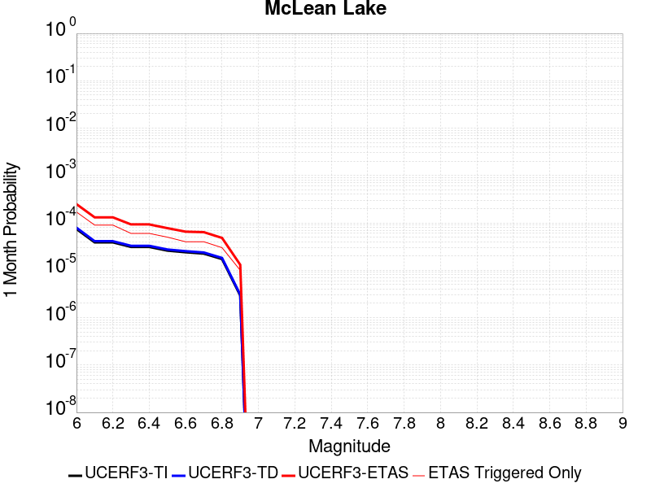 |  | 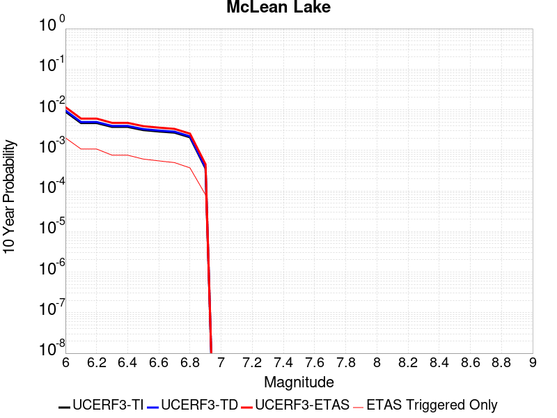 |

| Magnitude | 1 wk TI Prob | 1 wk TD Prob | 1 wk ETAS Prob | 1 wk ETAS/TD Gain | 1 wk ETAS Triggered Only | 1 mo TI Prob | 1 mo TD Prob | 1 mo ETAS Prob | 1 mo ETAS/TD Gain | 1 mo ETAS Triggered Only | 1 yr TI Prob | 1 yr TD Prob | 1 yr ETAS Prob | 1 yr ETAS/TD Gain | 1 yr ETAS Triggered Only | 10 yr TI Prob | 10 yr TD Prob | 10 yr ETAS Prob | 10 yr ETAS/TD Gain | 10 yr ETAS Triggered Only |
|-----|-----|-----|-----|-----|-----|-----|-----|-----|-----|-----|-----|-----|-----|-----|-----|-----|-----|-----|-----|-----|
| 6.0 | 1.7360222E-5 | 1.8502275E-5 | 6.850135E-5 | 3.7023206 | 5.0E-5 | 7.439883E-5 | 7.929332E-5 | 2.4927984E-4 | 3.1437683 | 1.7E-4 | 9.0542925E-4 | 9.6501724E-4 | 0.0016943128 | 1.7557331 | 7.3E-4 | 0.009017491 | 0.009613109 | 0.011623594 | 1.20914 | 0.00203 |
| 6.1 | 9.062689E-6 | 9.592492E-6 | 4.959211E-5 | 5.1698885 | 4.0E-5 | 3.8839516E-5 | 4.1110077E-5 | 1.3110638E-4 | 3.1891541 | 9.0E-5 | 4.727685E-4 | 5.0040917E-4 | 8.70224E-4 | 1.739025 | 3.7E-4 | 0.0047176396 | 0.0049937065 | 0.006068313 | 1.2151922 | 0.00108 |
| 6.2 | 9.062689E-6 | 9.592492E-6 | 4.959211E-5 | 5.1698885 | 4.0E-5 | 3.8839516E-5 | 4.1110077E-5 | 1.3110638E-4 | 3.1891541 | 9.0E-5 | 4.727685E-4 | 5.0040917E-4 | 8.70224E-4 | 1.739025 | 3.7E-4 | 0.0047176396 | 0.0049937065 | 0.006068313 | 1.2151922 | 0.00108 |
| 6.3 | 7.2575485E-6 | 7.66794E-6 | 3.766771E-5 | 4.912364 | 3.0E-5 | 3.110341E-5 | 3.2862223E-5 | 9.286025E-5 | 2.8257446 | 6.0E-5 | 3.786182E-4 | 4.0003125E-4 | 6.3993526E-4 | 1.5997131 | 2.4E-4 | 0.0037797375 | 0.003993816 | 0.004750781 | 1.1895342 | 7.6E-4 |
| 6.4 | 7.2575485E-6 | 7.66794E-6 | 3.766771E-5 | 4.912364 | 3.0E-5 | 3.110341E-5 | 3.2862223E-5 | 9.286025E-5 | 2.8257446 | 6.0E-5 | 3.786182E-4 | 4.0003125E-4 | 6.3993526E-4 | 1.5997131 | 2.4E-4 | 0.0037797375 | 0.003993816 | 0.004750781 | 1.1895342 | 7.6E-4 |
| 6.5 | 6.06582E-6 | 6.4040664E-6 | 3.6403875E-5 | 5.6844935 | 3.0E-5 | 2.5996113E-5 | 2.7445747E-5 | 7.7444376E-5 | 2.8217258 | 5.0E-5 | 3.164567E-4 | 3.3410723E-4 | 5.2404375E-4 | 1.5684897 | 1.9E-4 | 0.0031600643 | 0.0033366878 | 0.0039446526 | 1.182206 | 6.1E-4 |
| 6.6 | 5.598744E-6 | 5.910437E-6 | 3.591026E-5 | 6.075737 | 3.0E-5 | 2.3994397E-5 | 2.5330233E-5 | 6.532922E-5 | 2.5791006 | 4.0E-5 | 2.9209262E-4 | 3.0835834E-4 | 4.68309E-4 | 1.5187168 | 1.6E-4 | 0.0029170897 | 0.003079934 | 0.00362824 | 1.1780252 | 5.5E-4 |
| 6.7 | 5.246996E-6 | 5.5393257E-6 | 3.553916E-5 | 6.4157915 | 3.0E-5 | 2.2486933E-5 | 2.3739787E-5 | 6.373884E-5 | 2.684895 | 4.0E-5 | 2.73744E-4 | 2.8899993E-4 | 4.2895947E-4 | 1.4842892 | 1.4E-4 | 0.0027340704 | 0.0028868648 | 0.0033854214 | 1.1726983 | 5.0E-4 |
| 6.8 | 4.02324E-6 | 4.2470297E-6 | 2.4246945E-5 | 5.7091537 | 2.0E-5 | 1.7242342E-5 | 1.8201463E-5 | 4.8200916E-5 | 2.648189 | 3.0E-5 | 2.099053E-4 | 2.2158623E-4 | 3.3156187E-4 | 1.4963107 | 1.1E-4 | 0.0020970714 | 0.0022142373 | 0.002583418 | 1.1667304 | 3.7E-4 |
| 6.9 | 6.835972E-7 | 7.140097E-7 | 1.0714002E-5 | 15.005403 | 1.0E-5 | 2.9296991E-6 | 3.0600397E-6 | 1.3060009E-5 | 4.2679214 | 1.0E-5 | 3.56685E-5 | 3.7255664E-5 | 5.7254918E-5 | 1.5368111 | 2.0E-5 | 3.5662777E-4 | 3.7252545E-4 | 4.5249565E-4 | 1.2146704 | 8.0E-5 |

## Gravel Hills-Harper Lk
*[(top)](#table-of-contents)*

| 1 Week | 1 Month | 1 Year | 10 Year |
|-----|-----|-----|-----|
|  |  |  |  |

| Magnitude | 1 wk TI Prob | 1 wk TD Prob | 1 wk ETAS Prob | 1 wk ETAS/TD Gain | 1 wk ETAS Triggered Only | 1 mo TI Prob | 1 mo TD Prob | 1 mo ETAS Prob | 1 mo ETAS/TD Gain | 1 mo ETAS Triggered Only | 1 yr TI Prob | 1 yr TD Prob | 1 yr ETAS Prob | 1 yr ETAS/TD Gain | 1 yr ETAS Triggered Only | 10 yr TI Prob | 10 yr TD Prob | 10 yr ETAS Prob | 10 yr ETAS/TD Gain | 10 yr ETAS Triggered Only |
|-----|-----|-----|-----|-----|-----|-----|-----|-----|-----|-----|-----|-----|-----|-----|-----|-----|-----|-----|-----|-----|
| 6.0 | 3.0679566E-5 | 3.146678E-5 | 7.146552E-5 | 2.2711418 | 4.0E-5 | 1.3147724E-4 | 1.3485189E-4 | 3.548222E-4 | 2.6311996 | 2.2E-4 | 0.0015995599 | 0.0016408021 | 0.0024594567 | 1.4989356 | 8.2E-4 | 0.015880952 | 0.016308447 | 0.01811844 | 1.1109849 | 0.00184 |
| 6.1 | 3.0679566E-5 | 3.146678E-5 | 7.146552E-5 | 2.2711418 | 4.0E-5 | 1.3147724E-4 | 1.3485189E-4 | 3.548222E-4 | 2.6311996 | 2.2E-4 | 0.0015995599 | 0.0016408021 | 0.0024594567 | 1.4989356 | 8.2E-4 | 0.015880952 | 0.016308447 | 0.01811844 | 1.1109849 | 0.00184 |
| 6.2 | 1.514536E-5 | 1.3635941E-5 | 2.3635805E-5 | 1.733346 | 1.0E-5 | 6.490707E-5 | 5.843851E-5 | 1.18435004E-4 | 2.0266602 | 6.0E-5 | 7.8995706E-4 | 7.1126845E-4 | 9.810764E-4 | 1.3793335 | 2.7E-4 | 0.007871548 | 0.0070911213 | 0.007716654 | 1.0882134 | 6.3E-4 |
| 6.3 | 1.514536E-5 | 1.3635941E-5 | 2.3635805E-5 | 1.733346 | 1.0E-5 | 6.490707E-5 | 5.843851E-5 | 1.18435004E-4 | 2.0266602 | 6.0E-5 | 7.8995706E-4 | 7.1126845E-4 | 9.810764E-4 | 1.3793335 | 2.7E-4 | 0.007871548 | 0.0070911213 | 0.007716654 | 1.0882134 | 6.3E-4 |
| 6.4 | 1.2532521E-5 | 1.0690225E-5 | 1.0690225E-5 | 1.0 | 0.0 | 5.37097E-5 | 4.581448E-5 | 6.581356E-5 | 1.4365232 | 2.0E-5 | 6.537194E-4 | 5.5765436E-4 | 6.9757627E-4 | 1.2509116 | 1.4E-4 | 0.0065179965 | 0.00556314 | 0.005941026 | 1.0679268 | 3.8E-4 |
| 6.5 | 1.1094058E-5 | 9.084098E-6 | 9.084098E-6 | 1.0 | 0.0 | 4.7545094E-5 | 3.8931288E-5 | 5.8930513E-5 | 1.5137056 | 2.0E-5 | 5.787078E-4 | 4.738894E-4 | 5.7384203E-4 | 1.2109197 | 1.0E-4 | 0.0057720304 | 0.004729196 | 0.0049879667 | 1.0547177 | 2.6E-4 |
| 6.6 | 9.688328E-6 | 7.5320436E-6 | 7.5320436E-6 | 1.0 | 0.0 | 4.1520743E-5 | 3.22798E-5 | 4.227948E-5 | 1.3097812 | 1.0E-5 | 5.053978E-4 | 3.9293827E-4 | 4.829029E-4 | 1.2289536 | 9.0E-5 | 0.0050424994 | 0.0039226916 | 0.0041019856 | 1.0457069 | 1.8E-4 |
| 6.7 | 8.974824E-6 | 6.7497213E-6 | 6.7497213E-6 | 1.0 | 0.0 | 3.8462964E-5 | 2.8927068E-5 | 3.892678E-5 | 1.3456869 | 1.0E-5 | 4.6818596E-4 | 3.5213237E-4 | 4.321042E-4 | 1.2271073 | 8.0E-5 | 0.004672008 | 0.0035159648 | 0.0036654375 | 1.0425125 | 1.5E-4 |
| 6.8 | 7.4780046E-6 | 5.1164225E-6 | 5.1164225E-6 | 1.0 | 0.0 | 3.20482E-5 | 2.1927348E-5 | 3.1927128E-5 | 1.4560415 | 1.0E-5 | 3.9011694E-4 | 2.6693416E-4 | 3.2691815E-4 | 1.2247145 | 6.0E-5 | 0.0038943281 | 0.0026662734 | 0.0027460603 | 1.0299244 | 8.0E-5 |
| 6.9 | 6.3409307E-6 | 3.9076735E-6 | 3.9076735E-6 | 1.0 | 0.0 | 2.7175134E-5 | 1.674707E-5 | 2.6746904E-5 | 1.5971093 | 1.0E-5 | 3.3080703E-4 | 2.038775E-4 | 2.538673E-4 | 1.2451953 | 5.0E-5 | 0.0033031502 | 0.0020370027 | 0.0021068603 | 1.0342942 | 7.0E-5 |
| 7.0 | 5.1239335E-6 | 2.605978E-6 | 2.605978E-6 | 1.0 | 0.0 | 2.195953E-5 | 1.116843E-5 | 1.116843E-5 | 1.0 | 0.0 | 2.6732447E-4 | 1.359674E-4 | 1.6596333E-4 | 1.2206111 | 3.0E-5 | 0.0026700313 | 0.0013588674 | 0.0014087994 | 1.0367453 | 5.0E-5 |
| 7.1 | 4.438899E-6 | 2.0985767E-6 | 2.0985767E-6 | 1.0 | 0.0 | 1.9023713E-5 | 8.99387E-6 | 8.99387E-6 | 1.0 | 0.0 | 2.315891E-4 | 1.0949509E-4 | 1.19494E-4 | 1.0913182 | 1.0E-5 | 0.002313479 | 0.0010944332 | 0.0011244004 | 1.0273814 | 3.0E-5 |
| 7.2 | 3.50367E-6 | 1.2616476E-6 | 1.2616476E-6 | 1.0 | 0.0 | 1.5015643E-5 | 5.4070506E-6 | 5.4070506E-6 | 1.0 | 0.0 | 1.8280011E-4 | 6.5828935E-5 | 7.582828E-5 | 1.1518989 | 1.0E-5 | 0.0018264982 | 6.5810257E-4 | 6.8808283E-4 | 1.0455556 | 3.0E-5 |
| 7.3 | 2.561638E-6 | 7.1193233E-7 | 7.1193233E-7 | 1.0 | 0.0 | 1.0978401E-5 | 3.051135E-6 | 3.051135E-6 | 1.0 | 0.0 | 1.3365384E-4 | 3.7146954E-5 | 3.7146954E-5 | 1.0 | 0.0 | 0.0013357349 | 3.7140946E-4 | 3.7140946E-4 | 1.0 | 0.0 |
| 7.4 | 2.0368864E-6 | 5.304974E-7 | 5.304974E-7 | 1.0 | 0.0 | 8.729483E-6 | 2.2735583E-6 | 2.2735583E-6 | 1.0 | 0.0 | 1.06276275E-4 | 2.7680228E-5 | 2.7680228E-5 | 1.0 | 0.0 | 0.0010622547 | 2.7676832E-4 | 2.7676832E-4 | 1.0 | 0.0 |
| 7.5 | 1.1681728E-6 | 3.6031344E-7 | 3.6031344E-7 | 1.0 | 0.0 | 5.0064455E-6 | 1.5441996E-6 | 1.5441996E-6 | 1.0 | 0.0 | 6.0951766E-5 | 1.8800472E-5 | 1.8800472E-5 | 1.0 | 0.0 | 6.093505E-4 | 1.8798928E-4 | 1.8798928E-4 | 1.0 | 0.0 |
| 7.6 | 1.3154387E-7 | 7.119929E-8 | 7.119929E-8 | 1.0 | 0.0 | 5.6375933E-7 | 3.0513976E-7 | 3.0513976E-7 | 1.0 | 0.0 | 6.863748E-6 | 3.715072E-6 | 3.715072E-6 | 1.0 | 0.0 | 6.863536E-5 | 3.7150257E-5 | 3.7150257E-5 | 1.0 | 0.0 |

## Garlock (West)
*[(top)](#table-of-contents)*

| 1 Week | 1 Month | 1 Year | 10 Year |
|-----|-----|-----|-----|
|  |  |  |  |

| Magnitude | 1 wk TI Prob | 1 wk TD Prob | 1 wk ETAS Prob | 1 wk ETAS/TD Gain | 1 wk ETAS Triggered Only | 1 mo TI Prob | 1 mo TD Prob | 1 mo ETAS Prob | 1 mo ETAS/TD Gain | 1 mo ETAS Triggered Only | 1 yr TI Prob | 1 yr TD Prob | 1 yr ETAS Prob | 1 yr ETAS/TD Gain | 1 yr ETAS Triggered Only | 10 yr TI Prob | 10 yr TD Prob | 10 yr ETAS Prob | 10 yr ETAS/TD Gain | 10 yr ETAS Triggered Only |
|-----|-----|-----|-----|-----|-----|-----|-----|-----|-----|-----|-----|-----|-----|-----|-----|-----|-----|-----|-----|-----|
| 6.0 | 2.5181727E-5 | 2.5216248E-5 | 1.0521423E-4 | 4.1724777 | 8.0E-5 | 1.0791722E-4 | 1.0806518E-4 | 4.1803168E-4 | 3.868329 | 3.1E-4 | 0.0013131002 | 0.0013149029 | 0.0023235749 | 1.7671075 | 0.00101 | 0.013053683 | 0.013152735 | 0.014968535 | 1.1380548 | 0.00184 |
| 6.1 | 2.5077732E-5 | 2.5117288E-5 | 1.0511528E-4 | 4.1849775 | 8.0E-5 | 1.0747157E-4 | 1.0764109E-4 | 4.1760772E-4 | 3.879631 | 3.1E-4 | 0.001307681 | 0.001309746 | 0.002318423 | 1.770132 | 0.00101 | 0.013000126 | 0.013101775 | 0.014917668 | 1.138599 | 0.00184 |
| 6.2 | 2.494612E-5 | 2.4998972E-5 | 1.0499697E-4 | 4.200052 | 8.0E-5 | 1.0690756E-4 | 1.0713407E-4 | 4.1710085E-4 | 3.8932607 | 3.1E-4 | 0.0013008224 | 0.0013035802 | 0.0023122635 | 1.7737793 | 0.00101 | 0.012932341 | 0.0130408425 | 0.014856848 | 1.1392552 | 0.00184 |
| 6.3 | 2.4733758E-5 | 2.4818324E-5 | 1.0481634E-4 | 4.223345 | 8.0E-5 | 1.0599751E-4 | 1.0635993E-4 | 4.1632695E-4 | 3.9143214 | 3.1E-4 | 0.0012897556 | 0.0012941663 | 0.0023028592 | 1.7794152 | 0.00101 | 0.012822957 | 0.012947805 | 0.014763981 | 1.140269 | 0.00184 |
| 6.4 | 2.3237335E-5 | 2.3197525E-5 | 9.31959E-5 | 4.0174932 | 7.0E-5 | 9.958477E-5 | 9.9414196E-5 | 3.8938536E-4 | 3.9167986 | 2.9E-4 | 0.0012117702 | 0.0012096985 | 0.002198501 | 1.8173957 | 9.9E-4 | 0.012051838 | 0.012112607 | 0.013900683 | 1.147621 | 0.00181 |
| 6.5 | 2.2732203E-5 | 2.3011888E-5 | 9.3010276E-5 | 4.041836 | 7.0E-5 | 9.742009E-5 | 9.8618664E-5 | 3.8859007E-4 | 3.9403298 | 2.9E-4 | 0.0011854442 | 0.0012000237 | 0.0021888358 | 1.8239937 | 9.9E-4 | 0.011791403 | 0.012016909 | 0.013805158 | 1.1488111 | 0.00181 |
| 6.6 | 2.1319436E-5 | 2.179202E-5 | 9.17905E-5 | 4.212115 | 7.0E-5 | 9.136581E-5 | 9.339105E-5 | 3.8336395E-4 | 4.104933 | 2.9E-4 | 0.001111811 | 0.0011364452 | 0.0021153316 | 1.861358 | 9.8E-4 | 0.011062649 | 0.011387785 | 0.013167286 | 1.1562641 | 0.0018 |
| 6.7 | 1.970802E-5 | 2.0411735E-5 | 9.041031E-5 | 4.42933 | 7.0E-5 | 8.446021E-5 | 8.747594E-5 | 3.7745057E-4 | 4.3149076 | 2.9E-4 | 0.001027818 | 0.0010645009 | 0.0020434577 | 1.9196392 | 9.8E-4 | 0.010230771 | 0.010675436 | 0.01245622 | 1.1668113 | 0.0018 |
| 6.8 | 1.8744462E-5 | 1.9919305E-5 | 8.9917914E-5 | 4.5141087 | 7.0E-5 | 8.033094E-5 | 8.536567E-5 | 3.7534093E-4 | 4.39686 | 2.9E-4 | 9.775903E-4 | 0.0010388332 | 0.0020178151 | 1.9423862 | 9.8E-4 | 0.009733009 | 0.0104211895 | 0.012202431 | 1.170925 | 0.0018 |
| 6.9 | 1.7559682E-5 | 1.8971561E-5 | 8.8970235E-5 | 4.6896634 | 7.0E-5 | 7.5253614E-5 | 8.130416E-5 | 3.712806E-4 | 4.566563 | 2.9E-4 | 9.158276E-4 | 9.894301E-4 | 0.0019684604 | 1.9894892 | 9.8E-4 | 0.0091206245 | 0.009931459 | 0.011713582 | 1.1794423 | 0.0018 |
| 7.0 | 1.6794445E-5 | 1.823424E-5 | 8.823296E-5 | 4.838862 | 7.0E-5 | 7.197421E-5 | 7.81444E-5 | 3.6812175E-4 | 4.7107882 | 2.9E-4 | 8.759337E-4 | 9.509942E-4 | 0.0019200718 | 2.019015 | 9.7E-4 | 0.008724891 | 0.009550322 | 0.011323227 | 1.1856382 | 0.00179 |
| 7.1 | 1.6337795E-5 | 1.7734945E-5 | 8.77337E-5 | 4.94694 | 7.0E-5 | 7.0017246E-5 | 7.60047E-5 | 3.6598265E-4 | 4.8152637 | 2.9E-4 | 8.521265E-4 | 9.249657E-4 | 0.0018940684 | 2.0477176 | 9.7E-4 | 0.008488664 | 0.00929198 | 0.011045534 | 1.1887169 | 0.00177 |
| 7.2 | 1.5780008E-5 | 1.7183505E-5 | 8.71823E-5 | 5.073604 | 7.0E-5 | 6.762685E-5 | 7.3641524E-5 | 3.4362165E-4 | 4.6661396 | 2.7E-4 | 8.2304585E-4 | 8.9621806E-4 | 0.0018453667 | 2.0590599 | 9.5E-4 | 0.008200042 | 0.009006796 | 0.0107410345 | 1.1925477 | 0.00175 |
| 7.3 | 1.5058865E-5 | 1.6636446E-5 | 8.663528E-5 | 5.2075596 | 7.0E-5 | 6.45364E-5 | 7.129711E-5 | 3.3127857E-4 | 4.6464515 | 2.6E-4 | 7.854473E-4 | 8.676978E-4 | 0.0017968909 | 2.0708716 | 9.3E-4 | 0.00782677 | 0.00872343 | 0.010428427 | 1.1954502 | 0.00172 |
| 7.4 | 1.4887923E-5 | 1.6472359E-5 | 8.6471206E-5 | 5.249473 | 7.0E-5 | 6.380382E-5 | 7.0593924E-5 | 3.3057557E-4 | 4.6827765 | 2.6E-4 | 7.7653467E-4 | 8.591433E-4 | 0.0017883444 | 2.0815437 | 9.3E-4 | 0.0077382675 | 0.008638229 | 0.010313631 | 1.193952 | 0.00169 |
| 7.5 | 1.4509299E-5 | 1.6064254E-5 | 7.606329E-5 | 4.734941 | 6.0E-5 | 6.218123E-5 | 6.8844995E-5 | 2.8882985E-4 | 4.1953645 | 2.2E-4 | 7.567935E-4 | 8.378666E-4 | 0.0016172131 | 1.9301558 | 7.8E-4 | 0.0075422134 | 0.008426482 | 0.009913842 | 1.1765102 | 0.0015 |
| 7.6 | 1.2756717E-5 | 1.4067613E-5 | 6.406691E-5 | 4.554213 | 5.0E-5 | 5.4670498E-5 | 6.028838E-5 | 1.8028115E-4 | 2.9903133 | 1.2E-4 | 6.6541E-4 | 7.337645E-4 | 0.0012333976 | 1.6809175 | 5.0E-4 | 0.006634211 | 0.0073910584 | 0.008324111 | 1.1262407 | 9.4E-4 |
| 7.7 | 1.0328985E-5 | 1.1476324E-5 | 5.1475865E-5 | 4.4853964 | 4.0E-5 | 4.4266326E-5 | 4.9183323E-5 | 1.2917939E-4 | 2.6264877 | 8.0E-5 | 5.388092E-4 | 5.986428E-4 | 9.2844525E-4 | 1.5509169 | 3.3E-4 | 0.0053750467 | 0.006046964 | 0.006643336 | 1.0986234 | 6.0E-4 |
| 7.8 | 7.0306583E-6 | 8.912348E-6 | 2.8912169E-5 | 3.2440577 | 2.0E-5 | 3.0131043E-5 | 3.819522E-5 | 8.819331E-5 | 2.3090143 | 5.0E-5 | 3.667837E-4 | 4.6492773E-4 | 6.848254E-4 | 1.4729718 | 2.2E-4 | 0.003661789 | 0.004702143 | 0.0050903093 | 1.0825509 | 3.9E-4 |
| 7.9 | 4.060633E-6 | 5.472873E-6 | 1.5472819E-5 | 2.827184 | 1.0E-5 | 1.7402595E-5 | 2.3454959E-5 | 6.345402E-5 | 2.7053561 | 4.0E-5 | 2.11856E-4 | 2.8552682E-4 | 4.0549255E-4 | 1.4201558 | 1.2E-4 | 0.0021165414 | 0.0028883645 | 0.0030877867 | 1.0690434 | 2.0E-4 |
| 8.0 | 1.6729537E-6 | 2.080019E-6 | 1.2079999E-5 | 5.807638 | 1.0E-5 | 7.169782E-6 | 8.914337E-6 | 3.891407E-5 | 4.3653355 | 3.0E-5 | 8.7288594E-5 | 1.08526685E-4 | 1.6852017E-4 | 1.5527995 | 6.0E-5 | 8.7254314E-4 | 0.0010985459 | 0.001178458 | 1.0727435 | 8.0E-5 |
| 8.1 | 3.6733252E-7 | 3.1523513E-7 | 3.1523513E-7 | 1.0 | 0.0 | 1.5742813E-6 | 1.3510071E-6 | 1.3510071E-6 | 1.0 | 0.0 | 1.9166706E-5 | 1.6448403E-5 | 1.6448403E-5 | 1.0 | 0.0 | 1.9165053E-4 | 1.6662726E-4 | 1.6662726E-4 | 1.0 | 0.0 |

## Goldstone Lake
*[(top)](#table-of-contents)*

| 1 Week | 1 Month | 1 Year | 10 Year |
|-----|-----|-----|-----|
|  |  |  |  |

| Magnitude | 1 wk TI Prob | 1 wk TD Prob | 1 wk ETAS Prob | 1 wk ETAS/TD Gain | 1 wk ETAS Triggered Only | 1 mo TI Prob | 1 mo TD Prob | 1 mo ETAS Prob | 1 mo ETAS/TD Gain | 1 mo ETAS Triggered Only | 1 yr TI Prob | 1 yr TD Prob | 1 yr ETAS Prob | 1 yr ETAS/TD Gain | 1 yr ETAS Triggered Only | 10 yr TI Prob | 10 yr TD Prob | 10 yr ETAS Prob | 10 yr ETAS/TD Gain | 10 yr ETAS Triggered Only |
|-----|-----|-----|-----|-----|-----|-----|-----|-----|-----|-----|-----|-----|-----|-----|-----|-----|-----|-----|-----|-----|
| 6.0 | 2.671352E-5 | 3.0378256E-5 | 7.037704E-5 | 2.3166914 | 4.0E-5 | 1.1448149E-4 | 1.3018714E-4 | 2.701689E-4 | 2.0752351 | 1.4E-4 | 0.001392921 | 0.0015840722 | 0.0022430269 | 1.4159876 | 6.6E-4 | 0.013842222 | 0.01574731 | 0.017440226 | 1.107505 | 0.00172 |
| 6.1 | 2.671352E-5 | 3.0378256E-5 | 7.037704E-5 | 2.3166914 | 4.0E-5 | 1.1448149E-4 | 1.3018714E-4 | 2.701689E-4 | 2.0752351 | 1.4E-4 | 0.001392921 | 0.0015840722 | 0.0022430269 | 1.4159876 | 6.6E-4 | 0.013842222 | 0.01574731 | 0.017440226 | 1.107505 | 0.00172 |
| 6.2 | 1.4197047E-5 | 1.609734E-5 | 3.609702E-5 | 2.2424214 | 2.0E-5 | 6.0843064E-5 | 6.898733E-5 | 1.2898319E-4 | 1.8696649 | 6.0E-5 | 7.4051257E-4 | 8.396957E-4 | 0.0012193766 | 1.4521649 | 3.8E-4 | 0.007380498 | 0.008374927 | 0.009178143 | 1.0959072 | 8.1E-4 |
| 6.3 | 1.4197047E-5 | 1.609734E-5 | 3.609702E-5 | 2.2424214 | 2.0E-5 | 6.0843064E-5 | 6.898733E-5 | 1.2898319E-4 | 1.8696649 | 6.0E-5 | 7.4051257E-4 | 8.396957E-4 | 0.0012193766 | 1.4521649 | 3.8E-4 | 0.007380498 | 0.008374927 | 0.009178143 | 1.0959072 | 8.1E-4 |
| 6.4 | 1.3238931E-5 | 1.5009476E-5 | 3.5009176E-5 | 2.3324716 | 2.0E-5 | 5.6737044E-5 | 6.432529E-5 | 1.2432144E-4 | 1.9326991 | 6.0E-5 | 6.9055456E-4 | 7.8297703E-4 | 0.0011426952 | 1.4594235 | 3.6E-4 | 0.006884126 | 0.0078118113 | 0.008575796 | 1.0977987 | 7.7E-4 |
| 6.5 | 1.3238931E-5 | 1.5009476E-5 | 3.5009176E-5 | 2.3324716 | 2.0E-5 | 5.6737044E-5 | 6.432529E-5 | 1.2432144E-4 | 1.9326991 | 6.0E-5 | 6.9055456E-4 | 7.8297703E-4 | 0.0011426952 | 1.4594235 | 3.6E-4 | 0.006884126 | 0.0078118113 | 0.008575796 | 1.0977987 | 7.7E-4 |
| 6.6 | 1.1328278E-5 | 1.2856037E-5 | 3.285578E-5 | 2.5556693 | 2.0E-5 | 4.8548856E-5 | 5.5096676E-5 | 1.1509337E-4 | 2.088935 | 6.0E-5 | 5.90922E-4 | 6.7069125E-4 | 0.0010004699 | 1.4916997 | 3.3E-4 | 0.0058935313 | 0.0066960617 | 0.007361575 | 1.0993888 | 6.7E-4 |
| 6.7 | 8.651175E-6 | 9.825223E-6 | 2.9825027E-5 | 3.035557 | 2.0E-5 | 3.707594E-5 | 4.210793E-5 | 1.02105405E-4 | 2.4248497 | 6.0E-5 | 4.5130608E-4 | 5.12634E-4 | 7.425161E-4 | 1.4484332 | 2.3E-4 | 0.0045039062 | 0.0051233945 | 0.0055810376 | 1.0893242 | 4.6E-4 |
| 6.8 | 1.0215377E-6 | 1.1755159E-6 | 1.1175504E-5 | 9.506893 | 1.0E-5 | 4.378012E-6 | 5.0379163E-6 | 1.50378655E-5 | 2.9849377 | 1.0E-5 | 5.3300988E-5 | 6.133502E-5 | 9.1333175E-5 | 1.489087 | 3.0E-5 | 5.3288206E-4 | 6.1319215E-4 | 6.4317376E-4 | 1.0488943 | 3.0E-5 |
| 6.9 | 7.9360774E-7 | 9.283743E-7 | 9.283743E-7 | 1.0 | 0.0 | 3.4011714E-6 | 3.978741E-6 | 3.978741E-6 | 1.0 | 0.0 | 4.1408475E-5 | 4.8440168E-5 | 5.8439684E-5 | 1.2064302 | 1.0E-5 | 4.140076E-4 | 4.8430308E-4 | 4.9429823E-4 | 1.0206382 | 1.0E-5 |
| 7.0 | 7.4382757E-7 | 8.7476525E-7 | 8.7476525E-7 | 1.0 | 0.0 | 3.1878285E-6 | 3.748989E-6 | 3.748989E-6 | 1.0 | 0.0 | 3.8811122E-5 | 4.5643053E-5 | 5.5642595E-5 | 1.2190814 | 1.0E-5 | 3.8804344E-4 | 4.5634343E-4 | 4.6633885E-4 | 1.0219033 | 1.0E-5 |
| 7.1 | 6.4709513E-7 | 7.711585E-7 | 7.711585E-7 | 1.0 | 0.0 | 2.773262E-6 | 3.3049612E-6 | 3.3049612E-6 | 1.0 | 0.0 | 3.376394E-5 | 4.023722E-5 | 5.0236817E-5 | 1.2485161 | 1.0E-5 | 3.375881E-4 | 4.023053E-4 | 4.1230128E-4 | 1.0248468 | 1.0E-5 |
| 7.2 | 6.356704E-7 | 7.5886396E-7 | 7.5886396E-7 | 1.0 | 0.0 | 2.7242988E-6 | 3.2522705E-6 | 3.2522705E-6 | 1.0 | 0.0 | 3.3167835E-5 | 3.9595736E-5 | 4.959534E-5 | 1.2525425 | 1.0E-5 | 3.3162883E-4 | 3.9589274E-4 | 4.0588877E-4 | 1.0252494 | 1.0E-5 |
| 7.3 | 5.7695723E-7 | 6.8968285E-7 | 6.8968285E-7 | 1.0 | 0.0 | 2.4726714E-6 | 2.9557807E-6 | 2.9557807E-6 | 1.0 | 0.0 | 3.0104358E-5 | 3.5986093E-5 | 4.5985733E-5 | 1.2778751 | 1.0E-5 | 3.0100282E-4 | 3.598084E-4 | 3.698048E-4 | 1.0277826 | 1.0E-5 |
| 7.4 | 5.209647E-7 | 6.1937425E-7 | 6.1937425E-7 | 1.0 | 0.0 | 2.232704E-6 | 2.6544587E-6 | 2.6544587E-6 | 1.0 | 0.0 | 2.718283E-5 | 3.231761E-5 | 3.231761E-5 | 1.0 | 0.0 | 2.7179506E-4 | 3.2313468E-4 | 3.2313468E-4 | 1.0 | 0.0 |
| 7.5 | 4.512955E-7 | 5.3490703E-7 | 5.3490703E-7 | 1.0 | 0.0 | 1.934122E-6 | 2.292457E-6 | 2.292457E-6 | 1.0 | 0.0 | 2.3547682E-5 | 2.791036E-5 | 2.791036E-5 | 1.0 | 0.0 | 2.3545188E-4 | 2.7907387E-4 | 2.7907387E-4 | 1.0 | 0.0 |
| 7.6 | 2.21172E-7 | 2.6040448E-7 | 2.6040448E-7 | 1.0 | 0.0 | 9.478797E-7 | 1.1160189E-6 | 1.1160189E-6 | 1.0 | 0.0 | 1.1540374E-5 | 1.3587473E-5 | 1.3587473E-5 | 1.0 | 0.0 | 1.1539775E-4 | 1.3586924E-4 | 1.3586924E-4 | 1.0 | 0.0 |

## So Sierra Nevada
*[(top)](#table-of-contents)*

| 1 Week | 1 Month | 1 Year | 10 Year |
|-----|-----|-----|-----|
|  | 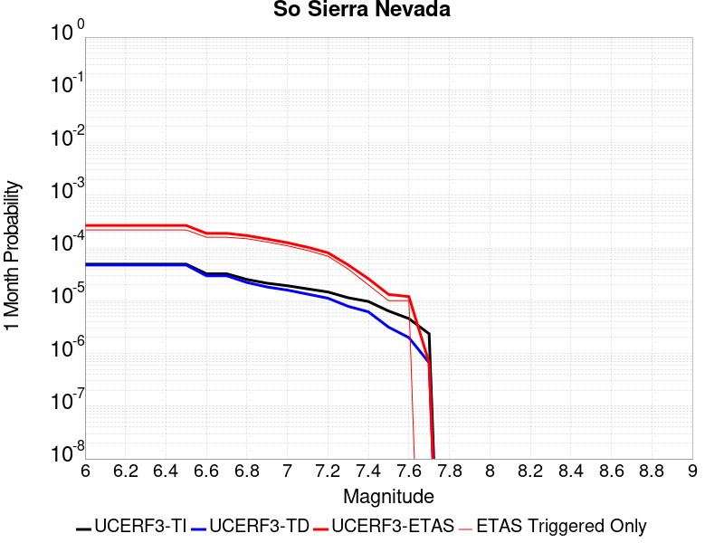 |  |  |

| Magnitude | 1 wk TI Prob | 1 wk TD Prob | 1 wk ETAS Prob | 1 wk ETAS/TD Gain | 1 wk ETAS Triggered Only | 1 mo TI Prob | 1 mo TD Prob | 1 mo ETAS Prob | 1 mo ETAS/TD Gain | 1 mo ETAS Triggered Only | 1 yr TI Prob | 1 yr TD Prob | 1 yr ETAS Prob | 1 yr ETAS/TD Gain | 1 yr ETAS Triggered Only | 10 yr TI Prob | 10 yr TD Prob | 10 yr ETAS Prob | 10 yr ETAS/TD Gain | 10 yr ETAS Triggered Only |
|-----|-----|-----|-----|-----|-----|-----|-----|-----|-----|-----|-----|-----|-----|-----|-----|-----|-----|-----|-----|-----|
| 6.0 | 1.15488665E-5 | 1.1079929E-5 | 7.107927E-5 | 6.4151373 | 6.0E-5 | 4.9494203E-5 | 4.7484617E-5 | 2.6747418E-4 | 5.632859 | 2.2E-4 | 6.024253E-4 | 5.779846E-4 | 0.0013575337 | 2.348737 | 7.8E-4 | 0.006007948 | 0.0057660826 | 0.007476165 | 1.2965761 | 0.00172 |
| 6.1 | 1.15488665E-5 | 1.1079929E-5 | 7.107927E-5 | 6.4151373 | 6.0E-5 | 4.9494203E-5 | 4.7484617E-5 | 2.6747418E-4 | 5.632859 | 2.2E-4 | 6.024253E-4 | 5.779846E-4 | 0.0013575337 | 2.348737 | 7.8E-4 | 0.006007948 | 0.0057660826 | 0.007476165 | 1.2965761 | 0.00172 |
| 6.2 | 1.15488665E-5 | 1.1079929E-5 | 7.107927E-5 | 6.4151373 | 6.0E-5 | 4.9494203E-5 | 4.7484617E-5 | 2.6747418E-4 | 5.632859 | 2.2E-4 | 6.024253E-4 | 5.779846E-4 | 0.0013575337 | 2.348737 | 7.8E-4 | 0.006007948 | 0.0057660826 | 0.007476165 | 1.2965761 | 0.00172 |
| 6.3 | 1.15488665E-5 | 1.1079929E-5 | 7.107927E-5 | 6.4151373 | 6.0E-5 | 4.9494203E-5 | 4.7484617E-5 | 2.6747418E-4 | 5.632859 | 2.2E-4 | 6.024253E-4 | 5.779846E-4 | 0.0013575337 | 2.348737 | 7.8E-4 | 0.006007948 | 0.0057660826 | 0.007476165 | 1.2965761 | 0.00172 |
| 6.4 | 1.15488665E-5 | 1.1079929E-5 | 7.107927E-5 | 6.4151373 | 6.0E-5 | 4.9494203E-5 | 4.7484617E-5 | 2.6747418E-4 | 5.632859 | 2.2E-4 | 6.024253E-4 | 5.779846E-4 | 0.0013575337 | 2.348737 | 7.8E-4 | 0.006007948 | 0.0057660826 | 0.007476165 | 1.2965761 | 0.00172 |
| 6.5 | 1.15488665E-5 | 1.1079929E-5 | 7.107927E-5 | 6.4151373 | 6.0E-5 | 4.9494203E-5 | 4.7484617E-5 | 2.6747418E-4 | 5.632859 | 2.2E-4 | 6.024253E-4 | 5.779846E-4 | 0.0013575337 | 2.348737 | 7.8E-4 | 0.006007948 | 0.0057660826 | 0.007476165 | 1.2965761 | 0.00172 |
| 6.6 | 7.587044E-6 | 6.9358202E-6 | 6.6935405E-5 | 9.650683 | 6.0E-5 | 3.2515498E-5 | 2.9724622E-5 | 1.8971987E-4 | 6.382583 | 1.6E-4 | 3.9580427E-4 | 3.618401E-4 | 8.416664E-4 | 2.326073 | 4.8E-4 | 0.003951 | 0.003612801 | 0.004659008 | 1.2895832 | 0.00105 |
| 6.7 | 7.587044E-6 | 6.9358202E-6 | 6.6935405E-5 | 9.650683 | 6.0E-5 | 3.2515498E-5 | 2.9724622E-5 | 1.8971987E-4 | 6.382583 | 1.6E-4 | 3.9580427E-4 | 3.618401E-4 | 8.416664E-4 | 2.326073 | 4.8E-4 | 0.003951 | 0.003612801 | 0.004659008 | 1.2895832 | 0.00105 |
| 6.8 | 5.9026956E-6 | 5.179538E-6 | 6.517923E-5 | 12.583984 | 6.0E-5 | 2.5297022E-5 | 2.2197837E-5 | 1.721945E-4 | 7.757265 | 1.5E-4 | 3.0794772E-4 | 2.7022633E-4 | 7.1010744E-4 | 2.6278248 | 4.4E-4 | 0.0030752132 | 0.0026990937 | 0.0035567724 | 1.3177655 | 8.6E-4 |
| 6.9 | 5.0118915E-6 | 4.2525508E-6 | 5.4252338E-5 | 12.7576 | 5.0E-5 | 2.1479358E-5 | 1.8225093E-5 | 1.4822272E-4 | 8.132893 | 1.3E-4 | 2.614798E-4 | 2.2186866E-4 | 6.1178213E-4 | 2.7574067 | 3.9E-4 | 0.0026117235 | 0.002216544 | 0.0029549038 | 1.3331131 | 7.4E-4 |
| 7.0 | 4.4924795E-6 | 3.7140323E-6 | 4.3713884E-5 | 11.769925 | 4.0E-5 | 1.925334E-5 | 1.5917189E-5 | 1.2591544E-4 | 7.9106584 | 1.1E-4 | 2.3438422E-4 | 1.9377517E-4 | 5.537054E-4 | 2.8574634 | 3.6E-4 | 0.0023413717 | 0.0019361249 | 0.002624789 | 1.3556919 | 6.9E-4 |
| 7.1 | 3.9118436E-6 | 3.1120794E-6 | 3.3111985E-5 | 10.639827 | 3.0E-5 | 1.6764936E-5 | 1.3337418E-5 | 1.0333622E-4 | 7.747843 | 9.0E-5 | 2.0409399E-4 | 1.6237154E-4 | 4.6232282E-4 | 2.8473146 | 3.0E-4 | 0.0020390663 | 0.001622585 | 0.0022116278 | 1.3630273 | 5.9E-4 |
| 7.2 | 3.4200818E-6 | 2.605546E-6 | 2.2605494E-5 | 8.675915 | 2.0E-5 | 1.4657411E-5 | 1.116658E-5 | 8.1165796E-5 | 7.2686353 | 7.0E-5 | 1.7843937E-4 | 1.3594514E-4 | 3.6591387E-4 | 2.691629 | 2.3E-4 | 0.0017829615 | 0.0013586695 | 0.0018180445 | 1.3381065 | 4.6E-4 |
| 7.3 | 2.6593618E-6 | 1.8284966E-6 | 1.8284966E-6 | 1.0 | 0.0 | 1.13972155E-5 | 7.836392E-6 | 4.7836078E-5 | 6.10435 | 4.0E-5 | 1.3875226E-4 | 9.540419E-5 | 2.5538894E-4 | 2.6769152 | 1.6E-4 | 0.0013866565 | 9.536612E-4 | 0.0012633656 | 1.324753 | 3.1E-4 |
| 7.4 | 2.2577992E-6 | 1.4365053E-6 | 1.4365053E-6 | 1.0 | 0.0 | 9.676246E-6 | 6.156438E-6 | 2.6156315E-5 | 4.248612 | 2.0E-5 | 1.1780193E-4 | 7.495231E-5 | 1.8494406E-4 | 2.46749 | 1.1E-4 | 0.001177395 | 7.4929534E-4 | 9.791229E-4 | 1.306725 | 2.3E-4 |
| 7.5 | 1.489319E-6 | 7.354422E-7 | 7.354422E-7 | 1.0 | 0.0 | 6.3827797E-6 | 3.1518912E-6 | 1.315186E-5 | 4.1726885 | 1.0E-5 | 7.770758E-5 | 3.8373604E-5 | 7.837207E-5 | 2.0423431 | 4.0E-5 | 7.7680405E-4 | 3.836702E-4 | 4.8363185E-4 | 1.2605405 | 1.0E-4 |
| 7.6 | 1.0680322E-6 | 4.659972E-7 | 4.659972E-7 | 1.0 | 0.0 | 4.577273E-6 | 1.9971294E-6 | 1.1997109E-5 | 6.007177 | 1.0E-5 | 5.5726876E-5 | 2.431478E-5 | 6.4313805E-5 | 2.6450498 | 4.0E-5 | 5.5712904E-4 | 2.4312147E-4 | 3.330996E-4 | 1.3700954 | 9.0E-5 |
| 7.7 | 5.509146E-7 | 1.5581371E-7 | 1.5581371E-7 | 1.0 | 0.0 | 2.3610605E-6 | 6.677729E-7 | 6.677729E-7 | 1.0 | 0.0 | 2.8745531E-5 | 8.130106E-6 | 1.8130024E-5 | 2.2299862 | 1.0E-5 | 2.8741814E-4 | 8.1298196E-5 | 1.1129576E-4 | 1.3689818 | 3.0E-5 |

## Coyote Canyon
*[(top)](#table-of-contents)*

| 1 Week | 1 Month | 1 Year | 10 Year |
|-----|-----|-----|-----|
|  |  |  | 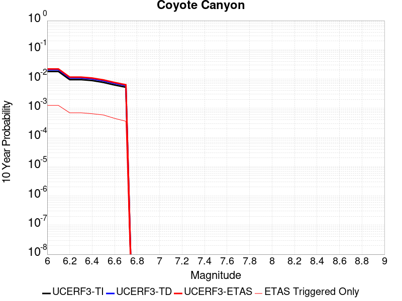 |

| Magnitude | 1 wk TI Prob | 1 wk TD Prob | 1 wk ETAS Prob | 1 wk ETAS/TD Gain | 1 wk ETAS Triggered Only | 1 mo TI Prob | 1 mo TD Prob | 1 mo ETAS Prob | 1 mo ETAS/TD Gain | 1 mo ETAS Triggered Only | 1 yr TI Prob | 1 yr TD Prob | 1 yr ETAS Prob | 1 yr ETAS/TD Gain | 1 yr ETAS Triggered Only | 10 yr TI Prob | 10 yr TD Prob | 10 yr ETAS Prob | 10 yr ETAS/TD Gain | 10 yr ETAS Triggered Only |
|-----|-----|-----|-----|-----|-----|-----|-----|-----|-----|-----|-----|-----|-----|-----|-----|-----|-----|-----|-----|-----|
| 6.0 | 3.5090034E-5 | 4.0367537E-5 | 6.0366732E-5 | 1.4954276 | 2.0E-5 | 1.503772E-4 | 1.729937E-4 | 2.5297987E-4 | 1.4623646 | 8.0E-5 | 0.0018293047 | 0.0021044211 | 0.002613348 | 1.2418369 | 5.1E-4 | 0.018143194 | 0.020870855 | 0.022094766 | 1.0586421 | 0.00125 |
| 6.1 | 3.5090034E-5 | 4.0367537E-5 | 6.0366732E-5 | 1.4954276 | 2.0E-5 | 1.503772E-4 | 1.729937E-4 | 2.5297987E-4 | 1.4623646 | 8.0E-5 | 0.0018293047 | 0.0021044211 | 0.002613348 | 1.2418369 | 5.1E-4 | 0.018143194 | 0.020870855 | 0.022094766 | 1.0586421 | 0.00125 |
| 6.2 | 1.841879E-5 | 2.1061396E-5 | 4.1060975E-5 | 1.9495847 | 2.0E-5 | 7.8935285E-5 | 9.0260575E-5 | 1.4025606E-4 | 1.5539017 | 5.0E-5 | 9.606133E-4 | 0.0010984705 | 0.0014281081 | 1.3000877 | 3.3E-4 | 0.0095647145 | 0.010940497 | 0.011632838 | 1.0632825 | 7.0E-4 |
| 6.3 | 1.841879E-5 | 2.1061396E-5 | 4.1060975E-5 | 1.9495847 | 2.0E-5 | 7.8935285E-5 | 9.0260575E-5 | 1.4025606E-4 | 1.5539017 | 5.0E-5 | 9.606133E-4 | 0.0010984705 | 0.0014281081 | 1.3000877 | 3.3E-4 | 0.0095647145 | 0.010940497 | 0.011632838 | 1.0632825 | 7.0E-4 |
| 6.4 | 1.712201E-5 | 1.9566693E-5 | 3.95663E-5 | 2.022125 | 2.0E-5 | 7.337798E-5 | 8.385513E-5 | 1.3385093E-4 | 1.5962164 | 5.0E-5 | 8.930107E-4 | 0.0010205586 | 0.0013202524 | 1.2936567 | 3.0E-4 | 0.008894307 | 0.010168638 | 0.010812028 | 1.063272 | 6.5E-4 |
| 6.5 | 1.4744935E-5 | 1.683824E-5 | 3.6837904E-5 | 2.1877527 | 2.0E-5 | 6.3191044E-5 | 7.216242E-5 | 1.221588E-4 | 1.6928315 | 5.0E-5 | 7.6907943E-4 | 8.7831676E-4 | 0.0011580709 | 1.3185116 | 2.8E-4 | 0.007664232 | 0.008757652 | 0.009342485 | 1.0667796 | 5.9E-4 |
| 6.6 | 1.2017839E-5 | 1.3725124E-5 | 2.3724986E-5 | 1.728581 | 1.0E-5 | 5.150401E-5 | 5.882113E-5 | 8.881937E-5 | 1.5099908 | 3.0E-5 | 6.268809E-4 | 7.1600056E-4 | 9.258502E-4 | 1.2930858 | 2.1E-4 | 0.0062511545 | 0.007145631 | 0.0075924154 | 1.0625255 | 4.5E-4 |
| 6.7 | 1.00956095E-5 | 1.1534388E-5 | 1.1534388E-5 | 1.0 | 0.0 | 4.326618E-5 | 4.943265E-5 | 5.9432154E-5 | 1.2022854 | 1.0E-5 | 5.266384E-4 | 6.0176325E-4 | 7.71661E-4 | 1.2823331 | 1.7E-4 | 0.005253921 | 0.006009866 | 0.0063677025 | 1.0595415 | 3.6E-4 |

## Death Valley (So)
*[(top)](#table-of-contents)*

| 1 Week | 1 Month | 1 Year | 10 Year |
|-----|-----|-----|-----|
|  |  |  |  |

| Magnitude | 1 wk TI Prob | 1 wk TD Prob | 1 wk ETAS Prob | 1 wk ETAS/TD Gain | 1 wk ETAS Triggered Only | 1 mo TI Prob | 1 mo TD Prob | 1 mo ETAS Prob | 1 mo ETAS/TD Gain | 1 mo ETAS Triggered Only | 1 yr TI Prob | 1 yr TD Prob | 1 yr ETAS Prob | 1 yr ETAS/TD Gain | 1 yr ETAS Triggered Only | 10 yr TI Prob | 10 yr TD Prob | 10 yr ETAS Prob | 10 yr ETAS/TD Gain | 10 yr ETAS Triggered Only |
|-----|-----|-----|-----|-----|-----|-----|-----|-----|-----|-----|-----|-----|-----|-----|-----|-----|-----|-----|-----|-----|
| 6.0 | 2.0684236E-5 | 2.5620835E-5 | 5.5620065E-5 | 2.170892 | 3.0E-5 | 8.864371E-5 | 1.09799046E-4 | 2.1978698E-4 | 2.0017202 | 1.1E-4 | 0.0010787029 | 0.0013360005 | 0.001765426 | 1.3214262 | 4.3E-4 | 0.010734817 | 0.013282978 | 0.014407835 | 1.0846841 | 0.00114 |
| 6.1 | 2.0684236E-5 | 2.5620835E-5 | 5.5620065E-5 | 2.170892 | 3.0E-5 | 8.864371E-5 | 1.09799046E-4 | 2.1978698E-4 | 2.0017202 | 1.1E-4 | 0.0010787029 | 0.0013360005 | 0.001765426 | 1.3214262 | 4.3E-4 | 0.010734817 | 0.013282978 | 0.014407835 | 1.0846841 | 0.00114 |
| 6.2 | 2.0684236E-5 | 2.5620835E-5 | 5.5620065E-5 | 2.170892 | 3.0E-5 | 8.864371E-5 | 1.09799046E-4 | 2.1978698E-4 | 2.0017202 | 1.1E-4 | 0.0010787029 | 0.0013360005 | 0.001765426 | 1.3214262 | 4.3E-4 | 0.010734817 | 0.013282978 | 0.014407835 | 1.0846841 | 0.00114 |
| 6.3 | 2.0240292E-5 | 2.5120886E-5 | 5.512013E-5 | 2.1941955 | 3.0E-5 | 8.6741224E-5 | 1.0765659E-4 | 2.1764475E-4 | 2.0216575 | 1.1E-4 | 0.0010555626 | 0.0013099476 | 0.0016994367 | 1.2973318 | 3.9E-4 | 0.010505628 | 0.01302552 | 0.014061844 | 1.079561 | 0.00105 |
| 6.4 | 2.0240292E-5 | 2.5120886E-5 | 5.512013E-5 | 2.1941955 | 3.0E-5 | 8.6741224E-5 | 1.0765659E-4 | 2.1764475E-4 | 2.0216575 | 1.1E-4 | 0.0010555626 | 0.0013099476 | 0.0016994367 | 1.2973318 | 3.9E-4 | 0.010505628 | 0.01302552 | 0.014061844 | 1.079561 | 0.00105 |
| 6.5 | 1.9962767E-5 | 2.4810119E-5 | 5.4809374E-5 | 2.2091541 | 3.0E-5 | 8.55519E-5 | 1.0632484E-4 | 2.1631314E-4 | 2.0344553 | 1.1E-4 | 0.0010410968 | 0.0012937529 | 0.0016732613 | 1.2933391 | 3.8E-4 | 0.010362327 | 0.012865457 | 0.013872334 | 1.0782621 | 0.00102 |
| 6.6 | 1.8937297E-5 | 2.3313813E-5 | 3.331358E-5 | 1.4289203 | 1.0E-5 | 8.115732E-5 | 9.99126E-5 | 1.899036E-4 | 1.9006974 | 9.0E-5 | 9.876423E-4 | 0.0012157715 | 0.0015353826 | 1.2628874 | 3.2E-4 | 0.009832645 | 0.01209411 | 0.012993105 | 1.0743332 | 9.1E-4 |
| 6.7 | 1.8621096E-5 | 2.291442E-5 | 3.291419E-5 | 1.4363964 | 1.0E-5 | 7.980225E-5 | 9.8201046E-5 | 1.881922E-4 | 1.9163972 | 9.0E-5 | 9.711593E-4 | 0.0011949565 | 0.001494598 | 1.2507552 | 3.0E-4 | 0.009669261 | 0.011888204 | 0.012718218 | 1.0698183 | 8.4E-4 |
| 6.8 | 1.7830353E-5 | 2.1808304E-5 | 3.1808086E-5 | 1.4585309 | 1.0E-5 | 7.641356E-5 | 9.34609E-5 | 1.8345249E-4 | 1.9628795 | 9.0E-5 | 9.29938E-4 | 0.0011373064 | 0.0014369653 | 1.2634811 | 3.0E-4 | 0.009260561 | 0.011317262 | 0.012108209 | 1.0698885 | 8.0E-4 |
| 6.9 | 1.3135183E-5 | 1.5305317E-5 | 1.5305317E-5 | 1.0 | 0.0 | 5.6292425E-5 | 6.5592605E-5 | 1.05589985E-4 | 1.6097848 | 4.0E-5 | 6.8514474E-4 | 7.9830387E-4 | 9.6816814E-4 | 1.2127815 | 1.7E-4 | 0.006830362 | 0.007955869 | 0.0084816525 | 1.0660875 | 5.3E-4 |
| 7.0 | 1.1507512E-5 | 1.3155236E-5 | 1.3155236E-5 | 1.0 | 0.0 | 4.9316975E-5 | 5.6378398E-5 | 9.637614E-5 | 1.7094516 | 4.0E-5 | 6.002687E-4 | 6.861966E-4 | 8.360937E-4 | 1.2184463 | 1.5E-4 | 0.0059864987 | 0.0068420726 | 0.007298925 | 1.0667711 | 4.6E-4 |
| 7.1 | 9.715903E-6 | 1.0865992E-5 | 1.0865992E-5 | 1.0 | 0.0 | 4.1638916E-5 | 4.6567733E-5 | 6.65668E-5 | 1.429462 | 2.0E-5 | 5.068359E-4 | 5.668189E-4 | 6.3677924E-4 | 1.1234262 | 7.0E-5 | 0.0050568148 | 0.0056542754 | 0.0058730314 | 1.0386887 | 2.2E-4 |
| 7.2 | 9.233269E-6 | 1.02869635E-5 | 1.02869635E-5 | 1.0 | 0.0 | 3.9570554E-5 | 4.4086264E-5 | 5.4085824E-5 | 1.226818 | 1.0E-5 | 4.81665E-4 | 5.366223E-4 | 5.8659544E-4 | 1.0931255 | 5.0E-5 | 0.0048062233 | 0.0053536966 | 0.0054830005 | 1.0241523 | 1.3E-4 |
| 7.3 | 8.8041315E-6 | 9.80876E-6 | 9.80876E-6 | 1.0 | 0.0 | 3.7731446E-5 | 4.203689E-5 | 5.203647E-5 | 1.2378763 | 1.0E-5 | 4.592835E-4 | 5.116832E-4 | 5.416678E-4 | 1.0586001 | 3.0E-5 | 0.0045833546 | 0.005105477 | 0.0051950174 | 1.0175381 | 9.0E-5 |
| 7.4 | 8.708749E-6 | 9.707768E-6 | 9.707768E-6 | 1.0 | 0.0 | 3.7322676E-5 | 4.1604082E-5 | 5.1603663E-5 | 1.2403511 | 1.0E-5 | 4.5430884E-4 | 5.0641614E-4 | 5.3640094E-4 | 1.0592098 | 3.0E-5 | 0.004533812 | 0.0050530476 | 0.005142593 | 1.017721 | 9.0E-5 |
| 7.5 | 8.612678E-6 | 9.605406E-6 | 9.605406E-6 | 1.0 | 0.0 | 3.6910955E-5 | 4.1165404E-5 | 5.1164992E-5 | 1.2429124 | 1.0E-5 | 4.492982E-4 | 5.0107774E-4 | 5.310627E-4 | 1.0598409 | 3.0E-5 | 0.004483909 | 0.004999905 | 0.005079505 | 1.0159203 | 8.0E-5 |
| 7.6 | 8.319024E-6 | 9.28449E-6 | 9.28449E-6 | 1.0 | 0.0 | 3.5652476E-5 | 3.9790088E-5 | 4.978969E-5 | 1.2513089 | 1.0E-5 | 4.3398244E-4 | 4.8434082E-4 | 5.143263E-4 | 1.0619098 | 3.0E-5 | 0.0043313587 | 0.0048332764 | 0.0049128896 | 1.0164719 | 8.0E-5 |
| 7.7 | 7.4718328E-6 | 8.345689E-6 | 8.345689E-6 | 1.0 | 0.0 | 3.2021748E-5 | 3.576677E-5 | 4.5766414E-5 | 1.2795792 | 1.0E-5 | 3.8979502E-4 | 4.3537747E-4 | 4.5536878E-4 | 1.0459172 | 2.0E-5 | 0.00389112 | 0.0043456503 | 0.0044053895 | 1.0137469 | 6.0E-5 |
| 7.8 | 3.4586725E-7 | 3.648368E-7 | 3.648368E-7 | 1.0 | 0.0 | 1.4822873E-6 | 1.5635853E-6 | 1.5635853E-6 | 1.0 | 0.0 | 1.80467E-5 | 1.903649E-5 | 1.903649E-5 | 1.0 | 0.0 | 1.8045233E-4 | 1.9034903E-4 | 1.9034903E-4 | 1.0 | 0.0 |
| 7.9 | 2.5591178E-9 | 2.6697329E-9 | 2.6697329E-9 | 1.0 | 0.0 | 1.0967647E-8 | 1.14417125E-8 | 1.14417125E-8 | 1.0 | 0.0 | 1.335311E-7 | 1.3930286E-7 | 1.3930286E-7 | 1.0 | 0.0 | 1.3353102E-6 | 1.3930285E-6 | 1.3930285E-6 | 1.0 | 0.0 |

## Lenwood-Lockhart-Old Woman Springs
*[(top)](#table-of-contents)*

| 1 Week | 1 Month | 1 Year | 10 Year |
|-----|-----|-----|-----|
|  |  |  |  |

| Magnitude | 1 wk TI Prob | 1 wk TD Prob | 1 wk ETAS Prob | 1 wk ETAS/TD Gain | 1 wk ETAS Triggered Only | 1 mo TI Prob | 1 mo TD Prob | 1 mo ETAS Prob | 1 mo ETAS/TD Gain | 1 mo ETAS Triggered Only | 1 yr TI Prob | 1 yr TD Prob | 1 yr ETAS Prob | 1 yr ETAS/TD Gain | 1 yr ETAS Triggered Only | 10 yr TI Prob | 10 yr TD Prob | 10 yr ETAS Prob | 10 yr ETAS/TD Gain | 10 yr ETAS Triggered Only |
|-----|-----|-----|-----|-----|-----|-----|-----|-----|-----|-----|-----|-----|-----|-----|-----|-----|-----|-----|-----|-----|
| 6.0 | 3.744542E-5 | 4.3965032E-5 | 1.4396063E-4 | 3.274435 | 1.0E-4 | 1.604705E-4 | 1.8840893E-4 | 3.483788E-4 | 1.8490567 | 1.6E-4 | 0.0019519776 | 0.0022916375 | 0.0028603312 | 1.2481605 | 5.7E-4 | 0.019349206 | 0.02269807 | 0.023724237 | 1.0452094 | 0.00105 |
| 6.1 | 3.744542E-5 | 4.3965032E-5 | 1.4396063E-4 | 3.274435 | 1.0E-4 | 1.604705E-4 | 1.8840893E-4 | 3.483788E-4 | 1.8490567 | 1.6E-4 | 0.0019519776 | 0.0022916375 | 0.0028603312 | 1.2481605 | 5.7E-4 | 0.019349206 | 0.02269807 | 0.023724237 | 1.0452094 | 0.00105 |
| 6.2 | 3.744542E-5 | 4.3965032E-5 | 1.4396063E-4 | 3.274435 | 1.0E-4 | 1.604705E-4 | 1.8840893E-4 | 3.483788E-4 | 1.8490567 | 1.6E-4 | 0.0019519776 | 0.0022916375 | 0.0028603312 | 1.2481605 | 5.7E-4 | 0.019349206 | 0.02269807 | 0.023724237 | 1.0452094 | 0.00105 |
| 6.3 | 2.1079984E-5 | 2.5354779E-5 | 9.5353E-5 | 3.7607508 | 7.0E-5 | 9.0339665E-5 | 1.0865892E-4 | 1.9864914E-4 | 1.8281898 | 9.0E-5 | 0.0010993304 | 0.0013221395 | 0.0015718089 | 1.1888374 | 2.5E-4 | 0.010939079 | 0.01314495 | 0.0135791665 | 1.0330329 | 4.4E-4 |
| 6.4 | 2.1079984E-5 | 2.5354779E-5 | 9.5353E-5 | 3.7607508 | 7.0E-5 | 9.0339665E-5 | 1.0865892E-4 | 1.9864914E-4 | 1.8281898 | 9.0E-5 | 0.0010993304 | 0.0013221395 | 0.0015718089 | 1.1888374 | 2.5E-4 | 0.010939079 | 0.01314495 | 0.0135791665 | 1.0330329 | 4.4E-4 |
| 6.5 | 1.7397282E-5 | 2.0663578E-5 | 9.066213E-5 | 4.387533 | 7.0E-5 | 7.455765E-5 | 8.855525E-5 | 1.7854729E-4 | 2.0162246 | 9.0E-5 | 9.073613E-4 | 0.0010776386 | 0.0013073907 | 1.2131996 | 2.3E-4 | 0.009036654 | 0.010725424 | 0.01107167 | 1.0322827 | 3.5E-4 |
| 6.6 | 1.52050325E-5 | 1.7680335E-5 | 8.7679095E-5 | 4.9591312 | 7.0E-5 | 6.51628E-5 | 7.577071E-5 | 1.657639E-4 | 2.187704 | 9.0E-5 | 7.9306826E-4 | 9.221258E-4 | 0.0011419229 | 1.2383592 | 2.2E-4 | 0.007902439 | 0.009183858 | 0.009491011 | 1.0334449 | 3.1E-4 |
| 6.7 | 1.332523E-5 | 1.526459E-5 | 7.526368E-5 | 4.9306054 | 6.0E-5 | 5.7106878E-5 | 6.541806E-5 | 1.4541284E-4 | 2.2228239 | 8.0E-5 | 6.950544E-4 | 7.9617975E-4 | 9.960205E-4 | 1.2509996 | 2.0E-4 | 0.006928845 | 0.0079339035 | 0.008201761 | 1.0337611 | 2.7E-4 |
| 6.8 | 1.1525329E-5 | 1.30315375E-5 | 6.3030886E-5 | 4.836796 | 5.0E-5 | 4.9393333E-5 | 5.584827E-5 | 1.1584492E-4 | 2.0742793 | 6.0E-5 | 6.011979E-4 | 6.797448E-4 | 8.0965646E-4 | 1.1911182 | 1.3E-4 | 0.00599574 | 0.0067771086 | 0.006975753 | 1.0293111 | 2.0E-4 |
| 6.9 | 1.0253909E-5 | 1.151498E-5 | 4.1514635E-5 | 3.605272 | 3.0E-5 | 4.3944583E-5 | 4.9349E-5 | 7.934752E-5 | 1.607885 | 3.0E-5 | 5.3489394E-4 | 6.006621E-4 | 6.7062E-4 | 1.1164681 | 7.0E-5 | 0.0053360825 | 0.005990765 | 0.006100106 | 1.0182515 | 1.1E-4 |
| 7.0 | 8.104563E-6 | 8.991533E-6 | 3.8991264E-5 | 4.3364425 | 3.0E-5 | 3.4733377E-5 | 3.8534585E-5 | 6.853343E-5 | 1.7784914 | 3.0E-5 | 4.2279682E-4 | 4.6906E-4 | 5.0904125E-4 | 1.0852369 | 4.0E-5 | 0.0042199334 | 0.0046809474 | 0.0047406666 | 1.0127579 | 6.0E-5 |
| 7.1 | 6.7986157E-6 | 7.516056E-6 | 3.751583E-5 | 4.991425 | 3.0E-5 | 2.91366E-5 | 3.2211283E-5 | 6.221032E-5 | 1.9313207 | 3.0E-5 | 3.5468035E-4 | 3.9210395E-4 | 4.3208824E-4 | 1.1019738 | 4.0E-5 | 0.003541148 | 0.0039143376 | 0.0039741024 | 1.0152682 | 6.0E-5 |
| 7.2 | 5.6893327E-6 | 6.280187E-6 | 2.628006E-5 | 4.1845984 | 2.0E-5 | 2.4382627E-5 | 2.691482E-5 | 4.6914283E-5 | 1.743065 | 2.0E-5 | 2.9681803E-4 | 3.2764065E-4 | 3.476341E-4 | 1.0610225 | 2.0E-5 | 0.002964219 | 0.0032717746 | 0.0033116438 | 1.0121858 | 4.0E-5 |
| 7.3 | 4.253348E-6 | 4.707105E-6 | 4.707105E-6 | 1.0 | 0.0 | 1.8228506E-5 | 2.017316E-5 | 2.017316E-5 | 1.0 | 0.0 | 2.2190946E-4 | 2.4558237E-4 | 2.4558237E-4 | 1.0 | 0.0 | 0.00221688 | 0.0024532909 | 0.0024632663 | 1.0040661 | 1.0E-5 |
| 7.4 | 2.5448119E-6 | 2.8520674E-6 | 2.8520674E-6 | 1.0 | 0.0 | 1.0906291E-5 | 1.2223099E-5 | 1.2223099E-5 | 1.0 | 0.0 | 1.3277601E-4 | 1.4880771E-4 | 1.4880771E-4 | 1.0 | 0.0 | 0.001326967 | 0.0014872429 | 0.0014972279 | 1.0067139 | 1.0E-5 |
| 7.5 | 4.3706837E-8 | 4.5630156E-8 | 4.5630156E-8 | 1.0 | 0.0 | 1.8731501E-7 | 1.955578E-7 | 1.955578E-7 | 1.0 | 0.0 | 2.2805577E-6 | 2.380914E-6 | 2.380914E-6 | 1.0 | 0.0 | 2.2805343E-5 | 2.3808941E-5 | 2.3808941E-5 | 1.0 | 0.0 |

## San Andreas (Mojave S)
*[(top)](#table-of-contents)*

| 1 Week | 1 Month | 1 Year | 10 Year |
|-----|-----|-----|-----|
|  |  |  |  |

| Magnitude | 1 wk TI Prob | 1 wk TD Prob | 1 wk ETAS Prob | 1 wk ETAS/TD Gain | 1 wk ETAS Triggered Only | 1 mo TI Prob | 1 mo TD Prob | 1 mo ETAS Prob | 1 mo ETAS/TD Gain | 1 mo ETAS Triggered Only | 1 yr TI Prob | 1 yr TD Prob | 1 yr ETAS Prob | 1 yr ETAS/TD Gain | 1 yr ETAS Triggered Only | 10 yr TI Prob | 10 yr TD Prob | 10 yr ETAS Prob | 10 yr ETAS/TD Gain | 10 yr ETAS Triggered Only |
|-----|-----|-----|-----|-----|-----|-----|-----|-----|-----|-----|-----|-----|-----|-----|-----|-----|-----|-----|-----|-----|
| 6.0 | 3.1064058E-4 | 6.7501515E-4 | 7.1498816E-4 | 1.0592179 | 4.0E-5 | 0.0013306376 | 0.002889843 | 0.0029596407 | 1.0241528 | 7.0E-5 | 0.016080605 | 0.034743454 | 0.03517782 | 1.0125021 | 4.5E-4 | 0.1496549 | 0.28684503 | 0.2874227 | 1.0020138 | 8.1E-4 |
| 6.1 | 3.1064058E-4 | 6.7501515E-4 | 7.1498816E-4 | 1.0592179 | 4.0E-5 | 0.0013306376 | 0.002889843 | 0.0029596407 | 1.0241528 | 7.0E-5 | 0.016080605 | 0.034743454 | 0.03517782 | 1.0125021 | 4.5E-4 | 0.1496549 | 0.28684503 | 0.2874227 | 1.0020138 | 8.1E-4 |
| 6.2 | 3.1064058E-4 | 6.7501515E-4 | 7.1498816E-4 | 1.0592179 | 4.0E-5 | 0.0013306376 | 0.002889843 | 0.0029596407 | 1.0241528 | 7.0E-5 | 0.016080605 | 0.034743454 | 0.03517782 | 1.0125021 | 4.5E-4 | 0.1496549 | 0.28684503 | 0.2874227 | 1.0020138 | 8.1E-4 |
| 6.3 | 3.1064058E-4 | 6.7501515E-4 | 7.1498816E-4 | 1.0592179 | 4.0E-5 | 0.0013306376 | 0.002889843 | 0.0029596407 | 1.0241528 | 7.0E-5 | 0.016080605 | 0.034743454 | 0.03517782 | 1.0125021 | 4.5E-4 | 0.1496549 | 0.28684503 | 0.2874227 | 1.0020138 | 8.1E-4 |
| 6.4 | 1.9872203E-4 | 4.3217847E-4 | 4.7216116E-4 | 1.0925144 | 4.0E-5 | 8.5138786E-4 | 0.0018509069 | 0.0019207773 | 1.0377493 | 7.0E-5 | 0.010316478 | 0.022308085 | 0.022669831 | 1.0162159 | 3.7E-4 | 0.098504856 | 0.19718863 | 0.19771047 | 1.0026463 | 6.5E-4 |
| 6.5 | 1.291105E-4 | 2.878896E-4 | 3.2787808E-4 | 1.1389022 | 4.0E-5 | 5.5321335E-4 | 0.001233232 | 0.0013031457 | 1.0566914 | 7.0E-5 | 0.006714592 | 0.0149120595 | 0.01525684 | 1.0231209 | 3.5E-4 | 0.065152965 | 0.13821197 | 0.1387118 | 1.0036165 | 5.8E-4 |
| 6.6 | 1.291105E-4 | 2.878896E-4 | 3.2787808E-4 | 1.1389022 | 4.0E-5 | 5.5321335E-4 | 0.001233232 | 0.0013031457 | 1.0566914 | 7.0E-5 | 0.006714592 | 0.0149120595 | 0.01525684 | 1.0231209 | 3.5E-4 | 0.065152965 | 0.13821197 | 0.1387118 | 1.0036165 | 5.8E-4 |
| 6.7 | 1.08001186E-4 | 2.4369665E-4 | 2.8368688E-4 | 1.1640985 | 4.0E-5 | 4.6278012E-4 | 0.0010439967 | 0.0011139236 | 1.06698 | 7.0E-5 | 0.0056198016 | 0.012636882 | 0.012972586 | 1.0265653 | 3.4E-4 | 0.054797906 | 0.11933387 | 0.11981823 | 1.004059 | 5.5E-4 |
| 6.8 | 1.0624356E-4 | 2.3887234E-4 | 2.7886278E-4 | 1.1674135 | 4.0E-5 | 4.5525006E-4 | 0.0010233375 | 0.0010932658 | 1.0683336 | 7.0E-5 | 0.0055285925 | 0.012388234 | 0.012724022 | 1.0271055 | 3.4E-4 | 0.053930566 | 0.117277905 | 0.11776341 | 1.0041397 | 5.5E-4 |
| 6.9 | 1.0393785E-4 | 2.3257434E-4 | 2.7256503E-4 | 1.1719481 | 4.0E-5 | 4.4537184E-4 | 9.963668E-4 | 0.0010662971 | 1.0701853 | 7.0E-5 | 0.0054089287 | 0.012063543 | 0.012389563 | 1.0270251 | 3.3E-4 | 0.05279156 | 0.11457736 | 0.11505549 | 1.0041729 | 5.4E-4 |
| 7.0 | 1.0155622E-4 | 2.2626782E-4 | 2.6625875E-4 | 1.1767417 | 4.0E-5 | 4.3516833E-4 | 9.693592E-4 | 0.0010392914 | 1.0721426 | 7.0E-5 | 0.005285311 | 0.01173831 | 0.012064436 | 1.027783 | 3.3E-4 | 0.05161361 | 0.111840434 | 0.11232004 | 1.0042883 | 5.4E-4 |
| 7.1 | 9.885595E-5 | 2.1914982E-4 | 2.5914106E-4 | 1.1824836 | 4.0E-5 | 4.2359953E-4 | 9.388758E-4 | 0.00100881 | 1.0744872 | 7.0E-5 | 0.0051451353 | 0.011371101 | 0.011687462 | 1.0278215 | 3.2E-4 | 0.05027629 | 0.10872063 | 0.109193005 | 1.0043448 | 5.3E-4 |
| 7.2 | 9.6411415E-5 | 2.1277768E-4 | 2.5276918E-4 | 1.1879497 | 4.0E-5 | 4.1312634E-4 | 9.11586E-4 | 9.815221E-4 | 1.0767193 | 7.0E-5 | 0.005018219 | 0.011042262 | 0.01135873 | 1.0286596 | 3.2E-4 | 0.049064007 | 0.105914876 | 0.10638874 | 1.004474 | 5.3E-4 |
| 7.3 | 9.1180635E-5 | 1.9505205E-4 | 2.3504424E-4 | 1.2050334 | 4.0E-5 | 3.907156E-4 | 8.3566963E-4 | 9.0561114E-4 | 1.0836952 | 7.0E-5 | 0.004746591 | 0.010126927 | 0.0104337875 | 1.0303015 | 3.1E-4 | 0.046464786 | 0.09810342 | 0.0985724 | 1.0047805 | 5.2E-4 |
| 7.4 | 8.887388E-5 | 1.875339E-4 | 2.275264E-4 | 1.2132548 | 4.0E-5 | 3.8083247E-4 | 8.034692E-4 | 8.73413E-4 | 1.0870522 | 7.0E-5 | 0.0046267817 | 0.009738459 | 0.01004544 | 1.0315225 | 3.1E-4 | 0.045316286 | 0.094735 | 0.09520573 | 1.004969 | 5.2E-4 |
| 7.5 | 8.6750515E-5 | 1.8084598E-4 | 2.2083875E-4 | 1.2211426 | 4.0E-5 | 3.7173493E-4 | 7.7482406E-4 | 8.447698E-4 | 1.0902731 | 7.0E-5 | 0.004516484 | 0.009392765 | 0.009699854 | 1.0326941 | 3.1E-4 | 0.04425787 | 0.091696784 | 0.092169106 | 1.0051509 | 5.2E-4 |
| 7.6 | 8.453092E-5 | 1.7471766E-4 | 2.1471066E-4 | 1.2289008 | 4.0E-5 | 3.6222505E-4 | 7.485751E-4 | 8.185227E-4 | 1.093441 | 7.0E-5 | 0.0044011753 | 0.009075891 | 0.009383078 | 1.0338464 | 3.1E-4 | 0.04315024 | 0.08885263 | 0.08932643 | 1.0053324 | 5.2E-4 |
| 7.7 | 8.259102E-5 | 1.6993514E-4 | 2.0992834E-4 | 1.2353439 | 4.0E-5 | 3.539135E-4 | 7.280903E-4 | 7.980393E-4 | 1.096072 | 7.0E-5 | 0.004300386 | 0.0088285385 | 0.009135801 | 1.0348034 | 3.1E-4 | 0.042181134 | 0.086603284 | 0.08707825 | 1.0054843 | 5.2E-4 |
| 7.8 | 7.444844E-5 | 1.531286E-4 | 1.8312401E-4 | 1.1958838 | 3.0E-5 | 3.1902574E-4 | 6.561004E-4 | 7.1606104E-4 | 1.0913894 | 6.0E-5 | 0.0038772223 | 0.0079588145 | 0.008206825 | 1.0311617 | 2.5E-4 | 0.03810269 | 0.07842231 | 0.07883702 | 1.0052881 | 4.5E-4 |
| 7.9 | 5.2586525E-5 | 1.0026347E-4 | 1.20261466E-4 | 1.1994544 | 2.0E-5 | 2.2535135E-4 | 4.2962984E-4 | 4.7960837E-4 | 1.1163293 | 5.0E-5 | 0.0027402006 | 0.0052182092 | 0.005367426 | 1.0285954 | 1.5E-4 | 0.027066574 | 0.052295044 | 0.05254145 | 1.0047117 | 2.6E-4 |
| 8.0 | 3.379877E-5 | 5.418741E-5 | 7.4186326E-5 | 1.3690695 | 2.0E-5 | 1.4484383E-4 | 2.322111E-4 | 2.722018E-4 | 1.172217 | 4.0E-5 | 0.0017620471 | 0.0028235065 | 0.0028933089 | 1.0247219 | 7.0E-5 | 0.017481409 | 0.0288912 | 0.028988311 | 1.0033612 | 1.0E-4 |
| 8.1 | 1.8668277E-5 | 1.9360978E-5 | 2.9360783E-5 | 1.5164928 | 1.0E-5 | 8.000444E-5 | 8.2972976E-5 | 9.297215E-5 | 1.1205112 | 1.0E-5 | 9.736188E-4 | 0.0010097285 | 0.0010197184 | 1.0098937 | 1.0E-5 | 0.009693642 | 0.010826115 | 0.010836006 | 1.0009137 | 1.0E-5 |
| 8.2 | 8.541571E-6 | 5.4799148E-6 | 5.4799148E-6 | 1.0 | 0.0 | 3.660622E-5 | 2.3485138E-5 | 2.3485138E-5 | 1.0 | 0.0 | 4.455896E-4 | 2.8589412E-4 | 2.8589412E-4 | 1.0 | 0.0 | 0.0044469717 | 0.0032512886 | 0.0032512886 | 1.0 | 0.0 |
| 8.3 | 1.983087E-6 | 7.690063E-7 | 7.690063E-7 | 1.0 | 0.0 | 8.498917E-6 | 3.295737E-6 | 3.295737E-6 | 1.0 | 0.0 | 1.034694E-4 | 4.012488E-5 | 4.012488E-5 | 1.0 | 0.0 | 0.0010342124 | 4.737206E-4 | 4.737206E-4 | 1.0 | 0.0 |

## Towne Pass
*[(top)](#table-of-contents)*

| 1 Week | 1 Month | 1 Year | 10 Year |
|-----|-----|-----|-----|
|  |  |  | 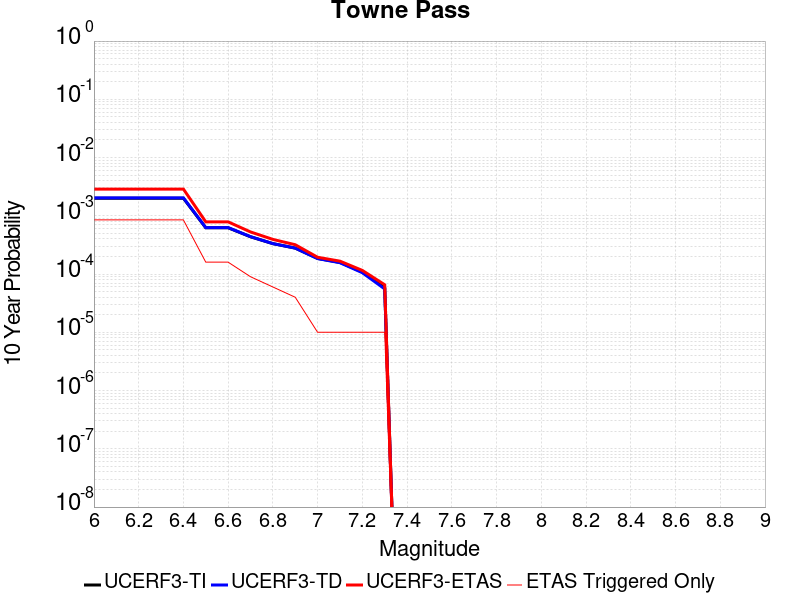 |

| Magnitude | 1 wk TI Prob | 1 wk TD Prob | 1 wk ETAS Prob | 1 wk ETAS/TD Gain | 1 wk ETAS Triggered Only | 1 mo TI Prob | 1 mo TD Prob | 1 mo ETAS Prob | 1 mo ETAS/TD Gain | 1 mo ETAS Triggered Only | 1 yr TI Prob | 1 yr TD Prob | 1 yr ETAS Prob | 1 yr ETAS/TD Gain | 1 yr ETAS Triggered Only | 10 yr TI Prob | 10 yr TD Prob | 10 yr ETAS Prob | 10 yr ETAS/TD Gain | 10 yr ETAS Triggered Only |
|-----|-----|-----|-----|-----|-----|-----|-----|-----|-----|-----|-----|-----|-----|-----|-----|-----|-----|-----|-----|-----|
| 6.0 | 3.849728E-6 | 3.894574E-6 | 1.3894535E-5 | 3.5676649 | 1.0E-5 | 1.649873E-5 | 1.669095E-5 | 8.668978E-5 | 5.1938195 | 7.0E-5 | 2.0085352E-4 | 2.0319773E-4 | 5.531266E-4 | 2.72211 | 3.5E-4 | 0.0020067208 | 0.0020305486 | 0.0028788226 | 1.4177561 | 8.5E-4 |
| 6.1 | 3.849728E-6 | 3.894574E-6 | 1.3894535E-5 | 3.5676649 | 1.0E-5 | 1.649873E-5 | 1.669095E-5 | 8.668978E-5 | 5.1938195 | 7.0E-5 | 2.0085352E-4 | 2.0319773E-4 | 5.531266E-4 | 2.72211 | 3.5E-4 | 0.0020067208 | 0.0020305486 | 0.0028788226 | 1.4177561 | 8.5E-4 |
| 6.2 | 3.849728E-6 | 3.894574E-6 | 1.3894535E-5 | 3.5676649 | 1.0E-5 | 1.649873E-5 | 1.669095E-5 | 8.668978E-5 | 5.1938195 | 7.0E-5 | 2.0085352E-4 | 2.0319773E-4 | 5.531266E-4 | 2.72211 | 3.5E-4 | 0.0020067208 | 0.0020305486 | 0.0028788226 | 1.4177561 | 8.5E-4 |
| 6.3 | 3.849728E-6 | 3.894574E-6 | 1.3894535E-5 | 3.5676649 | 1.0E-5 | 1.649873E-5 | 1.669095E-5 | 8.668978E-5 | 5.1938195 | 7.0E-5 | 2.0085352E-4 | 2.0319773E-4 | 5.531266E-4 | 2.72211 | 3.5E-4 | 0.0020067208 | 0.0020305486 | 0.0028788226 | 1.4177561 | 8.5E-4 |
| 6.4 | 3.849728E-6 | 3.894574E-6 | 1.3894535E-5 | 3.5676649 | 1.0E-5 | 1.649873E-5 | 1.669095E-5 | 8.668978E-5 | 5.1938195 | 7.0E-5 | 2.0085352E-4 | 2.0319773E-4 | 5.531266E-4 | 2.72211 | 3.5E-4 | 0.0020067208 | 0.0020305486 | 0.0028788226 | 1.4177561 | 8.5E-4 |
| 6.5 | 1.1953545E-6 | 1.2030648E-6 | 1.1203053E-5 | 9.312094 | 1.0E-5 | 5.1229376E-6 | 5.1559828E-6 | 2.515588E-5 | 4.8789687 | 2.0E-5 | 6.236998E-5 | 6.27724E-5 | 1.4276739E-4 | 2.2743654 | 8.0E-5 | 6.235248E-4 | 6.275584E-4 | 7.8745803E-4 | 1.2547964 | 1.6E-4 |
| 6.6 | 1.1953545E-6 | 1.2030648E-6 | 1.1203053E-5 | 9.312094 | 1.0E-5 | 5.1229376E-6 | 5.1559828E-6 | 2.515588E-5 | 4.8789687 | 2.0E-5 | 6.236998E-5 | 6.27724E-5 | 1.4276739E-4 | 2.2743654 | 8.0E-5 | 6.235248E-4 | 6.275584E-4 | 7.8745803E-4 | 1.2547964 | 1.6E-4 |
| 6.7 | 8.375951E-7 | 8.410776E-7 | 8.410776E-7 | 1.0 | 0.0 | 3.5896885E-6 | 3.6046138E-6 | 1.3604577E-5 | 3.7742124 | 1.0E-5 | 4.370358E-5 | 4.3885346E-5 | 8.388359E-5 | 1.911426 | 4.0E-5 | 4.3694986E-4 | 4.3877252E-4 | 5.28733E-4 | 1.2050277 | 9.0E-5 |
| 6.8 | 6.38041E-7 | 6.39225E-7 | 6.39225E-7 | 1.0 | 0.0 | 2.7344586E-6 | 2.7395329E-6 | 2.7395329E-6 | 1.0 | 0.0 | 3.3291526E-5 | 3.3353343E-5 | 6.3352345E-5 | 1.89943 | 3.0E-5 | 3.3286537E-4 | 3.3348717E-4 | 3.9346717E-4 | 1.179857 | 6.0E-5 |
| 6.9 | 5.3460053E-7 | 5.34542E-7 | 5.34542E-7 | 1.0 | 0.0 | 2.2911431E-6 | 2.2908923E-6 | 2.2908923E-6 | 1.0 | 0.0 | 2.789431E-5 | 2.7891292E-5 | 3.789101E-5 | 1.3585248 | 1.0E-5 | 2.789081E-4 | 2.7888123E-4 | 3.1887006E-4 | 1.1433902 | 4.0E-5 |
| 7.0 | 3.557783E-7 | 3.532496E-7 | 3.532496E-7 | 1.0 | 0.0 | 1.5247632E-6 | 1.513926E-6 | 1.513926E-6 | 1.0 | 0.0 | 1.8563835E-5 | 1.8431901E-5 | 1.8431901E-5 | 1.0 | 0.0 | 1.8562283E-4 | 1.8430458E-4 | 1.9430273E-4 | 1.054248 | 1.0E-5 |
| 7.1 | 3.037942E-7 | 3.0002886E-7 | 3.0002886E-7 | 1.0 | 0.0 | 1.3019744E-6 | 1.2858374E-6 | 1.2858374E-6 | 1.0 | 0.0 | 1.5851423E-5 | 1.5654965E-5 | 1.5654965E-5 | 1.0 | 0.0 | 1.5850292E-4 | 1.5653936E-4 | 1.6653781E-4 | 1.0638717 | 1.0E-5 |
| 7.2 | 2.0808248E-7 | 2.0218206E-7 | 2.0218206E-7 | 1.0 | 0.0 | 8.917818E-7 | 8.664943E-7 | 8.664943E-7 | 1.0 | 0.0 | 1.0857389E-5 | 1.0549522E-5 | 1.0549522E-5 | 1.0 | 0.0 | 1.0856859E-4 | 1.05490675E-4 | 1.1548962E-4 | 1.0947851 | 1.0E-5 |
| 7.3 | 1.1162073E-7 | 1.06371445E-7 | 1.06371445E-7 | 1.0 | 0.0 | 4.7837443E-7 | 4.5587754E-7 | 4.5587754E-7 | 1.0 | 0.0 | 5.8241935E-6 | 5.550297E-6 | 5.550297E-6 | 1.0 | 0.0 | 5.8240406E-5 | 5.5501783E-5 | 6.5501226E-5 | 1.1801643 | 1.0E-5 |

## Nelson Lake
*[(top)](#table-of-contents)*

| 1 Week | 1 Month | 1 Year | 10 Year |
|-----|-----|-----|-----|
|  |  |  |  |

| Magnitude | 1 wk TI Prob | 1 wk TD Prob | 1 wk ETAS Prob | 1 wk ETAS/TD Gain | 1 wk ETAS Triggered Only | 1 mo TI Prob | 1 mo TD Prob | 1 mo ETAS Prob | 1 mo ETAS/TD Gain | 1 mo ETAS Triggered Only | 1 yr TI Prob | 1 yr TD Prob | 1 yr ETAS Prob | 1 yr ETAS/TD Gain | 1 yr ETAS Triggered Only | 10 yr TI Prob | 10 yr TD Prob | 10 yr ETAS Prob | 10 yr ETAS/TD Gain | 10 yr ETAS Triggered Only |
|-----|-----|-----|-----|-----|-----|-----|-----|-----|-----|-----|-----|-----|-----|-----|-----|-----|-----|-----|-----|-----|
| 6.0 | 9.913453E-6 | 1.0192408E-5 | 3.0192205E-5 | 2.962225 | 2.0E-5 | 4.2485535E-5 | 4.3681073E-5 | 1.0367845E-4 | 2.3735325 | 6.0E-5 | 5.1713863E-4 | 5.3169765E-4 | 8.4153283E-4 | 1.5827281 | 3.1E-4 | 0.0051593683 | 0.0053052832 | 0.006081145 | 1.1462432 | 7.8E-4 |
| 6.1 | 9.913453E-6 | 1.0192408E-5 | 3.0192205E-5 | 2.962225 | 2.0E-5 | 4.2485535E-5 | 4.3681073E-5 | 1.0367845E-4 | 2.3735325 | 6.0E-5 | 5.1713863E-4 | 5.3169765E-4 | 8.4153283E-4 | 1.5827281 | 3.1E-4 | 0.0051593683 | 0.0053052832 | 0.006081145 | 1.1462432 | 7.8E-4 |
| 6.2 | 4.5596407E-6 | 4.696388E-6 | 1.4696341E-5 | 3.129286 | 1.0E-5 | 1.954117E-5 | 2.0127229E-5 | 5.0126626E-5 | 2.4904883 | 3.0E-5 | 2.3788778E-4 | 2.4502273E-4 | 3.5499578E-4 | 1.448828 | 1.1E-4 | 0.0023763329 | 0.0024476517 | 0.0027868196 | 1.1385686 | 3.4E-4 |
| 6.3 | 4.5596407E-6 | 4.696388E-6 | 1.4696341E-5 | 3.129286 | 1.0E-5 | 1.954117E-5 | 2.0127229E-5 | 5.0126626E-5 | 2.4904883 | 3.0E-5 | 2.3788778E-4 | 2.4502273E-4 | 3.5499578E-4 | 1.448828 | 1.1E-4 | 0.0023763329 | 0.0024476517 | 0.0027868196 | 1.1385686 | 3.4E-4 |
| 6.4 | 3.4025713E-6 | 3.509956E-6 | 1.3509921E-5 | 3.8490286 | 1.0E-5 | 1.4582367E-5 | 1.5042587E-5 | 3.5042285E-5 | 2.3295386 | 2.0E-5 | 1.7752586E-4 | 1.8312894E-4 | 2.6311429E-4 | 1.4367707 | 8.0E-5 | 0.001773841 | 0.0018298633 | 0.0020893875 | 1.1418271 | 2.6E-4 |
| 6.5 | 2.8352947E-6 | 2.927907E-6 | 1.2927878E-5 | 4.415399 | 1.0E-5 | 1.2151207E-5 | 1.25481165E-5 | 2.254799E-5 | 1.7969223 | 1.0E-5 | 1.479309E-4 | 1.5276336E-4 | 2.127542E-4 | 1.3927044 | 6.0E-5 | 0.0014783246 | 0.0015266574 | 0.0017463214 | 1.1438857 | 2.2E-4 |
| 6.6 | 2.251518E-6 | 2.3291102E-6 | 1.23290865E-5 | 5.293475 | 1.0E-5 | 9.649328E-6 | 9.981866E-6 | 1.9981766E-5 | 2.0018067 | 1.0E-5 | 1.1747423E-4 | 1.2152307E-4 | 1.8151579E-4 | 1.4936734 | 6.0E-5 | 0.0011741214 | 0.001214628 | 0.001414385 | 1.1644595 | 2.0E-4 |
| 6.7 | 1.8911853E-6 | 1.959177E-6 | 1.1959158E-5 | 6.1041737 | 1.0E-5 | 8.105055E-6 | 8.39645E-6 | 1.8396366E-5 | 2.1909695 | 1.0E-5 | 9.867457E-5 | 1.0222256E-4 | 1.322195E-4 | 1.2934473 | 3.0E-5 | 9.863076E-4 | 0.0010218129 | 0.0011416903 | 1.1173183 | 1.2E-4 |
| 6.8 | 1.4874814E-6 | 1.5438616E-6 | 1.1543846E-5 | 7.477255 | 1.0E-5 | 6.374905E-6 | 6.6165358E-6 | 1.661647E-5 | 2.511355 | 1.0E-5 | 7.76117E-5 | 8.0553866E-5 | 1.10551446E-4 | 1.3723916 | 3.0E-5 | 7.75846E-4 | 8.0529775E-4 | 9.0521725E-4 | 1.1240777 | 1.0E-4 |
| 6.9 | 6.835972E-7 | 7.140097E-7 | 1.0714002E-5 | 15.005403 | 1.0E-5 | 2.9296991E-6 | 3.0600397E-6 | 1.3060009E-5 | 4.2679214 | 1.0E-5 | 3.56685E-5 | 3.7255664E-5 | 5.7254918E-5 | 1.5368111 | 2.0E-5 | 3.5662777E-4 | 3.7252545E-4 | 4.5249565E-4 | 1.2146704 | 8.0E-5 |

## San Andreas (Mojave N)
*[(top)](#table-of-contents)*

| 1 Week | 1 Month | 1 Year | 10 Year |
|-----|-----|-----|-----|
| 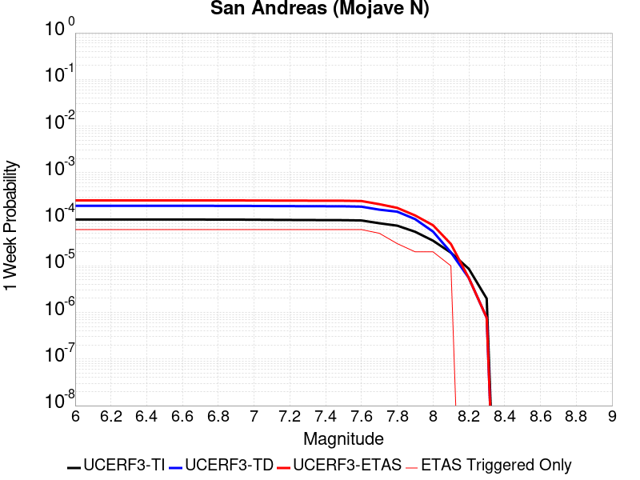 |  |  |  |

| Magnitude | 1 wk TI Prob | 1 wk TD Prob | 1 wk ETAS Prob | 1 wk ETAS/TD Gain | 1 wk ETAS Triggered Only | 1 mo TI Prob | 1 mo TD Prob | 1 mo ETAS Prob | 1 mo ETAS/TD Gain | 1 mo ETAS Triggered Only | 1 yr TI Prob | 1 yr TD Prob | 1 yr ETAS Prob | 1 yr ETAS/TD Gain | 1 yr ETAS Triggered Only | 10 yr TI Prob | 10 yr TD Prob | 10 yr ETAS Prob | 10 yr ETAS/TD Gain | 10 yr ETAS Triggered Only |
|-----|-----|-----|-----|-----|-----|-----|-----|-----|-----|-----|-----|-----|-----|-----|-----|-----|-----|-----|-----|-----|
| 6.0 | 9.877682E-5 | 1.9436594E-4 | 2.5435427E-4 | 1.3086361 | 6.0E-5 | 4.2326056E-4 | 8.3273114E-4 | 9.4263954E-4 | 1.1319854 | 1.1E-4 | 0.0051410277 | 0.0100914985 | 0.01050726 | 1.0411992 | 4.2E-4 | 0.05023708 | 0.09847636 | 0.09914348 | 1.0067745 | 7.4E-4 |
| 6.1 | 9.877682E-5 | 1.9436594E-4 | 2.5435427E-4 | 1.3086361 | 6.0E-5 | 4.2326056E-4 | 8.3273114E-4 | 9.4263954E-4 | 1.1319854 | 1.1E-4 | 0.0051410277 | 0.0100914985 | 0.01050726 | 1.0411992 | 4.2E-4 | 0.05023708 | 0.09847636 | 0.09914348 | 1.0067745 | 7.4E-4 |
| 6.2 | 9.877682E-5 | 1.9436594E-4 | 2.5435427E-4 | 1.3086361 | 6.0E-5 | 4.2326056E-4 | 8.3273114E-4 | 9.4263954E-4 | 1.1319854 | 1.1E-4 | 0.0051410277 | 0.0100914985 | 0.01050726 | 1.0411992 | 4.2E-4 | 0.05023708 | 0.09847636 | 0.09914348 | 1.0067745 | 7.4E-4 |
| 6.3 | 9.877682E-5 | 1.9436594E-4 | 2.5435427E-4 | 1.3086361 | 6.0E-5 | 4.2326056E-4 | 8.3273114E-4 | 9.4263954E-4 | 1.1319854 | 1.1E-4 | 0.0051410277 | 0.0100914985 | 0.01050726 | 1.0411992 | 4.2E-4 | 0.05023708 | 0.09847636 | 0.09914348 | 1.0067745 | 7.4E-4 |
| 6.4 | 9.877682E-5 | 1.9436594E-4 | 2.5435427E-4 | 1.3086361 | 6.0E-5 | 4.2326056E-4 | 8.3273114E-4 | 9.4263954E-4 | 1.1319854 | 1.1E-4 | 0.0051410277 | 0.0100914985 | 0.01050726 | 1.0411992 | 4.2E-4 | 0.05023708 | 0.09847636 | 0.09914348 | 1.0067745 | 7.4E-4 |
| 6.5 | 9.861474E-5 | 1.9410347E-4 | 2.5409184E-4 | 1.3090534 | 6.0E-5 | 4.2256617E-4 | 8.3160703E-4 | 9.4151555E-4 | 1.132164 | 1.1E-4 | 0.0051326132 | 0.010077939 | 0.010493707 | 1.0412552 | 4.2E-4 | 0.050156746 | 0.098354205 | 0.09902142 | 1.0067838 | 7.4E-4 |
| 6.6 | 9.861474E-5 | 1.9410347E-4 | 2.5409184E-4 | 1.3090534 | 6.0E-5 | 4.2256617E-4 | 8.3160703E-4 | 9.4151555E-4 | 1.132164 | 1.1E-4 | 0.0051326132 | 0.010077939 | 0.010493707 | 1.0412552 | 4.2E-4 | 0.050156746 | 0.098354205 | 0.09902142 | 1.0067838 | 7.4E-4 |
| 6.7 | 9.8552715E-5 | 1.9400296E-4 | 2.539913E-4 | 1.3092136 | 6.0E-5 | 4.223004E-4 | 8.311765E-4 | 9.410851E-4 | 1.1322325 | 1.1E-4 | 0.0051293927 | 0.010072746 | 0.010488516 | 1.0412767 | 4.2E-4 | 0.050125998 | 0.09830724 | 0.09897449 | 1.0067874 | 7.4E-4 |
| 6.8 | 9.8464974E-5 | 1.9385452E-4 | 2.5384288E-4 | 1.3094505 | 6.0E-5 | 4.219245E-4 | 8.305407E-4 | 9.4044936E-4 | 1.1323339 | 1.1E-4 | 0.0051248376 | 0.010065078 | 0.01048085 | 1.0413084 | 4.2E-4 | 0.05008251 | 0.098237 | 0.098904304 | 1.0067928 | 7.4E-4 |
| 6.9 | 9.825824E-5 | 1.935344E-4 | 2.535228E-4 | 1.3099624 | 6.0E-5 | 4.2103877E-4 | 8.291697E-4 | 9.3907845E-4 | 1.1325529 | 1.1E-4 | 0.0051141046 | 0.010048538 | 0.010464318 | 1.0413771 | 4.2E-4 | 0.049980022 | 0.09808606 | 0.098753475 | 1.0068043 | 7.4E-4 |
| 7.0 | 9.781462E-5 | 1.9284763E-4 | 2.5283606E-4 | 1.3110665 | 6.0E-5 | 4.1913814E-4 | 8.2622824E-4 | 9.3613734E-4 | 1.1330252 | 1.1E-4 | 0.005091073 | 0.010013057 | 0.0104288515 | 1.0415252 | 4.2E-4 | 0.04976007 | 0.09776237 | 0.09843003 | 1.0068294 | 7.4E-4 |
| 7.1 | 9.7121134E-5 | 1.9186416E-4 | 2.5185265E-4 | 1.3126613 | 6.0E-5 | 4.1616702E-4 | 8.2201604E-4 | 9.319256E-4 | 1.1337073 | 1.1E-4 | 0.005055068 | 0.009962243 | 0.010378059 | 1.0417392 | 4.2E-4 | 0.04941613 | 0.09729878 | 0.097966775 | 1.0068654 | 7.4E-4 |
| 7.2 | 9.663819E-5 | 1.9117158E-4 | 2.511601E-4 | 1.3137941 | 6.0E-5 | 4.1409794E-4 | 8.1904966E-4 | 9.289596E-4 | 1.134192 | 1.1E-4 | 0.0050299936 | 0.009926458 | 0.010342289 | 1.0418912 | 4.2E-4 | 0.049176537 | 0.09697204 | 0.09764028 | 1.006891 | 7.4E-4 |
| 7.3 | 9.6277574E-5 | 1.906962E-4 | 2.5068474E-4 | 1.3145766 | 6.0E-5 | 4.125529E-4 | 8.170136E-4 | 9.2692376E-4 | 1.1345267 | 1.1E-4 | 0.0050112694 | 0.009901894 | 0.0103078345 | 1.0409962 | 4.1E-4 | 0.04899759 | 0.09674529 | 0.09740466 | 1.0068156 | 7.3E-4 |
| 7.4 | 9.593308E-5 | 1.9009347E-4 | 2.5008208E-4 | 1.3155742 | 6.0E-5 | 4.1107697E-4 | 8.1443216E-4 | 9.2434254E-4 | 1.1349534 | 1.1E-4 | 0.0049933824 | 0.00987075 | 0.010276703 | 1.0411268 | 4.1E-4 | 0.04882661 | 0.09646287 | 0.09712245 | 1.0068377 | 7.3E-4 |
| 7.5 | 9.561707E-5 | 1.8955376E-4 | 2.4954238E-4 | 1.3164729 | 6.0E-5 | 4.0972308E-4 | 8.121205E-4 | 9.220312E-4 | 1.1353378 | 1.1E-4 | 0.0049769743 | 0.0098428605 | 0.010248825 | 1.0412445 | 4.1E-4 | 0.048669744 | 0.09620883 | 0.096868604 | 1.0068576 | 7.3E-4 |
| 7.6 | 9.418194E-5 | 1.8607336E-4 | 2.460622E-4 | 1.3223934 | 6.0E-5 | 4.0357444E-4 | 7.972137E-4 | 9.07126E-4 | 1.1378706 | 1.1E-4 | 0.004902454 | 0.009662993 | 0.0100591285 | 1.040995 | 4.0E-4 | 0.047957025 | 0.09458842 | 0.09524032 | 1.006892 | 7.2E-4 |
| 7.7 | 8.202141E-5 | 1.6053455E-4 | 2.1052652E-4 | 1.3114095 | 5.0E-5 | 3.51473E-4 | 6.878238E-4 | 7.777619E-4 | 1.1307575 | 9.0E-5 | 0.00427079 | 0.008342157 | 0.0086991545 | 1.0427943 | 3.6E-4 | 0.04189639 | 0.08237585 | 0.082981475 | 1.0073521 | 6.6E-4 |
| 7.8 | 7.2859846E-5 | 1.4545326E-4 | 1.7544889E-4 | 1.2062218 | 3.0E-5 | 3.1221908E-4 | 6.232222E-4 | 6.8318483E-4 | 1.0962138 | 6.0E-5 | 0.003794643 | 0.0075613735 | 0.0078094834 | 1.0328128 | 2.5E-4 | 0.037304975 | 0.074854724 | 0.07527103 | 1.0055616 | 4.5E-4 |
| 7.9 | 5.3874453E-5 | 1.0065783E-4 | 1.2065582E-4 | 1.1986729 | 2.0E-5 | 2.3087008E-4 | 4.313194E-4 | 4.8129784E-4 | 1.1158733 | 5.0E-5 | 0.0028072202 | 0.0052386806 | 0.005387895 | 1.0284832 | 1.5E-4 | 0.02772022 | 0.052520394 | 0.05276674 | 1.0046904 | 2.6E-4 |
| 8.0 | 3.468538E-5 | 5.4374406E-5 | 7.437332E-5 | 1.3678001 | 2.0E-5 | 1.4864317E-4 | 2.3301235E-4 | 2.7300304E-4 | 1.1716247 | 4.0E-5 | 0.0018082283 | 0.0028332367 | 0.0029030384 | 1.0246367 | 7.0E-5 | 0.017935853 | 0.02900434 | 0.029101439 | 1.0033478 | 1.0E-4 |
| 8.1 | 1.9152367E-5 | 1.9454663E-5 | 2.9454468E-5 | 1.5140055 | 1.0E-5 | 8.207899E-5 | 8.337447E-5 | 9.337363E-5 | 1.1199307 | 1.0E-5 | 9.988535E-4 | 0.001014612 | 0.001024602 | 1.009846 | 1.0E-5 | 0.009943757 | 0.010883738 | 0.01089363 | 1.0009089 | 1.0E-5 |
| 8.2 | 8.643924E-6 | 5.494016E-6 | 5.494016E-6 | 1.0 | 0.0 | 3.704486E-5 | 2.3545572E-5 | 2.3545572E-5 | 1.0 | 0.0 | 4.5092785E-4 | 2.866297E-4 | 2.866297E-4 | 1.0 | 0.0 | 0.0045001395 | 0.0032592218 | 0.0032592218 | 1.0 | 0.0 |
| 8.3 | 1.983087E-6 | 7.690063E-7 | 7.690063E-7 | 1.0 | 0.0 | 8.498917E-6 | 3.295737E-6 | 3.295737E-6 | 1.0 | 0.0 | 1.034694E-4 | 4.012488E-5 | 4.012488E-5 | 1.0 | 0.0 | 0.0010342124 | 4.737206E-4 | 4.737206E-4 | 1.0 | 0.0 |

## Bicycle Lake
*[(top)](#table-of-contents)*

| 1 Week | 1 Month | 1 Year | 10 Year |
|-----|-----|-----|-----|
|  |  |  |  |

| Magnitude | 1 wk TI Prob | 1 wk TD Prob | 1 wk ETAS Prob | 1 wk ETAS/TD Gain | 1 wk ETAS Triggered Only | 1 mo TI Prob | 1 mo TD Prob | 1 mo ETAS Prob | 1 mo ETAS/TD Gain | 1 mo ETAS Triggered Only | 1 yr TI Prob | 1 yr TD Prob | 1 yr ETAS Prob | 1 yr ETAS/TD Gain | 1 yr ETAS Triggered Only | 10 yr TI Prob | 10 yr TD Prob | 10 yr ETAS Prob | 10 yr ETAS/TD Gain | 10 yr ETAS Triggered Only |
|-----|-----|-----|-----|-----|-----|-----|-----|-----|-----|-----|-----|-----|-----|-----|-----|-----|-----|-----|-----|-----|
| 6.0 | 1.9621975E-5 | 2.2098557E-5 | 3.2098338E-5 | 1.4525082 | 1.0E-5 | 8.4091465E-5 | 9.470543E-5 | 1.2470258E-4 | 1.3167417 | 3.0E-5 | 0.0010233327 | 0.0011525637 | 0.0014522179 | 1.2599893 | 3.0E-4 | 0.01018633 | 0.011479174 | 0.012101942 | 1.054252 | 6.3E-4 |
| 6.1 | 1.9621975E-5 | 2.2098557E-5 | 3.2098338E-5 | 1.4525082 | 1.0E-5 | 8.4091465E-5 | 9.470543E-5 | 1.2470258E-4 | 1.3167417 | 3.0E-5 | 0.0010233327 | 0.0011525637 | 0.0014522179 | 1.2599893 | 3.0E-4 | 0.01018633 | 0.011479174 | 0.012101942 | 1.054252 | 6.3E-4 |
| 6.2 | 9.9971285E-6 | 1.1256391E-5 | 2.1256279E-5 | 1.8883742 | 1.0E-5 | 4.2844134E-5 | 4.824108E-5 | 6.8240115E-5 | 1.4145644 | 2.0E-5 | 5.2150246E-4 | 5.8722886E-4 | 7.3714077E-4 | 1.255287 | 1.5E-4 | 0.0052028033 | 0.0058618775 | 0.006160119 | 1.0508782 | 3.0E-4 |
| 6.3 | 9.589428E-6 | 1.0799068E-5 | 2.079896E-5 | 1.9259958 | 1.0E-5 | 4.10969E-5 | 4.6281195E-5 | 6.628027E-5 | 1.4321209 | 2.0E-5 | 5.002399E-4 | 5.633797E-4 | 7.033009E-4 | 1.2483603 | 1.4E-4 | 0.0049911533 | 0.0056246053 | 0.005912974 | 1.0512692 | 2.9E-4 |
| 6.4 | 9.589428E-6 | 1.0799068E-5 | 2.079896E-5 | 1.9259958 | 1.0E-5 | 4.10969E-5 | 4.6281195E-5 | 6.628027E-5 | 1.4321209 | 2.0E-5 | 5.002399E-4 | 5.633797E-4 | 7.033009E-4 | 1.2483603 | 1.4E-4 | 0.0049911533 | 0.0056246053 | 0.005912974 | 1.0512692 | 2.9E-4 |
| 6.5 | 5.557707E-6 | 6.286038E-6 | 1.6285976E-5 | 2.590817 | 1.0E-5 | 2.3818526E-5 | 2.6940037E-5 | 4.6939498E-5 | 1.7423694 | 2.0E-5 | 2.8995197E-4 | 3.2797246E-4 | 4.5792983E-4 | 1.3962448 | 1.3E-4 | 0.0028957394 | 0.003277521 | 0.0035167343 | 1.0729861 | 2.4E-4 |
| 6.6 | 4.8742945E-6 | 5.5136734E-6 | 5.5136734E-6 | 1.0 | 0.0 | 2.0889667E-5 | 2.3629962E-5 | 3.3629727E-5 | 1.4231815 | 1.0E-5 | 2.54302E-4 | 2.87683E-4 | 3.7765712E-4 | 1.3127544 | 9.0E-5 | 0.002540112 | 0.0028756752 | 0.0030551576 | 1.062414 | 1.8E-4 |
| 6.7 | 3.991108E-6 | 4.5162255E-6 | 4.5162255E-6 | 1.0 | 0.0 | 1.7104636E-5 | 1.9355251E-5 | 2.9355058E-5 | 1.5166457 | 1.0E-5 | 2.0822904E-4 | 2.3565018E-4 | 3.056337E-4 | 1.2969805 | 7.0E-5 | 0.0020803404 | 0.0023565018 | 0.0024861954 | 1.0550365 | 1.3E-4 |

## Paradise
*[(top)](#table-of-contents)*

| 1 Week | 1 Month | 1 Year | 10 Year |
|-----|-----|-----|-----|
|  |  |  |  |

| Magnitude | 1 wk TI Prob | 1 wk TD Prob | 1 wk ETAS Prob | 1 wk ETAS/TD Gain | 1 wk ETAS Triggered Only | 1 mo TI Prob | 1 mo TD Prob | 1 mo ETAS Prob | 1 mo ETAS/TD Gain | 1 mo ETAS Triggered Only | 1 yr TI Prob | 1 yr TD Prob | 1 yr ETAS Prob | 1 yr ETAS/TD Gain | 1 yr ETAS Triggered Only | 10 yr TI Prob | 10 yr TD Prob | 10 yr ETAS Prob | 10 yr ETAS/TD Gain | 10 yr ETAS Triggered Only |
|-----|-----|-----|-----|-----|-----|-----|-----|-----|-----|-----|-----|-----|-----|-----|-----|-----|-----|-----|-----|-----|
| 6.0 | 1.4851273E-5 | 1.6695423E-5 | 2.6695256E-5 | 1.5989566 | 1.0E-5 | 6.364676E-5 | 7.1549985E-5 | 1.3154569E-4 | 1.8385146 | 6.0E-5 | 7.7462377E-4 | 8.707965E-4 | 0.0011105875 | 1.2753698 | 2.4E-4 | 0.0077192914 | 0.008676223 | 0.009261104 | 1.0674119 | 5.9E-4 |
| 6.1 | 1.4851273E-5 | 1.6695423E-5 | 2.6695256E-5 | 1.5989566 | 1.0E-5 | 6.364676E-5 | 7.1549985E-5 | 1.3154569E-4 | 1.8385146 | 6.0E-5 | 7.7462377E-4 | 8.707965E-4 | 0.0011105875 | 1.2753698 | 2.4E-4 | 0.0077192914 | 0.008676223 | 0.009261104 | 1.0674119 | 5.9E-4 |
| 6.2 | 1.4851273E-5 | 1.6695423E-5 | 2.6695256E-5 | 1.5989566 | 1.0E-5 | 6.364676E-5 | 7.1549985E-5 | 1.3154569E-4 | 1.8385146 | 6.0E-5 | 7.7462377E-4 | 8.707965E-4 | 0.0011105875 | 1.2753698 | 2.4E-4 | 0.0077192914 | 0.008676223 | 0.009261104 | 1.0674119 | 5.9E-4 |
| 6.3 | 1.0426831E-5 | 1.1889131E-5 | 2.1889013E-5 | 1.8410944 | 1.0E-5 | 4.4685654E-5 | 5.0952458E-5 | 8.095093E-5 | 1.5887542 | 3.0E-5 | 5.43912E-4 | 6.2017556E-4 | 7.4010115E-4 | 1.1933736 | 1.2E-4 | 0.0054258266 | 0.0061850566 | 0.0064136344 | 1.0369564 | 2.3E-4 |
| 6.4 | 1.0426831E-5 | 1.1889131E-5 | 2.1889013E-5 | 1.8410944 | 1.0E-5 | 4.4685654E-5 | 5.0952458E-5 | 8.095093E-5 | 1.5887542 | 3.0E-5 | 5.43912E-4 | 6.2017556E-4 | 7.4010115E-4 | 1.1933736 | 1.2E-4 | 0.0054258266 | 0.0061850566 | 0.0064136344 | 1.0369564 | 2.3E-4 |
| 6.5 | 9.25027E-6 | 1.0620418E-5 | 2.0620311E-5 | 1.9415725 | 1.0E-5 | 3.964341E-5 | 4.5515313E-5 | 6.55144E-5 | 1.4393926 | 2.0E-5 | 4.8255164E-4 | 5.5401295E-4 | 6.5395754E-4 | 1.1804012 | 1.0E-4 | 0.0048150513 | 0.0055268174 | 0.0057157674 | 1.0341878 | 1.9E-4 |
| 6.6 | 7.904275E-6 | 9.159918E-6 | 1.9159826E-5 | 2.091703 | 1.0E-5 | 3.3875025E-5 | 3.925622E-5 | 4.925583E-5 | 1.2547266 | 1.0E-5 | 4.1235037E-4 | 4.778436E-4 | 5.5780535E-4 | 1.1673388 | 8.0E-5 | 0.0041158604 | 0.0047685583 | 0.0049078907 | 1.029219 | 1.4E-4 |
| 6.7 | 7.2061953E-6 | 8.40761E-6 | 1.8407525E-5 | 2.1893888 | 1.0E-5 | 3.088333E-5 | 3.6032136E-5 | 4.6031775E-5 | 1.2775201 | 1.0E-5 | 3.7593965E-4 | 4.3860663E-4 | 4.9858034E-4 | 1.1367369 | 6.0E-5 | 0.003753043 | 0.0043777786 | 0.004487297 | 1.0250169 | 1.1E-4 |
| 6.8 | 6.6948724E-6 | 7.842504E-6 | 1.7842425E-5 | 2.275093 | 1.0E-5 | 2.8691995E-5 | 3.361032E-5 | 4.360998E-5 | 1.2975177 | 1.0E-5 | 3.4926904E-4 | 4.0913236E-4 | 4.691078E-4 | 1.1465918 | 6.0E-5 | 0.003487206 | 0.004084149 | 0.0041837404 | 1.0243849 | 1.0E-4 |
| 6.9 | 6.0421025E-6 | 7.13093E-6 | 7.13093E-6 | 1.0 | 0.0 | 2.5894467E-5 | 3.056079E-5 | 3.056079E-5 | 1.0 | 0.0 | 3.1521954E-4 | 3.720175E-4 | 4.120026E-4 | 1.1074818 | 4.0E-5 | 0.0031477278 | 0.0037142856 | 0.0037939884 | 1.0214585 | 8.0E-5 |
| 7.0 | 4.134091E-6 | 5.080546E-6 | 5.080546E-6 | 1.0 | 0.0 | 1.7717413E-5 | 2.1773596E-5 | 2.1773596E-5 | 1.0 | 0.0 | 2.1568815E-4 | 2.6506282E-4 | 2.8505753E-4 | 1.0754339 | 2.0E-5 | 0.0021547892 | 0.00264762 | 0.002687514 | 1.0150679 | 4.0E-5 |
| 7.1 | 3.7674888E-6 | 4.6320843E-6 | 4.6320843E-6 | 1.0 | 0.0 | 1.6146281E-5 | 1.9851648E-5 | 1.9851648E-5 | 1.0 | 0.0 | 1.9656324E-4 | 2.4166853E-4 | 2.616637E-4 | 1.082738 | 2.0E-5 | 0.0019638946 | 0.002414208 | 0.0024541111 | 1.0165286 | 4.0E-5 |
| 7.2 | 3.4065345E-6 | 4.1569137E-6 | 4.1569137E-6 | 1.0 | 0.0 | 1.4599351E-5 | 1.7815231E-5 | 1.7815231E-5 | 1.0 | 0.0 | 1.777326E-4 | 2.1688035E-4 | 2.3687602E-4 | 1.0921967 | 2.0E-5 | 0.0017759053 | 0.0021668351 | 0.0022067486 | 1.0184201 | 4.0E-5 |
| 7.3 | 2.9934936E-6 | 3.629477E-6 | 3.629477E-6 | 1.0 | 0.0 | 1.2829195E-5 | 1.5554817E-5 | 1.5554817E-5 | 1.0 | 0.0 | 1.5618425E-4 | 1.8936492E-4 | 2.0936114E-4 | 1.1055962 | 2.0E-5 | 0.0015607453 | 0.001892181 | 0.0019221242 | 1.0158247 | 3.0E-5 |
| 7.4 | 2.4049796E-6 | 2.889102E-6 | 2.889102E-6 | 1.0 | 0.0 | 1.0307015E-5 | 1.2381815E-5 | 1.2381815E-5 | 1.0 | 0.0 | 1.2548068E-4 | 1.5073961E-4 | 1.6073811E-4 | 1.0663296 | 1.0E-5 | 0.0012540985 | 0.0015065151 | 0.0015165 | 1.0066278 | 1.0E-5 |
| 7.5 | 1.2710091E-6 | 1.5135334E-6 | 1.5135334E-6 | 1.0 | 0.0 | 5.44717E-6 | 6.4865626E-6 | 6.4865626E-6 | 1.0 | 0.0 | 6.631728E-5 | 7.897229E-5 | 7.897229E-5 | 1.0 | 0.0 | 6.6297496E-4 | 7.895649E-4 | 7.895649E-4 | 1.0 | 0.0 |
| 7.6 | 2.21172E-7 | 2.6040448E-7 | 2.6040448E-7 | 1.0 | 0.0 | 9.478797E-7 | 1.1160189E-6 | 1.1160189E-6 | 1.0 | 0.0 | 1.1540374E-5 | 1.3587473E-5 | 1.3587473E-5 | 1.0 | 0.0 | 1.1539775E-4 | 1.3586924E-4 | 1.3586924E-4 | 1.0 | 0.0 |

## Garlic Springs
*[(top)](#table-of-contents)*

| 1 Week | 1 Month | 1 Year | 10 Year |
|-----|-----|-----|-----|
|  |  |  |  |

| Magnitude | 1 wk TI Prob | 1 wk TD Prob | 1 wk ETAS Prob | 1 wk ETAS/TD Gain | 1 wk ETAS Triggered Only | 1 mo TI Prob | 1 mo TD Prob | 1 mo ETAS Prob | 1 mo ETAS/TD Gain | 1 mo ETAS Triggered Only | 1 yr TI Prob | 1 yr TD Prob | 1 yr ETAS Prob | 1 yr ETAS/TD Gain | 1 yr ETAS Triggered Only | 10 yr TI Prob | 10 yr TD Prob | 10 yr ETAS Prob | 10 yr ETAS/TD Gain | 10 yr ETAS Triggered Only |
|-----|-----|-----|-----|-----|-----|-----|-----|-----|-----|-----|-----|-----|-----|-----|-----|-----|-----|-----|-----|-----|
| 6.0 | 1.6760017E-5 | 1.8778032E-5 | 2.8777844E-5 | 1.5325272 | 1.0E-5 | 7.182667E-5 | 8.047546E-5 | 1.2047224E-4 | 1.4970059 | 4.0E-5 | 8.7413884E-4 | 9.794657E-4 | 0.0011592894 | 1.1835936 | 1.8E-4 | 0.008707083 | 0.009763035 | 0.0102383485 | 1.0486851 | 4.8E-4 |
| 6.1 | 9.852767E-6 | 1.097425E-5 | 1.097425E-5 | 1.0 | 0.0 | 4.222546E-5 | 4.703205E-5 | 5.703158E-5 | 1.212611 | 1.0E-5 | 5.139737E-4 | 5.7253573E-4 | 6.824728E-4 | 1.1920178 | 1.1E-4 | 0.005127866 | 0.0057175662 | 0.006005908 | 1.0504309 | 2.9E-4 |
| 6.2 | 9.852767E-6 | 1.097425E-5 | 1.097425E-5 | 1.0 | 0.0 | 4.222546E-5 | 4.703205E-5 | 5.703158E-5 | 1.212611 | 1.0E-5 | 5.139737E-4 | 5.7253573E-4 | 6.824728E-4 | 1.1920178 | 1.1E-4 | 0.005127866 | 0.0057175662 | 0.006005908 | 1.0504309 | 2.9E-4 |
| 6.3 | 4.3167724E-6 | 4.7782996E-6 | 4.7782996E-6 | 1.0 | 0.0 | 1.8500323E-5 | 2.0478396E-5 | 3.047819E-5 | 1.4883095 | 1.0E-5 | 2.2521814E-4 | 2.4931898E-4 | 2.8930898E-4 | 1.160397 | 4.0E-5 | 0.0022499003 | 0.002492651 | 0.0026323022 | 1.0560251 | 1.4E-4 |
| 6.4 | 4.3167724E-6 | 4.7782996E-6 | 4.7782996E-6 | 1.0 | 0.0 | 1.8500323E-5 | 2.0478396E-5 | 3.047819E-5 | 1.4883095 | 1.0E-5 | 2.2521814E-4 | 2.4931898E-4 | 2.8930898E-4 | 1.160397 | 4.0E-5 | 0.0022499003 | 0.002492651 | 0.0026323022 | 1.0560251 | 1.4E-4 |
| 6.5 | 4.3167724E-6 | 4.7782996E-6 | 4.7782996E-6 | 1.0 | 0.0 | 1.8500323E-5 | 2.0478396E-5 | 3.047819E-5 | 1.4883095 | 1.0E-5 | 2.2521814E-4 | 2.4931898E-4 | 2.8930898E-4 | 1.160397 | 4.0E-5 | 0.0022499003 | 0.002492651 | 0.0026323022 | 1.0560251 | 1.4E-4 |
| 6.6 | 4.301311E-6 | 4.761167E-6 | 4.761167E-6 | 1.0 | 0.0 | 1.8434059E-5 | 2.0404972E-5 | 3.0404768E-5 | 1.4900666 | 1.0E-5 | 2.2441156E-4 | 2.4842523E-4 | 2.884153E-4 | 1.1609743 | 4.0E-5 | 0.0022418506 | 0.002483734 | 0.0026233862 | 1.0562267 | 1.4E-4 |
| 6.7 | 3.8599724E-6 | 4.2713013E-6 | 4.2713013E-6 | 1.0 | 0.0 | 1.6542634E-5 | 1.8305576E-5 | 2.8305394E-5 | 1.5462717 | 1.0E-5 | 2.0138794E-4 | 2.228704E-4 | 2.628615E-4 | 1.1794366 | 4.0E-5 | 0.0020120554 | 0.0022287038 | 0.0023584142 | 1.0581999 | 1.3E-4 |

## San Andreas (San Bernardino N)
*[(top)](#table-of-contents)*

| 1 Week | 1 Month | 1 Year | 10 Year |
|-----|-----|-----|-----|
|  |  |  |  |

| Magnitude | 1 wk TI Prob | 1 wk TD Prob | 1 wk ETAS Prob | 1 wk ETAS/TD Gain | 1 wk ETAS Triggered Only | 1 mo TI Prob | 1 mo TD Prob | 1 mo ETAS Prob | 1 mo ETAS/TD Gain | 1 mo ETAS Triggered Only | 1 yr TI Prob | 1 yr TD Prob | 1 yr ETAS Prob | 1 yr ETAS/TD Gain | 1 yr ETAS Triggered Only | 10 yr TI Prob | 10 yr TD Prob | 10 yr ETAS Prob | 10 yr ETAS/TD Gain | 10 yr ETAS Triggered Only |
|-----|-----|-----|-----|-----|-----|-----|-----|-----|-----|-----|-----|-----|-----|-----|-----|-----|-----|-----|-----|-----|
| 6.0 | 1.4273766E-4 | 3.1637165E-4 | 3.4636215E-4 | 1.0947952 | 3.0E-5 | 6.115894E-4 | 0.0013551798 | 0.0014150986 | 1.0442146 | 6.0E-5 | 0.0074207084 | 0.016375994 | 0.0166219 | 1.0150162 | 2.5E-4 | 0.07177748 | 0.15046582 | 0.15078864 | 1.0021455 | 3.8E-4 |
| 6.1 | 1.4273766E-4 | 3.1637165E-4 | 3.4636215E-4 | 1.0947952 | 3.0E-5 | 6.115894E-4 | 0.0013551798 | 0.0014150986 | 1.0442146 | 6.0E-5 | 0.0074207084 | 0.016375994 | 0.0166219 | 1.0150162 | 2.5E-4 | 0.07177748 | 0.15046582 | 0.15078864 | 1.0021455 | 3.8E-4 |
| 6.2 | 1.4273766E-4 | 3.1637165E-4 | 3.4636215E-4 | 1.0947952 | 3.0E-5 | 6.115894E-4 | 0.0013551798 | 0.0014150986 | 1.0442146 | 6.0E-5 | 0.0074207084 | 0.016375994 | 0.0166219 | 1.0150162 | 2.5E-4 | 0.07177748 | 0.15046582 | 0.15078864 | 1.0021455 | 3.8E-4 |
| 6.3 | 1.3730655E-4 | 3.0541886E-4 | 3.3540968E-4 | 1.0981958 | 3.0E-5 | 5.883239E-4 | 0.0013082869 | 0.0013682084 | 1.0458015 | 6.0E-5 | 0.0071393442 | 0.015813464 | 0.01605951 | 1.0155593 | 2.5E-4 | 0.06914291 | 0.14575101 | 0.14607562 | 1.0022272 | 3.8E-4 |
| 6.4 | 1.3730655E-4 | 3.0541886E-4 | 3.3540968E-4 | 1.0981958 | 3.0E-5 | 5.883239E-4 | 0.0013082869 | 0.0013682084 | 1.0458015 | 6.0E-5 | 0.0071393442 | 0.015813464 | 0.01605951 | 1.0155593 | 2.5E-4 | 0.06914291 | 0.14575101 | 0.14607562 | 1.0022272 | 3.8E-4 |
| 6.5 | 1.2942807E-4 | 2.895608E-4 | 3.195521E-4 | 1.1035752 | 3.0E-5 | 5.545738E-4 | 0.0012403899 | 0.0013003154 | 1.048312 | 6.0E-5 | 0.0067310524 | 0.014998424 | 0.015244675 | 1.0164185 | 2.5E-4 | 0.06530788 | 0.1388892 | 0.1392078 | 1.002294 | 3.7E-4 |
| 6.6 | 1.1125901E-4 | 2.5394472E-4 | 2.8393712E-4 | 1.1181059 | 3.0E-5 | 4.767372E-4 | 0.0010878829 | 0.0011478176 | 1.055093 | 6.0E-5 | 0.005788839 | 0.013165171 | 0.0134118805 | 1.0187395 | 2.5E-4 | 0.056403454 | 0.123156786 | 0.12348122 | 1.0026343 | 3.7E-4 |
| 6.7 | 1.02209575E-4 | 2.3529287E-4 | 2.652858E-4 | 1.1274707 | 3.0E-5 | 4.3796748E-4 | 0.0010080098 | 0.0010679492 | 1.0594633 | 6.0E-5 | 0.0053192247 | 0.012203882 | 0.012431076 | 1.0186164 | 2.3E-4 | 0.051936906 | 0.1149152 | 0.11522498 | 1.0026957 | 3.5E-4 |
| 6.8 | 9.610582E-5 | 2.2054653E-4 | 2.5053992E-4 | 1.1359957 | 3.0E-5 | 4.1181705E-4 | 9.448577E-4 | 0.001004801 | 1.0634416 | 6.0E-5 | 0.0050023515 | 0.011443232 | 0.0116706 | 1.0198692 | 2.3E-4 | 0.048912346 | 0.10832591 | 0.108637996 | 1.002881 | 3.5E-4 |
| 6.9 | 9.3877505E-5 | 2.1510055E-4 | 2.450941E-4 | 1.1394397 | 3.0E-5 | 4.0227012E-4 | 9.2153443E-4 | 9.814792E-4 | 1.0650488 | 6.0E-5 | 0.0048866454 | 0.01116221 | 0.011379754 | 1.0194894 | 2.2E-4 | 0.04780577 | 0.10591924 | 0.10622323 | 1.00287 | 3.4E-4 |
| 7.0 | 9.1019785E-5 | 2.0836767E-4 | 2.3836142E-4 | 1.1439463 | 3.0E-5 | 3.900265E-4 | 8.926993E-4 | 9.526457E-4 | 1.0671519 | 6.0E-5 | 0.0047382377 | 0.010814676 | 0.011032297 | 1.0201228 | 2.2E-4 | 0.046384744 | 0.10288831 | 0.10319333 | 1.0029645 | 3.4E-4 |
| 7.1 | 8.771155E-5 | 2.0011076E-4 | 2.3010476E-4 | 1.149887 | 3.0E-5 | 3.758525E-4 | 8.573362E-4 | 9.1728475E-4 | 1.0699242 | 6.0E-5 | 0.0045664064 | 0.010388309 | 0.010596128 | 1.020005 | 2.1E-4 | 0.044737056 | 0.099199384 | 0.09949665 | 1.0029967 | 3.3E-4 |
| 7.2 | 8.0830236E-5 | 1.8416144E-4 | 2.1415591E-4 | 1.1628705 | 3.0E-5 | 3.4636928E-4 | 7.890247E-4 | 8.4897736E-4 | 1.0759833 | 6.0E-5 | 0.0042088944 | 0.00956417 | 0.009772161 | 1.021747 | 2.1E-4 | 0.041300658 | 0.09192752 | 0.09222718 | 1.0032598 | 3.3E-4 |
| 7.3 | 7.7668235E-5 | 1.7359214E-4 | 2.0358693E-4 | 1.1727889 | 3.0E-5 | 3.328214E-4 | 7.4375427E-4 | 8.037096E-4 | 1.0806118 | 6.0E-5 | 0.0040445733 | 0.009017691 | 0.009225798 | 1.0230776 | 2.1E-4 | 0.03971748 | 0.087187394 | 0.08748862 | 1.0034549 | 3.3E-4 |
| 7.4 | 7.520177E-5 | 1.6578918E-4 | 1.957842E-4 | 1.1809227 | 3.0E-5 | 3.2225347E-4 | 7.1033166E-4 | 7.7028904E-4 | 1.0844076 | 6.0E-5 | 0.0039163795 | 0.008614061 | 0.008822252 | 1.0241687 | 2.1E-4 | 0.038480744 | 0.08364062 | 0.08394302 | 1.0036155 | 3.3E-4 |
| 7.5 | 7.274697E-5 | 1.5866217E-4 | 1.886574E-4 | 1.189051 | 3.0E-5 | 3.1173544E-4 | 6.7980355E-4 | 7.3976273E-4 | 1.0882008 | 6.0E-5 | 0.003788775 | 0.008245256 | 0.008453525 | 1.0252591 | 2.1E-4 | 0.03724827 | 0.080355436 | 0.08065891 | 1.0037768 | 3.3E-4 |
| 7.6 | 7.1185845E-5 | 1.5435848E-4 | 1.8435385E-4 | 1.1943228 | 3.0E-5 | 3.0504653E-4 | 6.6136866E-4 | 7.2132895E-4 | 1.0906609 | 6.0E-5 | 0.0037076178 | 0.008022487 | 0.008230803 | 1.0259664 | 2.1E-4 | 0.036463667 | 0.07834393 | 0.07864807 | 1.0038822 | 3.3E-4 |
| 7.7 | 6.709961E-5 | 1.4344044E-4 | 1.7343614E-4 | 1.209116 | 3.0E-5 | 2.8753807E-4 | 6.1459997E-4 | 6.7456305E-4 | 1.0975645 | 6.0E-5 | 0.003495157 | 0.0074571203 | 0.0076655545 | 1.027951 | 2.1E-4 | 0.034406938 | 0.07317166 | 0.073477514 | 1.00418 | 3.3E-4 |
| 7.8 | 6.300812E-5 | 1.3226763E-4 | 1.6226366E-4 | 1.2267829 | 3.0E-5 | 2.7000686E-4 | 5.6673813E-4 | 6.2670413E-4 | 1.105809 | 6.0E-5 | 0.0032823787 | 0.0068782354 | 0.007086791 | 1.0303211 | 2.1E-4 | 0.032343175 | 0.06782526 | 0.06813288 | 1.0045354 | 3.3E-4 |
| 7.9 | 4.983037E-5 | 9.7425276E-5 | 1.17423326E-4 | 1.2052655 | 2.0E-5 | 2.1354125E-4 | 4.174701E-4 | 4.6744922E-4 | 1.119719 | 5.0E-5 | 0.0025967648 | 0.0050708633 | 0.0052201026 | 1.0294307 | 1.5E-4 | 0.025666296 | 0.050739504 | 0.050986312 | 1.0048642 | 2.6E-4 |
| 8.0 | 3.2211527E-5 | 5.3414442E-5 | 7.341337E-5 | 1.3744106 | 2.0E-5 | 1.380421E-4 | 2.2889896E-4 | 2.688898E-4 | 1.1747096 | 4.0E-5 | 0.0016793669 | 0.0027832852 | 0.0028530902 | 1.0250801 | 7.0E-5 | 0.016667323 | 0.028415749 | 0.028512906 | 1.0034192 | 1.0E-4 |
| 8.1 | 1.743376E-5 | 1.8873632E-5 | 2.8873443E-5 | 1.5298297 | 1.0E-5 | 7.471398E-5 | 8.0884485E-5 | 9.088368E-5 | 1.1236231 | 1.0E-5 | 9.0926304E-4 | 9.843244E-4 | 9.943146E-4 | 1.0101492 | 1.0E-5 | 0.009055517 | 0.010509953 | 0.010519848 | 1.0009415 | 1.0E-5 |
| 8.2 | 7.831616E-6 | 5.1727284E-6 | 5.1727284E-6 | 1.0 | 0.0 | 3.3563636E-5 | 2.2168648E-5 | 2.2168648E-5 | 1.0 | 0.0 | 4.0856065E-4 | 2.6986995E-4 | 2.6986995E-4 | 1.0 | 0.0 | 0.004078103 | 0.003051444 | 0.003051444 | 1.0 | 0.0 |
| 8.3 | 1.983087E-6 | 7.690063E-7 | 7.690063E-7 | 1.0 | 0.0 | 8.498917E-6 | 3.295737E-6 | 3.295737E-6 | 1.0 | 0.0 | 1.034694E-4 | 4.012488E-5 | 4.012488E-5 | 1.0 | 0.0 | 0.0010342124 | 4.737206E-4 | 4.737206E-4 | 1.0 | 0.0 |

## Coyote Lake
*[(top)](#table-of-contents)*

| 1 Week | 1 Month | 1 Year | 10 Year |
|-----|-----|-----|-----|
|  |  | 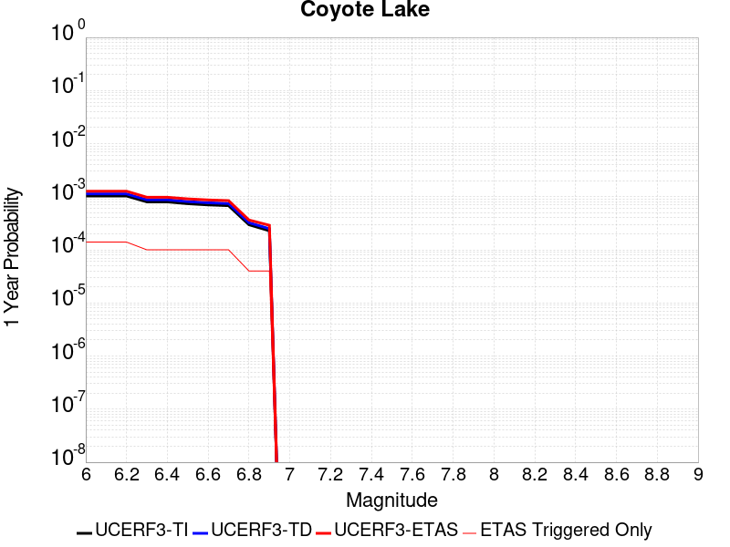 |  |

| Magnitude | 1 wk TI Prob | 1 wk TD Prob | 1 wk ETAS Prob | 1 wk ETAS/TD Gain | 1 wk ETAS Triggered Only | 1 mo TI Prob | 1 mo TD Prob | 1 mo ETAS Prob | 1 mo ETAS/TD Gain | 1 mo ETAS Triggered Only | 1 yr TI Prob | 1 yr TD Prob | 1 yr ETAS Prob | 1 yr ETAS/TD Gain | 1 yr ETAS Triggered Only | 10 yr TI Prob | 10 yr TD Prob | 10 yr ETAS Prob | 10 yr ETAS/TD Gain | 10 yr ETAS Triggered Only |
|-----|-----|-----|-----|-----|-----|-----|-----|-----|-----|-----|-----|-----|-----|-----|-----|-----|-----|-----|-----|-----|
| 6.0 | 1.980352E-5 | 2.1707852E-5 | 2.1707852E-5 | 1.0 | 0.0 | 8.486947E-5 | 9.303074E-5 | 1.1302888E-4 | 1.2149627 | 2.0E-5 | 0.0010327959 | 0.0011321327 | 0.0012719743 | 1.1235204 | 1.4E-4 | 0.010280091 | 0.01127083 | 0.011587223 | 1.0280719 | 3.2E-4 |
| 6.1 | 1.980352E-5 | 2.1707852E-5 | 2.1707852E-5 | 1.0 | 0.0 | 8.486947E-5 | 9.303074E-5 | 1.1302888E-4 | 1.2149627 | 2.0E-5 | 0.0010327959 | 0.0011321327 | 0.0012719743 | 1.1235204 | 1.4E-4 | 0.010280091 | 0.01127083 | 0.011587223 | 1.0280719 | 3.2E-4 |
| 6.2 | 1.980352E-5 | 2.1707852E-5 | 2.1707852E-5 | 1.0 | 0.0 | 8.486947E-5 | 9.303074E-5 | 1.1302888E-4 | 1.2149627 | 2.0E-5 | 0.0010327959 | 0.0011321327 | 0.0012719743 | 1.1235204 | 1.4E-4 | 0.010280091 | 0.01127083 | 0.011587223 | 1.0280719 | 3.2E-4 |
| 6.3 | 1.5344787E-5 | 1.6821528E-5 | 1.6821528E-5 | 1.0 | 0.0 | 6.576172E-5 | 7.209062E-5 | 9.2089176E-5 | 1.2774086 | 2.0E-5 | 8.003548E-4 | 8.7741105E-4 | 9.773233E-4 | 1.1138717 | 1.0E-4 | 0.007974784 | 0.008745514 | 0.008993328 | 1.028336 | 2.5E-4 |
| 6.4 | 1.5344787E-5 | 1.6821528E-5 | 1.6821528E-5 | 1.0 | 0.0 | 6.576172E-5 | 7.209062E-5 | 9.2089176E-5 | 1.2774086 | 2.0E-5 | 8.003548E-4 | 8.7741105E-4 | 9.773233E-4 | 1.1138717 | 1.0E-4 | 0.007974784 | 0.008745514 | 0.008993328 | 1.028336 | 2.5E-4 |
| 6.5 | 1.4189697E-5 | 1.5558782E-5 | 1.5558782E-5 | 1.0 | 0.0 | 6.081157E-5 | 6.667913E-5 | 8.66778E-5 | 1.2999239 | 2.0E-5 | 7.401293E-4 | 8.115764E-4 | 9.1149524E-4 | 1.123117 | 1.0E-4 | 0.0073766913 | 0.008092069 | 0.008320208 | 1.0281929 | 2.3E-4 |
| 6.6 | 1.3469301E-5 | 1.4772335E-5 | 1.4772335E-5 | 1.0 | 0.0 | 5.7724297E-5 | 6.330881E-5 | 8.330755E-5 | 1.3158917 | 2.0E-5 | 7.025667E-4 | 7.7057217E-4 | 8.704951E-4 | 1.1296737 | 1.0E-4 | 0.0070034964 | 0.0076849074 | 0.00791314 | 1.0296988 | 2.3E-4 |
| 6.7 | 1.3027966E-5 | 1.4282475E-5 | 1.4282475E-5 | 1.0 | 0.0 | 5.5832945E-5 | 6.12095E-5 | 8.120828E-5 | 1.3267267 | 2.0E-5 | 6.7955407E-4 | 7.450307E-4 | 8.4495614E-4 | 1.1341226 | 1.0E-4 | 0.006774798 | 0.007431207 | 0.0076495726 | 1.0293849 | 2.2E-4 |
| 6.8 | 5.695434E-6 | 6.2247245E-6 | 6.2247245E-6 | 1.0 | 0.0 | 2.4408775E-5 | 2.6677288E-5 | 3.6677022E-5 | 1.3748407 | 1.0E-5 | 2.971363E-4 | 3.2477756E-4 | 3.6476456E-4 | 1.1231213 | 4.0E-5 | 0.0029673933 | 0.0032459702 | 0.003315743 | 1.0214952 | 7.0E-5 |
| 6.9 | 4.385688E-6 | 4.7932917E-6 | 4.7932917E-6 | 1.0 | 0.0 | 1.879567E-5 | 2.0542679E-5 | 3.0542473E-5 | 1.4867815 | 1.0E-5 | 2.2881327E-4 | 2.501071E-4 | 2.9009712E-4 | 1.1598915 | 4.0E-5 | 0.002285778 | 0.002501071 | 0.002570896 | 1.027918 | 7.0E-5 |

## Death Valley (Black Mtns Frontal)
*[(top)](#table-of-contents)*

| 1 Week | 1 Month | 1 Year | 10 Year |
|-----|-----|-----|-----|
|  |  |  |  |

| Magnitude | 1 wk TI Prob | 1 wk TD Prob | 1 wk ETAS Prob | 1 wk ETAS/TD Gain | 1 wk ETAS Triggered Only | 1 mo TI Prob | 1 mo TD Prob | 1 mo ETAS Prob | 1 mo ETAS/TD Gain | 1 mo ETAS Triggered Only | 1 yr TI Prob | 1 yr TD Prob | 1 yr ETAS Prob | 1 yr ETAS/TD Gain | 1 yr ETAS Triggered Only | 10 yr TI Prob | 10 yr TD Prob | 10 yr ETAS Prob | 10 yr ETAS/TD Gain | 10 yr ETAS Triggered Only |
|-----|-----|-----|-----|-----|-----|-----|-----|-----|-----|-----|-----|-----|-----|-----|-----|-----|-----|-----|-----|-----|
| 6.0 | 1.6707214E-5 | 1.8671435E-5 | 1.8671435E-5 | 1.0 | 0.0 | 7.160038E-5 | 8.001803E-5 | 1.20014825E-4 | 1.4998474 | 4.0E-5 | 8.71386E-4 | 9.737917E-4 | 0.0010836846 | 1.1128505 | 1.1E-4 | 0.00867977 | 0.0096961 | 0.0100229 | 1.0337043 | 3.3E-4 |
| 6.1 | 1.6707214E-5 | 1.8671435E-5 | 1.8671435E-5 | 1.0 | 0.0 | 7.160038E-5 | 8.001803E-5 | 1.20014825E-4 | 1.4998474 | 4.0E-5 | 8.71386E-4 | 9.737917E-4 | 0.0010836846 | 1.1128505 | 1.1E-4 | 0.00867977 | 0.0096961 | 0.0100229 | 1.0337043 | 3.3E-4 |
| 6.2 | 1.6707214E-5 | 1.8671435E-5 | 1.8671435E-5 | 1.0 | 0.0 | 7.160038E-5 | 8.001803E-5 | 1.20014825E-4 | 1.4998474 | 4.0E-5 | 8.71386E-4 | 9.737917E-4 | 0.0010836846 | 1.1128505 | 1.1E-4 | 0.00867977 | 0.0096961 | 0.0100229 | 1.0337043 | 3.3E-4 |
| 6.3 | 1.6707214E-5 | 1.8671435E-5 | 1.8671435E-5 | 1.0 | 0.0 | 7.160038E-5 | 8.001803E-5 | 1.20014825E-4 | 1.4998474 | 4.0E-5 | 8.71386E-4 | 9.737917E-4 | 0.0010836846 | 1.1128505 | 1.1E-4 | 0.00867977 | 0.0096961 | 0.0100229 | 1.0337043 | 3.3E-4 |
| 6.4 | 1.5515609E-5 | 1.7339296E-5 | 1.7339296E-5 | 1.0 | 0.0 | 6.649377E-5 | 7.430919E-5 | 1.1430622E-4 | 1.5382514 | 4.0E-5 | 8.0926094E-4 | 9.04345E-4 | 0.0010042546 | 1.1104773 | 1.0E-4 | 0.008063202 | 0.009007333 | 0.009294721 | 1.031906 | 2.9E-4 |
| 6.5 | 1.5515609E-5 | 1.7339296E-5 | 1.7339296E-5 | 1.0 | 0.0 | 6.649377E-5 | 7.430919E-5 | 1.1430622E-4 | 1.5382514 | 4.0E-5 | 8.0926094E-4 | 9.04345E-4 | 0.0010042546 | 1.1104773 | 1.0E-4 | 0.008063202 | 0.009007333 | 0.009294721 | 1.031906 | 2.9E-4 |
| 6.6 | 1.5041828E-5 | 1.6810196E-5 | 1.6810196E-5 | 1.0 | 0.0 | 6.4463384E-5 | 7.204174E-5 | 1.0203958E-4 | 1.4163953 | 3.0E-5 | 7.8455906E-4 | 8.767611E-4 | 9.56691E-4 | 1.091165 | 8.0E-5 | 0.00781795 | 0.008733676 | 0.008991405 | 1.0295098 | 2.6E-4 |
| 6.7 | 1.4634985E-5 | 1.635704E-5 | 1.635704E-5 | 1.0 | 0.0 | 6.271985E-5 | 7.009975E-5 | 1.0009765E-4 | 1.4279315 | 3.0E-5 | 7.6334673E-4 | 8.53136E-4 | 9.230763E-4 | 1.0819802 | 7.0E-5 | 0.007607299 | 0.008499245 | 0.0087372055 | 1.0279979 | 2.4E-4 |
| 6.8 | 1.4209158E-5 | 1.5883043E-5 | 1.5883043E-5 | 1.0 | 0.0 | 6.089497E-5 | 6.806844E-5 | 9.80664E-5 | 1.4407029 | 3.0E-5 | 7.4114406E-4 | 8.2842377E-4 | 8.8837405E-4 | 1.0723667 | 6.0E-5 | 0.007386771 | 0.008253971 | 0.008472156 | 1.0264338 | 2.2E-4 |
| 6.9 | 1.3780098E-5 | 1.540556E-5 | 1.540556E-5 | 1.0 | 0.0 | 5.9056227E-5 | 6.6022185E-5 | 9.602021E-5 | 1.4543628 | 3.0E-5 | 7.1877235E-4 | 8.0352917E-4 | 8.634809E-4 | 1.0746106 | 6.0E-5 | 0.0071645193 | 0.0080068335 | 0.008225071 | 1.0272565 | 2.2E-4 |
| 7.0 | 1.3585064E-5 | 1.5189109E-5 | 1.5189109E-5 | 1.0 | 0.0 | 5.8220405E-5 | 6.509459E-5 | 9.509263E-5 | 1.4608378 | 3.0E-5 | 7.086029E-4 | 7.922439E-4 | 8.5219636E-4 | 1.0756743 | 6.0E-5 | 0.007063476 | 0.007894788 | 0.008113051 | 1.0276465 | 2.2E-4 |
| 7.1 | 1.3398601E-5 | 1.4982282E-5 | 1.4982282E-5 | 1.0 | 0.0 | 5.742131E-5 | 6.420823E-5 | 9.4206305E-5 | 1.4671998 | 3.0E-5 | 6.9888023E-4 | 7.8146026E-4 | 8.314212E-4 | 1.0639328 | 5.0E-5 | 0.0069668638 | 0.007787712 | 0.007986154 | 1.0254815 | 2.0E-4 |
| 7.2 | 1.3126312E-5 | 1.4680485E-5 | 1.4680485E-5 | 1.0 | 0.0 | 5.6254412E-5 | 6.291488E-5 | 8.291362E-5 | 1.3178698 | 2.0E-5 | 6.846822E-4 | 7.6572486E-4 | 8.0569426E-4 | 1.052198 | 4.0E-5 | 0.006825765 | 0.007631449 | 0.0077604568 | 1.0169048 | 1.3E-4 |
| 7.3 | 1.2922429E-5 | 1.4454699E-5 | 1.4454699E-5 | 1.0 | 0.0 | 5.5380664E-5 | 6.194727E-5 | 8.194603E-5 | 1.3228352 | 2.0E-5 | 6.74051E-4 | 7.539525E-4 | 7.9392234E-4 | 1.0530137 | 4.0E-5 | 0.006720101 | 0.007514527 | 0.007633625 | 1.0158491 | 1.2E-4 |
| 7.4 | 1.2768878E-5 | 1.4284673E-5 | 1.4284673E-5 | 1.0 | 0.0 | 5.4722615E-5 | 6.121862E-5 | 8.12174E-5 | 1.3266779 | 2.0E-5 | 6.660441E-4 | 7.450873E-4 | 7.850575E-4 | 1.053645 | 4.0E-5 | 0.0066405144 | 0.007426471 | 0.0075455797 | 1.0160384 | 1.2E-4 |
| 7.5 | 1.2521929E-5 | 1.4012902E-5 | 1.4012902E-5 | 1.0 | 0.0 | 5.366431E-5 | 6.0053942E-5 | 8.005274E-5 | 1.3330139 | 2.0E-5 | 6.531671E-4 | 7.309169E-4 | 7.708877E-4 | 1.0546858 | 4.0E-5 | 0.006512506 | 0.0072857053 | 0.007394904 | 1.0149881 | 1.1E-4 |
| 7.6 | 1.1301089E-5 | 1.2648951E-5 | 1.2648951E-5 | 1.0 | 0.0 | 4.8432343E-5 | 5.4208693E-5 | 6.420815E-5 | 1.1844623 | 1.0E-5 | 5.895042E-4 | 6.597963E-4 | 6.897765E-4 | 1.0454385 | 3.0E-5 | 0.0058794282 | 0.006578926 | 0.0066782683 | 1.0151 | 1.0E-4 |
| 7.7 | 9.189108E-6 | 1.02840095E-5 | 1.02840095E-5 | 1.0 | 0.0 | 3.93813E-5 | 4.407361E-5 | 5.407317E-5 | 1.2268832 | 1.0E-5 | 4.7936183E-4 | 5.3646916E-4 | 5.564584E-4 | 1.0372608 | 2.0E-5 | 0.004783291 | 0.005352252 | 0.0054218774 | 1.0130086 | 7.0E-5 |
| 7.8 | 3.4586725E-7 | 3.648368E-7 | 3.648368E-7 | 1.0 | 0.0 | 1.4822873E-6 | 1.5635853E-6 | 1.5635853E-6 | 1.0 | 0.0 | 1.80467E-5 | 1.903649E-5 | 1.903649E-5 | 1.0 | 0.0 | 1.8045233E-4 | 1.9034903E-4 | 1.9034903E-4 | 1.0 | 0.0 |
| 7.9 | 2.5591178E-9 | 2.6697329E-9 | 2.6697329E-9 | 1.0 | 0.0 | 1.0967647E-8 | 1.14417125E-8 | 1.14417125E-8 | 1.0 | 0.0 | 1.335311E-7 | 1.3930286E-7 | 1.3930286E-7 | 1.0 | 0.0 | 1.3353102E-6 | 1.3930285E-6 | 1.3930285E-6 | 1.0 | 0.0 |

## Helendale-So Lockhart
*[(top)](#table-of-contents)*

| 1 Week | 1 Month | 1 Year | 10 Year |
|-----|-----|-----|-----|
|  | 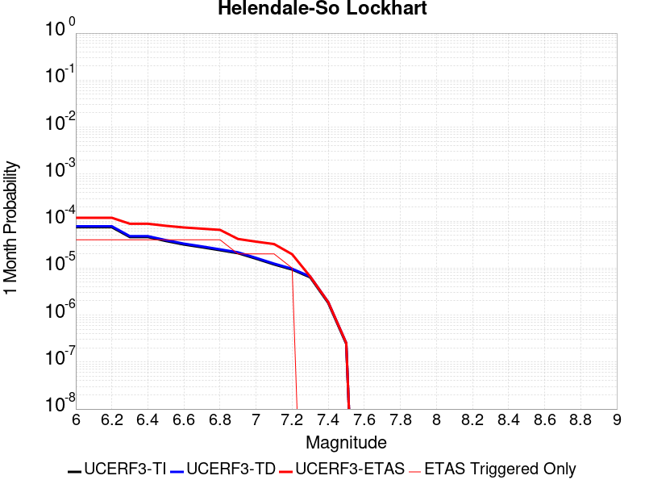 | 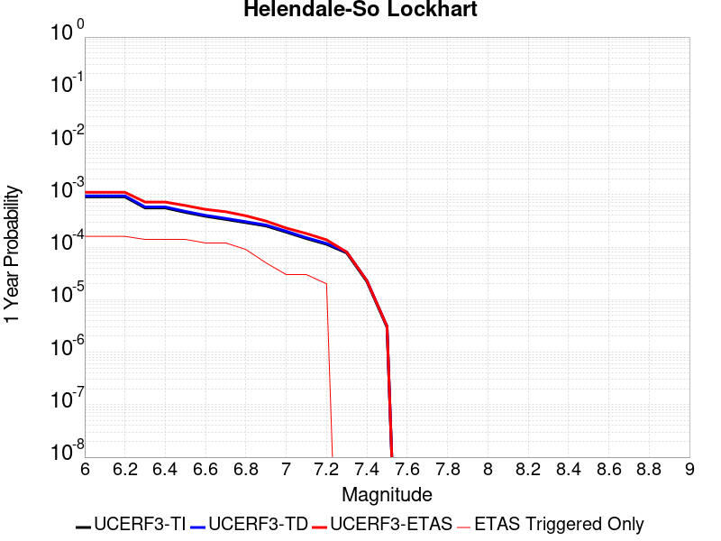 |  |

| Magnitude | 1 wk TI Prob | 1 wk TD Prob | 1 wk ETAS Prob | 1 wk ETAS/TD Gain | 1 wk ETAS Triggered Only | 1 mo TI Prob | 1 mo TD Prob | 1 mo ETAS Prob | 1 mo ETAS/TD Gain | 1 mo ETAS Triggered Only | 1 yr TI Prob | 1 yr TD Prob | 1 yr ETAS Prob | 1 yr ETAS/TD Gain | 1 yr ETAS Triggered Only | 10 yr TI Prob | 10 yr TD Prob | 10 yr ETAS Prob | 10 yr ETAS/TD Gain | 10 yr ETAS Triggered Only |
|-----|-----|-----|-----|-----|-----|-----|-----|-----|-----|-----|-----|-----|-----|-----|-----|-----|-----|-----|-----|-----|
| 6.0 | 1.7296055E-5 | 1.810418E-5 | 4.8103637E-5 | 2.657046 | 3.0E-5 | 7.412385E-5 | 7.7587145E-5 | 1.17584044E-4 | 1.5155094 | 4.0E-5 | 9.0208417E-4 | 9.442349E-4 | 0.0011040838 | 1.1692894 | 1.6E-4 | 0.008984311 | 0.009404349 | 0.009632186 | 1.0242268 | 2.3E-4 |
| 6.1 | 1.7296055E-5 | 1.810418E-5 | 4.8103637E-5 | 2.657046 | 3.0E-5 | 7.412385E-5 | 7.7587145E-5 | 1.17584044E-4 | 1.5155094 | 4.0E-5 | 9.0208417E-4 | 9.442349E-4 | 0.0011040838 | 1.1692894 | 1.6E-4 | 0.008984311 | 0.009404349 | 0.009632186 | 1.0242268 | 2.3E-4 |
| 6.2 | 1.7296055E-5 | 1.810418E-5 | 4.8103637E-5 | 2.657046 | 3.0E-5 | 7.412385E-5 | 7.7587145E-5 | 1.17584044E-4 | 1.5155094 | 4.0E-5 | 9.0208417E-4 | 9.442349E-4 | 0.0011040838 | 1.1692894 | 1.6E-4 | 0.008984311 | 0.009404349 | 0.009632186 | 1.0242268 | 2.3E-4 |
| 6.3 | 1.0669118E-5 | 1.1135683E-5 | 4.113535E-5 | 3.6940122 | 3.0E-5 | 4.5723988E-5 | 4.7723497E-5 | 8.7721586E-5 | 1.8381215 | 4.0E-5 | 5.5654737E-4 | 5.808815E-4 | 7.208002E-4 | 1.240873 | 1.4E-4 | 0.0055515557 | 0.0057939277 | 0.005982827 | 1.0326029 | 1.9E-4 |
| 6.4 | 1.0669118E-5 | 1.1135683E-5 | 4.113535E-5 | 3.6940122 | 3.0E-5 | 4.5723988E-5 | 4.7723497E-5 | 8.7721586E-5 | 1.8381215 | 4.0E-5 | 5.5654737E-4 | 5.808815E-4 | 7.208002E-4 | 1.240873 | 1.4E-4 | 0.0055515557 | 0.0057939277 | 0.005982827 | 1.0326029 | 1.9E-4 |
| 6.5 | 8.790038E-6 | 9.170408E-6 | 3.9170132E-5 | 4.2713623 | 3.0E-5 | 3.767105E-5 | 3.930116E-5 | 7.929959E-5 | 2.0177417 | 4.0E-5 | 4.585485E-4 | 4.7838816E-4 | 6.183212E-4 | 1.2925094 | 1.4E-4 | 0.0045760344 | 0.0047737476 | 0.0049528885 | 1.0375262 | 1.8E-4 |
| 6.6 | 7.396949E-6 | 7.715714E-6 | 3.7715483E-5 | 4.8881392 | 3.0E-5 | 3.1700827E-5 | 3.306693E-5 | 7.306561E-5 | 2.2096279 | 4.0E-5 | 3.858892E-4 | 4.025165E-4 | 5.2246824E-4 | 1.2980044 | 1.2E-4 | 0.003852198 | 0.0040179817 | 0.004167379 | 1.0371822 | 1.5E-4 |
| 6.7 | 6.4600285E-6 | 6.738185E-6 | 3.6737983E-5 | 5.4522076 | 3.0E-5 | 2.7685543E-5 | 2.8877621E-5 | 6.887646E-5 | 2.3851156 | 4.0E-5 | 3.3701936E-4 | 3.515291E-4 | 4.714869E-4 | 1.3412458 | 1.2E-4 | 0.0033650869 | 0.003509812 | 0.0036592856 | 1.0425873 | 1.5E-4 |
| 6.8 | 5.600104E-6 | 5.8361397E-6 | 3.5835965E-5 | 6.140354 | 3.0E-5 | 2.4000226E-5 | 2.5011792E-5 | 6.501079E-5 | 2.5992057 | 4.0E-5 | 2.9216358E-4 | 3.0447662E-4 | 3.9444922E-4 | 1.2954992 | 9.0E-5 | 0.0029177975 | 0.003040656 | 0.0031602911 | 1.0393451 | 1.2E-4 |
| 6.9 | 4.839122E-6 | 5.03962E-6 | 2.5039519E-5 | 4.968533 | 2.0E-5 | 2.0738931E-5 | 2.1598196E-5 | 4.1597763E-5 | 1.9259833 | 2.0E-5 | 2.5246723E-4 | 2.6292677E-4 | 3.1291362E-4 | 1.190117 | 5.0E-5 | 0.002521806 | 0.0026262044 | 0.0026960205 | 1.0265844 | 7.0E-5 |
| 7.0 | 3.6937633E-6 | 3.8452918E-6 | 2.3845214E-5 | 6.201146 | 2.0E-5 | 1.5830317E-5 | 1.6479718E-5 | 3.647939E-5 | 2.213593 | 2.0E-5 | 1.9271708E-4 | 2.0062242E-4 | 2.306164E-4 | 1.1495047 | 3.0E-5 | 0.0019255003 | 0.0020044446 | 0.0020443643 | 1.0199157 | 4.0E-5 |
| 7.1 | 2.7858857E-6 | 2.8979157E-6 | 2.2897857E-5 | 7.901492 | 2.0E-5 | 1.1939455E-5 | 1.241958E-5 | 3.241933E-5 | 2.6103404 | 2.0E-5 | 1.4535317E-4 | 1.5119811E-4 | 1.8119358E-4 | 1.1983851 | 3.0E-5 | 0.0014525814 | 0.0015109739 | 0.0015509136 | 1.026433 | 4.0E-5 |
| 7.2 | 2.1672065E-6 | 2.2540607E-6 | 1.2254038E-5 | 5.4364276 | 1.0E-5 | 9.2879945E-6 | 9.660225E-6 | 1.9660129E-5 | 2.0351624 | 1.0E-5 | 1.1307546E-4 | 1.1760708E-4 | 1.3760473E-4 | 1.1700377 | 2.0E-5 | 0.0011301794 | 0.0011754666 | 0.0012054313 | 1.0254918 | 3.0E-5 |
| 7.3 | 1.4823496E-6 | 1.5422432E-6 | 1.5422432E-6 | 1.0 | 0.0 | 6.3529114E-6 | 6.609598E-6 | 6.609598E-6 | 1.0 | 0.0 | 7.734395E-5 | 8.0469035E-5 | 8.0469035E-5 | 1.0 | 0.0 | 7.731704E-4 | 8.044141E-4 | 8.044141E-4 | 1.0 | 0.0 |
| 7.4 | 4.2321457E-7 | 4.4109754E-7 | 4.4109754E-7 | 1.0 | 0.0 | 1.8137755E-6 | 1.8904169E-6 | 1.8904169E-6 | 1.0 | 0.0 | 2.2082493E-5 | 2.301563E-5 | 2.301563E-5 | 1.0 | 0.0 | 2.2080299E-4 | 2.3013698E-4 | 2.3013698E-4 | 1.0 | 0.0 |
| 7.5 | 5.6942316E-8 | 5.9417015E-8 | 5.9417015E-8 | 1.0 | 0.0 | 2.440385E-7 | 2.5464433E-7 | 2.5464433E-7 | 1.0 | 0.0 | 2.9711643E-6 | 3.100291E-6 | 3.100291E-6 | 1.0 | 0.0 | 2.9711247E-5 | 3.1002557E-5 | 3.1002557E-5 | 1.0 | 0.0 |

## San Andreas (Parkfield)
*[(top)](#table-of-contents)*

| 1 Week | 1 Month | 1 Year | 10 Year |
|-----|-----|-----|-----|
|  |  |  |  |

| Magnitude | 1 wk TI Prob | 1 wk TD Prob | 1 wk ETAS Prob | 1 wk ETAS/TD Gain | 1 wk ETAS Triggered Only | 1 mo TI Prob | 1 mo TD Prob | 1 mo ETAS Prob | 1 mo ETAS/TD Gain | 1 mo ETAS Triggered Only | 1 yr TI Prob | 1 yr TD Prob | 1 yr ETAS Prob | 1 yr ETAS/TD Gain | 1 yr ETAS Triggered Only | 10 yr TI Prob | 10 yr TD Prob | 10 yr ETAS Prob | 10 yr ETAS/TD Gain | 10 yr ETAS Triggered Only |
|-----|-----|-----|-----|-----|-----|-----|-----|-----|-----|-----|-----|-----|-----|-----|-----|-----|-----|-----|-----|-----|
| 6.0 | 5.556969E-4 | 7.8200514E-4 | 8.119817E-4 | 1.0383329 | 3.0E-5 | 0.0023793848 | 0.003347701 | 0.0033875671 | 1.0119085 | 4.0E-5 | 0.028586963 | 0.040345885 | 0.04045145 | 1.0026164 | 1.1E-4 | 0.25176284 | 0.3377101 | 0.33784255 | 1.0003922 | 2.0E-4 |
| 6.1 | 1.925858E-4 | 3.0395915E-4 | 3.1395612E-4 | 1.0328891 | 1.0E-5 | 8.2510663E-4 | 0.0013021269 | 0.0013121138 | 1.0076697 | 1.0E-5 | 0.0099994885 | 0.015831968 | 0.015881177 | 1.0031081 | 5.0E-5 | 0.095613256 | 0.14996985 | 0.15004635 | 1.0005101 | 9.0E-5 |
| 6.2 | 9.4306815E-5 | 1.8274323E-4 | 1.9274141E-4 | 1.0547116 | 1.0E-5 | 4.0410945E-4 | 7.829515E-4 | 7.9294364E-4 | 1.0127622 | 1.0E-5 | 0.0049089384 | 0.009490968 | 0.009530588 | 1.0041746 | 4.0E-5 | 0.048019063 | 0.09199097 | 0.092063606 | 1.0007896 | 8.0E-5 |
| 6.3 | 9.283051E-5 | 1.7970752E-4 | 1.8970574E-4 | 1.0556359 | 1.0E-5 | 3.9778434E-4 | 7.69949E-4 | 7.799413E-4 | 1.0129778 | 1.0E-5 | 0.0048322747 | 0.009334031 | 0.0093736565 | 1.0042454 | 4.0E-5 | 0.047285385 | 0.090643644 | 0.09071639 | 1.0008026 | 8.0E-5 |
| 6.4 | 9.138826E-5 | 1.7732776E-4 | 1.8732599E-4 | 1.0563828 | 1.0E-5 | 3.916052E-4 | 7.5975596E-4 | 7.6974835E-4 | 1.0131521 | 1.0E-5 | 0.0047573745 | 0.009210981 | 0.009250613 | 1.0043026 | 4.0E-5 | 0.046568092 | 0.08954158 | 0.08961441 | 1.0008135 | 8.0E-5 |
| 6.5 | 9.000255E-5 | 1.749061E-4 | 1.8490435E-4 | 1.0571635 | 1.0E-5 | 3.8566816E-4 | 7.493834E-4 | 7.593759E-4 | 1.0133343 | 1.0E-5 | 0.0046854047 | 0.009085771 | 0.0091154985 | 1.0032718 | 3.0E-5 | 0.045878403 | 0.08842976 | 0.08849356 | 1.0007216 | 7.0E-5 |
| 6.6 | 8.8109264E-5 | 1.7171387E-4 | 1.8171214E-4 | 1.0582265 | 1.0E-5 | 3.7755648E-4 | 7.3571014E-4 | 7.4570277E-4 | 1.0135823 | 1.0E-5 | 0.0045870654 | 0.008920688 | 0.00895042 | 1.003333 | 3.0E-5 | 0.04493529 | 0.08695953 | 0.087023444 | 1.0007349 | 7.0E-5 |
| 6.7 | 8.738073E-5 | 1.7038376E-4 | 1.8038206E-4 | 1.058681 | 1.0E-5 | 3.7443507E-4 | 7.3001295E-4 | 7.4000563E-4 | 1.0136884 | 1.0E-5 | 0.0045492216 | 0.0088519445 | 0.008881679 | 1.0033591 | 3.0E-5 | 0.04457213 | 0.086359605 | 0.08642356 | 1.0007405 | 7.0E-5 |
| 6.8 | 8.710195E-5 | 1.698381E-4 | 1.798364E-4 | 1.0588696 | 1.0E-5 | 3.7324068E-4 | 7.276757E-4 | 7.3766836E-4 | 1.0137324 | 1.0E-5 | 0.0045347405 | 0.008823725 | 0.008853461 | 1.0033699 | 3.0E-5 | 0.04443313 | 0.08610701 | 0.08617098 | 1.0007429 | 7.0E-5 |
| 6.9 | 8.6801556E-5 | 1.6924697E-4 | 1.7924528E-4 | 1.0590752 | 1.0E-5 | 3.7195362E-4 | 7.251437E-4 | 7.3513645E-4 | 1.0137804 | 1.0E-5 | 0.0045191357 | 0.008793148 | 0.008822884 | 1.0033817 | 3.0E-5 | 0.044283327 | 0.085832745 | 0.08589673 | 1.0007455 | 7.0E-5 |
| 7.0 | 8.5571606E-5 | 1.6677282E-4 | 1.7677115E-4 | 1.0599518 | 1.0E-5 | 3.6668387E-4 | 7.14546E-4 | 7.2453887E-4 | 1.0139849 | 1.0E-5 | 0.004455241 | 0.008665155 | 0.008694895 | 1.0034322 | 3.0E-5 | 0.043669727 | 0.084680066 | 0.08474413 | 1.0007566 | 7.0E-5 |
| 7.1 | 7.82589E-5 | 1.5156982E-4 | 1.6156831E-4 | 1.0659662 | 1.0E-5 | 3.3535215E-4 | 6.4942404E-4 | 6.5941754E-4 | 1.0153883 | 1.0E-5 | 0.0040752706 | 0.007878244 | 0.007908007 | 1.003778 | 3.0E-5 | 0.040013418 | 0.07759189 | 0.07764723 | 1.0007132 | 6.0E-5 |
| 7.2 | 7.690929E-5 | 1.4894054E-4 | 1.5893906E-4 | 1.0671309 | 1.0E-5 | 3.2956956E-4 | 6.381612E-4 | 6.481548E-4 | 1.01566 | 1.0E-5 | 0.004005129 | 0.007742101 | 0.0077718687 | 1.003845 | 3.0E-5 | 0.0393371 | 0.07636437 | 0.076419786 | 1.0007257 | 6.0E-5 |
| 7.3 | 7.5543794E-5 | 1.4590233E-4 | 1.5590088E-4 | 1.068529 | 1.0E-5 | 3.2371894E-4 | 6.251466E-4 | 6.3514034E-4 | 1.0159862 | 1.0E-5 | 0.003934157 | 0.0075847614 | 0.007614534 | 1.0039253 | 3.0E-5 | 0.038652334 | 0.07492845 | 0.07498395 | 1.0007408 | 6.0E-5 |
| 7.4 | 7.4214564E-5 | 1.4290822E-4 | 1.5290678E-4 | 1.069965 | 1.0E-5 | 3.1802364E-4 | 6.123207E-4 | 6.2231463E-4 | 1.0163213 | 1.0E-5 | 0.003865065 | 0.0074296813 | 0.0074594584 | 1.0040078 | 3.0E-5 | 0.03798529 | 0.07350102 | 0.07355661 | 1.0007563 | 6.0E-5 |
| 7.5 | 6.149578E-5 | 1.1214689E-4 | 1.2214576E-4 | 1.0891588 | 1.0E-5 | 2.6352672E-4 | 4.805411E-4 | 4.905363E-4 | 1.0207999 | 1.0E-5 | 0.0032037178 | 0.005834925 | 0.0058548083 | 1.0034076 | 2.0E-5 | 0.03157923 | 0.058674183 | 0.05872125 | 1.0008022 | 5.0E-5 |
| 7.6 | 6.0643448E-5 | 1.1043109E-4 | 1.20429984E-4 | 1.0905442 | 1.0E-5 | 2.598746E-4 | 4.7319033E-4 | 4.831856E-4 | 1.0211232 | 1.0E-5 | 0.0031593828 | 0.0057459055 | 0.0057657906 | 1.0034608 | 2.0E-5 | 0.031148417 | 0.057834256 | 0.057881363 | 1.0008146 | 5.0E-5 |
| 7.7 | 5.1652263E-5 | 9.1959046E-5 | 1.01958125E-4 | 1.108734 | 1.0E-5 | 2.2134806E-4 | 3.940507E-4 | 4.0404673E-4 | 1.0253675 | 1.0E-5 | 0.002691582 | 0.0047870236 | 0.004806928 | 1.004158 | 2.0E-5 | 0.026592141 | 0.04863762 | 0.04868519 | 1.000978 | 5.0E-5 |
| 7.8 | 4.8090482E-5 | 8.5791486E-5 | 9.579063E-5 | 1.1165516 | 1.0E-5 | 2.060858E-4 | 3.67626E-4 | 3.7762232E-4 | 1.0271915 | 1.0E-5 | 0.0025062072 | 0.004466669 | 0.00448658 | 1.0044576 | 2.0E-5 | 0.024781305 | 0.045395855 | 0.045443587 | 1.0010514 | 5.0E-5 |
| 7.9 | 3.970278E-5 | 6.765535E-5 | 7.765467E-5 | 1.147798 | 1.0E-5 | 1.7014367E-4 | 2.899193E-4 | 2.999164E-4 | 1.0344824 | 1.0E-5 | 0.002069531 | 0.003524058 | 0.0035439876 | 1.0056553 | 2.0E-5 | 0.020503636 | 0.035954855 | 0.036003057 | 1.0013406 | 5.0E-5 |
| 8.0 | 2.8982335E-5 | 4.0792085E-5 | 5.0791677E-5 | 1.2451355 | 1.0E-5 | 1.2420409E-4 | 1.748115E-4 | 1.8480976E-4 | 1.0571945 | 1.0E-5 | 0.0015111357 | 0.002126254 | 0.0021362326 | 1.0046932 | 1.0E-5 | 0.015009012 | 0.022058146 | 0.022077704 | 1.0008867 | 2.0E-5 |
| 8.1 | 1.8836186E-5 | 1.8732435E-5 | 2.8732247E-5 | 1.5338234 | 1.0E-5 | 8.0724014E-5 | 8.02794E-5 | 9.02786E-5 | 1.124555 | 1.0E-5 | 9.823717E-4 | 9.76964E-4 | 9.869542E-4 | 1.0102258 | 1.0E-5 | 0.009780403 | 0.010515128 | 0.010525024 | 1.000941 | 1.0E-5 |
| 8.2 | 8.643924E-6 | 5.494016E-6 | 5.494016E-6 | 1.0 | 0.0 | 3.704486E-5 | 2.3545572E-5 | 2.3545572E-5 | 1.0 | 0.0 | 4.5092785E-4 | 2.866297E-4 | 2.866297E-4 | 1.0 | 0.0 | 0.0045001395 | 0.0032592218 | 0.0032592218 | 1.0 | 0.0 |
| 8.3 | 1.983087E-6 | 7.690063E-7 | 7.690063E-7 | 1.0 | 0.0 | 8.498917E-6 | 3.295737E-6 | 3.295737E-6 | 1.0 | 0.0 | 1.034694E-4 | 4.012488E-5 | 4.012488E-5 | 1.0 | 0.0 | 0.0010342124 | 4.737206E-4 | 4.737206E-4 | 1.0 | 0.0 |

## San Andreas (San Bernardino S)
*[(top)](#table-of-contents)*

| 1 Week | 1 Month | 1 Year | 10 Year |
|-----|-----|-----|-----|
|  |  |  |  |

| Magnitude | 1 wk TI Prob | 1 wk TD Prob | 1 wk ETAS Prob | 1 wk ETAS/TD Gain | 1 wk ETAS Triggered Only | 1 mo TI Prob | 1 mo TD Prob | 1 mo ETAS Prob | 1 mo ETAS/TD Gain | 1 mo ETAS Triggered Only | 1 yr TI Prob | 1 yr TD Prob | 1 yr ETAS Prob | 1 yr ETAS/TD Gain | 1 yr ETAS Triggered Only | 10 yr TI Prob | 10 yr TD Prob | 10 yr ETAS Prob | 10 yr ETAS/TD Gain | 10 yr ETAS Triggered Only |
|-----|-----|-----|-----|-----|-----|-----|-----|-----|-----|-----|-----|-----|-----|-----|-----|-----|-----|-----|-----|-----|
| 6.0 | 1.2336002E-4 | 3.0025674E-4 | 3.0025674E-4 | 1.0 | 0.0 | 5.2857865E-4 | 0.0012862061 | 0.0013061804 | 1.0155296 | 2.0E-5 | 0.006416472 | 0.015552082 | 0.015670216 | 1.007596 | 1.2E-4 | 0.06234337 | 0.14278531 | 0.14295675 | 1.0012007 | 2.0E-4 |
| 6.1 | 1.2336002E-4 | 3.0025674E-4 | 3.0025674E-4 | 1.0 | 0.0 | 5.2857865E-4 | 0.0012862061 | 0.0013061804 | 1.0155296 | 2.0E-5 | 0.006416472 | 0.015552082 | 0.015670216 | 1.007596 | 1.2E-4 | 0.06234337 | 0.14278531 | 0.14295675 | 1.0012007 | 2.0E-4 |
| 6.2 | 1.2336002E-4 | 3.0025674E-4 | 3.0025674E-4 | 1.0 | 0.0 | 5.2857865E-4 | 0.0012862061 | 0.0013061804 | 1.0155296 | 2.0E-5 | 0.006416472 | 0.015552082 | 0.015670216 | 1.007596 | 1.2E-4 | 0.06234337 | 0.14278531 | 0.14295675 | 1.0012007 | 2.0E-4 |
| 6.3 | 1.1712257E-4 | 2.8813703E-4 | 2.8813703E-4 | 1.0 | 0.0 | 5.018573E-4 | 0.0012343143 | 0.0012542896 | 1.0161834 | 2.0E-5 | 0.006093008 | 0.014929076 | 0.015047284 | 1.007918 | 1.2E-4 | 0.059286322 | 0.13748851 | 0.13766101 | 1.0012547 | 2.0E-4 |
| 6.4 | 1.1712257E-4 | 2.8813703E-4 | 2.8813703E-4 | 1.0 | 0.0 | 5.018573E-4 | 0.0012343143 | 0.0012542896 | 1.0161834 | 2.0E-5 | 0.006093008 | 0.014929076 | 0.015047284 | 1.007918 | 1.2E-4 | 0.059286322 | 0.13748851 | 0.13766101 | 1.0012547 | 2.0E-4 |
| 6.5 | 1.0689076E-4 | 2.6826185E-4 | 2.6826185E-4 | 1.0 | 0.0 | 4.5802278E-4 | 0.0011492119 | 0.0011691889 | 1.0173832 | 2.0E-5 | 0.0055621783 | 0.013906514 | 0.014024845 | 1.008509 | 1.2E-4 | 0.05425003 | 0.12872604 | 0.12890029 | 1.0013537 | 2.0E-4 |
| 6.6 | 9.7648895E-5 | 2.5070578E-4 | 2.5070578E-4 | 1.0 | 0.0 | 4.1842813E-4 | 0.0010740346 | 0.0010940131 | 1.0186014 | 2.0E-5 | 0.005082469 | 0.013002338 | 0.013110908 | 1.00835 | 1.1E-4 | 0.049677886 | 0.120901346 | 0.12106838 | 1.0013815 | 1.9E-4 |
| 6.7 | 8.757013E-5 | 2.3141113E-4 | 2.3141113E-4 | 1.0 | 0.0 | 3.7524657E-4 | 9.914073E-4 | 0.0010113874 | 1.0201533 | 2.0E-5 | 0.00455906 | 0.0120076705 | 0.01210647 | 1.0082281 | 1.0E-4 | 0.04466656 | 0.11218169 | 0.11233262 | 1.0013454 | 1.7E-4 |
| 6.8 | 8.562978E-5 | 2.270081E-4 | 2.270081E-4 | 1.0 | 0.0 | 3.6693315E-4 | 9.7255135E-4 | 9.925319E-4 | 1.0205444 | 2.0E-5 | 0.004458263 | 0.011780596 | 0.011879419 | 1.0083885 | 1.0E-4 | 0.043698758 | 0.1101955 | 0.110346764 | 1.0013727 | 1.7E-4 |
| 6.9 | 6.124075E-5 | 1.7083176E-4 | 1.7083176E-4 | 1.0 | 0.0 | 2.6243398E-4 | 7.319315E-4 | 7.5191684E-4 | 1.027305 | 2.0E-5 | 0.0031904527 | 0.008875063 | 0.008964264 | 1.0100508 | 9.0E-5 | 0.031450346 | 0.084271915 | 0.08441844 | 1.0017387 | 1.6E-4 |
| 7.0 | 5.8598747E-5 | 1.6512029E-4 | 1.6512029E-4 | 1.0 | 0.0 | 2.5111332E-4 | 7.0746726E-4 | 7.274531E-4 | 1.0282499 | 2.0E-5 | 0.0030530186 | 0.008579592 | 0.0086589055 | 1.0092444 | 8.0E-5 | 0.03011414 | 0.08158445 | 0.081722215 | 1.0016886 | 1.5E-4 |
| 7.1 | 5.613814E-5 | 1.5930375E-4 | 1.5930375E-4 | 1.0 | 0.0 | 2.4056983E-4 | 6.8255246E-4 | 7.0253876E-4 | 1.0292817 | 2.0E-5 | 0.0029250039 | 0.008278593 | 0.008348014 | 1.0083855 | 7.0E-5 | 0.028868021 | 0.07888606 | 0.07901502 | 1.0016347 | 1.4E-4 |
| 7.2 | 4.991222E-5 | 1.4536385E-4 | 1.4536385E-4 | 1.0 | 0.0 | 2.1389198E-4 | 6.2283955E-4 | 6.4282713E-4 | 1.032091 | 2.0E-5 | 0.002601025 | 0.007556809 | 0.00762628 | 1.0091932 | 7.0E-5 | 0.025707912 | 0.07233381 | 0.072463684 | 1.0017955 | 1.4E-4 |
| 7.3 | 4.7410045E-5 | 1.373025E-4 | 1.373025E-4 | 1.0 | 0.0 | 2.0317009E-4 | 5.883069E-4 | 6.082952E-4 | 1.0339758 | 2.0E-5 | 0.0024707897 | 0.0071392 | 0.0072087 | 1.009735 | 7.0E-5 | 0.024434982 | 0.06861141 | 0.068741806 | 1.0019004 | 1.4E-4 |
| 7.4 | 4.5556746E-5 | 1.3137884E-4 | 1.3137884E-4 | 1.0 | 0.0 | 1.952286E-4 | 5.62931E-4 | 5.8291975E-4 | 1.0355083 | 2.0E-5 | 0.002374317 | 0.006832226 | 0.0069017475 | 1.0101756 | 7.0E-5 | 0.023491086 | 0.06586029 | 0.06599107 | 1.0019857 | 1.4E-4 |
| 7.5 | 4.3084514E-5 | 1.2372872E-4 | 1.2372872E-4 | 1.0 | 0.0 | 1.8463485E-4 | 5.3015846E-4 | 5.5014784E-4 | 1.0377046 | 2.0E-5 | 0.0022456115 | 0.006435648 | 0.006505198 | 1.0108069 | 7.0E-5 | 0.022230545 | 0.06225957 | 0.062390856 | 1.0021087 | 1.4E-4 |
| 7.6 | 3.408608E-5 | 9.849839E-5 | 9.849839E-5 | 1.0 | 0.0 | 1.4607502E-4 | 4.2206777E-4 | 4.3206356E-4 | 1.0236828 | 1.0E-5 | 0.0017770125 | 0.005126593 | 0.005186286 | 1.0116436 | 6.0E-5 | 0.017628696 | 0.050086122 | 0.05020961 | 1.0024655 | 1.3E-4 |
| 7.7 | 2.8315713E-5 | 8.262102E-5 | 8.262102E-5 | 1.0 | 0.0 | 1.2134742E-4 | 3.5404207E-4 | 3.640385E-4 | 1.0282352 | 1.0E-5 | 0.0014764034 | 0.0043019517 | 0.0043616937 | 1.0138872 | 6.0E-5 | 0.01466633 | 0.042333513 | 0.04245801 | 1.0029409 | 1.3E-4 |
| 7.8 | 2.6222975E-5 | 7.4756E-5 | 7.4756E-5 | 1.0 | 0.0 | 1.1237934E-4 | 3.203435E-4 | 3.3034032E-4 | 1.0312065 | 1.0E-5 | 0.0013673597 | 0.0038932136 | 0.00395298 | 1.0153514 | 6.0E-5 | 0.013589768 | 0.038495146 | 0.03862014 | 1.003247 | 1.3E-4 |
| 7.9 | 2.1469694E-5 | 5.7982703E-5 | 5.7982703E-5 | 1.0 | 0.0 | 9.200973E-5 | 2.4847363E-4 | 2.5847115E-4 | 1.0402358 | 1.0E-5 | 0.0011196428 | 0.003020973 | 0.0030807918 | 1.0198011 | 6.0E-5 | 0.011140184 | 0.030201301 | 0.030327374 | 1.0041745 | 1.3E-4 |
| 8.0 | 1.2420249E-5 | 3.1376432E-5 | 3.1376432E-5 | 1.0 | 0.0 | 5.322855E-5 | 1.344635E-4 | 1.4446214E-4 | 1.0743597 | 1.0E-5 | 6.478649E-4 | 0.0016358647 | 0.0016658156 | 1.0183089 | 3.0E-5 | 0.0064597935 | 0.016549915 | 0.016608922 | 1.0035654 | 6.0E-5 |
| 8.1 | 4.9197724E-6 | 7.842547E-6 | 7.842547E-6 | 1.0 | 0.0 | 2.1084568E-5 | 3.3610482E-5 | 3.3610482E-5 | 1.0 | 0.0 | 2.566744E-4 | 4.0913094E-4 | 4.0913094E-4 | 1.0 | 0.0 | 0.002563781 | 0.0043946104 | 0.0043946104 | 1.0 | 0.0 |
| 8.2 | 2.5634774E-6 | 2.915849E-6 | 2.915849E-6 | 1.0 | 0.0 | 1.0986286E-5 | 1.2496436E-5 | 1.2496436E-5 | 1.0 | 0.0 | 1.3374983E-4 | 1.5213354E-4 | 1.5213354E-4 | 1.0 | 0.0 | 0.0013366934 | 0.0017097751 | 0.0017097751 | 1.0 | 0.0 |
| 8.3 | 5.2850464E-7 | 3.2203224E-7 | 3.2203224E-7 | 1.0 | 0.0 | 2.2650179E-6 | 1.3801375E-6 | 1.3801375E-6 | 1.0 | 0.0 | 2.7576245E-5 | 1.6803056E-5 | 1.6803056E-5 | 1.0 | 0.0 | 2.7572823E-4 | 1.9934843E-4 | 1.9934843E-4 | 1.0 | 0.0 |

## Sierra Nevada  (No Extension)
*[(top)](#table-of-contents)*

| 1 Week | 1 Month | 1 Year | 10 Year |
|-----|-----|-----|-----|
|  |  | 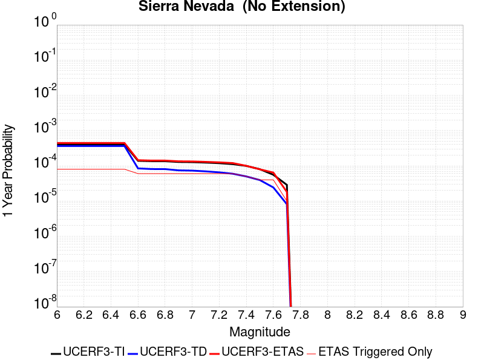 |  |

| Magnitude | 1 wk TI Prob | 1 wk TD Prob | 1 wk ETAS Prob | 1 wk ETAS/TD Gain | 1 wk ETAS Triggered Only | 1 mo TI Prob | 1 mo TD Prob | 1 mo ETAS Prob | 1 mo ETAS/TD Gain | 1 mo ETAS Triggered Only | 1 yr TI Prob | 1 yr TD Prob | 1 yr ETAS Prob | 1 yr ETAS/TD Gain | 1 yr ETAS Triggered Only | 10 yr TI Prob | 10 yr TD Prob | 10 yr ETAS Prob | 10 yr ETAS/TD Gain | 10 yr ETAS Triggered Only |
|-----|-----|-----|-----|-----|-----|-----|-----|-----|-----|-----|-----|-----|-----|-----|-----|-----|-----|-----|-----|-----|
| 6.0 | 7.7690465E-6 | 6.9765347E-6 | 6.9765347E-6 | 1.0 | 0.0 | 3.329549E-5 | 2.9899295E-5 | 3.9898994E-5 | 1.3344461 | 1.0E-5 | 4.0529718E-4 | 3.6399896E-4 | 4.4396982E-4 | 1.2197008 | 8.0E-5 | 0.004045588 | 0.0036375436 | 0.0038268527 | 1.0520431 | 1.9E-4 |
| 6.1 | 7.7690465E-6 | 6.9765347E-6 | 6.9765347E-6 | 1.0 | 0.0 | 3.329549E-5 | 2.9899295E-5 | 3.9898994E-5 | 1.3344461 | 1.0E-5 | 4.0529718E-4 | 3.6399896E-4 | 4.4396982E-4 | 1.2197008 | 8.0E-5 | 0.004045588 | 0.0036375436 | 0.0038268527 | 1.0520431 | 1.9E-4 |
| 6.2 | 7.7690465E-6 | 6.9765347E-6 | 6.9765347E-6 | 1.0 | 0.0 | 3.329549E-5 | 2.9899295E-5 | 3.9898994E-5 | 1.3344461 | 1.0E-5 | 4.0529718E-4 | 3.6399896E-4 | 4.4396982E-4 | 1.2197008 | 8.0E-5 | 0.004045588 | 0.0036375436 | 0.0038268527 | 1.0520431 | 1.9E-4 |
| 6.3 | 7.7690465E-6 | 6.9765347E-6 | 6.9765347E-6 | 1.0 | 0.0 | 3.329549E-5 | 2.9899295E-5 | 3.9898994E-5 | 1.3344461 | 1.0E-5 | 4.0529718E-4 | 3.6399896E-4 | 4.4396982E-4 | 1.2197008 | 8.0E-5 | 0.004045588 | 0.0036375436 | 0.0038268527 | 1.0520431 | 1.9E-4 |
| 6.4 | 7.7690465E-6 | 6.9765347E-6 | 6.9765347E-6 | 1.0 | 0.0 | 3.329549E-5 | 2.9899295E-5 | 3.9898994E-5 | 1.3344461 | 1.0E-5 | 4.0529718E-4 | 3.6399896E-4 | 4.4396982E-4 | 1.2197008 | 8.0E-5 | 0.004045588 | 0.0036375436 | 0.0038268527 | 1.0520431 | 1.9E-4 |
| 6.5 | 7.7690465E-6 | 6.9765347E-6 | 6.9765347E-6 | 1.0 | 0.0 | 3.329549E-5 | 2.9899295E-5 | 3.9898994E-5 | 1.3344461 | 1.0E-5 | 4.0529718E-4 | 3.6399896E-4 | 4.4396982E-4 | 1.2197008 | 8.0E-5 | 0.004045588 | 0.0036375436 | 0.0038268527 | 1.0520431 | 1.9E-4 |
| 6.6 | 2.653E-6 | 1.6149307E-6 | 1.6149307E-6 | 1.0 | 0.0 | 1.136995E-5 | 6.9211133E-6 | 1.6921043E-5 | 2.4448442 | 1.0E-5 | 1.3842035E-4 | 8.426133E-5 | 1.4425628E-4 | 1.7120104 | 6.0E-5 | 0.0013833415 | 8.422973E-4 | 9.821793E-4 | 1.1660721 | 1.4E-4 |
| 6.7 | 2.5902466E-6 | 1.5502632E-6 | 1.5502632E-6 | 1.0 | 0.0 | 1.11010095E-5 | 6.6439684E-6 | 1.6643902E-5 | 2.5051146 | 1.0E-5 | 1.351464E-4 | 8.0887345E-5 | 1.4088249E-4 | 1.7417125 | 6.0E-5 | 0.0013506424 | 8.08582E-4 | 9.484688E-4 | 1.1730026 | 1.4E-4 |
| 6.8 | 2.5853892E-6 | 1.547063E-6 | 1.547063E-6 | 1.0 | 0.0 | 1.1080193E-5 | 6.630253E-6 | 1.6630187E-5 | 2.508228 | 1.0E-5 | 1.34893E-4 | 8.072037E-5 | 1.4071552E-4 | 1.7432468 | 6.0E-5 | 0.0013481114 | 8.069135E-4 | 9.468005E-4 | 1.1733606 | 1.4E-4 |
| 6.9 | 2.458257E-6 | 1.4221347E-6 | 1.4221347E-6 | 1.0 | 0.0 | 1.0535345E-5 | 6.094849E-6 | 1.6094787E-5 | 2.6407197 | 1.0E-5 | 1.2826028E-4 | 7.4202275E-5 | 1.3419782E-4 | 1.8085405 | 6.0E-5 | 0.0012818627 | 7.41777E-4 | 8.816731E-4 | 1.188596 | 1.4E-4 |
| 7.0 | 2.4341468E-6 | 1.3990981E-6 | 1.3990981E-6 | 1.0 | 0.0 | 1.0432016E-5 | 5.9961208E-6 | 1.599606E-5 | 2.6677349 | 1.0E-5 | 1.270024E-4 | 7.3000345E-5 | 1.3299596E-4 | 1.8218539 | 6.0E-5 | 0.0012692984 | 7.2976557E-4 | 8.696634E-4 | 1.1917025 | 1.4E-4 |
| 7.1 | 2.3652476E-6 | 1.3340461E-6 | 1.3340461E-6 | 1.0 | 0.0 | 1.0136736E-5 | 5.717328E-6 | 1.571727E-5 | 2.7490587 | 1.0E-5 | 1.2340778E-4 | 6.960626E-5 | 1.2960208E-4 | 1.8619314 | 6.0E-5 | 0.0012333926 | 6.958463E-4 | 8.3574886E-4 | 1.2010539 | 1.4E-4 |
| 7.2 | 2.272158E-6 | 1.2503509E-6 | 1.2503509E-6 | 1.0 | 0.0 | 9.737784E-6 | 5.3586355E-6 | 1.5358582E-5 | 2.8661366 | 1.0E-5 | 1.1855107E-4 | 6.523945E-5 | 1.2523554E-4 | 1.9196289 | 6.0E-5 | 0.0011848784 | 6.522045E-4 | 7.921132E-4 | 1.2145166 | 1.4E-4 |
| 7.3 | 2.1382127E-6 | 1.1420364E-6 | 1.1420364E-6 | 1.0 | 0.0 | 9.163737E-6 | 4.894432E-6 | 1.4894384E-5 | 3.043128 | 1.0E-5 | 1.1156279E-4 | 5.9588092E-5 | 1.1958452E-4 | 2.0068526 | 6.0E-5 | 0.001115068 | 5.9572235E-4 | 7.3563895E-4 | 1.2348688 | 1.4E-4 |
| 7.4 | 1.9048055E-6 | 9.575857E-7 | 9.575857E-7 | 1.0 | 0.0 | 8.163426E-6 | 4.103932E-6 | 1.4103891E-5 | 3.4366775 | 1.0E-5 | 9.9385186E-5 | 4.9964237E-5 | 9.996174E-5 | 2.000666 | 5.0E-5 | 9.934074E-4 | 4.995307E-4 | 6.194708E-4 | 1.2401055 | 1.2E-4 |
| 7.5 | 1.5373403E-6 | 7.5605493E-7 | 7.5605493E-7 | 1.0 | 0.0 | 6.5885843E-6 | 3.2402313E-6 | 1.3240199E-5 | 4.0861893 | 1.0E-5 | 8.021306E-5 | 3.9449107E-5 | 7.944753E-5 | 2.0139246 | 4.0E-5 | 8.0184115E-4 | 3.944215E-4 | 4.9438205E-4 | 1.2534359 | 1.0E-4 |
| 7.6 | 1.0680322E-6 | 4.659972E-7 | 4.659972E-7 | 1.0 | 0.0 | 4.577273E-6 | 1.9971294E-6 | 1.1997109E-5 | 6.007177 | 1.0E-5 | 5.5726876E-5 | 2.431478E-5 | 6.4313805E-5 | 2.6450498 | 4.0E-5 | 5.5712904E-4 | 2.4312147E-4 | 3.330996E-4 | 1.3700954 | 9.0E-5 |
| 7.7 | 5.509146E-7 | 1.5581371E-7 | 1.5581371E-7 | 1.0 | 0.0 | 2.3610605E-6 | 6.677729E-7 | 6.677729E-7 | 1.0 | 0.0 | 2.8745531E-5 | 8.130106E-6 | 1.8130024E-5 | 2.2299862 | 1.0E-5 | 2.8741814E-4 | 8.1298196E-5 | 1.1129576E-4 | 1.3689818 | 3.0E-5 |

## Death Valley (No)
*[(top)](#table-of-contents)*

| 1 Week | 1 Month | 1 Year | 10 Year |
|-----|-----|-----|-----|
|  |  |  |  |

| Magnitude | 1 wk TI Prob | 1 wk TD Prob | 1 wk ETAS Prob | 1 wk ETAS/TD Gain | 1 wk ETAS Triggered Only | 1 mo TI Prob | 1 mo TD Prob | 1 mo ETAS Prob | 1 mo ETAS/TD Gain | 1 mo ETAS Triggered Only | 1 yr TI Prob | 1 yr TD Prob | 1 yr ETAS Prob | 1 yr ETAS/TD Gain | 1 yr ETAS Triggered Only | 10 yr TI Prob | 10 yr TD Prob | 10 yr ETAS Prob | 10 yr ETAS/TD Gain | 10 yr ETAS Triggered Only |
|-----|-----|-----|-----|-----|-----|-----|-----|-----|-----|-----|-----|-----|-----|-----|-----|-----|-----|-----|-----|-----|
| 6.0 | 2.0074807E-5 | 2.2501532E-5 | 3.2501306E-5 | 1.4444041 | 1.0E-5 | 8.603206E-5 | 9.643161E-5 | 1.3642776E-4 | 1.4147617 | 4.0E-5 | 0.001046937 | 0.00117343 | 0.0012433479 | 1.0595841 | 7.0E-5 | 0.010420183 | 0.011673254 | 0.011861036 | 1.0160866 | 1.9E-4 |
| 6.1 | 2.0074807E-5 | 2.2501532E-5 | 3.2501306E-5 | 1.4444041 | 1.0E-5 | 8.603206E-5 | 9.643161E-5 | 1.3642776E-4 | 1.4147617 | 4.0E-5 | 0.001046937 | 0.00117343 | 0.0012433479 | 1.0595841 | 7.0E-5 | 0.010420183 | 0.011673254 | 0.011861036 | 1.0160866 | 1.9E-4 |
| 6.2 | 2.0074807E-5 | 2.2501532E-5 | 3.2501306E-5 | 1.4444041 | 1.0E-5 | 8.603206E-5 | 9.643161E-5 | 1.3642776E-4 | 1.4147617 | 4.0E-5 | 0.001046937 | 0.00117343 | 0.0012433479 | 1.0595841 | 7.0E-5 | 0.010420183 | 0.011673254 | 0.011861036 | 1.0160866 | 1.9E-4 |
| 6.3 | 1.9050609E-5 | 2.1338312E-5 | 3.13381E-5 | 1.4686307 | 1.0E-5 | 8.164292E-5 | 9.1446746E-5 | 1.3144308E-4 | 1.437373 | 4.0E-5 | 9.935491E-4 | 0.0011128022 | 0.0011727355 | 1.0538579 | 6.0E-5 | 0.009891188 | 0.011073124 | 0.01125113 | 1.0160756 | 1.8E-4 |
| 6.4 | 1.9050609E-5 | 2.1338312E-5 | 3.13381E-5 | 1.4686307 | 1.0E-5 | 8.164292E-5 | 9.1446746E-5 | 1.3144308E-4 | 1.437373 | 4.0E-5 | 9.935491E-4 | 0.0011128022 | 0.0011727355 | 1.0538579 | 6.0E-5 | 0.009891188 | 0.011073124 | 0.01125113 | 1.0160756 | 1.8E-4 |
| 6.5 | 1.8367004E-5 | 2.0562318E-5 | 3.056211E-5 | 1.4863164 | 1.0E-5 | 7.8713354E-5 | 8.812128E-5 | 1.2811775E-4 | 1.4538798 | 4.0E-5 | 9.5791375E-4 | 0.0010723551 | 0.0011322907 | 1.0558916 | 6.0E-5 | 0.009537951 | 0.010672592 | 0.010840777 | 1.0157586 | 1.7E-4 |
| 6.6 | 1.779439E-5 | 1.9912191E-5 | 2.9911991E-5 | 1.5021949 | 1.0E-5 | 7.625944E-5 | 8.53352E-5 | 1.2533179E-4 | 1.4686997 | 4.0E-5 | 9.280632E-4 | 0.0010384673 | 0.001098405 | 1.0577174 | 6.0E-5 | 0.009241969 | 0.010336905 | 0.010495251 | 1.0153185 | 1.6E-4 |
| 6.7 | 1.7025437E-5 | 1.904463E-5 | 2.9044439E-5 | 1.5250725 | 1.0E-5 | 7.296412E-5 | 8.161732E-5 | 1.2161405E-4 | 1.4900521 | 4.0E-5 | 8.87976E-4 | 9.93244E-4 | 0.0010531845 | 1.0603482 | 6.0E-5 | 0.008844362 | 0.009888767 | 0.010047185 | 1.0160199 | 1.6E-4 |
| 6.8 | 1.6545107E-5 | 1.851372E-5 | 1.851372E-5 | 1.0 | 0.0 | 7.090568E-5 | 7.934213E-5 | 1.0933975E-4 | 1.3780793 | 3.0E-5 | 8.629347E-4 | 9.6556847E-4 | 0.0010155202 | 1.051733 | 5.0E-5 | 0.008595915 | 0.009614435 | 0.009762993 | 1.0154516 | 1.5E-4 |
| 6.9 | 1.615478E-5 | 1.8088747E-5 | 1.8088747E-5 | 1.0 | 0.0 | 6.9232934E-5 | 7.7520934E-5 | 1.0751861E-4 | 1.3869623 | 3.0E-5 | 8.4258494E-4 | 9.4341475E-4 | 9.933676E-4 | 1.052949 | 5.0E-5 | 0.008393973 | 0.009394792 | 0.009533476 | 1.0147619 | 1.4E-4 |
| 7.0 | 1.5894311E-5 | 1.780669E-5 | 1.780669E-5 | 1.0 | 0.0 | 6.81167E-5 | 7.6312186E-5 | 1.063099E-4 | 1.393092 | 3.0E-5 | 8.2900526E-4 | 9.287109E-4 | 9.786645E-4 | 1.0537881 | 5.0E-5 | 0.008259195 | 0.009248987 | 0.009387692 | 1.0149968 | 1.4E-4 |
| 7.1 | 1.5602263E-5 | 1.7484625E-5 | 1.7484625E-5 | 1.0 | 0.0 | 6.6865134E-5 | 7.493199E-5 | 1.0492974E-4 | 1.400333 | 3.0E-5 | 8.137789E-4 | 9.119212E-4 | 9.618756E-4 | 1.0547793 | 5.0E-5 | 0.008108052 | 0.009082474 | 0.009221203 | 1.0152743 | 1.4E-4 |
| 7.2 | 1.5323829E-5 | 1.7171731E-5 | 1.7171731E-5 | 1.0 | 0.0 | 6.56719E-5 | 7.3591094E-5 | 1.03588885E-4 | 1.407628 | 3.0E-5 | 7.99262E-4 | 8.956093E-4 | 9.4556453E-4 | 1.0557779 | 5.0E-5 | 0.007963934 | 0.008920676 | 0.009059427 | 1.0155538 | 1.4E-4 |
| 7.3 | 1.4556212E-5 | 1.6303497E-5 | 1.6303497E-5 | 1.0 | 0.0 | 6.238227E-5 | 6.9870286E-5 | 8.986889E-5 | 1.2862247 | 2.0E-5 | 7.592395E-4 | 8.503446E-4 | 8.903106E-4 | 1.0469997 | 4.0E-5 | 0.0075665074 | 0.008471553 | 0.008590536 | 1.014045 | 1.2E-4 |
| 7.4 | 1.411725E-5 | 1.5808968E-5 | 1.5808968E-5 | 1.0 | 0.0 | 6.0501097E-5 | 6.775099E-5 | 8.7749635E-5 | 1.2951787 | 2.0E-5 | 7.363519E-4 | 8.24562E-4 | 8.64529E-4 | 1.0484706 | 4.0E-5 | 0.0073391674 | 0.00821566 | 0.008334674 | 1.0144862 | 1.2E-4 |
| 7.5 | 1.3503312E-5 | 1.5127256E-5 | 1.5127256E-5 | 1.0 | 0.0 | 5.7870053E-5 | 6.4829524E-5 | 8.482822E-5 | 1.3084815 | 2.0E-5 | 7.043401E-4 | 7.890194E-4 | 8.2898786E-4 | 1.0506558 | 4.0E-5 | 0.007021119 | 0.007862805 | 0.007981862 | 1.0151417 | 1.2E-4 |
| 7.6 | 1.1279839E-5 | 1.2627129E-5 | 1.2627129E-5 | 1.0 | 0.0 | 4.834127E-5 | 5.4115175E-5 | 6.411463E-5 | 1.1847811 | 1.0E-5 | 5.88396E-4 | 6.586584E-4 | 6.886386E-4 | 1.0455171 | 3.0E-5 | 0.005868405 | 0.006567614 | 0.0066669574 | 1.0151262 | 1.0E-4 |
| 7.7 | 9.189108E-6 | 1.02840095E-5 | 1.02840095E-5 | 1.0 | 0.0 | 3.93813E-5 | 4.407361E-5 | 5.407317E-5 | 1.2268832 | 1.0E-5 | 4.7936183E-4 | 5.3646916E-4 | 5.564584E-4 | 1.0372608 | 2.0E-5 | 0.004783291 | 0.005352252 | 0.0054218774 | 1.0130086 | 7.0E-5 |
| 7.8 | 3.4586725E-7 | 3.648368E-7 | 3.648368E-7 | 1.0 | 0.0 | 1.4822873E-6 | 1.5635853E-6 | 1.5635853E-6 | 1.0 | 0.0 | 1.80467E-5 | 1.903649E-5 | 1.903649E-5 | 1.0 | 0.0 | 1.8045233E-4 | 1.9034903E-4 | 1.9034903E-4 | 1.0 | 0.0 |
| 7.9 | 2.5591178E-9 | 2.6697329E-9 | 2.6697329E-9 | 1.0 | 0.0 | 1.0967647E-8 | 1.14417125E-8 | 1.14417125E-8 | 1.0 | 0.0 | 1.335311E-7 | 1.3930286E-7 | 1.3930286E-7 | 1.0 | 0.0 | 1.3353102E-6 | 1.3930285E-6 | 1.3930285E-6 | 1.0 | 0.0 |

## Red Pass
*[(top)](#table-of-contents)*

| 1 Week | 1 Month | 1 Year | 10 Year |
|-----|-----|-----|-----|
|  |  |  |  |

| Magnitude | 1 wk TI Prob | 1 wk TD Prob | 1 wk ETAS Prob | 1 wk ETAS/TD Gain | 1 wk ETAS Triggered Only | 1 mo TI Prob | 1 mo TD Prob | 1 mo ETAS Prob | 1 mo ETAS/TD Gain | 1 mo ETAS Triggered Only | 1 yr TI Prob | 1 yr TD Prob | 1 yr ETAS Prob | 1 yr ETAS/TD Gain | 1 yr ETAS Triggered Only | 10 yr TI Prob | 10 yr TD Prob | 10 yr ETAS Prob | 10 yr ETAS/TD Gain | 10 yr ETAS Triggered Only |
|-----|-----|-----|-----|-----|-----|-----|-----|-----|-----|-----|-----|-----|-----|-----|-----|-----|-----|-----|-----|-----|
| 6.0 | 8.258278E-6 | 8.551426E-6 | 8.551426E-6 | 1.0 | 0.0 | 3.539214E-5 | 3.6648555E-5 | 3.6648555E-5 | 1.0 | 0.0 | 4.308141E-4 | 4.4612266E-4 | 5.460781E-4 | 1.2240536 | 1.0E-4 | 0.0042997985 | 0.0044540283 | 0.0046232715 | 1.0379977 | 1.7E-4 |
| 6.1 | 3.649988E-6 | 3.7753848E-6 | 3.7753848E-6 | 1.0 | 0.0 | 1.5642712E-5 | 1.6180147E-5 | 1.6180147E-5 | 1.0 | 0.0 | 1.9043336E-4 | 1.9698025E-4 | 2.3697237E-4 | 1.203026 | 4.0E-5 | 0.0019027026 | 0.0019685237 | 0.0020583468 | 1.0456295 | 9.0E-5 |
| 6.2 | 3.649988E-6 | 3.7753848E-6 | 3.7753848E-6 | 1.0 | 0.0 | 1.5642712E-5 | 1.6180147E-5 | 1.6180147E-5 | 1.0 | 0.0 | 1.9043336E-4 | 1.9698025E-4 | 2.3697237E-4 | 1.203026 | 4.0E-5 | 0.0019027026 | 0.0019685237 | 0.0020583468 | 1.0456295 | 9.0E-5 |
| 6.3 | 1.3924937E-6 | 1.4411434E-6 | 1.4411434E-6 | 1.0 | 0.0 | 5.9678164E-6 | 6.1763217E-6 | 6.1763217E-6 | 1.0 | 0.0 | 7.265574E-5 | 7.519554E-5 | 9.519404E-5 | 1.2659532 | 2.0E-5 | 7.263199E-4 | 7.518397E-4 | 7.818172E-4 | 1.0398722 | 3.0E-5 |
| 6.4 | 1.3924937E-6 | 1.4411434E-6 | 1.4411434E-6 | 1.0 | 0.0 | 5.9678164E-6 | 6.1763217E-6 | 6.1763217E-6 | 1.0 | 0.0 | 7.265574E-5 | 7.519554E-5 | 9.519404E-5 | 1.2659532 | 2.0E-5 | 7.263199E-4 | 7.518397E-4 | 7.818172E-4 | 1.0398722 | 3.0E-5 |
| 6.5 | 9.876812E-7 | 1.0222102E-6 | 1.0222102E-6 | 1.0 | 0.0 | 4.2329125E-6 | 4.3809005E-6 | 4.3809005E-6 | 1.0 | 0.0 | 5.153449E-5 | 5.3337466E-5 | 6.3336935E-5 | 1.1874754 | 1.0E-5 | 5.1522546E-4 | 5.3337467E-4 | 5.53364E-4 | 1.0374771 | 2.0E-5 |

## San Andreas (Big Bend)
*[(top)](#table-of-contents)*

| 1 Week | 1 Month | 1 Year | 10 Year |
|-----|-----|-----|-----|
|  |  |  |  |

| Magnitude | 1 wk TI Prob | 1 wk TD Prob | 1 wk ETAS Prob | 1 wk ETAS/TD Gain | 1 wk ETAS Triggered Only | 1 mo TI Prob | 1 mo TD Prob | 1 mo ETAS Prob | 1 mo ETAS/TD Gain | 1 mo ETAS Triggered Only | 1 yr TI Prob | 1 yr TD Prob | 1 yr ETAS Prob | 1 yr ETAS/TD Gain | 1 yr ETAS Triggered Only | 10 yr TI Prob | 10 yr TD Prob | 10 yr ETAS Prob | 10 yr ETAS/TD Gain | 10 yr ETAS Triggered Only |
|-----|-----|-----|-----|-----|-----|-----|-----|-----|-----|-----|-----|-----|-----|-----|-----|-----|-----|-----|-----|-----|
| 6.0 | 1.0179969E-4 | 2.0107176E-4 | 2.1106975E-4 | 1.0497235 | 1.0E-5 | 4.362114E-4 | 8.6145254E-4 | 8.814353E-4 | 1.0231966 | 2.0E-5 | 0.0052979486 | 0.0104380315 | 0.010527092 | 1.0085323 | 9.0E-5 | 0.051734097 | 0.10163772 | 0.10179044 | 1.0015026 | 1.7E-4 |
| 6.1 | 1.0179969E-4 | 2.0107176E-4 | 2.1106975E-4 | 1.0497235 | 1.0E-5 | 4.362114E-4 | 8.6145254E-4 | 8.814353E-4 | 1.0231966 | 2.0E-5 | 0.0052979486 | 0.0104380315 | 0.010527092 | 1.0085323 | 9.0E-5 | 0.051734097 | 0.10163772 | 0.10179044 | 1.0015026 | 1.7E-4 |
| 6.2 | 1.0179969E-4 | 2.0107176E-4 | 2.1106975E-4 | 1.0497235 | 1.0E-5 | 4.362114E-4 | 8.6145254E-4 | 8.814353E-4 | 1.0231966 | 2.0E-5 | 0.0052979486 | 0.0104380315 | 0.010527092 | 1.0085323 | 9.0E-5 | 0.051734097 | 0.10163772 | 0.10179044 | 1.0015026 | 1.7E-4 |
| 6.3 | 1.0179969E-4 | 2.0107176E-4 | 2.1106975E-4 | 1.0497235 | 1.0E-5 | 4.362114E-4 | 8.6145254E-4 | 8.814353E-4 | 1.0231966 | 2.0E-5 | 0.0052979486 | 0.0104380315 | 0.010527092 | 1.0085323 | 9.0E-5 | 0.051734097 | 0.10163772 | 0.10179044 | 1.0015026 | 1.7E-4 |
| 6.4 | 9.1639464E-5 | 1.8463937E-4 | 1.9463753E-4 | 1.0541496 | 1.0E-5 | 3.9268145E-4 | 7.9107186E-4 | 8.010639E-4 | 1.012631 | 1.0E-5 | 0.0047704205 | 0.009588886 | 0.00964831 | 1.0061972 | 6.0E-5 | 0.046693064 | 0.093937874 | 0.0940466 | 1.0011574 | 1.2E-4 |
| 6.5 | 9.1639464E-5 | 1.8463937E-4 | 1.9463753E-4 | 1.0541496 | 1.0E-5 | 3.9268145E-4 | 7.9107186E-4 | 8.010639E-4 | 1.012631 | 1.0E-5 | 0.0047704205 | 0.009588886 | 0.00964831 | 1.0061972 | 6.0E-5 | 0.046693064 | 0.093937874 | 0.0940466 | 1.0011574 | 1.2E-4 |
| 6.6 | 9.042622E-5 | 1.827092E-4 | 1.9270739E-4 | 1.0547218 | 1.0E-5 | 3.8748336E-4 | 7.828047E-4 | 7.927969E-4 | 1.0127646 | 1.0E-5 | 0.0047074095 | 0.009489112 | 0.009548543 | 1.006263 | 6.0E-5 | 0.046089325 | 0.09302715 | 0.093126915 | 1.0010724 | 1.1E-4 |
| 6.7 | 8.9836685E-5 | 1.8185233E-4 | 1.9185051E-4 | 1.0549797 | 1.0E-5 | 3.8495753E-4 | 7.791345E-4 | 7.8912673E-4 | 1.0128248 | 1.0E-5 | 0.00467679 | 0.009444815 | 0.009504248 | 1.0062927 | 6.0E-5 | 0.045795817 | 0.09262138 | 0.092703044 | 1.0008817 | 9.0E-5 |
| 6.8 | 8.9471854E-5 | 1.8131983E-4 | 1.9131802E-4 | 1.0551412 | 1.0E-5 | 3.8339442E-4 | 7.7685376E-4 | 7.86846E-4 | 1.0128624 | 1.0E-5 | 0.004657841 | 0.009417287 | 0.009476722 | 1.0063113 | 6.0E-5 | 0.04561414 | 0.092368215 | 0.0924499 | 1.0008844 | 9.0E-5 |
| 6.9 | 8.858234E-5 | 1.8013896E-4 | 1.9013716E-4 | 1.0555027 | 1.0E-5 | 3.7958333E-4 | 7.717959E-4 | 7.817882E-4 | 1.0129468 | 1.0E-5 | 0.004611638 | 0.009356238 | 0.009415677 | 1.0063528 | 6.0E-5 | 0.04517103 | 0.09180844 | 0.09189017 | 1.0008903 | 9.0E-5 |
| 7.0 | 8.7433385E-5 | 1.7852607E-4 | 1.8852428E-4 | 1.0560043 | 1.0E-5 | 3.746607E-4 | 7.6488755E-4 | 7.7487994E-4 | 1.0130638 | 1.0E-5 | 0.004551957 | 0.009272847 | 0.009332291 | 1.0064105 | 6.0E-5 | 0.044598386 | 0.0910425 | 0.0911243 | 1.0008986 | 9.0E-5 |
| 7.1 | 8.684964E-5 | 1.7764501E-4 | 1.8764322E-4 | 1.056282 | 1.0E-5 | 3.7215967E-4 | 7.6111377E-4 | 7.7110616E-4 | 1.0131286 | 1.0E-5 | 0.0045216335 | 0.009227292 | 0.009286738 | 1.0064424 | 6.0E-5 | 0.04430731 | 0.09062394 | 0.09070578 | 1.0009031 | 9.0E-5 |
| 7.2 | 8.606521E-5 | 1.7655063E-4 | 1.8654887E-4 | 1.056631 | 1.0E-5 | 3.6879873E-4 | 7.5642637E-4 | 7.664188E-4 | 1.01321 | 1.0E-5 | 0.0044808835 | 0.0091707045 | 0.009230155 | 1.0064826 | 6.0E-5 | 0.043916024 | 0.09010384 | 0.09018573 | 1.0009089 | 9.0E-5 |
| 7.3 | 8.568266E-5 | 1.7596998E-4 | 1.8596822E-4 | 1.0568179 | 1.0E-5 | 3.6715972E-4 | 7.5393927E-4 | 7.639317E-4 | 1.0132537 | 1.0E-5 | 0.0044610105 | 0.009140679 | 0.009190221 | 1.0054201 | 5.0E-5 | 0.043725148 | 0.08982521 | 0.08989803 | 1.0008106 | 8.0E-5 |
| 7.4 | 8.5432206E-5 | 1.7559543E-4 | 1.8559367E-4 | 1.0569391 | 1.0E-5 | 3.6608664E-4 | 7.5233495E-4 | 7.6232746E-4 | 1.013282 | 1.0E-5 | 0.004447999 | 0.00912131 | 0.0091708535 | 1.0054317 | 5.0E-5 | 0.043600157 | 0.08964524 | 0.089718066 | 1.0008124 | 8.0E-5 |
| 7.5 | 8.4791965E-5 | 1.7428731E-4 | 1.8428557E-4 | 1.0573665 | 1.0E-5 | 3.633435E-4 | 7.46732E-4 | 7.5672456E-4 | 1.0133817 | 1.0E-5 | 0.0044147377 | 0.009053662 | 0.0090933 | 1.0043781 | 4.0E-5 | 0.043280575 | 0.08902357 | 0.08908733 | 1.0007163 | 7.0E-5 |
| 7.6 | 8.241105E-5 | 1.6873641E-4 | 1.7873473E-4 | 1.059254 | 1.0E-5 | 3.531424E-4 | 7.229558E-4 | 7.3294854E-4 | 1.0138221 | 1.0E-5 | 0.0042910352 | 0.008766552 | 0.008806202 | 1.0045228 | 4.0E-5 | 0.042091176 | 0.08639386 | 0.08645781 | 1.0007403 | 7.0E-5 |
| 7.7 | 7.00432E-5 | 1.4234452E-4 | 1.523431E-4 | 1.070242 | 1.0E-5 | 3.001506E-4 | 6.099054E-4 | 6.198993E-4 | 1.016386 | 1.0E-5 | 0.0036482112 | 0.007400356 | 0.0074301334 | 1.0040239 | 3.0E-5 | 0.035888977 | 0.07365227 | 0.07370784 | 1.0007546 | 6.0E-5 |
| 7.8 | 6.415362E-5 | 1.2995867E-4 | 1.3995738E-4 | 1.0769376 | 1.0E-5 | 2.749151E-4 | 5.568469E-4 | 5.6684134E-4 | 1.0179483 | 1.0E-5 | 0.0033419547 | 0.006758566 | 0.006788363 | 1.0044088 | 3.0E-5 | 0.03292141 | 0.06737457 | 0.067430526 | 1.0008305 | 6.0E-5 |
| 7.9 | 4.939911E-5 | 9.36036E-5 | 1.03602666E-4 | 1.1068234 | 1.0E-5 | 2.116933E-4 | 4.0109662E-4 | 4.1109262E-4 | 1.0249217 | 1.0E-5 | 0.0025743195 | 0.0048724264 | 0.00490228 | 1.0061271 | 3.0E-5 | 0.025447013 | 0.049006134 | 0.049063195 | 1.0011643 | 6.0E-5 |
| 8.0 | 3.344983E-5 | 5.233905E-5 | 6.233853E-5 | 1.191052 | 1.0E-5 | 1.4334853E-4 | 2.2429094E-4 | 2.342887E-4 | 1.044575 | 1.0E-5 | 0.0017438711 | 0.0027273244 | 0.0027372972 | 1.0036566 | 1.0E-5 | 0.017302496 | 0.027977858 | 0.027997298 | 1.0006949 | 2.0E-5 |
| 8.1 | 1.9104898E-5 | 1.9225243E-5 | 2.922505E-5 | 1.5201395 | 1.0E-5 | 8.1875565E-5 | 8.23913E-5 | 9.239047E-5 | 1.1213621 | 1.0E-5 | 9.963791E-4 | 0.001002653 | 0.001012643 | 1.0099635 | 1.0E-5 | 0.009919235 | 0.010777342 | 0.010787235 | 1.0009179 | 1.0E-5 |
| 8.2 | 8.643924E-6 | 5.494016E-6 | 5.494016E-6 | 1.0 | 0.0 | 3.704486E-5 | 2.3545572E-5 | 2.3545572E-5 | 1.0 | 0.0 | 4.5092785E-4 | 2.866297E-4 | 2.866297E-4 | 1.0 | 0.0 | 0.0045001395 | 0.0032592218 | 0.0032592218 | 1.0 | 0.0 |
| 8.3 | 1.983087E-6 | 7.690063E-7 | 7.690063E-7 | 1.0 | 0.0 | 8.498917E-6 | 3.295737E-6 | 3.295737E-6 | 1.0 | 0.0 | 1.034694E-4 | 4.012488E-5 | 4.012488E-5 | 1.0 | 0.0 | 0.0010342124 | 4.737206E-4 | 4.737206E-4 | 1.0 | 0.0 |

## San Andreas (Cholame) rev
*[(top)](#table-of-contents)*

| 1 Week | 1 Month | 1 Year | 10 Year |
|-----|-----|-----|-----|
|  |  |  |  |

| Magnitude | 1 wk TI Prob | 1 wk TD Prob | 1 wk ETAS Prob | 1 wk ETAS/TD Gain | 1 wk ETAS Triggered Only | 1 mo TI Prob | 1 mo TD Prob | 1 mo ETAS Prob | 1 mo ETAS/TD Gain | 1 mo ETAS Triggered Only | 1 yr TI Prob | 1 yr TD Prob | 1 yr ETAS Prob | 1 yr ETAS/TD Gain | 1 yr ETAS Triggered Only | 10 yr TI Prob | 10 yr TD Prob | 10 yr ETAS Prob | 10 yr ETAS/TD Gain | 10 yr ETAS Triggered Only |
|-----|-----|-----|-----|-----|-----|-----|-----|-----|-----|-----|-----|-----|-----|-----|-----|-----|-----|-----|-----|-----|
| 6.0 | 1.2302514E-4 | 2.5244427E-4 | 2.6244175E-4 | 1.0396028 | 1.0E-5 | 5.27144E-4 | 0.0010814571 | 0.0010914463 | 1.0092368 | 1.0E-5 | 0.0063991086 | 0.01308776 | 0.013156843 | 1.0052785 | 7.0E-5 | 0.06217949 | 0.124556385 | 0.12467895 | 1.000984 | 1.4E-4 |
| 6.1 | 1.2302514E-4 | 2.5244427E-4 | 2.6244175E-4 | 1.0396028 | 1.0E-5 | 5.27144E-4 | 0.0010814571 | 0.0010914463 | 1.0092368 | 1.0E-5 | 0.0063991086 | 0.01308776 | 0.013156843 | 1.0052785 | 7.0E-5 | 0.06217949 | 0.124556385 | 0.12467895 | 1.000984 | 1.4E-4 |
| 6.2 | 1.2203569E-4 | 2.5061177E-4 | 2.606093E-4 | 1.0398923 | 1.0E-5 | 5.2290526E-4 | 0.00107361 | 0.0010835993 | 1.0093044 | 1.0E-5 | 0.006347804 | 0.0129933655 | 0.013062456 | 1.0053173 | 7.0E-5 | 0.061695136 | 0.123740464 | 0.12385438 | 1.0009205 | 1.3E-4 |
| 6.3 | 1.2142645E-4 | 2.494712E-4 | 2.594687E-4 | 1.0400748 | 1.0E-5 | 5.202953E-4 | 0.0010687258 | 0.0010787151 | 1.009347 | 1.0E-5 | 0.006316212 | 0.012934607 | 0.013003702 | 1.0053419 | 7.0E-5 | 0.06139677 | 0.12323469 | 0.12334867 | 1.000925 | 1.3E-4 |
| 6.4 | 1.1865206E-4 | 2.4452424E-4 | 2.5452182E-4 | 1.0408857 | 1.0E-5 | 5.0840975E-4 | 0.0010475417 | 0.0010575313 | 1.0095361 | 1.0E-5 | 0.006172335 | 0.012679719 | 0.012748831 | 1.0054506 | 7.0E-5 | 0.060036868 | 0.12102321 | 0.12113748 | 1.0009441 | 1.3E-4 |
| 6.5 | 1.17443946E-4 | 2.4245547E-4 | 2.5245306E-4 | 1.0412347 | 1.0E-5 | 5.032341E-4 | 0.0010386826 | 0.0010486722 | 1.0096176 | 1.0E-5 | 0.006109677 | 0.012573105 | 0.012632351 | 1.0047121 | 6.0E-5 | 0.059444077 | 0.12009983 | 0.12020542 | 1.0008792 | 1.2E-4 |
| 6.6 | 1.13579066E-4 | 2.3554098E-4 | 2.4553863E-4 | 1.0424454 | 1.0E-5 | 4.866766E-4 | 0.0010090723 | 0.0010190622 | 1.0099001 | 1.0E-5 | 0.0059092017 | 0.012216696 | 0.012275963 | 1.0048513 | 6.0E-5 | 0.057545185 | 0.11701165 | 0.117117606 | 1.0009055 | 1.2E-4 |
| 6.7 | 1.1271412E-4 | 2.3398313E-4 | 2.4398079E-4 | 1.0427281 | 1.0E-5 | 4.829711E-4 | 0.001002401 | 0.001012391 | 1.009966 | 1.0E-5 | 0.005864331 | 0.01213638 | 0.012195651 | 1.0048838 | 6.0E-5 | 0.057119697 | 0.11631538 | 0.11642142 | 1.0009117 | 1.2E-4 |
| 6.8 | 1.1217975E-4 | 2.3286647E-4 | 2.4286415E-4 | 1.0429331 | 1.0E-5 | 4.8068175E-4 | 9.97619E-4 | 0.001007609 | 1.0100138 | 1.0E-5 | 0.005836608 | 0.012078806 | 0.012138082 | 1.0049074 | 6.0E-5 | 0.056856725 | 0.11581328 | 0.11591938 | 1.0009161 | 1.2E-4 |
| 6.9 | 1.1146753E-4 | 2.3135285E-4 | 2.4135054E-4 | 1.043214 | 1.0E-5 | 4.7763053E-4 | 9.91137E-4 | 0.0010011271 | 1.0100794 | 1.0E-5 | 0.0057996577 | 0.01200076 | 0.012060041 | 1.0049397 | 6.0E-5 | 0.056506127 | 0.11513366 | 0.115239844 | 1.0009223 | 1.2E-4 |
| 7.0 | 1.0965793E-4 | 2.2758332E-4 | 2.3758104E-4 | 1.0439299 | 1.0E-5 | 4.698779E-4 | 9.7499404E-4 | 9.849842E-4 | 1.0102465 | 1.0E-5 | 0.005705768 | 0.011806366 | 0.011865658 | 1.005022 | 6.0E-5 | 0.055614736 | 0.11343388 | 0.11354027 | 1.0009379 | 1.2E-4 |
| 7.1 | 9.927982E-5 | 2.0575813E-4 | 2.1575607E-4 | 1.0485908 | 1.0E-5 | 4.2541555E-4 | 8.8152353E-4 | 8.9151476E-4 | 1.011334 | 1.0E-5 | 0.0051671406 | 0.010680028 | 0.010739388 | 1.005558 | 6.0E-5 | 0.05048634 | 0.10352613 | 0.10362474 | 1.0009525 | 1.1E-4 |
| 7.2 | 9.696786E-5 | 2.0079788E-4 | 2.1079587E-4 | 1.0497913 | 1.0E-5 | 4.1551032E-4 | 8.6027954E-4 | 8.7027095E-4 | 1.0116141 | 1.0E-5 | 0.00504711 | 0.010423886 | 0.01048326 | 1.005696 | 6.0E-5 | 0.04934009 | 0.10126456 | 0.10136342 | 1.0009762 | 1.1E-4 |
| 7.3 | 9.4727984E-5 | 1.9508426E-4 | 2.050823E-4 | 1.0512499 | 1.0E-5 | 4.0591392E-4 | 8.3580846E-4 | 8.458001E-4 | 1.0119544 | 1.0E-5 | 0.0049308087 | 0.010128759 | 0.01018815 | 1.0058638 | 6.0E-5 | 0.048228268 | 0.09863298 | 0.09873213 | 1.0010053 | 1.1E-4 |
| 7.4 | 9.220358E-5 | 1.8878204E-4 | 1.9878015E-4 | 1.0529611 | 1.0E-5 | 3.9509835E-4 | 8.0881594E-4 | 8.1880786E-4 | 1.0123538 | 1.0E-5 | 0.004799717 | 0.009803121 | 0.009862532 | 1.0060605 | 6.0E-5 | 0.046973653 | 0.09571529 | 0.09580573 | 1.0009447 | 1.0E-4 |
| 7.5 | 7.71631E-5 | 1.520862E-4 | 1.6208467E-4 | 1.0657421 | 1.0E-5 | 3.306571E-4 | 6.5163535E-4 | 6.6162884E-4 | 1.015336 | 1.0E-5 | 0.0040183207 | 0.007904872 | 0.0079346355 | 1.0037651 | 3.0E-5 | 0.03946433 | 0.078431815 | 0.07848711 | 1.000705 | 6.0E-5 |
| 7.6 | 7.5634416E-5 | 1.4867744E-4 | 1.5867595E-4 | 1.0672497 | 1.0E-5 | 3.241072E-4 | 6.370336E-4 | 6.470272E-4 | 1.0156877 | 1.0E-5 | 0.0039388672 | 0.00772837 | 0.0077581382 | 1.0038518 | 3.0E-5 | 0.038697794 | 0.07679068 | 0.07684607 | 1.0007213 | 6.0E-5 |
| 7.7 | 6.3783E-5 | 1.2385847E-4 | 1.3385722E-4 | 1.0807273 | 1.0E-5 | 2.7332708E-4 | 5.30714E-4 | 5.407087E-4 | 1.0188326 | 1.0E-5 | 0.0033226798 | 0.006442327 | 0.006462198 | 1.0030844 | 2.0E-5 | 0.032734364 | 0.06466551 | 0.06471228 | 1.0007232 | 5.0E-5 |
| 7.8 | 5.863422E-5 | 1.1440734E-4 | 1.244062E-4 | 1.087397 | 1.0E-5 | 2.512653E-4 | 4.9022504E-4 | 5.0022017E-4 | 1.0203888 | 1.0E-5 | 0.003054864 | 0.0059521776 | 0.0059720585 | 1.0033401 | 2.0E-5 | 0.030132094 | 0.059772514 | 0.059819523 | 1.0007865 | 5.0E-5 |
| 7.9 | 4.595283E-5 | 8.44424E-5 | 9.444155E-5 | 1.1184139 | 1.0E-5 | 1.9692584E-4 | 3.618458E-4 | 3.7184218E-4 | 1.027626 | 1.0E-5 | 0.0023949358 | 0.00439658 | 0.0044164923 | 1.004529 | 2.0E-5 | 0.023692891 | 0.044448342 | 0.044496123 | 1.0010749 | 5.0E-5 |
| 8.0 | 3.2950178E-5 | 5.0882958E-5 | 6.088245E-5 | 1.1965195 | 1.0E-5 | 1.412074E-4 | 2.180516E-4 | 2.2804942E-4 | 1.0458508 | 1.0E-5 | 0.0017178444 | 0.002651548 | 0.0026615215 | 1.0037614 | 1.0E-5 | 0.017046256 | 0.027234862 | 0.027254317 | 1.0007143 | 2.0E-5 |
| 8.1 | 1.9177472E-5 | 1.9237392E-5 | 2.92372E-5 | 1.519811 | 1.0E-5 | 8.218658E-5 | 8.244337E-5 | 9.244254E-5 | 1.1212854 | 1.0E-5 | 0.0010001622 | 0.0010032863 | 0.0010132764 | 1.0099572 | 1.0E-5 | 0.009956728 | 0.010785722 | 0.010795615 | 1.0009172 | 1.0E-5 |
| 8.2 | 8.643924E-6 | 5.494016E-6 | 5.494016E-6 | 1.0 | 0.0 | 3.704486E-5 | 2.3545572E-5 | 2.3545572E-5 | 1.0 | 0.0 | 4.5092785E-4 | 2.866297E-4 | 2.866297E-4 | 1.0 | 0.0 | 0.0045001395 | 0.0032592218 | 0.0032592218 | 1.0 | 0.0 |
| 8.3 | 1.983087E-6 | 7.690063E-7 | 7.690063E-7 | 1.0 | 0.0 | 8.498917E-6 | 3.295737E-6 | 3.295737E-6 | 1.0 | 0.0 | 1.034694E-4 | 4.012488E-5 | 4.012488E-5 | 1.0 | 0.0 | 0.0010342124 | 4.737206E-4 | 4.737206E-4 | 1.0 | 0.0 |

## San Andreas (Carrizo) rev
*[(top)](#table-of-contents)*

| 1 Week | 1 Month | 1 Year | 10 Year |
|-----|-----|-----|-----|
|  | 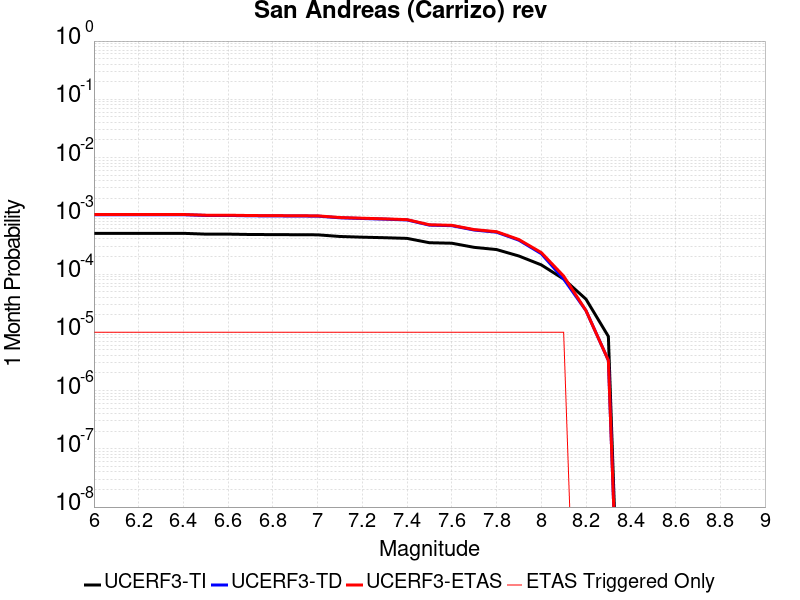 |  |  |

| Magnitude | 1 wk TI Prob | 1 wk TD Prob | 1 wk ETAS Prob | 1 wk ETAS/TD Gain | 1 wk ETAS Triggered Only | 1 mo TI Prob | 1 mo TD Prob | 1 mo ETAS Prob | 1 mo ETAS/TD Gain | 1 mo ETAS Triggered Only | 1 yr TI Prob | 1 yr TD Prob | 1 yr ETAS Prob | 1 yr ETAS/TD Gain | 1 yr ETAS Triggered Only | 10 yr TI Prob | 10 yr TD Prob | 10 yr ETAS Prob | 10 yr ETAS/TD Gain | 10 yr ETAS Triggered Only |
|-----|-----|-----|-----|-----|-----|-----|-----|-----|-----|-----|-----|-----|-----|-----|-----|-----|-----|-----|-----|-----|
| 6.0 | 1.1674632E-4 | 2.4362565E-4 | 2.536232E-4 | 1.0410366 | 1.0E-5 | 5.002454E-4 | 0.0010436937 | 0.0010536833 | 1.0095713 | 1.0E-5 | 0.006073493 | 0.012633421 | 0.012702537 | 1.0054709 | 7.0E-5 | 0.0591016 | 0.12077793 | 0.12089223 | 1.0009464 | 1.3E-4 |
| 6.1 | 1.1674632E-4 | 2.4362565E-4 | 2.536232E-4 | 1.0410366 | 1.0E-5 | 5.002454E-4 | 0.0010436937 | 0.0010536833 | 1.0095713 | 1.0E-5 | 0.006073493 | 0.012633421 | 0.012702537 | 1.0054709 | 7.0E-5 | 0.0591016 | 0.12077793 | 0.12089223 | 1.0009464 | 1.3E-4 |
| 6.2 | 1.1674632E-4 | 2.4362565E-4 | 2.536232E-4 | 1.0410366 | 1.0E-5 | 5.002454E-4 | 0.0010436937 | 0.0010536833 | 1.0095713 | 1.0E-5 | 0.006073493 | 0.012633421 | 0.012702537 | 1.0054709 | 7.0E-5 | 0.0591016 | 0.12077793 | 0.12089223 | 1.0009464 | 1.3E-4 |
| 6.3 | 1.1674632E-4 | 2.4362565E-4 | 2.536232E-4 | 1.0410366 | 1.0E-5 | 5.002454E-4 | 0.0010436937 | 0.0010536833 | 1.0095713 | 1.0E-5 | 0.006073493 | 0.012633421 | 0.012702537 | 1.0054709 | 7.0E-5 | 0.0591016 | 0.12077793 | 0.12089223 | 1.0009464 | 1.3E-4 |
| 6.4 | 1.1674632E-4 | 2.4362565E-4 | 2.536232E-4 | 1.0410366 | 1.0E-5 | 5.002454E-4 | 0.0010436937 | 0.0010536833 | 1.0095713 | 1.0E-5 | 0.006073493 | 0.012633421 | 0.012702537 | 1.0054709 | 7.0E-5 | 0.0591016 | 0.12077793 | 0.12089223 | 1.0009464 | 1.3E-4 |
| 6.5 | 1.13136164E-4 | 2.368245E-4 | 2.4682214E-4 | 1.0422153 | 1.0E-5 | 4.847792E-4 | 0.001014569 | 0.0010245588 | 1.0098464 | 1.0E-5 | 0.0058862255 | 0.012282865 | 0.012342128 | 1.0048249 | 6.0E-5 | 0.057327334 | 0.11774252 | 0.1178484 | 1.0008992 | 1.2E-4 |
| 6.6 | 1.13136164E-4 | 2.368245E-4 | 2.4682214E-4 | 1.0422153 | 1.0E-5 | 4.847792E-4 | 0.001014569 | 0.0010245588 | 1.0098464 | 1.0E-5 | 0.0058862255 | 0.012282865 | 0.012342128 | 1.0048249 | 6.0E-5 | 0.057327334 | 0.11774252 | 0.1178484 | 1.0008992 | 1.2E-4 |
| 6.7 | 1.1149675E-4 | 2.3373615E-4 | 2.4373381E-4 | 1.0427732 | 1.0E-5 | 4.777557E-4 | 0.0010013434 | 0.0010113333 | 1.0099766 | 1.0E-5 | 0.0058011734 | 0.012123644 | 0.0121829165 | 1.004889 | 6.0E-5 | 0.05652051 | 0.11636054 | 0.116466574 | 1.0009112 | 1.2E-4 |
| 6.8 | 1.1103589E-4 | 2.3275726E-4 | 2.4275493E-4 | 1.0429533 | 1.0E-5 | 4.7578133E-4 | 9.971512E-4 | 0.0010071413 | 1.0100186 | 1.0E-5 | 0.005777263 | 0.012073172 | 0.012132448 | 1.0049098 | 6.0E-5 | 0.056293584 | 0.11592107 | 0.11602716 | 1.0009152 | 1.2E-4 |
| 6.9 | 1.1053259E-4 | 2.3168049E-4 | 2.4167818E-4 | 1.0431529 | 1.0E-5 | 4.7362508E-4 | 9.9254E-4 | 0.0010025301 | 1.0100652 | 1.0E-5 | 0.0057511497 | 0.012017651 | 0.012076931 | 1.0049326 | 6.0E-5 | 0.05604569 | 0.11543746 | 0.11554361 | 1.0009196 | 1.2E-4 |
| 7.0 | 1.1005377E-4 | 2.306884E-4 | 2.4068609E-4 | 1.0433385 | 1.0E-5 | 4.7157376E-4 | 9.882915E-4 | 9.982815E-4 | 1.0101085 | 1.0E-5 | 0.0057263062 | 0.011966494 | 0.012025776 | 1.004954 | 6.0E-5 | 0.055809796 | 0.114989534 | 0.11509574 | 1.0009235 | 1.2E-4 |
| 7.1 | 1.0308142E-4 | 2.157785E-4 | 2.2577636E-4 | 1.0463338 | 1.0E-5 | 4.417027E-4 | 9.2443835E-4 | 9.3442906E-4 | 1.0108074 | 1.0E-5 | 0.0053644776 | 0.01119727 | 0.011256598 | 1.0052985 | 6.0E-5 | 0.052368138 | 0.108249314 | 0.10834741 | 1.0009062 | 1.1E-4 |
| 7.2 | 1.0027479E-4 | 2.0985417E-4 | 2.1985207E-4 | 1.0476421 | 1.0E-5 | 4.296783E-4 | 8.9906604E-4 | 9.0905704E-4 | 1.0111127 | 1.0E-5 | 0.0052187922 | 0.01089149 | 0.010950836 | 1.0054489 | 6.0E-5 | 0.050979212 | 0.105556235 | 0.10565463 | 1.0009321 | 1.1E-4 |
| 7.3 | 9.816942E-5 | 2.0460035E-4 | 2.1459832E-4 | 1.0488658 | 1.0E-5 | 4.2065824E-4 | 8.76565E-4 | 8.865562E-4 | 1.0113982 | 1.0E-5 | 0.005109493 | 0.010620243 | 0.010679605 | 1.0055896 | 6.0E-5 | 0.049935985 | 0.103138015 | 0.10323667 | 1.0009565 | 1.1E-4 |
| 7.4 | 9.5634205E-5 | 1.9828742E-4 | 2.0828543E-4 | 1.0504218 | 1.0E-5 | 4.0979648E-4 | 8.4952737E-4 | 8.595189E-4 | 1.0117613 | 1.0E-5 | 0.0049778637 | 0.010294209 | 0.010353591 | 1.0057685 | 6.0E-5 | 0.048678253 | 0.10022864 | 0.10031862 | 1.0008978 | 1.0E-4 |
| 7.5 | 8.052417E-5 | 1.6144858E-4 | 1.7144697E-4 | 1.0619292 | 1.0E-5 | 3.4505792E-4 | 6.917392E-4 | 7.017323E-4 | 1.0144463 | 1.0E-5 | 0.0041929903 | 0.008389484 | 0.008419232 | 1.0035459 | 3.0E-5 | 0.04114753 | 0.082961716 | 0.08301674 | 1.0006633 | 6.0E-5 |
| 7.6 | 7.897024E-5 | 1.5797748E-4 | 1.6797592E-4 | 1.0632901 | 1.0E-5 | 3.384E-4 | 6.7687087E-4 | 6.8686414E-4 | 1.0147638 | 1.0E-5 | 0.0041122385 | 0.00820984 | 0.008239594 | 1.0036242 | 3.0E-5 | 0.040369697 | 0.08129846 | 0.08135358 | 1.0006781 | 6.0E-5 |
| 7.7 | 6.707427E-5 | 1.3304809E-4 | 1.4304675E-4 | 1.0751508 | 1.0E-5 | 2.8742946E-4 | 5.700815E-4 | 5.8007584E-4 | 1.0175314 | 1.0E-5 | 0.003493839 | 0.006918687 | 0.0069385483 | 1.0028707 | 2.0E-5 | 0.034394164 | 0.06917808 | 0.06922462 | 1.0006728 | 5.0E-5 |
| 7.8 | 6.147705E-5 | 1.2223405E-4 | 1.3223282E-4 | 1.0818002 | 1.0E-5 | 2.6344648E-4 | 5.2375504E-4 | 5.337498E-4 | 1.0190829 | 1.0E-5 | 0.0032027436 | 0.0063580987 | 0.0063779713 | 1.0031255 | 2.0E-5 | 0.031569764 | 0.06363271 | 0.06367953 | 1.0007358 | 5.0E-5 |
| 7.9 | 4.7636717E-5 | 8.898354E-5 | 9.898265E-5 | 1.1123704 | 1.0E-5 | 2.0414138E-4 | 3.8130232E-4 | 3.912985E-4 | 1.0262159 | 1.0E-5 | 0.0024825884 | 0.004632482 | 0.004652389 | 1.0042974 | 2.0E-5 | 0.024550365 | 0.046717253 | 0.046764914 | 1.0010203 | 5.0E-5 |
| 8.0 | 3.3554235E-5 | 5.224913E-5 | 6.2248604E-5 | 1.1913807 | 1.0E-5 | 1.4379594E-4 | 2.2390562E-4 | 2.3390338E-4 | 1.0446516 | 1.0E-5 | 0.0017493097 | 0.002722645 | 0.0027326175 | 1.003663 | 1.0E-5 | 0.017356034 | 0.02793666 | 0.027956102 | 1.000696 | 2.0E-5 |
| 8.1 | 1.9175432E-5 | 1.923722E-5 | 2.923703E-5 | 1.5198156 | 1.0E-5 | 8.217783E-5 | 8.244263E-5 | 9.2441805E-5 | 1.1212865 | 1.0E-5 | 0.0010000558 | 0.0010032775 | 0.0010132674 | 1.0099573 | 1.0E-5 | 0.009955673 | 0.010785607 | 0.010795498 | 1.0009172 | 1.0E-5 |
| 8.2 | 8.643924E-6 | 5.494016E-6 | 5.494016E-6 | 1.0 | 0.0 | 3.704486E-5 | 2.3545572E-5 | 2.3545572E-5 | 1.0 | 0.0 | 4.5092785E-4 | 2.866297E-4 | 2.866297E-4 | 1.0 | 0.0 | 0.0045001395 | 0.0032592218 | 0.0032592218 | 1.0 | 0.0 |
| 8.3 | 1.983087E-6 | 7.690063E-7 | 7.690063E-7 | 1.0 | 0.0 | 8.498917E-6 | 3.295737E-6 | 3.295737E-6 | 1.0 | 0.0 | 1.034694E-4 | 4.012488E-5 | 4.012488E-5 | 1.0 | 0.0 | 0.0010342124 | 4.737206E-4 | 4.737206E-4 | 1.0 | 0.0 |

## Manix-Afton Hills
*[(top)](#table-of-contents)*

| 1 Week | 1 Month | 1 Year | 10 Year |
|-----|-----|-----|-----|
|  |  |  |  |

| Magnitude | 1 wk TI Prob | 1 wk TD Prob | 1 wk ETAS Prob | 1 wk ETAS/TD Gain | 1 wk ETAS Triggered Only | 1 mo TI Prob | 1 mo TD Prob | 1 mo ETAS Prob | 1 mo ETAS/TD Gain | 1 mo ETAS Triggered Only | 1 yr TI Prob | 1 yr TD Prob | 1 yr ETAS Prob | 1 yr ETAS/TD Gain | 1 yr ETAS Triggered Only | 10 yr TI Prob | 10 yr TD Prob | 10 yr ETAS Prob | 10 yr ETAS/TD Gain | 10 yr ETAS Triggered Only |
|-----|-----|-----|-----|-----|-----|-----|-----|-----|-----|-----|-----|-----|-----|-----|-----|-----|-----|-----|-----|-----|
| 6.0 | 1.3783202E-5 | 1.4711616E-5 | 1.4711616E-5 | 1.0 | 0.0 | 5.906953E-5 | 6.3048356E-5 | 7.3047726E-5 | 1.1585984 | 1.0E-5 | 7.189342E-4 | 7.673609E-4 | 8.173225E-4 | 1.0651084 | 5.0E-5 | 0.0071661277 | 0.0076488685 | 0.0077679507 | 1.0155686 | 1.2E-4 |
| 6.1 | 1.3783202E-5 | 1.4711616E-5 | 1.4711616E-5 | 1.0 | 0.0 | 5.906953E-5 | 6.3048356E-5 | 7.3047726E-5 | 1.1585984 | 1.0E-5 | 7.189342E-4 | 7.673609E-4 | 8.173225E-4 | 1.0651084 | 5.0E-5 | 0.0071661277 | 0.0076488685 | 0.0077679507 | 1.0155686 | 1.2E-4 |
| 6.2 | 1.3783202E-5 | 1.4711616E-5 | 1.4711616E-5 | 1.0 | 0.0 | 5.906953E-5 | 6.3048356E-5 | 7.3047726E-5 | 1.1585984 | 1.0E-5 | 7.189342E-4 | 7.673609E-4 | 8.173225E-4 | 1.0651084 | 5.0E-5 | 0.0071661277 | 0.0076488685 | 0.0077679507 | 1.0155686 | 1.2E-4 |
| 6.3 | 1.10494875E-5 | 1.1793558E-5 | 1.1793558E-5 | 1.0 | 0.0 | 4.7354086E-5 | 5.0542898E-5 | 6.0542392E-5 | 1.1978418 | 1.0E-5 | 5.763835E-4 | 6.151964E-4 | 6.6516566E-4 | 1.0812248 | 5.0E-5 | 0.005748908 | 0.0061359745 | 0.0062353606 | 1.0161973 | 1.0E-4 |
| 6.4 | 1.10494875E-5 | 1.1793558E-5 | 1.1793558E-5 | 1.0 | 0.0 | 4.7354086E-5 | 5.0542898E-5 | 6.0542392E-5 | 1.1978418 | 1.0E-5 | 5.763835E-4 | 6.151964E-4 | 6.6516566E-4 | 1.0812248 | 5.0E-5 | 0.005748908 | 0.0061359745 | 0.0062353606 | 1.0161973 | 1.0E-4 |
| 6.5 | 9.788949E-6 | 1.0454697E-5 | 1.0454697E-5 | 1.0 | 0.0 | 4.1951964E-5 | 4.480513E-5 | 4.480513E-5 | 1.0 | 0.0 | 5.1064545E-4 | 5.453752E-4 | 5.7535886E-4 | 1.054978 | 3.0E-5 | 0.0050947363 | 0.005441295 | 0.0055208593 | 1.0146223 | 8.0E-5 |
| 6.6 | 8.810006E-6 | 9.413971E-6 | 9.413971E-6 | 1.0 | 0.0 | 3.775662E-5 | 4.0345018E-5 | 4.0345018E-5 | 1.0 | 0.0 | 4.5958988E-4 | 4.9109873E-4 | 5.1108893E-4 | 1.040705 | 2.0E-5 | 0.0045864056 | 0.0049010175 | 0.004980625 | 1.0162431 | 8.0E-5 |
| 6.7 | 8.80128E-6 | 9.404451E-6 | 9.404451E-6 | 1.0 | 0.0 | 3.7719226E-5 | 4.0304214E-5 | 4.0304214E-5 | 1.0 | 0.0 | 4.591348E-4 | 4.906022E-4 | 5.105924E-4 | 1.0407462 | 2.0E-5 | 0.004581874 | 0.004896074 | 0.004975682 | 1.0162597 | 8.0E-5 |
| 6.8 | 6.8994877E-6 | 7.3803494E-6 | 7.3803494E-6 | 1.0 | 0.0 | 2.9568899E-5 | 3.162973E-5 | 3.162973E-5 | 1.0 | 0.0 | 3.5994186E-4 | 3.850321E-4 | 4.050244E-4 | 1.0519238 | 2.0E-5 | 0.003593594 | 0.0038444551 | 0.003894263 | 1.0129558 | 5.0E-5 |
| 6.9 | 4.9328037E-6 | 5.271154E-6 | 5.271154E-6 | 1.0 | 0.0 | 2.1140417E-5 | 2.2590497E-5 | 2.2590497E-5 | 1.0 | 0.0 | 2.5735417E-4 | 2.7501077E-4 | 2.9500524E-4 | 1.0727044 | 2.0E-5 | 0.0025705635 | 0.0027473096 | 0.0027772272 | 1.0108898 | 3.0E-5 |
| 7.0 | 3.347973E-6 | 3.590168E-6 | 3.590168E-6 | 1.0 | 0.0 | 1.4348378E-5 | 1.5386368E-5 | 1.5386368E-5 | 1.0 | 0.0 | 1.746775E-4 | 1.8731703E-4 | 2.0731328E-4 | 1.1067508 | 2.0E-5 | 0.0017454025 | 0.0018719939 | 0.0019019378 | 1.0159957 | 3.0E-5 |
| 7.1 | 1.2073567E-6 | 1.293531E-6 | 1.293531E-6 | 1.0 | 0.0 | 5.1743755E-6 | 5.5437017E-6 | 5.5437017E-6 | 1.0 | 0.0 | 6.29962E-5 | 6.749411E-5 | 6.749411E-5 | 1.0 | 0.0 | 6.297835E-4 | 6.748963E-4 | 6.8488956E-4 | 1.0148071 | 1.0E-5 |

## Death Valley (Fish Lake Valley)
*[(top)](#table-of-contents)*

| 1 Week | 1 Month | 1 Year | 10 Year |
|-----|-----|-----|-----|
|  |  |  |  |

| Magnitude | 1 wk TI Prob | 1 wk TD Prob | 1 wk ETAS Prob | 1 wk ETAS/TD Gain | 1 wk ETAS Triggered Only | 1 mo TI Prob | 1 mo TD Prob | 1 mo ETAS Prob | 1 mo ETAS/TD Gain | 1 mo ETAS Triggered Only | 1 yr TI Prob | 1 yr TD Prob | 1 yr ETAS Prob | 1 yr ETAS/TD Gain | 1 yr ETAS Triggered Only | 10 yr TI Prob | 10 yr TD Prob | 10 yr ETAS Prob | 10 yr ETAS/TD Gain | 10 yr ETAS Triggered Only |
|-----|-----|-----|-----|-----|-----|-----|-----|-----|-----|-----|-----|-----|-----|-----|-----|-----|-----|-----|-----|-----|
| 6.0 | 3.872328E-5 | 4.7271373E-5 | 4.7271373E-5 | 1.0 | 0.0 | 1.6594635E-4 | 2.0257758E-4 | 2.1257554E-4 | 1.0493538 | 1.0E-5 | 0.0020185246 | 0.0024638502 | 0.0024937761 | 1.0121461 | 3.0E-5 | 0.02000288 | 0.024391154 | 0.02449847 | 1.0043998 | 1.1E-4 |
| 6.1 | 3.872328E-5 | 4.7271373E-5 | 4.7271373E-5 | 1.0 | 0.0 | 1.6594635E-4 | 2.0257758E-4 | 2.1257554E-4 | 1.0493538 | 1.0E-5 | 0.0020185246 | 0.0024638502 | 0.0024937761 | 1.0121461 | 3.0E-5 | 0.02000288 | 0.024391154 | 0.02449847 | 1.0043998 | 1.1E-4 |
| 6.2 | 3.872328E-5 | 4.7271373E-5 | 4.7271373E-5 | 1.0 | 0.0 | 1.6594635E-4 | 2.0257758E-4 | 2.1257554E-4 | 1.0493538 | 1.0E-5 | 0.0020185246 | 0.0024638502 | 0.0024937761 | 1.0121461 | 3.0E-5 | 0.02000288 | 0.024391154 | 0.02449847 | 1.0043998 | 1.1E-4 |
| 6.3 | 2.8356371E-5 | 3.3613145E-5 | 3.3613145E-5 | 1.0 | 0.0 | 1.2152165E-4 | 1.4404883E-4 | 1.5404739E-4 | 1.0694109 | 1.0E-5 | 0.0014785219 | 0.0017524528 | 0.0017824003 | 1.0170889 | 3.0E-5 | 0.014687235 | 0.017393526 | 0.017501613 | 1.0062141 | 1.1E-4 |
| 6.4 | 2.8356371E-5 | 3.3613145E-5 | 3.3613145E-5 | 1.0 | 0.0 | 1.2152165E-4 | 1.4404883E-4 | 1.5404739E-4 | 1.0694109 | 1.0E-5 | 0.0014785219 | 0.0017524528 | 0.0017824003 | 1.0170889 | 3.0E-5 | 0.014687235 | 0.017393526 | 0.017501613 | 1.0062141 | 1.1E-4 |
| 6.5 | 2.4448687E-5 | 2.8610195E-5 | 2.8610195E-5 | 1.0 | 0.0 | 1.0477588E-4 | 1.2260964E-4 | 1.3260842E-4 | 1.0815496 | 1.0E-5 | 0.0012748998 | 0.0014917979 | 0.001521753 | 1.02008 | 3.0E-5 | 0.012676105 | 0.014822734 | 0.014931103 | 1.007311 | 1.1E-4 |
| 6.6 | 2.1298161E-5 | 2.466216E-5 | 2.466216E-5 | 1.0 | 0.0 | 9.127464E-5 | 1.0569088E-4 | 1.1568983E-4 | 1.0946056 | 1.0E-5 | 0.0011107022 | 0.0012860601 | 0.0013160215 | 1.0232971 | 3.0E-5 | 0.011051672 | 0.012789606 | 0.012898199 | 1.0084907 | 1.1E-4 |
| 6.7 | 1.8959729E-5 | 2.1782764E-5 | 2.1782764E-5 | 1.0 | 0.0 | 8.125345E-5 | 9.3351504E-5 | 1.0335057E-4 | 1.107112 | 1.0E-5 | 9.888117E-4 | 0.0011359876 | 0.0011659535 | 1.0263788 | 3.0E-5 | 0.009844234 | 0.011304467 | 0.011413223 | 1.0096207 | 1.1E-4 |
| 6.8 | 1.6691629E-5 | 1.901977E-5 | 1.901977E-5 | 1.0 | 0.0 | 7.153359E-5 | 8.151084E-5 | 9.151003E-5 | 1.122673 | 1.0E-5 | 8.7057345E-4 | 9.919596E-4 | 0.0010219298 | 1.0302131 | 3.0E-5 | 0.008671708 | 0.009877076 | 0.009976088 | 1.0100244 | 1.0E-4 |
| 6.9 | 1.450505E-5 | 1.6390675E-5 | 1.6390675E-5 | 1.0 | 0.0 | 6.216302E-5 | 7.024391E-5 | 8.0243204E-5 | 1.1423512 | 1.0E-5 | 7.5657194E-4 | 8.5489283E-4 | 8.748757E-4 | 1.0233748 | 2.0E-5 | 0.007540013 | 0.008516973 | 0.008606207 | 1.0104772 | 9.0E-5 |
| 7.0 | 1.2940855E-5 | 1.4538927E-5 | 1.4538927E-5 | 1.0 | 0.0 | 5.545963E-5 | 6.230823E-5 | 7.230761E-5 | 1.1604824 | 1.0E-5 | 6.750118E-4 | 7.583444E-4 | 7.7832927E-4 | 1.0263532 | 2.0E-5 | 0.006729651 | 0.007558184 | 0.007647504 | 1.0118176 | 9.0E-5 |
| 7.1 | 1.2544658E-5 | 1.4079123E-5 | 1.4079123E-5 | 1.0 | 0.0 | 5.3761712E-5 | 6.0337734E-5 | 7.033713E-5 | 1.1657238 | 1.0E-5 | 6.5435225E-4 | 7.343699E-4 | 7.543552E-4 | 1.0272143 | 2.0E-5 | 0.006524288 | 0.007320025 | 0.0074093663 | 1.012205 | 9.0E-5 |
| 7.2 | 1.2489416E-5 | 1.4016585E-5 | 1.4016585E-5 | 1.0 | 0.0 | 5.3524967E-5 | 6.0069728E-5 | 7.006913E-5 | 1.1664633 | 1.0E-5 | 6.514716E-4 | 7.311091E-4 | 7.510945E-4 | 1.0273356 | 2.0E-5 | 0.006495651 | 0.0072876317 | 0.007376976 | 1.0122597 | 9.0E-5 |
| 7.3 | 1.2368307E-5 | 1.38807145E-5 | 1.38807145E-5 | 1.0 | 0.0 | 5.3005948E-5 | 5.948745E-5 | 6.948686E-5 | 1.1680927 | 1.0E-5 | 6.451563E-4 | 7.2402466E-4 | 7.4401015E-4 | 1.0276034 | 2.0E-5 | 0.0064328653 | 0.0072172494 | 0.0073065995 | 1.0123801 | 9.0E-5 |
| 7.4 | 1.2161707E-5 | 1.3648755E-5 | 1.3648755E-5 | 1.0 | 0.0 | 5.212056E-5 | 5.8493384E-5 | 6.84928E-5 | 1.1709495 | 1.0E-5 | 6.3438306E-4 | 7.1192987E-4 | 7.319156E-4 | 1.0280727 | 2.0E-5 | 0.006325751 | 0.0070970803 | 0.007186441 | 1.0125912 | 9.0E-5 |
| 7.5 | 1.1707948E-5 | 1.3146373E-5 | 1.3146373E-5 | 1.0 | 0.0 | 5.0175953E-5 | 5.6340414E-5 | 6.633985E-5 | 1.1774825 | 1.0E-5 | 6.10721E-4 | 6.857342E-4 | 7.057205E-4 | 1.0291458 | 2.0E-5 | 0.0060904534 | 0.006836766 | 0.0069261505 | 1.0130742 | 9.0E-5 |
| 7.6 | 1.0319538E-5 | 1.1580373E-5 | 1.1580373E-5 | 1.0 | 0.0 | 4.4225842E-5 | 4.9629256E-5 | 5.962876E-5 | 1.2014841 | 1.0E-5 | 5.383166E-4 | 6.0407387E-4 | 6.240618E-4 | 1.0330886 | 2.0E-5 | 0.0053701443 | 0.00602485 | 0.0061043683 | 1.0131984 | 8.0E-5 |
| 7.7 | 8.937764E-6 | 1.0023426E-5 | 1.0023426E-5 | 1.0 | 0.0 | 3.830414E-5 | 4.295686E-5 | 5.295643E-5 | 1.2327816 | 1.0E-5 | 4.6625308E-4 | 5.228793E-4 | 5.4286886E-4 | 1.0382297 | 2.0E-5 | 0.0046527605 | 0.005217 | 0.005286635 | 1.0133476 | 7.0E-5 |
| 7.8 | 3.108007E-7 | 3.2847535E-7 | 3.2847535E-7 | 1.0 | 0.0 | 1.3320023E-6 | 1.4077508E-6 | 1.4077508E-6 | 1.0 | 0.0 | 1.6217007E-5 | 1.7139235E-5 | 1.7139235E-5 | 1.0 | 0.0 | 1.6215823E-4 | 1.713795E-4 | 1.713795E-4 | 1.0 | 0.0 |
| 7.9 | 2.5591178E-9 | 2.6697329E-9 | 2.6697329E-9 | 1.0 | 0.0 | 1.0967647E-8 | 1.14417125E-8 | 1.14417125E-8 | 1.0 | 0.0 | 1.335311E-7 | 1.3930286E-7 | 1.3930286E-7 | 1.0 | 0.0 | 1.3353102E-6 | 1.3930285E-6 | 1.3930285E-6 | 1.0 | 0.0 |

## Scodie Lineament
*[(top)](#table-of-contents)*

| 1 Week | 1 Month | 1 Year | 10 Year |
|-----|-----|-----|-----|
|  |  |  |  |

| Magnitude | 1 wk TI Prob | 1 wk TD Prob | 1 wk ETAS Prob | 1 wk ETAS/TD Gain | 1 wk ETAS Triggered Only | 1 mo TI Prob | 1 mo TD Prob | 1 mo ETAS Prob | 1 mo ETAS/TD Gain | 1 mo ETAS Triggered Only | 1 yr TI Prob | 1 yr TD Prob | 1 yr ETAS Prob | 1 yr ETAS/TD Gain | 1 yr ETAS Triggered Only | 10 yr TI Prob | 10 yr TD Prob | 10 yr ETAS Prob | 10 yr ETAS/TD Gain | 10 yr ETAS Triggered Only |
|-----|-----|-----|-----|-----|-----|-----|-----|-----|-----|-----|-----|-----|-----|-----|-----|-----|-----|-----|-----|-----|
| 6.0 | 3.2919327E-6 | 3.0133872E-6 | 3.0133872E-6 | 1.0 | 0.0 | 1.4108206E-5 | 1.2914471E-5 | 3.2914213E-5 | 2.5486305 | 2.0E-5 | 1.7175387E-4 | 1.5722551E-4 | 2.0721766E-4 | 1.3179646 | 5.0E-5 | 0.0017162118 | 0.0015714543 | 0.0016912657 | 1.0762423 | 1.2E-4 |
| 6.1 | 1.8663811E-6 | 1.5490738E-6 | 1.5490738E-6 | 1.0 | 0.0 | 7.998751E-6 | 6.638874E-6 | 1.6638807E-5 | 2.5062697 | 1.0E-5 | 9.738045E-5 | 8.082579E-5 | 1.0082417E-4 | 1.2474258 | 2.0E-5 | 9.7337784E-4 | 8.0801273E-4 | 8.579723E-4 | 1.0618302 | 5.0E-5 |
| 6.2 | 1.8663811E-6 | 1.5490738E-6 | 1.5490738E-6 | 1.0 | 0.0 | 7.998751E-6 | 6.638874E-6 | 1.6638807E-5 | 2.5062697 | 1.0E-5 | 9.738045E-5 | 8.082579E-5 | 1.0082417E-4 | 1.2474258 | 2.0E-5 | 9.7337784E-4 | 8.0801273E-4 | 8.579723E-4 | 1.0618302 | 5.0E-5 |
| 6.3 | 1.8663811E-6 | 1.5490738E-6 | 1.5490738E-6 | 1.0 | 0.0 | 7.998751E-6 | 6.638874E-6 | 1.6638807E-5 | 2.5062697 | 1.0E-5 | 9.738045E-5 | 8.082579E-5 | 1.0082417E-4 | 1.2474258 | 2.0E-5 | 9.7337784E-4 | 8.0801273E-4 | 8.579723E-4 | 1.0618302 | 5.0E-5 |
| 6.4 | 1.8663811E-6 | 1.5490738E-6 | 1.5490738E-6 | 1.0 | 0.0 | 7.998751E-6 | 6.638874E-6 | 1.6638807E-5 | 2.5062697 | 1.0E-5 | 9.738045E-5 | 8.082579E-5 | 1.0082417E-4 | 1.2474258 | 2.0E-5 | 9.7337784E-4 | 8.0801273E-4 | 8.579723E-4 | 1.0618302 | 5.0E-5 |
| 6.5 | 1.8106311E-6 | 1.4910065E-6 | 1.4910065E-6 | 1.0 | 0.0 | 7.759824E-6 | 6.390015E-6 | 1.6389951E-5 | 2.5649314 | 1.0E-5 | 9.447177E-5 | 7.7796154E-5 | 9.77946E-5 | 1.2570621 | 2.0E-5 | 9.4431615E-4 | 7.777379E-4 | 8.2769897E-4 | 1.064239 | 5.0E-5 |
| 6.6 | 1.2414679E-6 | 8.9976623E-7 | 8.9976623E-7 | 1.0 | 0.0 | 5.320566E-6 | 3.8561357E-6 | 3.8561357E-6 | 1.0 | 0.0 | 6.477596E-5 | 4.694753E-5 | 4.694753E-5 | 1.0 | 0.0 | 6.475708E-4 | 4.6938477E-4 | 4.993707E-4 | 1.0638834 | 3.0E-5 |
| 6.7 | 1.1062215E-6 | 7.5943876E-7 | 7.5943876E-7 | 1.0 | 0.0 | 4.7409408E-6 | 3.2547339E-6 | 3.2547339E-6 | 1.0 | 0.0 | 5.7719422E-5 | 3.9625735E-5 | 3.9625735E-5 | 1.0 | 0.0 | 5.770443E-4 | 3.9619367E-4 | 4.261818E-4 | 1.0756905 | 3.0E-5 |
| 6.8 | 1.0006736E-6 | 6.500452E-7 | 6.500452E-7 | 1.0 | 0.0 | 4.288594E-6 | 2.7859055E-6 | 2.7859055E-6 | 1.0 | 0.0 | 5.221238E-5 | 3.391793E-5 | 3.391793E-5 | 1.0 | 0.0 | 5.220012E-4 | 3.3913364E-4 | 3.6912345E-4 | 1.0884308 | 3.0E-5 |
| 6.9 | 9.167364E-7 | 5.631664E-7 | 5.631664E-7 | 1.0 | 0.0 | 3.9288643E-6 | 2.4135684E-6 | 2.4135684E-6 | 1.0 | 0.0 | 4.7832873E-5 | 2.9384857E-5 | 2.9384857E-5 | 1.0 | 0.0 | 4.782258E-4 | 2.938154E-4 | 3.1380952E-4 | 1.0680499 | 2.0E-5 |
| 7.0 | 7.6987664E-7 | 4.113395E-7 | 4.113395E-7 | 1.0 | 0.0 | 3.2994672E-6 | 1.7628826E-6 | 1.7628826E-6 | 1.0 | 0.0 | 4.0170275E-5 | 2.1462924E-5 | 2.1462924E-5 | 1.0 | 0.0 | 4.0163012E-4 | 2.1461236E-4 | 2.3460807E-4 | 1.0931712 | 2.0E-5 |
| 7.1 | 7.1038727E-7 | 3.521151E-7 | 3.521151E-7 | 1.0 | 0.0 | 3.0445133E-6 | 1.5090641E-6 | 1.5090641E-6 | 1.0 | 0.0 | 3.706632E-5 | 1.8372735E-5 | 1.8372735E-5 | 1.0 | 0.0 | 3.7060137E-4 | 1.8371566E-4 | 2.0371198E-4 | 1.1088439 | 2.0E-5 |
| 7.2 | 2.0799602E-7 | 3.118087E-8 | 3.118087E-8 | 1.0 | 0.0 | 8.914113E-7 | 1.336323E-7 | 1.336323E-7 | 1.0 | 0.0 | 1.0852878E-5 | 1.6269721E-6 | 1.6269721E-6 | 1.0 | 0.0 | 1.08523476E-4 | 1.6269609E-5 | 1.6269609E-5 | 1.0 | 0.0 |
| 7.3 | 1.5048182E-7 | 1.5940762E-8 | 1.5940762E-8 | 1.0 | 0.0 | 6.449219E-7 | 6.831755E-8 | 6.831755E-8 | 1.0 | 0.0 | 7.851896E-6 | 8.317658E-7 | 8.317658E-7 | 1.0 | 0.0 | 7.851618E-5 | 8.31763E-6 | 8.31763E-6 | 1.0 | 0.0 |
| 7.4 | 5.9334678E-8 | 4.864214E-9 | 4.864214E-9 | 1.0 | 0.0 | 2.5429145E-7 | 2.0846631E-8 | 2.0846631E-8 | 1.0 | 0.0 | 3.095994E-6 | 2.5380774E-7 | 2.5380774E-7 | 1.0 | 0.0 | 3.095951E-5 | 2.5380755E-6 | 2.5380755E-6 | 1.0 | 0.0 |

## Lake Isabella (Seismicity)
*[(top)](#table-of-contents)*

| 1 Week | 1 Month | 1 Year | 10 Year |
|-----|-----|-----|-----|
| 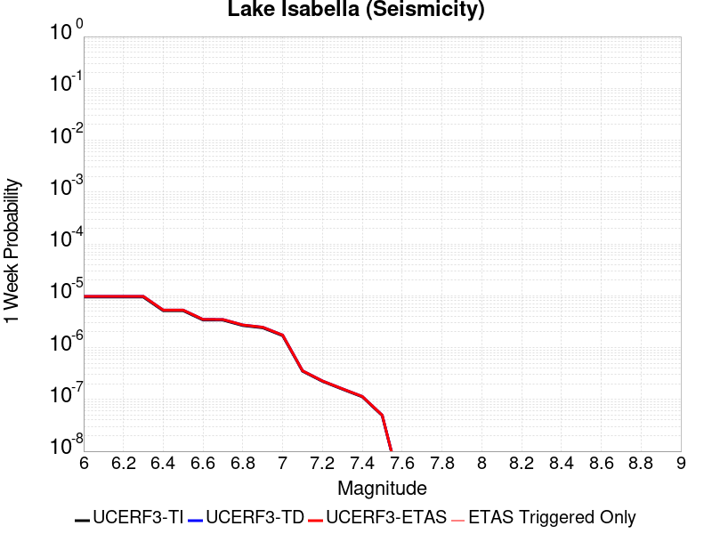 |  |  |  |

| Magnitude | 1 wk TI Prob | 1 wk TD Prob | 1 wk ETAS Prob | 1 wk ETAS/TD Gain | 1 wk ETAS Triggered Only | 1 mo TI Prob | 1 mo TD Prob | 1 mo ETAS Prob | 1 mo ETAS/TD Gain | 1 mo ETAS Triggered Only | 1 yr TI Prob | 1 yr TD Prob | 1 yr ETAS Prob | 1 yr ETAS/TD Gain | 1 yr ETAS Triggered Only | 10 yr TI Prob | 10 yr TD Prob | 10 yr ETAS Prob | 10 yr ETAS/TD Gain | 10 yr ETAS Triggered Only |
|-----|-----|-----|-----|-----|-----|-----|-----|-----|-----|-----|-----|-----|-----|-----|-----|-----|-----|-----|-----|-----|
| 6.0 | 9.431637E-6 | 9.7418215E-6 | 9.7418215E-6 | 1.0 | 0.0 | 4.0420677E-5 | 4.175007E-5 | 6.174923E-5 | 1.4790211 | 2.0E-5 | 4.920106E-4 | 5.082016E-4 | 5.7816604E-4 | 1.1376706 | 7.0E-5 | 0.004909227 | 0.005071687 | 0.005181129 | 1.021579 | 1.1E-4 |
| 6.1 | 9.431637E-6 | 9.7418215E-6 | 9.7418215E-6 | 1.0 | 0.0 | 4.0420677E-5 | 4.175007E-5 | 6.174923E-5 | 1.4790211 | 2.0E-5 | 4.920106E-4 | 5.082016E-4 | 5.7816604E-4 | 1.1376706 | 7.0E-5 | 0.004909227 | 0.005071687 | 0.005181129 | 1.021579 | 1.1E-4 |
| 6.2 | 9.431637E-6 | 9.7418215E-6 | 9.7418215E-6 | 1.0 | 0.0 | 4.0420677E-5 | 4.175007E-5 | 6.174923E-5 | 1.4790211 | 2.0E-5 | 4.920106E-4 | 5.082016E-4 | 5.7816604E-4 | 1.1376706 | 7.0E-5 | 0.004909227 | 0.005071687 | 0.005181129 | 1.021579 | 1.1E-4 |
| 6.3 | 9.431637E-6 | 9.7418215E-6 | 9.7418215E-6 | 1.0 | 0.0 | 4.0420677E-5 | 4.175007E-5 | 6.174923E-5 | 1.4790211 | 2.0E-5 | 4.920106E-4 | 5.082016E-4 | 5.7816604E-4 | 1.1376706 | 7.0E-5 | 0.004909227 | 0.005071687 | 0.005181129 | 1.021579 | 1.1E-4 |
| 6.4 | 5.144063E-6 | 5.3001613E-6 | 5.3001613E-6 | 1.0 | 0.0 | 2.2045799E-5 | 2.27148E-5 | 2.27148E-5 | 1.0 | 0.0 | 2.6837454E-4 | 2.7652105E-4 | 3.1650998E-4 | 1.1446145 | 4.0E-5 | 0.0026805066 | 0.0027621102 | 0.0028219444 | 1.0216625 | 6.0E-5 |
| 6.5 | 5.144063E-6 | 5.3001613E-6 | 5.3001613E-6 | 1.0 | 0.0 | 2.2045799E-5 | 2.27148E-5 | 2.27148E-5 | 1.0 | 0.0 | 2.6837454E-4 | 2.7652105E-4 | 3.1650998E-4 | 1.1446145 | 4.0E-5 | 0.0026805066 | 0.0027621102 | 0.0028219444 | 1.0216625 | 6.0E-5 |
| 6.6 | 3.4009804E-6 | 3.4988395E-6 | 3.4988395E-6 | 1.0 | 0.0 | 1.4575549E-5 | 1.4994949E-5 | 1.4994949E-5 | 1.0 | 0.0 | 1.7744285E-4 | 1.8254982E-4 | 2.1254434E-4 | 1.1643087 | 3.0E-5 | 0.0017730123 | 0.0018241564 | 0.0018541017 | 1.016416 | 3.0E-5 |
| 6.7 | 3.3880428E-6 | 3.485706E-6 | 3.485706E-6 | 1.0 | 0.0 | 1.4520103E-5 | 1.4938664E-5 | 1.4938664E-5 | 1.0 | 0.0 | 1.767679E-4 | 1.8186466E-4 | 2.118592E-4 | 1.1649278 | 3.0E-5 | 0.0017662736 | 0.0018173159 | 0.0018472614 | 1.0164778 | 3.0E-5 |
| 6.8 | 2.6582E-6 | 2.7337414E-6 | 2.7337414E-6 | 1.0 | 0.0 | 1.1392236E-5 | 1.171599E-5 | 1.171599E-5 | 1.0 | 0.0 | 1.3869164E-4 | 1.4263418E-4 | 1.6263133E-4 | 1.1401988 | 2.0E-5 | 0.0013860512 | 0.0014255584 | 0.0014455299 | 1.0140096 | 2.0E-5 |
| 6.9 | 2.406011E-6 | 2.474366E-6 | 2.474366E-6 | 1.0 | 0.0 | 1.0311434E-5 | 1.0604391E-5 | 1.0604391E-5 | 1.0 | 0.0 | 1.2553448E-4 | 1.2910213E-4 | 1.3910084E-4 | 1.077448 | 1.0E-5 | 0.0012546359 | 0.0012904009 | 0.001300388 | 1.0077395 | 1.0E-5 |
| 7.0 | 1.6953097E-6 | 1.7429631E-6 | 1.7429631E-6 | 1.0 | 0.0 | 7.265593E-6 | 7.469827E-6 | 7.469827E-6 | 1.0 | 0.0 | 8.8455E-5 | 9.094239E-5 | 1.00941485E-4 | 1.1099497 | 1.0E-5 | 8.84198E-4 | 9.0915454E-4 | 9.191454E-4 | 1.0109892 | 1.0E-5 |
| 7.1 | 3.5013824E-7 | 3.5715203E-7 | 3.5715203E-7 | 1.0 | 0.0 | 1.5005916E-6 | 1.5306507E-6 | 1.5306507E-6 | 1.0 | 0.0 | 1.826955E-5 | 1.8635516E-5 | 1.8635516E-5 | 1.0 | 0.0 | 1.8268047E-4 | 1.8633978E-4 | 1.8633978E-4 | 1.0 | 0.0 |
| 7.2 | 2.2321095E-7 | 2.2750805E-7 | 2.2750805E-7 | 1.0 | 0.0 | 9.56618E-7 | 9.750341E-7 | 9.750341E-7 | 1.0 | 0.0 | 1.1646762E-5 | 1.1870978E-5 | 1.1870978E-5 | 1.0 | 0.0 | 1.1646151E-4 | 1.1870354E-4 | 1.1870354E-4 | 1.0 | 0.0 |
| 7.3 | 1.5760406E-7 | 1.6061085E-7 | 1.6061085E-7 | 1.0 | 0.0 | 6.7544585E-7 | 6.88332E-7 | 6.88332E-7 | 1.0 | 0.0 | 8.223522E-6 | 8.380411E-6 | 8.380411E-6 | 1.0 | 0.0 | 8.2232174E-5 | 8.380101E-5 | 8.380101E-5 | 1.0 | 0.0 |
| 7.4 | 1.1216497E-7 | 1.14318226E-7 | 1.14318226E-7 | 1.0 | 0.0 | 4.8070694E-7 | 4.899352E-7 | 4.899352E-7 | 1.0 | 0.0 | 5.852591E-6 | 5.9649446E-6 | 5.9649446E-6 | 1.0 | 0.0 | 5.8524372E-5 | 5.964789E-5 | 5.964789E-5 | 1.0 | 0.0 |
| 7.5 | 4.885185E-8 | 4.9788245E-8 | 4.9788245E-8 | 1.0 | 0.0 | 2.0936506E-7 | 2.1337817E-7 | 2.1337817E-7 | 1.0 | 0.0 | 2.5490165E-6 | 2.5978763E-6 | 2.5978763E-6 | 1.0 | 0.0 | 2.5489873E-5 | 2.5978477E-5 | 2.5978477E-5 | 1.0 | 0.0 |
| 7.6 | 1.504641E-9 | 1.5318049E-9 | 1.5318049E-9 | 1.0 | 0.0 | 6.4484613E-9 | 6.5648784E-9 | 6.5648784E-9 | 1.0 | 0.0 | 7.851001E-8 | 7.9927396E-8 | 7.9927396E-8 | 1.0 | 0.0 | 7.8509987E-7 | 7.9927395E-7 | 7.9927395E-7 | 1.0 | 0.0 |

## Elsinore (Glen Ivy) rev
*[(top)](#table-of-contents)*

| 1 Week | 1 Month | 1 Year | 10 Year |
|-----|-----|-----|-----|
| 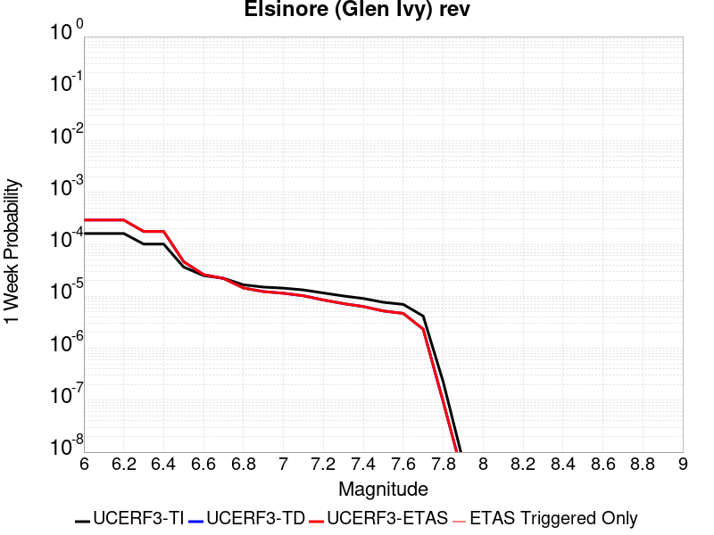 |  |  |  |

| Magnitude | 1 wk TI Prob | 1 wk TD Prob | 1 wk ETAS Prob | 1 wk ETAS/TD Gain | 1 wk ETAS Triggered Only | 1 mo TI Prob | 1 mo TD Prob | 1 mo ETAS Prob | 1 mo ETAS/TD Gain | 1 mo ETAS Triggered Only | 1 yr TI Prob | 1 yr TD Prob | 1 yr ETAS Prob | 1 yr ETAS/TD Gain | 1 yr ETAS Triggered Only | 10 yr TI Prob | 10 yr TD Prob | 10 yr ETAS Prob | 10 yr ETAS/TD Gain | 10 yr ETAS Triggered Only |
|-----|-----|-----|-----|-----|-----|-----|-----|-----|-----|-----|-----|-----|-----|-----|-----|-----|-----|-----|-----|-----|
| 6.0 | 1.6204086E-4 | 2.93772E-4 | 2.93772E-4 | 1.0 | 0.0 | 6.94276E-4 | 0.0012584875 | 0.0012684749 | 1.007936 | 1.0E-5 | 0.008420097 | 0.015235919 | 0.01527531 | 1.0025854 | 4.0E-5 | 0.081081145 | 0.1398973 | 0.13996612 | 1.0004919 | 8.0E-5 |
| 6.1 | 1.6204086E-4 | 2.93772E-4 | 2.93772E-4 | 1.0 | 0.0 | 6.94276E-4 | 0.0012584875 | 0.0012684749 | 1.007936 | 1.0E-5 | 0.008420097 | 0.015235919 | 0.01527531 | 1.0025854 | 4.0E-5 | 0.081081145 | 0.1398973 | 0.13996612 | 1.0004919 | 8.0E-5 |
| 6.2 | 1.6204086E-4 | 2.93772E-4 | 2.93772E-4 | 1.0 | 0.0 | 6.94276E-4 | 0.0012584875 | 0.0012684749 | 1.007936 | 1.0E-5 | 0.008420097 | 0.015235919 | 0.01527531 | 1.0025854 | 4.0E-5 | 0.081081145 | 0.1398973 | 0.13996612 | 1.0004919 | 8.0E-5 |
| 6.3 | 1.0111737E-4 | 1.7704953E-4 | 1.7704953E-4 | 1.0 | 0.0 | 4.332882E-4 | 7.5867976E-4 | 7.6867215E-4 | 1.0131708 | 1.0E-5 | 0.005262531 | 0.009218495 | 0.009258126 | 1.004299 | 4.0E-5 | 0.0513964 | 0.08714668 | 0.08720145 | 1.0006285 | 6.0E-5 |
| 6.4 | 1.0111737E-4 | 1.7704953E-4 | 1.7704953E-4 | 1.0 | 0.0 | 4.332882E-4 | 7.5867976E-4 | 7.6867215E-4 | 1.0131708 | 1.0E-5 | 0.005262531 | 0.009218495 | 0.009258126 | 1.004299 | 4.0E-5 | 0.0513964 | 0.08714668 | 0.08720145 | 1.0006285 | 6.0E-5 |
| 6.5 | 3.6624708E-5 | 4.63993E-5 | 4.63993E-5 | 1.0 | 0.0 | 1.569536E-4 | 1.9884102E-4 | 1.9884102E-4 | 1.0 | 0.0 | 0.001909235 | 0.002418563 | 0.0024285389 | 1.0041246 | 1.0E-5 | 0.01892915 | 0.023771606 | 0.023781369 | 1.0004107 | 1.0E-5 |
| 6.6 | 2.5051324E-5 | 2.6153504E-5 | 2.6153504E-5 | 1.0 | 0.0 | 1.073584E-4 | 1.12081885E-4 | 1.12081885E-4 | 1.0 | 0.0 | 0.0013063047 | 0.0013637872 | 0.0013737737 | 1.0073225 | 1.0E-5 | 0.012986525 | 0.013565531 | 0.013575395 | 1.0007272 | 1.0E-5 |
| 6.7 | 2.2189772E-5 | 2.2077826E-5 | 2.2077826E-5 | 1.0 | 0.0 | 9.509556E-5 | 9.461602E-5 | 9.461602E-5 | 1.0 | 0.0 | 0.0011571734 | 0.0011513777 | 0.0011613662 | 1.0086752 | 1.0E-5 | 0.011511663 | 0.011465822 | 0.011475708 | 1.0008621 | 1.0E-5 |
| 6.8 | 1.6654378E-5 | 1.44404075E-5 | 1.44404075E-5 | 1.0 | 0.0 | 7.137396E-5 | 6.188602E-5 | 6.188602E-5 | 1.0 | 0.0 | 8.686314E-4 | 7.5320696E-4 | 7.6319947E-4 | 1.0132666 | 1.0E-5 | 0.008652439 | 0.007511861 | 0.0075217863 | 1.0013212 | 1.0E-5 |
| 6.9 | 1.5042909E-5 | 1.2334343E-5 | 1.2334343E-5 | 1.0 | 0.0 | 6.446802E-5 | 5.2860418E-5 | 5.2860418E-5 | 1.0 | 0.0 | 7.8461546E-4 | 6.4338866E-4 | 6.533822E-4 | 1.0155327 | 1.0E-5 | 0.007818509 | 0.0064195115 | 0.0064294473 | 1.0015477 | 1.0E-5 |
| 7.0 | 1.4361385E-5 | 1.1453502E-5 | 1.1453502E-5 | 1.0 | 0.0 | 6.154734E-5 | 4.908553E-5 | 4.908553E-5 | 1.0 | 0.0 | 7.490812E-4 | 5.974554E-4 | 6.0744944E-4 | 1.0167277 | 1.0E-5 | 0.007465612 | 0.0059625087 | 0.005972449 | 1.0016671 | 1.0E-5 |
| 7.1 | 1.3265571E-5 | 1.0246804E-5 | 1.0246804E-5 | 1.0 | 0.0 | 5.6851208E-5 | 4.391415E-5 | 4.391415E-5 | 1.0 | 0.0 | 6.919436E-4 | 5.3452613E-4 | 5.445208E-4 | 1.0186982 | 1.0E-5 | 0.006897931 | 0.0053357244 | 0.005345671 | 1.0018642 | 1.0E-5 |
| 7.2 | 1.1596403E-5 | 8.506578E-6 | 8.506578E-6 | 1.0 | 0.0 | 4.9697923E-5 | 3.6456262E-5 | 3.6456262E-5 | 1.0 | 0.0 | 6.049042E-4 | 4.4376627E-4 | 4.5376184E-4 | 1.0225244 | 1.0E-5 | 0.006032603 | 0.004430235 | 0.0044401907 | 1.0022472 | 1.0E-5 |
| 7.3 | 1.0150827E-5 | 7.2400208E-6 | 7.2400208E-6 | 1.0 | 0.0 | 4.3502816E-5 | 3.10283E-5 | 3.10283E-5 | 1.0 | 0.0 | 5.2951806E-4 | 3.777055E-4 | 3.777055E-4 | 1.0 | 0.0 | 0.005282581 | 0.003771035 | 0.003771035 | 1.0 | 0.0 |
| 7.4 | 9.080705E-6 | 6.3536127E-6 | 6.3536127E-6 | 1.0 | 0.0 | 3.8916725E-5 | 2.7229491E-5 | 2.7229491E-5 | 1.0 | 0.0 | 4.7370812E-4 | 3.3147E-4 | 3.3147E-4 | 1.0 | 0.0 | 0.004726996 | 0.0033099046 | 0.0033099046 | 1.0 | 0.0 |
| 7.5 | 7.671649E-6 | 5.2265436E-6 | 5.2265436E-6 | 1.0 | 0.0 | 3.287808E-5 | 2.2399287E-5 | 2.2399287E-5 | 1.0 | 0.0 | 4.0021708E-4 | 2.7267844E-4 | 2.7267844E-4 | 1.0 | 0.0 | 0.0039949706 | 0.0027235637 | 0.0027235637 | 1.0 | 0.0 |
| 7.6 | 6.990086E-6 | 4.688364E-6 | 4.688364E-6 | 1.0 | 0.0 | 2.9957167E-5 | 2.0092839E-5 | 2.0092839E-5 | 1.0 | 0.0 | 3.6466747E-4 | 2.4460402E-4 | 2.4460402E-4 | 1.0 | 0.0 | 0.0036406964 | 0.0024434642 | 0.0024434642 | 1.0 | 0.0 |
| 7.7 | 4.163505E-6 | 2.3300386E-6 | 2.3300386E-6 | 1.0 | 0.0 | 1.7843471E-5 | 9.985846E-6 | 9.985846E-6 | 1.0 | 0.0 | 2.172226E-4 | 1.2157163E-4 | 1.2157163E-4 | 1.0 | 0.0 | 0.0021701038 | 0.0012151244 | 0.0012151244 | 1.0 | 0.0 |
| 7.8 | 2.2692414E-7 | 9.38645E-8 | 9.38645E-8 | 1.0 | 0.0 | 9.725317E-7 | 4.0227638E-7 | 4.0227638E-7 | 1.0 | 0.0 | 1.1840509E-5 | 4.8977076E-6 | 4.8977076E-6 | 1.0 | 0.0 | 1.1839878E-4 | 4.8976322E-5 | 4.8976322E-5 | 1.0 | 0.0 |
| 7.9 | 6.676829E-9 | 3.4402008E-9 | 3.4402008E-9 | 1.0 | 0.0 | 2.861498E-8 | 1.4743718E-8 | 1.4743718E-8 | 1.0 | 0.0 | 3.4838732E-7 | 1.7950475E-7 | 1.7950475E-7 | 1.0 | 0.0 | 3.4838679E-6 | 1.7950463E-6 | 1.7950463E-6 | 1.0 | 0.0 |

## Cady
*[(top)](#table-of-contents)*

| 1 Week | 1 Month | 1 Year | 10 Year |
|-----|-----|-----|-----|
|  |  |  |  |

| Magnitude | 1 wk TI Prob | 1 wk TD Prob | 1 wk ETAS Prob | 1 wk ETAS/TD Gain | 1 wk ETAS Triggered Only | 1 mo TI Prob | 1 mo TD Prob | 1 mo ETAS Prob | 1 mo ETAS/TD Gain | 1 mo ETAS Triggered Only | 1 yr TI Prob | 1 yr TD Prob | 1 yr ETAS Prob | 1 yr ETAS/TD Gain | 1 yr ETAS Triggered Only | 10 yr TI Prob | 10 yr TD Prob | 10 yr ETAS Prob | 10 yr ETAS/TD Gain | 10 yr ETAS Triggered Only |
|-----|-----|-----|-----|-----|-----|-----|-----|-----|-----|-----|-----|-----|-----|-----|-----|-----|-----|-----|-----|-----|
| 6.0 | 1.9892565E-5 | 2.1859876E-5 | 2.1859876E-5 | 1.0 | 0.0 | 8.525106E-5 | 9.3682334E-5 | 1.0368139E-4 | 1.1067337 | 1.0E-5 | 0.0010374374 | 0.0011400766 | 0.0012099966 | 1.0613294 | 7.0E-5 | 0.010326075 | 0.011351293 | 0.011460044 | 1.0095805 | 1.1E-4 |
| 6.1 | 1.9892565E-5 | 2.1859876E-5 | 2.1859876E-5 | 1.0 | 0.0 | 8.525106E-5 | 9.3682334E-5 | 1.0368139E-4 | 1.1067337 | 1.0E-5 | 0.0010374374 | 0.0011400766 | 0.0012099966 | 1.0613294 | 7.0E-5 | 0.010326075 | 0.011351293 | 0.011460044 | 1.0095805 | 1.1E-4 |
| 6.2 | 1.9892565E-5 | 2.1859876E-5 | 2.1859876E-5 | 1.0 | 0.0 | 8.525106E-5 | 9.3682334E-5 | 1.0368139E-4 | 1.1067337 | 1.0E-5 | 0.0010374374 | 0.0011400766 | 0.0012099966 | 1.0613294 | 7.0E-5 | 0.010326075 | 0.011351293 | 0.011460044 | 1.0095805 | 1.1E-4 |
| 6.3 | 1.1117327E-5 | 1.2177199E-5 | 1.2177199E-5 | 1.0 | 0.0 | 4.764482E-5 | 5.218713E-5 | 6.218661E-5 | 1.1916081 | 1.0E-5 | 5.7992124E-4 | 6.352246E-4 | 6.751992E-4 | 1.0629299 | 4.0E-5 | 0.0057841022 | 0.006337195 | 0.0064067515 | 1.0109758 | 7.0E-5 |
| 6.4 | 1.1117327E-5 | 1.2177199E-5 | 1.2177199E-5 | 1.0 | 0.0 | 4.764482E-5 | 5.218713E-5 | 6.218661E-5 | 1.1916081 | 1.0E-5 | 5.7992124E-4 | 6.352246E-4 | 6.751992E-4 | 1.0629299 | 4.0E-5 | 0.0057841022 | 0.006337195 | 0.0064067515 | 1.0109758 | 7.0E-5 |
| 6.5 | 6.103093E-6 | 6.672351E-6 | 6.672351E-6 | 1.0 | 0.0 | 2.615585E-5 | 2.8595547E-5 | 2.8595547E-5 | 1.0 | 0.0 | 3.1840094E-4 | 3.4810771E-4 | 3.6810077E-4 | 1.0574335 | 2.0E-5 | 0.0031794512 | 0.0034768586 | 0.0035167194 | 1.0114646 | 4.0E-5 |
| 6.6 | 5.817237E-6 | 6.3659772E-6 | 6.3659772E-6 | 1.0 | 0.0 | 2.4930776E-5 | 2.7282544E-5 | 2.7282544E-5 | 1.0 | 0.0 | 3.034899E-4 | 3.321268E-4 | 3.5212014E-4 | 1.060198 | 2.0E-5 | 0.0030307577 | 0.0033175263 | 0.0033573937 | 1.0120171 | 4.0E-5 |
| 6.7 | 4.8846314E-6 | 5.340833E-6 | 5.340833E-6 | 1.0 | 0.0 | 2.0933967E-5 | 2.288915E-5 | 2.288915E-5 | 1.0 | 0.0 | 2.5484123E-4 | 2.7865154E-4 | 2.8864873E-4 | 1.0358771 | 1.0E-5 | 0.0025454918 | 0.002784177 | 0.0028140934 | 1.0107452 | 3.0E-5 |
| 6.8 | 1.7788773E-6 | 1.940001E-6 | 1.940001E-6 | 1.0 | 0.0 | 7.6237375E-6 | 8.314273E-6 | 8.314273E-6 | 1.0 | 0.0 | 9.281505E-5 | 1.0122315E-4 | 1.11222136E-4 | 1.0987816 | 1.0E-5 | 9.2776294E-4 | 0.001011925 | 0.0010319048 | 1.0197443 | 2.0E-5 |
| 6.9 | 7.5455404E-7 | 8.2975305E-7 | 8.2975305E-7 | 1.0 | 0.0 | 3.233799E-6 | 3.5560815E-6 | 3.5560815E-6 | 1.0 | 0.0 | 3.937079E-5 | 4.329477E-5 | 5.3294338E-5 | 1.2309648 | 1.0E-5 | 3.9363815E-4 | 4.3289628E-4 | 4.4289196E-4 | 1.0230902 | 1.0E-5 |
| 7.0 | 6.8578805E-7 | 7.542215E-7 | 7.542215E-7 | 1.0 | 0.0 | 2.9390883E-6 | 3.2323758E-6 | 3.2323758E-6 | 1.0 | 0.0 | 3.578281E-5 | 3.9353796E-5 | 4.9353403E-5 | 1.2540951 | 1.0E-5 | 3.577705E-4 | 3.9350073E-4 | 4.0349682E-4 | 1.0254029 | 1.0E-5 |

## Pinto Mtn
*[(top)](#table-of-contents)*

| 1 Week | 1 Month | 1 Year | 10 Year |
|-----|-----|-----|-----|
|  |  |  |  |

| Magnitude | 1 wk TI Prob | 1 wk TD Prob | 1 wk ETAS Prob | 1 wk ETAS/TD Gain | 1 wk ETAS Triggered Only | 1 mo TI Prob | 1 mo TD Prob | 1 mo ETAS Prob | 1 mo ETAS/TD Gain | 1 mo ETAS Triggered Only | 1 yr TI Prob | 1 yr TD Prob | 1 yr ETAS Prob | 1 yr ETAS/TD Gain | 1 yr ETAS Triggered Only | 10 yr TI Prob | 10 yr TD Prob | 10 yr ETAS Prob | 10 yr ETAS/TD Gain | 10 yr ETAS Triggered Only |
|-----|-----|-----|-----|-----|-----|-----|-----|-----|-----|-----|-----|-----|-----|-----|-----|-----|-----|-----|-----|-----|
| 6.0 | 4.4194956E-5 | 4.786026E-5 | 4.786026E-5 | 1.0 | 0.0 | 1.893932E-4 | 2.051002E-4 | 2.051002E-4 | 1.0 | 0.0 | 0.0023034236 | 0.0024943987 | 0.0025542493 | 1.0239938 | 6.0E-5 | 0.022796938 | 0.024681535 | 0.024788821 | 1.0043467 | 1.1E-4 |
| 6.1 | 4.4194956E-5 | 4.786026E-5 | 4.786026E-5 | 1.0 | 0.0 | 1.893932E-4 | 2.051002E-4 | 2.051002E-4 | 1.0 | 0.0 | 0.0023034236 | 0.0024943987 | 0.0025542493 | 1.0239938 | 6.0E-5 | 0.022796938 | 0.024681535 | 0.024788821 | 1.0043467 | 1.1E-4 |
| 6.2 | 4.4194956E-5 | 4.786026E-5 | 4.786026E-5 | 1.0 | 0.0 | 1.893932E-4 | 2.051002E-4 | 2.051002E-4 | 1.0 | 0.0 | 0.0023034236 | 0.0024943987 | 0.0025542493 | 1.0239938 | 6.0E-5 | 0.022796938 | 0.024681535 | 0.024788821 | 1.0043467 | 1.1E-4 |
| 6.3 | 4.4194956E-5 | 4.786026E-5 | 4.786026E-5 | 1.0 | 0.0 | 1.893932E-4 | 2.051002E-4 | 2.051002E-4 | 1.0 | 0.0 | 0.0023034236 | 0.0024943987 | 0.0025542493 | 1.0239938 | 6.0E-5 | 0.022796938 | 0.024681535 | 0.024788821 | 1.0043467 | 1.1E-4 |
| 6.4 | 3.729929E-5 | 3.9608974E-5 | 3.9608974E-5 | 1.0 | 0.0 | 1.5984432E-4 | 1.6974223E-4 | 1.6974223E-4 | 1.0 | 0.0 | 0.0019443673 | 0.0020647459 | 0.0021046633 | 1.0193329 | 4.0E-5 | 0.019274427 | 0.020465652 | 0.020544015 | 1.003829 | 8.0E-5 |
| 6.5 | 3.729929E-5 | 3.9608974E-5 | 3.9608974E-5 | 1.0 | 0.0 | 1.5984432E-4 | 1.6974223E-4 | 1.6974223E-4 | 1.0 | 0.0 | 0.0019443673 | 0.0020647459 | 0.0021046633 | 1.0193329 | 4.0E-5 | 0.019274427 | 0.020465652 | 0.020544015 | 1.003829 | 8.0E-5 |
| 6.6 | 3.0204548E-5 | 3.1210264E-5 | 3.1210264E-5 | 1.0 | 0.0 | 1.2944164E-4 | 1.3375162E-4 | 1.3375162E-4 | 1.0 | 0.0 | 0.0015748127 | 0.0016272442 | 0.0016472116 | 1.0122707 | 2.0E-5 | 0.015636992 | 0.01615716 | 0.016196514 | 1.0024357 | 4.0E-5 |
| 6.7 | 2.9857754E-5 | 3.081962E-5 | 3.081962E-5 | 1.0 | 0.0 | 1.2795553E-4 | 1.320776E-4 | 1.320776E-4 | 1.0 | 0.0 | 0.0015567453 | 0.0016068934 | 0.0016268612 | 1.0124264 | 2.0E-5 | 0.015458848 | 0.015956586 | 0.015995948 | 1.0024668 | 4.0E-5 |
| 6.8 | 2.4819734E-5 | 2.5013833E-5 | 2.5013833E-5 | 1.0 | 0.0 | 1.0636595E-4 | 1.07197855E-4 | 1.07197855E-4 | 1.0 | 0.0 | 0.0012942362 | 0.0013043742 | 0.001324348 | 1.015313 | 2.0E-5 | 0.012867244 | 0.01296955 | 0.01300903 | 1.0030441 | 4.0E-5 |
| 6.9 | 2.331124E-5 | 2.3342016E-5 | 2.3342016E-5 | 1.0 | 0.0 | 9.990149E-5 | 1.0003349E-4 | 1.0003349E-4 | 1.0 | 0.0 | 0.001215622 | 0.0012172476 | 0.0012372233 | 1.0164105 | 2.0E-5 | 0.012089936 | 0.012107995 | 0.012147511 | 1.0032636 | 4.0E-5 |
| 7.0 | 2.1818534E-5 | 2.1765065E-5 | 2.1765065E-5 | 1.0 | 0.0 | 9.3504656E-5 | 9.327562E-5 | 9.327562E-5 | 1.0 | 0.0 | 0.0011378246 | 0.0011350589 | 0.0011550363 | 1.0176002 | 2.0E-5 | 0.011320163 | 0.011294719 | 0.0113342665 | 1.0035015 | 4.0E-5 |
| 7.1 | 2.066081E-5 | 2.0544632E-5 | 2.0544632E-5 | 1.0 | 0.0 | 8.854332E-5 | 8.804556E-5 | 8.804556E-5 | 1.0 | 0.0 | 0.0010774818 | 0.0010714472 | 0.0010814364 | 1.0093231 | 1.0E-5 | 0.010722724 | 0.010664865 | 0.010694545 | 1.002783 | 3.0E-5 |
| 7.2 | 1.8990233E-5 | 1.9057838E-5 | 1.9057838E-5 | 1.0 | 0.0 | 8.138417E-5 | 8.1674E-5 | 8.1674E-5 | 1.0 | 0.0 | 9.904018E-4 | 9.939467E-4 | 0.0010039367 | 1.0100509 | 1.0E-5 | 0.009859995 | 0.00989701 | 0.009926714 | 1.0030012 | 3.0E-5 |
| 7.3 | 1.3335872E-5 | 1.4910233E-5 | 1.4910233E-5 | 1.0 | 0.0 | 5.7152483E-5 | 6.3899504E-5 | 6.3899504E-5 | 1.0 | 0.0 | 6.956093E-4 | 7.7771157E-4 | 7.877038E-4 | 1.0128483 | 1.0E-5 | 0.006934359 | 0.007751199 | 0.0077809663 | 1.0038403 | 3.0E-5 |
| 7.4 | 9.414066E-6 | 1.1864307E-5 | 1.1864307E-5 | 1.0 | 0.0 | 4.0345374E-5 | 5.0846094E-5 | 5.0846094E-5 | 1.0 | 0.0 | 4.910942E-4 | 6.188848E-4 | 6.288786E-4 | 1.0161481 | 1.0E-5 | 0.0049001034 | 0.0061725616 | 0.0062023764 | 1.0048302 | 3.0E-5 |
| 7.5 | 7.2101157E-6 | 9.16147E-6 | 9.16147E-6 | 1.0 | 0.0 | 3.090013E-5 | 3.9262897E-5 | 3.9262897E-5 | 1.0 | 0.0 | 3.7614413E-4 | 4.7792873E-4 | 4.8792394E-4 | 1.0209136 | 1.0E-5 | 0.0037550807 | 0.0047697844 | 0.004789689 | 1.004173 | 2.0E-5 |
| 7.6 | 3.296375E-6 | 4.548674E-6 | 4.548674E-6 | 1.0 | 0.0 | 1.4127245E-5 | 1.9494179E-5 | 1.9494179E-5 | 1.0 | 0.0 | 1.7198564E-4 | 2.3731717E-4 | 2.3731717E-4 | 1.0 | 0.0 | 0.0017185259 | 0.002370775 | 0.002370775 | 1.0 | 0.0 |
| 7.7 | 2.5741092E-6 | 3.5873995E-6 | 3.5873995E-6 | 1.0 | 0.0 | 1.103185E-5 | 1.5374486E-5 | 1.5374486E-5 | 1.0 | 0.0 | 1.3430449E-4 | 1.8716961E-4 | 1.8716961E-4 | 1.0 | 0.0 | 0.0013422335 | 0.0018702497 | 0.0018702497 | 1.0 | 0.0 |

## White Wolf (Extension)
*[(top)](#table-of-contents)*

| 1 Week | 1 Month | 1 Year | 10 Year |
|-----|-----|-----|-----|
|  |  |  |  |

| Magnitude | 1 wk TI Prob | 1 wk TD Prob | 1 wk ETAS Prob | 1 wk ETAS/TD Gain | 1 wk ETAS Triggered Only | 1 mo TI Prob | 1 mo TD Prob | 1 mo ETAS Prob | 1 mo ETAS/TD Gain | 1 mo ETAS Triggered Only | 1 yr TI Prob | 1 yr TD Prob | 1 yr ETAS Prob | 1 yr ETAS/TD Gain | 1 yr ETAS Triggered Only | 10 yr TI Prob | 10 yr TD Prob | 10 yr ETAS Prob | 10 yr ETAS/TD Gain | 10 yr ETAS Triggered Only |
|-----|-----|-----|-----|-----|-----|-----|-----|-----|-----|-----|-----|-----|-----|-----|-----|-----|-----|-----|-----|-----|
| 6.0 | 8.222555E-6 | 6.066774E-6 | 1.6066713E-5 | 2.6483123 | 1.0E-5 | 3.5239045E-5 | 2.600024E-5 | 4.5999717E-5 | 1.7692037 | 2.0E-5 | 4.289509E-4 | 3.1651356E-4 | 3.7649457E-4 | 1.1895053 | 6.0E-5 | 0.0042812387 | 0.0031612795 | 0.0032709318 | 1.0346861 | 1.1E-4 |
| 6.1 | 8.222555E-6 | 6.066774E-6 | 1.6066713E-5 | 2.6483123 | 1.0E-5 | 3.5239045E-5 | 2.600024E-5 | 4.5999717E-5 | 1.7692037 | 2.0E-5 | 4.289509E-4 | 3.1651356E-4 | 3.7649457E-4 | 1.1895053 | 6.0E-5 | 0.0042812387 | 0.0031612795 | 0.0032709318 | 1.0346861 | 1.1E-4 |
| 6.2 | 8.222555E-6 | 6.066774E-6 | 1.6066713E-5 | 2.6483123 | 1.0E-5 | 3.5239045E-5 | 2.600024E-5 | 4.5999717E-5 | 1.7692037 | 2.0E-5 | 4.289509E-4 | 3.1651356E-4 | 3.7649457E-4 | 1.1895053 | 6.0E-5 | 0.0042812387 | 0.0031612795 | 0.0032709318 | 1.0346861 | 1.1E-4 |
| 6.3 | 8.222555E-6 | 6.066774E-6 | 1.6066713E-5 | 2.6483123 | 1.0E-5 | 3.5239045E-5 | 2.600024E-5 | 4.5999717E-5 | 1.7692037 | 2.0E-5 | 4.289509E-4 | 3.1651356E-4 | 3.7649457E-4 | 1.1895053 | 6.0E-5 | 0.0042812387 | 0.0031612795 | 0.0032709318 | 1.0346861 | 1.1E-4 |
| 6.4 | 5.821773E-6 | 3.5572245E-6 | 1.3557189E-5 | 3.8111703 | 1.0E-5 | 2.4950215E-5 | 1.5245166E-5 | 3.5244862E-5 | 2.3118713 | 2.0E-5 | 3.0372653E-4 | 1.8559519E-4 | 2.2558776E-4 | 1.2154828 | 4.0E-5 | 0.0030331176 | 0.0018545102 | 0.0019243803 | 1.0376759 | 7.0E-5 |
| 6.5 | 5.766023E-6 | 3.4991574E-6 | 1.3499122E-5 | 3.8578207 | 1.0E-5 | 2.4711293E-5 | 1.4996309E-5 | 3.499601E-5 | 2.3336415 | 2.0E-5 | 3.0081844E-4 | 1.8256587E-4 | 2.2255856E-4 | 1.219059 | 4.0E-5 | 0.0030041158 | 0.001824267 | 0.0018941393 | 1.0383016 | 7.0E-5 |
| 6.6 | 4.643576E-6 | 2.3326468E-6 | 2.3326468E-6 | 1.0 | 0.0 | 1.9900888E-5 | 9.997021E-6 | 9.997021E-6 | 1.0 | 0.0 | 2.4226638E-4 | 1.21707366E-4 | 1.3170615E-4 | 1.0821543 | 1.0E-5 | 0.0024200242 | 0.0012164495 | 0.001256401 | 1.0328426 | 4.0E-5 |
| 6.7 | 3.9529173E-6 | 1.6483561E-6 | 1.6483561E-6 | 1.0 | 0.0 | 1.6940963E-5 | 7.064365E-6 | 7.064365E-6 | 1.0 | 0.0 | 2.0623671E-4 | 8.600544E-5 | 9.600458E-5 | 1.1162617 | 1.0E-5 | 0.002060454 | 8.597401E-4 | 8.997057E-4 | 1.0464857 | 4.0E-5 |
| 6.8 | 3.4377522E-6 | 1.2245247E-6 | 1.2245247E-6 | 1.0 | 0.0 | 1.473314E-5 | 5.247953E-6 | 5.247953E-6 | 1.0 | 0.0 | 1.7936122E-4 | 6.389205E-5 | 6.389205E-5 | 1.0 | 0.0 | 0.0017921652 | 6.387459E-4 | 6.6872675E-4 | 1.046937 | 3.0E-5 |
| 6.9 | 3.1367306E-6 | 1.0033741E-6 | 1.0033741E-6 | 1.0 | 0.0 | 1.3443062E-5 | 4.300168E-6 | 4.300168E-6 | 1.0 | 0.0 | 1.63657E-4 | 5.2353364E-5 | 5.2353364E-5 | 1.0 | 0.0 | 0.0016353652 | 5.2341796E-4 | 5.434075E-4 | 1.0381904 | 2.0E-5 |
| 7.0 | 2.8298145E-6 | 7.428598E-7 | 7.428598E-7 | 1.0 | 0.0 | 1.2127721E-5 | 3.1836814E-6 | 3.1836814E-6 | 1.0 | 0.0 | 1.47645E-4 | 3.876068E-5 | 3.876068E-5 | 1.0 | 0.0 | 0.0014754693 | 3.8754422E-4 | 4.0753646E-4 | 1.051587 | 2.0E-5 |
| 7.1 | 2.4091064E-6 | 5.422674E-7 | 5.422674E-7 | 1.0 | 0.0 | 1.03247E-5 | 2.3240013E-6 | 2.3240013E-6 | 1.0 | 0.0 | 1.2569598E-4 | 2.829439E-5 | 2.829439E-5 | 1.0 | 0.0 | 0.001256249 | 2.829119E-4 | 3.0290626E-4 | 1.0706733 | 2.0E-5 |
| 7.2 | 1.3875518E-6 | 1.0741592E-7 | 1.0741592E-7 | 1.0 | 0.0 | 5.9466374E-6 | 4.6035387E-7 | 4.6035387E-7 | 1.0 | 0.0 | 7.23979E-5 | 5.604795E-6 | 5.604795E-6 | 1.0 | 0.0 | 7.2374323E-4 | 5.6046654E-5 | 5.6046654E-5 | 1.0 | 0.0 |
| 7.3 | 7.056077E-7 | 5.001199E-8 | 5.001199E-8 | 1.0 | 0.0 | 3.0240296E-6 | 2.1433708E-7 | 2.1433708E-7 | 1.0 | 0.0 | 3.681694E-5 | 2.6095513E-6 | 2.6095513E-6 | 1.0 | 0.0 | 3.681084E-4 | 2.6095253E-5 | 2.6095253E-5 | 1.0 | 0.0 |
| 7.4 | 5.9334678E-8 | 4.864214E-9 | 4.864214E-9 | 1.0 | 0.0 | 2.5429145E-7 | 2.0846631E-8 | 2.0846631E-8 | 1.0 | 0.0 | 3.095994E-6 | 2.5380774E-7 | 2.5380774E-7 | 1.0 | 0.0 | 3.095951E-5 | 2.5380755E-6 | 2.5380755E-6 | 1.0 | 0.0 |

## San Andreas (San Gorgonio Pass-Garnet HIll)
*[(top)](#table-of-contents)*

| 1 Week | 1 Month | 1 Year | 10 Year |
|-----|-----|-----|-----|
|  |  |  | 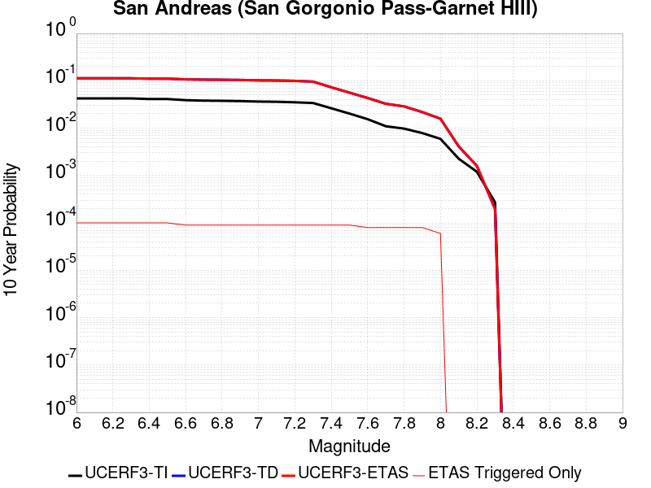 |

| Magnitude | 1 wk TI Prob | 1 wk TD Prob | 1 wk ETAS Prob | 1 wk ETAS/TD Gain | 1 wk ETAS Triggered Only | 1 mo TI Prob | 1 mo TD Prob | 1 mo ETAS Prob | 1 mo ETAS/TD Gain | 1 mo ETAS Triggered Only | 1 yr TI Prob | 1 yr TD Prob | 1 yr ETAS Prob | 1 yr ETAS/TD Gain | 1 yr ETAS Triggered Only | 10 yr TI Prob | 10 yr TD Prob | 10 yr ETAS Prob | 10 yr ETAS/TD Gain | 10 yr ETAS Triggered Only |
|-----|-----|-----|-----|-----|-----|-----|-----|-----|-----|-----|-----|-----|-----|-----|-----|-----|-----|-----|-----|-----|
| 6.0 | 8.31567E-5 | 2.3400006E-4 | 2.3400006E-4 | 1.0 | 0.0 | 3.5633717E-4 | 0.0010024677 | 0.0010224477 | 1.0199307 | 2.0E-5 | 0.004329778 | 0.012136659 | 0.012186052 | 1.0040698 | 5.0E-5 | 0.042463828 | 0.112651974 | 0.11274071 | 1.0007877 | 1.0E-4 |
| 6.1 | 8.31567E-5 | 2.3400006E-4 | 2.3400006E-4 | 1.0 | 0.0 | 3.5633717E-4 | 0.0010024677 | 0.0010224477 | 1.0199307 | 2.0E-5 | 0.004329778 | 0.012136659 | 0.012186052 | 1.0040698 | 5.0E-5 | 0.042463828 | 0.112651974 | 0.11274071 | 1.0007877 | 1.0E-4 |
| 6.2 | 8.31567E-5 | 2.3400006E-4 | 2.3400006E-4 | 1.0 | 0.0 | 3.5633717E-4 | 0.0010024677 | 0.0010224477 | 1.0199307 | 2.0E-5 | 0.004329778 | 0.012136659 | 0.012186052 | 1.0040698 | 5.0E-5 | 0.042463828 | 0.112651974 | 0.11274071 | 1.0007877 | 1.0E-4 |
| 6.3 | 8.31567E-5 | 2.3400006E-4 | 2.3400006E-4 | 1.0 | 0.0 | 3.5633717E-4 | 0.0010024677 | 0.0010224477 | 1.0199307 | 2.0E-5 | 0.004329778 | 0.012136659 | 0.012186052 | 1.0040698 | 5.0E-5 | 0.042463828 | 0.112651974 | 0.11274071 | 1.0007877 | 1.0E-4 |
| 6.4 | 8.059055E-5 | 2.2957478E-4 | 2.2957478E-4 | 1.0 | 0.0 | 3.4534236E-4 | 9.835173E-4 | 0.0010034975 | 1.0203152 | 2.0E-5 | 0.0041964394 | 0.0119088115 | 0.011958216 | 1.0041486 | 5.0E-5 | 0.041180745 | 0.11063283 | 0.11072177 | 1.000804 | 1.0E-4 |
| 6.5 | 8.059055E-5 | 2.2957478E-4 | 2.2957478E-4 | 1.0 | 0.0 | 3.4534236E-4 | 9.835173E-4 | 0.0010034975 | 1.0203152 | 2.0E-5 | 0.0041964394 | 0.0119088115 | 0.011958216 | 1.0041486 | 5.0E-5 | 0.041180745 | 0.11063283 | 0.11072177 | 1.000804 | 1.0E-4 |
| 6.6 | 7.619237E-5 | 2.2201831E-4 | 2.2201831E-4 | 1.0 | 0.0 | 3.2649786E-4 | 9.5116236E-4 | 9.711433E-4 | 1.021007 | 2.0E-5 | 0.0039678677 | 0.011519459 | 0.011558998 | 1.0034324 | 4.0E-5 | 0.03897764 | 0.10716916 | 0.10724951 | 1.0007498 | 9.0E-5 |
| 6.7 | 7.440636E-5 | 2.187761E-4 | 2.187761E-4 | 1.0 | 0.0 | 3.188454E-4 | 9.3727716E-4 | 9.572584E-4 | 1.0213184 | 2.0E-5 | 0.0038750346 | 0.011352178 | 0.0113917235 | 1.0034835 | 4.0E-5 | 0.038081564 | 0.10567762 | 0.10575811 | 1.0007616 | 9.0E-5 |
| 6.8 | 7.3735864E-5 | 2.1724754E-4 | 2.1724754E-4 | 1.0 | 0.0 | 3.1597257E-4 | 9.307309E-4 | 9.507123E-4 | 1.0214685 | 2.0E-5 | 0.0038401815 | 0.011273306 | 0.011312855 | 1.0035082 | 4.0E-5 | 0.03774495 | 0.10497911 | 0.10505966 | 1.0007674 | 9.0E-5 |
| 6.9 | 7.27575E-5 | 2.1493697E-4 | 2.1493697E-4 | 1.0 | 0.0 | 3.117806E-4 | 9.208355E-4 | 9.4081706E-4 | 1.0216994 | 2.0E-5 | 0.003789323 | 0.01115407 | 0.011193624 | 1.0035461 | 4.0E-5 | 0.037253562 | 0.10392705 | 0.1040077 | 1.0007759 | 9.0E-5 |
| 7.0 | 7.102591E-5 | 2.1077669E-4 | 2.1077669E-4 | 1.0 | 0.0 | 3.0436125E-4 | 9.0301817E-4 | 9.230001E-4 | 1.022128 | 2.0E-5 | 0.003699303 | 0.01093934 | 0.010978902 | 1.0036166 | 4.0E-5 | 0.03638325 | 0.10202858 | 0.102109395 | 1.0007921 | 9.0E-5 |
| 7.1 | 7.028513E-5 | 2.0913279E-4 | 2.0913279E-4 | 1.0 | 0.0 | 3.0118722E-4 | 8.959777E-4 | 9.159598E-4 | 1.022302 | 2.0E-5 | 0.0036607897 | 0.01085448 | 0.010894046 | 1.0036451 | 4.0E-5 | 0.036010686 | 0.10127171 | 0.1013526 | 1.0007987 | 9.0E-5 |
| 7.2 | 6.8498244E-5 | 2.0521069E-4 | 2.0521069E-4 | 1.0 | 0.0 | 2.9353087E-4 | 8.7918015E-4 | 8.9916255E-4 | 1.0227284 | 2.0E-5 | 0.003567883 | 0.010651984 | 0.010691559 | 1.0037152 | 4.0E-5 | 0.035111405 | 0.09946359 | 0.099544644 | 1.0008148 | 9.0E-5 |
| 7.3 | 6.622592E-5 | 1.9748145E-4 | 1.9748145E-4 | 1.0 | 0.0 | 2.8379448E-4 | 8.4607676E-4 | 8.6605985E-4 | 1.0236185 | 2.0E-5 | 0.0034497243 | 0.010252813 | 0.0102924025 | 1.0038614 | 4.0E-5 | 0.033966612 | 0.095959775 | 0.09604114 | 1.0008479 | 9.0E-5 |
| 7.4 | 5.1050705E-5 | 1.4702928E-4 | 1.4702928E-4 | 1.0 | 0.0 | 2.1877038E-4 | 6.299742E-4 | 6.499616E-4 | 1.0317273 | 2.0E-5 | 0.002660276 | 0.0076431558 | 0.0076828497 | 1.0051935 | 4.0E-5 | 0.02628654 | 0.07292454 | 0.07300797 | 1.0011442 | 9.0E-5 |
| 7.5 | 3.9302922E-5 | 1.1141936E-4 | 1.1141936E-4 | 1.0 | 0.0 | 1.6843023E-4 | 4.7742447E-4 | 4.974149E-4 | 1.0418714 | 2.0E-5 | 0.0020487092 | 0.005797221 | 0.005836989 | 1.0068599 | 4.0E-5 | 0.020299247 | 0.056063596 | 0.05614855 | 1.0015153 | 9.0E-5 |
| 7.6 | 2.9851626E-5 | 8.50571E-5 | 8.50571E-5 | 1.0 | 0.0 | 1.2792926E-4 | 3.644796E-4 | 3.74476E-4 | 1.0274264 | 1.0E-5 | 0.0015564259 | 0.0044285357 | 0.004458403 | 1.0067443 | 3.0E-5 | 0.0154556995 | 0.0432426 | 0.043319143 | 1.00177 | 8.0E-5 |
| 7.7 | 2.1135214E-5 | 6.362411E-5 | 6.362411E-5 | 1.0 | 0.0 | 9.0576345E-5 | 2.7264628E-4 | 2.8264357E-4 | 1.0366676 | 1.0E-5 | 0.0011022091 | 0.0033144215 | 0.003344322 | 1.0090214 | 3.0E-5 | 0.010967582 | 0.032626197 | 0.032703586 | 1.002372 | 8.0E-5 |
| 7.8 | 1.883379E-5 | 5.5727225E-5 | 5.5727225E-5 | 1.0 | 0.0 | 8.0713755E-5 | 2.3880912E-4 | 2.4880673E-4 | 1.0418644 | 1.0E-5 | 9.822468E-4 | 0.0029036277 | 0.0029335406 | 1.010302 | 3.0E-5 | 0.0097791655 | 0.028735327 | 0.028813029 | 1.002704 | 8.0E-5 |
| 7.9 | 1.5156185E-5 | 4.172945E-5 | 4.172945E-5 | 1.0 | 0.0 | 6.495346E-5 | 1.7882824E-4 | 1.8882645E-4 | 1.0559096 | 1.0E-5 | 7.9052144E-4 | 0.0021750613 | 0.0022049958 | 1.0137627 | 3.0E-5 | 0.007877152 | 0.021792497 | 0.021870753 | 1.003591 | 8.0E-5 |
| 8.0 | 1.1405907E-5 | 3.0027531E-5 | 3.0027531E-5 | 1.0 | 0.0 | 4.8881542E-5 | 1.2868308E-4 | 1.3868179E-4 | 1.0777003 | 1.0E-5 | 5.9497025E-4 | 0.0015655915 | 0.0015955445 | 1.0191321 | 3.0E-5 | 0.005933798 | 0.01579799 | 0.01585704 | 1.0037379 | 6.0E-5 |
| 8.1 | 4.3511436E-6 | 7.3876467E-6 | 7.3876467E-6 | 1.0 | 0.0 | 1.8647626E-5 | 3.166096E-5 | 3.166096E-5 | 1.0 | 0.0 | 2.2701119E-4 | 3.8540413E-4 | 3.8540413E-4 | 1.0 | 0.0 | 0.0022677942 | 0.004125591 | 0.004125591 | 1.0 | 0.0 |
| 8.2 | 2.3042528E-6 | 2.741309E-6 | 2.741309E-6 | 1.0 | 0.0 | 9.875332E-6 | 1.1748414E-5 | 1.1748414E-5 | 1.0 | 0.0 | 1.2022553E-4 | 1.430276E-4 | 1.430276E-4 | 1.0 | 0.0 | 0.0012016051 | 0.0016023441 | 0.0016023441 | 1.0 | 0.0 |
| 8.3 | 5.202968E-7 | 3.1710775E-7 | 3.1710775E-7 | 1.0 | 0.0 | 2.2298414E-6 | 1.3590326E-6 | 1.3590326E-6 | 1.0 | 0.0 | 2.714798E-5 | 1.6546108E-5 | 1.6546108E-5 | 1.0 | 0.0 | 2.7144665E-4 | 1.9627038E-4 | 1.9627038E-4 | 1.0 | 0.0 |

## Ludlow
*[(top)](#table-of-contents)*

| 1 Week | 1 Month | 1 Year | 10 Year |
|-----|-----|-----|-----|
|  |  |  | 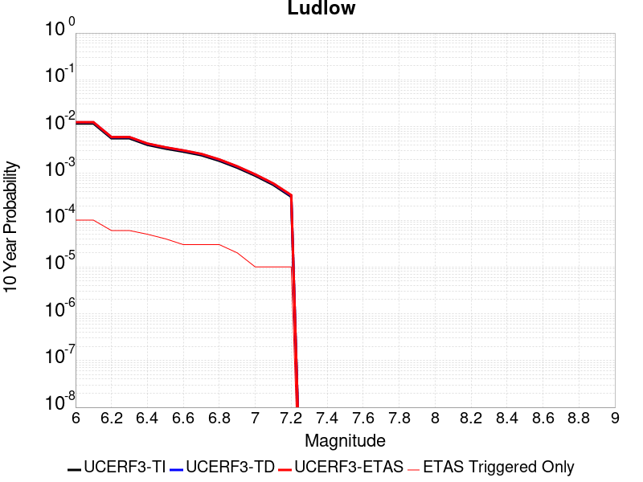 |

| Magnitude | 1 wk TI Prob | 1 wk TD Prob | 1 wk ETAS Prob | 1 wk ETAS/TD Gain | 1 wk ETAS Triggered Only | 1 mo TI Prob | 1 mo TD Prob | 1 mo ETAS Prob | 1 mo ETAS/TD Gain | 1 mo ETAS Triggered Only | 1 yr TI Prob | 1 yr TD Prob | 1 yr ETAS Prob | 1 yr ETAS/TD Gain | 1 yr ETAS Triggered Only | 10 yr TI Prob | 10 yr TD Prob | 10 yr ETAS Prob | 10 yr ETAS/TD Gain | 10 yr ETAS Triggered Only |
|-----|-----|-----|-----|-----|-----|-----|-----|-----|-----|-----|-----|-----|-----|-----|-----|-----|-----|-----|-----|-----|
| 6.0 | 2.2407607E-5 | 2.3657954E-5 | 2.3657954E-5 | 1.0 | 0.0 | 9.602906E-5 | 1.0138754E-4 | 1.0138754E-4 | 1.0 | 0.0 | 0.0011685267 | 0.0012337384 | 0.0012836767 | 1.0404773 | 5.0E-5 | 0.011624013 | 0.012273403 | 0.012372176 | 1.0080477 | 1.0E-4 |
| 6.1 | 2.2407607E-5 | 2.3657954E-5 | 2.3657954E-5 | 1.0 | 0.0 | 9.602906E-5 | 1.0138754E-4 | 1.0138754E-4 | 1.0 | 0.0 | 0.0011685267 | 0.0012337384 | 0.0012836767 | 1.0404773 | 5.0E-5 | 0.011624013 | 0.012273403 | 0.012372176 | 1.0080477 | 1.0E-4 |
| 6.2 | 1.0781252E-5 | 1.1365991E-5 | 1.1365991E-5 | 1.0 | 0.0 | 4.620455E-5 | 4.8710503E-5 | 4.8710503E-5 | 1.0 | 0.0 | 5.623952E-4 | 5.92893E-4 | 6.328693E-4 | 1.0674258 | 4.0E-5 | 0.00560974 | 0.005913531 | 0.005973176 | 1.0100862 | 6.0E-5 |
| 6.3 | 1.0781252E-5 | 1.1365991E-5 | 1.1365991E-5 | 1.0 | 0.0 | 4.620455E-5 | 4.8710503E-5 | 4.8710503E-5 | 1.0 | 0.0 | 5.623952E-4 | 5.92893E-4 | 6.328693E-4 | 1.0674258 | 4.0E-5 | 0.00560974 | 0.005913531 | 0.005973176 | 1.0100862 | 6.0E-5 |
| 6.4 | 7.814439E-6 | 8.237966E-6 | 8.237966E-6 | 1.0 | 0.0 | 3.3490025E-5 | 3.5305096E-5 | 3.5305096E-5 | 1.0 | 0.0 | 4.0766477E-4 | 4.2975618E-4 | 4.5974329E-4 | 1.069777 | 3.0E-5 | 0.0040691774 | 0.0042893975 | 0.004339183 | 1.0116067 | 5.0E-5 |
| 6.5 | 6.4986366E-6 | 6.8511167E-6 | 6.8511167E-6 | 1.0 | 0.0 | 2.7851002E-5 | 2.9361603E-5 | 2.9361603E-5 | 1.0 | 0.0 | 3.390332E-4 | 3.574198E-4 | 3.874091E-4 | 1.0839049 | 3.0E-5 | 0.003385164 | 0.003568546 | 0.003608403 | 1.0111691 | 4.0E-5 |
| 6.6 | 5.582177E-6 | 5.8861756E-6 | 5.8861756E-6 | 1.0 | 0.0 | 2.3923398E-5 | 2.5226227E-5 | 2.5226227E-5 | 1.0 | 0.0 | 2.9122844E-4 | 3.0708674E-4 | 3.270806E-4 | 1.0651082 | 2.0E-5 | 0.0029084706 | 0.0030666974 | 0.0030966054 | 1.0097525 | 3.0E-5 |
| 6.7 | 4.6858763E-6 | 4.94057E-6 | 4.94057E-6 | 1.0 | 0.0 | 2.0082172E-5 | 2.1173702E-5 | 2.1173702E-5 | 1.0 | 0.0 | 2.4447302E-4 | 2.5775988E-4 | 2.7775473E-4 | 1.0775716 | 2.0E-5 | 0.0024420423 | 0.0025746655 | 0.0026045882 | 1.011622 | 3.0E-5 |
| 6.8 | 3.5584908E-6 | 3.7521265E-6 | 3.7521265E-6 | 1.0 | 0.0 | 1.5250586E-5 | 1.6080447E-5 | 1.6080447E-5 | 1.0 | 0.0 | 1.8566006E-4 | 1.9576224E-4 | 2.1575834E-4 | 1.1021447 | 2.0E-5 | 0.0018550502 | 0.0019559392 | 0.0019858805 | 1.0153079 | 3.0E-5 |
| 6.9 | 2.532834E-6 | 2.6710807E-6 | 2.6710807E-6 | 1.0 | 0.0 | 1.0854958E-5 | 1.1447441E-5 | 1.1447441E-5 | 1.0 | 0.0 | 1.3215111E-4 | 1.3936395E-4 | 1.5936117E-4 | 1.1434891 | 2.0E-5 | 0.0013207254 | 0.0013927931 | 0.0014127652 | 1.0143397 | 2.0E-5 |
| 7.0 | 1.7083285E-6 | 1.8019963E-6 | 1.8019963E-6 | 1.0 | 0.0 | 7.3213873E-6 | 7.722819E-6 | 7.722819E-6 | 1.0 | 0.0 | 8.913424E-5 | 9.402143E-5 | 1.04020495E-4 | 1.1063488 | 1.0E-5 | 8.9098496E-4 | 9.3983306E-4 | 9.4982365E-4 | 1.0106301 | 1.0E-5 |
| 7.1 | 1.0905424E-6 | 1.1497951E-6 | 1.1497951E-6 | 1.0 | 0.0 | 4.6737446E-6 | 4.9276846E-6 | 4.9276846E-6 | 1.0 | 0.0 | 5.6901354E-5 | 5.9993006E-5 | 6.9992406E-5 | 1.166676 | 1.0E-5 | 5.6886784E-4 | 5.997779E-4 | 6.097719E-4 | 1.0166628 | 1.0E-5 |
| 7.2 | 6.06668E-7 | 6.387457E-7 | 6.387457E-7 | 1.0 | 0.0 | 2.600003E-6 | 2.737479E-6 | 2.737479E-6 | 1.0 | 0.0 | 3.1654577E-5 | 3.3328364E-5 | 4.3328033E-5 | 1.3000348 | 1.0E-5 | 3.1650066E-4 | 3.3324052E-4 | 3.432372E-4 | 1.0299983 | 1.0E-5 |

## Owens Valley
*[(top)](#table-of-contents)*

| 1 Week | 1 Month | 1 Year | 10 Year |
|-----|-----|-----|-----|
|  |  | 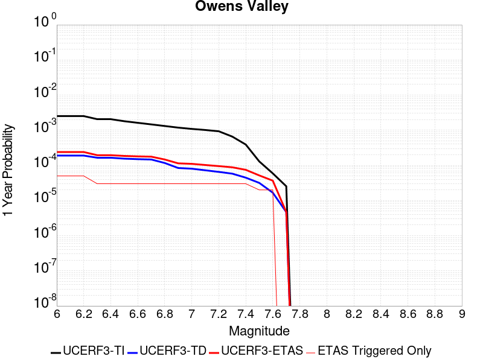 |  |

| Magnitude | 1 wk TI Prob | 1 wk TD Prob | 1 wk ETAS Prob | 1 wk ETAS/TD Gain | 1 wk ETAS Triggered Only | 1 mo TI Prob | 1 mo TD Prob | 1 mo ETAS Prob | 1 mo ETAS/TD Gain | 1 mo ETAS Triggered Only | 1 yr TI Prob | 1 yr TD Prob | 1 yr ETAS Prob | 1 yr ETAS/TD Gain | 1 yr ETAS Triggered Only | 10 yr TI Prob | 10 yr TD Prob | 10 yr ETAS Prob | 10 yr ETAS/TD Gain | 10 yr ETAS Triggered Only |
|-----|-----|-----|-----|-----|-----|-----|-----|-----|-----|-----|-----|-----|-----|-----|-----|-----|-----|-----|-----|-----|
| 6.0 | 4.83821E-5 | 3.6305946E-6 | 3.6305946E-6 | 1.0 | 0.0 | 2.0733538E-4 | 1.5559604E-5 | 2.5559448E-5 | 1.6426798 | 1.0E-5 | 0.002521386 | 1.8942272E-4 | 2.3941325E-4 | 1.2639099 | 5.0E-5 | 0.024929691 | 0.0019204353 | 0.0020202433 | 1.0519716 | 1.0E-4 |
| 6.1 | 4.83821E-5 | 3.6305946E-6 | 3.6305946E-6 | 1.0 | 0.0 | 2.0733538E-4 | 1.5559604E-5 | 2.5559448E-5 | 1.6426798 | 1.0E-5 | 0.002521386 | 1.8942272E-4 | 2.3941325E-4 | 1.2639099 | 5.0E-5 | 0.024929691 | 0.0019204353 | 0.0020202433 | 1.0519716 | 1.0E-4 |
| 6.2 | 4.83821E-5 | 3.6305946E-6 | 3.6305946E-6 | 1.0 | 0.0 | 2.0733538E-4 | 1.5559604E-5 | 2.5559448E-5 | 1.6426798 | 1.0E-5 | 0.002521386 | 1.8942272E-4 | 2.3941325E-4 | 1.2639099 | 5.0E-5 | 0.024929691 | 0.0019204353 | 0.0020202433 | 1.0519716 | 1.0E-4 |
| 6.3 | 3.953008E-5 | 3.1569743E-6 | 3.1569743E-6 | 1.0 | 0.0 | 1.6940363E-4 | 1.3529823E-5 | 2.3529688E-5 | 1.739098 | 1.0E-5 | 0.002060538 | 1.6471389E-4 | 1.9470895E-4 | 1.182104 | 3.0E-5 | 0.020415364 | 0.0016592429 | 0.0017391102 | 1.0481348 | 8.0E-5 |
| 6.4 | 3.953008E-5 | 3.1569743E-6 | 3.1569743E-6 | 1.0 | 0.0 | 1.6940363E-4 | 1.3529823E-5 | 2.3529688E-5 | 1.739098 | 1.0E-5 | 0.002060538 | 1.6471389E-4 | 1.9470895E-4 | 1.182104 | 3.0E-5 | 0.020415364 | 0.0016592429 | 0.0017391102 | 1.0481348 | 8.0E-5 |
| 6.5 | 3.457342E-5 | 2.9722537E-6 | 2.9722537E-6 | 1.0 | 0.0 | 1.4816338E-4 | 1.2738172E-5 | 2.2738044E-5 | 1.785032 | 1.0E-5 | 0.0018023965 | 1.5507691E-4 | 1.8507225E-4 | 1.1934224 | 3.0E-5 | 0.017878477 | 0.0015558794 | 0.0016357548 | 1.0513378 | 8.0E-5 |
| 6.6 | 3.1127765E-5 | 2.8751224E-6 | 2.8751224E-6 | 1.0 | 0.0 | 1.3339789E-4 | 1.2321899E-5 | 2.2321776E-5 | 1.8115532 | 1.0E-5 | 0.0016229092 | 1.5000948E-4 | 1.8000498E-4 | 1.1999574 | 3.0E-5 | 0.016111081 | 0.0015009856 | 0.0015808656 | 1.0532184 | 8.0E-5 |
| 6.7 | 2.806885E-5 | 2.8107588E-6 | 2.8107588E-6 | 1.0 | 0.0 | 1.2028952E-4 | 1.2046057E-5 | 2.2045937E-5 | 1.8301371 | 1.0E-5 | 0.001463541 | 1.4665157E-4 | 1.7664717E-4 | 1.2045366 | 3.0E-5 | 0.014539397 | 0.0014659754 | 0.0015458581 | 1.0544912 | 8.0E-5 |
| 6.8 | 2.524524E-5 | 2.2356737E-6 | 2.2356737E-6 | 1.0 | 0.0 | 1.0818939E-4 | 9.581425E-6 | 1.958133E-5 | 2.0436761 | 1.0E-5 | 0.0013164099 | 1.1664791E-4 | 1.4664441E-4 | 1.2571542 | 3.0E-5 | 0.01308639 | 0.0011661606 | 0.0012460672 | 1.0685211 | 8.0E-5 |
| 6.9 | 2.2704568E-5 | 1.6083629E-6 | 1.6083629E-6 | 1.0 | 0.0 | 9.730166E-5 | 6.8929658E-6 | 1.6892896E-5 | 2.4507444 | 1.0E-5 | 0.0011840039 | 8.391865E-5 | 1.1391613E-4 | 1.3574591 | 3.0E-5 | 0.011777153 | 8.3909626E-4 | 9.190291E-4 | 1.0952606 | 8.0E-5 |
| 7.0 | 2.0871712E-5 | 1.539734E-6 | 1.539734E-6 | 1.0 | 0.0 | 8.944713E-5 | 6.5988434E-6 | 1.6598777E-5 | 2.515407 | 1.0E-5 | 0.0010884746 | 8.033797E-5 | 1.1033556E-4 | 1.3733925 | 3.0E-5 | 0.010831586 | 8.0327404E-4 | 8.8320975E-4 | 1.0995125 | 8.0E-5 |
| 7.1 | 1.944928E-5 | 1.386575E-6 | 1.386575E-6 | 1.0 | 0.0 | 8.335139E-5 | 5.942451E-6 | 1.594239E-5 | 2.6827972 | 1.0E-5 | 0.0010143308 | 7.234695E-5 | 1.0234478E-4 | 1.4146385 | 3.0E-5 | 0.010097133 | 7.2340504E-4 | 8.0334715E-4 | 1.1105081 | 8.0E-5 |
| 7.2 | 1.7876306E-5 | 1.24905E-6 | 1.24905E-6 | 1.0 | 0.0 | 7.6610486E-5 | 5.3530603E-6 | 1.5353007E-5 | 2.8680804 | 1.0E-5 | 9.3233347E-4 | 6.517157E-5 | 9.516961E-5 | 1.4602934 | 3.0E-5 | 0.009284316 | 6.5168424E-4 | 7.316321E-4 | 1.1226789 | 8.0E-5 |
| 7.3 | 1.2618672E-5 | 1.1116437E-6 | 1.1116437E-6 | 1.0 | 0.0 | 5.40789E-5 | 4.7641784E-6 | 1.476413E-5 | 3.0989878 | 1.0E-5 | 6.582117E-4 | 5.8002333E-5 | 8.80006E-5 | 1.5171906 | 3.0E-5 | 0.0065626553 | 5.8002654E-4 | 6.5998017E-4 | 1.1378447 | 8.0E-5 |
| 7.4 | 7.4874442E-6 | 8.5496856E-7 | 8.5496856E-7 | 1.0 | 0.0 | 3.208865E-5 | 3.6641459E-6 | 1.3664109E-5 | 3.729139 | 1.0E-5 | 3.906093E-4 | 4.4610068E-5 | 7.4608724E-5 | 1.672464 | 3.0E-5 | 0.003899234 | 4.4612345E-4 | 5.2608777E-4 | 1.1792426 | 8.0E-5 |
| 7.5 | 2.4734156E-6 | 6.0694214E-7 | 6.0694214E-7 | 1.0 | 0.0 | 1.060031E-5 | 2.601178E-6 | 1.2601152E-5 | 4.844402 | 1.0E-5 | 1.2905113E-4 | 3.1668886E-5 | 5.1668252E-5 | 1.6315147 | 2.0E-5 | 0.0012897621 | 3.1664406E-4 | 3.866219E-4 | 1.2209984 | 7.0E-5 |
| 7.6 | 1.1328841E-6 | 3.196907E-7 | 3.196907E-7 | 1.0 | 0.0 | 4.8552088E-6 | 1.3701024E-6 | 1.1370089E-5 | 8.298715 | 1.0E-5 | 5.9110564E-5 | 1.668087E-5 | 3.6680536E-5 | 2.1989582 | 2.0E-5 | 5.9094845E-4 | 1.6679637E-4 | 2.2678636E-4 | 1.35966 | 6.0E-5 |
| 7.7 | 4.8613185E-7 | 8.9654996E-8 | 8.9654996E-8 | 1.0 | 0.0 | 2.0834207E-6 | 3.8423565E-7 | 3.8423565E-7 | 1.0 | 0.0 | 2.536535E-5 | 4.6780597E-6 | 4.6780597E-6 | 1.0 | 0.0 | 2.5362454E-4 | 4.677968E-5 | 5.6779212E-5 | 1.213758 | 1.0E-5 |

## Calico-Hidalgo
*[(top)](#table-of-contents)*

| 1 Week | 1 Month | 1 Year | 10 Year |
|-----|-----|-----|-----|
|  |  |  |  |

| Magnitude | 1 wk TI Prob | 1 wk TD Prob | 1 wk ETAS Prob | 1 wk ETAS/TD Gain | 1 wk ETAS Triggered Only | 1 mo TI Prob | 1 mo TD Prob | 1 mo ETAS Prob | 1 mo ETAS/TD Gain | 1 mo ETAS Triggered Only | 1 yr TI Prob | 1 yr TD Prob | 1 yr ETAS Prob | 1 yr ETAS/TD Gain | 1 yr ETAS Triggered Only | 10 yr TI Prob | 10 yr TD Prob | 10 yr ETAS Prob | 10 yr ETAS/TD Gain | 10 yr ETAS Triggered Only |
|-----|-----|-----|-----|-----|-----|-----|-----|-----|-----|-----|-----|-----|-----|-----|-----|-----|-----|-----|-----|-----|
| 6.0 | 4.0906612E-5 | 5.0708393E-5 | 5.0708393E-5 | 1.0 | 0.0 | 1.7530227E-4 | 2.1730587E-4 | 2.1730587E-4 | 1.0 | 0.0 | 0.0021322158 | 0.0026428874 | 0.0026827818 | 1.015095 | 4.0E-5 | 0.02111873 | 0.02615486 | 0.026242508 | 1.0033511 | 9.0E-5 |
| 6.1 | 4.0906612E-5 | 5.0708393E-5 | 5.0708393E-5 | 1.0 | 0.0 | 1.7530227E-4 | 2.1730587E-4 | 2.1730587E-4 | 1.0 | 0.0 | 0.0021322158 | 0.0026428874 | 0.0026827818 | 1.015095 | 4.0E-5 | 0.02111873 | 0.02615486 | 0.026242508 | 1.0033511 | 9.0E-5 |
| 6.2 | 4.0906612E-5 | 5.0708393E-5 | 5.0708393E-5 | 1.0 | 0.0 | 1.7530227E-4 | 2.1730587E-4 | 2.1730587E-4 | 1.0 | 0.0 | 0.0021322158 | 0.0026428874 | 0.0026827818 | 1.015095 | 4.0E-5 | 0.02111873 | 0.02615486 | 0.026242508 | 1.0033511 | 9.0E-5 |
| 6.3 | 2.4242801E-5 | 3.0092604E-5 | 3.0092604E-5 | 1.0 | 0.0 | 1.0389358E-4 | 1.2896211E-4 | 1.2896211E-4 | 1.0 | 0.0 | 0.0012641704 | 0.0015690165 | 0.0016089537 | 1.0254537 | 4.0E-5 | 0.01257003 | 0.015583069 | 0.015671667 | 1.0056854 | 9.0E-5 |
| 6.4 | 2.4242801E-5 | 3.0092604E-5 | 3.0092604E-5 | 1.0 | 0.0 | 1.0389358E-4 | 1.2896211E-4 | 1.2896211E-4 | 1.0 | 0.0 | 0.0012641704 | 0.0015690165 | 0.0016089537 | 1.0254537 | 4.0E-5 | 0.01257003 | 0.015583069 | 0.015671667 | 1.0056854 | 9.0E-5 |
| 6.5 | 2.0286952E-5 | 2.5317231E-5 | 2.5317231E-5 | 1.0 | 0.0 | 8.694118E-5 | 1.08498E-4 | 1.08498E-4 | 1.0 | 0.0 | 0.0010579949 | 0.0013201798 | 0.001360127 | 1.0302589 | 4.0E-5 | 0.010529719 | 0.013125306 | 0.013214125 | 1.006767 | 9.0E-5 |
| 6.6 | 2.0269223E-5 | 2.5298179E-5 | 2.5298179E-5 | 1.0 | 0.0 | 8.6865206E-5 | 1.0841636E-4 | 1.0841636E-4 | 1.0 | 0.0 | 0.0010570707 | 0.001319187 | 0.0013591342 | 1.0302817 | 4.0E-5 | 0.010520565 | 0.013115495 | 0.013204316 | 1.0067722 | 9.0E-5 |
| 6.7 | 1.799852E-5 | 2.2541886E-5 | 2.2541886E-5 | 1.0 | 0.0 | 7.713423E-5 | 9.660459E-5 | 9.660459E-5 | 1.0 | 0.0 | 9.3870464E-4 | 0.0011755408 | 0.0012154938 | 1.0339869 | 4.0E-5 | 0.009347493 | 0.011694837 | 0.011783784 | 1.0076057 | 9.0E-5 |
| 6.8 | 1.7458793E-5 | 2.1843232E-5 | 2.1843232E-5 | 1.0 | 0.0 | 7.4821255E-5 | 9.361057E-5 | 9.361057E-5 | 1.0 | 0.0 | 9.10568E-4 | 0.0011391273 | 0.0011790817 | 1.0350746 | 4.0E-5 | 0.009068459 | 0.011334467 | 0.011423447 | 1.0078504 | 9.0E-5 |
| 6.9 | 1.542884E-5 | 1.9026784E-5 | 1.9026784E-5 | 1.0 | 0.0 | 6.612192E-5 | 8.1540886E-5 | 8.1540886E-5 | 1.0 | 0.0 | 8.04737E-4 | 9.923213E-4 | 0.0010322816 | 1.0402695 | 4.0E-5 | 0.008018291 | 0.009880301 | 0.009969411 | 1.009019 | 9.0E-5 |
| 7.0 | 1.468253E-5 | 1.8031564E-5 | 1.8031564E-5 | 1.0 | 0.0 | 6.292361E-5 | 7.7275916E-5 | 7.7275916E-5 | 1.0 | 0.0 | 7.658257E-4 | 9.404412E-4 | 9.804036E-4 | 1.0424932 | 4.0E-5 | 0.0076319184 | 0.0093659805 | 0.009455137 | 1.0095192 | 9.0E-5 |
| 7.1 | 1.3139281E-5 | 1.620179E-5 | 1.620179E-5 | 1.0 | 0.0 | 5.6309986E-5 | 6.943446E-5 | 6.943446E-5 | 1.0 | 0.0 | 6.853584E-4 | 8.4504933E-4 | 8.75024E-4 | 1.0354708 | 3.0E-5 | 0.0068324856 | 0.008419657 | 0.008498983 | 1.0094216 | 8.0E-5 |
| 7.2 | 1.1127404E-5 | 1.3867326E-5 | 1.3867326E-5 | 1.0 | 0.0 | 4.7688E-5 | 5.9430102E-5 | 5.9430102E-5 | 1.0 | 0.0 | 5.8044674E-4 | 7.2333217E-4 | 7.533105E-4 | 1.0414448 | 3.0E-5 | 0.0057893298 | 0.007210886 | 0.007280381 | 1.0096376 | 7.0E-5 |
| 7.3 | 9.808154E-6 | 1.2176835E-5 | 1.2176835E-5 | 1.0 | 0.0 | 4.2034266E-5 | 5.2185453E-5 | 5.2185453E-5 | 1.0 | 0.0 | 5.11647E-4 | 6.351834E-4 | 6.651643E-4 | 1.0472004 | 3.0E-5 | 0.0051047057 | 0.0063347546 | 0.0063943746 | 1.0094116 | 6.0E-5 |
| 7.4 | 7.942452E-6 | 9.792561E-6 | 9.792561E-6 | 1.0 | 0.0 | 3.4038632E-5 | 4.1967498E-5 | 4.1967498E-5 | 1.0 | 0.0 | 4.1434157E-4 | 5.10844E-4 | 5.308337E-4 | 1.0391309 | 2.0E-5 | 0.0041356985 | 0.005097638 | 0.005137434 | 1.0078068 | 4.0E-5 |
| 7.5 | 4.7121216E-6 | 5.773085E-6 | 5.773085E-6 | 1.0 | 0.0 | 2.019465E-5 | 2.4741601E-5 | 2.4741601E-5 | 1.0 | 0.0 | 2.4584212E-4 | 3.0119502E-4 | 3.11192E-4 | 1.0331911 | 1.0E-5 | 0.0024557032 | 0.0030086206 | 0.0030285604 | 1.0066276 | 2.0E-5 |
| 7.6 | 2.21172E-7 | 2.6040448E-7 | 2.6040448E-7 | 1.0 | 0.0 | 9.478797E-7 | 1.1160189E-6 | 1.1160189E-6 | 1.0 | 0.0 | 1.1540374E-5 | 1.3587473E-5 | 1.3587473E-5 | 1.0 | 0.0 | 1.1539775E-4 | 1.3586924E-4 | 1.3586924E-4 | 1.0 | 0.0 |

## Santa Ynez (West)
*[(top)](#table-of-contents)*

| 1 Week | 1 Month | 1 Year | 10 Year |
|-----|-----|-----|-----|
|  |  |  |  |

| Magnitude | 1 wk TI Prob | 1 wk TD Prob | 1 wk ETAS Prob | 1 wk ETAS/TD Gain | 1 wk ETAS Triggered Only | 1 mo TI Prob | 1 mo TD Prob | 1 mo ETAS Prob | 1 mo ETAS/TD Gain | 1 mo ETAS Triggered Only | 1 yr TI Prob | 1 yr TD Prob | 1 yr ETAS Prob | 1 yr ETAS/TD Gain | 1 yr ETAS Triggered Only | 10 yr TI Prob | 10 yr TD Prob | 10 yr ETAS Prob | 10 yr ETAS/TD Gain | 10 yr ETAS Triggered Only |
|-----|-----|-----|-----|-----|-----|-----|-----|-----|-----|-----|-----|-----|-----|-----|-----|-----|-----|-----|-----|-----|
| 6.0 | 4.7352758E-5 | 5.4976248E-5 | 5.4976248E-5 | 1.0 | 0.0 | 2.0292461E-4 | 2.3559289E-4 | 2.4559052E-4 | 1.0424361 | 1.0E-5 | 0.0024678076 | 0.0028648374 | 0.0029246653 | 1.0208836 | 6.0E-5 | 0.024405818 | 0.028307172 | 0.028384907 | 1.0027461 | 8.0E-5 |
| 6.1 | 4.7352758E-5 | 5.4976248E-5 | 5.4976248E-5 | 1.0 | 0.0 | 2.0292461E-4 | 2.3559289E-4 | 2.4559052E-4 | 1.0424361 | 1.0E-5 | 0.0024678076 | 0.0028648374 | 0.0029146941 | 1.017403 | 5.0E-5 | 0.024405818 | 0.028307172 | 0.028365474 | 1.0020596 | 6.0E-5 |
| 6.2 | 3.0415853E-5 | 3.3927645E-5 | 3.3927645E-5 | 1.0 | 0.0 | 1.3034715E-4 | 1.4539632E-4 | 1.5539485E-4 | 1.0687675 | 1.0E-5 | 0.0015858212 | 0.0017687982 | 0.0018087275 | 1.0225742 | 4.0E-5 | 0.015745522 | 0.017551146 | 0.017600268 | 1.0027988 | 5.0E-5 |
| 6.3 | 3.0415853E-5 | 3.3927645E-5 | 3.3927645E-5 | 1.0 | 0.0 | 1.3034715E-4 | 1.4539632E-4 | 1.5539485E-4 | 1.0687675 | 1.0E-5 | 0.0015858212 | 0.0017687982 | 0.0018087275 | 1.0225742 | 4.0E-5 | 0.015745522 | 0.017551146 | 0.017600268 | 1.0027988 | 5.0E-5 |
| 6.4 | 2.5452082E-5 | 2.7914315E-5 | 2.7914315E-5 | 1.0 | 0.0 | 1.09075794E-4 | 1.196274E-4 | 1.296262E-4 | 1.0835829 | 1.0E-5 | 0.0013271887 | 0.0014555093 | 0.0014854657 | 1.0205814 | 3.0E-5 | 0.013192902 | 0.014461935 | 0.014501356 | 1.0027258 | 4.0E-5 |
| 6.5 | 2.3143784E-5 | 2.512982E-5 | 2.512982E-5 | 1.0 | 0.0 | 9.9183875E-5 | 1.0769487E-4 | 1.0769487E-4 | 1.0 | 0.0 | 0.0012068948 | 0.0013104109 | 0.0013303846 | 1.0152423 | 2.0E-5 | 0.012003611 | 0.013028506 | 0.013058116 | 1.0022726 | 3.0E-5 |
| 6.6 | 1.9118515E-5 | 2.035546E-5 | 2.035546E-5 | 1.0 | 0.0 | 8.193392E-5 | 8.723481E-5 | 8.723481E-5 | 1.0 | 0.0 | 9.97089E-4 | 0.0010615742 | 0.0010715636 | 1.00941 | 1.0E-5 | 0.00992627 | 0.010565943 | 0.010575837 | 1.0009364 | 1.0E-5 |
| 6.7 | 1.722807E-5 | 1.8147268E-5 | 1.8147268E-5 | 1.0 | 0.0 | 7.3832496E-5 | 7.777172E-5 | 7.777172E-5 | 1.0 | 0.0 | 8.985399E-4 | 9.4646495E-4 | 9.564555E-4 | 1.0105556 | 1.0E-5 | 0.008949154 | 0.009424986 | 0.009434892 | 1.0010511 | 1.0E-5 |
| 6.8 | 1.5317364E-5 | 1.5927215E-5 | 1.5927215E-5 | 1.0 | 0.0 | 6.56442E-5 | 6.825773E-5 | 6.825773E-5 | 1.0 | 0.0 | 7.98925E-4 | 8.3072524E-4 | 8.4071694E-4 | 1.0120276 | 1.0E-5 | 0.007960589 | 0.008276687 | 0.008286604 | 1.0011982 | 1.0E-5 |
| 6.9 | 1.3071226E-5 | 1.3330136E-5 | 1.3330136E-5 | 1.0 | 0.0 | 5.6018336E-5 | 5.7127916E-5 | 5.7127916E-5 | 1.0 | 0.0 | 6.8180985E-4 | 6.953127E-4 | 7.053057E-4 | 1.014372 | 1.0E-5 | 0.0067972173 | 0.0069316328 | 0.0069415634 | 1.0014327 | 1.0E-5 |
| 7.0 | 1.1836986E-5 | 1.1933195E-5 | 1.1933195E-5 | 1.0 | 0.0 | 5.0728955E-5 | 5.1141273E-5 | 5.1141273E-5 | 1.0 | 0.0 | 6.1745E-4 | 6.224688E-4 | 6.3246256E-4 | 1.0160551 | 1.0E-5 | 0.006157372 | 0.0062074456 | 0.006217384 | 1.001601 | 1.0E-5 |
| 7.1 | 1.0597169E-5 | 1.0542524E-5 | 1.0542524E-5 | 1.0 | 0.0 | 4.541565E-5 | 4.518147E-5 | 4.518147E-5 | 1.0 | 0.0 | 5.5279525E-4 | 5.499467E-4 | 5.599412E-4 | 1.0181736 | 1.0E-5 | 0.0055142213 | 0.0054859887 | 0.005495934 | 1.0018128 | 1.0E-5 |
| 7.2 | 9.59113E-6 | 9.4594225E-6 | 9.4594225E-6 | 1.0 | 0.0 | 4.11042E-5 | 4.053976E-5 | 4.053976E-5 | 1.0 | 0.0 | 5.0032866E-4 | 4.9346086E-4 | 5.034559E-4 | 1.0202551 | 1.0E-5 | 0.004992037 | 0.00492377 | 0.004933721 | 1.002021 | 1.0E-5 |
| 7.3 | 8.586084E-6 | 8.3798195E-6 | 8.3798195E-6 | 1.0 | 0.0 | 3.679698E-5 | 3.591302E-5 | 3.591302E-5 | 1.0 | 0.0 | 4.4791115E-4 | 4.3715438E-4 | 4.4715E-4 | 1.0228652 | 1.0E-5 | 0.004470094 | 0.0043630553 | 0.004373012 | 1.002282 | 1.0E-5 |
| 7.4 | 7.2622997E-6 | 6.951717E-6 | 6.951717E-6 | 1.0 | 0.0 | 3.112377E-5 | 2.9792738E-5 | 2.9792738E-5 | 1.0 | 0.0 | 3.78866E-4 | 3.6266717E-4 | 3.7266355E-4 | 1.0275635 | 1.0E-5 | 0.0037822074 | 0.0036208534 | 0.0036308174 | 1.0027518 | 1.0E-5 |
| 7.5 | 5.627296E-6 | 5.251687E-6 | 5.251687E-6 | 1.0 | 0.0 | 2.411676E-5 | 2.250704E-5 | 2.250704E-5 | 1.0 | 0.0 | 2.9358198E-4 | 2.7398948E-4 | 2.7398948E-4 | 1.0 | 0.0 | 0.0029319443 | 0.0027365887 | 0.0027365887 | 1.0 | 0.0 |
| 7.6 | 2.265244E-6 | 2.0609377E-6 | 2.0609377E-6 | 1.0 | 0.0 | 9.708152E-6 | 8.832561E-6 | 8.832561E-6 | 1.0 | 0.0 | 1.18190335E-4 | 1.0753121E-4 | 1.0753121E-4 | 1.0 | 0.0 | 0.001181275 | 0.0010748004 | 0.0010748004 | 1.0 | 0.0 |
| 7.7 | 1.3099874E-6 | 1.1016689E-6 | 1.1016689E-6 | 1.0 | 0.0 | 5.61422E-6 | 4.7214294E-6 | 4.7214294E-6 | 1.0 | 0.0 | 6.8350986E-5 | 5.7481913E-5 | 5.7481913E-5 | 1.0 | 0.0 | 6.832996E-4 | 5.746728E-4 | 5.746728E-4 | 1.0 | 0.0 |
| 7.8 | 7.903951E-7 | 6.071319E-7 | 6.071319E-7 | 1.0 | 0.0 | 3.3874032E-6 | 2.6019911E-6 | 2.6019911E-6 | 1.0 | 0.0 | 4.1240855E-5 | 3.1678795E-5 | 3.1678795E-5 | 1.0 | 0.0 | 4.12332E-4 | 3.1674412E-4 | 3.1674412E-4 | 1.0 | 0.0 |
| 7.9 | 7.0753297E-9 | 5.0901185E-9 | 5.0901185E-9 | 1.0 | 0.0 | 3.032284E-8 | 2.1814794E-8 | 2.1814794E-8 | 1.0 | 0.0 | 3.6918053E-7 | 2.6559508E-7 | 2.6559508E-7 | 1.0 | 0.0 | 3.691799E-6 | 2.6559487E-6 | 2.6559487E-6 | 1.0 | 0.0 |

## San Andreas (Creeping Section) 2011 CFM
*[(top)](#table-of-contents)*

| 1 Week | 1 Month | 1 Year | 10 Year |
|-----|-----|-----|-----|
|  |  |  |  |

| Magnitude | 1 wk TI Prob | 1 wk TD Prob | 1 wk ETAS Prob | 1 wk ETAS/TD Gain | 1 wk ETAS Triggered Only | 1 mo TI Prob | 1 mo TD Prob | 1 mo ETAS Prob | 1 mo ETAS/TD Gain | 1 mo ETAS Triggered Only | 1 yr TI Prob | 1 yr TD Prob | 1 yr ETAS Prob | 1 yr ETAS/TD Gain | 1 yr ETAS Triggered Only | 10 yr TI Prob | 10 yr TD Prob | 10 yr ETAS Prob | 10 yr ETAS/TD Gain | 10 yr ETAS Triggered Only |
|-----|-----|-----|-----|-----|-----|-----|-----|-----|-----|-----|-----|-----|-----|-----|-----|-----|-----|-----|-----|-----|
| 6.0 | 5.986481E-4 | 0.0012281181 | 0.0012381057 | 1.0081326 | 1.0E-5 | 0.0025631124 | 0.0052478816 | 0.005257829 | 1.0018955 | 1.0E-5 | 0.030762846 | 0.061232176 | 0.06126034 | 1.0004599 | 3.0E-5 | 0.26835477 | 0.42607728 | 0.42611745 | 1.0000943 | 7.0E-5 |
| 6.1 | 5.015945E-4 | 0.0010222462 | 0.0010322359 | 1.0097724 | 1.0E-5 | 0.00214792 | 0.004369848 | 0.0043798042 | 1.0022784 | 1.0E-5 | 0.025839351 | 0.051271588 | 0.05129056 | 1.00037 | 2.0E-5 | 0.23032776 | 0.3729949 | 0.3730325 | 1.0001009 | 6.0E-5 |
| 6.2 | 4.073338E-4 | 8.1118365E-4 | 8.211755E-4 | 1.0123177 | 1.0E-5 | 0.0017445484 | 0.0034691135 | 0.0034790789 | 1.0028726 | 1.0E-5 | 0.021034058 | 0.040956367 | 0.04097555 | 1.0004684 | 2.0E-5 | 0.19150782 | 0.3131846 | 0.31321895 | 1.0001097 | 5.0E-5 |
| 6.3 | 3.464099E-4 | 6.743695E-4 | 6.843628E-4 | 1.0148187 | 1.0E-5 | 0.0014837692 | 0.0028849328 | 0.002894904 | 1.0034562 | 1.0E-5 | 0.017915873 | 0.03421296 | 0.034232277 | 1.0005646 | 2.0E-5 | 0.16538359 | 0.27147684 | 0.27151325 | 1.0001342 | 5.0E-5 |
| 6.4 | 2.935057E-4 | 5.5487157E-4 | 5.64866E-4 | 1.0180122 | 1.0E-5 | 0.0012572751 | 0.0023745096 | 0.002384486 | 1.0042014 | 1.0E-5 | 0.015200248 | 0.028288092 | 0.028307525 | 1.000687 | 2.0E-5 | 0.14201577 | 0.23315436 | 0.2331927 | 1.0001645 | 5.0E-5 |
| 6.5 | 2.3409708E-4 | 4.2138255E-4 | 4.313783E-4 | 1.0237215 | 1.0E-5 | 0.0010028875 | 0.0018039518 | 0.0018139337 | 1.0055333 | 1.0E-5 | 0.012141965 | 0.02161123 | 0.021621015 | 1.0004528 | 1.0E-5 | 0.11499573 | 0.18700314 | 0.18703566 | 1.0001739 | 4.0E-5 |
| 6.6 | 1.5842178E-4 | 2.511574E-4 | 2.611549E-4 | 1.0398057 | 1.0E-5 | 6.7877385E-4 | 0.0010759344 | 0.0010859236 | 1.0092843 | 1.0E-5 | 0.0082328 | 0.013019429 | 0.013029298 | 1.000758 | 1.0E-5 | 0.07934396 | 0.12333928 | 0.12336558 | 1.0002133 | 3.0E-5 |
| 6.7 | 1.5616413E-4 | 2.46522E-4 | 2.5651953E-4 | 1.0405543 | 1.0E-5 | 6.691031E-4 | 0.0010560873 | 0.0010660767 | 1.0094589 | 1.0E-5 | 0.0081159435 | 0.0127812615 | 0.0127911335 | 1.0007724 | 1.0E-5 | 0.0782586 | 0.12136643 | 0.12139279 | 1.0002172 | 3.0E-5 |
| 6.8 | 1.5538467E-4 | 2.4475955E-4 | 2.5475712E-4 | 1.0408465 | 1.0E-5 | 6.6576427E-4 | 0.0010485414 | 0.0010585309 | 1.0095271 | 1.0E-5 | 0.008075596 | 0.01269062 | 0.0127004925 | 1.000778 | 1.0E-5 | 0.07788358 | 0.120597176 | 0.12062356 | 1.0002187 | 3.0E-5 |
| 6.9 | 1.5153569E-4 | 2.3584829E-4 | 2.4584593E-4 | 1.0423901 | 1.0E-5 | 6.49277E-4 | 0.0010103888 | 0.0010203788 | 1.0098872 | 1.0E-5 | 0.007876333 | 0.012232622 | 0.0122425 | 1.0008075 | 1.0E-5 | 0.07602952 | 0.116666704 | 0.116693206 | 1.0002271 | 3.0E-5 |
| 7.0 | 1.4588932E-4 | 2.2441633E-4 | 2.344141E-4 | 1.0445501 | 1.0E-5 | 6.250901E-4 | 9.6143177E-4 | 9.714222E-4 | 1.0103911 | 1.0E-5 | 0.0075839474 | 0.011643107 | 0.01165299 | 1.0008489 | 1.0E-5 | 0.073302895 | 0.1115123 | 0.111538954 | 1.000239 | 3.0E-5 |
| 7.1 | 1.1565079E-4 | 1.631913E-4 | 1.7318968E-4 | 1.0612677 | 1.0E-5 | 4.955521E-4 | 6.992047E-4 | 7.091977E-4 | 1.014292 | 1.0E-5 | 0.006016669 | 0.008479793 | 0.0084897075 | 1.0011693 | 1.0E-5 | 0.058563538 | 0.08384011 | 0.083867595 | 1.0003278 | 3.0E-5 |
| 7.2 | 1.0393792E-4 | 1.4650873E-4 | 1.5650726E-4 | 1.0682453 | 1.0E-5 | 4.4537216E-4 | 6.277442E-4 | 6.377379E-4 | 1.01592 | 1.0E-5 | 0.005408933 | 0.007616173 | 0.007626097 | 1.001303 | 1.0E-5 | 0.052791595 | 0.07578092 | 0.075808644 | 1.0003659 | 3.0E-5 |
| 7.3 | 9.332884E-5 | 1.2811464E-4 | 1.3811335E-4 | 1.0780451 | 1.0E-5 | 3.999194E-4 | 5.4894784E-4 | 5.589423E-4 | 1.0182067 | 1.0E-5 | 0.0048581534 | 0.006663094 | 0.0066730273 | 1.0014908 | 1.0E-5 | 0.047533102 | 0.06662787 | 0.06665587 | 1.0004202 | 3.0E-5 |
| 7.4 | 8.670252E-5 | 1.1729612E-4 | 1.2729494E-4 | 1.0852443 | 1.0E-5 | 3.715293E-4 | 5.026014E-4 | 5.1259634E-4 | 1.0198865 | 1.0E-5 | 0.004513991 | 0.006102124 | 0.0061120633 | 1.0016288 | 1.0E-5 | 0.044233937 | 0.061277855 | 0.061306015 | 1.0004596 | 3.0E-5 |
| 7.5 | 7.3036405E-5 | 9.0276684E-5 | 1.0027578E-4 | 1.1107606 | 1.0E-5 | 3.129756E-4 | 3.868428E-4 | 3.9683894E-4 | 1.0258403 | 1.0E-5 | 0.0038038217 | 0.0046996614 | 0.0047096144 | 1.0021179 | 1.0E-5 | 0.03739367 | 0.047983047 | 0.048011605 | 1.0005952 | 3.0E-5 |
| 7.6 | 6.3935775E-5 | 8.298909E-5 | 9.298826E-5 | 1.1204878 | 1.0E-5 | 2.7398168E-4 | 3.5561912E-4 | 3.656156E-4 | 1.02811 | 1.0E-5 | 0.0033306254 | 0.004321086 | 0.004331043 | 1.0023042 | 1.0E-5 | 0.032811474 | 0.044081833 | 0.04411051 | 1.0006505 | 3.0E-5 |
| 7.7 | 5.5050095E-5 | 6.678156E-5 | 7.6780896E-5 | 1.1497319 | 1.0E-5 | 2.3590765E-4 | 2.8617532E-4 | 2.9617245E-4 | 1.0349336 | 1.0E-5 | 0.0028683927 | 0.0034786223 | 0.0034885874 | 1.0028647 | 1.0E-5 | 0.0283165 | 0.035876084 | 0.035905007 | 1.0008062 | 3.0E-5 |
| 7.8 | 5.027131E-5 | 6.177745E-5 | 7.1776834E-5 | 1.1618613 | 1.0E-5 | 2.1543067E-4 | 2.6473365E-4 | 2.7473102E-4 | 1.0377638 | 1.0E-5 | 0.0026197135 | 0.003218372 | 0.0032283398 | 1.0030972 | 1.0E-5 | 0.025890453 | 0.033199526 | 0.03322853 | 1.0008737 | 3.0E-5 |
| 7.9 | 3.7271806E-5 | 5.0343926E-5 | 6.0343424E-5 | 1.1986237 | 1.0E-5 | 1.5972654E-4 | 2.1574185E-4 | 2.257397E-4 | 1.0463417 | 1.0E-5 | 0.0019429359 | 0.0026234952 | 0.002633469 | 1.0038017 | 1.0E-5 | 0.019260362 | 0.027125923 | 0.027155109 | 1.001076 | 3.0E-5 |
| 8.0 | 2.7310243E-5 | 3.1506035E-5 | 4.1505722E-5 | 1.3173895 | 1.0E-5 | 1.17038646E-4 | 1.3501888E-4 | 1.4501753E-4 | 1.0740538 | 1.0E-5 | 0.0014240141 | 0.0016426162 | 0.0016525998 | 1.0060779 | 1.0E-5 | 0.014149235 | 0.01725378 | 0.017273435 | 1.0011392 | 2.0E-5 |
| 8.1 | 1.7940547E-5 | 1.7449367E-5 | 2.7449192E-5 | 1.5730767 | 1.0E-5 | 7.688579E-5 | 7.478086E-5 | 8.478011E-5 | 1.1337141 | 1.0E-5 | 9.3568244E-4 | 9.1007724E-4 | 9.200681E-4 | 1.0109781 | 1.0E-5 | 0.009317525 | 0.009824635 | 0.009834537 | 1.0010078 | 1.0E-5 |
| 8.2 | 8.643924E-6 | 5.494016E-6 | 5.494016E-6 | 1.0 | 0.0 | 3.704486E-5 | 2.3545572E-5 | 2.3545572E-5 | 1.0 | 0.0 | 4.5092785E-4 | 2.866297E-4 | 2.866297E-4 | 1.0 | 0.0 | 0.0045001395 | 0.0032592218 | 0.0032592218 | 1.0 | 0.0 |
| 8.3 | 1.983087E-6 | 7.690063E-7 | 7.690063E-7 | 1.0 | 0.0 | 8.498917E-6 | 3.295737E-6 | 3.295737E-6 | 1.0 | 0.0 | 1.034694E-4 | 4.012488E-5 | 4.012488E-5 | 1.0 | 0.0 | 0.0010342124 | 4.737206E-4 | 4.737206E-4 | 1.0 | 0.0 |

## San Jacinto (San Bernardino)
*[(top)](#table-of-contents)*

| 1 Week | 1 Month | 1 Year | 10 Year |
|-----|-----|-----|-----|
|  |  |  |  |

| Magnitude | 1 wk TI Prob | 1 wk TD Prob | 1 wk ETAS Prob | 1 wk ETAS/TD Gain | 1 wk ETAS Triggered Only | 1 mo TI Prob | 1 mo TD Prob | 1 mo ETAS Prob | 1 mo ETAS/TD Gain | 1 mo ETAS Triggered Only | 1 yr TI Prob | 1 yr TD Prob | 1 yr ETAS Prob | 1 yr ETAS/TD Gain | 1 yr ETAS Triggered Only | 10 yr TI Prob | 10 yr TD Prob | 10 yr ETAS Prob | 10 yr ETAS/TD Gain | 10 yr ETAS Triggered Only |
|-----|-----|-----|-----|-----|-----|-----|-----|-----|-----|-----|-----|-----|-----|-----|-----|-----|-----|-----|-----|-----|
| 6.0 | 3.409352E-5 | 3.604894E-5 | 5.604822E-5 | 1.5547813 | 2.0E-5 | 1.461069E-4 | 1.5448632E-4 | 1.9448013E-4 | 1.2588826 | 4.0E-5 | 0.0017774 | 0.0018792498 | 0.0019291559 | 1.0265564 | 5.0E-5 | 0.01763251 | 0.019381514 | 0.019450156 | 1.0035417 | 7.0E-5 |
| 6.1 | 3.409352E-5 | 3.604894E-5 | 5.604822E-5 | 1.5547813 | 2.0E-5 | 1.461069E-4 | 1.5448632E-4 | 1.9448013E-4 | 1.2588826 | 4.0E-5 | 0.0017774 | 0.0018792498 | 0.0019291559 | 1.0265564 | 5.0E-5 | 0.01763251 | 0.019381514 | 0.019450156 | 1.0035417 | 7.0E-5 |
| 6.2 | 3.409352E-5 | 3.604894E-5 | 5.604822E-5 | 1.5547813 | 2.0E-5 | 1.461069E-4 | 1.5448632E-4 | 1.9448013E-4 | 1.2588826 | 4.0E-5 | 0.0017774 | 0.0018792498 | 0.0019291559 | 1.0265564 | 5.0E-5 | 0.01763251 | 0.019381514 | 0.019450156 | 1.0035417 | 7.0E-5 |
| 6.3 | 3.409352E-5 | 3.604894E-5 | 5.604822E-5 | 1.5547813 | 2.0E-5 | 1.461069E-4 | 1.5448632E-4 | 1.9448013E-4 | 1.2588826 | 4.0E-5 | 0.0017774 | 0.0018792498 | 0.0019291559 | 1.0265564 | 5.0E-5 | 0.01763251 | 0.019381514 | 0.019450156 | 1.0035417 | 7.0E-5 |
| 6.4 | 3.400795E-5 | 3.594159E-5 | 5.594087E-5 | 1.5564384 | 2.0E-5 | 1.4574021E-4 | 1.540263E-4 | 1.9402013E-4 | 1.259656 | 4.0E-5 | 0.0017729428 | 0.0018736589 | 0.0019235652 | 1.0266358 | 5.0E-5 | 0.017588645 | 0.01932659 | 0.019395236 | 1.003552 | 7.0E-5 |
| 6.5 | 3.341482E-5 | 3.5202123E-5 | 5.520142E-5 | 1.5681275 | 2.0E-5 | 1.4319851E-4 | 1.5085752E-4 | 1.908515E-4 | 1.2651109 | 4.0E-5 | 0.0017420477 | 0.0018351445 | 0.0018850527 | 1.0271958 | 5.0E-5 | 0.017284546 | 0.018948095 | 0.019016767 | 1.0036243 | 7.0E-5 |
| 6.6 | 3.3364955E-5 | 3.5139332E-5 | 5.513863E-5 | 1.5691428 | 2.0E-5 | 1.4298483E-4 | 1.5058846E-4 | 1.9058243E-4 | 1.2655846 | 4.0E-5 | 0.0017394501 | 0.001831874 | 0.0018817824 | 1.0272444 | 5.0E-5 | 0.017258976 | 0.018915955 | 0.01898463 | 1.0036306 | 7.0E-5 |
| 6.7 | 3.335922E-5 | 3.5129106E-5 | 5.5128403E-5 | 1.5693085 | 2.0E-5 | 1.4296026E-4 | 1.5054463E-4 | 1.905386E-4 | 1.265662 | 4.0E-5 | 0.0017391514 | 0.0018313414 | 0.0018812498 | 1.0272524 | 5.0E-5 | 0.017256035 | 0.018910747 | 0.018979423 | 1.0036316 | 7.0E-5 |
| 6.8 | 3.327683E-5 | 3.5023157E-5 | 5.5022454E-5 | 1.5710307 | 2.0E-5 | 1.4260718E-4 | 1.5009061E-4 | 1.9008461E-4 | 1.2664657 | 4.0E-5 | 0.0017348597 | 0.001825823 | 0.0018757317 | 1.0273349 | 5.0E-5 | 0.017213784 | 0.018856514 | 0.018925194 | 1.0036422 | 7.0E-5 |
| 6.9 | 3.3235785E-5 | 3.49641E-5 | 5.49634E-5 | 1.5719953 | 2.0E-5 | 1.4243131E-4 | 1.4983755E-4 | 1.8983155E-4 | 1.2669158 | 4.0E-5 | 0.0017327217 | 0.001822747 | 0.0018726559 | 1.0273812 | 5.0E-5 | 0.017192734 | 0.01882638 | 0.018895062 | 1.0036482 | 7.0E-5 |
| 7.0 | 3.3197095E-5 | 3.4904017E-5 | 5.490332E-5 | 1.5729799 | 2.0E-5 | 1.422655E-4 | 1.4958008E-4 | 1.895741E-4 | 1.2673752 | 4.0E-5 | 0.0017307063 | 0.0018196177 | 0.0018695267 | 1.0274283 | 5.0E-5 | 0.017172894 | 0.018795753 | 0.018864436 | 1.0036542 | 7.0E-5 |
| 7.1 | 3.3129716E-5 | 3.4784203E-5 | 5.4783508E-5 | 1.5749537 | 2.0E-5 | 1.4197677E-4 | 1.4906665E-4 | 1.8906068E-4 | 1.2682964 | 4.0E-5 | 0.0017271966 | 0.001813377 | 0.0018632864 | 1.0275229 | 5.0E-5 | 0.017138338 | 0.01873482 | 0.018803509 | 1.0036664 | 7.0E-5 |
| 7.2 | 3.3034008E-5 | 3.4651628E-5 | 5.4650936E-5 | 1.5771534 | 2.0E-5 | 1.4156665E-4 | 1.4849853E-4 | 1.8849259E-4 | 1.2693229 | 4.0E-5 | 0.0017222111 | 0.0018064718 | 0.0018563814 | 1.0276283 | 5.0E-5 | 0.017089253 | 0.018667199 | 0.018735893 | 1.0036799 | 7.0E-5 |
| 7.3 | 3.2956614E-5 | 3.4519344E-5 | 5.4518656E-5 | 1.5793653 | 2.0E-5 | 1.4123498E-4 | 1.4793167E-4 | 1.8792575E-4 | 1.2703551 | 4.0E-5 | 0.0017181796 | 0.0017995817 | 0.0018494916 | 1.0277343 | 5.0E-5 | 0.017049557 | 0.018599935 | 0.018668633 | 1.0036935 | 7.0E-5 |
| 7.4 | 3.2915937E-5 | 3.4441007E-5 | 5.444032E-5 | 1.5806831 | 2.0E-5 | 1.4106068E-4 | 1.4759599E-4 | 1.8759008E-4 | 1.2709701 | 4.0E-5 | 0.0017160608 | 0.0017955014 | 0.0018454116 | 1.0277973 | 5.0E-5 | 0.017028693 | 0.01856018 | 0.018628882 | 1.0037016 | 7.0E-5 |
| 7.5 | 3.281791E-5 | 3.4305875E-5 | 5.430519E-5 | 1.5829705 | 2.0E-5 | 1.406406E-4 | 1.4701691E-4 | 1.8701103E-4 | 1.2720375 | 4.0E-5 | 0.0017109542 | 0.0017884627 | 0.0018383734 | 1.027907 | 5.0E-5 | 0.016978411 | 0.018491047 | 0.018559752 | 1.0037156 | 7.0E-5 |
| 7.6 | 3.2521442E-5 | 3.403071E-5 | 5.4030028E-5 | 1.5876845 | 2.0E-5 | 1.3937015E-4 | 1.4583775E-4 | 1.8583192E-4 | 1.2742374 | 4.0E-5 | 0.0016955109 | 0.00177413 | 0.0018240414 | 1.0281328 | 5.0E-5 | 0.016826328 | 0.018348608 | 0.018417325 | 1.003745 | 7.0E-5 |
| 7.7 | 3.0287873E-5 | 3.2514057E-5 | 5.2513406E-5 | 1.6150986 | 2.0E-5 | 1.297987E-4 | 1.3933852E-4 | 1.7933294E-4 | 1.2870307 | 4.0E-5 | 0.0015791537 | 0.0016951276 | 0.0017450429 | 1.0294464 | 5.0E-5 | 0.01567979 | 0.017559286 | 0.017628057 | 1.0039165 | 7.0E-5 |
| 7.8 | 2.6316151E-5 | 2.9722758E-5 | 4.9722163E-5 | 1.672865 | 2.0E-5 | 1.1277862E-4 | 1.2737703E-4 | 1.6737194E-4 | 1.3139883 | 4.0E-5 | 0.0013722149 | 0.0015497132 | 0.0015996357 | 1.032214 | 5.0E-5 | 0.013637724 | 0.016099673 | 0.016168546 | 1.004278 | 7.0E-5 |
| 7.9 | 2.0761147E-5 | 2.346946E-5 | 4.346899E-5 | 1.8521513 | 2.0E-5 | 8.897331E-5 | 1.0057953E-4 | 1.405755E-4 | 1.3976552 | 4.0E-5 | 0.0010827117 | 0.0012238687 | 0.0012738075 | 1.040804 | 5.0E-5 | 0.010774517 | 0.012819743 | 0.012888845 | 1.0053903 | 7.0E-5 |
| 8.0 | 1.5738568E-5 | 1.6071699E-5 | 3.607138E-5 | 2.2444036 | 2.0E-5 | 6.744926E-5 | 6.887689E-5 | 9.887483E-5 | 1.4355297 | 3.0E-5 | 8.2088535E-4 | 8.3825423E-4 | 8.782207E-4 | 1.0476782 | 4.0E-5 | 0.008178596 | 0.008886066 | 0.008925711 | 1.0044614 | 4.0E-5 |
| 8.1 | 1.0105832E-5 | 8.352162E-6 | 1.8352079E-5 | 2.1972847 | 1.0E-5 | 4.3309992E-5 | 3.5794492E-5 | 4.5794135E-5 | 1.2793626 | 1.0E-5 | 5.2717153E-4 | 4.357113E-4 | 4.4570694E-4 | 1.022941 | 1.0E-5 | 0.005259227 | 0.004688983 | 0.004698936 | 1.0021226 | 1.0E-5 |
| 8.2 | 4.189207E-6 | 1.5843941E-6 | 1.5843941E-6 | 1.0 | 0.0 | 1.7953622E-5 | 6.790243E-6 | 6.790243E-6 | 1.0 | 0.0 | 2.1856341E-4 | 8.26681E-5 | 8.26681E-5 | 1.0 | 0.0 | 0.0021834858 | 9.600267E-4 | 9.600267E-4 | 1.0 | 0.0 |
| 8.3 | 1.2758221E-6 | 3.6306494E-7 | 3.6306494E-7 | 1.0 | 0.0 | 5.4677976E-6 | 1.5559917E-6 | 1.5559917E-6 | 1.0 | 0.0 | 6.65684E-5 | 1.8944038E-5 | 1.8944038E-5 | 1.0 | 0.0 | 6.6548464E-4 | 2.2845245E-4 | 2.2845245E-4 | 1.0 | 0.0 |

## Dry Mountain
*[(top)](#table-of-contents)*

| 1 Week | 1 Month | 1 Year | 10 Year |
|-----|-----|-----|-----|
|  |  |  |  |

| Magnitude | 1 wk TI Prob | 1 wk TD Prob | 1 wk ETAS Prob | 1 wk ETAS/TD Gain | 1 wk ETAS Triggered Only | 1 mo TI Prob | 1 mo TD Prob | 1 mo ETAS Prob | 1 mo ETAS/TD Gain | 1 mo ETAS Triggered Only | 1 yr TI Prob | 1 yr TD Prob | 1 yr ETAS Prob | 1 yr ETAS/TD Gain | 1 yr ETAS Triggered Only | 10 yr TI Prob | 10 yr TD Prob | 10 yr ETAS Prob | 10 yr ETAS/TD Gain | 10 yr ETAS Triggered Only |
|-----|-----|-----|-----|-----|-----|-----|-----|-----|-----|-----|-----|-----|-----|-----|-----|-----|-----|-----|-----|-----|
| 6.0 | 6.222801E-6 | 6.4395003E-6 | 1.6439435E-5 | 2.5529056 | 1.0E-5 | 2.6668875E-5 | 2.7597656E-5 | 3.759738E-5 | 1.3623396 | 1.0E-5 | 3.2464517E-4 | 3.3596557E-4 | 3.5595885E-4 | 1.0595099 | 2.0E-5 | 0.0032417132 | 0.0033561387 | 0.0034259039 | 1.0207874 | 7.0E-5 |
| 6.1 | 6.222801E-6 | 6.4395003E-6 | 1.6439435E-5 | 2.5529056 | 1.0E-5 | 2.6668875E-5 | 2.7597656E-5 | 3.759738E-5 | 1.3623396 | 1.0E-5 | 3.2464517E-4 | 3.3596557E-4 | 3.5595885E-4 | 1.0595099 | 2.0E-5 | 0.0032417132 | 0.0033561387 | 0.0034259039 | 1.0207874 | 7.0E-5 |
| 6.2 | 6.222801E-6 | 6.4395003E-6 | 1.6439435E-5 | 2.5529056 | 1.0E-5 | 2.6668875E-5 | 2.7597656E-5 | 3.759738E-5 | 1.3623396 | 1.0E-5 | 3.2464517E-4 | 3.3596557E-4 | 3.5595885E-4 | 1.0595099 | 2.0E-5 | 0.0032417132 | 0.0033561387 | 0.0034259039 | 1.0207874 | 7.0E-5 |
| 6.3 | 6.222801E-6 | 6.4395003E-6 | 1.6439435E-5 | 2.5529056 | 1.0E-5 | 2.6668875E-5 | 2.7597656E-5 | 3.759738E-5 | 1.3623396 | 1.0E-5 | 3.2464517E-4 | 3.3596557E-4 | 3.5595885E-4 | 1.0595099 | 2.0E-5 | 0.0032417132 | 0.0033561387 | 0.0034259039 | 1.0207874 | 7.0E-5 |
| 6.4 | 6.222801E-6 | 6.4395003E-6 | 1.6439435E-5 | 2.5529056 | 1.0E-5 | 2.6668875E-5 | 2.7597656E-5 | 3.759738E-5 | 1.3623396 | 1.0E-5 | 3.2464517E-4 | 3.3596557E-4 | 3.5595885E-4 | 1.0595099 | 2.0E-5 | 0.0032417132 | 0.0033561387 | 0.0034259039 | 1.0207874 | 7.0E-5 |
| 6.5 | 2.8528623E-6 | 2.952223E-6 | 2.952223E-6 | 1.0 | 0.0 | 1.22264955E-5 | 1.2652372E-5 | 1.2652372E-5 | 1.0 | 0.0 | 1.4884741E-4 | 1.5404043E-4 | 1.640389E-4 | 1.064908 | 1.0E-5 | 0.0014874774 | 0.0015401901 | 0.0015801284 | 1.0259308 | 4.0E-5 |
| 6.6 | 2.8528623E-6 | 2.952223E-6 | 2.952223E-6 | 1.0 | 0.0 | 1.22264955E-5 | 1.2652372E-5 | 1.2652372E-5 | 1.0 | 0.0 | 1.4884741E-4 | 1.5404043E-4 | 1.640389E-4 | 1.064908 | 1.0E-5 | 0.0014874774 | 0.0015401901 | 0.0015801284 | 1.0259308 | 4.0E-5 |
| 6.7 | 2.541E-6 | 2.6294065E-6 | 2.6294065E-6 | 1.0 | 0.0 | 1.0889954E-5 | 1.1268885E-5 | 1.1268885E-5 | 1.0 | 0.0 | 1.3257713E-4 | 1.3719867E-4 | 1.471973E-4 | 1.072877 | 1.0E-5 | 0.0013249806 | 0.0013719867 | 0.0014119318 | 1.0291148 | 4.0E-5 |

## San Andreas (Coachella) rev
*[(top)](#table-of-contents)*

| 1 Week | 1 Month | 1 Year | 10 Year |
|-----|-----|-----|-----|
|  |  |  |  |

| Magnitude | 1 wk TI Prob | 1 wk TD Prob | 1 wk ETAS Prob | 1 wk ETAS/TD Gain | 1 wk ETAS Triggered Only | 1 mo TI Prob | 1 mo TD Prob | 1 mo ETAS Prob | 1 mo ETAS/TD Gain | 1 mo ETAS Triggered Only | 1 yr TI Prob | 1 yr TD Prob | 1 yr ETAS Prob | 1 yr ETAS/TD Gain | 1 yr ETAS Triggered Only | 10 yr TI Prob | 10 yr TD Prob | 10 yr ETAS Prob | 10 yr ETAS/TD Gain | 10 yr ETAS Triggered Only |
|-----|-----|-----|-----|-----|-----|-----|-----|-----|-----|-----|-----|-----|-----|-----|-----|-----|-----|-----|-----|-----|
| 6.0 | 1.1925945E-4 | 3.2748378E-4 | 3.2748378E-4 | 1.0 | 0.0 | 5.110118E-4 | 0.0014027518 | 0.0014227238 | 1.0142376 | 2.0E-5 | 0.0062038354 | 0.016946103 | 0.017005086 | 1.0034807 | 6.0E-5 | 0.060334753 | 0.15272254 | 0.15278184 | 1.0003884 | 7.0E-5 |
| 6.1 | 1.1925945E-4 | 3.2748378E-4 | 3.2748378E-4 | 1.0 | 0.0 | 5.110118E-4 | 0.0014027518 | 0.0014227238 | 1.0142376 | 2.0E-5 | 0.0062038354 | 0.016946103 | 0.017005086 | 1.0034807 | 6.0E-5 | 0.060334753 | 0.15272254 | 0.15278184 | 1.0003884 | 7.0E-5 |
| 6.2 | 1.07432395E-4 | 3.0248926E-4 | 3.0248926E-4 | 1.0 | 0.0 | 4.603433E-4 | 0.0012957426 | 0.0013157167 | 1.0154152 | 2.0E-5 | 0.005590286 | 0.015662653 | 0.015721714 | 1.0037707 | 6.0E-5 | 0.05451731 | 0.14190318 | 0.14196324 | 1.0004233 | 7.0E-5 |
| 6.3 | 1.0718766E-4 | 3.0194232E-4 | 3.0194232E-4 | 1.0 | 0.0 | 4.592948E-4 | 0.0012934008 | 0.001313375 | 1.0154431 | 2.0E-5 | 0.005577586 | 0.015634552 | 0.015693614 | 1.0037776 | 6.0E-5 | 0.054396555 | 0.14167143 | 0.14173152 | 1.0004241 | 7.0E-5 |
| 6.4 | 1.0355944E-4 | 2.94023E-4 | 2.94023E-4 | 1.0 | 0.0 | 4.4375064E-4 | 0.001259494 | 0.0012794688 | 1.0158594 | 2.0E-5 | 0.0053892885 | 0.015227578 | 0.0152866645 | 1.0038803 | 6.0E-5 | 0.052604496 | 0.13822651 | 0.13828683 | 1.0004364 | 7.0E-5 |
| 6.5 | 1.0227914E-4 | 2.9121726E-4 | 2.9121726E-4 | 1.0 | 0.0 | 4.382655E-4 | 0.001247481 | 0.001267456 | 1.0160123 | 2.0E-5 | 0.0053228354 | 0.015083354 | 0.015142449 | 1.0039179 | 6.0E-5 | 0.051971316 | 0.13700029 | 0.1370607 | 1.000441 | 7.0E-5 |
| 6.6 | 1.0116757E-4 | 2.8887467E-4 | 2.8887467E-4 | 1.0 | 0.0 | 4.3350324E-4 | 0.0012374509 | 0.0012574261 | 1.0161422 | 2.0E-5 | 0.0052651367 | 0.014962921 | 0.015022023 | 1.0039499 | 6.0E-5 | 0.051421247 | 0.13597916 | 0.13603964 | 1.0004448 | 7.0E-5 |
| 6.7 | 1.0050676E-4 | 2.8746025E-4 | 2.8746025E-4 | 1.0 | 0.0 | 4.3067214E-4 | 0.0012313948 | 0.0012513702 | 1.0162218 | 2.0E-5 | 0.005230834 | 0.014890198 | 0.014949305 | 1.0039696 | 6.0E-5 | 0.051094085 | 0.13536453 | 0.13542506 | 1.0004472 | 7.0E-5 |
| 6.8 | 9.976819E-5 | 2.854966E-4 | 2.854966E-4 | 1.0 | 0.0 | 4.2750788E-4 | 0.001222987 | 0.0012429625 | 1.0163335 | 2.0E-5 | 0.0051924936 | 0.014789228 | 0.01484834 | 1.003997 | 6.0E-5 | 0.050728295 | 0.13451625 | 0.13457684 | 1.0004504 | 7.0E-5 |
| 6.9 | 9.77719E-5 | 2.8046442E-4 | 2.8046442E-4 | 1.0 | 0.0 | 4.1895514E-4 | 0.0012014406 | 0.0012214165 | 1.0166267 | 2.0E-5 | 0.0050888555 | 0.014530429 | 0.0145895565 | 1.0040692 | 6.0E-5 | 0.049738888 | 0.13234438 | 0.13240512 | 1.000459 | 7.0E-5 |
| 7.0 | 8.500761E-5 | 2.4780032E-4 | 2.4780032E-4 | 1.0 | 0.0 | 3.6426744E-4 | 0.0010615723 | 0.0010815512 | 1.0188199 | 2.0E-5 | 0.0044259406 | 0.012848827 | 0.012898184 | 1.0038414 | 5.0E-5 | 0.04338823 | 0.11821055 | 0.11826345 | 1.0004475 | 6.0E-5 |
| 7.1 | 8.319876E-5 | 2.4382581E-4 | 2.4382581E-4 | 1.0 | 0.0 | 3.5651738E-4 | 0.0010445524 | 0.0010645316 | 1.019127 | 2.0E-5 | 0.004331963 | 0.012644033 | 0.0126934005 | 1.0039045 | 5.0E-5 | 0.042484846 | 0.116430394 | 0.116483405 | 1.0004554 | 6.0E-5 |
| 7.2 | 7.563917E-5 | 2.2430507E-4 | 2.2430507E-4 | 1.0 | 0.0 | 3.2412758E-4 | 9.609563E-4 | 9.809372E-4 | 1.0207926 | 2.0E-5 | 0.0039391145 | 0.011637572 | 0.01168699 | 1.0042465 | 5.0E-5 | 0.03870018 | 0.10783492 | 0.10788845 | 1.0004964 | 6.0E-5 |
| 7.3 | 7.082985E-5 | 2.074602E-4 | 2.074602E-4 | 1.0 | 0.0 | 3.0352117E-4 | 8.888151E-4 | 9.087973E-4 | 1.0224819 | 2.0E-5 | 0.0036891096 | 0.010768257 | 0.010817719 | 1.0045933 | 5.0E-5 | 0.03628465 | 0.100355 | 0.10040897 | 1.0005379 | 6.0E-5 |
| 7.4 | 5.146215E-5 | 1.4286964E-4 | 1.4286964E-4 | 1.0 | 0.0 | 2.2053342E-4 | 6.1215565E-4 | 6.3214346E-4 | 1.0326514 | 2.0E-5 | 0.0026816884 | 0.0074277157 | 0.007477344 | 1.0066816 | 5.0E-5 | 0.02649557 | 0.07090832 | 0.07096407 | 1.0007862 | 6.0E-5 |
| 7.5 | 4.0285166E-5 | 1.0953038E-4 | 1.0953038E-4 | 1.0 | 0.0 | 1.7263928E-4 | 4.6933178E-4 | 4.893224E-4 | 1.0425938 | 2.0E-5 | 0.002099857 | 0.005699213 | 0.005748928 | 1.0087231 | 5.0E-5 | 0.020801254 | 0.055062566 | 0.05511926 | 1.0010296 | 6.0E-5 |
| 7.6 | 3.1168736E-5 | 8.4490566E-5 | 8.4490566E-5 | 1.0 | 0.0 | 1.3357346E-4 | 3.620523E-4 | 3.7204867E-4 | 1.0276103 | 1.0E-5 | 0.0016250437 | 0.004399104 | 0.004438928 | 1.0090528 | 4.0E-5 | 0.016132116 | 0.04285644 | 0.042904295 | 1.0011166 | 5.0E-5 |
| 7.7 | 2.2100989E-5 | 6.247655E-5 | 6.247655E-5 | 1.0 | 0.0 | 9.4715084E-5 | 2.677292E-4 | 2.7772653E-4 | 1.0373411 | 1.0E-5 | 0.001152546 | 0.0032547372 | 0.0032946072 | 1.0122498 | 4.0E-5 | 0.011465867 | 0.031941194 | 0.031989597 | 1.0015154 | 5.0E-5 |
| 7.8 | 1.7484861E-5 | 5.1874897E-5 | 5.1874897E-5 | 1.0 | 0.0 | 7.493296E-5 | 2.2230206E-4 | 2.3229983E-4 | 1.0449739 | 1.0E-5 | 9.1192697E-4 | 0.0027031712 | 0.002743063 | 1.0147574 | 4.0E-5 | 0.009081938 | 0.026676701 | 0.026725367 | 1.0018243 | 5.0E-5 |
| 7.9 | 1.3967285E-5 | 3.8286966E-5 | 3.8286966E-5 | 1.0 | 0.0 | 5.985842E-5 | 1.6407667E-4 | 1.7407503E-4 | 1.0609372 | 1.0E-5 | 7.2853256E-4 | 0.0019958045 | 0.0020357247 | 1.020002 | 4.0E-5 | 0.0072614877 | 0.019939471 | 0.019988475 | 1.0024576 | 5.0E-5 |
| 8.0 | 1.1887396E-5 | 3.1120293E-5 | 3.1120293E-5 | 1.0 | 0.0 | 5.094499E-5 | 1.3336587E-4 | 1.4336454E-4 | 1.0749717 | 1.0E-5 | 6.200787E-4 | 0.0016225212 | 0.0016524725 | 1.0184598 | 3.0E-5 | 0.006183513 | 0.016305106 | 0.016344454 | 1.0024133 | 4.0E-5 |
| 8.1 | 5.100864E-6 | 8.995033E-6 | 8.995033E-6 | 1.0 | 0.0 | 2.1860664E-5 | 3.8549573E-5 | 3.8549573E-5 | 1.0 | 0.0 | 2.6612106E-4 | 4.692401E-4 | 4.692401E-4 | 1.0 | 0.0 | 0.002658026 | 0.0049286583 | 0.0049286583 | 1.0 | 0.0 |
| 8.2 | 2.3004484E-6 | 2.7949095E-6 | 2.7949095E-6 | 1.0 | 0.0 | 9.859027E-6 | 1.1978128E-5 | 1.1978128E-5 | 1.0 | 0.0 | 1.2002704E-4 | 1.4582399E-4 | 1.4582399E-4 | 1.0 | 0.0 | 0.0011996223 | 0.001601765 | 0.001601765 | 1.0 | 0.0 |
| 8.3 | 1.0424446E-7 | 5.837541E-8 | 5.837541E-8 | 1.0 | 0.0 | 4.4676187E-7 | 2.501803E-7 | 2.501803E-7 | 1.0 | 0.0 | 5.439312E-6 | 3.0459412E-6 | 3.0459412E-6 | 1.0 | 0.0 | 5.4391792E-5 | 3.2025855E-5 | 3.2025855E-5 | 1.0 | 0.0 |

## Baker
*[(top)](#table-of-contents)*

| 1 Week | 1 Month | 1 Year | 10 Year |
|-----|-----|-----|-----|
|  |  |  |  |

| Magnitude | 1 wk TI Prob | 1 wk TD Prob | 1 wk ETAS Prob | 1 wk ETAS/TD Gain | 1 wk ETAS Triggered Only | 1 mo TI Prob | 1 mo TD Prob | 1 mo ETAS Prob | 1 mo ETAS/TD Gain | 1 mo ETAS Triggered Only | 1 yr TI Prob | 1 yr TD Prob | 1 yr ETAS Prob | 1 yr ETAS/TD Gain | 1 yr ETAS Triggered Only | 10 yr TI Prob | 10 yr TD Prob | 10 yr ETAS Prob | 10 yr ETAS/TD Gain | 10 yr ETAS Triggered Only |
|-----|-----|-----|-----|-----|-----|-----|-----|-----|-----|-----|-----|-----|-----|-----|-----|-----|-----|-----|-----|-----|
| 6.0 | 5.695525E-6 | 5.8349133E-6 | 5.8349133E-6 | 1.0 | 0.0 | 2.4409164E-5 | 2.5006555E-5 | 2.5006555E-5 | 1.0 | 0.0 | 2.9714106E-4 | 3.0441626E-4 | 3.3440714E-4 | 1.0985192 | 3.0E-5 | 0.0029674405 | 0.0030403885 | 0.0031101755 | 1.0229534 | 7.0E-5 |
| 6.1 | 5.695525E-6 | 5.8349133E-6 | 5.8349133E-6 | 1.0 | 0.0 | 2.4409164E-5 | 2.5006555E-5 | 2.5006555E-5 | 1.0 | 0.0 | 2.9714106E-4 | 3.0441626E-4 | 3.3440714E-4 | 1.0985192 | 3.0E-5 | 0.0029674405 | 0.0030403885 | 0.0031101755 | 1.0229534 | 7.0E-5 |
| 6.2 | 5.695525E-6 | 5.8349133E-6 | 5.8349133E-6 | 1.0 | 0.0 | 2.4409164E-5 | 2.5006555E-5 | 2.5006555E-5 | 1.0 | 0.0 | 2.9714106E-4 | 3.0441626E-4 | 3.3440714E-4 | 1.0985192 | 3.0E-5 | 0.0029674405 | 0.0030403885 | 0.0031101755 | 1.0229534 | 7.0E-5 |
| 6.3 | 3.2995713E-6 | 3.3837132E-6 | 3.3837132E-6 | 1.0 | 0.0 | 1.4140943E-5 | 1.450155E-5 | 1.450155E-5 | 1.0 | 0.0 | 1.7215237E-4 | 1.7654254E-4 | 2.0653725E-4 | 1.1699007 | 3.0E-5 | 0.0017201907 | 0.00176407 | 0.0018339466 | 1.039611 | 7.0E-5 |
| 6.4 | 3.2995713E-6 | 3.3837132E-6 | 3.3837132E-6 | 1.0 | 0.0 | 1.4140943E-5 | 1.450155E-5 | 1.450155E-5 | 1.0 | 0.0 | 1.7215237E-4 | 1.7654254E-4 | 2.0653725E-4 | 1.1699007 | 3.0E-5 | 0.0017201907 | 0.00176407 | 0.0018339466 | 1.039611 | 7.0E-5 |
| 6.5 | 2.782202E-6 | 2.855881E-6 | 2.855881E-6 | 1.0 | 0.0 | 1.1923668E-5 | 1.2239434E-5 | 1.2239434E-5 | 1.0 | 0.0 | 1.4516099E-4 | 1.4900525E-4 | 1.7900078E-4 | 1.2013052 | 3.0E-5 | 0.001450662 | 0.0014890862 | 0.001558982 | 1.0469387 | 7.0E-5 |
| 6.6 | 2.3163404E-6 | 2.3809555E-6 | 2.3809555E-6 | 1.0 | 0.0 | 9.927136E-6 | 1.0204057E-5 | 1.0204057E-5 | 1.0 | 0.0 | 1.20856166E-4 | 1.242275E-4 | 1.4422502E-4 | 1.160975 | 2.0E-5 | 0.0012079047 | 0.0012416008 | 0.0013015263 | 1.0482647 | 6.0E-5 |
| 6.7 | 2.037056E-6 | 2.0965333E-6 | 2.0965333E-6 | 1.0 | 0.0 | 8.7302105E-6 | 8.985113E-6 | 8.985113E-6 | 1.0 | 0.0 | 1.0628513E-4 | 1.0938842E-4 | 1.2938623E-4 | 1.1828147 | 2.0E-5 | 0.0010623431 | 0.0010933619 | 0.0011333181 | 1.0365444 | 4.0E-5 |
| 6.8 | 1.8356744E-6 | 1.8915596E-6 | 1.8915596E-6 | 1.0 | 0.0 | 7.867153E-6 | 8.106659E-6 | 8.106659E-6 | 1.0 | 0.0 | 9.577837E-5 | 9.869425E-5 | 1.0869326E-4 | 1.101313 | 1.0E-5 | 9.57371E-4 | 9.865181E-4 | 0.0010164885 | 1.03038 | 3.0E-5 |
| 6.9 | 1.6310546E-6 | 1.6832361E-6 | 1.6832361E-6 | 1.0 | 0.0 | 6.9902153E-6 | 7.2138496E-6 | 7.2138496E-6 | 1.0 | 0.0 | 8.510255E-5 | 8.7825196E-5 | 9.782431E-5 | 1.1138525 | 1.0E-5 | 8.5069967E-4 | 8.779161E-4 | 9.0788974E-4 | 1.0341418 | 3.0E-5 |
| 7.0 | 1.2058036E-6 | 1.2508916E-6 | 1.2508916E-6 | 1.0 | 0.0 | 5.1677193E-6 | 5.3609533E-6 | 5.3609533E-6 | 1.0 | 0.0 | 6.291517E-5 | 6.5267675E-5 | 7.526702E-5 | 1.1532052 | 1.0E-5 | 6.289736E-4 | 6.5248733E-4 | 6.8246777E-4 | 1.0459479 | 3.0E-5 |
| 7.1 | 1.052382E-6 | 1.0951846E-6 | 1.0951846E-6 | 1.0 | 0.0 | 4.5102006E-6 | 4.69364E-6 | 4.69364E-6 | 1.0 | 0.0 | 5.491031E-5 | 5.714358E-5 | 6.714301E-5 | 1.1749878 | 1.0E-5 | 5.4896745E-4 | 5.7128974E-4 | 6.012726E-4 | 1.0524827 | 3.0E-5 |
| 7.2 | 1.0067454E-6 | 1.0487945E-6 | 1.0487945E-6 | 1.0 | 0.0 | 4.3146156E-6 | 4.4948256E-6 | 4.4948256E-6 | 1.0 | 0.0 | 5.252918E-5 | 5.472314E-5 | 6.472259E-5 | 1.182728 | 1.0E-5 | 5.251676E-4 | 5.470975E-4 | 5.7708105E-4 | 1.0548048 | 3.0E-5 |
| 7.3 | 9.3596316E-7 | 9.76795E-7 | 9.76795E-7 | 1.0 | 0.0 | 4.0112645E-6 | 4.186258E-6 | 4.186258E-6 | 1.0 | 0.0 | 4.8836053E-5 | 5.0966508E-5 | 6.0966E-5 | 1.1961973 | 1.0E-5 | 4.8825322E-4 | 5.09549E-4 | 5.295388E-4 | 1.0392303 | 2.0E-5 |
| 7.4 | 8.8117395E-7 | 9.207884E-7 | 9.207884E-7 | 1.0 | 0.0 | 3.7764542E-6 | 3.94623E-6 | 3.94623E-6 | 1.0 | 0.0 | 4.5977362E-5 | 4.80443E-5 | 5.804382E-5 | 1.2081312 | 1.0E-5 | 4.596785E-4 | 4.803399E-4 | 5.003303E-4 | 1.0416172 | 2.0E-5 |
| 7.5 | 8.292386E-7 | 8.6748094E-7 | 8.6748094E-7 | 1.0 | 0.0 | 3.5538749E-6 | 3.7177701E-6 | 3.7177701E-6 | 1.0 | 0.0 | 4.326757E-5 | 4.5262917E-5 | 5.5262466E-5 | 1.2209214 | 1.0E-5 | 4.3259145E-4 | 4.5253773E-4 | 4.625332E-4 | 1.0220876 | 1.0E-5 |
| 7.6 | 7.553842E-7 | 7.9146724E-7 | 7.9146724E-7 | 1.0 | 0.0 | 3.2373566E-6 | 3.391998E-6 | 3.391998E-6 | 1.0 | 0.0 | 3.9414106E-5 | 4.12968E-5 | 5.1296385E-5 | 1.2421395 | 1.0E-5 | 3.9407116E-4 | 4.1289197E-4 | 4.2288782E-4 | 1.0242094 | 1.0E-5 |
| 7.7 | 6.5285366E-7 | 6.8529783E-7 | 6.8529783E-7 | 1.0 | 0.0 | 2.797941E-6 | 2.9369874E-6 | 2.9369874E-6 | 1.0 | 0.0 | 3.40644E-5 | 3.5757243E-5 | 3.5757243E-5 | 1.0 | 0.0 | 3.405918E-4 | 3.5751556E-4 | 3.5751556E-4 | 1.0 | 0.0 |
| 7.8 | 3.4586725E-7 | 3.648368E-7 | 3.648368E-7 | 1.0 | 0.0 | 1.4822873E-6 | 1.5635853E-6 | 1.5635853E-6 | 1.0 | 0.0 | 1.80467E-5 | 1.903649E-5 | 1.903649E-5 | 1.0 | 0.0 | 1.8045233E-4 | 1.9034903E-4 | 1.9034903E-4 | 1.0 | 0.0 |
| 7.9 | 2.5591178E-9 | 2.6697329E-9 | 2.6697329E-9 | 1.0 | 0.0 | 1.0967647E-8 | 1.14417125E-8 | 1.14417125E-8 | 1.0 | 0.0 | 1.335311E-7 | 1.3930286E-7 | 1.3930286E-7 | 1.0 | 0.0 | 1.3353102E-6 | 1.3930285E-6 | 1.3930285E-6 | 1.0 | 0.0 |

## San Jacinto (Stepovers Combined)
*[(top)](#table-of-contents)*

| 1 Week | 1 Month | 1 Year | 10 Year |
|-----|-----|-----|-----|
|  |  |  |  |

| Magnitude | 1 wk TI Prob | 1 wk TD Prob | 1 wk ETAS Prob | 1 wk ETAS/TD Gain | 1 wk ETAS Triggered Only | 1 mo TI Prob | 1 mo TD Prob | 1 mo ETAS Prob | 1 mo ETAS/TD Gain | 1 mo ETAS Triggered Only | 1 yr TI Prob | 1 yr TD Prob | 1 yr ETAS Prob | 1 yr ETAS/TD Gain | 1 yr ETAS Triggered Only | 10 yr TI Prob | 10 yr TD Prob | 10 yr ETAS Prob | 10 yr ETAS/TD Gain | 10 yr ETAS Triggered Only |
|-----|-----|-----|-----|-----|-----|-----|-----|-----|-----|-----|-----|-----|-----|-----|-----|-----|-----|-----|-----|-----|
| 6.0 | 4.0667746E-5 | 3.5335263E-5 | 5.5334556E-5 | 1.5659868 | 2.0E-5 | 1.742787E-4 | 1.5142806E-4 | 1.8142351E-4 | 1.1980839 | 3.0E-5 | 0.0021197782 | 0.0018420788 | 0.0018820051 | 1.0216746 | 4.0E-5 | 0.020996714 | 0.019019177 | 0.019078035 | 1.0030947 | 6.0E-5 |
| 6.1 | 4.0667746E-5 | 3.5335263E-5 | 5.5334556E-5 | 1.5659868 | 2.0E-5 | 1.742787E-4 | 1.5142806E-4 | 1.8142351E-4 | 1.1980839 | 3.0E-5 | 0.0021197782 | 0.0018420788 | 0.0018820051 | 1.0216746 | 4.0E-5 | 0.020996714 | 0.019019177 | 0.019078035 | 1.0030947 | 6.0E-5 |
| 6.2 | 4.0667746E-5 | 3.5335263E-5 | 5.5334556E-5 | 1.5659868 | 2.0E-5 | 1.742787E-4 | 1.5142806E-4 | 1.8142351E-4 | 1.1980839 | 3.0E-5 | 0.0021197782 | 0.0018420788 | 0.0018820051 | 1.0216746 | 4.0E-5 | 0.020996714 | 0.019019177 | 0.019078035 | 1.0030947 | 6.0E-5 |
| 6.3 | 4.0667746E-5 | 3.5335263E-5 | 5.5334556E-5 | 1.5659868 | 2.0E-5 | 1.742787E-4 | 1.5142806E-4 | 1.8142351E-4 | 1.1980839 | 3.0E-5 | 0.0021197782 | 0.0018420788 | 0.0018820051 | 1.0216746 | 4.0E-5 | 0.020996714 | 0.019019177 | 0.019078035 | 1.0030947 | 6.0E-5 |
| 6.4 | 4.0577226E-5 | 3.5207147E-5 | 5.5206445E-5 | 1.5680465 | 2.0E-5 | 1.738908E-4 | 1.5087906E-4 | 1.8087454E-4 | 1.1988047 | 3.0E-5 | 0.0021150648 | 0.0018354072 | 0.0018753338 | 1.0217535 | 4.0E-5 | 0.020950472 | 0.018953735 | 0.019012596 | 1.0031056 | 6.0E-5 |
| 6.5 | 4.0577226E-5 | 3.5207147E-5 | 5.5206445E-5 | 1.5680465 | 2.0E-5 | 1.738908E-4 | 1.5087906E-4 | 1.8087454E-4 | 1.1988047 | 3.0E-5 | 0.0021150648 | 0.0018354072 | 0.0018753338 | 1.0217535 | 4.0E-5 | 0.020950472 | 0.018953735 | 0.019012596 | 1.0031056 | 6.0E-5 |
| 6.6 | 4.053861E-5 | 3.515248E-5 | 5.5151777E-5 | 1.5689299 | 2.0E-5 | 1.7372532E-4 | 1.506448E-4 | 1.8064027E-4 | 1.199114 | 3.0E-5 | 0.0021130538 | 0.0018325604 | 0.001872487 | 1.0217874 | 4.0E-5 | 0.020930743 | 0.018925807 | 0.018984672 | 1.0031103 | 6.0E-5 |
| 6.7 | 4.0516545E-5 | 3.5121546E-5 | 5.5120843E-5 | 1.5694311 | 2.0E-5 | 1.7363077E-4 | 1.5051225E-4 | 1.8050773E-4 | 1.1992893 | 3.0E-5 | 0.002111905 | 0.0018309496 | 0.0018708763 | 1.0218066 | 4.0E-5 | 0.020919468 | 0.018910002 | 0.018968867 | 1.0031129 | 6.0E-5 |
| 6.8 | 4.049434E-5 | 3.5093104E-5 | 5.50924E-5 | 1.5698925 | 2.0E-5 | 1.7353562E-4 | 1.5039036E-4 | 1.8038585E-4 | 1.1994509 | 3.0E-5 | 0.0021107488 | 0.0018294681 | 0.0018693949 | 1.0218242 | 4.0E-5 | 0.020908125 | 0.018895412 | 0.018954279 | 1.0031154 | 6.0E-5 |
| 6.9 | 4.046386E-5 | 3.5055655E-5 | 5.5054952E-5 | 1.5705013 | 2.0E-5 | 1.73405E-4 | 1.5022988E-4 | 1.8022538E-4 | 1.199664 | 3.0E-5 | 0.0021091616 | 0.0018275176 | 0.0018674445 | 1.0218476 | 4.0E-5 | 0.020892553 | 0.018876182 | 0.018935049 | 1.0031186 | 6.0E-5 |
| 7.0 | 4.036382E-5 | 3.4936198E-5 | 5.49355E-5 | 1.5724522 | 2.0E-5 | 1.7297632E-4 | 1.4971798E-4 | 1.7971349E-4 | 1.2003467 | 3.0E-5 | 0.0021039525 | 0.0018212957 | 0.0018612229 | 1.0219223 | 4.0E-5 | 0.02084144 | 0.018814782 | 0.018873652 | 1.003129 | 6.0E-5 |
| 7.1 | 4.0343282E-5 | 3.4914654E-5 | 5.4913955E-5 | 1.5728054 | 2.0E-5 | 1.7288832E-4 | 1.4962567E-4 | 1.7962119E-4 | 1.2004703 | 3.0E-5 | 0.002102883 | 0.0018201737 | 0.0018601009 | 1.0219359 | 4.0E-5 | 0.020830948 | 0.018803652 | 0.018862523 | 1.0031309 | 6.0E-5 |
| 7.2 | 4.0257353E-5 | 3.4819048E-5 | 5.4818353E-5 | 1.5743783 | 2.0E-5 | 1.725201E-4 | 1.4921598E-4 | 1.792115E-4 | 1.2010208 | 3.0E-5 | 0.0020984085 | 0.001815194 | 0.0018551215 | 1.0219963 | 4.0E-5 | 0.020787042 | 0.018754339 | 0.018813213 | 1.0031393 | 6.0E-5 |
| 7.3 | 3.9940667E-5 | 3.4646426E-5 | 5.464573E-5 | 1.5772401 | 2.0E-5 | 1.7116306E-4 | 1.4847625E-4 | 1.7847179E-4 | 1.2020226 | 3.0E-5 | 0.0020819185 | 0.0018062027 | 0.0018461305 | 1.0221059 | 4.0E-5 | 0.020625217 | 0.018662827 | 0.018721707 | 1.003155 | 6.0E-5 |
| 7.4 | 3.9721202E-5 | 3.4531695E-5 | 5.4531003E-5 | 1.5791581 | 2.0E-5 | 1.7022261E-4 | 1.479846E-4 | 1.7798015E-4 | 1.2026938 | 3.0E-5 | 0.0020704903 | 0.0018002269 | 0.0018401549 | 1.0221794 | 4.0E-5 | 0.020513052 | 0.018601885 | 0.018660769 | 1.0031655 | 6.0E-5 |
| 7.5 | 3.7036873E-5 | 3.3597462E-5 | 5.3596792E-5 | 1.595263 | 2.0E-5 | 1.5871979E-4 | 1.4398119E-4 | 1.7397688E-4 | 1.2083305 | 3.0E-5 | 0.0019307006 | 0.0017515646 | 0.0017914945 | 1.0227968 | 4.0E-5 | 0.019140124 | 0.018102536 | 0.01816145 | 1.0032544 | 6.0E-5 |
| 7.6 | 3.2940967E-5 | 3.1371335E-5 | 5.1370705E-5 | 1.6375047 | 2.0E-5 | 1.4116794E-4 | 1.3444165E-4 | 1.6443763E-4 | 1.2231151 | 3.0E-5 | 0.0017173645 | 0.0016356006 | 0.0016755351 | 1.0244159 | 4.0E-5 | 0.01704153 | 0.016931716 | 0.0169907 | 1.0034837 | 6.0E-5 |
| 7.7 | 2.8236149E-5 | 2.7935872E-5 | 4.7935315E-5 | 1.7159054 | 2.0E-5 | 1.2100645E-4 | 1.19719676E-4 | 1.4971608E-4 | 1.2505554 | 3.0E-5 | 0.0014722579 | 0.0014566135 | 0.0014965553 | 1.027421 | 4.0E-5 | 0.014625421 | 0.015141861 | 0.015200952 | 1.0039026 | 6.0E-5 |
| 7.8 | 2.4329287E-5 | 2.5257565E-5 | 4.525706E-5 | 1.791822 | 2.0E-5 | 1.042642E-4 | 1.08242224E-4 | 1.3823897E-4 | 1.2771262 | 3.0E-5 | 0.0012686774 | 0.0013170532 | 0.0013570006 | 1.0303308 | 4.0E-5 | 0.012614589 | 0.013738072 | 0.013797247 | 1.0043074 | 6.0E-5 |
| 7.9 | 1.9370926E-5 | 2.0466443E-5 | 4.046603E-5 | 1.9771894 | 2.0E-5 | 8.301561E-5 | 8.771038E-5 | 1.1770775E-4 | 1.3420048 | 3.0E-5 | 0.0010102465 | 0.0010673514 | 0.0011073088 | 1.0374359 | 4.0E-5 | 0.0100566605 | 0.011223038 | 0.011282365 | 1.0052861 | 6.0E-5 |
| 8.0 | 1.5583017E-5 | 1.5924119E-5 | 3.59238E-5 | 2.2559364 | 2.0E-5 | 6.6782646E-5 | 6.8244444E-5 | 9.8242395E-5 | 1.4395663 | 3.0E-5 | 8.127754E-4 | 8.3056005E-4 | 8.705268E-4 | 1.0481203 | 4.0E-5 | 0.008098091 | 0.008801706 | 0.008841354 | 1.0045046 | 4.0E-5 |
| 8.1 | 1.0024873E-5 | 8.313899E-6 | 1.8313816E-5 | 2.202795 | 1.0E-5 | 4.2963035E-5 | 3.5630514E-5 | 4.5630157E-5 | 1.2806484 | 1.0E-5 | 5.229494E-4 | 4.3371567E-4 | 4.4371132E-4 | 1.0230466 | 1.0E-5 | 0.0052172043 | 0.004665064 | 0.0046750177 | 1.0021336 | 1.0E-5 |
| 8.2 | 4.142796E-6 | 1.5668816E-6 | 1.5668816E-6 | 1.0 | 0.0 | 1.775472E-5 | 6.7151896E-6 | 6.7151896E-6 | 1.0 | 0.0 | 2.1614227E-4 | 8.175439E-5 | 8.175439E-5 | 1.0 | 0.0 | 0.0021593217 | 9.488576E-4 | 9.488576E-4 | 1.0 | 0.0 |
| 8.3 | 1.2750878E-6 | 3.6277774E-7 | 3.6277774E-7 | 1.0 | 0.0 | 5.4646503E-6 | 1.5547608E-6 | 1.5547608E-6 | 1.0 | 0.0 | 6.653009E-5 | 1.8929053E-5 | 1.8929053E-5 | 1.0 | 0.0 | 6.6510175E-4 | 2.2828147E-4 | 2.2828147E-4 | 1.0 | 0.0 |

## San Jacinto (San Jacinto Valley) rev
*[(top)](#table-of-contents)*

| 1 Week | 1 Month | 1 Year | 10 Year |
|-----|-----|-----|-----|
|  |  |  |  |

| Magnitude | 1 wk TI Prob | 1 wk TD Prob | 1 wk ETAS Prob | 1 wk ETAS/TD Gain | 1 wk ETAS Triggered Only | 1 mo TI Prob | 1 mo TD Prob | 1 mo ETAS Prob | 1 mo ETAS/TD Gain | 1 mo ETAS Triggered Only | 1 yr TI Prob | 1 yr TD Prob | 1 yr ETAS Prob | 1 yr ETAS/TD Gain | 1 yr ETAS Triggered Only | 10 yr TI Prob | 10 yr TD Prob | 10 yr ETAS Prob | 10 yr ETAS/TD Gain | 10 yr ETAS Triggered Only |
|-----|-----|-----|-----|-----|-----|-----|-----|-----|-----|-----|-----|-----|-----|-----|-----|-----|-----|-----|-----|-----|
| 6.0 | 3.652694E-5 | 3.4466113E-5 | 5.4465425E-5 | 1.5802602 | 2.0E-5 | 1.5653463E-4 | 1.4770357E-4 | 1.7769914E-4 | 1.2030795 | 3.0E-5 | 0.0019041431 | 0.0017968096 | 0.0018367377 | 1.0222217 | 4.0E-5 | 0.018879099 | 0.018559378 | 0.018618263 | 1.0031729 | 6.0E-5 |
| 6.1 | 3.652694E-5 | 3.4466113E-5 | 5.4465425E-5 | 1.5802602 | 2.0E-5 | 1.5653463E-4 | 1.4770357E-4 | 1.7769914E-4 | 1.2030795 | 3.0E-5 | 0.0019041431 | 0.0017968096 | 0.0018367377 | 1.0222217 | 4.0E-5 | 0.018879099 | 0.018559378 | 0.018618263 | 1.0031729 | 6.0E-5 |
| 6.2 | 3.652694E-5 | 3.4466113E-5 | 5.4465425E-5 | 1.5802602 | 2.0E-5 | 1.5653463E-4 | 1.4770357E-4 | 1.7769914E-4 | 1.2030795 | 3.0E-5 | 0.0019041431 | 0.0017968096 | 0.0018367377 | 1.0222217 | 4.0E-5 | 0.018879099 | 0.018559378 | 0.018618263 | 1.0031729 | 6.0E-5 |
| 6.3 | 3.652694E-5 | 3.4466113E-5 | 5.4465425E-5 | 1.5802602 | 2.0E-5 | 1.5653463E-4 | 1.4770357E-4 | 1.7769914E-4 | 1.2030795 | 3.0E-5 | 0.0019041431 | 0.0017968096 | 0.0018367377 | 1.0222217 | 4.0E-5 | 0.018879099 | 0.018559378 | 0.018618263 | 1.0031729 | 6.0E-5 |
| 6.4 | 3.646941E-5 | 3.4387675E-5 | 5.4386986E-5 | 1.5815837 | 2.0E-5 | 1.5628811E-4 | 1.4736745E-4 | 1.7736302E-4 | 1.2035428 | 3.0E-5 | 0.0019011468 | 0.0017927244 | 0.0018326526 | 1.0222725 | 4.0E-5 | 0.018849645 | 0.018519253 | 0.01857814 | 1.0031799 | 6.0E-5 |
| 6.5 | 3.646941E-5 | 3.4387675E-5 | 5.4386986E-5 | 1.5815837 | 2.0E-5 | 1.5628811E-4 | 1.4736745E-4 | 1.7736302E-4 | 1.2035428 | 3.0E-5 | 0.0019011468 | 0.0017927244 | 0.0018326526 | 1.0222725 | 4.0E-5 | 0.018849645 | 0.018519253 | 0.01857814 | 1.0031799 | 6.0E-5 |
| 6.6 | 3.6442503E-5 | 3.435106E-5 | 5.435037E-5 | 1.5822037 | 2.0E-5 | 1.561728E-4 | 1.4721052E-4 | 1.7720611E-4 | 1.2037598 | 3.0E-5 | 0.0018997455 | 0.0017908171 | 0.0018307455 | 1.0222962 | 4.0E-5 | 0.018835869 | 0.018500518 | 0.018559407 | 1.0031831 | 6.0E-5 |
| 6.7 | 3.6432113E-5 | 3.433663E-5 | 5.4335942E-5 | 1.5824484 | 2.0E-5 | 1.5612828E-4 | 1.4714869E-4 | 1.7714428E-4 | 1.2038454 | 3.0E-5 | 0.0018992044 | 0.0017900657 | 0.0018299941 | 1.0223056 | 4.0E-5 | 0.018830549 | 0.01849314 | 0.018552031 | 1.0031844 | 6.0E-5 |
| 6.8 | 3.6409598E-5 | 3.4305678E-5 | 5.4304994E-5 | 1.5829738 | 2.0E-5 | 1.560318E-4 | 1.4701606E-4 | 1.7701165E-4 | 1.2040293 | 3.0E-5 | 0.0018980318 | 0.0017884537 | 0.0018283821 | 1.0223256 | 4.0E-5 | 0.018819023 | 0.018477293 | 0.018536184 | 1.0031872 | 6.0E-5 |
| 6.9 | 3.638078E-5 | 3.4266093E-5 | 5.426541E-5 | 1.5836474 | 2.0E-5 | 1.5590832E-4 | 1.4684643E-4 | 1.7684203E-4 | 1.204265 | 3.0E-5 | 0.0018965311 | 0.0017863918 | 0.0018263203 | 1.0223515 | 4.0E-5 | 0.018804269 | 0.018457023 | 0.018515915 | 1.0031908 | 6.0E-5 |
| 7.0 | 3.6294874E-5 | 3.4148088E-5 | 5.4147407E-5 | 1.5856643 | 2.0E-5 | 1.5554018E-4 | 1.4634077E-4 | 1.7633637E-4 | 1.204971 | 3.0E-5 | 0.0018920569 | 0.0017802453 | 0.0018201742 | 1.0224289 | 4.0E-5 | 0.018760284 | 0.018396595 | 0.01845549 | 1.0032015 | 6.0E-5 |
| 7.1 | 3.6260717E-5 | 3.4104367E-5 | 5.4103686E-5 | 1.5864152 | 2.0E-5 | 1.5539382E-4 | 1.461534E-4 | 1.7614901E-4 | 1.2052338 | 3.0E-5 | 0.001890278 | 0.0017779679 | 0.0018178968 | 1.0224576 | 4.0E-5 | 0.018742796 | 0.018374188 | 0.018433087 | 1.0032054 | 6.0E-5 |
| 7.2 | 3.6210204E-5 | 3.4038494E-5 | 5.4037813E-5 | 1.58755 | 2.0E-5 | 1.5517735E-4 | 1.4587112E-4 | 1.7586673E-4 | 1.205631 | 3.0E-5 | 0.001887647 | 0.0017745368 | 0.0018144659 | 1.0225011 | 4.0E-5 | 0.01871693 | 0.018340416 | 0.018399315 | 1.0032115 | 6.0E-5 |
| 7.3 | 3.6119454E-5 | 3.392659E-5 | 5.392591E-5 | 1.5894881 | 2.0E-5 | 1.5478847E-4 | 1.4539158E-4 | 1.7538722E-4 | 1.2063093 | 3.0E-5 | 0.0018829206 | 0.0017687079 | 0.0018086372 | 1.0225754 | 4.0E-5 | 0.018670462 | 0.018282874 | 0.018341776 | 1.0032218 | 6.0E-5 |
| 7.4 | 3.607848E-5 | 3.3874043E-5 | 5.3873366E-5 | 1.5904026 | 2.0E-5 | 1.5461289E-4 | 1.4516641E-4 | 1.7516206E-4 | 1.2066294 | 3.0E-5 | 0.0018807866 | 0.001765971 | 0.0018059002 | 1.0226104 | 4.0E-5 | 0.018649481 | 0.018255847 | 0.01831475 | 1.0032266 | 6.0E-5 |
| 7.5 | 3.5856774E-5 | 3.368289E-5 | 5.3682215E-5 | 1.5937533 | 2.0E-5 | 1.5366284E-4 | 1.4434727E-4 | 1.7434293E-4 | 1.2078022 | 3.0E-5 | 0.0018692396 | 0.0017560141 | 0.0017959438 | 1.0227388 | 4.0E-5 | 0.018535944 | 0.018156461 | 0.018215373 | 1.0032446 | 6.0E-5 |
| 7.6 | 3.286655E-5 | 3.219922E-5 | 5.2198575E-5 | 1.6211131 | 2.0E-5 | 1.4084904E-4 | 1.3798937E-4 | 1.6798523E-4 | 1.217378 | 3.0E-5 | 0.001713488 | 0.0016787279 | 0.0017186607 | 1.0237876 | 4.0E-5 | 0.017003361 | 0.017372673 | 0.017431632 | 1.0033937 | 6.0E-5 |
| 7.7 | 2.8882527E-5 | 2.9290912E-5 | 4.9290327E-5 | 1.6827856 | 2.0E-5 | 1.237764E-4 | 1.2552645E-4 | 1.5552268E-4 | 1.2389635 | 3.0E-5 | 0.0015059357 | 0.0015272142 | 0.001567153 | 1.0261515 | 4.0E-5 | 0.014957713 | 0.01585857 | 0.015917618 | 1.0037235 | 6.0E-5 |
| 7.8 | 2.4950225E-5 | 2.6579837E-5 | 4.6579305E-5 | 1.7524301 | 2.0E-5 | 1.0692515E-4 | 1.13908616E-4 | 1.439052E-4 | 1.263339 | 3.0E-5 | 0.0013010362 | 0.001385956 | 0.0014259006 | 1.028821 | 4.0E-5 | 0.012934455 | 0.014438762 | 0.014497896 | 1.0040954 | 6.0E-5 |
| 7.9 | 1.9881603E-5 | 2.1554622E-5 | 4.155419E-5 | 1.9278553 | 2.0E-5 | 8.520408E-5 | 9.237368E-5 | 1.2237091E-4 | 1.3247378 | 3.0E-5 | 0.001036866 | 0.0011240701 | 0.0011640252 | 1.035545 | 4.0E-5 | 0.010320415 | 0.011801713 | 0.011861006 | 1.005024 | 6.0E-5 |
| 8.0 | 1.563292E-5 | 1.597515E-5 | 3.597483E-5 | 2.2519243 | 2.0E-5 | 6.6996516E-5 | 6.846314E-5 | 9.846109E-5 | 1.438162 | 3.0E-5 | 8.153773E-4 | 8.3322066E-4 | 8.731873E-4 | 1.0479665 | 4.0E-5 | 0.00812392 | 0.008830484 | 0.00887013 | 1.0044898 | 4.0E-5 |
| 8.1 | 1.0045313E-5 | 8.323337E-6 | 1.8323255E-5 | 2.201431 | 1.0E-5 | 4.305063E-5 | 3.567096E-5 | 4.5670604E-5 | 1.2803301 | 1.0E-5 | 5.2401534E-4 | 4.3420793E-4 | 4.442036E-4 | 1.0230204 | 1.0E-5 | 0.0052278144 | 0.00467079 | 0.0046807434 | 1.002131 | 1.0E-5 |
| 8.2 | 4.1554413E-6 | 1.571458E-6 | 1.571458E-6 | 1.0 | 0.0 | 1.7808914E-5 | 6.734803E-6 | 6.734803E-6 | 1.0 | 0.0 | 2.1680194E-4 | 8.199317E-5 | 8.199317E-5 | 1.0 | 0.0 | 0.0021659054 | 9.5169496E-4 | 9.5169496E-4 | 1.0 | 0.0 |
| 8.3 | 1.2758221E-6 | 3.6306494E-7 | 3.6306494E-7 | 1.0 | 0.0 | 5.4677976E-6 | 1.5559917E-6 | 1.5559917E-6 | 1.0 | 0.0 | 6.65684E-5 | 1.8944038E-5 | 1.8944038E-5 | 1.0 | 0.0 | 6.6548464E-4 | 2.2845245E-4 | 2.2845245E-4 | 1.0 | 0.0 |

## Tin Mountain
*[(top)](#table-of-contents)*

| 1 Week | 1 Month | 1 Year | 10 Year |
|-----|-----|-----|-----|
|  | 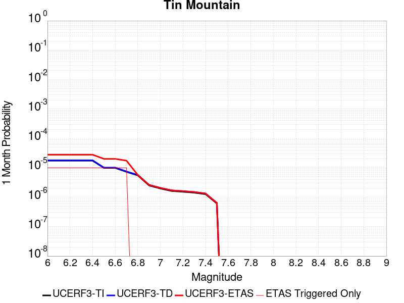 |  |  |

| Magnitude | 1 wk TI Prob | 1 wk TD Prob | 1 wk ETAS Prob | 1 wk ETAS/TD Gain | 1 wk ETAS Triggered Only | 1 mo TI Prob | 1 mo TD Prob | 1 mo ETAS Prob | 1 mo ETAS/TD Gain | 1 mo ETAS Triggered Only | 1 yr TI Prob | 1 yr TD Prob | 1 yr ETAS Prob | 1 yr ETAS/TD Gain | 1 yr ETAS Triggered Only | 10 yr TI Prob | 10 yr TD Prob | 10 yr ETAS Prob | 10 yr ETAS/TD Gain | 10 yr ETAS Triggered Only |
|-----|-----|-----|-----|-----|-----|-----|-----|-----|-----|-----|-----|-----|-----|-----|-----|-----|-----|-----|-----|-----|
| 6.0 | 4.083776E-6 | 4.18159E-6 | 1.4181548E-5 | 3.391425 | 1.0E-5 | 1.750178E-5 | 1.7920998E-5 | 2.7920818E-5 | 1.5579946 | 1.0E-5 | 2.1306332E-4 | 2.1817003E-4 | 2.4816347E-4 | 1.1374774 | 3.0E-5 | 0.0021285915 | 0.0021799242 | 0.0022397933 | 1.0274639 | 6.0E-5 |
| 6.1 | 4.083776E-6 | 4.18159E-6 | 1.4181548E-5 | 3.391425 | 1.0E-5 | 1.750178E-5 | 1.7920998E-5 | 2.7920818E-5 | 1.5579946 | 1.0E-5 | 2.1306332E-4 | 2.1817003E-4 | 2.4816347E-4 | 1.1374774 | 3.0E-5 | 0.0021285915 | 0.0021799242 | 0.0022397933 | 1.0274639 | 6.0E-5 |
| 6.2 | 4.083776E-6 | 4.18159E-6 | 1.4181548E-5 | 3.391425 | 1.0E-5 | 1.750178E-5 | 1.7920998E-5 | 2.7920818E-5 | 1.5579946 | 1.0E-5 | 2.1306332E-4 | 2.1817003E-4 | 2.4816347E-4 | 1.1374774 | 3.0E-5 | 0.0021285915 | 0.0021799242 | 0.0022397933 | 1.0274639 | 6.0E-5 |
| 6.3 | 4.083776E-6 | 4.18159E-6 | 1.4181548E-5 | 3.391425 | 1.0E-5 | 1.750178E-5 | 1.7920998E-5 | 2.7920818E-5 | 1.5579946 | 1.0E-5 | 2.1306332E-4 | 2.1817003E-4 | 2.4816347E-4 | 1.1374774 | 3.0E-5 | 0.0021285915 | 0.0021799242 | 0.0022397933 | 1.0274639 | 6.0E-5 |
| 6.4 | 4.083776E-6 | 4.18159E-6 | 1.4181548E-5 | 3.391425 | 1.0E-5 | 1.750178E-5 | 1.7920998E-5 | 2.7920818E-5 | 1.5579946 | 1.0E-5 | 2.1306332E-4 | 2.1817003E-4 | 2.4816347E-4 | 1.1374774 | 3.0E-5 | 0.0021285915 | 0.0021799242 | 0.0022397933 | 1.0274639 | 6.0E-5 |
| 6.5 | 2.3143427E-6 | 2.3731893E-6 | 1.2373165E-5 | 5.213729 | 1.0E-5 | 9.9185745E-6 | 1.01707765E-5 | 2.0170673E-5 | 1.9831991 | 1.0E-5 | 1.2075195E-4 | 1.2382293E-4 | 1.4382046E-4 | 1.1615009 | 2.0E-5 | 0.0012068636 | 0.0012376154 | 0.0012775658 | 1.0322802 | 4.0E-5 |
| 6.6 | 2.3143427E-6 | 2.3731893E-6 | 1.2373165E-5 | 5.213729 | 1.0E-5 | 9.9185745E-6 | 1.01707765E-5 | 2.0170673E-5 | 1.9831991 | 1.0E-5 | 1.2075195E-4 | 1.2382293E-4 | 1.4382046E-4 | 1.1615009 | 2.0E-5 | 0.0012068636 | 0.0012376154 | 0.0012775658 | 1.0322802 | 4.0E-5 |
| 6.7 | 1.7029532E-6 | 1.7498172E-6 | 1.1749799E-5 | 6.714873 | 1.0E-5 | 7.2983503E-6 | 7.499198E-6 | 1.7499124E-5 | 2.333466 | 1.0E-5 | 8.885379E-5 | 9.1299444E-5 | 1.1129762E-4 | 1.2190394 | 2.0E-5 | 8.881827E-4 | 9.12672E-4 | 9.526355E-4 | 1.0437874 | 4.0E-5 |
| 6.8 | 1.2914646E-6 | 1.329959E-6 | 1.329959E-6 | 1.0 | 0.0 | 5.534837E-6 | 5.699814E-6 | 5.699814E-6 | 1.0 | 0.0 | 6.738455E-5 | 6.939347E-5 | 6.939347E-5 | 1.0 | 0.0 | 6.736412E-4 | 6.937614E-4 | 6.937614E-4 | 1.0 | 0.0 |
| 6.9 | 5.8708974E-7 | 6.11713E-7 | 6.11713E-7 | 1.0 | 0.0 | 2.5160964E-6 | 2.6216248E-6 | 2.6216248E-6 | 1.0 | 0.0 | 3.0633044E-5 | 3.1917854E-5 | 3.1917854E-5 | 1.0 | 0.0 | 3.0628822E-4 | 3.1913683E-4 | 3.1913683E-4 | 1.0 | 0.0 |
| 7.0 | 4.6248786E-7 | 4.8321306E-7 | 4.8321306E-7 | 1.0 | 0.0 | 1.9820893E-6 | 2.0709115E-6 | 2.0709115E-6 | 1.0 | 0.0 | 2.413167E-5 | 2.5213094E-5 | 2.5213094E-5 | 1.0 | 0.0 | 2.412905E-4 | 2.5210602E-4 | 2.5210602E-4 | 1.0 | 0.0 |
| 7.1 | 3.804606E-7 | 3.9872486E-7 | 3.9872486E-7 | 1.0 | 0.0 | 1.6305444E-6 | 1.7088199E-6 | 1.7088199E-6 | 1.0 | 0.0 | 1.9851697E-5 | 2.0804719E-5 | 2.0804719E-5 | 1.0 | 0.0 | 1.9849923E-4 | 2.0803107E-4 | 2.0803107E-4 | 1.0 | 0.0 |
| 7.2 | 3.5864858E-7 | 3.7617838E-7 | 3.7617838E-7 | 1.0 | 0.0 | 1.5370645E-6 | 1.6121922E-6 | 1.6121922E-6 | 1.0 | 0.0 | 1.87136E-5 | 1.9628298E-5 | 1.9628298E-5 | 1.0 | 0.0 | 1.8712023E-4 | 1.9626896E-4 | 1.9626896E-4 | 1.0 | 0.0 |
| 7.3 | 3.342063E-7 | 3.5064386E-7 | 3.5064386E-7 | 1.0 | 0.0 | 1.4323119E-6 | 1.5027588E-6 | 1.5027588E-6 | 1.0 | 0.0 | 1.7438259E-5 | 1.8295968E-5 | 1.8295968E-5 | 1.0 | 0.0 | 1.743689E-4 | 1.8294792E-4 | 1.8294792E-4 | 1.0 | 0.0 |
| 7.4 | 2.971242E-7 | 3.1166627E-7 | 3.1166627E-7 | 1.0 | 0.0 | 1.2733886E-6 | 1.3357121E-6 | 1.3357121E-6 | 1.0 | 0.0 | 1.5503398E-5 | 1.6262207E-5 | 1.6262207E-5 | 1.0 | 0.0 | 1.5502315E-4 | 1.6261345E-4 | 1.6261345E-4 | 1.0 | 0.0 |
| 7.5 | 1.4326713E-7 | 1.5012905E-7 | 1.5012905E-7 | 1.0 | 0.0 | 6.140018E-7 | 6.434102E-7 | 6.434102E-7 | 1.0 | 0.0 | 7.4754466E-6 | 7.83352E-6 | 7.83352E-6 | 1.0 | 0.0 | 7.475195E-5 | 7.833519E-5 | 7.833519E-5 | 1.0 | 0.0 |

## Independence rev 2011
*[(top)](#table-of-contents)*

| 1 Week | 1 Month | 1 Year | 10 Year |
|-----|-----|-----|-----|
|  |  |  |  |

| Magnitude | 1 wk TI Prob | 1 wk TD Prob | 1 wk ETAS Prob | 1 wk ETAS/TD Gain | 1 wk ETAS Triggered Only | 1 mo TI Prob | 1 mo TD Prob | 1 mo ETAS Prob | 1 mo ETAS/TD Gain | 1 mo ETAS Triggered Only | 1 yr TI Prob | 1 yr TD Prob | 1 yr ETAS Prob | 1 yr ETAS/TD Gain | 1 yr ETAS Triggered Only | 10 yr TI Prob | 10 yr TD Prob | 10 yr ETAS Prob | 10 yr ETAS/TD Gain | 10 yr ETAS Triggered Only |
|-----|-----|-----|-----|-----|-----|-----|-----|-----|-----|-----|-----|-----|-----|-----|-----|-----|-----|-----|-----|-----|
| 6.0 | 4.422171E-6 | 4.3263026E-6 | 4.3263026E-6 | 1.0 | 0.0 | 1.8952025E-5 | 1.854118E-5 | 1.854118E-5 | 1.0 | 0.0 | 2.3071647E-4 | 2.2571848E-4 | 2.4571398E-4 | 1.088586 | 2.0E-5 | 0.0023047708 | 0.002255186 | 0.0023050732 | 1.0221211 | 5.0E-5 |
| 6.1 | 4.422171E-6 | 4.3263026E-6 | 4.3263026E-6 | 1.0 | 0.0 | 1.8952025E-5 | 1.854118E-5 | 1.854118E-5 | 1.0 | 0.0 | 2.3071647E-4 | 2.2571848E-4 | 2.4571398E-4 | 1.088586 | 2.0E-5 | 0.0023047708 | 0.002255186 | 0.0023050732 | 1.0221211 | 5.0E-5 |
| 6.2 | 4.422171E-6 | 4.3263026E-6 | 4.3263026E-6 | 1.0 | 0.0 | 1.8952025E-5 | 1.854118E-5 | 1.854118E-5 | 1.0 | 0.0 | 2.3071647E-4 | 2.2571848E-4 | 2.4571398E-4 | 1.088586 | 2.0E-5 | 0.0023047708 | 0.002255186 | 0.0023050732 | 1.0221211 | 5.0E-5 |
| 6.3 | 4.422171E-6 | 4.3263026E-6 | 4.3263026E-6 | 1.0 | 0.0 | 1.8952025E-5 | 1.854118E-5 | 1.854118E-5 | 1.0 | 0.0 | 2.3071647E-4 | 2.2571848E-4 | 2.4571398E-4 | 1.088586 | 2.0E-5 | 0.0023047708 | 0.002255186 | 0.0023050732 | 1.0221211 | 5.0E-5 |
| 6.4 | 4.422171E-6 | 4.3263026E-6 | 4.3263026E-6 | 1.0 | 0.0 | 1.8952025E-5 | 1.854118E-5 | 1.854118E-5 | 1.0 | 0.0 | 2.3071647E-4 | 2.2571848E-4 | 2.4571398E-4 | 1.088586 | 2.0E-5 | 0.0023047708 | 0.002255186 | 0.0023050732 | 1.0221211 | 5.0E-5 |
| 6.5 | 4.422171E-6 | 4.3263026E-6 | 4.3263026E-6 | 1.0 | 0.0 | 1.8952025E-5 | 1.854118E-5 | 1.854118E-5 | 1.0 | 0.0 | 2.3071647E-4 | 2.2571848E-4 | 2.4571398E-4 | 1.088586 | 2.0E-5 | 0.0023047708 | 0.002255186 | 0.0023050732 | 1.0221211 | 5.0E-5 |
| 6.6 | 2.663744E-6 | 2.5320423E-6 | 2.5320423E-6 | 1.0 | 0.0 | 1.1415996E-5 | 1.0851568E-5 | 1.0851568E-5 | 1.0 | 0.0 | 1.3898089E-4 | 1.3211032E-4 | 1.5210768E-4 | 1.1513686 | 2.0E-5 | 0.0013889399 | 0.001320366 | 0.0013603133 | 1.0302546 | 4.0E-5 |
| 6.7 | 2.663744E-6 | 2.5320423E-6 | 2.5320423E-6 | 1.0 | 0.0 | 1.1415996E-5 | 1.0851568E-5 | 1.0851568E-5 | 1.0 | 0.0 | 1.3898089E-4 | 1.3211032E-4 | 1.5210768E-4 | 1.1513686 | 2.0E-5 | 0.0013889399 | 0.001320366 | 0.0013603133 | 1.0302546 | 4.0E-5 |
| 6.8 | 1.9716529E-6 | 1.8323069E-6 | 1.8323069E-6 | 1.0 | 0.0 | 8.449913E-6 | 7.852721E-6 | 7.852721E-6 | 1.0 | 0.0 | 1.0287284E-4 | 9.560281E-5 | 1.156009E-4 | 1.2091789 | 2.0E-5 | 0.0010282523 | 9.5562974E-4 | 9.955915E-4 | 1.0418172 | 4.0E-5 |
| 6.9 | 1.8788617E-6 | 1.7430461E-6 | 1.7430461E-6 | 1.0 | 0.0 | 8.0522395E-6 | 7.470177E-6 | 7.470177E-6 | 1.0 | 0.0 | 9.80316E-5 | 9.094573E-5 | 1.1094391E-4 | 1.2198913 | 2.0E-5 | 9.798837E-4 | 9.0909714E-4 | 9.490608E-4 | 1.0439597 | 4.0E-5 |
| 7.0 | 1.5045488E-6 | 1.3849901E-6 | 1.3849901E-6 | 1.0 | 0.0 | 6.44805E-6 | 5.935659E-6 | 5.935659E-6 | 1.0 | 0.0 | 7.8502184E-5 | 7.22643E-5 | 9.226285E-5 | 1.2767419 | 2.0E-5 | 7.8474457E-4 | 7.224132E-4 | 7.6238427E-4 | 1.0553299 | 4.0E-5 |
| 7.1 | 1.272341E-6 | 1.1625449E-6 | 1.1625449E-6 | 1.0 | 0.0 | 5.4528787E-6 | 4.982326E-6 | 4.982326E-6 | 1.0 | 0.0 | 6.6386776E-5 | 6.0658163E-5 | 8.065695E-5 | 1.3296965 | 2.0E-5 | 6.636695E-4 | 6.064193E-4 | 6.46395E-4 | 1.065921 | 4.0E-5 |
| 7.2 | 1.0416892E-6 | 9.4101864E-7 | 9.4101864E-7 | 1.0 | 0.0 | 4.464375E-6 | 4.032931E-6 | 4.032931E-6 | 1.0 | 0.0 | 5.4352407E-5 | 4.9099846E-5 | 6.909887E-5 | 1.4073132 | 2.0E-5 | 5.4339116E-4 | 4.9089186E-4 | 5.308722E-4 | 1.0814444 | 4.0E-5 |
| 7.3 | 7.9450155E-7 | 7.2352304E-7 | 7.2352304E-7 | 1.0 | 0.0 | 3.4050022E-6 | 3.1008094E-6 | 3.1008094E-6 | 1.0 | 0.0 | 4.1455114E-5 | 3.775171E-5 | 5.7750956E-5 | 1.5297573 | 2.0E-5 | 4.144738E-4 | 3.774541E-4 | 4.17439E-4 | 1.1059332 | 4.0E-5 |
| 7.4 | 5.3893444E-7 | 5.019647E-7 | 5.019647E-7 | 1.0 | 0.0 | 2.309717E-6 | 2.1512753E-6 | 2.1512753E-6 | 1.0 | 0.0 | 2.8120441E-5 | 2.6191468E-5 | 4.6190944E-5 | 1.7635875 | 2.0E-5 | 2.8116882E-4 | 2.6188427E-4 | 3.018738E-4 | 1.1526992 | 4.0E-5 |
| 7.5 | 3.8852085E-7 | 3.682647E-7 | 3.682647E-7 | 1.0 | 0.0 | 1.6650882E-6 | 1.5782763E-6 | 1.5782763E-6 | 1.0 | 0.0 | 2.027226E-5 | 1.9215347E-5 | 3.9214963E-5 | 2.0408146 | 2.0E-5 | 2.0270412E-4 | 1.9213707E-4 | 2.221313E-4 | 1.1561085 | 3.0E-5 |
| 7.6 | 2.414929E-7 | 2.345808E-7 | 2.345808E-7 | 1.0 | 0.0 | 1.0349692E-6 | 1.0053459E-6 | 1.0053459E-6 | 1.0 | 0.0 | 1.2600677E-5 | 1.2240019E-5 | 3.2239775E-5 | 2.6339643 | 2.0E-5 | 1.2599962E-4 | 1.2239357E-4 | 1.523899E-4 | 1.245081 | 3.0E-5 |
| 7.7 | 6.8298014E-8 | 6.859071E-8 | 6.859071E-8 | 1.0 | 0.0 | 2.9270575E-7 | 2.9396014E-7 | 2.9396014E-7 | 1.0 | 0.0 | 3.5636867E-6 | 3.5789594E-6 | 1.3578923E-5 | 3.7940981 | 1.0E-5 | 3.5636294E-5 | 3.5789068E-5 | 5.578835E-5 | 1.5588099 | 2.0E-5 |

## Pleito
*[(top)](#table-of-contents)*

| 1 Week | 1 Month | 1 Year | 10 Year |
|-----|-----|-----|-----|
|  |  |  |  |

| Magnitude | 1 wk TI Prob | 1 wk TD Prob | 1 wk ETAS Prob | 1 wk ETAS/TD Gain | 1 wk ETAS Triggered Only | 1 mo TI Prob | 1 mo TD Prob | 1 mo ETAS Prob | 1 mo ETAS/TD Gain | 1 mo ETAS Triggered Only | 1 yr TI Prob | 1 yr TD Prob | 1 yr ETAS Prob | 1 yr ETAS/TD Gain | 1 yr ETAS Triggered Only | 10 yr TI Prob | 10 yr TD Prob | 10 yr ETAS Prob | 10 yr ETAS/TD Gain | 10 yr ETAS Triggered Only |
|-----|-----|-----|-----|-----|-----|-----|-----|-----|-----|-----|-----|-----|-----|-----|-----|-----|-----|-----|-----|-----|
| 6.0 | 1.6763008E-5 | 2.479146E-5 | 2.479146E-5 | 1.0 | 0.0 | 7.183948E-5 | 1.0624519E-4 | 1.0624519E-4 | 1.0 | 0.0 | 8.742947E-4 | 0.0012928396 | 0.0013128138 | 1.0154499 | 2.0E-5 | 0.00870863 | 0.012967767 | 0.013017119 | 1.0038058 | 5.0E-5 |
| 6.1 | 1.6763008E-5 | 2.479146E-5 | 2.479146E-5 | 1.0 | 0.0 | 7.183948E-5 | 1.0624519E-4 | 1.0624519E-4 | 1.0 | 0.0 | 8.742947E-4 | 0.0012928396 | 0.0013128138 | 1.0154499 | 2.0E-5 | 0.00870863 | 0.012967767 | 0.013017119 | 1.0038058 | 5.0E-5 |
| 6.2 | 1.6763008E-5 | 2.479146E-5 | 2.479146E-5 | 1.0 | 0.0 | 7.183948E-5 | 1.0624519E-4 | 1.0624519E-4 | 1.0 | 0.0 | 8.742947E-4 | 0.0012928396 | 0.0013128138 | 1.0154499 | 2.0E-5 | 0.00870863 | 0.012967767 | 0.013017119 | 1.0038058 | 5.0E-5 |
| 6.3 | 1.6763008E-5 | 2.479146E-5 | 2.479146E-5 | 1.0 | 0.0 | 7.183948E-5 | 1.0624519E-4 | 1.0624519E-4 | 1.0 | 0.0 | 8.742947E-4 | 0.0012928396 | 0.0013128138 | 1.0154499 | 2.0E-5 | 0.00870863 | 0.012967767 | 0.013017119 | 1.0038058 | 5.0E-5 |
| 6.4 | 1.6763008E-5 | 2.479146E-5 | 2.479146E-5 | 1.0 | 0.0 | 7.183948E-5 | 1.0624519E-4 | 1.0624519E-4 | 1.0 | 0.0 | 8.742947E-4 | 0.0012928396 | 0.0013128138 | 1.0154499 | 2.0E-5 | 0.00870863 | 0.012967767 | 0.013017119 | 1.0038058 | 5.0E-5 |
| 6.5 | 1.6763008E-5 | 2.479146E-5 | 2.479146E-5 | 1.0 | 0.0 | 7.183948E-5 | 1.0624519E-4 | 1.0624519E-4 | 1.0 | 0.0 | 8.742947E-4 | 0.0012928396 | 0.0013128138 | 1.0154499 | 2.0E-5 | 0.00870863 | 0.012967767 | 0.013017119 | 1.0038058 | 5.0E-5 |
| 6.6 | 9.910213E-6 | 1.7241837E-5 | 1.7241837E-5 | 1.0 | 0.0 | 4.247165E-5 | 7.389152E-5 | 7.389152E-5 | 1.0 | 0.0 | 5.169696E-4 | 8.992616E-4 | 8.992616E-4 | 1.0 | 0.0 | 0.0051576863 | 0.009064423 | 0.009074332 | 1.0010933 | 1.0E-5 |
| 6.7 | 9.910213E-6 | 1.7241837E-5 | 1.7241837E-5 | 1.0 | 0.0 | 4.247165E-5 | 7.389152E-5 | 7.389152E-5 | 1.0 | 0.0 | 5.169696E-4 | 8.992616E-4 | 8.992616E-4 | 1.0 | 0.0 | 0.0051576863 | 0.009064423 | 0.009074332 | 1.0010933 | 1.0E-5 |
| 6.8 | 8.300162E-6 | 1.5501371E-5 | 1.5501371E-5 | 1.0 | 0.0 | 3.557164E-5 | 6.643277E-5 | 6.643277E-5 | 1.0 | 0.0 | 4.3299864E-4 | 8.0852024E-4 | 8.0852024E-4 | 1.0 | 0.0 | 0.004321559 | 0.008163834 | 0.008173752 | 1.0012149 | 1.0E-5 |
| 6.9 | 8.183114E-6 | 1.5372574E-5 | 1.5372574E-5 | 1.0 | 0.0 | 3.5070017E-5 | 6.5880806E-5 | 6.5880806E-5 | 1.0 | 0.0 | 4.2689382E-4 | 8.0180506E-4 | 8.0180506E-4 | 1.0 | 0.0 | 0.0042607468 | 0.008097173 | 0.008107092 | 1.001225 | 1.0E-5 |
| 7.0 | 7.1748823E-6 | 1.4159216E-5 | 1.4159216E-5 | 1.0 | 0.0 | 3.0749135E-5 | 6.0680948E-5 | 6.0680948E-5 | 1.0 | 0.0 | 3.743064E-4 | 7.385406E-4 | 7.385406E-4 | 1.0 | 0.0 | 0.0037367654 | 0.007468599 | 0.007468599 | 1.0 | 0.0 |
| 7.1 | 7.1671807E-6 | 1.4149584E-5 | 1.4149584E-5 | 1.0 | 0.0 | 3.0716128E-5 | 6.0639664E-5 | 6.0639664E-5 | 1.0 | 0.0 | 3.7390468E-4 | 7.380384E-4 | 7.380384E-4 | 1.0 | 0.0 | 0.0037327618 | 0.0074636103 | 0.0074636103 | 1.0 | 0.0 |
| 7.2 | 7.0649667E-6 | 1.3996784E-5 | 1.3996784E-5 | 1.0 | 0.0 | 3.0278077E-5 | 5.998484E-5 | 5.998484E-5 | 1.0 | 0.0 | 3.6857324E-4 | 7.300712E-4 | 7.300712E-4 | 1.0 | 0.0 | 0.0036796255 | 0.007384318 | 0.007384318 | 1.0 | 0.0 |
| 7.3 | 7.02082E-6 | 1.3940186E-5 | 1.3940186E-5 | 1.0 | 0.0 | 3.008888E-5 | 5.974229E-5 | 5.974229E-5 | 1.0 | 0.0 | 3.6627054E-4 | 7.2712015E-4 | 7.2712015E-4 | 1.0 | 0.0 | 0.0036566744 | 0.007354794 | 0.007354794 | 1.0 | 0.0 |
| 7.4 | 6.987146E-6 | 1.3899719E-5 | 1.3899719E-5 | 1.0 | 0.0 | 2.9944567E-5 | 5.956887E-5 | 5.956887E-5 | 1.0 | 0.0 | 3.6451413E-4 | 7.250101E-4 | 7.250101E-4 | 1.0 | 0.0 | 0.0036391679 | 0.007333714 | 0.007333714 | 1.0 | 0.0 |
| 7.5 | 6.9494554E-6 | 1.3856602E-5 | 1.3856602E-5 | 1.0 | 0.0 | 2.9783041E-5 | 5.938409E-5 | 5.938409E-5 | 1.0 | 0.0 | 3.625482E-4 | 7.2276196E-4 | 7.2276196E-4 | 1.0 | 0.0 | 0.0036195726 | 0.0073113306 | 0.0073113306 | 1.0 | 0.0 |
| 7.6 | 6.92694E-6 | 1.3815674E-5 | 1.3815674E-5 | 1.0 | 0.0 | 2.9686547E-5 | 5.920869E-5 | 5.920869E-5 | 1.0 | 0.0 | 3.6137376E-4 | 7.206279E-4 | 7.206279E-4 | 1.0 | 0.0 | 0.0036078666 | 0.0072900616 | 0.0072900616 | 1.0 | 0.0 |
| 7.7 | 6.395867E-6 | 1.2693605E-5 | 1.2693605E-5 | 1.0 | 0.0 | 2.741057E-5 | 5.440003E-5 | 5.440003E-5 | 1.0 | 0.0 | 3.336726E-4 | 6.621194E-4 | 6.621194E-4 | 1.0 | 0.0 | 0.0033317201 | 0.0067081 | 0.0067081 | 1.0 | 0.0 |
| 7.8 | 5.8664327E-6 | 1.1559044E-5 | 1.1559044E-5 | 1.0 | 0.0 | 2.5141611E-5 | 4.953782E-5 | 4.953782E-5 | 1.0 | 0.0 | 3.060561E-4 | 6.029563E-4 | 6.029563E-4 | 1.0 | 0.0 | 0.0030563495 | 0.006112456 | 0.006112456 | 1.0 | 0.0 |
| 7.9 | 3.7167474E-6 | 7.128102E-6 | 7.128102E-6 | 1.0 | 0.0 | 1.592882E-5 | 3.054865E-5 | 3.054865E-5 | 1.0 | 0.0 | 1.9391612E-4 | 3.718665E-4 | 3.718665E-4 | 1.0 | 0.0 | 0.0019374699 | 0.0037745768 | 0.0037745768 | 1.0 | 0.0 |
| 8.0 | 1.0903841E-6 | 1.2908959E-6 | 1.2908959E-6 | 1.0 | 0.0 | 4.6730665E-6 | 5.532399E-6 | 5.532399E-6 | 1.0 | 0.0 | 5.68931E-5 | 6.7354886E-5 | 6.7354886E-5 | 1.0 | 0.0 | 5.6878536E-4 | 6.957491E-4 | 6.957491E-4 | 1.0 | 0.0 |
| 8.1 | 2.6894583E-7 | 1.1106567E-7 | 1.1106567E-7 | 1.0 | 0.0 | 1.1526245E-6 | 4.7599562E-7 | 4.7599562E-7 | 1.0 | 0.0 | 1.4033113E-5 | 5.7952316E-6 | 5.7952316E-6 | 1.0 | 0.0 | 1.4032227E-4 | 6.482664E-5 | 6.482664E-5 | 1.0 | 0.0 |
| 8.2 | 5.2967013E-9 | 2.468831E-9 | 2.468831E-9 | 1.0 | 0.0 | 2.2700148E-8 | 1.0580704E-8 | 1.0580704E-8 | 1.0 | 0.0 | 2.7637427E-7 | 1.2882006E-7 | 1.2882006E-7 | 1.0 | 0.0 | 2.7637393E-6 | 1.4656648E-6 | 1.4656648E-6 | 1.0 | 0.0 |

## Camp Rock 2011
*[(top)](#table-of-contents)*

| 1 Week | 1 Month | 1 Year | 10 Year |
|-----|-----|-----|-----|
|  |  |  |  |

| Magnitude | 1 wk TI Prob | 1 wk TD Prob | 1 wk ETAS Prob | 1 wk ETAS/TD Gain | 1 wk ETAS Triggered Only | 1 mo TI Prob | 1 mo TD Prob | 1 mo ETAS Prob | 1 mo ETAS/TD Gain | 1 mo ETAS Triggered Only | 1 yr TI Prob | 1 yr TD Prob | 1 yr ETAS Prob | 1 yr ETAS/TD Gain | 1 yr ETAS Triggered Only | 10 yr TI Prob | 10 yr TD Prob | 10 yr ETAS Prob | 10 yr ETAS/TD Gain | 10 yr ETAS Triggered Only |
|-----|-----|-----|-----|-----|-----|-----|-----|-----|-----|-----|-----|-----|-----|-----|-----|-----|-----|-----|-----|-----|
| 6.0 | 1.6710783E-5 | 4.2501633E-6 | 4.2501633E-6 | 1.0 | 0.0 | 7.161568E-5 | 1.8214861E-5 | 1.8214861E-5 | 1.0 | 0.0 | 8.7157206E-4 | 2.2174389E-4 | 2.5173725E-4 | 1.1352612 | 3.0E-5 | 0.008681616 | 0.0022152793 | 0.0022651684 | 1.0225205 | 5.0E-5 |
| 6.1 | 1.6710783E-5 | 4.2501633E-6 | 4.2501633E-6 | 1.0 | 0.0 | 7.161568E-5 | 1.8214861E-5 | 1.8214861E-5 | 1.0 | 0.0 | 8.7157206E-4 | 2.2174389E-4 | 2.5173725E-4 | 1.1352612 | 3.0E-5 | 0.008681616 | 0.0022152793 | 0.0022651684 | 1.0225205 | 5.0E-5 |
| 6.2 | 1.6710783E-5 | 4.2501633E-6 | 4.2501633E-6 | 1.0 | 0.0 | 7.161568E-5 | 1.8214861E-5 | 1.8214861E-5 | 1.0 | 0.0 | 8.7157206E-4 | 2.2174389E-4 | 2.5173725E-4 | 1.1352612 | 3.0E-5 | 0.008681616 | 0.0022152793 | 0.0022651684 | 1.0225205 | 5.0E-5 |
| 6.3 | 1.6710783E-5 | 4.2501633E-6 | 4.2501633E-6 | 1.0 | 0.0 | 7.161568E-5 | 1.8214861E-5 | 1.8214861E-5 | 1.0 | 0.0 | 8.7157206E-4 | 2.2174389E-4 | 2.5173725E-4 | 1.1352612 | 3.0E-5 | 0.008681616 | 0.0022152793 | 0.0022651684 | 1.0225205 | 5.0E-5 |
| 6.4 | 7.982846E-6 | 3.6821912E-6 | 3.6821912E-6 | 1.0 | 0.0 | 3.421175E-5 | 1.5780724E-5 | 1.5780724E-5 | 1.0 | 0.0 | 4.1644843E-4 | 1.9211374E-4 | 2.2210798E-4 | 1.1561275 | 3.0E-5 | 0.0041566887 | 0.0019195115 | 0.0019694155 | 1.0259984 | 5.0E-5 |
| 6.5 | 7.982846E-6 | 3.6821912E-6 | 3.6821912E-6 | 1.0 | 0.0 | 3.421175E-5 | 1.5780724E-5 | 1.5780724E-5 | 1.0 | 0.0 | 4.1644843E-4 | 1.9211374E-4 | 2.2210798E-4 | 1.1561275 | 3.0E-5 | 0.0041566887 | 0.0019195115 | 0.0019694155 | 1.0259984 | 5.0E-5 |
| 6.6 | 7.048869E-6 | 3.4244488E-6 | 3.4244488E-6 | 1.0 | 0.0 | 3.0209088E-5 | 1.4676129E-5 | 1.4676129E-5 | 1.0 | 0.0 | 3.677336E-4 | 1.7866753E-4 | 2.0866217E-4 | 1.1678796 | 3.0E-5 | 0.0036712566 | 0.0017852704 | 0.0018351811 | 1.027957 | 5.0E-5 |
| 6.7 | 6.987307E-6 | 3.3624244E-6 | 3.3624244E-6 | 1.0 | 0.0 | 2.9945259E-5 | 1.4410312E-5 | 1.4410312E-5 | 1.0 | 0.0 | 3.6452254E-4 | 1.7543173E-4 | 2.0542648E-4 | 1.1709766 | 3.0E-5 | 0.0036392517 | 0.0017529636 | 0.001802876 | 1.0284731 | 5.0E-5 |
| 6.8 | 6.3737602E-6 | 3.1180107E-6 | 3.1180107E-6 | 1.0 | 0.0 | 2.731583E-5 | 1.3362836E-5 | 1.3362836E-5 | 1.0 | 0.0 | 3.3251947E-4 | 1.6268066E-4 | 1.9267578E-4 | 1.1843804 | 3.0E-5 | 0.0033202237 | 0.0016256444 | 0.0016755632 | 1.030707 | 5.0E-5 |
| 6.9 | 6.112211E-6 | 2.9332175E-6 | 2.9332175E-6 | 1.0 | 0.0 | 2.6194928E-5 | 1.2570873E-5 | 1.2570873E-5 | 1.0 | 0.0 | 3.1887658E-4 | 1.530399E-4 | 1.8303531E-4 | 1.1959974 | 3.0E-5 | 0.003184194 | 0.0015293729 | 0.0015792964 | 1.0326431 | 5.0E-5 |
| 7.0 | 5.5140117E-6 | 2.642044E-6 | 2.642044E-6 | 1.0 | 0.0 | 2.3631264E-5 | 1.1322997E-5 | 1.1322997E-5 | 1.0 | 0.0 | 2.8767265E-4 | 1.3784903E-4 | 1.6784489E-4 | 1.2175994 | 3.0E-5 | 0.0028730053 | 0.0013776604 | 0.0014275915 | 1.0362434 | 5.0E-5 |
| 7.1 | 4.8151105E-6 | 2.134374E-6 | 2.134374E-6 | 1.0 | 0.0 | 2.0636026E-5 | 9.147286E-6 | 9.147286E-6 | 1.0 | 0.0 | 2.5121463E-4 | 1.1136274E-4 | 1.2136162E-4 | 1.0897866 | 1.0E-5 | 0.0025093083 | 0.0011130912 | 0.0011430578 | 1.026922 | 3.0E-5 |
| 7.2 | 3.818335E-6 | 1.293818E-6 | 1.293818E-6 | 1.0 | 0.0 | 1.6364189E-5 | 5.5449227E-6 | 5.5449227E-6 | 1.0 | 0.0 | 1.9921579E-4 | 6.7507426E-5 | 7.7506746E-5 | 1.1481218 | 1.0E-5 | 0.0019903728 | 6.748774E-4 | 7.048572E-4 | 1.0444225 | 3.0E-5 |
| 7.3 | 2.7166698E-6 | 7.38375E-7 | 7.38375E-7 | 1.0 | 0.0 | 1.1642818E-5 | 3.1644604E-6 | 3.1644604E-6 | 1.0 | 0.0 | 1.4174209E-4 | 3.8526647E-5 | 3.8526647E-5 | 1.0 | 0.0 | 0.0014165172 | 3.8520168E-4 | 3.8520168E-4 | 1.0 | 0.0 |
| 7.4 | 2.0893426E-6 | 5.461979E-7 | 5.461979E-7 | 1.0 | 0.0 | 8.954295E-6 | 2.340846E-6 | 2.340846E-6 | 1.0 | 0.0 | 1.0901308E-4 | 2.8499433E-5 | 2.8499433E-5 | 1.0 | 0.0 | 0.0010895962 | 2.8495834E-4 | 2.8495834E-4 | 1.0 | 0.0 |
| 7.5 | 1.1681728E-6 | 3.6031344E-7 | 3.6031344E-7 | 1.0 | 0.0 | 5.0064455E-6 | 1.5441996E-6 | 1.5441996E-6 | 1.0 | 0.0 | 6.0951766E-5 | 1.8800472E-5 | 1.8800472E-5 | 1.0 | 0.0 | 6.093505E-4 | 1.8798928E-4 | 1.8798928E-4 | 1.0 | 0.0 |
| 7.6 | 1.3154387E-7 | 7.119929E-8 | 7.119929E-8 | 1.0 | 0.0 | 5.6375933E-7 | 3.0513976E-7 | 3.0513976E-7 | 1.0 | 0.0 | 6.863748E-6 | 3.715072E-6 | 3.715072E-6 | 1.0 | 0.0 | 6.863536E-5 | 3.7150257E-5 | 3.7150257E-5 | 1.0 | 0.0 |

## Oceanic - West Huasna
*[(top)](#table-of-contents)*

| 1 Week | 1 Month | 1 Year | 10 Year |
|-----|-----|-----|-----|
|  |  |  |  |

| Magnitude | 1 wk TI Prob | 1 wk TD Prob | 1 wk ETAS Prob | 1 wk ETAS/TD Gain | 1 wk ETAS Triggered Only | 1 mo TI Prob | 1 mo TD Prob | 1 mo ETAS Prob | 1 mo ETAS/TD Gain | 1 mo ETAS Triggered Only | 1 yr TI Prob | 1 yr TD Prob | 1 yr ETAS Prob | 1 yr ETAS/TD Gain | 1 yr ETAS Triggered Only | 10 yr TI Prob | 10 yr TD Prob | 10 yr ETAS Prob | 10 yr ETAS/TD Gain | 10 yr ETAS Triggered Only |
|-----|-----|-----|-----|-----|-----|-----|-----|-----|-----|-----|-----|-----|-----|-----|-----|-----|-----|-----|-----|-----|
| 6.0 | 3.195567E-5 | 2.7928398E-5 | 2.7928398E-5 | 1.0 | 0.0 | 1.3694567E-4 | 1.1968789E-4 | 1.2968668E-4 | 1.0835407 | 1.0E-5 | 0.0016660384 | 0.0014562691 | 0.0014962108 | 1.0274274 | 4.0E-5 | 0.016536033 | 0.014471814 | 0.014521091 | 1.003405 | 5.0E-5 |
| 6.1 | 2.1156782E-5 | 1.7574706E-5 | 1.7574706E-5 | 1.0 | 0.0 | 9.066878E-5 | 7.531805E-5 | 7.531805E-5 | 1.0 | 0.0 | 0.0011033333 | 9.166209E-4 | 9.3660253E-4 | 1.0217993 | 2.0E-5 | 0.010978713 | 0.009129409 | 0.009159135 | 1.0032561 | 3.0E-5 |
| 6.2 | 1.6195117E-5 | 1.3327666E-5 | 1.3327666E-5 | 1.0 | 0.0 | 6.9405796E-5 | 5.7117333E-5 | 5.7117333E-5 | 1.0 | 0.0 | 8.44688E-4 | 6.951842E-4 | 7.1517035E-4 | 1.0287493 | 2.0E-5 | 0.008414844 | 0.006930389 | 0.0069502504 | 1.0028658 | 2.0E-5 |
| 6.3 | 1.3559345E-5 | 1.1179372E-5 | 1.1179372E-5 | 1.0 | 0.0 | 5.811018E-5 | 4.7910722E-5 | 4.7910722E-5 | 1.0 | 0.0 | 7.072618E-4 | 5.831579E-4 | 6.031462E-4 | 1.034276 | 2.0E-5 | 0.0070501505 | 0.005816394 | 0.0058362777 | 1.0034186 | 2.0E-5 |
| 6.4 | 1.2120619E-5 | 1.0001191E-5 | 1.0001191E-5 | 1.0 | 0.0 | 5.1944477E-5 | 4.2861546E-5 | 4.2861546E-5 | 1.0 | 0.0 | 6.322405E-4 | 5.2171486E-4 | 5.417044E-4 | 1.038315 | 2.0E-5 | 0.006304447 | 0.0052049677 | 0.005224864 | 1.0038224 | 2.0E-5 |
| 6.5 | 1.13511915E-5 | 9.367664E-6 | 9.367664E-6 | 1.0 | 0.0 | 4.8647056E-5 | 4.0146515E-5 | 4.0146515E-5 | 1.0 | 0.0 | 5.9211696E-4 | 4.886746E-4 | 5.086649E-4 | 1.040907 | 2.0E-5 | 0.0059054173 | 0.004876059 | 0.004895962 | 1.0040817 | 2.0E-5 |
| 6.6 | 9.850605E-6 | 8.135557E-6 | 8.135557E-6 | 1.0 | 0.0 | 4.2216197E-5 | 3.486621E-5 | 3.486621E-5 | 1.0 | 0.0 | 5.1386096E-4 | 4.2441362E-4 | 4.4440513E-4 | 1.0471039 | 2.0E-5 | 0.0051267436 | 0.004236063 | 0.0042559784 | 1.0047014 | 2.0E-5 |
| 6.7 | 8.8558645E-6 | 7.318557E-6 | 7.318557E-6 | 1.0 | 0.0 | 3.7953152E-5 | 3.1364867E-5 | 3.1364867E-5 | 1.0 | 0.0 | 4.6198163E-4 | 3.8180055E-4 | 4.017929E-4 | 1.0523634 | 2.0E-5 | 0.004610224 | 0.0038114712 | 0.003831395 | 1.0052273 | 2.0E-5 |
| 6.8 | 7.67136E-6 | 6.3918774E-6 | 6.3918774E-6 | 1.0 | 0.0 | 3.2876844E-5 | 2.7393473E-5 | 2.7393473E-5 | 1.0 | 0.0 | 4.0020206E-4 | 3.3346465E-4 | 3.53458E-4 | 1.0599563 | 2.0E-5 | 0.003994821 | 0.0033296635 | 0.0033495969 | 1.0059866 | 2.0E-5 |
| 6.9 | 6.534529E-6 | 5.458424E-6 | 5.458424E-6 | 1.0 | 0.0 | 2.8004823E-5 | 2.3393037E-5 | 2.3393037E-5 | 1.0 | 0.0 | 3.4090536E-4 | 2.8477312E-4 | 3.0476743E-4 | 1.0702113 | 2.0E-5 | 0.0034038287 | 0.0028440985 | 0.0028640416 | 1.0070121 | 2.0E-5 |
| 7.0 | 5.460525E-6 | 4.570061E-6 | 4.570061E-6 | 1.0 | 0.0 | 2.3402039E-5 | 1.9585828E-5 | 1.9585828E-5 | 1.0 | 0.0 | 2.8488258E-4 | 2.3843147E-4 | 2.584267E-4 | 1.0838616 | 2.0E-5 | 0.0028451765 | 0.0023817702 | 0.0024017226 | 1.0083771 | 2.0E-5 |
| 7.1 | 4.4825083E-6 | 3.7525451E-6 | 3.7525451E-6 | 1.0 | 0.0 | 1.9210609E-5 | 1.6082236E-5 | 1.6082236E-5 | 1.0 | 0.0 | 2.3386406E-4 | 1.9578375E-4 | 2.1577983E-4 | 1.1021335 | 2.0E-5 | 0.002336181 | 0.0019561243 | 0.0019760854 | 1.0102043 | 2.0E-5 |
| 7.2 | 2.821708E-6 | 2.425045E-6 | 2.425045E-6 | 1.0 | 0.0 | 1.2092979E-5 | 1.0393009E-5 | 1.0393009E-5 | 1.0 | 0.0 | 1.4722206E-4 | 1.2652755E-4 | 1.3652629E-4 | 1.0790242 | 1.0E-5 | 0.0014712457 | 0.0012645572 | 0.0012745446 | 1.0078979 | 1.0E-5 |
| 7.3 | 2.0644757E-6 | 1.7688409E-6 | 1.7688409E-6 | 1.0 | 0.0 | 8.847723E-6 | 7.5807243E-6 | 7.5807243E-6 | 1.0 | 0.0 | 1.0771569E-4 | 9.229141E-5 | 1.0229049E-4 | 1.1083424 | 1.0E-5 | 0.001076635 | 9.2253234E-4 | 9.3252317E-4 | 1.0108297 | 1.0E-5 |
| 7.4 | 1.6980367E-6 | 1.4380826E-6 | 1.4380826E-6 | 1.0 | 0.0 | 7.27728E-6 | 6.1631963E-6 | 6.1631963E-6 | 1.0 | 0.0 | 8.8597284E-5 | 7.503434E-5 | 7.503434E-5 | 1.0 | 0.0 | 8.8561967E-4 | 7.500914E-4 | 7.500914E-4 | 1.0 | 0.0 |
| 7.5 | 1.3637683E-6 | 1.1303514E-6 | 1.1303514E-6 | 1.0 | 0.0 | 5.844708E-6 | 4.844354E-6 | 4.844354E-6 | 1.0 | 0.0 | 7.1156996E-5 | 5.8978418E-5 | 5.8978418E-5 | 1.0 | 0.0 | 7.1134215E-4 | 5.8962894E-4 | 5.8962894E-4 | 1.0 | 0.0 |
| 7.6 | 9.802994E-7 | 7.6780407E-7 | 7.6780407E-7 | 1.0 | 0.0 | 4.2012766E-6 | 3.2905848E-6 | 3.2905848E-6 | 1.0 | 0.0 | 5.1149345E-5 | 4.0062132E-5 | 4.0062132E-5 | 1.0 | 0.0 | 5.113757E-4 | 4.005503E-4 | 4.005503E-4 | 1.0 | 0.0 |
| 7.7 | 5.986191E-7 | 4.0057682E-7 | 4.0057682E-7 | 1.0 | 0.0 | 2.5655079E-6 | 1.7167566E-6 | 1.7167566E-6 | 1.0 | 0.0 | 3.1234613E-5 | 2.0901312E-5 | 2.0901312E-5 | 1.0 | 0.0 | 3.123022E-4 | 2.0899458E-4 | 2.0899458E-4 | 1.0 | 0.0 |
| 7.8 | 2.9189815E-7 | 1.5291376E-7 | 1.5291376E-7 | 1.0 | 0.0 | 1.2509914E-6 | 6.553445E-7 | 6.553445E-7 | 1.0 | 0.0 | 1.5230714E-5 | 7.978791E-6 | 7.978791E-6 | 1.0 | 0.0 | 1.522967E-4 | 7.9786114E-5 | 7.9786114E-5 | 1.0 | 0.0 |
| 7.9 | 1.2057845E-7 | 4.624249E-8 | 4.624249E-8 | 1.0 | 0.0 | 5.1676466E-7 | 1.981821E-7 | 1.981821E-7 | 1.0 | 0.0 | 6.2915915E-6 | 2.4128642E-6 | 2.4128642E-6 | 1.0 | 0.0 | 6.2914136E-5 | 2.4129453E-5 | 2.4129453E-5 | 1.0 | 0.0 |
| 8.0 | 3.3806387E-9 | 9.0229946E-10 | 9.0229946E-10 | 1.0 | 0.0 | 1.4488451E-8 | 3.8669987E-9 | 3.8669987E-9 | 1.0 | 0.0 | 1.7639688E-7 | 4.7080707E-8 | 4.7080707E-8 | 1.0 | 0.0 | 1.7639674E-6 | 4.7169183E-7 | 4.7169183E-7 | 1.0 | 0.0 |

## Elysian Park (Upper)
*[(top)](#table-of-contents)*

| 1 Week | 1 Month | 1 Year | 10 Year |
|-----|-----|-----|-----|
|  |  |  |  |

| Magnitude | 1 wk TI Prob | 1 wk TD Prob | 1 wk ETAS Prob | 1 wk ETAS/TD Gain | 1 wk ETAS Triggered Only | 1 mo TI Prob | 1 mo TD Prob | 1 mo ETAS Prob | 1 mo ETAS/TD Gain | 1 mo ETAS Triggered Only | 1 yr TI Prob | 1 yr TD Prob | 1 yr ETAS Prob | 1 yr ETAS/TD Gain | 1 yr ETAS Triggered Only | 10 yr TI Prob | 10 yr TD Prob | 10 yr ETAS Prob | 10 yr ETAS/TD Gain | 10 yr ETAS Triggered Only |
|-----|-----|-----|-----|-----|-----|-----|-----|-----|-----|-----|-----|-----|-----|-----|-----|-----|-----|-----|-----|-----|
| 6.0 | 3.1876025E-5 | 3.703929E-5 | 3.703929E-5 | 1.0 | 0.0 | 1.3660437E-4 | 1.5873248E-4 | 1.5873248E-4 | 1.0 | 0.0 | 0.0016618895 | 0.0019313293 | 0.00194131 | 1.0051677 | 1.0E-5 | 0.016495159 | 0.019191904 | 0.019231137 | 1.0020442 | 4.0E-5 |
| 6.1 | 3.1876025E-5 | 3.703929E-5 | 3.703929E-5 | 1.0 | 0.0 | 1.3660437E-4 | 1.5873248E-4 | 1.5873248E-4 | 1.0 | 0.0 | 0.0016618895 | 0.0019313293 | 0.00194131 | 1.0051677 | 1.0E-5 | 0.016495159 | 0.019191904 | 0.019231137 | 1.0020442 | 4.0E-5 |
| 6.2 | 3.1876025E-5 | 3.703929E-5 | 3.703929E-5 | 1.0 | 0.0 | 1.3660437E-4 | 1.5873248E-4 | 1.5873248E-4 | 1.0 | 0.0 | 0.0016618895 | 0.0019313293 | 0.00194131 | 1.0051677 | 1.0E-5 | 0.016495159 | 0.019191904 | 0.019231137 | 1.0020442 | 4.0E-5 |
| 6.3 | 3.1876025E-5 | 3.703929E-5 | 3.703929E-5 | 1.0 | 0.0 | 1.3660437E-4 | 1.5873248E-4 | 1.5873248E-4 | 1.0 | 0.0 | 0.0016618895 | 0.0019313293 | 0.00194131 | 1.0051677 | 1.0E-5 | 0.016495159 | 0.019191904 | 0.019231137 | 1.0020442 | 4.0E-5 |
| 6.4 | 1.9273462E-5 | 2.1204301E-5 | 2.1204301E-5 | 1.0 | 0.0 | 8.259794E-5 | 9.0873385E-5 | 9.0873385E-5 | 1.0 | 0.0 | 0.001005166 | 0.0011059934 | 0.0011159823 | 1.0090317 | 1.0E-5 | 0.010006315 | 0.011021703 | 0.011061262 | 1.0035892 | 4.0E-5 |
| 6.5 | 1.9273462E-5 | 2.1204301E-5 | 2.1204301E-5 | 1.0 | 0.0 | 8.259794E-5 | 9.0873385E-5 | 9.0873385E-5 | 1.0 | 0.0 | 0.001005166 | 0.0011059934 | 0.0011159823 | 1.0090317 | 1.0E-5 | 0.010006315 | 0.011021703 | 0.011061262 | 1.0035892 | 4.0E-5 |
| 6.6 | 9.813258E-6 | 9.666103E-6 | 9.666103E-6 | 1.0 | 0.0 | 4.205614E-5 | 4.142554E-5 | 4.142554E-5 | 1.0 | 0.0 | 5.119132E-4 | 5.042465E-4 | 5.042465E-4 | 1.0 | 0.0 | 0.005107356 | 0.0050317473 | 0.005041697 | 1.0019773 | 1.0E-5 |
| 6.7 | 9.801478E-6 | 9.653672E-6 | 9.653672E-6 | 1.0 | 0.0 | 4.2005657E-5 | 4.1372266E-5 | 4.1372266E-5 | 1.0 | 0.0 | 5.112989E-4 | 5.035982E-4 | 5.035982E-4 | 1.0 | 0.0 | 0.0051012407 | 0.005025293 | 0.005035243 | 1.00198 | 1.0E-5 |
| 6.8 | 8.102489E-6 | 7.773402E-6 | 7.773402E-6 | 1.0 | 0.0 | 3.4724493E-5 | 3.3314183E-5 | 3.3314183E-5 | 1.0 | 0.0 | 4.2268867E-4 | 4.0552966E-4 | 4.0552966E-4 | 1.0 | 0.0 | 0.004218856 | 0.0040483903 | 0.00405835 | 1.0024601 | 1.0E-5 |
| 6.9 | 6.08275E-6 | 5.4816855E-6 | 5.4816855E-6 | 1.0 | 0.0 | 2.6068668E-5 | 2.349273E-5 | 2.349273E-5 | 1.0 | 0.0 | 3.173398E-4 | 2.8598722E-4 | 2.8598722E-4 | 1.0 | 0.0 | 0.0031688702 | 0.0028562695 | 0.0028562695 | 1.0 | 0.0 |
| 7.0 | 5.5995934E-6 | 4.982991E-6 | 4.982991E-6 | 1.0 | 0.0 | 2.3998036E-5 | 2.1355505E-5 | 2.1355505E-5 | 1.0 | 0.0 | 2.9213692E-4 | 2.599729E-4 | 2.599729E-4 | 1.0 | 0.0 | 0.0029175316 | 0.002596755 | 0.002596755 | 1.0 | 0.0 |
| 7.1 | 4.709881E-6 | 4.087571E-6 | 4.087571E-6 | 1.0 | 0.0 | 2.0185047E-5 | 1.7518047E-5 | 1.7518047E-5 | 1.0 | 0.0 | 2.4572524E-4 | 2.1326175E-4 | 2.1326175E-4 | 1.0 | 0.0 | 0.002454537 | 0.0021306125 | 0.0021306125 | 1.0 | 0.0 |
| 7.2 | 3.6063436E-6 | 2.97807E-6 | 2.97807E-6 | 1.0 | 0.0 | 1.5455667E-5 | 1.2763095E-5 | 1.2763095E-5 | 1.0 | 0.0 | 1.881565E-4 | 1.553797E-4 | 1.553797E-4 | 1.0 | 0.0 | 0.0018799726 | 0.001552722 | 0.001552722 | 1.0 | 0.0 |
| 7.3 | 2.471135E-6 | 2.0955465E-6 | 2.0955465E-6 | 1.0 | 0.0 | 1.0590536E-5 | 8.980883E-6 | 8.980883E-6 | 1.0 | 0.0 | 1.2893214E-4 | 1.09336834E-4 | 1.09336834E-4 | 1.0 | 0.0 | 0.0012885736 | 0.0010928377 | 0.0010928377 | 1.0 | 0.0 |
| 7.4 | 1.163943E-6 | 1.0275547E-6 | 1.0275547E-6 | 1.0 | 0.0 | 4.988318E-6 | 4.403799E-6 | 4.403799E-6 | 1.0 | 0.0 | 6.0731076E-5 | 5.3614964E-5 | 5.3614964E-5 | 1.0 | 0.0 | 6.071448E-4 | 5.3602323E-4 | 5.3602323E-4 | 1.0 | 0.0 |
| 7.5 | 4.99459E-7 | 4.9178317E-7 | 4.9178317E-7 | 1.0 | 0.0 | 2.140537E-6 | 2.1076405E-6 | 2.1076405E-6 | 1.0 | 0.0 | 2.6060725E-5 | 2.5660238E-5 | 2.5660238E-5 | 1.0 | 0.0 | 2.605767E-4 | 2.565743E-4 | 2.565743E-4 | 1.0 | 0.0 |
| 7.6 | 2.4667852E-7 | 2.4779692E-7 | 2.4779692E-7 | 1.0 | 0.0 | 1.0571932E-6 | 1.0619863E-6 | 1.0619863E-6 | 1.0 | 0.0 | 1.2871251E-5 | 1.292961E-5 | 1.292961E-5 | 1.0 | 0.0 | 1.2870505E-4 | 1.2928895E-4 | 1.2928895E-4 | 1.0 | 0.0 |
| 7.7 | 8.2312795E-8 | 7.387176E-8 | 7.387176E-8 | 1.0 | 0.0 | 3.527691E-7 | 3.1659323E-7 | 3.1659323E-7 | 1.0 | 0.0 | 4.294955E-6 | 3.8545168E-6 | 3.8545168E-6 | 1.0 | 0.0 | 4.2948723E-5 | 3.8544615E-5 | 3.8544615E-5 | 1.0 | 0.0 |
| 7.8 | 2.7819295E-8 | 1.7571175E-8 | 1.7571175E-8 | 1.0 | 0.0 | 1.1922555E-7 | 7.530504E-8 | 7.530504E-8 | 1.0 | 0.0 | 1.45157E-6 | 9.168386E-7 | 9.168386E-7 | 1.0 | 0.0 | 1.45156055E-5 | 9.168363E-6 | 9.168363E-6 | 1.0 | 0.0 |

## San Jacinto (Superstition Mtn)
*[(top)](#table-of-contents)*

| 1 Week | 1 Month | 1 Year | 10 Year |
|-----|-----|-----|-----|
|  |  |  |  |

| Magnitude | 1 wk TI Prob | 1 wk TD Prob | 1 wk ETAS Prob | 1 wk ETAS/TD Gain | 1 wk ETAS Triggered Only | 1 mo TI Prob | 1 mo TD Prob | 1 mo ETAS Prob | 1 mo ETAS/TD Gain | 1 mo ETAS Triggered Only | 1 yr TI Prob | 1 yr TD Prob | 1 yr ETAS Prob | 1 yr ETAS/TD Gain | 1 yr ETAS Triggered Only | 10 yr TI Prob | 10 yr TD Prob | 10 yr ETAS Prob | 10 yr ETAS/TD Gain | 10 yr ETAS Triggered Only |
|-----|-----|-----|-----|-----|-----|-----|-----|-----|-----|-----|-----|-----|-----|-----|-----|-----|-----|-----|-----|-----|
| 6.0 | 6.4193904E-5 | 9.602433E-5 | 1.0602337E-4 | 1.1041303 | 1.0E-5 | 2.7508775E-4 | 4.1147732E-4 | 4.314691E-4 | 1.0485853 | 2.0E-5 | 0.0033440501 | 0.004999611 | 0.0050294613 | 1.0059705 | 3.0E-5 | 0.03294174 | 0.048835956 | 0.048874002 | 1.000779 | 4.0E-5 |
| 6.1 | 6.4193904E-5 | 9.602433E-5 | 1.0602337E-4 | 1.1041303 | 1.0E-5 | 2.7508775E-4 | 4.1147732E-4 | 4.314691E-4 | 1.0485853 | 2.0E-5 | 0.0033440501 | 0.004999611 | 0.0050294613 | 1.0059705 | 3.0E-5 | 0.03294174 | 0.048835956 | 0.048874002 | 1.000779 | 4.0E-5 |
| 6.2 | 5.7023593E-5 | 8.317071E-5 | 9.3169874E-5 | 1.1202246 | 1.0E-5 | 2.4436394E-4 | 3.564066E-4 | 3.763995E-4 | 1.0560957 | 2.0E-5 | 0.002971072 | 0.0043322598 | 0.00436213 | 1.0068948 | 3.0E-5 | 0.029316625 | 0.042517688 | 0.042555984 | 1.0009007 | 4.0E-5 |
| 6.3 | 5.6940098E-5 | 8.3016064E-5 | 9.301524E-5 | 1.1204486 | 1.0E-5 | 2.4400617E-4 | 3.5574404E-4 | 3.7573694E-4 | 1.0562001 | 2.0E-5 | 0.002966728 | 0.0043242252 | 0.0043540956 | 1.0069077 | 3.0E-5 | 0.029274331 | 0.04244106 | 0.042479362 | 1.0009025 | 4.0E-5 |
| 6.4 | 5.4171585E-5 | 7.750967E-5 | 8.7508895E-5 | 1.1290061 | 1.0E-5 | 2.3214328E-4 | 3.321513E-4 | 3.5214465E-4 | 1.0601935 | 2.0E-5 | 0.0028226813 | 0.004038092 | 0.004067971 | 1.0073992 | 3.0E-5 | 0.02787096 | 0.039730404 | 0.039768815 | 1.0009668 | 4.0E-5 |
| 6.5 | 4.375144E-5 | 5.6446475E-5 | 6.644591E-5 | 1.1771489 | 1.0E-5 | 1.874927E-4 | 2.4189767E-4 | 2.5189525E-4 | 1.0413297 | 1.0E-5 | 0.0022803338 | 0.0029423025 | 0.0029622435 | 1.0067774 | 2.0E-5 | 0.022570757 | 0.029251525 | 0.029280648 | 1.0009956 | 3.0E-5 |
| 6.6 | 2.772192E-5 | 2.5512014E-5 | 3.551176E-5 | 1.3919622 | 1.0E-5 | 1.1880282E-4 | 1.0933273E-4 | 1.19331635E-4 | 1.0914539 | 1.0E-5 | 0.0014454646 | 0.0013303325 | 0.0013503059 | 1.0150138 | 2.0E-5 | 0.014360986 | 0.013552204 | 0.0135817975 | 1.0021837 | 3.0E-5 |
| 6.7 | 2.7124124E-5 | 2.4722887E-5 | 3.472264E-5 | 1.4044735 | 1.0E-5 | 1.1624106E-4 | 1.0595103E-4 | 1.1594997E-4 | 1.0943732 | 1.0E-5 | 0.0014143161 | 0.0012892097 | 0.0013091839 | 1.0154934 | 2.0E-5 | 0.014053487 | 0.01314578 | 0.013175386 | 1.0022521 | 3.0E-5 |
| 6.8 | 2.5475807E-5 | 2.2187278E-5 | 3.2187054E-5 | 1.4506987 | 1.0E-5 | 1.0917746E-4 | 9.5084935E-5 | 1.05083986E-4 | 1.1051592 | 1.0E-5 | 0.001328425 | 0.0011570562 | 0.0011770331 | 1.0172652 | 2.0E-5 | 0.0132051185 | 0.011833734 | 0.0118534975 | 1.0016701 | 2.0E-5 |
| 6.9 | 2.1162023E-5 | 1.7647073E-5 | 2.7646896E-5 | 1.5666562 | 1.0E-5 | 9.069123E-5 | 7.562814E-5 | 8.5627384E-5 | 1.1322159 | 1.0E-5 | 0.0011036064 | 9.2038745E-4 | 9.303782E-4 | 1.010855 | 1.0E-5 | 0.010981417 | 0.0094578 | 0.009467705 | 1.0010474 | 1.0E-5 |
| 7.0 | 1.8754288E-5 | 1.618151E-5 | 2.6181347E-5 | 1.6179793 | 1.0E-5 | 8.037304E-5 | 6.93475E-5 | 7.9346806E-5 | 1.1441913 | 1.0E-5 | 9.781026E-4 | 8.439812E-4 | 8.539728E-4 | 1.0118386 | 1.0E-5 | 0.009738087 | 0.008680461 | 0.008690374 | 1.001142 | 1.0E-5 |
| 7.1 | 1.8678527E-5 | 1.6106644E-5 | 2.6106483E-5 | 1.6208518 | 1.0E-5 | 8.0048376E-5 | 6.902666E-5 | 7.902597E-5 | 1.1448616 | 1.0E-5 | 9.7415317E-4 | 8.4007805E-4 | 8.500696E-4 | 1.0118936 | 1.0E-5 | 0.009698939 | 0.008641433 | 0.008651346 | 1.0011473 | 1.0E-5 |
| 7.2 | 1.7804578E-5 | 1.5400998E-5 | 2.5400845E-5 | 1.6492985 | 1.0E-5 | 7.6303106E-5 | 6.600262E-5 | 7.600196E-5 | 1.1514992 | 1.0E-5 | 9.285943E-4 | 8.032879E-4 | 8.132799E-4 | 1.0124389 | 1.0E-5 | 0.009247236 | 0.008272669 | 0.008282586 | 1.0011988 | 1.0E-5 |
| 7.3 | 1.6583685E-5 | 1.4549885E-5 | 2.454974E-5 | 1.6872807 | 1.0E-5 | 7.1070994E-5 | 6.2355175E-5 | 7.2354545E-5 | 1.1603616 | 1.0E-5 | 8.649459E-4 | 7.5891183E-4 | 7.689042E-4 | 1.0131668 | 1.0E-5 | 0.00861587 | 0.00782784 | 0.007837762 | 1.0012674 | 1.0E-5 |
| 7.4 | 1.6387552E-5 | 1.4414733E-5 | 2.4414589E-5 | 1.6937246 | 1.0E-5 | 7.023047E-5 | 6.177598E-5 | 7.177536E-5 | 1.1618652 | 1.0E-5 | 8.5472054E-4 | 7.51865E-4 | 7.618575E-4 | 1.0132903 | 1.0E-5 | 0.008514405 | 0.0077572274 | 0.0077671497 | 1.0012791 | 1.0E-5 |
| 7.5 | 1.5790754E-5 | 1.4055237E-5 | 2.4055098E-5 | 1.7114686 | 1.0E-5 | 6.767291E-5 | 6.0235354E-5 | 7.023475E-5 | 1.1660055 | 1.0E-5 | 8.236062E-4 | 7.3312066E-4 | 7.4311334E-4 | 1.0136303 | 1.0E-5 | 0.008205604 | 0.007567697 | 0.0075776214 | 1.0013114 | 1.0E-5 |
| 7.6 | 1.4248672E-5 | 1.3073736E-5 | 2.3073606E-5 | 1.7648823 | 1.0E-5 | 6.106431E-5 | 5.6029105E-5 | 6.6028544E-5 | 1.1784687 | 1.0E-5 | 7.432043E-4 | 6.8194256E-4 | 6.9193577E-4 | 1.014654 | 1.0E-5 | 0.007407237 | 0.0070500122 | 0.0070599415 | 1.0014085 | 1.0E-5 |
| 7.7 | 1.15449975E-5 | 1.0921719E-5 | 2.092161E-5 | 1.9155967 | 1.0E-5 | 4.947762E-5 | 4.6806534E-5 | 5.6806064E-5 | 1.2136354 | 1.0E-5 | 6.022235E-4 | 5.6972133E-4 | 5.797156E-4 | 1.0175425 | 1.0E-5 | 0.006005941 | 0.005919572 | 0.005929513 | 1.0016793 | 1.0E-5 |
| 7.8 | 9.1391985E-6 | 9.531725E-6 | 1.953163E-5 | 2.049118 | 1.0E-5 | 3.9167408E-5 | 4.0849613E-5 | 5.0849205E-5 | 1.2447903 | 1.0E-5 | 4.767588E-4 | 4.9723114E-4 | 5.0722616E-4 | 1.0201014 | 1.0E-5 | 0.0047573727 | 0.00518564 | 0.005195588 | 1.0019184 | 1.0E-5 |
| 7.9 | 6.973017E-6 | 7.3976203E-6 | 1.7397546E-5 | 2.3517761 | 1.0E-5 | 2.9884017E-5 | 3.1703705E-5 | 4.1703388E-5 | 1.3154105 | 1.0E-5 | 3.6377716E-4 | 3.8592477E-4 | 3.959209E-4 | 1.0259018 | 1.0E-5 | 0.0036318225 | 0.004059825 | 0.0040697847 | 1.0024532 | 1.0E-5 |
| 8.0 | 5.7638235E-6 | 6.274068E-6 | 1.6274005E-5 | 2.5938523 | 1.0E-5 | 2.4701867E-5 | 2.6888587E-5 | 3.688832E-5 | 1.371895 | 1.0E-5 | 3.0070372E-4 | 3.2731987E-4 | 3.373166E-4 | 1.0305412 | 1.0E-5 | 0.0030029714 | 0.0034608443 | 0.00347081 | 1.0028795 | 1.0E-5 |
| 8.1 | 5.1124434E-6 | 5.508488E-6 | 1.5508433E-5 | 2.8153703 | 1.0E-5 | 2.1910288E-5 | 2.3607594E-5 | 3.3607357E-5 | 1.4235826 | 1.0E-5 | 2.6672508E-4 | 2.8738505E-4 | 2.9738218E-4 | 1.0347865 | 1.0E-5 | 0.0026640517 | 0.0030471014 | 0.003057071 | 1.0032718 | 1.0E-5 |
| 8.2 | 1.1075938E-6 | 5.354127E-7 | 5.354127E-7 | 1.0 | 0.0 | 4.7468216E-6 | 2.294624E-6 | 2.294624E-6 | 1.0 | 0.0 | 5.779102E-5 | 2.793671E-5 | 2.793671E-5 | 1.0 | 0.0 | 5.777599E-4 | 3.1443583E-4 | 3.1443583E-4 | 1.0 | 0.0 |
| 8.3 | 1.3584393E-8 | 4.4900936E-9 | 4.4900936E-9 | 1.0 | 0.0 | 5.8218827E-8 | 1.9243258E-8 | 1.9243258E-8 | 1.0 | 0.0 | 7.0881396E-7 | 2.3428666E-7 | 2.3428666E-7 | 1.0 | 0.0 | 7.0881174E-6 | 2.6262912E-6 | 2.6262912E-6 | 1.0 | 0.0 |

## San Diego Trough north alt1
*[(top)](#table-of-contents)*

| 1 Week | 1 Month | 1 Year | 10 Year |
|-----|-----|-----|-----|
|  |  |  |  |

| Magnitude | 1 wk TI Prob | 1 wk TD Prob | 1 wk ETAS Prob | 1 wk ETAS/TD Gain | 1 wk ETAS Triggered Only | 1 mo TI Prob | 1 mo TD Prob | 1 mo ETAS Prob | 1 mo ETAS/TD Gain | 1 mo ETAS Triggered Only | 1 yr TI Prob | 1 yr TD Prob | 1 yr ETAS Prob | 1 yr ETAS/TD Gain | 1 yr ETAS Triggered Only | 10 yr TI Prob | 10 yr TD Prob | 10 yr ETAS Prob | 10 yr ETAS/TD Gain | 10 yr ETAS Triggered Only |
|-----|-----|-----|-----|-----|-----|-----|-----|-----|-----|-----|-----|-----|-----|-----|-----|-----|-----|-----|-----|-----|
| 6.0 | 7.329252E-5 | 8.822253E-5 | 8.822253E-5 | 1.0 | 0.0 | 3.14073E-4 | 3.7804473E-4 | 3.7804473E-4 | 1.0 | 0.0 | 0.0038171355 | 0.0045935456 | 0.0046034995 | 1.002167 | 1.0E-5 | 0.03752231 | 0.045049902 | 0.0450881 | 1.0008479 | 4.0E-5 |
| 6.1 | 3.7940346E-5 | 4.4889384E-5 | 4.4889384E-5 | 1.0 | 0.0 | 1.6259136E-4 | 1.9236945E-4 | 1.9236945E-4 | 1.0 | 0.0 | 0.0019777524 | 0.002339661 | 0.0023496374 | 1.0042641 | 1.0E-5 | 0.019602431 | 0.023158977 | 0.023168745 | 1.0004218 | 1.0E-5 |
| 6.2 | 2.8645263E-5 | 3.3299646E-5 | 3.3299646E-5 | 1.0 | 0.0 | 1.2275964E-4 | 1.4270512E-4 | 1.4270512E-4 | 1.0 | 0.0 | 0.0014935739 | 0.001736072 | 0.001736072 | 1.0 | 0.0 | 0.0148357535 | 0.017227756 | 0.017227756 | 1.0 | 0.0 |
| 6.3 | 2.8645263E-5 | 3.3299646E-5 | 3.3299646E-5 | 1.0 | 0.0 | 1.2275964E-4 | 1.4270512E-4 | 1.4270512E-4 | 1.0 | 0.0 | 0.0014935739 | 0.001736072 | 0.001736072 | 1.0 | 0.0 | 0.0148357535 | 0.017227756 | 0.017227756 | 1.0 | 0.0 |
| 6.4 | 2.2204576E-5 | 2.5450316E-5 | 2.5450316E-5 | 1.0 | 0.0 | 9.5159E-5 | 1.0906828E-4 | 1.0906828E-4 | 1.0 | 0.0 | 0.001157945 | 0.0013271067 | 0.0013271067 | 1.0 | 0.0 | 0.011519298 | 0.013192985 | 0.013192985 | 1.0 | 0.0 |
| 6.5 | 2.1004838E-5 | 2.4026549E-5 | 2.4026549E-5 | 1.0 | 0.0 | 9.0017624E-5 | 1.02966915E-4 | 1.02966915E-4 | 1.0 | 0.0 | 0.0010954136 | 0.00125291 | 0.00125291 | 1.0 | 0.0 | 0.010900296 | 0.012459545 | 0.012459545 | 1.0 | 0.0 |
| 6.6 | 1.820557E-5 | 2.0706313E-5 | 2.0706313E-5 | 1.0 | 0.0 | 7.802154E-5 | 8.873835E-5 | 8.873835E-5 | 1.0 | 0.0 | 9.4949827E-4 | 0.0010798593 | 0.0010798593 | 1.0 | 0.0 | 0.009454516 | 0.010746791 | 0.010746791 | 1.0 | 0.0 |
| 6.7 | 1.5884485E-5 | 1.7984918E-5 | 1.7984918E-5 | 1.0 | 0.0 | 6.807459E-5 | 7.707596E-5 | 7.707596E-5 | 1.0 | 0.0 | 8.284929E-4 | 9.379985E-4 | 9.379985E-4 | 1.0 | 0.0 | 0.008254109 | 0.009340761 | 0.009340761 | 1.0 | 0.0 |
| 6.8 | 1.4331171E-5 | 1.6202195E-5 | 1.6202195E-5 | 1.0 | 0.0 | 6.141786E-5 | 6.9436144E-5 | 6.9436144E-5 | 1.0 | 0.0 | 7.4750587E-4 | 8.450591E-4 | 8.450591E-4 | 1.0 | 0.0 | 0.0074499645 | 0.008418724 | 0.008418724 | 1.0 | 0.0 |
| 6.9 | 1.2574203E-5 | 1.4206819E-5 | 1.4206819E-5 | 1.0 | 0.0 | 5.3888325E-5 | 6.0884955E-5 | 6.0884955E-5 | 1.0 | 0.0 | 6.558929E-4 | 7.410236E-4 | 7.410236E-4 | 1.0 | 0.0 | 0.0065396037 | 0.0073857135 | 0.0073857135 | 1.0 | 0.0 |
| 7.0 | 1.0883844E-5 | 1.2290109E-5 | 1.2290109E-5 | 1.0 | 0.0 | 4.664421E-5 | 5.267084E-5 | 5.267084E-5 | 1.0 | 0.0 | 5.677453E-4 | 6.4107974E-4 | 6.4107974E-4 | 1.0 | 0.0 | 0.00566297 | 0.0063924324 | 0.0063924324 | 1.0 | 0.0 |
| 7.1 | 9.393088E-6 | 1.0607752E-5 | 1.0607752E-5 | 1.0 | 0.0 | 4.025547E-5 | 4.546101E-5 | 4.546101E-5 | 1.0 | 0.0 | 4.900001E-4 | 5.53348E-4 | 5.53348E-4 | 1.0 | 0.0 | 0.0048892107 | 0.005519798 | 0.005519798 | 1.0 | 0.0 |
| 7.2 | 8.190791E-6 | 9.259271E-6 | 9.259271E-6 | 1.0 | 0.0 | 3.510292E-5 | 3.968199E-5 | 3.968199E-5 | 1.0 | 0.0 | 4.2729423E-4 | 4.830218E-4 | 4.830218E-4 | 1.0 | 0.0 | 0.0042647356 | 0.0048197997 | 0.0048197997 | 1.0 | 0.0 |
| 7.3 | 6.268162E-6 | 7.090212E-6 | 7.090212E-6 | 1.0 | 0.0 | 2.6863276E-5 | 3.0386273E-5 | 3.0386273E-5 | 1.0 | 0.0 | 3.2701128E-4 | 3.6989048E-4 | 3.6989048E-4 | 1.0 | 0.0 | 0.003265305 | 0.0036927941 | 0.0036927941 | 1.0 | 0.0 |
| 7.4 | 4.985186E-6 | 5.643079E-6 | 5.643079E-6 | 1.0 | 0.0 | 2.1364907E-5 | 2.4184403E-5 | 2.4184403E-5 | 1.0 | 0.0 | 2.600867E-4 | 2.944057E-4 | 2.944057E-4 | 1.0 | 0.0 | 0.002597825 | 0.0029401982 | 0.0029401982 | 1.0 | 0.0 |
| 7.5 | 1.7489613E-6 | 1.9698116E-6 | 1.9698116E-6 | 1.0 | 0.0 | 7.495527E-6 | 8.4420235E-6 | 8.4420235E-6 | 1.0 | 0.0 | 9.125422E-5 | 1.0277701E-4 | 1.0277701E-4 | 1.0 | 0.0 | 9.1216754E-4 | 0.0010273168 | 0.0010273168 | 1.0 | 0.0 |
| 7.6 | 1.6988751E-7 | 1.7534121E-7 | 1.7534121E-7 | 1.0 | 0.0 | 7.2808916E-7 | 7.5146215E-7 | 7.5146215E-7 | 1.0 | 0.0 | 8.864449E-6 | 9.149016E-6 | 9.149016E-6 | 1.0 | 0.0 | 8.8640954E-5 | 9.148658E-5 | 9.148658E-5 | 1.0 | 0.0 |

## Cleghorn Lake
*[(top)](#table-of-contents)*

| 1 Week | 1 Month | 1 Year | 10 Year |
|-----|-----|-----|-----|
|  |  |  |  |

| Magnitude | 1 wk TI Prob | 1 wk TD Prob | 1 wk ETAS Prob | 1 wk ETAS/TD Gain | 1 wk ETAS Triggered Only | 1 mo TI Prob | 1 mo TD Prob | 1 mo ETAS Prob | 1 mo ETAS/TD Gain | 1 mo ETAS Triggered Only | 1 yr TI Prob | 1 yr TD Prob | 1 yr ETAS Prob | 1 yr ETAS/TD Gain | 1 yr ETAS Triggered Only | 10 yr TI Prob | 10 yr TD Prob | 10 yr ETAS Prob | 10 yr ETAS/TD Gain | 10 yr ETAS Triggered Only |
|-----|-----|-----|-----|-----|-----|-----|-----|-----|-----|-----|-----|-----|-----|-----|-----|-----|-----|-----|-----|-----|
| 6.0 | 1.5467183E-5 | 1.6794971E-5 | 1.6794971E-5 | 1.0 | 0.0 | 6.6286244E-5 | 7.197677E-5 | 7.197677E-5 | 1.0 | 0.0 | 8.067362E-4 | 8.760197E-4 | 8.960022E-4 | 1.0228106 | 2.0E-5 | 0.008038137 | 0.008731093 | 0.008770743 | 1.0045413 | 4.0E-5 |
| 6.1 | 1.5467183E-5 | 1.6794971E-5 | 1.6794971E-5 | 1.0 | 0.0 | 6.6286244E-5 | 7.197677E-5 | 7.197677E-5 | 1.0 | 0.0 | 8.067362E-4 | 8.760197E-4 | 8.960022E-4 | 1.0228106 | 2.0E-5 | 0.008038137 | 0.008731093 | 0.008770743 | 1.0045413 | 4.0E-5 |
| 6.2 | 1.2624631E-5 | 1.36821545E-5 | 1.36821545E-5 | 1.0 | 0.0 | 5.410444E-5 | 5.863676E-5 | 5.863676E-5 | 1.0 | 0.0 | 6.585225E-4 | 7.137174E-4 | 7.3370314E-4 | 1.0280023 | 2.0E-5 | 0.0065657445 | 0.0071190484 | 0.007148835 | 1.004184 | 3.0E-5 |
| 6.3 | 1.2624631E-5 | 1.36821545E-5 | 1.36821545E-5 | 1.0 | 0.0 | 5.410444E-5 | 5.863676E-5 | 5.863676E-5 | 1.0 | 0.0 | 6.585225E-4 | 7.137174E-4 | 7.3370314E-4 | 1.0280023 | 2.0E-5 | 0.0065657445 | 0.0071190484 | 0.007148835 | 1.004184 | 3.0E-5 |
| 6.4 | 9.417684E-6 | 1.0170551E-5 | 1.0170551E-5 | 1.0 | 0.0 | 4.036088E-5 | 4.3587577E-5 | 4.3587577E-5 | 1.0 | 0.0 | 4.912829E-4 | 5.3059065E-4 | 5.405853E-4 | 1.018837 | 1.0E-5 | 0.004901982 | 0.0052972743 | 0.0053171683 | 1.0037556 | 2.0E-5 |
| 6.5 | 9.368219E-6 | 1.0117976E-5 | 1.0117976E-5 | 1.0 | 0.0 | 4.014889E-5 | 4.3362263E-5 | 4.3362263E-5 | 1.0 | 0.0 | 4.8870314E-4 | 5.278488E-4 | 5.378435E-4 | 1.0189348 | 1.0E-5 | 0.004876298 | 0.0052699856 | 0.0052898806 | 1.0037751 | 2.0E-5 |
| 6.6 | 7.803798E-6 | 8.442198E-6 | 8.442198E-6 | 1.0 | 0.0 | 3.3444423E-5 | 3.6180576E-5 | 3.6180576E-5 | 1.0 | 0.0 | 4.0710976E-4 | 4.404494E-4 | 4.50445E-4 | 1.0226941 | 1.0E-5 | 0.0040636472 | 0.004399682 | 0.0044195936 | 1.0045258 | 2.0E-5 |
| 6.7 | 2.3108669E-6 | 2.4439082E-6 | 2.4439082E-6 | 1.0 | 0.0 | 9.903678E-6 | 1.0473852E-5 | 1.0473852E-5 | 1.0 | 0.0 | 1.205706E-4 | 1.2751187E-4 | 1.375106E-4 | 1.0784141 | 1.0E-5 | 0.001205052 | 0.0012744057 | 0.001284393 | 1.0078368 | 1.0E-5 |
| 6.8 | 2.0882828E-6 | 2.2063484E-6 | 2.2063484E-6 | 1.0 | 0.0 | 8.949753E-6 | 9.455745E-6 | 9.455745E-6 | 1.0 | 0.0 | 1.08957785E-4 | 1.15117786E-4 | 1.2511664E-4 | 1.0868576 | 1.0E-5 | 0.0010890438 | 0.0011505984 | 0.001160587 | 1.0086812 | 1.0E-5 |
| 6.9 | 1.876935E-6 | 1.9811093E-6 | 1.9811093E-6 | 1.0 | 0.0 | 8.043982E-6 | 8.490441E-6 | 8.490441E-6 | 1.0 | 0.0 | 9.7931086E-5 | 1.0336639E-4 | 1.1336535E-4 | 1.0967332 | 1.0E-5 | 9.788794E-4 | 0.001033199 | 0.0010431887 | 1.0096687 | 1.0E-5 |
| 7.0 | 1.5357559E-6 | 1.620328E-6 | 1.620328E-6 | 1.0 | 0.0 | 6.5817944E-6 | 6.9442453E-6 | 6.9442453E-6 | 1.0 | 0.0 | 8.01304E-5 | 8.454303E-5 | 9.4542185E-5 | 1.1182729 | 1.0E-5 | 8.010151E-4 | 8.4512116E-4 | 8.551127E-4 | 1.0118226 | 1.0E-5 |
| 7.1 | 1.0905424E-6 | 1.1497951E-6 | 1.1497951E-6 | 1.0 | 0.0 | 4.6737446E-6 | 4.9276846E-6 | 4.9276846E-6 | 1.0 | 0.0 | 5.6901354E-5 | 5.9993006E-5 | 6.9992406E-5 | 1.166676 | 1.0E-5 | 5.6886784E-4 | 5.997779E-4 | 6.097719E-4 | 1.0166628 | 1.0E-5 |
| 7.2 | 6.06668E-7 | 6.387457E-7 | 6.387457E-7 | 1.0 | 0.0 | 2.600003E-6 | 2.737479E-6 | 2.737479E-6 | 1.0 | 0.0 | 3.1654577E-5 | 3.3328364E-5 | 4.3328033E-5 | 1.3000348 | 1.0E-5 | 3.1650066E-4 | 3.3324052E-4 | 3.432372E-4 | 1.0299983 | 1.0E-5 |

## Palos Verdes
*[(top)](#table-of-contents)*

| 1 Week | 1 Month | 1 Year | 10 Year |
|-----|-----|-----|-----|
|  |  |  |  |

| Magnitude | 1 wk TI Prob | 1 wk TD Prob | 1 wk ETAS Prob | 1 wk ETAS/TD Gain | 1 wk ETAS Triggered Only | 1 mo TI Prob | 1 mo TD Prob | 1 mo ETAS Prob | 1 mo ETAS/TD Gain | 1 mo ETAS Triggered Only | 1 yr TI Prob | 1 yr TD Prob | 1 yr ETAS Prob | 1 yr ETAS/TD Gain | 1 yr ETAS Triggered Only | 10 yr TI Prob | 10 yr TD Prob | 10 yr ETAS Prob | 10 yr ETAS/TD Gain | 10 yr ETAS Triggered Only |
|-----|-----|-----|-----|-----|-----|-----|-----|-----|-----|-----|-----|-----|-----|-----|-----|-----|-----|-----|-----|-----|
| 6.0 | 6.126063E-5 | 7.623574E-5 | 7.623574E-5 | 1.0 | 0.0 | 2.6251914E-4 | 3.2668703E-4 | 3.2668703E-4 | 1.0 | 0.0 | 0.0031914865 | 0.0039706845 | 0.003990605 | 1.0050169 | 2.0E-5 | 0.031460393 | 0.039054003 | 0.03909244 | 1.0009842 | 4.0E-5 |
| 6.1 | 6.126063E-5 | 7.623574E-5 | 7.623574E-5 | 1.0 | 0.0 | 2.6251914E-4 | 3.2668703E-4 | 3.2668703E-4 | 1.0 | 0.0 | 0.0031914865 | 0.0039706845 | 0.003990605 | 1.0050169 | 2.0E-5 | 0.031460393 | 0.039054003 | 0.03909244 | 1.0009842 | 4.0E-5 |
| 6.2 | 6.126063E-5 | 7.623574E-5 | 7.623574E-5 | 1.0 | 0.0 | 2.6251914E-4 | 3.2668703E-4 | 3.2668703E-4 | 1.0 | 0.0 | 0.0031914865 | 0.0039706845 | 0.003990605 | 1.0050169 | 2.0E-5 | 0.031460393 | 0.039054003 | 0.03909244 | 1.0009842 | 4.0E-5 |
| 6.3 | 4.0838047E-5 | 4.9754835E-5 | 4.9754835E-5 | 1.0 | 0.0 | 1.7500846E-4 | 2.1321885E-4 | 2.1321885E-4 | 1.0 | 0.0 | 0.0021286458 | 0.0025930547 | 0.0025930547 | 1.0 | 0.0 | 0.021083709 | 0.02564968 | 0.025669167 | 1.0007597 | 2.0E-5 |
| 6.4 | 4.0838047E-5 | 4.9754835E-5 | 4.9754835E-5 | 1.0 | 0.0 | 1.7500846E-4 | 2.1321885E-4 | 2.1321885E-4 | 1.0 | 0.0 | 0.0021286458 | 0.0025930547 | 0.0025930547 | 1.0 | 0.0 | 0.021083709 | 0.02564968 | 0.025669167 | 1.0007597 | 2.0E-5 |
| 6.5 | 3.0512005E-5 | 3.6565478E-5 | 3.6565478E-5 | 1.0 | 0.0 | 1.3075917E-4 | 1.5670045E-4 | 1.5670045E-4 | 1.0 | 0.0 | 0.0015908304 | 0.0019062737 | 0.0019062737 | 1.0 | 0.0 | 0.015794903 | 0.018911155 | 0.018920967 | 1.0005188 | 1.0E-5 |
| 6.6 | 2.9255087E-5 | 3.5158188E-5 | 3.5158188E-5 | 1.0 | 0.0 | 1.2537291E-4 | 1.5066989E-4 | 1.5066989E-4 | 1.0 | 0.0 | 0.0015253464 | 0.0018329752 | 0.0018329752 | 1.0 | 0.0 | 0.015149189 | 0.018190183 | 0.0182 | 1.0005398 | 1.0E-5 |
| 6.7 | 2.287198E-5 | 2.7251068E-5 | 2.7251068E-5 | 1.0 | 0.0 | 9.801909E-5 | 1.1678558E-4 | 1.1678558E-4 | 1.0 | 0.0 | 0.001192729 | 0.0014210287 | 0.0014210287 | 1.0 | 0.0 | 0.011863477 | 0.014128654 | 0.014138513 | 1.0006977 | 1.0E-5 |
| 6.8 | 2.1325764E-5 | 2.5434496E-5 | 2.5434496E-5 | 1.0 | 0.0 | 9.139293E-5 | 1.0900094E-4 | 1.0900094E-4 | 1.0 | 0.0 | 0.001112141 | 0.0013263688 | 0.0013263688 | 1.0 | 0.0 | 0.011065915 | 0.013193562 | 0.01320343 | 1.0007479 | 1.0E-5 |
| 6.9 | 1.9009392E-5 | 2.2615843E-5 | 2.2615843E-5 | 1.0 | 0.0 | 8.1466285E-5 | 9.692193E-5 | 9.692193E-5 | 1.0 | 0.0 | 9.914007E-4 | 0.0011794731 | 0.0011794731 | 1.0 | 0.0 | 0.009869894 | 0.011740818 | 0.0117507 | 1.0008417 | 1.0E-5 |
| 7.0 | 1.7098473E-5 | 2.0321406E-5 | 2.0321406E-5 | 1.0 | 0.0 | 7.3277115E-5 | 8.708931E-5 | 8.708931E-5 | 1.0 | 0.0 | 8.917837E-4 | 0.0010598819 | 0.0010598819 | 1.0 | 0.0 | 0.008882134 | 0.010556707 | 0.0105666015 | 1.0009372 | 1.0E-5 |
| 7.1 | 1.5982785E-5 | 1.8996678E-5 | 1.8996678E-5 | 1.0 | 0.0 | 6.849585E-5 | 8.141227E-5 | 8.141227E-5 | 1.0 | 0.0 | 8.336179E-4 | 9.908284E-4 | 9.908284E-4 | 1.0 | 0.0 | 0.008304977 | 0.009872472 | 0.009872472 | 1.0 | 0.0 |
| 7.2 | 1.4468002E-5 | 1.7198974E-5 | 1.7198974E-5 | 1.0 | 0.0 | 6.200425E-5 | 7.370828E-5 | 7.370828E-5 | 1.0 | 0.0 | 7.546402E-4 | 8.971129E-4 | 8.971129E-4 | 1.0 | 0.0 | 0.007520827 | 0.008943185 | 0.008943185 | 1.0 | 0.0 |
| 7.3 | 5.288233E-6 | 6.204259E-6 | 6.204259E-6 | 1.0 | 0.0 | 2.2663658E-5 | 2.6589607E-5 | 2.6589607E-5 | 1.0 | 0.0 | 2.7589512E-4 | 3.237153E-4 | 3.237153E-4 | 1.0 | 0.0 | 0.0027555283 | 0.003235861 | 0.003235861 | 1.0 | 0.0 |
| 7.4 | 8.279556E-7 | 8.408416E-7 | 8.408416E-7 | 1.0 | 0.0 | 3.5483763E-6 | 3.6036022E-6 | 3.6036022E-6 | 1.0 | 0.0 | 4.3200624E-5 | 4.387305E-5 | 4.387305E-5 | 1.0 | 0.0 | 4.3192226E-4 | 4.386511E-4 | 4.386511E-4 | 1.0 | 0.0 |
| 7.5 | 6.559831E-7 | 6.667287E-7 | 6.667287E-7 | 1.0 | 0.0 | 2.8113532E-6 | 2.857406E-6 | 2.857406E-6 | 1.0 | 0.0 | 3.4227687E-5 | 3.4788427E-5 | 3.4788427E-5 | 1.0 | 0.0 | 3.4222414E-4 | 3.4783647E-4 | 3.4783647E-4 | 1.0 | 0.0 |
| 7.6 | 3.5018968E-7 | 3.5620351E-7 | 3.5620351E-7 | 1.0 | 0.0 | 1.500812E-6 | 1.526586E-6 | 1.526586E-6 | 1.0 | 0.0 | 1.8272232E-5 | 1.8586072E-5 | 1.8586072E-5 | 1.0 | 0.0 | 1.8270731E-4 | 1.8584977E-4 | 1.8584977E-4 | 1.0 | 0.0 |
| 7.7 | 1.1986104E-7 | 1.2198491E-7 | 1.2198491E-7 | 1.0 | 0.0 | 5.1369005E-7 | 5.227924E-7 | 5.227924E-7 | 1.0 | 0.0 | 6.2541585E-6 | 6.364979E-6 | 6.364979E-6 | 1.0 | 0.0 | 6.2539824E-5 | 6.364801E-5 | 6.364801E-5 | 1.0 | 0.0 |
| 7.8 | 3.0445005E-8 | 3.10279E-8 | 3.10279E-8 | 1.0 | 0.0 | 1.3047858E-7 | 1.3297671E-7 | 1.3297671E-7 | 1.0 | 0.0 | 1.5885756E-6 | 1.6189904E-6 | 1.6189904E-6 | 1.0 | 0.0 | 1.5885644E-5 | 1.6189806E-5 | 1.6189806E-5 | 1.0 | 0.0 |

## Red Mountain
*[(top)](#table-of-contents)*

| 1 Week | 1 Month | 1 Year | 10 Year |
|-----|-----|-----|-----|
|  |  |  |  |

| Magnitude | 1 wk TI Prob | 1 wk TD Prob | 1 wk ETAS Prob | 1 wk ETAS/TD Gain | 1 wk ETAS Triggered Only | 1 mo TI Prob | 1 mo TD Prob | 1 mo ETAS Prob | 1 mo ETAS/TD Gain | 1 mo ETAS Triggered Only | 1 yr TI Prob | 1 yr TD Prob | 1 yr ETAS Prob | 1 yr ETAS/TD Gain | 1 yr ETAS Triggered Only | 10 yr TI Prob | 10 yr TD Prob | 10 yr ETAS Prob | 10 yr ETAS/TD Gain | 10 yr ETAS Triggered Only |
|-----|-----|-----|-----|-----|-----|-----|-----|-----|-----|-----|-----|-----|-----|-----|-----|-----|-----|-----|-----|-----|
| 6.0 | 4.1810763E-5 | 4.759426E-5 | 5.759379E-5 | 1.2100993 | 1.0E-5 | 1.7917668E-4 | 2.0396039E-4 | 2.1395835E-4 | 1.0490191 | 1.0E-5 | 0.0021792934 | 0.0024805544 | 0.002500505 | 1.0080427 | 2.0E-5 | 0.021580452 | 0.024546275 | 0.024585294 | 1.0015895 | 4.0E-5 |
| 6.1 | 4.1810763E-5 | 4.759426E-5 | 5.759379E-5 | 1.2100993 | 1.0E-5 | 1.7917668E-4 | 2.0396039E-4 | 2.1395835E-4 | 1.0490191 | 1.0E-5 | 0.0021792934 | 0.0024805544 | 0.002500505 | 1.0080427 | 2.0E-5 | 0.021580452 | 0.024546275 | 0.024585294 | 1.0015895 | 4.0E-5 |
| 6.2 | 4.1810763E-5 | 4.759426E-5 | 5.759379E-5 | 1.2100993 | 1.0E-5 | 1.7917668E-4 | 2.0396039E-4 | 2.1395835E-4 | 1.0490191 | 1.0E-5 | 0.0021792934 | 0.0024805544 | 0.002500505 | 1.0080427 | 2.0E-5 | 0.021580452 | 0.024546275 | 0.024585294 | 1.0015895 | 4.0E-5 |
| 6.3 | 4.1810763E-5 | 4.759426E-5 | 5.759379E-5 | 1.2100993 | 1.0E-5 | 1.7917668E-4 | 2.0396039E-4 | 2.1395835E-4 | 1.0490191 | 1.0E-5 | 0.0021792934 | 0.0024805544 | 0.002500505 | 1.0080427 | 2.0E-5 | 0.021580452 | 0.024546275 | 0.024585294 | 1.0015895 | 4.0E-5 |
| 6.4 | 4.1810763E-5 | 4.759426E-5 | 5.759379E-5 | 1.2100993 | 1.0E-5 | 1.7917668E-4 | 2.0396039E-4 | 2.1395835E-4 | 1.0490191 | 1.0E-5 | 0.0021792934 | 0.0024805544 | 0.002500505 | 1.0080427 | 2.0E-5 | 0.021580452 | 0.024546275 | 0.024585294 | 1.0015895 | 4.0E-5 |
| 6.5 | 3.154503E-5 | 3.5362766E-5 | 3.5362766E-5 | 1.0 | 0.0 | 1.3518598E-4 | 1.5154642E-4 | 1.5154642E-4 | 1.0 | 0.0 | 0.0016446467 | 0.0018436083 | 0.0018535899 | 1.0054141 | 1.0E-5 | 0.01632528 | 0.018292787 | 0.01831242 | 1.0010734 | 2.0E-5 |
| 6.6 | 3.1535834E-5 | 3.5352146E-5 | 3.5352146E-5 | 1.0 | 0.0 | 1.3514658E-4 | 1.5150092E-4 | 1.5150092E-4 | 1.0 | 0.0 | 0.0016441676 | 0.0018430552 | 0.0018530368 | 1.0054158 | 1.0E-5 | 0.01632056 | 0.018287348 | 0.018306982 | 1.0010736 | 2.0E-5 |
| 6.7 | 2.8267326E-5 | 3.1471976E-5 | 3.1471976E-5 | 1.0 | 0.0 | 1.2114006E-4 | 1.3487341E-4 | 1.3487341E-4 | 1.0 | 0.0 | 0.0014738824 | 0.0016409319 | 0.0016509155 | 1.0060841 | 1.0E-5 | 0.014641452 | 0.01629692 | 0.016316593 | 1.0012072 | 2.0E-5 |
| 6.8 | 2.8212884E-5 | 3.1409858E-5 | 3.1409858E-5 | 1.0 | 0.0 | 1.20906756E-4 | 1.3460721E-4 | 1.3460721E-4 | 1.0 | 0.0 | 0.0014710457 | 0.0016376958 | 0.0016476795 | 1.0060961 | 1.0E-5 | 0.014613459 | 0.016265033 | 0.016284708 | 1.0012096 | 2.0E-5 |
| 6.9 | 2.4227871E-5 | 2.6709162E-5 | 2.6709162E-5 | 1.0 | 0.0 | 1.03829596E-4 | 1.1446325E-4 | 1.1446325E-4 | 1.0 | 0.0 | 0.0012633923 | 0.0013927751 | 0.0013927751 | 1.0 | 0.0 | 0.012562336 | 0.013848151 | 0.013858013 | 1.0007122 | 1.0E-5 |
| 7.0 | 2.348524E-5 | 2.5837868E-5 | 2.5837868E-5 | 1.0 | 0.0 | 1.0064714E-4 | 1.10729445E-4 | 1.10729445E-4 | 1.0 | 0.0 | 0.0012246901 | 0.0013473729 | 0.0013473729 | 1.0 | 0.0 | 0.012179627 | 0.013399675 | 0.01340954 | 1.0007362 | 1.0E-5 |
| 7.1 | 2.2311642E-5 | 2.4464809E-5 | 2.4464809E-5 | 1.0 | 0.0 | 9.561782E-5 | 1.0484539E-4 | 1.0484539E-4 | 1.0 | 0.0 | 0.0011635252 | 0.00127582 | 0.00127582 | 1.0 | 0.0 | 0.01157452 | 0.012692473 | 0.012702346 | 1.0007778 | 1.0E-5 |
| 7.2 | 1.6533986E-5 | 1.7671693E-5 | 1.7671693E-5 | 1.0 | 0.0 | 7.085802E-5 | 7.573399E-5 | 7.573399E-5 | 1.0 | 0.0 | 8.623549E-4 | 9.217347E-4 | 9.217347E-4 | 1.0 | 0.0 | 0.008590161 | 0.009185396 | 0.0091953045 | 1.0010787 | 1.0E-5 |
| 7.3 | 1.4703092E-5 | 1.5560694E-5 | 1.5560694E-5 | 1.0 | 0.0 | 6.301173E-5 | 6.668733E-5 | 6.668733E-5 | 1.0 | 0.0 | 7.668978E-4 | 8.116775E-4 | 8.116775E-4 | 1.0 | 0.0 | 0.0076425658 | 0.008093204 | 0.008103124 | 1.0012256 | 1.0E-5 |
| 7.4 | 6.1331984E-6 | 5.5291357E-6 | 5.5291357E-6 | 1.0 | 0.0 | 2.6284872E-5 | 2.3696084E-5 | 2.3696084E-5 | 1.0 | 0.0 | 3.199713E-4 | 2.8846215E-4 | 2.8846215E-4 | 1.0 | 0.0 | 0.0031951098 | 0.0028809316 | 0.0028809316 | 1.0 | 0.0 |
| 7.5 | 5.954766E-6 | 5.3387566E-6 | 5.3387566E-6 | 1.0 | 0.0 | 2.5520176E-5 | 2.288019E-5 | 2.288019E-5 | 1.0 | 0.0 | 3.1066386E-4 | 2.7853122E-4 | 2.7853122E-4 | 1.0 | 0.0 | 0.003102299 | 0.0027818752 | 0.0027818752 | 1.0 | 0.0 |
| 7.6 | 4.9726646E-6 | 4.315507E-6 | 4.315507E-6 | 1.0 | 0.0 | 2.1311245E-5 | 1.84949E-5 | 1.84949E-5 | 1.0 | 0.0 | 2.5943352E-4 | 2.2515249E-4 | 2.2515249E-4 | 1.0 | 0.0 | 0.0025913084 | 0.0022492784 | 0.0022492784 | 1.0 | 0.0 |
| 7.7 | 3.3613894E-6 | 2.8528066E-6 | 2.8528066E-6 | 1.0 | 0.0 | 1.4405875E-5 | 1.2226258E-5 | 1.2226258E-5 | 1.0 | 0.0 | 1.7537741E-4 | 1.4884479E-4 | 1.4884479E-4 | 1.0 | 0.0 | 0.0017523908 | 0.0014874772 | 0.0014874772 | 1.0 | 0.0 |
| 7.8 | 1.1828961E-6 | 1.0123285E-6 | 1.0123285E-6 | 1.0 | 0.0 | 5.069545E-6 | 4.338544E-6 | 4.338544E-6 | 1.0 | 0.0 | 6.171996E-5 | 5.2820524E-5 | 5.2820524E-5 | 1.0 | 0.0 | 6.170282E-4 | 5.280826E-4 | 5.280826E-4 | 1.0 | 0.0 |
| 7.9 | 2.2967266E-7 | 1.8619782E-7 | 1.8619782E-7 | 1.0 | 0.0 | 9.843111E-7 | 7.979905E-7 | 7.979905E-7 | 1.0 | 0.0 | 1.19839215E-5 | 9.715493E-6 | 9.715493E-6 | 1.0 | 0.0 | 1.1983275E-4 | 9.715097E-5 | 9.715097E-5 | 1.0 | 0.0 |

## Coronado Bank alt1
*[(top)](#table-of-contents)*

| 1 Week | 1 Month | 1 Year | 10 Year |
|-----|-----|-----|-----|
|  |  |  |  |

| Magnitude | 1 wk TI Prob | 1 wk TD Prob | 1 wk ETAS Prob | 1 wk ETAS/TD Gain | 1 wk ETAS Triggered Only | 1 mo TI Prob | 1 mo TD Prob | 1 mo ETAS Prob | 1 mo ETAS/TD Gain | 1 mo ETAS Triggered Only | 1 yr TI Prob | 1 yr TD Prob | 1 yr ETAS Prob | 1 yr ETAS/TD Gain | 1 yr ETAS Triggered Only | 10 yr TI Prob | 10 yr TD Prob | 10 yr ETAS Prob | 10 yr ETAS/TD Gain | 10 yr ETAS Triggered Only |
|-----|-----|-----|-----|-----|-----|-----|-----|-----|-----|-----|-----|-----|-----|-----|-----|-----|-----|-----|-----|-----|
| 6.0 | 7.533492E-5 | 9.396308E-5 | 9.396308E-5 | 1.0 | 0.0 | 3.22824E-4 | 4.026398E-4 | 4.026398E-4 | 1.0 | 0.0 | 0.0039233007 | 0.004891753 | 0.0049116556 | 1.0040685 | 2.0E-5 | 0.03854755 | 0.047910035 | 0.04794812 | 1.0007949 | 4.0E-5 |
| 6.1 | 4.1807285E-5 | 5.0498526E-5 | 5.0498526E-5 | 1.0 | 0.0 | 1.7916178E-4 | 2.164048E-4 | 2.164048E-4 | 1.0 | 0.0 | 0.0021791123 | 0.0026316273 | 0.0026515748 | 1.0075798 | 2.0E-5 | 0.021578677 | 0.026013961 | 0.02604318 | 1.0011232 | 3.0E-5 |
| 6.2 | 4.1807285E-5 | 5.0498526E-5 | 5.0498526E-5 | 1.0 | 0.0 | 1.7916178E-4 | 2.164048E-4 | 2.164048E-4 | 1.0 | 0.0 | 0.0021791123 | 0.0026316273 | 0.0026515748 | 1.0075798 | 2.0E-5 | 0.021578677 | 0.026013961 | 0.02604318 | 1.0011232 | 3.0E-5 |
| 6.3 | 3.1793104E-5 | 3.7714883E-5 | 3.7714883E-5 | 1.0 | 0.0 | 1.3624904E-4 | 1.6162539E-4 | 1.6162539E-4 | 1.0 | 0.0 | 0.0016575698 | 0.0019660448 | 0.0019860056 | 1.0101527 | 2.0E-5 | 0.016452603 | 0.019490417 | 0.019519832 | 1.0015092 | 3.0E-5 |
| 6.4 | 2.9878007E-5 | 3.5339264E-5 | 3.5339264E-5 | 1.0 | 0.0 | 1.2804232E-4 | 1.5144538E-4 | 1.5144538E-4 | 1.0 | 0.0 | 0.0015578003 | 0.0018423196 | 0.0018622829 | 1.0108359 | 2.0E-5 | 0.015469253 | 0.018274235 | 0.018303687 | 1.0016117 | 3.0E-5 |
| 6.5 | 2.4512565E-5 | 2.8766783E-5 | 2.8766783E-5 | 1.0 | 0.0 | 1.0504962E-4 | 1.2328054E-4 | 1.2328054E-4 | 1.0 | 0.0 | 0.0012782287 | 0.0014999339 | 0.0015199039 | 1.0133139 | 2.0E-5 | 0.012709012 | 0.01490107 | 0.014920771 | 1.0013222 | 2.0E-5 |
| 6.6 | 2.1317413E-5 | 2.4908924E-5 | 2.4908924E-5 | 1.0 | 0.0 | 9.135714E-5 | 1.0674829E-4 | 1.0674829E-4 | 1.0 | 0.0 | 0.0011117056 | 0.0012989078 | 0.0013188818 | 1.0153775 | 2.0E-5 | 0.011061605 | 0.012915568 | 0.01293531 | 1.0015285 | 2.0E-5 |
| 6.7 | 1.8585655E-5 | 2.1636792E-5 | 2.1636792E-5 | 1.0 | 0.0 | 7.9650374E-5 | 9.2725924E-5 | 9.2725924E-5 | 1.0 | 0.0 | 9.6931186E-4 | 0.0011283739 | 0.0011383626 | 1.0088524 | 1.0E-5 | 0.0096509475 | 0.011228609 | 0.011238496 | 1.0008806 | 1.0E-5 |
| 6.8 | 1.5862879E-5 | 1.8421075E-5 | 1.8421075E-5 | 1.0 | 0.0 | 6.798199E-5 | 7.894519E-5 | 7.894519E-5 | 1.0 | 0.0 | 8.273665E-4 | 9.6075307E-4 | 9.707435E-4 | 1.0103985 | 1.0E-5 | 0.008242928 | 0.009567978 | 0.009577882 | 1.0010351 | 1.0E-5 |
| 6.9 | 1.3021509E-5 | 1.5096564E-5 | 1.5096564E-5 | 1.0 | 0.0 | 5.5805274E-5 | 6.4698055E-5 | 6.4698055E-5 | 1.0 | 0.0 | 6.792174E-4 | 7.874323E-4 | 7.974244E-4 | 1.0126895 | 1.0E-5 | 0.006771452 | 0.007848245 | 0.007858167 | 1.0012642 | 1.0E-5 |
| 7.0 | 1.0974371E-5 | 1.2721201E-5 | 1.2721201E-5 | 1.0 | 0.0 | 4.7032172E-5 | 5.451839E-5 | 5.451839E-5 | 1.0 | 0.0 | 5.7246623E-4 | 6.635768E-4 | 6.735702E-4 | 1.0150598 | 1.0E-5 | 0.0057099373 | 0.0066177035 | 0.0066276374 | 1.0015011 | 1.0E-5 |
| 7.1 | 8.766221E-6 | 1.0164714E-5 | 1.0164714E-5 | 1.0 | 0.0 | 3.7568978E-5 | 4.356243E-5 | 4.356243E-5 | 1.0 | 0.0 | 4.573063E-4 | 5.3026073E-4 | 5.4025545E-4 | 1.0188487 | 1.0E-5 | 0.0045636636 | 0.0052916547 | 0.0053016017 | 1.0018798 | 1.0E-5 |
| 7.2 | 8.026024E-7 | 8.332067E-7 | 8.332067E-7 | 1.0 | 0.0 | 3.43972E-6 | 3.570881E-6 | 3.570881E-6 | 1.0 | 0.0 | 4.1877785E-5 | 4.3474618E-5 | 4.3474618E-5 | 1.0 | 0.0 | 4.1869894E-4 | 4.3466224E-4 | 4.3466224E-4 | 1.0 | 0.0 |
| 7.3 | 3.7293114E-7 | 3.7002025E-7 | 3.7002025E-7 | 1.0 | 0.0 | 1.5982754E-6 | 1.5858001E-6 | 1.5858001E-6 | 1.0 | 0.0 | 1.9458828E-5 | 1.9306945E-5 | 1.9306945E-5 | 1.0 | 0.0 | 1.9457124E-4 | 1.9305275E-4 | 1.9305275E-4 | 1.0 | 0.0 |
| 7.4 | 2.0557036E-7 | 1.9674852E-7 | 1.9674852E-7 | 1.0 | 0.0 | 8.810155E-7 | 8.4320766E-7 | 8.4320766E-7 | 1.0 | 0.0 | 1.0726311E-5 | 1.0266005E-5 | 1.0266005E-5 | 1.0 | 0.0 | 1.0725793E-4 | 1.0265534E-4 | 1.0265534E-4 | 1.0 | 0.0 |
| 7.5 | 6.845446E-8 | 6.2794854E-8 | 6.2794854E-8 | 1.0 | 0.0 | 2.9337625E-7 | 2.6912076E-7 | 2.6912076E-7 | 1.0 | 0.0 | 3.5718497E-6 | 3.2765404E-6 | 3.2765404E-6 | 1.0 | 0.0 | 3.5717923E-5 | 3.276493E-5 | 3.276493E-5 | 1.0 | 0.0 |
| 7.6 | 6.0975145E-9 | 5.5319385E-9 | 5.5319385E-9 | 1.0 | 0.0 | 2.6132206E-8 | 2.3708308E-8 | 2.3708308E-8 | 1.0 | 0.0 | 3.1815955E-7 | 2.8864864E-7 | 2.8864864E-7 | 1.0 | 0.0 | 3.181591E-6 | 2.8864836E-6 | 2.8864836E-6 | 1.0 | 0.0 |

## San Jacinto (Coyote Creek)
*[(top)](#table-of-contents)*

| 1 Week | 1 Month | 1 Year | 10 Year |
|-----|-----|-----|-----|
|  |  |  |  |

| Magnitude | 1 wk TI Prob | 1 wk TD Prob | 1 wk ETAS Prob | 1 wk ETAS/TD Gain | 1 wk ETAS Triggered Only | 1 mo TI Prob | 1 mo TD Prob | 1 mo ETAS Prob | 1 mo ETAS/TD Gain | 1 mo ETAS Triggered Only | 1 yr TI Prob | 1 yr TD Prob | 1 yr ETAS Prob | 1 yr ETAS/TD Gain | 1 yr ETAS Triggered Only | 10 yr TI Prob | 10 yr TD Prob | 10 yr ETAS Prob | 10 yr ETAS/TD Gain | 10 yr ETAS Triggered Only |
|-----|-----|-----|-----|-----|-----|-----|-----|-----|-----|-----|-----|-----|-----|-----|-----|-----|-----|-----|-----|-----|
| 6.0 | 2.7374346E-5 | 2.4176177E-5 | 4.4175693E-5 | 1.8272406 | 2.0E-5 | 1.1731335E-4 | 1.03608094E-4 | 1.3360498E-4 | 1.2895226 | 3.0E-5 | 0.0014273542 | 0.0012607011 | 0.0013006508 | 1.0316883 | 4.0E-5 | 0.01418221 | 0.012944493 | 0.012983975 | 1.0030501 | 4.0E-5 |
| 6.1 | 2.7374346E-5 | 2.4176177E-5 | 4.4175693E-5 | 1.8272406 | 2.0E-5 | 1.1731335E-4 | 1.03608094E-4 | 1.3360498E-4 | 1.2895226 | 3.0E-5 | 0.0014273542 | 0.0012607011 | 0.0013006508 | 1.0316883 | 4.0E-5 | 0.01418221 | 0.012944493 | 0.012983975 | 1.0030501 | 4.0E-5 |
| 6.2 | 2.7374346E-5 | 2.4176177E-5 | 4.4175693E-5 | 1.8272406 | 2.0E-5 | 1.1731335E-4 | 1.03608094E-4 | 1.3360498E-4 | 1.2895226 | 3.0E-5 | 0.0014273542 | 0.0012607011 | 0.0013006508 | 1.0316883 | 4.0E-5 | 0.01418221 | 0.012944493 | 0.012983975 | 1.0030501 | 4.0E-5 |
| 6.3 | 2.7374346E-5 | 2.4176177E-5 | 4.4175693E-5 | 1.8272406 | 2.0E-5 | 1.1731335E-4 | 1.03608094E-4 | 1.3360498E-4 | 1.2895226 | 3.0E-5 | 0.0014273542 | 0.0012607011 | 0.0013006508 | 1.0316883 | 4.0E-5 | 0.01418221 | 0.012944493 | 0.012983975 | 1.0030501 | 4.0E-5 |
| 6.4 | 2.7374346E-5 | 2.4176177E-5 | 4.4175693E-5 | 1.8272406 | 2.0E-5 | 1.1731335E-4 | 1.03608094E-4 | 1.3360498E-4 | 1.2895226 | 3.0E-5 | 0.0014273542 | 0.0012607011 | 0.0013006508 | 1.0316883 | 4.0E-5 | 0.01418221 | 0.012944493 | 0.012983975 | 1.0030501 | 4.0E-5 |
| 6.5 | 2.7282445E-5 | 2.4062241E-5 | 4.406176E-5 | 1.8311578 | 2.0E-5 | 1.16919524E-4 | 1.0311983E-4 | 1.3311673E-4 | 1.2908937 | 3.0E-5 | 0.0014225657 | 0.0012547635 | 0.0012947134 | 1.0318385 | 4.0E-5 | 0.014134934 | 0.0128858145 | 0.012925299 | 1.0030642 | 4.0E-5 |
| 6.6 | 2.7282445E-5 | 2.4062241E-5 | 4.406176E-5 | 1.8311578 | 2.0E-5 | 1.16919524E-4 | 1.0311983E-4 | 1.3311673E-4 | 1.2908937 | 3.0E-5 | 0.0014225657 | 0.0012547635 | 0.0012947134 | 1.0318385 | 4.0E-5 | 0.014134934 | 0.0128858145 | 0.012925299 | 1.0030642 | 4.0E-5 |
| 6.7 | 2.7216198E-5 | 2.3987352E-5 | 4.398687E-5 | 1.8337528 | 2.0E-5 | 1.1663563E-4 | 1.02798906E-4 | 1.3279582E-4 | 1.2918019 | 3.0E-5 | 0.0014191137 | 0.0012508607 | 0.0012908106 | 1.031938 | 4.0E-5 | 0.014100855 | 0.012847221 | 0.012886707 | 1.0030736 | 4.0E-5 |
| 6.8 | 2.7078617E-5 | 2.3904551E-5 | 4.3904074E-5 | 1.8366407 | 2.0E-5 | 1.1604605E-4 | 1.0244407E-4 | 1.32441E-4 | 1.2928127 | 3.0E-5 | 0.001411945 | 0.0012465456 | 0.0012864957 | 1.0320487 | 4.0E-5 | 0.014030075 | 0.012804349 | 0.012843837 | 1.003084 | 4.0E-5 |
| 6.9 | 2.6982952E-5 | 2.3824046E-5 | 4.382357E-5 | 1.8394679 | 2.0E-5 | 1.15636096E-4 | 1.02099075E-4 | 1.3209601E-4 | 1.2938023 | 3.0E-5 | 0.0014069602 | 0.0012423501 | 0.0012823005 | 1.0321571 | 4.0E-5 | 0.013980856 | 0.012762618 | 0.012802108 | 1.0030942 | 4.0E-5 |
| 7.0 | 2.6449972E-5 | 2.3401004E-5 | 4.3400534E-5 | 1.8546442 | 2.0E-5 | 1.1335209E-4 | 1.00286175E-4 | 1.3028317E-4 | 1.2991139 | 3.0E-5 | 0.001379188 | 0.0012203029 | 0.0012602541 | 1.0327388 | 4.0E-5 | 0.0137065975 | 0.012543921 | 0.012583419 | 1.0031488 | 4.0E-5 |
| 7.1 | 2.6257849E-5 | 2.322702E-5 | 4.3226555E-5 | 1.8610462 | 2.0E-5 | 1.1252879E-4 | 9.9540586E-5 | 1.295376E-4 | 1.3013546 | 3.0E-5 | 0.0013691769 | 0.0012112354 | 0.001251187 | 1.0329841 | 4.0E-5 | 0.013607717 | 0.012453787 | 0.012493289 | 1.0031719 | 4.0E-5 |
| 7.2 | 2.5270041E-5 | 2.242154E-5 | 4.2421092E-5 | 1.8919793 | 2.0E-5 | 1.0829568E-4 | 9.6088785E-5 | 1.260859E-4 | 1.3121812 | 3.0E-5 | 0.0013177024 | 0.0011692555 | 0.0012092087 | 1.0341698 | 4.0E-5 | 0.013099162 | 0.012034738 | 0.012074257 | 1.0032837 | 4.0E-5 |
| 7.3 | 2.339701E-5 | 2.1152975E-5 | 4.115255E-5 | 1.9454734 | 2.0E-5 | 1.0026905E-4 | 9.0652466E-5 | 1.2064975E-4 | 1.3309041 | 3.0E-5 | 0.001220092 | 0.001103137 | 0.001143093 | 1.0362202 | 4.0E-5 | 0.012134149 | 0.0113734165 | 0.011412961 | 1.003477 | 4.0E-5 |
| 7.4 | 2.296333E-5 | 2.0883224E-5 | 4.088281E-5 | 1.9576864 | 2.0E-5 | 9.841056E-5 | 8.9496476E-5 | 1.19493794E-4 | 1.3351787 | 3.0E-5 | 0.0011974899 | 0.001089077 | 0.0011290335 | 1.0366883 | 4.0E-5 | 0.011910575 | 0.011232498 | 0.011272049 | 1.0035211 | 4.0E-5 |
| 7.5 | 2.2188895E-5 | 2.0405923E-5 | 4.0405514E-5 | 1.9800876 | 2.0E-5 | 9.50918E-5 | 8.745104E-5 | 1.1744841E-4 | 1.3430191 | 3.0E-5 | 0.0011571277 | 0.0010641983 | 0.0011041558 | 1.037547 | 4.0E-5 | 0.011511209 | 0.010982013 | 0.011021574 | 1.0036023 | 4.0E-5 |
| 7.6 | 2.0013189E-5 | 1.899158E-5 | 3.8991202E-5 | 2.0530782 | 2.0E-5 | 8.5767984E-5 | 8.138996E-5 | 1.1138752E-4 | 1.3685658 | 3.0E-5 | 0.001043725 | 9.90474E-4 | 0.0010304344 | 1.0403447 | 4.0E-5 | 0.010388365 | 0.010239562 | 0.010279152 | 1.0038664 | 4.0E-5 |
| 7.7 | 1.7230794E-5 | 1.6772141E-5 | 3.6771806E-5 | 2.1924336 | 2.0E-5 | 7.384417E-5 | 7.1878625E-5 | 1.01876474E-4 | 1.4173403 | 3.0E-5 | 8.986819E-4 | 8.7477174E-4 | 9.1473677E-4 | 1.0456862 | 4.0E-5 | 0.008950562 | 0.009077629 | 0.009117266 | 1.0043664 | 4.0E-5 |
| 7.8 | 1.4478809E-5 | 1.5018486E-5 | 3.5018187E-5 | 2.3316722 | 2.0E-5 | 6.205057E-5 | 6.4363354E-5 | 9.436142E-5 | 1.4660738 | 3.0E-5 | 7.552038E-4 | 7.8334275E-4 | 8.2331145E-4 | 1.0510232 | 4.0E-5 | 0.0075264242 | 0.008155493 | 0.008195167 | 1.0048647 | 4.0E-5 |
| 7.9 | 1.1114467E-5 | 1.1669441E-5 | 3.166921E-5 | 2.7138581 | 2.0E-5 | 4.7632562E-5 | 5.0010935E-5 | 8.0009435E-5 | 1.5998389 | 3.0E-5 | 5.797721E-4 | 6.087136E-4 | 6.486893E-4 | 1.0656724 | 4.0E-5 | 0.0057826187 | 0.006393022 | 0.006432766 | 1.0062168 | 4.0E-5 |
| 8.0 | 9.327402E-6 | 9.92126E-6 | 2.9921062E-5 | 3.015853 | 2.0E-5 | 3.9973966E-5 | 4.2518997E-5 | 7.251772E-5 | 1.705537 | 3.0E-5 | 4.8657437E-4 | 5.175464E-4 | 5.5752567E-4 | 1.0772477 | 4.0E-5 | 0.0048551033 | 0.005461515 | 0.0055012964 | 1.0072839 | 4.0E-5 |
| 8.1 | 7.0235833E-6 | 6.8437025E-6 | 1.6843635E-5 | 2.4611874 | 1.0E-5 | 3.0100724E-5 | 2.9329827E-5 | 3.9329534E-5 | 1.3409399 | 1.0E-5 | 3.664147E-4 | 3.5703264E-4 | 3.6702908E-4 | 1.0279987 | 1.0E-5 | 0.003658111 | 0.003796282 | 0.003806244 | 1.0026242 | 1.0E-5 |
| 8.2 | 2.0358202E-6 | 9.025306E-7 | 9.025306E-7 | 1.0 | 0.0 | 8.724915E-6 | 3.8679827E-6 | 3.8679827E-6 | 1.0 | 0.0 | 1.06220665E-4 | 4.7091693E-5 | 4.7091693E-5 | 1.0 | 0.0 | 0.001061699 | 5.3427246E-4 | 5.3427246E-4 | 1.0 | 0.0 |
| 8.3 | 2.0051264E-7 | 6.6426736E-8 | 6.6426736E-8 | 1.0 | 0.0 | 8.5933965E-7 | 2.8468597E-7 | 2.8468597E-7 | 1.0 | 0.0 | 1.046241E-5 | 3.4660466E-6 | 3.4660466E-6 | 1.0 | 0.0 | 1.0461917E-4 | 4.028949E-5 | 4.028949E-5 | 1.0 | 0.0 |

## Kern Canyon (North Kern) 2011
*[(top)](#table-of-contents)*

| 1 Week | 1 Month | 1 Year | 10 Year |
|-----|-----|-----|-----|
|  |  |  |  |

| Magnitude | 1 wk TI Prob | 1 wk TD Prob | 1 wk ETAS Prob | 1 wk ETAS/TD Gain | 1 wk ETAS Triggered Only | 1 mo TI Prob | 1 mo TD Prob | 1 mo ETAS Prob | 1 mo ETAS/TD Gain | 1 mo ETAS Triggered Only | 1 yr TI Prob | 1 yr TD Prob | 1 yr ETAS Prob | 1 yr ETAS/TD Gain | 1 yr ETAS Triggered Only | 10 yr TI Prob | 10 yr TD Prob | 10 yr ETAS Prob | 10 yr ETAS/TD Gain | 10 yr ETAS Triggered Only |
|-----|-----|-----|-----|-----|-----|-----|-----|-----|-----|-----|-----|-----|-----|-----|-----|-----|-----|-----|-----|-----|
| 6.0 | 6.6264497E-6 | 6.757416E-6 | 6.757416E-6 | 1.0 | 0.0 | 2.8398761E-5 | 2.8960078E-5 | 2.8960078E-5 | 1.0 | 0.0 | 3.4570007E-4 | 3.525399E-4 | 3.7253284E-4 | 1.0567112 | 2.0E-5 | 0.0034516277 | 0.003520595 | 0.0035604541 | 1.0113217 | 4.0E-5 |
| 6.1 | 6.6264497E-6 | 6.757416E-6 | 6.757416E-6 | 1.0 | 0.0 | 2.8398761E-5 | 2.8960078E-5 | 2.8960078E-5 | 1.0 | 0.0 | 3.4570007E-4 | 3.525399E-4 | 3.7253284E-4 | 1.0567112 | 2.0E-5 | 0.0034516277 | 0.003520595 | 0.0035604541 | 1.0113217 | 4.0E-5 |
| 6.2 | 6.6264497E-6 | 6.757416E-6 | 6.757416E-6 | 1.0 | 0.0 | 2.8398761E-5 | 2.8960078E-5 | 2.8960078E-5 | 1.0 | 0.0 | 3.4570007E-4 | 3.525399E-4 | 3.7253284E-4 | 1.0567112 | 2.0E-5 | 0.0034516277 | 0.003520595 | 0.0035604541 | 1.0113217 | 4.0E-5 |
| 6.3 | 6.6264497E-6 | 6.757416E-6 | 6.757416E-6 | 1.0 | 0.0 | 2.8398761E-5 | 2.8960078E-5 | 2.8960078E-5 | 1.0 | 0.0 | 3.4570007E-4 | 3.525399E-4 | 3.7253284E-4 | 1.0567112 | 2.0E-5 | 0.0034516277 | 0.003520595 | 0.0035604541 | 1.0113217 | 4.0E-5 |
| 6.4 | 6.6264497E-6 | 6.757416E-6 | 6.757416E-6 | 1.0 | 0.0 | 2.8398761E-5 | 2.8960078E-5 | 2.8960078E-5 | 1.0 | 0.0 | 3.4570007E-4 | 3.525399E-4 | 3.7253284E-4 | 1.0567112 | 2.0E-5 | 0.0034516277 | 0.003520595 | 0.0035604541 | 1.0113217 | 4.0E-5 |
| 6.5 | 3.2162225E-6 | 3.2571281E-6 | 3.2571281E-6 | 1.0 | 0.0 | 1.3783738E-5 | 1.395905E-5 | 1.395905E-5 | 1.0 | 0.0 | 1.6780409E-4 | 1.69939E-4 | 1.69939E-4 | 1.0 | 0.0 | 0.0016767744 | 0.0016981701 | 0.0017181361 | 1.0117574 | 2.0E-5 |
| 6.6 | 3.2162225E-6 | 3.2571281E-6 | 3.2571281E-6 | 1.0 | 0.0 | 1.3783738E-5 | 1.395905E-5 | 1.395905E-5 | 1.0 | 0.0 | 1.6780409E-4 | 1.69939E-4 | 1.69939E-4 | 1.0 | 0.0 | 0.0016767744 | 0.0016981701 | 0.0017181361 | 1.0117574 | 2.0E-5 |
| 6.7 | 2.1908265E-6 | 2.2071456E-6 | 2.2071456E-6 | 1.0 | 0.0 | 9.389223E-6 | 9.459161E-6 | 9.459161E-6 | 1.0 | 0.0 | 1.1430779E-4 | 1.15159404E-4 | 1.15159404E-4 | 1.0 | 0.0 | 0.0011424901 | 0.0011510167 | 0.0011610052 | 1.008678 | 1.0E-5 |
| 6.8 | 1.7303895E-6 | 1.7365708E-6 | 1.7365708E-6 | 1.0 | 0.0 | 7.415934E-6 | 7.4424256E-6 | 7.4424256E-6 | 1.0 | 0.0 | 9.028525E-5 | 9.060786E-5 | 9.060786E-5 | 1.0 | 0.0 | 9.024858E-4 | 9.057189E-4 | 9.157098E-4 | 1.0110309 | 1.0E-5 |
| 6.9 | 1.3700314E-6 | 1.3688762E-6 | 1.3688762E-6 | 1.0 | 0.0 | 5.87155E-6 | 5.866599E-6 | 5.866599E-6 | 1.0 | 0.0 | 7.148377E-5 | 7.142355E-5 | 7.142355E-5 | 1.0 | 0.0 | 7.146078E-4 | 7.140105E-4 | 7.2400336E-4 | 1.0139954 | 1.0E-5 |
| 7.0 | 1.1467797E-6 | 1.1413921E-6 | 1.1413921E-6 | 1.0 | 0.0 | 4.9147607E-6 | 4.8916713E-6 | 4.8916713E-6 | 1.0 | 0.0 | 5.983557E-5 | 5.9554503E-5 | 5.9554503E-5 | 1.0 | 0.0 | 5.981946E-4 | 5.953886E-4 | 6.053826E-4 | 1.0167857 | 1.0E-5 |
| 7.1 | 9.3952065E-7 | 9.302786E-7 | 9.302786E-7 | 1.0 | 0.0 | 4.026511E-6 | 3.9869024E-6 | 3.9869024E-6 | 1.0 | 0.0 | 4.9021666E-5 | 4.853947E-5 | 4.853947E-5 | 1.0 | 0.0 | 4.901085E-4 | 4.8529045E-4 | 4.952856E-4 | 1.0205963 | 1.0E-5 |
| 7.2 | 6.858055E-7 | 6.719371E-7 | 6.719371E-7 | 1.0 | 0.0 | 2.939163E-6 | 2.8797272E-6 | 2.8797272E-6 | 1.0 | 0.0 | 3.5783723E-5 | 3.5060122E-5 | 3.5060122E-5 | 1.0 | 0.0 | 3.5777962E-4 | 3.505468E-4 | 3.605433E-4 | 1.0285169 | 1.0E-5 |
| 7.3 | 5.1101983E-7 | 4.9393526E-7 | 4.9393526E-7 | 1.0 | 0.0 | 2.1900833E-6 | 2.1168637E-6 | 2.1168637E-6 | 1.0 | 0.0 | 2.6663936E-5 | 2.5772517E-5 | 2.5772517E-5 | 1.0 | 0.0 | 2.6660739E-4 | 2.5769576E-4 | 2.6769316E-4 | 1.0387955 | 1.0E-5 |
| 7.4 | 3.4999414E-7 | 3.2996275E-7 | 3.2996275E-7 | 1.0 | 0.0 | 1.499974E-6 | 1.4141253E-6 | 1.4141253E-6 | 1.0 | 0.0 | 1.8262032E-5 | 1.7216842E-5 | 1.7216842E-5 | 1.0 | 0.0 | 1.826053E-4 | 1.7215533E-4 | 1.7215533E-4 | 1.0 | 0.0 |
| 7.5 | 1.7021522E-7 | 1.4750238E-7 | 1.4750238E-7 | 1.0 | 0.0 | 7.2949354E-7 | 6.321529E-7 | 6.321529E-7 | 1.0 | 0.0 | 8.881548E-6 | 7.696435E-6 | 7.696435E-6 | 1.0 | 0.0 | 8.8811925E-5 | 7.696177E-5 | 7.696177E-5 | 1.0 | 0.0 |
| 7.6 | 2.572245E-8 | 1.7353019E-8 | 1.7353019E-8 | 1.0 | 0.0 | 1.10239064E-7 | 7.437008E-8 | 7.437008E-8 | 1.0 | 0.0 | 1.3421597E-6 | 9.054554E-7 | 9.054554E-7 | 1.0 | 0.0 | 1.3421517E-5 | 9.054523E-6 | 9.054523E-6 | 1.0 | 0.0 |

## Whittier alt 1
*[(top)](#table-of-contents)*

| 1 Week | 1 Month | 1 Year | 10 Year |
|-----|-----|-----|-----|
|  |  |  |  |

| Magnitude | 1 wk TI Prob | 1 wk TD Prob | 1 wk ETAS Prob | 1 wk ETAS/TD Gain | 1 wk ETAS Triggered Only | 1 mo TI Prob | 1 mo TD Prob | 1 mo ETAS Prob | 1 mo ETAS/TD Gain | 1 mo ETAS Triggered Only | 1 yr TI Prob | 1 yr TD Prob | 1 yr ETAS Prob | 1 yr ETAS/TD Gain | 1 yr ETAS Triggered Only | 10 yr TI Prob | 10 yr TD Prob | 10 yr ETAS Prob | 10 yr ETAS/TD Gain | 10 yr ETAS Triggered Only |
|-----|-----|-----|-----|-----|-----|-----|-----|-----|-----|-----|-----|-----|-----|-----|-----|-----|-----|-----|-----|-----|
| 6.0 | 4.2554693E-5 | 4.725724E-5 | 4.725724E-5 | 1.0 | 0.0 | 1.8236451E-4 | 2.0251713E-4 | 2.0251713E-4 | 1.0 | 0.0 | 0.002218027 | 0.0024631799 | 0.002493106 | 1.0121493 | 3.0E-5 | 0.02196019 | 0.024392825 | 0.024431849 | 1.0015998 | 4.0E-5 |
| 6.1 | 4.2554693E-5 | 4.725724E-5 | 4.725724E-5 | 1.0 | 0.0 | 1.8236451E-4 | 2.0251713E-4 | 2.0251713E-4 | 1.0 | 0.0 | 0.002218027 | 0.0024631799 | 0.002493106 | 1.0121493 | 3.0E-5 | 0.02196019 | 0.024392825 | 0.024431849 | 1.0015998 | 4.0E-5 |
| 6.2 | 4.2554693E-5 | 4.725724E-5 | 4.725724E-5 | 1.0 | 0.0 | 1.8236451E-4 | 2.0251713E-4 | 2.0251713E-4 | 1.0 | 0.0 | 0.002218027 | 0.0024631799 | 0.002493106 | 1.0121493 | 3.0E-5 | 0.02196019 | 0.024392825 | 0.024431849 | 1.0015998 | 4.0E-5 |
| 6.3 | 1.9617712E-5 | 1.827133E-5 | 1.827133E-5 | 1.0 | 0.0 | 8.40732E-5 | 7.8303456E-5 | 7.8303456E-5 | 1.0 | 0.0 | 0.0010231105 | 9.5294666E-4 | 9.6293713E-4 | 1.0104837 | 1.0E-5 | 0.01018413 | 0.009491887 | 0.0095017925 | 1.0010436 | 1.0E-5 |
| 6.4 | 1.5611336E-5 | 1.3606614E-5 | 1.3606614E-5 | 1.0 | 0.0 | 6.690401E-5 | 5.8312788E-5 | 5.8312788E-5 | 1.0 | 0.0 | 8.142519E-4 | 7.0973294E-4 | 7.1972585E-4 | 1.0140798 | 1.0E-5 | 0.008112748 | 0.0070766234 | 0.0070865527 | 1.0014031 | 1.0E-5 |
| 6.5 | 1.5150166E-5 | 1.3103243E-5 | 1.3103243E-5 | 1.0 | 0.0 | 6.492767E-5 | 5.615558E-5 | 5.615558E-5 | 1.0 | 0.0 | 7.9020765E-4 | 6.834856E-4 | 6.9347874E-4 | 1.0146209 | 1.0E-5 | 0.007874036 | 0.0068157804 | 0.0068257125 | 1.0014572 | 1.0E-5 |
| 6.6 | 1.295588E-5 | 1.03825705E-5 | 1.03825705E-5 | 1.0 | 0.0 | 5.552402E-5 | 4.4495984E-5 | 4.4495984E-5 | 1.0 | 0.0 | 6.7579525E-4 | 5.4160587E-4 | 5.516005E-4 | 1.0184536 | 1.0E-5 | 0.006737438 | 0.005404372 | 0.005414318 | 1.0018404 | 1.0E-5 |
| 6.7 | 1.2542085E-5 | 9.901169E-6 | 9.901169E-6 | 1.0 | 0.0 | 5.3750682E-5 | 4.24329E-5 | 4.24329E-5 | 1.0 | 0.0 | 6.542181E-4 | 5.165E-4 | 5.264948E-4 | 1.0193511 | 1.0E-5 | 0.006522954 | 0.0051544965 | 0.005164445 | 1.00193 | 1.0E-5 |
| 6.8 | 1.2195878E-5 | 9.497154E-6 | 9.497154E-6 | 1.0 | 0.0 | 5.2267E-5 | 4.0701463E-5 | 4.0701463E-5 | 1.0 | 0.0 | 6.36165E-4 | 4.954295E-4 | 5.054245E-4 | 1.0201745 | 1.0E-5 | 0.0063434686 | 0.0049446435 | 0.004954594 | 1.0020124 | 1.0E-5 |
| 6.9 | 1.1580298E-5 | 8.774531E-6 | 8.774531E-6 | 1.0 | 0.0 | 4.9628903E-5 | 3.76046E-5 | 3.76046E-5 | 1.0 | 0.0 | 6.040644E-4 | 4.577415E-4 | 4.677369E-4 | 1.0218364 | 1.0E-5 | 0.00602425 | 0.0045693456 | 0.0045793 | 1.0021785 | 1.0E-5 |
| 7.0 | 1.0964795E-5 | 8.085506E-6 | 8.085506E-6 | 1.0 | 0.0 | 4.6991136E-5 | 3.465172E-5 | 3.465172E-5 | 1.0 | 0.0 | 5.7196687E-4 | 4.2180452E-4 | 4.318003E-4 | 1.0236976 | 1.0E-5 | 0.0057049696 | 0.0042113136 | 0.0042212713 | 1.0023645 | 1.0E-5 |
| 7.1 | 1.0230601E-5 | 7.3279657E-6 | 7.3279657E-6 | 1.0 | 0.0 | 4.3844695E-5 | 3.1405198E-5 | 3.1405198E-5 | 1.0 | 0.0 | 5.336784E-4 | 3.822925E-4 | 3.9228867E-4 | 1.026148 | 1.0E-5 | 0.005323986 | 0.0038174998 | 0.0038274617 | 1.0026095 | 1.0E-5 |
| 7.2 | 9.40865E-6 | 6.544458E-6 | 6.544458E-6 | 1.0 | 0.0 | 4.032216E-5 | 2.8047383E-5 | 2.8047383E-5 | 1.0 | 0.0 | 4.908117E-4 | 3.414246E-4 | 3.514212E-4 | 1.029279 | 1.0E-5 | 0.0048972913 | 0.0034100893 | 0.0034200551 | 1.0029224 | 1.0E-5 |
| 7.3 | 8.237384E-6 | 5.5987566E-6 | 5.5987566E-6 | 1.0 | 0.0 | 3.5302593E-5 | 2.3994457E-5 | 2.3994457E-5 | 1.0 | 0.0 | 4.2972428E-4 | 2.920944E-4 | 2.920944E-4 | 1.0 | 0.0 | 0.0042889426 | 0.002917429 | 0.002917429 | 1.0 | 0.0 |
| 7.4 | 7.5316966E-6 | 5.028736E-6 | 5.028736E-6 | 1.0 | 0.0 | 3.2278298E-5 | 2.1551552E-5 | 2.1551552E-5 | 1.0 | 0.0 | 3.9291743E-4 | 2.6235956E-4 | 2.6235956E-4 | 1.0 | 0.0 | 0.0039222343 | 0.0026206083 | 0.0026206083 | 1.0 | 0.0 |
| 7.5 | 6.149649E-6 | 3.9345864E-6 | 3.9345864E-6 | 1.0 | 0.0 | 2.6355372E-5 | 1.6862408E-5 | 1.6862408E-5 | 1.0 | 0.0 | 3.208294E-4 | 2.0528138E-4 | 2.0528138E-4 | 1.0 | 0.0 | 0.003203666 | 0.0020510068 | 0.0020510068 | 1.0 | 0.0 |
| 7.6 | 5.457711E-6 | 3.3960353E-6 | 3.3960353E-6 | 1.0 | 0.0 | 2.338998E-5 | 1.455436E-5 | 1.455436E-5 | 1.0 | 0.0 | 2.8473578E-4 | 1.7718575E-4 | 1.7718575E-4 | 1.0 | 0.0 | 0.0028437122 | 0.0017705255 | 0.0017705255 | 1.0 | 0.0 |
| 7.7 | 4.1676276E-6 | 2.3337E-6 | 2.3337E-6 | 1.0 | 0.0 | 1.7861139E-5 | 1.0001537E-5 | 1.0001537E-5 | 1.0 | 0.0 | 2.1743766E-4 | 1.21762656E-4 | 1.21762656E-4 | 1.0 | 0.0 | 0.0021722503 | 0.0012170325 | 0.0012170325 | 1.0 | 0.0 |
| 7.8 | 2.2692414E-7 | 9.38645E-8 | 9.38645E-8 | 1.0 | 0.0 | 9.725317E-7 | 4.0227638E-7 | 4.0227638E-7 | 1.0 | 0.0 | 1.1840509E-5 | 4.8977076E-6 | 4.8977076E-6 | 1.0 | 0.0 | 1.1839878E-4 | 4.8976322E-5 | 4.8976322E-5 | 1.0 | 0.0 |
| 7.9 | 6.676829E-9 | 3.4402008E-9 | 3.4402008E-9 | 1.0 | 0.0 | 2.861498E-8 | 1.4743718E-8 | 1.4743718E-8 | 1.0 | 0.0 | 3.4838732E-7 | 1.7950475E-7 | 1.7950475E-7 | 1.0 | 0.0 | 3.4838679E-6 | 1.7950463E-6 | 1.7950463E-6 | 1.0 | 0.0 |

## White Mountains
*[(top)](#table-of-contents)*

| 1 Week | 1 Month | 1 Year | 10 Year |
|-----|-----|-----|-----|
|  |  |  | 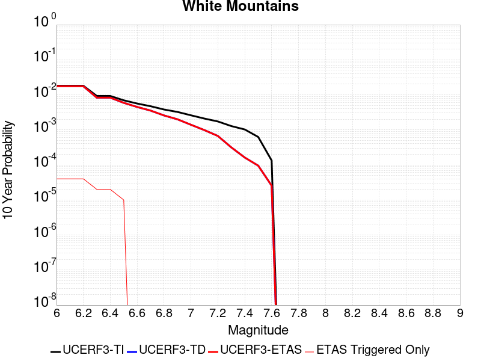 |

| Magnitude | 1 wk TI Prob | 1 wk TD Prob | 1 wk ETAS Prob | 1 wk ETAS/TD Gain | 1 wk ETAS Triggered Only | 1 mo TI Prob | 1 mo TD Prob | 1 mo ETAS Prob | 1 mo ETAS/TD Gain | 1 mo ETAS Triggered Only | 1 yr TI Prob | 1 yr TD Prob | 1 yr ETAS Prob | 1 yr ETAS/TD Gain | 1 yr ETAS Triggered Only | 10 yr TI Prob | 10 yr TD Prob | 10 yr ETAS Prob | 10 yr ETAS/TD Gain | 10 yr ETAS Triggered Only |
|-----|-----|-----|-----|-----|-----|-----|-----|-----|-----|-----|-----|-----|-----|-----|-----|-----|-----|-----|-----|-----|
| 6.0 | 3.503579E-5 | 3.378576E-5 | 3.378576E-5 | 1.0 | 0.0 | 1.5014476E-4 | 1.4478876E-4 | 1.4478876E-4 | 1.0 | 0.0 | 0.0018264796 | 0.0017614986 | 0.001771481 | 1.005667 | 1.0E-5 | 0.018115403 | 0.017487697 | 0.017526997 | 1.0022473 | 4.0E-5 |
| 6.1 | 3.503579E-5 | 3.378576E-5 | 3.378576E-5 | 1.0 | 0.0 | 1.5014476E-4 | 1.4478876E-4 | 1.4478876E-4 | 1.0 | 0.0 | 0.0018264796 | 0.0017614986 | 0.001771481 | 1.005667 | 1.0E-5 | 0.018115403 | 0.017487697 | 0.017526997 | 1.0022473 | 4.0E-5 |
| 6.2 | 3.503579E-5 | 3.378576E-5 | 3.378576E-5 | 1.0 | 0.0 | 1.5014476E-4 | 1.4478876E-4 | 1.4478876E-4 | 1.0 | 0.0 | 0.0018264796 | 0.0017614986 | 0.001771481 | 1.005667 | 1.0E-5 | 0.018115403 | 0.017487697 | 0.017526997 | 1.0022473 | 4.0E-5 |
| 6.3 | 1.7818425E-5 | 1.5916949E-5 | 1.5916949E-5 | 1.0 | 0.0 | 7.636245E-5 | 6.821379E-5 | 6.821379E-5 | 1.0 | 0.0 | 9.293162E-4 | 8.3020073E-4 | 8.3020073E-4 | 1.0 | 0.0 | 0.009254395 | 0.008272451 | 0.008292286 | 1.0023977 | 2.0E-5 |
| 6.4 | 1.7818425E-5 | 1.5916949E-5 | 1.5916949E-5 | 1.0 | 0.0 | 7.636245E-5 | 6.821379E-5 | 6.821379E-5 | 1.0 | 0.0 | 9.293162E-4 | 8.3020073E-4 | 8.3020073E-4 | 1.0 | 0.0 | 0.009254395 | 0.008272451 | 0.008292286 | 1.0023977 | 2.0E-5 |
| 6.5 | 1.3397557E-5 | 1.1336967E-5 | 1.1336967E-5 | 1.0 | 0.0 | 5.741684E-5 | 4.858614E-5 | 4.858614E-5 | 1.0 | 0.0 | 6.988258E-4 | 5.913826E-4 | 5.913826E-4 | 1.0 | 0.0 | 0.006966323 | 0.0058987946 | 0.0059087356 | 1.0016853 | 1.0E-5 |
| 6.6 | 1.0818695E-5 | 8.625845E-6 | 8.625845E-6 | 1.0 | 0.0 | 4.6365014E-5 | 3.696741E-5 | 3.696741E-5 | 1.0 | 0.0 | 5.6434784E-4 | 4.499896E-4 | 4.499896E-4 | 1.0 | 0.0 | 0.005629168 | 0.0044912207 | 0.0044912207 | 1.0 | 0.0 |
| 6.7 | 9.067908E-6 | 6.802775E-6 | 6.802775E-6 | 1.0 | 0.0 | 3.8861883E-5 | 2.915444E-5 | 2.915444E-5 | 1.0 | 0.0 | 4.7304068E-4 | 3.549007E-4 | 3.549007E-4 | 1.0 | 0.0 | 0.00472035 | 0.0035436563 | 0.0035436563 | 1.0 | 0.0 |
| 6.8 | 7.295947E-6 | 4.936636E-6 | 4.936636E-6 | 1.0 | 0.0 | 3.126797E-5 | 2.1156846E-5 | 2.1156846E-5 | 1.0 | 0.0 | 3.8062103E-4 | 2.5755528E-4 | 2.5755528E-4 | 1.0 | 0.0 | 0.0037996976 | 0.0025726808 | 0.0025726808 | 1.0 | 0.0 |
| 6.9 | 6.2243444E-6 | 3.8324238E-6 | 3.8324238E-6 | 1.0 | 0.0 | 2.6675489E-5 | 1.6424572E-5 | 1.6424572E-5 | 1.0 | 0.0 | 3.2472567E-4 | 1.9995135E-4 | 1.9995135E-4 | 1.0 | 0.0 | 0.0032425157 | 0.0019977672 | 0.0019977672 | 1.0 | 0.0 |
| 7.0 | 4.9878413E-6 | 2.6796909E-6 | 2.6796909E-6 | 1.0 | 0.0 | 2.1376287E-5 | 1.1484341E-5 | 1.1484341E-5 | 1.0 | 0.0 | 2.602252E-4 | 1.3981314E-4 | 1.3981314E-4 | 1.0 | 0.0 | 0.002599207 | 0.001397278 | 0.001397278 | 1.0 | 0.0 |
| 7.1 | 4.0252844E-6 | 1.8858237E-6 | 1.8858237E-6 | 1.0 | 0.0 | 1.7251105E-5 | 8.082077E-6 | 8.082077E-6 | 1.0 | 0.0 | 2.1001195E-4 | 9.839498E-5 | 9.839498E-5 | 1.0 | 0.0 | 0.0020981359 | 9.835269E-4 | 9.835269E-4 | 1.0 | 0.0 |
| 7.2 | 3.3284066E-6 | 1.2820087E-6 | 1.2820087E-6 | 1.0 | 0.0 | 1.4264522E-5 | 5.494312E-6 | 5.494312E-6 | 1.0 | 0.0 | 1.736567E-4 | 6.68913E-5 | 6.68913E-5 | 1.0 | 0.0 | 0.0017352107 | 6.6872174E-4 | 6.6872174E-4 | 1.0 | 0.0 |
| 7.3 | 2.458226E-6 | 6.057767E-7 | 6.057767E-7 | 1.0 | 0.0 | 1.0535211E-5 | 2.5961833E-6 | 2.5961833E-6 | 1.0 | 0.0 | 1.2825865E-4 | 3.1608113E-5 | 3.1608113E-5 | 1.0 | 0.0 | 0.0012818464 | 3.1603992E-4 | 3.1603992E-4 | 1.0 | 0.0 |
| 7.4 | 1.965953E-6 | 3.1094075E-7 | 3.1094075E-7 | 1.0 | 0.0 | 8.425486E-6 | 1.3326026E-6 | 1.3326026E-6 | 1.0 | 0.0 | 1.0257547E-4 | 1.6224316E-5 | 1.6224316E-5 | 1.0 | 0.0 | 0.0010252813 | 1.6223144E-4 | 1.6223144E-4 | 1.0 | 0.0 |
| 7.5 | 1.2014192E-6 | 1.8247486E-7 | 1.8247486E-7 | 1.0 | 0.0 | 5.148929E-6 | 7.820349E-7 | 7.820349E-7 | 1.0 | 0.0 | 6.2686406E-5 | 9.521234E-6 | 9.521234E-6 | 1.0 | 0.0 | 6.266873E-4 | 9.520834E-5 | 9.520834E-5 | 1.0 | 0.0 |
| 7.6 | 2.5612175E-7 | 4.8954593E-8 | 4.8954593E-8 | 1.0 | 0.0 | 1.0976642E-6 | 2.0980538E-7 | 2.0980538E-7 | 1.0 | 0.0 | 1.3363979E-5 | 2.554378E-6 | 2.554378E-6 | 1.0 | 0.0 | 1.3363175E-4 | 2.5543522E-5 | 2.5543522E-5 | 1.0 | 0.0 |

## Blue Cut
*[(top)](#table-of-contents)*

| 1 Week | 1 Month | 1 Year | 10 Year |
|-----|-----|-----|-----|
|  |  |  |  |

| Magnitude | 1 wk TI Prob | 1 wk TD Prob | 1 wk ETAS Prob | 1 wk ETAS/TD Gain | 1 wk ETAS Triggered Only | 1 mo TI Prob | 1 mo TD Prob | 1 mo ETAS Prob | 1 mo ETAS/TD Gain | 1 mo ETAS Triggered Only | 1 yr TI Prob | 1 yr TD Prob | 1 yr ETAS Prob | 1 yr ETAS/TD Gain | 1 yr ETAS Triggered Only | 10 yr TI Prob | 10 yr TD Prob | 10 yr ETAS Prob | 10 yr ETAS/TD Gain | 10 yr ETAS Triggered Only |
|-----|-----|-----|-----|-----|-----|-----|-----|-----|-----|-----|-----|-----|-----|-----|-----|-----|-----|-----|-----|-----|
| 6.0 | 2.1227985E-5 | 2.2720424E-5 | 2.2720424E-5 | 1.0 | 0.0 | 9.097391E-5 | 9.7369935E-5 | 9.7369935E-5 | 1.0 | 0.0 | 0.0011070445 | 0.0011848924 | 0.0011948805 | 1.0084295 | 1.0E-5 | 0.011015458 | 0.01179159 | 0.011831118 | 1.0033523 | 4.0E-5 |
| 6.1 | 2.1227985E-5 | 2.2720424E-5 | 2.2720424E-5 | 1.0 | 0.0 | 9.097391E-5 | 9.7369935E-5 | 9.7369935E-5 | 1.0 | 0.0 | 0.0011070445 | 0.0011848924 | 0.0011948805 | 1.0084295 | 1.0E-5 | 0.011015458 | 0.01179159 | 0.011831118 | 1.0033523 | 4.0E-5 |
| 6.2 | 2.1227985E-5 | 2.2720424E-5 | 2.2720424E-5 | 1.0 | 0.0 | 9.097391E-5 | 9.7369935E-5 | 9.7369935E-5 | 1.0 | 0.0 | 0.0011070445 | 0.0011848924 | 0.0011948805 | 1.0084295 | 1.0E-5 | 0.011015458 | 0.01179159 | 0.011831118 | 1.0033523 | 4.0E-5 |
| 6.3 | 1.1613981E-5 | 1.2353959E-5 | 1.2353959E-5 | 1.0 | 0.0 | 4.9773254E-5 | 5.2944535E-5 | 5.2944535E-5 | 1.0 | 0.0 | 6.0582085E-4 | 6.4442155E-4 | 6.544151E-4 | 1.0155078 | 1.0E-5 | 0.0060417196 | 0.006426776 | 0.0064367116 | 1.001546 | 1.0E-5 |
| 6.4 | 1.1613981E-5 | 1.2353959E-5 | 1.2353959E-5 | 1.0 | 0.0 | 4.9773254E-5 | 5.2944535E-5 | 5.2944535E-5 | 1.0 | 0.0 | 6.0582085E-4 | 6.4442155E-4 | 6.544151E-4 | 1.0155078 | 1.0E-5 | 0.0060417196 | 0.006426776 | 0.0064367116 | 1.001546 | 1.0E-5 |
| 6.5 | 8.931326E-6 | 9.48191E-6 | 9.48191E-6 | 1.0 | 0.0 | 3.8276554E-5 | 4.0636176E-5 | 4.0636176E-5 | 1.0 | 0.0 | 4.6591737E-4 | 4.9464224E-4 | 5.046373E-4 | 1.0202067 | 1.0E-5 | 0.0046494175 | 0.004936322 | 0.004946273 | 1.0020158 | 1.0E-5 |
| 6.6 | 7.345353E-6 | 7.79053E-6 | 7.79053E-6 | 1.0 | 0.0 | 3.1479703E-5 | 3.33876E-5 | 3.33876E-5 | 1.0 | 0.0 | 3.83198E-4 | 4.0642623E-4 | 4.1642218E-4 | 1.0245947 | 1.0E-5 | 0.0038253788 | 0.004057621 | 0.00406758 | 1.0024545 | 1.0E-5 |
| 6.7 | 6.2775666E-6 | 6.655361E-6 | 6.655361E-6 | 1.0 | 0.0 | 2.690358E-5 | 2.8522707E-5 | 2.8522707E-5 | 1.0 | 0.0 | 3.2750185E-4 | 3.4721615E-4 | 3.5721267E-4 | 1.0287905 | 1.0E-5 | 0.0032701963 | 0.0034674776 | 0.003477443 | 1.0028739 | 1.0E-5 |
| 6.8 | 5.5234095E-6 | 5.855298E-6 | 5.855298E-6 | 1.0 | 0.0 | 2.367154E-5 | 2.5093934E-5 | 2.5093934E-5 | 1.0 | 0.0 | 2.8816288E-4 | 3.054831E-4 | 3.1548002E-4 | 1.0327251 | 1.0E-5 | 0.002877895 | 0.0030513476 | 0.0030613171 | 1.0032673 | 1.0E-5 |
| 6.9 | 4.7780054E-6 | 5.065582E-6 | 5.065582E-6 | 1.0 | 0.0 | 2.0477004E-5 | 2.1709497E-5 | 2.1709497E-5 | 1.0 | 0.0 | 2.4927902E-4 | 2.642881E-4 | 2.642881E-4 | 1.0 | 0.0 | 0.0024899957 | 0.0026404303 | 0.0026404303 | 1.0 | 0.0 |
| 7.0 | 3.883171E-6 | 4.1186195E-6 | 4.1186195E-6 | 1.0 | 0.0 | 1.6642054E-5 | 1.7651146E-5 | 1.7651146E-5 | 1.0 | 0.0 | 2.0259817E-4 | 2.148884E-4 | 2.148884E-4 | 1.0 | 0.0 | 0.0020241356 | 0.0021474818 | 0.0021474818 | 1.0 | 0.0 |
| 7.1 | 2.8358215E-6 | 3.0098138E-6 | 3.0098138E-6 | 1.0 | 0.0 | 1.2153464E-5 | 1.2899175E-5 | 1.2899175E-5 | 1.0 | 0.0 | 1.4795837E-4 | 1.5704273E-4 | 1.5704273E-4 | 1.0 | 0.0 | 0.001478599 | 0.0015699627 | 0.0015699627 | 1.0 | 0.0 |

## San Jacinto (Anza) rev
*[(top)](#table-of-contents)*

| 1 Week | 1 Month | 1 Year | 10 Year |
|-----|-----|-----|-----|
|  |  |  |  |

| Magnitude | 1 wk TI Prob | 1 wk TD Prob | 1 wk ETAS Prob | 1 wk ETAS/TD Gain | 1 wk ETAS Triggered Only | 1 mo TI Prob | 1 mo TD Prob | 1 mo ETAS Prob | 1 mo ETAS/TD Gain | 1 mo ETAS Triggered Only | 1 yr TI Prob | 1 yr TD Prob | 1 yr ETAS Prob | 1 yr ETAS/TD Gain | 1 yr ETAS Triggered Only | 10 yr TI Prob | 10 yr TD Prob | 10 yr ETAS Prob | 10 yr ETAS/TD Gain | 10 yr ETAS Triggered Only |
|-----|-----|-----|-----|-----|-----|-----|-----|-----|-----|-----|-----|-----|-----|-----|-----|-----|-----|-----|-----|-----|
| 6.0 | 6.3015636E-5 | 4.33769E-5 | 6.3376036E-5 | 1.4610549 | 2.0E-5 | 2.7003905E-4 | 1.8588782E-4 | 2.1588225E-4 | 1.1613576 | 3.0E-5 | 0.0032827691 | 0.002260847 | 0.0023007568 | 1.0176525 | 4.0E-5 | 0.032346968 | 0.023336569 | 0.023375634 | 1.001674 | 4.0E-5 |
| 6.1 | 6.3015636E-5 | 4.33769E-5 | 6.3376036E-5 | 1.4610549 | 2.0E-5 | 2.7003905E-4 | 1.8588782E-4 | 2.1588225E-4 | 1.1613576 | 3.0E-5 | 0.0032827691 | 0.002260847 | 0.0023007568 | 1.0176525 | 4.0E-5 | 0.032346968 | 0.023336569 | 0.023375634 | 1.001674 | 4.0E-5 |
| 6.2 | 6.3015636E-5 | 4.33769E-5 | 6.3376036E-5 | 1.4610549 | 2.0E-5 | 2.7003905E-4 | 1.8588782E-4 | 2.1588225E-4 | 1.1613576 | 3.0E-5 | 0.0032827691 | 0.002260847 | 0.0023007568 | 1.0176525 | 4.0E-5 | 0.032346968 | 0.023336569 | 0.023375634 | 1.001674 | 4.0E-5 |
| 6.3 | 6.3015636E-5 | 4.33769E-5 | 6.3376036E-5 | 1.4610549 | 2.0E-5 | 2.7003905E-4 | 1.8588782E-4 | 2.1588225E-4 | 1.1613576 | 3.0E-5 | 0.0032827691 | 0.002260847 | 0.0023007568 | 1.0176525 | 4.0E-5 | 0.032346968 | 0.023336569 | 0.023375634 | 1.001674 | 4.0E-5 |
| 6.4 | 6.3015636E-5 | 4.33769E-5 | 6.3376036E-5 | 1.4610549 | 2.0E-5 | 2.7003905E-4 | 1.8588782E-4 | 2.1588225E-4 | 1.1613576 | 3.0E-5 | 0.0032827691 | 0.002260847 | 0.0023007568 | 1.0176525 | 4.0E-5 | 0.032346968 | 0.023336569 | 0.023375634 | 1.001674 | 4.0E-5 |
| 6.5 | 5.811017E-5 | 4.0152172E-5 | 6.0151368E-5 | 1.498085 | 2.0E-5 | 2.4901982E-4 | 1.7206941E-4 | 2.0206426E-4 | 1.1743182 | 3.0E-5 | 0.0030276014 | 0.002092938 | 0.0021328542 | 1.0190719 | 4.0E-5 | 0.02986684 | 0.02163211 | 0.021671245 | 1.0018091 | 4.0E-5 |
| 6.6 | 5.811017E-5 | 4.0152172E-5 | 6.0151368E-5 | 1.498085 | 2.0E-5 | 2.4901982E-4 | 1.7206941E-4 | 2.0206426E-4 | 1.1743182 | 3.0E-5 | 0.0030276014 | 0.002092938 | 0.0021328542 | 1.0190719 | 4.0E-5 | 0.02986684 | 0.02163211 | 0.021671245 | 1.0018091 | 4.0E-5 |
| 6.7 | 5.712442E-5 | 3.9574043E-5 | 5.9573253E-5 | 1.5053618 | 2.0E-5 | 2.4479596E-4 | 1.6959205E-4 | 1.9958695E-4 | 1.1768651 | 3.0E-5 | 0.0029763177 | 0.0020628334 | 0.0021027508 | 1.0193508 | 4.0E-5 | 0.029367693 | 0.021324372 | 0.02136352 | 1.0018358 | 4.0E-5 |
| 6.8 | 5.6967532E-5 | 3.9430324E-5 | 5.9429538E-5 | 1.5072038 | 2.0E-5 | 2.4412372E-4 | 1.689762E-4 | 1.9897113E-4 | 1.1775098 | 3.0E-5 | 0.0029681553 | 0.0020553495 | 0.0020952672 | 1.0194215 | 4.0E-5 | 0.029288229 | 0.021248532 | 0.021287682 | 1.0018425 | 4.0E-5 |
| 6.9 | 5.6211324E-5 | 3.9134367E-5 | 5.9133585E-5 | 1.5110397 | 2.0E-5 | 2.4088343E-4 | 1.6770797E-4 | 1.9770293E-4 | 1.1788523 | 3.0E-5 | 0.0029288116 | 0.0020399378 | 0.0020798563 | 1.0195684 | 4.0E-5 | 0.028905109 | 0.021088846 | 0.021128003 | 1.0018567 | 4.0E-5 |
| 7.0 | 5.4383527E-5 | 3.7993592E-5 | 5.7992835E-5 | 1.5263846 | 2.0E-5 | 2.3305144E-4 | 1.6281955E-4 | 1.9281467E-4 | 1.184223 | 3.0E-5 | 0.0028337094 | 0.0019805306 | 0.0020204515 | 1.0201566 | 4.0E-5 | 0.027978465 | 0.020475477 | 0.020514658 | 1.0019135 | 4.0E-5 |
| 7.1 | 5.1393665E-5 | 3.6453963E-5 | 5.6453235E-5 | 1.5486172 | 2.0E-5 | 2.2023996E-4 | 1.5622194E-4 | 1.8621725E-4 | 1.1920044 | 3.0E-5 | 0.0026781242 | 0.0019003471 | 0.0019402711 | 1.0210087 | 4.0E-5 | 0.026460782 | 0.019646611 | 0.019685825 | 1.0019959 | 4.0E-5 |
| 7.2 | 4.785222E-5 | 3.480354E-5 | 5.4802844E-5 | 1.5746342 | 2.0E-5 | 2.0506482E-4 | 1.4914952E-4 | 1.7914505E-4 | 1.2011105 | 3.0E-5 | 0.0024938055 | 0.0018143865 | 0.0018543139 | 1.022006 | 4.0E-5 | 0.024660049 | 0.018758623 | 0.018797873 | 1.0020924 | 4.0E-5 |
| 7.3 | 4.2143256E-5 | 3.3895747E-5 | 5.389507E-5 | 1.5900245 | 2.0E-5 | 1.8060145E-4 | 1.4525942E-4 | 1.7525506E-4 | 1.2064971 | 3.0E-5 | 0.002196605 | 0.0017671023 | 0.0018070316 | 1.0225959 | 4.0E-5 | 0.02175019 | 0.018267985 | 0.018307256 | 1.0021496 | 4.0E-5 |
| 7.4 | 4.0264713E-5 | 3.35335E-5 | 5.3532825E-5 | 1.5963986 | 2.0E-5 | 1.7255165E-4 | 1.4370709E-4 | 1.7370278E-4 | 1.208728 | 3.0E-5 | 0.002098792 | 0.0017482331 | 0.0017881632 | 1.0228403 | 4.0E-5 | 0.020790804 | 0.018072372 | 0.01811165 | 1.0021733 | 4.0E-5 |
| 7.5 | 3.694492E-5 | 3.2245665E-5 | 5.224502E-5 | 1.6202184 | 2.0E-5 | 1.5832575E-4 | 1.381884E-4 | 1.6818427E-4 | 1.2170649 | 3.0E-5 | 0.0019259118 | 0.0016811487 | 0.0017210813 | 1.0237533 | 4.0E-5 | 0.01909306 | 0.017387826 | 0.01742713 | 1.0022604 | 4.0E-5 |
| 7.6 | 3.200565E-5 | 2.9554123E-5 | 4.955353E-5 | 1.6767045 | 2.0E-5 | 1.3715986E-4 | 1.2665438E-4 | 1.5665058E-4 | 1.2368351 | 3.0E-5 | 0.001668642 | 0.0015409287 | 0.001580867 | 1.0259184 | 4.0E-5 | 0.01656168 | 0.015972013 | 0.016011374 | 1.0024644 | 4.0E-5 |
| 7.7 | 2.731642E-5 | 2.6141446E-5 | 4.614092E-5 | 1.7650486 | 2.0E-5 | 1.1706512E-4 | 1.12029964E-4 | 1.420266E-4 | 1.2677555 | 3.0E-5 | 0.001424336 | 0.0013631124 | 0.0014030578 | 1.0293046 | 4.0E-5 | 0.014152412 | 0.014192118 | 0.0142315505 | 1.0027784 | 4.0E-5 |
| 7.8 | 2.3466424E-5 | 2.3551616E-5 | 4.3551143E-5 | 1.8491787 | 2.0E-5 | 1.0056651E-4 | 1.009316E-4 | 1.3092857E-4 | 1.297201 | 3.0E-5 | 0.0012237094 | 0.0012281502 | 0.0012681012 | 1.0325294 | 4.0E-5 | 0.012169928 | 0.012832963 | 0.012872449 | 1.003077 | 4.0E-5 |
| 7.9 | 1.8611925E-5 | 1.8950184E-5 | 3.8949805E-5 | 2.0553787 | 2.0E-5 | 7.9762955E-5 | 8.121255E-5 | 1.11210116E-4 | 1.369371 | 3.0E-5 | 9.7068126E-4 | 9.883151E-4 | 0.0010282756 | 1.0404329 | 4.0E-5 | 0.0096645225 | 0.010415917 | 0.0104555 | 1.0038003 | 4.0E-5 |
| 8.0 | 1.5460775E-5 | 1.5778292E-5 | 3.5777975E-5 | 2.2675443 | 2.0E-5 | 6.6258784E-5 | 6.7619505E-5 | 9.761747E-5 | 1.443629 | 3.0E-5 | 8.0640207E-4 | 8.229572E-4 | 8.6292427E-4 | 1.0485651 | 4.0E-5 | 0.008034821 | 0.008722612 | 0.008762263 | 1.0045458 | 4.0E-5 |
| 8.1 | 9.983884E-6 | 8.29136E-6 | 1.8291277E-5 | 2.2060647 | 1.0E-5 | 4.2787375E-5 | 3.553392E-5 | 4.5533565E-5 | 1.2814113 | 1.0E-5 | 5.2081177E-4 | 4.3254014E-4 | 4.425358E-4 | 1.0231092 | 1.0E-5 | 0.0051959283 | 0.004651628 | 0.0046615815 | 1.0021398 | 1.0E-5 |
| 8.2 | 4.1226E-6 | 1.5588215E-6 | 1.5588215E-6 | 1.0 | 0.0 | 1.7668166E-5 | 6.6806465E-6 | 6.6806465E-6 | 1.0 | 0.0 | 2.1508869E-4 | 8.133386E-5 | 8.133386E-5 | 1.0 | 0.0 | 0.0021488064 | 9.43875E-4 | 9.43875E-4 | 1.0 | 0.0 |
| 8.3 | 1.2750878E-6 | 3.6277774E-7 | 3.6277774E-7 | 1.0 | 0.0 | 5.4646503E-6 | 1.5547608E-6 | 1.5547608E-6 | 1.0 | 0.0 | 6.653009E-5 | 1.8929053E-5 | 1.8929053E-5 | 1.0 | 0.0 | 6.6510175E-4 | 2.2828147E-4 | 2.2828147E-4 | 1.0 | 0.0 |

## Ventura-Pitas Point
*[(top)](#table-of-contents)*

| 1 Week | 1 Month | 1 Year | 10 Year |
|-----|-----|-----|-----|
|  |  |  |  |

| Magnitude | 1 wk TI Prob | 1 wk TD Prob | 1 wk ETAS Prob | 1 wk ETAS/TD Gain | 1 wk ETAS Triggered Only | 1 mo TI Prob | 1 mo TD Prob | 1 mo ETAS Prob | 1 mo ETAS/TD Gain | 1 mo ETAS Triggered Only | 1 yr TI Prob | 1 yr TD Prob | 1 yr ETAS Prob | 1 yr ETAS/TD Gain | 1 yr ETAS Triggered Only | 10 yr TI Prob | 10 yr TD Prob | 10 yr ETAS Prob | 10 yr ETAS/TD Gain | 10 yr ETAS Triggered Only |
|-----|-----|-----|-----|-----|-----|-----|-----|-----|-----|-----|-----|-----|-----|-----|-----|-----|-----|-----|-----|-----|
| 6.0 | 3.3179622E-5 | 3.3739056E-5 | 3.3739056E-5 | 1.0 | 0.0 | 1.4219063E-4 | 1.445894E-4 | 1.445894E-4 | 1.0 | 0.0 | 0.0017297962 | 0.0017592113 | 0.0017791761 | 1.0113487 | 2.0E-5 | 0.017163932 | 0.017478276 | 0.017507752 | 1.0016865 | 3.0E-5 |
| 6.1 | 3.3179622E-5 | 3.3739056E-5 | 3.3739056E-5 | 1.0 | 0.0 | 1.4219063E-4 | 1.445894E-4 | 1.445894E-4 | 1.0 | 0.0 | 0.0017297962 | 0.0017592113 | 0.0017791761 | 1.0113487 | 2.0E-5 | 0.017163932 | 0.017478276 | 0.017507752 | 1.0016865 | 3.0E-5 |
| 6.2 | 3.3179622E-5 | 3.3739056E-5 | 3.3739056E-5 | 1.0 | 0.0 | 1.4219063E-4 | 1.445894E-4 | 1.445894E-4 | 1.0 | 0.0 | 0.0017297962 | 0.0017592113 | 0.0017791761 | 1.0113487 | 2.0E-5 | 0.017163932 | 0.017478276 | 0.017507752 | 1.0016865 | 3.0E-5 |
| 6.3 | 3.3179622E-5 | 3.3739056E-5 | 3.3739056E-5 | 1.0 | 0.0 | 1.4219063E-4 | 1.445894E-4 | 1.445894E-4 | 1.0 | 0.0 | 0.0017297962 | 0.0017592113 | 0.0017791761 | 1.0113487 | 2.0E-5 | 0.017163932 | 0.017478276 | 0.017507752 | 1.0016865 | 3.0E-5 |
| 6.4 | 1.8754668E-5 | 1.7022052E-5 | 1.7022052E-5 | 1.0 | 0.0 | 8.037467E-5 | 7.294974E-5 | 7.294974E-5 | 1.0 | 0.0 | 9.781223E-4 | 8.878243E-4 | 8.978154E-4 | 1.0112535 | 1.0E-5 | 0.009738282 | 0.008845002 | 0.008864826 | 1.0022411 | 2.0E-5 |
| 6.5 | 1.8754668E-5 | 1.7022052E-5 | 1.7022052E-5 | 1.0 | 0.0 | 8.037467E-5 | 7.294974E-5 | 7.294974E-5 | 1.0 | 0.0 | 9.781223E-4 | 8.878243E-4 | 8.978154E-4 | 1.0112535 | 1.0E-5 | 0.009738282 | 0.008845002 | 0.008864826 | 1.0022411 | 2.0E-5 |
| 6.6 | 1.4361558E-5 | 1.21244175E-5 | 1.21244175E-5 | 1.0 | 0.0 | 6.154808E-5 | 5.1960767E-5 | 5.1960767E-5 | 1.0 | 0.0 | 7.490902E-4 | 6.32441E-4 | 6.424347E-4 | 1.0158018 | 1.0E-5 | 0.0074657016 | 0.0063065602 | 0.006326434 | 1.0031513 | 2.0E-5 |
| 6.7 | 1.4361558E-5 | 1.21244175E-5 | 1.21244175E-5 | 1.0 | 0.0 | 6.154808E-5 | 5.1960767E-5 | 5.1960767E-5 | 1.0 | 0.0 | 7.490902E-4 | 6.32441E-4 | 6.424347E-4 | 1.0158018 | 1.0E-5 | 0.0074657016 | 0.0063065602 | 0.006326434 | 1.0031513 | 2.0E-5 |
| 6.8 | 1.3663846E-5 | 1.1346513E-5 | 1.1346513E-5 | 1.0 | 0.0 | 5.8558027E-5 | 4.862702E-5 | 4.862702E-5 | 1.0 | 0.0 | 7.127108E-4 | 5.9187505E-4 | 6.0186913E-4 | 1.0168854 | 1.0E-5 | 0.007104293 | 0.0059030945 | 0.0059229764 | 1.003368 | 2.0E-5 |
| 6.9 | 1.3644157E-5 | 1.1324612E-5 | 1.1324612E-5 | 1.0 | 0.0 | 5.8473648E-5 | 4.8533162E-5 | 4.8533162E-5 | 1.0 | 0.0 | 7.116841E-4 | 5.9073296E-4 | 6.0072704E-4 | 1.0169181 | 1.0E-5 | 0.007094092 | 0.0058917343 | 0.0059116166 | 1.0033746 | 2.0E-5 |
| 7.0 | 1.3568845E-5 | 1.1244173E-5 | 1.1244173E-5 | 1.0 | 0.0 | 5.8150898E-5 | 4.8188434E-5 | 4.8188434E-5 | 1.0 | 0.0 | 7.077572E-4 | 5.8653817E-4 | 5.965323E-4 | 1.0170392 | 1.0E-5 | 0.007055073 | 0.0058500078 | 0.005869891 | 1.0033988 | 2.0E-5 |
| 7.1 | 1.306572E-5 | 1.07225915E-5 | 1.07225915E-5 | 1.0 | 0.0 | 5.599474E-5 | 4.5953166E-5 | 4.5953166E-5 | 1.0 | 0.0 | 6.815227E-4 | 5.59338E-4 | 5.6933245E-4 | 1.0178683 | 1.0E-5 | 0.0067943637 | 0.0055793985 | 0.0055893427 | 1.0017823 | 1.0E-5 |
| 7.2 | 1.232604E-5 | 9.997138E-6 | 9.997138E-6 | 1.0 | 0.0 | 5.2824813E-5 | 4.284418E-5 | 4.284418E-5 | 1.0 | 0.0 | 6.429523E-4 | 5.2150484E-4 | 5.314996E-4 | 1.0191653 | 1.0E-5 | 0.0064109527 | 0.0052028936 | 0.0052128416 | 1.001912 | 1.0E-5 |
| 7.3 | 1.0917261E-5 | 8.844401E-6 | 8.844401E-6 | 1.0 | 0.0 | 4.678742E-5 | 3.7904032E-5 | 3.7904032E-5 | 1.0 | 0.0 | 5.69488E-4 | 4.6138544E-4 | 4.7138083E-4 | 1.0216639 | 1.0E-5 | 0.0056803077 | 0.0046043326 | 0.0046142866 | 1.0021619 | 1.0E-5 |
| 7.4 | 1.039959E-5 | 8.424092E-6 | 8.424092E-6 | 1.0 | 0.0 | 4.456891E-5 | 3.610276E-5 | 3.610276E-5 | 1.0 | 0.0 | 5.424914E-4 | 4.3946397E-4 | 4.4945956E-4 | 1.022745 | 1.0E-5 | 0.0054116896 | 0.004386002 | 0.0043959585 | 1.00227 | 1.0E-5 |
| 7.5 | 9.015877E-6 | 7.297917E-6 | 7.297917E-6 | 1.0 | 0.0 | 3.86389E-5 | 3.127642E-5 | 3.127642E-5 | 1.0 | 0.0 | 4.7032707E-4 | 3.8072528E-4 | 3.9072149E-4 | 1.0262556 | 1.0E-5 | 0.004693329 | 0.003800768 | 0.0038107298 | 1.002621 | 1.0E-5 |
| 7.6 | 4.900162E-6 | 3.8742764E-6 | 3.8742764E-6 | 1.0 | 0.0 | 2.1000526E-5 | 1.6603937E-5 | 1.6603937E-5 | 1.0 | 0.0 | 2.556514E-4 | 2.0213432E-4 | 2.0213432E-4 | 1.0 | 0.0 | 0.0025535747 | 0.0020195183 | 0.0020195183 | 1.0 | 0.0 |
| 7.7 | 3.8850626E-6 | 3.12688E-6 | 3.12688E-6 | 1.0 | 0.0 | 1.6650163E-5 | 1.3400846E-5 | 1.3400846E-5 | 1.0 | 0.0 | 2.0269687E-4 | 1.6314318E-4 | 1.6314318E-4 | 1.0 | 0.0 | 0.002025121 | 0.0016302434 | 0.0016302434 | 1.0 | 0.0 |
| 7.8 | 2.4654719E-6 | 2.0299744E-6 | 2.0299744E-6 | 1.0 | 0.0 | 1.0566265E-5 | 8.699862E-6 | 8.699862E-6 | 1.0 | 0.0 | 1.2863669E-4 | 1.05915715E-4 | 1.05915715E-4 | 1.0 | 0.0 | 0.0012856225 | 0.0010586571 | 0.0010586571 | 1.0 | 0.0 |
| 7.9 | 4.095894E-7 | 3.2766198E-7 | 3.2766198E-7 | 1.0 | 0.0 | 1.7553821E-6 | 1.4042649E-6 | 1.4042649E-6 | 1.0 | 0.0 | 2.1371567E-5 | 1.7096794E-5 | 1.7096794E-5 | 1.0 | 0.0 | 2.1369511E-4 | 1.709551E-4 | 1.709551E-4 | 1.0 | 0.0 |
| 8.0 | 7.791402E-9 | 5.6839005E-9 | 5.6839005E-9 | 1.0 | 0.0 | 3.3391725E-8 | 2.4359574E-8 | 2.4359574E-8 | 1.0 | 0.0 | 4.0654416E-7 | 2.9657778E-7 | 2.9657778E-7 | 1.0 | 0.0 | 4.065434E-6 | 2.965776E-6 | 2.965776E-6 | 1.0 | 0.0 |

## Hayward (So) 2011 CFM
*[(top)](#table-of-contents)*

| 1 Week | 1 Month | 1 Year | 10 Year |
|-----|-----|-----|-----|
| 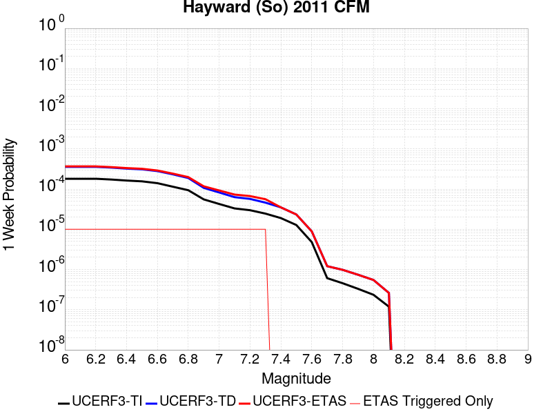 |  |  |  |

| Magnitude | 1 wk TI Prob | 1 wk TD Prob | 1 wk ETAS Prob | 1 wk ETAS/TD Gain | 1 wk ETAS Triggered Only | 1 mo TI Prob | 1 mo TD Prob | 1 mo ETAS Prob | 1 mo ETAS/TD Gain | 1 mo ETAS Triggered Only | 1 yr TI Prob | 1 yr TD Prob | 1 yr ETAS Prob | 1 yr ETAS/TD Gain | 1 yr ETAS Triggered Only | 10 yr TI Prob | 10 yr TD Prob | 10 yr ETAS Prob | 10 yr ETAS/TD Gain | 10 yr ETAS Triggered Only |
|-----|-----|-----|-----|-----|-----|-----|-----|-----|-----|-----|-----|-----|-----|-----|-----|-----|-----|-----|-----|-----|
| 6.0 | 1.8091932E-4 | 3.572658E-4 | 3.672622E-4 | 1.0279803 | 1.0E-5 | 7.751381E-4 | 0.0015302505 | 0.0015402352 | 1.0065249 | 1.0E-5 | 0.00939654 | 0.018474055 | 0.018483872 | 1.0005313 | 1.0E-5 | 0.090090066 | 0.16683507 | 0.16686006 | 1.0001498 | 3.0E-5 |
| 6.1 | 1.8091932E-4 | 3.572658E-4 | 3.672622E-4 | 1.0279803 | 1.0E-5 | 7.751381E-4 | 0.0015302505 | 0.0015402352 | 1.0065249 | 1.0E-5 | 0.00939654 | 0.018474055 | 0.018483872 | 1.0005313 | 1.0E-5 | 0.090090066 | 0.16683507 | 0.16686006 | 1.0001498 | 3.0E-5 |
| 6.2 | 1.8091932E-4 | 3.572658E-4 | 3.672622E-4 | 1.0279803 | 1.0E-5 | 7.751381E-4 | 0.0015302505 | 0.0015402352 | 1.0065249 | 1.0E-5 | 0.00939654 | 0.018474055 | 0.018483872 | 1.0005313 | 1.0E-5 | 0.090090066 | 0.16683507 | 0.16686006 | 1.0001498 | 3.0E-5 |
| 6.3 | 1.7322872E-4 | 3.4283107E-4 | 3.5282766E-4 | 1.0291588 | 1.0E-5 | 7.4219756E-4 | 0.0014684583 | 0.0014784436 | 1.0067998 | 1.0E-5 | 0.0089988755 | 0.017734194 | 0.017744016 | 1.0005538 | 1.0E-5 | 0.08643075 | 0.16077508 | 0.16080026 | 1.0001566 | 3.0E-5 |
| 6.4 | 1.6334097E-4 | 3.2364417E-4 | 3.3364093E-4 | 1.0308881 | 1.0E-5 | 6.998449E-4 | 0.0013863178 | 0.0013963039 | 1.0072033 | 1.0E-5 | 0.008487372 | 0.016749809 | 0.016759641 | 1.000587 | 1.0E-5 | 0.081704415 | 0.1526814 | 0.15270682 | 1.0001665 | 3.0E-5 |
| 6.5 | 1.5600289E-4 | 3.1038653E-4 | 3.2038343E-4 | 1.0322078 | 1.0E-5 | 6.684125E-4 | 0.0013295582 | 0.0013395449 | 1.0075113 | 1.0E-5 | 0.008107598 | 0.016069118 | 0.016078956 | 1.0006123 | 1.0E-5 | 0.078181036 | 0.14695747 | 0.14698306 | 1.0001742 | 3.0E-5 |
| 6.6 | 1.4046066E-4 | 2.8051974E-4 | 2.9051694E-4 | 1.0356381 | 1.0E-5 | 6.018354E-4 | 0.0012016804 | 0.0012116684 | 1.0083116 | 1.0E-5 | 0.0073027555 | 0.014533816 | 0.01454367 | 1.0006781 | 1.0E-5 | 0.07067384 | 0.13404344 | 0.13406943 | 1.0001938 | 3.0E-5 |
| 6.7 | 1.14696966E-4 | 2.3288836E-4 | 2.4288603E-4 | 1.042929 | 1.0E-5 | 4.914658E-4 | 9.977162E-4 | 0.0010077063 | 1.0100129 | 1.0E-5 | 0.0059671924 | 0.012080604 | 0.012090484 | 1.0008178 | 1.0E-5 | 0.058094822 | 0.11285077 | 0.11286852 | 1.0001572 | 2.0E-5 |
| 6.8 | 9.3874296E-5 | 1.8875783E-4 | 1.9875594E-4 | 1.0529679 | 1.0E-5 | 4.0225635E-4 | 8.08715E-4 | 8.1870693E-4 | 1.0123553 | 1.0E-5 | 0.0048864787 | 0.00980239 | 0.009812292 | 1.0010102 | 1.0E-5 | 0.047804173 | 0.092699364 | 0.092717506 | 1.0001957 | 2.0E-5 |
| 6.9 | 5.551852E-5 | 1.07379914E-4 | 1.1737884E-4 | 1.0931172 | 1.0E-5 | 2.3791482E-4 | 4.6011907E-4 | 4.7011446E-4 | 1.0217235 | 1.0E-5 | 0.0028927654 | 0.00558768 | 0.0055976235 | 1.0017797 | 1.0E-5 | 0.028553981 | 0.054287255 | 0.054306168 | 1.0003484 | 2.0E-5 |
| 7.0 | 4.2662363E-5 | 8.2531384E-5 | 9.253056E-5 | 1.121156 | 1.0E-5 | 1.8282588E-4 | 3.5365837E-4 | 3.6365484E-4 | 1.0282658 | 1.0E-5 | 0.0022236328 | 0.004297363 | 0.0043073203 | 1.002317 | 1.0E-5 | 0.022015138 | 0.04209628 | 0.04211544 | 1.0004551 | 2.0E-5 |
| 7.1 | 3.305886E-5 | 6.307517E-5 | 7.307454E-5 | 1.158531 | 1.0E-5 | 1.4167312E-4 | 2.7029423E-4 | 2.8029154E-4 | 1.0369867 | 1.0E-5 | 0.0017235056 | 0.0032858853 | 0.0032958523 | 1.0030333 | 1.0E-5 | 0.017101998 | 0.032479387 | 0.032498736 | 1.0005958 | 2.0E-5 |
| 7.2 | 2.9856887E-5 | 5.7067366E-5 | 6.7066794E-5 | 1.1752214 | 1.0E-5 | 1.2795182E-4 | 2.445516E-4 | 2.5454914E-4 | 1.0408812 | 1.0E-5 | 0.0015567001 | 0.0029733672 | 0.0029833375 | 1.0033532 | 1.0E-5 | 0.015458403 | 0.029479273 | 0.029498683 | 1.0006584 | 2.0E-5 |
| 7.3 | 2.4559737E-5 | 4.603594E-5 | 5.603548E-5 | 1.2172116 | 1.0E-5 | 1.0525176E-4 | 1.9728203E-4 | 2.0728006E-4 | 1.0506788 | 1.0E-5 | 0.0012806869 | 0.002399276 | 0.0024092519 | 1.0041579 | 1.0E-5 | 0.012733313 | 0.02387939 | 0.023898913 | 1.0008175 | 2.0E-5 |
| 7.4 | 1.9002231E-5 | 3.5087567E-5 | 3.5087567E-5 | 1.0 | 0.0 | 8.143559E-5 | 1.5036669E-4 | 1.5036669E-4 | 1.0 | 0.0 | 9.910273E-4 | 0.0018291869 | 0.0018291869 | 1.0 | 0.0 | 0.009866194 | 0.018276993 | 0.018286811 | 1.0005372 | 1.0E-5 |
| 7.5 | 1.2783333E-5 | 2.335991E-5 | 2.335991E-5 | 1.0 | 0.0 | 5.4784563E-5 | 1.0011009E-4 | 1.0011009E-4 | 1.0 | 0.0 | 6.667979E-4 | 0.0012181647 | 0.0012181647 | 1.0 | 0.0 | 0.006648007 | 0.012224549 | 0.012234427 | 1.000808 | 1.0E-5 |
| 7.6 | 4.8149627E-6 | 8.898817E-6 | 8.898817E-6 | 1.0 | 0.0 | 2.063539E-5 | 3.8137237E-5 | 3.8137237E-5 | 1.0 | 0.0 | 2.5120692E-4 | 4.6422318E-4 | 4.6422318E-4 | 1.0 | 0.0 | 0.0025092314 | 0.004687876 | 0.004687876 | 1.0 | 0.0 |
| 7.7 | 6.0838227E-7 | 1.2080477E-6 | 1.2080477E-6 | 1.0 | 0.0 | 2.6073499E-6 | 5.177337E-6 | 5.177337E-6 | 1.0 | 0.0 | 3.174402E-5 | 6.3032254E-5 | 6.3032254E-5 | 1.0 | 0.0 | 3.1739488E-4 | 6.5410853E-4 | 6.5410853E-4 | 1.0 | 0.0 |
| 7.8 | 4.5542808E-7 | 9.812968E-7 | 9.812968E-7 | 1.0 | 0.0 | 1.9518332E-6 | 4.2055512E-6 | 4.2055512E-6 | 1.0 | 0.0 | 2.376331E-5 | 5.1201387E-5 | 5.1201387E-5 | 1.0 | 0.0 | 2.3760769E-4 | 5.331643E-4 | 5.331643E-4 | 1.0 | 0.0 |
| 7.9 | 3.3016747E-7 | 7.401679E-7 | 7.401679E-7 | 1.0 | 0.0 | 1.4150027E-6 | 3.172144E-6 | 3.172144E-6 | 1.0 | 0.0 | 1.7227521E-5 | 3.8620172E-5 | 3.8620172E-5 | 1.0 | 0.0 | 1.7226185E-4 | 4.0006454E-4 | 4.0006454E-4 | 1.0 | 0.0 |
| 8.0 | 2.347038E-7 | 5.482229E-7 | 5.482229E-7 | 1.0 | 0.0 | 1.0058731E-6 | 2.3495245E-6 | 2.3495245E-6 | 1.0 | 0.0 | 1.2246436E-5 | 2.8605087E-5 | 2.8605087E-5 | 1.0 | 0.0 | 1.2245761E-4 | 2.9407733E-4 | 2.9407733E-4 | 1.0 | 0.0 |
| 8.1 | 1.18822804E-7 | 2.610645E-7 | 2.610645E-7 | 1.0 | 0.0 | 5.092405E-7 | 1.1188474E-6 | 1.1188474E-6 | 1.0 | 0.0 | 6.1999854E-6 | 1.3621884E-5 | 1.3621884E-5 | 1.0 | 0.0 | 6.199812E-5 | 1.3941649E-4 | 1.3941649E-4 | 1.0 | 0.0 |

## San Cayetano
*[(top)](#table-of-contents)*

| 1 Week | 1 Month | 1 Year | 10 Year |
|-----|-----|-----|-----|
|  |  |  |  |

| Magnitude | 1 wk TI Prob | 1 wk TD Prob | 1 wk ETAS Prob | 1 wk ETAS/TD Gain | 1 wk ETAS Triggered Only | 1 mo TI Prob | 1 mo TD Prob | 1 mo ETAS Prob | 1 mo ETAS/TD Gain | 1 mo ETAS Triggered Only | 1 yr TI Prob | 1 yr TD Prob | 1 yr ETAS Prob | 1 yr ETAS/TD Gain | 1 yr ETAS Triggered Only | 10 yr TI Prob | 10 yr TD Prob | 10 yr ETAS Prob | 10 yr ETAS/TD Gain | 10 yr ETAS Triggered Only |
|-----|-----|-----|-----|-----|-----|-----|-----|-----|-----|-----|-----|-----|-----|-----|-----|-----|-----|-----|-----|-----|
| 6.0 | 2.3476267E-5 | 1.8172113E-5 | 1.8172113E-5 | 1.0 | 0.0 | 1.0060869E-4 | 7.787818E-5 | 7.787818E-5 | 1.0 | 0.0 | 0.0012242225 | 9.477581E-4 | 9.677391E-4 | 1.0210824 | 2.0E-5 | 0.012175002 | 0.009437738 | 0.009467455 | 1.0031487 | 3.0E-5 |
| 6.1 | 2.3476267E-5 | 1.8172113E-5 | 1.8172113E-5 | 1.0 | 0.0 | 1.0060869E-4 | 7.787818E-5 | 7.787818E-5 | 1.0 | 0.0 | 0.0012242225 | 9.477581E-4 | 9.677391E-4 | 1.0210824 | 2.0E-5 | 0.012175002 | 0.009437738 | 0.009467455 | 1.0031487 | 3.0E-5 |
| 6.2 | 2.3476267E-5 | 1.8172113E-5 | 1.8172113E-5 | 1.0 | 0.0 | 1.0060869E-4 | 7.787818E-5 | 7.787818E-5 | 1.0 | 0.0 | 0.0012242225 | 9.477581E-4 | 9.677391E-4 | 1.0210824 | 2.0E-5 | 0.012175002 | 0.009437738 | 0.009467455 | 1.0031487 | 3.0E-5 |
| 6.3 | 2.3476267E-5 | 1.8172113E-5 | 1.8172113E-5 | 1.0 | 0.0 | 1.0060869E-4 | 7.787818E-5 | 7.787818E-5 | 1.0 | 0.0 | 0.0012242225 | 9.477581E-4 | 9.677391E-4 | 1.0210824 | 2.0E-5 | 0.012175002 | 0.009437738 | 0.009467455 | 1.0031487 | 3.0E-5 |
| 6.4 | 2.3476267E-5 | 1.8172113E-5 | 1.8172113E-5 | 1.0 | 0.0 | 1.0060869E-4 | 7.787818E-5 | 7.787818E-5 | 1.0 | 0.0 | 0.0012242225 | 9.477581E-4 | 9.677391E-4 | 1.0210824 | 2.0E-5 | 0.012175002 | 0.009437738 | 0.009467455 | 1.0031487 | 3.0E-5 |
| 6.5 | 2.3476267E-5 | 1.8172113E-5 | 1.8172113E-5 | 1.0 | 0.0 | 1.0060869E-4 | 7.787818E-5 | 7.787818E-5 | 1.0 | 0.0 | 0.0012242225 | 9.477581E-4 | 9.677391E-4 | 1.0210824 | 2.0E-5 | 0.012175002 | 0.009437738 | 0.009467455 | 1.0031487 | 3.0E-5 |
| 6.6 | 2.3476267E-5 | 1.8172113E-5 | 1.8172113E-5 | 1.0 | 0.0 | 1.0060869E-4 | 7.787818E-5 | 7.787818E-5 | 1.0 | 0.0 | 0.0012242225 | 9.477581E-4 | 9.677391E-4 | 1.0210824 | 2.0E-5 | 0.012175002 | 0.009437738 | 0.009467455 | 1.0031487 | 3.0E-5 |
| 6.7 | 2.3476267E-5 | 1.8172113E-5 | 1.8172113E-5 | 1.0 | 0.0 | 1.0060869E-4 | 7.787818E-5 | 7.787818E-5 | 1.0 | 0.0 | 0.0012242225 | 9.477581E-4 | 9.677391E-4 | 1.0210824 | 2.0E-5 | 0.012175002 | 0.009437738 | 0.009467455 | 1.0031487 | 3.0E-5 |
| 6.8 | 2.3241924E-5 | 1.7939776E-5 | 1.7939776E-5 | 1.0 | 0.0 | 9.960445E-5 | 7.6882505E-5 | 7.6882505E-5 | 1.0 | 0.0 | 0.0012120095 | 9.356462E-4 | 9.556275E-4 | 1.0213556 | 2.0E-5 | 0.012054204 | 0.009317572 | 0.009347293 | 1.0031897 | 3.0E-5 |
| 6.9 | 2.2761007E-5 | 1.7435174E-5 | 1.7435174E-5 | 1.0 | 0.0 | 9.7543525E-5 | 7.472005E-5 | 7.472005E-5 | 1.0 | 0.0 | 0.0011869454 | 9.0934034E-4 | 9.2932215E-4 | 1.021974 | 2.0E-5 | 0.011806256 | 0.009056673 | 0.009086402 | 1.0032824 | 3.0E-5 |
| 7.0 | 2.240283E-5 | 1.7068909E-5 | 1.7068909E-5 | 1.0 | 0.0 | 9.600859E-5 | 7.315043E-5 | 7.315043E-5 | 1.0 | 0.0 | 0.0011682777 | 8.9024607E-4 | 9.102283E-4 | 1.0224457 | 2.0E-5 | 0.011621549 | 0.00886726 | 0.008896994 | 1.0033532 | 3.0E-5 |
| 7.1 | 2.1871154E-5 | 1.6588769E-5 | 1.6588769E-5 | 1.0 | 0.0 | 9.373015E-5 | 7.10928E-5 | 7.10928E-5 | 1.0 | 0.0 | 0.0011405671 | 8.652145E-4 | 8.851972E-4 | 1.0230956 | 2.0E-5 | 0.011347309 | 0.008618908 | 0.008638736 | 1.0023005 | 2.0E-5 |
| 7.2 | 2.0714133E-5 | 1.556723E-5 | 1.556723E-5 | 1.0 | 0.0 | 8.8771834E-5 | 6.671501E-5 | 6.671501E-5 | 1.0 | 0.0 | 0.0010802611 | 8.119558E-4 | 8.319396E-4 | 1.0246118 | 2.0E-5 | 0.010750249 | 0.008090313 | 0.008110152 | 1.0024521 | 2.0E-5 |
| 7.3 | 1.8408395E-5 | 1.3997954E-5 | 1.3997954E-5 | 1.0 | 0.0 | 7.8890735E-5 | 5.998987E-5 | 5.998987E-5 | 1.0 | 0.0 | 9.600714E-4 | 7.301349E-4 | 7.5012026E-4 | 1.0273722 | 2.0E-5 | 0.009559342 | 0.0072777392 | 0.0072975936 | 1.0027281 | 2.0E-5 |
| 7.4 | 1.6856795E-5 | 1.2850997E-5 | 1.2850997E-5 | 1.0 | 0.0 | 7.2241404E-5 | 5.5074554E-5 | 5.5074554E-5 | 1.0 | 0.0 | 8.7918417E-4 | 6.7032926E-4 | 6.9031585E-4 | 1.029816 | 2.0E-5 | 0.00875714 | 0.0066834004 | 0.0067032664 | 1.0029725 | 2.0E-5 |
| 7.5 | 1.2822778E-5 | 9.578085E-6 | 9.578085E-6 | 1.0 | 0.0 | 5.495361E-5 | 4.1048297E-5 | 4.1048297E-5 | 1.0 | 0.0 | 6.688548E-4 | 4.9965E-4 | 5.0964503E-4 | 1.020004 | 1.0E-5 | 0.006668452 | 0.00498533 | 0.00499528 | 1.0019959 | 1.0E-5 |
| 7.6 | 5.6272684E-6 | 3.855225E-6 | 3.855225E-6 | 1.0 | 0.0 | 2.4116642E-5 | 1.6522288E-5 | 1.6522288E-5 | 1.0 | 0.0 | 2.9358055E-4 | 2.0114038E-4 | 2.0114038E-4 | 1.0 | 0.0 | 0.0029319301 | 0.0020095943 | 0.0020095943 | 1.0 | 0.0 |
| 7.7 | 3.5261346E-6 | 2.3409038E-6 | 2.3409038E-6 | 1.0 | 0.0 | 1.5111918E-5 | 1.0032407E-5 | 1.0032407E-5 | 1.0 | 0.0 | 1.8397206E-4 | 1.2213778E-4 | 1.2213778E-4 | 1.0 | 0.0 | 0.0018381984 | 0.001220714 | 0.001220714 | 1.0 | 0.0 |
| 7.8 | 1.4826929E-6 | 1.0565171E-6 | 1.0565171E-6 | 1.0 | 0.0 | 6.354383E-6 | 4.527923E-6 | 4.527923E-6 | 1.0 | 0.0 | 7.736187E-5 | 5.5126085E-5 | 5.5126085E-5 | 1.0 | 0.0 | 7.733494E-4 | 5.5112614E-4 | 5.5112614E-4 | 1.0 | 0.0 |
| 7.9 | 2.7568166E-7 | 1.6979682E-7 | 1.6979682E-7 | 1.0 | 0.0 | 1.1814923E-6 | 7.2770047E-7 | 7.2770047E-7 | 1.0 | 0.0 | 1.4384574E-5 | 8.859717E-6 | 8.859717E-6 | 1.0 | 0.0 | 1.4383643E-4 | 8.8593675E-5 | 8.8593675E-5 | 1.0 | 0.0 |
| 8.0 | 5.407832E-8 | 2.6892753E-8 | 2.6892753E-8 | 1.0 | 0.0 | 2.3176422E-7 | 1.1525465E-7 | 1.1525465E-7 | 1.0 | 0.0 | 2.8217257E-6 | 1.4032245E-6 | 1.4032245E-6 | 1.0 | 0.0 | 2.8216898E-5 | 1.4032161E-5 | 1.4032161E-5 | 1.0 | 0.0 |

## Mission Ridge-Arroyo Parida-Santa Ana
*[(top)](#table-of-contents)*

| 1 Week | 1 Month | 1 Year | 10 Year |
|-----|-----|-----|-----|
|  |  |  | 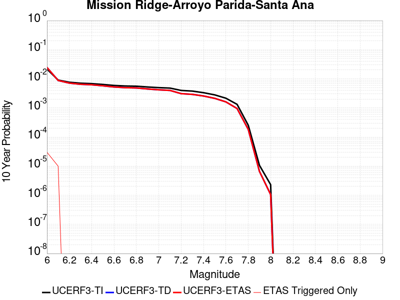 |

| Magnitude | 1 wk TI Prob | 1 wk TD Prob | 1 wk ETAS Prob | 1 wk ETAS/TD Gain | 1 wk ETAS Triggered Only | 1 mo TI Prob | 1 mo TD Prob | 1 mo ETAS Prob | 1 mo ETAS/TD Gain | 1 mo ETAS Triggered Only | 1 yr TI Prob | 1 yr TD Prob | 1 yr ETAS Prob | 1 yr ETAS/TD Gain | 1 yr ETAS Triggered Only | 10 yr TI Prob | 10 yr TD Prob | 10 yr ETAS Prob | 10 yr ETAS/TD Gain | 10 yr ETAS Triggered Only |
|-----|-----|-----|-----|-----|-----|-----|-----|-----|-----|-----|-----|-----|-----|-----|-----|-----|-----|-----|-----|-----|
| 6.0 | 4.169034E-5 | 4.7142308E-5 | 4.7142308E-5 | 1.0 | 0.0 | 1.7866064E-4 | 2.0202712E-4 | 2.0202712E-4 | 1.0 | 0.0 | 0.0021730233 | 0.0024577351 | 0.0024577351 | 1.0 | 0.0 | 0.021518968 | 0.024387209 | 0.024416478 | 1.0012002 | 3.0E-5 |
| 6.1 | 1.73813E-5 | 1.6855429E-5 | 1.6855429E-5 | 1.0 | 0.0 | 7.4489166E-5 | 7.223561E-5 | 7.223561E-5 | 1.0 | 0.0 | 9.065282E-4 | 8.791244E-4 | 8.791244E-4 | 1.0 | 0.0 | 0.009028391 | 0.008757493 | 0.0087674055 | 1.0011319 | 1.0E-5 |
| 6.2 | 1.4622182E-5 | 1.36742265E-5 | 1.36742265E-5 | 1.0 | 0.0 | 6.2664985E-5 | 5.8602534E-5 | 5.8602534E-5 | 1.0 | 0.0 | 7.6267915E-4 | 7.132562E-4 | 7.132562E-4 | 1.0 | 0.0 | 0.007600669 | 0.0071099964 | 0.0071099964 | 1.0 | 0.0 |
| 6.3 | 1.3552434E-5 | 1.2483065E-5 | 1.2483065E-5 | 1.0 | 0.0 | 5.8080568E-5 | 5.3497773E-5 | 5.3497773E-5 | 1.0 | 0.0 | 7.069015E-4 | 6.511439E-4 | 6.511439E-4 | 1.0 | 0.0 | 0.00704657 | 0.006492607 | 0.006492607 | 1.0 | 0.0 |
| 6.4 | 1.30977305E-5 | 1.19799915E-5 | 1.19799915E-5 | 1.0 | 0.0 | 5.613192E-5 | 5.1341827E-5 | 5.1341827E-5 | 1.0 | 0.0 | 6.831918E-4 | 6.249105E-4 | 6.249105E-4 | 1.0 | 0.0 | 0.006810953 | 0.0062317615 | 0.0062317615 | 1.0 | 0.0 |
| 6.5 | 1.225205E-5 | 1.1049589E-5 | 1.1049589E-5 | 1.0 | 0.0 | 5.2507727E-5 | 4.7354537E-5 | 4.7354537E-5 | 1.0 | 0.0 | 6.3909404E-4 | 5.763917E-4 | 5.763917E-4 | 1.0 | 0.0 | 0.006372592 | 0.005749161 | 0.005749161 | 1.0 | 0.0 |
| 6.6 | 1.1352241E-5 | 1.0064272E-5 | 1.0064272E-5 | 1.0 | 0.0 | 4.8651553E-5 | 4.313189E-5 | 4.313189E-5 | 1.0 | 0.0 | 5.921717E-4 | 5.250063E-4 | 5.250063E-4 | 1.0 | 0.0 | 0.0059059616 | 0.0052377903 | 0.0052377903 | 1.0 | 0.0 |
| 6.7 | 1.0864116E-5 | 9.517728E-6 | 9.517728E-6 | 1.0 | 0.0 | 4.6559664E-5 | 4.078964E-5 | 4.078964E-5 | 1.0 | 0.0 | 5.667165E-4 | 4.965027E-4 | 4.965027E-4 | 1.0 | 0.0 | 0.005652734 | 0.0049540517 | 0.0049540517 | 1.0 | 0.0 |
| 6.8 | 1.0666365E-5 | 9.300469E-6 | 9.300469E-6 | 1.0 | 0.0 | 4.571219E-5 | 3.9858554E-5 | 3.9858554E-5 | 1.0 | 0.0 | 5.564038E-4 | 4.8517185E-4 | 4.8517185E-4 | 1.0 | 0.0 | 0.005550127 | 0.004841242 | 0.004841242 | 1.0 | 0.0 |
| 6.9 | 1.0038665E-5 | 8.592688E-6 | 8.592688E-6 | 1.0 | 0.0 | 4.302214E-5 | 3.6825295E-5 | 3.6825295E-5 | 1.0 | 0.0 | 5.236687E-4 | 4.4825752E-4 | 4.4825752E-4 | 1.0 | 0.0 | 0.005224364 | 0.0044736275 | 0.0044736275 | 1.0 | 0.0 |
| 7.0 | 9.5379955E-6 | 8.025673E-6 | 8.025673E-6 | 1.0 | 0.0 | 4.0876483E-5 | 3.43953E-5 | 3.43953E-5 | 1.0 | 0.0 | 4.975576E-4 | 4.18684E-4 | 4.18684E-4 | 1.0 | 0.0 | 0.00496445 | 0.004179035 | 0.004179035 | 1.0 | 0.0 |
| 7.1 | 9.207389E-6 | 7.652947E-6 | 7.652947E-6 | 1.0 | 0.0 | 3.945964E-5 | 3.279794E-5 | 3.279794E-5 | 1.0 | 0.0 | 4.803152E-4 | 3.9924344E-4 | 3.9924344E-4 | 1.0 | 0.0 | 0.004792784 | 0.0039853416 | 0.0039853416 | 1.0 | 0.0 |
| 7.2 | 7.638091E-6 | 5.9315425E-6 | 5.9315425E-6 | 1.0 | 0.0 | 3.2734264E-5 | 2.542065E-5 | 2.542065E-5 | 1.0 | 0.0 | 3.984668E-4 | 3.0945276E-4 | 3.0945276E-4 | 1.0 | 0.0 | 0.0039775306 | 0.0030901586 | 0.0030901586 | 1.0 | 0.0 |
| 7.3 | 7.2500147E-6 | 5.596552E-6 | 5.596552E-6 | 1.0 | 0.0 | 3.1071122E-5 | 2.3985005E-5 | 2.3985005E-5 | 1.0 | 0.0 | 3.7822526E-4 | 2.919786E-4 | 2.919786E-4 | 1.0 | 0.0 | 0.0037758215 | 0.0029158886 | 0.0029158886 | 1.0 | 0.0 |
| 7.4 | 6.3899715E-6 | 4.9188443E-6 | 4.9188443E-6 | 1.0 | 0.0 | 2.7385306E-5 | 2.1080592E-5 | 2.1080592E-5 | 1.0 | 0.0 | 3.3336508E-4 | 2.5662617E-4 | 2.5662617E-4 | 1.0 | 0.0 | 0.0033286542 | 0.002563226 | 0.002563226 | 1.0 | 0.0 |
| 7.5 | 5.379025E-6 | 4.0841383E-6 | 4.0841383E-6 | 1.0 | 0.0 | 2.305276E-5 | 1.7503333E-5 | 1.7503333E-5 | 1.0 | 0.0 | 2.806312E-4 | 2.1308236E-4 | 2.1308236E-4 | 1.0 | 0.0 | 0.0028027708 | 0.0021287918 | 0.0021287918 | 1.0 | 0.0 |
| 7.6 | 4.1270696E-6 | 3.0885694E-6 | 3.0885694E-6 | 1.0 | 0.0 | 1.768732E-5 | 1.32366595E-5 | 1.32366595E-5 | 1.0 | 0.0 | 2.1532185E-4 | 1.6114449E-4 | 1.6114449E-4 | 1.0 | 0.0 | 0.0021511333 | 0.0016102846 | 0.0016102846 | 1.0 | 0.0 |
| 7.7 | 2.5406805E-6 | 1.8283392E-6 | 1.8283392E-6 | 1.0 | 0.0 | 1.0888585E-5 | 7.835716E-6 | 7.835716E-6 | 1.0 | 0.0 | 1.3256045E-4 | 9.5395735E-5 | 9.5395735E-5 | 1.0 | 0.0 | 0.0013248142 | 9.53554E-4 | 9.53554E-4 | 1.0 | 0.0 |
| 7.8 | 4.8608285E-7 | 3.5100481E-7 | 3.5100481E-7 | 1.0 | 0.0 | 2.0832106E-6 | 1.5043055E-6 | 1.5043055E-6 | 1.0 | 0.0 | 2.5362791E-5 | 1.8314766E-5 | 1.8314766E-5 | 1.0 | 0.0 | 2.5359896E-4 | 1.831327E-4 | 1.831327E-4 | 1.0 | 0.0 |
| 7.9 | 2.0472514E-8 | 1.2689942E-8 | 1.2689942E-8 | 1.0 | 0.0 | 8.7739345E-8 | 5.4385467E-8 | 5.4385467E-8 | 1.0 | 0.0 | 1.068226E-6 | 6.6214284E-7 | 6.6214284E-7 | 1.0 | 0.0 | 1.0682209E-5 | 6.6214097E-6 | 6.6214097E-6 | 1.0 | 0.0 |
| 8.0 | 4.443582E-9 | 2.0326758E-9 | 2.0326758E-9 | 1.0 | 0.0 | 1.9043922E-8 | 8.711468E-9 | 8.711468E-9 | 1.0 | 0.0 | 2.3185973E-7 | 1.0606212E-7 | 1.0606212E-7 | 1.0 | 0.0 | 2.3185949E-6 | 1.0606208E-6 | 1.0606208E-6 | 1.0 | 0.0 |

## Brawley (Seismic Zone) alt 1
*[(top)](#table-of-contents)*

| 1 Week | 1 Month | 1 Year | 10 Year |
|-----|-----|-----|-----|
|  |  |  | 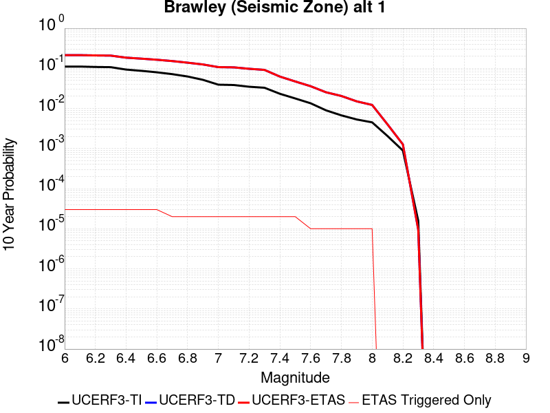 |

| Magnitude | 1 wk TI Prob | 1 wk TD Prob | 1 wk ETAS Prob | 1 wk ETAS/TD Gain | 1 wk ETAS Triggered Only | 1 mo TI Prob | 1 mo TD Prob | 1 mo ETAS Prob | 1 mo ETAS/TD Gain | 1 mo ETAS Triggered Only | 1 yr TI Prob | 1 yr TD Prob | 1 yr ETAS Prob | 1 yr ETAS/TD Gain | 1 yr ETAS Triggered Only | 10 yr TI Prob | 10 yr TD Prob | 10 yr ETAS Prob | 10 yr ETAS/TD Gain | 10 yr ETAS Triggered Only |
|-----|-----|-----|-----|-----|-----|-----|-----|-----|-----|-----|-----|-----|-----|-----|-----|-----|-----|-----|-----|-----|
| 6.0 | 2.2521618E-4 | 4.76691E-4 | 4.76691E-4 | 1.0 | 0.0 | 9.6485513E-4 | 0.002041399 | 0.0020513786 | 1.0048887 | 1.0E-5 | 0.011683988 | 0.024565222 | 0.024574976 | 1.0003971 | 1.0E-5 | 0.11088423 | 0.21363127 | 0.21365486 | 1.0001104 | 3.0E-5 |
| 6.1 | 2.2521618E-4 | 4.76691E-4 | 4.76691E-4 | 1.0 | 0.0 | 9.6485513E-4 | 0.002041399 | 0.0020513786 | 1.0048887 | 1.0E-5 | 0.011683988 | 0.024565222 | 0.024574976 | 1.0003971 | 1.0E-5 | 0.11088423 | 0.21363127 | 0.21365486 | 1.0001104 | 3.0E-5 |
| 6.2 | 2.198148E-4 | 4.6752882E-4 | 4.6752882E-4 | 1.0 | 0.0 | 9.417233E-4 | 0.0020021931 | 0.002012173 | 1.0049845 | 1.0E-5 | 0.011405343 | 0.02409898 | 0.024108738 | 1.000405 | 1.0E-5 | 0.10837428 | 0.21006602 | 0.21008971 | 1.0001128 | 3.0E-5 |
| 6.3 | 2.1704129E-4 | 4.618843E-4 | 4.618843E-4 | 1.0 | 0.0 | 9.298453E-4 | 0.001978039 | 0.0019880193 | 1.0050455 | 1.0E-5 | 0.011262234 | 0.02381224 | 0.023822002 | 1.00041 | 1.0E-5 | 0.107082725 | 0.20795701 | 0.20798078 | 1.0001142 | 3.0E-5 |
| 6.4 | 1.876142E-4 | 4.0079502E-4 | 4.0079502E-4 | 1.0 | 0.0 | 8.038131E-4 | 0.0017165765 | 0.0017265594 | 1.0058155 | 1.0E-5 | 0.00974259 | 0.020700144 | 0.020709936 | 1.0004731 | 1.0E-5 | 0.093263686 | 0.18470816 | 0.18473262 | 1.0001324 | 3.0E-5 |
| 6.5 | 1.7390939E-4 | 3.7510466E-4 | 3.7510466E-4 | 1.0 | 0.0 | 7.45113E-4 | 0.0016066132 | 0.0016165971 | 1.0062143 | 1.0E-5 | 0.009034078 | 0.019388033 | 0.019397838 | 1.0005058 | 1.0E-5 | 0.086755216 | 0.17452815 | 0.17455292 | 1.0001419 | 3.0E-5 |
| 6.6 | 1.591791E-4 | 3.4923697E-4 | 3.4923697E-4 | 1.0 | 0.0 | 6.8201777E-4 | 0.0014958814 | 0.0015058664 | 1.006675 | 1.0E-5 | 0.008271996 | 0.018062927 | 0.018072747 | 1.0005436 | 1.0E-5 | 0.07970774 | 0.16393267 | 0.16395774 | 1.000153 | 3.0E-5 |
| 6.7 | 1.4268003E-4 | 3.208802E-4 | 3.208802E-4 | 1.0 | 0.0 | 6.1134255E-4 | 0.0013744844 | 0.0013844706 | 1.0072654 | 1.0E-5 | 0.007417723 | 0.01660808 | 0.016617915 | 1.0005921 | 1.0E-5 | 0.07174956 | 0.15205671 | 0.15207367 | 1.0001116 | 2.0E-5 |
| 6.8 | 1.239713E-4 | 2.9079075E-4 | 2.9079075E-4 | 1.0 | 0.0 | 5.3119735E-4 | 0.001245657 | 0.0012556445 | 1.0080179 | 1.0E-5 | 0.0064481674 | 0.015061846 | 0.015071696 | 1.000654 | 1.0E-5 | 0.06264243 | 0.13848521 | 0.13850243 | 1.0001245 | 2.0E-5 |
| 6.9 | 1.0180238E-4 | 2.6274272E-4 | 2.6274272E-4 | 1.0 | 0.0 | 4.3622297E-4 | 0.0011255586 | 0.0011355473 | 1.0088745 | 1.0E-5 | 0.005298089 | 0.013618573 | 0.013628436 | 1.0007243 | 1.0E-5 | 0.05173543 | 0.12504812 | 0.12506561 | 1.00014 | 2.0E-5 |
| 7.0 | 7.6619996E-5 | 2.241466E-4 | 2.241466E-4 | 1.0 | 0.0 | 3.283301E-4 | 9.602778E-4 | 9.7026816E-4 | 1.0104036 | 1.0E-5 | 0.0039900932 | 0.011629419 | 0.011639303 | 1.0008498 | 1.0E-5 | 0.039192066 | 0.10733641 | 0.10735427 | 1.0001663 | 2.0E-5 |
| 7.1 | 7.5127435E-5 | 2.2097632E-4 | 2.2097632E-4 | 1.0 | 0.0 | 3.2193496E-4 | 9.4670086E-4 | 9.566914E-4 | 1.010553 | 1.0E-5 | 0.0039125155 | 0.011465871 | 0.011475756 | 1.0008621 | 1.0E-5 | 0.038443442 | 0.10589979 | 0.10591767 | 1.0001688 | 2.0E-5 |
| 7.2 | 6.788582E-5 | 2.0224846E-4 | 2.0224846E-4 | 1.0 | 0.0 | 2.9090676E-4 | 8.664942E-4 | 8.7648554E-4 | 1.0115308 | 1.0E-5 | 0.0035360386 | 0.0104991775 | 0.010509073 | 1.0009425 | 1.0E-5 | 0.034803 | 0.097568415 | 0.09758646 | 1.000185 | 2.0E-5 |
| 7.3 | 6.399602E-5 | 1.8855186E-4 | 1.8855186E-4 | 1.0 | 0.0 | 2.7423984E-4 | 8.0783205E-4 | 8.178239E-4 | 1.0123688 | 1.0E-5 | 0.0033337586 | 0.009791592 | 0.009801494 | 1.0010113 | 1.0E-5 | 0.03284188 | 0.091460384 | 0.09147856 | 1.0001987 | 2.0E-5 |
| 7.4 | 4.506759E-5 | 1.2540306E-4 | 1.2540306E-4 | 1.0 | 0.0 | 1.9313251E-4 | 5.373319E-4 | 5.473265E-4 | 1.0186005 | 1.0E-5 | 0.0023488526 | 0.0065225675 | 0.0065325024 | 1.0015231 | 1.0E-5 | 0.023241805 | 0.06241342 | 0.062432174 | 1.0003004 | 2.0E-5 |
| 7.5 | 3.43289E-5 | 9.3448114E-5 | 9.3448114E-5 | 1.0 | 0.0 | 1.4711556E-4 | 4.0043076E-4 | 4.1042676E-4 | 1.0249631 | 1.0E-5 | 0.0017896603 | 0.0048644086 | 0.0048743603 | 1.0020458 | 1.0E-5 | 0.01775316 | 0.04709746 | 0.047116518 | 1.0004046 | 2.0E-5 |
| 7.6 | 2.5980507E-5 | 7.061279E-5 | 7.061279E-5 | 1.0 | 0.0 | 1.1134028E-4 | 3.0259127E-4 | 3.0259127E-4 | 1.0 | 0.0 | 0.001354725 | 0.0036778497 | 0.0036778497 | 1.0 | 0.0 | 0.013464959 | 0.03587832 | 0.03588796 | 1.0002687 | 1.0E-5 |
| 7.7 | 1.7292105E-5 | 4.9476897E-5 | 4.9476897E-5 | 1.0 | 0.0 | 7.4106916E-5 | 2.1202664E-4 | 2.1202664E-4 | 1.0 | 0.0 | 9.018782E-4 | 0.0025783742 | 0.0025783742 | 1.0 | 0.0 | 0.008982267 | 0.025322445 | 0.025332192 | 1.0003849 | 1.0E-5 |
| 7.8 | 1.2927471E-5 | 3.9753748E-5 | 3.9753748E-5 | 1.0 | 0.0 | 5.5402274E-5 | 1.703621E-4 | 1.703621E-4 | 1.0 | 0.0 | 6.743139E-4 | 0.0020721878 | 0.0020721878 | 1.0 | 0.0 | 0.0067227143 | 0.02045964 | 0.020469436 | 1.0004787 | 1.0E-5 |
| 7.9 | 1.0200774E-5 | 2.879426E-5 | 2.879426E-5 | 1.0 | 0.0 | 4.371687E-5 | 1.2339813E-4 | 1.2339813E-4 | 1.0 | 0.0 | 5.321229E-4 | 0.0015013381 | 0.0015013381 | 1.0 | 0.0 | 0.005308505 | 0.015014351 | 0.015024201 | 1.000656 | 1.0E-5 |
| 8.0 | 8.650396E-6 | 2.331885E-5 | 2.331885E-5 | 1.0 | 0.0 | 3.70726E-5 | 9.99341E-5 | 9.99341E-5 | 1.0 | 0.0 | 4.5126543E-4 | 0.0012160194 | 0.0012160194 | 1.0 | 0.0 | 0.0045035016 | 0.012230608 | 0.012240485 | 1.0008076 | 1.0E-5 |
| 8.1 | 3.9368224E-6 | 7.3453502E-6 | 7.3453502E-6 | 1.0 | 0.0 | 1.6871985E-5 | 3.1479693E-5 | 3.1479693E-5 | 1.0 | 0.0 | 2.0539707E-4 | 3.83198E-4 | 3.83198E-4 | 1.0 | 0.0 | 0.0020520731 | 0.004009915 | 0.004009915 | 1.0 | 0.0 |
| 8.2 | 1.7101195E-6 | 2.2244978E-6 | 2.2244978E-6 | 1.0 | 0.0 | 7.329063E-6 | 9.533527E-6 | 9.533527E-6 | 1.0 | 0.0 | 8.922769E-5 | 1.1606455E-4 | 1.1606455E-4 | 1.0 | 0.0 | 8.9191867E-4 | 0.0012700894 | 0.0012700894 | 1.0 | 0.0 |
| 8.3 | 3.0346666E-8 | 1.7278948E-8 | 1.7278948E-8 | 1.0 | 0.0 | 1.3005713E-7 | 7.405263E-8 | 7.405263E-8 | 1.0 | 0.0 | 1.5834444E-6 | 9.015907E-7 | 9.015907E-7 | 1.0 | 0.0 | 1.5834332E-5 | 9.403383E-6 | 9.403383E-6 | 1.0 | 0.0 |

## San Clemente
*[(top)](#table-of-contents)*

| 1 Week | 1 Month | 1 Year | 10 Year |
|-----|-----|-----|-----|
|  |  |  |  |

| Magnitude | 1 wk TI Prob | 1 wk TD Prob | 1 wk ETAS Prob | 1 wk ETAS/TD Gain | 1 wk ETAS Triggered Only | 1 mo TI Prob | 1 mo TD Prob | 1 mo ETAS Prob | 1 mo ETAS/TD Gain | 1 mo ETAS Triggered Only | 1 yr TI Prob | 1 yr TD Prob | 1 yr ETAS Prob | 1 yr ETAS/TD Gain | 1 yr ETAS Triggered Only | 10 yr TI Prob | 10 yr TD Prob | 10 yr ETAS Prob | 10 yr ETAS/TD Gain | 10 yr ETAS Triggered Only |
|-----|-----|-----|-----|-----|-----|-----|-----|-----|-----|-----|-----|-----|-----|-----|-----|-----|-----|-----|-----|-----|
| 6.0 | 6.681379E-5 | 8.164766E-5 | 8.164766E-5 | 1.0 | 0.0 | 2.8631336E-4 | 3.4987382E-4 | 3.5987032E-4 | 1.0285717 | 1.0E-5 | 0.003480294 | 0.0042519076 | 0.004261865 | 1.0023419 | 1.0E-5 | 0.03426291 | 0.041760825 | 0.04178957 | 1.0006884 | 3.0E-5 |
| 6.1 | 6.681379E-5 | 8.164766E-5 | 8.164766E-5 | 1.0 | 0.0 | 2.8631336E-4 | 3.4987382E-4 | 3.5987032E-4 | 1.0285717 | 1.0E-5 | 0.003480294 | 0.0042519076 | 0.004261865 | 1.0023419 | 1.0E-5 | 0.03426291 | 0.041760825 | 0.041770406 | 1.0002295 | 1.0E-5 |
| 6.2 | 3.9400576E-5 | 4.6456847E-5 | 4.6456847E-5 | 1.0 | 0.0 | 1.6884868E-4 | 1.9908592E-4 | 2.0908393E-4 | 1.0502195 | 1.0E-5 | 0.0020537945 | 0.0024212298 | 0.0024312057 | 1.0041201 | 1.0E-5 | 0.020349167 | 0.023955164 | 0.023964925 | 1.0004075 | 1.0E-5 |
| 6.3 | 3.2590255E-5 | 3.793244E-5 | 3.793244E-5 | 1.0 | 0.0 | 1.3966505E-4 | 1.6255764E-4 | 1.7255601E-4 | 1.0615066 | 1.0E-5 | 0.0016990956 | 0.001977373 | 0.0019873532 | 1.0050472 | 1.0E-5 | 0.01686163 | 0.019601578 | 0.019611383 | 1.0005002 | 1.0E-5 |
| 6.4 | 2.9454652E-5 | 3.410063E-5 | 3.410063E-5 | 1.0 | 0.0 | 1.2622811E-4 | 1.4613752E-4 | 1.5613606E-4 | 1.0684187 | 1.0E-5 | 0.0015357438 | 0.0017777986 | 0.0017877808 | 1.0056149 | 1.0E-5 | 0.015251739 | 0.017638939 | 0.017648762 | 1.000557 | 1.0E-5 |
| 6.5 | 2.790836E-5 | 3.2250136E-5 | 3.2250136E-5 | 1.0 | 0.0 | 1.1960178E-4 | 1.3820769E-4 | 1.4820631E-4 | 1.0723449 | 1.0E-5 | 0.001455179 | 0.0016814056 | 0.0016913888 | 1.0059375 | 1.0E-5 | 0.014456868 | 0.016689856 | 0.016699689 | 1.0005891 | 1.0E-5 |
| 6.6 | 2.2492153E-5 | 2.5764695E-5 | 2.5764695E-5 | 1.0 | 0.0 | 9.639138E-5 | 1.1041553E-4 | 1.2041443E-4 | 1.090557 | 1.0E-5 | 0.0011729331 | 0.0013434949 | 0.0013534813 | 1.0074333 | 1.0E-5 | 0.011667615 | 0.013355443 | 0.01336531 | 1.0007387 | 1.0E-5 |
| 6.7 | 1.9862755E-5 | 2.2668124E-5 | 2.2668124E-5 | 1.0 | 0.0 | 8.512331E-5 | 9.7145545E-5 | 1.0714457E-4 | 1.1029283 | 1.0E-5 | 0.0010358836 | 0.0011821166 | 0.0011921048 | 1.0084494 | 1.0E-5 | 0.010310682 | 0.011759578 | 0.0117694605 | 1.0008404 | 1.0E-5 |
| 6.8 | 1.6697575E-5 | 1.8979084E-5 | 1.8979084E-5 | 1.0 | 0.0 | 7.155907E-5 | 8.133645E-5 | 9.133564E-5 | 1.1229361 | 1.0E-5 | 8.7088346E-4 | 9.898308E-4 | 9.998209E-4 | 1.0100927 | 1.0E-5 | 0.008674784 | 0.009855248 | 0.009865149 | 1.0010047 | 1.0E-5 |
| 6.9 | 1.5218415E-5 | 1.7270635E-5 | 1.7270635E-5 | 1.0 | 0.0 | 6.522015E-5 | 7.401496E-5 | 8.4014224E-5 | 1.1350979 | 1.0E-5 | 7.93766E-4 | 9.007684E-4 | 9.107594E-4 | 1.0110916 | 1.0E-5 | 0.007909367 | 0.00897212 | 0.00898203 | 1.0011046 | 1.0E-5 |
| 7.0 | 1.2392958E-5 | 1.4034001E-5 | 1.4034001E-5 | 1.0 | 0.0 | 5.3111595E-5 | 6.0144375E-5 | 7.0143775E-5 | 1.1662565 | 1.0E-5 | 6.4644177E-4 | 7.320193E-4 | 7.42012E-4 | 1.0136509 | 1.0E-5 | 0.0064456454 | 0.007296867 | 0.007306794 | 1.0013604 | 1.0E-5 |
| 7.1 | 1.0934128E-5 | 1.2376004E-5 | 1.2376004E-5 | 1.0 | 0.0 | 4.6859706E-5 | 5.3038977E-5 | 6.3038446E-5 | 1.1885306 | 1.0E-5 | 5.7036756E-4 | 6.4556557E-4 | 6.5555907E-4 | 1.0154803 | 1.0E-5 | 0.0056890585 | 0.0064376486 | 0.0064475844 | 1.0015434 | 1.0E-5 |
| 7.2 | 9.5798805E-6 | 1.0845695E-5 | 1.0845695E-5 | 1.0 | 0.0 | 4.1055984E-5 | 4.6480764E-5 | 5.6480298E-5 | 1.2151327 | 1.0E-5 | 4.9974193E-4 | 5.6576356E-4 | 5.757579E-4 | 1.0176653 | 1.0E-5 | 0.0049861963 | 0.005643956 | 0.0056538996 | 1.0017618 | 1.0E-5 |
| 7.3 | 8.0167365E-6 | 9.084559E-6 | 9.084559E-6 | 1.0 | 0.0 | 3.4356988E-5 | 3.893328E-5 | 3.893328E-5 | 1.0 | 0.0 | 4.1821605E-4 | 4.7391668E-4 | 4.7391668E-4 | 1.0 | 0.0 | 0.0041742986 | 0.004729763 | 0.004729763 | 1.0 | 0.0 |
| 7.4 | 2.9581017E-6 | 3.362623E-6 | 3.362623E-6 | 1.0 | 0.0 | 1.2677518E-5 | 1.441119E-5 | 1.441119E-5 | 1.0 | 0.0 | 1.5433785E-4 | 1.7544716E-4 | 1.7544716E-4 | 1.0 | 0.0 | 0.001542307 | 0.0017535817 | 0.0017535817 | 1.0 | 0.0 |

## Imperial
*[(top)](#table-of-contents)*

| 1 Week | 1 Month | 1 Year | 10 Year |
|-----|-----|-----|-----|
|  |  |  |  |

| Magnitude | 1 wk TI Prob | 1 wk TD Prob | 1 wk ETAS Prob | 1 wk ETAS/TD Gain | 1 wk ETAS Triggered Only | 1 mo TI Prob | 1 mo TD Prob | 1 mo ETAS Prob | 1 mo ETAS/TD Gain | 1 mo ETAS Triggered Only | 1 yr TI Prob | 1 yr TD Prob | 1 yr ETAS Prob | 1 yr ETAS/TD Gain | 1 yr ETAS Triggered Only | 10 yr TI Prob | 10 yr TD Prob | 10 yr ETAS Prob | 10 yr ETAS/TD Gain | 10 yr ETAS Triggered Only |
|-----|-----|-----|-----|-----|-----|-----|-----|-----|-----|-----|-----|-----|-----|-----|-----|-----|-----|-----|-----|-----|
| 6.0 | 2.7496446E-4 | 5.060534E-4 | 5.060534E-4 | 1.0 | 0.0 | 0.0011778869 | 0.002167037 | 0.0021770152 | 1.0046046 | 1.0E-5 | 0.0142467655 | 0.026063008 | 0.026072748 | 1.0003737 | 1.0E-5 | 0.13367249 | 0.22823441 | 0.22825757 | 1.0001014 | 3.0E-5 |
| 6.1 | 2.5356023E-4 | 4.8701253E-4 | 4.8701253E-4 | 1.0 | 0.0 | 0.001086234 | 0.0020855654 | 0.0020955445 | 1.0047848 | 1.0E-5 | 0.013144928 | 0.025100723 | 0.025110472 | 1.0003884 | 1.0E-5 | 0.123940155 | 0.21965367 | 0.21967708 | 1.0001066 | 3.0E-5 |
| 6.2 | 2.4820742E-4 | 4.7795853E-4 | 4.7795853E-4 | 1.0 | 0.0 | 0.0010633124 | 0.0020468235 | 0.002056803 | 1.0048757 | 1.0E-5 | 0.01286919 | 0.02464024 | 0.024649994 | 1.0003959 | 1.0E-5 | 0.12148927 | 0.21615778 | 0.2161813 | 1.0001088 | 3.0E-5 |
| 6.3 | 2.3205351E-4 | 4.5930318E-4 | 4.5930318E-4 | 1.0 | 0.0 | 9.94136E-4 | 0.001966994 | 0.0019769743 | 1.0050739 | 1.0E-5 | 0.012036599 | 0.023685131 | 0.023694893 | 1.0004122 | 1.0E-5 | 0.11405133 | 0.20807824 | 0.20810199 | 1.0001142 | 3.0E-5 |
| 6.4 | 2.0304754E-4 | 3.9915304E-4 | 3.9915304E-4 | 1.0 | 0.0 | 8.6991355E-4 | 0.001709549 | 0.0017195318 | 1.0058395 | 1.0E-5 | 0.010539869 | 0.02062065 | 0.020630443 | 1.0004749 | 1.0E-5 | 0.100537635 | 0.1852114 | 0.18523584 | 1.000132 | 3.0E-5 |
| 6.5 | 1.854992E-4 | 3.7025133E-4 | 3.7025133E-4 | 1.0 | 0.0 | 7.9475436E-4 | 0.0015858389 | 0.001595823 | 1.0062958 | 1.0E-5 | 0.009633281 | 0.019145777 | 0.019155586 | 1.0005124 | 1.0E-5 | 0.0922623 | 0.17343764 | 0.17346244 | 1.0001429 | 3.0E-5 |
| 6.6 | 1.6586106E-4 | 3.406821E-4 | 3.406821E-4 | 1.0 | 0.0 | 7.106394E-4 | 0.0014592593 | 0.0014692447 | 1.0068427 | 1.0E-5 | 0.008617763 | 0.01762655 | 0.017636376 | 1.0005573 | 1.0E-5 | 0.08291132 | 0.16090786 | 0.16093305 | 1.0001564 | 3.0E-5 |
| 6.7 | 1.4224656E-4 | 3.0796128E-4 | 3.0796128E-4 | 1.0 | 0.0 | 6.094856E-4 | 0.0013191747 | 0.0013291615 | 1.0075705 | 1.0E-5 | 0.0073952693 | 0.015944751 | 0.015954591 | 1.0006171 | 1.0E-5 | 0.07153955 | 0.14660648 | 0.14662355 | 1.0001165 | 2.0E-5 |
| 6.8 | 1.2317259E-4 | 2.7815934E-4 | 2.7815934E-4 | 1.0 | 0.0 | 5.2777573E-4 | 0.0011915729 | 0.001201561 | 1.0083823 | 1.0E-5 | 0.0064067547 | 0.014412285 | 0.014422141 | 1.0006839 | 1.0E-5 | 0.06225166 | 0.13304241 | 0.13305975 | 1.0001303 | 2.0E-5 |
| 6.9 | 9.859898E-5 | 2.503297E-4 | 2.503297E-4 | 1.0 | 0.0 | 4.2249862E-4 | 0.0010724048 | 0.001082394 | 1.0093149 | 1.0E-5 | 0.0051317946 | 0.012979328 | 0.012989199 | 1.0007604 | 1.0E-5 | 0.05014893 | 0.11948839 | 0.119506 | 1.0001473 | 2.0E-5 |
| 7.0 | 7.3191884E-5 | 2.1280872E-4 | 2.1280872E-4 | 1.0 | 0.0 | 3.136418E-4 | 9.117218E-4 | 9.2171266E-4 | 1.0109583 | 1.0E-5 | 0.003811904 | 0.011044404 | 0.011054293 | 1.0008954 | 1.0E-5 | 0.037471764 | 0.10212967 | 0.102147624 | 1.0001758 | 2.0E-5 |
| 7.1 | 7.1760296E-5 | 2.0982049E-4 | 2.0982049E-4 | 1.0 | 0.0 | 3.0750787E-4 | 8.9892396E-4 | 9.0891495E-4 | 1.0111144 | 1.0E-5 | 0.003737482 | 0.010890158 | 0.010900049 | 1.0009083 | 1.0E-5 | 0.03675245 | 0.10076556 | 0.10078355 | 1.0001785 | 2.0E-5 |
| 7.2 | 6.46614E-5 | 1.9150079E-4 | 1.9150079E-4 | 1.0 | 0.0 | 2.7709085E-4 | 8.204626E-4 | 8.3045434E-4 | 1.0121783 | 1.0E-5 | 0.0033683628 | 0.009944002 | 0.009953903 | 1.0009956 | 1.0E-5 | 0.033177625 | 0.09257121 | 0.092589356 | 1.0001961 | 2.0E-5 |
| 7.3 | 6.088115E-5 | 1.7821198E-4 | 1.7821198E-4 | 1.0 | 0.0 | 2.6089314E-4 | 7.6354493E-4 | 7.7353726E-4 | 1.0130868 | 1.0E-5 | 0.0031717476 | 0.009257112 | 0.009267019 | 1.0010703 | 1.0E-5 | 0.031268585 | 0.086619206 | 0.086637475 | 1.0002109 | 2.0E-5 |
| 7.4 | 4.199346E-5 | 1.1520217E-4 | 1.1520217E-4 | 1.0 | 0.0 | 1.7995955E-4 | 4.9363106E-4 | 5.036261E-4 | 1.020248 | 1.0E-5 | 0.0021888057 | 0.0059935665 | 0.0060035065 | 1.0016584 | 1.0E-5 | 0.02167372 | 0.05748436 | 0.057503212 | 1.000328 | 2.0E-5 |
| 7.5 | 3.130448E-5 | 8.341438E-5 | 8.341438E-5 | 1.0 | 0.0 | 1.3415517E-4 | 3.5744155E-4 | 3.6743798E-4 | 1.0279666 | 1.0E-5 | 0.0016321153 | 0.004343227 | 0.0043531833 | 1.0022924 | 1.0E-5 | 0.016201803 | 0.042169005 | 0.04218816 | 1.0004543 | 2.0E-5 |
| 7.6 | 2.3074248E-5 | 6.0914088E-5 | 6.0914088E-5 | 1.0 | 0.0 | 9.888588E-5 | 2.6103438E-4 | 2.6103438E-4 | 1.0 | 0.0 | 0.0012032706 | 0.0031734854 | 0.0031734854 | 1.0 | 0.0 | 0.011967761 | 0.031058539 | 0.031068228 | 1.000312 | 1.0E-5 |
| 7.7 | 1.45864815E-5 | 4.018208E-5 | 4.018208E-5 | 1.0 | 0.0 | 6.2511994E-5 | 1.7219759E-4 | 1.7219759E-4 | 1.0 | 0.0 | 7.608177E-4 | 0.002094495 | 0.002094495 | 1.0 | 0.0 | 0.007582182 | 0.020654438 | 0.020664232 | 1.0004742 | 1.0E-5 |
| 7.8 | 1.0352979E-5 | 3.100957E-5 | 3.100957E-5 | 1.0 | 0.0 | 4.4369157E-5 | 1.3289141E-4 | 1.3289141E-4 | 1.0 | 0.0 | 5.400606E-4 | 0.0016167545 | 0.0016167545 | 1.0 | 0.0 | 0.0053875 | 0.016039513 | 0.016049353 | 1.0006135 | 1.0E-5 |
| 7.9 | 8.137906E-6 | 2.2187884E-5 | 2.2187884E-5 | 1.0 | 0.0 | 3.4876273E-5 | 9.5087475E-5 | 9.5087475E-5 | 1.0 | 0.0 | 4.2453592E-4 | 0.0011570761 | 0.0011570761 | 1.0 | 0.0 | 0.004237258 | 0.011636249 | 0.011646132 | 1.0008494 | 1.0E-5 |
| 8.0 | 6.93792E-6 | 1.8041985E-5 | 1.8041985E-5 | 1.0 | 0.0 | 2.9733603E-5 | 7.73205E-5 | 7.73205E-5 | 1.0 | 0.0 | 3.6194647E-4 | 9.409713E-4 | 9.409713E-4 | 1.0 | 0.0 | 0.0036135751 | 0.009517279 | 0.009527184 | 1.0010407 | 1.0E-5 |
| 8.1 | 3.4286315E-6 | 6.394906E-6 | 6.394906E-6 | 1.0 | 0.0 | 1.4694053E-5 | 2.7406453E-5 | 2.7406453E-5 | 1.0 | 0.0 | 1.7888541E-4 | 3.336226E-4 | 3.336226E-4 | 1.0 | 0.0 | 0.0017874148 | 0.003493592 | 0.003493592 | 1.0 | 0.0 |
| 8.2 | 1.4906886E-6 | 1.9423765E-6 | 1.9423765E-6 | 1.0 | 0.0 | 6.3886496E-6 | 8.324444E-6 | 8.324444E-6 | 1.0 | 0.0 | 7.7779034E-5 | 1.01345424E-4 | 1.01345424E-4 | 1.0 | 0.0 | 7.775182E-4 | 0.0011104718 | 0.0011104718 | 1.0 | 0.0 |
| 8.3 | 2.5758007E-8 | 1.4553524E-8 | 1.4553524E-8 | 1.0 | 0.0 | 1.10391454E-7 | 6.2372244E-8 | 6.2372244E-8 | 1.0 | 0.0 | 1.3440151E-6 | 7.593821E-7 | 7.593821E-7 | 1.0 | 0.0 | 1.344007E-5 | 7.9182655E-6 | 7.9182655E-6 | 1.0 | 0.0 |

## San Andreas (North Branch Mill Creek)
*[(top)](#table-of-contents)*

| 1 Week | 1 Month | 1 Year | 10 Year |
|-----|-----|-----|-----|
|  |  |  |  |

| Magnitude | 1 wk TI Prob | 1 wk TD Prob | 1 wk ETAS Prob | 1 wk ETAS/TD Gain | 1 wk ETAS Triggered Only | 1 mo TI Prob | 1 mo TD Prob | 1 mo ETAS Prob | 1 mo ETAS/TD Gain | 1 mo ETAS Triggered Only | 1 yr TI Prob | 1 yr TD Prob | 1 yr ETAS Prob | 1 yr ETAS/TD Gain | 1 yr ETAS Triggered Only | 10 yr TI Prob | 10 yr TD Prob | 10 yr ETAS Prob | 10 yr ETAS/TD Gain | 10 yr ETAS Triggered Only |
|-----|-----|-----|-----|-----|-----|-----|-----|-----|-----|-----|-----|-----|-----|-----|-----|-----|-----|-----|-----|-----|
| 6.0 | 1.3461156E-5 | 2.3528417E-5 | 2.3528417E-5 | 1.0 | 0.0 | 5.7689394E-5 | 1.0083219E-4 | 1.0083219E-4 | 1.0 | 0.0 | 7.02142E-4 | 0.0012269439 | 0.0012569071 | 1.024421 | 3.0E-5 | 0.0069992766 | 0.012244128 | 0.0122737605 | 1.0024202 | 3.0E-5 |
| 6.1 | 1.3461156E-5 | 2.3528417E-5 | 2.3528417E-5 | 1.0 | 0.0 | 5.7689394E-5 | 1.0083219E-4 | 1.0083219E-4 | 1.0 | 0.0 | 7.02142E-4 | 0.0012269439 | 0.0012569071 | 1.024421 | 3.0E-5 | 0.0069992766 | 0.012244128 | 0.0122737605 | 1.0024202 | 3.0E-5 |
| 6.2 | 1.3461156E-5 | 2.3528417E-5 | 2.3528417E-5 | 1.0 | 0.0 | 5.7689394E-5 | 1.0083219E-4 | 1.0083219E-4 | 1.0 | 0.0 | 7.02142E-4 | 0.0012269439 | 0.0012569071 | 1.024421 | 3.0E-5 | 0.0069992766 | 0.012244128 | 0.0122737605 | 1.0024202 | 3.0E-5 |
| 6.3 | 1.3461156E-5 | 2.3528417E-5 | 2.3528417E-5 | 1.0 | 0.0 | 5.7689394E-5 | 1.0083219E-4 | 1.0083219E-4 | 1.0 | 0.0 | 7.02142E-4 | 0.0012269439 | 0.0012569071 | 1.024421 | 3.0E-5 | 0.0069992766 | 0.012244128 | 0.0122737605 | 1.0024202 | 3.0E-5 |
| 6.4 | 1.3461156E-5 | 2.3528417E-5 | 2.3528417E-5 | 1.0 | 0.0 | 5.7689394E-5 | 1.0083219E-4 | 1.0083219E-4 | 1.0 | 0.0 | 7.02142E-4 | 0.0012269439 | 0.0012569071 | 1.024421 | 3.0E-5 | 0.0069992766 | 0.012244128 | 0.0122737605 | 1.0024202 | 3.0E-5 |
| 6.5 | 1.3450706E-5 | 2.3517377E-5 | 2.3517377E-5 | 1.0 | 0.0 | 5.764461E-5 | 1.00784884E-4 | 1.00784884E-4 | 1.0 | 0.0 | 7.0159714E-4 | 0.0012263686 | 0.0012563318 | 1.0244324 | 3.0E-5 | 0.006993862 | 0.012238437 | 0.01226807 | 1.0024213 | 3.0E-5 |
| 6.6 | 1.3074523E-5 | 2.313165E-5 | 2.313165E-5 | 1.0 | 0.0 | 5.6032466E-5 | 9.9131896E-5 | 9.9131896E-5 | 1.0 | 0.0 | 6.8198174E-4 | 0.0012062659 | 0.0012362297 | 1.0248401 | 3.0E-5 | 0.006798926 | 0.012039601 | 0.012069239 | 1.0024618 | 3.0E-5 |
| 6.7 | 1.3050216E-5 | 2.3106948E-5 | 2.3106948E-5 | 1.0 | 0.0 | 5.59283E-5 | 9.902603E-5 | 9.902603E-5 | 1.0 | 0.0 | 6.8071426E-4 | 0.0012049783 | 0.0012349422 | 1.0248667 | 3.0E-5 | 0.0067863287 | 0.012026866 | 0.012056505 | 1.0024644 | 3.0E-5 |
| 6.8 | 1.29049395E-5 | 2.295535E-5 | 2.295535E-5 | 1.0 | 0.0 | 5.530571E-5 | 9.837638E-5 | 9.837638E-5 | 1.0 | 0.0 | 6.73139E-4 | 0.0011970776 | 0.0012270417 | 1.0250311 | 3.0E-5 | 0.0067110364 | 0.011948708 | 0.011978351 | 1.0024807 | 3.0E-5 |
| 6.9 | 1.2867369E-5 | 2.2914748E-5 | 2.2914748E-5 | 1.0 | 0.0 | 5.51447E-5 | 9.8202385E-5 | 9.8202385E-5 | 1.0 | 0.0 | 6.711799E-4 | 0.0011949615 | 0.0012249256 | 1.0250754 | 3.0E-5 | 0.006691564 | 0.011927776 | 0.011957418 | 1.0024852 | 3.0E-5 |
| 7.0 | 1.2495996E-5 | 2.2314638E-5 | 2.2314638E-5 | 1.0 | 0.0 | 5.3553173E-5 | 9.5630676E-5 | 9.5630676E-5 | 1.0 | 0.0 | 6.518148E-4 | 0.0011636844 | 0.0011936495 | 1.0257502 | 3.0E-5 | 0.0064990623 | 0.011618286 | 0.011647938 | 1.0025522 | 3.0E-5 |
| 7.1 | 1.2452067E-5 | 2.2259701E-5 | 2.2259701E-5 | 1.0 | 0.0 | 5.3364907E-5 | 9.539525E-5 | 9.539525E-5 | 1.0 | 0.0 | 6.4952404E-4 | 0.0011608212 | 0.0011907864 | 1.0258138 | 3.0E-5 | 0.0064762887 | 0.011589954 | 0.011619606 | 1.0025585 | 3.0E-5 |
| 7.2 | 1.2002777E-5 | 2.1638136E-5 | 2.1638136E-5 | 1.0 | 0.0 | 5.143946E-5 | 9.2731585E-5 | 9.2731585E-5 | 1.0 | 0.0 | 6.2609545E-4 | 0.001128425 | 0.0011583911 | 1.0265558 | 3.0E-5 | 0.006243344 | 0.011269332 | 0.0112989945 | 1.0026321 | 3.0E-5 |
| 7.3 | 1.1923425E-5 | 2.150792E-5 | 2.150792E-5 | 1.0 | 0.0 | 5.109939E-5 | 9.2173555E-5 | 9.2173555E-5 | 1.0 | 0.0 | 6.219575E-4 | 0.001121638 | 0.0011516043 | 1.0267166 | 3.0E-5 | 0.0062021962 | 0.011202184 | 0.011231847 | 1.002648 | 3.0E-5 |
| 7.4 | 1.16105175E-5 | 2.0881596E-5 | 2.0881596E-5 | 1.0 | 0.0 | 4.975841E-5 | 8.94895E-5 | 8.94895E-5 | 1.0 | 0.0 | 6.0564023E-4 | 0.0010889926 | 0.00111896 | 1.0275184 | 3.0E-5 | 0.006039923 | 0.010879889 | 0.010909563 | 1.0027274 | 3.0E-5 |
| 7.5 | 1.1037265E-5 | 1.9580697E-5 | 1.9580697E-5 | 1.0 | 0.0 | 4.7301706E-5 | 8.391459E-5 | 8.391459E-5 | 1.0 | 0.0 | 5.757461E-4 | 0.0010211834 | 0.0010511527 | 1.0293477 | 3.0E-5 | 0.005742567 | 0.010208925 | 0.010238619 | 1.0029086 | 3.0E-5 |
| 7.6 | 1.0720915E-5 | 1.9022264E-5 | 1.9022264E-5 | 1.0 | 0.0 | 4.5945973E-5 | 8.152145E-5 | 8.152145E-5 | 1.0 | 0.0 | 5.592486E-4 | 9.920739E-4 | 0.0010220442 | 1.0302097 | 3.0E-5 | 0.005578433 | 0.009920476 | 0.009950179 | 1.0029941 | 3.0E-5 |
| 7.7 | 9.276279E-6 | 1.6466776E-5 | 1.6466776E-5 | 1.0 | 0.0 | 3.9754876E-5 | 7.057E-5 | 7.057E-5 | 1.0 | 0.0 | 4.839081E-4 | 8.588527E-4 | 8.8882697E-4 | 1.0349003 | 3.0E-5 | 0.0048285574 | 0.008599266 | 0.008629009 | 1.0034586 | 3.0E-5 |
| 7.8 | 5.8346777E-6 | 1.1175348E-5 | 1.1175348E-5 | 1.0 | 0.0 | 2.5005522E-5 | 4.7893467E-5 | 4.7893467E-5 | 1.0 | 0.0 | 3.043997E-4 | 5.829471E-4 | 6.129296E-4 | 1.0514326 | 3.0E-5 | 0.0030398308 | 0.0058576525 | 0.0058874767 | 1.0050915 | 3.0E-5 |
| 7.9 | 4.690204E-6 | 8.525966E-6 | 8.525966E-6 | 1.0 | 0.0 | 2.0100719E-5 | 3.6539343E-5 | 3.6539343E-5 | 1.0 | 0.0 | 2.4469878E-4 | 4.4477577E-4 | 4.7476243E-4 | 1.0674198 | 3.0E-5 | 0.002444295 | 0.0044796076 | 0.004509473 | 1.006667 | 3.0E-5 |
| 8.0 | 2.9570454E-6 | 4.857161E-6 | 4.857161E-6 | 1.0 | 0.0 | 1.267299E-5 | 2.0816238E-5 | 2.0816238E-5 | 1.0 | 0.0 | 1.5428272E-4 | 2.5340827E-4 | 2.5340827E-4 | 1.0 | 0.0 | 0.0015417566 | 0.002555138 | 0.002555138 | 1.0 | 0.0 |
| 8.1 | 1.6376824E-6 | 2.2021675E-6 | 2.2021675E-6 | 1.0 | 0.0 | 7.01862E-6 | 9.4378265E-6 | 9.4378265E-6 | 1.0 | 0.0 | 8.544835E-5 | 1.1489949E-4 | 1.1489949E-4 | 1.0 | 0.0 | 8.54155E-4 | 0.0011635037 | 0.0011635037 | 1.0 | 0.0 |
| 8.2 | 6.9631557E-7 | 4.5515284E-7 | 4.5515284E-7 | 1.0 | 0.0 | 2.984206E-6 | 1.9506535E-6 | 1.9506535E-6 | 1.0 | 0.0 | 3.63321E-5 | 2.374895E-5 | 2.374895E-5 | 1.0 | 0.0 | 3.6326164E-4 | 2.4599142E-4 | 2.4599142E-4 | 1.0 | 0.0 |
| 8.3 | 1.7876137E-7 | 8.39093E-8 | 8.39093E-8 | 1.0 | 0.0 | 7.661199E-7 | 3.5961122E-7 | 3.5961122E-7 | 1.0 | 0.0 | 9.32747E-6 | 4.3782584E-6 | 4.3782584E-6 | 1.0 | 0.0 | 9.3270784E-5 | 4.598492E-5 | 4.598492E-5 | 1.0 | 0.0 |

## West Napa 2011 CFM
*[(top)](#table-of-contents)*

| 1 Week | 1 Month | 1 Year | 10 Year |
|-----|-----|-----|-----|
|  | 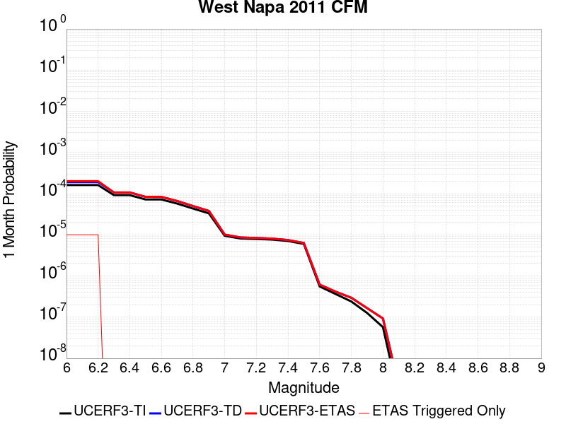 |  |  |

| Magnitude | 1 wk TI Prob | 1 wk TD Prob | 1 wk ETAS Prob | 1 wk ETAS/TD Gain | 1 wk ETAS Triggered Only | 1 mo TI Prob | 1 mo TD Prob | 1 mo ETAS Prob | 1 mo ETAS/TD Gain | 1 mo ETAS Triggered Only | 1 yr TI Prob | 1 yr TD Prob | 1 yr ETAS Prob | 1 yr ETAS/TD Gain | 1 yr ETAS Triggered Only | 10 yr TI Prob | 10 yr TD Prob | 10 yr ETAS Prob | 10 yr ETAS/TD Gain | 10 yr ETAS Triggered Only |
|-----|-----|-----|-----|-----|-----|-----|-----|-----|-----|-----|-----|-----|-----|-----|-----|-----|-----|-----|-----|-----|
| 6.0 | 3.773104E-5 | 4.453336E-5 | 5.4532917E-5 | 1.2245407 | 1.0E-5 | 1.6169442E-4 | 1.9084511E-4 | 2.0084319E-4 | 1.0523885 | 1.0E-5 | 0.001966852 | 0.0023213807 | 0.0023313574 | 1.0042977 | 1.0E-5 | 0.019495348 | 0.023004508 | 0.023033816 | 1.0012741 | 3.0E-5 |
| 6.1 | 3.773104E-5 | 4.453336E-5 | 5.4532917E-5 | 1.2245407 | 1.0E-5 | 1.6169442E-4 | 1.9084511E-4 | 2.0084319E-4 | 1.0523885 | 1.0E-5 | 0.001966852 | 0.0023213807 | 0.0023313574 | 1.0042977 | 1.0E-5 | 0.019495348 | 0.023004508 | 0.023033816 | 1.0012741 | 3.0E-5 |
| 6.2 | 3.773104E-5 | 4.453336E-5 | 5.4532917E-5 | 1.2245407 | 1.0E-5 | 1.6169442E-4 | 1.9084511E-4 | 2.0084319E-4 | 1.0523885 | 1.0E-5 | 0.001966852 | 0.0023213807 | 0.0023313574 | 1.0042977 | 1.0E-5 | 0.019495348 | 0.023004508 | 0.023033816 | 1.0012741 | 3.0E-5 |
| 6.3 | 2.147964E-5 | 2.4989826E-5 | 2.4989826E-5 | 1.0 | 0.0 | 9.2052345E-5 | 1.0709537E-4 | 1.0709537E-4 | 1.0 | 0.0 | 0.001120161 | 0.0013031979 | 0.0013031979 | 1.0 | 0.0 | 0.011145315 | 0.012965921 | 0.012965921 | 1.0 | 0.0 |
| 6.4 | 2.147964E-5 | 2.4989826E-5 | 2.4989826E-5 | 1.0 | 0.0 | 9.2052345E-5 | 1.0709537E-4 | 1.0709537E-4 | 1.0 | 0.0 | 0.001120161 | 0.0013031979 | 0.0013031979 | 1.0 | 0.0 | 0.011145315 | 0.012965921 | 0.012965921 | 1.0 | 0.0 |
| 6.5 | 1.688201E-5 | 1.9549603E-5 | 1.9549603E-5 | 1.0 | 0.0 | 7.234947E-5 | 8.378173E-5 | 8.378173E-5 | 1.0 | 0.0 | 8.804988E-4 | 0.001019638 | 0.001019638 | 1.0 | 0.0 | 0.008770182 | 0.01015801 | 0.01015801 | 1.0 | 0.0 |
| 6.6 | 1.6846381E-5 | 1.9509293E-5 | 1.9509293E-5 | 1.0 | 0.0 | 7.219678E-5 | 8.360898E-5 | 8.360898E-5 | 1.0 | 0.0 | 8.7864127E-4 | 0.0010175367 | 0.0010175367 | 1.0 | 0.0 | 0.008751754 | 0.010137189 | 0.010137189 | 1.0 | 0.0 |
| 6.7 | 1.3396501E-5 | 1.5469546E-5 | 1.5469546E-5 | 1.0 | 0.0 | 5.7412315E-5 | 6.629673E-5 | 6.629673E-5 | 1.0 | 0.0 | 6.9877075E-4 | 8.069273E-4 | 8.069273E-4 | 1.0 | 0.0 | 0.0069657755 | 0.008047441 | 0.008047441 | 1.0 | 0.0 |
| 6.8 | 1.0139058E-5 | 1.1673708E-5 | 1.1673708E-5 | 1.0 | 0.0 | 4.3452383E-5 | 5.0029532E-5 | 5.0029532E-5 | 1.0 | 0.0 | 5.289043E-4 | 6.0899486E-4 | 6.0899486E-4 | 1.0 | 0.0 | 0.005276473 | 0.0060799234 | 0.0060799234 | 1.0 | 0.0 |
| 6.9 | 7.761281E-6 | 8.8920015E-6 | 8.8920015E-6 | 1.0 | 0.0 | 3.326221E-5 | 3.810831E-5 | 3.810831E-5 | 1.0 | 0.0 | 4.0489217E-4 | 4.639213E-4 | 4.639213E-4 | 1.0 | 0.0 | 0.0040415525 | 0.004635784 | 0.004635784 | 1.0 | 0.0 |
| 7.0 | 2.2109202E-6 | 2.3673033E-6 | 2.3673033E-6 | 1.0 | 0.0 | 9.475338E-6 | 1.0145546E-5 | 1.0145546E-5 | 1.0 | 0.0 | 1.1535613E-4 | 1.235151E-4 | 1.235151E-4 | 1.0 | 0.0 | 0.0011529627 | 0.0012356899 | 0.0012356899 | 1.0 | 0.0 |
| 7.1 | 1.9008926E-6 | 2.0139657E-6 | 2.0139657E-6 | 1.0 | 0.0 | 8.146657E-6 | 8.631254E-6 | 8.631254E-6 | 1.0 | 0.0 | 9.918104E-5 | 1.0508047E-4 | 1.0508047E-4 | 1.0 | 0.0 | 9.913679E-4 | 0.001051528 | 0.001051528 | 1.0 | 0.0 |
| 7.2 | 1.8495944E-6 | 1.956769E-6 | 1.956769E-6 | 1.0 | 0.0 | 7.926808E-6 | 8.386126E-6 | 8.386126E-6 | 1.0 | 0.0 | 9.650462E-5 | 1.02096325E-4 | 1.02096325E-4 | 1.0 | 0.0 | 9.6462725E-4 | 0.0010217144 | 0.0010217144 | 1.0 | 0.0 |
| 7.3 | 1.7883189E-6 | 1.8887272E-6 | 1.8887272E-6 | 1.0 | 0.0 | 7.664201E-6 | 8.09452E-6 | 8.09452E-6 | 1.0 | 0.0 | 9.330765E-5 | 9.8546356E-5 | 9.8546356E-5 | 1.0 | 0.0 | 9.3268487E-4 | 9.862463E-4 | 9.862463E-4 | 1.0 | 0.0 |
| 7.4 | 1.6520572E-6 | 1.7421288E-6 | 1.7421288E-6 | 1.0 | 0.0 | 7.0802257E-6 | 7.466245E-6 | 7.466245E-6 | 1.0 | 0.0 | 8.6198335E-5 | 9.089777E-5 | 9.089777E-5 | 1.0 | 0.0 | 8.616491E-4 | 9.0982515E-4 | 9.0982515E-4 | 1.0 | 0.0 |
| 7.5 | 1.4040345E-6 | 1.4805424E-6 | 1.4805424E-6 | 1.0 | 0.0 | 6.0172765E-6 | 6.345166E-6 | 6.345166E-6 | 1.0 | 0.0 | 7.325788E-5 | 7.7249686E-5 | 7.7249686E-5 | 1.0 | 0.0 | 7.3233736E-4 | 7.734145E-4 | 7.734145E-4 | 1.0 | 0.0 |
| 7.6 | 1.3013842E-7 | 1.4432868E-7 | 1.4432868E-7 | 1.0 | 0.0 | 5.57736E-7 | 6.185513E-7 | 6.185513E-7 | 1.0 | 0.0 | 6.790414E-6 | 7.5308362E-6 | 7.5308362E-6 | 1.0 | 0.0 | 6.790207E-5 | 7.623862E-5 | 7.623862E-5 | 1.0 | 0.0 |
| 7.7 | 8.541512E-8 | 9.731742E-8 | 9.731742E-8 | 1.0 | 0.0 | 3.6606474E-7 | 4.170746E-7 | 4.170746E-7 | 1.0 | 0.0 | 4.456829E-6 | 5.0778713E-6 | 5.0778713E-6 | 1.0 | 0.0 | 4.4567398E-5 | 5.168527E-5 | 5.168527E-5 | 1.0 | 0.0 |
| 7.8 | 5.6074793E-8 | 6.908085E-8 | 6.908085E-8 | 1.0 | 0.0 | 2.403205E-7 | 2.9606076E-7 | 2.9606076E-7 | 1.0 | 0.0 | 2.9258983E-6 | 3.6045337E-6 | 3.6045337E-6 | 1.0 | 0.0 | 2.9258597E-5 | 3.688268E-5 | 3.688268E-5 | 1.0 | 0.0 |
| 7.9 | 2.9475839E-8 | 3.8641733E-8 | 3.8641733E-8 | 1.0 | 0.0 | 1.2632502E-7 | 1.6560742E-7 | 1.6560742E-7 | 1.0 | 0.0 | 1.538006E-6 | 2.0162686E-6 | 2.0162686E-6 | 1.0 | 0.0 | 1.5379954E-5 | 2.070501E-5 | 2.070501E-5 | 1.0 | 0.0 |
| 8.0 | 1.3337122E-8 | 2.16757E-8 | 2.16757E-8 | 1.0 | 0.0 | 5.7159088E-8 | 9.289585E-8 | 9.289585E-8 | 1.0 | 0.0 | 6.959117E-7 | 1.1310065E-6 | 1.1310065E-6 | 1.0 | 0.0 | 6.959095E-6 | 1.1667862E-5 | 1.1667862E-5 | 1.0 | 0.0 |
| 8.1 | 2.6589986E-10 | 4.8711546E-10 | 4.8711546E-10 | 1.0 | 0.0 | 1.1395708E-9 | 2.0876372E-9 | 2.0876372E-9 | 1.0 | 0.0 | 1.3874274E-8 | 2.5416986E-8 | 2.5416986E-8 | 1.0 | 0.0 | 1.3874273E-7 | 2.6085002E-7 | 2.6085002E-7 | 1.0 | 0.0 |

## Santa Rosa Island
*[(top)](#table-of-contents)*

| 1 Week | 1 Month | 1 Year | 10 Year |
|-----|-----|-----|-----|
|  |  |  |  |

| Magnitude | 1 wk TI Prob | 1 wk TD Prob | 1 wk ETAS Prob | 1 wk ETAS/TD Gain | 1 wk ETAS Triggered Only | 1 mo TI Prob | 1 mo TD Prob | 1 mo ETAS Prob | 1 mo ETAS/TD Gain | 1 mo ETAS Triggered Only | 1 yr TI Prob | 1 yr TD Prob | 1 yr ETAS Prob | 1 yr ETAS/TD Gain | 1 yr ETAS Triggered Only | 10 yr TI Prob | 10 yr TD Prob | 10 yr ETAS Prob | 10 yr ETAS/TD Gain | 10 yr ETAS Triggered Only |
|-----|-----|-----|-----|-----|-----|-----|-----|-----|-----|-----|-----|-----|-----|-----|-----|-----|-----|-----|-----|-----|
| 6.0 | 4.1143165E-5 | 4.709476E-5 | 4.709476E-5 | 1.0 | 0.0 | 1.7631594E-4 | 2.0182018E-4 | 2.0182018E-4 | 1.0 | 0.0 | 0.002144533 | 0.0024545882 | 0.0024545882 | 1.0 | 0.0 | 0.021239553 | 0.024295408 | 0.02432468 | 1.0012048 | 3.0E-5 |
| 6.1 | 2.1061249E-5 | 2.3866654E-5 | 2.3866654E-5 | 1.0 | 0.0 | 9.0259375E-5 | 1.0228182E-4 | 1.0228182E-4 | 1.0 | 0.0 | 0.0010983539 | 0.0012445987 | 0.0012445987 | 1.0 | 0.0 | 0.01092941 | 0.012379324 | 0.0123990765 | 1.0015956 | 2.0E-5 |
| 6.2 | 2.1061249E-5 | 2.3866654E-5 | 2.3866654E-5 | 1.0 | 0.0 | 9.0259375E-5 | 1.0228182E-4 | 1.0228182E-4 | 1.0 | 0.0 | 0.0010983539 | 0.0012445987 | 0.0012445987 | 1.0 | 0.0 | 0.01092941 | 0.012379324 | 0.0123990765 | 1.0015956 | 2.0E-5 |
| 6.3 | 1.5158236E-5 | 1.707557E-5 | 1.707557E-5 | 1.0 | 0.0 | 6.496225E-5 | 7.317903E-5 | 7.317903E-5 | 1.0 | 0.0 | 7.906284E-4 | 8.9060253E-4 | 8.9060253E-4 | 1.0 | 0.0 | 0.007878214 | 0.008871586 | 0.008881497 | 1.0011172 | 1.0E-5 |
| 6.4 | 1.2341918E-5 | 1.3853823E-5 | 1.3853823E-5 | 1.0 | 0.0 | 5.2892858E-5 | 5.9372218E-5 | 5.9372218E-5 | 1.0 | 0.0 | 6.437803E-4 | 7.226252E-4 | 7.226252E-4 | 1.0 | 0.0 | 0.006419184 | 0.007203591 | 0.007213519 | 1.0013782 | 1.0E-5 |
| 6.5 | 9.061158E-6 | 1.0117662E-5 | 1.0117662E-5 | 1.0 | 0.0 | 3.883296E-5 | 4.3360717E-5 | 4.3360717E-5 | 1.0 | 0.0 | 4.726887E-4 | 5.277942E-4 | 5.277942E-4 | 1.0 | 0.0 | 0.004716845 | 0.005265945 | 0.005275892 | 1.001889 | 1.0E-5 |
| 6.6 | 7.5461685E-6 | 8.401244E-6 | 8.401244E-6 | 1.0 | 0.0 | 3.2340322E-5 | 3.6004854E-5 | 3.6004854E-5 | 1.0 | 0.0 | 3.936723E-4 | 4.3827525E-4 | 4.3827525E-4 | 1.0 | 0.0 | 0.003929756 | 0.0043745385 | 0.004384495 | 1.002276 | 1.0E-5 |
| 6.7 | 5.5023775E-6 | 6.0877283E-6 | 6.0877283E-6 | 1.0 | 0.0 | 2.3581404E-5 | 2.6090021E-5 | 2.6090021E-5 | 1.0 | 0.0 | 2.8706578E-4 | 3.1760297E-4 | 3.1760297E-4 | 1.0 | 0.0 | 0.0028669522 | 0.0031718123 | 0.0031718123 | 1.0 | 0.0 |
| 6.8 | 3.7351679E-6 | 4.0833456E-6 | 4.0833456E-6 | 1.0 | 0.0 | 1.6007763E-5 | 1.7499948E-5 | 1.7499948E-5 | 1.0 | 0.0 | 1.948771E-4 | 2.1304353E-4 | 2.1304353E-4 | 1.0 | 0.0 | 0.0019470629 | 0.0021286383 | 0.0021286383 | 1.0 | 0.0 |
| 6.9 | 2.456366E-6 | 2.6293699E-6 | 2.6293699E-6 | 1.0 | 0.0 | 1.0527241E-5 | 1.126868E-5 | 1.126868E-5 | 1.0 | 0.0 | 1.2816161E-4 | 1.3718757E-4 | 1.3718757E-4 | 1.0 | 0.0 | 0.0012808773 | 0.0013710317 | 0.0013710317 | 1.0 | 0.0 |
| 7.0 | 2.3245157E-6 | 2.4828691E-6 | 2.4828691E-6 | 1.0 | 0.0 | 9.962172E-6 | 1.0640824E-5 | 1.0640824E-5 | 1.0 | 0.0 | 1.2128269E-4 | 1.2954435E-4 | 1.2954435E-4 | 1.0 | 0.0 | 0.0012121652 | 0.0012946906 | 0.0012946906 | 1.0 | 0.0 |
| 7.1 | 2.2248344E-6 | 2.373335E-6 | 2.373335E-6 | 1.0 | 0.0 | 9.53497E-6 | 1.0171396E-5 | 1.0171396E-5 | 1.0 | 0.0 | 1.1608207E-4 | 1.2382973E-4 | 1.2382973E-4 | 1.0 | 0.0 | 0.0011602144 | 0.0012376093 | 0.0012376093 | 1.0 | 0.0 |
| 7.2 | 2.1350402E-6 | 2.2762347E-6 | 2.2762347E-6 | 1.0 | 0.0 | 9.150141E-6 | 9.755256E-6 | 9.755256E-6 | 1.0 | 0.0 | 1.1139726E-4 | 1.1876378E-4 | 1.1876378E-4 | 1.0 | 0.0 | 0.0011134144 | 0.001187005 | 0.001187005 | 1.0 | 0.0 |
| 7.3 | 1.9793572E-6 | 2.108793E-6 | 2.108793E-6 | 1.0 | 0.0 | 8.482932E-6 | 9.037653E-6 | 9.037653E-6 | 1.0 | 0.0 | 1.032748E-4 | 1.100279E-4 | 1.100279E-4 | 1.0 | 0.0 | 0.0010322682 | 0.001099736 | 0.001099736 | 1.0 | 0.0 |
| 7.4 | 1.6951194E-6 | 1.8046361E-6 | 1.8046361E-6 | 1.0 | 0.0 | 7.264777E-6 | 7.734132E-6 | 7.734132E-6 | 1.0 | 0.0 | 8.844508E-5 | 9.4159004E-5 | 9.4159004E-5 | 1.0 | 0.0 | 8.840988E-4 | 9.411928E-4 | 9.411928E-4 | 1.0 | 0.0 |
| 7.5 | 8.987207E-7 | 9.512518E-7 | 9.512518E-7 | 1.0 | 0.0 | 3.8516546E-6 | 4.0767873E-6 | 4.0767873E-6 | 1.0 | 0.0 | 4.6892885E-5 | 4.9633767E-5 | 4.9633767E-5 | 1.0 | 0.0 | 4.688299E-4 | 4.96228E-4 | 4.96228E-4 | 1.0 | 0.0 |
| 7.6 | 3.8783037E-7 | 4.0530364E-7 | 4.0530364E-7 | 1.0 | 0.0 | 1.6621291E-6 | 1.7370145E-6 | 1.7370145E-6 | 1.0 | 0.0 | 2.0236233E-5 | 2.1147953E-5 | 2.1147953E-5 | 1.0 | 0.0 | 2.023439E-4 | 2.1146005E-4 | 2.1146005E-4 | 1.0 | 0.0 |
| 7.7 | 6.181804E-8 | 6.3391695E-8 | 6.3391695E-8 | 1.0 | 0.0 | 2.6493444E-7 | 2.7167866E-7 | 2.7167866E-7 | 1.0 | 0.0 | 3.225572E-6 | 3.3076826E-6 | 3.3076826E-6 | 1.0 | 0.0 | 3.225525E-5 | 3.3076343E-5 | 3.3076343E-5 | 1.0 | 0.0 |
| 7.8 | 1.3704449E-9 | 1.3964294E-9 | 1.3964294E-9 | 1.0 | 0.0 | 5.873335E-9 | 5.984697E-9 | 5.984697E-9 | 1.0 | 0.0 | 7.1507856E-8 | 7.2863685E-8 | 7.2863685E-8 | 1.0 | 0.0 | 7.1507833E-7 | 7.2863673E-7 | 7.2863673E-7 | 1.0 | 0.0 |

## Oak Ridge (Onshore)
*[(top)](#table-of-contents)*

| 1 Week | 1 Month | 1 Year | 10 Year |
|-----|-----|-----|-----|
|  |  |  |  |

| Magnitude | 1 wk TI Prob | 1 wk TD Prob | 1 wk ETAS Prob | 1 wk ETAS/TD Gain | 1 wk ETAS Triggered Only | 1 mo TI Prob | 1 mo TD Prob | 1 mo ETAS Prob | 1 mo ETAS/TD Gain | 1 mo ETAS Triggered Only | 1 yr TI Prob | 1 yr TD Prob | 1 yr ETAS Prob | 1 yr ETAS/TD Gain | 1 yr ETAS Triggered Only | 10 yr TI Prob | 10 yr TD Prob | 10 yr ETAS Prob | 10 yr ETAS/TD Gain | 10 yr ETAS Triggered Only |
|-----|-----|-----|-----|-----|-----|-----|-----|-----|-----|-----|-----|-----|-----|-----|-----|-----|-----|-----|-----|-----|
| 6.0 | 3.155064E-5 | 2.9529527E-5 | 2.9529527E-5 | 1.0 | 0.0 | 1.3521002E-4 | 1.2654919E-4 | 1.4654666E-4 | 1.1580213 | 2.0E-5 | 0.001644939 | 0.0015396855 | 0.0015696393 | 1.0194545 | 3.0E-5 | 0.01632816 | 0.015294337 | 0.015323877 | 1.0019315 | 3.0E-5 |
| 6.1 | 3.155064E-5 | 2.9529527E-5 | 2.9529527E-5 | 1.0 | 0.0 | 1.3521002E-4 | 1.2654919E-4 | 1.4654666E-4 | 1.1580213 | 2.0E-5 | 0.001644939 | 0.0015396855 | 0.0015696393 | 1.0194545 | 3.0E-5 | 0.01632816 | 0.015294337 | 0.015323877 | 1.0019315 | 3.0E-5 |
| 6.2 | 3.155064E-5 | 2.9529527E-5 | 2.9529527E-5 | 1.0 | 0.0 | 1.3521002E-4 | 1.2654919E-4 | 1.4654666E-4 | 1.1580213 | 2.0E-5 | 0.001644939 | 0.0015396855 | 0.0015696393 | 1.0194545 | 3.0E-5 | 0.01632816 | 0.015294337 | 0.015323877 | 1.0019315 | 3.0E-5 |
| 6.3 | 3.155064E-5 | 2.9529527E-5 | 2.9529527E-5 | 1.0 | 0.0 | 1.3521002E-4 | 1.2654919E-4 | 1.4654666E-4 | 1.1580213 | 2.0E-5 | 0.001644939 | 0.0015396855 | 0.0015696393 | 1.0194545 | 3.0E-5 | 0.01632816 | 0.015294337 | 0.015323877 | 1.0019315 | 3.0E-5 |
| 6.4 | 3.155064E-5 | 2.9529527E-5 | 2.9529527E-5 | 1.0 | 0.0 | 1.3521002E-4 | 1.2654919E-4 | 1.4654666E-4 | 1.1580213 | 2.0E-5 | 0.001644939 | 0.0015396855 | 0.0015696393 | 1.0194545 | 3.0E-5 | 0.01632816 | 0.015294337 | 0.015323877 | 1.0019315 | 3.0E-5 |
| 6.5 | 3.155064E-5 | 2.9529527E-5 | 2.9529527E-5 | 1.0 | 0.0 | 1.3521002E-4 | 1.2654919E-4 | 1.4654666E-4 | 1.1580213 | 2.0E-5 | 0.001644939 | 0.0015396855 | 0.0015696393 | 1.0194545 | 3.0E-5 | 0.01632816 | 0.015294337 | 0.015323877 | 1.0019315 | 3.0E-5 |
| 6.6 | 3.155064E-5 | 2.9529527E-5 | 2.9529527E-5 | 1.0 | 0.0 | 1.3521002E-4 | 1.2654919E-4 | 1.4654666E-4 | 1.1580213 | 2.0E-5 | 0.001644939 | 0.0015396855 | 0.0015696393 | 1.0194545 | 3.0E-5 | 0.01632816 | 0.015294337 | 0.015323877 | 1.0019315 | 3.0E-5 |
| 6.7 | 3.098897E-5 | 2.8867666E-5 | 2.8867666E-5 | 1.0 | 0.0 | 1.328031E-4 | 1.2371292E-4 | 1.4371044E-4 | 1.1616446 | 2.0E-5 | 0.0016156785 | 0.0015052018 | 0.0015351566 | 1.0199009 | 3.0E-5 | 0.016039822 | 0.01495416 | 0.014983711 | 1.0019761 | 3.0E-5 |
| 6.8 | 3.0449872E-5 | 2.824281E-5 | 2.824281E-5 | 1.0 | 0.0 | 1.3049292E-4 | 1.2103521E-4 | 1.410328E-4 | 1.1652212 | 2.0E-5 | 0.0015875935 | 0.0014726447 | 0.0015026006 | 1.0203415 | 3.0E-5 | 0.015762992 | 0.014632881 | 0.014662442 | 1.0020201 | 3.0E-5 |
| 6.9 | 2.697928E-5 | 2.4222873E-5 | 2.4222873E-5 | 1.0 | 0.0 | 1.15620365E-4 | 1.0380831E-4 | 1.2380623E-4 | 1.1926428 | 2.0E-5 | 0.0014067689 | 0.0012631549 | 0.001293117 | 1.02372 | 3.0E-5 | 0.0139789665 | 0.012562118 | 0.01259174 | 1.0023581 | 3.0E-5 |
| 7.0 | 2.4893961E-5 | 2.1864958E-5 | 2.1864958E-5 | 1.0 | 0.0 | 1.0668404E-4 | 9.37037E-5 | 1.0370276E-4 | 1.1067094 | 1.0E-5 | 0.0012981043 | 0.0011402632 | 0.0011602404 | 1.0175198 | 2.0E-5 | 0.012905477 | 0.011346059 | 0.011365833 | 1.0017427 | 2.0E-5 |
| 7.1 | 2.0945363E-5 | 1.7357057E-5 | 1.7357057E-5 | 1.0 | 0.0 | 8.976275E-5 | 7.4385294E-5 | 8.438455E-5 | 1.1344252 | 1.0E-5 | 0.0010923136 | 9.052694E-4 | 9.252513E-4 | 1.0220729 | 2.0E-5 | 0.0108696 | 0.0090164 | 0.00903622 | 1.0021982 | 2.0E-5 |
| 7.2 | 2.0439404E-5 | 1.6811955E-5 | 1.6811955E-5 | 1.0 | 0.0 | 8.7594504E-5 | 7.2049275E-5 | 7.2049275E-5 | 1.0 | 0.0 | 0.0010659413 | 8.7685155E-4 | 8.868428E-4 | 1.0113944 | 1.0E-5 | 0.010608427 | 0.008734483 | 0.008744396 | 1.0011349 | 1.0E-5 |
| 7.3 | 1.8463334E-5 | 1.5382886E-5 | 1.5382886E-5 | 1.0 | 0.0 | 7.912617E-5 | 6.5925014E-5 | 6.5925014E-5 | 1.0 | 0.0 | 9.6293533E-4 | 8.023458E-4 | 8.123378E-4 | 1.0124534 | 1.0E-5 | 0.009587734 | 0.007995001 | 0.0080049215 | 1.0012407 | 1.0E-5 |
| 7.4 | 1.763139E-5 | 1.4517755E-5 | 1.4517755E-5 | 1.0 | 0.0 | 7.556091E-5 | 6.2217485E-5 | 6.2217485E-5 | 1.0 | 0.0 | 9.1956573E-4 | 7.572386E-4 | 7.6723105E-4 | 1.0131959 | 1.0E-5 | 0.009157699 | 0.007547035 | 0.0075569595 | 1.001315 | 1.0E-5 |
| 7.5 | 1.3594944E-5 | 1.1163885E-5 | 1.1163885E-5 | 1.0 | 0.0 | 5.8262744E-5 | 4.7844354E-5 | 4.7844354E-5 | 1.0 | 0.0 | 7.0911803E-4 | 5.823519E-4 | 5.9234607E-4 | 1.0171617 | 1.0E-5 | 0.007068595 | 0.0058084223 | 0.005818364 | 1.0017116 | 1.0E-5 |
| 7.6 | 6.9889534E-6 | 5.636935E-6 | 5.636935E-6 | 1.0 | 0.0 | 2.9952313E-5 | 2.4158073E-5 | 2.4158073E-5 | 1.0 | 0.0 | 3.646084E-4 | 2.9408524E-4 | 2.9408524E-4 | 1.0 | 0.0 | 0.0036401073 | 0.0029370047 | 0.0029370047 | 1.0 | 0.0 |
| 7.7 | 4.0824193E-6 | 3.2833914E-6 | 3.2833914E-6 | 1.0 | 0.0 | 1.7495966E-5 | 1.4071602E-5 | 1.4071602E-5 | 1.0 | 0.0 | 2.1299256E-4 | 1.7130842E-4 | 1.7130842E-4 | 1.0 | 0.0 | 0.0021278851 | 0.0017117771 | 0.0017117771 | 1.0 | 0.0 |
| 7.8 | 1.7023609E-6 | 1.4371045E-6 | 1.4371045E-6 | 1.0 | 0.0 | 7.295812E-6 | 6.159005E-6 | 6.159005E-6 | 1.0 | 0.0 | 8.882289E-5 | 7.4983334E-5 | 7.4983334E-5 | 1.0 | 0.0 | 8.8787393E-4 | 7.495831E-4 | 7.495831E-4 | 1.0 | 0.0 |
| 7.9 | 2.721225E-7 | 2.2617681E-7 | 2.2617681E-7 | 1.0 | 0.0 | 1.1662388E-6 | 9.693289E-7 | 9.693289E-7 | 1.0 | 0.0 | 1.4198865E-5 | 1.1801518E-5 | 1.1801518E-5 | 1.0 | 0.0 | 1.4197957E-4 | 1.18009186E-4 | 1.18009186E-4 | 1.0 | 0.0 |
| 8.0 | 9.364255E-9 | 5.1215614E-9 | 5.1215614E-9 | 1.0 | 0.0 | 4.0132523E-8 | 2.1949548E-8 | 2.1949548E-8 | 1.0 | 0.0 | 4.8861335E-7 | 2.6723572E-7 | 2.6723572E-7 | 1.0 | 0.0 | 4.8861225E-6 | 2.6723544E-6 | 2.6723544E-6 | 1.0 | 0.0 |

## Santa Ynez (East)
*[(top)](#table-of-contents)*

| 1 Week | 1 Month | 1 Year | 10 Year |
|-----|-----|-----|-----|
|  |  |  |  |

| Magnitude | 1 wk TI Prob | 1 wk TD Prob | 1 wk ETAS Prob | 1 wk ETAS/TD Gain | 1 wk ETAS Triggered Only | 1 mo TI Prob | 1 mo TD Prob | 1 mo ETAS Prob | 1 mo ETAS/TD Gain | 1 mo ETAS Triggered Only | 1 yr TI Prob | 1 yr TD Prob | 1 yr ETAS Prob | 1 yr ETAS/TD Gain | 1 yr ETAS Triggered Only | 10 yr TI Prob | 10 yr TD Prob | 10 yr ETAS Prob | 10 yr ETAS/TD Gain | 10 yr ETAS Triggered Only |
|-----|-----|-----|-----|-----|-----|-----|-----|-----|-----|-----|-----|-----|-----|-----|-----|-----|-----|-----|-----|-----|
| 6.0 | 3.2269712E-5 | 3.675413E-5 | 3.675413E-5 | 1.0 | 0.0 | 1.3829143E-4 | 1.5751152E-4 | 1.5751152E-4 | 1.0 | 0.0 | 0.0016823979 | 0.0019165992 | 0.0019365608 | 1.0104152 | 2.0E-5 | 0.016697178 | 0.01905816 | 0.019087588 | 1.0015441 | 3.0E-5 |
| 6.1 | 3.2269712E-5 | 3.675413E-5 | 3.675413E-5 | 1.0 | 0.0 | 1.3829143E-4 | 1.5751152E-4 | 1.5751152E-4 | 1.0 | 0.0 | 0.0016823979 | 0.0019165992 | 0.0019365608 | 1.0104152 | 2.0E-5 | 0.016697178 | 0.01905816 | 0.019087588 | 1.0015441 | 3.0E-5 |
| 6.2 | 3.2269712E-5 | 3.675413E-5 | 3.675413E-5 | 1.0 | 0.0 | 1.3829143E-4 | 1.5751152E-4 | 1.5751152E-4 | 1.0 | 0.0 | 0.0016823979 | 0.0019165992 | 0.0019365608 | 1.0104152 | 2.0E-5 | 0.016697178 | 0.01905816 | 0.019087588 | 1.0015441 | 3.0E-5 |
| 6.3 | 3.2269712E-5 | 3.675413E-5 | 3.675413E-5 | 1.0 | 0.0 | 1.3829143E-4 | 1.5751152E-4 | 1.5751152E-4 | 1.0 | 0.0 | 0.0016823979 | 0.0019165992 | 0.0019365608 | 1.0104152 | 2.0E-5 | 0.016697178 | 0.01905816 | 0.019087588 | 1.0015441 | 3.0E-5 |
| 6.4 | 1.4404779E-5 | 1.4850021E-5 | 1.4850021E-5 | 1.0 | 0.0 | 6.1733306E-5 | 6.3641426E-5 | 6.3641426E-5 | 1.0 | 0.0 | 7.513438E-4 | 7.74564E-4 | 7.945485E-4 | 1.025801 | 2.0E-5 | 0.0074880854 | 0.0077191936 | 0.007739039 | 1.002571 | 2.0E-5 |
| 6.5 | 1.4404779E-5 | 1.4850021E-5 | 1.4850021E-5 | 1.0 | 0.0 | 6.1733306E-5 | 6.3641426E-5 | 6.3641426E-5 | 1.0 | 0.0 | 7.513438E-4 | 7.74564E-4 | 7.945485E-4 | 1.025801 | 2.0E-5 | 0.0074880854 | 0.0077191936 | 0.007739039 | 1.002571 | 2.0E-5 |
| 6.6 | 1.280208E-5 | 1.3012444E-5 | 1.3012444E-5 | 1.0 | 0.0 | 5.4864904E-5 | 5.5766435E-5 | 5.5766435E-5 | 1.0 | 0.0 | 6.6777546E-4 | 6.787466E-4 | 6.887398E-4 | 1.0147231 | 1.0E-5 | 0.006657724 | 0.006766946 | 0.006776878 | 1.0014678 | 1.0E-5 |
| 6.7 | 1.2457027E-5 | 1.26289415E-5 | 1.26289415E-5 | 1.0 | 0.0 | 5.3386164E-5 | 5.412292E-5 | 5.412292E-5 | 1.0 | 0.0 | 6.497827E-4 | 6.58749E-4 | 6.687424E-4 | 1.0151703 | 1.0E-5 | 0.00647886 | 0.0065681604 | 0.006578095 | 1.0015125 | 1.0E-5 |
| 6.8 | 1.2095134E-5 | 1.2231368E-5 | 1.2231368E-5 | 1.0 | 0.0 | 5.1835254E-5 | 5.2419102E-5 | 5.2419102E-5 | 1.0 | 0.0 | 6.309115E-4 | 6.380173E-4 | 6.4801093E-4 | 1.0156635 | 1.0E-5 | 0.0062912325 | 0.006362044 | 0.0063719805 | 1.0015619 | 1.0E-5 |
| 6.9 | 1.1104036E-5 | 1.1157752E-5 | 1.1157752E-5 | 1.0 | 0.0 | 4.758786E-5 | 4.781807E-5 | 4.781807E-5 | 1.0 | 0.0 | 5.7922816E-4 | 5.8203074E-4 | 5.920249E-4 | 1.0171713 | 1.0E-5 | 0.005777207 | 0.0058052093 | 0.005815151 | 1.0017126 | 1.0E-5 |
| 7.0 | 1.0577444E-5 | 1.0582056E-5 | 1.0582056E-5 | 1.0 | 0.0 | 4.5331115E-5 | 4.535089E-5 | 4.535089E-5 | 1.0 | 0.0 | 5.5176654E-4 | 5.520084E-4 | 5.620029E-4 | 1.0181056 | 1.0E-5 | 0.0055039856 | 0.005506511 | 0.005516456 | 1.001806 | 1.0E-5 |
| 7.1 | 1.0021775E-5 | 9.981338E-6 | 9.981338E-6 | 1.0 | 0.0 | 4.294976E-5 | 4.2776468E-5 | 4.2776468E-5 | 1.0 | 0.0 | 5.2278786E-4 | 5.206802E-4 | 5.30675E-4 | 1.0191957 | 1.0E-5 | 0.0052155964 | 0.0051947352 | 0.005204683 | 1.001915 | 1.0E-5 |
| 7.2 | 8.874109E-6 | 8.749089E-6 | 8.749089E-6 | 1.0 | 0.0 | 3.8031343E-5 | 3.7495563E-5 | 3.7495563E-5 | 1.0 | 0.0 | 4.629332E-4 | 4.5641392E-4 | 4.6640937E-4 | 1.0218999 | 1.0E-5 | 0.0046197 | 0.0045548836 | 0.004564838 | 1.0021855 | 1.0E-5 |
| 7.3 | 7.5504267E-6 | 7.5053244E-6 | 7.5053244E-6 | 1.0 | 0.0 | 3.235857E-5 | 3.2165288E-5 | 3.2165288E-5 | 1.0 | 0.0 | 3.9389438E-4 | 3.91543E-4 | 4.015391E-4 | 1.02553 | 1.0E-5 | 0.0039319694 | 0.0039086384 | 0.0039185993 | 1.0025485 | 1.0E-5 |
| 7.4 | 6.309394E-6 | 6.183301E-6 | 6.183301E-6 | 1.0 | 0.0 | 2.703998E-5 | 2.6499598E-5 | 2.6499598E-5 | 1.0 | 0.0 | 3.2916202E-4 | 3.225858E-4 | 3.3258257E-4 | 1.0309895 | 1.0E-5 | 0.003286749 | 0.0032212727 | 0.0032312404 | 1.0030943 | 1.0E-5 |
| 7.5 | 4.6103073E-6 | 4.440954E-6 | 4.440954E-6 | 1.0 | 0.0 | 1.975831E-5 | 1.9032526E-5 | 1.9032526E-5 | 1.0 | 0.0 | 2.4053088E-4 | 2.3169705E-4 | 2.3169705E-4 | 1.0 | 0.0 | 0.002402707 | 0.0023146244 | 0.0023146244 | 1.0 | 0.0 |
| 7.6 | 1.2858658E-6 | 1.3008582E-6 | 1.3008582E-6 | 1.0 | 0.0 | 5.5108417E-6 | 5.575095E-6 | 5.575095E-6 | 1.0 | 0.0 | 6.7092435E-5 | 6.787474E-5 | 6.787474E-5 | 1.0 | 0.0 | 6.707218E-4 | 6.7854696E-4 | 6.7854696E-4 | 1.0 | 0.0 |
| 7.7 | 5.3302307E-7 | 5.612297E-7 | 5.612297E-7 | 1.0 | 0.0 | 2.2843826E-6 | 2.4052679E-6 | 2.4052679E-6 | 1.0 | 0.0 | 2.7812002E-5 | 2.9283781E-5 | 2.9283781E-5 | 1.0 | 0.0 | 2.7808524E-4 | 2.9280278E-4 | 2.9280278E-4 | 1.0 | 0.0 |
| 7.8 | 4.613933E-8 | 4.8031144E-8 | 4.8031144E-8 | 1.0 | 0.0 | 1.9773998E-7 | 2.0584774E-7 | 2.0584774E-7 | 1.0 | 0.0 | 2.4074816E-6 | 2.5061934E-6 | 2.5061934E-6 | 1.0 | 0.0 | 2.4074554E-5 | 2.5061661E-5 | 2.5061661E-5 | 1.0 | 0.0 |

## Superstition Hills
*[(top)](#table-of-contents)*

| 1 Week | 1 Month | 1 Year | 10 Year |
|-----|-----|-----|-----|
|  |  | 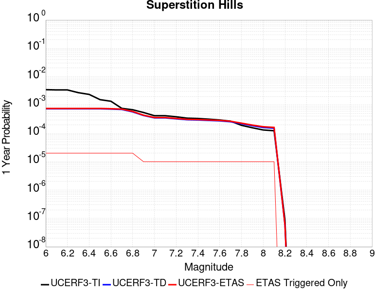 |  |

| Magnitude | 1 wk TI Prob | 1 wk TD Prob | 1 wk ETAS Prob | 1 wk ETAS/TD Gain | 1 wk ETAS Triggered Only | 1 mo TI Prob | 1 mo TD Prob | 1 mo ETAS Prob | 1 mo ETAS/TD Gain | 1 mo ETAS Triggered Only | 1 yr TI Prob | 1 yr TD Prob | 1 yr ETAS Prob | 1 yr ETAS/TD Gain | 1 yr ETAS Triggered Only | 10 yr TI Prob | 10 yr TD Prob | 10 yr ETAS Prob | 10 yr ETAS/TD Gain | 10 yr ETAS Triggered Only |
|-----|-----|-----|-----|-----|-----|-----|-----|-----|-----|-----|-----|-----|-----|-----|-----|-----|-----|-----|-----|-----|
| 6.0 | 6.6865185E-5 | 1.4149656E-5 | 2.4149515E-5 | 1.706721 | 1.0E-5 | 2.8653358E-4 | 6.064006E-5 | 7.063946E-5 | 1.1648974 | 1.0E-5 | 0.0034829667 | 7.380589E-4 | 7.5804413E-4 | 1.0270782 | 2.0E-5 | 0.03428881 | 0.0075263744 | 0.0075561483 | 1.003956 | 3.0E-5 |
| 6.1 | 6.544851E-5 | 1.4149656E-5 | 2.4149515E-5 | 1.706721 | 1.0E-5 | 2.8046346E-4 | 6.064006E-5 | 7.063946E-5 | 1.1648974 | 1.0E-5 | 0.0034092965 | 7.380589E-4 | 7.5804413E-4 | 1.0270782 | 2.0E-5 | 0.033574644 | 0.0075263735 | 0.007556148 | 1.003956 | 3.0E-5 |
| 6.2 | 6.544851E-5 | 1.4149656E-5 | 2.4149515E-5 | 1.706721 | 1.0E-5 | 2.8046346E-4 | 6.064006E-5 | 7.063946E-5 | 1.1648974 | 1.0E-5 | 0.0034092965 | 7.380589E-4 | 7.5804413E-4 | 1.0270782 | 2.0E-5 | 0.033574644 | 0.0075263735 | 0.007556148 | 1.003956 | 3.0E-5 |
| 6.3 | 5.2402065E-5 | 1.4149655E-5 | 2.4149513E-5 | 1.7067211 | 1.0E-5 | 2.2456095E-4 | 6.0640057E-5 | 7.063945E-5 | 1.1648974 | 1.0E-5 | 0.0027306017 | 7.380588E-4 | 7.580441E-4 | 1.0270782 | 2.0E-5 | 0.02697292 | 0.007526369 | 0.007556143 | 1.003956 | 3.0E-5 |
| 6.4 | 4.542238E-5 | 1.4149654E-5 | 2.4149513E-5 | 1.7067211 | 1.0E-5 | 1.9465282E-4 | 6.0640057E-5 | 7.063945E-5 | 1.1648974 | 1.0E-5 | 0.0023673223 | 7.380588E-4 | 7.58044E-4 | 1.0270782 | 2.0E-5 | 0.023422617 | 0.007526366 | 0.0075561404 | 1.003956 | 3.0E-5 |
| 6.5 | 2.9672969E-5 | 1.4149653E-5 | 2.414951E-5 | 1.7067211 | 1.0E-5 | 1.2716366E-4 | 6.064005E-5 | 7.063944E-5 | 1.1648976 | 1.0E-5 | 0.0015471181 | 7.3805876E-4 | 7.5804396E-4 | 1.0270782 | 2.0E-5 | 0.015363912 | 0.007526361 | 0.007556135 | 1.003956 | 3.0E-5 |
| 6.6 | 2.6056105E-5 | 1.3815334E-5 | 2.3815195E-5 | 1.7238234 | 1.0E-5 | 1.1166424E-4 | 5.920732E-5 | 6.9206726E-5 | 1.1688881 | 1.0E-5 | 0.0013586642 | 7.206268E-4 | 7.406124E-4 | 1.0277336 | 2.0E-5 | 0.013503874 | 0.007350771 | 0.0073805507 | 1.0040512 | 3.0E-5 |
| 6.7 | 1.4611248E-5 | 1.3395143E-5 | 2.3395009E-5 | 1.7465292 | 1.0E-5 | 6.261813E-5 | 5.740658E-5 | 6.740601E-5 | 1.1741861 | 1.0E-5 | 7.6210906E-4 | 6.9871696E-4 | 7.1870297E-4 | 1.0286039 | 2.0E-5 | 0.0075950073 | 0.0071319602 | 0.0071617463 | 1.0041764 | 3.0E-5 |
| 6.8 | 1.30607E-5 | 1.0989935E-5 | 2.0989824E-5 | 1.9099135 | 1.0E-5 | 5.597323E-5 | 4.709892E-5 | 5.709845E-5 | 1.2123091 | 1.0E-5 | 6.8126095E-4 | 5.732872E-4 | 5.9327576E-4 | 1.0348666 | 2.0E-5 | 0.006791762 | 0.005880068 | 0.0058999504 | 1.0033814 | 2.0E-5 |
| 6.9 | 1.0443096E-5 | 8.205268E-6 | 1.8205186E-5 | 2.2187192 | 1.0E-5 | 4.4755358E-5 | 3.5164976E-5 | 4.5164623E-5 | 1.2843639 | 1.0E-5 | 5.447602E-4 | 4.280518E-4 | 4.3804754E-4 | 1.0233517 | 1.0E-5 | 0.005434267 | 0.004414633 | 0.004424589 | 1.0022552 | 1.0E-5 |
| 7.0 | 8.045912E-6 | 6.7487367E-6 | 1.6748669E-5 | 2.4817488 | 1.0E-5 | 3.4482026E-5 | 2.8922843E-5 | 3.8922553E-5 | 1.3457375 | 1.0E-5 | 4.197378E-4 | 3.5207975E-4 | 3.620762E-4 | 1.0283927 | 1.0E-5 | 0.0041894587 | 0.0036380847 | 0.0036480483 | 1.0027387 | 1.0E-5 |
| 7.1 | 8.045912E-6 | 6.7487367E-6 | 1.6748669E-5 | 2.4817488 | 1.0E-5 | 3.4482026E-5 | 2.8922843E-5 | 3.8922553E-5 | 1.3457375 | 1.0E-5 | 4.197378E-4 | 3.5207975E-4 | 3.620762E-4 | 1.0283927 | 1.0E-5 | 0.0041894587 | 0.0036380847 | 0.0036480483 | 1.0027387 | 1.0E-5 |
| 7.2 | 7.375506E-6 | 6.2554927E-6 | 1.625543E-5 | 2.5985851 | 1.0E-5 | 3.1608928E-5 | 2.6808984E-5 | 3.6808717E-5 | 1.3729993 | 1.0E-5 | 3.8477074E-4 | 3.2635135E-4 | 3.3634808E-4 | 1.0306318 | 1.0E-5 | 0.003841052 | 0.003378518 | 0.0033884842 | 1.0029498 | 1.0E-5 |
| 7.3 | 6.6063913E-6 | 5.807784E-6 | 1.5807726E-5 | 2.721817 | 1.0E-5 | 2.8312797E-5 | 2.489027E-5 | 3.489002E-5 | 1.4017534 | 1.0E-5 | 3.446538E-4 | 3.0299762E-4 | 3.1299458E-4 | 1.0329936 | 1.0E-5 | 0.0034411973 | 0.0031427022 | 0.0031526706 | 1.0031719 | 1.0E-5 |
| 7.4 | 6.4313126E-6 | 5.689177E-6 | 1.568912E-5 | 2.7577136 | 1.0E-5 | 2.7562477E-5 | 2.4381963E-5 | 3.438172E-5 | 1.4101292 | 1.0E-5 | 3.355215E-4 | 2.9681067E-4 | 3.068077E-4 | 1.0336815 | 1.0E-5 | 0.0033501536 | 0.0030804756 | 0.003090445 | 1.0032363 | 1.0E-5 |
| 7.5 | 6.0742927E-6 | 5.4849033E-6 | 1.5484848E-5 | 2.8231761 | 1.0E-5 | 2.6032423E-5 | 2.350652E-5 | 3.3506287E-5 | 1.4254038 | 1.0E-5 | 3.1689866E-4 | 2.8615497E-4 | 2.961521E-4 | 1.0349361 | 1.0E-5 | 0.0031644711 | 0.0029722706 | 0.0029822409 | 1.0033544 | 1.0E-5 |
| 7.6 | 5.6987187E-6 | 5.3030067E-6 | 1.5302954E-5 | 2.8857129 | 1.0E-5 | 2.4422852E-5 | 2.2726976E-5 | 3.2726748E-5 | 1.4399958 | 1.0E-5 | 2.9730765E-4 | 2.7666645E-4 | 2.866637E-4 | 1.0361346 | 1.0E-5 | 0.002969102 | 0.0028754554 | 0.0028854266 | 1.0034677 | 1.0E-5 |
| 7.7 | 5.1658035E-6 | 4.9338805E-6 | 1.4933831E-5 | 3.026792 | 1.0E-5 | 2.2138971E-5 | 2.1145035E-5 | 3.1144824E-5 | 1.4729142 | 1.0E-5 | 2.6950863E-4 | 2.5741098E-4 | 2.674084E-4 | 1.0388384 | 1.0E-5 | 0.00269182 | 0.002680395 | 0.0026903683 | 1.0037208 | 1.0E-5 |
| 7.8 | 3.6864697E-6 | 4.204545E-6 | 1.4204503E-5 | 3.3783689 | 1.0E-5 | 1.579906E-5 | 1.8019355E-5 | 2.8019174E-5 | 1.5549488 | 1.0E-5 | 1.9233658E-4 | 2.1936404E-4 | 2.2936185E-4 | 1.0455763 | 1.0E-5 | 0.0019217018 | 0.0022934384 | 0.0023034154 | 1.0043503 | 1.0E-5 |
| 7.9 | 3.0265903E-6 | 3.571154E-6 | 1.3571118E-5 | 3.8002052 | 1.0E-5 | 1.2971037E-5 | 1.5304859E-5 | 2.5304706E-5 | 1.6533773 | 1.0E-5 | 1.5791094E-4 | 1.8632115E-4 | 1.9631929E-4 | 1.0536608 | 1.0E-5 | 0.0015779877 | 0.0019573069 | 0.0019672872 | 1.005099 | 1.0E-5 |
| 8.0 | 2.5271493E-6 | 3.0935253E-6 | 1.3093494E-5 | 4.232548 | 1.0E-5 | 1.0830595E-5 | 1.32579E-5 | 2.3257768E-5 | 1.7542572 | 1.0E-5 | 1.3185451E-4 | 1.614034E-4 | 1.7140179E-4 | 1.0619465 | 1.0E-5 | 0.0013177631 | 0.0017009134 | 0.0017108964 | 1.0058692 | 1.0E-5 |
| 8.1 | 2.3749135E-6 | 2.9238684E-6 | 1.2923839E-5 | 4.4201164 | 1.0E-5 | 1.0178161E-5 | 1.2530806E-5 | 2.2530681E-5 | 1.7980232 | 1.0E-5 | 1.2391206E-4 | 1.525523E-4 | 1.6255077E-4 | 1.0655413 | 1.0E-5 | 0.0012384299 | 0.0016083531 | 0.001618337 | 1.0062076 | 1.0E-5 |
| 8.2 | 1.7186406E-9 | 1.1473926E-9 | 1.1473926E-9 | 1.0 | 0.0 | 7.3656024E-9 | 4.917397E-9 | 4.917397E-9 | 1.0 | 0.0 | 8.9676206E-8 | 5.986931E-8 | 5.986931E-8 | 1.0 | 0.0 | 8.9676166E-7 | 6.405794E-7 | 6.405794E-7 | 1.0 | 0.0 |

## San Jacinto (Borrego)
*[(top)](#table-of-contents)*

| 1 Week | 1 Month | 1 Year | 10 Year |
|-----|-----|-----|-----|
|  |  |  |  |

| Magnitude | 1 wk TI Prob | 1 wk TD Prob | 1 wk ETAS Prob | 1 wk ETAS/TD Gain | 1 wk ETAS Triggered Only | 1 mo TI Prob | 1 mo TD Prob | 1 mo ETAS Prob | 1 mo ETAS/TD Gain | 1 mo ETAS Triggered Only | 1 yr TI Prob | 1 yr TD Prob | 1 yr ETAS Prob | 1 yr ETAS/TD Gain | 1 yr ETAS Triggered Only | 10 yr TI Prob | 10 yr TD Prob | 10 yr ETAS Prob | 10 yr ETAS/TD Gain | 10 yr ETAS Triggered Only |
|-----|-----|-----|-----|-----|-----|-----|-----|-----|-----|-----|-----|-----|-----|-----|-----|-----|-----|-----|-----|-----|
| 6.0 | 3.543992E-5 | 2.7955874E-5 | 4.7955313E-5 | 1.7153932 | 2.0E-5 | 1.5187653E-4 | 1.1980545E-4 | 1.3980306E-4 | 1.1669173 | 2.0E-5 | 0.0018475284 | 0.0014576677 | 0.0014876239 | 1.0205508 | 3.0E-5 | 0.018322436 | 0.01488493 | 0.014914484 | 1.0019854 | 3.0E-5 |
| 6.1 | 3.542281E-5 | 2.7955874E-5 | 4.7955313E-5 | 1.7153932 | 2.0E-5 | 1.5180321E-4 | 1.1980545E-4 | 1.3980306E-4 | 1.1669173 | 2.0E-5 | 0.0018466372 | 0.0014576677 | 0.0014876239 | 1.0205508 | 3.0E-5 | 0.018313672 | 0.01488493 | 0.014914484 | 1.0019854 | 3.0E-5 |
| 6.2 | 3.4688688E-5 | 2.7955874E-5 | 4.7955313E-5 | 1.7153932 | 2.0E-5 | 1.4865733E-4 | 1.1980545E-4 | 1.3980306E-4 | 1.1669173 | 2.0E-5 | 0.0018084005 | 0.0014576677 | 0.0014876239 | 1.0205508 | 3.0E-5 | 0.017937548 | 0.01488493 | 0.014914484 | 1.0019854 | 3.0E-5 |
| 6.3 | 3.2087122E-5 | 2.7801223E-5 | 4.7800666E-5 | 1.7193729 | 2.0E-5 | 1.3750899E-4 | 1.1914273E-4 | 1.3914035E-4 | 1.1678458 | 2.0E-5 | 0.0016728862 | 0.0014496098 | 0.0014795662 | 1.0206652 | 3.0E-5 | 0.016603488 | 0.014806089 | 0.0148356445 | 1.0019962 | 3.0E-5 |
| 6.4 | 3.1828724E-5 | 2.77682E-5 | 4.7767644E-5 | 1.7202283 | 2.0E-5 | 1.364017E-4 | 1.1900121E-4 | 1.3899883E-4 | 1.1680455 | 2.0E-5 | 0.0016594254 | 0.001447889 | 0.0014778456 | 1.0206898 | 3.0E-5 | 0.016470885 | 0.014789282 | 0.014818839 | 1.0019985 | 3.0E-5 |
| 6.5 | 3.1563577E-5 | 2.750787E-5 | 4.7507318E-5 | 1.7270447 | 2.0E-5 | 1.3526545E-4 | 1.17885604E-4 | 1.3788325E-4 | 1.169636 | 2.0E-5 | 0.0016456128 | 0.0014343245 | 0.0014642815 | 1.0208858 | 3.0E-5 | 0.0163348 | 0.014655326 | 0.014684886 | 1.002017 | 3.0E-5 |
| 6.6 | 3.1467625E-5 | 2.7352073E-5 | 4.7351525E-5 | 1.731186 | 2.0E-5 | 1.3485427E-4 | 1.1721797E-4 | 1.3721563E-4 | 1.1706023 | 2.0E-5 | 0.0016406142 | 0.0014262067 | 0.0014561638 | 1.0210048 | 3.0E-5 | 0.016285548 | 0.014575482 | 0.014605045 | 1.0020282 | 3.0E-5 |
| 6.7 | 3.1223695E-5 | 2.6970027E-5 | 4.6969486E-5 | 1.741544 | 2.0E-5 | 1.3380898E-4 | 1.1558078E-4 | 1.3557846E-4 | 1.1730192 | 2.0E-5 | 0.0016279068 | 0.0014062996 | 0.0014362575 | 1.0213026 | 3.0E-5 | 0.01616033 | 0.014379977 | 0.014409546 | 1.0020562 | 3.0E-5 |
| 6.8 | 3.1015585E-5 | 2.679098E-5 | 4.6790447E-5 | 1.7464999 | 2.0E-5 | 1.3291716E-4 | 1.14813505E-4 | 1.3481121E-4 | 1.1741755 | 2.0E-5 | 0.001617065 | 0.0013969702 | 0.0014269283 | 1.021445 | 3.0E-5 | 0.016053487 | 0.014287205 | 0.014316777 | 1.0020698 | 3.0E-5 |
| 6.9 | 2.6641965E-5 | 2.2211414E-5 | 4.221097E-5 | 1.9004179 | 2.0E-5 | 1.1417485E-4 | 9.518833E-5 | 1.1518642E-4 | 1.2100898 | 2.0E-5 | 0.0013891924 | 0.0011583057 | 0.0011782825 | 1.0172466 | 2.0E-5 | 0.0138054015 | 0.011896737 | 0.0119165 | 1.0016612 | 2.0E-5 |
| 7.0 | 2.3854353E-5 | 2.050528E-5 | 4.050487E-5 | 1.9753386 | 2.0E-5 | 1.02228936E-4 | 8.7876826E-5 | 1.07875065E-4 | 1.2275712 | 2.0E-5 | 0.0012439266 | 0.0010693778 | 0.0010893564 | 1.0186825 | 2.0E-5 | 0.012369866 | 0.010996556 | 0.011016335 | 1.0017987 | 2.0E-5 |
| 7.1 | 2.3672901E-5 | 2.0341751E-5 | 4.0341343E-5 | 1.9831796 | 2.0E-5 | 1.0145135E-4 | 8.7176035E-5 | 1.0717429E-4 | 1.2294009 | 2.0E-5 | 0.0012344702 | 0.001060854 | 0.0010808327 | 1.0188327 | 2.0E-5 | 0.0122763505 | 0.010911736 | 0.010931518 | 1.0018129 | 2.0E-5 |
| 7.2 | 2.2717244E-5 | 1.9568899E-5 | 3.956851E-5 | 2.0220098 | 2.0E-5 | 9.735599E-5 | 8.3864026E-5 | 1.0386235E-4 | 1.2384613 | 2.0E-5 | 0.0011846646 | 0.0010205687 | 0.0010405482 | 1.0195769 | 2.0E-5 | 0.01178369 | 0.010509028 | 0.010528818 | 1.0018831 | 2.0E-5 |
| 7.3 | 2.1016205E-5 | 1.8410172E-5 | 3.8409806E-5 | 2.086336 | 2.0E-5 | 9.006634E-5 | 7.889837E-5 | 9.889679E-5 | 1.2534707 | 2.0E-5 | 0.001096006 | 9.6016633E-4 | 9.801472E-4 | 1.0208098 | 2.0E-5 | 0.010906163 | 0.0099044405 | 0.009924242 | 1.0019993 | 2.0E-5 |
| 7.4 | 2.0683625E-5 | 1.8212622E-5 | 3.8212256E-5 | 2.0981195 | 2.0E-5 | 8.86411E-5 | 7.805177E-5 | 9.805021E-5 | 1.2562202 | 2.0E-5 | 0.001078671 | 9.4986806E-4 | 9.6984906E-4 | 1.0210356 | 2.0E-5 | 0.010734501 | 0.00980115 | 0.009820954 | 1.0020206 | 2.0E-5 |
| 7.5 | 1.9993966E-5 | 1.7807442E-5 | 3.7807087E-5 | 2.1231058 | 2.0E-5 | 8.568561E-5 | 7.6315395E-5 | 9.631387E-5 | 1.2620504 | 2.0E-5 | 0.001042723 | 9.2874584E-4 | 9.487273E-4 | 1.0215144 | 2.0E-5 | 0.010378438 | 0.009587968 | 0.009607776 | 1.0020659 | 2.0E-5 |
| 7.6 | 1.788966E-5 | 1.6460064E-5 | 3.6459736E-5 | 2.215042 | 2.0E-5 | 7.666772E-5 | 7.054124E-5 | 9.053983E-5 | 1.2835021 | 2.0E-5 | 9.3302975E-4 | 8.585029E-4 | 8.784858E-4 | 1.0232763 | 2.0E-5 | 0.00929122 | 0.008879389 | 0.008899211 | 1.0022324 | 2.0E-5 |
| 7.7 | 1.5125781E-5 | 1.4261374E-5 | 3.426109E-5 | 2.4023693 | 2.0E-5 | 6.4823165E-5 | 6.111875E-5 | 8.111753E-5 | 1.3272119 | 2.0E-5 | 7.889362E-4 | 7.4386754E-4 | 7.638527E-4 | 1.0268666 | 2.0E-5 | 0.007861412 | 0.007726649 | 0.0077464944 | 1.0025685 | 2.0E-5 |
| 7.8 | 1.250089E-5 | 1.26536925E-5 | 3.265344E-5 | 2.5805464 | 2.0E-5 | 5.3574146E-5 | 5.4228985E-5 | 7.42279E-5 | 1.3687865 | 2.0E-5 | 6.5207E-4 | 6.600385E-4 | 6.800253E-4 | 1.0302813 | 2.0E-5 | 0.006501599 | 0.0068797027 | 0.006899565 | 1.0028871 | 2.0E-5 |
| 7.9 | 9.561E-6 | 9.775099E-6 | 2.9774903E-5 | 3.0459952 | 2.0E-5 | 4.0975072E-5 | 4.189261E-5 | 6.189177E-5 | 1.4773911 | 2.0E-5 | 4.987573E-4 | 5.0992373E-4 | 5.299135E-4 | 1.0392015 | 2.0E-5 | 0.0049763937 | 0.005363107 | 0.005383 | 1.0037092 | 2.0E-5 |
| 8.0 | 8.01699E-6 | 8.3121295E-6 | 2.8311963E-5 | 3.4061022 | 2.0E-5 | 3.4358076E-5 | 3.562293E-5 | 5.5622215E-5 | 1.5614161 | 2.0E-5 | 4.1822926E-4 | 4.3362338E-4 | 4.536147E-4 | 1.046103 | 2.0E-5 | 0.0041744304 | 0.0045832046 | 0.004603113 | 1.0043437 | 2.0E-5 |
| 8.1 | 6.541947E-6 | 6.477423E-6 | 1.647736E-5 | 2.5438137 | 1.0E-5 | 2.8036617E-5 | 2.7760092E-5 | 3.7759815E-5 | 1.3602194 | 1.0E-5 | 3.4129233E-4 | 3.3792722E-4 | 3.4792384E-4 | 1.0295821 | 1.0E-5 | 0.0034076865 | 0.003588821 | 0.0035987853 | 1.0027764 | 1.0E-5 |
| 8.2 | 1.7968189E-6 | 7.9984034E-7 | 7.9984034E-7 | 1.0 | 0.0 | 7.70063E-6 | 3.4278826E-6 | 3.4278826E-6 | 1.0 | 0.0 | 9.3751136E-5 | 4.1733696E-5 | 4.1733696E-5 | 1.0 | 0.0 | 9.371159E-4 | 4.727189E-4 | 4.727189E-4 | 1.0 | 0.0 |
| 8.3 | 1.5167889E-7 | 4.916523E-8 | 4.916523E-8 | 1.0 | 0.0 | 6.500522E-7 | 2.1070811E-7 | 2.1070811E-7 | 1.0 | 0.0 | 7.9143565E-6 | 2.5653687E-6 | 2.5653687E-6 | 1.0 | 0.0 | 7.914075E-5 | 2.9806817E-5 | 2.9806817E-5 | 1.0 | 0.0 |

## Big Pine (East)
*[(top)](#table-of-contents)*

| 1 Week | 1 Month | 1 Year | 10 Year |
|-----|-----|-----|-----|
|  |  |  |  |

| Magnitude | 1 wk TI Prob | 1 wk TD Prob | 1 wk ETAS Prob | 1 wk ETAS/TD Gain | 1 wk ETAS Triggered Only | 1 mo TI Prob | 1 mo TD Prob | 1 mo ETAS Prob | 1 mo ETAS/TD Gain | 1 mo ETAS Triggered Only | 1 yr TI Prob | 1 yr TD Prob | 1 yr ETAS Prob | 1 yr ETAS/TD Gain | 1 yr ETAS Triggered Only | 10 yr TI Prob | 10 yr TD Prob | 10 yr ETAS Prob | 10 yr ETAS/TD Gain | 10 yr ETAS Triggered Only |
|-----|-----|-----|-----|-----|-----|-----|-----|-----|-----|-----|-----|-----|-----|-----|-----|-----|-----|-----|-----|-----|
| 6.0 | 9.916913E-6 | 1.2822198E-5 | 1.2822198E-5 | 1.0 | 0.0 | 4.250036E-5 | 5.4951244E-5 | 5.4951244E-5 | 1.0 | 0.0 | 5.173191E-4 | 6.688481E-4 | 6.7884143E-4 | 1.0149411 | 1.0E-5 | 0.0051611643 | 0.006673103 | 0.006702903 | 1.0044657 | 3.0E-5 |
| 6.1 | 9.916913E-6 | 1.2822198E-5 | 1.2822198E-5 | 1.0 | 0.0 | 4.250036E-5 | 5.4951244E-5 | 5.4951244E-5 | 1.0 | 0.0 | 5.173191E-4 | 6.688481E-4 | 6.7884143E-4 | 1.0149411 | 1.0E-5 | 0.0051611643 | 0.006673103 | 0.006702903 | 1.0044657 | 3.0E-5 |
| 6.2 | 9.916913E-6 | 1.2822198E-5 | 1.2822198E-5 | 1.0 | 0.0 | 4.250036E-5 | 5.4951244E-5 | 5.4951244E-5 | 1.0 | 0.0 | 5.173191E-4 | 6.688481E-4 | 6.7884143E-4 | 1.0149411 | 1.0E-5 | 0.0051611643 | 0.006673103 | 0.006702903 | 1.0044657 | 3.0E-5 |
| 6.3 | 5.479711E-6 | 8.118015E-6 | 8.118015E-6 | 1.0 | 0.0 | 2.3484265E-5 | 3.4791046E-5 | 3.4791046E-5 | 1.0 | 0.0 | 2.858834E-4 | 4.2350183E-4 | 4.334976E-4 | 1.0236026 | 1.0E-5 | 0.0028551589 | 0.0042298343 | 0.0042597074 | 1.0070624 | 3.0E-5 |
| 6.4 | 5.465009E-6 | 8.102307E-6 | 8.102307E-6 | 1.0 | 0.0 | 2.3421257E-5 | 3.472373E-5 | 3.472373E-5 | 1.0 | 0.0 | 2.851165E-4 | 4.226826E-4 | 4.3267838E-4 | 1.0236484 | 1.0E-5 | 0.0028475097 | 0.004221673 | 0.004251546 | 1.0070761 | 3.0E-5 |
| 6.5 | 4.826767E-6 | 7.427343E-6 | 7.427343E-6 | 1.0 | 0.0 | 2.068598E-5 | 3.18311E-5 | 3.18311E-5 | 1.0 | 0.0 | 2.518227E-4 | 3.8747748E-4 | 3.974736E-4 | 1.025798 | 1.0E-5 | 0.0025153751 | 0.0038708635 | 0.0039007475 | 1.0077202 | 3.0E-5 |
| 6.6 | 4.3146847E-6 | 6.8872637E-6 | 6.8872637E-6 | 1.0 | 0.0 | 1.8491375E-5 | 2.9516525E-5 | 2.9516525E-5 | 1.0 | 0.0 | 2.2510924E-4 | 3.5930687E-4 | 3.6930328E-4 | 1.0278214 | 1.0E-5 | 0.0022488134 | 0.0035900716 | 0.003619964 | 1.0083264 | 3.0E-5 |
| 6.7 | 3.6968106E-6 | 6.000254E-6 | 6.000254E-6 | 1.0 | 0.0 | 1.5843378E-5 | 2.571513E-5 | 2.571513E-5 | 1.0 | 0.0 | 1.9287605E-4 | 3.1303827E-4 | 3.2303514E-4 | 1.031935 | 1.0E-5 | 0.0019270873 | 0.003128695 | 0.003138664 | 1.0031862 | 1.0E-5 |
| 6.8 | 3.4671132E-6 | 5.706825E-6 | 5.706825E-6 | 1.0 | 0.0 | 1.4858972E-5 | 2.44576E-5 | 2.44576E-5 | 1.0 | 0.0 | 1.8089297E-4 | 2.9773204E-4 | 3.0772906E-4 | 1.0335772 | 1.0E-5 | 0.0018074579 | 0.002976045 | 0.0029860153 | 1.0033501 | 1.0E-5 |
| 6.9 | 2.7686972E-6 | 4.829523E-6 | 4.829523E-6 | 1.0 | 0.0 | 1.1865792E-5 | 2.0697795E-5 | 2.0697795E-5 | 1.0 | 0.0 | 1.4445644E-4 | 2.5196726E-4 | 2.6196474E-4 | 1.0396777 | 1.0E-5 | 0.0014436257 | 0.0025194613 | 0.002529436 | 1.0039591 | 1.0E-5 |
| 7.0 | 2.1472624E-6 | 3.9889437E-6 | 3.9889437E-6 | 1.0 | 0.0 | 9.20252E-6 | 1.7095364E-5 | 1.7095364E-5 | 1.0 | 0.0 | 1.12034926E-4 | 2.0811672E-4 | 2.1811464E-4 | 1.0480399 | 1.0E-5 | 0.0011197845 | 0.0020818403 | 0.0020918194 | 1.0047934 | 1.0E-5 |
| 7.1 | 1.7018335E-6 | 3.3484318E-6 | 3.3484318E-6 | 1.0 | 0.0 | 7.293552E-6 | 1.4350345E-5 | 1.4350345E-5 | 1.0 | 0.0 | 8.879537E-5 | 1.747018E-4 | 1.8470005E-4 | 1.0572304 | 1.0E-5 | 8.87599E-4 | 0.0017482359 | 0.0017582185 | 1.00571 | 1.0E-5 |
| 7.2 | 1.25603E-6 | 2.797844E-6 | 2.797844E-6 | 1.0 | 0.0 | 5.3829745E-6 | 1.1990706E-5 | 1.1990706E-5 | 1.0 | 0.0 | 6.553574E-5 | 1.459773E-4 | 1.5597584E-4 | 1.0684938 | 1.0E-5 | 6.551642E-4 | 0.0014613821 | 0.0014713675 | 1.0068328 | 1.0E-5 |
| 7.3 | 1.112297E-6 | 2.6135112E-6 | 2.6135112E-6 | 1.0 | 0.0 | 4.7669787E-6 | 1.1200716E-5 | 1.1200716E-5 | 1.0 | 0.0 | 5.803642E-5 | 1.363604E-4 | 1.363604E-4 | 1.0 | 0.0 | 5.802127E-4 | 0.0013651794 | 0.0013651794 | 1.0 | 0.0 |
| 7.4 | 1.0137181E-6 | 2.4865376E-6 | 2.4865376E-6 | 1.0 | 0.0 | 4.3444993E-6 | 1.0656548E-5 | 1.0656548E-5 | 1.0 | 0.0 | 5.2892992E-5 | 1.2973596E-4 | 1.2973596E-4 | 1.0 | 0.0 | 5.288041E-4 | 0.0012987981 | 0.0012987981 | 1.0 | 0.0 |
| 7.5 | 9.598608E-7 | 2.410106E-6 | 2.410106E-6 | 1.0 | 0.0 | 4.1136827E-6 | 1.0328986E-5 | 1.0328986E-5 | 1.0 | 0.0 | 5.0082934E-5 | 1.2574837E-4 | 1.2574837E-4 | 1.0 | 0.0 | 5.007165E-4 | 0.001258775 | 0.001258775 | 1.0 | 0.0 |
| 7.6 | 7.929459E-7 | 2.0474768E-6 | 2.0474768E-6 | 1.0 | 0.0 | 3.3983351E-6 | 8.774872E-6 | 8.774872E-6 | 1.0 | 0.0 | 4.1373947E-5 | 1.06829E-4 | 1.06829E-4 | 1.0 | 0.0 | 4.1366243E-4 | 0.0010698074 | 0.0010698074 | 1.0 | 0.0 |
| 7.7 | 4.155788E-7 | 1.1624114E-6 | 1.1624114E-6 | 1.0 | 0.0 | 1.7810507E-6 | 4.981754E-6 | 4.981754E-6 | 1.0 | 0.0 | 2.1684076E-5 | 6.0651208E-5 | 6.0651208E-5 | 1.0 | 0.0 | 2.1681961E-4 | 6.09492E-4 | 6.09492E-4 | 1.0 | 0.0 |
| 7.8 | 1.14666925E-7 | 2.5960628E-7 | 2.5960628E-7 | 1.0 | 0.0 | 4.914296E-7 | 1.1125978E-6 | 1.1125978E-6 | 1.0 | 0.0 | 5.9831386E-6 | 1.3545799E-5 | 1.3545799E-5 | 1.0 | 0.0 | 5.9829777E-5 | 1.3656996E-4 | 1.3656996E-4 | 1.0 | 0.0 |
| 7.9 | 2.9231824E-8 | 4.1527553E-8 | 4.1527553E-8 | 1.0 | 0.0 | 1.2527924E-7 | 1.7797521E-7 | 1.7797521E-7 | 1.0 | 0.0 | 1.5252737E-6 | 2.1668463E-6 | 2.1668463E-6 | 1.0 | 0.0 | 1.5252632E-5 | 2.2004704E-5 | 2.2004704E-5 | 1.0 | 0.0 |

## Deep Springs
*[(top)](#table-of-contents)*

| 1 Week | 1 Month | 1 Year | 10 Year |
|-----|-----|-----|-----|
|  |  |  |  |

| Magnitude | 1 wk TI Prob | 1 wk TD Prob | 1 wk ETAS Prob | 1 wk ETAS/TD Gain | 1 wk ETAS Triggered Only | 1 mo TI Prob | 1 mo TD Prob | 1 mo ETAS Prob | 1 mo ETAS/TD Gain | 1 mo ETAS Triggered Only | 1 yr TI Prob | 1 yr TD Prob | 1 yr ETAS Prob | 1 yr ETAS/TD Gain | 1 yr ETAS Triggered Only | 10 yr TI Prob | 10 yr TD Prob | 10 yr ETAS Prob | 10 yr ETAS/TD Gain | 10 yr ETAS Triggered Only |
|-----|-----|-----|-----|-----|-----|-----|-----|-----|-----|-----|-----|-----|-----|-----|-----|-----|-----|-----|-----|-----|
| 6.0 | 1.9810619E-5 | 2.3114562E-5 | 2.3114562E-5 | 1.0 | 0.0 | 8.489989E-5 | 9.9061515E-5 | 9.9061515E-5 | 1.0 | 0.0 | 0.001033166 | 0.0012059144 | 0.0012258902 | 1.016565 | 2.0E-5 | 0.010283757 | 0.012043493 | 0.012073131 | 1.002461 | 3.0E-5 |
| 6.1 | 1.9810619E-5 | 2.3114562E-5 | 2.3114562E-5 | 1.0 | 0.0 | 8.489989E-5 | 9.9061515E-5 | 9.9061515E-5 | 1.0 | 0.0 | 0.001033166 | 0.0012059144 | 0.0012258902 | 1.016565 | 2.0E-5 | 0.010283757 | 0.012043493 | 0.012073131 | 1.002461 | 3.0E-5 |
| 6.2 | 1.9810619E-5 | 2.3114562E-5 | 2.3114562E-5 | 1.0 | 0.0 | 8.489989E-5 | 9.9061515E-5 | 9.9061515E-5 | 1.0 | 0.0 | 0.001033166 | 0.0012059144 | 0.0012258902 | 1.016565 | 2.0E-5 | 0.010283757 | 0.012043493 | 0.012073131 | 1.002461 | 3.0E-5 |
| 6.3 | 1.9810619E-5 | 2.3114562E-5 | 2.3114562E-5 | 1.0 | 0.0 | 8.489989E-5 | 9.9061515E-5 | 9.9061515E-5 | 1.0 | 0.0 | 0.001033166 | 0.0012059144 | 0.0012258902 | 1.016565 | 2.0E-5 | 0.010283757 | 0.012043493 | 0.012073131 | 1.002461 | 3.0E-5 |
| 6.4 | 1.9810619E-5 | 2.3114562E-5 | 2.3114562E-5 | 1.0 | 0.0 | 8.489989E-5 | 9.9061515E-5 | 9.9061515E-5 | 1.0 | 0.0 | 0.001033166 | 0.0012059144 | 0.0012258902 | 1.016565 | 2.0E-5 | 0.010283757 | 0.012043493 | 0.012073131 | 1.002461 | 3.0E-5 |
| 6.5 | 1.7190405E-5 | 2.0052328E-5 | 2.0052328E-5 | 1.0 | 0.0 | 7.367108E-5 | 8.593855E-5 | 8.593855E-5 | 1.0 | 0.0 | 8.9657627E-4 | 0.0010463016 | 0.0010662806 | 1.019095 | 2.0E-5 | 0.008929676 | 0.0104629835 | 0.010492669 | 1.0028373 | 3.0E-5 |
| 6.6 | 1.7190405E-5 | 2.0052328E-5 | 2.0052328E-5 | 1.0 | 0.0 | 7.367108E-5 | 8.593855E-5 | 8.593855E-5 | 1.0 | 0.0 | 8.9657627E-4 | 0.0010463016 | 0.0010662806 | 1.019095 | 2.0E-5 | 0.008929676 | 0.0104629835 | 0.010492669 | 1.0028373 | 3.0E-5 |

## Hayward (No) 2011 CFM
*[(top)](#table-of-contents)*

| 1 Week | 1 Month | 1 Year | 10 Year |
|-----|-----|-----|-----|
|  |  |  |  |

| Magnitude | 1 wk TI Prob | 1 wk TD Prob | 1 wk ETAS Prob | 1 wk ETAS/TD Gain | 1 wk ETAS Triggered Only | 1 mo TI Prob | 1 mo TD Prob | 1 mo ETAS Prob | 1 mo ETAS/TD Gain | 1 mo ETAS Triggered Only | 1 yr TI Prob | 1 yr TD Prob | 1 yr ETAS Prob | 1 yr ETAS/TD Gain | 1 yr ETAS Triggered Only | 10 yr TI Prob | 10 yr TD Prob | 10 yr ETAS Prob | 10 yr ETAS/TD Gain | 10 yr ETAS Triggered Only |
|-----|-----|-----|-----|-----|-----|-----|-----|-----|-----|-----|-----|-----|-----|-----|-----|-----|-----|-----|-----|-----|
| 6.0 | 9.3068506E-5 | 1.7407778E-4 | 1.8407604E-4 | 1.0574356 | 1.0E-5 | 3.9880406E-4 | 7.458329E-4 | 7.558255E-4 | 1.0133978 | 1.0E-5 | 0.0048446343 | 0.009042598 | 0.0090525085 | 1.0010959 | 1.0E-5 | 0.047403704 | 0.08642659 | 0.086454004 | 1.0003171 | 3.0E-5 |
| 6.1 | 9.055486E-5 | 1.6958894E-4 | 1.7958725E-4 | 1.0589561 | 1.0E-5 | 3.880345E-4 | 7.266072E-4 | 7.3659996E-4 | 1.0137526 | 1.0E-5 | 0.0047140904 | 0.008810638 | 0.0088205505 | 1.001125 | 1.0E-5 | 0.046153355 | 0.08432426 | 0.08435173 | 1.0003258 | 3.0E-5 |
| 6.2 | 9.006742E-5 | 1.6879481E-4 | 1.7879313E-4 | 1.0592335 | 1.0E-5 | 3.859461E-4 | 7.232057E-4 | 7.331985E-4 | 1.0138173 | 1.0E-5 | 0.0046887742 | 0.008769595 | 0.008779507 | 1.0011303 | 1.0E-5 | 0.0459107 | 0.08394843 | 0.08397592 | 1.0003273 | 3.0E-5 |
| 6.3 | 8.8336754E-5 | 1.6558994E-4 | 1.7558828E-4 | 1.0603801 | 1.0E-5 | 3.7853114E-4 | 7.094785E-4 | 7.194714E-4 | 1.0140848 | 1.0E-5 | 0.004598882 | 0.008603848 | 0.0086137615 | 1.0011523 | 1.0E-5 | 0.04504866 | 0.0824453 | 0.08247282 | 1.0003339 | 3.0E-5 |
| 6.4 | 8.526157E-5 | 1.5985436E-4 | 1.6985275E-4 | 1.062547 | 1.0E-5 | 3.6535555E-4 | 6.849107E-4 | 6.9490384E-4 | 1.0145905 | 1.0E-5 | 0.0044391346 | 0.008307064 | 0.008316981 | 1.0011938 | 1.0E-5 | 0.043514993 | 0.07972577 | 0.07975338 | 1.0003463 | 3.0E-5 |
| 6.5 | 8.152396E-5 | 1.531771E-4 | 1.6317557E-4 | 1.0652739 | 1.0E-5 | 3.493416E-4 | 6.5630855E-4 | 6.66302E-4 | 1.0152267 | 1.0E-5 | 0.0042449418 | 0.007961432 | 0.007971352 | 1.0012461 | 1.0E-5 | 0.04164765 | 0.076563716 | 0.07659142 | 1.0003618 | 3.0E-5 |
| 6.6 | 7.987405E-5 | 1.5021875E-4 | 1.6021724E-4 | 1.0665596 | 1.0E-5 | 3.4227243E-4 | 6.436364E-4 | 6.5363E-4 | 1.0155268 | 1.0E-5 | 0.0041592065 | 0.007808275 | 0.007818197 | 1.0012707 | 1.0E-5 | 0.04082218 | 0.075156055 | 0.0751838 | 1.0003692 | 3.0E-5 |
| 6.7 | 7.777665E-5 | 1.4660617E-4 | 1.566047E-4 | 1.0682 | 1.0E-5 | 3.332859E-4 | 6.2816154E-4 | 6.3815527E-4 | 1.0159094 | 1.0E-5 | 0.004050208 | 0.0076212035 | 0.0076311273 | 1.0013021 | 1.0E-5 | 0.039771806 | 0.07343067 | 0.07345847 | 1.0003785 | 3.0E-5 |
| 6.8 | 7.3284005E-5 | 1.3810355E-4 | 1.4810218E-4 | 1.0723994 | 1.0E-5 | 3.140365E-4 | 5.9173873E-4 | 6.017328E-4 | 1.0168893 | 1.0E-5 | 0.0038166929 | 0.007180758 | 0.007190686 | 1.0013826 | 1.0E-5 | 0.037518036 | 0.06934019 | 0.06936811 | 1.0004027 | 3.0E-5 |
| 6.9 | 6.458263E-5 | 1.213902E-4 | 1.3138898E-4 | 1.082369 | 1.0E-5 | 2.7675333E-4 | 5.2014046E-4 | 5.3013524E-4 | 1.0192156 | 1.0E-5 | 0.0033642664 | 0.0063144234 | 0.00632436 | 1.0015737 | 1.0E-5 | 0.033137884 | 0.061260317 | 0.06128848 | 1.0004597 | 3.0E-5 |
| 7.0 | 5.3853604E-5 | 1.0031354E-4 | 1.1031254E-4 | 1.0996774 | 1.0E-5 | 2.3078074E-4 | 4.2984466E-4 | 4.3984037E-4 | 1.0232543 | 1.0E-5 | 0.0028061352 | 0.0052208654 | 0.0052308133 | 1.0019054 | 1.0E-5 | 0.027709642 | 0.050988052 | 0.051016524 | 1.0005584 | 3.0E-5 |
| 7.1 | 4.4308683E-5 | 8.175687E-5 | 9.1756054E-5 | 1.1223038 | 1.0E-5 | 1.8988053E-4 | 3.5033975E-4 | 3.6033624E-4 | 1.0285337 | 1.0E-5 | 0.0023093442 | 0.0042570857 | 0.004267043 | 1.002339 | 1.0E-5 | 0.022854926 | 0.04184846 | 0.041877203 | 1.0006869 | 3.0E-5 |
| 7.2 | 3.295973E-5 | 6.0817918E-5 | 7.081731E-5 | 1.1644152 | 1.0E-5 | 1.4124835E-4 | 2.606223E-4 | 2.706197E-4 | 1.0383596 | 1.0E-5 | 0.0017183421 | 0.0031684826 | 0.003178451 | 1.003146 | 1.0E-5 | 0.017051157 | 0.031391717 | 0.031411093 | 1.0006171 | 2.0E-5 |
| 7.3 | 2.452256E-5 | 4.5222114E-5 | 5.522166E-5 | 1.2211207 | 1.0E-5 | 1.05092455E-4 | 1.9379474E-4 | 2.0379279E-4 | 1.051591 | 1.0E-5 | 0.0012787496 | 0.0023569115 | 0.0023668879 | 1.0042329 | 1.0E-5 | 0.0127141625 | 0.023461517 | 0.023481047 | 1.0008324 | 2.0E-5 |
| 7.4 | 1.8829967E-5 | 3.4639685E-5 | 3.4639685E-5 | 1.0 | 0.0 | 8.069736E-5 | 1.484474E-4 | 1.484474E-4 | 1.0 | 0.0 | 9.820475E-4 | 0.0018058587 | 0.0018058587 | 1.0 | 0.0 | 0.009777189 | 0.018037686 | 0.018047506 | 1.0005444 | 1.0E-5 |
| 7.5 | 1.26374125E-5 | 2.2949873E-5 | 2.2949873E-5 | 1.0 | 0.0 | 5.4159216E-5 | 9.8352924E-5 | 9.8352924E-5 | 1.0 | 0.0 | 6.5918895E-4 | 0.0011967949 | 0.0011967949 | 1.0 | 0.0 | 0.00657237 | 0.012003299 | 0.012013178 | 1.0008231 | 1.0E-5 |
| 7.6 | 4.666429E-6 | 8.489379E-6 | 8.489379E-6 | 1.0 | 0.0 | 1.9998828E-5 | 3.638255E-5 | 3.638255E-5 | 1.0 | 0.0 | 2.4345852E-4 | 4.4286877E-4 | 4.4286877E-4 | 1.0 | 0.0 | 0.0024319198 | 0.004465238 | 0.004465238 | 1.0 | 0.0 |
| 7.7 | 3.8399318E-7 | 7.147363E-7 | 7.147363E-7 | 1.0 | 0.0 | 1.6456839E-6 | 3.063152E-6 | 3.063152E-6 | 1.0 | 0.0 | 2.003602E-5 | 3.7293237E-5 | 3.7293237E-5 | 1.0 | 0.0 | 2.0034213E-4 | 3.8681817E-4 | 3.8681817E-4 | 1.0 | 0.0 |
| 7.8 | 2.5637698E-7 | 5.377888E-7 | 5.377888E-7 | 1.0 | 0.0 | 1.098758E-6 | 2.3048071E-6 | 2.3048071E-6 | 1.0 | 0.0 | 1.3377297E-5 | 2.8060667E-5 | 2.8060667E-5 | 1.0 | 0.0 | 1.3376492E-4 | 2.9301937E-4 | 2.9301937E-4 | 1.0 | 0.0 |
| 7.9 | 1.7141245E-7 | 3.7371512E-7 | 3.7371512E-7 | 1.0 | 0.0 | 7.3462456E-7 | 1.6016353E-6 | 1.6016353E-6 | 1.0 | 0.0 | 8.944017E-6 | 1.9499736E-5 | 1.9499736E-5 | 1.0 | 0.0 | 8.943657E-5 | 2.0285243E-4 | 2.0285243E-4 | 1.0 | 0.0 |
| 8.0 | 1.1808895E-7 | 2.7565898E-7 | 2.7565898E-7 | 1.0 | 0.0 | 5.060954E-7 | 1.181395E-6 | 1.181395E-6 | 1.0 | 0.0 | 6.161694E-6 | 1.438339E-5 | 1.438339E-5 | 1.0 | 0.0 | 6.161523E-5 | 1.4843856E-4 | 1.4843856E-4 | 1.0 | 0.0 |
| 8.1 | 5.138535E-8 | 1.1250981E-7 | 1.1250981E-7 | 1.0 | 0.0 | 2.2022292E-7 | 4.821848E-7 | 4.821848E-7 | 1.0 | 0.0 | 2.6812106E-6 | 5.8705846E-6 | 5.8705846E-6 | 1.0 | 0.0 | 2.6811784E-5 | 6.026497E-5 | 6.026497E-5 | 1.0 | 0.0 |

## Pisgah-Bullion Mtn-Mesquite Lk
*[(top)](#table-of-contents)*

| 1 Week | 1 Month | 1 Year | 10 Year |
|-----|-----|-----|-----|
|  |  |  |  |

| Magnitude | 1 wk TI Prob | 1 wk TD Prob | 1 wk ETAS Prob | 1 wk ETAS/TD Gain | 1 wk ETAS Triggered Only | 1 mo TI Prob | 1 mo TD Prob | 1 mo ETAS Prob | 1 mo ETAS/TD Gain | 1 mo ETAS Triggered Only | 1 yr TI Prob | 1 yr TD Prob | 1 yr ETAS Prob | 1 yr ETAS/TD Gain | 1 yr ETAS Triggered Only | 10 yr TI Prob | 10 yr TD Prob | 10 yr ETAS Prob | 10 yr ETAS/TD Gain | 10 yr ETAS Triggered Only |
|-----|-----|-----|-----|-----|-----|-----|-----|-----|-----|-----|-----|-----|-----|-----|-----|-----|-----|-----|-----|-----|
| 6.0 | 3.0240792E-5 | 2.4092273E-5 | 2.4092273E-5 | 1.0 | 0.0 | 1.2959696E-4 | 1.0324908E-4 | 1.0324908E-4 | 1.0 | 0.0 | 0.0015767008 | 0.0012564333 | 0.0012764082 | 1.0158981 | 2.0E-5 | 0.015655609 | 0.012503322 | 0.012532947 | 1.0023694 | 3.0E-5 |
| 6.1 | 3.0240792E-5 | 2.4092273E-5 | 2.4092273E-5 | 1.0 | 0.0 | 1.2959696E-4 | 1.0324908E-4 | 1.0324908E-4 | 1.0 | 0.0 | 0.0015767008 | 0.0012564333 | 0.0012764082 | 1.0158981 | 2.0E-5 | 0.015655609 | 0.012503322 | 0.012532947 | 1.0023694 | 3.0E-5 |
| 6.2 | 3.0240792E-5 | 2.4092273E-5 | 2.4092273E-5 | 1.0 | 0.0 | 1.2959696E-4 | 1.0324908E-4 | 1.0324908E-4 | 1.0 | 0.0 | 0.0015767008 | 0.0012564333 | 0.0012764082 | 1.0158981 | 2.0E-5 | 0.015655609 | 0.012503322 | 0.012532947 | 1.0023694 | 3.0E-5 |
| 6.3 | 2.0498217E-5 | 1.3638665E-5 | 1.3638665E-5 | 1.0 | 0.0 | 8.784654E-5 | 5.84502E-5 | 5.84502E-5 | 1.0 | 0.0 | 0.0010690069 | 7.114151E-4 | 7.21408E-4 | 1.0140465 | 1.0E-5 | 0.01063879 | 0.007093003 | 0.007112861 | 1.0027996 | 2.0E-5 |
| 6.4 | 2.0498217E-5 | 1.3638665E-5 | 1.3638665E-5 | 1.0 | 0.0 | 8.784654E-5 | 5.84502E-5 | 5.84502E-5 | 1.0 | 0.0 | 0.0010690069 | 7.114151E-4 | 7.21408E-4 | 1.0140465 | 1.0E-5 | 0.01063879 | 0.007093003 | 0.007112861 | 1.0027996 | 2.0E-5 |
| 6.5 | 1.7316182E-5 | 1.0477401E-5 | 1.0477401E-5 | 1.0 | 0.0 | 7.42101E-5 | 4.4902426E-5 | 4.4902426E-5 | 1.0 | 0.0 | 9.0313336E-4 | 5.465599E-4 | 5.465599E-4 | 1.0 | 0.0 | 0.008994718 | 0.0054531526 | 0.0054531526 | 1.0 | 0.0 |
| 6.6 | 1.5251077E-5 | 8.414451E-6 | 8.414451E-6 | 1.0 | 0.0 | 6.536012E-5 | 3.6061476E-5 | 3.6061476E-5 | 1.0 | 0.0 | 7.9546886E-4 | 4.3896728E-4 | 4.3896728E-4 | 1.0 | 0.0 | 0.007926274 | 0.004381719 | 0.004381719 | 1.0 | 0.0 |
| 6.7 | 1.2997425E-5 | 6.411434E-6 | 6.411434E-6 | 1.0 | 0.0 | 5.570206E-5 | 2.747731E-5 | 2.747731E-5 | 1.0 | 0.0 | 6.7796157E-4 | 3.3448957E-4 | 3.3448957E-4 | 1.0 | 0.0 | 0.0067589693 | 0.0033403211 | 0.0033403211 | 1.0 | 0.0 |
| 6.8 | 1.035386E-5 | 4.3333516E-6 | 4.3333516E-6 | 1.0 | 0.0 | 4.437293E-5 | 1.857138E-5 | 1.857138E-5 | 1.0 | 0.0 | 5.401065E-4 | 2.2608395E-4 | 2.2608395E-4 | 1.0 | 0.0 | 0.0053879567 | 0.0022586263 | 0.0022586263 | 1.0 | 0.0 |
| 6.9 | 8.816252E-6 | 3.5807668E-6 | 3.5807668E-6 | 1.0 | 0.0 | 3.778339E-5 | 1.5346057E-5 | 1.5346057E-5 | 1.0 | 0.0 | 4.5991567E-4 | 1.8682281E-4 | 1.8682281E-4 | 1.0 | 0.0 | 0.00458965 | 0.001866716 | 0.001866716 | 1.0 | 0.0 |
| 7.0 | 6.8232207E-6 | 2.5675947E-6 | 2.5675947E-6 | 1.0 | 0.0 | 2.9242048E-5 | 1.1003933E-5 | 1.1003933E-5 | 1.0 | 0.0 | 3.5596377E-4 | 1.3396496E-4 | 1.3396496E-4 | 1.0 | 0.0 | 0.0035539411 | 0.0013388731 | 0.0013388731 | 1.0 | 0.0 |
| 7.1 | 5.837013E-6 | 2.2274467E-6 | 2.2274467E-6 | 1.0 | 0.0 | 2.501553E-5 | 9.546166E-6 | 9.546166E-6 | 1.0 | 0.0 | 3.045215E-4 | 1.16218675E-4 | 1.16218675E-4 | 1.0 | 0.0 | 0.0030410455 | 0.001161608 | 0.001161608 | 1.0 | 0.0 |
| 7.2 | 4.278052E-6 | 1.6275889E-6 | 1.6275889E-6 | 1.0 | 0.0 | 1.833438E-5 | 6.9753632E-6 | 6.9753632E-6 | 1.0 | 0.0 | 2.231982E-4 | 8.492197E-5 | 8.492197E-5 | 1.0 | 0.0 | 0.0022297418 | 8.4891845E-4 | 8.4891845E-4 | 1.0 | 0.0 |
| 7.3 | 1.8803692E-6 | 8.345203E-7 | 8.345203E-7 | 1.0 | 0.0 | 8.0587E-6 | 3.5765115E-6 | 3.5765115E-6 | 1.0 | 0.0 | 9.811026E-5 | 4.3543307E-5 | 4.3543307E-5 | 1.0 | 0.0 | 9.806695E-4 | 4.353622E-4 | 4.353622E-4 | 1.0 | 0.0 |

## Calaveras (So) 2011 CFM
*[(top)](#table-of-contents)*

| 1 Week | 1 Month | 1 Year | 10 Year |
|-----|-----|-----|-----|
|  |  |  |  |

| Magnitude | 1 wk TI Prob | 1 wk TD Prob | 1 wk ETAS Prob | 1 wk ETAS/TD Gain | 1 wk ETAS Triggered Only | 1 mo TI Prob | 1 mo TD Prob | 1 mo ETAS Prob | 1 mo ETAS/TD Gain | 1 mo ETAS Triggered Only | 1 yr TI Prob | 1 yr TD Prob | 1 yr ETAS Prob | 1 yr ETAS/TD Gain | 1 yr ETAS Triggered Only | 10 yr TI Prob | 10 yr TD Prob | 10 yr ETAS Prob | 10 yr ETAS/TD Gain | 10 yr ETAS Triggered Only |
|-----|-----|-----|-----|-----|-----|-----|-----|-----|-----|-----|-----|-----|-----|-----|-----|-----|-----|-----|-----|-----|
| 6.0 | 1.5950744E-4 | 3.072718E-4 | 3.072718E-4 | 1.0 | 0.0 | 6.834242E-4 | 0.0013160399 | 0.0013160399 | 1.0 | 0.0 | 0.00828899 | 0.015865648 | 0.01587549 | 1.0006202 | 1.0E-5 | 0.079865426 | 0.14446959 | 0.14449526 | 1.0001776 | 3.0E-5 |
| 6.1 | 1.3584697E-4 | 2.604938E-4 | 2.604938E-4 | 1.0 | 0.0 | 5.8207137E-4 | 0.0011157675 | 0.0011157675 | 1.0 | 0.0 | 0.007063716 | 0.01346837 | 0.013478235 | 1.0007324 | 1.0E-5 | 0.06843361 | 0.12409648 | 0.12412276 | 1.0002117 | 3.0E-5 |
| 6.2 | 1.14676266E-4 | 2.1727956E-4 | 2.1727956E-4 | 1.0 | 0.0 | 4.9137714E-4 | 9.307831E-4 | 9.307831E-4 | 1.0 | 0.0 | 0.0059661185 | 0.011251759 | 0.011251759 | 1.0 | 0.0 | 0.058084648 | 0.10508624 | 0.10510413 | 1.0001704 | 2.0E-5 |
| 6.3 | 8.691518E-5 | 1.6000312E-4 | 1.6000312E-4 | 1.0 | 0.0 | 3.7244044E-4 | 6.8550813E-4 | 6.8550813E-4 | 1.0 | 0.0 | 0.004525038 | 0.008307494 | 0.008307494 | 1.0 | 0.0 | 0.044339992 | 0.07940137 | 0.07941978 | 1.0002319 | 2.0E-5 |
| 6.4 | 8.50982E-5 | 1.5706658E-4 | 1.5706658E-4 | 1.0 | 0.0 | 3.646556E-4 | 6.7292945E-4 | 6.7292945E-4 | 1.0 | 0.0 | 0.0044306475 | 0.008155502 | 0.008155502 | 1.0 | 0.0 | 0.04343345 | 0.078007154 | 0.078025594 | 1.0002364 | 2.0E-5 |
| 6.5 | 8.4062965E-5 | 1.5531052E-4 | 1.5531052E-4 | 1.0 | 0.0 | 3.602201E-4 | 6.6540745E-4 | 6.6540745E-4 | 1.0 | 0.0 | 0.004376863 | 0.008064697 | 0.008064697 | 1.0 | 0.0 | 0.042916555 | 0.07717834 | 0.07719679 | 1.0002391 | 2.0E-5 |
| 6.6 | 8.194716E-5 | 1.5166824E-4 | 1.5166824E-4 | 1.0 | 0.0 | 3.5115483E-4 | 6.498056E-4 | 6.498056E-4 | 1.0 | 0.0 | 0.0042669317 | 0.007876504 | 0.007876504 | 1.0 | 0.0 | 0.04185927 | 0.07546313 | 0.075481616 | 1.000245 | 2.0E-5 |
| 6.7 | 8.012326E-5 | 1.4834652E-4 | 1.4834652E-4 | 1.0 | 0.0 | 3.433402E-4 | 6.355799E-4 | 6.355799E-4 | 1.0 | 0.0 | 0.004172157 | 0.0077049676 | 0.0077049676 | 1.0 | 0.0 | 0.040946912 | 0.073905125 | 0.07392365 | 1.0002506 | 2.0E-5 |
| 6.8 | 7.119773E-5 | 1.2893327E-4 | 1.2893327E-4 | 1.0 | 0.0 | 3.0509746E-4 | 5.5243546E-4 | 5.5243546E-4 | 1.0 | 0.0 | 0.0037082357 | 0.0067019444 | 0.0067019444 | 1.0 | 0.0 | 0.036469642 | 0.06474684 | 0.0647562 | 1.0001445 | 1.0E-5 |
| 6.9 | 5.7343088E-5 | 9.929162E-5 | 9.929162E-5 | 1.0 | 0.0 | 2.4573295E-4 | 4.2546654E-4 | 4.2546654E-4 | 1.0 | 0.0 | 0.0029876942 | 0.005167826 | 0.005167826 | 1.0 | 0.0 | 0.02947844 | 0.050557766 | 0.050567262 | 1.0001878 | 1.0E-5 |
| 7.0 | 4.8746577E-5 | 8.294708E-5 | 8.294708E-5 | 1.0 | 0.0 | 2.0889717E-4 | 3.5543944E-4 | 3.5543944E-4 | 1.0 | 0.0 | 0.0025403565 | 0.0043189544 | 0.0043189544 | 1.0 | 0.0 | 0.025115121 | 0.042532407 | 0.04254198 | 1.0002251 | 1.0E-5 |
| 7.1 | 4.2998014E-5 | 7.272609E-5 | 7.272609E-5 | 1.0 | 0.0 | 1.8426418E-4 | 3.1164635E-4 | 3.1164635E-4 | 1.0 | 0.0 | 0.002241108 | 0.0037877534 | 0.0037877534 | 1.0 | 0.0 | 0.022186412 | 0.03746113 | 0.037470758 | 1.0002569 | 1.0E-5 |
| 7.2 | 3.221292E-5 | 5.397899E-5 | 5.397899E-5 | 1.0 | 0.0 | 1.3804805E-4 | 2.3131818E-4 | 2.3131818E-4 | 1.0 | 0.0 | 0.0016794393 | 0.0028126896 | 0.0028126896 | 1.0 | 0.0 | 0.016668037 | 0.028072093 | 0.028081812 | 1.0003462 | 1.0E-5 |
| 7.3 | 2.3756531E-5 | 3.9535546E-5 | 3.9535546E-5 | 1.0 | 0.0 | 1.0180973E-4 | 1.6942713E-4 | 1.6942713E-4 | 1.0 | 0.0 | 0.0012388286 | 0.0020608408 | 0.0020608408 | 1.0 | 0.0 | 0.012319452 | 0.020675438 | 0.020685231 | 1.0004736 | 1.0E-5 |
| 7.4 | 1.5997684E-5 | 2.7374297E-5 | 2.7374297E-5 | 1.0 | 0.0 | 6.8559704E-5 | 1.1731315E-4 | 1.1731315E-4 | 1.0 | 0.0 | 8.343947E-4 | 0.0014273543 | 0.0014273543 | 1.0 | 0.0 | 0.008312687 | 0.0143935755 | 0.014403431 | 1.0006847 | 1.0E-5 |
| 7.5 | 1.3814293E-5 | 2.4815101E-5 | 2.4815101E-5 | 1.0 | 0.0 | 5.9202768E-5 | 1.0634611E-4 | 1.0634611E-4 | 1.0 | 0.0 | 7.205553E-4 | 0.0012939973 | 0.0012939973 | 1.0 | 0.0 | 0.007182234 | 0.013072435 | 0.013082304 | 1.000755 | 1.0E-5 |
| 7.6 | 8.817309E-6 | 1.6457496E-5 | 1.6457496E-5 | 1.0 | 0.0 | 3.7787922E-5 | 7.053022E-5 | 7.053022E-5 | 1.0 | 0.0 | 4.5997082E-4 | 8.583685E-4 | 8.583685E-4 | 1.0 | 0.0 | 0.004590199 | 0.008734633 | 0.008734633 | 1.0 | 0.0 |
| 7.7 | 4.0352206E-6 | 7.724459E-6 | 7.724459E-6 | 1.0 | 0.0 | 1.7293689E-5 | 3.3104403E-5 | 3.3104403E-5 | 1.0 | 0.0 | 2.1053031E-4 | 4.0297164E-4 | 4.0297164E-4 | 1.0 | 0.0 | 0.0021033096 | 0.0041737603 | 0.0041737603 | 1.0 | 0.0 |
| 7.8 | 3.413169E-6 | 6.802247E-6 | 6.802247E-6 | 1.0 | 0.0 | 1.4627784E-5 | 2.9152161E-5 | 2.9152161E-5 | 1.0 | 0.0 | 1.7807873E-4 | 3.5486982E-4 | 3.5486982E-4 | 1.0 | 0.0 | 0.0017793609 | 0.003673909 | 0.003673909 | 1.0 | 0.0 |
| 7.9 | 2.4740732E-6 | 5.290168E-6 | 5.290168E-6 | 1.0 | 0.0 | 1.06031275E-5 | 2.2671951E-5 | 2.2671951E-5 | 1.0 | 0.0 | 1.2908543E-4 | 2.7599608E-4 | 2.7599608E-4 | 1.0 | 0.0 | 0.0012901047 | 0.0028401602 | 0.0028401602 | 1.0 | 0.0 |
| 8.0 | 1.5231818E-6 | 3.295294E-6 | 3.295294E-6 | 1.0 | 0.0 | 6.527906E-6 | 1.4122612E-5 | 1.4122612E-5 | 1.0 | 0.0 | 7.9474354E-5 | 1.7192928E-4 | 1.7192928E-4 | 1.0 | 0.0 | 7.944594E-4 | 0.0017596188 | 0.0017596188 | 1.0 | 0.0 |
| 8.1 | 1.0104524E-6 | 2.0496998E-6 | 2.0496998E-6 | 1.0 | 0.0 | 4.330503E-6 | 8.784398E-6 | 8.784398E-6 | 1.0 | 0.0 | 5.2722597E-5 | 1.0694483E-4 | 1.0694483E-4 | 1.0 | 0.0 | 5.271009E-4 | 0.0010949362 | 0.0010949362 | 1.0 | 0.0 |

## San Pedro Basin
*[(top)](#table-of-contents)*

| 1 Week | 1 Month | 1 Year | 10 Year |
|-----|-----|-----|-----|
|  |  |  |  |

| Magnitude | 1 wk TI Prob | 1 wk TD Prob | 1 wk ETAS Prob | 1 wk ETAS/TD Gain | 1 wk ETAS Triggered Only | 1 mo TI Prob | 1 mo TD Prob | 1 mo ETAS Prob | 1 mo ETAS/TD Gain | 1 mo ETAS Triggered Only | 1 yr TI Prob | 1 yr TD Prob | 1 yr ETAS Prob | 1 yr ETAS/TD Gain | 1 yr ETAS Triggered Only | 10 yr TI Prob | 10 yr TD Prob | 10 yr ETAS Prob | 10 yr ETAS/TD Gain | 10 yr ETAS Triggered Only |
|-----|-----|-----|-----|-----|-----|-----|-----|-----|-----|-----|-----|-----|-----|-----|-----|-----|-----|-----|-----|-----|
| 6.0 | 5.3449043E-5 | 6.337653E-5 | 6.337653E-5 | 1.0 | 0.0 | 2.2904722E-4 | 2.7158888E-4 | 2.7158888E-4 | 1.0 | 0.0 | 0.0027850836 | 0.0033021797 | 0.0033221138 | 1.0060366 | 2.0E-5 | 0.027504366 | 0.032592677 | 0.0326217 | 1.0008905 | 3.0E-5 |
| 6.1 | 5.3449043E-5 | 6.337653E-5 | 6.337653E-5 | 1.0 | 0.0 | 2.2904722E-4 | 2.7158888E-4 | 2.7158888E-4 | 1.0 | 0.0 | 0.0027850836 | 0.0033021797 | 0.0033221138 | 1.0060366 | 2.0E-5 | 0.027504366 | 0.032592677 | 0.0326217 | 1.0008905 | 3.0E-5 |
| 6.2 | 2.3189454E-5 | 2.6644975E-5 | 2.6644975E-5 | 1.0 | 0.0 | 9.9379584E-5 | 1.1418802E-4 | 1.1418802E-4 | 1.0 | 0.0 | 0.0012092749 | 0.0013893996 | 0.0013993857 | 1.0071874 | 1.0E-5 | 0.012027155 | 0.013811997 | 0.013821859 | 1.0007141 | 1.0E-5 |
| 6.3 | 2.3189454E-5 | 2.6644975E-5 | 2.6644975E-5 | 1.0 | 0.0 | 9.9379584E-5 | 1.1418802E-4 | 1.1418802E-4 | 1.0 | 0.0 | 0.0012092749 | 0.0013893996 | 0.0013993857 | 1.0071874 | 1.0E-5 | 0.012027155 | 0.013811997 | 0.013821859 | 1.0007141 | 1.0E-5 |
| 6.4 | 1.966056E-5 | 2.2465161E-5 | 2.2465161E-5 | 1.0 | 0.0 | 8.425682E-5 | 9.627594E-5 | 9.627594E-5 | 1.0 | 0.0 | 0.001025344 | 0.0011715693 | 0.0011815577 | 1.0085256 | 1.0E-5 | 0.010206259 | 0.0116580175 | 0.011667901 | 1.0008478 | 1.0E-5 |
| 6.5 | 1.7342953E-5 | 1.9746642E-5 | 1.9746642E-5 | 1.0 | 0.0 | 7.4324824E-5 | 8.462593E-5 | 8.462593E-5 | 1.0 | 0.0 | 9.04529E-4 | 0.0010298706 | 0.0010398603 | 1.0097 | 1.0E-5 | 0.009008561 | 0.010254703 | 0.010264601 | 1.0009651 | 1.0E-5 |
| 6.6 | 1.439804E-5 | 1.6323913E-5 | 1.6323913E-5 | 1.0 | 0.0 | 6.170443E-5 | 6.995793E-5 | 6.995793E-5 | 1.0 | 0.0 | 7.509924E-4 | 8.514371E-4 | 8.6142856E-4 | 1.0117348 | 1.0E-5 | 0.0074845953 | 0.008484952 | 0.008494867 | 1.0011686 | 1.0E-5 |
| 6.7 | 1.2634884E-5 | 1.42863255E-5 | 1.42863255E-5 | 1.0 | 0.0 | 5.414838E-5 | 6.1225845E-5 | 6.1225845E-5 | 1.0 | 0.0 | 6.590571E-4 | 7.452002E-4 | 7.551927E-4 | 1.0134093 | 1.0E-5 | 0.006571059 | 0.0074300347 | 0.0074399603 | 1.0013359 | 1.0E-5 |
| 6.8 | 1.146091E-5 | 1.29341115E-5 | 1.29341115E-5 | 1.0 | 0.0 | 4.911726E-5 | 5.5430897E-5 | 5.5430897E-5 | 1.0 | 0.0 | 5.9783855E-4 | 6.746919E-4 | 6.846852E-4 | 1.0148116 | 1.0E-5 | 0.0059623276 | 0.0067293765 | 0.006739309 | 1.001476 | 1.0E-5 |
| 6.9 | 9.109035E-6 | 1.023572E-5 | 1.023572E-5 | 1.0 | 0.0 | 3.9038136E-5 | 4.3866792E-5 | 4.3866792E-5 | 1.0 | 0.0 | 4.7518566E-4 | 5.339753E-4 | 5.4397E-4 | 1.0187174 | 1.0E-5 | 0.0047417083 | 0.0053296774 | 0.005339624 | 1.0018663 | 1.0E-5 |
| 7.0 | 5.9351028E-6 | 6.584381E-6 | 6.584381E-6 | 1.0 | 0.0 | 2.5435906E-5 | 2.8218605E-5 | 2.8218605E-5 | 1.0 | 0.0 | 3.0963816E-4 | 3.4353096E-4 | 3.5352752E-4 | 1.0290995 | 1.0E-5 | 0.0030920706 | 0.0034323165 | 0.0034422823 | 1.0029035 | 1.0E-5 |
| 7.1 | 2.1557585E-6 | 2.2096997E-6 | 2.2096997E-6 | 1.0 | 0.0 | 9.238933E-6 | 9.470108E-6 | 9.470108E-6 | 1.0 | 0.0 | 1.1247819E-4 | 1.1529262E-4 | 1.1529262E-4 | 1.0 | 0.0 | 0.0011242128 | 0.0011523435 | 0.0011523435 | 1.0 | 0.0 |
| 7.2 | 2.1251979E-6 | 2.1780454E-6 | 2.1780454E-6 | 1.0 | 0.0 | 9.107958E-6 | 9.334447E-6 | 9.334447E-6 | 1.0 | 0.0 | 1.1088375E-4 | 1.1364112E-4 | 1.1364112E-4 | 1.0 | 0.0 | 0.0011082845 | 0.0011358454 | 0.0011358454 | 1.0 | 0.0 |
| 7.3 | 1.7145798E-6 | 1.7443253E-6 | 1.7443253E-6 | 1.0 | 0.0 | 7.3481783E-6 | 7.4756595E-6 | 7.4756595E-6 | 1.0 | 0.0 | 8.94604E-5 | 9.101244E-5 | 9.101244E-5 | 1.0 | 0.0 | 8.9424395E-4 | 9.097608E-4 | 9.097608E-4 | 1.0 | 0.0 |
| 7.4 | 1.4467993E-6 | 1.4642178E-6 | 1.4642178E-6 | 1.0 | 0.0 | 6.200554E-6 | 6.2752047E-6 | 6.2752047E-6 | 1.0 | 0.0 | 7.548913E-5 | 7.639801E-5 | 7.639801E-5 | 1.0 | 0.0 | 7.546349E-4 | 7.6372473E-4 | 7.6372473E-4 | 1.0 | 0.0 |
| 7.5 | 1.2803735E-6 | 1.293177E-6 | 1.293177E-6 | 1.0 | 0.0 | 5.487303E-6 | 5.5421756E-6 | 5.5421756E-6 | 1.0 | 0.0 | 6.680587E-5 | 6.747397E-5 | 6.747397E-5 | 1.0 | 0.0 | 6.678579E-4 | 6.745419E-4 | 6.745419E-4 | 1.0 | 0.0 |
| 7.6 | 6.755009E-7 | 6.769609E-7 | 6.769609E-7 | 1.0 | 0.0 | 2.8950008E-6 | 2.901258E-6 | 2.901258E-6 | 1.0 | 0.0 | 3.5246063E-5 | 3.5322304E-5 | 3.5322304E-5 | 1.0 | 0.0 | 3.5240475E-4 | 3.5317263E-4 | 3.5317263E-4 | 1.0 | 0.0 |
| 7.7 | 6.211885E-8 | 4.5700904E-8 | 4.5700904E-8 | 1.0 | 0.0 | 2.6622362E-7 | 1.95861E-7 | 1.95861E-7 | 1.0 | 0.0 | 3.2412677E-6 | 2.3846053E-6 | 2.3846053E-6 | 1.0 | 0.0 | 3.2412205E-5 | 2.3845818E-5 | 2.3845818E-5 | 1.0 | 0.0 |
| 7.8 | 2.6580573E-9 | 1.5139658E-9 | 1.5139658E-9 | 1.0 | 0.0 | 1.1391674E-8 | 6.488425E-9 | 6.488425E-9 | 1.0 | 0.0 | 1.3869362E-7 | 7.899657E-8 | 7.899657E-8 | 1.0 | 0.0 | 1.3869354E-6 | 7.899657E-7 | 7.899657E-7 | 1.0 | 0.0 |

## Ortigalita (North)
*[(top)](#table-of-contents)*

| 1 Week | 1 Month | 1 Year | 10 Year |
|-----|-----|-----|-----|
|  |  |  |  |

| Magnitude | 1 wk TI Prob | 1 wk TD Prob | 1 wk ETAS Prob | 1 wk ETAS/TD Gain | 1 wk ETAS Triggered Only | 1 mo TI Prob | 1 mo TD Prob | 1 mo ETAS Prob | 1 mo ETAS/TD Gain | 1 mo ETAS Triggered Only | 1 yr TI Prob | 1 yr TD Prob | 1 yr ETAS Prob | 1 yr ETAS/TD Gain | 1 yr ETAS Triggered Only | 10 yr TI Prob | 10 yr TD Prob | 10 yr ETAS Prob | 10 yr ETAS/TD Gain | 10 yr ETAS Triggered Only |
|-----|-----|-----|-----|-----|-----|-----|-----|-----|-----|-----|-----|-----|-----|-----|-----|-----|-----|-----|-----|-----|
| 6.0 | 7.711876E-5 | 1.0507352E-4 | 1.0507352E-4 | 1.0 | 0.0 | 3.3046713E-4 | 4.502348E-4 | 4.502348E-4 | 1.0 | 0.0 | 0.004016016 | 0.005469011 | 0.0054789567 | 1.0018185 | 1.0E-5 | 0.039442103 | 0.05346466 | 0.053493056 | 1.0005311 | 3.0E-5 |
| 6.1 | 4.607858E-5 | 6.0249444E-5 | 6.0249444E-5 | 1.0 | 0.0 | 1.9746469E-4 | 2.581888E-4 | 2.581888E-4 | 1.0 | 0.0 | 0.0024014818 | 0.003139234 | 0.0031492026 | 1.0031755 | 1.0E-5 | 0.023756953 | 0.030980105 | 0.030989794 | 1.0003128 | 1.0E-5 |
| 6.2 | 4.607858E-5 | 6.0249444E-5 | 6.0249444E-5 | 1.0 | 0.0 | 1.9746469E-4 | 2.581888E-4 | 2.581888E-4 | 1.0 | 0.0 | 0.0024014818 | 0.003139234 | 0.0031492026 | 1.0031755 | 1.0E-5 | 0.023756953 | 0.030980105 | 0.030989794 | 1.0003128 | 1.0E-5 |
| 6.3 | 3.327423E-5 | 4.2482494E-5 | 4.2482494E-5 | 1.0 | 0.0 | 1.4259605E-4 | 1.8205654E-4 | 1.8205654E-4 | 1.0 | 0.0 | 0.0017347244 | 0.002214531 | 0.0022245087 | 1.0045056 | 1.0E-5 | 0.017212452 | 0.021948911 | 0.021958692 | 1.0004456 | 1.0E-5 |
| 6.4 | 2.7732503E-5 | 3.5003977E-5 | 3.5003977E-5 | 1.0 | 0.0 | 1.1884817E-4 | 1.5000958E-4 | 1.5000958E-4 | 1.0 | 0.0 | 0.001446016 | 0.0018250728 | 0.0018350546 | 1.0054692 | 1.0E-5 | 0.014366428 | 0.018123824 | 0.018133642 | 1.0005418 | 1.0E-5 |
| 6.5 | 2.7689714E-5 | 3.4953788E-5 | 3.4953788E-5 | 1.0 | 0.0 | 1.186648E-4 | 1.497945E-4 | 1.497945E-4 | 1.0 | 0.0 | 0.0014437864 | 0.0018224587 | 0.0018324404 | 1.0054771 | 1.0E-5 | 0.014344421 | 0.018098108 | 0.018107926 | 1.0005425 | 1.0E-5 |
| 6.6 | 2.2976905E-5 | 2.872225E-5 | 2.872225E-5 | 1.0 | 0.0 | 9.846873E-5 | 1.2309082E-4 | 1.2309082E-4 | 1.0 | 0.0 | 0.0011981975 | 0.0014978388 | 0.0014978388 | 1.0 | 0.0 | 0.011917574 | 0.014900749 | 0.014900749 | 1.0 | 0.0 |
| 6.7 | 1.9871539E-5 | 2.4908106E-5 | 2.4908106E-5 | 1.0 | 0.0 | 8.516096E-5 | 1.0674606E-4 | 1.0674606E-4 | 1.0 | 0.0 | 0.0010363415 | 0.0012990998 | 0.0012990998 | 1.0 | 0.0 | 0.010315218 | 0.012938719 | 0.012938719 | 1.0 | 0.0 |
| 6.8 | 6.5640475E-6 | 7.6061337E-6 | 7.6061337E-6 | 1.0 | 0.0 | 2.813133E-5 | 3.2597323E-5 | 3.2597323E-5 | 1.0 | 0.0 | 3.424451E-4 | 3.9680302E-4 | 3.9680302E-4 | 1.0 | 0.0 | 0.0034191788 | 0.0039612325 | 0.0039612325 | 1.0 | 0.0 |
| 6.9 | 5.6219683E-6 | 6.5023783E-6 | 6.5023783E-6 | 1.0 | 0.0 | 2.4093928E-5 | 2.7867052E-5 | 2.7867052E-5 | 1.0 | 0.0 | 2.933041E-4 | 3.3923113E-4 | 3.3923113E-4 | 1.0 | 0.0 | 0.0029291727 | 0.00338739 | 0.00338739 | 1.0 | 0.0 |
| 7.0 | 3.875591E-6 | 4.4851295E-6 | 4.4851295E-6 | 1.0 | 0.0 | 1.6609569E-5 | 1.9221854E-5 | 1.9221854E-5 | 1.0 | 0.0 | 2.0220275E-4 | 2.3400305E-4 | 2.3400305E-4 | 1.0 | 0.0 | 0.0020201886 | 0.0023377747 | 0.0023377747 | 1.0 | 0.0 |
| 7.1 | 1.6017933E-6 | 1.857199E-6 | 1.857199E-6 | 1.0 | 0.0 | 6.8648105E-6 | 7.959406E-6 | 7.959406E-6 | 1.0 | 0.0 | 8.357586E-5 | 9.690253E-5 | 9.690253E-5 | 1.0 | 0.0 | 8.3544437E-4 | 9.6870743E-4 | 9.6870743E-4 | 1.0 | 0.0 |

## San Jacinto (Lytle Creek connector)
*[(top)](#table-of-contents)*

| 1 Week | 1 Month | 1 Year | 10 Year |
|-----|-----|-----|-----|
|  |  |  |  |

| Magnitude | 1 wk TI Prob | 1 wk TD Prob | 1 wk ETAS Prob | 1 wk ETAS/TD Gain | 1 wk ETAS Triggered Only | 1 mo TI Prob | 1 mo TD Prob | 1 mo ETAS Prob | 1 mo ETAS/TD Gain | 1 mo ETAS Triggered Only | 1 yr TI Prob | 1 yr TD Prob | 1 yr ETAS Prob | 1 yr ETAS/TD Gain | 1 yr ETAS Triggered Only | 10 yr TI Prob | 10 yr TD Prob | 10 yr ETAS Prob | 10 yr ETAS/TD Gain | 10 yr ETAS Triggered Only |
|-----|-----|-----|-----|-----|-----|-----|-----|-----|-----|-----|-----|-----|-----|-----|-----|-----|-----|-----|-----|-----|
| 6.0 | 6.693995E-6 | 6.6708703E-6 | 6.6708703E-6 | 1.0 | 0.0 | 2.8688235E-5 | 2.8589133E-5 | 3.8588845E-5 | 1.3497733 | 1.0E-5 | 3.492233E-4 | 3.4801717E-4 | 3.580137E-4 | 1.0287242 | 1.0E-5 | 0.00348675 | 0.0035549798 | 0.0035848732 | 1.0084089 | 3.0E-5 |
| 6.1 | 6.693995E-6 | 6.6708703E-6 | 6.6708703E-6 | 1.0 | 0.0 | 2.8688235E-5 | 2.8589133E-5 | 3.8588845E-5 | 1.3497733 | 1.0E-5 | 3.492233E-4 | 3.4801717E-4 | 3.580137E-4 | 1.0287242 | 1.0E-5 | 0.00348675 | 0.0035549798 | 0.0035848732 | 1.0084089 | 3.0E-5 |
| 6.2 | 6.693995E-6 | 6.6708703E-6 | 6.6708703E-6 | 1.0 | 0.0 | 2.8688235E-5 | 2.8589133E-5 | 3.8588845E-5 | 1.3497733 | 1.0E-5 | 3.492233E-4 | 3.4801717E-4 | 3.580137E-4 | 1.0287242 | 1.0E-5 | 0.00348675 | 0.0035549798 | 0.0035848732 | 1.0084089 | 3.0E-5 |
| 6.3 | 6.693995E-6 | 6.6708703E-6 | 6.6708703E-6 | 1.0 | 0.0 | 2.8688235E-5 | 2.8589133E-5 | 3.8588845E-5 | 1.3497733 | 1.0E-5 | 3.492233E-4 | 3.4801717E-4 | 3.580137E-4 | 1.0287242 | 1.0E-5 | 0.00348675 | 0.0035549798 | 0.0035848732 | 1.0084089 | 3.0E-5 |
| 6.4 | 6.693995E-6 | 6.6708703E-6 | 6.6708703E-6 | 1.0 | 0.0 | 2.8688235E-5 | 2.8589133E-5 | 3.8588845E-5 | 1.3497733 | 1.0E-5 | 3.492233E-4 | 3.4801717E-4 | 3.580137E-4 | 1.0287242 | 1.0E-5 | 0.00348675 | 0.0035549798 | 0.0035848732 | 1.0084089 | 3.0E-5 |
| 6.5 | 6.6561875E-6 | 6.6310877E-6 | 6.6310877E-6 | 1.0 | 0.0 | 2.8526205E-5 | 2.8418637E-5 | 3.841835E-5 | 1.3518717 | 1.0E-5 | 3.472512E-4 | 3.4594207E-4 | 3.559386E-4 | 1.0288966 | 1.0E-5 | 0.0034670907 | 0.003534295 | 0.003564189 | 1.0084583 | 3.0E-5 |
| 6.6 | 6.6561875E-6 | 6.6310877E-6 | 6.6310877E-6 | 1.0 | 0.0 | 2.8526205E-5 | 2.8418637E-5 | 3.841835E-5 | 1.3518717 | 1.0E-5 | 3.472512E-4 | 3.4594207E-4 | 3.559386E-4 | 1.0288966 | 1.0E-5 | 0.0034670907 | 0.003534295 | 0.003564189 | 1.0084583 | 3.0E-5 |
| 6.7 | 6.5802237E-6 | 6.550262E-6 | 6.550262E-6 | 1.0 | 0.0 | 2.8200653E-5 | 2.8072249E-5 | 3.807197E-5 | 1.3562137 | 1.0E-5 | 3.4328885E-4 | 3.417261E-4 | 3.5172267E-4 | 1.0292532 | 1.0E-5 | 0.0034275902 | 0.0034922683 | 0.0035221635 | 1.0085604 | 3.0E-5 |
| 6.8 | 6.575632E-6 | 6.5447507E-6 | 6.5447507E-6 | 1.0 | 0.0 | 2.8180975E-5 | 2.804863E-5 | 3.804835E-5 | 1.3565136 | 1.0E-5 | 3.4304935E-4 | 3.4143863E-4 | 3.514352E-4 | 1.0292778 | 1.0E-5 | 0.0034252026 | 0.0034894026 | 0.003519298 | 1.0085675 | 3.0E-5 |
| 6.9 | 6.570433E-6 | 6.5361432E-6 | 6.5361432E-6 | 1.0 | 0.0 | 2.8158694E-5 | 2.8011742E-5 | 3.801146E-5 | 1.3569832 | 1.0E-5 | 3.4277816E-4 | 3.4098965E-4 | 3.5098626E-4 | 1.0293164 | 1.0E-5 | 0.0034224992 | 0.0034849271 | 0.0035148226 | 1.0085785 | 3.0E-5 |
| 7.0 | 6.5643826E-6 | 6.526262E-6 | 6.526262E-6 | 1.0 | 0.0 | 2.8132765E-5 | 2.7969396E-5 | 3.7969116E-5 | 1.3575237 | 1.0E-5 | 3.424626E-4 | 3.4047425E-4 | 3.5047086E-4 | 1.0293608 | 1.0E-5 | 0.0034193532 | 0.0034797892 | 0.003509685 | 1.0085912 | 3.0E-5 |
| 7.1 | 6.557402E-6 | 6.514972E-6 | 6.514972E-6 | 1.0 | 0.0 | 2.8102848E-5 | 2.792101E-5 | 3.792073E-5 | 1.3581432 | 1.0E-5 | 3.4209844E-4 | 3.3988536E-4 | 3.4988194E-4 | 1.0294117 | 1.0E-5 | 0.0034157229 | 0.00347392 | 0.003503816 | 1.0086057 | 3.0E-5 |
| 7.2 | 6.546394E-6 | 6.496935E-6 | 6.496935E-6 | 1.0 | 0.0 | 2.8055672E-5 | 2.784371E-5 | 3.784343E-5 | 1.3591375 | 1.0E-5 | 3.4152428E-4 | 3.3894452E-4 | 3.4894113E-4 | 1.0294933 | 1.0E-5 | 0.0034099987 | 0.0034645454 | 0.0034944415 | 1.0086292 | 3.0E-5 |
| 7.3 | 6.5364216E-6 | 6.477713E-6 | 6.477713E-6 | 1.0 | 0.0 | 2.8012933E-5 | 2.7761333E-5 | 3.7761056E-5 | 1.3602033 | 1.0E-5 | 3.4100408E-4 | 3.379419E-4 | 3.479385E-4 | 1.0295808 | 1.0E-5 | 0.003404813 | 0.0034545609 | 0.0034844573 | 1.0086541 | 3.0E-5 |
| 7.4 | 6.5269523E-6 | 6.4587916E-6 | 6.4587916E-6 | 1.0 | 0.0 | 2.7972354E-5 | 2.7680242E-5 | 3.7679965E-5 | 1.3612585 | 1.0E-5 | 3.4051016E-4 | 3.3695492E-4 | 3.4695154E-4 | 1.0296676 | 1.0E-5 | 0.0033998888 | 0.00344474 | 0.003474637 | 1.0086789 | 3.0E-5 |
| 7.5 | 6.5111835E-6 | 6.435057E-6 | 6.435057E-6 | 1.0 | 0.0 | 2.7904773E-5 | 2.7578524E-5 | 3.7578247E-5 | 1.362591 | 1.0E-5 | 3.3968766E-4 | 3.3571688E-4 | 3.4571352E-4 | 1.029777 | 1.0E-5 | 0.0033916887 | 0.00343241 | 0.0034623072 | 1.0087103 | 3.0E-5 |
| 7.6 | 6.4768806E-6 | 6.394153E-6 | 6.394153E-6 | 1.0 | 0.0 | 2.7757764E-5 | 2.7403225E-5 | 3.740295E-5 | 1.3649106 | 1.0E-5 | 3.3789838E-4 | 3.3358324E-4 | 3.4357992E-4 | 1.0299675 | 1.0E-5 | 0.0033738504 | 0.003411134 | 0.0034410316 | 1.0087647 | 3.0E-5 |
| 7.7 | 6.1655364E-6 | 6.18656E-6 | 6.18656E-6 | 1.0 | 0.0 | 2.642346E-5 | 2.6513559E-5 | 3.6513295E-5 | 1.3771555 | 1.0E-5 | 3.2165812E-4 | 3.2275481E-4 | 3.327516E-4 | 1.0309733 | 1.0E-5 | 0.0032119295 | 0.003302697 | 0.0033325981 | 1.0090535 | 3.0E-5 |
| 7.8 | 5.5043524E-6 | 5.747343E-6 | 5.747343E-6 | 1.0 | 0.0 | 2.3589868E-5 | 2.463124E-5 | 3.4630993E-5 | 1.4059786 | 1.0E-5 | 2.871688E-4 | 2.9984413E-4 | 3.0984113E-4 | 1.0333407 | 1.0E-5 | 0.0028679797 | 0.0030726586 | 0.0031025663 | 1.0097336 | 3.0E-5 |
| 7.9 | 3.889249E-6 | 4.085056E-6 | 4.085056E-6 | 1.0 | 0.0 | 1.6668104E-5 | 1.7507266E-5 | 2.750709E-5 | 1.5711814 | 1.0E-5 | 2.0291525E-4 | 2.1313014E-4 | 2.2312802E-4 | 1.0469097 | 1.0E-5 | 0.0020273007 | 0.0021987725 | 0.0022287064 | 1.0136139 | 3.0E-5 |
| 8.0 | 2.668535E-6 | 2.5371553E-6 | 2.5371553E-6 | 1.0 | 0.0 | 1.1436528E-5 | 1.0873477E-5 | 2.0873369E-5 | 1.919659 | 1.0E-5 | 1.3923083E-4 | 1.3237656E-4 | 1.4237524E-4 | 1.0755321 | 1.0E-5 | 0.0013914363 | 0.0013788908 | 0.001388877 | 1.0072422 | 1.0E-5 |
| 8.1 | 1.5911459E-6 | 1.2216242E-6 | 1.2216242E-6 | 1.0 | 0.0 | 6.8191785E-6 | 5.2355217E-6 | 5.2355217E-6 | 1.0 | 0.0 | 8.3020335E-5 | 6.3740634E-5 | 6.3740634E-5 | 1.0 | 0.0 | 8.298933E-4 | 6.709651E-4 | 6.709651E-4 | 1.0 | 0.0 |
| 8.2 | 6.1294963E-7 | 2.1894976E-7 | 2.1894976E-7 | 1.0 | 0.0 | 2.6269242E-6 | 9.383558E-7 | 9.383558E-7 | 1.0 | 0.0 | 3.1982334E-5 | 1.1424422E-5 | 1.1424422E-5 | 1.0 | 0.0 | 3.1977732E-4 | 1.2831615E-4 | 1.2831615E-4 | 1.0 | 0.0 |
| 8.3 | 1.762871E-7 | 4.7755343E-8 | 4.7755343E-8 | 1.0 | 0.0 | 7.5551594E-7 | 2.0466574E-7 | 2.0466574E-7 | 1.0 | 0.0 | 9.1983675E-6 | 2.4918027E-6 | 2.4918027E-6 | 1.0 | 0.0 | 9.197987E-5 | 2.881044E-5 | 2.881044E-5 | 1.0 | 0.0 |

## Green Valley 2011 CFM
*[(top)](#table-of-contents)*

| 1 Week | 1 Month | 1 Year | 10 Year |
|-----|-----|-----|-----|
|  |  |  |  |

| Magnitude | 1 wk TI Prob | 1 wk TD Prob | 1 wk ETAS Prob | 1 wk ETAS/TD Gain | 1 wk ETAS Triggered Only | 1 mo TI Prob | 1 mo TD Prob | 1 mo ETAS Prob | 1 mo ETAS/TD Gain | 1 mo ETAS Triggered Only | 1 yr TI Prob | 1 yr TD Prob | 1 yr ETAS Prob | 1 yr ETAS/TD Gain | 1 yr ETAS Triggered Only | 10 yr TI Prob | 10 yr TD Prob | 10 yr ETAS Prob | 10 yr ETAS/TD Gain | 10 yr ETAS Triggered Only |
|-----|-----|-----|-----|-----|-----|-----|-----|-----|-----|-----|-----|-----|-----|-----|-----|-----|-----|-----|-----|-----|
| 6.0 | 9.9629346E-5 | 1.7304572E-4 | 1.7304572E-4 | 1.0 | 0.0 | 4.2691303E-4 | 7.414138E-4 | 7.414138E-4 | 1.0 | 0.0 | 0.0051852856 | 0.008987814 | 0.008987814 | 1.0 | 0.0 | 0.050659515 | 0.085527435 | 0.08555487 | 1.0003208 | 3.0E-5 |
| 6.1 | 9.88615E-5 | 1.7151864E-4 | 1.7151864E-4 | 1.0 | 0.0 | 4.2362334E-4 | 7.3487294E-4 | 7.3487294E-4 | 1.0 | 0.0 | 0.0051454236 | 0.008908839 | 0.008908839 | 1.0 | 0.0 | 0.050279044 | 0.08481502 | 0.08484247 | 1.0003237 | 3.0E-5 |
| 6.2 | 9.696895E-5 | 1.6790899E-4 | 1.6790899E-4 | 1.0 | 0.0 | 4.15515E-4 | 7.1941176E-4 | 7.1941176E-4 | 1.0 | 0.0 | 0.0050471667 | 0.008722208 | 0.008722208 | 1.0 | 0.0 | 0.04934063 | 0.08312373 | 0.083151236 | 1.0003309 | 3.0E-5 |
| 6.3 | 9.275224E-5 | 1.5970213E-4 | 1.5970213E-4 | 1.0 | 0.0 | 3.9744904E-4 | 6.842581E-4 | 6.842581E-4 | 1.0 | 0.0 | 0.0048282105 | 0.008297518 | 0.008297518 | 1.0 | 0.0 | 0.047246475 | 0.07926153 | 0.079289146 | 1.0003484 | 3.0E-5 |
| 6.4 | 8.391499E-5 | 1.4367483E-4 | 1.4367483E-4 | 1.0 | 0.0 | 3.595861E-4 | 6.1560416E-4 | 6.1560416E-4 | 1.0 | 0.0 | 0.004369175 | 0.007467977 | 0.007467977 | 1.0 | 0.0 | 0.04284265 | 0.071636066 | 0.07165463 | 1.0002592 | 2.0E-5 |
| 6.5 | 5.9519385E-5 | 9.933853E-5 | 9.933853E-5 | 1.0 | 0.0 | 2.5505814E-4 | 4.2566867E-4 | 4.2566867E-4 | 1.0 | 0.0 | 0.0031009112 | 0.0051689674 | 0.0051689674 | 1.0 | 0.0 | 0.030579966 | 0.050151594 | 0.05016109 | 1.0001894 | 1.0E-5 |
| 6.6 | 4.5361558E-5 | 7.4029E-5 | 7.4029E-5 | 1.0 | 0.0 | 1.9439218E-4 | 3.172295E-4 | 3.172295E-4 | 1.0 | 0.0 | 0.0023641558 | 0.0038543947 | 0.0038543947 | 1.0 | 0.0 | 0.023391623 | 0.037671465 | 0.037671465 | 1.0 | 0.0 |
| 6.7 | 3.8808106E-5 | 6.265283E-5 | 6.265283E-5 | 1.0 | 0.0 | 1.6630985E-4 | 2.6848516E-4 | 2.6848516E-4 | 1.0 | 0.0 | 0.0020229418 | 0.003263188 | 0.003263188 | 1.0 | 0.0 | 0.020046256 | 0.032010417 | 0.032010417 | 1.0 | 0.0 |
| 6.8 | 2.2284667E-5 | 3.1287414E-5 | 3.1287414E-5 | 1.0 | 0.0 | 9.550222E-5 | 1.3408205E-4 | 1.3408205E-4 | 1.0 | 0.0 | 0.0011621192 | 0.0016312245 | 0.0016312245 | 1.0 | 0.0 | 0.011560607 | 0.016166147 | 0.016166147 | 1.0 | 0.0 |
| 6.9 | 1.8050168E-5 | 2.4449786E-5 | 2.4449786E-5 | 1.0 | 0.0 | 7.735557E-5 | 1.0478061E-4 | 1.0478061E-4 | 1.0 | 0.0 | 9.4139716E-4 | 0.00127496 | 0.00127496 | 1.0 | 0.0 | 0.009374191 | 0.012668968 | 0.012668968 | 1.0 | 0.0 |
| 7.0 | 1.4763166E-5 | 1.9584304E-5 | 1.9584304E-5 | 1.0 | 0.0 | 6.326917E-5 | 8.393005E-5 | 8.393005E-5 | 1.0 | 0.0 | 7.7002996E-4 | 0.0010213705 | 0.0010213705 | 1.0 | 0.0 | 0.007673672 | 0.010166095 | 0.010166095 | 1.0 | 0.0 |
| 7.1 | 1.2399713E-5 | 1.6304952E-5 | 1.6304952E-5 | 1.0 | 0.0 | 5.3140546E-5 | 6.987651E-5 | 6.987651E-5 | 1.0 | 0.0 | 6.467941E-4 | 8.5041637E-4 | 8.5041637E-4 | 1.0 | 0.0 | 0.006449148 | 0.0084723225 | 0.0084723225 | 1.0 | 0.0 |
| 7.2 | 1.0584195E-5 | 1.3922896E-5 | 1.3922896E-5 | 1.0 | 0.0 | 4.5360044E-5 | 5.9668197E-5 | 5.9668197E-5 | 1.0 | 0.0 | 5.521186E-4 | 7.262198E-4 | 7.262198E-4 | 1.0 | 0.0 | 0.0055074887 | 0.007239167 | 0.007239167 | 1.0 | 0.0 |
| 7.3 | 7.998173E-6 | 1.0545019E-5 | 1.0545019E-5 | 1.0 | 0.0 | 3.4277433E-5 | 4.5192162E-5 | 4.5192162E-5 | 1.0 | 0.0 | 4.1724785E-4 | 5.500767E-4 | 5.500767E-4 | 1.0 | 0.0 | 0.004164653 | 0.005487462 | 0.005487462 | 1.0 | 0.0 |
| 7.4 | 6.7571127E-6 | 8.933612E-6 | 8.933612E-6 | 1.0 | 0.0 | 2.8958733E-5 | 3.828635E-5 | 3.828635E-5 | 1.0 | 0.0 | 3.5251552E-4 | 4.660376E-4 | 4.660376E-4 | 1.0 | 0.0 | 0.0035195686 | 0.004650931 | 0.004650931 | 1.0 | 0.0 |
| 7.5 | 5.69878E-6 | 7.5170196E-6 | 7.5170196E-6 | 1.0 | 0.0 | 2.4423114E-5 | 3.2215405E-5 | 3.2215405E-5 | 1.0 | 0.0 | 2.9731085E-4 | 3.9215287E-4 | 3.9215287E-4 | 1.0 | 0.0 | 0.002969134 | 0.0039148894 | 0.0039148894 | 1.0 | 0.0 |
| 7.6 | 4.503664E-6 | 5.9361423E-6 | 5.9361423E-6 | 1.0 | 0.0 | 1.9301275E-5 | 2.5440368E-5 | 2.5440368E-5 | 1.0 | 0.0 | 2.3496768E-4 | 3.0969328E-4 | 3.0969328E-4 | 1.0 | 0.0 | 0.002347194 | 0.0030928045 | 0.0030928045 | 1.0 | 0.0 |
| 7.7 | 1.0873546E-6 | 1.4108049E-6 | 1.4108049E-6 | 1.0 | 0.0 | 4.6600826E-6 | 6.0462926E-6 | 6.0462926E-6 | 1.0 | 0.0 | 5.6735033E-5 | 7.3611154E-5 | 7.3611154E-5 | 1.0 | 0.0 | 5.672055E-4 | 7.358776E-4 | 7.358776E-4 | 1.0 | 0.0 |
| 7.8 | 4.9373917E-8 | 6.178244E-8 | 6.178244E-8 | 1.0 | 0.0 | 2.1160248E-7 | 2.6478185E-7 | 2.6478185E-7 | 1.0 | 0.0 | 2.5762572E-6 | 3.2237156E-6 | 3.2237156E-6 | 1.0 | 0.0 | 2.5762274E-5 | 3.2229666E-5 | 3.2229666E-5 | 1.0 | 0.0 |

## White Wolf
*[(top)](#table-of-contents)*

| 1 Week | 1 Month | 1 Year | 10 Year |
|-----|-----|-----|-----|
|  |  |  |  |

| Magnitude | 1 wk TI Prob | 1 wk TD Prob | 1 wk ETAS Prob | 1 wk ETAS/TD Gain | 1 wk ETAS Triggered Only | 1 mo TI Prob | 1 mo TD Prob | 1 mo ETAS Prob | 1 mo ETAS/TD Gain | 1 mo ETAS Triggered Only | 1 yr TI Prob | 1 yr TD Prob | 1 yr ETAS Prob | 1 yr ETAS/TD Gain | 1 yr ETAS Triggered Only | 10 yr TI Prob | 10 yr TD Prob | 10 yr ETAS Prob | 10 yr ETAS/TD Gain | 10 yr ETAS Triggered Only |
|-----|-----|-----|-----|-----|-----|-----|-----|-----|-----|-----|-----|-----|-----|-----|-----|-----|-----|-----|-----|-----|
| 6.0 | 2.0037822E-5 | 1.0469125E-6 | 1.0469125E-6 | 1.0 | 0.0 | 8.587355E-5 | 4.4867606E-6 | 4.4867606E-6 | 1.0 | 0.0 | 0.001045009 | 5.4624994E-5 | 5.4624994E-5 | 1.0 | 0.0 | 0.010401085 | 5.4612075E-4 | 5.6610984E-4 | 1.0366019 | 2.0E-5 |
| 6.1 | 2.0037822E-5 | 1.0469125E-6 | 1.0469125E-6 | 1.0 | 0.0 | 8.587355E-5 | 4.4867606E-6 | 4.4867606E-6 | 1.0 | 0.0 | 0.001045009 | 5.4624994E-5 | 5.4624994E-5 | 1.0 | 0.0 | 0.010401085 | 5.4612075E-4 | 5.6610984E-4 | 1.0366019 | 2.0E-5 |
| 6.2 | 2.0037822E-5 | 1.0469125E-6 | 1.0469125E-6 | 1.0 | 0.0 | 8.587355E-5 | 4.4867606E-6 | 4.4867606E-6 | 1.0 | 0.0 | 0.001045009 | 5.4624994E-5 | 5.4624994E-5 | 1.0 | 0.0 | 0.010401085 | 5.4612075E-4 | 5.6610984E-4 | 1.0366019 | 2.0E-5 |
| 6.3 | 2.0037822E-5 | 1.0469125E-6 | 1.0469125E-6 | 1.0 | 0.0 | 8.587355E-5 | 4.4867606E-6 | 4.4867606E-6 | 1.0 | 0.0 | 0.001045009 | 5.4624994E-5 | 5.4624994E-5 | 1.0 | 0.0 | 0.010401085 | 5.4612075E-4 | 5.6610984E-4 | 1.0366019 | 2.0E-5 |
| 6.4 | 1.132487E-5 | 1.0469125E-6 | 1.0469125E-6 | 1.0 | 0.0 | 4.8534253E-5 | 4.4867606E-6 | 4.4867606E-6 | 1.0 | 0.0 | 5.907443E-4 | 5.4624994E-5 | 5.4624994E-5 | 1.0 | 0.0 | 0.005891764 | 5.4612075E-4 | 5.6610984E-4 | 1.0366019 | 2.0E-5 |
| 6.5 | 1.132487E-5 | 1.0469125E-6 | 1.0469125E-6 | 1.0 | 0.0 | 4.8534253E-5 | 4.4867606E-6 | 4.4867606E-6 | 1.0 | 0.0 | 5.907443E-4 | 5.4624994E-5 | 5.4624994E-5 | 1.0 | 0.0 | 0.005891764 | 5.4612075E-4 | 5.6610984E-4 | 1.0366019 | 2.0E-5 |
| 6.6 | 9.347473E-6 | 1.0469125E-6 | 1.0469125E-6 | 1.0 | 0.0 | 4.0059982E-5 | 4.4867606E-6 | 4.4867606E-6 | 1.0 | 0.0 | 4.8762115E-4 | 5.4624994E-5 | 5.4624994E-5 | 1.0 | 0.0 | 0.0048655253 | 5.4612075E-4 | 5.6610984E-4 | 1.0366019 | 2.0E-5 |
| 6.7 | 7.842647E-6 | 1.0048299E-6 | 1.0048299E-6 | 1.0 | 0.0 | 3.361091E-5 | 4.306407E-6 | 4.306407E-6 | 1.0 | 0.0 | 4.0913603E-4 | 5.2429295E-5 | 5.2429295E-5 | 1.0 | 0.0 | 0.004083836 | 5.2417425E-4 | 5.4416375E-4 | 1.0381353 | 2.0E-5 |
| 6.8 | 6.26597E-6 | 9.734783E-7 | 9.734783E-7 | 1.0 | 0.0 | 2.685388E-5 | 4.1720436E-6 | 4.1720436E-6 | 1.0 | 0.0 | 3.2689696E-4 | 5.07935E-5 | 5.07935E-5 | 1.0 | 0.0 | 0.003264165 | 5.078238E-4 | 5.278136E-4 | 1.0393637 | 2.0E-5 |
| 6.9 | 5.258436E-6 | 9.183194E-7 | 9.183194E-7 | 1.0 | 0.0 | 2.2535958E-5 | 3.935649E-6 | 3.935649E-6 | 1.0 | 0.0 | 2.7434074E-4 | 4.7915524E-5 | 4.7915524E-5 | 1.0 | 0.0 | 0.0027400232 | 4.790567E-4 | 4.990471E-4 | 1.0417287 | 2.0E-5 |
| 7.0 | 4.675028E-6 | 8.661136E-7 | 8.661136E-7 | 1.0 | 0.0 | 2.003568E-5 | 3.7119105E-6 | 3.7119105E-6 | 1.0 | 0.0 | 2.4390711E-4 | 4.5191624E-5 | 4.5191624E-5 | 1.0 | 0.0 | 0.0024363957 | 4.5182905E-4 | 4.7182E-4 | 1.0442445 | 2.0E-5 |
| 7.1 | 2.8270078E-6 | 6.874117E-7 | 6.874117E-7 | 1.0 | 0.0 | 1.2115692E-5 | 2.9460473E-6 | 2.9460473E-6 | 1.0 | 0.0 | 1.4749856E-4 | 3.5867575E-5 | 3.5867575E-5 | 1.0 | 0.0 | 0.001474007 | 3.5862197E-4 | 3.786148E-4 | 1.055749 | 2.0E-5 |
| 7.2 | 1.6881406E-6 | 2.2705167E-7 | 2.2705167E-7 | 1.0 | 0.0 | 7.2348685E-6 | 9.730783E-7 | 9.730783E-7 | 1.0 | 0.0 | 8.808096E-5 | 1.1847164E-5 | 1.1847164E-5 | 1.0 | 0.0 | 8.8046055E-4 | 1.1846548E-4 | 1.1846548E-4 | 1.0 | 0.0 |
| 7.3 | 9.086107E-7 | 1.5265711E-7 | 1.5265711E-7 | 1.0 | 0.0 | 3.8940398E-6 | 6.542446E-7 | 6.542446E-7 | 1.0 | 0.0 | 4.7408903E-5 | 7.9654E-6 | 7.9654E-6 | 1.0 | 0.0 | 4.739879E-4 | 7.9651225E-5 | 7.9651225E-5 | 1.0 | 0.0 |
| 7.4 | 1.9717383E-7 | 9.003655E-8 | 9.003655E-8 | 1.0 | 0.0 | 8.450304E-7 | 3.8587086E-7 | 3.8587086E-7 | 1.0 | 0.0 | 1.0288197E-5 | 4.697968E-6 | 4.697968E-6 | 1.0 | 0.0 | 1.028772E-4 | 4.697872E-5 | 4.697872E-5 | 1.0 | 0.0 |
| 7.5 | 1.086975E-7 | 6.659832E-8 | 6.659832E-8 | 1.0 | 0.0 | 4.6584634E-7 | 2.8542135E-7 | 2.8542135E-7 | 1.0 | 0.0 | 5.6716644E-6 | 3.4749996E-6 | 3.4749996E-6 | 1.0 | 0.0 | 5.6715195E-5 | 3.4749475E-5 | 3.4749475E-5 | 1.0 | 0.0 |
| 7.6 | 2.4217808E-8 | 1.5821215E-8 | 1.5821215E-8 | 1.0 | 0.0 | 1.03790605E-7 | 6.78052E-8 | 6.78052E-8 | 1.0 | 0.0 | 1.2636499E-6 | 8.2552805E-7 | 8.2552805E-7 | 1.0 | 0.0 | 1.2636427E-5 | 8.255255E-6 | 8.255255E-6 | 1.0 | 0.0 |

## Bullion Mountains
*[(top)](#table-of-contents)*

| 1 Week | 1 Month | 1 Year | 10 Year |
|-----|-----|-----|-----|
|  |  |  |  |

| Magnitude | 1 wk TI Prob | 1 wk TD Prob | 1 wk ETAS Prob | 1 wk ETAS/TD Gain | 1 wk ETAS Triggered Only | 1 mo TI Prob | 1 mo TD Prob | 1 mo ETAS Prob | 1 mo ETAS/TD Gain | 1 mo ETAS Triggered Only | 1 yr TI Prob | 1 yr TD Prob | 1 yr ETAS Prob | 1 yr ETAS/TD Gain | 1 yr ETAS Triggered Only | 10 yr TI Prob | 10 yr TD Prob | 10 yr ETAS Prob | 10 yr ETAS/TD Gain | 10 yr ETAS Triggered Only |
|-----|-----|-----|-----|-----|-----|-----|-----|-----|-----|-----|-----|-----|-----|-----|-----|-----|-----|-----|-----|-----|
| 6.0 | 1.6420427E-5 | 1.4692933E-5 | 1.4692933E-5 | 1.0 | 0.0 | 7.037136E-5 | 6.296841E-5 | 6.296841E-5 | 1.0 | 0.0 | 8.5643446E-4 | 7.664091E-4 | 7.664091E-4 | 1.0 | 0.0 | 0.008531413 | 0.0076414533 | 0.0076613007 | 1.0025973 | 2.0E-5 |
| 6.1 | 1.6420427E-5 | 1.4692933E-5 | 1.4692933E-5 | 1.0 | 0.0 | 7.037136E-5 | 6.296841E-5 | 6.296841E-5 | 1.0 | 0.0 | 8.5643446E-4 | 7.664091E-4 | 7.664091E-4 | 1.0 | 0.0 | 0.008531413 | 0.0076414533 | 0.0076613007 | 1.0025973 | 2.0E-5 |
| 6.2 | 1.6420427E-5 | 1.4692933E-5 | 1.4692933E-5 | 1.0 | 0.0 | 7.037136E-5 | 6.296841E-5 | 6.296841E-5 | 1.0 | 0.0 | 8.5643446E-4 | 7.664091E-4 | 7.664091E-4 | 1.0 | 0.0 | 0.008531413 | 0.0076414533 | 0.0076613007 | 1.0025973 | 2.0E-5 |
| 6.3 | 1.2046778E-5 | 9.862912E-6 | 9.862912E-6 | 1.0 | 0.0 | 5.1628023E-5 | 4.2269065E-5 | 4.2269065E-5 | 1.0 | 0.0 | 6.283899E-4 | 5.1452755E-4 | 5.1452755E-4 | 1.0 | 0.0 | 0.0062661595 | 0.005135644 | 0.005145593 | 1.0019372 | 1.0E-5 |
| 6.4 | 1.2046778E-5 | 9.862912E-6 | 9.862912E-6 | 1.0 | 0.0 | 5.1628023E-5 | 4.2269065E-5 | 4.2269065E-5 | 1.0 | 0.0 | 6.283899E-4 | 5.1452755E-4 | 5.1452755E-4 | 1.0 | 0.0 | 0.0062661595 | 0.005135644 | 0.005145593 | 1.0019372 | 1.0E-5 |
| 6.5 | 1.0244343E-5 | 7.879929E-6 | 7.879929E-6 | 1.0 | 0.0 | 4.390359E-5 | 3.3770804E-5 | 3.3770804E-5 | 1.0 | 0.0 | 5.343951E-4 | 4.1110266E-4 | 4.1110266E-4 | 1.0 | 0.0 | 0.005331118 | 0.004105453 | 0.004115412 | 1.0024258 | 1.0E-5 |
| 6.6 | 9.605408E-6 | 7.177931E-6 | 7.177931E-6 | 1.0 | 0.0 | 4.1165385E-5 | 3.0762312E-5 | 3.0762312E-5 | 1.0 | 0.0 | 5.010733E-4 | 3.7448714E-4 | 3.7448714E-4 | 1.0 | 0.0 | 0.00499945 | 0.0037405582 | 0.0037505208 | 1.0026634 | 1.0E-5 |
| 6.7 | 8.60418E-6 | 6.1243827E-6 | 6.1243827E-6 | 1.0 | 0.0 | 3.687454E-5 | 2.62472E-5 | 2.62472E-5 | 1.0 | 0.0 | 4.48855E-4 | 3.195323E-4 | 3.195323E-4 | 1.0 | 0.0 | 0.004479495 | 0.0031926408 | 0.003202609 | 1.0031222 | 1.0E-5 |
| 6.8 | 5.187994E-6 | 2.5633894E-6 | 2.5633894E-6 | 1.0 | 0.0 | 2.223407E-5 | 1.098593E-5 | 1.098593E-5 | 1.0 | 0.0 | 2.7066618E-4 | 1.3374949E-4 | 1.3374949E-4 | 1.0 | 0.0 | 0.0027033675 | 0.0013370815 | 0.0013470682 | 1.0074689 | 1.0E-5 |
| 6.9 | 4.5302368E-6 | 2.344526E-6 | 2.344526E-6 | 1.0 | 0.0 | 1.9415156E-5 | 1.0047952E-5 | 1.0047952E-5 | 1.0 | 0.0 | 2.3635388E-4 | 1.2233092E-4 | 1.2233092E-4 | 1.0 | 0.0 | 0.0023610266 | 0.0012230249 | 0.0012330128 | 1.0081664 | 1.0E-5 |
| 7.0 | 3.431668E-6 | 1.6884097E-6 | 1.6884097E-6 | 1.0 | 0.0 | 1.4707065E-5 | 7.2360417E-6 | 7.2360417E-6 | 1.0 | 0.0 | 1.7904381E-4 | 8.809881E-5 | 8.809881E-5 | 1.0 | 0.0 | 0.0017889962 | 8.809881E-4 | 8.9097925E-4 | 1.0113409 | 1.0E-5 |

## Rinconada 2011 CFM
*[(top)](#table-of-contents)*

| 1 Week | 1 Month | 1 Year | 10 Year |
|-----|-----|-----|-----|
|  |  |  |  |

| Magnitude | 1 wk TI Prob | 1 wk TD Prob | 1 wk ETAS Prob | 1 wk ETAS/TD Gain | 1 wk ETAS Triggered Only | 1 mo TI Prob | 1 mo TD Prob | 1 mo ETAS Prob | 1 mo ETAS/TD Gain | 1 mo ETAS Triggered Only | 1 yr TI Prob | 1 yr TD Prob | 1 yr ETAS Prob | 1 yr ETAS/TD Gain | 1 yr ETAS Triggered Only | 10 yr TI Prob | 10 yr TD Prob | 10 yr ETAS Prob | 10 yr ETAS/TD Gain | 10 yr ETAS Triggered Only |
|-----|-----|-----|-----|-----|-----|-----|-----|-----|-----|-----|-----|-----|-----|-----|-----|-----|-----|-----|-----|-----|
| 6.0 | 1.5752368E-5 | 1.6275004E-5 | 2.627484E-5 | 1.6144292 | 1.0E-5 | 6.75084E-5 | 6.974817E-5 | 7.974747E-5 | 1.143363 | 1.0E-5 | 8.2160486E-4 | 8.4885623E-4 | 8.6883927E-4 | 1.0235411 | 2.0E-5 | 0.008185739 | 0.008456519 | 0.0084763495 | 1.0023451 | 2.0E-5 |
| 6.1 | 1.0966133E-5 | 1.1323226E-5 | 1.1323226E-5 | 1.0 | 0.0 | 4.6996865E-5 | 4.8527214E-5 | 4.8527214E-5 | 1.0 | 0.0 | 5.720366E-4 | 5.906594E-4 | 5.906594E-4 | 1.0 | 0.0 | 0.0057056635 | 0.005890991 | 0.005890991 | 1.0 | 0.0 |
| 6.2 | 1.0966133E-5 | 1.1323226E-5 | 1.1323226E-5 | 1.0 | 0.0 | 4.6996865E-5 | 4.8527214E-5 | 4.8527214E-5 | 1.0 | 0.0 | 5.720366E-4 | 5.906594E-4 | 5.906594E-4 | 1.0 | 0.0 | 0.0057056635 | 0.005890991 | 0.005890991 | 1.0 | 0.0 |
| 6.3 | 8.926149E-6 | 9.21293E-6 | 9.21293E-6 | 1.0 | 0.0 | 3.8254362E-5 | 3.948339E-5 | 3.948339E-5 | 1.0 | 0.0 | 4.6564735E-4 | 4.8060456E-4 | 4.8060456E-4 | 1.0 | 0.0 | 0.0046467283 | 0.0047956966 | 0.0047956966 | 1.0 | 0.0 |
| 6.4 | 7.676955E-6 | 7.9203255E-6 | 7.9203255E-6 | 1.0 | 0.0 | 3.290082E-5 | 3.3943812E-5 | 3.3943812E-5 | 1.0 | 0.0 | 4.0049385E-4 | 4.1318772E-4 | 4.1318772E-4 | 1.0 | 0.0 | 0.0039977287 | 0.004124221 | 0.004124221 | 1.0 | 0.0 |
| 6.5 | 6.1671026E-6 | 6.3590614E-6 | 6.3590614E-6 | 1.0 | 0.0 | 2.6430173E-5 | 2.7252836E-5 | 2.7252836E-5 | 1.0 | 0.0 | 3.2173982E-4 | 3.3175282E-4 | 3.3175282E-4 | 1.0 | 0.0 | 0.003212744 | 0.0033125877 | 0.0033125877 | 1.0 | 0.0 |
| 6.6 | 5.553456E-6 | 5.7249076E-6 | 5.7249076E-6 | 1.0 | 0.0 | 2.3800309E-5 | 2.4535088E-5 | 2.4535088E-5 | 1.0 | 0.0 | 2.897302E-4 | 2.986738E-4 | 2.986738E-4 | 1.0 | 0.0 | 0.0028935277 | 0.0029827326 | 0.0029827326 | 1.0 | 0.0 |
| 6.7 | 4.787857E-6 | 4.9333903E-6 | 4.9333903E-6 | 1.0 | 0.0 | 2.0519226E-5 | 2.114293E-5 | 2.114293E-5 | 1.0 | 0.0 | 2.4979294E-4 | 2.5738482E-4 | 2.5738482E-4 | 1.0 | 0.0 | 0.0024951235 | 0.002570873 | 0.002570873 | 1.0 | 0.0 |
| 6.8 | 3.9955166E-6 | 4.1135418E-6 | 4.1135418E-6 | 1.0 | 0.0 | 1.7123532E-5 | 1.7629347E-5 | 1.7629347E-5 | 1.0 | 0.0 | 2.0845905E-4 | 2.1461617E-4 | 2.1461617E-4 | 1.0 | 0.0 | 0.002082636 | 0.0021440927 | 0.0021440927 | 1.0 | 0.0 |
| 6.9 | 3.4250072E-6 | 3.522501E-6 | 3.522501E-6 | 1.0 | 0.0 | 1.46785205E-5 | 1.5096345E-5 | 1.5096345E-5 | 1.0 | 0.0 | 1.7869633E-4 | 1.8378251E-4 | 1.8378251E-4 | 1.0 | 0.0 | 0.001785527 | 0.0018363078 | 0.0018363078 | 1.0 | 0.0 |
| 7.0 | 2.7712713E-6 | 2.8467423E-6 | 2.8467423E-6 | 1.0 | 0.0 | 1.1876823E-5 | 1.22002675E-5 | 1.22002675E-5 | 1.0 | 0.0 | 1.4459073E-4 | 1.4852814E-4 | 1.4852814E-4 | 1.0 | 0.0 | 0.0014449668 | 0.0014842903 | 0.0014842903 | 1.0 | 0.0 |
| 7.1 | 2.227358E-6 | 2.2857314E-6 | 2.2857314E-6 | 1.0 | 0.0 | 9.545785E-6 | 9.7959555E-6 | 9.7959555E-6 | 1.0 | 0.0 | 1.16213734E-4 | 1.1925924E-4 | 1.1925924E-4 | 1.0 | 0.0 | 0.0011615298 | 0.0011919534 | 0.0011919534 | 1.0 | 0.0 |
| 7.2 | 1.581796E-6 | 1.6209236E-6 | 1.6209236E-6 | 1.0 | 0.0 | 6.779108E-6 | 6.9467974E-6 | 6.9467974E-6 | 1.0 | 0.0 | 8.253252E-5 | 8.457398E-5 | 8.457398E-5 | 1.0 | 0.0 | 8.250187E-4 | 8.454185E-4 | 8.454185E-4 | 1.0 | 0.0 |
| 7.3 | 1.0306567E-6 | 1.0546619E-6 | 1.0546619E-6 | 1.0 | 0.0 | 4.4170924E-6 | 4.5199718E-6 | 4.5199718E-6 | 1.0 | 0.0 | 5.3776774E-5 | 5.502927E-5 | 5.502927E-5 | 1.0 | 0.0 | 5.376376E-4 | 5.501567E-4 | 5.501567E-4 | 1.0 | 0.0 |
| 7.4 | 6.535541E-7 | 6.6828335E-7 | 6.6828335E-7 | 1.0 | 0.0 | 2.800943E-6 | 2.8640684E-6 | 2.8640684E-6 | 1.0 | 0.0 | 3.4100947E-5 | 3.4869478E-5 | 3.4869478E-5 | 1.0 | 0.0 | 3.4095717E-4 | 3.4864017E-4 | 3.4864017E-4 | 1.0 | 0.0 |
| 7.5 | 3.2656962E-7 | 3.3317164E-7 | 3.3317164E-7 | 1.0 | 0.0 | 1.3995833E-6 | 1.4278776E-6 | 1.4278776E-6 | 1.0 | 0.0 | 1.7039794E-5 | 1.738427E-5 | 1.738427E-5 | 1.0 | 0.0 | 1.7038487E-4 | 1.7382916E-4 | 1.7382916E-4 | 1.0 | 0.0 |
| 7.6 | 9.754343E-8 | 9.821144E-8 | 9.821144E-8 | 1.0 | 0.0 | 4.180432E-7 | 4.209061E-7 | 4.209061E-7 | 1.0 | 0.0 | 5.089664E-6 | 5.1245197E-6 | 5.1245197E-6 | 1.0 | 0.0 | 5.0895473E-5 | 5.1244024E-5 | 5.1244024E-5 | 1.0 | 0.0 |
| 7.7 | 6.0001453E-9 | 5.849203E-9 | 5.849203E-9 | 1.0 | 0.0 | 2.5714908E-8 | 2.5068012E-8 | 2.5068012E-8 | 1.0 | 0.0 | 3.1307894E-7 | 3.05203E-7 | 3.05203E-7 | 1.0 | 0.0 | 3.1307852E-6 | 3.0520262E-6 | 3.0520262E-6 | 1.0 | 0.0 |
| 7.8 | 7.400003E-11 | 7.465484E-11 | 7.465484E-11 | 1.0 | 0.0 | 3.171432E-10 | 3.1994918E-10 | 3.1994918E-10 | 1.0 | 0.0 | 3.861218E-9 | 3.8953814E-9 | 3.8953814E-9 | 1.0 | 0.0 | 3.861218E-8 | 3.8953814E-8 | 3.8953814E-8 | 1.0 | 0.0 |

## Mono Lake 2011 CFM
*[(top)](#table-of-contents)*

| 1 Week | 1 Month | 1 Year | 10 Year |
|-----|-----|-----|-----|
|  |  |  |  |

| Magnitude | 1 wk TI Prob | 1 wk TD Prob | 1 wk ETAS Prob | 1 wk ETAS/TD Gain | 1 wk ETAS Triggered Only | 1 mo TI Prob | 1 mo TD Prob | 1 mo ETAS Prob | 1 mo ETAS/TD Gain | 1 mo ETAS Triggered Only | 1 yr TI Prob | 1 yr TD Prob | 1 yr ETAS Prob | 1 yr ETAS/TD Gain | 1 yr ETAS Triggered Only | 10 yr TI Prob | 10 yr TD Prob | 10 yr ETAS Prob | 10 yr ETAS/TD Gain | 10 yr ETAS Triggered Only |
|-----|-----|-----|-----|-----|-----|-----|-----|-----|-----|-----|-----|-----|-----|-----|-----|-----|-----|-----|-----|-----|
| 6.0 | 2.0341662E-5 | 2.3830356E-5 | 2.3830356E-5 | 1.0 | 0.0 | 8.717564E-5 | 1.021291E-4 | 1.021291E-4 | 1.0 | 0.0 | 0.0010608466 | 0.0012432437 | 0.0012532313 | 1.0080335 | 1.0E-5 | 0.010557966 | 0.012414968 | 0.012434719 | 1.001591 | 2.0E-5 |
| 6.1 | 2.0341662E-5 | 2.3830356E-5 | 2.3830356E-5 | 1.0 | 0.0 | 8.717564E-5 | 1.021291E-4 | 1.021291E-4 | 1.0 | 0.0 | 0.0010608466 | 0.0012432437 | 0.0012532313 | 1.0080335 | 1.0E-5 | 0.010557966 | 0.012414968 | 0.012434719 | 1.001591 | 2.0E-5 |
| 6.2 | 2.0341662E-5 | 2.3830356E-5 | 2.3830356E-5 | 1.0 | 0.0 | 8.717564E-5 | 1.021291E-4 | 1.021291E-4 | 1.0 | 0.0 | 0.0010608466 | 0.0012432437 | 0.0012532313 | 1.0080335 | 1.0E-5 | 0.010557966 | 0.012414968 | 0.012434719 | 1.001591 | 2.0E-5 |
| 6.3 | 2.0341662E-5 | 2.3830356E-5 | 2.3830356E-5 | 1.0 | 0.0 | 8.717564E-5 | 1.021291E-4 | 1.021291E-4 | 1.0 | 0.0 | 0.0010608466 | 0.0012432437 | 0.0012532313 | 1.0080335 | 1.0E-5 | 0.010557966 | 0.012414968 | 0.012434719 | 1.001591 | 2.0E-5 |
| 6.4 | 1.749821E-5 | 2.049287E-5 | 2.049287E-5 | 1.0 | 0.0 | 7.499018E-5 | 8.782658E-5 | 8.782658E-5 | 1.0 | 0.0 | 9.1262296E-4 | 0.0010692884 | 0.0010792776 | 1.009342 | 1.0E-5 | 0.009088841 | 0.0106928395 | 0.010712625 | 1.0018504 | 2.0E-5 |
| 6.5 | 1.749821E-5 | 2.049287E-5 | 2.049287E-5 | 1.0 | 0.0 | 7.499018E-5 | 8.782658E-5 | 8.782658E-5 | 1.0 | 0.0 | 9.1262296E-4 | 0.0010692884 | 0.0010792776 | 1.009342 | 1.0E-5 | 0.009088841 | 0.0106928395 | 0.010712625 | 1.0018504 | 2.0E-5 |

## San Andreas (Offshore) 2011 CFM
*[(top)](#table-of-contents)*

| 1 Week | 1 Month | 1 Year | 10 Year |
|-----|-----|-----|-----|
| 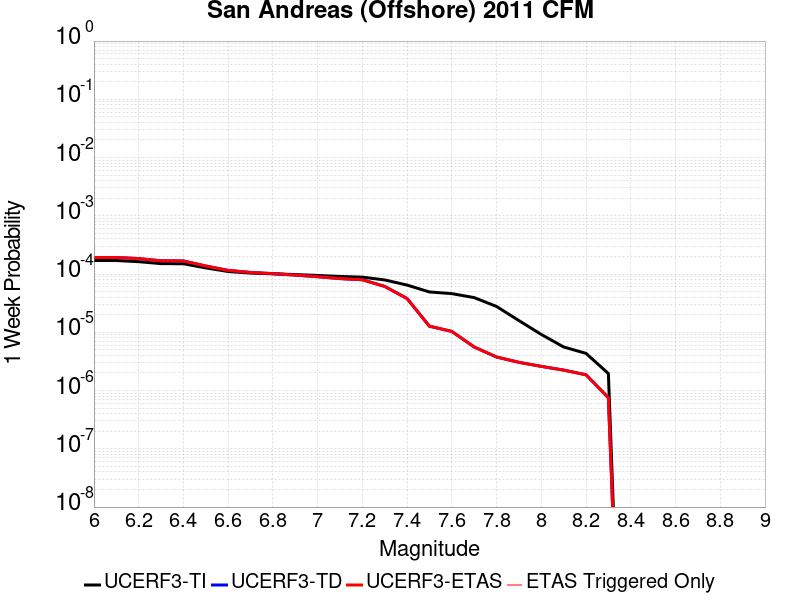 |  | 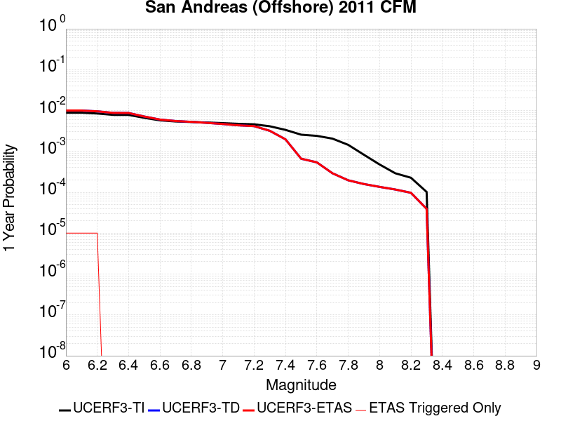 |  |

| Magnitude | 1 wk TI Prob | 1 wk TD Prob | 1 wk ETAS Prob | 1 wk ETAS/TD Gain | 1 wk ETAS Triggered Only | 1 mo TI Prob | 1 mo TD Prob | 1 mo ETAS Prob | 1 mo ETAS/TD Gain | 1 mo ETAS Triggered Only | 1 yr TI Prob | 1 yr TD Prob | 1 yr ETAS Prob | 1 yr ETAS/TD Gain | 1 yr ETAS Triggered Only | 10 yr TI Prob | 10 yr TD Prob | 10 yr ETAS Prob | 10 yr ETAS/TD Gain | 10 yr ETAS Triggered Only |
|-----|-----|-----|-----|-----|-----|-----|-----|-----|-----|-----|-----|-----|-----|-----|-----|-----|-----|-----|-----|-----|
| 6.0 | 1.7072787E-4 | 1.9244522E-4 | 1.9244522E-4 | 1.0 | 0.0 | 7.3148566E-4 | 8.245069E-4 | 8.245069E-4 | 1.0 | 0.0 | 0.008869528 | 0.009992682 | 0.010002583 | 1.0009907 | 1.0E-5 | 0.085237645 | 0.096918665 | 0.096936725 | 1.0001863 | 2.0E-5 |
| 6.1 | 1.7072787E-4 | 1.9244522E-4 | 1.9244522E-4 | 1.0 | 0.0 | 7.3148566E-4 | 8.245069E-4 | 8.245069E-4 | 1.0 | 0.0 | 0.008869528 | 0.009992682 | 0.010002583 | 1.0009907 | 1.0E-5 | 0.085237645 | 0.096918665 | 0.096936725 | 1.0001863 | 2.0E-5 |
| 6.2 | 1.6312556E-4 | 1.8425238E-4 | 1.8425238E-4 | 1.0 | 0.0 | 6.989222E-4 | 7.894165E-4 | 7.894165E-4 | 1.0 | 0.0 | 0.008476226 | 0.009569289 | 0.009579194 | 1.001035 | 1.0E-5 | 0.08160117 | 0.09294029 | 0.092958435 | 1.0001951 | 2.0E-5 |
| 6.3 | 1.5103363E-4 | 1.6896697E-4 | 1.6896697E-4 | 1.0 | 0.0 | 6.471264E-4 | 7.2394544E-4 | 7.2394544E-4 | 1.0 | 0.0 | 0.007850339 | 0.008778859 | 0.008778859 | 1.0 | 0.0 | 0.075787395 | 0.08556559 | 0.08557473 | 1.0001068 | 1.0E-5 |
| 6.4 | 1.5047993E-4 | 1.678262E-4 | 1.678262E-4 | 1.0 | 0.0 | 6.4475456E-4 | 7.190591E-4 | 7.190591E-4 | 1.0 | 0.0 | 0.007821669 | 0.008719845 | 0.008719845 | 1.0 | 0.0 | 0.0755203 | 0.08504562 | 0.08505477 | 1.0001075 | 1.0E-5 |
| 6.5 | 1.2760791E-4 | 1.3748434E-4 | 1.3748434E-4 | 1.0 | 0.0 | 5.467764E-4 | 5.8908697E-4 | 5.8908697E-4 | 1.0 | 0.0 | 0.0066367025 | 0.0071488223 | 0.0071488223 | 1.0 | 0.0 | 0.064419635 | 0.07029571 | 0.070305005 | 1.0001322 | 1.0E-5 |
| 6.6 | 1.1063525E-4 | 1.15677954E-4 | 1.15677954E-4 | 1.0 | 0.0 | 4.740649E-4 | 4.9566955E-4 | 4.9566955E-4 | 1.0 | 0.0 | 0.0057564764 | 0.00601828 | 0.00601828 | 1.0 | 0.0 | 0.05609626 | 0.059541386 | 0.05955079 | 1.000158 | 1.0E-5 |
| 6.7 | 1.0391049E-4 | 1.0656347E-4 | 1.0656347E-4 | 1.0 | 0.0 | 4.4525467E-4 | 4.5662167E-4 | 4.5662167E-4 | 1.0 | 0.0 | 0.0054075094 | 0.0055453856 | 0.0055453856 | 1.0 | 0.0 | 0.052778035 | 0.055040713 | 0.055050164 | 1.0001717 | 1.0E-5 |
| 6.8 | 1.0096706E-4 | 1.0168417E-4 | 1.0168417E-4 | 1.0 | 0.0 | 4.3264418E-4 | 4.357175E-4 | 4.357175E-4 | 1.0 | 0.0 | 0.0052547283 | 0.0052921344 | 0.0052921344 | 1.0 | 0.0 | 0.051321987 | 0.052737184 | 0.052746657 | 1.0001796 | 1.0E-5 |
| 6.9 | 9.800265E-5 | 9.59869E-5 | 9.59869E-5 | 1.0 | 0.0 | 4.1994374E-4 | 4.113085E-4 | 4.113085E-4 | 1.0 | 0.0 | 0.0051008356 | 0.004996351 | 0.004996351 | 1.0 | 0.0 | 0.049853306 | 0.050064012 | 0.050064012 | 1.0 | 0.0 |
| 7.0 | 9.4642375E-5 | 9.0117996E-5 | 9.0117996E-5 | 1.0 | 0.0 | 4.0554712E-4 | 3.8616368E-4 | 3.8616368E-4 | 1.0 | 0.0 | 0.004926363 | 0.00469157 | 0.00469157 | 1.0 | 0.0 | 0.048185747 | 0.047243748 | 0.047243748 | 1.0 | 0.0 |
| 7.1 | 9.0996844E-5 | 8.363476E-5 | 8.363476E-5 | 1.0 | 0.0 | 3.8992817E-4 | 3.583863E-4 | 3.583863E-4 | 1.0 | 0.0 | 0.004737046 | 0.00435478 | 0.00435478 | 1.0 | 0.0 | 0.04637333 | 0.044094495 | 0.044094495 | 1.0 | 0.0 |
| 7.2 | 8.848287E-5 | 7.990859E-5 | 7.990859E-5 | 1.0 | 0.0 | 3.791572E-4 | 3.424213E-4 | 3.424213E-4 | 1.0 | 0.0 | 0.004606472 | 0.0041611637 | 0.0041611637 | 1.0 | 0.0 | 0.045121472 | 0.04223778 | 0.04223778 | 1.0 | 0.0 |
| 7.3 | 7.9280784E-5 | 6.135293E-5 | 6.135293E-5 | 1.0 | 0.0 | 3.3973053E-4 | 2.629152E-4 | 2.629152E-4 | 1.0 | 0.0 | 0.004128377 | 0.0031963966 | 0.0031963966 | 1.0 | 0.0 | 0.040525194 | 0.0329454 | 0.0329454 | 1.0 | 0.0 |
| 7.4 | 6.468038E-5 | 3.7985967E-5 | 3.7985967E-5 | 1.0 | 0.0 | 2.771722E-4 | 1.6278717E-4 | 1.6278717E-4 | 1.0 | 0.0 | 0.0033693502 | 0.00198019 | 0.00198019 | 1.0 | 0.0 | 0.0331872 | 0.020856531 | 0.020856531 | 1.0 | 0.0 |
| 7.5 | 4.930574E-5 | 1.2732583E-5 | 1.2732583E-5 | 1.0 | 0.0 | 2.1129321E-4 | 5.4567077E-5 | 5.4567077E-5 | 1.0 | 0.0 | 0.0025694598 | 6.6415325E-4 | 6.6415325E-4 | 1.0 | 0.0 | 0.02539953 | 0.007500171 | 0.007500171 | 1.0 | 0.0 |
| 7.6 | 4.612566E-5 | 1.0362292E-5 | 1.0362292E-5 | 1.0 | 0.0 | 1.9766642E-4 | 4.4409077E-5 | 4.4409077E-5 | 1.0 | 0.0 | 0.0024039324 | 5.405477E-4 | 5.405477E-4 | 1.0 | 0.0 | 0.023780935 | 0.00618925 | 0.00618925 | 1.0 | 0.0 |
| 7.7 | 3.9435414E-5 | 5.594974E-6 | 5.594974E-6 | 1.0 | 0.0 | 1.6899795E-4 | 2.397824E-5 | 2.397824E-5 | 1.0 | 0.0 | 0.0020556084 | 2.9189617E-4 | 2.9189617E-4 | 1.0 | 0.0 | 0.020366974 | 0.0035543093 | 0.0035543093 | 1.0 | 0.0 |
| 7.8 | 2.7787428E-5 | 3.7703621E-6 | 3.7703621E-6 | 1.0 | 0.0 | 1.1908354E-4 | 1.6158594E-5 | 1.6158594E-5 | 1.0 | 0.0 | 0.0014488777 | 1.9671317E-4 | 1.9671317E-4 | 1.0 | 0.0 | 0.014394675 | 0.0023968155 | 0.0023968155 | 1.0 | 0.0 |
| 7.9 | 1.590671E-5 | 3.0531762E-6 | 3.0531762E-6 | 1.0 | 0.0 | 6.816983E-5 | 1.3084975E-5 | 1.3084975E-5 | 1.0 | 0.0 | 8.2965166E-4 | 1.5929795E-4 | 1.5929795E-4 | 1.0 | 0.0 | 0.008265611 | 0.0019116144 | 0.0019116144 | 1.0 | 0.0 |
| 8.0 | 9.193638E-6 | 2.602415E-6 | 2.602415E-6 | 1.0 | 0.0 | 3.940071E-5 | 1.1153159E-5 | 1.1153159E-5 | 1.0 | 0.0 | 4.7959806E-4 | 1.3578127E-4 | 1.3578127E-4 | 1.0 | 0.0 | 0.0047856434 | 0.0016175489 | 0.0016175489 | 1.0 | 0.0 |
| 8.1 | 5.601576E-6 | 2.2438371E-6 | 2.2438371E-6 | 1.0 | 0.0 | 2.4006533E-5 | 9.616409E-6 | 9.616409E-6 | 1.0 | 0.0 | 2.9224035E-4 | 1.1707353E-4 | 1.1707353E-4 | 1.0 | 0.0 | 0.0029185633 | 0.0014075873 | 0.0014075873 | 1.0 | 0.0 |
| 8.2 | 4.3508785E-6 | 1.8653523E-6 | 1.8653523E-6 | 1.0 | 0.0 | 1.864649E-5 | 7.994342E-6 | 7.994342E-6 | 1.0 | 0.0 | 2.2699735E-4 | 9.7326796E-5 | 9.7326796E-5 | 1.0 | 0.0 | 0.0022676561 | 0.0011639223 | 0.0011639223 | 1.0 | 0.0 |
| 8.3 | 1.9573292E-6 | 7.544528E-7 | 7.544528E-7 | 1.0 | 0.0 | 8.388526E-6 | 3.233365E-6 | 3.233365E-6 | 1.0 | 0.0 | 1.0212552E-4 | 3.9365525E-5 | 3.9365525E-5 | 1.0 | 0.0 | 0.001020786 | 4.6580602E-4 | 4.6580602E-4 | 1.0 | 0.0 |

## San Juan
*[(top)](#table-of-contents)*

| 1 Week | 1 Month | 1 Year | 10 Year |
|-----|-----|-----|-----|
|  |  |  | 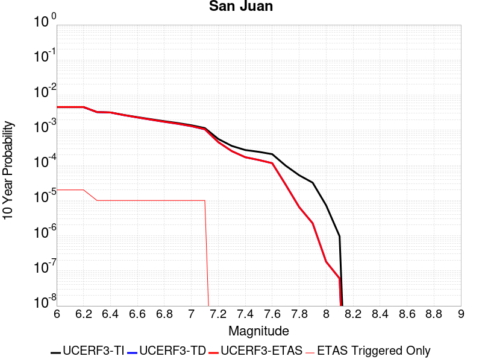 |

| Magnitude | 1 wk TI Prob | 1 wk TD Prob | 1 wk ETAS Prob | 1 wk ETAS/TD Gain | 1 wk ETAS Triggered Only | 1 mo TI Prob | 1 mo TD Prob | 1 mo ETAS Prob | 1 mo ETAS/TD Gain | 1 mo ETAS Triggered Only | 1 yr TI Prob | 1 yr TD Prob | 1 yr ETAS Prob | 1 yr ETAS/TD Gain | 1 yr ETAS Triggered Only | 10 yr TI Prob | 10 yr TD Prob | 10 yr ETAS Prob | 10 yr ETAS/TD Gain | 10 yr ETAS Triggered Only |
|-----|-----|-----|-----|-----|-----|-----|-----|-----|-----|-----|-----|-----|-----|-----|-----|-----|-----|-----|-----|-----|
| 6.0 | 8.682808E-6 | 8.750764E-6 | 8.750764E-6 | 1.0 | 0.0 | 3.72115E-5 | 3.7502763E-5 | 3.7502763E-5 | 1.0 | 0.0 | 4.5295584E-4 | 4.565053E-4 | 4.6650076E-4 | 1.0218955 | 1.0E-5 | 0.004520337 | 0.004556215 | 0.004576124 | 1.0043696 | 2.0E-5 |
| 6.1 | 8.682808E-6 | 8.750764E-6 | 8.750764E-6 | 1.0 | 0.0 | 3.72115E-5 | 3.7502763E-5 | 3.7502763E-5 | 1.0 | 0.0 | 4.5295584E-4 | 4.565053E-4 | 4.6650076E-4 | 1.0218955 | 1.0E-5 | 0.004520337 | 0.004556215 | 0.004576124 | 1.0043696 | 2.0E-5 |
| 6.2 | 8.682808E-6 | 8.750764E-6 | 8.750764E-6 | 1.0 | 0.0 | 3.72115E-5 | 3.7502763E-5 | 3.7502763E-5 | 1.0 | 0.0 | 4.5295584E-4 | 4.565053E-4 | 4.6650076E-4 | 1.0218955 | 1.0E-5 | 0.004520337 | 0.004556215 | 0.004576124 | 1.0043696 | 2.0E-5 |
| 6.3 | 6.3054235E-6 | 6.284137E-6 | 6.284137E-6 | 1.0 | 0.0 | 2.7022963E-5 | 2.6931744E-5 | 2.6931744E-5 | 1.0 | 0.0 | 3.2895492E-4 | 3.2784606E-4 | 3.378428E-4 | 1.0304921 | 1.0E-5 | 0.003284684 | 0.0032738224 | 0.0032837896 | 1.0030445 | 1.0E-5 |
| 6.4 | 6.1490473E-6 | 6.1158057E-6 | 6.1158057E-6 | 1.0 | 0.0 | 2.6352795E-5 | 2.621034E-5 | 2.621034E-5 | 1.0 | 0.0 | 3.2079802E-4 | 3.1906553E-4 | 3.2906234E-4 | 1.0313315 | 1.0E-5 | 0.0032033534 | 0.0031862692 | 0.0031962374 | 1.0031284 | 1.0E-5 |
| 6.5 | 5.204848E-6 | 5.1385305E-6 | 5.1385305E-6 | 1.0 | 0.0 | 2.23063E-5 | 2.2022092E-5 | 2.2022092E-5 | 1.0 | 0.0 | 2.7154534E-4 | 2.6808694E-4 | 2.7808428E-4 | 1.0372913 | 1.0E-5 | 0.0027121378 | 0.002677788 | 0.002687761 | 1.0037245 | 1.0E-5 |
| 6.6 | 4.5179986E-6 | 4.416E-6 | 4.416E-6 | 1.0 | 0.0 | 1.9362706E-5 | 1.892558E-5 | 1.892558E-5 | 1.0 | 0.0 | 2.3571544E-4 | 2.3039538E-4 | 2.4039308E-4 | 1.0433936 | 1.0E-5 | 0.0023546559 | 0.0023017006 | 0.0023116777 | 1.0043346 | 1.0E-5 |
| 6.7 | 3.9442616E-6 | 3.820695E-6 | 3.820695E-6 | 1.0 | 0.0 | 1.6903869E-5 | 1.6374308E-5 | 1.6374308E-5 | 1.0 | 0.0 | 2.0578515E-4 | 1.9933963E-4 | 2.0933764E-4 | 1.0501556 | 1.0E-5 | 0.002055947 | 0.0019917316 | 0.0020017116 | 1.0050107 | 1.0E-5 |
| 6.8 | 3.4536245E-6 | 3.3171661E-6 | 3.3171661E-6 | 1.0 | 0.0 | 1.4801163E-5 | 1.4216353E-5 | 1.4216353E-5 | 1.0 | 0.0 | 1.8018926E-4 | 1.7307096E-4 | 1.8306923E-4 | 1.0577698 | 1.0E-5 | 0.0018004322 | 0.0017294791 | 0.0017394617 | 1.0057721 | 1.0E-5 |
| 6.9 | 3.059865E-6 | 2.9128253E-6 | 2.9128253E-6 | 1.0 | 0.0 | 1.3113641E-5 | 1.248348E-5 | 1.248348E-5 | 1.0 | 0.0 | 1.596469E-4 | 1.5197633E-4 | 1.6197482E-4 | 1.0657897 | 1.0E-5 | 0.0015953224 | 0.0015188372 | 0.001528822 | 1.006574 | 1.0E-5 |
| 7.0 | 2.6504351E-6 | 2.4927492E-6 | 2.4927492E-6 | 1.0 | 0.0 | 1.1358958E-5 | 1.068317E-5 | 1.068317E-5 | 1.0 | 0.0 | 1.3828653E-4 | 1.3006038E-4 | 1.4005907E-4 | 1.0768774 | 1.0E-5 | 0.0013820052 | 0.0012999529 | 0.0013099399 | 1.0076826 | 1.0E-5 |
| 7.1 | 2.2039317E-6 | 2.034435E-6 | 2.034435E-6 | 1.0 | 0.0 | 9.445387E-6 | 8.718981E-6 | 8.718981E-6 | 1.0 | 0.0 | 1.1499152E-4 | 1.06148946E-4 | 1.1614789E-4 | 1.0941973 | 1.0E-5 | 0.0011493203 | 0.0010610909 | 0.0010710802 | 1.0094143 | 1.0E-5 |
| 7.2 | 1.0786707E-6 | 8.775373E-7 | 8.775373E-7 | 1.0 | 0.0 | 4.622866E-6 | 3.7608684E-6 | 3.7608684E-6 | 1.0 | 0.0 | 5.628194E-5 | 4.5787623E-5 | 4.5787623E-5 | 1.0 | 0.0 | 5.6267687E-4 | 4.5783943E-4 | 4.5783943E-4 | 1.0 | 0.0 |
| 7.3 | 6.846433E-7 | 4.872059E-7 | 4.872059E-7 | 1.0 | 0.0 | 2.9341822E-6 | 2.0880236E-6 | 2.0880236E-6 | 1.0 | 0.0 | 3.5723086E-5 | 2.542139E-5 | 2.542139E-5 | 1.0 | 0.0 | 3.571734E-4 | 2.542176E-4 | 2.542176E-4 | 1.0 | 0.0 |
| 7.4 | 5.23043E-7 | 3.2652028E-7 | 3.2652028E-7 | 1.0 | 0.0 | 2.2416111E-6 | 1.3993719E-6 | 1.3993719E-6 | 1.0 | 0.0 | 2.7291273E-5 | 1.703722E-5 | 1.703722E-5 | 1.0 | 0.0 | 2.7287923E-4 | 1.7039063E-4 | 1.7039063E-4 | 1.0 | 0.0 |
| 7.5 | 4.648444E-7 | 2.7255334E-7 | 2.7255334E-7 | 1.0 | 0.0 | 1.9921886E-6 | 1.1680851E-6 | 1.1680851E-6 | 1.0 | 0.0 | 2.4254627E-5 | 1.4221344E-5 | 1.4221344E-5 | 1.0 | 0.0 | 2.425198E-4 | 1.4223348E-4 | 1.4223348E-4 | 1.0 | 0.0 |
| 7.6 | 3.9906567E-7 | 2.2099482E-7 | 2.2099482E-7 | 1.0 | 0.0 | 1.7102802E-6 | 9.471203E-7 | 9.471203E-7 | 1.0 | 0.0 | 2.0822463E-5 | 1.15311295E-5 | 1.15311295E-5 | 1.0 | 0.0 | 2.0820512E-4 | 1.1532919E-4 | 1.1532919E-4 | 1.0 | 0.0 |
| 7.7 | 1.8784601E-7 | 5.372496E-8 | 5.372496E-8 | 1.0 | 0.0 | 8.0505407E-7 | 2.3024981E-7 | 2.3024981E-7 | 1.0 | 0.0 | 9.80149E-6 | 2.8032878E-6 | 2.8032878E-6 | 1.0 | 0.0 | 9.801057E-5 | 2.80415E-5 | 2.80415E-5 | 1.0 | 0.0 |
| 7.8 | 1.00154914E-7 | 1.2432812E-8 | 1.2432812E-8 | 1.0 | 0.0 | 4.2923529E-7 | 5.3283486E-8 | 5.3283486E-8 | 1.0 | 0.0 | 5.225927E-6 | 6.487262E-7 | 6.487262E-7 | 1.0 | 0.0 | 5.225804E-5 | 6.4931564E-6 | 6.4931564E-6 | 1.0 | 0.0 |
| 7.9 | 6.171429E-8 | 4.3050106E-9 | 4.3050106E-9 | 1.0 | 0.0 | 2.6448978E-7 | 1.8450045E-8 | 1.8450045E-8 | 1.0 | 0.0 | 3.2201583E-6 | 2.2462923E-7 | 2.2462923E-7 | 1.0 | 0.0 | 3.2201115E-5 | 2.2516008E-6 | 2.2516008E-6 | 1.0 | 0.0 |
| 8.0 | 1.3974572E-8 | 3.3928182E-10 | 3.3928182E-10 | 1.0 | 0.0 | 5.989102E-8 | 1.4540653E-9 | 1.4540653E-9 | 1.0 | 0.0 | 7.2917294E-7 | 1.7703238E-8 | 1.7703238E-8 | 1.0 | 0.0 | 7.2917055E-6 | 1.8134347E-7 | 1.8134347E-7 | 1.0 | 0.0 |
| 8.1 | 1.8403477E-9 | 1.1340173E-10 | 1.1340173E-10 | 1.0 | 0.0 | 7.887204E-9 | 4.8600757E-10 | 4.8600757E-10 | 1.0 | 0.0 | 9.602671E-8 | 5.917144E-9 | 5.917144E-9 | 1.0 | 0.0 | 9.602667E-7 | 6.0406514E-8 | 6.0406514E-8 | 1.0 | 0.0 |

## Big Pine (Central)
*[(top)](#table-of-contents)*

| 1 Week | 1 Month | 1 Year | 10 Year |
|-----|-----|-----|-----|
|  |  | 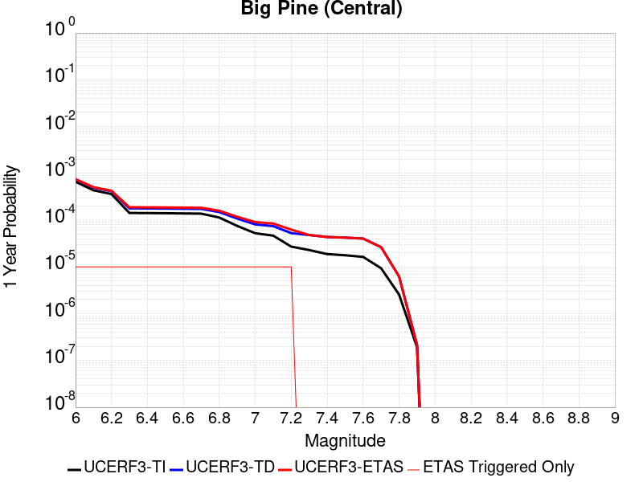 | 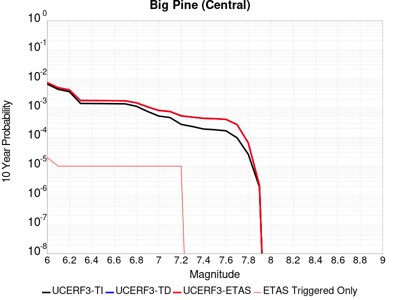 |

| Magnitude | 1 wk TI Prob | 1 wk TD Prob | 1 wk ETAS Prob | 1 wk ETAS/TD Gain | 1 wk ETAS Triggered Only | 1 mo TI Prob | 1 mo TD Prob | 1 mo ETAS Prob | 1 mo ETAS/TD Gain | 1 mo ETAS Triggered Only | 1 yr TI Prob | 1 yr TD Prob | 1 yr ETAS Prob | 1 yr ETAS/TD Gain | 1 yr ETAS Triggered Only | 10 yr TI Prob | 10 yr TD Prob | 10 yr ETAS Prob | 10 yr ETAS/TD Gain | 10 yr ETAS Triggered Only |
|-----|-----|-----|-----|-----|-----|-----|-----|-----|-----|-----|-----|-----|-----|-----|-----|-----|-----|-----|-----|-----|
| 6.0 | 1.2706755E-5 | 1.4252547E-5 | 1.4252547E-5 | 1.0 | 0.0 | 5.4456385E-5 | 6.108112E-5 | 6.108112E-5 | 1.0 | 0.0 | 6.628048E-4 | 7.434455E-4 | 7.5343804E-4 | 1.0134408 | 1.0E-5 | 0.006608314 | 0.0074146423 | 0.007434494 | 1.0026773 | 2.0E-5 |
| 6.1 | 8.342579E-6 | 9.512563E-6 | 9.512563E-6 | 1.0 | 0.0 | 3.5753423E-5 | 4.0767616E-5 | 4.0767616E-5 | 1.0 | 0.0 | 4.3521097E-4 | 4.962544E-4 | 5.0624943E-4 | 1.020141 | 1.0E-5 | 0.0043435963 | 0.0049550477 | 0.0049649985 | 1.0020082 | 1.0E-5 |
| 6.2 | 6.923899E-6 | 7.968877E-6 | 7.968877E-6 | 1.0 | 0.0 | 2.9673516E-5 | 3.415199E-5 | 3.415199E-5 | 1.0 | 0.0 | 3.6121515E-4 | 4.1574042E-4 | 4.2573625E-4 | 1.0240434 | 1.0E-5 | 0.003606286 | 0.0041529653 | 0.004162924 | 1.0023979 | 1.0E-5 |
| 6.3 | 2.728396E-6 | 3.425821E-6 | 3.425821E-6 | 1.0 | 0.0 | 1.1693074E-5 | 1.4682013E-5 | 1.4682013E-5 | 1.0 | 0.0 | 1.4235388E-4 | 1.787397E-4 | 1.8873792E-4 | 1.0559373 | 1.0E-5 | 0.0014226272 | 0.0017874972 | 0.0017974793 | 1.0055844 | 1.0E-5 |
| 6.4 | 2.7136944E-6 | 3.4101138E-6 | 3.4101138E-6 | 1.0 | 0.0 | 1.1630066E-5 | 1.4614697E-5 | 1.4614697E-5 | 1.0 | 0.0 | 1.4158686E-4 | 1.7792027E-4 | 1.879185E-4 | 1.0561949 | 1.0E-5 | 0.0014149669 | 0.001779316 | 0.0017892981 | 1.0056101 | 1.0E-5 |
| 6.5 | 2.6971882E-6 | 3.3924584E-6 | 3.3924584E-6 | 1.0 | 0.0 | 1.1559327E-5 | 1.4539031E-5 | 1.4539031E-5 | 1.0 | 0.0 | 1.4072572E-4 | 1.769992E-4 | 1.8699742E-4 | 1.0564874 | 1.0E-5 | 0.0014063664 | 0.0017701199 | 0.0017801021 | 1.0056393 | 1.0E-5 |
| 6.6 | 2.669092E-6 | 3.3624776E-6 | 3.3624776E-6 | 1.0 | 0.0 | 1.1438916E-5 | 1.4410544E-5 | 1.4410544E-5 | 1.0 | 0.0 | 1.3925991E-4 | 1.7543513E-4 | 1.8543337E-4 | 1.0569911 | 1.0E-5 | 0.0013917267 | 0.0017545038 | 0.0017644863 | 1.0056896 | 1.0E-5 |
| 6.7 | 2.6408059E-6 | 3.3325025E-6 | 3.3325025E-6 | 1.0 | 0.0 | 1.1317691E-5 | 1.428208E-5 | 1.428208E-5 | 1.0 | 0.0 | 1.3778417E-4 | 1.7387132E-4 | 1.8386958E-4 | 1.0575038 | 1.0E-5 | 0.0013769877 | 0.0017388904 | 0.001748873 | 1.0057408 | 1.0E-5 |
| 6.8 | 2.1786943E-6 | 2.8559518E-6 | 2.8559518E-6 | 1.0 | 0.0 | 9.337228E-6 | 1.22397405E-5 | 1.22397405E-5 | 1.0 | 0.0 | 1.1367482E-4 | 1.4900937E-4 | 1.5900789E-4 | 1.0670999 | 1.0E-5 | 0.0011361669 | 0.0014906187 | 0.0015006039 | 1.0066986 | 1.0E-5 |
| 6.9 | 1.4411696E-6 | 2.069955E-6 | 2.069955E-6 | 1.0 | 0.0 | 6.1764263E-6 | 8.871207E-6 | 8.871207E-6 | 1.0 | 0.0 | 7.51954E-5 | 1.0800186E-4 | 1.1800078E-4 | 1.092581 | 1.0E-5 | 7.5169955E-4 | 0.0010809733 | 0.0010909624 | 1.0092409 | 1.0E-5 |
| 7.0 | 1.0073411E-6 | 1.5555618E-6 | 1.5555618E-6 | 1.0 | 0.0 | 4.317169E-6 | 6.6666776E-6 | 6.6666776E-6 | 1.0 | 0.0 | 5.2560266E-5 | 8.1163926E-5 | 9.1163114E-5 | 1.1231974 | 1.0E-5 | 5.2547833E-4 | 8.128111E-4 | 8.2280295E-4 | 1.012293 | 1.0E-5 |
| 7.1 | 8.947104E-7 | 1.4315309E-6 | 1.4315309E-6 | 1.0 | 0.0 | 3.834468E-6 | 6.135119E-6 | 6.135119E-6 | 1.0 | 0.0 | 4.6683643E-5 | 7.469266E-5 | 8.4691914E-5 | 1.1338719 | 1.0E-5 | 4.6673836E-4 | 7.481436E-4 | 7.581361E-4 | 1.0133564 | 1.0E-5 |
| 7.2 | 5.215166E-7 | 1.0123637E-6 | 1.0123637E-6 | 1.0 | 0.0 | 2.2350691E-6 | 4.3386945E-6 | 4.3386945E-6 | 1.0 | 0.0 | 2.7211627E-5 | 5.2822368E-5 | 6.282184E-5 | 1.1893038 | 1.0E-5 | 2.7208295E-4 | 5.29556E-4 | 5.3955073E-4 | 1.0188737 | 1.0E-5 |
| 7.3 | 4.4024807E-7 | 9.231207E-7 | 9.231207E-7 | 1.0 | 0.0 | 1.8867761E-6 | 3.956226E-6 | 3.956226E-6 | 1.0 | 0.0 | 2.2971257E-5 | 4.8166028E-5 | 4.8166028E-5 | 1.0 | 0.0 | 2.2968883E-4 | 4.8301363E-4 | 4.8301363E-4 | 1.0 | 0.0 |
| 7.4 | 3.6130905E-7 | 8.3697915E-7 | 8.3697915E-7 | 1.0 | 0.0 | 1.5484665E-6 | 3.5870487E-6 | 3.5870487E-6 | 1.0 | 0.0 | 1.8852415E-5 | 4.3671484E-5 | 4.3671484E-5 | 1.0 | 0.0 | 1.8850817E-4 | 4.3807772E-4 | 4.3807772E-4 | 1.0 | 0.0 |
| 7.5 | 3.408184E-7 | 8.1191774E-7 | 8.1191774E-7 | 1.0 | 0.0 | 1.4606494E-6 | 3.479643E-6 | 3.479643E-6 | 1.0 | 0.0 | 1.7783263E-5 | 4.236387E-5 | 4.236387E-5 | 1.0 | 0.0 | 1.778184E-4 | 4.2498423E-4 | 4.2498423E-4 | 1.0 | 0.0 |
| 7.6 | 3.1428627E-7 | 7.742247E-7 | 7.742247E-7 | 1.0 | 0.0 | 1.3469405E-6 | 3.318102E-6 | 3.318102E-6 | 1.0 | 0.0 | 1.6398877E-5 | 4.0397183E-5 | 4.0397183E-5 | 1.0 | 0.0 | 1.6397667E-4 | 4.0529485E-4 | 4.0529485E-4 | 1.0 | 0.0 |
| 7.7 | 1.7972785E-7 | 5.085898E-7 | 5.085898E-7 | 1.0 | 0.0 | 7.70262E-7 | 2.1796686E-6 | 2.1796686E-6 | 1.0 | 0.0 | 9.377899E-6 | 2.6537155E-5 | 2.6537155E-5 | 1.0 | 0.0 | 9.377503E-5 | 2.6671647E-4 | 2.6671647E-4 | 1.0 | 0.0 |
| 7.8 | 4.9230927E-8 | 1.1999686E-7 | 1.1999686E-7 | 1.0 | 0.0 | 2.1098968E-7 | 5.1427213E-7 | 5.1427213E-7 | 1.0 | 0.0 | 2.5687964E-6 | 6.261247E-6 | 6.261247E-6 | 1.0 | 0.0 | 2.5687666E-5 | 6.306763E-5 | 6.306763E-5 | 1.0 | 0.0 |
| 7.9 | 3.6805972E-9 | 4.112225E-9 | 4.112225E-9 | 1.0 | 0.0 | 1.5773987E-8 | 1.762382E-8 | 1.762382E-8 | 1.0 | 0.0 | 1.9204828E-7 | 2.1457E-7 | 2.1457E-7 | 1.0 | 0.0 | 1.920481E-6 | 2.1932892E-6 | 2.1932892E-6 | 1.0 | 0.0 |

## Channel Islands Thrust
*[(top)](#table-of-contents)*

| 1 Week | 1 Month | 1 Year | 10 Year |
|-----|-----|-----|-----|
|  |  | 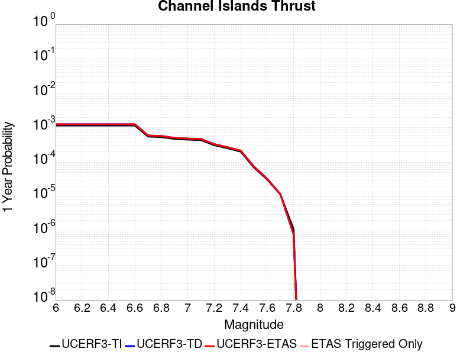 |  |

| Magnitude | 1 wk TI Prob | 1 wk TD Prob | 1 wk ETAS Prob | 1 wk ETAS/TD Gain | 1 wk ETAS Triggered Only | 1 mo TI Prob | 1 mo TD Prob | 1 mo ETAS Prob | 1 mo ETAS/TD Gain | 1 mo ETAS Triggered Only | 1 yr TI Prob | 1 yr TD Prob | 1 yr ETAS Prob | 1 yr ETAS/TD Gain | 1 yr ETAS Triggered Only | 10 yr TI Prob | 10 yr TD Prob | 10 yr ETAS Prob | 10 yr ETAS/TD Gain | 10 yr ETAS Triggered Only |
|-----|-----|-----|-----|-----|-----|-----|-----|-----|-----|-----|-----|-----|-----|-----|-----|-----|-----|-----|-----|-----|
| 6.0 | 2.2156251E-5 | 2.4093148E-5 | 2.4093148E-5 | 1.0 | 0.0 | 9.495191E-5 | 1.0325286E-4 | 1.0325286E-4 | 1.0 | 0.0 | 0.0011554264 | 0.0012564851 | 0.0012564851 | 1.0 | 0.0 | 0.011494373 | 0.012504402 | 0.012524151 | 1.0015794 | 2.0E-5 |
| 6.1 | 2.2156251E-5 | 2.4093148E-5 | 2.4093148E-5 | 1.0 | 0.0 | 9.495191E-5 | 1.0325286E-4 | 1.0325286E-4 | 1.0 | 0.0 | 0.0011554264 | 0.0012564851 | 0.0012564851 | 1.0 | 0.0 | 0.011494373 | 0.012504402 | 0.012524151 | 1.0015794 | 2.0E-5 |
| 6.2 | 2.2156251E-5 | 2.4093148E-5 | 2.4093148E-5 | 1.0 | 0.0 | 9.495191E-5 | 1.0325286E-4 | 1.0325286E-4 | 1.0 | 0.0 | 0.0011554264 | 0.0012564851 | 0.0012564851 | 1.0 | 0.0 | 0.011494373 | 0.012504402 | 0.012524151 | 1.0015794 | 2.0E-5 |
| 6.3 | 2.2156251E-5 | 2.4093148E-5 | 2.4093148E-5 | 1.0 | 0.0 | 9.495191E-5 | 1.0325286E-4 | 1.0325286E-4 | 1.0 | 0.0 | 0.0011554264 | 0.0012564851 | 0.0012564851 | 1.0 | 0.0 | 0.011494373 | 0.012504402 | 0.012524151 | 1.0015794 | 2.0E-5 |
| 6.4 | 2.2156251E-5 | 2.4093148E-5 | 2.4093148E-5 | 1.0 | 0.0 | 9.495191E-5 | 1.0325286E-4 | 1.0325286E-4 | 1.0 | 0.0 | 0.0011554264 | 0.0012564851 | 0.0012564851 | 1.0 | 0.0 | 0.011494373 | 0.012504402 | 0.012524151 | 1.0015794 | 2.0E-5 |
| 6.5 | 2.2156251E-5 | 2.4093148E-5 | 2.4093148E-5 | 1.0 | 0.0 | 9.495191E-5 | 1.0325286E-4 | 1.0325286E-4 | 1.0 | 0.0 | 0.0011554264 | 0.0012564851 | 0.0012564851 | 1.0 | 0.0 | 0.011494373 | 0.012504402 | 0.012524151 | 1.0015794 | 2.0E-5 |
| 6.6 | 2.2156251E-5 | 2.4093148E-5 | 2.4093148E-5 | 1.0 | 0.0 | 9.495191E-5 | 1.0325286E-4 | 1.0325286E-4 | 1.0 | 0.0 | 0.0011554264 | 0.0012564851 | 0.0012564851 | 1.0 | 0.0 | 0.011494373 | 0.012504402 | 0.012524151 | 1.0015794 | 2.0E-5 |
| 6.7 | 1.0601296E-5 | 1.1379992E-5 | 1.1379992E-5 | 1.0 | 0.0 | 4.5433335E-5 | 4.8770515E-5 | 4.8770515E-5 | 1.0 | 0.0 | 5.5301044E-4 | 5.9362414E-4 | 5.9362414E-4 | 1.0 | 0.0 | 0.005516363 | 0.0059208865 | 0.0059208865 | 1.0 | 0.0 |
| 6.8 | 1.0246747E-5 | 1.09971015E-5 | 1.09971015E-5 | 1.0 | 0.0 | 4.391389E-5 | 4.712961E-5 | 4.712961E-5 | 1.0 | 0.0 | 5.345204E-4 | 5.7365675E-4 | 5.7365675E-4 | 1.0 | 0.0 | 0.0053323656 | 0.0057222494 | 0.0057222494 | 1.0 | 0.0 |
| 6.9 | 9.049551E-6 | 9.70002E-6 | 9.70002E-6 | 1.0 | 0.0 | 3.878322E-5 | 4.1570875E-5 | 4.1570875E-5 | 1.0 | 0.0 | 4.7208337E-4 | 5.0601194E-4 | 5.0601194E-4 | 1.0 | 0.0 | 0.0047108172 | 0.0050490154 | 0.0050490154 | 1.0 | 0.0 |
| 7.0 | 8.6542195E-6 | 9.2749615E-6 | 9.2749615E-6 | 1.0 | 0.0 | 3.7088983E-5 | 3.974925E-5 | 3.974925E-5 | 1.0 | 0.0 | 4.5146482E-4 | 4.8384376E-4 | 4.8384376E-4 | 1.0 | 0.0 | 0.004505487 | 0.004828315 | 0.004828315 | 1.0 | 0.0 |
| 7.1 | 8.391028E-6 | 8.993273E-6 | 8.993273E-6 | 1.0 | 0.0 | 3.5961057E-5 | 3.8542054E-5 | 3.8542054E-5 | 1.0 | 0.0 | 4.3773788E-4 | 4.6915252E-4 | 4.6915252E-4 | 1.0 | 0.0 | 0.004368766 | 0.004682031 | 0.004682031 | 1.0 | 0.0 |
| 7.2 | 5.965188E-6 | 6.3719312E-6 | 6.3719312E-6 | 1.0 | 0.0 | 2.556484E-5 | 2.7307993E-5 | 2.7307993E-5 | 1.0 | 0.0 | 3.1120746E-4 | 3.3242465E-4 | 3.3242465E-4 | 1.0 | 0.0 | 0.00310772 | 0.003319332 | 0.003319332 | 1.0 | 0.0 |
| 7.3 | 4.877518E-6 | 5.206198E-6 | 5.206198E-6 | 1.0 | 0.0 | 2.0903482E-5 | 2.2312088E-5 | 2.2312088E-5 | 1.0 | 0.0 | 2.5447016E-4 | 2.7161627E-4 | 2.7161627E-4 | 1.0 | 0.0 | 0.0025417898 | 0.002712889 | 0.002712889 | 1.0 | 0.0 |
| 7.4 | 3.8829853E-6 | 4.142015E-6 | 4.142015E-6 | 1.0 | 0.0 | 1.664126E-5 | 1.7751374E-5 | 1.7751374E-5 | 1.0 | 0.0 | 2.0258849E-4 | 2.1610195E-4 | 2.1610195E-4 | 1.0 | 0.0 | 0.002024039 | 0.0021589599 | 0.0021589599 | 1.0 | 0.0 |
| 7.5 | 1.3489616E-6 | 1.4278398E-6 | 1.4278398E-6 | 1.0 | 0.0 | 5.7812517E-6 | 6.119299E-6 | 6.119299E-6 | 1.0 | 0.0 | 7.038446E-5 | 7.449996E-5 | 7.449996E-5 | 1.0 | 0.0 | 7.036218E-4 | 7.447538E-4 | 7.447538E-4 | 1.0 | 0.0 |
| 7.6 | 6.058192E-7 | 6.3539926E-7 | 6.3539926E-7 | 1.0 | 0.0 | 2.5963652E-6 | 2.723137E-6 | 2.723137E-6 | 1.0 | 0.0 | 3.161029E-5 | 3.3153705E-5 | 3.3153705E-5 | 1.0 | 0.0 | 3.1605794E-4 | 3.314892E-4 | 3.314892E-4 | 1.0 | 0.0 |
| 7.7 | 2.2170494E-7 | 2.26086E-7 | 2.26086E-7 | 1.0 | 0.0 | 9.5016367E-7 | 9.689397E-7 | 9.689397E-7 | 1.0 | 0.0 | 1.1568181E-5 | 1.1796788E-5 | 1.1796788E-5 | 1.0 | 0.0 | 1.1567579E-4 | 1.1796273E-4 | 1.1796273E-4 | 1.0 | 0.0 |
| 7.8 | 2.1613102E-8 | 1.546703E-8 | 1.546703E-8 | 1.0 | 0.0 | 9.262757E-8 | 6.628727E-8 | 6.628727E-8 | 1.0 | 0.0 | 1.1277401E-6 | 8.070473E-7 | 8.070473E-7 | 1.0 | 0.0 | 1.1277344E-5 | 8.070451E-6 | 8.070451E-6 | 1.0 | 0.0 |

## Rodgers Creek - Healdsburg 2011 CFM
*[(top)](#table-of-contents)*

| 1 Week | 1 Month | 1 Year | 10 Year |
|-----|-----|-----|-----|
|  |  |  |  |

| Magnitude | 1 wk TI Prob | 1 wk TD Prob | 1 wk ETAS Prob | 1 wk ETAS/TD Gain | 1 wk ETAS Triggered Only | 1 mo TI Prob | 1 mo TD Prob | 1 mo ETAS Prob | 1 mo ETAS/TD Gain | 1 mo ETAS Triggered Only | 1 yr TI Prob | 1 yr TD Prob | 1 yr ETAS Prob | 1 yr ETAS/TD Gain | 1 yr ETAS Triggered Only | 10 yr TI Prob | 10 yr TD Prob | 10 yr ETAS Prob | 10 yr ETAS/TD Gain | 10 yr ETAS Triggered Only |
|-----|-----|-----|-----|-----|-----|-----|-----|-----|-----|-----|-----|-----|-----|-----|-----|-----|-----|-----|-----|-----|
| 6.0 | 7.390182E-5 | 1.3143619E-4 | 1.3143619E-4 | 1.0 | 0.0 | 3.1668364E-4 | 5.631766E-4 | 5.631766E-4 | 1.0 | 0.0 | 0.0038488081 | 0.006835071 | 0.006835071 | 1.0 | 0.0 | 0.037828278 | 0.066227846 | 0.066246524 | 1.0002819 | 2.0E-5 |
| 6.1 | 7.318768E-5 | 1.3041621E-4 | 1.3041621E-4 | 1.0 | 0.0 | 3.1362378E-4 | 5.588071E-4 | 5.588071E-4 | 1.0 | 0.0 | 0.0038116854 | 0.0067822193 | 0.0067822193 | 1.0 | 0.0 | 0.037469655 | 0.065732375 | 0.06575106 | 1.0002843 | 2.0E-5 |
| 6.2 | 7.1379836E-5 | 1.2734454E-4 | 1.2734454E-4 | 1.0 | 0.0 | 3.058777E-4 | 5.456484E-4 | 5.456484E-4 | 1.0 | 0.0 | 0.003717703 | 0.006622995 | 0.006622995 | 1.0 | 0.0 | 0.0365612 | 0.06423862 | 0.06425734 | 1.0002913 | 2.0E-5 |
| 6.3 | 6.9255926E-5 | 1.2388716E-4 | 1.2388716E-4 | 1.0 | 0.0 | 2.9677735E-4 | 5.3083716E-4 | 5.3083716E-4 | 1.0 | 0.0 | 0.0036072785 | 0.0064438363 | 0.0064438363 | 1.0 | 0.0 | 0.035492823 | 0.06256966 | 0.06258841 | 1.0002997 | 2.0E-5 |
| 6.4 | 6.6757144E-5 | 1.19653305E-4 | 1.19653305E-4 | 1.0 | 0.0 | 2.8607066E-4 | 5.126995E-4 | 5.126995E-4 | 1.0 | 0.0 | 0.0034773487 | 0.0062243226 | 0.0062243226 | 1.0 | 0.0 | 0.034234364 | 0.06051925 | 0.060538035 | 1.0003104 | 2.0E-5 |
| 6.5 | 6.5735134E-5 | 1.1814355E-4 | 1.1814355E-4 | 1.0 | 0.0 | 2.8169158E-4 | 5.062316E-4 | 5.062316E-4 | 1.0 | 0.0 | 0.003424202 | 0.0061460366 | 0.0061460366 | 1.0 | 0.0 | 0.03371918 | 0.05978341 | 0.059802216 | 1.0003146 | 2.0E-5 |
| 6.6 | 6.289601E-5 | 1.13496535E-4 | 1.13496535E-4 | 1.0 | 0.0 | 2.6952647E-4 | 4.863234E-4 | 4.863234E-4 | 1.0 | 0.0 | 0.0032765474 | 0.005904993 | 0.005904993 | 1.0 | 0.0 | 0.032286562 | 0.05752101 | 0.05753986 | 1.0003277 | 2.0E-5 |
| 6.7 | 6.115274E-5 | 1.1066581E-4 | 1.1066581E-4 | 1.0 | 0.0 | 2.6205686E-4 | 4.741962E-4 | 4.741962E-4 | 1.0 | 0.0 | 0.0031858748 | 0.0057581346 | 0.0057581346 | 1.0 | 0.0 | 0.031405866 | 0.056138817 | 0.056157693 | 1.0003363 | 2.0E-5 |
| 6.8 | 5.9232367E-5 | 1.0733873E-4 | 1.0733873E-4 | 1.0 | 0.0 | 2.538283E-4 | 4.599424E-4 | 4.599424E-4 | 1.0 | 0.0 | 0.0030859804 | 0.0055854977 | 0.0055854977 | 1.0 | 0.0 | 0.030434765 | 0.054505546 | 0.054524455 | 1.0003469 | 2.0E-5 |
| 6.9 | 5.4030377E-5 | 9.827935E-5 | 9.827935E-5 | 1.0 | 0.0 | 2.315382E-4 | 4.2112955E-4 | 4.2112955E-4 | 1.0 | 0.0 | 0.0028153337 | 0.0051152646 | 0.0051152646 | 1.0 | 0.0 | 0.027799325 | 0.05004012 | 0.050059117 | 1.0003797 | 2.0E-5 |
| 7.0 | 4.8260714E-5 | 8.7458444E-5 | 8.7458444E-5 | 1.0 | 0.0 | 2.0681522E-4 | 3.7476834E-4 | 3.7476834E-4 | 1.0 | 0.0 | 0.0025150678 | 0.004553313 | 0.004553313 | 1.0 | 0.0 | 0.024867928 | 0.044692893 | 0.044711996 | 1.0004275 | 2.0E-5 |
| 7.1 | 4.0294493E-5 | 7.3936055E-5 | 7.3936055E-5 | 1.0 | 0.0 | 1.7267925E-4 | 3.1683053E-4 | 3.1683053E-4 | 1.0 | 0.0 | 0.0021003427 | 0.003850627 | 0.003850627 | 1.0 | 0.0 | 0.02080602 | 0.037945095 | 0.037964337 | 1.0005071 | 2.0E-5 |
| 7.2 | 3.096388E-5 | 5.7020978E-5 | 5.7020978E-5 | 1.0 | 0.0 | 1.326956E-4 | 2.4435285E-4 | 2.4435285E-4 | 1.0 | 0.0 | 0.0016143717 | 0.0029709595 | 0.0029709595 | 1.0 | 0.0 | 0.01602694 | 0.029457351 | 0.029467057 | 1.0003295 | 1.0E-5 |
| 7.3 | 2.3615226E-5 | 4.366796E-5 | 4.366796E-5 | 1.0 | 0.0 | 1.0120418E-4 | 1.8713505E-4 | 1.8713505E-4 | 1.0 | 0.0 | 0.0012314644 | 0.0022760022 | 0.0022760022 | 1.0 | 0.0 | 0.0122466255 | 0.022656549 | 0.022666322 | 1.0004314 | 1.0E-5 |
| 7.4 | 1.8251132E-5 | 3.3576755E-5 | 3.3576755E-5 | 1.0 | 0.0 | 7.821679E-5 | 1.438925E-4 | 1.438925E-4 | 1.0 | 0.0 | 9.518733E-4 | 0.0017504932 | 0.0017504932 | 1.0 | 0.0 | 0.009478063 | 0.017483057 | 0.017492883 | 1.000562 | 1.0E-5 |
| 7.5 | 1.2411432E-5 | 2.2487793E-5 | 2.2487793E-5 | 1.0 | 0.0 | 5.3190768E-5 | 9.637273E-5 | 9.637273E-5 | 1.0 | 0.0 | 6.4740516E-4 | 0.0011727122 | 0.0011727122 | 1.0 | 0.0 | 0.006455223 | 0.011757268 | 0.01176715 | 1.0008405 | 1.0E-5 |
| 7.6 | 4.4771446E-6 | 8.093299E-6 | 8.093299E-6 | 1.0 | 0.0 | 1.918762E-5 | 3.4685112E-5 | 3.4685112E-5 | 1.0 | 0.0 | 2.3358424E-4 | 4.2221064E-4 | 4.2221064E-4 | 1.0 | 0.0 | 0.0023333887 | 0.004251763 | 0.004251763 | 1.0 | 0.0 |
| 7.7 | 2.157941E-7 | 3.5399012E-7 | 3.5399012E-7 | 1.0 | 0.0 | 9.248315E-7 | 1.5170996E-6 | 1.5170996E-6 | 1.0 | 0.0 | 1.1259765E-5 | 1.8470531E-5 | 1.8470531E-5 | 1.0 | 0.0 | 1.1259195E-4 | 1.9094352E-4 | 1.9094352E-4 | 1.0 | 0.0 |
| 7.8 | 9.9623286E-8 | 1.9937539E-7 | 1.9937539E-7 | 1.0 | 0.0 | 4.269569E-7 | 8.5446567E-7 | 8.5446567E-7 | 1.0 | 0.0 | 5.1981874E-6 | 1.04030705E-5 | 1.04030705E-5 | 1.0 | 0.0 | 5.198066E-5 | 1.0920896E-4 | 1.0920896E-4 | 1.0 | 0.0 |
| 7.9 | 5.6745257E-8 | 1.17976434E-7 | 1.17976434E-7 | 1.0 | 0.0 | 2.4319394E-7 | 5.056132E-7 | 5.056132E-7 | 1.0 | 0.0 | 2.960882E-6 | 6.155823E-6 | 6.155823E-6 | 1.0 | 0.0 | 2.9608427E-5 | 6.482715E-5 | 6.482715E-5 | 1.0 | 0.0 |
| 8.0 | 2.8614323E-8 | 6.591314E-8 | 6.591314E-8 | 1.0 | 0.0 | 1.2263281E-7 | 2.8248488E-7 | 2.8248488E-7 | 1.0 | 0.0 | 1.4930534E-6 | 3.439248E-6 | 3.439248E-6 | 1.0 | 0.0 | 1.4930434E-5 | 3.5888945E-5 | 3.5888945E-5 | 1.0 | 0.0 |
| 8.1 | 3.5045191E-9 | 8.982203E-9 | 8.982203E-9 | 1.0 | 0.0 | 1.5019367E-8 | 3.849516E-8 | 3.849516E-8 | 1.0 | 0.0 | 1.8286079E-7 | 4.6867845E-7 | 4.6867845E-7 | 1.0 | 0.0 | 1.8286064E-6 | 4.8408065E-6 | 4.8408065E-6 | 1.0 | 0.0 |

## Raymond
*[(top)](#table-of-contents)*

| 1 Week | 1 Month | 1 Year | 10 Year |
|-----|-----|-----|-----|
|  |  |  |  |

| Magnitude | 1 wk TI Prob | 1 wk TD Prob | 1 wk ETAS Prob | 1 wk ETAS/TD Gain | 1 wk ETAS Triggered Only | 1 mo TI Prob | 1 mo TD Prob | 1 mo ETAS Prob | 1 mo ETAS/TD Gain | 1 mo ETAS Triggered Only | 1 yr TI Prob | 1 yr TD Prob | 1 yr ETAS Prob | 1 yr ETAS/TD Gain | 1 yr ETAS Triggered Only | 10 yr TI Prob | 10 yr TD Prob | 10 yr ETAS Prob | 10 yr ETAS/TD Gain | 10 yr ETAS Triggered Only |
|-----|-----|-----|-----|-----|-----|-----|-----|-----|-----|-----|-----|-----|-----|-----|-----|-----|-----|-----|-----|-----|
| 6.0 | 1.5157413E-5 | 1.5811209E-5 | 1.5811209E-5 | 1.0 | 0.0 | 6.4958724E-5 | 6.776071E-5 | 6.776071E-5 | 1.0 | 0.0 | 7.905855E-4 | 8.2469947E-4 | 8.2469947E-4 | 1.0 | 0.0 | 0.007877788 | 0.008218907 | 0.008238742 | 1.0024134 | 2.0E-5 |
| 6.1 | 1.5157413E-5 | 1.5811209E-5 | 1.5811209E-5 | 1.0 | 0.0 | 6.4958724E-5 | 6.776071E-5 | 6.776071E-5 | 1.0 | 0.0 | 7.905855E-4 | 8.2469947E-4 | 8.2469947E-4 | 1.0 | 0.0 | 0.007877788 | 0.008218907 | 0.008238742 | 1.0024134 | 2.0E-5 |
| 6.2 | 1.5157413E-5 | 1.5811209E-5 | 1.5811209E-5 | 1.0 | 0.0 | 6.4958724E-5 | 6.776071E-5 | 6.776071E-5 | 1.0 | 0.0 | 7.905855E-4 | 8.2469947E-4 | 8.2469947E-4 | 1.0 | 0.0 | 0.007877788 | 0.008218907 | 0.008238742 | 1.0024134 | 2.0E-5 |
| 6.3 | 1.5157413E-5 | 1.5811209E-5 | 1.5811209E-5 | 1.0 | 0.0 | 6.4958724E-5 | 6.776071E-5 | 6.776071E-5 | 1.0 | 0.0 | 7.905855E-4 | 8.2469947E-4 | 8.2469947E-4 | 1.0 | 0.0 | 0.007877788 | 0.008218907 | 0.008238742 | 1.0024134 | 2.0E-5 |
| 6.4 | 1.3941944E-5 | 1.445569E-5 | 1.445569E-5 | 1.0 | 0.0 | 5.9749822E-5 | 6.1951614E-5 | 6.1951614E-5 | 1.0 | 0.0 | 7.2721124E-4 | 7.540232E-4 | 7.540232E-4 | 1.0 | 0.0 | 0.007248361 | 0.0075169806 | 0.00753683 | 1.0026406 | 2.0E-5 |
| 6.5 | 1.3941944E-5 | 1.445569E-5 | 1.445569E-5 | 1.0 | 0.0 | 5.9749822E-5 | 6.1951614E-5 | 6.1951614E-5 | 1.0 | 0.0 | 7.2721124E-4 | 7.540232E-4 | 7.540232E-4 | 1.0 | 0.0 | 0.007248361 | 0.0075169806 | 0.00753683 | 1.0026406 | 2.0E-5 |
| 6.6 | 1.0542609E-5 | 1.0671884E-5 | 1.0671884E-5 | 1.0 | 0.0 | 4.5181827E-5 | 4.5735876E-5 | 4.5735876E-5 | 1.0 | 0.0 | 5.499499E-4 | 5.566975E-4 | 5.566975E-4 | 1.0 | 0.0 | 0.005485909 | 0.005553589 | 0.005573478 | 1.0035813 | 2.0E-5 |
| 6.7 | 1.0542609E-5 | 1.0671884E-5 | 1.0671884E-5 | 1.0 | 0.0 | 4.5181827E-5 | 4.5735876E-5 | 4.5735876E-5 | 1.0 | 0.0 | 5.499499E-4 | 5.566975E-4 | 5.566975E-4 | 1.0 | 0.0 | 0.005485909 | 0.005553589 | 0.005573478 | 1.0035813 | 2.0E-5 |
| 6.8 | 1.0079132E-5 | 1.01774E-5 | 1.01774E-5 | 1.0 | 0.0 | 4.3195567E-5 | 4.361673E-5 | 4.361673E-5 | 1.0 | 0.0 | 5.257791E-4 | 5.3090963E-4 | 5.3090963E-4 | 1.0 | 0.0 | 0.0052453685 | 0.005296961 | 0.005316855 | 1.0037558 | 2.0E-5 |
| 6.9 | 7.721598E-6 | 7.5494972E-6 | 7.5494972E-6 | 1.0 | 0.0 | 3.3092143E-5 | 3.2354594E-5 | 3.2354594E-5 | 1.0 | 0.0 | 4.0282236E-4 | 3.9384718E-4 | 3.9384718E-4 | 1.0 | 0.0 | 0.0040209293 | 0.003931624 | 0.0039415844 | 1.0025334 | 1.0E-5 |
| 7.0 | 7.137566E-6 | 6.911867E-6 | 6.911867E-6 | 1.0 | 0.0 | 3.058921E-5 | 2.9621957E-5 | 2.9621957E-5 | 1.0 | 0.0 | 3.7236E-4 | 3.6058872E-4 | 3.6058872E-4 | 1.0 | 0.0 | 0.0037173668 | 0.0036001527 | 0.0036101167 | 1.0027677 | 1.0E-5 |
| 7.1 | 5.654976E-6 | 5.3000267E-6 | 5.3000267E-6 | 1.0 | 0.0 | 2.4235387E-5 | 2.2714205E-5 | 2.2714205E-5 | 1.0 | 0.0 | 2.9502588E-4 | 2.7651055E-4 | 2.7651055E-4 | 1.0 | 0.0 | 0.0029463451 | 0.0027616941 | 0.0027716665 | 1.003611 | 1.0E-5 |
| 7.2 | 4.9358455E-6 | 4.5271095E-6 | 4.5271095E-6 | 1.0 | 0.0 | 2.1153453E-5 | 1.9401756E-5 | 1.9401756E-5 | 1.0 | 0.0 | 2.5751285E-4 | 2.361909E-4 | 2.361909E-4 | 1.0 | 0.0 | 0.0025721465 | 0.002359419 | 0.0023693955 | 1.0042284 | 1.0E-5 |
| 7.3 | 4.2368597E-6 | 3.806038E-6 | 3.806038E-6 | 1.0 | 0.0 | 1.8157843E-5 | 1.631149E-5 | 1.631149E-5 | 1.0 | 0.0 | 2.2104931E-4 | 1.985744E-4 | 1.985744E-4 | 1.0 | 0.0 | 0.0022082955 | 0.0019839865 | 0.0019839865 | 1.0 | 0.0 |
| 7.4 | 3.4999923E-6 | 3.0441297E-6 | 3.0441297E-6 | 1.0 | 0.0 | 1.49998805E-5 | 1.3046205E-5 | 1.3046205E-5 | 1.0 | 0.0 | 1.8260824E-4 | 1.5882605E-4 | 1.5882605E-4 | 1.0 | 0.0 | 0.0018245826 | 0.0015871392 | 0.0015871392 | 1.0 | 0.0 |
| 7.5 | 2.738017E-6 | 2.3022947E-6 | 2.3022947E-6 | 1.0 | 0.0 | 1.1734306E-5 | 9.866941E-6 | 9.866941E-6 | 1.0 | 0.0 | 1.428558E-4 | 1.2012344E-4 | 1.2012344E-4 | 1.0 | 0.0 | 0.0014276401 | 0.0012005976 | 0.0012005976 | 1.0 | 0.0 |
| 7.6 | 1.8186392E-6 | 1.4424808E-6 | 1.4424808E-6 | 1.0 | 0.0 | 7.794145E-6 | 6.182046E-6 | 6.182046E-6 | 1.0 | 0.0 | 9.488958E-5 | 7.526385E-5 | 7.526385E-5 | 1.0 | 0.0 | 9.4849075E-4 | 7.523932E-4 | 7.523932E-4 | 1.0 | 0.0 |
| 7.7 | 1.0660348E-6 | 7.64514E-7 | 7.64514E-7 | 1.0 | 0.0 | 4.5687125E-6 | 3.2764847E-6 | 3.2764847E-6 | 1.0 | 0.0 | 5.5622655E-5 | 3.989049E-5 | 3.989049E-5 | 1.0 | 0.0 | 5.5608735E-4 | 3.9884052E-4 | 3.9884052E-4 | 1.0 | 0.0 |
| 7.8 | 6.913602E-7 | 4.3215485E-7 | 4.3215485E-7 | 1.0 | 0.0 | 2.962969E-6 | 1.8520909E-6 | 1.8520909E-6 | 1.0 | 0.0 | 3.607355E-5 | 2.254898E-5 | 2.254898E-5 | 1.0 | 0.0 | 3.6067693E-4 | 2.2547293E-4 | 2.2547293E-4 | 1.0 | 0.0 |
| 7.9 | 7.425201E-8 | 5.3234693E-8 | 5.3234693E-8 | 1.0 | 0.0 | 3.1822285E-7 | 2.2814866E-7 | 2.2814866E-7 | 1.0 | 0.0 | 3.874356E-6 | 2.7777078E-6 | 2.7777078E-6 | 1.0 | 0.0 | 3.8742884E-5 | 2.7776861E-5 | 2.7776861E-5 | 1.0 | 0.0 |

## Calaveras (So) - Paicines extension 2011 CFM
*[(top)](#table-of-contents)*

| 1 Week | 1 Month | 1 Year | 10 Year |
|-----|-----|-----|-----|
|  |  |  |  |

| Magnitude | 1 wk TI Prob | 1 wk TD Prob | 1 wk ETAS Prob | 1 wk ETAS/TD Gain | 1 wk ETAS Triggered Only | 1 mo TI Prob | 1 mo TD Prob | 1 mo ETAS Prob | 1 mo ETAS/TD Gain | 1 mo ETAS Triggered Only | 1 yr TI Prob | 1 yr TD Prob | 1 yr ETAS Prob | 1 yr ETAS/TD Gain | 1 yr ETAS Triggered Only | 10 yr TI Prob | 10 yr TD Prob | 10 yr ETAS Prob | 10 yr ETAS/TD Gain | 10 yr ETAS Triggered Only |
|-----|-----|-----|-----|-----|-----|-----|-----|-----|-----|-----|-----|-----|-----|-----|-----|-----|-----|-----|-----|-----|
| 6.0 | 1.5183659E-4 | 3.0534517E-4 | 3.0534517E-4 | 1.0 | 0.0 | 6.5056595E-4 | 0.0013073935 | 0.0013073935 | 1.0 | 0.0 | 0.007891912 | 0.015703076 | 0.015703076 | 1.0 | 0.0 | 0.076174594 | 0.13855352 | 0.13857076 | 1.0001243 | 2.0E-5 |
| 6.1 | 1.5024997E-4 | 3.022871E-4 | 3.022871E-4 | 1.0 | 0.0 | 6.437695E-4 | 0.0012943014 | 0.0012943014 | 1.0 | 0.0 | 0.0078097614 | 0.015546443 | 0.015546443 | 1.0 | 0.0 | 0.075409345 | 0.13722299 | 0.13724025 | 1.0001258 | 2.0E-5 |
| 6.2 | 1.2743923E-4 | 2.5326732E-4 | 2.5326732E-4 | 1.0 | 0.0 | 5.460538E-4 | 0.0010845594 | 0.0010845594 | 1.0 | 0.0 | 0.0066279583 | 0.013053613 | 0.013053613 | 1.0 | 0.0 | 0.064337276 | 0.1173209 | 0.11733855 | 1.0001504 | 2.0E-5 |
| 6.3 | 1.1525114E-4 | 2.2612499E-4 | 2.2612499E-4 | 1.0 | 0.0 | 4.9383997E-4 | 9.684327E-4 | 9.684327E-4 | 1.0 | 0.0 | 0.0059959386 | 0.0116747925 | 0.0116747925 | 1.0 | 0.0 | 0.058367174 | 0.106437564 | 0.10645544 | 1.0001678 | 2.0E-5 |
| 6.4 | 1.07200925E-4 | 2.0853426E-4 | 2.0853426E-4 | 1.0 | 0.0 | 4.5935164E-4 | 8.9316786E-4 | 8.9316786E-4 | 1.0 | 0.0 | 0.0055782744 | 0.010779645 | 0.010779645 | 1.0 | 0.0 | 0.0544031 | 0.099260494 | 0.0992785 | 1.0001814 | 2.0E-5 |
| 6.5 | 9.69631E-5 | 1.8746986E-4 | 1.8746986E-4 | 1.0 | 0.0 | 4.1548995E-4 | 8.0301095E-4 | 8.0301095E-4 | 1.0 | 0.0 | 0.0050468626 | 0.00970143 | 0.00970143 | 1.0 | 0.0 | 0.04933773 | 0.090152085 | 0.09017029 | 1.0002018 | 2.0E-5 |
| 6.6 | 8.0552316E-5 | 1.5083487E-4 | 1.5083487E-4 | 1.0 | 0.0 | 3.4517853E-4 | 6.4623426E-4 | 6.4623426E-4 | 1.0 | 0.0 | 0.0041944524 | 0.007833077 | 0.007833077 | 1.0 | 0.0 | 0.04116161 | 0.074922696 | 0.074941196 | 1.0002469 | 2.0E-5 |
| 6.7 | 7.815757E-5 | 1.462396E-4 | 1.462396E-4 | 1.0 | 0.0 | 3.34918E-4 | 6.265544E-4 | 6.265544E-4 | 1.0 | 0.0 | 0.004070005 | 0.0075958404 | 0.0075958404 | 1.0 | 0.0 | 0.039962657 | 0.072772026 | 0.07279057 | 1.0002549 | 2.0E-5 |
| 6.8 | 6.965264E-5 | 1.2734742E-4 | 1.2734742E-4 | 1.0 | 0.0 | 2.9847719E-4 | 5.456419E-4 | 5.456419E-4 | 1.0 | 0.0 | 0.0036279052 | 0.006619751 | 0.006619751 | 1.0 | 0.0 | 0.03569247 | 0.06386474 | 0.063874096 | 1.0001466 | 1.0E-5 |
| 6.9 | 5.8000453E-5 | 1.0154427E-4 | 1.0154427E-4 | 1.0 | 0.0 | 2.4854968E-4 | 4.3511766E-4 | 4.3511766E-4 | 1.0 | 0.0 | 0.0030218933 | 0.005284787 | 0.005284787 | 1.0 | 0.0 | 0.029811295 | 0.051553804 | 0.05156329 | 1.0001839 | 1.0E-5 |
| 7.0 | 4.9865852E-5 | 8.578355E-5 | 8.578355E-5 | 1.0 | 0.0 | 2.1369329E-4 | 3.6759244E-4 | 3.6759244E-4 | 1.0 | 0.0 | 0.0025986114 | 0.004466343 | 0.004466343 | 1.0 | 0.0 | 0.025684336 | 0.043832865 | 0.043842427 | 1.0002182 | 1.0E-5 |
| 7.1 | 4.283875E-5 | 7.120516E-5 | 7.120516E-5 | 1.0 | 0.0 | 1.8358172E-4 | 3.051296E-4 | 3.051296E-4 | 1.0 | 0.0 | 0.0022328163 | 0.003708681 | 0.003708681 | 1.0 | 0.0 | 0.022105146 | 0.03677737 | 0.036787 | 1.0002619 | 1.0E-5 |
| 7.2 | 3.450115E-5 | 5.5856777E-5 | 5.5856777E-5 | 1.0 | 0.0 | 1.478537E-4 | 2.3936438E-4 | 2.3936438E-4 | 1.0 | 0.0 | 0.0017986323 | 0.0029103959 | 0.0029103959 | 1.0 | 0.0 | 0.017841442 | 0.029119333 | 0.029129041 | 1.0003334 | 1.0E-5 |
| 7.3 | 2.5709045E-5 | 4.065854E-5 | 4.065854E-5 | 1.0 | 0.0 | 1.1017697E-4 | 1.7423934E-4 | 1.7423934E-4 | 1.0 | 0.0 | 0.0013405791 | 0.002119317 | 0.002119317 | 1.0 | 0.0 | 0.013325208 | 0.021332886 | 0.021342672 | 1.0004587 | 1.0E-5 |
| 7.4 | 1.8003093E-5 | 2.8549623E-5 | 2.8549623E-5 | 1.0 | 0.0 | 7.715383E-5 | 1.223498E-4 | 1.223498E-4 | 1.0 | 0.0 | 9.3894306E-4 | 0.0014885933 | 0.0014885933 | 1.0 | 0.0 | 0.009349857 | 0.015072777 | 0.015082627 | 1.0006535 | 1.0E-5 |
| 7.5 | 1.5595824E-5 | 2.5860876E-5 | 2.5860876E-5 | 1.0 | 0.0 | 6.683753E-5 | 1.10827634E-4 | 1.10827634E-4 | 1.0 | 0.0 | 8.134431E-4 | 0.0013484934 | 0.0013484934 | 1.0 | 0.0 | 0.008104719 | 0.013671774 | 0.013681638 | 1.0007215 | 1.0E-5 |
| 7.6 | 1.1110309E-5 | 1.9255813E-5 | 1.9255813E-5 | 1.0 | 0.0 | 4.761474E-5 | 8.252231E-5 | 8.252231E-5 | 1.0 | 0.0 | 5.795553E-4 | 0.0010042473 | 0.0010042473 | 1.0 | 0.0 | 0.0057804612 | 0.01022158 | 0.01022158 | 1.0 | 0.0 |
| 7.7 | 6.2140443E-6 | 1.0460544E-5 | 1.0460544E-5 | 1.0 | 0.0 | 2.6631347E-5 | 4.4830133E-5 | 4.4830133E-5 | 1.0 | 0.0 | 3.241884E-4 | 5.456703E-4 | 5.456703E-4 | 1.0 | 0.0 | 0.0032371588 | 0.005631412 | 0.005631412 | 1.0 | 0.0 |
| 7.8 | 5.305533E-6 | 9.454043E-6 | 9.454043E-6 | 1.0 | 0.0 | 2.27378E-5 | 4.0516697E-5 | 4.0516697E-5 | 1.0 | 0.0 | 2.7679754E-4 | 4.9317925E-4 | 4.9317925E-4 | 1.0 | 0.0 | 0.0027645302 | 0.005084593 | 0.005084593 | 1.0 | 0.0 |
| 7.9 | 3.363505E-6 | 7.400539E-6 | 7.400539E-6 | 1.0 | 0.0 | 1.4414942E-5 | 3.171621E-5 | 3.171621E-5 | 1.0 | 0.0 | 1.7548777E-4 | 3.860765E-4 | 3.860765E-4 | 1.0 | 0.0 | 0.0017534926 | 0.0039560283 | 0.0039560283 | 1.0 | 0.0 |
| 8.0 | 2.0271132E-6 | 4.421917E-6 | 4.421917E-6 | 1.0 | 0.0 | 8.687599E-6 | 1.8950936E-5 | 1.8950936E-5 | 1.0 | 0.0 | 1.05766376E-4 | 2.3070326E-4 | 2.3070326E-4 | 1.0 | 0.0 | 0.0010571606 | 0.0023553926 | 0.0023553926 | 1.0 | 0.0 |
| 8.1 | 1.2206116E-6 | 2.3798764E-6 | 2.3798764E-6 | 1.0 | 0.0 | 5.2311816E-6 | 1.019943E-5 | 1.019943E-5 | 1.0 | 0.0 | 6.3687774E-5 | 1.2417103E-4 | 1.2417103E-4 | 1.0 | 0.0 | 6.366953E-4 | 0.001272909 | 0.001272909 | 1.0 | 0.0 |

## Chino alt 1
*[(top)](#table-of-contents)*

| 1 Week | 1 Month | 1 Year | 10 Year |
|-----|-----|-----|-----|
|  |  |  | 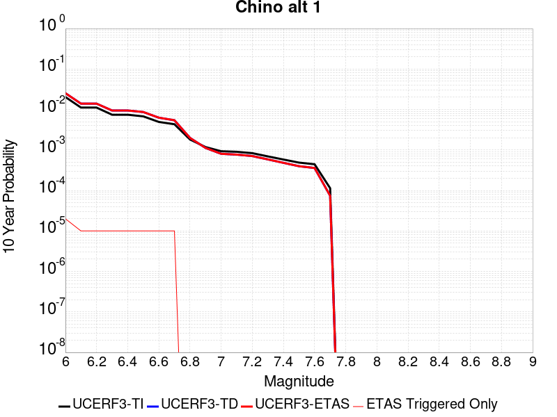 |

| Magnitude | 1 wk TI Prob | 1 wk TD Prob | 1 wk ETAS Prob | 1 wk ETAS/TD Gain | 1 wk ETAS Triggered Only | 1 mo TI Prob | 1 mo TD Prob | 1 mo ETAS Prob | 1 mo ETAS/TD Gain | 1 mo ETAS Triggered Only | 1 yr TI Prob | 1 yr TD Prob | 1 yr ETAS Prob | 1 yr ETAS/TD Gain | 1 yr ETAS Triggered Only | 10 yr TI Prob | 10 yr TD Prob | 10 yr ETAS Prob | 10 yr ETAS/TD Gain | 10 yr ETAS Triggered Only |
|-----|-----|-----|-----|-----|-----|-----|-----|-----|-----|-----|-----|-----|-----|-----|-----|-----|-----|-----|-----|-----|
| 6.0 | 3.939946E-5 | 4.8956157E-5 | 4.8956157E-5 | 1.0 | 0.0 | 1.6884391E-4 | 2.0979813E-4 | 2.0979813E-4 | 1.0 | 0.0 | 0.0020537362 | 0.002551809 | 0.0025717579 | 1.0078176 | 2.0E-5 | 0.020348595 | 0.025279585 | 0.02529908 | 1.0007712 | 2.0E-5 |
| 6.1 | 2.1505624E-5 | 2.6884254E-5 | 2.6884254E-5 | 1.0 | 0.0 | 9.2163704E-5 | 1.1521374E-4 | 1.1521374E-4 | 1.0 | 0.0 | 0.0011215154 | 0.0014019344 | 0.0014119203 | 1.007123 | 1.0E-5 | 0.011158722 | 0.01394543 | 0.01395529 | 1.000707 | 1.0E-5 |
| 6.2 | 2.1505624E-5 | 2.6884254E-5 | 2.6884254E-5 | 1.0 | 0.0 | 9.2163704E-5 | 1.1521374E-4 | 1.1521374E-4 | 1.0 | 0.0 | 0.0011215154 | 0.0014019344 | 0.0014119203 | 1.007123 | 1.0E-5 | 0.011158722 | 0.01394543 | 0.01395529 | 1.000707 | 1.0E-5 |
| 6.3 | 1.4290785E-5 | 1.81693E-5 | 1.81693E-5 | 1.0 | 0.0 | 6.1244784E-5 | 7.786636E-5 | 7.786636E-5 | 1.0 | 0.0 | 7.454001E-4 | 9.476558E-4 | 9.5764635E-4 | 1.0105424 | 1.0E-5 | 0.007429048 | 0.009444239 | 0.009454144 | 1.0010488 | 1.0E-5 |
| 6.4 | 1.4290785E-5 | 1.81693E-5 | 1.81693E-5 | 1.0 | 0.0 | 6.1244784E-5 | 7.786636E-5 | 7.786636E-5 | 1.0 | 0.0 | 7.454001E-4 | 9.476558E-4 | 9.5764635E-4 | 1.0105424 | 1.0E-5 | 0.007429048 | 0.009444239 | 0.009454144 | 1.0010488 | 1.0E-5 |
| 6.5 | 1.3017944E-5 | 1.6656108E-5 | 1.6656108E-5 | 1.0 | 0.0 | 5.5789995E-5 | 7.138161E-5 | 7.138161E-5 | 1.0 | 0.0 | 6.790315E-4 | 8.687684E-4 | 8.787597E-4 | 1.0115006 | 1.0E-5 | 0.0067696036 | 0.008661652 | 0.008671565 | 1.0011445 | 1.0E-5 |
| 6.6 | 9.470016E-6 | 1.204242E-5 | 1.204242E-5 | 1.0 | 0.0 | 4.058515E-5 | 5.1609542E-5 | 5.1609542E-5 | 1.0 | 0.0 | 4.940122E-4 | 6.2819896E-4 | 6.381927E-4 | 1.0159085 | 1.0E-5 | 0.004929154 | 0.00627157 | 0.006281507 | 1.0015845 | 1.0E-5 |
| 6.7 | 8.314155E-6 | 1.04104065E-5 | 1.04104065E-5 | 1.0 | 0.0 | 3.5631605E-5 | 4.4615444E-5 | 4.4615444E-5 | 1.0 | 0.0 | 4.3372845E-4 | 5.4308993E-4 | 5.530845E-4 | 1.0184032 | 1.0E-5 | 0.004328829 | 0.005425105 | 0.0054350505 | 1.0018333 | 1.0E-5 |
| 6.8 | 3.4856364E-6 | 3.8139972E-6 | 3.8139972E-6 | 1.0 | 0.0 | 1.4938357E-5 | 1.6345612E-5 | 1.6345612E-5 | 1.0 | 0.0 | 1.8185932E-4 | 1.9899172E-4 | 1.9899172E-4 | 1.0 | 0.0 | 0.0018171056 | 0.001989816 | 0.001989816 | 1.0 | 0.0 |
| 6.9 | 2.2645952E-6 | 2.1532255E-6 | 2.1532255E-6 | 1.0 | 0.0 | 9.705372E-6 | 9.228078E-6 | 9.228078E-6 | 1.0 | 0.0 | 1.18156495E-4 | 1.1234627E-4 | 1.1234627E-4 | 1.0 | 0.0 | 0.0011809369 | 0.0011235173 | 0.0011235173 | 1.0 | 0.0 |
| 7.0 | 1.7864003E-6 | 1.5433253E-6 | 1.5433253E-6 | 1.0 | 0.0 | 7.655979E-6 | 6.614235E-6 | 6.614235E-6 | 1.0 | 0.0 | 9.3207556E-5 | 8.0525395E-5 | 8.0525395E-5 | 1.0 | 0.0 | 9.316847E-4 | 8.0545404E-4 | 8.0545404E-4 | 1.0 | 0.0 |
| 7.1 | 1.7315456E-6 | 1.4735895E-6 | 1.4735895E-6 | 1.0 | 0.0 | 7.420889E-6 | 6.3153684E-6 | 6.3153684E-6 | 1.0 | 0.0 | 9.034557E-5 | 7.688695E-5 | 7.688695E-5 | 1.0 | 0.0 | 9.0308854E-4 | 7.6908193E-4 | 7.6908193E-4 | 1.0 | 0.0 |
| 7.2 | 1.6008337E-6 | 1.3576248E-6 | 1.3576248E-6 | 1.0 | 0.0 | 6.860698E-6 | 5.818379E-6 | 5.818379E-6 | 1.0 | 0.0 | 8.352579E-5 | 7.083652E-5 | 7.083652E-5 | 1.0 | 0.0 | 8.34944E-4 | 7.086046E-4 | 7.086046E-4 | 1.0 | 0.0 |
| 7.3 | 1.3320939E-6 | 1.1219453E-6 | 1.1219453E-6 | 1.0 | 0.0 | 5.7089615E-6 | 4.8083284E-6 | 4.8083284E-6 | 1.0 | 0.0 | 6.9504385E-5 | 5.8539874E-5 | 5.8539874E-5 | 1.0 | 0.0 | 6.9482654E-4 | 5.854161E-4 | 5.854161E-4 | 1.0 | 0.0 |
| 7.4 | 1.114294E-6 | 9.2384E-7 | 9.2384E-7 | 1.0 | 0.0 | 4.775537E-6 | 3.9593083E-6 | 3.9593083E-6 | 1.0 | 0.0 | 5.8140613E-5 | 4.820355E-5 | 4.820355E-5 | 1.0 | 0.0 | 5.81254E-4 | 4.8194567E-4 | 4.8194567E-4 | 1.0 | 0.0 |
| 7.5 | 9.354081E-7 | 7.6244334E-7 | 7.6244334E-7 | 1.0 | 0.0 | 4.0088858E-6 | 3.2676103E-6 | 3.2676103E-6 | 1.0 | 0.0 | 4.8807087E-5 | 3.9782462E-5 | 3.9782462E-5 | 1.0 | 0.0 | 4.879637E-4 | 3.977568E-4 | 3.977568E-4 | 1.0 | 0.0 |
| 7.6 | 8.521771E-7 | 6.881599E-7 | 6.881599E-7 | 1.0 | 0.0 | 3.6521824E-6 | 2.9492537E-6 | 2.9492537E-6 | 1.0 | 0.0 | 4.4464414E-5 | 3.5906603E-5 | 3.5906603E-5 | 1.0 | 0.0 | 4.4455516E-4 | 3.590112E-4 | 3.590112E-4 | 1.0 | 0.0 |
| 7.7 | 2.1803626E-7 | 1.4188254E-7 | 1.4188254E-7 | 1.0 | 0.0 | 9.344408E-7 | 6.08068E-7 | 6.08068E-7 | 1.0 | 0.0 | 1.1376757E-5 | 7.403212E-6 | 7.403212E-6 | 1.0 | 0.0 | 1.13761744E-4 | 7.403061E-5 | 7.403061E-5 | 1.0 | 0.0 |

## Concord 2011 CFM
*[(top)](#table-of-contents)*

| 1 Week | 1 Month | 1 Year | 10 Year |
|-----|-----|-----|-----|
|  |  |  |  |

| Magnitude | 1 wk TI Prob | 1 wk TD Prob | 1 wk ETAS Prob | 1 wk ETAS/TD Gain | 1 wk ETAS Triggered Only | 1 mo TI Prob | 1 mo TD Prob | 1 mo ETAS Prob | 1 mo ETAS/TD Gain | 1 mo ETAS Triggered Only | 1 yr TI Prob | 1 yr TD Prob | 1 yr ETAS Prob | 1 yr ETAS/TD Gain | 1 yr ETAS Triggered Only | 10 yr TI Prob | 10 yr TD Prob | 10 yr ETAS Prob | 10 yr ETAS/TD Gain | 10 yr ETAS Triggered Only |
|-----|-----|-----|-----|-----|-----|-----|-----|-----|-----|-----|-----|-----|-----|-----|-----|-----|-----|-----|-----|-----|
| 6.0 | 5.7865112E-5 | 9.759204E-5 | 9.759204E-5 | 1.0 | 0.0 | 2.4796976E-4 | 4.1818546E-4 | 4.1818546E-4 | 1.0 | 0.0 | 0.0030148525 | 0.005080033 | 0.005080033 | 1.0 | 0.0 | 0.029742775 | 0.049247675 | 0.04926669 | 1.0003861 | 2.0E-5 |
| 6.1 | 5.7865112E-5 | 9.759204E-5 | 9.759204E-5 | 1.0 | 0.0 | 2.4796976E-4 | 4.1818546E-4 | 4.1818546E-4 | 1.0 | 0.0 | 0.0030148525 | 0.005080033 | 0.005080033 | 1.0 | 0.0 | 0.029742775 | 0.049247675 | 0.04926669 | 1.0003861 | 2.0E-5 |
| 6.2 | 5.6789337E-5 | 9.579413E-5 | 9.579413E-5 | 1.0 | 0.0 | 2.4336016E-4 | 4.1048354E-4 | 4.1048354E-4 | 1.0 | 0.0 | 0.0029588845 | 0.0049867434 | 0.0049867434 | 1.0 | 0.0 | 0.029197963 | 0.048364118 | 0.04838315 | 1.0003935 | 2.0E-5 |
| 6.3 | 5.203322E-5 | 8.8036155E-5 | 8.8036155E-5 | 1.0 | 0.0 | 2.2298045E-4 | 3.7724766E-4 | 3.7724766E-4 | 1.0 | 0.0 | 0.0027114071 | 0.004584101 | 0.004584101 | 1.0 | 0.0 | 0.026785625 | 0.044533722 | 0.044552833 | 1.0004292 | 2.0E-5 |
| 6.4 | 4.7120942E-5 | 7.897909E-5 | 7.897909E-5 | 1.0 | 0.0 | 2.0193127E-4 | 3.384421E-4 | 3.384421E-4 | 1.0 | 0.0 | 0.0024557412 | 0.0041134926 | 0.0041134926 | 1.0 | 0.0 | 0.024287801 | 0.04006376 | 0.04007336 | 1.0002396 | 1.0E-5 |
| 6.5 | 2.9598437E-5 | 4.6677585E-5 | 4.6677585E-5 | 1.0 | 0.0 | 1.2684427E-4 | 2.0003263E-4 | 2.0003263E-4 | 1.0 | 0.0 | 0.001543235 | 0.0024328877 | 0.0024328877 | 1.0 | 0.0 | 0.015325619 | 0.023909245 | 0.023919005 | 1.0004083 | 1.0E-5 |
| 6.6 | 2.0443718E-5 | 2.998628E-5 | 2.998628E-5 | 1.0 | 0.0 | 8.7613E-5 | 1.2850651E-4 | 1.2850651E-4 | 1.0 | 0.0 | 0.0010661662 | 0.0015634801 | 0.0015634801 | 1.0 | 0.0 | 0.010610655 | 0.015467011 | 0.015467011 | 1.0 | 0.0 |
| 6.7 | 1.798539E-5 | 2.5559208E-5 | 2.5559208E-5 | 1.0 | 0.0 | 7.7077966E-5 | 1.0953499E-4 | 1.0953499E-4 | 1.0 | 0.0 | 9.380202E-4 | 0.0013327942 | 0.0013327942 | 1.0 | 0.0 | 0.009340706 | 0.013217039 | 0.013217039 | 1.0 | 0.0 |
| 6.8 | 1.613555E-5 | 2.1960821E-5 | 2.1960821E-5 | 1.0 | 0.0 | 6.915052E-5 | 9.411448E-5 | 9.411448E-5 | 1.0 | 0.0 | 8.4158237E-4 | 0.0011452555 | 0.0011452555 | 1.0 | 0.0 | 0.008384023 | 0.011377631 | 0.011377631 | 1.0 | 0.0 |
| 6.9 | 1.2916435E-5 | 1.7082351E-5 | 1.7082351E-5 | 1.0 | 0.0 | 5.5354973E-5 | 7.320806E-5 | 7.320806E-5 | 1.0 | 0.0 | 6.7373837E-4 | 8.9094945E-4 | 8.9094945E-4 | 1.0 | 0.0 | 0.006716994 | 0.008867762 | 0.008867762 | 1.0 | 0.0 |
| 7.0 | 9.81129E-6 | 1.2631897E-5 | 1.2631897E-5 | 1.0 | 0.0 | 4.2047708E-5 | 5.4135588E-5 | 5.4135588E-5 | 1.0 | 0.0 | 5.118106E-4 | 6.589031E-4 | 6.589031E-4 | 1.0 | 0.0 | 0.005106334 | 0.006569628 | 0.006569628 | 1.0 | 0.0 |
| 7.1 | 8.0889195E-6 | 1.0419219E-5 | 1.0419219E-5 | 1.0 | 0.0 | 3.4666336E-5 | 4.4653036E-5 | 4.4653036E-5 | 1.0 | 0.0 | 4.219809E-4 | 5.435162E-4 | 5.435162E-4 | 1.0 | 0.0 | 0.004211805 | 0.0054224827 | 0.0054224827 | 1.0 | 0.0 |
| 7.2 | 6.267438E-6 | 8.116534E-6 | 8.116534E-6 | 1.0 | 0.0 | 2.6860173E-5 | 3.478469E-5 | 3.478469E-5 | 1.0 | 0.0 | 3.2697353E-4 | 4.2342203E-4 | 4.2342203E-4 | 1.0 | 0.0 | 0.0032649285 | 0.0042266464 | 0.0042266464 | 1.0 | 0.0 |
| 7.3 | 3.6761196E-6 | 4.8407924E-6 | 4.8407924E-6 | 1.0 | 0.0 | 1.5754704E-5 | 2.074609E-5 | 2.074609E-5 | 1.0 | 0.0 | 1.9179663E-4 | 2.5255457E-4 | 2.5255457E-4 | 1.0 | 0.0 | 0.0019163118 | 0.0025228467 | 0.0025228467 | 1.0 | 0.0 |
| 7.4 | 2.8044356E-6 | 3.7101668E-6 | 3.7101668E-6 | 1.0 | 0.0 | 1.2018954E-5 | 1.590062E-5 | 1.590062E-5 | 1.0 | 0.0 | 1.4632095E-4 | 1.9357295E-4 | 1.9357295E-4 | 1.0 | 0.0 | 0.0014622464 | 0.0019342388 | 0.0019342388 | 1.0 | 0.0 |
| 7.5 | 2.4578699E-6 | 3.2451574E-6 | 3.2451574E-6 | 1.0 | 0.0 | 1.0533685E-5 | 1.3907744E-5 | 1.3907744E-5 | 1.0 | 0.0 | 1.2824008E-4 | 1.6931373E-4 | 1.6931373E-4 | 1.0 | 0.0 | 0.0012816609 | 0.0016920205 | 0.0016920205 | 1.0 | 0.0 |
| 7.6 | 1.7713267E-6 | 2.335325E-6 | 2.335325E-6 | 1.0 | 0.0 | 7.591378E-6 | 1.0008497E-5 | 1.0008497E-5 | 1.0 | 0.0 | 9.2421105E-5 | 1.2184674E-4 | 1.2184674E-4 | 1.0 | 0.0 | 9.2382677E-4 | 0.0012179035 | 0.0012179035 | 1.0 | 0.0 |
| 7.7 | 5.1912366E-7 | 6.8294605E-7 | 6.8294605E-7 | 1.0 | 0.0 | 2.2248137E-6 | 2.9269083E-6 | 2.9269083E-6 | 1.0 | 0.0 | 2.708677E-5 | 3.563454E-5 | 3.563454E-5 | 1.0 | 0.0 | 2.708347E-4 | 3.562774E-4 | 3.562774E-4 | 1.0 | 0.0 |

## Elsinore (Temecula) rev
*[(top)](#table-of-contents)*

| 1 Week | 1 Month | 1 Year | 10 Year |
|-----|-----|-----|-----|
|  |  |  |  |

| Magnitude | 1 wk TI Prob | 1 wk TD Prob | 1 wk ETAS Prob | 1 wk ETAS/TD Gain | 1 wk ETAS Triggered Only | 1 mo TI Prob | 1 mo TD Prob | 1 mo ETAS Prob | 1 mo ETAS/TD Gain | 1 mo ETAS Triggered Only | 1 yr TI Prob | 1 yr TD Prob | 1 yr ETAS Prob | 1 yr ETAS/TD Gain | 1 yr ETAS Triggered Only | 10 yr TI Prob | 10 yr TD Prob | 10 yr ETAS Prob | 10 yr ETAS/TD Gain | 10 yr ETAS Triggered Only |
|-----|-----|-----|-----|-----|-----|-----|-----|-----|-----|-----|-----|-----|-----|-----|-----|-----|-----|-----|-----|-----|
| 6.0 | 2.9514995E-5 | 2.2524138E-5 | 2.2524138E-5 | 1.0 | 0.0 | 1.264867E-4 | 9.652858E-5 | 9.652858E-5 | 1.0 | 0.0 | 0.0015388876 | 0.0011746238 | 0.0011946004 | 1.0170068 | 2.0E-5 | 0.015282745 | 0.0116978055 | 0.011717572 | 1.0016897 | 2.0E-5 |
| 6.1 | 2.9514995E-5 | 2.2524138E-5 | 2.2524138E-5 | 1.0 | 0.0 | 1.264867E-4 | 9.652858E-5 | 9.652858E-5 | 1.0 | 0.0 | 0.0015388876 | 0.0011746238 | 0.0011946004 | 1.0170068 | 2.0E-5 | 0.015282745 | 0.0116978055 | 0.011717572 | 1.0016897 | 2.0E-5 |
| 6.2 | 2.9514995E-5 | 2.2524138E-5 | 2.2524138E-5 | 1.0 | 0.0 | 1.264867E-4 | 9.652858E-5 | 9.652858E-5 | 1.0 | 0.0 | 0.0015388876 | 0.0011746238 | 0.0011946004 | 1.0170068 | 2.0E-5 | 0.015282745 | 0.0116978055 | 0.011717572 | 1.0016897 | 2.0E-5 |
| 6.3 | 2.3223649E-5 | 1.8411085E-5 | 1.8411085E-5 | 1.0 | 0.0 | 9.952613E-5 | 7.890236E-5 | 7.890236E-5 | 1.0 | 0.0 | 0.001211057 | 9.6023E-4 | 9.802108E-4 | 1.0208083 | 2.0E-5 | 0.012044783 | 0.0095697455 | 0.009589555 | 1.00207 | 2.0E-5 |
| 6.4 | 2.3223649E-5 | 1.8411085E-5 | 1.8411085E-5 | 1.0 | 0.0 | 9.952613E-5 | 7.890236E-5 | 7.890236E-5 | 1.0 | 0.0 | 0.001211057 | 9.6023E-4 | 9.802108E-4 | 1.0208083 | 2.0E-5 | 0.012044783 | 0.0095697455 | 0.009589555 | 1.00207 | 2.0E-5 |
| 6.5 | 1.8338875E-5 | 1.47526835E-5 | 1.47526835E-5 | 1.0 | 0.0 | 7.8592806E-5 | 6.32243E-5 | 6.32243E-5 | 1.0 | 0.0 | 9.5644733E-4 | 7.694928E-4 | 7.8947743E-4 | 1.0259712 | 2.0E-5 | 0.009523412 | 0.0076718247 | 0.007691671 | 1.002587 | 2.0E-5 |
| 6.6 | 1.8223333E-5 | 1.4615226E-5 | 1.4615226E-5 | 1.0 | 0.0 | 7.809766E-5 | 6.263523E-5 | 6.263523E-5 | 1.0 | 0.0 | 9.504242E-4 | 7.623258E-4 | 7.823106E-4 | 1.0262156 | 2.0E-5 | 0.009463696 | 0.0076006465 | 0.0076204943 | 1.0026114 | 2.0E-5 |
| 6.7 | 1.7512752E-5 | 1.4029559E-5 | 1.4029559E-5 | 1.0 | 0.0 | 7.505249E-5 | 6.012534E-5 | 6.012534E-5 | 1.0 | 0.0 | 9.13381E-4 | 7.3178875E-4 | 7.4178143E-4 | 1.0136552 | 1.0E-5 | 0.00909636 | 0.0073001822 | 0.007310109 | 1.0013598 | 1.0E-5 |
| 6.8 | 1.7417142E-5 | 1.3953522E-5 | 1.3953522E-5 | 1.0 | 0.0 | 7.4642754E-5 | 5.9799488E-5 | 5.9799488E-5 | 1.0 | 0.0 | 9.083966E-4 | 7.278241E-4 | 7.3781685E-4 | 1.0137296 | 1.0E-5 | 0.009046922 | 0.0072607356 | 0.007270663 | 1.0013673 | 1.0E-5 |
| 6.9 | 1.6402591E-5 | 1.2990858E-5 | 1.2990858E-5 | 1.0 | 0.0 | 7.0294926E-5 | 5.5673958E-5 | 5.5673958E-5 | 1.0 | 0.0 | 8.5550465E-4 | 6.7762734E-4 | 6.8762054E-4 | 1.0147474 | 1.0E-5 | 0.008522186 | 0.0067611905 | 0.0067711226 | 1.001469 | 1.0E-5 |
| 7.0 | 1.3912486E-5 | 1.0880293E-5 | 1.0880293E-5 | 1.0 | 0.0 | 5.9623577E-5 | 4.662901E-5 | 4.662901E-5 | 1.0 | 0.0 | 7.2567526E-4 | 5.6756305E-4 | 5.7755737E-4 | 1.0176092 | 1.0E-5 | 0.0072331014 | 0.0056650066 | 0.00567495 | 1.0017552 | 1.0E-5 |
| 7.1 | 1.3405147E-5 | 1.0329356E-5 | 1.0329356E-5 | 1.0 | 0.0 | 5.7449364E-5 | 4.426793E-5 | 4.426793E-5 | 1.0 | 0.0 | 6.9922156E-4 | 5.3883134E-4 | 5.4882595E-4 | 1.0185487 | 1.0E-5 | 0.0069702556 | 0.005378547 | 0.0053884936 | 1.0018493 | 1.0E-5 |
| 7.2 | 1.21402E-5 | 8.998374E-6 | 8.998374E-6 | 1.0 | 0.0 | 5.202839E-5 | 3.8563903E-5 | 3.8563903E-5 | 1.0 | 0.0 | 6.332616E-4 | 4.6941615E-4 | 4.7941145E-4 | 1.021293 | 1.0E-5 | 0.0063146 | 0.00468569 | 0.004695643 | 1.0021242 | 1.0E-5 |
| 7.3 | 1.05047775E-5 | 7.57314E-6 | 7.57314E-6 | 1.0 | 0.0 | 4.5019697E-5 | 3.245592E-5 | 3.245592E-5 | 1.0 | 0.0 | 5.4797693E-4 | 3.9508063E-4 | 3.9508063E-4 | 1.0 | 0.0 | 0.005466277 | 0.0039441846 | 0.0039441846 | 1.0 | 0.0 |
| 7.4 | 9.624483E-6 | 6.788087E-6 | 6.788087E-6 | 1.0 | 0.0 | 4.124713E-5 | 2.9091485E-5 | 2.9091485E-5 | 1.0 | 0.0 | 5.0206814E-4 | 3.5413264E-4 | 3.5413264E-4 | 1.0 | 0.0 | 0.005009353 | 0.003535835 | 0.003535835 | 1.0 | 0.0 |
| 7.5 | 8.215151E-6 | 5.6364843E-6 | 5.6364843E-6 | 1.0 | 0.0 | 3.5207315E-5 | 2.4156145E-5 | 2.4156145E-5 | 1.0 | 0.0 | 4.2856473E-4 | 2.9406266E-4 | 2.9406266E-4 | 1.0 | 0.0 | 0.004277392 | 0.0029368633 | 0.0029368633 | 1.0 | 0.0 |
| 7.6 | 6.975058E-6 | 4.676863E-6 | 4.676863E-6 | 1.0 | 0.0 | 2.9892764E-5 | 2.0043552E-5 | 2.0043552E-5 | 1.0 | 0.0 | 3.6388362E-4 | 2.4400408E-4 | 2.4400408E-4 | 1.0 | 0.0 | 0.0036328835 | 0.002437478 | 0.002437478 | 1.0 | 0.0 |
| 7.7 | 4.159604E-6 | 2.3274965E-6 | 2.3274965E-6 | 1.0 | 0.0 | 1.7826753E-5 | 9.974951E-6 | 9.974951E-6 | 1.0 | 0.0 | 2.1701909E-4 | 1.2143901E-4 | 1.2143901E-4 | 1.0 | 0.0 | 0.0021680726 | 0.0012137996 | 0.0012137996 | 1.0 | 0.0 |
| 7.8 | 2.2692414E-7 | 9.38645E-8 | 9.38645E-8 | 1.0 | 0.0 | 9.725317E-7 | 4.0227638E-7 | 4.0227638E-7 | 1.0 | 0.0 | 1.1840509E-5 | 4.8977076E-6 | 4.8977076E-6 | 1.0 | 0.0 | 1.1839878E-4 | 4.8976322E-5 | 4.8976322E-5 | 1.0 | 0.0 |
| 7.9 | 6.676829E-9 | 3.4402008E-9 | 3.4402008E-9 | 1.0 | 0.0 | 2.861498E-8 | 1.4743718E-8 | 1.4743718E-8 | 1.0 | 0.0 | 3.4838732E-7 | 1.7950475E-7 | 1.7950475E-7 | 1.0 | 0.0 | 3.4838679E-6 | 1.7950463E-6 | 1.7950463E-6 | 1.0 | 0.0 |

## Santa Cruz Island
*[(top)](#table-of-contents)*

| 1 Week | 1 Month | 1 Year | 10 Year |
|-----|-----|-----|-----|
|  |  |  |  |

| Magnitude | 1 wk TI Prob | 1 wk TD Prob | 1 wk ETAS Prob | 1 wk ETAS/TD Gain | 1 wk ETAS Triggered Only | 1 mo TI Prob | 1 mo TD Prob | 1 mo ETAS Prob | 1 mo ETAS/TD Gain | 1 mo ETAS Triggered Only | 1 yr TI Prob | 1 yr TD Prob | 1 yr ETAS Prob | 1 yr ETAS/TD Gain | 1 yr ETAS Triggered Only | 10 yr TI Prob | 10 yr TD Prob | 10 yr ETAS Prob | 10 yr ETAS/TD Gain | 10 yr ETAS Triggered Only |
|-----|-----|-----|-----|-----|-----|-----|-----|-----|-----|-----|-----|-----|-----|-----|-----|-----|-----|-----|-----|-----|
| 6.0 | 2.9164563E-5 | 3.1601154E-5 | 3.1601154E-5 | 1.0 | 0.0 | 1.2498499E-4 | 1.3542725E-4 | 1.3542725E-4 | 1.0 | 0.0 | 0.0015206301 | 0.001647716 | 0.0016576996 | 1.006059 | 1.0E-5 | 0.015102667 | 0.016368724 | 0.016388398 | 1.0012019 | 2.0E-5 |
| 6.1 | 2.9164563E-5 | 3.1601154E-5 | 3.1601154E-5 | 1.0 | 0.0 | 1.2498499E-4 | 1.3542725E-4 | 1.3542725E-4 | 1.0 | 0.0 | 0.0015206301 | 0.001647716 | 0.0016576996 | 1.006059 | 1.0E-5 | 0.015102667 | 0.016368724 | 0.016388398 | 1.0012019 | 2.0E-5 |
| 6.2 | 2.9164563E-5 | 3.1601154E-5 | 3.1601154E-5 | 1.0 | 0.0 | 1.2498499E-4 | 1.3542725E-4 | 1.3542725E-4 | 1.0 | 0.0 | 0.0015206301 | 0.001647716 | 0.0016576996 | 1.006059 | 1.0E-5 | 0.015102667 | 0.016368724 | 0.016388398 | 1.0012019 | 2.0E-5 |
| 6.3 | 1.6635553E-5 | 1.7805029E-5 | 1.7805029E-5 | 1.0 | 0.0 | 7.1293274E-5 | 7.6305136E-5 | 7.6305136E-5 | 1.0 | 0.0 | 8.6765E-4 | 9.286373E-4 | 9.38628E-4 | 1.0107585 | 1.0E-5 | 0.008642701 | 0.00924944 | 0.009259348 | 1.0010711 | 1.0E-5 |
| 6.4 | 1.6635553E-5 | 1.7805029E-5 | 1.7805029E-5 | 1.0 | 0.0 | 7.1293274E-5 | 7.6305136E-5 | 7.6305136E-5 | 1.0 | 0.0 | 8.6765E-4 | 9.286373E-4 | 9.38628E-4 | 1.0107585 | 1.0E-5 | 0.008642701 | 0.00924944 | 0.009259348 | 1.0010711 | 1.0E-5 |
| 6.5 | 1.2238748E-5 | 1.30434555E-5 | 1.30434555E-5 | 1.0 | 0.0 | 5.2450723E-5 | 5.589935E-5 | 5.589935E-5 | 1.0 | 0.0 | 6.3840044E-4 | 6.803657E-4 | 6.803657E-4 | 1.0 | 0.0 | 0.0063656955 | 0.0067832265 | 0.0067832265 | 1.0 | 0.0 |
| 6.6 | 1.0489767E-5 | 1.1157017E-5 | 1.1157017E-5 | 1.0 | 0.0 | 4.495537E-5 | 4.7814923E-5 | 4.7814923E-5 | 1.0 | 0.0 | 5.4719415E-4 | 5.8199343E-4 | 5.8199343E-4 | 1.0 | 0.0 | 0.005458487 | 0.0058049336 | 0.0058049336 | 1.0 | 0.0 |
| 6.7 | 8.699222E-6 | 9.23709E-6 | 9.23709E-6 | 1.0 | 0.0 | 3.7281847E-5 | 3.9586932E-5 | 3.9586932E-5 | 1.0 | 0.0 | 4.5381195E-4 | 4.8186484E-4 | 4.8186484E-4 | 1.0 | 0.0 | 0.0045288634 | 0.0048082676 | 0.0048082676 | 1.0 | 0.0 |
| 6.8 | 8.307732E-6 | 8.8171955E-6 | 8.8171955E-6 | 1.0 | 0.0 | 3.560408E-5 | 3.778744E-5 | 3.778744E-5 | 1.0 | 0.0 | 4.3339343E-4 | 4.5996535E-4 | 4.5996535E-4 | 1.0 | 0.0 | 0.004325492 | 0.0045901868 | 0.0045901868 | 1.0 | 0.0 |
| 6.9 | 8.073121E-6 | 8.565221E-6 | 8.565221E-6 | 1.0 | 0.0 | 3.459863E-5 | 3.6707574E-5 | 3.6707574E-5 | 1.0 | 0.0 | 4.2115687E-4 | 4.4682348E-4 | 4.4682348E-4 | 1.0 | 0.0 | 0.004203596 | 0.0044593024 | 0.0044593024 | 1.0 | 0.0 |
| 7.0 | 7.617019E-6 | 8.074926E-6 | 8.074926E-6 | 1.0 | 0.0 | 3.264396E-5 | 3.460637E-5 | 3.460637E-5 | 1.0 | 0.0 | 3.9736772E-4 | 4.212515E-4 | 4.212515E-4 | 1.0 | 0.0 | 0.003966579 | 0.0042045773 | 0.0042045773 | 1.0 | 0.0 |
| 7.1 | 7.1224836E-6 | 7.5460302E-6 | 7.5460302E-6 | 1.0 | 0.0 | 3.052457E-5 | 3.2339733E-5 | 3.2339733E-5 | 1.0 | 0.0 | 3.715733E-4 | 3.9366545E-4 | 3.9366545E-4 | 1.0 | 0.0 | 0.003709526 | 0.003929724 | 0.003929724 | 1.0 | 0.0 |
| 7.2 | 6.441115E-6 | 6.827605E-6 | 6.827605E-6 | 1.0 | 0.0 | 2.7604487E-5 | 2.9260838E-5 | 2.9260838E-5 | 1.0 | 0.0 | 3.360328E-4 | 3.561927E-4 | 3.561927E-4 | 1.0 | 0.0 | 0.0033552512 | 0.0035562462 | 0.0035562462 | 1.0 | 0.0 |
| 7.3 | 5.494274E-6 | 5.8201817E-6 | 5.8201817E-6 | 1.0 | 0.0 | 2.3546674E-5 | 2.4943398E-5 | 2.4943398E-5 | 1.0 | 0.0 | 2.8664304E-4 | 3.0364376E-4 | 3.0364376E-4 | 1.0 | 0.0 | 0.002862736 | 0.0030323118 | 0.0030323118 | 1.0 | 0.0 |
| 7.4 | 4.0802624E-6 | 4.3123905E-6 | 4.3123905E-6 | 1.0 | 0.0 | 1.7486722E-5 | 1.8481544E-5 | 1.8481544E-5 | 1.0 | 0.0 | 2.1288003E-4 | 2.2498962E-4 | 2.2498962E-4 | 1.0 | 0.0 | 0.0021267622 | 0.0022476274 | 0.0022476274 | 1.0 | 0.0 |
| 7.5 | 2.3584746E-6 | 2.4753786E-6 | 2.4753786E-6 | 1.0 | 0.0 | 1.0107709E-5 | 1.0608722E-5 | 1.0608722E-5 | 1.0 | 0.0 | 1.2305441E-4 | 1.2915359E-4 | 1.2915359E-4 | 1.0 | 0.0 | 0.0012298629 | 0.0012907903 | 0.0012907903 | 1.0 | 0.0 |
| 7.6 | 9.4981914E-7 | 9.861163E-7 | 9.861163E-7 | 1.0 | 0.0 | 4.0706473E-6 | 4.226206E-6 | 4.226206E-6 | 1.0 | 0.0 | 4.9559E-5 | 5.1452855E-5 | 5.1452855E-5 | 1.0 | 0.0 | 4.954795E-4 | 5.144107E-4 | 5.144107E-4 | 1.0 | 0.0 |
| 7.7 | 2.6013532E-7 | 2.6417084E-7 | 2.6417084E-7 | 1.0 | 0.0 | 1.1148652E-6 | 1.1321602E-6 | 1.1321602E-6 | 1.0 | 0.0 | 1.3573399E-5 | 1.3783963E-5 | 1.3783963E-5 | 1.0 | 0.0 | 1.357257E-4 | 1.3783116E-4 | 1.3783116E-4 | 1.0 | 0.0 |
| 7.8 | 4.1522263E-8 | 3.965741E-8 | 3.965741E-8 | 1.0 | 0.0 | 1.7795254E-7 | 1.6996033E-7 | 1.6996033E-7 | 1.0 | 0.0 | 2.16657E-6 | 2.0692653E-6 | 2.0692653E-6 | 1.0 | 0.0 | 2.1665488E-5 | 2.0692481E-5 | 2.0692481E-5 | 1.0 | 0.0 |
| 7.9 | 7.7242046E-10 | 5.947626E-10 | 5.947626E-10 | 1.0 | 0.0 | 3.3103735E-9 | 2.548983E-9 | 2.548983E-9 | 1.0 | 0.0 | 4.0303796E-8 | 3.1033867E-8 | 3.1033867E-8 | 1.0 | 0.0 | 4.030379E-7 | 3.1033863E-7 | 3.1033863E-7 | 1.0 | 0.0 |

## Likely 2011 CFM
*[(top)](#table-of-contents)*

| 1 Week | 1 Month | 1 Year | 10 Year |
|-----|-----|-----|-----|
| 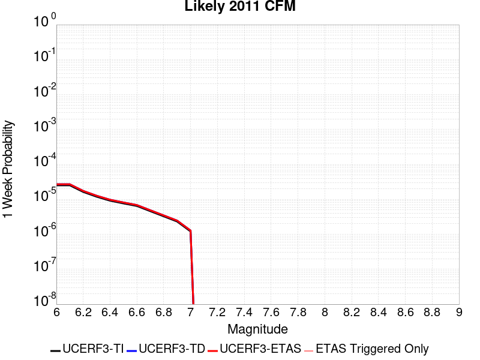 |  | 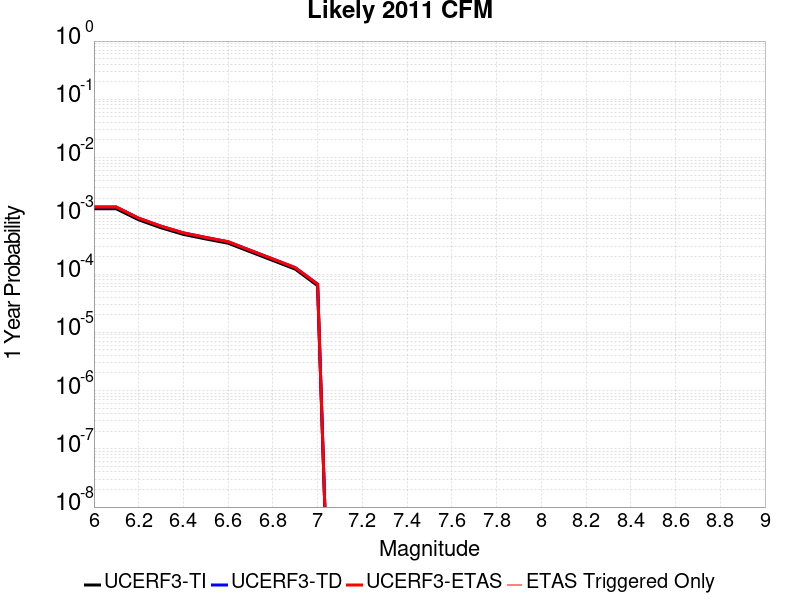 |  |

| Magnitude | 1 wk TI Prob | 1 wk TD Prob | 1 wk ETAS Prob | 1 wk ETAS/TD Gain | 1 wk ETAS Triggered Only | 1 mo TI Prob | 1 mo TD Prob | 1 mo ETAS Prob | 1 mo ETAS/TD Gain | 1 mo ETAS Triggered Only | 1 yr TI Prob | 1 yr TD Prob | 1 yr ETAS Prob | 1 yr ETAS/TD Gain | 1 yr ETAS Triggered Only | 10 yr TI Prob | 10 yr TD Prob | 10 yr ETAS Prob | 10 yr ETAS/TD Gain | 10 yr ETAS Triggered Only |
|-----|-----|-----|-----|-----|-----|-----|-----|-----|-----|-----|-----|-----|-----|-----|-----|-----|-----|-----|-----|-----|
| 6.0 | 2.5315949E-5 | 2.7105765E-5 | 2.7105765E-5 | 1.0 | 0.0 | 1.0849241E-4 | 1.1616265E-4 | 1.1616265E-4 | 1.0 | 0.0 | 0.0013200947 | 0.0014134073 | 0.0014134073 | 1.0 | 0.0 | 0.013122803 | 0.014048834 | 0.014068553 | 1.0014036 | 2.0E-5 |
| 6.1 | 2.5315949E-5 | 2.7105765E-5 | 2.7105765E-5 | 1.0 | 0.0 | 1.0849241E-4 | 1.1616265E-4 | 1.1616265E-4 | 1.0 | 0.0 | 0.0013200947 | 0.0014134073 | 0.0014134073 | 1.0 | 0.0 | 0.013122803 | 0.014048834 | 0.014068553 | 1.0014036 | 2.0E-5 |
| 6.2 | 1.6375941E-5 | 1.746646E-5 | 1.746646E-5 | 1.0 | 0.0 | 7.0180715E-5 | 7.485418E-5 | 7.485418E-5 | 1.0 | 0.0 | 8.5411523E-4 | 9.109808E-4 | 9.109808E-4 | 1.0 | 0.0 | 0.008508399 | 0.009073752 | 0.0090935705 | 1.0021842 | 2.0E-5 |
| 6.3 | 1.1945543E-5 | 1.271302E-5 | 1.271302E-5 | 1.0 | 0.0 | 5.119418E-5 | 5.4483266E-5 | 5.4483266E-5 | 1.0 | 0.0 | 6.2311086E-4 | 6.631372E-4 | 6.631372E-4 | 1.0 | 0.0 | 0.0062136655 | 0.0066121393 | 0.0066320067 | 1.0030048 | 2.0E-5 |
| 6.4 | 9.192729E-6 | 9.768813E-6 | 9.768813E-6 | 1.0 | 0.0 | 3.939681E-5 | 4.1865682E-5 | 4.1865682E-5 | 1.0 | 0.0 | 4.7955062E-4 | 5.095982E-4 | 5.095982E-4 | 1.0 | 0.0 | 0.004785171 | 0.005084578 | 0.005104476 | 1.0039135 | 2.0E-5 |
| 6.5 | 7.67906E-6 | 8.152889E-6 | 8.152889E-6 | 1.0 | 0.0 | 3.2909844E-5 | 3.4940495E-5 | 3.4940495E-5 | 1.0 | 0.0 | 4.006037E-4 | 4.253194E-4 | 4.253194E-4 | 1.0 | 0.0 | 0.0039988225 | 0.0042452468 | 0.0042651617 | 1.0046911 | 2.0E-5 |
| 6.6 | 6.4884057E-6 | 6.8849736E-6 | 6.8849736E-6 | 1.0 | 0.0 | 2.7807157E-5 | 2.9506704E-5 | 2.9506704E-5 | 1.0 | 0.0 | 3.3849955E-4 | 3.5918635E-4 | 3.5918635E-4 | 1.0 | 0.0 | 0.003379844 | 0.0035862029 | 0.003606131 | 1.005557 | 2.0E-5 |
| 6.7 | 4.6060636E-6 | 4.8841976E-6 | 4.8841976E-6 | 1.0 | 0.0 | 1.9740122E-5 | 2.0932112E-5 | 2.0932112E-5 | 1.0 | 0.0 | 2.403095E-4 | 2.548195E-4 | 2.548195E-4 | 1.0 | 0.0 | 0.002400498 | 0.002545356 | 0.0025653052 | 1.0078374 | 2.0E-5 |
| 6.8 | 3.2795615E-6 | 3.4774844E-6 | 3.4774844E-6 | 1.0 | 0.0 | 1.4055187E-5 | 1.4903422E-5 | 1.4903422E-5 | 1.0 | 0.0 | 1.7110848E-4 | 1.8143462E-4 | 1.8143462E-4 | 1.0 | 0.0 | 0.0017097679 | 0.0018129202 | 0.001822902 | 1.0055059 | 1.0E-5 |
| 6.9 | 2.3289967E-6 | 2.4706364E-6 | 2.4706364E-6 | 1.0 | 0.0 | 9.981376E-6 | 1.0588402E-5 | 1.0588402E-5 | 1.0 | 0.0 | 1.2151648E-4 | 1.289066E-4 | 1.289066E-4 | 1.0 | 0.0 | 0.0012145005 | 0.0012883613 | 0.0012983483 | 1.0077518 | 1.0E-5 |
| 7.0 | 1.211292E-6 | 1.2864381E-6 | 1.2864381E-6 | 1.0 | 0.0 | 5.1912407E-6 | 5.513296E-6 | 5.513296E-6 | 1.0 | 0.0 | 6.320152E-5 | 6.7122615E-5 | 6.7122615E-5 | 1.0 | 0.0 | 6.3183554E-4 | 6.7105325E-4 | 6.7105325E-4 | 1.0 | 0.0 |

## Calaveras (Central) 2011 CFM
*[(top)](#table-of-contents)*

| 1 Week | 1 Month | 1 Year | 10 Year |
|-----|-----|-----|-----|
| 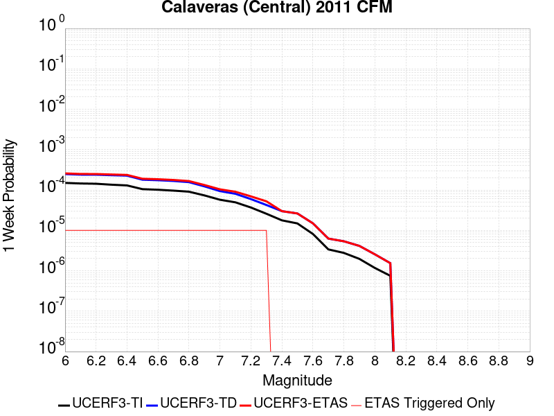 | 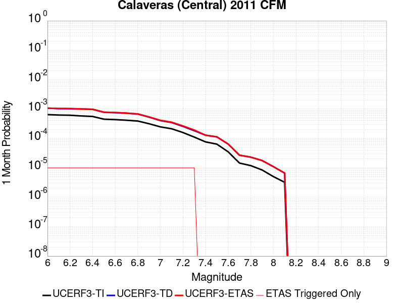 |  |  |

| Magnitude | 1 wk TI Prob | 1 wk TD Prob | 1 wk ETAS Prob | 1 wk ETAS/TD Gain | 1 wk ETAS Triggered Only | 1 mo TI Prob | 1 mo TD Prob | 1 mo ETAS Prob | 1 mo ETAS/TD Gain | 1 mo ETAS Triggered Only | 1 yr TI Prob | 1 yr TD Prob | 1 yr ETAS Prob | 1 yr ETAS/TD Gain | 1 yr ETAS Triggered Only | 10 yr TI Prob | 10 yr TD Prob | 10 yr ETAS Prob | 10 yr ETAS/TD Gain | 10 yr ETAS Triggered Only |
|-----|-----|-----|-----|-----|-----|-----|-----|-----|-----|-----|-----|-----|-----|-----|-----|-----|-----|-----|-----|-----|
| 6.0 | 1.5010907E-4 | 2.4819706E-4 | 2.5819457E-4 | 1.0402806 | 1.0E-5 | 6.4316596E-4 | 0.001063205 | 0.0010731943 | 1.0093955 | 1.0E-5 | 0.0078024664 | 0.012858907 | 0.012868779 | 1.0007677 | 1.0E-5 | 0.07534136 | 0.12048197 | 0.12049956 | 1.000146 | 2.0E-5 |
| 6.1 | 1.4521465E-4 | 2.3981159E-4 | 2.4980918E-4 | 1.0416894 | 1.0E-5 | 6.222001E-4 | 0.0010272958 | 0.0010372855 | 1.0097243 | 1.0E-5 | 0.0075490056 | 0.012428159 | 0.012438035 | 1.0007946 | 1.0E-5 | 0.07297657 | 0.11675321 | 0.11677088 | 1.0001513 | 2.0E-5 |
| 6.2 | 1.429998E-4 | 2.391228E-4 | 2.491204E-4 | 1.0418096 | 1.0E-5 | 6.127123E-4 | 0.0010243463 | 0.0010343362 | 1.0097523 | 1.0E-5 | 0.007434286 | 0.012392704 | 0.01240258 | 1.0007969 | 1.0E-5 | 0.07190444 | 0.1164066 | 0.11642427 | 1.0001518 | 2.0E-5 |
| 6.3 | 1.3536277E-4 | 2.3243108E-4 | 2.4242877E-4 | 1.0430135 | 1.0E-5 | 5.799972E-4 | 9.956934E-4 | 0.0010056834 | 1.0100332 | 1.0E-5 | 0.0070386264 | 0.012048675 | 0.012058554 | 1.0008199 | 1.0E-5 | 0.0681982 | 0.113317646 | 0.11333538 | 1.0001565 | 2.0E-5 |
| 6.4 | 1.2993296E-4 | 2.2666331E-4 | 2.3666104E-4 | 1.0441083 | 1.0E-5 | 5.5673666E-4 | 9.7099325E-4 | 9.809835E-4 | 1.0102887 | 1.0E-5 | 0.006757223 | 0.0117513 | 0.011761182 | 1.000841 | 1.0E-5 | 0.06555412 | 0.110593975 | 0.11061177 | 1.0001608 | 2.0E-5 |
| 6.5 | 1.0498927E-4 | 1.7996559E-4 | 1.8996379E-4 | 1.0555562 | 1.0E-5 | 4.498764E-4 | 7.71052E-4 | 7.8104425E-4 | 1.0129592 | 1.0E-5 | 0.005463498 | 0.009347059 | 0.009356966 | 1.0010599 | 1.0E-5 | 0.053311124 | 0.08927178 | 0.08928999 | 1.0002041 | 2.0E-5 |
| 6.6 | 1.0157505E-4 | 1.7483841E-4 | 1.8483665E-4 | 1.0571856 | 1.0E-5 | 4.35249E-4 | 7.490911E-4 | 7.590836E-4 | 1.0133395 | 1.0E-5 | 0.0052862884 | 0.009081982 | 0.009091891 | 1.0010911 | 1.0E-5 | 0.05162293 | 0.08684812 | 0.08686638 | 1.0002103 | 2.0E-5 |
| 6.7 | 9.660386E-5 | 1.6742892E-4 | 1.7742725E-4 | 1.0597168 | 1.0E-5 | 4.1395082E-4 | 7.173546E-4 | 7.273474E-4 | 1.0139301 | 1.0E-5 | 0.0050282106 | 0.008698776 | 0.008708689 | 1.0011396 | 1.0E-5 | 0.049159497 | 0.083336994 | 0.08335533 | 1.00022 | 2.0E-5 |
| 6.8 | 9.089927E-5 | 1.5656423E-4 | 1.6656268E-4 | 1.0638615 | 1.0E-5 | 3.8951015E-4 | 6.708168E-4 | 6.808101E-4 | 1.0148972 | 1.0E-5 | 0.0047319788 | 0.008136575 | 0.008146494 | 1.001219 | 1.0E-5 | 0.046324775 | 0.07822998 | 0.07824841 | 1.0002357 | 2.0E-5 |
| 6.9 | 7.353187E-5 | 1.2306191E-4 | 1.3306069E-4 | 1.08125 | 1.0E-5 | 3.150985E-4 | 5.273022E-4 | 5.3729693E-4 | 1.0189545 | 1.0E-5 | 0.0038295772 | 0.006401127 | 0.0064110635 | 1.0015522 | 1.0E-5 | 0.037642512 | 0.062238418 | 0.062257174 | 1.0003014 | 2.0E-5 |
| 7.0 | 5.746064E-5 | 9.398813E-5 | 1.03987186E-4 | 1.1063864 | 1.0E-5 | 2.4623662E-4 | 4.0274445E-4 | 4.1274042E-4 | 1.0248196 | 1.0E-5 | 0.0029938098 | 0.0048924605 | 0.0049024113 | 1.002034 | 1.0E-5 | 0.02953797 | 0.048034415 | 0.048053455 | 1.0003964 | 2.0E-5 |
| 7.1 | 4.9557195E-5 | 8.060119E-5 | 9.0600384E-5 | 1.1240577 | 1.0E-5 | 2.123707E-4 | 3.4538825E-4 | 3.553848E-4 | 1.028943 | 1.0E-5 | 0.0025825473 | 0.004197057 | 0.004207015 | 1.0023726 | 1.0E-5 | 0.0255274 | 0.041410543 | 0.041429713 | 1.000463 | 2.0E-5 |
| 7.2 | 3.687595E-5 | 5.9597183E-5 | 6.959659E-5 | 1.1677831 | 1.0E-5 | 1.5803022E-4 | 2.5539167E-4 | 2.653891E-4 | 1.0391456 | 1.0E-5 | 0.0019223199 | 0.0031049892 | 0.003114958 | 1.0032107 | 1.0E-5 | 0.01905776 | 0.030919215 | 0.030938597 | 1.0006268 | 2.0E-5 |
| 7.3 | 2.5846984E-5 | 4.2534713E-5 | 5.253429E-5 | 1.235092 | 1.0E-5 | 1.1076809E-4 | 1.82279E-4 | 1.9227718E-4 | 1.0548509 | 1.0E-5 | 0.0013477671 | 0.0022170055 | 0.0022269834 | 1.0045006 | 1.0E-5 | 0.013396223 | 0.022206744 | 0.0222263 | 1.0008806 | 2.0E-5 |
| 7.4 | 1.7747854E-5 | 2.9968245E-5 | 2.9968245E-5 | 1.0 | 0.0 | 7.6060016E-5 | 1.2842902E-4 | 1.2842902E-4 | 1.0 | 0.0 | 9.2563726E-4 | 0.0015625048 | 0.0015625048 | 1.0 | 0.0 | 0.009217911 | 0.015725428 | 0.01573527 | 1.000626 | 1.0E-5 |
| 7.5 | 1.4883479E-5 | 2.6273883E-5 | 2.6273883E-5 | 1.0 | 0.0 | 6.378478E-5 | 1.1259751E-4 | 1.1259751E-4 | 1.0 | 0.0 | 7.76303E-4 | 0.0013700153 | 0.0013700153 | 1.0 | 0.0 | 0.0077359667 | 0.01381797 | 0.0138278315 | 1.0007137 | 1.0E-5 |
| 7.6 | 8.166975E-6 | 1.4987666E-5 | 1.4987666E-5 | 1.0 | 0.0 | 3.5000852E-5 | 6.423128E-5 | 6.423128E-5 | 1.0 | 0.0 | 4.2605202E-4 | 7.8173657E-4 | 7.8173657E-4 | 1.0 | 0.0 | 0.004252361 | 0.007952956 | 0.007952956 | 1.0 | 0.0 |
| 7.7 | 3.3858064E-6 | 6.2680556E-6 | 6.2680556E-6 | 1.0 | 0.0 | 1.4510518E-5 | 2.686282E-5 | 2.686282E-5 | 1.0 | 0.0 | 1.7665124E-4 | 3.2700578E-4 | 3.2700578E-4 | 1.0 | 0.0 | 0.0017651088 | 0.0033953558 | 0.0033953558 | 1.0 | 0.0 |
| 7.8 | 2.7721615E-6 | 5.3785216E-6 | 5.3785216E-6 | 1.0 | 0.0 | 1.1880637E-5 | 2.3050603E-5 | 2.3050603E-5 | 1.0 | 0.0 | 1.4463716E-4 | 2.8060502E-4 | 2.8060502E-4 | 1.0 | 0.0 | 0.0014454306 | 0.002913498 | 0.002913498 | 1.0 | 0.0 |
| 7.9 | 1.9736292E-6 | 4.1373296E-6 | 4.1373296E-6 | 1.0 | 0.0 | 8.4583835E-6 | 1.7731292E-5 | 1.7731292E-5 | 1.0 | 0.0 | 1.0297595E-4 | 2.1585713E-4 | 2.1585713E-4 | 1.0 | 0.0 | 0.0010292825 | 0.0022279534 | 0.0022279534 | 1.0 | 0.0 |
| 8.0 | 1.1767289E-6 | 2.5597071E-6 | 2.5597071E-6 | 1.0 | 0.0 | 5.0431145E-6 | 1.0970128E-5 | 1.0970128E-5 | 1.0 | 0.0 | 6.139818E-5 | 1.3355314E-4 | 1.3355314E-4 | 1.0 | 0.0 | 6.1381224E-4 | 0.0013686379 | 0.0013686379 | 1.0 | 0.0 |
| 8.1 | 7.5112825E-7 | 1.5440835E-6 | 1.5440835E-6 | 1.0 | 0.0 | 3.2191172E-6 | 6.617484E-6 | 6.617484E-6 | 1.0 | 0.0 | 3.9192048E-5 | 8.056491E-5 | 8.056491E-5 | 1.0 | 0.0 | 3.9185135E-4 | 8.25079E-4 | 8.25079E-4 | 1.0 | 0.0 |

## Mission Creek
*[(top)](#table-of-contents)*

| 1 Week | 1 Month | 1 Year | 10 Year |
|-----|-----|-----|-----|
|  |  |  |  |

| Magnitude | 1 wk TI Prob | 1 wk TD Prob | 1 wk ETAS Prob | 1 wk ETAS/TD Gain | 1 wk ETAS Triggered Only | 1 mo TI Prob | 1 mo TD Prob | 1 mo ETAS Prob | 1 mo ETAS/TD Gain | 1 mo ETAS Triggered Only | 1 yr TI Prob | 1 yr TD Prob | 1 yr ETAS Prob | 1 yr ETAS/TD Gain | 1 yr ETAS Triggered Only | 10 yr TI Prob | 10 yr TD Prob | 10 yr ETAS Prob | 10 yr ETAS/TD Gain | 10 yr ETAS Triggered Only |
|-----|-----|-----|-----|-----|-----|-----|-----|-----|-----|-----|-----|-----|-----|-----|-----|-----|-----|-----|-----|-----|
| 6.0 | 1.1549387E-5 | 1.6332237E-5 | 1.6332237E-5 | 1.0 | 0.0 | 4.9496433E-5 | 6.9993504E-5 | 6.9993504E-5 | 1.0 | 0.0 | 6.0245243E-4 | 8.5185276E-4 | 8.718357E-4 | 1.0234582 | 2.0E-5 | 0.006008218 | 0.0085145235 | 0.008534353 | 1.0023289 | 2.0E-5 |
| 6.1 | 1.1549387E-5 | 1.6332237E-5 | 1.6332237E-5 | 1.0 | 0.0 | 4.9496433E-5 | 6.9993504E-5 | 6.9993504E-5 | 1.0 | 0.0 | 6.0245243E-4 | 8.5185276E-4 | 8.718357E-4 | 1.0234582 | 2.0E-5 | 0.006008218 | 0.0085145235 | 0.008534353 | 1.0023289 | 2.0E-5 |
| 6.2 | 1.1549387E-5 | 1.6332237E-5 | 1.6332237E-5 | 1.0 | 0.0 | 4.9496433E-5 | 6.9993504E-5 | 6.9993504E-5 | 1.0 | 0.0 | 6.0245243E-4 | 8.5185276E-4 | 8.718357E-4 | 1.0234582 | 2.0E-5 | 0.006008218 | 0.0085145235 | 0.008534353 | 1.0023289 | 2.0E-5 |
| 6.3 | 1.1549387E-5 | 1.6332237E-5 | 1.6332237E-5 | 1.0 | 0.0 | 4.9496433E-5 | 6.9993504E-5 | 6.9993504E-5 | 1.0 | 0.0 | 6.0245243E-4 | 8.5185276E-4 | 8.718357E-4 | 1.0234582 | 2.0E-5 | 0.006008218 | 0.0085145235 | 0.008534353 | 1.0023289 | 2.0E-5 |
| 6.4 | 1.1549387E-5 | 1.6332237E-5 | 1.6332237E-5 | 1.0 | 0.0 | 4.9496433E-5 | 6.9993504E-5 | 6.9993504E-5 | 1.0 | 0.0 | 6.0245243E-4 | 8.5185276E-4 | 8.718357E-4 | 1.0234582 | 2.0E-5 | 0.006008218 | 0.0085145235 | 0.008534353 | 1.0023289 | 2.0E-5 |
| 6.5 | 1.1549387E-5 | 1.6332237E-5 | 1.6332237E-5 | 1.0 | 0.0 | 4.9496433E-5 | 6.9993504E-5 | 6.9993504E-5 | 1.0 | 0.0 | 6.0245243E-4 | 8.5185276E-4 | 8.718357E-4 | 1.0234582 | 2.0E-5 | 0.006008218 | 0.0085145235 | 0.008534353 | 1.0023289 | 2.0E-5 |
| 6.6 | 9.202681E-6 | 1.385544E-5 | 1.385544E-5 | 1.0 | 0.0 | 3.9439463E-5 | 5.9379156E-5 | 5.9379156E-5 | 1.0 | 0.0 | 4.800697E-4 | 7.2271045E-4 | 7.42696E-4 | 1.0276536 | 2.0E-5 | 0.004790339 | 0.0072316756 | 0.007251531 | 1.0027456 | 2.0E-5 |
| 6.7 | 9.019164E-6 | 1.3661103E-5 | 1.3661103E-5 | 1.0 | 0.0 | 3.8652986E-5 | 5.854632E-5 | 5.854632E-5 | 1.0 | 0.0 | 4.7049852E-4 | 7.1257737E-4 | 7.325631E-4 | 1.0280471 | 2.0E-5 | 0.004695036 | 0.0071309973 | 0.0071508544 | 1.0027846 | 2.0E-5 |
| 6.8 | 8.673558E-6 | 1.3283194E-5 | 1.3283194E-5 | 1.0 | 0.0 | 3.717186E-5 | 5.692678E-5 | 5.692678E-5 | 1.0 | 0.0 | 4.524734E-4 | 6.92872E-4 | 7.1285816E-4 | 1.0288453 | 2.0E-5 | 0.0045155324 | 0.006935176 | 0.0069550374 | 1.0028639 | 2.0E-5 |
| 6.9 | 7.002255E-6 | 1.1487351E-5 | 1.1487351E-5 | 1.0 | 0.0 | 3.000932E-5 | 4.9230614E-5 | 4.9230614E-5 | 1.0 | 0.0 | 3.653022E-4 | 5.9922476E-4 | 6.1921275E-4 | 1.0333564 | 2.0E-5 | 0.0036470229 | 0.0060039656 | 0.0060238456 | 1.0033112 | 2.0E-5 |
| 7.0 | 5.84644E-6 | 9.68415E-6 | 9.68415E-6 | 1.0 | 0.0 | 2.5055931E-5 | 4.150287E-5 | 4.150287E-5 | 1.0 | 0.0 | 3.0501327E-4 | 5.051848E-4 | 5.1517977E-4 | 1.0197847 | 1.0E-5 | 0.0030459496 | 0.005068033 | 0.0050779823 | 1.0019631 | 1.0E-5 |
| 7.1 | 5.54703E-6 | 9.338593E-6 | 9.338593E-6 | 1.0 | 0.0 | 2.377277E-5 | 4.0021954E-5 | 4.0021954E-5 | 1.0 | 0.0 | 2.8939504E-4 | 4.8716282E-4 | 4.971579E-4 | 1.020517 | 1.0E-5 | 0.0028901845 | 0.0048886104 | 0.0048985616 | 1.0020356 | 1.0E-5 |
| 7.2 | 4.384709E-6 | 7.690283E-6 | 7.690283E-6 | 1.0 | 0.0 | 1.8791474E-5 | 3.295796E-5 | 3.295796E-5 | 1.0 | 0.0 | 2.2876218E-4 | 4.0119293E-4 | 4.1118893E-4 | 1.0249157 | 1.0E-5 | 0.0022852682 | 0.0040323576 | 0.004042317 | 1.0024699 | 1.0E-5 |
| 7.3 | 3.7888456E-6 | 6.9239895E-6 | 6.9239895E-6 | 1.0 | 0.0 | 1.623781E-5 | 2.9673924E-5 | 2.9673924E-5 | 1.0 | 0.0 | 1.9767738E-4 | 3.6122347E-4 | 3.7121985E-4 | 1.0276737 | 1.0E-5 | 0.0019750162 | 0.0036340314 | 0.003643995 | 1.0027418 | 1.0E-5 |
| 7.4 | 2.1982462E-6 | 5.032061E-6 | 5.032061E-6 | 1.0 | 0.0 | 9.421021E-6 | 2.1565798E-5 | 2.1565798E-5 | 1.0 | 0.0 | 1.1469489E-4 | 2.6253215E-4 | 2.7252952E-4 | 1.0380806 | 1.0E-5 | 0.0011463572 | 0.00264967 | 0.0026596435 | 1.003764 | 1.0E-5 |
| 7.5 | 2.051923E-6 | 4.623061E-6 | 4.623061E-6 | 1.0 | 0.0 | 8.793926E-6 | 1.9812971E-5 | 1.9812971E-5 | 1.0 | 0.0 | 1.0706078E-4 | 2.4119635E-4 | 2.5119394E-4 | 1.04145 | 1.0E-5 | 0.0010700922 | 0.0024373732 | 0.0024473488 | 1.0040928 | 1.0E-5 |
| 7.6 | 1.8733427E-6 | 4.131132E-6 | 4.131132E-6 | 1.0 | 0.0 | 8.028587E-6 | 1.7704731E-5 | 1.7704731E-5 | 1.0 | 0.0 | 9.774366E-5 | 2.1553386E-4 | 2.2553171E-4 | 1.0463865 | 1.0E-5 | 9.770069E-4 | 0.0021818897 | 0.002191868 | 1.0045732 | 1.0E-5 |
| 7.7 | 1.8411953E-6 | 4.0507525E-6 | 4.0507525E-6 | 1.0 | 0.0 | 7.890813E-6 | 1.7360253E-5 | 1.7360253E-5 | 1.0 | 0.0 | 9.606641E-5 | 2.1134067E-4 | 2.2133855E-4 | 1.047307 | 1.0E-5 | 9.6024893E-4 | 0.0021401562 | 0.0021501349 | 1.0046625 | 1.0E-5 |
| 7.8 | 1.7194251E-6 | 3.7175898E-6 | 3.7175898E-6 | 1.0 | 0.0 | 7.368944E-6 | 1.5932432E-5 | 1.5932432E-5 | 1.0 | 0.0 | 8.97132E-5 | 1.9396016E-4 | 2.0395822E-4 | 1.0515469 | 1.0E-5 | 8.967699E-4 | 0.0019658697 | 0.00197585 | 1.0050768 | 1.0E-5 |
| 7.9 | 1.4035052E-6 | 2.9559305E-6 | 2.9559305E-6 | 1.0 | 0.0 | 6.0150082E-6 | 1.2668213E-5 | 1.2668213E-5 | 1.0 | 0.0 | 7.3230265E-5 | 1.5422463E-4 | 1.642231E-4 | 1.0648305 | 1.0E-5 | 7.3206134E-4 | 0.001565874 | 0.0015758583 | 1.0063763 | 1.0E-5 |
| 8.0 | 3.9318823E-7 | 5.5421293E-7 | 5.5421293E-7 | 1.0 | 0.0 | 1.6850913E-6 | 2.3751961E-6 | 2.3751961E-6 | 1.0 | 0.0 | 2.0515794E-5 | 2.8917633E-5 | 2.8917633E-5 | 1.0 | 0.0 | 2.0513899E-4 | 2.9980825E-4 | 2.9980825E-4 | 1.0 | 0.0 |
| 8.1 | 1.596793E-7 | 1.1425073E-7 | 1.1425073E-7 | 1.0 | 0.0 | 6.8433974E-7 | 4.896459E-7 | 4.896459E-7 | 1.0 | 0.0 | 8.331805E-6 | 5.961423E-6 | 5.961423E-6 | 1.0 | 0.0 | 8.331492E-5 | 6.574893E-5 | 6.574893E-5 | 1.0 | 0.0 |
| 8.2 | 4.9003038E-8 | 2.5556407E-8 | 2.5556407E-8 | 1.0 | 0.0 | 2.10013E-7 | 1.09527456E-7 | 1.09527456E-7 | 1.0 | 0.0 | 2.5569052E-6 | 1.333496E-6 | 1.333496E-6 | 1.0 | 0.0 | 2.556876E-5 | 1.5019927E-5 | 1.5019927E-5 | 1.0 | 0.0 |

## Santa Susana alt 1
*[(top)](#table-of-contents)*

| 1 Week | 1 Month | 1 Year | 10 Year |
|-----|-----|-----|-----|
|  |  |  |  |

| Magnitude | 1 wk TI Prob | 1 wk TD Prob | 1 wk ETAS Prob | 1 wk ETAS/TD Gain | 1 wk ETAS Triggered Only | 1 mo TI Prob | 1 mo TD Prob | 1 mo ETAS Prob | 1 mo ETAS/TD Gain | 1 mo ETAS Triggered Only | 1 yr TI Prob | 1 yr TD Prob | 1 yr ETAS Prob | 1 yr ETAS/TD Gain | 1 yr ETAS Triggered Only | 10 yr TI Prob | 10 yr TD Prob | 10 yr ETAS Prob | 10 yr ETAS/TD Gain | 10 yr ETAS Triggered Only |
|-----|-----|-----|-----|-----|-----|-----|-----|-----|-----|-----|-----|-----|-----|-----|-----|-----|-----|-----|-----|-----|
| 6.0 | 2.674877E-5 | 2.7200702E-5 | 2.7200702E-5 | 1.0 | 0.0 | 1.1463255E-4 | 1.1656987E-4 | 1.265687E-4 | 1.0857755 | 1.0E-5 | 0.0013947578 | 0.0014184278 | 0.0014383994 | 1.0140802 | 2.0E-5 | 0.013860362 | 0.0141051775 | 0.014124895 | 1.001398 | 2.0E-5 |
| 6.1 | 2.674877E-5 | 2.7200702E-5 | 2.7200702E-5 | 1.0 | 0.0 | 1.1463255E-4 | 1.1656987E-4 | 1.265687E-4 | 1.0857755 | 1.0E-5 | 0.0013947578 | 0.0014184278 | 0.0014383994 | 1.0140802 | 2.0E-5 | 0.013860362 | 0.0141051775 | 0.014124895 | 1.001398 | 2.0E-5 |
| 6.2 | 2.674877E-5 | 2.7200702E-5 | 2.7200702E-5 | 1.0 | 0.0 | 1.1463255E-4 | 1.1656987E-4 | 1.265687E-4 | 1.0857755 | 1.0E-5 | 0.0013947578 | 0.0014184278 | 0.0014383994 | 1.0140802 | 2.0E-5 | 0.013860362 | 0.0141051775 | 0.014124895 | 1.001398 | 2.0E-5 |
| 6.3 | 2.674877E-5 | 2.7200702E-5 | 2.7200702E-5 | 1.0 | 0.0 | 1.1463255E-4 | 1.1656987E-4 | 1.265687E-4 | 1.0857755 | 1.0E-5 | 0.0013947578 | 0.0014184278 | 0.0014383994 | 1.0140802 | 2.0E-5 | 0.013860362 | 0.0141051775 | 0.014124895 | 1.001398 | 2.0E-5 |
| 6.4 | 2.674877E-5 | 2.7200702E-5 | 2.7200702E-5 | 1.0 | 0.0 | 1.1463255E-4 | 1.1656987E-4 | 1.265687E-4 | 1.0857755 | 1.0E-5 | 0.0013947578 | 0.0014184278 | 0.0014383994 | 1.0140802 | 2.0E-5 | 0.013860362 | 0.0141051775 | 0.014124895 | 1.001398 | 2.0E-5 |
| 6.5 | 2.674877E-5 | 2.7200702E-5 | 2.7200702E-5 | 1.0 | 0.0 | 1.1463255E-4 | 1.1656987E-4 | 1.265687E-4 | 1.0857755 | 1.0E-5 | 0.0013947578 | 0.0014184278 | 0.0014383994 | 1.0140802 | 2.0E-5 | 0.013860362 | 0.0141051775 | 0.014124895 | 1.001398 | 2.0E-5 |
| 6.6 | 2.6647976E-5 | 2.7077027E-5 | 2.7077027E-5 | 1.0 | 0.0 | 1.14200615E-4 | 1.1603988E-4 | 1.2603872E-4 | 1.0861672 | 1.0E-5 | 0.0013895056 | 0.0014119836 | 0.0014319554 | 1.0141444 | 2.0E-5 | 0.013808494 | 0.014041555 | 0.014061274 | 1.0014043 | 2.0E-5 |
| 6.7 | 2.6647976E-5 | 2.7077027E-5 | 2.7077027E-5 | 1.0 | 0.0 | 1.14200615E-4 | 1.1603988E-4 | 1.2603872E-4 | 1.0861672 | 1.0E-5 | 0.0013895056 | 0.0014119836 | 0.0014319554 | 1.0141444 | 2.0E-5 | 0.013808494 | 0.014041555 | 0.014061274 | 1.0014043 | 2.0E-5 |
| 6.8 | 1.9073179E-5 | 1.7638708E-5 | 1.7638708E-5 | 1.0 | 0.0 | 8.1739636E-5 | 7.5592376E-5 | 8.559162E-5 | 1.1322784 | 1.0E-5 | 9.947256E-4 | 9.199667E-4 | 9.399483E-4 | 1.0217199 | 2.0E-5 | 0.009902848 | 0.009163507 | 0.009183324 | 1.0021626 | 2.0E-5 |
| 6.9 | 1.9041876E-5 | 1.7620838E-5 | 1.7620838E-5 | 1.0 | 0.0 | 8.160549E-5 | 7.5515796E-5 | 8.5515036E-5 | 1.1324127 | 1.0E-5 | 9.930939E-4 | 9.190351E-4 | 9.3901675E-4 | 1.021742 | 2.0E-5 | 0.0098866755 | 0.009154269 | 0.009174085 | 1.0021647 | 2.0E-5 |
| 7.0 | 1.5917482E-5 | 1.386486E-5 | 1.386486E-5 | 1.0 | 0.0 | 6.8215995E-5 | 5.9419504E-5 | 6.941891E-5 | 1.1682849 | 1.0E-5 | 8.302132E-4 | 7.23197E-4 | 7.431825E-4 | 1.027635 | 2.0E-5 | 0.008271185 | 0.007208977 | 0.0072288327 | 1.0027543 | 2.0E-5 |
| 7.1 | 1.577788E-5 | 1.3744859E-5 | 1.3744859E-5 | 1.0 | 0.0 | 6.761774E-5 | 5.8905236E-5 | 6.890464E-5 | 1.1697541 | 1.0E-5 | 8.2293496E-4 | 7.169399E-4 | 7.369256E-4 | 1.0278764 | 2.0E-5 | 0.008198941 | 0.00714681 | 0.0071666674 | 1.0027784 | 2.0E-5 |
| 7.2 | 1.5416446E-5 | 1.3470913E-5 | 1.3470913E-5 | 1.0 | 0.0 | 6.606882E-5 | 5.773123E-5 | 5.773123E-5 | 1.0 | 0.0 | 8.0409093E-4 | 7.026557E-4 | 7.126487E-4 | 1.0142217 | 1.0E-5 | 0.008011877 | 0.007004871 | 0.0070148013 | 1.0014176 | 1.0E-5 |
| 7.3 | 1.4534083E-5 | 1.271876E-5 | 1.271876E-5 | 1.0 | 0.0 | 6.228744E-5 | 5.450786E-5 | 5.450786E-5 | 1.0 | 0.0 | 7.580857E-4 | 6.6343555E-4 | 6.7342893E-4 | 1.015063 | 1.0E-5 | 0.007555048 | 0.0066150604 | 0.0066249943 | 1.0015017 | 1.0E-5 |
| 7.4 | 1.2858995E-5 | 1.1230413E-5 | 1.1230413E-5 | 1.0 | 0.0 | 5.5108816E-5 | 4.8129477E-5 | 4.8129477E-5 | 1.0 | 0.0 | 6.7074323E-4 | 5.8582274E-4 | 5.958169E-4 | 1.01706 | 1.0E-5 | 0.0066872234 | 0.0058432063 | 0.0058531477 | 1.0017014 | 1.0E-5 |
| 7.5 | 8.827668E-6 | 7.805836E-6 | 7.805836E-6 | 1.0 | 0.0 | 3.7832317E-5 | 3.3453165E-5 | 3.3453165E-5 | 1.0 | 0.0 | 4.605111E-4 | 4.072186E-4 | 4.1721456E-4 | 1.0245469 | 1.0E-5 | 0.0045955796 | 0.0040648654 | 0.004074825 | 1.0024501 | 1.0E-5 |
| 7.6 | 3.2533426E-6 | 2.8720965E-6 | 2.8720965E-6 | 1.0 | 0.0 | 1.3942822E-5 | 1.23089285E-5 | 1.23089285E-5 | 1.0 | 0.0 | 1.6974064E-4 | 1.4985127E-4 | 1.4985127E-4 | 1.0 | 0.0 | 0.0016961104 | 0.0014975391 | 0.0014975391 | 1.0 | 0.0 |
| 7.7 | 1.2751709E-6 | 1.1491738E-6 | 1.1491738E-6 | 1.0 | 0.0 | 5.4650063E-6 | 4.9250216E-6 | 4.9250216E-6 | 1.0 | 0.0 | 6.653442E-5 | 5.996058E-5 | 5.996058E-5 | 1.0 | 0.0 | 6.6514505E-4 | 5.9945293E-4 | 5.9945293E-4 | 1.0 | 0.0 |
| 7.8 | 3.067544E-7 | 3.240163E-7 | 3.240163E-7 | 1.0 | 0.0 | 1.3146611E-6 | 1.3886406E-6 | 1.3886406E-6 | 1.0 | 0.0 | 1.600588E-5 | 1.6906579E-5 | 1.6906579E-5 | 1.0 | 0.0 | 1.6004729E-4 | 1.6905395E-4 | 1.6905395E-4 | 1.0 | 0.0 |
| 7.9 | 7.622999E-8 | 8.088244E-8 | 8.088244E-8 | 1.0 | 0.0 | 3.2669993E-7 | 3.4663898E-7 | 3.4663898E-7 | 1.0 | 0.0 | 3.977564E-6 | 4.2203237E-6 | 4.2203237E-6 | 1.0 | 0.0 | 3.977493E-5 | 4.2202642E-5 | 4.2202642E-5 | 1.0 | 0.0 |

## Great Valley 09 (Laguna Seca)
*[(top)](#table-of-contents)*

| 1 Week | 1 Month | 1 Year | 10 Year |
|-----|-----|-----|-----|
|  |  |  |  |

| Magnitude | 1 wk TI Prob | 1 wk TD Prob | 1 wk ETAS Prob | 1 wk ETAS/TD Gain | 1 wk ETAS Triggered Only | 1 mo TI Prob | 1 mo TD Prob | 1 mo ETAS Prob | 1 mo ETAS/TD Gain | 1 mo ETAS Triggered Only | 1 yr TI Prob | 1 yr TD Prob | 1 yr ETAS Prob | 1 yr ETAS/TD Gain | 1 yr ETAS Triggered Only | 10 yr TI Prob | 10 yr TD Prob | 10 yr ETAS Prob | 10 yr ETAS/TD Gain | 10 yr ETAS Triggered Only |
|-----|-----|-----|-----|-----|-----|-----|-----|-----|-----|-----|-----|-----|-----|-----|-----|-----|-----|-----|-----|-----|
| 6.0 | 5.4353277E-5 | 7.051243E-5 | 7.051243E-5 | 1.0 | 0.0 | 2.3292181E-4 | 3.0216138E-4 | 3.0216138E-4 | 1.0 | 0.0 | 0.0028321352 | 0.003672609 | 0.003672609 | 1.0 | 0.0 | 0.02796312 | 0.03612157 | 0.036140848 | 1.0005337 | 2.0E-5 |
| 6.1 | 4.5578287E-5 | 5.823013E-5 | 5.823013E-5 | 1.0 | 0.0 | 1.953209E-4 | 2.4953342E-4 | 2.4953342E-4 | 1.0 | 0.0 | 0.0023754383 | 0.0030338368 | 0.0030338368 | 1.0 | 0.0 | 0.023502063 | 0.029924503 | 0.029934203 | 1.0003241 | 1.0E-5 |
| 6.2 | 2.8536782E-5 | 3.4741206E-5 | 3.4741206E-5 | 1.0 | 0.0 | 1.2229476E-4 | 1.4888248E-4 | 1.4888248E-4 | 1.0 | 0.0 | 0.0014879217 | 0.0018111159 | 0.0018111159 | 1.0 | 0.0 | 0.014779986 | 0.017960787 | 0.017970607 | 1.0005468 | 1.0E-5 |
| 6.3 | 2.3698774E-5 | 2.82169E-5 | 2.82169E-5 | 1.0 | 0.0 | 1.01562226E-4 | 1.2092415E-4 | 1.2092415E-4 | 1.0 | 0.0 | 0.0012358186 | 0.0014712509 | 0.0014712509 | 1.0 | 0.0 | 0.012289686 | 0.014613405 | 0.014613405 | 1.0 | 0.0 |
| 6.4 | 1.9191197E-5 | 2.2125585E-5 | 2.2125585E-5 | 1.0 | 0.0 | 8.2245395E-5 | 9.482068E-5 | 9.482068E-5 | 1.0 | 0.0 | 0.0010008777 | 0.0011538353 | 0.0011538353 | 1.0 | 0.0 | 0.009963818 | 0.011478443 | 0.011478443 | 1.0 | 0.0 |
| 6.5 | 1.5203241E-5 | 1.6803031E-5 | 1.6803031E-5 | 1.0 | 0.0 | 6.5155116E-5 | 7.201118E-5 | 7.201118E-5 | 1.0 | 0.0 | 7.9297484E-4 | 8.763992E-4 | 8.763992E-4 | 1.0 | 0.0 | 0.007901512 | 0.00873055 | 0.00873055 | 1.0 | 0.0 |
| 6.6 | 1.0984925E-5 | 1.124355E-5 | 1.124355E-5 | 1.0 | 0.0 | 4.70774E-5 | 4.8185768E-5 | 4.8185768E-5 | 1.0 | 0.0 | 5.730166E-4 | 5.865076E-4 | 5.865076E-4 | 1.0 | 0.0 | 0.005715413 | 0.0058499887 | 0.0058499887 | 1.0 | 0.0 |
| 6.7 | 9.134616E-6 | 9.02062E-6 | 9.02062E-6 | 1.0 | 0.0 | 3.9147766E-5 | 3.865924E-5 | 3.865924E-5 | 1.0 | 0.0 | 4.7651984E-4 | 4.70577E-4 | 4.70577E-4 | 1.0 | 0.0 | 0.004754993 | 0.0046960507 | 0.0046960507 | 1.0 | 0.0 |
| 6.8 | 7.785589E-6 | 7.4525356E-6 | 7.4525356E-6 | 1.0 | 0.0 | 3.3366385E-5 | 3.1939056E-5 | 3.1939056E-5 | 1.0 | 0.0 | 4.0616E-4 | 3.8879065E-4 | 3.8879065E-4 | 1.0 | 0.0 | 0.0040541845 | 0.0038813087 | 0.0038813087 | 1.0 | 0.0 |
| 6.9 | 5.579095E-6 | 4.8988704E-6 | 4.8988704E-6 | 1.0 | 0.0 | 2.3910188E-5 | 2.0994998E-5 | 2.0994998E-5 | 1.0 | 0.0 | 2.9106764E-4 | 2.555855E-4 | 2.555855E-4 | 1.0 | 0.0 | 0.002906867 | 0.0025530527 | 0.0025530527 | 1.0 | 0.0 |
| 7.0 | 2.6816688E-6 | 1.5216937E-6 | 1.5216937E-6 | 1.0 | 0.0 | 1.1492816E-5 | 6.5215286E-6 | 6.5215286E-6 | 1.0 | 0.0 | 1.3991605E-4 | 7.939681E-5 | 7.939681E-5 | 1.0 | 0.0 | 0.0013982799 | 7.936931E-4 | 7.936931E-4 | 1.0 | 0.0 |
| 7.1 | 1.9951021E-6 | 7.4540986E-7 | 7.4540986E-7 | 1.0 | 0.0 | 8.55041E-6 | 3.1946101E-6 | 3.1946101E-6 | 1.0 | 0.0 | 1.0409627E-4 | 3.8893726E-5 | 3.8893726E-5 | 1.0 | 0.0 | 0.0010404752 | 3.8887333E-4 | 3.8887333E-4 | 1.0 | 0.0 |
| 7.2 | 1.9951021E-6 | 7.4540986E-7 | 7.4540986E-7 | 1.0 | 0.0 | 8.55041E-6 | 3.1946101E-6 | 3.1946101E-6 | 1.0 | 0.0 | 1.0409627E-4 | 3.8893726E-5 | 3.8893726E-5 | 1.0 | 0.0 | 0.0010404752 | 3.8887333E-4 | 3.8887333E-4 | 1.0 | 0.0 |
| 7.3 | 1.7087556E-6 | 6.579121E-7 | 6.579121E-7 | 1.0 | 0.0 | 7.3232177E-6 | 2.8196202E-6 | 2.8196202E-6 | 1.0 | 0.0 | 8.915652E-5 | 3.432838E-5 | 3.432838E-5 | 1.0 | 0.0 | 8.9120766E-4 | 3.432348E-4 | 3.432348E-4 | 1.0 | 0.0 |
| 7.4 | 1.3804846E-6 | 6.0740956E-7 | 6.0740956E-7 | 1.0 | 0.0 | 5.916349E-6 | 2.6031814E-6 | 2.6031814E-6 | 1.0 | 0.0 | 7.2029165E-5 | 3.1693315E-5 | 3.1693315E-5 | 1.0 | 0.0 | 7.200583E-4 | 3.1689196E-4 | 3.1689196E-4 | 1.0 | 0.0 |
| 7.5 | 1.3804846E-6 | 6.0740956E-7 | 6.0740956E-7 | 1.0 | 0.0 | 5.916349E-6 | 2.6031814E-6 | 2.6031814E-6 | 1.0 | 0.0 | 7.2029165E-5 | 3.1693315E-5 | 3.1693315E-5 | 1.0 | 0.0 | 7.200583E-4 | 3.1689196E-4 | 3.1689196E-4 | 1.0 | 0.0 |

## San Andreas (Peninsula) 2011 CFM
*[(top)](#table-of-contents)*

| 1 Week | 1 Month | 1 Year | 10 Year |
|-----|-----|-----|-----|
|  |  |  |  |

| Magnitude | 1 wk TI Prob | 1 wk TD Prob | 1 wk ETAS Prob | 1 wk ETAS/TD Gain | 1 wk ETAS Triggered Only | 1 mo TI Prob | 1 mo TD Prob | 1 mo ETAS Prob | 1 mo ETAS/TD Gain | 1 mo ETAS Triggered Only | 1 yr TI Prob | 1 yr TD Prob | 1 yr ETAS Prob | 1 yr ETAS/TD Gain | 1 yr ETAS Triggered Only | 10 yr TI Prob | 10 yr TD Prob | 10 yr ETAS Prob | 10 yr ETAS/TD Gain | 10 yr ETAS Triggered Only |
|-----|-----|-----|-----|-----|-----|-----|-----|-----|-----|-----|-----|-----|-----|-----|-----|-----|-----|-----|-----|-----|
| 6.0 | 8.6200685E-5 | 2.5328161E-5 | 3.5327907E-5 | 1.3948075 | 1.0E-5 | 3.6937918E-4 | 1.0854476E-4 | 1.1854367E-4 | 1.0921179 | 1.0E-5 | 0.0044879215 | 0.0013207329 | 0.0013307197 | 1.0075616 | 1.0E-5 | 0.043983612 | 0.0148354955 | 0.014855199 | 1.0013281 | 2.0E-5 |
| 6.1 | 8.6200685E-5 | 2.5328161E-5 | 3.5327907E-5 | 1.3948075 | 1.0E-5 | 3.6937918E-4 | 1.0854476E-4 | 1.1854367E-4 | 1.0921179 | 1.0E-5 | 0.0044879215 | 0.0013207329 | 0.0013307197 | 1.0075616 | 1.0E-5 | 0.043983612 | 0.0148354955 | 0.014855199 | 1.0013281 | 2.0E-5 |
| 6.2 | 8.6200685E-5 | 2.5328161E-5 | 3.5327907E-5 | 1.3948075 | 1.0E-5 | 3.6937918E-4 | 1.0854476E-4 | 1.1854367E-4 | 1.0921179 | 1.0E-5 | 0.0044879215 | 0.0013207329 | 0.0013307197 | 1.0075616 | 1.0E-5 | 0.043983612 | 0.0148354955 | 0.014855199 | 1.0013281 | 2.0E-5 |
| 6.3 | 8.551163E-5 | 2.50194E-5 | 3.501915E-5 | 1.3996798 | 1.0E-5 | 3.6642692E-4 | 1.07221604E-4 | 1.1722053E-4 | 1.0932548 | 1.0E-5 | 0.004452125 | 0.001304643 | 0.0013146299 | 1.0076549 | 1.0E-5 | 0.043639794 | 0.014662212 | 0.014681919 | 1.0013441 | 2.0E-5 |
| 6.4 | 8.551163E-5 | 2.50194E-5 | 3.501915E-5 | 1.3996798 | 1.0E-5 | 3.6642692E-4 | 1.07221604E-4 | 1.1722053E-4 | 1.0932548 | 1.0E-5 | 0.004452125 | 0.001304643 | 0.0013146299 | 1.0076549 | 1.0E-5 | 0.043639794 | 0.014662212 | 0.014681919 | 1.0013441 | 2.0E-5 |
| 6.5 | 8.511146E-5 | 2.4840549E-5 | 3.48403E-5 | 1.4025576 | 1.0E-5 | 3.647124E-4 | 1.0645516E-4 | 1.16454095E-4 | 1.0939263 | 1.0E-5 | 0.004431336 | 0.0012953227 | 0.0013053097 | 1.0077101 | 1.0E-5 | 0.04344007 | 0.014561708 | 0.014581418 | 1.0013535 | 2.0E-5 |
| 6.6 | 8.4985084E-5 | 2.477102E-5 | 3.4770772E-5 | 1.4036876 | 1.0E-5 | 3.6417096E-4 | 1.061572E-4 | 1.1615614E-4 | 1.0941899 | 1.0E-5 | 0.0044247704 | 0.0012916992 | 0.0013016863 | 1.0077318 | 1.0E-5 | 0.043376986 | 0.014524049 | 0.014543759 | 1.0013571 | 2.0E-5 |
| 6.7 | 8.462618E-5 | 2.4599261E-5 | 3.4599016E-5 | 1.4065063 | 1.0E-5 | 3.6263323E-4 | 1.0542115E-4 | 1.15420095E-4 | 1.0948477 | 1.0E-5 | 0.004406125 | 0.0012827484 | 0.0012927356 | 1.0077858 | 1.0E-5 | 0.043197807 | 0.014428631 | 0.014448343 | 1.0013661 | 2.0E-5 |
| 6.8 | 8.42337E-5 | 2.4494844E-5 | 3.44946E-5 | 1.4082391 | 1.0E-5 | 3.6095164E-4 | 1.0497369E-4 | 1.1497264E-4 | 1.0952519 | 1.0E-5 | 0.004385734 | 0.001277307 | 0.0012872942 | 1.0078189 | 1.0E-5 | 0.043001823 | 0.014369269 | 0.014388981 | 1.0013719 | 2.0E-5 |
| 6.9 | 8.365989E-5 | 2.4299145E-5 | 3.42989E-5 | 1.4115272 | 1.0E-5 | 3.5849313E-4 | 1.0413504E-4 | 1.14134E-4 | 1.0960191 | 1.0E-5 | 0.004355922 | 0.0012671084 | 0.0012770958 | 1.007882 | 1.0E-5 | 0.04271523 | 0.014261526 | 0.014281241 | 1.0013824 | 2.0E-5 |
| 7.0 | 8.30936E-5 | 2.4060333E-5 | 3.4060093E-5 | 1.4156119 | 1.0E-5 | 3.560668E-4 | 1.0311165E-4 | 1.1311062E-4 | 1.0969722 | 1.0E-5 | 0.004326499 | 0.001254663 | 0.0012646504 | 1.0079603 | 1.0E-5 | 0.042432297 | 0.014132385 | 0.014152102 | 1.0013952 | 2.0E-5 |
| 7.1 | 8.041264E-5 | 2.3746046E-5 | 3.3745808E-5 | 1.4211128 | 1.0E-5 | 3.4458007E-4 | 1.0176481E-4 | 1.1176379E-4 | 1.0982558 | 1.0E-5 | 0.0041871946 | 0.0012382839 | 0.0012482716 | 1.0080657 | 1.0E-5 | 0.041091725 | 0.013954801 | 0.013974521 | 1.0014132 | 2.0E-5 |
| 7.2 | 7.8427016E-5 | 2.3168865E-5 | 3.316863E-5 | 1.4316038 | 1.0E-5 | 3.3607247E-4 | 9.9291356E-5 | 1.0929037E-4 | 1.1007037 | 1.0E-5 | 0.004084008 | 0.0012082035 | 0.0012181915 | 1.0082668 | 1.0E-5 | 0.040097635 | 0.013638308 | 0.013658036 | 1.0014465 | 2.0E-5 |
| 7.3 | 7.721087E-5 | 2.2953374E-5 | 3.2953143E-5 | 1.4356558 | 1.0E-5 | 3.3086175E-4 | 9.83679E-5 | 1.0836692E-4 | 1.1016492 | 1.0E-5 | 0.004020803 | 0.0011969728 | 0.0012069609 | 1.0083444 | 1.0E-5 | 0.03948827 | 0.013521875 | 0.013541605 | 1.0014591 | 2.0E-5 |
| 7.4 | 7.3536525E-5 | 2.1059372E-5 | 3.105916E-5 | 1.474838 | 1.0E-5 | 3.1511846E-4 | 9.0251335E-5 | 1.0025043E-4 | 1.1107917 | 1.0E-5 | 0.0038298194 | 0.0010982574 | 0.0011082464 | 1.0090953 | 1.0E-5 | 0.037644852 | 0.012473098 | 0.012492849 | 1.0015835 | 2.0E-5 |
| 7.5 | 6.806207E-5 | 1.885083E-5 | 2.8850642E-5 | 1.5304706 | 1.0E-5 | 2.9166197E-4 | 8.078678E-5 | 9.0785965E-5 | 1.1237726 | 1.0E-5 | 0.0035452035 | 9.831362E-4 | 9.931264E-4 | 1.0101615 | 1.0E-5 | 0.034891766 | 0.011218435 | 0.011238211 | 1.0017627 | 2.0E-5 |
| 7.6 | 5.6731416E-5 | 1.4231111E-5 | 2.4230969E-5 | 1.7026758 | 1.0E-5 | 2.43112E-4 | 6.098905E-5 | 7.098844E-5 | 1.1639539 | 1.0E-5 | 0.0029558712 | 7.4228883E-4 | 7.522814E-4 | 1.0134618 | 1.0E-5 | 0.02916862 | 0.008515661 | 0.0085255755 | 1.0011643 | 1.0E-5 |
| 7.7 | 4.946994E-5 | 1.329465E-5 | 2.3294517E-5 | 1.7521722 | 1.0E-5 | 2.1199681E-4 | 5.6975827E-5 | 6.6975255E-5 | 1.175503 | 1.0E-5 | 0.002578006 | 6.9346005E-4 | 7.034531E-4 | 1.0144105 | 1.0E-5 | 0.02548303 | 0.007935429 | 0.00794535 | 1.0012501 | 1.0E-5 |
| 7.8 | 3.9718198E-5 | 1.3029107E-5 | 2.3028977E-5 | 1.7675023 | 1.0E-5 | 1.7020974E-4 | 5.5837834E-5 | 6.5837274E-5 | 1.17908 | 1.0E-5 | 0.0020703338 | 6.7961373E-4 | 6.8960694E-4 | 1.0147042 | 1.0E-5 | 0.020511515 | 0.0077446876 | 0.0077546104 | 1.0012813 | 1.0E-5 |
| 7.9 | 2.4115114E-5 | 1.222725E-5 | 2.2227128E-5 | 1.8178353 | 1.0E-5 | 1.0334639E-4 | 5.2401447E-5 | 6.2400926E-5 | 1.1908244 | 1.0E-5 | 0.001257516 | 6.37801E-4 | 6.4779463E-4 | 1.0156689 | 1.0E-5 | 0.012504238 | 0.0071820016 | 0.00719193 | 1.0013824 | 1.0E-5 |
| 8.0 | 1.7756569E-5 | 1.14478835E-5 | 2.144777E-5 | 1.8735139 | 1.0E-5 | 7.6097356E-5 | 4.9061437E-5 | 5.9060945E-5 | 1.203816 | 1.0E-5 | 9.260915E-4 | 5.9715944E-4 | 6.0715346E-4 | 1.0167359 | 1.0E-5 | 0.009222416 | 0.006680186 | 0.0066901194 | 1.001487 | 1.0E-5 |
| 8.1 | 1.3159258E-5 | 9.778385E-6 | 1.9778288E-5 | 2.0226538 | 1.0E-5 | 5.6395602E-5 | 4.1906693E-5 | 5.1906274E-5 | 1.2386154 | 1.0E-5 | 6.864001E-4 | 5.100947E-4 | 5.200896E-4 | 1.0195942 | 1.0E-5 | 0.0068428386 | 0.0057069915 | 0.0057169343 | 1.0017422 | 1.0E-5 |
| 8.2 | 8.635426E-6 | 5.486047E-6 | 5.486047E-6 | 1.0 | 0.0 | 3.700844E-5 | 2.3511418E-5 | 2.3511418E-5 | 1.0 | 0.0 | 4.5048463E-4 | 2.86214E-4 | 2.86214E-4 | 1.0 | 0.0 | 0.004495725 | 0.003255006 | 0.003255006 | 1.0 | 0.0 |
| 8.3 | 1.983087E-6 | 7.690063E-7 | 7.690063E-7 | 1.0 | 0.0 | 8.498917E-6 | 3.295737E-6 | 3.295737E-6 | 1.0 | 0.0 | 1.034694E-4 | 4.012488E-5 | 4.012488E-5 | 1.0 | 0.0 | 0.0010342124 | 4.737206E-4 | 4.737206E-4 | 1.0 | 0.0 |

## Sheephole
*[(top)](#table-of-contents)*

| 1 Week | 1 Month | 1 Year | 10 Year |
|-----|-----|-----|-----|
|  |  |  |  |

| Magnitude | 1 wk TI Prob | 1 wk TD Prob | 1 wk ETAS Prob | 1 wk ETAS/TD Gain | 1 wk ETAS Triggered Only | 1 mo TI Prob | 1 mo TD Prob | 1 mo ETAS Prob | 1 mo ETAS/TD Gain | 1 mo ETAS Triggered Only | 1 yr TI Prob | 1 yr TD Prob | 1 yr ETAS Prob | 1 yr ETAS/TD Gain | 1 yr ETAS Triggered Only | 10 yr TI Prob | 10 yr TD Prob | 10 yr ETAS Prob | 10 yr ETAS/TD Gain | 10 yr ETAS Triggered Only |
|-----|-----|-----|-----|-----|-----|-----|-----|-----|-----|-----|-----|-----|-----|-----|-----|-----|-----|-----|-----|-----|
| 6.0 | 4.5579695E-6 | 4.741364E-6 | 4.741364E-6 | 1.0 | 0.0 | 1.9534009E-5 | 2.0320003E-5 | 2.0320003E-5 | 1.0 | 0.0 | 2.3780059E-4 | 2.473735E-4 | 2.473735E-4 | 1.0 | 0.0 | 0.0023754628 | 0.002471526 | 0.0024914765 | 1.0080721 | 2.0E-5 |
| 6.1 | 4.5579695E-6 | 4.741364E-6 | 4.741364E-6 | 1.0 | 0.0 | 1.9534009E-5 | 2.0320003E-5 | 2.0320003E-5 | 1.0 | 0.0 | 2.3780059E-4 | 2.473735E-4 | 2.473735E-4 | 1.0 | 0.0 | 0.0023754628 | 0.002471526 | 0.0024914765 | 1.0080721 | 2.0E-5 |
| 6.2 | 2.6677674E-6 | 2.7874607E-6 | 2.7874607E-6 | 1.0 | 0.0 | 1.1433239E-5 | 1.1946211E-5 | 1.1946211E-5 | 1.0 | 0.0 | 1.3919079E-4 | 1.454365E-4 | 1.454365E-4 | 1.0 | 0.0 | 0.0013910364 | 0.001453519 | 0.001453519 | 1.0 | 0.0 |
| 6.3 | 2.6677674E-6 | 2.7874607E-6 | 2.7874607E-6 | 1.0 | 0.0 | 1.1433239E-5 | 1.1946211E-5 | 1.1946211E-5 | 1.0 | 0.0 | 1.3919079E-4 | 1.454365E-4 | 1.454365E-4 | 1.0 | 0.0 | 0.0013910364 | 0.001453519 | 0.001453519 | 1.0 | 0.0 |
| 6.4 | 2.2159759E-6 | 2.3229381E-6 | 2.3229381E-6 | 1.0 | 0.0 | 9.497005E-6 | 9.955416E-6 | 9.955416E-6 | 1.0 | 0.0 | 1.156199E-4 | 1.2120126E-4 | 1.2120126E-4 | 1.0 | 0.0 | 0.0011555976 | 0.0012114309 | 0.0012114309 | 1.0 | 0.0 |
| 6.5 | 2.1986082E-6 | 2.304818E-6 | 2.304818E-6 | 1.0 | 0.0 | 9.4225725E-6 | 9.877759E-6 | 9.877759E-6 | 1.0 | 0.0 | 1.1471378E-4 | 1.20255885E-4 | 1.20255885E-4 | 1.0 | 0.0 | 0.0011465458 | 0.0012019875 | 0.0012019875 | 1.0 | 0.0 |
| 6.6 | 1.5232331E-6 | 1.6019358E-6 | 1.6019358E-6 | 1.0 | 0.0 | 6.5281256E-6 | 6.8654217E-6 | 6.8654217E-6 | 1.0 | 0.0 | 7.947703E-5 | 8.3583494E-5 | 8.3583494E-5 | 1.0 | 0.0 | 7.9448614E-4 | 8.355393E-4 | 8.355393E-4 | 1.0 | 0.0 |
| 6.7 | 1.3137362E-6 | 1.3828576E-6 | 1.3828576E-6 | 1.0 | 0.0 | 5.6302856E-6 | 5.92652E-6 | 5.92652E-6 | 1.0 | 0.0 | 6.854657E-5 | 7.215313E-5 | 7.215313E-5 | 1.0 | 0.0 | 6.8525434E-4 | 7.2131096E-4 | 7.2131096E-4 | 1.0 | 0.0 |
| 6.8 | 1.2275751E-6 | 1.2923208E-6 | 1.2923208E-6 | 1.0 | 0.0 | 5.2610258E-6 | 5.5385067E-6 | 5.5385067E-6 | 1.0 | 0.0 | 6.4051106E-5 | 6.742937E-5 | 6.742937E-5 | 1.0 | 0.0 | 6.4032647E-4 | 6.7410246E-4 | 6.7410246E-4 | 1.0 | 0.0 |
| 6.9 | 1.1837088E-6 | 1.2461369E-6 | 1.2461369E-6 | 1.0 | 0.0 | 5.0730278E-6 | 5.3405765E-6 | 5.3405765E-6 | 1.0 | 0.0 | 6.176237E-5 | 6.501971E-5 | 6.501971E-5 | 1.0 | 0.0 | 6.17452E-4 | 6.5002E-4 | 6.5002E-4 | 1.0 | 0.0 |
| 7.0 | 9.849371E-7 | 1.0366576E-6 | 1.0366576E-6 | 1.0 | 0.0 | 4.2211523E-6 | 4.4428116E-6 | 4.4428116E-6 | 1.0 | 0.0 | 5.1391315E-5 | 5.4089993E-5 | 5.4089993E-5 | 1.0 | 0.0 | 5.137943E-4 | 5.4077833E-4 | 5.4077833E-4 | 1.0 | 0.0 |
| 7.1 | 8.1643645E-7 | 8.591908E-7 | 8.591908E-7 | 1.0 | 0.0 | 3.4990085E-6 | 3.6822414E-6 | 3.6822414E-6 | 1.0 | 0.0 | 4.2599597E-5 | 4.4830453E-5 | 4.4830453E-5 | 1.0 | 0.0 | 4.259143E-4 | 4.4822274E-4 | 4.4822274E-4 | 1.0 | 0.0 |
| 7.2 | 5.7295756E-7 | 6.029669E-7 | 6.029669E-7 | 1.0 | 0.0 | 2.45553E-6 | 2.5841418E-6 | 2.5841418E-6 | 1.0 | 0.0 | 2.9895667E-5 | 3.146154E-5 | 3.146154E-5 | 1.0 | 0.0 | 2.9891645E-4 | 3.1457754E-4 | 3.1457754E-4 | 1.0 | 0.0 |

## Cerro Prieto
*[(top)](#table-of-contents)*

| 1 Week | 1 Month | 1 Year | 10 Year |
|-----|-----|-----|-----|
|  |  |  |  |

| Magnitude | 1 wk TI Prob | 1 wk TD Prob | 1 wk ETAS Prob | 1 wk ETAS/TD Gain | 1 wk ETAS Triggered Only | 1 mo TI Prob | 1 mo TD Prob | 1 mo ETAS Prob | 1 mo ETAS/TD Gain | 1 mo ETAS Triggered Only | 1 yr TI Prob | 1 yr TD Prob | 1 yr ETAS Prob | 1 yr ETAS/TD Gain | 1 yr ETAS Triggered Only | 10 yr TI Prob | 10 yr TD Prob | 10 yr ETAS Prob | 10 yr ETAS/TD Gain | 10 yr ETAS Triggered Only |
|-----|-----|-----|-----|-----|-----|-----|-----|-----|-----|-----|-----|-----|-----|-----|-----|-----|-----|-----|-----|-----|
| 6.0 | 2.9101528E-4 | 5.968876E-4 | 5.968876E-4 | 1.0 | 0.0 | 0.0012466122 | 0.0025558244 | 0.0025558244 | 1.0 | 0.0 | 0.015072231 | 0.030757807 | 0.0307675 | 1.0003151 | 1.0E-5 | 0.14089979 | 0.25422686 | 0.2542418 | 1.0000587 | 2.0E-5 |
| 6.1 | 2.9101528E-4 | 5.968876E-4 | 5.968876E-4 | 1.0 | 0.0 | 0.0012466122 | 0.0025558244 | 0.0025558244 | 1.0 | 0.0 | 0.015072231 | 0.030757807 | 0.0307675 | 1.0003151 | 1.0E-5 | 0.14089979 | 0.25422686 | 0.2542418 | 1.0000587 | 2.0E-5 |
| 6.2 | 2.9101528E-4 | 5.968876E-4 | 5.968876E-4 | 1.0 | 0.0 | 0.0012466122 | 0.0025558244 | 0.0025558244 | 1.0 | 0.0 | 0.015072231 | 0.030757807 | 0.0307675 | 1.0003151 | 1.0E-5 | 0.14089979 | 0.25422686 | 0.2542418 | 1.0000587 | 2.0E-5 |
| 6.3 | 2.9101528E-4 | 5.968876E-4 | 5.968876E-4 | 1.0 | 0.0 | 0.0012466122 | 0.0025558244 | 0.0025558244 | 1.0 | 0.0 | 0.015072231 | 0.030757807 | 0.0307675 | 1.0003151 | 1.0E-5 | 0.14089979 | 0.25422686 | 0.2542418 | 1.0000587 | 2.0E-5 |
| 6.4 | 2.508648E-4 | 5.143639E-4 | 5.143639E-4 | 1.0 | 0.0 | 0.0010746918 | 0.0022027532 | 0.0022027532 | 1.0 | 0.0 | 0.013006088 | 0.026583076 | 0.02659281 | 1.0003662 | 1.0E-5 | 0.12270685 | 0.22459495 | 0.22461046 | 1.000069 | 2.0E-5 |
| 6.5 | 2.508648E-4 | 5.143639E-4 | 5.143639E-4 | 1.0 | 0.0 | 0.0010746918 | 0.0022027532 | 0.0022027532 | 1.0 | 0.0 | 0.013006088 | 0.026583076 | 0.02659281 | 1.0003662 | 1.0E-5 | 0.12270685 | 0.22459495 | 0.22461046 | 1.000069 | 2.0E-5 |
| 6.6 | 2.294914E-4 | 4.715417E-4 | 4.715417E-4 | 1.0 | 0.0 | 9.831638E-4 | 0.0020195155 | 0.0020195155 | 1.0 | 0.0 | 0.011904482 | 0.02442028 | 0.024430037 | 1.0003995 | 1.0E-5 | 0.11286586 | 0.20879851 | 0.20881434 | 1.0000758 | 2.0E-5 |
| 6.7 | 1.9621674E-4 | 4.0454607E-4 | 4.0454607E-4 | 1.0 | 0.0 | 8.4065786E-4 | 0.0017327755 | 0.0017327755 | 1.0 | 0.0 | 0.010187071 | 0.020914007 | 0.020923797 | 1.0004681 | 1.0E-5 | 0.09732539 | 0.18307911 | 0.18309544 | 1.0000893 | 2.0E-5 |
| 6.8 | 1.5476145E-4 | 3.0594165E-4 | 3.0594165E-4 | 1.0 | 0.0 | 6.6309475E-4 | 0.0013106221 | 0.0013106221 | 1.0 | 0.0 | 0.008043335 | 0.01583792 | 0.015847761 | 1.0006214 | 1.0E-5 | 0.07758363 | 0.1435297 | 0.14354682 | 1.0001193 | 2.0E-5 |
| 6.9 | 1.20509176E-4 | 2.2606507E-4 | 2.2606507E-4 | 1.0 | 0.0 | 5.1636563E-4 | 9.6855394E-4 | 9.6855394E-4 | 1.0 | 0.0 | 0.006268645 | 0.011743347 | 0.011753229 | 1.0008415 | 1.0E-5 | 0.060947374 | 0.10961227 | 0.10963008 | 1.0001625 | 2.0E-5 |
| 7.0 | 9.3269155E-5 | 1.6736344E-4 | 1.6736344E-4 | 1.0 | 0.0 | 3.9966372E-4 | 7.171179E-4 | 7.171179E-4 | 1.0 | 0.0 | 0.0048550544 | 0.008703629 | 0.008703629 | 1.0 | 0.0 | 0.04750344 | 0.08326977 | 0.08327893 | 1.0001101 | 1.0E-5 |
| 7.1 | 5.029709E-5 | 8.182901E-5 | 8.182901E-5 | 1.0 | 0.0 | 2.1554115E-4 | 3.5066792E-4 | 3.5066792E-4 | 1.0 | 0.0 | 0.0026210553 | 0.004264448 | 0.004264448 | 1.0 | 0.0 | 0.025903556 | 0.042363483 | 0.04237306 | 1.000226 | 1.0E-5 |
| 7.2 | 6.5445185E-8 | 6.844958E-8 | 6.844958E-8 | 1.0 | 0.0 | 2.8047933E-7 | 2.9335536E-7 | 2.9335536E-7 | 1.0 | 0.0 | 3.4148304E-6 | 3.5716014E-6 | 3.5716014E-6 | 1.0 | 0.0 | 3.414778E-5 | 3.5716013E-5 | 3.5716013E-5 | 1.0 | 0.0 |

## Elmore Ranch
*[(top)](#table-of-contents)*

| 1 Week | 1 Month | 1 Year | 10 Year |
|-----|-----|-----|-----|
|  |  |  |  |

| Magnitude | 1 wk TI Prob | 1 wk TD Prob | 1 wk ETAS Prob | 1 wk ETAS/TD Gain | 1 wk ETAS Triggered Only | 1 mo TI Prob | 1 mo TD Prob | 1 mo ETAS Prob | 1 mo ETAS/TD Gain | 1 mo ETAS Triggered Only | 1 yr TI Prob | 1 yr TD Prob | 1 yr ETAS Prob | 1 yr ETAS/TD Gain | 1 yr ETAS Triggered Only | 10 yr TI Prob | 10 yr TD Prob | 10 yr ETAS Prob | 10 yr ETAS/TD Gain | 10 yr ETAS Triggered Only |
|-----|-----|-----|-----|-----|-----|-----|-----|-----|-----|-----|-----|-----|-----|-----|-----|-----|-----|-----|-----|-----|
| 6.0 | 9.102099E-5 | 8.9555084E-5 | 8.9555084E-5 | 1.0 | 0.0 | 3.9003167E-4 | 3.8376293E-4 | 3.937591E-4 | 1.0260477 | 1.0E-5 | 0.0047383 | 0.004662842 | 0.0046727955 | 1.0021346 | 1.0E-5 | 0.046385348 | 0.045949984 | 0.045959525 | 1.0002077 | 1.0E-5 |
| 6.1 | 3.8306698E-5 | 4.1495587E-5 | 4.1495587E-5 | 1.0 | 0.0 | 1.6416123E-4 | 1.7783017E-4 | 1.8782838E-4 | 1.0562234 | 1.0E-5 | 0.0019968306 | 0.0021633834 | 0.0021733618 | 1.0046124 | 1.0E-5 | 0.019789828 | 0.021704927 | 0.02171471 | 1.0004507 | 1.0E-5 |
| 6.2 | 3.8306698E-5 | 4.1495587E-5 | 4.1495587E-5 | 1.0 | 0.0 | 1.6416123E-4 | 1.7783017E-4 | 1.8782838E-4 | 1.0562234 | 1.0E-5 | 0.0019968306 | 0.0021633834 | 0.0021733618 | 1.0046124 | 1.0E-5 | 0.019789828 | 0.021704927 | 0.02171471 | 1.0004507 | 1.0E-5 |
| 6.3 | 3.3197924E-5 | 3.6552145E-5 | 3.6552145E-5 | 1.0 | 0.0 | 1.4226905E-4 | 1.5664661E-4 | 1.5664661E-4 | 1.0 | 0.0 | 0.0017307495 | 0.001906045 | 0.001906045 | 1.0 | 0.0 | 0.017173318 | 0.019166641 | 0.019166641 | 1.0 | 0.0 |
| 6.4 | 2.5148964E-5 | 2.7420736E-5 | 2.7420736E-5 | 1.0 | 0.0 | 1.0777682E-4 | 1.17515796E-4 | 1.17515796E-4 | 1.0 | 0.0 | 0.0013113929 | 0.0014304637 | 0.0014304637 | 1.0 | 0.0 | 0.01303681 | 0.014442592 | 0.014442592 | 1.0 | 0.0 |
| 6.5 | 2.5148964E-5 | 2.7420736E-5 | 2.7420736E-5 | 1.0 | 0.0 | 1.0777682E-4 | 1.17515796E-4 | 1.17515796E-4 | 1.0 | 0.0 | 0.0013113929 | 0.0014304637 | 0.0014304637 | 1.0 | 0.0 | 0.01303681 | 0.014442592 | 0.014442592 | 1.0 | 0.0 |

## Cleghorn
*[(top)](#table-of-contents)*

| 1 Week | 1 Month | 1 Year | 10 Year |
|-----|-----|-----|-----|
|  |  |  |  |

| Magnitude | 1 wk TI Prob | 1 wk TD Prob | 1 wk ETAS Prob | 1 wk ETAS/TD Gain | 1 wk ETAS Triggered Only | 1 mo TI Prob | 1 mo TD Prob | 1 mo ETAS Prob | 1 mo ETAS/TD Gain | 1 mo ETAS Triggered Only | 1 yr TI Prob | 1 yr TD Prob | 1 yr ETAS Prob | 1 yr ETAS/TD Gain | 1 yr ETAS Triggered Only | 10 yr TI Prob | 10 yr TD Prob | 10 yr ETAS Prob | 10 yr ETAS/TD Gain | 10 yr ETAS Triggered Only |
|-----|-----|-----|-----|-----|-----|-----|-----|-----|-----|-----|-----|-----|-----|-----|-----|-----|-----|-----|-----|-----|
| 6.0 | 7.9267165E-6 | 9.838549E-6 | 9.838549E-6 | 1.0 | 0.0 | 3.39712E-5 | 4.216459E-5 | 4.216459E-5 | 1.0 | 0.0 | 4.1352084E-4 | 5.1324355E-4 | 5.1324355E-4 | 1.0 | 0.0 | 0.004127522 | 0.0051355856 | 0.005145534 | 1.0019372 | 1.0E-5 |
| 6.1 | 7.9267165E-6 | 9.838549E-6 | 9.838549E-6 | 1.0 | 0.0 | 3.39712E-5 | 4.216459E-5 | 4.216459E-5 | 1.0 | 0.0 | 4.1352084E-4 | 5.1324355E-4 | 5.1324355E-4 | 1.0 | 0.0 | 0.004127522 | 0.0051355856 | 0.005145534 | 1.0019372 | 1.0E-5 |
| 6.2 | 7.9267165E-6 | 9.838549E-6 | 9.838549E-6 | 1.0 | 0.0 | 3.39712E-5 | 4.216459E-5 | 4.216459E-5 | 1.0 | 0.0 | 4.1352084E-4 | 5.1324355E-4 | 5.1324355E-4 | 1.0 | 0.0 | 0.004127522 | 0.0051355856 | 0.005145534 | 1.0019372 | 1.0E-5 |
| 6.3 | 7.9267165E-6 | 9.838549E-6 | 9.838549E-6 | 1.0 | 0.0 | 3.39712E-5 | 4.216459E-5 | 4.216459E-5 | 1.0 | 0.0 | 4.1352084E-4 | 5.1324355E-4 | 5.1324355E-4 | 1.0 | 0.0 | 0.004127522 | 0.0051355856 | 0.005145534 | 1.0019372 | 1.0E-5 |
| 6.4 | 4.3445207E-6 | 6.098322E-6 | 6.098322E-6 | 1.0 | 0.0 | 1.8619241E-5 | 2.613541E-5 | 2.613541E-5 | 1.0 | 0.0 | 2.2666567E-4 | 3.1815318E-4 | 3.1815318E-4 | 1.0 | 0.0 | 0.0022643462 | 0.0031910567 | 0.0032010248 | 1.0031238 | 1.0E-5 |
| 6.5 | 4.3445207E-6 | 6.098322E-6 | 6.098322E-6 | 1.0 | 0.0 | 1.8619241E-5 | 2.613541E-5 | 2.613541E-5 | 1.0 | 0.0 | 2.2666567E-4 | 3.1815318E-4 | 3.1815318E-4 | 1.0 | 0.0 | 0.0022643462 | 0.0031910567 | 0.0032010248 | 1.0031238 | 1.0E-5 |
| 6.6 | 4.040109E-6 | 5.7807224E-6 | 5.7807224E-6 | 1.0 | 0.0 | 1.7314638E-5 | 2.4774296E-5 | 2.4774296E-5 | 1.0 | 0.0 | 2.1078532E-4 | 3.0158623E-4 | 3.0158623E-4 | 1.0 | 0.0 | 0.002105855 | 0.0030258433 | 0.003035813 | 1.0032948 | 1.0E-5 |
| 6.7 | 3.3632055E-6 | 5.0742033E-6 | 5.0742033E-6 | 1.0 | 0.0 | 1.4413658E-5 | 2.1746406E-5 | 2.1746406E-5 | 1.0 | 0.0 | 1.7547216E-4 | 2.6473065E-4 | 2.6473065E-4 | 1.0 | 0.0 | 0.0017533366 | 0.0026581702 | 0.0026581702 | 1.0 | 0.0 |
| 6.8 | 3.2902772E-6 | 4.9961077E-6 | 4.9961077E-6 | 1.0 | 0.0 | 1.4101111E-5 | 2.1411717E-5 | 2.1411717E-5 | 1.0 | 0.0 | 1.716675E-4 | 2.606568E-4 | 2.606568E-4 | 1.0 | 0.0 | 0.0017153495 | 0.0026175277 | 0.0026175277 | 1.0 | 0.0 |
| 6.9 | 3.031547E-6 | 4.6976434E-6 | 4.6976434E-6 | 1.0 | 0.0 | 1.299228E-5 | 2.0132604E-5 | 2.0132604E-5 | 1.0 | 0.0 | 1.5816953E-4 | 2.4508717E-4 | 2.4508717E-4 | 1.0 | 0.0 | 0.00158057 | 0.0024621838 | 0.0024621838 | 1.0 | 0.0 |
| 7.0 | 2.8259715E-6 | 4.3766395E-6 | 4.3766395E-6 | 1.0 | 0.0 | 1.211125E-5 | 1.8756893E-5 | 1.8756893E-5 | 1.0 | 0.0 | 1.4744449E-4 | 2.2834148E-4 | 2.2834148E-4 | 1.0 | 0.0 | 0.001473467 | 0.0022950824 | 0.0022950824 | 1.0 | 0.0 |
| 7.1 | 2.5962665E-6 | 4.071624E-6 | 4.071624E-6 | 1.0 | 0.0 | 1.1126809E-5 | 1.7449702E-5 | 1.7449702E-5 | 1.0 | 0.0 | 1.3546048E-4 | 2.1242963E-4 | 2.1242963E-4 | 1.0 | 0.0 | 0.0013537793 | 0.002136286 | 0.002136286 | 1.0 | 0.0 |
| 7.2 | 2.3247253E-6 | 3.6819104E-6 | 3.6819104E-6 | 1.0 | 0.0 | 9.96307E-6 | 1.577952E-5 | 1.577952E-5 | 1.0 | 0.0 | 1.21293626E-4 | 1.9209892E-4 | 1.9209892E-4 | 1.0 | 0.0 | 0.0012122744 | 0.0019333686 | 0.0019333686 | 1.0 | 0.0 |
| 7.3 | 2.056928E-6 | 3.240099E-6 | 3.240099E-6 | 1.0 | 0.0 | 8.815376E-6 | 1.3886065E-5 | 1.3886065E-5 | 1.0 | 0.0 | 1.0732192E-4 | 1.6904989E-4 | 1.6904989E-4 | 1.0 | 0.0 | 0.001072701 | 0.001703324 | 0.001703324 | 1.0 | 0.0 |
| 7.4 | 1.8055999E-6 | 2.830045E-6 | 2.830045E-6 | 1.0 | 0.0 | 7.738263E-6 | 1.2128709E-5 | 1.2128709E-5 | 1.0 | 0.0 | 9.4209274E-5 | 1.4765716E-4 | 1.4765716E-4 | 1.0 | 0.0 | 9.4169343E-4 | 0.0014898488 | 0.0014898488 | 1.0 | 0.0 |
| 7.5 | 1.4683443E-6 | 2.4290832E-6 | 2.4290832E-6 | 1.0 | 0.0 | 6.292889E-6 | 1.0410316E-5 | 1.0410316E-5 | 1.0 | 0.0 | 7.661323E-5 | 1.267383E-4 | 1.267383E-4 | 1.0 | 0.0 | 7.658682E-4 | 0.0012809638 | 0.0012809638 | 1.0 | 0.0 |
| 7.6 | 9.804088E-7 | 1.9045069E-6 | 1.9045069E-6 | 1.0 | 0.0 | 4.201745E-6 | 8.162147E-6 | 8.162147E-6 | 1.0 | 0.0 | 5.1155046E-5 | 9.936965E-5 | 9.936965E-5 | 1.0 | 0.0 | 5.114327E-4 | 0.0010075923 | 0.0010075923 | 1.0 | 0.0 |
| 7.7 | 7.3434086E-7 | 1.6325722E-6 | 1.6325722E-6 | 1.0 | 0.0 | 3.1471714E-6 | 6.9967195E-6 | 6.9967195E-6 | 1.0 | 0.0 | 3.831614E-5 | 8.518175E-5 | 8.518175E-5 | 1.0 | 0.0 | 3.8309532E-4 | 8.6586515E-4 | 8.6586515E-4 | 1.0 | 0.0 |
| 7.8 | 6.434184E-7 | 1.5259246E-6 | 1.5259246E-6 | 1.0 | 0.0 | 2.7575045E-6 | 6.5396607E-6 | 6.5396607E-6 | 1.0 | 0.0 | 3.35721E-5 | 7.9617486E-5 | 7.9617486E-5 | 1.0 | 0.0 | 3.3567028E-4 | 8.0996245E-4 | 8.0996245E-4 | 1.0 | 0.0 |
| 7.9 | 3.4943926E-7 | 7.594768E-7 | 7.594768E-7 | 1.0 | 0.0 | 1.497596E-6 | 3.2548967E-6 | 3.2548967E-6 | 1.0 | 0.0 | 1.8233079E-5 | 3.9627655E-5 | 3.9627655E-5 | 1.0 | 0.0 | 1.8231584E-4 | 4.050516E-4 | 4.050516E-4 | 1.0 | 0.0 |
| 8.0 | 6.717524E-8 | 5.858803E-8 | 5.858803E-8 | 1.0 | 0.0 | 2.8789387E-7 | 2.510915E-7 | 2.510915E-7 | 1.0 | 0.0 | 3.505102E-6 | 3.057035E-6 | 3.057035E-6 | 1.0 | 0.0 | 3.5050467E-5 | 3.2865428E-5 | 3.2865428E-5 | 1.0 | 0.0 |
| 8.1 | 3.1984914E-8 | 1.3018768E-8 | 1.3018768E-8 | 1.0 | 0.0 | 1.370782E-7 | 5.5794718E-8 | 5.5794718E-8 | 1.0 | 0.0 | 1.6689258E-6 | 6.793005E-7 | 6.793005E-7 | 1.0 | 0.0 | 1.6689133E-5 | 7.780131E-6 | 7.780131E-6 | 1.0 | 0.0 |
| 8.2 | 1.21887656E-8 | 3.6682692E-9 | 3.6682692E-9 | 1.0 | 0.0 | 5.2237567E-8 | 1.5721154E-8 | 1.5721154E-8 | 1.0 | 0.0 | 6.359922E-7 | 1.9140504E-7 | 1.9140504E-7 | 1.0 | 0.0 | 6.3599036E-6 | 2.2579025E-6 | 2.2579025E-6 | 1.0 | 0.0 |

## King Range 2011 CFM
*[(top)](#table-of-contents)*

| 1 Week | 1 Month | 1 Year | 10 Year |
|-----|-----|-----|-----|
|  |  |  | 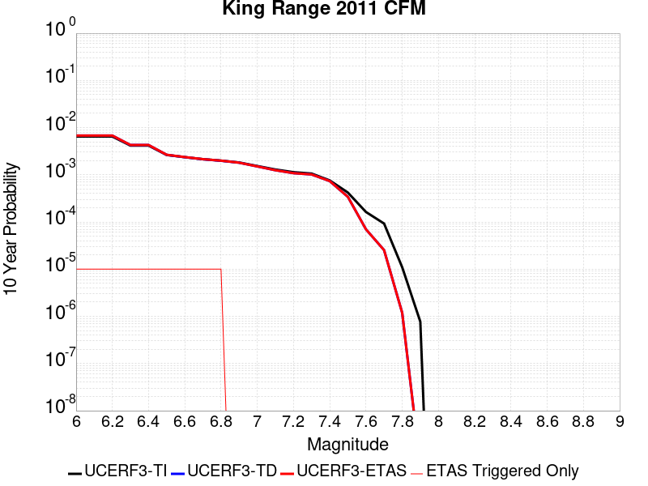 |

| Magnitude | 1 wk TI Prob | 1 wk TD Prob | 1 wk ETAS Prob | 1 wk ETAS/TD Gain | 1 wk ETAS Triggered Only | 1 mo TI Prob | 1 mo TD Prob | 1 mo ETAS Prob | 1 mo ETAS/TD Gain | 1 mo ETAS Triggered Only | 1 yr TI Prob | 1 yr TD Prob | 1 yr ETAS Prob | 1 yr ETAS/TD Gain | 1 yr ETAS Triggered Only | 10 yr TI Prob | 10 yr TD Prob | 10 yr ETAS Prob | 10 yr ETAS/TD Gain | 10 yr ETAS Triggered Only |
|-----|-----|-----|-----|-----|-----|-----|-----|-----|-----|-----|-----|-----|-----|-----|-----|-----|-----|-----|-----|-----|
| 6.0 | 1.2462566E-5 | 1.3022665E-5 | 1.3022665E-5 | 1.0 | 0.0 | 5.34099E-5 | 5.5810426E-5 | 5.5810426E-5 | 1.0 | 0.0 | 6.5007154E-4 | 6.79315E-4 | 6.79315E-4 | 1.0 | 0.0 | 0.0064817313 | 0.006776772 | 0.0067867045 | 1.0014657 | 1.0E-5 |
| 6.1 | 1.2462566E-5 | 1.3022665E-5 | 1.3022665E-5 | 1.0 | 0.0 | 5.34099E-5 | 5.5810426E-5 | 5.5810426E-5 | 1.0 | 0.0 | 6.5007154E-4 | 6.79315E-4 | 6.79315E-4 | 1.0 | 0.0 | 0.0064817313 | 0.006776772 | 0.0067867045 | 1.0014657 | 1.0E-5 |
| 6.2 | 1.2462566E-5 | 1.3022665E-5 | 1.3022665E-5 | 1.0 | 0.0 | 5.34099E-5 | 5.5810426E-5 | 5.5810426E-5 | 1.0 | 0.0 | 6.5007154E-4 | 6.79315E-4 | 6.79315E-4 | 1.0 | 0.0 | 0.0064817313 | 0.006776772 | 0.0067867045 | 1.0014657 | 1.0E-5 |
| 6.3 | 7.988484E-6 | 8.213591E-6 | 8.213591E-6 | 1.0 | 0.0 | 3.423591E-5 | 3.52007E-5 | 3.52007E-5 | 1.0 | 0.0 | 4.1674246E-4 | 4.2849718E-4 | 4.2849718E-4 | 1.0 | 0.0 | 0.004159618 | 0.004278928 | 0.0042888853 | 1.0023271 | 1.0E-5 |
| 6.4 | 7.988484E-6 | 8.213591E-6 | 8.213591E-6 | 1.0 | 0.0 | 3.423591E-5 | 3.52007E-5 | 3.52007E-5 | 1.0 | 0.0 | 4.1674246E-4 | 4.2849718E-4 | 4.2849718E-4 | 1.0 | 0.0 | 0.004159618 | 0.004278928 | 0.0042888853 | 1.0023271 | 1.0E-5 |
| 6.5 | 5.0522513E-6 | 5.0819467E-6 | 5.0819467E-6 | 1.0 | 0.0 | 2.1652326E-5 | 2.1779595E-5 | 2.1779595E-5 | 1.0 | 0.0 | 2.6358519E-4 | 2.6513523E-4 | 2.6513523E-4 | 1.0 | 0.0 | 0.0026327274 | 0.002649229 | 0.0026592026 | 1.0037646 | 1.0E-5 |
| 6.6 | 4.53682E-6 | 4.538631E-6 | 4.538631E-6 | 1.0 | 0.0 | 1.944337E-5 | 1.9451134E-5 | 1.9451134E-5 | 1.0 | 0.0 | 2.3669732E-4 | 2.3679242E-4 | 2.3679242E-4 | 1.0 | 0.0 | 0.0023644536 | 0.0023664085 | 0.0023763848 | 1.0042158 | 1.0E-5 |
| 6.7 | 4.1144335E-6 | 4.0966515E-6 | 4.0966515E-6 | 1.0 | 0.0 | 1.7633167E-5 | 1.7556962E-5 | 1.7556962E-5 | 1.0 | 0.0 | 2.1466266E-4 | 2.1373545E-4 | 2.1373545E-4 | 1.0 | 0.0 | 0.0021445542 | 0.0021362852 | 0.0021462638 | 1.004671 | 1.0E-5 |
| 6.8 | 3.8321214E-6 | 3.8070925E-6 | 3.8070925E-6 | 1.0 | 0.0 | 1.6423275E-5 | 1.6316011E-5 | 1.6316011E-5 | 1.0 | 0.0 | 1.9993502E-4 | 1.9862966E-4 | 1.9862966E-4 | 1.0 | 0.0 | 0.0019975523 | 0.0019855013 | 0.0019954816 | 1.0050265 | 1.0E-5 |
| 6.9 | 3.4999944E-6 | 3.463519E-6 | 3.463519E-6 | 1.0 | 0.0 | 1.499989E-5 | 1.484357E-5 | 1.484357E-5 | 1.0 | 0.0 | 1.8260835E-4 | 1.8070573E-4 | 1.8070573E-4 | 1.0 | 0.0 | 0.0018245836 | 0.0018065603 | 0.0018065603 | 1.0 | 0.0 |
| 7.0 | 2.9470837E-6 | 2.8865973E-6 | 2.8865973E-6 | 1.0 | 0.0 | 1.26302975E-5 | 1.2371073E-5 | 1.2371073E-5 | 1.0 | 0.0 | 1.5376302E-4 | 1.506076E-4 | 1.506076E-4 | 1.0 | 0.0 | 0.0015365666 | 0.0015060179 | 0.0015060179 | 1.0 | 0.0 |
| 7.1 | 2.4850247E-6 | 2.3978553E-6 | 2.3978553E-6 | 1.0 | 0.0 | 1.0650062E-5 | 1.0276483E-5 | 1.0276483E-5 | 1.0 | 0.0 | 1.296568E-4 | 1.2510915E-4 | 1.2510915E-4 | 1.0 | 0.0 | 0.0012958117 | 0.0012513464 | 0.0012513464 | 1.0 | 0.0 |
| 7.2 | 2.1800304E-6 | 2.076136E-6 | 2.076136E-6 | 1.0 | 0.0 | 9.342954E-6 | 8.897696E-6 | 8.897696E-6 | 1.0 | 0.0 | 1.1374453E-4 | 1.0832415E-4 | 1.0832415E-4 | 1.0 | 0.0 | 0.0011368633 | 0.0010836559 | 0.0010836559 | 1.0 | 0.0 |
| 7.3 | 2.0378504E-6 | 1.9497054E-6 | 1.9497054E-6 | 1.0 | 0.0 | 8.733615E-6 | 8.355854E-6 | 8.355854E-6 | 1.0 | 0.0 | 1.0632657E-4 | 1.0172786E-4 | 1.0172786E-4 | 1.0 | 0.0 | 0.0010627571 | 0.0010177415 | 0.0010177415 | 1.0 | 0.0 |
| 7.4 | 1.4577047E-6 | 1.4095921E-6 | 1.4095921E-6 | 1.0 | 0.0 | 6.247291E-6 | 6.0410953E-6 | 6.0410953E-6 | 1.0 | 0.0 | 7.605811E-5 | 7.3547926E-5 | 7.3547926E-5 | 1.0 | 0.0 | 7.603208E-4 | 7.361136E-4 | 7.361136E-4 | 1.0 | 0.0 |
| 7.5 | 8.0685743E-7 | 6.5368414E-7 | 6.5368414E-7 | 1.0 | 0.0 | 3.457956E-6 | 2.8015006E-6 | 2.8015006E-6 | 1.0 | 0.0 | 4.20998E-5 | 3.4107783E-5 | 3.4107783E-5 | 1.0 | 0.0 | 4.2091825E-4 | 3.417413E-4 | 3.417413E-4 | 1.0 | 0.0 |
| 7.6 | 3.1239435E-7 | 1.3281762E-7 | 1.3281762E-7 | 1.0 | 0.0 | 1.3388321E-6 | 5.6921823E-7 | 5.6921823E-7 | 1.0 | 0.0 | 1.630016E-5 | 6.9302105E-6 | 6.9302105E-6 | 1.0 | 0.0 | 1.6298964E-4 | 6.995385E-5 | 6.995385E-5 | 1.0 | 0.0 |
| 7.7 | 1.7747207E-7 | 4.7799166E-8 | 4.7799166E-8 | 1.0 | 0.0 | 7.605944E-7 | 2.0485354E-7 | 2.0485354E-7 | 1.0 | 0.0 | 9.260198E-6 | 2.4940891E-6 | 2.4940891E-6 | 1.0 | 0.0 | 9.2598115E-5 | 2.535763E-5 | 2.535763E-5 | 1.0 | 0.0 |
| 7.8 | 2.1035538E-8 | 2.2031448E-9 | 2.2031448E-9 | 1.0 | 0.0 | 9.0152305E-8 | 9.442049E-9 | 9.442049E-9 | 1.0 | 0.0 | 1.0976038E-6 | 1.1495695E-7 | 1.1495695E-7 | 1.0 | 0.0 | 1.0975983E-5 | 1.1862359E-6 | 1.1862359E-6 | 1.0 | 0.0 |
| 7.9 | 1.4782963E-9 | 8.796297E-13 | 8.796297E-13 | 1.0 | 0.0 | 6.335555E-9 | 3.7704284E-12 | 3.7704284E-12 | 1.0 | 0.0 | 7.713538E-8 | 4.5902504E-11 | 4.5902504E-11 | 1.0 | 0.0 | 7.7135354E-7 | 6.632832E-10 | 6.632832E-10 | 1.0 | 0.0 |

## South Klamath Lake East
*[(top)](#table-of-contents)*

| 1 Week | 1 Month | 1 Year | 10 Year |
|-----|-----|-----|-----|
| 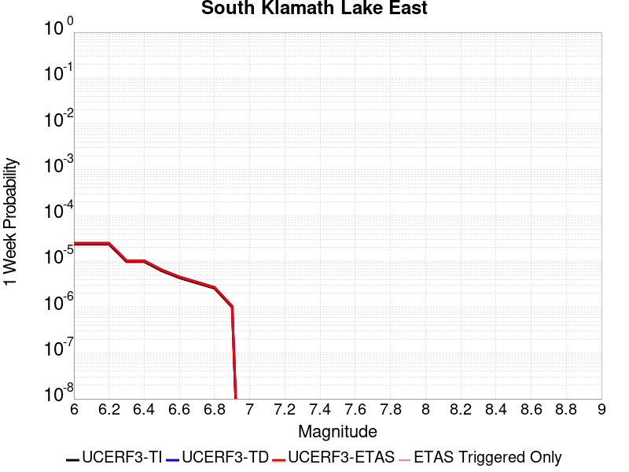 |  |  |  |

| Magnitude | 1 wk TI Prob | 1 wk TD Prob | 1 wk ETAS Prob | 1 wk ETAS/TD Gain | 1 wk ETAS Triggered Only | 1 mo TI Prob | 1 mo TD Prob | 1 mo ETAS Prob | 1 mo ETAS/TD Gain | 1 mo ETAS Triggered Only | 1 yr TI Prob | 1 yr TD Prob | 1 yr ETAS Prob | 1 yr ETAS/TD Gain | 1 yr ETAS Triggered Only | 10 yr TI Prob | 10 yr TD Prob | 10 yr ETAS Prob | 10 yr ETAS/TD Gain | 10 yr ETAS Triggered Only |
|-----|-----|-----|-----|-----|-----|-----|-----|-----|-----|-----|-----|-----|-----|-----|-----|-----|-----|-----|-----|-----|
| 6.0 | 2.3539369E-5 | 2.5048159E-5 | 2.5048159E-5 | 1.0 | 0.0 | 1.0087911E-4 | 1.073453E-4 | 1.073453E-4 | 1.0 | 0.0 | 0.0012275111 | 0.0013062288 | 0.0013162157 | 1.0076456 | 1.0E-5 | 0.012207527 | 0.012993856 | 0.0130037265 | 1.0007596 | 1.0E-5 |
| 6.1 | 2.3539369E-5 | 2.5048159E-5 | 2.5048159E-5 | 1.0 | 0.0 | 1.0087911E-4 | 1.073453E-4 | 1.073453E-4 | 1.0 | 0.0 | 0.0012275111 | 0.0013062288 | 0.0013162157 | 1.0076456 | 1.0E-5 | 0.012207527 | 0.012993856 | 0.0130037265 | 1.0007596 | 1.0E-5 |
| 6.2 | 2.3539369E-5 | 2.5048159E-5 | 2.5048159E-5 | 1.0 | 0.0 | 1.0087911E-4 | 1.073453E-4 | 1.073453E-4 | 1.0 | 0.0 | 0.0012275111 | 0.0013062288 | 0.0013162157 | 1.0076456 | 1.0E-5 | 0.012207527 | 0.012993856 | 0.0130037265 | 1.0007596 | 1.0E-5 |
| 6.3 | 9.807823E-6 | 1.0396374E-5 | 1.0396374E-5 | 1.0 | 0.0 | 4.2032847E-5 | 4.4555178E-5 | 4.4555178E-5 | 1.0 | 0.0 | 5.1162974E-4 | 5.4233265E-4 | 5.4233265E-4 | 1.0 | 0.0 | 0.005104534 | 0.005410928 | 0.005410928 | 1.0 | 0.0 |
| 6.4 | 9.807823E-6 | 1.0396374E-5 | 1.0396374E-5 | 1.0 | 0.0 | 4.2032847E-5 | 4.4555178E-5 | 4.4555178E-5 | 1.0 | 0.0 | 5.1162974E-4 | 5.4233265E-4 | 5.4233265E-4 | 1.0 | 0.0 | 0.005104534 | 0.005410928 | 0.005410928 | 1.0 | 0.0 |
| 6.5 | 6.191981E-6 | 6.551041E-6 | 6.551041E-6 | 1.0 | 0.0 | 2.653679E-5 | 2.8075605E-5 | 2.8075605E-5 | 1.0 | 0.0 | 3.2303753E-4 | 3.417697E-4 | 3.417697E-4 | 1.0 | 0.0 | 0.0032256835 | 0.003412719 | 0.003412719 | 1.0 | 0.0 |
| 6.6 | 4.3693776E-6 | 4.616696E-6 | 4.616696E-6 | 1.0 | 0.0 | 1.8725768E-5 | 1.9785697E-5 | 1.9785697E-5 | 1.0 | 0.0 | 2.2796239E-4 | 2.4086535E-4 | 2.4086535E-4 | 1.0 | 0.0 | 0.0022772867 | 0.0024061555 | 0.0024061555 | 1.0 | 0.0 |
| 6.7 | 3.360834E-6 | 3.551347E-6 | 3.551347E-6 | 1.0 | 0.0 | 1.4403494E-5 | 1.5219975E-5 | 1.5219975E-5 | 1.0 | 0.0 | 1.7534842E-4 | 1.8528824E-4 | 1.8528824E-4 | 1.0 | 0.0 | 0.0017521014 | 0.0018514175 | 0.0018514175 | 1.0 | 0.0 |
| 6.8 | 2.57873E-6 | 2.725253E-6 | 2.725253E-6 | 1.0 | 0.0 | 1.1051653E-5 | 1.1679606E-5 | 1.1679606E-5 | 1.0 | 0.0 | 1.3454557E-4 | 1.4219055E-4 | 1.4219055E-4 | 1.0 | 0.0 | 0.0013446413 | 0.0014210563 | 0.0014210563 | 1.0 | 0.0 |
| 6.9 | 9.987825E-7 | 1.0566537E-6 | 1.0566537E-6 | 1.0 | 0.0 | 4.2804895E-6 | 4.52851E-6 | 4.52851E-6 | 1.0 | 0.0 | 5.211371E-5 | 5.5133543E-5 | 5.5133543E-5 | 1.0 | 0.0 | 5.210149E-4 | 5.512308E-4 | 5.512308E-4 | 1.0 | 0.0 |

## Quien Sabe 2011 CFM
*[(top)](#table-of-contents)*

| 1 Week | 1 Month | 1 Year | 10 Year |
|-----|-----|-----|-----|
|  |  |  |  |

| Magnitude | 1 wk TI Prob | 1 wk TD Prob | 1 wk ETAS Prob | 1 wk ETAS/TD Gain | 1 wk ETAS Triggered Only | 1 mo TI Prob | 1 mo TD Prob | 1 mo ETAS Prob | 1 mo ETAS/TD Gain | 1 mo ETAS Triggered Only | 1 yr TI Prob | 1 yr TD Prob | 1 yr ETAS Prob | 1 yr ETAS/TD Gain | 1 yr ETAS Triggered Only | 10 yr TI Prob | 10 yr TD Prob | 10 yr ETAS Prob | 10 yr ETAS/TD Gain | 10 yr ETAS Triggered Only |
|-----|-----|-----|-----|-----|-----|-----|-----|-----|-----|-----|-----|-----|-----|-----|-----|-----|-----|-----|-----|-----|
| 6.0 | 3.729899E-5 | 7.095218E-5 | 7.095218E-5 | 1.0 | 0.0 | 1.5984301E-4 | 3.04012E-4 | 3.04012E-4 | 1.0 | 0.0 | 0.0019443515 | 0.0036857054 | 0.0036956684 | 1.0027032 | 1.0E-5 | 0.019274272 | 0.035355605 | 0.035365254 | 1.0002729 | 1.0E-5 |
| 6.1 | 1.7825725E-5 | 3.3215478E-5 | 3.3215478E-5 | 1.0 | 0.0 | 7.639373E-5 | 1.4231203E-4 | 1.4231203E-4 | 1.0 | 0.0 | 9.296967E-4 | 0.0017269313 | 0.001736914 | 1.0057806 | 1.0E-5 | 0.009258169 | 0.01670198 | 0.016711812 | 1.0005888 | 1.0E-5 |
| 6.2 | 4.8865336E-6 | 7.808843E-6 | 7.808843E-6 | 1.0 | 0.0 | 2.0942118E-5 | 3.3465018E-5 | 3.3465018E-5 | 1.0 | 0.0 | 2.5494045E-4 | 4.0701387E-4 | 4.0701387E-4 | 1.0 | 0.0 | 0.0025464818 | 0.004014794 | 0.004014794 | 1.0 | 0.0 |
| 6.3 | 3.858491E-6 | 5.791181E-6 | 5.791181E-6 | 1.0 | 0.0 | 1.6536285E-5 | 2.4819137E-5 | 2.4819137E-5 | 1.0 | 0.0 | 2.0131067E-4 | 3.021358E-4 | 3.021358E-4 | 1.0 | 0.0 | 0.002011284 | 0.0030031302 | 0.0030031302 | 1.0 | 0.0 |
| 6.4 | 3.0771805E-6 | 4.3863315E-6 | 4.3863315E-6 | 1.0 | 0.0 | 1.318785E-5 | 1.8798442E-5 | 1.8798442E-5 | 1.0 | 0.0 | 1.6055023E-4 | 2.2884943E-4 | 2.2884943E-4 | 1.0 | 0.0 | 0.001604343 | 0.002287461 | 0.002287461 | 1.0 | 0.0 |
| 6.5 | 2.5081235E-6 | 3.464876E-6 | 3.464876E-6 | 1.0 | 0.0 | 1.0749056E-5 | 1.4849393E-5 | 1.4849393E-5 | 1.0 | 0.0 | 1.308619E-4 | 1.8077783E-4 | 1.8077783E-4 | 1.0 | 0.0 | 0.0013078486 | 0.0018132196 | 0.0018132196 | 1.0 | 0.0 |
| 6.6 | 1.7505364E-6 | 2.403353E-6 | 2.403353E-6 | 1.0 | 0.0 | 7.502277E-6 | 1.03000475E-5 | 1.03000475E-5 | 1.0 | 0.0 | 9.13364E-5 | 1.2539657E-4 | 1.2539657E-4 | 1.0 | 0.0 | 9.129886E-4 | 0.0012587609 | 0.0012587609 | 1.0 | 0.0 |
| 6.7 | 1.505737E-6 | 2.0646755E-6 | 2.0646755E-6 | 1.0 | 0.0 | 6.4531428E-6 | 8.848583E-6 | 8.848583E-6 | 1.0 | 0.0 | 7.8564175E-5 | 1.07726766E-4 | 1.07726766E-4 | 1.0 | 0.0 | 7.853641E-4 | 0.001082237 | 0.001082237 | 1.0 | 0.0 |
| 6.8 | 1.2924105E-6 | 1.7492418E-6 | 1.7492418E-6 | 1.0 | 0.0 | 5.5388905E-6 | 7.4967325E-6 | 7.4967325E-6 | 1.0 | 0.0 | 6.74339E-5 | 9.126944E-5 | 9.126944E-5 | 1.0 | 0.0 | 6.741344E-4 | 9.164543E-4 | 9.164543E-4 | 1.0 | 0.0 |
| 6.9 | 8.9075286E-7 | 1.1253309E-6 | 1.1253309E-6 | 1.0 | 0.0 | 3.8175067E-6 | 4.822839E-6 | 4.822839E-6 | 1.0 | 0.0 | 4.6477155E-5 | 5.8716705E-5 | 5.8716705E-5 | 1.0 | 0.0 | 4.6467435E-4 | 5.9053226E-4 | 5.9053226E-4 | 1.0 | 0.0 |
| 7.0 | 6.6891175E-7 | 8.5191124E-7 | 8.5191124E-7 | 1.0 | 0.0 | 2.8667614E-6 | 3.6510442E-6 | 3.6510442E-6 | 1.0 | 0.0 | 3.4902263E-5 | 4.4450753E-5 | 4.4450753E-5 | 1.0 | 0.0 | 3.4896782E-4 | 4.4686778E-4 | 4.4686778E-4 | 1.0 | 0.0 |
| 7.1 | 4.4205015E-7 | 5.3935804E-7 | 5.3935804E-7 | 1.0 | 0.0 | 1.8944993E-6 | 2.3115333E-6 | 2.3115333E-6 | 1.0 | 0.0 | 2.3065284E-5 | 2.8142726E-5 | 2.8142726E-5 | 1.0 | 0.0 | 2.3062891E-4 | 2.8280797E-4 | 2.8280797E-4 | 1.0 | 0.0 |
| 7.2 | 1.6620965E-7 | 1.5997311E-7 | 1.5997311E-7 | 1.0 | 0.0 | 7.123269E-7 | 6.8559893E-7 | 6.8559893E-7 | 1.0 | 0.0 | 8.672545E-6 | 8.347139E-6 | 8.347139E-6 | 1.0 | 0.0 | 8.6722066E-5 | 8.364434E-5 | 8.364434E-5 | 1.0 | 0.0 |
| 7.3 | 1.2142488E-7 | 1.1729005E-7 | 1.1729005E-7 | 1.0 | 0.0 | 5.2039223E-7 | 5.026716E-7 | 5.026716E-7 | 1.0 | 0.0 | 6.335757E-6 | 6.1200126E-6 | 6.1200126E-6 | 1.0 | 0.0 | 6.3355765E-5 | 6.121746E-5 | 6.121746E-5 | 1.0 | 0.0 |
| 7.4 | 2.4192937E-8 | 2.4548772E-8 | 2.4548772E-8 | 1.0 | 0.0 | 1.0368401E-7 | 1.0520902E-7 | 1.0520902E-7 | 1.0 | 0.0 | 1.2623522E-6 | 1.2809192E-6 | 1.2809192E-6 | 1.0 | 0.0 | 1.2623449E-5 | 1.2769277E-5 | 1.2769277E-5 | 1.0 | 0.0 |
| 7.5 | 1.4432802E-8 | 1.4509316E-8 | 1.4509316E-8 | 1.0 | 0.0 | 6.185486E-8 | 6.2182785E-8 | 6.2182785E-8 | 1.0 | 0.0 | 7.530827E-7 | 7.570752E-7 | 7.570752E-7 | 1.0 | 0.0 | 7.530801E-6 | 7.5291196E-6 | 7.5291196E-6 | 1.0 | 0.0 |

## Mount Diablo Thrust South
*[(top)](#table-of-contents)*

| 1 Week | 1 Month | 1 Year | 10 Year |
|-----|-----|-----|-----|
| 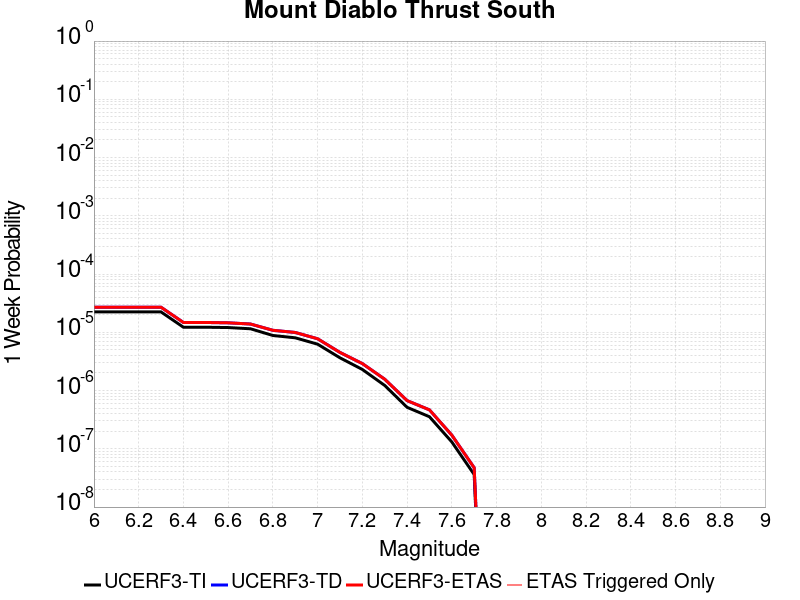 |  | 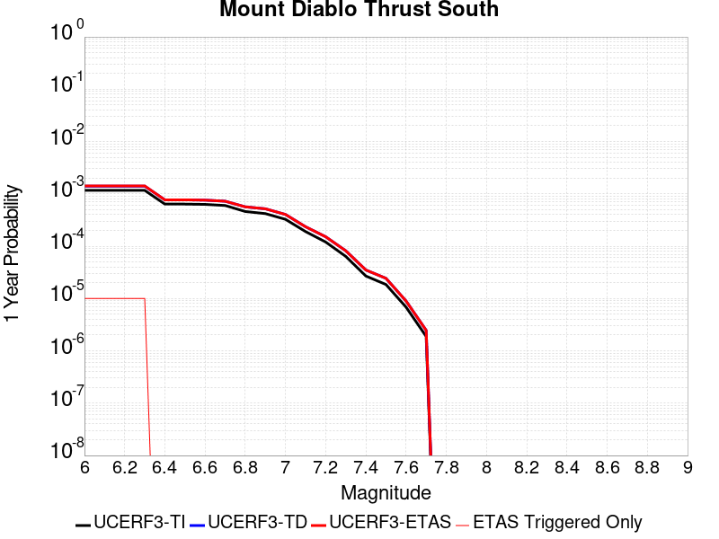 |  |

| Magnitude | 1 wk TI Prob | 1 wk TD Prob | 1 wk ETAS Prob | 1 wk ETAS/TD Gain | 1 wk ETAS Triggered Only | 1 mo TI Prob | 1 mo TD Prob | 1 mo ETAS Prob | 1 mo ETAS/TD Gain | 1 mo ETAS Triggered Only | 1 yr TI Prob | 1 yr TD Prob | 1 yr ETAS Prob | 1 yr ETAS/TD Gain | 1 yr ETAS Triggered Only | 10 yr TI Prob | 10 yr TD Prob | 10 yr ETAS Prob | 10 yr ETAS/TD Gain | 10 yr ETAS Triggered Only |
|-----|-----|-----|-----|-----|-----|-----|-----|-----|-----|-----|-----|-----|-----|-----|-----|-----|-----|-----|-----|-----|
| 6.0 | 2.2377444E-5 | 2.6958689E-5 | 2.6958689E-5 | 1.0 | 0.0 | 9.5899806E-5 | 1.1553324E-4 | 1.1553324E-4 | 1.0 | 0.0 | 0.0011669548 | 0.0014059072 | 0.0014158932 | 1.0071028 | 1.0E-5 | 0.011608457 | 0.013989085 | 0.013998946 | 1.0007049 | 1.0E-5 |
| 6.1 | 2.2377444E-5 | 2.6958689E-5 | 2.6958689E-5 | 1.0 | 0.0 | 9.5899806E-5 | 1.1553324E-4 | 1.1553324E-4 | 1.0 | 0.0 | 0.0011669548 | 0.0014059072 | 0.0014158932 | 1.0071028 | 1.0E-5 | 0.011608457 | 0.013989085 | 0.013998946 | 1.0007049 | 1.0E-5 |
| 6.2 | 2.2377444E-5 | 2.6958689E-5 | 2.6958689E-5 | 1.0 | 0.0 | 9.5899806E-5 | 1.1553324E-4 | 1.1553324E-4 | 1.0 | 0.0 | 0.0011669548 | 0.0014059072 | 0.0014158932 | 1.0071028 | 1.0E-5 | 0.011608457 | 0.013989085 | 0.013998946 | 1.0007049 | 1.0E-5 |
| 6.3 | 2.2377444E-5 | 2.6958689E-5 | 2.6958689E-5 | 1.0 | 0.0 | 9.5899806E-5 | 1.1553324E-4 | 1.1553324E-4 | 1.0 | 0.0 | 0.0011669548 | 0.0014059072 | 0.0014158932 | 1.0071028 | 1.0E-5 | 0.011608457 | 0.013989085 | 0.013998946 | 1.0007049 | 1.0E-5 |
| 6.4 | 1.2228463E-5 | 1.4748835E-5 | 1.4748835E-5 | 1.0 | 0.0 | 5.2406645E-5 | 6.320784E-5 | 6.320784E-5 | 1.0 | 0.0 | 6.378641E-4 | 7.6929654E-4 | 7.6929654E-4 | 1.0 | 0.0 | 0.0063603627 | 0.0076670623 | 0.0076670623 | 1.0 | 0.0 |
| 6.5 | 1.2228463E-5 | 1.4748835E-5 | 1.4748835E-5 | 1.0 | 0.0 | 5.2406645E-5 | 6.320784E-5 | 6.320784E-5 | 1.0 | 0.0 | 6.378641E-4 | 7.6929654E-4 | 7.6929654E-4 | 1.0 | 0.0 | 0.0063603627 | 0.0076670623 | 0.0076670623 | 1.0 | 0.0 |
| 6.6 | 1.2068118E-5 | 1.45536105E-5 | 1.45536105E-5 | 1.0 | 0.0 | 5.1719482E-5 | 6.23712E-5 | 6.23712E-5 | 1.0 | 0.0 | 6.2950276E-4 | 7.5911765E-4 | 7.5911765E-4 | 1.0 | 0.0 | 0.006277225 | 0.007565971 | 0.007565971 | 1.0 | 0.0 |
| 6.7 | 1.1499428E-5 | 1.3876204E-5 | 1.3876204E-5 | 1.0 | 0.0 | 4.9282335E-5 | 5.9468162E-5 | 5.9468162E-5 | 1.0 | 0.0 | 5.9984723E-4 | 7.2379713E-4 | 7.2379713E-4 | 1.0 | 0.0 | 0.0059823063 | 0.007215108 | 0.007215108 | 1.0 | 0.0 |
| 6.8 | 8.82118E-6 | 1.08312715E-5 | 1.08312715E-5 | 1.0 | 0.0 | 3.780451E-5 | 4.6418943E-5 | 4.6418943E-5 | 1.0 | 0.0 | 4.601727E-4 | 5.6500966E-4 | 5.6500966E-4 | 1.0 | 0.0 | 0.0045922096 | 0.005635723 | 0.005635723 | 1.0 | 0.0 |
| 6.9 | 8.047112E-6 | 9.940168E-6 | 9.940168E-6 | 1.0 | 0.0 | 3.4487166E-5 | 4.2600055E-5 | 4.2600055E-5 | 1.0 | 0.0 | 4.1980037E-4 | 5.1853753E-4 | 5.1853753E-4 | 1.0 | 0.0 | 0.004190082 | 0.00517323 | 0.00517323 | 1.0 | 0.0 |
| 7.0 | 6.2574763E-6 | 7.749091E-6 | 7.749091E-6 | 1.0 | 0.0 | 2.681748E-5 | 3.320999E-5 | 3.320999E-5 | 1.0 | 0.0 | 3.264539E-4 | 4.0426033E-4 | 4.0426033E-4 | 1.0 | 0.0 | 0.0032597475 | 0.0040351227 | 0.0040351227 | 1.0 | 0.0 |
| 7.1 | 3.6485903E-6 | 4.513222E-6 | 4.513222E-6 | 1.0 | 0.0 | 1.5636722E-5 | 1.9342238E-5 | 1.9342238E-5 | 1.0 | 0.0 | 1.9036046E-4 | 2.3546672E-4 | 2.3546672E-4 | 1.0 | 0.0 | 0.0019019748 | 0.0023520612 | 0.0023520612 | 1.0 | 0.0 |
| 7.2 | 2.3034274E-6 | 2.9057078E-6 | 2.9057078E-6 | 1.0 | 0.0 | 9.871795E-6 | 1.2452975E-5 | 1.2452975E-5 | 1.0 | 0.0 | 1.2018247E-4 | 1.5160468E-4 | 1.5160468E-4 | 1.0 | 0.0 | 0.0012011749 | 0.0015149524 | 0.0015149524 | 1.0 | 0.0 |
| 7.3 | 1.224035E-6 | 1.5680788E-6 | 1.5680788E-6 | 1.0 | 0.0 | 5.245854E-6 | 6.720321E-6 | 6.720321E-6 | 1.0 | 0.0 | 6.38664E-5 | 8.181694E-5 | 8.181694E-5 | 1.0 | 0.0 | 6.384805E-4 | 8.1780285E-4 | 8.1780285E-4 | 1.0 | 0.0 |
| 7.4 | 5.1601154E-7 | 6.723899E-7 | 6.723899E-7 | 1.0 | 0.0 | 2.2114762E-6 | 2.881668E-6 | 2.881668E-6 | 1.0 | 0.0 | 2.6924388E-5 | 3.5083758E-5 | 3.5083758E-5 | 1.0 | 0.0 | 2.6921128E-4 | 3.507751E-4 | 3.507751E-4 | 1.0 | 0.0 |
| 7.5 | 3.552894E-7 | 4.6653685E-7 | 4.6653685E-7 | 1.0 | 0.0 | 1.5226678E-6 | 1.9994422E-6 | 1.9994422E-6 | 1.0 | 0.0 | 1.8538323E-5 | 2.4342951E-5 | 2.4342951E-5 | 1.0 | 0.0 | 1.8536777E-4 | 2.4341693E-4 | 2.4341693E-4 | 1.0 | 0.0 |
| 7.6 | 1.3124082E-7 | 1.7192099E-7 | 1.7192099E-7 | 1.0 | 0.0 | 5.6246057E-7 | 7.368041E-7 | 7.368041E-7 | 1.0 | 0.0 | 6.8479358E-6 | 8.970562E-6 | 8.970562E-6 | 1.0 | 0.0 | 6.8477246E-5 | 8.968408E-5 | 8.968408E-5 | 1.0 | 0.0 |
| 7.7 | 3.6193022E-8 | 4.7335092E-8 | 4.7335092E-8 | 1.0 | 0.0 | 1.5511293E-7 | 2.0286468E-7 | 2.0286468E-7 | 1.0 | 0.0 | 1.8884983E-6 | 2.4698757E-6 | 2.4698757E-6 | 1.0 | 0.0 | 1.8884823E-5 | 2.470032E-5 | 2.470032E-5 | 1.0 | 0.0 |

## Johnson Valley (No) 2011 rev
*[(top)](#table-of-contents)*

| 1 Week | 1 Month | 1 Year | 10 Year |
|-----|-----|-----|-----|
|  |  |  |  |

| Magnitude | 1 wk TI Prob | 1 wk TD Prob | 1 wk ETAS Prob | 1 wk ETAS/TD Gain | 1 wk ETAS Triggered Only | 1 mo TI Prob | 1 mo TD Prob | 1 mo ETAS Prob | 1 mo ETAS/TD Gain | 1 mo ETAS Triggered Only | 1 yr TI Prob | 1 yr TD Prob | 1 yr ETAS Prob | 1 yr ETAS/TD Gain | 1 yr ETAS Triggered Only | 10 yr TI Prob | 10 yr TD Prob | 10 yr ETAS Prob | 10 yr ETAS/TD Gain | 10 yr ETAS Triggered Only |
|-----|-----|-----|-----|-----|-----|-----|-----|-----|-----|-----|-----|-----|-----|-----|-----|-----|-----|-----|-----|-----|
| 6.0 | 2.577707E-5 | 1.2901752E-5 | 1.2901752E-5 | 1.0 | 0.0 | 1.1046848E-4 | 5.5292276E-5 | 5.5292276E-5 | 1.0 | 0.0 | 0.0013441239 | 6.730152E-4 | 6.730152E-4 | 1.0 | 0.0 | 0.013360229 | 0.0067136795 | 0.006723612 | 1.0014795 | 1.0E-5 |
| 6.1 | 2.577707E-5 | 1.2901752E-5 | 1.2901752E-5 | 1.0 | 0.0 | 1.1046848E-4 | 5.5292276E-5 | 5.5292276E-5 | 1.0 | 0.0 | 0.0013441239 | 6.730152E-4 | 6.730152E-4 | 1.0 | 0.0 | 0.013360229 | 0.0067136795 | 0.006723612 | 1.0014795 | 1.0E-5 |
| 6.2 | 2.577707E-5 | 1.2901752E-5 | 1.2901752E-5 | 1.0 | 0.0 | 1.1046848E-4 | 5.5292276E-5 | 5.5292276E-5 | 1.0 | 0.0 | 0.0013441239 | 6.730152E-4 | 6.730152E-4 | 1.0 | 0.0 | 0.013360229 | 0.0067136795 | 0.006723612 | 1.0014795 | 1.0E-5 |
| 6.3 | 2.577707E-5 | 1.2901752E-5 | 1.2901752E-5 | 1.0 | 0.0 | 1.1046848E-4 | 5.5292276E-5 | 5.5292276E-5 | 1.0 | 0.0 | 0.0013441239 | 6.730152E-4 | 6.730152E-4 | 1.0 | 0.0 | 0.013360229 | 0.0067136795 | 0.006723612 | 1.0014795 | 1.0E-5 |
| 6.4 | 1.5296591E-5 | 7.53722E-6 | 7.53722E-6 | 1.0 | 0.0 | 6.555518E-5 | 3.2302076E-5 | 3.2302076E-5 | 1.0 | 0.0 | 7.97842E-4 | 3.9322558E-4 | 3.9322558E-4 | 1.0 | 0.0 | 0.007949836 | 0.003927139 | 0.0039371 | 1.0025364 | 1.0E-5 |
| 6.5 | 1.5296591E-5 | 7.53722E-6 | 7.53722E-6 | 1.0 | 0.0 | 6.555518E-5 | 3.2302076E-5 | 3.2302076E-5 | 1.0 | 0.0 | 7.97842E-4 | 3.9322558E-4 | 3.9322558E-4 | 1.0 | 0.0 | 0.007949836 | 0.003927139 | 0.0039371 | 1.0025364 | 1.0E-5 |
| 6.6 | 1.3289383E-5 | 5.9921053E-6 | 5.9921053E-6 | 1.0 | 0.0 | 5.6953253E-5 | 2.5680294E-5 | 2.5680294E-5 | 1.0 | 0.0 | 6.9318525E-4 | 3.1262968E-4 | 3.1262968E-4 | 1.0 | 0.0 | 0.0069102696 | 0.0031235635 | 0.0031235635 | 1.0 | 0.0 |
| 6.7 | 1.3289383E-5 | 5.9921053E-6 | 5.9921053E-6 | 1.0 | 0.0 | 5.6953253E-5 | 2.5680294E-5 | 2.5680294E-5 | 1.0 | 0.0 | 6.9318525E-4 | 3.1262968E-4 | 3.1262968E-4 | 1.0 | 0.0 | 0.0069102696 | 0.0031235635 | 0.0031235635 | 1.0 | 0.0 |
| 6.8 | 8.330789E-6 | 2.9214655E-6 | 2.9214655E-6 | 1.0 | 0.0 | 3.570289E-5 | 1.2520538E-5 | 1.2520538E-5 | 1.0 | 0.0 | 4.34596E-4 | 1.524326E-4 | 1.524326E-4 | 1.0 | 0.0 | 0.0043374705 | 0.0015238405 | 0.0015238405 | 1.0 | 0.0 |
| 6.9 | 7.2359003E-6 | 2.3014777E-6 | 2.3014777E-6 | 1.0 | 0.0 | 3.1010633E-5 | 9.863469E-6 | 9.863469E-6 | 1.0 | 0.0 | 3.7748902E-4 | 1.2008645E-4 | 1.2008645E-4 | 1.0 | 0.0 | 0.0037684843 | 0.0012007385 | 0.0012007385 | 1.0 | 0.0 |
| 7.0 | 6.5149957E-6 | 2.0886475E-6 | 2.0886475E-6 | 1.0 | 0.0 | 2.792111E-5 | 8.951346E-6 | 8.951346E-6 | 1.0 | 0.0 | 3.398865E-4 | 1.0898248E-4 | 1.0898248E-4 | 1.0 | 0.0 | 0.003393671 | 0.0010898102 | 0.0010898102 | 1.0 | 0.0 |
| 7.1 | 1.1662233E-6 | 2.8800763E-8 | 2.8800763E-8 | 1.0 | 0.0 | 4.9980904E-6 | 1.2343183E-7 | 1.2343183E-7 | 1.0 | 0.0 | 6.0850052E-5 | 1.5027817E-6 | 1.5027817E-6 | 1.0 | 0.0 | 6.083339E-4 | 1.5027732E-5 | 1.5027732E-5 | 1.0 | 0.0 |
| 7.2 | 5.413881E-7 | 2.8800763E-8 | 2.8800763E-8 | 1.0 | 0.0 | 2.3202326E-6 | 1.2343183E-7 | 1.2343183E-7 | 1.0 | 0.0 | 2.8248465E-5 | 1.5027817E-6 | 1.5027817E-6 | 1.0 | 0.0 | 2.8244875E-4 | 1.5027732E-5 | 1.5027732E-5 | 1.0 | 0.0 |
| 7.3 | 5.076821E-7 | 2.8800763E-8 | 2.8800763E-8 | 1.0 | 0.0 | 2.1757785E-6 | 1.2343183E-7 | 1.2343183E-7 | 1.0 | 0.0 | 2.648978E-5 | 1.5027817E-6 | 1.5027817E-6 | 1.0 | 0.0 | 2.6486625E-4 | 1.5027732E-5 | 1.5027732E-5 | 1.0 | 0.0 |
| 7.4 | 4.7568687E-7 | 2.87827E-8 | 2.87827E-8 | 1.0 | 0.0 | 2.0386565E-6 | 1.2335443E-7 | 1.2335443E-7 | 1.0 | 0.0 | 2.482036E-5 | 1.5018393E-6 | 1.5018393E-6 | 1.0 | 0.0 | 2.4817587E-4 | 1.5018308E-5 | 1.5018308E-5 | 1.0 | 0.0 |
| 7.5 | 3.435626E-7 | 2.5356895E-8 | 2.5356895E-8 | 1.0 | 0.0 | 1.4724103E-6 | 1.086724E-7 | 1.086724E-7 | 1.0 | 0.0 | 1.7926448E-5 | 1.3230859E-6 | 1.3230859E-6 | 1.0 | 0.0 | 1.7925001E-4 | 1.3230796E-5 | 1.3230796E-5 | 1.0 | 0.0 |

## Elsinore (Stepovers Combined)
*[(top)](#table-of-contents)*

| 1 Week | 1 Month | 1 Year | 10 Year |
|-----|-----|-----|-----|
|  |  | 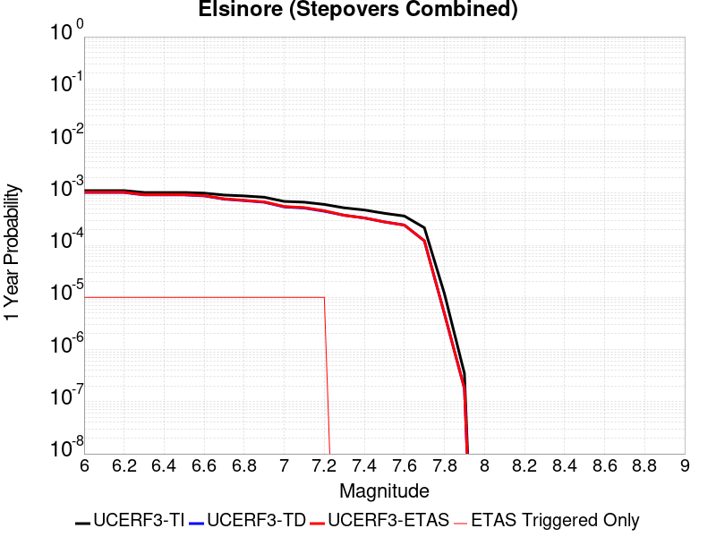 | 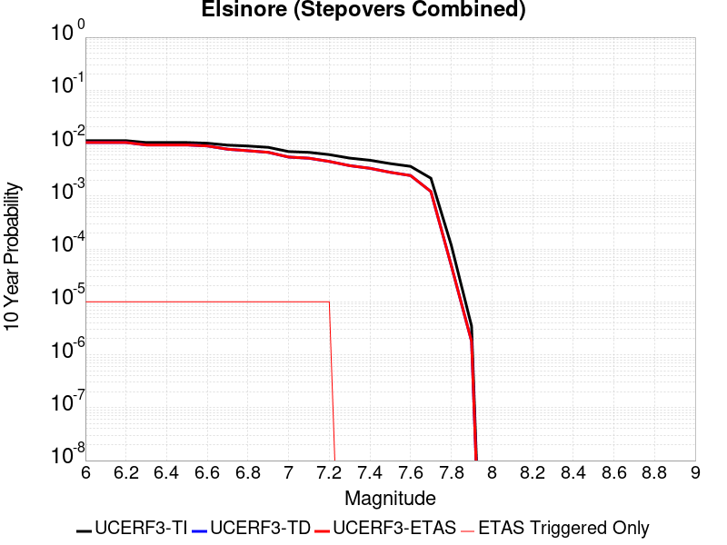 |

| Magnitude | 1 wk TI Prob | 1 wk TD Prob | 1 wk ETAS Prob | 1 wk ETAS/TD Gain | 1 wk ETAS Triggered Only | 1 mo TI Prob | 1 mo TD Prob | 1 mo ETAS Prob | 1 mo ETAS/TD Gain | 1 mo ETAS Triggered Only | 1 yr TI Prob | 1 yr TD Prob | 1 yr ETAS Prob | 1 yr ETAS/TD Gain | 1 yr ETAS Triggered Only | 10 yr TI Prob | 10 yr TD Prob | 10 yr ETAS Prob | 10 yr ETAS/TD Gain | 10 yr ETAS Triggered Only |
|-----|-----|-----|-----|-----|-----|-----|-----|-----|-----|-----|-----|-----|-----|-----|-----|-----|-----|-----|-----|-----|
| 6.0 | 2.144392E-5 | 1.9763485E-5 | 1.9763485E-5 | 1.0 | 0.0 | 9.189928E-5 | 8.4698026E-5 | 8.4698026E-5 | 1.0 | 0.0 | 0.0011182994 | 0.0010307304 | 0.0010407201 | 1.0096918 | 1.0E-5 | 0.011126885 | 0.010266115 | 0.010276012 | 1.000964 | 1.0E-5 |
| 6.1 | 2.144392E-5 | 1.9763485E-5 | 1.9763485E-5 | 1.0 | 0.0 | 9.189928E-5 | 8.4698026E-5 | 8.4698026E-5 | 1.0 | 0.0 | 0.0011182994 | 0.0010307304 | 0.0010407201 | 1.0096918 | 1.0E-5 | 0.011126885 | 0.010266115 | 0.010276012 | 1.000964 | 1.0E-5 |
| 6.2 | 2.144392E-5 | 1.9763485E-5 | 1.9763485E-5 | 1.0 | 0.0 | 9.189928E-5 | 8.4698026E-5 | 8.4698026E-5 | 1.0 | 0.0 | 0.0011182994 | 0.0010307304 | 0.0010407201 | 1.0096918 | 1.0E-5 | 0.011126885 | 0.010266115 | 0.010276012 | 1.000964 | 1.0E-5 |
| 6.3 | 1.9751555E-5 | 1.7744534E-5 | 1.7744534E-5 | 1.0 | 0.0 | 8.4646774E-5 | 7.604588E-5 | 7.604588E-5 | 1.0 | 0.0 | 0.0010300872 | 9.2548016E-4 | 9.354709E-4 | 1.0107952 | 1.0E-5 | 0.010253254 | 0.009222367 | 0.009232274 | 1.0010743 | 1.0E-5 |
| 6.4 | 1.9751555E-5 | 1.7744534E-5 | 1.7744534E-5 | 1.0 | 0.0 | 8.4646774E-5 | 7.604588E-5 | 7.604588E-5 | 1.0 | 0.0 | 0.0010300872 | 9.2548016E-4 | 9.354709E-4 | 1.0107952 | 1.0E-5 | 0.010253254 | 0.009222367 | 0.009232274 | 1.0010743 | 1.0E-5 |
| 6.5 | 1.9751555E-5 | 1.7744534E-5 | 1.7744534E-5 | 1.0 | 0.0 | 8.4646774E-5 | 7.604588E-5 | 7.604588E-5 | 1.0 | 0.0 | 0.0010300872 | 9.2548016E-4 | 9.354709E-4 | 1.0107952 | 1.0E-5 | 0.010253254 | 0.009222367 | 0.009232274 | 1.0010743 | 1.0E-5 |
| 6.6 | 1.9188685E-5 | 1.7006358E-5 | 1.7006358E-5 | 1.0 | 0.0 | 8.2234634E-5 | 7.2882445E-5 | 7.2882445E-5 | 1.0 | 0.0 | 0.0010007467 | 8.869987E-4 | 8.9698983E-4 | 1.011264 | 1.0E-5 | 0.00996252 | 0.008840879 | 0.008850791 | 1.0011212 | 1.0E-5 |
| 6.7 | 1.7608272E-5 | 1.4735141E-5 | 1.4735141E-5 | 1.0 | 0.0 | 7.546184E-5 | 6.314913E-5 | 6.314913E-5 | 1.0 | 0.0 | 9.183606E-4 | 7.685792E-4 | 7.785715E-4 | 1.013001 | 1.0E-5 | 0.009145746 | 0.0076657925 | 0.0076757157 | 1.0012945 | 1.0E-5 |
| 6.8 | 1.697165E-5 | 1.3785683E-5 | 1.3785683E-5 | 1.0 | 0.0 | 7.273361E-5 | 5.908021E-5 | 5.908021E-5 | 1.0 | 0.0 | 8.8517193E-4 | 7.190728E-4 | 7.290657E-4 | 1.0138968 | 1.0E-5 | 0.008816543 | 0.0071735727 | 0.007183501 | 1.001384 | 1.0E-5 |
| 6.9 | 1.600365E-5 | 1.2848884E-5 | 1.2848884E-5 | 1.0 | 0.0 | 6.858527E-5 | 5.5065524E-5 | 5.5065524E-5 | 1.0 | 0.0 | 8.347058E-4 | 6.702243E-4 | 6.8021764E-4 | 1.0149103 | 1.0E-5 | 0.008315775 | 0.0066877333 | 0.0066976664 | 1.0014852 | 1.0E-5 |
| 7.0 | 1.3314581E-5 | 1.0449536E-5 | 1.0449536E-5 | 1.0 | 0.0 | 5.7061243E-5 | 4.478297E-5 | 4.478297E-5 | 1.0 | 0.0 | 6.944992E-4 | 5.4509897E-4 | 5.550935E-4 | 1.0183353 | 1.0E-5 | 0.006923327 | 0.0054414957 | 0.0054514413 | 1.0018277 | 1.0E-5 |
| 7.1 | 1.2865345E-5 | 9.939341E-6 | 9.939341E-6 | 1.0 | 0.0 | 5.5136024E-5 | 4.2596494E-5 | 4.2596494E-5 | 1.0 | 0.0 | 6.710743E-4 | 5.1849143E-4 | 5.284863E-4 | 1.0192767 | 1.0E-5 | 0.0066905143 | 0.0051761176 | 0.005186066 | 1.0019219 | 1.0E-5 |
| 7.2 | 1.1650051E-5 | 8.635326E-6 | 8.635326E-6 | 1.0 | 0.0 | 4.9927836E-5 | 3.7008023E-5 | 3.7008023E-5 | 1.0 | 0.0 | 6.0770183E-4 | 4.5048128E-4 | 4.604768E-4 | 1.0221884 | 1.0E-5 | 0.0060604266 | 0.0044971234 | 0.0045070783 | 1.0022136 | 1.0E-5 |
| 7.3 | 1.0008533E-5 | 7.202289E-6 | 7.202289E-6 | 1.0 | 0.0 | 4.2893007E-5 | 3.0866595E-5 | 3.0866595E-5 | 1.0 | 0.0 | 5.220972E-4 | 3.7573744E-4 | 3.7573744E-4 | 1.0 | 0.0 | 0.005208723 | 0.0037514218 | 0.0037514218 | 1.0 | 0.0 |
| 7.4 | 9.116759E-6 | 6.4111623E-6 | 6.4111623E-6 | 1.0 | 0.0 | 3.907124E-5 | 2.747613E-5 | 2.747613E-5 | 1.0 | 0.0 | 4.7558855E-4 | 3.344719E-4 | 3.344719E-4 | 1.0 | 0.0 | 0.00474572 | 0.003339835 | 0.003339835 | 1.0 | 0.0 |
| 7.5 | 7.870524E-6 | 5.3834624E-6 | 5.3834624E-6 | 1.0 | 0.0 | 3.3730383E-5 | 2.3071785E-5 | 2.3071785E-5 | 1.0 | 0.0 | 4.1059E-4 | 2.8086404E-4 | 2.8086404E-4 | 1.0 | 0.0 | 0.0040983222 | 0.0028052174 | 0.0028052174 | 1.0 | 0.0 |
| 7.6 | 6.9774537E-6 | 4.6784253E-6 | 4.6784253E-6 | 1.0 | 0.0 | 2.990303E-5 | 2.0050245E-5 | 2.0050245E-5 | 1.0 | 0.0 | 3.640086E-4 | 2.4408558E-4 | 2.4408558E-4 | 1.0 | 0.0 | 0.003634129 | 0.0024382912 | 0.0024382912 | 1.0 | 0.0 |
| 7.7 | 4.1616954E-6 | 2.3288446E-6 | 2.3288446E-6 | 1.0 | 0.0 | 1.7835715E-5 | 9.9807285E-6 | 9.9807285E-6 | 1.0 | 0.0 | 2.171282E-4 | 1.21509336E-4 | 1.21509336E-4 | 1.0 | 0.0 | 0.0021691616 | 0.0012145021 | 0.0012145021 | 1.0 | 0.0 |
| 7.8 | 2.2692414E-7 | 9.38645E-8 | 9.38645E-8 | 1.0 | 0.0 | 9.725317E-7 | 4.0227638E-7 | 4.0227638E-7 | 1.0 | 0.0 | 1.1840509E-5 | 4.8977076E-6 | 4.8977076E-6 | 1.0 | 0.0 | 1.1839878E-4 | 4.8976322E-5 | 4.8976322E-5 | 1.0 | 0.0 |
| 7.9 | 6.676829E-9 | 3.4402008E-9 | 3.4402008E-9 | 1.0 | 0.0 | 2.861498E-8 | 1.4743718E-8 | 1.4743718E-8 | 1.0 | 0.0 | 3.4838732E-7 | 1.7950475E-7 | 1.7950475E-7 | 1.0 | 0.0 | 3.4838679E-6 | 1.7950463E-6 | 1.7950463E-6 | 1.0 | 0.0 |

## Sierra Madre
*[(top)](#table-of-contents)*

| 1 Week | 1 Month | 1 Year | 10 Year |
|-----|-----|-----|-----|
|  |  |  |  |

| Magnitude | 1 wk TI Prob | 1 wk TD Prob | 1 wk ETAS Prob | 1 wk ETAS/TD Gain | 1 wk ETAS Triggered Only | 1 mo TI Prob | 1 mo TD Prob | 1 mo ETAS Prob | 1 mo ETAS/TD Gain | 1 mo ETAS Triggered Only | 1 yr TI Prob | 1 yr TD Prob | 1 yr ETAS Prob | 1 yr ETAS/TD Gain | 1 yr ETAS Triggered Only | 10 yr TI Prob | 10 yr TD Prob | 10 yr ETAS Prob | 10 yr ETAS/TD Gain | 10 yr ETAS Triggered Only |
|-----|-----|-----|-----|-----|-----|-----|-----|-----|-----|-----|-----|-----|-----|-----|-----|-----|-----|-----|-----|-----|
| 6.0 | 1.3379373E-5 | 1.10021165E-5 | 1.10021165E-5 | 1.0 | 0.0 | 5.7338908E-5 | 4.7151083E-5 | 4.7151083E-5 | 1.0 | 0.0 | 6.978776E-4 | 5.7391473E-4 | 5.7391473E-4 | 1.0 | 0.0 | 0.0069569005 | 0.005724645 | 0.005734588 | 1.0017369 | 1.0E-5 |
| 6.1 | 1.3379373E-5 | 1.10021165E-5 | 1.10021165E-5 | 1.0 | 0.0 | 5.7338908E-5 | 4.7151083E-5 | 4.7151083E-5 | 1.0 | 0.0 | 6.978776E-4 | 5.7391473E-4 | 5.7391473E-4 | 1.0 | 0.0 | 0.0069569005 | 0.005724645 | 0.005734588 | 1.0017369 | 1.0E-5 |
| 6.2 | 1.3379373E-5 | 1.10021165E-5 | 1.10021165E-5 | 1.0 | 0.0 | 5.7338908E-5 | 4.7151083E-5 | 4.7151083E-5 | 1.0 | 0.0 | 6.978776E-4 | 5.7391473E-4 | 5.7391473E-4 | 1.0 | 0.0 | 0.0069569005 | 0.005724645 | 0.005734588 | 1.0017369 | 1.0E-5 |
| 6.3 | 1.3379373E-5 | 1.10021165E-5 | 1.10021165E-5 | 1.0 | 0.0 | 5.7338908E-5 | 4.7151083E-5 | 4.7151083E-5 | 1.0 | 0.0 | 6.978776E-4 | 5.7391473E-4 | 5.7391473E-4 | 1.0 | 0.0 | 0.0069569005 | 0.005724645 | 0.005734588 | 1.0017369 | 1.0E-5 |
| 6.4 | 1.3379373E-5 | 1.10021165E-5 | 1.10021165E-5 | 1.0 | 0.0 | 5.7338908E-5 | 4.7151083E-5 | 4.7151083E-5 | 1.0 | 0.0 | 6.978776E-4 | 5.7391473E-4 | 5.7391473E-4 | 1.0 | 0.0 | 0.0069569005 | 0.005724645 | 0.005734588 | 1.0017369 | 1.0E-5 |
| 6.5 | 1.26563245E-5 | 1.0231545E-5 | 1.0231545E-5 | 1.0 | 0.0 | 5.4240263E-5 | 4.384875E-5 | 4.384875E-5 | 1.0 | 0.0 | 6.601751E-4 | 5.3372886E-4 | 5.3372886E-4 | 1.0 | 0.0 | 0.006582173 | 0.005324747 | 0.005334694 | 1.001868 | 1.0E-5 |
| 6.6 | 1.26563245E-5 | 1.0231545E-5 | 1.0231545E-5 | 1.0 | 0.0 | 5.4240263E-5 | 4.384875E-5 | 4.384875E-5 | 1.0 | 0.0 | 6.601751E-4 | 5.3372886E-4 | 5.3372886E-4 | 1.0 | 0.0 | 0.006582173 | 0.005324747 | 0.005334694 | 1.001868 | 1.0E-5 |
| 6.7 | 1.2502474E-5 | 1.0067684E-5 | 1.0067684E-5 | 1.0 | 0.0 | 5.3580934E-5 | 4.314651E-5 | 4.314651E-5 | 1.0 | 0.0 | 6.521526E-4 | 5.251832E-4 | 5.251832E-4 | 1.0 | 0.0 | 0.0065024206 | 0.0052396953 | 0.005249643 | 1.0018985 | 1.0E-5 |
| 6.8 | 1.2454966E-5 | 1.0019968E-5 | 1.0019968E-5 | 1.0 | 0.0 | 5.3377335E-5 | 4.2942018E-5 | 4.2942018E-5 | 1.0 | 0.0 | 6.4967526E-4 | 5.226947E-4 | 5.226947E-4 | 1.0 | 0.0 | 0.006477792 | 0.0052149273 | 0.005224875 | 1.0019076 | 1.0E-5 |
| 6.9 | 1.2225574E-5 | 9.793936E-6 | 9.793936E-6 | 1.0 | 0.0 | 5.2394265E-5 | 4.1973344E-5 | 4.1973344E-5 | 1.0 | 0.0 | 6.3771347E-4 | 5.109067E-4 | 5.109067E-4 | 1.0 | 0.0 | 0.006358865 | 0.0050975927 | 0.005107542 | 1.0019517 | 1.0E-5 |
| 7.0 | 1.182946E-5 | 9.4004645E-6 | 9.4004645E-6 | 1.0 | 0.0 | 5.06967E-5 | 4.028709E-5 | 4.028709E-5 | 1.0 | 0.0 | 6.1705755E-4 | 4.903859E-4 | 4.903859E-4 | 1.0 | 0.0 | 0.006153469 | 0.0048933052 | 0.0049032564 | 1.0020336 | 1.0E-5 |
| 7.1 | 1.14369095E-5 | 8.987445E-6 | 8.987445E-6 | 1.0 | 0.0 | 4.9014405E-5 | 3.8517057E-5 | 3.8517057E-5 | 1.0 | 0.0 | 5.9658696E-4 | 4.6884525E-4 | 4.6884525E-4 | 1.0 | 0.0 | 0.005949879 | 0.0046788226 | 0.0046887756 | 1.0021273 | 1.0E-5 |
| 7.2 | 1.0836419E-5 | 8.400809E-6 | 8.400809E-6 | 1.0 | 0.0 | 4.644097E-5 | 3.6002977E-5 | 3.6002977E-5 | 1.0 | 0.0 | 5.652721E-4 | 4.3824897E-4 | 4.3824897E-4 | 1.0 | 0.0 | 0.0056383642 | 0.0043741004 | 0.0043840567 | 1.0022762 | 1.0E-5 |
| 7.3 | 1.0403439E-5 | 8.0220525E-6 | 8.0220525E-6 | 1.0 | 0.0 | 4.4585406E-5 | 3.4379776E-5 | 3.4379776E-5 | 1.0 | 0.0 | 5.426921E-4 | 4.184943E-4 | 4.184943E-4 | 1.0 | 0.0 | 0.005413687 | 0.004177313 | 0.004177313 | 1.0 | 0.0 |
| 7.4 | 9.768864E-6 | 7.415647E-6 | 7.415647E-6 | 1.0 | 0.0 | 4.186589E-5 | 3.178096E-5 | 3.178096E-5 | 1.0 | 0.0 | 5.09598E-4 | 3.868654E-4 | 3.868654E-4 | 1.0 | 0.0 | 0.0050843097 | 0.0038621665 | 0.0038621665 | 1.0 | 0.0 |
| 7.5 | 8.687089E-6 | 6.451198E-6 | 6.451198E-6 | 1.0 | 0.0 | 3.722985E-5 | 2.7647704E-5 | 2.7647704E-5 | 1.0 | 0.0 | 4.5317915E-4 | 3.3655966E-4 | 3.3655966E-4 | 1.0 | 0.0 | 0.004522561 | 0.0033607422 | 0.0033607422 | 1.0 | 0.0 |
| 7.6 | 6.3506063E-6 | 4.431243E-6 | 4.431243E-6 | 1.0 | 0.0 | 2.72166E-5 | 1.8990904E-5 | 1.8990904E-5 | 1.0 | 0.0 | 3.3131172E-4 | 2.3118999E-4 | 2.3118999E-4 | 1.0 | 0.0 | 0.003308182 | 0.0023096756 | 0.0023096756 | 1.0 | 0.0 |
| 7.7 | 4.62223E-6 | 2.9338082E-6 | 2.9338082E-6 | 1.0 | 0.0 | 1.9809406E-5 | 1.2573403E-5 | 1.2573403E-5 | 1.0 | 0.0 | 2.4115283E-4 | 1.5307045E-4 | 1.5307045E-4 | 1.0 | 0.0 | 0.0024089129 | 0.0015298066 | 0.0015298066 | 1.0 | 0.0 |
| 7.8 | 3.2145008E-6 | 1.9500208E-6 | 1.9500208E-6 | 1.0 | 0.0 | 1.3776359E-5 | 8.357206E-6 | 8.357206E-6 | 1.0 | 0.0 | 1.6771426E-4 | 1.0174424E-4 | 1.0174424E-4 | 1.0 | 0.0 | 0.0016758774 | 0.0010170741 | 0.0010170741 | 1.0 | 0.0 |
| 7.9 | 1.0391769E-6 | 5.604198E-7 | 5.604198E-7 | 1.0 | 0.0 | 4.4536077E-6 | 2.4017968E-6 | 2.4017968E-6 | 1.0 | 0.0 | 5.4221324E-5 | 2.9241488E-5 | 2.9241488E-5 | 1.0 | 0.0 | 5.4208096E-4 | 2.9237682E-4 | 2.9237682E-4 | 1.0 | 0.0 |
| 8.0 | 1.210983E-7 | 6.615219E-8 | 6.615219E-8 | 1.0 | 0.0 | 5.1899264E-7 | 2.8350937E-7 | 2.8350937E-7 | 1.0 | 0.0 | 6.3187167E-6 | 3.451721E-6 | 3.451721E-6 | 1.0 | 0.0 | 6.318537E-5 | 3.4516695E-5 | 3.4516695E-5 | 1.0 | 0.0 |

## Cucamonga
*[(top)](#table-of-contents)*

| 1 Week | 1 Month | 1 Year | 10 Year |
|-----|-----|-----|-----|
|  |  |  |  |

| Magnitude | 1 wk TI Prob | 1 wk TD Prob | 1 wk ETAS Prob | 1 wk ETAS/TD Gain | 1 wk ETAS Triggered Only | 1 mo TI Prob | 1 mo TD Prob | 1 mo ETAS Prob | 1 mo ETAS/TD Gain | 1 mo ETAS Triggered Only | 1 yr TI Prob | 1 yr TD Prob | 1 yr ETAS Prob | 1 yr ETAS/TD Gain | 1 yr ETAS Triggered Only | 10 yr TI Prob | 10 yr TD Prob | 10 yr ETAS Prob | 10 yr ETAS/TD Gain | 10 yr ETAS Triggered Only |
|-----|-----|-----|-----|-----|-----|-----|-----|-----|-----|-----|-----|-----|-----|-----|-----|-----|-----|-----|-----|-----|
| 6.0 | 1.1848348E-5 | 1.1739775E-5 | 1.1739775E-5 | 1.0 | 0.0 | 5.0777642E-5 | 5.0312367E-5 | 6.0311864E-5 | 1.1987482 | 1.0E-5 | 6.180424E-4 | 6.123836E-4 | 6.223775E-4 | 1.0163196 | 1.0E-5 | 0.0061632637 | 0.0061081476 | 0.0061180866 | 1.0016272 | 1.0E-5 |
| 6.1 | 1.1848348E-5 | 1.1739775E-5 | 1.1739775E-5 | 1.0 | 0.0 | 5.0777642E-5 | 5.0312367E-5 | 6.0311864E-5 | 1.1987482 | 1.0E-5 | 6.180424E-4 | 6.123836E-4 | 6.223775E-4 | 1.0163196 | 1.0E-5 | 0.0061632637 | 0.0061081476 | 0.0061180866 | 1.0016272 | 1.0E-5 |
| 6.2 | 1.1848348E-5 | 1.1739775E-5 | 1.1739775E-5 | 1.0 | 0.0 | 5.0777642E-5 | 5.0312367E-5 | 6.0311864E-5 | 1.1987482 | 1.0E-5 | 6.180424E-4 | 6.123836E-4 | 6.223775E-4 | 1.0163196 | 1.0E-5 | 0.0061632637 | 0.0061081476 | 0.0061180866 | 1.0016272 | 1.0E-5 |
| 6.3 | 1.1848348E-5 | 1.1739775E-5 | 1.1739775E-5 | 1.0 | 0.0 | 5.0777642E-5 | 5.0312367E-5 | 6.0311864E-5 | 1.1987482 | 1.0E-5 | 6.180424E-4 | 6.123836E-4 | 6.223775E-4 | 1.0163196 | 1.0E-5 | 0.0061632637 | 0.0061081476 | 0.0061180866 | 1.0016272 | 1.0E-5 |
| 6.4 | 1.1848348E-5 | 1.1739775E-5 | 1.1739775E-5 | 1.0 | 0.0 | 5.0777642E-5 | 5.0312367E-5 | 6.0311864E-5 | 1.1987482 | 1.0E-5 | 6.180424E-4 | 6.123836E-4 | 6.223775E-4 | 1.0163196 | 1.0E-5 | 0.0061632637 | 0.0061081476 | 0.0061180866 | 1.0016272 | 1.0E-5 |
| 6.5 | 1.16988695E-5 | 1.15788E-5 | 1.15788E-5 | 1.0 | 0.0 | 5.013705E-5 | 4.9622497E-5 | 5.9622E-5 | 1.2015115 | 1.0E-5 | 6.102476E-4 | 6.039891E-4 | 6.139831E-4 | 1.0165466 | 1.0E-5 | 0.006085745 | 0.0060246587 | 0.006034598 | 1.0016499 | 1.0E-5 |
| 6.6 | 1.16988695E-5 | 1.15788E-5 | 1.15788E-5 | 1.0 | 0.0 | 5.013705E-5 | 4.9622497E-5 | 5.9622E-5 | 1.2015115 | 1.0E-5 | 6.102476E-4 | 6.039891E-4 | 6.139831E-4 | 1.0165466 | 1.0E-5 | 0.006085745 | 0.0060246587 | 0.006034598 | 1.0016499 | 1.0E-5 |
| 6.7 | 1.1397107E-5 | 1.11176305E-5 | 1.11176305E-5 | 1.0 | 0.0 | 4.884383E-5 | 4.7646132E-5 | 5.7645655E-5 | 1.2098706 | 1.0E-5 | 5.9451134E-4 | 5.7993975E-4 | 5.8993394E-4 | 1.0172331 | 1.0E-5 | 0.005929234 | 0.005785425 | 0.0057953675 | 1.0017185 | 1.0E-5 |
| 6.8 | 1.058387E-5 | 9.787316E-6 | 9.787316E-6 | 1.0 | 0.0 | 4.5358654E-5 | 4.1944975E-5 | 5.1944557E-5 | 1.2383976 | 1.0E-5 | 5.521017E-4 | 5.105615E-4 | 5.205564E-4 | 1.0195763 | 1.0E-5 | 0.00550732 | 0.0050949054 | 0.0051048547 | 1.0019528 | 1.0E-5 |
| 6.9 | 9.690046E-6 | 8.581577E-6 | 8.581577E-6 | 1.0 | 0.0 | 4.1528107E-5 | 3.6777674E-5 | 3.6777674E-5 | 1.0 | 0.0 | 5.054874E-4 | 4.4767658E-4 | 4.4767658E-4 | 1.0 | 0.0 | 0.005043391 | 0.004468694 | 0.004468694 | 1.0 | 0.0 |
| 7.0 | 9.381461E-6 | 8.189138E-6 | 8.189138E-6 | 1.0 | 0.0 | 4.020564E-5 | 3.5095833E-5 | 3.5095833E-5 | 1.0 | 0.0 | 4.893937E-4 | 4.2720835E-4 | 4.2720835E-4 | 1.0 | 0.0 | 0.0048831734 | 0.004264814 | 0.004264814 | 1.0 | 0.0 |
| 7.1 | 8.946492E-6 | 7.783881E-6 | 7.783881E-6 | 1.0 | 0.0 | 3.8341543E-5 | 3.335907E-5 | 3.335907E-5 | 1.0 | 0.0 | 4.667083E-4 | 4.0607128E-4 | 4.0607128E-4 | 1.0 | 0.0 | 0.0046572937 | 0.004054238 | 0.004054238 | 1.0 | 0.0 |
| 7.2 | 8.251016E-6 | 6.977128E-6 | 6.977128E-6 | 1.0 | 0.0 | 3.5361016E-5 | 2.9901637E-5 | 2.9901637E-5 | 1.0 | 0.0 | 4.3043532E-4 | 3.6399186E-4 | 3.6399186E-4 | 1.0 | 0.0 | 0.0042960253 | 0.0036348994 | 0.0036348994 | 1.0 | 0.0 |
| 7.3 | 7.717881E-6 | 6.4881388E-6 | 6.4881388E-6 | 1.0 | 0.0 | 3.3076216E-5 | 2.7806014E-5 | 2.7806014E-5 | 1.0 | 0.0 | 4.026285E-4 | 3.3848584E-4 | 3.3848584E-4 | 1.0 | 0.0 | 0.004018998 | 0.0033806541 | 0.0033806541 | 1.0 | 0.0 |
| 7.4 | 7.275623E-6 | 6.033712E-6 | 6.033712E-6 | 1.0 | 0.0 | 3.118087E-5 | 2.585851E-5 | 2.585851E-5 | 1.0 | 0.0 | 3.7956095E-4 | 3.1478208E-4 | 3.1478208E-4 | 1.0 | 0.0 | 0.0037891332 | 0.0031443113 | 0.0031443113 | 1.0 | 0.0 |
| 7.5 | 6.5109502E-6 | 5.1021066E-6 | 5.1021066E-6 | 1.0 | 0.0 | 2.7903774E-5 | 2.1865988E-5 | 2.1865988E-5 | 1.0 | 0.0 | 3.3967546E-4 | 2.6618605E-4 | 2.6618605E-4 | 1.0 | 0.0 | 0.0033915674 | 0.0026596072 | 0.0026596072 | 1.0 | 0.0 |
| 7.6 | 5.4495326E-6 | 3.9098873E-6 | 3.9098873E-6 | 1.0 | 0.0 | 2.335493E-5 | 1.6756552E-5 | 1.6756552E-5 | 1.0 | 0.0 | 2.8430918E-4 | 2.03992E-4 | 2.03992E-4 | 1.0 | 0.0 | 0.0028394572 | 0.0020389801 | 0.0020389801 | 1.0 | 0.0 |
| 7.7 | 4.7997164E-6 | 3.2014277E-6 | 3.2014277E-6 | 1.0 | 0.0 | 2.057005E-5 | 1.3720333E-5 | 1.3720333E-5 | 1.0 | 0.0 | 2.504116E-4 | 1.6703228E-4 | 1.6703228E-4 | 1.0 | 0.0 | 0.002501296 | 0.001670011 | 0.001670011 | 1.0 | 0.0 |
| 7.8 | 3.3941733E-6 | 2.0648565E-6 | 2.0648565E-6 | 1.0 | 0.0 | 1.4546376E-5 | 8.849355E-6 | 8.849355E-6 | 1.0 | 0.0 | 1.7708774E-4 | 1.0773559E-4 | 1.0773559E-4 | 1.0 | 0.0 | 0.0017694668 | 0.0010770098 | 0.0010770098 | 1.0 | 0.0 |
| 7.9 | 9.750552E-7 | 5.157492E-7 | 5.157492E-7 | 1.0 | 0.0 | 4.178801E-6 | 2.2103518E-6 | 2.2103518E-6 | 1.0 | 0.0 | 5.0875715E-5 | 2.6910706E-5 | 2.6910706E-5 | 1.0 | 0.0 | 5.086407E-4 | 2.6907487E-4 | 2.6907487E-4 | 1.0 | 0.0 |
| 8.0 | 1.133857E-7 | 6.055065E-8 | 6.055065E-8 | 1.0 | 0.0 | 4.8593864E-7 | 2.5950274E-7 | 2.5950274E-7 | 1.0 | 0.0 | 5.9162867E-6 | 3.1594416E-6 | 3.1594416E-6 | 1.0 | 0.0 | 5.916129E-5 | 3.1593983E-5 | 3.1593983E-5 | 1.0 | 0.0 |

## West Tahoe
*[(top)](#table-of-contents)*

| 1 Week | 1 Month | 1 Year | 10 Year |
|-----|-----|-----|-----|
|  |  | 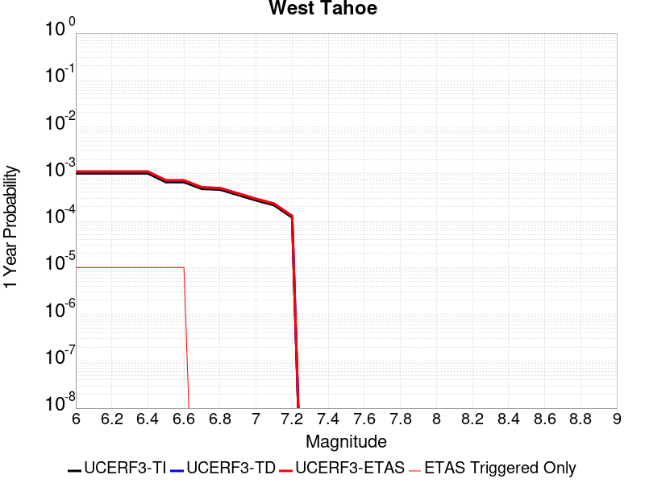 |  |

| Magnitude | 1 wk TI Prob | 1 wk TD Prob | 1 wk ETAS Prob | 1 wk ETAS/TD Gain | 1 wk ETAS Triggered Only | 1 mo TI Prob | 1 mo TD Prob | 1 mo ETAS Prob | 1 mo ETAS/TD Gain | 1 mo ETAS Triggered Only | 1 yr TI Prob | 1 yr TD Prob | 1 yr ETAS Prob | 1 yr ETAS/TD Gain | 1 yr ETAS Triggered Only | 10 yr TI Prob | 10 yr TD Prob | 10 yr ETAS Prob | 10 yr ETAS/TD Gain | 10 yr ETAS Triggered Only |
|-----|-----|-----|-----|-----|-----|-----|-----|-----|-----|-----|-----|-----|-----|-----|-----|-----|-----|-----|-----|-----|
| 6.0 | 1.952444E-5 | 2.1184127E-5 | 2.1184127E-5 | 1.0 | 0.0 | 8.367348E-5 | 9.078626E-5 | 9.078626E-5 | 1.0 | 0.0 | 0.0010182485 | 0.001104817 | 0.0011148059 | 1.0090413 | 1.0E-5 | 0.010135954 | 0.01099873 | 0.01100862 | 1.0008992 | 1.0E-5 |
| 6.1 | 1.952444E-5 | 2.1184127E-5 | 2.1184127E-5 | 1.0 | 0.0 | 8.367348E-5 | 9.078626E-5 | 9.078626E-5 | 1.0 | 0.0 | 0.0010182485 | 0.001104817 | 0.0011148059 | 1.0090413 | 1.0E-5 | 0.010135954 | 0.01099873 | 0.01100862 | 1.0008992 | 1.0E-5 |
| 6.2 | 1.952444E-5 | 2.1184127E-5 | 2.1184127E-5 | 1.0 | 0.0 | 8.367348E-5 | 9.078626E-5 | 9.078626E-5 | 1.0 | 0.0 | 0.0010182485 | 0.001104817 | 0.0011148059 | 1.0090413 | 1.0E-5 | 0.010135954 | 0.01099873 | 0.01100862 | 1.0008992 | 1.0E-5 |
| 6.3 | 1.952444E-5 | 2.1184127E-5 | 2.1184127E-5 | 1.0 | 0.0 | 8.367348E-5 | 9.078626E-5 | 9.078626E-5 | 1.0 | 0.0 | 0.0010182485 | 0.001104817 | 0.0011148059 | 1.0090413 | 1.0E-5 | 0.010135954 | 0.01099873 | 0.01100862 | 1.0008992 | 1.0E-5 |
| 6.4 | 1.952444E-5 | 2.1184127E-5 | 2.1184127E-5 | 1.0 | 0.0 | 8.367348E-5 | 9.078626E-5 | 9.078626E-5 | 1.0 | 0.0 | 0.0010182485 | 0.001104817 | 0.0011148059 | 1.0090413 | 1.0E-5 | 0.010135954 | 0.01099873 | 0.01100862 | 1.0008992 | 1.0E-5 |
| 6.5 | 1.2685271E-5 | 1.3691204E-5 | 1.3691204E-5 | 1.0 | 0.0 | 5.4364315E-5 | 5.8675363E-5 | 5.8675363E-5 | 1.0 | 0.0 | 6.616845E-4 | 7.1415486E-4 | 7.241477E-4 | 1.0139925 | 1.0E-5 | 0.0065971776 | 0.0071202484 | 0.007130177 | 1.0013944 | 1.0E-5 |
| 6.6 | 1.2685271E-5 | 1.3691204E-5 | 1.3691204E-5 | 1.0 | 0.0 | 5.4364315E-5 | 5.8675363E-5 | 5.8675363E-5 | 1.0 | 0.0 | 6.616845E-4 | 7.1415486E-4 | 7.241477E-4 | 1.0139925 | 1.0E-5 | 0.0065971776 | 0.0071202484 | 0.007130177 | 1.0013944 | 1.0E-5 |
| 6.7 | 9.117886E-6 | 9.810242E-6 | 9.810242E-6 | 1.0 | 0.0 | 3.9076072E-5 | 4.2043255E-5 | 4.2043255E-5 | 1.0 | 0.0 | 4.756473E-4 | 5.117636E-4 | 5.117636E-4 | 1.0 | 0.0 | 0.0047463053 | 0.005106569 | 0.005106569 | 1.0 | 0.0 |
| 6.8 | 8.786828E-6 | 9.4582465E-6 | 9.4582465E-6 | 1.0 | 0.0 | 3.7657293E-5 | 4.0534753E-5 | 4.0534753E-5 | 1.0 | 0.0 | 4.5838108E-4 | 4.9340585E-4 | 4.9340585E-4 | 1.0 | 0.0 | 0.0045743673 | 0.004923805 | 0.004923805 | 1.0 | 0.0 |
| 6.9 | 6.7562123E-6 | 7.2640983E-6 | 7.2640983E-6 | 1.0 | 0.0 | 2.8954875E-5 | 3.1131505E-5 | 3.1131505E-5 | 1.0 | 0.0 | 3.5246857E-4 | 3.789649E-4 | 3.789649E-4 | 1.0 | 0.0 | 0.0035191004 | 0.0037836588 | 0.0037836588 | 1.0 | 0.0 |
| 7.0 | 5.1792854E-6 | 5.5675596E-6 | 5.5675596E-6 | 1.0 | 0.0 | 2.2196748E-5 | 2.3860774E-5 | 2.3860774E-5 | 1.0 | 0.0 | 2.702119E-4 | 2.9047E-4 | 2.9047E-4 | 1.0 | 0.0 | 0.0026988357 | 0.0029012784 | 0.0029012784 | 1.0 | 0.0 |
| 7.1 | 4.090765E-6 | 4.3975974E-6 | 4.3975974E-6 | 1.0 | 0.0 | 1.7531731E-5 | 1.884673E-5 | 1.884673E-5 | 1.0 | 0.0 | 2.134279E-4 | 2.2943817E-4 | 2.2943817E-4 | 1.0 | 0.0 | 0.0021322304 | 0.0022923474 | 0.0022923474 | 1.0 | 0.0 |
| 7.2 | 2.2356758E-6 | 2.4024635E-6 | 2.4024635E-6 | 1.0 | 0.0 | 9.581432E-6 | 1.0296241E-5 | 1.0296241E-5 | 1.0 | 0.0 | 1.1664769E-4 | 1.2535142E-4 | 1.2535142E-4 | 1.0 | 0.0 | 0.0011658648 | 0.001252993 | 0.001252993 | 1.0 | 0.0 |

## Great Valley 04b Gordon Valley
*[(top)](#table-of-contents)*

| 1 Week | 1 Month | 1 Year | 10 Year |
|-----|-----|-----|-----|
|  |  |  |  |

| Magnitude | 1 wk TI Prob | 1 wk TD Prob | 1 wk ETAS Prob | 1 wk ETAS/TD Gain | 1 wk ETAS Triggered Only | 1 mo TI Prob | 1 mo TD Prob | 1 mo ETAS Prob | 1 mo ETAS/TD Gain | 1 mo ETAS Triggered Only | 1 yr TI Prob | 1 yr TD Prob | 1 yr ETAS Prob | 1 yr ETAS/TD Gain | 1 yr ETAS Triggered Only | 10 yr TI Prob | 10 yr TD Prob | 10 yr ETAS Prob | 10 yr ETAS/TD Gain | 10 yr ETAS Triggered Only |
|-----|-----|-----|-----|-----|-----|-----|-----|-----|-----|-----|-----|-----|-----|-----|-----|-----|-----|-----|-----|-----|
| 6.0 | 2.1181217E-5 | 2.3983639E-5 | 2.3983639E-5 | 1.0 | 0.0 | 9.077348E-5 | 1.0278391E-4 | 1.0278391E-4 | 1.0 | 0.0 | 0.0011046068 | 0.0012508425 | 0.00126083 | 1.0079846 | 1.0E-5 | 0.010991322 | 0.0124544725 | 0.012464348 | 1.000793 | 1.0E-5 |
| 6.1 | 2.1181217E-5 | 2.3983639E-5 | 2.3983639E-5 | 1.0 | 0.0 | 9.077348E-5 | 1.0278391E-4 | 1.0278391E-4 | 1.0 | 0.0 | 0.0011046068 | 0.0012508425 | 0.00126083 | 1.0079846 | 1.0E-5 | 0.010991322 | 0.0124544725 | 0.012464348 | 1.000793 | 1.0E-5 |
| 6.2 | 2.1181217E-5 | 2.3983639E-5 | 2.3983639E-5 | 1.0 | 0.0 | 9.077348E-5 | 1.0278391E-4 | 1.0278391E-4 | 1.0 | 0.0 | 0.0011046068 | 0.0012508425 | 0.00126083 | 1.0079846 | 1.0E-5 | 0.010991322 | 0.0124544725 | 0.012464348 | 1.000793 | 1.0E-5 |
| 6.3 | 2.1181217E-5 | 2.3983639E-5 | 2.3983639E-5 | 1.0 | 0.0 | 9.077348E-5 | 1.0278391E-4 | 1.0278391E-4 | 1.0 | 0.0 | 0.0011046068 | 0.0012508425 | 0.00126083 | 1.0079846 | 1.0E-5 | 0.010991322 | 0.0124544725 | 0.012464348 | 1.000793 | 1.0E-5 |
| 6.4 | 1.0988268E-5 | 1.2255248E-5 | 1.2255248E-5 | 1.0 | 0.0 | 4.7091726E-5 | 5.2521526E-5 | 5.2521526E-5 | 1.0 | 0.0 | 5.731909E-4 | 6.392779E-4 | 6.492715E-4 | 1.0156326 | 1.0E-5 | 0.005717147 | 0.0063759764 | 0.0063859127 | 1.0015584 | 1.0E-5 |
| 6.5 | 1.0988268E-5 | 1.2255248E-5 | 1.2255248E-5 | 1.0 | 0.0 | 4.7091726E-5 | 5.2521526E-5 | 5.2521526E-5 | 1.0 | 0.0 | 5.731909E-4 | 6.392779E-4 | 6.492715E-4 | 1.0156326 | 1.0E-5 | 0.005717147 | 0.0063759764 | 0.0063859127 | 1.0015584 | 1.0E-5 |
| 6.6 | 1.0517822E-5 | 1.17247755E-5 | 1.17247755E-5 | 1.0 | 0.0 | 4.5075605E-5 | 5.024816E-5 | 5.024816E-5 | 1.0 | 0.0 | 5.4865726E-4 | 6.1161525E-4 | 6.216091E-4 | 1.0163401 | 1.0E-5 | 0.0054730466 | 0.0061008735 | 0.0061108125 | 1.0016291 | 1.0E-5 |
| 6.7 | 7.789219E-6 | 8.67817E-6 | 8.67817E-6 | 1.0 | 0.0 | 3.3381937E-5 | 3.7191654E-5 | 3.7191654E-5 | 1.0 | 0.0 | 4.063493E-4 | 4.527195E-4 | 4.62715E-4 | 1.0220788 | 1.0E-5 | 0.004056071 | 0.0045184894 | 0.0045284443 | 1.0022031 | 1.0E-5 |
| 6.8 | 7.5850853E-6 | 8.452902E-6 | 8.452902E-6 | 1.0 | 0.0 | 3.2507105E-5 | 3.622625E-5 | 3.622625E-5 | 1.0 | 0.0 | 3.957021E-4 | 4.4097047E-4 | 4.5096606E-4 | 1.0226673 | 1.0E-5 | 0.0039499826 | 0.004401467 | 0.0044114226 | 1.002262 | 1.0E-5 |
| 6.9 | 6.604105E-6 | 7.3589954E-6 | 7.3589954E-6 | 1.0 | 0.0 | 2.8303E-5 | 3.153819E-5 | 3.153819E-5 | 1.0 | 0.0 | 3.4453452E-4 | 3.8391372E-4 | 3.939099E-4 | 1.0260376 | 1.0E-5 | 0.0034400085 | 0.0038328916 | 0.0038428532 | 1.002599 | 1.0E-5 |
| 7.0 | 5.3701115E-6 | 5.9887843E-6 | 5.9887843E-6 | 1.0 | 0.0 | 2.301456E-5 | 2.5665984E-5 | 2.5665984E-5 | 1.0 | 0.0 | 2.8016625E-4 | 3.1244147E-4 | 3.1244147E-4 | 1.0 | 0.0 | 0.0027981328 | 0.0031203104 | 0.0031203104 | 1.0 | 0.0 |
| 7.1 | 4.4685607E-6 | 4.986785E-6 | 4.986785E-6 | 1.0 | 0.0 | 1.9150835E-5 | 2.1371776E-5 | 2.1371776E-5 | 1.0 | 0.0 | 2.3313647E-4 | 2.6017276E-4 | 2.6017276E-4 | 1.0 | 0.0 | 0.0023289204 | 0.0025989267 | 0.0025989267 | 1.0 | 0.0 |
| 7.2 | 2.833378E-6 | 3.1646157E-6 | 3.1646157E-6 | 1.0 | 0.0 | 1.2142991E-5 | 1.3562578E-5 | 1.3562578E-5 | 1.0 | 0.0 | 1.4783088E-4 | 1.6511363E-4 | 1.6511363E-4 | 1.0 | 0.0 | 0.0014773258 | 0.0016500814 | 0.0016500814 | 1.0 | 0.0 |
| 7.3 | 7.0087293E-7 | 7.773268E-7 | 7.773268E-7 | 1.0 | 0.0 | 3.0037377E-6 | 3.331399E-6 | 3.331399E-6 | 1.0 | 0.0 | 3.656989E-5 | 4.0559487E-5 | 4.0559487E-5 | 1.0 | 0.0 | 3.6563876E-4 | 4.0556584E-4 | 4.0556584E-4 | 1.0 | 0.0 |
| 7.4 | 3.112171E-8 | 3.2068883E-8 | 3.2068883E-8 | 1.0 | 0.0 | 1.3337875E-7 | 1.3743806E-7 | 1.3743806E-7 | 1.0 | 0.0 | 1.6238852E-6 | 1.6733072E-6 | 1.6733072E-6 | 1.0 | 0.0 | 1.6238733E-5 | 1.6732954E-5 | 1.6732954E-5 | 1.0 | 0.0 |

## Ortigalita (South)
*[(top)](#table-of-contents)*

| 1 Week | 1 Month | 1 Year | 10 Year |
|-----|-----|-----|-----|
|  |  |  |  |

| Magnitude | 1 wk TI Prob | 1 wk TD Prob | 1 wk ETAS Prob | 1 wk ETAS/TD Gain | 1 wk ETAS Triggered Only | 1 mo TI Prob | 1 mo TD Prob | 1 mo ETAS Prob | 1 mo ETAS/TD Gain | 1 mo ETAS Triggered Only | 1 yr TI Prob | 1 yr TD Prob | 1 yr ETAS Prob | 1 yr ETAS/TD Gain | 1 yr ETAS Triggered Only | 10 yr TI Prob | 10 yr TD Prob | 10 yr ETAS Prob | 10 yr ETAS/TD Gain | 10 yr ETAS Triggered Only |
|-----|-----|-----|-----|-----|-----|-----|-----|-----|-----|-----|-----|-----|-----|-----|-----|-----|-----|-----|-----|-----|
| 6.0 | 3.72394E-5 | 4.3259326E-5 | 4.3259326E-5 | 1.0 | 0.0 | 1.5958765E-4 | 1.8538482E-4 | 1.8538482E-4 | 1.0 | 0.0 | 0.0019412481 | 0.0022548803 | 0.0022548803 | 1.0 | 0.0 | 0.019243775 | 0.022336403 | 0.02234618 | 1.0004377 | 1.0E-5 |
| 6.1 | 2.7299884E-5 | 3.1494612E-5 | 3.1494612E-5 | 1.0 | 0.0 | 1.16994255E-4 | 1.3497024E-4 | 1.3497024E-4 | 1.0 | 0.0 | 0.0014234743 | 0.0016420798 | 0.0016420798 | 1.0 | 0.0 | 0.014143906 | 0.016305394 | 0.016315231 | 1.0006033 | 1.0E-5 |
| 6.2 | 2.7299884E-5 | 3.1494612E-5 | 3.1494612E-5 | 1.0 | 0.0 | 1.16994255E-4 | 1.3497024E-4 | 1.3497024E-4 | 1.0 | 0.0 | 0.0014234743 | 0.0016420798 | 0.0016420798 | 1.0 | 0.0 | 0.014143906 | 0.016305394 | 0.016315231 | 1.0006033 | 1.0E-5 |
| 6.3 | 2.0546433E-5 | 2.3633342E-5 | 2.3633342E-5 | 1.0 | 0.0 | 8.805317E-5 | 1.0128192E-4 | 1.0128192E-4 | 1.0 | 0.0 | 0.00107152 | 0.0012324288 | 0.0012324288 | 1.0 | 0.0 | 0.010663681 | 0.012258004 | 0.012258004 | 1.0 | 0.0 |
| 6.4 | 2.0546433E-5 | 2.3633342E-5 | 2.3633342E-5 | 1.0 | 0.0 | 8.805317E-5 | 1.0128192E-4 | 1.0128192E-4 | 1.0 | 0.0 | 0.00107152 | 0.0012324288 | 0.0012324288 | 1.0 | 0.0 | 0.010663681 | 0.012258004 | 0.012258004 | 1.0 | 0.0 |
| 6.5 | 1.7779594E-5 | 2.0448608E-5 | 2.0448608E-5 | 1.0 | 0.0 | 7.619603E-5 | 8.763403E-5 | 8.763403E-5 | 1.0 | 0.0 | 9.272918E-4 | 0.0010664356 | 0.0010664356 | 1.0 | 0.0 | 0.009234319 | 0.010614647 | 0.010614647 | 1.0 | 0.0 |
| 6.6 | 1.6272212E-5 | 1.8716464E-5 | 1.8716464E-5 | 1.0 | 0.0 | 6.973618E-5 | 8.0211015E-5 | 8.0211015E-5 | 1.0 | 0.0 | 8.487073E-4 | 9.7614387E-4 | 9.7614387E-4 | 1.0 | 0.0 | 0.008454733 | 0.0097198635 | 0.0097198635 | 1.0 | 0.0 |
| 6.7 | 1.3051484E-5 | 1.5039977E-5 | 1.5039977E-5 | 1.0 | 0.0 | 5.593373E-5 | 6.4455504E-5 | 6.4455504E-5 | 1.0 | 0.0 | 6.807804E-4 | 7.8447274E-4 | 7.8447274E-4 | 1.0 | 0.0 | 0.006786986 | 0.007818019 | 0.007818019 | 1.0 | 0.0 |
| 6.8 | 1.04277415E-5 | 1.1988189E-5 | 1.1988189E-5 | 1.0 | 0.0 | 4.4689557E-5 | 5.137698E-5 | 5.137698E-5 | 1.0 | 0.0 | 5.439595E-4 | 6.2534265E-4 | 6.2534265E-4 | 1.0 | 0.0 | 0.0054262993 | 0.0062365844 | 0.0062365844 | 1.0 | 0.0 |
| 6.9 | 7.639968E-6 | 8.792207E-6 | 8.792207E-6 | 1.0 | 0.0 | 3.274231E-5 | 3.7680376E-5 | 3.7680376E-5 | 1.0 | 0.0 | 3.9856473E-4 | 4.5866793E-4 | 4.5866793E-4 | 1.0 | 0.0 | 0.003978506 | 0.004577799 | 0.004577799 | 1.0 | 0.0 |
| 7.0 | 3.919831E-6 | 4.5337783E-6 | 4.5337783E-6 | 1.0 | 0.0 | 1.679917E-5 | 1.9430345E-5 | 1.9430345E-5 | 1.0 | 0.0 | 2.045107E-4 | 2.3654089E-4 | 2.3654089E-4 | 1.0 | 0.0 | 0.0020432258 | 0.0023630997 | 0.0023630997 | 1.0 | 0.0 |
| 7.1 | 1.6017933E-6 | 1.857199E-6 | 1.857199E-6 | 1.0 | 0.0 | 6.8648105E-6 | 7.959406E-6 | 7.959406E-6 | 1.0 | 0.0 | 8.357586E-5 | 9.690253E-5 | 9.690253E-5 | 1.0 | 0.0 | 8.3544437E-4 | 9.6870743E-4 | 9.6870743E-4 | 1.0 | 0.0 |

## Hartley Springs 2011 CFM
*[(top)](#table-of-contents)*

| 1 Week | 1 Month | 1 Year | 10 Year |
|-----|-----|-----|-----|
|  | 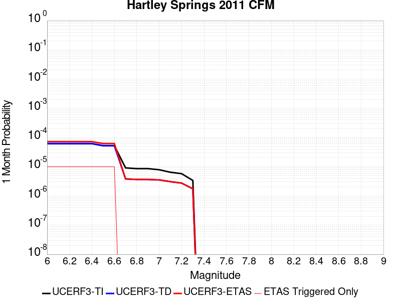 |  |  |

| Magnitude | 1 wk TI Prob | 1 wk TD Prob | 1 wk ETAS Prob | 1 wk ETAS/TD Gain | 1 wk ETAS Triggered Only | 1 mo TI Prob | 1 mo TD Prob | 1 mo ETAS Prob | 1 mo ETAS/TD Gain | 1 mo ETAS Triggered Only | 1 yr TI Prob | 1 yr TD Prob | 1 yr ETAS Prob | 1 yr ETAS/TD Gain | 1 yr ETAS Triggered Only | 10 yr TI Prob | 10 yr TD Prob | 10 yr ETAS Prob | 10 yr ETAS/TD Gain | 10 yr ETAS Triggered Only |
|-----|-----|-----|-----|-----|-----|-----|-----|-----|-----|-----|-----|-----|-----|-----|-----|-----|-----|-----|-----|-----|
| 6.0 | 1.4352418E-5 | 1.4435592E-5 | 2.4435447E-5 | 1.6927223 | 1.0E-5 | 6.1508916E-5 | 6.186628E-5 | 7.186566E-5 | 1.161629 | 1.0E-5 | 7.486137E-4 | 7.5312605E-4 | 7.631185E-4 | 1.013268 | 1.0E-5 | 0.007460968 | 0.0075218603 | 0.0075317854 | 1.0013194 | 1.0E-5 |
| 6.1 | 1.4352418E-5 | 1.4435592E-5 | 2.4435447E-5 | 1.6927223 | 1.0E-5 | 6.1508916E-5 | 6.186628E-5 | 7.186566E-5 | 1.161629 | 1.0E-5 | 7.486137E-4 | 7.5312605E-4 | 7.631185E-4 | 1.013268 | 1.0E-5 | 0.007460968 | 0.0075218603 | 0.0075317854 | 1.0013194 | 1.0E-5 |
| 6.2 | 1.4352418E-5 | 1.4435592E-5 | 2.4435447E-5 | 1.6927223 | 1.0E-5 | 6.1508916E-5 | 6.186628E-5 | 7.186566E-5 | 1.161629 | 1.0E-5 | 7.486137E-4 | 7.5312605E-4 | 7.631185E-4 | 1.013268 | 1.0E-5 | 0.007460968 | 0.0075218603 | 0.0075317854 | 1.0013194 | 1.0E-5 |
| 6.3 | 1.4352418E-5 | 1.4435592E-5 | 2.4435447E-5 | 1.6927223 | 1.0E-5 | 6.1508916E-5 | 6.186628E-5 | 7.186566E-5 | 1.161629 | 1.0E-5 | 7.486137E-4 | 7.5312605E-4 | 7.631185E-4 | 1.013268 | 1.0E-5 | 0.007460968 | 0.0075218603 | 0.0075317854 | 1.0013194 | 1.0E-5 |
| 6.4 | 1.4352418E-5 | 1.4435592E-5 | 2.4435447E-5 | 1.6927223 | 1.0E-5 | 6.1508916E-5 | 6.186628E-5 | 7.186566E-5 | 1.161629 | 1.0E-5 | 7.486137E-4 | 7.5312605E-4 | 7.631185E-4 | 1.013268 | 1.0E-5 | 0.007460968 | 0.0075218603 | 0.0075317854 | 1.0013194 | 1.0E-5 |
| 6.5 | 1.2279858E-5 | 1.2134381E-5 | 2.213426E-5 | 1.8240947 | 1.0E-5 | 5.26269E-5 | 5.2004347E-5 | 6.2003826E-5 | 1.1922816 | 1.0E-5 | 6.4054417E-4 | 6.331272E-4 | 6.4312085E-4 | 1.0157846 | 1.0E-5 | 0.0063870098 | 0.006328748 | 0.0063386844 | 1.0015701 | 1.0E-5 |
| 6.6 | 1.2279858E-5 | 1.2134381E-5 | 2.213426E-5 | 1.8240947 | 1.0E-5 | 5.26269E-5 | 5.2004347E-5 | 6.2003826E-5 | 1.1922816 | 1.0E-5 | 6.4054417E-4 | 6.331272E-4 | 6.4312085E-4 | 1.0157846 | 1.0E-5 | 0.0063870098 | 0.006328748 | 0.0063386844 | 1.0015701 | 1.0E-5 |
| 6.7 | 2.1282601E-6 | 8.901165E-7 | 8.901165E-7 | 1.0 | 0.0 | 9.121083E-6 | 3.814781E-6 | 3.814781E-6 | 1.0 | 0.0 | 1.11043526E-4 | 4.6444227E-5 | 4.6444227E-5 | 1.0 | 0.0 | 0.0011098806 | 4.6437053E-4 | 4.6437053E-4 | 1.0 | 0.0 |
| 6.8 | 2.00516E-6 | 8.5238594E-7 | 8.5238594E-7 | 1.0 | 0.0 | 8.593515E-6 | 3.653079E-6 | 3.653079E-6 | 1.0 | 0.0 | 1.04621024E-4 | 4.4475586E-5 | 4.4475586E-5 | 1.0 | 0.0 | 0.0010457177 | 4.44692E-4 | 4.44692E-4 | 1.0 | 0.0 |
| 6.9 | 2.00516E-6 | 8.5238594E-7 | 8.5238594E-7 | 1.0 | 0.0 | 8.593515E-6 | 3.653079E-6 | 3.653079E-6 | 1.0 | 0.0 | 1.04621024E-4 | 4.4475586E-5 | 4.4475586E-5 | 1.0 | 0.0 | 0.0010457177 | 4.44692E-4 | 4.44692E-4 | 1.0 | 0.0 |
| 7.0 | 1.8366732E-6 | 8.243502E-7 | 8.243502E-7 | 1.0 | 0.0 | 7.871433E-6 | 3.5329263E-6 | 3.5329263E-6 | 1.0 | 0.0 | 9.583048E-5 | 4.3012784E-5 | 4.3012784E-5 | 1.0 | 0.0 | 9.5789164E-4 | 4.3006963E-4 | 4.3006963E-4 | 1.0 | 0.0 |
| 7.1 | 1.5097997E-6 | 7.196265E-7 | 7.196265E-7 | 1.0 | 0.0 | 6.470554E-6 | 3.0841113E-6 | 3.0841113E-6 | 1.0 | 0.0 | 7.877615E-5 | 3.754865E-5 | 3.754865E-5 | 1.0 | 0.0 | 7.874823E-4 | 3.7544678E-4 | 3.7544678E-4 | 1.0 | 0.0 |
| 7.2 | 1.3490993E-6 | 6.411233E-7 | 6.411233E-7 | 1.0 | 0.0 | 5.7818415E-6 | 2.7476697E-6 | 2.7476697E-6 | 1.0 | 0.0 | 7.0391645E-5 | 3.3452598E-5 | 3.3452598E-5 | 1.0 | 0.0 | 7.0369354E-4 | 3.344986E-4 | 3.344986E-4 | 1.0 | 0.0 |
| 7.3 | 7.900015E-7 | 4.0893696E-7 | 4.0893696E-7 | 1.0 | 0.0 | 3.3857161E-6 | 1.752587E-6 | 1.752587E-6 | 1.0 | 0.0 | 4.1220315E-5 | 2.1337746E-5 | 2.1337746E-5 | 1.0 | 0.0 | 4.121267E-4 | 2.1337747E-4 | 2.1337747E-4 | 1.0 | 0.0 |

## Lost Hills
*[(top)](#table-of-contents)*

| 1 Week | 1 Month | 1 Year | 10 Year |
|-----|-----|-----|-----|
|  |  | 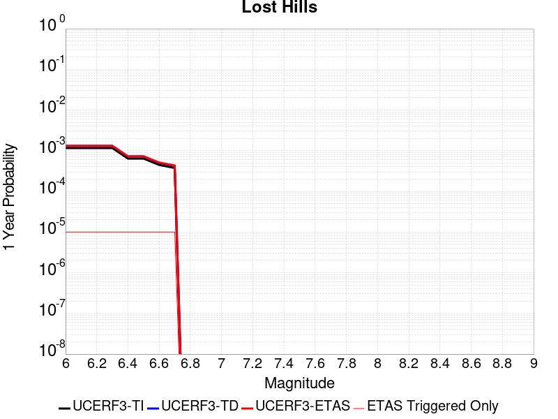 |  |

| Magnitude | 1 wk TI Prob | 1 wk TD Prob | 1 wk ETAS Prob | 1 wk ETAS/TD Gain | 1 wk ETAS Triggered Only | 1 mo TI Prob | 1 mo TD Prob | 1 mo ETAS Prob | 1 mo ETAS/TD Gain | 1 mo ETAS Triggered Only | 1 yr TI Prob | 1 yr TD Prob | 1 yr ETAS Prob | 1 yr ETAS/TD Gain | 1 yr ETAS Triggered Only | 10 yr TI Prob | 10 yr TD Prob | 10 yr ETAS Prob | 10 yr ETAS/TD Gain | 10 yr ETAS Triggered Only |
|-----|-----|-----|-----|-----|-----|-----|-----|-----|-----|-----|-----|-----|-----|-----|-----|-----|-----|-----|-----|-----|
| 6.0 | 2.233523E-5 | 2.5108235E-5 | 2.5108235E-5 | 1.0 | 0.0 | 9.571891E-5 | 1.07603235E-4 | 1.07603235E-4 | 1.0 | 0.0 | 0.0011647546 | 0.0013094501 | 0.001319437 | 1.0076268 | 1.0E-5 | 0.011586686 | 0.013033944 | 0.013043814 | 1.0007572 | 1.0E-5 |
| 6.1 | 2.233523E-5 | 2.5108235E-5 | 2.5108235E-5 | 1.0 | 0.0 | 9.571891E-5 | 1.07603235E-4 | 1.07603235E-4 | 1.0 | 0.0 | 0.0011647546 | 0.0013094501 | 0.001319437 | 1.0076268 | 1.0E-5 | 0.011586686 | 0.013033944 | 0.013043814 | 1.0007572 | 1.0E-5 |
| 6.2 | 2.233523E-5 | 2.5108235E-5 | 2.5108235E-5 | 1.0 | 0.0 | 9.571891E-5 | 1.07603235E-4 | 1.07603235E-4 | 1.0 | 0.0 | 0.0011647546 | 0.0013094501 | 0.001319437 | 1.0076268 | 1.0E-5 | 0.011586686 | 0.013033944 | 0.013043814 | 1.0007572 | 1.0E-5 |
| 6.3 | 2.233523E-5 | 2.5108235E-5 | 2.5108235E-5 | 1.0 | 0.0 | 9.571891E-5 | 1.07603235E-4 | 1.07603235E-4 | 1.0 | 0.0 | 0.0011647546 | 0.0013094501 | 0.001319437 | 1.0076268 | 1.0E-5 | 0.011586686 | 0.013033944 | 0.013043814 | 1.0007572 | 1.0E-5 |
| 6.4 | 1.2288092E-5 | 1.3781996E-5 | 1.3781996E-5 | 1.0 | 0.0 | 5.2662188E-5 | 5.906489E-5 | 5.906489E-5 | 1.0 | 0.0 | 6.409735E-4 | 7.1897154E-4 | 7.2896434E-4 | 1.0138987 | 1.0E-5 | 0.006391279 | 0.007175662 | 0.0071855905 | 1.0013835 | 1.0E-5 |
| 6.5 | 1.2288092E-5 | 1.3781996E-5 | 1.3781996E-5 | 1.0 | 0.0 | 5.2662188E-5 | 5.906489E-5 | 5.906489E-5 | 1.0 | 0.0 | 6.409735E-4 | 7.1897154E-4 | 7.2896434E-4 | 1.0138987 | 1.0E-5 | 0.006391279 | 0.007175662 | 0.0071855905 | 1.0013835 | 1.0E-5 |
| 6.6 | 8.58281E-6 | 9.634396E-6 | 9.634396E-6 | 1.0 | 0.0 | 3.6782953E-5 | 4.1290084E-5 | 4.1290084E-5 | 1.0 | 0.0 | 4.4774043E-4 | 5.02674E-4 | 5.12669E-4 | 1.0198836 | 1.0E-5 | 0.0044683935 | 0.005023531 | 0.005033481 | 1.0019807 | 1.0E-5 |
| 6.7 | 7.205685E-6 | 8.088828E-6 | 8.088828E-6 | 1.0 | 0.0 | 3.088114E-5 | 3.4666402E-5 | 3.4666402E-5 | 1.0 | 0.0 | 3.7591302E-4 | 4.2206346E-4 | 4.3205923E-4 | 1.0236831 | 1.0E-5 | 0.0037527776 | 0.0042206347 | 0.0042305924 | 1.0023593 | 1.0E-5 |

## Newport-Inglewood (Offshore)
*[(top)](#table-of-contents)*

| 1 Week | 1 Month | 1 Year | 10 Year |
|-----|-----|-----|-----|
|  |  |  |  |

| Magnitude | 1 wk TI Prob | 1 wk TD Prob | 1 wk ETAS Prob | 1 wk ETAS/TD Gain | 1 wk ETAS Triggered Only | 1 mo TI Prob | 1 mo TD Prob | 1 mo ETAS Prob | 1 mo ETAS/TD Gain | 1 mo ETAS Triggered Only | 1 yr TI Prob | 1 yr TD Prob | 1 yr ETAS Prob | 1 yr ETAS/TD Gain | 1 yr ETAS Triggered Only | 10 yr TI Prob | 10 yr TD Prob | 10 yr ETAS Prob | 10 yr ETAS/TD Gain | 10 yr ETAS Triggered Only |
|-----|-----|-----|-----|-----|-----|-----|-----|-----|-----|-----|-----|-----|-----|-----|-----|-----|-----|-----|-----|-----|
| 6.0 | 1.9626508E-5 | 1.8966122E-5 | 1.8966122E-5 | 1.0 | 0.0 | 8.411089E-5 | 8.1280916E-5 | 9.1280104E-5 | 1.12302 | 1.0E-5 | 0.001023569 | 9.891585E-4 | 9.991486E-4 | 1.0100996 | 1.0E-5 | 0.010188672 | 0.009848899 | 0.009858801 | 1.0010053 | 1.0E-5 |
| 6.1 | 1.331886E-5 | 1.2218608E-5 | 1.2218608E-5 | 1.0 | 0.0 | 5.707958E-5 | 5.2364423E-5 | 5.2364423E-5 | 1.0 | 0.0 | 6.947222E-4 | 6.373518E-4 | 6.373518E-4 | 1.0 | 0.0 | 0.006925544 | 0.0063554165 | 0.0063554165 | 1.0 | 0.0 |
| 6.2 | 1.2250852E-5 | 1.1076503E-5 | 1.1076503E-5 | 1.0 | 0.0 | 5.2502597E-5 | 4.746987E-5 | 4.746987E-5 | 1.0 | 0.0 | 6.3903164E-4 | 5.777934E-4 | 5.777934E-4 | 1.0 | 0.0 | 0.006371971 | 0.005763033 | 0.005763033 | 1.0 | 0.0 |
| 6.3 | 1.2106258E-5 | 1.0919358E-5 | 1.0919358E-5 | 1.0 | 0.0 | 5.1882926E-5 | 4.6796413E-5 | 4.6796413E-5 | 1.0 | 0.0 | 6.3149154E-4 | 5.695984E-4 | 5.695984E-4 | 1.0 | 0.0 | 0.0062970007 | 0.0056815012 | 0.0056815012 | 1.0 | 0.0 |
| 6.4 | 1.1348758E-5 | 1.0109799E-5 | 1.0109799E-5 | 1.0 | 0.0 | 4.8636626E-5 | 4.3326996E-5 | 4.3326996E-5 | 1.0 | 0.0 | 5.919901E-4 | 5.273793E-4 | 5.273793E-4 | 1.0 | 0.0 | 0.005904155 | 0.0052613737 | 0.0052613737 | 1.0 | 0.0 |
| 6.5 | 1.100837E-5 | 9.7438115E-6 | 9.7438115E-6 | 1.0 | 0.0 | 4.7177873E-5 | 4.175853E-5 | 4.175853E-5 | 1.0 | 0.0 | 5.7423924E-4 | 5.082923E-4 | 5.082923E-4 | 1.0 | 0.0 | 0.005727576 | 0.005071388 | 0.005071388 | 1.0 | 0.0 |
| 6.6 | 1.0634696E-5 | 9.34595E-6 | 9.34595E-6 | 1.0 | 0.0 | 4.557647E-5 | 4.0053463E-5 | 4.0053463E-5 | 1.0 | 0.0 | 5.5475225E-4 | 4.875425E-4 | 4.875425E-4 | 1.0 | 0.0 | 0.0055336943 | 0.0048648156 | 0.0048648156 | 1.0 | 0.0 |
| 6.7 | 9.9780855E-6 | 8.668286E-6 | 8.668286E-6 | 1.0 | 0.0 | 4.276252E-5 | 3.714927E-5 | 3.714927E-5 | 1.0 | 0.0 | 5.205093E-4 | 4.521992E-4 | 4.521992E-4 | 1.0 | 0.0 | 0.0051929182 | 0.0045128698 | 0.0045128698 | 1.0 | 0.0 |
| 6.8 | 9.59546E-6 | 8.273307E-6 | 8.273307E-6 | 1.0 | 0.0 | 4.1122752E-5 | 3.545655E-5 | 3.545655E-5 | 1.0 | 0.0 | 5.0055445E-4 | 4.3159866E-4 | 4.3159866E-4 | 1.0 | 0.0 | 0.004994285 | 0.0043076803 | 0.0043076803 | 1.0 | 0.0 |
| 6.9 | 9.000614E-6 | 7.707169E-6 | 7.707169E-6 | 1.0 | 0.0 | 3.857349E-5 | 3.3030312E-5 | 3.3030312E-5 | 1.0 | 0.0 | 4.6953102E-4 | 4.0207047E-4 | 4.0207047E-4 | 1.0 | 0.0 | 0.004685402 | 0.004013502 | 0.004013502 | 1.0 | 0.0 |
| 7.0 | 7.4070194E-6 | 6.1491287E-6 | 6.1491287E-6 | 1.0 | 0.0 | 3.1743984E-5 | 2.6353144E-5 | 2.6353144E-5 | 1.0 | 0.0 | 3.8641447E-4 | 3.2080244E-4 | 3.2080244E-4 | 1.0 | 0.0 | 0.0038574322 | 0.0032034132 | 0.0032034132 | 1.0 | 0.0 |
| 7.1 | 6.299615E-6 | 5.0567855E-6 | 5.0567855E-6 | 1.0 | 0.0 | 2.699807E-5 | 2.1671758E-5 | 2.1671758E-5 | 1.0 | 0.0 | 3.2865192E-4 | 2.6382183E-4 | 2.6382183E-4 | 1.0 | 0.0 | 0.003281663 | 0.002635101 | 0.002635101 | 1.0 | 0.0 |
| 7.2 | 5.096653E-6 | 3.8929225E-6 | 3.8929225E-6 | 1.0 | 0.0 | 2.1842614E-5 | 1.6683847E-5 | 1.6683847E-5 | 1.0 | 0.0 | 2.6590136E-4 | 2.03107E-4 | 2.03107E-4 | 1.0 | 0.0 | 0.0026558342 | 0.002029225 | 0.002029225 | 1.0 | 0.0 |
| 7.3 | 3.9753018E-6 | 2.909986E-6 | 2.909986E-6 | 1.0 | 0.0 | 1.7036897E-5 | 1.2471309E-5 | 1.2471309E-5 | 1.0 | 0.0 | 2.0740448E-4 | 1.5182768E-4 | 1.5182768E-4 | 1.0 | 0.0 | 0.00207211 | 0.0015172476 | 0.0015172476 | 1.0 | 0.0 |
| 7.4 | 3.0568392E-6 | 2.145059E-6 | 2.145059E-6 | 1.0 | 0.0 | 1.3100675E-5 | 9.193077E-6 | 9.193077E-6 | 1.0 | 0.0 | 1.5948903E-4 | 1.1192003E-4 | 1.1192003E-4 | 1.0 | 0.0 | 0.0015937461 | 0.001118643 | 0.001118643 | 1.0 | 0.0 |
| 7.5 | 1.7279019E-6 | 1.1470098E-6 | 1.1470098E-6 | 1.0 | 0.0 | 7.405273E-6 | 4.9157475E-6 | 4.9157475E-6 | 1.0 | 0.0 | 9.015547E-5 | 5.9847618E-5 | 5.9847618E-5 | 1.0 | 0.0 | 9.01189E-4 | 5.983189E-4 | 5.983189E-4 | 1.0 | 0.0 |
| 7.6 | 1.1156416E-6 | 7.223291E-7 | 7.223291E-7 | 1.0 | 0.0 | 4.7813123E-6 | 3.0956926E-6 | 3.0956926E-6 | 1.0 | 0.0 | 5.821092E-5 | 3.7689428E-5 | 3.7689428E-5 | 1.0 | 0.0 | 5.8195676E-4 | 3.768327E-4 | 3.768327E-4 | 1.0 | 0.0 |
| 7.7 | 9.117973E-8 | 6.73438E-8 | 6.73438E-8 | 1.0 | 0.0 | 3.907702E-7 | 2.8861623E-7 | 2.8861623E-7 | 1.0 | 0.0 | 4.757617E-6 | 3.5138974E-6 | 3.5138974E-6 | 1.0 | 0.0 | 4.7575148E-5 | 3.5138448E-5 | 3.5138448E-5 | 1.0 | 0.0 |

## Hunting Creek - Berryessa 2011 CFM
*[(top)](#table-of-contents)*

| 1 Week | 1 Month | 1 Year | 10 Year |
|-----|-----|-----|-----|
| 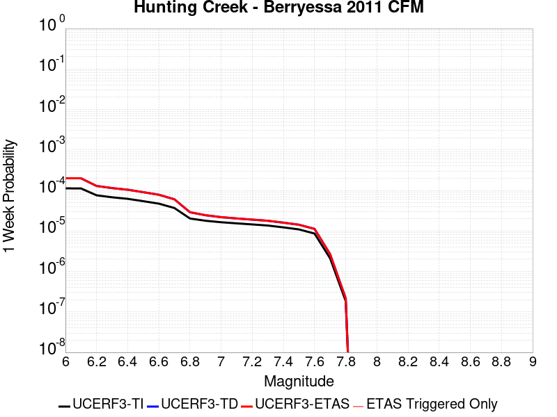 |  |  |  |

| Magnitude | 1 wk TI Prob | 1 wk TD Prob | 1 wk ETAS Prob | 1 wk ETAS/TD Gain | 1 wk ETAS Triggered Only | 1 mo TI Prob | 1 mo TD Prob | 1 mo ETAS Prob | 1 mo ETAS/TD Gain | 1 mo ETAS Triggered Only | 1 yr TI Prob | 1 yr TD Prob | 1 yr ETAS Prob | 1 yr ETAS/TD Gain | 1 yr ETAS Triggered Only | 10 yr TI Prob | 10 yr TD Prob | 10 yr ETAS Prob | 10 yr ETAS/TD Gain | 10 yr ETAS Triggered Only |
|-----|-----|-----|-----|-----|-----|-----|-----|-----|-----|-----|-----|-----|-----|-----|-----|-----|-----|-----|-----|-----|
| 6.0 | 1.1270982E-4 | 2.003051E-4 | 2.003051E-4 | 1.0 | 0.0 | 4.8295266E-4 | 8.5816236E-4 | 8.5816236E-4 | 1.0 | 0.0 | 0.0058641075 | 0.010387901 | 0.010387901 | 1.0 | 0.0 | 0.057117578 | 0.09805656 | 0.098065585 | 1.000092 | 1.0E-5 |
| 6.1 | 1.1239393E-4 | 1.9978649E-4 | 1.9978649E-4 | 1.0 | 0.0 | 4.8159933E-4 | 8.559412E-4 | 8.559412E-4 | 1.0 | 0.0 | 0.0058477195 | 0.01036114 | 0.01036114 | 1.0 | 0.0 | 0.056962132 | 0.09781499 | 0.097824015 | 1.0000923 | 1.0E-5 |
| 6.2 | 7.596265E-5 | 1.2936012E-4 | 1.2936012E-4 | 1.0 | 0.0 | 3.2551357E-4 | 5.542557E-4 | 5.542557E-4 | 1.0 | 0.0 | 0.0039559277 | 0.0067224824 | 0.0067224824 | 1.0 | 0.0 | 0.038862433 | 0.06460357 | 0.06461292 | 1.0001448 | 1.0E-5 |
| 6.3 | 6.78794E-5 | 1.1450075E-4 | 1.1450075E-4 | 1.0 | 0.0 | 2.9087928E-4 | 4.9062027E-4 | 4.9062027E-4 | 1.0 | 0.0 | 0.003535705 | 0.005953632 | 0.005953632 | 1.0 | 0.0 | 0.034799766 | 0.057476293 | 0.05748572 | 1.000164 | 1.0E-5 |
| 6.4 | 6.2165134E-5 | 1.0436495E-4 | 1.0436495E-4 | 1.0 | 0.0 | 2.6639478E-4 | 4.4719726E-4 | 4.4719726E-4 | 1.0 | 0.0 | 0.0032385332 | 0.0054283096 | 0.0054283096 | 1.0 | 0.0 | 0.03191742 | 0.052560717 | 0.05257019 | 1.0001802 | 1.0E-5 |
| 6.5 | 5.4368087E-5 | 9.071705E-5 | 9.071705E-5 | 1.0 | 0.0 | 2.3298527E-4 | 3.8872933E-4 | 3.8872933E-4 | 1.0 | 0.0 | 0.0028329059 | 0.00472048 | 0.00472048 | 1.0 | 0.0 | 0.027970633 | 0.04588959 | 0.04588959 | 1.0 | 0.0 |
| 6.6 | 4.729947E-5 | 7.8481535E-5 | 7.8481535E-5 | 1.0 | 0.0 | 2.0269625E-4 | 3.3630725E-4 | 3.3630725E-4 | 1.0 | 0.0 | 0.002465034 | 0.0040854122 | 0.0040854122 | 1.0 | 0.0 | 0.02437869 | 0.039859768 | 0.039859768 | 1.0 | 0.0 |
| 6.7 | 3.6875328E-5 | 6.0453847E-5 | 6.0453847E-5 | 1.0 | 0.0 | 1.5802756E-4 | 2.590628E-4 | 2.590628E-4 | 1.0 | 0.0 | 0.0019222875 | 0.003148796 | 0.003148796 | 1.0 | 0.0 | 0.019057442 | 0.030898971 | 0.030898971 | 1.0 | 0.0 |
| 6.8 | 2.0292036E-5 | 2.8979644E-5 | 2.8979644E-5 | 1.0 | 0.0 | 8.6962966E-5 | 1.241925E-4 | 1.241925E-4 | 1.0 | 0.0 | 0.0010582599 | 0.0015109818 | 0.0015109818 | 1.0 | 0.0 | 0.010532344 | 0.014980777 | 0.014980777 | 1.0 | 0.0 |
| 6.9 | 1.7871042E-5 | 2.4475177E-5 | 2.4475177E-5 | 1.0 | 0.0 | 7.658793E-5 | 1.0488941E-4 | 1.0488941E-4 | 1.0 | 0.0 | 9.320591E-4 | 0.0012762798 | 0.0012762798 | 1.0 | 0.0 | 0.009281595 | 0.012681562 | 0.012681562 | 1.0 | 0.0 |
| 7.0 | 1.6415532E-5 | 2.1908912E-5 | 2.1908912E-5 | 1.0 | 0.0 | 7.035038E-5 | 9.3891984E-5 | 9.3891984E-5 | 1.0 | 0.0 | 8.561793E-4 | 0.0011425366 | 0.0011425366 | 1.0 | 0.0 | 0.008528882 | 0.011366049 | 0.011366049 | 1.0 | 0.0 |
| 7.1 | 1.5409885E-5 | 2.03488E-5 | 2.03488E-5 | 1.0 | 0.0 | 6.6040695E-5 | 8.7206245E-5 | 8.7206245E-5 | 1.0 | 0.0 | 8.0374884E-4 | 0.0010612216 | 0.0010612216 | 1.0 | 0.0 | 0.00800848 | 0.0105619915 | 0.0105619915 | 1.0 | 0.0 |
| 7.2 | 1.4497423E-5 | 1.9057261E-5 | 1.9057261E-5 | 1.0 | 0.0 | 6.213033E-5 | 8.167144E-5 | 8.167144E-5 | 1.0 | 0.0 | 7.5617427E-4 | 9.938992E-4 | 9.938992E-4 | 1.0 | 0.0 | 0.0075360634 | 0.00989526 | 0.00989526 | 1.0 | 0.0 |
| 7.3 | 1.3615175E-5 | 1.7828346E-5 | 1.7828346E-5 | 1.0 | 0.0 | 5.8349444E-5 | 7.640498E-5 | 7.640498E-5 | 1.0 | 0.0 | 7.101729E-4 | 9.2983653E-4 | 9.2983653E-4 | 1.0 | 0.0 | 0.0070790765 | 0.009260084 | 0.009260084 | 1.0 | 0.0 |
| 7.4 | 1.2252825E-5 | 1.6028262E-5 | 1.6028262E-5 | 1.0 | 0.0 | 5.251105E-5 | 6.869076E-5 | 6.869076E-5 | 1.0 | 0.0 | 6.391345E-4 | 8.359919E-4 | 8.359919E-4 | 1.0 | 0.0 | 0.0063729943 | 0.008329037 | 0.008329037 | 1.0 | 0.0 |
| 7.5 | 1.0913301E-5 | 1.4242859E-5 | 1.4242859E-5 | 1.0 | 0.0 | 4.6770452E-5 | 6.103941E-5 | 6.103941E-5 | 1.0 | 0.0 | 5.6928146E-4 | 7.429042E-4 | 7.429042E-4 | 1.0 | 0.0 | 0.0056782532 | 0.00740471 | 0.00740471 | 1.0 | 0.0 |
| 7.6 | 8.623192E-6 | 1.1235911E-5 | 1.1235911E-5 | 1.0 | 0.0 | 3.6956015E-5 | 4.815303E-5 | 4.815303E-5 | 1.0 | 0.0 | 4.4984656E-4 | 5.86108E-4 | 5.86108E-4 | 1.0 | 0.0 | 0.00448937 | 0.005845999 | 0.005845999 | 1.0 | 0.0 |
| 7.7 | 2.0993634E-6 | 2.6628493E-6 | 2.6628493E-6 | 1.0 | 0.0 | 8.997241E-6 | 1.1412161E-5 | 1.1412161E-5 | 1.0 | 0.0 | 1.09535904E-4 | 1.3893428E-4 | 1.3893428E-4 | 1.0 | 0.0 | 0.0010948193 | 0.0013884885 | 0.0013884885 | 1.0 | 0.0 |
| 7.8 | 1.8428308E-7 | 2.1676125E-7 | 2.1676125E-7 | 1.0 | 0.0 | 7.897844E-7 | 9.289765E-7 | 9.289765E-7 | 1.0 | 0.0 | 9.615583E-6 | 1.1310233E-5 | 1.1310233E-5 | 1.0 | 0.0 | 9.615166E-5 | 1.1308978E-4 | 1.1308978E-4 | 1.0 | 0.0 |

## Malibu Coast (Extension) alt 1
*[(top)](#table-of-contents)*

| 1 Week | 1 Month | 1 Year | 10 Year |
|-----|-----|-----|-----|
|  |  |  |  |

| Magnitude | 1 wk TI Prob | 1 wk TD Prob | 1 wk ETAS Prob | 1 wk ETAS/TD Gain | 1 wk ETAS Triggered Only | 1 mo TI Prob | 1 mo TD Prob | 1 mo ETAS Prob | 1 mo ETAS/TD Gain | 1 mo ETAS Triggered Only | 1 yr TI Prob | 1 yr TD Prob | 1 yr ETAS Prob | 1 yr ETAS/TD Gain | 1 yr ETAS Triggered Only | 10 yr TI Prob | 10 yr TD Prob | 10 yr ETAS Prob | 10 yr ETAS/TD Gain | 10 yr ETAS Triggered Only |
|-----|-----|-----|-----|-----|-----|-----|-----|-----|-----|-----|-----|-----|-----|-----|-----|-----|-----|-----|-----|-----|
| 6.0 | 8.930738E-6 | 9.329555E-6 | 9.329555E-6 | 1.0 | 0.0 | 3.827403E-5 | 3.9983202E-5 | 3.9983202E-5 | 1.0 | 0.0 | 4.6588664E-4 | 4.8668848E-4 | 4.8668848E-4 | 1.0 | 0.0 | 0.0046491115 | 0.0048564086 | 0.00486636 | 1.0020491 | 1.0E-5 |
| 6.1 | 7.199952E-6 | 7.5305375E-6 | 7.5305375E-6 | 1.0 | 0.0 | 3.0856572E-5 | 3.2273336E-5 | 3.2273336E-5 | 1.0 | 0.0 | 3.75614E-4 | 3.9285762E-4 | 3.9285762E-4 | 1.0 | 0.0 | 0.0037497976 | 0.0039216974 | 0.0039216974 | 1.0 | 0.0 |
| 6.2 | 6.3721413E-6 | 6.6670127E-6 | 6.6670127E-6 | 1.0 | 0.0 | 2.7308892E-5 | 2.8572602E-5 | 2.8572602E-5 | 1.0 | 0.0 | 3.3243504E-4 | 3.4781624E-4 | 3.4781624E-4 | 1.0 | 0.0 | 0.0033193815 | 0.0034727587 | 0.0034727587 | 1.0 | 0.0 |
| 6.3 | 6.016345E-6 | 6.295371E-6 | 6.295371E-6 | 1.0 | 0.0 | 2.578408E-5 | 2.6979882E-5 | 2.6979882E-5 | 1.0 | 0.0 | 3.1387596E-4 | 3.2843088E-4 | 3.2843088E-4 | 1.0 | 0.0 | 0.00313433 | 0.0032794913 | 0.0032794913 | 1.0 | 0.0 |
| 6.4 | 5.8104883E-6 | 6.0797515E-6 | 6.0797515E-6 | 1.0 | 0.0 | 2.4901856E-5 | 2.605582E-5 | 2.605582E-5 | 1.0 | 0.0 | 3.031379E-4 | 3.1718376E-4 | 3.1718376E-4 | 1.0 | 0.0 | 0.0030272473 | 0.003167345 | 0.003167345 | 1.0 | 0.0 |
| 6.5 | 5.476925E-6 | 5.72771E-6 | 5.72771E-6 | 1.0 | 0.0 | 2.3472323E-5 | 2.4547098E-5 | 2.4547098E-5 | 1.0 | 0.0 | 2.8573806E-4 | 2.9882023E-4 | 2.9882023E-4 | 1.0 | 0.0 | 0.0028537093 | 0.0029842162 | 0.0029842162 | 1.0 | 0.0 |
| 6.6 | 5.222387E-6 | 5.458768E-6 | 5.458768E-6 | 1.0 | 0.0 | 2.2381464E-5 | 2.3394514E-5 | 2.3394514E-5 | 1.0 | 0.0 | 2.7246025E-4 | 2.8479125E-4 | 2.8479125E-4 | 1.0 | 0.0 | 0.0027212645 | 0.0028442936 | 0.0028442936 | 1.0 | 0.0 |
| 6.7 | 5.0337076E-6 | 5.2592854E-6 | 5.2592854E-6 | 1.0 | 0.0 | 2.1572854E-5 | 2.2539603E-5 | 2.2539603E-5 | 1.0 | 0.0 | 2.6261783E-4 | 2.7438538E-4 | 2.7438538E-4 | 1.0 | 0.0 | 0.002623077 | 0.002740496 | 0.002740496 | 1.0 | 0.0 |
| 6.8 | 4.5675624E-6 | 4.7588796E-6 | 4.7588796E-6 | 1.0 | 0.0 | 1.9575122E-5 | 2.0395039E-5 | 2.0395039E-5 | 1.0 | 0.0 | 2.3830103E-4 | 2.482815E-4 | 2.482815E-4 | 1.0 | 0.0 | 0.0023804565 | 0.0024800608 | 0.0024800608 | 1.0 | 0.0 |
| 6.9 | 4.2802412E-6 | 4.4521726E-6 | 4.4521726E-6 | 1.0 | 0.0 | 1.8343762E-5 | 1.90806E-5 | 1.90806E-5 | 1.0 | 0.0 | 2.2331243E-4 | 2.322817E-4 | 2.322817E-4 | 1.0 | 0.0 | 0.0022308815 | 0.002320406 | 0.002320406 | 1.0 | 0.0 |
| 7.0 | 3.9794063E-6 | 4.130239E-6 | 4.130239E-6 | 1.0 | 0.0 | 1.7054486E-5 | 1.7700906E-5 | 1.7700906E-5 | 1.0 | 0.0 | 2.0761859E-4 | 2.1548734E-4 | 2.1548734E-4 | 1.0 | 0.0 | 0.0020742472 | 0.0021527973 | 0.0021527973 | 1.0 | 0.0 |
| 7.1 | 3.7730424E-6 | 3.91135E-6 | 3.91135E-6 | 1.0 | 0.0 | 1.6170083E-5 | 1.6762822E-5 | 1.6762822E-5 | 1.0 | 0.0 | 1.9685295E-4 | 2.0406836E-4 | 2.0406836E-4 | 1.0 | 0.0 | 0.0019667868 | 0.0020388225 | 0.0020388225 | 1.0 | 0.0 |
| 7.2 | 3.424985E-6 | 3.5414578E-6 | 3.5414578E-6 | 1.0 | 0.0 | 1.4678424E-5 | 1.5177588E-5 | 1.5177588E-5 | 1.0 | 0.0 | 1.7869516E-4 | 1.8477158E-4 | 1.8477158E-4 | 1.0 | 0.0 | 0.0017855153 | 0.0018461916 | 0.0018461916 | 1.0 | 0.0 |
| 7.3 | 2.6966375E-6 | 2.7597434E-6 | 2.7597434E-6 | 1.0 | 0.0 | 1.15569665E-5 | 1.1827418E-5 | 1.1827418E-5 | 1.0 | 0.0 | 1.4069698E-4 | 1.4398934E-4 | 1.4398934E-4 | 1.0 | 0.0 | 0.0014060794 | 0.0014389646 | 0.0014389646 | 1.0 | 0.0 |
| 7.4 | 2.215957E-6 | 2.2494505E-6 | 2.2494505E-6 | 1.0 | 0.0 | 9.496924E-6 | 9.6404665E-6 | 9.6404665E-6 | 1.0 | 0.0 | 1.1561892E-4 | 1.1736639E-4 | 1.1736639E-4 | 1.0 | 0.0 | 0.0011555878 | 0.0011730478 | 0.0011730478 | 1.0 | 0.0 |
| 7.5 | 1.2040218E-6 | 1.2219476E-6 | 1.2219476E-6 | 1.0 | 0.0 | 5.160083E-6 | 5.236908E-6 | 5.236908E-6 | 1.0 | 0.0 | 6.2822204E-5 | 6.375751E-5 | 6.375751E-5 | 1.0 | 0.0 | 6.280445E-4 | 6.37394E-4 | 6.37394E-4 | 1.0 | 0.0 |
| 7.6 | 6.6157446E-7 | 6.679206E-7 | 6.679206E-7 | 1.0 | 0.0 | 2.835316E-6 | 2.8625136E-6 | 2.8625136E-6 | 1.0 | 0.0 | 3.4519428E-5 | 3.485056E-5 | 3.485056E-5 | 1.0 | 0.0 | 3.4514067E-4 | 3.4845248E-4 | 3.4845248E-4 | 1.0 | 0.0 |
| 7.7 | 2.6012302E-7 | 2.4358354E-7 | 2.4358354E-7 | 1.0 | 0.0 | 1.1148124E-6 | 1.0439292E-6 | 1.0439292E-6 | 1.0 | 0.0 | 1.3572758E-5 | 1.2709774E-5 | 1.2709774E-5 | 1.0 | 0.0 | 1.3571928E-4 | 1.2709154E-4 | 1.2709154E-4 | 1.0 | 0.0 |
| 7.8 | 2.8323132E-8 | 2.0267E-8 | 2.0267E-8 | 1.0 | 0.0 | 1.2138484E-7 | 8.685857E-8 | 8.685857E-8 | 1.0 | 0.0 | 1.4778595E-6 | 1.0575027E-6 | 1.0575027E-6 | 1.0 | 0.0 | 1.4778497E-5 | 1.0574984E-5 | 1.0574984E-5 | 1.0 | 0.0 |

## San Gabriel
*[(top)](#table-of-contents)*

| 1 Week | 1 Month | 1 Year | 10 Year |
|-----|-----|-----|-----|
|  |  |  | 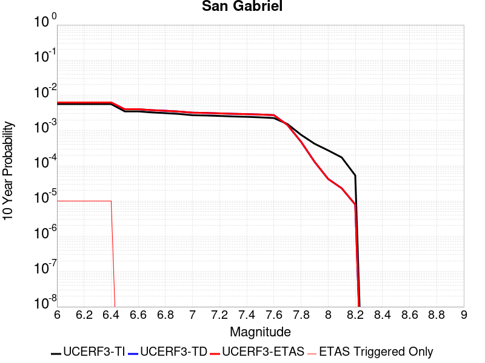 |

| Magnitude | 1 wk TI Prob | 1 wk TD Prob | 1 wk ETAS Prob | 1 wk ETAS/TD Gain | 1 wk ETAS Triggered Only | 1 mo TI Prob | 1 mo TD Prob | 1 mo ETAS Prob | 1 mo ETAS/TD Gain | 1 mo ETAS Triggered Only | 1 yr TI Prob | 1 yr TD Prob | 1 yr ETAS Prob | 1 yr ETAS/TD Gain | 1 yr ETAS Triggered Only | 10 yr TI Prob | 10 yr TD Prob | 10 yr ETAS Prob | 10 yr ETAS/TD Gain | 10 yr ETAS Triggered Only |
|-----|-----|-----|-----|-----|-----|-----|-----|-----|-----|-----|-----|-----|-----|-----|-----|-----|-----|-----|-----|-----|
| 6.0 | 1.083775E-5 | 1.1993788E-5 | 1.1993788E-5 | 1.0 | 0.0 | 4.6446676E-5 | 5.1400995E-5 | 5.1400995E-5 | 1.0 | 0.0 | 5.653415E-4 | 6.2563876E-4 | 6.356325E-4 | 1.0159737 | 1.0E-5 | 0.0056390543 | 0.0062508797 | 0.0062608174 | 1.0015898 | 1.0E-5 |
| 6.1 | 1.083775E-5 | 1.1993788E-5 | 1.1993788E-5 | 1.0 | 0.0 | 4.6446676E-5 | 5.1400995E-5 | 5.1400995E-5 | 1.0 | 0.0 | 5.653415E-4 | 6.2563876E-4 | 6.356325E-4 | 1.0159737 | 1.0E-5 | 0.0056390543 | 0.0062508797 | 0.0062608174 | 1.0015898 | 1.0E-5 |
| 6.2 | 1.083775E-5 | 1.1993788E-5 | 1.1993788E-5 | 1.0 | 0.0 | 4.6446676E-5 | 5.1400995E-5 | 5.1400995E-5 | 1.0 | 0.0 | 5.653415E-4 | 6.2563876E-4 | 6.356325E-4 | 1.0159737 | 1.0E-5 | 0.0056390543 | 0.0062508797 | 0.0062608174 | 1.0015898 | 1.0E-5 |
| 6.3 | 1.083775E-5 | 1.1993788E-5 | 1.1993788E-5 | 1.0 | 0.0 | 4.6446676E-5 | 5.1400995E-5 | 5.1400995E-5 | 1.0 | 0.0 | 5.653415E-4 | 6.2563876E-4 | 6.356325E-4 | 1.0159737 | 1.0E-5 | 0.0056390543 | 0.0062508797 | 0.0062608174 | 1.0015898 | 1.0E-5 |
| 6.4 | 1.083775E-5 | 1.1993788E-5 | 1.1993788E-5 | 1.0 | 0.0 | 4.6446676E-5 | 5.1400995E-5 | 5.1400995E-5 | 1.0 | 0.0 | 5.653415E-4 | 6.2563876E-4 | 6.356325E-4 | 1.0159737 | 1.0E-5 | 0.0056390543 | 0.0062508797 | 0.0062608174 | 1.0015898 | 1.0E-5 |
| 6.5 | 6.7317824E-6 | 7.725454E-6 | 7.725454E-6 | 1.0 | 0.0 | 2.8850178E-5 | 3.3108678E-5 | 3.3108678E-5 | 1.0 | 0.0 | 3.511943E-4 | 4.0302463E-4 | 4.0302463E-4 | 1.0 | 0.0 | 0.003506398 | 0.0040340438 | 0.0040340438 | 1.0 | 0.0 |
| 6.6 | 6.7317824E-6 | 7.725454E-6 | 7.725454E-6 | 1.0 | 0.0 | 2.8850178E-5 | 3.3108678E-5 | 3.3108678E-5 | 1.0 | 0.0 | 3.511943E-4 | 4.0302463E-4 | 4.0302463E-4 | 1.0 | 0.0 | 0.003506398 | 0.0040340438 | 0.0040340438 | 1.0 | 0.0 |
| 6.7 | 6.274881E-6 | 7.254367E-6 | 7.254367E-6 | 1.0 | 0.0 | 2.6892068E-5 | 3.108978E-5 | 3.108978E-5 | 1.0 | 0.0 | 3.2736175E-4 | 3.784533E-4 | 3.784533E-4 | 1.0 | 0.0 | 0.0032687993 | 0.0037891874 | 0.0037891874 | 1.0 | 0.0 |
| 6.8 | 5.996209E-6 | 6.9670828E-6 | 6.9670828E-6 | 1.0 | 0.0 | 2.5697784E-5 | 2.985859E-5 | 2.985859E-5 | 1.0 | 0.0 | 3.128256E-4 | 3.6346863E-4 | 3.6346863E-4 | 1.0 | 0.0 | 0.003123856 | 0.0036398387 | 0.0036398387 | 1.0 | 0.0 |
| 6.9 | 5.686331E-6 | 6.632093E-6 | 6.632093E-6 | 1.0 | 0.0 | 2.4369761E-5 | 2.8422952E-5 | 2.8422952E-5 | 1.0 | 0.0 | 2.9666146E-4 | 3.4599542E-4 | 3.4599542E-4 | 1.0 | 0.0 | 0.0029626573 | 0.0034656627 | 0.0034656627 | 1.0 | 0.0 |
| 7.0 | 5.2329838E-6 | 6.1559535E-6 | 6.1559535E-6 | 1.0 | 0.0 | 2.242688E-5 | 2.6382395E-5 | 2.6382395E-5 | 1.0 | 0.0 | 2.7301308E-4 | 3.2115908E-4 | 3.2115908E-4 | 1.0 | 0.0 | 0.002726779 | 0.0032180331 | 0.0032180331 | 1.0 | 0.0 |
| 7.1 | 5.135671E-6 | 6.046056E-6 | 6.046056E-6 | 1.0 | 0.0 | 2.2009834E-5 | 2.5911417E-5 | 2.5911417E-5 | 1.0 | 0.0 | 2.6793676E-4 | 3.154266E-4 | 3.154266E-4 | 1.0 | 0.0 | 0.0026761394 | 0.0031608723 | 0.0031608723 | 1.0 | 0.0 |
| 7.2 | 4.989062E-6 | 5.8793967E-6 | 5.8793967E-6 | 1.0 | 0.0 | 2.1381518E-5 | 2.5197176E-5 | 2.5197176E-5 | 1.0 | 0.0 | 2.6028889E-4 | 3.0673319E-4 | 3.0673319E-4 | 1.0 | 0.0 | 0.0025998424 | 0.0030741817 | 0.0030741817 | 1.0 | 0.0 |
| 7.3 | 4.8219395E-6 | 5.7109164E-6 | 5.7109164E-6 | 1.0 | 0.0 | 2.0665291E-5 | 2.447513E-5 | 2.447513E-5 | 1.0 | 0.0 | 2.5157086E-4 | 2.979447E-4 | 2.979447E-4 | 1.0 | 0.0 | 0.0025128627 | 0.0029865364 | 0.0029865364 | 1.0 | 0.0 |
| 7.4 | 4.7118383E-6 | 5.5994446E-6 | 5.5994446E-6 | 1.0 | 0.0 | 2.0193436E-5 | 2.3997403E-5 | 2.3997403E-5 | 1.0 | 0.0 | 2.4582737E-4 | 2.9212996E-4 | 2.9212996E-4 | 1.0 | 0.0 | 0.002455556 | 0.0029285424 | 0.0029285424 | 1.0 | 0.0 |
| 7.5 | 4.5506545E-6 | 5.4447687E-6 | 5.4447687E-6 | 1.0 | 0.0 | 1.9502659E-5 | 2.333452E-5 | 2.333452E-5 | 1.0 | 0.0 | 2.37419E-4 | 2.8406148E-4 | 2.8406148E-4 | 1.0 | 0.0 | 0.002371655 | 0.0028480662 | 0.0028480662 | 1.0 | 0.0 |
| 7.6 | 4.343636E-6 | 5.2375767E-6 | 5.2375767E-6 | 1.0 | 0.0 | 1.861545E-5 | 2.244657E-5 | 2.244657E-5 | 1.0 | 0.0 | 2.2661954E-4 | 2.7325345E-4 | 2.7325345E-4 | 1.0 | 0.0 | 0.0022638857 | 0.0027402486 | 0.0027402486 | 1.0 | 0.0 |
| 7.7 | 2.936235E-6 | 2.749426E-6 | 2.749426E-6 | 1.0 | 0.0 | 1.2583803E-5 | 1.17832005E-5 | 1.17832005E-5 | 1.0 | 0.0 | 1.5319703E-4 | 1.4345106E-4 | 1.4345106E-4 | 1.0 | 0.0 | 0.0015309147 | 0.0014409109 | 0.0014409109 | 1.0 | 0.0 |
| 7.8 | 1.4541639E-6 | 9.144744E-7 | 9.144744E-7 | 1.0 | 0.0 | 6.232116E-6 | 3.91917E-6 | 3.91917E-6 | 1.0 | 0.0 | 7.587337E-5 | 4.7714853E-5 | 4.7714853E-5 | 1.0 | 0.0 | 7.584747E-4 | 4.819727E-4 | 4.819727E-4 | 1.0 | 0.0 |
| 7.9 | 8.098958E-7 | 2.4252918E-7 | 2.4252918E-7 | 1.0 | 0.0 | 3.4709774E-6 | 1.0394103E-6 | 1.0394103E-6 | 1.0 | 0.0 | 4.225833E-5 | 1.2654747E-5 | 1.2654747E-5 | 1.0 | 0.0 | 4.2250296E-4 | 1.2963027E-4 | 1.2963027E-4 | 1.0 | 0.0 |
| 8.0 | 5.2473234E-7 | 7.7131155E-8 | 7.7131155E-8 | 1.0 | 0.0 | 2.248851E-6 | 3.3056207E-7 | 3.3056207E-7 | 1.0 | 0.0 | 2.7379416E-5 | 4.0245855E-6 | 4.0245855E-6 | 1.0 | 0.0 | 2.7376044E-4 | 4.2375388E-5 | 4.2375388E-5 | 1.0 | 0.0 |
| 8.1 | 3.3162388E-7 | 4.1683297E-8 | 4.1683297E-8 | 1.0 | 0.0 | 1.4212444E-6 | 1.786427E-7 | 1.786427E-7 | 1.0 | 0.0 | 1.7303513E-5 | 2.1749727E-6 | 2.1749727E-6 | 1.0 | 0.0 | 1.7302166E-4 | 2.30667E-5 | 2.30667E-5 | 1.0 | 0.0 |
| 8.2 | 1.0235345E-7 | 1.4101387E-8 | 1.4101387E-8 | 1.0 | 0.0 | 4.3865757E-7 | 6.0434516E-8 | 6.0434516E-8 | 1.0 | 0.0 | 5.340643E-6 | 7.3578997E-7 | 7.3578997E-7 | 1.0 | 0.0 | 5.3405143E-5 | 7.959129E-6 | 7.959129E-6 | 1.0 | 0.0 |

## San Andreas (Santa Cruz Mts) 2011 CFM
*[(top)](#table-of-contents)*

| 1 Week | 1 Month | 1 Year | 10 Year |
|-----|-----|-----|-----|
|  |  |  |  |

| Magnitude | 1 wk TI Prob | 1 wk TD Prob | 1 wk ETAS Prob | 1 wk ETAS/TD Gain | 1 wk ETAS Triggered Only | 1 mo TI Prob | 1 mo TD Prob | 1 mo ETAS Prob | 1 mo ETAS/TD Gain | 1 mo ETAS Triggered Only | 1 yr TI Prob | 1 yr TD Prob | 1 yr ETAS Prob | 1 yr ETAS/TD Gain | 1 yr ETAS Triggered Only | 10 yr TI Prob | 10 yr TD Prob | 10 yr ETAS Prob | 10 yr ETAS/TD Gain | 10 yr ETAS Triggered Only |
|-----|-----|-----|-----|-----|-----|-----|-----|-----|-----|-----|-----|-----|-----|-----|-----|-----|-----|-----|-----|-----|
| 6.0 | 1.7221631E-4 | 1.3823033E-4 | 1.4822894E-4 | 1.072333 | 1.0E-5 | 7.378611E-4 | 5.922832E-4 | 6.022773E-4 | 1.0168738 | 1.0E-5 | 0.008946515 | 0.0071875807 | 0.007197509 | 1.0013813 | 1.0E-5 | 0.08594794 | 0.07068555 | 0.07069485 | 1.0001315 | 1.0E-5 |
| 6.1 | 1.7221631E-4 | 1.3823033E-4 | 1.4822894E-4 | 1.072333 | 1.0E-5 | 7.378611E-4 | 5.922832E-4 | 6.022773E-4 | 1.0168738 | 1.0E-5 | 0.008946515 | 0.0071875807 | 0.007197509 | 1.0013813 | 1.0E-5 | 0.08594794 | 0.07068555 | 0.07069485 | 1.0001315 | 1.0E-5 |
| 6.2 | 1.7221631E-4 | 1.3823033E-4 | 1.4822894E-4 | 1.072333 | 1.0E-5 | 7.378611E-4 | 5.922832E-4 | 6.022773E-4 | 1.0168738 | 1.0E-5 | 0.008946515 | 0.0071875807 | 0.007197509 | 1.0013813 | 1.0E-5 | 0.08594794 | 0.07068555 | 0.07069485 | 1.0001315 | 1.0E-5 |
| 6.3 | 1.716926E-4 | 1.374243E-4 | 1.4742292E-4 | 1.0727574 | 1.0E-5 | 7.3561794E-4 | 5.888304E-4 | 5.988245E-4 | 1.0169728 | 1.0E-5 | 0.008919428 | 0.0071458183 | 0.0071557467 | 1.0013894 | 1.0E-5 | 0.08569809 | 0.070297346 | 0.070306644 | 1.0001322 | 1.0E-5 |
| 6.4 | 1.6392978E-4 | 1.361796E-4 | 1.4617824E-4 | 1.0734224 | 1.0E-5 | 7.02367E-4 | 5.8349833E-4 | 5.934925E-4 | 1.017128 | 1.0E-5 | 0.008517839 | 0.0070813233 | 0.007091252 | 1.0014021 | 1.0E-5 | 0.08198654 | 0.06952924 | 0.06953855 | 1.0001339 | 1.0E-5 |
| 6.5 | 1.5742714E-4 | 1.2677119E-4 | 1.3676992E-4 | 1.0788723 | 1.0E-5 | 6.745133E-4 | 5.4319366E-4 | 5.5318826E-4 | 1.0183996 | 1.0E-5 | 0.00818132 | 0.006593639 | 0.006603573 | 1.0015066 | 1.0E-5 | 0.078865945 | 0.06499287 | 0.06500222 | 1.0001439 | 1.0E-5 |
| 6.6 | 1.3038084E-4 | 1.1615326E-4 | 1.261521E-4 | 1.0860832 | 1.0E-5 | 5.5865536E-4 | 4.97706E-4 | 5.07701E-4 | 1.0200822 | 1.0E-5 | 0.006780438 | 0.0060429615 | 0.006052901 | 1.0016448 | 1.0E-5 | 0.0657725 | 0.059452403 | 0.059461806 | 1.0001582 | 1.0E-5 |
| 6.7 | 1.2867592E-4 | 1.1341684E-4 | 1.2341571E-4 | 1.0881603 | 1.0E-5 | 5.5135164E-4 | 4.859829E-4 | 4.9597805E-4 | 1.0205668 | 1.0E-5 | 0.0066920654 | 0.005901013 | 0.005910954 | 1.0016847 | 1.0E-5 | 0.06494093 | 0.058162734 | 0.058172155 | 1.0001619 | 1.0E-5 |
| 6.8 | 1.2801298E-4 | 1.1279208E-4 | 1.2279095E-4 | 1.0886487 | 1.0E-5 | 5.485117E-4 | 4.8330633E-4 | 4.933015E-4 | 1.0206808 | 1.0E-5 | 0.0066577005 | 0.0058686184 | 0.00587856 | 1.001694 | 1.0E-5 | 0.06461738 | 0.057876524 | 0.057885945 | 1.0001628 | 1.0E-5 |
| 6.9 | 1.269149E-4 | 1.11213E-4 | 1.2121188E-4 | 1.0899075 | 1.0E-5 | 5.4380763E-4 | 4.7654135E-4 | 4.8653656E-4 | 1.0209745 | 1.0E-5 | 0.006600777 | 0.005786695 | 0.0057966374 | 1.001718 | 1.0E-5 | 0.06408122 | 0.05714789 | 0.05715732 | 1.000165 | 1.0E-5 |
| 7.0 | 1.2030331E-4 | 1.085109E-4 | 1.18509815E-4 | 1.0921466 | 1.0E-5 | 5.154837E-4 | 4.649651E-4 | 4.7496046E-4 | 1.021497 | 1.0E-5 | 0.006257969 | 0.005646493 | 0.0056564366 | 1.001761 | 1.0E-5 | 0.06084648 | 0.05581902 | 0.055828463 | 1.0001692 | 1.0E-5 |
| 7.1 | 8.049617E-5 | 5.4112494E-5 | 6.4111955E-5 | 1.1847903 | 1.0E-5 | 3.4493793E-4 | 2.3189027E-4 | 2.4188794E-4 | 1.0431138 | 1.0E-5 | 0.0041915346 | 0.0028196438 | 0.0028296157 | 1.0035366 | 1.0E-5 | 0.041133516 | 0.029710831 | 0.029720534 | 1.0003266 | 1.0E-5 |
| 7.2 | 7.093979E-5 | 4.3101376E-5 | 5.3100943E-5 | 1.2320012 | 1.0E-5 | 3.0399222E-4 | 1.8470723E-4 | 1.9470538E-4 | 1.0541297 | 1.0E-5 | 0.0036948253 | 0.0022465142 | 0.0022564917 | 1.0044414 | 1.0E-5 | 0.03633994 | 0.024023062 | 0.02403282 | 1.0004063 | 1.0E-5 |
| 7.3 | 6.193693E-5 | 2.9015144E-5 | 3.9014853E-5 | 1.3446376 | 1.0E-5 | 2.6541698E-4 | 1.2434469E-4 | 1.3434346E-4 | 1.0804116 | 1.0E-5 | 0.0032266637 | 0.0015128471 | 0.001522832 | 1.0066 | 1.0E-5 | 0.031802133 | 0.016562603 | 0.016572438 | 1.0005938 | 1.0E-5 |
| 7.4 | 5.906492E-5 | 2.7132985E-5 | 3.7132715E-5 | 1.368545 | 1.0E-5 | 2.5311083E-4 | 1.1627904E-4 | 1.2627788E-4 | 1.0859901 | 1.0E-5 | 0.0030772698 | 0.0014147795 | 0.0014247653 | 1.0070583 | 1.0E-5 | 0.030350044 | 0.015529016 | 0.01553886 | 1.000634 | 1.0E-5 |
| 7.5 | 5.424296E-5 | 2.4772991E-5 | 3.4772744E-5 | 1.4036554 | 1.0E-5 | 2.324491E-4 | 1.0616565E-4 | 1.16164585E-4 | 1.0941824 | 1.0E-5 | 0.002826395 | 0.0012918016 | 0.0013017886 | 1.0077311 | 1.0E-5 | 0.027907165 | 0.014213656 | 0.014223514 | 1.0006936 | 1.0E-5 |
| 7.6 | 4.43084E-5 | 1.9968573E-5 | 2.9968372E-5 | 1.5007769 | 1.0E-5 | 1.8987931E-4 | 8.557679E-5 | 9.557593E-5 | 1.116844 | 1.0E-5 | 0.0023093296 | 0.0010413997 | 0.0010513893 | 1.0095924 | 1.0E-5 | 0.022854783 | 0.011447506 | 0.011457391 | 1.0008636 | 1.0E-5 |
| 7.7 | 4.118098E-5 | 1.8996907E-5 | 2.8996717E-5 | 1.5263915 | 1.0E-5 | 1.7647797E-4 | 8.141278E-5 | 9.141196E-5 | 1.1228209 | 1.0E-5 | 0.002146502 | 9.9075E-4 | 0.0010007402 | 1.0100833 | 1.0E-5 | 0.021258866 | 0.010903266 | 0.010913158 | 1.0009072 | 1.0E-5 |
| 7.8 | 3.5408906E-5 | 1.8623094E-5 | 2.8622908E-5 | 1.5369577 | 1.0E-5 | 1.5174363E-4 | 7.9810816E-5 | 8.981002E-5 | 1.1252863 | 1.0E-5 | 0.0018459131 | 9.712638E-4 | 9.81254E-4 | 1.0102859 | 1.0E-5 | 0.018306552 | 0.010683734 | 0.010693627 | 1.000926 | 1.0E-5 |
| 7.9 | 2.5860836E-5 | 1.7369108E-5 | 2.7368935E-5 | 1.5757248 | 1.0E-5 | 1.10827445E-4 | 7.443691E-5 | 8.4436164E-5 | 1.134332 | 1.0E-5 | 0.001348489 | 9.058928E-4 | 9.1588375E-4 | 1.0110289 | 1.0E-5 | 0.013403354 | 0.009936054 | 0.009945955 | 1.0009965 | 1.0E-5 |
| 8.0 | 1.9777332E-5 | 1.48851705E-5 | 2.4885021E-5 | 1.6717995 | 1.0E-5 | 8.4757245E-5 | 6.379203E-5 | 7.3791394E-5 | 1.1567494 | 1.0E-5 | 0.0010314309 | 7.763914E-4 | 7.8638364E-4 | 1.0128701 | 1.0E-5 | 0.010266567 | 0.008533524 | 0.008543439 | 1.0011618 | 1.0E-5 |
| 8.1 | 1.468494E-5 | 1.2144859E-5 | 2.2144739E-5 | 1.8233836 | 1.0E-5 | 6.293394E-5 | 5.204836E-5 | 6.204784E-5 | 1.192119 | 1.0E-5 | 7.6595135E-4 | 6.335047E-4 | 6.434984E-4 | 1.0157752 | 1.0E-5 | 0.0076331664 | 0.006989243 | 0.0069991727 | 1.0014207 | 1.0E-5 |
| 8.2 | 8.63836E-6 | 5.4882034E-6 | 5.4882034E-6 | 1.0 | 0.0 | 3.7021015E-5 | 2.352066E-5 | 2.352066E-5 | 1.0 | 0.0 | 4.5063766E-4 | 2.8632648E-4 | 2.8632648E-4 | 1.0 | 0.0 | 0.004497249 | 0.0032561985 | 0.0032561985 | 1.0 | 0.0 |
| 8.3 | 1.983087E-6 | 7.690063E-7 | 7.690063E-7 | 1.0 | 0.0 | 8.498917E-6 | 3.295737E-6 | 3.295737E-6 | 1.0 | 0.0 | 1.034694E-4 | 4.012488E-5 | 4.012488E-5 | 1.0 | 0.0 | 0.0010342124 | 4.737206E-4 | 4.737206E-4 | 1.0 | 0.0 |

## Kern Canyon (South Kern) 2011
*[(top)](#table-of-contents)*

| 1 Week | 1 Month | 1 Year | 10 Year |
|-----|-----|-----|-----|
|  |  |  |  |

| Magnitude | 1 wk TI Prob | 1 wk TD Prob | 1 wk ETAS Prob | 1 wk ETAS/TD Gain | 1 wk ETAS Triggered Only | 1 mo TI Prob | 1 mo TD Prob | 1 mo ETAS Prob | 1 mo ETAS/TD Gain | 1 mo ETAS Triggered Only | 1 yr TI Prob | 1 yr TD Prob | 1 yr ETAS Prob | 1 yr ETAS/TD Gain | 1 yr ETAS Triggered Only | 10 yr TI Prob | 10 yr TD Prob | 10 yr ETAS Prob | 10 yr ETAS/TD Gain | 10 yr ETAS Triggered Only |
|-----|-----|-----|-----|-----|-----|-----|-----|-----|-----|-----|-----|-----|-----|-----|-----|-----|-----|-----|-----|-----|
| 6.0 | 4.105075E-6 | 4.1137673E-6 | 4.1137673E-6 | 1.0 | 0.0 | 1.7593058E-5 | 1.7630315E-5 | 1.7630315E-5 | 1.0 | 0.0 | 2.1417443E-4 | 2.1462858E-4 | 2.1462858E-4 | 1.0 | 0.0 | 0.0021396813 | 0.0021442769 | 0.0021542555 | 1.0046536 | 1.0E-5 |
| 6.1 | 4.105075E-6 | 4.1137673E-6 | 4.1137673E-6 | 1.0 | 0.0 | 1.7593058E-5 | 1.7630315E-5 | 1.7630315E-5 | 1.0 | 0.0 | 2.1417443E-4 | 2.1462858E-4 | 2.1462858E-4 | 1.0 | 0.0 | 0.0021396813 | 0.0021442769 | 0.0021542555 | 1.0046536 | 1.0E-5 |
| 6.2 | 4.105075E-6 | 4.1137673E-6 | 4.1137673E-6 | 1.0 | 0.0 | 1.7593058E-5 | 1.7630315E-5 | 1.7630315E-5 | 1.0 | 0.0 | 2.1417443E-4 | 2.1462858E-4 | 2.1462858E-4 | 1.0 | 0.0 | 0.0021396813 | 0.0021442769 | 0.0021542555 | 1.0046536 | 1.0E-5 |
| 6.3 | 4.105075E-6 | 4.1137673E-6 | 4.1137673E-6 | 1.0 | 0.0 | 1.7593058E-5 | 1.7630315E-5 | 1.7630315E-5 | 1.0 | 0.0 | 2.1417443E-4 | 2.1462858E-4 | 2.1462858E-4 | 1.0 | 0.0 | 0.0021396813 | 0.0021442769 | 0.0021542555 | 1.0046536 | 1.0E-5 |
| 6.4 | 4.105075E-6 | 4.1137673E-6 | 4.1137673E-6 | 1.0 | 0.0 | 1.7593058E-5 | 1.7630315E-5 | 1.7630315E-5 | 1.0 | 0.0 | 2.1417443E-4 | 2.1462858E-4 | 2.1462858E-4 | 1.0 | 0.0 | 0.0021396813 | 0.0021442769 | 0.0021542555 | 1.0046536 | 1.0E-5 |
| 6.5 | 2.9849807E-6 | 2.9731846E-6 | 2.9731846E-6 | 1.0 | 0.0 | 1.2792712E-5 | 1.2742158E-5 | 1.2742158E-5 | 1.0 | 0.0 | 1.5574014E-4 | 1.5512487E-4 | 1.5512487E-4 | 1.0 | 0.0 | 0.0015563103 | 0.0015501811 | 0.0015601657 | 1.0064409 | 1.0E-5 |
| 6.6 | 2.9849807E-6 | 2.9731846E-6 | 2.9731846E-6 | 1.0 | 0.0 | 1.2792712E-5 | 1.2742158E-5 | 1.2742158E-5 | 1.0 | 0.0 | 1.5574014E-4 | 1.5512487E-4 | 1.5512487E-4 | 1.0 | 0.0 | 0.0015563103 | 0.0015501811 | 0.0015601657 | 1.0064409 | 1.0E-5 |
| 6.7 | 2.6756725E-6 | 2.6582475E-6 | 2.6582475E-6 | 1.0 | 0.0 | 1.1467117E-5 | 1.139244E-5 | 1.139244E-5 | 1.0 | 0.0 | 1.396032E-4 | 1.3869423E-4 | 1.3869423E-4 | 1.0 | 0.0 | 0.0013951553 | 0.0013860877 | 0.0013960738 | 1.0072045 | 1.0E-5 |
| 6.8 | 2.3283721E-6 | 2.3048021E-6 | 2.3048021E-6 | 1.0 | 0.0 | 9.9787E-6 | 9.877686E-6 | 9.877686E-6 | 1.0 | 0.0 | 1.214839E-4 | 1.2025428E-4 | 1.2025428E-4 | 1.0 | 0.0 | 0.001214175 | 0.0012018995 | 0.0012118875 | 1.0083102 | 1.0E-5 |
| 6.9 | 2.0972677E-6 | 2.0696623E-6 | 2.0696623E-6 | 1.0 | 0.0 | 8.988259E-6 | 8.869952E-6 | 8.869952E-6 | 1.0 | 0.0 | 1.0942656E-4 | 1.07986365E-4 | 1.07986365E-4 | 1.0 | 0.0 | 0.0010937268 | 0.0010793448 | 0.001089334 | 1.0092549 | 1.0E-5 |
| 7.0 | 1.7132242E-6 | 1.6787211E-6 | 1.6787211E-6 | 1.0 | 0.0 | 7.3423685E-6 | 7.194499E-6 | 7.194499E-6 | 1.0 | 0.0 | 8.938967E-5 | 8.758954E-5 | 8.758954E-5 | 1.0 | 0.0 | 8.935372E-4 | 8.7555405E-4 | 8.8554533E-4 | 1.0114113 | 1.0E-5 |
| 7.1 | 1.4215541E-6 | 1.3815898E-6 | 1.3815898E-6 | 1.0 | 0.0 | 6.0923603E-6 | 5.9210856E-6 | 5.9210856E-6 | 1.0 | 0.0 | 7.417196E-5 | 7.208686E-5 | 7.208686E-5 | 1.0 | 0.0 | 7.414721E-4 | 7.2063744E-4 | 7.3063024E-4 | 1.0138665 | 1.0E-5 |
| 7.2 | 9.097853E-7 | 8.60387E-7 | 8.60387E-7 | 1.0 | 0.0 | 3.899074E-6 | 3.6873678E-6 | 3.6873678E-6 | 1.0 | 0.0 | 4.7470192E-5 | 4.489279E-5 | 4.489279E-5 | 1.0 | 0.0 | 4.7460053E-4 | 4.4883828E-4 | 4.588338E-4 | 1.0222697 | 1.0E-5 |
| 7.3 | 6.144169E-7 | 5.62827E-7 | 5.62827E-7 | 1.0 | 0.0 | 2.6332125E-6 | 2.4121134E-6 | 2.4121134E-6 | 1.0 | 0.0 | 3.205889E-5 | 2.9367091E-5 | 2.9367091E-5 | 1.0 | 0.0 | 3.2054266E-4 | 2.936326E-4 | 3.0362967E-4 | 1.0340462 | 1.0E-5 |
| 7.4 | 4.049844E-7 | 3.5728738E-7 | 3.5728738E-7 | 1.0 | 0.0 | 1.7356463E-6 | 1.5312307E-6 | 1.5312307E-6 | 1.0 | 0.0 | 2.1131287E-5 | 1.8642577E-5 | 1.8642577E-5 | 1.0 | 0.0 | 2.1129279E-4 | 1.8641038E-4 | 1.8641038E-4 | 1.0 | 0.0 |
| 7.5 | 1.9871162E-7 | 1.5830643E-7 | 1.5830643E-7 | 1.0 | 0.0 | 8.5162094E-7 | 6.78456E-7 | 6.78456E-7 | 1.0 | 0.0 | 1.0368436E-5 | 8.260171E-6 | 8.260171E-6 | 1.0 | 0.0 | 1.0367952E-4 | 8.259873E-5 | 8.259873E-5 | 1.0 | 0.0 |
| 7.6 | 2.572245E-8 | 1.7353019E-8 | 1.7353019E-8 | 1.0 | 0.0 | 1.10239064E-7 | 7.437008E-8 | 7.437008E-8 | 1.0 | 0.0 | 1.3421597E-6 | 9.054554E-7 | 9.054554E-7 | 1.0 | 0.0 | 1.3421517E-5 | 9.054523E-6 | 9.054523E-6 | 1.0 | 0.0 |

## Verdugo
*[(top)](#table-of-contents)*

| 1 Week | 1 Month | 1 Year | 10 Year |
|-----|-----|-----|-----|
|  |  |  |  |

| Magnitude | 1 wk TI Prob | 1 wk TD Prob | 1 wk ETAS Prob | 1 wk ETAS/TD Gain | 1 wk ETAS Triggered Only | 1 mo TI Prob | 1 mo TD Prob | 1 mo ETAS Prob | 1 mo ETAS/TD Gain | 1 mo ETAS Triggered Only | 1 yr TI Prob | 1 yr TD Prob | 1 yr ETAS Prob | 1 yr ETAS/TD Gain | 1 yr ETAS Triggered Only | 10 yr TI Prob | 10 yr TD Prob | 10 yr ETAS Prob | 10 yr ETAS/TD Gain | 10 yr ETAS Triggered Only |
|-----|-----|-----|-----|-----|-----|-----|-----|-----|-----|-----|-----|-----|-----|-----|-----|-----|-----|-----|-----|-----|
| 6.0 | 5.392987E-6 | 4.2167994E-6 | 4.2167994E-6 | 1.0 | 0.0 | 2.3112598E-5 | 1.8071876E-5 | 1.8071876E-5 | 1.0 | 0.0 | 2.8135953E-4 | 2.2000335E-4 | 2.2000335E-4 | 1.0 | 0.0 | 0.0028100356 | 0.002197903 | 0.0022078813 | 1.0045398 | 1.0E-5 |
| 6.1 | 5.392987E-6 | 4.2167994E-6 | 4.2167994E-6 | 1.0 | 0.0 | 2.3112598E-5 | 1.8071876E-5 | 1.8071876E-5 | 1.0 | 0.0 | 2.8135953E-4 | 2.2000335E-4 | 2.2000335E-4 | 1.0 | 0.0 | 0.0028100356 | 0.002197903 | 0.0022078813 | 1.0045398 | 1.0E-5 |
| 6.2 | 5.392987E-6 | 4.2167994E-6 | 4.2167994E-6 | 1.0 | 0.0 | 2.3112598E-5 | 1.8071876E-5 | 1.8071876E-5 | 1.0 | 0.0 | 2.8135953E-4 | 2.2000335E-4 | 2.2000335E-4 | 1.0 | 0.0 | 0.0028100356 | 0.002197903 | 0.0022078813 | 1.0045398 | 1.0E-5 |
| 6.3 | 5.392987E-6 | 4.2167994E-6 | 4.2167994E-6 | 1.0 | 0.0 | 2.3112598E-5 | 1.8071876E-5 | 1.8071876E-5 | 1.0 | 0.0 | 2.8135953E-4 | 2.2000335E-4 | 2.2000335E-4 | 1.0 | 0.0 | 0.0028100356 | 0.002197903 | 0.0022078813 | 1.0045398 | 1.0E-5 |
| 6.4 | 5.392987E-6 | 4.2167994E-6 | 4.2167994E-6 | 1.0 | 0.0 | 2.3112598E-5 | 1.8071876E-5 | 1.8071876E-5 | 1.0 | 0.0 | 2.8135953E-4 | 2.2000335E-4 | 2.2000335E-4 | 1.0 | 0.0 | 0.0028100356 | 0.002197903 | 0.0022078813 | 1.0045398 | 1.0E-5 |
| 6.5 | 4.9154837E-6 | 3.7227383E-6 | 3.7227383E-6 | 1.0 | 0.0 | 2.1066187E-5 | 1.5954496E-5 | 1.5954496E-5 | 1.0 | 0.0 | 2.5645064E-4 | 1.9422888E-4 | 1.9422888E-4 | 1.0 | 0.0 | 0.002561549 | 0.0019406121 | 0.0019505927 | 1.005143 | 1.0E-5 |
| 6.6 | 4.9154837E-6 | 3.7227383E-6 | 3.7227383E-6 | 1.0 | 0.0 | 2.1066187E-5 | 1.5954496E-5 | 1.5954496E-5 | 1.0 | 0.0 | 2.5645064E-4 | 1.9422888E-4 | 1.9422888E-4 | 1.0 | 0.0 | 0.002561549 | 0.0019406121 | 0.0019505927 | 1.005143 | 1.0E-5 |
| 6.7 | 4.817006E-6 | 3.6209233E-6 | 3.6209233E-6 | 1.0 | 0.0 | 2.0644147E-5 | 1.5518151E-5 | 1.5518151E-5 | 1.0 | 0.0 | 2.513135E-4 | 1.889173E-4 | 1.889173E-4 | 1.0 | 0.0 | 0.0025102948 | 0.0018875867 | 0.0018975678 | 1.0052878 | 1.0E-5 |
| 6.8 | 4.507407E-6 | 3.307367E-6 | 3.307367E-6 | 1.0 | 0.0 | 1.9317316E-5 | 1.4174354E-5 | 1.4174354E-5 | 1.0 | 0.0 | 2.3516294E-4 | 1.7255923E-4 | 1.7255923E-4 | 1.0 | 0.0 | 0.0023491425 | 0.0017242668 | 0.0017342495 | 1.0057895 | 1.0E-5 |
| 6.9 | 4.3573054E-6 | 3.1612701E-6 | 3.1612701E-6 | 1.0 | 0.0 | 1.8674033E-5 | 1.35482305E-5 | 1.35482305E-5 | 1.0 | 0.0 | 2.2733262E-4 | 1.6493734E-4 | 1.6493734E-4 | 1.0 | 0.0 | 0.0022710022 | 0.0016481617 | 0.0016581452 | 1.0060574 | 1.0E-5 |
| 7.0 | 4.171527E-6 | 2.9839243E-6 | 2.9839243E-6 | 1.0 | 0.0 | 1.787785E-5 | 1.2788185E-5 | 1.2788185E-5 | 1.0 | 0.0 | 2.1764109E-4 | 1.5568513E-4 | 1.5568513E-4 | 1.0 | 0.0 | 0.0021742806 | 0.001555772 | 0.0015657565 | 1.0064176 | 1.0E-5 |
| 7.1 | 4.0405484E-6 | 2.882512E-6 | 2.882512E-6 | 1.0 | 0.0 | 1.731652E-5 | 1.2353565E-5 | 1.2353565E-5 | 1.0 | 0.0 | 2.1080824E-4 | 1.5039438E-4 | 1.5039438E-4 | 1.0 | 0.0 | 0.0021060838 | 0.001502937 | 0.001512922 | 1.0066437 | 1.0E-5 |
| 7.2 | 3.8306007E-6 | 2.7020908E-6 | 2.7020908E-6 | 1.0 | 0.0 | 1.6416758E-5 | 1.1580339E-5 | 1.1580339E-5 | 1.0 | 0.0 | 1.9985568E-4 | 1.409816E-4 | 1.409816E-4 | 1.0 | 0.0 | 0.0019967605 | 0.0014089324 | 0.0014189183 | 1.0070876 | 1.0E-5 |
| 7.3 | 3.5750938E-6 | 2.5124139E-6 | 2.5124139E-6 | 1.0 | 0.0 | 1.532174E-5 | 1.0767444E-5 | 1.0767444E-5 | 1.0 | 0.0 | 1.8652623E-4 | 1.3108585E-4 | 1.3108585E-4 | 1.0 | 0.0 | 0.0018636974 | 0.0013100959 | 0.0013100959 | 1.0 | 0.0 |
| 7.4 | 3.3510041E-6 | 2.3410917E-6 | 2.3410917E-6 | 1.0 | 0.0 | 1.4361368E-5 | 1.0033213E-5 | 1.0033213E-5 | 1.0 | 0.0 | 1.7483562E-4 | 1.2214761E-4 | 1.2214761E-4 | 1.0 | 0.0 | 0.0017469813 | 0.0012208152 | 0.0012208152 | 1.0 | 0.0 |
| 7.5 | 2.948287E-6 | 2.0392124E-6 | 2.0392124E-6 | 1.0 | 0.0 | 1.2635454E-5 | 8.739453E-6 | 8.739453E-6 | 1.0 | 0.0 | 1.538258E-4 | 1.0639775E-4 | 1.0639775E-4 | 1.0 | 0.0 | 0.0015371935 | 0.0010634783 | 0.0010634783 | 1.0 | 0.0 |
| 7.6 | 2.0134323E-6 | 1.4471917E-6 | 1.4471917E-6 | 1.0 | 0.0 | 8.628967E-6 | 6.202236E-6 | 6.202236E-6 | 1.0 | 0.0 | 1.05052604E-4 | 7.550969E-5 | 7.550969E-5 | 1.0 | 0.0 | 0.0010500296 | 7.548492E-4 | 7.548492E-4 | 1.0 | 0.0 |
| 7.7 | 5.726436E-7 | 4.0455387E-7 | 4.0455387E-7 | 1.0 | 0.0 | 2.4541846E-6 | 1.7338012E-6 | 1.7338012E-6 | 1.0 | 0.0 | 2.9879287E-5 | 2.1108852E-5 | 2.1108852E-5 | 1.0 | 0.0 | 2.987527E-4 | 2.1107102E-4 | 2.1107102E-4 | 1.0 | 0.0 |
| 7.8 | 1.6248204E-7 | 1.0689513E-7 | 1.0689513E-7 | 1.0 | 0.0 | 6.963514E-7 | 4.581219E-7 | 4.581219E-7 | 1.0 | 0.0 | 8.478045E-6 | 5.5776204E-6 | 5.5776204E-6 | 1.0 | 0.0 | 8.477722E-5 | 5.5774835E-5 | 5.5774835E-5 | 1.0 | 0.0 |
| 7.9 | 4.4475744E-8 | 3.0379837E-8 | 3.0379837E-8 | 1.0 | 0.0 | 1.9061031E-7 | 1.301993E-7 | 1.301993E-7 | 1.0 | 0.0 | 2.320678E-6 | 1.5851754E-6 | 1.5851754E-6 | 1.0 | 0.0 | 2.3206538E-5 | 1.5851654E-5 | 1.5851654E-5 | 1.0 | 0.0 |

## Bennett Valley 2011 CFM
*[(top)](#table-of-contents)*

| 1 Week | 1 Month | 1 Year | 10 Year |
|-----|-----|-----|-----|
|  |  |  | 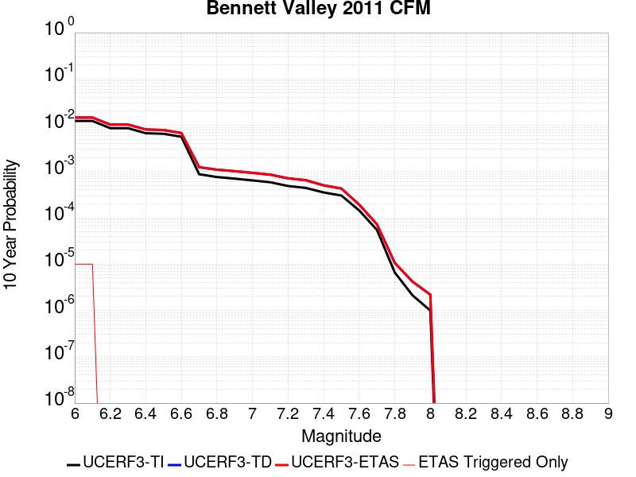 |

| Magnitude | 1 wk TI Prob | 1 wk TD Prob | 1 wk ETAS Prob | 1 wk ETAS/TD Gain | 1 wk ETAS Triggered Only | 1 mo TI Prob | 1 mo TD Prob | 1 mo ETAS Prob | 1 mo ETAS/TD Gain | 1 mo ETAS Triggered Only | 1 yr TI Prob | 1 yr TD Prob | 1 yr ETAS Prob | 1 yr ETAS/TD Gain | 1 yr ETAS Triggered Only | 10 yr TI Prob | 10 yr TD Prob | 10 yr ETAS Prob | 10 yr ETAS/TD Gain | 10 yr ETAS Triggered Only |
|-----|-----|-----|-----|-----|-----|-----|-----|-----|-----|-----|-----|-----|-----|-----|-----|-----|-----|-----|-----|-----|
| 6.0 | 2.3893934E-5 | 2.8241766E-5 | 2.8241766E-5 | 1.0 | 0.0 | 1.0239855E-4 | 1.2103157E-4 | 1.2103157E-4 | 1.0 | 0.0 | 0.0012459893 | 0.0014727482 | 0.0014727482 | 1.0 | 0.0 | 0.012390262 | 0.01465247 | 0.0146623235 | 1.0006725 | 1.0E-5 |
| 6.1 | 2.3893934E-5 | 2.8241766E-5 | 2.8241766E-5 | 1.0 | 0.0 | 1.0239855E-4 | 1.2103157E-4 | 1.2103157E-4 | 1.0 | 0.0 | 0.0012459893 | 0.0014727482 | 0.0014727482 | 1.0 | 0.0 | 0.012390262 | 0.01465247 | 0.0146623235 | 1.0006725 | 1.0E-5 |
| 6.2 | 1.6657146E-5 | 1.9855943E-5 | 1.9855943E-5 | 1.0 | 0.0 | 7.138582E-5 | 8.509492E-5 | 8.509492E-5 | 1.0 | 0.0 | 8.6877577E-4 | 0.0010356797 | 0.0010356797 | 1.0 | 0.0 | 0.008653872 | 0.010326737 | 0.010326737 | 1.0 | 0.0 |
| 6.3 | 1.6657146E-5 | 1.9855943E-5 | 1.9855943E-5 | 1.0 | 0.0 | 7.138582E-5 | 8.509492E-5 | 8.509492E-5 | 1.0 | 0.0 | 8.6877577E-4 | 0.0010356797 | 0.0010356797 | 1.0 | 0.0 | 0.008653872 | 0.010326737 | 0.010326737 | 1.0 | 0.0 |
| 6.4 | 1.29418495E-5 | 1.5569312E-5 | 1.5569312E-5 | 1.0 | 0.0 | 5.546389E-5 | 6.672466E-5 | 6.672466E-5 | 1.0 | 0.0 | 6.7506364E-4 | 8.1220013E-4 | 8.1220013E-4 | 1.0 | 0.0 | 0.0067301663 | 0.008109396 | 0.008109396 | 1.0 | 0.0 |
| 6.5 | 1.2582504E-5 | 1.5136306E-5 | 1.5136306E-5 | 1.0 | 0.0 | 5.39239E-5 | 6.4869004E-5 | 6.4869004E-5 | 1.0 | 0.0 | 6.563257E-4 | 7.896241E-4 | 7.896241E-4 | 1.0 | 0.0 | 0.006543907 | 0.007885265 | 0.007885265 | 1.0 | 0.0 |
| 6.6 | 1.0846706E-5 | 1.30383605E-5 | 1.30383605E-5 | 1.0 | 0.0 | 4.6485053E-5 | 5.5878216E-5 | 5.5878216E-5 | 1.0 | 0.0 | 5.6580856E-4 | 6.8023324E-4 | 6.8023324E-4 | 1.0 | 0.0 | 0.005643701 | 0.0067984597 | 0.0067984597 | 1.0 | 0.0 |
| 6.7 | 1.6803231E-6 | 2.3785715E-6 | 2.3785715E-6 | 1.0 | 0.0 | 7.2013645E-6 | 1.01938385E-5 | 1.01938385E-5 | 1.0 | 0.0 | 8.7673085E-5 | 1.2410305E-4 | 1.2410305E-4 | 1.0 | 0.0 | 8.76385E-4 | 0.0012448063 | 0.0012448063 | 1.0 | 0.0 |
| 6.8 | 1.4609833E-6 | 2.0946172E-6 | 2.0946172E-6 | 1.0 | 0.0 | 6.261342E-6 | 8.9769E-6 | 8.9769E-6 | 1.0 | 0.0 | 7.6229175E-5 | 1.0928835E-4 | 1.0928835E-4 | 1.0 | 0.0 | 7.620303E-4 | 0.0010967779 | 0.0010967779 | 1.0 | 0.0 |
| 6.9 | 1.3492396E-6 | 1.9465472E-6 | 1.9465472E-6 | 1.0 | 0.0 | 5.7824427E-6 | 8.342318E-6 | 8.342318E-6 | 1.0 | 0.0 | 7.0398964E-5 | 1.01563055E-4 | 1.01563055E-4 | 1.0 | 0.0 | 7.037667E-4 | 0.0010195607 | 0.0010195607 | 1.0 | 0.0 |
| 7.0 | 1.2347921E-6 | 1.7895246E-6 | 1.7895246E-6 | 1.0 | 0.0 | 5.291955E-6 | 7.669369E-6 | 7.669369E-6 | 1.0 | 0.0 | 6.442765E-5 | 9.3370625E-5 | 9.3370625E-5 | 1.0 | 0.0 | 6.440897E-4 | 9.376857E-4 | 9.376857E-4 | 1.0 | 0.0 |
| 7.1 | 1.1262973E-6 | 1.6365312E-6 | 1.6365312E-6 | 1.0 | 0.0 | 4.8269794E-6 | 7.0136866E-6 | 7.0136866E-6 | 1.0 | 0.0 | 5.876689E-5 | 8.538834E-5 | 8.538834E-5 | 1.0 | 0.0 | 5.875135E-4 | 8.5791154E-4 | 8.5791154E-4 | 1.0 | 0.0 |
| 7.2 | 9.351744E-7 | 1.3617657E-6 | 1.3617657E-6 | 1.0 | 0.0 | 4.007884E-6 | 5.8361256E-6 | 5.8361256E-6 | 1.0 | 0.0 | 4.8794896E-5 | 7.1052535E-5 | 7.1052535E-5 | 1.0 | 0.0 | 4.878418E-4 | 7.1459246E-4 | 7.1459246E-4 | 1.0 | 0.0 |
| 7.3 | 8.5039534E-7 | 1.2392261E-6 | 1.2392261E-6 | 1.0 | 0.0 | 3.6445463E-6 | 5.3109584E-6 | 5.3109584E-6 | 1.0 | 0.0 | 4.437145E-5 | 6.465902E-5 | 6.465902E-5 | 1.0 | 0.0 | 4.436259E-4 | 6.5040105E-4 | 6.5040105E-4 | 1.0 | 0.0 |
| 7.4 | 6.7875015E-7 | 9.604737E-7 | 9.604737E-7 | 1.0 | 0.0 | 2.908926E-6 | 4.1163094E-6 | 4.1163094E-6 | 1.0 | 0.0 | 3.54156E-5 | 5.0114922E-5 | 5.0114922E-5 | 1.0 | 0.0 | 3.5409955E-4 | 5.043473E-4 | 5.043473E-4 | 1.0 | 0.0 |
| 7.5 | 5.826867E-7 | 8.191804E-7 | 8.191804E-7 | 1.0 | 0.0 | 2.4972264E-6 | 3.5107685E-6 | 3.5107685E-6 | 1.0 | 0.0 | 3.0403306E-5 | 4.2742777E-5 | 4.2742777E-5 | 1.0 | 0.0 | 3.0399146E-4 | 4.3023855E-4 | 4.3023855E-4 | 1.0 | 0.0 |
| 7.6 | 2.7734902E-7 | 3.6837127E-7 | 3.6837127E-7 | 1.0 | 0.0 | 1.1886381E-6 | 1.5787331E-6 | 1.5787331E-6 | 1.0 | 0.0 | 1.4471572E-5 | 1.9220906E-5 | 1.9220906E-5 | 1.0 | 0.0 | 1.447063E-4 | 1.9322959E-4 | 1.9322959E-4 | 1.0 | 0.0 |
| 7.7 | 1.0530888E-7 | 1.3757864E-7 | 1.3757864E-7 | 1.0 | 0.0 | 4.513237E-7 | 5.8962263E-7 | 5.8962263E-7 | 1.0 | 0.0 | 5.4948523E-6 | 7.1786317E-6 | 7.1786317E-6 | 1.0 | 0.0 | 5.4947162E-5 | 7.2609975E-5 | 7.2609975E-5 | 1.0 | 0.0 |
| 7.8 | 1.2714258E-8 | 1.9661993E-8 | 1.9661993E-8 | 1.0 | 0.0 | 5.448968E-8 | 8.426568E-8 | 8.426568E-8 | 1.0 | 0.0 | 6.6341164E-7 | 1.0259341E-6 | 1.0259341E-6 | 1.0 | 0.0 | 6.6340967E-6 | 1.0671781E-5 | 1.0671781E-5 | 1.0 | 0.0 |
| 7.9 | 4.075888E-9 | 7.576359E-9 | 7.576359E-9 | 1.0 | 0.0 | 1.7468091E-8 | 3.247011E-8 | 3.247011E-8 | 1.0 | 0.0 | 2.12674E-7 | 3.953235E-7 | 3.953235E-7 | 1.0 | 0.0 | 2.1267379E-6 | 4.2031506E-6 | 4.2031506E-6 | 1.0 | 0.0 |
| 8.0 | 1.9126138E-9 | 4.0039554E-9 | 4.0039554E-9 | 1.0 | 0.0 | 8.196917E-9 | 1.7159808E-8 | 1.7159808E-8 | 1.0 | 0.0 | 9.9797454E-8 | 2.0892064E-7 | 2.0892064E-7 | 1.0 | 0.0 | 9.979741E-7 | 2.202283E-6 | 2.202283E-6 | 1.0 | 0.0 |

## Hector Mine
*[(top)](#table-of-contents)*

| 1 Week | 1 Month | 1 Year | 10 Year |
|-----|-----|-----|-----|
|  |  |  |  |

| Magnitude | 1 wk TI Prob | 1 wk TD Prob | 1 wk ETAS Prob | 1 wk ETAS/TD Gain | 1 wk ETAS Triggered Only | 1 mo TI Prob | 1 mo TD Prob | 1 mo ETAS Prob | 1 mo ETAS/TD Gain | 1 mo ETAS Triggered Only | 1 yr TI Prob | 1 yr TD Prob | 1 yr ETAS Prob | 1 yr ETAS/TD Gain | 1 yr ETAS Triggered Only | 10 yr TI Prob | 10 yr TD Prob | 10 yr ETAS Prob | 10 yr ETAS/TD Gain | 10 yr ETAS Triggered Only |
|-----|-----|-----|-----|-----|-----|-----|-----|-----|-----|-----|-----|-----|-----|-----|-----|-----|-----|-----|-----|-----|
| 6.0 | 1.8760093E-5 | 2.796579E-6 | 2.796579E-6 | 1.0 | 0.0 | 8.039792E-5 | 1.1985307E-5 | 1.1985307E-5 | 1.0 | 0.0 | 9.78405E-4 | 1.4591533E-4 | 1.4591533E-4 | 1.0 | 0.0 | 0.009741086 | 0.0014585875 | 0.0014685729 | 1.006846 | 1.0E-5 |
| 6.1 | 1.8760093E-5 | 2.796579E-6 | 2.796579E-6 | 1.0 | 0.0 | 8.039792E-5 | 1.1985307E-5 | 1.1985307E-5 | 1.0 | 0.0 | 9.78405E-4 | 1.4591533E-4 | 1.4591533E-4 | 1.0 | 0.0 | 0.009741086 | 0.0014585875 | 0.0014685729 | 1.006846 | 1.0E-5 |
| 6.2 | 1.8760093E-5 | 2.796579E-6 | 2.796579E-6 | 1.0 | 0.0 | 8.039792E-5 | 1.1985307E-5 | 1.1985307E-5 | 1.0 | 0.0 | 9.78405E-4 | 1.4591533E-4 | 1.4591533E-4 | 1.0 | 0.0 | 0.009741086 | 0.0014585875 | 0.0014685729 | 1.006846 | 1.0E-5 |
| 6.3 | 1.8760093E-5 | 2.796579E-6 | 2.796579E-6 | 1.0 | 0.0 | 8.039792E-5 | 1.1985307E-5 | 1.1985307E-5 | 1.0 | 0.0 | 9.78405E-4 | 1.4591533E-4 | 1.4591533E-4 | 1.0 | 0.0 | 0.009741086 | 0.0014585875 | 0.0014685729 | 1.006846 | 1.0E-5 |
| 6.4 | 1.0888055E-5 | 2.796579E-6 | 2.796579E-6 | 1.0 | 0.0 | 4.666226E-5 | 1.1985307E-5 | 1.1985307E-5 | 1.0 | 0.0 | 5.679649E-4 | 1.4591533E-4 | 1.4591533E-4 | 1.0 | 0.0 | 0.0056651547 | 0.0014585875 | 0.0014685729 | 1.006846 | 1.0E-5 |
| 6.5 | 1.0888055E-5 | 2.796579E-6 | 2.796579E-6 | 1.0 | 0.0 | 4.666226E-5 | 1.1985307E-5 | 1.1985307E-5 | 1.0 | 0.0 | 5.679649E-4 | 1.4591533E-4 | 1.4591533E-4 | 1.0 | 0.0 | 0.0056651547 | 0.0014585875 | 0.0014685729 | 1.006846 | 1.0E-5 |
| 6.6 | 1.0730738E-5 | 2.796579E-6 | 2.796579E-6 | 1.0 | 0.0 | 4.5988065E-5 | 1.1985307E-5 | 1.1985307E-5 | 1.0 | 0.0 | 5.5976084E-4 | 1.4591533E-4 | 1.4591533E-4 | 1.0 | 0.0 | 0.0055835294 | 0.0014585875 | 0.0014685729 | 1.006846 | 1.0E-5 |
| 6.7 | 7.881326E-6 | 2.7712576E-6 | 2.7712576E-6 | 1.0 | 0.0 | 3.3776672E-5 | 1.1876787E-5 | 1.1876787E-5 | 1.0 | 0.0 | 4.111534E-4 | 1.4459429E-4 | 1.4459429E-4 | 1.0 | 0.0 | 0.0041039353 | 0.0014453942 | 0.0014553798 | 1.0069085 | 1.0E-5 |
| 6.8 | 7.5683483E-6 | 2.7330339E-6 | 2.7330339E-6 | 1.0 | 0.0 | 3.2435375E-5 | 1.1712972E-5 | 1.1712972E-5 | 1.0 | 0.0 | 3.9482914E-4 | 1.4260011E-4 | 1.4260011E-4 | 1.0 | 0.0 | 0.0039412836 | 0.0014254781 | 0.0014354638 | 1.0070052 | 1.0E-5 |
| 6.9 | 6.473048E-6 | 2.5141017E-6 | 2.5141017E-6 | 1.0 | 0.0 | 2.7741338E-5 | 1.0774699E-5 | 1.0774699E-5 | 1.0 | 0.0 | 3.3769844E-4 | 1.3117804E-4 | 1.3117804E-4 | 1.0 | 0.0 | 0.0033718573 | 0.0013113957 | 0.0013213825 | 1.0076154 | 1.0E-5 |
| 7.0 | 4.9959954E-6 | 1.8566798E-6 | 1.8566798E-6 | 1.0 | 0.0 | 2.1411232E-5 | 7.957195E-6 | 7.957195E-6 | 1.0 | 0.0 | 2.6065056E-4 | 9.68781E-5 | 9.68781E-5 | 1.0 | 0.0 | 0.0026034506 | 9.6870837E-4 | 9.786987E-4 | 1.010313 | 1.0E-5 |
| 7.1 | 1.2997541E-6 | 1.5601951E-7 | 1.5601951E-7 | 1.0 | 0.0 | 5.5703626E-6 | 6.686549E-7 | 6.686549E-7 | 1.0 | 0.0 | 6.7817055E-5 | 8.140847E-6 | 8.140847E-6 | 1.0 | 0.0 | 6.779636E-4 | 8.140588E-5 | 8.140588E-5 | 1.0 | 0.0 |
| 7.2 | 8.392699E-7 | 9.7273954E-8 | 9.7273954E-8 | 1.0 | 0.0 | 3.596866E-6 | 4.1688833E-7 | 4.1688833E-7 | 1.0 | 0.0 | 4.3790962E-5 | 5.0756053E-6 | 5.0756053E-6 | 1.0 | 0.0 | 4.3782333E-4 | 5.0755087E-5 | 5.0755087E-5 | 1.0 | 0.0 |
| 7.3 | 3.13015E-7 | 4.829177E-8 | 4.829177E-8 | 1.0 | 0.0 | 1.3414921E-6 | 2.0696471E-7 | 2.0696471E-7 | 1.0 | 0.0 | 1.6332544E-5 | 2.5197933E-6 | 2.5197933E-6 | 1.0 | 0.0 | 1.6331344E-4 | 2.5197733E-5 | 2.5197733E-5 | 1.0 | 0.0 |

## San Gregorio (North) 2011 CFM
*[(top)](#table-of-contents)*

| 1 Week | 1 Month | 1 Year | 10 Year |
|-----|-----|-----|-----|
|  |  |  |  |

| Magnitude | 1 wk TI Prob | 1 wk TD Prob | 1 wk ETAS Prob | 1 wk ETAS/TD Gain | 1 wk ETAS Triggered Only | 1 mo TI Prob | 1 mo TD Prob | 1 mo ETAS Prob | 1 mo ETAS/TD Gain | 1 mo ETAS Triggered Only | 1 yr TI Prob | 1 yr TD Prob | 1 yr ETAS Prob | 1 yr ETAS/TD Gain | 1 yr ETAS Triggered Only | 10 yr TI Prob | 10 yr TD Prob | 10 yr ETAS Prob | 10 yr ETAS/TD Gain | 10 yr ETAS Triggered Only |
|-----|-----|-----|-----|-----|-----|-----|-----|-----|-----|-----|-----|-----|-----|-----|-----|-----|-----|-----|-----|-----|
| 6.0 | 5.0283932E-5 | 4.3076347E-5 | 4.3076347E-5 | 1.0 | 0.0 | 2.1548476E-4 | 1.8459992E-4 | 1.8459992E-4 | 1.0 | 0.0 | 0.0026203706 | 0.0022452015 | 0.002255179 | 1.0044439 | 1.0E-5 | 0.02589687 | 0.022300957 | 0.022310734 | 1.0004385 | 1.0E-5 |
| 6.1 | 5.0283932E-5 | 4.3076347E-5 | 4.3076347E-5 | 1.0 | 0.0 | 2.1548476E-4 | 1.8459992E-4 | 1.8459992E-4 | 1.0 | 0.0 | 0.0026203706 | 0.0022452015 | 0.002255179 | 1.0044439 | 1.0E-5 | 0.02589687 | 0.022300957 | 0.022310734 | 1.0004385 | 1.0E-5 |
| 6.2 | 4.2998647E-5 | 3.445847E-5 | 3.445847E-5 | 1.0 | 0.0 | 1.842669E-4 | 1.4767087E-4 | 1.4767087E-4 | 1.0 | 0.0 | 0.0022411412 | 0.0017964229 | 0.0018064049 | 1.0055566 | 1.0E-5 | 0.022186736 | 0.0178934 | 0.017903222 | 1.0005488 | 1.0E-5 |
| 6.3 | 4.2998647E-5 | 3.445847E-5 | 3.445847E-5 | 1.0 | 0.0 | 1.842669E-4 | 1.4767087E-4 | 1.4767087E-4 | 1.0 | 0.0 | 0.0022411412 | 0.0017964229 | 0.0018064049 | 1.0055566 | 1.0E-5 | 0.022186736 | 0.0178934 | 0.017903222 | 1.0005488 | 1.0E-5 |
| 6.4 | 4.1101295E-5 | 3.234342E-5 | 3.234342E-5 | 1.0 | 0.0 | 1.7613651E-4 | 1.3860737E-4 | 1.3860737E-4 | 1.0 | 0.0 | 0.0021423528 | 0.0016862521 | 0.0016962353 | 1.0059203 | 1.0E-5 | 0.02121817 | 0.016809015 | 0.016818848 | 1.000585 | 1.0E-5 |
| 6.5 | 4.1032585E-5 | 3.2261447E-5 | 3.2261447E-5 | 1.0 | 0.0 | 1.7584208E-4 | 1.382561E-4 | 1.382561E-4 | 1.0 | 0.0 | 0.0021387753 | 0.001681982 | 0.001681982 | 1.0 | 0.0 | 0.021183075 | 0.016766965 | 0.016766965 | 1.0 | 0.0 |
| 6.6 | 4.011629E-5 | 3.128284E-5 | 3.128284E-5 | 1.0 | 0.0 | 1.7191563E-4 | 1.3406252E-4 | 1.3406252E-4 | 1.0 | 0.0 | 0.0020910634 | 0.0016310032 | 0.0016310032 | 1.0 | 0.0 | 0.020714961 | 0.016266689 | 0.016266689 | 1.0 | 0.0 |
| 6.7 | 3.8583938E-5 | 2.9469667E-5 | 2.9469667E-5 | 1.0 | 0.0 | 1.6534925E-4 | 1.2629254E-4 | 1.2629254E-4 | 1.0 | 0.0 | 0.0020112682 | 0.0015365414 | 0.0015365414 | 1.0 | 0.0 | 0.019931622 | 0.015334843 | 0.015334843 | 1.0 | 0.0 |
| 6.8 | 3.44341E-5 | 2.446622E-5 | 2.446622E-5 | 1.0 | 0.0 | 1.4756636E-4 | 1.0485108E-4 | 1.0485108E-4 | 1.0 | 0.0 | 0.0017951399 | 0.0012758248 | 0.0012758248 | 1.0 | 0.0 | 0.017807078 | 0.012759865 | 0.012759865 | 1.0 | 0.0 |
| 6.9 | 3.221199E-5 | 2.1789543E-5 | 2.1789543E-5 | 1.0 | 0.0 | 1.3804408E-4 | 9.338046E-5 | 9.338046E-5 | 1.0 | 0.0 | 0.0016793909 | 0.0011363224 | 0.0011363224 | 1.0 | 0.0 | 0.01666756 | 0.011378872 | 0.011378872 | 1.0 | 0.0 |
| 7.0 | 2.9186718E-5 | 1.8156097E-5 | 1.8156097E-5 | 1.0 | 0.0 | 1.2507994E-4 | 7.780955E-5 | 7.780955E-5 | 1.0 | 0.0 | 0.0015217843 | 9.46924E-4 | 9.46924E-4 | 1.0 | 0.0 | 0.015114053 | 0.009501642 | 0.009501642 | 1.0 | 0.0 |
| 7.1 | 2.6840138E-5 | 1.529297E-5 | 1.529297E-5 | 1.0 | 0.0 | 1.1502409E-4 | 6.553966E-5 | 6.553966E-5 | 1.0 | 0.0 | 0.0013995186 | 7.976552E-4 | 7.976552E-4 | 1.0 | 0.0 | 0.013907375 | 0.008020109 | 0.008020109 | 1.0 | 0.0 |
| 7.2 | 2.453002E-5 | 1.2614574E-5 | 1.2614574E-5 | 1.0 | 0.0 | 1.05124425E-4 | 5.406134E-5 | 5.406134E-5 | 1.0 | 0.0 | 0.0012791384 | 6.5799867E-4 | 6.5799867E-4 | 1.0 | 0.0 | 0.012718005 | 0.0066317604 | 0.0066317604 | 1.0 | 0.0 |
| 7.3 | 2.3330727E-5 | 1.1496337E-5 | 1.1496337E-5 | 1.0 | 0.0 | 9.9985E-5 | 4.926909E-5 | 4.926909E-5 | 1.0 | 0.0 | 0.0012166376 | 5.996865E-4 | 5.996865E-4 | 1.0 | 0.0 | 0.012099981 | 0.006050518 | 0.006050518 | 1.0 | 0.0 |
| 7.4 | 2.2136466E-5 | 1.0376201E-5 | 1.0376201E-5 | 1.0 | 0.0 | 9.486712E-5 | 4.4468678E-5 | 4.4468678E-5 | 1.0 | 0.0 | 0.0011543952 | 5.4127193E-4 | 5.4127193E-4 | 1.0 | 0.0 | 0.011484168 | 0.0054679983 | 0.0054679983 | 1.0 | 0.0 |
| 7.5 | 2.0994974E-5 | 9.4341585E-6 | 9.4341585E-6 | 1.0 | 0.0 | 8.997535E-5 | 4.043148E-5 | 4.043148E-5 | 1.0 | 0.0 | 0.0010948994 | 4.9214234E-4 | 4.9214234E-4 | 1.0 | 0.0 | 0.010895205 | 0.0049771005 | 0.0049771005 | 1.0 | 0.0 |
| 7.6 | 1.7091823E-5 | 6.899055E-6 | 6.899055E-6 | 1.0 | 0.0 | 7.3248615E-5 | 2.9567043E-5 | 2.9567043E-5 | 1.0 | 0.0 | 8.9143694E-4 | 3.599194E-4 | 3.599194E-4 | 1.0 | 0.0 | 0.008878695 | 0.003651171 | 0.003651171 | 1.0 | 0.0 |
| 7.7 | 1.2772179E-5 | 4.024524E-6 | 4.024524E-6 | 1.0 | 0.0 | 5.473676E-5 | 1.7247847E-5 | 1.7247847E-5 | 1.0 | 0.0 | 6.6621625E-4 | 2.0997232E-4 | 2.0997232E-4 | 1.0 | 0.0 | 0.006642225 | 0.0021389194 | 0.0021389194 | 1.0 | 0.0 |
| 7.8 | 7.041923E-6 | 1.9430283E-6 | 1.9430283E-6 | 1.0 | 0.0 | 3.017932E-5 | 8.327238E-6 | 8.327238E-6 | 1.0 | 0.0 | 3.6737128E-4 | 1.013794E-4 | 1.013794E-4 | 1.0 | 0.0 | 0.0036676454 | 0.0010392263 | 0.0010392263 | 1.0 | 0.0 |
| 7.9 | 2.946768E-6 | 1.0048365E-6 | 1.0048365E-6 | 1.0 | 0.0 | 1.2628945E-5 | 4.306435E-6 | 4.306435E-6 | 1.0 | 0.0 | 1.5374656E-4 | 5.2429583E-5 | 5.2429583E-5 | 1.0 | 0.0 | 0.0015364023 | 5.3481845E-4 | 5.3481845E-4 | 1.0 | 0.0 |
| 8.0 | 1.1433375E-6 | 5.190328E-7 | 5.190328E-7 | 1.0 | 0.0 | 4.9000087E-6 | 2.2244244E-6 | 2.2244244E-6 | 1.0 | 0.0 | 5.965597E-5 | 2.7082031E-5 | 2.7082031E-5 | 1.0 | 0.0 | 5.963996E-4 | 2.744561E-4 | 2.744561E-4 | 1.0 | 0.0 |
| 8.1 | 2.6675295E-7 | 1.6324189E-7 | 1.6324189E-7 | 1.0 | 0.0 | 1.1432264E-6 | 6.9960794E-7 | 6.9960794E-7 | 1.0 | 0.0 | 1.3918692E-5 | 8.5176935E-6 | 8.5176935E-6 | 1.0 | 0.0 | 1.391782E-4 | 8.656348E-5 | 8.656348E-5 | 1.0 | 0.0 |
| 8.2 | 1.2704569E-8 | 9.462014E-9 | 9.462014E-9 | 1.0 | 0.0 | 5.444815E-8 | 4.055149E-8 | 4.055149E-8 | 1.0 | 0.0 | 6.629061E-7 | 4.9371425E-7 | 4.9371425E-7 | 1.0 | 0.0 | 6.629041E-6 | 5.129234E-6 | 5.129234E-6 | 1.0 | 0.0 |

## Franklin 2011 CFM
*[(top)](#table-of-contents)*

| 1 Week | 1 Month | 1 Year | 10 Year |
|-----|-----|-----|-----|
|  |  |  |  |

| Magnitude | 1 wk TI Prob | 1 wk TD Prob | 1 wk ETAS Prob | 1 wk ETAS/TD Gain | 1 wk ETAS Triggered Only | 1 mo TI Prob | 1 mo TD Prob | 1 mo ETAS Prob | 1 mo ETAS/TD Gain | 1 mo ETAS Triggered Only | 1 yr TI Prob | 1 yr TD Prob | 1 yr ETAS Prob | 1 yr ETAS/TD Gain | 1 yr ETAS Triggered Only | 10 yr TI Prob | 10 yr TD Prob | 10 yr ETAS Prob | 10 yr ETAS/TD Gain | 10 yr ETAS Triggered Only |
|-----|-----|-----|-----|-----|-----|-----|-----|-----|-----|-----|-----|-----|-----|-----|-----|-----|-----|-----|-----|-----|
| 6.0 | 1.845602E-5 | 2.0215857E-5 | 3.0215655E-5 | 1.4946512 | 1.0E-5 | 7.9094825E-5 | 8.6636675E-5 | 9.6635806E-5 | 1.1154145 | 1.0E-5 | 9.6255407E-4 | 0.0010543201 | 0.0010643096 | 1.0094748 | 1.0E-5 | 0.009583955 | 0.01051023 | 0.010520126 | 1.0009414 | 1.0E-5 |
| 6.1 | 1.845602E-5 | 2.0215857E-5 | 3.0215655E-5 | 1.4946512 | 1.0E-5 | 7.9094825E-5 | 8.6636675E-5 | 9.6635806E-5 | 1.1154145 | 1.0E-5 | 9.6255407E-4 | 0.0010543201 | 0.0010643096 | 1.0094748 | 1.0E-5 | 0.009583955 | 0.01051023 | 0.010520126 | 1.0009414 | 1.0E-5 |
| 6.2 | 1.845602E-5 | 2.0215857E-5 | 3.0215655E-5 | 1.4946512 | 1.0E-5 | 7.9094825E-5 | 8.6636675E-5 | 9.6635806E-5 | 1.1154145 | 1.0E-5 | 9.6255407E-4 | 0.0010543201 | 0.0010643096 | 1.0094748 | 1.0E-5 | 0.009583955 | 0.01051023 | 0.010520126 | 1.0009414 | 1.0E-5 |
| 6.3 | 1.3813506E-5 | 1.5157824E-5 | 1.5157824E-5 | 1.0 | 0.0 | 5.9199396E-5 | 6.496053E-5 | 6.496053E-5 | 1.0 | 0.0 | 7.205143E-4 | 7.9061516E-4 | 7.9061516E-4 | 1.0 | 0.0 | 0.007181826 | 0.007892957 | 0.007892957 | 1.0 | 0.0 |
| 6.4 | 1.3813506E-5 | 1.5157824E-5 | 1.5157824E-5 | 1.0 | 0.0 | 5.9199396E-5 | 6.496053E-5 | 6.496053E-5 | 1.0 | 0.0 | 7.205143E-4 | 7.9061516E-4 | 7.9061516E-4 | 1.0 | 0.0 | 0.007181826 | 0.007892957 | 0.007892957 | 1.0 | 0.0 |
| 6.5 | 1.1308949E-5 | 1.2420663E-5 | 1.2420663E-5 | 1.0 | 0.0 | 4.8466023E-5 | 5.3230335E-5 | 5.3230335E-5 | 1.0 | 0.0 | 5.899141E-4 | 6.478887E-4 | 6.478887E-4 | 1.0 | 0.0 | 0.0058835056 | 0.0064743757 | 0.0064743757 | 1.0 | 0.0 |
| 6.6 | 1.0813164E-5 | 1.18788585E-5 | 1.18788585E-5 | 1.0 | 0.0 | 4.6341313E-5 | 5.0908413E-5 | 5.0908413E-5 | 1.0 | 0.0 | 5.640594E-4 | 6.196355E-4 | 6.196355E-4 | 1.0 | 0.0 | 0.005626298 | 0.00619344 | 0.00619344 | 1.0 | 0.0 |
| 6.7 | 1.0706348E-5 | 1.1760616E-5 | 1.1760616E-5 | 1.0 | 0.0 | 4.5883542E-5 | 5.0401675E-5 | 5.0401675E-5 | 1.0 | 0.0 | 5.5848894E-4 | 6.134695E-4 | 6.134695E-4 | 1.0 | 0.0 | 0.005570874 | 0.006132121 | 0.006132121 | 1.0 | 0.0 |
| 6.8 | 9.443655E-6 | 1.0351851E-5 | 1.0351851E-5 | 1.0 | 0.0 | 4.0472176E-5 | 4.436433E-5 | 4.436433E-5 | 1.0 | 0.0 | 4.9263734E-4 | 5.400032E-4 | 5.400032E-4 | 1.0 | 0.0 | 0.0049154665 | 0.0054012216 | 0.0054012216 | 1.0 | 0.0 |
| 6.9 | 8.7001645E-6 | 9.5248715E-6 | 9.5248715E-6 | 1.0 | 0.0 | 3.728589E-5 | 4.0820247E-5 | 4.0820247E-5 | 1.0 | 0.0 | 4.538611E-4 | 4.968744E-4 | 4.968744E-4 | 1.0 | 0.0 | 0.0045293528 | 0.004971933 | 0.004971933 | 1.0 | 0.0 |
| 7.0 | 8.074731E-6 | 8.81844E-6 | 8.81844E-6 | 1.0 | 0.0 | 3.460553E-5 | 3.779277E-5 | 3.779277E-5 | 1.0 | 0.0 | 4.212409E-4 | 4.6003095E-4 | 4.6003095E-4 | 1.0 | 0.0 | 0.004204433 | 0.004605066 | 0.004605066 | 1.0 | 0.0 |
| 7.1 | 7.3370957E-6 | 7.964237E-6 | 7.964237E-6 | 1.0 | 0.0 | 3.1444317E-5 | 3.4132E-5 | 3.4132E-5 | 1.0 | 0.0 | 3.8276732E-4 | 4.1547892E-4 | 4.1547892E-4 | 1.0 | 0.0 | 0.0038210868 | 0.0041612005 | 0.0041612005 | 1.0 | 0.0 |
| 7.2 | 5.1750103E-6 | 5.459514E-6 | 5.459514E-6 | 1.0 | 0.0 | 2.2178427E-5 | 2.339771E-5 | 2.339771E-5 | 1.0 | 0.0 | 2.699889E-4 | 2.848302E-4 | 2.848302E-4 | 1.0 | 0.0 | 0.002696611 | 0.0028583186 | 0.0028583186 | 1.0 | 0.0 |
| 7.3 | 3.5221371E-6 | 3.798082E-6 | 3.798082E-6 | 1.0 | 0.0 | 1.5094786E-5 | 1.6277392E-5 | 1.6277392E-5 | 1.0 | 0.0 | 1.8376352E-4 | 1.9815934E-4 | 1.9815934E-4 | 1.0 | 0.0 | 0.0018361164 | 0.0019930082 | 0.0019930082 | 1.0 | 0.0 |
| 7.4 | 2.5749775E-6 | 2.8198865E-6 | 2.8198865E-6 | 1.0 | 0.0 | 1.1035571E-5 | 1.2085172E-5 | 1.2085172E-5 | 1.0 | 0.0 | 1.343498E-4 | 1.4712711E-4 | 1.4712711E-4 | 1.0 | 0.0 | 0.001342686 | 0.0014822274 | 0.0014822274 | 1.0 | 0.0 |
| 7.5 | 1.3642131E-6 | 1.5512069E-6 | 1.5512069E-6 | 1.0 | 0.0 | 5.8466144E-6 | 6.6480125E-6 | 6.6480125E-6 | 1.0 | 0.0 | 7.1180206E-5 | 8.093657E-5 | 8.093657E-5 | 1.0 | 0.0 | 7.115741E-4 | 8.1962434E-4 | 8.1962434E-4 | 1.0 | 0.0 |
| 7.6 | 5.329124E-7 | 6.7131134E-7 | 6.7131134E-7 | 1.0 | 0.0 | 2.2839083E-6 | 2.8770453E-6 | 2.8770453E-6 | 1.0 | 0.0 | 2.7806227E-5 | 3.5027468E-5 | 3.5027468E-5 | 1.0 | 0.0 | 2.780275E-4 | 3.6059506E-4 | 3.6059506E-4 | 1.0 | 0.0 |
| 7.7 | 4.199127E-7 | 5.498167E-7 | 5.498167E-7 | 1.0 | 0.0 | 1.7996247E-6 | 2.3563553E-6 | 2.3563553E-6 | 1.0 | 0.0 | 2.191021E-5 | 2.8688251E-5 | 2.8688251E-5 | 1.0 | 0.0 | 2.190805E-4 | 2.97035E-4 | 2.97035E-4 | 1.0 | 0.0 |
| 7.8 | 2.2586491E-7 | 3.0728654E-7 | 3.0728654E-7 | 1.0 | 0.0 | 9.67992E-7 | 1.3169416E-6 | 1.3169416E-6 | 1.0 | 0.0 | 1.178524E-5 | 1.6033648E-5 | 1.6033648E-5 | 1.0 | 0.0 | 1.17846146E-4 | 1.666385E-4 | 1.666385E-4 | 1.0 | 0.0 |
| 7.9 | 1.4568845E-7 | 2.1249643E-7 | 2.1249643E-7 | 1.0 | 0.0 | 6.243789E-7 | 9.1069865E-7 | 9.1069865E-7 | 1.0 | 0.0 | 7.601787E-6 | 1.10877E-5 | 1.10877E-5 | 1.0 | 0.0 | 7.601527E-5 | 1.15322495E-4 | 1.15322495E-4 | 1.0 | 0.0 |
| 8.0 | 5.2868224E-8 | 1.00180095E-7 | 1.00180095E-7 | 1.0 | 0.0 | 2.2657808E-7 | 4.293432E-7 | 4.293432E-7 | 1.0 | 0.0 | 2.7585847E-6 | 5.227241E-6 | 5.227241E-6 | 1.0 | 0.0 | 2.7585504E-5 | 5.4122815E-5 | 5.4122815E-5 | 1.0 | 0.0 |
| 8.1 | 2.654434E-9 | 4.731369E-9 | 4.731369E-9 | 1.0 | 0.0 | 1.1376145E-8 | 2.0277298E-8 | 2.0277298E-8 | 1.0 | 0.0 | 1.3850456E-7 | 2.4687606E-7 | 2.4687606E-7 | 1.0 | 0.0 | 1.3850448E-6 | 2.5380623E-6 | 2.5380623E-6 | 1.0 | 0.0 |

## Great Valley 04a Trout Creek
*[(top)](#table-of-contents)*

| 1 Week | 1 Month | 1 Year | 10 Year |
|-----|-----|-----|-----|
|  |  |  |  |

| Magnitude | 1 wk TI Prob | 1 wk TD Prob | 1 wk ETAS Prob | 1 wk ETAS/TD Gain | 1 wk ETAS Triggered Only | 1 mo TI Prob | 1 mo TD Prob | 1 mo ETAS Prob | 1 mo ETAS/TD Gain | 1 mo ETAS Triggered Only | 1 yr TI Prob | 1 yr TD Prob | 1 yr ETAS Prob | 1 yr ETAS/TD Gain | 1 yr ETAS Triggered Only | 10 yr TI Prob | 10 yr TD Prob | 10 yr ETAS Prob | 10 yr ETAS/TD Gain | 10 yr ETAS Triggered Only |
|-----|-----|-----|-----|-----|-----|-----|-----|-----|-----|-----|-----|-----|-----|-----|-----|-----|-----|-----|-----|-----|
| 6.0 | 1.4088538E-5 | 1.572052E-5 | 1.572052E-5 | 1.0 | 0.0 | 6.037805E-5 | 6.737199E-5 | 6.737199E-5 | 1.0 | 0.0 | 7.3485484E-4 | 8.1995776E-4 | 8.2994957E-4 | 1.0121857 | 1.0E-5 | 0.007324295 | 0.008170608 | 0.008180527 | 1.0012139 | 1.0E-5 |
| 6.1 | 1.4088538E-5 | 1.572052E-5 | 1.572052E-5 | 1.0 | 0.0 | 6.037805E-5 | 6.737199E-5 | 6.737199E-5 | 1.0 | 0.0 | 7.3485484E-4 | 8.1995776E-4 | 8.2994957E-4 | 1.0121857 | 1.0E-5 | 0.007324295 | 0.008170608 | 0.008180527 | 1.0012139 | 1.0E-5 |
| 6.2 | 1.4088538E-5 | 1.572052E-5 | 1.572052E-5 | 1.0 | 0.0 | 6.037805E-5 | 6.737199E-5 | 6.737199E-5 | 1.0 | 0.0 | 7.3485484E-4 | 8.1995776E-4 | 8.2994957E-4 | 1.0121857 | 1.0E-5 | 0.007324295 | 0.008170608 | 0.008180527 | 1.0012139 | 1.0E-5 |
| 6.3 | 1.2882862E-5 | 1.437949E-5 | 1.437949E-5 | 1.0 | 0.0 | 5.5211098E-5 | 6.162498E-5 | 6.162498E-5 | 1.0 | 0.0 | 6.7198783E-4 | 7.500363E-4 | 7.6002884E-4 | 1.0133227 | 1.0E-5 | 0.0066995937 | 0.0074761123 | 0.0074860374 | 1.0013276 | 1.0E-5 |
| 6.4 | 1.2882862E-5 | 1.437949E-5 | 1.437949E-5 | 1.0 | 0.0 | 5.5211098E-5 | 6.162498E-5 | 6.162498E-5 | 1.0 | 0.0 | 6.7198783E-4 | 7.500363E-4 | 7.6002884E-4 | 1.0133227 | 1.0E-5 | 0.0066995937 | 0.0074761123 | 0.0074860374 | 1.0013276 | 1.0E-5 |
| 6.5 | 1.2762329E-5 | 1.42460385E-5 | 1.42460385E-5 | 1.0 | 0.0 | 5.469455E-5 | 6.1053084E-5 | 6.1053084E-5 | 1.0 | 0.0 | 6.657027E-4 | 7.430781E-4 | 7.530707E-4 | 1.0134475 | 1.0E-5 | 0.00663712 | 0.0074069947 | 0.0074169203 | 1.00134 | 1.0E-5 |
| 6.6 | 1.2762329E-5 | 1.42460385E-5 | 1.42460385E-5 | 1.0 | 0.0 | 5.469455E-5 | 6.1053084E-5 | 6.1053084E-5 | 1.0 | 0.0 | 6.657027E-4 | 7.430781E-4 | 7.530707E-4 | 1.0134475 | 1.0E-5 | 0.00663712 | 0.0074069947 | 0.0074169203 | 1.00134 | 1.0E-5 |
| 6.7 | 1.2557959E-5 | 1.4020262E-5 | 1.4020262E-5 | 1.0 | 0.0 | 5.3818712E-5 | 6.008551E-5 | 6.008551E-5 | 1.0 | 0.0 | 6.5504585E-4 | 7.3130586E-4 | 7.4129854E-4 | 1.0136641 | 1.0E-5 | 0.006531183 | 0.007290047 | 0.0072999746 | 1.0013617 | 1.0E-5 |
| 6.8 | 1.1871544E-5 | 1.3259646E-5 | 1.3259646E-5 | 1.0 | 0.0 | 5.0877054E-5 | 5.6825873E-5 | 5.6825873E-5 | 1.0 | 0.0 | 6.1925204E-4 | 6.9164543E-4 | 7.016385E-4 | 1.0144483 | 1.0E-5 | 0.0061752927 | 0.006895945 | 0.006905876 | 1.0014402 | 1.0E-5 |
| 6.9 | 1.0500373E-5 | 1.1731991E-5 | 1.1731991E-5 | 1.0 | 0.0 | 4.5000823E-5 | 5.0279043E-5 | 5.0279043E-5 | 1.0 | 0.0 | 5.4774724E-4 | 6.11984E-4 | 6.219779E-4 | 1.0163302 | 1.0E-5 | 0.005463991 | 0.0061038528 | 0.006113792 | 1.0016283 | 1.0E-5 |
| 7.0 | 8.524332E-6 | 9.534083E-6 | 9.534083E-6 | 1.0 | 0.0 | 3.653234E-5 | 4.085976E-5 | 4.085976E-5 | 1.0 | 0.0 | 4.4469046E-4 | 4.9736135E-4 | 4.9736135E-4 | 1.0 | 0.0 | 0.0044380166 | 0.0049632136 | 0.0049632136 | 1.0 | 0.0 |
| 7.1 | 6.006849E-6 | 6.7119777E-6 | 6.7119777E-6 | 1.0 | 0.0 | 2.5743384E-5 | 2.8765333E-5 | 2.8765333E-5 | 1.0 | 0.0 | 3.1338062E-4 | 3.5016722E-4 | 3.5016722E-4 | 1.0 | 0.0 | 0.0031293905 | 0.0034967053 | 0.0034967053 | 1.0 | 0.0 |
| 7.2 | 2.9122193E-6 | 3.2467287E-6 | 3.2467287E-6 | 1.0 | 0.0 | 1.248088E-5 | 1.3914488E-5 | 1.3914488E-5 | 1.0 | 0.0 | 1.5194413E-4 | 1.6939746E-4 | 1.6939746E-4 | 1.0 | 0.0 | 0.0015184027 | 0.0016928554 | 0.0016928554 | 1.0 | 0.0 |
| 7.3 | 7.2194007E-7 | 7.989217E-7 | 7.989217E-7 | 1.0 | 0.0 | 3.0940253E-6 | 3.423948E-6 | 3.423948E-6 | 1.0 | 0.0 | 3.7669106E-5 | 4.168623E-5 | 4.168623E-5 | 1.0 | 0.0 | 3.766272E-4 | 4.168291E-4 | 4.168291E-4 | 1.0 | 0.0 |
| 7.4 | 3.112171E-8 | 3.2068883E-8 | 3.2068883E-8 | 1.0 | 0.0 | 1.3337875E-7 | 1.3743806E-7 | 1.3743806E-7 | 1.0 | 0.0 | 1.6238852E-6 | 1.6733072E-6 | 1.6733072E-6 | 1.0 | 0.0 | 1.6238733E-5 | 1.6732954E-5 | 1.6732954E-5 | 1.0 | 0.0 |

## Santa Cruz Catalina Ridge alt1
*[(top)](#table-of-contents)*

| 1 Week | 1 Month | 1 Year | 10 Year |
|-----|-----|-----|-----|
|  |  |  |  |

| Magnitude | 1 wk TI Prob | 1 wk TD Prob | 1 wk ETAS Prob | 1 wk ETAS/TD Gain | 1 wk ETAS Triggered Only | 1 mo TI Prob | 1 mo TD Prob | 1 mo ETAS Prob | 1 mo ETAS/TD Gain | 1 mo ETAS Triggered Only | 1 yr TI Prob | 1 yr TD Prob | 1 yr ETAS Prob | 1 yr ETAS/TD Gain | 1 yr ETAS Triggered Only | 10 yr TI Prob | 10 yr TD Prob | 10 yr ETAS Prob | 10 yr ETAS/TD Gain | 10 yr ETAS Triggered Only |
|-----|-----|-----|-----|-----|-----|-----|-----|-----|-----|-----|-----|-----|-----|-----|-----|-----|-----|-----|-----|-----|
| 6.0 | 3.2833184E-5 | 3.6560636E-5 | 3.6560636E-5 | 1.0 | 0.0 | 1.4070606E-4 | 1.5667996E-4 | 1.5667996E-4 | 1.0 | 0.0 | 0.00171175 | 0.0019060757 | 0.0019160567 | 1.0052364 | 1.0E-5 | 0.016986247 | 0.01891418 | 0.01892399 | 1.0005187 | 1.0E-5 |
| 6.1 | 1.9835548E-5 | 2.1660571E-5 | 2.1660571E-5 | 1.0 | 0.0 | 8.500672E-5 | 9.282783E-5 | 9.282783E-5 | 1.0 | 0.0 | 0.0010344655 | 0.001129613 | 0.0011396017 | 1.0088426 | 1.0E-5 | 0.010296632 | 0.011240846 | 0.011250733 | 1.0008796 | 1.0E-5 |
| 6.2 | 1.9835548E-5 | 2.1660571E-5 | 2.1660571E-5 | 1.0 | 0.0 | 8.500672E-5 | 9.282783E-5 | 9.282783E-5 | 1.0 | 0.0 | 0.0010344655 | 0.001129613 | 0.0011396017 | 1.0088426 | 1.0E-5 | 0.010296632 | 0.011240846 | 0.011250733 | 1.0008796 | 1.0E-5 |
| 6.3 | 1.5728183E-5 | 1.7034703E-5 | 1.7034703E-5 | 1.0 | 0.0 | 6.7404755E-5 | 7.300386E-5 | 7.300386E-5 | 1.0 | 0.0 | 8.2034385E-4 | 8.8846567E-4 | 8.984568E-4 | 1.0112454 | 1.0E-5 | 0.008173222 | 0.008849816 | 0.008859728 | 1.00112 | 1.0E-5 |
| 6.4 | 1.5728183E-5 | 1.7034703E-5 | 1.7034703E-5 | 1.0 | 0.0 | 6.7404755E-5 | 7.300386E-5 | 7.300386E-5 | 1.0 | 0.0 | 8.2034385E-4 | 8.8846567E-4 | 8.984568E-4 | 1.0112454 | 1.0E-5 | 0.008173222 | 0.008849816 | 0.008859728 | 1.00112 | 1.0E-5 |
| 6.5 | 1.3707734E-5 | 1.4795146E-5 | 1.4795146E-5 | 1.0 | 0.0 | 5.8746107E-5 | 6.3406245E-5 | 6.3406245E-5 | 1.0 | 0.0 | 7.1499916E-4 | 7.7170116E-4 | 7.8169344E-4 | 1.0129484 | 1.0E-5 | 0.0071270303 | 0.0076906127 | 0.007700536 | 1.0012903 | 1.0E-5 |
| 6.6 | 1.2539813E-5 | 1.3510776E-5 | 1.3510776E-5 | 1.0 | 0.0 | 5.3740947E-5 | 5.7902053E-5 | 5.7902053E-5 | 1.0 | 0.0 | 6.540996E-4 | 7.0473214E-4 | 7.147251E-4 | 1.0141798 | 1.0E-5 | 0.0065217763 | 0.007025277 | 0.0070352065 | 1.0014135 | 1.0E-5 |
| 6.7 | 1.1504083E-5 | 1.2377875E-5 | 1.2377875E-5 | 1.0 | 0.0 | 4.930228E-5 | 5.3046966E-5 | 5.3046966E-5 | 1.0 | 0.0 | 6.0008996E-4 | 6.456574E-4 | 6.55651E-4 | 1.0154781 | 1.0E-5 | 0.005984721 | 0.006438045 | 0.0064479806 | 1.0015433 | 1.0E-5 |
| 6.8 | 1.012739E-5 | 1.0877499E-5 | 1.0877499E-5 | 1.0 | 0.0 | 4.340238E-5 | 4.661703E-5 | 4.661703E-5 | 1.0 | 0.0 | 5.282958E-4 | 5.67416E-4 | 5.67416E-4 | 1.0 | 0.0 | 0.0052704164 | 0.0056598415 | 0.0056598415 | 1.0 | 0.0 |
| 6.9 | 8.9607865E-6 | 9.609487E-6 | 9.609487E-6 | 1.0 | 0.0 | 3.8402806E-5 | 4.118287E-5 | 4.118287E-5 | 1.0 | 0.0 | 4.6745385E-4 | 5.0128717E-4 | 5.0128717E-4 | 1.0 | 0.0 | 0.0046647177 | 0.0050016837 | 0.0050016837 | 1.0 | 0.0 |
| 7.0 | 8.046829E-6 | 8.620072E-6 | 8.620072E-6 | 1.0 | 0.0 | 3.4485955E-5 | 3.694265E-5 | 3.694265E-5 | 1.0 | 0.0 | 4.1978562E-4 | 4.496847E-4 | 4.496847E-4 | 1.0 | 0.0 | 0.004189935 | 0.004487838 | 0.004487838 | 1.0 | 0.0 |
| 7.1 | 7.136131E-6 | 7.637941E-6 | 7.637941E-6 | 1.0 | 0.0 | 3.0583058E-5 | 3.2733627E-5 | 3.2733627E-5 | 1.0 | 0.0 | 3.7228514E-4 | 3.9845973E-4 | 3.9845973E-4 | 1.0 | 0.0 | 0.0037166206 | 0.0039775297 | 0.0039775297 | 1.0 | 0.0 |
| 7.2 | 6.362014E-6 | 6.8052104E-6 | 6.8052104E-6 | 1.0 | 0.0 | 2.726549E-5 | 2.9164865E-5 | 2.9164865E-5 | 1.0 | 0.0 | 3.3190678E-4 | 3.5502503E-4 | 3.5502503E-4 | 1.0 | 0.0 | 0.0033141149 | 0.003544647 | 0.003544647 | 1.0 | 0.0 |
| 7.3 | 5.004101E-6 | 5.3519125E-6 | 5.3519125E-6 | 1.0 | 0.0 | 2.1445969E-5 | 2.2936569E-5 | 2.2936569E-5 | 1.0 | 0.0 | 2.6107338E-4 | 2.792175E-4 | 2.792175E-4 | 1.0 | 0.0 | 0.002607669 | 0.0027887214 | 0.0027887214 | 1.0 | 0.0 |
| 7.4 | 3.4901443E-6 | 3.73219E-6 | 3.73219E-6 | 1.0 | 0.0 | 1.4957676E-5 | 1.5995005E-5 | 1.5995005E-5 | 1.0 | 0.0 | 1.8209449E-4 | 1.9472216E-4 | 1.9472216E-4 | 1.0 | 0.0 | 0.0018194534 | 0.001945554 | 0.001945554 | 1.0 | 0.0 |
| 7.5 | 1.1215045E-6 | 1.1894253E-6 | 1.1894253E-6 | 1.0 | 0.0 | 4.806439E-6 | 5.0975277E-6 | 5.0975277E-6 | 1.0 | 0.0 | 5.851682E-5 | 6.206066E-5 | 6.206066E-5 | 1.0 | 0.0 | 5.850142E-4 | 6.204364E-4 | 6.204364E-4 | 1.0 | 0.0 |
| 7.6 | 2.8599047E-7 | 2.9952744E-7 | 2.9952744E-7 | 1.0 | 0.0 | 1.2256729E-6 | 1.2836884E-6 | 1.2836884E-6 | 1.0 | 0.0 | 1.4922465E-5 | 1.5628797E-5 | 1.5628797E-5 | 1.0 | 0.0 | 1.4921463E-4 | 1.562771E-4 | 1.562771E-4 | 1.0 | 0.0 |
| 7.7 | 2.0781519E-7 | 2.1744857E-7 | 2.1744857E-7 | 1.0 | 0.0 | 8.906362E-7 | 9.3192216E-7 | 9.3192216E-7 | 1.0 | 0.0 | 1.08434415E-5 | 1.1346094E-5 | 1.1346094E-5 | 1.0 | 0.0 | 1.0842913E-4 | 1.1345524E-4 | 1.1345524E-4 | 1.0 | 0.0 |
| 7.8 | 3.614776E-8 | 3.7641843E-8 | 3.7641843E-8 | 1.0 | 0.0 | 1.5491896E-7 | 1.6132218E-7 | 1.6132218E-7 | 1.0 | 0.0 | 1.8861368E-6 | 1.9640959E-6 | 1.9640959E-6 | 1.0 | 0.0 | 1.8861208E-5 | 1.9640796E-5 | 1.9640796E-5 | 1.0 | 0.0 |

## Santa Monica alt 1
*[(top)](#table-of-contents)*

| 1 Week | 1 Month | 1 Year | 10 Year |
|-----|-----|-----|-----|
|  |  | 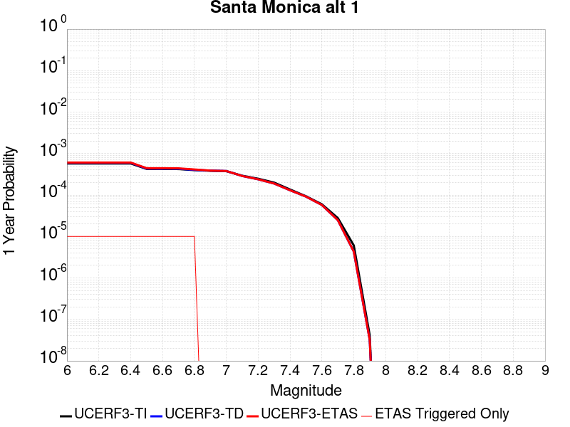 |  |

| Magnitude | 1 wk TI Prob | 1 wk TD Prob | 1 wk ETAS Prob | 1 wk ETAS/TD Gain | 1 wk ETAS Triggered Only | 1 mo TI Prob | 1 mo TD Prob | 1 mo ETAS Prob | 1 mo ETAS/TD Gain | 1 mo ETAS Triggered Only | 1 yr TI Prob | 1 yr TD Prob | 1 yr ETAS Prob | 1 yr ETAS/TD Gain | 1 yr ETAS Triggered Only | 10 yr TI Prob | 10 yr TD Prob | 10 yr ETAS Prob | 10 yr ETAS/TD Gain | 10 yr ETAS Triggered Only |
|-----|-----|-----|-----|-----|-----|-----|-----|-----|-----|-----|-----|-----|-----|-----|-----|-----|-----|-----|-----|-----|
| 6.0 | 1.1066008E-5 | 1.1480816E-5 | 1.1480816E-5 | 1.0 | 0.0 | 4.742488E-5 | 4.920265E-5 | 4.920265E-5 | 1.0 | 0.0 | 5.7724497E-4 | 5.988915E-4 | 6.0888554E-4 | 1.0166875 | 1.0E-5 | 0.005757478 | 0.005974163 | 0.0059841033 | 1.0016639 | 1.0E-5 |
| 6.1 | 1.1066008E-5 | 1.1480816E-5 | 1.1480816E-5 | 1.0 | 0.0 | 4.742488E-5 | 4.920265E-5 | 4.920265E-5 | 1.0 | 0.0 | 5.7724497E-4 | 5.988915E-4 | 6.0888554E-4 | 1.0166875 | 1.0E-5 | 0.005757478 | 0.005974163 | 0.0059841033 | 1.0016639 | 1.0E-5 |
| 6.2 | 1.1066008E-5 | 1.1480816E-5 | 1.1480816E-5 | 1.0 | 0.0 | 4.742488E-5 | 4.920265E-5 | 4.920265E-5 | 1.0 | 0.0 | 5.7724497E-4 | 5.988915E-4 | 6.0888554E-4 | 1.0166875 | 1.0E-5 | 0.005757478 | 0.005974163 | 0.0059841033 | 1.0016639 | 1.0E-5 |
| 6.3 | 1.1066008E-5 | 1.1480816E-5 | 1.1480816E-5 | 1.0 | 0.0 | 4.742488E-5 | 4.920265E-5 | 4.920265E-5 | 1.0 | 0.0 | 5.7724497E-4 | 5.988915E-4 | 6.0888554E-4 | 1.0166875 | 1.0E-5 | 0.005757478 | 0.005974163 | 0.0059841033 | 1.0016639 | 1.0E-5 |
| 6.4 | 1.1066008E-5 | 1.1480816E-5 | 1.1480816E-5 | 1.0 | 0.0 | 4.742488E-5 | 4.920265E-5 | 4.920265E-5 | 1.0 | 0.0 | 5.7724497E-4 | 5.988915E-4 | 6.0888554E-4 | 1.0166875 | 1.0E-5 | 0.005757478 | 0.005974163 | 0.0059841033 | 1.0016639 | 1.0E-5 |
| 6.5 | 8.183544E-6 | 8.335786E-6 | 8.335786E-6 | 1.0 | 0.0 | 3.5071862E-5 | 3.5724315E-5 | 3.5724315E-5 | 1.0 | 0.0 | 4.2691626E-4 | 4.3485835E-4 | 4.44854E-4 | 1.0229859 | 1.0E-5 | 0.0042609703 | 0.00434024 | 0.0043501966 | 1.0022941 | 1.0E-5 |
| 6.6 | 8.1543285E-6 | 8.303999E-6 | 8.303999E-6 | 1.0 | 0.0 | 3.4946657E-5 | 3.558809E-5 | 3.558809E-5 | 1.0 | 0.0 | 4.2539247E-4 | 4.3320045E-4 | 4.4319613E-4 | 1.023074 | 1.0E-5 | 0.0042457907 | 0.0043237256 | 0.0043336824 | 1.0023028 | 1.0E-5 |
| 6.7 | 8.110878E-6 | 8.257393E-6 | 8.257393E-6 | 1.0 | 0.0 | 3.4760444E-5 | 3.538836E-5 | 3.538836E-5 | 1.0 | 0.0 | 4.231262E-4 | 4.3076967E-4 | 4.4076538E-4 | 1.0232042 | 1.0E-5 | 0.0042232145 | 0.004299512 | 0.004309469 | 1.0023159 | 1.0E-5 |
| 6.8 | 7.644036E-6 | 7.751389E-6 | 7.751389E-6 | 1.0 | 0.0 | 3.275974E-5 | 3.3219825E-5 | 3.3219825E-5 | 1.0 | 0.0 | 3.9877684E-4 | 4.043777E-4 | 4.1437367E-4 | 1.0247194 | 1.0E-5 | 0.00398062 | 0.0040365653 | 0.004046525 | 1.0024674 | 1.0E-5 |
| 6.9 | 7.3698293E-6 | 7.4560357E-6 | 7.4560357E-6 | 1.0 | 0.0 | 3.15846E-5 | 3.1954056E-5 | 3.1954056E-5 | 1.0 | 0.0 | 3.8447464E-4 | 3.8897255E-4 | 3.8897255E-4 | 1.0 | 0.0 | 0.0038381014 | 0.003883061 | 0.003883061 | 1.0 | 0.0 |
| 7.0 | 7.209872E-6 | 7.2859366E-6 | 7.2859366E-6 | 1.0 | 0.0 | 3.0899086E-5 | 3.1225074E-5 | 3.1225074E-5 | 1.0 | 0.0 | 3.7613141E-4 | 3.8010036E-4 | 3.8010036E-4 | 1.0 | 0.0 | 0.0037549543 | 0.0037946452 | 0.0037946452 | 1.0 | 0.0 |
| 7.1 | 5.603456E-6 | 5.5241126E-6 | 5.5241126E-6 | 1.0 | 0.0 | 2.4014591E-5 | 2.3674556E-5 | 2.3674556E-5 | 1.0 | 0.0 | 2.923384E-4 | 2.8819998E-4 | 2.8819998E-4 | 1.0 | 0.0 | 0.0029195412 | 0.002878304 | 0.002878304 | 1.0 | 0.0 |
| 7.2 | 4.7483613E-6 | 4.5913075E-6 | 4.5913075E-6 | 1.0 | 0.0 | 2.0349962E-5 | 1.9676885E-5 | 1.9676885E-5 | 1.0 | 0.0 | 2.4773262E-4 | 2.3953986E-4 | 2.3953986E-4 | 1.0 | 0.0 | 0.0024745662 | 0.0023928308 | 0.0023928308 | 1.0 | 0.0 |
| 7.3 | 3.829015E-6 | 3.6343617E-6 | 3.6343617E-6 | 1.0 | 0.0 | 1.6409962E-5 | 1.5575744E-5 | 1.5575744E-5 | 1.0 | 0.0 | 1.9977297E-4 | 1.8961827E-4 | 1.8961827E-4 | 1.0 | 0.0 | 0.0019959346 | 0.0018945736 | 0.0018945736 | 1.0 | 0.0 |
| 7.4 | 2.610755E-6 | 2.499667E-6 | 2.499667E-6 | 1.0 | 0.0 | 1.1188902E-5 | 1.0712815E-5 | 1.0712815E-5 | 1.0 | 0.0 | 1.3621636E-4 | 1.3042075E-4 | 1.3042075E-4 | 1.0 | 0.0 | 0.001361329 | 0.0013034466 | 0.0013034466 | 1.0 | 0.0 |
| 7.5 | 1.792146E-6 | 1.7584898E-6 | 1.7584898E-6 | 1.0 | 0.0 | 7.680603E-6 | 7.5363632E-6 | 7.5363632E-6 | 1.0 | 0.0 | 9.3507326E-5 | 9.175139E-5 | 9.175139E-5 | 1.0 | 0.0 | 9.3467993E-4 | 9.1713824E-4 | 9.1713824E-4 | 1.0 | 0.0 |
| 7.6 | 1.1473018E-6 | 1.1029626E-6 | 1.1029626E-6 | 1.0 | 0.0 | 4.9169985E-6 | 4.7269746E-6 | 4.7269746E-6 | 1.0 | 0.0 | 5.986281E-5 | 5.7549412E-5 | 5.7549412E-5 | 1.0 | 0.0 | 5.984669E-4 | 5.7534676E-4 | 5.7534676E-4 | 1.0 | 0.0 |
| 7.7 | 5.330919E-7 | 4.7455222E-7 | 4.7455222E-7 | 1.0 | 0.0 | 2.2846775E-6 | 2.0337936E-6 | 2.0337936E-6 | 1.0 | 0.0 | 2.7815593E-5 | 2.4761168E-5 | 2.4761168E-5 | 1.0 | 0.0 | 2.7812112E-4 | 2.4758524E-4 | 2.4758524E-4 | 1.0 | 0.0 |
| 7.8 | 1.1668574E-7 | 8.297861E-8 | 8.297861E-8 | 1.0 | 0.0 | 5.000816E-7 | 3.5562255E-7 | 3.5562255E-7 | 1.0 | 0.0 | 6.0884768E-6 | 4.3296964E-6 | 4.3296964E-6 | 1.0 | 0.0 | 6.08831E-5 | 4.329615E-5 | 4.329615E-5 | 1.0 | 0.0 |
| 7.9 | 8.007447E-10 | 6.1617156E-10 | 6.1617156E-10 | 1.0 | 0.0 | 3.4317629E-9 | 2.6407359E-9 | 2.6407359E-9 | 1.0 | 0.0 | 4.1781714E-8 | 3.2150957E-8 | 3.2150957E-8 | 1.0 | 0.0 | 4.1781706E-7 | 3.2150956E-7 | 3.2150956E-7 | 1.0 | 0.0 |

## Channel Islands Western Deep Ramp
*[(top)](#table-of-contents)*

| 1 Week | 1 Month | 1 Year | 10 Year |
|-----|-----|-----|-----|
|  |  |  |  |

| Magnitude | 1 wk TI Prob | 1 wk TD Prob | 1 wk ETAS Prob | 1 wk ETAS/TD Gain | 1 wk ETAS Triggered Only | 1 mo TI Prob | 1 mo TD Prob | 1 mo ETAS Prob | 1 mo ETAS/TD Gain | 1 mo ETAS Triggered Only | 1 yr TI Prob | 1 yr TD Prob | 1 yr ETAS Prob | 1 yr ETAS/TD Gain | 1 yr ETAS Triggered Only | 10 yr TI Prob | 10 yr TD Prob | 10 yr ETAS Prob | 10 yr ETAS/TD Gain | 10 yr ETAS Triggered Only |
|-----|-----|-----|-----|-----|-----|-----|-----|-----|-----|-----|-----|-----|-----|-----|-----|-----|-----|-----|-----|-----|
| 6.0 | 6.0213506E-6 | 6.2549975E-6 | 6.2549975E-6 | 1.0 | 0.0 | 2.5805533E-5 | 2.6806882E-5 | 2.6806882E-5 | 1.0 | 0.0 | 3.1413708E-4 | 3.2632938E-4 | 3.2632938E-4 | 1.0 | 0.0 | 0.0031369338 | 0.0032589433 | 0.0032689108 | 1.0030584 | 1.0E-5 |
| 6.1 | 6.0213506E-6 | 6.2549975E-6 | 6.2549975E-6 | 1.0 | 0.0 | 2.5805533E-5 | 2.6806882E-5 | 2.6806882E-5 | 1.0 | 0.0 | 3.1413708E-4 | 3.2632938E-4 | 3.2632938E-4 | 1.0 | 0.0 | 0.0031369338 | 0.0032589433 | 0.0032689108 | 1.0030584 | 1.0E-5 |
| 6.2 | 6.0213506E-6 | 6.2549975E-6 | 6.2549975E-6 | 1.0 | 0.0 | 2.5805533E-5 | 2.6806882E-5 | 2.6806882E-5 | 1.0 | 0.0 | 3.1413708E-4 | 3.2632938E-4 | 3.2632938E-4 | 1.0 | 0.0 | 0.0031369338 | 0.0032589433 | 0.0032689108 | 1.0030584 | 1.0E-5 |
| 6.3 | 6.0213506E-6 | 6.2549975E-6 | 6.2549975E-6 | 1.0 | 0.0 | 2.5805533E-5 | 2.6806882E-5 | 2.6806882E-5 | 1.0 | 0.0 | 3.1413708E-4 | 3.2632938E-4 | 3.2632938E-4 | 1.0 | 0.0 | 0.0031369338 | 0.0032589433 | 0.0032689108 | 1.0030584 | 1.0E-5 |
| 6.4 | 6.0213506E-6 | 6.2549975E-6 | 6.2549975E-6 | 1.0 | 0.0 | 2.5805533E-5 | 2.6806882E-5 | 2.6806882E-5 | 1.0 | 0.0 | 3.1413708E-4 | 3.2632938E-4 | 3.2632938E-4 | 1.0 | 0.0 | 0.0031369338 | 0.0032589433 | 0.0032689108 | 1.0030584 | 1.0E-5 |
| 6.5 | 6.0213506E-6 | 6.2549975E-6 | 6.2549975E-6 | 1.0 | 0.0 | 2.5805533E-5 | 2.6806882E-5 | 2.6806882E-5 | 1.0 | 0.0 | 3.1413708E-4 | 3.2632938E-4 | 3.2632938E-4 | 1.0 | 0.0 | 0.0031369338 | 0.0032589433 | 0.0032689108 | 1.0030584 | 1.0E-5 |
| 6.6 | 6.0213506E-6 | 6.2549975E-6 | 6.2549975E-6 | 1.0 | 0.0 | 2.5805533E-5 | 2.6806882E-5 | 2.6806882E-5 | 1.0 | 0.0 | 3.1413708E-4 | 3.2632938E-4 | 3.2632938E-4 | 1.0 | 0.0 | 0.0031369338 | 0.0032589433 | 0.0032689108 | 1.0030584 | 1.0E-5 |
| 6.7 | 5.313309E-6 | 5.5253577E-6 | 5.5253577E-6 | 1.0 | 0.0 | 2.2771126E-5 | 2.3679913E-5 | 2.3679913E-5 | 1.0 | 0.0 | 2.772032E-4 | 2.8826887E-4 | 2.8826887E-4 | 1.0 | 0.0 | 0.0027685766 | 0.0028793528 | 0.002889324 | 1.003463 | 1.0E-5 |
| 6.8 | 5.313309E-6 | 5.5253577E-6 | 5.5253577E-6 | 1.0 | 0.0 | 2.2771126E-5 | 2.3679913E-5 | 2.3679913E-5 | 1.0 | 0.0 | 2.772032E-4 | 2.8826887E-4 | 2.8826887E-4 | 1.0 | 0.0 | 0.0027685766 | 0.0028793528 | 0.002889324 | 1.003463 | 1.0E-5 |
| 6.9 | 4.744377E-6 | 4.9395385E-6 | 4.9395385E-6 | 1.0 | 0.0 | 2.0332885E-5 | 2.11693E-5 | 2.11693E-5 | 1.0 | 0.0 | 2.4752476E-4 | 2.5770947E-4 | 2.5770947E-4 | 1.0 | 0.0 | 0.0024724922 | 0.0025744736 | 0.0025844479 | 1.0038743 | 1.0E-5 |
| 7.0 | 4.722209E-6 | 4.9165806E-6 | 4.9165806E-6 | 1.0 | 0.0 | 2.0237881E-5 | 2.1070911E-5 | 2.1070911E-5 | 1.0 | 0.0 | 2.4636835E-4 | 2.5651188E-4 | 2.5651188E-4 | 1.0 | 0.0 | 0.002460954 | 0.0025625252 | 0.0025724997 | 1.0038924 | 1.0E-5 |
| 7.1 | 4.611174E-6 | 4.8015145E-6 | 4.8015145E-6 | 1.0 | 0.0 | 1.9762025E-5 | 2.0577778E-5 | 2.0577778E-5 | 1.0 | 0.0 | 2.4057609E-4 | 2.5050936E-4 | 2.5050936E-4 | 1.0 | 0.0 | 0.002403158 | 0.0025026368 | 0.0025126117 | 1.0039858 | 1.0E-5 |
| 7.2 | 4.043994E-6 | 4.2121196E-6 | 4.2121196E-6 | 1.0 | 0.0 | 1.7331287E-5 | 1.8051836E-5 | 1.8051836E-5 | 1.0 | 0.0 | 2.10988E-4 | 2.1976251E-4 | 2.1976251E-4 | 1.0 | 0.0 | 0.002107878 | 0.0021958028 | 0.0021958028 | 1.0 | 0.0 |
| 7.3 | 2.1233036E-6 | 2.2298468E-6 | 2.2298468E-6 | 1.0 | 0.0 | 9.099841E-6 | 9.556452E-6 | 9.556452E-6 | 1.0 | 0.0 | 1.1078493E-4 | 1.1634364E-4 | 1.1634364E-4 | 1.0 | 0.0 | 0.0011072971 | 0.0011628328 | 0.0011628328 | 1.0 | 0.0 |
| 7.4 | 1.9051884E-6 | 2.001551E-6 | 2.001551E-6 | 1.0 | 0.0 | 8.165067E-6 | 8.5780475E-6 | 8.5780475E-6 | 1.0 | 0.0 | 9.940516E-5 | 1.0443278E-4 | 1.0443278E-4 | 1.0 | 0.0 | 9.93607E-4 | 0.0010438423 | 0.0010438423 | 1.0 | 0.0 |
| 7.5 | 1.2408497E-6 | 1.3039191E-6 | 1.3039191E-6 | 1.0 | 0.0 | 5.317916E-6 | 5.588213E-6 | 5.588213E-6 | 1.0 | 0.0 | 6.4743705E-5 | 6.803439E-5 | 6.803439E-5 | 1.0 | 0.0 | 6.4724847E-4 | 6.801378E-4 | 6.801378E-4 | 1.0 | 0.0 |
| 7.6 | 6.5440025E-7 | 6.88691E-7 | 6.88691E-7 | 1.0 | 0.0 | 2.8045695E-6 | 2.9515295E-6 | 2.9515295E-6 | 1.0 | 0.0 | 3.4145098E-5 | 3.5934292E-5 | 3.5934292E-5 | 1.0 | 0.0 | 3.4139853E-4 | 3.5928623E-4 | 3.5928623E-4 | 1.0 | 0.0 |
| 7.7 | 3.985963E-7 | 4.1931946E-7 | 4.1931946E-7 | 1.0 | 0.0 | 1.7082689E-6 | 1.7970822E-6 | 1.7970822E-6 | 1.0 | 0.0 | 2.0797976E-5 | 2.1879268E-5 | 2.1879268E-5 | 1.0 | 0.0 | 2.0796029E-4 | 2.187723E-4 | 2.187723E-4 | 1.0 | 0.0 |
| 7.8 | 3.706329E-8 | 3.859264E-8 | 3.859264E-8 | 1.0 | 0.0 | 1.5884267E-7 | 1.6539701E-7 | 1.6539701E-7 | 1.0 | 0.0 | 1.9339077E-6 | 2.013707E-6 | 2.013707E-6 | 1.0 | 0.0 | 1.933891E-5 | 2.0136898E-5 | 2.0136898E-5 | 1.0 | 0.0 |

## Shoreline
*[(top)](#table-of-contents)*

| 1 Week | 1 Month | 1 Year | 10 Year |
|-----|-----|-----|-----|
|  |  |  |  |

| Magnitude | 1 wk TI Prob | 1 wk TD Prob | 1 wk ETAS Prob | 1 wk ETAS/TD Gain | 1 wk ETAS Triggered Only | 1 mo TI Prob | 1 mo TD Prob | 1 mo ETAS Prob | 1 mo ETAS/TD Gain | 1 mo ETAS Triggered Only | 1 yr TI Prob | 1 yr TD Prob | 1 yr ETAS Prob | 1 yr ETAS/TD Gain | 1 yr ETAS Triggered Only | 10 yr TI Prob | 10 yr TD Prob | 10 yr ETAS Prob | 10 yr ETAS/TD Gain | 10 yr ETAS Triggered Only |
|-----|-----|-----|-----|-----|-----|-----|-----|-----|-----|-----|-----|-----|-----|-----|-----|-----|-----|-----|-----|-----|
| 6.0 | 3.9888673E-6 | 4.047993E-6 | 4.047993E-6 | 1.0 | 0.0 | 1.7095033E-5 | 1.7348459E-5 | 1.7348459E-5 | 1.0 | 0.0 | 2.0811215E-4 | 2.112026E-4 | 2.2120049E-4 | 1.0473379 | 1.0E-5 | 0.0020791737 | 0.0021105676 | 0.0021205465 | 1.0047281 | 1.0E-5 |
| 6.1 | 3.9888673E-6 | 4.047993E-6 | 4.047993E-6 | 1.0 | 0.0 | 1.7095033E-5 | 1.7348459E-5 | 1.7348459E-5 | 1.0 | 0.0 | 2.0811215E-4 | 2.112026E-4 | 2.2120049E-4 | 1.0473379 | 1.0E-5 | 0.0020791737 | 0.0021105676 | 0.0021205465 | 1.0047281 | 1.0E-5 |
| 6.2 | 1.4039653E-6 | 1.4101246E-6 | 1.4101246E-6 | 1.0 | 0.0 | 6.0169805E-6 | 6.0433777E-6 | 6.0433777E-6 | 1.0 | 0.0 | 7.325427E-5 | 7.35757E-5 | 7.35757E-5 | 1.0 | 0.0 | 7.3230127E-4 | 7.355194E-4 | 7.355194E-4 | 1.0 | 0.0 |
| 6.3 | 1.4039653E-6 | 1.4101246E-6 | 1.4101246E-6 | 1.0 | 0.0 | 6.0169805E-6 | 6.0433777E-6 | 6.0433777E-6 | 1.0 | 0.0 | 7.325427E-5 | 7.35757E-5 | 7.35757E-5 | 1.0 | 0.0 | 7.3230127E-4 | 7.355194E-4 | 7.355194E-4 | 1.0 | 0.0 |
| 6.4 | 1.3314152E-6 | 1.3361953E-6 | 1.3361953E-6 | 1.0 | 0.0 | 5.7060524E-6 | 5.726539E-6 | 5.726539E-6 | 1.0 | 0.0 | 6.946897E-5 | 6.971844E-5 | 6.971844E-5 | 1.0 | 0.0 | 6.9447263E-4 | 6.96971E-4 | 6.96971E-4 | 1.0 | 0.0 |
| 6.5 | 1.1187026E-6 | 1.1203971E-6 | 1.1203971E-6 | 1.0 | 0.0 | 4.794431E-6 | 4.801693E-6 | 4.801693E-6 | 1.0 | 0.0 | 5.8370628E-5 | 5.845907E-5 | 5.845907E-5 | 1.0 | 0.0 | 5.83553E-4 | 5.8443943E-4 | 5.8443943E-4 | 1.0 | 0.0 |
| 6.6 | 9.793089E-7 | 9.785238E-7 | 9.785238E-7 | 1.0 | 0.0 | 4.1970316E-6 | 4.1936664E-6 | 4.1936664E-6 | 1.0 | 0.0 | 5.1097657E-5 | 5.1056704E-5 | 5.1056704E-5 | 1.0 | 0.0 | 5.108591E-4 | 5.1045103E-4 | 5.1045103E-4 | 1.0 | 0.0 |
| 6.7 | 8.995986E-7 | 8.9731094E-7 | 8.9731094E-7 | 1.0 | 0.0 | 3.8554167E-6 | 3.845613E-6 | 3.845613E-6 | 1.0 | 0.0 | 4.693869E-5 | 4.681934E-5 | 4.681934E-5 | 1.0 | 0.0 | 4.6928777E-4 | 4.680957E-4 | 4.680957E-4 | 1.0 | 0.0 |
| 6.8 | 7.931612E-7 | 7.880697E-7 | 7.880697E-7 | 1.0 | 0.0 | 3.3992578E-6 | 3.3774372E-6 | 3.3774372E-6 | 1.0 | 0.0 | 4.1385178E-5 | 4.111953E-5 | 4.111953E-5 | 1.0 | 0.0 | 4.1377472E-4 | 4.1111975E-4 | 4.1111975E-4 | 1.0 | 0.0 |
| 6.9 | 7.1465956E-7 | 7.078291E-7 | 7.078291E-7 | 1.0 | 0.0 | 3.062823E-6 | 3.0335495E-6 | 3.0335495E-6 | 1.0 | 0.0 | 3.7289232E-5 | 3.6932845E-5 | 3.6932845E-5 | 1.0 | 0.0 | 3.7282976E-4 | 3.6926742E-4 | 3.6926742E-4 | 1.0 | 0.0 |
| 7.0 | 6.389046E-7 | 6.2997316E-7 | 6.2997316E-7 | 1.0 | 0.0 | 2.7381598E-6 | 2.699882E-6 | 2.699882E-6 | 1.0 | 0.0 | 3.3336586E-5 | 3.2870572E-5 | 3.2870572E-5 | 1.0 | 0.0 | 3.3331584E-4 | 3.2865733E-4 | 3.2865733E-4 | 1.0 | 0.0 |
| 7.1 | 5.4300875E-7 | 5.311388E-7 | 5.311388E-7 | 1.0 | 0.0 | 2.3271782E-6 | 2.2763072E-6 | 2.2763072E-6 | 1.0 | 0.0 | 2.8333026E-5 | 2.771369E-5 | 2.771369E-5 | 1.0 | 0.0 | 2.8329415E-4 | 2.7710243E-4 | 2.7710243E-4 | 1.0 | 0.0 |
| 7.2 | 4.6768855E-7 | 4.53514E-7 | 4.53514E-7 | 1.0 | 0.0 | 2.0043778E-6 | 1.94363E-6 | 1.94363E-6 | 1.0 | 0.0 | 2.4403027E-5 | 2.3663437E-5 | 2.3663437E-5 | 1.0 | 0.0 | 2.4400349E-4 | 2.3660924E-4 | 2.3660924E-4 | 1.0 | 0.0 |
| 7.3 | 4.0966103E-7 | 3.938802E-7 | 3.938802E-7 | 1.0 | 0.0 | 1.7556889E-6 | 1.688057E-6 | 1.688057E-6 | 1.0 | 0.0 | 2.1375303E-5 | 2.0551899E-5 | 2.0551899E-5 | 1.0 | 0.0 | 2.1373246E-4 | 2.0550002E-4 | 2.0550002E-4 | 1.0 | 0.0 |
| 7.4 | 3.5105785E-7 | 3.3366243E-7 | 3.3366243E-7 | 1.0 | 0.0 | 1.5045327E-6 | 1.429981E-6 | 1.429981E-6 | 1.0 | 0.0 | 1.8317533E-5 | 1.740988E-5 | 1.740988E-5 | 1.0 | 0.0 | 1.8316023E-4 | 1.7408519E-4 | 1.7408519E-4 | 1.0 | 0.0 |
| 7.5 | 2.8737534E-7 | 2.6822212E-7 | 2.6822212E-7 | 1.0 | 0.0 | 1.2316079E-6 | 1.1495229E-6 | 1.1495229E-6 | 1.0 | 0.0 | 1.4994724E-5 | 1.3995351E-5 | 1.3995351E-5 | 1.0 | 0.0 | 1.4993713E-4 | 1.3994472E-4 | 1.3994472E-4 | 1.0 | 0.0 |
| 7.6 | 2.0924051E-7 | 1.8781036E-7 | 1.8781036E-7 | 1.0 | 0.0 | 8.967448E-7 | 8.049012E-7 | 8.049012E-7 | 1.0 | 0.0 | 1.0917813E-5 | 9.799629E-6 | 9.799629E-6 | 1.0 | 0.0 | 1.0917276E-4 | 9.799198E-5 | 9.799198E-5 | 1.0 | 0.0 |
| 7.7 | 1.392265E-7 | 1.1545308E-7 | 1.1545308E-7 | 1.0 | 0.0 | 5.9668486E-7 | 4.947988E-7 | 4.947988E-7 | 1.0 | 0.0 | 7.2646135E-6 | 6.0241587E-6 | 6.0241587E-6 | 1.0 | 0.0 | 7.2643765E-5 | 6.023996E-5 | 6.023996E-5 | 1.0 | 0.0 |
| 7.8 | 8.1080074E-8 | 5.5884875E-8 | 5.5884875E-8 | 1.0 | 0.0 | 3.4748598E-7 | 2.395066E-7 | 2.395066E-7 | 1.0 | 0.0 | 4.2306337E-6 | 2.9159887E-6 | 2.9159887E-6 | 1.0 | 0.0 | 4.230553E-5 | 2.9159506E-5 | 2.9159506E-5 | 1.0 | 0.0 |
| 7.9 | 5.0859036E-8 | 2.7260144E-8 | 2.7260144E-8 | 1.0 | 0.0 | 2.1796728E-7 | 1.16829185E-7 | 1.16829185E-7 | 1.0 | 0.0 | 2.6537484E-6 | 1.4223943E-6 | 1.4223943E-6 | 1.0 | 0.0 | 2.6537167E-5 | 1.4223852E-5 | 1.4223852E-5 | 1.0 | 0.0 |
| 8.0 | 3.1760536E-8 | 1.3588705E-8 | 1.3588705E-8 | 1.0 | 0.0 | 1.3611657E-7 | 5.8237305E-8 | 5.8237305E-8 | 1.0 | 0.0 | 1.6572179E-6 | 7.0903894E-7 | 7.0903894E-7 | 1.0 | 0.0 | 1.6572056E-5 | 7.0903675E-6 | 7.0903675E-6 | 1.0 | 0.0 |
| 8.1 | 1.2947896E-8 | 5.6678724E-9 | 5.6678724E-9 | 1.0 | 0.0 | 5.5490982E-8 | 2.4290882E-8 | 2.4290882E-8 | 1.0 | 0.0 | 6.756025E-7 | 2.9574144E-7 | 2.9574144E-7 | 1.0 | 0.0 | 6.7560045E-6 | 2.9574107E-6 | 2.9574107E-6 | 1.0 | 0.0 |

## Monterey Bay-Tularcitos
*[(top)](#table-of-contents)*

| 1 Week | 1 Month | 1 Year | 10 Year |
|-----|-----|-----|-----|
|  |  |  |  |

| Magnitude | 1 wk TI Prob | 1 wk TD Prob | 1 wk ETAS Prob | 1 wk ETAS/TD Gain | 1 wk ETAS Triggered Only | 1 mo TI Prob | 1 mo TD Prob | 1 mo ETAS Prob | 1 mo ETAS/TD Gain | 1 mo ETAS Triggered Only | 1 yr TI Prob | 1 yr TD Prob | 1 yr ETAS Prob | 1 yr ETAS/TD Gain | 1 yr ETAS Triggered Only | 10 yr TI Prob | 10 yr TD Prob | 10 yr ETAS Prob | 10 yr ETAS/TD Gain | 10 yr ETAS Triggered Only |
|-----|-----|-----|-----|-----|-----|-----|-----|-----|-----|-----|-----|-----|-----|-----|-----|-----|-----|-----|-----|-----|
| 6.0 | 3.0131365E-5 | 3.2800384E-5 | 3.2800384E-5 | 1.0 | 0.0 | 1.2912804E-4 | 1.405661E-4 | 1.405661E-4 | 1.0 | 0.0 | 0.001571 | 0.0017101543 | 0.0017201373 | 1.0058374 | 1.0E-5 | 0.015599402 | 0.016980747 | 0.016990576 | 1.0005789 | 1.0E-5 |
| 6.1 | 3.0131365E-5 | 3.2800384E-5 | 3.2800384E-5 | 1.0 | 0.0 | 1.2912804E-4 | 1.405661E-4 | 1.405661E-4 | 1.0 | 0.0 | 0.001571 | 0.0017101543 | 0.0017201373 | 1.0058374 | 1.0E-5 | 0.015599402 | 0.016980747 | 0.016990576 | 1.0005789 | 1.0E-5 |
| 6.2 | 3.0131365E-5 | 3.2800384E-5 | 3.2800384E-5 | 1.0 | 0.0 | 1.2912804E-4 | 1.405661E-4 | 1.405661E-4 | 1.0 | 0.0 | 0.001571 | 0.0017101543 | 0.0017201373 | 1.0058374 | 1.0E-5 | 0.015599402 | 0.016980747 | 0.016990576 | 1.0005789 | 1.0E-5 |
| 6.3 | 1.6998249E-5 | 1.8331632E-5 | 1.8331632E-5 | 1.0 | 0.0 | 7.28476E-5 | 7.8561876E-5 | 7.8561876E-5 | 1.0 | 0.0 | 8.865586E-4 | 9.560898E-4 | 9.6608023E-4 | 1.0104493 | 1.0E-5 | 0.0088303005 | 0.009521689 | 0.009531594 | 1.0010402 | 1.0E-5 |
| 6.4 | 1.6998249E-5 | 1.8331632E-5 | 1.8331632E-5 | 1.0 | 0.0 | 7.28476E-5 | 7.8561876E-5 | 7.8561876E-5 | 1.0 | 0.0 | 8.865586E-4 | 9.560898E-4 | 9.6608023E-4 | 1.0104493 | 1.0E-5 | 0.0088303005 | 0.009521689 | 0.009531594 | 1.0010402 | 1.0E-5 |
| 6.5 | 1.27470785E-5 | 1.36939225E-5 | 1.36939225E-5 | 1.0 | 0.0 | 5.4629192E-5 | 5.8686976E-5 | 5.8686976E-5 | 1.0 | 0.0 | 6.649074E-4 | 7.142901E-4 | 7.142901E-4 | 1.0 | 0.0 | 0.0066292146 | 0.0071209944 | 0.0071209944 | 1.0 | 0.0 |
| 6.6 | 1.2739422E-5 | 1.3686009E-5 | 1.3686009E-5 | 1.0 | 0.0 | 5.4596385E-5 | 5.8653066E-5 | 5.8653066E-5 | 1.0 | 0.0 | 6.645082E-4 | 7.1387744E-4 | 7.1387744E-4 | 1.0 | 0.0 | 0.0066252467 | 0.0071168947 | 0.0071168947 | 1.0 | 0.0 |
| 6.7 | 1.0160109E-5 | 1.0886237E-5 | 1.0886237E-5 | 1.0 | 0.0 | 4.35426E-5 | 4.6654506E-5 | 4.6654506E-5 | 1.0 | 0.0 | 5.300022E-4 | 5.6787767E-4 | 5.6787767E-4 | 1.0 | 0.0 | 0.005287399 | 0.005664977 | 0.005664977 | 1.0 | 0.0 |
| 6.8 | 8.349859E-6 | 8.932988E-6 | 8.932988E-6 | 1.0 | 0.0 | 3.578462E-5 | 3.8283702E-5 | 3.8283702E-5 | 1.0 | 0.0 | 4.3559066E-4 | 4.6601004E-4 | 4.6601004E-4 | 1.0 | 0.0 | 0.004347378 | 0.004650893 | 0.004650893 | 1.0 | 0.0 |
| 6.9 | 5.193639E-6 | 5.5366936E-6 | 5.5366936E-6 | 1.0 | 0.0 | 2.2258262E-5 | 2.372849E-5 | 2.372849E-5 | 1.0 | 0.0 | 2.7096065E-4 | 2.888593E-4 | 2.888593E-4 | 1.0 | 0.0 | 0.0027063051 | 0.0028851596 | 0.0028851596 | 1.0 | 0.0 |
| 7.0 | 4.359381E-6 | 4.643596E-6 | 4.643596E-6 | 1.0 | 0.0 | 1.8682927E-5 | 1.990099E-5 | 1.990099E-5 | 1.0 | 0.0 | 2.274409E-4 | 2.422706E-4 | 2.422706E-4 | 1.0 | 0.0 | 0.0022720827 | 0.002420358 | 0.002420358 | 1.0 | 0.0 |
| 7.1 | 3.0398533E-6 | 3.23122E-6 | 3.23122E-6 | 1.0 | 0.0 | 1.3027877E-5 | 1.3848027E-5 | 1.3848027E-5 | 1.0 | 0.0 | 1.5860285E-4 | 1.6858931E-4 | 1.6858931E-4 | 1.0 | 0.0 | 0.001584897 | 0.0016848717 | 0.0016848717 | 1.0 | 0.0 |
| 7.2 | 1.642335E-6 | 1.7334356E-6 | 1.7334356E-6 | 1.0 | 0.0 | 7.0385595E-6 | 7.4290006E-6 | 7.4290006E-6 | 1.0 | 0.0 | 8.569109E-5 | 9.0446396E-5 | 9.0446396E-5 | 1.0 | 0.0 | 8.5658056E-4 | 9.0429856E-4 | 9.0429856E-4 | 1.0 | 0.0 |
| 7.3 | 3.356842E-7 | 3.2958872E-7 | 3.2958872E-7 | 1.0 | 0.0 | 1.4386458E-6 | 1.4125224E-6 | 1.4125224E-6 | 1.0 | 0.0 | 1.7515373E-5 | 1.7197324E-5 | 1.7197324E-5 | 1.0 | 0.0 | 1.7513991E-4 | 1.7196004E-4 | 1.7196004E-4 | 1.0 | 0.0 |
| 7.4 | 2.1973483E-7 | 2.1012706E-7 | 2.1012706E-7 | 1.0 | 0.0 | 9.417204E-7 | 9.005442E-7 | 9.005442E-7 | 1.0 | 0.0 | 1.1465385E-5 | 1.09640705E-5 | 1.09640705E-5 | 1.0 | 0.0 | 1.1464794E-4 | 1.0963533E-4 | 1.0963533E-4 | 1.0 | 0.0 |
| 7.5 | 1.1944135E-7 | 1.0702149E-7 | 1.0702149E-7 | 1.0 | 0.0 | 5.118914E-7 | 4.5866346E-7 | 4.5866346E-7 | 1.0 | 0.0 | 6.23226E-6 | 5.5842133E-6 | 5.5842133E-6 | 1.0 | 0.0 | 6.2320854E-5 | 5.5840745E-5 | 5.5840745E-5 | 1.0 | 0.0 |
| 7.6 | 4.636058E-8 | 3.340164E-8 | 3.340164E-8 | 1.0 | 0.0 | 1.9868818E-7 | 1.4314989E-7 | 1.4314989E-7 | 1.0 | 0.0 | 2.419026E-6 | 1.7428484E-6 | 1.7428484E-6 | 1.0 | 0.0 | 2.4189996E-5 | 1.742835E-5 | 1.742835E-5 | 1.0 | 0.0 |
| 7.7 | 1.8588572E-8 | 8.018322E-9 | 8.018322E-9 | 1.0 | 0.0 | 7.9665305E-8 | 3.4364238E-8 | 3.4364238E-8 | 1.0 | 0.0 | 9.699246E-7 | 4.183845E-7 | 4.183845E-7 | 1.0 | 0.0 | 9.699204E-6 | 4.1838375E-6 | 4.1838375E-6 | 1.0 | 0.0 |
| 7.8 | 2.7960154E-9 | 7.631319E-10 | 7.631319E-10 | 1.0 | 0.0 | 1.1982923E-8 | 3.270566E-9 | 3.270566E-9 | 1.0 | 0.0 | 1.4589209E-7 | 3.981914E-8 | 3.981914E-8 | 1.0 | 0.0 | 1.4589199E-6 | 3.9819136E-7 | 3.9819136E-7 | 1.0 | 0.0 |

## Great Valley 03a Dunnigan Hills
*[(top)](#table-of-contents)*

| 1 Week | 1 Month | 1 Year | 10 Year |
|-----|-----|-----|-----|
|  |  |  |  |

| Magnitude | 1 wk TI Prob | 1 wk TD Prob | 1 wk ETAS Prob | 1 wk ETAS/TD Gain | 1 wk ETAS Triggered Only | 1 mo TI Prob | 1 mo TD Prob | 1 mo ETAS Prob | 1 mo ETAS/TD Gain | 1 mo ETAS Triggered Only | 1 yr TI Prob | 1 yr TD Prob | 1 yr ETAS Prob | 1 yr ETAS/TD Gain | 1 yr ETAS Triggered Only | 10 yr TI Prob | 10 yr TD Prob | 10 yr ETAS Prob | 10 yr ETAS/TD Gain | 10 yr ETAS Triggered Only |
|-----|-----|-----|-----|-----|-----|-----|-----|-----|-----|-----|-----|-----|-----|-----|-----|-----|-----|-----|-----|-----|
| 6.0 | 1.6591328E-5 | 1.8108833E-5 | 1.8108833E-5 | 1.0 | 0.0 | 7.110376E-5 | 7.7607365E-5 | 7.7607365E-5 | 1.0 | 0.0 | 8.6534437E-4 | 9.445292E-4 | 9.445292E-4 | 1.0 | 0.0 | 0.008619824 | 0.0094119795 | 0.009421886 | 1.0010525 | 1.0E-5 |
| 6.1 | 8.041125E-6 | 8.770148E-6 | 8.770148E-6 | 1.0 | 0.0 | 3.4461507E-5 | 3.7585924E-5 | 3.7585924E-5 | 1.0 | 0.0 | 4.194881E-4 | 4.5753285E-4 | 4.5753285E-4 | 1.0 | 0.0 | 0.004186971 | 0.0045679063 | 0.0045778607 | 1.0021791 | 1.0E-5 |
| 6.2 | 3.2807004E-6 | 3.5797418E-6 | 3.5797418E-6 | 1.0 | 0.0 | 1.4060069E-5 | 1.5341684E-5 | 1.5341684E-5 | 1.0 | 0.0 | 1.7116789E-4 | 1.8677315E-4 | 1.8677315E-4 | 1.0 | 0.0 | 0.0017103611 | 0.0018665699 | 0.0018665699 | 1.0 | 0.0 |
| 6.3 | 1.9339366E-6 | 2.110483E-6 | 2.110483E-6 | 1.0 | 0.0 | 8.288273E-6 | 9.044911E-6 | 9.044911E-6 | 1.0 | 0.0 | 1.00905054E-4 | 1.1011909E-4 | 1.1011909E-4 | 1.0 | 0.0 | 0.0010085925 | 0.0011009251 | 0.0011009251 | 1.0 | 0.0 |
| 6.4 | 1.3142635E-6 | 1.4340559E-6 | 1.4340559E-6 | 1.0 | 0.0 | 5.6325457E-6 | 6.145954E-6 | 6.145954E-6 | 1.0 | 0.0 | 6.857408E-5 | 7.482699E-5 | 7.482699E-5 | 1.0 | 0.0 | 6.8552926E-4 | 7.482699E-4 | 7.482699E-4 | 1.0 | 0.0 |

## Cedar Mtn-Mahogany Mtn
*[(top)](#table-of-contents)*

| 1 Week | 1 Month | 1 Year | 10 Year |
|-----|-----|-----|-----|
|  |  |  |  |

| Magnitude | 1 wk TI Prob | 1 wk TD Prob | 1 wk ETAS Prob | 1 wk ETAS/TD Gain | 1 wk ETAS Triggered Only | 1 mo TI Prob | 1 mo TD Prob | 1 mo ETAS Prob | 1 mo ETAS/TD Gain | 1 mo ETAS Triggered Only | 1 yr TI Prob | 1 yr TD Prob | 1 yr ETAS Prob | 1 yr ETAS/TD Gain | 1 yr ETAS Triggered Only | 10 yr TI Prob | 10 yr TD Prob | 10 yr ETAS Prob | 10 yr ETAS/TD Gain | 10 yr ETAS Triggered Only |
|-----|-----|-----|-----|-----|-----|-----|-----|-----|-----|-----|-----|-----|-----|-----|-----|-----|-----|-----|-----|-----|
| 6.0 | 2.7763876E-5 | 2.9589899E-5 | 2.9589899E-5 | 1.0 | 0.0 | 1.1898261E-4 | 1.2680808E-4 | 1.2680808E-4 | 1.0 | 0.0 | 0.0014476506 | 0.0015428651 | 0.0015528497 | 1.0064714 | 1.0E-5 | 0.0143825635 | 0.015328757 | 0.015338603 | 1.0006424 | 1.0E-5 |
| 6.1 | 1.6162443E-5 | 1.7143519E-5 | 1.7143519E-5 | 1.0 | 0.0 | 6.926578E-5 | 7.347025E-5 | 7.347025E-5 | 1.0 | 0.0 | 8.4298453E-4 | 8.9415093E-4 | 9.04142E-4 | 1.0111738 | 1.0E-5 | 0.008397939 | 0.008907345 | 0.008917255 | 1.0011127 | 1.0E-5 |
| 6.2 | 1.6162443E-5 | 1.7143519E-5 | 1.7143519E-5 | 1.0 | 0.0 | 6.926578E-5 | 7.347025E-5 | 7.347025E-5 | 1.0 | 0.0 | 8.4298453E-4 | 8.9415093E-4 | 9.04142E-4 | 1.0111738 | 1.0E-5 | 0.008397939 | 0.008907345 | 0.008917255 | 1.0011127 | 1.0E-5 |
| 6.3 | 9.746053E-6 | 1.03034645E-5 | 1.03034645E-5 | 1.0 | 0.0 | 4.1768133E-5 | 4.415698E-5 | 4.415698E-5 | 1.0 | 0.0 | 5.0840835E-4 | 5.3748273E-4 | 5.4747734E-4 | 1.0185952 | 1.0E-5 | 0.0050724675 | 0.0053622467 | 0.005372193 | 1.0018549 | 1.0E-5 |
| 6.4 | 9.746053E-6 | 1.03034645E-5 | 1.03034645E-5 | 1.0 | 0.0 | 4.1768133E-5 | 4.415698E-5 | 4.415698E-5 | 1.0 | 0.0 | 5.0840835E-4 | 5.3748273E-4 | 5.4747734E-4 | 1.0185952 | 1.0E-5 | 0.0050724675 | 0.0053622467 | 0.005372193 | 1.0018549 | 1.0E-5 |
| 6.5 | 7.290083E-6 | 7.695551E-6 | 7.695551E-6 | 1.0 | 0.0 | 3.124284E-5 | 3.298053E-5 | 3.298053E-5 | 1.0 | 0.0 | 3.8031515E-4 | 4.0146615E-4 | 4.1146213E-4 | 1.0248986 | 1.0E-5 | 0.0037966494 | 0.004007629 | 0.004017589 | 1.0024853 | 1.0E-5 |
| 6.6 | 5.67907E-6 | 5.9893264E-6 | 5.9893264E-6 | 1.0 | 0.0 | 2.4338644E-5 | 2.5668296E-5 | 2.5668296E-5 | 1.0 | 0.0 | 2.962827E-4 | 3.1246804E-4 | 3.224649E-4 | 1.0319933 | 1.0E-5 | 0.0029588798 | 0.003120423 | 0.003130392 | 1.0031947 | 1.0E-5 |
| 6.7 | 3.4853963E-6 | 3.6727356E-6 | 3.6727356E-6 | 1.0 | 0.0 | 1.4937327E-5 | 1.5740205E-5 | 1.5740205E-5 | 1.0 | 0.0 | 1.8184677E-4 | 1.9162075E-4 | 1.9162075E-4 | 1.0 | 0.0 | 0.0018169804 | 0.0019146174 | 0.0019146174 | 1.0 | 0.0 |
| 6.8 | 2.7535168E-6 | 2.9016592E-6 | 2.9016592E-6 | 1.0 | 0.0 | 1.1800733E-5 | 1.2435626E-5 | 1.2435626E-5 | 1.0 | 0.0 | 1.4366445E-4 | 1.513937E-4 | 1.513937E-4 | 1.0 | 0.0 | 0.0014357162 | 0.0015129528 | 0.0015129528 | 1.0 | 0.0 |
| 6.9 | 1.6594106E-6 | 1.7497491E-6 | 1.7497491E-6 | 1.0 | 0.0 | 7.1117406E-6 | 7.498905E-6 | 7.498905E-6 | 1.0 | 0.0 | 8.6582E-5 | 9.129565E-5 | 9.129565E-5 | 1.0 | 0.0 | 8.654827E-4 | 9.126119E-4 | 9.126119E-4 | 1.0 | 0.0 |
| 7.0 | 5.10215E-7 | 5.389415E-7 | 5.389415E-7 | 1.0 | 0.0 | 2.186634E-6 | 2.3097477E-6 | 2.3097477E-6 | 1.0 | 0.0 | 2.6621943E-5 | 2.8120945E-5 | 2.8120945E-5 | 1.0 | 0.0 | 2.6618753E-4 | 2.8118643E-4 | 2.8118643E-4 | 1.0 | 0.0 |

## Point Reyes 2011 CFM
*[(top)](#table-of-contents)*

| 1 Week | 1 Month | 1 Year | 10 Year |
|-----|-----|-----|-----|
|  | 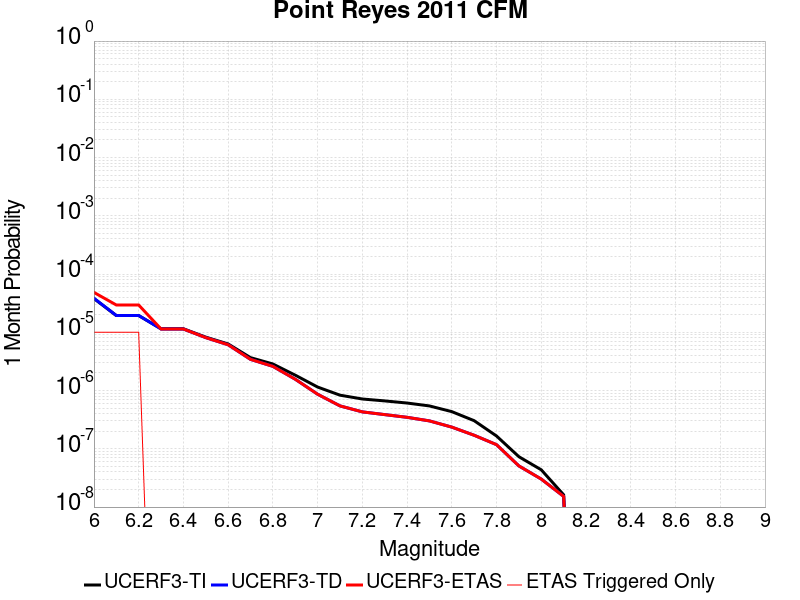 |  |  |

| Magnitude | 1 wk TI Prob | 1 wk TD Prob | 1 wk ETAS Prob | 1 wk ETAS/TD Gain | 1 wk ETAS Triggered Only | 1 mo TI Prob | 1 mo TD Prob | 1 mo ETAS Prob | 1 mo ETAS/TD Gain | 1 mo ETAS Triggered Only | 1 yr TI Prob | 1 yr TD Prob | 1 yr ETAS Prob | 1 yr ETAS/TD Gain | 1 yr ETAS Triggered Only | 10 yr TI Prob | 10 yr TD Prob | 10 yr ETAS Prob | 10 yr ETAS/TD Gain | 10 yr ETAS Triggered Only |
|-----|-----|-----|-----|-----|-----|-----|-----|-----|-----|-----|-----|-----|-----|-----|-----|-----|-----|-----|-----|-----|
| 6.0 | 8.8644965E-6 | 8.967314E-6 | 8.967314E-6 | 1.0 | 0.0 | 3.7990147E-5 | 3.8430815E-5 | 4.8430433E-5 | 1.2601979 | 1.0E-5 | 4.624319E-4 | 4.67801E-4 | 4.7779633E-4 | 1.0213666 | 1.0E-5 | 0.0046147075 | 0.0046687913 | 0.0046787444 | 1.0021319 | 1.0E-5 |
| 6.1 | 4.526405E-6 | 4.5393203E-6 | 4.5393203E-6 | 1.0 | 0.0 | 1.9398734E-5 | 1.9454092E-5 | 2.9453897E-5 | 1.5140207 | 1.0E-5 | 2.36154E-4 | 2.3682887E-4 | 2.468265E-4 | 1.0422146 | 1.0E-5 | 0.002359032 | 0.002365871 | 0.0023758474 | 1.0042168 | 1.0E-5 |
| 6.2 | 4.526405E-6 | 4.5393203E-6 | 4.5393203E-6 | 1.0 | 0.0 | 1.9398734E-5 | 1.9454092E-5 | 2.9453897E-5 | 1.5140207 | 1.0E-5 | 2.36154E-4 | 2.3682887E-4 | 2.468265E-4 | 1.0422146 | 1.0E-5 | 0.002359032 | 0.002365871 | 0.0023758474 | 1.0042168 | 1.0E-5 |
| 6.3 | 2.6842322E-6 | 2.6607584E-6 | 2.6607584E-6 | 1.0 | 0.0 | 1.1503801E-5 | 1.1403202E-5 | 1.1403202E-5 | 1.0 | 0.0 | 1.4004979E-4 | 1.3882533E-4 | 1.3882533E-4 | 1.0 | 0.0 | 0.0013996155 | 0.001387408 | 0.001387408 | 1.0 | 0.0 |
| 6.4 | 2.6842322E-6 | 2.6607584E-6 | 2.6607584E-6 | 1.0 | 0.0 | 1.1503801E-5 | 1.1403202E-5 | 1.1403202E-5 | 1.0 | 0.0 | 1.4004979E-4 | 1.3882533E-4 | 1.3882533E-4 | 1.0 | 0.0 | 0.0013996155 | 0.001387408 | 0.001387408 | 1.0 | 0.0 |
| 6.5 | 1.9281833E-6 | 1.8907011E-6 | 1.8907011E-6 | 1.0 | 0.0 | 8.263617E-6 | 8.10298E-6 | 8.10298E-6 | 1.0 | 0.0 | 1.0060489E-4 | 9.86494E-5 | 9.86494E-5 | 1.0 | 0.0 | 0.0010055936 | 9.86067E-4 | 9.86067E-4 | 1.0 | 0.0 |
| 6.6 | 1.4726726E-6 | 1.4270281E-6 | 1.4270281E-6 | 1.0 | 0.0 | 6.3114385E-6 | 6.1158207E-6 | 6.1158207E-6 | 1.0 | 0.0 | 7.683905E-5 | 7.445762E-5 | 7.445762E-5 | 1.0 | 0.0 | 7.6812494E-4 | 7.4433396E-4 | 7.4433396E-4 | 1.0 | 0.0 |
| 6.7 | 8.572307E-7 | 8.0078576E-7 | 8.0078576E-7 | 1.0 | 0.0 | 3.6738406E-6 | 3.4319346E-6 | 3.4319346E-6 | 1.0 | 0.0 | 4.472809E-5 | 4.178302E-5 | 4.178302E-5 | 1.0 | 0.0 | 4.471909E-4 | 4.1775563E-4 | 4.1775563E-4 | 1.0 | 0.0 |
| 6.8 | 6.6745434E-7 | 6.077928E-7 | 6.077928E-7 | 1.0 | 0.0 | 2.8605155E-6 | 2.6048237E-6 | 2.6048237E-6 | 1.0 | 0.0 | 3.482622E-5 | 3.1713276E-5 | 3.1713276E-5 | 1.0 | 0.0 | 3.4820763E-4 | 3.1709092E-4 | 3.1709092E-4 | 1.0 | 0.0 |
| 6.9 | 4.291521E-7 | 3.6542002E-7 | 3.6542002E-7 | 1.0 | 0.0 | 1.839222E-6 | 1.5660848E-6 | 1.5660848E-6 | 1.0 | 0.0 | 2.2392298E-5 | 1.906692E-5 | 1.906692E-5 | 1.0 | 0.0 | 2.2390042E-4 | 1.906556E-4 | 1.906556E-4 | 1.0 | 0.0 |
| 7.0 | 2.6812808E-7 | 2.0193328E-7 | 2.0193328E-7 | 1.0 | 0.0 | 1.1491198E-6 | 8.6542804E-7 | 8.6542804E-7 | 1.0 | 0.0 | 1.3990444E-5 | 1.0536536E-5 | 1.0536536E-5 | 1.0 | 0.0 | 1.3989564E-4 | 1.05362815E-4 | 1.05362815E-4 | 1.0 | 0.0 |
| 7.1 | 1.9451231E-7 | 1.2731338E-7 | 1.2731338E-7 | 1.0 | 0.0 | 8.336239E-7 | 5.456287E-7 | 5.456287E-7 | 1.0 | 0.0 | 1.0149324E-5 | 6.643009E-6 | 6.643009E-6 | 1.0 | 0.0 | 1.014886E-4 | 6.643049E-5 | 6.643049E-5 | 1.0 | 0.0 |
| 7.2 | 1.6715143E-7 | 1.0048586E-7 | 1.0048586E-7 | 1.0 | 0.0 | 7.1636305E-7 | 4.3065364E-7 | 4.3065364E-7 | 1.0 | 0.0 | 8.721685E-6 | 5.2431956E-6 | 5.2431956E-6 | 1.0 | 0.0 | 8.721343E-5 | 5.2433094E-5 | 5.2433094E-5 | 1.0 | 0.0 |
| 7.3 | 1.5503173E-7 | 9.01876E-8 | 9.01876E-8 | 1.0 | 0.0 | 6.644215E-7 | 3.8651822E-7 | 3.8651822E-7 | 1.0 | 0.0 | 8.089301E-6 | 4.7058493E-6 | 4.7058493E-6 | 1.0 | 0.0 | 8.089007E-5 | 4.705987E-5 | 4.705987E-5 | 1.0 | 0.0 |
| 7.4 | 1.4251614E-7 | 8.103124E-8 | 8.103124E-8 | 1.0 | 0.0 | 6.1078333E-7 | 3.472767E-7 | 3.472767E-7 | 1.0 | 0.0 | 7.4362615E-6 | 4.228086E-6 | 4.228086E-6 | 1.0 | 0.0 | 7.436013E-5 | 4.228243E-5 | 4.228243E-5 | 1.0 | 0.0 |
| 7.5 | 1.2710186E-7 | 7.0349145E-8 | 7.0349145E-8 | 1.0 | 0.0 | 5.447221E-7 | 3.0149633E-7 | 3.0149633E-7 | 1.0 | 0.0 | 6.6319717E-6 | 3.6707113E-6 | 3.6707113E-6 | 1.0 | 0.0 | 6.6317734E-5 | 3.6708883E-5 | 3.6708883E-5 | 1.0 | 0.0 |
| 7.6 | 1.0144708E-7 | 5.500054E-8 | 5.500054E-8 | 1.0 | 0.0 | 4.347731E-7 | 2.3571661E-7 | 2.3571661E-7 | 1.0 | 0.0 | 5.2933497E-6 | 2.869846E-6 | 2.869846E-6 | 1.0 | 0.0 | 5.293224E-5 | 2.8700464E-5 | 2.8700464E-5 | 1.0 | 0.0 |
| 7.7 | 7.090527E-8 | 3.9863696E-8 | 3.9863696E-8 | 1.0 | 0.0 | 3.038797E-7 | 1.7084442E-7 | 1.7084442E-7 | 1.0 | 0.0 | 3.699729E-6 | 2.0800287E-6 | 2.0800287E-6 | 1.0 | 0.0 | 3.6996673E-5 | 2.080247E-5 | 2.080247E-5 | 1.0 | 0.0 |
| 7.8 | 3.8712045E-8 | 2.7474998E-8 | 2.7474998E-8 | 1.0 | 0.0 | 1.6590876E-7 | 1.17750005E-7 | 1.17750005E-7 | 1.0 | 0.0 | 2.0199373E-6 | 1.4336053E-6 | 1.4336053E-6 | 1.0 | 0.0 | 2.0199188E-5 | 1.4338338E-5 | 1.4338338E-5 | 1.0 | 0.0 |
| 7.9 | 1.7068782E-8 | 1.1861377E-8 | 1.1861377E-8 | 1.0 | 0.0 | 7.315192E-8 | 5.0834473E-8 | 5.0834473E-8 | 1.0 | 0.0 | 8.906242E-7 | 6.1890955E-7 | 6.1890955E-7 | 1.0 | 0.0 | 8.906207E-6 | 6.1914543E-6 | 6.1914543E-6 | 1.0 | 0.0 |
| 8.0 | 1.0172592E-8 | 7.0515993E-9 | 7.0515993E-9 | 1.0 | 0.0 | 4.359682E-8 | 3.0221138E-8 | 3.0221138E-8 | 1.0 | 0.0 | 5.3079117E-7 | 3.679423E-7 | 3.679423E-7 | 1.0 | 0.0 | 5.307899E-6 | 3.681793E-6 | 3.681793E-6 | 1.0 | 0.0 |
| 8.1 | 3.7861243E-9 | 3.5567775E-9 | 3.5567775E-9 | 1.0 | 0.0 | 1.6226247E-8 | 1.5243334E-8 | 1.5243334E-8 | 1.0 | 0.0 | 1.9755454E-7 | 1.8558758E-7 | 1.8558758E-7 | 1.0 | 0.0 | 1.9755437E-6 | 1.8580682E-6 | 1.8580682E-6 | 1.0 | 0.0 |

## Simi-Santa Rosa
*[(top)](#table-of-contents)*

| 1 Week | 1 Month | 1 Year | 10 Year |
|-----|-----|-----|-----|
|  |  |  |  |

| Magnitude | 1 wk TI Prob | 1 wk TD Prob | 1 wk ETAS Prob | 1 wk ETAS/TD Gain | 1 wk ETAS Triggered Only | 1 mo TI Prob | 1 mo TD Prob | 1 mo ETAS Prob | 1 mo ETAS/TD Gain | 1 mo ETAS Triggered Only | 1 yr TI Prob | 1 yr TD Prob | 1 yr ETAS Prob | 1 yr ETAS/TD Gain | 1 yr ETAS Triggered Only | 10 yr TI Prob | 10 yr TD Prob | 10 yr ETAS Prob | 10 yr ETAS/TD Gain | 10 yr ETAS Triggered Only |
|-----|-----|-----|-----|-----|-----|-----|-----|-----|-----|-----|-----|-----|-----|-----|-----|-----|-----|-----|-----|-----|
| 6.0 | 2.198912E-5 | 2.2277021E-5 | 2.2277021E-5 | 1.0 | 0.0 | 9.4235686E-5 | 9.54697E-5 | 1.05468745E-4 | 1.1047353 | 1.0E-5 | 0.0011467156 | 0.0011617676 | 0.0011717561 | 1.0085976 | 1.0E-5 | 0.011408163 | 0.01156139 | 0.011571274 | 1.000855 | 1.0E-5 |
| 6.1 | 2.198912E-5 | 2.2277021E-5 | 2.2277021E-5 | 1.0 | 0.0 | 9.4235686E-5 | 9.54697E-5 | 1.05468745E-4 | 1.1047353 | 1.0E-5 | 0.0011467156 | 0.0011617676 | 0.0011717561 | 1.0085976 | 1.0E-5 | 0.011408163 | 0.01156139 | 0.011571274 | 1.000855 | 1.0E-5 |
| 6.2 | 1.69983E-5 | 1.666977E-5 | 1.666977E-5 | 1.0 | 0.0 | 7.284782E-5 | 7.144008E-5 | 8.1439364E-5 | 1.1399674 | 1.0E-5 | 8.865613E-4 | 8.694651E-4 | 8.794564E-4 | 1.0114913 | 1.0E-5 | 0.008830327 | 0.008663555 | 0.008673468 | 1.0011443 | 1.0E-5 |
| 6.3 | 1.69983E-5 | 1.666977E-5 | 1.666977E-5 | 1.0 | 0.0 | 7.284782E-5 | 7.144008E-5 | 8.1439364E-5 | 1.1399674 | 1.0E-5 | 8.865613E-4 | 8.694651E-4 | 8.794564E-4 | 1.0114913 | 1.0E-5 | 0.008830327 | 0.008663555 | 0.008673468 | 1.0011443 | 1.0E-5 |
| 6.4 | 1.4666188E-5 | 1.4053585E-5 | 1.4053585E-5 | 1.0 | 0.0 | 6.285358E-5 | 6.02284E-5 | 7.02278E-5 | 1.1660247 | 1.0E-5 | 7.6497364E-4 | 7.3305896E-4 | 7.4305164E-4 | 1.0136315 | 1.0E-5 | 0.0076234564 | 0.0073088845 | 0.007318811 | 1.0013582 | 1.0E-5 |
| 6.5 | 1.4666188E-5 | 1.4053585E-5 | 1.4053585E-5 | 1.0 | 0.0 | 6.285358E-5 | 6.02284E-5 | 7.02278E-5 | 1.1660247 | 1.0E-5 | 7.6497364E-4 | 7.3305896E-4 | 7.4305164E-4 | 1.0136315 | 1.0E-5 | 0.0076234564 | 0.0073088845 | 0.007318811 | 1.0013582 | 1.0E-5 |
| 6.6 | 1.4377586E-5 | 1.3730604E-5 | 1.3730604E-5 | 1.0 | 0.0 | 6.1616774E-5 | 5.884426E-5 | 6.884367E-5 | 1.1699301 | 1.0E-5 | 7.4992597E-4 | 7.1621826E-4 | 7.2621106E-4 | 1.0139523 | 1.0E-5 | 0.007474003 | 0.007141568 | 0.0071514966 | 1.0013902 | 1.0E-5 |
| 6.7 | 1.3881404E-5 | 1.320854E-5 | 1.320854E-5 | 1.0 | 0.0 | 5.9490372E-5 | 5.6606936E-5 | 6.660637E-5 | 1.1766468 | 1.0E-5 | 7.240546E-4 | 6.889962E-4 | 6.989894E-4 | 1.0145038 | 1.0E-5 | 0.007217 | 0.0068710507 | 0.0068809823 | 1.0014454 | 1.0E-5 |
| 6.8 | 1.0176516E-5 | 9.154869E-6 | 9.154869E-6 | 1.0 | 0.0 | 4.3612912E-5 | 3.9234656E-5 | 4.9234262E-5 | 1.2548667 | 1.0E-5 | 5.308578E-4 | 4.7759383E-4 | 4.8758904E-4 | 1.0209283 | 1.0E-5 | 0.0052959146 | 0.004767308 | 0.00477726 | 1.0020876 | 1.0E-5 |
| 6.9 | 9.699797E-6 | 8.775409E-6 | 8.775409E-6 | 1.0 | 0.0 | 4.15699E-5 | 3.7608446E-5 | 4.760807E-5 | 1.2658877 | 1.0E-5 | 5.05996E-4 | 4.5780305E-4 | 4.677985E-4 | 1.0218334 | 1.0E-5 | 0.005048454 | 0.004570218 | 0.0045801722 | 1.0021781 | 1.0E-5 |
| 7.0 | 7.4049476E-6 | 6.559854E-6 | 6.559854E-6 | 1.0 | 0.0 | 3.1735104E-5 | 2.8113427E-5 | 2.8113427E-5 | 1.0 | 0.0 | 3.8630638E-4 | 3.4223986E-4 | 3.4223986E-4 | 1.0 | 0.0 | 0.0038563553 | 0.0034183706 | 0.0034183706 | 1.0 | 0.0 |
| 7.1 | 3.873439E-6 | 2.75975E-6 | 2.75975E-6 | 1.0 | 0.0 | 1.6600346E-5 | 1.1827447E-5 | 1.1827447E-5 | 1.0 | 0.0 | 2.0209046E-4 | 1.4398989E-4 | 1.4398989E-4 | 1.0 | 0.0 | 0.0020190678 | 0.0014389895 | 0.0014389895 | 1.0 | 0.0 |
| 7.2 | 3.417706E-6 | 2.367868E-6 | 2.367868E-6 | 1.0 | 0.0 | 1.4647229E-5 | 1.0147968E-5 | 1.0147968E-5 | 1.0 | 0.0 | 1.7831543E-4 | 1.2354473E-4 | 1.2354473E-4 | 1.0 | 0.0 | 0.0017817242 | 0.0012347827 | 0.0012347827 | 1.0 | 0.0 |
| 7.3 | 1.90225E-6 | 1.4075636E-6 | 1.4075636E-6 | 1.0 | 0.0 | 8.152474E-6 | 6.0324014E-6 | 6.0324014E-6 | 1.0 | 0.0 | 9.9251854E-5 | 7.344203E-5 | 7.344203E-5 | 1.0 | 0.0 | 9.920754E-4 | 7.3417986E-4 | 7.3417986E-4 | 1.0 | 0.0 |
| 7.4 | 1.5170556E-6 | 1.102654E-6 | 1.102654E-6 | 1.0 | 0.0 | 6.5016507E-6 | 4.7256517E-6 | 4.7256517E-6 | 1.0 | 0.0 | 7.915472E-5 | 5.75333E-5 | 5.75333E-5 | 1.0 | 0.0 | 7.9126534E-4 | 5.751852E-4 | 5.751852E-4 | 1.0 | 0.0 |
| 7.5 | 1.178732E-6 | 8.5367844E-7 | 8.5367844E-7 | 1.0 | 0.0 | 5.0516987E-6 | 3.6586166E-6 | 3.6586166E-6 | 1.0 | 0.0 | 6.1502695E-5 | 4.4542758E-5 | 4.4542758E-5 | 1.0 | 0.0 | 6.148568E-4 | 4.4533925E-4 | 4.4533925E-4 | 1.0 | 0.0 |
| 7.6 | 6.8722386E-7 | 4.7947464E-7 | 4.7947464E-7 | 1.0 | 0.0 | 2.9452417E-6 | 2.0548896E-6 | 2.0548896E-6 | 1.0 | 0.0 | 3.5857727E-5 | 2.5017995E-5 | 2.5017995E-5 | 1.0 | 0.0 | 3.5851944E-4 | 2.501519E-4 | 2.501519E-4 | 1.0 | 0.0 |
| 7.7 | 5.5126515E-7 | 3.6746107E-7 | 3.6746107E-7 | 1.0 | 0.0 | 2.3625628E-6 | 1.5748323E-6 | 1.5748323E-6 | 1.0 | 0.0 | 2.8763823E-5 | 1.9173414E-5 | 1.9173414E-5 | 1.0 | 0.0 | 2.87601E-4 | 1.9171771E-4 | 1.9171771E-4 | 1.0 | 0.0 |
| 7.8 | 3.3860243E-7 | 2.008429E-7 | 2.008429E-7 | 1.0 | 0.0 | 1.4511525E-6 | 8.60755E-7 | 8.60755E-7 | 1.0 | 0.0 | 1.7667637E-5 | 1.0479643E-5 | 1.0479643E-5 | 1.0 | 0.0 | 1.7666233E-4 | 1.04791536E-4 | 1.04791536E-4 | 1.0 | 0.0 |
| 7.9 | 2.7955386E-7 | 1.4656874E-7 | 1.4656874E-7 | 1.0 | 0.0 | 1.1980875E-6 | 6.281516E-7 | 6.281516E-7 | 1.0 | 0.0 | 1.4586617E-5 | 7.647719E-6 | 7.647719E-6 | 1.0 | 0.0 | 1.458566E-4 | 7.64746E-5 | 7.64746E-5 | 1.0 | 0.0 |
| 8.0 | 5.6259015E-8 | 3.336323E-8 | 3.336323E-8 | 1.0 | 0.0 | 2.4111003E-7 | 1.4298526E-7 | 1.4298526E-7 | 1.0 | 0.0 | 2.9355108E-6 | 1.7408443E-6 | 1.7408443E-6 | 1.0 | 0.0 | 2.935472E-5 | 1.740832E-5 | 1.740832E-5 | 1.0 | 0.0 |

## Cleghorn Pass
*[(top)](#table-of-contents)*

| 1 Week | 1 Month | 1 Year | 10 Year |
|-----|-----|-----|-----|
|  |  |  |  |

| Magnitude | 1 wk TI Prob | 1 wk TD Prob | 1 wk ETAS Prob | 1 wk ETAS/TD Gain | 1 wk ETAS Triggered Only | 1 mo TI Prob | 1 mo TD Prob | 1 mo ETAS Prob | 1 mo ETAS/TD Gain | 1 mo ETAS Triggered Only | 1 yr TI Prob | 1 yr TD Prob | 1 yr ETAS Prob | 1 yr ETAS/TD Gain | 1 yr ETAS Triggered Only | 10 yr TI Prob | 10 yr TD Prob | 10 yr ETAS Prob | 10 yr ETAS/TD Gain | 10 yr ETAS Triggered Only |
|-----|-----|-----|-----|-----|-----|-----|-----|-----|-----|-----|-----|-----|-----|-----|-----|-----|-----|-----|-----|-----|
| 6.0 | 1.0522846E-5 | 1.104093E-5 | 1.104093E-5 | 1.0 | 0.0 | 4.509713E-5 | 4.731771E-5 | 4.731771E-5 | 1.0 | 0.0 | 5.4891926E-4 | 5.759935E-4 | 5.859877E-4 | 1.0173513 | 1.0E-5 | 0.0054756533 | 0.005750172 | 0.005760114 | 1.0017291 | 1.0E-5 |
| 6.1 | 1.0522846E-5 | 1.104093E-5 | 1.104093E-5 | 1.0 | 0.0 | 4.509713E-5 | 4.731771E-5 | 4.731771E-5 | 1.0 | 0.0 | 5.4891926E-4 | 5.759935E-4 | 5.859877E-4 | 1.0173513 | 1.0E-5 | 0.0054756533 | 0.005750172 | 0.005760114 | 1.0017291 | 1.0E-5 |
| 6.2 | 2.1045846E-6 | 2.2082602E-6 | 2.2082602E-6 | 1.0 | 0.0 | 9.019617E-6 | 9.463961E-6 | 9.463961E-6 | 1.0 | 0.0 | 1.098083E-4 | 1.1522183E-4 | 1.1522183E-4 | 1.0 | 0.0 | 0.0010975406 | 0.0011520323 | 0.0011520323 | 1.0 | 0.0 |
| 6.3 | 2.1045846E-6 | 2.2082602E-6 | 2.2082602E-6 | 1.0 | 0.0 | 9.019617E-6 | 9.463961E-6 | 9.463961E-6 | 1.0 | 0.0 | 1.098083E-4 | 1.1522183E-4 | 1.1522183E-4 | 1.0 | 0.0 | 0.0010975406 | 0.0011520323 | 0.0011520323 | 1.0 | 0.0 |
| 6.4 | 1.7259927E-6 | 1.8109243E-6 | 1.8109243E-6 | 1.0 | 0.0 | 7.3970905E-6 | 7.761104E-6 | 7.761104E-6 | 1.0 | 0.0 | 9.005586E-5 | 9.449144E-5 | 9.449144E-5 | 1.0 | 0.0 | 9.001937E-4 | 9.4491447E-4 | 9.4491447E-4 | 1.0 | 0.0 |

## Los Osos 2011
*[(top)](#table-of-contents)*

| 1 Week | 1 Month | 1 Year | 10 Year |
|-----|-----|-----|-----|
|  |  |  | 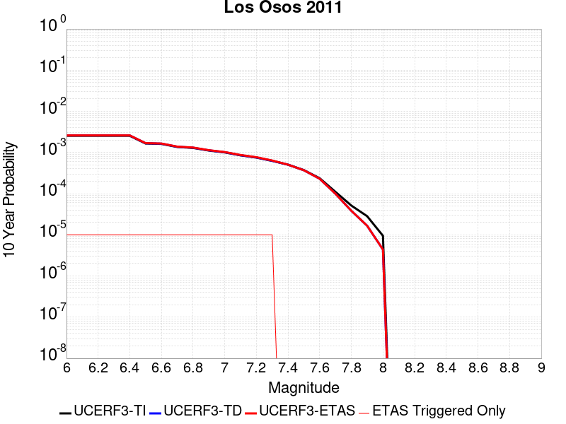 |

| Magnitude | 1 wk TI Prob | 1 wk TD Prob | 1 wk ETAS Prob | 1 wk ETAS/TD Gain | 1 wk ETAS Triggered Only | 1 mo TI Prob | 1 mo TD Prob | 1 mo ETAS Prob | 1 mo ETAS/TD Gain | 1 mo ETAS Triggered Only | 1 yr TI Prob | 1 yr TD Prob | 1 yr ETAS Prob | 1 yr ETAS/TD Gain | 1 yr ETAS Triggered Only | 10 yr TI Prob | 10 yr TD Prob | 10 yr ETAS Prob | 10 yr ETAS/TD Gain | 10 yr ETAS Triggered Only |
|-----|-----|-----|-----|-----|-----|-----|-----|-----|-----|-----|-----|-----|-----|-----|-----|-----|-----|-----|-----|-----|
| 6.0 | 4.8871775E-6 | 4.981564E-6 | 4.981564E-6 | 1.0 | 0.0 | 2.0944879E-5 | 2.1349402E-5 | 2.1349402E-5 | 1.0 | 0.0 | 2.5497406E-4 | 2.5990076E-4 | 2.6989816E-4 | 1.0384662 | 1.0E-5 | 0.002546817 | 0.0025962424 | 0.0026062164 | 1.0038418 | 1.0E-5 |
| 6.1 | 4.8871775E-6 | 4.981564E-6 | 4.981564E-6 | 1.0 | 0.0 | 2.0944879E-5 | 2.1349402E-5 | 2.1349402E-5 | 1.0 | 0.0 | 2.5497406E-4 | 2.5990076E-4 | 2.6989816E-4 | 1.0384662 | 1.0E-5 | 0.002546817 | 0.0025962424 | 0.0026062164 | 1.0038418 | 1.0E-5 |
| 6.2 | 4.8871775E-6 | 4.981564E-6 | 4.981564E-6 | 1.0 | 0.0 | 2.0944879E-5 | 2.1349402E-5 | 2.1349402E-5 | 1.0 | 0.0 | 2.5497406E-4 | 2.5990076E-4 | 2.6989816E-4 | 1.0384662 | 1.0E-5 | 0.002546817 | 0.0025962424 | 0.0026062164 | 1.0038418 | 1.0E-5 |
| 6.3 | 4.8871775E-6 | 4.981564E-6 | 4.981564E-6 | 1.0 | 0.0 | 2.0944879E-5 | 2.1349402E-5 | 2.1349402E-5 | 1.0 | 0.0 | 2.5497406E-4 | 2.5990076E-4 | 2.6989816E-4 | 1.0384662 | 1.0E-5 | 0.002546817 | 0.0025962424 | 0.0026062164 | 1.0038418 | 1.0E-5 |
| 6.4 | 4.8871775E-6 | 4.981564E-6 | 4.981564E-6 | 1.0 | 0.0 | 2.0944879E-5 | 2.1349402E-5 | 2.1349402E-5 | 1.0 | 0.0 | 2.5497406E-4 | 2.5990076E-4 | 2.6989816E-4 | 1.0384662 | 1.0E-5 | 0.002546817 | 0.0025962424 | 0.0026062164 | 1.0038418 | 1.0E-5 |
| 6.5 | 3.1724062E-6 | 3.223452E-6 | 3.223452E-6 | 1.0 | 0.0 | 1.3595956E-5 | 1.38147225E-5 | 1.38147225E-5 | 1.0 | 0.0 | 1.6551818E-4 | 1.681814E-4 | 1.7817972E-4 | 1.0594496 | 1.0E-5 | 0.0016539496 | 0.0016805547 | 0.0016905379 | 1.0059404 | 1.0E-5 |
| 6.6 | 3.1022591E-6 | 3.1511604E-6 | 3.1511604E-6 | 1.0 | 0.0 | 1.3295328E-5 | 1.3504904E-5 | 1.3504904E-5 | 1.0 | 0.0 | 1.618586E-4 | 1.6440992E-4 | 1.7440828E-4 | 1.0608135 | 1.0E-5 | 0.0016174077 | 0.0016428957 | 0.0016528793 | 1.0060768 | 1.0E-5 |
| 6.7 | 2.611518E-6 | 2.6492332E-6 | 2.6492332E-6 | 1.0 | 0.0 | 1.1192172E-5 | 1.1353807E-5 | 1.1353807E-5 | 1.0 | 0.0 | 1.3625617E-4 | 1.3822388E-4 | 1.4822249E-4 | 1.0723364 | 1.0E-5 | 0.0013617266 | 0.0013813835 | 0.0013913697 | 1.0072291 | 1.0E-5 |
| 6.8 | 2.4780884E-6 | 2.5122072E-6 | 2.5122072E-6 | 1.0 | 0.0 | 1.0620336E-5 | 1.0766558E-5 | 1.0766558E-5 | 1.0 | 0.0 | 1.2929492E-4 | 1.3107501E-4 | 1.4107369E-4 | 1.0762821 | 1.0E-5 | 0.0012921972 | 0.001309981 | 0.0013199679 | 1.0076237 | 1.0E-5 |
| 6.9 | 2.1376322E-6 | 2.1635492E-6 | 2.1635492E-6 | 1.0 | 0.0 | 9.161248E-6 | 9.27232E-6 | 9.27232E-6 | 1.0 | 0.0 | 1.1153249E-4 | 1.1288467E-4 | 1.2288355E-4 | 1.088576 | 1.0E-5 | 0.0011147653 | 0.0011282752 | 0.001138264 | 1.0088531 | 1.0E-5 |
| 7.0 | 1.9282882E-6 | 1.9494996E-6 | 1.9494996E-6 | 1.0 | 0.0 | 8.264066E-6 | 8.354971E-6 | 8.354971E-6 | 1.0 | 0.0 | 1.0061036E-4 | 1.01717036E-4 | 1.1171602E-4 | 1.0983019 | 1.0E-5 | 0.0010056482 | 0.0010167062 | 0.0010266961 | 1.0098257 | 1.0E-5 |
| 7.1 | 1.6353226E-6 | 1.6501493E-6 | 1.6501493E-6 | 1.0 | 0.0 | 7.0085066E-6 | 7.0720494E-6 | 7.0720494E-6 | 1.0 | 0.0 | 8.532523E-5 | 8.609881E-5 | 9.6097945E-5 | 1.1161356 | 1.0E-5 | 8.529247E-4 | 8.606552E-4 | 8.706466E-4 | 1.0116091 | 1.0E-5 |
| 7.2 | 1.4446276E-6 | 1.4553694E-6 | 1.4553694E-6 | 1.0 | 0.0 | 6.191247E-6 | 6.2372824E-6 | 6.2372824E-6 | 1.0 | 0.0 | 7.537582E-5 | 7.5936274E-5 | 8.593551E-5 | 1.1316794 | 1.0E-5 | 7.535026E-4 | 7.5910386E-4 | 7.6909625E-4 | 1.0131634 | 1.0E-5 |
| 7.3 | 1.2014582E-6 | 1.2069397E-6 | 1.2069397E-6 | 1.0 | 0.0 | 5.149096E-6 | 5.1725883E-6 | 5.1725883E-6 | 1.0 | 0.0 | 6.268844E-5 | 6.2974446E-5 | 7.297382E-5 | 1.1587845 | 1.0E-5 | 6.267076E-4 | 6.2956644E-4 | 6.3956017E-4 | 1.0158739 | 1.0E-5 |
| 7.4 | 9.707733E-7 | 9.710069E-7 | 9.710069E-7 | 1.0 | 0.0 | 4.16045E-6 | 4.1614517E-6 | 4.1614517E-6 | 1.0 | 0.0 | 5.0652303E-5 | 5.0664497E-5 | 5.0664497E-5 | 1.0 | 0.0 | 5.064076E-4 | 5.065297E-4 | 5.065297E-4 | 1.0 | 0.0 |
| 7.5 | 7.174908E-7 | 7.115176E-7 | 7.115176E-7 | 1.0 | 0.0 | 3.074957E-6 | 3.0493575E-6 | 3.0493575E-6 | 1.0 | 0.0 | 3.743696E-5 | 3.7125297E-5 | 3.7125297E-5 | 1.0 | 0.0 | 3.7430652E-4 | 3.7119113E-4 | 3.7119113E-4 | 1.0 | 0.0 |
| 7.6 | 4.5535776E-7 | 4.4210145E-7 | 4.4210145E-7 | 1.0 | 0.0 | 1.9515319E-6 | 1.8947192E-6 | 1.8947192E-6 | 1.0 | 0.0 | 2.3759641E-5 | 2.3067962E-5 | 2.3067962E-5 | 1.0 | 0.0 | 2.37571E-4 | 2.3065577E-4 | 2.3065577E-4 | 1.0 | 0.0 |
| 7.7 | 2.1173553E-7 | 1.906259E-7 | 1.906259E-7 | 1.0 | 0.0 | 9.0743765E-7 | 8.169679E-7 | 8.169679E-7 | 1.0 | 0.0 | 1.1047998E-5 | 9.946539E-6 | 9.946539E-6 | 1.0 | 0.0 | 1.1047449E-4 | 9.946096E-5 | 9.946096E-5 | 1.0 | 0.0 |
| 7.8 | 9.873608E-8 | 7.3690714E-8 | 7.3690714E-8 | 1.0 | 0.0 | 4.2315455E-7 | 3.158173E-7 | 3.158173E-7 | 1.0 | 0.0 | 5.1518946E-6 | 3.845069E-6 | 3.845069E-6 | 1.0 | 0.0 | 5.1517753E-5 | 3.845003E-5 | 3.845003E-5 | 1.0 | 0.0 |
| 7.9 | 5.4399106E-8 | 3.1893627E-8 | 3.1893627E-8 | 1.0 | 0.0 | 2.33139E-7 | 1.3668696E-7 | 1.3668696E-7 | 1.0 | 0.0 | 2.8384638E-6 | 1.6641625E-6 | 1.6641625E-6 | 1.0 | 0.0 | 2.8384275E-5 | 1.6641501E-5 | 1.6641501E-5 | 1.0 | 0.0 |
| 8.0 | 1.817203E-8 | 8.4260625E-9 | 8.4260625E-9 | 1.0 | 0.0 | 7.7880124E-8 | 3.6111697E-8 | 3.6111697E-8 | 1.0 | 0.0 | 9.481901E-7 | 4.396598E-7 | 4.396598E-7 | 1.0 | 0.0 | 9.481861E-6 | 4.3965897E-6 | 4.3965897E-6 | 1.0 | 0.0 |

## San Diego Trough south
*[(top)](#table-of-contents)*

| 1 Week | 1 Month | 1 Year | 10 Year |
|-----|-----|-----|-----|
|  |  |  |  |

| Magnitude | 1 wk TI Prob | 1 wk TD Prob | 1 wk ETAS Prob | 1 wk ETAS/TD Gain | 1 wk ETAS Triggered Only | 1 mo TI Prob | 1 mo TD Prob | 1 mo ETAS Prob | 1 mo ETAS/TD Gain | 1 mo ETAS Triggered Only | 1 yr TI Prob | 1 yr TD Prob | 1 yr ETAS Prob | 1 yr ETAS/TD Gain | 1 yr ETAS Triggered Only | 10 yr TI Prob | 10 yr TD Prob | 10 yr ETAS Prob | 10 yr ETAS/TD Gain | 10 yr ETAS Triggered Only |
|-----|-----|-----|-----|-----|-----|-----|-----|-----|-----|-----|-----|-----|-----|-----|-----|-----|-----|-----|-----|-----|
| 6.0 | 8.279495E-5 | 1.0426959E-4 | 1.0426959E-4 | 1.0 | 0.0 | 3.5478722E-4 | 4.4679717E-4 | 4.4679717E-4 | 1.0 | 0.0 | 0.004310982 | 0.0054266346 | 0.0054266346 | 1.0 | 0.0 | 0.042283054 | 0.052999813 | 0.053009283 | 1.0001787 | 1.0E-5 |
| 6.1 | 4.6961468E-5 | 5.7736557E-5 | 5.7736557E-5 | 1.0 | 0.0 | 2.0124791E-4 | 2.4741987E-4 | 2.4741987E-4 | 1.0 | 0.0 | 0.00244744 | 0.0030082478 | 0.0030082478 | 1.0 | 0.0 | 0.024206603 | 0.029683128 | 0.029683128 | 1.0 | 0.0 |
| 6.2 | 3.5079658E-5 | 4.214702E-5 | 4.214702E-5 | 1.0 | 0.0 | 1.5033272E-4 | 1.8061785E-4 | 1.8061785E-4 | 1.0 | 0.0 | 0.0018287642 | 0.0021968228 | 0.0021968228 | 1.0 | 0.0 | 0.018137876 | 0.021753483 | 0.021753483 | 1.0 | 0.0 |
| 6.3 | 3.5079658E-5 | 4.214702E-5 | 4.214702E-5 | 1.0 | 0.0 | 1.5033272E-4 | 1.8061785E-4 | 1.8061785E-4 | 1.0 | 0.0 | 0.0018287642 | 0.0021968228 | 0.0021968228 | 1.0 | 0.0 | 0.018137876 | 0.021753483 | 0.021753483 | 1.0 | 0.0 |
| 6.4 | 2.7196904E-5 | 3.2090207E-5 | 3.2090207E-5 | 1.0 | 0.0 | 1.16552954E-4 | 1.375223E-4 | 1.375223E-4 | 1.0 | 0.0 | 0.0014181085 | 0.00167306 | 0.00167306 | 1.0 | 0.0 | 0.014090929 | 0.016606245 | 0.016606245 | 1.0 | 0.0 |
| 6.5 | 2.5584688E-5 | 3.0104437E-5 | 3.0104437E-5 | 1.0 | 0.0 | 1.0964406E-4 | 1.2901273E-4 | 1.2901273E-4 | 1.0 | 0.0 | 0.0013340989 | 0.0015696106 | 0.0015696106 | 1.0 | 0.0 | 0.013261181 | 0.01558679 | 0.01558679 | 1.0 | 0.0 |
| 6.6 | 2.2034688E-5 | 2.5745014E-5 | 2.5745014E-5 | 1.0 | 0.0 | 9.443096E-5 | 1.1033115E-4 | 1.1033115E-4 | 1.0 | 0.0 | 0.0011490905 | 0.0013424618 | 0.0013424618 | 1.0 | 0.0 | 0.011431668 | 0.013344516 | 0.013344516 | 1.0 | 0.0 |
| 6.7 | 1.9394853E-5 | 2.2543714E-5 | 2.2543714E-5 | 1.0 | 0.0 | 8.311815E-5 | 9.661237E-5 | 9.661237E-5 | 1.0 | 0.0 | 0.0010114936 | 0.0011756261 | 0.0011756261 | 1.0 | 0.0 | 0.01006902 | 0.011694773 | 0.011694773 | 1.0 | 0.0 |
| 6.8 | 1.7615313E-5 | 2.0404905E-5 | 2.0404905E-5 | 1.0 | 0.0 | 7.549201E-5 | 8.7446686E-5 | 8.7446686E-5 | 1.0 | 0.0 | 9.1872766E-4 | 0.0010641478 | 0.0010641478 | 1.0 | 0.0 | 0.009149387 | 0.010591088 | 0.010591088 | 1.0 | 0.0 |
| 6.9 | 1.5621423E-5 | 1.8027595E-5 | 1.8027595E-5 | 1.0 | 0.0 | 6.6947236E-5 | 7.725885E-5 | 7.725885E-5 | 1.0 | 0.0 | 8.147778E-4 | 9.402241E-4 | 9.402241E-4 | 1.0 | 0.0 | 0.008117969 | 0.009362906 | 0.009362906 | 1.0 | 0.0 |
| 7.0 | 1.3444376E-5 | 1.5449315E-5 | 1.5449315E-5 | 1.0 | 0.0 | 5.7617483E-5 | 6.6209686E-5 | 6.6209686E-5 | 1.0 | 0.0 | 7.0126704E-4 | 8.0580753E-4 | 8.0580753E-4 | 1.0 | 0.0 | 0.006990582 | 0.00802919 | 0.00802919 | 1.0 | 0.0 |
| 7.1 | 1.2268361E-5 | 1.4074132E-5 | 1.4074132E-5 | 1.0 | 0.0 | 5.2577634E-5 | 6.031633E-5 | 6.031633E-5 | 1.0 | 0.0 | 6.399447E-4 | 7.341065E-4 | 7.341065E-4 | 1.0 | 0.0 | 0.0063810493 | 0.00731712 | 0.00731712 | 1.0 | 0.0 |
| 7.2 | 1.0922655E-5 | 1.2514534E-5 | 1.2514534E-5 | 1.0 | 0.0 | 4.681054E-5 | 5.363263E-5 | 5.363263E-5 | 1.0 | 0.0 | 5.697693E-4 | 6.5278413E-4 | 6.5278413E-4 | 1.0 | 0.0 | 0.0056831064 | 0.006508947 | 0.006508947 | 1.0 | 0.0 |
| 7.3 | 6.1106753E-6 | 6.9294197E-6 | 6.9294197E-6 | 1.0 | 0.0 | 2.6188345E-5 | 2.9697178E-5 | 2.9697178E-5 | 1.0 | 0.0 | 3.1879646E-4 | 3.6150354E-4 | 3.6150354E-4 | 1.0 | 0.0 | 0.0031833951 | 0.0036092002 | 0.0036092002 | 1.0 | 0.0 |
| 7.4 | 4.933187E-6 | 5.5899495E-6 | 5.5899495E-6 | 1.0 | 0.0 | 2.114206E-5 | 2.3956709E-5 | 2.3956709E-5 | 1.0 | 0.0 | 2.5737417E-4 | 2.9163426E-4 | 2.9163426E-4 | 1.0 | 0.0 | 0.002570763 | 0.0029125568 | 0.0029125568 | 1.0 | 0.0 |
| 7.5 | 1.7489613E-6 | 1.9698116E-6 | 1.9698116E-6 | 1.0 | 0.0 | 7.495527E-6 | 8.4420235E-6 | 8.4420235E-6 | 1.0 | 0.0 | 9.125422E-5 | 1.0277701E-4 | 1.0277701E-4 | 1.0 | 0.0 | 9.1216754E-4 | 0.0010273168 | 0.0010273168 | 1.0 | 0.0 |
| 7.6 | 1.6988751E-7 | 1.7534121E-7 | 1.7534121E-7 | 1.0 | 0.0 | 7.2808916E-7 | 7.5146215E-7 | 7.5146215E-7 | 1.0 | 0.0 | 8.864449E-6 | 9.149016E-6 | 9.149016E-6 | 1.0 | 0.0 | 8.8640954E-5 | 9.148658E-5 | 9.148658E-5 | 1.0 | 0.0 |

## Garberville - Briceland 2011 CFM
*[(top)](#table-of-contents)*

| 1 Week | 1 Month | 1 Year | 10 Year |
|-----|-----|-----|-----|
|  |  | 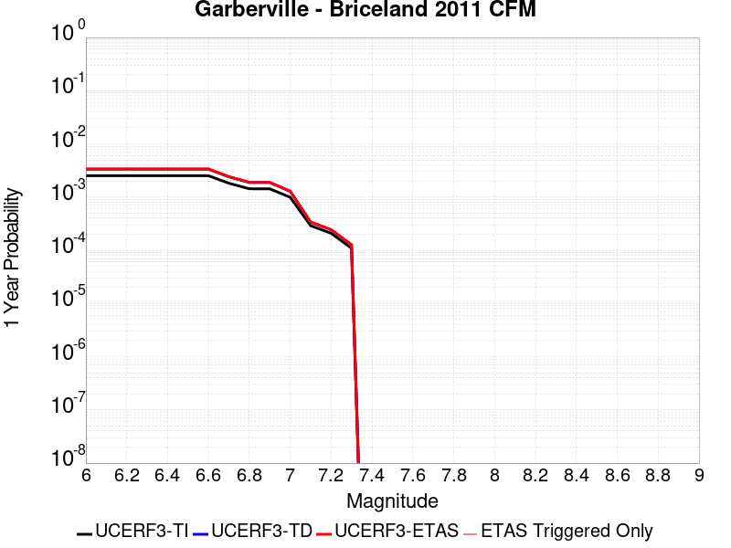 | 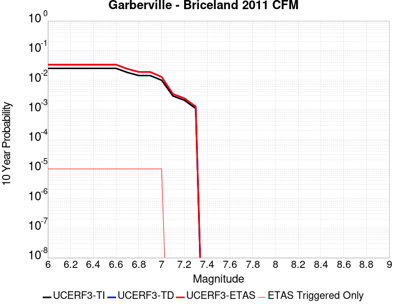 |

| Magnitude | 1 wk TI Prob | 1 wk TD Prob | 1 wk ETAS Prob | 1 wk ETAS/TD Gain | 1 wk ETAS Triggered Only | 1 mo TI Prob | 1 mo TD Prob | 1 mo ETAS Prob | 1 mo ETAS/TD Gain | 1 mo ETAS Triggered Only | 1 yr TI Prob | 1 yr TD Prob | 1 yr ETAS Prob | 1 yr ETAS/TD Gain | 1 yr ETAS Triggered Only | 10 yr TI Prob | 10 yr TD Prob | 10 yr ETAS Prob | 10 yr ETAS/TD Gain | 10 yr ETAS Triggered Only |
|-----|-----|-----|-----|-----|-----|-----|-----|-----|-----|-----|-----|-----|-----|-----|-----|-----|-----|-----|-----|-----|
| 6.0 | 4.8399295E-5 | 6.4538865E-5 | 6.4538865E-5 | 1.0 | 0.0 | 2.0740906E-4 | 2.7656916E-4 | 2.7656916E-4 | 1.0 | 0.0 | 0.002522281 | 0.003362696 | 0.003362696 | 1.0 | 0.0 | 0.024938442 | 0.033184443 | 0.033194114 | 1.0002913 | 1.0E-5 |
| 6.1 | 4.8399295E-5 | 6.4538865E-5 | 6.4538865E-5 | 1.0 | 0.0 | 2.0740906E-4 | 2.7656916E-4 | 2.7656916E-4 | 1.0 | 0.0 | 0.002522281 | 0.003362696 | 0.003362696 | 1.0 | 0.0 | 0.024938442 | 0.033184443 | 0.033194114 | 1.0002913 | 1.0E-5 |
| 6.2 | 4.8399295E-5 | 6.4538865E-5 | 6.4538865E-5 | 1.0 | 0.0 | 2.0740906E-4 | 2.7656916E-4 | 2.7656916E-4 | 1.0 | 0.0 | 0.002522281 | 0.003362696 | 0.003362696 | 1.0 | 0.0 | 0.024938442 | 0.033184443 | 0.033194114 | 1.0002913 | 1.0E-5 |
| 6.3 | 4.8399295E-5 | 6.4538865E-5 | 6.4538865E-5 | 1.0 | 0.0 | 2.0740906E-4 | 2.7656916E-4 | 2.7656916E-4 | 1.0 | 0.0 | 0.002522281 | 0.003362696 | 0.003362696 | 1.0 | 0.0 | 0.024938442 | 0.033184443 | 0.033194114 | 1.0002913 | 1.0E-5 |
| 6.4 | 4.8399295E-5 | 6.4538865E-5 | 6.4538865E-5 | 1.0 | 0.0 | 2.0740906E-4 | 2.7656916E-4 | 2.7656916E-4 | 1.0 | 0.0 | 0.002522281 | 0.003362696 | 0.003362696 | 1.0 | 0.0 | 0.024938442 | 0.033184443 | 0.033194114 | 1.0002913 | 1.0E-5 |
| 6.5 | 4.8399295E-5 | 6.4538865E-5 | 6.4538865E-5 | 1.0 | 0.0 | 2.0740906E-4 | 2.7656916E-4 | 2.7656916E-4 | 1.0 | 0.0 | 0.002522281 | 0.003362696 | 0.003362696 | 1.0 | 0.0 | 0.024938442 | 0.033184443 | 0.033194114 | 1.0002913 | 1.0E-5 |
| 6.6 | 4.8399295E-5 | 6.4538865E-5 | 6.4538865E-5 | 1.0 | 0.0 | 2.0740906E-4 | 2.7656916E-4 | 2.7656916E-4 | 1.0 | 0.0 | 0.002522281 | 0.003362696 | 0.003362696 | 1.0 | 0.0 | 0.024938442 | 0.033184443 | 0.033194114 | 1.0002913 | 1.0E-5 |
| 6.7 | 3.495179E-5 | 4.6317065E-5 | 4.6317065E-5 | 1.0 | 0.0 | 1.4978478E-4 | 1.9848965E-4 | 1.9848965E-4 | 1.0 | 0.0 | 0.0018221042 | 0.0024144647 | 0.0024144647 | 1.0 | 0.0 | 0.018072363 | 0.023934748 | 0.023944508 | 1.0004078 | 1.0E-5 |
| 6.8 | 2.7517597E-5 | 3.624779E-5 | 3.624779E-5 | 1.0 | 0.0 | 1.1792722E-4 | 1.5534113E-4 | 1.5534113E-4 | 1.0 | 0.0 | 0.0014348183 | 0.0018901116 | 0.0018901116 | 1.0 | 0.0 | 0.014255894 | 0.018786693 | 0.018796504 | 1.0005223 | 1.0E-5 |
| 6.9 | 2.74461E-5 | 3.6165507E-5 | 3.6165507E-5 | 1.0 | 0.0 | 1.1762084E-4 | 1.5498853E-4 | 1.5498853E-4 | 1.0 | 0.0 | 0.001431093 | 0.0018858262 | 0.0018858262 | 1.0 | 0.0 | 0.014219119 | 0.018744564 | 0.018754376 | 1.0005234 | 1.0E-5 |
| 7.0 | 1.9023773E-5 | 2.4711666E-5 | 2.4711666E-5 | 1.0 | 0.0 | 8.152791E-5 | 1.0590514E-4 | 1.0590514E-4 | 1.0 | 0.0 | 9.921503E-4 | 0.001289034 | 0.001289034 | 1.0 | 0.0 | 0.009877323 | 0.012854632 | 0.012864503 | 1.000768 | 1.0E-5 |
| 7.1 | 5.566844E-6 | 6.512736E-6 | 6.512736E-6 | 1.0 | 0.0 | 2.3857683E-5 | 2.7911452E-5 | 2.7911452E-5 | 1.0 | 0.0 | 2.9042858E-4 | 3.397732E-4 | 3.397732E-4 | 1.0 | 0.0 | 0.002900493 | 0.0033929576 | 0.0033929576 | 1.0 | 0.0 |
| 7.2 | 4.011353E-6 | 4.6750315E-6 | 4.6750315E-6 | 1.0 | 0.0 | 1.7191402E-5 | 2.0035715E-5 | 2.0035715E-5 | 1.0 | 0.0 | 2.0928521E-4 | 2.4391095E-4 | 2.4391095E-4 | 1.0 | 0.0 | 0.0020908823 | 0.0024367701 | 0.0024367701 | 1.0 | 0.0 |
| 7.3 | 2.0974871E-6 | 2.439802E-6 | 2.439802E-6 | 1.0 | 0.0 | 8.989199E-6 | 1.0456267E-5 | 1.0456267E-5 | 1.0 | 0.0 | 1.09438006E-4 | 1.2730011E-4 | 1.2730011E-4 | 1.0 | 0.0 | 0.0010938413 | 0.0012725171 | 0.0012725171 | 1.0 | 0.0 |

## Monte Vista - Shannon 2011 CFM
*[(top)](#table-of-contents)*

| 1 Week | 1 Month | 1 Year | 10 Year |
|-----|-----|-----|-----|
|  |  |  |  |

| Magnitude | 1 wk TI Prob | 1 wk TD Prob | 1 wk ETAS Prob | 1 wk ETAS/TD Gain | 1 wk ETAS Triggered Only | 1 mo TI Prob | 1 mo TD Prob | 1 mo ETAS Prob | 1 mo ETAS/TD Gain | 1 mo ETAS Triggered Only | 1 yr TI Prob | 1 yr TD Prob | 1 yr ETAS Prob | 1 yr ETAS/TD Gain | 1 yr ETAS Triggered Only | 10 yr TI Prob | 10 yr TD Prob | 10 yr ETAS Prob | 10 yr ETAS/TD Gain | 10 yr ETAS Triggered Only |
|-----|-----|-----|-----|-----|-----|-----|-----|-----|-----|-----|-----|-----|-----|-----|-----|-----|-----|-----|-----|-----|
| 6.0 | 2.7907707E-5 | 2.758756E-5 | 2.758756E-5 | 1.0 | 0.0 | 1.19598975E-4 | 1.1822775E-4 | 1.1822775E-4 | 1.0 | 0.0 | 0.0014551448 | 0.001438596 | 0.001438596 | 1.0 | 0.0 | 0.014456532 | 0.014321938 | 0.014331795 | 1.0006882 | 1.0E-5 |
| 6.1 | 2.7907707E-5 | 2.758756E-5 | 2.758756E-5 | 1.0 | 0.0 | 1.19598975E-4 | 1.1822775E-4 | 1.1822775E-4 | 1.0 | 0.0 | 0.0014551448 | 0.001438596 | 0.001438596 | 1.0 | 0.0 | 0.014456532 | 0.014321938 | 0.014331795 | 1.0006882 | 1.0E-5 |
| 6.2 | 2.7907707E-5 | 2.758756E-5 | 2.758756E-5 | 1.0 | 0.0 | 1.19598975E-4 | 1.1822775E-4 | 1.1822775E-4 | 1.0 | 0.0 | 0.0014551448 | 0.001438596 | 0.001438596 | 1.0 | 0.0 | 0.014456532 | 0.014321938 | 0.014331795 | 1.0006882 | 1.0E-5 |
| 6.3 | 2.7907707E-5 | 2.758756E-5 | 2.758756E-5 | 1.0 | 0.0 | 1.19598975E-4 | 1.1822775E-4 | 1.1822775E-4 | 1.0 | 0.0 | 0.0014551448 | 0.001438596 | 0.001438596 | 1.0 | 0.0 | 0.014456532 | 0.014321938 | 0.014331795 | 1.0006882 | 1.0E-5 |
| 6.4 | 2.7907707E-5 | 2.758756E-5 | 2.758756E-5 | 1.0 | 0.0 | 1.19598975E-4 | 1.1822775E-4 | 1.1822775E-4 | 1.0 | 0.0 | 0.0014551448 | 0.001438596 | 0.001438596 | 1.0 | 0.0 | 0.014456532 | 0.014321938 | 0.014331795 | 1.0006882 | 1.0E-5 |
| 6.5 | 1.7990213E-5 | 1.6642634E-5 | 1.6642634E-5 | 1.0 | 0.0 | 7.709863E-5 | 7.1324E-5 | 7.1324E-5 | 1.0 | 0.0 | 9.382716E-4 | 8.6809014E-4 | 8.6809014E-4 | 1.0 | 0.0 | 0.0093431985 | 0.008670382 | 0.008680296 | 1.0011433 | 1.0E-5 |
| 6.6 | 9.650407E-6 | 7.459402E-6 | 7.459402E-6 | 1.0 | 0.0 | 4.135823E-5 | 3.1968517E-5 | 3.1968517E-5 | 1.0 | 0.0 | 5.0342013E-4 | 3.8915503E-4 | 3.8915503E-4 | 1.0 | 0.0 | 0.005022812 | 0.0039024334 | 0.0039024334 | 1.0 | 0.0 |
| 6.7 | 9.62828E-6 | 7.437314E-6 | 7.437314E-6 | 1.0 | 0.0 | 4.1263404E-5 | 3.1873857E-5 | 3.1873857E-5 | 1.0 | 0.0 | 5.022661E-4 | 3.8800295E-4 | 3.8800295E-4 | 1.0 | 0.0 | 0.0050113243 | 0.0038909533 | 0.0038909533 | 1.0 | 0.0 |
| 6.8 | 6.887523E-6 | 4.4636836E-6 | 4.4636836E-6 | 1.0 | 0.0 | 2.9517621E-5 | 1.9129946E-5 | 1.9129946E-5 | 1.0 | 0.0 | 3.5931775E-4 | 2.3288443E-4 | 2.3288443E-4 | 1.0 | 0.0 | 0.0035873733 | 0.0023435748 | 0.0023435748 | 1.0 | 0.0 |
| 6.9 | 6.2722347E-6 | 3.805522E-6 | 3.805522E-6 | 1.0 | 0.0 | 2.6880729E-5 | 1.630929E-5 | 1.630929E-5 | 1.0 | 0.0 | 3.2722374E-4 | 1.9854953E-4 | 1.9854953E-4 | 1.0 | 0.0 | 0.003267423 | 0.0020008786 | 0.0020008786 | 1.0 | 0.0 |
| 7.0 | 5.5320347E-6 | 3.0326237E-6 | 3.0326237E-6 | 1.0 | 0.0 | 2.3708504E-5 | 1.2996904E-5 | 1.2996904E-5 | 1.0 | 0.0 | 2.8861282E-4 | 1.5822765E-4 | 1.5822765E-4 | 1.0 | 0.0 | 0.0028823826 | 0.0015982919 | 0.0015982919 | 1.0 | 0.0 |
| 7.1 | 3.8794055E-6 | 1.2857167E-6 | 1.2857167E-6 | 1.0 | 0.0 | 1.6625918E-5 | 5.5102028E-6 | 5.5102028E-6 | 1.0 | 0.0 | 2.0240174E-4 | 6.708467E-5 | 6.708467E-5 | 1.0 | 0.0 | 0.002022175 | 6.8761036E-4 | 6.8761036E-4 | 1.0 | 0.0 |
| 7.2 | 3.4813652E-6 | 9.689345E-7 | 9.689345E-7 | 1.0 | 0.0 | 1.49200505E-5 | 4.15257E-6 | 4.15257E-6 | 1.0 | 0.0 | 1.8163648E-4 | 5.0556377E-5 | 5.0556377E-5 | 1.0 | 0.0 | 0.0018148809 | 5.224037E-4 | 5.224037E-4 | 1.0 | 0.0 |
| 7.3 | 3.1682148E-6 | 7.736803E-7 | 7.736803E-7 | 1.0 | 0.0 | 1.3577992E-5 | 3.3157685E-6 | 3.3157685E-6 | 1.0 | 0.0 | 1.6529951E-4 | 4.0368737E-5 | 4.0368737E-5 | 1.0 | 0.0 | 0.0016517661 | 4.205439E-4 | 4.205439E-4 | 1.0 | 0.0 |
| 7.4 | 2.9707667E-6 | 7.362934E-7 | 7.362934E-7 | 1.0 | 0.0 | 1.2731795E-5 | 3.1555394E-6 | 3.1555394E-6 | 1.0 | 0.0 | 1.5499859E-4 | 3.8418017E-5 | 3.8418017E-5 | 1.0 | 0.0 | 0.0015489052 | 4.0083413E-4 | 4.0083413E-4 | 1.0 | 0.0 |
| 7.5 | 2.3462758E-6 | 6.022688E-7 | 6.022688E-7 | 1.0 | 0.0 | 1.0055429E-5 | 2.5811496E-6 | 2.5811496E-6 | 1.0 | 0.0 | 1.2241797E-4 | 3.1425046E-5 | 3.1425046E-5 | 1.0 | 0.0 | 0.0012235056 | 3.2917794E-4 | 3.2917794E-4 | 1.0 | 0.0 |
| 7.6 | 2.112783E-6 | 5.2655395E-7 | 5.2655395E-7 | 1.0 | 0.0 | 9.054753E-6 | 2.2566578E-6 | 2.2566578E-6 | 1.0 | 0.0 | 1.1023604E-4 | 2.7474465E-5 | 2.7474465E-5 | 1.0 | 0.0 | 0.0011018137 | 2.8925182E-4 | 2.8925182E-4 | 1.0 | 0.0 |
| 7.7 | 1.7022471E-6 | 4.2438955E-7 | 4.2438955E-7 | 1.0 | 0.0 | 7.2953244E-6 | 1.8188111E-6 | 1.8188111E-6 | 1.0 | 0.0 | 8.881695E-5 | 2.2143802E-5 | 2.2143802E-5 | 1.0 | 0.0 | 8.878146E-4 | 2.3463985E-4 | 2.3463985E-4 | 1.0 | 0.0 |
| 7.8 | 7.230914E-7 | 3.7399508E-7 | 3.7399508E-7 | 1.0 | 0.0 | 3.0989595E-6 | 1.602835E-6 | 1.602835E-6 | 1.0 | 0.0 | 3.772918E-5 | 1.9514342E-5 | 1.9514342E-5 | 1.0 | 0.0 | 3.7722773E-4 | 2.0786705E-4 | 2.0786705E-4 | 1.0 | 0.0 |
| 7.9 | 4.3588446E-7 | 3.4405795E-7 | 3.4405795E-7 | 1.0 | 0.0 | 1.868075E-6 | 1.4745333E-6 | 1.4745333E-6 | 1.0 | 0.0 | 2.2743576E-5 | 1.7952296E-5 | 1.7952296E-5 | 1.0 | 0.0 | 2.2741247E-4 | 1.9047344E-4 | 1.9047344E-4 | 1.0 | 0.0 |
| 8.0 | 2.3317523E-7 | 3.1602227E-7 | 3.1602227E-7 | 1.0 | 0.0 | 9.99322E-7 | 1.3543804E-6 | 1.3543804E-6 | 1.0 | 0.0 | 1.2166677E-5 | 1.6489459E-5 | 1.6489459E-5 | 1.0 | 0.0 | 1.21660116E-4 | 1.7445248E-4 | 1.7445248E-4 | 1.0 | 0.0 |
| 8.1 | 1.4662456E-7 | 2.0360719E-7 | 2.0360719E-7 | 1.0 | 0.0 | 6.283908E-7 | 8.726019E-7 | 8.726019E-7 | 1.0 | 0.0 | 7.650631E-6 | 1.0623878E-5 | 1.0623878E-5 | 1.0 | 0.0 | 7.650368E-5 | 1.1159261E-4 | 1.1159261E-4 | 1.0 | 0.0 |
| 8.2 | 5.4931775E-9 | 5.089212E-9 | 5.089212E-9 | 1.0 | 0.0 | 2.3542189E-8 | 2.181091E-8 | 2.181091E-8 | 1.0 | 0.0 | 2.8662612E-7 | 2.655478E-7 | 2.655478E-7 | 1.0 | 0.0 | 2.8662573E-6 | 2.7605859E-6 | 2.7605859E-6 | 1.0 | 0.0 |

## Malibu Coast alt 1
*[(top)](#table-of-contents)*

| 1 Week | 1 Month | 1 Year | 10 Year |
|-----|-----|-----|-----|
|  |  | 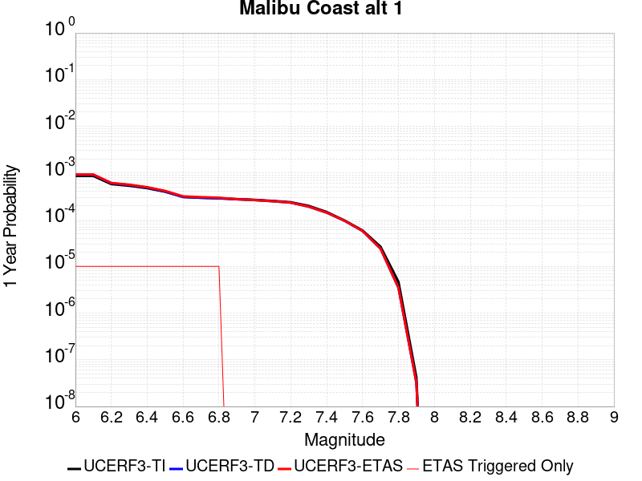 | 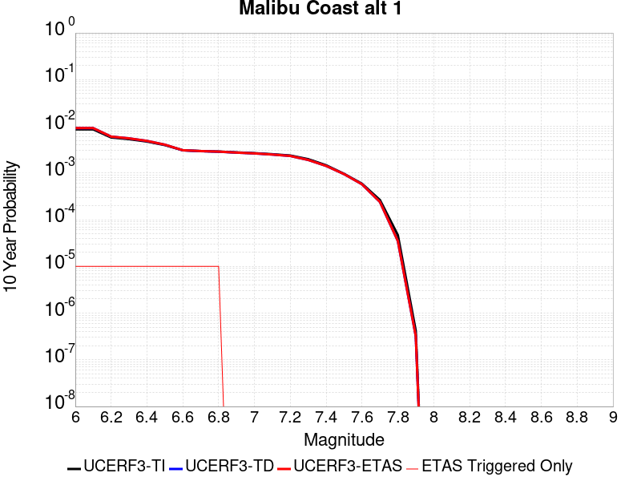 |

| Magnitude | 1 wk TI Prob | 1 wk TD Prob | 1 wk ETAS Prob | 1 wk ETAS/TD Gain | 1 wk ETAS Triggered Only | 1 mo TI Prob | 1 mo TD Prob | 1 mo ETAS Prob | 1 mo ETAS/TD Gain | 1 mo ETAS Triggered Only | 1 yr TI Prob | 1 yr TD Prob | 1 yr ETAS Prob | 1 yr ETAS/TD Gain | 1 yr ETAS Triggered Only | 10 yr TI Prob | 10 yr TD Prob | 10 yr ETAS Prob | 10 yr ETAS/TD Gain | 10 yr ETAS Triggered Only |
|-----|-----|-----|-----|-----|-----|-----|-----|-----|-----|-----|-----|-----|-----|-----|-----|-----|-----|-----|-----|-----|
| 6.0 | 1.6572556E-5 | 1.7598879E-5 | 1.7598879E-5 | 1.0 | 0.0 | 7.102331E-5 | 7.542169E-5 | 7.542169E-5 | 1.0 | 0.0 | 8.6436566E-4 | 9.1789116E-4 | 9.27882E-4 | 1.0108845 | 1.0E-5 | 0.0086101135 | 0.0091429325 | 0.009152842 | 1.0010837 | 1.0E-5 |
| 6.1 | 1.6572556E-5 | 1.7598879E-5 | 1.7598879E-5 | 1.0 | 0.0 | 7.102331E-5 | 7.542169E-5 | 7.542169E-5 | 1.0 | 0.0 | 8.6436566E-4 | 9.1789116E-4 | 9.27882E-4 | 1.0108845 | 1.0E-5 | 0.0086101135 | 0.0091429325 | 0.009152842 | 1.0010837 | 1.0E-5 |
| 6.2 | 1.1085717E-5 | 1.1557635E-5 | 1.1557635E-5 | 1.0 | 0.0 | 4.750935E-5 | 4.95318E-5 | 4.95318E-5 | 1.0 | 0.0 | 5.782728E-4 | 6.028863E-4 | 6.1288034E-4 | 1.0165769 | 1.0E-5 | 0.0057677035 | 0.006012879 | 0.006022819 | 1.0016531 | 1.0E-5 |
| 6.3 | 1.0208568E-5 | 1.0592674E-5 | 1.0592674E-5 | 1.0 | 0.0 | 4.375027E-5 | 4.53964E-5 | 4.53964E-5 | 1.0 | 0.0 | 5.325294E-4 | 5.525639E-4 | 5.625584E-4 | 1.0180875 | 1.0E-5 | 0.0053125503 | 0.005512208 | 0.005522153 | 1.0018041 | 1.0E-5 |
| 6.4 | 9.0682315E-6 | 9.34301E-6 | 9.34301E-6 | 1.0 | 0.0 | 3.8863272E-5 | 4.0040868E-5 | 4.0040868E-5 | 1.0 | 0.0 | 4.730576E-4 | 4.8739056E-4 | 4.973857E-4 | 1.0205075 | 1.0E-5 | 0.0047205184 | 0.00486343 | 0.004873381 | 1.0020461 | 1.0E-5 |
| 6.5 | 7.605796E-6 | 7.748884E-6 | 7.748884E-6 | 1.0 | 0.0 | 3.259586E-5 | 3.3209086E-5 | 3.3209086E-5 | 1.0 | 0.0 | 3.9678233E-4 | 4.0424694E-4 | 4.142429E-4 | 1.0247273 | 1.0E-5 | 0.0039607463 | 0.004035254 | 0.0040452136 | 1.0024681 | 1.0E-5 |
| 6.6 | 5.889873E-6 | 5.8797464E-6 | 5.8797464E-6 | 1.0 | 0.0 | 2.5242069E-5 | 2.519867E-5 | 2.519867E-5 | 1.0 | 0.0 | 3.0727885E-4 | 3.067507E-4 | 3.1674764E-4 | 1.0325898 | 1.0E-5 | 0.003068543 | 0.0030632857 | 0.003073255 | 1.0032544 | 1.0E-5 |
| 6.7 | 5.66586E-6 | 5.641841E-6 | 5.641841E-6 | 1.0 | 0.0 | 2.428203E-5 | 2.4179095E-5 | 2.4179095E-5 | 1.0 | 0.0 | 2.955936E-4 | 2.943408E-4 | 3.0433788E-4 | 1.0339643 | 1.0E-5 | 0.0029520073 | 0.0029395216 | 0.0029494923 | 1.0033919 | 1.0E-5 |
| 6.8 | 5.521556E-6 | 5.4896223E-6 | 5.4896223E-6 | 1.0 | 0.0 | 2.3663597E-5 | 2.3526742E-5 | 2.3526742E-5 | 1.0 | 0.0 | 2.880662E-4 | 2.8640052E-4 | 2.9639766E-4 | 1.0349061 | 1.0E-5 | 0.0028769306 | 0.0028603259 | 0.0028702973 | 1.0034862 | 1.0E-5 |
| 6.9 | 5.29752E-6 | 5.250118E-6 | 5.250118E-6 | 1.0 | 0.0 | 2.270346E-5 | 2.2500313E-5 | 2.2500313E-5 | 1.0 | 0.0 | 2.7637955E-4 | 2.7390695E-4 | 2.7390695E-4 | 1.0 | 0.0 | 0.0027603607 | 0.002735704 | 0.002735704 | 1.0 | 0.0 |
| 7.0 | 5.106743E-6 | 5.047859E-6 | 5.047859E-6 | 1.0 | 0.0 | 2.1885859E-5 | 2.1633501E-5 | 2.1633501E-5 | 1.0 | 0.0 | 2.6642776E-4 | 2.633561E-4 | 2.633561E-4 | 1.0 | 0.0 | 0.0026610855 | 0.0026304498 | 0.0026304498 | 1.0 | 0.0 |
| 7.1 | 4.8469647E-6 | 4.770543E-6 | 4.770543E-6 | 1.0 | 0.0 | 2.0772539E-5 | 2.0445024E-5 | 2.0445024E-5 | 1.0 | 0.0 | 2.528763E-4 | 2.4888982E-4 | 2.4888982E-4 | 1.0 | 0.0 | 0.0025258875 | 0.0024861186 | 0.0024861186 | 1.0 | 0.0 |
| 7.2 | 4.545514E-6 | 4.448352E-6 | 4.448352E-6 | 1.0 | 0.0 | 1.9480629E-5 | 1.9064226E-5 | 1.9064226E-5 | 1.0 | 0.0 | 2.3715083E-4 | 2.3208228E-4 | 2.3208228E-4 | 1.0 | 0.0 | 0.0023689792 | 0.0023184067 | 0.0023184067 | 1.0 | 0.0 |
| 7.3 | 3.794097E-6 | 3.6520605E-6 | 3.6520605E-6 | 1.0 | 0.0 | 1.6260314E-5 | 1.5651594E-5 | 1.5651594E-5 | 1.0 | 0.0 | 1.9795135E-4 | 1.9054154E-4 | 1.9054154E-4 | 1.0 | 0.0 | 0.001977751 | 0.0019037863 | 0.0019037863 | 1.0 | 0.0 |
| 7.4 | 2.808217E-6 | 2.7191707E-6 | 2.7191707E-6 | 1.0 | 0.0 | 1.203516E-5 | 1.1653537E-5 | 1.1653537E-5 | 1.0 | 0.0 | 1.4651821E-4 | 1.418726E-4 | 1.418726E-4 | 1.0 | 0.0 | 0.0014642165 | 0.0014178229 | 0.0014178229 | 1.0 | 0.0 |
| 7.5 | 1.83809E-6 | 1.8191352E-6 | 1.8191352E-6 | 1.0 | 0.0 | 7.877505E-6 | 7.79627E-6 | 7.79627E-6 | 1.0 | 0.0 | 9.59044E-5 | 9.491547E-5 | 9.491547E-5 | 1.0 | 0.0 | 9.5863023E-4 | 9.4875135E-4 | 9.4875135E-4 | 1.0 | 0.0 |
| 7.6 | 1.1292672E-6 | 1.1001874E-6 | 1.1001874E-6 | 1.0 | 0.0 | 4.839708E-6 | 4.71508E-6 | 4.71508E-6 | 1.0 | 0.0 | 5.8921847E-5 | 5.7404606E-5 | 5.7404606E-5 | 1.0 | 0.0 | 5.890623E-4 | 5.738994E-4 | 5.738994E-4 | 1.0 | 0.0 |
| 7.7 | 5.065272E-7 | 4.609368E-7 | 4.609368E-7 | 1.0 | 0.0 | 2.170829E-6 | 1.975442E-6 | 1.975442E-6 | 1.0 | 0.0 | 2.6429525E-5 | 2.4050752E-5 | 2.4050752E-5 | 1.0 | 0.0 | 2.642638E-4 | 2.4048261E-4 | 2.4048261E-4 | 1.0 | 0.0 |
| 7.8 | 8.952991E-8 | 6.708641E-8 | 6.708641E-8 | 1.0 | 0.0 | 3.8369956E-7 | 2.8751316E-7 | 2.8751316E-7 | 1.0 | 0.0 | 4.671532E-6 | 3.5004673E-6 | 3.5004673E-6 | 1.0 | 0.0 | 4.671434E-5 | 3.500414E-5 | 3.500414E-5 | 1.0 | 0.0 |
| 7.9 | 8.007447E-10 | 6.1617156E-10 | 6.1617156E-10 | 1.0 | 0.0 | 3.4317629E-9 | 2.6407359E-9 | 2.6407359E-9 | 1.0 | 0.0 | 4.1781714E-8 | 3.2150957E-8 | 3.2150957E-8 | 1.0 | 0.0 | 4.1781706E-7 | 3.2150956E-7 | 3.2150956E-7 | 1.0 | 0.0 |

## Hosgri (Extension)
*[(top)](#table-of-contents)*

| 1 Week | 1 Month | 1 Year | 10 Year |
|-----|-----|-----|-----|
|  |  |  | 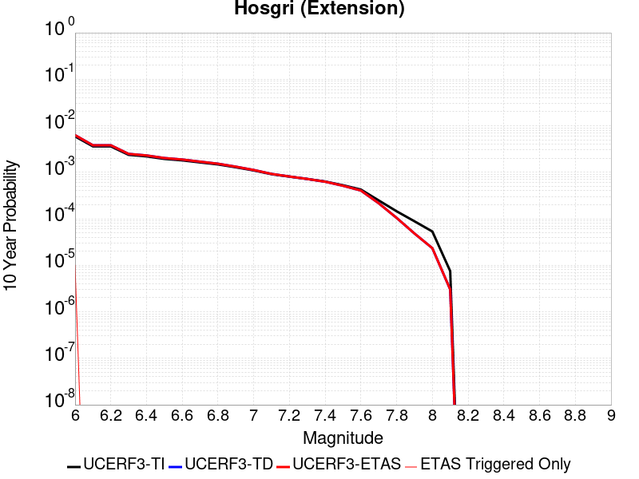 |

| Magnitude | 1 wk TI Prob | 1 wk TD Prob | 1 wk ETAS Prob | 1 wk ETAS/TD Gain | 1 wk ETAS Triggered Only | 1 mo TI Prob | 1 mo TD Prob | 1 mo ETAS Prob | 1 mo ETAS/TD Gain | 1 mo ETAS Triggered Only | 1 yr TI Prob | 1 yr TD Prob | 1 yr ETAS Prob | 1 yr ETAS/TD Gain | 1 yr ETAS Triggered Only | 10 yr TI Prob | 10 yr TD Prob | 10 yr ETAS Prob | 10 yr ETAS/TD Gain | 10 yr ETAS Triggered Only |
|-----|-----|-----|-----|-----|-----|-----|-----|-----|-----|-----|-----|-----|-----|-----|-----|-----|-----|-----|-----|-----|
| 6.0 | 1.1369135E-5 | 1.2083579E-5 | 1.2083579E-5 | 1.0 | 0.0 | 4.8723956E-5 | 5.178587E-5 | 5.178587E-5 | 1.0 | 0.0 | 5.9305265E-4 | 6.303333E-4 | 6.40327E-4 | 1.0158546 | 1.0E-5 | 0.005914725 | 0.0062877033 | 0.0062976405 | 1.0015804 | 1.0E-5 |
| 6.1 | 6.934979E-6 | 7.324878E-6 | 7.324878E-6 | 1.0 | 0.0 | 2.9721E-5 | 3.139198E-5 | 3.139198E-5 | 1.0 | 0.0 | 3.617931E-4 | 3.8213446E-4 | 3.8213446E-4 | 1.0 | 0.0 | 0.0036120464 | 0.0038151864 | 0.0038151864 | 1.0 | 0.0 |
| 6.2 | 6.934979E-6 | 7.324878E-6 | 7.324878E-6 | 1.0 | 0.0 | 2.9721E-5 | 3.139198E-5 | 3.139198E-5 | 1.0 | 0.0 | 3.617931E-4 | 3.8213446E-4 | 3.8213446E-4 | 1.0 | 0.0 | 0.0036120464 | 0.0038151864 | 0.0038151864 | 1.0 | 0.0 |
| 6.3 | 4.5484676E-6 | 4.769557E-6 | 4.769557E-6 | 1.0 | 0.0 | 1.9493287E-5 | 2.0440802E-5 | 2.0440802E-5 | 1.0 | 0.0 | 2.3730492E-4 | 2.4883877E-4 | 2.4883877E-4 | 1.0 | 0.0 | 0.0023705168 | 0.0024856438 | 0.0024856438 | 1.0 | 0.0 |
| 6.4 | 4.218095E-6 | 4.417076E-6 | 4.417076E-6 | 1.0 | 0.0 | 1.8077424E-5 | 1.893019E-5 | 1.893019E-5 | 1.0 | 0.0 | 2.2007042E-4 | 2.3045103E-4 | 2.3045103E-4 | 1.0 | 0.0 | 0.002198526 | 0.002302154 | 0.002302154 | 1.0 | 0.0 |
| 6.5 | 3.717374E-6 | 3.884074E-6 | 3.884074E-6 | 1.0 | 0.0 | 1.5931506E-5 | 1.6645927E-5 | 1.6645927E-5 | 1.0 | 0.0 | 1.9394881E-4 | 2.0264549E-4 | 2.0264549E-4 | 1.0 | 0.0 | 0.0019377962 | 0.002024626 | 0.002024626 | 1.0 | 0.0 |
| 6.6 | 3.4605036E-6 | 3.6084919E-6 | 3.6084919E-6 | 1.0 | 0.0 | 1.4830645E-5 | 1.5464873E-5 | 1.5464873E-5 | 1.0 | 0.0 | 1.8054814E-4 | 1.882687E-4 | 1.882687E-4 | 1.0 | 0.0 | 0.0018040152 | 0.0018811069 | 0.0018811069 | 1.0 | 0.0 |
| 6.7 | 3.123439E-6 | 3.2467403E-6 | 3.2467403E-6 | 1.0 | 0.0 | 1.33860985E-5 | 1.3914528E-5 | 1.3914528E-5 | 1.0 | 0.0 | 1.6296357E-4 | 1.6939631E-4 | 1.6939631E-4 | 1.0 | 0.0 | 0.001628441 | 0.0016926829 | 0.0016926829 | 1.0 | 0.0 |
| 6.8 | 2.8290783E-6 | 2.9306998E-6 | 2.9306998E-6 | 1.0 | 0.0 | 1.2124565E-5 | 1.2560082E-5 | 1.2560082E-5 | 1.0 | 0.0 | 1.4760658E-4 | 1.5290834E-4 | 1.5290834E-4 | 1.0 | 0.0 | 0.0014750857 | 0.00152804 | 0.00152804 | 1.0 | 0.0 |
| 6.9 | 2.454112E-6 | 2.5284635E-6 | 2.5284635E-6 | 1.0 | 0.0 | 1.0517581E-5 | 1.08362265E-5 | 1.08362265E-5 | 1.0 | 0.0 | 1.2804402E-4 | 1.3192314E-4 | 1.3192314E-4 | 1.0 | 0.0 | 0.0012797028 | 0.0013184543 | 0.0013184543 | 1.0 | 0.0 |
| 7.0 | 2.1008145E-6 | 2.1499998E-6 | 2.1499998E-6 | 1.0 | 0.0 | 9.003459E-6 | 9.214253E-6 | 9.214253E-6 | 1.0 | 0.0 | 1.096116E-4 | 1.1217779E-4 | 1.1217779E-4 | 1.0 | 0.0 | 0.0010955755 | 0.0011212154 | 0.0011212154 | 1.0 | 0.0 |
| 7.1 | 1.744384E-6 | 1.7687507E-6 | 1.7687507E-6 | 1.0 | 0.0 | 7.47591E-6 | 7.580338E-6 | 7.580338E-6 | 1.0 | 0.0 | 9.1015405E-5 | 9.2286726E-5 | 9.2286726E-5 | 1.0 | 0.0 | 9.097813E-4 | 9.224857E-4 | 9.224857E-4 | 1.0 | 0.0 |
| 7.2 | 1.5456587E-6 | 1.556396E-6 | 1.556396E-6 | 1.0 | 0.0 | 6.6242346E-6 | 6.6702514E-6 | 6.6702514E-6 | 1.0 | 0.0 | 8.064707E-5 | 8.12073E-5 | 8.12073E-5 | 1.0 | 0.0 | 8.0617814E-4 | 8.117775E-4 | 8.117775E-4 | 1.0 | 0.0 |
| 7.3 | 1.3775123E-6 | 1.3767094E-6 | 1.3767094E-6 | 1.0 | 0.0 | 5.9036106E-6 | 5.90017E-6 | 5.90017E-6 | 1.0 | 0.0 | 7.187409E-5 | 7.183221E-5 | 7.183221E-5 | 1.0 | 0.0 | 7.185085E-4 | 7.180909E-4 | 7.180909E-4 | 1.0 | 0.0 |
| 7.4 | 1.214491E-6 | 1.2024409E-6 | 1.2024409E-6 | 1.0 | 0.0 | 5.2049513E-6 | 5.153308E-6 | 5.153308E-6 | 1.0 | 0.0 | 6.336844E-5 | 6.2739724E-5 | 6.2739724E-5 | 1.0 | 0.0 | 6.335037E-4 | 6.2722096E-4 | 6.2722096E-4 | 1.0 | 0.0 |
| 7.5 | 1.0101123E-6 | 9.843116E-7 | 9.843116E-7 | 1.0 | 0.0 | 4.3290456E-6 | 4.2184715E-6 | 4.2184715E-6 | 1.0 | 0.0 | 5.2704854E-5 | 5.1358686E-5 | 5.1358686E-5 | 1.0 | 0.0 | 5.2692357E-4 | 5.1346875E-4 | 5.1346875E-4 | 1.0 | 0.0 |
| 7.6 | 8.1558215E-7 | 7.7667625E-7 | 7.7667625E-7 | 1.0 | 0.0 | 3.4953473E-6 | 3.3286083E-6 | 3.3286083E-6 | 1.0 | 0.0 | 4.255502E-5 | 4.0525058E-5 | 4.0525058E-5 | 1.0 | 0.0 | 4.2546875E-4 | 4.051771E-4 | 4.051771E-4 | 1.0 | 0.0 |
| 7.7 | 4.757816E-7 | 4.1315505E-7 | 4.1315505E-7 | 1.0 | 0.0 | 2.0390623E-6 | 1.7706633E-6 | 1.7706633E-6 | 1.0 | 0.0 | 2.4825302E-5 | 2.1557613E-5 | 2.1557613E-5 | 1.0 | 0.0 | 2.482253E-4 | 2.1555535E-4 | 2.1555535E-4 | 1.0 | 0.0 |
| 7.8 | 2.782787E-7 | 2.0053476E-7 | 2.0053476E-7 | 1.0 | 0.0 | 1.1926223E-6 | 8.5943435E-7 | 8.5943435E-7 | 1.0 | 0.0 | 1.452008E-5 | 1.0463564E-5 | 1.0463564E-5 | 1.0 | 0.0 | 1.4519131E-4 | 1.04630744E-4 | 1.04630744E-4 | 1.0 | 0.0 |
| 7.9 | 1.6948086E-7 | 9.2492506E-8 | 9.2492506E-8 | 1.0 | 0.0 | 7.2634634E-7 | 3.963964E-7 | 3.963964E-7 | 1.0 | 0.0 | 8.843231E-6 | 4.8261154E-6 | 4.8261154E-6 | 1.0 | 0.0 | 8.842879E-5 | 4.826011E-5 | 4.826011E-5 | 1.0 | 0.0 |
| 8.0 | 1.0225492E-7 | 4.4773795E-8 | 4.4773795E-8 | 1.0 | 0.0 | 4.382353E-7 | 1.9188768E-7 | 1.9188768E-7 | 1.0 | 0.0 | 5.335502E-6 | 2.33623E-6 | 2.33623E-6 | 1.0 | 0.0 | 5.335374E-5 | 2.3362058E-5 | 2.3362058E-5 | 1.0 | 0.0 |
| 8.1 | 1.43711345E-8 | 5.792936E-9 | 5.792936E-9 | 1.0 | 0.0 | 6.1590576E-8 | 2.4826868E-8 | 2.4826868E-8 | 1.0 | 0.0 | 7.4986497E-7 | 3.0226707E-7 | 3.0226707E-7 | 1.0 | 0.0 | 7.4986247E-6 | 3.0226672E-6 | 3.0226672E-6 | 1.0 | 0.0 |

## San Andreas (North Coast) 2011 CFM
*[(top)](#table-of-contents)*

| 1 Week | 1 Month | 1 Year | 10 Year |
|-----|-----|-----|-----|
|  |  |  |  |

| Magnitude | 1 wk TI Prob | 1 wk TD Prob | 1 wk ETAS Prob | 1 wk ETAS/TD Gain | 1 wk ETAS Triggered Only | 1 mo TI Prob | 1 mo TD Prob | 1 mo ETAS Prob | 1 mo ETAS/TD Gain | 1 mo ETAS Triggered Only | 1 yr TI Prob | 1 yr TD Prob | 1 yr ETAS Prob | 1 yr ETAS/TD Gain | 1 yr ETAS Triggered Only | 10 yr TI Prob | 10 yr TD Prob | 10 yr ETAS Prob | 10 yr ETAS/TD Gain | 10 yr ETAS Triggered Only |
|-----|-----|-----|-----|-----|-----|-----|-----|-----|-----|-----|-----|-----|-----|-----|-----|-----|-----|-----|-----|-----|
| 6.0 | 1.5333705E-4 | 7.124673E-5 | 7.124673E-5 | 1.0 | 0.0 | 6.5699324E-4 | 3.0530756E-4 | 3.0530756E-4 | 1.0 | 0.0 | 0.007969595 | 0.0037108182 | 0.0037108182 | 1.0 | 0.0 | 0.0768977 | 0.03942352 | 0.039433125 | 1.0002437 | 1.0E-5 |
| 6.1 | 1.5333705E-4 | 7.124673E-5 | 7.124673E-5 | 1.0 | 0.0 | 6.5699324E-4 | 3.0530756E-4 | 3.0530756E-4 | 1.0 | 0.0 | 0.007969595 | 0.0037108182 | 0.0037108182 | 1.0 | 0.0 | 0.0768977 | 0.03942352 | 0.039433125 | 1.0002437 | 1.0E-5 |
| 6.2 | 1.3912938E-4 | 6.0624283E-5 | 6.0624283E-5 | 1.0 | 0.0 | 5.961325E-4 | 2.5979264E-4 | 2.5979264E-4 | 1.0 | 0.0 | 0.007233787 | 0.0031584147 | 0.0031584147 | 1.0 | 0.0 | 0.07002798 | 0.033759438 | 0.033769097 | 1.0002862 | 1.0E-5 |
| 6.3 | 1.3912938E-4 | 6.0624283E-5 | 6.0624283E-5 | 1.0 | 0.0 | 5.961325E-4 | 2.5979264E-4 | 2.5979264E-4 | 1.0 | 0.0 | 0.007233787 | 0.0031584147 | 0.0031584147 | 1.0 | 0.0 | 0.07002798 | 0.033759438 | 0.033769097 | 1.0002862 | 1.0E-5 |
| 6.4 | 1.2623647E-4 | 5.0548093E-5 | 5.0548093E-5 | 1.0 | 0.0 | 5.4090127E-4 | 2.1661681E-4 | 2.1661681E-4 | 1.0 | 0.0 | 0.0065656058 | 0.00263414 | 0.00263414 | 1.0 | 0.0 | 0.06374981 | 0.028359612 | 0.028369328 | 1.0003426 | 1.0E-5 |
| 6.5 | 1.1736096E-4 | 4.3619268E-5 | 4.3619268E-5 | 1.0 | 0.0 | 5.028786E-4 | 1.8692642E-4 | 1.8692642E-4 | 1.0 | 0.0 | 0.006105373 | 0.0022734702 | 0.0022734702 | 1.0 | 0.0 | 0.05940335 | 0.024632612 | 0.024642367 | 1.000396 | 1.0E-5 |
| 6.6 | 1.1586959E-4 | 4.2517324E-5 | 4.2517324E-5 | 1.0 | 0.0 | 4.964894E-4 | 1.8220446E-4 | 1.8220446E-4 | 1.0 | 0.0 | 0.006028018 | 0.0022160986 | 0.0022160986 | 1.0 | 0.0 | 0.058671024 | 0.024038248 | 0.024048008 | 1.000406 | 1.0E-5 |
| 6.7 | 1.13693764E-4 | 4.0827243E-5 | 4.0827243E-5 | 1.0 | 0.0 | 4.87168E-4 | 1.7496225E-4 | 1.7496225E-4 | 1.0 | 0.0 | 0.005915152 | 0.0021281003 | 0.0021281003 | 1.0 | 0.0 | 0.057601593 | 0.023128685 | 0.023138452 | 1.0004224 | 1.0E-5 |
| 6.8 | 1.1204889E-4 | 4.004314E-5 | 4.004314E-5 | 1.0 | 0.0 | 4.8012115E-4 | 1.7160227E-4 | 1.7160227E-4 | 1.0 | 0.0 | 0.005829819 | 0.0020872715 | 0.0020872715 | 1.0 | 0.0 | 0.05679232 | 0.02268742 | 0.022697194 | 1.0004308 | 1.0E-5 |
| 6.9 | 1.1005794E-4 | 3.9097245E-5 | 3.9097245E-5 | 1.0 | 0.0 | 4.7159163E-4 | 1.6754896E-4 | 1.6754896E-4 | 1.0 | 0.0 | 0.0057265228 | 0.002038016 | 0.002038016 | 1.0 | 0.0 | 0.055811852 | 0.02215222 | 0.022161998 | 1.0004414 | 1.0E-5 |
| 7.0 | 1.0647948E-4 | 3.724759E-5 | 3.724759E-5 | 1.0 | 0.0 | 4.562608E-4 | 1.5962285E-4 | 1.5962285E-4 | 1.0 | 0.0 | 0.0055408357 | 0.0019416915 | 0.0019416915 | 1.0 | 0.0 | 0.054047033 | 0.021109186 | 0.021118974 | 1.0004637 | 1.0E-5 |
| 7.1 | 1.04795035E-4 | 3.6294154E-5 | 3.6294154E-5 | 1.0 | 0.0 | 4.4904428E-4 | 1.5553719E-4 | 1.5553719E-4 | 1.0 | 0.0 | 0.0054534175 | 0.001892036 | 0.001892036 | 1.0 | 0.0 | 0.053215165 | 0.020576846 | 0.020586642 | 1.000476 | 1.0E-5 |
| 7.2 | 1.02724036E-4 | 3.520005E-5 | 3.520005E-5 | 1.0 | 0.0 | 4.401716E-4 | 1.5084872E-4 | 1.5084872E-4 | 1.0 | 0.0 | 0.0053459285 | 0.0018350515 | 0.0018350515 | 1.0 | 0.0 | 0.052191395 | 0.01996491 | 0.019974709 | 1.0004909 | 1.0E-5 |
| 7.3 | 1.00650694E-4 | 3.4665736E-5 | 3.4665736E-5 | 1.0 | 0.0 | 4.312888E-4 | 1.4855908E-4 | 1.4855908E-4 | 1.0 | 0.0 | 0.005238306 | 0.0018072216 | 0.0018072216 | 1.0 | 0.0 | 0.051165357 | 0.019641502 | 0.019651305 | 1.0004991 | 1.0E-5 |
| 7.4 | 9.672919E-5 | 3.3450186E-5 | 3.3450186E-5 | 1.0 | 0.0 | 4.144878E-4 | 1.4335015E-4 | 1.4335015E-4 | 1.0 | 0.0 | 0.005034718 | 0.0017439061 | 0.0017439061 | 1.0 | 0.0 | 0.049221683 | 0.018912597 | 0.018922409 | 1.0005188 | 1.0E-5 |
| 7.5 | 8.7600405E-5 | 2.2756996E-5 | 2.2756996E-5 | 1.0 | 0.0 | 3.753763E-4 | 9.752635E-5 | 9.752635E-5 | 1.0 | 0.0 | 0.0045606326 | 0.0011867384 | 0.0011867384 | 1.0 | 0.0 | 0.04468165 | 0.013163515 | 0.013173385 | 1.0007497 | 1.0E-5 |
| 7.6 | 7.9562284E-5 | 1.9277217E-5 | 1.9277217E-5 | 1.0 | 0.0 | 3.4093665E-4 | 8.261403E-5 | 8.261403E-5 | 1.0 | 0.0 | 0.0041430052 | 0.0010053633 | 0.0010053633 | 1.0 | 0.0 | 0.040666126 | 0.011252493 | 0.011252493 | 1.0 | 0.0 |
| 7.7 | 6.3866544E-5 | 1.1981178E-5 | 1.1981178E-5 | 1.0 | 0.0 | 2.7368503E-4 | 5.13469E-5 | 5.13469E-5 | 1.0 | 0.0 | 0.0033270244 | 6.249694E-4 | 6.249694E-4 | 1.0 | 0.0 | 0.032776527 | 0.007233649 | 0.007233649 | 1.0 | 0.0 |
| 7.8 | 4.2543215E-5 | 9.109041E-6 | 9.109041E-6 | 1.0 | 0.0 | 1.8231533E-4 | 3.903816E-5 | 3.903816E-5 | 1.0 | 0.0 | 0.0022174292 | 4.7518607E-4 | 4.7518607E-4 | 1.0 | 0.0 | 0.021954332 | 0.0055094925 | 0.0055094925 | 1.0 | 0.0 |
| 7.9 | 2.2636612E-5 | 7.842137E-6 | 7.842137E-6 | 1.0 | 0.0 | 9.7010445E-5 | 3.360873E-5 | 3.360873E-5 | 1.0 | 0.0 | 0.0011804621 | 4.0910952E-4 | 4.0910952E-4 | 1.0 | 0.0 | 0.011742111 | 0.004699036 | 0.004699036 | 1.0 | 0.0 |
| 8.0 | 1.5167874E-5 | 7.0747274E-6 | 7.0747274E-6 | 1.0 | 0.0 | 6.500356E-5 | 3.0319907E-5 | 3.0319907E-5 | 1.0 | 0.0 | 7.9113094E-4 | 3.6908244E-4 | 3.6908244E-4 | 1.0 | 0.0 | 0.007883203 | 0.004229726 | 0.004229726 | 1.0 | 0.0 |
| 8.1 | 1.0681047E-5 | 6.4101073E-6 | 6.4101073E-6 | 1.0 | 0.0 | 4.5775112E-5 | 2.7471599E-5 | 2.7471599E-5 | 1.0 | 0.0 | 5.5716943E-4 | 3.3441547E-4 | 3.3441547E-4 | 1.0 | 0.0 | 0.0055577457 | 0.0038302164 | 0.0038302164 | 1.0 | 0.0 |
| 8.2 | 8.226114E-6 | 5.133151E-6 | 5.133151E-6 | 1.0 | 0.0 | 3.52543E-5 | 2.1999032E-5 | 2.1999032E-5 | 1.0 | 0.0 | 4.2913653E-4 | 2.678054E-4 | 2.678054E-4 | 1.0 | 0.0 | 0.004283088 | 0.0030550708 | 0.0030550708 | 1.0 | 0.0 |
| 8.3 | 1.983087E-6 | 7.690063E-7 | 7.690063E-7 | 1.0 | 0.0 | 8.498917E-6 | 3.295737E-6 | 3.295737E-6 | 1.0 | 0.0 | 1.034694E-4 | 4.012488E-5 | 4.012488E-5 | 1.0 | 0.0 | 0.0010342124 | 4.737206E-4 | 4.737206E-4 | 1.0 | 0.0 |

## Elsinore (Coyote Mountains)
*[(top)](#table-of-contents)*

| 1 Week | 1 Month | 1 Year | 10 Year |
|-----|-----|-----|-----|
|  | 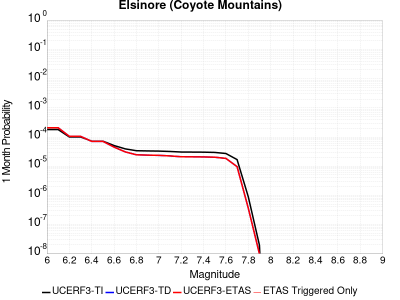 |  |  |

| Magnitude | 1 wk TI Prob | 1 wk TD Prob | 1 wk ETAS Prob | 1 wk ETAS/TD Gain | 1 wk ETAS Triggered Only | 1 mo TI Prob | 1 mo TD Prob | 1 mo ETAS Prob | 1 mo ETAS/TD Gain | 1 mo ETAS Triggered Only | 1 yr TI Prob | 1 yr TD Prob | 1 yr ETAS Prob | 1 yr ETAS/TD Gain | 1 yr ETAS Triggered Only | 10 yr TI Prob | 10 yr TD Prob | 10 yr ETAS Prob | 10 yr ETAS/TD Gain | 10 yr ETAS Triggered Only |
|-----|-----|-----|-----|-----|-----|-----|-----|-----|-----|-----|-----|-----|-----|-----|-----|-----|-----|-----|-----|-----|
| 6.0 | 4.20513E-5 | 4.863799E-5 | 4.863799E-5 | 1.0 | 0.0 | 1.8020741E-4 | 2.0843507E-4 | 2.0843507E-4 | 1.0 | 0.0 | 0.0021918174 | 0.0025352647 | 0.0025452392 | 1.0039344 | 1.0E-5 | 0.021703249 | 0.0251147 | 0.02512445 | 1.0003881 | 1.0E-5 |
| 6.1 | 4.20513E-5 | 4.863799E-5 | 4.863799E-5 | 1.0 | 0.0 | 1.8020741E-4 | 2.0843507E-4 | 2.0843507E-4 | 1.0 | 0.0 | 0.0021918174 | 0.0025352647 | 0.0025452392 | 1.0039344 | 1.0E-5 | 0.021703249 | 0.0251147 | 0.02512445 | 1.0003881 | 1.0E-5 |
| 6.2 | 2.3413893E-5 | 2.4698797E-5 | 2.4698797E-5 | 1.0 | 0.0 | 1.0034139E-4 | 1.0584818E-4 | 1.0584818E-4 | 1.0 | 0.0 | 0.0012209718 | 0.001288027 | 0.001288027 | 1.0 | 0.0 | 0.012142851 | 0.012814296 | 0.012814296 | 1.0 | 0.0 |
| 6.3 | 2.3413893E-5 | 2.4698797E-5 | 2.4698797E-5 | 1.0 | 0.0 | 1.0034139E-4 | 1.0584818E-4 | 1.0584818E-4 | 1.0 | 0.0 | 0.0012209718 | 0.001288027 | 0.001288027 | 1.0 | 0.0 | 0.012142851 | 0.012814296 | 0.012814296 | 1.0 | 0.0 |
| 6.4 | 1.6894814E-5 | 1.6570513E-5 | 1.6570513E-5 | 1.0 | 0.0 | 7.240433E-5 | 7.101472E-5 | 7.101472E-5 | 1.0 | 0.0 | 8.811662E-4 | 8.642987E-4 | 8.642987E-4 | 1.0 | 0.0 | 0.0087768035 | 0.008613032 | 0.008613032 | 1.0 | 0.0 |
| 6.5 | 1.6894814E-5 | 1.6570513E-5 | 1.6570513E-5 | 1.0 | 0.0 | 7.240433E-5 | 7.101472E-5 | 7.101472E-5 | 1.0 | 0.0 | 8.811662E-4 | 8.642987E-4 | 8.642987E-4 | 1.0 | 0.0 | 0.0087768035 | 0.008613032 | 0.008613032 | 1.0 | 0.0 |
| 6.6 | 1.1910969E-5 | 1.0532162E-5 | 1.0532162E-5 | 1.0 | 0.0 | 5.1046012E-5 | 4.5137134E-5 | 4.5137134E-5 | 1.0 | 0.0 | 6.21308E-4 | 5.494193E-4 | 5.494193E-4 | 1.0 | 0.0 | 0.0061957375 | 0.005481911 | 0.005481911 | 1.0 | 0.0 |
| 6.7 | 9.1486E-6 | 7.20391E-6 | 7.20391E-6 | 1.0 | 0.0 | 3.9207694E-5 | 3.0873558E-5 | 3.0873558E-5 | 1.0 | 0.0 | 4.7724912E-4 | 3.7582454E-4 | 3.7582454E-4 | 1.0 | 0.0 | 0.0047622547 | 0.003752269 | 0.003752269 | 1.0 | 0.0 |
| 6.8 | 7.90441E-6 | 5.729934E-6 | 5.729934E-6 | 1.0 | 0.0 | 3.3875604E-5 | 2.4556635E-5 | 2.4556635E-5 | 1.0 | 0.0 | 4.1235742E-4 | 2.989373E-4 | 2.989373E-4 | 1.0 | 0.0 | 0.0041159308 | 0.0029854805 | 0.0029854805 | 1.0 | 0.0 |
| 6.9 | 7.77015E-6 | 5.5838814E-6 | 5.5838814E-6 | 1.0 | 0.0 | 3.3300217E-5 | 2.3930706E-5 | 2.3930706E-5 | 1.0 | 0.0 | 4.0535472E-4 | 2.9131866E-4 | 2.9131866E-4 | 1.0 | 0.0 | 0.004046161 | 0.002909495 | 0.002909495 | 1.0 | 0.0 |
| 7.0 | 7.675798E-6 | 5.4807347E-6 | 5.4807347E-6 | 1.0 | 0.0 | 3.289586E-5 | 2.348866E-5 | 2.348866E-5 | 1.0 | 0.0 | 4.004335E-4 | 2.8593815E-4 | 2.8593815E-4 | 1.0 | 0.0 | 0.003997127 | 0.002855829 | 0.002855829 | 1.0 | 0.0 |
| 7.1 | 7.447814E-6 | 5.2395994E-6 | 5.2395994E-6 | 1.0 | 0.0 | 3.191881E-5 | 2.2455239E-5 | 2.2455239E-5 | 1.0 | 0.0 | 3.8854225E-4 | 2.733595E-4 | 2.733595E-4 | 1.0 | 0.0 | 0.003878636 | 0.0027303568 | 0.0027303568 | 1.0 | 0.0 |
| 7.2 | 7.128185E-6 | 4.9062396E-6 | 4.9062396E-6 | 1.0 | 0.0 | 3.0549007E-5 | 2.1026577E-5 | 2.1026577E-5 | 1.0 | 0.0 | 3.7187067E-4 | 2.559697E-4 | 2.559697E-4 | 1.0 | 0.0 | 0.00371249 | 0.0025568672 | 0.0025568672 | 1.0 | 0.0 |
| 7.3 | 7.0913875E-6 | 4.8749134E-6 | 4.8749134E-6 | 1.0 | 0.0 | 3.0391306E-5 | 2.0892325E-5 | 2.0892325E-5 | 1.0 | 0.0 | 3.6995133E-4 | 2.5433555E-4 | 2.5433555E-4 | 1.0 | 0.0 | 0.0036933604 | 0.0025405632 | 0.0025405632 | 1.0 | 0.0 |
| 7.4 | 7.051521E-6 | 4.8387637E-6 | 4.8387637E-6 | 1.0 | 0.0 | 3.0220453E-5 | 2.0737401E-5 | 2.0737401E-5 | 1.0 | 0.0 | 3.6787192E-4 | 2.524498E-4 | 2.524498E-4 | 1.0 | 0.0 | 0.0036726352 | 0.0025217487 | 0.0025217487 | 1.0 | 0.0 |
| 7.5 | 6.910666E-6 | 4.7342405E-6 | 4.7342405E-6 | 1.0 | 0.0 | 2.9616802E-5 | 2.0289452E-5 | 2.0289452E-5 | 1.0 | 0.0 | 3.605249E-4 | 2.4699725E-4 | 2.4699725E-4 | 1.0 | 0.0 | 0.0035994058 | 0.0024673454 | 0.0024673454 | 1.0 | 0.0 |
| 7.6 | 6.341753E-6 | 4.3073114E-6 | 4.3073114E-6 | 1.0 | 0.0 | 2.7178658E-5 | 1.8459783E-5 | 1.8459783E-5 | 1.0 | 0.0 | 3.3084993E-4 | 2.2472584E-4 | 2.2472584E-4 | 1.0 | 0.0 | 0.0033035777 | 0.0022451011 | 0.0022451011 | 1.0 | 0.0 |
| 7.7 | 3.9205916E-6 | 2.244436E-6 | 2.244436E-6 | 1.0 | 0.0 | 1.6802427E-5 | 9.618981E-6 | 9.618981E-6 | 1.0 | 0.0 | 2.0455034E-4 | 1.1710554E-4 | 1.1710554E-4 | 1.0 | 0.0 | 0.0020436216 | 0.0011705114 | 0.0011705114 | 1.0 | 0.0 |
| 7.8 | 2.0846227E-7 | 8.487289E-8 | 8.487289E-8 | 1.0 | 0.0 | 8.9340944E-7 | 3.6374092E-7 | 3.6374092E-7 | 1.0 | 0.0 | 1.0877206E-5 | 4.4285403E-6 | 4.4285403E-6 | 1.0 | 0.0 | 1.0876673E-4 | 4.4284847E-5 | 4.4284847E-5 | 1.0 | 0.0 |
| 7.9 | 4.4969806E-9 | 2.2693984E-9 | 2.2693984E-9 | 1.0 | 0.0 | 1.9272775E-8 | 9.725993E-9 | 9.725993E-9 | 1.0 | 0.0 | 2.3464601E-7 | 1.18413965E-7 | 1.18413965E-7 | 1.0 | 0.0 | 2.3464577E-6 | 1.1841391E-6 | 1.1841391E-6 | 1.0 | 0.0 |

## Hollywood
*[(top)](#table-of-contents)*

| 1 Week | 1 Month | 1 Year | 10 Year |
|-----|-----|-----|-----|
|  |  |  |  |

| Magnitude | 1 wk TI Prob | 1 wk TD Prob | 1 wk ETAS Prob | 1 wk ETAS/TD Gain | 1 wk ETAS Triggered Only | 1 mo TI Prob | 1 mo TD Prob | 1 mo ETAS Prob | 1 mo ETAS/TD Gain | 1 mo ETAS Triggered Only | 1 yr TI Prob | 1 yr TD Prob | 1 yr ETAS Prob | 1 yr ETAS/TD Gain | 1 yr ETAS Triggered Only | 10 yr TI Prob | 10 yr TD Prob | 10 yr ETAS Prob | 10 yr ETAS/TD Gain | 10 yr ETAS Triggered Only |
|-----|-----|-----|-----|-----|-----|-----|-----|-----|-----|-----|-----|-----|-----|-----|-----|-----|-----|-----|-----|-----|
| 6.0 | 1.24487615E-5 | 1.25938495E-5 | 1.25938495E-5 | 1.0 | 0.0 | 5.3350745E-5 | 5.3972548E-5 | 5.3972548E-5 | 1.0 | 0.0 | 6.4935174E-4 | 6.569223E-4 | 6.569223E-4 | 1.0 | 0.0 | 0.0064745755 | 0.006550292 | 0.0065602264 | 1.0015167 | 1.0E-5 |
| 6.1 | 1.24487615E-5 | 1.25938495E-5 | 1.25938495E-5 | 1.0 | 0.0 | 5.3350745E-5 | 5.3972548E-5 | 5.3972548E-5 | 1.0 | 0.0 | 6.4935174E-4 | 6.569223E-4 | 6.569223E-4 | 1.0 | 0.0 | 0.0064745755 | 0.006550292 | 0.0065602264 | 1.0015167 | 1.0E-5 |
| 6.2 | 1.24487615E-5 | 1.25938495E-5 | 1.25938495E-5 | 1.0 | 0.0 | 5.3350745E-5 | 5.3972548E-5 | 5.3972548E-5 | 1.0 | 0.0 | 6.4935174E-4 | 6.569223E-4 | 6.569223E-4 | 1.0 | 0.0 | 0.0064745755 | 0.006550292 | 0.0065602264 | 1.0015167 | 1.0E-5 |
| 6.3 | 1.24487615E-5 | 1.25938495E-5 | 1.25938495E-5 | 1.0 | 0.0 | 5.3350745E-5 | 5.3972548E-5 | 5.3972548E-5 | 1.0 | 0.0 | 6.4935174E-4 | 6.569223E-4 | 6.569223E-4 | 1.0 | 0.0 | 0.0064745755 | 0.006550292 | 0.0065602264 | 1.0015167 | 1.0E-5 |
| 6.4 | 1.2431024E-5 | 1.2574462E-5 | 1.2574462E-5 | 1.0 | 0.0 | 5.327473E-5 | 5.3889464E-5 | 5.3889464E-5 | 1.0 | 0.0 | 6.4842677E-4 | 6.5591134E-4 | 6.5591134E-4 | 1.0 | 0.0 | 0.0064653796 | 0.006540242 | 0.0065501765 | 1.001519 | 1.0E-5 |
| 6.5 | 1.1242222E-5 | 1.1318385E-5 | 1.1318385E-5 | 1.0 | 0.0 | 4.8180063E-5 | 4.8506477E-5 | 4.8506477E-5 | 1.0 | 0.0 | 5.864344E-4 | 5.9040904E-4 | 5.9040904E-4 | 1.0 | 0.0 | 0.0058488925 | 0.005888691 | 0.0058986326 | 1.0016881 | 1.0E-5 |
| 6.6 | 1.1234066E-5 | 1.1309498E-5 | 1.1309498E-5 | 1.0 | 0.0 | 4.8145106E-5 | 4.8468395E-5 | 4.8468395E-5 | 1.0 | 0.0 | 5.86009E-4 | 5.899456E-4 | 5.899456E-4 | 1.0 | 0.0 | 0.005844661 | 0.0058840816 | 0.005894023 | 1.0016896 | 1.0E-5 |
| 6.7 | 1.12294E-5 | 1.13042415E-5 | 1.13042415E-5 | 1.0 | 0.0 | 4.812511E-5 | 4.8445865E-5 | 4.8445865E-5 | 1.0 | 0.0 | 5.857657E-4 | 5.896715E-4 | 5.896715E-4 | 1.0 | 0.0 | 0.0058422405 | 0.0058813547 | 0.005891296 | 1.0016903 | 1.0E-5 |
| 6.8 | 1.0252819E-5 | 1.0218964E-5 | 1.0218964E-5 | 1.0 | 0.0 | 4.3939912E-5 | 4.3794837E-5 | 4.3794837E-5 | 1.0 | 0.0 | 5.3483713E-4 | 5.330738E-4 | 5.330738E-4 | 1.0 | 0.0 | 0.005335517 | 0.0053181774 | 0.005328124 | 1.0018704 | 1.0E-5 |
| 6.9 | 9.252289E-6 | 9.110762E-6 | 9.110762E-6 | 1.0 | 0.0 | 3.9652066E-5 | 3.9045546E-5 | 3.9045546E-5 | 1.0 | 0.0 | 4.8265693E-4 | 4.7527748E-4 | 4.7527748E-4 | 1.0 | 0.0 | 0.0048161 | 0.0047427835 | 0.004752736 | 1.0020984 | 1.0E-5 |
| 7.0 | 8.474604E-6 | 8.258669E-6 | 8.258669E-6 | 1.0 | 0.0 | 3.6319227E-5 | 3.5393827E-5 | 3.5393827E-5 | 1.0 | 0.0 | 4.4209688E-4 | 4.3083608E-4 | 4.3083608E-4 | 1.0 | 0.0 | 0.004412184 | 0.0043001585 | 0.0043101152 | 1.0023155 | 1.0E-5 |
| 7.1 | 6.643643E-6 | 6.268681E-6 | 6.268681E-6 | 1.0 | 0.0 | 2.8472443E-5 | 2.6865502E-5 | 2.6865502E-5 | 1.0 | 0.0 | 3.4659685E-4 | 3.270388E-4 | 3.270388E-4 | 1.0 | 0.0 | 0.0034605677 | 0.0032656214 | 0.0032755886 | 1.0030522 | 1.0E-5 |
| 7.2 | 5.549002E-6 | 5.1089673E-6 | 5.1089673E-6 | 1.0 | 0.0 | 2.378122E-5 | 2.1895392E-5 | 2.1895392E-5 | 1.0 | 0.0 | 2.8949787E-4 | 2.6654394E-4 | 2.6654394E-4 | 1.0 | 0.0 | 0.0028912104 | 0.002662259 | 0.0026722322 | 1.0037462 | 1.0E-5 |
| 7.3 | 4.3059727E-6 | 3.960104E-6 | 3.960104E-6 | 1.0 | 0.0 | 1.8454039E-5 | 1.6971766E-5 | 1.6971766E-5 | 1.0 | 0.0 | 2.2465475E-4 | 2.0661174E-4 | 2.0661174E-4 | 1.0 | 0.0 | 0.0022442779 | 0.0020642066 | 0.0020642066 | 1.0 | 0.0 |
| 7.4 | 2.8550733E-6 | 2.7014687E-6 | 2.7014687E-6 | 1.0 | 0.0 | 1.2235971E-5 | 1.1577672E-5 | 1.1577672E-5 | 1.0 | 0.0 | 1.4896276E-4 | 1.4094908E-4 | 1.4094908E-4 | 1.0 | 0.0 | 0.0014886294 | 0.001408602 | 0.001408602 | 1.0 | 0.0 |
| 7.5 | 1.9927045E-6 | 1.897773E-6 | 1.897773E-6 | 1.0 | 0.0 | 8.540134E-6 | 8.133287E-6 | 8.133287E-6 | 1.0 | 0.0 | 1.0397117E-4 | 9.901831E-5 | 9.901831E-5 | 1.0 | 0.0 | 0.0010392254 | 9.897455E-4 | 9.897455E-4 | 1.0 | 0.0 |
| 7.6 | 1.345084E-6 | 1.2216943E-6 | 1.2216943E-6 | 1.0 | 0.0 | 5.764633E-6 | 5.2358223E-6 | 5.2358223E-6 | 1.0 | 0.0 | 7.018215E-5 | 6.374429E-5 | 6.374429E-5 | 1.0 | 0.0 | 7.0159987E-4 | 6.3726207E-4 | 6.3726207E-4 | 1.0 | 0.0 |
| 7.7 | 7.6835164E-7 | 6.278395E-7 | 6.278395E-7 | 1.0 | 0.0 | 3.2929315E-6 | 2.6907378E-6 | 2.6907378E-6 | 1.0 | 0.0 | 4.00907E-5 | 3.2759257E-5 | 3.2759257E-5 | 1.0 | 0.0 | 4.0083472E-4 | 3.2754574E-4 | 3.2754574E-4 | 1.0 | 0.0 |
| 7.8 | 3.6562128E-7 | 2.4540378E-7 | 2.4540378E-7 | 1.0 | 0.0 | 1.5669474E-6 | 1.05173E-6 | 1.05173E-6 | 1.0 | 0.0 | 1.9077417E-5 | 1.2804742E-5 | 1.2804742E-5 | 1.0 | 0.0 | 1.907578E-4 | 1.2804041E-4 | 1.2804041E-4 | 1.0 | 0.0 |
| 7.9 | 7.5024424E-8 | 5.3829453E-8 | 5.3829453E-8 | 1.0 | 0.0 | 3.215332E-7 | 2.3069765E-7 | 2.3069765E-7 | 1.0 | 0.0 | 3.91466E-6 | 2.8087416E-6 | 2.8087416E-6 | 1.0 | 0.0 | 3.9145907E-5 | 2.808719E-5 | 2.808719E-5 | 1.0 | 0.0 |

## Del Valle
*[(top)](#table-of-contents)*

| 1 Week | 1 Month | 1 Year | 10 Year |
|-----|-----|-----|-----|
|  |  | 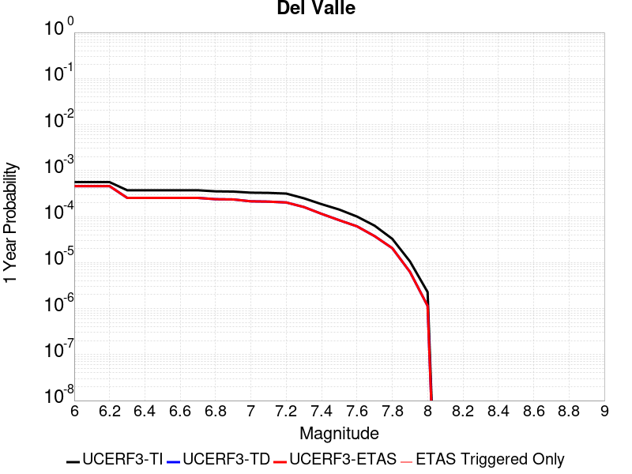 |  |

| Magnitude | 1 wk TI Prob | 1 wk TD Prob | 1 wk ETAS Prob | 1 wk ETAS/TD Gain | 1 wk ETAS Triggered Only | 1 mo TI Prob | 1 mo TD Prob | 1 mo ETAS Prob | 1 mo ETAS/TD Gain | 1 mo ETAS Triggered Only | 1 yr TI Prob | 1 yr TD Prob | 1 yr ETAS Prob | 1 yr ETAS/TD Gain | 1 yr ETAS Triggered Only | 10 yr TI Prob | 10 yr TD Prob | 10 yr ETAS Prob | 10 yr ETAS/TD Gain | 10 yr ETAS Triggered Only |
|-----|-----|-----|-----|-----|-----|-----|-----|-----|-----|-----|-----|-----|-----|-----|-----|-----|-----|-----|-----|-----|
| 6.0 | 1.0716125E-5 | 8.768545E-6 | 8.768545E-6 | 1.0 | 0.0 | 4.592544E-5 | 3.7579048E-5 | 3.7579048E-5 | 1.0 | 0.0 | 5.589988E-4 | 4.574486E-4 | 4.574486E-4 | 1.0 | 0.0 | 0.0055759475 | 0.004567024 | 0.0045769783 | 1.0021796 | 1.0E-5 |
| 6.1 | 1.0716125E-5 | 8.768545E-6 | 8.768545E-6 | 1.0 | 0.0 | 4.592544E-5 | 3.7579048E-5 | 3.7579048E-5 | 1.0 | 0.0 | 5.589988E-4 | 4.574486E-4 | 4.574486E-4 | 1.0 | 0.0 | 0.0055759475 | 0.004567024 | 0.0045769783 | 1.0021796 | 1.0E-5 |
| 6.2 | 1.0716125E-5 | 8.768545E-6 | 8.768545E-6 | 1.0 | 0.0 | 4.592544E-5 | 3.7579048E-5 | 3.7579048E-5 | 1.0 | 0.0 | 5.589988E-4 | 4.574486E-4 | 4.574486E-4 | 1.0 | 0.0 | 0.0055759475 | 0.004567024 | 0.0045769783 | 1.0021796 | 1.0E-5 |
| 6.3 | 7.1293784E-6 | 4.8663037E-6 | 4.8663037E-6 | 1.0 | 0.0 | 3.055412E-5 | 2.0855425E-5 | 2.0855425E-5 | 1.0 | 0.0 | 3.7193293E-4 | 2.5388596E-4 | 2.5388596E-4 | 1.0 | 0.0 | 0.0037131102 | 0.002536044 | 0.002536044 | 1.0 | 0.0 |
| 6.4 | 7.1293784E-6 | 4.8663037E-6 | 4.8663037E-6 | 1.0 | 0.0 | 3.055412E-5 | 2.0855425E-5 | 2.0855425E-5 | 1.0 | 0.0 | 3.7193293E-4 | 2.5388596E-4 | 2.5388596E-4 | 1.0 | 0.0 | 0.0037131102 | 0.002536044 | 0.002536044 | 1.0 | 0.0 |
| 6.5 | 7.1293784E-6 | 4.8663037E-6 | 4.8663037E-6 | 1.0 | 0.0 | 3.055412E-5 | 2.0855425E-5 | 2.0855425E-5 | 1.0 | 0.0 | 3.7193293E-4 | 2.5388596E-4 | 2.5388596E-4 | 1.0 | 0.0 | 0.0037131102 | 0.002536044 | 0.002536044 | 1.0 | 0.0 |
| 6.6 | 7.1293784E-6 | 4.8663037E-6 | 4.8663037E-6 | 1.0 | 0.0 | 3.055412E-5 | 2.0855425E-5 | 2.0855425E-5 | 1.0 | 0.0 | 3.7193293E-4 | 2.5388596E-4 | 2.5388596E-4 | 1.0 | 0.0 | 0.0037131102 | 0.002536044 | 0.002536044 | 1.0 | 0.0 |
| 6.7 | 7.12272E-6 | 4.863679E-6 | 4.863679E-6 | 1.0 | 0.0 | 3.0525585E-5 | 2.0844176E-5 | 2.0844176E-5 | 1.0 | 0.0 | 3.7158563E-4 | 2.5374902E-4 | 2.5374902E-4 | 1.0 | 0.0 | 0.003709649 | 0.002534678 | 0.002534678 | 1.0 | 0.0 |
| 6.8 | 6.7558703E-6 | 4.55986E-6 | 4.55986E-6 | 1.0 | 0.0 | 2.895341E-5 | 1.9542113E-5 | 1.9542113E-5 | 1.0 | 0.0 | 3.5245073E-4 | 2.3789989E-4 | 2.3789989E-4 | 1.0 | 0.0 | 0.0035189227 | 0.0023765266 | 0.0023765266 | 1.0 | 0.0 |
| 6.9 | 6.6700386E-6 | 4.5029883E-6 | 4.5029883E-6 | 1.0 | 0.0 | 2.8585566E-5 | 1.9298383E-5 | 1.9298383E-5 | 1.0 | 0.0 | 3.479737E-4 | 2.349331E-4 | 2.349331E-4 | 1.0 | 0.0 | 0.003474293 | 0.0023469215 | 0.0023469215 | 1.0 | 0.0 |
| 7.0 | 6.3181424E-6 | 4.099119E-6 | 4.099119E-6 | 1.0 | 0.0 | 2.7077473E-5 | 1.7567538E-5 | 1.7567538E-5 | 1.0 | 0.0 | 3.2961834E-4 | 2.138642E-4 | 2.138642E-4 | 1.0 | 0.0 | 0.0032912986 | 0.0021366377 | 0.0021366377 | 1.0 | 0.0 |
| 7.1 | 6.248759E-6 | 4.034304E-6 | 4.034304E-6 | 1.0 | 0.0 | 2.678012E-5 | 1.7289762E-5 | 1.7289762E-5 | 1.0 | 0.0 | 3.2599916E-4 | 2.1048293E-4 | 2.1048293E-4 | 1.0 | 0.0 | 0.0032552136 | 0.0021028894 | 0.0021028894 | 1.0 | 0.0 |
| 7.2 | 6.0411944E-6 | 3.8702806E-6 | 3.8702806E-6 | 1.0 | 0.0 | 2.5890577E-5 | 1.6586813E-5 | 1.6586813E-5 | 1.0 | 0.0 | 3.1517216E-4 | 2.0192616E-4 | 2.0192616E-4 | 1.0 | 0.0 | 0.0031472554 | 0.0020174794 | 0.0020174794 | 1.0 | 0.0 |
| 7.3 | 4.7691183E-6 | 3.0783858E-6 | 3.0783858E-6 | 1.0 | 0.0 | 2.0438918E-5 | 1.3193017E-5 | 1.3193017E-5 | 1.0 | 0.0 | 2.488154E-4 | 1.6061336E-4 | 1.6061336E-4 | 1.0 | 0.0 | 0.00248537 | 0.0016050109 | 0.0016050109 | 1.0 | 0.0 |
| 7.4 | 3.5524722E-6 | 2.1895319E-6 | 2.1895319E-6 | 1.0 | 0.0 | 1.5224792E-5 | 9.383675E-6 | 9.383675E-6 | 1.0 | 0.0 | 1.8534607E-4 | 1.14240334E-4 | 1.14240334E-4 | 1.0 | 0.0 | 0.0018519156 | 0.0011418243 | 0.0011418243 | 1.0 | 0.0 |
| 7.5 | 2.7133442E-6 | 1.5917523E-6 | 1.5917523E-6 | 1.0 | 0.0 | 1.1628566E-5 | 6.821778E-6 | 6.821778E-6 | 1.0 | 0.0 | 1.415686E-4 | 8.3052E-5 | 8.3052E-5 | 1.0 | 0.0 | 0.0014147845 | 8.302115E-4 | 8.302115E-4 | 1.0 | 0.0 |
| 7.6 | 1.915338E-6 | 1.1740236E-6 | 1.1740236E-6 | 1.0 | 0.0 | 8.208566E-6 | 5.0315202E-6 | 5.0315202E-6 | 1.0 | 0.0 | 9.993471E-5 | 6.1257044E-5 | 6.1257044E-5 | 1.0 | 0.0 | 9.988978E-4 | 6.124025E-4 | 6.124025E-4 | 1.0 | 0.0 |
| 7.7 | 1.2120448E-6 | 7.1810405E-7 | 7.1810405E-7 | 1.0 | 0.0 | 5.194467E-6 | 3.077585E-6 | 3.077585E-6 | 1.0 | 0.0 | 6.3240805E-5 | 3.746896E-5 | 3.746896E-5 | 1.0 | 0.0 | 6.322281E-4 | 3.7462678E-4 | 3.7462678E-4 | 1.0 | 0.0 |
| 7.8 | 6.272381E-7 | 3.9329194E-7 | 3.9329194E-7 | 1.0 | 0.0 | 2.6881603E-6 | 1.6855358E-6 | 1.6855358E-6 | 1.0 | 0.0 | 3.272786E-5 | 2.0521207E-5 | 2.0521207E-5 | 1.0 | 0.0 | 3.272304E-4 | 2.0519328E-4 | 2.0519328E-4 | 1.0 | 0.0 |
| 7.9 | 2.0292627E-7 | 1.2005809E-7 | 1.2005809E-7 | 1.0 | 0.0 | 8.6968373E-7 | 5.145345E-7 | 5.145345E-7 | 1.0 | 0.0 | 1.0588348E-5 | 6.2644403E-6 | 6.2644403E-6 | 1.0 | 0.0 | 1.0587843E-4 | 6.2642655E-5 | 6.2642655E-5 | 1.0 | 0.0 |
| 8.0 | 4.374492E-8 | 2.1903668E-8 | 2.1903668E-8 | 1.0 | 0.0 | 1.8747821E-7 | 9.3872856E-8 | 9.3872856E-8 | 1.0 | 0.0 | 2.2825448E-6 | 1.1429015E-6 | 1.1429015E-6 | 1.0 | 0.0 | 2.2825214E-5 | 1.14289605E-5 | 1.14289605E-5 | 1.0 | 0.0 |

## Kern Canyon (Lake Isabella) 2011
*[(top)](#table-of-contents)*

| 1 Week | 1 Month | 1 Year | 10 Year |
|-----|-----|-----|-----|
|  |  |  |  |

| Magnitude | 1 wk TI Prob | 1 wk TD Prob | 1 wk ETAS Prob | 1 wk ETAS/TD Gain | 1 wk ETAS Triggered Only | 1 mo TI Prob | 1 mo TD Prob | 1 mo ETAS Prob | 1 mo ETAS/TD Gain | 1 mo ETAS Triggered Only | 1 yr TI Prob | 1 yr TD Prob | 1 yr ETAS Prob | 1 yr ETAS/TD Gain | 1 yr ETAS Triggered Only | 10 yr TI Prob | 10 yr TD Prob | 10 yr ETAS Prob | 10 yr ETAS/TD Gain | 10 yr ETAS Triggered Only |
|-----|-----|-----|-----|-----|-----|-----|-----|-----|-----|-----|-----|-----|-----|-----|-----|-----|-----|-----|-----|-----|
| 6.0 | 4.2387383E-6 | 4.0016826E-6 | 4.0016826E-6 | 1.0 | 0.0 | 1.8165894E-5 | 1.7149967E-5 | 1.7149967E-5 | 1.0 | 0.0 | 2.2114732E-4 | 2.087827E-4 | 2.087827E-4 | 1.0 | 0.0 | 0.0022092736 | 0.0020860494 | 0.0020960285 | 1.0047837 | 1.0E-5 |
| 6.1 | 4.2387383E-6 | 4.0016826E-6 | 4.0016826E-6 | 1.0 | 0.0 | 1.8165894E-5 | 1.7149967E-5 | 1.7149967E-5 | 1.0 | 0.0 | 2.2114732E-4 | 2.087827E-4 | 2.087827E-4 | 1.0 | 0.0 | 0.0022092736 | 0.0020860494 | 0.0020960285 | 1.0047837 | 1.0E-5 |
| 6.2 | 4.2387383E-6 | 4.0016826E-6 | 4.0016826E-6 | 1.0 | 0.0 | 1.8165894E-5 | 1.7149967E-5 | 1.7149967E-5 | 1.0 | 0.0 | 2.2114732E-4 | 2.087827E-4 | 2.087827E-4 | 1.0 | 0.0 | 0.0022092736 | 0.0020860494 | 0.0020960285 | 1.0047837 | 1.0E-5 |
| 6.3 | 4.2387383E-6 | 4.0016826E-6 | 4.0016826E-6 | 1.0 | 0.0 | 1.8165894E-5 | 1.7149967E-5 | 1.7149967E-5 | 1.0 | 0.0 | 2.2114732E-4 | 2.087827E-4 | 2.087827E-4 | 1.0 | 0.0 | 0.0022092736 | 0.0020860494 | 0.0020960285 | 1.0047837 | 1.0E-5 |
| 6.4 | 4.2387383E-6 | 4.0016826E-6 | 4.0016826E-6 | 1.0 | 0.0 | 1.8165894E-5 | 1.7149967E-5 | 1.7149967E-5 | 1.0 | 0.0 | 2.2114732E-4 | 2.087827E-4 | 2.087827E-4 | 1.0 | 0.0 | 0.0022092736 | 0.0020860494 | 0.0020960285 | 1.0047837 | 1.0E-5 |
| 6.5 | 2.7857532E-6 | 2.5178942E-6 | 2.5178942E-6 | 1.0 | 0.0 | 1.1938888E-5 | 1.0790933E-5 | 1.0790933E-5 | 1.0 | 0.0 | 1.4534626E-4 | 1.3137201E-4 | 1.3137201E-4 | 1.0 | 0.0 | 0.0014525123 | 0.0013129762 | 0.0013229632 | 1.0076063 | 1.0E-5 |
| 6.6 | 2.2233348E-6 | 1.9441447E-6 | 1.9441447E-6 | 1.0 | 0.0 | 9.528543E-6 | 8.332023E-6 | 8.332023E-6 | 1.0 | 0.0 | 1.1600384E-4 | 1.0143774E-4 | 1.0143774E-4 | 1.0 | 0.0 | 0.001159433 | 0.0010139231 | 0.0010239129 | 1.0098526 | 1.0E-5 |
| 6.7 | 2.1635126E-6 | 1.8835244E-6 | 1.8835244E-6 | 1.0 | 0.0 | 9.272164E-6 | 8.072223E-6 | 8.072223E-6 | 1.0 | 0.0 | 1.1288274E-4 | 9.827496E-5 | 9.827496E-5 | 1.0 | 0.0 | 0.0011282542 | 9.823232E-4 | 9.923134E-4 | 1.01017 | 1.0E-5 |
| 6.8 | 1.8685711E-6 | 1.5831604E-6 | 1.5831604E-6 | 1.0 | 0.0 | 8.008137E-6 | 6.7849555E-6 | 6.7849555E-6 | 1.0 | 0.0 | 9.74947E-5 | 8.260376E-5 | 8.260376E-5 | 1.0 | 0.0 | 9.745194E-4 | 8.2573545E-4 | 8.3572714E-4 | 1.0121005 | 1.0E-5 |
| 6.9 | 1.5815071E-6 | 1.3065078E-6 | 1.3065078E-6 | 1.0 | 0.0 | 6.77787E-6 | 5.5993073E-6 | 5.5993073E-6 | 1.0 | 0.0 | 8.251744E-5 | 6.816946E-5 | 6.816946E-5 | 1.0 | 0.0 | 8.248681E-4 | 6.8148813E-4 | 6.9148134E-4 | 1.0146638 | 1.0E-5 |
| 7.0 | 1.3772564E-6 | 1.1210848E-6 | 1.1210848E-6 | 1.0 | 0.0 | 5.9025137E-6 | 4.8046404E-6 | 4.8046404E-6 | 1.0 | 0.0 | 7.186073E-5 | 5.8494945E-5 | 5.8494945E-5 | 1.0 | 0.0 | 7.18375E-4 | 5.847975E-4 | 5.9479167E-4 | 1.01709 | 1.0E-5 |
| 7.1 | 1.0916998E-6 | 8.7638756E-7 | 8.7638756E-7 | 1.0 | 0.0 | 4.678705E-6 | 3.7559414E-6 | 3.7559414E-6 | 1.0 | 0.0 | 5.6961744E-5 | 4.572764E-5 | 4.572764E-5 | 1.0 | 0.0 | 5.6947145E-4 | 4.5718366E-4 | 4.6717908E-4 | 1.0218631 | 1.0E-5 |
| 7.2 | 7.6277024E-7 | 5.9015247E-7 | 5.9015247E-7 | 1.0 | 0.0 | 3.2690114E-6 | 2.5292225E-6 | 2.5292225E-6 | 1.0 | 0.0 | 3.9799485E-5 | 3.0792857E-5 | 3.0792857E-5 | 1.0 | 0.0 | 3.9792358E-4 | 3.0788648E-4 | 3.1788342E-4 | 1.0324695 | 1.0E-5 |
| 7.3 | 5.3265916E-7 | 4.3824897E-7 | 4.3824897E-7 | 1.0 | 0.0 | 2.282823E-6 | 1.8782085E-6 | 1.8782085E-6 | 1.0 | 0.0 | 2.7793016E-5 | 2.2866952E-5 | 2.2866952E-5 | 1.0 | 0.0 | 2.778954E-4 | 2.2864637E-4 | 2.3864409E-4 | 1.0437256 | 1.0E-5 |
| 7.4 | 3.4946007E-7 | 3.0066073E-7 | 3.0066073E-7 | 1.0 | 0.0 | 1.497685E-6 | 1.2885454E-6 | 1.2885454E-6 | 1.0 | 0.0 | 1.8234163E-5 | 1.5687929E-5 | 1.5687929E-5 | 1.0 | 0.0 | 1.8232666E-4 | 1.5686844E-4 | 1.5686844E-4 | 1.0 | 0.0 |
| 7.5 | 1.8317026E-7 | 1.4244999E-7 | 1.4244999E-7 | 1.0 | 0.0 | 7.850152E-7 | 6.104998E-7 | 6.104998E-7 | 1.0 | 0.0 | 9.557518E-6 | 7.432811E-6 | 7.432811E-6 | 1.0 | 0.0 | 9.5571064E-5 | 7.43257E-5 | 7.43257E-5 | 1.0 | 0.0 |
| 7.6 | 2.572245E-8 | 1.7353019E-8 | 1.7353019E-8 | 1.0 | 0.0 | 1.10239064E-7 | 7.437008E-8 | 7.437008E-8 | 1.0 | 0.0 | 1.3421597E-6 | 9.054554E-7 | 9.054554E-7 | 1.0 | 0.0 | 1.3421517E-5 | 9.054523E-6 | 9.054523E-6 | 1.0 | 0.0 |

## Hosgri
*[(top)](#table-of-contents)*

| 1 Week | 1 Month | 1 Year | 10 Year |
|-----|-----|-----|-----|
|  |  |  | 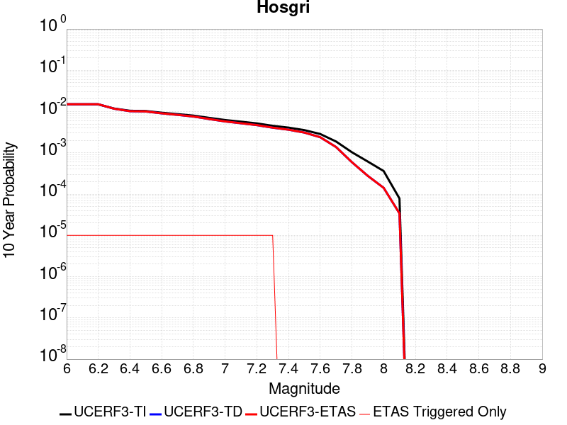 |

| Magnitude | 1 wk TI Prob | 1 wk TD Prob | 1 wk ETAS Prob | 1 wk ETAS/TD Gain | 1 wk ETAS Triggered Only | 1 mo TI Prob | 1 mo TD Prob | 1 mo ETAS Prob | 1 mo ETAS/TD Gain | 1 mo ETAS Triggered Only | 1 yr TI Prob | 1 yr TD Prob | 1 yr ETAS Prob | 1 yr ETAS/TD Gain | 1 yr ETAS Triggered Only | 10 yr TI Prob | 10 yr TD Prob | 10 yr ETAS Prob | 10 yr ETAS/TD Gain | 10 yr ETAS Triggered Only |
|-----|-----|-----|-----|-----|-----|-----|-----|-----|-----|-----|-----|-----|-----|-----|-----|-----|-----|-----|-----|-----|
| 6.0 | 2.883978E-5 | 2.9130044E-5 | 2.9130044E-5 | 1.0 | 0.0 | 1.235932E-4 | 1.2483723E-4 | 1.2483723E-4 | 1.0 | 0.0 | 0.0015037085 | 0.0015188608 | 0.0015288456 | 1.0065739 | 1.0E-5 | 0.01493574 | 0.015088583 | 0.015098432 | 1.0006528 | 1.0E-5 |
| 6.1 | 2.883978E-5 | 2.9130044E-5 | 2.9130044E-5 | 1.0 | 0.0 | 1.235932E-4 | 1.2483723E-4 | 1.2483723E-4 | 1.0 | 0.0 | 0.0015037085 | 0.0015188608 | 0.0015288456 | 1.0065739 | 1.0E-5 | 0.01493574 | 0.015088583 | 0.015098432 | 1.0006528 | 1.0E-5 |
| 6.2 | 2.883978E-5 | 2.9130044E-5 | 2.9130044E-5 | 1.0 | 0.0 | 1.235932E-4 | 1.2483723E-4 | 1.2483723E-4 | 1.0 | 0.0 | 0.0015037085 | 0.0015188608 | 0.0015288456 | 1.0065739 | 1.0E-5 | 0.01493574 | 0.015088583 | 0.015098432 | 1.0006528 | 1.0E-5 |
| 6.3 | 2.2914428E-5 | 2.2643271E-5 | 2.2643271E-5 | 1.0 | 0.0 | 9.8200995E-5 | 9.703901E-5 | 9.703901E-5 | 1.0 | 0.0 | 0.0011949413 | 0.0011808145 | 0.0011908027 | 1.0084587 | 1.0E-5 | 0.011885363 | 0.011746811 | 0.011756693 | 1.0008413 | 1.0E-5 |
| 6.4 | 2.0195741E-5 | 1.969773E-5 | 1.969773E-5 | 1.0 | 0.0 | 8.65503E-5 | 8.4416126E-5 | 8.4416126E-5 | 1.0 | 0.0 | 0.0010532405 | 0.0010272837 | 0.0010372734 | 1.0097244 | 1.0E-5 | 0.010482626 | 0.010226403 | 0.010236301 | 1.0009679 | 1.0E-5 |
| 6.5 | 1.9924333E-5 | 1.9410143E-5 | 1.9410143E-5 | 1.0 | 0.0 | 8.53872E-5 | 8.318368E-5 | 8.318368E-5 | 1.0 | 0.0 | 0.0010390934 | 0.0010122927 | 0.0010222826 | 1.0098686 | 1.0E-5 | 0.010342481 | 0.010077859 | 0.010087758 | 1.0009823 | 1.0E-5 |
| 6.6 | 1.809694E-5 | 1.7459386E-5 | 1.7459386E-5 | 1.0 | 0.0 | 7.7556004E-5 | 7.48238E-5 | 7.48238E-5 | 1.0 | 0.0 | 9.438353E-4 | 9.106004E-4 | 9.205913E-4 | 1.0109718 | 1.0E-5 | 0.009398366 | 0.009069641 | 0.00907955 | 1.0010926 | 1.0E-5 |
| 6.7 | 1.675989E-5 | 1.6043801E-5 | 1.6043801E-5 | 1.0 | 0.0 | 7.182612E-5 | 6.875734E-5 | 6.875734E-5 | 1.0 | 0.0 | 8.7413215E-4 | 8.3680026E-4 | 8.467919E-4 | 1.0119402 | 1.0E-5 | 0.008707017 | 0.0083374055 | 0.008347322 | 1.0011895 | 1.0E-5 |
| 6.8 | 1.5401129E-5 | 1.4615068E-5 | 1.4615068E-5 | 1.0 | 0.0 | 6.6003166E-5 | 6.2634506E-5 | 6.2634506E-5 | 1.0 | 0.0 | 8.032922E-4 | 7.623092E-4 | 7.723016E-4 | 1.013108 | 1.0E-5 | 0.008003947 | 0.0075978134 | 0.007607737 | 1.0013062 | 1.0E-5 |
| 6.9 | 1.356559E-5 | 1.2690886E-5 | 1.2690886E-5 | 1.0 | 0.0 | 5.8136946E-5 | 5.4388383E-5 | 5.4388383E-5 | 1.0 | 0.0 | 7.0758746E-4 | 6.619778E-4 | 6.719712E-4 | 1.0150962 | 1.0E-5 | 0.007053386 | 0.0066008708 | 0.0066108047 | 1.0015049 | 1.0E-5 |
| 7.0 | 1.2030819E-5 | 1.1096827E-5 | 1.1096827E-5 | 1.0 | 0.0 | 5.155963E-5 | 4.7556965E-5 | 4.7556965E-5 | 1.0 | 0.0 | 6.275577E-4 | 5.788523E-4 | 5.888465E-4 | 1.0172656 | 1.0E-5 | 0.006257884 | 0.0057742125 | 0.005784155 | 1.0017219 | 1.0E-5 |
| 7.1 | 1.0972698E-5 | 1.0023014E-5 | 1.0023014E-5 | 1.0 | 0.0 | 4.7025E-5 | 4.2955064E-5 | 4.2955064E-5 | 1.0 | 0.0 | 5.72379E-4 | 5.2285247E-4 | 5.3284725E-4 | 1.0191158 | 1.0E-5 | 0.0057090693 | 0.0052169817 | 0.0052269297 | 1.0019069 | 1.0E-5 |
| 7.2 | 9.961926E-6 | 9.035552E-6 | 9.035552E-6 | 1.0 | 0.0 | 4.2693267E-5 | 3.8723218E-5 | 3.8723218E-5 | 1.0 | 0.0 | 5.1966653E-4 | 4.713532E-4 | 4.813485E-4 | 1.0212055 | 1.0E-5 | 0.00518453 | 0.0047042873 | 0.0047142403 | 1.0021157 | 1.0E-5 |
| 7.3 | 8.700929E-6 | 7.828873E-6 | 7.828873E-6 | 1.0 | 0.0 | 3.7289166E-5 | 3.3551885E-5 | 3.3551885E-5 | 1.0 | 0.0 | 4.53901E-4 | 4.0841763E-4 | 4.1841358E-4 | 1.0244747 | 1.0E-5 | 0.00452975 | 0.0040774164 | 0.0040873755 | 1.0024425 | 1.0E-5 |
| 7.4 | 7.866285E-6 | 6.9994917E-6 | 6.9994917E-6 | 1.0 | 0.0 | 3.3712215E-5 | 2.9997478E-5 | 2.9997478E-5 | 1.0 | 0.0 | 4.103689E-4 | 3.651581E-4 | 3.651581E-4 | 1.0 | 0.0 | 0.004096119 | 0.0036463244 | 0.0036463244 | 1.0 | 0.0 |
| 7.5 | 6.8381305E-6 | 5.9604217E-6 | 5.9604217E-6 | 1.0 | 0.0 | 2.9305946E-5 | 2.5544414E-5 | 2.5544414E-5 | 1.0 | 0.0 | 3.5674145E-4 | 3.109589E-4 | 3.109589E-4 | 1.0 | 0.0 | 0.0035616932 | 0.003105979 | 0.003105979 | 1.0 | 0.0 |
| 7.6 | 5.503376E-6 | 4.595932E-6 | 4.595932E-6 | 1.0 | 0.0 | 2.3585684E-5 | 1.9696703E-5 | 1.9696703E-5 | 1.0 | 0.0 | 2.8711787E-4 | 2.3978099E-4 | 2.3978099E-4 | 1.0 | 0.0 | 0.002867472 | 0.002395962 | 0.002395962 | 1.0 | 0.0 |
| 7.7 | 3.6144982E-6 | 2.6528419E-6 | 2.6528419E-6 | 1.0 | 0.0 | 1.5490614E-5 | 1.1369272E-5 | 1.1369272E-5 | 1.0 | 0.0 | 1.8858191E-4 | 1.384121E-4 | 1.384121E-4 | 1.0 | 0.0 | 0.0018842196 | 0.0013839965 | 0.0013839965 | 1.0 | 0.0 |
| 7.8 | 1.9853494E-6 | 1.1366267E-6 | 1.1366267E-6 | 1.0 | 0.0 | 8.508612E-6 | 4.8712477E-6 | 4.8712477E-6 | 1.0 | 0.0 | 1.0358743E-4 | 5.930583E-5 | 5.930583E-5 | 1.0 | 0.0 | 0.0010353916 | 5.936362E-4 | 5.936362E-4 | 1.0 | 0.0 |
| 7.9 | 1.1818757E-6 | 5.299053E-7 | 5.299053E-7 | 1.0 | 0.0 | 5.0651715E-6 | 2.2710205E-6 | 2.2710205E-6 | 1.0 | 0.0 | 6.1666724E-5 | 2.7649327E-5 | 2.7649327E-5 | 1.0 | 0.0 | 6.1649614E-4 | 2.7715892E-4 | 2.7715892E-4 | 1.0 | 0.0 |
| 8.0 | 6.962958E-7 | 2.7166053E-7 | 2.7166053E-7 | 1.0 | 0.0 | 2.9841215E-6 | 1.1642588E-6 | 1.1642588E-6 | 1.0 | 0.0 | 3.6331072E-5 | 1.4174759E-5 | 1.4174759E-5 | 1.0 | 0.0 | 3.6325134E-4 | 1.423126E-4 | 1.423126E-4 | 1.0 | 0.0 |
| 8.1 | 1.5033264E-7 | 6.5333694E-8 | 6.5333694E-8 | 1.0 | 0.0 | 6.442826E-7 | 2.800015E-7 | 2.800015E-7 | 1.0 | 0.0 | 7.844113E-6 | 3.409013E-6 | 3.409013E-6 | 1.0 | 0.0 | 7.843835E-5 | 3.410907E-5 | 3.410907E-5 | 1.0 | 0.0 |

