# Parent Section Magnitude-Probability Distributions

Only fault sections with at least one triggered aftershock are plotted. Sections are sorted by total supraseismogenic trigger rate (decreasing)

## Table Of Contents

* [Tank Canyon](#tank-canyon)
* [Garlock (Central)](#garlock-central)
* [Little Lake](#little-lake)
* [Owl Lake](#owl-lake)
* [Panamint Valley](#panamint-valley)
* [Airport Lake](#airport-lake)
* [Ash Hill](#ash-hill)
* [Garlock (East)](#garlock-east)
* [Hunter Mountain-Saline Valley](#hunter-mountain-saline-valley)
* [Blackwater](#blackwater)
* [Garlock (West)](#garlock-west)
* [So Sierra Nevada](#so-sierra-nevada)
* [Gravel Hills-Harper Lk](#gravel-hills-harper-lk)
* [McLean Lake](#mclean-lake)
* [Goldstone Lake](#goldstone-lake)
* [Lenwood-Lockhart-Old Woman Springs](#lenwood-lockhart-old-woman-springs)
* [Coyote Canyon](#coyote-canyon)
* [Death Valley (So)](#death-valley-so)
* [San Andreas (Mojave S)](#san-andreas-mojave-s)
* [San Andreas (Mojave N)](#san-andreas-mojave-n)
* [Towne Pass](#towne-pass)
* [Bicycle Lake](#bicycle-lake)
* [Nelson Lake](#nelson-lake)
* [San Andreas (San Bernardino N)](#san-andreas-san-bernardino-n)
* [Garlic Springs](#garlic-springs)
* [Paradise](#paradise)
* [Death Valley (Black Mtns Frontal)](#death-valley-black-mtns-frontal)
* [Coyote Lake](#coyote-lake)
* [San Andreas (Parkfield)](#san-andreas-parkfield)
* [Helendale-So Lockhart](#helendale-so-lockhart)
* [San Andreas (San Bernardino S)](#san-andreas-san-bernardino-s)
* [San Andreas (Big Bend)](#san-andreas-big-bend)
* [Sierra Nevada  (No Extension)](#sierra-nevada--no-extension)
* [Death Valley (No)](#death-valley-no)
* [San Andreas (Cholame) rev](#san-andreas-cholame-rev)
* [Red Pass](#red-pass)
* [Owens Valley](#owens-valley)
* [Scodie Lineament](#scodie-lineament)
* [San Andreas (Carrizo) rev](#san-andreas-carrizo-rev)
* [White Wolf (Extension)](#white-wolf-extension)
* [San Andreas (San Gorgonio Pass-Garnet HIll)](#san-andreas-san-gorgonio-pass-garnet-hill)
* [San Jacinto (San Bernardino)](#san-jacinto-san-bernardino)
* [Manix-Afton Hills](#manix-afton-hills)
* [Independence rev 2011](#independence-rev-2011)
* [Calico-Hidalgo](#calico-hidalgo)
* [Death Valley (Fish Lake Valley)](#death-valley-fish-lake-valley)
* [Lake Isabella (Seismicity)](#lake-isabella-seismicity)
* [San Jacinto (San Jacinto Valley) rev](#san-jacinto-san-jacinto-valley-rev)
* [San Jacinto (Stepovers Combined)](#san-jacinto-stepovers-combined)
* [San Andreas (Coachella) rev](#san-andreas-coachella-rev)
* [Ludlow](#ludlow)
* [San Jacinto (Coyote Creek)](#san-jacinto-coyote-creek)
* [San Jacinto (Superstition Mtn)](#san-jacinto-superstition-mtn)
* [Tin Mountain](#tin-mountain)
* [Blue Cut](#blue-cut)
* [Ortigalita (North)](#ortigalita-north)
* [Pleito](#pleito)
* [Cady](#cady)
* [Deep Springs](#deep-springs)
* [San Jacinto (Anza) rev](#san-jacinto-anza-rev)
* [Pinto Mtn](#pinto-mtn)
* [Palos Verdes](#palos-verdes)
* [Ventura-Pitas Point](#ventura-pitas-point)
* [San Andreas (North Branch Mill Creek)](#san-andreas-north-branch-mill-creek)
* [Santa Ynez (East)](#santa-ynez-east)
* [Dry Mountain](#dry-mountain)
* [Whittier alt 1](#whittier-alt-1)
* [San Andreas (Peninsula) 2011 CFM](#san-andreas-peninsula-2011-cfm)
* [Superstition Hills](#superstition-hills)
* [Santa Ynez (West)](#santa-ynez-west)
* [Baker](#baker)
* [Great Valley 09 (Laguna Seca)](#great-valley-09-laguna-seca)
* [White Mountains](#white-mountains)
* [San Andreas (Creeping Section) 2011 CFM](#san-andreas-creeping-section-2011-cfm)
* [San Jacinto (Borrego)](#san-jacinto-borrego)
* [Coronado Bank alt1](#coronado-bank-alt1)
* [Mono Lake 2011 CFM](#mono-lake-2011-cfm)
* [Mission Creek](#mission-creek)
* [Cucamonga](#cucamonga)
* [San Jacinto (Lytle Creek connector)](#san-jacinto-lytle-creek-connector)
* [Elsinore (Coyote Mountains)](#elsinore-coyote-mountains)
* [Bennett Valley 2011 CFM](#bennett-valley-2011-cfm)
* [Cerro Prieto](#cerro-prieto)
* [Chino alt 1](#chino-alt-1)
* [Sierra Madre](#sierra-madre)
* [Kern Canyon (Lake Isabella) 2011](#kern-canyon-lake-isabella-2011)
* [Santa Cruz Island](#santa-cruz-island)
* [Santa Rosa Island](#santa-rosa-island)
* [Hollywood](#hollywood)
* [Elysian Park (Upper)](#elysian-park-upper)
* [Rodgers Creek - Healdsburg 2011 CFM](#rodgers-creek---healdsburg-2011-cfm)
* [Hayward (No) 2011 CFM](#hayward-no-2011-cfm)
* [Calaveras (So) 2011 CFM](#calaveras-so-2011-cfm)
* [Point Reyes 2011 CFM](#point-reyes-2011-cfm)
* [Oceanic - West Huasna](#oceanic---west-huasna)
* [Kern Canyon (South Kern) 2011](#kern-canyon-south-kern-2011)
* [White Wolf](#white-wolf)
* [San Andreas (Santa Cruz Mts) 2011 CFM](#san-andreas-santa-cruz-mts-2011-cfm)
* [Bullion Mountains](#bullion-mountains)
* [Big Pine (East)](#big-pine-east)
* [Pisgah-Bullion Mtn-Mesquite Lk](#pisgah-bullion-mtn-mesquite-lk)
* [Cleghorn Lake](#cleghorn-lake)
* [San Diego Trough north alt1](#san-diego-trough-north-alt1)
* [Channel Islands Thrust](#channel-islands-thrust)
* [Red Mountain](#red-mountain)
* [San Andreas (North Coast) 2011 CFM](#san-andreas-north-coast-2011-cfm)
* [San Clemente](#san-clemente)
* [Kern Canyon (North Kern) 2011](#kern-canyon-north-kern-2011)
* [Elsinore (Glen Ivy) rev](#elsinore-glen-ivy-rev)
* [Raymond](#raymond)
* [Hunting Creek - Berryessa 2011 CFM](#hunting-creek---berryessa-2011-cfm)
* [Verdugo](#verdugo)
* [Cleghorn](#cleghorn)
* [Sheephole](#sheephole)
* [San Cayetano](#san-cayetano)
* [Cedar Mtn-Mahogany Mtn](#cedar-mtn-mahogany-mtn)
* [Malibu Coast (Extension) alt 1](#malibu-coast-extension-alt-1)
* [Green Valley 2011 CFM](#green-valley-2011-cfm)
* [Calaveras (So) - Paicines extension 2011 CFM](#calaveras-so---paicines-extension-2011-cfm)
* [Ortigalita (South)](#ortigalita-south)
* [Camp Rock 2011](#camp-rock-2011)
* [Newport-Inglewood (Offshore)](#newport-inglewood-offshore)

## Tank Canyon
*[(top)](#table-of-contents)*

| 1 Week | 1 Month | 1 Year | 10 Year |
|-----|-----|-----|-----|
|  |  |  |  |

| Magnitude | 1 wk TI Prob | 1 wk TD Prob | 1 wk ETAS Prob | 1 wk ETAS/TD Gain | 1 wk ETAS Triggered Only | 1 mo TI Prob | 1 mo TD Prob | 1 mo ETAS Prob | 1 mo ETAS/TD Gain | 1 mo ETAS Triggered Only | 1 yr TI Prob | 1 yr TD Prob | 1 yr ETAS Prob | 1 yr ETAS/TD Gain | 1 yr ETAS Triggered Only | 10 yr TI Prob | 10 yr TD Prob | 10 yr ETAS Prob | 10 yr ETAS/TD Gain | 10 yr ETAS Triggered Only |
|-----|-----|-----|-----|-----|-----|-----|-----|-----|-----|-----|-----|-----|-----|-----|-----|-----|-----|-----|-----|-----|
| 6.0 | 4.8284557E-5 | 5.7970923E-5 | 0.0019037811 | 32.840275 | 0.0018459172 | 2.0691741E-4 | 2.48427E-4 | 0.0060923793 | 24.52382 | 0.005845404 | 0.0025163088 | 0.0030210684 | 0.02469619 | 8.174654 | 0.021740802 | 0.02488006 | 0.029866708 | 0.072348125 | 2.4223669 | 0.043789256 |
| 6.1 | 1.7796336E-5 | 2.0875108E-5 | 5.8489357E-4 | 28.01871 | 5.6403026E-4 | 7.626778E-5 | 8.946191E-5 | 0.0022428392 | 25.070328 | 0.00215357 | 9.281647E-4 | 0.0010886913 | 0.009155787 | 8.409902 | 0.008075887 | 0.009242975 | 0.010837668 | 0.02808239 | 2.591184 | 0.017433662 |
| 6.2 | 1.7796336E-5 | 2.0875108E-5 | 5.8489357E-4 | 28.01871 | 5.6403026E-4 | 7.626778E-5 | 8.946191E-5 | 0.0022428392 | 25.070328 | 0.00215357 | 9.281647E-4 | 0.0010886913 | 0.009155787 | 8.409902 | 0.008075887 | 0.009242975 | 0.010837668 | 0.02808239 | 2.591184 | 0.017433662 |
| 6.3 | 1.3515912E-5 | 1.5760828E-5 | 4.0032086E-4 | 25.399734 | 3.8456608E-4 | 5.792405E-5 | 6.7544795E-5 | 0.0015544333 | 23.013369 | 0.0014869889 | 7.049971E-4 | 8.220716E-4 | 0.006560204 | 7.980088 | 0.0057428535 | 0.007027647 | 0.008192917 | 0.021008475 | 2.5642238 | 0.01292142 |
| 6.4 | 1.0870146E-5 | 1.2618972E-5 | 2.689931E-4 | 21.316565 | 2.563774E-4 | 4.658551E-5 | 5.4080287E-5 | 0.0011820798 | 21.857868 | 0.0011280605 | 5.67031E-4 | 6.582465E-4 | 0.0051675183 | 7.8504305 | 0.004512242 | 0.005655863 | 0.006564983 | 0.016268834 | 2.478123 | 0.009767978 |
| 6.5 | 7.964826E-6 | 9.196723E-6 | 1.1174673E-4 | 12.150712 | 1.02550955E-4 | 3.4134522E-5 | 3.9413993E-5 | 7.572424E-4 | 19.212526 | 7.178567E-4 | 4.1550855E-4 | 4.797704E-4 | 0.0033498195 | 6.9821305 | 0.0028714268 | 0.0041473247 | 0.0047886474 | 0.011243935 | 2.3480396 | 0.006486348 |
| 6.6 | 6.6317E-6 | 7.612777E-6 | 1.1016295E-4 | 14.470797 | 1.02550955E-4 | 2.8421264E-5 | 3.262583E-5 | 5.710008E-4 | 17.501493 | 5.383925E-4 | 3.4597394E-4 | 3.9715623E-4 | 0.002601126 | 6.5493774 | 0.0022048454 | 0.0034543579 | 0.003965616 | 0.008766398 | 2.2106016 | 0.0048198947 |
| 6.7 | 4.793663E-6 | 5.4310603E-6 | 1.0798146E-4 | 19.882206 | 1.02550955E-4 | 2.0544108E-5 | 2.327579E-5 | 3.0528434E-4 | 13.115961 | 2.8201513E-4 | 2.500958E-4 | 2.8335027E-4 | 0.0014110912 | 4.980024 | 0.0011280605 | 0.0024981452 | 0.0028305824 | 0.005284839 | 1.8670499 | 0.002461223 |
| 6.8 | 4.382823E-6 | 4.9694927E-6 | 1.0751994E-4 | 21.636 | 1.02550955E-4 | 1.8783392E-5 | 2.1297676E-5 | 3.033068E-4 | 14.24131 | 2.8201513E-4 | 2.286638E-4 | 2.592726E-4 | 0.0013357785 | 5.152023 | 0.001076785 | 0.0022842865 | 0.0025903755 | 0.004866224 | 1.8785785 | 0.0022817587 |
| 6.9 | 2.729601E-6 | 3.0736521E-6 | 5.4348973E-5 | 17.682213 | 5.1275478E-5 | 1.1698237E-5 | 1.3172735E-5 | 1.4135973E-4 | 10.731236 | 1.281887E-4 | 1.4241673E-4 | 1.6036748E-4 | 6.7304E-4 | 4.1968613 | 5.127548E-4 | 0.001423255 | 0.0016026833 | 0.0025497593 | 1.5909315 | 9.4859634E-4 |
| 7.0 | 1.8987357E-6 | 2.1269989E-6 | 2.7764683E-5 | 13.053454 | 2.5637739E-5 | 8.137413E-6 | 9.115682E-6 | 8.6028194E-5 | 9.437385 | 7.691322E-5 | 9.90685E-5 | 1.1097847E-4 | 3.929623E-4 | 3.5408876 | 2.8201513E-4 | 9.902435E-4 | 0.0011092991 | 0.0015702666 | 1.4155483 | 4.614793E-4 |
| 7.1 | 1.4928986E-6 | 1.6641684E-6 | 2.7301865E-5 | 16.40571 | 2.5637739E-5 | 6.398121E-6 | 7.1321338E-6 | 3.276969E-5 | 4.594654 | 2.5637739E-5 | 7.789434E-5 | 8.683086E-5 | 2.1500842E-4 | 2.4761753 | 1.281887E-4 | 7.786704E-4 | 8.680272E-4 | 0.001124182 | 1.2951 | 2.563774E-4 |
| 7.2 | 1.069082E-6 | 1.1828834E-6 | 1.1828834E-6 | 1.0 | 0.0 | 4.581772E-6 | 5.0694935E-6 | 5.0694935E-6 | 1.0 | 0.0 | 5.5781646E-5 | 6.171987E-5 | 1.3862834E-4 | 2.2460895 | 7.691322E-5 | 5.576765E-4 | 6.170795E-4 | 7.7081105E-4 | 1.2491275 | 1.5382643E-4 |
| 7.3 | 8.776551E-7 | 9.770195E-7 | 9.770195E-7 | 1.0 | 0.0 | 3.7613736E-6 | 4.1872227E-6 | 4.1872227E-6 | 1.0 | 0.0 | 4.579376E-5 | 5.0978764E-5 | 1.0225163E-4 | 2.005769 | 5.1275478E-5 | 4.5784327E-4 | 5.097217E-4 | 6.378451E-4 | 1.2513595 | 1.281887E-4 |
| 7.4 | 7.55721E-7 | 8.510402E-7 | 8.510402E-7 | 1.0 | 0.0 | 3.2388E-6 | 3.647313E-6 | 3.647313E-6 | 1.0 | 0.0 | 3.9431678E-5 | 4.440565E-5 | 9.567885E-5 | 2.154655 | 5.1275478E-5 | 3.942468E-4 | 4.440186E-4 | 5.46524E-4 | 1.2308583 | 1.02550955E-4 |
| 7.5 | 5.587665E-7 | 6.305733E-7 | 6.305733E-7 | 1.0 | 0.0 | 2.3947114E-6 | 2.702457E-6 | 2.702457E-6 | 1.0 | 0.0 | 2.915522E-5 | 3.2902415E-5 | 5.853931E-5 | 1.7791797 | 2.5637739E-5 | 2.9151395E-4 | 3.2902416E-4 | 3.5465346E-4 | 1.0778949 | 2.5637739E-5 |

## Garlock (Central)
*[(top)](#table-of-contents)*

| 1 Week | 1 Month | 1 Year | 10 Year |
|-----|-----|-----|-----|
|  |  |  |  |

| Magnitude | 1 wk TI Prob | 1 wk TD Prob | 1 wk ETAS Prob | 1 wk ETAS/TD Gain | 1 wk ETAS Triggered Only | 1 mo TI Prob | 1 mo TD Prob | 1 mo ETAS Prob | 1 mo ETAS/TD Gain | 1 mo ETAS Triggered Only | 1 yr TI Prob | 1 yr TD Prob | 1 yr ETAS Prob | 1 yr ETAS/TD Gain | 1 yr ETAS Triggered Only | 10 yr TI Prob | 10 yr TD Prob | 10 yr ETAS Prob | 10 yr ETAS/TD Gain | 10 yr ETAS Triggered Only |
|-----|-----|-----|-----|-----|-----|-----|-----|-----|-----|-----|-----|-----|-----|-----|-----|-----|-----|-----|-----|-----|
| 6.0 | 5.5131142E-5 | 7.027124E-5 | 0.0013264322 | 18.875889 | 0.0012562491 | 2.3625491E-4 | 3.0112805E-4 | 0.0037099204 | 12.320076 | 0.0034098192 | 0.0028726095 | 0.0036601364 | 0.01632991 | 4.461558 | 0.0127163185 | 0.028357591 | 0.036092084 | 0.059643023 | 1.6525235 | 0.024432765 |
| 6.1 | 5.5131142E-5 | 7.027124E-5 | 0.0013264322 | 18.875889 | 0.0012562491 | 2.3625491E-4 | 3.0112805E-4 | 0.0037099204 | 12.320076 | 0.0034098192 | 0.0028726095 | 0.0036601364 | 0.01632991 | 4.461558 | 0.0127163185 | 0.028357591 | 0.036092084 | 0.059643023 | 1.6525235 | 0.024432765 |
| 6.2 | 4.216245E-5 | 5.1683597E-5 | 8.20776E-4 | 15.880783 | 7.6913217E-4 | 1.806837E-4 | 2.214825E-4 | 0.002528368 | 11.415655 | 0.0023073964 | 0.0021976046 | 0.0026932466 | 0.010926365 | 4.056949 | 0.008255352 | 0.021759989 | 0.026701005 | 0.042072166 | 1.5756773 | 0.015792847 |
| 6.3 | 4.216245E-5 | 5.1683597E-5 | 8.20776E-4 | 15.880783 | 7.6913217E-4 | 1.806837E-4 | 2.214825E-4 | 0.002528368 | 11.415655 | 0.0023073964 | 0.0021976046 | 0.0026932466 | 0.010926365 | 4.056949 | 0.008255352 | 0.021759989 | 0.026701005 | 0.042072166 | 1.5756773 | 0.015792847 |
| 6.4 | 3.6858168E-5 | 4.4131746E-5 | 6.594103E-4 | 14.941859 | 6.1530573E-4 | 1.5795401E-4 | 1.8912248E-4 | 0.0019834249 | 10.4875145 | 0.0017946417 | 0.0019213937 | 0.00230016 | 0.0089506395 | 3.891312 | 0.006665812 | 0.019048655 | 0.022859743 | 0.035185162 | 1.5391757 | 0.012613768 |
| 6.5 | 3.39199E-5 | 4.0038896E-5 | 5.784099E-4 | 14.446198 | 5.383925E-4 | 1.453629E-4 | 1.715841E-4 | 0.0017352179 | 10.112928 | 0.001563902 | 0.0017683565 | 0.0020870569 | 0.008099351 | 3.8807526 | 0.0060248687 | 0.017543508 | 0.020770492 | 0.031867005 | 1.5342441 | 0.01133188 |
| 6.6 | 3.3571985E-5 | 3.9493032E-5 | 5.5222755E-4 | 13.982911 | 5.127548E-4 | 1.4387199E-4 | 1.6924499E-4 | 0.001707249 | 10.087441 | 0.0015382643 | 0.0017502342 | 0.0020586322 | 0.008019928 | 3.8957555 | 0.0059735933 | 0.017365133 | 0.020491783 | 0.031491004 | 1.5367625 | 0.01122933 |
| 6.7 | 3.2580007E-5 | 3.8109323E-5 | 5.5084453E-4 | 14.454325 | 5.127548E-4 | 1.3962112E-4 | 1.6331558E-4 | 0.0017013287 | 10.417431 | 0.0015382643 | 0.0016985617 | 0.0019865753 | 0.0077947807 | 3.9237278 | 0.005819767 | 0.016856372 | 0.019784356 | 0.030439692 | 1.5385739 | 0.010870401 |
| 6.8 | 3.2185937E-5 | 3.7536465E-5 | 5.50272E-4 | 14.659664 | 5.127548E-4 | 1.3793244E-4 | 1.6086077E-4 | 0.001673244 | 10.401815 | 0.0015126265 | 0.0016780337 | 0.001956742 | 0.0076883584 | 3.9291627 | 0.0057428535 | 0.016654192 | 0.01949112 | 0.02994854 | 1.5365223 | 0.010665299 |
| 6.9 | 3.165394E-5 | 3.6740938E-5 | 5.494769E-4 | 14.95544 | 5.127548E-4 | 1.3565269E-4 | 1.5745178E-4 | 0.0016698402 | 10.605407 | 0.0015126265 | 0.0016503202 | 0.0019153113 | 0.007544811 | 3.9392085 | 0.0056403023 | 0.01638118 | 0.0190837 | 0.029319128 | 1.5363442 | 0.01043456 |
| 7.0 | 3.0903822E-5 | 3.564605E-5 | 5.227457E-4 | 14.664899 | 4.8711704E-4 | 1.3243823E-4 | 1.5275997E-4 | 0.0016395217 | 10.732666 | 0.0014869889 | 0.0016112428 | 0.0018582871 | 0.0073089777 | 3.9331799 | 0.0054608383 | 0.015996104 | 0.018522795 | 0.02843696 | 1.5352412 | 0.010101269 |
| 7.1 | 3.0069863E-5 | 3.441218E-5 | 4.7023874E-4 | 13.664892 | 4.3584156E-4 | 1.2886449E-4 | 1.4747256E-4 | 0.0015060724 | 10.21256 | 0.0013588001 | 0.0015677959 | 0.0017940209 | 0.006886778 | 3.8387392 | 0.00510191 | 0.01556781 | 0.017890377 | 0.027206631 | 1.5207412 | 0.009485964 |
| 7.2 | 2.7957109E-5 | 3.1301115E-5 | 4.6712902E-4 | 14.923719 | 4.3584156E-4 | 1.1981068E-4 | 1.3414085E-4 | 0.0012876843 | 9.599495 | 0.0011536982 | 0.0014577188 | 0.0016319609 | 0.00588088 | 3.603567 | 0.004255865 | 0.014481937 | 0.016293783 | 0.024137205 | 1.4813751 | 0.007973337 |
| 7.3 | 2.4519275E-5 | 2.6733265E-5 | 3.343779E-4 | 12.507934 | 3.0765287E-4 | 1.0507837E-4 | 1.1456619E-4 | 9.6051465E-4 | 8.383927 | 8.460454E-4 | 0.0012785783 | 0.0013939656 | 0.0046966234 | 3.3692536 | 0.0033072683 | 0.012712469 | 0.013937555 | 0.019853171 | 1.4244372 | 0.005999231 |
| 7.4 | 2.3225532E-5 | 2.5217494E-5 | 3.328626E-4 | 13.199671 | 3.0765287E-4 | 9.95342E-5 | 1.0807058E-4 | 9.027546E-4 | 8.35338 | 7.947699E-4 | 0.0012111551 | 0.0013149795 | 0.0043618586 | 3.3170543 | 0.003050891 | 0.012045753 | 0.01315504 | 0.01854404 | 1.409653 | 0.0054608383 |
| 7.5 | 2.097765E-5 | 2.250088E-5 | 3.0450965E-4 | 13.533233 | 2.8201513E-4 | 8.9901114E-5 | 9.6428856E-5 | 7.8858103E-4 | 8.177854 | 6.9221895E-4 | 0.0010939965 | 0.0011734008 | 0.0036573433 | 3.116875 | 0.0024868606 | 0.010886264 | 0.01174923 | 0.016132448 | 1.3730642 | 0.0044353288 |
| 7.6 | 1.511254E-5 | 1.6007341E-5 | 1.9546864E-4 | 12.211187 | 1.7946417E-4 | 6.476642E-5 | 6.860113E-5 | 4.0186886E-4 | 5.8580503 | 3.332906E-4 | 7.882459E-4 | 8.3490653E-4 | 0.0022181885 | 2.6568105 | 0.0013844379 | 0.007854558 | 0.00839184 | 0.010705297 | 1.2756792 | 0.0023330343 |
| 7.7 | 9.934069E-6 | 1.0693656E-5 | 6.196858E-5 | 5.7948923 | 5.1275478E-5 | 4.2573887E-5 | 4.582915E-5 | 1.483754E-4 | 3.2375772 | 1.02550955E-4 | 5.182138E-4 | 5.578274E-4 | 9.934258E-4 | 1.7808839 | 4.3584156E-4 | 0.00517007 | 0.005635394 | 0.006323712 | 1.122142 | 6.9221895E-4 |
| 7.8 | 6.7562896E-6 | 8.440562E-6 | 3.4078086E-5 | 4.037419 | 2.5637739E-5 | 2.8955206E-5 | 3.6173336E-5 | 8.744696E-5 | 2.4174423 | 5.1275478E-5 | 3.5247262E-4 | 4.4032154E-4 | 7.734654E-4 | 1.7565922 | 3.332906E-4 | 0.0035191406 | 0.0044529405 | 0.004988936 | 1.1203688 | 5.383925E-4 |
| 7.9 | 3.975453E-6 | 5.3784297E-6 | 3.1016032E-5 | 5.7667446 | 2.5637739E-5 | 1.7037546E-5 | 2.305021E-5 | 7.4324504E-5 | 3.224461 | 5.1275478E-5 | 2.0741238E-4 | 2.8060027E-4 | 5.1127514E-4 | 1.8220766 | 2.3073965E-4 | 0.002072189 | 0.0028374717 | 0.0031442516 | 1.1081173 | 3.0765287E-4 |
| 8.0 | 1.6729537E-6 | 2.0800776E-6 | 2.7717762E-5 | 13.325351 | 2.5637739E-5 | 7.169782E-6 | 8.914588E-6 | 3.4552097E-5 | 3.8759053 | 2.5637739E-5 | 8.7288594E-5 | 1.0852974E-4 | 2.1106956E-4 | 1.9448086 | 1.02550955E-4 | 8.7254314E-4 | 0.0010982669 | 0.0012007053 | 1.0932727 | 1.02550955E-4 |
| 8.1 | 3.6733252E-7 | 3.1526864E-7 | 3.1526864E-7 | 1.0 | 0.0 | 1.5742813E-6 | 1.3511507E-6 | 1.3511507E-6 | 1.0 | 0.0 | 1.9166706E-5 | 1.645015E-5 | 1.645015E-5 | 1.0 | 0.0 | 1.9165053E-4 | 1.6658098E-4 | 1.6658098E-4 | 1.0 | 0.0 |

## Little Lake
*[(top)](#table-of-contents)*

| 1 Week | 1 Month | 1 Year | 10 Year |
|-----|-----|-----|-----|
|  |  |  |  |

| Magnitude | 1 wk TI Prob | 1 wk TD Prob | 1 wk ETAS Prob | 1 wk ETAS/TD Gain | 1 wk ETAS Triggered Only | 1 mo TI Prob | 1 mo TD Prob | 1 mo ETAS Prob | 1 mo ETAS/TD Gain | 1 mo ETAS Triggered Only | 1 yr TI Prob | 1 yr TD Prob | 1 yr ETAS Prob | 1 yr ETAS/TD Gain | 1 yr ETAS Triggered Only | 10 yr TI Prob | 10 yr TD Prob | 10 yr ETAS Prob | 10 yr ETAS/TD Gain | 10 yr ETAS Triggered Only |
|-----|-----|-----|-----|-----|-----|-----|-----|-----|-----|-----|-----|-----|-----|-----|-----|-----|-----|-----|-----|-----|
| 6.0 | 2.8424427E-5 | 3.1207477E-5 | 5.695832E-4 | 18.251497 | 5.383925E-4 | 1.2181328E-4 | 1.3374022E-4 | 0.002107582 | 15.758775 | 0.0019741058 | 0.0014820677 | 0.0016272042 | 0.008205381 | 5.0426254 | 0.006588899 | 0.014722223 | 0.016166303 | 0.028096912 | 1.7379923 | 0.012126651 |
| 6.1 | 2.8424427E-5 | 3.1207477E-5 | 5.695832E-4 | 18.251497 | 5.383925E-4 | 1.2181328E-4 | 1.3374022E-4 | 0.002107582 | 15.758775 | 0.0019741058 | 0.0014820677 | 0.0016272042 | 0.008205381 | 5.0426254 | 0.006588899 | 0.014722223 | 0.016166303 | 0.028096912 | 1.7379923 | 0.012126651 |
| 6.2 | 2.8424427E-5 | 3.1207477E-5 | 5.695832E-4 | 18.251497 | 5.383925E-4 | 1.2181328E-4 | 1.3374022E-4 | 0.002107582 | 15.758775 | 0.0019741058 | 0.0014820677 | 0.0016272042 | 0.008205381 | 5.0426254 | 0.006588899 | 0.014722223 | 0.016166303 | 0.028096912 | 1.7379923 | 0.012126651 |
| 6.3 | 1.48860645E-5 | 1.6082206E-5 | 2.2118082E-4 | 13.7531395 | 2.0510191E-4 | 6.379586E-5 | 6.8922076E-5 | 0.0011456329 | 16.622147 | 0.001076785 | 7.7643775E-4 | 8.388314E-4 | 0.004322639 | 5.1531677 | 0.0034867325 | 0.007737305 | 0.00835947 | 0.014842442 | 1.7755243 | 0.0065376232 |
| 6.4 | 1.48860645E-5 | 1.6082206E-5 | 2.2118082E-4 | 13.7531395 | 2.0510191E-4 | 6.379586E-5 | 6.8922076E-5 | 0.0011456329 | 16.622147 | 0.001076785 | 7.7643775E-4 | 8.388314E-4 | 0.004322639 | 5.1531677 | 0.0034867325 | 0.007737305 | 0.00835947 | 0.014842442 | 1.7755243 | 0.0065376232 |
| 6.5 | 1.2797581E-5 | 1.3766247E-5 | 1.9322794E-4 | 14.036356 | 1.7946417E-4 | 5.4845623E-5 | 5.899701E-5 | 0.0010844461 | 18.381372 | 0.0010255096 | 6.675408E-4 | 7.180776E-4 | 0.003869255 | 5.3883524 | 0.003153442 | 0.006655392 | 0.007160124 | 0.012810949 | 1.7892078 | 0.005691578 |
| 6.6 | 9.661896E-6 | 1.0289519E-5 | 1.6411438E-4 | 15.949663 | 1.5382643E-4 | 4.1407468E-5 | 4.4097287E-5 | 8.1319554E-4 | 18.440943 | 7.6913217E-4 | 5.040193E-4 | 5.3676846E-4 | 0.0030479182 | 5.6782737 | 0.0025124983 | 0.005028777 | 0.0053563244 | 0.009716895 | 1.8140976 | 0.0043840534 |
| 6.7 | 7.767871E-6 | 8.200053E-6 | 1.6202523E-4 | 19.759045 | 1.5382643E-4 | 3.329045E-5 | 3.514269E-5 | 7.0170045E-4 | 19.96718 | 6.665812E-4 | 4.0523586E-4 | 4.27792E-4 | 0.002657321 | 6.211713 | 0.0022304833 | 0.004044977 | 0.004271037 | 0.007921575 | 1.8547194 | 0.0036661967 |
| 6.8 | 6.4235196E-6 | 6.736042E-6 | 1.3492387E-4 | 20.03014 | 1.281887E-4 | 2.752908E-5 | 2.8868506E-5 | 5.672455E-4 | 19.649284 | 5.383925E-4 | 3.35115E-4 | 3.514302E-4 | 0.0020429264 | 5.813178 | 0.0016920908 | 0.003346101 | 0.0035100048 | 0.0063458052 | 1.8079191 | 0.002845789 |
| 6.9 | 3.1283696E-6 | 3.1122859E-6 | 1.3130058E-4 | 42.187828 | 1.281887E-4 | 1.3407229E-5 | 1.3338308E-5 | 4.7481144E-4 | 35.597576 | 4.614793E-4 | 1.6322079E-4 | 1.6238331E-4 | 0.0014184285 | 8.735064 | 0.0012562491 | 0.0016310095 | 0.0016227949 | 0.003568101 | 2.198738 | 0.0019484682 |
| 7.0 | 2.290603E-6 | 2.2287613E-6 | 1.0477949E-4 | 47.012432 | 1.02550955E-4 | 9.816834E-6 | 9.551805E-6 | 2.9156424E-4 | 30.524517 | 2.8201513E-4 | 1.19513395E-4 | 1.1628806E-4 | 7.57157E-4 | 6.511047 | 6.409435E-4 | 0.0011944914 | 0.0011623743 | 0.0022635155 | 1.9473208 | 0.0011024227 |
| 7.1 | 1.293693E-6 | 1.1777322E-6 | 5.245315E-5 | 44.537415 | 5.1275478E-5 | 5.5443866E-6 | 5.0474177E-6 | 1.0759786E-4 | 21.317406 | 1.02550955E-4 | 6.750081E-5 | 6.1451276E-5 | 2.9217676E-4 | 4.754608 | 2.3073965E-4 | 6.7480316E-4 | 6.144114E-4 | 0.0011012291 | 1.7923319 | 4.8711704E-4 |
| 7.2 | 4.715842E-7 | 3.09202E-7 | 2.5946933E-5 | 83.9158 | 2.5637739E-5 | 2.0210737E-6 | 1.3251507E-6 | 2.6962856E-5 | 20.34701 | 2.5637739E-5 | 2.4606294E-5 | 1.6133596E-5 | 4.177092E-5 | 2.5890646 | 2.5637739E-5 | 2.460357E-4 | 1.6132479E-4 | 2.12592E-4 | 1.3177887 | 5.1275478E-5 |
| 7.3 | 3.9430947E-7 | 2.3099639E-7 | 2.3099639E-7 | 1.0 | 0.0 | 1.6898966E-6 | 9.899842E-7 | 9.899842E-7 | 1.0 | 0.0 | 2.0574296E-5 | 1.2052991E-5 | 1.2052991E-5 | 1.0 | 0.0 | 2.0572392E-4 | 1.20523444E-4 | 1.461581E-4 | 1.2126943 | 2.5637739E-5 |
| 7.4 | 3.547123E-7 | 1.9681133E-7 | 1.9681133E-7 | 1.0 | 0.0 | 1.5201948E-6 | 8.4347687E-7 | 8.4347687E-7 | 1.0 | 0.0 | 1.8508214E-5 | 1.0269283E-5 | 1.0269283E-5 | 1.0 | 0.0 | 1.8506673E-4 | 1.02688144E-4 | 1.2832326E-4 | 1.2496403 | 2.5637739E-5 |
| 7.5 | 2.6354266E-7 | 1.4424535E-7 | 1.4424535E-7 | 1.0 | 0.0 | 1.129468E-6 | 6.1819424E-7 | 6.1819424E-7 | 1.0 | 0.0 | 1.3751187E-5 | 7.5264893E-6 | 7.5264893E-6 | 1.0 | 0.0 | 1.3750336E-4 | 7.52624E-5 | 1.0089821E-4 | 1.3406191 | 2.5637739E-5 |
| 7.6 | 1.269913E-7 | 7.573149E-8 | 7.573149E-8 | 1.0 | 0.0 | 5.4424834E-7 | 3.245635E-7 | 3.245635E-7 | 1.0 | 0.0 | 6.6262032E-6 | 3.951554E-6 | 3.951554E-6 | 1.0 | 0.0 | 6.626006E-5 | 3.951487E-5 | 3.951487E-5 | 1.0 | 0.0 |

## Owl Lake
*[(top)](#table-of-contents)*

| 1 Week | 1 Month | 1 Year | 10 Year |
|-----|-----|-----|-----|
|  |  |  |  |

| Magnitude | 1 wk TI Prob | 1 wk TD Prob | 1 wk ETAS Prob | 1 wk ETAS/TD Gain | 1 wk ETAS Triggered Only | 1 mo TI Prob | 1 mo TD Prob | 1 mo ETAS Prob | 1 mo ETAS/TD Gain | 1 mo ETAS Triggered Only | 1 yr TI Prob | 1 yr TD Prob | 1 yr ETAS Prob | 1 yr ETAS/TD Gain | 1 yr ETAS Triggered Only | 10 yr TI Prob | 10 yr TD Prob | 10 yr ETAS Prob | 10 yr ETAS/TD Gain | 10 yr ETAS Triggered Only |
|-----|-----|-----|-----|-----|-----|-----|-----|-----|-----|-----|-----|-----|-----|-----|-----|-----|-----|-----|-----|-----|
| 6.0 | 5.0320643E-5 | 6.637151E-5 | 1.945517E-4 | 2.931253 | 1.281887E-4 | 2.1564208E-4 | 2.844246E-4 | 0.0011814903 | 4.1539664 | 8.9732086E-4 | 0.0026222812 | 0.0034584238 | 0.007469628 | 2.159836 | 0.004025125 | 0.02591553 | 0.034147043 | 0.04236812 | 1.2407552 | 0.00851173 |
| 6.1 | 5.0320643E-5 | 6.637151E-5 | 1.945517E-4 | 2.931253 | 1.281887E-4 | 2.1564208E-4 | 2.844246E-4 | 0.0011814903 | 4.1539664 | 8.9732086E-4 | 0.0026222812 | 0.0034584238 | 0.007469628 | 2.159836 | 0.004025125 | 0.02591553 | 0.034147043 | 0.04236812 | 1.2407552 | 0.00851173 |
| 6.2 | 2.4125871E-5 | 3.098766E-5 | 1.3353543E-4 | 4.3093104 | 1.02550955E-4 | 1.0339249E-4 | 1.3279865E-4 | 7.9929136E-4 | 6.0188212 | 6.665812E-4 | 0.0012580766 | 0.0016157742 | 0.004533754 | 2.8059328 | 0.002922702 | 0.012509781 | 0.016073797 | 0.02202705 | 1.37037 | 0.006050506 |
| 6.3 | 1.7433485E-5 | 2.2360802E-5 | 1.2490946E-4 | 5.5860906 | 1.02550955E-4 | 7.471279E-5 | 9.582938E-5 | 7.1107614E-4 | 7.420231 | 6.1530573E-4 | 9.0924866E-4 | 0.0011662478 | 0.0037014238 | 3.1737885 | 0.0025381362 | 0.009055373 | 0.01163159 | 0.016750176 | 1.440059 | 0.005178823 |
| 6.4 | 1.7433485E-5 | 2.2360802E-5 | 1.2490946E-4 | 5.5860906 | 1.02550955E-4 | 7.471279E-5 | 9.582938E-5 | 7.1107614E-4 | 7.420231 | 6.1530573E-4 | 9.0924866E-4 | 0.0011662478 | 0.0037014238 | 3.1737885 | 0.0025381362 | 0.009055373 | 0.01163159 | 0.016750176 | 1.440059 | 0.005178823 |
| 6.5 | 1.5182742E-5 | 1.9433977E-5 | 1.21982936E-4 | 6.2767873 | 1.02550955E-4 | 6.506727E-5 | 8.3286664E-5 | 6.4726995E-4 | 7.7715917 | 5.6403026E-4 | 7.919061E-4 | 0.0010136948 | 0.0033699758 | 3.324448 | 0.002358672 | 0.0078909 | 0.0101209 | 0.014917391 | 1.4739194 | 0.0048455326 |
| 6.6 | 6.7271576E-6 | 8.550545E-6 | 8.546311E-5 | 9.995048 | 7.691322E-5 | 2.8830356E-5 | 3.6644713E-5 | 4.981071E-4 | 13.592878 | 4.614793E-4 | 3.5095305E-4 | 4.460637E-4 | 0.0022399048 | 5.021491 | 0.0017946417 | 0.0035039932 | 0.0044694655 | 0.008017183 | 1.7937678 | 0.0035636458 |
| 6.7 | 6.682835E-6 | 8.482986E-6 | 8.539555E-5 | 10.066685 | 7.691322E-5 | 2.8640408E-5 | 3.635518E-5 | 4.978177E-4 | 13.6931715 | 4.614793E-4 | 3.4864116E-4 | 4.4254007E-4 | 0.0022363877 | 5.0535254 | 0.0017946417 | 0.003480947 | 0.004434389 | 0.007982233 | 1.8000748 | 0.0035636458 |
| 6.8 | 6.5774975E-6 | 8.329444E-6 | 8.524202E-5 | 10.233818 | 7.691322E-5 | 2.8188972E-5 | 3.569716E-5 | 4.9716E-4 | 13.927157 | 4.614793E-4 | 3.4314668E-4 | 4.3453192E-4 | 0.002228394 | 5.1282625 | 0.0017946417 | 0.0034261728 | 0.004354527 | 0.007902655 | 1.8148135 | 0.0035636458 |
| 6.9 | 6.363419E-6 | 8.002579E-6 | 8.491518E-5 | 10.610976 | 7.691322E-5 | 2.727151E-5 | 3.429635E-5 | 4.957598E-4 | 14.455177 | 4.614793E-4 | 3.3198006E-4 | 4.1748365E-4 | 0.0021857491 | 5.2355323 | 0.0017690039 | 0.0033148455 | 0.0041844994 | 0.007682172 | 1.8358641 | 0.0035123702 |
| 7.0 | 6.1342453E-6 | 7.63473E-6 | 8.4547355E-5 | 11.074048 | 7.691322E-5 | 2.6289357E-5 | 3.271989E-5 | 4.941841E-4 | 15.103477 | 4.614793E-4 | 3.2002592E-4 | 3.9829736E-4 | 0.0021153416 | 5.310961 | 0.0017177284 | 0.0031956544 | 0.0039931675 | 0.0074149063 | 1.8568983 | 0.003435457 |
| 7.1 | 5.842926E-6 | 7.14521E-6 | 8.405788E-5 | 11.764227 | 7.691322E-5 | 2.504087E-5 | 3.0622E-5 | 4.664502E-4 | 15.232519 | 4.3584156E-4 | 3.0482994E-4 | 3.7276448E-4 | 0.0019360835 | 5.193852 | 0.001563902 | 0.0030441214 | 0.0037385917 | 0.0068547023 | 1.8334985 | 0.003127804 |
| 7.2 | 4.77173E-6 | 5.361204E-6 | 8.227401E-5 | 15.346181 | 7.691322E-5 | 2.045011E-5 | 2.297641E-5 | 3.0498506E-4 | 13.273834 | 2.8201513E-4 | 2.4895166E-4 | 2.7970594E-4 | 0.0012792981 | 4.573725 | 9.998718E-4 | 0.0024867293 | 0.0028100624 | 0.0047274893 | 1.6823432 | 0.0019228304 |
| 7.3 | 3.0494948E-6 | 2.7124704E-6 | 2.835014E-5 | 10.451778 | 2.5637739E-5 | 1.3069198E-5 | 1.1624823E-5 | 8.853715E-5 | 7.6162148 | 7.691322E-5 | 1.5910587E-4 | 1.4152318E-4 | 5.004007E-4 | 3.5358217 | 3.5892834E-4 | 0.0015899199 | 0.0014242887 | 0.0020131168 | 1.4134191 | 5.89668E-4 |
| 7.4 | 2.7263884E-6 | 2.3075613E-6 | 2.7945242E-5 | 12.110292 | 2.5637739E-5 | 1.1684469E-5 | 9.889511E-6 | 6.116448E-5 | 6.184783 | 5.1275478E-5 | 1.4224913E-4 | 1.2039825E-4 | 4.0237943E-4 | 3.3420703 | 2.8201513E-4 | 0.0014215811 | 0.0012122075 | 0.0016219141 | 1.3379838 | 4.1020382E-4 |
| 7.5 | 2.6090431E-6 | 2.1674637E-6 | 2.1674637E-6 | 1.0 | 0.0 | 1.1181565E-5 | 9.289097E-6 | 3.4926597E-5 | 3.7599561 | 2.5637739E-5 | 1.3612706E-4 | 1.1308899E-4 | 2.9253287E-4 | 2.5867493 | 1.7946417E-4 | 0.001360437 | 0.0011389464 | 0.0014206403 | 1.2473285 | 2.8201513E-4 |
| 7.6 | 2.3008756E-6 | 1.8745708E-6 | 1.8745708E-6 | 1.0 | 0.0 | 9.860858E-6 | 8.0338505E-6 | 8.0338505E-6 | 1.0 | 0.0 | 1.20049335E-4 | 9.7807824E-5 | 2.2598398E-4 | 2.31049 | 1.281887E-4 | 0.001199845 | 9.85921E-4 | 0.0011908207 | 1.2078257 | 2.0510191E-4 |
| 7.7 | 1.7184348E-6 | 1.343562E-6 | 1.343562E-6 | 1.0 | 0.0 | 7.3646997E-6 | 5.7581105E-6 | 5.7581105E-6 | 1.0 | 0.0 | 8.966153E-5 | 7.010278E-5 | 1.21374665E-4 | 1.7313815 | 5.1275478E-5 | 8.962536E-4 | 7.086945E-4 | 8.3679234E-4 | 1.1807518 | 1.281887E-4 |
| 7.8 | 8.4612907E-7 | 8.4176E-7 | 8.4176E-7 | 1.0 | 0.0 | 3.6262625E-6 | 3.607538E-6 | 3.607538E-6 | 1.0 | 0.0 | 4.4148852E-5 | 4.392091E-5 | 9.519414E-5 | 2.167399 | 5.1275478E-5 | 4.414008E-4 | 4.4459777E-4 | 5.471031E-4 | 1.2305576 | 1.02550955E-4 |
| 7.9 | 2.716738E-7 | 3.7732943E-7 | 3.7732943E-7 | 1.0 | 0.0 | 1.1643157E-6 | 1.6171252E-6 | 1.6171252E-6 | 1.0 | 0.0 | 1.4175452E-5 | 1.9688332E-5 | 4.5325567E-5 | 2.3021536 | 2.5637739E-5 | 1.4174548E-4 | 1.9863734E-4 | 2.4990263E-4 | 1.2580849 | 5.1275478E-5 |
| 8.0 | 2.1995428E-8 | 3.389418E-8 | 3.389418E-8 | 1.0 | 0.0 | 9.426611E-8 | 1.4526077E-7 | 1.4526077E-7 | 1.0 | 0.0 | 1.1476893E-6 | 1.768549E-6 | 1.768549E-6 | 1.0 | 0.0 | 1.14768345E-5 | 1.798665E-5 | 1.798665E-5 | 1.0 | 0.0 |

## Panamint Valley
*[(top)](#table-of-contents)*

| 1 Week | 1 Month | 1 Year | 10 Year |
|-----|-----|-----|-----|
|  |  |  |  |

| Magnitude | 1 wk TI Prob | 1 wk TD Prob | 1 wk ETAS Prob | 1 wk ETAS/TD Gain | 1 wk ETAS Triggered Only | 1 mo TI Prob | 1 mo TD Prob | 1 mo ETAS Prob | 1 mo ETAS/TD Gain | 1 mo ETAS Triggered Only | 1 yr TI Prob | 1 yr TD Prob | 1 yr ETAS Prob | 1 yr ETAS/TD Gain | 1 yr ETAS Triggered Only | 10 yr TI Prob | 10 yr TD Prob | 10 yr ETAS Prob | 10 yr ETAS/TD Gain | 10 yr ETAS Triggered Only |
|-----|-----|-----|-----|-----|-----|-----|-----|-----|-----|-----|-----|-----|-----|-----|-----|-----|-----|-----|-----|-----|
| 6.0 | 3.0211835E-5 | 3.39879E-5 | 4.185409E-4 | 12.314409 | 3.8456608E-4 | 1.2947287E-4 | 1.4565447E-4 | 0.0011453807 | 7.8636837 | 9.998718E-4 | 0.0015751923 | 0.0017719301 | 0.0061994 | 3.4986706 | 0.0044353288 | 0.015640736 | 0.017584875 | 0.02640029 | 1.5013068 | 0.008973208 |
| 6.1 | 3.0211835E-5 | 3.39879E-5 | 4.185409E-4 | 12.314409 | 3.8456608E-4 | 1.2947287E-4 | 1.4565447E-4 | 0.0011453807 | 7.8636837 | 9.998718E-4 | 0.0015751923 | 0.0017719301 | 0.0061994 | 3.4986706 | 0.0044353288 | 0.015640736 | 0.017584875 | 0.02640029 | 1.5013068 | 0.008973208 |
| 6.2 | 3.0211835E-5 | 3.39879E-5 | 4.185409E-4 | 12.314409 | 3.8456608E-4 | 1.2947287E-4 | 1.4565447E-4 | 0.0011453807 | 7.8636837 | 9.998718E-4 | 0.0015751923 | 0.0017719301 | 0.0061994 | 3.4986706 | 0.0044353288 | 0.015640736 | 0.017584875 | 0.02640029 | 1.5013068 | 0.008973208 |
| 6.3 | 2.8573924E-5 | 3.210589E-5 | 4.1665963E-4 | 12.977669 | 3.8456608E-4 | 1.2245393E-4 | 1.3758958E-4 | 0.0011373238 | 8.266061 | 9.998718E-4 | 0.001489857 | 0.0016738938 | 0.00584585 | 3.492366 | 0.0041789515 | 0.01479908 | 0.01661945 | 0.024989719 | 1.503643 | 0.00851173 |
| 6.4 | 2.8573924E-5 | 3.210589E-5 | 4.1665963E-4 | 12.977669 | 3.8456608E-4 | 1.2245393E-4 | 1.3758958E-4 | 0.0011373238 | 8.266061 | 9.998718E-4 | 0.001489857 | 0.0016738938 | 0.00584585 | 3.492366 | 0.0041789515 | 0.01479908 | 0.01661945 | 0.024989719 | 1.503643 | 0.00851173 |
| 6.5 | 2.7468774E-5 | 3.0831525E-5 | 4.1538576E-4 | 13.472761 | 3.8456608E-4 | 1.1771801E-4 | 1.3212857E-4 | 0.0011062339 | 8.372405 | 9.742341E-4 | 0.0014322745 | 0.0016075056 | 0.005677353 | 3.531778 | 0.0040764003 | 0.014230782 | 0.015965264 | 0.024139274 | 1.5119872 | 0.008306627 |
| 6.6 | 2.6135967E-5 | 2.9255436E-5 | 4.1381025E-4 | 14.144731 | 3.8456608E-4 | 1.1200648E-4 | 1.2537456E-4 | 0.0010994865 | 8.769614 | 9.742341E-4 | 0.0013628257 | 0.001525393 | 0.005544378 | 3.634721 | 0.004025125 | 0.013544982 | 0.015155562 | 0.02298281 | 1.5164603 | 0.007947699 |
| 6.7 | 2.4498746E-5 | 2.7344193E-5 | 4.1189976E-4 | 15.063519 | 3.8456608E-4 | 1.04990395E-4 | 1.17184274E-4 | 9.887653E-4 | 8.4376955 | 8.716831E-4 | 0.0012775084 | 0.0014258098 | 0.0053171897 | 3.7292418 | 0.0038969363 | 0.012701893 | 0.014172745 | 0.021552864 | 1.5207262 | 0.0074862195 |
| 6.8 | 2.2244329E-5 | 2.4938103E-5 | 4.094946E-4 | 16.420439 | 3.8456608E-4 | 9.532935E-5 | 1.06873325E-4 | 9.5282827E-4 | 8.915492 | 8.460454E-4 | 0.0011600169 | 0.0013004278 | 0.0048850435 | 3.7564895 | 0.0035892834 | 0.011539802 | 0.012933899 | 0.019665333 | 1.5204489 | 0.0068196384 |
| 6.9 | 1.9902658E-5 | 2.2292743E-5 | 3.555759E-4 | 15.950299 | 3.332906E-4 | 8.529431E-5 | 9.553693E-5 | 7.8768976E-4 | 8.244871 | 6.9221895E-4 | 0.0010379635 | 0.00116256 | 0.00413308 | 3.5551543 | 0.0029739777 | 0.010331288 | 0.011569886 | 0.016942201 | 1.4643362 | 0.0054352004 |
| 7.0 | 1.8353881E-5 | 2.0568525E-5 | 3.2821507E-4 | 15.957151 | 3.0765287E-4 | 7.865712E-5 | 8.814794E-5 | 7.290349E-4 | 8.270583 | 6.409435E-4 | 9.5722964E-4 | 0.0010726905 | 0.0037617653 | 3.5068507 | 0.0026919625 | 0.009531168 | 0.010680057 | 0.015448475 | 1.4464787 | 0.0048198947 |
| 7.1 | 1.7667631E-5 | 1.9774876E-5 | 3.2742164E-4 | 16.557457 | 3.0765287E-4 | 7.571623E-5 | 8.474681E-5 | 6.7436486E-4 | 7.9574065 | 5.89668E-4 | 9.2145515E-4 | 0.0010313216 | 0.003464395 | 3.35918 | 0.0024355853 | 0.009176437 | 0.010270242 | 0.014685393 | 1.4298975 | 0.0044609667 |
| 7.2 | 1.6381597E-5 | 1.8160366E-5 | 3.0017036E-4 | 16.528872 | 2.8201513E-4 | 7.020495E-5 | 7.782792E-5 | 5.905428E-4 | 7.5878015 | 5.127548E-4 | 8.544101E-4 | 9.471603E-4 | 0.0030474637 | 3.217474 | 0.0021022945 | 0.008511325 | 0.0094358865 | 0.013423031 | 1.4225512 | 0.004025125 |
| 7.3 | 1.4520491E-5 | 1.5968182E-5 | 1.9542949E-4 | 12.238681 | 1.7946417E-4 | 6.222919E-5 | 6.8433365E-5 | 4.5297312E-4 | 6.6191854 | 3.8456608E-4 | 7.57377E-4 | 8.328739E-4 | 0.0025491717 | 3.0606935 | 0.0017177284 | 0.0075480095 | 0.008300635 | 0.011555026 | 1.3920653 | 0.0032816306 |
| 7.4 | 1.2852287E-5 | 1.4146948E-5 | 1.9360858E-4 | 13.685537 | 1.7946417E-4 | 5.5080065E-5 | 6.0628456E-5 | 4.4517123E-4 | 7.342612 | 3.8456608E-4 | 6.7039346E-4 | 7.379173E-4 | 0.0024031405 | 3.256653 | 0.001666453 | 0.0066837464 | 0.0073575918 | 0.0104369335 | 1.4185258 | 0.0031021663 |
| 7.5 | 1.1637851E-5 | 1.2838205E-5 | 1.9230007E-4 | 14.978735 | 1.7946417E-4 | 4.987555E-5 | 5.5019806E-5 | 4.3956473E-4 | 7.9892087 | 3.8456608E-4 | 6.070656E-4 | 6.6967594E-4 | 0.0023093924 | 3.4485223 | 0.0016408153 | 0.006054099 | 0.006679477 | 0.009659057 | 1.4460797 | 0.0029996154 |
| 7.6 | 3.0068115E-6 | 3.3335807E-6 | 1.05884195E-4 | 31.762901 | 1.02550955E-4 | 1.2886271E-5 | 1.4286737E-5 | 1.6811097E-4 | 11.766926 | 1.5382643E-4 | 1.5687906E-4 | 1.7393442E-4 | 8.403997E-4 | 4.831704 | 6.665812E-4 | 0.0015676835 | 0.0017394236 | 0.0029423013 | 1.6915381 | 0.0012049737 |

## Airport Lake
*[(top)](#table-of-contents)*

| 1 Week | 1 Month | 1 Year | 10 Year |
|-----|-----|-----|-----|
|  |  |  |  |

| Magnitude | 1 wk TI Prob | 1 wk TD Prob | 1 wk ETAS Prob | 1 wk ETAS/TD Gain | 1 wk ETAS Triggered Only | 1 mo TI Prob | 1 mo TD Prob | 1 mo ETAS Prob | 1 mo ETAS/TD Gain | 1 mo ETAS Triggered Only | 1 yr TI Prob | 1 yr TD Prob | 1 yr ETAS Prob | 1 yr ETAS/TD Gain | 1 yr ETAS Triggered Only | 10 yr TI Prob | 10 yr TD Prob | 10 yr ETAS Prob | 10 yr ETAS/TD Gain | 10 yr ETAS Triggered Only |
|-----|-----|-----|-----|-----|-----|-----|-----|-----|-----|-----|-----|-----|-----|-----|-----|-----|-----|-----|-----|-----|
| 6.0 | 1.2387061E-5 | 1.3103559E-5 | 3.2075238E-4 | 24.478266 | 3.0765287E-4 | 5.3086325E-5 | 5.615706E-5 | 0.001337972 | 23.825535 | 0.001281887 | 6.461343E-4 | 6.8352616E-4 | 0.0048083807 | 7.03467 | 0.004127676 | 0.0064425888 | 0.006817048 | 0.013895752 | 2.0383828 | 0.0071272915 |
| 6.1 | 1.2387061E-5 | 1.3103559E-5 | 3.2075238E-4 | 24.478266 | 3.0765287E-4 | 5.3086325E-5 | 5.615706E-5 | 0.001337972 | 23.825535 | 0.001281887 | 6.461343E-4 | 6.8352616E-4 | 0.0048083807 | 7.03467 | 0.004127676 | 0.0064425888 | 0.006817048 | 0.013895752 | 2.0383828 | 0.0071272915 |
| 6.2 | 1.2387061E-5 | 1.3103559E-5 | 3.2075238E-4 | 24.478266 | 3.0765287E-4 | 5.3086325E-5 | 5.615706E-5 | 0.001337972 | 23.825535 | 0.001281887 | 6.461343E-4 | 6.8352616E-4 | 0.0048083807 | 7.03467 | 0.004127676 | 0.0064425888 | 0.006817048 | 0.013895752 | 2.0383828 | 0.0071272915 |
| 6.3 | 1.2387061E-5 | 1.3103559E-5 | 3.2075238E-4 | 24.478266 | 3.0765287E-4 | 5.3086325E-5 | 5.615706E-5 | 0.001337972 | 23.825535 | 0.001281887 | 6.461343E-4 | 6.8352616E-4 | 0.0048083807 | 7.03467 | 0.004127676 | 0.0064425888 | 0.006817048 | 0.013895752 | 2.0383828 | 0.0071272915 |
| 6.4 | 1.2387061E-5 | 1.3103559E-5 | 3.2075238E-4 | 24.478266 | 3.0765287E-4 | 5.3086325E-5 | 5.615706E-5 | 0.001337972 | 23.825535 | 0.001281887 | 6.461343E-4 | 6.8352616E-4 | 0.0048083807 | 7.03467 | 0.004127676 | 0.0064425888 | 0.006817048 | 0.013895752 | 2.0383828 | 0.0071272915 |
| 6.5 | 6.9922594E-6 | 7.385145E-6 | 1.8684799E-4 | 25.300516 | 1.7946417E-4 | 2.996648E-5 | 3.165027E-5 | 9.802165E-4 | 30.970245 | 9.4859634E-4 | 3.6478083E-4 | 3.8527933E-4 | 0.0033581113 | 8.716043 | 0.0029739777 | 0.003641826 | 0.003846651 | 0.0088012405 | 2.2880266 | 0.004973721 |
| 6.6 | 6.9922594E-6 | 7.385145E-6 | 1.8684799E-4 | 25.300516 | 1.7946417E-4 | 2.996648E-5 | 3.165027E-5 | 9.802165E-4 | 30.970245 | 9.4859634E-4 | 3.6478083E-4 | 3.8527933E-4 | 0.0033581113 | 8.716043 | 0.0029739777 | 0.003641826 | 0.003846651 | 0.0088012405 | 2.2880266 | 0.004973721 |
| 6.7 | 5.477277E-6 | 5.7862417E-6 | 1.5961178E-4 | 27.584707 | 1.5382643E-4 | 2.3473833E-5 | 2.4797964E-5 | 9.2209654E-4 | 37.184364 | 8.9732086E-4 | 2.8575645E-4 | 3.0187727E-4 | 0.0028648772 | 9.490205 | 0.002563774 | 0.0028538927 | 0.003015056 | 0.0072325286 | 2.398804 | 0.004230227 |
| 6.8 | 3.9950432E-6 | 4.2192128E-6 | 1.3240737E-4 | 31.382008 | 1.281887E-4 | 1.7121502E-5 | 1.808223E-5 | 6.590141E-4 | 36.4454 | 6.409435E-4 | 2.0843433E-4 | 2.2013167E-4 | 0.0021425388 | 9.732987 | 0.0019228304 | 0.0020823893 | 0.0021994072 | 0.0052691693 | 2.3957226 | 0.0030765287 |
| 6.9 | 2.95695E-6 | 3.1231173E-6 | 8.0036094E-5 | 25.62699 | 7.691322E-5 | 1.2672582E-5 | 1.33847325E-5 | 5.5177003E-4 | 41.223835 | 5.383925E-4 | 1.5427776E-4 | 1.629492E-4 | 0.0016496958 | 10.123988 | 0.0014869889 | 0.001541707 | 0.0016285196 | 0.0040089465 | 2.4617121 | 0.0023843097 |
| 7.0 | 1.456072E-6 | 1.5408596E-6 | 5.2816256E-5 | 34.277138 | 5.1275478E-5 | 6.2402937E-6 | 6.603673E-6 | 2.373418E-4 | 35.940876 | 2.3073965E-4 | 7.597293E-5 | 8.039776E-5 | 6.1874697E-4 | 7.6960726 | 5.383925E-4 | 7.594696E-4 | 8.0378563E-4 | 0.0017516195 | 2.1792123 | 9.4859634E-4 |
| 7.1 | 6.995192E-7 | 7.409207E-7 | 2.637864E-5 | 35.602516 | 2.5637739E-5 | 2.997936E-6 | 3.1753743E-6 | 8.008835E-5 | 25.221703 | 7.691322E-5 | 3.649926E-5 | 3.8660182E-5 | 2.1811742E-4 | 5.641914 | 1.7946417E-4 | 3.6493264E-4 | 3.8660184E-4 | 7.7101926E-4 | 1.9943497 | 3.8456608E-4 |

## Ash Hill
*[(top)](#table-of-contents)*

| 1 Week | 1 Month | 1 Year | 10 Year |
|-----|-----|-----|-----|
|  | 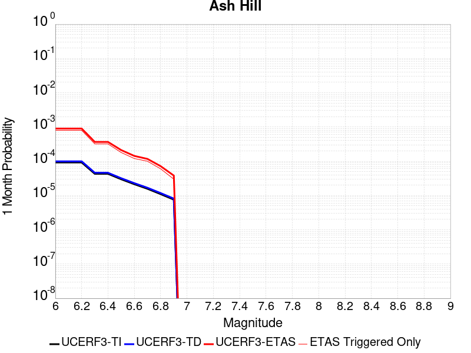 |  |  |

| Magnitude | 1 wk TI Prob | 1 wk TD Prob | 1 wk ETAS Prob | 1 wk ETAS/TD Gain | 1 wk ETAS Triggered Only | 1 mo TI Prob | 1 mo TD Prob | 1 mo ETAS Prob | 1 mo ETAS/TD Gain | 1 mo ETAS Triggered Only | 1 yr TI Prob | 1 yr TD Prob | 1 yr ETAS Prob | 1 yr ETAS/TD Gain | 1 yr ETAS Triggered Only | 10 yr TI Prob | 10 yr TD Prob | 10 yr ETAS Prob | 10 yr ETAS/TD Gain | 10 yr ETAS Triggered Only |
|-----|-----|-----|-----|-----|-----|-----|-----|-----|-----|-----|-----|-----|-----|-----|-----|-----|-----|-----|-----|-----|
| 6.0 | 2.1545662E-5 | 2.3195389E-5 | 2.7956683E-4 | 12.05269 | 2.563774E-4 | 9.2335285E-5 | 9.940547E-5 | 7.6592044E-4 | 7.7050123 | 6.665812E-4 | 0.0011236023 | 0.0012096697 | 0.0045129373 | 3.7307186 | 0.0033072683 | 0.011179381 | 0.012038835 | 0.018700385 | 1.5533385 | 0.006742725 |
| 6.1 | 2.1545662E-5 | 2.3195389E-5 | 2.7956683E-4 | 12.05269 | 2.563774E-4 | 9.2335285E-5 | 9.940547E-5 | 7.6592044E-4 | 7.7050123 | 6.665812E-4 | 0.0011236023 | 0.0012096697 | 0.0045129373 | 3.7307186 | 0.0033072683 | 0.011179381 | 0.012038835 | 0.018700385 | 1.5533385 | 0.006742725 |
| 6.2 | 2.1545662E-5 | 2.3195389E-5 | 2.7956683E-4 | 12.05269 | 2.563774E-4 | 9.2335285E-5 | 9.940547E-5 | 7.6592044E-4 | 7.7050123 | 6.665812E-4 | 0.0011236023 | 0.0012096697 | 0.0045129373 | 3.7307186 | 0.0033072683 | 0.011179381 | 0.012038835 | 0.018700385 | 1.5533385 | 0.006742725 |
| 6.3 | 1.0025529E-5 | 1.0747344E-5 | 1.3893466E-4 | 12.927348 | 1.281887E-4 | 4.2965847E-5 | 4.605931E-5 | 3.7933455E-4 | 8.235785 | 3.332906E-4 | 5.229836E-4 | 5.6064106E-4 | 0.001969926 | 3.513703 | 0.0014100756 | 0.005217545 | 0.0055935793 | 0.008448944 | 1.5104719 | 0.0028714268 |
| 6.4 | 1.0025529E-5 | 1.0747344E-5 | 1.3893466E-4 | 12.927348 | 1.281887E-4 | 4.2965847E-5 | 4.605931E-5 | 3.7933455E-4 | 8.235785 | 3.332906E-4 | 5.229836E-4 | 5.6064106E-4 | 0.001969926 | 3.513703 | 0.0014100756 | 0.005217545 | 0.0055935793 | 0.008448944 | 1.5104719 | 0.0028714268 |
| 6.5 | 6.9617327E-6 | 7.4569152E-6 | 1.100071E-4 | 14.752361 | 1.02550955E-4 | 2.9835655E-5 | 3.1957865E-5 | 2.8832705E-4 | 9.0220995 | 2.563774E-4 | 3.6318856E-4 | 3.8902622E-4 | 0.0013116257 | 3.3715613 | 9.229586E-4 | 0.0036259557 | 0.0038843066 | 0.0058507444 | 1.5062519 | 0.0019741058 |
| 6.6 | 4.9919777E-6 | 5.34689E-6 | 5.662209E-5 | 10.5897255 | 5.1275478E-5 | 2.1394015E-5 | 2.291508E-5 | 2.0237514E-4 | 8.831527 | 1.7946417E-4 | 2.60441E-4 | 2.7896208E-4 | 8.42835E-4 | 3.0213246 | 5.6403026E-4 | 0.0026013597 | 0.0027867774 | 0.0041929237 | 1.5045778 | 0.0014100756 |
| 6.7 | 3.6630722E-6 | 3.9247725E-6 | 5.520005E-5 | 14.064523 | 5.1275478E-5 | 1.5698786E-5 | 1.6820377E-5 | 1.7064423E-4 | 10.145089 | 1.5382643E-4 | 1.9111596E-4 | 2.0477458E-4 | 6.661594E-4 | 3.2531352 | 4.614793E-4 | 0.0019095168 | 0.002046422 | 0.0031210035 | 1.5251026 | 0.001076785 |
| 6.8 | 2.5599613E-6 | 2.7450303E-6 | 2.83827E-5 | 10.339666 | 2.5637739E-5 | 1.0971216E-5 | 1.176439E-5 | 8.86767E-5 | 7.5377216 | 7.691322E-5 | 1.3356637E-4 | 1.4322698E-4 | 4.508358E-4 | 3.1477015 | 3.0765287E-4 | 0.0013348613 | 0.0014318317 | 0.0021742617 | 1.5185175 | 7.434944E-4 |
| 6.9 | 1.7684905E-6 | 1.8969438E-6 | 2.7534634E-5 | 14.515261 | 2.5637739E-5 | 7.579223E-6 | 8.129759E-6 | 5.9404818E-5 | 7.3070827 | 5.1275478E-5 | 9.2273134E-5 | 9.897981E-5 | 3.5533184E-4 | 3.5899422 | 2.563774E-4 | 9.223483E-4 | 9.897981E-4 | 0.0015788825 | 1.5951561 | 5.89668E-4 |

## Garlock (East)
*[(top)](#table-of-contents)*

| 1 Week | 1 Month | 1 Year | 10 Year |
|-----|-----|-----|-----|
|  |  |  |  |

| Magnitude | 1 wk TI Prob | 1 wk TD Prob | 1 wk ETAS Prob | 1 wk ETAS/TD Gain | 1 wk ETAS Triggered Only | 1 mo TI Prob | 1 mo TD Prob | 1 mo ETAS Prob | 1 mo ETAS/TD Gain | 1 mo ETAS Triggered Only | 1 yr TI Prob | 1 yr TD Prob | 1 yr ETAS Prob | 1 yr ETAS/TD Gain | 1 yr ETAS Triggered Only | 10 yr TI Prob | 10 yr TD Prob | 10 yr ETAS Prob | 10 yr ETAS/TD Gain | 10 yr ETAS Triggered Only |
|-----|-----|-----|-----|-----|-----|-----|-----|-----|-----|-----|-----|-----|-----|-----|-----|-----|-----|-----|-----|-----|
| 6.0 | 4.5092507E-5 | 6.2917425E-5 | 2.1673417E-4 | 3.44474 | 1.5382643E-4 | 1.9323928E-4 | 2.6962077E-4 | 9.616531E-4 | 3.5666878 | 6.9221895E-4 | 0.0023501497 | 0.0032781374 | 0.005731292 | 1.748338 | 0.002461223 | 0.023254504 | 0.03235903 | 0.03794086 | 1.1724968 | 0.0057684914 |
| 6.1 | 4.5092507E-5 | 6.2917425E-5 | 2.1673417E-4 | 3.44474 | 1.5382643E-4 | 1.9323928E-4 | 2.6962077E-4 | 9.616531E-4 | 3.5666878 | 6.9221895E-4 | 0.0023501497 | 0.0032781374 | 0.005731292 | 1.748338 | 0.002461223 | 0.023254504 | 0.03235903 | 0.03794086 | 1.1724968 | 0.0057684914 |
| 6.2 | 2.6674514E-5 | 3.452091E-5 | 1.3706832E-4 | 3.9705887 | 1.02550955E-4 | 1.1431433E-4 | 1.4793854E-4 | 6.606175E-4 | 4.4654856 | 5.127548E-4 | 0.0013908884 | 0.0017996968 | 0.0035399254 | 1.9669566 | 0.0017433662 | 0.01382215 | 0.017896036 | 0.021647695 | 1.2096363 | 0.003820023 |
| 6.3 | 2.6674514E-5 | 3.452091E-5 | 1.3706832E-4 | 3.9705887 | 1.02550955E-4 | 1.1431433E-4 | 1.4793854E-4 | 6.606175E-4 | 4.4654856 | 5.127548E-4 | 0.0013908884 | 0.0017996968 | 0.0035399254 | 1.9669566 | 0.0017433662 | 0.01382215 | 0.017896036 | 0.021647695 | 1.2096363 | 0.003820023 |
| 6.4 | 2.5312667E-5 | 3.234991E-5 | 1.3489755E-4 | 4.169951 | 1.02550955E-4 | 1.0847834E-4 | 1.3863528E-4 | 6.51319E-4 | 4.6980753 | 5.127548E-4 | 0.0013199237 | 0.0016866071 | 0.0034014385 | 2.0167344 | 0.0017177284 | 0.013121112 | 0.016783953 | 0.020489445 | 1.220776 | 0.0037687477 |
| 6.5 | 2.5312667E-5 | 3.234991E-5 | 1.3489755E-4 | 4.169951 | 1.02550955E-4 | 1.0847834E-4 | 1.3863528E-4 | 6.51319E-4 | 4.6980753 | 5.127548E-4 | 0.0013199237 | 0.0016866071 | 0.0034014385 | 2.0167344 | 0.0017177284 | 0.013121112 | 0.016783953 | 0.020489445 | 1.220776 | 0.0037687477 |
| 6.6 | 2.246556E-5 | 2.8144346E-5 | 1.3069241E-4 | 4.643647 | 1.02550955E-4 | 9.627742E-5 | 1.20613186E-4 | 6.333061E-4 | 5.2507205 | 5.127548E-4 | 0.0011715472 | 0.0014674999 | 0.0031315074 | 2.1339064 | 0.001666453 | 0.011653901 | 0.0146240825 | 0.018186139 | 1.2435746 | 0.0036149211 |
| 6.7 | 2.2241198E-5 | 2.781406E-5 | 1.3036217E-4 | 4.686916 | 1.02550955E-4 | 9.531594E-5 | 1.1919779E-4 | 6.318914E-4 | 5.301201 | 5.127548E-4 | 0.0011598538 | 0.0014502906 | 0.0031143269 | 2.1473813 | 0.001666453 | 0.011538187 | 0.014454261 | 0.017966397 | 1.2429827 | 0.0035636458 |
| 6.8 | 1.9528685E-5 | 2.3908038E-5 | 1.2645654E-4 | 5.2892895 | 1.02550955E-4 | 8.369167E-5 | 1.0245911E-4 | 5.8952626E-4 | 5.753771 | 4.8711704E-4 | 0.0010184698 | 0.0012467455 | 0.0027574862 | 2.2117474 | 0.0015126265 | 0.010138147 | 0.012441495 | 0.015530385 | 1.2482731 | 0.003127804 |
| 6.9 | 1.3318621E-5 | 1.5207374E-5 | 9.211942E-5 | 6.057549 | 7.691322E-5 | 5.7078556E-5 | 6.517287E-5 | 4.7534995E-4 | 7.2936788 | 4.1020382E-4 | 6.9470983E-4 | 7.931965E-4 | 0.0021765362 | 2.7440064 | 0.0013844379 | 0.0069254204 | 0.007944281 | 0.010665726 | 1.3425666 | 0.0027432381 |
| 7.0 | 1.1760853E-5 | 1.3115987E-5 | 9.0028196E-5 | 6.8640046 | 7.691322E-5 | 5.0402683E-5 | 5.621019E-5 | 4.6639095E-4 | 8.297267 | 4.1020382E-4 | 6.134799E-4 | 6.841492E-4 | 0.0020420197 | 2.984758 | 0.0013588001 | 0.0061178906 | 0.006860767 | 0.009508799 | 1.3859673 | 0.0026663248 |
| 7.1 | 1.0064758E-5 | 1.0910848E-5 | 8.7823224E-5 | 8.049166 | 7.691322E-5 | 4.3133965E-5 | 4.675996E-5 | 4.569446E-4 | 9.772134 | 4.1020382E-4 | 5.2502943E-4 | 5.691573E-4 | 0.0018759378 | 3.2959917 | 0.0013075246 | 0.005237907 | 0.005717105 | 0.008164257 | 1.4280404 | 0.002461223 |
| 7.2 | 9.768808E-6 | 1.0506669E-5 | 8.741908E-5 | 8.320341 | 7.691322E-5 | 4.186565E-5 | 4.5027828E-5 | 4.552132E-4 | 10.109597 | 4.1020382E-4 | 5.095951E-4 | 5.480794E-4 | 0.0018292638 | 3.337589 | 0.001281887 | 0.0050842804 | 0.0055073434 | 0.007929515 | 1.4398077 | 0.0024355853 |
| 7.3 | 9.344516E-6 | 9.95218E-6 | 8.686463E-5 | 8.728201 | 7.691322E-5 | 4.004731E-5 | 4.2651525E-5 | 4.2720122E-4 | 10.016083 | 3.8456608E-4 | 4.8746695E-4 | 5.1916204E-4 | 0.001774759 | 3.4185069 | 0.0012562491 | 0.0048639905 | 0.0052189473 | 0.0075398055 | 1.4446986 | 0.0023330343 |
| 7.4 | 9.023491E-6 | 9.498219E-6 | 8.6410706E-5 | 9.097569 | 7.691322E-5 | 3.867153E-5 | 4.0706036E-5 | 3.9961978E-4 | 9.817212 | 3.5892834E-4 | 4.7072413E-4 | 4.9548666E-4 | 0.0015973632 | 3.223827 | 0.0011024227 | 0.004697283 | 0.004982321 | 0.007023121 | 1.4096084 | 0.002051019 |
| 7.5 | 7.081253E-6 | 7.0943947E-6 | 8.4007064E-5 | 11.84133 | 7.691322E-5 | 3.0347876E-5 | 3.0404199E-5 | 3.1241076E-4 | 10.27525 | 2.8201513E-4 | 3.6942272E-4 | 3.70109E-4 | 0.0010108153 | 2.7311287 | 6.409435E-4 | 0.003688092 | 0.00372781 | 0.0048772073 | 1.3083305 | 0.0011536982 |
| 7.6 | 6.116396E-6 | 5.9656345E-6 | 5.7240806E-5 | 9.595091 | 5.1275478E-5 | 2.6212863E-5 | 2.5566756E-5 | 1.7938926E-4 | 7.0165043 | 1.5382643E-4 | 3.1909486E-4 | 3.1123104E-4 | 7.725667E-4 | 2.4822931 | 4.614793E-4 | 0.0031863707 | 0.0031390795 | 0.0038802403 | 1.2361076 | 7.434944E-4 |
| 7.7 | 4.797145E-6 | 4.763327E-6 | 3.0400945E-5 | 6.382292 | 2.5637739E-5 | 2.055903E-5 | 2.04141E-5 | 9.732575E-5 | 4.767575 | 7.691322E-5 | 2.5027743E-4 | 2.4851345E-4 | 5.048271E-4 | 2.0313876 | 2.563774E-4 | 0.0024999576 | 0.0025124948 | 0.0029216679 | 1.1628554 | 4.1020382E-4 |
| 7.8 | 3.4028885E-6 | 3.9838537E-6 | 2.9621491E-5 | 7.435386 | 2.5637739E-5 | 1.4583726E-5 | 1.7073547E-5 | 6.834815E-5 | 4.0031605 | 5.1275478E-5 | 1.775424E-4 | 2.0785068E-4 | 4.1290995E-4 | 1.9865701 | 2.0510191E-4 | 0.0017740062 | 0.0021040295 | 0.0024366188 | 1.1580726 | 3.332906E-4 |
| 7.9 | 2.5928412E-6 | 3.3770064E-6 | 2.9014658E-5 | 8.591828 | 2.5637739E-5 | 1.1112129E-5 | 1.4472805E-5 | 6.574754E-5 | 4.5428333 | 5.1275478E-5 | 1.3528178E-4 | 1.7619222E-4 | 3.5562477E-4 | 2.018391 | 1.7946417E-4 | 0.0013519945 | 0.0017836117 | 0.00201394 | 1.1291357 | 2.3073965E-4 |
| 8.0 | 1.3743648E-6 | 1.6755408E-6 | 2.7313237E-5 | 16.301147 | 2.5637739E-5 | 5.8901214E-6 | 7.1808695E-6 | 3.2818425E-5 | 4.5702577 | 2.5637739E-5 | 7.1709874E-5 | 8.742361E-5 | 1.899656E-4 | 2.1729324 | 1.02550955E-4 | 7.1686733E-4 | 8.847989E-4 | 9.872591E-4 | 1.1158006 | 1.02550955E-4 |
| 8.1 | 3.6733252E-7 | 3.1526864E-7 | 3.1526864E-7 | 1.0 | 0.0 | 1.5742813E-6 | 1.3511507E-6 | 1.3511507E-6 | 1.0 | 0.0 | 1.9166706E-5 | 1.645015E-5 | 1.645015E-5 | 1.0 | 0.0 | 1.9165053E-4 | 1.6658098E-4 | 1.6658098E-4 | 1.0 | 0.0 |

## Hunter Mountain-Saline Valley
*[(top)](#table-of-contents)*

| 1 Week | 1 Month | 1 Year | 10 Year |
|-----|-----|-----|-----|
|  |  |  |  |

| Magnitude | 1 wk TI Prob | 1 wk TD Prob | 1 wk ETAS Prob | 1 wk ETAS/TD Gain | 1 wk ETAS Triggered Only | 1 mo TI Prob | 1 mo TD Prob | 1 mo ETAS Prob | 1 mo ETAS/TD Gain | 1 mo ETAS Triggered Only | 1 yr TI Prob | 1 yr TD Prob | 1 yr ETAS Prob | 1 yr ETAS/TD Gain | 1 yr ETAS Triggered Only | 10 yr TI Prob | 10 yr TD Prob | 10 yr ETAS Prob | 10 yr ETAS/TD Gain | 10 yr ETAS Triggered Only |
|-----|-----|-----|-----|-----|-----|-----|-----|-----|-----|-----|-----|-----|-----|-----|-----|-----|-----|-----|-----|-----|
| 6.0 | 4.5103672E-5 | 5.4576634E-5 | 2.3403102E-4 | 4.2881174 | 1.7946417E-4 | 1.9328714E-4 | 2.3387549E-4 | 6.183516E-4 | 2.6439352 | 3.8456608E-4 | 0.002350731 | 0.002843864 | 0.004658967 | 1.6382524 | 0.0018202794 | 0.023260195 | 0.028095365 | 0.031509053 | 1.1215036 | 0.0035123702 |
| 6.1 | 4.5103672E-5 | 5.4576634E-5 | 2.3403102E-4 | 4.2881174 | 1.7946417E-4 | 1.9328714E-4 | 2.3387549E-4 | 6.183516E-4 | 2.6439352 | 3.8456608E-4 | 0.002350731 | 0.002843864 | 0.004658967 | 1.6382524 | 0.0018202794 | 0.023260195 | 0.028095365 | 0.031509053 | 1.1215036 | 0.0035123702 |
| 6.2 | 3.9363465E-5 | 4.706859E-5 | 2.2652431E-4 | 4.8126426 | 1.7946417E-4 | 1.6868966E-4 | 2.017032E-4 | 5.861917E-4 | 2.9062092 | 3.8456608E-4 | 0.002051862 | 0.0024531104 | 0.0042689247 | 1.7402089 | 0.0018202794 | 0.020330196 | 0.024276383 | 0.02767847 | 1.1401398 | 0.0034867325 |
| 6.3 | 3.9363465E-5 | 4.706859E-5 | 2.2652431E-4 | 4.8126426 | 1.7946417E-4 | 1.6868966E-4 | 2.017032E-4 | 5.861917E-4 | 2.9062092 | 3.8456608E-4 | 0.002051862 | 0.0024531104 | 0.0042689247 | 1.7402089 | 0.0018202794 | 0.020330196 | 0.024276383 | 0.02767847 | 1.1401398 | 0.0034867325 |
| 6.4 | 3.2311684E-5 | 3.7955346E-5 | 2.174127E-4 | 5.728118 | 1.7946417E-4 | 1.384713E-4 | 1.6265604E-4 | 5.471596E-4 | 3.3639057 | 3.8456608E-4 | 0.0016845843 | 0.0019786113 | 0.003769702 | 1.9052262 | 0.0017946417 | 0.016718714 | 0.019618697 | 0.02296162 | 1.1703948 | 0.0034098192 |
| 6.5 | 3.2311684E-5 | 3.7955346E-5 | 2.174127E-4 | 5.728118 | 1.7946417E-4 | 1.384713E-4 | 1.6265604E-4 | 5.471596E-4 | 3.3639057 | 3.8456608E-4 | 0.0016845843 | 0.0019786113 | 0.003769702 | 1.9052262 | 0.0017946417 | 0.016718714 | 0.019618697 | 0.02296162 | 1.1703948 | 0.0034098192 |
| 6.6 | 2.9305844E-5 | 3.4185676E-5 | 2.1364371E-4 | 6.2495093 | 1.7946417E-4 | 1.2559042E-4 | 1.4650216E-4 | 5.0537795E-4 | 3.4496276 | 3.5892834E-4 | 0.0015279909 | 0.0017822674 | 0.0035481185 | 1.9907892 | 0.0017690039 | 0.015175272 | 0.017687662 | 0.020986801 | 1.186522 | 0.0033585439 |
| 6.7 | 2.7826512E-5 | 3.234788E-5 | 2.1180625E-4 | 6.5477624 | 1.7946417E-4 | 1.19251024E-4 | 1.3862675E-4 | 4.9750536E-4 | 3.5888119 | 3.5892834E-4 | 0.0014509142 | 0.0016865344 | 0.0034269604 | 2.031954 | 0.0017433662 | 0.014414776 | 0.01674504 | 0.020022135 | 1.1957055 | 0.003332906 |
| 6.8 | 2.3389874E-5 | 2.686964E-5 | 2.0632899E-4 | 7.6788893 | 1.7946417E-4 | 1.0023846E-4 | 1.1515078E-4 | 4.740378E-4 | 4.11667 | 3.5892834E-4 | 0.00121972 | 0.0014011064 | 0.0031164282 | 2.2242622 | 0.0017177284 | 0.01213047 | 0.013928941 | 0.0171143 | 1.2286865 | 0.003230355 |
| 6.9 | 2.069209E-5 | 2.3572567E-5 | 2.0303251E-4 | 8.613084 | 1.7946417E-4 | 8.867737E-5 | 1.01021586E-4 | 4.5991366E-4 | 4.5526276 | 3.5892834E-4 | 0.0010791123 | 0.00122928 | 0.0028936844 | 2.353967 | 0.001666453 | 0.010738871 | 0.012229833 | 0.015319385 | 1.2526242 | 0.003127804 |
| 7.0 | 1.7462342E-5 | 1.9635625E-5 | 1.9909628E-4 | 10.139544 | 1.7946417E-4 | 7.483646E-5 | 8.4150095E-5 | 4.4304822E-4 | 5.264976 | 3.5892834E-4 | 9.1075303E-4 | 0.0010240684 | 0.002688815 | 2.6256201 | 0.001666453 | 0.009070295 | 0.010197128 | 0.013293037 | 1.303606 | 0.003127804 |
| 7.1 | 1.4807709E-5 | 1.6443486E-5 | 1.9590471E-4 | 11.913818 | 1.7946417E-4 | 6.3460066E-5 | 7.0470276E-5 | 4.2937332E-4 | 6.092971 | 3.5892834E-4 | 7.723524E-4 | 8.576544E-4 | 0.002522678 | 2.9413693 | 0.001666453 | 0.007696735 | 0.008546432 | 0.011622085 | 1.3598758 | 0.0031021663 |
| 7.2 | 1.4180048E-5 | 1.5700001E-5 | 1.9516135E-4 | 12.430659 | 1.7946417E-4 | 6.077022E-5 | 6.7284076E-5 | 4.2618826E-4 | 6.3341627 | 3.5892834E-4 | 7.396263E-4 | 8.188919E-4 | 0.0024839803 | 3.0333433 | 0.001666453 | 0.0073716943 | 0.008161696 | 0.011238543 | 1.3769863 | 0.0031021663 |
| 7.3 | 1.3730402E-5 | 1.5173691E-5 | 1.9463514E-4 | 12.827145 | 1.7946417E-4 | 5.8843252E-5 | 6.502858E-5 | 4.2393358E-4 | 6.519189 | 3.5892834E-4 | 7.161811E-4 | 7.914514E-4 | 0.0024565856 | 3.1038992 | 0.001666453 | 0.007138774 | 0.007889261 | 0.010966954 | 1.3901117 | 0.0031021663 |
| 7.4 | 1.2810095E-5 | 1.4110805E-5 | 1.9357244E-4 | 13.71803 | 1.7946417E-4 | 5.489925E-5 | 6.0473565E-5 | 4.193802E-4 | 6.9349346 | 3.5892834E-4 | 6.681934E-4 | 7.360327E-4 | 0.0023756404 | 3.2276287 | 0.0016408153 | 0.006661878 | 0.0073388456 | 0.010392796 | 1.416135 | 0.0030765287 |
| 7.5 | 1.1595659E-5 | 1.2802062E-5 | 1.9226393E-4 | 15.018201 | 1.7946417E-4 | 4.9694736E-5 | 5.486491E-5 | 4.1377355E-4 | 7.541679 | 3.5892834E-4 | 6.0486543E-4 | 6.677913E-4 | 0.0022818903 | 3.417071 | 0.0016151775 | 0.006032217 | 0.006660718 | 0.009614887 | 1.443521 | 0.0029739777 |
| 7.6 | 2.997694E-6 | 3.325705E-6 | 1.05876316E-4 | 31.835752 | 1.02550955E-4 | 1.28471975E-5 | 1.4252984E-5 | 1.6807723E-4 | 11.792423 | 1.5382643E-4 | 1.564034E-4 | 1.7352356E-4 | 8.399891E-4 | 4.8407784 | 6.665812E-4 | 0.0015629337 | 0.0017353174 | 0.0029382 | 1.6931773 | 0.0012049737 |

## Blackwater
*[(top)](#table-of-contents)*

| 1 Week | 1 Month | 1 Year | 10 Year |
|-----|-----|-----|-----|
|  |  |  |  |

| Magnitude | 1 wk TI Prob | 1 wk TD Prob | 1 wk ETAS Prob | 1 wk ETAS/TD Gain | 1 wk ETAS Triggered Only | 1 mo TI Prob | 1 mo TD Prob | 1 mo ETAS Prob | 1 mo ETAS/TD Gain | 1 mo ETAS Triggered Only | 1 yr TI Prob | 1 yr TD Prob | 1 yr ETAS Prob | 1 yr ETAS/TD Gain | 1 yr ETAS Triggered Only | 10 yr TI Prob | 10 yr TD Prob | 10 yr ETAS Prob | 10 yr ETAS/TD Gain | 10 yr ETAS Triggered Only |
|-----|-----|-----|-----|-----|-----|-----|-----|-----|-----|-----|-----|-----|-----|-----|-----|-----|-----|-----|-----|-----|
| 6.0 | 3.0708583E-5 | 3.3097214E-5 | 1.6128167E-4 | 4.8729677 | 1.281887E-4 | 1.3160157E-4 | 1.4183826E-4 | 5.263498E-4 | 3.7109153 | 3.8456608E-4 | 0.0016010714 | 0.0017256497 | 0.0030565115 | 1.7712237 | 0.0013331624 | 0.015895851 | 0.017136335 | 0.020134946 | 1.1749855 | 0.003050891 |
| 6.1 | 3.0708583E-5 | 3.3097214E-5 | 1.6128167E-4 | 4.8729677 | 1.281887E-4 | 1.3160157E-4 | 1.4183826E-4 | 5.263498E-4 | 3.7109153 | 3.8456608E-4 | 0.0016010714 | 0.0017256497 | 0.0030565115 | 1.7712237 | 0.0013331624 | 0.015895851 | 0.017136335 | 0.020134946 | 1.1749855 | 0.003050891 |
| 6.2 | 1.1707779E-5 | 1.2545598E-5 | 3.8183014E-5 | 3.0435388 | 2.5637739E-5 | 5.017523E-5 | 5.3765798E-5 | 1.5631123E-4 | 2.9072616 | 1.02550955E-4 | 6.107122E-4 | 6.5441156E-4 | 0.0011668308 | 1.7830229 | 5.127548E-4 | 0.006090366 | 0.0065258164 | 0.0076974565 | 1.1795392 | 0.001179336 |
| 6.3 | 1.1707779E-5 | 1.2545598E-5 | 3.8183014E-5 | 3.0435388 | 2.5637739E-5 | 5.017523E-5 | 5.3765798E-5 | 1.5631123E-4 | 2.9072616 | 1.02550955E-4 | 6.107122E-4 | 6.5441156E-4 | 0.0011668308 | 1.7830229 | 5.127548E-4 | 0.006090366 | 0.0065258164 | 0.0076974565 | 1.1795392 | 0.001179336 |
| 6.4 | 7.929244E-6 | 8.4804105E-6 | 8.4804105E-6 | 1.0 | 0.0 | 3.3982033E-5 | 3.6344132E-5 | 8.761775E-5 | 2.410781 | 5.1275478E-5 | 4.136527E-4 | 4.4240404E-4 | 6.730416E-4 | 1.521328 | 2.3073965E-4 | 0.0041288356 | 0.0044156383 | 0.0050282273 | 1.1387316 | 6.1530573E-4 |
| 6.5 | 5.8832115E-6 | 6.286219E-6 | 6.286219E-6 | 1.0 | 0.0 | 2.521352E-5 | 2.6940676E-5 | 5.2577725E-5 | 1.9516112 | 2.5637739E-5 | 3.0693135E-4 | 3.279559E-4 | 5.3299055E-4 | 1.6251897 | 2.0510191E-4 | 0.0030650778 | 0.0032749726 | 0.0037349404 | 1.1404494 | 4.614793E-4 |
| 6.6 | 5.8832115E-6 | 6.286219E-6 | 6.286219E-6 | 1.0 | 0.0 | 2.521352E-5 | 2.6940676E-5 | 5.2577725E-5 | 1.9516112 | 2.5637739E-5 | 3.0693135E-4 | 3.279559E-4 | 5.3299055E-4 | 1.6251897 | 2.0510191E-4 | 0.0030650778 | 0.0032749726 | 0.0037349404 | 1.1404494 | 4.614793E-4 |
| 6.7 | 3.0715053E-6 | 3.2815851E-6 | 3.2815851E-6 | 1.0 | 0.0 | 1.3163528E-5 | 1.4063868E-5 | 1.4063868E-5 | 1.0 | 0.0 | 1.6025416E-4 | 1.7121529E-4 | 2.4811534E-4 | 1.4491425 | 7.691322E-5 | 0.0016013865 | 0.0017109484 | 0.0019156993 | 1.1196711 | 2.0510191E-4 |
| 6.8 | 2.2722281E-6 | 2.4288424E-6 | 2.4288424E-6 | 1.0 | 0.0 | 9.738084E-6 | 1.0409289E-5 | 1.0409289E-5 | 1.0 | 0.0 | 1.1855473E-4 | 1.2672663E-4 | 1.7799561E-4 | 1.4045635 | 5.1275478E-5 | 0.001184915 | 0.0012666339 | 0.0014458707 | 1.1415064 | 1.7946417E-4 |
| 6.9 | 9.952399E-7 | 1.0653887E-6 | 1.0653887E-6 | 1.0 | 0.0 | 4.265307E-6 | 4.5659463E-6 | 4.5659463E-6 | 1.0 | 0.0 | 5.1928873E-5 | 5.5589495E-5 | 8.122581E-5 | 1.4611719 | 2.5637739E-5 | 5.191674E-4 | 5.558065E-4 | 6.583005E-4 | 1.1844058 | 1.02550955E-4 |
| 7.0 | 4.7385504E-7 | 5.075751E-7 | 5.075751E-7 | 1.0 | 0.0 | 2.0308057E-6 | 2.175322E-6 | 2.175322E-6 | 1.0 | 0.0 | 2.4724779E-5 | 2.6484544E-5 | 2.6484544E-5 | 1.0 | 0.0 | 2.4722028E-4 | 2.6484544E-4 | 2.904764E-4 | 1.096777 | 2.5637739E-5 |

## Garlock (West)
*[(top)](#table-of-contents)*

| 1 Week | 1 Month | 1 Year | 10 Year |
|-----|-----|-----|-----|
|  |  |  |  |

| Magnitude | 1 wk TI Prob | 1 wk TD Prob | 1 wk ETAS Prob | 1 wk ETAS/TD Gain | 1 wk ETAS Triggered Only | 1 mo TI Prob | 1 mo TD Prob | 1 mo ETAS Prob | 1 mo ETAS/TD Gain | 1 mo ETAS Triggered Only | 1 yr TI Prob | 1 yr TD Prob | 1 yr ETAS Prob | 1 yr ETAS/TD Gain | 1 yr ETAS Triggered Only | 10 yr TI Prob | 10 yr TD Prob | 10 yr ETAS Prob | 10 yr ETAS/TD Gain | 10 yr ETAS Triggered Only |
|-----|-----|-----|-----|-----|-----|-----|-----|-----|-----|-----|-----|-----|-----|-----|-----|-----|-----|-----|-----|-----|
| 6.0 | 2.5181727E-5 | 2.5216661E-5 | 1.5340213E-4 | 6.083364 | 1.281887E-4 | 1.0791722E-4 | 1.08066946E-4 | 5.182264E-4 | 4.7954206 | 4.1020382E-4 | 0.0013131002 | 0.0013149243 | 0.0025951257 | 1.9735931 | 0.001281887 | 0.013053683 | 0.013151911 | 0.015251857 | 1.1596684 | 0.0021279324 |
| 6.1 | 2.5077732E-5 | 2.5117724E-5 | 1.533032E-4 | 6.1033874 | 1.281887E-4 | 1.0747157E-4 | 1.0764297E-4 | 5.178026E-4 | 4.8103714 | 4.1020382E-4 | 0.001307681 | 0.0013097686 | 0.0025899766 | 1.9774306 | 0.001281887 | 0.013000126 | 0.013100963 | 0.015201017 | 1.1602978 | 0.0021279324 |
| 6.2 | 2.494612E-5 | 2.4999388E-5 | 1.5318488E-4 | 6.127545 | 1.281887E-4 | 1.0690756E-4 | 1.0713586E-4 | 5.1729573E-4 | 4.8284087 | 4.1020382E-4 | 0.0013008224 | 0.001303602 | 0.0025838178 | 1.9820604 | 0.001281887 | 0.012932341 | 0.013040021 | 0.015140205 | 1.1610568 | 0.0021279324 |
| 6.3 | 2.4733758E-5 | 2.4818735E-5 | 1.5300425E-4 | 6.164869 | 1.281887E-4 | 1.0599751E-4 | 1.0636169E-4 | 5.1652186E-4 | 4.8562775 | 4.1020382E-4 | 0.0012897556 | 0.0012941877 | 0.0025744156 | 1.9892135 | 0.001281887 | 0.012822957 | 0.01294698 | 0.015047362 | 1.1622295 | 0.0021279324 |
| 6.4 | 2.3237335E-5 | 2.3197908E-5 | 1.5138363E-4 | 6.525745 | 1.281887E-4 | 9.958477E-5 | 9.941583E-5 | 4.8394367E-4 | 4.867873 | 3.8456608E-4 | 0.0012117702 | 0.0012097185 | 0.0024644479 | 2.0372078 | 0.0012562491 | 0.012051838 | 0.012111766 | 0.014188598 | 1.1714723 | 0.0021022945 |
| 6.5 | 2.2732203E-5 | 2.3012379E-5 | 1.5119812E-4 | 6.5702953 | 1.281887E-4 | 9.742009E-5 | 9.862077E-5 | 4.831489E-4 | 4.899059 | 3.8456608E-4 | 0.0011854442 | 0.0012000492 | 0.0024547908 | 2.0455751 | 0.0012562491 | 0.011791403 | 0.012016123 | 0.014093157 | 1.1728538 | 0.0021022945 |
| 6.6 | 2.1319436E-5 | 2.1792415E-5 | 1.4997831E-4 | 6.882134 | 1.281887E-4 | 9.136581E-5 | 9.339274E-5 | 4.779229E-4 | 5.117346 | 3.8456608E-4 | 0.001111811 | 0.0011364657 | 0.0023912874 | 2.1041436 | 0.0012562491 | 0.011062649 | 0.011386949 | 0.013465305 | 1.1825209 | 0.0021022945 |
| 6.7 | 1.970802E-5 | 2.0412112E-5 | 1.4859819E-4 | 7.279903 | 1.281887E-4 | 8.446021E-5 | 8.747755E-5 | 4.7201E-4 | 5.3957844 | 3.8456608E-4 | 0.001027818 | 0.0010645206 | 0.0023194323 | 2.1788518 | 0.0012562491 | 0.010230771 | 0.01067459 | 0.012754444 | 1.1948415 | 0.0021022945 |
| 6.8 | 1.8744462E-5 | 1.9919653E-5 | 1.481058E-4 | 7.4351597 | 1.281887E-4 | 8.033094E-5 | 8.536715E-5 | 4.699004E-4 | 5.5044637 | 3.8456608E-4 | 9.775903E-4 | 0.0010388512 | 0.0022937953 | 2.2080114 | 0.0012562491 | 0.009733009 | 0.010420324 | 0.012500712 | 1.1996472 | 0.0021022945 |
| 6.9 | 1.7559682E-5 | 1.8971898E-5 | 1.4715816E-4 | 7.756639 | 1.281887E-4 | 7.5253614E-5 | 8.13056E-5 | 4.6584042E-4 | 5.7294993 | 3.8456608E-4 | 9.158276E-4 | 9.894476E-4 | 0.0022444539 | 2.2683907 | 0.0012562491 | 0.0091206245 | 0.009930745 | 0.012012161 | 1.2095933 | 0.0021022945 |
| 7.0 | 1.6794445E-5 | 1.8234585E-5 | 1.4642093E-4 | 8.029848 | 1.281887E-4 | 7.197421E-5 | 7.814589E-5 | 4.6268193E-4 | 5.920746 | 3.8456608E-4 | 8.759337E-4 | 9.5101225E-4 | 0.0021804534 | 2.292771 | 0.0012306115 | 0.008724891 | 0.009549588 | 0.011606414 | 1.2153836 | 0.0020766568 |
| 7.1 | 1.6337795E-5 | 1.7735292E-5 | 1.4592172E-4 | 8.227759 | 1.281887E-4 | 7.0017246E-5 | 7.600619E-5 | 4.6054303E-4 | 6.0592833 | 3.8456608E-4 | 8.521265E-4 | 9.249838E-4 | 0.002154457 | 2.3291833 | 0.0012306115 | 0.008488664 | 0.009291395 | 0.011323357 | 1.2186929 | 0.002051019 |
| 7.2 | 1.5780008E-5 | 1.7183862E-5 | 1.4537036E-4 | 8.4597025 | 1.281887E-4 | 6.762685E-5 | 7.364305E-5 | 4.5818082E-4 | 6.2216434 | 3.8456608E-4 | 8.2304585E-4 | 8.962366E-4 | 0.0021257452 | 2.3718572 | 0.0012306115 | 0.008200042 | 0.009006202 | 0.0110387495 | 1.2256831 | 0.002051019 |
| 7.3 | 1.5058865E-5 | 1.6636799E-5 | 1.4482337E-4 | 8.705002 | 1.281887E-4 | 6.45364E-5 | 7.129862E-5 | 4.558373E-4 | 6.393353 | 3.8456608E-4 | 7.854473E-4 | 8.6771627E-4 | 0.0020716444 | 2.3874676 | 0.0012049737 | 0.00782677 | 0.008722834 | 0.010705134 | 1.2272542 | 0.0019997435 |
| 7.4 | 1.4887923E-5 | 1.647271E-5 | 1.446593E-4 | 8.781754 | 1.281887E-4 | 6.380382E-5 | 7.059543E-5 | 4.5513437E-4 | 6.4470797 | 3.8456608E-4 | 7.7653467E-4 | 8.591616E-4 | 0.0020631 | 2.4012945 | 0.0012049737 | 0.0077382675 | 0.008637666 | 0.01059472 | 1.2265722 | 0.0019741058 |
| 7.5 | 1.4509299E-5 | 1.6064607E-5 | 1.1861391E-4 | 7.3835554 | 1.02550955E-4 | 6.218123E-5 | 6.884651E-5 | 4.2775014E-4 | 6.213099 | 3.5892834E-4 | 7.567935E-4 | 8.37885E-4 | 0.0018369191 | 2.1923282 | 9.998718E-4 | 0.0075422134 | 0.008425911 | 0.010129166 | 1.202145 | 0.0017177284 |
| 7.6 | 1.2756717E-5 | 1.4067994E-5 | 9.098013E-5 | 6.4671717 | 7.691322E-5 | 5.4670498E-5 | 6.029001E-5 | 2.3974337E-4 | 3.9765022 | 1.7946417E-4 | 6.6541E-4 | 7.3378434E-4 | 0.0014511143 | 1.9775759 | 7.178567E-4 | 0.006634211 | 0.0073905406 | 0.008510265 | 1.1515076 | 0.0011280605 |
| 7.7 | 1.0328985E-5 | 1.147664E-5 | 6.2751526E-5 | 5.4677615 | 5.1275478E-5 | 4.4266326E-5 | 4.9184677E-5 | 1.5173058E-4 | 3.0849159 | 1.02550955E-4 | 5.388092E-4 | 5.986593E-4 | 0.0010342399 | 1.7275935 | 4.3584156E-4 | 0.0053750467 | 0.006046838 | 0.0067348713 | 1.113784 | 6.9221895E-4 |
| 7.8 | 7.0306583E-6 | 8.912468E-6 | 3.454998E-5 | 3.8765895 | 2.5637739E-5 | 3.0131043E-5 | 3.8195732E-5 | 8.946925E-5 | 2.3423886 | 5.1275478E-5 | 3.667837E-4 | 4.6493395E-4 | 7.980696E-4 | 1.7165225 | 3.332906E-4 | 0.003661789 | 0.0047019436 | 0.0052378047 | 1.1139659 | 5.383925E-4 |
| 7.9 | 4.060633E-6 | 5.4729326E-6 | 3.1110532E-5 | 5.684435 | 2.5637739E-5 | 1.7402595E-5 | 2.3455215E-5 | 7.472949E-5 | 3.18605 | 5.1275478E-5 | 2.11856E-4 | 2.8552994E-4 | 5.162037E-4 | 1.8078794 | 2.3073965E-4 | 0.0021165414 | 0.0028881172 | 0.0031948816 | 1.1062161 | 3.0765287E-4 |
| 8.0 | 1.6729537E-6 | 2.0800776E-6 | 2.7717762E-5 | 13.325351 | 2.5637739E-5 | 7.169782E-6 | 8.914588E-6 | 3.4552097E-5 | 3.8759053 | 2.5637739E-5 | 8.7288594E-5 | 1.0852974E-4 | 2.1106956E-4 | 1.9448086 | 1.02550955E-4 | 8.7254314E-4 | 0.0010982669 | 0.0012007053 | 1.0932727 | 1.02550955E-4 |
| 8.1 | 3.6733252E-7 | 3.1526864E-7 | 3.1526864E-7 | 1.0 | 0.0 | 1.5742813E-6 | 1.3511507E-6 | 1.3511507E-6 | 1.0 | 0.0 | 1.9166706E-5 | 1.645015E-5 | 1.645015E-5 | 1.0 | 0.0 | 1.9165053E-4 | 1.6658098E-4 | 1.6658098E-4 | 1.0 | 0.0 |

## So Sierra Nevada
*[(top)](#table-of-contents)*

| 1 Week | 1 Month | 1 Year | 10 Year |
|-----|-----|-----|-----|
|  |  |  |  |

| Magnitude | 1 wk TI Prob | 1 wk TD Prob | 1 wk ETAS Prob | 1 wk ETAS/TD Gain | 1 wk ETAS Triggered Only | 1 mo TI Prob | 1 mo TD Prob | 1 mo ETAS Prob | 1 mo ETAS/TD Gain | 1 mo ETAS Triggered Only | 1 yr TI Prob | 1 yr TD Prob | 1 yr ETAS Prob | 1 yr ETAS/TD Gain | 1 yr ETAS Triggered Only | 10 yr TI Prob | 10 yr TD Prob | 10 yr ETAS Prob | 10 yr ETAS/TD Gain | 10 yr ETAS Triggered Only |
|-----|-----|-----|-----|-----|-----|-----|-----|-----|-----|-----|-----|-----|-----|-----|-----|-----|-----|-----|-----|-----|
| 6.0 | 1.15488665E-5 | 1.1079958E-5 | 1.1362978E-4 | 10.255433 | 1.02550955E-4 | 4.9494203E-5 | 4.7484744E-5 | 2.5257692E-4 | 5.319117 | 2.0510191E-4 | 6.024253E-4 | 5.779862E-4 | 0.0015516571 | 2.6845922 | 9.742341E-4 | 0.006007948 | 0.0057660984 | 0.0077798013 | 1.3492315 | 0.0020253814 |
| 6.1 | 1.15488665E-5 | 1.1079958E-5 | 1.1362978E-4 | 10.255433 | 1.02550955E-4 | 4.9494203E-5 | 4.7484744E-5 | 2.5257692E-4 | 5.319117 | 2.0510191E-4 | 6.024253E-4 | 5.779862E-4 | 0.0015516571 | 2.6845922 | 9.742341E-4 | 0.006007948 | 0.0057660984 | 0.0077798013 | 1.3492315 | 0.0020253814 |
| 6.2 | 1.15488665E-5 | 1.1079958E-5 | 1.1362978E-4 | 10.255433 | 1.02550955E-4 | 4.9494203E-5 | 4.7484744E-5 | 2.5257692E-4 | 5.319117 | 2.0510191E-4 | 6.024253E-4 | 5.779862E-4 | 0.0015516571 | 2.6845922 | 9.742341E-4 | 0.006007948 | 0.0057660984 | 0.0077798013 | 1.3492315 | 0.0020253814 |
| 6.3 | 1.15488665E-5 | 1.1079958E-5 | 1.1362978E-4 | 10.255433 | 1.02550955E-4 | 4.9494203E-5 | 4.7484744E-5 | 2.5257692E-4 | 5.319117 | 2.0510191E-4 | 6.024253E-4 | 5.779862E-4 | 0.0015516571 | 2.6845922 | 9.742341E-4 | 0.006007948 | 0.0057660984 | 0.0077798013 | 1.3492315 | 0.0020253814 |
| 6.4 | 1.15488665E-5 | 1.1079958E-5 | 1.1362978E-4 | 10.255433 | 1.02550955E-4 | 4.9494203E-5 | 4.7484744E-5 | 2.5257692E-4 | 5.319117 | 2.0510191E-4 | 6.024253E-4 | 5.779862E-4 | 0.0015516571 | 2.6845922 | 9.742341E-4 | 0.006007948 | 0.0057660984 | 0.0077798013 | 1.3492315 | 0.0020253814 |
| 6.5 | 1.15488665E-5 | 1.1079958E-5 | 1.1362978E-4 | 10.255433 | 1.02550955E-4 | 4.9494203E-5 | 4.7484744E-5 | 2.5257692E-4 | 5.319117 | 2.0510191E-4 | 6.024253E-4 | 5.779862E-4 | 0.0015516571 | 2.6845922 | 9.742341E-4 | 0.006007948 | 0.0057660984 | 0.0077798013 | 1.3492315 | 0.0020253814 |
| 6.6 | 7.587044E-6 | 6.9358503E-6 | 1.0948609E-4 | 15.785533 | 1.02550955E-4 | 3.2515498E-5 | 2.972475E-5 | 1.8354661E-4 | 6.174875 | 1.5382643E-4 | 3.9580427E-4 | 3.6184167E-4 | 9.256678E-4 | 2.5582125 | 5.6403026E-4 | 0.003951 | 0.0036128166 | 0.0047368016 | 1.3111105 | 0.0011280605 |
| 6.7 | 7.587044E-6 | 6.9358503E-6 | 1.0948609E-4 | 15.785533 | 1.02550955E-4 | 3.2515498E-5 | 2.972475E-5 | 1.8354661E-4 | 6.174875 | 1.5382643E-4 | 3.9580427E-4 | 3.6184167E-4 | 9.256678E-4 | 2.5582125 | 5.6403026E-4 | 0.003951 | 0.0036128166 | 0.0047368016 | 1.3111105 | 0.0011280605 |
| 6.8 | 5.9026956E-6 | 5.179568E-6 | 1.0772999E-4 | 20.79903 | 1.02550955E-4 | 2.5297022E-5 | 2.2197966E-5 | 1.7602099E-4 | 7.9296 | 1.5382643E-4 | 3.0794772E-4 | 2.7022787E-4 | 7.828441E-4 | 2.8969774 | 5.127548E-4 | 0.0030752132 | 0.0026991093 | 0.003645145 | 1.3504994 | 9.4859634E-4 |
| 6.9 | 5.0118915E-6 | 4.2525808E-6 | 1.068031E-4 | 25.114891 | 1.02550955E-4 | 2.1479358E-5 | 1.8225222E-5 | 1.7204885E-4 | 9.440151 | 1.5382643E-4 | 2.614798E-4 | 2.2187021E-4 | 6.832471E-4 | 3.0794902 | 4.614793E-4 | 0.0026117235 | 0.0022165596 | 0.0030863106 | 1.3923879 | 8.716831E-4 |
| 7.0 | 4.4924795E-6 | 3.7140621E-6 | 8.0626996E-5 | 21.708574 | 7.691322E-5 | 1.925334E-5 | 1.5917316E-5 | 1.4410396E-4 | 9.053283 | 1.281887E-4 | 2.3438422E-4 | 1.9377672E-4 | 6.2953384E-4 | 3.2487588 | 4.3584156E-4 | 0.0023413717 | 0.0019361405 | 0.0027805478 | 1.4361291 | 8.460454E-4 |
| 7.1 | 3.9118436E-6 | 3.1121094E-6 | 5.4387427E-5 | 17.476065 | 5.1275478E-5 | 1.6764936E-5 | 1.3337547E-5 | 1.1588713E-4 | 8.688789 | 1.02550955E-4 | 2.0409399E-4 | 1.6237311E-4 | 5.2124314E-4 | 3.2101572 | 3.5892834E-4 | 0.0020390663 | 0.0016226007 | 0.0023904848 | 1.4732429 | 7.6913217E-4 |
| 7.2 | 3.4200818E-6 | 2.605576E-6 | 5.3880918E-5 | 20.679083 | 5.1275478E-5 | 1.4657411E-5 | 1.116671E-5 | 8.807907E-5 | 7.8876476 | 7.691322E-5 | 1.7843937E-4 | 1.3594671E-4 | 4.179235E-4 | 3.0741715 | 2.8201513E-4 | 0.0017829615 | 0.0013586852 | 0.001973155 | 1.4522532 | 6.1530573E-4 |
| 7.3 | 2.6593618E-6 | 1.8285265E-6 | 1.8285265E-6 | 1.0 | 0.0 | 1.13972155E-5 | 7.83652E-6 | 3.3474058E-5 | 4.2715464 | 2.5637739E-5 | 1.3875226E-4 | 9.5405754E-5 | 3.004881E-4 | 3.1495805 | 2.0510191E-4 | 0.0013866565 | 9.536769E-4 | 0.0013891028 | 1.456576 | 4.3584156E-4 |
| 7.4 | 2.2577992E-6 | 1.436535E-6 | 1.436535E-6 | 1.0 | 0.0 | 9.676246E-6 | 6.156565E-6 | 3.1794145E-5 | 5.164267 | 2.5637739E-5 | 1.1780193E-4 | 7.495386E-5 | 2.544046E-4 | 3.3941493 | 1.7946417E-4 | 0.001177395 | 7.493108E-4 | 0.0011335887 | 1.5128418 | 3.8456608E-4 |
| 7.5 | 1.489319E-6 | 7.354697E-7 | 7.354697E-7 | 1.0 | 0.0 | 6.3827797E-6 | 3.1520092E-6 | 2.8789667E-5 | 9.133751 | 2.5637739E-5 | 7.770758E-5 | 3.837504E-5 | 1.4092206E-4 | 3.6722322 | 1.02550955E-4 | 7.7680405E-4 | 3.836846E-4 | 5.887078E-4 | 1.5343536 | 2.0510191E-4 |
| 7.6 | 1.0680322E-6 | 4.6602182E-7 | 4.6602182E-7 | 1.0 | 0.0 | 4.577273E-6 | 1.997235E-6 | 2.7634922E-5 | 13.836592 | 2.5637739E-5 | 5.5726876E-5 | 2.4316065E-5 | 1.2686453E-4 | 5.2173133 | 1.02550955E-4 | 5.5712904E-4 | 2.431343E-4 | 4.2255485E-4 | 1.7379483 | 1.7946417E-4 |
| 7.7 | 5.509146E-7 | 1.558334E-7 | 1.558334E-7 | 1.0 | 0.0 | 2.3610605E-6 | 6.678573E-7 | 6.678573E-7 | 1.0 | 0.0 | 2.8745531E-5 | 8.131134E-6 | 3.3768665E-5 | 4.153008 | 2.5637739E-5 | 2.8741814E-4 | 8.130848E-5 | 1.3257978E-4 | 1.6305777 | 5.1275478E-5 |

## Gravel Hills-Harper Lk
*[(top)](#table-of-contents)*

| 1 Week | 1 Month | 1 Year | 10 Year |
|-----|-----|-----|-----|
|  |  |  |  |

| Magnitude | 1 wk TI Prob | 1 wk TD Prob | 1 wk ETAS Prob | 1 wk ETAS/TD Gain | 1 wk ETAS Triggered Only | 1 mo TI Prob | 1 mo TD Prob | 1 mo ETAS Prob | 1 mo ETAS/TD Gain | 1 mo ETAS Triggered Only | 1 yr TI Prob | 1 yr TD Prob | 1 yr ETAS Prob | 1 yr ETAS/TD Gain | 1 yr ETAS Triggered Only | 10 yr TI Prob | 10 yr TD Prob | 10 yr ETAS Prob | 10 yr ETAS/TD Gain | 10 yr ETAS Triggered Only |
|-----|-----|-----|-----|-----|-----|-----|-----|-----|-----|-----|-----|-----|-----|-----|-----|-----|-----|-----|-----|-----|
| 6.0 | 3.0679566E-5 | 3.1466803E-5 | 5.7103734E-5 | 1.8147295 | 2.5637739E-5 | 1.3147724E-4 | 1.3485197E-4 | 3.1429194E-4 | 2.330644 | 1.7946417E-4 | 0.0015995599 | 0.0016408027 | 0.0024598644 | 1.4991834 | 8.2040764E-4 | 0.015880952 | 0.01630845 | 0.018099042 | 1.1097955 | 0.0018202794 |
| 6.1 | 3.0679566E-5 | 3.1466803E-5 | 5.7103734E-5 | 1.8147295 | 2.5637739E-5 | 1.3147724E-4 | 1.3485197E-4 | 3.1429194E-4 | 2.330644 | 1.7946417E-4 | 0.0015995599 | 0.0016408027 | 0.0024598644 | 1.4991834 | 8.2040764E-4 | 0.015880952 | 0.01630845 | 0.018099042 | 1.1097955 | 0.0018202794 |
| 6.2 | 1.514536E-5 | 1.363595E-5 | 3.927334E-5 | 2.8801322 | 2.5637739E-5 | 6.490707E-5 | 5.8438545E-5 | 1.0971103E-4 | 1.8773744 | 5.1275478E-5 | 7.8995706E-4 | 7.112689E-4 | 9.418444E-4 | 1.3241749 | 2.3073965E-4 | 0.007871548 | 0.007091126 | 0.00775298 | 1.0933356 | 6.665812E-4 |
| 6.3 | 1.514536E-5 | 1.363595E-5 | 3.927334E-5 | 2.8801322 | 2.5637739E-5 | 6.490707E-5 | 5.8438545E-5 | 1.0971103E-4 | 1.8773744 | 5.1275478E-5 | 7.8995706E-4 | 7.112689E-4 | 9.418444E-4 | 1.3241749 | 2.3073965E-4 | 0.007871548 | 0.007091126 | 0.00775298 | 1.0933356 | 6.665812E-4 |
| 6.4 | 1.2532521E-5 | 1.0690234E-5 | 1.0690234E-5 | 1.0 | 0.0 | 5.37097E-5 | 4.5814515E-5 | 4.5814515E-5 | 1.0 | 0.0 | 6.537194E-4 | 5.576548E-4 | 6.8577204E-4 | 1.2297429 | 1.281887E-4 | 0.0065179965 | 0.0055631446 | 0.0059965616 | 1.0779086 | 4.3584156E-4 |
| 6.5 | 1.1094058E-5 | 9.084107E-6 | 9.084107E-6 | 1.0 | 0.0 | 4.7545094E-5 | 3.8931328E-5 | 3.8931328E-5 | 1.0 | 0.0 | 5.787078E-4 | 4.7388987E-4 | 5.251411E-4 | 1.10815 | 5.1275478E-5 | 0.0057720304 | 0.004729201 | 0.004984366 | 1.0539552 | 2.563774E-4 |
| 6.6 | 9.688328E-6 | 7.5320527E-6 | 7.5320527E-6 | 1.0 | 0.0 | 4.1520743E-5 | 3.227984E-5 | 3.227984E-5 | 1.0 | 0.0 | 5.053978E-4 | 3.9293873E-4 | 4.4419407E-4 | 1.1304411 | 5.1275478E-5 | 0.0050424994 | 0.003922696 | 0.0040759193 | 1.0390606 | 1.5382643E-4 |
| 6.7 | 8.974824E-6 | 6.7497303E-6 | 6.7497303E-6 | 1.0 | 0.0 | 3.8462964E-5 | 2.8927108E-5 | 2.8927108E-5 | 1.0 | 0.0 | 4.6818596E-4 | 3.5213283E-4 | 3.7776155E-4 | 1.0727813 | 2.5637739E-5 | 0.004672008 | 0.0035159695 | 0.0036437076 | 1.0363308 | 1.281887E-4 |
| 6.8 | 7.4780046E-6 | 5.1164316E-6 | 5.1164316E-6 | 1.0 | 0.0 | 3.20482E-5 | 2.1927388E-5 | 2.1927388E-5 | 1.0 | 0.0 | 3.9011694E-4 | 2.6693463E-4 | 2.9256553E-4 | 1.0960194 | 2.5637739E-5 | 0.0038943281 | 0.0026662783 | 0.002717417 | 1.0191798 | 5.1275478E-5 |
| 6.9 | 6.3409307E-6 | 3.907683E-6 | 3.907683E-6 | 1.0 | 0.0 | 2.7175134E-5 | 1.674711E-5 | 1.674711E-5 | 1.0 | 0.0 | 3.3080703E-4 | 2.0387798E-4 | 2.295105E-4 | 1.1257248 | 2.5637739E-5 | 0.0033031502 | 0.0020370076 | 0.0020881786 | 1.0251207 | 5.1275478E-5 |
| 7.0 | 5.1239335E-6 | 2.6059872E-6 | 2.6059872E-6 | 1.0 | 0.0 | 2.195953E-5 | 1.116847E-5 | 1.116847E-5 | 1.0 | 0.0 | 2.6732447E-4 | 1.3596789E-4 | 1.3596789E-4 | 1.0 | 0.0 | 0.0026700313 | 0.0013588723 | 0.0013844752 | 1.0188413 | 2.5637739E-5 |
| 7.1 | 4.438899E-6 | 2.0985822E-6 | 2.0985822E-6 | 1.0 | 0.0 | 1.9023713E-5 | 8.993894E-6 | 8.993894E-6 | 1.0 | 0.0 | 2.315891E-4 | 1.0949538E-4 | 1.0949538E-4 | 1.0 | 0.0 | 0.002313479 | 0.0010944362 | 0.0011200459 | 1.0233998 | 2.5637739E-5 |
| 7.2 | 3.50367E-6 | 1.2616524E-6 | 1.2616524E-6 | 1.0 | 0.0 | 1.5015643E-5 | 5.407071E-6 | 5.407071E-6 | 1.0 | 0.0 | 1.8280011E-4 | 6.582918E-5 | 6.582918E-5 | 1.0 | 0.0 | 0.0018264982 | 6.5810507E-4 | 6.837259E-4 | 1.0389313 | 2.5637739E-5 |
| 7.3 | 2.561638E-6 | 7.11978E-7 | 7.11978E-7 | 1.0 | 0.0 | 1.0978401E-5 | 3.0513306E-6 | 3.0513306E-6 | 1.0 | 0.0 | 1.3365384E-4 | 3.7149337E-5 | 3.7149337E-5 | 1.0 | 0.0 | 0.0013357349 | 3.7143327E-4 | 3.7143327E-4 | 1.0 | 0.0 |
| 7.4 | 2.0368864E-6 | 5.3053367E-7 | 5.3053367E-7 | 1.0 | 0.0 | 8.729483E-6 | 2.2737138E-6 | 2.2737138E-6 | 1.0 | 0.0 | 1.06276275E-4 | 2.768212E-5 | 2.768212E-5 | 1.0 | 0.0 | 0.0010622547 | 2.7678726E-4 | 2.7678726E-4 | 1.0 | 0.0 |
| 7.5 | 1.1681728E-6 | 3.6033393E-7 | 3.6033393E-7 | 1.0 | 0.0 | 5.0064455E-6 | 1.5442874E-6 | 1.5442874E-6 | 1.0 | 0.0 | 6.0951766E-5 | 1.8801542E-5 | 1.8801542E-5 | 1.0 | 0.0 | 6.093505E-4 | 1.8799998E-4 | 1.8799998E-4 | 1.0 | 0.0 |
| 7.6 | 1.3154387E-7 | 7.12009E-8 | 7.12009E-8 | 1.0 | 0.0 | 5.6375933E-7 | 3.051467E-7 | 3.051467E-7 | 1.0 | 0.0 | 6.863748E-6 | 3.7151563E-6 | 3.7151563E-6 | 1.0 | 0.0 | 6.863536E-5 | 3.7151098E-5 | 3.7151098E-5 | 1.0 | 0.0 |

## McLean Lake
*[(top)](#table-of-contents)*

| 1 Week | 1 Month | 1 Year | 10 Year |
|-----|-----|-----|-----|
|  |  |  |  |

| Magnitude | 1 wk TI Prob | 1 wk TD Prob | 1 wk ETAS Prob | 1 wk ETAS/TD Gain | 1 wk ETAS Triggered Only | 1 mo TI Prob | 1 mo TD Prob | 1 mo ETAS Prob | 1 mo ETAS/TD Gain | 1 mo ETAS Triggered Only | 1 yr TI Prob | 1 yr TD Prob | 1 yr ETAS Prob | 1 yr ETAS/TD Gain | 1 yr ETAS Triggered Only | 10 yr TI Prob | 10 yr TD Prob | 10 yr ETAS Prob | 10 yr ETAS/TD Gain | 10 yr ETAS Triggered Only |
|-----|-----|-----|-----|-----|-----|-----|-----|-----|-----|-----|-----|-----|-----|-----|-----|-----|-----|-----|-----|-----|
| 6.0 | 1.7360222E-5 | 1.8502275E-5 | 6.9776805E-5 | 3.7712555 | 5.1275478E-5 | 7.439883E-5 | 7.929332E-5 | 2.0747185E-4 | 2.6165109 | 1.281887E-4 | 9.0542925E-4 | 9.6501724E-4 | 0.0015028903 | 1.5573714 | 5.383925E-4 | 0.009017491 | 0.009613109 | 0.011339716 | 1.1796097 | 0.0017433662 |
| 6.1 | 9.062689E-6 | 9.592492E-6 | 3.5229983E-5 | 3.6726627 | 2.5637739E-5 | 3.8839516E-5 | 4.1110077E-5 | 6.674676E-5 | 1.6236107 | 2.5637739E-5 | 4.727685E-4 | 5.0040917E-4 | 7.3103333E-4 | 1.4608712 | 2.3073965E-4 | 0.0047176396 | 0.0049937065 | 0.0058865463 | 1.1787931 | 8.9732086E-4 |
| 6.2 | 9.062689E-6 | 9.592492E-6 | 3.5229983E-5 | 3.6726627 | 2.5637739E-5 | 3.8839516E-5 | 4.1110077E-5 | 6.674676E-5 | 1.6236107 | 2.5637739E-5 | 4.727685E-4 | 5.0040917E-4 | 7.3103333E-4 | 1.4608712 | 2.3073965E-4 | 0.0047176396 | 0.0049937065 | 0.0058865463 | 1.1787931 | 8.9732086E-4 |
| 6.3 | 7.2575485E-6 | 7.66794E-6 | 7.66794E-6 | 1.0 | 0.0 | 3.110341E-5 | 3.2862223E-5 | 3.2862223E-5 | 1.0 | 0.0 | 3.786182E-4 | 4.0003125E-4 | 5.281687E-4 | 1.3203185 | 1.281887E-4 | 0.0037797375 | 0.003993816 | 0.0046066646 | 1.1534493 | 6.1530573E-4 |
| 6.4 | 7.2575485E-6 | 7.66794E-6 | 7.66794E-6 | 1.0 | 0.0 | 3.110341E-5 | 3.2862223E-5 | 3.2862223E-5 | 1.0 | 0.0 | 3.786182E-4 | 4.0003125E-4 | 5.281687E-4 | 1.3203185 | 1.281887E-4 | 0.0037797375 | 0.003993816 | 0.0046066646 | 1.1534493 | 6.1530573E-4 |
| 6.5 | 6.06582E-6 | 6.4040664E-6 | 6.4040664E-6 | 1.0 | 0.0 | 2.5996113E-5 | 2.7445747E-5 | 2.7445747E-5 | 1.0 | 0.0 | 3.164567E-4 | 3.3410723E-4 | 4.1099475E-4 | 1.2301283 | 7.691322E-5 | 0.0031600643 | 0.0033366878 | 0.0037966273 | 1.1378431 | 4.614793E-4 |
| 6.6 | 5.598744E-6 | 5.910437E-6 | 5.910437E-6 | 1.0 | 0.0 | 2.3994397E-5 | 2.5330233E-5 | 2.5330233E-5 | 1.0 | 0.0 | 2.9209262E-4 | 3.0835834E-4 | 3.8524784E-4 | 1.2493511 | 7.691322E-5 | 0.0029170897 | 0.003079934 | 0.0034888743 | 1.1327757 | 4.1020382E-4 |
| 6.7 | 5.246996E-6 | 5.5393257E-6 | 5.5393257E-6 | 1.0 | 0.0 | 2.2486933E-5 | 2.3739787E-5 | 2.3739787E-5 | 1.0 | 0.0 | 2.73744E-4 | 2.8899993E-4 | 3.658909E-4 | 1.2660588 | 7.691322E-5 | 0.0027340704 | 0.0028868648 | 0.0032958845 | 1.141683 | 4.1020382E-4 |
| 6.8 | 4.02324E-6 | 4.2470297E-6 | 4.2470297E-6 | 1.0 | 0.0 | 1.7242342E-5 | 1.8201463E-5 | 1.8201463E-5 | 1.0 | 0.0 | 2.099053E-4 | 2.2158623E-4 | 2.984824E-4 | 1.347026 | 7.691322E-5 | 0.0020970714 | 0.0022142373 | 0.0025467898 | 1.1501883 | 3.332906E-4 |
| 6.9 | 6.835972E-7 | 7.140097E-7 | 7.140097E-7 | 1.0 | 0.0 | 2.9296991E-6 | 3.0600397E-6 | 3.0600397E-6 | 1.0 | 0.0 | 3.56685E-5 | 3.7255664E-5 | 3.7255664E-5 | 1.0 | 0.0 | 3.5662777E-4 | 3.7252545E-4 | 4.4941E-4 | 1.2063874 | 7.691322E-5 |

## Goldstone Lake
*[(top)](#table-of-contents)*

| 1 Week | 1 Month | 1 Year | 10 Year |
|-----|-----|-----|-----|
|  |  |  |  |

| Magnitude | 1 wk TI Prob | 1 wk TD Prob | 1 wk ETAS Prob | 1 wk ETAS/TD Gain | 1 wk ETAS Triggered Only | 1 mo TI Prob | 1 mo TD Prob | 1 mo ETAS Prob | 1 mo ETAS/TD Gain | 1 mo ETAS Triggered Only | 1 yr TI Prob | 1 yr TD Prob | 1 yr ETAS Prob | 1 yr ETAS/TD Gain | 1 yr ETAS Triggered Only | 10 yr TI Prob | 10 yr TD Prob | 10 yr ETAS Prob | 10 yr ETAS/TD Gain | 10 yr ETAS Triggered Only |
|-----|-----|-----|-----|-----|-----|-----|-----|-----|-----|-----|-----|-----|-----|-----|-----|-----|-----|-----|-----|-----|
| 6.0 | 2.671352E-5 | 3.0378242E-5 | 8.1652164E-5 | 2.68785 | 5.1275478E-5 | 1.1448149E-4 | 1.3018708E-4 | 2.583591E-4 | 1.9845217 | 1.281887E-4 | 0.001392921 | 0.0015840717 | 0.0021984028 | 1.3878177 | 6.1530573E-4 | 0.013842222 | 0.015747305 | 0.017337048 | 1.1009533 | 0.0016151775 |
| 6.1 | 2.671352E-5 | 3.0378242E-5 | 8.1652164E-5 | 2.68785 | 5.1275478E-5 | 1.1448149E-4 | 1.3018708E-4 | 2.583591E-4 | 1.9845217 | 1.281887E-4 | 0.001392921 | 0.0015840717 | 0.0021984028 | 1.3878177 | 6.1530573E-4 | 0.013842222 | 0.015747305 | 0.017337048 | 1.1009533 | 0.0016151775 |
| 6.2 | 1.4197047E-5 | 1.6097329E-5 | 4.1734656E-5 | 2.5926447 | 2.5637739E-5 | 6.0843064E-5 | 6.898728E-5 | 1.20259225E-4 | 1.7432085 | 5.1275478E-5 | 7.4051257E-4 | 8.396952E-4 | 0.0011470898 | 1.3660787 | 3.0765287E-4 | 0.007380498 | 0.008374922 | 0.009086766 | 1.0849972 | 7.178567E-4 |
| 6.3 | 1.4197047E-5 | 1.6097329E-5 | 4.1734656E-5 | 2.5926447 | 2.5637739E-5 | 6.0843064E-5 | 6.898728E-5 | 1.20259225E-4 | 1.7432085 | 5.1275478E-5 | 7.4051257E-4 | 8.396952E-4 | 0.0011470898 | 1.3660787 | 3.0765287E-4 | 0.007380498 | 0.008374922 | 0.009086766 | 1.0849972 | 7.178567E-4 |
| 6.4 | 1.3238931E-5 | 1.5009467E-5 | 4.064682E-5 | 2.708079 | 2.5637739E-5 | 5.6737044E-5 | 6.432525E-5 | 1.1559743E-4 | 1.7970771 | 5.1275478E-5 | 6.9055456E-4 | 7.829765E-4 | 0.0010903885 | 1.3926196 | 3.0765287E-4 | 0.006884126 | 0.007811806 | 0.008498617 | 1.0879197 | 6.9221895E-4 |
| 6.5 | 1.3238931E-5 | 1.5009467E-5 | 4.064682E-5 | 2.708079 | 2.5637739E-5 | 5.6737044E-5 | 6.432525E-5 | 1.1559743E-4 | 1.7970771 | 5.1275478E-5 | 6.9055456E-4 | 7.829765E-4 | 0.0010903885 | 1.3926196 | 3.0765287E-4 | 0.006884126 | 0.007811806 | 0.008498617 | 1.0879197 | 6.9221895E-4 |
| 6.6 | 1.1328278E-5 | 1.2856027E-5 | 3.8493436E-5 | 2.9941938 | 2.5637739E-5 | 4.8548856E-5 | 5.5096636E-5 | 1.0636929E-4 | 1.930595 | 5.1275478E-5 | 5.90922E-4 | 6.706908E-4 | 9.5251674E-4 | 1.4202026 | 2.8201513E-4 | 0.0058935313 | 0.0066960566 | 0.007307242 | 1.0912755 | 6.1530573E-4 |
| 6.7 | 8.651175E-6 | 9.825214E-6 | 3.54627E-5 | 3.6093566 | 2.5637739E-5 | 3.707594E-5 | 4.2107888E-5 | 9.3381204E-5 | 2.2176654 | 5.1275478E-5 | 4.5130608E-4 | 5.1263353E-4 | 7.1763026E-4 | 1.3998895 | 2.0510191E-4 | 0.0045039062 | 0.0051233894 | 0.0055825044 | 1.0896115 | 4.614793E-4 |
| 6.8 | 1.0215377E-6 | 1.1755062E-6 | 1.1755062E-6 | 1.0 | 0.0 | 4.378012E-6 | 5.037875E-6 | 5.037875E-6 | 1.0 | 0.0 | 5.3300988E-5 | 6.133451E-5 | 8.697068E-5 | 1.4179729 | 2.5637739E-5 | 5.3288206E-4 | 6.131871E-4 | 6.388091E-4 | 1.041785 | 2.5637739E-5 |
| 6.9 | 7.9360774E-7 | 9.2836456E-7 | 9.2836456E-7 | 1.0 | 0.0 | 3.4011714E-6 | 3.9786996E-6 | 3.9786996E-6 | 1.0 | 0.0 | 4.1408475E-5 | 4.8439662E-5 | 7.407616E-5 | 1.529246 | 2.5637739E-5 | 4.140076E-4 | 4.8429804E-4 | 5.099234E-4 | 1.0529124 | 2.5637739E-5 |
| 7.0 | 7.4382757E-7 | 8.747556E-7 | 8.747556E-7 | 1.0 | 0.0 | 3.1878285E-6 | 3.7489476E-6 | 3.7489476E-6 | 1.0 | 0.0 | 3.8811122E-5 | 4.5642548E-5 | 7.1279115E-5 | 1.5616814 | 2.5637739E-5 | 3.8804344E-4 | 4.5633837E-4 | 4.819644E-4 | 1.0561558 | 2.5637739E-5 |
| 7.1 | 6.4709513E-7 | 7.7114885E-7 | 7.7114885E-7 | 1.0 | 0.0 | 2.773262E-6 | 3.3049198E-6 | 3.3049198E-6 | 1.0 | 0.0 | 3.376394E-5 | 4.0236715E-5 | 6.587342E-5 | 1.6371471 | 2.5637739E-5 | 3.375881E-4 | 4.0230027E-4 | 4.2792768E-4 | 1.0637022 | 2.5637739E-5 |
| 7.2 | 6.356704E-7 | 7.588543E-7 | 7.588543E-7 | 1.0 | 0.0 | 2.7242988E-6 | 3.2522291E-6 | 3.2522291E-6 | 1.0 | 0.0 | 3.3167835E-5 | 3.959523E-5 | 6.523195E-5 | 1.64747 | 2.5637739E-5 | 3.3162883E-4 | 3.9588768E-4 | 4.2151526E-4 | 1.0647345 | 2.5637739E-5 |
| 7.3 | 5.7695723E-7 | 6.8967347E-7 | 6.8967347E-7 | 1.0 | 0.0 | 2.4726714E-6 | 2.9557402E-6 | 2.9557402E-6 | 1.0 | 0.0 | 3.0104358E-5 | 3.5985602E-5 | 6.162242E-5 | 1.7124187 | 2.5637739E-5 | 3.0100282E-4 | 3.5980347E-4 | 3.85432E-4 | 1.0712292 | 2.5637739E-5 |
| 7.4 | 5.209647E-7 | 6.1936566E-7 | 6.1936566E-7 | 1.0 | 0.0 | 2.232704E-6 | 2.654422E-6 | 2.654422E-6 | 1.0 | 0.0 | 2.718283E-5 | 3.2317163E-5 | 3.2317163E-5 | 1.0 | 0.0 | 2.7179506E-4 | 3.231302E-4 | 3.231302E-4 | 1.0 | 0.0 |
| 7.5 | 4.512955E-7 | 5.3490027E-7 | 5.3490027E-7 | 1.0 | 0.0 | 1.934122E-6 | 2.292428E-6 | 2.292428E-6 | 1.0 | 0.0 | 2.3547682E-5 | 2.7910008E-5 | 2.7910008E-5 | 1.0 | 0.0 | 2.3545188E-4 | 2.7907031E-4 | 2.7907031E-4 | 1.0 | 0.0 |
| 7.6 | 2.21172E-7 | 2.6040124E-7 | 2.6040124E-7 | 1.0 | 0.0 | 9.478797E-7 | 1.116005E-6 | 1.116005E-6 | 1.0 | 0.0 | 1.1540374E-5 | 1.3587305E-5 | 1.3587305E-5 | 1.0 | 0.0 | 1.1539775E-4 | 1.3586757E-4 | 1.3586757E-4 | 1.0 | 0.0 |

## Lenwood-Lockhart-Old Woman Springs
*[(top)](#table-of-contents)*

| 1 Week | 1 Month | 1 Year | 10 Year |
|-----|-----|-----|-----|
|  |  |  |  |

| Magnitude | 1 wk TI Prob | 1 wk TD Prob | 1 wk ETAS Prob | 1 wk ETAS/TD Gain | 1 wk ETAS Triggered Only | 1 mo TI Prob | 1 mo TD Prob | 1 mo ETAS Prob | 1 mo ETAS/TD Gain | 1 mo ETAS Triggered Only | 1 yr TI Prob | 1 yr TD Prob | 1 yr ETAS Prob | 1 yr ETAS/TD Gain | 1 yr ETAS Triggered Only | 10 yr TI Prob | 10 yr TD Prob | 10 yr ETAS Prob | 10 yr ETAS/TD Gain | 10 yr ETAS Triggered Only |
|-----|-----|-----|-----|-----|-----|-----|-----|-----|-----|-----|-----|-----|-----|-----|-----|-----|-----|-----|-----|-----|
| 6.0 | 3.744542E-5 | 4.3964304E-5 | 1.2087414E-4 | 2.7493699 | 7.691322E-5 | 1.604705E-4 | 1.8840581E-4 | 3.1657037E-4 | 1.6802579 | 1.281887E-4 | 0.0019519776 | 0.0022915998 | 0.0030845485 | 1.346024 | 7.947699E-4 | 0.019349206 | 0.0226977 | 0.024000604 | 1.0574024 | 0.0013331624 |
| 6.1 | 3.744542E-5 | 4.3964304E-5 | 1.2087414E-4 | 2.7493699 | 7.691322E-5 | 1.604705E-4 | 1.8840581E-4 | 3.1657037E-4 | 1.6802579 | 1.281887E-4 | 0.0019519776 | 0.0022915998 | 0.0030845485 | 1.346024 | 7.947699E-4 | 0.019349206 | 0.0226977 | 0.024000604 | 1.0574024 | 0.0013331624 |
| 6.2 | 3.744542E-5 | 4.3964304E-5 | 1.2087414E-4 | 2.7493699 | 7.691322E-5 | 1.604705E-4 | 1.8840581E-4 | 3.1657037E-4 | 1.6802579 | 1.281887E-4 | 0.0019519776 | 0.0022915998 | 0.0030845485 | 1.346024 | 7.947699E-4 | 0.019349206 | 0.0226977 | 0.024000604 | 1.0574024 | 0.0013331624 |
| 6.3 | 2.1079984E-5 | 2.5354084E-5 | 7.662826E-5 | 3.022324 | 5.1275478E-5 | 9.0339665E-5 | 1.0865595E-4 | 1.8556081E-4 | 1.7077832 | 7.691322E-5 | 0.0010993304 | 0.0013221033 | 0.0016037456 | 1.2130259 | 2.8201513E-4 | 0.010939079 | 0.013144593 | 0.013625307 | 1.0365713 | 4.8711704E-4 |
| 6.4 | 2.1079984E-5 | 2.5354084E-5 | 7.662826E-5 | 3.022324 | 5.1275478E-5 | 9.0339665E-5 | 1.0865595E-4 | 1.8556081E-4 | 1.7077832 | 7.691322E-5 | 0.0010993304 | 0.0013221033 | 0.0016037456 | 1.2130259 | 2.8201513E-4 | 0.010939079 | 0.013144593 | 0.013625307 | 1.0365713 | 4.8711704E-4 |
| 6.5 | 1.7397282E-5 | 2.0662914E-5 | 7.1937335E-5 | 3.4814708 | 5.1275478E-5 | 7.455765E-5 | 8.8552406E-5 | 1.6545881E-4 | 1.8684847 | 7.691322E-5 | 9.073613E-4 | 0.001077604 | 0.0013337051 | 1.2376579 | 2.563774E-4 | 0.009036654 | 0.010725081 | 0.01108016 | 1.0331073 | 3.5892834E-4 |
| 6.6 | 1.52050325E-5 | 1.7680117E-5 | 6.895469E-5 | 3.9001265 | 5.1275478E-5 | 6.51628E-5 | 7.576977E-5 | 1.5267715E-4 | 2.0150142 | 7.691322E-5 | 7.9306826E-4 | 9.221144E-4 | 0.0011526413 | 1.2499981 | 2.3073965E-4 | 0.007902439 | 0.009183745 | 0.009488572 | 1.033192 | 3.0765287E-4 |
| 6.7 | 1.332523E-5 | 1.5264359E-5 | 6.6539054E-5 | 4.3591123 | 5.1275478E-5 | 5.7106878E-5 | 6.541707E-5 | 1.4232525E-4 | 2.1756592 | 7.691322E-5 | 6.950544E-4 | 7.9616765E-4 | 0.0010267235 | 1.2895821 | 2.3073965E-4 | 0.006928845 | 0.007933783 | 0.0082389945 | 1.0384699 | 3.0765287E-4 |
| 6.8 | 1.1525329E-5 | 1.3031262E-5 | 3.8668666E-5 | 2.967377 | 2.5637739E-5 | 4.9393333E-5 | 5.5847093E-5 | 8.14834E-5 | 1.4590446 | 2.5637739E-5 | 6.011979E-4 | 6.797305E-4 | 7.822117E-4 | 1.1507674 | 1.02550955E-4 | 0.00599574 | 0.0067769657 | 0.006955214 | 1.026302 | 1.7946417E-4 |
| 6.9 | 1.0253909E-5 | 1.1514676E-5 | 1.1514676E-5 | 1.0 | 0.0 | 4.3944583E-5 | 4.93477E-5 | 4.93477E-5 | 1.0 | 0.0 | 5.3489394E-4 | 6.006462E-4 | 6.518909E-4 | 1.085316 | 5.1275478E-5 | 0.0053360825 | 0.005990607 | 0.0060925437 | 1.017016 | 1.02550955E-4 |
| 7.0 | 8.104563E-6 | 8.991446E-6 | 8.991446E-6 | 1.0 | 0.0 | 3.4733377E-5 | 3.8534214E-5 | 3.8534214E-5 | 1.0 | 0.0 | 4.2279682E-4 | 4.6905546E-4 | 4.6905546E-4 | 1.0 | 0.0 | 0.0042199334 | 0.004680902 | 0.004731938 | 1.0109029 | 5.1275478E-5 |
| 7.1 | 6.7986157E-6 | 7.515946E-6 | 7.515946E-6 | 1.0 | 0.0 | 2.91366E-5 | 3.221081E-5 | 3.221081E-5 | 1.0 | 0.0 | 3.5468035E-4 | 3.9209818E-4 | 3.9209818E-4 | 1.0 | 0.0 | 0.003541148 | 0.0039142803 | 0.003965355 | 1.0130483 | 5.1275478E-5 |
| 7.2 | 5.6893327E-6 | 6.280115E-6 | 6.280115E-6 | 1.0 | 0.0 | 2.4382627E-5 | 2.6914513E-5 | 2.6914513E-5 | 1.0 | 0.0 | 2.9681803E-4 | 3.2763692E-4 | 3.2763692E-4 | 1.0 | 0.0 | 0.002964219 | 0.0032717374 | 0.003322845 | 1.015621 | 5.1275478E-5 |
| 7.3 | 4.253348E-6 | 4.7069766E-6 | 4.7069766E-6 | 1.0 | 0.0 | 1.8228506E-5 | 2.0172612E-5 | 2.0172612E-5 | 1.0 | 0.0 | 2.2190946E-4 | 2.455757E-4 | 2.455757E-4 | 1.0 | 0.0 | 0.00221688 | 0.0024532243 | 0.002478799 | 1.010425 | 2.5637739E-5 |
| 7.4 | 2.5448119E-6 | 2.8520785E-6 | 2.8520785E-6 | 1.0 | 0.0 | 1.0906291E-5 | 1.2223146E-5 | 1.2223146E-5 | 1.0 | 0.0 | 1.3277601E-4 | 1.4880829E-4 | 1.4880829E-4 | 1.0 | 0.0 | 0.001326967 | 0.0014872487 | 0.0015128483 | 1.0172127 | 2.5637739E-5 |
| 7.5 | 4.3706837E-8 | 4.5630156E-8 | 4.5630156E-8 | 1.0 | 0.0 | 1.8731501E-7 | 1.955578E-7 | 1.955578E-7 | 1.0 | 0.0 | 2.2805577E-6 | 2.380914E-6 | 2.380914E-6 | 1.0 | 0.0 | 2.2805343E-5 | 2.3808941E-5 | 2.3808941E-5 | 1.0 | 0.0 |

## Coyote Canyon
*[(top)](#table-of-contents)*

| 1 Week | 1 Month | 1 Year | 10 Year |
|-----|-----|-----|-----|
|  |  |  |  |

| Magnitude | 1 wk TI Prob | 1 wk TD Prob | 1 wk ETAS Prob | 1 wk ETAS/TD Gain | 1 wk ETAS Triggered Only | 1 mo TI Prob | 1 mo TD Prob | 1 mo ETAS Prob | 1 mo ETAS/TD Gain | 1 mo ETAS Triggered Only | 1 yr TI Prob | 1 yr TD Prob | 1 yr ETAS Prob | 1 yr ETAS/TD Gain | 1 yr ETAS Triggered Only | 10 yr TI Prob | 10 yr TD Prob | 10 yr ETAS Prob | 10 yr ETAS/TD Gain | 10 yr ETAS Triggered Only |
|-----|-----|-----|-----|-----|-----|-----|-----|-----|-----|-----|-----|-----|-----|-----|-----|-----|-----|-----|-----|-----|
| 6.0 | 3.5090034E-5 | 4.0367544E-5 | 6.600425E-5 | 1.635082 | 2.5637739E-5 | 1.503772E-4 | 1.7299375E-4 | 3.0116027E-4 | 1.7408737 | 1.281887E-4 | 0.0018293047 | 0.0021044204 | 0.0026928475 | 1.2796148 | 5.89668E-4 | 0.018143194 | 0.020870851 | 0.021925164 | 1.050516 | 0.001076785 |
| 6.1 | 3.5090034E-5 | 4.0367544E-5 | 6.600425E-5 | 1.635082 | 2.5637739E-5 | 1.503772E-4 | 1.7299375E-4 | 3.0116027E-4 | 1.7408737 | 1.281887E-4 | 0.0018293047 | 0.0021044204 | 0.0026928475 | 1.2796148 | 5.89668E-4 | 0.018143194 | 0.020870851 | 0.021925164 | 1.050516 | 0.001076785 |
| 6.2 | 1.841879E-5 | 2.1061396E-5 | 4.6698595E-5 | 2.2172601 | 2.5637739E-5 | 7.8935285E-5 | 9.026058E-5 | 1.4153143E-4 | 1.5680314 | 5.1275478E-5 | 9.606133E-4 | 0.0010984705 | 0.0014826142 | 1.3497077 | 3.8456608E-4 | 0.0095647145 | 0.010940496 | 0.011599784 | 1.0602612 | 6.665812E-4 |
| 6.3 | 1.841879E-5 | 2.1061396E-5 | 4.6698595E-5 | 2.2172601 | 2.5637739E-5 | 7.8935285E-5 | 9.026058E-5 | 1.4153143E-4 | 1.5680314 | 5.1275478E-5 | 9.606133E-4 | 0.0010984705 | 0.0014826142 | 1.3497077 | 3.8456608E-4 | 0.0095647145 | 0.010940496 | 0.011599784 | 1.0602612 | 6.665812E-4 |
| 6.4 | 1.712201E-5 | 1.9566693E-5 | 4.520393E-5 | 2.3102489 | 2.5637739E-5 | 7.337798E-5 | 8.385513E-5 | 1.351263E-4 | 1.6114256 | 5.1275478E-5 | 8.930107E-4 | 0.0010205585 | 0.0013791206 | 1.351339 | 3.5892834E-4 | 0.008894307 | 0.010168637 | 0.010777687 | 1.0598948 | 6.1530573E-4 |
| 6.5 | 1.4744935E-5 | 1.683824E-5 | 4.2475545E-5 | 2.5225646 | 2.5637739E-5 | 6.3191044E-5 | 7.216242E-5 | 1.2343419E-4 | 1.7105052 | 5.1275478E-5 | 7.6907943E-4 | 8.7831676E-4 | 0.0012369299 | 1.4082959 | 3.5892834E-4 | 0.007664232 | 0.008757652 | 0.0092659155 | 1.0580366 | 5.127548E-4 |
| 6.6 | 1.2017839E-5 | 1.3725124E-5 | 1.3725124E-5 | 1.0 | 0.0 | 5.150401E-5 | 5.882113E-5 | 5.882113E-5 | 1.0 | 0.0 | 6.268809E-4 | 7.1600056E-4 | 9.7219436E-4 | 1.3578123 | 2.563774E-4 | 0.0062511545 | 0.007145631 | 0.007527449 | 1.0534338 | 3.8456608E-4 |
| 6.7 | 1.00956095E-5 | 1.1534388E-5 | 1.1534388E-5 | 1.0 | 0.0 | 4.326618E-5 | 4.943265E-5 | 4.943265E-5 | 1.0 | 0.0 | 5.266384E-4 | 6.0176325E-4 | 8.323641E-4 | 1.3832085 | 2.3073965E-4 | 0.005253921 | 0.006009866 | 0.00631567 | 1.0508837 | 3.0765287E-4 |

## Death Valley (So)
*[(top)](#table-of-contents)*

| 1 Week | 1 Month | 1 Year | 10 Year |
|-----|-----|-----|-----|
|  |  |  |  |

| Magnitude | 1 wk TI Prob | 1 wk TD Prob | 1 wk ETAS Prob | 1 wk ETAS/TD Gain | 1 wk ETAS Triggered Only | 1 mo TI Prob | 1 mo TD Prob | 1 mo ETAS Prob | 1 mo ETAS/TD Gain | 1 mo ETAS Triggered Only | 1 yr TI Prob | 1 yr TD Prob | 1 yr ETAS Prob | 1 yr ETAS/TD Gain | 1 yr ETAS Triggered Only | 10 yr TI Prob | 10 yr TD Prob | 10 yr ETAS Prob | 10 yr ETAS/TD Gain | 10 yr ETAS Triggered Only |
|-----|-----|-----|-----|-----|-----|-----|-----|-----|-----|-----|-----|-----|-----|-----|-----|-----|-----|-----|-----|-----|
| 6.0 | 2.0684236E-5 | 2.562036E-5 | 2.562036E-5 | 1.0 | 0.0 | 8.864371E-5 | 1.0979702E-4 | 1.3543194E-4 | 1.2334756 | 2.5637739E-5 | 0.0010787029 | 0.0013359758 | 0.0016432178 | 1.2299756 | 3.0765287E-4 | 0.010734817 | 0.013282726 | 0.014294613 | 1.0761807 | 0.0010255096 |
| 6.1 | 2.0684236E-5 | 2.562036E-5 | 2.562036E-5 | 1.0 | 0.0 | 8.864371E-5 | 1.0979702E-4 | 1.3543194E-4 | 1.2334756 | 2.5637739E-5 | 0.0010787029 | 0.0013359758 | 0.0016432178 | 1.2299756 | 3.0765287E-4 | 0.010734817 | 0.013282726 | 0.014294613 | 1.0761807 | 0.0010255096 |
| 6.2 | 2.0684236E-5 | 2.562036E-5 | 2.562036E-5 | 1.0 | 0.0 | 8.864371E-5 | 1.0979702E-4 | 1.3543194E-4 | 1.2334756 | 2.5637739E-5 | 0.0010787029 | 0.0013359758 | 0.0016432178 | 1.2299756 | 3.0765287E-4 | 0.010734817 | 0.013282726 | 0.014294613 | 1.0761807 | 0.0010255096 |
| 6.3 | 2.0240292E-5 | 2.5120411E-5 | 2.5120411E-5 | 1.0 | 0.0 | 8.6741224E-5 | 1.0765456E-4 | 1.3328953E-4 | 1.2381226 | 2.5637739E-5 | 0.0010555626 | 0.0013099229 | 0.0015915687 | 1.2150093 | 2.8201513E-4 | 0.010505628 | 0.013025268 | 0.014012116 | 1.0757642 | 9.998718E-4 |
| 6.4 | 2.0240292E-5 | 2.5120411E-5 | 2.5120411E-5 | 1.0 | 0.0 | 8.6741224E-5 | 1.0765456E-4 | 1.3328953E-4 | 1.2381226 | 2.5637739E-5 | 0.0010555626 | 0.0013099229 | 0.0015915687 | 1.2150093 | 2.8201513E-4 | 0.010505628 | 0.013025268 | 0.014012116 | 1.0757642 | 9.998718E-4 |
| 6.5 | 1.9962767E-5 | 2.4809646E-5 | 2.4809646E-5 | 1.0 | 0.0 | 8.55519E-5 | 1.0632281E-4 | 1.3195783E-4 | 1.2411054 | 2.5637739E-5 | 0.0010410968 | 0.0012937282 | 0.001549774 | 1.197913 | 2.563774E-4 | 0.010362327 | 0.012865204 | 0.013801597 | 1.0727849 | 9.4859634E-4 |
| 6.6 | 1.8937297E-5 | 2.331338E-5 | 2.331338E-5 | 1.0 | 0.0 | 8.115732E-5 | 9.991074E-5 | 1.2554592E-4 | 1.2565808 | 2.5637739E-5 | 9.876423E-4 | 0.0012157491 | 0.0014462082 | 1.1895615 | 2.3073965E-4 | 0.009832645 | 0.012094032 | 0.01287919 | 1.0649211 | 7.947699E-4 |
| 6.7 | 1.8621096E-5 | 2.2913995E-5 | 2.2913995E-5 | 1.0 | 0.0 | 7.980225E-5 | 9.819922E-5 | 1.2383444E-4 | 1.2610532 | 2.5637739E-5 | 9.711593E-4 | 0.0011949344 | 0.001374184 | 1.150008 | 1.7946417E-4 | 0.009669261 | 0.011888134 | 0.012546791 | 1.0554045 | 6.665812E-4 |
| 6.8 | 1.7830353E-5 | 2.1807928E-5 | 2.1807928E-5 | 1.0 | 0.0 | 7.641356E-5 | 9.3459275E-5 | 1.1909462E-4 | 1.2742943 | 2.5637739E-5 | 9.29938E-4 | 0.0011372868 | 0.0013165468 | 1.1576208 | 1.7946417E-4 | 0.009260561 | 0.011317508 | 0.01192585 | 1.0537523 | 6.1530573E-4 |
| 6.9 | 1.3135183E-5 | 1.530519E-5 | 1.530519E-5 | 1.0 | 0.0 | 5.6292425E-5 | 6.559206E-5 | 6.559206E-5 | 1.0 | 0.0 | 6.8514474E-4 | 7.9829723E-4 | 9.263836E-4 | 1.1604495 | 1.281887E-4 | 0.006830362 | 0.007955303 | 0.008387677 | 1.0543505 | 4.3584156E-4 |
| 7.0 | 1.1507512E-5 | 1.3155178E-5 | 1.3155178E-5 | 1.0 | 0.0 | 4.9316975E-5 | 5.6378147E-5 | 5.6378147E-5 | 1.0 | 0.0 | 6.002687E-4 | 6.861935E-4 | 7.886741E-4 | 1.1493465 | 1.02550955E-4 | 0.0059864987 | 0.0068414486 | 0.007197921 | 1.0521048 | 3.5892834E-4 |
| 7.1 | 9.715903E-6 | 1.08659815E-5 | 1.08659815E-5 | 1.0 | 0.0 | 4.1638916E-5 | 4.6567682E-5 | 4.6567682E-5 | 1.0 | 0.0 | 5.068359E-4 | 5.6681834E-4 | 6.4368796E-4 | 1.135616 | 7.691322E-5 | 0.0050568148 | 0.0056541795 | 0.005832629 | 1.0315607 | 1.7946417E-4 |
| 7.2 | 9.233269E-6 | 1.0286961E-5 | 1.0286961E-5 | 1.0 | 0.0 | 3.9570554E-5 | 4.4086253E-5 | 4.4086253E-5 | 1.0 | 0.0 | 4.81665E-4 | 5.366222E-4 | 5.8787013E-4 | 1.0955011 | 5.1275478E-5 | 0.0048062233 | 0.0053536952 | 0.0054556974 | 1.0190526 | 1.02550955E-4 |
| 7.3 | 8.8041315E-6 | 9.80876E-6 | 9.80876E-6 | 1.0 | 0.0 | 3.7731446E-5 | 4.203689E-5 | 4.203689E-5 | 1.0 | 0.0 | 4.592835E-4 | 5.116832E-4 | 5.629324E-4 | 1.1001581 | 5.1275478E-5 | 0.0045833546 | 0.005105477 | 0.0051819975 | 1.014988 | 7.691322E-5 |
| 7.4 | 8.708749E-6 | 9.707768E-6 | 9.707768E-6 | 1.0 | 0.0 | 3.7322676E-5 | 4.1604082E-5 | 4.1604082E-5 | 1.0 | 0.0 | 4.5430884E-4 | 5.0641614E-4 | 5.5766565E-4 | 1.1012003 | 5.1275478E-5 | 0.004533812 | 0.0050530476 | 0.005129572 | 1.0151442 | 7.691322E-5 |
| 7.5 | 8.612678E-6 | 9.605406E-6 | 9.605406E-6 | 1.0 | 0.0 | 3.6910955E-5 | 4.1165404E-5 | 4.1165404E-5 | 1.0 | 0.0 | 4.492982E-4 | 5.0107774E-4 | 5.523275E-4 | 1.1022791 | 5.1275478E-5 | 0.004483909 | 0.004999905 | 0.0050764335 | 1.015306 | 7.691322E-5 |
| 7.6 | 8.319024E-6 | 9.28449E-6 | 9.28449E-6 | 1.0 | 0.0 | 3.5652476E-5 | 3.9790088E-5 | 3.9790088E-5 | 1.0 | 0.0 | 4.3398244E-4 | 4.8434082E-4 | 5.3559145E-4 | 1.1058153 | 5.1275478E-5 | 0.0043313587 | 0.0048332764 | 0.0049098176 | 1.0158364 | 7.691322E-5 |
| 7.7 | 7.4718328E-6 | 8.345689E-6 | 8.345689E-6 | 1.0 | 0.0 | 3.2021748E-5 | 3.576677E-5 | 3.576677E-5 | 1.0 | 0.0 | 3.8979502E-4 | 4.3537747E-4 | 4.6100406E-4 | 1.0588605 | 2.5637739E-5 | 0.00389112 | 0.0043456503 | 0.004396703 | 1.011748 | 5.1275478E-5 |
| 7.8 | 3.4586725E-7 | 3.648368E-7 | 3.648368E-7 | 1.0 | 0.0 | 1.4822873E-6 | 1.5635853E-6 | 1.5635853E-6 | 1.0 | 0.0 | 1.80467E-5 | 1.903649E-5 | 1.903649E-5 | 1.0 | 0.0 | 1.8045233E-4 | 1.9034903E-4 | 1.9034903E-4 | 1.0 | 0.0 |
| 7.9 | 2.5591178E-9 | 2.6697329E-9 | 2.6697329E-9 | 1.0 | 0.0 | 1.0967647E-8 | 1.14417125E-8 | 1.14417125E-8 | 1.0 | 0.0 | 1.335311E-7 | 1.3930286E-7 | 1.3930286E-7 | 1.0 | 0.0 | 1.3353102E-6 | 1.3930285E-6 | 1.3930285E-6 | 1.0 | 0.0 |

## San Andreas (Mojave S)
*[(top)](#table-of-contents)*

| 1 Week | 1 Month | 1 Year | 10 Year |
|-----|-----|-----|-----|
|  |  |  |  |

| Magnitude | 1 wk TI Prob | 1 wk TD Prob | 1 wk ETAS Prob | 1 wk ETAS/TD Gain | 1 wk ETAS Triggered Only | 1 mo TI Prob | 1 mo TD Prob | 1 mo ETAS Prob | 1 mo ETAS/TD Gain | 1 mo ETAS Triggered Only | 1 yr TI Prob | 1 yr TD Prob | 1 yr ETAS Prob | 1 yr ETAS/TD Gain | 1 yr ETAS Triggered Only | 10 yr TI Prob | 10 yr TD Prob | 10 yr ETAS Prob | 10 yr ETAS/TD Gain | 10 yr ETAS Triggered Only |
|-----|-----|-----|-----|-----|-----|-----|-----|-----|-----|-----|-----|-----|-----|-----|-----|-----|-----|-----|-----|-----|
| 6.0 | 3.1064058E-4 | 6.7499664E-4 | 7.5185794E-4 | 1.1138692 | 7.691322E-5 | 0.0013306376 | 0.0028897638 | 0.0029920184 | 1.0353851 | 1.02550955E-4 | 0.016080605 | 0.034641396 | 0.035086893 | 1.0128602 | 4.614793E-4 | 0.1496549 | 0.2867374 | 0.28734085 | 1.0021045 | 8.460454E-4 |
| 6.1 | 3.1064058E-4 | 6.7499664E-4 | 7.5185794E-4 | 1.1138692 | 7.691322E-5 | 0.0013306376 | 0.0028897638 | 0.0029920184 | 1.0353851 | 1.02550955E-4 | 0.016080605 | 0.034641396 | 0.035086893 | 1.0128602 | 4.614793E-4 | 0.1496549 | 0.2867374 | 0.28734085 | 1.0021045 | 8.460454E-4 |
| 6.2 | 3.1064058E-4 | 6.7499664E-4 | 7.5185794E-4 | 1.1138692 | 7.691322E-5 | 0.0013306376 | 0.0028897638 | 0.0029920184 | 1.0353851 | 1.02550955E-4 | 0.016080605 | 0.034641396 | 0.035086893 | 1.0128602 | 4.614793E-4 | 0.1496549 | 0.2867374 | 0.28734085 | 1.0021045 | 8.460454E-4 |
| 6.3 | 3.1064058E-4 | 6.7499664E-4 | 7.5185794E-4 | 1.1138692 | 7.691322E-5 | 0.0013306376 | 0.0028897638 | 0.0029920184 | 1.0353851 | 1.02550955E-4 | 0.016080605 | 0.034641396 | 0.035086893 | 1.0128602 | 4.614793E-4 | 0.1496549 | 0.2867374 | 0.28734085 | 1.0021045 | 8.460454E-4 |
| 6.4 | 1.9872203E-4 | 4.3216298E-4 | 5.0904293E-4 | 1.1778958 | 7.691322E-5 | 8.5138786E-4 | 0.0018508406 | 0.0019532018 | 1.0553052 | 1.02550955E-4 | 0.010316478 | 0.022307295 | 0.022733415 | 1.0191022 | 4.3584156E-4 | 0.098504856 | 0.19713911 | 0.19773604 | 1.0030279 | 7.434944E-4 |
| 6.5 | 1.291105E-4 | 2.8787713E-4 | 3.6476823E-4 | 1.2670969 | 7.691322E-5 | 5.5321335E-4 | 0.0012331787 | 0.0013356031 | 1.0830573 | 1.02550955E-4 | 0.006714592 | 0.014911419 | 0.015340761 | 1.0287929 | 4.3584156E-4 | 0.065152965 | 0.13817947 | 0.13879813 | 1.0044773 | 7.178567E-4 |
| 6.6 | 1.291105E-4 | 2.8787713E-4 | 3.6476823E-4 | 1.2670969 | 7.691322E-5 | 5.5321335E-4 | 0.0012331787 | 0.0013356031 | 1.0830573 | 1.02550955E-4 | 0.006714592 | 0.014911419 | 0.015340761 | 1.0287929 | 4.3584156E-4 | 0.065152965 | 0.13817947 | 0.13879813 | 1.0044773 | 7.178567E-4 |
| 6.7 | 1.08001186E-4 | 2.4368397E-4 | 3.2057843E-4 | 1.31555 | 7.691322E-5 | 4.6278012E-4 | 0.0010439424 | 0.0011463864 | 1.0981318 | 1.02550955E-4 | 0.0056198016 | 0.012636229 | 0.013066563 | 1.0340556 | 4.3584156E-4 | 0.054797906 | 0.119323194 | 0.119932815 | 1.005109 | 6.9221895E-4 |
| 6.8 | 1.0624356E-4 | 2.3885963E-4 | 3.1575447E-4 | 1.3219248 | 7.691322E-5 | 4.5525006E-4 | 0.001023283 | 0.0011257291 | 1.1001151 | 1.02550955E-4 | 0.0055285925 | 0.012387579 | 0.012818022 | 1.034748 | 4.3584156E-4 | 0.053930566 | 0.11727233 | 0.11788337 | 1.0052104 | 6.9221895E-4 |
| 6.9 | 1.0393785E-4 | 2.3256175E-4 | 3.0945707E-4 | 1.3306447 | 7.691322E-5 | 4.4537184E-4 | 9.963129E-4 | 0.0010987617 | 1.1028279 | 1.02550955E-4 | 0.0054089287 | 0.012062895 | 0.012493479 | 1.035695 | 4.3584156E-4 | 0.05279156 | 0.114569746 | 0.11518266 | 1.0053496 | 6.9221895E-4 |
| 7.0 | 1.0155622E-4 | 2.262555E-4 | 3.0315132E-4 | 1.3398627 | 7.691322E-5 | 4.3516833E-4 | 9.693065E-4 | 0.0010717581 | 1.1056957 | 1.02550955E-4 | 0.005285311 | 0.011737675 | 0.012168401 | 1.036696 | 4.3584156E-4 | 0.05161361 | 0.11182977 | 0.11244458 | 1.0054977 | 6.9221895E-4 |
| 7.1 | 9.885595E-5 | 2.191377E-4 | 2.9603406E-4 | 1.3509043 | 7.691322E-5 | 4.2359953E-4 | 9.388239E-4 | 0.0010412786 | 1.1091309 | 1.02550955E-4 | 0.0051451353 | 0.011370476 | 0.011801362 | 1.0378952 | 4.3584156E-4 | 0.05027629 | 0.10871404 | 0.109331 | 1.0056751 | 6.9221895E-4 |
| 7.2 | 9.6411415E-5 | 2.1276584E-4 | 2.8966268E-4 | 1.3614154 | 7.691322E-5 | 4.1312634E-4 | 9.115353E-4 | 0.0010139927 | 1.112401 | 1.02550955E-4 | 0.005018219 | 0.0110416515 | 0.011472681 | 1.0390366 | 4.3584156E-4 | 0.049064007 | 0.10590357 | 0.10652248 | 1.0058441 | 6.9221895E-4 |
| 7.3 | 9.1180635E-5 | 1.950402E-4 | 2.7193842E-4 | 1.3942685 | 7.691322E-5 | 3.907156E-4 | 8.356189E-4 | 9.3808415E-4 | 1.122622 | 1.02550955E-4 | 0.004746591 | 0.010126315 | 0.010557743 | 1.0426047 | 4.3584156E-4 | 0.046464786 | 0.09809433 | 0.09871864 | 1.0063645 | 6.9221895E-4 |
| 7.4 | 8.887388E-5 | 1.8752231E-4 | 2.644211E-4 | 1.4100782 | 7.691322E-5 | 3.8083247E-4 | 8.0341956E-4 | 9.0588816E-4 | 1.1275406 | 1.02550955E-4 | 0.0046267817 | 0.00973786 | 0.010169458 | 1.0443215 | 4.3584156E-4 | 0.045316286 | 0.09472819 | 0.09535483 | 1.0066152 | 6.9221895E-4 |
| 7.5 | 8.6750515E-5 | 1.8083451E-4 | 2.5773383E-4 | 1.4252468 | 7.691322E-5 | 3.7173493E-4 | 7.7477493E-4 | 8.7724644E-4 | 1.1322597 | 1.02550955E-4 | 0.004516484 | 0.009392173 | 0.009823921 | 1.0459689 | 4.3584156E-4 | 0.04425787 | 0.09169095 | 0.092319705 | 1.0068573 | 6.9221895E-4 |
| 7.6 | 8.453092E-5 | 1.747065E-4 | 2.5160628E-4 | 1.4401655 | 7.691322E-5 | 3.6222505E-4 | 7.485273E-4 | 8.5100153E-4 | 1.136901 | 1.02550955E-4 | 0.0044011753 | 0.009075315 | 0.009507201 | 1.0475891 | 4.3584156E-4 | 0.04315024 | 0.08884873 | 0.08947945 | 1.0070988 | 6.9221895E-4 |
| 7.7 | 8.259102E-5 | 1.6992437E-4 | 2.4682452E-4 | 1.4525552 | 7.691322E-5 | 3.539135E-4 | 7.280441E-4 | 8.305204E-4 | 1.1407557 | 1.02550955E-4 | 0.004300386 | 0.008827981 | 0.009259975 | 1.0489346 | 4.3584156E-4 | 0.042181134 | 0.08659836 | 0.08723063 | 1.0073012 | 6.9221895E-4 |
| 7.8 | 7.444844E-5 | 1.531194E-4 | 2.0438703E-4 | 1.3348212 | 5.1275478E-5 | 3.1902574E-4 | 6.56061E-4 | 7.3292374E-4 | 1.1171579 | 7.691322E-5 | 0.0038772223 | 0.007958339 | 0.008339845 | 1.0479379 | 3.8456608E-4 | 0.03810269 | 0.07841811 | 0.079008795 | 1.0075325 | 6.409435E-4 |
| 7.9 | 5.2586525E-5 | 1.0025827E-4 | 1.5152861E-4 | 1.5113826 | 5.1275478E-5 | 2.2535135E-4 | 4.2960755E-4 | 5.0648773E-4 | 1.1789545 | 7.691322E-5 | 0.0027402006 | 0.005217939 | 0.005498483 | 1.0537652 | 2.8201513E-4 | 0.027066574 | 0.052290585 | 0.052679338 | 1.0074345 | 4.1020382E-4 |
| 8.0 | 3.379877E-5 | 5.418614E-5 | 1.0545884E-4 | 1.9462327 | 5.1275478E-5 | 1.4484383E-4 | 2.3220567E-4 | 2.8346924E-4 | 1.220768 | 5.1275478E-5 | 0.0017620471 | 0.0028234406 | 0.0029512674 | 1.0452734 | 1.281887E-4 | 0.017481409 | 0.028889727 | 0.029014211 | 1.0043089 | 1.281887E-4 |
| 8.1 | 1.8668277E-5 | 1.936222E-5 | 4.4999462E-5 | 2.324086 | 2.5637739E-5 | 8.000444E-5 | 8.29783E-5 | 1.0861392E-4 | 1.3089435 | 2.5637739E-5 | 9.736188E-4 | 0.0010097933 | 0.0010354051 | 1.0253634 | 2.5637739E-5 | 0.009693642 | 0.010826511 | 0.010851871 | 1.0023425 | 2.5637739E-5 |
| 8.2 | 8.541571E-6 | 5.4811067E-6 | 5.4811067E-6 | 1.0 | 0.0 | 3.660622E-5 | 2.3490245E-5 | 2.3490245E-5 | 1.0 | 0.0 | 4.455896E-4 | 2.8595628E-4 | 2.8595628E-4 | 1.0 | 0.0 | 0.0044469717 | 0.0032518986 | 0.0032518986 | 1.0 | 0.0 |
| 8.3 | 1.983087E-6 | 7.693574E-7 | 7.693574E-7 | 1.0 | 0.0 | 8.498917E-6 | 3.297242E-6 | 3.297242E-6 | 1.0 | 0.0 | 1.034694E-4 | 4.01432E-5 | 4.01432E-5 | 1.0 | 0.0 | 0.0010342124 | 4.7390026E-4 | 4.7390026E-4 | 1.0 | 0.0 |

## San Andreas (Mojave N)
*[(top)](#table-of-contents)*

| 1 Week | 1 Month | 1 Year | 10 Year |
|-----|-----|-----|-----|
|  |  |  | 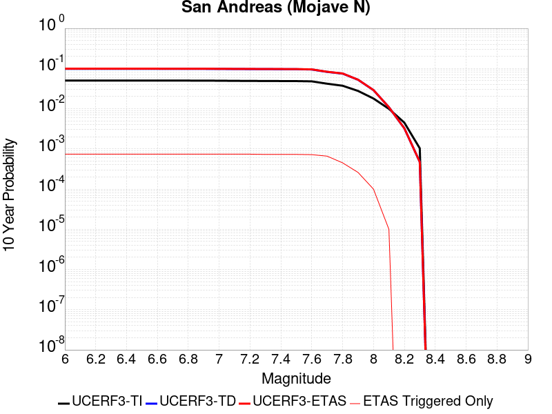 |

| Magnitude | 1 wk TI Prob | 1 wk TD Prob | 1 wk ETAS Prob | 1 wk ETAS/TD Gain | 1 wk ETAS Triggered Only | 1 mo TI Prob | 1 mo TD Prob | 1 mo ETAS Prob | 1 mo ETAS/TD Gain | 1 mo ETAS Triggered Only | 1 yr TI Prob | 1 yr TD Prob | 1 yr ETAS Prob | 1 yr ETAS/TD Gain | 1 yr ETAS Triggered Only | 10 yr TI Prob | 10 yr TD Prob | 10 yr ETAS Prob | 10 yr ETAS/TD Gain | 10 yr ETAS Triggered Only |
|-----|-----|-----|-----|-----|-----|-----|-----|-----|-----|-----|-----|-----|-----|-----|-----|-----|-----|-----|-----|-----|
| 6.0 | 9.877682E-5 | 1.9435467E-4 | 2.968857E-4 | 1.527546 | 1.02550955E-4 | 4.2326056E-4 | 8.326828E-4 | 9.863812E-4 | 1.1845821 | 1.5382643E-4 | 0.0051410277 | 0.010090916 | 0.010649255 | 1.0553309 | 5.6403026E-4 | 0.05023708 | 0.09846656 | 0.09927552 | 1.0082157 | 8.9732086E-4 |
| 6.1 | 9.877682E-5 | 1.9435467E-4 | 2.968857E-4 | 1.527546 | 1.02550955E-4 | 4.2326056E-4 | 8.326828E-4 | 9.863812E-4 | 1.1845821 | 1.5382643E-4 | 0.0051410277 | 0.010090916 | 0.010649255 | 1.0553309 | 5.6403026E-4 | 0.05023708 | 0.09846656 | 0.09927552 | 1.0082157 | 8.9732086E-4 |
| 6.2 | 9.877682E-5 | 1.9435467E-4 | 2.968857E-4 | 1.527546 | 1.02550955E-4 | 4.2326056E-4 | 8.326828E-4 | 9.863812E-4 | 1.1845821 | 1.5382643E-4 | 0.0051410277 | 0.010090916 | 0.010649255 | 1.0553309 | 5.6403026E-4 | 0.05023708 | 0.09846656 | 0.09927552 | 1.0082157 | 8.9732086E-4 |
| 6.3 | 9.877682E-5 | 1.9435467E-4 | 2.968857E-4 | 1.527546 | 1.02550955E-4 | 4.2326056E-4 | 8.326828E-4 | 9.863812E-4 | 1.1845821 | 1.5382643E-4 | 0.0051410277 | 0.010090916 | 0.010649255 | 1.0553309 | 5.6403026E-4 | 0.05023708 | 0.09846656 | 0.09927552 | 1.0082157 | 8.9732086E-4 |
| 6.4 | 9.877682E-5 | 1.9435467E-4 | 2.968857E-4 | 1.527546 | 1.02550955E-4 | 4.2326056E-4 | 8.326828E-4 | 9.863812E-4 | 1.1845821 | 1.5382643E-4 | 0.0051410277 | 0.010090916 | 0.010649255 | 1.0553309 | 5.6403026E-4 | 0.05023708 | 0.09846656 | 0.09927552 | 1.0082157 | 8.9732086E-4 |
| 6.5 | 9.861474E-5 | 1.9409222E-4 | 2.9662327E-4 | 1.5282595 | 1.02550955E-4 | 4.2256617E-4 | 8.3155883E-4 | 9.852573E-4 | 1.1848319 | 1.5382643E-4 | 0.0051326132 | 0.010077358 | 0.010635704 | 1.055406 | 5.6403026E-4 | 0.050156746 | 0.09834433 | 0.09915341 | 1.008227 | 8.9732086E-4 |
| 6.6 | 9.861474E-5 | 1.9409222E-4 | 2.9662327E-4 | 1.5282595 | 1.02550955E-4 | 4.2256617E-4 | 8.3155883E-4 | 9.852573E-4 | 1.1848319 | 1.5382643E-4 | 0.0051326132 | 0.010077358 | 0.010635704 | 1.055406 | 5.6403026E-4 | 0.050156746 | 0.09834433 | 0.09915341 | 1.008227 | 8.9732086E-4 |
| 6.7 | 9.8552715E-5 | 1.9399171E-4 | 2.9652278E-4 | 1.5285332 | 1.02550955E-4 | 4.223004E-4 | 8.3112833E-4 | 9.848269E-4 | 1.1849276 | 1.5382643E-4 | 0.0051293927 | 0.010072165 | 0.0106305145 | 1.0554348 | 5.6403026E-4 | 0.050125998 | 0.09829751 | 0.099106625 | 1.0082313 | 8.9732086E-4 |
| 6.8 | 9.8464974E-5 | 1.9384324E-4 | 2.9637432E-4 | 1.5289382 | 1.02550955E-4 | 4.219245E-4 | 8.304924E-4 | 9.841911E-4 | 1.1850693 | 1.5382643E-4 | 0.0051248376 | 0.010064495 | 0.010622848 | 1.0554775 | 5.6403026E-4 | 0.05008251 | 0.0982275 | 0.09903668 | 1.0082378 | 8.9732086E-4 |
| 6.9 | 9.825824E-5 | 1.9352314E-4 | 2.9605426E-4 | 1.5298132 | 1.02550955E-4 | 4.2103877E-4 | 8.2912145E-4 | 9.828204E-4 | 1.1853756 | 1.5382643E-4 | 0.0051141046 | 0.010047957 | 0.010606321 | 1.0555698 | 5.6403026E-4 | 0.049980022 | 0.098076545 | 0.09888586 | 1.0082519 | 8.9732086E-4 |
| 7.0 | 9.781462E-5 | 1.928364E-4 | 2.953676E-4 | 1.5317004 | 1.02550955E-4 | 4.1913814E-4 | 8.2618016E-4 | 9.798795E-4 | 1.1860361 | 1.5382643E-4 | 0.005091073 | 0.010012477 | 0.01057086 | 1.0557687 | 5.6403026E-4 | 0.04976007 | 0.0977528 | 0.09856241 | 1.0082822 | 8.9732086E-4 |
| 7.1 | 9.7121134E-5 | 1.9185297E-4 | 2.9438426E-4 | 1.5344263 | 1.02550955E-4 | 4.1616702E-4 | 8.2196813E-4 | 9.7566814E-4 | 1.1869903 | 1.5382643E-4 | 0.005055068 | 0.009961666 | 0.010520076 | 1.056056 | 5.6403026E-4 | 0.04941613 | 0.09728914 | 0.098099165 | 1.0083259 | 8.9732086E-4 |
| 7.2 | 9.663819E-5 | 1.9116043E-4 | 2.936918E-4 | 1.5363628 | 1.02550955E-4 | 4.1409794E-4 | 8.19002E-4 | 9.727024E-4 | 1.187668 | 1.5382643E-4 | 0.0050299936 | 0.009925882 | 0.010484314 | 1.0562601 | 5.6403026E-4 | 0.049176537 | 0.09696228 | 0.09777259 | 1.008357 | 8.9732086E-4 |
| 7.3 | 9.6277574E-5 | 1.9068507E-4 | 2.9321646E-4 | 1.5377002 | 1.02550955E-4 | 4.125529E-4 | 8.16966E-4 | 9.7066676E-4 | 1.1881361 | 1.5382643E-4 | 0.0050112694 | 0.00990132 | 0.010459765 | 1.0564011 | 5.6403026E-4 | 0.04899759 | 0.09673555 | 0.09754607 | 1.0083787 | 8.9732086E-4 |
| 7.4 | 9.593308E-5 | 1.9008234E-4 | 2.926138E-4 | 1.5394055 | 1.02550955E-4 | 4.1107697E-4 | 8.1438443E-4 | 9.680856E-4 | 1.1887329 | 1.5382643E-4 | 0.0049933824 | 0.009870174 | 0.010428638 | 1.0565809 | 5.6403026E-4 | 0.04882661 | 0.09645354 | 0.09726431 | 1.0084058 | 8.9732086E-4 |
| 7.5 | 9.561707E-5 | 1.8954265E-4 | 2.9207417E-4 | 1.5409416 | 1.02550955E-4 | 4.0972308E-4 | 8.12073E-4 | 9.657745E-4 | 1.1892706 | 1.5382643E-4 | 0.0049769743 | 0.009842287 | 0.010400766 | 1.0567428 | 5.6403026E-4 | 0.048669744 | 0.09619955 | 0.097010545 | 1.0084304 | 8.9732086E-4 |
| 7.6 | 9.418194E-5 | 1.8606246E-4 | 2.8859434E-4 | 1.5510616 | 1.02550955E-4 | 4.0357444E-4 | 7.97167E-4 | 9.5087086E-4 | 1.1928126 | 1.5382643E-4 | 0.004902454 | 0.00966243 | 0.01019562 | 1.0551819 | 5.383925E-4 | 0.047957025 | 0.09458092 | 0.09537016 | 1.0083445 | 8.716831E-4 |
| 7.7 | 8.202141E-5 | 1.6052493E-4 | 2.3742579E-4 | 1.4790587 | 7.691322E-5 | 3.51473E-4 | 6.877826E-4 | 8.158831E-4 | 1.1862515 | 1.281887E-4 | 0.00427079 | 0.00834166 | 0.008824713 | 1.0579085 | 4.8711704E-4 | 0.04189639 | 0.082371704 | 0.08310101 | 1.0088538 | 7.947699E-4 |
| 7.8 | 7.2859846E-5 | 1.4544492E-4 | 1.9671295E-4 | 1.3524909 | 5.1275478E-5 | 3.1221908E-4 | 6.231865E-4 | 7.0005184E-4 | 1.1233424 | 7.691322E-5 | 0.003794643 | 0.0075609423 | 0.007942601 | 1.0504776 | 3.8456608E-4 | 0.037304975 | 0.07485102 | 0.07544399 | 1.0079219 | 6.409435E-4 |
| 7.9 | 5.3874453E-5 | 1.0065284E-4 | 1.5192316E-4 | 1.5093777 | 5.1275478E-5 | 2.3087008E-4 | 4.3129802E-4 | 5.08178E-4 | 1.1782527 | 7.691322E-5 | 0.0028072202 | 0.0052384217 | 0.0055189594 | 1.0535539 | 2.8201513E-4 | 0.02772022 | 0.05251603 | 0.05290469 | 1.0074009 | 4.1020382E-4 |
| 8.0 | 3.468538E-5 | 5.4373286E-5 | 1.0564597E-4 | 1.9429758 | 5.1275478E-5 | 1.4864317E-4 | 2.3300757E-4 | 2.842711E-4 | 1.220008 | 5.1275478E-5 | 0.0018082283 | 0.0028331785 | 0.002961004 | 1.0451174 | 1.281887E-4 | 0.017935853 | 0.02900292 | 0.029127391 | 1.0042917 | 1.281887E-4 |
| 8.1 | 1.9152367E-5 | 1.9455974E-5 | 4.5093213E-5 | 2.3177052 | 2.5637739E-5 | 8.207899E-5 | 8.338009E-5 | 1.0901569E-4 | 1.3074547 | 2.5637739E-5 | 9.988535E-4 | 0.0010146805 | 0.0010402922 | 1.0252411 | 2.5637739E-5 | 0.009943757 | 0.010884172 | 0.010909531 | 1.0023298 | 2.5637739E-5 |
| 8.2 | 8.643924E-6 | 5.49522E-6 | 5.49522E-6 | 1.0 | 0.0 | 3.704486E-5 | 2.355073E-5 | 2.355073E-5 | 1.0 | 0.0 | 4.5092785E-4 | 2.866925E-4 | 2.866925E-4 | 1.0 | 0.0 | 0.0045001395 | 0.0032598388 | 0.0032598388 | 1.0 | 0.0 |
| 8.3 | 1.983087E-6 | 7.693574E-7 | 7.693574E-7 | 1.0 | 0.0 | 8.498917E-6 | 3.297242E-6 | 3.297242E-6 | 1.0 | 0.0 | 1.034694E-4 | 4.01432E-5 | 4.01432E-5 | 1.0 | 0.0 | 0.0010342124 | 4.7390026E-4 | 4.7390026E-4 | 1.0 | 0.0 |

## Towne Pass
*[(top)](#table-of-contents)*

| 1 Week | 1 Month | 1 Year | 10 Year |
|-----|-----|-----|-----|
|  |  |  |  |

| Magnitude | 1 wk TI Prob | 1 wk TD Prob | 1 wk ETAS Prob | 1 wk ETAS/TD Gain | 1 wk ETAS Triggered Only | 1 mo TI Prob | 1 mo TD Prob | 1 mo ETAS Prob | 1 mo ETAS/TD Gain | 1 mo ETAS Triggered Only | 1 yr TI Prob | 1 yr TD Prob | 1 yr ETAS Prob | 1 yr ETAS/TD Gain | 1 yr ETAS Triggered Only | 10 yr TI Prob | 10 yr TD Prob | 10 yr ETAS Prob | 10 yr ETAS/TD Gain | 10 yr ETAS Triggered Only |
|-----|-----|-----|-----|-----|-----|-----|-----|-----|-----|-----|-----|-----|-----|-----|-----|-----|-----|-----|-----|-----|
| 6.0 | 3.849728E-6 | 3.8945745E-6 | 3.8945745E-6 | 1.0 | 0.0 | 1.649873E-5 | 1.669095E-5 | 6.796557E-5 | 4.0720015 | 5.1275478E-5 | 2.0085352E-4 | 2.0319775E-4 | 5.364206E-4 | 2.6398945 | 3.332906E-4 | 0.0020067208 | 0.0020305486 | 0.0028492904 | 1.4032121 | 8.2040764E-4 |
| 6.1 | 3.849728E-6 | 3.8945745E-6 | 3.8945745E-6 | 1.0 | 0.0 | 1.649873E-5 | 1.669095E-5 | 6.796557E-5 | 4.0720015 | 5.1275478E-5 | 2.0085352E-4 | 2.0319775E-4 | 5.364206E-4 | 2.6398945 | 3.332906E-4 | 0.0020067208 | 0.0020305486 | 0.0028492904 | 1.4032121 | 8.2040764E-4 |
| 6.2 | 3.849728E-6 | 3.8945745E-6 | 3.8945745E-6 | 1.0 | 0.0 | 1.649873E-5 | 1.669095E-5 | 6.796557E-5 | 4.0720015 | 5.1275478E-5 | 2.0085352E-4 | 2.0319775E-4 | 5.364206E-4 | 2.6398945 | 3.332906E-4 | 0.0020067208 | 0.0020305486 | 0.0028492904 | 1.4032121 | 8.2040764E-4 |
| 6.3 | 3.849728E-6 | 3.8945745E-6 | 3.8945745E-6 | 1.0 | 0.0 | 1.649873E-5 | 1.669095E-5 | 6.796557E-5 | 4.0720015 | 5.1275478E-5 | 2.0085352E-4 | 2.0319775E-4 | 5.364206E-4 | 2.6398945 | 3.332906E-4 | 0.0020067208 | 0.0020305486 | 0.0028492904 | 1.4032121 | 8.2040764E-4 |
| 6.4 | 3.849728E-6 | 3.8945745E-6 | 3.8945745E-6 | 1.0 | 0.0 | 1.649873E-5 | 1.669095E-5 | 6.796557E-5 | 4.0720015 | 5.1275478E-5 | 2.0085352E-4 | 2.0319775E-4 | 5.364206E-4 | 2.6398945 | 3.332906E-4 | 0.0020067208 | 0.0020305486 | 0.0028492904 | 1.4032121 | 8.2040764E-4 |
| 6.5 | 1.1953545E-6 | 1.203065E-6 | 1.203065E-6 | 1.0 | 0.0 | 5.1229376E-6 | 5.1559837E-6 | 5.1559837E-6 | 1.0 | 0.0 | 6.236998E-5 | 6.277241E-5 | 1.396808E-4 | 2.2251942 | 7.691322E-5 | 6.235248E-4 | 6.275585E-4 | 8.325317E-4 | 1.3266201 | 2.0510191E-4 |
| 6.6 | 1.1953545E-6 | 1.203065E-6 | 1.203065E-6 | 1.0 | 0.0 | 5.1229376E-6 | 5.1559837E-6 | 5.1559837E-6 | 1.0 | 0.0 | 6.236998E-5 | 6.277241E-5 | 1.396808E-4 | 2.2251942 | 7.691322E-5 | 6.235248E-4 | 6.275585E-4 | 8.325317E-4 | 1.3266201 | 2.0510191E-4 |
| 6.7 | 8.375951E-7 | 8.410778E-7 | 8.410778E-7 | 1.0 | 0.0 | 3.5896885E-6 | 3.6046144E-6 | 3.6046144E-6 | 1.0 | 0.0 | 4.370358E-5 | 4.3885353E-5 | 6.952197E-5 | 1.5841724 | 2.5637739E-5 | 4.3694986E-4 | 4.387726E-4 | 5.4127857E-4 | 1.2336198 | 1.02550955E-4 |
| 6.8 | 6.38041E-7 | 6.3922516E-7 | 6.3922516E-7 | 1.0 | 0.0 | 2.7344586E-6 | 2.7395338E-6 | 2.7395338E-6 | 1.0 | 0.0 | 3.3291526E-5 | 3.335335E-5 | 5.8990234E-5 | 1.7686449 | 2.5637739E-5 | 3.3286537E-4 | 3.3348726E-4 | 3.8474565E-4 | 1.1537042 | 5.1275478E-5 |
| 6.9 | 5.3460053E-7 | 5.3454215E-7 | 5.3454215E-7 | 1.0 | 0.0 | 2.2911431E-6 | 2.290893E-6 | 2.290893E-6 | 1.0 | 0.0 | 2.789431E-5 | 2.78913E-5 | 2.78913E-5 | 1.0 | 0.0 | 2.789081E-4 | 2.788813E-4 | 3.045119E-4 | 1.091905 | 2.5637739E-5 |
| 7.0 | 3.557783E-7 | 3.5324976E-7 | 3.5324976E-7 | 1.0 | 0.0 | 1.5247632E-6 | 1.5139268E-6 | 1.5139268E-6 | 1.0 | 0.0 | 1.8563835E-5 | 1.843191E-5 | 1.843191E-5 | 1.0 | 0.0 | 1.8562283E-4 | 1.8430466E-4 | 2.0993767E-4 | 1.1390796 | 2.5637739E-5 |
| 7.1 | 3.037942E-7 | 3.0002903E-7 | 3.0002903E-7 | 1.0 | 0.0 | 1.3019744E-6 | 1.285838E-6 | 1.285838E-6 | 1.0 | 0.0 | 1.5851423E-5 | 1.5654974E-5 | 1.5654974E-5 | 1.0 | 0.0 | 1.5850292E-4 | 1.5653945E-4 | 1.8217319E-4 | 1.1637524 | 2.5637739E-5 |
| 7.2 | 2.0808248E-7 | 2.0218252E-7 | 2.0218252E-7 | 1.0 | 0.0 | 8.917818E-7 | 8.6649624E-7 | 8.6649624E-7 | 1.0 | 0.0 | 1.0857389E-5 | 1.0549546E-5 | 1.0549546E-5 | 1.0 | 0.0 | 1.0856859E-4 | 1.0549091E-4 | 1.3112594E-4 | 1.2430071 | 2.5637739E-5 |
| 7.3 | 1.1162073E-7 | 1.0637251E-7 | 1.0637251E-7 | 1.0 | 0.0 | 4.7837443E-7 | 4.5588212E-7 | 4.5588212E-7 | 1.0 | 0.0 | 5.8241935E-6 | 5.5503524E-6 | 5.5503524E-6 | 1.0 | 0.0 | 5.8240406E-5 | 5.550234E-5 | 8.1138656E-5 | 1.4618962 | 2.5637739E-5 |

## Bicycle Lake
*[(top)](#table-of-contents)*

| 1 Week | 1 Month | 1 Year | 10 Year |
|-----|-----|-----|-----|
|  |  |  |  |

| Magnitude | 1 wk TI Prob | 1 wk TD Prob | 1 wk ETAS Prob | 1 wk ETAS/TD Gain | 1 wk ETAS Triggered Only | 1 mo TI Prob | 1 mo TD Prob | 1 mo ETAS Prob | 1 mo ETAS/TD Gain | 1 mo ETAS Triggered Only | 1 yr TI Prob | 1 yr TD Prob | 1 yr ETAS Prob | 1 yr ETAS/TD Gain | 1 yr ETAS Triggered Only | 10 yr TI Prob | 10 yr TD Prob | 10 yr ETAS Prob | 10 yr ETAS/TD Gain | 10 yr ETAS Triggered Only |
|-----|-----|-----|-----|-----|-----|-----|-----|-----|-----|-----|-----|-----|-----|-----|-----|-----|-----|-----|-----|-----|
| 6.0 | 1.9621975E-5 | 2.2098558E-5 | 4.773573E-5 | 2.1601288 | 2.5637739E-5 | 8.4091465E-5 | 9.470543E-5 | 1.2034074E-4 | 1.2706847 | 2.5637739E-5 | 0.0010233327 | 0.0011525637 | 0.0014854701 | 1.2888399 | 3.332906E-4 | 0.01018633 | 0.011479173 | 0.012087416 | 1.0529866 | 6.1530573E-4 |
| 6.1 | 1.9621975E-5 | 2.2098558E-5 | 4.773573E-5 | 2.1601288 | 2.5637739E-5 | 8.4091465E-5 | 9.470543E-5 | 1.2034074E-4 | 1.2706847 | 2.5637739E-5 | 0.0010233327 | 0.0011525637 | 0.0014854701 | 1.2888399 | 3.332906E-4 | 0.01018633 | 0.011479173 | 0.012087416 | 1.0529866 | 6.1530573E-4 |
| 6.2 | 9.9971285E-6 | 1.1256391E-5 | 3.689384E-5 | 3.2775905 | 2.5637739E-5 | 4.2844134E-5 | 4.824108E-5 | 7.387758E-5 | 1.5314248 | 2.5637739E-5 | 5.2150246E-4 | 5.8722886E-4 | 8.17833E-4 | 1.3926989 | 2.3073965E-4 | 0.0052028033 | 0.0058618775 | 0.006193214 | 1.056524 | 3.332906E-4 |
| 6.3 | 9.589428E-6 | 1.0799068E-5 | 3.643653E-5 | 3.374044 | 2.5637739E-5 | 4.10969E-5 | 4.628119E-5 | 7.191775E-5 | 1.5539303 | 2.5637739E-5 | 5.002399E-4 | 5.633797E-4 | 7.939894E-4 | 1.4093325 | 2.3073965E-4 | 0.0049911533 | 0.0056246053 | 0.005956021 | 1.0589225 | 3.332906E-4 |
| 6.4 | 9.589428E-6 | 1.0799068E-5 | 3.643653E-5 | 3.374044 | 2.5637739E-5 | 4.10969E-5 | 4.628119E-5 | 7.191775E-5 | 1.5539303 | 2.5637739E-5 | 5.002399E-4 | 5.633797E-4 | 7.939894E-4 | 1.4093325 | 2.3073965E-4 | 0.0049911533 | 0.0056246053 | 0.005956021 | 1.0589225 | 3.332906E-4 |
| 6.5 | 5.557707E-6 | 6.286038E-6 | 3.1923617E-5 | 5.0784955 | 2.5637739E-5 | 2.3818526E-5 | 2.6940037E-5 | 5.2577085E-5 | 1.9516337 | 2.5637739E-5 | 2.8995197E-4 | 3.2797246E-4 | 5.330071E-4 | 1.6251581 | 2.0510191E-4 | 0.0028957394 | 0.0032775209 | 0.0035841656 | 1.0935599 | 3.0765287E-4 |
| 6.6 | 4.8742945E-6 | 5.5136734E-6 | 5.5136734E-6 | 1.0 | 0.0 | 2.0889667E-5 | 2.3629962E-5 | 2.3629962E-5 | 1.0 | 0.0 | 2.54302E-4 | 2.87683E-4 | 4.1583483E-4 | 1.4454619 | 1.281887E-4 | 0.002540112 | 0.0028756752 | 0.0030801871 | 1.071118 | 2.0510191E-4 |
| 6.7 | 3.991108E-6 | 4.5162255E-6 | 4.5162255E-6 | 1.0 | 0.0 | 1.7104636E-5 | 1.9355251E-5 | 1.9355251E-5 | 1.0 | 0.0 | 2.0822904E-4 | 2.3565018E-4 | 3.3817696E-4 | 1.4350804 | 1.02550955E-4 | 0.0020803404 | 0.0023565018 | 0.0025099658 | 1.0651237 | 1.5382643E-4 |

## Nelson Lake
*[(top)](#table-of-contents)*

| 1 Week | 1 Month | 1 Year | 10 Year |
|-----|-----|-----|-----|
|  |  | 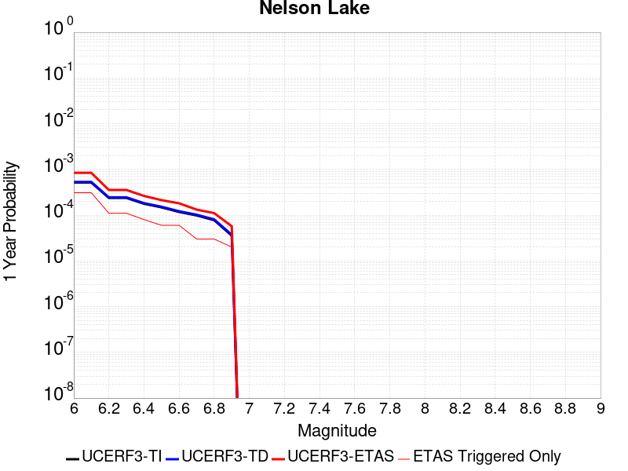 |  |

| Magnitude | 1 wk TI Prob | 1 wk TD Prob | 1 wk ETAS Prob | 1 wk ETAS/TD Gain | 1 wk ETAS Triggered Only | 1 mo TI Prob | 1 mo TD Prob | 1 mo ETAS Prob | 1 mo ETAS/TD Gain | 1 mo ETAS Triggered Only | 1 yr TI Prob | 1 yr TD Prob | 1 yr ETAS Prob | 1 yr ETAS/TD Gain | 1 yr ETAS Triggered Only | 10 yr TI Prob | 10 yr TD Prob | 10 yr ETAS Prob | 10 yr ETAS/TD Gain | 10 yr ETAS Triggered Only |
|-----|-----|-----|-----|-----|-----|-----|-----|-----|-----|-----|-----|-----|-----|-----|-----|-----|-----|-----|-----|-----|
| 6.0 | 9.913453E-6 | 1.0192408E-5 | 3.5829886E-5 | 3.5153506 | 2.5637739E-5 | 4.2485535E-5 | 4.3681073E-5 | 1.2059093E-4 | 2.7607136 | 7.691322E-5 | 5.1713863E-4 | 5.3169765E-4 | 7.623146E-4 | 1.433737 | 2.3073965E-4 | 0.0051593683 | 0.0053052832 | 0.0058918227 | 1.1105577 | 5.89668E-4 |
| 6.1 | 9.913453E-6 | 1.0192408E-5 | 3.5829886E-5 | 3.5153506 | 2.5637739E-5 | 4.2485535E-5 | 4.3681073E-5 | 1.2059093E-4 | 2.7607136 | 7.691322E-5 | 5.1713863E-4 | 5.3169765E-4 | 7.623146E-4 | 1.433737 | 2.3073965E-4 | 0.0051593683 | 0.0053052832 | 0.0058918227 | 1.1105577 | 5.89668E-4 |
| 6.2 | 4.5596407E-6 | 4.696388E-6 | 4.696388E-6 | 1.0 | 0.0 | 1.954117E-5 | 2.0127229E-5 | 4.5764453E-5 | 2.2737582 | 2.5637739E-5 | 2.3788778E-4 | 2.4502273E-4 | 3.4754854E-4 | 1.4184339 | 1.02550955E-4 | 0.0023763329 | 0.0024476517 | 0.0027034017 | 1.1044879 | 2.563774E-4 |
| 6.3 | 4.5596407E-6 | 4.696388E-6 | 4.696388E-6 | 1.0 | 0.0 | 1.954117E-5 | 2.0127229E-5 | 4.5764453E-5 | 2.2737582 | 2.5637739E-5 | 2.3788778E-4 | 2.4502273E-4 | 3.4754854E-4 | 1.4184339 | 1.02550955E-4 | 0.0023763329 | 0.0024476517 | 0.0027034017 | 1.1044879 | 2.563774E-4 |
| 6.4 | 3.4025713E-6 | 3.509956E-6 | 3.509956E-6 | 1.0 | 0.0 | 1.4582367E-5 | 1.5042587E-5 | 4.067994E-5 | 2.704318 | 2.5637739E-5 | 1.7752586E-4 | 1.8312894E-4 | 2.856611E-4 | 1.5598906 | 1.02550955E-4 | 0.001773841 | 0.0018298633 | 0.0020857716 | 1.139851 | 2.563774E-4 |
| 6.5 | 2.8352947E-6 | 2.927907E-6 | 2.927907E-6 | 1.0 | 0.0 | 1.2151207E-5 | 1.25481165E-5 | 1.25481165E-5 | 1.0 | 0.0 | 1.479309E-4 | 1.5276336E-4 | 2.2966482E-4 | 1.5034026 | 7.691322E-5 | 0.0014783246 | 0.0015266574 | 0.0017058476 | 1.1173742 | 1.7946417E-4 |
| 6.6 | 2.251518E-6 | 2.3291102E-6 | 2.3291102E-6 | 1.0 | 0.0 | 9.649328E-6 | 9.981866E-6 | 9.981866E-6 | 1.0 | 0.0 | 1.1747423E-4 | 1.2152307E-4 | 1.9842695E-4 | 1.6328335 | 7.691322E-5 | 0.0011741214 | 0.001214628 | 0.0013938742 | 1.1475729 | 1.7946417E-4 |
| 6.7 | 1.8911853E-6 | 1.959177E-6 | 1.959177E-6 | 1.0 | 0.0 | 8.105055E-6 | 8.39645E-6 | 8.39645E-6 | 1.0 | 0.0 | 9.867457E-5 | 1.0222256E-4 | 1.2785768E-4 | 1.2507775 | 2.5637739E-5 | 9.863076E-4 | 0.0010218129 | 0.0011242591 | 1.1002592 | 1.02550955E-4 |
| 6.8 | 1.4874814E-6 | 1.5438616E-6 | 1.5438616E-6 | 1.0 | 0.0 | 6.374905E-6 | 6.6165358E-6 | 6.6165358E-6 | 1.0 | 0.0 | 7.76117E-5 | 8.0553866E-5 | 1.0618954E-4 | 1.3182427 | 2.5637739E-5 | 7.75846E-4 | 8.0529775E-4 | 9.077661E-4 | 1.1272428 | 1.02550955E-4 |
| 6.9 | 6.835972E-7 | 7.140097E-7 | 7.140097E-7 | 1.0 | 0.0 | 2.9296991E-6 | 3.0600397E-6 | 3.0600397E-6 | 1.0 | 0.0 | 3.56685E-5 | 3.7255664E-5 | 3.7255664E-5 | 1.0 | 0.0 | 3.5662777E-4 | 3.7252545E-4 | 4.4941E-4 | 1.2063874 | 7.691322E-5 |

## San Andreas (San Bernardino N)
*[(top)](#table-of-contents)*

| 1 Week | 1 Month | 1 Year | 10 Year |
|-----|-----|-----|-----|
|  |  |  |  |

| Magnitude | 1 wk TI Prob | 1 wk TD Prob | 1 wk ETAS Prob | 1 wk ETAS/TD Gain | 1 wk ETAS Triggered Only | 1 mo TI Prob | 1 mo TD Prob | 1 mo ETAS Prob | 1 mo ETAS/TD Gain | 1 mo ETAS Triggered Only | 1 yr TI Prob | 1 yr TD Prob | 1 yr ETAS Prob | 1 yr ETAS/TD Gain | 1 yr ETAS Triggered Only | 10 yr TI Prob | 10 yr TD Prob | 10 yr ETAS Prob | 10 yr ETAS/TD Gain | 10 yr ETAS Triggered Only |
|-----|-----|-----|-----|-----|-----|-----|-----|-----|-----|-----|-----|-----|-----|-----|-----|-----|-----|-----|-----|-----|
| 6.0 | 1.4273766E-4 | 3.1635934E-4 | 3.6761857E-4 | 1.1620286 | 5.1275478E-5 | 6.115894E-4 | 0.0013551271 | 0.0014319362 | 1.0566803 | 7.691322E-5 | 0.0074207084 | 0.016375363 | 0.016703196 | 1.0200199 | 3.332906E-4 | 0.07177748 | 0.15038711 | 0.15080096 | 1.002752 | 4.8711704E-4 |
| 6.1 | 1.4273766E-4 | 3.1635934E-4 | 3.6761857E-4 | 1.1620286 | 5.1275478E-5 | 6.115894E-4 | 0.0013551271 | 0.0014319362 | 1.0566803 | 7.691322E-5 | 0.0074207084 | 0.016375363 | 0.016703196 | 1.0200199 | 3.332906E-4 | 0.07177748 | 0.15038711 | 0.15080096 | 1.002752 | 4.8711704E-4 |
| 6.2 | 1.4273766E-4 | 3.1635934E-4 | 3.6761857E-4 | 1.1620286 | 5.1275478E-5 | 6.115894E-4 | 0.0013551271 | 0.0014319362 | 1.0566803 | 7.691322E-5 | 0.0074207084 | 0.016375363 | 0.016703196 | 1.0200199 | 3.332906E-4 | 0.07177748 | 0.15038711 | 0.15080096 | 1.002752 | 4.8711704E-4 |
| 6.3 | 1.3730655E-4 | 3.0540637E-4 | 3.566662E-4 | 1.1678413 | 5.1275478E-5 | 5.883239E-4 | 0.0013082335 | 0.0013850462 | 1.0587147 | 7.691322E-5 | 0.0071393442 | 0.015812824 | 0.016140843 | 1.020744 | 3.332906E-4 | 0.06914291 | 0.14568701 | 0.14610316 | 1.0028565 | 4.8711704E-4 |
| 6.4 | 1.3730655E-4 | 3.0540637E-4 | 3.566662E-4 | 1.1678413 | 5.1275478E-5 | 5.883239E-4 | 0.0013082335 | 0.0013850462 | 1.0587147 | 7.691322E-5 | 0.0071393442 | 0.015812824 | 0.016140843 | 1.020744 | 3.332906E-4 | 0.06914291 | 0.14568701 | 0.14610316 | 1.0028565 | 4.8711704E-4 |
| 6.5 | 1.2942807E-4 | 2.8954886E-4 | 3.408095E-4 | 1.1770362 | 5.1275478E-5 | 5.545738E-4 | 0.0012403387 | 0.0013171565 | 1.0619329 | 7.691322E-5 | 0.0067310524 | 0.014997809 | 0.015326101 | 1.0218893 | 3.332906E-4 | 0.06530788 | 0.13882978 | 0.13924928 | 1.0030216 | 4.8711704E-4 |
| 6.6 | 1.1125901E-4 | 2.5393223E-4 | 3.051947E-4 | 1.2018745 | 5.1275478E-5 | 4.767372E-4 | 0.0010878295 | 0.001164659 | 1.0706265 | 7.691322E-5 | 0.005788839 | 0.013164529 | 0.013493432 | 1.024984 | 3.332906E-4 | 0.056403454 | 0.12311955 | 0.12354669 | 1.0034693 | 4.8711704E-4 |
| 6.7 | 1.02209575E-4 | 2.3527986E-4 | 2.8654328E-4 | 1.2178828 | 5.1275478E-5 | 4.3796748E-4 | 0.001007954 | 0.0010847898 | 1.0762293 | 7.691322E-5 | 0.0053192247 | 0.012203212 | 0.012532435 | 1.0269784 | 3.332906E-4 | 0.051936906 | 0.11491149 | 0.115342624 | 1.003752 | 4.8711704E-4 |
| 6.8 | 9.610582E-5 | 2.2053412E-4 | 2.717983E-4 | 1.2324545 | 5.1275478E-5 | 4.1181705E-4 | 9.448046E-4 | 0.0010216451 | 1.0813296 | 7.691322E-5 | 0.0050023515 | 0.011442591 | 0.011772068 | 1.0287939 | 3.332906E-4 | 0.048912346 | 0.10831282 | 0.10874718 | 1.0040102 | 4.8711704E-4 |
| 6.9 | 9.3877505E-5 | 2.150883E-4 | 2.6635273E-4 | 1.2383415 | 5.1275478E-5 | 4.0227012E-4 | 9.2148193E-4 | 9.983242E-4 | 1.08339 | 7.691322E-5 | 0.0048866454 | 0.011161577 | 0.011491148 | 1.0295272 | 3.332906E-4 | 0.04780577 | 0.1059029 | 0.106338434 | 1.0041125 | 4.8711704E-4 |
| 7.0 | 9.1019785E-5 | 2.0835544E-4 | 2.5962022E-4 | 1.2460449 | 5.1275478E-5 | 3.900265E-4 | 8.926469E-4 | 9.694915E-4 | 1.0860862 | 7.691322E-5 | 0.0047382377 | 0.010814046 | 0.011143732 | 1.0304868 | 3.332906E-4 | 0.046384744 | 0.10287278 | 0.10330979 | 1.004248 | 4.8711704E-4 |
| 7.1 | 8.771155E-5 | 2.0009889E-4 | 2.513641E-4 | 1.2561994 | 5.1275478E-5 | 3.758525E-4 | 8.5728534E-4 | 9.3413267E-4 | 1.0896403 | 7.691322E-5 | 0.0045664064 | 0.010387696 | 0.010717525 | 1.0317519 | 3.332906E-4 | 0.044737056 | 0.09918398 | 0.099622786 | 1.0044241 | 4.8711704E-4 |
| 7.2 | 8.0830236E-5 | 1.8415037E-4 | 2.3541642E-4 | 1.2783922 | 5.1275478E-5 | 3.4636928E-4 | 7.8897737E-4 | 8.658299E-4 | 1.0974078 | 7.691322E-5 | 0.0042088944 | 0.009563598 | 0.009893701 | 1.0345166 | 3.332906E-4 | 0.041300658 | 0.09191379 | 0.09235613 | 1.0048126 | 4.8711704E-4 |
| 7.3 | 7.7668235E-5 | 1.7358093E-4 | 2.2484752E-4 | 1.2953469 | 5.1275478E-5 | 3.328214E-4 | 7.437063E-4 | 8.205623E-4 | 1.1033419 | 7.691322E-5 | 0.0040445733 | 0.009017113 | 0.009347398 | 1.0366287 | 3.332906E-4 | 0.03971748 | 0.08717959 | 0.08762424 | 1.0051004 | 4.8711704E-4 |
| 7.4 | 7.520177E-5 | 1.657783E-4 | 2.1704528E-4 | 1.3092502 | 5.1275478E-5 | 3.2225347E-4 | 7.1028504E-4 | 7.871436E-4 | 1.1082081 | 7.691322E-5 | 0.0039163795 | 0.008613498 | 0.008943918 | 1.0383607 | 3.332906E-4 | 0.038480744 | 0.08363466 | 0.08408104 | 1.0053372 | 4.8711704E-4 |
| 7.5 | 7.274697E-5 | 1.5865144E-4 | 2.0991878E-4 | 1.3231446 | 5.1275478E-5 | 3.1173544E-4 | 6.797576E-4 | 7.5661857E-4 | 1.1130711 | 7.691322E-5 | 0.003788775 | 0.008244702 | 0.008575244 | 1.0400915 | 3.332906E-4 | 0.03724827 | 0.08035038 | 0.08079835 | 1.0055753 | 4.8711704E-4 |
| 7.6 | 7.1185845E-5 | 1.5434787E-4 | 2.0561543E-4 | 1.332156 | 5.1275478E-5 | 3.0504653E-4 | 6.6132325E-4 | 7.381856E-4 | 1.1162251 | 7.691322E-5 | 0.0037076178 | 0.008021939 | 0.008352555 | 1.0412141 | 3.332906E-4 | 0.036463667 | 0.078339346 | 0.0787883 | 1.0057309 | 4.8711704E-4 |
| 7.7 | 6.709961E-5 | 1.4343053E-4 | 1.9469866E-4 | 1.3574421 | 5.1275478E-5 | 2.8753807E-4 | 6.1455753E-4 | 6.914235E-4 | 1.1250752 | 7.691322E-5 | 0.003495157 | 0.007456607 | 0.0077874125 | 1.0443641 | 3.332906E-4 | 0.034406938 | 0.07316601 | 0.07361749 | 1.0061706 | 4.8711704E-4 |
| 7.8 | 6.300812E-5 | 1.3225875E-4 | 1.8352745E-4 | 1.3876394 | 5.1275478E-5 | 2.7000686E-4 | 5.6670007E-4 | 6.435697E-4 | 1.1356443 | 7.691322E-5 | 0.0032823787 | 0.0068777753 | 0.0072087734 | 1.0481257 | 3.332906E-4 | 0.032343175 | 0.06781986 | 0.06827394 | 1.0066954 | 4.8711704E-4 |
| 7.9 | 4.983037E-5 | 9.7419856E-5 | 1.4869033E-4 | 1.5262837 | 5.1275478E-5 | 2.1354125E-4 | 4.1744686E-4 | 4.94328E-4 | 1.1841698 | 7.691322E-5 | 0.0025967648 | 0.005070582 | 0.005351167 | 1.0553359 | 2.8201513E-4 | 0.025666296 | 0.050735 | 0.05112439 | 1.007675 | 4.1020382E-4 |
| 8.0 | 3.2211527E-5 | 5.341288E-5 | 1.0468562E-4 | 1.9599321 | 5.1275478E-5 | 1.380421E-4 | 2.2889227E-4 | 2.80156E-4 | 1.2239645 | 5.1275478E-5 | 0.0016793669 | 0.002783204 | 0.002911036 | 1.0459298 | 1.281887E-4 | 0.016667323 | 0.028414162 | 0.02853871 | 1.0043832 | 1.281887E-4 |
| 8.1 | 1.743376E-5 | 1.8874636E-5 | 4.451189E-5 | 2.3582914 | 2.5637739E-5 | 7.471398E-5 | 8.088879E-5 | 1.0652446E-4 | 1.3169248 | 2.5637739E-5 | 9.0926304E-4 | 9.843768E-4 | 0.0010099892 | 1.026019 | 2.5637739E-5 | 0.009055517 | 0.010510205 | 0.010535574 | 1.0024136 | 2.5637739E-5 |
| 8.2 | 7.831616E-6 | 5.1737816E-6 | 5.1737816E-6 | 1.0 | 0.0 | 3.3563636E-5 | 2.217316E-5 | 2.217316E-5 | 1.0 | 0.0 | 4.0856065E-4 | 2.6992487E-4 | 2.6992487E-4 | 1.0 | 0.0 | 0.004078103 | 0.0030519657 | 0.0030519657 | 1.0 | 0.0 |
| 8.3 | 1.983087E-6 | 7.693574E-7 | 7.693574E-7 | 1.0 | 0.0 | 8.498917E-6 | 3.297242E-6 | 3.297242E-6 | 1.0 | 0.0 | 1.034694E-4 | 4.01432E-5 | 4.01432E-5 | 1.0 | 0.0 | 0.0010342124 | 4.7390026E-4 | 4.7390026E-4 | 1.0 | 0.0 |

## Garlic Springs
*[(top)](#table-of-contents)*

| 1 Week | 1 Month | 1 Year | 10 Year |
|-----|-----|-----|-----|
|  |  |  |  |

| Magnitude | 1 wk TI Prob | 1 wk TD Prob | 1 wk ETAS Prob | 1 wk ETAS/TD Gain | 1 wk ETAS Triggered Only | 1 mo TI Prob | 1 mo TD Prob | 1 mo ETAS Prob | 1 mo ETAS/TD Gain | 1 mo ETAS Triggered Only | 1 yr TI Prob | 1 yr TD Prob | 1 yr ETAS Prob | 1 yr ETAS/TD Gain | 1 yr ETAS Triggered Only | 10 yr TI Prob | 10 yr TD Prob | 10 yr ETAS Prob | 10 yr ETAS/TD Gain | 10 yr ETAS Triggered Only |
|-----|-----|-----|-----|-----|-----|-----|-----|-----|-----|-----|-----|-----|-----|-----|-----|-----|-----|-----|-----|-----|
| 6.0 | 1.6760017E-5 | 1.8778032E-5 | 1.8778032E-5 | 1.0 | 0.0 | 7.182667E-5 | 8.047546E-5 | 1.0611113E-4 | 1.3185527 | 2.5637739E-5 | 8.7413884E-4 | 9.794658E-4 | 0.0011843668 | 1.2091967 | 2.0510191E-4 | 0.008707083 | 0.009763034 | 0.010194621 | 1.0442061 | 4.3584156E-4 |
| 6.1 | 9.852767E-6 | 1.097425E-5 | 1.097425E-5 | 1.0 | 0.0 | 4.222546E-5 | 4.703205E-5 | 7.266858E-5 | 1.5450865 | 2.5637739E-5 | 5.139737E-4 | 5.7253573E-4 | 6.7502796E-4 | 1.1790146 | 1.02550955E-4 | 0.005127866 | 0.005717566 | 0.005997969 | 1.0490423 | 2.8201513E-4 |
| 6.2 | 9.852767E-6 | 1.097425E-5 | 1.097425E-5 | 1.0 | 0.0 | 4.222546E-5 | 4.703205E-5 | 7.266858E-5 | 1.5450865 | 2.5637739E-5 | 5.139737E-4 | 5.7253573E-4 | 6.7502796E-4 | 1.1790146 | 1.02550955E-4 | 0.005127866 | 0.005717566 | 0.005997969 | 1.0490423 | 2.8201513E-4 |
| 6.3 | 4.3167724E-6 | 4.7782996E-6 | 4.7782996E-6 | 1.0 | 0.0 | 1.8500323E-5 | 2.0478396E-5 | 4.611561E-5 | 2.2519152 | 2.5637739E-5 | 2.2521814E-4 | 2.4931898E-4 | 2.7495032E-4 | 1.1028055 | 2.5637739E-5 | 0.0022499003 | 0.002492651 | 0.0025693728 | 1.0307791 | 7.691322E-5 |
| 6.4 | 4.3167724E-6 | 4.7782996E-6 | 4.7782996E-6 | 1.0 | 0.0 | 1.8500323E-5 | 2.0478396E-5 | 4.611561E-5 | 2.2519152 | 2.5637739E-5 | 2.2521814E-4 | 2.4931898E-4 | 2.7495032E-4 | 1.1028055 | 2.5637739E-5 | 0.0022499003 | 0.002492651 | 0.0025693728 | 1.0307791 | 7.691322E-5 |
| 6.5 | 4.3167724E-6 | 4.7782996E-6 | 4.7782996E-6 | 1.0 | 0.0 | 1.8500323E-5 | 2.0478396E-5 | 4.611561E-5 | 2.2519152 | 2.5637739E-5 | 2.2521814E-4 | 2.4931898E-4 | 2.7495032E-4 | 1.1028055 | 2.5637739E-5 | 0.0022499003 | 0.002492651 | 0.0025693728 | 1.0307791 | 7.691322E-5 |
| 6.6 | 4.301311E-6 | 4.761167E-6 | 4.761167E-6 | 1.0 | 0.0 | 1.8434059E-5 | 2.0404972E-5 | 4.6042187E-5 | 2.2564201 | 2.5637739E-5 | 2.2441156E-4 | 2.4842523E-4 | 2.740566E-4 | 1.1031754 | 2.5637739E-5 | 0.0022418506 | 0.002483734 | 0.002560456 | 1.0308899 | 7.691322E-5 |
| 6.7 | 3.8599724E-6 | 4.2713013E-6 | 4.2713013E-6 | 1.0 | 0.0 | 1.6542634E-5 | 1.8305576E-5 | 4.3942844E-5 | 2.400517 | 2.5637739E-5 | 2.0138794E-4 | 2.228704E-4 | 2.4850242E-4 | 1.1150087 | 2.5637739E-5 | 0.0020120554 | 0.0022287038 | 0.002279865 | 1.0229555 | 5.1275478E-5 |

## Paradise
*[(top)](#table-of-contents)*

| 1 Week | 1 Month | 1 Year | 10 Year |
|-----|-----|-----|-----|
|  |  |  |  |

| Magnitude | 1 wk TI Prob | 1 wk TD Prob | 1 wk ETAS Prob | 1 wk ETAS/TD Gain | 1 wk ETAS Triggered Only | 1 mo TI Prob | 1 mo TD Prob | 1 mo ETAS Prob | 1 mo ETAS/TD Gain | 1 mo ETAS Triggered Only | 1 yr TI Prob | 1 yr TD Prob | 1 yr ETAS Prob | 1 yr ETAS/TD Gain | 1 yr ETAS Triggered Only | 10 yr TI Prob | 10 yr TD Prob | 10 yr ETAS Prob | 10 yr ETAS/TD Gain | 10 yr ETAS Triggered Only |
|-----|-----|-----|-----|-----|-----|-----|-----|-----|-----|-----|-----|-----|-----|-----|-----|-----|-----|-----|-----|-----|
| 6.0 | 1.4851273E-5 | 1.6695341E-5 | 1.6695341E-5 | 1.0 | 0.0 | 6.364676E-5 | 7.154963E-5 | 9.718553E-5 | 1.3582954 | 2.5637739E-5 | 7.7462377E-4 | 8.707922E-4 | 0.0010501001 | 1.2059135 | 1.7946417E-4 | 0.0077192914 | 0.008676181 | 0.00905741 | 1.0439398 | 3.8456608E-4 |
| 6.1 | 1.4851273E-5 | 1.6695341E-5 | 1.6695341E-5 | 1.0 | 0.0 | 6.364676E-5 | 7.154963E-5 | 9.718553E-5 | 1.3582954 | 2.5637739E-5 | 7.7462377E-4 | 8.707922E-4 | 0.0010501001 | 1.2059135 | 1.7946417E-4 | 0.0077192914 | 0.008676181 | 0.00905741 | 1.0439398 | 3.8456608E-4 |
| 6.2 | 1.4851273E-5 | 1.6695341E-5 | 1.6695341E-5 | 1.0 | 0.0 | 6.364676E-5 | 7.154963E-5 | 9.718553E-5 | 1.3582954 | 2.5637739E-5 | 7.7462377E-4 | 8.707922E-4 | 0.0010501001 | 1.2059135 | 1.7946417E-4 | 0.0077192914 | 0.008676181 | 0.00905741 | 1.0439398 | 3.8456608E-4 |
| 6.3 | 1.0426831E-5 | 1.1889049E-5 | 1.1889049E-5 | 1.0 | 0.0 | 4.4685654E-5 | 5.095211E-5 | 7.658854E-5 | 1.5031476 | 2.5637739E-5 | 5.43912E-4 | 6.2017125E-4 | 7.7390234E-4 | 1.2478848 | 1.5382643E-4 | 0.0054258266 | 0.0061850143 | 0.0063633686 | 1.0288365 | 1.7946417E-4 |
| 6.4 | 1.0426831E-5 | 1.1889049E-5 | 1.1889049E-5 | 1.0 | 0.0 | 4.4685654E-5 | 5.095211E-5 | 7.658854E-5 | 1.5031476 | 2.5637739E-5 | 5.43912E-4 | 6.2017125E-4 | 7.7390234E-4 | 1.2478848 | 1.5382643E-4 | 0.0054258266 | 0.0061850143 | 0.0063633686 | 1.0288365 | 1.7946417E-4 |
| 6.5 | 9.25027E-6 | 1.0620336E-5 | 1.0620336E-5 | 1.0 | 0.0 | 3.964341E-5 | 4.551496E-5 | 4.551496E-5 | 1.0 | 0.0 | 4.8255164E-4 | 5.5400864E-4 | 6.821263E-4 | 1.2312558 | 1.281887E-4 | 0.0048150513 | 0.0055267746 | 0.005679751 | 1.0276791 | 1.5382643E-4 |
| 6.6 | 7.904275E-6 | 9.159836E-6 | 9.159836E-6 | 1.0 | 0.0 | 3.3875025E-5 | 3.925587E-5 | 3.925587E-5 | 1.0 | 0.0 | 4.1235037E-4 | 4.7783932E-4 | 6.059668E-4 | 1.2681391 | 1.281887E-4 | 0.0041158604 | 0.0047685155 | 0.0049216086 | 1.032105 | 1.5382643E-4 |
| 6.7 | 7.2061953E-6 | 8.407527E-6 | 8.407527E-6 | 1.0 | 0.0 | 3.088333E-5 | 3.6031786E-5 | 3.6031786E-5 | 1.0 | 0.0 | 3.7593965E-4 | 4.3860235E-4 | 5.154818E-4 | 1.1752828 | 7.691322E-5 | 0.003753043 | 0.0043777362 | 0.004479838 | 1.023323 | 1.02550955E-4 |
| 6.8 | 6.6948724E-6 | 7.842423E-6 | 7.842423E-6 | 1.0 | 0.0 | 2.8691995E-5 | 3.3609973E-5 | 3.3609973E-5 | 1.0 | 0.0 | 3.4926904E-4 | 4.0912814E-4 | 4.860099E-4 | 1.187916 | 7.691322E-5 | 0.003487206 | 0.004084107 | 0.004186239 | 1.0250072 | 1.02550955E-4 |
| 6.9 | 6.0421025E-6 | 7.1308505E-6 | 7.1308505E-6 | 1.0 | 0.0 | 2.5894467E-5 | 3.0560448E-5 | 3.0560448E-5 | 1.0 | 0.0 | 3.1521954E-4 | 3.7201334E-4 | 4.4889795E-4 | 1.2066716 | 7.691322E-5 | 0.0031477278 | 0.003714244 | 0.0038164142 | 1.0275077 | 1.02550955E-4 |
| 7.0 | 4.134091E-6 | 5.080469E-6 | 5.080469E-6 | 1.0 | 0.0 | 1.7717413E-5 | 2.1773263E-5 | 2.1773263E-5 | 1.0 | 0.0 | 2.1568815E-4 | 2.6505877E-4 | 3.1632066E-4 | 1.1933982 | 5.1275478E-5 | 0.0021547892 | 0.0026475794 | 0.002724289 | 1.0289735 | 7.691322E-5 |
| 7.1 | 3.7674888E-6 | 4.6320133E-6 | 4.6320133E-6 | 1.0 | 0.0 | 1.6146281E-5 | 1.9851343E-5 | 1.9851343E-5 | 1.0 | 0.0 | 1.9656324E-4 | 2.4166482E-4 | 2.929279E-4 | 1.2121247 | 5.1275478E-5 | 0.0019638946 | 0.002414171 | 0.0024908984 | 1.0317822 | 7.691322E-5 |
| 7.2 | 3.4065345E-6 | 4.1568514E-6 | 4.1568514E-6 | 1.0 | 0.0 | 1.4599351E-5 | 1.7814966E-5 | 1.7814966E-5 | 1.0 | 0.0 | 1.777326E-4 | 2.1687712E-4 | 2.6814148E-4 | 1.2363751 | 5.1275478E-5 | 0.0017759053 | 0.0021668028 | 0.0022435493 | 1.0354192 | 7.691322E-5 |
| 7.3 | 2.9934936E-6 | 3.629423E-6 | 3.629423E-6 | 1.0 | 0.0 | 1.2829195E-5 | 1.5554586E-5 | 1.5554586E-5 | 1.0 | 0.0 | 1.5618425E-4 | 1.893621E-4 | 2.4062787E-4 | 1.2707288 | 5.1275478E-5 | 0.0015607453 | 0.0018921527 | 0.0019433312 | 1.0270478 | 5.1275478E-5 |
| 7.4 | 2.4049796E-6 | 2.889062E-6 | 2.889062E-6 | 1.0 | 0.0 | 1.0307015E-5 | 1.23816435E-5 | 1.23816435E-5 | 1.0 | 0.0 | 1.2548068E-4 | 1.5073753E-4 | 1.763714E-4 | 1.1700563 | 2.5637739E-5 | 0.0012540985 | 0.0015064942 | 0.0015320934 | 1.0169924 | 2.5637739E-5 |
| 7.5 | 1.2710091E-6 | 1.5135054E-6 | 1.5135054E-6 | 1.0 | 0.0 | 5.44717E-6 | 6.4864425E-6 | 6.4864425E-6 | 1.0 | 0.0 | 6.631728E-5 | 7.897083E-5 | 7.897083E-5 | 1.0 | 0.0 | 6.6297496E-4 | 7.8955025E-4 | 7.8955025E-4 | 1.0 | 0.0 |
| 7.6 | 2.21172E-7 | 2.6040124E-7 | 2.6040124E-7 | 1.0 | 0.0 | 9.478797E-7 | 1.116005E-6 | 1.116005E-6 | 1.0 | 0.0 | 1.1540374E-5 | 1.3587305E-5 | 1.3587305E-5 | 1.0 | 0.0 | 1.1539775E-4 | 1.3586757E-4 | 1.3586757E-4 | 1.0 | 0.0 |

## Death Valley (Black Mtns Frontal)
*[(top)](#table-of-contents)*

| 1 Week | 1 Month | 1 Year | 10 Year |
|-----|-----|-----|-----|
|  |  |  |  |

| Magnitude | 1 wk TI Prob | 1 wk TD Prob | 1 wk ETAS Prob | 1 wk ETAS/TD Gain | 1 wk ETAS Triggered Only | 1 mo TI Prob | 1 mo TD Prob | 1 mo ETAS Prob | 1 mo ETAS/TD Gain | 1 mo ETAS Triggered Only | 1 yr TI Prob | 1 yr TD Prob | 1 yr ETAS Prob | 1 yr ETAS/TD Gain | 1 yr ETAS Triggered Only | 10 yr TI Prob | 10 yr TD Prob | 10 yr ETAS Prob | 10 yr ETAS/TD Gain | 10 yr ETAS Triggered Only |
|-----|-----|-----|-----|-----|-----|-----|-----|-----|-----|-----|-----|-----|-----|-----|-----|-----|-----|-----|-----|-----|
| 6.0 | 1.6707214E-5 | 1.8671435E-5 | 1.8671435E-5 | 1.0 | 0.0 | 7.160038E-5 | 8.001803E-5 | 1.312894E-4 | 1.6407478 | 5.1275478E-5 | 8.71386E-4 | 9.737917E-4 | 0.0011274683 | 1.1578126 | 1.5382643E-4 | 0.00867977 | 0.0096961 | 0.010076937 | 1.0392773 | 3.8456608E-4 |
| 6.1 | 1.6707214E-5 | 1.8671435E-5 | 1.8671435E-5 | 1.0 | 0.0 | 7.160038E-5 | 8.001803E-5 | 1.312894E-4 | 1.6407478 | 5.1275478E-5 | 8.71386E-4 | 9.737917E-4 | 0.0011274683 | 1.1578126 | 1.5382643E-4 | 0.00867977 | 0.0096961 | 0.010076937 | 1.0392773 | 3.8456608E-4 |
| 6.2 | 1.6707214E-5 | 1.8671435E-5 | 1.8671435E-5 | 1.0 | 0.0 | 7.160038E-5 | 8.001803E-5 | 1.312894E-4 | 1.6407478 | 5.1275478E-5 | 8.71386E-4 | 9.737917E-4 | 0.0011274683 | 1.1578126 | 1.5382643E-4 | 0.00867977 | 0.0096961 | 0.010076937 | 1.0392773 | 3.8456608E-4 |
| 6.3 | 1.6707214E-5 | 1.8671435E-5 | 1.8671435E-5 | 1.0 | 0.0 | 7.160038E-5 | 8.001803E-5 | 1.312894E-4 | 1.6407478 | 5.1275478E-5 | 8.71386E-4 | 9.737917E-4 | 0.0011274683 | 1.1578126 | 1.5382643E-4 | 0.00867977 | 0.0096961 | 0.010076937 | 1.0392773 | 3.8456608E-4 |
| 6.4 | 1.5515609E-5 | 1.7339296E-5 | 1.7339296E-5 | 1.0 | 0.0 | 6.649377E-5 | 7.430919E-5 | 1.2558086E-4 | 1.6899775 | 5.1275478E-5 | 8.0926094E-4 | 9.04345E-4 | 0.0010324178 | 1.1416193 | 1.281887E-4 | 0.008063202 | 0.009007333 | 0.009312215 | 1.0338482 | 3.0765287E-4 |
| 6.5 | 1.5515609E-5 | 1.7339296E-5 | 1.7339296E-5 | 1.0 | 0.0 | 6.649377E-5 | 7.430919E-5 | 1.2558086E-4 | 1.6899775 | 5.1275478E-5 | 8.0926094E-4 | 9.04345E-4 | 0.0010324178 | 1.1416193 | 1.281887E-4 | 0.008063202 | 0.009007333 | 0.009312215 | 1.0338482 | 3.0765287E-4 |
| 6.6 | 1.5041828E-5 | 1.6810196E-5 | 1.6810196E-5 | 1.0 | 0.0 | 6.4463384E-5 | 7.204174E-5 | 9.767763E-5 | 1.3558477 | 2.5637739E-5 | 7.8455906E-4 | 8.767611E-4 | 9.792221E-4 | 1.1168631 | 1.02550955E-4 | 0.00781795 | 0.008733676 | 0.008987814 | 1.0290986 | 2.563774E-4 |
| 6.7 | 1.4634985E-5 | 1.635704E-5 | 1.635704E-5 | 1.0 | 0.0 | 6.271985E-5 | 7.009975E-5 | 9.573569E-5 | 1.3657066 | 2.5637739E-5 | 7.6334673E-4 | 8.53136E-4 | 9.299836E-4 | 1.0900766 | 7.691322E-5 | 0.007607299 | 0.008499245 | 0.008702604 | 1.0239267 | 2.0510191E-4 |
| 6.8 | 1.4209158E-5 | 1.5883043E-5 | 1.5883043E-5 | 1.0 | 0.0 | 6.089497E-5 | 6.806844E-5 | 9.370443E-5 | 1.3766209 | 2.5637739E-5 | 7.4114406E-4 | 8.2842377E-4 | 9.0527325E-4 | 1.0927659 | 7.691322E-5 | 0.007386771 | 0.008253971 | 0.00845738 | 1.0246438 | 2.0510191E-4 |
| 6.9 | 1.3780098E-5 | 1.540556E-5 | 1.540556E-5 | 1.0 | 0.0 | 5.9056227E-5 | 6.6022185E-5 | 9.1658236E-5 | 1.3882945 | 2.5637739E-5 | 7.1877235E-4 | 8.0352917E-4 | 8.8038057E-4 | 1.0956423 | 7.691322E-5 | 0.0071645193 | 0.0080068335 | 0.008210293 | 1.0254108 | 2.0510191E-4 |
| 7.0 | 1.3585064E-5 | 1.5189109E-5 | 1.5189109E-5 | 1.0 | 0.0 | 5.8220405E-5 | 6.509459E-5 | 9.073066E-5 | 1.3938279 | 2.5637739E-5 | 7.086029E-4 | 7.922439E-4 | 8.690962E-4 | 1.0970058 | 7.691322E-5 | 0.007063476 | 0.007894788 | 0.008098271 | 1.0257744 | 2.0510191E-4 |
| 7.1 | 1.3398601E-5 | 1.4982282E-5 | 1.4982282E-5 | 1.0 | 0.0 | 5.742131E-5 | 6.420823E-5 | 8.984432E-5 | 1.3992649 | 2.5637739E-5 | 6.9888023E-4 | 7.8146026E-4 | 8.5831335E-4 | 1.0983455 | 7.691322E-5 | 0.0069668638 | 0.007787712 | 0.007991216 | 1.0261315 | 2.0510191E-4 |
| 7.2 | 1.3126312E-5 | 1.4680485E-5 | 1.4680485E-5 | 1.0 | 0.0 | 5.6254412E-5 | 6.291488E-5 | 8.8551E-5 | 1.4074732 | 2.5637739E-5 | 6.846822E-4 | 7.6572486E-4 | 8.4257923E-4 | 1.100368 | 7.691322E-5 | 0.006825765 | 0.007631449 | 0.0077841016 | 1.0200031 | 1.5382643E-4 |
| 7.3 | 1.2922429E-5 | 1.4454699E-5 | 1.4454699E-5 | 1.0 | 0.0 | 5.5380664E-5 | 6.194727E-5 | 8.758342E-5 | 1.4138383 | 2.5637739E-5 | 6.74051E-4 | 7.539525E-4 | 8.308077E-4 | 1.1019365 | 7.691322E-5 | 0.006720101 | 0.007514527 | 0.0076417523 | 1.0169306 | 1.281887E-4 |
| 7.4 | 1.2768878E-5 | 1.4284673E-5 | 1.4284673E-5 | 1.0 | 0.0 | 5.4722615E-5 | 6.121862E-5 | 8.6854794E-5 | 1.4187642 | 2.5637739E-5 | 6.660441E-4 | 7.450873E-4 | 8.2194316E-4 | 1.1031502 | 7.691322E-5 | 0.0066405144 | 0.007426471 | 0.0075537073 | 1.0171329 | 1.281887E-4 |
| 7.5 | 1.2521929E-5 | 1.4012902E-5 | 1.4012902E-5 | 1.0 | 0.0 | 5.366431E-5 | 6.0053942E-5 | 8.5690146E-5 | 1.4268862 | 2.5637739E-5 | 6.531671E-4 | 7.309169E-4 | 8.077739E-4 | 1.1051515 | 7.691322E-5 | 0.006512506 | 0.0072857053 | 0.0074129603 | 1.0174663 | 1.281887E-4 |
| 7.6 | 1.1301089E-5 | 1.2648951E-5 | 1.2648951E-5 | 1.0 | 0.0 | 4.8432343E-5 | 5.4208693E-5 | 5.4208693E-5 | 1.0 | 0.0 | 5.895042E-4 | 6.597963E-4 | 7.1103795E-4 | 1.0776628 | 5.1275478E-5 | 0.0058794282 | 0.006578926 | 0.0066808024 | 1.0154853 | 1.02550955E-4 |
| 7.7 | 9.189108E-6 | 1.02840095E-5 | 1.02840095E-5 | 1.0 | 0.0 | 3.93813E-5 | 4.407361E-5 | 4.407361E-5 | 1.0 | 0.0 | 4.7936183E-4 | 5.3646916E-4 | 5.6209316E-4 | 1.0477642 | 2.5637739E-5 | 0.004783291 | 0.005352252 | 0.005428754 | 1.0142933 | 7.691322E-5 |
| 7.8 | 3.4586725E-7 | 3.648368E-7 | 3.648368E-7 | 1.0 | 0.0 | 1.4822873E-6 | 1.5635853E-6 | 1.5635853E-6 | 1.0 | 0.0 | 1.80467E-5 | 1.903649E-5 | 1.903649E-5 | 1.0 | 0.0 | 1.8045233E-4 | 1.9034903E-4 | 1.9034903E-4 | 1.0 | 0.0 |
| 7.9 | 2.5591178E-9 | 2.6697329E-9 | 2.6697329E-9 | 1.0 | 0.0 | 1.0967647E-8 | 1.14417125E-8 | 1.14417125E-8 | 1.0 | 0.0 | 1.335311E-7 | 1.3930286E-7 | 1.3930286E-7 | 1.0 | 0.0 | 1.3353102E-6 | 1.3930285E-6 | 1.3930285E-6 | 1.0 | 0.0 |

## Coyote Lake
*[(top)](#table-of-contents)*

| 1 Week | 1 Month | 1 Year | 10 Year |
|-----|-----|-----|-----|
|  |  |  | 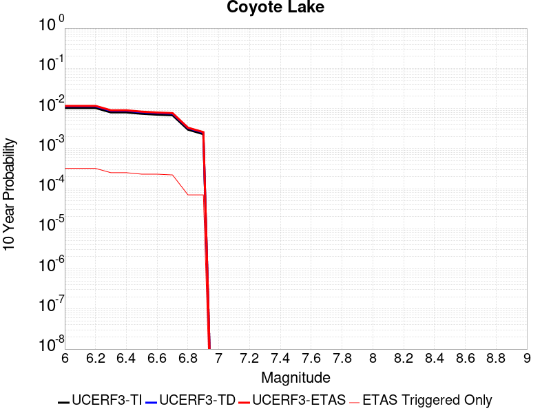 |

| Magnitude | 1 wk TI Prob | 1 wk TD Prob | 1 wk ETAS Prob | 1 wk ETAS/TD Gain | 1 wk ETAS Triggered Only | 1 mo TI Prob | 1 mo TD Prob | 1 mo ETAS Prob | 1 mo ETAS/TD Gain | 1 mo ETAS Triggered Only | 1 yr TI Prob | 1 yr TD Prob | 1 yr ETAS Prob | 1 yr ETAS/TD Gain | 1 yr ETAS Triggered Only | 10 yr TI Prob | 10 yr TD Prob | 10 yr ETAS Prob | 10 yr ETAS/TD Gain | 10 yr ETAS Triggered Only |
|-----|-----|-----|-----|-----|-----|-----|-----|-----|-----|-----|-----|-----|-----|-----|-----|-----|-----|-----|-----|-----|
| 6.0 | 1.980352E-5 | 2.1707852E-5 | 2.1707852E-5 | 1.0 | 0.0 | 8.486947E-5 | 9.303074E-5 | 1.18666096E-4 | 1.2755579 | 2.5637739E-5 | 0.0010327959 | 0.0011321327 | 0.0013113938 | 1.1583391 | 1.7946417E-4 | 0.010280091 | 0.01127083 | 0.0115496665 | 1.0247396 | 2.8201513E-4 |
| 6.1 | 1.980352E-5 | 2.1707852E-5 | 2.1707852E-5 | 1.0 | 0.0 | 8.486947E-5 | 9.303074E-5 | 1.18666096E-4 | 1.2755579 | 2.5637739E-5 | 0.0010327959 | 0.0011321327 | 0.0013113938 | 1.1583391 | 1.7946417E-4 | 0.010280091 | 0.01127083 | 0.0115496665 | 1.0247396 | 2.8201513E-4 |
| 6.2 | 1.980352E-5 | 2.1707852E-5 | 2.1707852E-5 | 1.0 | 0.0 | 8.486947E-5 | 9.303074E-5 | 1.18666096E-4 | 1.2755579 | 2.5637739E-5 | 0.0010327959 | 0.0011321327 | 0.0013113938 | 1.1583391 | 1.7946417E-4 | 0.010280091 | 0.01127083 | 0.0115496665 | 1.0247396 | 2.8201513E-4 |
| 6.3 | 1.5344787E-5 | 1.6821528E-5 | 1.6821528E-5 | 1.0 | 0.0 | 6.576172E-5 | 7.209062E-5 | 9.772651E-5 | 1.3556064 | 2.5637739E-5 | 8.003548E-4 | 8.7741105E-4 | 9.79872E-4 | 1.1167765 | 1.02550955E-4 | 0.007974784 | 0.008745514 | 0.008897996 | 1.0174353 | 1.5382643E-4 |
| 6.4 | 1.5344787E-5 | 1.6821528E-5 | 1.6821528E-5 | 1.0 | 0.0 | 6.576172E-5 | 7.209062E-5 | 9.772651E-5 | 1.3556064 | 2.5637739E-5 | 8.003548E-4 | 8.7741105E-4 | 9.79872E-4 | 1.1167765 | 1.02550955E-4 | 0.007974784 | 0.008745514 | 0.008897996 | 1.0174353 | 1.5382643E-4 |
| 6.5 | 1.4189697E-5 | 1.5558782E-5 | 1.5558782E-5 | 1.0 | 0.0 | 6.081157E-5 | 6.667913E-5 | 9.231517E-5 | 1.3844686 | 2.5637739E-5 | 7.401293E-4 | 8.115764E-4 | 9.1404415E-4 | 1.1262577 | 1.02550955E-4 | 0.0073766913 | 0.008092069 | 0.00824465 | 1.0188557 | 1.5382643E-4 |
| 6.6 | 1.3469301E-5 | 1.4772335E-5 | 1.4772335E-5 | 1.0 | 0.0 | 5.7724297E-5 | 6.330881E-5 | 8.894493E-5 | 1.4049376 | 2.5637739E-5 | 7.025667E-4 | 7.7057217E-4 | 8.730441E-4 | 1.1329817 | 1.02550955E-4 | 0.0070034964 | 0.0076849074 | 0.007837552 | 1.0198629 | 1.5382643E-4 |
| 6.7 | 1.3027966E-5 | 1.4282475E-5 | 1.4282475E-5 | 1.0 | 0.0 | 5.5832945E-5 | 6.12095E-5 | 8.684568E-5 | 1.4188266 | 2.5637739E-5 | 6.7955407E-4 | 7.450307E-4 | 8.4750523E-4 | 1.137544 | 1.02550955E-4 | 0.006774798 | 0.007431207 | 0.007558443 | 1.0171219 | 1.281887E-4 |
| 6.8 | 5.695434E-6 | 6.2247245E-6 | 6.2247245E-6 | 1.0 | 0.0 | 2.4408775E-5 | 2.6677288E-5 | 2.6677288E-5 | 1.0 | 0.0 | 2.971363E-4 | 3.2477756E-4 | 3.760364E-4 | 1.1578275 | 5.1275478E-5 | 0.0029673933 | 0.0032459702 | 0.0032970794 | 1.0157454 | 5.1275478E-5 |
| 6.9 | 4.385688E-6 | 4.7932917E-6 | 4.7932917E-6 | 1.0 | 0.0 | 1.879567E-5 | 2.0542679E-5 | 2.0542679E-5 | 1.0 | 0.0 | 2.2881327E-4 | 2.501071E-4 | 3.0136976E-4 | 1.2049628 | 5.1275478E-5 | 0.002285778 | 0.002501071 | 0.0025522183 | 1.0204501 | 5.1275478E-5 |

## San Andreas (Parkfield)
*[(top)](#table-of-contents)*

| 1 Week | 1 Month | 1 Year | 10 Year |
|-----|-----|-----|-----|
|  |  |  |  |

| Magnitude | 1 wk TI Prob | 1 wk TD Prob | 1 wk ETAS Prob | 1 wk ETAS/TD Gain | 1 wk ETAS Triggered Only | 1 mo TI Prob | 1 mo TD Prob | 1 mo ETAS Prob | 1 mo ETAS/TD Gain | 1 mo ETAS Triggered Only | 1 yr TI Prob | 1 yr TD Prob | 1 yr ETAS Prob | 1 yr ETAS/TD Gain | 1 yr ETAS Triggered Only | 10 yr TI Prob | 10 yr TD Prob | 10 yr ETAS Prob | 10 yr ETAS/TD Gain | 10 yr ETAS Triggered Only |
|-----|-----|-----|-----|-----|-----|-----|-----|-----|-----|-----|-----|-----|-----|-----|-----|-----|-----|-----|-----|-----|
| 6.0 | 5.556969E-4 | 7.819087E-4 | 8.587618E-4 | 1.098289 | 7.691322E-5 | 0.0023793848 | 0.0033472886 | 0.0034239443 | 1.0229008 | 7.691322E-5 | 0.028586963 | 0.040385824 | 0.040508833 | 1.0030459 | 1.281887E-4 | 0.25176284 | 0.33777508 | 0.33792788 | 1.0004524 | 2.3073965E-4 |
| 6.1 | 1.925858E-4 | 3.0390357E-4 | 3.295335E-4 | 1.0843358 | 2.5637739E-5 | 8.2510663E-4 | 0.0013018888 | 0.0013274932 | 1.019667 | 2.5637739E-5 | 0.0099994885 | 0.015834767 | 0.015885232 | 1.003187 | 5.1275478E-5 | 0.095613256 | 0.14999957 | 0.15010853 | 1.0007265 | 1.281887E-4 |
| 6.2 | 9.4306815E-5 | 1.8273306E-4 | 2.0836611E-4 | 1.140276 | 2.5637739E-5 | 4.0410945E-4 | 7.829079E-4 | 8.0852554E-4 | 1.0327212 | 2.5637739E-5 | 0.0049089384 | 0.009490452 | 0.0095412405 | 1.0053515 | 5.1275478E-5 | 0.048019063 | 0.09198628 | 0.092102684 | 1.0012654 | 1.281887E-4 |
| 6.3 | 9.283051E-5 | 1.7969737E-4 | 2.0533049E-4 | 1.1426461 | 2.5637739E-5 | 3.9778434E-4 | 7.6990545E-4 | 7.9552346E-4 | 1.0332742 | 2.5637739E-5 | 0.0048322747 | 0.009333515 | 0.009384312 | 1.0054424 | 5.1275478E-5 | 0.047285385 | 0.09063911 | 0.09075568 | 1.001286 | 1.281887E-4 |
| 6.4 | 9.138826E-5 | 1.7731739E-4 | 2.0295058E-4 | 1.144561 | 2.5637739E-5 | 3.916052E-4 | 7.5971155E-4 | 7.853298E-4 | 1.0337211 | 2.5637739E-5 | 0.0047573745 | 0.00921046 | 0.009261264 | 1.0055158 | 5.1275478E-5 | 0.046568092 | 0.0895407 | 0.08965741 | 1.0013034 | 1.281887E-4 |
| 6.5 | 9.000255E-5 | 1.7489606E-4 | 2.005293E-4 | 1.1465628 | 2.5637739E-5 | 3.8566816E-4 | 7.493404E-4 | 7.749589E-4 | 1.0341882 | 2.5637739E-5 | 0.0046854047 | 0.009085262 | 0.009136071 | 1.0055926 | 5.1275478E-5 | 0.045878403 | 0.08842592 | 0.08854277 | 1.0013214 | 1.281887E-4 |
| 6.6 | 8.8109264E-5 | 1.7170387E-4 | 1.9733721E-4 | 1.149288 | 2.5637739E-5 | 3.7755648E-4 | 7.3566736E-4 | 7.6128624E-4 | 1.034824 | 2.5637739E-5 | 0.0045870654 | 0.0089201825 | 0.008971 | 1.005697 | 5.1275478E-5 | 0.04493529 | 0.08695624 | 0.08707328 | 1.001346 | 1.281887E-4 |
| 6.7 | 8.738073E-5 | 1.7037381E-4 | 1.9600718E-4 | 1.1504537 | 2.5637739E-5 | 3.7443507E-4 | 7.2997034E-4 | 7.5558934E-4 | 1.0350959 | 2.5637739E-5 | 0.0045492216 | 0.0088514285 | 0.00890225 | 1.0057416 | 5.1275478E-5 | 0.04457213 | 0.08635636 | 0.08647348 | 1.0013562 | 1.281887E-4 |
| 6.8 | 8.710195E-5 | 1.6982816E-4 | 1.9546154E-4 | 1.1509372 | 2.5637739E-5 | 3.7324068E-4 | 7.2763313E-4 | 7.532522E-4 | 1.0352088 | 2.5637739E-5 | 0.0045347405 | 0.008823211 | 0.0088740345 | 1.0057602 | 5.1275478E-5 | 0.04443313 | 0.08610373 | 0.08622088 | 1.0013605 | 1.281887E-4 |
| 6.9 | 8.6801556E-5 | 1.6923707E-4 | 1.9487047E-4 | 1.1514645 | 2.5637739E-5 | 3.7195362E-4 | 7.251013E-4 | 7.507204E-4 | 1.0353318 | 2.5637739E-5 | 0.0045191357 | 0.008792636 | 0.00884346 | 1.0057803 | 5.1275478E-5 | 0.044283327 | 0.08582957 | 0.08594675 | 1.0013653 | 1.281887E-4 |
| 7.0 | 8.5571606E-5 | 1.6676294E-4 | 1.923964E-4 | 1.153712 | 2.5637739E-5 | 3.6668387E-4 | 7.145037E-4 | 7.401231E-4 | 1.0358562 | 2.5637739E-5 | 0.004455241 | 0.008664643 | 0.008715474 | 1.0058665 | 5.1275478E-5 | 0.043669727 | 0.08467713 | 0.08479446 | 1.0013857 | 1.281887E-4 |
| 7.1 | 7.82589E-5 | 1.5156237E-4 | 1.7719623E-4 | 1.1691307 | 2.5637739E-5 | 3.3535215E-4 | 6.493921E-4 | 6.750132E-4 | 1.039454 | 2.5637739E-5 | 0.0040752706 | 0.007877857 | 0.007928729 | 1.0064576 | 5.1275478E-5 | 0.040013418 | 0.077585794 | 0.077680394 | 1.0012193 | 1.02550955E-4 |
| 7.2 | 7.690929E-5 | 1.489332E-4 | 1.7456713E-4 | 1.1721169 | 2.5637739E-5 | 3.2956956E-4 | 6.381298E-4 | 6.6375115E-4 | 1.0401508 | 2.5637739E-5 | 0.004005129 | 0.007741721 | 0.0077925995 | 1.006572 | 5.1275478E-5 | 0.0393371 | 0.076358445 | 0.076453164 | 1.0012405 | 1.02550955E-4 |
| 7.3 | 7.5543794E-5 | 1.4589565E-4 | 1.7152965E-4 | 1.1757009 | 2.5637739E-5 | 3.2371894E-4 | 6.25118E-4 | 6.507397E-4 | 1.040987 | 2.5637739E-5 | 0.003934157 | 0.0075844154 | 0.007635302 | 1.0067093 | 5.1275478E-5 | 0.038652334 | 0.07492032 | 0.07501519 | 1.0012662 | 1.02550955E-4 |
| 7.4 | 7.4214564E-5 | 1.4290171E-4 | 1.685358E-4 | 1.1793826 | 2.5637739E-5 | 3.1802364E-4 | 6.122929E-4 | 6.379149E-4 | 1.041846 | 2.5637739E-5 | 0.003865065 | 0.007429345 | 0.0074802395 | 1.0068505 | 5.1275478E-5 | 0.03798529 | 0.07349284 | 0.07358785 | 1.0012928 | 1.02550955E-4 |
| 7.5 | 6.149578E-5 | 1.1214155E-4 | 1.3777641E-4 | 1.2285938 | 2.5637739E-5 | 2.6352672E-4 | 4.8051824E-4 | 5.0614367E-4 | 1.0533288 | 2.5637739E-5 | 0.0032037178 | 0.005834648 | 0.0058601364 | 1.0043684 | 2.5637739E-5 | 0.03157923 | 0.058665328 | 0.05873773 | 1.0012342 | 7.691322E-5 |
| 7.6 | 6.0643448E-5 | 1.10425855E-4 | 1.3606076E-4 | 1.2321459 | 2.5637739E-5 | 2.598746E-4 | 4.7316792E-4 | 4.9879355E-4 | 1.0541575 | 2.5637739E-5 | 0.0031593828 | 0.0057456335 | 0.0057711243 | 1.0044365 | 2.5637739E-5 | 0.031148417 | 0.05782546 | 0.05789793 | 1.0012531 | 7.691322E-5 |
| 7.7 | 5.1652263E-5 | 9.1955124E-5 | 1.17590505E-4 | 1.2787814 | 2.5637739E-5 | 2.2134806E-4 | 3.9403388E-4 | 4.1966152E-4 | 1.0650392 | 2.5637739E-5 | 0.002691582 | 0.00478682 | 0.004812335 | 1.0053302 | 2.5637739E-5 | 0.026592141 | 0.048633553 | 0.048706725 | 1.0015045 | 7.691322E-5 |
| 7.8 | 4.8090482E-5 | 8.578783E-5 | 1.1142337E-4 | 1.2988249 | 2.5637739E-5 | 2.060858E-4 | 3.6761034E-4 | 3.9323868E-4 | 1.069716 | 2.5637739E-5 | 0.0025062072 | 0.004466479 | 0.0044920025 | 1.0057144 | 2.5637739E-5 | 0.024781305 | 0.045392275 | 0.045465697 | 1.0016176 | 7.691322E-5 |
| 7.9 | 3.970278E-5 | 6.7652974E-5 | 9.3288974E-5 | 1.3789339 | 2.5637739E-5 | 1.7014367E-4 | 2.899091E-4 | 3.155394E-4 | 1.0884081 | 2.5637739E-5 | 0.002069531 | 0.0035239344 | 0.0035494817 | 1.0072497 | 2.5637739E-5 | 0.020503636 | 0.035952512 | 0.03602666 | 1.0020624 | 7.691322E-5 |
| 8.0 | 2.8982335E-5 | 4.079188E-5 | 6.6428576E-5 | 1.6284754 | 2.5637739E-5 | 1.2420409E-4 | 1.7481064E-4 | 2.004439E-4 | 1.1466345 | 2.5637739E-5 | 0.0015111357 | 0.0021262432 | 0.0021518264 | 1.0120322 | 2.5637739E-5 | 0.015009012 | 0.022057572 | 0.022082645 | 1.0011367 | 2.5637739E-5 |
| 8.1 | 1.8836186E-5 | 1.8733741E-5 | 4.4370998E-5 | 2.3685071 | 2.5637739E-5 | 8.0724014E-5 | 8.028499E-5 | 1.0592067E-4 | 1.3193085 | 2.5637739E-5 | 9.823717E-4 | 9.77032E-4 | 0.0010026448 | 1.0262148 | 2.5637739E-5 | 0.009780403 | 0.010515724 | 0.010541093 | 1.0024124 | 2.5637739E-5 |
| 8.2 | 8.643924E-6 | 5.49522E-6 | 5.49522E-6 | 1.0 | 0.0 | 3.704486E-5 | 2.355073E-5 | 2.355073E-5 | 1.0 | 0.0 | 4.5092785E-4 | 2.866925E-4 | 2.866925E-4 | 1.0 | 0.0 | 0.0045001395 | 0.0032598388 | 0.0032598388 | 1.0 | 0.0 |
| 8.3 | 1.983087E-6 | 7.693574E-7 | 7.693574E-7 | 1.0 | 0.0 | 8.498917E-6 | 3.297242E-6 | 3.297242E-6 | 1.0 | 0.0 | 1.034694E-4 | 4.01432E-5 | 4.01432E-5 | 1.0 | 0.0 | 0.0010342124 | 4.7390026E-4 | 4.7390026E-4 | 1.0 | 0.0 |

## Helendale-So Lockhart
*[(top)](#table-of-contents)*

| 1 Week | 1 Month | 1 Year | 10 Year |
|-----|-----|-----|-----|
|  |  |  |  |

| Magnitude | 1 wk TI Prob | 1 wk TD Prob | 1 wk ETAS Prob | 1 wk ETAS/TD Gain | 1 wk ETAS Triggered Only | 1 mo TI Prob | 1 mo TD Prob | 1 mo ETAS Prob | 1 mo ETAS/TD Gain | 1 mo ETAS Triggered Only | 1 yr TI Prob | 1 yr TD Prob | 1 yr ETAS Prob | 1 yr ETAS/TD Gain | 1 yr ETAS Triggered Only | 10 yr TI Prob | 10 yr TD Prob | 10 yr ETAS Prob | 10 yr ETAS/TD Gain | 10 yr ETAS Triggered Only |
|-----|-----|-----|-----|-----|-----|-----|-----|-----|-----|-----|-----|-----|-----|-----|-----|-----|-----|-----|-----|-----|
| 6.0 | 1.7296055E-5 | 1.810418E-5 | 4.3741453E-5 | 2.4160972 | 2.5637739E-5 | 7.412385E-5 | 7.7587145E-5 | 1.032229E-4 | 1.3304123 | 2.5637739E-5 | 9.0208417E-4 | 9.442349E-4 | 0.0011747567 | 1.2441361 | 2.3073965E-4 | 0.008984311 | 0.009404349 | 0.009683711 | 1.0297058 | 2.8201513E-4 |
| 6.1 | 1.7296055E-5 | 1.810418E-5 | 4.3741453E-5 | 2.4160972 | 2.5637739E-5 | 7.412385E-5 | 7.7587145E-5 | 1.032229E-4 | 1.3304123 | 2.5637739E-5 | 9.0208417E-4 | 9.442349E-4 | 0.0011747567 | 1.2441361 | 2.3073965E-4 | 0.008984311 | 0.009404349 | 0.009683711 | 1.0297058 | 2.8201513E-4 |
| 6.2 | 1.7296055E-5 | 1.810418E-5 | 4.3741453E-5 | 2.4160972 | 2.5637739E-5 | 7.412385E-5 | 7.7587145E-5 | 1.032229E-4 | 1.3304123 | 2.5637739E-5 | 9.0208417E-4 | 9.442349E-4 | 0.0011747567 | 1.2441361 | 2.3073965E-4 | 0.008984311 | 0.009404349 | 0.009683711 | 1.0297058 | 2.8201513E-4 |
| 6.3 | 1.0669118E-5 | 1.1135683E-5 | 3.6773137E-5 | 3.3022795 | 2.5637739E-5 | 4.5723988E-5 | 4.7723497E-5 | 7.336002E-5 | 1.5371885 | 2.5637739E-5 | 5.5654737E-4 | 5.808815E-4 | 7.8586425E-4 | 1.3528823 | 2.0510191E-4 | 0.0055515557 | 0.0057939277 | 0.0060233306 | 1.0395937 | 2.3073965E-4 |
| 6.4 | 1.0669118E-5 | 1.1135683E-5 | 3.6773137E-5 | 3.3022795 | 2.5637739E-5 | 4.5723988E-5 | 4.7723497E-5 | 7.336002E-5 | 1.5371885 | 2.5637739E-5 | 5.5654737E-4 | 5.808815E-4 | 7.8586425E-4 | 1.3528823 | 2.0510191E-4 | 0.0055515557 | 0.0057939277 | 0.0060233306 | 1.0395937 | 2.3073965E-4 |
| 6.5 | 8.790038E-6 | 9.170408E-6 | 3.4807912E-5 | 3.7956777 | 2.5637739E-5 | 3.767105E-5 | 3.930116E-5 | 6.493789E-5 | 1.6523148 | 2.5637739E-5 | 4.585485E-4 | 4.7838816E-4 | 6.8339193E-4 | 1.4285302 | 2.0510191E-4 | 0.0045760344 | 0.0047737476 | 0.005003386 | 1.0481044 | 2.3073965E-4 |
| 6.6 | 7.396949E-6 | 7.715714E-6 | 3.3353255E-5 | 4.32277 | 2.5637739E-5 | 3.1700827E-5 | 3.306693E-5 | 5.8703823E-5 | 1.775303 | 2.5637739E-5 | 3.858892E-4 | 4.025165E-4 | 5.56281E-4 | 1.382008 | 1.5382643E-4 | 0.003852198 | 0.0040179817 | 0.004196725 | 1.0444858 | 1.7946417E-4 |
| 6.7 | 6.4600285E-6 | 6.738185E-6 | 3.2375752E-5 | 4.8048177 | 2.5637739E-5 | 2.7685543E-5 | 2.8877621E-5 | 5.4514618E-5 | 1.8877808 | 2.5637739E-5 | 3.3701936E-4 | 3.515291E-4 | 5.0530146E-4 | 1.4374385 | 1.5382643E-4 | 0.0033650869 | 0.003509812 | 0.0036886462 | 1.0509527 | 1.7946417E-4 |
| 6.8 | 5.600104E-6 | 5.8361397E-6 | 3.147373E-5 | 5.392902 | 2.5637739E-5 | 2.4000226E-5 | 2.5011792E-5 | 5.064889E-5 | 2.0250003 | 2.5637739E-5 | 2.9216358E-4 | 3.0447662E-4 | 4.0699635E-4 | 1.3367081 | 1.02550955E-4 | 0.0029177975 | 0.003040656 | 0.0031684549 | 1.0420301 | 1.281887E-4 |
| 6.9 | 4.839122E-6 | 5.03962E-6 | 5.03962E-6 | 1.0 | 0.0 | 2.0738931E-5 | 2.1598196E-5 | 2.1598196E-5 | 1.0 | 0.0 | 2.5246723E-4 | 2.6292677E-4 | 3.3981976E-4 | 1.2924502 | 7.691322E-5 | 0.002521806 | 0.0026262044 | 0.0027029156 | 1.02921 | 7.691322E-5 |
| 7.0 | 3.6937633E-6 | 3.8452918E-6 | 3.8452918E-6 | 1.0 | 0.0 | 1.5830317E-5 | 1.6479718E-5 | 1.6479718E-5 | 1.0 | 0.0 | 1.9271708E-4 | 2.0062242E-4 | 2.2625501E-4 | 1.1277654 | 2.5637739E-5 | 0.0019255003 | 0.0020044446 | 0.0020300308 | 1.0127648 | 2.5637739E-5 |
| 7.1 | 2.7858857E-6 | 2.8979157E-6 | 2.8979157E-6 | 1.0 | 0.0 | 1.1939455E-5 | 1.241958E-5 | 1.241958E-5 | 1.0 | 0.0 | 1.4535317E-4 | 1.5119811E-4 | 1.7683198E-4 | 1.1695383 | 2.5637739E-5 | 0.0014525814 | 0.0015109739 | 0.0015365729 | 1.016942 | 2.5637739E-5 |
| 7.2 | 2.1672065E-6 | 2.2540607E-6 | 2.2540607E-6 | 1.0 | 0.0 | 9.2879945E-6 | 9.660225E-6 | 9.660225E-6 | 1.0 | 0.0 | 1.1307546E-4 | 1.1760708E-4 | 1.432418E-4 | 1.2179692 | 2.5637739E-5 | 0.0011301794 | 0.0011754666 | 0.0012010742 | 1.021785 | 2.5637739E-5 |
| 7.3 | 1.4823496E-6 | 1.5422432E-6 | 1.5422432E-6 | 1.0 | 0.0 | 6.3529114E-6 | 6.609598E-6 | 6.609598E-6 | 1.0 | 0.0 | 7.734395E-5 | 8.0469035E-5 | 8.0469035E-5 | 1.0 | 0.0 | 7.731704E-4 | 8.044141E-4 | 8.044141E-4 | 1.0 | 0.0 |
| 7.4 | 4.2321457E-7 | 4.4109754E-7 | 4.4109754E-7 | 1.0 | 0.0 | 1.8137755E-6 | 1.8904169E-6 | 1.8904169E-6 | 1.0 | 0.0 | 2.2082493E-5 | 2.301563E-5 | 2.301563E-5 | 1.0 | 0.0 | 2.2080299E-4 | 2.3013698E-4 | 2.3013698E-4 | 1.0 | 0.0 |
| 7.5 | 5.6942316E-8 | 5.9417015E-8 | 5.9417015E-8 | 1.0 | 0.0 | 2.440385E-7 | 2.5464433E-7 | 2.5464433E-7 | 1.0 | 0.0 | 2.9711643E-6 | 3.100291E-6 | 3.100291E-6 | 1.0 | 0.0 | 2.9711247E-5 | 3.1002557E-5 | 3.1002557E-5 | 1.0 | 0.0 |

## San Andreas (San Bernardino S)
*[(top)](#table-of-contents)*

| 1 Week | 1 Month | 1 Year | 10 Year |
|-----|-----|-----|-----|
|  |  |  |  |

| Magnitude | 1 wk TI Prob | 1 wk TD Prob | 1 wk ETAS Prob | 1 wk ETAS/TD Gain | 1 wk ETAS Triggered Only | 1 mo TI Prob | 1 mo TD Prob | 1 mo ETAS Prob | 1 mo ETAS/TD Gain | 1 mo ETAS Triggered Only | 1 yr TI Prob | 1 yr TD Prob | 1 yr ETAS Prob | 1 yr ETAS/TD Gain | 1 yr ETAS Triggered Only | 10 yr TI Prob | 10 yr TD Prob | 10 yr ETAS Prob | 10 yr ETAS/TD Gain | 10 yr ETAS Triggered Only |
|-----|-----|-----|-----|-----|-----|-----|-----|-----|-----|-----|-----|-----|-----|-----|-----|-----|-----|-----|-----|-----|
| 6.0 | 1.2336002E-4 | 3.0023555E-4 | 3.0023555E-4 | 1.0 | 0.0 | 5.2857865E-4 | 0.0012861154 | 0.0012861154 | 1.0 | 0.0 | 0.006416472 | 0.015550992 | 0.015702426 | 1.009738 | 1.5382643E-4 | 0.06234337 | 0.14291383 | 0.14315554 | 1.0016913 | 2.8201513E-4 |
| 6.1 | 1.2336002E-4 | 3.0023555E-4 | 3.0023555E-4 | 1.0 | 0.0 | 5.2857865E-4 | 0.0012861154 | 0.0012861154 | 1.0 | 0.0 | 0.006416472 | 0.015550992 | 0.015702426 | 1.009738 | 1.5382643E-4 | 0.06234337 | 0.14291383 | 0.14315554 | 1.0016913 | 2.8201513E-4 |
| 6.2 | 1.2336002E-4 | 3.0023555E-4 | 3.0023555E-4 | 1.0 | 0.0 | 5.2857865E-4 | 0.0012861154 | 0.0012861154 | 1.0 | 0.0 | 0.006416472 | 0.015550992 | 0.015702426 | 1.009738 | 1.5382643E-4 | 0.06234337 | 0.14291383 | 0.14315554 | 1.0016913 | 2.8201513E-4 |
| 6.3 | 1.1712257E-4 | 2.8811657E-4 | 2.8811657E-4 | 1.0 | 0.0 | 5.018573E-4 | 0.0012342266 | 0.0012342266 | 1.0 | 0.0 | 0.006093008 | 0.0149280215 | 0.015079551 | 1.0101507 | 1.5382643E-4 | 0.059286322 | 0.13762207 | 0.13786528 | 1.0017672 | 2.8201513E-4 |
| 6.4 | 1.1712257E-4 | 2.8811657E-4 | 2.8811657E-4 | 1.0 | 0.0 | 5.018573E-4 | 0.0012342266 | 0.0012342266 | 1.0 | 0.0 | 0.006093008 | 0.0149280215 | 0.015079551 | 1.0101507 | 1.5382643E-4 | 0.059286322 | 0.13762207 | 0.13786528 | 1.0017672 | 2.8201513E-4 |
| 6.5 | 1.0689076E-4 | 2.682418E-4 | 2.682418E-4 | 1.0 | 0.0 | 4.5802278E-4 | 0.001149126 | 0.001149126 | 1.0 | 0.0 | 0.0055621783 | 0.013905481 | 0.014057169 | 1.0109085 | 1.5382643E-4 | 0.05425003 | 0.12886871 | 0.12911439 | 1.0019064 | 2.8201513E-4 |
| 6.6 | 9.7648895E-5 | 2.506867E-4 | 2.506867E-4 | 1.0 | 0.0 | 4.1842813E-4 | 0.0010739529 | 0.0010739529 | 1.0 | 0.0 | 0.005082469 | 0.0130013535 | 0.01315318 | 1.0116777 | 1.5382643E-4 | 0.049677886 | 0.12102797 | 0.12127585 | 1.0020481 | 2.8201513E-4 |
| 6.7 | 8.757013E-5 | 2.3139146E-4 | 2.3139146E-4 | 1.0 | 0.0 | 3.7524657E-4 | 9.913231E-4 | 9.913231E-4 | 1.0 | 0.0 | 0.00455906 | 0.012006655 | 0.012133305 | 1.0105482 | 1.281887E-4 | 0.04466656 | 0.112335846 | 0.11254066 | 1.0018233 | 2.3073965E-4 |
| 6.8 | 8.562978E-5 | 2.2698891E-4 | 2.2698891E-4 | 1.0 | 0.0 | 3.6693315E-4 | 9.7246916E-4 | 9.7246916E-4 | 1.0 | 0.0 | 0.004458263 | 0.011779605 | 0.011906285 | 1.0107541 | 1.281887E-4 | 0.043698758 | 0.11034572 | 0.110551 | 1.0018604 | 2.3073965E-4 |
| 6.9 | 6.124075E-5 | 1.7082063E-4 | 1.7082063E-4 | 1.0 | 0.0 | 2.6243398E-4 | 7.318838E-4 | 7.318838E-4 | 1.0 | 0.0 | 0.0031904527 | 0.008874487 | 0.008976128 | 1.0114532 | 1.02550955E-4 | 0.031450346 | 0.08425208 | 0.0844399 | 1.0022293 | 2.0510191E-4 |
| 7.0 | 5.8598747E-5 | 1.6510907E-4 | 1.6510907E-4 | 1.0 | 0.0 | 2.5111332E-4 | 7.0741924E-4 | 7.0741924E-4 | 1.0 | 0.0 | 0.0030530186 | 0.008579012 | 0.008680684 | 1.0118512 | 1.02550955E-4 | 0.03011414 | 0.08156926 | 0.081757635 | 1.0023093 | 2.0510191E-4 |
| 7.1 | 5.613814E-5 | 1.5929298E-4 | 1.5929298E-4 | 1.0 | 0.0 | 2.4056983E-4 | 6.825063E-4 | 6.825063E-4 | 1.0 | 0.0 | 0.0029250039 | 0.0082780365 | 0.008379739 | 1.0122857 | 1.02550955E-4 | 0.028868021 | 0.078867756 | 0.07905668 | 1.0023955 | 2.0510191E-4 |
| 7.2 | 4.991222E-5 | 1.4535384E-4 | 1.4535384E-4 | 1.0 | 0.0 | 2.1389198E-4 | 6.227967E-4 | 6.227967E-4 | 1.0 | 0.0 | 0.002601025 | 0.0075562913 | 0.007658067 | 1.0134691 | 1.02550955E-4 | 0.025707912 | 0.072320335 | 0.0725106 | 1.002631 | 2.0510191E-4 |
| 7.3 | 4.7410045E-5 | 1.3729246E-4 | 1.3729246E-4 | 1.0 | 0.0 | 2.0317009E-4 | 5.882639E-4 | 5.882639E-4 | 1.0 | 0.0 | 0.0024707897 | 0.0071386793 | 0.0072404984 | 1.014263 | 1.02550955E-4 | 0.024434982 | 0.06860168 | 0.068792716 | 1.0027846 | 2.0510191E-4 |
| 7.4 | 4.5556746E-5 | 1.313689E-4 | 1.313689E-4 | 1.0 | 0.0 | 1.952286E-4 | 5.628884E-4 | 5.628884E-4 | 1.0 | 0.0 | 0.002374317 | 0.006831711 | 0.0069335615 | 1.0149084 | 1.02550955E-4 | 0.023491086 | 0.06585319 | 0.06604479 | 1.0029094 | 2.0510191E-4 |
| 7.5 | 4.3084514E-5 | 1.2371907E-4 | 1.2371907E-4 | 1.0 | 0.0 | 1.8463485E-4 | 5.3011713E-4 | 5.3011713E-4 | 1.0 | 0.0 | 0.0022456115 | 0.0064351484 | 0.0065370393 | 1.0158335 | 1.02550955E-4 | 0.022230545 | 0.062252887 | 0.062445223 | 1.0030895 | 2.0510191E-4 |
| 7.6 | 3.408608E-5 | 9.8489814E-5 | 9.8489814E-5 | 1.0 | 0.0 | 1.4607502E-4 | 4.2203104E-4 | 4.2203104E-4 | 1.0 | 0.0 | 0.0017770125 | 0.005126148 | 0.0052281735 | 1.019903 | 1.02550955E-4 | 0.017628696 | 0.050079897 | 0.050274726 | 1.0038904 | 2.0510191E-4 |
| 7.7 | 2.8315713E-5 | 8.261325E-5 | 8.261325E-5 | 1.0 | 0.0 | 1.2134742E-4 | 3.5400878E-4 | 3.5400878E-4 | 1.0 | 0.0 | 0.0014764034 | 0.004301548 | 0.0044036577 | 1.0237379 | 1.02550955E-4 | 0.01466633 | 0.042327844 | 0.042524263 | 1.0046405 | 2.0510191E-4 |
| 7.8 | 2.6222975E-5 | 7.4749165E-5 | 7.4749165E-5 | 1.0 | 0.0 | 1.1237934E-4 | 3.2031426E-4 | 3.2031426E-4 | 1.0 | 0.0 | 0.0013673597 | 0.0038928585 | 0.00399501 | 1.0262408 | 1.02550955E-4 | 0.013589768 | 0.038489804 | 0.038687013 | 1.0051236 | 2.0510191E-4 |
| 7.9 | 2.1469694E-5 | 5.7977377E-5 | 5.7977377E-5 | 1.0 | 0.0 | 9.200973E-5 | 2.4845081E-4 | 2.4845081E-4 | 1.0 | 0.0 | 0.0011196428 | 0.003020696 | 0.0031229372 | 1.0338469 | 1.02550955E-4 | 0.011140184 | 0.030197 | 0.030395908 | 1.006587 | 2.0510191E-4 |
| 8.0 | 1.2420249E-5 | 3.1373827E-5 | 3.1373827E-5 | 1.0 | 0.0 | 5.322855E-5 | 1.3445233E-4 | 1.3445233E-4 | 1.0 | 0.0 | 6.478649E-4 | 0.001635729 | 0.0016869206 | 1.0312959 | 5.1275478E-5 | 0.0064597935 | 0.016548108 | 0.016598536 | 1.0030473 | 5.1275478E-5 |
| 8.1 | 4.9197724E-6 | 7.842378E-6 | 7.842378E-6 | 1.0 | 0.0 | 2.1084568E-5 | 3.360976E-5 | 3.360976E-5 | 1.0 | 0.0 | 2.566744E-4 | 4.0912212E-4 | 4.0912212E-4 | 1.0 | 0.0 | 0.002563781 | 0.004394436 | 0.004394436 | 1.0 | 0.0 |
| 8.2 | 2.5634774E-6 | 2.9160003E-6 | 2.9160003E-6 | 1.0 | 0.0 | 1.0986286E-5 | 1.2497085E-5 | 1.2497085E-5 | 1.0 | 0.0 | 1.3374983E-4 | 1.5214144E-4 | 1.5214144E-4 | 1.0 | 0.0 | 0.0013366934 | 0.0017098442 | 0.0017098442 | 1.0 | 0.0 |
| 8.3 | 5.2850464E-7 | 3.2211614E-7 | 3.2211614E-7 | 1.0 | 0.0 | 2.2650179E-6 | 1.380497E-6 | 1.380497E-6 | 1.0 | 0.0 | 2.7576245E-5 | 1.6807435E-5 | 1.6807435E-5 | 1.0 | 0.0 | 2.7572823E-4 | 1.9939634E-4 | 1.9939634E-4 | 1.0 | 0.0 |

## San Andreas (Big Bend)
*[(top)](#table-of-contents)*

| 1 Week | 1 Month | 1 Year | 10 Year |
|-----|-----|-----|-----|
|  |  |  |  |

| Magnitude | 1 wk TI Prob | 1 wk TD Prob | 1 wk ETAS Prob | 1 wk ETAS/TD Gain | 1 wk ETAS Triggered Only | 1 mo TI Prob | 1 mo TD Prob | 1 mo ETAS Prob | 1 mo ETAS/TD Gain | 1 mo ETAS Triggered Only | 1 yr TI Prob | 1 yr TD Prob | 1 yr ETAS Prob | 1 yr ETAS/TD Gain | 1 yr ETAS Triggered Only | 10 yr TI Prob | 10 yr TD Prob | 10 yr ETAS Prob | 10 yr ETAS/TD Gain | 10 yr ETAS Triggered Only |
|-----|-----|-----|-----|-----|-----|-----|-----|-----|-----|-----|-----|-----|-----|-----|-----|-----|-----|-----|-----|-----|
| 6.0 | 1.0179969E-4 | 2.0106303E-4 | 2.2669561E-4 | 1.1274853 | 2.5637739E-5 | 4.362114E-4 | 8.614151E-4 | 9.126465E-4 | 1.0594734 | 5.1275478E-5 | 0.0052979486 | 0.010437581 | 0.010564432 | 1.0121533 | 1.281887E-4 | 0.051734097 | 0.10159716 | 0.101827495 | 1.0022671 | 2.563774E-4 |
| 6.1 | 1.0179969E-4 | 2.0106303E-4 | 2.2669561E-4 | 1.1274853 | 2.5637739E-5 | 4.362114E-4 | 8.614151E-4 | 9.126465E-4 | 1.0594734 | 5.1275478E-5 | 0.0052979486 | 0.010437581 | 0.010564432 | 1.0121533 | 1.281887E-4 | 0.051734097 | 0.10159716 | 0.101827495 | 1.0022671 | 2.563774E-4 |
| 6.2 | 1.0179969E-4 | 2.0106303E-4 | 2.2669561E-4 | 1.1274853 | 2.5637739E-5 | 4.362114E-4 | 8.614151E-4 | 9.126465E-4 | 1.0594734 | 5.1275478E-5 | 0.0052979486 | 0.010437581 | 0.010564432 | 1.0121533 | 1.281887E-4 | 0.051734097 | 0.10159716 | 0.101827495 | 1.0022671 | 2.563774E-4 |
| 6.3 | 1.0179969E-4 | 2.0106303E-4 | 2.2669561E-4 | 1.1274853 | 2.5637739E-5 | 4.362114E-4 | 8.614151E-4 | 9.126465E-4 | 1.0594734 | 5.1275478E-5 | 0.0052979486 | 0.010437581 | 0.010564432 | 1.0121533 | 1.281887E-4 | 0.051734097 | 0.10159716 | 0.101827495 | 1.0022671 | 2.563774E-4 |
| 6.4 | 9.1639464E-5 | 1.8462905E-4 | 2.1026205E-4 | 1.1388352 | 2.5637739E-5 | 3.9268145E-4 | 7.910276E-4 | 8.166451E-4 | 1.032385 | 2.5637739E-5 | 0.0047704205 | 0.009588352 | 0.00968992 | 1.0105928 | 1.02550955E-4 | 0.046693064 | 0.093921766 | 0.0941076 | 1.0019786 | 2.0510191E-4 |
| 6.5 | 9.1639464E-5 | 1.8462905E-4 | 2.1026205E-4 | 1.1388352 | 2.5637739E-5 | 3.9268145E-4 | 7.910276E-4 | 8.166451E-4 | 1.032385 | 2.5637739E-5 | 0.0047704205 | 0.009588352 | 0.00968992 | 1.0105928 | 1.02550955E-4 | 0.046693064 | 0.093921766 | 0.0941076 | 1.0019786 | 2.0510191E-4 |
| 6.6 | 9.042622E-5 | 1.826988E-4 | 2.0833185E-4 | 1.1403023 | 2.5637739E-5 | 3.8748336E-4 | 7.827601E-4 | 8.083778E-4 | 1.0327274 | 2.5637739E-5 | 0.0047074095 | 0.009488574 | 0.009590152 | 1.0107052 | 1.02550955E-4 | 0.046089325 | 0.093015574 | 0.09317834 | 1.00175 | 1.7946417E-4 |
| 6.7 | 8.9836685E-5 | 1.8184188E-4 | 2.0747495E-4 | 1.1409636 | 2.5637739E-5 | 3.8495753E-4 | 7.790898E-4 | 8.047075E-4 | 1.0328816 | 2.5637739E-5 | 0.00467679 | 0.009444275 | 0.009545858 | 1.010756 | 1.02550955E-4 | 0.045795817 | 0.09260978 | 0.09274936 | 1.0015072 | 1.5382643E-4 |
| 6.8 | 8.9471854E-5 | 1.8130938E-4 | 2.0694248E-4 | 1.1413776 | 2.5637739E-5 | 3.8339442E-4 | 7.7680906E-4 | 8.0242683E-4 | 1.0329783 | 2.5637739E-5 | 0.004657841 | 0.009416748 | 0.009518333 | 1.0107877 | 1.02550955E-4 | 0.04561414 | 0.09235688 | 0.0924965 | 1.0015117 | 1.5382643E-4 |
| 6.9 | 8.858234E-5 | 1.8012857E-4 | 2.057617E-4 | 1.1423045 | 2.5637739E-5 | 3.7958333E-4 | 7.717514E-4 | 7.9736934E-4 | 1.0331945 | 2.5637739E-5 | 0.004611638 | 0.009355701 | 0.009457292 | 1.0108588 | 1.02550955E-4 | 0.04517103 | 0.09179684 | 0.09193654 | 1.001522 | 1.5382643E-4 |
| 7.0 | 8.7433385E-5 | 1.7851574E-4 | 2.0414889E-4 | 1.1435905 | 2.5637739E-5 | 3.746607E-4 | 7.648433E-4 | 7.9046143E-4 | 1.0334946 | 2.5637739E-5 | 0.004551957 | 0.009272313 | 0.0093739135 | 1.0109574 | 1.02550955E-4 | 0.044598386 | 0.091031015 | 0.09117084 | 1.001536 | 1.5382643E-4 |
| 7.1 | 8.684964E-5 | 1.7763473E-4 | 2.0326792E-4 | 1.1443027 | 2.5637739E-5 | 3.7215967E-4 | 7.610698E-4 | 7.8668806E-4 | 1.0336608 | 2.5637739E-5 | 0.0045216335 | 0.009226761 | 0.009328366 | 1.011012 | 1.02550955E-4 | 0.04430731 | 0.09061238 | 0.090752274 | 1.0015438 | 1.5382643E-4 |
| 7.2 | 8.606521E-5 | 1.7654036E-4 | 2.0217357E-4 | 1.1451975 | 2.5637739E-5 | 3.6879873E-4 | 7.5638236E-4 | 7.820007E-4 | 1.0338696 | 2.5637739E-5 | 0.0044808835 | 0.009170174 | 0.009271784 | 1.0110805 | 1.02550955E-4 | 0.043916024 | 0.09009273 | 0.0902327 | 1.0015537 | 1.5382643E-4 |
| 7.3 | 8.568266E-5 | 1.7595981E-4 | 2.0159304E-4 | 1.1456766 | 2.5637739E-5 | 3.6715972E-4 | 7.5389567E-4 | 7.795141E-4 | 1.0339813 | 2.5637739E-5 | 0.0044610105 | 0.0091401525 | 0.009241766 | 1.0111172 | 1.02550955E-4 | 0.043725148 | 0.08981366 | 0.08995367 | 1.0015589 | 1.5382643E-4 |
| 7.4 | 8.5432206E-5 | 1.7558529E-4 | 2.0121851E-4 | 1.1459874 | 2.5637739E-5 | 3.6608664E-4 | 7.522915E-4 | 7.7791E-4 | 1.0340539 | 2.5637739E-5 | 0.004447999 | 0.009120786 | 0.009222401 | 1.0111411 | 1.02550955E-4 | 0.043600157 | 0.08963369 | 0.08977372 | 1.0015624 | 1.5382643E-4 |
| 7.5 | 8.4791965E-5 | 1.742772E-4 | 1.9991047E-4 | 1.1470833 | 2.5637739E-5 | 3.633435E-4 | 7.466887E-4 | 7.723073E-4 | 1.0343096 | 2.5637739E-5 | 0.0044147377 | 0.00905314 | 0.009129357 | 1.0084188 | 7.691322E-5 | 0.043280575 | 0.08901084 | 0.08912762 | 1.001312 | 1.281887E-4 |
| 7.6 | 8.241105E-5 | 1.6872598E-4 | 1.9435938E-4 | 1.1519233 | 2.5637739E-5 | 3.531424E-4 | 7.229111E-4 | 7.485303E-4 | 1.0354389 | 2.5637739E-5 | 0.0042910352 | 0.008766012 | 0.008842251 | 1.0086972 | 7.691322E-5 | 0.042091176 | 0.086385906 | 0.08650302 | 1.0013558 | 1.281887E-4 |
| 7.7 | 7.00432E-5 | 1.4233537E-4 | 1.6796945E-4 | 1.1800964 | 2.5637739E-5 | 3.001506E-4 | 6.0986617E-4 | 6.3548825E-4 | 1.0420127 | 2.5637739E-5 | 0.0036482112 | 0.0073998813 | 0.007450777 | 1.0068779 | 5.1275478E-5 | 0.035888977 | 0.07364825 | 0.073743254 | 1.0012898 | 1.02550955E-4 |
| 7.8 | 6.415362E-5 | 1.2995097E-4 | 1.5558538E-4 | 1.1972622 | 2.5637739E-5 | 2.749151E-4 | 5.568139E-4 | 5.824374E-4 | 1.046018 | 2.5637739E-5 | 0.0033419547 | 0.006758167 | 0.006809096 | 1.0075359 | 5.1275478E-5 | 0.03292141 | 0.06737108 | 0.06746671 | 1.0014197 | 1.02550955E-4 |
| 7.9 | 4.939911E-5 | 9.359872E-5 | 1.1923406E-4 | 1.2738856 | 2.5637739E-5 | 2.116933E-4 | 4.0107573E-4 | 4.2670316E-4 | 1.0638968 | 2.5637739E-5 | 0.0025743195 | 0.0048721726 | 0.0049231984 | 1.0104729 | 5.1275478E-5 | 0.025447013 | 0.04900208 | 0.049099606 | 1.0019902 | 1.02550955E-4 |
| 8.0 | 3.344983E-5 | 5.2337946E-5 | 7.797434E-5 | 1.4898243 | 2.5637739E-5 | 1.4334853E-4 | 2.2428621E-4 | 2.499182E-4 | 1.1142825 | 2.5637739E-5 | 0.0017438711 | 0.0027272669 | 0.0027528347 | 1.0093749 | 2.5637739E-5 | 0.017302496 | 0.027976755 | 0.028001675 | 1.0008907 | 2.5637739E-5 |
| 8.1 | 1.9104898E-5 | 1.9226556E-5 | 4.4863802E-5 | 2.3334289 | 2.5637739E-5 | 8.1875565E-5 | 8.2396924E-5 | 1.0803255E-4 | 1.3111236 | 2.5637739E-5 | 9.963791E-4 | 0.0010027215 | 0.0010283336 | 1.0255425 | 2.5637739E-5 | 0.009919235 | 0.01077785 | 0.0108032115 | 1.0023531 | 2.5637739E-5 |
| 8.2 | 8.643924E-6 | 5.49522E-6 | 5.49522E-6 | 1.0 | 0.0 | 3.704486E-5 | 2.355073E-5 | 2.355073E-5 | 1.0 | 0.0 | 4.5092785E-4 | 2.866925E-4 | 2.866925E-4 | 1.0 | 0.0 | 0.0045001395 | 0.0032598388 | 0.0032598388 | 1.0 | 0.0 |
| 8.3 | 1.983087E-6 | 7.693574E-7 | 7.693574E-7 | 1.0 | 0.0 | 8.498917E-6 | 3.297242E-6 | 3.297242E-6 | 1.0 | 0.0 | 1.034694E-4 | 4.01432E-5 | 4.01432E-5 | 1.0 | 0.0 | 0.0010342124 | 4.7390026E-4 | 4.7390026E-4 | 1.0 | 0.0 |

## Sierra Nevada  (No Extension)
*[(top)](#table-of-contents)*

| 1 Week | 1 Month | 1 Year | 10 Year |
|-----|-----|-----|-----|
|  |  |  |  |

| Magnitude | 1 wk TI Prob | 1 wk TD Prob | 1 wk ETAS Prob | 1 wk ETAS/TD Gain | 1 wk ETAS Triggered Only | 1 mo TI Prob | 1 mo TD Prob | 1 mo ETAS Prob | 1 mo ETAS/TD Gain | 1 mo ETAS Triggered Only | 1 yr TI Prob | 1 yr TD Prob | 1 yr ETAS Prob | 1 yr ETAS/TD Gain | 1 yr ETAS Triggered Only | 10 yr TI Prob | 10 yr TD Prob | 10 yr ETAS Prob | 10 yr ETAS/TD Gain | 10 yr ETAS Triggered Only |
|-----|-----|-----|-----|-----|-----|-----|-----|-----|-----|-----|-----|-----|-----|-----|-----|-----|-----|-----|-----|-----|
| 6.0 | 7.7690465E-6 | 6.976568E-6 | 6.976568E-6 | 1.0 | 0.0 | 3.329549E-5 | 2.9899435E-5 | 5.5536406E-5 | 1.85744 | 2.5637739E-5 | 4.0529718E-4 | 3.6400068E-4 | 4.665143E-4 | 1.2816303 | 1.02550955E-4 | 0.004045588 | 0.0036375606 | 0.0038930054 | 1.0702242 | 2.563774E-4 |
| 6.1 | 7.7690465E-6 | 6.976568E-6 | 6.976568E-6 | 1.0 | 0.0 | 3.329549E-5 | 2.9899435E-5 | 5.5536406E-5 | 1.85744 | 2.5637739E-5 | 4.0529718E-4 | 3.6400068E-4 | 4.665143E-4 | 1.2816303 | 1.02550955E-4 | 0.004045588 | 0.0036375606 | 0.0038930054 | 1.0702242 | 2.563774E-4 |
| 6.2 | 7.7690465E-6 | 6.976568E-6 | 6.976568E-6 | 1.0 | 0.0 | 3.329549E-5 | 2.9899435E-5 | 5.5536406E-5 | 1.85744 | 2.5637739E-5 | 4.0529718E-4 | 3.6400068E-4 | 4.665143E-4 | 1.2816303 | 1.02550955E-4 | 0.004045588 | 0.0036375606 | 0.0038930054 | 1.0702242 | 2.563774E-4 |
| 6.3 | 7.7690465E-6 | 6.976568E-6 | 6.976568E-6 | 1.0 | 0.0 | 3.329549E-5 | 2.9899435E-5 | 5.5536406E-5 | 1.85744 | 2.5637739E-5 | 4.0529718E-4 | 3.6400068E-4 | 4.665143E-4 | 1.2816303 | 1.02550955E-4 | 0.004045588 | 0.0036375606 | 0.0038930054 | 1.0702242 | 2.563774E-4 |
| 6.4 | 7.7690465E-6 | 6.976568E-6 | 6.976568E-6 | 1.0 | 0.0 | 3.329549E-5 | 2.9899435E-5 | 5.5536406E-5 | 1.85744 | 2.5637739E-5 | 4.0529718E-4 | 3.6400068E-4 | 4.665143E-4 | 1.2816303 | 1.02550955E-4 | 0.004045588 | 0.0036375606 | 0.0038930054 | 1.0702242 | 2.563774E-4 |
| 6.5 | 7.7690465E-6 | 6.976568E-6 | 6.976568E-6 | 1.0 | 0.0 | 3.329549E-5 | 2.9899435E-5 | 5.5536406E-5 | 1.85744 | 2.5637739E-5 | 4.0529718E-4 | 3.6400068E-4 | 4.665143E-4 | 1.2816303 | 1.02550955E-4 | 0.004045588 | 0.0036375606 | 0.0038930054 | 1.0702242 | 2.563774E-4 |
| 6.6 | 2.653E-6 | 1.6149635E-6 | 1.6149635E-6 | 1.0 | 0.0 | 1.136995E-5 | 6.9212538E-6 | 3.2558815E-5 | 4.704179 | 2.5637739E-5 | 1.3842035E-4 | 8.426304E-5 | 1.8680535E-4 | 2.216931 | 1.02550955E-4 | 0.0013833415 | 8.4231433E-4 | 0.0010728596 | 1.2737045 | 2.3073965E-4 |
| 6.7 | 2.5902466E-6 | 1.5502959E-6 | 1.5502959E-6 | 1.0 | 0.0 | 1.11010095E-5 | 6.644109E-6 | 3.2281678E-5 | 4.8586917 | 2.5637739E-5 | 1.351464E-4 | 8.0889055E-5 | 1.8343171E-4 | 2.2676952 | 1.02550955E-4 | 0.0013506424 | 8.0859906E-4 | 0.0010391522 | 1.2851266 | 2.3073965E-4 |
| 6.8 | 2.5853892E-6 | 1.5470957E-6 | 1.5470957E-6 | 1.0 | 0.0 | 1.1080193E-5 | 6.6303933E-6 | 3.2267963E-5 | 4.866674 | 2.5637739E-5 | 1.34893E-4 | 8.072208E-5 | 1.8326475E-4 | 2.2703176 | 1.02550955E-4 | 0.0013481114 | 8.069306E-4 | 0.001037484 | 1.2857167 | 2.3073965E-4 |
| 6.9 | 2.458257E-6 | 1.4221675E-6 | 1.4221675E-6 | 1.0 | 0.0 | 1.0535345E-5 | 6.0949897E-6 | 3.1732572E-5 | 5.2063375 | 2.5637739E-5 | 1.2826028E-4 | 7.420399E-5 | 1.7674733E-4 | 2.3819115 | 1.02550955E-4 | 0.0012818627 | 7.4179407E-4 | 9.723626E-4 | 1.3108255 | 2.3073965E-4 |
| 7.0 | 2.4341468E-6 | 1.3991308E-6 | 1.3991308E-6 | 1.0 | 0.0 | 1.0432016E-5 | 5.9962613E-6 | 3.1633845E-5 | 5.275595 | 2.5637739E-5 | 1.270024E-4 | 7.3002055E-5 | 1.7554553E-4 | 2.4046655 | 1.02550955E-4 | 0.0012692984 | 7.297827E-4 | 9.6035394E-4 | 1.3159451 | 2.3073965E-4 |
| 7.1 | 2.3652476E-6 | 1.334079E-6 | 1.334079E-6 | 1.0 | 0.0 | 1.0136736E-5 | 5.717469E-6 | 3.1355063E-5 | 5.484081 | 2.5637739E-5 | 1.2340778E-4 | 6.960797E-5 | 1.7215179E-4 | 2.473162 | 1.02550955E-4 | 0.0012333926 | 6.9586345E-4 | 9.264425E-4 | 1.3313568 | 2.3073965E-4 |
| 7.2 | 2.272158E-6 | 1.2503832E-6 | 1.2503832E-6 | 1.0 | 0.0 | 9.737784E-6 | 5.358774E-6 | 3.0996376E-5 | 5.784229 | 2.5637739E-5 | 1.1855107E-4 | 6.524114E-5 | 1.677854E-4 | 2.571773 | 1.02550955E-4 | 0.0011848784 | 6.522214E-4 | 8.828105E-4 | 1.3535444 | 2.3073965E-4 |
| 7.3 | 2.1382127E-6 | 1.1420682E-6 | 1.1420682E-6 | 1.0 | 0.0 | 9.163737E-6 | 4.894569E-6 | 3.053218E-5 | 6.237972 | 2.5637739E-5 | 1.1156279E-4 | 5.9589758E-5 | 1.621346E-4 | 2.720847 | 1.02550955E-4 | 0.001115068 | 5.95739E-4 | 8.2634116E-4 | 1.3870859 | 2.3073965E-4 |
| 7.4 | 1.9048055E-6 | 9.57617E-7 | 9.57617E-7 | 1.0 | 0.0 | 8.163426E-6 | 4.104066E-6 | 2.97417E-5 | 7.246886 | 2.5637739E-5 | 9.9385186E-5 | 4.9965867E-5 | 1.525117E-4 | 3.0523176 | 1.02550955E-4 | 9.934074E-4 | 4.99547E-4 | 7.301714E-4 | 1.4616671 | 2.3073965E-4 |
| 7.5 | 1.5373403E-6 | 7.560832E-7 | 7.560832E-7 | 1.0 | 0.0 | 6.5885843E-6 | 3.2403525E-6 | 2.8878008E-5 | 8.911996 | 2.5637739E-5 | 8.021306E-5 | 3.9450584E-5 | 1.4199749E-4 | 3.5993762 | 1.02550955E-4 | 8.0184115E-4 | 3.9443627E-4 | 5.994573E-4 | 1.5197823 | 2.0510191E-4 |
| 7.6 | 1.0680322E-6 | 4.6602182E-7 | 4.6602182E-7 | 1.0 | 0.0 | 4.577273E-6 | 1.997235E-6 | 2.7634922E-5 | 13.836592 | 2.5637739E-5 | 5.5726876E-5 | 2.4316065E-5 | 1.2686453E-4 | 5.2173133 | 1.02550955E-4 | 5.5712904E-4 | 2.431343E-4 | 4.2255485E-4 | 1.7379483 | 1.7946417E-4 |
| 7.7 | 5.509146E-7 | 1.558334E-7 | 1.558334E-7 | 1.0 | 0.0 | 2.3610605E-6 | 6.678573E-7 | 6.678573E-7 | 1.0 | 0.0 | 2.8745531E-5 | 8.131134E-6 | 3.3768665E-5 | 4.153008 | 2.5637739E-5 | 2.8741814E-4 | 8.130848E-5 | 1.3257978E-4 | 1.6305777 | 5.1275478E-5 |

## Death Valley (No)
*[(top)](#table-of-contents)*

| 1 Week | 1 Month | 1 Year | 10 Year |
|-----|-----|-----|-----|
|  |  |  |  |

| Magnitude | 1 wk TI Prob | 1 wk TD Prob | 1 wk ETAS Prob | 1 wk ETAS/TD Gain | 1 wk ETAS Triggered Only | 1 mo TI Prob | 1 mo TD Prob | 1 mo ETAS Prob | 1 mo ETAS/TD Gain | 1 mo ETAS Triggered Only | 1 yr TI Prob | 1 yr TD Prob | 1 yr ETAS Prob | 1 yr ETAS/TD Gain | 1 yr ETAS Triggered Only | 10 yr TI Prob | 10 yr TD Prob | 10 yr ETAS Prob | 10 yr ETAS/TD Gain | 10 yr ETAS Triggered Only |
|-----|-----|-----|-----|-----|-----|-----|-----|-----|-----|-----|-----|-----|-----|-----|-----|-----|-----|-----|-----|-----|
| 6.0 | 2.0074807E-5 | 2.2501532E-5 | 2.2501532E-5 | 1.0 | 0.0 | 8.603206E-5 | 9.643161E-5 | 1.22066886E-4 | 1.2658389 | 2.5637739E-5 | 0.001046937 | 0.00117343 | 0.0012758606 | 1.0872916 | 1.02550955E-4 | 0.010420183 | 0.011673254 | 0.011875962 | 1.0173651 | 2.0510191E-4 |
| 6.1 | 2.0074807E-5 | 2.2501532E-5 | 2.2501532E-5 | 1.0 | 0.0 | 8.603206E-5 | 9.643161E-5 | 1.22066886E-4 | 1.2658389 | 2.5637739E-5 | 0.001046937 | 0.00117343 | 0.0012758606 | 1.0872916 | 1.02550955E-4 | 0.010420183 | 0.011673254 | 0.011875962 | 1.0173651 | 2.0510191E-4 |
| 6.2 | 2.0074807E-5 | 2.2501532E-5 | 2.2501532E-5 | 1.0 | 0.0 | 8.603206E-5 | 9.643161E-5 | 1.22066886E-4 | 1.2658389 | 2.5637739E-5 | 0.001046937 | 0.00117343 | 0.0012758606 | 1.0872916 | 1.02550955E-4 | 0.010420183 | 0.011673254 | 0.011875962 | 1.0173651 | 2.0510191E-4 |
| 6.3 | 1.9050609E-5 | 2.1338312E-5 | 2.1338312E-5 | 1.0 | 0.0 | 8.164292E-5 | 9.1446746E-5 | 1.17082134E-4 | 1.2803314 | 2.5637739E-5 | 9.935491E-4 | 0.0011128022 | 0.0011896298 | 1.0690398 | 7.691322E-5 | 0.009891188 | 0.011073124 | 0.0112506 | 1.0160277 | 1.7946417E-4 |
| 6.4 | 1.9050609E-5 | 2.1338312E-5 | 2.1338312E-5 | 1.0 | 0.0 | 8.164292E-5 | 9.1446746E-5 | 1.17082134E-4 | 1.2803314 | 2.5637739E-5 | 9.935491E-4 | 0.0011128022 | 0.0011896298 | 1.0690398 | 7.691322E-5 | 0.009891188 | 0.011073124 | 0.0112506 | 1.0160277 | 1.7946417E-4 |
| 6.5 | 1.8367004E-5 | 2.0562318E-5 | 2.0562318E-5 | 1.0 | 0.0 | 7.8713354E-5 | 8.8121276E-5 | 1.1375676E-4 | 1.2909113 | 2.5637739E-5 | 9.5791375E-4 | 0.0010723551 | 0.0011491858 | 1.0716467 | 7.691322E-5 | 0.009537951 | 0.010672592 | 0.010850141 | 1.016636 | 1.7946417E-4 |
| 6.6 | 1.779439E-5 | 1.9912191E-5 | 1.9912191E-5 | 1.0 | 0.0 | 7.625944E-5 | 8.53352E-5 | 1.1097076E-4 | 1.30041 | 2.5637739E-5 | 9.280632E-4 | 0.0010384673 | 0.0011153007 | 1.0739872 | 7.691322E-5 | 0.009241969 | 0.010336905 | 0.010489142 | 1.0147275 | 1.5382643E-4 |
| 6.7 | 1.7025437E-5 | 1.904463E-5 | 1.904463E-5 | 1.0 | 0.0 | 7.296412E-5 | 8.161732E-5 | 1.0725296E-4 | 1.3140956 | 2.5637739E-5 | 8.87976E-4 | 9.93244E-4 | 0.0010700809 | 1.0773594 | 7.691322E-5 | 0.008844362 | 0.009888767 | 0.010041072 | 1.0154018 | 1.5382643E-4 |
| 6.8 | 1.6545107E-5 | 1.851372E-5 | 1.851372E-5 | 1.0 | 0.0 | 7.090568E-5 | 7.934213E-5 | 1.0497784E-4 | 1.3231033 | 2.5637739E-5 | 8.629347E-4 | 9.6556847E-4 | 0.0010424074 | 1.079579 | 7.691322E-5 | 0.008595915 | 0.009614435 | 0.009766783 | 1.0158457 | 1.5382643E-4 |
| 6.9 | 1.615478E-5 | 1.8088747E-5 | 1.8088747E-5 | 1.0 | 0.0 | 6.9232934E-5 | 7.7520934E-5 | 1.0315668E-4 | 1.3306946 | 2.5637739E-5 | 8.4258494E-4 | 9.4341475E-4 | 0.0010202554 | 1.0814495 | 7.691322E-5 | 0.008393973 | 0.009394792 | 0.009521776 | 1.0135164 | 1.281887E-4 |
| 7.0 | 1.5894311E-5 | 1.780669E-5 | 1.780669E-5 | 1.0 | 0.0 | 6.81167E-5 | 7.6312186E-5 | 1.0194797E-4 | 1.335933 | 2.5637739E-5 | 8.2900526E-4 | 9.287109E-4 | 0.0010055527 | 1.0827403 | 7.691322E-5 | 0.008259195 | 0.009248987 | 0.00937599 | 1.0137316 | 1.281887E-4 |
| 7.1 | 1.5602263E-5 | 1.7484625E-5 | 1.7484625E-5 | 1.0 | 0.0 | 6.6865134E-5 | 7.493199E-5 | 1.00567806E-4 | 1.3421211 | 2.5637739E-5 | 8.137789E-4 | 9.119212E-4 | 9.887643E-4 | 1.084265 | 7.691322E-5 | 0.008108052 | 0.009082474 | 0.009209499 | 1.0139856 | 1.281887E-4 |
| 7.2 | 1.5323829E-5 | 1.7171731E-5 | 1.7171731E-5 | 1.0 | 0.0 | 6.56719E-5 | 7.3591094E-5 | 9.922695E-5 | 1.3483554 | 2.5637739E-5 | 7.99262E-4 | 8.956093E-4 | 9.724537E-4 | 1.0858011 | 7.691322E-5 | 0.007963934 | 0.008920676 | 0.0090477215 | 1.0142417 | 1.281887E-4 |
| 7.3 | 1.4556212E-5 | 1.6303497E-5 | 1.6303497E-5 | 1.0 | 0.0 | 6.238227E-5 | 6.9870286E-5 | 9.5506235E-5 | 1.3669077 | 2.5637739E-5 | 7.592395E-4 | 8.503446E-4 | 9.2719245E-4 | 1.0903726 | 7.691322E-5 | 0.0075665074 | 0.008471553 | 0.008598655 | 1.0150034 | 1.281887E-4 |
| 7.4 | 1.411725E-5 | 1.5808968E-5 | 1.5808968E-5 | 1.0 | 0.0 | 6.0501097E-5 | 6.775099E-5 | 9.3386996E-5 | 1.3783857 | 2.5637739E-5 | 7.363519E-4 | 8.24562E-4 | 9.0141175E-4 | 1.0932008 | 7.691322E-5 | 0.0073391674 | 0.00821566 | 0.008342795 | 1.0154748 | 1.281887E-4 |
| 7.5 | 1.3503312E-5 | 1.5127256E-5 | 1.5127256E-5 | 1.0 | 0.0 | 5.7870053E-5 | 6.4829524E-5 | 9.04656E-5 | 1.3954383 | 2.5637739E-5 | 7.043401E-4 | 7.890194E-4 | 8.658719E-4 | 1.0974026 | 7.691322E-5 | 0.007021119 | 0.007862805 | 0.007989986 | 1.016175 | 1.281887E-4 |
| 7.6 | 1.1279839E-5 | 1.2627129E-5 | 1.2627129E-5 | 1.0 | 0.0 | 4.834127E-5 | 5.4115175E-5 | 5.4115175E-5 | 1.0 | 0.0 | 5.88396E-4 | 6.586584E-4 | 7.099001E-4 | 1.077797 | 5.1275478E-5 | 0.005868405 | 0.006567614 | 0.0066694915 | 1.0155121 | 1.02550955E-4 |
| 7.7 | 9.189108E-6 | 1.02840095E-5 | 1.02840095E-5 | 1.0 | 0.0 | 3.93813E-5 | 4.407361E-5 | 4.407361E-5 | 1.0 | 0.0 | 4.7936183E-4 | 5.3646916E-4 | 5.6209316E-4 | 1.0477642 | 2.5637739E-5 | 0.004783291 | 0.005352252 | 0.005428754 | 1.0142933 | 7.691322E-5 |
| 7.8 | 3.4586725E-7 | 3.648368E-7 | 3.648368E-7 | 1.0 | 0.0 | 1.4822873E-6 | 1.5635853E-6 | 1.5635853E-6 | 1.0 | 0.0 | 1.80467E-5 | 1.903649E-5 | 1.903649E-5 | 1.0 | 0.0 | 1.8045233E-4 | 1.9034903E-4 | 1.9034903E-4 | 1.0 | 0.0 |
| 7.9 | 2.5591178E-9 | 2.6697329E-9 | 2.6697329E-9 | 1.0 | 0.0 | 1.0967647E-8 | 1.14417125E-8 | 1.14417125E-8 | 1.0 | 0.0 | 1.335311E-7 | 1.3930286E-7 | 1.3930286E-7 | 1.0 | 0.0 | 1.3353102E-6 | 1.3930285E-6 | 1.3930285E-6 | 1.0 | 0.0 |

## San Andreas (Cholame) rev
*[(top)](#table-of-contents)*

| 1 Week | 1 Month | 1 Year | 10 Year |
|-----|-----|-----|-----|
|  |  |  |  |

| Magnitude | 1 wk TI Prob | 1 wk TD Prob | 1 wk ETAS Prob | 1 wk ETAS/TD Gain | 1 wk ETAS Triggered Only | 1 mo TI Prob | 1 mo TD Prob | 1 mo ETAS Prob | 1 mo ETAS/TD Gain | 1 mo ETAS Triggered Only | 1 yr TI Prob | 1 yr TD Prob | 1 yr ETAS Prob | 1 yr ETAS/TD Gain | 1 yr ETAS Triggered Only | 10 yr TI Prob | 10 yr TD Prob | 10 yr ETAS Prob | 10 yr ETAS/TD Gain | 10 yr ETAS Triggered Only |
|-----|-----|-----|-----|-----|-----|-----|-----|-----|-----|-----|-----|-----|-----|-----|-----|-----|-----|-----|-----|-----|
| 6.0 | 1.2302514E-4 | 2.5242948E-4 | 2.7806073E-4 | 1.1015383 | 2.5637739E-5 | 5.27144E-4 | 0.0010813937 | 0.0011070038 | 1.0236824 | 2.5637739E-5 | 0.0063991086 | 0.013086997 | 0.0131629035 | 1.0058001 | 7.691322E-5 | 0.06217949 | 0.1245517 | 0.12470881 | 1.0012615 | 1.7946417E-4 |
| 6.1 | 1.2302514E-4 | 2.5242948E-4 | 2.7806073E-4 | 1.1015383 | 2.5637739E-5 | 5.27144E-4 | 0.0010813937 | 0.0011070038 | 1.0236824 | 2.5637739E-5 | 0.0063991086 | 0.013086997 | 0.0131629035 | 1.0058001 | 7.691322E-5 | 0.06217949 | 0.1245517 | 0.12470881 | 1.0012615 | 1.7946417E-4 |
| 6.2 | 1.2203569E-4 | 2.5059693E-4 | 2.7622827E-4 | 1.102281 | 2.5637739E-5 | 5.2290526E-4 | 0.0010735465 | 0.0010991567 | 1.0238557 | 2.5637739E-5 | 0.006347804 | 0.0129926 | 0.013068514 | 1.0058428 | 7.691322E-5 | 0.061695136 | 0.12373783 | 0.12389509 | 1.0012709 | 1.7946417E-4 |
| 6.3 | 1.2142645E-4 | 2.4945638E-4 | 2.7508772E-4 | 1.1027488 | 2.5637739E-5 | 5.202953E-4 | 0.0010686623 | 0.0010942727 | 1.0239649 | 2.5637739E-5 | 0.006316212 | 0.012933843 | 0.013009761 | 1.0058697 | 7.691322E-5 | 0.06139677 | 0.123231925 | 0.123389274 | 1.0012769 | 1.7946417E-4 |
| 6.4 | 1.1865206E-4 | 2.4450937E-4 | 2.7014085E-4 | 1.1048281 | 2.5637739E-5 | 5.0840975E-4 | 0.001047478 | 0.001073089 | 1.0244501 | 2.5637739E-5 | 0.006172335 | 0.012678952 | 0.01275489 | 1.0059893 | 7.691322E-5 | 0.060036868 | 0.121024184 | 0.12118193 | 1.0013034 | 1.7946417E-4 |
| 6.5 | 1.17443946E-4 | 2.4244092E-4 | 2.6807244E-4 | 1.1057228 | 2.5637739E-5 | 5.032341E-4 | 0.0010386204 | 0.0010642315 | 1.0246588 | 2.5637739E-5 | 0.006109677 | 0.012572356 | 0.012648302 | 1.0060407 | 7.691322E-5 | 0.059444077 | 0.12009794 | 0.12025586 | 1.0013149 | 1.7946417E-4 |
| 6.6 | 1.13579066E-4 | 2.3552658E-4 | 2.6115827E-4 | 1.1088272 | 2.5637739E-5 | 4.866766E-4 | 0.0010090107 | 0.0010346225 | 1.0253831 | 2.5637739E-5 | 0.0059092017 | 0.012215953 | 0.012291927 | 1.0062193 | 7.691322E-5 | 0.057545185 | 0.11701085 | 0.11716931 | 1.0013542 | 1.7946417E-4 |
| 6.7 | 1.1271412E-4 | 2.339688E-4 | 2.5960055E-4 | 1.1095519 | 2.5637739E-5 | 4.829711E-4 | 0.0010023396 | 0.0010279517 | 1.0255523 | 2.5637739E-5 | 0.005864331 | 0.012135641 | 0.012211621 | 1.0062609 | 7.691322E-5 | 0.057119697 | 0.116314195 | 0.11647278 | 1.0013635 | 1.7946417E-4 |
| 6.8 | 1.1217975E-4 | 2.3285215E-4 | 2.5848392E-4 | 1.1100775 | 2.5637739E-5 | 4.8068175E-4 | 9.975577E-4 | 0.0010231698 | 1.0256748 | 2.5637739E-5 | 0.005836608 | 0.012078067 | 0.012154052 | 1.0062912 | 7.691322E-5 | 0.056856725 | 0.11581219 | 0.115970865 | 1.0013702 | 1.7946417E-4 |
| 6.9 | 1.1146753E-4 | 2.3133864E-4 | 2.5697044E-4 | 1.1107978 | 2.5637739E-5 | 4.7763053E-4 | 9.910761E-4 | 0.0010166884 | 1.0258429 | 2.5637739E-5 | 0.0057996577 | 0.012000027 | 0.012076017 | 1.0063325 | 7.691322E-5 | 0.056506127 | 0.11513234 | 0.11529114 | 1.0013793 | 1.7946417E-4 |
| 7.0 | 1.0965793E-4 | 2.2756905E-4 | 2.5320097E-4 | 1.1126335 | 2.5637739E-5 | 4.698779E-4 | 9.7493286E-4 | 0.0010005457 | 1.0262713 | 2.5637739E-5 | 0.005705768 | 0.01180563 | 0.0118816355 | 1.006438 | 7.691322E-5 | 0.055614736 | 0.11343304 | 0.11359215 | 1.0014026 | 1.7946417E-4 |
| 7.1 | 9.927982E-5 | 2.0574623E-4 | 2.313787E-4 | 1.1245829 | 2.5637739E-5 | 4.2541555E-4 | 8.814726E-4 | 9.0708776E-4 | 1.0290595 | 2.5637739E-5 | 0.0051671406 | 0.0106794145 | 0.010755506 | 1.0071251 | 7.691322E-5 | 0.05048634 | 0.10352388 | 0.10366178 | 1.001332 | 1.5382643E-4 |
| 7.2 | 9.696786E-5 | 2.0078626E-4 | 2.2641885E-4 | 1.1276611 | 2.5637739E-5 | 4.1551032E-4 | 8.602298E-4 | 8.8584545E-4 | 1.0297778 | 2.5637739E-5 | 0.00504711 | 0.010423285 | 0.010499396 | 1.007302 | 7.691322E-5 | 0.04934009 | 0.10126121 | 0.10139946 | 1.0013653 | 1.5382643E-4 |
| 7.3 | 9.4727984E-5 | 1.9507346E-4 | 2.2070619E-4 | 1.1314005 | 2.5637739E-5 | 4.0591392E-4 | 8.357622E-4 | 8.613785E-4 | 1.0306503 | 2.5637739E-5 | 0.0049308087 | 0.010128201 | 0.010204335 | 1.0075171 | 7.691322E-5 | 0.048228268 | 0.09863034 | 0.098768994 | 1.0014058 | 1.5382643E-4 |
| 7.4 | 9.220358E-5 | 1.8877286E-4 | 2.1440575E-4 | 1.135787 | 2.5637739E-5 | 3.9509835E-4 | 8.0877665E-4 | 8.343936E-4 | 1.0316738 | 2.5637739E-5 | 0.004799717 | 0.009802646 | 0.009878805 | 1.0077692 | 7.691322E-5 | 0.046973653 | 0.09570612 | 0.09584523 | 1.0014534 | 1.5382643E-4 |
| 7.5 | 7.71631E-5 | 1.520787E-4 | 1.7771254E-4 | 1.1685565 | 2.5637739E-5 | 3.306571E-4 | 6.516032E-4 | 6.7722425E-4 | 1.03932 | 2.5637739E-5 | 0.0040183207 | 0.007904484 | 0.007955354 | 1.0064356 | 5.1275478E-5 | 0.03946433 | 0.078419134 | 0.078513645 | 1.0012052 | 1.02550955E-4 |
| 7.6 | 7.5634416E-5 | 1.4866945E-4 | 1.7430338E-4 | 1.1724223 | 2.5637739E-5 | 3.241072E-4 | 6.369994E-4 | 6.6262076E-4 | 1.040222 | 2.5637739E-5 | 0.0039388672 | 0.007727957 | 0.007778836 | 1.0065838 | 5.1275478E-5 | 0.038697794 | 0.07678112 | 0.07687579 | 1.0012331 | 1.02550955E-4 |
| 7.7 | 6.3783E-5 | 1.2385153E-4 | 1.4948609E-4 | 1.2069782 | 2.5637739E-5 | 2.7332708E-4 | 5.3068437E-4 | 5.563085E-4 | 1.0482851 | 2.5637739E-5 | 0.0033226798 | 0.0064419676 | 0.00646744 | 1.0039542 | 2.5637739E-5 | 0.032734364 | 0.064660996 | 0.06473294 | 1.0011126 | 7.691322E-5 |
| 7.8 | 5.863422E-5 | 1.1440121E-4 | 1.4003602E-4 | 1.224078 | 2.5637739E-5 | 2.512653E-4 | 4.9019884E-4 | 5.15824E-4 | 1.0522751 | 2.5637739E-5 | 0.003054864 | 0.00595186 | 0.005977345 | 1.0042819 | 2.5637739E-5 | 0.030132094 | 0.059769355 | 0.05984167 | 1.00121 | 7.691322E-5 |
| 7.9 | 4.595283E-5 | 8.443828E-5 | 1.1007386E-4 | 1.3036013 | 2.5637739E-5 | 1.9692584E-4 | 3.6182816E-4 | 3.8745665E-4 | 1.0708305 | 2.5637739E-5 | 0.0023949358 | 0.0043963664 | 0.0044218916 | 1.005806 | 2.5637739E-5 | 0.023692891 | 0.04444455 | 0.044518042 | 1.0016537 | 7.691322E-5 |
| 8.0 | 3.2950178E-5 | 5.0881976E-5 | 7.651841E-5 | 1.5038412 | 2.5637739E-5 | 1.412074E-4 | 2.180474E-4 | 2.4367953E-4 | 1.1175531 | 2.5637739E-5 | 0.0017178444 | 0.0026514968 | 0.0026770665 | 1.0096436 | 2.5637739E-5 | 0.017046256 | 0.027233804 | 0.027258743 | 1.0009158 | 2.5637739E-5 |
| 8.1 | 1.9177472E-5 | 1.9238712E-5 | 4.487596E-5 | 2.3325863 | 2.5637739E-5 | 8.218658E-5 | 8.244903E-5 | 1.0808465E-4 | 1.3109269 | 2.5637739E-5 | 0.0010001622 | 0.0010033553 | 0.0010289673 | 1.0255264 | 2.5637739E-5 | 0.009956728 | 0.010786239 | 0.0108116 | 1.0023513 | 2.5637739E-5 |
| 8.2 | 8.643924E-6 | 5.49522E-6 | 5.49522E-6 | 1.0 | 0.0 | 3.704486E-5 | 2.355073E-5 | 2.355073E-5 | 1.0 | 0.0 | 4.5092785E-4 | 2.866925E-4 | 2.866925E-4 | 1.0 | 0.0 | 0.0045001395 | 0.0032598388 | 0.0032598388 | 1.0 | 0.0 |
| 8.3 | 1.983087E-6 | 7.693574E-7 | 7.693574E-7 | 1.0 | 0.0 | 8.498917E-6 | 3.297242E-6 | 3.297242E-6 | 1.0 | 0.0 | 1.034694E-4 | 4.01432E-5 | 4.01432E-5 | 1.0 | 0.0 | 0.0010342124 | 4.7390026E-4 | 4.7390026E-4 | 1.0 | 0.0 |

## Red Pass
*[(top)](#table-of-contents)*

| 1 Week | 1 Month | 1 Year | 10 Year |
|-----|-----|-----|-----|
|  |  |  |  |

| Magnitude | 1 wk TI Prob | 1 wk TD Prob | 1 wk ETAS Prob | 1 wk ETAS/TD Gain | 1 wk ETAS Triggered Only | 1 mo TI Prob | 1 mo TD Prob | 1 mo ETAS Prob | 1 mo ETAS/TD Gain | 1 mo ETAS Triggered Only | 1 yr TI Prob | 1 yr TD Prob | 1 yr ETAS Prob | 1 yr ETAS/TD Gain | 1 yr ETAS Triggered Only | 10 yr TI Prob | 10 yr TD Prob | 10 yr ETAS Prob | 10 yr ETAS/TD Gain | 10 yr ETAS Triggered Only |
|-----|-----|-----|-----|-----|-----|-----|-----|-----|-----|-----|-----|-----|-----|-----|-----|-----|-----|-----|-----|-----|
| 6.0 | 8.258278E-6 | 8.551426E-6 | 8.551426E-6 | 1.0 | 0.0 | 3.539214E-5 | 3.6648555E-5 | 3.6648555E-5 | 1.0 | 0.0 | 4.308141E-4 | 4.4612266E-4 | 5.9988047E-4 | 1.3446536 | 1.5382643E-4 | 0.0042997985 | 0.0044540283 | 0.00460717 | 1.0343827 | 1.5382643E-4 |
| 6.1 | 3.649988E-6 | 3.7753848E-6 | 3.7753848E-6 | 1.0 | 0.0 | 1.5642712E-5 | 1.6180147E-5 | 1.6180147E-5 | 1.0 | 0.0 | 1.9043336E-4 | 1.9698025E-4 | 2.4824563E-4 | 1.2602564 | 5.1275478E-5 | 0.0019027026 | 0.0019685237 | 0.0020196983 | 1.0259964 | 5.1275478E-5 |
| 6.2 | 3.649988E-6 | 3.7753848E-6 | 3.7753848E-6 | 1.0 | 0.0 | 1.5642712E-5 | 1.6180147E-5 | 1.6180147E-5 | 1.0 | 0.0 | 1.9043336E-4 | 1.9698025E-4 | 2.4824563E-4 | 1.2602564 | 5.1275478E-5 | 0.0019027026 | 0.0019685237 | 0.0020196983 | 1.0259964 | 5.1275478E-5 |
| 6.3 | 1.3924937E-6 | 1.4411434E-6 | 1.4411434E-6 | 1.0 | 0.0 | 5.9678164E-6 | 6.1763217E-6 | 6.1763217E-6 | 1.0 | 0.0 | 7.265574E-5 | 7.519554E-5 | 1.0083135E-4 | 1.340922 | 2.5637739E-5 | 7.263199E-4 | 7.518397E-4 | 7.774582E-4 | 1.0340744 | 2.5637739E-5 |
| 6.4 | 1.3924937E-6 | 1.4411434E-6 | 1.4411434E-6 | 1.0 | 0.0 | 5.9678164E-6 | 6.1763217E-6 | 6.1763217E-6 | 1.0 | 0.0 | 7.265574E-5 | 7.519554E-5 | 1.0083135E-4 | 1.340922 | 2.5637739E-5 | 7.263199E-4 | 7.518397E-4 | 7.774582E-4 | 1.0340744 | 2.5637739E-5 |
| 6.5 | 9.876812E-7 | 1.0222102E-6 | 1.0222102E-6 | 1.0 | 0.0 | 4.2329125E-6 | 4.3809005E-6 | 4.3809005E-6 | 1.0 | 0.0 | 5.153449E-5 | 5.3337466E-5 | 5.3337466E-5 | 1.0 | 0.0 | 5.1522546E-4 | 5.3337467E-4 | 5.3337467E-4 | 1.0 | 0.0 |

## Owens Valley
*[(top)](#table-of-contents)*

| 1 Week | 1 Month | 1 Year | 10 Year |
|-----|-----|-----|-----|
|  |  |  |  |

| Magnitude | 1 wk TI Prob | 1 wk TD Prob | 1 wk ETAS Prob | 1 wk ETAS/TD Gain | 1 wk ETAS Triggered Only | 1 mo TI Prob | 1 mo TD Prob | 1 mo ETAS Prob | 1 mo ETAS/TD Gain | 1 mo ETAS Triggered Only | 1 yr TI Prob | 1 yr TD Prob | 1 yr ETAS Prob | 1 yr ETAS/TD Gain | 1 yr ETAS Triggered Only | 10 yr TI Prob | 10 yr TD Prob | 10 yr ETAS Prob | 10 yr ETAS/TD Gain | 10 yr ETAS Triggered Only |
|-----|-----|-----|-----|-----|-----|-----|-----|-----|-----|-----|-----|-----|-----|-----|-----|-----|-----|-----|-----|-----|
| 6.0 | 4.83821E-5 | 3.6298834E-6 | 3.6298834E-6 | 1.0 | 0.0 | 2.0733538E-4 | 1.5556556E-5 | 4.1193896E-5 | 2.6480088 | 2.5637739E-5 | 0.002521386 | 1.893856E-4 | 2.6628425E-4 | 1.4060427 | 7.691322E-5 | 0.024929691 | 0.0019267192 | 0.0020802491 | 1.0796847 | 1.5382643E-4 |
| 6.1 | 4.83821E-5 | 3.6298834E-6 | 3.6298834E-6 | 1.0 | 0.0 | 2.0733538E-4 | 1.5556556E-5 | 4.1193896E-5 | 2.6480088 | 2.5637739E-5 | 0.002521386 | 1.893856E-4 | 2.6628425E-4 | 1.4060427 | 7.691322E-5 | 0.024929691 | 0.0019267192 | 0.0020802491 | 1.0796847 | 1.5382643E-4 |
| 6.2 | 4.83821E-5 | 3.6298834E-6 | 3.6298834E-6 | 1.0 | 0.0 | 2.0733538E-4 | 1.5556556E-5 | 4.1193896E-5 | 2.6480088 | 2.5637739E-5 | 0.002521386 | 1.893856E-4 | 2.6628425E-4 | 1.4060427 | 7.691322E-5 | 0.024929691 | 0.0019267192 | 0.0020802491 | 1.0796847 | 1.5382643E-4 |
| 6.3 | 3.953008E-5 | 3.1571942E-6 | 3.1571942E-6 | 1.0 | 0.0 | 1.6940363E-4 | 1.3530766E-5 | 3.9168157E-5 | 2.894748 | 2.5637739E-5 | 0.002060538 | 1.6472537E-4 | 2.159924E-4 | 1.3112273 | 5.1275478E-5 | 0.020415364 | 0.0016601578 | 0.0017881336 | 1.0770866 | 1.281887E-4 |
| 6.4 | 3.953008E-5 | 3.1571942E-6 | 3.1571942E-6 | 1.0 | 0.0 | 1.6940363E-4 | 1.3530766E-5 | 3.9168157E-5 | 2.894748 | 2.5637739E-5 | 0.002060538 | 1.6472537E-4 | 2.159924E-4 | 1.3112273 | 5.1275478E-5 | 0.020415364 | 0.0016601578 | 0.0017881336 | 1.0770866 | 1.281887E-4 |
| 6.5 | 3.457342E-5 | 2.9727623E-6 | 2.9727623E-6 | 1.0 | 0.0 | 1.4816338E-4 | 1.2740352E-5 | 3.8377762E-5 | 3.0123003 | 2.5637739E-5 | 0.0018023965 | 1.5510344E-4 | 2.0637097E-4 | 1.3305377 | 5.1275478E-5 | 0.017878477 | 0.0015563503 | 0.0016843394 | 1.0822368 | 1.281887E-4 |
| 6.6 | 3.1127765E-5 | 2.8753116E-6 | 2.8753116E-6 | 1.0 | 0.0 | 1.3339789E-4 | 1.232271E-5 | 3.7960133E-5 | 3.080502 | 2.5637739E-5 | 0.0016229092 | 1.5001935E-4 | 2.0128714E-4 | 1.3417411 | 5.1275478E-5 | 0.016111081 | 0.0015016922 | 0.0016296884 | 1.0852346 | 1.281887E-4 |
| 6.7 | 2.806885E-5 | 2.8110242E-6 | 2.8110242E-6 | 1.0 | 0.0 | 1.2028952E-4 | 1.2047194E-5 | 3.7684626E-5 | 3.128083 | 2.5637739E-5 | 0.001463541 | 1.466654E-4 | 1.9793336E-4 | 1.3495573 | 5.1275478E-5 | 0.014539397 | 0.0014660707 | 0.0015940714 | 1.0873088 | 1.281887E-4 |
| 6.8 | 2.524524E-5 | 2.2358972E-6 | 2.2358972E-6 | 1.0 | 0.0 | 1.0818939E-4 | 9.582383E-6 | 3.5219877E-5 | 3.6754818 | 2.5637739E-5 | 0.0013164099 | 1.16659576E-4 | 1.6792907E-4 | 1.4394796 | 5.1275478E-5 | 0.01308639 | 0.001166257 | 0.0012942961 | 1.1097864 | 1.281887E-4 |
| 6.9 | 2.2704568E-5 | 1.6085578E-6 | 1.6085578E-6 | 1.0 | 0.0 | 9.730166E-5 | 6.893801E-6 | 3.2531363E-5 | 4.71893 | 2.5637739E-5 | 0.0011840039 | 8.392881E-5 | 1.3519998E-4 | 1.6108888 | 5.1275478E-5 | 0.011777153 | 8.391837E-4 | 9.672648E-4 | 1.1526258 | 1.281887E-4 |
| 7.0 | 2.0871712E-5 | 1.5399135E-6 | 1.5399135E-6 | 1.0 | 0.0 | 8.944713E-5 | 6.5996123E-6 | 3.223718E-5 | 4.8847084 | 2.5637739E-5 | 0.0010884746 | 8.034734E-5 | 1.316187E-4 | 1.6381215 | 5.1275478E-5 | 0.010831586 | 8.0335594E-4 | 9.314416E-4 | 1.1594384 | 1.281887E-4 |
| 7.1 | 1.944928E-5 | 1.3867325E-6 | 1.3867325E-6 | 1.0 | 0.0 | 8.335139E-5 | 5.943126E-6 | 3.1580712E-5 | 5.313822 | 2.5637739E-5 | 0.0010143308 | 7.2355164E-5 | 1.2362693E-4 | 1.7086124 | 5.1275478E-5 | 0.010097133 | 7.23475E-4 | 8.51571E-4 | 1.1770566 | 1.281887E-4 |
| 7.2 | 1.7876306E-5 | 1.249191E-6 | 1.249191E-6 | 1.0 | 0.0 | 7.6610486E-5 | 5.3536646E-6 | 3.0991265E-5 | 5.788795 | 2.5637739E-5 | 9.3233347E-4 | 6.517892E-5 | 1.1645106E-4 | 1.7866367 | 5.1275478E-5 | 0.009284316 | 6.517364E-4 | 7.7984156E-4 | 1.1965598 | 1.281887E-4 |
| 7.3 | 1.2618672E-5 | 1.1117779E-6 | 1.1117779E-6 | 1.0 | 0.0 | 5.40789E-5 | 4.764754E-6 | 3.040237E-5 | 6.38068 | 2.5637739E-5 | 6.582117E-4 | 5.8009344E-5 | 1.0928184E-4 | 1.8838663 | 5.1275478E-5 | 0.0065626553 | 5.800754E-4 | 7.0818973E-4 | 1.2208581 | 1.281887E-4 |
| 7.4 | 7.4874442E-6 | 8.550806E-7 | 8.550806E-7 | 1.0 | 0.0 | 3.208865E-5 | 3.6646259E-6 | 2.9302271E-5 | 7.995979 | 2.5637739E-5 | 3.906093E-4 | 4.461591E-5 | 9.58891E-5 | 2.149213 | 5.1275478E-5 | 0.003899234 | 4.461625E-4 | 5.74294E-4 | 1.2871857 | 1.281887E-4 |
| 7.5 | 2.4734156E-6 | 6.0700546E-7 | 6.0700546E-7 | 1.0 | 0.0 | 1.060031E-5 | 2.6014495E-6 | 2.8239121E-5 | 10.855149 | 2.5637739E-5 | 1.2905113E-4 | 3.167219E-5 | 8.294604E-5 | 2.618892 | 5.1275478E-5 | 0.0012897621 | 3.166771E-4 | 4.448252E-4 | 1.4046649 | 1.281887E-4 |
| 7.6 | 1.1328841E-6 | 3.1972448E-7 | 3.1972448E-7 | 1.0 | 0.0 | 4.8552088E-6 | 1.3702471E-6 | 2.700795E-5 | 19.710278 | 2.5637739E-5 | 5.9110564E-5 | 1.6682632E-5 | 6.7957255E-5 | 4.073533 | 5.1275478E-5 | 5.9094845E-4 | 1.6681399E-4 | 2.6934783E-4 | 1.6146598 | 1.02550955E-4 |
| 7.7 | 4.8613185E-7 | 8.967469E-8 | 8.967469E-8 | 1.0 | 0.0 | 2.0834207E-6 | 3.8432006E-7 | 3.8432006E-7 | 1.0 | 0.0 | 2.536535E-5 | 4.6790874E-6 | 4.6790874E-6 | 1.0 | 0.0 | 2.5362454E-4 | 4.678996E-5 | 4.678996E-5 | 1.0 | 0.0 |

## Scodie Lineament
*[(top)](#table-of-contents)*

| 1 Week | 1 Month | 1 Year | 10 Year |
|-----|-----|-----|-----|
|  |  |  |  |

| Magnitude | 1 wk TI Prob | 1 wk TD Prob | 1 wk ETAS Prob | 1 wk ETAS/TD Gain | 1 wk ETAS Triggered Only | 1 mo TI Prob | 1 mo TD Prob | 1 mo ETAS Prob | 1 mo ETAS/TD Gain | 1 mo ETAS Triggered Only | 1 yr TI Prob | 1 yr TD Prob | 1 yr ETAS Prob | 1 yr ETAS/TD Gain | 1 yr ETAS Triggered Only | 10 yr TI Prob | 10 yr TD Prob | 10 yr ETAS Prob | 10 yr ETAS/TD Gain | 10 yr ETAS Triggered Only |
|-----|-----|-----|-----|-----|-----|-----|-----|-----|-----|-----|-----|-----|-----|-----|-----|-----|-----|-----|-----|-----|
| 6.0 | 3.2919327E-6 | 3.0133992E-6 | 3.0133992E-6 | 1.0 | 0.0 | 1.4108206E-5 | 1.2914522E-5 | 3.855193E-5 | 2.985161 | 2.5637739E-5 | 1.7175387E-4 | 1.5722614E-4 | 2.3412726E-4 | 1.4891115 | 7.691322E-5 | 0.0017162118 | 0.0015714606 | 0.0017250453 | 1.0977337 | 1.5382643E-4 |
| 6.1 | 1.8663811E-6 | 1.5490858E-6 | 1.5490858E-6 | 1.0 | 0.0 | 7.998751E-6 | 6.6389252E-6 | 3.2276494E-5 | 4.861705 | 2.5637739E-5 | 9.738045E-5 | 8.082641E-5 | 1.0646208E-4 | 1.3171694 | 2.5637739E-5 | 9.7337784E-4 | 8.0801896E-4 | 8.59253E-4 | 1.063407 | 5.1275478E-5 |
| 6.2 | 1.8663811E-6 | 1.5490858E-6 | 1.5490858E-6 | 1.0 | 0.0 | 7.998751E-6 | 6.6389252E-6 | 3.2276494E-5 | 4.861705 | 2.5637739E-5 | 9.738045E-5 | 8.082641E-5 | 1.0646208E-4 | 1.3171694 | 2.5637739E-5 | 9.7337784E-4 | 8.0801896E-4 | 8.59253E-4 | 1.063407 | 5.1275478E-5 |
| 6.3 | 1.8663811E-6 | 1.5490858E-6 | 1.5490858E-6 | 1.0 | 0.0 | 7.998751E-6 | 6.6389252E-6 | 3.2276494E-5 | 4.861705 | 2.5637739E-5 | 9.738045E-5 | 8.082641E-5 | 1.0646208E-4 | 1.3171694 | 2.5637739E-5 | 9.7337784E-4 | 8.0801896E-4 | 8.59253E-4 | 1.063407 | 5.1275478E-5 |
| 6.4 | 1.8663811E-6 | 1.5490858E-6 | 1.5490858E-6 | 1.0 | 0.0 | 7.998751E-6 | 6.6389252E-6 | 3.2276494E-5 | 4.861705 | 2.5637739E-5 | 9.738045E-5 | 8.082641E-5 | 1.0646208E-4 | 1.3171694 | 2.5637739E-5 | 9.7337784E-4 | 8.0801896E-4 | 8.59253E-4 | 1.063407 | 5.1275478E-5 |
| 6.5 | 1.8106311E-6 | 1.4910186E-6 | 1.4910186E-6 | 1.0 | 0.0 | 7.759824E-6 | 6.3900666E-6 | 3.202764E-5 | 5.0120983 | 2.5637739E-5 | 9.447177E-5 | 7.779678E-5 | 1.03432525E-4 | 1.3295219 | 2.5637739E-5 | 9.4431615E-4 | 7.777441E-4 | 8.289797E-4 | 1.0658772 | 5.1275478E-5 |
| 6.6 | 1.2414679E-6 | 8.997782E-7 | 8.997782E-7 | 1.0 | 0.0 | 5.320566E-6 | 3.856187E-6 | 3.856187E-6 | 1.0 | 0.0 | 6.477596E-5 | 4.6948153E-5 | 4.6948153E-5 | 1.0 | 0.0 | 6.475708E-4 | 4.69391E-4 | 4.950167E-4 | 1.0545936 | 2.5637739E-5 |
| 6.7 | 1.1062215E-6 | 7.5945076E-7 | 7.5945076E-7 | 1.0 | 0.0 | 4.7409408E-6 | 3.2547853E-6 | 3.2547853E-6 | 1.0 | 0.0 | 5.7719422E-5 | 3.962636E-5 | 3.962636E-5 | 1.0 | 0.0 | 5.770443E-4 | 3.9619993E-4 | 4.218275E-4 | 1.0646834 | 2.5637739E-5 |
| 6.8 | 1.0006736E-6 | 6.500572E-7 | 6.500572E-7 | 1.0 | 0.0 | 4.288594E-6 | 2.7859567E-6 | 2.7859567E-6 | 1.0 | 0.0 | 5.221238E-5 | 3.3918557E-5 | 3.3918557E-5 | 1.0 | 0.0 | 5.220012E-4 | 3.391399E-4 | 3.6476893E-4 | 1.0755707 | 2.5637739E-5 |
| 6.9 | 9.167364E-7 | 5.631784E-7 | 5.631784E-7 | 1.0 | 0.0 | 3.9288643E-6 | 2.4136198E-6 | 2.4136198E-6 | 1.0 | 0.0 | 4.7832873E-5 | 2.9385481E-5 | 2.9385481E-5 | 1.0 | 0.0 | 4.782258E-4 | 2.9382162E-4 | 3.1945185E-4 | 1.0872304 | 2.5637739E-5 |
| 7.0 | 7.6987664E-7 | 4.113515E-7 | 4.113515E-7 | 1.0 | 0.0 | 3.2994672E-6 | 1.762934E-6 | 1.762934E-6 | 1.0 | 0.0 | 4.0170275E-5 | 2.146355E-5 | 2.146355E-5 | 1.0 | 0.0 | 4.0163012E-4 | 2.1461862E-4 | 2.4025085E-4 | 1.1194316 | 2.5637739E-5 |
| 7.1 | 7.1038727E-7 | 3.5212707E-7 | 3.5212707E-7 | 1.0 | 0.0 | 3.0445133E-6 | 1.5091154E-6 | 1.5091154E-6 | 1.0 | 0.0 | 3.706632E-5 | 1.837336E-5 | 1.837336E-5 | 1.0 | 0.0 | 3.7060137E-4 | 1.837219E-4 | 2.0935493E-4 | 1.1395208 | 2.5637739E-5 |
| 7.2 | 2.0799602E-7 | 3.1190186E-8 | 3.1190186E-8 | 1.0 | 0.0 | 8.914113E-7 | 1.3367222E-7 | 1.3367222E-7 | 1.0 | 0.0 | 1.0852878E-5 | 1.6274581E-6 | 1.6274581E-6 | 1.0 | 0.0 | 1.08523476E-4 | 1.6274469E-5 | 1.6274469E-5 | 1.0 | 0.0 |
| 7.3 | 1.5048182E-7 | 1.5947961E-8 | 1.5947961E-8 | 1.0 | 0.0 | 6.449219E-7 | 6.8348406E-8 | 6.8348406E-8 | 1.0 | 0.0 | 7.851896E-6 | 8.3214155E-7 | 8.3214155E-7 | 1.0 | 0.0 | 7.851618E-5 | 8.321387E-6 | 8.321387E-6 | 1.0 | 0.0 |
| 7.4 | 5.9334678E-8 | 4.86919E-9 | 4.86919E-9 | 1.0 | 0.0 | 2.5429145E-7 | 2.0867958E-8 | 2.0867958E-8 | 1.0 | 0.0 | 3.095994E-6 | 2.5406737E-7 | 2.5406737E-7 | 1.0 | 0.0 | 3.095951E-5 | 2.5406719E-6 | 2.5406719E-6 | 1.0 | 0.0 |

## San Andreas (Carrizo) rev
*[(top)](#table-of-contents)*

| 1 Week | 1 Month | 1 Year | 10 Year |
|-----|-----|-----|-----|
|  |  |  |  |

| Magnitude | 1 wk TI Prob | 1 wk TD Prob | 1 wk ETAS Prob | 1 wk ETAS/TD Gain | 1 wk ETAS Triggered Only | 1 mo TI Prob | 1 mo TD Prob | 1 mo ETAS Prob | 1 mo ETAS/TD Gain | 1 mo ETAS Triggered Only | 1 yr TI Prob | 1 yr TD Prob | 1 yr ETAS Prob | 1 yr ETAS/TD Gain | 1 yr ETAS Triggered Only | 10 yr TI Prob | 10 yr TD Prob | 10 yr ETAS Prob | 10 yr ETAS/TD Gain | 10 yr ETAS Triggered Only |
|-----|-----|-----|-----|-----|-----|-----|-----|-----|-----|-----|-----|-----|-----|-----|-----|-----|-----|-----|-----|-----|
| 6.0 | 1.1674632E-4 | 2.4361293E-4 | 2.6924442E-4 | 1.105214 | 2.5637739E-5 | 5.002454E-4 | 0.0010436393 | 0.0010692503 | 1.0245401 | 2.5637739E-5 | 0.006073493 | 0.012632766 | 0.012708707 | 1.0060115 | 7.691322E-5 | 0.0591016 | 0.12077509 | 0.12091034 | 1.0011199 | 1.5382643E-4 |
| 6.1 | 1.1674632E-4 | 2.4361293E-4 | 2.6924442E-4 | 1.105214 | 2.5637739E-5 | 5.002454E-4 | 0.0010436393 | 0.0010692503 | 1.0245401 | 2.5637739E-5 | 0.006073493 | 0.012632766 | 0.012708707 | 1.0060115 | 7.691322E-5 | 0.0591016 | 0.12077509 | 0.12091034 | 1.0011199 | 1.5382643E-4 |
| 6.2 | 1.1674632E-4 | 2.4361293E-4 | 2.6924442E-4 | 1.105214 | 2.5637739E-5 | 5.002454E-4 | 0.0010436393 | 0.0010692503 | 1.0245401 | 2.5637739E-5 | 0.006073493 | 0.012632766 | 0.012708707 | 1.0060115 | 7.691322E-5 | 0.0591016 | 0.12077509 | 0.12091034 | 1.0011199 | 1.5382643E-4 |
| 6.3 | 1.1674632E-4 | 2.4361293E-4 | 2.6924442E-4 | 1.105214 | 2.5637739E-5 | 5.002454E-4 | 0.0010436393 | 0.0010692503 | 1.0245401 | 2.5637739E-5 | 0.006073493 | 0.012632766 | 0.012708707 | 1.0060115 | 7.691322E-5 | 0.0591016 | 0.12077509 | 0.12091034 | 1.0011199 | 1.5382643E-4 |
| 6.4 | 1.1674632E-4 | 2.4361293E-4 | 2.6924442E-4 | 1.105214 | 2.5637739E-5 | 5.002454E-4 | 0.0010436393 | 0.0010692503 | 1.0245401 | 2.5637739E-5 | 0.006073493 | 0.012632766 | 0.012708707 | 1.0060115 | 7.691322E-5 | 0.0591016 | 0.12077509 | 0.12091034 | 1.0011199 | 1.5382643E-4 |
| 6.5 | 1.13136164E-4 | 2.3681132E-4 | 2.6244298E-4 | 1.1082367 | 2.5637739E-5 | 4.847792E-4 | 0.0010145125 | 0.0010401242 | 1.0252453 | 2.5637739E-5 | 0.0058862255 | 0.012282185 | 0.012358154 | 1.0061853 | 7.691322E-5 | 0.057327334 | 0.1177463 | 0.11788201 | 1.0011526 | 1.5382643E-4 |
| 6.6 | 1.13136164E-4 | 2.3681132E-4 | 2.6244298E-4 | 1.1082367 | 2.5637739E-5 | 4.847792E-4 | 0.0010145125 | 0.0010401242 | 1.0252453 | 2.5637739E-5 | 0.0058862255 | 0.012282185 | 0.012358154 | 1.0061853 | 7.691322E-5 | 0.057327334 | 0.1177463 | 0.11788201 | 1.0011526 | 1.5382643E-4 |
| 6.7 | 1.1149675E-4 | 2.3372276E-4 | 2.593545E-4 | 1.1096673 | 2.5637739E-5 | 4.777557E-4 | 0.001001286 | 0.001026898 | 1.0255792 | 2.5637739E-5 | 0.0058011734 | 0.012122953 | 0.012198934 | 1.0062675 | 7.691322E-5 | 0.05652051 | 0.116367765 | 0.11650369 | 1.0011681 | 1.5382643E-4 |
| 6.8 | 1.1103589E-4 | 2.3274389E-4 | 2.5837566E-4 | 1.1101286 | 2.5637739E-5 | 4.7578133E-4 | 9.97094E-4 | 0.0010227062 | 1.0256869 | 2.5637739E-5 | 0.005777263 | 0.012072483 | 0.012148468 | 1.006294 | 7.691322E-5 | 0.056293584 | 0.115927964 | 0.11606396 | 1.0011731 | 1.5382643E-4 |
| 6.9 | 1.1053259E-4 | 2.316672E-4 | 2.57299E-4 | 1.1106406 | 2.5637739E-5 | 4.7362508E-4 | 9.924831E-4 | 0.0010180954 | 1.0258063 | 2.5637739E-5 | 0.0057511497 | 0.012016967 | 0.012092955 | 1.0063235 | 7.691322E-5 | 0.05604569 | 0.11544405 | 0.11558011 | 1.0011786 | 1.5382643E-4 |
| 7.0 | 1.1005377E-4 | 2.3067516E-4 | 2.56307E-4 | 1.1111165 | 2.5637739E-5 | 4.7157376E-4 | 9.882348E-4 | 0.0010138472 | 1.0259173 | 2.5637739E-5 | 0.0057263062 | 0.011965811 | 0.012041804 | 1.0063509 | 7.691322E-5 | 0.055809796 | 0.11499625 | 0.115132384 | 1.0011839 | 1.5382643E-4 |
| 7.1 | 1.0308142E-4 | 2.1576507E-4 | 2.4139728E-4 | 1.1187968 | 2.5637739E-5 | 4.417027E-4 | 9.2438085E-4 | 9.4999484E-4 | 1.0277094 | 2.5637739E-5 | 0.0053644776 | 0.011196577 | 0.011272629 | 1.0067924 | 7.691322E-5 | 0.052368138 | 0.10825095 | 0.108388126 | 1.0012672 | 1.5382643E-4 |
| 7.2 | 1.0027479E-4 | 2.098411E-4 | 2.3547346E-4 | 1.1221513 | 2.5637739E-5 | 4.296783E-4 | 8.9901005E-4 | 9.2462474E-4 | 1.0284921 | 2.5637739E-5 | 0.0052187922 | 0.010890815 | 0.0109668905 | 1.0069853 | 7.691322E-5 | 0.050979212 | 0.105554216 | 0.105691805 | 1.0013036 | 1.5382643E-4 |
| 7.3 | 9.816942E-5 | 2.0458816E-4 | 2.3022066E-4 | 1.1252882 | 2.5637739E-5 | 4.2065824E-4 | 8.765127E-4 | 9.02128E-4 | 1.029224 | 2.5637739E-5 | 0.005109493 | 0.010619612 | 0.010695709 | 1.0071657 | 7.691322E-5 | 0.049935985 | 0.10313633 | 0.10327429 | 1.0013376 | 1.5382643E-4 |
| 7.4 | 9.5634205E-5 | 1.9827684E-4 | 2.2390949E-4 | 1.1292771 | 2.5637739E-5 | 4.0979648E-4 | 8.494821E-4 | 8.7509805E-4 | 1.0301548 | 2.5637739E-5 | 0.0049778637 | 0.010293663 | 0.010369784 | 1.007395 | 7.691322E-5 | 0.048678253 | 0.100220494 | 0.1003589 | 1.001381 | 1.5382643E-4 |
| 7.5 | 8.052417E-5 | 1.6143978E-4 | 1.8707337E-4 | 1.1587812 | 2.5637739E-5 | 3.4505792E-4 | 6.917014E-4 | 7.1732147E-4 | 1.0370392 | 2.5637739E-5 | 0.0041929903 | 0.008389029 | 0.008439873 | 1.006061 | 5.1275478E-5 | 0.04114753 | 0.08295002 | 0.08304406 | 1.0011338 | 1.02550955E-4 |
| 7.6 | 7.897024E-5 | 1.579682E-4 | 1.836019E-4 | 1.1622711 | 2.5637739E-5 | 3.384E-4 | 6.768311E-4 | 7.024515E-4 | 1.0378535 | 2.5637739E-5 | 0.0041122385 | 0.00820936 | 0.008260215 | 1.0061947 | 5.1275478E-5 | 0.040369697 | 0.081289805 | 0.081384026 | 1.001159 | 1.02550955E-4 |
| 7.7 | 6.707427E-5 | 1.3303987E-4 | 1.5867419E-4 | 1.1926816 | 2.5637739E-5 | 2.8742946E-4 | 5.700463E-4 | 5.956694E-4 | 1.0449492 | 2.5637739E-5 | 0.003493839 | 0.0069182604 | 0.006943721 | 1.0036801 | 2.5637739E-5 | 0.034394164 | 0.06917457 | 0.069246165 | 1.001035 | 7.691322E-5 |
| 7.8 | 6.147705E-5 | 1.2222702E-4 | 1.4786163E-4 | 1.2097294 | 2.5637739E-5 | 2.6344648E-4 | 5.23725E-4 | 5.493493E-4 | 1.0489271 | 2.5637739E-5 | 0.0032027436 | 0.0063577346 | 0.0063832095 | 1.0040069 | 2.5637739E-5 | 0.031569764 | 0.06362964 | 0.06370167 | 1.0011319 | 7.691322E-5 |
| 7.9 | 4.7636717E-5 | 8.8979046E-5 | 1.146145E-4 | 1.2881067 | 2.5637739E-5 | 2.0414138E-4 | 3.8128305E-4 | 4.0691101E-4 | 1.0672151 | 2.5637739E-5 | 0.0024825884 | 0.004632248 | 0.0046577672 | 1.005509 | 2.5637739E-5 | 0.024550365 | 0.046713326 | 0.046786647 | 1.0015696 | 7.691322E-5 |
| 8.0 | 3.3554235E-5 | 5.224805E-5 | 7.788445E-5 | 1.4906671 | 2.5637739E-5 | 1.4379594E-4 | 2.23901E-4 | 2.49533E-4 | 1.1144792 | 2.5637739E-5 | 0.0017493097 | 0.0027225888 | 0.0027481567 | 1.0093911 | 2.5637739E-5 | 0.017356034 | 0.027935574 | 0.027960494 | 1.0008922 | 2.5637739E-5 |
| 8.1 | 1.9175432E-5 | 1.9238541E-5 | 4.487579E-5 | 2.3325982 | 2.5637739E-5 | 8.217783E-5 | 8.244829E-5 | 1.0808392E-4 | 1.3109298 | 2.5637739E-5 | 0.0010000558 | 0.0010033463 | 0.0010289584 | 1.0255266 | 2.5637739E-5 | 0.009955673 | 0.010786123 | 0.0108114835 | 1.0023513 | 2.5637739E-5 |
| 8.2 | 8.643924E-6 | 5.49522E-6 | 5.49522E-6 | 1.0 | 0.0 | 3.704486E-5 | 2.355073E-5 | 2.355073E-5 | 1.0 | 0.0 | 4.5092785E-4 | 2.866925E-4 | 2.866925E-4 | 1.0 | 0.0 | 0.0045001395 | 0.0032598388 | 0.0032598388 | 1.0 | 0.0 |
| 8.3 | 1.983087E-6 | 7.693574E-7 | 7.693574E-7 | 1.0 | 0.0 | 8.498917E-6 | 3.297242E-6 | 3.297242E-6 | 1.0 | 0.0 | 1.034694E-4 | 4.01432E-5 | 4.01432E-5 | 1.0 | 0.0 | 0.0010342124 | 4.7390026E-4 | 4.7390026E-4 | 1.0 | 0.0 |

## White Wolf (Extension)
*[(top)](#table-of-contents)*

| 1 Week | 1 Month | 1 Year | 10 Year |
|-----|-----|-----|-----|
|  |  |  |  |

| Magnitude | 1 wk TI Prob | 1 wk TD Prob | 1 wk ETAS Prob | 1 wk ETAS/TD Gain | 1 wk ETAS Triggered Only | 1 mo TI Prob | 1 mo TD Prob | 1 mo ETAS Prob | 1 mo ETAS/TD Gain | 1 mo ETAS Triggered Only | 1 yr TI Prob | 1 yr TD Prob | 1 yr ETAS Prob | 1 yr ETAS/TD Gain | 1 yr ETAS Triggered Only | 10 yr TI Prob | 10 yr TD Prob | 10 yr ETAS Prob | 10 yr ETAS/TD Gain | 10 yr ETAS Triggered Only |
|-----|-----|-----|-----|-----|-----|-----|-----|-----|-----|-----|-----|-----|-----|-----|-----|-----|-----|-----|-----|-----|
| 6.0 | 8.222555E-6 | 6.0668267E-6 | 3.170441E-5 | 5.225864 | 2.5637739E-5 | 3.5239045E-5 | 2.6000464E-5 | 7.7274606E-5 | 2.9720473 | 5.1275478E-5 | 4.289509E-4 | 3.165163E-4 | 3.9340515E-4 | 1.2429223 | 7.691322E-5 | 0.0042812387 | 0.0031613067 | 0.0032890902 | 1.0404211 | 1.281887E-4 |
| 6.1 | 8.222555E-6 | 6.0668267E-6 | 3.170441E-5 | 5.225864 | 2.5637739E-5 | 3.5239045E-5 | 2.6000464E-5 | 7.7274606E-5 | 2.9720473 | 5.1275478E-5 | 4.289509E-4 | 3.165163E-4 | 3.9340515E-4 | 1.2429223 | 7.691322E-5 | 0.0042812387 | 0.0031613067 | 0.0032890902 | 1.0404211 | 1.281887E-4 |
| 6.2 | 8.222555E-6 | 6.0668267E-6 | 3.170441E-5 | 5.225864 | 2.5637739E-5 | 3.5239045E-5 | 2.6000464E-5 | 7.7274606E-5 | 2.9720473 | 5.1275478E-5 | 4.289509E-4 | 3.165163E-4 | 3.9340515E-4 | 1.2429223 | 7.691322E-5 | 0.0042812387 | 0.0031613067 | 0.0032890902 | 1.0404211 | 1.281887E-4 |
| 6.3 | 8.222555E-6 | 6.0668267E-6 | 3.170441E-5 | 5.225864 | 2.5637739E-5 | 3.5239045E-5 | 2.6000464E-5 | 7.7274606E-5 | 2.9720473 | 5.1275478E-5 | 4.289509E-4 | 3.165163E-4 | 3.9340515E-4 | 1.2429223 | 7.691322E-5 | 0.0042812387 | 0.0031613067 | 0.0032890902 | 1.0404211 | 1.281887E-4 |
| 6.4 | 5.821773E-6 | 3.557277E-6 | 2.9194924E-5 | 8.207099 | 2.5637739E-5 | 2.4950215E-5 | 1.52453895E-5 | 6.6520086E-5 | 4.3632917 | 5.1275478E-5 | 3.0372653E-4 | 1.855979E-4 | 2.6249685E-4 | 1.4143308 | 7.691322E-5 | 0.0030331176 | 0.0018545374 | 0.0019568983 | 1.0551947 | 1.02550955E-4 |
| 6.5 | 5.766023E-6 | 3.49921E-6 | 2.913686E-5 | 8.326696 | 2.5637739E-5 | 2.4711293E-5 | 1.49965335E-5 | 6.627124E-5 | 4.419104 | 5.1275478E-5 | 3.0081844E-4 | 1.8256859E-4 | 2.5946778E-4 | 1.4212071 | 7.691322E-5 | 0.0030041158 | 0.0018242942 | 0.0019266581 | 1.0561115 | 1.02550955E-4 |
| 6.6 | 4.643576E-6 | 2.332699E-6 | 2.332699E-6 | 1.0 | 0.0 | 1.9900888E-5 | 9.997246E-6 | 9.997246E-6 | 1.0 | 0.0 | 2.4226638E-4 | 1.21710094E-4 | 1.4734472E-4 | 1.2106203 | 2.5637739E-5 | 0.0024200242 | 0.0012164768 | 0.00126769 | 1.0420995 | 5.1275478E-5 |
| 6.7 | 3.9529173E-6 | 1.648408E-6 | 1.648408E-6 | 1.0 | 0.0 | 1.6940963E-5 | 7.0645874E-6 | 7.0645874E-6 | 1.0 | 0.0 | 2.0623671E-4 | 8.600815E-5 | 1.1164368E-4 | 1.2980593 | 2.5637739E-5 | 0.002060454 | 8.597671E-4 | 9.109985E-4 | 1.0595875 | 5.1275478E-5 |
| 6.8 | 3.4377522E-6 | 1.2245736E-6 | 1.2245736E-6 | 1.0 | 0.0 | 1.473314E-5 | 5.2481623E-6 | 5.2481623E-6 | 1.0 | 0.0 | 1.7936122E-4 | 6.389459E-5 | 6.389459E-5 | 1.0 | 0.0 | 0.0017921652 | 6.3877134E-4 | 6.643927E-4 | 1.0401103 | 2.5637739E-5 |
| 6.9 | 3.1367306E-6 | 1.0034221E-6 | 1.0034221E-6 | 1.0 | 0.0 | 1.3443062E-5 | 4.300374E-6 | 4.300374E-6 | 1.0 | 0.0 | 1.63657E-4 | 5.2355874E-5 | 5.2355874E-5 | 1.0 | 0.0 | 0.0016353652 | 5.2344304E-4 | 5.4906734E-4 | 1.0489534 | 2.5637739E-5 |
| 7.0 | 2.8298145E-6 | 7.429045E-7 | 7.429045E-7 | 1.0 | 0.0 | 1.2127721E-5 | 3.1838729E-6 | 3.1838729E-6 | 1.0 | 0.0 | 1.47645E-4 | 3.8763013E-5 | 3.8763013E-5 | 1.0 | 0.0 | 0.0014754693 | 3.875675E-4 | 4.1319532E-4 | 1.0661248 | 2.5637739E-5 |
| 7.1 | 2.4091064E-6 | 5.4230577E-7 | 5.4230577E-7 | 1.0 | 0.0 | 1.03247E-5 | 2.3241657E-6 | 2.3241657E-6 | 1.0 | 0.0 | 1.2569598E-4 | 2.8296392E-5 | 2.8296392E-5 | 1.0 | 0.0 | 0.001256249 | 2.8293193E-4 | 3.0856242E-4 | 1.0905889 | 2.5637739E-5 |
| 7.2 | 1.3875518E-6 | 1.0744563E-7 | 1.0744563E-7 | 1.0 | 0.0 | 5.9466374E-6 | 4.604812E-7 | 4.604812E-7 | 1.0 | 0.0 | 7.23979E-5 | 5.6063454E-6 | 5.6063454E-6 | 1.0 | 0.0 | 7.2374323E-4 | 5.6062152E-5 | 5.6062152E-5 | 1.0 | 0.0 |
| 7.3 | 7.056077E-7 | 5.002896E-8 | 5.002896E-8 | 1.0 | 0.0 | 3.0240296E-6 | 2.1440981E-7 | 2.1440981E-7 | 1.0 | 0.0 | 3.681694E-5 | 2.6104367E-6 | 2.6104367E-6 | 1.0 | 0.0 | 3.681084E-4 | 2.6104108E-5 | 2.6104108E-5 | 1.0 | 0.0 |
| 7.4 | 5.9334678E-8 | 4.86919E-9 | 4.86919E-9 | 1.0 | 0.0 | 2.5429145E-7 | 2.0867958E-8 | 2.0867958E-8 | 1.0 | 0.0 | 3.095994E-6 | 2.5406737E-7 | 2.5406737E-7 | 1.0 | 0.0 | 3.095951E-5 | 2.5406719E-6 | 2.5406719E-6 | 1.0 | 0.0 |

## San Andreas (San Gorgonio Pass-Garnet HIll)
*[(top)](#table-of-contents)*

| 1 Week | 1 Month | 1 Year | 10 Year |
|-----|-----|-----|-----|
|  |  | 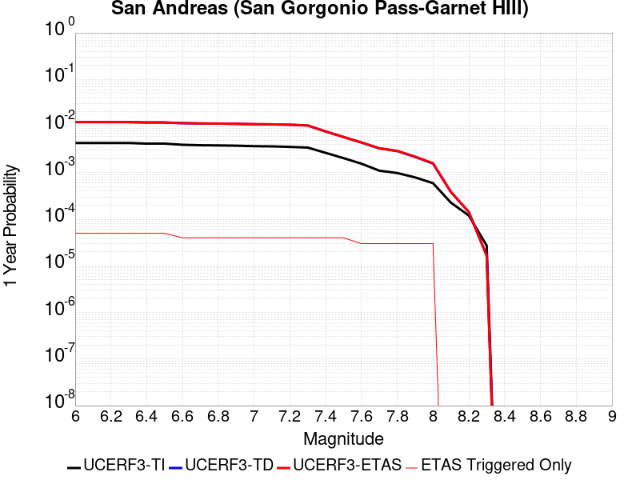 |  |

| Magnitude | 1 wk TI Prob | 1 wk TD Prob | 1 wk ETAS Prob | 1 wk ETAS/TD Gain | 1 wk ETAS Triggered Only | 1 mo TI Prob | 1 mo TD Prob | 1 mo ETAS Prob | 1 mo ETAS/TD Gain | 1 mo ETAS Triggered Only | 1 yr TI Prob | 1 yr TD Prob | 1 yr ETAS Prob | 1 yr ETAS/TD Gain | 1 yr ETAS Triggered Only | 10 yr TI Prob | 10 yr TD Prob | 10 yr ETAS Prob | 10 yr ETAS/TD Gain | 10 yr ETAS Triggered Only |
|-----|-----|-----|-----|-----|-----|-----|-----|-----|-----|-----|-----|-----|-----|-----|-----|-----|-----|-----|-----|-----|
| 6.0 | 8.31567E-5 | 2.3398406E-4 | 2.3398406E-4 | 1.0 | 0.0 | 3.5633717E-4 | 0.001002406 | 0.001002406 | 1.0 | 0.0 | 0.004329778 | 0.012136027 | 0.012212006 | 1.0062606 | 7.691322E-5 | 0.042463828 | 0.11264349 | 0.112757236 | 1.0010098 | 1.281887E-4 |
| 6.1 | 8.31567E-5 | 2.3398406E-4 | 2.3398406E-4 | 1.0 | 0.0 | 3.5633717E-4 | 0.001002406 | 0.001002406 | 1.0 | 0.0 | 0.004329778 | 0.012136027 | 0.012212006 | 1.0062606 | 7.691322E-5 | 0.042463828 | 0.11264349 | 0.112757236 | 1.0010098 | 1.281887E-4 |
| 6.2 | 8.31567E-5 | 2.3398406E-4 | 2.3398406E-4 | 1.0 | 0.0 | 3.5633717E-4 | 0.001002406 | 0.001002406 | 1.0 | 0.0 | 0.004329778 | 0.012136027 | 0.012212006 | 1.0062606 | 7.691322E-5 | 0.042463828 | 0.11264349 | 0.112757236 | 1.0010098 | 1.281887E-4 |
| 6.3 | 8.31567E-5 | 2.3398406E-4 | 2.3398406E-4 | 1.0 | 0.0 | 3.5633717E-4 | 0.001002406 | 0.001002406 | 1.0 | 0.0 | 0.004329778 | 0.012136027 | 0.012212006 | 1.0062606 | 7.691322E-5 | 0.042463828 | 0.11264349 | 0.112757236 | 1.0010098 | 1.281887E-4 |
| 6.4 | 8.059055E-5 | 2.2956554E-4 | 2.2956554E-4 | 1.0 | 0.0 | 3.4534236E-4 | 9.834839E-4 | 9.834839E-4 | 1.0 | 0.0 | 0.0041964394 | 0.011908189 | 0.011984187 | 1.006382 | 7.691322E-5 | 0.041180745 | 0.11062444 | 0.11073845 | 1.0010306 | 1.281887E-4 |
| 6.5 | 8.059055E-5 | 2.2956554E-4 | 2.2956554E-4 | 1.0 | 0.0 | 3.4534236E-4 | 9.834839E-4 | 9.834839E-4 | 1.0 | 0.0 | 0.0041964394 | 0.011908189 | 0.011984187 | 1.006382 | 7.691322E-5 | 0.041180745 | 0.11062444 | 0.11073845 | 1.0010306 | 1.281887E-4 |
| 6.6 | 7.619237E-5 | 2.2200657E-4 | 2.2200657E-4 | 1.0 | 0.0 | 3.2649786E-4 | 9.511121E-4 | 9.511121E-4 | 1.0 | 0.0 | 0.0039678677 | 0.011518859 | 0.011569544 | 1.0044001 | 5.1275478E-5 | 0.03897764 | 0.107160784 | 0.10725235 | 1.0008544 | 1.02550955E-4 |
| 6.7 | 7.440636E-5 | 2.1876446E-4 | 2.1876446E-4 | 1.0 | 0.0 | 3.188454E-4 | 9.372274E-4 | 9.372274E-4 | 1.0 | 0.0 | 0.0038750346 | 0.01135158 | 0.011402274 | 1.0044658 | 5.1275478E-5 | 0.038081564 | 0.105669186 | 0.1057609 | 1.000868 | 1.02550955E-4 |
| 6.8 | 7.3735864E-5 | 2.1723597E-4 | 2.1723597E-4 | 1.0 | 0.0 | 3.1597257E-4 | 9.306814E-4 | 9.306814E-4 | 1.0 | 0.0 | 0.0038401815 | 0.011272711 | 0.011323408 | 1.0044974 | 5.1275478E-5 | 0.03774495 | 0.1049707 | 0.105062485 | 1.0008744 | 1.02550955E-4 |
| 6.9 | 7.27575E-5 | 2.1492546E-4 | 2.1492546E-4 | 1.0 | 0.0 | 3.117806E-4 | 9.207862E-4 | 9.207862E-4 | 1.0 | 0.0 | 0.003789323 | 0.011153476 | 0.011204179 | 1.004546 | 5.1275478E-5 | 0.037253562 | 0.10391858 | 0.10401048 | 1.0008843 | 1.02550955E-4 |
| 7.0 | 7.102591E-5 | 2.1076521E-4 | 2.1076521E-4 | 1.0 | 0.0 | 3.0436125E-4 | 9.02969E-4 | 9.02969E-4 | 1.0 | 0.0 | 0.003699303 | 0.010938748 | 0.010989462 | 1.0046363 | 5.1275478E-5 | 0.03638325 | 0.102020636 | 0.102112725 | 1.0009027 | 1.02550955E-4 |
| 7.1 | 7.028513E-5 | 2.0912137E-4 | 2.0912137E-4 | 1.0 | 0.0 | 3.0118722E-4 | 8.959288E-4 | 8.959288E-4 | 1.0 | 0.0 | 0.0036607897 | 0.01085389 | 0.010904609 | 1.0046729 | 5.1275478E-5 | 0.036010686 | 0.10126359 | 0.10135576 | 1.0009102 | 1.02550955E-4 |
| 7.2 | 6.8498244E-5 | 2.0519937E-4 | 2.0519937E-4 | 1.0 | 0.0 | 2.9353087E-4 | 8.7913166E-4 | 8.7913166E-4 | 1.0 | 0.0 | 0.003567883 | 0.0106514 | 0.010702129 | 1.0047626 | 5.1275478E-5 | 0.035111405 | 0.09945543 | 0.09954778 | 1.0009285 | 1.02550955E-4 |
| 7.3 | 6.622592E-5 | 1.9747039E-4 | 1.9747039E-4 | 1.0 | 0.0 | 2.8379448E-4 | 8.460293E-4 | 8.460293E-4 | 1.0 | 0.0 | 0.0034497243 | 0.010252241 | 0.010302991 | 1.0049502 | 5.1275478E-5 | 0.033966612 | 0.09595134 | 0.096044056 | 1.0009662 | 1.02550955E-4 |
| 7.4 | 5.1050705E-5 | 1.4701985E-4 | 1.4701985E-4 | 1.0 | 0.0 | 2.1877038E-4 | 6.299338E-4 | 6.299338E-4 | 1.0 | 0.0 | 0.002660276 | 0.0076426673 | 0.007693551 | 1.0066578 | 5.1275478E-5 | 0.02628654 | 0.07291896 | 0.073014036 | 1.0013038 | 1.02550955E-4 |
| 7.5 | 3.9302922E-5 | 1.1141107E-4 | 1.1141107E-4 | 1.0 | 0.0 | 1.6843023E-4 | 4.7738897E-4 | 4.7738897E-4 | 1.0 | 0.0 | 0.0020487092 | 0.005796791 | 0.0058477693 | 1.0087942 | 5.1275478E-5 | 0.020299247 | 0.056059215 | 0.056156017 | 1.0017267 | 1.02550955E-4 |
| 7.6 | 2.9851626E-5 | 8.504997E-5 | 8.504997E-5 | 1.0 | 0.0 | 1.2792926E-4 | 3.6444908E-4 | 3.6444908E-4 | 1.0 | 0.0 | 0.0015564259 | 0.0044281655 | 0.004479214 | 1.0115281 | 5.1275478E-5 | 0.0154556995 | 0.043238558 | 0.043336675 | 1.0022691 | 1.02550955E-4 |
| 7.7 | 2.1135214E-5 | 6.361802E-5 | 6.361802E-5 | 1.0 | 0.0 | 9.0576345E-5 | 2.726202E-4 | 2.726202E-4 | 1.0 | 0.0 | 0.0011022091 | 0.0033141046 | 0.0033652103 | 1.0154207 | 5.1275478E-5 | 0.010967582 | 0.032622673 | 0.032721877 | 1.003041 | 1.02550955E-4 |
| 7.8 | 1.883379E-5 | 5.572194E-5 | 5.572194E-5 | 1.0 | 0.0 | 8.0713755E-5 | 2.3878647E-4 | 2.3878647E-4 | 1.0 | 0.0 | 9.822468E-4 | 0.0029033525 | 0.0029544793 | 1.0176095 | 5.1275478E-5 | 0.0097791655 | 0.028732158 | 0.028831763 | 1.0034666 | 1.02550955E-4 |
| 7.9 | 1.5156185E-5 | 4.1725576E-5 | 4.1725576E-5 | 1.0 | 0.0 | 6.495346E-5 | 1.7881165E-4 | 1.7881165E-4 | 1.0 | 0.0 | 7.9052144E-4 | 0.0021748596 | 0.0022260235 | 1.0235252 | 5.1275478E-5 | 0.007877152 | 0.021790246 | 0.021890562 | 1.0046037 | 1.02550955E-4 |
| 8.0 | 1.1405907E-5 | 3.0024876E-5 | 3.0024876E-5 | 1.0 | 0.0 | 4.8881542E-5 | 1.286717E-4 | 1.286717E-4 | 1.0 | 0.0 | 5.9497025E-4 | 0.0015654531 | 0.0016166484 | 1.0327032 | 5.1275478E-5 | 0.005933798 | 0.015796356 | 0.015846822 | 1.0031948 | 5.1275478E-5 |
| 8.1 | 4.3511436E-6 | 7.3873994E-6 | 7.3873994E-6 | 1.0 | 0.0 | 1.8647626E-5 | 3.16599E-5 | 3.16599E-5 | 1.0 | 0.0 | 2.2701119E-4 | 3.8539123E-4 | 3.8539123E-4 | 1.0 | 0.0 | 0.0022677942 | 0.0041254 | 0.0041254 | 1.0 | 0.0 |
| 8.2 | 2.3042528E-6 | 2.74142E-6 | 2.74142E-6 | 1.0 | 0.0 | 9.875332E-6 | 1.174889E-5 | 1.174889E-5 | 1.0 | 0.0 | 1.2022553E-4 | 1.430334E-4 | 1.430334E-4 | 1.0 | 0.0 | 0.0012016051 | 0.0016024038 | 0.0016024038 | 1.0 | 0.0 |
| 8.3 | 5.202968E-7 | 3.171921E-7 | 3.171921E-7 | 1.0 | 0.0 | 2.2298414E-6 | 1.3593941E-6 | 1.3593941E-6 | 1.0 | 0.0 | 2.714798E-5 | 1.655051E-5 | 1.655051E-5 | 1.0 | 0.0 | 2.7144665E-4 | 1.9631305E-4 | 1.9631305E-4 | 1.0 | 0.0 |

## San Jacinto (San Bernardino)
*[(top)](#table-of-contents)*

| 1 Week | 1 Month | 1 Year | 10 Year |
|-----|-----|-----|-----|
|  |  |  |  |

| Magnitude | 1 wk TI Prob | 1 wk TD Prob | 1 wk ETAS Prob | 1 wk ETAS/TD Gain | 1 wk ETAS Triggered Only | 1 mo TI Prob | 1 mo TD Prob | 1 mo ETAS Prob | 1 mo ETAS/TD Gain | 1 mo ETAS Triggered Only | 1 yr TI Prob | 1 yr TD Prob | 1 yr ETAS Prob | 1 yr ETAS/TD Gain | 1 yr ETAS Triggered Only | 10 yr TI Prob | 10 yr TD Prob | 10 yr ETAS Prob | 10 yr ETAS/TD Gain | 10 yr ETAS Triggered Only |
|-----|-----|-----|-----|-----|-----|-----|-----|-----|-----|-----|-----|-----|-----|-----|-----|-----|-----|-----|-----|-----|
| 6.0 | 3.409352E-5 | 3.6049758E-5 | 8.732339E-5 | 2.4223015 | 5.1275478E-5 | 1.461069E-4 | 1.5448983E-4 | 2.3139115E-4 | 1.497776 | 7.691322E-5 | 0.0017774 | 0.0018792928 | 0.001981651 | 1.0544664 | 1.02550955E-4 | 0.01763251 | 0.019382251 | 0.019507956 | 1.0064856 | 1.281887E-4 |
| 6.1 | 3.409352E-5 | 3.6049758E-5 | 8.732339E-5 | 2.4223015 | 5.1275478E-5 | 1.461069E-4 | 1.5448983E-4 | 2.3139115E-4 | 1.497776 | 7.691322E-5 | 0.0017774 | 0.0018792928 | 0.001981651 | 1.0544664 | 1.02550955E-4 | 0.01763251 | 0.019382251 | 0.019507956 | 1.0064856 | 1.281887E-4 |
| 6.2 | 3.409352E-5 | 3.6049758E-5 | 8.732339E-5 | 2.4223015 | 5.1275478E-5 | 1.461069E-4 | 1.5448983E-4 | 2.3139115E-4 | 1.497776 | 7.691322E-5 | 0.0017774 | 0.0018792928 | 0.001981651 | 1.0544664 | 1.02550955E-4 | 0.01763251 | 0.019382251 | 0.019507956 | 1.0064856 | 1.281887E-4 |
| 6.3 | 3.409352E-5 | 3.6049758E-5 | 8.732339E-5 | 2.4223015 | 5.1275478E-5 | 1.461069E-4 | 1.5448983E-4 | 2.3139115E-4 | 1.497776 | 7.691322E-5 | 0.0017774 | 0.0018792928 | 0.001981651 | 1.0544664 | 1.02550955E-4 | 0.01763251 | 0.019382251 | 0.019507956 | 1.0064856 | 1.281887E-4 |
| 6.4 | 3.400795E-5 | 3.5942405E-5 | 8.721604E-5 | 2.42655 | 5.1275478E-5 | 1.4574021E-4 | 1.540298E-4 | 2.3093117E-4 | 1.4992629 | 7.691322E-5 | 0.0017729428 | 0.0018737017 | 0.0019760604 | 1.0546292 | 1.02550955E-4 | 0.017588645 | 0.019327328 | 0.01945304 | 1.0065043 | 1.281887E-4 |
| 6.5 | 3.341482E-5 | 3.5202946E-5 | 8.647662E-5 | 2.4565165 | 5.1275478E-5 | 1.4319851E-4 | 1.5086106E-4 | 2.2776268E-4 | 1.5097512 | 7.691322E-5 | 0.0017420477 | 0.0018351874 | 0.0019375501 | 1.0557778 | 1.02550955E-4 | 0.017284546 | 0.018948833 | 0.019074593 | 1.0066369 | 1.281887E-4 |
| 6.6 | 3.3364955E-5 | 3.5140158E-5 | 8.6413835E-5 | 2.459119 | 5.1275478E-5 | 1.4298483E-4 | 1.50592E-4 | 2.2749363E-4 | 1.5106622 | 7.691322E-5 | 0.0017394501 | 0.0018319171 | 0.0019342802 | 1.0558776 | 1.02550955E-4 | 0.017258976 | 0.018916694 | 0.019042458 | 1.0066483 | 1.281887E-4 |
| 6.7 | 3.335922E-5 | 3.512993E-5 | 8.6403605E-5 | 2.459544 | 5.1275478E-5 | 1.4296026E-4 | 1.5054816E-4 | 2.274498E-4 | 1.5108109 | 7.691322E-5 | 0.0017391514 | 0.0018313844 | 0.0019337476 | 1.0558939 | 1.02550955E-4 | 0.017256035 | 0.018911485 | 0.01903725 | 1.0066502 | 1.281887E-4 |
| 6.8 | 3.327683E-5 | 3.5023982E-5 | 8.629766E-5 | 2.4639592 | 5.1275478E-5 | 1.4260718E-4 | 1.5009414E-4 | 2.2699582E-4 | 1.5123563 | 7.691322E-5 | 0.0017348597 | 0.0018258659 | 0.0019282297 | 1.056063 | 1.02550955E-4 | 0.017213784 | 0.018857252 | 0.018983023 | 1.0066696 | 1.281887E-4 |
| 6.9 | 3.3235785E-5 | 3.4964927E-5 | 8.623861E-5 | 2.4664319 | 5.1275478E-5 | 1.4243131E-4 | 1.4984109E-4 | 2.2674278E-4 | 1.5132216 | 7.691322E-5 | 0.0017327217 | 0.0018227901 | 0.0019251541 | 1.0561578 | 1.02550955E-4 | 0.017192734 | 0.018827116 | 0.018952891 | 1.0066805 | 1.281887E-4 |
| 7.0 | 3.3197095E-5 | 3.4904846E-5 | 8.617853E-5 | 2.4689562 | 5.1275478E-5 | 1.422655E-4 | 1.4958362E-4 | 2.2648534E-4 | 1.5141052 | 7.691322E-5 | 0.0017307063 | 0.0018196608 | 0.0019220251 | 1.0562546 | 1.02550955E-4 | 0.017172894 | 0.018796489 | 0.018922267 | 1.0066916 | 1.281887E-4 |
| 7.1 | 3.3129716E-5 | 3.478503E-5 | 8.6058724E-5 | 2.4740162 | 5.1275478E-5 | 1.4197677E-4 | 1.4907018E-4 | 2.2597195E-4 | 1.5158762 | 7.691322E-5 | 0.0017271966 | 0.0018134202 | 0.0019157851 | 1.0564486 | 1.02550955E-4 | 0.017138338 | 0.018735558 | 0.018861344 | 1.0067139 | 1.281887E-4 |
| 7.2 | 3.3034008E-5 | 3.4652458E-5 | 8.5926156E-5 | 2.4796555 | 5.1275478E-5 | 1.4156665E-4 | 1.4850209E-4 | 2.2540388E-4 | 1.5178499 | 7.691322E-5 | 0.0017222111 | 0.001806515 | 0.0019088807 | 1.0566647 | 1.02550955E-4 | 0.017089253 | 0.018667944 | 0.01879374 | 1.0067385 | 1.281887E-4 |
| 7.3 | 3.2956614E-5 | 3.4520177E-5 | 8.579389E-5 | 2.4853258 | 5.1275478E-5 | 1.4123498E-4 | 1.4793524E-4 | 2.2483707E-4 | 1.5198345 | 7.691322E-5 | 0.0017181796 | 0.001799625 | 0.0019019914 | 1.056882 | 1.02550955E-4 | 0.017049557 | 0.018600674 | 0.01872648 | 1.0067635 | 1.281887E-4 |
| 7.4 | 3.2915937E-5 | 3.4441844E-5 | 8.5715554E-5 | 2.488704 | 5.1275478E-5 | 1.4106068E-4 | 1.4759957E-4 | 2.2450142E-4 | 1.5210168 | 7.691322E-5 | 0.0017160608 | 0.0017955449 | 0.0018979117 | 1.0570116 | 1.02550955E-4 | 0.017028693 | 0.018560927 | 0.018686738 | 1.0067782 | 1.281887E-4 |
| 7.5 | 3.281791E-5 | 3.430671E-5 | 8.558043E-5 | 2.494568 | 5.1275478E-5 | 1.406406E-4 | 1.4702049E-4 | 2.239224E-4 | 1.5230693 | 7.691322E-5 | 0.0017109542 | 0.0017885063 | 0.0018908739 | 1.0572363 | 1.02550955E-4 | 0.016978411 | 0.018491795 | 0.018617613 | 1.006804 | 1.281887E-4 |
| 7.6 | 3.2521442E-5 | 3.4031546E-5 | 8.530528E-5 | 2.506653 | 5.1275478E-5 | 1.3937015E-4 | 1.4584133E-4 | 2.2274333E-4 | 1.527299 | 7.691322E-5 | 0.0016955109 | 0.0017741736 | 0.0018765426 | 1.0576996 | 1.02550955E-4 | 0.016826328 | 0.018349366 | 0.018475203 | 1.0068579 | 1.281887E-4 |
| 7.7 | 3.0287873E-5 | 3.2514843E-5 | 8.3788655E-5 | 2.5769355 | 5.1275478E-5 | 1.297987E-4 | 1.393419E-4 | 2.162444E-4 | 1.5518979 | 7.691322E-5 | 0.0015791537 | 0.0016951686 | 0.0017975457 | 1.0603935 | 1.02550955E-4 | 0.01567979 | 0.017559871 | 0.01768581 | 1.0071719 | 1.281887E-4 |
| 7.8 | 2.6316151E-5 | 2.9723395E-5 | 8.099735E-5 | 2.7250369 | 5.1275478E-5 | 1.1277862E-4 | 1.2737977E-4 | 2.0428319E-4 | 1.6037334 | 7.691322E-5 | 0.0013722149 | 0.0015497464 | 0.0016521384 | 1.0660702 | 1.02550955E-4 | 0.013637724 | 0.016100293 | 0.016226418 | 1.0078337 | 1.281887E-4 |
| 7.9 | 2.0761147E-5 | 2.3470231E-5 | 7.474451E-5 | 3.1846514 | 5.1275478E-5 | 8.897331E-5 | 1.0058283E-4 | 1.7748831E-4 | 1.7645985 | 7.691322E-5 | 0.0010827117 | 0.0012239089 | 0.0013263343 | 1.0836872 | 1.02550955E-4 | 0.010774517 | 0.012820105 | 0.01294665 | 1.0098709 | 1.281887E-4 |
| 8.0 | 1.5738568E-5 | 1.607273E-5 | 6.7347384E-5 | 4.1901646 | 5.1275478E-5 | 6.744926E-5 | 6.8881316E-5 | 1.20153265E-4 | 1.744352 | 5.1275478E-5 | 8.2088535E-4 | 8.38308E-4 | 9.151568E-4 | 1.0916712 | 7.691322E-5 | 0.008178596 | 0.008886527 | 0.008962757 | 1.0085782 | 7.691322E-5 |
| 8.1 | 1.0105832E-5 | 8.353191E-6 | 3.3990716E-5 | 4.069189 | 2.5637739E-5 | 4.3309992E-5 | 3.5798905E-5 | 6.143573E-5 | 1.7161343 | 2.5637739E-5 | 5.2717153E-4 | 4.35765E-4 | 4.6139155E-4 | 1.0588082 | 2.5637739E-5 | 0.005259227 | 0.004689436 | 0.0047149532 | 1.0054415 | 2.5637739E-5 |
| 8.2 | 4.189207E-6 | 1.5851253E-6 | 1.5851253E-6 | 1.0 | 0.0 | 1.7953622E-5 | 6.7933765E-6 | 6.7933765E-6 | 1.0 | 0.0 | 2.1856341E-4 | 8.270625E-5 | 8.270625E-5 | 1.0 | 0.0 | 0.0021834858 | 9.604094E-4 | 9.604094E-4 | 1.0 | 0.0 |
| 8.3 | 1.2758221E-6 | 3.6330252E-7 | 3.6330252E-7 | 1.0 | 0.0 | 5.4677976E-6 | 1.5570099E-6 | 1.5570099E-6 | 1.0 | 0.0 | 6.65684E-5 | 1.8956434E-5 | 1.8956434E-5 | 1.0 | 0.0 | 6.6548464E-4 | 2.2857229E-4 | 2.2857229E-4 | 1.0 | 0.0 |

## Manix-Afton Hills
*[(top)](#table-of-contents)*

| 1 Week | 1 Month | 1 Year | 10 Year |
|-----|-----|-----|-----|
|  |  |  |  |

| Magnitude | 1 wk TI Prob | 1 wk TD Prob | 1 wk ETAS Prob | 1 wk ETAS/TD Gain | 1 wk ETAS Triggered Only | 1 mo TI Prob | 1 mo TD Prob | 1 mo ETAS Prob | 1 mo ETAS/TD Gain | 1 mo ETAS Triggered Only | 1 yr TI Prob | 1 yr TD Prob | 1 yr ETAS Prob | 1 yr ETAS/TD Gain | 1 yr ETAS Triggered Only | 10 yr TI Prob | 10 yr TD Prob | 10 yr ETAS Prob | 10 yr ETAS/TD Gain | 10 yr ETAS Triggered Only |
|-----|-----|-----|-----|-----|-----|-----|-----|-----|-----|-----|-----|-----|-----|-----|-----|-----|-----|-----|-----|-----|
| 6.0 | 1.3783202E-5 | 1.4711616E-5 | 1.4711616E-5 | 1.0 | 0.0 | 5.906953E-5 | 6.3048356E-5 | 6.3048356E-5 | 1.0 | 0.0 | 7.189342E-4 | 7.673609E-4 | 7.92979E-4 | 1.0333847 | 2.5637739E-5 | 0.0071661277 | 0.0076488685 | 0.007750635 | 1.0133048 | 1.02550955E-4 |
| 6.1 | 1.3783202E-5 | 1.4711616E-5 | 1.4711616E-5 | 1.0 | 0.0 | 5.906953E-5 | 6.3048356E-5 | 6.3048356E-5 | 1.0 | 0.0 | 7.189342E-4 | 7.673609E-4 | 7.92979E-4 | 1.0333847 | 2.5637739E-5 | 0.0071661277 | 0.0076488685 | 0.007750635 | 1.0133048 | 1.02550955E-4 |
| 6.2 | 1.3783202E-5 | 1.4711616E-5 | 1.4711616E-5 | 1.0 | 0.0 | 5.906953E-5 | 6.3048356E-5 | 6.3048356E-5 | 1.0 | 0.0 | 7.189342E-4 | 7.673609E-4 | 7.92979E-4 | 1.0333847 | 2.5637739E-5 | 0.0071661277 | 0.0076488685 | 0.007750635 | 1.0133048 | 1.02550955E-4 |
| 6.3 | 1.10494875E-5 | 1.1793558E-5 | 1.1793558E-5 | 1.0 | 0.0 | 4.7354086E-5 | 5.0542898E-5 | 5.0542898E-5 | 1.0 | 0.0 | 5.763835E-4 | 6.151964E-4 | 6.408184E-4 | 1.0416484 | 2.5637739E-5 | 0.005748908 | 0.0061359745 | 0.0062124156 | 1.0124578 | 7.691322E-5 |
| 6.4 | 1.10494875E-5 | 1.1793558E-5 | 1.1793558E-5 | 1.0 | 0.0 | 4.7354086E-5 | 5.0542898E-5 | 5.0542898E-5 | 1.0 | 0.0 | 5.763835E-4 | 6.151964E-4 | 6.408184E-4 | 1.0416484 | 2.5637739E-5 | 0.005748908 | 0.0061359745 | 0.0062124156 | 1.0124578 | 7.691322E-5 |
| 6.5 | 9.788949E-6 | 1.0454697E-5 | 1.0454697E-5 | 1.0 | 0.0 | 4.1951964E-5 | 4.480513E-5 | 4.480513E-5 | 1.0 | 0.0 | 5.1064545E-4 | 5.453752E-4 | 5.7099893E-4 | 1.0469837 | 2.5637739E-5 | 0.0050947363 | 0.005441295 | 0.0055177896 | 1.0140582 | 7.691322E-5 |
| 6.6 | 8.810006E-6 | 9.413971E-6 | 9.413971E-6 | 1.0 | 0.0 | 3.775662E-5 | 4.0345018E-5 | 4.0345018E-5 | 1.0 | 0.0 | 4.5958988E-4 | 4.9109873E-4 | 4.9109873E-4 | 1.0 | 0.0 | 0.0045864056 | 0.0049010175 | 0.0049775536 | 1.0156164 | 7.691322E-5 |
| 6.7 | 8.80128E-6 | 9.404451E-6 | 9.404451E-6 | 1.0 | 0.0 | 3.7719226E-5 | 4.0304214E-5 | 4.0304214E-5 | 1.0 | 0.0 | 4.591348E-4 | 4.906022E-4 | 4.906022E-4 | 1.0 | 0.0 | 0.004581874 | 0.004896074 | 0.0049726106 | 1.0156323 | 7.691322E-5 |
| 6.8 | 6.8994877E-6 | 7.3803494E-6 | 7.3803494E-6 | 1.0 | 0.0 | 2.9568899E-5 | 3.162973E-5 | 3.162973E-5 | 1.0 | 0.0 | 3.5994186E-4 | 3.850321E-4 | 3.850321E-4 | 1.0 | 0.0 | 0.003593594 | 0.0038444551 | 0.0038955335 | 1.0132862 | 5.1275478E-5 |
| 6.9 | 4.9328037E-6 | 5.271154E-6 | 5.271154E-6 | 1.0 | 0.0 | 2.1140417E-5 | 2.2590497E-5 | 2.2590497E-5 | 1.0 | 0.0 | 2.5735417E-4 | 2.7501077E-4 | 2.7501077E-4 | 1.0 | 0.0 | 0.0025705635 | 0.0027473096 | 0.0027728768 | 1.0093063 | 2.5637739E-5 |
| 7.0 | 3.347973E-6 | 3.590168E-6 | 3.590168E-6 | 1.0 | 0.0 | 1.4348378E-5 | 1.5386368E-5 | 1.5386368E-5 | 1.0 | 0.0 | 1.746775E-4 | 1.8731703E-4 | 1.8731703E-4 | 1.0 | 0.0 | 0.0017454025 | 0.0018719939 | 0.0018975837 | 1.0136697 | 2.5637739E-5 |
| 7.1 | 1.2073567E-6 | 1.293531E-6 | 1.293531E-6 | 1.0 | 0.0 | 5.1743755E-6 | 5.5437017E-6 | 5.5437017E-6 | 1.0 | 0.0 | 6.29962E-5 | 6.749411E-5 | 6.749411E-5 | 1.0 | 0.0 | 6.297835E-4 | 6.748963E-4 | 7.0051674E-4 | 1.0379621 | 2.5637739E-5 |

## Independence rev 2011
*[(top)](#table-of-contents)*

| 1 Week | 1 Month | 1 Year | 10 Year |
|-----|-----|-----|-----|
|  |  | 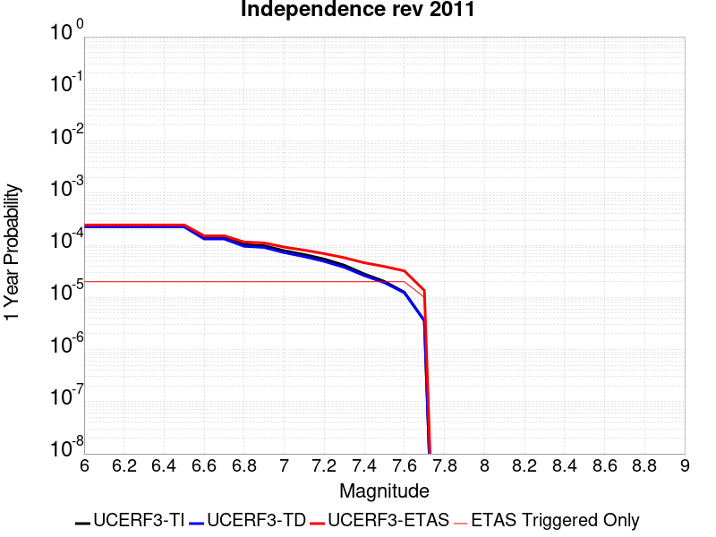 |  |

| Magnitude | 1 wk TI Prob | 1 wk TD Prob | 1 wk ETAS Prob | 1 wk ETAS/TD Gain | 1 wk ETAS Triggered Only | 1 mo TI Prob | 1 mo TD Prob | 1 mo ETAS Prob | 1 mo ETAS/TD Gain | 1 mo ETAS Triggered Only | 1 yr TI Prob | 1 yr TD Prob | 1 yr ETAS Prob | 1 yr ETAS/TD Gain | 1 yr ETAS Triggered Only | 10 yr TI Prob | 10 yr TD Prob | 10 yr ETAS Prob | 10 yr ETAS/TD Gain | 10 yr ETAS Triggered Only |
|-----|-----|-----|-----|-----|-----|-----|-----|-----|-----|-----|-----|-----|-----|-----|-----|-----|-----|-----|-----|-----|
| 6.0 | 4.422171E-6 | 4.3263003E-6 | 4.3263003E-6 | 1.0 | 0.0 | 1.8952025E-5 | 1.8541172E-5 | 1.8541172E-5 | 1.0 | 0.0 | 2.3071647E-4 | 2.2571837E-4 | 2.7698226E-4 | 1.2271144 | 5.1275478E-5 | 0.0023047708 | 0.0022551846 | 0.0023830843 | 1.0567136 | 1.281887E-4 |
| 6.1 | 4.422171E-6 | 4.3263003E-6 | 4.3263003E-6 | 1.0 | 0.0 | 1.8952025E-5 | 1.8541172E-5 | 1.8541172E-5 | 1.0 | 0.0 | 2.3071647E-4 | 2.2571837E-4 | 2.7698226E-4 | 1.2271144 | 5.1275478E-5 | 0.0023047708 | 0.0022551846 | 0.0023830843 | 1.0567136 | 1.281887E-4 |
| 6.2 | 4.422171E-6 | 4.3263003E-6 | 4.3263003E-6 | 1.0 | 0.0 | 1.8952025E-5 | 1.8541172E-5 | 1.8541172E-5 | 1.0 | 0.0 | 2.3071647E-4 | 2.2571837E-4 | 2.7698226E-4 | 1.2271144 | 5.1275478E-5 | 0.0023047708 | 0.0022551846 | 0.0023830843 | 1.0567136 | 1.281887E-4 |
| 6.3 | 4.422171E-6 | 4.3263003E-6 | 4.3263003E-6 | 1.0 | 0.0 | 1.8952025E-5 | 1.8541172E-5 | 1.8541172E-5 | 1.0 | 0.0 | 2.3071647E-4 | 2.2571837E-4 | 2.7698226E-4 | 1.2271144 | 5.1275478E-5 | 0.0023047708 | 0.0022551846 | 0.0023830843 | 1.0567136 | 1.281887E-4 |
| 6.4 | 4.422171E-6 | 4.3263003E-6 | 4.3263003E-6 | 1.0 | 0.0 | 1.8952025E-5 | 1.8541172E-5 | 1.8541172E-5 | 1.0 | 0.0 | 2.3071647E-4 | 2.2571837E-4 | 2.7698226E-4 | 1.2271144 | 5.1275478E-5 | 0.0023047708 | 0.0022551846 | 0.0023830843 | 1.0567136 | 1.281887E-4 |
| 6.5 | 4.422171E-6 | 4.3263003E-6 | 4.3263003E-6 | 1.0 | 0.0 | 1.8952025E-5 | 1.8541172E-5 | 1.8541172E-5 | 1.0 | 0.0 | 2.3071647E-4 | 2.2571837E-4 | 2.7698226E-4 | 1.2271144 | 5.1275478E-5 | 0.0023047708 | 0.0022551846 | 0.0023830843 | 1.0567136 | 1.281887E-4 |
| 6.6 | 2.663744E-6 | 2.53204E-6 | 2.53204E-6 | 1.0 | 0.0 | 1.1415996E-5 | 1.0851558E-5 | 1.0851558E-5 | 1.0 | 0.0 | 1.3898089E-4 | 1.3211019E-4 | 1.833789E-4 | 1.3880754 | 5.1275478E-5 | 0.0013889399 | 0.0013203648 | 0.0014227803 | 1.0775661 | 1.02550955E-4 |
| 6.7 | 2.663744E-6 | 2.53204E-6 | 2.53204E-6 | 1.0 | 0.0 | 1.1415996E-5 | 1.0851558E-5 | 1.0851558E-5 | 1.0 | 0.0 | 1.3898089E-4 | 1.3211019E-4 | 1.833789E-4 | 1.3880754 | 5.1275478E-5 | 0.0013889399 | 0.0013203648 | 0.0014227803 | 1.0775661 | 1.02550955E-4 |
| 6.8 | 1.9716529E-6 | 1.8323044E-6 | 1.8323044E-6 | 1.0 | 0.0 | 8.449913E-6 | 7.85271E-6 | 7.85271E-6 | 1.0 | 0.0 | 1.0287284E-4 | 9.5602685E-5 | 1.4687327E-4 | 1.536288 | 5.1275478E-5 | 0.0010282523 | 9.5562846E-4 | 0.0010580814 | 1.10721 | 1.02550955E-4 |
| 6.9 | 1.8788617E-6 | 1.7430435E-6 | 1.7430435E-6 | 1.0 | 0.0 | 8.0522395E-6 | 7.470166E-6 | 7.470166E-6 | 1.0 | 0.0 | 9.80316E-5 | 9.09456E-5 | 1.422164E-4 | 1.5637525 | 5.1275478E-5 | 9.798837E-4 | 9.090958E-4 | 0.0010115536 | 1.1127028 | 1.02550955E-4 |
| 7.0 | 1.5045488E-6 | 1.384987E-6 | 1.384987E-6 | 1.0 | 0.0 | 6.44805E-6 | 5.9356453E-6 | 5.9356453E-6 | 1.0 | 0.0 | 7.8502184E-5 | 7.2264134E-5 | 1.2353591E-4 | 1.7095051 | 5.1275478E-5 | 7.8474457E-4 | 7.224115E-4 | 8.248884E-4 | 1.1418539 | 1.02550955E-4 |
| 7.1 | 1.272341E-6 | 1.1625416E-6 | 1.1625416E-6 | 1.0 | 0.0 | 5.4528787E-6 | 4.9823116E-6 | 4.9823116E-6 | 1.0 | 0.0 | 6.6386776E-5 | 6.065799E-5 | 1.11930356E-4 | 1.8452698 | 5.1275478E-5 | 6.636695E-4 | 6.0641754E-4 | 7.089063E-4 | 1.169007 | 1.02550955E-4 |
| 7.2 | 1.0416892E-6 | 9.410155E-7 | 9.410155E-7 | 1.0 | 0.0 | 4.464375E-6 | 4.032918E-6 | 4.032918E-6 | 1.0 | 0.0 | 5.4352407E-5 | 4.9099683E-5 | 1.0037264E-4 | 2.0442624 | 5.1275478E-5 | 5.4339116E-4 | 4.9089023E-4 | 5.9339084E-4 | 1.2088056 | 1.02550955E-4 |
| 7.3 | 7.9450155E-7 | 7.2352077E-7 | 7.2352077E-7 | 1.0 | 0.0 | 3.4050022E-6 | 3.1007996E-6 | 3.1007996E-6 | 1.0 | 0.0 | 4.1455114E-5 | 3.7751593E-5 | 8.902513E-5 | 2.3581822 | 5.1275478E-5 | 4.144738E-4 | 3.774529E-4 | 4.7996515E-4 | 1.2715895 | 1.02550955E-4 |
| 7.4 | 5.3893444E-7 | 5.01964E-7 | 5.01964E-7 | 1.0 | 0.0 | 2.309717E-6 | 2.1512726E-6 | 2.1512726E-6 | 1.0 | 0.0 | 2.8120441E-5 | 2.6191434E-5 | 7.746557E-5 | 2.957668 | 5.1275478E-5 | 2.8116882E-4 | 2.6188392E-4 | 3.64408E-4 | 1.3914868 | 1.02550955E-4 |
| 7.5 | 3.8852085E-7 | 3.6826376E-7 | 3.6826376E-7 | 1.0 | 0.0 | 1.6650882E-6 | 1.5782723E-6 | 1.5782723E-6 | 1.0 | 0.0 | 2.027226E-5 | 1.9215298E-5 | 7.048979E-5 | 3.6684203 | 5.1275478E-5 | 2.0270412E-4 | 1.9213658E-4 | 2.6903502E-4 | 1.400228 | 7.691322E-5 |
| 7.6 | 2.414929E-7 | 2.3457987E-7 | 2.3457987E-7 | 1.0 | 0.0 | 1.0349692E-6 | 1.0053419E-6 | 1.0053419E-6 | 1.0 | 0.0 | 1.2600677E-5 | 1.2239971E-5 | 6.351482E-5 | 5.1891317 | 5.1275478E-5 | 1.2599962E-4 | 1.2239309E-4 | 1.9929689E-4 | 1.6283345 | 7.691322E-5 |
| 7.7 | 6.8298014E-8 | 6.8590616E-8 | 6.8590616E-8 | 1.0 | 0.0 | 2.9270575E-7 | 2.9395974E-7 | 2.9395974E-7 | 1.0 | 0.0 | 3.5636867E-6 | 3.5789546E-6 | 2.9216602E-5 | 8.163445 | 2.5637739E-5 | 3.5636294E-5 | 3.5789017E-5 | 8.706266E-5 | 2.4326642 | 5.1275478E-5 |

## Calico-Hidalgo
*[(top)](#table-of-contents)*

| 1 Week | 1 Month | 1 Year | 10 Year |
|-----|-----|-----|-----|
|  |  |  |  |

| Magnitude | 1 wk TI Prob | 1 wk TD Prob | 1 wk ETAS Prob | 1 wk ETAS/TD Gain | 1 wk ETAS Triggered Only | 1 mo TI Prob | 1 mo TD Prob | 1 mo ETAS Prob | 1 mo ETAS/TD Gain | 1 mo ETAS Triggered Only | 1 yr TI Prob | 1 yr TD Prob | 1 yr ETAS Prob | 1 yr ETAS/TD Gain | 1 yr ETAS Triggered Only | 10 yr TI Prob | 10 yr TD Prob | 10 yr ETAS Prob | 10 yr ETAS/TD Gain | 10 yr ETAS Triggered Only |
|-----|-----|-----|-----|-----|-----|-----|-----|-----|-----|-----|-----|-----|-----|-----|-----|-----|-----|-----|-----|-----|
| 6.0 | 4.0906612E-5 | 5.0707546E-5 | 5.0707546E-5 | 1.0 | 0.0 | 1.7530227E-4 | 2.1730224E-4 | 2.1730224E-4 | 1.0 | 0.0 | 0.0021322158 | 0.0026428488 | 0.0026939886 | 1.0193503 | 5.1275478E-5 | 0.02111873 | 0.026154567 | 0.026254434 | 1.0038184 | 1.02550955E-4 |
| 6.1 | 4.0906612E-5 | 5.0707546E-5 | 5.0707546E-5 | 1.0 | 0.0 | 1.7530227E-4 | 2.1730224E-4 | 2.1730224E-4 | 1.0 | 0.0 | 0.0021322158 | 0.0026428488 | 0.0026939886 | 1.0193503 | 5.1275478E-5 | 0.02111873 | 0.026154567 | 0.026254434 | 1.0038184 | 1.02550955E-4 |
| 6.2 | 4.0906612E-5 | 5.0707546E-5 | 5.0707546E-5 | 1.0 | 0.0 | 1.7530227E-4 | 2.1730224E-4 | 2.1730224E-4 | 1.0 | 0.0 | 0.0021322158 | 0.0026428488 | 0.0026939886 | 1.0193503 | 5.1275478E-5 | 0.02111873 | 0.026154567 | 0.026254434 | 1.0038184 | 1.02550955E-4 |
| 6.3 | 2.4242801E-5 | 3.0092122E-5 | 3.0092122E-5 | 1.0 | 0.0 | 1.0389358E-4 | 1.2896005E-4 | 1.2896005E-4 | 1.0 | 0.0 | 0.0012641704 | 0.0015689905 | 0.0016201856 | 1.0326293 | 5.1275478E-5 | 0.01257003 | 0.015582806 | 0.015683759 | 1.0064784 | 1.02550955E-4 |
| 6.4 | 2.4242801E-5 | 3.0092122E-5 | 3.0092122E-5 | 1.0 | 0.0 | 1.0389358E-4 | 1.2896005E-4 | 1.2896005E-4 | 1.0 | 0.0 | 0.0012641704 | 0.0015689905 | 0.0016201856 | 1.0326293 | 5.1275478E-5 | 0.01257003 | 0.015582806 | 0.015683759 | 1.0064784 | 1.02550955E-4 |
| 6.5 | 2.0286952E-5 | 2.5316727E-5 | 2.5316727E-5 | 1.0 | 0.0 | 8.694118E-5 | 1.0849584E-4 | 1.0849584E-4 | 1.0 | 0.0 | 0.0010579949 | 0.0013201536 | 0.0013713613 | 1.0387893 | 5.1275478E-5 | 0.010529719 | 0.013125047 | 0.013226252 | 1.0077108 | 1.02550955E-4 |
| 6.6 | 2.0269223E-5 | 2.5297675E-5 | 2.5297675E-5 | 1.0 | 0.0 | 8.6865206E-5 | 1.084142E-4 | 1.084142E-4 | 1.0 | 0.0 | 0.0010570707 | 0.0013191608 | 0.0013703686 | 1.0388185 | 5.1275478E-5 | 0.010520565 | 0.013115237 | 0.013216442 | 1.0077167 | 1.02550955E-4 |
| 6.7 | 1.799852E-5 | 2.25414E-5 | 2.25414E-5 | 1.0 | 0.0 | 7.713423E-5 | 9.660251E-5 | 9.660251E-5 | 1.0 | 0.0 | 9.3870464E-4 | 0.0011755156 | 0.0012267308 | 1.0435683 | 5.1275478E-5 | 0.009347493 | 0.011694587 | 0.011795938 | 1.0086665 | 1.02550955E-4 |
| 6.8 | 1.7458793E-5 | 2.1842892E-5 | 2.1842892E-5 | 1.0 | 0.0 | 7.4821255E-5 | 9.360912E-5 | 9.360912E-5 | 1.0 | 0.0 | 9.10568E-4 | 0.0011391096 | 0.0011903266 | 1.0449624 | 5.1275478E-5 | 0.009068459 | 0.011334292 | 0.01143568 | 1.0089453 | 1.02550955E-4 |
| 6.9 | 1.542884E-5 | 1.9026567E-5 | 1.9026567E-5 | 1.0 | 0.0 | 6.612192E-5 | 8.1539954E-5 | 8.1539954E-5 | 1.0 | 0.0 | 8.04737E-4 | 9.923099E-4 | 0.0010435345 | 1.0516216 | 5.1275478E-5 | 0.008018291 | 0.009880188 | 0.009981726 | 1.0102769 | 1.02550955E-4 |
| 7.0 | 1.468253E-5 | 1.803119E-5 | 1.803119E-5 | 1.0 | 0.0 | 6.292361E-5 | 7.7274315E-5 | 7.7274315E-5 | 1.0 | 0.0 | 7.658257E-4 | 9.404217E-4 | 9.91649E-4 | 1.0544727 | 5.1275478E-5 | 0.0076319184 | 0.009365788 | 0.009467378 | 1.010847 | 1.02550955E-4 |
| 7.1 | 1.3139281E-5 | 1.620145E-5 | 1.620145E-5 | 1.0 | 0.0 | 5.6309986E-5 | 6.943301E-5 | 6.943301E-5 | 1.0 | 0.0 | 6.853584E-4 | 8.450316E-4 | 8.9626375E-4 | 1.0606275 | 5.1275478E-5 | 0.0068324856 | 0.008419481 | 0.0085211685 | 1.0120777 | 1.02550955E-4 |
| 7.2 | 1.1127404E-5 | 1.3867019E-5 | 1.3867019E-5 | 1.0 | 0.0 | 4.7688E-5 | 5.942879E-5 | 5.942879E-5 | 1.0 | 0.0 | 5.8044674E-4 | 7.233162E-4 | 7.745546E-4 | 1.0708382 | 5.1275478E-5 | 0.0057893298 | 0.0072107273 | 0.007287086 | 1.0105896 | 7.691322E-5 |
| 7.3 | 9.808154E-6 | 1.217656E-5 | 1.217656E-5 | 1.0 | 0.0 | 4.2034266E-5 | 5.218427E-5 | 5.218427E-5 | 1.0 | 0.0 | 5.11647E-4 | 6.3516904E-4 | 6.864119E-4 | 1.0806761 | 5.1275478E-5 | 0.0051047057 | 0.0063346117 | 0.0063855625 | 1.0080432 | 5.1275478E-5 |
| 7.4 | 7.942452E-6 | 9.7924E-6 | 9.7924E-6 | 1.0 | 0.0 | 3.4038632E-5 | 4.196681E-5 | 4.196681E-5 | 1.0 | 0.0 | 4.1434157E-4 | 5.108356E-4 | 5.3646025E-4 | 1.0501622 | 2.5637739E-5 | 0.0041356985 | 0.0050975545 | 0.0051230616 | 1.0050038 | 2.5637739E-5 |
| 7.5 | 4.7121216E-6 | 5.772976E-6 | 5.772976E-6 | 1.0 | 0.0 | 2.019465E-5 | 2.4741134E-5 | 2.4741134E-5 | 1.0 | 0.0 | 2.4584212E-4 | 3.011893E-4 | 3.011893E-4 | 1.0 | 0.0 | 0.0024557032 | 0.0030085635 | 0.0030085635 | 1.0 | 0.0 |
| 7.6 | 2.21172E-7 | 2.6040124E-7 | 2.6040124E-7 | 1.0 | 0.0 | 9.478797E-7 | 1.116005E-6 | 1.116005E-6 | 1.0 | 0.0 | 1.1540374E-5 | 1.3587305E-5 | 1.3587305E-5 | 1.0 | 0.0 | 1.1539775E-4 | 1.3586757E-4 | 1.3586757E-4 | 1.0 | 0.0 |

## Death Valley (Fish Lake Valley)
*[(top)](#table-of-contents)*

| 1 Week | 1 Month | 1 Year | 10 Year |
|-----|-----|-----|-----|
|  | 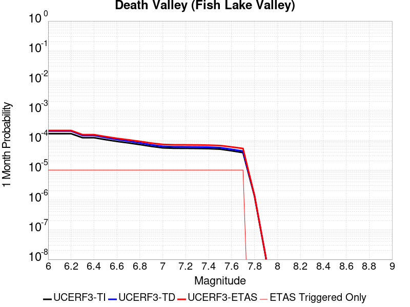 |  |  |

| Magnitude | 1 wk TI Prob | 1 wk TD Prob | 1 wk ETAS Prob | 1 wk ETAS/TD Gain | 1 wk ETAS Triggered Only | 1 mo TI Prob | 1 mo TD Prob | 1 mo ETAS Prob | 1 mo ETAS/TD Gain | 1 mo ETAS Triggered Only | 1 yr TI Prob | 1 yr TD Prob | 1 yr ETAS Prob | 1 yr ETAS/TD Gain | 1 yr ETAS Triggered Only | 10 yr TI Prob | 10 yr TD Prob | 10 yr ETAS Prob | 10 yr ETAS/TD Gain | 10 yr ETAS Triggered Only |
|-----|-----|-----|-----|-----|-----|-----|-----|-----|-----|-----|-----|-----|-----|-----|-----|-----|-----|-----|-----|-----|
| 6.0 | 3.872328E-5 | 4.727316E-5 | 4.727316E-5 | 1.0 | 0.0 | 1.6594635E-4 | 2.0258522E-4 | 2.0258522E-4 | 1.0 | 0.0 | 0.0020185246 | 0.0024638134 | 0.002489388 | 1.01038 | 2.5637739E-5 | 0.02000288 | 0.024390986 | 0.024466023 | 1.0030764 | 7.691322E-5 |
| 6.1 | 3.872328E-5 | 4.727316E-5 | 4.727316E-5 | 1.0 | 0.0 | 1.6594635E-4 | 2.0258522E-4 | 2.0258522E-4 | 1.0 | 0.0 | 0.0020185246 | 0.0024638134 | 0.002489388 | 1.01038 | 2.5637739E-5 | 0.02000288 | 0.024390986 | 0.024466023 | 1.0030764 | 7.691322E-5 |
| 6.2 | 3.872328E-5 | 4.727316E-5 | 4.727316E-5 | 1.0 | 0.0 | 1.6594635E-4 | 2.0258522E-4 | 2.0258522E-4 | 1.0 | 0.0 | 0.0020185246 | 0.0024638134 | 0.002489388 | 1.01038 | 2.5637739E-5 | 0.02000288 | 0.024390986 | 0.024466023 | 1.0030764 | 7.691322E-5 |
| 6.3 | 2.8356371E-5 | 3.361322E-5 | 3.361322E-5 | 1.0 | 0.0 | 1.2152165E-4 | 1.4404916E-4 | 1.4404916E-4 | 1.0 | 0.0 | 0.0014785219 | 0.0017524667 | 0.0017780595 | 1.0146039 | 2.5637739E-5 | 0.014687235 | 0.017393492 | 0.017469067 | 1.004345 | 7.691322E-5 |
| 6.4 | 2.8356371E-5 | 3.361322E-5 | 3.361322E-5 | 1.0 | 0.0 | 1.2152165E-4 | 1.4404916E-4 | 1.4404916E-4 | 1.0 | 0.0 | 0.0014785219 | 0.0017524667 | 0.0017780595 | 1.0146039 | 2.5637739E-5 | 0.014687235 | 0.017393492 | 0.017469067 | 1.004345 | 7.691322E-5 |
| 6.5 | 2.4448687E-5 | 2.8610175E-5 | 2.8610175E-5 | 1.0 | 0.0 | 1.0477588E-4 | 1.2260956E-4 | 1.2260956E-4 | 1.0 | 0.0 | 0.0012748998 | 0.0014917998 | 0.0015173993 | 1.0171602 | 2.5637739E-5 | 0.012676105 | 0.014822718 | 0.014898491 | 1.0051119 | 7.691322E-5 |
| 6.6 | 2.1298161E-5 | 2.4662175E-5 | 2.4662175E-5 | 1.0 | 0.0 | 9.127464E-5 | 1.05690946E-4 | 1.05690946E-4 | 1.0 | 0.0 | 0.0011107022 | 0.0012860615 | 0.0013116663 | 1.0199095 | 2.5637739E-5 | 0.011051672 | 0.012789601 | 0.01286553 | 1.0059369 | 7.691322E-5 |
| 6.7 | 1.8959729E-5 | 2.1782762E-5 | 2.1782762E-5 | 1.0 | 0.0 | 8.125345E-5 | 9.3351504E-5 | 9.3351504E-5 | 1.0 | 0.0 | 9.888117E-4 | 0.0011359875 | 0.0011615962 | 1.0225431 | 2.5637739E-5 | 0.009844234 | 0.011304467 | 0.01138051 | 1.0067269 | 7.691322E-5 |
| 6.8 | 1.6691629E-5 | 1.901977E-5 | 1.901977E-5 | 1.0 | 0.0 | 7.153359E-5 | 8.151084E-5 | 8.151084E-5 | 1.0 | 0.0 | 8.7057345E-4 | 9.919596E-4 | 0.0010175719 | 1.0258199 | 2.5637739E-5 | 0.008671708 | 0.009877076 | 0.00995323 | 1.0077101 | 7.691322E-5 |
| 6.9 | 1.450505E-5 | 1.6390675E-5 | 1.6390675E-5 | 1.0 | 0.0 | 6.216302E-5 | 7.024391E-5 | 7.024391E-5 | 1.0 | 0.0 | 7.5657194E-4 | 8.5489283E-4 | 8.805086E-4 | 1.0299637 | 2.5637739E-5 | 0.007540013 | 0.008516973 | 0.008593231 | 1.0089537 | 7.691322E-5 |
| 7.0 | 1.2940855E-5 | 1.4538927E-5 | 1.4538927E-5 | 1.0 | 0.0 | 5.545963E-5 | 6.230823E-5 | 6.230823E-5 | 1.0 | 0.0 | 6.750118E-4 | 7.583444E-4 | 7.839627E-4 | 1.0337819 | 2.5637739E-5 | 0.006729651 | 0.007558184 | 0.0076345163 | 1.0100993 | 7.691322E-5 |
| 7.1 | 1.2544658E-5 | 1.4079123E-5 | 1.4079123E-5 | 1.0 | 0.0 | 5.3761712E-5 | 6.0337734E-5 | 6.0337734E-5 | 1.0 | 0.0 | 6.5435225E-4 | 7.343699E-4 | 7.5998885E-4 | 1.0348855 | 2.5637739E-5 | 0.006524288 | 0.007320025 | 0.0073963753 | 1.0104303 | 7.691322E-5 |
| 7.2 | 1.2489416E-5 | 1.4016585E-5 | 1.4016585E-5 | 1.0 | 0.0 | 5.3524967E-5 | 6.0069728E-5 | 6.0069728E-5 | 1.0 | 0.0 | 6.514716E-4 | 7.311091E-4 | 7.567281E-4 | 1.0350413 | 2.5637739E-5 | 0.006495651 | 0.0072876317 | 0.0073639844 | 1.0104771 | 7.691322E-5 |
| 7.3 | 1.2368307E-5 | 1.38807145E-5 | 1.38807145E-5 | 1.0 | 0.0 | 5.3005948E-5 | 5.948745E-5 | 5.948745E-5 | 1.0 | 0.0 | 6.451563E-4 | 7.2402466E-4 | 7.4964383E-4 | 1.0353844 | 2.5637739E-5 | 0.0064328653 | 0.0072172494 | 0.007293607 | 1.01058 | 7.691322E-5 |
| 7.4 | 1.2161707E-5 | 1.3648755E-5 | 1.3648755E-5 | 1.0 | 0.0 | 5.212056E-5 | 5.8493384E-5 | 5.8493384E-5 | 1.0 | 0.0 | 6.3438306E-4 | 7.1192987E-4 | 7.3754933E-4 | 1.035986 | 2.5637739E-5 | 0.006325751 | 0.0070970803 | 0.0071734474 | 1.0107604 | 7.691322E-5 |
| 7.5 | 1.1707948E-5 | 1.3146373E-5 | 1.3146373E-5 | 1.0 | 0.0 | 5.0175953E-5 | 5.6340414E-5 | 5.6340414E-5 | 1.0 | 0.0 | 6.10721E-4 | 6.857342E-4 | 7.1135437E-4 | 1.0373616 | 2.5637739E-5 | 0.0060904534 | 0.006836766 | 0.0069131535 | 1.011173 | 7.691322E-5 |
| 7.6 | 1.0319538E-5 | 1.1580373E-5 | 1.1580373E-5 | 1.0 | 0.0 | 4.4225842E-5 | 4.9629256E-5 | 4.9629256E-5 | 1.0 | 0.0 | 5.383166E-4 | 6.0407387E-4 | 6.296961E-4 | 1.0424157 | 2.5637739E-5 | 0.0053701443 | 0.00602485 | 0.0061013 | 1.0126891 | 7.691322E-5 |
| 7.7 | 8.937764E-6 | 1.0023426E-5 | 1.0023426E-5 | 1.0 | 0.0 | 3.830414E-5 | 4.295686E-5 | 4.295686E-5 | 1.0 | 0.0 | 4.6625308E-4 | 5.228793E-4 | 5.4850365E-4 | 1.0490062 | 2.5637739E-5 | 0.0046527605 | 0.005217 | 0.005293512 | 1.0146658 | 7.691322E-5 |
| 7.8 | 3.108007E-7 | 3.2847535E-7 | 3.2847535E-7 | 1.0 | 0.0 | 1.3320023E-6 | 1.4077508E-6 | 1.4077508E-6 | 1.0 | 0.0 | 1.6217007E-5 | 1.7139235E-5 | 1.7139235E-5 | 1.0 | 0.0 | 1.6215823E-4 | 1.713795E-4 | 1.713795E-4 | 1.0 | 0.0 |
| 7.9 | 2.5591178E-9 | 2.6697329E-9 | 2.6697329E-9 | 1.0 | 0.0 | 1.0967647E-8 | 1.14417125E-8 | 1.14417125E-8 | 1.0 | 0.0 | 1.335311E-7 | 1.3930286E-7 | 1.3930286E-7 | 1.0 | 0.0 | 1.3353102E-6 | 1.3930285E-6 | 1.3930285E-6 | 1.0 | 0.0 |

## Lake Isabella (Seismicity)
*[(top)](#table-of-contents)*

| 1 Week | 1 Month | 1 Year | 10 Year |
|-----|-----|-----|-----|
|  |  |  | 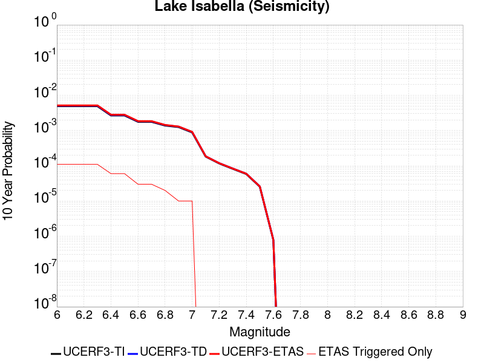 |

| Magnitude | 1 wk TI Prob | 1 wk TD Prob | 1 wk ETAS Prob | 1 wk ETAS/TD Gain | 1 wk ETAS Triggered Only | 1 mo TI Prob | 1 mo TD Prob | 1 mo ETAS Prob | 1 mo ETAS/TD Gain | 1 mo ETAS Triggered Only | 1 yr TI Prob | 1 yr TD Prob | 1 yr ETAS Prob | 1 yr ETAS/TD Gain | 1 yr ETAS Triggered Only | 10 yr TI Prob | 10 yr TD Prob | 10 yr ETAS Prob | 10 yr ETAS/TD Gain | 10 yr ETAS Triggered Only |
|-----|-----|-----|-----|-----|-----|-----|-----|-----|-----|-----|-----|-----|-----|-----|-----|-----|-----|-----|-----|-----|
| 6.0 | 9.431637E-6 | 9.7418215E-6 | 9.7418215E-6 | 1.0 | 0.0 | 4.0420677E-5 | 4.175007E-5 | 6.738674E-5 | 1.6140509 | 2.5637739E-5 | 4.920106E-4 | 5.082016E-4 | 5.5945106E-4 | 1.1008446 | 5.1275478E-5 | 0.004909227 | 0.005071687 | 0.005173718 | 1.0201178 | 1.02550955E-4 |
| 6.1 | 9.431637E-6 | 9.7418215E-6 | 9.7418215E-6 | 1.0 | 0.0 | 4.0420677E-5 | 4.175007E-5 | 6.738674E-5 | 1.6140509 | 2.5637739E-5 | 4.920106E-4 | 5.082016E-4 | 5.5945106E-4 | 1.1008446 | 5.1275478E-5 | 0.004909227 | 0.005071687 | 0.005173718 | 1.0201178 | 1.02550955E-4 |
| 6.2 | 9.431637E-6 | 9.7418215E-6 | 9.7418215E-6 | 1.0 | 0.0 | 4.0420677E-5 | 4.175007E-5 | 6.738674E-5 | 1.6140509 | 2.5637739E-5 | 4.920106E-4 | 5.082016E-4 | 5.5945106E-4 | 1.1008446 | 5.1275478E-5 | 0.004909227 | 0.005071687 | 0.005173718 | 1.0201178 | 1.02550955E-4 |
| 6.3 | 9.431637E-6 | 9.7418215E-6 | 9.7418215E-6 | 1.0 | 0.0 | 4.0420677E-5 | 4.175007E-5 | 6.738674E-5 | 1.6140509 | 2.5637739E-5 | 4.920106E-4 | 5.082016E-4 | 5.5945106E-4 | 1.1008446 | 5.1275478E-5 | 0.004909227 | 0.005071687 | 0.005173718 | 1.0201178 | 1.02550955E-4 |
| 6.4 | 5.144063E-6 | 5.3001613E-6 | 5.3001613E-6 | 1.0 | 0.0 | 2.2045799E-5 | 2.27148E-5 | 2.27148E-5 | 1.0 | 0.0 | 2.6837454E-4 | 2.7652105E-4 | 3.021517E-4 | 1.0926896 | 2.5637739E-5 | 0.0026805066 | 0.0027621102 | 0.002838811 | 1.0277689 | 7.691322E-5 |
| 6.5 | 5.144063E-6 | 5.3001613E-6 | 5.3001613E-6 | 1.0 | 0.0 | 2.2045799E-5 | 2.27148E-5 | 2.27148E-5 | 1.0 | 0.0 | 2.6837454E-4 | 2.7652105E-4 | 3.021517E-4 | 1.0926896 | 2.5637739E-5 | 0.0026805066 | 0.0027621102 | 0.002838811 | 1.0277689 | 7.691322E-5 |
| 6.6 | 3.4009804E-6 | 3.4988395E-6 | 3.4988395E-6 | 1.0 | 0.0 | 1.4575549E-5 | 1.4994949E-5 | 1.4994949E-5 | 1.0 | 0.0 | 1.7744285E-4 | 1.8254982E-4 | 2.0818287E-4 | 1.1404167 | 2.5637739E-5 | 0.0017730123 | 0.0018241564 | 0.0018497474 | 1.0140289 | 2.5637739E-5 |
| 6.7 | 3.3880428E-6 | 3.485706E-6 | 3.485706E-6 | 1.0 | 0.0 | 1.4520103E-5 | 1.4938664E-5 | 1.4938664E-5 | 1.0 | 0.0 | 1.767679E-4 | 1.8186466E-4 | 2.0749774E-4 | 1.1409459 | 2.5637739E-5 | 0.0017662736 | 0.0018173159 | 0.0018429072 | 1.0140818 | 2.5637739E-5 |
| 6.8 | 2.6582E-6 | 2.7337414E-6 | 2.7337414E-6 | 1.0 | 0.0 | 1.1392236E-5 | 1.171599E-5 | 1.171599E-5 | 1.0 | 0.0 | 1.3869164E-4 | 1.4263418E-4 | 1.6826826E-4 | 1.1797191 | 2.5637739E-5 | 0.0013860512 | 0.0014255584 | 0.0014511596 | 1.0179588 | 2.5637739E-5 |
| 6.9 | 2.406011E-6 | 2.474366E-6 | 2.474366E-6 | 1.0 | 0.0 | 1.0311434E-5 | 1.0604391E-5 | 1.0604391E-5 | 1.0 | 0.0 | 1.2553448E-4 | 1.2910213E-4 | 1.5473655E-4 | 1.1985593 | 2.5637739E-5 | 0.0012546359 | 0.0012904009 | 0.0013160055 | 1.0198424 | 2.5637739E-5 |
| 7.0 | 1.6953097E-6 | 1.7429631E-6 | 1.7429631E-6 | 1.0 | 0.0 | 7.265593E-6 | 7.469827E-6 | 7.469827E-6 | 1.0 | 0.0 | 8.8455E-5 | 9.094239E-5 | 1.165778E-4 | 1.2818862 | 2.5637739E-5 | 8.84198E-4 | 9.0915454E-4 | 9.3476893E-4 | 1.0281739 | 2.5637739E-5 |
| 7.1 | 3.5013824E-7 | 3.5715203E-7 | 3.5715203E-7 | 1.0 | 0.0 | 1.5005916E-6 | 1.5306507E-6 | 1.5306507E-6 | 1.0 | 0.0 | 1.826955E-5 | 1.8635516E-5 | 1.8635516E-5 | 1.0 | 0.0 | 1.8268047E-4 | 1.8633978E-4 | 1.8633978E-4 | 1.0 | 0.0 |
| 7.2 | 2.2321095E-7 | 2.2750805E-7 | 2.2750805E-7 | 1.0 | 0.0 | 9.56618E-7 | 9.750341E-7 | 9.750341E-7 | 1.0 | 0.0 | 1.1646762E-5 | 1.1870978E-5 | 1.1870978E-5 | 1.0 | 0.0 | 1.1646151E-4 | 1.1870354E-4 | 1.1870354E-4 | 1.0 | 0.0 |
| 7.3 | 1.5760406E-7 | 1.6061085E-7 | 1.6061085E-7 | 1.0 | 0.0 | 6.7544585E-7 | 6.88332E-7 | 6.88332E-7 | 1.0 | 0.0 | 8.223522E-6 | 8.380411E-6 | 8.380411E-6 | 1.0 | 0.0 | 8.2232174E-5 | 8.380101E-5 | 8.380101E-5 | 1.0 | 0.0 |
| 7.4 | 1.1216497E-7 | 1.14318226E-7 | 1.14318226E-7 | 1.0 | 0.0 | 4.8070694E-7 | 4.899352E-7 | 4.899352E-7 | 1.0 | 0.0 | 5.852591E-6 | 5.9649446E-6 | 5.9649446E-6 | 1.0 | 0.0 | 5.8524372E-5 | 5.964789E-5 | 5.964789E-5 | 1.0 | 0.0 |
| 7.5 | 4.885185E-8 | 4.9788245E-8 | 4.9788245E-8 | 1.0 | 0.0 | 2.0936506E-7 | 2.1337817E-7 | 2.1337817E-7 | 1.0 | 0.0 | 2.5490165E-6 | 2.5978763E-6 | 2.5978763E-6 | 1.0 | 0.0 | 2.5489873E-5 | 2.5978477E-5 | 2.5978477E-5 | 1.0 | 0.0 |
| 7.6 | 1.504641E-9 | 1.5318049E-9 | 1.5318049E-9 | 1.0 | 0.0 | 6.4484613E-9 | 6.5648784E-9 | 6.5648784E-9 | 1.0 | 0.0 | 7.851001E-8 | 7.9927396E-8 | 7.9927396E-8 | 1.0 | 0.0 | 7.8509987E-7 | 7.9927395E-7 | 7.9927395E-7 | 1.0 | 0.0 |

## San Jacinto (San Jacinto Valley) rev
*[(top)](#table-of-contents)*

| 1 Week | 1 Month | 1 Year | 10 Year |
|-----|-----|-----|-----|
|  |  |  |  |

| Magnitude | 1 wk TI Prob | 1 wk TD Prob | 1 wk ETAS Prob | 1 wk ETAS/TD Gain | 1 wk ETAS Triggered Only | 1 mo TI Prob | 1 mo TD Prob | 1 mo ETAS Prob | 1 mo ETAS/TD Gain | 1 mo ETAS Triggered Only | 1 yr TI Prob | 1 yr TD Prob | 1 yr ETAS Prob | 1 yr ETAS/TD Gain | 1 yr ETAS Triggered Only | 10 yr TI Prob | 10 yr TD Prob | 10 yr ETAS Prob | 10 yr ETAS/TD Gain | 10 yr ETAS Triggered Only |
|-----|-----|-----|-----|-----|-----|-----|-----|-----|-----|-----|-----|-----|-----|-----|-----|-----|-----|-----|-----|-----|
| 6.0 | 3.652694E-5 | 3.4467394E-5 | 8.574111E-5 | 2.4876006 | 5.1275478E-5 | 1.5653463E-4 | 1.4770904E-4 | 1.9897694E-4 | 1.3470871 | 5.1275478E-5 | 0.0019041431 | 0.001796876 | 0.0018736509 | 1.042727 | 7.691322E-5 | 0.018879099 | 0.018560216 | 0.018660862 | 1.0054227 | 1.02550955E-4 |
| 6.1 | 3.652694E-5 | 3.4467394E-5 | 8.574111E-5 | 2.4876006 | 5.1275478E-5 | 1.5653463E-4 | 1.4770904E-4 | 1.9897694E-4 | 1.3470871 | 5.1275478E-5 | 0.0019041431 | 0.001796876 | 0.0018736509 | 1.042727 | 7.691322E-5 | 0.018879099 | 0.018560216 | 0.018660862 | 1.0054227 | 1.02550955E-4 |
| 6.2 | 3.652694E-5 | 3.4467394E-5 | 8.574111E-5 | 2.4876006 | 5.1275478E-5 | 1.5653463E-4 | 1.4770904E-4 | 1.9897694E-4 | 1.3470871 | 5.1275478E-5 | 0.0019041431 | 0.001796876 | 0.0018736509 | 1.042727 | 7.691322E-5 | 0.018879099 | 0.018560216 | 0.018660862 | 1.0054227 | 1.02550955E-4 |
| 6.3 | 3.652694E-5 | 3.4467394E-5 | 8.574111E-5 | 2.4876006 | 5.1275478E-5 | 1.5653463E-4 | 1.4770904E-4 | 1.9897694E-4 | 1.3470871 | 5.1275478E-5 | 0.0019041431 | 0.001796876 | 0.0018736509 | 1.042727 | 7.691322E-5 | 0.018879099 | 0.018560216 | 0.018660862 | 1.0054227 | 1.02550955E-4 |
| 6.4 | 3.646941E-5 | 3.4388955E-5 | 8.566267E-5 | 2.4909937 | 5.1275478E-5 | 1.5628811E-4 | 1.4737292E-4 | 1.9864083E-4 | 1.3478788 | 5.1275478E-5 | 0.0019011468 | 0.0017927908 | 0.0018695662 | 1.0428245 | 7.691322E-5 | 0.018849645 | 0.01852009 | 0.018620742 | 1.0054348 | 1.02550955E-4 |
| 6.5 | 3.646941E-5 | 3.4388955E-5 | 8.566267E-5 | 2.4909937 | 5.1275478E-5 | 1.5628811E-4 | 1.4737292E-4 | 1.9864083E-4 | 1.3478788 | 5.1275478E-5 | 0.0019011468 | 0.0017927908 | 0.0018695662 | 1.0428245 | 7.691322E-5 | 0.018849645 | 0.01852009 | 0.018620742 | 1.0054348 | 1.02550955E-4 |
| 6.6 | 3.6442503E-5 | 3.4352335E-5 | 8.562605E-5 | 2.4925833 | 5.1275478E-5 | 1.561728E-4 | 1.4721598E-4 | 1.984839E-4 | 1.3482498 | 5.1275478E-5 | 0.0018997455 | 0.0017908834 | 0.0018676588 | 1.0428702 | 7.691322E-5 | 0.018835869 | 0.018501356 | 0.01860201 | 1.0054404 | 1.02550955E-4 |
| 6.7 | 3.6432113E-5 | 3.4337903E-5 | 8.561162E-5 | 2.4932106 | 5.1275478E-5 | 1.5612828E-4 | 1.4715415E-4 | 1.9842207E-4 | 1.3483962 | 5.1275478E-5 | 0.0018992044 | 0.001790132 | 0.0018669076 | 1.0428882 | 7.691322E-5 | 0.018830549 | 0.01849398 | 0.018594634 | 1.0054425 | 1.02550955E-4 |
| 6.8 | 3.6409598E-5 | 3.430695E-5 | 8.558067E-5 | 2.4945576 | 5.1275478E-5 | 1.560318E-4 | 1.470215E-4 | 1.9828945E-4 | 1.3487104 | 5.1275478E-5 | 0.0018980318 | 0.0017885199 | 0.0018652956 | 1.0429269 | 7.691322E-5 | 0.018819023 | 0.01847813 | 0.018578788 | 1.0054473 | 1.02550955E-4 |
| 6.9 | 3.638078E-5 | 3.4267367E-5 | 8.554109E-5 | 2.4962842 | 5.1275478E-5 | 1.5590832E-4 | 1.4685189E-4 | 1.9811983E-4 | 1.3491133 | 5.1275478E-5 | 0.0018965311 | 0.0017864581 | 0.0018632339 | 1.0429765 | 7.691322E-5 | 0.018804269 | 0.018457862 | 0.01855852 | 1.0054533 | 1.02550955E-4 |
| 7.0 | 3.6294874E-5 | 3.4149365E-5 | 8.542309E-5 | 2.5014548 | 5.1275478E-5 | 1.5554018E-4 | 1.4634622E-4 | 1.9761421E-4 | 1.3503197 | 5.1275478E-5 | 0.0018920569 | 0.0017803118 | 0.0018570882 | 1.0431252 | 7.691322E-5 | 0.018760284 | 0.018397434 | 0.018498098 | 1.0054717 | 1.02550955E-4 |
| 7.1 | 3.6260717E-5 | 3.410564E-5 | 8.537937E-5 | 2.5033796 | 5.1275478E-5 | 1.5539382E-4 | 1.4615887E-4 | 1.9742685E-4 | 1.3507689 | 5.1275478E-5 | 0.001890278 | 0.0017780344 | 0.0018548109 | 1.0431806 | 7.691322E-5 | 0.018742796 | 0.018375032 | 0.018475698 | 1.0054785 | 1.02550955E-4 |
| 7.2 | 3.6210204E-5 | 3.403977E-5 | 8.53135E-5 | 2.506289 | 5.1275478E-5 | 1.5517735E-4 | 1.4587659E-4 | 1.9714459E-4 | 1.3514477 | 5.1275478E-5 | 0.001887647 | 0.0017746033 | 0.00185138 | 1.0432642 | 7.691322E-5 | 0.01871693 | 0.018341267 | 0.018441936 | 1.0054888 | 1.02550955E-4 |
| 7.3 | 3.6119454E-5 | 3.3927867E-5 | 8.52016E-5 | 2.5112574 | 5.1275478E-5 | 1.5478847E-4 | 1.4539705E-4 | 1.9666507E-4 | 1.352607 | 5.1275478E-5 | 0.0018829206 | 0.0017687745 | 0.0018455517 | 1.043407 | 7.691322E-5 | 0.018670462 | 0.018283723 | 0.018384399 | 1.0055063 | 1.02550955E-4 |
| 7.4 | 3.607848E-5 | 3.387532E-5 | 8.514906E-5 | 2.5136015 | 5.1275478E-5 | 1.5461289E-4 | 1.4517189E-4 | 1.9643991E-4 | 1.3531541 | 5.1275478E-5 | 0.0018807866 | 0.0017660374 | 0.0018428148 | 1.0434744 | 7.691322E-5 | 0.018649481 | 0.018256696 | 0.018357376 | 1.0055146 | 1.02550955E-4 |
| 7.5 | 3.5856774E-5 | 3.3684162E-5 | 8.4957916E-5 | 2.5221915 | 5.1275478E-5 | 1.5366284E-4 | 1.4435273E-4 | 1.956208E-4 | 1.3551583 | 5.1275478E-5 | 0.0018692396 | 0.0017560803 | 0.0018328585 | 1.0437213 | 7.691322E-5 | 0.018535944 | 0.01815731 | 0.018258 | 1.0055454 | 1.02550955E-4 |
| 7.6 | 3.286655E-5 | 3.220034E-5 | 8.3474166E-5 | 2.592338 | 5.1275478E-5 | 1.4084904E-4 | 1.3799417E-4 | 1.8926257E-4 | 1.3715259 | 5.1275478E-5 | 0.001713488 | 0.0016787864 | 0.0017555705 | 1.0457379 | 7.691322E-5 | 0.017003361 | 0.017373424 | 0.017474193 | 1.0058002 | 1.02550955E-4 |
| 7.7 | 2.8882527E-5 | 2.9291981E-5 | 8.056596E-5 | 2.7504442 | 5.1275478E-5 | 1.237764E-4 | 1.2553102E-4 | 1.7680007E-4 | 1.4084173 | 5.1275478E-5 | 0.0015059357 | 0.0015272698 | 0.0016040656 | 1.0502831 | 7.691322E-5 | 0.014957713 | 0.015859274 | 0.015960198 | 1.0063637 | 1.02550955E-4 |
| 7.8 | 2.4950225E-5 | 2.6580747E-5 | 7.7854864E-5 | 2.9289947 | 5.1275478E-5 | 1.0692515E-4 | 1.13912516E-4 | 1.6518215E-4 | 1.4500791 | 5.1275478E-5 | 0.0013010362 | 0.0013860033 | 0.00146281 | 1.0554159 | 7.691322E-5 | 0.012934455 | 0.014439502 | 0.014540573 | 1.0069996 | 1.02550955E-4 |
| 7.9 | 1.9881603E-5 | 2.155556E-5 | 7.2829935E-5 | 3.3787076 | 5.1275478E-5 | 8.520408E-5 | 9.2377704E-5 | 1.4364845E-4 | 1.5550121 | 5.1275478E-5 | 0.001036866 | 0.001124119 | 0.0012009458 | 1.068344 | 7.691322E-5 | 0.010320415 | 0.011802064 | 0.011903405 | 1.0085866 | 1.02550955E-4 |
| 8.0 | 1.563292E-5 | 1.5976173E-5 | 6.725083E-5 | 4.2094455 | 5.1275478E-5 | 6.6996516E-5 | 6.846752E-5 | 1.1973948E-4 | 1.748851 | 5.1275478E-5 | 8.153773E-4 | 8.332739E-4 | 9.1012305E-4 | 1.0922256 | 7.691322E-5 | 0.00812392 | 0.008830938 | 0.008907172 | 1.0086327 | 7.691322E-5 |
| 8.1 | 1.0045313E-5 | 8.324356E-6 | 3.3961882E-5 | 4.079821 | 2.5637739E-5 | 4.305063E-5 | 3.5675326E-5 | 6.131215E-5 | 1.718615 | 2.5637739E-5 | 5.2401534E-4 | 4.3426102E-4 | 4.5988764E-4 | 1.0590119 | 2.5637739E-5 | 0.0052278144 | 0.0046712374 | 0.004696755 | 1.0054628 | 2.5637739E-5 |
| 8.2 | 4.1554413E-6 | 1.5721832E-6 | 1.5721832E-6 | 1.0 | 0.0 | 1.7808914E-5 | 6.737911E-6 | 6.737911E-6 | 1.0 | 0.0 | 2.1680194E-4 | 8.203101E-5 | 8.203101E-5 | 1.0 | 0.0 | 0.0021659054 | 9.520741E-4 | 9.520741E-4 | 1.0 | 0.0 |
| 8.3 | 1.2758221E-6 | 3.6330252E-7 | 3.6330252E-7 | 1.0 | 0.0 | 5.4677976E-6 | 1.5570099E-6 | 1.5570099E-6 | 1.0 | 0.0 | 6.65684E-5 | 1.8956434E-5 | 1.8956434E-5 | 1.0 | 0.0 | 6.6548464E-4 | 2.2857229E-4 | 2.2857229E-4 | 1.0 | 0.0 |

## San Jacinto (Stepovers Combined)
*[(top)](#table-of-contents)*

| 1 Week | 1 Month | 1 Year | 10 Year |
|-----|-----|-----|-----|
|  |  |  |  |

| Magnitude | 1 wk TI Prob | 1 wk TD Prob | 1 wk ETAS Prob | 1 wk ETAS/TD Gain | 1 wk ETAS Triggered Only | 1 mo TI Prob | 1 mo TD Prob | 1 mo ETAS Prob | 1 mo ETAS/TD Gain | 1 mo ETAS Triggered Only | 1 yr TI Prob | 1 yr TD Prob | 1 yr ETAS Prob | 1 yr ETAS/TD Gain | 1 yr ETAS Triggered Only | 10 yr TI Prob | 10 yr TD Prob | 10 yr ETAS Prob | 10 yr ETAS/TD Gain | 10 yr ETAS Triggered Only |
|-----|-----|-----|-----|-----|-----|-----|-----|-----|-----|-----|-----|-----|-----|-----|-----|-----|-----|-----|-----|-----|
| 6.0 | 4.0667746E-5 | 3.5336896E-5 | 8.661056E-5 | 2.4509952 | 5.1275478E-5 | 1.742787E-4 | 1.5143506E-4 | 2.0270277E-4 | 1.3385459 | 5.1275478E-5 | 0.0021197782 | 0.0018421634 | 0.001918935 | 1.0416746 | 7.691322E-5 | 0.020996714 | 0.019020144 | 0.019120743 | 1.0052892 | 1.02550955E-4 |
| 6.1 | 4.0667746E-5 | 3.5336896E-5 | 8.661056E-5 | 2.4509952 | 5.1275478E-5 | 1.742787E-4 | 1.5143506E-4 | 2.0270277E-4 | 1.3385459 | 5.1275478E-5 | 0.0021197782 | 0.0018421634 | 0.001918935 | 1.0416746 | 7.691322E-5 | 0.020996714 | 0.019020144 | 0.019120743 | 1.0052892 | 1.02550955E-4 |
| 6.2 | 4.0667746E-5 | 3.5336896E-5 | 8.661056E-5 | 2.4509952 | 5.1275478E-5 | 1.742787E-4 | 1.5143506E-4 | 2.0270277E-4 | 1.3385459 | 5.1275478E-5 | 0.0021197782 | 0.0018421634 | 0.001918935 | 1.0416746 | 7.691322E-5 | 0.020996714 | 0.019020144 | 0.019120743 | 1.0052892 | 1.02550955E-4 |
| 6.3 | 4.0667746E-5 | 3.5336896E-5 | 8.661056E-5 | 2.4509952 | 5.1275478E-5 | 1.742787E-4 | 1.5143506E-4 | 2.0270277E-4 | 1.3385459 | 5.1275478E-5 | 0.0021197782 | 0.0018421634 | 0.001918935 | 1.0416746 | 7.691322E-5 | 0.020996714 | 0.019020144 | 0.019120743 | 1.0052892 | 1.02550955E-4 |
| 6.4 | 4.0577226E-5 | 3.5208766E-5 | 8.648244E-5 | 2.4562757 | 5.1275478E-5 | 1.738908E-4 | 1.50886E-4 | 2.0215374E-4 | 1.339778 | 5.1275478E-5 | 0.0021150648 | 0.0018354917 | 0.0019122638 | 1.0418264 | 7.691322E-5 | 0.020950472 | 0.018954702 | 0.019055309 | 1.0053078 | 1.02550955E-4 |
| 6.5 | 4.0577226E-5 | 3.5208766E-5 | 8.648244E-5 | 2.4562757 | 5.1275478E-5 | 1.738908E-4 | 1.50886E-4 | 2.0215374E-4 | 1.339778 | 5.1275478E-5 | 0.0021150648 | 0.0018354917 | 0.0019122638 | 1.0418264 | 7.691322E-5 | 0.020950472 | 0.018954702 | 0.019055309 | 1.0053078 | 1.02550955E-4 |
| 6.6 | 4.053861E-5 | 3.5154102E-5 | 8.6427775E-5 | 2.4585404 | 5.1275478E-5 | 1.7372532E-4 | 1.5065174E-4 | 2.019195E-4 | 1.3403064 | 5.1275478E-5 | 0.0021130538 | 0.0018326445 | 0.0019094168 | 1.0418916 | 7.691322E-5 | 0.020930743 | 0.018926777 | 0.019027386 | 1.0053158 | 1.02550955E-4 |
| 6.7 | 4.0516545E-5 | 3.512316E-5 | 8.639684E-5 | 2.4598253 | 5.1275478E-5 | 1.7363077E-4 | 1.5051916E-4 | 2.0178691E-4 | 1.3406062 | 5.1275478E-5 | 0.002111905 | 0.0018310336 | 0.001907806 | 1.0419284 | 7.691322E-5 | 0.020919468 | 0.01891097 | 0.019011581 | 1.0053203 | 1.02550955E-4 |
| 6.8 | 4.049434E-5 | 3.509472E-5 | 8.6368396E-5 | 2.4610083 | 5.1275478E-5 | 1.7353562E-4 | 1.5039727E-4 | 2.0166504E-4 | 1.3408823 | 5.1275478E-5 | 0.0021107488 | 0.0018295521 | 0.0019063246 | 1.0419625 | 7.691322E-5 | 0.020908125 | 0.01889638 | 0.018996993 | 1.0053245 | 1.02550955E-4 |
| 6.9 | 4.046386E-5 | 3.505727E-5 | 8.633095E-5 | 2.462569 | 5.1275478E-5 | 1.73405E-4 | 1.502368E-4 | 2.0150458E-4 | 1.3412465 | 5.1275478E-5 | 0.0021091616 | 0.0018276017 | 0.0019043743 | 1.0420073 | 7.691322E-5 | 0.020892553 | 0.01887715 | 0.018977765 | 1.00533 | 1.02550955E-4 |
| 7.0 | 4.036382E-5 | 3.4937813E-5 | 8.62115E-5 | 2.46757 | 5.1275478E-5 | 1.7297632E-4 | 1.4972492E-4 | 2.0099271E-4 | 1.3424133 | 5.1275478E-5 | 0.0021039525 | 0.00182138 | 0.0018981531 | 1.0421511 | 7.691322E-5 | 0.02084144 | 0.018815752 | 0.018916374 | 1.0053477 | 1.02550955E-4 |
| 7.1 | 4.0343282E-5 | 3.4916273E-5 | 8.618996E-5 | 2.4684753 | 5.1275478E-5 | 1.7288832E-4 | 1.496326E-4 | 2.0090041E-4 | 1.3426245 | 5.1275478E-5 | 0.002102883 | 0.0018202579 | 0.0018970311 | 1.0421771 | 7.691322E-5 | 0.020830948 | 0.018804627 | 0.018905248 | 1.005351 | 1.02550955E-4 |
| 7.2 | 4.0257353E-5 | 3.4820667E-5 | 8.609436E-5 | 2.4725075 | 5.1275478E-5 | 1.725201E-4 | 1.492229E-4 | 2.0049073E-4 | 1.3435653 | 5.1275478E-5 | 0.0020984085 | 0.0018152783 | 0.0018920519 | 1.0422931 | 7.691322E-5 | 0.020787042 | 0.018755313 | 0.01885594 | 1.0053653 | 1.02550955E-4 |
| 7.3 | 3.9940667E-5 | 3.4648023E-5 | 8.5921725E-5 | 2.4798448 | 5.1275478E-5 | 1.7116306E-4 | 1.4848309E-4 | 1.9975095E-4 | 1.3452774 | 5.1275478E-5 | 0.0020819185 | 0.0018062859 | 0.0018830603 | 1.042504 | 7.691322E-5 | 0.020625217 | 0.018663792 | 0.018764429 | 1.0053921 | 1.02550955E-4 |
| 7.4 | 3.9721202E-5 | 3.453329E-5 | 8.580699E-5 | 2.484762 | 5.1275478E-5 | 1.7022261E-4 | 1.4799142E-4 | 1.9925932E-4 | 1.3464247 | 5.1275478E-5 | 0.0020704903 | 0.0018003098 | 0.0018770845 | 1.0426453 | 7.691322E-5 | 0.020513052 | 0.01860285 | 0.018703494 | 1.0054101 | 1.02550955E-4 |
| 7.5 | 3.7036873E-5 | 3.3598866E-5 | 8.487262E-5 | 2.526056 | 5.1275478E-5 | 1.5871979E-4 | 1.439872E-4 | 1.952553E-4 | 1.35606 | 5.1275478E-5 | 0.0019307006 | 0.0017516377 | 0.0018284161 | 1.0438324 | 7.691322E-5 | 0.019140124 | 0.018103454 | 0.018204149 | 1.0055622 | 1.02550955E-4 |
| 7.6 | 3.2940967E-5 | 3.1372547E-5 | 8.264642E-5 | 2.6343546 | 5.1275478E-5 | 1.4116794E-4 | 1.3444685E-4 | 1.8571544E-4 | 1.3813298 | 5.1275478E-5 | 0.0017173645 | 0.0016356637 | 0.0017124511 | 1.0469457 | 7.691322E-5 | 0.01704153 | 0.01693263 | 0.017033447 | 1.0059539 | 1.02550955E-4 |
| 7.7 | 2.8236149E-5 | 2.7937022E-5 | 7.9211066E-5 | 2.835344 | 5.1275478E-5 | 1.2100645E-4 | 1.197246E-4 | 1.7099394E-4 | 1.4282273 | 5.1275478E-5 | 0.0014722579 | 0.0014566735 | 0.0015334747 | 1.0527236 | 7.691322E-5 | 0.014625421 | 0.015142685 | 0.015243683 | 1.0066698 | 1.02550955E-4 |
| 7.8 | 2.4329287E-5 | 2.5258554E-5 | 7.6532735E-5 | 3.029973 | 5.1275478E-5 | 1.042642E-4 | 1.0824646E-4 | 1.5951639E-4 | 1.4736407 | 5.1275478E-5 | 0.0012686774 | 0.0013171048 | 0.0013939167 | 1.0583187 | 7.691322E-5 | 0.012614589 | 0.013738932 | 0.013840074 | 1.0073617 | 1.02550955E-4 |
| 7.9 | 1.9370926E-5 | 2.0467445E-5 | 7.174187E-5 | 3.50517 | 5.1275478E-5 | 8.301561E-5 | 8.7714674E-5 | 1.3898565E-4 | 1.58452 | 5.1275478E-5 | 0.0010102465 | 0.0010674037 | 0.0011442348 | 1.0719794 | 7.691322E-5 | 0.0100566605 | 0.011223499 | 0.011324898 | 1.0090346 | 1.02550955E-4 |
| 8.0 | 1.5583017E-5 | 1.5925136E-5 | 6.71998E-5 | 4.2197313 | 5.1275478E-5 | 6.6782646E-5 | 6.82488E-5 | 1.1952078E-4 | 1.751251 | 5.1275478E-5 | 8.127754E-4 | 8.306131E-4 | 9.074624E-4 | 1.0925212 | 7.691322E-5 | 0.008098091 | 0.008802158 | 0.008878394 | 1.008661 | 7.691322E-5 |
| 8.1 | 1.0024873E-5 | 8.314913E-6 | 3.3952438E-5 | 4.083318 | 2.5637739E-5 | 4.2963035E-5 | 3.563486E-5 | 6.127168E-5 | 1.719431 | 2.5637739E-5 | 5.229494E-4 | 4.3376858E-4 | 4.593952E-4 | 1.059079 | 2.5637739E-5 | 0.0052172043 | 0.00466551 | 0.004691028 | 1.0054696 | 2.5637739E-5 |
| 8.2 | 4.142796E-6 | 1.5676045E-6 | 1.5676045E-6 | 1.0 | 0.0 | 1.775472E-5 | 6.7182878E-6 | 6.7182878E-6 | 1.0 | 0.0 | 2.1614227E-4 | 8.179211E-5 | 8.179211E-5 | 1.0 | 0.0 | 0.0021593217 | 9.4923546E-4 | 9.4923546E-4 | 1.0 | 0.0 |
| 8.3 | 1.2750878E-6 | 3.6301523E-7 | 3.6301523E-7 | 1.0 | 0.0 | 5.4646503E-6 | 1.5557786E-6 | 1.5557786E-6 | 1.0 | 0.0 | 6.653009E-5 | 1.8941444E-5 | 1.8941444E-5 | 1.0 | 0.0 | 6.6510175E-4 | 2.2840123E-4 | 2.2840123E-4 | 1.0 | 0.0 |

## San Andreas (Coachella) rev
*[(top)](#table-of-contents)*

| 1 Week | 1 Month | 1 Year | 10 Year |
|-----|-----|-----|-----|
|  |  |  |  |

| Magnitude | 1 wk TI Prob | 1 wk TD Prob | 1 wk ETAS Prob | 1 wk ETAS/TD Gain | 1 wk ETAS Triggered Only | 1 mo TI Prob | 1 mo TD Prob | 1 mo ETAS Prob | 1 mo ETAS/TD Gain | 1 mo ETAS Triggered Only | 1 yr TI Prob | 1 yr TD Prob | 1 yr ETAS Prob | 1 yr ETAS/TD Gain | 1 yr ETAS Triggered Only | 10 yr TI Prob | 10 yr TD Prob | 10 yr ETAS Prob | 10 yr ETAS/TD Gain | 10 yr ETAS Triggered Only |
|-----|-----|-----|-----|-----|-----|-----|-----|-----|-----|-----|-----|-----|-----|-----|-----|-----|-----|-----|-----|-----|
| 6.0 | 1.1925945E-4 | 3.2747045E-4 | 3.2747045E-4 | 1.0 | 0.0 | 5.110118E-4 | 0.0014026947 | 0.0014026947 | 1.0 | 0.0 | 0.0062038354 | 0.016945418 | 0.017046232 | 1.0059493 | 1.02550955E-4 | 0.060334753 | 0.15272202 | 0.1528089 | 1.000569 | 1.02550955E-4 |
| 6.1 | 1.1925945E-4 | 3.2747045E-4 | 3.2747045E-4 | 1.0 | 0.0 | 5.110118E-4 | 0.0014026947 | 0.0014026947 | 1.0 | 0.0 | 0.0062038354 | 0.016945418 | 0.017046232 | 1.0059493 | 1.02550955E-4 | 0.060334753 | 0.15272202 | 0.1528089 | 1.000569 | 1.02550955E-4 |
| 6.2 | 1.07432395E-4 | 3.0247675E-4 | 3.0247675E-4 | 1.0 | 0.0 | 4.603433E-4 | 0.0012956889 | 0.0012956889 | 1.0 | 0.0 | 0.005590286 | 0.015662009 | 0.015762955 | 1.0064452 | 1.02550955E-4 | 0.05451731 | 0.14189328 | 0.14198127 | 1.0006201 | 1.02550955E-4 |
| 6.3 | 1.0718766E-4 | 3.019298E-4 | 3.019298E-4 | 1.0 | 0.0 | 4.592948E-4 | 0.0012933471 | 0.0012933471 | 1.0 | 0.0 | 0.005577586 | 0.015633909 | 0.015734855 | 1.006457 | 1.02550955E-4 | 0.054396555 | 0.14166155 | 0.14174958 | 1.0006213 | 1.02550955E-4 |
| 6.4 | 1.0355944E-4 | 2.9401045E-4 | 2.9401045E-4 | 1.0 | 0.0 | 4.4375064E-4 | 0.0012594402 | 0.0012594402 | 1.0 | 0.0 | 0.0053892885 | 0.015226932 | 0.015327922 | 1.0066323 | 1.02550955E-4 | 0.052604496 | 0.13822177 | 0.13831013 | 1.0006394 | 1.02550955E-4 |
| 6.5 | 1.0227914E-4 | 2.912047E-4 | 2.912047E-4 | 1.0 | 0.0 | 4.382655E-4 | 0.0012474272 | 0.0012474272 | 1.0 | 0.0 | 0.0053228354 | 0.015082708 | 0.015183712 | 1.0066967 | 1.02550955E-4 | 0.051971316 | 0.13700101 | 0.1370895 | 1.000646 | 1.02550955E-4 |
| 6.6 | 1.0116757E-4 | 2.8886212E-4 | 2.8886212E-4 | 1.0 | 0.0 | 4.3350324E-4 | 0.0012373971 | 0.0012373971 | 1.0 | 0.0 | 0.0052651367 | 0.0149622755 | 0.015063291 | 1.0067514 | 1.02550955E-4 | 0.051421247 | 0.13597922 | 0.13606784 | 1.0006516 | 1.02550955E-4 |
| 6.7 | 1.0050676E-4 | 2.874477E-4 | 2.874477E-4 | 1.0 | 0.0 | 4.3067214E-4 | 0.001231341 | 0.001231341 | 1.0 | 0.0 | 0.005230834 | 0.014889553 | 0.014990577 | 1.0067849 | 1.02550955E-4 | 0.051094085 | 0.13536398 | 0.13545264 | 1.000655 | 1.02550955E-4 |
| 6.8 | 9.976819E-5 | 2.8548407E-4 | 2.8548407E-4 | 1.0 | 0.0 | 4.2750788E-4 | 0.0012229334 | 0.0012229334 | 1.0 | 0.0 | 0.0051924936 | 0.014788584 | 0.014889618 | 1.0068319 | 1.02550955E-4 | 0.050728295 | 0.13451566 | 0.13460441 | 1.0006598 | 1.02550955E-4 |
| 6.9 | 9.77719E-5 | 2.80452E-4 | 2.80452E-4 | 1.0 | 0.0 | 4.1895514E-4 | 0.0012013874 | 0.0012013874 | 1.0 | 0.0 | 0.0050888555 | 0.01452979 | 0.01463085 | 1.0069554 | 1.02550955E-4 | 0.049738888 | 0.13234389 | 0.13243286 | 1.0006723 | 1.02550955E-4 |
| 7.0 | 8.500761E-5 | 2.4778847E-4 | 2.4778847E-4 | 1.0 | 0.0 | 3.6426744E-4 | 0.0010615216 | 0.0010615216 | 1.0 | 0.0 | 0.0044259406 | 0.012848215 | 0.01292414 | 1.0059093 | 7.691322E-5 | 0.04338823 | 0.11819933 | 0.118267156 | 1.0005738 | 7.691322E-5 |
| 7.1 | 8.319876E-5 | 2.4381404E-4 | 2.4381404E-4 | 1.0 | 0.0 | 3.5651738E-4 | 0.0010445021 | 0.0010445021 | 1.0 | 0.0 | 0.004331963 | 0.012643427 | 0.012719368 | 1.0060064 | 7.691322E-5 | 0.042484846 | 0.11641899 | 0.11648695 | 1.0005838 | 7.691322E-5 |
| 7.2 | 7.563917E-5 | 2.2429357E-4 | 2.2429357E-4 | 1.0 | 0.0 | 3.2412758E-4 | 9.609071E-4 | 9.609071E-4 | 1.0 | 0.0 | 0.0039391145 | 0.011636979 | 0.011712997 | 1.0065324 | 7.691322E-5 | 0.03870018 | 0.107823946 | 0.107892565 | 1.0006365 | 7.691322E-5 |
| 7.3 | 7.082985E-5 | 2.074492E-4 | 2.074492E-4 | 1.0 | 0.0 | 3.0352117E-4 | 8.8876794E-4 | 8.8876794E-4 | 1.0 | 0.0 | 0.0036891096 | 0.010767689 | 0.010843774 | 1.007066 | 7.691322E-5 | 0.03628465 | 0.10034482 | 0.100414015 | 1.0006896 | 7.691322E-5 |
| 7.4 | 5.146215E-5 | 1.428607E-4 | 1.428607E-4 | 1.0 | 0.0 | 2.2053342E-4 | 6.121174E-4 | 6.121174E-4 | 1.0 | 0.0 | 0.0026816884 | 0.0074272524 | 0.0075035943 | 1.0102786 | 7.691322E-5 | 0.02649557 | 0.07090313 | 0.07097459 | 1.0010078 | 7.691322E-5 |
| 7.5 | 4.0285166E-5 | 1.0952253E-4 | 1.0952253E-4 | 1.0 | 0.0 | 1.7263928E-4 | 4.6929816E-4 | 4.6929816E-4 | 1.0 | 0.0 | 0.002099857 | 0.0056988057 | 0.0057752808 | 1.0134195 | 7.691322E-5 | 0.020801254 | 0.05505857 | 0.05513125 | 1.00132 | 7.691322E-5 |
| 7.6 | 3.1168736E-5 | 8.4483814E-5 | 8.4483814E-5 | 1.0 | 0.0 | 1.3357346E-4 | 3.6202336E-4 | 3.6202336E-4 | 1.0 | 0.0 | 0.0016250437 | 0.0043987534 | 0.004475328 | 1.0174084 | 7.691322E-5 | 0.016132116 | 0.04285275 | 0.042926364 | 1.0017179 | 7.691322E-5 |
| 7.7 | 2.2100989E-5 | 6.2470855E-5 | 6.2470855E-5 | 1.0 | 0.0 | 9.4715084E-5 | 2.677048E-4 | 2.677048E-4 | 1.0 | 0.0 | 0.001152546 | 0.0032544413 | 0.0033311043 | 1.0235564 | 7.691322E-5 | 0.011465867 | 0.031938035 | 0.03201249 | 1.0023313 | 7.691322E-5 |
| 7.8 | 1.7484861E-5 | 5.187001E-5 | 5.187001E-5 | 1.0 | 0.0 | 7.493296E-5 | 2.2228112E-4 | 2.2228112E-4 | 1.0 | 0.0 | 9.1192697E-4 | 0.002702917 | 0.0027796223 | 1.0283787 | 7.691322E-5 | 0.009081938 | 0.026673956 | 0.026748817 | 1.0028065 | 7.691322E-5 |
| 7.9 | 1.3967285E-5 | 3.8283448E-5 | 3.8283448E-5 | 1.0 | 0.0 | 5.985842E-5 | 1.6406161E-4 | 1.6406161E-4 | 1.0 | 0.0 | 7.2853256E-4 | 0.0019956212 | 0.002072381 | 1.0384641 | 7.691322E-5 | 0.0072614877 | 0.019937595 | 0.020012977 | 1.0037808 | 7.691322E-5 |
| 8.0 | 1.1887396E-5 | 3.1117535E-5 | 3.1117535E-5 | 1.0 | 0.0 | 5.094499E-5 | 1.3335406E-4 | 1.3335406E-4 | 1.0 | 0.0 | 6.200787E-4 | 0.0016223775 | 0.0016735698 | 1.0315539 | 5.1275478E-5 | 0.006183513 | 0.016303658 | 0.016354099 | 1.0030937 | 5.1275478E-5 |
| 8.1 | 5.100864E-6 | 8.994677E-6 | 8.994677E-6 | 1.0 | 0.0 | 2.1860664E-5 | 3.854805E-5 | 3.854805E-5 | 1.0 | 0.0 | 2.6612106E-4 | 4.6922156E-4 | 4.6922156E-4 | 1.0 | 0.0 | 0.002658026 | 0.00492833 | 0.00492833 | 1.0 | 0.0 |
| 8.2 | 2.3004484E-6 | 2.795008E-6 | 2.795008E-6 | 1.0 | 0.0 | 9.859027E-6 | 1.1978551E-5 | 1.1978551E-5 | 1.0 | 0.0 | 1.2002704E-4 | 1.4582912E-4 | 1.4582912E-4 | 1.0 | 0.0 | 0.0011996223 | 0.0016018103 | 0.0016018103 | 1.0 | 0.0 |
| 8.3 | 1.0424446E-7 | 5.8393972E-8 | 5.8393972E-8 | 1.0 | 0.0 | 4.4676187E-7 | 2.5025986E-7 | 2.5025986E-7 | 1.0 | 0.0 | 5.439312E-6 | 3.0469098E-6 | 3.0469098E-6 | 1.0 | 0.0 | 5.4391792E-5 | 3.203139E-5 | 3.203139E-5 | 1.0 | 0.0 |

## Ludlow
*[(top)](#table-of-contents)*

| 1 Week | 1 Month | 1 Year | 10 Year |
|-----|-----|-----|-----|
|  |  |  |  |

| Magnitude | 1 wk TI Prob | 1 wk TD Prob | 1 wk ETAS Prob | 1 wk ETAS/TD Gain | 1 wk ETAS Triggered Only | 1 mo TI Prob | 1 mo TD Prob | 1 mo ETAS Prob | 1 mo ETAS/TD Gain | 1 mo ETAS Triggered Only | 1 yr TI Prob | 1 yr TD Prob | 1 yr ETAS Prob | 1 yr ETAS/TD Gain | 1 yr ETAS Triggered Only | 10 yr TI Prob | 10 yr TD Prob | 10 yr ETAS Prob | 10 yr ETAS/TD Gain | 10 yr ETAS Triggered Only |
|-----|-----|-----|-----|-----|-----|-----|-----|-----|-----|-----|-----|-----|-----|-----|-----|-----|-----|-----|-----|-----|
| 6.0 | 2.2407607E-5 | 2.3657954E-5 | 2.3657954E-5 | 1.0 | 0.0 | 9.602906E-5 | 1.0138754E-4 | 1.0138754E-4 | 1.0 | 0.0 | 0.0011685267 | 0.0012337384 | 0.0012593445 | 1.0207549 | 2.5637739E-5 | 0.011624013 | 0.012273403 | 0.012349373 | 1.0061897 | 7.691322E-5 |
| 6.1 | 2.2407607E-5 | 2.3657954E-5 | 2.3657954E-5 | 1.0 | 0.0 | 9.602906E-5 | 1.0138754E-4 | 1.0138754E-4 | 1.0 | 0.0 | 0.0011685267 | 0.0012337384 | 0.0012593445 | 1.0207549 | 2.5637739E-5 | 0.011624013 | 0.012273403 | 0.012349373 | 1.0061897 | 7.691322E-5 |
| 6.2 | 1.0781252E-5 | 1.1365991E-5 | 1.1365991E-5 | 1.0 | 0.0 | 4.620455E-5 | 4.8710503E-5 | 4.8710503E-5 | 1.0 | 0.0 | 5.623952E-4 | 5.92893E-4 | 6.1851554E-4 | 1.0432161 | 2.5637739E-5 | 0.00560974 | 0.005913531 | 0.005964503 | 1.0086195 | 5.1275478E-5 |
| 6.3 | 1.0781252E-5 | 1.1365991E-5 | 1.1365991E-5 | 1.0 | 0.0 | 4.620455E-5 | 4.8710503E-5 | 4.8710503E-5 | 1.0 | 0.0 | 5.623952E-4 | 5.92893E-4 | 6.1851554E-4 | 1.0432161 | 2.5637739E-5 | 0.00560974 | 0.005913531 | 0.005964503 | 1.0086195 | 5.1275478E-5 |
| 6.4 | 7.814439E-6 | 8.237966E-6 | 8.237966E-6 | 1.0 | 0.0 | 3.3490025E-5 | 3.5305096E-5 | 3.5305096E-5 | 1.0 | 0.0 | 4.0766477E-4 | 4.2975618E-4 | 4.553829E-4 | 1.0596309 | 2.5637739E-5 | 0.0040691774 | 0.0042893975 | 0.004340453 | 1.0119027 | 5.1275478E-5 |
| 6.5 | 6.4986366E-6 | 6.8511167E-6 | 6.8511167E-6 | 1.0 | 0.0 | 2.7851002E-5 | 2.9361603E-5 | 2.9361603E-5 | 1.0 | 0.0 | 3.390332E-4 | 3.574198E-4 | 3.8304838E-4 | 1.0717044 | 2.5637739E-5 | 0.003385164 | 0.003568546 | 0.0036196383 | 1.0143175 | 5.1275478E-5 |
| 6.6 | 5.582177E-6 | 5.8861756E-6 | 5.8861756E-6 | 1.0 | 0.0 | 2.3923398E-5 | 2.5226227E-5 | 2.5226227E-5 | 1.0 | 0.0 | 2.9122844E-4 | 3.0708674E-4 | 3.3271662E-4 | 1.0834613 | 2.5637739E-5 | 0.0029084706 | 0.0030666974 | 0.0031178156 | 1.0166688 | 5.1275478E-5 |
| 6.7 | 4.6858763E-6 | 4.94057E-6 | 4.94057E-6 | 1.0 | 0.0 | 2.0082172E-5 | 2.1173702E-5 | 2.1173702E-5 | 1.0 | 0.0 | 2.4447302E-4 | 2.5775988E-4 | 2.83391E-4 | 1.0994381 | 2.5637739E-5 | 0.0024420423 | 0.0025746655 | 0.0026258088 | 1.0198641 | 5.1275478E-5 |
| 6.8 | 3.5584908E-6 | 3.7521265E-6 | 3.7521265E-6 | 1.0 | 0.0 | 1.5250586E-5 | 1.6080447E-5 | 1.6080447E-5 | 1.0 | 0.0 | 1.8566006E-4 | 1.9576224E-4 | 2.2139498E-4 | 1.130938 | 2.5637739E-5 | 0.0018550502 | 0.0019559392 | 0.0020071142 | 1.026164 | 5.1275478E-5 |
| 6.9 | 2.532834E-6 | 2.6710807E-6 | 2.6710807E-6 | 1.0 | 0.0 | 1.0854958E-5 | 1.1447441E-5 | 1.1447441E-5 | 1.0 | 0.0 | 1.3215111E-4 | 1.3936395E-4 | 1.6499811E-4 | 1.1839368 | 2.5637739E-5 | 0.0013207254 | 0.0013927931 | 0.0014183952 | 1.0183818 | 2.5637739E-5 |
| 7.0 | 1.7083285E-6 | 1.8019963E-6 | 1.8019963E-6 | 1.0 | 0.0 | 7.3213873E-6 | 7.722819E-6 | 7.722819E-6 | 1.0 | 0.0 | 8.913424E-5 | 9.402143E-5 | 9.402143E-5 | 1.0 | 0.0 | 8.9098496E-4 | 9.3983306E-4 | 9.3983306E-4 | 1.0 | 0.0 |
| 7.1 | 1.0905424E-6 | 1.1497951E-6 | 1.1497951E-6 | 1.0 | 0.0 | 4.6737446E-6 | 4.9276846E-6 | 4.9276846E-6 | 1.0 | 0.0 | 5.6901354E-5 | 5.9993006E-5 | 5.9993006E-5 | 1.0 | 0.0 | 5.6886784E-4 | 5.997779E-4 | 5.997779E-4 | 1.0 | 0.0 |
| 7.2 | 6.06668E-7 | 6.387457E-7 | 6.387457E-7 | 1.0 | 0.0 | 2.600003E-6 | 2.737479E-6 | 2.737479E-6 | 1.0 | 0.0 | 3.1654577E-5 | 3.3328364E-5 | 3.3328364E-5 | 1.0 | 0.0 | 3.1650066E-4 | 3.3324052E-4 | 3.3324052E-4 | 1.0 | 0.0 |

## San Jacinto (Coyote Creek)
*[(top)](#table-of-contents)*

| 1 Week | 1 Month | 1 Year | 10 Year |
|-----|-----|-----|-----|
|  |  |  |  |

| Magnitude | 1 wk TI Prob | 1 wk TD Prob | 1 wk ETAS Prob | 1 wk ETAS/TD Gain | 1 wk ETAS Triggered Only | 1 mo TI Prob | 1 mo TD Prob | 1 mo ETAS Prob | 1 mo ETAS/TD Gain | 1 mo ETAS Triggered Only | 1 yr TI Prob | 1 yr TD Prob | 1 yr ETAS Prob | 1 yr ETAS/TD Gain | 1 yr ETAS Triggered Only | 10 yr TI Prob | 10 yr TD Prob | 10 yr ETAS Prob | 10 yr ETAS/TD Gain | 10 yr ETAS Triggered Only |
|-----|-----|-----|-----|-----|-----|-----|-----|-----|-----|-----|-----|-----|-----|-----|-----|-----|-----|-----|-----|-----|
| 6.0 | 2.7374346E-5 | 2.4177032E-5 | 7.5451266E-5 | 3.120783 | 5.1275478E-5 | 1.1731335E-4 | 1.0361175E-4 | 1.5488191E-4 | 1.4948297 | 5.1275478E-5 | 0.0014273542 | 0.0012607456 | 0.0013375619 | 1.0609292 | 7.691322E-5 | 0.01418221 | 0.012944878 | 0.013020796 | 1.0058647 | 7.691322E-5 |
| 6.1 | 2.7374346E-5 | 2.4177032E-5 | 7.5451266E-5 | 3.120783 | 5.1275478E-5 | 1.1731335E-4 | 1.0361175E-4 | 1.5488191E-4 | 1.4948297 | 5.1275478E-5 | 0.0014273542 | 0.0012607456 | 0.0013375619 | 1.0609292 | 7.691322E-5 | 0.01418221 | 0.012944878 | 0.013020796 | 1.0058647 | 7.691322E-5 |
| 6.2 | 2.7374346E-5 | 2.4177032E-5 | 7.5451266E-5 | 3.120783 | 5.1275478E-5 | 1.1731335E-4 | 1.0361175E-4 | 1.5488191E-4 | 1.4948297 | 5.1275478E-5 | 0.0014273542 | 0.0012607456 | 0.0013375619 | 1.0609292 | 7.691322E-5 | 0.01418221 | 0.012944878 | 0.013020796 | 1.0058647 | 7.691322E-5 |
| 6.3 | 2.7374346E-5 | 2.4177032E-5 | 7.5451266E-5 | 3.120783 | 5.1275478E-5 | 1.1731335E-4 | 1.0361175E-4 | 1.5488191E-4 | 1.4948297 | 5.1275478E-5 | 0.0014273542 | 0.0012607456 | 0.0013375619 | 1.0609292 | 7.691322E-5 | 0.01418221 | 0.012944878 | 0.013020796 | 1.0058647 | 7.691322E-5 |
| 6.4 | 2.7374346E-5 | 2.4177032E-5 | 7.5451266E-5 | 3.120783 | 5.1275478E-5 | 1.1731335E-4 | 1.0361175E-4 | 1.5488191E-4 | 1.4948297 | 5.1275478E-5 | 0.0014273542 | 0.0012607456 | 0.0013375619 | 1.0609292 | 7.691322E-5 | 0.01418221 | 0.012944878 | 0.013020796 | 1.0058647 | 7.691322E-5 |
| 6.5 | 2.7282445E-5 | 2.4063094E-5 | 7.533734E-5 | 3.130825 | 5.1275478E-5 | 1.16919524E-4 | 1.03123486E-4 | 1.5439368E-4 | 1.4971727 | 5.1275478E-5 | 0.0014225657 | 0.0012548079 | 0.0013316247 | 1.0612179 | 7.691322E-5 | 0.014134934 | 0.012886199 | 0.0129621215 | 1.0058917 | 7.691322E-5 |
| 6.6 | 2.7282445E-5 | 2.4063094E-5 | 7.533734E-5 | 3.130825 | 5.1275478E-5 | 1.16919524E-4 | 1.03123486E-4 | 1.5439368E-4 | 1.4971727 | 5.1275478E-5 | 0.0014225657 | 0.0012548079 | 0.0013316247 | 1.0612179 | 7.691322E-5 | 0.014134934 | 0.012886199 | 0.0129621215 | 1.0058917 | 7.691322E-5 |
| 6.7 | 2.7216198E-5 | 2.3988207E-5 | 7.5262455E-5 | 3.1374774 | 5.1275478E-5 | 1.1663563E-4 | 1.02802565E-4 | 1.5407277E-4 | 1.4987249 | 5.1275478E-5 | 0.0014191137 | 0.0012509052 | 0.0013277222 | 1.0614091 | 7.691322E-5 | 0.014100855 | 0.012847606 | 0.012923531 | 1.0059097 | 7.691322E-5 |
| 6.8 | 2.7078617E-5 | 2.3905404E-5 | 7.5179654E-5 | 3.1448812 | 5.1275478E-5 | 1.1604605E-4 | 1.02447724E-4 | 1.5371795E-4 | 1.5004525 | 5.1275478E-5 | 0.001411945 | 0.00124659 | 0.0013234074 | 1.061622 | 7.691322E-5 | 0.014030075 | 0.012804739 | 0.012880667 | 1.0059297 | 7.691322E-5 |
| 6.9 | 2.6982952E-5 | 2.3824896E-5 | 7.509915E-5 | 3.1521294 | 5.1275478E-5 | 1.15636096E-4 | 1.0210271E-4 | 1.5337295E-4 | 1.5021437 | 5.1275478E-5 | 0.0014069602 | 0.0012423943 | 0.001319212 | 1.0618303 | 7.691322E-5 | 0.013980856 | 0.012763045 | 0.012838976 | 1.0059494 | 7.691322E-5 |
| 7.0 | 2.6449972E-5 | 2.3401846E-5 | 7.467612E-5 | 3.1910355 | 5.1275478E-5 | 1.1335209E-4 | 1.00289784E-4 | 1.5156012E-4 | 1.5112219 | 5.1275478E-5 | 0.001379188 | 0.0012203468 | 0.0012971662 | 1.0629488 | 7.691322E-5 | 0.0137065975 | 0.012544374 | 0.012620322 | 1.0060544 | 7.691322E-5 |
| 7.1 | 2.6257849E-5 | 2.322785E-5 | 7.450214E-5 | 3.2074487 | 5.1275478E-5 | 1.1252879E-4 | 9.9544144E-5 | 1.5081452E-4 | 1.5150516 | 5.1275478E-5 | 0.0013691769 | 0.0012112787 | 0.0012880989 | 1.0634207 | 7.691322E-5 | 0.013607717 | 0.012454224 | 0.012530179 | 1.0060987 | 7.691322E-5 |
| 7.2 | 2.5270041E-5 | 2.2422375E-5 | 7.3696705E-5 | 3.2867482 | 5.1275478E-5 | 1.0829568E-4 | 9.6092364E-5 | 1.4736292E-4 | 1.5335549 | 5.1275478E-5 | 0.0013177024 | 0.001169299 | 0.0012461223 | 1.0657003 | 7.691322E-5 | 0.013099162 | 0.012035143 | 0.01211113 | 1.0063138 | 7.691322E-5 |
| 7.3 | 2.339701E-5 | 2.1153774E-5 | 7.242816E-5 | 3.4238887 | 5.1275478E-5 | 1.0026905E-4 | 9.065589E-5 | 1.4192672E-4 | 1.5655543 | 5.1275478E-5 | 0.001220092 | 0.0011031787 | 0.0011800071 | 1.0696427 | 7.691322E-5 | 0.012134149 | 0.011373838 | 0.011449877 | 1.0066854 | 7.691322E-5 |
| 7.4 | 2.296333E-5 | 2.0884016E-5 | 7.215842E-5 | 3.4551988 | 5.1275478E-5 | 9.841056E-5 | 8.949987E-5 | 1.4077075E-4 | 1.57286 | 5.1275478E-5 | 0.0011974899 | 0.0010891182 | 0.0011659476 | 1.0705428 | 7.691322E-5 | 0.011910575 | 0.011232895 | 0.011308944 | 1.0067703 | 7.691322E-5 |
| 7.5 | 2.2188895E-5 | 2.0406682E-5 | 7.168111E-5 | 3.5126295 | 5.1275478E-5 | 9.50918E-5 | 8.745429E-5 | 1.3872529E-4 | 1.5862606 | 5.1275478E-5 | 0.0011571277 | 0.0010642379 | 0.0011410692 | 1.0721937 | 7.691322E-5 | 0.011511209 | 0.010982383 | 0.011058452 | 1.0069264 | 7.691322E-5 |
| 7.6 | 2.0013189E-5 | 1.8992265E-5 | 7.026677E-5 | 3.699757 | 5.1275478E-5 | 8.5767984E-5 | 8.139289E-5 | 1.326642E-4 | 1.6299236 | 5.1275478E-5 | 0.001043725 | 9.905098E-4 | 0.0010673468 | 1.0775732 | 7.691322E-5 | 0.010388365 | 0.010240043 | 0.010316168 | 1.0074341 | 7.691322E-5 |
| 7.7 | 1.7230794E-5 | 1.677281E-5 | 6.8047426E-5 | 4.0570083 | 5.1275478E-5 | 7.384417E-5 | 7.18815E-5 | 1.231533E-4 | 1.7132822 | 5.1275478E-5 | 8.986819E-4 | 8.7480666E-4 | 9.516526E-4 | 1.0878433 | 7.691322E-5 | 0.008950562 | 0.009078168 | 0.009154383 | 1.0083954 | 7.691322E-5 |
| 7.8 | 1.4478809E-5 | 1.50190535E-5 | 6.629376E-5 | 4.413977 | 5.1275478E-5 | 6.205057E-5 | 6.4365784E-5 | 1.15637966E-4 | 1.796575 | 5.1275478E-5 | 7.552038E-4 | 7.833723E-4 | 8.602253E-4 | 1.0981053 | 7.691322E-5 | 0.0075264242 | 0.00815608 | 0.008232366 | 1.0093533 | 7.691322E-5 |
| 7.9 | 1.1114467E-5 | 1.1670009E-5 | 6.294489E-5 | 5.3937306 | 5.1275478E-5 | 4.7632562E-5 | 5.001337E-5 | 1.01286285E-4 | 2.0251842 | 5.1275478E-5 | 5.797721E-4 | 6.087432E-4 | 6.8560964E-4 | 1.1262707 | 7.691322E-5 | 0.0057826187 | 0.006393403 | 0.0064698244 | 1.0119532 | 7.691322E-5 |
| 8.0 | 9.327402E-6 | 9.9217805E-6 | 6.119675E-5 | 6.16792 | 5.1275478E-5 | 3.9973966E-5 | 4.2521227E-5 | 9.379452E-5 | 2.2058282 | 5.1275478E-5 | 4.8657437E-4 | 5.175735E-4 | 5.944469E-4 | 1.1485265 | 7.691322E-5 | 0.0048551033 | 0.005461854 | 0.005538347 | 1.014005 | 7.691322E-5 |
| 8.1 | 7.0235833E-6 | 6.844232E-6 | 3.2481796E-5 | 4.7458644 | 2.5637739E-5 | 3.0100724E-5 | 2.9332095E-5 | 5.496908E-5 | 1.8740251 | 2.5637739E-5 | 3.664147E-4 | 3.5706026E-4 | 3.8268883E-4 | 1.0717766 | 2.5637739E-5 | 0.003658111 | 0.0037964787 | 0.003822019 | 1.0067273 | 2.5637739E-5 |
| 8.2 | 2.0358202E-6 | 9.0285533E-7 | 9.0285533E-7 | 1.0 | 0.0 | 8.724915E-6 | 3.8693743E-6 | 3.8693743E-6 | 1.0 | 0.0 | 1.06220665E-4 | 4.710864E-5 | 4.710864E-5 | 1.0 | 0.0 | 0.001061699 | 5.3444994E-4 | 5.3444994E-4 | 1.0 | 0.0 |
| 8.3 | 2.0051264E-7 | 6.646147E-8 | 6.646147E-8 | 1.0 | 0.0 | 8.5933965E-7 | 2.8483484E-7 | 2.8483484E-7 | 1.0 | 0.0 | 1.046241E-5 | 3.467859E-6 | 3.467859E-6 | 1.0 | 0.0 | 1.0461917E-4 | 4.0304385E-5 | 4.0304385E-5 | 1.0 | 0.0 |

## San Jacinto (Superstition Mtn)
*[(top)](#table-of-contents)*

| 1 Week | 1 Month | 1 Year | 10 Year |
|-----|-----|-----|-----|
|  |  | 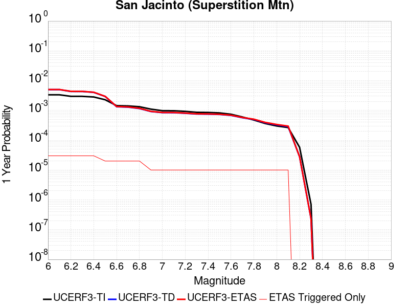 |  |

| Magnitude | 1 wk TI Prob | 1 wk TD Prob | 1 wk ETAS Prob | 1 wk ETAS/TD Gain | 1 wk ETAS Triggered Only | 1 mo TI Prob | 1 mo TD Prob | 1 mo ETAS Prob | 1 mo ETAS/TD Gain | 1 mo ETAS Triggered Only | 1 yr TI Prob | 1 yr TD Prob | 1 yr ETAS Prob | 1 yr ETAS/TD Gain | 1 yr ETAS Triggered Only | 10 yr TI Prob | 10 yr TD Prob | 10 yr ETAS Prob | 10 yr ETAS/TD Gain | 10 yr ETAS Triggered Only |
|-----|-----|-----|-----|-----|-----|-----|-----|-----|-----|-----|-----|-----|-----|-----|-----|-----|-----|-----|-----|-----|
| 6.0 | 6.4193904E-5 | 9.602289E-5 | 1.21658166E-4 | 1.2669705 | 2.5637739E-5 | 2.7508775E-4 | 4.1147156E-4 | 4.6272593E-4 | 1.1245636 | 5.1275478E-5 | 0.0033440501 | 0.004999541 | 0.0050505605 | 1.0102048 | 5.1275478E-5 | 0.03294174 | 0.04883795 | 0.048911106 | 1.001498 | 7.691322E-5 |
| 6.1 | 6.4193904E-5 | 9.602289E-5 | 1.21658166E-4 | 1.2669705 | 2.5637739E-5 | 2.7508775E-4 | 4.1147156E-4 | 4.6272593E-4 | 1.1245636 | 5.1275478E-5 | 0.0033440501 | 0.004999541 | 0.0050505605 | 1.0102048 | 5.1275478E-5 | 0.03294174 | 0.04883795 | 0.048911106 | 1.001498 | 7.691322E-5 |
| 6.2 | 5.7023593E-5 | 8.317087E-5 | 1.08806475E-4 | 1.3082283 | 2.5637739E-5 | 2.4436394E-4 | 3.5640728E-4 | 4.0766448E-4 | 1.1438164 | 5.1275478E-5 | 0.002971072 | 0.00433226 | 0.0043833135 | 1.0117844 | 5.1275478E-5 | 0.029316625 | 0.04251723 | 0.04259087 | 1.0017321 | 7.691322E-5 |
| 6.3 | 5.6940098E-5 | 8.301621E-5 | 1.08651824E-4 | 1.3088025 | 2.5637739E-5 | 2.4400617E-4 | 3.5574468E-4 | 4.070019E-4 | 1.1440843 | 5.1275478E-5 | 0.002966728 | 0.004324225 | 0.0043752785 | 1.0118065 | 5.1275478E-5 | 0.029274331 | 0.042440474 | 0.042514123 | 1.0017353 | 7.691322E-5 |
| 6.4 | 5.4171585E-5 | 7.750957E-5 | 1.0314532E-4 | 1.3307431 | 2.5637739E-5 | 2.3214328E-4 | 3.321509E-4 | 3.8340932E-4 | 1.1543227 | 5.1275478E-5 | 0.0028226813 | 0.004038087 | 0.0040891552 | 1.0126467 | 5.1275478E-5 | 0.02787096 | 0.03972961 | 0.039803468 | 1.001859 | 7.691322E-5 |
| 6.5 | 4.375144E-5 | 5.6446577E-5 | 8.208287E-5 | 1.4541692 | 2.5637739E-5 | 1.874927E-4 | 2.418981E-4 | 2.6752966E-4 | 1.10596 | 2.5637739E-5 | 0.0022803338 | 0.0029423076 | 0.00296787 | 1.0086879 | 2.5637739E-5 | 0.022570757 | 0.02924966 | 0.029299436 | 1.0017017 | 5.1275478E-5 |
| 6.6 | 2.772192E-5 | 2.5512374E-5 | 5.1149458E-5 | 2.0048883 | 2.5637739E-5 | 1.1880282E-4 | 1.0933427E-4 | 1.349692E-4 | 1.2344638 | 2.5637739E-5 | 0.0014454646 | 0.0013303513 | 0.0013559549 | 1.0192457 | 2.5637739E-5 | 0.014360986 | 0.013552955 | 0.0136035355 | 1.0037321 | 5.1275478E-5 |
| 6.7 | 2.7124124E-5 | 2.4723291E-5 | 5.0360395E-5 | 2.0369616 | 2.5637739E-5 | 1.1624106E-4 | 1.05952764E-4 | 1.3158779E-4 | 1.2419477 | 2.5637739E-5 | 0.0014143161 | 0.0012892308 | 0.0013148355 | 1.0198604 | 2.5637739E-5 | 0.014053487 | 0.013146358 | 0.013196959 | 1.003849 | 5.1275478E-5 |
| 6.8 | 2.5475807E-5 | 2.218778E-5 | 4.782495E-5 | 2.1554635 | 2.5637739E-5 | 1.0917746E-4 | 9.508708E-5 | 1.2072238E-4 | 1.2695981 | 2.5637739E-5 | 0.001328425 | 0.0011570824 | 0.0011826905 | 1.0221316 | 2.5637739E-5 | 0.0132051185 | 0.011834319 | 0.011859653 | 1.0021408 | 2.5637739E-5 |
| 6.9 | 2.1162023E-5 | 1.764776E-5 | 4.3285047E-5 | 2.4527218 | 2.5637739E-5 | 9.069123E-5 | 7.5631084E-5 | 1.0126689E-4 | 1.3389585 | 2.5637739E-5 | 0.0011036064 | 9.204233E-4 | 9.460374E-4 | 1.0278287 | 2.5637739E-5 | 0.010981417 | 0.009458124 | 0.009483519 | 1.0026851 | 2.5637739E-5 |
| 7.0 | 1.8754288E-5 | 1.6182094E-5 | 4.1819418E-5 | 2.584302 | 2.5637739E-5 | 8.037304E-5 | 6.935E-5 | 9.498596E-5 | 1.3696606 | 2.5637739E-5 | 9.781026E-4 | 8.4401167E-4 | 8.6962775E-4 | 1.0303504 | 2.5637739E-5 | 0.009738087 | 0.008680774 | 0.008706189 | 1.0029278 | 2.5637739E-5 |
| 7.1 | 1.8678527E-5 | 1.6107217E-5 | 4.174454E-5 | 2.5916672 | 2.5637739E-5 | 8.0048376E-5 | 6.902911E-5 | 9.466508E-5 | 1.3713791 | 2.5637739E-5 | 9.7415317E-4 | 8.4010785E-4 | 8.6572405E-4 | 1.0304916 | 2.5637739E-5 | 0.009698939 | 0.00864172 | 0.008667137 | 1.0029411 | 2.5637739E-5 |
| 7.2 | 1.7804578E-5 | 1.5401574E-5 | 4.103892E-5 | 2.6645925 | 2.5637739E-5 | 7.6303106E-5 | 6.600509E-5 | 9.164114E-5 | 1.388395 | 2.5637739E-5 | 9.285943E-4 | 8.0331793E-4 | 8.2893507E-4 | 1.0318892 | 2.5637739E-5 | 0.009247236 | 0.008272923 | 0.008298348 | 1.0030733 | 2.5637739E-5 |
| 7.3 | 1.6583685E-5 | 1.4550439E-5 | 4.0187806E-5 | 2.761965 | 2.5637739E-5 | 7.1070994E-5 | 6.235755E-5 | 8.7993685E-5 | 1.4111153 | 2.5637739E-5 | 8.649459E-4 | 7.589407E-4 | 7.84559E-4 | 1.0337553 | 2.5637739E-5 | 0.00861587 | 0.007828114 | 0.007853551 | 1.0032494 | 2.5637739E-5 |
| 7.4 | 1.6387552E-5 | 1.44152855E-5 | 4.0052655E-5 | 2.778485 | 2.5637739E-5 | 7.023047E-5 | 6.1778344E-5 | 8.74145E-5 | 1.4149699 | 2.5637739E-5 | 8.5472054E-4 | 7.518938E-4 | 7.775122E-4 | 1.0340719 | 2.5637739E-5 | 0.008514405 | 0.007757476 | 0.0077829147 | 1.0032793 | 2.5637739E-5 |
| 7.5 | 1.5790754E-5 | 1.4055765E-5 | 3.9693143E-5 | 2.823976 | 2.5637739E-5 | 6.767291E-5 | 6.0237613E-5 | 8.5873806E-5 | 1.4255846 | 2.5637739E-5 | 8.236062E-4 | 7.3314813E-4 | 7.5876707E-4 | 1.0349437 | 2.5637739E-5 | 0.008205604 | 0.007567932 | 0.0075933756 | 1.003362 | 2.5637739E-5 |
| 7.6 | 1.4248672E-5 | 1.3074211E-5 | 3.8711616E-5 | 2.9609141 | 2.5637739E-5 | 6.106431E-5 | 5.603114E-5 | 8.1667444E-5 | 1.4575367 | 2.5637739E-5 | 7.432043E-4 | 6.819673E-4 | 7.075876E-4 | 1.0375682 | 2.5637739E-5 | 0.007407237 | 0.0070502516 | 0.0070757084 | 1.0036108 | 2.5637739E-5 |
| 7.7 | 1.15449975E-5 | 1.0922179E-5 | 3.655964E-5 | 3.3472843 | 2.5637739E-5 | 4.947762E-5 | 4.68085E-5 | 7.2445044E-5 | 1.5476898 | 2.5637739E-5 | 6.022235E-4 | 5.6974526E-4 | 5.953684E-4 | 1.044973 | 2.5637739E-5 | 0.006005941 | 0.005919881 | 0.0059453673 | 1.0043051 | 2.5637739E-5 |
| 7.8 | 9.1391985E-6 | 9.532076E-6 | 3.516957E-5 | 3.6896026 | 2.5637739E-5 | 3.9167408E-5 | 4.0851115E-5 | 6.648781E-5 | 1.6275641 | 2.5637739E-5 | 4.767588E-4 | 4.972494E-4 | 5.228744E-4 | 1.0515335 | 2.5637739E-5 | 0.0047573727 | 0.0051860143 | 0.0052115195 | 1.004918 | 2.5637739E-5 |
| 7.9 | 6.973017E-6 | 7.397966E-6 | 3.3035514E-5 | 4.4654865 | 2.5637739E-5 | 2.9884017E-5 | 3.1705185E-5 | 5.7342113E-5 | 1.8086035 | 2.5637739E-5 | 3.6377716E-4 | 3.8594278E-4 | 4.1157063E-4 | 1.0664033 | 2.5637739E-5 | 0.0036318225 | 0.0040600975 | 0.004085631 | 1.0062889 | 2.5637739E-5 |
| 8.0 | 5.7638235E-6 | 6.2743825E-6 | 3.191196E-5 | 5.086072 | 2.5637739E-5 | 2.4701867E-5 | 2.6889935E-5 | 5.2526986E-5 | 1.9534069 | 2.5637739E-5 | 3.0070372E-4 | 3.2733628E-4 | 3.5296564E-4 | 1.0782967 | 2.5637739E-5 | 0.0030029714 | 0.0034610373 | 0.0034865863 | 1.0073819 | 2.5637739E-5 |
| 8.1 | 5.1124434E-6 | 5.508789E-6 | 3.114639E-5 | 5.653944 | 2.5637739E-5 | 2.1910288E-5 | 2.3608885E-5 | 4.924602E-5 | 2.0859103 | 2.5637739E-5 | 2.6672508E-4 | 2.8740076E-4 | 3.1303114E-4 | 1.0891799 | 2.5637739E-5 | 0.0026640517 | 0.003047253 | 0.0030728127 | 1.0083878 | 2.5637739E-5 |
| 8.2 | 1.1075938E-6 | 5.3557983E-7 | 5.3557983E-7 | 1.0 | 0.0 | 4.7468216E-6 | 2.2953402E-6 | 2.2953402E-6 | 1.0 | 0.0 | 5.779102E-5 | 2.7945433E-5 | 2.7945433E-5 | 1.0 | 0.0 | 5.777599E-4 | 3.1453613E-4 | 3.1453613E-4 | 1.0 | 0.0 |
| 8.3 | 1.3584393E-8 | 4.4922075E-9 | 4.4922075E-9 | 1.0 | 0.0 | 5.8218827E-8 | 1.9252319E-8 | 1.9252319E-8 | 1.0 | 0.0 | 7.0881396E-7 | 2.3439698E-7 | 2.3439698E-7 | 1.0 | 0.0 | 7.0881174E-6 | 2.6266084E-6 | 2.6266084E-6 | 1.0 | 0.0 |

## Tin Mountain
*[(top)](#table-of-contents)*

| 1 Week | 1 Month | 1 Year | 10 Year |
|-----|-----|-----|-----|
|  |  |  | 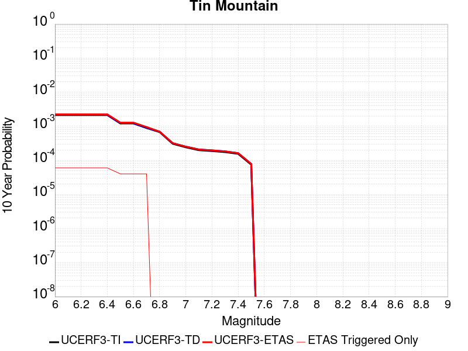 |

| Magnitude | 1 wk TI Prob | 1 wk TD Prob | 1 wk ETAS Prob | 1 wk ETAS/TD Gain | 1 wk ETAS Triggered Only | 1 mo TI Prob | 1 mo TD Prob | 1 mo ETAS Prob | 1 mo ETAS/TD Gain | 1 mo ETAS Triggered Only | 1 yr TI Prob | 1 yr TD Prob | 1 yr ETAS Prob | 1 yr ETAS/TD Gain | 1 yr ETAS Triggered Only | 10 yr TI Prob | 10 yr TD Prob | 10 yr ETAS Prob | 10 yr ETAS/TD Gain | 10 yr ETAS Triggered Only |
|-----|-----|-----|-----|-----|-----|-----|-----|-----|-----|-----|-----|-----|-----|-----|-----|-----|-----|-----|-----|-----|
| 6.0 | 4.083776E-6 | 4.18159E-6 | 4.18159E-6 | 1.0 | 0.0 | 1.750178E-5 | 1.7920998E-5 | 1.7920998E-5 | 1.0 | 0.0 | 2.1306332E-4 | 2.1817003E-4 | 2.6943433E-4 | 1.234974 | 5.1275478E-5 | 0.0021285915 | 0.0021799242 | 0.0022566696 | 1.0352056 | 7.691322E-5 |
| 6.1 | 4.083776E-6 | 4.18159E-6 | 4.18159E-6 | 1.0 | 0.0 | 1.750178E-5 | 1.7920998E-5 | 1.7920998E-5 | 1.0 | 0.0 | 2.1306332E-4 | 2.1817003E-4 | 2.6943433E-4 | 1.234974 | 5.1275478E-5 | 0.0021285915 | 0.0021799242 | 0.0022566696 | 1.0352056 | 7.691322E-5 |
| 6.2 | 4.083776E-6 | 4.18159E-6 | 4.18159E-6 | 1.0 | 0.0 | 1.750178E-5 | 1.7920998E-5 | 1.7920998E-5 | 1.0 | 0.0 | 2.1306332E-4 | 2.1817003E-4 | 2.6943433E-4 | 1.234974 | 5.1275478E-5 | 0.0021285915 | 0.0021799242 | 0.0022566696 | 1.0352056 | 7.691322E-5 |
| 6.3 | 4.083776E-6 | 4.18159E-6 | 4.18159E-6 | 1.0 | 0.0 | 1.750178E-5 | 1.7920998E-5 | 1.7920998E-5 | 1.0 | 0.0 | 2.1306332E-4 | 2.1817003E-4 | 2.6943433E-4 | 1.234974 | 5.1275478E-5 | 0.0021285915 | 0.0021799242 | 0.0022566696 | 1.0352056 | 7.691322E-5 |
| 6.4 | 4.083776E-6 | 4.18159E-6 | 4.18159E-6 | 1.0 | 0.0 | 1.750178E-5 | 1.7920998E-5 | 1.7920998E-5 | 1.0 | 0.0 | 2.1306332E-4 | 2.1817003E-4 | 2.6943433E-4 | 1.234974 | 5.1275478E-5 | 0.0021285915 | 0.0021799242 | 0.0022566696 | 1.0352056 | 7.691322E-5 |
| 6.5 | 2.3143427E-6 | 2.3731893E-6 | 2.3731893E-6 | 1.0 | 0.0 | 9.9185745E-6 | 1.01707765E-5 | 1.01707765E-5 | 1.0 | 0.0 | 1.2075195E-4 | 1.2382293E-4 | 1.494575E-4 | 1.207026 | 2.5637739E-5 | 0.0012068636 | 0.0012376154 | 0.0012888274 | 1.0413796 | 5.1275478E-5 |
| 6.6 | 2.3143427E-6 | 2.3731893E-6 | 2.3731893E-6 | 1.0 | 0.0 | 9.9185745E-6 | 1.01707765E-5 | 1.01707765E-5 | 1.0 | 0.0 | 1.2075195E-4 | 1.2382293E-4 | 1.494575E-4 | 1.207026 | 2.5637739E-5 | 0.0012068636 | 0.0012376154 | 0.0012888274 | 1.0413796 | 5.1275478E-5 |
| 6.7 | 1.7029532E-6 | 1.7498172E-6 | 1.7498172E-6 | 1.0 | 0.0 | 7.2983503E-6 | 7.499198E-6 | 7.499198E-6 | 1.0 | 0.0 | 8.885379E-5 | 9.1299444E-5 | 1.1693484E-4 | 1.2807838 | 2.5637739E-5 | 8.881827E-4 | 9.12672E-4 | 9.639007E-4 | 1.0561304 | 5.1275478E-5 |
| 6.8 | 1.2914646E-6 | 1.329959E-6 | 1.329959E-6 | 1.0 | 0.0 | 5.534837E-6 | 5.699814E-6 | 5.699814E-6 | 1.0 | 0.0 | 6.738455E-5 | 6.939347E-5 | 6.939347E-5 | 1.0 | 0.0 | 6.736412E-4 | 6.937614E-4 | 6.937614E-4 | 1.0 | 0.0 |
| 6.9 | 5.8708974E-7 | 6.11713E-7 | 6.11713E-7 | 1.0 | 0.0 | 2.5160964E-6 | 2.6216248E-6 | 2.6216248E-6 | 1.0 | 0.0 | 3.0633044E-5 | 3.1917854E-5 | 3.1917854E-5 | 1.0 | 0.0 | 3.0628822E-4 | 3.1913683E-4 | 3.1913683E-4 | 1.0 | 0.0 |
| 7.0 | 4.6248786E-7 | 4.8321306E-7 | 4.8321306E-7 | 1.0 | 0.0 | 1.9820893E-6 | 2.0709115E-6 | 2.0709115E-6 | 1.0 | 0.0 | 2.413167E-5 | 2.5213094E-5 | 2.5213094E-5 | 1.0 | 0.0 | 2.412905E-4 | 2.5210602E-4 | 2.5210602E-4 | 1.0 | 0.0 |
| 7.1 | 3.804606E-7 | 3.9872486E-7 | 3.9872486E-7 | 1.0 | 0.0 | 1.6305444E-6 | 1.7088199E-6 | 1.7088199E-6 | 1.0 | 0.0 | 1.9851697E-5 | 2.0804719E-5 | 2.0804719E-5 | 1.0 | 0.0 | 1.9849923E-4 | 2.0803107E-4 | 2.0803107E-4 | 1.0 | 0.0 |
| 7.2 | 3.5864858E-7 | 3.7617838E-7 | 3.7617838E-7 | 1.0 | 0.0 | 1.5370645E-6 | 1.6121922E-6 | 1.6121922E-6 | 1.0 | 0.0 | 1.87136E-5 | 1.9628298E-5 | 1.9628298E-5 | 1.0 | 0.0 | 1.8712023E-4 | 1.9626896E-4 | 1.9626896E-4 | 1.0 | 0.0 |
| 7.3 | 3.342063E-7 | 3.5064386E-7 | 3.5064386E-7 | 1.0 | 0.0 | 1.4323119E-6 | 1.5027588E-6 | 1.5027588E-6 | 1.0 | 0.0 | 1.7438259E-5 | 1.8295968E-5 | 1.8295968E-5 | 1.0 | 0.0 | 1.743689E-4 | 1.8294792E-4 | 1.8294792E-4 | 1.0 | 0.0 |
| 7.4 | 2.971242E-7 | 3.1166627E-7 | 3.1166627E-7 | 1.0 | 0.0 | 1.2733886E-6 | 1.3357121E-6 | 1.3357121E-6 | 1.0 | 0.0 | 1.5503398E-5 | 1.6262207E-5 | 1.6262207E-5 | 1.0 | 0.0 | 1.5502315E-4 | 1.6261345E-4 | 1.6261345E-4 | 1.0 | 0.0 |
| 7.5 | 1.4326713E-7 | 1.5012905E-7 | 1.5012905E-7 | 1.0 | 0.0 | 6.140018E-7 | 6.434102E-7 | 6.434102E-7 | 1.0 | 0.0 | 7.4754466E-6 | 7.83352E-6 | 7.83352E-6 | 1.0 | 0.0 | 7.475195E-5 | 7.833519E-5 | 7.833519E-5 | 1.0 | 0.0 |

## Blue Cut
*[(top)](#table-of-contents)*

| 1 Week | 1 Month | 1 Year | 10 Year |
|-----|-----|-----|-----|
|  |  |  |  |

| Magnitude | 1 wk TI Prob | 1 wk TD Prob | 1 wk ETAS Prob | 1 wk ETAS/TD Gain | 1 wk ETAS Triggered Only | 1 mo TI Prob | 1 mo TD Prob | 1 mo ETAS Prob | 1 mo ETAS/TD Gain | 1 mo ETAS Triggered Only | 1 yr TI Prob | 1 yr TD Prob | 1 yr ETAS Prob | 1 yr ETAS/TD Gain | 1 yr ETAS Triggered Only | 10 yr TI Prob | 10 yr TD Prob | 10 yr ETAS Prob | 10 yr ETAS/TD Gain | 10 yr ETAS Triggered Only |
|-----|-----|-----|-----|-----|-----|-----|-----|-----|-----|-----|-----|-----|-----|-----|-----|-----|-----|-----|-----|-----|
| 6.0 | 2.1227985E-5 | 2.2720424E-5 | 2.2720424E-5 | 1.0 | 0.0 | 9.097391E-5 | 9.7369935E-5 | 9.7369935E-5 | 1.0 | 0.0 | 0.0011070445 | 0.0011848924 | 0.0012104997 | 1.0216116 | 2.5637739E-5 | 0.011015458 | 0.01179159 | 0.011867596 | 1.0064458 | 7.691322E-5 |
| 6.1 | 2.1227985E-5 | 2.2720424E-5 | 2.2720424E-5 | 1.0 | 0.0 | 9.097391E-5 | 9.7369935E-5 | 9.7369935E-5 | 1.0 | 0.0 | 0.0011070445 | 0.0011848924 | 0.0012104997 | 1.0216116 | 2.5637739E-5 | 0.011015458 | 0.01179159 | 0.011867596 | 1.0064458 | 7.691322E-5 |
| 6.2 | 2.1227985E-5 | 2.2720424E-5 | 2.2720424E-5 | 1.0 | 0.0 | 9.097391E-5 | 9.7369935E-5 | 9.7369935E-5 | 1.0 | 0.0 | 0.0011070445 | 0.0011848924 | 0.0012104997 | 1.0216116 | 2.5637739E-5 | 0.011015458 | 0.01179159 | 0.011867596 | 1.0064458 | 7.691322E-5 |
| 6.3 | 1.1613981E-5 | 1.2353959E-5 | 1.2353959E-5 | 1.0 | 0.0 | 4.9773254E-5 | 5.2944535E-5 | 5.2944535E-5 | 1.0 | 0.0 | 6.0582085E-4 | 6.4442155E-4 | 6.7004276E-4 | 1.0397584 | 2.5637739E-5 | 0.0060417196 | 0.006426776 | 0.006452249 | 1.0039636 | 2.5637739E-5 |
| 6.4 | 1.1613981E-5 | 1.2353959E-5 | 1.2353959E-5 | 1.0 | 0.0 | 4.9773254E-5 | 5.2944535E-5 | 5.2944535E-5 | 1.0 | 0.0 | 6.0582085E-4 | 6.4442155E-4 | 6.7004276E-4 | 1.0397584 | 2.5637739E-5 | 0.0060417196 | 0.006426776 | 0.006452249 | 1.0039636 | 2.5637739E-5 |
| 6.5 | 8.931326E-6 | 9.48191E-6 | 9.48191E-6 | 1.0 | 0.0 | 3.8276554E-5 | 4.0636176E-5 | 4.0636176E-5 | 1.0 | 0.0 | 4.6591737E-4 | 4.9464224E-4 | 5.2026735E-4 | 1.0518053 | 2.5637739E-5 | 0.0046494175 | 0.004936322 | 0.0049618334 | 1.0051681 | 2.5637739E-5 |
| 6.6 | 7.345353E-6 | 7.79053E-6 | 7.79053E-6 | 1.0 | 0.0 | 3.1479703E-5 | 3.33876E-5 | 3.33876E-5 | 1.0 | 0.0 | 3.83198E-4 | 4.0642623E-4 | 4.3205355E-4 | 1.0630553 | 2.5637739E-5 | 0.0038253788 | 0.004057621 | 0.0040831547 | 1.0062928 | 2.5637739E-5 |
| 6.7 | 6.2775666E-6 | 6.655361E-6 | 6.655361E-6 | 1.0 | 0.0 | 2.690358E-5 | 2.8522707E-5 | 2.8522707E-5 | 1.0 | 0.0 | 3.2750185E-4 | 3.4721615E-4 | 3.7284498E-4 | 1.0738124 | 2.5637739E-5 | 0.0032701963 | 0.0034674776 | 0.0034930264 | 1.0073681 | 2.5637739E-5 |
| 6.8 | 5.5234095E-6 | 5.855298E-6 | 5.855298E-6 | 1.0 | 0.0 | 2.367154E-5 | 2.5093934E-5 | 2.5093934E-5 | 1.0 | 0.0 | 2.8816288E-4 | 3.054831E-4 | 3.31113E-4 | 1.0838996 | 2.5637739E-5 | 0.002877895 | 0.0030513476 | 0.0030769072 | 1.0083765 | 2.5637739E-5 |
| 6.9 | 4.7780054E-6 | 5.065582E-6 | 5.065582E-6 | 1.0 | 0.0 | 2.0477004E-5 | 2.1709497E-5 | 2.1709497E-5 | 1.0 | 0.0 | 2.4927902E-4 | 2.642881E-4 | 2.642881E-4 | 1.0 | 0.0 | 0.0024899957 | 0.0026404303 | 0.0026404303 | 1.0 | 0.0 |
| 7.0 | 3.883171E-6 | 4.1186195E-6 | 4.1186195E-6 | 1.0 | 0.0 | 1.6642054E-5 | 1.7651146E-5 | 1.7651146E-5 | 1.0 | 0.0 | 2.0259817E-4 | 2.148884E-4 | 2.148884E-4 | 1.0 | 0.0 | 0.0020241356 | 0.0021474818 | 0.0021474818 | 1.0 | 0.0 |
| 7.1 | 2.8358215E-6 | 3.0098138E-6 | 3.0098138E-6 | 1.0 | 0.0 | 1.2153464E-5 | 1.2899175E-5 | 1.2899175E-5 | 1.0 | 0.0 | 1.4795837E-4 | 1.5704273E-4 | 1.5704273E-4 | 1.0 | 0.0 | 0.001478599 | 0.0015699627 | 0.0015699627 | 1.0 | 0.0 |

## Ortigalita (North)
*[(top)](#table-of-contents)*

| 1 Week | 1 Month | 1 Year | 10 Year |
|-----|-----|-----|-----|
|  |  |  |  |

| Magnitude | 1 wk TI Prob | 1 wk TD Prob | 1 wk ETAS Prob | 1 wk ETAS/TD Gain | 1 wk ETAS Triggered Only | 1 mo TI Prob | 1 mo TD Prob | 1 mo ETAS Prob | 1 mo ETAS/TD Gain | 1 mo ETAS Triggered Only | 1 yr TI Prob | 1 yr TD Prob | 1 yr ETAS Prob | 1 yr ETAS/TD Gain | 1 yr ETAS Triggered Only | 10 yr TI Prob | 10 yr TD Prob | 10 yr ETAS Prob | 10 yr ETAS/TD Gain | 10 yr ETAS Triggered Only |
|-----|-----|-----|-----|-----|-----|-----|-----|-----|-----|-----|-----|-----|-----|-----|-----|-----|-----|-----|-----|-----|
| 6.0 | 7.711876E-5 | 1.05086016E-4 | 1.05086016E-4 | 1.0 | 0.0 | 3.3046713E-4 | 4.5030177E-4 | 4.5030177E-4 | 1.0 | 0.0 | 0.004016016 | 0.005468958 | 0.0054944553 | 1.0046623 | 2.5637739E-5 | 0.039442103 | 0.053463764 | 0.053536568 | 1.0013617 | 7.691322E-5 |
| 6.1 | 4.607858E-5 | 6.024935E-5 | 6.024935E-5 | 1.0 | 0.0 | 1.9746469E-4 | 2.5818875E-4 | 2.5818875E-4 | 1.0 | 0.0 | 0.0024014818 | 0.003139252 | 0.0031648092 | 1.0081412 | 2.5637739E-5 | 0.023756953 | 0.030979859 | 0.031004703 | 1.0008019 | 2.5637739E-5 |
| 6.2 | 4.607858E-5 | 6.024935E-5 | 6.024935E-5 | 1.0 | 0.0 | 1.9746469E-4 | 2.5818875E-4 | 2.5818875E-4 | 1.0 | 0.0 | 0.0024014818 | 0.003139252 | 0.0031648092 | 1.0081412 | 2.5637739E-5 | 0.023756953 | 0.030979859 | 0.031004703 | 1.0008019 | 2.5637739E-5 |
| 6.3 | 3.327423E-5 | 4.2481566E-5 | 4.2481566E-5 | 1.0 | 0.0 | 1.4259605E-4 | 1.8205289E-4 | 1.8205289E-4 | 1.0 | 0.0 | 0.0017347244 | 0.0022145277 | 0.0022401088 | 1.0115514 | 2.5637739E-5 | 0.017212452 | 0.021948816 | 0.021973891 | 1.0011424 | 2.5637739E-5 |
| 6.4 | 2.7732503E-5 | 3.5003635E-5 | 3.5003635E-5 | 1.0 | 0.0 | 1.1884817E-4 | 1.5000845E-4 | 1.5000845E-4 | 1.0 | 0.0 | 0.001446016 | 0.0018250674 | 0.0018506584 | 1.0140219 | 2.5637739E-5 | 0.014366428 | 0.018123753 | 0.018148927 | 1.0013889 | 2.5637739E-5 |
| 6.5 | 2.7689714E-5 | 3.4953442E-5 | 3.4953442E-5 | 1.0 | 0.0 | 1.186648E-4 | 1.4979337E-4 | 1.4979337E-4 | 1.0 | 0.0 | 0.0014437864 | 0.0018224533 | 0.0018480443 | 1.014042 | 2.5637739E-5 | 0.014344421 | 0.018098038 | 0.018123211 | 1.0013909 | 2.5637739E-5 |
| 6.6 | 2.2976905E-5 | 2.8722226E-5 | 2.8722226E-5 | 1.0 | 0.0 | 9.846873E-5 | 1.2309088E-4 | 1.2309088E-4 | 1.0 | 0.0 | 0.0011981975 | 0.001497839 | 0.001497839 | 1.0 | 0.0 | 0.011917574 | 0.014900712 | 0.014900712 | 1.0 | 0.0 |
| 6.7 | 1.9871539E-5 | 2.4907882E-5 | 2.4907882E-5 | 1.0 | 0.0 | 8.516096E-5 | 1.067451E-4 | 1.067451E-4 | 1.0 | 0.0 | 0.0010363415 | 0.0012990955 | 0.0012990955 | 1.0 | 0.0 | 0.010315218 | 0.012938703 | 0.012938703 | 1.0 | 0.0 |
| 6.8 | 6.5640475E-6 | 7.6061337E-6 | 7.6061337E-6 | 1.0 | 0.0 | 2.813133E-5 | 3.2597323E-5 | 3.2597323E-5 | 1.0 | 0.0 | 3.424451E-4 | 3.9680302E-4 | 3.9680302E-4 | 1.0 | 0.0 | 0.0034191788 | 0.0039612325 | 0.0039612325 | 1.0 | 0.0 |
| 6.9 | 5.6219683E-6 | 6.5023783E-6 | 6.5023783E-6 | 1.0 | 0.0 | 2.4093928E-5 | 2.7867052E-5 | 2.7867052E-5 | 1.0 | 0.0 | 2.933041E-4 | 3.3923113E-4 | 3.3923113E-4 | 1.0 | 0.0 | 0.0029291727 | 0.00338739 | 0.00338739 | 1.0 | 0.0 |
| 7.0 | 3.875591E-6 | 4.4851295E-6 | 4.4851295E-6 | 1.0 | 0.0 | 1.6609569E-5 | 1.9221854E-5 | 1.9221854E-5 | 1.0 | 0.0 | 2.0220275E-4 | 2.3400305E-4 | 2.3400305E-4 | 1.0 | 0.0 | 0.0020201886 | 0.0023377747 | 0.0023377747 | 1.0 | 0.0 |
| 7.1 | 1.6017933E-6 | 1.857199E-6 | 1.857199E-6 | 1.0 | 0.0 | 6.8648105E-6 | 7.959406E-6 | 7.959406E-6 | 1.0 | 0.0 | 8.357586E-5 | 9.690253E-5 | 9.690253E-5 | 1.0 | 0.0 | 8.3544437E-4 | 9.6870743E-4 | 9.6870743E-4 | 1.0 | 0.0 |

## Pleito
*[(top)](#table-of-contents)*

| 1 Week | 1 Month | 1 Year | 10 Year |
|-----|-----|-----|-----|
|  |  |  |  |

| Magnitude | 1 wk TI Prob | 1 wk TD Prob | 1 wk ETAS Prob | 1 wk ETAS/TD Gain | 1 wk ETAS Triggered Only | 1 mo TI Prob | 1 mo TD Prob | 1 mo ETAS Prob | 1 mo ETAS/TD Gain | 1 mo ETAS Triggered Only | 1 yr TI Prob | 1 yr TD Prob | 1 yr ETAS Prob | 1 yr ETAS/TD Gain | 1 yr ETAS Triggered Only | 10 yr TI Prob | 10 yr TD Prob | 10 yr ETAS Prob | 10 yr ETAS/TD Gain | 10 yr ETAS Triggered Only |
|-----|-----|-----|-----|-----|-----|-----|-----|-----|-----|-----|-----|-----|-----|-----|-----|-----|-----|-----|-----|-----|
| 6.0 | 1.6763008E-5 | 2.479053E-5 | 2.479053E-5 | 1.0 | 0.0 | 7.183948E-5 | 1.0624121E-4 | 1.0624121E-4 | 1.0 | 0.0 | 8.742947E-4 | 0.0012927912 | 0.0013183958 | 1.0198057 | 2.5637739E-5 | 0.00870863 | 0.012967364 | 0.01304328 | 1.0058544 | 7.691322E-5 |
| 6.1 | 1.6763008E-5 | 2.479053E-5 | 2.479053E-5 | 1.0 | 0.0 | 7.183948E-5 | 1.0624121E-4 | 1.0624121E-4 | 1.0 | 0.0 | 8.742947E-4 | 0.0012927912 | 0.0013183958 | 1.0198057 | 2.5637739E-5 | 0.00870863 | 0.012967364 | 0.01304328 | 1.0058544 | 7.691322E-5 |
| 6.2 | 1.6763008E-5 | 2.479053E-5 | 2.479053E-5 | 1.0 | 0.0 | 7.183948E-5 | 1.0624121E-4 | 1.0624121E-4 | 1.0 | 0.0 | 8.742947E-4 | 0.0012927912 | 0.0013183958 | 1.0198057 | 2.5637739E-5 | 0.00870863 | 0.012967364 | 0.01304328 | 1.0058544 | 7.691322E-5 |
| 6.3 | 1.6763008E-5 | 2.479053E-5 | 2.479053E-5 | 1.0 | 0.0 | 7.183948E-5 | 1.0624121E-4 | 1.0624121E-4 | 1.0 | 0.0 | 8.742947E-4 | 0.0012927912 | 0.0013183958 | 1.0198057 | 2.5637739E-5 | 0.00870863 | 0.012967364 | 0.01304328 | 1.0058544 | 7.691322E-5 |
| 6.4 | 1.6763008E-5 | 2.479053E-5 | 2.479053E-5 | 1.0 | 0.0 | 7.183948E-5 | 1.0624121E-4 | 1.0624121E-4 | 1.0 | 0.0 | 8.742947E-4 | 0.0012927912 | 0.0013183958 | 1.0198057 | 2.5637739E-5 | 0.00870863 | 0.012967364 | 0.01304328 | 1.0058544 | 7.691322E-5 |
| 6.5 | 1.6763008E-5 | 2.479053E-5 | 2.479053E-5 | 1.0 | 0.0 | 7.183948E-5 | 1.0624121E-4 | 1.0624121E-4 | 1.0 | 0.0 | 8.742947E-4 | 0.0012927912 | 0.0013183958 | 1.0198057 | 2.5637739E-5 | 0.00870863 | 0.012967364 | 0.01304328 | 1.0058544 | 7.691322E-5 |
| 6.6 | 9.910213E-6 | 1.7240907E-5 | 1.7240907E-5 | 1.0 | 0.0 | 4.247165E-5 | 7.388753E-5 | 7.388753E-5 | 1.0 | 0.0 | 5.169696E-4 | 8.992132E-4 | 8.992132E-4 | 1.0 | 0.0 | 0.0051576863 | 0.009064018 | 0.009089423 | 1.0028028 | 2.5637739E-5 |
| 6.7 | 9.910213E-6 | 1.7240907E-5 | 1.7240907E-5 | 1.0 | 0.0 | 4.247165E-5 | 7.388753E-5 | 7.388753E-5 | 1.0 | 0.0 | 5.169696E-4 | 8.992132E-4 | 8.992132E-4 | 1.0 | 0.0 | 0.0051576863 | 0.009064018 | 0.009089423 | 1.0028028 | 2.5637739E-5 |
| 6.8 | 8.300162E-6 | 1.5500442E-5 | 1.5500442E-5 | 1.0 | 0.0 | 3.557164E-5 | 6.642878E-5 | 6.642878E-5 | 1.0 | 0.0 | 4.3299864E-4 | 8.0847176E-4 | 8.0847176E-4 | 1.0 | 0.0 | 0.004321559 | 0.008163428 | 0.008188856 | 1.0031149 | 2.5637739E-5 |
| 6.9 | 8.183114E-6 | 1.5371645E-5 | 1.5371645E-5 | 1.0 | 0.0 | 3.5070017E-5 | 6.5876826E-5 | 6.5876826E-5 | 1.0 | 0.0 | 4.2689382E-4 | 8.017566E-4 | 8.017566E-4 | 1.0 | 0.0 | 0.0042607468 | 0.008096768 | 0.008122197 | 1.0031408 | 2.5637739E-5 |
| 7.0 | 7.1748823E-6 | 1.4158308E-5 | 1.4158308E-5 | 1.0 | 0.0 | 3.0749135E-5 | 6.067705E-5 | 6.067705E-5 | 1.0 | 0.0 | 3.743064E-4 | 7.384933E-4 | 7.384933E-4 | 1.0 | 0.0 | 0.0037367654 | 0.0074680606 | 0.0074680606 | 1.0 | 0.0 |
| 7.1 | 7.1671807E-6 | 1.4148675E-5 | 1.4148675E-5 | 1.0 | 0.0 | 3.0716128E-5 | 6.063577E-5 | 6.063577E-5 | 1.0 | 0.0 | 3.7390468E-4 | 7.37991E-4 | 7.37991E-4 | 1.0 | 0.0 | 0.0037327618 | 0.007463072 | 0.007463072 | 1.0 | 0.0 |
| 7.2 | 7.0649667E-6 | 1.399588E-5 | 1.399588E-5 | 1.0 | 0.0 | 3.0278077E-5 | 5.998097E-5 | 5.998097E-5 | 1.0 | 0.0 | 3.6857324E-4 | 7.300241E-4 | 7.300241E-4 | 1.0 | 0.0 | 0.0036796255 | 0.007383786 | 0.007383786 | 1.0 | 0.0 |
| 7.3 | 7.02082E-6 | 1.3939285E-5 | 1.3939285E-5 | 1.0 | 0.0 | 3.008888E-5 | 5.9738428E-5 | 5.9738428E-5 | 1.0 | 0.0 | 3.6627054E-4 | 7.270732E-4 | 7.270732E-4 | 1.0 | 0.0 | 0.0036566744 | 0.0073542604 | 0.0073542604 | 1.0 | 0.0 |
| 7.4 | 6.987146E-6 | 1.3898819E-5 | 1.3898819E-5 | 1.0 | 0.0 | 2.9944567E-5 | 5.956501E-5 | 5.956501E-5 | 1.0 | 0.0 | 3.6451413E-4 | 7.249632E-4 | 7.249632E-4 | 1.0 | 0.0 | 0.0036391679 | 0.007333182 | 0.007333182 | 1.0 | 0.0 |
| 7.5 | 6.9494554E-6 | 1.3855703E-5 | 1.3855703E-5 | 1.0 | 0.0 | 2.9783041E-5 | 5.9380236E-5 | 5.9380236E-5 | 1.0 | 0.0 | 3.625482E-4 | 7.2271505E-4 | 7.2271505E-4 | 1.0 | 0.0 | 0.0036195726 | 0.0073107993 | 0.0073107993 | 1.0 | 0.0 |
| 7.6 | 6.92694E-6 | 1.3814777E-5 | 1.3814777E-5 | 1.0 | 0.0 | 2.9686547E-5 | 5.9204845E-5 | 5.9204845E-5 | 1.0 | 0.0 | 3.6137376E-4 | 7.205811E-4 | 7.205811E-4 | 1.0 | 0.0 | 0.0036078666 | 0.007289532 | 0.007289532 | 1.0 | 0.0 |
| 7.7 | 6.395867E-6 | 1.2692768E-5 | 1.2692768E-5 | 1.0 | 0.0 | 2.741057E-5 | 5.439644E-5 | 5.439644E-5 | 1.0 | 0.0 | 3.336726E-4 | 6.6207576E-4 | 6.6207576E-4 | 1.0 | 0.0 | 0.0033317201 | 0.0067076497 | 0.0067076497 | 1.0 | 0.0 |
| 7.8 | 5.8664327E-6 | 1.155828E-5 | 1.155828E-5 | 1.0 | 0.0 | 2.5141611E-5 | 4.953455E-5 | 4.953455E-5 | 1.0 | 0.0 | 3.060561E-4 | 6.0291647E-4 | 6.0291647E-4 | 1.0 | 0.0 | 0.0030563495 | 0.00611206 | 0.00611206 | 1.0 | 0.0 |
| 7.9 | 3.7167474E-6 | 7.1276354E-6 | 7.1276354E-6 | 1.0 | 0.0 | 1.592882E-5 | 3.0546653E-5 | 3.0546653E-5 | 1.0 | 0.0 | 1.9391612E-4 | 3.7184218E-4 | 3.7184218E-4 | 1.0 | 0.0 | 0.0019374699 | 0.003774384 | 0.003774384 | 1.0 | 0.0 |
| 8.0 | 1.0903841E-6 | 1.2909164E-6 | 1.2909164E-6 | 1.0 | 0.0 | 4.6730665E-6 | 5.532487E-6 | 5.532487E-6 | 1.0 | 0.0 | 5.68931E-5 | 6.735596E-5 | 6.735596E-5 | 1.0 | 0.0 | 5.6878536E-4 | 6.957586E-4 | 6.957586E-4 | 1.0 | 0.0 |
| 8.1 | 2.6894583E-7 | 1.1110662E-7 | 1.1110662E-7 | 1.0 | 0.0 | 1.1526245E-6 | 4.7617115E-7 | 4.7617115E-7 | 1.0 | 0.0 | 1.4033113E-5 | 5.7973684E-6 | 5.7973684E-6 | 1.0 | 0.0 | 1.4032227E-4 | 6.485011E-5 | 6.485011E-5 | 1.0 | 0.0 |
| 8.2 | 5.2967013E-9 | 2.4698603E-9 | 2.4698603E-9 | 1.0 | 0.0 | 2.2700148E-8 | 1.0585116E-8 | 1.0585116E-8 | 1.0 | 0.0 | 2.7637427E-7 | 1.2887378E-7 | 1.2887378E-7 | 1.0 | 0.0 | 2.7637393E-6 | 1.466009E-6 | 1.466009E-6 | 1.0 | 0.0 |

## Cady
*[(top)](#table-of-contents)*

| 1 Week | 1 Month | 1 Year | 10 Year |
|-----|-----|-----|-----|
|  | 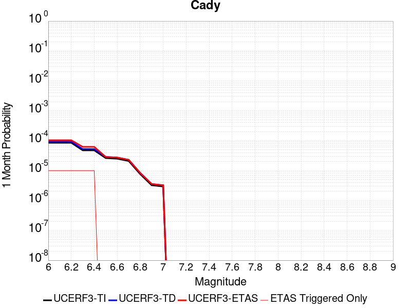 |  |  |

| Magnitude | 1 wk TI Prob | 1 wk TD Prob | 1 wk ETAS Prob | 1 wk ETAS/TD Gain | 1 wk ETAS Triggered Only | 1 mo TI Prob | 1 mo TD Prob | 1 mo ETAS Prob | 1 mo ETAS/TD Gain | 1 mo ETAS Triggered Only | 1 yr TI Prob | 1 yr TD Prob | 1 yr ETAS Prob | 1 yr ETAS/TD Gain | 1 yr ETAS Triggered Only | 10 yr TI Prob | 10 yr TD Prob | 10 yr ETAS Prob | 10 yr ETAS/TD Gain | 10 yr ETAS Triggered Only |
|-----|-----|-----|-----|-----|-----|-----|-----|-----|-----|-----|-----|-----|-----|-----|-----|-----|-----|-----|-----|-----|
| 6.0 | 1.9892565E-5 | 2.1859876E-5 | 2.1859876E-5 | 1.0 | 0.0 | 8.525106E-5 | 9.3682334E-5 | 9.3682334E-5 | 1.0 | 0.0 | 0.0010374374 | 0.0011400766 | 0.0011912935 | 1.0449241 | 5.1275478E-5 | 0.010326075 | 0.011351293 | 0.011427334 | 1.0066988 | 7.691322E-5 |
| 6.1 | 1.9892565E-5 | 2.1859876E-5 | 2.1859876E-5 | 1.0 | 0.0 | 8.525106E-5 | 9.3682334E-5 | 9.3682334E-5 | 1.0 | 0.0 | 0.0010374374 | 0.0011400766 | 0.0011912935 | 1.0449241 | 5.1275478E-5 | 0.010326075 | 0.011351293 | 0.011427334 | 1.0066988 | 7.691322E-5 |
| 6.2 | 1.9892565E-5 | 2.1859876E-5 | 2.1859876E-5 | 1.0 | 0.0 | 8.525106E-5 | 9.3682334E-5 | 9.3682334E-5 | 1.0 | 0.0 | 0.0010374374 | 0.0011400766 | 0.0011912935 | 1.0449241 | 5.1275478E-5 | 0.010326075 | 0.011351293 | 0.011427334 | 1.0066988 | 7.691322E-5 |
| 6.3 | 1.1117327E-5 | 1.2177199E-5 | 1.2177199E-5 | 1.0 | 0.0 | 4.764482E-5 | 5.218713E-5 | 5.218713E-5 | 1.0 | 0.0 | 5.7992124E-4 | 6.352246E-4 | 6.352246E-4 | 1.0 | 0.0 | 0.0057841022 | 0.006337195 | 0.0063626706 | 1.00402 | 2.5637739E-5 |
| 6.4 | 1.1117327E-5 | 1.2177199E-5 | 1.2177199E-5 | 1.0 | 0.0 | 4.764482E-5 | 5.218713E-5 | 5.218713E-5 | 1.0 | 0.0 | 5.7992124E-4 | 6.352246E-4 | 6.352246E-4 | 1.0 | 0.0 | 0.0057841022 | 0.006337195 | 0.0063626706 | 1.00402 | 2.5637739E-5 |
| 6.5 | 6.103093E-6 | 6.672351E-6 | 6.672351E-6 | 1.0 | 0.0 | 2.615585E-5 | 2.8595547E-5 | 2.8595547E-5 | 1.0 | 0.0 | 3.1840094E-4 | 3.4810771E-4 | 3.4810771E-4 | 1.0 | 0.0 | 0.0031794512 | 0.0034768586 | 0.003502407 | 1.0073482 | 2.5637739E-5 |
| 6.6 | 5.817237E-6 | 6.3659772E-6 | 6.3659772E-6 | 1.0 | 0.0 | 2.4930776E-5 | 2.7282544E-5 | 2.7282544E-5 | 1.0 | 0.0 | 3.034899E-4 | 3.321268E-4 | 3.321268E-4 | 1.0 | 0.0 | 0.0030307577 | 0.0033175263 | 0.003343079 | 1.0077024 | 2.5637739E-5 |
| 6.7 | 4.8846314E-6 | 5.340833E-6 | 5.340833E-6 | 1.0 | 0.0 | 2.0933967E-5 | 2.288915E-5 | 2.288915E-5 | 1.0 | 0.0 | 2.5484123E-4 | 2.7865154E-4 | 2.7865154E-4 | 1.0 | 0.0 | 0.0025454918 | 0.002784177 | 0.0028097434 | 1.0091827 | 2.5637739E-5 |
| 6.8 | 1.7788773E-6 | 1.940001E-6 | 1.940001E-6 | 1.0 | 0.0 | 7.6237375E-6 | 8.314273E-6 | 8.314273E-6 | 1.0 | 0.0 | 9.281505E-5 | 1.0122315E-4 | 1.0122315E-4 | 1.0 | 0.0 | 9.2776294E-4 | 0.001011925 | 0.0010375369 | 1.0253099 | 2.5637739E-5 |
| 6.9 | 7.5455404E-7 | 8.2975305E-7 | 8.2975305E-7 | 1.0 | 0.0 | 3.233799E-6 | 3.5560815E-6 | 3.5560815E-6 | 1.0 | 0.0 | 3.937079E-5 | 4.329477E-5 | 4.329477E-5 | 1.0 | 0.0 | 3.9363815E-4 | 4.3289628E-4 | 4.3289628E-4 | 1.0 | 0.0 |
| 7.0 | 6.8578805E-7 | 7.542215E-7 | 7.542215E-7 | 1.0 | 0.0 | 2.9390883E-6 | 3.2323758E-6 | 3.2323758E-6 | 1.0 | 0.0 | 3.578281E-5 | 3.9353796E-5 | 3.9353796E-5 | 1.0 | 0.0 | 3.577705E-4 | 3.9350073E-4 | 3.9350073E-4 | 1.0 | 0.0 |

## Deep Springs
*[(top)](#table-of-contents)*

| 1 Week | 1 Month | 1 Year | 10 Year |
|-----|-----|-----|-----|
|  |  | 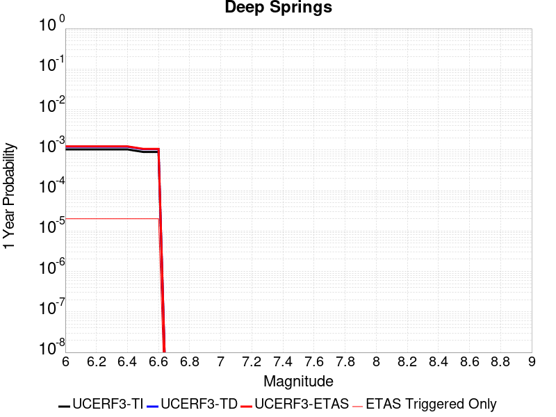 |  |

| Magnitude | 1 wk TI Prob | 1 wk TD Prob | 1 wk ETAS Prob | 1 wk ETAS/TD Gain | 1 wk ETAS Triggered Only | 1 mo TI Prob | 1 mo TD Prob | 1 mo ETAS Prob | 1 mo ETAS/TD Gain | 1 mo ETAS Triggered Only | 1 yr TI Prob | 1 yr TD Prob | 1 yr ETAS Prob | 1 yr ETAS/TD Gain | 1 yr ETAS Triggered Only | 10 yr TI Prob | 10 yr TD Prob | 10 yr ETAS Prob | 10 yr ETAS/TD Gain | 10 yr ETAS Triggered Only |
|-----|-----|-----|-----|-----|-----|-----|-----|-----|-----|-----|-----|-----|-----|-----|-----|-----|-----|-----|-----|-----|
| 6.0 | 1.9810619E-5 | 2.3114564E-5 | 2.3114564E-5 | 1.0 | 0.0 | 8.489989E-5 | 9.9061515E-5 | 9.9061515E-5 | 1.0 | 0.0 | 0.001033166 | 0.0012059145 | 0.0012571282 | 1.0424687 | 5.1275478E-5 | 0.010283757 | 0.012043487 | 0.012119474 | 1.0063094 | 7.691322E-5 |
| 6.1 | 1.9810619E-5 | 2.3114564E-5 | 2.3114564E-5 | 1.0 | 0.0 | 8.489989E-5 | 9.9061515E-5 | 9.9061515E-5 | 1.0 | 0.0 | 0.001033166 | 0.0012059145 | 0.0012571282 | 1.0424687 | 5.1275478E-5 | 0.010283757 | 0.012043487 | 0.012119474 | 1.0063094 | 7.691322E-5 |
| 6.2 | 1.9810619E-5 | 2.3114564E-5 | 2.3114564E-5 | 1.0 | 0.0 | 8.489989E-5 | 9.9061515E-5 | 9.9061515E-5 | 1.0 | 0.0 | 0.001033166 | 0.0012059145 | 0.0012571282 | 1.0424687 | 5.1275478E-5 | 0.010283757 | 0.012043487 | 0.012119474 | 1.0063094 | 7.691322E-5 |
| 6.3 | 1.9810619E-5 | 2.3114564E-5 | 2.3114564E-5 | 1.0 | 0.0 | 8.489989E-5 | 9.9061515E-5 | 9.9061515E-5 | 1.0 | 0.0 | 0.001033166 | 0.0012059145 | 0.0012571282 | 1.0424687 | 5.1275478E-5 | 0.010283757 | 0.012043487 | 0.012119474 | 1.0063094 | 7.691322E-5 |
| 6.4 | 1.9810619E-5 | 2.3114564E-5 | 2.3114564E-5 | 1.0 | 0.0 | 8.489989E-5 | 9.9061515E-5 | 9.9061515E-5 | 1.0 | 0.0 | 0.001033166 | 0.0012059145 | 0.0012571282 | 1.0424687 | 5.1275478E-5 | 0.010283757 | 0.012043487 | 0.012119474 | 1.0063094 | 7.691322E-5 |
| 6.5 | 1.7190405E-5 | 2.0052325E-5 | 2.0052325E-5 | 1.0 | 0.0 | 7.367108E-5 | 8.593854E-5 | 8.593854E-5 | 1.0 | 0.0 | 8.9657627E-4 | 0.0010463017 | 0.0010975235 | 1.0489551 | 5.1275478E-5 | 0.008929676 | 0.010462979 | 0.0105390875 | 1.007274 | 7.691322E-5 |
| 6.6 | 1.7190405E-5 | 2.0052325E-5 | 2.0052325E-5 | 1.0 | 0.0 | 7.367108E-5 | 8.593854E-5 | 8.593854E-5 | 1.0 | 0.0 | 8.9657627E-4 | 0.0010463017 | 0.0010975235 | 1.0489551 | 5.1275478E-5 | 0.008929676 | 0.010462979 | 0.0105390875 | 1.007274 | 7.691322E-5 |

## San Jacinto (Anza) rev
*[(top)](#table-of-contents)*

| 1 Week | 1 Month | 1 Year | 10 Year |
|-----|-----|-----|-----|
|  |  |  |  |

| Magnitude | 1 wk TI Prob | 1 wk TD Prob | 1 wk ETAS Prob | 1 wk ETAS/TD Gain | 1 wk ETAS Triggered Only | 1 mo TI Prob | 1 mo TD Prob | 1 mo ETAS Prob | 1 mo ETAS/TD Gain | 1 mo ETAS Triggered Only | 1 yr TI Prob | 1 yr TD Prob | 1 yr ETAS Prob | 1 yr ETAS/TD Gain | 1 yr ETAS Triggered Only | 10 yr TI Prob | 10 yr TD Prob | 10 yr ETAS Prob | 10 yr ETAS/TD Gain | 10 yr ETAS Triggered Only |
|-----|-----|-----|-----|-----|-----|-----|-----|-----|-----|-----|-----|-----|-----|-----|-----|-----|-----|-----|-----|-----|
| 6.0 | 6.3015636E-5 | 4.337693E-5 | 9.465018E-5 | 2.1820397 | 5.1275478E-5 | 2.7003905E-4 | 1.8588796E-4 | 2.371539E-4 | 1.2757895 | 5.1275478E-5 | 0.0032827691 | 0.0022608489 | 0.002337588 | 1.0339427 | 7.691322E-5 | 0.032346968 | 0.023334619 | 0.023409737 | 1.0032191 | 7.691322E-5 |
| 6.1 | 6.3015636E-5 | 4.337693E-5 | 9.465018E-5 | 2.1820397 | 5.1275478E-5 | 2.7003905E-4 | 1.8588796E-4 | 2.371539E-4 | 1.2757895 | 5.1275478E-5 | 0.0032827691 | 0.0022608489 | 0.002337588 | 1.0339427 | 7.691322E-5 | 0.032346968 | 0.023334619 | 0.023409737 | 1.0032191 | 7.691322E-5 |
| 6.2 | 6.3015636E-5 | 4.337693E-5 | 9.465018E-5 | 2.1820397 | 5.1275478E-5 | 2.7003905E-4 | 1.8588796E-4 | 2.371539E-4 | 1.2757895 | 5.1275478E-5 | 0.0032827691 | 0.0022608489 | 0.002337588 | 1.0339427 | 7.691322E-5 | 0.032346968 | 0.023334619 | 0.023409737 | 1.0032191 | 7.691322E-5 |
| 6.3 | 6.3015636E-5 | 4.337693E-5 | 9.465018E-5 | 2.1820397 | 5.1275478E-5 | 2.7003905E-4 | 1.8588796E-4 | 2.371539E-4 | 1.2757895 | 5.1275478E-5 | 0.0032827691 | 0.0022608489 | 0.002337588 | 1.0339427 | 7.691322E-5 | 0.032346968 | 0.023334619 | 0.023409737 | 1.0032191 | 7.691322E-5 |
| 6.4 | 6.3015636E-5 | 4.337693E-5 | 9.465018E-5 | 2.1820397 | 5.1275478E-5 | 2.7003905E-4 | 1.8588796E-4 | 2.371539E-4 | 1.2757895 | 5.1275478E-5 | 0.0032827691 | 0.0022608489 | 0.002337588 | 1.0339427 | 7.691322E-5 | 0.032346968 | 0.023334619 | 0.023409737 | 1.0032191 | 7.691322E-5 |
| 6.5 | 5.811017E-5 | 4.015336E-5 | 9.142678E-5 | 2.2769396 | 5.1275478E-5 | 2.4901982E-4 | 1.7207452E-4 | 2.2334117E-4 | 1.2979329 | 5.1275478E-5 | 0.0030276014 | 0.0020929999 | 0.002169752 | 1.0366709 | 7.691322E-5 | 0.02986684 | 0.021630494 | 0.021705745 | 1.0034789 | 7.691322E-5 |
| 6.6 | 5.811017E-5 | 4.015336E-5 | 9.142678E-5 | 2.2769396 | 5.1275478E-5 | 2.4901982E-4 | 1.7207452E-4 | 2.2334117E-4 | 1.2979329 | 5.1275478E-5 | 0.0030276014 | 0.0020929999 | 0.002169752 | 1.0366709 | 7.691322E-5 | 0.02986684 | 0.021630494 | 0.021705745 | 1.0034789 | 7.691322E-5 |
| 6.7 | 5.712442E-5 | 3.957534E-5 | 9.0848785E-5 | 2.2955909 | 5.1275478E-5 | 2.4479596E-4 | 1.6959761E-4 | 2.2086439E-4 | 1.3022848 | 5.1275478E-5 | 0.0029763177 | 0.002062901 | 0.0021396554 | 1.0372071 | 7.691322E-5 | 0.029367693 | 0.021321962 | 0.021397235 | 1.0035303 | 7.691322E-5 |
| 6.8 | 5.6967532E-5 | 3.9431634E-5 | 9.0705085E-5 | 2.3003128 | 5.1275478E-5 | 2.4412372E-4 | 1.689818E-4 | 2.202486E-4 | 1.3033866 | 5.1275478E-5 | 0.0029681553 | 0.0020554175 | 0.0021321727 | 1.0373428 | 7.691322E-5 | 0.029288229 | 0.021246629 | 0.021321908 | 1.0035431 | 7.691322E-5 |
| 6.9 | 5.6211324E-5 | 3.9135975E-5 | 9.040945E-5 | 2.3101366 | 5.1275478E-5 | 2.4088343E-4 | 1.6771485E-4 | 2.1898173E-4 | 1.3056788 | 5.1275478E-5 | 0.0029288116 | 0.0020400216 | 0.002116778 | 1.0376252 | 7.691322E-5 | 0.028905109 | 0.021085827 | 0.021161119 | 1.0035707 | 7.691322E-5 |
| 7.0 | 5.4383527E-5 | 3.7995007E-5 | 8.9268535E-5 | 2.3494806 | 5.1275478E-5 | 2.3305144E-4 | 1.6282561E-4 | 2.1409274E-4 | 1.3148592 | 5.1275478E-5 | 0.0028337094 | 0.0019806041 | 0.0020573651 | 1.0387563 | 7.691322E-5 | 0.027978465 | 0.020476038 | 0.020551376 | 1.0036794 | 7.691322E-5 |
| 7.1 | 5.1393665E-5 | 3.6455618E-5 | 8.7729226E-5 | 2.4064665 | 5.1275478E-5 | 2.2023996E-4 | 1.5622903E-4 | 2.074965E-4 | 1.3281559 | 5.1275478E-5 | 0.0026781242 | 0.0019004333 | 0.0019772004 | 1.0403945 | 7.691322E-5 | 0.026460782 | 0.019648531 | 0.019723933 | 1.0038376 | 7.691322E-5 |
| 7.2 | 4.785222E-5 | 3.480494E-5 | 8.607863E-5 | 2.473173 | 5.1275478E-5 | 2.0506482E-4 | 1.4915552E-4 | 2.0042335E-4 | 1.3437207 | 5.1275478E-5 | 0.0024938055 | 0.0018144595 | 0.001891233 | 1.0423121 | 7.691322E-5 | 0.024660049 | 0.018761909 | 0.01883738 | 1.0040225 | 7.691322E-5 |
| 7.3 | 4.2143256E-5 | 3.389763E-5 | 8.517137E-5 | 2.5126054 | 5.1275478E-5 | 1.8060145E-4 | 1.4526749E-4 | 1.9653552E-4 | 1.3529216 | 5.1275478E-5 | 0.002196605 | 0.0017672004 | 0.0018439777 | 1.0434457 | 7.691322E-5 | 0.02175019 | 0.018269178 | 0.018344685 | 1.0041331 | 7.691322E-5 |
| 7.4 | 4.0264713E-5 | 3.3535252E-5 | 8.480901E-5 | 2.528951 | 5.1275478E-5 | 1.7255165E-4 | 1.4371461E-4 | 1.9498273E-4 | 1.3567356 | 5.1275478E-5 | 0.002098792 | 0.0017483246 | 0.0018251033 | 1.0439156 | 7.691322E-5 | 0.020790804 | 0.018073453 | 0.018148977 | 1.0041786 | 7.691322E-5 |
| 7.5 | 3.694492E-5 | 3.2247204E-5 | 8.352103E-5 | 2.590024 | 5.1275478E-5 | 1.5832575E-4 | 1.38195E-4 | 1.8946339E-4 | 1.3709859 | 5.1275478E-5 | 0.0019259118 | 0.0016812286 | 0.0017580126 | 1.0456713 | 7.691322E-5 | 0.01909306 | 0.017388845 | 0.01746442 | 1.0043463 | 7.691322E-5 |
| 7.6 | 3.200565E-5 | 2.9555436E-5 | 8.08294E-5 | 2.7348404 | 5.1275478E-5 | 1.3715986E-4 | 1.2666002E-4 | 1.77929E-4 | 1.4047763 | 5.1275478E-5 | 0.001668642 | 0.0015409971 | 0.0016177918 | 1.0498344 | 7.691322E-5 | 0.01656168 | 0.015973015 | 0.0160487 | 1.0047383 | 7.691322E-5 |
| 7.7 | 2.731642E-5 | 2.6142696E-5 | 7.741683E-5 | 2.9613178 | 5.1275478E-5 | 1.1706512E-4 | 1.1203532E-4 | 1.6330506E-4 | 1.4576212 | 5.1275478E-5 | 0.001424336 | 0.0013631776 | 0.0014399859 | 1.0563451 | 7.691322E-5 | 0.014152412 | 0.01419303 | 0.014268852 | 1.0053421 | 7.691322E-5 |
| 7.8 | 2.3466424E-5 | 2.3552704E-5 | 7.4826974E-5 | 3.1770015 | 5.1275478E-5 | 1.0056651E-4 | 1.0093625E-4 | 1.5220656E-4 | 1.5079473 | 5.1275478E-5 | 0.0012237094 | 0.0012282069 | 0.0013050257 | 1.0625454 | 7.691322E-5 | 0.012169928 | 0.012833906 | 0.012909832 | 1.005916 | 7.691322E-5 |
| 7.9 | 1.8611925E-5 | 1.8951272E-5 | 7.0225775E-5 | 3.7055972 | 5.1275478E-5 | 7.9762955E-5 | 8.1217215E-5 | 1.3248852E-4 | 1.6312863 | 5.1275478E-5 | 9.7068126E-4 | 9.883717E-4 | 0.0010652089 | 1.0777411 | 7.691322E-5 | 0.0096645225 | 0.010416457 | 0.01049257 | 1.0073069 | 7.691322E-5 |
| 8.0 | 1.5460775E-5 | 1.5779307E-5 | 6.7053974E-5 | 4.249488 | 5.1275478E-5 | 6.6258784E-5 | 6.762385E-5 | 1.1889586E-4 | 1.7581942 | 5.1275478E-5 | 8.0640207E-4 | 8.2301005E-4 | 8.9986E-4 | 1.0933766 | 7.691322E-5 | 0.008034821 | 0.008723064 | 0.008799306 | 1.0087403 | 7.691322E-5 |
| 8.1 | 9.983884E-6 | 8.292369E-6 | 3.3929897E-5 | 4.091701 | 2.5637739E-5 | 4.2787375E-5 | 3.5538244E-5 | 6.117507E-5 | 1.721387 | 2.5637739E-5 | 5.2081177E-4 | 4.3259273E-4 | 4.5821938E-4 | 1.0592396 | 2.5637739E-5 | 0.0051959283 | 0.00465207 | 0.0046775886 | 1.0054854 | 2.5637739E-5 |
| 8.2 | 4.1226E-6 | 1.5595413E-6 | 1.5595413E-6 | 1.0 | 0.0 | 1.7668166E-5 | 6.683731E-6 | 6.683731E-6 | 1.0 | 0.0 | 2.1508869E-4 | 8.137142E-5 | 8.137142E-5 | 1.0 | 0.0 | 0.0021488064 | 9.4425044E-4 | 9.4425044E-4 | 1.0 | 0.0 |
| 8.3 | 1.2750878E-6 | 3.6301523E-7 | 3.6301523E-7 | 1.0 | 0.0 | 5.4646503E-6 | 1.5557786E-6 | 1.5557786E-6 | 1.0 | 0.0 | 6.653009E-5 | 1.8941444E-5 | 1.8941444E-5 | 1.0 | 0.0 | 6.6510175E-4 | 2.2840123E-4 | 2.2840123E-4 | 1.0 | 0.0 |

## Pinto Mtn
*[(top)](#table-of-contents)*

| 1 Week | 1 Month | 1 Year | 10 Year |
|-----|-----|-----|-----|
|  |  |  |  |

| Magnitude | 1 wk TI Prob | 1 wk TD Prob | 1 wk ETAS Prob | 1 wk ETAS/TD Gain | 1 wk ETAS Triggered Only | 1 mo TI Prob | 1 mo TD Prob | 1 mo ETAS Prob | 1 mo ETAS/TD Gain | 1 mo ETAS Triggered Only | 1 yr TI Prob | 1 yr TD Prob | 1 yr ETAS Prob | 1 yr ETAS/TD Gain | 1 yr ETAS Triggered Only | 10 yr TI Prob | 10 yr TD Prob | 10 yr ETAS Prob | 10 yr ETAS/TD Gain | 10 yr ETAS Triggered Only |
|-----|-----|-----|-----|-----|-----|-----|-----|-----|-----|-----|-----|-----|-----|-----|-----|-----|-----|-----|-----|-----|
| 6.0 | 4.4194956E-5 | 4.786006E-5 | 4.786006E-5 | 1.0 | 0.0 | 1.893932E-4 | 2.0509934E-4 | 2.0509934E-4 | 1.0 | 0.0 | 0.0023034236 | 0.0024943894 | 0.002519963 | 1.0102525 | 2.5637739E-5 | 0.022796938 | 0.024681423 | 0.024731433 | 1.0020262 | 5.1275478E-5 |
| 6.1 | 4.4194956E-5 | 4.786006E-5 | 4.786006E-5 | 1.0 | 0.0 | 1.893932E-4 | 2.0509934E-4 | 2.0509934E-4 | 1.0 | 0.0 | 0.0023034236 | 0.0024943894 | 0.002519963 | 1.0102525 | 2.5637739E-5 | 0.022796938 | 0.024681423 | 0.024731433 | 1.0020262 | 5.1275478E-5 |
| 6.2 | 4.4194956E-5 | 4.786006E-5 | 4.786006E-5 | 1.0 | 0.0 | 1.893932E-4 | 2.0509934E-4 | 2.0509934E-4 | 1.0 | 0.0 | 0.0023034236 | 0.0024943894 | 0.002519963 | 1.0102525 | 2.5637739E-5 | 0.022796938 | 0.024681423 | 0.024731433 | 1.0020262 | 5.1275478E-5 |
| 6.3 | 4.4194956E-5 | 4.786006E-5 | 4.786006E-5 | 1.0 | 0.0 | 1.893932E-4 | 2.0509934E-4 | 2.0509934E-4 | 1.0 | 0.0 | 0.0023034236 | 0.0024943894 | 0.002519963 | 1.0102525 | 2.5637739E-5 | 0.022796938 | 0.024681423 | 0.024731433 | 1.0020262 | 5.1275478E-5 |
| 6.4 | 3.729929E-5 | 3.9608763E-5 | 3.9608763E-5 | 1.0 | 0.0 | 1.5984432E-4 | 1.6974132E-4 | 1.6974132E-4 | 1.0 | 0.0 | 0.0019443673 | 0.0020647354 | 0.0020903202 | 1.0123913 | 2.5637739E-5 | 0.019274427 | 0.020465542 | 0.020490656 | 1.0012271 | 2.5637739E-5 |
| 6.5 | 3.729929E-5 | 3.9608763E-5 | 3.9608763E-5 | 1.0 | 0.0 | 1.5984432E-4 | 1.6974132E-4 | 1.6974132E-4 | 1.0 | 0.0 | 0.0019443673 | 0.0020647354 | 0.0020903202 | 1.0123913 | 2.5637739E-5 | 0.019274427 | 0.020465542 | 0.020490656 | 1.0012271 | 2.5637739E-5 |
| 6.6 | 3.0204548E-5 | 3.1210056E-5 | 3.1210056E-5 | 1.0 | 0.0 | 1.2944164E-4 | 1.3375071E-4 | 1.3375071E-4 | 1.0 | 0.0 | 0.0015748127 | 0.0016272333 | 0.0016272333 | 1.0 | 0.0 | 0.015636992 | 0.016157052 | 0.016157052 | 1.0 | 0.0 |
| 6.7 | 2.9857754E-5 | 3.0819414E-5 | 3.0819414E-5 | 1.0 | 0.0 | 1.2795553E-4 | 1.320767E-4 | 1.320767E-4 | 1.0 | 0.0 | 0.0015567453 | 0.0016068824 | 0.0016068824 | 1.0 | 0.0 | 0.015458848 | 0.015956478 | 0.015956478 | 1.0 | 0.0 |
| 6.8 | 2.4819734E-5 | 2.5013624E-5 | 2.5013624E-5 | 1.0 | 0.0 | 1.0636595E-4 | 1.0719696E-4 | 1.0719696E-4 | 1.0 | 0.0 | 0.0012942362 | 0.0013043632 | 0.0013043632 | 1.0 | 0.0 | 0.012867244 | 0.012969442 | 0.012969442 | 1.0 | 0.0 |
| 6.9 | 2.331124E-5 | 2.3341807E-5 | 2.3341807E-5 | 1.0 | 0.0 | 9.990149E-5 | 1.00032594E-4 | 1.00032594E-4 | 1.0 | 0.0 | 0.001215622 | 0.0012172367 | 0.0012172367 | 1.0 | 0.0 | 0.012089936 | 0.012107888 | 0.012107888 | 1.0 | 0.0 |
| 7.0 | 2.1818534E-5 | 2.1764856E-5 | 2.1764856E-5 | 1.0 | 0.0 | 9.3504656E-5 | 9.327473E-5 | 9.327473E-5 | 1.0 | 0.0 | 0.0011378246 | 0.0011350481 | 0.0011350481 | 1.0 | 0.0 | 0.011320163 | 0.011294611 | 0.011294611 | 1.0 | 0.0 |
| 7.1 | 2.066081E-5 | 2.0544425E-5 | 2.0544425E-5 | 1.0 | 0.0 | 8.854332E-5 | 8.8044675E-5 | 8.8044675E-5 | 1.0 | 0.0 | 0.0010774818 | 0.0010714363 | 0.0010714363 | 1.0 | 0.0 | 0.010722724 | 0.010664757 | 0.010664757 | 1.0 | 0.0 |
| 7.2 | 1.8990233E-5 | 1.9057632E-5 | 1.9057632E-5 | 1.0 | 0.0 | 8.138417E-5 | 8.167311E-5 | 8.167311E-5 | 1.0 | 0.0 | 9.904018E-4 | 9.939359E-4 | 9.939359E-4 | 1.0 | 0.0 | 0.009859995 | 0.009896904 | 0.009896904 | 1.0 | 0.0 |
| 7.3 | 1.3335872E-5 | 1.4909989E-5 | 1.4909989E-5 | 1.0 | 0.0 | 5.7152483E-5 | 6.389846E-5 | 6.389846E-5 | 1.0 | 0.0 | 6.956093E-4 | 7.776988E-4 | 7.776988E-4 | 1.0 | 0.0 | 0.006934359 | 0.0077510723 | 0.0077510723 | 1.0 | 0.0 |
| 7.4 | 9.414066E-6 | 1.1864049E-5 | 1.1864049E-5 | 1.0 | 0.0 | 4.0345374E-5 | 5.0844985E-5 | 5.0844985E-5 | 1.0 | 0.0 | 4.910942E-4 | 6.188713E-4 | 6.188713E-4 | 1.0 | 0.0 | 0.0049001034 | 0.0061724274 | 0.0061724274 | 1.0 | 0.0 |
| 7.5 | 7.2101157E-6 | 9.16125E-6 | 9.16125E-6 | 1.0 | 0.0 | 3.090013E-5 | 3.926195E-5 | 3.926195E-5 | 1.0 | 0.0 | 3.7614413E-4 | 4.7791723E-4 | 4.7791723E-4 | 1.0 | 0.0 | 0.0037550807 | 0.0047696703 | 0.0047696703 | 1.0 | 0.0 |
| 7.6 | 3.296375E-6 | 4.5485344E-6 | 4.5485344E-6 | 1.0 | 0.0 | 1.4127245E-5 | 1.9493582E-5 | 1.9493582E-5 | 1.0 | 0.0 | 1.7198564E-4 | 2.373099E-4 | 2.373099E-4 | 1.0 | 0.0 | 0.0017185259 | 0.0023707023 | 0.0023707023 | 1.0 | 0.0 |
| 7.7 | 2.5741092E-6 | 3.5872815E-6 | 3.5872815E-6 | 1.0 | 0.0 | 1.103185E-5 | 1.537398E-5 | 1.537398E-5 | 1.0 | 0.0 | 1.3430449E-4 | 1.8716346E-4 | 1.8716346E-4 | 1.0 | 0.0 | 0.0013422335 | 0.0018701884 | 0.0018701884 | 1.0 | 0.0 |

## Palos Verdes
*[(top)](#table-of-contents)*

| 1 Week | 1 Month | 1 Year | 10 Year |
|-----|-----|-----|-----|
|  |  |  |  |

| Magnitude | 1 wk TI Prob | 1 wk TD Prob | 1 wk ETAS Prob | 1 wk ETAS/TD Gain | 1 wk ETAS Triggered Only | 1 mo TI Prob | 1 mo TD Prob | 1 mo ETAS Prob | 1 mo ETAS/TD Gain | 1 mo ETAS Triggered Only | 1 yr TI Prob | 1 yr TD Prob | 1 yr ETAS Prob | 1 yr ETAS/TD Gain | 1 yr ETAS Triggered Only | 10 yr TI Prob | 10 yr TD Prob | 10 yr ETAS Prob | 10 yr ETAS/TD Gain | 10 yr ETAS Triggered Only |
|-----|-----|-----|-----|-----|-----|-----|-----|-----|-----|-----|-----|-----|-----|-----|-----|-----|-----|-----|-----|-----|
| 6.0 | 6.126063E-5 | 7.623614E-5 | 7.623614E-5 | 1.0 | 0.0 | 2.6251914E-4 | 3.2668875E-4 | 3.2668875E-4 | 1.0 | 0.0 | 0.0031914865 | 0.0039706747 | 0.0040217466 | 1.0128623 | 5.1275478E-5 | 0.031460393 | 0.0390538 | 0.039103076 | 1.0012617 | 5.1275478E-5 |
| 6.1 | 6.126063E-5 | 7.623614E-5 | 7.623614E-5 | 1.0 | 0.0 | 2.6251914E-4 | 3.2668875E-4 | 3.2668875E-4 | 1.0 | 0.0 | 0.0031914865 | 0.0039706747 | 0.0040217466 | 1.0128623 | 5.1275478E-5 | 0.031460393 | 0.0390538 | 0.039103076 | 1.0012617 | 5.1275478E-5 |
| 6.2 | 6.126063E-5 | 7.623614E-5 | 7.623614E-5 | 1.0 | 0.0 | 2.6251914E-4 | 3.2668875E-4 | 3.2668875E-4 | 1.0 | 0.0 | 0.0031914865 | 0.0039706747 | 0.0040217466 | 1.0128623 | 5.1275478E-5 | 0.031460393 | 0.0390538 | 0.039103076 | 1.0012617 | 5.1275478E-5 |
| 6.3 | 4.0838047E-5 | 4.9755265E-5 | 4.9755265E-5 | 1.0 | 0.0 | 1.7500846E-4 | 2.1322069E-4 | 2.1322069E-4 | 1.0 | 0.0 | 0.0021286458 | 0.002593076 | 0.002593076 | 1.0 | 0.0 | 0.021083709 | 0.025649615 | 0.025649615 | 1.0 | 0.0 |
| 6.4 | 4.0838047E-5 | 4.9755265E-5 | 4.9755265E-5 | 1.0 | 0.0 | 1.7500846E-4 | 2.1322069E-4 | 2.1322069E-4 | 1.0 | 0.0 | 0.0021286458 | 0.002593076 | 0.002593076 | 1.0 | 0.0 | 0.021083709 | 0.025649615 | 0.025649615 | 1.0 | 0.0 |
| 6.5 | 3.0512005E-5 | 3.6565507E-5 | 3.6565507E-5 | 1.0 | 0.0 | 1.3075917E-4 | 1.5670057E-4 | 1.5670057E-4 | 1.0 | 0.0 | 0.0015908304 | 0.0019062778 | 0.0019062778 | 1.0 | 0.0 | 0.015794903 | 0.018911136 | 0.018911136 | 1.0 | 0.0 |
| 6.6 | 2.9255087E-5 | 3.5158213E-5 | 3.5158213E-5 | 1.0 | 0.0 | 1.2537291E-4 | 1.5067002E-4 | 1.5067002E-4 | 1.0 | 0.0 | 0.0015253464 | 0.0018329794 | 0.0018329794 | 1.0 | 0.0 | 0.015149189 | 0.018190164 | 0.018190164 | 1.0 | 0.0 |
| 6.7 | 2.287198E-5 | 2.7251068E-5 | 2.7251068E-5 | 1.0 | 0.0 | 9.801909E-5 | 1.1678558E-4 | 1.1678558E-4 | 1.0 | 0.0 | 0.001192729 | 0.0014210287 | 0.0014210287 | 1.0 | 0.0 | 0.011863477 | 0.014128654 | 0.014128654 | 1.0 | 0.0 |
| 6.8 | 2.1325764E-5 | 2.5434496E-5 | 2.5434496E-5 | 1.0 | 0.0 | 9.139293E-5 | 1.0900094E-4 | 1.0900094E-4 | 1.0 | 0.0 | 0.001112141 | 0.0013263688 | 0.0013263688 | 1.0 | 0.0 | 0.011065915 | 0.013193562 | 0.013193562 | 1.0 | 0.0 |
| 6.9 | 1.9009392E-5 | 2.2615843E-5 | 2.2615843E-5 | 1.0 | 0.0 | 8.1466285E-5 | 9.692193E-5 | 9.692193E-5 | 1.0 | 0.0 | 9.914007E-4 | 0.001179473 | 0.001179473 | 1.0 | 0.0 | 0.009869894 | 0.011740818 | 0.011740818 | 1.0 | 0.0 |
| 7.0 | 1.7098473E-5 | 2.0321406E-5 | 2.0321406E-5 | 1.0 | 0.0 | 7.3277115E-5 | 8.708931E-5 | 8.708931E-5 | 1.0 | 0.0 | 8.917837E-4 | 0.0010598819 | 0.0010598819 | 1.0 | 0.0 | 0.008882134 | 0.010556707 | 0.010556707 | 1.0 | 0.0 |
| 7.1 | 1.5982785E-5 | 1.8996678E-5 | 1.8996678E-5 | 1.0 | 0.0 | 6.849585E-5 | 8.141227E-5 | 8.141227E-5 | 1.0 | 0.0 | 8.336179E-4 | 9.908284E-4 | 9.908284E-4 | 1.0 | 0.0 | 0.008304977 | 0.009872472 | 0.009872472 | 1.0 | 0.0 |
| 7.2 | 1.4468002E-5 | 1.7198974E-5 | 1.7198974E-5 | 1.0 | 0.0 | 6.200425E-5 | 7.370828E-5 | 7.370828E-5 | 1.0 | 0.0 | 7.546402E-4 | 8.971129E-4 | 8.971129E-4 | 1.0 | 0.0 | 0.007520827 | 0.008943185 | 0.008943185 | 1.0 | 0.0 |
| 7.3 | 5.288233E-6 | 6.204259E-6 | 6.204259E-6 | 1.0 | 0.0 | 2.2663658E-5 | 2.6589607E-5 | 2.6589607E-5 | 1.0 | 0.0 | 2.7589512E-4 | 3.237153E-4 | 3.237153E-4 | 1.0 | 0.0 | 0.0027555283 | 0.003235861 | 0.003235861 | 1.0 | 0.0 |
| 7.4 | 8.279556E-7 | 8.408416E-7 | 8.408416E-7 | 1.0 | 0.0 | 3.5483763E-6 | 3.6036022E-6 | 3.6036022E-6 | 1.0 | 0.0 | 4.3200624E-5 | 4.387305E-5 | 4.387305E-5 | 1.0 | 0.0 | 4.3192226E-4 | 4.386511E-4 | 4.386511E-4 | 1.0 | 0.0 |
| 7.5 | 6.559831E-7 | 6.667287E-7 | 6.667287E-7 | 1.0 | 0.0 | 2.8113532E-6 | 2.857406E-6 | 2.857406E-6 | 1.0 | 0.0 | 3.4227687E-5 | 3.4788427E-5 | 3.4788427E-5 | 1.0 | 0.0 | 3.4222414E-4 | 3.4783647E-4 | 3.4783647E-4 | 1.0 | 0.0 |
| 7.6 | 3.5018968E-7 | 3.5620351E-7 | 3.5620351E-7 | 1.0 | 0.0 | 1.500812E-6 | 1.526586E-6 | 1.526586E-6 | 1.0 | 0.0 | 1.8272232E-5 | 1.8586072E-5 | 1.8586072E-5 | 1.0 | 0.0 | 1.8270731E-4 | 1.8584977E-4 | 1.8584977E-4 | 1.0 | 0.0 |
| 7.7 | 1.1986104E-7 | 1.2198491E-7 | 1.2198491E-7 | 1.0 | 0.0 | 5.1369005E-7 | 5.227924E-7 | 5.227924E-7 | 1.0 | 0.0 | 6.2541585E-6 | 6.364979E-6 | 6.364979E-6 | 1.0 | 0.0 | 6.2539824E-5 | 6.364801E-5 | 6.364801E-5 | 1.0 | 0.0 |
| 7.8 | 3.0445005E-8 | 3.10279E-8 | 3.10279E-8 | 1.0 | 0.0 | 1.3047858E-7 | 1.3297671E-7 | 1.3297671E-7 | 1.0 | 0.0 | 1.5885756E-6 | 1.6189904E-6 | 1.6189904E-6 | 1.0 | 0.0 | 1.5885644E-5 | 1.6189806E-5 | 1.6189806E-5 | 1.0 | 0.0 |

## Ventura-Pitas Point
*[(top)](#table-of-contents)*

| 1 Week | 1 Month | 1 Year | 10 Year |
|-----|-----|-----|-----|
|  |  |  |  |

| Magnitude | 1 wk TI Prob | 1 wk TD Prob | 1 wk ETAS Prob | 1 wk ETAS/TD Gain | 1 wk ETAS Triggered Only | 1 mo TI Prob | 1 mo TD Prob | 1 mo ETAS Prob | 1 mo ETAS/TD Gain | 1 mo ETAS Triggered Only | 1 yr TI Prob | 1 yr TD Prob | 1 yr ETAS Prob | 1 yr ETAS/TD Gain | 1 yr ETAS Triggered Only | 10 yr TI Prob | 10 yr TD Prob | 10 yr ETAS Prob | 10 yr ETAS/TD Gain | 10 yr ETAS Triggered Only |
|-----|-----|-----|-----|-----|-----|-----|-----|-----|-----|-----|-----|-----|-----|-----|-----|-----|-----|-----|-----|-----|
| 6.0 | 3.3179622E-5 | 3.373905E-5 | 3.373905E-5 | 1.0 | 0.0 | 1.4219063E-4 | 1.4458936E-4 | 1.4458936E-4 | 1.0 | 0.0 | 0.0017297962 | 0.001759211 | 0.0017848036 | 1.0145478 | 2.5637739E-5 | 0.017163932 | 0.017478386 | 0.017528765 | 1.0028824 | 5.1275478E-5 |
| 6.1 | 3.3179622E-5 | 3.373905E-5 | 3.373905E-5 | 1.0 | 0.0 | 1.4219063E-4 | 1.4458936E-4 | 1.4458936E-4 | 1.0 | 0.0 | 0.0017297962 | 0.001759211 | 0.0017848036 | 1.0145478 | 2.5637739E-5 | 0.017163932 | 0.017478386 | 0.017528765 | 1.0028824 | 5.1275478E-5 |
| 6.2 | 3.3179622E-5 | 3.373905E-5 | 3.373905E-5 | 1.0 | 0.0 | 1.4219063E-4 | 1.4458936E-4 | 1.4458936E-4 | 1.0 | 0.0 | 0.0017297962 | 0.001759211 | 0.0017848036 | 1.0145478 | 2.5637739E-5 | 0.017163932 | 0.017478386 | 0.017528765 | 1.0028824 | 5.1275478E-5 |
| 6.3 | 3.3179622E-5 | 3.373905E-5 | 3.373905E-5 | 1.0 | 0.0 | 1.4219063E-4 | 1.4458936E-4 | 1.4458936E-4 | 1.0 | 0.0 | 0.0017297962 | 0.001759211 | 0.0017848036 | 1.0145478 | 2.5637739E-5 | 0.017163932 | 0.017478386 | 0.017528765 | 1.0028824 | 5.1275478E-5 |
| 6.4 | 1.8754668E-5 | 1.7022061E-5 | 1.7022061E-5 | 1.0 | 0.0 | 8.037467E-5 | 7.2949784E-5 | 7.2949784E-5 | 1.0 | 0.0 | 9.781223E-4 | 8.878248E-4 | 8.878248E-4 | 1.0 | 0.0 | 0.009738282 | 0.008845116 | 0.008870527 | 1.0028728 | 2.5637739E-5 |
| 6.5 | 1.8754668E-5 | 1.7022061E-5 | 1.7022061E-5 | 1.0 | 0.0 | 8.037467E-5 | 7.2949784E-5 | 7.2949784E-5 | 1.0 | 0.0 | 9.781223E-4 | 8.878248E-4 | 8.878248E-4 | 1.0 | 0.0 | 0.009738282 | 0.008845116 | 0.008870527 | 1.0028728 | 2.5637739E-5 |
| 6.6 | 1.4361558E-5 | 1.21244275E-5 | 1.21244275E-5 | 1.0 | 0.0 | 6.154808E-5 | 5.196081E-5 | 5.196081E-5 | 1.0 | 0.0 | 7.490902E-4 | 6.3244154E-4 | 6.3244154E-4 | 1.0 | 0.0 | 0.0074657016 | 0.006306674 | 0.0063321497 | 1.0040395 | 2.5637739E-5 |
| 6.7 | 1.4361558E-5 | 1.21244275E-5 | 1.21244275E-5 | 1.0 | 0.0 | 6.154808E-5 | 5.196081E-5 | 5.196081E-5 | 1.0 | 0.0 | 7.490902E-4 | 6.3244154E-4 | 6.3244154E-4 | 1.0 | 0.0 | 0.0074657016 | 0.006306674 | 0.0063321497 | 1.0040395 | 2.5637739E-5 |
| 6.8 | 1.3663846E-5 | 1.1346523E-5 | 1.1346523E-5 | 1.0 | 0.0 | 5.8558027E-5 | 4.8627062E-5 | 4.8627062E-5 | 1.0 | 0.0 | 7.127108E-4 | 5.918756E-4 | 5.918756E-4 | 1.0 | 0.0 | 0.007104293 | 0.005903208 | 0.0059286947 | 1.0043174 | 2.5637739E-5 |
| 6.9 | 1.3644157E-5 | 1.1324622E-5 | 1.1324622E-5 | 1.0 | 0.0 | 5.8473648E-5 | 4.8533206E-5 | 4.8533206E-5 | 1.0 | 0.0 | 7.116841E-4 | 5.907335E-4 | 5.907335E-4 | 1.0 | 0.0 | 0.007094092 | 0.005891848 | 0.005917335 | 1.0043257 | 2.5637739E-5 |
| 7.0 | 1.3568845E-5 | 1.1244184E-5 | 1.1244184E-5 | 1.0 | 0.0 | 5.8150898E-5 | 4.8188478E-5 | 4.8188478E-5 | 1.0 | 0.0 | 7.077572E-4 | 5.8653875E-4 | 5.8653875E-4 | 1.0 | 0.0 | 0.007055073 | 0.005850122 | 0.00587561 | 1.0043567 | 2.5637739E-5 |
| 7.1 | 1.306572E-5 | 1.07226015E-5 | 1.07226015E-5 | 1.0 | 0.0 | 5.599474E-5 | 4.5953206E-5 | 4.5953206E-5 | 1.0 | 0.0 | 6.815227E-4 | 5.5933854E-4 | 5.5933854E-4 | 1.0 | 0.0 | 0.0067943637 | 0.005579512 | 0.005579512 | 1.0 | 0.0 |
| 7.2 | 1.232604E-5 | 9.9971385E-6 | 9.9971385E-6 | 1.0 | 0.0 | 5.2824813E-5 | 4.2844185E-5 | 4.2844185E-5 | 1.0 | 0.0 | 6.429523E-4 | 5.2150484E-4 | 5.2150484E-4 | 1.0 | 0.0 | 0.0064109527 | 0.0052030026 | 0.0052030026 | 1.0 | 0.0 |
| 7.3 | 1.0917261E-5 | 8.844411E-6 | 8.844411E-6 | 1.0 | 0.0 | 4.678742E-5 | 3.7904076E-5 | 3.7904076E-5 | 1.0 | 0.0 | 5.69488E-4 | 4.6138596E-4 | 4.6138596E-4 | 1.0 | 0.0 | 0.0056803077 | 0.0046044462 | 0.0046044462 | 1.0 | 0.0 |
| 7.4 | 1.039959E-5 | 8.4240955E-6 | 8.4240955E-6 | 1.0 | 0.0 | 4.456891E-5 | 3.6102774E-5 | 3.6102774E-5 | 1.0 | 0.0 | 5.424914E-4 | 4.3946414E-4 | 4.3946414E-4 | 1.0 | 0.0 | 0.0054116896 | 0.0043861126 | 0.0043861126 | 1.0 | 0.0 |
| 7.5 | 9.015877E-6 | 7.2979265E-6 | 7.2979265E-6 | 1.0 | 0.0 | 3.86389E-5 | 3.127646E-5 | 3.127646E-5 | 1.0 | 0.0 | 4.7032707E-4 | 3.8072577E-4 | 3.8072577E-4 | 1.0 | 0.0 | 0.004693329 | 0.0038008802 | 0.0038008802 | 1.0 | 0.0 |
| 7.6 | 4.900162E-6 | 3.874264E-6 | 3.874264E-6 | 1.0 | 0.0 | 2.1000526E-5 | 1.6603883E-5 | 1.6603883E-5 | 1.0 | 0.0 | 2.556514E-4 | 2.0213365E-4 | 2.0213365E-4 | 1.0 | 0.0 | 0.0025535747 | 0.0020195118 | 0.0020195118 | 1.0 | 0.0 |
| 7.7 | 3.8850626E-6 | 3.1268457E-6 | 3.1268457E-6 | 1.0 | 0.0 | 1.6650163E-5 | 1.34007E-5 | 1.34007E-5 | 1.0 | 0.0 | 2.0269687E-4 | 1.6314139E-4 | 1.6314139E-4 | 1.0 | 0.0 | 0.002025121 | 0.0016302256 | 0.0016302256 | 1.0 | 0.0 |
| 7.8 | 2.4654719E-6 | 2.0299424E-6 | 2.0299424E-6 | 1.0 | 0.0 | 1.0566265E-5 | 8.699724E-6 | 8.699724E-6 | 1.0 | 0.0 | 1.2863669E-4 | 1.0591404E-4 | 1.0591404E-4 | 1.0 | 0.0 | 0.0012856225 | 0.0010586403 | 0.0010586403 | 1.0 | 0.0 |
| 7.9 | 4.095894E-7 | 3.27659E-7 | 3.27659E-7 | 1.0 | 0.0 | 1.7553821E-6 | 1.404252E-6 | 1.404252E-6 | 1.0 | 0.0 | 2.1371567E-5 | 1.7096638E-5 | 1.7096638E-5 | 1.0 | 0.0 | 2.1369511E-4 | 1.7095353E-4 | 1.7095353E-4 | 1.0 | 0.0 |
| 8.0 | 7.791402E-9 | 5.683722E-9 | 5.683722E-9 | 1.0 | 0.0 | 3.3391725E-8 | 2.4358807E-8 | 2.4358807E-8 | 1.0 | 0.0 | 4.0654416E-7 | 2.9656846E-7 | 2.9656846E-7 | 1.0 | 0.0 | 4.065434E-6 | 2.9656826E-6 | 2.9656826E-6 | 1.0 | 0.0 |

## San Andreas (North Branch Mill Creek)
*[(top)](#table-of-contents)*

| 1 Week | 1 Month | 1 Year | 10 Year |
|-----|-----|-----|-----|
|  |  |  |  |

| Magnitude | 1 wk TI Prob | 1 wk TD Prob | 1 wk ETAS Prob | 1 wk ETAS/TD Gain | 1 wk ETAS Triggered Only | 1 mo TI Prob | 1 mo TD Prob | 1 mo ETAS Prob | 1 mo ETAS/TD Gain | 1 mo ETAS Triggered Only | 1 yr TI Prob | 1 yr TD Prob | 1 yr ETAS Prob | 1 yr ETAS/TD Gain | 1 yr ETAS Triggered Only | 10 yr TI Prob | 10 yr TD Prob | 10 yr ETAS Prob | 10 yr ETAS/TD Gain | 10 yr ETAS Triggered Only |
|-----|-----|-----|-----|-----|-----|-----|-----|-----|-----|-----|-----|-----|-----|-----|-----|-----|-----|-----|-----|-----|
| 6.0 | 1.3461156E-5 | 2.3527407E-5 | 2.3527407E-5 | 1.0 | 0.0 | 5.7689394E-5 | 1.0082787E-4 | 1.0082787E-4 | 1.0 | 0.0 | 7.02142E-4 | 0.0012268913 | 0.0012781039 | 1.0417417 | 5.1275478E-5 | 0.0069992766 | 0.012243656 | 0.012294305 | 1.0041367 | 5.1275478E-5 |
| 6.1 | 1.3461156E-5 | 2.3527407E-5 | 2.3527407E-5 | 1.0 | 0.0 | 5.7689394E-5 | 1.0082787E-4 | 1.0082787E-4 | 1.0 | 0.0 | 7.02142E-4 | 0.0012268913 | 0.0012781039 | 1.0417417 | 5.1275478E-5 | 0.0069992766 | 0.012243656 | 0.012294305 | 1.0041367 | 5.1275478E-5 |
| 6.2 | 1.3461156E-5 | 2.3527407E-5 | 2.3527407E-5 | 1.0 | 0.0 | 5.7689394E-5 | 1.0082787E-4 | 1.0082787E-4 | 1.0 | 0.0 | 7.02142E-4 | 0.0012268913 | 0.0012781039 | 1.0417417 | 5.1275478E-5 | 0.0069992766 | 0.012243656 | 0.012294305 | 1.0041367 | 5.1275478E-5 |
| 6.3 | 1.3461156E-5 | 2.3527407E-5 | 2.3527407E-5 | 1.0 | 0.0 | 5.7689394E-5 | 1.0082787E-4 | 1.0082787E-4 | 1.0 | 0.0 | 7.02142E-4 | 0.0012268913 | 0.0012781039 | 1.0417417 | 5.1275478E-5 | 0.0069992766 | 0.012243656 | 0.012294305 | 1.0041367 | 5.1275478E-5 |
| 6.4 | 1.3461156E-5 | 2.3527407E-5 | 2.3527407E-5 | 1.0 | 0.0 | 5.7689394E-5 | 1.0082787E-4 | 1.0082787E-4 | 1.0 | 0.0 | 7.02142E-4 | 0.0012268913 | 0.0012781039 | 1.0417417 | 5.1275478E-5 | 0.0069992766 | 0.012243656 | 0.012294305 | 1.0041367 | 5.1275478E-5 |
| 6.5 | 1.3450706E-5 | 2.3516368E-5 | 2.3516368E-5 | 1.0 | 0.0 | 5.764461E-5 | 1.00780555E-4 | 1.00780555E-4 | 1.0 | 0.0 | 7.0159714E-4 | 0.001226316 | 0.0012775286 | 1.0417614 | 5.1275478E-5 | 0.006993862 | 0.012237966 | 0.012288614 | 1.0041386 | 5.1275478E-5 |
| 6.6 | 1.3074523E-5 | 2.313064E-5 | 2.313064E-5 | 1.0 | 0.0 | 5.6032466E-5 | 9.912757E-5 | 9.912757E-5 | 1.0 | 0.0 | 6.8198174E-4 | 0.0012062131 | 0.0012574268 | 1.0424582 | 5.1275478E-5 | 0.006798926 | 0.012039129 | 0.012089787 | 1.0042078 | 5.1275478E-5 |
| 6.7 | 1.3050216E-5 | 2.3105935E-5 | 2.3105935E-5 | 1.0 | 0.0 | 5.59283E-5 | 9.9021694E-5 | 9.9021694E-5 | 1.0 | 0.0 | 6.8071426E-4 | 0.0012049256 | 0.0012561394 | 1.0425036 | 5.1275478E-5 | 0.0067863287 | 0.012026393 | 0.012077052 | 1.0042123 | 5.1275478E-5 |
| 6.8 | 1.29049395E-5 | 2.2954338E-5 | 2.2954338E-5 | 1.0 | 0.0 | 5.530571E-5 | 9.8372046E-5 | 9.8372046E-5 | 1.0 | 0.0 | 6.73139E-4 | 0.0011970248 | 0.001248239 | 1.0427845 | 5.1275478E-5 | 0.0067110364 | 0.011948236 | 0.011998899 | 1.0042402 | 5.1275478E-5 |
| 6.9 | 1.2867369E-5 | 2.2913739E-5 | 2.2913739E-5 | 1.0 | 0.0 | 5.51447E-5 | 9.8198056E-5 | 9.8198056E-5 | 1.0 | 0.0 | 6.711799E-4 | 0.0011949089 | 0.001246123 | 1.0428604 | 5.1275478E-5 | 0.006691564 | 0.011927304 | 0.011977968 | 1.0042477 | 5.1275478E-5 |
| 7.0 | 1.2495996E-5 | 2.2313627E-5 | 2.2313627E-5 | 1.0 | 0.0 | 5.3553173E-5 | 9.562634E-5 | 9.562634E-5 | 1.0 | 0.0 | 6.518148E-4 | 0.0011636318 | 0.0012148476 | 1.0440137 | 5.1275478E-5 | 0.0064990623 | 0.011617814 | 0.011668494 | 1.0043622 | 5.1275478E-5 |
| 7.1 | 1.2452067E-5 | 2.2258691E-5 | 2.2258691E-5 | 1.0 | 0.0 | 5.3364907E-5 | 9.539092E-5 | 9.539092E-5 | 1.0 | 0.0 | 6.4952404E-4 | 0.0011607686 | 0.0012119845 | 1.0441225 | 5.1275478E-5 | 0.0064762887 | 0.011589482 | 0.011640163 | 1.0043731 | 5.1275478E-5 |
| 7.2 | 1.2002777E-5 | 2.163711E-5 | 2.163711E-5 | 1.0 | 0.0 | 5.143946E-5 | 9.272719E-5 | 9.272719E-5 | 1.0 | 0.0 | 6.2609545E-4 | 0.0011283715 | 0.0011795892 | 1.0453907 | 5.1275478E-5 | 0.006243344 | 0.011268834 | 0.011319531 | 1.004499 | 5.1275478E-5 |
| 7.3 | 1.1923425E-5 | 2.150691E-5 | 2.150691E-5 | 1.0 | 0.0 | 5.109939E-5 | 9.216923E-5 | 9.216923E-5 | 1.0 | 0.0 | 6.219575E-4 | 0.0011215854 | 0.0011728033 | 1.0456657 | 5.1275478E-5 | 0.0062021962 | 0.011201685 | 0.0112523865 | 1.0045263 | 5.1275478E-5 |
| 7.4 | 1.16105175E-5 | 2.0880623E-5 | 2.0880623E-5 | 1.0 | 0.0 | 4.975841E-5 | 8.948533E-5 | 8.948533E-5 | 1.0 | 0.0 | 6.0564023E-4 | 0.0010889419 | 0.0011401617 | 1.0470362 | 5.1275478E-5 | 0.006039923 | 0.010879163 | 0.010929881 | 1.0046619 | 5.1275478E-5 |
| 7.5 | 1.1037265E-5 | 1.9579818E-5 | 1.9579818E-5 | 1.0 | 0.0 | 4.7301706E-5 | 8.3910825E-5 | 8.3910825E-5 | 1.0 | 0.0 | 5.757461E-4 | 0.0010211377 | 0.0010723608 | 1.0501628 | 5.1275478E-5 | 0.005742567 | 0.010208193 | 0.010258946 | 1.0049717 | 5.1275478E-5 |
| 7.6 | 1.0720915E-5 | 1.9021407E-5 | 1.9021407E-5 | 1.0 | 0.0 | 4.5945973E-5 | 8.151778E-5 | 8.151778E-5 | 1.0 | 0.0 | 5.592486E-4 | 9.920292E-4 | 0.0010432538 | 1.0516362 | 5.1275478E-5 | 0.005578433 | 0.009919754 | 0.009970522 | 1.0051178 | 5.1275478E-5 |
| 7.7 | 9.276279E-6 | 1.6466016E-5 | 1.6466016E-5 | 1.0 | 0.0 | 3.9754876E-5 | 7.056674E-5 | 7.056674E-5 | 1.0 | 0.0 | 4.839081E-4 | 8.5881306E-4 | 9.100445E-4 | 1.0596538 | 5.1275478E-5 | 0.0048285574 | 0.008598559 | 0.008649394 | 1.005912 | 5.1275478E-5 |
| 7.8 | 5.8346777E-6 | 1.11748E-5 | 1.11748E-5 | 1.0 | 0.0 | 2.5005522E-5 | 4.7891124E-5 | 4.7891124E-5 | 1.0 | 0.0 | 3.043997E-4 | 5.829186E-4 | 6.3416414E-4 | 1.0879121 | 5.1275478E-5 | 0.0030398308 | 0.005857104 | 0.005908079 | 1.0087031 | 5.1275478E-5 |
| 7.9 | 4.690204E-6 | 8.525594E-6 | 8.525594E-6 | 1.0 | 0.0 | 2.0100719E-5 | 3.653775E-5 | 3.653775E-5 | 1.0 | 0.0 | 2.4469878E-4 | 4.4475638E-4 | 4.960091E-4 | 1.1152376 | 5.1275478E-5 | 0.002444295 | 0.004479242 | 0.004530288 | 1.011396 | 5.1275478E-5 |
| 8.0 | 2.9570454E-6 | 4.857035E-6 | 4.857035E-6 | 1.0 | 0.0 | 1.267299E-5 | 2.0815698E-5 | 2.0815698E-5 | 1.0 | 0.0 | 1.5428272E-4 | 2.534017E-4 | 2.534017E-4 | 1.0 | 0.0 | 0.0015417566 | 0.002554891 | 0.002554891 | 1.0 | 0.0 |
| 8.1 | 1.6376824E-6 | 2.2021889E-6 | 2.2021889E-6 | 1.0 | 0.0 | 7.01862E-6 | 9.437918E-6 | 9.437918E-6 | 1.0 | 0.0 | 8.544835E-5 | 1.14900606E-4 | 1.14900606E-4 | 1.0 | 0.0 | 8.54155E-4 | 0.0011634289 | 0.0011634289 | 1.0 | 0.0 |
| 8.2 | 6.9631557E-7 | 4.5525482E-7 | 4.5525482E-7 | 1.0 | 0.0 | 2.984206E-6 | 1.9510906E-6 | 1.9510906E-6 | 1.0 | 0.0 | 3.63321E-5 | 2.3754272E-5 | 2.3754272E-5 | 1.0 | 0.0 | 3.6326164E-4 | 2.4603383E-4 | 2.4603383E-4 | 1.0 | 0.0 |
| 8.3 | 1.7876137E-7 | 8.3938964E-8 | 8.3938964E-8 | 1.0 | 0.0 | 7.661199E-7 | 3.5973835E-7 | 3.5973835E-7 | 1.0 | 0.0 | 9.32747E-6 | 4.3798063E-6 | 4.3798063E-6 | 1.0 | 0.0 | 9.3270784E-5 | 4.599691E-5 | 4.599691E-5 | 1.0 | 0.0 |

## Santa Ynez (East)
*[(top)](#table-of-contents)*

| 1 Week | 1 Month | 1 Year | 10 Year |
|-----|-----|-----|-----|
|  |  |  |  |

| Magnitude | 1 wk TI Prob | 1 wk TD Prob | 1 wk ETAS Prob | 1 wk ETAS/TD Gain | 1 wk ETAS Triggered Only | 1 mo TI Prob | 1 mo TD Prob | 1 mo ETAS Prob | 1 mo ETAS/TD Gain | 1 mo ETAS Triggered Only | 1 yr TI Prob | 1 yr TD Prob | 1 yr ETAS Prob | 1 yr ETAS/TD Gain | 1 yr ETAS Triggered Only | 10 yr TI Prob | 10 yr TD Prob | 10 yr ETAS Prob | 10 yr ETAS/TD Gain | 10 yr ETAS Triggered Only |
|-----|-----|-----|-----|-----|-----|-----|-----|-----|-----|-----|-----|-----|-----|-----|-----|-----|-----|-----|-----|-----|
| 6.0 | 3.2269712E-5 | 3.675388E-5 | 3.675388E-5 | 1.0 | 0.0 | 1.3829143E-4 | 1.5751045E-4 | 1.5751045E-4 | 1.0 | 0.0 | 0.0016823979 | 0.0019165927 | 0.0019421813 | 1.0133511 | 2.5637739E-5 | 0.016697178 | 0.019058175 | 0.019108474 | 1.0026392 | 5.1275478E-5 |
| 6.1 | 3.2269712E-5 | 3.675388E-5 | 3.675388E-5 | 1.0 | 0.0 | 1.3829143E-4 | 1.5751045E-4 | 1.5751045E-4 | 1.0 | 0.0 | 0.0016823979 | 0.0019165927 | 0.0019421813 | 1.0133511 | 2.5637739E-5 | 0.016697178 | 0.019058175 | 0.019108474 | 1.0026392 | 5.1275478E-5 |
| 6.2 | 3.2269712E-5 | 3.675388E-5 | 3.675388E-5 | 1.0 | 0.0 | 1.3829143E-4 | 1.5751045E-4 | 1.5751045E-4 | 1.0 | 0.0 | 0.0016823979 | 0.0019165927 | 0.0019421813 | 1.0133511 | 2.5637739E-5 | 0.016697178 | 0.019058175 | 0.019108474 | 1.0026392 | 5.1275478E-5 |
| 6.3 | 3.2269712E-5 | 3.675388E-5 | 3.675388E-5 | 1.0 | 0.0 | 1.3829143E-4 | 1.5751045E-4 | 1.5751045E-4 | 1.0 | 0.0 | 0.0016823979 | 0.0019165927 | 0.0019421813 | 1.0133511 | 2.5637739E-5 | 0.016697178 | 0.019058175 | 0.019108474 | 1.0026392 | 5.1275478E-5 |
| 6.4 | 1.4404779E-5 | 1.485013E-5 | 1.485013E-5 | 1.0 | 0.0 | 6.1733306E-5 | 6.364189E-5 | 6.364189E-5 | 1.0 | 0.0 | 7.513438E-4 | 7.745696E-4 | 8.0018747E-4 | 1.0330737 | 2.5637739E-5 | 0.0074880854 | 0.0077192495 | 0.007744689 | 1.0032957 | 2.5637739E-5 |
| 6.5 | 1.4404779E-5 | 1.485013E-5 | 1.485013E-5 | 1.0 | 0.0 | 6.1733306E-5 | 6.364189E-5 | 6.364189E-5 | 1.0 | 0.0 | 7.513438E-4 | 7.745696E-4 | 8.0018747E-4 | 1.0330737 | 2.5637739E-5 | 0.0074880854 | 0.0077192495 | 0.007744689 | 1.0032957 | 2.5637739E-5 |
| 6.6 | 1.280208E-5 | 1.3012552E-5 | 1.3012552E-5 | 1.0 | 0.0 | 5.4864904E-5 | 5.5766897E-5 | 5.5766897E-5 | 1.0 | 0.0 | 6.6777546E-4 | 6.7875226E-4 | 6.7875226E-4 | 1.0 | 0.0 | 0.006657724 | 0.006767002 | 0.006767002 | 1.0 | 0.0 |
| 6.7 | 1.2457027E-5 | 1.262905E-5 | 1.262905E-5 | 1.0 | 0.0 | 5.3386164E-5 | 5.4123386E-5 | 5.4123386E-5 | 1.0 | 0.0 | 6.497827E-4 | 6.5875467E-4 | 6.5875467E-4 | 1.0 | 0.0 | 0.00647886 | 0.0065682167 | 0.0065682167 | 1.0 | 0.0 |
| 6.8 | 1.2095134E-5 | 1.2231476E-5 | 1.2231476E-5 | 1.0 | 0.0 | 5.1835254E-5 | 5.2419568E-5 | 5.2419568E-5 | 1.0 | 0.0 | 6.309115E-4 | 6.3802296E-4 | 6.3802296E-4 | 1.0 | 0.0 | 0.0062912325 | 0.0063621 | 0.0063621 | 1.0 | 0.0 |
| 6.9 | 1.1104036E-5 | 1.115786E-5 | 1.115786E-5 | 1.0 | 0.0 | 4.758786E-5 | 4.7818532E-5 | 4.7818532E-5 | 1.0 | 0.0 | 5.7922816E-4 | 5.820364E-4 | 5.820364E-4 | 1.0 | 0.0 | 0.005777207 | 0.005805265 | 0.005805265 | 1.0 | 0.0 |
| 7.0 | 1.0577444E-5 | 1.0582165E-5 | 1.0582165E-5 | 1.0 | 0.0 | 4.5331115E-5 | 4.5351353E-5 | 4.5351353E-5 | 1.0 | 0.0 | 5.5176654E-4 | 5.5201404E-4 | 5.5201404E-4 | 1.0 | 0.0 | 0.0055039856 | 0.005506567 | 0.005506567 | 1.0 | 0.0 |
| 7.1 | 1.0021775E-5 | 9.981446E-6 | 9.981446E-6 | 1.0 | 0.0 | 4.294976E-5 | 4.277693E-5 | 4.277693E-5 | 1.0 | 0.0 | 5.2278786E-4 | 5.2068586E-4 | 5.2068586E-4 | 1.0 | 0.0 | 0.0052155964 | 0.0051947916 | 0.0051947916 | 1.0 | 0.0 |
| 7.2 | 8.874109E-6 | 8.749197E-6 | 8.749197E-6 | 1.0 | 0.0 | 3.8031343E-5 | 3.7496025E-5 | 3.7496025E-5 | 1.0 | 0.0 | 4.629332E-4 | 4.564196E-4 | 4.564196E-4 | 1.0 | 0.0 | 0.0046197 | 0.00455494 | 0.00455494 | 1.0 | 0.0 |
| 7.3 | 7.5504267E-6 | 7.505443E-6 | 7.505443E-6 | 1.0 | 0.0 | 3.235857E-5 | 3.2165794E-5 | 3.2165794E-5 | 1.0 | 0.0 | 3.9389438E-4 | 3.915492E-4 | 3.915492E-4 | 1.0 | 0.0 | 0.0039319694 | 0.0039087003 | 0.0039087003 | 1.0 | 0.0 |
| 7.4 | 6.309394E-6 | 6.183419E-6 | 6.183419E-6 | 1.0 | 0.0 | 2.703998E-5 | 2.6500104E-5 | 2.6500104E-5 | 1.0 | 0.0 | 3.2916202E-4 | 3.2259195E-4 | 3.2259195E-4 | 1.0 | 0.0 | 0.003286749 | 0.003221334 | 0.003221334 | 1.0 | 0.0 |
| 7.5 | 4.6103073E-6 | 4.4410685E-6 | 4.4410685E-6 | 1.0 | 0.0 | 1.975831E-5 | 1.9033017E-5 | 1.9033017E-5 | 1.0 | 0.0 | 2.4053088E-4 | 2.3170303E-4 | 2.3170303E-4 | 1.0 | 0.0 | 0.002402707 | 0.002314684 | 0.002314684 | 1.0 | 0.0 |
| 7.6 | 1.2858658E-6 | 1.3008554E-6 | 1.3008554E-6 | 1.0 | 0.0 | 5.5108417E-6 | 5.575083E-6 | 5.575083E-6 | 1.0 | 0.0 | 6.7092435E-5 | 6.7874586E-5 | 6.7874586E-5 | 1.0 | 0.0 | 6.707218E-4 | 6.7854545E-4 | 6.7854545E-4 | 1.0 | 0.0 |
| 7.7 | 5.3302307E-7 | 5.612297E-7 | 5.612297E-7 | 1.0 | 0.0 | 2.2843826E-6 | 2.4052679E-6 | 2.4052679E-6 | 1.0 | 0.0 | 2.7812002E-5 | 2.9283781E-5 | 2.9283781E-5 | 1.0 | 0.0 | 2.7808524E-4 | 2.9280278E-4 | 2.9280278E-4 | 1.0 | 0.0 |
| 7.8 | 4.613933E-8 | 4.8031144E-8 | 4.8031144E-8 | 1.0 | 0.0 | 1.9773998E-7 | 2.0584774E-7 | 2.0584774E-7 | 1.0 | 0.0 | 2.4074816E-6 | 2.5061934E-6 | 2.5061934E-6 | 1.0 | 0.0 | 2.4074554E-5 | 2.5061661E-5 | 2.5061661E-5 | 1.0 | 0.0 |

## Dry Mountain
*[(top)](#table-of-contents)*

| 1 Week | 1 Month | 1 Year | 10 Year |
|-----|-----|-----|-----|
|  |  |  |  |

| Magnitude | 1 wk TI Prob | 1 wk TD Prob | 1 wk ETAS Prob | 1 wk ETAS/TD Gain | 1 wk ETAS Triggered Only | 1 mo TI Prob | 1 mo TD Prob | 1 mo ETAS Prob | 1 mo ETAS/TD Gain | 1 mo ETAS Triggered Only | 1 yr TI Prob | 1 yr TD Prob | 1 yr ETAS Prob | 1 yr ETAS/TD Gain | 1 yr ETAS Triggered Only | 10 yr TI Prob | 10 yr TD Prob | 10 yr ETAS Prob | 10 yr ETAS/TD Gain | 10 yr ETAS Triggered Only |
|-----|-----|-----|-----|-----|-----|-----|-----|-----|-----|-----|-----|-----|-----|-----|-----|-----|-----|-----|-----|-----|
| 6.0 | 6.222801E-6 | 6.4395003E-6 | 6.4395003E-6 | 1.0 | 0.0 | 2.6668875E-5 | 2.7597656E-5 | 2.7597656E-5 | 1.0 | 0.0 | 3.2464517E-4 | 3.3596557E-4 | 3.3596557E-4 | 1.0 | 0.0 | 0.0032417132 | 0.0033561387 | 0.0034072422 | 1.0152268 | 5.1275478E-5 |
| 6.1 | 6.222801E-6 | 6.4395003E-6 | 6.4395003E-6 | 1.0 | 0.0 | 2.6668875E-5 | 2.7597656E-5 | 2.7597656E-5 | 1.0 | 0.0 | 3.2464517E-4 | 3.3596557E-4 | 3.3596557E-4 | 1.0 | 0.0 | 0.0032417132 | 0.0033561387 | 0.0034072422 | 1.0152268 | 5.1275478E-5 |
| 6.2 | 6.222801E-6 | 6.4395003E-6 | 6.4395003E-6 | 1.0 | 0.0 | 2.6668875E-5 | 2.7597656E-5 | 2.7597656E-5 | 1.0 | 0.0 | 3.2464517E-4 | 3.3596557E-4 | 3.3596557E-4 | 1.0 | 0.0 | 0.0032417132 | 0.0033561387 | 0.0034072422 | 1.0152268 | 5.1275478E-5 |
| 6.3 | 6.222801E-6 | 6.4395003E-6 | 6.4395003E-6 | 1.0 | 0.0 | 2.6668875E-5 | 2.7597656E-5 | 2.7597656E-5 | 1.0 | 0.0 | 3.2464517E-4 | 3.3596557E-4 | 3.3596557E-4 | 1.0 | 0.0 | 0.0032417132 | 0.0033561387 | 0.0034072422 | 1.0152268 | 5.1275478E-5 |
| 6.4 | 6.222801E-6 | 6.4395003E-6 | 6.4395003E-6 | 1.0 | 0.0 | 2.6668875E-5 | 2.7597656E-5 | 2.7597656E-5 | 1.0 | 0.0 | 3.2464517E-4 | 3.3596557E-4 | 3.3596557E-4 | 1.0 | 0.0 | 0.0032417132 | 0.0033561387 | 0.0034072422 | 1.0152268 | 5.1275478E-5 |
| 6.5 | 2.8528623E-6 | 2.952223E-6 | 2.952223E-6 | 1.0 | 0.0 | 1.22264955E-5 | 1.2652372E-5 | 1.2652372E-5 | 1.0 | 0.0 | 1.4884741E-4 | 1.5404043E-4 | 1.5404043E-4 | 1.0 | 0.0 | 0.0014874774 | 0.0015401901 | 0.0015913865 | 1.0332404 | 5.1275478E-5 |
| 6.6 | 2.8528623E-6 | 2.952223E-6 | 2.952223E-6 | 1.0 | 0.0 | 1.22264955E-5 | 1.2652372E-5 | 1.2652372E-5 | 1.0 | 0.0 | 1.4884741E-4 | 1.5404043E-4 | 1.5404043E-4 | 1.0 | 0.0 | 0.0014874774 | 0.0015401901 | 0.0015913865 | 1.0332404 | 5.1275478E-5 |
| 6.7 | 2.541E-6 | 2.6294065E-6 | 2.6294065E-6 | 1.0 | 0.0 | 1.0889954E-5 | 1.1268885E-5 | 1.1268885E-5 | 1.0 | 0.0 | 1.3257713E-4 | 1.3719867E-4 | 1.3719867E-4 | 1.0 | 0.0 | 0.0013249806 | 0.0013719867 | 0.0014231919 | 1.0373219 | 5.1275478E-5 |

## Whittier alt 1
*[(top)](#table-of-contents)*

| 1 Week | 1 Month | 1 Year | 10 Year |
|-----|-----|-----|-----|
|  |  |  |  |

| Magnitude | 1 wk TI Prob | 1 wk TD Prob | 1 wk ETAS Prob | 1 wk ETAS/TD Gain | 1 wk ETAS Triggered Only | 1 mo TI Prob | 1 mo TD Prob | 1 mo ETAS Prob | 1 mo ETAS/TD Gain | 1 mo ETAS Triggered Only | 1 yr TI Prob | 1 yr TD Prob | 1 yr ETAS Prob | 1 yr ETAS/TD Gain | 1 yr ETAS Triggered Only | 10 yr TI Prob | 10 yr TD Prob | 10 yr ETAS Prob | 10 yr ETAS/TD Gain | 10 yr ETAS Triggered Only |
|-----|-----|-----|-----|-----|-----|-----|-----|-----|-----|-----|-----|-----|-----|-----|-----|-----|-----|-----|-----|-----|
| 6.0 | 4.2554693E-5 | 4.7257003E-5 | 4.7257003E-5 | 1.0 | 0.0 | 1.8236451E-4 | 2.0251611E-4 | 2.0251611E-4 | 1.0 | 0.0 | 0.002218027 | 0.0024631664 | 0.0025143155 | 1.0207657 | 5.1275478E-5 | 0.02196019 | 0.024392692 | 0.024442717 | 1.0020508 | 5.1275478E-5 |
| 6.1 | 4.2554693E-5 | 4.7257003E-5 | 4.7257003E-5 | 1.0 | 0.0 | 1.8236451E-4 | 2.0251611E-4 | 2.0251611E-4 | 1.0 | 0.0 | 0.002218027 | 0.0024631664 | 0.0025143155 | 1.0207657 | 5.1275478E-5 | 0.02196019 | 0.024392692 | 0.024442717 | 1.0020508 | 5.1275478E-5 |
| 6.2 | 4.2554693E-5 | 4.7257003E-5 | 4.7257003E-5 | 1.0 | 0.0 | 1.8236451E-4 | 2.0251611E-4 | 2.0251611E-4 | 1.0 | 0.0 | 0.002218027 | 0.0024631664 | 0.0025143155 | 1.0207657 | 5.1275478E-5 | 0.02196019 | 0.024392692 | 0.024442717 | 1.0020508 | 5.1275478E-5 |
| 6.3 | 1.9617712E-5 | 1.827117E-5 | 1.827117E-5 | 1.0 | 0.0 | 8.40732E-5 | 7.830277E-5 | 7.830277E-5 | 1.0 | 0.0 | 0.0010231105 | 9.5293834E-4 | 9.5293834E-4 | 1.0 | 0.0 | 0.01018413 | 0.009491804 | 0.009491804 | 1.0 | 0.0 |
| 6.4 | 1.5611336E-5 | 1.3606451E-5 | 1.3606451E-5 | 1.0 | 0.0 | 6.690401E-5 | 5.8312093E-5 | 5.8312093E-5 | 1.0 | 0.0 | 8.142519E-4 | 7.0972444E-4 | 7.0972444E-4 | 1.0 | 0.0 | 0.008112748 | 0.007076542 | 0.007076542 | 1.0 | 0.0 |
| 6.5 | 1.5150166E-5 | 1.310308E-5 | 1.310308E-5 | 1.0 | 0.0 | 6.492767E-5 | 5.615488E-5 | 5.615488E-5 | 1.0 | 0.0 | 7.9020765E-4 | 6.834771E-4 | 6.834771E-4 | 1.0 | 0.0 | 0.007874036 | 0.006815699 | 0.006815699 | 1.0 | 0.0 |
| 6.6 | 1.295588E-5 | 1.03825105E-5 | 1.03825105E-5 | 1.0 | 0.0 | 5.552402E-5 | 4.4495726E-5 | 4.4495726E-5 | 1.0 | 0.0 | 6.7579525E-4 | 5.416028E-4 | 5.416028E-4 | 1.0 | 0.0 | 0.006737438 | 0.005404262 | 0.005404262 | 1.0 | 0.0 |
| 6.7 | 1.2542085E-5 | 9.90111E-6 | 9.90111E-6 | 1.0 | 0.0 | 5.3750682E-5 | 4.243265E-5 | 4.243265E-5 | 1.0 | 0.0 | 6.542181E-4 | 5.1649695E-4 | 5.1649695E-4 | 1.0 | 0.0 | 0.006522954 | 0.005154383 | 0.005154383 | 1.0 | 0.0 |
| 6.8 | 1.2195878E-5 | 9.4970965E-6 | 9.4970965E-6 | 1.0 | 0.0 | 5.2267E-5 | 4.070122E-5 | 4.070122E-5 | 1.0 | 0.0 | 6.36165E-4 | 4.9542653E-4 | 4.9542653E-4 | 1.0 | 0.0 | 0.0063434686 | 0.0049445615 | 0.0049445615 | 1.0 | 0.0 |
| 6.9 | 1.1580298E-5 | 8.774486E-6 | 8.774486E-6 | 1.0 | 0.0 | 4.9628903E-5 | 3.7604408E-5 | 3.7604408E-5 | 1.0 | 0.0 | 6.040644E-4 | 4.577391E-4 | 4.577391E-4 | 1.0 | 0.0 | 0.00602425 | 0.004569222 | 0.004569222 | 1.0 | 0.0 |
| 7.0 | 1.0964795E-5 | 8.085466E-6 | 8.085466E-6 | 1.0 | 0.0 | 4.6991136E-5 | 3.4651544E-5 | 3.4651544E-5 | 1.0 | 0.0 | 5.7196687E-4 | 4.2180243E-4 | 4.2180243E-4 | 1.0 | 0.0 | 0.0057049696 | 0.004211227 | 0.004211227 | 1.0 | 0.0 |
| 7.1 | 1.0230601E-5 | 7.327922E-6 | 7.327922E-6 | 1.0 | 0.0 | 4.3844695E-5 | 3.140501E-5 | 3.140501E-5 | 1.0 | 0.0 | 5.336784E-4 | 3.8229022E-4 | 3.8229022E-4 | 1.0 | 0.0 | 0.005323986 | 0.0038174891 | 0.0038174891 | 1.0 | 0.0 |
| 7.2 | 9.40865E-6 | 6.5444156E-6 | 6.5444156E-6 | 1.0 | 0.0 | 4.032216E-5 | 2.8047201E-5 | 2.8047201E-5 | 1.0 | 0.0 | 4.908117E-4 | 3.414224E-4 | 3.414224E-4 | 1.0 | 0.0 | 0.0048972913 | 0.0034100711 | 0.0034100711 | 1.0 | 0.0 |
| 7.3 | 8.237384E-6 | 5.5987134E-6 | 5.5987134E-6 | 1.0 | 0.0 | 3.5302593E-5 | 2.3994271E-5 | 2.3994271E-5 | 1.0 | 0.0 | 4.2972428E-4 | 2.9209215E-4 | 2.9209215E-4 | 1.0 | 0.0 | 0.0042889426 | 0.0029174031 | 0.0029174031 | 1.0 | 0.0 |
| 7.4 | 7.5316966E-6 | 5.0286876E-6 | 5.0286876E-6 | 1.0 | 0.0 | 3.2278298E-5 | 2.1551346E-5 | 2.1551346E-5 | 1.0 | 0.0 | 3.9291743E-4 | 2.6235706E-4 | 2.6235706E-4 | 1.0 | 0.0 | 0.0039222343 | 0.0026205853 | 0.0026205853 | 1.0 | 0.0 |
| 7.5 | 6.149649E-6 | 3.934522E-6 | 3.934522E-6 | 1.0 | 0.0 | 2.6355372E-5 | 1.6862132E-5 | 1.6862132E-5 | 1.0 | 0.0 | 3.208294E-4 | 2.0527802E-4 | 2.0527802E-4 | 1.0 | 0.0 | 0.003203666 | 0.0020509732 | 0.0020509732 | 1.0 | 0.0 |
| 7.6 | 5.457711E-6 | 3.3959725E-6 | 3.3959725E-6 | 1.0 | 0.0 | 2.338998E-5 | 1.4554091E-5 | 1.4554091E-5 | 1.0 | 0.0 | 2.8473578E-4 | 1.7718246E-4 | 1.7718246E-4 | 1.0 | 0.0 | 0.0028437122 | 0.0017704928 | 0.0017704928 | 1.0 | 0.0 |
| 7.7 | 4.1676276E-6 | 2.3336488E-6 | 2.3336488E-6 | 1.0 | 0.0 | 1.7861139E-5 | 1.0001318E-5 | 1.0001318E-5 | 1.0 | 0.0 | 2.1743766E-4 | 1.2175998E-4 | 1.2175998E-4 | 1.0 | 0.0 | 0.0021722503 | 0.0012170058 | 0.0012170058 | 1.0 | 0.0 |
| 7.8 | 2.2692414E-7 | 9.3873886E-8 | 9.3873886E-8 | 1.0 | 0.0 | 9.725317E-7 | 4.023166E-7 | 4.023166E-7 | 1.0 | 0.0 | 1.1840509E-5 | 4.898197E-6 | 4.898197E-6 | 1.0 | 0.0 | 1.1839878E-4 | 4.898122E-5 | 4.898122E-5 | 1.0 | 0.0 |
| 7.9 | 6.676829E-9 | 3.4403498E-9 | 3.4403498E-9 | 1.0 | 0.0 | 2.861498E-8 | 1.4744357E-8 | 1.4744357E-8 | 1.0 | 0.0 | 3.4838732E-7 | 1.7951253E-7 | 1.7951253E-7 | 1.0 | 0.0 | 3.4838679E-6 | 1.7951239E-6 | 1.7951239E-6 | 1.0 | 0.0 |

## San Andreas (Peninsula) 2011 CFM
*[(top)](#table-of-contents)*

| 1 Week | 1 Month | 1 Year | 10 Year |
|-----|-----|-----|-----|
|  |  |  | 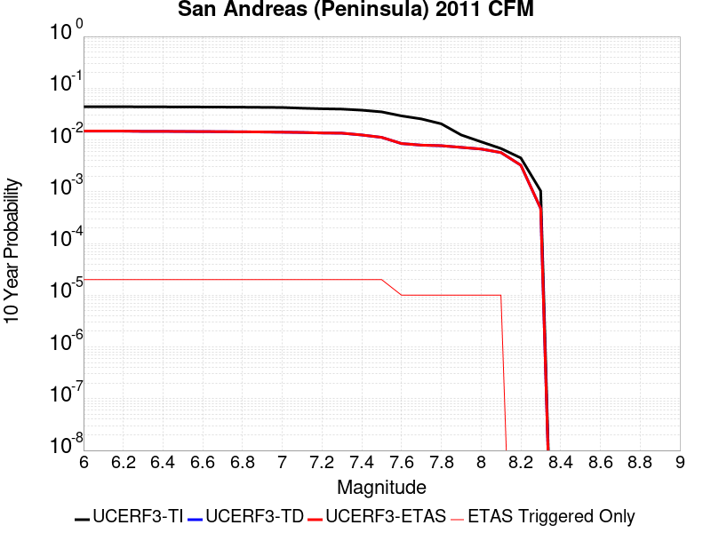 |

| Magnitude | 1 wk TI Prob | 1 wk TD Prob | 1 wk ETAS Prob | 1 wk ETAS/TD Gain | 1 wk ETAS Triggered Only | 1 mo TI Prob | 1 mo TD Prob | 1 mo ETAS Prob | 1 mo ETAS/TD Gain | 1 mo ETAS Triggered Only | 1 yr TI Prob | 1 yr TD Prob | 1 yr ETAS Prob | 1 yr ETAS/TD Gain | 1 yr ETAS Triggered Only | 10 yr TI Prob | 10 yr TD Prob | 10 yr ETAS Prob | 10 yr ETAS/TD Gain | 10 yr ETAS Triggered Only |
|-----|-----|-----|-----|-----|-----|-----|-----|-----|-----|-----|-----|-----|-----|-----|-----|-----|-----|-----|-----|-----|
| 6.0 | 8.6200685E-5 | 2.5333706E-5 | 5.0970793E-5 | 2.0119755 | 2.5637739E-5 | 3.6937918E-4 | 1.08568514E-4 | 1.3420347E-4 | 1.2361177 | 2.5637739E-5 | 0.0044879215 | 0.0013210218 | 0.0013466257 | 1.0193819 | 2.5637739E-5 | 0.043983612 | 0.014838956 | 0.01488947 | 1.0034041 | 5.1275478E-5 |
| 6.1 | 8.6200685E-5 | 2.5333706E-5 | 5.0970793E-5 | 2.0119755 | 2.5637739E-5 | 3.6937918E-4 | 1.08568514E-4 | 1.3420347E-4 | 1.2361177 | 2.5637739E-5 | 0.0044879215 | 0.0013210218 | 0.0013466257 | 1.0193819 | 2.5637739E-5 | 0.043983612 | 0.014838956 | 0.01488947 | 1.0034041 | 5.1275478E-5 |
| 6.2 | 8.6200685E-5 | 2.5333706E-5 | 5.0970793E-5 | 2.0119755 | 2.5637739E-5 | 3.6937918E-4 | 1.08568514E-4 | 1.3420347E-4 | 1.2361177 | 2.5637739E-5 | 0.0044879215 | 0.0013210218 | 0.0013466257 | 1.0193819 | 2.5637739E-5 | 0.043983612 | 0.014838956 | 0.01488947 | 1.0034041 | 5.1275478E-5 |
| 6.3 | 8.551163E-5 | 2.5024961E-5 | 5.0662056E-5 | 2.024461 | 2.5637739E-5 | 3.6642692E-4 | 1.0724543E-4 | 1.3288042E-4 | 1.2390311 | 2.5637739E-5 | 0.004452125 | 0.0013049326 | 0.0013305369 | 1.0196211 | 2.5637739E-5 | 0.043639794 | 0.014665611 | 0.014716134 | 1.003445 | 5.1275478E-5 |
| 6.4 | 8.551163E-5 | 2.5024961E-5 | 5.0662056E-5 | 2.024461 | 2.5637739E-5 | 3.6642692E-4 | 1.0724543E-4 | 1.3288042E-4 | 1.2390311 | 2.5637739E-5 | 0.004452125 | 0.0013049326 | 0.0013305369 | 1.0196211 | 2.5637739E-5 | 0.043639794 | 0.014665611 | 0.014716134 | 1.003445 | 5.1275478E-5 |
| 6.5 | 8.511146E-5 | 2.4846031E-5 | 5.0483133E-5 | 2.031839 | 2.5637739E-5 | 3.647124E-4 | 1.0647865E-4 | 1.3211367E-4 | 1.2407526 | 2.5637739E-5 | 0.004431336 | 0.0012956082 | 0.0013212129 | 1.0197625 | 2.5637739E-5 | 0.04344007 | 0.014565198 | 0.014615727 | 1.0034691 | 5.1275478E-5 |
| 6.6 | 8.4985084E-5 | 2.477655E-5 | 5.041365E-5 | 2.0347326 | 2.5637739E-5 | 3.6417096E-4 | 1.061809E-4 | 1.3181592E-4 | 1.2414278 | 2.5637739E-5 | 0.0044247704 | 0.0012919875 | 0.0013175921 | 1.019818 | 2.5637739E-5 | 0.043376986 | 0.014527207 | 0.014577738 | 1.0034783 | 5.1275478E-5 |
| 6.7 | 8.462618E-5 | 2.4604726E-5 | 5.0241833E-5 | 2.0419586 | 2.5637739E-5 | 3.6263323E-4 | 1.05444575E-4 | 1.310796E-4 | 1.2431139 | 2.5637739E-5 | 0.004406125 | 0.0012830333 | 0.0013086381 | 1.0199565 | 2.5637739E-5 | 0.043197807 | 0.01443185 | 0.0144823855 | 1.0035017 | 5.1275478E-5 |
| 6.8 | 8.42337E-5 | 2.4500272E-5 | 5.0137383E-5 | 2.046401 | 2.5637739E-5 | 3.6095164E-4 | 1.0499695E-4 | 1.3063199E-4 | 1.2441504 | 2.5637739E-5 | 0.004385734 | 0.0012775898 | 0.0013031948 | 1.0200416 | 2.5637739E-5 | 0.043001823 | 0.014372395 | 0.0144229345 | 1.0035163 | 5.1275478E-5 |
| 6.9 | 8.365989E-5 | 2.4304522E-5 | 4.994164E-5 | 2.0548291 | 2.5637739E-5 | 3.5849313E-4 | 1.0415808E-4 | 1.2979314E-4 | 1.246117 | 2.5637739E-5 | 0.004355922 | 0.0012673886 | 0.0012929938 | 1.0202031 | 2.5637739E-5 | 0.04271523 | 0.014264696 | 0.01431524 | 1.0035433 | 5.1275478E-5 |
| 7.0 | 8.30936E-5 | 2.4065685E-5 | 4.9702805E-5 | 2.0652978 | 2.5637739E-5 | 3.560668E-4 | 1.0313458E-4 | 1.2876968E-4 | 1.2485596 | 2.5637739E-5 | 0.004326499 | 0.0012549418 | 0.0012805474 | 1.0204037 | 2.5637739E-5 | 0.042432297 | 0.0141355125 | 0.014186064 | 1.0035762 | 5.1275478E-5 |
| 7.1 | 8.041264E-5 | 2.3751329E-5 | 4.9388458E-5 | 2.0793977 | 2.5637739E-5 | 3.4458007E-4 | 1.01787446E-4 | 1.2742258E-4 | 1.2518497 | 2.5637739E-5 | 0.0041871946 | 0.0012385593 | 0.0012641652 | 1.020674 | 2.5637739E-5 | 0.041091725 | 0.013957874 | 0.0140084345 | 1.0036223 | 5.1275478E-5 |
| 7.2 | 7.8427016E-5 | 2.3174005E-5 | 4.8811147E-5 | 2.106289 | 2.5637739E-5 | 3.3607247E-4 | 9.931339E-5 | 1.2494858E-4 | 1.2581242 | 2.5637739E-5 | 0.004084008 | 0.0012084715 | 0.0012340782 | 1.0211893 | 2.5637739E-5 | 0.040097635 | 0.013641416 | 0.013691992 | 1.0037075 | 5.1275478E-5 |
| 7.3 | 7.721087E-5 | 2.2958477E-5 | 4.8595626E-5 | 2.1166747 | 2.5637739E-5 | 3.3086175E-4 | 9.838976E-5 | 1.2402498E-4 | 1.2605476 | 2.5637739E-5 | 0.004020803 | 0.0011972387 | 0.0012228457 | 1.0213884 | 2.5637739E-5 | 0.03948827 | 0.013524936 | 0.013575518 | 1.00374 | 5.1275478E-5 |
| 7.4 | 7.3536525E-5 | 2.1064485E-5 | 4.6701683E-5 | 2.2170818 | 2.5637739E-5 | 3.1511846E-4 | 9.027325E-5 | 1.1590867E-4 | 1.2839758 | 2.5637739E-5 | 0.0038298194 | 0.001098524 | 0.0011241335 | 1.0233127 | 2.5637739E-5 | 0.037644852 | 0.01247618 | 0.012526815 | 1.0040586 | 5.1275478E-5 |
| 7.5 | 6.806207E-5 | 1.8855704E-5 | 4.449296E-5 | 2.3596551 | 2.5637739E-5 | 2.9166197E-4 | 8.080766E-5 | 1.0644333E-4 | 1.317243 | 2.5637739E-5 | 0.0035452035 | 9.833903E-4 | 0.0010090028 | 1.0260451 | 2.5637739E-5 | 0.034891766 | 0.011221583 | 0.011272283 | 1.004518 | 5.1275478E-5 |
| 7.6 | 5.6731416E-5 | 1.4235568E-5 | 3.9872943E-5 | 2.800938 | 2.5637739E-5 | 2.43112E-4 | 6.100815E-5 | 8.664432E-5 | 1.420209 | 2.5637739E-5 | 0.0029558712 | 7.4252125E-4 | 7.6813996E-4 | 1.0345023 | 2.5637739E-5 | 0.02916862 | 0.008518306 | 0.008543725 | 1.002984 | 2.5637739E-5 |
| 7.7 | 4.946994E-5 | 1.3298509E-5 | 3.893591E-5 | 2.92784 | 2.5637739E-5 | 2.1199681E-4 | 5.6992365E-5 | 8.262864E-5 | 1.4498196 | 2.5637739E-5 | 0.002578006 | 6.936613E-4 | 7.192812E-4 | 1.0369344 | 2.5637739E-5 | 0.02548303 | 0.007937518 | 0.007962952 | 1.0032043 | 2.5637739E-5 |
| 7.8 | 3.9718198E-5 | 1.3032537E-5 | 3.8669943E-5 | 2.9671845 | 2.5637739E-5 | 1.7020974E-4 | 5.585253E-5 | 8.148884E-5 | 1.4589999 | 2.5637739E-5 | 0.0020703338 | 6.7979255E-4 | 7.054129E-4 | 1.0376884 | 2.5637739E-5 | 0.020511515 | 0.007746509 | 0.007771948 | 1.003284 | 2.5637739E-5 |
| 7.9 | 2.4115114E-5 | 1.2229653E-5 | 3.7867077E-5 | 3.096333 | 2.5637739E-5 | 1.0334639E-4 | 5.2411746E-5 | 7.804814E-5 | 1.4891346 | 2.5637739E-5 | 0.001257516 | 6.3792634E-4 | 6.635477E-4 | 1.0401635 | 2.5637739E-5 | 0.012504238 | 0.0071830763 | 0.00720853 | 1.0035435 | 2.5637739E-5 |
| 8.0 | 1.7756569E-5 | 1.144976E-5 | 3.7087204E-5 | 3.239125 | 2.5637739E-5 | 7.6097356E-5 | 4.9069477E-5 | 7.470596E-5 | 1.5224527 | 2.5637739E-5 | 9.260915E-4 | 5.972573E-4 | 6.228797E-4 | 1.0429002 | 2.5637739E-5 | 0.009222416 | 0.006680902 | 0.0067063686 | 1.0038118 | 2.5637739E-5 |
| 8.1 | 1.3159258E-5 | 9.77991E-6 | 3.5417397E-5 | 3.621444 | 2.5637739E-5 | 5.6395602E-5 | 4.1913227E-5 | 6.754989E-5 | 1.6116605 | 2.5637739E-5 | 6.864001E-4 | 5.101742E-4 | 5.3579884E-4 | 1.0502273 | 2.5637739E-5 | 0.0068428386 | 0.0057076924 | 0.0057331836 | 1.0044662 | 2.5637739E-5 |
| 8.2 | 8.635426E-6 | 5.4872503E-6 | 5.4872503E-6 | 1.0 | 0.0 | 3.700844E-5 | 2.3516575E-5 | 2.3516575E-5 | 1.0 | 0.0 | 4.5048463E-4 | 2.8627677E-4 | 2.8627677E-4 | 1.0 | 0.0 | 0.004495725 | 0.0032556232 | 0.0032556232 | 1.0 | 0.0 |
| 8.3 | 1.983087E-6 | 7.693574E-7 | 7.693574E-7 | 1.0 | 0.0 | 8.498917E-6 | 3.297242E-6 | 3.297242E-6 | 1.0 | 0.0 | 1.034694E-4 | 4.01432E-5 | 4.01432E-5 | 1.0 | 0.0 | 0.0010342124 | 4.7390026E-4 | 4.7390026E-4 | 1.0 | 0.0 |

## Superstition Hills
*[(top)](#table-of-contents)*

| 1 Week | 1 Month | 1 Year | 10 Year |
|-----|-----|-----|-----|
|  |  |  |  |

| Magnitude | 1 wk TI Prob | 1 wk TD Prob | 1 wk ETAS Prob | 1 wk ETAS/TD Gain | 1 wk ETAS Triggered Only | 1 mo TI Prob | 1 mo TD Prob | 1 mo ETAS Prob | 1 mo ETAS/TD Gain | 1 mo ETAS Triggered Only | 1 yr TI Prob | 1 yr TD Prob | 1 yr ETAS Prob | 1 yr ETAS/TD Gain | 1 yr ETAS Triggered Only | 10 yr TI Prob | 10 yr TD Prob | 10 yr ETAS Prob | 10 yr ETAS/TD Gain | 10 yr ETAS Triggered Only |
|-----|-----|-----|-----|-----|-----|-----|-----|-----|-----|-----|-----|-----|-----|-----|-----|-----|-----|-----|-----|-----|
| 6.0 | 6.6865185E-5 | 1.41497685E-5 | 3.9787144E-5 | 2.8118584 | 2.5637739E-5 | 2.8653358E-4 | 6.064055E-5 | 8.6276734E-5 | 1.4227564 | 2.5637739E-5 | 0.0034829667 | 7.380648E-4 | 7.636836E-4 | 1.0347108 | 2.5637739E-5 | 0.03428881 | 0.0075266883 | 0.0075775776 | 1.0067612 | 5.1275478E-5 |
| 6.1 | 6.544851E-5 | 1.41497685E-5 | 3.9787144E-5 | 2.8118584 | 2.5637739E-5 | 2.8046346E-4 | 6.064055E-5 | 8.6276734E-5 | 1.4227564 | 2.5637739E-5 | 0.0034092965 | 7.3806476E-4 | 7.636836E-4 | 1.0347108 | 2.5637739E-5 | 0.033574644 | 0.007526688 | 0.007577577 | 1.0067612 | 5.1275478E-5 |
| 6.2 | 6.544851E-5 | 1.41497685E-5 | 3.9787144E-5 | 2.8118584 | 2.5637739E-5 | 2.8046346E-4 | 6.064055E-5 | 8.6276734E-5 | 1.4227564 | 2.5637739E-5 | 0.0034092965 | 7.3806476E-4 | 7.636836E-4 | 1.0347108 | 2.5637739E-5 | 0.033574644 | 0.007526688 | 0.007577577 | 1.0067612 | 5.1275478E-5 |
| 6.3 | 5.2402065E-5 | 1.4149768E-5 | 3.9787144E-5 | 2.8118584 | 2.5637739E-5 | 2.2456095E-4 | 6.064054E-5 | 8.627673E-5 | 1.4227566 | 2.5637739E-5 | 0.0027306017 | 7.380647E-4 | 7.636835E-4 | 1.0347108 | 2.5637739E-5 | 0.02697292 | 0.007526682 | 0.0075775716 | 1.0067612 | 5.1275478E-5 |
| 6.4 | 4.542238E-5 | 1.4149767E-5 | 3.9787144E-5 | 2.8118587 | 2.5637739E-5 | 1.9465282E-4 | 6.0640537E-5 | 8.627673E-5 | 1.4227566 | 2.5637739E-5 | 0.0023673223 | 7.380647E-4 | 7.636835E-4 | 1.0347108 | 2.5637739E-5 | 0.023422617 | 0.007526679 | 0.0075775688 | 1.0067612 | 5.1275478E-5 |
| 6.5 | 2.9672969E-5 | 1.4149766E-5 | 3.978714E-5 | 2.8118587 | 2.5637739E-5 | 1.2716366E-4 | 6.0640534E-5 | 8.627672E-5 | 1.4227566 | 2.5637739E-5 | 0.0015471181 | 7.380646E-4 | 7.636834E-4 | 1.0347108 | 2.5637739E-5 | 0.015363912 | 0.0075266724 | 0.007577562 | 1.0067612 | 5.1275478E-5 |
| 6.6 | 2.6056105E-5 | 1.3815438E-5 | 3.945282E-5 | 2.8557055 | 2.5637739E-5 | 1.1166424E-4 | 5.9207767E-5 | 8.484399E-5 | 1.4329875 | 2.5637739E-5 | 0.0013586642 | 7.2063226E-4 | 7.462515E-4 | 1.0355511 | 2.5637739E-5 | 0.013503874 | 0.007351063 | 0.007401962 | 1.0069239 | 5.1275478E-5 |
| 6.7 | 1.4611248E-5 | 1.3395271E-5 | 3.9032668E-5 | 2.913914 | 2.5637739E-5 | 6.261813E-5 | 5.740713E-5 | 8.30434E-5 | 1.4465694 | 2.5637739E-5 | 7.6210906E-4 | 6.9872366E-4 | 7.2434347E-4 | 1.0366666 | 2.5637739E-5 | 0.0075950073 | 0.007132221 | 0.007183131 | 1.007138 | 5.1275478E-5 |
| 6.8 | 1.30607E-5 | 1.0990158E-5 | 3.6627614E-5 | 3.3327649 | 2.5637739E-5 | 5.597323E-5 | 4.709988E-5 | 7.273641E-5 | 1.5443014 | 2.5637739E-5 | 6.8126095E-4 | 5.732989E-4 | 5.989219E-4 | 1.0446941 | 2.5637739E-5 | 0.006791762 | 0.0058803135 | 0.0059058005 | 1.0043343 | 2.5637739E-5 |
| 6.9 | 1.0443096E-5 | 8.205624E-6 | 3.3843153E-5 | 4.124385 | 2.5637739E-5 | 4.4755358E-5 | 3.51665E-5 | 6.0803337E-5 | 1.7290131 | 2.5637739E-5 | 5.447602E-4 | 4.2807037E-4 | 4.5369714E-4 | 1.0598658 | 2.5637739E-5 | 0.005434267 | 0.004414833 | 0.004440358 | 1.0057815 | 2.5637739E-5 |
| 7.0 | 8.045912E-6 | 6.7489877E-6 | 3.2386553E-5 | 4.7987275 | 2.5637739E-5 | 3.4482026E-5 | 2.8923918E-5 | 5.4560915E-5 | 1.8863598 | 2.5637739E-5 | 4.197378E-4 | 3.5209284E-4 | 3.7772153E-4 | 1.0727897 | 2.5637739E-5 | 0.0041894587 | 0.0036382722 | 0.0036638167 | 1.0070211 | 2.5637739E-5 |
| 7.1 | 8.045912E-6 | 6.7489877E-6 | 3.2386553E-5 | 4.7987275 | 2.5637739E-5 | 3.4482026E-5 | 2.8923918E-5 | 5.4560915E-5 | 1.8863598 | 2.5637739E-5 | 4.197378E-4 | 3.5209284E-4 | 3.7772153E-4 | 1.0727897 | 2.5637739E-5 | 0.0041894587 | 0.0036382722 | 0.0036638167 | 1.0070211 | 2.5637739E-5 |
| 7.2 | 7.375506E-6 | 6.2557447E-6 | 3.1893323E-5 | 5.0982456 | 2.5637739E-5 | 3.1608928E-5 | 2.6810065E-5 | 5.2447114E-5 | 1.9562473 | 2.5637739E-5 | 3.8477074E-4 | 3.263645E-4 | 3.5199386E-4 | 1.07853 | 2.5637739E-5 | 0.003841052 | 0.0033786567 | 0.0034042078 | 1.0075625 | 2.5637739E-5 |
| 7.3 | 6.6063913E-6 | 5.8080136E-6 | 3.1445605E-5 | 5.414175 | 2.5637739E-5 | 2.8312797E-5 | 2.4891253E-5 | 5.0528353E-5 | 2.0299642 | 2.5637739E-5 | 3.446538E-4 | 3.0300958E-4 | 3.2863955E-4 | 1.0845847 | 2.5637739E-5 | 0.0034411973 | 0.003142841 | 0.003168398 | 1.0081319 | 2.5637739E-5 |
| 7.4 | 6.4313126E-6 | 5.6894055E-6 | 3.1327E-5 | 5.506199 | 2.5637739E-5 | 2.7562477E-5 | 2.4382942E-5 | 5.0020055E-5 | 2.0514364 | 2.5637739E-5 | 3.355215E-4 | 2.9682257E-4 | 3.2245272E-4 | 1.0863483 | 2.5637739E-5 | 0.0033501536 | 0.0030805867 | 0.0031061454 | 1.0082967 | 2.5637739E-5 |
| 7.5 | 6.0742927E-6 | 5.485116E-6 | 3.1122716E-5 | 5.6740303 | 2.5637739E-5 | 2.6032423E-5 | 2.3507433E-5 | 4.9144568E-5 | 2.090597 | 2.5637739E-5 | 3.1689866E-4 | 2.861661E-4 | 3.117965E-4 | 1.0895648 | 2.5637739E-5 | 0.0031644711 | 0.0029723656 | 0.0029979271 | 1.0085998 | 2.5637739E-5 |
| 7.6 | 5.6987187E-6 | 5.3032036E-6 | 3.0940806E-5 | 5.8343616 | 2.5637739E-5 | 2.4422852E-5 | 2.272782E-5 | 4.8364975E-5 | 2.1280077 | 2.5637739E-5 | 2.9730765E-4 | 2.7667673E-4 | 3.0230737E-4 | 1.0926375 | 2.5637739E-5 | 0.002969102 | 0.0028755567 | 0.0029011206 | 1.0088902 | 2.5637739E-5 |
| 7.7 | 5.1658035E-6 | 4.9340665E-6 | 3.057168E-5 | 6.196041 | 2.5637739E-5 | 2.2138971E-5 | 2.1145832E-5 | 4.678303E-5 | 2.2123995 | 2.5637739E-5 | 2.6950863E-4 | 2.5742067E-4 | 2.8305184E-4 | 1.0995691 | 2.5637739E-5 | 0.00269182 | 0.002680529 | 0.0027060981 | 1.0095388 | 2.5637739E-5 |
| 7.8 | 3.6864697E-6 | 4.204672E-6 | 2.9842304E-5 | 7.097415 | 2.5637739E-5 | 1.579906E-5 | 1.80199E-5 | 4.365718E-5 | 2.4227202 | 2.5637739E-5 | 1.9233658E-4 | 2.1937068E-4 | 2.450028E-4 | 1.1168438 | 2.5637739E-5 | 0.0019217018 | 0.0022935418 | 0.0023191208 | 1.0111526 | 2.5637739E-5 |
| 7.9 | 3.0265903E-6 | 3.5712687E-6 | 2.9208915E-5 | 8.178863 | 2.5637739E-5 | 1.2971037E-5 | 1.530535E-5 | 4.0942698E-5 | 2.675058 | 2.5637739E-5 | 1.5791094E-4 | 1.8632715E-4 | 2.1196011E-4 | 1.1375697 | 2.5637739E-5 | 0.0015779877 | 0.0019574203 | 0.0019830079 | 1.0130721 | 2.5637739E-5 |
| 8.0 | 2.5271493E-6 | 3.0936285E-6 | 2.8731289E-5 | 9.287246 | 2.5637739E-5 | 1.0830595E-5 | 1.3258343E-5 | 3.889574E-5 | 2.9336805 | 2.5637739E-5 | 1.3185451E-4 | 1.6140878E-4 | 1.8704239E-4 | 1.1588117 | 2.5637739E-5 | 0.0013177631 | 0.0017009631 | 0.0017265573 | 1.0150468 | 2.5637739E-5 |
| 8.1 | 2.3749135E-6 | 2.923956E-6 | 2.8561619E-5 | 9.768143 | 2.5637739E-5 | 1.0178161E-5 | 1.2531182E-5 | 3.81686E-5 | 3.0458899 | 2.5637739E-5 | 1.2391206E-4 | 1.5255688E-4 | 1.781907E-4 | 1.168028 | 2.5637739E-5 | 0.0012384299 | 0.0016083925 | 0.0016339889 | 1.0159143 | 2.5637739E-5 |
| 8.2 | 1.7186406E-9 | 1.1475616E-9 | 1.1475616E-9 | 1.0 | 0.0 | 7.3656024E-9 | 4.918121E-9 | 4.918121E-9 | 1.0 | 0.0 | 8.9676206E-8 | 5.9878126E-8 | 5.9878126E-8 | 1.0 | 0.0 | 8.9676166E-7 | 6.407935E-7 | 6.407935E-7 | 1.0 | 0.0 |

## Santa Ynez (West)
*[(top)](#table-of-contents)*

| 1 Week | 1 Month | 1 Year | 10 Year |
|-----|-----|-----|-----|
|  |  |  |  |

| Magnitude | 1 wk TI Prob | 1 wk TD Prob | 1 wk ETAS Prob | 1 wk ETAS/TD Gain | 1 wk ETAS Triggered Only | 1 mo TI Prob | 1 mo TD Prob | 1 mo ETAS Prob | 1 mo ETAS/TD Gain | 1 mo ETAS Triggered Only | 1 yr TI Prob | 1 yr TD Prob | 1 yr ETAS Prob | 1 yr ETAS/TD Gain | 1 yr ETAS Triggered Only | 10 yr TI Prob | 10 yr TD Prob | 10 yr ETAS Prob | 10 yr ETAS/TD Gain | 10 yr ETAS Triggered Only |
|-----|-----|-----|-----|-----|-----|-----|-----|-----|-----|-----|-----|-----|-----|-----|-----|-----|-----|-----|-----|-----|
| 6.0 | 4.7352758E-5 | 5.4977594E-5 | 5.4977594E-5 | 1.0 | 0.0 | 2.0292461E-4 | 2.3559865E-4 | 2.3559865E-4 | 1.0 | 0.0 | 0.0024678076 | 0.0028648009 | 0.0029159293 | 1.0178472 | 5.1275478E-5 | 0.024405818 | 0.028307132 | 0.028356956 | 1.0017601 | 5.1275478E-5 |
| 6.1 | 4.7352758E-5 | 5.4977594E-5 | 5.4977594E-5 | 1.0 | 0.0 | 2.0292461E-4 | 2.3559865E-4 | 2.3559865E-4 | 1.0 | 0.0 | 0.0024678076 | 0.0028648009 | 0.0029159293 | 1.0178472 | 5.1275478E-5 | 0.024405818 | 0.028307132 | 0.028356956 | 1.0017601 | 5.1275478E-5 |
| 6.2 | 3.0415853E-5 | 3.3927812E-5 | 3.3927812E-5 | 1.0 | 0.0 | 1.3034715E-4 | 1.4539702E-4 | 1.4539702E-4 | 1.0 | 0.0 | 0.0015858212 | 0.0017688064 | 0.0017943988 | 1.0144688 | 2.5637739E-5 | 0.015745522 | 0.017551184 | 0.017576372 | 1.0014352 | 2.5637739E-5 |
| 6.3 | 3.0415853E-5 | 3.3927812E-5 | 3.3927812E-5 | 1.0 | 0.0 | 1.3034715E-4 | 1.4539702E-4 | 1.4539702E-4 | 1.0 | 0.0 | 0.0015858212 | 0.0017688064 | 0.0017943988 | 1.0144688 | 2.5637739E-5 | 0.015745522 | 0.017551184 | 0.017576372 | 1.0014352 | 2.5637739E-5 |
| 6.4 | 2.5452082E-5 | 2.7914437E-5 | 2.7914437E-5 | 1.0 | 0.0 | 1.09075794E-4 | 1.1962793E-4 | 1.1962793E-4 | 1.0 | 0.0 | 0.0013271887 | 0.0014555135 | 0.001481114 | 1.0175886 | 2.5637739E-5 | 0.013192902 | 0.014461986 | 0.014487253 | 1.0017471 | 2.5637739E-5 |
| 6.5 | 2.3143784E-5 | 2.5129964E-5 | 2.5129964E-5 | 1.0 | 0.0 | 9.9183875E-5 | 1.0769549E-4 | 1.0769549E-4 | 1.0 | 0.0 | 0.0012068948 | 0.0013104154 | 0.0013360196 | 1.019539 | 2.5637739E-5 | 0.012003611 | 0.013028558 | 0.013053862 | 1.0019422 | 2.5637739E-5 |
| 6.6 | 1.9118515E-5 | 2.0355572E-5 | 2.0355572E-5 | 1.0 | 0.0 | 8.193392E-5 | 8.72353E-5 | 8.72353E-5 | 1.0 | 0.0 | 9.97089E-4 | 0.0010615803 | 0.0010615803 | 1.0 | 0.0 | 0.00992627 | 0.010566001 | 0.010566001 | 1.0 | 0.0 |
| 6.7 | 1.722807E-5 | 1.814738E-5 | 1.814738E-5 | 1.0 | 0.0 | 7.3832496E-5 | 7.77722E-5 | 7.77722E-5 | 1.0 | 0.0 | 8.985399E-4 | 9.464708E-4 | 9.464708E-4 | 1.0 | 0.0 | 0.008949154 | 0.009425044 | 0.009425044 | 1.0 | 0.0 |
| 6.8 | 1.5317364E-5 | 1.5927328E-5 | 1.5927328E-5 | 1.0 | 0.0 | 6.56442E-5 | 6.825821E-5 | 6.825821E-5 | 1.0 | 0.0 | 7.98925E-4 | 8.307311E-4 | 8.307311E-4 | 1.0 | 0.0 | 0.007960589 | 0.008276746 | 0.008276746 | 1.0 | 0.0 |
| 6.9 | 1.3071226E-5 | 1.3330249E-5 | 1.3330249E-5 | 1.0 | 0.0 | 5.6018336E-5 | 5.71284E-5 | 5.71284E-5 | 1.0 | 0.0 | 6.8180985E-4 | 6.9531857E-4 | 6.9531857E-4 | 1.0 | 0.0 | 0.0067972173 | 0.006931691 | 0.006931691 | 1.0 | 0.0 |
| 7.0 | 1.1836986E-5 | 1.1933308E-5 | 1.1933308E-5 | 1.0 | 0.0 | 5.0728955E-5 | 5.1141757E-5 | 5.1141757E-5 | 1.0 | 0.0 | 6.1745E-4 | 6.224747E-4 | 6.224747E-4 | 1.0 | 0.0 | 0.006157372 | 0.0062075043 | 0.0062075043 | 1.0 | 0.0 |
| 7.1 | 1.0597169E-5 | 1.0542637E-5 | 1.0542637E-5 | 1.0 | 0.0 | 4.541565E-5 | 4.5181954E-5 | 4.5181954E-5 | 1.0 | 0.0 | 5.5279525E-4 | 5.499526E-4 | 5.499526E-4 | 1.0 | 0.0 | 0.0055142213 | 0.0054860474 | 0.0054860474 | 1.0 | 0.0 |
| 7.2 | 9.59113E-6 | 9.459535E-6 | 9.459535E-6 | 1.0 | 0.0 | 4.11042E-5 | 4.0540242E-5 | 4.0540242E-5 | 1.0 | 0.0 | 5.0032866E-4 | 4.9346674E-4 | 4.9346674E-4 | 1.0 | 0.0 | 0.004992037 | 0.0049238284 | 0.0049238284 | 1.0 | 0.0 |
| 7.3 | 8.586084E-6 | 8.379932E-6 | 8.379932E-6 | 1.0 | 0.0 | 3.679698E-5 | 3.5913505E-5 | 3.5913505E-5 | 1.0 | 0.0 | 4.4791115E-4 | 4.3716026E-4 | 4.3716026E-4 | 1.0 | 0.0 | 0.004470094 | 0.004363114 | 0.004363114 | 1.0 | 0.0 |
| 7.4 | 7.2622997E-6 | 6.95183E-6 | 6.95183E-6 | 1.0 | 0.0 | 3.112377E-5 | 2.9793222E-5 | 2.9793222E-5 | 1.0 | 0.0 | 3.78866E-4 | 3.6267308E-4 | 3.6267308E-4 | 1.0 | 0.0 | 0.0037822074 | 0.0036209123 | 0.0036209123 | 1.0 | 0.0 |
| 7.5 | 5.627296E-6 | 5.251797E-6 | 5.251797E-6 | 1.0 | 0.0 | 2.411676E-5 | 2.2507513E-5 | 2.2507513E-5 | 1.0 | 0.0 | 2.9358198E-4 | 2.7399522E-4 | 2.7399522E-4 | 1.0 | 0.0 | 0.0029319443 | 0.002736646 | 0.002736646 | 1.0 | 0.0 |
| 7.6 | 2.265244E-6 | 2.0609314E-6 | 2.0609314E-6 | 1.0 | 0.0 | 9.708152E-6 | 8.832533E-6 | 8.832533E-6 | 1.0 | 0.0 | 1.18190335E-4 | 1.07530876E-4 | 1.07530876E-4 | 1.0 | 0.0 | 0.001181275 | 0.001074797 | 0.001074797 | 1.0 | 0.0 |
| 7.7 | 1.3099874E-6 | 1.1016656E-6 | 1.1016656E-6 | 1.0 | 0.0 | 5.61422E-6 | 4.7214157E-6 | 4.7214157E-6 | 1.0 | 0.0 | 6.8350986E-5 | 5.7481746E-5 | 5.7481746E-5 | 1.0 | 0.0 | 6.832996E-4 | 5.7467114E-4 | 5.7467114E-4 | 1.0 | 0.0 |
| 7.8 | 7.903951E-7 | 6.071338E-7 | 6.071338E-7 | 1.0 | 0.0 | 3.3874032E-6 | 2.6019995E-6 | 2.6019995E-6 | 1.0 | 0.0 | 4.1240855E-5 | 3.1678897E-5 | 3.1678897E-5 | 1.0 | 0.0 | 4.12332E-4 | 3.1674514E-4 | 3.1674514E-4 | 1.0 | 0.0 |
| 7.9 | 7.0753297E-9 | 5.0900715E-9 | 5.0900715E-9 | 1.0 | 0.0 | 3.032284E-8 | 2.1814591E-8 | 2.1814591E-8 | 1.0 | 0.0 | 3.6918053E-7 | 2.6559263E-7 | 2.6559263E-7 | 1.0 | 0.0 | 3.691799E-6 | 2.655924E-6 | 2.655924E-6 | 1.0 | 0.0 |

## Baker
*[(top)](#table-of-contents)*

| 1 Week | 1 Month | 1 Year | 10 Year |
|-----|-----|-----|-----|
| 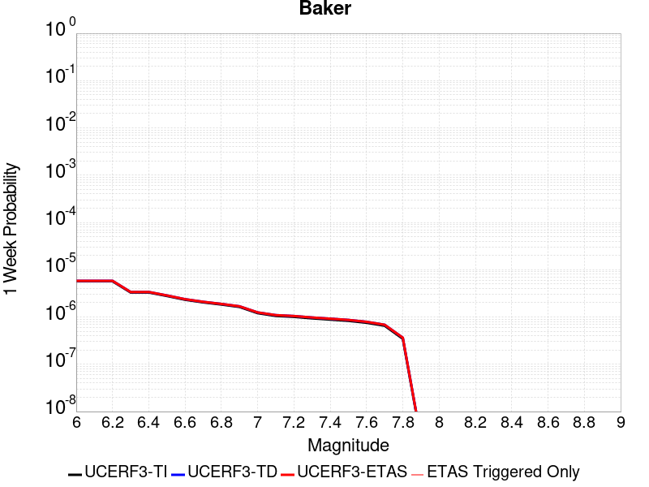 |  |  |  |

| Magnitude | 1 wk TI Prob | 1 wk TD Prob | 1 wk ETAS Prob | 1 wk ETAS/TD Gain | 1 wk ETAS Triggered Only | 1 mo TI Prob | 1 mo TD Prob | 1 mo ETAS Prob | 1 mo ETAS/TD Gain | 1 mo ETAS Triggered Only | 1 yr TI Prob | 1 yr TD Prob | 1 yr ETAS Prob | 1 yr ETAS/TD Gain | 1 yr ETAS Triggered Only | 10 yr TI Prob | 10 yr TD Prob | 10 yr ETAS Prob | 10 yr ETAS/TD Gain | 10 yr ETAS Triggered Only |
|-----|-----|-----|-----|-----|-----|-----|-----|-----|-----|-----|-----|-----|-----|-----|-----|-----|-----|-----|-----|-----|
| 6.0 | 5.695525E-6 | 5.8349133E-6 | 5.8349133E-6 | 1.0 | 0.0 | 2.4409164E-5 | 2.5006555E-5 | 2.5006555E-5 | 1.0 | 0.0 | 2.9714106E-4 | 3.0441626E-4 | 3.300462E-4 | 1.0841937 | 2.5637739E-5 | 0.0029674405 | 0.0030403885 | 0.0030915078 | 1.0168135 | 5.1275478E-5 |
| 6.1 | 5.695525E-6 | 5.8349133E-6 | 5.8349133E-6 | 1.0 | 0.0 | 2.4409164E-5 | 2.5006555E-5 | 2.5006555E-5 | 1.0 | 0.0 | 2.9714106E-4 | 3.0441626E-4 | 3.300462E-4 | 1.0841937 | 2.5637739E-5 | 0.0029674405 | 0.0030403885 | 0.0030915078 | 1.0168135 | 5.1275478E-5 |
| 6.2 | 5.695525E-6 | 5.8349133E-6 | 5.8349133E-6 | 1.0 | 0.0 | 2.4409164E-5 | 2.5006555E-5 | 2.5006555E-5 | 1.0 | 0.0 | 2.9714106E-4 | 3.0441626E-4 | 3.300462E-4 | 1.0841937 | 2.5637739E-5 | 0.0029674405 | 0.0030403885 | 0.0030915078 | 1.0168135 | 5.1275478E-5 |
| 6.3 | 3.2995713E-6 | 3.3837132E-6 | 3.3837132E-6 | 1.0 | 0.0 | 1.4140943E-5 | 1.450155E-5 | 1.450155E-5 | 1.0 | 0.0 | 1.7215237E-4 | 1.7654254E-4 | 2.0217575E-4 | 1.1451957 | 2.5637739E-5 | 0.0017201907 | 0.00176407 | 0.001815255 | 1.0290153 | 5.1275478E-5 |
| 6.4 | 3.2995713E-6 | 3.3837132E-6 | 3.3837132E-6 | 1.0 | 0.0 | 1.4140943E-5 | 1.450155E-5 | 1.450155E-5 | 1.0 | 0.0 | 1.7215237E-4 | 1.7654254E-4 | 2.0217575E-4 | 1.1451957 | 2.5637739E-5 | 0.0017201907 | 0.00176407 | 0.001815255 | 1.0290153 | 5.1275478E-5 |
| 6.5 | 2.782202E-6 | 2.855881E-6 | 2.855881E-6 | 1.0 | 0.0 | 1.1923668E-5 | 1.2239434E-5 | 1.2239434E-5 | 1.0 | 0.0 | 1.4516099E-4 | 1.4900525E-4 | 1.7463916E-4 | 1.1720337 | 2.5637739E-5 | 0.001450662 | 0.0014890862 | 0.0015402853 | 1.0343829 | 5.1275478E-5 |
| 6.6 | 2.3163404E-6 | 2.3809555E-6 | 2.3809555E-6 | 1.0 | 0.0 | 9.927136E-6 | 1.0204057E-5 | 1.0204057E-5 | 1.0 | 0.0 | 1.20856166E-4 | 1.242275E-4 | 1.4986207E-4 | 1.2063516 | 2.5637739E-5 | 0.0012079047 | 0.0012416008 | 0.0012928126 | 1.0412467 | 5.1275478E-5 |
| 6.7 | 2.037056E-6 | 2.0965333E-6 | 2.0965333E-6 | 1.0 | 0.0 | 8.7302105E-6 | 8.985113E-6 | 8.985113E-6 | 1.0 | 0.0 | 1.0628513E-4 | 1.0938842E-4 | 1.3502335E-4 | 1.2343478 | 2.5637739E-5 | 0.0010623431 | 0.0010933619 | 0.0011445812 | 1.0468458 | 5.1275478E-5 |
| 6.8 | 1.8356744E-6 | 1.8915596E-6 | 1.8915596E-6 | 1.0 | 0.0 | 7.867153E-6 | 8.106659E-6 | 8.106659E-6 | 1.0 | 0.0 | 9.577837E-5 | 9.869425E-5 | 1.2432945E-4 | 1.2597437 | 2.5637739E-5 | 9.57371E-4 | 9.865181E-4 | 0.0010377431 | 1.051925 | 5.1275478E-5 |
| 6.9 | 1.6310546E-6 | 1.6832361E-6 | 1.6832361E-6 | 1.0 | 0.0 | 6.9902153E-6 | 7.2138496E-6 | 7.2138496E-6 | 1.0 | 0.0 | 8.510255E-5 | 8.7825196E-5 | 1.1346068E-4 | 1.2918922 | 2.5637739E-5 | 8.5069967E-4 | 8.779161E-4 | 9.291466E-4 | 1.0583546 | 5.1275478E-5 |
| 7.0 | 1.2058036E-6 | 1.2508916E-6 | 1.2508916E-6 | 1.0 | 0.0 | 5.1677193E-6 | 5.3609533E-6 | 5.3609533E-6 | 1.0 | 0.0 | 6.291517E-5 | 6.5267675E-5 | 9.090374E-5 | 1.3927835 | 2.5637739E-5 | 6.289736E-4 | 6.5248733E-4 | 7.037294E-4 | 1.0785334 | 5.1275478E-5 |
| 7.1 | 1.052382E-6 | 1.0951846E-6 | 1.0951846E-6 | 1.0 | 0.0 | 4.5102006E-6 | 4.69364E-6 | 4.69364E-6 | 1.0 | 0.0 | 5.491031E-5 | 5.714358E-5 | 8.277985E-5 | 1.4486291 | 2.5637739E-5 | 5.4896745E-4 | 5.7128974E-4 | 6.2253594E-4 | 1.0897026 | 5.1275478E-5 |
| 7.2 | 1.0067454E-6 | 1.0487945E-6 | 1.0487945E-6 | 1.0 | 0.0 | 4.3146156E-6 | 4.4948256E-6 | 4.4948256E-6 | 1.0 | 0.0 | 5.252918E-5 | 5.472314E-5 | 8.0359474E-5 | 1.4684734 | 2.5637739E-5 | 5.251676E-4 | 5.470975E-4 | 5.983449E-4 | 1.0936714 | 5.1275478E-5 |
| 7.3 | 9.3596316E-7 | 9.76795E-7 | 9.76795E-7 | 1.0 | 0.0 | 4.0112645E-6 | 4.186258E-6 | 4.186258E-6 | 1.0 | 0.0 | 4.8836053E-5 | 5.0966508E-5 | 7.660294E-5 | 1.5030055 | 2.5637739E-5 | 4.8825322E-4 | 5.09549E-4 | 5.3517363E-4 | 1.0502889 | 2.5637739E-5 |
| 7.4 | 8.8117395E-7 | 9.207884E-7 | 9.207884E-7 | 1.0 | 0.0 | 3.7764542E-6 | 3.94623E-6 | 3.94623E-6 | 1.0 | 0.0 | 4.5977362E-5 | 4.80443E-5 | 7.368081E-5 | 1.5336014 | 2.5637739E-5 | 4.596785E-4 | 4.803399E-4 | 5.059653E-4 | 1.0533485 | 2.5637739E-5 |
| 7.5 | 8.292386E-7 | 8.6748094E-7 | 8.6748094E-7 | 1.0 | 0.0 | 3.5538749E-6 | 3.7177701E-6 | 3.7177701E-6 | 1.0 | 0.0 | 4.326757E-5 | 4.5262917E-5 | 7.08995E-5 | 1.5663925 | 2.5637739E-5 | 4.3259145E-4 | 4.5253773E-4 | 4.7816386E-4 | 1.0566276 | 2.5637739E-5 |
| 7.6 | 7.553842E-7 | 7.9146724E-7 | 7.9146724E-7 | 1.0 | 0.0 | 3.2373566E-6 | 3.391998E-6 | 3.391998E-6 | 1.0 | 0.0 | 3.9414106E-5 | 4.12968E-5 | 6.693348E-5 | 1.620791 | 2.5637739E-5 | 3.9407116E-4 | 4.1289197E-4 | 4.385191E-4 | 1.0620675 | 2.5637739E-5 |
| 7.7 | 6.5285366E-7 | 6.8529783E-7 | 6.8529783E-7 | 1.0 | 0.0 | 2.797941E-6 | 2.9369874E-6 | 2.9369874E-6 | 1.0 | 0.0 | 3.40644E-5 | 3.5757243E-5 | 3.5757243E-5 | 1.0 | 0.0 | 3.405918E-4 | 3.5751556E-4 | 3.5751556E-4 | 1.0 | 0.0 |
| 7.8 | 3.4586725E-7 | 3.648368E-7 | 3.648368E-7 | 1.0 | 0.0 | 1.4822873E-6 | 1.5635853E-6 | 1.5635853E-6 | 1.0 | 0.0 | 1.80467E-5 | 1.903649E-5 | 1.903649E-5 | 1.0 | 0.0 | 1.8045233E-4 | 1.9034903E-4 | 1.9034903E-4 | 1.0 | 0.0 |
| 7.9 | 2.5591178E-9 | 2.6697329E-9 | 2.6697329E-9 | 1.0 | 0.0 | 1.0967647E-8 | 1.14417125E-8 | 1.14417125E-8 | 1.0 | 0.0 | 1.335311E-7 | 1.3930286E-7 | 1.3930286E-7 | 1.0 | 0.0 | 1.3353102E-6 | 1.3930285E-6 | 1.3930285E-6 | 1.0 | 0.0 |

## Great Valley 09 (Laguna Seca)
*[(top)](#table-of-contents)*

| 1 Week | 1 Month | 1 Year | 10 Year |
|-----|-----|-----|-----|
|  |  |  |  |

| Magnitude | 1 wk TI Prob | 1 wk TD Prob | 1 wk ETAS Prob | 1 wk ETAS/TD Gain | 1 wk ETAS Triggered Only | 1 mo TI Prob | 1 mo TD Prob | 1 mo ETAS Prob | 1 mo ETAS/TD Gain | 1 mo ETAS Triggered Only | 1 yr TI Prob | 1 yr TD Prob | 1 yr ETAS Prob | 1 yr ETAS/TD Gain | 1 yr ETAS Triggered Only | 10 yr TI Prob | 10 yr TD Prob | 10 yr ETAS Prob | 10 yr ETAS/TD Gain | 10 yr ETAS Triggered Only |
|-----|-----|-----|-----|-----|-----|-----|-----|-----|-----|-----|-----|-----|-----|-----|-----|-----|-----|-----|-----|-----|
| 6.0 | 5.4353277E-5 | 7.051288E-5 | 7.051288E-5 | 1.0 | 0.0 | 2.3292181E-4 | 3.021651E-4 | 3.021651E-4 | 1.0 | 0.0 | 0.0028321352 | 0.0036727623 | 0.0036727623 | 1.0 | 0.0 | 0.02796312 | 0.036121234 | 0.036170658 | 1.0013683 | 5.1275478E-5 |
| 6.1 | 4.5578287E-5 | 5.8229198E-5 | 5.8229198E-5 | 1.0 | 0.0 | 1.953209E-4 | 2.4953127E-4 | 2.4953127E-4 | 1.0 | 0.0 | 0.0023754383 | 0.0030339046 | 0.0030339046 | 1.0 | 0.0 | 0.023502063 | 0.029924182 | 0.029949052 | 1.0008311 | 2.5637739E-5 |
| 6.2 | 2.8536782E-5 | 3.4740468E-5 | 3.4740468E-5 | 1.0 | 0.0 | 1.2229476E-4 | 1.4887958E-4 | 1.4887958E-4 | 1.0 | 0.0 | 0.0014879217 | 0.0018110707 | 0.0018110707 | 1.0 | 0.0 | 0.014779986 | 0.017960638 | 0.017985815 | 1.0014018 | 2.5637739E-5 |
| 6.3 | 2.3698774E-5 | 2.8215252E-5 | 2.8215252E-5 | 1.0 | 0.0 | 1.01562226E-4 | 1.2091713E-4 | 1.2091713E-4 | 1.0 | 0.0 | 0.0012358186 | 0.0014712278 | 0.0014712278 | 1.0 | 0.0 | 0.012289686 | 0.014613301 | 0.014613301 | 1.0 | 0.0 |
| 6.4 | 1.9191197E-5 | 2.2123982E-5 | 2.2123982E-5 | 1.0 | 0.0 | 8.2245395E-5 | 9.481376E-5 | 9.481376E-5 | 1.0 | 0.0 | 0.0010008777 | 0.001153789 | 0.001153789 | 1.0 | 0.0 | 0.009963818 | 0.011478378 | 0.011478378 | 1.0 | 0.0 |
| 6.5 | 1.5203241E-5 | 1.6802042E-5 | 1.6802042E-5 | 1.0 | 0.0 | 6.5155116E-5 | 7.200683E-5 | 7.200683E-5 | 1.0 | 0.0 | 7.9297484E-4 | 8.76362E-4 | 8.76362E-4 | 1.0 | 0.0 | 0.007901512 | 0.008730489 | 0.008730489 | 1.0 | 0.0 |
| 6.6 | 1.0984925E-5 | 1.1243591E-5 | 1.1243591E-5 | 1.0 | 0.0 | 4.70774E-5 | 4.8185837E-5 | 4.8185837E-5 | 1.0 | 0.0 | 5.730166E-4 | 5.865083E-4 | 5.865083E-4 | 1.0 | 0.0 | 0.005715413 | 0.0058500012 | 0.0058500012 | 1.0 | 0.0 |
| 6.7 | 9.134616E-6 | 9.020651E-6 | 9.020651E-6 | 1.0 | 0.0 | 3.9147766E-5 | 3.8659375E-5 | 3.8659375E-5 | 1.0 | 0.0 | 4.7651984E-4 | 4.705786E-4 | 4.705786E-4 | 1.0 | 0.0 | 0.004754993 | 0.0046960665 | 0.0046960665 | 1.0 | 0.0 |
| 6.8 | 7.785589E-6 | 7.4525665E-6 | 7.4525665E-6 | 1.0 | 0.0 | 3.3366385E-5 | 3.193919E-5 | 3.193919E-5 | 1.0 | 0.0 | 4.0616E-4 | 3.8879228E-4 | 3.8879228E-4 | 1.0 | 0.0 | 0.0040541845 | 0.003881325 | 0.003881325 | 1.0 | 0.0 |
| 6.9 | 5.579095E-6 | 4.8989014E-6 | 4.8989014E-6 | 1.0 | 0.0 | 2.3910188E-5 | 2.099513E-5 | 2.099513E-5 | 1.0 | 0.0 | 2.9106764E-4 | 2.555871E-4 | 2.555871E-4 | 1.0 | 0.0 | 0.002906867 | 0.002553069 | 0.002553069 | 1.0 | 0.0 |
| 7.0 | 2.6816688E-6 | 1.5217248E-6 | 1.5217248E-6 | 1.0 | 0.0 | 1.1492816E-5 | 6.5216623E-6 | 6.5216623E-6 | 1.0 | 0.0 | 1.3991605E-4 | 7.939843E-5 | 7.939843E-5 | 1.0 | 0.0 | 0.0013982799 | 7.9370936E-4 | 7.9370936E-4 | 1.0 | 0.0 |
| 7.1 | 1.9951021E-6 | 7.4544107E-7 | 7.4544107E-7 | 1.0 | 0.0 | 8.55041E-6 | 3.1947436E-6 | 3.1947436E-6 | 1.0 | 0.0 | 1.0409627E-4 | 3.8895352E-5 | 3.8895352E-5 | 1.0 | 0.0 | 0.0010404752 | 3.888896E-4 | 3.888896E-4 | 1.0 | 0.0 |
| 7.2 | 1.9951021E-6 | 7.4544107E-7 | 7.4544107E-7 | 1.0 | 0.0 | 8.55041E-6 | 3.1947436E-6 | 3.1947436E-6 | 1.0 | 0.0 | 1.0409627E-4 | 3.8895352E-5 | 3.8895352E-5 | 1.0 | 0.0 | 0.0010404752 | 3.888896E-4 | 3.888896E-4 | 1.0 | 0.0 |
| 7.3 | 1.7087556E-6 | 6.579369E-7 | 6.579369E-7 | 1.0 | 0.0 | 7.3232177E-6 | 2.8197267E-6 | 2.8197267E-6 | 1.0 | 0.0 | 8.915652E-5 | 3.4329674E-5 | 3.4329674E-5 | 1.0 | 0.0 | 8.9120766E-4 | 3.4324775E-4 | 3.4324775E-4 | 1.0 | 0.0 |
| 7.4 | 1.3804846E-6 | 6.074255E-7 | 6.074255E-7 | 1.0 | 0.0 | 5.916349E-6 | 2.6032496E-6 | 2.6032496E-6 | 1.0 | 0.0 | 7.2029165E-5 | 3.1694144E-5 | 3.1694144E-5 | 1.0 | 0.0 | 7.200583E-4 | 3.1690026E-4 | 3.1690026E-4 | 1.0 | 0.0 |
| 7.5 | 1.3804846E-6 | 6.074255E-7 | 6.074255E-7 | 1.0 | 0.0 | 5.916349E-6 | 2.6032496E-6 | 2.6032496E-6 | 1.0 | 0.0 | 7.2029165E-5 | 3.1694144E-5 | 3.1694144E-5 | 1.0 | 0.0 | 7.200583E-4 | 3.1690026E-4 | 3.1690026E-4 | 1.0 | 0.0 |

## White Mountains
*[(top)](#table-of-contents)*

| 1 Week | 1 Month | 1 Year | 10 Year |
|-----|-----|-----|-----|
|  |  |  |  |

| Magnitude | 1 wk TI Prob | 1 wk TD Prob | 1 wk ETAS Prob | 1 wk ETAS/TD Gain | 1 wk ETAS Triggered Only | 1 mo TI Prob | 1 mo TD Prob | 1 mo ETAS Prob | 1 mo ETAS/TD Gain | 1 mo ETAS Triggered Only | 1 yr TI Prob | 1 yr TD Prob | 1 yr ETAS Prob | 1 yr ETAS/TD Gain | 1 yr ETAS Triggered Only | 10 yr TI Prob | 10 yr TD Prob | 10 yr ETAS Prob | 10 yr ETAS/TD Gain | 10 yr ETAS Triggered Only |
|-----|-----|-----|-----|-----|-----|-----|-----|-----|-----|-----|-----|-----|-----|-----|-----|-----|-----|-----|-----|-----|
| 6.0 | 3.503579E-5 | 3.378569E-5 | 3.378569E-5 | 1.0 | 0.0 | 1.5014476E-4 | 1.4478847E-4 | 1.4478847E-4 | 1.0 | 0.0 | 0.0018264796 | 0.001761495 | 0.0017870876 | 1.0145289 | 2.5637739E-5 | 0.018115403 | 0.017487662 | 0.017538039 | 1.0028808 | 5.1275478E-5 |
| 6.1 | 3.503579E-5 | 3.378569E-5 | 3.378569E-5 | 1.0 | 0.0 | 1.5014476E-4 | 1.4478847E-4 | 1.4478847E-4 | 1.0 | 0.0 | 0.0018264796 | 0.001761495 | 0.0017870876 | 1.0145289 | 2.5637739E-5 | 0.018115403 | 0.017487662 | 0.017538039 | 1.0028808 | 5.1275478E-5 |
| 6.2 | 3.503579E-5 | 3.378569E-5 | 3.378569E-5 | 1.0 | 0.0 | 1.5014476E-4 | 1.4478847E-4 | 1.4478847E-4 | 1.0 | 0.0 | 0.0018264796 | 0.001761495 | 0.0017870876 | 1.0145289 | 2.5637739E-5 | 0.018115403 | 0.017487662 | 0.017538039 | 1.0028808 | 5.1275478E-5 |
| 6.3 | 1.7818425E-5 | 1.5916867E-5 | 1.5916867E-5 | 1.0 | 0.0 | 7.636245E-5 | 6.821344E-5 | 6.821344E-5 | 1.0 | 0.0 | 9.293162E-4 | 8.301964E-4 | 8.301964E-4 | 1.0 | 0.0 | 0.009254395 | 0.0082724085 | 0.008297835 | 1.0030736 | 2.5637739E-5 |
| 6.4 | 1.7818425E-5 | 1.5916867E-5 | 1.5916867E-5 | 1.0 | 0.0 | 7.636245E-5 | 6.821344E-5 | 6.821344E-5 | 1.0 | 0.0 | 9.293162E-4 | 8.301964E-4 | 8.301964E-4 | 1.0 | 0.0 | 0.009254395 | 0.0082724085 | 0.008297835 | 1.0030736 | 2.5637739E-5 |
| 6.5 | 1.3397557E-5 | 1.1336862E-5 | 1.1336862E-5 | 1.0 | 0.0 | 5.741684E-5 | 4.8585687E-5 | 4.8585687E-5 | 1.0 | 0.0 | 6.988258E-4 | 5.9137715E-4 | 5.9137715E-4 | 1.0 | 0.0 | 0.006966323 | 0.00589874 | 0.00589874 | 1.0 | 0.0 |
| 6.6 | 1.0818695E-5 | 8.625775E-6 | 8.625775E-6 | 1.0 | 0.0 | 4.6365014E-5 | 3.696711E-5 | 3.696711E-5 | 1.0 | 0.0 | 5.6434784E-4 | 4.4998596E-4 | 4.4998596E-4 | 1.0 | 0.0 | 0.005629168 | 0.004491185 | 0.004491185 | 1.0 | 0.0 |
| 6.7 | 9.067908E-6 | 6.8027375E-6 | 6.8027375E-6 | 1.0 | 0.0 | 3.8861883E-5 | 2.9154282E-5 | 2.9154282E-5 | 1.0 | 0.0 | 4.7304068E-4 | 3.5489874E-4 | 3.5489874E-4 | 1.0 | 0.0 | 0.00472035 | 0.003543637 | 0.003543637 | 1.0 | 0.0 |
| 6.8 | 7.295947E-6 | 4.9365945E-6 | 4.9365945E-6 | 1.0 | 0.0 | 3.126797E-5 | 2.1156668E-5 | 2.1156668E-5 | 1.0 | 0.0 | 3.8062103E-4 | 2.5755313E-4 | 2.5755313E-4 | 1.0 | 0.0 | 0.0037996976 | 0.0025726592 | 0.0025726592 | 1.0 | 0.0 |
| 6.9 | 6.2243444E-6 | 3.83238E-6 | 3.83238E-6 | 1.0 | 0.0 | 2.6675489E-5 | 1.6424385E-5 | 1.6424385E-5 | 1.0 | 0.0 | 3.2472567E-4 | 1.9994906E-4 | 1.9994906E-4 | 1.0 | 0.0 | 0.0032425157 | 0.0019977444 | 0.0019977444 | 1.0 | 0.0 |
| 7.0 | 4.9878413E-6 | 2.6796765E-6 | 2.6796765E-6 | 1.0 | 0.0 | 2.1376287E-5 | 1.1484279E-5 | 1.1484279E-5 | 1.0 | 0.0 | 2.602252E-4 | 1.3981239E-4 | 1.3981239E-4 | 1.0 | 0.0 | 0.002599207 | 0.0013972705 | 0.0013972705 | 1.0 | 0.0 |
| 7.1 | 4.0252844E-6 | 1.8858877E-6 | 1.8858877E-6 | 1.0 | 0.0 | 1.7251105E-5 | 8.082352E-6 | 8.082352E-6 | 1.0 | 0.0 | 2.1001195E-4 | 9.839832E-5 | 9.839832E-5 | 1.0 | 0.0 | 0.0020981359 | 9.835603E-4 | 9.835603E-4 | 1.0 | 0.0 |
| 7.2 | 3.3284066E-6 | 1.2820851E-6 | 1.2820851E-6 | 1.0 | 0.0 | 1.4264522E-5 | 5.49464E-6 | 5.49464E-6 | 1.0 | 0.0 | 1.736567E-4 | 6.6895285E-5 | 6.6895285E-5 | 1.0 | 0.0 | 0.0017352107 | 6.6876155E-4 | 6.6876155E-4 | 1.0 | 0.0 |
| 7.3 | 2.458226E-6 | 6.058311E-7 | 6.058311E-7 | 1.0 | 0.0 | 1.0535211E-5 | 2.5964166E-6 | 2.5964166E-6 | 1.0 | 0.0 | 1.2825865E-4 | 3.161095E-5 | 3.161095E-5 | 1.0 | 0.0 | 0.0012818464 | 3.160683E-4 | 3.160683E-4 | 1.0 | 0.0 |
| 7.4 | 1.965953E-6 | 3.1098764E-7 | 3.1098764E-7 | 1.0 | 0.0 | 8.425486E-6 | 1.3328034E-6 | 1.3328034E-6 | 1.0 | 0.0 | 1.0257547E-4 | 1.6226762E-5 | 1.6226762E-5 | 1.0 | 0.0 | 0.0010252813 | 1.622559E-4 | 1.622559E-4 | 1.0 | 0.0 |
| 7.5 | 1.2014192E-6 | 1.8250802E-7 | 1.8250802E-7 | 1.0 | 0.0 | 5.148929E-6 | 7.82177E-7 | 7.82177E-7 | 1.0 | 0.0 | 6.2686406E-5 | 9.522963E-6 | 9.522963E-6 | 1.0 | 0.0 | 6.266873E-4 | 9.522564E-5 | 9.522564E-5 | 1.0 | 0.0 |
| 7.6 | 2.5612175E-7 | 4.8963752E-8 | 4.8963752E-8 | 1.0 | 0.0 | 1.0976642E-6 | 2.0984464E-7 | 2.0984464E-7 | 1.0 | 0.0 | 1.3363979E-5 | 2.5548559E-6 | 2.5548559E-6 | 1.0 | 0.0 | 1.3363175E-4 | 2.5548301E-5 | 2.5548301E-5 | 1.0 | 0.0 |

## San Andreas (Creeping Section) 2011 CFM
*[(top)](#table-of-contents)*

| 1 Week | 1 Month | 1 Year | 10 Year |
|-----|-----|-----|-----|
|  |  |  |  |

| Magnitude | 1 wk TI Prob | 1 wk TD Prob | 1 wk ETAS Prob | 1 wk ETAS/TD Gain | 1 wk ETAS Triggered Only | 1 mo TI Prob | 1 mo TD Prob | 1 mo ETAS Prob | 1 mo ETAS/TD Gain | 1 mo ETAS Triggered Only | 1 yr TI Prob | 1 yr TD Prob | 1 yr ETAS Prob | 1 yr ETAS/TD Gain | 1 yr ETAS Triggered Only | 10 yr TI Prob | 10 yr TD Prob | 10 yr ETAS Prob | 10 yr ETAS/TD Gain | 10 yr ETAS Triggered Only |
|-----|-----|-----|-----|-----|-----|-----|-----|-----|-----|-----|-----|-----|-----|-----|-----|-----|-----|-----|-----|-----|
| 6.0 | 5.986481E-4 | 0.0012277901 | 0.0012533964 | 1.0208555 | 2.5637739E-5 | 0.0025631124 | 0.0052455855 | 0.005271089 | 1.0048618 | 2.5637739E-5 | 0.030762846 | 0.061229862 | 0.06125393 | 1.000393 | 2.5637739E-5 | 0.26835477 | 0.42607152 | 0.42610094 | 1.000069 | 5.1275478E-5 |
| 6.1 | 5.015945E-4 | 0.0010218644 | 0.0010474758 | 1.0250635 | 2.5637739E-5 | 0.00214792 | 0.0043676887 | 0.0043932144 | 1.0058442 | 2.5637739E-5 | 0.025839351 | 0.051269703 | 0.051294025 | 1.0004745 | 2.5637739E-5 | 0.23032776 | 0.37298882 | 0.37302098 | 1.0000862 | 5.1275478E-5 |
| 6.2 | 4.073338E-4 | 8.109829E-4 | 8.365998E-4 | 1.0315875 | 2.5637739E-5 | 0.0017445484 | 0.0034675654 | 0.0034931141 | 1.007368 | 2.5637739E-5 | 0.021034058 | 0.040954083 | 0.04097867 | 1.0006003 | 2.5637739E-5 | 0.19150782 | 0.31317768 | 0.3132129 | 1.0001124 | 5.1275478E-5 |
| 6.3 | 3.464099E-4 | 6.7405414E-4 | 6.9967465E-4 | 1.0380095 | 2.5637739E-5 | 0.0014837692 | 0.0028840431 | 0.0029096068 | 1.0088639 | 2.5637739E-5 | 0.017915873 | 0.034210727 | 0.03423549 | 1.0007237 | 2.5637739E-5 | 0.16538359 | 0.27146977 | 0.2715071 | 1.0001376 | 5.1275478E-5 |
| 6.4 | 2.935057E-4 | 5.543318E-4 | 5.799553E-4 | 1.0462241 | 2.5637739E-5 | 0.0012572751 | 0.0023728115 | 0.0023983885 | 1.0107791 | 2.5637739E-5 | 0.015200248 | 0.028285956 | 0.028310869 | 1.0008807 | 2.5637739E-5 | 0.14201577 | 0.23314685 | 0.23318617 | 1.0001687 | 5.1275478E-5 |
| 6.5 | 2.3409708E-4 | 4.2106997E-4 | 4.466969E-4 | 1.0608615 | 2.5637739E-5 | 0.0010028875 | 0.001803265 | 0.0018288564 | 1.0141917 | 2.5637739E-5 | 0.012141965 | 0.02160988 | 0.021634964 | 1.0011607 | 2.5637739E-5 | 0.11499573 | 0.18699536 | 0.18703704 | 1.0002229 | 5.1275478E-5 |
| 6.6 | 1.5842178E-4 | 2.5115322E-4 | 2.7678453E-4 | 1.1020545 | 2.5637739E-5 | 6.7877385E-4 | 0.0010759257 | 0.0011015359 | 1.0238029 | 2.5637739E-5 | 0.0082328 | 0.013019121 | 0.013044425 | 1.0019436 | 2.5637739E-5 | 0.07934396 | 0.12333139 | 0.12337635 | 1.0003644 | 5.1275478E-5 |
| 6.7 | 1.5616413E-4 | 2.4651614E-4 | 2.7214756E-4 | 1.1039746 | 2.5637739E-5 | 6.691031E-4 | 0.0010560687 | 0.0010816794 | 1.024251 | 2.5637739E-5 | 0.0081159435 | 0.012780937 | 0.012806247 | 1.0019803 | 2.5637739E-5 | 0.0782586 | 0.12135857 | 0.12140363 | 1.0003712 | 5.1275478E-5 |
| 6.8 | 1.5538467E-4 | 2.4475376E-4 | 2.703852E-4 | 1.1047235 | 2.5637739E-5 | 6.6576427E-4 | 0.0010485224 | 0.0010741333 | 1.0244256 | 2.5637739E-5 | 0.008075596 | 0.0126902815 | 0.012715594 | 1.0019946 | 2.5637739E-5 | 0.07788358 | 0.12058931 | 0.1206344 | 1.000374 | 5.1275478E-5 |
| 6.9 | 1.5153569E-4 | 2.3584193E-4 | 2.6147361E-4 | 1.1086817 | 2.5637739E-5 | 6.49277E-4 | 0.0010103616 | 0.0010359734 | 1.0253491 | 2.5637739E-5 | 0.007876333 | 0.0122323 | 0.012257624 | 1.0020703 | 2.5637739E-5 | 0.07602952 | 0.11665895 | 0.11670424 | 1.0003883 | 5.1275478E-5 |
| 7.0 | 1.4588932E-4 | 2.2441045E-4 | 2.5004245E-4 | 1.1142192 | 2.5637739E-5 | 6.250901E-4 | 9.6140656E-4 | 9.870196E-4 | 1.0266412 | 2.5637739E-5 | 0.0075839474 | 0.011642803 | 0.011668142 | 1.0021764 | 2.5637739E-5 | 0.073302895 | 0.11150479 | 0.11155035 | 1.0004085 | 5.1275478E-5 |
| 7.1 | 1.1565079E-4 | 1.6318668E-4 | 1.8882022E-4 | 1.1570811 | 2.5637739E-5 | 4.955521E-4 | 6.991849E-4 | 7.248047E-4 | 1.0366424 | 2.5637739E-5 | 0.006016669 | 0.008479553 | 0.008504973 | 1.0029979 | 2.5637739E-5 | 0.058563538 | 0.08383247 | 0.08387945 | 1.0005604 | 5.1275478E-5 |
| 7.2 | 1.0393792E-4 | 1.4650424E-4 | 1.7213823E-4 | 1.1749709 | 2.5637739E-5 | 4.4537216E-4 | 6.2772504E-4 | 6.5334665E-4 | 1.0408167 | 2.5637739E-5 | 0.005408933 | 0.007615941 | 0.007641384 | 1.0033407 | 2.5637739E-5 | 0.052791595 | 0.075774014 | 0.0758214 | 1.0006254 | 5.1275478E-5 |
| 7.3 | 9.332884E-5 | 1.2811116E-4 | 1.5374563E-4 | 1.2000954 | 2.5637739E-5 | 3.999194E-4 | 5.4893293E-4 | 5.7455665E-4 | 1.046679 | 2.5637739E-5 | 0.0048581534 | 0.006662914 | 0.006688381 | 1.0038222 | 2.5637739E-5 | 0.047533102 | 0.06662133 | 0.066669196 | 1.0007184 | 5.1275478E-5 |
| 7.4 | 8.670252E-5 | 1.17293064E-4 | 1.4292779E-4 | 1.2185528 | 2.5637739E-5 | 3.715293E-4 | 5.0258834E-4 | 5.2821316E-4 | 1.0509858 | 2.5637739E-5 | 0.004513991 | 0.006101966 | 0.0061274474 | 1.0041759 | 2.5637739E-5 | 0.044233937 | 0.06127167 | 0.061319806 | 1.0007856 | 5.1275478E-5 |
| 7.5 | 7.3036405E-5 | 9.027501E-5 | 1.15910436E-4 | 1.2839704 | 2.5637739E-5 | 3.129756E-4 | 3.8683563E-4 | 4.1246344E-4 | 1.0662498 | 2.5637739E-5 | 0.0038038217 | 0.0046995743 | 0.0047250916 | 1.0054297 | 2.5637739E-5 | 0.03739367 | 0.047980286 | 0.048029102 | 1.0010175 | 5.1275478E-5 |
| 7.6 | 6.3935775E-5 | 8.298733E-5 | 1.0862294E-4 | 1.3089099 | 2.5637739E-5 | 2.7398168E-4 | 3.5561158E-4 | 3.812402E-4 | 1.0720692 | 2.5637739E-5 | 0.0033306254 | 0.0043209945 | 0.0043465216 | 1.0059077 | 2.5637739E-5 | 0.032811474 | 0.04407886 | 0.044127878 | 1.001112 | 5.1275478E-5 |
| 7.7 | 5.5050095E-5 | 6.6780485E-5 | 9.241651E-5 | 1.383885 | 2.5637739E-5 | 2.3590765E-4 | 2.861707E-4 | 3.118011E-4 | 1.0895634 | 2.5637739E-5 | 0.0028683927 | 0.003478566 | 0.0035041147 | 1.0073446 | 2.5637739E-5 | 0.0283165 | 0.035874426 | 0.03592386 | 1.001378 | 5.1275478E-5 |
| 7.8 | 5.027131E-5 | 6.177649E-5 | 8.741264E-5 | 1.4149824 | 2.5637739E-5 | 2.1543067E-4 | 2.6472952E-4 | 2.9036048E-4 | 1.0968194 | 2.5637739E-5 | 0.0026197135 | 0.0032183218 | 0.003243877 | 1.0079405 | 2.5637739E-5 | 0.025890453 | 0.033198178 | 0.033247754 | 1.0014932 | 5.1275478E-5 |
| 7.9 | 3.7271806E-5 | 5.034326E-5 | 7.5979704E-5 | 1.509233 | 2.5637739E-5 | 1.5972654E-4 | 2.15739E-4 | 2.4137119E-4 | 1.1188112 | 2.5637739E-5 | 0.0019429359 | 0.0026234603 | 0.0026490309 | 1.0097469 | 2.5637739E-5 | 0.019260362 | 0.027125074 | 0.027174957 | 1.001839 | 5.1275478E-5 |
| 8.0 | 2.7310243E-5 | 3.1506686E-5 | 5.7143618E-5 | 1.813698 | 2.5637739E-5 | 1.17038646E-4 | 1.3502168E-4 | 1.6065595E-4 | 1.1898531 | 2.5637739E-5 | 0.0014240141 | 0.0016426502 | 0.0016682458 | 1.015582 | 2.5637739E-5 | 0.014149235 | 0.017253635 | 0.01727883 | 1.0014603 | 2.5637739E-5 |
| 8.1 | 1.7940547E-5 | 1.7450684E-5 | 4.3087974E-5 | 2.4691281 | 2.5637739E-5 | 7.688579E-5 | 7.4786505E-5 | 1.0042232E-4 | 1.3427868 | 2.5637739E-5 | 9.3568244E-4 | 9.1014587E-4 | 9.3576027E-4 | 1.0281432 | 2.5637739E-5 | 0.009317525 | 0.009825298 | 0.009850683 | 1.0025837 | 2.5637739E-5 |
| 8.2 | 8.643924E-6 | 5.49522E-6 | 5.49522E-6 | 1.0 | 0.0 | 3.704486E-5 | 2.355073E-5 | 2.355073E-5 | 1.0 | 0.0 | 4.5092785E-4 | 2.866925E-4 | 2.866925E-4 | 1.0 | 0.0 | 0.0045001395 | 0.0032598388 | 0.0032598388 | 1.0 | 0.0 |
| 8.3 | 1.983087E-6 | 7.693574E-7 | 7.693574E-7 | 1.0 | 0.0 | 8.498917E-6 | 3.297242E-6 | 3.297242E-6 | 1.0 | 0.0 | 1.034694E-4 | 4.01432E-5 | 4.01432E-5 | 1.0 | 0.0 | 0.0010342124 | 4.7390026E-4 | 4.7390026E-4 | 1.0 | 0.0 |

## San Jacinto (Borrego)
*[(top)](#table-of-contents)*

| 1 Week | 1 Month | 1 Year | 10 Year |
|-----|-----|-----|-----|
|  |  |  |  |

| Magnitude | 1 wk TI Prob | 1 wk TD Prob | 1 wk ETAS Prob | 1 wk ETAS/TD Gain | 1 wk ETAS Triggered Only | 1 mo TI Prob | 1 mo TD Prob | 1 mo ETAS Prob | 1 mo ETAS/TD Gain | 1 mo ETAS Triggered Only | 1 yr TI Prob | 1 yr TD Prob | 1 yr ETAS Prob | 1 yr ETAS/TD Gain | 1 yr ETAS Triggered Only | 10 yr TI Prob | 10 yr TD Prob | 10 yr ETAS Prob | 10 yr ETAS/TD Gain | 10 yr ETAS Triggered Only |
|-----|-----|-----|-----|-----|-----|-----|-----|-----|-----|-----|-----|-----|-----|-----|-----|-----|-----|-----|-----|-----|
| 6.0 | 3.543992E-5 | 2.7956603E-5 | 7.9230645E-5 | 2.8340585 | 5.1275478E-5 | 1.5187653E-4 | 1.1980858E-4 | 1.7107792E-4 | 1.427927 | 5.1275478E-5 | 0.0018475284 | 0.0014577056 | 0.0015089064 | 1.0351242 | 5.1275478E-5 | 0.018322436 | 0.014885285 | 0.014935797 | 1.0033934 | 5.1275478E-5 |
| 6.1 | 3.542281E-5 | 2.7956603E-5 | 7.9230645E-5 | 2.8340585 | 5.1275478E-5 | 1.5180321E-4 | 1.1980858E-4 | 1.7107792E-4 | 1.427927 | 5.1275478E-5 | 0.0018466372 | 0.0014577056 | 0.0015089064 | 1.0351242 | 5.1275478E-5 | 0.018313672 | 0.014885285 | 0.014935797 | 1.0033934 | 5.1275478E-5 |
| 6.2 | 3.4688688E-5 | 2.7956603E-5 | 7.9230645E-5 | 2.8340585 | 5.1275478E-5 | 1.4865733E-4 | 1.19808574E-4 | 1.710779E-4 | 1.4279271 | 5.1275478E-5 | 0.0018084005 | 0.0014577056 | 0.0015089064 | 1.0351242 | 5.1275478E-5 | 0.017937548 | 0.014885284 | 0.014935796 | 1.0033934 | 5.1275478E-5 |
| 6.3 | 3.2087122E-5 | 2.7801936E-5 | 7.907599E-5 | 2.844262 | 5.1275478E-5 | 1.3750899E-4 | 1.19145785E-4 | 1.7041515E-4 | 1.4303079 | 5.1275478E-5 | 0.0016728862 | 0.0014496469 | 0.001500848 | 1.0353197 | 5.1275478E-5 | 0.016603488 | 0.014806312 | 0.014856828 | 1.0034118 | 5.1275478E-5 |
| 6.4 | 3.1828724E-5 | 2.7768916E-5 | 7.904297E-5 | 2.8464549 | 5.1275478E-5 | 1.364017E-4 | 1.1900428E-4 | 1.7027366E-4 | 1.4308196 | 5.1275478E-5 | 0.0016594254 | 0.0014479264 | 0.0014991276 | 1.0353618 | 5.1275478E-5 | 0.016470885 | 0.014789388 | 0.014839904 | 1.0034158 | 5.1275478E-5 |
| 6.5 | 3.1563577E-5 | 2.7508588E-5 | 7.878266E-5 | 2.8639295 | 5.1275478E-5 | 1.3526545E-4 | 1.1788869E-4 | 1.6915811E-4 | 1.434897 | 5.1275478E-5 | 0.0016456128 | 0.0014343619 | 0.0014855639 | 1.0356966 | 5.1275478E-5 | 0.0163348 | 0.014655951 | 0.014706475 | 1.0034473 | 5.1275478E-5 |
| 6.6 | 3.1467625E-5 | 2.735279E-5 | 7.8626865E-5 | 2.8745465 | 5.1275478E-5 | 1.3485427E-4 | 1.1722104E-4 | 1.6849051E-4 | 1.4373742 | 5.1275478E-5 | 0.0016406142 | 0.001426244 | 0.0014774464 | 1.0359001 | 5.1275478E-5 | 0.016285548 | 0.014576187 | 0.014626715 | 1.0034665 | 5.1275478E-5 |
| 6.7 | 3.1223695E-5 | 2.6970763E-5 | 7.8244855E-5 | 2.9010992 | 5.1275478E-5 | 1.3380898E-4 | 1.15583935E-4 | 1.6685348E-4 | 1.4435699 | 5.1275478E-5 | 0.0016279068 | 0.0014063381 | 0.0014575415 | 1.036409 | 5.1275478E-5 | 0.01616033 | 0.01438054 | 0.014431078 | 1.0035143 | 5.1275478E-5 |
| 6.8 | 3.1015585E-5 | 2.6791718E-5 | 7.806582E-5 | 2.9138043 | 5.1275478E-5 | 1.3291716E-4 | 1.1481666E-4 | 1.6608625E-4 | 1.4465344 | 5.1275478E-5 | 0.001617065 | 0.0013970085 | 0.0014482124 | 1.0366524 | 5.1275478E-5 | 0.016053487 | 0.014287795 | 0.014338338 | 1.0035375 | 5.1275478E-5 |
| 6.9 | 2.6641965E-5 | 2.2212334E-5 | 7.348667E-5 | 3.3083725 | 5.1275478E-5 | 1.1417485E-4 | 9.519226E-5 | 1.4646286E-4 | 1.5386004 | 5.1275478E-5 | 0.0013891924 | 0.0011583535 | 0.0012095696 | 1.0442146 | 5.1275478E-5 | 0.0138054015 | 0.011897102 | 0.011947768 | 1.0042586 | 5.1275478E-5 |
| 7.0 | 2.3854353E-5 | 2.0506088E-5 | 7.1780516E-5 | 3.500449 | 5.1275478E-5 | 1.02228936E-4 | 8.788029E-5 | 1.3915126E-4 | 1.5834184 | 5.1275478E-5 | 0.0012439266 | 0.0010694199 | 0.0011206405 | 1.0478957 | 5.1275478E-5 | 0.012369866 | 0.010996936 | 0.011047648 | 1.0046114 | 5.1275478E-5 |
| 7.1 | 2.3672901E-5 | 2.0342548E-5 | 7.161698E-5 | 3.5205512 | 5.1275478E-5 | 1.0145135E-4 | 8.717945E-5 | 1.3845046E-4 | 1.5881089 | 5.1275478E-5 | 0.0012344702 | 0.0010608955 | 0.0011121166 | 1.048281 | 5.1275478E-5 | 0.0122763505 | 0.010912099 | 0.010962815 | 1.0046477 | 5.1275478E-5 |
| 7.2 | 2.2717244E-5 | 1.9569701E-5 | 7.084417E-5 | 3.620095 | 5.1275478E-5 | 9.735599E-5 | 8.386746E-5 | 1.3513865E-4 | 1.6113358 | 5.1275478E-5 | 0.0011846646 | 0.0010206103 | 0.0010718335 | 1.0501888 | 5.1275478E-5 | 0.01178369 | 0.010509352 | 0.010560089 | 1.0048277 | 5.1275478E-5 |
| 7.3 | 2.1016205E-5 | 1.8410952E-5 | 6.9685484E-5 | 3.7850018 | 5.1275478E-5 | 9.006634E-5 | 7.890171E-5 | 1.3017314E-4 | 1.649814 | 5.1275478E-5 | 0.001096006 | 9.6020696E-4 | 0.0010114332 | 1.0533491 | 5.1275478E-5 | 0.010906163 | 0.009904788 | 0.009955555 | 1.0051255 | 5.1275478E-5 |
| 7.4 | 2.0683625E-5 | 1.8213394E-5 | 6.9487935E-5 | 3.8152108 | 5.1275478E-5 | 8.86411E-5 | 7.805508E-5 | 1.2932655E-4 | 1.6568627 | 5.1275478E-5 | 0.001078671 | 9.4990834E-4 | 0.0010011351 | 1.0539281 | 5.1275478E-5 | 0.010734501 | 0.009801473 | 0.009852245 | 1.0051801 | 5.1275478E-5 |
| 7.5 | 1.9993966E-5 | 1.7808186E-5 | 6.908275E-5 | 3.8792694 | 5.1275478E-5 | 8.568561E-5 | 7.631858E-5 | 1.2759014E-4 | 1.6718098 | 5.1275478E-5 | 0.001042723 | 9.287846E-4 | 9.800125E-4 | 1.0551558 | 5.1275478E-5 | 0.010378438 | 0.009588276 | 0.009639059 | 1.0052965 | 5.1275478E-5 |
| 7.6 | 1.788966E-5 | 1.6460734E-5 | 6.773537E-5 | 4.1149664 | 5.1275478E-5 | 7.666772E-5 | 7.0544105E-5 | 1.2181597E-4 | 1.7268058 | 5.1275478E-5 | 9.3302975E-4 | 8.585378E-4 | 9.0976927E-4 | 1.059673 | 5.1275478E-5 | 0.00929122 | 0.008879809 | 0.008930629 | 1.0057231 | 5.1275478E-5 |
| 7.7 | 1.5125781E-5 | 1.4262029E-5 | 6.553678E-5 | 4.595193 | 5.1275478E-5 | 6.4823165E-5 | 6.112155E-5 | 1.123939E-4 | 1.8388586 | 5.1275478E-5 | 7.889362E-4 | 7.4390165E-4 | 7.95139E-4 | 1.0688765 | 5.1275478E-5 | 0.007861412 | 0.007727129 | 0.0077780085 | 1.0065845 | 5.1275478E-5 |
| 7.8 | 1.250089E-5 | 1.2654241E-5 | 6.392907E-5 | 5.0519876 | 5.1275478E-5 | 5.3574146E-5 | 5.423134E-5 | 1.05504034E-4 | 1.9454441 | 5.1275478E-5 | 6.5207E-4 | 6.6006713E-4 | 7.113088E-4 | 1.077631 | 5.1275478E-5 | 0.006501599 | 0.0068802256 | 0.0069311485 | 1.0074013 | 5.1275478E-5 |
| 7.9 | 9.561E-6 | 9.775645E-6 | 6.105062E-5 | 6.245176 | 5.1275478E-5 | 4.0975072E-5 | 4.189495E-5 | 9.316828E-5 | 2.2238545 | 5.1275478E-5 | 4.987573E-4 | 5.099522E-4 | 5.6120154E-4 | 1.1004983 | 5.1275478E-5 | 0.0049763937 | 0.0053634187 | 0.005414419 | 1.009509 | 5.1275478E-5 |
| 8.0 | 8.01699E-6 | 8.312629E-6 | 5.958768E-5 | 7.168332 | 5.1275478E-5 | 3.4358076E-5 | 3.5625068E-5 | 8.689872E-5 | 2.4392576 | 5.1275478E-5 | 4.1822926E-4 | 4.336494E-4 | 4.8490264E-4 | 1.1181905 | 5.1275478E-5 | 0.0041744304 | 0.00458347 | 0.0046345107 | 1.0111358 | 5.1275478E-5 |
| 8.1 | 6.541947E-6 | 6.477901E-6 | 3.2115473E-5 | 4.9576974 | 2.5637739E-5 | 2.8036617E-5 | 2.7762142E-5 | 5.339917E-5 | 1.9234529 | 2.5637739E-5 | 3.4129233E-4 | 3.3795217E-4 | 3.6358123E-4 | 1.0758364 | 2.5637739E-5 | 0.0034076865 | 0.003588998 | 0.0036145437 | 1.0071177 | 2.5637739E-5 |
| 8.2 | 1.7968189E-6 | 8.0012404E-7 | 8.0012404E-7 | 1.0 | 0.0 | 7.70063E-6 | 3.4290986E-6 | 3.4290986E-6 | 1.0 | 0.0 | 9.3751136E-5 | 4.17485E-5 | 4.17485E-5 | 1.0 | 0.0 | 9.371159E-4 | 4.7288055E-4 | 4.7288055E-4 | 1.0 | 0.0 |
| 8.3 | 1.5167889E-7 | 4.9190945E-8 | 4.9190945E-8 | 1.0 | 0.0 | 6.500522E-7 | 2.1081833E-7 | 2.1081833E-7 | 1.0 | 0.0 | 7.9143565E-6 | 2.5667105E-6 | 2.5667105E-6 | 1.0 | 0.0 | 7.914075E-5 | 2.9817646E-5 | 2.9817646E-5 | 1.0 | 0.0 |

## Coronado Bank alt1
*[(top)](#table-of-contents)*

| 1 Week | 1 Month | 1 Year | 10 Year |
|-----|-----|-----|-----|
|  |  |  |  |

| Magnitude | 1 wk TI Prob | 1 wk TD Prob | 1 wk ETAS Prob | 1 wk ETAS/TD Gain | 1 wk ETAS Triggered Only | 1 mo TI Prob | 1 mo TD Prob | 1 mo ETAS Prob | 1 mo ETAS/TD Gain | 1 mo ETAS Triggered Only | 1 yr TI Prob | 1 yr TD Prob | 1 yr ETAS Prob | 1 yr ETAS/TD Gain | 1 yr ETAS Triggered Only | 10 yr TI Prob | 10 yr TD Prob | 10 yr ETAS Prob | 10 yr ETAS/TD Gain | 10 yr ETAS Triggered Only |
|-----|-----|-----|-----|-----|-----|-----|-----|-----|-----|-----|-----|-----|-----|-----|-----|-----|-----|-----|-----|-----|
| 6.0 | 7.533492E-5 | 9.39618E-5 | 9.39618E-5 | 1.0 | 0.0 | 3.22824E-4 | 4.0263552E-4 | 4.0263552E-4 | 1.0 | 0.0 | 0.0039233007 | 0.0048915995 | 0.0049426244 | 1.010431 | 5.1275478E-5 | 0.03854755 | 0.04790961 | 0.04795843 | 1.001019 | 5.1275478E-5 |
| 6.1 | 4.1807285E-5 | 5.049851E-5 | 5.049851E-5 | 1.0 | 0.0 | 1.7916178E-4 | 2.1640482E-4 | 2.1640482E-4 | 1.0 | 0.0 | 0.0021791123 | 0.0026316417 | 0.002682782 | 1.0194329 | 5.1275478E-5 | 0.021578677 | 0.026013888 | 0.02606383 | 1.0019197 | 5.1275478E-5 |
| 6.2 | 4.1807285E-5 | 5.049851E-5 | 5.049851E-5 | 1.0 | 0.0 | 1.7916178E-4 | 2.1640482E-4 | 2.1640482E-4 | 1.0 | 0.0 | 0.0021791123 | 0.0026316417 | 0.002682782 | 1.0194329 | 5.1275478E-5 | 0.021578677 | 0.026013888 | 0.02606383 | 1.0019197 | 5.1275478E-5 |
| 6.3 | 3.1793104E-5 | 3.7714894E-5 | 3.7714894E-5 | 1.0 | 0.0 | 1.3624904E-4 | 1.6162546E-4 | 1.6162546E-4 | 1.0 | 0.0 | 0.0016575698 | 0.0019660434 | 0.0020172182 | 1.0260292 | 5.1275478E-5 | 0.016452603 | 0.019490387 | 0.019540664 | 1.0025796 | 5.1275478E-5 |
| 6.4 | 2.9878007E-5 | 3.5339268E-5 | 3.5339268E-5 | 1.0 | 0.0 | 1.2804232E-4 | 1.514454E-4 | 1.514454E-4 | 1.0 | 0.0 | 0.0015578003 | 0.0018423185 | 0.0018934994 | 1.0277808 | 5.1275478E-5 | 0.015469253 | 0.018274212 | 0.01832455 | 1.0027546 | 5.1275478E-5 |
| 6.5 | 2.4512565E-5 | 2.8766724E-5 | 2.8766724E-5 | 1.0 | 0.0 | 1.0504962E-4 | 1.2328029E-4 | 1.2328029E-4 | 1.0 | 0.0 | 0.0012782287 | 0.0014999318 | 0.0015511303 | 1.0341339 | 5.1275478E-5 | 0.012709012 | 0.01490106 | 0.014951571 | 1.0033898 | 5.1275478E-5 |
| 6.6 | 2.1317413E-5 | 2.4908924E-5 | 2.4908924E-5 | 1.0 | 0.0 | 9.135714E-5 | 1.06748295E-4 | 1.06748295E-4 | 1.0 | 0.0 | 0.0011117056 | 0.0012989079 | 0.0013501168 | 1.0394245 | 5.1275478E-5 | 0.011061605 | 0.012915566 | 0.012966178 | 1.0039188 | 5.1275478E-5 |
| 6.7 | 1.8585655E-5 | 2.163679E-5 | 2.163679E-5 | 1.0 | 0.0 | 7.9650374E-5 | 9.272592E-5 | 9.272592E-5 | 1.0 | 0.0 | 9.6931186E-4 | 0.0011283738 | 0.0011539826 | 1.0226953 | 2.5637739E-5 | 0.0096509475 | 0.011228608 | 0.011253958 | 1.0022576 | 2.5637739E-5 |
| 6.8 | 1.5862879E-5 | 1.8421075E-5 | 1.8421075E-5 | 1.0 | 0.0 | 6.798199E-5 | 7.894518E-5 | 7.894518E-5 | 1.0 | 0.0 | 8.273665E-4 | 9.60753E-4 | 9.863661E-4 | 1.0266594 | 2.5637739E-5 | 0.008242928 | 0.009567977 | 0.009593369 | 1.002654 | 2.5637739E-5 |
| 6.9 | 1.3021509E-5 | 1.50965625E-5 | 1.50965625E-5 | 1.0 | 0.0 | 5.5805274E-5 | 6.4698055E-5 | 6.4698055E-5 | 1.0 | 0.0 | 6.792174E-4 | 7.8743225E-4 | 8.130498E-4 | 1.032533 | 2.5637739E-5 | 0.006771452 | 0.007848245 | 0.007873681 | 1.0032411 | 2.5637739E-5 |
| 7.0 | 1.0974371E-5 | 1.27212E-5 | 1.27212E-5 | 1.0 | 0.0 | 4.7032172E-5 | 5.4518387E-5 | 5.4518387E-5 | 1.0 | 0.0 | 5.7246623E-4 | 6.6357676E-4 | 6.891975E-4 | 1.03861 | 2.5637739E-5 | 0.0057099373 | 0.006617703 | 0.006643171 | 1.0038484 | 2.5637739E-5 |
| 7.1 | 8.766221E-6 | 1.0164713E-5 | 1.0164713E-5 | 1.0 | 0.0 | 3.7568978E-5 | 4.3562424E-5 | 4.3562424E-5 | 1.0 | 0.0 | 4.573063E-4 | 5.302607E-4 | 5.558848E-4 | 1.0483236 | 2.5637739E-5 | 0.0045636636 | 0.0052916543 | 0.005317156 | 1.0048193 | 2.5637739E-5 |
| 7.2 | 8.026024E-7 | 8.332054E-7 | 8.332054E-7 | 1.0 | 0.0 | 3.43972E-6 | 3.5708754E-6 | 3.5708754E-6 | 1.0 | 0.0 | 4.1877785E-5 | 4.3474553E-5 | 4.3474553E-5 | 1.0 | 0.0 | 4.1869894E-4 | 4.3466155E-4 | 4.3466155E-4 | 1.0 | 0.0 |
| 7.3 | 3.7293114E-7 | 3.7001894E-7 | 3.7001894E-7 | 1.0 | 0.0 | 1.5982754E-6 | 1.5857945E-6 | 1.5857945E-6 | 1.0 | 0.0 | 1.9458828E-5 | 1.9306877E-5 | 1.9306877E-5 | 1.0 | 0.0 | 1.9457124E-4 | 1.9305207E-4 | 1.9305207E-4 | 1.0 | 0.0 |
| 7.4 | 2.0557036E-7 | 1.9674766E-7 | 1.9674766E-7 | 1.0 | 0.0 | 8.810155E-7 | 8.4320396E-7 | 8.4320396E-7 | 1.0 | 0.0 | 1.0726311E-5 | 1.0265961E-5 | 1.0265961E-5 | 1.0 | 0.0 | 1.0725793E-4 | 1.0265489E-4 | 1.0265489E-4 | 1.0 | 0.0 |
| 7.5 | 6.845446E-8 | 6.2794456E-8 | 6.2794456E-8 | 1.0 | 0.0 | 2.9337625E-7 | 2.6911906E-7 | 2.6911906E-7 | 1.0 | 0.0 | 3.5718497E-6 | 3.2765197E-6 | 3.2765197E-6 | 1.0 | 0.0 | 3.5717923E-5 | 3.2764725E-5 | 3.2764725E-5 | 1.0 | 0.0 |
| 7.6 | 6.0975145E-9 | 5.5318936E-9 | 5.5318936E-9 | 1.0 | 0.0 | 2.6132206E-8 | 2.3708115E-8 | 2.3708115E-8 | 1.0 | 0.0 | 3.1815955E-7 | 2.8864628E-7 | 2.8864628E-7 | 1.0 | 0.0 | 3.181591E-6 | 2.88646E-6 | 2.88646E-6 | 1.0 | 0.0 |

## Mono Lake 2011 CFM
*[(top)](#table-of-contents)*

| 1 Week | 1 Month | 1 Year | 10 Year |
|-----|-----|-----|-----|
|  |  |  |  |

| Magnitude | 1 wk TI Prob | 1 wk TD Prob | 1 wk ETAS Prob | 1 wk ETAS/TD Gain | 1 wk ETAS Triggered Only | 1 mo TI Prob | 1 mo TD Prob | 1 mo ETAS Prob | 1 mo ETAS/TD Gain | 1 mo ETAS Triggered Only | 1 yr TI Prob | 1 yr TD Prob | 1 yr ETAS Prob | 1 yr ETAS/TD Gain | 1 yr ETAS Triggered Only | 10 yr TI Prob | 10 yr TD Prob | 10 yr ETAS Prob | 10 yr ETAS/TD Gain | 10 yr ETAS Triggered Only |
|-----|-----|-----|-----|-----|-----|-----|-----|-----|-----|-----|-----|-----|-----|-----|-----|-----|-----|-----|-----|-----|
| 6.0 | 2.0341662E-5 | 2.3830333E-5 | 2.3830333E-5 | 1.0 | 0.0 | 8.717564E-5 | 1.02129E-4 | 1.02129E-4 | 1.0 | 0.0 | 0.0010608466 | 0.0012432429 | 0.0012688487 | 1.020596 | 2.5637739E-5 | 0.010557966 | 0.012414961 | 0.0124656 | 1.0040789 | 5.1275478E-5 |
| 6.1 | 2.0341662E-5 | 2.3830333E-5 | 2.3830333E-5 | 1.0 | 0.0 | 8.717564E-5 | 1.02129E-4 | 1.02129E-4 | 1.0 | 0.0 | 0.0010608466 | 0.0012432429 | 0.0012688487 | 1.020596 | 2.5637739E-5 | 0.010557966 | 0.012414961 | 0.0124656 | 1.0040789 | 5.1275478E-5 |
| 6.2 | 2.0341662E-5 | 2.3830333E-5 | 2.3830333E-5 | 1.0 | 0.0 | 8.717564E-5 | 1.02129E-4 | 1.02129E-4 | 1.0 | 0.0 | 0.0010608466 | 0.0012432429 | 0.0012688487 | 1.020596 | 2.5637739E-5 | 0.010557966 | 0.012414961 | 0.0124656 | 1.0040789 | 5.1275478E-5 |
| 6.3 | 2.0341662E-5 | 2.3830333E-5 | 2.3830333E-5 | 1.0 | 0.0 | 8.717564E-5 | 1.02129E-4 | 1.02129E-4 | 1.0 | 0.0 | 0.0010608466 | 0.0012432429 | 0.0012688487 | 1.020596 | 2.5637739E-5 | 0.010557966 | 0.012414961 | 0.0124656 | 1.0040789 | 5.1275478E-5 |
| 6.4 | 1.749821E-5 | 2.0492844E-5 | 2.0492844E-5 | 1.0 | 0.0 | 7.499018E-5 | 8.782648E-5 | 8.782648E-5 | 1.0 | 0.0 | 9.1262296E-4 | 0.0010692873 | 0.0010948976 | 1.0239508 | 2.5637739E-5 | 0.009088841 | 0.010692834 | 0.010743561 | 1.004744 | 5.1275478E-5 |
| 6.5 | 1.749821E-5 | 2.0492844E-5 | 2.0492844E-5 | 1.0 | 0.0 | 7.499018E-5 | 8.782648E-5 | 8.782648E-5 | 1.0 | 0.0 | 9.1262296E-4 | 0.0010692873 | 0.0010948976 | 1.0239508 | 2.5637739E-5 | 0.009088841 | 0.010692834 | 0.010743561 | 1.004744 | 5.1275478E-5 |

## Mission Creek
*[(top)](#table-of-contents)*

| 1 Week | 1 Month | 1 Year | 10 Year |
|-----|-----|-----|-----|
|  |  |  |  |

| Magnitude | 1 wk TI Prob | 1 wk TD Prob | 1 wk ETAS Prob | 1 wk ETAS/TD Gain | 1 wk ETAS Triggered Only | 1 mo TI Prob | 1 mo TD Prob | 1 mo ETAS Prob | 1 mo ETAS/TD Gain | 1 mo ETAS Triggered Only | 1 yr TI Prob | 1 yr TD Prob | 1 yr ETAS Prob | 1 yr ETAS/TD Gain | 1 yr ETAS Triggered Only | 10 yr TI Prob | 10 yr TD Prob | 10 yr ETAS Prob | 10 yr ETAS/TD Gain | 10 yr ETAS Triggered Only |
|-----|-----|-----|-----|-----|-----|-----|-----|-----|-----|-----|-----|-----|-----|-----|-----|-----|-----|-----|-----|-----|
| 6.0 | 1.1549387E-5 | 1.6331744E-5 | 1.6331744E-5 | 1.0 | 0.0 | 4.9496433E-5 | 6.9991394E-5 | 6.9991394E-5 | 1.0 | 0.0 | 6.0245243E-4 | 8.5182703E-4 | 8.7744294E-4 | 1.0300717 | 2.5637739E-5 | 0.006008218 | 0.008514742 | 0.008540162 | 1.0029854 | 2.5637739E-5 |
| 6.1 | 1.1549387E-5 | 1.6331744E-5 | 1.6331744E-5 | 1.0 | 0.0 | 4.9496433E-5 | 6.9991394E-5 | 6.9991394E-5 | 1.0 | 0.0 | 6.0245243E-4 | 8.5182703E-4 | 8.7744294E-4 | 1.0300717 | 2.5637739E-5 | 0.006008218 | 0.008514742 | 0.008540162 | 1.0029854 | 2.5637739E-5 |
| 6.2 | 1.1549387E-5 | 1.6331744E-5 | 1.6331744E-5 | 1.0 | 0.0 | 4.9496433E-5 | 6.9991394E-5 | 6.9991394E-5 | 1.0 | 0.0 | 6.0245243E-4 | 8.5182703E-4 | 8.7744294E-4 | 1.0300717 | 2.5637739E-5 | 0.006008218 | 0.008514742 | 0.008540162 | 1.0029854 | 2.5637739E-5 |
| 6.3 | 1.1549387E-5 | 1.6331744E-5 | 1.6331744E-5 | 1.0 | 0.0 | 4.9496433E-5 | 6.9991394E-5 | 6.9991394E-5 | 1.0 | 0.0 | 6.0245243E-4 | 8.5182703E-4 | 8.7744294E-4 | 1.0300717 | 2.5637739E-5 | 0.006008218 | 0.008514742 | 0.008540162 | 1.0029854 | 2.5637739E-5 |
| 6.4 | 1.1549387E-5 | 1.6331744E-5 | 1.6331744E-5 | 1.0 | 0.0 | 4.9496433E-5 | 6.9991394E-5 | 6.9991394E-5 | 1.0 | 0.0 | 6.0245243E-4 | 8.5182703E-4 | 8.7744294E-4 | 1.0300717 | 2.5637739E-5 | 0.006008218 | 0.008514742 | 0.008540162 | 1.0029854 | 2.5637739E-5 |
| 6.5 | 1.1549387E-5 | 1.6331744E-5 | 1.6331744E-5 | 1.0 | 0.0 | 4.9496433E-5 | 6.9991394E-5 | 6.9991394E-5 | 1.0 | 0.0 | 6.0245243E-4 | 8.5182703E-4 | 8.7744294E-4 | 1.0300717 | 2.5637739E-5 | 0.006008218 | 0.008514742 | 0.008540162 | 1.0029854 | 2.5637739E-5 |
| 6.6 | 9.202681E-6 | 1.3854947E-5 | 1.3854947E-5 | 1.0 | 0.0 | 3.9439463E-5 | 5.9377046E-5 | 5.9377046E-5 | 1.0 | 0.0 | 4.800697E-4 | 7.226848E-4 | 7.4830395E-4 | 1.0354501 | 2.5637739E-5 | 0.004790339 | 0.007231895 | 0.007257347 | 1.0035194 | 2.5637739E-5 |
| 6.7 | 9.019164E-6 | 1.366061E-5 | 1.366061E-5 | 1.0 | 0.0 | 3.8652986E-5 | 5.854421E-5 | 5.854421E-5 | 1.0 | 0.0 | 4.7049852E-4 | 7.1255164E-4 | 7.3817116E-4 | 1.0359546 | 2.5637739E-5 | 0.004695036 | 0.007131216 | 0.007156671 | 1.0035695 | 2.5637739E-5 |
| 6.8 | 8.673558E-6 | 1.3282702E-5 | 1.3282702E-5 | 1.0 | 0.0 | 3.717186E-5 | 5.6924673E-5 | 5.6924673E-5 | 1.0 | 0.0 | 4.524734E-4 | 6.928463E-4 | 7.184663E-4 | 1.0369779 | 2.5637739E-5 | 0.0045155324 | 0.0069353953 | 0.0069608553 | 1.003671 | 2.5637739E-5 |
| 6.9 | 7.002255E-6 | 1.1486859E-5 | 1.1486859E-5 | 1.0 | 0.0 | 3.000932E-5 | 4.9228507E-5 | 4.9228507E-5 | 1.0 | 0.0 | 3.653022E-4 | 5.991991E-4 | 6.2482146E-4 | 1.0427611 | 2.5637739E-5 | 0.0036470229 | 0.0060041854 | 0.006029669 | 1.0042443 | 2.5637739E-5 |
| 7.0 | 5.84644E-6 | 9.683714E-6 | 9.683714E-6 | 1.0 | 0.0 | 2.5055931E-5 | 4.1500996E-5 | 4.1500996E-5 | 1.0 | 0.0 | 3.0501327E-4 | 5.0516205E-4 | 5.307868E-4 | 1.0507259 | 2.5637739E-5 | 0.0030459496 | 0.005068281 | 0.0050937887 | 1.0050328 | 2.5637739E-5 |
| 7.1 | 5.54703E-6 | 9.338158E-6 | 9.338158E-6 | 1.0 | 0.0 | 2.377277E-5 | 4.0020088E-5 | 4.0020088E-5 | 1.0 | 0.0 | 2.8939504E-4 | 4.871401E-4 | 5.127653E-4 | 1.0526035 | 2.5637739E-5 | 0.0028901845 | 0.0048888596 | 0.0049143718 | 1.0052185 | 2.5637739E-5 |
| 7.2 | 4.384709E-6 | 7.689885E-6 | 7.689885E-6 | 1.0 | 0.0 | 1.8791474E-5 | 3.2956254E-5 | 3.2956254E-5 | 1.0 | 0.0 | 2.2876218E-4 | 4.0117218E-4 | 4.2679964E-4 | 1.0638814 | 2.5637739E-5 | 0.0022852682 | 0.0040325816 | 0.0040581156 | 1.006332 | 2.5637739E-5 |
| 7.3 | 3.7888456E-6 | 6.923602E-6 | 6.923602E-6 | 1.0 | 0.0 | 1.623781E-5 | 2.9672263E-5 | 2.9672263E-5 | 1.0 | 0.0 | 1.9767738E-4 | 3.6120327E-4 | 3.8683173E-4 | 1.070953 | 2.5637739E-5 | 0.0019750162 | 0.0036342472 | 0.003659792 | 1.0070288 | 2.5637739E-5 |
| 7.4 | 2.1982462E-6 | 5.0316853E-6 | 5.0316853E-6 | 1.0 | 0.0 | 9.421021E-6 | 2.1564189E-5 | 2.1564189E-5 | 1.0 | 0.0 | 1.1469489E-4 | 2.6251256E-4 | 2.8814355E-4 | 1.0976373 | 2.5637739E-5 | 0.0011463572 | 0.0026498951 | 0.0026754648 | 1.0096494 | 2.5637739E-5 |
| 7.5 | 2.051923E-6 | 4.6227096E-6 | 4.6227096E-6 | 1.0 | 0.0 | 8.793926E-6 | 1.9811463E-5 | 1.9811463E-5 | 1.0 | 0.0 | 1.0706078E-4 | 2.4117802E-4 | 2.6680957E-4 | 1.1062765 | 2.5637739E-5 | 0.0010700922 | 0.0024374423 | 0.0024630176 | 1.0104927 | 2.5637739E-5 |
| 7.6 | 1.8733427E-6 | 4.1308053E-6 | 4.1308053E-6 | 1.0 | 0.0 | 8.028587E-6 | 1.7703333E-5 | 1.7703333E-5 | 1.0 | 0.0 | 9.774366E-5 | 2.1551683E-4 | 2.4114904E-4 | 1.1189337 | 2.5637739E-5 | 9.770069E-4 | 0.002181846 | 0.0022074278 | 1.0117248 | 2.5637739E-5 |
| 7.7 | 1.8411953E-6 | 4.0504306E-6 | 4.0504306E-6 | 1.0 | 0.0 | 7.890813E-6 | 1.7358872E-5 | 1.7358872E-5 | 1.0 | 0.0 | 9.606641E-5 | 2.1132386E-4 | 2.3695618E-4 | 1.121294 | 2.5637739E-5 | 9.6024893E-4 | 0.0021401057 | 0.0021656887 | 1.0119541 | 2.5637739E-5 |
| 7.8 | 1.7194251E-6 | 3.7173024E-6 | 3.7173024E-6 | 1.0 | 0.0 | 7.368944E-6 | 1.59312E-5 | 1.59312E-5 | 1.0 | 0.0 | 8.97132E-5 | 1.9394518E-4 | 2.1957794E-4 | 1.1321651 | 2.5637739E-5 | 8.967699E-4 | 0.0019658357 | 0.0019914228 | 1.013016 | 2.5637739E-5 |
| 7.9 | 1.4035052E-6 | 2.9557E-6 | 2.9557E-6 | 1.0 | 0.0 | 6.0150082E-6 | 1.2667225E-5 | 1.2667225E-5 | 1.0 | 0.0 | 7.3230265E-5 | 1.5421261E-4 | 1.7984639E-4 | 1.1662236 | 2.5637739E-5 | 7.3206134E-4 | 0.0015659636 | 0.0015915612 | 1.0163462 | 2.5637739E-5 |
| 8.0 | 3.9318823E-7 | 5.542283E-7 | 5.542283E-7 | 1.0 | 0.0 | 1.6850913E-6 | 2.3752618E-6 | 2.3752618E-6 | 1.0 | 0.0 | 2.0515794E-5 | 2.8918435E-5 | 2.8918435E-5 | 1.0 | 0.0 | 2.0513899E-4 | 2.997098E-4 | 2.997098E-4 | 1.0 | 0.0 |
| 8.1 | 1.596793E-7 | 1.1427638E-7 | 1.1427638E-7 | 1.0 | 0.0 | 6.8433974E-7 | 4.8975585E-7 | 4.8975585E-7 | 1.0 | 0.0 | 8.331805E-6 | 5.962761E-6 | 5.962761E-6 | 1.0 | 0.0 | 8.331492E-5 | 6.57585E-5 | 6.57585E-5 | 1.0 | 0.0 |
| 8.2 | 4.9003038E-8 | 2.5565779E-8 | 2.5565779E-8 | 1.0 | 0.0 | 2.10013E-7 | 1.09567615E-7 | 1.09567615E-7 | 1.0 | 0.0 | 2.5569052E-6 | 1.3339849E-6 | 1.3339849E-6 | 1.0 | 0.0 | 2.556876E-5 | 1.5023335E-5 | 1.5023335E-5 | 1.0 | 0.0 |

## Cucamonga
*[(top)](#table-of-contents)*

| 1 Week | 1 Month | 1 Year | 10 Year |
|-----|-----|-----|-----|
|  |  |  |  |

| Magnitude | 1 wk TI Prob | 1 wk TD Prob | 1 wk ETAS Prob | 1 wk ETAS/TD Gain | 1 wk ETAS Triggered Only | 1 mo TI Prob | 1 mo TD Prob | 1 mo ETAS Prob | 1 mo ETAS/TD Gain | 1 mo ETAS Triggered Only | 1 yr TI Prob | 1 yr TD Prob | 1 yr ETAS Prob | 1 yr ETAS/TD Gain | 1 yr ETAS Triggered Only | 10 yr TI Prob | 10 yr TD Prob | 10 yr ETAS Prob | 10 yr ETAS/TD Gain | 10 yr ETAS Triggered Only |
|-----|-----|-----|-----|-----|-----|-----|-----|-----|-----|-----|-----|-----|-----|-----|-----|-----|-----|-----|-----|-----|
| 6.0 | 1.1848348E-5 | 1.1739686E-5 | 1.1739686E-5 | 1.0 | 0.0 | 5.0777642E-5 | 5.0311985E-5 | 7.594843E-5 | 1.5095496 | 2.5637739E-5 | 6.180424E-4 | 6.1237894E-4 | 6.3800096E-4 | 1.0418402 | 2.5637739E-5 | 0.0061632637 | 0.0061080856 | 0.006133567 | 1.0041717 | 2.5637739E-5 |
| 6.1 | 1.1848348E-5 | 1.1739686E-5 | 1.1739686E-5 | 1.0 | 0.0 | 5.0777642E-5 | 5.0311985E-5 | 7.594843E-5 | 1.5095496 | 2.5637739E-5 | 6.180424E-4 | 6.1237894E-4 | 6.3800096E-4 | 1.0418402 | 2.5637739E-5 | 0.0061632637 | 0.0061080856 | 0.006133567 | 1.0041717 | 2.5637739E-5 |
| 6.2 | 1.1848348E-5 | 1.1739686E-5 | 1.1739686E-5 | 1.0 | 0.0 | 5.0777642E-5 | 5.0311985E-5 | 7.594843E-5 | 1.5095496 | 2.5637739E-5 | 6.180424E-4 | 6.1237894E-4 | 6.3800096E-4 | 1.0418402 | 2.5637739E-5 | 0.0061632637 | 0.0061080856 | 0.006133567 | 1.0041717 | 2.5637739E-5 |
| 6.3 | 1.1848348E-5 | 1.1739686E-5 | 1.1739686E-5 | 1.0 | 0.0 | 5.0777642E-5 | 5.0311985E-5 | 7.594843E-5 | 1.5095496 | 2.5637739E-5 | 6.180424E-4 | 6.1237894E-4 | 6.3800096E-4 | 1.0418402 | 2.5637739E-5 | 0.0061632637 | 0.0061080856 | 0.006133567 | 1.0041717 | 2.5637739E-5 |
| 6.4 | 1.1848348E-5 | 1.1739686E-5 | 1.1739686E-5 | 1.0 | 0.0 | 5.0777642E-5 | 5.0311985E-5 | 7.594843E-5 | 1.5095496 | 2.5637739E-5 | 6.180424E-4 | 6.1237894E-4 | 6.3800096E-4 | 1.0418402 | 2.5637739E-5 | 0.0061632637 | 0.0061080856 | 0.006133567 | 1.0041717 | 2.5637739E-5 |
| 6.5 | 1.16988695E-5 | 1.157871E-5 | 1.157871E-5 | 1.0 | 0.0 | 5.013705E-5 | 4.9622115E-5 | 7.525858E-5 | 1.5166339 | 2.5637739E-5 | 6.102476E-4 | 6.0398446E-4 | 6.296067E-4 | 1.042422 | 2.5637739E-5 | 0.006085745 | 0.0060245967 | 0.00605008 | 1.0042299 | 2.5637739E-5 |
| 6.6 | 1.16988695E-5 | 1.157871E-5 | 1.157871E-5 | 1.0 | 0.0 | 5.013705E-5 | 4.9622115E-5 | 7.525858E-5 | 1.5166339 | 2.5637739E-5 | 6.102476E-4 | 6.0398446E-4 | 6.296067E-4 | 1.042422 | 2.5637739E-5 | 0.006085745 | 0.0060245967 | 0.00605008 | 1.0042299 | 2.5637739E-5 |
| 6.7 | 1.1397107E-5 | 1.111755E-5 | 1.111755E-5 | 1.0 | 0.0 | 4.884383E-5 | 4.7645786E-5 | 7.32823E-5 | 1.5380647 | 2.5637739E-5 | 5.9451134E-4 | 5.7993556E-4 | 6.055584E-4 | 1.0441823 | 2.5637739E-5 | 0.005929234 | 0.005785368 | 0.0058108573 | 1.0044059 | 2.5637739E-5 |
| 6.8 | 1.058387E-5 | 9.787276E-6 | 9.787276E-6 | 1.0 | 0.0 | 4.5358654E-5 | 4.19448E-5 | 6.7581466E-5 | 1.6112 | 2.5637739E-5 | 5.521017E-4 | 5.105594E-4 | 5.3618406E-4 | 1.0501894 | 2.5637739E-5 | 0.00550732 | 0.005094869 | 0.005120376 | 1.0050064 | 2.5637739E-5 |
| 6.9 | 9.690046E-6 | 8.581557E-6 | 8.581557E-6 | 1.0 | 0.0 | 4.1528107E-5 | 3.6777587E-5 | 3.6777587E-5 | 1.0 | 0.0 | 5.054874E-4 | 4.4767553E-4 | 4.4767553E-4 | 1.0 | 0.0 | 0.005043391 | 0.0044686683 | 0.0044686683 | 1.0 | 0.0 |
| 7.0 | 9.381461E-6 | 8.189123E-6 | 8.189123E-6 | 1.0 | 0.0 | 4.020564E-5 | 3.509577E-5 | 3.509577E-5 | 1.0 | 0.0 | 4.893937E-4 | 4.272076E-4 | 4.272076E-4 | 1.0 | 0.0 | 0.0048831734 | 0.004264793 | 0.004264793 | 1.0 | 0.0 |
| 7.1 | 8.946492E-6 | 7.783867E-6 | 7.783867E-6 | 1.0 | 0.0 | 3.8341543E-5 | 3.3359003E-5 | 3.3359003E-5 | 1.0 | 0.0 | 4.667083E-4 | 4.060705E-4 | 4.060705E-4 | 1.0 | 0.0 | 0.0046572937 | 0.0040542167 | 0.0040542167 | 1.0 | 0.0 |
| 7.2 | 8.251016E-6 | 6.977125E-6 | 6.977125E-6 | 1.0 | 0.0 | 3.5361016E-5 | 2.9901623E-5 | 2.9901623E-5 | 1.0 | 0.0 | 4.3043532E-4 | 3.6399168E-4 | 3.6399168E-4 | 1.0 | 0.0 | 0.0042960253 | 0.0036348838 | 0.0036348838 | 1.0 | 0.0 |
| 7.3 | 7.717881E-6 | 6.4881356E-6 | 6.4881356E-6 | 1.0 | 0.0 | 3.3076216E-5 | 2.7806E-5 | 2.7806E-5 | 1.0 | 0.0 | 4.026285E-4 | 3.3848567E-4 | 3.3848567E-4 | 1.0 | 0.0 | 0.004018998 | 0.0033806337 | 0.0033806337 | 1.0 | 0.0 |
| 7.4 | 7.275623E-6 | 6.0337097E-6 | 6.0337097E-6 | 1.0 | 0.0 | 3.118087E-5 | 2.58585E-5 | 2.58585E-5 | 1.0 | 0.0 | 3.7956095E-4 | 3.14782E-4 | 3.14782E-4 | 1.0 | 0.0 | 0.0037891332 | 0.0031442924 | 0.0031442924 | 1.0 | 0.0 |
| 7.5 | 6.5109502E-6 | 5.102118E-6 | 5.102118E-6 | 1.0 | 0.0 | 2.7903774E-5 | 2.1866037E-5 | 2.1866037E-5 | 1.0 | 0.0 | 3.3967546E-4 | 2.6618663E-4 | 2.6618663E-4 | 1.0 | 0.0 | 0.0033915674 | 0.002659598 | 0.002659598 | 1.0 | 0.0 |
| 7.6 | 5.4495326E-6 | 3.909914E-6 | 3.909914E-6 | 1.0 | 0.0 | 2.335493E-5 | 1.6756667E-5 | 1.6756667E-5 | 1.0 | 0.0 | 2.8430918E-4 | 2.0399339E-4 | 2.0399339E-4 | 1.0 | 0.0 | 0.0028394572 | 0.0020389776 | 0.0020389776 | 1.0 | 0.0 |
| 7.7 | 4.7997164E-6 | 3.201463E-6 | 3.201463E-6 | 1.0 | 0.0 | 2.057005E-5 | 1.3720483E-5 | 1.3720483E-5 | 1.0 | 0.0 | 2.504116E-4 | 1.6703412E-4 | 1.6703412E-4 | 1.0 | 0.0 | 0.002501296 | 0.0016700128 | 0.0016700128 | 1.0 | 0.0 |
| 7.8 | 3.3941733E-6 | 2.0648838E-6 | 2.0648838E-6 | 1.0 | 0.0 | 1.4546376E-5 | 8.849473E-6 | 8.849473E-6 | 1.0 | 0.0 | 1.7708774E-4 | 1.0773702E-4 | 1.0773702E-4 | 1.0 | 0.0 | 0.0017694668 | 0.0010770849 | 0.0010770849 | 1.0 | 0.0 |
| 7.9 | 9.750552E-7 | 5.1576814E-7 | 5.1576814E-7 | 1.0 | 0.0 | 4.178801E-6 | 2.210433E-6 | 2.210433E-6 | 1.0 | 0.0 | 5.0875715E-5 | 2.6911694E-5 | 2.6911694E-5 | 1.0 | 0.0 | 5.086407E-4 | 2.6908476E-4 | 2.6908476E-4 | 1.0 | 0.0 |
| 8.0 | 1.133857E-7 | 6.055087E-8 | 6.055087E-8 | 1.0 | 0.0 | 4.8593864E-7 | 2.595037E-7 | 2.595037E-7 | 1.0 | 0.0 | 5.9162867E-6 | 3.1594532E-6 | 3.1594532E-6 | 1.0 | 0.0 | 5.916129E-5 | 3.15941E-5 | 3.15941E-5 | 1.0 | 0.0 |

## San Jacinto (Lytle Creek connector)
*[(top)](#table-of-contents)*

| 1 Week | 1 Month | 1 Year | 10 Year |
|-----|-----|-----|-----|
|  |  | 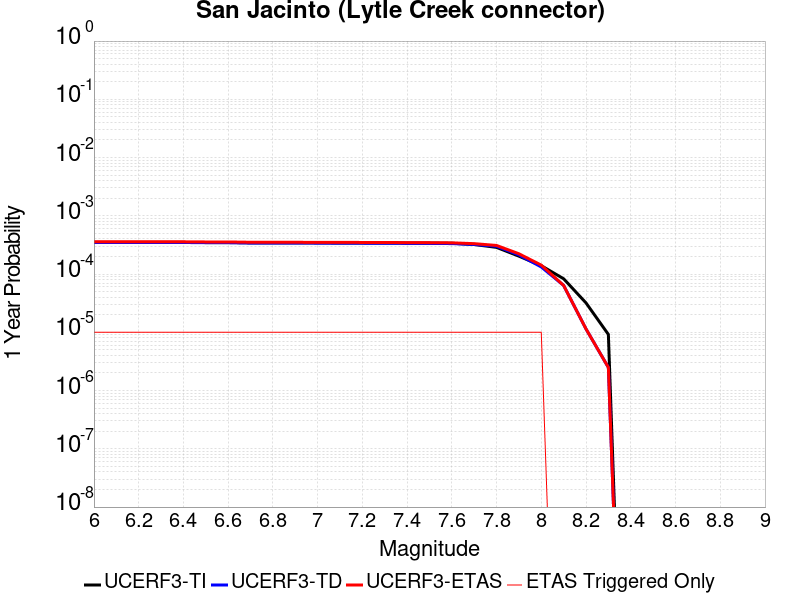 |  |

| Magnitude | 1 wk TI Prob | 1 wk TD Prob | 1 wk ETAS Prob | 1 wk ETAS/TD Gain | 1 wk ETAS Triggered Only | 1 mo TI Prob | 1 mo TD Prob | 1 mo ETAS Prob | 1 mo ETAS/TD Gain | 1 mo ETAS Triggered Only | 1 yr TI Prob | 1 yr TD Prob | 1 yr ETAS Prob | 1 yr ETAS/TD Gain | 1 yr ETAS Triggered Only | 10 yr TI Prob | 10 yr TD Prob | 10 yr ETAS Prob | 10 yr ETAS/TD Gain | 10 yr ETAS Triggered Only |
|-----|-----|-----|-----|-----|-----|-----|-----|-----|-----|-----|-----|-----|-----|-----|-----|-----|-----|-----|-----|-----|
| 6.0 | 6.693995E-6 | 6.6710027E-6 | 6.6710027E-6 | 1.0 | 0.0 | 2.8688235E-5 | 2.8589699E-5 | 2.8589699E-5 | 1.0 | 0.0 | 3.492233E-4 | 3.4802407E-4 | 3.4802407E-4 | 1.0 | 0.0 | 0.00348675 | 0.0035549873 | 0.003580534 | 1.0071862 | 2.5637739E-5 |
| 6.1 | 6.693995E-6 | 6.6710027E-6 | 6.6710027E-6 | 1.0 | 0.0 | 2.8688235E-5 | 2.8589699E-5 | 2.8589699E-5 | 1.0 | 0.0 | 3.492233E-4 | 3.4802407E-4 | 3.4802407E-4 | 1.0 | 0.0 | 0.00348675 | 0.0035549873 | 0.003580534 | 1.0071862 | 2.5637739E-5 |
| 6.2 | 6.693995E-6 | 6.6710027E-6 | 6.6710027E-6 | 1.0 | 0.0 | 2.8688235E-5 | 2.8589699E-5 | 2.8589699E-5 | 1.0 | 0.0 | 3.492233E-4 | 3.4802407E-4 | 3.4802407E-4 | 1.0 | 0.0 | 0.00348675 | 0.0035549873 | 0.003580534 | 1.0071862 | 2.5637739E-5 |
| 6.3 | 6.693995E-6 | 6.6710027E-6 | 6.6710027E-6 | 1.0 | 0.0 | 2.8688235E-5 | 2.8589699E-5 | 2.8589699E-5 | 1.0 | 0.0 | 3.492233E-4 | 3.4802407E-4 | 3.4802407E-4 | 1.0 | 0.0 | 0.00348675 | 0.0035549873 | 0.003580534 | 1.0071862 | 2.5637739E-5 |
| 6.4 | 6.693995E-6 | 6.6710027E-6 | 6.6710027E-6 | 1.0 | 0.0 | 2.8688235E-5 | 2.8589699E-5 | 2.8589699E-5 | 1.0 | 0.0 | 3.492233E-4 | 3.4802407E-4 | 3.4802407E-4 | 1.0 | 0.0 | 0.00348675 | 0.0035549873 | 0.003580534 | 1.0071862 | 2.5637739E-5 |
| 6.5 | 6.6561875E-6 | 6.63122E-6 | 6.63122E-6 | 1.0 | 0.0 | 2.8526205E-5 | 2.8419205E-5 | 2.8419205E-5 | 1.0 | 0.0 | 3.472512E-4 | 3.4594897E-4 | 3.4594897E-4 | 1.0 | 0.0 | 0.0034670907 | 0.0035343023 | 0.0035598495 | 1.0072284 | 2.5637739E-5 |
| 6.6 | 6.6561875E-6 | 6.63122E-6 | 6.63122E-6 | 1.0 | 0.0 | 2.8526205E-5 | 2.8419205E-5 | 2.8419205E-5 | 1.0 | 0.0 | 3.472512E-4 | 3.4594897E-4 | 3.4594897E-4 | 1.0 | 0.0 | 0.0034670907 | 0.0035343023 | 0.0035598495 | 1.0072284 | 2.5637739E-5 |
| 6.7 | 6.5802237E-6 | 6.550394E-6 | 6.550394E-6 | 1.0 | 0.0 | 2.8200653E-5 | 2.8072815E-5 | 2.8072815E-5 | 1.0 | 0.0 | 3.4328885E-4 | 3.41733E-4 | 3.41733E-4 | 1.0 | 0.0 | 0.0034275902 | 0.0034922757 | 0.0035178238 | 1.0073156 | 2.5637739E-5 |
| 6.8 | 6.575632E-6 | 6.544883E-6 | 6.544883E-6 | 1.0 | 0.0 | 2.8180975E-5 | 2.8049197E-5 | 2.8049197E-5 | 1.0 | 0.0 | 3.4304935E-4 | 3.4144553E-4 | 3.4144553E-4 | 1.0 | 0.0 | 0.0034252026 | 0.00348941 | 0.0035149583 | 1.0073217 | 2.5637739E-5 |
| 6.9 | 6.570433E-6 | 6.5362756E-6 | 6.5362756E-6 | 1.0 | 0.0 | 2.8158694E-5 | 2.801231E-5 | 2.801231E-5 | 1.0 | 0.0 | 3.4277816E-4 | 3.4099657E-4 | 3.4099657E-4 | 1.0 | 0.0 | 0.0034224992 | 0.0034849346 | 0.0035104828 | 1.0073311 | 2.5637739E-5 |
| 7.0 | 6.5643826E-6 | 6.526395E-6 | 6.526395E-6 | 1.0 | 0.0 | 2.8132765E-5 | 2.7969963E-5 | 2.7969963E-5 | 1.0 | 0.0 | 3.424626E-4 | 3.4048117E-4 | 3.4048117E-4 | 1.0 | 0.0 | 0.0034193532 | 0.0034797967 | 0.0035053452 | 1.007342 | 2.5637739E-5 |
| 7.1 | 6.557402E-6 | 6.515105E-6 | 6.515105E-6 | 1.0 | 0.0 | 2.8102848E-5 | 2.792158E-5 | 2.792158E-5 | 1.0 | 0.0 | 3.4209844E-4 | 3.3989229E-4 | 3.3989229E-4 | 1.0 | 0.0 | 0.0034157229 | 0.0034739273 | 0.003499476 | 1.0073544 | 2.5637739E-5 |
| 7.2 | 6.546394E-6 | 6.4970677E-6 | 6.4970677E-6 | 1.0 | 0.0 | 2.8055672E-5 | 2.784428E-5 | 2.784428E-5 | 1.0 | 0.0 | 3.4152428E-4 | 3.3895145E-4 | 3.3895145E-4 | 1.0 | 0.0 | 0.0034099987 | 0.0034645528 | 0.0034901015 | 1.0073744 | 2.5637739E-5 |
| 7.3 | 6.5364216E-6 | 6.477847E-6 | 6.477847E-6 | 1.0 | 0.0 | 2.8012933E-5 | 2.7761906E-5 | 2.7761906E-5 | 1.0 | 0.0 | 3.4100408E-4 | 3.3794885E-4 | 3.3794885E-4 | 1.0 | 0.0 | 0.003404813 | 0.003454571 | 0.00348012 | 1.0073957 | 2.5637739E-5 |
| 7.4 | 6.5269523E-6 | 6.4589262E-6 | 6.4589262E-6 | 1.0 | 0.0 | 2.7972354E-5 | 2.7680819E-5 | 2.7680819E-5 | 1.0 | 0.0 | 3.4051016E-4 | 3.3696194E-4 | 3.3696194E-4 | 1.0 | 0.0 | 0.0033998888 | 0.003444749 | 0.0034702984 | 1.007417 | 2.5637739E-5 |
| 7.5 | 6.5111835E-6 | 6.435192E-6 | 6.435192E-6 | 1.0 | 0.0 | 2.7904773E-5 | 2.7579103E-5 | 2.7579103E-5 | 1.0 | 0.0 | 3.3968766E-4 | 3.3572392E-4 | 3.3572392E-4 | 1.0 | 0.0 | 0.0033916887 | 0.003432418 | 0.0034579677 | 1.0074437 | 2.5637739E-5 |
| 7.6 | 6.4768806E-6 | 6.3942884E-6 | 6.3942884E-6 | 1.0 | 0.0 | 2.7757764E-5 | 2.7403805E-5 | 2.7403805E-5 | 1.0 | 0.0 | 3.3789838E-4 | 3.3359032E-4 | 3.3359032E-4 | 1.0 | 0.0 | 0.0033738504 | 0.0034111436 | 0.003436694 | 1.0074903 | 2.5637739E-5 |
| 7.7 | 6.1655364E-6 | 6.1866886E-6 | 6.1866886E-6 | 1.0 | 0.0 | 2.642346E-5 | 2.651411E-5 | 2.651411E-5 | 1.0 | 0.0 | 3.2165812E-4 | 3.2276154E-4 | 3.2276154E-4 | 1.0 | 0.0 | 0.0032119295 | 0.0033027146 | 0.0033282677 | 1.007737 | 2.5637739E-5 |
| 7.8 | 5.5043524E-6 | 5.747449E-6 | 5.747449E-6 | 1.0 | 0.0 | 2.3589868E-5 | 2.4631692E-5 | 2.4631692E-5 | 1.0 | 0.0 | 2.871688E-4 | 2.9984963E-4 | 2.9984963E-4 | 1.0 | 0.0 | 0.0028679797 | 0.0030726613 | 0.0030982203 | 1.0083182 | 2.5637739E-5 |
| 7.9 | 3.889249E-6 | 4.0851965E-6 | 4.0851965E-6 | 1.0 | 0.0 | 1.6668104E-5 | 1.7507866E-5 | 1.7507866E-5 | 1.0 | 0.0 | 2.0291525E-4 | 2.1313746E-4 | 2.1313746E-4 | 1.0 | 0.0 | 0.0020273007 | 0.0021987387 | 0.00222432 | 1.0116346 | 2.5637739E-5 |
| 8.0 | 2.668535E-6 | 2.537347E-6 | 2.537347E-6 | 1.0 | 0.0 | 1.1436528E-5 | 1.0874299E-5 | 1.0874299E-5 | 1.0 | 0.0 | 1.3923083E-4 | 1.3238657E-4 | 1.3238657E-4 | 1.0 | 0.0 | 0.0013914363 | 0.0013788831 | 0.0013788831 | 1.0 | 0.0 |
| 8.1 | 1.5911459E-6 | 1.2217948E-6 | 1.2217948E-6 | 1.0 | 0.0 | 6.8191785E-6 | 5.2362534E-6 | 5.2362534E-6 | 1.0 | 0.0 | 8.3020335E-5 | 6.374954E-5 | 6.374954E-5 | 1.0 | 0.0 | 8.298933E-4 | 6.7100645E-4 | 6.7100645E-4 | 1.0 | 0.0 |
| 8.2 | 6.1294963E-7 | 2.1905348E-7 | 2.1905348E-7 | 1.0 | 0.0 | 2.6269242E-6 | 9.3880027E-7 | 9.3880027E-7 | 1.0 | 0.0 | 3.1982334E-5 | 1.1429834E-5 | 1.1429834E-5 | 1.0 | 0.0 | 3.1977732E-4 | 1.2836853E-4 | 1.2836853E-4 | 1.0 | 0.0 |
| 8.3 | 1.762871E-7 | 4.7785655E-8 | 4.7785655E-8 | 1.0 | 0.0 | 7.5551594E-7 | 2.0479564E-7 | 2.0479564E-7 | 1.0 | 0.0 | 9.1983675E-6 | 2.4933843E-6 | 2.4933843E-6 | 1.0 | 0.0 | 9.197987E-5 | 2.8824745E-5 | 2.8824745E-5 | 1.0 | 0.0 |

## Elsinore (Coyote Mountains)
*[(top)](#table-of-contents)*

| 1 Week | 1 Month | 1 Year | 10 Year |
|-----|-----|-----|-----|
| 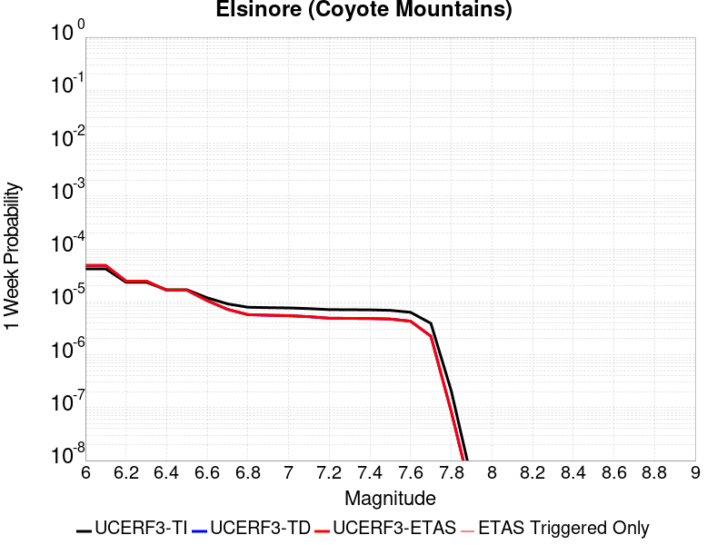 |  |  | 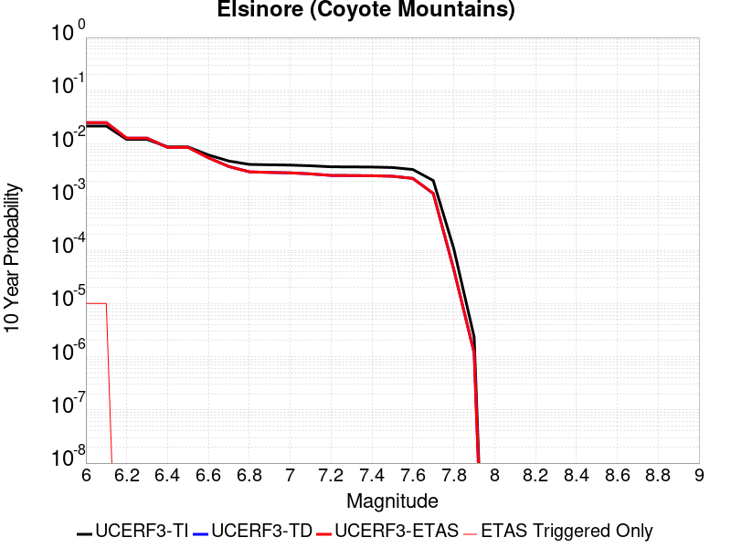 |

| Magnitude | 1 wk TI Prob | 1 wk TD Prob | 1 wk ETAS Prob | 1 wk ETAS/TD Gain | 1 wk ETAS Triggered Only | 1 mo TI Prob | 1 mo TD Prob | 1 mo ETAS Prob | 1 mo ETAS/TD Gain | 1 mo ETAS Triggered Only | 1 yr TI Prob | 1 yr TD Prob | 1 yr ETAS Prob | 1 yr ETAS/TD Gain | 1 yr ETAS Triggered Only | 10 yr TI Prob | 10 yr TD Prob | 10 yr ETAS Prob | 10 yr ETAS/TD Gain | 10 yr ETAS Triggered Only |
|-----|-----|-----|-----|-----|-----|-----|-----|-----|-----|-----|-----|-----|-----|-----|-----|-----|-----|-----|-----|-----|
| 6.0 | 4.20513E-5 | 4.8638663E-5 | 4.8638663E-5 | 1.0 | 0.0 | 1.8020741E-4 | 2.0843801E-4 | 2.0843801E-4 | 1.0 | 0.0 | 0.0021918174 | 0.002535353 | 0.0025609257 | 1.0100864 | 2.5637739E-5 | 0.021703249 | 0.025114654 | 0.025139648 | 1.0009952 | 2.5637739E-5 |
| 6.1 | 4.20513E-5 | 4.8638663E-5 | 4.8638663E-5 | 1.0 | 0.0 | 1.8020741E-4 | 2.0843801E-4 | 2.0843801E-4 | 1.0 | 0.0 | 0.0021918174 | 0.002535353 | 0.0025609257 | 1.0100864 | 2.5637739E-5 | 0.021703249 | 0.025114654 | 0.025139648 | 1.0009952 | 2.5637739E-5 |
| 6.2 | 2.3413893E-5 | 2.4698767E-5 | 2.4698767E-5 | 1.0 | 0.0 | 1.0034139E-4 | 1.0584811E-4 | 1.0584811E-4 | 1.0 | 0.0 | 0.0012209718 | 0.0012880323 | 0.0012880323 | 1.0 | 0.0 | 0.012142851 | 0.0128142275 | 0.0128142275 | 1.0 | 0.0 |
| 6.3 | 2.3413893E-5 | 2.4698767E-5 | 2.4698767E-5 | 1.0 | 0.0 | 1.0034139E-4 | 1.0584811E-4 | 1.0584811E-4 | 1.0 | 0.0 | 0.0012209718 | 0.0012880323 | 0.0012880323 | 1.0 | 0.0 | 0.012142851 | 0.0128142275 | 0.0128142275 | 1.0 | 0.0 |
| 6.4 | 1.6894814E-5 | 1.6570395E-5 | 1.6570395E-5 | 1.0 | 0.0 | 7.240433E-5 | 7.101426E-5 | 7.101426E-5 | 1.0 | 0.0 | 8.811662E-4 | 8.642923E-4 | 8.642923E-4 | 1.0 | 0.0 | 0.0087768035 | 0.008612989 | 0.008612989 | 1.0 | 0.0 |
| 6.5 | 1.6894814E-5 | 1.6570395E-5 | 1.6570395E-5 | 1.0 | 0.0 | 7.240433E-5 | 7.101426E-5 | 7.101426E-5 | 1.0 | 0.0 | 8.811662E-4 | 8.642923E-4 | 8.642923E-4 | 1.0 | 0.0 | 0.0087768035 | 0.008612989 | 0.008612989 | 1.0 | 0.0 |
| 6.6 | 1.1910969E-5 | 1.0532126E-5 | 1.0532126E-5 | 1.0 | 0.0 | 5.1046012E-5 | 4.5136978E-5 | 4.5136978E-5 | 1.0 | 0.0 | 6.21308E-4 | 5.494154E-4 | 5.494154E-4 | 1.0 | 0.0 | 0.0061957375 | 0.0054818755 | 0.0054818755 | 1.0 | 0.0 |
| 6.7 | 9.1486E-6 | 7.2038497E-6 | 7.2038497E-6 | 1.0 | 0.0 | 3.9207694E-5 | 3.08733E-5 | 3.08733E-5 | 1.0 | 0.0 | 4.7724912E-4 | 3.758214E-4 | 3.758214E-4 | 1.0 | 0.0 | 0.0047622547 | 0.0037522377 | 0.0037522377 | 1.0 | 0.0 |
| 6.8 | 7.90441E-6 | 5.7298735E-6 | 5.7298735E-6 | 1.0 | 0.0 | 3.3875604E-5 | 2.4556377E-5 | 2.4556377E-5 | 1.0 | 0.0 | 4.1235742E-4 | 2.9893414E-4 | 2.9893414E-4 | 1.0 | 0.0 | 0.0041159308 | 0.002985449 | 0.002985449 | 1.0 | 0.0 |
| 6.9 | 7.77015E-6 | 5.583821E-6 | 5.583821E-6 | 1.0 | 0.0 | 3.3300217E-5 | 2.3930448E-5 | 2.3930448E-5 | 1.0 | 0.0 | 4.0535472E-4 | 2.9131552E-4 | 2.9131552E-4 | 1.0 | 0.0 | 0.004046161 | 0.0029094636 | 0.0029094636 | 1.0 | 0.0 |
| 7.0 | 7.675798E-6 | 5.480674E-6 | 5.480674E-6 | 1.0 | 0.0 | 3.289586E-5 | 2.3488401E-5 | 2.3488401E-5 | 1.0 | 0.0 | 4.004335E-4 | 2.85935E-4 | 2.85935E-4 | 1.0 | 0.0 | 0.003997127 | 0.0028557975 | 0.0028557975 | 1.0 | 0.0 |
| 7.1 | 7.447814E-6 | 5.2395403E-6 | 5.2395403E-6 | 1.0 | 0.0 | 3.191881E-5 | 2.2454986E-5 | 2.2454986E-5 | 1.0 | 0.0 | 3.8854225E-4 | 2.7335642E-4 | 2.7335642E-4 | 1.0 | 0.0 | 0.003878636 | 0.002730326 | 0.002730326 | 1.0 | 0.0 |
| 7.2 | 7.128185E-6 | 4.9061937E-6 | 4.9061937E-6 | 1.0 | 0.0 | 3.0549007E-5 | 2.1026382E-5 | 2.1026382E-5 | 1.0 | 0.0 | 3.7187067E-4 | 2.5596732E-4 | 2.5596732E-4 | 1.0 | 0.0 | 0.00371249 | 0.0025568435 | 0.0025568435 | 1.0 | 0.0 |
| 7.3 | 7.0913875E-6 | 4.8748675E-6 | 4.8748675E-6 | 1.0 | 0.0 | 3.0391306E-5 | 2.0892128E-5 | 2.0892128E-5 | 1.0 | 0.0 | 3.6995133E-4 | 2.5433316E-4 | 2.5433316E-4 | 1.0 | 0.0 | 0.0036933604 | 0.0025405393 | 0.0025405393 | 1.0 | 0.0 |
| 7.4 | 7.051521E-6 | 4.838718E-6 | 4.838718E-6 | 1.0 | 0.0 | 3.0220453E-5 | 2.0737203E-5 | 2.0737203E-5 | 1.0 | 0.0 | 3.6787192E-4 | 2.5244738E-4 | 2.5244738E-4 | 1.0 | 0.0 | 0.0036726352 | 0.0025217244 | 0.0025217244 | 1.0 | 0.0 |
| 7.5 | 6.910666E-6 | 4.7341928E-6 | 4.7341928E-6 | 1.0 | 0.0 | 2.9616802E-5 | 2.0289246E-5 | 2.0289246E-5 | 1.0 | 0.0 | 3.605249E-4 | 2.4699475E-4 | 2.4699475E-4 | 1.0 | 0.0 | 0.0035994058 | 0.0024673205 | 0.0024673205 | 1.0 | 0.0 |
| 7.6 | 6.341753E-6 | 4.3072587E-6 | 4.3072587E-6 | 1.0 | 0.0 | 2.7178658E-5 | 1.8459556E-5 | 1.8459556E-5 | 1.0 | 0.0 | 3.3084993E-4 | 2.2472307E-4 | 2.2472307E-4 | 1.0 | 0.0 | 0.0033035777 | 0.0022450737 | 0.0022450737 | 1.0 | 0.0 |
| 7.7 | 3.9205916E-6 | 2.2443742E-6 | 2.2443742E-6 | 1.0 | 0.0 | 1.6802427E-5 | 9.618715E-6 | 9.618715E-6 | 1.0 | 0.0 | 2.0455034E-4 | 1.171023E-4 | 1.171023E-4 | 1.0 | 0.0 | 0.0020436216 | 0.001170479 | 0.001170479 | 1.0 | 0.0 |
| 7.8 | 2.0846227E-7 | 8.488185E-8 | 8.488185E-8 | 1.0 | 0.0 | 8.9340944E-7 | 3.637793E-7 | 3.637793E-7 | 1.0 | 0.0 | 1.0877206E-5 | 4.4290073E-6 | 4.4290073E-6 | 1.0 | 0.0 | 1.0876673E-4 | 4.4289518E-5 | 4.4289518E-5 | 1.0 | 0.0 |
| 7.9 | 4.4969806E-9 | 2.2695175E-9 | 2.2695175E-9 | 1.0 | 0.0 | 1.9272775E-8 | 9.726504E-9 | 9.726504E-9 | 1.0 | 0.0 | 2.3464601E-7 | 1.18420175E-7 | 1.18420175E-7 | 1.0 | 0.0 | 2.3464577E-6 | 1.1842012E-6 | 1.1842012E-6 | 1.0 | 0.0 |

## Bennett Valley 2011 CFM
*[(top)](#table-of-contents)*

| 1 Week | 1 Month | 1 Year | 10 Year |
|-----|-----|-----|-----|
|  |  |  |  |

| Magnitude | 1 wk TI Prob | 1 wk TD Prob | 1 wk ETAS Prob | 1 wk ETAS/TD Gain | 1 wk ETAS Triggered Only | 1 mo TI Prob | 1 mo TD Prob | 1 mo ETAS Prob | 1 mo ETAS/TD Gain | 1 mo ETAS Triggered Only | 1 yr TI Prob | 1 yr TD Prob | 1 yr ETAS Prob | 1 yr ETAS/TD Gain | 1 yr ETAS Triggered Only | 10 yr TI Prob | 10 yr TD Prob | 10 yr ETAS Prob | 10 yr ETAS/TD Gain | 10 yr ETAS Triggered Only |
|-----|-----|-----|-----|-----|-----|-----|-----|-----|-----|-----|-----|-----|-----|-----|-----|-----|-----|-----|-----|-----|
| 6.0 | 2.3893934E-5 | 2.8241704E-5 | 2.8241704E-5 | 1.0 | 0.0 | 1.0239855E-4 | 1.210313E-4 | 1.210313E-4 | 1.0 | 0.0 | 0.0012459893 | 0.001472745 | 0.001472745 | 1.0 | 0.0 | 0.012390262 | 0.014652503 | 0.014677765 | 1.0017241 | 2.5637739E-5 |
| 6.1 | 2.3893934E-5 | 2.8241704E-5 | 2.8241704E-5 | 1.0 | 0.0 | 1.0239855E-4 | 1.210313E-4 | 1.210313E-4 | 1.0 | 0.0 | 0.0012459893 | 0.001472745 | 0.001472745 | 1.0 | 0.0 | 0.012390262 | 0.014652503 | 0.014677765 | 1.0017241 | 2.5637739E-5 |
| 6.2 | 1.6657146E-5 | 1.9855883E-5 | 1.9855883E-5 | 1.0 | 0.0 | 7.138582E-5 | 8.509466E-5 | 8.509466E-5 | 1.0 | 0.0 | 8.6877577E-4 | 0.0010356767 | 0.0010356767 | 1.0 | 0.0 | 0.008653872 | 0.010326771 | 0.010326771 | 1.0 | 0.0 |
| 6.3 | 1.6657146E-5 | 1.9855883E-5 | 1.9855883E-5 | 1.0 | 0.0 | 7.138582E-5 | 8.509466E-5 | 8.509466E-5 | 1.0 | 0.0 | 8.6877577E-4 | 0.0010356767 | 0.0010356767 | 1.0 | 0.0 | 0.008653872 | 0.010326771 | 0.010326771 | 1.0 | 0.0 |
| 6.4 | 1.29418495E-5 | 1.5569252E-5 | 1.5569252E-5 | 1.0 | 0.0 | 5.546389E-5 | 6.6724395E-5 | 6.6724395E-5 | 1.0 | 0.0 | 6.7506364E-4 | 8.1219705E-4 | 8.1219705E-4 | 1.0 | 0.0 | 0.0067301663 | 0.008109432 | 0.008109432 | 1.0 | 0.0 |
| 6.5 | 1.2582504E-5 | 1.51362465E-5 | 1.51362465E-5 | 1.0 | 0.0 | 5.39239E-5 | 6.486875E-5 | 6.486875E-5 | 1.0 | 0.0 | 6.563257E-4 | 7.896211E-4 | 7.896211E-4 | 1.0 | 0.0 | 0.006543907 | 0.007885315 | 0.007885315 | 1.0 | 0.0 |
| 6.6 | 1.0846706E-5 | 1.3038316E-5 | 1.3038316E-5 | 1.0 | 0.0 | 4.6485053E-5 | 5.5878027E-5 | 5.5878027E-5 | 1.0 | 0.0 | 5.6580856E-4 | 6.8023097E-4 | 6.8023097E-4 | 1.0 | 0.0 | 0.005643701 | 0.0067984806 | 0.0067984806 | 1.0 | 0.0 |
| 6.7 | 1.6803231E-6 | 2.3785226E-6 | 2.3785226E-6 | 1.0 | 0.0 | 7.2013645E-6 | 1.0193628E-5 | 1.0193628E-5 | 1.0 | 0.0 | 8.7673085E-5 | 1.241005E-4 | 1.241005E-4 | 1.0 | 0.0 | 8.76385E-4 | 0.0012447466 | 0.0012447466 | 1.0 | 0.0 |
| 6.8 | 1.4609833E-6 | 2.094572E-6 | 2.094572E-6 | 1.0 | 0.0 | 6.261342E-6 | 8.976706E-6 | 8.976706E-6 | 1.0 | 0.0 | 7.6229175E-5 | 1.0928598E-4 | 1.0928598E-4 | 1.0 | 0.0 | 7.620303E-4 | 0.0010967137 | 0.0010967137 | 1.0 | 0.0 |
| 6.9 | 1.3492396E-6 | 1.9465033E-6 | 1.9465033E-6 | 1.0 | 0.0 | 5.7824427E-6 | 8.342131E-6 | 8.342131E-6 | 1.0 | 0.0 | 7.0398964E-5 | 1.0156077E-4 | 1.0156077E-4 | 1.0 | 0.0 | 7.037667E-4 | 0.0010195051 | 0.0010195051 | 1.0 | 0.0 |
| 7.0 | 1.2347921E-6 | 1.7894824E-6 | 1.7894824E-6 | 1.0 | 0.0 | 5.291955E-6 | 7.669189E-6 | 7.669189E-6 | 1.0 | 0.0 | 6.442765E-5 | 9.336842E-5 | 9.336842E-5 | 1.0 | 0.0 | 6.440897E-4 | 9.376385E-4 | 9.376385E-4 | 1.0 | 0.0 |
| 7.1 | 1.1262973E-6 | 1.6364918E-6 | 1.6364918E-6 | 1.0 | 0.0 | 4.8269794E-6 | 7.013518E-6 | 7.013518E-6 | 1.0 | 0.0 | 5.876689E-5 | 8.538629E-5 | 8.538629E-5 | 1.0 | 0.0 | 5.875135E-4 | 8.578582E-4 | 8.578582E-4 | 1.0 | 0.0 |
| 7.2 | 9.351744E-7 | 1.3617328E-6 | 1.3617328E-6 | 1.0 | 0.0 | 4.007884E-6 | 5.835984E-6 | 5.835984E-6 | 1.0 | 0.0 | 4.8794896E-5 | 7.105082E-5 | 7.105082E-5 | 1.0 | 0.0 | 4.878418E-4 | 7.1455166E-4 | 7.1455166E-4 | 1.0 | 0.0 |
| 7.3 | 8.5039534E-7 | 1.2391943E-6 | 1.2391943E-6 | 1.0 | 0.0 | 3.6445463E-6 | 5.310822E-6 | 5.310822E-6 | 1.0 | 0.0 | 4.437145E-5 | 6.465736E-5 | 6.465736E-5 | 1.0 | 0.0 | 4.436259E-4 | 6.5036706E-4 | 6.5036706E-4 | 1.0 | 0.0 |
| 7.4 | 6.7875015E-7 | 9.604516E-7 | 9.604516E-7 | 1.0 | 0.0 | 2.908926E-6 | 4.116215E-6 | 4.116215E-6 | 1.0 | 0.0 | 3.54156E-5 | 5.0113777E-5 | 5.0113777E-5 | 1.0 | 0.0 | 3.5409955E-4 | 5.043087E-4 | 5.043087E-4 | 1.0 | 0.0 |
| 7.5 | 5.826867E-7 | 8.191633E-7 | 8.191633E-7 | 1.0 | 0.0 | 2.4972264E-6 | 3.510695E-6 | 3.510695E-6 | 1.0 | 0.0 | 3.0403306E-5 | 4.274188E-5 | 4.274188E-5 | 1.0 | 0.0 | 3.0399146E-4 | 4.3019673E-4 | 4.3019673E-4 | 1.0 | 0.0 |
| 7.6 | 2.7734902E-7 | 3.6836647E-7 | 3.6836647E-7 | 1.0 | 0.0 | 1.1886381E-6 | 1.5787125E-6 | 1.5787125E-6 | 1.0 | 0.0 | 1.4471572E-5 | 1.9220655E-5 | 1.9220655E-5 | 1.0 | 0.0 | 1.447063E-4 | 1.9319801E-4 | 1.9319801E-4 | 1.0 | 0.0 |
| 7.7 | 1.0530888E-7 | 1.3757607E-7 | 1.3757607E-7 | 1.0 | 0.0 | 4.513237E-7 | 5.896116E-7 | 5.896116E-7 | 1.0 | 0.0 | 5.4948523E-6 | 7.1784975E-6 | 7.1784975E-6 | 1.0 | 0.0 | 5.4947162E-5 | 7.260757E-5 | 7.260757E-5 | 1.0 | 0.0 |
| 7.8 | 1.2714258E-8 | 1.9661249E-8 | 1.9661249E-8 | 1.0 | 0.0 | 5.448968E-8 | 8.426249E-8 | 8.426249E-8 | 1.0 | 0.0 | 6.6341164E-7 | 1.0258954E-6 | 1.0258954E-6 | 1.0 | 0.0 | 6.6340967E-6 | 1.0672463E-5 | 1.0672463E-5 | 1.0 | 0.0 |
| 7.9 | 4.075888E-9 | 7.576082E-9 | 7.576082E-9 | 1.0 | 0.0 | 1.7468091E-8 | 3.246892E-8 | 3.246892E-8 | 1.0 | 0.0 | 2.12674E-7 | 3.9530903E-7 | 3.9530903E-7 | 1.0 | 0.0 | 2.1267379E-6 | 4.2029656E-6 | 4.2029656E-6 | 1.0 | 0.0 |
| 8.0 | 1.9126138E-9 | 4.003808E-9 | 4.003808E-9 | 1.0 | 0.0 | 8.196917E-9 | 1.7159175E-8 | 1.7159175E-8 | 1.0 | 0.0 | 9.9797454E-8 | 2.0891295E-7 | 2.0891295E-7 | 1.0 | 0.0 | 9.979741E-7 | 2.2020392E-6 | 2.2020392E-6 | 1.0 | 0.0 |

## Cerro Prieto
*[(top)](#table-of-contents)*

| 1 Week | 1 Month | 1 Year | 10 Year |
|-----|-----|-----|-----|
|  |  |  |  |

| Magnitude | 1 wk TI Prob | 1 wk TD Prob | 1 wk ETAS Prob | 1 wk ETAS/TD Gain | 1 wk ETAS Triggered Only | 1 mo TI Prob | 1 mo TD Prob | 1 mo ETAS Prob | 1 mo ETAS/TD Gain | 1 mo ETAS Triggered Only | 1 yr TI Prob | 1 yr TD Prob | 1 yr ETAS Prob | 1 yr ETAS/TD Gain | 1 yr ETAS Triggered Only | 10 yr TI Prob | 10 yr TD Prob | 10 yr ETAS Prob | 10 yr ETAS/TD Gain | 10 yr ETAS Triggered Only |
|-----|-----|-----|-----|-----|-----|-----|-----|-----|-----|-----|-----|-----|-----|-----|-----|-----|-----|-----|-----|-----|
| 6.0 | 2.9101528E-4 | 5.9692067E-4 | 5.9692067E-4 | 1.0 | 0.0 | 0.0012466122 | 0.0025559657 | 0.0025559657 | 1.0 | 0.0 | 0.015072231 | 0.030669998 | 0.030669998 | 1.0 | 0.0 | 0.14089979 | 0.25411007 | 0.2541292 | 1.0000752 | 2.5637739E-5 |
| 6.1 | 2.9101528E-4 | 5.9692067E-4 | 5.9692067E-4 | 1.0 | 0.0 | 0.0012466122 | 0.0025559657 | 0.0025559657 | 1.0 | 0.0 | 0.015072231 | 0.030669998 | 0.030669998 | 1.0 | 0.0 | 0.14089979 | 0.25411007 | 0.2541292 | 1.0000752 | 2.5637739E-5 |
| 6.2 | 2.9101528E-4 | 5.9692067E-4 | 5.9692067E-4 | 1.0 | 0.0 | 0.0012466122 | 0.0025559657 | 0.0025559657 | 1.0 | 0.0 | 0.015072231 | 0.030669998 | 0.030669998 | 1.0 | 0.0 | 0.14089979 | 0.25411007 | 0.2541292 | 1.0000752 | 2.5637739E-5 |
| 6.3 | 2.9101528E-4 | 5.9692067E-4 | 5.9692067E-4 | 1.0 | 0.0 | 0.0012466122 | 0.0025559657 | 0.0025559657 | 1.0 | 0.0 | 0.015072231 | 0.030669998 | 0.030669998 | 1.0 | 0.0 | 0.14089979 | 0.25411007 | 0.2541292 | 1.0000752 | 2.5637739E-5 |
| 6.4 | 2.508648E-4 | 5.143929E-4 | 5.143929E-4 | 1.0 | 0.0 | 0.0010746918 | 0.0022028775 | 0.0022028775 | 1.0 | 0.0 | 0.013006088 | 0.02649131 | 0.02649131 | 1.0 | 0.0 | 0.12270685 | 0.22453524 | 0.22455512 | 1.0000886 | 2.5637739E-5 |
| 6.5 | 2.508648E-4 | 5.143929E-4 | 5.143929E-4 | 1.0 | 0.0 | 0.0010746918 | 0.0022028775 | 0.0022028775 | 1.0 | 0.0 | 0.013006088 | 0.02649131 | 0.02649131 | 1.0 | 0.0 | 0.12270685 | 0.22453524 | 0.22455512 | 1.0000886 | 2.5637739E-5 |
| 6.6 | 2.294914E-4 | 4.715732E-4 | 4.715732E-4 | 1.0 | 0.0 | 9.831638E-4 | 0.0020196505 | 0.0020196505 | 1.0 | 0.0 | 0.011904482 | 0.024317956 | 0.024317956 | 1.0 | 0.0 | 0.11286586 | 0.2087159 | 0.2087362 | 1.0000972 | 2.5637739E-5 |
| 6.7 | 1.9621674E-4 | 4.0457462E-4 | 4.0457462E-4 | 1.0 | 0.0 | 8.4065786E-4 | 0.0017328978 | 0.0017328978 | 1.0 | 0.0 | 0.010187071 | 0.020903941 | 0.020903941 | 1.0 | 0.0 | 0.09732539 | 0.18303102 | 0.18305196 | 1.0001144 | 2.5637739E-5 |
| 6.8 | 1.5476145E-4 | 3.059677E-4 | 3.059677E-4 | 1.0 | 0.0 | 6.6309475E-4 | 0.0013107335 | 0.0013107335 | 1.0 | 0.0 | 0.008043335 | 0.015853675 | 0.015853675 | 1.0 | 0.0 | 0.07758363 | 0.14347729 | 0.14349924 | 1.0001531 | 2.5637739E-5 |
| 6.9 | 1.20509176E-4 | 2.2608276E-4 | 2.2608276E-4 | 1.0 | 0.0 | 5.1636563E-4 | 9.686297E-4 | 9.686297E-4 | 1.0 | 0.0 | 0.006268645 | 0.011739796 | 0.011739796 | 1.0 | 0.0 | 0.060947374 | 0.10954975 | 0.10957258 | 1.0002084 | 2.5637739E-5 |
| 7.0 | 9.3269155E-5 | 1.6737288E-4 | 1.6737288E-4 | 1.0 | 0.0 | 3.9966372E-4 | 7.171584E-4 | 7.171584E-4 | 1.0 | 0.0 | 0.0048550544 | 0.0087041175 | 0.0087041175 | 1.0 | 0.0 | 0.04750344 | 0.08324219 | 0.08326569 | 1.0002824 | 2.5637739E-5 |
| 7.1 | 5.029709E-5 | 8.183576E-5 | 8.183576E-5 | 1.0 | 0.0 | 2.1554115E-4 | 3.5069685E-4 | 3.5069685E-4 | 1.0 | 0.0 | 0.0026210553 | 0.0042647994 | 0.0042647994 | 1.0 | 0.0 | 0.025903556 | 0.04241657 | 0.04244112 | 1.0005788 | 2.5637739E-5 |
| 7.2 | 6.5445185E-8 | 6.838605E-8 | 6.838605E-8 | 1.0 | 0.0 | 2.8047933E-7 | 2.9308308E-7 | 2.9308308E-7 | 1.0 | 0.0 | 3.4148304E-6 | 3.5682863E-6 | 3.5682863E-6 | 1.0 | 0.0 | 3.414778E-5 | 3.5682864E-5 | 3.5682864E-5 | 1.0 | 0.0 |

## Chino alt 1
*[(top)](#table-of-contents)*

| 1 Week | 1 Month | 1 Year | 10 Year |
|-----|-----|-----|-----|
|  |  |  |  |

| Magnitude | 1 wk TI Prob | 1 wk TD Prob | 1 wk ETAS Prob | 1 wk ETAS/TD Gain | 1 wk ETAS Triggered Only | 1 mo TI Prob | 1 mo TD Prob | 1 mo ETAS Prob | 1 mo ETAS/TD Gain | 1 mo ETAS Triggered Only | 1 yr TI Prob | 1 yr TD Prob | 1 yr ETAS Prob | 1 yr ETAS/TD Gain | 1 yr ETAS Triggered Only | 10 yr TI Prob | 10 yr TD Prob | 10 yr ETAS Prob | 10 yr ETAS/TD Gain | 10 yr ETAS Triggered Only |
|-----|-----|-----|-----|-----|-----|-----|-----|-----|-----|-----|-----|-----|-----|-----|-----|-----|-----|-----|-----|-----|
| 6.0 | 3.939946E-5 | 4.8955757E-5 | 4.8955757E-5 | 1.0 | 0.0 | 1.6884391E-4 | 2.0979645E-4 | 2.0979645E-4 | 1.0 | 0.0 | 0.0020537362 | 0.0025517642 | 0.0025773365 | 1.0100214 | 2.5637739E-5 | 0.020348595 | 0.025281483 | 0.025306473 | 1.0009885 | 2.5637739E-5 |
| 6.1 | 2.1505624E-5 | 2.6883481E-5 | 2.6883481E-5 | 1.0 | 0.0 | 9.2163704E-5 | 1.1521046E-4 | 1.1521046E-4 | 1.0 | 0.0 | 0.0011215154 | 0.0014018962 | 0.0014018962 | 1.0 | 0.0 | 0.011158722 | 0.013947416 | 0.013947416 | 1.0 | 0.0 |
| 6.2 | 2.1505624E-5 | 2.6883481E-5 | 2.6883481E-5 | 1.0 | 0.0 | 9.2163704E-5 | 1.1521046E-4 | 1.1521046E-4 | 1.0 | 0.0 | 0.0011215154 | 0.0014018962 | 0.0014018962 | 1.0 | 0.0 | 0.011158722 | 0.013947416 | 0.013947416 | 1.0 | 0.0 |
| 6.3 | 1.4290785E-5 | 1.816862E-5 | 1.816862E-5 | 1.0 | 0.0 | 6.1244784E-5 | 7.786344E-5 | 7.786344E-5 | 1.0 | 0.0 | 7.454001E-4 | 9.4762055E-4 | 9.4762055E-4 | 1.0 | 0.0 | 0.007429048 | 0.009446246 | 0.009446246 | 1.0 | 0.0 |
| 6.4 | 1.4290785E-5 | 1.816862E-5 | 1.816862E-5 | 1.0 | 0.0 | 6.1244784E-5 | 7.786344E-5 | 7.786344E-5 | 1.0 | 0.0 | 7.454001E-4 | 9.4762055E-4 | 9.4762055E-4 | 1.0 | 0.0 | 0.007429048 | 0.009446246 | 0.009446246 | 1.0 | 0.0 |
| 6.5 | 1.3017944E-5 | 1.665543E-5 | 1.665543E-5 | 1.0 | 0.0 | 5.5789995E-5 | 7.13787E-5 | 7.13787E-5 | 1.0 | 0.0 | 6.790315E-4 | 8.6873304E-4 | 8.6873304E-4 | 1.0 | 0.0 | 0.0067696036 | 0.00866366 | 0.00866366 | 1.0 | 0.0 |
| 6.6 | 9.470016E-6 | 1.2041898E-5 | 1.2041898E-5 | 1.0 | 0.0 | 4.058515E-5 | 5.1607305E-5 | 5.1607305E-5 | 1.0 | 0.0 | 4.940122E-4 | 6.281718E-4 | 6.281718E-4 | 1.0 | 0.0 | 0.004929154 | 0.006273171 | 0.006273171 | 1.0 | 0.0 |
| 6.7 | 8.314155E-6 | 1.0409905E-5 | 1.0409905E-5 | 1.0 | 0.0 | 3.5631605E-5 | 4.46133E-5 | 4.46133E-5 | 1.0 | 0.0 | 4.3372845E-4 | 5.430638E-4 | 5.430638E-4 | 1.0 | 0.0 | 0.004328829 | 0.005426893 | 0.005426893 | 1.0 | 0.0 |
| 6.8 | 3.4856364E-6 | 3.8139801E-6 | 3.8139801E-6 | 1.0 | 0.0 | 1.4938357E-5 | 1.6345539E-5 | 1.6345539E-5 | 1.0 | 0.0 | 1.8185932E-4 | 1.9899083E-4 | 1.9899083E-4 | 1.0 | 0.0 | 0.0018171056 | 0.001989803 | 0.001989803 | 1.0 | 0.0 |
| 6.9 | 2.2645952E-6 | 2.1532328E-6 | 2.1532328E-6 | 1.0 | 0.0 | 9.705372E-6 | 9.228109E-6 | 9.228109E-6 | 1.0 | 0.0 | 1.18156495E-4 | 1.1234665E-4 | 1.1234665E-4 | 1.0 | 0.0 | 0.0011809369 | 0.0011235146 | 0.0011235146 | 1.0 | 0.0 |
| 7.0 | 1.7864003E-6 | 1.5433379E-6 | 1.5433379E-6 | 1.0 | 0.0 | 7.655979E-6 | 6.6142893E-6 | 6.6142893E-6 | 1.0 | 0.0 | 9.3207556E-5 | 8.052605E-5 | 8.052605E-5 | 1.0 | 0.0 | 9.316847E-4 | 8.054159E-4 | 8.054159E-4 | 1.0 | 0.0 |
| 7.1 | 1.7315456E-6 | 1.4736019E-6 | 1.4736019E-6 | 1.0 | 0.0 | 7.420889E-6 | 6.3154216E-6 | 6.3154216E-6 | 1.0 | 0.0 | 9.034557E-5 | 7.6887605E-5 | 7.6887605E-5 | 1.0 | 0.0 | 9.0308854E-4 | 7.690479E-4 | 7.690479E-4 | 1.0 | 0.0 |
| 7.2 | 1.6008337E-6 | 1.3576367E-6 | 1.3576367E-6 | 1.0 | 0.0 | 6.860698E-6 | 5.8184305E-6 | 5.8184305E-6 | 1.0 | 0.0 | 8.352579E-5 | 7.0837144E-5 | 7.0837144E-5 | 1.0 | 0.0 | 8.34944E-4 | 7.085699E-4 | 7.085699E-4 | 1.0 | 0.0 |
| 7.3 | 1.3320939E-6 | 1.1219545E-6 | 1.1219545E-6 | 1.0 | 0.0 | 5.7089615E-6 | 4.8083675E-6 | 4.8083675E-6 | 1.0 | 0.0 | 6.9504385E-5 | 5.854035E-5 | 5.854035E-5 | 1.0 | 0.0 | 6.9482654E-4 | 5.8539386E-4 | 5.8539386E-4 | 1.0 | 0.0 |
| 7.4 | 1.114294E-6 | 9.2384767E-7 | 9.2384767E-7 | 1.0 | 0.0 | 4.775537E-6 | 3.9593415E-6 | 3.9593415E-6 | 1.0 | 0.0 | 5.8140613E-5 | 4.820395E-5 | 4.820395E-5 | 1.0 | 0.0 | 5.81254E-4 | 4.8195178E-4 | 4.8195178E-4 | 1.0 | 0.0 |
| 7.5 | 9.354081E-7 | 7.62451E-7 | 7.62451E-7 | 1.0 | 0.0 | 4.0088858E-6 | 3.2676433E-6 | 3.2676433E-6 | 1.0 | 0.0 | 4.8807087E-5 | 3.9782866E-5 | 3.9782866E-5 | 1.0 | 0.0 | 4.879637E-4 | 3.9776083E-4 | 3.9776083E-4 | 1.0 | 0.0 |
| 7.6 | 8.521771E-7 | 6.881667E-7 | 6.881667E-7 | 1.0 | 0.0 | 3.6521824E-6 | 2.9492828E-6 | 2.9492828E-6 | 1.0 | 0.0 | 4.4464414E-5 | 3.590696E-5 | 3.590696E-5 | 1.0 | 0.0 | 4.4455516E-4 | 3.5901475E-4 | 3.5901475E-4 | 1.0 | 0.0 |
| 7.7 | 2.1803626E-7 | 1.4189133E-7 | 1.4189133E-7 | 1.0 | 0.0 | 9.344408E-7 | 6.0810567E-7 | 6.0810567E-7 | 1.0 | 0.0 | 1.1376757E-5 | 7.4036707E-6 | 7.4036707E-6 | 1.0 | 0.0 | 1.13761744E-4 | 7.4035204E-5 | 7.4035204E-5 | 1.0 | 0.0 |

## Sierra Madre
*[(top)](#table-of-contents)*

| 1 Week | 1 Month | 1 Year | 10 Year |
|-----|-----|-----|-----|
|  |  |  |  |

| Magnitude | 1 wk TI Prob | 1 wk TD Prob | 1 wk ETAS Prob | 1 wk ETAS/TD Gain | 1 wk ETAS Triggered Only | 1 mo TI Prob | 1 mo TD Prob | 1 mo ETAS Prob | 1 mo ETAS/TD Gain | 1 mo ETAS Triggered Only | 1 yr TI Prob | 1 yr TD Prob | 1 yr ETAS Prob | 1 yr ETAS/TD Gain | 1 yr ETAS Triggered Only | 10 yr TI Prob | 10 yr TD Prob | 10 yr ETAS Prob | 10 yr ETAS/TD Gain | 10 yr ETAS Triggered Only |
|-----|-----|-----|-----|-----|-----|-----|-----|-----|-----|-----|-----|-----|-----|-----|-----|-----|-----|-----|-----|-----|
| 6.0 | 1.3379373E-5 | 1.1002111E-5 | 1.1002111E-5 | 1.0 | 0.0 | 5.7338908E-5 | 4.715106E-5 | 4.715106E-5 | 1.0 | 0.0 | 6.978776E-4 | 5.7391444E-4 | 5.7391444E-4 | 1.0 | 0.0 | 0.0069569005 | 0.005724687 | 0.005750178 | 1.0044528 | 2.5637739E-5 |
| 6.1 | 1.3379373E-5 | 1.1002111E-5 | 1.1002111E-5 | 1.0 | 0.0 | 5.7338908E-5 | 4.715106E-5 | 4.715106E-5 | 1.0 | 0.0 | 6.978776E-4 | 5.7391444E-4 | 5.7391444E-4 | 1.0 | 0.0 | 0.0069569005 | 0.005724687 | 0.005750178 | 1.0044528 | 2.5637739E-5 |
| 6.2 | 1.3379373E-5 | 1.1002111E-5 | 1.1002111E-5 | 1.0 | 0.0 | 5.7338908E-5 | 4.715106E-5 | 4.715106E-5 | 1.0 | 0.0 | 6.978776E-4 | 5.7391444E-4 | 5.7391444E-4 | 1.0 | 0.0 | 0.0069569005 | 0.005724687 | 0.005750178 | 1.0044528 | 2.5637739E-5 |
| 6.3 | 1.3379373E-5 | 1.1002111E-5 | 1.1002111E-5 | 1.0 | 0.0 | 5.7338908E-5 | 4.715106E-5 | 4.715106E-5 | 1.0 | 0.0 | 6.978776E-4 | 5.7391444E-4 | 5.7391444E-4 | 1.0 | 0.0 | 0.0069569005 | 0.005724687 | 0.005750178 | 1.0044528 | 2.5637739E-5 |
| 6.4 | 1.3379373E-5 | 1.1002111E-5 | 1.1002111E-5 | 1.0 | 0.0 | 5.7338908E-5 | 4.715106E-5 | 4.715106E-5 | 1.0 | 0.0 | 6.978776E-4 | 5.7391444E-4 | 5.7391444E-4 | 1.0 | 0.0 | 0.0069569005 | 0.005724687 | 0.005750178 | 1.0044528 | 2.5637739E-5 |
| 6.5 | 1.26563245E-5 | 1.023154E-5 | 1.023154E-5 | 1.0 | 0.0 | 5.4240263E-5 | 4.3848726E-5 | 4.3848726E-5 | 1.0 | 0.0 | 6.601751E-4 | 5.3372857E-4 | 5.3372857E-4 | 1.0 | 0.0 | 0.006582173 | 0.005324789 | 0.00535029 | 1.0047891 | 2.5637739E-5 |
| 6.6 | 1.26563245E-5 | 1.023154E-5 | 1.023154E-5 | 1.0 | 0.0 | 5.4240263E-5 | 4.3848726E-5 | 4.3848726E-5 | 1.0 | 0.0 | 6.601751E-4 | 5.3372857E-4 | 5.3372857E-4 | 1.0 | 0.0 | 0.006582173 | 0.005324789 | 0.00535029 | 1.0047891 | 2.5637739E-5 |
| 6.7 | 1.2502474E-5 | 1.0067679E-5 | 1.0067679E-5 | 1.0 | 0.0 | 5.3580934E-5 | 4.3146487E-5 | 4.3146487E-5 | 1.0 | 0.0 | 6.521526E-4 | 5.251829E-4 | 5.251829E-4 | 1.0 | 0.0 | 0.0065024206 | 0.005239737 | 0.0052652406 | 1.0048673 | 2.5637739E-5 |
| 6.8 | 1.2454966E-5 | 1.0019962E-5 | 1.0019962E-5 | 1.0 | 0.0 | 5.3377335E-5 | 4.2941996E-5 | 4.2941996E-5 | 1.0 | 0.0 | 6.4967526E-4 | 5.2269443E-4 | 5.2269443E-4 | 1.0 | 0.0 | 0.006477792 | 0.005214969 | 0.005240473 | 1.0048906 | 2.5637739E-5 |
| 6.9 | 1.2225574E-5 | 9.793931E-6 | 9.793931E-6 | 1.0 | 0.0 | 5.2394265E-5 | 4.1973322E-5 | 4.1973322E-5 | 1.0 | 0.0 | 6.3771347E-4 | 5.109064E-4 | 5.109064E-4 | 1.0 | 0.0 | 0.006358865 | 0.0050976346 | 0.0051231417 | 1.0050037 | 2.5637739E-5 |
| 7.0 | 1.182946E-5 | 9.400459E-6 | 9.400459E-6 | 1.0 | 0.0 | 5.06967E-5 | 4.0287065E-5 | 4.0287065E-5 | 1.0 | 0.0 | 6.1705755E-4 | 4.9038563E-4 | 4.9038563E-4 | 1.0 | 0.0 | 0.006153469 | 0.004893347 | 0.0049188593 | 1.0052136 | 2.5637739E-5 |
| 7.1 | 1.14369095E-5 | 8.987441E-6 | 8.987441E-6 | 1.0 | 0.0 | 4.9014405E-5 | 3.8517042E-5 | 3.8517042E-5 | 1.0 | 0.0 | 5.9658696E-4 | 4.6884507E-4 | 4.6884507E-4 | 1.0 | 0.0 | 0.005949879 | 0.004678865 | 0.0047043827 | 1.0054538 | 2.5637739E-5 |
| 7.2 | 1.0836419E-5 | 8.400803E-6 | 8.400803E-6 | 1.0 | 0.0 | 4.644097E-5 | 3.6002948E-5 | 3.6002948E-5 | 1.0 | 0.0 | 5.652721E-4 | 4.3824865E-4 | 4.3824865E-4 | 1.0 | 0.0 | 0.0056383642 | 0.0043741413 | 0.004399667 | 1.0058355 | 2.5637739E-5 |
| 7.3 | 1.0403439E-5 | 8.022045E-6 | 8.022045E-6 | 1.0 | 0.0 | 4.4585406E-5 | 3.4379744E-5 | 3.4379744E-5 | 1.0 | 0.0 | 5.426921E-4 | 4.184939E-4 | 4.184939E-4 | 1.0 | 0.0 | 0.005413687 | 0.0041773533 | 0.0041773533 | 1.0 | 0.0 |
| 7.4 | 9.768864E-6 | 7.415638E-6 | 7.415638E-6 | 1.0 | 0.0 | 4.186589E-5 | 3.178092E-5 | 3.178092E-5 | 1.0 | 0.0 | 5.09598E-4 | 3.868649E-4 | 3.868649E-4 | 1.0 | 0.0 | 0.0050843097 | 0.0038622064 | 0.0038622064 | 1.0 | 0.0 |
| 7.5 | 8.687089E-6 | 6.4511987E-6 | 6.4511987E-6 | 1.0 | 0.0 | 3.722985E-5 | 2.7647708E-5 | 2.7647708E-5 | 1.0 | 0.0 | 4.5317915E-4 | 3.365597E-4 | 3.365597E-4 | 1.0 | 0.0 | 0.004522561 | 0.0033607872 | 0.0033607872 | 1.0 | 0.0 |
| 7.6 | 6.3506063E-6 | 4.431258E-6 | 4.431258E-6 | 1.0 | 0.0 | 2.72166E-5 | 1.8990968E-5 | 1.8990968E-5 | 1.0 | 0.0 | 3.3131172E-4 | 2.3119076E-4 | 2.3119076E-4 | 1.0 | 0.0 | 0.003308182 | 0.0023097275 | 0.0023097275 | 1.0 | 0.0 |
| 7.7 | 4.62223E-6 | 2.9338423E-6 | 2.9338423E-6 | 1.0 | 0.0 | 1.9809406E-5 | 1.257355E-5 | 1.257355E-5 | 1.0 | 0.0 | 2.4115283E-4 | 1.5307224E-4 | 1.5307224E-4 | 1.0 | 0.0 | 0.0024089129 | 0.001529869 | 0.001529869 | 1.0 | 0.0 |
| 7.8 | 3.2145008E-6 | 1.950051E-6 | 1.950051E-6 | 1.0 | 0.0 | 1.3776359E-5 | 8.357335E-6 | 8.357335E-6 | 1.0 | 0.0 | 1.6771426E-4 | 1.0174581E-4 | 1.0174581E-4 | 1.0 | 0.0 | 0.0016758774 | 0.0010171367 | 0.0010171367 | 1.0 | 0.0 |
| 7.9 | 1.0391769E-6 | 5.604388E-7 | 5.604388E-7 | 1.0 | 0.0 | 4.4536077E-6 | 2.4018784E-6 | 2.4018784E-6 | 1.0 | 0.0 | 5.4221324E-5 | 2.9242481E-5 | 2.9242481E-5 | 1.0 | 0.0 | 5.4208096E-4 | 2.9238674E-4 | 2.9238674E-4 | 1.0 | 0.0 |
| 8.0 | 1.210983E-7 | 6.615224E-8 | 6.615224E-8 | 1.0 | 0.0 | 5.1899264E-7 | 2.8350954E-7 | 2.8350954E-7 | 1.0 | 0.0 | 6.3187167E-6 | 3.4517234E-6 | 3.4517234E-6 | 1.0 | 0.0 | 6.318537E-5 | 3.4516717E-5 | 3.4516717E-5 | 1.0 | 0.0 |

## Kern Canyon (Lake Isabella) 2011
*[(top)](#table-of-contents)*

| 1 Week | 1 Month | 1 Year | 10 Year |
|-----|-----|-----|-----|
|  |  |  |  |

| Magnitude | 1 wk TI Prob | 1 wk TD Prob | 1 wk ETAS Prob | 1 wk ETAS/TD Gain | 1 wk ETAS Triggered Only | 1 mo TI Prob | 1 mo TD Prob | 1 mo ETAS Prob | 1 mo ETAS/TD Gain | 1 mo ETAS Triggered Only | 1 yr TI Prob | 1 yr TD Prob | 1 yr ETAS Prob | 1 yr ETAS/TD Gain | 1 yr ETAS Triggered Only | 10 yr TI Prob | 10 yr TD Prob | 10 yr ETAS Prob | 10 yr ETAS/TD Gain | 10 yr ETAS Triggered Only |
|-----|-----|-----|-----|-----|-----|-----|-----|-----|-----|-----|-----|-----|-----|-----|-----|-----|-----|-----|-----|-----|
| 6.0 | 4.2387383E-6 | 4.0016866E-6 | 4.0016866E-6 | 1.0 | 0.0 | 1.8165894E-5 | 1.7149983E-5 | 1.7149983E-5 | 1.0 | 0.0 | 2.2114732E-4 | 2.0878292E-4 | 2.0878292E-4 | 1.0 | 0.0 | 0.0022092736 | 0.0020860515 | 0.0021116359 | 1.0122645 | 2.5637739E-5 |
| 6.1 | 4.2387383E-6 | 4.0016866E-6 | 4.0016866E-6 | 1.0 | 0.0 | 1.8165894E-5 | 1.7149983E-5 | 1.7149983E-5 | 1.0 | 0.0 | 2.2114732E-4 | 2.0878292E-4 | 2.0878292E-4 | 1.0 | 0.0 | 0.0022092736 | 0.0020860515 | 0.0021116359 | 1.0122645 | 2.5637739E-5 |
| 6.2 | 4.2387383E-6 | 4.0016866E-6 | 4.0016866E-6 | 1.0 | 0.0 | 1.8165894E-5 | 1.7149983E-5 | 1.7149983E-5 | 1.0 | 0.0 | 2.2114732E-4 | 2.0878292E-4 | 2.0878292E-4 | 1.0 | 0.0 | 0.0022092736 | 0.0020860515 | 0.0021116359 | 1.0122645 | 2.5637739E-5 |
| 6.3 | 4.2387383E-6 | 4.0016866E-6 | 4.0016866E-6 | 1.0 | 0.0 | 1.8165894E-5 | 1.7149983E-5 | 1.7149983E-5 | 1.0 | 0.0 | 2.2114732E-4 | 2.0878292E-4 | 2.0878292E-4 | 1.0 | 0.0 | 0.0022092736 | 0.0020860515 | 0.0021116359 | 1.0122645 | 2.5637739E-5 |
| 6.4 | 4.2387383E-6 | 4.0016866E-6 | 4.0016866E-6 | 1.0 | 0.0 | 1.8165894E-5 | 1.7149983E-5 | 1.7149983E-5 | 1.0 | 0.0 | 2.2114732E-4 | 2.0878292E-4 | 2.0878292E-4 | 1.0 | 0.0 | 0.0022092736 | 0.0020860515 | 0.0021116359 | 1.0122645 | 2.5637739E-5 |
| 6.5 | 2.7857532E-6 | 2.5178983E-6 | 2.5178983E-6 | 1.0 | 0.0 | 1.1938888E-5 | 1.079095E-5 | 1.079095E-5 | 1.0 | 0.0 | 1.4534626E-4 | 1.3137223E-4 | 1.3137223E-4 | 1.0 | 0.0 | 0.0014525123 | 0.0013129783 | 0.0013385825 | 1.0195007 | 2.5637739E-5 |
| 6.6 | 2.2233348E-6 | 1.9441488E-6 | 1.9441488E-6 | 1.0 | 0.0 | 9.528543E-6 | 8.33204E-6 | 8.33204E-6 | 1.0 | 0.0 | 1.1600384E-4 | 1.0143795E-4 | 1.0143795E-4 | 1.0 | 0.0 | 0.001159433 | 0.0010139252 | 0.0010395369 | 1.02526 | 2.5637739E-5 |
| 6.7 | 2.1635126E-6 | 1.8835284E-6 | 1.8835284E-6 | 1.0 | 0.0 | 9.272164E-6 | 8.07224E-6 | 8.07224E-6 | 1.0 | 0.0 | 1.1288274E-4 | 9.827517E-5 | 9.827517E-5 | 1.0 | 0.0 | 0.0011282542 | 9.823253E-4 | 0.0010079378 | 1.0260733 | 2.5637739E-5 |
| 6.8 | 1.8685711E-6 | 1.5831645E-6 | 1.5831645E-6 | 1.0 | 0.0 | 8.008137E-6 | 6.7849733E-6 | 6.7849733E-6 | 1.0 | 0.0 | 9.74947E-5 | 8.260396E-5 | 8.260396E-5 | 1.0 | 0.0 | 9.745194E-4 | 8.2573754E-4 | 8.513541E-4 | 1.0310227 | 2.5637739E-5 |
| 6.9 | 1.5815071E-6 | 1.3065115E-6 | 1.3065115E-6 | 1.0 | 0.0 | 6.77787E-6 | 5.5993232E-6 | 5.5993232E-6 | 1.0 | 0.0 | 8.251744E-5 | 6.8169655E-5 | 6.8169655E-5 | 1.0 | 0.0 | 8.248681E-4 | 6.814901E-4 | 7.071104E-4 | 1.0375944 | 2.5637739E-5 |
| 7.0 | 1.3772564E-6 | 1.1210881E-6 | 1.1210881E-6 | 1.0 | 0.0 | 5.9025137E-6 | 4.804654E-6 | 4.804654E-6 | 1.0 | 0.0 | 7.186073E-5 | 5.8495116E-5 | 5.8495116E-5 | 1.0 | 0.0 | 7.18375E-4 | 5.847992E-4 | 6.10422E-4 | 1.0438147 | 2.5637739E-5 |
| 7.1 | 1.0916998E-6 | 8.763901E-7 | 8.763901E-7 | 1.0 | 0.0 | 4.678705E-6 | 3.7559523E-6 | 3.7559523E-6 | 1.0 | 0.0 | 5.6961744E-5 | 4.572777E-5 | 4.572777E-5 | 1.0 | 0.0 | 5.6947145E-4 | 4.5718497E-4 | 4.8281098E-4 | 1.0560517 | 2.5637739E-5 |
| 7.2 | 7.6277024E-7 | 5.901538E-7 | 5.901538E-7 | 1.0 | 0.0 | 3.2690114E-6 | 2.5292281E-6 | 2.5292281E-6 | 1.0 | 0.0 | 3.9799485E-5 | 3.0792922E-5 | 3.0792922E-5 | 1.0 | 0.0 | 3.9792358E-4 | 3.0788718E-4 | 3.3351703E-4 | 1.0832443 | 2.5637739E-5 |
| 7.3 | 5.3265916E-7 | 4.3825008E-7 | 4.3825008E-7 | 1.0 | 0.0 | 2.282823E-6 | 1.8782133E-6 | 1.8782133E-6 | 1.0 | 0.0 | 2.7793016E-5 | 2.286701E-5 | 2.286701E-5 | 1.0 | 0.0 | 2.778954E-4 | 2.2864695E-4 | 2.5427883E-4 | 1.1121024 | 2.5637739E-5 |
| 7.4 | 3.4946007E-7 | 3.0066107E-7 | 3.0066107E-7 | 1.0 | 0.0 | 1.497685E-6 | 1.2885469E-6 | 1.2885469E-6 | 1.0 | 0.0 | 1.8234163E-5 | 1.5687947E-5 | 1.5687947E-5 | 1.0 | 0.0 | 1.8232666E-4 | 1.5686861E-4 | 1.5686861E-4 | 1.0 | 0.0 |
| 7.5 | 1.8317026E-7 | 1.4245036E-7 | 1.4245036E-7 | 1.0 | 0.0 | 7.850152E-7 | 6.1050144E-7 | 6.1050144E-7 | 1.0 | 0.0 | 9.557518E-6 | 7.4328304E-6 | 7.4328304E-6 | 1.0 | 0.0 | 9.5571064E-5 | 7.432589E-5 | 7.432589E-5 | 1.0 | 0.0 |
| 7.6 | 2.572245E-8 | 1.7352884E-8 | 1.7352884E-8 | 1.0 | 0.0 | 1.10239064E-7 | 7.43695E-8 | 7.43695E-8 | 1.0 | 0.0 | 1.3421597E-6 | 9.0544836E-7 | 9.0544836E-7 | 1.0 | 0.0 | 1.3421517E-5 | 9.054452E-6 | 9.054452E-6 | 1.0 | 0.0 |

## Santa Cruz Island
*[(top)](#table-of-contents)*

| 1 Week | 1 Month | 1 Year | 10 Year |
|-----|-----|-----|-----|
|  |  |  | 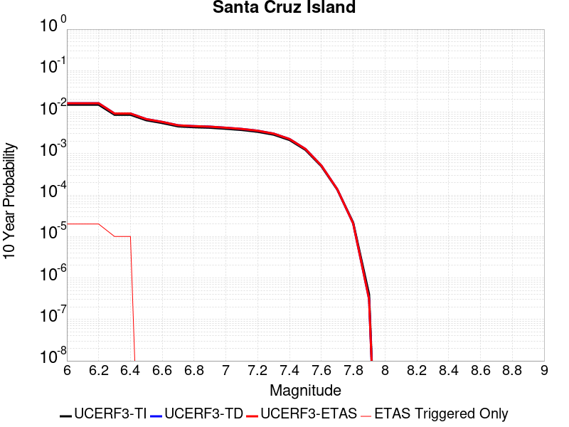 |

| Magnitude | 1 wk TI Prob | 1 wk TD Prob | 1 wk ETAS Prob | 1 wk ETAS/TD Gain | 1 wk ETAS Triggered Only | 1 mo TI Prob | 1 mo TD Prob | 1 mo ETAS Prob | 1 mo ETAS/TD Gain | 1 mo ETAS Triggered Only | 1 yr TI Prob | 1 yr TD Prob | 1 yr ETAS Prob | 1 yr ETAS/TD Gain | 1 yr ETAS Triggered Only | 10 yr TI Prob | 10 yr TD Prob | 10 yr ETAS Prob | 10 yr ETAS/TD Gain | 10 yr ETAS Triggered Only |
|-----|-----|-----|-----|-----|-----|-----|-----|-----|-----|-----|-----|-----|-----|-----|-----|-----|-----|-----|-----|-----|
| 6.0 | 2.9164563E-5 | 3.1601154E-5 | 3.1601154E-5 | 1.0 | 0.0 | 1.2498499E-4 | 1.3542725E-4 | 1.3542725E-4 | 1.0 | 0.0 | 0.0015206301 | 0.001647716 | 0.0016733116 | 1.0155339 | 2.5637739E-5 | 0.015102667 | 0.016368724 | 0.016393943 | 1.0015407 | 2.5637739E-5 |
| 6.1 | 2.9164563E-5 | 3.1601154E-5 | 3.1601154E-5 | 1.0 | 0.0 | 1.2498499E-4 | 1.3542725E-4 | 1.3542725E-4 | 1.0 | 0.0 | 0.0015206301 | 0.001647716 | 0.0016733116 | 1.0155339 | 2.5637739E-5 | 0.015102667 | 0.016368724 | 0.016393943 | 1.0015407 | 2.5637739E-5 |
| 6.2 | 2.9164563E-5 | 3.1601154E-5 | 3.1601154E-5 | 1.0 | 0.0 | 1.2498499E-4 | 1.3542725E-4 | 1.3542725E-4 | 1.0 | 0.0 | 0.0015206301 | 0.001647716 | 0.0016733116 | 1.0155339 | 2.5637739E-5 | 0.015102667 | 0.016368724 | 0.016393943 | 1.0015407 | 2.5637739E-5 |
| 6.3 | 1.6635553E-5 | 1.7805029E-5 | 1.7805029E-5 | 1.0 | 0.0 | 7.1293274E-5 | 7.6305136E-5 | 7.6305136E-5 | 1.0 | 0.0 | 8.6765E-4 | 9.286373E-4 | 9.542512E-4 | 1.0275823 | 2.5637739E-5 | 0.008642701 | 0.009249439 | 0.00927484 | 1.0027462 | 2.5637739E-5 |
| 6.4 | 1.6635553E-5 | 1.7805029E-5 | 1.7805029E-5 | 1.0 | 0.0 | 7.1293274E-5 | 7.6305136E-5 | 7.6305136E-5 | 1.0 | 0.0 | 8.6765E-4 | 9.286373E-4 | 9.542512E-4 | 1.0275823 | 2.5637739E-5 | 0.008642701 | 0.009249439 | 0.00927484 | 1.0027462 | 2.5637739E-5 |
| 6.5 | 1.2238748E-5 | 1.30434555E-5 | 1.30434555E-5 | 1.0 | 0.0 | 5.2450723E-5 | 5.5899345E-5 | 5.5899345E-5 | 1.0 | 0.0 | 6.3840044E-4 | 6.803657E-4 | 6.803657E-4 | 1.0 | 0.0 | 0.0063656955 | 0.006783226 | 0.006783226 | 1.0 | 0.0 |
| 6.6 | 1.0489767E-5 | 1.1157017E-5 | 1.1157017E-5 | 1.0 | 0.0 | 4.495537E-5 | 4.7814923E-5 | 4.7814923E-5 | 1.0 | 0.0 | 5.4719415E-4 | 5.8199343E-4 | 5.8199343E-4 | 1.0 | 0.0 | 0.005458487 | 0.0058049336 | 0.0058049336 | 1.0 | 0.0 |
| 6.7 | 8.699222E-6 | 9.23709E-6 | 9.23709E-6 | 1.0 | 0.0 | 3.7281847E-5 | 3.958693E-5 | 3.958693E-5 | 1.0 | 0.0 | 4.5381195E-4 | 4.8186484E-4 | 4.8186484E-4 | 1.0 | 0.0 | 0.0045288634 | 0.0048082676 | 0.0048082676 | 1.0 | 0.0 |
| 6.8 | 8.307732E-6 | 8.8171955E-6 | 8.8171955E-6 | 1.0 | 0.0 | 3.560408E-5 | 3.7787435E-5 | 3.7787435E-5 | 1.0 | 0.0 | 4.3339343E-4 | 4.5996535E-4 | 4.5996535E-4 | 1.0 | 0.0 | 0.004325492 | 0.0045901868 | 0.0045901868 | 1.0 | 0.0 |
| 6.9 | 8.073121E-6 | 8.565221E-6 | 8.565221E-6 | 1.0 | 0.0 | 3.459863E-5 | 3.6707574E-5 | 3.6707574E-5 | 1.0 | 0.0 | 4.2115687E-4 | 4.4682348E-4 | 4.4682348E-4 | 1.0 | 0.0 | 0.004203596 | 0.0044593024 | 0.0044593024 | 1.0 | 0.0 |
| 7.0 | 7.617019E-6 | 8.074926E-6 | 8.074926E-6 | 1.0 | 0.0 | 3.264396E-5 | 3.4606368E-5 | 3.4606368E-5 | 1.0 | 0.0 | 3.9736772E-4 | 4.212515E-4 | 4.212515E-4 | 1.0 | 0.0 | 0.003966579 | 0.0042045773 | 0.0042045773 | 1.0 | 0.0 |
| 7.1 | 7.1224836E-6 | 7.5460302E-6 | 7.5460302E-6 | 1.0 | 0.0 | 3.052457E-5 | 3.233973E-5 | 3.233973E-5 | 1.0 | 0.0 | 3.715733E-4 | 3.9366545E-4 | 3.9366545E-4 | 1.0 | 0.0 | 0.003709526 | 0.003929724 | 0.003929724 | 1.0 | 0.0 |
| 7.2 | 6.441115E-6 | 6.827605E-6 | 6.827605E-6 | 1.0 | 0.0 | 2.7604487E-5 | 2.9260837E-5 | 2.9260837E-5 | 1.0 | 0.0 | 3.360328E-4 | 3.5619267E-4 | 3.5619267E-4 | 1.0 | 0.0 | 0.0033552512 | 0.0035562462 | 0.0035562462 | 1.0 | 0.0 |
| 7.3 | 5.494274E-6 | 5.8201813E-6 | 5.8201813E-6 | 1.0 | 0.0 | 2.3546674E-5 | 2.4943398E-5 | 2.4943398E-5 | 1.0 | 0.0 | 2.8664304E-4 | 3.0364376E-4 | 3.0364376E-4 | 1.0 | 0.0 | 0.002862736 | 0.0030323118 | 0.0030323118 | 1.0 | 0.0 |
| 7.4 | 4.0802624E-6 | 4.31239E-6 | 4.31239E-6 | 1.0 | 0.0 | 1.7486722E-5 | 1.8481542E-5 | 1.8481542E-5 | 1.0 | 0.0 | 2.1288003E-4 | 2.249896E-4 | 2.249896E-4 | 1.0 | 0.0 | 0.0021267622 | 0.0022476274 | 0.0022476274 | 1.0 | 0.0 |
| 7.5 | 2.3584746E-6 | 2.4753783E-6 | 2.4753783E-6 | 1.0 | 0.0 | 1.0107709E-5 | 1.0608721E-5 | 1.0608721E-5 | 1.0 | 0.0 | 1.2305441E-4 | 1.2915357E-4 | 1.2915357E-4 | 1.0 | 0.0 | 0.0012298629 | 0.0012907902 | 0.0012907902 | 1.0 | 0.0 |
| 7.6 | 9.4981914E-7 | 9.861161E-7 | 9.861161E-7 | 1.0 | 0.0 | 4.0706473E-6 | 4.226205E-6 | 4.226205E-6 | 1.0 | 0.0 | 4.9559E-5 | 5.1452847E-5 | 5.1452847E-5 | 1.0 | 0.0 | 4.954795E-4 | 5.144106E-4 | 5.144106E-4 | 1.0 | 0.0 |
| 7.7 | 2.6013532E-7 | 2.6417067E-7 | 2.6417067E-7 | 1.0 | 0.0 | 1.1148652E-6 | 1.1321595E-6 | 1.1321595E-6 | 1.0 | 0.0 | 1.3573399E-5 | 1.3783956E-5 | 1.3783956E-5 | 1.0 | 0.0 | 1.357257E-4 | 1.3783107E-4 | 1.3783107E-4 | 1.0 | 0.0 |
| 7.8 | 4.1522263E-8 | 3.9657305E-8 | 3.9657305E-8 | 1.0 | 0.0 | 1.7795254E-7 | 1.6995986E-7 | 1.6995986E-7 | 1.0 | 0.0 | 2.16657E-6 | 2.0692596E-6 | 2.0692596E-6 | 1.0 | 0.0 | 2.1665488E-5 | 2.0692425E-5 | 2.0692425E-5 | 1.0 | 0.0 |
| 7.9 | 7.7242046E-10 | 5.946944E-10 | 5.946944E-10 | 1.0 | 0.0 | 3.3103735E-9 | 2.5486908E-9 | 2.5486908E-9 | 1.0 | 0.0 | 4.0303796E-8 | 3.103031E-8 | 3.103031E-8 | 1.0 | 0.0 | 4.030379E-7 | 3.1030308E-7 | 3.1030308E-7 | 1.0 | 0.0 |

## Santa Rosa Island
*[(top)](#table-of-contents)*

| 1 Week | 1 Month | 1 Year | 10 Year |
|-----|-----|-----|-----|
|  |  | 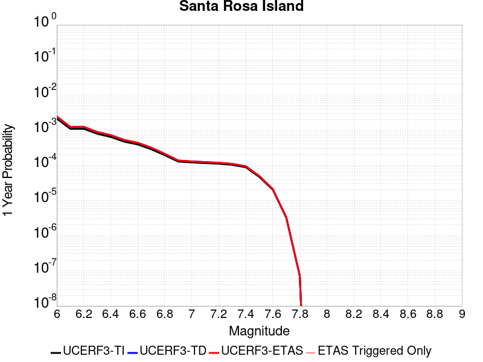 |  |

| Magnitude | 1 wk TI Prob | 1 wk TD Prob | 1 wk ETAS Prob | 1 wk ETAS/TD Gain | 1 wk ETAS Triggered Only | 1 mo TI Prob | 1 mo TD Prob | 1 mo ETAS Prob | 1 mo ETAS/TD Gain | 1 mo ETAS Triggered Only | 1 yr TI Prob | 1 yr TD Prob | 1 yr ETAS Prob | 1 yr ETAS/TD Gain | 1 yr ETAS Triggered Only | 10 yr TI Prob | 10 yr TD Prob | 10 yr ETAS Prob | 10 yr ETAS/TD Gain | 10 yr ETAS Triggered Only |
|-----|-----|-----|-----|-----|-----|-----|-----|-----|-----|-----|-----|-----|-----|-----|-----|-----|-----|-----|-----|-----|
| 6.0 | 4.1143165E-5 | 4.7094767E-5 | 4.7094767E-5 | 1.0 | 0.0 | 1.7631594E-4 | 2.018202E-4 | 2.018202E-4 | 1.0 | 0.0 | 0.002144533 | 0.0024545891 | 0.0024545891 | 1.0 | 0.0 | 0.021239553 | 0.024295403 | 0.024320418 | 1.0010296 | 2.5637739E-5 |
| 6.1 | 2.1061249E-5 | 2.3866654E-5 | 2.3866654E-5 | 1.0 | 0.0 | 9.0259375E-5 | 1.0228182E-4 | 1.0228182E-4 | 1.0 | 0.0 | 0.0010983539 | 0.0012445987 | 0.0012445987 | 1.0 | 0.0 | 0.01092941 | 0.012379322 | 0.012404642 | 1.0020454 | 2.5637739E-5 |
| 6.2 | 2.1061249E-5 | 2.3866654E-5 | 2.3866654E-5 | 1.0 | 0.0 | 9.0259375E-5 | 1.0228182E-4 | 1.0228182E-4 | 1.0 | 0.0 | 0.0010983539 | 0.0012445987 | 0.0012445987 | 1.0 | 0.0 | 0.01092941 | 0.012379322 | 0.012404642 | 1.0020454 | 2.5637739E-5 |
| 6.3 | 1.5158236E-5 | 1.7075572E-5 | 1.7075572E-5 | 1.0 | 0.0 | 6.496225E-5 | 7.3179035E-5 | 7.3179035E-5 | 1.0 | 0.0 | 7.906284E-4 | 8.906025E-4 | 8.906025E-4 | 1.0 | 0.0 | 0.007878214 | 0.008871585 | 0.008871585 | 1.0 | 0.0 |
| 6.4 | 1.2341918E-5 | 1.3853823E-5 | 1.3853823E-5 | 1.0 | 0.0 | 5.2892858E-5 | 5.9372218E-5 | 5.9372218E-5 | 1.0 | 0.0 | 6.437803E-4 | 7.226252E-4 | 7.226252E-4 | 1.0 | 0.0 | 0.006419184 | 0.0072035906 | 0.0072035906 | 1.0 | 0.0 |
| 6.5 | 9.061158E-6 | 1.0117661E-5 | 1.0117661E-5 | 1.0 | 0.0 | 3.883296E-5 | 4.3360717E-5 | 4.3360717E-5 | 1.0 | 0.0 | 4.726887E-4 | 5.277942E-4 | 5.277942E-4 | 1.0 | 0.0 | 0.004716845 | 0.0052659446 | 0.0052659446 | 1.0 | 0.0 |
| 6.6 | 7.5461685E-6 | 8.401243E-6 | 8.401243E-6 | 1.0 | 0.0 | 3.2340322E-5 | 3.6004854E-5 | 3.6004854E-5 | 1.0 | 0.0 | 3.936723E-4 | 4.3827522E-4 | 4.3827522E-4 | 1.0 | 0.0 | 0.003929756 | 0.0043745385 | 0.0043745385 | 1.0 | 0.0 |
| 6.7 | 5.5023775E-6 | 6.0877283E-6 | 6.0877283E-6 | 1.0 | 0.0 | 2.3581404E-5 | 2.6090021E-5 | 2.6090021E-5 | 1.0 | 0.0 | 2.8706578E-4 | 3.1760297E-4 | 3.1760297E-4 | 1.0 | 0.0 | 0.0028669522 | 0.0031718123 | 0.0031718123 | 1.0 | 0.0 |
| 6.8 | 3.7351679E-6 | 4.083345E-6 | 4.083345E-6 | 1.0 | 0.0 | 1.6007763E-5 | 1.7499948E-5 | 1.7499948E-5 | 1.0 | 0.0 | 1.948771E-4 | 2.1304353E-4 | 2.1304353E-4 | 1.0 | 0.0 | 0.0019470629 | 0.002128638 | 0.002128638 | 1.0 | 0.0 |
| 6.9 | 2.456366E-6 | 2.6293699E-6 | 2.6293699E-6 | 1.0 | 0.0 | 1.0527241E-5 | 1.1268679E-5 | 1.1268679E-5 | 1.0 | 0.0 | 1.2816161E-4 | 1.3718756E-4 | 1.3718756E-4 | 1.0 | 0.0 | 0.0012808773 | 0.0013710316 | 0.0013710316 | 1.0 | 0.0 |
| 7.0 | 2.3245157E-6 | 2.482869E-6 | 2.482869E-6 | 1.0 | 0.0 | 9.962172E-6 | 1.0640823E-5 | 1.0640823E-5 | 1.0 | 0.0 | 1.2128269E-4 | 1.2954435E-4 | 1.2954435E-4 | 1.0 | 0.0 | 0.0012121652 | 0.0012946905 | 0.0012946905 | 1.0 | 0.0 |
| 7.1 | 2.2248344E-6 | 2.3733348E-6 | 2.3733348E-6 | 1.0 | 0.0 | 9.53497E-6 | 1.0171396E-5 | 1.0171396E-5 | 1.0 | 0.0 | 1.1608207E-4 | 1.2382973E-4 | 1.2382973E-4 | 1.0 | 0.0 | 0.0011602144 | 0.0012376092 | 0.0012376092 | 1.0 | 0.0 |
| 7.2 | 2.1350402E-6 | 2.2762347E-6 | 2.2762347E-6 | 1.0 | 0.0 | 9.150141E-6 | 9.755255E-6 | 9.755255E-6 | 1.0 | 0.0 | 1.1139726E-4 | 1.18763775E-4 | 1.18763775E-4 | 1.0 | 0.0 | 0.0011134144 | 0.001187005 | 0.001187005 | 1.0 | 0.0 |
| 7.3 | 1.9793572E-6 | 2.108793E-6 | 2.108793E-6 | 1.0 | 0.0 | 8.482932E-6 | 9.037653E-6 | 9.037653E-6 | 1.0 | 0.0 | 1.032748E-4 | 1.1002789E-4 | 1.1002789E-4 | 1.0 | 0.0 | 0.0010322682 | 0.001099736 | 0.001099736 | 1.0 | 0.0 |
| 7.4 | 1.6951194E-6 | 1.804636E-6 | 1.804636E-6 | 1.0 | 0.0 | 7.264777E-6 | 7.734132E-6 | 7.734132E-6 | 1.0 | 0.0 | 8.844508E-5 | 9.4159E-5 | 9.4159E-5 | 1.0 | 0.0 | 8.840988E-4 | 9.4119273E-4 | 9.4119273E-4 | 1.0 | 0.0 |
| 7.5 | 8.987207E-7 | 9.512517E-7 | 9.512517E-7 | 1.0 | 0.0 | 3.8516546E-6 | 4.076787E-6 | 4.076787E-6 | 1.0 | 0.0 | 4.6892885E-5 | 4.963376E-5 | 4.963376E-5 | 1.0 | 0.0 | 4.688299E-4 | 4.9622793E-4 | 4.9622793E-4 | 1.0 | 0.0 |
| 7.6 | 3.8783037E-7 | 4.0530355E-7 | 4.0530355E-7 | 1.0 | 0.0 | 1.6621291E-6 | 1.737014E-6 | 1.737014E-6 | 1.0 | 0.0 | 2.0236233E-5 | 2.1147947E-5 | 2.1147947E-5 | 1.0 | 0.0 | 2.023439E-4 | 2.1146E-4 | 2.1146E-4 | 1.0 | 0.0 |
| 7.7 | 6.181804E-8 | 6.33916E-8 | 6.33916E-8 | 1.0 | 0.0 | 2.6493444E-7 | 2.7167826E-7 | 2.7167826E-7 | 1.0 | 0.0 | 3.225572E-6 | 3.3076778E-6 | 3.3076778E-6 | 1.0 | 0.0 | 3.225525E-5 | 3.3076292E-5 | 3.3076292E-5 | 1.0 | 0.0 |
| 7.8 | 1.3704449E-9 | 1.3964294E-9 | 1.3964294E-9 | 1.0 | 0.0 | 5.873335E-9 | 5.984697E-9 | 5.984697E-9 | 1.0 | 0.0 | 7.1507856E-8 | 7.2863685E-8 | 7.2863685E-8 | 1.0 | 0.0 | 7.1507833E-7 | 7.2863673E-7 | 7.2863673E-7 | 1.0 | 0.0 |

## Hollywood
*[(top)](#table-of-contents)*

| 1 Week | 1 Month | 1 Year | 10 Year |
|-----|-----|-----|-----|
|  |  |  |  |

| Magnitude | 1 wk TI Prob | 1 wk TD Prob | 1 wk ETAS Prob | 1 wk ETAS/TD Gain | 1 wk ETAS Triggered Only | 1 mo TI Prob | 1 mo TD Prob | 1 mo ETAS Prob | 1 mo ETAS/TD Gain | 1 mo ETAS Triggered Only | 1 yr TI Prob | 1 yr TD Prob | 1 yr ETAS Prob | 1 yr ETAS/TD Gain | 1 yr ETAS Triggered Only | 10 yr TI Prob | 10 yr TD Prob | 10 yr ETAS Prob | 10 yr ETAS/TD Gain | 10 yr ETAS Triggered Only |
|-----|-----|-----|-----|-----|-----|-----|-----|-----|-----|-----|-----|-----|-----|-----|-----|-----|-----|-----|-----|-----|
| 6.0 | 1.24487615E-5 | 1.2593849E-5 | 1.2593849E-5 | 1.0 | 0.0 | 5.3350745E-5 | 5.3972544E-5 | 5.3972544E-5 | 1.0 | 0.0 | 6.4935174E-4 | 6.569223E-4 | 6.569223E-4 | 1.0 | 0.0 | 0.0064745755 | 0.0065502916 | 0.0065757614 | 1.0038884 | 2.5637739E-5 |
| 6.1 | 1.24487615E-5 | 1.2593849E-5 | 1.2593849E-5 | 1.0 | 0.0 | 5.3350745E-5 | 5.3972544E-5 | 5.3972544E-5 | 1.0 | 0.0 | 6.4935174E-4 | 6.569223E-4 | 6.569223E-4 | 1.0 | 0.0 | 0.0064745755 | 0.0065502916 | 0.0065757614 | 1.0038884 | 2.5637739E-5 |
| 6.2 | 1.24487615E-5 | 1.2593849E-5 | 1.2593849E-5 | 1.0 | 0.0 | 5.3350745E-5 | 5.3972544E-5 | 5.3972544E-5 | 1.0 | 0.0 | 6.4935174E-4 | 6.569223E-4 | 6.569223E-4 | 1.0 | 0.0 | 0.0064745755 | 0.0065502916 | 0.0065757614 | 1.0038884 | 2.5637739E-5 |
| 6.3 | 1.24487615E-5 | 1.2593849E-5 | 1.2593849E-5 | 1.0 | 0.0 | 5.3350745E-5 | 5.3972544E-5 | 5.3972544E-5 | 1.0 | 0.0 | 6.4935174E-4 | 6.569223E-4 | 6.569223E-4 | 1.0 | 0.0 | 0.0064745755 | 0.0065502916 | 0.0065757614 | 1.0038884 | 2.5637739E-5 |
| 6.4 | 1.2431024E-5 | 1.2574461E-5 | 1.2574461E-5 | 1.0 | 0.0 | 5.327473E-5 | 5.388946E-5 | 5.388946E-5 | 1.0 | 0.0 | 6.4842677E-4 | 6.559113E-4 | 6.559113E-4 | 1.0 | 0.0 | 0.0064653796 | 0.0065402417 | 0.0065657115 | 1.0038943 | 2.5637739E-5 |
| 6.5 | 1.1242222E-5 | 1.1318384E-5 | 1.1318384E-5 | 1.0 | 0.0 | 4.8180063E-5 | 4.8506474E-5 | 4.8506474E-5 | 1.0 | 0.0 | 5.864344E-4 | 5.90409E-4 | 5.90409E-4 | 1.0 | 0.0 | 0.0058488925 | 0.0058886907 | 0.0059141777 | 1.0043281 | 2.5637739E-5 |
| 6.6 | 1.1234066E-5 | 1.13094975E-5 | 1.13094975E-5 | 1.0 | 0.0 | 4.8145106E-5 | 4.846839E-5 | 4.846839E-5 | 1.0 | 0.0 | 5.86009E-4 | 5.899455E-4 | 5.899455E-4 | 1.0 | 0.0 | 0.005844661 | 0.005884081 | 0.005909568 | 1.0043315 | 2.5637739E-5 |
| 6.7 | 1.12294E-5 | 1.1304241E-5 | 1.1304241E-5 | 1.0 | 0.0 | 4.812511E-5 | 4.844586E-5 | 4.844586E-5 | 1.0 | 0.0 | 5.857657E-4 | 5.896714E-4 | 5.896714E-4 | 1.0 | 0.0 | 0.0058422405 | 0.005881354 | 0.0059068413 | 1.0043335 | 2.5637739E-5 |
| 6.8 | 1.0252819E-5 | 1.0218963E-5 | 1.0218963E-5 | 1.0 | 0.0 | 4.3939912E-5 | 4.3794833E-5 | 4.3794833E-5 | 1.0 | 0.0 | 5.3483713E-4 | 5.330738E-4 | 5.330738E-4 | 1.0 | 0.0 | 0.005335517 | 0.005318177 | 0.005343678 | 1.0047952 | 2.5637739E-5 |
| 6.9 | 9.252289E-6 | 9.110761E-6 | 9.110761E-6 | 1.0 | 0.0 | 3.9652066E-5 | 3.9045543E-5 | 3.9045543E-5 | 1.0 | 0.0 | 4.8265693E-4 | 4.7527745E-4 | 4.7527745E-4 | 1.0 | 0.0 | 0.0048161 | 0.004742783 | 0.0047682994 | 1.00538 | 2.5637739E-5 |
| 7.0 | 8.474604E-6 | 8.2586685E-6 | 8.2586685E-6 | 1.0 | 0.0 | 3.6319227E-5 | 3.5393823E-5 | 3.5393823E-5 | 1.0 | 0.0 | 4.4209688E-4 | 4.3083602E-4 | 4.3083602E-4 | 1.0 | 0.0 | 0.004412184 | 0.004300158 | 0.0043256856 | 1.0059364 | 2.5637739E-5 |
| 7.1 | 6.643643E-6 | 6.26868E-6 | 6.26868E-6 | 1.0 | 0.0 | 2.8472443E-5 | 2.6865497E-5 | 2.6865497E-5 | 1.0 | 0.0 | 3.4659685E-4 | 3.2703875E-4 | 3.2703875E-4 | 1.0 | 0.0 | 0.0034605677 | 0.003265621 | 0.0032911748 | 1.0078251 | 2.5637739E-5 |
| 7.2 | 5.549002E-6 | 5.1089696E-6 | 5.1089696E-6 | 1.0 | 0.0 | 2.378122E-5 | 2.1895401E-5 | 2.1895401E-5 | 1.0 | 0.0 | 2.8949787E-4 | 2.6654406E-4 | 2.6654406E-4 | 1.0 | 0.0 | 0.0028912104 | 0.00266226 | 0.0026878295 | 1.0096045 | 2.5637739E-5 |
| 7.3 | 4.3059727E-6 | 3.960103E-6 | 3.960103E-6 | 1.0 | 0.0 | 1.8454039E-5 | 1.6971762E-5 | 1.6971762E-5 | 1.0 | 0.0 | 2.2465475E-4 | 2.066117E-4 | 2.066117E-4 | 1.0 | 0.0 | 0.0022442779 | 0.0020642062 | 0.0020642062 | 1.0 | 0.0 |
| 7.4 | 2.8550733E-6 | 2.701466E-6 | 2.701466E-6 | 1.0 | 0.0 | 1.2235971E-5 | 1.1577661E-5 | 1.1577661E-5 | 1.0 | 0.0 | 1.4896276E-4 | 1.4094895E-4 | 1.4094895E-4 | 1.0 | 0.0 | 0.0014886294 | 0.0014086006 | 0.0014086006 | 1.0 | 0.0 |
| 7.5 | 1.9927045E-6 | 1.897771E-6 | 1.897771E-6 | 1.0 | 0.0 | 8.540134E-6 | 8.133279E-6 | 8.133279E-6 | 1.0 | 0.0 | 1.0397117E-4 | 9.901821E-5 | 9.901821E-5 | 1.0 | 0.0 | 0.0010392254 | 9.897444E-4 | 9.897444E-4 | 1.0 | 0.0 |
| 7.6 | 1.345084E-6 | 1.221694E-6 | 1.221694E-6 | 1.0 | 0.0 | 5.764633E-6 | 5.235821E-6 | 5.235821E-6 | 1.0 | 0.0 | 7.018215E-5 | 6.374427E-5 | 6.374427E-5 | 1.0 | 0.0 | 7.0159987E-4 | 6.372619E-4 | 6.372619E-4 | 1.0 | 0.0 |
| 7.7 | 7.6835164E-7 | 6.2783954E-7 | 6.2783954E-7 | 1.0 | 0.0 | 3.2929315E-6 | 2.6907383E-6 | 2.6907383E-6 | 1.0 | 0.0 | 4.00907E-5 | 3.275926E-5 | 3.275926E-5 | 1.0 | 0.0 | 4.0083472E-4 | 3.275458E-4 | 3.275458E-4 | 1.0 | 0.0 |
| 7.8 | 3.6562128E-7 | 2.4540546E-7 | 2.4540546E-7 | 1.0 | 0.0 | 1.5669474E-6 | 1.0517372E-6 | 1.0517372E-6 | 1.0 | 0.0 | 1.9077417E-5 | 1.280483E-5 | 1.280483E-5 | 1.0 | 0.0 | 1.907578E-4 | 1.2804128E-4 | 1.2804128E-4 | 1.0 | 0.0 |
| 7.9 | 7.5024424E-8 | 5.3828998E-8 | 5.3828998E-8 | 1.0 | 0.0 | 3.215332E-7 | 2.3069569E-7 | 2.3069569E-7 | 1.0 | 0.0 | 3.91466E-6 | 2.808718E-6 | 2.808718E-6 | 1.0 | 0.0 | 3.9145907E-5 | 2.8086954E-5 | 2.8086954E-5 | 1.0 | 0.0 |

## Elysian Park (Upper)
*[(top)](#table-of-contents)*

| 1 Week | 1 Month | 1 Year | 10 Year |
|-----|-----|-----|-----|
|  |  |  |  |

| Magnitude | 1 wk TI Prob | 1 wk TD Prob | 1 wk ETAS Prob | 1 wk ETAS/TD Gain | 1 wk ETAS Triggered Only | 1 mo TI Prob | 1 mo TD Prob | 1 mo ETAS Prob | 1 mo ETAS/TD Gain | 1 mo ETAS Triggered Only | 1 yr TI Prob | 1 yr TD Prob | 1 yr ETAS Prob | 1 yr ETAS/TD Gain | 1 yr ETAS Triggered Only | 10 yr TI Prob | 10 yr TD Prob | 10 yr ETAS Prob | 10 yr ETAS/TD Gain | 10 yr ETAS Triggered Only |
|-----|-----|-----|-----|-----|-----|-----|-----|-----|-----|-----|-----|-----|-----|-----|-----|-----|-----|-----|-----|-----|
| 6.0 | 3.1876025E-5 | 3.7039532E-5 | 3.7039532E-5 | 1.0 | 0.0 | 1.3660437E-4 | 1.5873392E-4 | 1.5873392E-4 | 1.0 | 0.0 | 0.0016618895 | 0.0019313111 | 0.0019313111 | 1.0 | 0.0 | 0.016495159 | 0.019191828 | 0.019216973 | 1.0013102 | 2.5637739E-5 |
| 6.1 | 3.1876025E-5 | 3.7039532E-5 | 3.7039532E-5 | 1.0 | 0.0 | 1.3660437E-4 | 1.5873392E-4 | 1.5873392E-4 | 1.0 | 0.0 | 0.0016618895 | 0.0019313111 | 0.0019313111 | 1.0 | 0.0 | 0.016495159 | 0.019191828 | 0.019216973 | 1.0013102 | 2.5637739E-5 |
| 6.2 | 3.1876025E-5 | 3.7039532E-5 | 3.7039532E-5 | 1.0 | 0.0 | 1.3660437E-4 | 1.5873392E-4 | 1.5873392E-4 | 1.0 | 0.0 | 0.0016618895 | 0.0019313111 | 0.0019313111 | 1.0 | 0.0 | 0.016495159 | 0.019191828 | 0.019216973 | 1.0013102 | 2.5637739E-5 |
| 6.3 | 3.1876025E-5 | 3.7039532E-5 | 3.7039532E-5 | 1.0 | 0.0 | 1.3660437E-4 | 1.5873392E-4 | 1.5873392E-4 | 1.0 | 0.0 | 0.0016618895 | 0.0019313111 | 0.0019313111 | 1.0 | 0.0 | 0.016495159 | 0.019191828 | 0.019216973 | 1.0013102 | 2.5637739E-5 |
| 6.4 | 1.9273462E-5 | 2.1204127E-5 | 2.1204127E-5 | 1.0 | 0.0 | 8.259794E-5 | 9.087264E-5 | 9.087264E-5 | 1.0 | 0.0 | 0.001005166 | 0.0011059863 | 0.0011059863 | 1.0 | 0.0 | 0.010006315 | 0.011021685 | 0.011047039 | 1.0023005 | 2.5637739E-5 |
| 6.5 | 1.9273462E-5 | 2.1204127E-5 | 2.1204127E-5 | 1.0 | 0.0 | 8.259794E-5 | 9.087264E-5 | 9.087264E-5 | 1.0 | 0.0 | 0.001005166 | 0.0011059863 | 0.0011059863 | 1.0 | 0.0 | 0.010006315 | 0.011021685 | 0.011047039 | 1.0023005 | 2.5637739E-5 |
| 6.6 | 9.813258E-6 | 9.666116E-6 | 9.666116E-6 | 1.0 | 0.0 | 4.205614E-5 | 4.1425592E-5 | 4.1425592E-5 | 1.0 | 0.0 | 5.119132E-4 | 5.0424715E-4 | 5.0424715E-4 | 1.0 | 0.0 | 0.005107356 | 0.0050317533 | 0.0050317533 | 1.0 | 0.0 |
| 6.7 | 9.801478E-6 | 9.653685E-6 | 9.653685E-6 | 1.0 | 0.0 | 4.2005657E-5 | 4.1372317E-5 | 4.1372317E-5 | 1.0 | 0.0 | 5.112989E-4 | 5.035988E-4 | 5.035988E-4 | 1.0 | 0.0 | 0.0051012407 | 0.0050252997 | 0.0050252997 | 1.0 | 0.0 |
| 6.8 | 8.102489E-6 | 7.773414E-6 | 7.773414E-6 | 1.0 | 0.0 | 3.4724493E-5 | 3.3314234E-5 | 3.3314234E-5 | 1.0 | 0.0 | 4.2268867E-4 | 4.0553027E-4 | 4.0553027E-4 | 1.0 | 0.0 | 0.004218856 | 0.004048397 | 0.004048397 | 1.0 | 0.0 |
| 6.9 | 6.08275E-6 | 5.4816974E-6 | 5.4816974E-6 | 1.0 | 0.0 | 2.6068668E-5 | 2.3492783E-5 | 2.3492783E-5 | 1.0 | 0.0 | 3.173398E-4 | 2.8598786E-4 | 2.8598786E-4 | 1.0 | 0.0 | 0.0031688702 | 0.0028562758 | 0.0028562758 | 1.0 | 0.0 |
| 7.0 | 5.5995934E-6 | 4.983003E-6 | 4.983003E-6 | 1.0 | 0.0 | 2.3998036E-5 | 2.1355554E-5 | 2.1355554E-5 | 1.0 | 0.0 | 2.9213692E-4 | 2.5997352E-4 | 2.5997352E-4 | 1.0 | 0.0 | 0.0029175316 | 0.0025967613 | 0.0025967613 | 1.0 | 0.0 |
| 7.1 | 4.709881E-6 | 4.0875825E-6 | 4.0875825E-6 | 1.0 | 0.0 | 2.0185047E-5 | 1.7518096E-5 | 1.7518096E-5 | 1.0 | 0.0 | 2.4572524E-4 | 2.1326235E-4 | 2.1326235E-4 | 1.0 | 0.0 | 0.002454537 | 0.0021306183 | 0.0021306183 | 1.0 | 0.0 |
| 7.2 | 3.6063436E-6 | 2.9780829E-6 | 2.9780829E-6 | 1.0 | 0.0 | 1.5455667E-5 | 1.2763151E-5 | 1.2763151E-5 | 1.0 | 0.0 | 1.881565E-4 | 1.5538039E-4 | 1.5538039E-4 | 1.0 | 0.0 | 0.0018799726 | 0.0015527287 | 0.0015527287 | 1.0 | 0.0 |
| 7.3 | 2.471135E-6 | 2.095552E-6 | 2.095552E-6 | 1.0 | 0.0 | 1.0590536E-5 | 8.980906E-6 | 8.980906E-6 | 1.0 | 0.0 | 1.2893214E-4 | 1.09337125E-4 | 1.09337125E-4 | 1.0 | 0.0 | 0.0012885736 | 0.0010928405 | 0.0010928405 | 1.0 | 0.0 |
| 7.4 | 1.163943E-6 | 1.0275575E-6 | 1.0275575E-6 | 1.0 | 0.0 | 4.988318E-6 | 4.40381E-6 | 4.40381E-6 | 1.0 | 0.0 | 6.0731076E-5 | 5.3615102E-5 | 5.3615102E-5 | 1.0 | 0.0 | 6.071448E-4 | 5.360246E-4 | 5.360246E-4 | 1.0 | 0.0 |
| 7.5 | 4.99459E-7 | 4.9178306E-7 | 4.9178306E-7 | 1.0 | 0.0 | 2.140537E-6 | 2.10764E-6 | 2.10764E-6 | 1.0 | 0.0 | 2.6060725E-5 | 2.5660232E-5 | 2.5660232E-5 | 1.0 | 0.0 | 2.605767E-4 | 2.5657425E-4 | 2.5657425E-4 | 1.0 | 0.0 |
| 7.6 | 2.4667852E-7 | 2.4779692E-7 | 2.4779692E-7 | 1.0 | 0.0 | 1.0571932E-6 | 1.0619864E-6 | 1.0619864E-6 | 1.0 | 0.0 | 1.2871251E-5 | 1.2929611E-5 | 1.2929611E-5 | 1.0 | 0.0 | 1.2870505E-4 | 1.2928895E-4 | 1.2928895E-4 | 1.0 | 0.0 |
| 7.7 | 8.2312795E-8 | 7.38718E-8 | 7.38718E-8 | 1.0 | 0.0 | 3.527691E-7 | 3.165934E-7 | 3.165934E-7 | 1.0 | 0.0 | 4.294955E-6 | 3.854519E-6 | 3.854519E-6 | 1.0 | 0.0 | 4.2948723E-5 | 3.854464E-5 | 3.854464E-5 | 1.0 | 0.0 |
| 7.8 | 2.7819295E-8 | 1.7571217E-8 | 1.7571217E-8 | 1.0 | 0.0 | 1.1922555E-7 | 7.5305216E-8 | 7.5305216E-8 | 1.0 | 0.0 | 1.45157E-6 | 9.168408E-7 | 9.168408E-7 | 1.0 | 0.0 | 1.45156055E-5 | 9.168385E-6 | 9.168385E-6 | 1.0 | 0.0 |

## Rodgers Creek - Healdsburg 2011 CFM
*[(top)](#table-of-contents)*

| 1 Week | 1 Month | 1 Year | 10 Year |
|-----|-----|-----|-----|
|  |  |  |  |

| Magnitude | 1 wk TI Prob | 1 wk TD Prob | 1 wk ETAS Prob | 1 wk ETAS/TD Gain | 1 wk ETAS Triggered Only | 1 mo TI Prob | 1 mo TD Prob | 1 mo ETAS Prob | 1 mo ETAS/TD Gain | 1 mo ETAS Triggered Only | 1 yr TI Prob | 1 yr TD Prob | 1 yr ETAS Prob | 1 yr ETAS/TD Gain | 1 yr ETAS Triggered Only | 10 yr TI Prob | 10 yr TD Prob | 10 yr ETAS Prob | 10 yr ETAS/TD Gain | 10 yr ETAS Triggered Only |
|-----|-----|-----|-----|-----|-----|-----|-----|-----|-----|-----|-----|-----|-----|-----|-----|-----|-----|-----|-----|-----|
| 6.0 | 7.390182E-5 | 1.3142917E-4 | 1.3142917E-4 | 1.0 | 0.0 | 3.1668364E-4 | 5.631467E-4 | 5.631467E-4 | 1.0 | 0.0 | 0.0038488081 | 0.0068347882 | 0.0068347882 | 1.0 | 0.0 | 0.037828278 | 0.06622128 | 0.06624522 | 1.0003616 | 2.5637739E-5 |
| 6.1 | 7.318768E-5 | 1.3040975E-4 | 1.3040975E-4 | 1.0 | 0.0 | 3.1362378E-4 | 5.587797E-4 | 5.587797E-4 | 1.0 | 0.0 | 0.0038116854 | 0.0067819515 | 0.0067819515 | 1.0 | 0.0 | 0.037469655 | 0.06572582 | 0.06574977 | 1.0003644 | 2.5637739E-5 |
| 6.2 | 7.1379836E-5 | 1.273379E-4 | 1.273379E-4 | 1.0 | 0.0 | 3.058777E-4 | 5.456202E-4 | 5.456202E-4 | 1.0 | 0.0 | 0.003717703 | 0.0066227177 | 0.0066227177 | 1.0 | 0.0 | 0.0365612 | 0.06424386 | 0.06426785 | 1.0003735 | 2.5637739E-5 |
| 6.3 | 6.9255926E-5 | 1.2388272E-4 | 1.2388272E-4 | 1.0 | 0.0 | 2.9677735E-4 | 5.3081836E-4 | 5.3081836E-4 | 1.0 | 0.0 | 0.0036072785 | 0.006443587 | 0.006443587 | 1.0 | 0.0 | 0.035492823 | 0.06257 | 0.062594034 | 1.0003841 | 2.5637739E-5 |
| 6.4 | 6.6757144E-5 | 1.196489E-4 | 1.196489E-4 | 1.0 | 0.0 | 2.8607066E-4 | 5.126806E-4 | 5.126806E-4 | 1.0 | 0.0 | 0.0034773487 | 0.006224091 | 0.006224091 | 1.0 | 0.0 | 0.034234364 | 0.060519043 | 0.060543127 | 1.000398 | 2.5637739E-5 |
| 6.5 | 6.5735134E-5 | 1.1813918E-4 | 1.1813918E-4 | 1.0 | 0.0 | 2.8169158E-4 | 5.0621293E-4 | 5.0621293E-4 | 1.0 | 0.0 | 0.003424202 | 0.006145812 | 0.006145812 | 1.0 | 0.0 | 0.03371918 | 0.059782747 | 0.059806854 | 1.0004032 | 2.5637739E-5 |
| 6.6 | 6.289601E-5 | 1.1349227E-4 | 1.1349227E-4 | 1.0 | 0.0 | 2.6952647E-4 | 4.8630516E-4 | 4.8630516E-4 | 1.0 | 0.0 | 0.0032765474 | 0.0059047723 | 0.0059047723 | 1.0 | 0.0 | 0.032286562 | 0.0575201 | 0.05754426 | 1.0004201 | 2.5637739E-5 |
| 6.7 | 6.115274E-5 | 1.1066158E-4 | 1.1066158E-4 | 1.0 | 0.0 | 2.6205686E-4 | 4.741781E-4 | 4.741781E-4 | 1.0 | 0.0 | 0.0031858748 | 0.0057579153 | 0.0057579153 | 1.0 | 0.0 | 0.031405866 | 0.056137886 | 0.056162085 | 1.0004311 | 2.5637739E-5 |
| 6.8 | 5.9232367E-5 | 1.073346E-4 | 1.073346E-4 | 1.0 | 0.0 | 2.538283E-4 | 4.599247E-4 | 4.599247E-4 | 1.0 | 0.0 | 0.0030859804 | 0.005585283 | 0.005585283 | 1.0 | 0.0 | 0.030434765 | 0.05450447 | 0.05452871 | 1.0004448 | 2.5637739E-5 |
| 6.9 | 5.4030377E-5 | 9.827546E-5 | 9.827546E-5 | 1.0 | 0.0 | 2.315382E-4 | 4.2111287E-4 | 4.2111287E-4 | 1.0 | 0.0 | 0.0028153337 | 0.0051150625 | 0.0051150625 | 1.0 | 0.0 | 0.027799325 | 0.050039466 | 0.050063822 | 1.0004867 | 2.5637739E-5 |
| 7.0 | 4.8260714E-5 | 8.745495E-5 | 8.745495E-5 | 1.0 | 0.0 | 2.0681522E-4 | 3.7475338E-4 | 3.7475338E-4 | 1.0 | 0.0 | 0.0025150678 | 0.0045531313 | 0.0045531313 | 1.0 | 0.0 | 0.024867928 | 0.044691484 | 0.04471598 | 1.000548 | 2.5637739E-5 |
| 7.1 | 4.0294493E-5 | 7.3932846E-5 | 7.3932846E-5 | 1.0 | 0.0 | 1.7267925E-4 | 3.168168E-4 | 3.168168E-4 | 1.0 | 0.0 | 0.0021003427 | 0.0038504603 | 0.0038504603 | 1.0 | 0.0 | 0.02080602 | 0.03794385 | 0.037968516 | 1.00065 | 2.5637739E-5 |
| 7.2 | 3.096388E-5 | 5.7018166E-5 | 5.7018166E-5 | 1.0 | 0.0 | 1.326956E-4 | 2.443408E-4 | 2.443408E-4 | 1.0 | 0.0 | 0.0016143717 | 0.002970813 | 0.002970813 | 1.0 | 0.0 | 0.01602694 | 0.029456772 | 0.029456772 | 1.0 | 0.0 |
| 7.3 | 2.3615226E-5 | 4.366579E-5 | 4.366579E-5 | 1.0 | 0.0 | 1.0120418E-4 | 1.8712576E-4 | 1.8712576E-4 | 1.0 | 0.0 | 0.0012314644 | 0.0022758893 | 0.0022758893 | 1.0 | 0.0 | 0.0122466255 | 0.022655508 | 0.022655508 | 1.0 | 0.0 |
| 7.4 | 1.8251132E-5 | 3.3575096E-5 | 3.3575096E-5 | 1.0 | 0.0 | 7.821679E-5 | 1.438854E-4 | 1.438854E-4 | 1.0 | 0.0 | 9.518733E-4 | 0.0017504068 | 0.0017504068 | 1.0 | 0.0 | 0.009478063 | 0.017482331 | 0.017482331 | 1.0 | 0.0 |
| 7.5 | 1.2411432E-5 | 2.2486745E-5 | 2.2486745E-5 | 1.0 | 0.0 | 5.3190768E-5 | 9.636824E-5 | 9.636824E-5 | 1.0 | 0.0 | 6.4740516E-4 | 0.0011726576 | 0.0011726576 | 1.0 | 0.0 | 0.006455223 | 0.011756561 | 0.011756561 | 1.0 | 0.0 |
| 7.6 | 4.4771446E-6 | 8.09296E-6 | 8.09296E-6 | 1.0 | 0.0 | 1.918762E-5 | 3.4683664E-5 | 3.4683664E-5 | 1.0 | 0.0 | 2.3358424E-4 | 4.22193E-4 | 4.22193E-4 | 1.0 | 0.0 | 0.0023333887 | 0.004250496 | 0.004250496 | 1.0 | 0.0 |
| 7.7 | 2.157941E-7 | 3.539757E-7 | 3.539757E-7 | 1.0 | 0.0 | 9.248315E-7 | 1.5170377E-6 | 1.5170377E-6 | 1.0 | 0.0 | 1.1259765E-5 | 1.8469778E-5 | 1.8469778E-5 | 1.0 | 0.0 | 1.1259195E-4 | 1.9093022E-4 | 1.9093022E-4 | 1.0 | 0.0 |
| 7.8 | 9.9623286E-8 | 1.9936476E-7 | 1.9936476E-7 | 1.0 | 0.0 | 4.269569E-7 | 8.544201E-7 | 8.544201E-7 | 1.0 | 0.0 | 5.1981874E-6 | 1.0402515E-5 | 1.0402515E-5 | 1.0 | 0.0 | 5.198066E-5 | 1.0919859E-4 | 1.0919859E-4 | 1.0 | 0.0 |
| 7.9 | 5.6745257E-8 | 1.1796928E-7 | 1.1796928E-7 | 1.0 | 0.0 | 2.4319394E-7 | 5.055825E-7 | 5.055825E-7 | 1.0 | 0.0 | 2.960882E-6 | 6.1554497E-6 | 6.1554497E-6 | 1.0 | 0.0 | 2.9608427E-5 | 6.482142E-5 | 6.482142E-5 | 1.0 | 0.0 |
| 8.0 | 2.8614323E-8 | 6.590836E-8 | 6.590836E-8 | 1.0 | 0.0 | 1.2263281E-7 | 2.8246436E-7 | 2.8246436E-7 | 1.0 | 0.0 | 1.4930534E-6 | 3.4389982E-6 | 3.4389982E-6 | 1.0 | 0.0 | 1.4930434E-5 | 3.5885336E-5 | 3.5885336E-5 | 1.0 | 0.0 |
| 8.1 | 3.5045191E-9 | 8.981429E-9 | 8.981429E-9 | 1.0 | 0.0 | 1.5019367E-8 | 3.8491837E-8 | 3.8491837E-8 | 1.0 | 0.0 | 1.8286079E-7 | 4.68638E-7 | 4.68638E-7 | 1.0 | 0.0 | 1.8286064E-6 | 4.84019E-6 | 4.84019E-6 | 1.0 | 0.0 |

## Hayward (No) 2011 CFM
*[(top)](#table-of-contents)*

| 1 Week | 1 Month | 1 Year | 10 Year |
|-----|-----|-----|-----|
|  |  |  |  |

| Magnitude | 1 wk TI Prob | 1 wk TD Prob | 1 wk ETAS Prob | 1 wk ETAS/TD Gain | 1 wk ETAS Triggered Only | 1 mo TI Prob | 1 mo TD Prob | 1 mo ETAS Prob | 1 mo ETAS/TD Gain | 1 mo ETAS Triggered Only | 1 yr TI Prob | 1 yr TD Prob | 1 yr ETAS Prob | 1 yr ETAS/TD Gain | 1 yr ETAS Triggered Only | 10 yr TI Prob | 10 yr TD Prob | 10 yr ETAS Prob | 10 yr ETAS/TD Gain | 10 yr ETAS Triggered Only |
|-----|-----|-----|-----|-----|-----|-----|-----|-----|-----|-----|-----|-----|-----|-----|-----|-----|-----|-----|-----|-----|
| 6.0 | 9.3068506E-5 | 1.74068E-4 | 1.74068E-4 | 1.0 | 0.0 | 3.9880406E-4 | 7.457933E-4 | 7.457933E-4 | 1.0 | 0.0 | 0.0048446343 | 0.009042277 | 0.009042277 | 1.0 | 0.0 | 0.047403704 | 0.086425416 | 0.08644883 | 1.000271 | 2.5637739E-5 |
| 6.1 | 9.055486E-5 | 1.6958236E-4 | 1.6958236E-4 | 1.0 | 0.0 | 3.880345E-4 | 7.265799E-4 | 7.265799E-4 | 1.0 | 0.0 | 0.0047140904 | 0.008810335 | 0.008810335 | 1.0 | 0.0 | 0.046153355 | 0.08431842 | 0.0843419 | 1.0002785 | 2.5637739E-5 |
| 6.2 | 9.006742E-5 | 1.6878804E-4 | 1.6878804E-4 | 1.0 | 0.0 | 3.859461E-4 | 7.231776E-4 | 7.231776E-4 | 1.0 | 0.0 | 0.0046887742 | 0.0087693 | 0.0087693 | 1.0 | 0.0 | 0.0459107 | 0.08394261 | 0.08396609 | 1.0002798 | 2.5637739E-5 |
| 6.3 | 8.8336754E-5 | 1.6558412E-4 | 1.6558412E-4 | 1.0 | 0.0 | 3.7853114E-4 | 7.09454E-4 | 7.09454E-4 | 1.0 | 0.0 | 0.004598882 | 0.008603558 | 0.008603558 | 1.0 | 0.0 | 0.04504866 | 0.082435764 | 0.082459286 | 1.0002854 | 2.5637739E-5 |
| 6.4 | 8.526157E-5 | 1.5984823E-4 | 1.5984823E-4 | 1.0 | 0.0 | 3.6535555E-4 | 6.848848E-4 | 6.848848E-4 | 1.0 | 0.0 | 0.0044391346 | 0.008306746 | 0.008306746 | 1.0 | 0.0 | 0.043514993 | 0.07973017 | 0.079753764 | 1.0002959 | 2.5637739E-5 |
| 6.5 | 8.152396E-5 | 1.5317152E-4 | 1.5317152E-4 | 1.0 | 0.0 | 3.493416E-4 | 6.56285E-4 | 6.56285E-4 | 1.0 | 0.0 | 0.0042449418 | 0.007961143 | 0.007961143 | 1.0 | 0.0 | 0.04164765 | 0.07656097 | 0.07658464 | 1.0003092 | 2.5637739E-5 |
| 6.6 | 7.987405E-5 | 1.5021319E-4 | 1.5021319E-4 | 1.0 | 0.0 | 3.4227243E-4 | 6.436127E-4 | 6.436127E-4 | 1.0 | 0.0 | 0.0041592065 | 0.0078079863 | 0.0078079863 | 1.0 | 0.0 | 0.04082218 | 0.07515338 | 0.07517709 | 1.0003155 | 2.5637739E-5 |
| 6.7 | 7.777665E-5 | 1.4660071E-4 | 1.4660071E-4 | 1.0 | 0.0 | 3.332859E-4 | 6.2813814E-4 | 6.2813814E-4 | 1.0 | 0.0 | 0.004050208 | 0.007620921 | 0.007620921 | 1.0 | 0.0 | 0.039771806 | 0.07342759 | 0.07345135 | 1.0003235 | 2.5637739E-5 |
| 6.8 | 7.3284005E-5 | 1.3809837E-4 | 1.3809837E-4 | 1.0 | 0.0 | 3.140365E-4 | 5.917165E-4 | 5.917165E-4 | 1.0 | 0.0 | 0.0038166929 | 0.007180489 | 0.007180489 | 1.0 | 0.0 | 0.037518036 | 0.06933746 | 0.069361314 | 1.0003442 | 2.5637739E-5 |
| 6.9 | 6.458263E-5 | 1.2138554E-4 | 1.2138554E-4 | 1.0 | 0.0 | 2.7675333E-4 | 5.201205E-4 | 5.201205E-4 | 1.0 | 0.0 | 0.0033642664 | 0.006314182 | 0.006314182 | 1.0 | 0.0 | 0.033137884 | 0.0612579 | 0.061281964 | 1.0003929 | 2.5637739E-5 |
| 7.0 | 5.3853604E-5 | 1.00309575E-4 | 1.00309575E-4 | 1.0 | 0.0 | 2.3078074E-4 | 4.2982766E-4 | 4.2982766E-4 | 1.0 | 0.0 | 0.0028061352 | 0.0052206595 | 0.0052206595 | 1.0 | 0.0 | 0.027709642 | 0.05098569 | 0.051010024 | 1.0004772 | 2.5637739E-5 |
| 7.1 | 4.4308683E-5 | 8.175333E-5 | 8.175333E-5 | 1.0 | 0.0 | 1.8988053E-4 | 3.5032458E-4 | 3.5032458E-4 | 1.0 | 0.0 | 0.0023093442 | 0.004256902 | 0.004256902 | 1.0 | 0.0 | 0.022854926 | 0.041847244 | 0.04187181 | 1.000587 | 2.5637739E-5 |
| 7.2 | 3.295973E-5 | 6.0814917E-5 | 6.0814917E-5 | 1.0 | 0.0 | 1.4124835E-4 | 2.6060943E-4 | 2.6060943E-4 | 1.0 | 0.0 | 0.0017183421 | 0.0031683263 | 0.0031683263 | 1.0 | 0.0 | 0.017051157 | 0.031391077 | 0.031391077 | 1.0 | 0.0 |
| 7.3 | 2.452256E-5 | 4.521987E-5 | 4.521987E-5 | 1.0 | 0.0 | 1.05092455E-4 | 1.9378512E-4 | 1.9378512E-4 | 1.0 | 0.0 | 0.0012787496 | 0.002356795 | 0.002356795 | 1.0 | 0.0 | 0.0127141625 | 0.023460438 | 0.023460438 | 1.0 | 0.0 |
| 7.4 | 1.8829967E-5 | 3.4637967E-5 | 3.4637967E-5 | 1.0 | 0.0 | 8.069736E-5 | 1.4844004E-4 | 1.4844004E-4 | 1.0 | 0.0 | 9.820475E-4 | 0.0018057693 | 0.0018057693 | 1.0 | 0.0 | 0.009777189 | 0.018036935 | 0.018036935 | 1.0 | 0.0 |
| 7.5 | 1.26374125E-5 | 2.2948794E-5 | 2.2948794E-5 | 1.0 | 0.0 | 5.4159216E-5 | 9.83483E-5 | 9.83483E-5 | 1.0 | 0.0 | 6.5918895E-4 | 0.0011967387 | 0.0011967387 | 1.0 | 0.0 | 0.00657237 | 0.012002571 | 0.012002571 | 1.0 | 0.0 |
| 7.6 | 4.666429E-6 | 8.4890125E-6 | 8.4890125E-6 | 1.0 | 0.0 | 1.9998828E-5 | 3.638098E-5 | 3.638098E-5 | 1.0 | 0.0 | 2.4345852E-4 | 4.4284965E-4 | 4.4284965E-4 | 1.0 | 0.0 | 0.0024319198 | 0.004463953 | 0.004463953 | 1.0 | 0.0 |
| 7.7 | 3.8399318E-7 | 7.146951E-7 | 7.146951E-7 | 1.0 | 0.0 | 1.6456839E-6 | 3.0629753E-6 | 3.0629753E-6 | 1.0 | 0.0 | 2.003602E-5 | 3.7291087E-5 | 3.7291087E-5 | 1.0 | 0.0 | 2.0034213E-4 | 3.867874E-4 | 3.867874E-4 | 1.0 | 0.0 |
| 7.8 | 2.5637698E-7 | 5.3775256E-7 | 5.3775256E-7 | 1.0 | 0.0 | 1.098758E-6 | 2.3046516E-6 | 2.3046516E-6 | 1.0 | 0.0 | 1.3377297E-5 | 2.8058774E-5 | 2.8058774E-5 | 1.0 | 0.0 | 1.3376492E-4 | 2.9299298E-4 | 2.9299298E-4 | 1.0 | 0.0 |
| 7.9 | 1.7141245E-7 | 3.7368818E-7 | 3.7368818E-7 | 1.0 | 0.0 | 7.3462456E-7 | 1.6015197E-6 | 1.6015197E-6 | 1.0 | 0.0 | 8.944017E-6 | 1.9498328E-5 | 1.9498328E-5 | 1.0 | 0.0 | 8.943657E-5 | 2.02833E-4 | 2.02833E-4 | 1.0 | 0.0 |
| 8.0 | 1.1808895E-7 | 2.7563618E-7 | 2.7563618E-7 | 1.0 | 0.0 | 5.060954E-7 | 1.1812973E-6 | 1.1812973E-6 | 1.0 | 0.0 | 6.161694E-6 | 1.4382201E-5 | 1.4382201E-5 | 1.0 | 0.0 | 6.161523E-5 | 1.4842243E-4 | 1.4842243E-4 | 1.0 | 0.0 |
| 8.1 | 5.138535E-8 | 1.1250157E-7 | 1.1250157E-7 | 1.0 | 0.0 | 2.2022292E-7 | 4.8214946E-7 | 4.8214946E-7 | 1.0 | 0.0 | 2.6812106E-6 | 5.8701544E-6 | 5.8701544E-6 | 1.0 | 0.0 | 2.6811784E-5 | 6.025778E-5 | 6.025778E-5 | 1.0 | 0.0 |

## Calaveras (So) 2011 CFM
*[(top)](#table-of-contents)*

| 1 Week | 1 Month | 1 Year | 10 Year |
|-----|-----|-----|-----|
|  |  |  |  |

| Magnitude | 1 wk TI Prob | 1 wk TD Prob | 1 wk ETAS Prob | 1 wk ETAS/TD Gain | 1 wk ETAS Triggered Only | 1 mo TI Prob | 1 mo TD Prob | 1 mo ETAS Prob | 1 mo ETAS/TD Gain | 1 mo ETAS Triggered Only | 1 yr TI Prob | 1 yr TD Prob | 1 yr ETAS Prob | 1 yr ETAS/TD Gain | 1 yr ETAS Triggered Only | 10 yr TI Prob | 10 yr TD Prob | 10 yr ETAS Prob | 10 yr ETAS/TD Gain | 10 yr ETAS Triggered Only |
|-----|-----|-----|-----|-----|-----|-----|-----|-----|-----|-----|-----|-----|-----|-----|-----|-----|-----|-----|-----|-----|
| 6.0 | 1.5950744E-4 | 3.0739905E-4 | 3.0739905E-4 | 1.0 | 0.0 | 6.834242E-4 | 0.0013167706 | 0.0013167706 | 1.0 | 0.0 | 0.00828899 | 0.015865553 | 0.015865553 | 1.0 | 0.0 | 0.079865426 | 0.14445968 | 0.14448161 | 1.0001519 | 2.5637739E-5 |
| 6.1 | 1.3584697E-4 | 2.6061598E-4 | 2.6061598E-4 | 1.0 | 0.0 | 5.8207137E-4 | 0.0011164517 | 0.0011164517 | 1.0 | 0.0 | 0.007063716 | 0.013468163 | 0.013468163 | 1.0 | 0.0 | 0.06843361 | 0.124085724 | 0.12410818 | 1.000181 | 2.5637739E-5 |
| 6.2 | 1.14676266E-4 | 2.1746816E-4 | 2.1746816E-4 | 1.0 | 0.0 | 4.9137714E-4 | 9.316741E-4 | 9.316741E-4 | 1.0 | 0.0 | 0.0059661185 | 0.011251126 | 0.011251126 | 1.0 | 0.0 | 0.058084648 | 0.10507494 | 0.10509788 | 1.0002184 | 2.5637739E-5 |
| 6.3 | 8.691518E-5 | 1.6001116E-4 | 1.6001116E-4 | 1.0 | 0.0 | 3.7244044E-4 | 6.855628E-4 | 6.855628E-4 | 1.0 | 0.0 | 0.004525038 | 0.008307241 | 0.008307241 | 1.0 | 0.0 | 0.044339992 | 0.079390146 | 0.07941374 | 1.0002973 | 2.5637739E-5 |
| 6.4 | 8.50982E-5 | 1.5707467E-4 | 1.5707467E-4 | 1.0 | 0.0 | 3.646556E-4 | 6.7298434E-4 | 6.7298434E-4 | 1.0 | 0.0 | 0.0044306475 | 0.008155251 | 0.008155251 | 1.0 | 0.0 | 0.04343345 | 0.077996135 | 0.078019775 | 1.000303 | 2.5637739E-5 |
| 6.5 | 8.4062965E-5 | 1.5531975E-4 | 1.5531975E-4 | 1.0 | 0.0 | 3.602201E-4 | 6.654671E-4 | 6.654671E-4 | 1.0 | 0.0 | 0.004376863 | 0.008064441 | 0.008064441 | 1.0 | 0.0 | 0.042916555 | 0.07716733 | 0.077190995 | 1.0003066 | 2.5637739E-5 |
| 6.6 | 8.194716E-5 | 1.516774E-4 | 1.516774E-4 | 1.0 | 0.0 | 3.5115483E-4 | 6.498649E-4 | 6.498649E-4 | 1.0 | 0.0 | 0.0042669317 | 0.007876252 | 0.007876252 | 1.0 | 0.0 | 0.04185927 | 0.0754524 | 0.07547611 | 1.0003141 | 2.5637739E-5 |
| 6.7 | 8.012326E-5 | 1.483531E-4 | 1.483531E-4 | 1.0 | 0.0 | 3.433402E-4 | 6.3563243E-4 | 6.3563243E-4 | 1.0 | 0.0 | 0.004172157 | 0.0077047227 | 0.0077047227 | 1.0 | 0.0 | 0.040946912 | 0.0738944 | 0.07391814 | 1.0003213 | 2.5637739E-5 |
| 6.8 | 7.119773E-5 | 1.289278E-4 | 1.289278E-4 | 1.0 | 0.0 | 3.0509746E-4 | 5.524251E-4 | 5.524251E-4 | 1.0 | 0.0 | 0.0037082357 | 0.0067017726 | 0.0067017726 | 1.0 | 0.0 | 0.036469642 | 0.06473622 | 0.06473622 | 1.0 | 0.0 |
| 6.9 | 5.7343088E-5 | 9.928818E-5 | 9.928818E-5 | 1.0 | 0.0 | 2.4573295E-4 | 4.254518E-4 | 4.254518E-4 | 1.0 | 0.0 | 0.0029876942 | 0.0051676547 | 0.0051676547 | 1.0 | 0.0 | 0.02947844 | 0.05055552 | 0.05055552 | 1.0 | 0.0 |
| 7.0 | 4.8746577E-5 | 8.294431E-5 | 8.294431E-5 | 1.0 | 0.0 | 2.0889717E-4 | 3.5542753E-4 | 3.5542753E-4 | 1.0 | 0.0 | 0.0025403565 | 0.0043188105 | 0.0043188105 | 1.0 | 0.0 | 0.025115121 | 0.04253077 | 0.04253077 | 1.0 | 0.0 |
| 7.1 | 4.2998014E-5 | 7.27236E-5 | 7.27236E-5 | 1.0 | 0.0 | 1.8426418E-4 | 3.1163564E-4 | 3.1163564E-4 | 1.0 | 0.0 | 0.002241108 | 0.0037876235 | 0.0037876235 | 1.0 | 0.0 | 0.022186412 | 0.037458975 | 0.037458975 | 1.0 | 0.0 |
| 7.2 | 3.221292E-5 | 5.3976983E-5 | 5.3976983E-5 | 1.0 | 0.0 | 1.3804805E-4 | 2.3130958E-4 | 2.3130958E-4 | 1.0 | 0.0 | 0.0016794393 | 0.002812585 | 0.002812585 | 1.0 | 0.0 | 0.016668037 | 0.02807059 | 0.02807059 | 1.0 | 0.0 |
| 7.3 | 2.3756531E-5 | 3.9534E-5 | 3.9534E-5 | 1.0 | 0.0 | 1.0180973E-4 | 1.6942051E-4 | 1.6942051E-4 | 1.0 | 0.0 | 0.0012388286 | 0.0020607605 | 0.0020607605 | 1.0 | 0.0 | 0.012319452 | 0.020674022 | 0.020674022 | 1.0 | 0.0 |
| 7.4 | 1.5997684E-5 | 2.737303E-5 | 2.737303E-5 | 1.0 | 0.0 | 6.8559704E-5 | 1.1730772E-4 | 1.1730772E-4 | 1.0 | 0.0 | 8.343947E-4 | 0.0014272883 | 0.0014272883 | 1.0 | 0.0 | 0.008312687 | 0.0143921655 | 0.0143921655 | 1.0 | 0.0 |
| 7.5 | 1.3814293E-5 | 2.481389E-5 | 2.481389E-5 | 1.0 | 0.0 | 5.9202768E-5 | 1.0634092E-4 | 1.0634092E-4 | 1.0 | 0.0 | 7.205553E-4 | 0.0012939342 | 0.0012939342 | 1.0 | 0.0 | 0.007182234 | 0.013070965 | 0.013070965 | 1.0 | 0.0 |
| 7.6 | 8.817309E-6 | 1.6456672E-5 | 1.6456672E-5 | 1.0 | 0.0 | 3.7787922E-5 | 7.0526694E-5 | 7.0526694E-5 | 1.0 | 0.0 | 4.5997082E-4 | 8.5832557E-4 | 8.5832557E-4 | 1.0 | 0.0 | 0.004590199 | 0.008732965 | 0.008732965 | 1.0 | 0.0 |
| 7.7 | 4.0352206E-6 | 7.724012E-6 | 7.724012E-6 | 1.0 | 0.0 | 1.7293689E-5 | 3.310249E-5 | 3.310249E-5 | 1.0 | 0.0 | 2.1053031E-4 | 4.0294835E-4 | 4.0294835E-4 | 1.0 | 0.0 | 0.0021033096 | 0.0041733775 | 0.0041733775 | 1.0 | 0.0 |
| 7.8 | 3.413169E-6 | 6.8018153E-6 | 6.8018153E-6 | 1.0 | 0.0 | 1.4627784E-5 | 2.9150313E-5 | 2.9150313E-5 | 1.0 | 0.0 | 1.7807873E-4 | 3.5484732E-4 | 3.5484732E-4 | 1.0 | 0.0 | 0.0017793609 | 0.0036736047 | 0.0036736047 | 1.0 | 0.0 |
| 7.9 | 2.4740732E-6 | 5.2897763E-6 | 5.2897763E-6 | 1.0 | 0.0 | 1.06031275E-5 | 2.2670272E-5 | 2.2670272E-5 | 1.0 | 0.0 | 1.2908543E-4 | 2.7597568E-4 | 2.7597568E-4 | 1.0 | 0.0 | 0.0012901047 | 0.002839954 | 0.002839954 | 1.0 | 0.0 |
| 8.0 | 1.5231818E-6 | 3.2950636E-6 | 3.2950636E-6 | 1.0 | 0.0 | 6.527906E-6 | 1.4121625E-5 | 1.4121625E-5 | 1.0 | 0.0 | 7.9474354E-5 | 1.7191726E-4 | 1.7191726E-4 | 1.0 | 0.0 | 7.944594E-4 | 0.0017594753 | 0.0017594753 | 1.0 | 0.0 |
| 8.1 | 1.0104524E-6 | 2.049573E-6 | 2.049573E-6 | 1.0 | 0.0 | 4.330503E-6 | 8.783854E-6 | 8.783854E-6 | 1.0 | 0.0 | 5.2722597E-5 | 1.0693821E-4 | 1.0693821E-4 | 1.0 | 0.0 | 5.271009E-4 | 0.0010948586 | 0.0010948586 | 1.0 | 0.0 |

## Point Reyes 2011 CFM
*[(top)](#table-of-contents)*

| 1 Week | 1 Month | 1 Year | 10 Year |
|-----|-----|-----|-----|
|  |  |  |  |

| Magnitude | 1 wk TI Prob | 1 wk TD Prob | 1 wk ETAS Prob | 1 wk ETAS/TD Gain | 1 wk ETAS Triggered Only | 1 mo TI Prob | 1 mo TD Prob | 1 mo ETAS Prob | 1 mo ETAS/TD Gain | 1 mo ETAS Triggered Only | 1 yr TI Prob | 1 yr TD Prob | 1 yr ETAS Prob | 1 yr ETAS/TD Gain | 1 yr ETAS Triggered Only | 10 yr TI Prob | 10 yr TD Prob | 10 yr ETAS Prob | 10 yr ETAS/TD Gain | 10 yr ETAS Triggered Only |
|-----|-----|-----|-----|-----|-----|-----|-----|-----|-----|-----|-----|-----|-----|-----|-----|-----|-----|-----|-----|-----|
| 6.0 | 8.8644965E-6 | 8.967317E-6 | 8.967317E-6 | 1.0 | 0.0 | 3.7990147E-5 | 3.8430826E-5 | 6.406758E-5 | 1.6670883 | 2.5637739E-5 | 4.624319E-4 | 4.6780115E-4 | 4.9342687E-4 | 1.0547792 | 2.5637739E-5 | 0.0046147075 | 0.0046687927 | 0.0046943105 | 1.0054656 | 2.5637739E-5 |
| 6.1 | 4.526405E-6 | 4.539323E-6 | 4.539323E-6 | 1.0 | 0.0 | 1.9398734E-5 | 1.9454103E-5 | 4.5091343E-5 | 2.317832 | 2.5637739E-5 | 2.36154E-4 | 2.36829E-4 | 2.6246067E-4 | 1.1082286 | 2.5637739E-5 | 0.002359032 | 0.0023658723 | 0.0023914494 | 1.0108109 | 2.5637739E-5 |
| 6.2 | 4.526405E-6 | 4.539323E-6 | 4.539323E-6 | 1.0 | 0.0 | 1.9398734E-5 | 1.9454103E-5 | 4.5091343E-5 | 2.317832 | 2.5637739E-5 | 2.36154E-4 | 2.36829E-4 | 2.6246067E-4 | 1.1082286 | 2.5637739E-5 | 0.002359032 | 0.0023658723 | 0.0023914494 | 1.0108109 | 2.5637739E-5 |
| 6.3 | 2.6842322E-6 | 2.660761E-6 | 2.660761E-6 | 1.0 | 0.0 | 1.1503801E-5 | 1.1403213E-5 | 1.1403213E-5 | 1.0 | 0.0 | 1.4004979E-4 | 1.3882546E-4 | 1.3882546E-4 | 1.0 | 0.0 | 0.0013996155 | 0.0013874093 | 0.0013874093 | 1.0 | 0.0 |
| 6.4 | 2.6842322E-6 | 2.660761E-6 | 2.660761E-6 | 1.0 | 0.0 | 1.1503801E-5 | 1.1403213E-5 | 1.1403213E-5 | 1.0 | 0.0 | 1.4004979E-4 | 1.3882546E-4 | 1.3882546E-4 | 1.0 | 0.0 | 0.0013996155 | 0.0013874093 | 0.0013874093 | 1.0 | 0.0 |
| 6.5 | 1.9281833E-6 | 1.8907036E-6 | 1.8907036E-6 | 1.0 | 0.0 | 8.263617E-6 | 8.102991E-6 | 8.102991E-6 | 1.0 | 0.0 | 1.0060489E-4 | 9.8649536E-5 | 9.8649536E-5 | 1.0 | 0.0 | 0.0010055936 | 9.860683E-4 | 9.860683E-4 | 1.0 | 0.0 |
| 6.6 | 1.4726726E-6 | 1.4270307E-6 | 1.4270307E-6 | 1.0 | 0.0 | 6.3114385E-6 | 6.1158316E-6 | 6.1158316E-6 | 1.0 | 0.0 | 7.683905E-5 | 7.4457756E-5 | 7.4457756E-5 | 1.0 | 0.0 | 7.6812494E-4 | 7.4433524E-4 | 7.4433524E-4 | 1.0 | 0.0 |
| 6.7 | 8.572307E-7 | 8.0078837E-7 | 8.0078837E-7 | 1.0 | 0.0 | 3.6738406E-6 | 3.4319457E-6 | 3.4319457E-6 | 1.0 | 0.0 | 4.472809E-5 | 4.1783154E-5 | 4.1783154E-5 | 1.0 | 0.0 | 4.471909E-4 | 4.177569E-4 | 4.177569E-4 | 1.0 | 0.0 |
| 6.8 | 6.6745434E-7 | 6.077954E-7 | 6.077954E-7 | 1.0 | 0.0 | 2.8605155E-6 | 2.604835E-6 | 2.604835E-6 | 1.0 | 0.0 | 3.482622E-5 | 3.1713415E-5 | 3.1713415E-5 | 1.0 | 0.0 | 3.4820763E-4 | 3.170922E-4 | 3.170922E-4 | 1.0 | 0.0 |
| 6.9 | 4.291521E-7 | 3.654226E-7 | 3.654226E-7 | 1.0 | 0.0 | 1.839222E-6 | 1.566096E-6 | 1.566096E-6 | 1.0 | 0.0 | 2.2392298E-5 | 1.9067056E-5 | 1.9067056E-5 | 1.0 | 0.0 | 2.2390042E-4 | 1.9065685E-4 | 1.9065685E-4 | 1.0 | 0.0 |
| 7.0 | 2.6812808E-7 | 2.0193588E-7 | 2.0193588E-7 | 1.0 | 0.0 | 1.1491198E-6 | 8.6543923E-7 | 8.6543923E-7 | 1.0 | 0.0 | 1.3990444E-5 | 1.0536672E-5 | 1.0536672E-5 | 1.0 | 0.0 | 1.3989564E-4 | 1.0536407E-4 | 1.0536407E-4 | 1.0 | 0.0 |
| 7.1 | 1.9451231E-7 | 1.2731599E-7 | 1.2731599E-7 | 1.0 | 0.0 | 8.336239E-7 | 5.4563986E-7 | 5.4563986E-7 | 1.0 | 0.0 | 1.0149324E-5 | 6.643145E-6 | 6.643145E-6 | 1.0 | 0.0 | 1.014886E-4 | 6.643174E-5 | 6.643174E-5 | 1.0 | 0.0 |
| 7.2 | 1.6715143E-7 | 1.00488506E-7 | 1.00488506E-7 | 1.0 | 0.0 | 7.1636305E-7 | 4.3066498E-7 | 4.3066498E-7 | 1.0 | 0.0 | 8.721685E-6 | 5.2433334E-6 | 5.2433334E-6 | 1.0 | 0.0 | 8.721343E-5 | 5.243437E-5 | 5.243437E-5 | 1.0 | 0.0 |
| 7.3 | 1.5503173E-7 | 9.019025E-8 | 9.019025E-8 | 1.0 | 0.0 | 6.644215E-7 | 3.865296E-7 | 3.865296E-7 | 1.0 | 0.0 | 8.089301E-6 | 4.7059875E-6 | 4.7059875E-6 | 1.0 | 0.0 | 8.089007E-5 | 4.7061152E-5 | 4.7061152E-5 | 1.0 | 0.0 |
| 7.4 | 1.4251614E-7 | 8.1033846E-8 | 8.1033846E-8 | 1.0 | 0.0 | 6.1078333E-7 | 3.472879E-7 | 3.472879E-7 | 1.0 | 0.0 | 7.4362615E-6 | 4.2282218E-6 | 4.2282218E-6 | 1.0 | 0.0 | 7.436013E-5 | 4.2283686E-5 | 4.2283686E-5 | 1.0 | 0.0 |
| 7.5 | 1.2710186E-7 | 7.035172E-8 | 7.035172E-8 | 1.0 | 0.0 | 5.447221E-7 | 3.0150736E-7 | 3.0150736E-7 | 1.0 | 0.0 | 6.6319717E-6 | 3.670846E-6 | 3.670846E-6 | 1.0 | 0.0 | 6.6317734E-5 | 3.6710124E-5 | 3.6710124E-5 | 1.0 | 0.0 |
| 7.6 | 1.0144708E-7 | 5.5002833E-8 | 5.5002833E-8 | 1.0 | 0.0 | 4.347731E-7 | 2.3572643E-7 | 2.3572643E-7 | 1.0 | 0.0 | 5.2933497E-6 | 2.8699656E-6 | 2.8699656E-6 | 1.0 | 0.0 | 5.293224E-5 | 2.8701557E-5 | 2.8701557E-5 | 1.0 | 0.0 |
| 7.7 | 7.090527E-8 | 3.986544E-8 | 3.986544E-8 | 1.0 | 0.0 | 3.038797E-7 | 1.7085189E-7 | 1.7085189E-7 | 1.0 | 0.0 | 3.699729E-6 | 2.0801199E-6 | 2.0801199E-6 | 1.0 | 0.0 | 3.6996673E-5 | 2.0803276E-5 | 2.0803276E-5 | 1.0 | 0.0 |
| 7.8 | 3.8712045E-8 | 2.7476268E-8 | 2.7476268E-8 | 1.0 | 0.0 | 1.6590876E-7 | 1.1775545E-7 | 1.1775545E-7 | 1.0 | 0.0 | 2.0199373E-6 | 1.4336716E-6 | 1.4336716E-6 | 1.0 | 0.0 | 2.0199188E-5 | 1.4338897E-5 | 1.4338897E-5 | 1.0 | 0.0 |
| 7.9 | 1.7068782E-8 | 1.1862781E-8 | 1.1862781E-8 | 1.0 | 0.0 | 7.315192E-8 | 5.08405E-8 | 5.08405E-8 | 1.0 | 0.0 | 8.906242E-7 | 6.1898294E-7 | 6.1898294E-7 | 1.0 | 0.0 | 8.906207E-6 | 6.1920855E-6 | 6.1920855E-6 | 1.0 | 0.0 |
| 8.0 | 1.0172592E-8 | 7.0528134E-9 | 7.0528134E-9 | 1.0 | 0.0 | 4.359682E-8 | 3.022635E-8 | 3.022635E-8 | 1.0 | 0.0 | 5.3079117E-7 | 3.6800577E-7 | 3.6800577E-7 | 1.0 | 0.0 | 5.307899E-6 | 3.6823246E-6 | 3.6823246E-6 | 1.0 | 0.0 |
| 8.1 | 3.7861243E-9 | 3.5571786E-9 | 3.5571786E-9 | 1.0 | 0.0 | 1.6226247E-8 | 1.5245055E-8 | 1.5245055E-8 | 1.0 | 0.0 | 1.9755454E-7 | 1.8560854E-7 | 1.8560854E-7 | 1.0 | 0.0 | 1.9755437E-6 | 1.8580849E-6 | 1.8580849E-6 | 1.0 | 0.0 |

## Oceanic - West Huasna
*[(top)](#table-of-contents)*

| 1 Week | 1 Month | 1 Year | 10 Year |
|-----|-----|-----|-----|
|  |  |  |  |

| Magnitude | 1 wk TI Prob | 1 wk TD Prob | 1 wk ETAS Prob | 1 wk ETAS/TD Gain | 1 wk ETAS Triggered Only | 1 mo TI Prob | 1 mo TD Prob | 1 mo ETAS Prob | 1 mo ETAS/TD Gain | 1 mo ETAS Triggered Only | 1 yr TI Prob | 1 yr TD Prob | 1 yr ETAS Prob | 1 yr ETAS/TD Gain | 1 yr ETAS Triggered Only | 10 yr TI Prob | 10 yr TD Prob | 10 yr ETAS Prob | 10 yr ETAS/TD Gain | 10 yr ETAS Triggered Only |
|-----|-----|-----|-----|-----|-----|-----|-----|-----|-----|-----|-----|-----|-----|-----|-----|-----|-----|-----|-----|-----|
| 6.0 | 3.195567E-5 | 2.792801E-5 | 2.792801E-5 | 1.0 | 0.0 | 1.3694567E-4 | 1.1968623E-4 | 1.1968623E-4 | 1.0 | 0.0 | 0.0016660384 | 0.0014562489 | 0.0014562489 | 1.0 | 0.0 | 0.016536033 | 0.014471616 | 0.014496882 | 1.0017459 | 2.5637739E-5 |
| 6.1 | 2.1156782E-5 | 1.7574157E-5 | 1.7574157E-5 | 1.0 | 0.0 | 9.066878E-5 | 7.53157E-5 | 7.53157E-5 | 1.0 | 0.0 | 0.0011033333 | 9.1659225E-4 | 9.1659225E-4 | 1.0 | 0.0 | 0.010978713 | 0.009129126 | 0.009154529 | 1.0027827 | 2.5637739E-5 |
| 6.2 | 1.6195117E-5 | 1.332762E-5 | 1.332762E-5 | 1.0 | 0.0 | 6.9405796E-5 | 5.7117133E-5 | 5.7117133E-5 | 1.0 | 0.0 | 8.44688E-4 | 6.9518184E-4 | 6.9518184E-4 | 1.0 | 0.0 | 0.008414844 | 0.006930365 | 0.006930365 | 1.0 | 0.0 |
| 6.3 | 1.3559345E-5 | 1.1179509E-5 | 1.1179509E-5 | 1.0 | 0.0 | 5.811018E-5 | 4.7911308E-5 | 4.7911308E-5 | 1.0 | 0.0 | 7.072618E-4 | 5.83165E-4 | 5.83165E-4 | 1.0 | 0.0 | 0.0070501505 | 0.0058164652 | 0.0058164652 | 1.0 | 0.0 |
| 6.4 | 1.2120619E-5 | 1.0001292E-5 | 1.0001292E-5 | 1.0 | 0.0 | 5.1944477E-5 | 4.286198E-5 | 4.286198E-5 | 1.0 | 0.0 | 6.322405E-4 | 5.2172015E-4 | 5.2172015E-4 | 1.0 | 0.0 | 0.006304447 | 0.005205021 | 0.005205021 | 1.0 | 0.0 |
| 6.5 | 1.13511915E-5 | 9.3677645E-6 | 9.3677645E-6 | 1.0 | 0.0 | 4.8647056E-5 | 4.0146948E-5 | 4.0146948E-5 | 1.0 | 0.0 | 5.9211696E-4 | 4.886799E-4 | 4.886799E-4 | 1.0 | 0.0 | 0.0059054173 | 0.004876112 | 0.004876112 | 1.0 | 0.0 |
| 6.6 | 9.850605E-6 | 8.135666E-6 | 8.135666E-6 | 1.0 | 0.0 | 4.2216197E-5 | 3.4866673E-5 | 3.4866673E-5 | 1.0 | 0.0 | 5.1386096E-4 | 4.2441927E-4 | 4.2441927E-4 | 1.0 | 0.0 | 0.0051267436 | 0.0042361193 | 0.0042361193 | 1.0 | 0.0 |
| 6.7 | 8.8558645E-6 | 7.3186534E-6 | 7.3186534E-6 | 1.0 | 0.0 | 3.7953152E-5 | 3.136528E-5 | 3.136528E-5 | 1.0 | 0.0 | 4.6198163E-4 | 3.8180556E-4 | 3.8180556E-4 | 1.0 | 0.0 | 0.004610224 | 0.0038115215 | 0.0038115215 | 1.0 | 0.0 |
| 6.8 | 7.67136E-6 | 6.3919483E-6 | 6.3919483E-6 | 1.0 | 0.0 | 3.2876844E-5 | 2.7393779E-5 | 2.7393779E-5 | 1.0 | 0.0 | 4.0020206E-4 | 3.3346837E-4 | 3.3346837E-4 | 1.0 | 0.0 | 0.003994821 | 0.0033297008 | 0.0033297008 | 1.0 | 0.0 |
| 6.9 | 6.534529E-6 | 5.4584953E-6 | 5.4584953E-6 | 1.0 | 0.0 | 2.8004823E-5 | 2.3393342E-5 | 2.3393342E-5 | 1.0 | 0.0 | 3.4090536E-4 | 2.8477685E-4 | 2.8477685E-4 | 1.0 | 0.0 | 0.0034038287 | 0.002844136 | 0.002844136 | 1.0 | 0.0 |
| 7.0 | 5.460525E-6 | 4.570095E-6 | 4.570095E-6 | 1.0 | 0.0 | 2.3402039E-5 | 1.9585976E-5 | 1.9585976E-5 | 1.0 | 0.0 | 2.8488258E-4 | 2.3843326E-4 | 2.3843326E-4 | 1.0 | 0.0 | 0.0028451765 | 0.0023817883 | 0.0023817883 | 1.0 | 0.0 |
| 7.1 | 4.4825083E-6 | 3.7525715E-6 | 3.7525715E-6 | 1.0 | 0.0 | 1.9210609E-5 | 1.6082351E-5 | 1.6082351E-5 | 1.0 | 0.0 | 2.3386406E-4 | 1.9578513E-4 | 1.9578513E-4 | 1.0 | 0.0 | 0.002336181 | 0.0019561385 | 0.0019561385 | 1.0 | 0.0 |
| 7.2 | 2.821708E-6 | 2.4250364E-6 | 2.4250364E-6 | 1.0 | 0.0 | 1.2092979E-5 | 1.03929715E-5 | 1.03929715E-5 | 1.0 | 0.0 | 1.4722206E-4 | 1.265271E-4 | 1.265271E-4 | 1.0 | 0.0 | 0.0014712457 | 0.001264553 | 0.001264553 | 1.0 | 0.0 |
| 7.3 | 2.0644757E-6 | 1.7688327E-6 | 1.7688327E-6 | 1.0 | 0.0 | 8.847723E-6 | 7.5806893E-6 | 7.5806893E-6 | 1.0 | 0.0 | 1.0771569E-4 | 9.229099E-5 | 9.229099E-5 | 1.0 | 0.0 | 0.001076635 | 9.225283E-4 | 9.225283E-4 | 1.0 | 0.0 |
| 7.4 | 1.6980367E-6 | 1.4380759E-6 | 1.4380759E-6 | 1.0 | 0.0 | 7.27728E-6 | 6.1631677E-6 | 6.1631677E-6 | 1.0 | 0.0 | 8.8597284E-5 | 7.503398E-5 | 7.503398E-5 | 1.0 | 0.0 | 8.8561967E-4 | 7.500881E-4 | 7.500881E-4 | 1.0 | 0.0 |
| 7.5 | 1.3637683E-6 | 1.130346E-6 | 1.130346E-6 | 1.0 | 0.0 | 5.844708E-6 | 4.844331E-6 | 4.844331E-6 | 1.0 | 0.0 | 7.1156996E-5 | 5.897814E-5 | 5.897814E-5 | 1.0 | 0.0 | 7.1134215E-4 | 5.896264E-4 | 5.896264E-4 | 1.0 | 0.0 |
| 7.6 | 9.802994E-7 | 7.6780117E-7 | 7.6780117E-7 | 1.0 | 0.0 | 4.2012766E-6 | 3.290572E-6 | 3.290572E-6 | 1.0 | 0.0 | 5.1149345E-5 | 4.006198E-5 | 4.006198E-5 | 1.0 | 0.0 | 5.113757E-4 | 4.00549E-4 | 4.00549E-4 | 1.0 | 0.0 |
| 7.7 | 5.986191E-7 | 4.005761E-7 | 4.005761E-7 | 1.0 | 0.0 | 2.5655079E-6 | 1.7167536E-6 | 1.7167536E-6 | 1.0 | 0.0 | 3.1234613E-5 | 2.0901274E-5 | 2.0901274E-5 | 1.0 | 0.0 | 3.123022E-4 | 2.0899443E-4 | 2.0899443E-4 | 1.0 | 0.0 |
| 7.8 | 2.9189815E-7 | 1.529205E-7 | 1.529205E-7 | 1.0 | 0.0 | 1.2509914E-6 | 6.553734E-7 | 6.553734E-7 | 1.0 | 0.0 | 1.5230714E-5 | 7.9791425E-6 | 7.9791425E-6 | 1.0 | 0.0 | 1.522967E-4 | 7.978987E-5 | 7.978987E-5 | 1.0 | 0.0 |
| 7.9 | 1.2057845E-7 | 4.6247223E-8 | 4.6247223E-8 | 1.0 | 0.0 | 5.1676466E-7 | 1.9820237E-7 | 1.9820237E-7 | 1.0 | 0.0 | 6.2915915E-6 | 2.4131111E-6 | 2.4131111E-6 | 1.0 | 0.0 | 6.2914136E-5 | 2.4132154E-5 | 2.4132154E-5 | 1.0 | 0.0 |
| 8.0 | 3.3806387E-9 | 9.024813E-10 | 9.024813E-10 | 1.0 | 0.0 | 1.4488451E-8 | 3.8677777E-9 | 3.8677777E-9 | 1.0 | 0.0 | 1.7639688E-7 | 4.7090193E-8 | 4.7090193E-8 | 1.0 | 0.0 | 1.7639674E-6 | 4.7199646E-7 | 4.7199646E-7 | 1.0 | 0.0 |

## Kern Canyon (South Kern) 2011
*[(top)](#table-of-contents)*

| 1 Week | 1 Month | 1 Year | 10 Year |
|-----|-----|-----|-----|
|  |  |  |  |

| Magnitude | 1 wk TI Prob | 1 wk TD Prob | 1 wk ETAS Prob | 1 wk ETAS/TD Gain | 1 wk ETAS Triggered Only | 1 mo TI Prob | 1 mo TD Prob | 1 mo ETAS Prob | 1 mo ETAS/TD Gain | 1 mo ETAS Triggered Only | 1 yr TI Prob | 1 yr TD Prob | 1 yr ETAS Prob | 1 yr ETAS/TD Gain | 1 yr ETAS Triggered Only | 10 yr TI Prob | 10 yr TD Prob | 10 yr ETAS Prob | 10 yr ETAS/TD Gain | 10 yr ETAS Triggered Only |
|-----|-----|-----|-----|-----|-----|-----|-----|-----|-----|-----|-----|-----|-----|-----|-----|-----|-----|-----|-----|-----|
| 6.0 | 4.105075E-6 | 4.1137673E-6 | 4.1137673E-6 | 1.0 | 0.0 | 1.7593058E-5 | 1.7630317E-5 | 1.7630317E-5 | 1.0 | 0.0 | 2.1417443E-4 | 2.146286E-4 | 2.146286E-4 | 1.0 | 0.0 | 0.0021396813 | 0.002144277 | 0.0021698598 | 1.0119307 | 2.5637739E-5 |
| 6.1 | 4.105075E-6 | 4.1137673E-6 | 4.1137673E-6 | 1.0 | 0.0 | 1.7593058E-5 | 1.7630317E-5 | 1.7630317E-5 | 1.0 | 0.0 | 2.1417443E-4 | 2.146286E-4 | 2.146286E-4 | 1.0 | 0.0 | 0.0021396813 | 0.002144277 | 0.0021698598 | 1.0119307 | 2.5637739E-5 |
| 6.2 | 4.105075E-6 | 4.1137673E-6 | 4.1137673E-6 | 1.0 | 0.0 | 1.7593058E-5 | 1.7630317E-5 | 1.7630317E-5 | 1.0 | 0.0 | 2.1417443E-4 | 2.146286E-4 | 2.146286E-4 | 1.0 | 0.0 | 0.0021396813 | 0.002144277 | 0.0021698598 | 1.0119307 | 2.5637739E-5 |
| 6.3 | 4.105075E-6 | 4.1137673E-6 | 4.1137673E-6 | 1.0 | 0.0 | 1.7593058E-5 | 1.7630317E-5 | 1.7630317E-5 | 1.0 | 0.0 | 2.1417443E-4 | 2.146286E-4 | 2.146286E-4 | 1.0 | 0.0 | 0.0021396813 | 0.002144277 | 0.0021698598 | 1.0119307 | 2.5637739E-5 |
| 6.4 | 4.105075E-6 | 4.1137673E-6 | 4.1137673E-6 | 1.0 | 0.0 | 1.7593058E-5 | 1.7630317E-5 | 1.7630317E-5 | 1.0 | 0.0 | 2.1417443E-4 | 2.146286E-4 | 2.146286E-4 | 1.0 | 0.0 | 0.0021396813 | 0.002144277 | 0.0021698598 | 1.0119307 | 2.5637739E-5 |
| 6.5 | 2.9849807E-6 | 2.9731848E-6 | 2.9731848E-6 | 1.0 | 0.0 | 1.2792712E-5 | 1.2742159E-5 | 1.2742159E-5 | 1.0 | 0.0 | 1.5574014E-4 | 1.5512489E-4 | 1.5512489E-4 | 1.0 | 0.0 | 0.0015563103 | 0.0015501813 | 0.0015757793 | 1.0165129 | 2.5637739E-5 |
| 6.6 | 2.9849807E-6 | 2.9731848E-6 | 2.9731848E-6 | 1.0 | 0.0 | 1.2792712E-5 | 1.2742159E-5 | 1.2742159E-5 | 1.0 | 0.0 | 1.5574014E-4 | 1.5512489E-4 | 1.5512489E-4 | 1.0 | 0.0 | 0.0015563103 | 0.0015501813 | 0.0015757793 | 1.0165129 | 2.5637739E-5 |
| 6.7 | 2.6756725E-6 | 2.6582477E-6 | 2.6582477E-6 | 1.0 | 0.0 | 1.1467117E-5 | 1.1392441E-5 | 1.1392441E-5 | 1.0 | 0.0 | 1.396032E-4 | 1.3869425E-4 | 1.3869425E-4 | 1.0 | 0.0 | 0.0013951553 | 0.0013860879 | 0.00141169 | 1.0184709 | 2.5637739E-5 |
| 6.8 | 2.3283721E-6 | 2.3048024E-6 | 2.3048024E-6 | 1.0 | 0.0 | 9.9787E-6 | 9.877688E-6 | 9.877688E-6 | 1.0 | 0.0 | 1.214839E-4 | 1.20254284E-4 | 1.20254284E-4 | 1.0 | 0.0 | 0.001214175 | 0.0012018996 | 0.0012275066 | 1.0213053 | 2.5637739E-5 |
| 6.9 | 2.0972677E-6 | 2.0696625E-6 | 2.0696625E-6 | 1.0 | 0.0 | 8.988259E-6 | 8.869953E-6 | 8.869953E-6 | 1.0 | 0.0 | 1.0942656E-4 | 1.0798638E-4 | 1.0798638E-4 | 1.0 | 0.0 | 0.0010937268 | 0.0010793449 | 0.001104955 | 1.0237274 | 2.5637739E-5 |
| 7.0 | 1.7132242E-6 | 1.6787213E-6 | 1.6787213E-6 | 1.0 | 0.0 | 7.3423685E-6 | 7.1945E-6 | 7.1945E-6 | 1.0 | 0.0 | 8.938967E-5 | 8.758956E-5 | 8.758956E-5 | 1.0 | 0.0 | 8.935372E-4 | 8.755542E-4 | 9.011695E-4 | 1.0292561 | 2.5637739E-5 |
| 7.1 | 1.4215541E-6 | 1.38159E-6 | 1.38159E-6 | 1.0 | 0.0 | 6.0923603E-6 | 5.9210865E-6 | 5.9210865E-6 | 1.0 | 0.0 | 7.417196E-5 | 7.208687E-5 | 7.208687E-5 | 1.0 | 0.0 | 7.414721E-4 | 7.206376E-4 | 7.4625685E-4 | 1.0355508 | 2.5637739E-5 |
| 7.2 | 9.097853E-7 | 8.603873E-7 | 8.603873E-7 | 1.0 | 0.0 | 3.899074E-6 | 3.687369E-6 | 3.687369E-6 | 1.0 | 0.0 | 4.7470192E-5 | 4.48928E-5 | 4.48928E-5 | 1.0 | 0.0 | 4.7460053E-4 | 4.488384E-4 | 4.7446464E-4 | 1.0570946 | 2.5637739E-5 |
| 7.3 | 6.144169E-7 | 5.628273E-7 | 5.628273E-7 | 1.0 | 0.0 | 2.6332125E-6 | 2.412115E-6 | 2.412115E-6 | 1.0 | 0.0 | 3.205889E-5 | 2.936711E-5 | 2.936711E-5 | 1.0 | 0.0 | 3.2054266E-4 | 2.936328E-4 | 3.19263E-4 | 1.0872866 | 2.5637739E-5 |
| 7.4 | 4.049844E-7 | 3.5728772E-7 | 3.5728772E-7 | 1.0 | 0.0 | 1.7356463E-6 | 1.5312322E-6 | 1.5312322E-6 | 1.0 | 0.0 | 2.1131287E-5 | 1.8642595E-5 | 1.8642595E-5 | 1.0 | 0.0 | 2.1129279E-4 | 1.8641056E-4 | 1.8641056E-4 | 1.0 | 0.0 |
| 7.5 | 1.9871162E-7 | 1.5830682E-7 | 1.5830682E-7 | 1.0 | 0.0 | 8.5162094E-7 | 6.7845764E-7 | 6.7845764E-7 | 1.0 | 0.0 | 1.0368436E-5 | 8.260191E-6 | 8.260191E-6 | 1.0 | 0.0 | 1.0367952E-4 | 8.259893E-5 | 8.259893E-5 | 1.0 | 0.0 |
| 7.6 | 2.572245E-8 | 1.7352884E-8 | 1.7352884E-8 | 1.0 | 0.0 | 1.10239064E-7 | 7.43695E-8 | 7.43695E-8 | 1.0 | 0.0 | 1.3421597E-6 | 9.0544836E-7 | 9.0544836E-7 | 1.0 | 0.0 | 1.3421517E-5 | 9.054452E-6 | 9.054452E-6 | 1.0 | 0.0 |

## White Wolf
*[(top)](#table-of-contents)*

| 1 Week | 1 Month | 1 Year | 10 Year |
|-----|-----|-----|-----|
|  |  |  |  |

| Magnitude | 1 wk TI Prob | 1 wk TD Prob | 1 wk ETAS Prob | 1 wk ETAS/TD Gain | 1 wk ETAS Triggered Only | 1 mo TI Prob | 1 mo TD Prob | 1 mo ETAS Prob | 1 mo ETAS/TD Gain | 1 mo ETAS Triggered Only | 1 yr TI Prob | 1 yr TD Prob | 1 yr ETAS Prob | 1 yr ETAS/TD Gain | 1 yr ETAS Triggered Only | 10 yr TI Prob | 10 yr TD Prob | 10 yr ETAS Prob | 10 yr ETAS/TD Gain | 10 yr ETAS Triggered Only |
|-----|-----|-----|-----|-----|-----|-----|-----|-----|-----|-----|-----|-----|-----|-----|-----|-----|-----|-----|-----|-----|
| 6.0 | 2.0037822E-5 | 1.0469729E-6 | 1.0469729E-6 | 1.0 | 0.0 | 8.587355E-5 | 4.4870194E-6 | 4.4870194E-6 | 1.0 | 0.0 | 0.001045009 | 5.462814E-5 | 5.462814E-5 | 1.0 | 0.0 | 0.010401085 | 5.461522E-4 | 5.7177595E-4 | 1.0469168 | 2.5637739E-5 |
| 6.1 | 2.0037822E-5 | 1.0469729E-6 | 1.0469729E-6 | 1.0 | 0.0 | 8.587355E-5 | 4.4870194E-6 | 4.4870194E-6 | 1.0 | 0.0 | 0.001045009 | 5.462814E-5 | 5.462814E-5 | 1.0 | 0.0 | 0.010401085 | 5.461522E-4 | 5.7177595E-4 | 1.0469168 | 2.5637739E-5 |
| 6.2 | 2.0037822E-5 | 1.0469729E-6 | 1.0469729E-6 | 1.0 | 0.0 | 8.587355E-5 | 4.4870194E-6 | 4.4870194E-6 | 1.0 | 0.0 | 0.001045009 | 5.462814E-5 | 5.462814E-5 | 1.0 | 0.0 | 0.010401085 | 5.461522E-4 | 5.7177595E-4 | 1.0469168 | 2.5637739E-5 |
| 6.3 | 2.0037822E-5 | 1.0469729E-6 | 1.0469729E-6 | 1.0 | 0.0 | 8.587355E-5 | 4.4870194E-6 | 4.4870194E-6 | 1.0 | 0.0 | 0.001045009 | 5.462814E-5 | 5.462814E-5 | 1.0 | 0.0 | 0.010401085 | 5.461522E-4 | 5.7177595E-4 | 1.0469168 | 2.5637739E-5 |
| 6.4 | 1.132487E-5 | 1.0469729E-6 | 1.0469729E-6 | 1.0 | 0.0 | 4.8534253E-5 | 4.4870194E-6 | 4.4870194E-6 | 1.0 | 0.0 | 5.907443E-4 | 5.462814E-5 | 5.462814E-5 | 1.0 | 0.0 | 0.005891764 | 5.461522E-4 | 5.7177595E-4 | 1.0469168 | 2.5637739E-5 |
| 6.5 | 1.132487E-5 | 1.0469729E-6 | 1.0469729E-6 | 1.0 | 0.0 | 4.8534253E-5 | 4.4870194E-6 | 4.4870194E-6 | 1.0 | 0.0 | 5.907443E-4 | 5.462814E-5 | 5.462814E-5 | 1.0 | 0.0 | 0.005891764 | 5.461522E-4 | 5.7177595E-4 | 1.0469168 | 2.5637739E-5 |
| 6.6 | 9.347473E-6 | 1.0469729E-6 | 1.0469729E-6 | 1.0 | 0.0 | 4.0059982E-5 | 4.4870194E-6 | 4.4870194E-6 | 1.0 | 0.0 | 4.8762115E-4 | 5.462814E-5 | 5.462814E-5 | 1.0 | 0.0 | 0.0048655253 | 5.461522E-4 | 5.7177595E-4 | 1.0469168 | 2.5637739E-5 |
| 6.7 | 7.842647E-6 | 1.004888E-6 | 1.004888E-6 | 1.0 | 0.0 | 3.361091E-5 | 4.3066557E-6 | 4.3066557E-6 | 1.0 | 0.0 | 4.0913603E-4 | 5.2432322E-5 | 5.2432322E-5 | 1.0 | 0.0 | 0.004083836 | 5.2420446E-4 | 5.4982875E-4 | 1.0488822 | 2.5637739E-5 |
| 6.8 | 6.26597E-6 | 9.735327E-7 | 9.735327E-7 | 1.0 | 0.0 | 2.685388E-5 | 4.1722765E-6 | 4.1722765E-6 | 1.0 | 0.0 | 3.2689696E-4 | 5.0796334E-5 | 5.0796334E-5 | 1.0 | 0.0 | 0.003264165 | 5.078521E-4 | 5.334769E-4 | 1.050457 | 2.5637739E-5 |
| 6.9 | 5.258436E-6 | 9.1837234E-7 | 9.1837234E-7 | 1.0 | 0.0 | 2.2535958E-5 | 3.9358756E-6 | 3.9358756E-6 | 1.0 | 0.0 | 2.7434074E-4 | 4.791828E-5 | 4.791828E-5 | 1.0 | 0.0 | 0.0027400232 | 4.790843E-4 | 5.047097E-4 | 1.0534884 | 2.5637739E-5 |
| 7.0 | 4.675028E-6 | 8.661622E-7 | 8.661622E-7 | 1.0 | 0.0 | 2.003568E-5 | 3.7121188E-6 | 3.7121188E-6 | 1.0 | 0.0 | 2.4390711E-4 | 4.5194156E-5 | 4.5194156E-5 | 1.0 | 0.0 | 0.0024363957 | 4.5185437E-4 | 4.7748053E-4 | 1.0567133 | 2.5637739E-5 |
| 7.1 | 2.8270078E-6 | 6.8745294E-7 | 6.8745294E-7 | 1.0 | 0.0 | 1.2115692E-5 | 2.9462237E-6 | 2.9462237E-6 | 1.0 | 0.0 | 1.4749856E-4 | 3.5869725E-5 | 3.5869725E-5 | 1.0 | 0.0 | 0.001474007 | 3.5864345E-4 | 3.84272E-4 | 1.0714597 | 2.5637739E-5 |
| 7.2 | 1.6881406E-6 | 2.270827E-7 | 2.270827E-7 | 1.0 | 0.0 | 7.2348685E-6 | 9.732112E-7 | 9.732112E-7 | 1.0 | 0.0 | 8.808096E-5 | 1.1848783E-5 | 1.1848783E-5 | 1.0 | 0.0 | 8.8046055E-4 | 1.1848167E-4 | 1.1848167E-4 | 1.0 | 0.0 |
| 7.3 | 9.086107E-7 | 1.5267518E-7 | 1.5267518E-7 | 1.0 | 0.0 | 3.8940398E-6 | 6.543221E-7 | 6.543221E-7 | 1.0 | 0.0 | 4.7408903E-5 | 7.966343E-6 | 7.966343E-6 | 1.0 | 0.0 | 4.739879E-4 | 7.9660655E-5 | 7.9660655E-5 | 1.0 | 0.0 |
| 7.4 | 1.9717383E-7 | 9.004186E-8 | 9.004186E-8 | 1.0 | 0.0 | 8.450304E-7 | 3.8589363E-7 | 3.8589363E-7 | 1.0 | 0.0 | 1.0288197E-5 | 4.698245E-6 | 4.698245E-6 | 1.0 | 0.0 | 1.028772E-4 | 4.6981488E-5 | 4.6981488E-5 | 1.0 | 0.0 |
| 7.5 | 1.086975E-7 | 6.65987E-8 | 6.65987E-8 | 1.0 | 0.0 | 4.6584634E-7 | 2.8542297E-7 | 2.8542297E-7 | 1.0 | 0.0 | 5.6716644E-6 | 3.4750192E-6 | 3.4750192E-6 | 1.0 | 0.0 | 5.6715195E-5 | 3.474967E-5 | 3.474967E-5 | 1.0 | 0.0 |
| 7.6 | 2.4217808E-8 | 1.582108E-8 | 1.582108E-8 | 1.0 | 0.0 | 1.03790605E-7 | 6.780462E-8 | 6.780462E-8 | 1.0 | 0.0 | 1.2636499E-6 | 8.25521E-7 | 8.25521E-7 | 1.0 | 0.0 | 1.2636427E-5 | 8.255184E-6 | 8.255184E-6 | 1.0 | 0.0 |

## San Andreas (Santa Cruz Mts) 2011 CFM
*[(top)](#table-of-contents)*

| 1 Week | 1 Month | 1 Year | 10 Year |
|-----|-----|-----|-----|
| 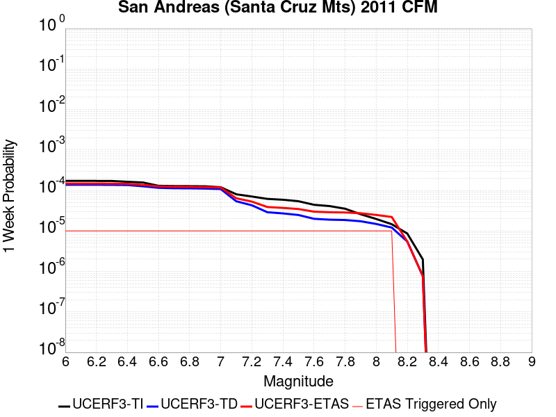 | 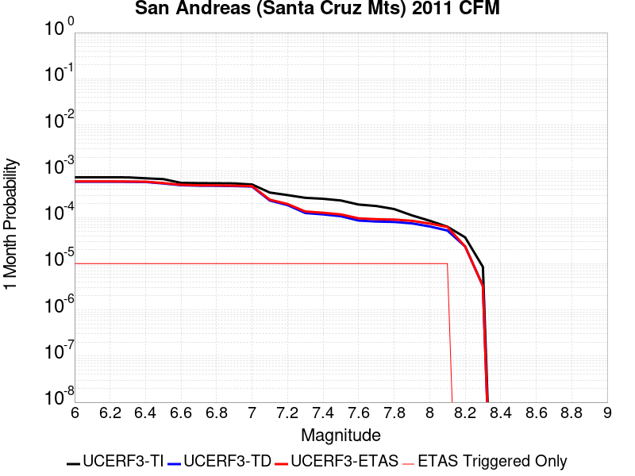 |  |  |

| Magnitude | 1 wk TI Prob | 1 wk TD Prob | 1 wk ETAS Prob | 1 wk ETAS/TD Gain | 1 wk ETAS Triggered Only | 1 mo TI Prob | 1 mo TD Prob | 1 mo ETAS Prob | 1 mo ETAS/TD Gain | 1 mo ETAS Triggered Only | 1 yr TI Prob | 1 yr TD Prob | 1 yr ETAS Prob | 1 yr ETAS/TD Gain | 1 yr ETAS Triggered Only | 10 yr TI Prob | 10 yr TD Prob | 10 yr ETAS Prob | 10 yr ETAS/TD Gain | 10 yr ETAS Triggered Only |
|-----|-----|-----|-----|-----|-----|-----|-----|-----|-----|-----|-----|-----|-----|-----|-----|-----|-----|-----|-----|-----|
| 6.0 | 1.7221631E-4 | 1.3823692E-4 | 1.6387111E-4 | 1.1854367 | 2.5637739E-5 | 7.378611E-4 | 5.923115E-4 | 6.1793404E-4 | 1.0432585 | 2.5637739E-5 | 0.008946515 | 0.0071879383 | 0.007213392 | 1.0035411 | 2.5637739E-5 | 0.08594794 | 0.070697196 | 0.070721015 | 1.000337 | 2.5637739E-5 |
| 6.1 | 1.7221631E-4 | 1.3823692E-4 | 1.6387111E-4 | 1.1854367 | 2.5637739E-5 | 7.378611E-4 | 5.923115E-4 | 6.1793404E-4 | 1.0432585 | 2.5637739E-5 | 0.008946515 | 0.0071879383 | 0.007213392 | 1.0035411 | 2.5637739E-5 | 0.08594794 | 0.070697196 | 0.070721015 | 1.000337 | 2.5637739E-5 |
| 6.2 | 1.7221631E-4 | 1.3823692E-4 | 1.6387111E-4 | 1.1854367 | 2.5637739E-5 | 7.378611E-4 | 5.923115E-4 | 6.1793404E-4 | 1.0432585 | 2.5637739E-5 | 0.008946515 | 0.0071879383 | 0.007213392 | 1.0035411 | 2.5637739E-5 | 0.08594794 | 0.070697196 | 0.070721015 | 1.000337 | 2.5637739E-5 |
| 6.3 | 1.716926E-4 | 1.3743078E-4 | 1.6306498E-4 | 1.1865246 | 2.5637739E-5 | 7.3561794E-4 | 5.888581E-4 | 6.1448076E-4 | 1.0435125 | 2.5637739E-5 | 0.008919428 | 0.0071461694 | 0.007171624 | 1.003562 | 2.5637739E-5 | 0.08569809 | 0.0703092 | 0.070333034 | 1.000339 | 2.5637739E-5 |
| 6.4 | 1.6392978E-4 | 1.3618424E-4 | 1.6181849E-4 | 1.1882321 | 2.5637739E-5 | 7.02367E-4 | 5.8351824E-4 | 6.09141E-4 | 1.0439109 | 2.5637739E-5 | 0.008517839 | 0.0070815794 | 0.0071070357 | 1.0035948 | 2.5637739E-5 | 0.08198654 | 0.06954003 | 0.06956389 | 1.0003431 | 2.5637739E-5 |
| 6.5 | 1.5742714E-4 | 1.26776E-4 | 1.5241047E-4 | 1.202203 | 2.5637739E-5 | 6.745133E-4 | 5.4321426E-4 | 5.688381E-4 | 1.0471708 | 2.5637739E-5 | 0.00818132 | 0.006593904 | 0.0066193724 | 1.0038625 | 2.5637739E-5 | 0.078865945 | 0.0649993 | 0.06502327 | 1.0003688 | 2.5637739E-5 |
| 6.6 | 1.3038084E-4 | 1.161551E-4 | 1.4178986E-4 | 1.2206943 | 2.5637739E-5 | 5.5865536E-4 | 4.9771386E-4 | 5.2333885E-4 | 1.0514854 | 2.5637739E-5 | 0.006780438 | 0.0060430723 | 0.006068555 | 1.0042169 | 2.5637739E-5 | 0.0657725 | 0.059452567 | 0.05947668 | 1.0004056 | 2.5637739E-5 |
| 6.7 | 1.2867592E-4 | 1.13418515E-4 | 1.3905334E-4 | 1.2260199 | 2.5637739E-5 | 5.5135164E-4 | 4.8599008E-4 | 5.1161536E-4 | 1.0527279 | 2.5637739E-5 | 0.0066920654 | 0.005901116 | 0.0059266025 | 1.004319 | 2.5637739E-5 | 0.06494093 | 0.05816314 | 0.058187287 | 1.0004152 | 2.5637739E-5 |
| 6.8 | 1.2801298E-4 | 1.1279377E-4 | 1.3842862E-4 | 1.2272718 | 2.5637739E-5 | 5.485117E-4 | 4.833136E-4 | 5.08939E-4 | 1.0530201 | 2.5637739E-5 | 0.0066577005 | 0.0058687064 | 0.005894194 | 1.0043429 | 2.5637739E-5 | 0.06461738 | 0.05787688 | 0.057901036 | 1.0004174 | 2.5637739E-5 |
| 6.9 | 1.269149E-4 | 1.11214715E-4 | 1.368496E-4 | 1.230499 | 2.5637739E-5 | 5.4380763E-4 | 4.765487E-4 | 5.021742E-4 | 1.0537732 | 2.5637739E-5 | 0.006600777 | 0.005786784 | 0.0058122734 | 1.0044048 | 2.5637739E-5 | 0.06408122 | 0.057148356 | 0.05717253 | 1.000423 | 2.5637739E-5 |
| 7.0 | 1.2030331E-4 | 1.0851204E-4 | 1.34147E-4 | 1.2362406 | 2.5637739E-5 | 5.154837E-4 | 4.6496998E-4 | 4.905958E-4 | 1.0551128 | 2.5637739E-5 | 0.006257969 | 0.005646552 | 0.005672045 | 1.0045148 | 2.5637739E-5 | 0.06084648 | 0.055819258 | 0.055843465 | 1.0004337 | 2.5637739E-5 |
| 7.1 | 8.049617E-5 | 5.4114953E-5 | 7.9751306E-5 | 1.4737388 | 2.5637739E-5 | 3.4493793E-4 | 2.319008E-4 | 2.575326E-4 | 1.1105291 | 2.5637739E-5 | 0.0041915346 | 0.0028197719 | 0.0028453374 | 1.0090665 | 2.5637739E-5 | 0.041133516 | 0.02971132 | 0.029736195 | 1.0008372 | 2.5637739E-5 |
| 7.2 | 7.093979E-5 | 4.310381E-5 | 6.8740446E-5 | 1.594765 | 2.5637739E-5 | 3.0399222E-4 | 1.8471766E-4 | 2.1035067E-4 | 1.1387686 | 2.5637739E-5 | 0.0036948253 | 0.0022466409 | 0.002272221 | 1.0113859 | 2.5637739E-5 | 0.03633994 | 0.024024088 | 0.02404911 | 1.0010415 | 2.5637739E-5 |
| 7.3 | 6.193693E-5 | 2.9018376E-5 | 5.465537E-5 | 1.8834745 | 2.5637739E-5 | 2.6541698E-4 | 1.2435856E-4 | 1.4999311E-4 | 1.2061342 | 2.5637739E-5 | 0.0032266637 | 0.0015130156 | 0.0015386145 | 1.0169191 | 2.5637739E-5 | 0.031802133 | 0.016564084 | 0.016589297 | 1.0015222 | 2.5637739E-5 |
| 7.4 | 5.906492E-5 | 2.7136244E-5 | 5.277329E-5 | 1.9447528 | 2.5637739E-5 | 2.5311083E-4 | 1.16293006E-4 | 1.4192777E-4 | 1.2204325 | 2.5637739E-5 | 0.0030772698 | 0.0014149492 | 0.0014405507 | 1.0180936 | 2.5637739E-5 | 0.030350044 | 0.015530545 | 0.015555785 | 1.0016252 | 2.5637739E-5 |
| 7.5 | 5.424296E-5 | 2.4776109E-5 | 5.041321E-5 | 2.034751 | 2.5637739E-5 | 2.324491E-4 | 1.0617901E-4 | 1.3181403E-4 | 1.2414321 | 2.5637739E-5 | 0.002826395 | 0.0012919641 | 0.0013175687 | 1.0198184 | 2.5637739E-5 | 0.027907165 | 0.014215293 | 0.014240567 | 1.0017779 | 2.5637739E-5 |
| 7.6 | 4.43084E-5 | 1.9971396E-5 | 4.5608624E-5 | 2.2836974 | 2.5637739E-5 | 1.8987931E-4 | 8.558889E-5 | 1.1122443E-4 | 1.2995195 | 2.5637739E-5 | 0.0023093296 | 0.0010415468 | 0.0010671578 | 1.0245894 | 2.5637739E-5 | 0.022854783 | 0.011448878 | 0.011474223 | 1.0022137 | 2.5637739E-5 |
| 7.7 | 4.118098E-5 | 1.8999577E-5 | 4.463683E-5 | 2.349359 | 2.5637739E-5 | 1.7647797E-4 | 8.1424216E-5 | 1.0705987E-4 | 1.3148407 | 2.5637739E-5 | 0.002146502 | 9.908893E-4 | 0.0010165016 | 1.0258478 | 2.5637739E-5 | 0.021258866 | 0.010904559 | 0.010929917 | 1.0023254 | 2.5637739E-5 |
| 7.8 | 3.5408906E-5 | 1.8625631E-5 | 4.426289E-5 | 2.3764505 | 2.5637739E-5 | 1.5174363E-4 | 7.982169E-5 | 1.0545739E-4 | 1.321162 | 2.5637739E-5 | 0.0018459131 | 9.7139605E-4 | 9.970089E-4 | 1.0263671 | 2.5637739E-5 | 0.018306552 | 0.0106848935 | 0.010710257 | 1.0023738 | 2.5637739E-5 |
| 7.9 | 2.5860836E-5 | 1.7371205E-5 | 4.30085E-5 | 2.47585 | 2.5637739E-5 | 1.10827445E-4 | 7.4445896E-5 | 1.0008173E-4 | 1.3443552 | 2.5637739E-5 | 0.001348489 | 9.060022E-4 | 9.316167E-4 | 1.028272 | 2.5637739E-5 | 0.013403354 | 0.009936898 | 0.009962281 | 1.0025544 | 2.5637739E-5 |
| 8.0 | 1.9777332E-5 | 1.4886952E-5 | 4.0524308E-5 | 2.722136 | 2.5637739E-5 | 8.4757245E-5 | 6.379966E-5 | 8.9435765E-5 | 1.401822 | 2.5637739E-5 | 0.0010314309 | 7.7648426E-4 | 8.021021E-4 | 1.0329921 | 2.5637739E-5 | 0.010266567 | 0.008534084 | 0.008559503 | 1.0029786 | 2.5637739E-5 |
| 8.1 | 1.468494E-5 | 1.2146339E-5 | 3.7783768E-5 | 3.1107123 | 2.5637739E-5 | 6.293394E-5 | 5.20547E-5 | 7.7691104E-5 | 1.4924897 | 2.5637739E-5 | 7.6595135E-4 | 6.3358183E-4 | 6.5920333E-4 | 1.0404391 | 2.5637739E-5 | 0.0076331664 | 0.0069899 | 0.0070153587 | 1.0036422 | 2.5637739E-5 |
| 8.2 | 8.63836E-6 | 5.489407E-6 | 5.489407E-6 | 1.0 | 0.0 | 3.7021015E-5 | 2.3525818E-5 | 2.3525818E-5 | 1.0 | 0.0 | 4.5063766E-4 | 2.863893E-4 | 2.863893E-4 | 1.0 | 0.0 | 0.004497249 | 0.0032568157 | 0.0032568157 | 1.0 | 0.0 |
| 8.3 | 1.983087E-6 | 7.693574E-7 | 7.693574E-7 | 1.0 | 0.0 | 8.498917E-6 | 3.297242E-6 | 3.297242E-6 | 1.0 | 0.0 | 1.034694E-4 | 4.01432E-5 | 4.01432E-5 | 1.0 | 0.0 | 0.0010342124 | 4.7390026E-4 | 4.7390026E-4 | 1.0 | 0.0 |

## Bullion Mountains
*[(top)](#table-of-contents)*

| 1 Week | 1 Month | 1 Year | 10 Year |
|-----|-----|-----|-----|
|  |  |  |  |

| Magnitude | 1 wk TI Prob | 1 wk TD Prob | 1 wk ETAS Prob | 1 wk ETAS/TD Gain | 1 wk ETAS Triggered Only | 1 mo TI Prob | 1 mo TD Prob | 1 mo ETAS Prob | 1 mo ETAS/TD Gain | 1 mo ETAS Triggered Only | 1 yr TI Prob | 1 yr TD Prob | 1 yr ETAS Prob | 1 yr ETAS/TD Gain | 1 yr ETAS Triggered Only | 10 yr TI Prob | 10 yr TD Prob | 10 yr ETAS Prob | 10 yr ETAS/TD Gain | 10 yr ETAS Triggered Only |
|-----|-----|-----|-----|-----|-----|-----|-----|-----|-----|-----|-----|-----|-----|-----|-----|-----|-----|-----|-----|-----|
| 6.0 | 1.6420427E-5 | 1.4692955E-5 | 1.4692955E-5 | 1.0 | 0.0 | 7.037136E-5 | 6.29685E-5 | 6.29685E-5 | 1.0 | 0.0 | 8.5643446E-4 | 7.6641026E-4 | 7.6641026E-4 | 1.0 | 0.0 | 0.008531413 | 0.007641465 | 0.007666907 | 1.0033294 | 2.5637739E-5 |
| 6.1 | 1.6420427E-5 | 1.4692955E-5 | 1.4692955E-5 | 1.0 | 0.0 | 7.037136E-5 | 6.29685E-5 | 6.29685E-5 | 1.0 | 0.0 | 8.5643446E-4 | 7.6641026E-4 | 7.6641026E-4 | 1.0 | 0.0 | 0.008531413 | 0.007641465 | 0.007666907 | 1.0033294 | 2.5637739E-5 |
| 6.2 | 1.6420427E-5 | 1.4692955E-5 | 1.4692955E-5 | 1.0 | 0.0 | 7.037136E-5 | 6.29685E-5 | 6.29685E-5 | 1.0 | 0.0 | 8.5643446E-4 | 7.6641026E-4 | 7.6641026E-4 | 1.0 | 0.0 | 0.008531413 | 0.007641465 | 0.007666907 | 1.0033294 | 2.5637739E-5 |
| 6.3 | 1.2046778E-5 | 9.862933E-6 | 9.862933E-6 | 1.0 | 0.0 | 5.1628023E-5 | 4.2269163E-5 | 4.2269163E-5 | 1.0 | 0.0 | 6.283899E-4 | 5.145287E-4 | 5.145287E-4 | 1.0 | 0.0 | 0.0062661595 | 0.005135656 | 0.005135656 | 1.0 | 0.0 |
| 6.4 | 1.2046778E-5 | 9.862933E-6 | 9.862933E-6 | 1.0 | 0.0 | 5.1628023E-5 | 4.2269163E-5 | 4.2269163E-5 | 1.0 | 0.0 | 6.283899E-4 | 5.145287E-4 | 5.145287E-4 | 1.0 | 0.0 | 0.0062661595 | 0.005135656 | 0.005135656 | 1.0 | 0.0 |
| 6.5 | 1.0244343E-5 | 7.879951E-6 | 7.879951E-6 | 1.0 | 0.0 | 4.390359E-5 | 3.37709E-5 | 3.37709E-5 | 1.0 | 0.0 | 5.343951E-4 | 4.1110383E-4 | 4.1110383E-4 | 1.0 | 0.0 | 0.005331118 | 0.0041054646 | 0.0041054646 | 1.0 | 0.0 |
| 6.6 | 9.605408E-6 | 7.1779527E-6 | 7.1779527E-6 | 1.0 | 0.0 | 4.1165385E-5 | 3.0762407E-5 | 3.0762407E-5 | 1.0 | 0.0 | 5.010733E-4 | 3.744883E-4 | 3.744883E-4 | 1.0 | 0.0 | 0.00499945 | 0.0037405696 | 0.0037405696 | 1.0 | 0.0 |
| 6.7 | 8.60418E-6 | 6.1244036E-6 | 6.1244036E-6 | 1.0 | 0.0 | 3.687454E-5 | 2.624729E-5 | 2.624729E-5 | 1.0 | 0.0 | 4.48855E-4 | 3.1953337E-4 | 3.1953337E-4 | 1.0 | 0.0 | 0.004479495 | 0.0031926516 | 0.0031926516 | 1.0 | 0.0 |
| 6.8 | 5.187994E-6 | 2.5633778E-6 | 2.5633778E-6 | 1.0 | 0.0 | 2.223407E-5 | 1.0985881E-5 | 1.0985881E-5 | 1.0 | 0.0 | 2.7066618E-4 | 1.3374888E-4 | 1.3374888E-4 | 1.0 | 0.0 | 0.0027033675 | 0.0013370755 | 0.0013370755 | 1.0 | 0.0 |
| 6.9 | 4.5302368E-6 | 2.3444993E-6 | 2.3444993E-6 | 1.0 | 0.0 | 1.9415156E-5 | 1.0047837E-5 | 1.0047837E-5 | 1.0 | 0.0 | 2.3635388E-4 | 1.2232953E-4 | 1.2232953E-4 | 1.0 | 0.0 | 0.0023610266 | 0.0012230111 | 0.0012230111 | 1.0 | 0.0 |
| 7.0 | 3.431668E-6 | 1.688382E-6 | 1.688382E-6 | 1.0 | 0.0 | 1.4707065E-5 | 7.235923E-6 | 7.235923E-6 | 1.0 | 0.0 | 1.7904381E-4 | 8.809736E-5 | 8.809736E-5 | 1.0 | 0.0 | 0.0017889962 | 8.809736E-4 | 8.809736E-4 | 1.0 | 0.0 |

## Big Pine (East)
*[(top)](#table-of-contents)*

| 1 Week | 1 Month | 1 Year | 10 Year |
|-----|-----|-----|-----|
|  |  |  |  |

| Magnitude | 1 wk TI Prob | 1 wk TD Prob | 1 wk ETAS Prob | 1 wk ETAS/TD Gain | 1 wk ETAS Triggered Only | 1 mo TI Prob | 1 mo TD Prob | 1 mo ETAS Prob | 1 mo ETAS/TD Gain | 1 mo ETAS Triggered Only | 1 yr TI Prob | 1 yr TD Prob | 1 yr ETAS Prob | 1 yr ETAS/TD Gain | 1 yr ETAS Triggered Only | 10 yr TI Prob | 10 yr TD Prob | 10 yr ETAS Prob | 10 yr ETAS/TD Gain | 10 yr ETAS Triggered Only |
|-----|-----|-----|-----|-----|-----|-----|-----|-----|-----|-----|-----|-----|-----|-----|-----|-----|-----|-----|-----|-----|
| 6.0 | 9.916913E-6 | 1.282197E-5 | 1.282197E-5 | 1.0 | 0.0 | 4.250036E-5 | 5.495027E-5 | 5.495027E-5 | 1.0 | 0.0 | 5.173191E-4 | 6.6883623E-4 | 6.6883623E-4 | 1.0 | 0.0 | 0.0051611643 | 0.0066729826 | 0.006698449 | 1.0038164 | 2.5637739E-5 |
| 6.1 | 9.916913E-6 | 1.282197E-5 | 1.282197E-5 | 1.0 | 0.0 | 4.250036E-5 | 5.495027E-5 | 5.495027E-5 | 1.0 | 0.0 | 5.173191E-4 | 6.6883623E-4 | 6.6883623E-4 | 1.0 | 0.0 | 0.0051611643 | 0.0066729826 | 0.006698449 | 1.0038164 | 2.5637739E-5 |
| 6.2 | 9.916913E-6 | 1.282197E-5 | 1.282197E-5 | 1.0 | 0.0 | 4.250036E-5 | 5.495027E-5 | 5.495027E-5 | 1.0 | 0.0 | 5.173191E-4 | 6.6883623E-4 | 6.6883623E-4 | 1.0 | 0.0 | 0.0051611643 | 0.0066729826 | 0.006698449 | 1.0038164 | 2.5637739E-5 |
| 6.3 | 5.479711E-6 | 8.117787E-6 | 8.117787E-6 | 1.0 | 0.0 | 2.3484265E-5 | 3.4790068E-5 | 3.4790068E-5 | 1.0 | 0.0 | 2.858834E-4 | 4.2348995E-4 | 4.2348995E-4 | 1.0 | 0.0 | 0.0028551589 | 0.004229713 | 0.0042552426 | 1.0060357 | 2.5637739E-5 |
| 6.4 | 5.465009E-6 | 8.10208E-6 | 8.10208E-6 | 1.0 | 0.0 | 2.3421257E-5 | 3.4722754E-5 | 3.4722754E-5 | 1.0 | 0.0 | 2.851165E-4 | 4.2267074E-4 | 4.2267074E-4 | 1.0 | 0.0 | 0.0028475097 | 0.004221552 | 0.0042470815 | 1.0060474 | 2.5637739E-5 |
| 6.5 | 4.826767E-6 | 7.4271156E-6 | 7.4271156E-6 | 1.0 | 0.0 | 2.068598E-5 | 3.183012E-5 | 3.183012E-5 | 1.0 | 0.0 | 2.518227E-4 | 3.874656E-4 | 3.874656E-4 | 1.0 | 0.0 | 0.0025153751 | 0.0038707424 | 0.003896281 | 1.0065979 | 2.5637739E-5 |
| 6.6 | 4.3146847E-6 | 6.887036E-6 | 6.887036E-6 | 1.0 | 0.0 | 1.8491375E-5 | 2.9515548E-5 | 2.9515548E-5 | 1.0 | 0.0 | 2.2510924E-4 | 3.59295E-4 | 3.59295E-4 | 1.0 | 0.0 | 0.0022488134 | 0.0035899505 | 0.0036154962 | 1.0071158 | 2.5637739E-5 |
| 6.7 | 3.6968106E-6 | 5.9999884E-6 | 5.9999884E-6 | 1.0 | 0.0 | 1.5843378E-5 | 2.571399E-5 | 2.571399E-5 | 1.0 | 0.0 | 1.9287605E-4 | 3.130244E-4 | 3.130244E-4 | 1.0 | 0.0 | 0.0019270873 | 0.0031285542 | 0.0031285542 | 1.0 | 0.0 |
| 6.8 | 3.4671132E-6 | 5.7065704E-6 | 5.7065704E-6 | 1.0 | 0.0 | 1.4858972E-5 | 2.4456509E-5 | 2.4456509E-5 | 1.0 | 0.0 | 1.8089297E-4 | 2.9771877E-4 | 2.9771877E-4 | 1.0 | 0.0 | 0.0018074579 | 0.0029759097 | 0.0029759097 | 1.0 | 0.0 |
| 6.9 | 2.7686972E-6 | 4.829279E-6 | 4.829279E-6 | 1.0 | 0.0 | 1.1865792E-5 | 2.069675E-5 | 2.069675E-5 | 1.0 | 0.0 | 1.4445644E-4 | 2.5195457E-4 | 2.5195457E-4 | 1.0 | 0.0 | 0.0014436257 | 0.0025193316 | 0.0025193316 | 1.0 | 0.0 |
| 7.0 | 2.1472624E-6 | 3.988725E-6 | 3.988725E-6 | 1.0 | 0.0 | 9.20252E-6 | 1.7094428E-5 | 1.7094428E-5 | 1.0 | 0.0 | 1.12034926E-4 | 2.0810531E-4 | 2.0810531E-4 | 1.0 | 0.0 | 0.0011197845 | 0.002081715 | 0.002081715 | 1.0 | 0.0 |
| 7.1 | 1.7018335E-6 | 3.348229E-6 | 3.348229E-6 | 1.0 | 0.0 | 7.293552E-6 | 1.4349476E-5 | 1.4349476E-5 | 1.0 | 0.0 | 8.879537E-5 | 1.7469123E-4 | 1.7469123E-4 | 1.0 | 0.0 | 8.87599E-4 | 0.0017481181 | 0.0017481181 | 1.0 | 0.0 |
| 7.2 | 1.25603E-6 | 2.7976516E-6 | 2.7976516E-6 | 1.0 | 0.0 | 5.3829745E-6 | 1.1989882E-5 | 1.1989882E-5 | 1.0 | 0.0 | 6.553574E-5 | 1.4596726E-4 | 1.4596726E-4 | 1.0 | 0.0 | 6.551642E-4 | 0.0014612685 | 0.0014612685 | 1.0 | 0.0 |
| 7.3 | 1.112297E-6 | 2.613323E-6 | 2.613323E-6 | 1.0 | 0.0 | 4.7669787E-6 | 1.1199909E-5 | 1.1199909E-5 | 1.0 | 0.0 | 5.803642E-5 | 1.3635057E-4 | 1.3635057E-4 | 1.0 | 0.0 | 5.802127E-4 | 0.0013650558 | 0.0013650558 | 1.0 | 0.0 |
| 7.4 | 1.0137181E-6 | 2.4863546E-6 | 2.4863546E-6 | 1.0 | 0.0 | 4.3444993E-6 | 1.0655763E-5 | 1.0655763E-5 | 1.0 | 0.0 | 5.2892992E-5 | 1.297264E-4 | 1.297264E-4 | 1.0 | 0.0 | 5.288041E-4 | 0.0012986774 | 0.0012986774 | 1.0 | 0.0 |
| 7.5 | 9.598608E-7 | 2.4099256E-6 | 2.4099256E-6 | 1.0 | 0.0 | 4.1136827E-6 | 1.0328214E-5 | 1.0328214E-5 | 1.0 | 0.0 | 5.0082934E-5 | 1.2573895E-4 | 1.2573895E-4 | 1.0 | 0.0 | 5.007165E-4 | 0.0012586572 | 0.0012586572 | 1.0 | 0.0 |
| 7.6 | 7.929459E-7 | 2.047312E-6 | 2.047312E-6 | 1.0 | 0.0 | 3.3983351E-6 | 8.7741655E-6 | 8.7741655E-6 | 1.0 | 0.0 | 4.1373947E-5 | 1.0682041E-4 | 1.0682041E-4 | 1.0 | 0.0 | 4.1366243E-4 | 0.0010697625 | 0.0010697625 | 1.0 | 0.0 |
| 7.7 | 4.155788E-7 | 1.162298E-6 | 1.162298E-6 | 1.0 | 0.0 | 1.7810507E-6 | 4.981268E-6 | 4.981268E-6 | 1.0 | 0.0 | 2.1684076E-5 | 6.064529E-5 | 6.064529E-5 | 1.0 | 0.0 | 2.1681961E-4 | 6.09451E-4 | 6.09451E-4 | 1.0 | 0.0 |
| 7.8 | 1.14666925E-7 | 2.5959213E-7 | 2.5959213E-7 | 1.0 | 0.0 | 4.914296E-7 | 1.1125372E-6 | 1.1125372E-6 | 1.0 | 0.0 | 5.9831386E-6 | 1.354506E-5 | 1.354506E-5 | 1.0 | 0.0 | 5.9829777E-5 | 1.3654139E-4 | 1.3654139E-4 | 1.0 | 0.0 |
| 7.9 | 2.9231824E-8 | 4.15291E-8 | 4.15291E-8 | 1.0 | 0.0 | 1.2527924E-7 | 1.7798183E-7 | 1.7798183E-7 | 1.0 | 0.0 | 1.5252737E-6 | 2.1669268E-6 | 2.1669268E-6 | 1.0 | 0.0 | 1.5252632E-5 | 2.2001832E-5 | 2.2001832E-5 | 1.0 | 0.0 |

## Pisgah-Bullion Mtn-Mesquite Lk
*[(top)](#table-of-contents)*

| 1 Week | 1 Month | 1 Year | 10 Year |
|-----|-----|-----|-----|
|  |  |  |  |

| Magnitude | 1 wk TI Prob | 1 wk TD Prob | 1 wk ETAS Prob | 1 wk ETAS/TD Gain | 1 wk ETAS Triggered Only | 1 mo TI Prob | 1 mo TD Prob | 1 mo ETAS Prob | 1 mo ETAS/TD Gain | 1 mo ETAS Triggered Only | 1 yr TI Prob | 1 yr TD Prob | 1 yr ETAS Prob | 1 yr ETAS/TD Gain | 1 yr ETAS Triggered Only | 10 yr TI Prob | 10 yr TD Prob | 10 yr ETAS Prob | 10 yr ETAS/TD Gain | 10 yr ETAS Triggered Only |
|-----|-----|-----|-----|-----|-----|-----|-----|-----|-----|-----|-----|-----|-----|-----|-----|-----|-----|-----|-----|-----|
| 6.0 | 3.0240792E-5 | 2.409264E-5 | 2.409264E-5 | 1.0 | 0.0 | 1.2959696E-4 | 1.03250655E-4 | 1.03250655E-4 | 1.0 | 0.0 | 0.0015767008 | 0.0012564523 | 0.0012564523 | 1.0 | 0.0 | 0.015655609 | 0.012503509 | 0.0125288265 | 1.0020248 | 2.5637739E-5 |
| 6.1 | 3.0240792E-5 | 2.409264E-5 | 2.409264E-5 | 1.0 | 0.0 | 1.2959696E-4 | 1.03250655E-4 | 1.03250655E-4 | 1.0 | 0.0 | 0.0015767008 | 0.0012564523 | 0.0012564523 | 1.0 | 0.0 | 0.015655609 | 0.012503509 | 0.0125288265 | 1.0020248 | 2.5637739E-5 |
| 6.2 | 3.0240792E-5 | 2.409264E-5 | 2.409264E-5 | 1.0 | 0.0 | 1.2959696E-4 | 1.03250655E-4 | 1.03250655E-4 | 1.0 | 0.0 | 0.0015767008 | 0.0012564523 | 0.0012564523 | 1.0 | 0.0 | 0.015655609 | 0.012503509 | 0.0125288265 | 1.0020248 | 2.5637739E-5 |
| 6.3 | 2.0498217E-5 | 1.3638809E-5 | 1.3638809E-5 | 1.0 | 0.0 | 8.784654E-5 | 5.845082E-5 | 5.845082E-5 | 1.0 | 0.0 | 0.0010690069 | 7.114226E-4 | 7.114226E-4 | 1.0 | 0.0 | 0.01063879 | 0.0070930775 | 0.0071185334 | 1.0035888 | 2.5637739E-5 |
| 6.4 | 2.0498217E-5 | 1.3638809E-5 | 1.3638809E-5 | 1.0 | 0.0 | 8.784654E-5 | 5.845082E-5 | 5.845082E-5 | 1.0 | 0.0 | 0.0010690069 | 7.114226E-4 | 7.114226E-4 | 1.0 | 0.0 | 0.01063879 | 0.0070930775 | 0.0071185334 | 1.0035888 | 2.5637739E-5 |
| 6.5 | 1.7316182E-5 | 1.0477582E-5 | 1.0477582E-5 | 1.0 | 0.0 | 7.42101E-5 | 4.490321E-5 | 4.490321E-5 | 1.0 | 0.0 | 9.0313336E-4 | 5.465694E-4 | 5.465694E-4 | 1.0 | 0.0 | 0.008994718 | 0.005453247 | 0.005453247 | 1.0 | 0.0 |
| 6.6 | 1.5251077E-5 | 8.414691E-6 | 8.414691E-6 | 1.0 | 0.0 | 6.536012E-5 | 3.6062505E-5 | 3.6062505E-5 | 1.0 | 0.0 | 7.9546886E-4 | 4.389798E-4 | 4.389798E-4 | 1.0 | 0.0 | 0.007926274 | 0.004381844 | 0.004381844 | 1.0 | 0.0 |
| 6.7 | 1.2997425E-5 | 6.4118035E-6 | 6.4118035E-6 | 1.0 | 0.0 | 5.570206E-5 | 2.7478894E-5 | 2.7478894E-5 | 1.0 | 0.0 | 6.7796157E-4 | 3.3450883E-4 | 3.3450883E-4 | 1.0 | 0.0 | 0.0067589693 | 0.0033405134 | 0.0033405134 | 1.0 | 0.0 |
| 6.8 | 1.035386E-5 | 4.3334735E-6 | 4.3334735E-6 | 1.0 | 0.0 | 4.437293E-5 | 1.8571902E-5 | 1.8571902E-5 | 1.0 | 0.0 | 5.401065E-4 | 2.2609031E-4 | 2.2609031E-4 | 1.0 | 0.0 | 0.0053879567 | 0.0022586898 | 0.0022586898 | 1.0 | 0.0 |
| 6.9 | 8.816252E-6 | 3.580855E-6 | 3.580855E-6 | 1.0 | 0.0 | 3.778339E-5 | 1.5346433E-5 | 1.5346433E-5 | 1.0 | 0.0 | 4.5991567E-4 | 1.8682741E-4 | 1.8682741E-4 | 1.0 | 0.0 | 0.00458965 | 0.0018667618 | 0.0018667618 | 1.0 | 0.0 |
| 7.0 | 6.8232207E-6 | 2.5677498E-6 | 2.5677498E-6 | 1.0 | 0.0 | 2.9242048E-5 | 1.1004598E-5 | 1.1004598E-5 | 1.0 | 0.0 | 3.5596377E-4 | 1.3397305E-4 | 1.3397305E-4 | 1.0 | 0.0 | 0.0035539411 | 0.0013389539 | 0.0013389539 | 1.0 | 0.0 |
| 7.1 | 5.837013E-6 | 2.2275226E-6 | 2.2275226E-6 | 1.0 | 0.0 | 2.501553E-5 | 9.546492E-6 | 9.546492E-6 | 1.0 | 0.0 | 3.045215E-4 | 1.1622263E-4 | 1.1622263E-4 | 1.0 | 0.0 | 0.0030410455 | 0.0011616475 | 0.0011616475 | 1.0 | 0.0 |
| 7.2 | 4.278052E-6 | 1.6276728E-6 | 1.6276728E-6 | 1.0 | 0.0 | 1.833438E-5 | 6.975723E-6 | 6.975723E-6 | 1.0 | 0.0 | 2.231982E-4 | 8.492635E-5 | 8.492635E-5 | 1.0 | 0.0 | 0.0022297418 | 8.489622E-4 | 8.489622E-4 | 1.0 | 0.0 |
| 7.3 | 1.8803692E-6 | 8.345377E-7 | 8.345377E-7 | 1.0 | 0.0 | 8.0587E-6 | 3.576586E-6 | 3.576586E-6 | 1.0 | 0.0 | 9.811026E-5 | 4.3544213E-5 | 4.3544213E-5 | 1.0 | 0.0 | 9.806695E-4 | 4.3537127E-4 | 4.3537127E-4 | 1.0 | 0.0 |

## Cleghorn Lake
*[(top)](#table-of-contents)*

| 1 Week | 1 Month | 1 Year | 10 Year |
|-----|-----|-----|-----|
|  |  |  |  |

| Magnitude | 1 wk TI Prob | 1 wk TD Prob | 1 wk ETAS Prob | 1 wk ETAS/TD Gain | 1 wk ETAS Triggered Only | 1 mo TI Prob | 1 mo TD Prob | 1 mo ETAS Prob | 1 mo ETAS/TD Gain | 1 mo ETAS Triggered Only | 1 yr TI Prob | 1 yr TD Prob | 1 yr ETAS Prob | 1 yr ETAS/TD Gain | 1 yr ETAS Triggered Only | 10 yr TI Prob | 10 yr TD Prob | 10 yr ETAS Prob | 10 yr ETAS/TD Gain | 10 yr ETAS Triggered Only |
|-----|-----|-----|-----|-----|-----|-----|-----|-----|-----|-----|-----|-----|-----|-----|-----|-----|-----|-----|-----|-----|
| 6.0 | 1.5467183E-5 | 1.6794971E-5 | 1.6794971E-5 | 1.0 | 0.0 | 6.6286244E-5 | 7.197677E-5 | 7.197677E-5 | 1.0 | 0.0 | 8.067362E-4 | 8.760197E-4 | 8.760197E-4 | 1.0 | 0.0 | 0.008038137 | 0.008731093 | 0.008756506 | 1.0029107 | 2.5637739E-5 |
| 6.1 | 1.5467183E-5 | 1.6794971E-5 | 1.6794971E-5 | 1.0 | 0.0 | 6.6286244E-5 | 7.197677E-5 | 7.197677E-5 | 1.0 | 0.0 | 8.067362E-4 | 8.760197E-4 | 8.760197E-4 | 1.0 | 0.0 | 0.008038137 | 0.008731093 | 0.008756506 | 1.0029107 | 2.5637739E-5 |
| 6.2 | 1.2624631E-5 | 1.36821545E-5 | 1.36821545E-5 | 1.0 | 0.0 | 5.410444E-5 | 5.863676E-5 | 5.863676E-5 | 1.0 | 0.0 | 6.585225E-4 | 7.137174E-4 | 7.137174E-4 | 1.0 | 0.0 | 0.0065657445 | 0.0071190484 | 0.0071190484 | 1.0 | 0.0 |
| 6.3 | 1.2624631E-5 | 1.36821545E-5 | 1.36821545E-5 | 1.0 | 0.0 | 5.410444E-5 | 5.863676E-5 | 5.863676E-5 | 1.0 | 0.0 | 6.585225E-4 | 7.137174E-4 | 7.137174E-4 | 1.0 | 0.0 | 0.0065657445 | 0.0071190484 | 0.0071190484 | 1.0 | 0.0 |
| 6.4 | 9.417684E-6 | 1.0170551E-5 | 1.0170551E-5 | 1.0 | 0.0 | 4.036088E-5 | 4.3587577E-5 | 4.3587577E-5 | 1.0 | 0.0 | 4.912829E-4 | 5.3059065E-4 | 5.3059065E-4 | 1.0 | 0.0 | 0.004901982 | 0.0052972743 | 0.0052972743 | 1.0 | 0.0 |
| 6.5 | 9.368219E-6 | 1.0117976E-5 | 1.0117976E-5 | 1.0 | 0.0 | 4.014889E-5 | 4.3362263E-5 | 4.3362263E-5 | 1.0 | 0.0 | 4.8870314E-4 | 5.278488E-4 | 5.278488E-4 | 1.0 | 0.0 | 0.004876298 | 0.0052699856 | 0.0052699856 | 1.0 | 0.0 |
| 6.6 | 7.803798E-6 | 8.442198E-6 | 8.442198E-6 | 1.0 | 0.0 | 3.3444423E-5 | 3.6180576E-5 | 3.6180576E-5 | 1.0 | 0.0 | 4.0710976E-4 | 4.404494E-4 | 4.404494E-4 | 1.0 | 0.0 | 0.0040636472 | 0.004399682 | 0.004399682 | 1.0 | 0.0 |
| 6.7 | 2.3108669E-6 | 2.4439082E-6 | 2.4439082E-6 | 1.0 | 0.0 | 9.903678E-6 | 1.0473852E-5 | 1.0473852E-5 | 1.0 | 0.0 | 1.205706E-4 | 1.2751187E-4 | 1.2751187E-4 | 1.0 | 0.0 | 0.001205052 | 0.0012744057 | 0.0012744057 | 1.0 | 0.0 |
| 6.8 | 2.0882828E-6 | 2.2063484E-6 | 2.2063484E-6 | 1.0 | 0.0 | 8.949753E-6 | 9.455745E-6 | 9.455745E-6 | 1.0 | 0.0 | 1.08957785E-4 | 1.15117786E-4 | 1.15117786E-4 | 1.0 | 0.0 | 0.0010890438 | 0.0011505984 | 0.0011505984 | 1.0 | 0.0 |
| 6.9 | 1.876935E-6 | 1.9811093E-6 | 1.9811093E-6 | 1.0 | 0.0 | 8.043982E-6 | 8.490441E-6 | 8.490441E-6 | 1.0 | 0.0 | 9.7931086E-5 | 1.0336639E-4 | 1.0336639E-4 | 1.0 | 0.0 | 9.788794E-4 | 0.001033199 | 0.001033199 | 1.0 | 0.0 |
| 7.0 | 1.5357559E-6 | 1.620328E-6 | 1.620328E-6 | 1.0 | 0.0 | 6.5817944E-6 | 6.9442453E-6 | 6.9442453E-6 | 1.0 | 0.0 | 8.01304E-5 | 8.454303E-5 | 8.454303E-5 | 1.0 | 0.0 | 8.010151E-4 | 8.4512116E-4 | 8.4512116E-4 | 1.0 | 0.0 |
| 7.1 | 1.0905424E-6 | 1.1497951E-6 | 1.1497951E-6 | 1.0 | 0.0 | 4.6737446E-6 | 4.9276846E-6 | 4.9276846E-6 | 1.0 | 0.0 | 5.6901354E-5 | 5.9993006E-5 | 5.9993006E-5 | 1.0 | 0.0 | 5.6886784E-4 | 5.997779E-4 | 5.997779E-4 | 1.0 | 0.0 |
| 7.2 | 6.06668E-7 | 6.387457E-7 | 6.387457E-7 | 1.0 | 0.0 | 2.600003E-6 | 2.737479E-6 | 2.737479E-6 | 1.0 | 0.0 | 3.1654577E-5 | 3.3328364E-5 | 3.3328364E-5 | 1.0 | 0.0 | 3.1650066E-4 | 3.3324052E-4 | 3.3324052E-4 | 1.0 | 0.0 |

## San Diego Trough north alt1
*[(top)](#table-of-contents)*

| 1 Week | 1 Month | 1 Year | 10 Year |
|-----|-----|-----|-----|
|  |  |  |  |

| Magnitude | 1 wk TI Prob | 1 wk TD Prob | 1 wk ETAS Prob | 1 wk ETAS/TD Gain | 1 wk ETAS Triggered Only | 1 mo TI Prob | 1 mo TD Prob | 1 mo ETAS Prob | 1 mo ETAS/TD Gain | 1 mo ETAS Triggered Only | 1 yr TI Prob | 1 yr TD Prob | 1 yr ETAS Prob | 1 yr ETAS/TD Gain | 1 yr ETAS Triggered Only | 10 yr TI Prob | 10 yr TD Prob | 10 yr ETAS Prob | 10 yr ETAS/TD Gain | 10 yr ETAS Triggered Only |
|-----|-----|-----|-----|-----|-----|-----|-----|-----|-----|-----|-----|-----|-----|-----|-----|-----|-----|-----|-----|-----|
| 6.0 | 7.329252E-5 | 8.822077E-5 | 8.822077E-5 | 1.0 | 0.0 | 3.14073E-4 | 3.7803786E-4 | 3.7803786E-4 | 1.0 | 0.0 | 0.0038171355 | 0.0045935363 | 0.0045935363 | 1.0 | 0.0 | 0.03752231 | 0.04504978 | 0.04507426 | 1.0005435 | 2.5637739E-5 |
| 6.1 | 3.7940346E-5 | 4.488948E-5 | 4.488948E-5 | 1.0 | 0.0 | 1.6259136E-4 | 1.9236986E-4 | 1.9236986E-4 | 1.0 | 0.0 | 0.0019777524 | 0.0023396744 | 0.0023396744 | 1.0 | 0.0 | 0.019602431 | 0.023158934 | 0.023158934 | 1.0 | 0.0 |
| 6.2 | 2.8645263E-5 | 3.3299704E-5 | 3.3299704E-5 | 1.0 | 0.0 | 1.2275964E-4 | 1.4270536E-4 | 1.4270536E-4 | 1.0 | 0.0 | 0.0014935739 | 0.0017360692 | 0.0017360692 | 1.0 | 0.0 | 0.0148357535 | 0.017227737 | 0.017227737 | 1.0 | 0.0 |
| 6.3 | 2.8645263E-5 | 3.3299704E-5 | 3.3299704E-5 | 1.0 | 0.0 | 1.2275964E-4 | 1.4270536E-4 | 1.4270536E-4 | 1.0 | 0.0 | 0.0014935739 | 0.0017360692 | 0.0017360692 | 1.0 | 0.0 | 0.0148357535 | 0.017227737 | 0.017227737 | 1.0 | 0.0 |
| 6.4 | 2.2204576E-5 | 2.5450314E-5 | 2.5450314E-5 | 1.0 | 0.0 | 9.5159E-5 | 1.0906827E-4 | 1.0906827E-4 | 1.0 | 0.0 | 0.001157945 | 0.0013271073 | 0.0013271073 | 1.0 | 0.0 | 0.011519298 | 0.013192981 | 0.013192981 | 1.0 | 0.0 |
| 6.5 | 2.1004838E-5 | 2.4026547E-5 | 2.4026547E-5 | 1.0 | 0.0 | 9.0017624E-5 | 1.0296691E-4 | 1.0296691E-4 | 1.0 | 0.0 | 0.0010954136 | 0.0012529104 | 0.0012529104 | 1.0 | 0.0 | 0.010900296 | 0.012459543 | 0.012459543 | 1.0 | 0.0 |
| 6.6 | 1.820557E-5 | 2.0706308E-5 | 2.0706308E-5 | 1.0 | 0.0 | 7.802154E-5 | 8.8738336E-5 | 8.8738336E-5 | 1.0 | 0.0 | 9.4949827E-4 | 0.0010798592 | 0.0010798592 | 1.0 | 0.0 | 0.009454516 | 0.01074679 | 0.01074679 | 1.0 | 0.0 |
| 6.7 | 1.5884485E-5 | 1.7984918E-5 | 1.7984918E-5 | 1.0 | 0.0 | 6.807459E-5 | 7.707596E-5 | 7.707596E-5 | 1.0 | 0.0 | 8.284929E-4 | 9.379985E-4 | 9.379985E-4 | 1.0 | 0.0 | 0.008254109 | 0.009340761 | 0.009340761 | 1.0 | 0.0 |
| 6.8 | 1.4331171E-5 | 1.6202195E-5 | 1.6202195E-5 | 1.0 | 0.0 | 6.141786E-5 | 6.9436144E-5 | 6.9436144E-5 | 1.0 | 0.0 | 7.4750587E-4 | 8.450591E-4 | 8.450591E-4 | 1.0 | 0.0 | 0.0074499645 | 0.008418724 | 0.008418724 | 1.0 | 0.0 |
| 6.9 | 1.2574203E-5 | 1.4206819E-5 | 1.4206819E-5 | 1.0 | 0.0 | 5.3888325E-5 | 6.0884955E-5 | 6.0884955E-5 | 1.0 | 0.0 | 6.558929E-4 | 7.410236E-4 | 7.410236E-4 | 1.0 | 0.0 | 0.0065396037 | 0.0073857135 | 0.0073857135 | 1.0 | 0.0 |
| 7.0 | 1.0883844E-5 | 1.2290109E-5 | 1.2290109E-5 | 1.0 | 0.0 | 4.664421E-5 | 5.267084E-5 | 5.267084E-5 | 1.0 | 0.0 | 5.677453E-4 | 6.4107974E-4 | 6.4107974E-4 | 1.0 | 0.0 | 0.00566297 | 0.0063924324 | 0.0063924324 | 1.0 | 0.0 |
| 7.1 | 9.393088E-6 | 1.0607752E-5 | 1.0607752E-5 | 1.0 | 0.0 | 4.025547E-5 | 4.546101E-5 | 4.546101E-5 | 1.0 | 0.0 | 4.900001E-4 | 5.53348E-4 | 5.53348E-4 | 1.0 | 0.0 | 0.0048892107 | 0.005519798 | 0.005519798 | 1.0 | 0.0 |
| 7.2 | 8.190791E-6 | 9.259271E-6 | 9.259271E-6 | 1.0 | 0.0 | 3.510292E-5 | 3.968199E-5 | 3.968199E-5 | 1.0 | 0.0 | 4.2729423E-4 | 4.830218E-4 | 4.830218E-4 | 1.0 | 0.0 | 0.0042647356 | 0.0048197997 | 0.0048197997 | 1.0 | 0.0 |
| 7.3 | 6.268162E-6 | 7.090212E-6 | 7.090212E-6 | 1.0 | 0.0 | 2.6863276E-5 | 3.0386273E-5 | 3.0386273E-5 | 1.0 | 0.0 | 3.2701128E-4 | 3.6989048E-4 | 3.6989048E-4 | 1.0 | 0.0 | 0.003265305 | 0.0036927941 | 0.0036927941 | 1.0 | 0.0 |
| 7.4 | 4.985186E-6 | 5.643079E-6 | 5.643079E-6 | 1.0 | 0.0 | 2.1364907E-5 | 2.4184403E-5 | 2.4184403E-5 | 1.0 | 0.0 | 2.600867E-4 | 2.944057E-4 | 2.944057E-4 | 1.0 | 0.0 | 0.002597825 | 0.0029401982 | 0.0029401982 | 1.0 | 0.0 |
| 7.5 | 1.7489613E-6 | 1.9698116E-6 | 1.9698116E-6 | 1.0 | 0.0 | 7.495527E-6 | 8.4420235E-6 | 8.4420235E-6 | 1.0 | 0.0 | 9.125422E-5 | 1.0277701E-4 | 1.0277701E-4 | 1.0 | 0.0 | 9.1216754E-4 | 0.0010273168 | 0.0010273168 | 1.0 | 0.0 |
| 7.6 | 1.6988751E-7 | 1.7534121E-7 | 1.7534121E-7 | 1.0 | 0.0 | 7.2808916E-7 | 7.5146215E-7 | 7.5146215E-7 | 1.0 | 0.0 | 8.864449E-6 | 9.149016E-6 | 9.149016E-6 | 1.0 | 0.0 | 8.8640954E-5 | 9.148658E-5 | 9.148658E-5 | 1.0 | 0.0 |

## Channel Islands Thrust
*[(top)](#table-of-contents)*

| 1 Week | 1 Month | 1 Year | 10 Year |
|-----|-----|-----|-----|
|  |  |  |  |

| Magnitude | 1 wk TI Prob | 1 wk TD Prob | 1 wk ETAS Prob | 1 wk ETAS/TD Gain | 1 wk ETAS Triggered Only | 1 mo TI Prob | 1 mo TD Prob | 1 mo ETAS Prob | 1 mo ETAS/TD Gain | 1 mo ETAS Triggered Only | 1 yr TI Prob | 1 yr TD Prob | 1 yr ETAS Prob | 1 yr ETAS/TD Gain | 1 yr ETAS Triggered Only | 10 yr TI Prob | 10 yr TD Prob | 10 yr ETAS Prob | 10 yr ETAS/TD Gain | 10 yr ETAS Triggered Only |
|-----|-----|-----|-----|-----|-----|-----|-----|-----|-----|-----|-----|-----|-----|-----|-----|-----|-----|-----|-----|-----|
| 6.0 | 2.2156251E-5 | 2.4093148E-5 | 2.4093148E-5 | 1.0 | 0.0 | 9.495191E-5 | 1.0325286E-4 | 1.0325286E-4 | 1.0 | 0.0 | 0.0011554264 | 0.0012564851 | 0.0012564851 | 1.0 | 0.0 | 0.011494373 | 0.012504402 | 0.012529719 | 1.0020247 | 2.5637739E-5 |
| 6.1 | 2.2156251E-5 | 2.4093148E-5 | 2.4093148E-5 | 1.0 | 0.0 | 9.495191E-5 | 1.0325286E-4 | 1.0325286E-4 | 1.0 | 0.0 | 0.0011554264 | 0.0012564851 | 0.0012564851 | 1.0 | 0.0 | 0.011494373 | 0.012504402 | 0.012529719 | 1.0020247 | 2.5637739E-5 |
| 6.2 | 2.2156251E-5 | 2.4093148E-5 | 2.4093148E-5 | 1.0 | 0.0 | 9.495191E-5 | 1.0325286E-4 | 1.0325286E-4 | 1.0 | 0.0 | 0.0011554264 | 0.0012564851 | 0.0012564851 | 1.0 | 0.0 | 0.011494373 | 0.012504402 | 0.012529719 | 1.0020247 | 2.5637739E-5 |
| 6.3 | 2.2156251E-5 | 2.4093148E-5 | 2.4093148E-5 | 1.0 | 0.0 | 9.495191E-5 | 1.0325286E-4 | 1.0325286E-4 | 1.0 | 0.0 | 0.0011554264 | 0.0012564851 | 0.0012564851 | 1.0 | 0.0 | 0.011494373 | 0.012504402 | 0.012529719 | 1.0020247 | 2.5637739E-5 |
| 6.4 | 2.2156251E-5 | 2.4093148E-5 | 2.4093148E-5 | 1.0 | 0.0 | 9.495191E-5 | 1.0325286E-4 | 1.0325286E-4 | 1.0 | 0.0 | 0.0011554264 | 0.0012564851 | 0.0012564851 | 1.0 | 0.0 | 0.011494373 | 0.012504402 | 0.012529719 | 1.0020247 | 2.5637739E-5 |
| 6.5 | 2.2156251E-5 | 2.4093148E-5 | 2.4093148E-5 | 1.0 | 0.0 | 9.495191E-5 | 1.0325286E-4 | 1.0325286E-4 | 1.0 | 0.0 | 0.0011554264 | 0.0012564851 | 0.0012564851 | 1.0 | 0.0 | 0.011494373 | 0.012504402 | 0.012529719 | 1.0020247 | 2.5637739E-5 |
| 6.6 | 2.2156251E-5 | 2.4093148E-5 | 2.4093148E-5 | 1.0 | 0.0 | 9.495191E-5 | 1.0325286E-4 | 1.0325286E-4 | 1.0 | 0.0 | 0.0011554264 | 0.0012564851 | 0.0012564851 | 1.0 | 0.0 | 0.011494373 | 0.012504402 | 0.012529719 | 1.0020247 | 2.5637739E-5 |
| 6.7 | 1.0601296E-5 | 1.1379993E-5 | 1.1379993E-5 | 1.0 | 0.0 | 4.5433335E-5 | 4.8770515E-5 | 4.8770515E-5 | 1.0 | 0.0 | 5.5301044E-4 | 5.9362414E-4 | 5.9362414E-4 | 1.0 | 0.0 | 0.005516363 | 0.0059208865 | 0.0059208865 | 1.0 | 0.0 |
| 6.8 | 1.0246747E-5 | 1.09971015E-5 | 1.09971015E-5 | 1.0 | 0.0 | 4.391389E-5 | 4.712961E-5 | 4.712961E-5 | 1.0 | 0.0 | 5.345204E-4 | 5.7365675E-4 | 5.7365675E-4 | 1.0 | 0.0 | 0.0053323656 | 0.0057222494 | 0.0057222494 | 1.0 | 0.0 |
| 6.9 | 9.049551E-6 | 9.70002E-6 | 9.70002E-6 | 1.0 | 0.0 | 3.878322E-5 | 4.1570875E-5 | 4.1570875E-5 | 1.0 | 0.0 | 4.7208337E-4 | 5.0601194E-4 | 5.0601194E-4 | 1.0 | 0.0 | 0.0047108172 | 0.0050490154 | 0.0050490154 | 1.0 | 0.0 |
| 7.0 | 8.6542195E-6 | 9.2749615E-6 | 9.2749615E-6 | 1.0 | 0.0 | 3.7088983E-5 | 3.9749255E-5 | 3.9749255E-5 | 1.0 | 0.0 | 4.5146482E-4 | 4.8384376E-4 | 4.8384376E-4 | 1.0 | 0.0 | 0.004505487 | 0.004828315 | 0.004828315 | 1.0 | 0.0 |
| 7.1 | 8.391028E-6 | 8.993273E-6 | 8.993273E-6 | 1.0 | 0.0 | 3.5961057E-5 | 3.8542054E-5 | 3.8542054E-5 | 1.0 | 0.0 | 4.3773788E-4 | 4.6915252E-4 | 4.6915252E-4 | 1.0 | 0.0 | 0.004368766 | 0.004682031 | 0.004682031 | 1.0 | 0.0 |
| 7.2 | 5.965188E-6 | 6.3719312E-6 | 6.3719312E-6 | 1.0 | 0.0 | 2.556484E-5 | 2.7307993E-5 | 2.7307993E-5 | 1.0 | 0.0 | 3.1120746E-4 | 3.3242465E-4 | 3.3242465E-4 | 1.0 | 0.0 | 0.00310772 | 0.003319332 | 0.003319332 | 1.0 | 0.0 |
| 7.3 | 4.877518E-6 | 5.2061982E-6 | 5.2061982E-6 | 1.0 | 0.0 | 2.0903482E-5 | 2.231209E-5 | 2.231209E-5 | 1.0 | 0.0 | 2.5447016E-4 | 2.7161627E-4 | 2.7161627E-4 | 1.0 | 0.0 | 0.0025417898 | 0.002712889 | 0.002712889 | 1.0 | 0.0 |
| 7.4 | 3.8829853E-6 | 4.142015E-6 | 4.142015E-6 | 1.0 | 0.0 | 1.664126E-5 | 1.7751374E-5 | 1.7751374E-5 | 1.0 | 0.0 | 2.0258849E-4 | 2.1610195E-4 | 2.1610195E-4 | 1.0 | 0.0 | 0.002024039 | 0.0021589599 | 0.0021589599 | 1.0 | 0.0 |
| 7.5 | 1.3489616E-6 | 1.4278398E-6 | 1.4278398E-6 | 1.0 | 0.0 | 5.7812517E-6 | 6.1192995E-6 | 6.1192995E-6 | 1.0 | 0.0 | 7.038446E-5 | 7.449996E-5 | 7.449996E-5 | 1.0 | 0.0 | 7.036218E-4 | 7.4475387E-4 | 7.4475387E-4 | 1.0 | 0.0 |
| 7.6 | 6.058192E-7 | 6.353994E-7 | 6.353994E-7 | 1.0 | 0.0 | 2.5963652E-6 | 2.7231374E-6 | 2.7231374E-6 | 1.0 | 0.0 | 3.161029E-5 | 3.315371E-5 | 3.315371E-5 | 1.0 | 0.0 | 3.1605794E-4 | 3.3148925E-4 | 3.3148925E-4 | 1.0 | 0.0 |
| 7.7 | 2.2170494E-7 | 2.260861E-7 | 2.260861E-7 | 1.0 | 0.0 | 9.5016367E-7 | 9.689402E-7 | 9.689402E-7 | 1.0 | 0.0 | 1.1568181E-5 | 1.1796794E-5 | 1.1796794E-5 | 1.0 | 0.0 | 1.1567579E-4 | 1.1796278E-4 | 1.1796278E-4 | 1.0 | 0.0 |
| 7.8 | 2.1613102E-8 | 1.5467108E-8 | 1.5467108E-8 | 1.0 | 0.0 | 9.262757E-8 | 6.6287605E-8 | 6.6287605E-8 | 1.0 | 0.0 | 1.1277401E-6 | 8.070513E-7 | 8.070513E-7 | 1.0 | 0.0 | 1.1277344E-5 | 8.070492E-6 | 8.070492E-6 | 1.0 | 0.0 |

## Red Mountain
*[(top)](#table-of-contents)*

| 1 Week | 1 Month | 1 Year | 10 Year |
|-----|-----|-----|-----|
|  |  |  |  |

| Magnitude | 1 wk TI Prob | 1 wk TD Prob | 1 wk ETAS Prob | 1 wk ETAS/TD Gain | 1 wk ETAS Triggered Only | 1 mo TI Prob | 1 mo TD Prob | 1 mo ETAS Prob | 1 mo ETAS/TD Gain | 1 mo ETAS Triggered Only | 1 yr TI Prob | 1 yr TD Prob | 1 yr ETAS Prob | 1 yr ETAS/TD Gain | 1 yr ETAS Triggered Only | 10 yr TI Prob | 10 yr TD Prob | 10 yr ETAS Prob | 10 yr ETAS/TD Gain | 10 yr ETAS Triggered Only |
|-----|-----|-----|-----|-----|-----|-----|-----|-----|-----|-----|-----|-----|-----|-----|-----|-----|-----|-----|-----|-----|
| 6.0 | 4.1810763E-5 | 4.759418E-5 | 4.759418E-5 | 1.0 | 0.0 | 1.7917668E-4 | 2.0396004E-4 | 2.0396004E-4 | 1.0 | 0.0 | 0.0021792934 | 0.0024805511 | 0.0024805511 | 1.0 | 0.0 | 0.021580452 | 0.024546249 | 0.024571257 | 1.0010189 | 2.5637739E-5 |
| 6.1 | 4.1810763E-5 | 4.759418E-5 | 4.759418E-5 | 1.0 | 0.0 | 1.7917668E-4 | 2.0396004E-4 | 2.0396004E-4 | 1.0 | 0.0 | 0.0021792934 | 0.0024805511 | 0.0024805511 | 1.0 | 0.0 | 0.021580452 | 0.024546249 | 0.024571257 | 1.0010189 | 2.5637739E-5 |
| 6.2 | 4.1810763E-5 | 4.759418E-5 | 4.759418E-5 | 1.0 | 0.0 | 1.7917668E-4 | 2.0396004E-4 | 2.0396004E-4 | 1.0 | 0.0 | 0.0021792934 | 0.0024805511 | 0.0024805511 | 1.0 | 0.0 | 0.021580452 | 0.024546249 | 0.024571257 | 1.0010189 | 2.5637739E-5 |
| 6.3 | 4.1810763E-5 | 4.759418E-5 | 4.759418E-5 | 1.0 | 0.0 | 1.7917668E-4 | 2.0396004E-4 | 2.0396004E-4 | 1.0 | 0.0 | 0.0021792934 | 0.0024805511 | 0.0024805511 | 1.0 | 0.0 | 0.021580452 | 0.024546249 | 0.024571257 | 1.0010189 | 2.5637739E-5 |
| 6.4 | 4.1810763E-5 | 4.759418E-5 | 4.759418E-5 | 1.0 | 0.0 | 1.7917668E-4 | 2.0396004E-4 | 2.0396004E-4 | 1.0 | 0.0 | 0.0021792934 | 0.0024805511 | 0.0024805511 | 1.0 | 0.0 | 0.021580452 | 0.024546249 | 0.024571257 | 1.0010189 | 2.5637739E-5 |
| 6.5 | 3.154503E-5 | 3.5362722E-5 | 3.5362722E-5 | 1.0 | 0.0 | 1.3518598E-4 | 1.5154622E-4 | 1.5154622E-4 | 1.0 | 0.0 | 0.0016446467 | 0.001843606 | 0.001843606 | 1.0 | 0.0 | 0.01632528 | 0.018292768 | 0.018292768 | 1.0 | 0.0 |
| 6.6 | 3.1535834E-5 | 3.5352103E-5 | 3.5352103E-5 | 1.0 | 0.0 | 1.3514658E-4 | 1.5150072E-4 | 1.5150072E-4 | 1.0 | 0.0 | 0.0016441676 | 0.0018430529 | 0.0018430529 | 1.0 | 0.0 | 0.01632056 | 0.018287329 | 0.018287329 | 1.0 | 0.0 |
| 6.7 | 2.8267326E-5 | 3.1471947E-5 | 3.1471947E-5 | 1.0 | 0.0 | 1.2114006E-4 | 1.3487328E-4 | 1.3487328E-4 | 1.0 | 0.0 | 0.0014738824 | 0.0016409304 | 0.0016409304 | 1.0 | 0.0 | 0.014641452 | 0.016296903 | 0.016296903 | 1.0 | 0.0 |
| 6.8 | 2.8212884E-5 | 3.140983E-5 | 3.140983E-5 | 1.0 | 0.0 | 1.20906756E-4 | 1.3460708E-4 | 1.3460708E-4 | 1.0 | 0.0 | 0.0014710457 | 0.0016376943 | 0.0016376943 | 1.0 | 0.0 | 0.014613459 | 0.016265018 | 0.016265018 | 1.0 | 0.0 |
| 6.9 | 2.4227871E-5 | 2.6709133E-5 | 2.6709133E-5 | 1.0 | 0.0 | 1.03829596E-4 | 1.1446312E-4 | 1.1446312E-4 | 1.0 | 0.0 | 0.0012633923 | 0.0013927735 | 0.0013927735 | 1.0 | 0.0 | 0.012562336 | 0.013848136 | 0.013848136 | 1.0 | 0.0 |
| 7.0 | 2.348524E-5 | 2.5837837E-5 | 2.5837837E-5 | 1.0 | 0.0 | 1.0064714E-4 | 1.10729314E-4 | 1.10729314E-4 | 1.0 | 0.0 | 0.0012246901 | 0.0013473714 | 0.0013473714 | 1.0 | 0.0 | 0.012179627 | 0.013399659 | 0.013399659 | 1.0 | 0.0 |
| 7.1 | 2.2311642E-5 | 2.4464778E-5 | 2.4464778E-5 | 1.0 | 0.0 | 9.561782E-5 | 1.0484526E-4 | 1.0484526E-4 | 1.0 | 0.0 | 0.0011635252 | 0.0012758184 | 0.0012758184 | 1.0 | 0.0 | 0.01157452 | 0.012692457 | 0.012692457 | 1.0 | 0.0 |
| 7.2 | 1.6533986E-5 | 1.7671664E-5 | 1.7671664E-5 | 1.0 | 0.0 | 7.085802E-5 | 7.573386E-5 | 7.573386E-5 | 1.0 | 0.0 | 8.623549E-4 | 9.2173315E-4 | 9.2173315E-4 | 1.0 | 0.0 | 0.008590161 | 0.00918538 | 0.00918538 | 1.0 | 0.0 |
| 7.3 | 1.4703092E-5 | 1.5560665E-5 | 1.5560665E-5 | 1.0 | 0.0 | 6.301173E-5 | 6.668721E-5 | 6.668721E-5 | 1.0 | 0.0 | 7.668978E-4 | 8.116759E-4 | 8.116759E-4 | 1.0 | 0.0 | 0.0076425658 | 0.008093189 | 0.008093189 | 1.0 | 0.0 |
| 7.4 | 6.1331984E-6 | 5.5291057E-6 | 5.5291057E-6 | 1.0 | 0.0 | 2.6284872E-5 | 2.3695955E-5 | 2.3695955E-5 | 1.0 | 0.0 | 3.199713E-4 | 2.8846058E-4 | 2.8846058E-4 | 1.0 | 0.0 | 0.0031951098 | 0.002880916 | 0.002880916 | 1.0 | 0.0 |
| 7.5 | 5.954766E-6 | 5.338727E-6 | 5.338727E-6 | 1.0 | 0.0 | 2.5520176E-5 | 2.288006E-5 | 2.288006E-5 | 1.0 | 0.0 | 3.1066386E-4 | 2.7852965E-4 | 2.7852965E-4 | 1.0 | 0.0 | 0.003102299 | 0.0027818596 | 0.0027818596 | 1.0 | 0.0 |
| 7.6 | 4.9726646E-6 | 4.315478E-6 | 4.315478E-6 | 1.0 | 0.0 | 2.1311245E-5 | 1.8494777E-5 | 1.8494777E-5 | 1.0 | 0.0 | 2.5943352E-4 | 2.2515097E-4 | 2.2515097E-4 | 1.0 | 0.0 | 0.0025913084 | 0.0022492632 | 0.0022492632 | 1.0 | 0.0 |
| 7.7 | 3.3613894E-6 | 2.8527843E-6 | 2.8527843E-6 | 1.0 | 0.0 | 1.4405875E-5 | 1.2226163E-5 | 1.2226163E-5 | 1.0 | 0.0 | 1.7537741E-4 | 1.4884362E-4 | 1.4884362E-4 | 1.0 | 0.0 | 0.0017523908 | 0.0014874657 | 0.0014874657 | 1.0 | 0.0 |
| 7.8 | 1.1828961E-6 | 1.0123111E-6 | 1.0123111E-6 | 1.0 | 0.0 | 5.069545E-6 | 4.3384694E-6 | 4.3384694E-6 | 1.0 | 0.0 | 6.171996E-5 | 5.281961E-5 | 5.281961E-5 | 1.0 | 0.0 | 6.170282E-4 | 5.280735E-4 | 5.280735E-4 | 1.0 | 0.0 |
| 7.9 | 2.2967266E-7 | 1.8619616E-7 | 1.8619616E-7 | 1.0 | 0.0 | 9.843111E-7 | 7.9798326E-7 | 7.9798326E-7 | 1.0 | 0.0 | 1.19839215E-5 | 9.715406E-6 | 9.715406E-6 | 1.0 | 0.0 | 1.1983275E-4 | 9.71501E-5 | 9.71501E-5 | 1.0 | 0.0 |

## San Andreas (North Coast) 2011 CFM
*[(top)](#table-of-contents)*

| 1 Week | 1 Month | 1 Year | 10 Year |
|-----|-----|-----|-----|
|  |  |  |  |

| Magnitude | 1 wk TI Prob | 1 wk TD Prob | 1 wk ETAS Prob | 1 wk ETAS/TD Gain | 1 wk ETAS Triggered Only | 1 mo TI Prob | 1 mo TD Prob | 1 mo ETAS Prob | 1 mo ETAS/TD Gain | 1 mo ETAS Triggered Only | 1 yr TI Prob | 1 yr TD Prob | 1 yr ETAS Prob | 1 yr ETAS/TD Gain | 1 yr ETAS Triggered Only | 10 yr TI Prob | 10 yr TD Prob | 10 yr ETAS Prob | 10 yr ETAS/TD Gain | 10 yr ETAS Triggered Only |
|-----|-----|-----|-----|-----|-----|-----|-----|-----|-----|-----|-----|-----|-----|-----|-----|-----|-----|-----|-----|-----|
| 6.0 | 1.5333705E-4 | 7.1250375E-5 | 7.1250375E-5 | 1.0 | 0.0 | 6.5699324E-4 | 3.053232E-4 | 3.053232E-4 | 1.0 | 0.0 | 0.007969595 | 0.0037110075 | 0.0037110075 | 1.0 | 0.0 | 0.0768977 | 0.039427705 | 0.039452333 | 1.0006247 | 2.5637739E-5 |
| 6.1 | 1.5333705E-4 | 7.1250375E-5 | 7.1250375E-5 | 1.0 | 0.0 | 6.5699324E-4 | 3.053232E-4 | 3.053232E-4 | 1.0 | 0.0 | 0.007969595 | 0.0037110075 | 0.0037110075 | 1.0 | 0.0 | 0.0768977 | 0.039427705 | 0.039452333 | 1.0006247 | 2.5637739E-5 |
| 6.2 | 1.3912938E-4 | 6.062947E-5 | 6.062947E-5 | 1.0 | 0.0 | 5.961325E-4 | 2.5981484E-4 | 2.5981484E-4 | 1.0 | 0.0 | 0.007233787 | 0.0031586846 | 0.0031586846 | 1.0 | 0.0 | 0.07002798 | 0.033759642 | 0.03378441 | 1.0007337 | 2.5637739E-5 |
| 6.3 | 1.3912938E-4 | 6.062947E-5 | 6.062947E-5 | 1.0 | 0.0 | 5.961325E-4 | 2.5981484E-4 | 2.5981484E-4 | 1.0 | 0.0 | 0.007233787 | 0.0031586846 | 0.0031586846 | 1.0 | 0.0 | 0.07002798 | 0.033759642 | 0.03378441 | 1.0007337 | 2.5637739E-5 |
| 6.4 | 1.2623647E-4 | 5.0554227E-5 | 5.0554227E-5 | 1.0 | 0.0 | 5.4090127E-4 | 2.166431E-4 | 2.166431E-4 | 1.0 | 0.0 | 0.0065656058 | 0.0026344592 | 0.0026344592 | 1.0 | 0.0 | 0.06374981 | 0.028363641 | 0.028388552 | 1.0008782 | 2.5637739E-5 |
| 6.5 | 1.1736096E-4 | 4.3625514E-5 | 4.3625514E-5 | 1.0 | 0.0 | 5.028786E-4 | 1.8695318E-4 | 1.8695318E-4 | 1.0 | 0.0 | 0.006105373 | 0.0022737952 | 0.0022737952 | 1.0 | 0.0 | 0.05940335 | 0.024634827 | 0.024659833 | 1.0010151 | 2.5637739E-5 |
| 6.6 | 1.1586959E-4 | 4.252367E-5 | 4.252367E-5 | 1.0 | 0.0 | 4.964894E-4 | 1.8223166E-4 | 1.8223166E-4 | 1.0 | 0.0 | 0.006028018 | 0.002216429 | 0.002216429 | 1.0 | 0.0 | 0.058671024 | 0.02403969 | 0.02406471 | 1.0010408 | 2.5637739E-5 |
| 6.7 | 1.13693764E-4 | 4.0833464E-5 | 4.0833464E-5 | 1.0 | 0.0 | 4.87168E-4 | 1.749889E-4 | 1.749889E-4 | 1.0 | 0.0 | 0.005915152 | 0.0021284241 | 0.0021284241 | 1.0 | 0.0 | 0.057601593 | 0.023129925 | 0.023154968 | 1.0010828 | 2.5637739E-5 |
| 6.8 | 1.1204889E-4 | 4.0049228E-5 | 4.0049228E-5 | 1.0 | 0.0 | 4.8012115E-4 | 1.7162834E-4 | 1.7162834E-4 | 1.0 | 0.0 | 0.005829819 | 0.0020875887 | 0.0020875887 | 1.0 | 0.0 | 0.05679232 | 0.022689283 | 0.02271434 | 1.0011044 | 2.5637739E-5 |
| 6.9 | 1.1005794E-4 | 3.9103095E-5 | 3.9103095E-5 | 1.0 | 0.0 | 4.7159163E-4 | 1.6757402E-4 | 1.6757402E-4 | 1.0 | 0.0 | 0.0057265228 | 0.0020383205 | 0.0020383205 | 1.0 | 0.0 | 0.055811852 | 0.022154024 | 0.022179093 | 1.0011317 | 2.5637739E-5 |
| 7.0 | 1.0647948E-4 | 3.7253933E-5 | 3.7253933E-5 | 1.0 | 0.0 | 4.562608E-4 | 1.5965004E-4 | 1.5965004E-4 | 1.0 | 0.0 | 0.0055408357 | 0.0019420219 | 0.0019420219 | 1.0 | 0.0 | 0.054047033 | 0.021110756 | 0.021135852 | 1.0011888 | 2.5637739E-5 |
| 7.1 | 1.04795035E-4 | 3.630107E-5 | 3.630107E-5 | 1.0 | 0.0 | 4.4904428E-4 | 1.5556683E-4 | 1.5556683E-4 | 1.0 | 0.0 | 0.0054534175 | 0.0018923962 | 0.0018923962 | 1.0 | 0.0 | 0.053215165 | 0.020577554 | 0.020602664 | 1.0012202 | 2.5637739E-5 |
| 7.2 | 1.02724036E-4 | 3.5206915E-5 | 3.5206915E-5 | 1.0 | 0.0 | 4.401716E-4 | 1.5087813E-4 | 1.5087813E-4 | 1.0 | 0.0 | 0.0053459285 | 0.001835409 | 0.001835409 | 1.0 | 0.0 | 0.052191395 | 0.019965103 | 0.01999023 | 1.0012585 | 2.5637739E-5 |
| 7.3 | 1.00650694E-4 | 3.4672295E-5 | 3.4672295E-5 | 1.0 | 0.0 | 4.312888E-4 | 1.4858718E-4 | 1.4858718E-4 | 1.0 | 0.0 | 0.005238306 | 0.0018075631 | 0.0018075631 | 1.0 | 0.0 | 0.051165357 | 0.019641154 | 0.019666288 | 1.0012797 | 2.5637739E-5 |
| 7.4 | 9.672919E-5 | 3.345712E-5 | 3.345712E-5 | 1.0 | 0.0 | 4.144878E-4 | 1.4337986E-4 | 1.4337986E-4 | 1.0 | 0.0 | 0.005034718 | 0.0017442673 | 0.0017442673 | 1.0 | 0.0 | 0.049221683 | 0.01891206 | 0.018937211 | 1.00133 | 2.5637739E-5 |
| 7.5 | 8.7600405E-5 | 2.2763736E-5 | 2.2763736E-5 | 1.0 | 0.0 | 3.753763E-4 | 9.7555225E-5 | 9.7555225E-5 | 1.0 | 0.0 | 0.0045606326 | 0.0011870895 | 0.0011870895 | 1.0 | 0.0 | 0.04468165 | 0.013166346 | 0.013191645 | 1.0019215 | 2.5637739E-5 |
| 7.6 | 7.9562284E-5 | 1.9283596E-5 | 1.9283596E-5 | 1.0 | 0.0 | 3.4093665E-4 | 8.264137E-5 | 8.264137E-5 | 1.0 | 0.0 | 0.0041430052 | 0.0010056958 | 0.0010056958 | 1.0 | 0.0 | 0.040666126 | 0.011254854 | 0.011254854 | 1.0 | 0.0 |
| 7.7 | 6.3866544E-5 | 1.1986498E-5 | 1.1986498E-5 | 1.0 | 0.0 | 2.7368503E-4 | 5.1369694E-5 | 5.1369694E-5 | 1.0 | 0.0 | 0.0033270244 | 6.2524684E-4 | 6.2524684E-4 | 1.0 | 0.0 | 0.032776527 | 0.0072368314 | 0.0072368314 | 1.0 | 0.0 |
| 7.8 | 4.2543215E-5 | 9.112785E-6 | 9.112785E-6 | 1.0 | 0.0 | 1.8231533E-4 | 3.9054208E-5 | 3.9054208E-5 | 1.0 | 0.0 | 0.0022174292 | 4.7538136E-4 | 4.7538136E-4 | 1.0 | 0.0 | 0.021954332 | 0.005511731 | 0.005511731 | 1.0 | 0.0 |
| 7.9 | 2.2636612E-5 | 7.844561E-6 | 7.844561E-6 | 1.0 | 0.0 | 9.7010445E-5 | 3.3619115E-5 | 3.3619115E-5 | 1.0 | 0.0 | 0.0011804621 | 4.0923594E-4 | 4.0923594E-4 | 1.0 | 0.0 | 0.011742111 | 0.004700338 | 0.004700338 | 1.0 | 0.0 |
| 8.0 | 1.5167874E-5 | 7.07659E-6 | 7.07659E-6 | 1.0 | 0.0 | 6.500356E-5 | 3.032789E-5 | 3.032789E-5 | 1.0 | 0.0 | 7.9113094E-4 | 3.691796E-4 | 3.691796E-4 | 1.0 | 0.0 | 0.007883203 | 0.004230647 | 0.004230647 | 1.0 | 0.0 |
| 8.1 | 1.0681047E-5 | 6.411601E-6 | 6.411601E-6 | 1.0 | 0.0 | 4.5775112E-5 | 2.7478001E-5 | 2.7478001E-5 | 1.0 | 0.0 | 5.5716943E-4 | 3.344934E-4 | 3.344934E-4 | 1.0 | 0.0 | 0.0055577457 | 0.0038309463 | 0.0038309463 | 1.0 | 0.0 |
| 8.2 | 8.226114E-6 | 5.13432E-6 | 5.13432E-6 | 1.0 | 0.0 | 3.52543E-5 | 2.2004044E-5 | 2.2004044E-5 | 1.0 | 0.0 | 4.2913653E-4 | 2.678664E-4 | 2.678664E-4 | 1.0 | 0.0 | 0.004283088 | 0.0030556484 | 0.0030556484 | 1.0 | 0.0 |
| 8.3 | 1.983087E-6 | 7.693574E-7 | 7.693574E-7 | 1.0 | 0.0 | 8.498917E-6 | 3.297242E-6 | 3.297242E-6 | 1.0 | 0.0 | 1.034694E-4 | 4.01432E-5 | 4.01432E-5 | 1.0 | 0.0 | 0.0010342124 | 4.7390026E-4 | 4.7390026E-4 | 1.0 | 0.0 |

## San Clemente
*[(top)](#table-of-contents)*

| 1 Week | 1 Month | 1 Year | 10 Year |
|-----|-----|-----|-----|
|  |  |  |  |

| Magnitude | 1 wk TI Prob | 1 wk TD Prob | 1 wk ETAS Prob | 1 wk ETAS/TD Gain | 1 wk ETAS Triggered Only | 1 mo TI Prob | 1 mo TD Prob | 1 mo ETAS Prob | 1 mo ETAS/TD Gain | 1 mo ETAS Triggered Only | 1 yr TI Prob | 1 yr TD Prob | 1 yr ETAS Prob | 1 yr ETAS/TD Gain | 1 yr ETAS Triggered Only | 10 yr TI Prob | 10 yr TD Prob | 10 yr ETAS Prob | 10 yr ETAS/TD Gain | 10 yr ETAS Triggered Only |
|-----|-----|-----|-----|-----|-----|-----|-----|-----|-----|-----|-----|-----|-----|-----|-----|-----|-----|-----|-----|-----|
| 6.0 | 6.681379E-5 | 8.164408E-5 | 8.164408E-5 | 1.0 | 0.0 | 2.8631336E-4 | 3.4985956E-4 | 3.4985956E-4 | 1.0 | 0.0 | 0.003480294 | 0.0042518 | 0.0042518 | 1.0 | 0.0 | 0.03426291 | 0.04176052 | 0.041785087 | 1.0005883 | 2.5637739E-5 |
| 6.1 | 6.681379E-5 | 8.164408E-5 | 8.164408E-5 | 1.0 | 0.0 | 2.8631336E-4 | 3.4985956E-4 | 3.4985956E-4 | 1.0 | 0.0 | 0.003480294 | 0.0042518 | 0.0042518 | 1.0 | 0.0 | 0.03426291 | 0.04176052 | 0.04176052 | 1.0 | 0.0 |
| 6.2 | 3.9400576E-5 | 4.645645E-5 | 4.645645E-5 | 1.0 | 0.0 | 1.6884868E-4 | 1.9908424E-4 | 1.9908424E-4 | 1.0 | 0.0 | 0.0020537945 | 0.0024212173 | 0.0024212173 | 1.0 | 0.0 | 0.020349167 | 0.02395512 | 0.02395512 | 1.0 | 0.0 |
| 6.3 | 3.2590255E-5 | 3.79324E-5 | 3.79324E-5 | 1.0 | 0.0 | 1.3966505E-4 | 1.625575E-4 | 1.625575E-4 | 1.0 | 0.0 | 0.0016990956 | 0.001977371 | 0.001977371 | 1.0 | 0.0 | 0.01686163 | 0.019601561 | 0.019601561 | 1.0 | 0.0 |
| 6.4 | 2.9454652E-5 | 3.4100634E-5 | 3.4100634E-5 | 1.0 | 0.0 | 1.2622811E-4 | 1.4613755E-4 | 1.4613755E-4 | 1.0 | 0.0 | 0.0015357438 | 0.0017777971 | 0.0017777971 | 1.0 | 0.0 | 0.015251739 | 0.017638927 | 0.017638927 | 1.0 | 0.0 |
| 6.5 | 2.790836E-5 | 3.2250126E-5 | 3.2250126E-5 | 1.0 | 0.0 | 1.1960178E-4 | 1.3820764E-4 | 1.3820764E-4 | 1.0 | 0.0 | 0.001455179 | 0.0016814041 | 0.0016814041 | 1.0 | 0.0 | 0.014456868 | 0.016689846 | 0.016689846 | 1.0 | 0.0 |
| 6.6 | 2.2492153E-5 | 2.5764699E-5 | 2.5764699E-5 | 1.0 | 0.0 | 9.639138E-5 | 1.10415545E-4 | 1.10415545E-4 | 1.0 | 0.0 | 0.0011729331 | 0.0013434946 | 0.0013434946 | 1.0 | 0.0 | 0.011667615 | 0.013355441 | 0.013355441 | 1.0 | 0.0 |
| 6.7 | 1.9862755E-5 | 2.2668124E-5 | 2.2668124E-5 | 1.0 | 0.0 | 8.512331E-5 | 9.7145545E-5 | 9.7145545E-5 | 1.0 | 0.0 | 0.0010358836 | 0.0011821166 | 0.0011821166 | 1.0 | 0.0 | 0.010310682 | 0.011759577 | 0.011759577 | 1.0 | 0.0 |
| 6.8 | 1.6697575E-5 | 1.8979084E-5 | 1.8979084E-5 | 1.0 | 0.0 | 7.155907E-5 | 8.133645E-5 | 8.133645E-5 | 1.0 | 0.0 | 8.7088346E-4 | 9.898308E-4 | 9.898308E-4 | 1.0 | 0.0 | 0.008674784 | 0.009855248 | 0.009855248 | 1.0 | 0.0 |
| 6.9 | 1.5218415E-5 | 1.7270635E-5 | 1.7270635E-5 | 1.0 | 0.0 | 6.522015E-5 | 7.401496E-5 | 7.401496E-5 | 1.0 | 0.0 | 7.93766E-4 | 9.007684E-4 | 9.007684E-4 | 1.0 | 0.0 | 0.007909367 | 0.00897212 | 0.00897212 | 1.0 | 0.0 |
| 7.0 | 1.2392958E-5 | 1.4034001E-5 | 1.4034001E-5 | 1.0 | 0.0 | 5.3111595E-5 | 6.0144375E-5 | 6.0144375E-5 | 1.0 | 0.0 | 6.4644177E-4 | 7.320193E-4 | 7.320193E-4 | 1.0 | 0.0 | 0.0064456454 | 0.007296867 | 0.007296867 | 1.0 | 0.0 |
| 7.1 | 1.0934128E-5 | 1.2376004E-5 | 1.2376004E-5 | 1.0 | 0.0 | 4.6859706E-5 | 5.3038977E-5 | 5.3038977E-5 | 1.0 | 0.0 | 5.7036756E-4 | 6.4556557E-4 | 6.4556557E-4 | 1.0 | 0.0 | 0.0056890585 | 0.0064376486 | 0.0064376486 | 1.0 | 0.0 |
| 7.2 | 9.5798805E-6 | 1.0845695E-5 | 1.0845695E-5 | 1.0 | 0.0 | 4.1055984E-5 | 4.6480764E-5 | 4.6480764E-5 | 1.0 | 0.0 | 4.9974193E-4 | 5.6576356E-4 | 5.6576356E-4 | 1.0 | 0.0 | 0.0049861963 | 0.005643956 | 0.005643956 | 1.0 | 0.0 |
| 7.3 | 8.0167365E-6 | 9.084559E-6 | 9.084559E-6 | 1.0 | 0.0 | 3.4356988E-5 | 3.893328E-5 | 3.893328E-5 | 1.0 | 0.0 | 4.1821605E-4 | 4.7391668E-4 | 4.7391668E-4 | 1.0 | 0.0 | 0.0041742986 | 0.004729763 | 0.004729763 | 1.0 | 0.0 |
| 7.4 | 2.9581017E-6 | 3.362623E-6 | 3.362623E-6 | 1.0 | 0.0 | 1.2677518E-5 | 1.441119E-5 | 1.441119E-5 | 1.0 | 0.0 | 1.5433785E-4 | 1.7544716E-4 | 1.7544716E-4 | 1.0 | 0.0 | 0.001542307 | 0.0017535817 | 0.0017535817 | 1.0 | 0.0 |

## Kern Canyon (North Kern) 2011
*[(top)](#table-of-contents)*

| 1 Week | 1 Month | 1 Year | 10 Year |
|-----|-----|-----|-----|
|  |  |  |  |

| Magnitude | 1 wk TI Prob | 1 wk TD Prob | 1 wk ETAS Prob | 1 wk ETAS/TD Gain | 1 wk ETAS Triggered Only | 1 mo TI Prob | 1 mo TD Prob | 1 mo ETAS Prob | 1 mo ETAS/TD Gain | 1 mo ETAS Triggered Only | 1 yr TI Prob | 1 yr TD Prob | 1 yr ETAS Prob | 1 yr ETAS/TD Gain | 1 yr ETAS Triggered Only | 10 yr TI Prob | 10 yr TD Prob | 10 yr ETAS Prob | 10 yr ETAS/TD Gain | 10 yr ETAS Triggered Only |
|-----|-----|-----|-----|-----|-----|-----|-----|-----|-----|-----|-----|-----|-----|-----|-----|-----|-----|-----|-----|-----|
| 6.0 | 6.6264497E-6 | 6.7574156E-6 | 6.7574156E-6 | 1.0 | 0.0 | 2.8398761E-5 | 2.8960078E-5 | 2.8960078E-5 | 1.0 | 0.0 | 3.4570007E-4 | 3.525399E-4 | 3.525399E-4 | 1.0 | 0.0 | 0.0034516277 | 0.003520595 | 0.0035461423 | 1.0072566 | 2.5637739E-5 |
| 6.1 | 6.6264497E-6 | 6.7574156E-6 | 6.7574156E-6 | 1.0 | 0.0 | 2.8398761E-5 | 2.8960078E-5 | 2.8960078E-5 | 1.0 | 0.0 | 3.4570007E-4 | 3.525399E-4 | 3.525399E-4 | 1.0 | 0.0 | 0.0034516277 | 0.003520595 | 0.0035461423 | 1.0072566 | 2.5637739E-5 |
| 6.2 | 6.6264497E-6 | 6.7574156E-6 | 6.7574156E-6 | 1.0 | 0.0 | 2.8398761E-5 | 2.8960078E-5 | 2.8960078E-5 | 1.0 | 0.0 | 3.4570007E-4 | 3.525399E-4 | 3.525399E-4 | 1.0 | 0.0 | 0.0034516277 | 0.003520595 | 0.0035461423 | 1.0072566 | 2.5637739E-5 |
| 6.3 | 6.6264497E-6 | 6.7574156E-6 | 6.7574156E-6 | 1.0 | 0.0 | 2.8398761E-5 | 2.8960078E-5 | 2.8960078E-5 | 1.0 | 0.0 | 3.4570007E-4 | 3.525399E-4 | 3.525399E-4 | 1.0 | 0.0 | 0.0034516277 | 0.003520595 | 0.0035461423 | 1.0072566 | 2.5637739E-5 |
| 6.4 | 6.6264497E-6 | 6.7574156E-6 | 6.7574156E-6 | 1.0 | 0.0 | 2.8398761E-5 | 2.8960078E-5 | 2.8960078E-5 | 1.0 | 0.0 | 3.4570007E-4 | 3.525399E-4 | 3.525399E-4 | 1.0 | 0.0 | 0.0034516277 | 0.003520595 | 0.0035461423 | 1.0072566 | 2.5637739E-5 |
| 6.5 | 3.2162225E-6 | 3.2571281E-6 | 3.2571281E-6 | 1.0 | 0.0 | 1.3783738E-5 | 1.395905E-5 | 1.395905E-5 | 1.0 | 0.0 | 1.6780409E-4 | 1.69939E-4 | 1.69939E-4 | 1.0 | 0.0 | 0.0016767744 | 0.0016981701 | 0.0017237642 | 1.0150716 | 2.5637739E-5 |
| 6.6 | 3.2162225E-6 | 3.2571281E-6 | 3.2571281E-6 | 1.0 | 0.0 | 1.3783738E-5 | 1.395905E-5 | 1.395905E-5 | 1.0 | 0.0 | 1.6780409E-4 | 1.69939E-4 | 1.69939E-4 | 1.0 | 0.0 | 0.0016767744 | 0.0016981701 | 0.0017237642 | 1.0150716 | 2.5637739E-5 |
| 6.7 | 2.1908265E-6 | 2.2071454E-6 | 2.2071454E-6 | 1.0 | 0.0 | 9.389223E-6 | 9.459161E-6 | 9.459161E-6 | 1.0 | 0.0 | 1.1430779E-4 | 1.15159404E-4 | 1.15159404E-4 | 1.0 | 0.0 | 0.0011424901 | 0.0011510167 | 0.0011766249 | 1.0222484 | 2.5637739E-5 |
| 6.8 | 1.7303895E-6 | 1.7365707E-6 | 1.7365707E-6 | 1.0 | 0.0 | 7.415934E-6 | 7.442425E-6 | 7.442425E-6 | 1.0 | 0.0 | 9.028525E-5 | 9.060786E-5 | 9.060786E-5 | 1.0 | 0.0 | 9.024858E-4 | 9.057189E-4 | 9.313334E-4 | 1.0282809 | 2.5637739E-5 |
| 6.9 | 1.3700314E-6 | 1.368876E-6 | 1.368876E-6 | 1.0 | 0.0 | 5.87155E-6 | 5.8665987E-6 | 5.8665987E-6 | 1.0 | 0.0 | 7.148377E-5 | 7.142354E-5 | 7.142354E-5 | 1.0 | 0.0 | 7.146078E-4 | 7.1401044E-4 | 7.396299E-4 | 1.035881 | 2.5637739E-5 |
| 7.0 | 1.1467797E-6 | 1.141392E-6 | 1.141392E-6 | 1.0 | 0.0 | 4.9147607E-6 | 4.891671E-6 | 4.891671E-6 | 1.0 | 0.0 | 5.983557E-5 | 5.95545E-5 | 5.95545E-5 | 1.0 | 0.0 | 5.981946E-4 | 5.953885E-4 | 6.21011E-4 | 1.0430349 | 2.5637739E-5 |
| 7.1 | 9.3952065E-7 | 9.3027853E-7 | 9.3027853E-7 | 1.0 | 0.0 | 4.026511E-6 | 3.986902E-6 | 3.986902E-6 | 1.0 | 0.0 | 4.9021666E-5 | 4.8539467E-5 | 4.8539467E-5 | 1.0 | 0.0 | 4.901085E-4 | 4.8529042E-4 | 5.109157E-4 | 1.052804 | 2.5637739E-5 |
| 7.2 | 6.858055E-7 | 6.71937E-7 | 6.71937E-7 | 1.0 | 0.0 | 2.939163E-6 | 2.879727E-6 | 2.879727E-6 | 1.0 | 0.0 | 3.5783723E-5 | 3.506012E-5 | 3.506012E-5 | 1.0 | 0.0 | 3.5777962E-4 | 3.5054676E-4 | 3.7617554E-4 | 1.0731108 | 2.5637739E-5 |
| 7.3 | 5.1101983E-7 | 4.939352E-7 | 4.939352E-7 | 1.0 | 0.0 | 2.1900833E-6 | 2.1168635E-6 | 2.1168635E-6 | 1.0 | 0.0 | 2.6663936E-5 | 2.5772513E-5 | 2.5772513E-5 | 1.0 | 0.0 | 2.6660739E-4 | 2.5769573E-4 | 2.8332687E-4 | 1.0994627 | 2.5637739E-5 |
| 7.4 | 3.4999414E-7 | 3.299627E-7 | 3.299627E-7 | 1.0 | 0.0 | 1.499974E-6 | 1.4141251E-6 | 1.4141251E-6 | 1.0 | 0.0 | 1.8262032E-5 | 1.721684E-5 | 1.721684E-5 | 1.0 | 0.0 | 1.826053E-4 | 1.721553E-4 | 1.721553E-4 | 1.0 | 0.0 |
| 7.5 | 1.7021522E-7 | 1.475023E-7 | 1.475023E-7 | 1.0 | 0.0 | 7.2949354E-7 | 6.321526E-7 | 6.321526E-7 | 1.0 | 0.0 | 8.881548E-6 | 7.696432E-6 | 7.696432E-6 | 1.0 | 0.0 | 8.8811925E-5 | 7.6961725E-5 | 7.6961725E-5 | 1.0 | 0.0 |
| 7.6 | 2.572245E-8 | 1.7352884E-8 | 1.7352884E-8 | 1.0 | 0.0 | 1.10239064E-7 | 7.43695E-8 | 7.43695E-8 | 1.0 | 0.0 | 1.3421597E-6 | 9.0544836E-7 | 9.0544836E-7 | 1.0 | 0.0 | 1.3421517E-5 | 9.054452E-6 | 9.054452E-6 | 1.0 | 0.0 |

## Elsinore (Glen Ivy) rev
*[(top)](#table-of-contents)*

| 1 Week | 1 Month | 1 Year | 10 Year |
|-----|-----|-----|-----|
|  | 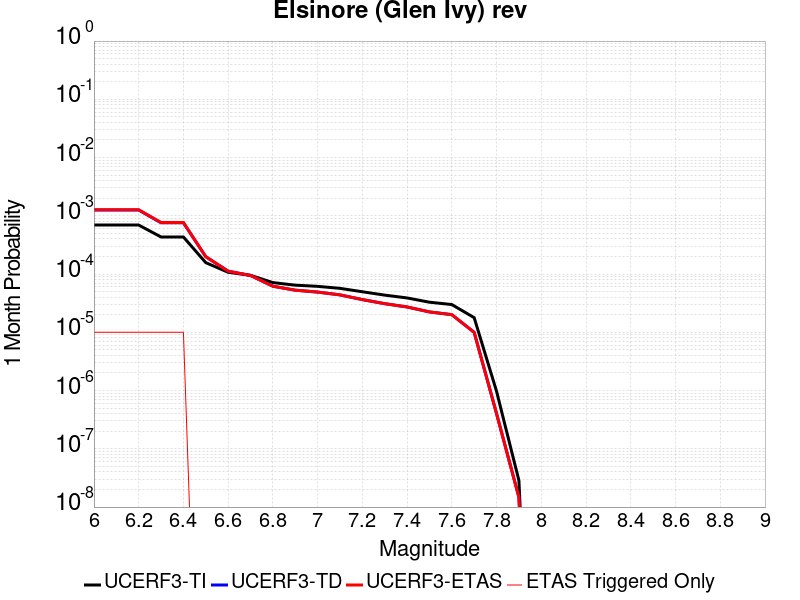 |  |  |

| Magnitude | 1 wk TI Prob | 1 wk TD Prob | 1 wk ETAS Prob | 1 wk ETAS/TD Gain | 1 wk ETAS Triggered Only | 1 mo TI Prob | 1 mo TD Prob | 1 mo ETAS Prob | 1 mo ETAS/TD Gain | 1 mo ETAS Triggered Only | 1 yr TI Prob | 1 yr TD Prob | 1 yr ETAS Prob | 1 yr ETAS/TD Gain | 1 yr ETAS Triggered Only | 10 yr TI Prob | 10 yr TD Prob | 10 yr ETAS Prob | 10 yr ETAS/TD Gain | 10 yr ETAS Triggered Only |
|-----|-----|-----|-----|-----|-----|-----|-----|-----|-----|-----|-----|-----|-----|-----|-----|-----|-----|-----|-----|-----|
| 6.0 | 1.6204086E-4 | 2.936593E-4 | 2.936593E-4 | 1.0 | 0.0 | 6.94276E-4 | 0.0012580877 | 0.0012580877 | 1.0 | 0.0 | 0.008420097 | 0.015237179 | 0.015237179 | 1.0 | 0.0 | 0.081081145 | 0.13970533 | 0.13972738 | 1.0001578 | 2.5637739E-5 |
| 6.1 | 1.6204086E-4 | 2.936593E-4 | 2.936593E-4 | 1.0 | 0.0 | 6.94276E-4 | 0.0012580877 | 0.0012580877 | 1.0 | 0.0 | 0.008420097 | 0.015237179 | 0.015237179 | 1.0 | 0.0 | 0.081081145 | 0.13970533 | 0.13972738 | 1.0001578 | 2.5637739E-5 |
| 6.2 | 1.6204086E-4 | 2.936593E-4 | 2.936593E-4 | 1.0 | 0.0 | 6.94276E-4 | 0.0012580877 | 0.0012580877 | 1.0 | 0.0 | 0.008420097 | 0.015237179 | 0.015237179 | 1.0 | 0.0 | 0.081081145 | 0.13970533 | 0.13972738 | 1.0001578 | 2.5637739E-5 |
| 6.3 | 1.0111737E-4 | 1.7704896E-4 | 1.7704896E-4 | 1.0 | 0.0 | 4.332882E-4 | 7.5867726E-4 | 7.5867726E-4 | 1.0 | 0.0 | 0.005262531 | 0.009218467 | 0.009218467 | 1.0 | 0.0 | 0.0513964 | 0.087025836 | 0.087025836 | 1.0 | 0.0 |
| 6.4 | 1.0111737E-4 | 1.7704896E-4 | 1.7704896E-4 | 1.0 | 0.0 | 4.332882E-4 | 7.5867726E-4 | 7.5867726E-4 | 1.0 | 0.0 | 0.005262531 | 0.009218467 | 0.009218467 | 1.0 | 0.0 | 0.0513964 | 0.087025836 | 0.087025836 | 1.0 | 0.0 |
| 6.5 | 3.6624708E-5 | 4.6398443E-5 | 4.6398443E-5 | 1.0 | 0.0 | 1.569536E-4 | 1.9883736E-4 | 1.9883736E-4 | 1.0 | 0.0 | 0.001909235 | 0.0024185202 | 0.0024185202 | 1.0 | 0.0 | 0.01892915 | 0.02374361 | 0.02374361 | 1.0 | 0.0 |
| 6.6 | 2.5051324E-5 | 2.615282E-5 | 2.615282E-5 | 1.0 | 0.0 | 1.073584E-4 | 1.12078946E-4 | 1.12078946E-4 | 1.0 | 0.0 | 0.0013063047 | 0.0013637516 | 0.0013637516 | 1.0 | 0.0 | 0.012986525 | 0.013567226 | 0.013567226 | 1.0 | 0.0 |
| 6.7 | 2.2189772E-5 | 2.2077227E-5 | 2.2077227E-5 | 1.0 | 0.0 | 9.509556E-5 | 9.461347E-5 | 9.461347E-5 | 1.0 | 0.0 | 0.0011571734 | 0.0011513466 | 0.0011513466 | 1.0 | 0.0 | 0.011511663 | 0.0114676645 | 0.0114676645 | 1.0 | 0.0 |
| 6.8 | 1.6654378E-5 | 1.4440319E-5 | 1.4440319E-5 | 1.0 | 0.0 | 7.137396E-5 | 6.188564E-5 | 6.188564E-5 | 1.0 | 0.0 | 8.686314E-4 | 7.532024E-4 | 7.532024E-4 | 1.0 | 0.0 | 0.008652439 | 0.0075118328 | 0.0075118328 | 1.0 | 0.0 |
| 6.9 | 1.5042909E-5 | 1.2334286E-5 | 1.2334286E-5 | 1.0 | 0.0 | 6.446802E-5 | 5.286017E-5 | 5.286017E-5 | 1.0 | 0.0 | 7.8461546E-4 | 6.433857E-4 | 6.433857E-4 | 1.0 | 0.0 | 0.007818509 | 0.006419453 | 0.006419453 | 1.0 | 0.0 |
| 7.0 | 1.4361385E-5 | 1.1453455E-5 | 1.1453455E-5 | 1.0 | 0.0 | 6.154734E-5 | 4.908533E-5 | 4.908533E-5 | 1.0 | 0.0 | 7.490812E-4 | 5.974529E-4 | 5.974529E-4 | 1.0 | 0.0 | 0.007465612 | 0.005962458 | 0.005962458 | 1.0 | 0.0 |
| 7.1 | 1.3265571E-5 | 1.0246749E-5 | 1.0246749E-5 | 1.0 | 0.0 | 5.6851208E-5 | 4.3913915E-5 | 4.3913915E-5 | 1.0 | 0.0 | 6.919436E-4 | 5.345233E-4 | 5.345233E-4 | 1.0 | 0.0 | 0.006897931 | 0.0053357324 | 0.0053357324 | 1.0 | 0.0 |
| 7.2 | 1.1596403E-5 | 8.506553E-6 | 8.506553E-6 | 1.0 | 0.0 | 4.9697923E-5 | 3.6456157E-5 | 3.6456157E-5 | 1.0 | 0.0 | 6.049042E-4 | 4.4376502E-4 | 4.4376502E-4 | 1.0 | 0.0 | 0.006032603 | 0.004430204 | 0.004430204 | 1.0 | 0.0 |
| 7.3 | 1.0150827E-5 | 7.2399926E-6 | 7.2399926E-6 | 1.0 | 0.0 | 4.3502816E-5 | 3.102818E-5 | 3.102818E-5 | 1.0 | 0.0 | 5.2951806E-4 | 3.77704E-4 | 3.77704E-4 | 1.0 | 0.0 | 0.005282581 | 0.0037710073 | 0.0037710073 | 1.0 | 0.0 |
| 7.4 | 9.080705E-6 | 6.3535763E-6 | 6.3535763E-6 | 1.0 | 0.0 | 3.8916725E-5 | 2.7229335E-5 | 2.7229335E-5 | 1.0 | 0.0 | 4.7370812E-4 | 3.314681E-4 | 3.314681E-4 | 1.0 | 0.0 | 0.004726996 | 0.0033098878 | 0.0033098878 | 1.0 | 0.0 |
| 7.5 | 7.671649E-6 | 5.2264927E-6 | 5.2264927E-6 | 1.0 | 0.0 | 3.287808E-5 | 2.2399068E-5 | 2.2399068E-5 | 1.0 | 0.0 | 4.0021708E-4 | 2.726758E-4 | 2.726758E-4 | 1.0 | 0.0 | 0.0039949706 | 0.0027235372 | 0.0027235372 | 1.0 | 0.0 |
| 7.6 | 6.990086E-6 | 4.6883147E-6 | 4.6883147E-6 | 1.0 | 0.0 | 2.9957167E-5 | 2.009263E-5 | 2.009263E-5 | 1.0 | 0.0 | 3.6466747E-4 | 2.4460148E-4 | 2.4460148E-4 | 1.0 | 0.0 | 0.0036406964 | 0.0024434389 | 0.0024434389 | 1.0 | 0.0 |
| 7.7 | 4.163505E-6 | 2.3299876E-6 | 2.3299876E-6 | 1.0 | 0.0 | 1.7843471E-5 | 9.985628E-6 | 9.985628E-6 | 1.0 | 0.0 | 2.172226E-4 | 1.2156898E-4 | 1.2156898E-4 | 1.0 | 0.0 | 0.0021701038 | 0.0012150978 | 0.0012150978 | 1.0 | 0.0 |
| 7.8 | 2.2692414E-7 | 9.3873886E-8 | 9.3873886E-8 | 1.0 | 0.0 | 9.725317E-7 | 4.023166E-7 | 4.023166E-7 | 1.0 | 0.0 | 1.1840509E-5 | 4.898197E-6 | 4.898197E-6 | 1.0 | 0.0 | 1.1839878E-4 | 4.898122E-5 | 4.898122E-5 | 1.0 | 0.0 |
| 7.9 | 6.676829E-9 | 3.4403498E-9 | 3.4403498E-9 | 1.0 | 0.0 | 2.861498E-8 | 1.4744357E-8 | 1.4744357E-8 | 1.0 | 0.0 | 3.4838732E-7 | 1.7951253E-7 | 1.7951253E-7 | 1.0 | 0.0 | 3.4838679E-6 | 1.7951239E-6 | 1.7951239E-6 | 1.0 | 0.0 |

## Raymond
*[(top)](#table-of-contents)*

| 1 Week | 1 Month | 1 Year | 10 Year |
|-----|-----|-----|-----|
|  | 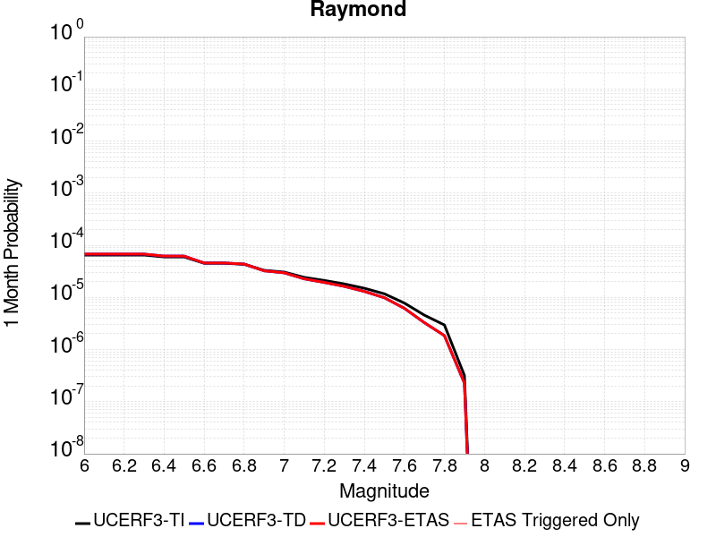 |  |  |

| Magnitude | 1 wk TI Prob | 1 wk TD Prob | 1 wk ETAS Prob | 1 wk ETAS/TD Gain | 1 wk ETAS Triggered Only | 1 mo TI Prob | 1 mo TD Prob | 1 mo ETAS Prob | 1 mo ETAS/TD Gain | 1 mo ETAS Triggered Only | 1 yr TI Prob | 1 yr TD Prob | 1 yr ETAS Prob | 1 yr ETAS/TD Gain | 1 yr ETAS Triggered Only | 10 yr TI Prob | 10 yr TD Prob | 10 yr ETAS Prob | 10 yr ETAS/TD Gain | 10 yr ETAS Triggered Only |
|-----|-----|-----|-----|-----|-----|-----|-----|-----|-----|-----|-----|-----|-----|-----|-----|-----|-----|-----|-----|-----|
| 6.0 | 1.5157413E-5 | 1.5811214E-5 | 1.5811214E-5 | 1.0 | 0.0 | 6.4958724E-5 | 6.776073E-5 | 6.776073E-5 | 1.0 | 0.0 | 7.905855E-4 | 8.246997E-4 | 8.246997E-4 | 1.0 | 0.0 | 0.007877788 | 0.008218911 | 0.0082443375 | 1.0030937 | 2.5637739E-5 |
| 6.1 | 1.5157413E-5 | 1.5811214E-5 | 1.5811214E-5 | 1.0 | 0.0 | 6.4958724E-5 | 6.776073E-5 | 6.776073E-5 | 1.0 | 0.0 | 7.905855E-4 | 8.246997E-4 | 8.246997E-4 | 1.0 | 0.0 | 0.007877788 | 0.008218911 | 0.0082443375 | 1.0030937 | 2.5637739E-5 |
| 6.2 | 1.5157413E-5 | 1.5811214E-5 | 1.5811214E-5 | 1.0 | 0.0 | 6.4958724E-5 | 6.776073E-5 | 6.776073E-5 | 1.0 | 0.0 | 7.905855E-4 | 8.246997E-4 | 8.246997E-4 | 1.0 | 0.0 | 0.007877788 | 0.008218911 | 0.0082443375 | 1.0030937 | 2.5637739E-5 |
| 6.3 | 1.5157413E-5 | 1.5811214E-5 | 1.5811214E-5 | 1.0 | 0.0 | 6.4958724E-5 | 6.776073E-5 | 6.776073E-5 | 1.0 | 0.0 | 7.905855E-4 | 8.246997E-4 | 8.246997E-4 | 1.0 | 0.0 | 0.007877788 | 0.008218911 | 0.0082443375 | 1.0030937 | 2.5637739E-5 |
| 6.4 | 1.3941944E-5 | 1.4455694E-5 | 1.4455694E-5 | 1.0 | 0.0 | 5.9749822E-5 | 6.1951636E-5 | 6.1951636E-5 | 1.0 | 0.0 | 7.2721124E-4 | 7.5402344E-4 | 7.5402344E-4 | 1.0 | 0.0 | 0.007248361 | 0.007516985 | 0.0075424295 | 1.003385 | 2.5637739E-5 |
| 6.5 | 1.3941944E-5 | 1.4455694E-5 | 1.4455694E-5 | 1.0 | 0.0 | 5.9749822E-5 | 6.1951636E-5 | 6.1951636E-5 | 1.0 | 0.0 | 7.2721124E-4 | 7.5402344E-4 | 7.5402344E-4 | 1.0 | 0.0 | 0.007248361 | 0.007516985 | 0.0075424295 | 1.003385 | 2.5637739E-5 |
| 6.6 | 1.0542609E-5 | 1.0671889E-5 | 1.0671889E-5 | 1.0 | 0.0 | 4.5181827E-5 | 4.57359E-5 | 4.57359E-5 | 1.0 | 0.0 | 5.499499E-4 | 5.566977E-4 | 5.566977E-4 | 1.0 | 0.0 | 0.005485909 | 0.0055535934 | 0.0055790883 | 1.0045907 | 2.5637739E-5 |
| 6.7 | 1.0542609E-5 | 1.0671889E-5 | 1.0671889E-5 | 1.0 | 0.0 | 4.5181827E-5 | 4.57359E-5 | 4.57359E-5 | 1.0 | 0.0 | 5.499499E-4 | 5.566977E-4 | 5.566977E-4 | 1.0 | 0.0 | 0.005485909 | 0.0055535934 | 0.0055790883 | 1.0045907 | 2.5637739E-5 |
| 6.8 | 1.0079132E-5 | 1.0177405E-5 | 1.0177405E-5 | 1.0 | 0.0 | 4.3195567E-5 | 4.361675E-5 | 4.361675E-5 | 1.0 | 0.0 | 5.257791E-4 | 5.309099E-4 | 5.309099E-4 | 1.0 | 0.0 | 0.0052453685 | 0.005296965 | 0.005322467 | 1.0048144 | 2.5637739E-5 |
| 6.9 | 7.721598E-6 | 7.549502E-6 | 7.549502E-6 | 1.0 | 0.0 | 3.3092143E-5 | 3.2354612E-5 | 3.2354612E-5 | 1.0 | 0.0 | 4.0282236E-4 | 3.9384744E-4 | 3.9384744E-4 | 1.0 | 0.0 | 0.0040209293 | 0.003931628 | 0.003957165 | 1.0064952 | 2.5637739E-5 |
| 7.0 | 7.137566E-6 | 6.9118714E-6 | 6.9118714E-6 | 1.0 | 0.0 | 3.058921E-5 | 2.9621975E-5 | 2.9621975E-5 | 1.0 | 0.0 | 3.7236E-4 | 3.6058895E-4 | 3.6058895E-4 | 1.0 | 0.0 | 0.0037173668 | 0.0036001569 | 0.0036257023 | 1.0070957 | 2.5637739E-5 |
| 7.1 | 5.654976E-6 | 5.3000313E-6 | 5.3000313E-6 | 1.0 | 0.0 | 2.4235387E-5 | 2.2714223E-5 | 2.2714223E-5 | 1.0 | 0.0 | 2.9502588E-4 | 2.7651078E-4 | 2.7651078E-4 | 1.0 | 0.0 | 0.0029463451 | 0.0027616983 | 0.0027872655 | 1.0092577 | 2.5637739E-5 |
| 7.2 | 4.9358455E-6 | 4.5271145E-6 | 4.5271145E-6 | 1.0 | 0.0 | 2.1153453E-5 | 1.9401774E-5 | 1.9401774E-5 | 1.0 | 0.0 | 2.5751285E-4 | 2.3619113E-4 | 2.3619113E-4 | 1.0 | 0.0 | 0.0025721465 | 0.0023594233 | 0.0023850005 | 1.0108404 | 2.5637739E-5 |
| 7.3 | 4.2368597E-6 | 3.8060439E-6 | 3.8060439E-6 | 1.0 | 0.0 | 1.8157843E-5 | 1.6311516E-5 | 1.6311516E-5 | 1.0 | 0.0 | 2.2104931E-4 | 1.9857471E-4 | 1.9857471E-4 | 1.0 | 0.0 | 0.0022082955 | 0.0019839914 | 0.0019839914 | 1.0 | 0.0 |
| 7.4 | 3.4999923E-6 | 3.0441354E-6 | 3.0441354E-6 | 1.0 | 0.0 | 1.49998805E-5 | 1.30462295E-5 | 1.30462295E-5 | 1.0 | 0.0 | 1.8260824E-4 | 1.5882634E-4 | 1.5882634E-4 | 1.0 | 0.0 | 0.0018245826 | 0.001587144 | 0.001587144 | 1.0 | 0.0 |
| 7.5 | 2.738017E-6 | 2.3023013E-6 | 2.3023013E-6 | 1.0 | 0.0 | 1.1734306E-5 | 9.866968E-6 | 9.866968E-6 | 1.0 | 0.0 | 1.428558E-4 | 1.2012378E-4 | 1.2012378E-4 | 1.0 | 0.0 | 0.0014276401 | 0.0012006029 | 0.0012006029 | 1.0 | 0.0 |
| 7.6 | 1.8186392E-6 | 1.4424903E-6 | 1.4424903E-6 | 1.0 | 0.0 | 7.794145E-6 | 6.1820865E-6 | 6.1820865E-6 | 1.0 | 0.0 | 9.488958E-5 | 7.526435E-5 | 7.526435E-5 | 1.0 | 0.0 | 9.4849075E-4 | 7.524001E-4 | 7.524001E-4 | 1.0 | 0.0 |
| 7.7 | 1.0660348E-6 | 7.6452443E-7 | 7.6452443E-7 | 1.0 | 0.0 | 4.5687125E-6 | 3.2765292E-6 | 3.2765292E-6 | 1.0 | 0.0 | 5.5622655E-5 | 3.989103E-5 | 3.989103E-5 | 1.0 | 0.0 | 5.5608735E-4 | 3.9884783E-4 | 3.9884783E-4 | 1.0 | 0.0 |
| 7.8 | 6.913602E-7 | 4.3216164E-7 | 4.3216164E-7 | 1.0 | 0.0 | 2.962969E-6 | 1.85212E-6 | 1.85212E-6 | 1.0 | 0.0 | 3.607355E-5 | 2.2549335E-5 | 2.2549335E-5 | 1.0 | 0.0 | 3.6067693E-4 | 2.2547832E-4 | 2.2547832E-4 | 1.0 | 0.0 |
| 7.9 | 7.425201E-8 | 5.3234306E-8 | 5.3234306E-8 | 1.0 | 0.0 | 3.1822285E-7 | 2.28147E-7 | 2.28147E-7 | 1.0 | 0.0 | 3.874356E-6 | 2.7776875E-6 | 2.7776875E-6 | 1.0 | 0.0 | 3.8742884E-5 | 2.777666E-5 | 2.777666E-5 | 1.0 | 0.0 |

## Hunting Creek - Berryessa 2011 CFM
*[(top)](#table-of-contents)*

| 1 Week | 1 Month | 1 Year | 10 Year |
|-----|-----|-----|-----|
|  | 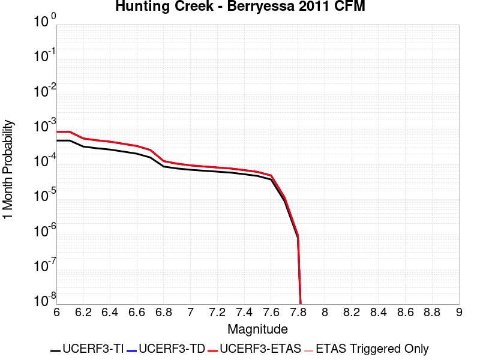 |  |  |

| Magnitude | 1 wk TI Prob | 1 wk TD Prob | 1 wk ETAS Prob | 1 wk ETAS/TD Gain | 1 wk ETAS Triggered Only | 1 mo TI Prob | 1 mo TD Prob | 1 mo ETAS Prob | 1 mo ETAS/TD Gain | 1 mo ETAS Triggered Only | 1 yr TI Prob | 1 yr TD Prob | 1 yr ETAS Prob | 1 yr ETAS/TD Gain | 1 yr ETAS Triggered Only | 10 yr TI Prob | 10 yr TD Prob | 10 yr ETAS Prob | 10 yr ETAS/TD Gain | 10 yr ETAS Triggered Only |
|-----|-----|-----|-----|-----|-----|-----|-----|-----|-----|-----|-----|-----|-----|-----|-----|-----|-----|-----|-----|-----|
| 6.0 | 1.1270982E-4 | 2.0017775E-4 | 2.0017775E-4 | 1.0 | 0.0 | 4.8295266E-4 | 8.5742475E-4 | 8.5742475E-4 | 1.0 | 0.0 | 0.0058641075 | 0.010388056 | 0.010388056 | 1.0 | 0.0 | 0.057117578 | 0.09805172 | 0.098074846 | 1.0002358 | 2.5637739E-5 |
| 6.1 | 1.1239393E-4 | 1.9965896E-4 | 1.9965896E-4 | 1.0 | 0.0 | 4.8159933E-4 | 8.552031E-4 | 8.552031E-4 | 1.0 | 0.0 | 0.0058477195 | 0.010361288 | 0.010361288 | 1.0 | 0.0 | 0.056962132 | 0.09781016 | 0.09783329 | 1.0002365 | 2.5637739E-5 |
| 6.2 | 7.596265E-5 | 1.2940993E-4 | 1.2940993E-4 | 1.0 | 0.0 | 3.2551357E-4 | 5.5426615E-4 | 5.5426615E-4 | 1.0 | 0.0 | 0.0039559277 | 0.006721831 | 0.006721831 | 1.0 | 0.0 | 0.038862433 | 0.064600885 | 0.06462487 | 1.0003712 | 2.5637739E-5 |
| 6.3 | 6.78794E-5 | 1.1452538E-4 | 1.1452538E-4 | 1.0 | 0.0 | 2.9087928E-4 | 4.9073447E-4 | 4.9073447E-4 | 1.0 | 0.0 | 0.003535705 | 0.0059534037 | 0.0059534037 | 1.0 | 0.0 | 0.034799766 | 0.05747386 | 0.057498027 | 1.0004205 | 2.5637739E-5 |
| 6.4 | 6.2165134E-5 | 1.04393934E-4 | 1.04393934E-4 | 1.0 | 0.0 | 2.6639478E-4 | 4.4732942E-4 | 4.4732942E-4 | 1.0 | 0.0 | 0.0032385332 | 0.0054282364 | 0.0054282364 | 1.0 | 0.0 | 0.03191742 | 0.052558403 | 0.052582692 | 1.0004622 | 2.5637739E-5 |
| 6.5 | 5.4368087E-5 | 9.073724E-5 | 9.073724E-5 | 1.0 | 0.0 | 2.3298527E-4 | 3.8881917E-4 | 3.8881917E-4 | 1.0 | 0.0 | 0.0028329059 | 0.004720476 | 0.004720476 | 1.0 | 0.0 | 0.027970633 | 0.04588709 | 0.04588709 | 1.0 | 0.0 |
| 6.6 | 4.729947E-5 | 7.849487E-5 | 7.849487E-5 | 1.0 | 0.0 | 2.0269625E-4 | 3.3636627E-4 | 3.3636627E-4 | 1.0 | 0.0 | 0.002465034 | 0.0040854933 | 0.0040854933 | 1.0 | 0.0 | 0.02437869 | 0.039857663 | 0.039857663 | 1.0 | 0.0 |
| 6.7 | 3.6875328E-5 | 6.0465416E-5 | 6.0465416E-5 | 1.0 | 0.0 | 1.5802756E-4 | 2.5911423E-4 | 2.5911423E-4 | 1.0 | 0.0 | 0.0019222875 | 0.0031486591 | 0.0031486591 | 1.0 | 0.0 | 0.019057442 | 0.030897204 | 0.030897204 | 1.0 | 0.0 |
| 6.8 | 2.0292036E-5 | 2.897928E-5 | 2.897928E-5 | 1.0 | 0.0 | 8.6962966E-5 | 1.2419096E-4 | 1.2419096E-4 | 1.0 | 0.0 | 0.0010582599 | 0.0015109582 | 0.0015109582 | 1.0 | 0.0 | 0.010532344 | 0.014980009 | 0.014980009 | 1.0 | 0.0 |
| 6.9 | 1.7871042E-5 | 2.4474773E-5 | 2.4474773E-5 | 1.0 | 0.0 | 7.658793E-5 | 1.0488762E-4 | 1.0488762E-4 | 1.0 | 0.0 | 9.320591E-4 | 0.0012762607 | 0.0012762607 | 1.0 | 0.0 | 0.009281595 | 0.01268106 | 0.01268106 | 1.0 | 0.0 |
| 7.0 | 1.6415532E-5 | 2.1908601E-5 | 2.1908601E-5 | 1.0 | 0.0 | 7.035038E-5 | 9.3890645E-5 | 9.3890645E-5 | 1.0 | 0.0 | 8.561793E-4 | 0.0011425226 | 0.0011425226 | 1.0 | 0.0 | 0.008528882 | 0.011365713 | 0.011365713 | 1.0 | 0.0 |
| 7.1 | 1.5409885E-5 | 2.034855E-5 | 2.034855E-5 | 1.0 | 0.0 | 6.6040695E-5 | 8.720518E-5 | 8.720518E-5 | 1.0 | 0.0 | 8.0374884E-4 | 0.0010612089 | 0.0010612089 | 1.0 | 0.0 | 0.00800848 | 0.010561734 | 0.010561734 | 1.0 | 0.0 |
| 7.2 | 1.4497423E-5 | 1.905703E-5 | 1.905703E-5 | 1.0 | 0.0 | 6.213033E-5 | 8.167045E-5 | 8.167045E-5 | 1.0 | 0.0 | 7.5617427E-4 | 9.938872E-4 | 9.938872E-4 | 1.0 | 0.0 | 0.0075360634 | 0.009894996 | 0.009894996 | 1.0 | 0.0 |
| 7.3 | 1.3615175E-5 | 1.7828126E-5 | 1.7828126E-5 | 1.0 | 0.0 | 5.8349444E-5 | 7.640403E-5 | 7.640403E-5 | 1.0 | 0.0 | 7.101729E-4 | 9.2982507E-4 | 9.2982507E-4 | 1.0 | 0.0 | 0.0070790765 | 0.009259855 | 0.009259855 | 1.0 | 0.0 |
| 7.4 | 1.2252825E-5 | 1.6028054E-5 | 1.6028054E-5 | 1.0 | 0.0 | 5.251105E-5 | 6.8689864E-5 | 6.8689864E-5 | 1.0 | 0.0 | 6.391345E-4 | 8.3598105E-4 | 8.3598105E-4 | 1.0 | 0.0 | 0.0063729943 | 0.008328805 | 0.008328805 | 1.0 | 0.0 |
| 7.5 | 1.0913301E-5 | 1.4242686E-5 | 1.4242686E-5 | 1.0 | 0.0 | 4.6770452E-5 | 6.103867E-5 | 6.103867E-5 | 1.0 | 0.0 | 5.6928146E-4 | 7.428952E-4 | 7.428952E-4 | 1.0 | 0.0 | 0.0056782532 | 0.0074044922 | 0.0074044922 | 1.0 | 0.0 |
| 7.6 | 8.623192E-6 | 1.1235767E-5 | 1.1235767E-5 | 1.0 | 0.0 | 3.6956015E-5 | 4.815241E-5 | 4.815241E-5 | 1.0 | 0.0 | 4.4984656E-4 | 5.861005E-4 | 5.861005E-4 | 1.0 | 0.0 | 0.00448937 | 0.005845862 | 0.005845862 | 1.0 | 0.0 |
| 7.7 | 2.0993634E-6 | 2.6627938E-6 | 2.6627938E-6 | 1.0 | 0.0 | 8.997241E-6 | 1.1411924E-5 | 1.1411924E-5 | 1.0 | 0.0 | 1.09535904E-4 | 1.3893138E-4 | 1.3893138E-4 | 1.0 | 0.0 | 0.0010948193 | 0.0013884519 | 0.0013884519 | 1.0 | 0.0 |
| 7.8 | 1.8428308E-7 | 2.1675888E-7 | 2.1675888E-7 | 1.0 | 0.0 | 7.897844E-7 | 9.289663E-7 | 9.289663E-7 | 1.0 | 0.0 | 9.615583E-6 | 1.131011E-5 | 1.131011E-5 | 1.0 | 0.0 | 9.615166E-5 | 1.1309395E-4 | 1.1309395E-4 | 1.0 | 0.0 |

## Verdugo
*[(top)](#table-of-contents)*

| 1 Week | 1 Month | 1 Year | 10 Year |
|-----|-----|-----|-----|
|  |  |  |  |

| Magnitude | 1 wk TI Prob | 1 wk TD Prob | 1 wk ETAS Prob | 1 wk ETAS/TD Gain | 1 wk ETAS Triggered Only | 1 mo TI Prob | 1 mo TD Prob | 1 mo ETAS Prob | 1 mo ETAS/TD Gain | 1 mo ETAS Triggered Only | 1 yr TI Prob | 1 yr TD Prob | 1 yr ETAS Prob | 1 yr ETAS/TD Gain | 1 yr ETAS Triggered Only | 10 yr TI Prob | 10 yr TD Prob | 10 yr ETAS Prob | 10 yr ETAS/TD Gain | 10 yr ETAS Triggered Only |
|-----|-----|-----|-----|-----|-----|-----|-----|-----|-----|-----|-----|-----|-----|-----|-----|-----|-----|-----|-----|-----|
| 6.0 | 5.392987E-6 | 4.2168244E-6 | 4.2168244E-6 | 1.0 | 0.0 | 2.3112598E-5 | 1.8071984E-5 | 1.8071984E-5 | 1.0 | 0.0 | 2.8135953E-4 | 2.2000464E-4 | 2.2000464E-4 | 1.0 | 0.0 | 0.0028100356 | 0.0021979162 | 0.0022234977 | 1.0116389 | 2.5637739E-5 |
| 6.1 | 5.392987E-6 | 4.2168244E-6 | 4.2168244E-6 | 1.0 | 0.0 | 2.3112598E-5 | 1.8071984E-5 | 1.8071984E-5 | 1.0 | 0.0 | 2.8135953E-4 | 2.2000464E-4 | 2.2000464E-4 | 1.0 | 0.0 | 0.0028100356 | 0.0021979162 | 0.0022234977 | 1.0116389 | 2.5637739E-5 |
| 6.2 | 5.392987E-6 | 4.2168244E-6 | 4.2168244E-6 | 1.0 | 0.0 | 2.3112598E-5 | 1.8071984E-5 | 1.8071984E-5 | 1.0 | 0.0 | 2.8135953E-4 | 2.2000464E-4 | 2.2000464E-4 | 1.0 | 0.0 | 0.0028100356 | 0.0021979162 | 0.0022234977 | 1.0116389 | 2.5637739E-5 |
| 6.3 | 5.392987E-6 | 4.2168244E-6 | 4.2168244E-6 | 1.0 | 0.0 | 2.3112598E-5 | 1.8071984E-5 | 1.8071984E-5 | 1.0 | 0.0 | 2.8135953E-4 | 2.2000464E-4 | 2.2000464E-4 | 1.0 | 0.0 | 0.0028100356 | 0.0021979162 | 0.0022234977 | 1.0116389 | 2.5637739E-5 |
| 6.4 | 5.392987E-6 | 4.2168244E-6 | 4.2168244E-6 | 1.0 | 0.0 | 2.3112598E-5 | 1.8071984E-5 | 1.8071984E-5 | 1.0 | 0.0 | 2.8135953E-4 | 2.2000464E-4 | 2.2000464E-4 | 1.0 | 0.0 | 0.0028100356 | 0.0021979162 | 0.0022234977 | 1.0116389 | 2.5637739E-5 |
| 6.5 | 4.9154837E-6 | 3.7227633E-6 | 3.7227633E-6 | 1.0 | 0.0 | 2.1066187E-5 | 1.5954603E-5 | 1.5954603E-5 | 1.0 | 0.0 | 2.5645064E-4 | 1.9423019E-4 | 1.9423019E-4 | 1.0 | 0.0 | 0.002561549 | 0.0019406251 | 0.001966213 | 1.0131854 | 2.5637739E-5 |
| 6.6 | 4.9154837E-6 | 3.7227633E-6 | 3.7227633E-6 | 1.0 | 0.0 | 2.1066187E-5 | 1.5954603E-5 | 1.5954603E-5 | 1.0 | 0.0 | 2.5645064E-4 | 1.9423019E-4 | 1.9423019E-4 | 1.0 | 0.0 | 0.002561549 | 0.0019406251 | 0.001966213 | 1.0131854 | 2.5637739E-5 |
| 6.7 | 4.817006E-6 | 3.6209483E-6 | 3.6209483E-6 | 1.0 | 0.0 | 2.0644147E-5 | 1.5518259E-5 | 1.5518259E-5 | 1.0 | 0.0 | 2.513135E-4 | 1.8891861E-4 | 1.8891861E-4 | 1.0 | 0.0 | 0.0025102948 | 0.0018875997 | 0.0019131891 | 1.0135566 | 2.5637739E-5 |
| 6.8 | 4.507407E-6 | 3.3073918E-6 | 3.3073918E-6 | 1.0 | 0.0 | 1.9317316E-5 | 1.417446E-5 | 1.417446E-5 | 1.0 | 0.0 | 2.3516294E-4 | 1.7256053E-4 | 1.7256053E-4 | 1.0 | 0.0 | 0.0023491425 | 0.0017242797 | 0.0017498732 | 1.014843 | 2.5637739E-5 |
| 6.9 | 4.3573054E-6 | 3.1612947E-6 | 3.1612947E-6 | 1.0 | 0.0 | 1.8674033E-5 | 1.3548336E-5 | 1.3548336E-5 | 1.0 | 0.0 | 2.2733262E-4 | 1.6493862E-4 | 1.6493862E-4 | 1.0 | 0.0 | 0.0022710022 | 0.0016481745 | 0.0016737699 | 1.0155296 | 2.5637739E-5 |
| 7.0 | 4.171527E-6 | 2.9839493E-6 | 2.9839493E-6 | 1.0 | 0.0 | 1.787785E-5 | 1.2788292E-5 | 1.2788292E-5 | 1.0 | 0.0 | 2.1764109E-4 | 1.5568644E-4 | 1.5568644E-4 | 1.0 | 0.0 | 0.0021742806 | 0.0015557851 | 0.0015813828 | 1.0164534 | 2.5637739E-5 |
| 7.1 | 4.0405484E-6 | 2.8825361E-6 | 2.8825361E-6 | 1.0 | 0.0 | 1.731652E-5 | 1.2353669E-5 | 1.2353669E-5 | 1.0 | 0.0 | 2.1080824E-4 | 1.5039564E-4 | 1.5039564E-4 | 1.0 | 0.0 | 0.0021060838 | 0.0015029497 | 0.0015285489 | 1.0170326 | 2.5637739E-5 |
| 7.2 | 3.8306007E-6 | 2.7021142E-6 | 2.7021142E-6 | 1.0 | 0.0 | 1.6416758E-5 | 1.1580439E-5 | 1.1580439E-5 | 1.0 | 0.0 | 1.9985568E-4 | 1.4098283E-4 | 1.4098283E-4 | 1.0 | 0.0 | 0.0019967605 | 0.0014089446 | 0.0014345462 | 1.0181708 | 2.5637739E-5 |
| 7.3 | 3.5750938E-6 | 2.5124377E-6 | 2.5124377E-6 | 1.0 | 0.0 | 1.532174E-5 | 1.0767546E-5 | 1.0767546E-5 | 1.0 | 0.0 | 1.8652623E-4 | 1.310871E-4 | 1.310871E-4 | 1.0 | 0.0 | 0.0018636974 | 0.0013101082 | 0.0013101082 | 1.0 | 0.0 |
| 7.4 | 3.3510041E-6 | 2.341114E-6 | 2.341114E-6 | 1.0 | 0.0 | 1.4361368E-5 | 1.0033307E-5 | 1.0033307E-5 | 1.0 | 0.0 | 1.7483562E-4 | 1.2214878E-4 | 1.2214878E-4 | 1.0 | 0.0 | 0.0017469813 | 0.0012208268 | 0.0012208268 | 1.0 | 0.0 |
| 7.5 | 2.948287E-6 | 2.0392326E-6 | 2.0392326E-6 | 1.0 | 0.0 | 1.2635454E-5 | 8.73954E-6 | 8.73954E-6 | 1.0 | 0.0 | 1.538258E-4 | 1.0639881E-4 | 1.0639881E-4 | 1.0 | 0.0 | 0.0015371935 | 0.0010634889 | 0.0010634889 | 1.0 | 0.0 |
| 7.6 | 2.0134323E-6 | 1.4472091E-6 | 1.4472091E-6 | 1.0 | 0.0 | 8.628967E-6 | 6.2023105E-6 | 6.2023105E-6 | 1.0 | 0.0 | 1.05052604E-4 | 7.551061E-5 | 7.551061E-5 | 1.0 | 0.0 | 0.0010500296 | 7.548583E-4 | 7.548583E-4 | 1.0 | 0.0 |
| 7.7 | 5.726436E-7 | 4.0454935E-7 | 4.0454935E-7 | 1.0 | 0.0 | 2.4541846E-6 | 1.733782E-6 | 1.733782E-6 | 1.0 | 0.0 | 2.9879287E-5 | 2.1108617E-5 | 2.1108617E-5 | 1.0 | 0.0 | 2.987527E-4 | 2.1106866E-4 | 2.1106866E-4 | 1.0 | 0.0 |
| 7.8 | 1.6248204E-7 | 1.0689272E-7 | 1.0689272E-7 | 1.0 | 0.0 | 6.963514E-7 | 4.581116E-7 | 4.581116E-7 | 1.0 | 0.0 | 8.478045E-6 | 5.5774944E-6 | 5.5774944E-6 | 1.0 | 0.0 | 8.477722E-5 | 5.577358E-5 | 5.577358E-5 | 1.0 | 0.0 |
| 7.9 | 4.4475744E-8 | 3.037644E-8 | 3.037644E-8 | 1.0 | 0.0 | 1.9061031E-7 | 1.3018474E-7 | 1.3018474E-7 | 1.0 | 0.0 | 2.320678E-6 | 1.5849984E-6 | 1.5849984E-6 | 1.0 | 0.0 | 2.3206538E-5 | 1.5849884E-5 | 1.5849884E-5 | 1.0 | 0.0 |

## Cleghorn
*[(top)](#table-of-contents)*

| 1 Week | 1 Month | 1 Year | 10 Year |
|-----|-----|-----|-----|
|  |  | 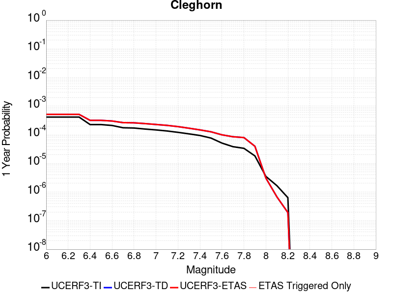 |  |

| Magnitude | 1 wk TI Prob | 1 wk TD Prob | 1 wk ETAS Prob | 1 wk ETAS/TD Gain | 1 wk ETAS Triggered Only | 1 mo TI Prob | 1 mo TD Prob | 1 mo ETAS Prob | 1 mo ETAS/TD Gain | 1 mo ETAS Triggered Only | 1 yr TI Prob | 1 yr TD Prob | 1 yr ETAS Prob | 1 yr ETAS/TD Gain | 1 yr ETAS Triggered Only | 10 yr TI Prob | 10 yr TD Prob | 10 yr ETAS Prob | 10 yr ETAS/TD Gain | 10 yr ETAS Triggered Only |
|-----|-----|-----|-----|-----|-----|-----|-----|-----|-----|-----|-----|-----|-----|-----|-----|-----|-----|-----|-----|-----|
| 6.0 | 7.9267165E-6 | 9.838367E-6 | 9.838367E-6 | 1.0 | 0.0 | 3.39712E-5 | 4.216381E-5 | 4.216381E-5 | 1.0 | 0.0 | 4.1352084E-4 | 5.1323406E-4 | 5.1323406E-4 | 1.0 | 0.0 | 0.004127522 | 0.005135526 | 0.0051610316 | 1.0049666 | 2.5637739E-5 |
| 6.1 | 7.9267165E-6 | 9.838367E-6 | 9.838367E-6 | 1.0 | 0.0 | 3.39712E-5 | 4.216381E-5 | 4.216381E-5 | 1.0 | 0.0 | 4.1352084E-4 | 5.1323406E-4 | 5.1323406E-4 | 1.0 | 0.0 | 0.004127522 | 0.005135526 | 0.0051610316 | 1.0049666 | 2.5637739E-5 |
| 6.2 | 7.9267165E-6 | 9.838367E-6 | 9.838367E-6 | 1.0 | 0.0 | 3.39712E-5 | 4.216381E-5 | 4.216381E-5 | 1.0 | 0.0 | 4.1352084E-4 | 5.1323406E-4 | 5.1323406E-4 | 1.0 | 0.0 | 0.004127522 | 0.005135526 | 0.0051610316 | 1.0049666 | 2.5637739E-5 |
| 6.3 | 7.9267165E-6 | 9.838367E-6 | 9.838367E-6 | 1.0 | 0.0 | 3.39712E-5 | 4.216381E-5 | 4.216381E-5 | 1.0 | 0.0 | 4.1352084E-4 | 5.1323406E-4 | 5.1323406E-4 | 1.0 | 0.0 | 0.004127522 | 0.005135526 | 0.0051610316 | 1.0049666 | 2.5637739E-5 |
| 6.4 | 4.3445207E-6 | 6.0981406E-6 | 6.0981406E-6 | 1.0 | 0.0 | 1.8619241E-5 | 2.6134632E-5 | 2.6134632E-5 | 1.0 | 0.0 | 2.2666567E-4 | 3.181437E-4 | 3.181437E-4 | 1.0 | 0.0 | 0.0022643462 | 0.003190997 | 0.003216553 | 1.0080087 | 2.5637739E-5 |
| 6.5 | 4.3445207E-6 | 6.0981406E-6 | 6.0981406E-6 | 1.0 | 0.0 | 1.8619241E-5 | 2.6134632E-5 | 2.6134632E-5 | 1.0 | 0.0 | 2.2666567E-4 | 3.181437E-4 | 3.181437E-4 | 1.0 | 0.0 | 0.0022643462 | 0.003190997 | 0.003216553 | 1.0080087 | 2.5637739E-5 |
| 6.6 | 4.040109E-6 | 5.780541E-6 | 5.780541E-6 | 1.0 | 0.0 | 1.7314638E-5 | 2.4773517E-5 | 2.4773517E-5 | 1.0 | 0.0 | 2.1078532E-4 | 3.0157674E-4 | 3.0157674E-4 | 1.0 | 0.0 | 0.002105855 | 0.0030257835 | 0.0030513436 | 1.0084474 | 2.5637739E-5 |
| 6.7 | 3.3632055E-6 | 5.074022E-6 | 5.074022E-6 | 1.0 | 0.0 | 1.4413658E-5 | 2.1745627E-5 | 2.1745627E-5 | 1.0 | 0.0 | 1.7547216E-4 | 2.6472117E-4 | 2.6472117E-4 | 1.0 | 0.0 | 0.0017533366 | 0.0026581106 | 0.0026581106 | 1.0 | 0.0 |
| 6.8 | 3.2902772E-6 | 4.9959262E-6 | 4.9959262E-6 | 1.0 | 0.0 | 1.4101111E-5 | 2.1410939E-5 | 2.1410939E-5 | 1.0 | 0.0 | 1.716675E-4 | 2.606473E-4 | 2.606473E-4 | 1.0 | 0.0 | 0.0017153495 | 0.0026174681 | 0.0026174681 | 1.0 | 0.0 |
| 6.9 | 3.031547E-6 | 4.6974637E-6 | 4.6974637E-6 | 1.0 | 0.0 | 1.299228E-5 | 2.0131833E-5 | 2.0131833E-5 | 1.0 | 0.0 | 1.5816953E-4 | 2.4507777E-4 | 2.4507777E-4 | 1.0 | 0.0 | 0.00158057 | 0.002462125 | 0.002462125 | 1.0 | 0.0 |
| 7.0 | 2.8259715E-6 | 4.3764653E-6 | 4.3764653E-6 | 1.0 | 0.0 | 1.211125E-5 | 1.8756145E-5 | 1.8756145E-5 | 1.0 | 0.0 | 1.4744449E-4 | 2.2833238E-4 | 2.2833238E-4 | 1.0 | 0.0 | 0.001473467 | 0.0022950263 | 0.0022950263 | 1.0 | 0.0 |
| 7.1 | 2.5962665E-6 | 4.071453E-6 | 4.071453E-6 | 1.0 | 0.0 | 1.1126809E-5 | 1.7448969E-5 | 1.7448969E-5 | 1.0 | 0.0 | 1.3546048E-4 | 2.124207E-4 | 2.124207E-4 | 1.0 | 0.0 | 0.0013537793 | 0.0021362302 | 0.0021362302 | 1.0 | 0.0 |
| 7.2 | 2.3247253E-6 | 3.6817423E-6 | 3.6817423E-6 | 1.0 | 0.0 | 9.96307E-6 | 1.5778802E-5 | 1.5778802E-5 | 1.0 | 0.0 | 1.21293626E-4 | 1.9209016E-4 | 1.9209016E-4 | 1.0 | 0.0 | 0.0012122744 | 0.0019333162 | 0.0019333162 | 1.0 | 0.0 |
| 7.3 | 2.056928E-6 | 3.2399425E-6 | 3.2399425E-6 | 1.0 | 0.0 | 8.815376E-6 | 1.3885395E-5 | 1.3885395E-5 | 1.0 | 0.0 | 1.0732192E-4 | 1.6904173E-4 | 1.6904173E-4 | 1.0 | 0.0 | 0.001072701 | 0.0017032728 | 0.0017032728 | 1.0 | 0.0 |
| 7.4 | 1.8055999E-6 | 2.8298966E-6 | 2.8298966E-6 | 1.0 | 0.0 | 7.738263E-6 | 1.2128073E-5 | 1.2128073E-5 | 1.0 | 0.0 | 9.4209274E-5 | 1.4764942E-4 | 1.4764942E-4 | 1.0 | 0.0 | 9.4169343E-4 | 0.0014897923 | 0.0014897923 | 1.0 | 0.0 |
| 7.5 | 1.4683443E-6 | 2.4289393E-6 | 2.4289393E-6 | 1.0 | 0.0 | 6.292889E-6 | 1.0409699E-5 | 1.0409699E-5 | 1.0 | 0.0 | 7.661323E-5 | 1.2673081E-4 | 1.2673081E-4 | 1.0 | 0.0 | 7.658682E-4 | 0.0012809072 | 0.0012809072 | 1.0 | 0.0 |
| 7.6 | 9.804088E-7 | 1.9043657E-6 | 1.9043657E-6 | 1.0 | 0.0 | 4.201745E-6 | 8.161543E-6 | 8.161543E-6 | 1.0 | 0.0 | 5.1155046E-5 | 9.9362296E-5 | 9.9362296E-5 | 1.0 | 0.0 | 5.114327E-4 | 0.0010075356 | 0.0010075356 | 1.0 | 0.0 |
| 7.7 | 7.3434086E-7 | 1.6324341E-6 | 1.6324341E-6 | 1.0 | 0.0 | 3.1471714E-6 | 6.9961275E-6 | 6.9961275E-6 | 1.0 | 0.0 | 3.831614E-5 | 8.517455E-5 | 8.517455E-5 | 1.0 | 0.0 | 3.8309532E-4 | 8.6581067E-4 | 8.6581067E-4 | 1.0 | 0.0 |
| 7.8 | 6.434184E-7 | 1.5257981E-6 | 1.5257981E-6 | 1.0 | 0.0 | 2.7575045E-6 | 6.5391187E-6 | 6.5391187E-6 | 1.0 | 0.0 | 3.35721E-5 | 7.961089E-5 | 7.961089E-5 | 1.0 | 0.0 | 3.3567028E-4 | 8.098763E-4 | 8.098763E-4 | 1.0 | 0.0 |
| 7.9 | 3.4943926E-7 | 7.594313E-7 | 7.594313E-7 | 1.0 | 0.0 | 1.497596E-6 | 3.2547016E-6 | 3.2547016E-6 | 1.0 | 0.0 | 1.8233079E-5 | 3.962528E-5 | 3.962528E-5 | 1.0 | 0.0 | 1.8231584E-4 | 4.050159E-4 | 4.050159E-4 | 1.0 | 0.0 |
| 8.0 | 6.717524E-8 | 5.8598772E-8 | 5.8598772E-8 | 1.0 | 0.0 | 2.8789387E-7 | 2.5113755E-7 | 2.5113755E-7 | 1.0 | 0.0 | 3.505102E-6 | 3.0575957E-6 | 3.0575957E-6 | 1.0 | 0.0 | 3.5050467E-5 | 3.28481E-5 | 3.28481E-5 | 1.0 | 0.0 |
| 8.1 | 3.1984914E-8 | 1.3024658E-8 | 1.3024658E-8 | 1.0 | 0.0 | 1.370782E-7 | 5.5819964E-8 | 5.5819964E-8 | 1.0 | 0.0 | 1.6689258E-6 | 6.7960787E-7 | 6.7960787E-7 | 1.0 | 0.0 | 1.6689133E-5 | 7.7832365E-6 | 7.7832365E-6 | 1.0 | 0.0 |
| 8.2 | 1.21887656E-8 | 3.6706735E-9 | 3.6706735E-9 | 1.0 | 0.0 | 5.2237567E-8 | 1.5731459E-8 | 1.5731459E-8 | 1.0 | 0.0 | 6.359922E-7 | 1.9153049E-7 | 1.9153049E-7 | 1.0 | 0.0 | 6.3599036E-6 | 2.2593056E-6 | 2.2593056E-6 | 1.0 | 0.0 |

## Sheephole
*[(top)](#table-of-contents)*

| 1 Week | 1 Month | 1 Year | 10 Year |
|-----|-----|-----|-----|
|  |  |  |  |

| Magnitude | 1 wk TI Prob | 1 wk TD Prob | 1 wk ETAS Prob | 1 wk ETAS/TD Gain | 1 wk ETAS Triggered Only | 1 mo TI Prob | 1 mo TD Prob | 1 mo ETAS Prob | 1 mo ETAS/TD Gain | 1 mo ETAS Triggered Only | 1 yr TI Prob | 1 yr TD Prob | 1 yr ETAS Prob | 1 yr ETAS/TD Gain | 1 yr ETAS Triggered Only | 10 yr TI Prob | 10 yr TD Prob | 10 yr ETAS Prob | 10 yr ETAS/TD Gain | 10 yr ETAS Triggered Only |
|-----|-----|-----|-----|-----|-----|-----|-----|-----|-----|-----|-----|-----|-----|-----|-----|-----|-----|-----|-----|-----|
| 6.0 | 4.5579695E-6 | 4.741364E-6 | 4.741364E-6 | 1.0 | 0.0 | 1.9534009E-5 | 2.0320003E-5 | 2.0320003E-5 | 1.0 | 0.0 | 2.3780059E-4 | 2.473735E-4 | 2.473735E-4 | 1.0 | 0.0 | 0.0023754628 | 0.002471526 | 0.0024971003 | 1.0103476 | 2.5637739E-5 |
| 6.1 | 4.5579695E-6 | 4.741364E-6 | 4.741364E-6 | 1.0 | 0.0 | 1.9534009E-5 | 2.0320003E-5 | 2.0320003E-5 | 1.0 | 0.0 | 2.3780059E-4 | 2.473735E-4 | 2.473735E-4 | 1.0 | 0.0 | 0.0023754628 | 0.002471526 | 0.0024971003 | 1.0103476 | 2.5637739E-5 |
| 6.2 | 2.6677674E-6 | 2.7874607E-6 | 2.7874607E-6 | 1.0 | 0.0 | 1.1433239E-5 | 1.1946211E-5 | 1.1946211E-5 | 1.0 | 0.0 | 1.3919079E-4 | 1.454365E-4 | 1.454365E-4 | 1.0 | 0.0 | 0.0013910364 | 0.001453519 | 0.001453519 | 1.0 | 0.0 |
| 6.3 | 2.6677674E-6 | 2.7874607E-6 | 2.7874607E-6 | 1.0 | 0.0 | 1.1433239E-5 | 1.1946211E-5 | 1.1946211E-5 | 1.0 | 0.0 | 1.3919079E-4 | 1.454365E-4 | 1.454365E-4 | 1.0 | 0.0 | 0.0013910364 | 0.001453519 | 0.001453519 | 1.0 | 0.0 |
| 6.4 | 2.2159759E-6 | 2.3229381E-6 | 2.3229381E-6 | 1.0 | 0.0 | 9.497005E-6 | 9.955416E-6 | 9.955416E-6 | 1.0 | 0.0 | 1.156199E-4 | 1.2120126E-4 | 1.2120126E-4 | 1.0 | 0.0 | 0.0011555976 | 0.0012114309 | 0.0012114309 | 1.0 | 0.0 |
| 6.5 | 2.1986082E-6 | 2.304818E-6 | 2.304818E-6 | 1.0 | 0.0 | 9.4225725E-6 | 9.877759E-6 | 9.877759E-6 | 1.0 | 0.0 | 1.1471378E-4 | 1.20255885E-4 | 1.20255885E-4 | 1.0 | 0.0 | 0.0011465458 | 0.0012019875 | 0.0012019875 | 1.0 | 0.0 |
| 6.6 | 1.5232331E-6 | 1.6019358E-6 | 1.6019358E-6 | 1.0 | 0.0 | 6.5281256E-6 | 6.8654217E-6 | 6.8654217E-6 | 1.0 | 0.0 | 7.947703E-5 | 8.3583494E-5 | 8.3583494E-5 | 1.0 | 0.0 | 7.9448614E-4 | 8.355393E-4 | 8.355393E-4 | 1.0 | 0.0 |
| 6.7 | 1.3137362E-6 | 1.3828576E-6 | 1.3828576E-6 | 1.0 | 0.0 | 5.6302856E-6 | 5.92652E-6 | 5.92652E-6 | 1.0 | 0.0 | 6.854657E-5 | 7.215313E-5 | 7.215313E-5 | 1.0 | 0.0 | 6.8525434E-4 | 7.2131096E-4 | 7.2131096E-4 | 1.0 | 0.0 |
| 6.8 | 1.2275751E-6 | 1.2923208E-6 | 1.2923208E-6 | 1.0 | 0.0 | 5.2610258E-6 | 5.5385067E-6 | 5.5385067E-6 | 1.0 | 0.0 | 6.4051106E-5 | 6.742937E-5 | 6.742937E-5 | 1.0 | 0.0 | 6.4032647E-4 | 6.7410246E-4 | 6.7410246E-4 | 1.0 | 0.0 |
| 6.9 | 1.1837088E-6 | 1.2461369E-6 | 1.2461369E-6 | 1.0 | 0.0 | 5.0730278E-6 | 5.3405765E-6 | 5.3405765E-6 | 1.0 | 0.0 | 6.176237E-5 | 6.501971E-5 | 6.501971E-5 | 1.0 | 0.0 | 6.17452E-4 | 6.5002E-4 | 6.5002E-4 | 1.0 | 0.0 |
| 7.0 | 9.849371E-7 | 1.0366576E-6 | 1.0366576E-6 | 1.0 | 0.0 | 4.2211523E-6 | 4.4428116E-6 | 4.4428116E-6 | 1.0 | 0.0 | 5.1391315E-5 | 5.4089993E-5 | 5.4089993E-5 | 1.0 | 0.0 | 5.137943E-4 | 5.4077833E-4 | 5.4077833E-4 | 1.0 | 0.0 |
| 7.1 | 8.1643645E-7 | 8.591908E-7 | 8.591908E-7 | 1.0 | 0.0 | 3.4990085E-6 | 3.6822414E-6 | 3.6822414E-6 | 1.0 | 0.0 | 4.2599597E-5 | 4.4830453E-5 | 4.4830453E-5 | 1.0 | 0.0 | 4.259143E-4 | 4.4822274E-4 | 4.4822274E-4 | 1.0 | 0.0 |
| 7.2 | 5.7295756E-7 | 6.029669E-7 | 6.029669E-7 | 1.0 | 0.0 | 2.45553E-6 | 2.5841418E-6 | 2.5841418E-6 | 1.0 | 0.0 | 2.9895667E-5 | 3.146154E-5 | 3.146154E-5 | 1.0 | 0.0 | 2.9891645E-4 | 3.1457754E-4 | 3.1457754E-4 | 1.0 | 0.0 |

## San Cayetano
*[(top)](#table-of-contents)*

| 1 Week | 1 Month | 1 Year | 10 Year |
|-----|-----|-----|-----|
|  |  |  | 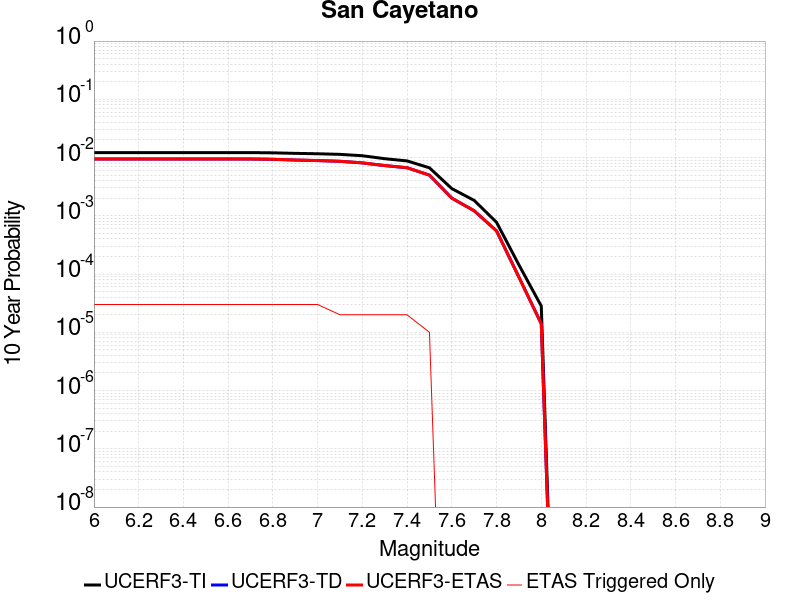 |

| Magnitude | 1 wk TI Prob | 1 wk TD Prob | 1 wk ETAS Prob | 1 wk ETAS/TD Gain | 1 wk ETAS Triggered Only | 1 mo TI Prob | 1 mo TD Prob | 1 mo ETAS Prob | 1 mo ETAS/TD Gain | 1 mo ETAS Triggered Only | 1 yr TI Prob | 1 yr TD Prob | 1 yr ETAS Prob | 1 yr ETAS/TD Gain | 1 yr ETAS Triggered Only | 10 yr TI Prob | 10 yr TD Prob | 10 yr ETAS Prob | 10 yr ETAS/TD Gain | 10 yr ETAS Triggered Only |
|-----|-----|-----|-----|-----|-----|-----|-----|-----|-----|-----|-----|-----|-----|-----|-----|-----|-----|-----|-----|-----|
| 6.0 | 2.3476267E-5 | 1.8172246E-5 | 1.8172246E-5 | 1.0 | 0.0 | 1.0060869E-4 | 7.787875E-5 | 7.787875E-5 | 1.0 | 0.0 | 0.0012242225 | 9.4776496E-4 | 9.4776496E-4 | 1.0 | 0.0 | 0.012175002 | 0.009438118 | 0.009463513 | 1.0026908 | 2.5637739E-5 |
| 6.1 | 2.3476267E-5 | 1.8172246E-5 | 1.8172246E-5 | 1.0 | 0.0 | 1.0060869E-4 | 7.787875E-5 | 7.787875E-5 | 1.0 | 0.0 | 0.0012242225 | 9.4776496E-4 | 9.4776496E-4 | 1.0 | 0.0 | 0.012175002 | 0.009438118 | 0.009463513 | 1.0026908 | 2.5637739E-5 |
| 6.2 | 2.3476267E-5 | 1.8172246E-5 | 1.8172246E-5 | 1.0 | 0.0 | 1.0060869E-4 | 7.787875E-5 | 7.787875E-5 | 1.0 | 0.0 | 0.0012242225 | 9.4776496E-4 | 9.4776496E-4 | 1.0 | 0.0 | 0.012175002 | 0.009438118 | 0.009463513 | 1.0026908 | 2.5637739E-5 |
| 6.3 | 2.3476267E-5 | 1.8172246E-5 | 1.8172246E-5 | 1.0 | 0.0 | 1.0060869E-4 | 7.787875E-5 | 7.787875E-5 | 1.0 | 0.0 | 0.0012242225 | 9.4776496E-4 | 9.4776496E-4 | 1.0 | 0.0 | 0.012175002 | 0.009438118 | 0.009463513 | 1.0026908 | 2.5637739E-5 |
| 6.4 | 2.3476267E-5 | 1.8172246E-5 | 1.8172246E-5 | 1.0 | 0.0 | 1.0060869E-4 | 7.787875E-5 | 7.787875E-5 | 1.0 | 0.0 | 0.0012242225 | 9.4776496E-4 | 9.4776496E-4 | 1.0 | 0.0 | 0.012175002 | 0.009438118 | 0.009463513 | 1.0026908 | 2.5637739E-5 |
| 6.5 | 2.3476267E-5 | 1.8172246E-5 | 1.8172246E-5 | 1.0 | 0.0 | 1.0060869E-4 | 7.787875E-5 | 7.787875E-5 | 1.0 | 0.0 | 0.0012242225 | 9.4776496E-4 | 9.4776496E-4 | 1.0 | 0.0 | 0.012175002 | 0.009438118 | 0.009463513 | 1.0026908 | 2.5637739E-5 |
| 6.6 | 2.3476267E-5 | 1.8172246E-5 | 1.8172246E-5 | 1.0 | 0.0 | 1.0060869E-4 | 7.787875E-5 | 7.787875E-5 | 1.0 | 0.0 | 0.0012242225 | 9.4776496E-4 | 9.4776496E-4 | 1.0 | 0.0 | 0.012175002 | 0.009438118 | 0.009463513 | 1.0026908 | 2.5637739E-5 |
| 6.7 | 2.3476267E-5 | 1.8172246E-5 | 1.8172246E-5 | 1.0 | 0.0 | 1.0060869E-4 | 7.787875E-5 | 7.787875E-5 | 1.0 | 0.0 | 0.0012242225 | 9.4776496E-4 | 9.4776496E-4 | 1.0 | 0.0 | 0.012175002 | 0.009438118 | 0.009463513 | 1.0026908 | 2.5637739E-5 |
| 6.8 | 2.3241924E-5 | 1.7939927E-5 | 1.7939927E-5 | 1.0 | 0.0 | 9.960445E-5 | 7.688316E-5 | 7.688316E-5 | 1.0 | 0.0 | 0.0012120095 | 9.356541E-4 | 9.356541E-4 | 1.0 | 0.0 | 0.012054204 | 0.009318002 | 0.009343401 | 1.0027258 | 2.5637739E-5 |
| 6.9 | 2.2761007E-5 | 1.7435323E-5 | 1.7435323E-5 | 1.0 | 0.0 | 9.7543525E-5 | 7.4720694E-5 | 7.4720694E-5 | 1.0 | 0.0 | 0.0011869454 | 9.093482E-4 | 9.093482E-4 | 1.0 | 0.0 | 0.011806256 | 0.009057103 | 0.009082507 | 1.002805 | 2.5637739E-5 |
| 7.0 | 2.240283E-5 | 1.7069042E-5 | 1.7069042E-5 | 1.0 | 0.0 | 9.600859E-5 | 7.3151E-5 | 7.3151E-5 | 1.0 | 0.0 | 0.0011682777 | 8.9025294E-4 | 8.9025294E-4 | 1.0 | 0.0 | 0.011621549 | 0.008867681 | 0.008893091 | 1.0028656 | 2.5637739E-5 |
| 7.1 | 2.1871154E-5 | 1.6588847E-5 | 1.6588847E-5 | 1.0 | 0.0 | 9.373015E-5 | 7.1093134E-5 | 7.1093134E-5 | 1.0 | 0.0 | 0.0011405671 | 8.652186E-4 | 8.652186E-4 | 1.0 | 0.0 | 0.011347309 | 0.008619301 | 0.008619301 | 1.0 | 0.0 |
| 7.2 | 2.0714133E-5 | 1.5567295E-5 | 1.5567295E-5 | 1.0 | 0.0 | 8.8771834E-5 | 6.671529E-5 | 6.671529E-5 | 1.0 | 0.0 | 0.0010802611 | 8.1195927E-4 | 8.1195927E-4 | 1.0 | 0.0 | 0.010750249 | 0.008090701 | 0.008090701 | 1.0 | 0.0 |
| 7.3 | 1.8408395E-5 | 1.3998046E-5 | 1.3998046E-5 | 1.0 | 0.0 | 7.8890735E-5 | 5.999026E-5 | 5.999026E-5 | 1.0 | 0.0 | 9.600714E-4 | 7.3013967E-4 | 7.3013967E-4 | 1.0 | 0.0 | 0.009559342 | 0.007278127 | 0.007278127 | 1.0 | 0.0 |
| 7.4 | 1.6856795E-5 | 1.2851064E-5 | 1.2851064E-5 | 1.0 | 0.0 | 7.2241404E-5 | 5.507484E-5 | 5.507484E-5 | 1.0 | 0.0 | 8.7918417E-4 | 6.7033275E-4 | 6.7033275E-4 | 1.0 | 0.0 | 0.00875714 | 0.006683788 | 0.006683788 | 1.0 | 0.0 |
| 7.5 | 1.2822778E-5 | 9.578205E-6 | 9.578205E-6 | 1.0 | 0.0 | 5.495361E-5 | 4.1048817E-5 | 4.1048817E-5 | 1.0 | 0.0 | 6.688548E-4 | 4.996563E-4 | 4.996563E-4 | 1.0 | 0.0 | 0.006668452 | 0.0049855 | 0.0049855 | 1.0 | 0.0 |
| 7.6 | 5.6272684E-6 | 3.855203E-6 | 3.855203E-6 | 1.0 | 0.0 | 2.4116642E-5 | 1.6522194E-5 | 1.6522194E-5 | 1.0 | 0.0 | 2.9358055E-4 | 2.0113925E-4 | 2.0113925E-4 | 1.0 | 0.0 | 0.0029319301 | 0.002009583 | 0.002009583 | 1.0 | 0.0 |
| 7.7 | 3.5261346E-6 | 2.3408893E-6 | 2.3408893E-6 | 1.0 | 0.0 | 1.5111918E-5 | 1.0032345E-5 | 1.0032345E-5 | 1.0 | 0.0 | 1.8397206E-4 | 1.2213703E-4 | 1.2213703E-4 | 1.0 | 0.0 | 0.0018381984 | 0.0012207064 | 0.0012207064 | 1.0 | 0.0 |
| 7.8 | 1.4826929E-6 | 1.0564999E-6 | 1.0564999E-6 | 1.0 | 0.0 | 6.354383E-6 | 4.527849E-6 | 4.527849E-6 | 1.0 | 0.0 | 7.736187E-5 | 5.5125187E-5 | 5.5125187E-5 | 1.0 | 0.0 | 7.733494E-4 | 5.511172E-4 | 5.511172E-4 | 1.0 | 0.0 |
| 7.9 | 2.7568166E-7 | 1.6979952E-7 | 1.6979952E-7 | 1.0 | 0.0 | 1.1814923E-6 | 7.27712E-7 | 7.27712E-7 | 1.0 | 0.0 | 1.4384574E-5 | 8.859858E-6 | 8.859858E-6 | 1.0 | 0.0 | 1.4383643E-4 | 8.859509E-5 | 8.859509E-5 | 1.0 | 0.0 |
| 8.0 | 5.407832E-8 | 2.6893451E-8 | 2.6893451E-8 | 1.0 | 0.0 | 2.3176422E-7 | 1.1525764E-7 | 1.1525764E-7 | 1.0 | 0.0 | 2.8217257E-6 | 1.403261E-6 | 1.403261E-6 | 1.0 | 0.0 | 2.8216898E-5 | 1.4032525E-5 | 1.4032525E-5 | 1.0 | 0.0 |

## Cedar Mtn-Mahogany Mtn
*[(top)](#table-of-contents)*

| 1 Week | 1 Month | 1 Year | 10 Year |
|-----|-----|-----|-----|
|  |  |  |  |

| Magnitude | 1 wk TI Prob | 1 wk TD Prob | 1 wk ETAS Prob | 1 wk ETAS/TD Gain | 1 wk ETAS Triggered Only | 1 mo TI Prob | 1 mo TD Prob | 1 mo ETAS Prob | 1 mo ETAS/TD Gain | 1 mo ETAS Triggered Only | 1 yr TI Prob | 1 yr TD Prob | 1 yr ETAS Prob | 1 yr ETAS/TD Gain | 1 yr ETAS Triggered Only | 10 yr TI Prob | 10 yr TD Prob | 10 yr ETAS Prob | 10 yr ETAS/TD Gain | 10 yr ETAS Triggered Only |
|-----|-----|-----|-----|-----|-----|-----|-----|-----|-----|-----|-----|-----|-----|-----|-----|-----|-----|-----|-----|-----|
| 6.0 | 2.7763876E-5 | 2.9589899E-5 | 2.9589899E-5 | 1.0 | 0.0 | 1.1898261E-4 | 1.2680808E-4 | 1.2680808E-4 | 1.0 | 0.0 | 0.0014476506 | 0.0015428651 | 0.0015684633 | 1.0165913 | 2.5637739E-5 | 0.0143825635 | 0.015328757 | 0.015354002 | 1.0016469 | 2.5637739E-5 |
| 6.1 | 1.6162443E-5 | 1.7143519E-5 | 1.7143519E-5 | 1.0 | 0.0 | 6.926578E-5 | 7.347025E-5 | 7.347025E-5 | 1.0 | 0.0 | 8.4298453E-4 | 8.9415093E-4 | 9.1976573E-4 | 1.0286471 | 2.5637739E-5 | 0.008397939 | 0.008907345 | 0.008932754 | 1.0028527 | 2.5637739E-5 |
| 6.2 | 1.6162443E-5 | 1.7143519E-5 | 1.7143519E-5 | 1.0 | 0.0 | 6.926578E-5 | 7.347025E-5 | 7.347025E-5 | 1.0 | 0.0 | 8.4298453E-4 | 8.9415093E-4 | 9.1976573E-4 | 1.0286471 | 2.5637739E-5 | 0.008397939 | 0.008907345 | 0.008932754 | 1.0028527 | 2.5637739E-5 |
| 6.3 | 9.746053E-6 | 1.03034645E-5 | 1.03034645E-5 | 1.0 | 0.0 | 4.1768133E-5 | 4.415698E-5 | 4.415698E-5 | 1.0 | 0.0 | 5.0840835E-4 | 5.3748273E-4 | 5.631067E-4 | 1.0476741 | 2.5637739E-5 | 0.0050724675 | 0.0053622467 | 0.0053877467 | 1.0047555 | 2.5637739E-5 |
| 6.4 | 9.746053E-6 | 1.03034645E-5 | 1.03034645E-5 | 1.0 | 0.0 | 4.1768133E-5 | 4.415698E-5 | 4.415698E-5 | 1.0 | 0.0 | 5.0840835E-4 | 5.3748273E-4 | 5.631067E-4 | 1.0476741 | 2.5637739E-5 | 0.0050724675 | 0.0053622467 | 0.0053877467 | 1.0047555 | 2.5637739E-5 |
| 6.5 | 7.290083E-6 | 7.695551E-6 | 7.695551E-6 | 1.0 | 0.0 | 3.124284E-5 | 3.298053E-5 | 3.298053E-5 | 1.0 | 0.0 | 3.8031515E-4 | 4.0146615E-4 | 4.270936E-4 | 1.0638347 | 2.5637739E-5 | 0.0037966494 | 0.004007629 | 0.004033164 | 1.0063716 | 2.5637739E-5 |
| 6.6 | 5.67907E-6 | 5.9893264E-6 | 5.9893264E-6 | 1.0 | 0.0 | 2.4338644E-5 | 2.5668296E-5 | 2.5668296E-5 | 1.0 | 0.0 | 2.962827E-4 | 3.1246804E-4 | 3.3809777E-4 | 1.0820235 | 2.5637739E-5 | 0.0029588798 | 0.003120423 | 0.0031459809 | 1.0081905 | 2.5637739E-5 |
| 6.7 | 3.4853963E-6 | 3.6727356E-6 | 3.6727356E-6 | 1.0 | 0.0 | 1.4937327E-5 | 1.5740205E-5 | 1.5740205E-5 | 1.0 | 0.0 | 1.8184677E-4 | 1.9162075E-4 | 1.9162075E-4 | 1.0 | 0.0 | 0.0018169804 | 0.0019146174 | 0.0019146174 | 1.0 | 0.0 |
| 6.8 | 2.7535168E-6 | 2.9016592E-6 | 2.9016592E-6 | 1.0 | 0.0 | 1.1800733E-5 | 1.2435626E-5 | 1.2435626E-5 | 1.0 | 0.0 | 1.4366445E-4 | 1.513937E-4 | 1.513937E-4 | 1.0 | 0.0 | 0.0014357162 | 0.0015129528 | 0.0015129528 | 1.0 | 0.0 |
| 6.9 | 1.6594106E-6 | 1.7497491E-6 | 1.7497491E-6 | 1.0 | 0.0 | 7.1117406E-6 | 7.498905E-6 | 7.498905E-6 | 1.0 | 0.0 | 8.6582E-5 | 9.129565E-5 | 9.129565E-5 | 1.0 | 0.0 | 8.654827E-4 | 9.126119E-4 | 9.126119E-4 | 1.0 | 0.0 |
| 7.0 | 5.10215E-7 | 5.389415E-7 | 5.389415E-7 | 1.0 | 0.0 | 2.186634E-6 | 2.3097477E-6 | 2.3097477E-6 | 1.0 | 0.0 | 2.6621943E-5 | 2.8120945E-5 | 2.8120945E-5 | 1.0 | 0.0 | 2.6618753E-4 | 2.8118643E-4 | 2.8118643E-4 | 1.0 | 0.0 |

## Malibu Coast (Extension) alt 1
*[(top)](#table-of-contents)*

| 1 Week | 1 Month | 1 Year | 10 Year |
|-----|-----|-----|-----|
|  |  |  |  |

| Magnitude | 1 wk TI Prob | 1 wk TD Prob | 1 wk ETAS Prob | 1 wk ETAS/TD Gain | 1 wk ETAS Triggered Only | 1 mo TI Prob | 1 mo TD Prob | 1 mo ETAS Prob | 1 mo ETAS/TD Gain | 1 mo ETAS Triggered Only | 1 yr TI Prob | 1 yr TD Prob | 1 yr ETAS Prob | 1 yr ETAS/TD Gain | 1 yr ETAS Triggered Only | 10 yr TI Prob | 10 yr TD Prob | 10 yr ETAS Prob | 10 yr ETAS/TD Gain | 10 yr ETAS Triggered Only |
|-----|-----|-----|-----|-----|-----|-----|-----|-----|-----|-----|-----|-----|-----|-----|-----|-----|-----|-----|-----|-----|
| 6.0 | 8.930738E-6 | 9.329555E-6 | 9.329555E-6 | 1.0 | 0.0 | 3.827403E-5 | 3.9983202E-5 | 3.9983202E-5 | 1.0 | 0.0 | 4.6588664E-4 | 4.8668848E-4 | 4.8668848E-4 | 1.0 | 0.0 | 0.0046491115 | 0.0048564086 | 0.004881922 | 1.0052536 | 2.5637739E-5 |
| 6.1 | 7.199952E-6 | 7.530538E-6 | 7.530538E-6 | 1.0 | 0.0 | 3.0856572E-5 | 3.2273336E-5 | 3.2273336E-5 | 1.0 | 0.0 | 3.75614E-4 | 3.9285765E-4 | 3.9285765E-4 | 1.0 | 0.0 | 0.0037497976 | 0.003921698 | 0.003921698 | 1.0 | 0.0 |
| 6.2 | 6.3721413E-6 | 6.667013E-6 | 6.667013E-6 | 1.0 | 0.0 | 2.7308892E-5 | 2.8572602E-5 | 2.8572602E-5 | 1.0 | 0.0 | 3.3243504E-4 | 3.4781627E-4 | 3.4781627E-4 | 1.0 | 0.0 | 0.0033193815 | 0.003472759 | 0.003472759 | 1.0 | 0.0 |
| 6.3 | 6.016345E-6 | 6.295371E-6 | 6.295371E-6 | 1.0 | 0.0 | 2.578408E-5 | 2.6979884E-5 | 2.6979884E-5 | 1.0 | 0.0 | 3.1387596E-4 | 3.284309E-4 | 3.284309E-4 | 1.0 | 0.0 | 0.00313433 | 0.0032794913 | 0.0032794913 | 1.0 | 0.0 |
| 6.4 | 5.8104883E-6 | 6.079752E-6 | 6.079752E-6 | 1.0 | 0.0 | 2.4901856E-5 | 2.605582E-5 | 2.605582E-5 | 1.0 | 0.0 | 3.031379E-4 | 3.1718376E-4 | 3.1718376E-4 | 1.0 | 0.0 | 0.0030272473 | 0.0031673452 | 0.0031673452 | 1.0 | 0.0 |
| 6.5 | 5.476925E-6 | 5.72771E-6 | 5.72771E-6 | 1.0 | 0.0 | 2.3472323E-5 | 2.45471E-5 | 2.45471E-5 | 1.0 | 0.0 | 2.8573806E-4 | 2.9882023E-4 | 2.9882023E-4 | 1.0 | 0.0 | 0.0028537093 | 0.0029842162 | 0.0029842162 | 1.0 | 0.0 |
| 6.6 | 5.222387E-6 | 5.4587686E-6 | 5.4587686E-6 | 1.0 | 0.0 | 2.2381464E-5 | 2.3394514E-5 | 2.3394514E-5 | 1.0 | 0.0 | 2.7246025E-4 | 2.8479125E-4 | 2.8479125E-4 | 1.0 | 0.0 | 0.0027212645 | 0.0028442936 | 0.0028442936 | 1.0 | 0.0 |
| 6.7 | 5.0337076E-6 | 5.259286E-6 | 5.259286E-6 | 1.0 | 0.0 | 2.1572854E-5 | 2.2539603E-5 | 2.2539603E-5 | 1.0 | 0.0 | 2.6261783E-4 | 2.7438538E-4 | 2.7438538E-4 | 1.0 | 0.0 | 0.002623077 | 0.0027404963 | 0.0027404963 | 1.0 | 0.0 |
| 6.8 | 4.5675624E-6 | 4.7588796E-6 | 4.7588796E-6 | 1.0 | 0.0 | 1.9575122E-5 | 2.039504E-5 | 2.039504E-5 | 1.0 | 0.0 | 2.3830103E-4 | 2.482815E-4 | 2.482815E-4 | 1.0 | 0.0 | 0.0023804565 | 0.0024800608 | 0.0024800608 | 1.0 | 0.0 |
| 6.9 | 4.2802412E-6 | 4.4521726E-6 | 4.4521726E-6 | 1.0 | 0.0 | 1.8343762E-5 | 1.9080602E-5 | 1.9080602E-5 | 1.0 | 0.0 | 2.2331243E-4 | 2.3228172E-4 | 2.3228172E-4 | 1.0 | 0.0 | 0.0022308815 | 0.002320406 | 0.002320406 | 1.0 | 0.0 |
| 7.0 | 3.9794063E-6 | 4.130239E-6 | 4.130239E-6 | 1.0 | 0.0 | 1.7054486E-5 | 1.7700906E-5 | 1.7700906E-5 | 1.0 | 0.0 | 2.0761859E-4 | 2.1548735E-4 | 2.1548735E-4 | 1.0 | 0.0 | 0.0020742472 | 0.0021527975 | 0.0021527975 | 1.0 | 0.0 |
| 7.1 | 3.7730424E-6 | 3.91135E-6 | 3.91135E-6 | 1.0 | 0.0 | 1.6170083E-5 | 1.6762822E-5 | 1.6762822E-5 | 1.0 | 0.0 | 1.9685295E-4 | 2.0406838E-4 | 2.0406838E-4 | 1.0 | 0.0 | 0.0019667868 | 0.0020388227 | 0.0020388227 | 1.0 | 0.0 |
| 7.2 | 3.424985E-6 | 3.5414578E-6 | 3.5414578E-6 | 1.0 | 0.0 | 1.4678424E-5 | 1.51775885E-5 | 1.51775885E-5 | 1.0 | 0.0 | 1.7869516E-4 | 1.8477159E-4 | 1.8477159E-4 | 1.0 | 0.0 | 0.0017855153 | 0.0018461917 | 0.0018461917 | 1.0 | 0.0 |
| 7.3 | 2.6966375E-6 | 2.7597437E-6 | 2.7597437E-6 | 1.0 | 0.0 | 1.15569665E-5 | 1.1827419E-5 | 1.1827419E-5 | 1.0 | 0.0 | 1.4069698E-4 | 1.4398935E-4 | 1.4398935E-4 | 1.0 | 0.0 | 0.0014060794 | 0.0014389647 | 0.0014389647 | 1.0 | 0.0 |
| 7.4 | 2.215957E-6 | 2.2494507E-6 | 2.2494507E-6 | 1.0 | 0.0 | 9.496924E-6 | 9.640467E-6 | 9.640467E-6 | 1.0 | 0.0 | 1.1561892E-4 | 1.17366406E-4 | 1.17366406E-4 | 1.0 | 0.0 | 0.0011555878 | 0.0011730479 | 0.0011730479 | 1.0 | 0.0 |
| 7.5 | 1.2040218E-6 | 1.221948E-6 | 1.221948E-6 | 1.0 | 0.0 | 5.160083E-6 | 5.2369096E-6 | 5.2369096E-6 | 1.0 | 0.0 | 6.2822204E-5 | 6.375753E-5 | 6.375753E-5 | 1.0 | 0.0 | 6.280445E-4 | 6.373942E-4 | 6.373942E-4 | 1.0 | 0.0 |
| 7.6 | 6.6157446E-7 | 6.679209E-7 | 6.679209E-7 | 1.0 | 0.0 | 2.835316E-6 | 2.862515E-6 | 2.862515E-6 | 1.0 | 0.0 | 3.4519428E-5 | 3.485058E-5 | 3.485058E-5 | 1.0 | 0.0 | 3.4514067E-4 | 3.4845265E-4 | 3.4845265E-4 | 1.0 | 0.0 |
| 7.7 | 2.6012302E-7 | 2.43584E-7 | 2.43584E-7 | 1.0 | 0.0 | 1.1148124E-6 | 1.0439311E-6 | 1.0439311E-6 | 1.0 | 0.0 | 1.3572758E-5 | 1.2709797E-5 | 1.2709797E-5 | 1.0 | 0.0 | 1.3571928E-4 | 1.2709177E-4 | 1.2709177E-4 | 1.0 | 0.0 |
| 7.8 | 2.8323132E-8 | 2.0267372E-8 | 2.0267372E-8 | 1.0 | 0.0 | 1.2138484E-7 | 8.686016E-8 | 8.686016E-8 | 1.0 | 0.0 | 1.4778595E-6 | 1.057522E-6 | 1.057522E-6 | 1.0 | 0.0 | 1.4778497E-5 | 1.0575178E-5 | 1.0575178E-5 | 1.0 | 0.0 |

## Green Valley 2011 CFM
*[(top)](#table-of-contents)*

| 1 Week | 1 Month | 1 Year | 10 Year |
|-----|-----|-----|-----|
|  | 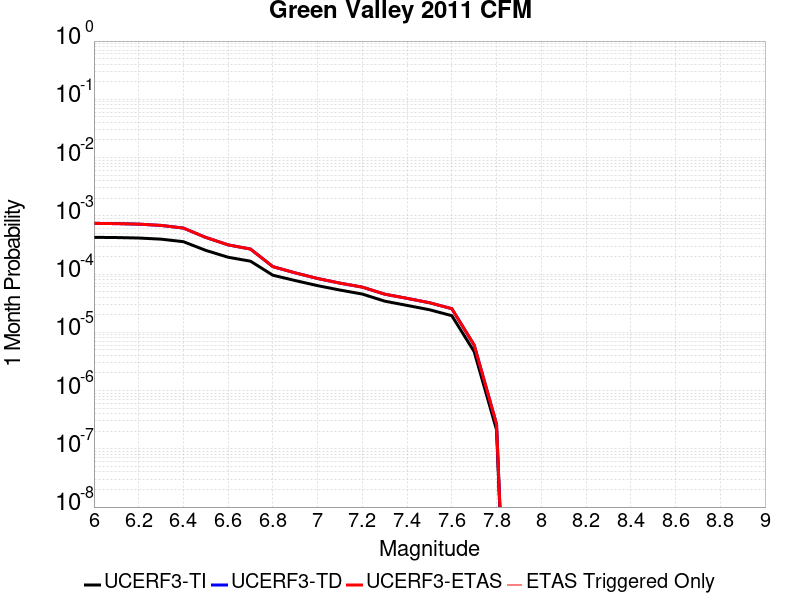 |  |  |

| Magnitude | 1 wk TI Prob | 1 wk TD Prob | 1 wk ETAS Prob | 1 wk ETAS/TD Gain | 1 wk ETAS Triggered Only | 1 mo TI Prob | 1 mo TD Prob | 1 mo ETAS Prob | 1 mo ETAS/TD Gain | 1 mo ETAS Triggered Only | 1 yr TI Prob | 1 yr TD Prob | 1 yr ETAS Prob | 1 yr ETAS/TD Gain | 1 yr ETAS Triggered Only | 10 yr TI Prob | 10 yr TD Prob | 10 yr ETAS Prob | 10 yr ETAS/TD Gain | 10 yr ETAS Triggered Only |
|-----|-----|-----|-----|-----|-----|-----|-----|-----|-----|-----|-----|-----|-----|-----|-----|-----|-----|-----|-----|-----|
| 6.0 | 9.9629346E-5 | 1.7306388E-4 | 1.7306388E-4 | 1.0 | 0.0 | 4.2691303E-4 | 7.4149936E-4 | 7.4149936E-4 | 1.0 | 0.0 | 0.0051852856 | 0.008987381 | 0.008987381 | 1.0 | 0.0 | 0.050659515 | 0.08552948 | 0.08555292 | 1.0002741 | 2.5637739E-5 |
| 6.1 | 9.88615E-5 | 1.7153693E-4 | 1.7153693E-4 | 1.0 | 0.0 | 4.2362334E-4 | 7.3495903E-4 | 7.3495903E-4 | 1.0 | 0.0 | 0.0051454236 | 0.008908406 | 0.008908406 | 1.0 | 0.0 | 0.050279044 | 0.084817074 | 0.084840536 | 1.0002767 | 2.5637739E-5 |
| 6.2 | 9.696895E-5 | 1.679268E-4 | 1.679268E-4 | 1.0 | 0.0 | 4.15515E-4 | 7.194957E-4 | 7.194957E-4 | 1.0 | 0.0 | 0.0050471667 | 0.008721775 | 0.008721775 | 1.0 | 0.0 | 0.04934063 | 0.08312591 | 0.08314942 | 1.0002828 | 2.5637739E-5 |
| 6.3 | 9.275224E-5 | 1.597199E-4 | 1.597199E-4 | 1.0 | 0.0 | 3.9744904E-4 | 6.843419E-4 | 6.843419E-4 | 1.0 | 0.0 | 0.0048282105 | 0.008297088 | 0.008297088 | 1.0 | 0.0 | 0.047246475 | 0.07926428 | 0.07928789 | 1.0002978 | 2.5637739E-5 |
| 6.4 | 8.391499E-5 | 1.4370102E-4 | 1.4370102E-4 | 1.0 | 0.0 | 3.595861E-4 | 6.1572343E-4 | 6.1572343E-4 | 1.0 | 0.0 | 0.004369175 | 0.0074676727 | 0.0074676727 | 1.0 | 0.0 | 0.04284265 | 0.07163763 | 0.07166143 | 1.0003322 | 2.5637739E-5 |
| 6.5 | 5.9519385E-5 | 9.935902E-5 | 9.935902E-5 | 1.0 | 0.0 | 2.5505814E-4 | 4.257589E-4 | 4.257589E-4 | 1.0 | 0.0 | 0.0031009112 | 0.0051687798 | 0.0051687798 | 1.0 | 0.0 | 0.030579966 | 0.050151456 | 0.050151456 | 1.0 | 0.0 |
| 6.6 | 4.5361558E-5 | 7.404101E-5 | 7.404101E-5 | 1.0 | 0.0 | 1.9439218E-4 | 3.1728283E-4 | 3.1728283E-4 | 1.0 | 0.0 | 0.0023641558 | 0.0038543646 | 0.0038543646 | 1.0 | 0.0 | 0.023391623 | 0.037670802 | 0.037670802 | 1.0 | 0.0 |
| 6.7 | 3.8808106E-5 | 6.2664265E-5 | 6.2664265E-5 | 1.0 | 0.0 | 1.6630985E-4 | 2.6853604E-4 | 2.6853604E-4 | 1.0 | 0.0 | 0.0020229418 | 0.0032630423 | 0.0032630423 | 1.0 | 0.0 | 0.020046256 | 0.03201008 | 0.03201008 | 1.0 | 0.0 |
| 6.8 | 2.2284667E-5 | 3.128693E-5 | 3.128693E-5 | 1.0 | 0.0 | 9.550222E-5 | 1.3407998E-4 | 1.3407998E-4 | 1.0 | 0.0 | 0.0011621192 | 0.0016311917 | 0.0016311917 | 1.0 | 0.0 | 0.011560607 | 0.016166827 | 0.016166827 | 1.0 | 0.0 |
| 6.9 | 1.8050168E-5 | 2.4449284E-5 | 2.4449284E-5 | 1.0 | 0.0 | 7.735557E-5 | 1.04778395E-4 | 1.04778395E-4 | 1.0 | 0.0 | 9.4139716E-4 | 0.0012749347 | 0.0012749347 | 1.0 | 0.0 | 0.009374191 | 0.012668457 | 0.012668457 | 1.0 | 0.0 |
| 7.0 | 1.4763166E-5 | 1.9583895E-5 | 1.9583895E-5 | 1.0 | 0.0 | 6.326917E-5 | 8.3928295E-5 | 8.3928295E-5 | 1.0 | 0.0 | 7.7002996E-4 | 0.001021351 | 0.001021351 | 1.0 | 0.0 | 0.007673672 | 0.010165877 | 0.010165877 | 1.0 | 0.0 |
| 7.1 | 1.2399713E-5 | 1.6304628E-5 | 1.6304628E-5 | 1.0 | 0.0 | 5.3140546E-5 | 6.987512E-5 | 6.987512E-5 | 1.0 | 0.0 | 6.467941E-4 | 8.5039943E-4 | 8.5039943E-4 | 1.0 | 0.0 | 0.006449148 | 0.008471731 | 0.008471731 | 1.0 | 0.0 |
| 7.2 | 1.0584195E-5 | 1.3922591E-5 | 1.3922591E-5 | 1.0 | 0.0 | 4.5360044E-5 | 5.966689E-5 | 5.966689E-5 | 1.0 | 0.0 | 5.521186E-4 | 7.262039E-4 | 7.262039E-4 | 1.0 | 0.0 | 0.0055074887 | 0.0072387247 | 0.0072387247 | 1.0 | 0.0 |
| 7.3 | 7.998173E-6 | 1.0544779E-5 | 1.0544779E-5 | 1.0 | 0.0 | 3.4277433E-5 | 4.5191133E-5 | 4.5191133E-5 | 1.0 | 0.0 | 4.1724785E-4 | 5.500642E-4 | 5.500642E-4 | 1.0 | 0.0 | 0.004164653 | 0.005487293 | 0.005487293 | 1.0 | 0.0 |
| 7.4 | 6.7571127E-6 | 8.933404E-6 | 8.933404E-6 | 1.0 | 0.0 | 2.8958733E-5 | 3.828546E-5 | 3.828546E-5 | 1.0 | 0.0 | 3.5251552E-4 | 4.6602674E-4 | 4.6602674E-4 | 1.0 | 0.0 | 0.0035195686 | 0.0046506976 | 0.0046506976 | 1.0 | 0.0 |
| 7.5 | 5.69878E-6 | 7.516847E-6 | 7.516847E-6 | 1.0 | 0.0 | 2.4423114E-5 | 3.2214666E-5 | 3.2214666E-5 | 1.0 | 0.0 | 2.9731085E-4 | 3.9214385E-4 | 3.9214385E-4 | 1.0 | 0.0 | 0.002969134 | 0.0039146706 | 0.0039146706 | 1.0 | 0.0 |
| 7.6 | 4.503664E-6 | 5.935998E-6 | 5.935998E-6 | 1.0 | 0.0 | 1.9301275E-5 | 2.543975E-5 | 2.543975E-5 | 1.0 | 0.0 | 2.3496768E-4 | 3.0968577E-4 | 3.0968577E-4 | 1.0 | 0.0 | 0.002347194 | 0.003092667 | 0.003092667 | 1.0 | 0.0 |
| 7.7 | 1.0873546E-6 | 1.4107495E-6 | 1.4107495E-6 | 1.0 | 0.0 | 4.6600826E-6 | 6.0460557E-6 | 6.0460557E-6 | 1.0 | 0.0 | 5.6735033E-5 | 7.360827E-5 | 7.360827E-5 | 1.0 | 0.0 | 5.672055E-4 | 7.3584093E-4 | 7.3584093E-4 | 1.0 | 0.0 |
| 7.8 | 4.9373917E-8 | 6.178006E-8 | 6.178006E-8 | 1.0 | 0.0 | 2.1160248E-7 | 2.6477167E-7 | 2.6477167E-7 | 1.0 | 0.0 | 2.5762572E-6 | 3.2235916E-6 | 3.2235916E-6 | 1.0 | 0.0 | 2.5762274E-5 | 3.223383E-5 | 3.223383E-5 | 1.0 | 0.0 |

## Calaveras (So) - Paicines extension 2011 CFM
*[(top)](#table-of-contents)*

| 1 Week | 1 Month | 1 Year | 10 Year |
|-----|-----|-----|-----|
|  |  |  |  |

| Magnitude | 1 wk TI Prob | 1 wk TD Prob | 1 wk ETAS Prob | 1 wk ETAS/TD Gain | 1 wk ETAS Triggered Only | 1 mo TI Prob | 1 mo TD Prob | 1 mo ETAS Prob | 1 mo ETAS/TD Gain | 1 mo ETAS Triggered Only | 1 yr TI Prob | 1 yr TD Prob | 1 yr ETAS Prob | 1 yr ETAS/TD Gain | 1 yr ETAS Triggered Only | 10 yr TI Prob | 10 yr TD Prob | 10 yr ETAS Prob | 10 yr ETAS/TD Gain | 10 yr ETAS Triggered Only |
|-----|-----|-----|-----|-----|-----|-----|-----|-----|-----|-----|-----|-----|-----|-----|-----|-----|-----|-----|-----|-----|
| 6.0 | 1.5183659E-4 | 3.0538742E-4 | 3.0538742E-4 | 1.0 | 0.0 | 6.5056595E-4 | 0.0013080107 | 0.0013080107 | 1.0 | 0.0 | 0.007891912 | 0.015702842 | 0.015702842 | 1.0 | 0.0 | 0.076174594 | 0.13854265 | 0.13856475 | 1.0001594 | 2.5637739E-5 |
| 6.1 | 1.5024997E-4 | 3.0232652E-4 | 3.0232652E-4 | 1.0 | 0.0 | 6.437695E-4 | 0.0012949064 | 0.0012949064 | 1.0 | 0.0 | 0.0078097614 | 0.0155462185 | 0.0155462185 | 1.0 | 0.0 | 0.075409345 | 0.13721214 | 0.13723427 | 1.0001612 | 2.5637739E-5 |
| 6.2 | 1.2743923E-4 | 2.5341182E-4 | 2.5341182E-4 | 1.0 | 0.0 | 5.460538E-4 | 0.001085454 | 0.001085454 | 1.0 | 0.0 | 0.0066279583 | 0.013053368 | 0.013053368 | 1.0 | 0.0 | 0.064337276 | 0.117310405 | 0.11733304 | 1.0001929 | 2.5637739E-5 |
| 6.3 | 1.1525114E-4 | 2.262457E-4 | 2.262457E-4 | 1.0 | 0.0 | 4.9383997E-4 | 9.6911576E-4 | 9.6911576E-4 | 1.0 | 0.0 | 0.0059959386 | 0.011674539 | 0.011674539 | 1.0 | 0.0 | 0.058367174 | 0.1064267 | 0.10644961 | 1.0002153 | 2.5637739E-5 |
| 6.4 | 1.07200925E-4 | 2.0861623E-4 | 2.0861623E-4 | 1.0 | 0.0 | 4.5935164E-4 | 8.93614E-4 | 8.93614E-4 | 1.0 | 0.0 | 0.0055782744 | 0.010779322 | 0.010779322 | 1.0 | 0.0 | 0.0544031 | 0.099249505 | 0.0992726 | 1.0002327 | 2.5637739E-5 |
| 6.5 | 9.69631E-5 | 1.8751183E-4 | 1.8751183E-4 | 1.0 | 0.0 | 4.1548995E-4 | 8.0336037E-4 | 8.0336037E-4 | 1.0 | 0.0 | 0.0050468626 | 0.009701113 | 0.009701113 | 1.0 | 0.0 | 0.04933773 | 0.09014108 | 0.09016441 | 1.0002588 | 2.5637739E-5 |
| 6.6 | 8.0552316E-5 | 1.508417E-4 | 1.508417E-4 | 1.0 | 0.0 | 3.4517853E-4 | 6.4628234E-4 | 6.4628234E-4 | 1.0 | 0.0 | 0.0041944524 | 0.007832806 | 0.007832806 | 1.0 | 0.0 | 0.04116161 | 0.07491137 | 0.074935086 | 1.0003166 | 2.5637739E-5 |
| 6.7 | 7.815757E-5 | 1.4624608E-4 | 1.4624608E-4 | 1.0 | 0.0 | 3.34918E-4 | 6.2660675E-4 | 6.2660675E-4 | 1.0 | 0.0 | 0.004070005 | 0.0075956066 | 0.0075956066 | 1.0 | 0.0 | 0.039962657 | 0.07276075 | 0.07278453 | 1.0003268 | 2.5637739E-5 |
| 6.8 | 6.965264E-5 | 1.273421E-4 | 1.273421E-4 | 1.0 | 0.0 | 2.9847719E-4 | 5.456321E-4 | 5.456321E-4 | 1.0 | 0.0 | 0.0036279052 | 0.006619586 | 0.006619586 | 1.0 | 0.0 | 0.03569247 | 0.06385353 | 0.06385353 | 1.0 | 0.0 |
| 6.9 | 5.8000453E-5 | 1.0154083E-4 | 1.0154083E-4 | 1.0 | 0.0 | 2.4854968E-4 | 4.3510293E-4 | 4.3510293E-4 | 1.0 | 0.0 | 0.0030218933 | 0.0052846153 | 0.0052846153 | 1.0 | 0.0 | 0.029811295 | 0.051550873 | 0.051550873 | 1.0 | 0.0 |
| 7.0 | 4.9865852E-5 | 8.578075E-5 | 8.578075E-5 | 1.0 | 0.0 | 2.1369329E-4 | 3.6758048E-4 | 3.6758048E-4 | 1.0 | 0.0 | 0.0025986114 | 0.004466198 | 0.004466198 | 1.0 | 0.0 | 0.025684336 | 0.04383052 | 0.04383052 | 1.0 | 0.0 |
| 7.1 | 4.283875E-5 | 7.120278E-5 | 7.120278E-5 | 1.0 | 0.0 | 1.8358172E-4 | 3.051194E-4 | 3.051194E-4 | 1.0 | 0.0 | 0.0022328163 | 0.0037085575 | 0.0037085575 | 1.0 | 0.0 | 0.022105146 | 0.03677475 | 0.03677475 | 1.0 | 0.0 |
| 7.2 | 3.450115E-5 | 5.5854773E-5 | 5.5854773E-5 | 1.0 | 0.0 | 1.478537E-4 | 2.393558E-4 | 2.393558E-4 | 1.0 | 0.0 | 0.0017986323 | 0.0029102915 | 0.0029102915 | 1.0 | 0.0 | 0.017841442 | 0.02911727 | 0.02911727 | 1.0 | 0.0 |
| 7.3 | 2.5709045E-5 | 4.0657033E-5 | 4.0657033E-5 | 1.0 | 0.0 | 1.1017697E-4 | 1.7423289E-4 | 1.7423289E-4 | 1.0 | 0.0 | 0.0013405791 | 0.0021192385 | 0.0021192385 | 1.0 | 0.0 | 0.013325208 | 0.021331005 | 0.021331005 | 1.0 | 0.0 |
| 7.4 | 1.8003093E-5 | 2.8548406E-5 | 2.8548406E-5 | 1.0 | 0.0 | 7.715383E-5 | 1.2234459E-4 | 1.2234459E-4 | 1.0 | 0.0 | 9.3894306E-4 | 0.00148853 | 0.00148853 | 1.0 | 0.0 | 0.009349857 | 0.015070891 | 0.015070891 | 1.0 | 0.0 |
| 7.5 | 1.5595824E-5 | 2.5859636E-5 | 2.5859636E-5 | 1.0 | 0.0 | 6.683753E-5 | 1.10822315E-4 | 1.10822315E-4 | 1.0 | 0.0 | 8.134431E-4 | 0.0013484288 | 0.0013484288 | 1.0 | 0.0 | 0.008104719 | 0.013670188 | 0.013670188 | 1.0 | 0.0 |
| 7.6 | 1.1110309E-5 | 1.9254814E-5 | 1.9254814E-5 | 1.0 | 0.0 | 4.761474E-5 | 8.251803E-5 | 8.251803E-5 | 1.0 | 0.0 | 5.795553E-4 | 0.0010041953 | 0.0010041953 | 1.0 | 0.0 | 0.0057804612 | 0.010219867 | 0.010219867 | 1.0 | 0.0 |
| 7.7 | 6.2140443E-6 | 1.0459921E-5 | 1.0459921E-5 | 1.0 | 0.0 | 2.6631347E-5 | 4.4827466E-5 | 4.4827466E-5 | 1.0 | 0.0 | 3.241884E-4 | 5.456378E-4 | 5.456378E-4 | 1.0 | 0.0 | 0.0032371588 | 0.005630981 | 0.005630981 | 1.0 | 0.0 |
| 7.8 | 5.305533E-6 | 9.453423E-6 | 9.453423E-6 | 1.0 | 0.0 | 2.27378E-5 | 4.051404E-5 | 4.051404E-5 | 1.0 | 0.0 | 2.7679754E-4 | 4.931469E-4 | 4.931469E-4 | 1.0 | 0.0 | 0.0027645302 | 0.0050842287 | 0.0050842287 | 1.0 | 0.0 |
| 7.9 | 3.363505E-6 | 7.399955E-6 | 7.399955E-6 | 1.0 | 0.0 | 1.4414942E-5 | 3.171371E-5 | 3.171371E-5 | 1.0 | 0.0 | 1.7548777E-4 | 3.8604607E-4 | 3.8604607E-4 | 1.0 | 0.0 | 0.0017534926 | 0.003955788 | 0.003955788 | 1.0 | 0.0 |
| 8.0 | 2.0271132E-6 | 4.421605E-6 | 4.421605E-6 | 1.0 | 0.0 | 8.687599E-6 | 1.8949599E-5 | 1.8949599E-5 | 1.0 | 0.0 | 1.05766376E-4 | 2.3068699E-4 | 2.3068699E-4 | 1.0 | 0.0 | 0.0010571606 | 0.0023552408 | 0.0023552408 | 1.0 | 0.0 |
| 8.1 | 1.2206116E-6 | 2.379743E-6 | 2.379743E-6 | 1.0 | 0.0 | 5.2311816E-6 | 1.0198858E-5 | 1.0198858E-5 | 1.0 | 0.0 | 6.3687774E-5 | 1.2416406E-4 | 1.2416406E-4 | 1.0 | 0.0 | 6.366953E-4 | 0.0012728416 | 0.0012728416 | 1.0 | 0.0 |

## Ortigalita (South)
*[(top)](#table-of-contents)*

| 1 Week | 1 Month | 1 Year | 10 Year |
|-----|-----|-----|-----|
|  | 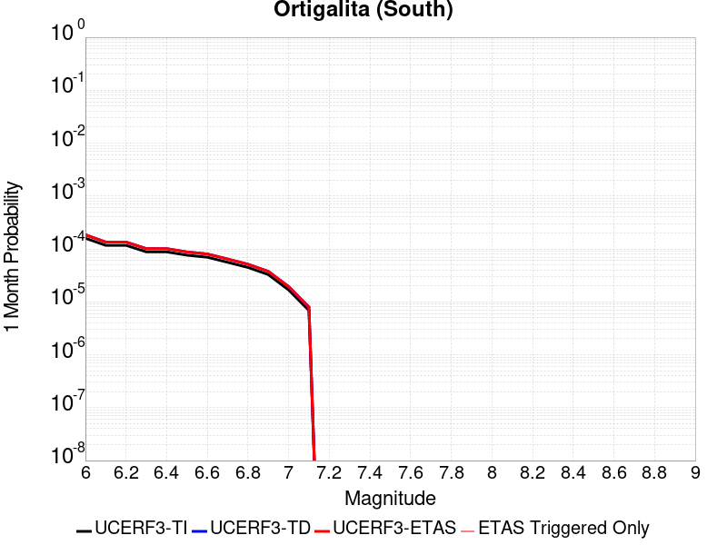 |  |  |

| Magnitude | 1 wk TI Prob | 1 wk TD Prob | 1 wk ETAS Prob | 1 wk ETAS/TD Gain | 1 wk ETAS Triggered Only | 1 mo TI Prob | 1 mo TD Prob | 1 mo ETAS Prob | 1 mo ETAS/TD Gain | 1 mo ETAS Triggered Only | 1 yr TI Prob | 1 yr TD Prob | 1 yr ETAS Prob | 1 yr ETAS/TD Gain | 1 yr ETAS Triggered Only | 10 yr TI Prob | 10 yr TD Prob | 10 yr ETAS Prob | 10 yr ETAS/TD Gain | 10 yr ETAS Triggered Only |
|-----|-----|-----|-----|-----|-----|-----|-----|-----|-----|-----|-----|-----|-----|-----|-----|-----|-----|-----|-----|-----|
| 6.0 | 3.72394E-5 | 4.3259344E-5 | 4.3259344E-5 | 1.0 | 0.0 | 1.5958765E-4 | 1.853849E-4 | 1.853849E-4 | 1.0 | 0.0 | 0.0019412481 | 0.0022548812 | 0.0022548812 | 1.0 | 0.0 | 0.019243775 | 0.0223364 | 0.022361463 | 1.0011221 | 2.5637739E-5 |
| 6.1 | 2.7299884E-5 | 3.1494616E-5 | 3.1494616E-5 | 1.0 | 0.0 | 1.16994255E-4 | 1.3497027E-4 | 1.3497027E-4 | 1.0 | 0.0 | 0.0014234743 | 0.0016420797 | 0.0016420797 | 1.0 | 0.0 | 0.014143906 | 0.016305393 | 0.016330613 | 1.0015467 | 2.5637739E-5 |
| 6.2 | 2.7299884E-5 | 3.1494616E-5 | 3.1494616E-5 | 1.0 | 0.0 | 1.16994255E-4 | 1.3497027E-4 | 1.3497027E-4 | 1.0 | 0.0 | 0.0014234743 | 0.0016420797 | 0.0016420797 | 1.0 | 0.0 | 0.014143906 | 0.016305393 | 0.016330613 | 1.0015467 | 2.5637739E-5 |
| 6.3 | 2.0546433E-5 | 2.3633338E-5 | 2.3633338E-5 | 1.0 | 0.0 | 8.805317E-5 | 1.0128191E-4 | 1.0128191E-4 | 1.0 | 0.0 | 0.00107152 | 0.0012324287 | 0.0012324287 | 1.0 | 0.0 | 0.010663681 | 0.0122580035 | 0.0122580035 | 1.0 | 0.0 |
| 6.4 | 2.0546433E-5 | 2.3633338E-5 | 2.3633338E-5 | 1.0 | 0.0 | 8.805317E-5 | 1.0128191E-4 | 1.0128191E-4 | 1.0 | 0.0 | 0.00107152 | 0.0012324287 | 0.0012324287 | 1.0 | 0.0 | 0.010663681 | 0.0122580035 | 0.0122580035 | 1.0 | 0.0 |
| 6.5 | 1.7779594E-5 | 2.0448608E-5 | 2.0448608E-5 | 1.0 | 0.0 | 7.619603E-5 | 8.763402E-5 | 8.763402E-5 | 1.0 | 0.0 | 9.272918E-4 | 0.0010664355 | 0.0010664355 | 1.0 | 0.0 | 0.009234319 | 0.010614647 | 0.010614647 | 1.0 | 0.0 |
| 6.6 | 1.6272212E-5 | 1.8716462E-5 | 1.8716462E-5 | 1.0 | 0.0 | 6.973618E-5 | 8.0211015E-5 | 8.0211015E-5 | 1.0 | 0.0 | 8.487073E-4 | 9.761438E-4 | 9.761438E-4 | 1.0 | 0.0 | 0.008454733 | 0.0097198635 | 0.0097198635 | 1.0 | 0.0 |
| 6.7 | 1.3051484E-5 | 1.5039977E-5 | 1.5039977E-5 | 1.0 | 0.0 | 5.593373E-5 | 6.4455504E-5 | 6.4455504E-5 | 1.0 | 0.0 | 6.807804E-4 | 7.8447274E-4 | 7.8447274E-4 | 1.0 | 0.0 | 0.006786986 | 0.007818019 | 0.007818019 | 1.0 | 0.0 |
| 6.8 | 1.04277415E-5 | 1.1988188E-5 | 1.1988188E-5 | 1.0 | 0.0 | 4.4689557E-5 | 5.137698E-5 | 5.137698E-5 | 1.0 | 0.0 | 5.439595E-4 | 6.2534265E-4 | 6.2534265E-4 | 1.0 | 0.0 | 0.0054262993 | 0.0062365844 | 0.0062365844 | 1.0 | 0.0 |
| 6.9 | 7.639968E-6 | 8.792207E-6 | 8.792207E-6 | 1.0 | 0.0 | 3.274231E-5 | 3.7680376E-5 | 3.7680376E-5 | 1.0 | 0.0 | 3.9856473E-4 | 4.586679E-4 | 4.586679E-4 | 1.0 | 0.0 | 0.003978506 | 0.004577799 | 0.004577799 | 1.0 | 0.0 |
| 7.0 | 3.919831E-6 | 4.5337783E-6 | 4.5337783E-6 | 1.0 | 0.0 | 1.679917E-5 | 1.9430345E-5 | 1.9430345E-5 | 1.0 | 0.0 | 2.045107E-4 | 2.3654089E-4 | 2.3654089E-4 | 1.0 | 0.0 | 0.0020432258 | 0.0023630997 | 0.0023630997 | 1.0 | 0.0 |
| 7.1 | 1.6017933E-6 | 1.857199E-6 | 1.857199E-6 | 1.0 | 0.0 | 6.8648105E-6 | 7.959406E-6 | 7.959406E-6 | 1.0 | 0.0 | 8.357586E-5 | 9.690253E-5 | 9.690253E-5 | 1.0 | 0.0 | 8.3544437E-4 | 9.6870743E-4 | 9.6870743E-4 | 1.0 | 0.0 |

## Camp Rock 2011
*[(top)](#table-of-contents)*

| 1 Week | 1 Month | 1 Year | 10 Year |
|-----|-----|-----|-----|
|  |  | 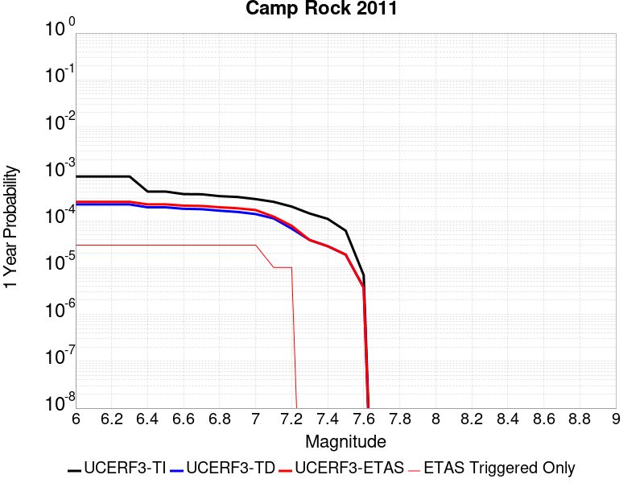 |  |

| Magnitude | 1 wk TI Prob | 1 wk TD Prob | 1 wk ETAS Prob | 1 wk ETAS/TD Gain | 1 wk ETAS Triggered Only | 1 mo TI Prob | 1 mo TD Prob | 1 mo ETAS Prob | 1 mo ETAS/TD Gain | 1 mo ETAS Triggered Only | 1 yr TI Prob | 1 yr TD Prob | 1 yr ETAS Prob | 1 yr ETAS/TD Gain | 1 yr ETAS Triggered Only | 10 yr TI Prob | 10 yr TD Prob | 10 yr ETAS Prob | 10 yr ETAS/TD Gain | 10 yr ETAS Triggered Only |
|-----|-----|-----|-----|-----|-----|-----|-----|-----|-----|-----|-----|-----|-----|-----|-----|-----|-----|-----|-----|-----|
| 6.0 | 1.6710783E-5 | 4.2504644E-6 | 4.2504644E-6 | 1.0 | 0.0 | 7.161568E-5 | 1.8216151E-5 | 1.8216151E-5 | 1.0 | 0.0 | 8.7157206E-4 | 2.217596E-4 | 2.217596E-4 | 1.0 | 0.0 | 0.008681616 | 0.002215436 | 0.0022410168 | 1.0115467 | 2.5637739E-5 |
| 6.1 | 1.6710783E-5 | 4.2504644E-6 | 4.2504644E-6 | 1.0 | 0.0 | 7.161568E-5 | 1.8216151E-5 | 1.8216151E-5 | 1.0 | 0.0 | 8.7157206E-4 | 2.217596E-4 | 2.217596E-4 | 1.0 | 0.0 | 0.008681616 | 0.002215436 | 0.0022410168 | 1.0115467 | 2.5637739E-5 |
| 6.2 | 1.6710783E-5 | 4.2504644E-6 | 4.2504644E-6 | 1.0 | 0.0 | 7.161568E-5 | 1.8216151E-5 | 1.8216151E-5 | 1.0 | 0.0 | 8.7157206E-4 | 2.217596E-4 | 2.217596E-4 | 1.0 | 0.0 | 0.008681616 | 0.002215436 | 0.0022410168 | 1.0115467 | 2.5637739E-5 |
| 6.3 | 1.6710783E-5 | 4.2504644E-6 | 4.2504644E-6 | 1.0 | 0.0 | 7.161568E-5 | 1.8216151E-5 | 1.8216151E-5 | 1.0 | 0.0 | 8.7157206E-4 | 2.217596E-4 | 2.217596E-4 | 1.0 | 0.0 | 0.008681616 | 0.002215436 | 0.0022410168 | 1.0115467 | 2.5637739E-5 |
| 6.4 | 7.982846E-6 | 3.6822685E-6 | 3.6822685E-6 | 1.0 | 0.0 | 3.421175E-5 | 1.5781057E-5 | 1.5781057E-5 | 1.0 | 0.0 | 4.1644843E-4 | 1.9211778E-4 | 1.9211778E-4 | 1.0 | 0.0 | 0.0041566887 | 0.0019195518 | 0.0019451403 | 1.0133305 | 2.5637739E-5 |
| 6.5 | 7.982846E-6 | 3.6822685E-6 | 3.6822685E-6 | 1.0 | 0.0 | 3.421175E-5 | 1.5781057E-5 | 1.5781057E-5 | 1.0 | 0.0 | 4.1644843E-4 | 1.9211778E-4 | 1.9211778E-4 | 1.0 | 0.0 | 0.0041566887 | 0.0019195518 | 0.0019451403 | 1.0133305 | 2.5637739E-5 |
| 6.6 | 7.048869E-6 | 3.4245295E-6 | 3.4245295E-6 | 1.0 | 0.0 | 3.0209088E-5 | 1.4676474E-5 | 1.4676474E-5 | 1.0 | 0.0 | 3.677336E-4 | 1.7867173E-4 | 1.7867173E-4 | 1.0 | 0.0 | 0.0036712566 | 0.0017853125 | 0.0018109045 | 1.0143347 | 2.5637739E-5 |
| 6.7 | 6.987307E-6 | 3.3625051E-6 | 3.3625051E-6 | 1.0 | 0.0 | 2.9945259E-5 | 1.4410658E-5 | 1.4410658E-5 | 1.0 | 0.0 | 3.6452254E-4 | 1.7543595E-4 | 1.7543595E-4 | 1.0 | 0.0 | 0.0036392517 | 0.0017530057 | 0.0017785985 | 1.0145993 | 2.5637739E-5 |
| 6.8 | 6.3737602E-6 | 3.1180682E-6 | 3.1180682E-6 | 1.0 | 0.0 | 2.731583E-5 | 1.3363083E-5 | 1.3363083E-5 | 1.0 | 0.0 | 3.3251947E-4 | 1.6268367E-4 | 1.6268367E-4 | 1.0 | 0.0 | 0.0033202237 | 0.0016256744 | 0.0016512705 | 1.0157449 | 2.5637739E-5 |
| 6.9 | 6.112211E-6 | 2.9332696E-6 | 2.9332696E-6 | 1.0 | 0.0 | 2.6194928E-5 | 1.2571097E-5 | 1.2571097E-5 | 1.0 | 0.0 | 3.1887658E-4 | 1.5304264E-4 | 1.5304264E-4 | 1.0 | 0.0 | 0.003184194 | 0.0015294001 | 0.0015549987 | 1.0167376 | 2.5637739E-5 |
| 7.0 | 5.5140117E-6 | 2.642059E-6 | 2.642059E-6 | 1.0 | 0.0 | 2.3631264E-5 | 1.1323062E-5 | 1.1323062E-5 | 1.0 | 0.0 | 2.8767265E-4 | 1.3784981E-4 | 1.3784981E-4 | 1.0 | 0.0 | 0.0028730053 | 0.0013776683 | 0.0014032708 | 1.0185839 | 2.5637739E-5 |
| 7.1 | 4.8151105E-6 | 2.134385E-6 | 2.134385E-6 | 1.0 | 0.0 | 2.0636026E-5 | 9.147334E-6 | 9.147334E-6 | 1.0 | 0.0 | 2.5121463E-4 | 1.1136332E-4 | 1.1136332E-4 | 1.0 | 0.0 | 0.0025093083 | 0.0011130971 | 0.0011387062 | 1.0230072 | 2.5637739E-5 |
| 7.2 | 3.818335E-6 | 1.2938276E-6 | 1.2938276E-6 | 1.0 | 0.0 | 1.6364189E-5 | 5.544964E-6 | 5.544964E-6 | 1.0 | 0.0 | 1.9921579E-4 | 6.750793E-5 | 6.750793E-5 | 1.0 | 0.0 | 0.0019903728 | 6.748825E-4 | 7.005029E-4 | 1.0379628 | 2.5637739E-5 |
| 7.3 | 2.7166698E-6 | 7.38423E-7 | 7.38423E-7 | 1.0 | 0.0 | 1.1642818E-5 | 3.1646662E-6 | 3.1646662E-6 | 1.0 | 0.0 | 1.4174209E-4 | 3.852915E-5 | 3.852915E-5 | 1.0 | 0.0 | 0.0014165172 | 3.852267E-4 | 3.852267E-4 | 1.0 | 0.0 |
| 7.4 | 2.0893426E-6 | 5.462354E-7 | 5.462354E-7 | 1.0 | 0.0 | 8.954295E-6 | 2.3410068E-6 | 2.3410068E-6 | 1.0 | 0.0 | 1.0901308E-4 | 2.850139E-5 | 2.850139E-5 | 1.0 | 0.0 | 0.0010895962 | 2.849779E-4 | 2.849779E-4 | 1.0 | 0.0 |
| 7.5 | 1.1681728E-6 | 3.6033393E-7 | 3.6033393E-7 | 1.0 | 0.0 | 5.0064455E-6 | 1.5442874E-6 | 1.5442874E-6 | 1.0 | 0.0 | 6.0951766E-5 | 1.8801542E-5 | 1.8801542E-5 | 1.0 | 0.0 | 6.093505E-4 | 1.8799998E-4 | 1.8799998E-4 | 1.0 | 0.0 |
| 7.6 | 1.3154387E-7 | 7.12009E-8 | 7.12009E-8 | 1.0 | 0.0 | 5.6375933E-7 | 3.051467E-7 | 3.051467E-7 | 1.0 | 0.0 | 6.863748E-6 | 3.7151563E-6 | 3.7151563E-6 | 1.0 | 0.0 | 6.863536E-5 | 3.7151098E-5 | 3.7151098E-5 | 1.0 | 0.0 |

## Newport-Inglewood (Offshore)
*[(top)](#table-of-contents)*

| 1 Week | 1 Month | 1 Year | 10 Year |
|-----|-----|-----|-----|
|  |  |  |  |

| Magnitude | 1 wk TI Prob | 1 wk TD Prob | 1 wk ETAS Prob | 1 wk ETAS/TD Gain | 1 wk ETAS Triggered Only | 1 mo TI Prob | 1 mo TD Prob | 1 mo ETAS Prob | 1 mo ETAS/TD Gain | 1 mo ETAS Triggered Only | 1 yr TI Prob | 1 yr TD Prob | 1 yr ETAS Prob | 1 yr ETAS/TD Gain | 1 yr ETAS Triggered Only | 10 yr TI Prob | 10 yr TD Prob | 10 yr ETAS Prob | 10 yr ETAS/TD Gain | 10 yr ETAS Triggered Only |
|-----|-----|-----|-----|-----|-----|-----|-----|-----|-----|-----|-----|-----|-----|-----|-----|-----|-----|-----|-----|-----|
| 6.0 | 1.9626508E-5 | 1.896613E-5 | 1.896613E-5 | 1.0 | 0.0 | 8.411089E-5 | 8.1280945E-5 | 1.069166E-4 | 1.3153956 | 2.5637739E-5 | 0.001023569 | 9.891589E-4 | 0.0010147713 | 1.0258931 | 2.5637739E-5 | 0.010188672 | 0.009848903 | 0.009874288 | 1.0025774 | 2.5637739E-5 |
| 6.1 | 1.331886E-5 | 1.2218616E-5 | 1.2218616E-5 | 1.0 | 0.0 | 5.707958E-5 | 5.2364452E-5 | 5.2364452E-5 | 1.0 | 0.0 | 6.947222E-4 | 6.3735223E-4 | 6.3735223E-4 | 1.0 | 0.0 | 0.006925544 | 0.00635542 | 0.00635542 | 1.0 | 0.0 |
| 6.2 | 1.2250852E-5 | 1.107651E-5 | 1.107651E-5 | 1.0 | 0.0 | 5.2502597E-5 | 4.74699E-5 | 4.74699E-5 | 1.0 | 0.0 | 6.3903164E-4 | 5.777938E-4 | 5.777938E-4 | 1.0 | 0.0 | 0.006371971 | 0.005763036 | 0.005763036 | 1.0 | 0.0 |
| 6.3 | 1.2106258E-5 | 1.0919365E-5 | 1.0919365E-5 | 1.0 | 0.0 | 5.1882926E-5 | 4.6796446E-5 | 4.6796446E-5 | 1.0 | 0.0 | 6.3149154E-4 | 5.6959875E-4 | 5.6959875E-4 | 1.0 | 0.0 | 0.0062970007 | 0.005681505 | 0.005681505 | 1.0 | 0.0 |
| 6.4 | 1.1348758E-5 | 1.0109807E-5 | 1.0109807E-5 | 1.0 | 0.0 | 4.8636626E-5 | 4.3327025E-5 | 4.3327025E-5 | 1.0 | 0.0 | 5.919901E-4 | 5.273797E-4 | 5.273797E-4 | 1.0 | 0.0 | 0.005904155 | 0.005261377 | 0.005261377 | 1.0 | 0.0 |
| 6.5 | 1.100837E-5 | 9.743819E-6 | 9.743819E-6 | 1.0 | 0.0 | 4.7177873E-5 | 4.175856E-5 | 4.175856E-5 | 1.0 | 0.0 | 5.7423924E-4 | 5.0829264E-4 | 5.0829264E-4 | 1.0 | 0.0 | 0.005727576 | 0.005071392 | 0.005071392 | 1.0 | 0.0 |
| 6.6 | 1.0634696E-5 | 9.345958E-6 | 9.345958E-6 | 1.0 | 0.0 | 4.557647E-5 | 4.0053492E-5 | 4.0053492E-5 | 1.0 | 0.0 | 5.5475225E-4 | 4.875429E-4 | 4.875429E-4 | 1.0 | 0.0 | 0.0055336943 | 0.0048648193 | 0.0048648193 | 1.0 | 0.0 |
| 6.7 | 9.9780855E-6 | 8.6682985E-6 | 8.6682985E-6 | 1.0 | 0.0 | 4.276252E-5 | 3.7149326E-5 | 3.7149326E-5 | 1.0 | 0.0 | 5.205093E-4 | 4.521999E-4 | 4.521999E-4 | 1.0 | 0.0 | 0.0051929182 | 0.0045128767 | 0.0045128767 | 1.0 | 0.0 |
| 6.8 | 9.59546E-6 | 8.273325E-6 | 8.273325E-6 | 1.0 | 0.0 | 4.1122752E-5 | 3.545663E-5 | 3.545663E-5 | 1.0 | 0.0 | 5.0055445E-4 | 4.3159962E-4 | 4.3159962E-4 | 1.0 | 0.0 | 0.004994285 | 0.0043076896 | 0.0043076896 | 1.0 | 0.0 |
| 6.9 | 9.000614E-6 | 7.707188E-6 | 7.707188E-6 | 1.0 | 0.0 | 3.857349E-5 | 3.3030392E-5 | 3.3030392E-5 | 1.0 | 0.0 | 4.6953102E-4 | 4.0207148E-4 | 4.0207148E-4 | 1.0 | 0.0 | 0.004685402 | 0.004013512 | 0.004013512 | 1.0 | 0.0 |
| 7.0 | 7.4070194E-6 | 6.14917E-6 | 6.14917E-6 | 1.0 | 0.0 | 3.1743984E-5 | 2.635332E-5 | 2.635332E-5 | 1.0 | 0.0 | 3.8641447E-4 | 3.208046E-4 | 3.208046E-4 | 1.0 | 0.0 | 0.0038574322 | 0.0032034346 | 0.0032034346 | 1.0 | 0.0 |
| 7.1 | 6.299615E-6 | 5.056818E-6 | 5.056818E-6 | 1.0 | 0.0 | 2.699807E-5 | 2.1671896E-5 | 2.1671896E-5 | 1.0 | 0.0 | 3.2865192E-4 | 2.6382352E-4 | 2.6382352E-4 | 1.0 | 0.0 | 0.003281663 | 0.002635118 | 0.002635118 | 1.0 | 0.0 |
| 7.2 | 5.096653E-6 | 3.892961E-6 | 3.892961E-6 | 1.0 | 0.0 | 2.1842614E-5 | 1.6684013E-5 | 1.6684013E-5 | 1.0 | 0.0 | 2.6590136E-4 | 2.0310901E-4 | 2.0310901E-4 | 1.0 | 0.0 | 0.0026558342 | 0.002029245 | 0.002029245 | 1.0 | 0.0 |
| 7.3 | 3.9753018E-6 | 2.9100247E-6 | 2.9100247E-6 | 1.0 | 0.0 | 1.7036897E-5 | 1.2471476E-5 | 1.2471476E-5 | 1.0 | 0.0 | 2.0740448E-4 | 1.5182972E-4 | 1.5182972E-4 | 1.0 | 0.0 | 0.00207211 | 0.0015172679 | 0.0015172679 | 1.0 | 0.0 |
| 7.4 | 3.0568392E-6 | 2.145087E-6 | 2.145087E-6 | 1.0 | 0.0 | 1.3100675E-5 | 9.193198E-6 | 9.193198E-6 | 1.0 | 0.0 | 1.5948903E-4 | 1.11921494E-4 | 1.11921494E-4 | 1.0 | 0.0 | 0.0015937461 | 0.0011186575 | 0.0011186575 | 1.0 | 0.0 |
| 7.5 | 1.7279019E-6 | 1.1470418E-6 | 1.1470418E-6 | 1.0 | 0.0 | 7.405273E-6 | 4.9158843E-6 | 4.9158843E-6 | 1.0 | 0.0 | 9.015547E-5 | 5.9849288E-5 | 5.9849288E-5 | 1.0 | 0.0 | 9.01189E-4 | 5.983356E-4 | 5.983356E-4 | 1.0 | 0.0 |
| 7.6 | 1.1156416E-6 | 7.2233786E-7 | 7.2233786E-7 | 1.0 | 0.0 | 4.7813123E-6 | 3.09573E-6 | 3.09573E-6 | 1.0 | 0.0 | 5.821092E-5 | 3.7689886E-5 | 3.7689886E-5 | 1.0 | 0.0 | 5.8195676E-4 | 3.7683727E-4 | 3.7683727E-4 | 1.0 | 0.0 |
| 7.7 | 9.117973E-8 | 6.7343215E-8 | 6.7343215E-8 | 1.0 | 0.0 | 3.907702E-7 | 2.8861376E-7 | 2.8861376E-7 | 1.0 | 0.0 | 4.757617E-6 | 3.5138671E-6 | 3.5138671E-6 | 1.0 | 0.0 | 4.7575148E-5 | 3.5138146E-5 | 3.5138146E-5 | 1.0 | 0.0 |

