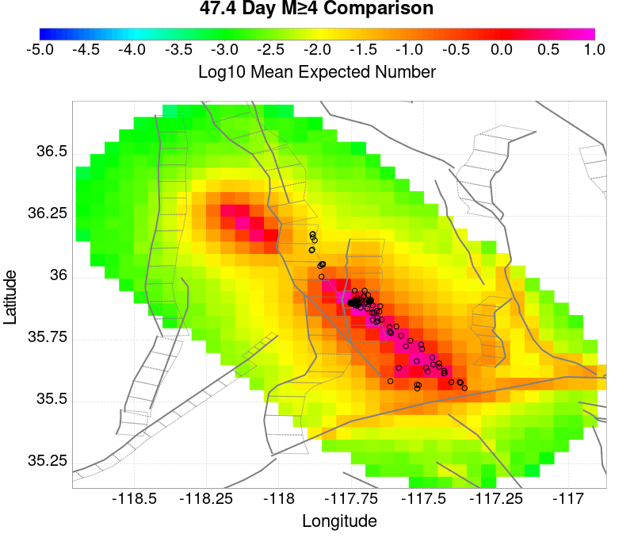
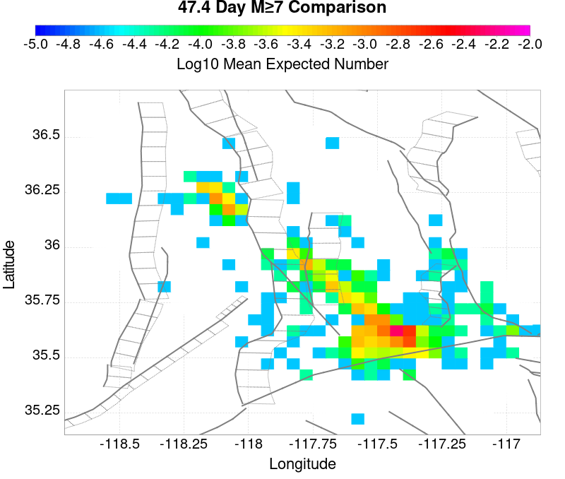
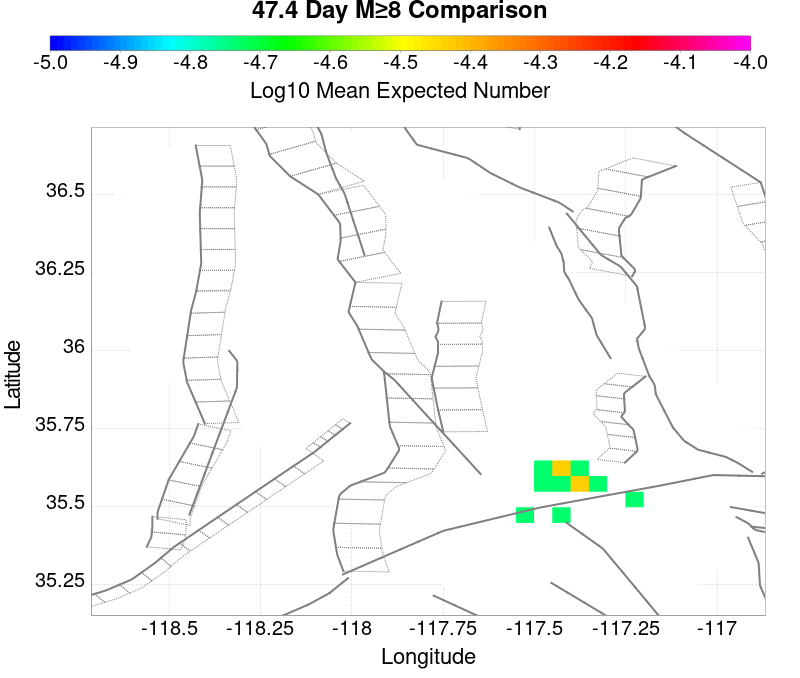

# ComCat M7.1 (ci38457511), Inverted Surface (minSlip=0.5), ShakeMap Surface Results

|   | ComCat M7.1 (ci38457511), Inverted Surface (minSlip=0.5), ShakeMap Surface |
|-----|-----|
| Num Simulations | 40623 (incomplete) |
| Start Time | 2019/07/06 03:19:54 UTC |
| Start Time Epoch Milliseconds | 1562383194040 |
| Duration | 10 Years |
| Includes Spontaneous? | false |
| Trigger Ruptures | 253 Trigger Ruptures |
|   | First: M3.98 at 2019/07/04 17:02:55 UTC |
|   | Last: M7.1 at 2019/07/06 03:19:53 UTC |
|   | Largest: M7.1 at 2019/07/06 03:19:53 UTC |
| Historical Ruptures | *(none)* |

## Table Of Contents

* [Probabilities Summary Table](#probabilities-summary-table)
* [Magnitude Number Distribution](#magnitude-number-distribution)
  * [10 Year Magnitude Number Distribution](#10-year-magnitude-number-distribution)
  * [1 Year Magnitude Number Distribution](#1-year-magnitude-number-distribution)
  * [1 Month Magnitude Number Distribution](#1-month-magnitude-number-distribution)
  * [1 Week Magnitude Number Distribution](#1-week-magnitude-number-distribution)
  * [1 Day Magnitude Number Distribution](#1-day-magnitude-number-distribution)
  * [1 Hour Magnitude Number Distribution](#1-hour-magnitude-number-distribution)
* [Hazard Change Over Time](#hazard-change-over-time)
  * [M&ge;5.0 Hazard Change Over Time](#m50-hazard-change-over-time)
  * [M&ge;6.0 Hazard Change Over Time](#m60-hazard-change-over-time)
  * [M&ge;7.0 Hazard Change Over Time](#m70-hazard-change-over-time)
  * [M&ge;8.0 Hazard Change Over Time](#m80-hazard-change-over-time)
* [Trigger Rupture Fault Map](#trigger-rupture-fault-map)
* [Trigger Rupture Depth Map](#trigger-rupture-depth-map)
* [Fault Distances To Triggers](#fault-distances-to-triggers)
* [Individual Simulated Catalog Maps](#individual-simulated-catalog-maps)
* [ComCat Data Comparisons](#comcat-data-comparisons)
  * [ComCat Magnitude-Number Distributions](#comcat-magnitude-number-distributions)
  * [ComCat Cumulative Number Vs Time](#comcat-cumulative-number-vs-time)
  * [ComCat Cumulative Number Simulation Percentiles](#comcat-cumulative-number-simulation-percentiles)
  * [ComCat Mean Spatial Distribution](#comcat-mean-spatial-distribution)
  * [ComCat Depth Distribution](#comcat-depth-distribution)
* [Section Participation](#section-participation)
  * [Section Participation Plots](#section-participation-plots)
  * [Supra-Seismogenic Parent Sections Table](#supra-seismogenic-parent-sections-table)
  * [M≥6.5 Parent Sections Table](#m65-parent-sections-table)
  * [M≥7 Parent Sections Table](#m7-parent-sections-table)
  * [M≥7.5 Parent Sections Table](#m75-parent-sections-table)
  * [M≥8 Parent Sections Table](#m8-parent-sections-table)
  * [Fault Magnitude-Probability Distributions](#fault-magnitude-probability-distributions)
* [Gridded Nucleation](#gridded-nucleation)
* [JSON Input File](#json-input-file)

## Probabilities Summary Table
*[(top)](#table-of-contents)*

| Magnitude | 1 Hour Prob | 1 Day Prob | 1 Week Prob | 1 Month Prob | 1 Year Prob | 10 Year Prob |
|-----|-----|-----|-----|-----|-----|-----|
| **M&ge;4** | 1.000 (100.00%) | 1.000 (100.00%) | 1.000 (100.00%) | 1.000 (100.00%) | 1.000 (100.00%) | 1.000 (100.00%) |
| **M&ge;4.5** | 0.991 (99.13%) | 1.000 (100.00%) | 1.000 (100.00%) | 1.000 (100.00%) | 1.000 (100.00%) | 1.000 (100.00%) |
| **M&ge;5** | 0.772 (77.23%) | 0.978 (97.76%) | 0.996 (99.56%) | 0.999 (99.87%) | 1.000 (99.99%) | 1.000 (100.00%) |
| **M&ge;5.5** | 0.357 (35.68%) | 0.689 (68.90%) | 0.818 (81.75%) | 0.878 (87.76%) | 0.939 (93.92%) | 0.966 (96.63%) |
| **M&ge;6** | 0.107 (10.66%) | 0.266 (26.64%) | 0.368 (36.82%) | 0.440 (44.03%) | 0.548 (54.75%) | 0.630 (62.99%) |
| **M&ge;6.5** | 0.023 (2.30%) | 0.064 (6.44%) | 0.094 (9.41%) | 0.118 (11.81%) | 0.161 (16.14%) | 0.202 (20.16%) |
| **M&ge;7** | 5.81E-3 (0.58%) | 0.016 (1.57%) | 0.024 (2.37%) | 0.030 (3.01%) | 0.043 (4.27%) | 0.056 (5.60%) |
| **M&ge;7.1** | 4.87E-3 (0.49%) | 0.012 (1.20%) | 0.018 (1.82%) | 0.023 (2.32%) | 0.033 (3.31%) | 0.044 (4.40%) |
| **M&ge;7.5** | 1.26E-3 (0.13%) | 3.69E-3 (0.37%) | 5.64E-3 (0.56%) | 7.29E-3 (0.73%) | 0.011 (1.05%) | 0.014 (1.44%) |
| **M&ge;8** | 4.92E-5 (0.00%) | 1.48E-4 (0.01%) | 2.22E-4 (0.02%) | 3.20E-4 (0.03%) | 3.94E-4 (0.04%) | 4.92E-4 (0.05%) |

## Magnitude Number Distribution
*[(top)](#table-of-contents)*

### 10 Year Magnitude Number Distribution
*[(top)](#table-of-contents)*

**Legend**
* **Mean** (thick black line): mean expected number across all 40623 catalogs
* **2.5%,97.5%** (thin black lines): expected number percentiles across all 40623 catalogs
* **Median** (thin blue line): median expected number across all 40623 catalogs
* **Mode** (thin cyan line): modal expected number across all 40623 catalogs
* **10 yr Probability** (thin red line): 10 year probability calculated as the fraction of catalogs with at least 1 occurrence
* **10 yr Supraseismogenic Probability** (thin dashed red line): same as above, but only for supraseismogenic ruptures on explicitly modeled UCERF3 faults
* **95% Conf** (light red shaded region): binomial 95% confidence bounds on probability
* **Primary** (thin green line): mean expected number from primary triggered aftershocks only (no secondary, tertiary, etc...) across all 40623 catalogs


| Mag | Mean | 2.5 %ile | 97.5 %ile | Median | Mode | 10 yr Probability | 10 yr Supra-Seis Prob | Primary Aftershocks Mean |
|-----|-----|-----|-----|-----|-----|-----|-----|-----|
| **M&ge;2.5** | 5271.489 | 3657.000 | 11933.000 | 4595.000 | 4165.000 | 1.000 (100.00%) | 0.253 (25.29%) | 2392.137 |
| **M&ge;2.6** | 4186.996 | 2897.000 | 9462.000 | 3650.000 | 3678.000 | 1.000 (100.00%) | 0.253 (25.29%) | 1900.000 |
| **M&ge;2.7** | 3325.625 | 2297.000 | 7520.000 | 2900.000 | 2611.000 | 1.000 (100.00%) | 0.253 (25.29%) | 1509.083 |
| **M&ge;2.8** | 2641.744 | 1821.000 | 5975.000 | 2304.000 | 2167.000 | 1.000 (100.00%) | 0.253 (25.29%) | 1198.740 |
| **M&ge;2.9** | 2098.469 | 1441.000 | 4744.000 | 1831.000 | 1707.000 | 1.000 (100.00%) | 0.253 (25.29%) | 952.206 |
| **M&ge;3** | 1666.724 | 1141.000 | 3758.000 | 1455.000 | 1332.000 | 1.000 (100.00%) | 0.253 (25.29%) | 756.282 |
| **M&ge;3.1** | 1323.673 | 902.000 | 2994.000 | 1156.000 | 1078.000 | 1.000 (100.00%) | 0.253 (25.29%) | 600.596 |
| **M&ge;3.2** | 1051.279 | 713.000 | 2377.000 | 919.000 | 837.000 | 1.000 (100.00%) | 0.253 (25.29%) | 477.062 |
| **M&ge;3.3** | 834.964 | 563.000 | 1891.000 | 730.000 | 690.000 | 1.000 (100.00%) | 0.253 (25.29%) | 378.900 |
| **M&ge;3.4** | 663.169 | 443.000 | 1502.000 | 580.000 | 521.000 | 1.000 (100.00%) | 0.253 (25.29%) | 300.987 |
| **M&ge;3.5** | 526.729 | 348.000 | 1189.000 | 461.000 | 427.000 | 1.000 (100.00%) | 0.253 (25.29%) | 239.082 |
| **M&ge;3.6** | 418.288 | 274.000 | 947.000 | 367.000 | 352.000 | 1.000 (100.00%) | 0.253 (25.29%) | 189.861 |
| **M&ge;3.7** | 332.037 | 215.000 | 751.000 | 291.000 | 280.000 | 1.000 (100.00%) | 0.253 (25.29%) | 150.744 |
| **M&ge;3.8** | 263.644 | 168.000 | 598.000 | 232.000 | 213.000 | 1.000 (100.00%) | 0.253 (25.29%) | 119.700 |
| **M&ge;3.9** | 209.284 | 131.000 | 476.000 | 184.000 | 167.000 | 1.000 (100.00%) | 0.253 (25.29%) | 95.021 |
| **M&ge;4** | 166.142 | 102.000 | 381.000 | 146.000 | 140.000 | 1.000 (100.00%) | 0.253 (25.29%) | 75.423 |
| **M&ge;4.1** | 131.853 | 79.000 | 302.000 | 116.000 | 109.000 | 1.000 (100.00%) | 0.253 (25.29%) | 59.848 |
| **M&ge;4.2** | 104.671 | 61.000 | 240.000 | 92.000 | 85.000 | 1.000 (100.00%) | 0.253 (25.29%) | 47.518 |
| **M&ge;4.3** | 83.026 | 47.000 | 191.000 | 73.000 | 66.000 | 1.000 (100.00%) | 0.253 (25.29%) | 37.701 |
| **M&ge;4.4** | 65.876 | 36.000 | 152.000 | 58.000 | 55.000 | 1.000 (100.00%) | 0.253 (25.29%) | 29.897 |
| **M&ge;4.5** | 52.240 | 27.000 | 122.000 | 46.000 | 45.000 | 1.000 (100.00%) | 0.253 (25.29%) | 23.721 |
| **M&ge;4.6** | 41.363 | 20.000 | 97.000 | 37.000 | 33.000 | 1.000 (100.00%) | 0.253 (25.29%) | 18.797 |
| **M&ge;4.7** | 32.767 | 15.000 | 77.000 | 29.000 | 25.000 | 1.000 (100.00%) | 0.253 (25.29%) | 14.887 |
| **M&ge;4.8** | 25.954 | 11.000 | 62.000 | 23.000 | 20.000 | 1.000 (100.00%) | 0.253 (25.29%) | 11.801 |
| **M&ge;4.9** | 20.517 | 8.000 | 50.000 | 18.000 | 16.000 | 1.000 (100.00%) | 0.253 (25.29%) | 9.331 |
| **M&ge;5** | 16.193 | 6.000 | 40.000 | 14.000 | 13.000 | 1.000 (100.00%) | 0.253 (25.29%) | 7.359 |
| **M&ge;5.1** | 12.765 | 4.000 | 32.000 | 11.000 | 9.000 | 1.000 (99.98%) | 0.253 (25.29%) | 5.803 |
| **M&ge;5.2** | 10.044 | 3.000 | 26.000 | 9.000 | 8.000 | 0.999 (99.89%) | 0.253 (25.29%) | 4.565 |
| **M&ge;5.3** | 7.879 | 1.000 | 21.000 | 7.000 | 6.000 | 0.995 (99.53%) | 0.253 (25.29%) | 3.579 |
| **M&ge;5.4** | 6.162 | 1.000 | 17.000 | 5.000 | 4.000 | 0.986 (98.61%) | 0.253 (25.29%) | 2.801 |
| **M&ge;5.5** | 4.800 | 0.000 | 14.000 | 4.000 | 3.000 | 0.966 (96.63%) | 0.253 (25.29%) | 2.184 |
| **M&ge;5.6** | 3.713 | 0.000 | 11.000 | 3.000 | 2.000 | 0.933 (93.33%) | 0.253 (25.29%) | 1.694 |
| **M&ge;5.7** | 2.852 | 0.000 | 9.000 | 2.000 | 2.000 | 0.882 (88.21%) | 0.253 (25.29%) | 1.306 |
| **M&ge;5.8** | 2.166 | 0.000 | 7.000 | 2.000 | 1.000 | 0.812 (81.24%) | 0.253 (25.29%) | 0.995 |
| **M&ge;5.9** | 1.630 | 0.000 | 6.000 | 1.000 | 1.000 | 0.725 (72.50%) | 0.253 (25.27%) | 0.747 |
| **M&ge;6** | 1.239 | 0.000 | 5.000 | 1.000 | 0.000 | 0.630 (62.99%) | 0.252 (25.25%) | 0.563 |
| **M&ge;6.1** | 0.915 | 0.000 | 4.000 | 1.000 | 0.000 | 0.527 (52.73%) | 0.220 (22.03%) | 0.421 |
| **M&ge;6.2** | 0.637 | 0.000 | 3.000 | 0.000 | 0.000 | 0.417 (41.74%) | 0.191 (19.05%) | 0.299 |
| **M&ge;6.3** | 0.453 | 0.000 | 3.000 | 0.000 | 0.000 | 0.322 (32.21%) | 0.146 (14.60%) | 0.211 |
| **M&ge;6.4** | 0.344 | 0.000 | 2.000 | 0.000 | 0.000 | 0.258 (25.82%) | 0.132 (13.22%) | 0.161 |
| **M&ge;6.5** | 0.256 | 0.000 | 2.000 | 0.000 | 0.000 | 0.202 (20.16%) | 0.112 (11.20%) | 0.119 |
| **M&ge;6.6** | 0.196 | 0.000 | 2.000 | 0.000 | 0.000 | 0.163 (16.26%) | 0.097 (9.68%) | 0.093 |
| **M&ge;6.7** | 0.151 | 0.000 | 1.000 | 0.000 | 0.000 | 0.129 (12.87%) | 0.082 (8.22%) | 0.072 |
| **M&ge;6.8** | 0.115 | 0.000 | 1.000 | 0.000 | 0.000 | 0.102 (10.20%) | 0.070 (6.98%) | 0.055 |
| **M&ge;6.9** | 0.081 | 0.000 | 1.000 | 0.000 | 0.000 | 0.075 (7.45%) | 0.053 (5.27%) | 0.038 |
| **M&ge;7** | 0.060 | 0.000 | 1.000 | 0.000 | 0.000 | 0.056 (5.60%) | 0.042 (4.21%) | 0.028 |
| **M&ge;7.1** | 0.046 | 0.000 | 1.000 | 0.000 | 0.000 | 0.044 (4.40%) | 0.036 (3.58%) | 0.021 |
| **M&ge;7.2** | 0.034 | 0.000 | 1.000 | 0.000 | 0.000 | 0.033 (3.27%) | 0.028 (2.83%) | 0.015 |
| **M&ge;7.3** | 0.023 | 0.000 | 0.000 | 0.000 | 0.000 | 0.022 (2.24%) | 0.021 (2.06%) | 9.85E-3 |
| **M&ge;7.4** | 0.019 | 0.000 | 0.000 | 0.000 | 0.000 | 0.019 (1.88%) | 0.018 (1.82%) | 8.07E-3 |
| **M&ge;7.5** | 0.015 | 0.000 | 0.000 | 0.000 | 0.000 | 0.014 (1.44%) | 0.014 (1.41%) | 5.91E-3 |
| **M&ge;7.6** | 7.66E-3 | 0.000 | 0.000 | 0.000 | 0.000 | 7.56E-3 (0.76%) | 7.46E-3 (0.75%) | 3.27E-3 |
| **M&ge;7.7** | 2.51E-3 | 0.000 | 0.000 | 0.000 | 0.000 | 2.46E-3 (0.25%) | 2.41E-3 (0.24%) | 1.03E-3 |
| **M&ge;7.8** | 1.70E-3 | 0.000 | 0.000 | 0.000 | 0.000 | 1.70E-3 (0.17%) | 1.67E-3 (0.17%) | 6.89E-4 |
| **M&ge;7.9** | 1.03E-3 | 0.000 | 0.000 | 0.000 | 0.000 | 1.03E-3 (0.10%) | 1.03E-3 (0.10%) | 3.69E-4 |
| **M&ge;8** | 4.92E-4 | 0.000 | 0.000 | 0.000 | 0.000 | 4.92E-4 (0.05%) | 4.92E-4 (0.05%) | 1.72E-4 |
| **M&ge;8.1** | 7.38E-5 | 0.000 | 0.000 | 0.000 | 0.000 | 7.38E-5 (0.01%) | 7.38E-5 (0.01%) | 2.46E-5 |
| **M&ge;8.2** | 0.000 | 0.000 | 0.000 | 0.000 | 0.000 | 0.000 (0.00%) | 0.000 (0.00%) | 0.000 |
| **M&ge;8.3** | 0.000 | 0.000 | 0.000 | 0.000 | 0.000 | 0.000 (0.00%) | 0.000 (0.00%) | 0.000 |
| **M&ge;8.4** | 0.000 | 0.000 | 0.000 | 0.000 | 0.000 | 0.000 (0.00%) | 0.000 (0.00%) | 0.000 |
| **M&ge;8.5** | 0.000 | 0.000 | 0.000 | 0.000 | 0.000 | 0.000 (0.00%) | 0.000 (0.00%) | 0.000 |
| **M&ge;8.6** | 0.000 | 0.000 | 0.000 | 0.000 | 0.000 | 0.000 (0.00%) | 0.000 (0.00%) | 0.000 |
| **M&ge;8.7** | 0.000 | 0.000 | 0.000 | 0.000 | 0.000 | 0.000 (0.00%) | 0.000 (0.00%) | 0.000 |
| **M&ge;8.8** | 0.000 | 0.000 | 0.000 | 0.000 | 0.000 | 0.000 (0.00%) | 0.000 (0.00%) | 0.000 |
| **M&ge;8.9** | 0.000 | 0.000 | 0.000 | 0.000 | 0.000 | 0.000 (0.00%) | 0.000 (0.00%) | 0.000 |
| **M&ge;9** | 0.000 | 0.000 | 0.000 | 0.000 | 0.000 | 0.000 (0.00%) | 0.000 (0.00%) | 0.000 |

### 1 Year Magnitude Number Distribution
*[(top)](#table-of-contents)*

**Legend**
* **Mean** (thick black line): mean expected number across all 40623 catalogs
* **2.5%,97.5%** (thin black lines): expected number percentiles across all 40623 catalogs
* **Median** (thin blue line): median expected number across all 40623 catalogs
* **Mode** (thin cyan line): modal expected number across all 40623 catalogs
* **1 yr Probability** (thin red line): 1 year probability calculated as the fraction of catalogs with at least 1 occurrence
* **1 yr Supraseismogenic Probability** (thin dashed red line): same as above, but only for supraseismogenic ruptures on explicitly modeled UCERF3 faults
* **95% Conf** (light red shaded region): binomial 95% confidence bounds on probability
* **Primary** (thin green line): mean expected number from primary triggered aftershocks only (no secondary, tertiary, etc...) across all 40623 catalogs


| Mag | Mean | 2.5 %ile | 97.5 %ile | Median | Mode | 1 yr Probability | 1 yr Supra-Seis Prob | Primary Aftershocks Mean |
|-----|-----|-----|-----|-----|-----|-----|-----|-----|
| **M&ge;2.5** | 4014.526 | 2951.000 | 8010.000 | 3579.000 | 3335.000 | 1.000 (100.00%) | 0.202 (20.19%) | 2083.990 |
| **M&ge;2.6** | 3188.664 | 2340.000 | 6376.000 | 2843.000 | 2645.000 | 1.000 (100.00%) | 0.202 (20.19%) | 1655.266 |
| **M&ge;2.7** | 2532.633 | 1853.000 | 5064.000 | 2260.000 | 2108.000 | 1.000 (100.00%) | 0.202 (20.19%) | 1314.712 |
| **M&ge;2.8** | 2011.814 | 1468.000 | 4026.000 | 1794.000 | 1729.000 | 1.000 (100.00%) | 0.202 (20.19%) | 1044.363 |
| **M&ge;2.9** | 1598.022 | 1161.000 | 3197.000 | 1426.000 | 1323.000 | 1.000 (100.00%) | 0.202 (20.19%) | 829.573 |
| **M&ge;3** | 1269.264 | 918.000 | 2543.000 | 1134.000 | 1100.000 | 1.000 (100.00%) | 0.202 (20.19%) | 658.886 |
| **M&ge;3.1** | 1008.033 | 725.000 | 2017.000 | 901.000 | 855.000 | 1.000 (100.00%) | 0.202 (20.19%) | 523.255 |
| **M&ge;3.2** | 800.605 | 572.000 | 1602.000 | 716.000 | 656.000 | 1.000 (100.00%) | 0.202 (20.19%) | 415.603 |
| **M&ge;3.3** | 635.851 | 451.000 | 1270.000 | 569.000 | 529.000 | 1.000 (100.00%) | 0.202 (20.19%) | 330.089 |
| **M&ge;3.4** | 505.047 | 355.000 | 1011.000 | 453.000 | 424.000 | 1.000 (100.00%) | 0.202 (20.19%) | 262.215 |
| **M&ge;3.5** | 401.115 | 279.000 | 804.000 | 360.000 | 343.000 | 1.000 (100.00%) | 0.202 (20.19%) | 208.287 |
| **M&ge;3.6** | 318.534 | 218.000 | 640.000 | 286.000 | 269.000 | 1.000 (100.00%) | 0.202 (20.19%) | 165.409 |
| **M&ge;3.7** | 252.815 | 171.000 | 509.000 | 227.000 | 212.000 | 1.000 (100.00%) | 0.202 (20.19%) | 131.326 |
| **M&ge;3.8** | 200.740 | 133.000 | 405.000 | 181.000 | 164.000 | 1.000 (100.00%) | 0.202 (20.19%) | 104.287 |
| **M&ge;3.9** | 159.353 | 104.000 | 323.000 | 144.000 | 132.000 | 1.000 (100.00%) | 0.202 (20.19%) | 82.800 |
| **M&ge;4** | 126.513 | 80.000 | 257.000 | 114.000 | 103.000 | 1.000 (100.00%) | 0.202 (20.19%) | 65.730 |
| **M&ge;4.1** | 100.389 | 62.000 | 206.000 | 91.000 | 82.000 | 1.000 (100.00%) | 0.202 (20.19%) | 52.144 |
| **M&ge;4.2** | 79.711 | 48.000 | 165.000 | 72.000 | 71.000 | 1.000 (100.00%) | 0.202 (20.19%) | 41.411 |
| **M&ge;4.3** | 63.224 | 36.000 | 131.000 | 57.000 | 53.000 | 1.000 (100.00%) | 0.202 (20.19%) | 32.851 |
| **M&ge;4.4** | 50.151 | 28.000 | 105.000 | 45.000 | 43.000 | 1.000 (100.00%) | 0.202 (20.19%) | 26.055 |
| **M&ge;4.5** | 39.781 | 21.000 | 84.000 | 36.000 | 32.000 | 1.000 (100.00%) | 0.202 (20.19%) | 20.675 |
| **M&ge;4.6** | 31.496 | 15.000 | 67.000 | 29.000 | 25.000 | 1.000 (100.00%) | 0.202 (20.19%) | 16.381 |
| **M&ge;4.7** | 24.958 | 11.000 | 54.000 | 23.000 | 20.000 | 1.000 (100.00%) | 0.202 (20.19%) | 12.979 |
| **M&ge;4.8** | 19.773 | 8.000 | 43.000 | 18.000 | 16.000 | 1.000 (100.00%) | 0.202 (20.19%) | 10.291 |
| **M&ge;4.9** | 15.629 | 6.000 | 35.000 | 14.000 | 13.000 | 1.000 (100.00%) | 0.202 (20.19%) | 8.137 |
| **M&ge;5** | 12.339 | 4.000 | 29.000 | 11.000 | 10.000 | 1.000 (99.99%) | 0.202 (20.19%) | 6.418 |
| **M&ge;5.1** | 9.728 | 3.000 | 23.000 | 9.000 | 7.000 | 0.999 (99.92%) | 0.202 (20.19%) | 5.062 |
| **M&ge;5.2** | 7.655 | 2.000 | 19.000 | 7.000 | 6.000 | 0.997 (99.66%) | 0.202 (20.19%) | 3.987 |
| **M&ge;5.3** | 6.004 | 1.000 | 16.000 | 5.000 | 4.000 | 0.988 (98.81%) | 0.202 (20.19%) | 3.122 |
| **M&ge;5.4** | 4.691 | 0.000 | 13.000 | 4.000 | 3.000 | 0.971 (97.14%) | 0.202 (20.19%) | 2.440 |
| **M&ge;5.5** | 3.656 | 0.000 | 10.000 | 3.000 | 2.000 | 0.939 (93.92%) | 0.202 (20.19%) | 1.904 |
| **M&ge;5.6** | 2.825 | 0.000 | 9.000 | 2.000 | 2.000 | 0.890 (89.03%) | 0.202 (20.19%) | 1.474 |
| **M&ge;5.7** | 2.170 | 0.000 | 7.000 | 2.000 | 1.000 | 0.824 (82.37%) | 0.202 (20.19%) | 1.135 |
| **M&ge;5.8** | 1.648 | 0.000 | 6.000 | 1.000 | 1.000 | 0.740 (74.05%) | 0.202 (20.19%) | 0.865 |
| **M&ge;5.9** | 1.242 | 0.000 | 5.000 | 1.000 | 0.000 | 0.644 (64.36%) | 0.202 (20.18%) | 0.650 |
| **M&ge;6** | 0.941 | 0.000 | 4.000 | 1.000 | 0.000 | 0.548 (54.75%) | 0.202 (20.16%) | 0.489 |
| **M&ge;6.1** | 0.694 | 0.000 | 3.000 | 0.000 | 0.000 | 0.448 (44.80%) | 0.176 (17.62%) | 0.366 |
| **M&ge;6.2** | 0.485 | 0.000 | 3.000 | 0.000 | 0.000 | 0.347 (34.73%) | 0.152 (15.20%) | 0.259 |
| **M&ge;6.3** | 0.345 | 0.000 | 2.000 | 0.000 | 0.000 | 0.264 (26.37%) | 0.116 (11.56%) | 0.183 |
| **M&ge;6.4** | 0.261 | 0.000 | 2.000 | 0.000 | 0.000 | 0.208 (20.83%) | 0.105 (10.48%) | 0.139 |
| **M&ge;6.5** | 0.195 | 0.000 | 2.000 | 0.000 | 0.000 | 0.161 (16.14%) | 0.088 (8.85%) | 0.104 |
| **M&ge;6.6** | 0.150 | 0.000 | 1.000 | 0.000 | 0.000 | 0.130 (12.96%) | 0.076 (7.62%) | 0.081 |
| **M&ge;6.7** | 0.115 | 0.000 | 1.000 | 0.000 | 0.000 | 0.102 (10.16%) | 0.064 (6.41%) | 0.062 |
| **M&ge;6.8** | 0.088 | 0.000 | 1.000 | 0.000 | 0.000 | 0.080 (7.97%) | 0.054 (5.40%) | 0.047 |
| **M&ge;6.9** | 0.062 | 0.000 | 1.000 | 0.000 | 0.000 | 0.058 (5.77%) | 0.040 (4.04%) | 0.033 |
| **M&ge;7** | 0.045 | 0.000 | 1.000 | 0.000 | 0.000 | 0.043 (4.27%) | 0.032 (3.17%) | 0.024 |
| **M&ge;7.1** | 0.035 | 0.000 | 1.000 | 0.000 | 0.000 | 0.033 (3.31%) | 0.027 (2.68%) | 0.018 |
| **M&ge;7.2** | 0.025 | 0.000 | 0.000 | 0.000 | 0.000 | 0.025 (2.46%) | 0.021 (2.11%) | 0.013 |
| **M&ge;7.3** | 0.017 | 0.000 | 0.000 | 0.000 | 0.000 | 0.017 (1.67%) | 0.015 (1.52%) | 8.52E-3 |
| **M&ge;7.4** | 0.014 | 0.000 | 0.000 | 0.000 | 0.000 | 0.014 (1.39%) | 0.013 (1.34%) | 7.02E-3 |
| **M&ge;7.5** | 0.011 | 0.000 | 0.000 | 0.000 | 0.000 | 0.011 (1.05%) | 0.010 (1.03%) | 5.10E-3 |
| **M&ge;7.6** | 5.64E-3 | 0.000 | 0.000 | 0.000 | 0.000 | 5.61E-3 (0.56%) | 5.51E-3 (0.55%) | 2.86E-3 |
| **M&ge;7.7** | 1.97E-3 | 0.000 | 0.000 | 0.000 | 0.000 | 1.97E-3 (0.20%) | 1.92E-3 (0.19%) | 9.85E-4 |
| **M&ge;7.8** | 1.35E-3 | 0.000 | 0.000 | 0.000 | 0.000 | 1.35E-3 (0.14%) | 1.33E-3 (0.13%) | 6.65E-4 |
| **M&ge;7.9** | 8.12E-4 | 0.000 | 0.000 | 0.000 | 0.000 | 8.12E-4 (0.08%) | 8.12E-4 (0.08%) | 3.69E-4 |
| **M&ge;8** | 3.94E-4 | 0.000 | 0.000 | 0.000 | 0.000 | 3.94E-4 (0.04%) | 3.94E-4 (0.04%) | 1.72E-4 |
| **M&ge;8.1** | 4.92E-5 | 0.000 | 0.000 | 0.000 | 0.000 | 4.92E-5 (0.00%) | 4.92E-5 (0.00%) | 2.46E-5 |
| **M&ge;8.2** | 0.000 | 0.000 | 0.000 | 0.000 | 0.000 | 0.000 (0.00%) | 0.000 (0.00%) | 0.000 |
| **M&ge;8.3** | 0.000 | 0.000 | 0.000 | 0.000 | 0.000 | 0.000 (0.00%) | 0.000 (0.00%) | 0.000 |
| **M&ge;8.4** | 0.000 | 0.000 | 0.000 | 0.000 | 0.000 | 0.000 (0.00%) | 0.000 (0.00%) | 0.000 |
| **M&ge;8.5** | 0.000 | 0.000 | 0.000 | 0.000 | 0.000 | 0.000 (0.00%) | 0.000 (0.00%) | 0.000 |
| **M&ge;8.6** | 0.000 | 0.000 | 0.000 | 0.000 | 0.000 | 0.000 (0.00%) | 0.000 (0.00%) | 0.000 |
| **M&ge;8.7** | 0.000 | 0.000 | 0.000 | 0.000 | 0.000 | 0.000 (0.00%) | 0.000 (0.00%) | 0.000 |
| **M&ge;8.8** | 0.000 | 0.000 | 0.000 | 0.000 | 0.000 | 0.000 (0.00%) | 0.000 (0.00%) | 0.000 |
| **M&ge;8.9** | 0.000 | 0.000 | 0.000 | 0.000 | 0.000 | 0.000 (0.00%) | 0.000 (0.00%) | 0.000 |
| **M&ge;9** | 0.000 | 0.000 | 0.000 | 0.000 | 0.000 | 0.000 (0.00%) | 0.000 (0.00%) | 0.000 |

### 1 Month Magnitude Number Distribution
*[(top)](#table-of-contents)*

**Legend**
* **Mean** (thick black line): mean expected number across all 40623 catalogs
* **2.5%,97.5%** (thin black lines): expected number percentiles across all 40623 catalogs
* **Median** (thin blue line): median expected number across all 40623 catalogs
* **Mode** (thin cyan line): modal expected number across all 40623 catalogs
* **1 mo Probability** (thin red line): 1 month probability calculated as the fraction of catalogs with at least 1 occurrence
* **1 mo Supraseismogenic Probability** (thin dashed red line): same as above, but only for supraseismogenic ruptures on explicitly modeled UCERF3 faults
* **95% Conf** (light red shaded region): binomial 95% confidence bounds on probability
* **Primary** (thin green line): mean expected number from primary triggered aftershocks only (no secondary, tertiary, etc...) across all 40623 catalogs


| Mag | Mean | 2.5 %ile | 97.5 %ile | Median | Mode | 1 mo Probability | 1 mo Supra-Seis Prob | Primary Aftershocks Mean |
|-----|-----|-----|-----|-----|-----|-----|-----|-----|
| **M&ge;2.5** | 2799.834 | 2188.000 | 5039.000 | 2558.000 | 2425.000 | 1.000 (100.00%) | 0.149 (14.85%) | 1689.755 |
| **M&ge;2.6** | 2223.825 | 1732.000 | 4010.000 | 2033.000 | 1926.000 | 1.000 (100.00%) | 0.149 (14.85%) | 1342.099 |
| **M&ge;2.7** | 1766.356 | 1371.000 | 3171.000 | 1616.000 | 1539.000 | 1.000 (100.00%) | 0.149 (14.85%) | 1066.027 |
| **M&ge;2.8** | 1403.153 | 1084.000 | 2522.000 | 1284.000 | 1200.000 | 1.000 (100.00%) | 0.149 (14.85%) | 846.811 |
| **M&ge;2.9** | 1114.540 | 857.000 | 2005.000 | 1020.000 | 948.000 | 1.000 (100.00%) | 0.149 (14.85%) | 672.661 |
| **M&ge;3** | 885.257 | 676.000 | 1590.000 | 811.000 | 780.000 | 1.000 (100.00%) | 0.149 (14.85%) | 534.249 |
| **M&ge;3.1** | 703.115 | 533.000 | 1263.000 | 645.000 | 616.000 | 1.000 (100.00%) | 0.149 (14.85%) | 424.260 |
| **M&ge;3.2** | 558.439 | 420.000 | 1003.000 | 512.000 | 494.000 | 1.000 (100.00%) | 0.149 (14.85%) | 336.974 |
| **M&ge;3.3** | 443.543 | 330.000 | 800.000 | 407.000 | 380.000 | 1.000 (100.00%) | 0.149 (14.85%) | 267.625 |
| **M&ge;3.4** | 352.320 | 259.000 | 638.000 | 324.000 | 312.000 | 1.000 (100.00%) | 0.149 (14.85%) | 212.591 |
| **M&ge;3.5** | 279.823 | 203.000 | 506.000 | 258.000 | 243.000 | 1.000 (100.00%) | 0.149 (14.85%) | 168.844 |
| **M&ge;3.6** | 222.196 | 159.000 | 402.000 | 205.000 | 197.000 | 1.000 (100.00%) | 0.149 (14.85%) | 134.085 |
| **M&ge;3.7** | 176.342 | 123.000 | 320.000 | 163.000 | 157.000 | 1.000 (100.00%) | 0.149 (14.85%) | 106.451 |
| **M&ge;3.8** | 140.011 | 96.000 | 255.000 | 129.000 | 123.000 | 1.000 (100.00%) | 0.149 (14.85%) | 84.527 |
| **M&ge;3.9** | 111.154 | 74.000 | 204.000 | 103.000 | 100.000 | 1.000 (100.00%) | 0.149 (14.85%) | 67.117 |
| **M&ge;4** | 88.236 | 57.000 | 162.000 | 82.000 | 80.000 | 1.000 (100.00%) | 0.149 (14.85%) | 53.275 |
| **M&ge;4.1** | 70.004 | 44.000 | 130.000 | 65.000 | 63.000 | 1.000 (100.00%) | 0.149 (14.85%) | 42.252 |
| **M&ge;4.2** | 55.605 | 33.000 | 104.000 | 52.000 | 47.000 | 1.000 (100.00%) | 0.149 (14.85%) | 33.559 |
| **M&ge;4.3** | 44.093 | 25.000 | 83.000 | 41.000 | 36.000 | 1.000 (100.00%) | 0.149 (14.85%) | 26.621 |
| **M&ge;4.4** | 34.965 | 19.000 | 66.000 | 32.000 | 30.000 | 1.000 (100.00%) | 0.149 (14.85%) | 21.106 |
| **M&ge;4.5** | 27.743 | 14.000 | 54.000 | 26.000 | 24.000 | 1.000 (100.00%) | 0.149 (14.85%) | 16.751 |
| **M&ge;4.6** | 21.969 | 10.000 | 43.000 | 20.000 | 19.000 | 1.000 (100.00%) | 0.149 (14.85%) | 13.273 |
| **M&ge;4.7** | 17.411 | 7.000 | 35.000 | 16.000 | 15.000 | 1.000 (100.00%) | 0.149 (14.85%) | 10.514 |
| **M&ge;4.8** | 13.797 | 5.000 | 29.000 | 13.000 | 11.000 | 1.000 (100.00%) | 0.149 (14.85%) | 8.340 |
| **M&ge;4.9** | 10.903 | 4.000 | 23.000 | 10.000 | 9.000 | 1.000 (99.99%) | 0.149 (14.85%) | 6.595 |
| **M&ge;5** | 8.606 | 2.000 | 19.000 | 8.000 | 7.000 | 0.999 (99.87%) | 0.149 (14.85%) | 5.198 |
| **M&ge;5.1** | 6.783 | 1.000 | 16.000 | 6.000 | 5.000 | 0.996 (99.55%) | 0.149 (14.85%) | 4.102 |
| **M&ge;5.2** | 5.340 | 1.000 | 13.000 | 5.000 | 4.000 | 0.986 (98.56%) | 0.149 (14.85%) | 3.230 |
| **M&ge;5.3** | 4.185 | 0.000 | 11.000 | 4.000 | 3.000 | 0.965 (96.47%) | 0.149 (14.85%) | 2.528 |
| **M&ge;5.4** | 3.269 | 0.000 | 9.000 | 3.000 | 2.000 | 0.930 (93.05%) | 0.149 (14.85%) | 1.976 |
| **M&ge;5.5** | 2.546 | 0.000 | 8.000 | 2.000 | 2.000 | 0.878 (87.76%) | 0.149 (14.85%) | 1.541 |
| **M&ge;5.6** | 1.968 | 0.000 | 6.000 | 2.000 | 1.000 | 0.809 (80.86%) | 0.149 (14.85%) | 1.192 |
| **M&ge;5.7** | 1.512 | 0.000 | 5.000 | 1.000 | 1.000 | 0.725 (72.46%) | 0.149 (14.85%) | 0.918 |
| **M&ge;5.8** | 1.147 | 0.000 | 4.000 | 1.000 | 0.000 | 0.630 (63.02%) | 0.149 (14.85%) | 0.697 |
| **M&ge;5.9** | 0.866 | 0.000 | 4.000 | 1.000 | 0.000 | 0.531 (53.11%) | 0.148 (14.84%) | 0.525 |
| **M&ge;6** | 0.654 | 0.000 | 3.000 | 0.000 | 0.000 | 0.440 (44.03%) | 0.148 (14.83%) | 0.395 |
| **M&ge;6.1** | 0.483 | 0.000 | 3.000 | 0.000 | 0.000 | 0.352 (35.23%) | 0.130 (13.03%) | 0.295 |
| **M&ge;6.2** | 0.338 | 0.000 | 2.000 | 0.000 | 0.000 | 0.266 (26.57%) | 0.112 (11.16%) | 0.208 |
| **M&ge;6.3** | 0.239 | 0.000 | 2.000 | 0.000 | 0.000 | 0.198 (19.80%) | 0.084 (8.39%) | 0.146 |
| **M&ge;6.4** | 0.182 | 0.000 | 1.000 | 0.000 | 0.000 | 0.155 (15.52%) | 0.076 (7.62%) | 0.111 |
| **M&ge;6.5** | 0.135 | 0.000 | 1.000 | 0.000 | 0.000 | 0.118 (11.81%) | 0.064 (6.39%) | 0.083 |
| **M&ge;6.6** | 0.105 | 0.000 | 1.000 | 0.000 | 0.000 | 0.095 (9.46%) | 0.055 (5.48%) | 0.065 |
| **M&ge;6.7** | 0.080 | 0.000 | 1.000 | 0.000 | 0.000 | 0.074 (7.36%) | 0.046 (4.58%) | 0.050 |
| **M&ge;6.8** | 0.061 | 0.000 | 1.000 | 0.000 | 0.000 | 0.057 (5.72%) | 0.039 (3.85%) | 0.038 |
| **M&ge;6.9** | 0.043 | 0.000 | 1.000 | 0.000 | 0.000 | 0.041 (4.05%) | 0.028 (2.83%) | 0.026 |
| **M&ge;7** | 0.031 | 0.000 | 1.000 | 0.000 | 0.000 | 0.030 (3.01%) | 0.022 (2.22%) | 0.019 |
| **M&ge;7.1** | 0.024 | 0.000 | 0.000 | 0.000 | 0.000 | 0.023 (2.32%) | 0.019 (1.86%) | 0.015 |
| **M&ge;7.2** | 0.018 | 0.000 | 0.000 | 0.000 | 0.000 | 0.017 (1.71%) | 0.015 (1.45%) | 0.011 |
| **M&ge;7.3** | 0.012 | 0.000 | 0.000 | 0.000 | 0.000 | 0.011 (1.15%) | 0.010 (1.05%) | 6.87E-3 |
| **M&ge;7.4** | 9.72E-3 | 0.000 | 0.000 | 0.000 | 0.000 | 9.55E-3 (0.96%) | 9.21E-3 (0.92%) | 5.54E-3 |
| **M&ge;7.5** | 7.36E-3 | 0.000 | 0.000 | 0.000 | 0.000 | 7.29E-3 (0.73%) | 7.11E-3 (0.71%) | 4.04E-3 |
| **M&ge;7.6** | 3.91E-3 | 0.000 | 0.000 | 0.000 | 0.000 | 3.89E-3 (0.39%) | 3.79E-3 (0.38%) | 2.34E-3 |
| **M&ge;7.7** | 1.38E-3 | 0.000 | 0.000 | 0.000 | 0.000 | 1.38E-3 (0.14%) | 1.33E-3 (0.13%) | 8.37E-4 |
| **M&ge;7.8** | 8.86E-4 | 0.000 | 0.000 | 0.000 | 0.000 | 8.86E-4 (0.09%) | 8.62E-4 (0.09%) | 5.17E-4 |
| **M&ge;7.9** | 5.42E-4 | 0.000 | 0.000 | 0.000 | 0.000 | 5.42E-4 (0.05%) | 5.42E-4 (0.05%) | 3.20E-4 |
| **M&ge;8** | 3.20E-4 | 0.000 | 0.000 | 0.000 | 0.000 | 3.20E-4 (0.03%) | 3.20E-4 (0.03%) | 1.48E-4 |
| **M&ge;8.1** | 4.92E-5 | 0.000 | 0.000 | 0.000 | 0.000 | 4.92E-5 (0.00%) | 4.92E-5 (0.00%) | 2.46E-5 |
| **M&ge;8.2** | 0.000 | 0.000 | 0.000 | 0.000 | 0.000 | 0.000 (0.00%) | 0.000 (0.00%) | 0.000 |
| **M&ge;8.3** | 0.000 | 0.000 | 0.000 | 0.000 | 0.000 | 0.000 (0.00%) | 0.000 (0.00%) | 0.000 |
| **M&ge;8.4** | 0.000 | 0.000 | 0.000 | 0.000 | 0.000 | 0.000 (0.00%) | 0.000 (0.00%) | 0.000 |
| **M&ge;8.5** | 0.000 | 0.000 | 0.000 | 0.000 | 0.000 | 0.000 (0.00%) | 0.000 (0.00%) | 0.000 |
| **M&ge;8.6** | 0.000 | 0.000 | 0.000 | 0.000 | 0.000 | 0.000 (0.00%) | 0.000 (0.00%) | 0.000 |
| **M&ge;8.7** | 0.000 | 0.000 | 0.000 | 0.000 | 0.000 | 0.000 (0.00%) | 0.000 (0.00%) | 0.000 |
| **M&ge;8.8** | 0.000 | 0.000 | 0.000 | 0.000 | 0.000 | 0.000 (0.00%) | 0.000 (0.00%) | 0.000 |
| **M&ge;8.9** | 0.000 | 0.000 | 0.000 | 0.000 | 0.000 | 0.000 (0.00%) | 0.000 (0.00%) | 0.000 |
| **M&ge;9** | 0.000 | 0.000 | 0.000 | 0.000 | 0.000 | 0.000 (0.00%) | 0.000 (0.00%) | 0.000 |

### 1 Week Magnitude Number Distribution
*[(top)](#table-of-contents)*

**Legend**
* **Mean** (thick black line): mean expected number across all 40623 catalogs
* **2.5%,97.5%** (thin black lines): expected number percentiles across all 40623 catalogs
* **Median** (thin blue line): median expected number across all 40623 catalogs
* **Mode** (thin cyan line): modal expected number across all 40623 catalogs
* **1 wk Probability** (thin red line): 1 week probability calculated as the fraction of catalogs with at least 1 occurrence
* **1 wk Supraseismogenic Probability** (thin dashed red line): same as above, but only for supraseismogenic ruptures on explicitly modeled UCERF3 faults
* **95% Conf** (light red shaded region): binomial 95% confidence bounds on probability
* **Primary** (thin green line): mean expected number from primary triggered aftershocks only (no secondary, tertiary, etc...) across all 40623 catalogs


| Mag | Mean | 2.5 %ile | 97.5 %ile | Median | Mode | 1 wk Probability | 1 wk Supra-Seis Prob | Primary Aftershocks Mean |
|-----|-----|-----|-----|-----|-----|-----|-----|-----|
| **M&ge;2.5** | 2167.329 | 1752.000 | 3617.000 | 2009.000 | 1951.000 | 1.000 (100.00%) | 0.120 (12.00%) | 1430.838 |
| **M&ge;2.6** | 1721.515 | 1386.000 | 2871.000 | 1597.000 | 1574.000 | 1.000 (100.00%) | 0.120 (12.00%) | 1136.471 |
| **M&ge;2.7** | 1367.391 | 1096.000 | 2282.000 | 1269.000 | 1221.000 | 1.000 (100.00%) | 0.120 (12.00%) | 902.698 |
| **M&ge;2.8** | 1086.211 | 866.000 | 1813.000 | 1009.000 | 965.000 | 1.000 (100.00%) | 0.120 (12.00%) | 717.081 |
| **M&ge;2.9** | 862.838 | 684.000 | 1442.000 | 802.000 | 753.000 | 1.000 (100.00%) | 0.120 (12.00%) | 569.640 |
| **M&ge;3** | 685.289 | 539.000 | 1149.000 | 638.000 | 609.000 | 1.000 (100.00%) | 0.120 (12.00%) | 452.404 |
| **M&ge;3.1** | 544.268 | 424.000 | 913.000 | 507.000 | 489.000 | 1.000 (100.00%) | 0.120 (12.00%) | 359.262 |
| **M&ge;3.2** | 432.296 | 333.000 | 728.000 | 403.000 | 382.000 | 1.000 (100.00%) | 0.120 (12.00%) | 285.360 |
| **M&ge;3.3** | 343.344 | 261.000 | 579.000 | 320.000 | 304.000 | 1.000 (100.00%) | 0.120 (12.00%) | 226.641 |
| **M&ge;3.4** | 272.770 | 205.000 | 461.000 | 255.000 | 247.000 | 1.000 (100.00%) | 0.120 (12.00%) | 180.045 |
| **M&ge;3.5** | 216.655 | 160.000 | 367.000 | 203.000 | 196.000 | 1.000 (100.00%) | 0.120 (12.00%) | 143.014 |
| **M&ge;3.6** | 172.038 | 124.000 | 292.000 | 161.000 | 152.000 | 1.000 (100.00%) | 0.120 (12.00%) | 113.566 |
| **M&ge;3.7** | 136.538 | 97.000 | 232.000 | 128.000 | 125.000 | 1.000 (100.00%) | 0.120 (12.00%) | 90.169 |
| **M&ge;3.8** | 108.412 | 75.000 | 185.000 | 102.000 | 99.000 | 1.000 (100.00%) | 0.120 (12.00%) | 71.603 |
| **M&ge;3.9** | 86.068 | 58.000 | 148.000 | 81.000 | 76.000 | 1.000 (100.00%) | 0.120 (12.00%) | 56.850 |
| **M&ge;4** | 68.331 | 44.000 | 119.000 | 64.000 | 60.000 | 1.000 (100.00%) | 0.120 (12.00%) | 45.135 |
| **M&ge;4.1** | 54.198 | 34.000 | 95.000 | 51.000 | 49.000 | 1.000 (100.00%) | 0.120 (12.00%) | 35.791 |
| **M&ge;4.2** | 43.054 | 25.000 | 76.000 | 40.000 | 37.000 | 1.000 (100.00%) | 0.120 (12.00%) | 28.433 |
| **M&ge;4.3** | 34.153 | 19.000 | 61.000 | 32.000 | 30.000 | 1.000 (100.00%) | 0.120 (12.00%) | 22.564 |
| **M&ge;4.4** | 27.075 | 14.000 | 50.000 | 25.000 | 23.000 | 1.000 (100.00%) | 0.120 (12.00%) | 17.887 |
| **M&ge;4.5** | 21.489 | 10.000 | 40.000 | 20.000 | 19.000 | 1.000 (100.00%) | 0.120 (12.00%) | 14.196 |
| **M&ge;4.6** | 17.021 | 8.000 | 33.000 | 16.000 | 14.000 | 1.000 (100.00%) | 0.120 (12.00%) | 11.247 |
| **M&ge;4.7** | 13.489 | 5.000 | 27.000 | 13.000 | 12.000 | 1.000 (100.00%) | 0.120 (12.00%) | 8.910 |
| **M&ge;4.8** | 10.695 | 4.000 | 22.000 | 10.000 | 9.000 | 1.000 (99.98%) | 0.120 (12.00%) | 7.071 |
| **M&ge;4.9** | 8.451 | 2.000 | 18.000 | 8.000 | 7.000 | 0.999 (99.88%) | 0.120 (12.00%) | 5.592 |
| **M&ge;5** | 6.667 | 1.000 | 15.000 | 6.000 | 5.000 | 0.996 (99.56%) | 0.120 (12.00%) | 4.406 |
| **M&ge;5.1** | 5.257 | 1.000 | 12.000 | 5.000 | 4.000 | 0.987 (98.73%) | 0.120 (12.00%) | 3.478 |
| **M&ge;5.2** | 4.135 | 0.000 | 10.000 | 4.000 | 3.000 | 0.969 (96.89%) | 0.120 (12.00%) | 2.737 |
| **M&ge;5.3** | 3.241 | 0.000 | 9.000 | 3.000 | 2.000 | 0.935 (93.51%) | 0.120 (12.00%) | 2.142 |
| **M&ge;5.4** | 2.534 | 0.000 | 7.000 | 2.000 | 2.000 | 0.886 (88.61%) | 0.120 (12.00%) | 1.676 |
| **M&ge;5.5** | 1.972 | 0.000 | 6.000 | 2.000 | 1.000 | 0.818 (81.75%) | 0.120 (12.00%) | 1.304 |
| **M&ge;5.6** | 1.523 | 0.000 | 5.000 | 1.000 | 1.000 | 0.735 (73.51%) | 0.120 (12.00%) | 1.008 |
| **M&ge;5.7** | 1.169 | 0.000 | 4.000 | 1.000 | 0.000 | 0.643 (64.28%) | 0.120 (12.00%) | 0.775 |
| **M&ge;5.8** | 0.887 | 0.000 | 4.000 | 1.000 | 0.000 | 0.548 (54.82%) | 0.120 (12.00%) | 0.590 |
| **M&ge;5.9** | 0.667 | 0.000 | 3.000 | 0.000 | 0.000 | 0.453 (45.32%) | 0.120 (11.98%) | 0.443 |
| **M&ge;6** | 0.503 | 0.000 | 3.000 | 0.000 | 0.000 | 0.368 (36.82%) | 0.120 (11.98%) | 0.333 |
| **M&ge;6.1** | 0.373 | 0.000 | 2.000 | 0.000 | 0.000 | 0.291 (29.08%) | 0.106 (10.59%) | 0.248 |
| **M&ge;6.2** | 0.261 | 0.000 | 2.000 | 0.000 | 0.000 | 0.217 (21.69%) | 0.091 (9.05%) | 0.175 |
| **M&ge;6.3** | 0.184 | 0.000 | 1.000 | 0.000 | 0.000 | 0.159 (15.92%) | 0.068 (6.76%) | 0.123 |
| **M&ge;6.4** | 0.140 | 0.000 | 1.000 | 0.000 | 0.000 | 0.124 (12.43%) | 0.061 (6.12%) | 0.094 |
| **M&ge;6.5** | 0.104 | 0.000 | 1.000 | 0.000 | 0.000 | 0.094 (9.41%) | 0.051 (5.12%) | 0.070 |
| **M&ge;6.6** | 0.081 | 0.000 | 1.000 | 0.000 | 0.000 | 0.075 (7.51%) | 0.044 (4.38%) | 0.054 |
| **M&ge;6.7** | 0.062 | 0.000 | 1.000 | 0.000 | 0.000 | 0.059 (5.86%) | 0.037 (3.67%) | 0.042 |
| **M&ge;6.8** | 0.048 | 0.000 | 1.000 | 0.000 | 0.000 | 0.046 (4.56%) | 0.031 (3.08%) | 0.032 |
| **M&ge;6.9** | 0.033 | 0.000 | 1.000 | 0.000 | 0.000 | 0.032 (3.21%) | 0.023 (2.27%) | 0.022 |
| **M&ge;7** | 0.024 | 0.000 | 0.000 | 0.000 | 0.000 | 0.024 (2.37%) | 0.018 (1.76%) | 0.016 |
| **M&ge;7.1** | 0.019 | 0.000 | 0.000 | 0.000 | 0.000 | 0.018 (1.82%) | 0.015 (1.46%) | 0.013 |
| **M&ge;7.2** | 0.014 | 0.000 | 0.000 | 0.000 | 0.000 | 0.013 (1.33%) | 0.011 (1.13%) | 8.89E-3 |
| **M&ge;7.3** | 9.11E-3 | 0.000 | 0.000 | 0.000 | 0.000 | 8.91E-3 (0.89%) | 8.15E-3 (0.81%) | 5.69E-3 |
| **M&ge;7.4** | 7.61E-3 | 0.000 | 0.000 | 0.000 | 0.000 | 7.48E-3 (0.75%) | 7.21E-3 (0.72%) | 4.65E-3 |
| **M&ge;7.5** | 5.69E-3 | 0.000 | 0.000 | 0.000 | 0.000 | 5.64E-3 (0.56%) | 5.54E-3 (0.55%) | 3.37E-3 |
| **M&ge;7.6** | 3.10E-3 | 0.000 | 0.000 | 0.000 | 0.000 | 3.08E-3 (0.31%) | 3.03E-3 (0.30%) | 1.92E-3 |
| **M&ge;7.7** | 1.03E-3 | 0.000 | 0.000 | 0.000 | 0.000 | 1.03E-3 (0.10%) | 1.01E-3 (0.10%) | 6.89E-4 |
| **M&ge;7.8** | 6.65E-4 | 0.000 | 0.000 | 0.000 | 0.000 | 6.65E-4 (0.07%) | 6.65E-4 (0.07%) | 4.43E-4 |
| **M&ge;7.9** | 4.18E-4 | 0.000 | 0.000 | 0.000 | 0.000 | 4.18E-4 (0.04%) | 4.18E-4 (0.04%) | 2.71E-4 |
| **M&ge;8** | 2.22E-4 | 0.000 | 0.000 | 0.000 | 0.000 | 2.22E-4 (0.02%) | 2.22E-4 (0.02%) | 1.23E-4 |
| **M&ge;8.1** | 2.46E-5 | 0.000 | 0.000 | 0.000 | 0.000 | 2.46E-5 (0.00%) | 2.46E-5 (0.00%) | 2.46E-5 |
| **M&ge;8.2** | 0.000 | 0.000 | 0.000 | 0.000 | 0.000 | 0.000 (0.00%) | 0.000 (0.00%) | 0.000 |
| **M&ge;8.3** | 0.000 | 0.000 | 0.000 | 0.000 | 0.000 | 0.000 (0.00%) | 0.000 (0.00%) | 0.000 |
| **M&ge;8.4** | 0.000 | 0.000 | 0.000 | 0.000 | 0.000 | 0.000 (0.00%) | 0.000 (0.00%) | 0.000 |
| **M&ge;8.5** | 0.000 | 0.000 | 0.000 | 0.000 | 0.000 | 0.000 (0.00%) | 0.000 (0.00%) | 0.000 |
| **M&ge;8.6** | 0.000 | 0.000 | 0.000 | 0.000 | 0.000 | 0.000 (0.00%) | 0.000 (0.00%) | 0.000 |
| **M&ge;8.7** | 0.000 | 0.000 | 0.000 | 0.000 | 0.000 | 0.000 (0.00%) | 0.000 (0.00%) | 0.000 |
| **M&ge;8.8** | 0.000 | 0.000 | 0.000 | 0.000 | 0.000 | 0.000 (0.00%) | 0.000 (0.00%) | 0.000 |
| **M&ge;8.9** | 0.000 | 0.000 | 0.000 | 0.000 | 0.000 | 0.000 (0.00%) | 0.000 (0.00%) | 0.000 |
| **M&ge;9** | 0.000 | 0.000 | 0.000 | 0.000 | 0.000 | 0.000 (0.00%) | 0.000 (0.00%) | 0.000 |

### 1 Day Magnitude Number Distribution
*[(top)](#table-of-contents)*

**Legend**
* **Mean** (thick black line): mean expected number across all 40623 catalogs
* **2.5%,97.5%** (thin black lines): expected number percentiles across all 40623 catalogs
* **Median** (thin blue line): median expected number across all 40623 catalogs
* **Mode** (thin cyan line): modal expected number across all 40623 catalogs
* **1 d Probability** (thin red line): 1 day probability calculated as the fraction of catalogs with at least 1 occurrence
* **1 d Supraseismogenic Probability** (thin dashed red line): same as above, but only for supraseismogenic ruptures on explicitly modeled UCERF3 faults
* **95% Conf** (light red shaded region): binomial 95% confidence bounds on probability
* **Primary** (thin green line): mean expected number from primary triggered aftershocks only (no secondary, tertiary, etc...) across all 40623 catalogs


| Mag | Mean | 2.5 %ile | 97.5 %ile | Median | Mode | 1 d Probability | 1 d Supra-Seis Prob | Primary Aftershocks Mean |
|-----|-----|-----|-----|-----|-----|-----|-----|-----|
| **M&ge;2.5** | 1426.527 | 1204.000 | 2115.000 | 1350.000 | 1304.000 | 1.000 (100.00%) | 0.083 (8.25%) | 1064.649 |
| **M&ge;2.6** | 1133.094 | 951.000 | 1679.000 | 1073.000 | 1043.000 | 1.000 (100.00%) | 0.083 (8.25%) | 845.632 |
| **M&ge;2.7** | 899.978 | 750.000 | 1336.000 | 853.000 | 817.000 | 1.000 (100.00%) | 0.083 (8.25%) | 671.648 |
| **M&ge;2.8** | 714.889 | 591.000 | 1062.000 | 678.000 | 646.000 | 1.000 (100.00%) | 0.083 (8.25%) | 533.520 |
| **M&ge;2.9** | 567.902 | 465.000 | 847.000 | 539.000 | 521.000 | 1.000 (100.00%) | 0.083 (8.25%) | 423.816 |
| **M&ge;3** | 450.989 | 366.000 | 675.000 | 428.000 | 418.000 | 1.000 (100.00%) | 0.083 (8.25%) | 336.551 |
| **M&ge;3.1** | 358.176 | 287.000 | 537.000 | 340.000 | 338.000 | 1.000 (100.00%) | 0.083 (8.25%) | 267.264 |
| **M&ge;3.2** | 284.505 | 225.000 | 428.000 | 271.000 | 263.000 | 1.000 (100.00%) | 0.083 (8.25%) | 212.288 |
| **M&ge;3.3** | 225.965 | 176.000 | 339.000 | 215.000 | 210.000 | 1.000 (100.00%) | 0.083 (8.25%) | 168.609 |
| **M&ge;3.4** | 179.527 | 137.000 | 271.000 | 171.000 | 169.000 | 1.000 (100.00%) | 0.083 (8.25%) | 133.948 |
| **M&ge;3.5** | 142.602 | 107.000 | 216.000 | 136.000 | 132.000 | 1.000 (100.00%) | 0.083 (8.25%) | 106.415 |
| **M&ge;3.6** | 113.240 | 83.000 | 173.000 | 108.000 | 102.000 | 1.000 (100.00%) | 0.083 (8.25%) | 84.514 |
| **M&ge;3.7** | 89.892 | 64.000 | 139.000 | 86.000 | 81.000 | 1.000 (100.00%) | 0.083 (8.25%) | 67.098 |
| **M&ge;3.8** | 71.374 | 49.000 | 111.000 | 68.000 | 65.000 | 1.000 (100.00%) | 0.083 (8.25%) | 53.280 |
| **M&ge;3.9** | 56.648 | 37.000 | 89.000 | 54.000 | 53.000 | 1.000 (100.00%) | 0.083 (8.25%) | 42.290 |
| **M&ge;4** | 44.981 | 28.000 | 72.000 | 43.000 | 41.000 | 1.000 (100.00%) | 0.083 (8.25%) | 33.579 |
| **M&ge;4.1** | 35.667 | 21.000 | 58.000 | 34.000 | 33.000 | 1.000 (100.00%) | 0.083 (8.25%) | 26.624 |
| **M&ge;4.2** | 28.332 | 16.000 | 47.000 | 27.000 | 26.000 | 1.000 (100.00%) | 0.083 (8.25%) | 21.151 |
| **M&ge;4.3** | 22.466 | 12.000 | 38.000 | 21.000 | 20.000 | 1.000 (100.00%) | 0.083 (8.25%) | 16.780 |
| **M&ge;4.4** | 17.812 | 9.000 | 31.000 | 17.000 | 16.000 | 1.000 (100.00%) | 0.083 (8.25%) | 13.296 |
| **M&ge;4.5** | 14.137 | 6.000 | 26.000 | 13.000 | 13.000 | 1.000 (100.00%) | 0.083 (8.25%) | 10.551 |
| **M&ge;4.6** | 11.186 | 4.000 | 21.000 | 11.000 | 10.000 | 1.000 (99.99%) | 0.083 (8.25%) | 8.353 |
| **M&ge;4.7** | 8.864 | 3.000 | 18.000 | 8.000 | 8.000 | 0.999 (99.92%) | 0.083 (8.25%) | 6.618 |
| **M&ge;4.8** | 7.029 | 2.000 | 15.000 | 7.000 | 6.000 | 0.997 (99.72%) | 0.083 (8.25%) | 5.253 |
| **M&ge;4.9** | 5.553 | 1.000 | 12.000 | 5.000 | 5.000 | 0.991 (99.11%) | 0.083 (8.25%) | 4.154 |
| **M&ge;5** | 4.380 | 1.000 | 10.000 | 4.000 | 3.000 | 0.978 (97.76%) | 0.083 (8.25%) | 3.275 |
| **M&ge;5.1** | 3.457 | 0.000 | 9.000 | 3.000 | 3.000 | 0.951 (95.13%) | 0.083 (8.25%) | 2.585 |
| **M&ge;5.2** | 2.720 | 0.000 | 7.000 | 2.000 | 2.000 | 0.909 (90.94%) | 0.083 (8.25%) | 2.034 |
| **M&ge;5.3** | 2.133 | 0.000 | 6.000 | 2.000 | 1.000 | 0.850 (84.96%) | 0.083 (8.25%) | 1.593 |
| **M&ge;5.4** | 1.668 | 0.000 | 5.000 | 1.000 | 1.000 | 0.776 (77.58%) | 0.083 (8.25%) | 1.247 |
| **M&ge;5.5** | 1.295 | 0.000 | 4.000 | 1.000 | 1.000 | 0.689 (68.90%) | 0.083 (8.25%) | 0.968 |
| **M&ge;5.6** | 0.999 | 0.000 | 4.000 | 1.000 | 0.000 | 0.598 (59.76%) | 0.083 (8.25%) | 0.748 |
| **M&ge;5.7** | 0.766 | 0.000 | 3.000 | 1.000 | 0.000 | 0.505 (50.47%) | 0.083 (8.25%) | 0.574 |
| **M&ge;5.8** | 0.580 | 0.000 | 3.000 | 0.000 | 0.000 | 0.417 (41.72%) | 0.083 (8.25%) | 0.436 |
| **M&ge;5.9** | 0.437 | 0.000 | 2.000 | 0.000 | 0.000 | 0.336 (33.59%) | 0.082 (8.24%) | 0.329 |
| **M&ge;6** | 0.329 | 0.000 | 2.000 | 0.000 | 0.000 | 0.266 (26.64%) | 0.082 (8.24%) | 0.247 |
| **M&ge;6.1** | 0.245 | 0.000 | 2.000 | 0.000 | 0.000 | 0.207 (20.72%) | 0.074 (7.40%) | 0.184 |
| **M&ge;6.2** | 0.172 | 0.000 | 1.000 | 0.000 | 0.000 | 0.151 (15.14%) | 0.063 (6.31%) | 0.130 |
| **M&ge;6.3** | 0.121 | 0.000 | 1.000 | 0.000 | 0.000 | 0.110 (11.02%) | 0.047 (4.72%) | 0.091 |
| **M&ge;6.4** | 0.092 | 0.000 | 1.000 | 0.000 | 0.000 | 0.086 (8.58%) | 0.043 (4.27%) | 0.070 |
| **M&ge;6.5** | 0.068 | 0.000 | 1.000 | 0.000 | 0.000 | 0.064 (6.44%) | 0.036 (3.55%) | 0.052 |
| **M&ge;6.6** | 0.053 | 0.000 | 1.000 | 0.000 | 0.000 | 0.051 (5.08%) | 0.030 (3.01%) | 0.041 |
| **M&ge;6.7** | 0.041 | 0.000 | 1.000 | 0.000 | 0.000 | 0.040 (3.96%) | 0.025 (2.52%) | 0.031 |
| **M&ge;6.8** | 0.031 | 0.000 | 1.000 | 0.000 | 0.000 | 0.031 (3.06%) | 0.021 (2.12%) | 0.024 |
| **M&ge;6.9** | 0.022 | 0.000 | 0.000 | 0.000 | 0.000 | 0.021 (2.14%) | 0.016 (1.56%) | 0.017 |
| **M&ge;7** | 0.016 | 0.000 | 0.000 | 0.000 | 0.000 | 0.016 (1.57%) | 0.012 (1.19%) | 0.012 |
| **M&ge;7.1** | 0.012 | 0.000 | 0.000 | 0.000 | 0.000 | 0.012 (1.20%) | 9.77E-3 (0.98%) | 9.50E-3 |
| **M&ge;7.2** | 8.64E-3 | 0.000 | 0.000 | 0.000 | 0.000 | 8.57E-3 (0.86%) | 7.26E-3 (0.73%) | 6.62E-3 |
| **M&ge;7.3** | 5.96E-3 | 0.000 | 0.000 | 0.000 | 0.000 | 5.88E-3 (0.59%) | 5.32E-3 (0.53%) | 4.46E-3 |
| **M&ge;7.4** | 5.05E-3 | 0.000 | 0.000 | 0.000 | 0.000 | 4.97E-3 (0.50%) | 4.78E-3 (0.48%) | 3.72E-3 |
| **M&ge;7.5** | 3.74E-3 | 0.000 | 0.000 | 0.000 | 0.000 | 3.69E-3 (0.37%) | 3.64E-3 (0.36%) | 2.68E-3 |
| **M&ge;7.6** | 2.14E-3 | 0.000 | 0.000 | 0.000 | 0.000 | 2.12E-3 (0.21%) | 2.07E-3 (0.21%) | 1.50E-3 |
| **M&ge;7.7** | 7.38E-4 | 0.000 | 0.000 | 0.000 | 0.000 | 7.38E-4 (0.07%) | 7.14E-4 (0.07%) | 4.92E-4 |
| **M&ge;7.8** | 4.43E-4 | 0.000 | 0.000 | 0.000 | 0.000 | 4.43E-4 (0.04%) | 4.43E-4 (0.04%) | 3.20E-4 |
| **M&ge;7.9** | 2.71E-4 | 0.000 | 0.000 | 0.000 | 0.000 | 2.71E-4 (0.03%) | 2.71E-4 (0.03%) | 1.97E-4 |
| **M&ge;8** | 1.48E-4 | 0.000 | 0.000 | 0.000 | 0.000 | 1.48E-4 (0.01%) | 1.48E-4 (0.01%) | 7.38E-5 |
| **M&ge;8.1** | 0.000 | 0.000 | 0.000 | 0.000 | 0.000 | 0.000 (0.00%) | 0.000 (0.00%) | 0.000 |
| **M&ge;8.2** | 0.000 | 0.000 | 0.000 | 0.000 | 0.000 | 0.000 (0.00%) | 0.000 (0.00%) | 0.000 |
| **M&ge;8.3** | 0.000 | 0.000 | 0.000 | 0.000 | 0.000 | 0.000 (0.00%) | 0.000 (0.00%) | 0.000 |
| **M&ge;8.4** | 0.000 | 0.000 | 0.000 | 0.000 | 0.000 | 0.000 (0.00%) | 0.000 (0.00%) | 0.000 |
| **M&ge;8.5** | 0.000 | 0.000 | 0.000 | 0.000 | 0.000 | 0.000 (0.00%) | 0.000 (0.00%) | 0.000 |
| **M&ge;8.6** | 0.000 | 0.000 | 0.000 | 0.000 | 0.000 | 0.000 (0.00%) | 0.000 (0.00%) | 0.000 |
| **M&ge;8.7** | 0.000 | 0.000 | 0.000 | 0.000 | 0.000 | 0.000 (0.00%) | 0.000 (0.00%) | 0.000 |
| **M&ge;8.8** | 0.000 | 0.000 | 0.000 | 0.000 | 0.000 | 0.000 (0.00%) | 0.000 (0.00%) | 0.000 |
| **M&ge;8.9** | 0.000 | 0.000 | 0.000 | 0.000 | 0.000 | 0.000 (0.00%) | 0.000 (0.00%) | 0.000 |
| **M&ge;9** | 0.000 | 0.000 | 0.000 | 0.000 | 0.000 | 0.000 (0.00%) | 0.000 (0.00%) | 0.000 |

### 1 Hour Magnitude Number Distribution
*[(top)](#table-of-contents)*

**Legend**
* **Mean** (thick black line): mean expected number across all 40623 catalogs
* **2.5%,97.5%** (thin black lines): expected number percentiles across all 40623 catalogs
* **Median** (thin blue line): median expected number across all 40623 catalogs
* **Mode** (thin cyan line): modal expected number across all 40623 catalogs
* **1 hr Probability** (thin red line): 1 hour probability calculated as the fraction of catalogs with at least 1 occurrence
* **1 hr Supraseismogenic Probability** (thin dashed red line): same as above, but only for supraseismogenic ruptures on explicitly modeled UCERF3 faults
* **95% Conf** (light red shaded region): binomial 95% confidence bounds on probability
* **Primary** (thin green line): mean expected number from primary triggered aftershocks only (no secondary, tertiary, etc...) across all 40623 catalogs


| Mag | Mean | 2.5 %ile | 97.5 %ile | Median | Mode | 1 hr Probability | 1 hr Supra-Seis Prob | Primary Aftershocks Mean |
|-----|-----|-----|-----|-----|-----|-----|-----|-----|
| **M&ge;2.5** | 504.598 | 444.000 | 603.000 | 496.000 | 488.000 | 1.000 (100.00%) | 0.031 (3.10%) | 457.647 |
| **M&ge;2.6** | 400.810 | 349.000 | 481.000 | 394.000 | 388.000 | 1.000 (100.00%) | 0.031 (3.10%) | 363.506 |
| **M&ge;2.7** | 318.349 | 274.000 | 384.000 | 313.000 | 311.000 | 1.000 (100.00%) | 0.031 (3.10%) | 288.742 |
| **M&ge;2.8** | 252.911 | 214.000 | 308.000 | 249.000 | 245.000 | 1.000 (100.00%) | 0.031 (3.10%) | 229.386 |
| **M&ge;2.9** | 200.887 | 167.000 | 247.000 | 197.000 | 193.000 | 1.000 (100.00%) | 0.031 (3.10%) | 182.193 |
| **M&ge;3** | 159.514 | 130.000 | 198.000 | 157.000 | 153.000 | 1.000 (100.00%) | 0.031 (3.10%) | 144.657 |
| **M&ge;3.1** | 126.661 | 101.000 | 159.000 | 125.000 | 122.000 | 1.000 (100.00%) | 0.031 (3.10%) | 114.857 |
| **M&ge;3.2** | 100.596 | 79.000 | 129.000 | 99.000 | 98.000 | 1.000 (100.00%) | 0.031 (3.10%) | 91.219 |
| **M&ge;3.3** | 79.885 | 60.000 | 104.000 | 79.000 | 78.000 | 1.000 (100.00%) | 0.031 (3.10%) | 72.436 |
| **M&ge;3.4** | 63.479 | 46.000 | 84.000 | 62.000 | 63.000 | 1.000 (100.00%) | 0.031 (3.10%) | 57.562 |
| **M&ge;3.5** | 50.434 | 36.000 | 68.000 | 50.000 | 47.000 | 1.000 (100.00%) | 0.031 (3.10%) | 45.738 |
| **M&ge;3.6** | 40.048 | 27.000 | 56.000 | 39.000 | 38.000 | 1.000 (100.00%) | 0.031 (3.10%) | 36.324 |
| **M&ge;3.7** | 31.796 | 20.000 | 46.000 | 31.000 | 31.000 | 1.000 (100.00%) | 0.031 (3.10%) | 28.836 |
| **M&ge;3.8** | 25.234 | 15.000 | 37.000 | 25.000 | 25.000 | 1.000 (100.00%) | 0.031 (3.10%) | 22.887 |
| **M&ge;3.9** | 20.043 | 11.000 | 31.000 | 20.000 | 19.000 | 1.000 (100.00%) | 0.031 (3.10%) | 18.181 |
| **M&ge;4** | 15.910 | 8.000 | 25.000 | 16.000 | 15.000 | 1.000 (100.00%) | 0.031 (3.10%) | 14.434 |
| **M&ge;4.1** | 12.614 | 6.000 | 21.000 | 12.000 | 12.000 | 1.000 (100.00%) | 0.031 (3.10%) | 11.445 |
| **M&ge;4.2** | 10.029 | 4.000 | 17.000 | 10.000 | 9.000 | 1.000 (99.99%) | 0.031 (3.10%) | 9.101 |
| **M&ge;4.3** | 7.957 | 3.000 | 14.000 | 8.000 | 7.000 | 0.999 (99.94%) | 0.031 (3.10%) | 7.223 |
| **M&ge;4.4** | 6.307 | 2.000 | 12.000 | 6.000 | 6.000 | 0.997 (99.73%) | 0.031 (3.10%) | 5.725 |
| **M&ge;4.5** | 4.998 | 1.000 | 10.000 | 5.000 | 4.000 | 0.991 (99.13%) | 0.031 (3.10%) | 4.537 |
| **M&ge;4.6** | 3.955 | 1.000 | 9.000 | 4.000 | 3.000 | 0.976 (97.61%) | 0.031 (3.10%) | 3.592 |
| **M&ge;4.7** | 3.134 | 0.000 | 7.000 | 3.000 | 3.000 | 0.949 (94.89%) | 0.031 (3.10%) | 2.846 |
| **M&ge;4.8** | 2.485 | 0.000 | 6.000 | 2.000 | 2.000 | 0.906 (90.57%) | 0.031 (3.10%) | 2.258 |
| **M&ge;4.9** | 1.961 | 0.000 | 5.000 | 2.000 | 1.000 | 0.845 (84.55%) | 0.031 (3.10%) | 1.782 |
| **M&ge;5** | 1.547 | 0.000 | 5.000 | 1.000 | 1.000 | 0.772 (77.23%) | 0.031 (3.10%) | 1.406 |
| **M&ge;5.1** | 1.223 | 0.000 | 4.000 | 1.000 | 1.000 | 0.692 (69.19%) | 0.031 (3.10%) | 1.112 |
| **M&ge;5.2** | 0.962 | 0.000 | 3.000 | 1.000 | 0.000 | 0.605 (60.52%) | 0.031 (3.10%) | 0.874 |
| **M&ge;5.3** | 0.752 | 0.000 | 3.000 | 1.000 | 0.000 | 0.516 (51.64%) | 0.031 (3.10%) | 0.683 |
| **M&ge;5.4** | 0.589 | 0.000 | 3.000 | 0.000 | 0.000 | 0.434 (43.42%) | 0.031 (3.10%) | 0.535 |
| **M&ge;5.5** | 0.455 | 0.000 | 2.000 | 0.000 | 0.000 | 0.357 (35.68%) | 0.031 (3.10%) | 0.413 |
| **M&ge;5.6** | 0.349 | 0.000 | 2.000 | 0.000 | 0.000 | 0.288 (28.78%) | 0.031 (3.10%) | 0.317 |
| **M&ge;5.7** | 0.267 | 0.000 | 2.000 | 0.000 | 0.000 | 0.229 (22.94%) | 0.031 (3.10%) | 0.243 |
| **M&ge;5.8** | 0.203 | 0.000 | 1.000 | 0.000 | 0.000 | 0.180 (17.98%) | 0.031 (3.10%) | 0.184 |
| **M&ge;5.9** | 0.153 | 0.000 | 1.000 | 0.000 | 0.000 | 0.139 (13.86%) | 0.031 (3.09%) | 0.139 |
| **M&ge;6** | 0.115 | 0.000 | 1.000 | 0.000 | 0.000 | 0.107 (10.66%) | 0.031 (3.09%) | 0.105 |
| **M&ge;6.1** | 0.086 | 0.000 | 1.000 | 0.000 | 0.000 | 0.081 (8.08%) | 0.028 (2.80%) | 0.078 |
| **M&ge;6.2** | 0.060 | 0.000 | 1.000 | 0.000 | 0.000 | 0.057 (5.74%) | 0.024 (2.36%) | 0.054 |
| **M&ge;6.3** | 0.041 | 0.000 | 1.000 | 0.000 | 0.000 | 0.040 (4.02%) | 0.017 (1.73%) | 0.038 |
| **M&ge;6.4** | 0.032 | 0.000 | 1.000 | 0.000 | 0.000 | 0.031 (3.09%) | 0.016 (1.56%) | 0.029 |
| **M&ge;6.5** | 0.024 | 0.000 | 0.000 | 0.000 | 0.000 | 0.023 (2.30%) | 0.013 (1.33%) | 0.022 |
| **M&ge;6.6** | 0.019 | 0.000 | 0.000 | 0.000 | 0.000 | 0.018 (1.83%) | 0.011 (1.13%) | 0.017 |
| **M&ge;6.7** | 0.015 | 0.000 | 0.000 | 0.000 | 0.000 | 0.014 (1.44%) | 9.45E-3 (0.95%) | 0.013 |
| **M&ge;6.8** | 0.011 | 0.000 | 0.000 | 0.000 | 0.000 | 0.011 (1.10%) | 7.90E-3 (0.79%) | 0.010 |
| **M&ge;6.9** | 7.95E-3 | 0.000 | 0.000 | 0.000 | 0.000 | 7.93E-3 (0.79%) | 5.91E-3 (0.59%) | 7.19E-3 |
| **M&ge;7** | 5.83E-3 | 0.000 | 0.000 | 0.000 | 0.000 | 5.81E-3 (0.58%) | 4.53E-3 (0.45%) | 5.37E-3 |
| **M&ge;7.1** | 4.90E-3 | 0.000 | 0.000 | 0.000 | 0.000 | 4.87E-3 (0.49%) | 3.96E-3 (0.40%) | 4.48E-3 |
| **M&ge;7.2** | 3.42E-3 | 0.000 | 0.000 | 0.000 | 0.000 | 3.42E-3 (0.34%) | 2.83E-3 (0.28%) | 3.13E-3 |
| **M&ge;7.3** | 2.24E-3 | 0.000 | 0.000 | 0.000 | 0.000 | 2.24E-3 (0.22%) | 1.97E-3 (0.20%) | 2.04E-3 |
| **M&ge;7.4** | 1.82E-3 | 0.000 | 0.000 | 0.000 | 0.000 | 1.82E-3 (0.18%) | 1.72E-3 (0.17%) | 1.65E-3 |
| **M&ge;7.5** | 1.26E-3 | 0.000 | 0.000 | 0.000 | 0.000 | 1.26E-3 (0.13%) | 1.23E-3 (0.12%) | 1.13E-3 |
| **M&ge;7.6** | 8.37E-4 | 0.000 | 0.000 | 0.000 | 0.000 | 8.37E-4 (0.08%) | 8.12E-4 (0.08%) | 7.63E-4 |
| **M&ge;7.7** | 3.45E-4 | 0.000 | 0.000 | 0.000 | 0.000 | 3.45E-4 (0.03%) | 3.20E-4 (0.03%) | 2.95E-4 |
| **M&ge;7.8** | 2.46E-4 | 0.000 | 0.000 | 0.000 | 0.000 | 2.46E-4 (0.02%) | 2.46E-4 (0.02%) | 1.97E-4 |
| **M&ge;7.9** | 1.23E-4 | 0.000 | 0.000 | 0.000 | 0.000 | 1.23E-4 (0.01%) | 1.23E-4 (0.01%) | 9.85E-5 |
| **M&ge;8** | 4.92E-5 | 0.000 | 0.000 | 0.000 | 0.000 | 4.92E-5 (0.00%) | 4.92E-5 (0.00%) | 2.46E-5 |
| **M&ge;8.1** | 0.000 | 0.000 | 0.000 | 0.000 | 0.000 | 0.000 (0.00%) | 0.000 (0.00%) | 0.000 |
| **M&ge;8.2** | 0.000 | 0.000 | 0.000 | 0.000 | 0.000 | 0.000 (0.00%) | 0.000 (0.00%) | 0.000 |
| **M&ge;8.3** | 0.000 | 0.000 | 0.000 | 0.000 | 0.000 | 0.000 (0.00%) | 0.000 (0.00%) | 0.000 |
| **M&ge;8.4** | 0.000 | 0.000 | 0.000 | 0.000 | 0.000 | 0.000 (0.00%) | 0.000 (0.00%) | 0.000 |
| **M&ge;8.5** | 0.000 | 0.000 | 0.000 | 0.000 | 0.000 | 0.000 (0.00%) | 0.000 (0.00%) | 0.000 |
| **M&ge;8.6** | 0.000 | 0.000 | 0.000 | 0.000 | 0.000 | 0.000 (0.00%) | 0.000 (0.00%) | 0.000 |
| **M&ge;8.7** | 0.000 | 0.000 | 0.000 | 0.000 | 0.000 | 0.000 (0.00%) | 0.000 (0.00%) | 0.000 |
| **M&ge;8.8** | 0.000 | 0.000 | 0.000 | 0.000 | 0.000 | 0.000 (0.00%) | 0.000 (0.00%) | 0.000 |
| **M&ge;8.9** | 0.000 | 0.000 | 0.000 | 0.000 | 0.000 | 0.000 (0.00%) | 0.000 (0.00%) | 0.000 |
| **M&ge;9** | 0.000 | 0.000 | 0.000 | 0.000 | 0.000 | 0.000 (0.00%) | 0.000 (0.00%) | 0.000 |


## Hazard Change Over Time
*[(top)](#table-of-contents)*

These plots show how the probability of ruptures of various magnitudes within 100km of any scenario rupture changes over time

### M&ge;5.0 Hazard Change Over Time
*[(top)](#table-of-contents)*


| Forecast Duration | UCERF3-ETAS [95% Conf] | UCERF3-ETAS Triggered Only | UCERF3-TD | UCERF3-ETAS/TD Gain | UCERF3-TI |
|-----|-----|-----|-----|-----|-----|
| 1 Hour | 0.771 [0.766 - 0.775] | 0.770 | 7.83E-5 | 9835.14 | 7.78E-5 |
| 1 Day | 0.977 [0.976 - 0.978] | 0.977 | 1.88E-3 | 520.1 | 1.87E-3 |
| 1 Week | 0.995 [0.995 - 0.996] | 0.995 | 0.013 | 76.13 | 0.013 |
| 1 Month | 0.999 [0.998 - 0.999] | 0.999 | 0.055 | 18.21 | 0.054 |
| 1 Year | 1.000 [1.000 - 1.000] | 1.000 | 0.497 | 2.01 | 0.495 |
| 10 Years | 1.000 [1.000 - 1.000] | 1.000 | 0.999 | 1 | 0.999 |
| 30 Years | 1.000 [1.000 - 1.000] \* | \* | 1.000 | 1 \* | 1.000 |
| 100 Years | 1.000 [1.000 - 1.000] \* | \* | 1.000 | 1 \* | 1.000 |

\* *forecast duration is longer than simulation length, only ETAS ruptures from the first 10 years are included*
### M&ge;6.0 Hazard Change Over Time
*[(top)](#table-of-contents)*


| Forecast Duration | UCERF3-ETAS [95% Conf] | UCERF3-ETAS Triggered Only | UCERF3-TD | UCERF3-ETAS/TD Gain | UCERF3-TI |
|-----|-----|-----|-----|-----|-----|
| 1 Hour | 0.106 [0.103 - 0.109] | 0.106 | 8.43E-6 | 12549.12 | 7.92E-6 |
| 1 Day | 0.265 [0.260 - 0.269] | 0.264 | 2.02E-4 | 1307.06 | 1.90E-4 |
| 1 Week | 0.366 [0.361 - 0.371] | 0.365 | 1.42E-3 | 258.61 | 1.33E-3 |
| 1 Month | 0.440 [0.435 - 0.445] | 0.436 | 6.05E-3 | 72.66 | 5.68E-3 |
| 1 Year | 0.576 [0.571 - 0.580] | 0.543 | 0.071 | 8.08 | 0.067 |
| 10 Years | 0.821 [0.819 - 0.823] | 0.625 | 0.523 | 1.57 | 0.500 |
| 30 Years | 0.960 [0.959 - 0.960] \* | \* | 0.892 | 1.08 \* | 0.875 |
| 100 Years | 1.000 [1.000 - 1.000] \* | \* | 0.999 | 1 \* | 0.999 |

\* *forecast duration is longer than simulation length, only ETAS ruptures from the first 10 years are included*
### M&ge;7.0 Hazard Change Over Time
*[(top)](#table-of-contents)*


| Forecast Duration | UCERF3-ETAS [95% Conf] | UCERF3-ETAS Triggered Only | UCERF3-TD | UCERF3-ETAS/TD Gain | UCERF3-TI |
|-----|-----|-----|-----|-----|-----|
| 1 Hour | 5.74E-3 [5.04E-3 - 6.53E-3] | 5.74E-3 | 7.38E-7 | 7769.51 | 6.69E-7 |
| 1 Day | 0.015 [0.014 - 0.017] | 0.015 | 1.77E-5 | 873.42 | 1.61E-5 |
| 1 Week | 0.024 [0.022 - 0.025] | 0.023 | 1.24E-4 | 189.72 | 1.12E-4 |
| 1 Month | 0.030 [0.028 - 0.032] | 0.030 | 5.31E-4 | 56.51 | 4.82E-4 |
| 1 Year | 0.048 [0.046 - 0.050] | 0.042 | 6.45E-3 | 7.44 | 5.85E-3 |
| 10 Years | 0.114 [0.112 - 0.116] | 0.055 | 0.063 | 1.82 | 0.057 |
| 30 Years | 0.224 [0.222 - 0.226] \* | \* | 0.179 | 1.25 \* | 0.161 |
| 100 Years | 0.523 [0.522 - 0.524] \* | \* | 0.495 | 1.06 \* | 0.444 |

\* *forecast duration is longer than simulation length, only ETAS ruptures from the first 10 years are included*
### M&ge;8.0 Hazard Change Over Time
*[(top)](#table-of-contents)*


| Forecast Duration | UCERF3-ETAS [95% Conf] | UCERF3-ETAS Triggered Only | UCERF3-TD | UCERF3-ETAS/TD Gain | UCERF3-TI |
|-----|-----|-----|-----|-----|-----|
| 1 Hour | 4.92E-5 [8.54E-6 - 1.99E-4] | 4.92E-5 | 1.24E-8 | 3982.28 | 1.06E-8 |
| 1 Day | 9.88E-5 [3.18E-5 - 2.71E-4] | 9.85E-5 | 2.97E-7 | 332.77 | 2.54E-7 |
| 1 Week | 1.74E-4 [7.76E-5 - 3.74E-4] | 1.72E-4 | 2.08E-6 | 83.94 | 1.78E-6 |
| 1 Month | 2.30E-4 [1.17E-4 - 4.46E-4] | 2.22E-4 | 8.90E-6 | 25.88 | 7.63E-6 |
| 1 Year | 4.04E-4 [2.68E-4 - 6.40E-4] | 2.95E-4 | 1.08E-4 | 3.72 | 9.29E-5 |
| 10 Years | 1.49E-3 [1.33E-3 - 1.75E-3] | 3.94E-4 | 1.10E-3 | 1.36 | 9.29E-4 |
| 30 Years | 3.90E-3 [3.73E-3 - 4.16E-3] \* | \* | 3.50E-3 | 1.11 \* | 2.78E-3 |
| 100 Years | 0.014 [0.014 - 0.014] \* | \* | 0.014 | 1.03 \* | 9.25E-3 |

\* *forecast duration is longer than simulation length, only ETAS ruptures from the first 10 years are included*

## Trigger Rupture Fault Map
*[(top)](#table-of-contents)*


## Trigger Rupture Depth Map
*[(top)](#table-of-contents)*


## Fault Distances To Triggers
*[(top)](#table-of-contents)*

| Section Name | Strike, Dip, Rake | # Hypos In Poly | Max Mag w/ Hypo In Poly | # Surfs In Poly | Max Mag w/ Surf In Poly | Min Dist To Any (km) | Min Poly Dist To Any (km) | Min Dist To Largest (km) | Min Poly Dist To Largest (km) | Min Hypo Dist To Largest (km) | Min Hypo Poly Dist To Largest (km) |
|-----|-----|-----|-----|-----|-----|-----|-----|-----|-----|-----|-----|
| Airport Lake | 359, 50, -90 | 92 | 7.1 | 92 | 7.1 | 0.236 | 0.000 | 0.236 | 0.000 | 5.612 | 0.000 |
| Little Lake | 327, 90, 180 | 16 | 3.85 | 17 | 7.1 | 2.321 | 0.000 | 8.698 | 0.000 | 13.471 | 1.469 |
| Garlock (Central) | 71, 90, 0 | 2 | 3.21 | 3 | 7.1 | 7.203 | 0.000 | 7.203 | 0.000 | 22.766 | 10.797 |
| So Sierra Nevada | 2, 50, -90 | 1 | 2.75 | 2 | 7.1 | 1.352 | 0.000 | 1.352 | 0.000 | 16.191 | 15.188 |
| Tank Canyon | 189, 50, -90 | 0 |  | 0 |  | 10.689 | 9.581 | 10.689 | 9.581 | 17.039 | 16.895 |
| Kern Canyon (North Kern) 2011 | 360, 60, -90 | 0 |  | 0 |  | 13.810 | 12.271 | 13.810 | 12.271 | 81.168 | 80.888 |
| Blackwater | 323, 90, 180 | 0 |  | 0 |  | 14.854 | 11.110 | 14.854 | 11.110 | 29.622 | 27.613 |
| Owens Valley | 344, 90, 180 | 0 |  | 0 |  | 16.146 | 4.568 | 16.146 | 4.568 | 68.299 | 66.819 |
| Scodie Lineament | 221, 68, 0 | 0 |  | 0 |  | 16.722 | 15.781 | 27.181 | 26.035 | 36.559 | 32.668 |
| Sierra Nevada  (No Extension) | 344, 50, -90 | 0 |  | 0 |  | 18.049 | 2.308 | 18.049 | 2.308 | 58.680 | 58.391 |
| Kern Canyon (South Kern) 2011 | 357, 60, -90 | 0 |  | 0 |  | 18.162 | 16.777 | 18.162 | 16.777 | 64.327 | 63.973 |

## Individual Simulated Catalog Maps
*[(top)](#table-of-contents)*

These are map plots of individual catalogs from the simulations, selected as the closest catalog to each of the given percentiles in terms of total number of events.

| Duration | p0.0 %-ile | p25.0 %-ile | p50.0 %-ile | p75.0 %-ile | p90.0 %-ile | p95.0 %-ile | p97.5 %-ile | p98.0 %-ile | p99.0 %-ile | p99.5 %-ile | p99.9 %-ile | p100.0 %-ile |
|-----|-----|-----|-----|-----|-----|-----|-----|-----|-----|-----|-----|-----|
| **1 Week** |  |  |  |  |  |  |  |  |  |  |  |  |
| **1 Month** |  |  |  |  |  |  |  |  |  |  |  |  |
| **1 Year** |  |  |  |  |  |  |  |  |  |  |  |  |
| **10 Year** |  |  |  |  |  |  |  |  |  |  |  |  |

## ComCat Data Comparisons
*[(top)](#table-of-contents)*

These plots compare simulated sequences with data from ComCat. All plots only consider events with hypocenters inside the ComCat region defined in the JSON input file, and consider ruptures above Mc=3.0

Last updated at 2019/08/22 12:35:22 UTC, 47.4 d after the simulation start time

### ComCat Magnitude-Number Distributions
*[(top)](#table-of-contents)*


### ComCat Cumulative Number Vs Time
*[(top)](#table-of-contents)*

| M&ge;3 | M&ge;4 | M&ge;5 |
|-----|-----|-----|
|  |  |  |

### ComCat Cumulative Number Simulation Percentiles
*[(top)](#table-of-contents)*


### ComCat Mean Spatial Distribution
*[(top)](#table-of-contents)*

|  | 1 Day | 1 Week | 1 Month | 47.4 Day |
|-----|-----|-----|-----|-----|
| **M≥3** |  |  |  |  |
| **M≥4** |  |  |  |  |
| **M≥5** |  |  |  |  |
| **M≥6** |  |  |  |  |
| **M≥7** |  |  |  |  |
| **M≥8** |  |  |  |  |

### ComCat Depth Distribution
*[(top)](#table-of-contents)*

| M&ge;3 | M&ge;4 | M&ge;5 | M&ge;6 | M&ge;7 | M&ge;8 |
|-----|-----|-----|-----|-----|-----|
|  |  |  |  |  |  |

## Section Participation
*[(top)](#table-of-contents)*

### Section Participation Plots
*[(top)](#table-of-contents)*

| Min Mag | 1 yr Triggered Ruptures (no spontaneous) | 10 yr Triggered Ruptures (no spontaneous) | 10 yr Triggered Ruptures (primary aftershocks only) |
|-----|-----|-----|-----|
| **All Supra. Seis.** |  |  |  |
| **M&ge;6.5** |  |  |  |
| **M&ge;7** |  |  |  |
| **M&ge;7.5** |  |  |  |
| **M&ge;8** |  |  |  |

### Supra-Seismogenic Parent Sections Table
*[(top)](#table-of-contents)*

*First 10 of 180 with matching ruptures shown*

| Parent Name | Triggered 10 Year Mean Count | Triggered 1 Day Prob | Triggered 1 Week Prob | Triggered 1 Month Prob | Triggered 1 Year Prob | Triggered 10 Year Prob | Triggered 10 Year Primary Mean Count |
|-----|-----|-----|-----|-----|-----|-----|-----|
| Little Lake | 0.0932969 | 0.034414 | 0.047239248 | 0.056741256 | 0.07456367 | 0.09053984 | 0.058538266 |
| Tank Canyon | 0.081628636 | 0.013809911 | 0.024198115 | 0.03320779 | 0.050759424 | 0.07013268 | 0.020727174 |
| Garlock (Central) | 0.07429289 | 0.022179553 | 0.03202619 | 0.03970657 | 0.05496886 | 0.07156044 | 0.03665411 |
| Airport Lake | 0.039903503 | 0.014819191 | 0.020185608 | 0.024665829 | 0.032493908 | 0.039805036 | 0.025404328 |
| Owl Lake | 0.027250573 | 0.005169485 | 0.008492726 | 0.011471334 | 0.017502401 | 0.02429658 | 0.0066710976 |
| Panamint Valley | 0.020628707 | 0.0041848216 | 0.0066710976 | 0.008911208 | 0.01417916 | 0.020013293 | 0.0061541493 |
| Garlock (East) | 0.01895478 | 0.0032001575 | 0.005612584 | 0.0073603624 | 0.0119636655 | 0.01671467 | 0.004332521 |
| Ash Hill | 0.010018955 | 0.0014277626 | 0.0024124265 | 0.00354479 | 0.006474165 | 0.009452773 | 0.0016739286 |
| Hunter Mountain-Saline Valley | 0.009723555 | 0.00231396 | 0.0036186397 | 0.0047510033 | 0.006917264 | 0.0095266225 | 0.0035940232 |
| Blackwater | 0.00832041 | 0.0015754622 | 0.0024616597 | 0.0034463236 | 0.005366418 | 0.007951161 | 0.0021170273 |

### M≥6.5 Parent Sections Table
*[(top)](#table-of-contents)*

*First 10 of 151 with matching ruptures shown*

| Parent Name | Triggered 10 Year Mean Count | Triggered 1 Day Prob | Triggered 1 Week Prob | Triggered 1 Month Prob | Triggered 1 Year Prob | Triggered 10 Year Prob | Triggered 10 Year Primary Mean Count |
|-----|-----|-----|-----|-----|-----|-----|-----|
| Little Lake | 0.045983803 | 0.016985452 | 0.02321345 | 0.028087536 | 0.03726953 | 0.045072988 | 0.029244516 |
| Garlock (Central) | 0.033946287 | 0.00925584 | 0.013736061 | 0.017305467 | 0.024838146 | 0.033109322 | 0.015951555 |
| Airport Lake | 0.02929375 | 0.010979002 | 0.014942274 | 0.018068582 | 0.023976564 | 0.029269133 | 0.01873323 |
| Panamint Valley | 0.018585531 | 0.004012505 | 0.0063018487 | 0.0083450265 | 0.01302218 | 0.018093199 | 0.006031066 |
| Owl Lake | 0.014745342 | 0.0036678729 | 0.005489501 | 0.007311129 | 0.010806686 | 0.014646875 | 0.0058833663 |
| Garlock (East) | 0.011988282 | 0.002437043 | 0.004160205 | 0.005194102 | 0.008049627 | 0.011249784 | 0.003840189 |
| Hunter Mountain-Saline Valley | 0.009231224 | 0.0022401102 | 0.0034217068 | 0.004529454 | 0.006597248 | 0.009108141 | 0.0034217068 |
| Tank Canyon | 0.009108141 | 0.0016000788 | 0.0026585925 | 0.0038155725 | 0.0063264654 | 0.009083524 | 0.0020924108 |
| So Sierra Nevada | 0.0068187974 | 0.0018462448 | 0.0029786082 | 0.0036924896 | 0.0051448685 | 0.0067941807 | 0.002510893 |
| Garlock (West) | 0.0055141174 | 0.001526229 | 0.0022154937 | 0.002806292 | 0.004086355 | 0.0055141174 | 0.0024616597 |

### M≥7 Parent Sections Table
*[(top)](#table-of-contents)*

*First 10 of 104 with matching ruptures shown*

| Parent Name | Triggered 10 Year Mean Count | Triggered 1 Day Prob | Triggered 1 Week Prob | Triggered 1 Month Prob | Triggered 1 Year Prob | Triggered 10 Year Prob | Triggered 10 Year Primary Mean Count |
|-----|-----|-----|-----|-----|-----|-----|-----|
| Garlock (Central) | 0.03008148 | 0.008074244 | 0.011988282 | 0.0152130565 | 0.021958005 | 0.029539917 | 0.013662211 |
| Panamint Valley | 0.012357531 | 0.0030032247 | 0.004455604 | 0.0058095166 | 0.008714275 | 0.012283682 | 0.004677153 |
| Owl Lake | 0.010683603 | 0.0031016911 | 0.004381754 | 0.00585875 | 0.008197326 | 0.010683603 | 0.005489501 |
| Hunter Mountain-Saline Valley | 0.008689659 | 0.002190877 | 0.0032493907 | 0.0042832876 | 0.006227999 | 0.008689659 | 0.0033478572 |
| Garlock (East) | 0.008541959 | 0.0020431776 | 0.0035201733 | 0.004332521 | 0.006424932 | 0.008492726 | 0.0035940232 |
| Little Lake | 0.00708958 | 0.0024616597 | 0.0033232404 | 0.003963272 | 0.0055879676 | 0.00708958 | 0.004381754 |
| Airport Lake | 0.0057602837 | 0.0018708613 | 0.0025355094 | 0.0030770747 | 0.004529454 | 0.0057602837 | 0.0035940232 |
| Garlock (West) | 0.0053910348 | 0.0015016124 | 0.0021662605 | 0.0027324422 | 0.003987889 | 0.0053910348 | 0.0024124265 |
| So Sierra Nevada | 0.0031509243 | 0.0011815967 | 0.001772395 | 0.002067794 | 0.0025847426 | 0.0031509243 | 0.0015016124 |
| San Andreas (Mojave N) | 0.0023878098 | 6.892647E-4 | 9.6004724E-4 | 0.0012800631 | 0.0018462448 | 0.0023631933 | 9.846638E-4 |

### M≥7.5 Parent Sections Table
*[(top)](#table-of-contents)*

*First 10 of 66 with matching ruptures shown*

| Parent Name | Triggered 10 Year Mean Count | Triggered 1 Day Prob | Triggered 1 Week Prob | Triggered 1 Month Prob | Triggered 1 Year Prob | Triggered 10 Year Prob | Triggered 10 Year Primary Mean Count |
|-----|-----|-----|-----|-----|-----|-----|-----|
| Garlock (Central) | 0.012062132 | 0.003175541 | 0.004677153 | 0.005907983 | 0.008689659 | 0.012012899 | 0.004997169 |
| Hunter Mountain-Saline Valley | 0.008221943 | 0.002018561 | 0.0030770747 | 0.004086355 | 0.0059572165 | 0.008221943 | 0.0032001575 |
| Panamint Valley | 0.008221943 | 0.002018561 | 0.0030770747 | 0.004086355 | 0.0059572165 | 0.008221943 | 0.0032001575 |
| Garlock (West) | 0.004652537 | 0.0013046797 | 0.0018954779 | 0.0022893434 | 0.0033970904 | 0.004652537 | 0.002067794 |
| Garlock (East) | 0.0031016911 | 8.369643E-4 | 0.0012800631 | 0.0015508456 | 0.0022401102 | 0.0031016911 | 0.0013785294 |
| San Andreas (Mojave N) | 0.0023631933 | 6.892647E-4 | 9.6004724E-4 | 0.0012800631 | 0.0018462448 | 0.0023385766 | 9.846638E-4 |
| San Andreas (Mojave S) | 0.0018954779 | 5.169485E-4 | 7.631145E-4 | 0.0010092804 | 0.0015016124 | 0.0018954779 | 7.877311E-4 |
| San Andreas (San Bernardino N) | 0.0012554465 | 3.4463234E-4 | 4.923319E-4 | 6.6464813E-4 | 0.001033897 | 0.0012554465 | 4.923319E-4 |
| Owl Lake | 0.0010092804 | 3.2001577E-4 | 4.6771532E-4 | 4.923319E-4 | 7.877311E-4 | 0.0010092804 | 4.923319E-4 |
| Sierra Nevada  (No Extension) | 6.892647E-4 | 2.4616596E-4 | 3.9386554E-4 | 4.4309875E-4 | 5.415651E-4 | 6.892647E-4 | 3.4463234E-4 |

### M≥8 Parent Sections Table
*[(top)](#table-of-contents)*

*First 10 of 27 with matching ruptures shown*

| Parent Name | Triggered 10 Year Mean Count | Triggered 1 Day Prob | Triggered 1 Week Prob | Triggered 1 Month Prob | Triggered 1 Year Prob | Triggered 10 Year Prob | Triggered 10 Year Primary Mean Count |
|-----|-----|-----|-----|-----|-----|-----|-----|
| San Andreas (Mojave N) | 4.923319E-4 | 1.4769958E-4 | 2.2154937E-4 | 3.2001577E-4 | 3.9386554E-4 | 4.923319E-4 | 1.7231617E-4 |
| San Andreas (Mojave S) | 4.923319E-4 | 1.4769958E-4 | 2.2154937E-4 | 3.2001577E-4 | 3.9386554E-4 | 4.923319E-4 | 1.7231617E-4 |
| San Andreas (San Bernardino N) | 4.923319E-4 | 1.4769958E-4 | 2.2154937E-4 | 3.2001577E-4 | 3.9386554E-4 | 4.923319E-4 | 1.7231617E-4 |
| Garlock (Central) | 3.9386554E-4 | 9.8466386E-5 | 1.7231617E-4 | 2.2154937E-4 | 2.9539916E-4 | 3.9386554E-4 | 1.2308298E-4 |
| Garlock (East) | 3.9386554E-4 | 9.8466386E-5 | 1.7231617E-4 | 2.2154937E-4 | 2.9539916E-4 | 3.9386554E-4 | 1.2308298E-4 |
| Garlock (West) | 3.9386554E-4 | 9.8466386E-5 | 1.7231617E-4 | 2.2154937E-4 | 2.9539916E-4 | 3.9386554E-4 | 1.2308298E-4 |
| San Andreas (San Bernardino S) | 2.9539916E-4 | 1.2308298E-4 | 1.4769958E-4 | 2.2154937E-4 | 2.4616596E-4 | 2.9539916E-4 | 7.384979E-5 |
| San Andreas (San Gorgonio Pass-Garnet HIll) | 2.2154937E-4 | 1.2308298E-4 | 1.4769958E-4 | 1.9693277E-4 | 1.9693277E-4 | 2.2154937E-4 | 7.384979E-5 |
| San Andreas (Coachella) rev | 1.7231617E-4 | 7.384979E-5 | 9.8466386E-5 | 1.4769958E-4 | 1.4769958E-4 | 1.7231617E-4 | 2.4616596E-5 |
| San Jacinto (Anza) rev | 1.7231617E-4 | 2.4616596E-5 | 7.384979E-5 | 9.8466386E-5 | 1.2308298E-4 | 1.7231617E-4 | 7.384979E-5 |

### Fault Magnitude-Probability Distributions
*[(top)](#table-of-contents)*

The first 5 sections (sorted by trigger rate) are plotted below. All fault MPDs are available [here](plots/parent_sect_mpds/README.md)

| 1 Week | 1 Month | 1 Year | 10 Year |
|-----|-----|-----|-----|
|  |  |  |  |
|  |  |  |  |
|  |  |  |  |
|  |  |  |  |
|  |  |  |  |

## Gridded Nucleation
*[(top)](#table-of-contents)*

| Min Mag | Triggered Ruptures (no spontaneous) | Triggered Ruptures (primary aftershocks only) |
|-----|-----|-----|
| **M&ge;2.5** |  |  |
| **M&ge;5** |  |  |
| **M&ge;6** |  |  |
| **M&ge;7** |  |  |


## JSON Input File
*[(top)](#table-of-contents)*

```
{
  "numSimulations": 100000,
  "duration": 10.0,
  "startTimeMillis": 1562383194040,
  "includeSpontaneous": false,
  "randomSeed": 1566346983395,
  "binaryOutput": true,
  "binaryOutputFilters": [
    {
      "prefix": "results_complete",
      "descendantsOnly": false
    },
    {
      "prefix": "results_m5_preserve_chain",
      "minMag": 5.0,
      "preserveChainBelowMag": true,
      "descendantsOnly": false
    }
  ],
  "forceRecalc": false,
  "simulationName": "ComCat M7.1 (ci38457511), Inverted Surface (minSlip\u003d0.5), ShakeMap Surface",
  "numRetries": 3,
  "outputDir": "${ETAS_SIM_DIR}/2019_08_20-ComCatM7p1_ci38457511_InvertedSurface_minSlip0p5_ShakeMapSurface-noSpont-full_td-scale1.14",
  "triggerRuptures": [
    {
      "occurrenceTimeMillis": 1562259775340,
      "comcatEventID": "ci38443095",
      "mag": 3.98,
      "latitude": 35.708,
      "longitude": -117.5036667,
      "depth": 10.58
    },
    {
      "occurrenceTimeMillis": 1562261629000,
      "comcatEventID": "ci38443183",
      "mag": 6.4,
      "latitude": 35.7053333,
      "longitude": -117.5038333,
      "depth": 10.5,
      "ruptureSurfaces": [
        {
          "outline": [
            {
              "latitude": 35.6051534466,
              "longitude": -117.5905380735,
              "depth": 0.0
            },
            {
              "latitude": 35.6173144101,
              "longitude": -117.57249634649999,
              "depth": 0.0
            },
            {
              "latitude": 35.6173135736,
              "longitude": -117.5726723708,
              "depth": 0.0
            },
            {
              "latitude": 35.61731357360001,
              "longitude": -117.5726723708,
              "depth": 15.0
            },
            {
              "latitude": 35.6173144101,
              "longitude": -117.57249634649999,
              "depth": 15.0
            },
            {
              "latitude": 35.6051534466,
              "longitude": -117.5905380735,
              "depth": 15.0
            },
            {
              "latitude": 35.6051534466,
              "longitude": -117.5905380735,
              "depth": 0.0
            }
          ]
        },
        {
          "outline": [
            {
              "latitude": 35.6338128629,
              "longitude": -117.54831678310002,
              "depth": 0.0
            },
            {
              "latitude": 35.6413274733,
              "longitude": -117.5393878708,
              "depth": 0.0
            },
            {
              "latitude": 35.664283512,
              "longitude": -117.51611643970001,
              "depth": 0.0
            },
            {
              "latitude": 35.664283512000004,
              "longitude": -117.51611643970001,
              "depth": 15.0
            },
            {
              "latitude": 35.641327473299995,
              "longitude": -117.5393878708,
              "depth": 15.0
            },
            {
              "latitude": 35.63381286290001,
              "longitude": -117.54831678310002,
              "depth": 15.0
            },
            {
              "latitude": 35.6338128629,
              "longitude": -117.54831678310002,
              "depth": 0.0
            }
          ]
        },
        {
          "outline": [
            {
              "latitude": 35.6322100797,
              "longitude": -117.55305954249998,
              "depth": 0.0
            },
            {
              "latitude": 35.6196274701,
              "longitude": -117.56969626549999,
              "depth": 0.0
            },
            {
              "latitude": 35.6196274701,
              "longitude": -117.56969626549999,
              "depth": 15.0
            },
            {
              "latitude": 35.6322100797,
              "longitude": -117.55305954249998,
              "depth": 15.0
            },
            {
              "latitude": 35.6322100797,
              "longitude": -117.55305954249998,
              "depth": 0.0
            }
          ]
        }
      ]
    },
    {
      "occurrenceTimeMillis": 1562261701660,
      "comcatEventID": "ci38443191",
      "mag": 4.49,
      "latitude": 35.644,
      "longitude": -117.56716670000002,
      "depth": 4.64
    },
    {
      "occurrenceTimeMillis": 1562261746340,
      "comcatEventID": "ci37222356",
      "mag": 3.63,
      "latitude": 35.6936667,
      "longitude": -117.437,
      "depth": 7.65
    },
    {
      "occurrenceTimeMillis": 1562261752170,
      "comcatEventID": "ci37218988",
      "mag": 4.28,
      "latitude": 35.687,
      "longitude": -117.50616670000001,
      "depth": 1.6
    },
    {
      "occurrenceTimeMillis": 1562261818950,
      "comcatEventID": "ci37222380",
      "mag": 3.41,
      "latitude": 35.7258333,
      "longitude": -117.55933330000002,
      "depth": 5.3
    },
    {
      "occurrenceTimeMillis": 1562261821140,
      "comcatEventID": "ci37222372",
      "mag": 3.66,
      "latitude": 35.7105,
      "longitude": -117.4773333,
      "depth": 1.57
    },
    {
      "occurrenceTimeMillis": 1562261834850,
      "comcatEventID": "ci37222364",
      "mag": 3.97,
      "latitude": 35.6655,
      "longitude": -117.516,
      "depth": 1.64
    },
    {
      "occurrenceTimeMillis": 1562261845640,
      "comcatEventID": "ci37218996",
      "mag": 4.01,
      "latitude": 35.6758333,
      "longitude": -117.45750000000001,
      "depth": 15.82
    },
    {
      "occurrenceTimeMillis": 1562261875500,
      "comcatEventID": "ci38443199",
      "mag": 3.86,
      "latitude": 35.7456667,
      "longitude": -117.5516667,
      "depth": 8.29
    },
    {
      "occurrenceTimeMillis": 1562261901450,
      "comcatEventID": "ci37421941",
      "mag": 3.73,
      "latitude": 35.714,
      "longitude": -117.476,
      "depth": 1.74
    },
    {
      "occurrenceTimeMillis": 1562261927500,
      "comcatEventID": "us70004a0n",
      "mag": 3.5,
      "latitude": 35.6215,
      "longitude": -117.5782,
      "depth": 9.7
    },
    {
      "occurrenceTimeMillis": 1562261927760,
      "comcatEventID": "ci37222396",
      "mag": 3.5,
      "latitude": 35.6235,
      "longitude": -117.596,
      "depth": 8.55
    },
    {
      "occurrenceTimeMillis": 1562261973310,
      "comcatEventID": "ci37222404",
      "mag": 3.11,
      "latitude": 35.5743333,
      "longitude": -117.63666670000002,
      "depth": 6.85
    },
    {
      "occurrenceTimeMillis": 1562261975360,
      "comcatEventID": "ci38443215",
      "mag": 3.69,
      "latitude": 35.6873333,
      "longitude": -117.4935,
      "depth": 10.86
    },
    {
      "occurrenceTimeMillis": 1562262002250,
      "comcatEventID": "ci38443223",
      "mag": 3.8,
      "latitude": 35.7253333,
      "longitude": -117.57083329999999,
      "depth": 6.63
    },
    {
      "occurrenceTimeMillis": 1562262018520,
      "comcatEventID": "ci38443231",
      "mag": 4.13,
      "latitude": 35.707,
      "longitude": -117.5101667,
      "depth": 8.66
    },
    {
      "occurrenceTimeMillis": 1562262034900,
      "comcatEventID": "ci37222508",
      "mag": 3.54,
      "latitude": 35.6948333,
      "longitude": -117.50183330000002,
      "depth": 2.04
    },
    {
      "occurrenceTimeMillis": 1562262046140,
      "comcatEventID": "ci37222516",
      "mag": 3.42,
      "latitude": 35.7298333,
      "longitude": -117.55483330000001,
      "depth": 7.72
    },
    {
      "occurrenceTimeMillis": 1562262080850,
      "comcatEventID": "ci37421957",
      "mag": 3.3,
      "latitude": 35.7266667,
      "longitude": -117.5288333,
      "depth": 1.97
    },
    {
      "occurrenceTimeMillis": 1562262174130,
      "comcatEventID": "ci38443239",
      "mag": 3.22,
      "latitude": 35.7301667,
      "longitude": -117.55866669999999,
      "depth": 7.84
    },
    {
      "occurrenceTimeMillis": 1562262209200,
      "comcatEventID": "us70004a0z",
      "mag": 3.6,
      "latitude": 35.6783,
      "longitude": -117.5488,
      "depth": 5.15
    },
    {
      "occurrenceTimeMillis": 1562262264020,
      "comcatEventID": "ci37421981",
      "mag": 2.77,
      "latitude": 35.7478333,
      "longitude": -117.54000000000002,
      "depth": 9.4
    },
    {
      "occurrenceTimeMillis": 1562262272820,
      "comcatEventID": "ci38443255",
      "mag": 3.86,
      "latitude": 35.6875,
      "longitude": -117.5071667,
      "depth": 1.54
    },
    {
      "occurrenceTimeMillis": 1562262305780,
      "comcatEventID": "ci37421997",
      "mag": 3.03,
      "latitude": 35.6976667,
      "longitude": -117.48649999999999,
      "depth": 2.24
    },
    {
      "occurrenceTimeMillis": 1562262323950,
      "comcatEventID": "ci37421989",
      "mag": 3.03,
      "latitude": 35.7151667,
      "longitude": -117.5473333,
      "depth": 7.21
    },
    {
      "occurrenceTimeMillis": 1562262328630,
      "comcatEventID": "ci37222524",
      "mag": 3.21,
      "latitude": 35.7348333,
      "longitude": -117.53683330000001,
      "depth": 10.34
    },
    {
      "occurrenceTimeMillis": 1562262363710,
      "comcatEventID": "ci38443263",
      "mag": 2.96,
      "latitude": 35.6431667,
      "longitude": -117.6101667,
      "depth": 10.14
    },
    {
      "occurrenceTimeMillis": 1562262380320,
      "comcatEventID": "ci37222532",
      "mag": 2.56,
      "latitude": 35.6563333,
      "longitude": -117.5325,
      "depth": 1.52
    },
    {
      "occurrenceTimeMillis": 1562262409960,
      "comcatEventID": "ci38443271",
      "mag": 3.07,
      "latitude": 35.6385,
      "longitude": -117.6108333,
      "depth": 10.97
    },
    {
      "occurrenceTimeMillis": 1562262437810,
      "comcatEventID": "ci38443279",
      "mag": 3.59,
      "latitude": 35.7455,
      "longitude": -117.5465,
      "depth": 7.11
    },
    {
      "occurrenceTimeMillis": 1562262460970,
      "comcatEventID": "ci37222548",
      "mag": 3.11,
      "latitude": 35.726,
      "longitude": -117.55849999999998,
      "depth": 3.58
    },
    {
      "occurrenceTimeMillis": 1562262474970,
      "comcatEventID": "ci37222556",
      "mag": 3.4,
      "latitude": 35.7286667,
      "longitude": -117.56066670000001,
      "depth": 5.25
    },
    {
      "occurrenceTimeMillis": 1562262483160,
      "comcatEventID": "ci37222564",
      "mag": 3.27,
      "latitude": 35.6365,
      "longitude": -117.55183330000001,
      "depth": 6.62
    },
    {
      "occurrenceTimeMillis": 1562262495680,
      "comcatEventID": "ci37222572",
      "mag": 3.11,
      "latitude": 35.7053333,
      "longitude": -117.5245,
      "depth": 5.52
    },
    {
      "occurrenceTimeMillis": 1562262504150,
      "comcatEventID": "ci37222580",
      "mag": 2.96,
      "latitude": 35.6593333,
      "longitude": -117.52633330000002,
      "depth": 2.68
    },
    {
      "occurrenceTimeMillis": 1562262575190,
      "comcatEventID": "ci37222596",
      "mag": 2.52,
      "latitude": 35.7335,
      "longitude": -117.50683330000001,
      "depth": 3.91
    },
    {
      "occurrenceTimeMillis": 1562262578950,
      "comcatEventID": "ci37222668",
      "mag": 2.57,
      "latitude": 35.687,
      "longitude": -117.49066670000002,
      "depth": 10.66
    },
    {
      "occurrenceTimeMillis": 1562262648290,
      "comcatEventID": "ci37222692",
      "mag": 2.73,
      "latitude": 35.738,
      "longitude": -117.52933329999999,
      "depth": 7.72
    },
    {
      "occurrenceTimeMillis": 1562262648960,
      "comcatEventID": "ci38443303",
      "mag": 2.79,
      "latitude": 35.678,
      "longitude": -117.49916670000002,
      "depth": 1.14
    },
    {
      "occurrenceTimeMillis": 1562262706650,
      "comcatEventID": "ci38443287",
      "mag": 3.46,
      "latitude": 35.674,
      "longitude": -117.52349999999998,
      "depth": 5.3
    },
    {
      "occurrenceTimeMillis": 1562262761700,
      "comcatEventID": "ci38443295",
      "mag": 2.92,
      "latitude": 35.7218333,
      "longitude": -117.5251667,
      "depth": 7.04
    },
    {
      "occurrenceTimeMillis": 1562262899560,
      "comcatEventID": "ci38443327",
      "mag": 2.53,
      "latitude": 35.6391667,
      "longitude": -117.5628333,
      "depth": 10.48
    },
    {
      "occurrenceTimeMillis": 1562262930800,
      "comcatEventID": "ci37222876",
      "mag": 2.57,
      "latitude": 35.6705,
      "longitude": -117.5221667,
      "depth": 3.91
    },
    {
      "occurrenceTimeMillis": 1562263051460,
      "comcatEventID": "ci38443311",
      "mag": 2.95,
      "latitude": 35.6595,
      "longitude": -117.5223333,
      "depth": 2.3
    },
    {
      "occurrenceTimeMillis": 1562263063060,
      "comcatEventID": "ci37222932",
      "mag": 2.78,
      "latitude": 35.6725,
      "longitude": -117.4743333,
      "depth": 8.76
    },
    {
      "occurrenceTimeMillis": 1562263082640,
      "comcatEventID": "ci38443319",
      "mag": 3.33,
      "latitude": 35.702,
      "longitude": -117.50833330000002,
      "depth": 4.77
    },
    {
      "occurrenceTimeMillis": 1562263240190,
      "comcatEventID": "ci38443335",
      "mag": 2.67,
      "latitude": 35.6303333,
      "longitude": -117.569,
      "depth": 1.64
    },
    {
      "occurrenceTimeMillis": 1562263282243,
      "comcatEventID": "us70004a1k",
      "mag": 3.5,
      "latitude": 35.702,
      "longitude": -117.53610000000002,
      "depth": 10.0
    },
    {
      "occurrenceTimeMillis": 1562263374030,
      "comcatEventID": "ci38443351",
      "mag": 2.67,
      "latitude": 35.611,
      "longitude": -117.5921667,
      "depth": 1.33
    },
    {
      "occurrenceTimeMillis": 1562263398440,
      "comcatEventID": "ci38443359",
      "mag": 3.02,
      "latitude": 35.7481651,
      "longitude": -117.54183200000001,
      "depth": 2.26
    },
    {
      "occurrenceTimeMillis": 1562263541530,
      "comcatEventID": "ci38443375",
      "mag": 2.75,
      "latitude": 35.7135,
      "longitude": -117.5318333,
      "depth": 0.33
    },
    {
      "occurrenceTimeMillis": 1562263576110,
      "comcatEventID": "ci38443383",
      "mag": 3.78,
      "latitude": 35.6599998,
      "longitude": -117.52783199999999,
      "depth": 1.18
    },
    {
      "occurrenceTimeMillis": 1562263629180,
      "comcatEventID": "ci38443391",
      "mag": 3.5,
      "latitude": 35.5998344,
      "longitude": -117.6226654,
      "depth": 0.0
    },
    {
      "occurrenceTimeMillis": 1562263832740,
      "comcatEventID": "ci38443415",
      "mag": 3.46,
      "latitude": 35.6593323,
      "longitude": -117.53816990000001,
      "depth": 8.47
    },
    {
      "occurrenceTimeMillis": 1562263882750,
      "comcatEventID": "ci38443423",
      "mag": 2.79,
      "latitude": 35.603666700000005,
      "longitude": -117.60866670000001,
      "depth": 2.04
    },
    {
      "occurrenceTimeMillis": 1562263972040,
      "comcatEventID": "ci38443431",
      "mag": 3.44,
      "latitude": 35.6723333,
      "longitude": -117.561,
      "depth": 6.91
    },
    {
      "occurrenceTimeMillis": 1562264031370,
      "comcatEventID": "ci38443439",
      "mag": 3.5,
      "latitude": 35.7048333,
      "longitude": -117.4808333,
      "depth": 8.5
    },
    {
      "occurrenceTimeMillis": 1562264104860,
      "comcatEventID": "us70004a28",
      "mag": 3.2,
      "latitude": 35.61,
      "longitude": -117.602,
      "depth": 1.8
    },
    {
      "occurrenceTimeMillis": 1562264193510,
      "comcatEventID": "ci38443463",
      "mag": 3.04,
      "latitude": 35.7233315,
      "longitude": -117.5403366,
      "depth": 1.22
    },
    {
      "occurrenceTimeMillis": 1562264235140,
      "comcatEventID": "ci38443471",
      "mag": 2.85,
      "latitude": 35.7171667,
      "longitude": -117.54566669999998,
      "depth": 1.43
    },
    {
      "occurrenceTimeMillis": 1562264325740,
      "comcatEventID": "ci38443487",
      "mag": 3.28,
      "latitude": 35.6375008,
      "longitude": -117.6143341,
      "depth": 5.97
    },
    {
      "occurrenceTimeMillis": 1562264485340,
      "comcatEventID": "ci38443495",
      "mag": 2.61,
      "latitude": 35.6793333,
      "longitude": -117.5173333,
      "depth": 1.99
    },
    {
      "occurrenceTimeMillis": 1562264763680,
      "comcatEventID": "ci38443519",
      "mag": 3.12,
      "latitude": 35.6646652,
      "longitude": -117.5261688,
      "depth": 1.2
    },
    {
      "occurrenceTimeMillis": 1562264846710,
      "comcatEventID": "ci38443527",
      "mag": 3.29,
      "latitude": 35.6738319,
      "longitude": -117.51750180000002,
      "depth": 1.57
    },
    {
      "occurrenceTimeMillis": 1562264879440,
      "comcatEventID": "ci38443535",
      "mag": 4.23,
      "latitude": 35.745,
      "longitude": -117.55216669999999,
      "depth": 6.64
    },
    {
      "occurrenceTimeMillis": 1562264923610,
      "comcatEventID": "ci38443543",
      "mag": 3.85,
      "latitude": 35.6661667,
      "longitude": -117.5723333,
      "depth": 4.05
    },
    {
      "occurrenceTimeMillis": 1562265344040,
      "comcatEventID": "ci38443575",
      "mag": 2.5,
      "latitude": 35.7215,
      "longitude": -117.56550000000001,
      "depth": 0.16
    },
    {
      "occurrenceTimeMillis": 1562265451500,
      "comcatEventID": "ci38443591",
      "mag": 2.64,
      "latitude": 35.72,
      "longitude": -117.5723333,
      "depth": 1.34
    },
    {
      "occurrenceTimeMillis": 1562265525650,
      "comcatEventID": "ci38443599",
      "mag": 2.69,
      "latitude": 35.7046661,
      "longitude": -117.49666600000002,
      "depth": 3.96
    },
    {
      "occurrenceTimeMillis": 1562265584440,
      "comcatEventID": "ci38443607",
      "mag": 4.59,
      "latitude": 35.6013333,
      "longitude": -117.59700000000001,
      "depth": 2.81
    },
    {
      "occurrenceTimeMillis": 1562265674300,
      "comcatEventID": "ci38443615",
      "mag": 3.24,
      "latitude": 35.6751671,
      "longitude": -117.5148315,
      "depth": 1.73
    },
    {
      "occurrenceTimeMillis": 1562265865000,
      "comcatEventID": "ci38443631",
      "mag": 3.09,
      "latitude": 35.719,
      "longitude": -117.55866669999999,
      "depth": 2.06
    },
    {
      "occurrenceTimeMillis": 1562266026590,
      "comcatEventID": "ci38443647",
      "mag": 4.34,
      "latitude": 35.6758333,
      "longitude": -117.48533330000001,
      "depth": 8.53
    },
    {
      "occurrenceTimeMillis": 1562266207160,
      "comcatEventID": "ci38443663",
      "mag": 2.73,
      "latitude": 35.641,
      "longitude": -117.56266670000001,
      "depth": 8.95
    },
    {
      "occurrenceTimeMillis": 1562266216010,
      "comcatEventID": "ci38443671",
      "mag": 3.55,
      "latitude": 35.6764984,
      "longitude": -117.5,
      "depth": 0.91
    },
    {
      "occurrenceTimeMillis": 1562266333530,
      "comcatEventID": "ci38443679",
      "mag": 2.78,
      "latitude": 35.6543333,
      "longitude": -117.53983330000001,
      "depth": 0.88
    },
    {
      "occurrenceTimeMillis": 1562266376130,
      "comcatEventID": "ci38443687",
      "mag": 2.93,
      "latitude": 35.741,
      "longitude": -117.561,
      "depth": 0.23
    },
    {
      "occurrenceTimeMillis": 1562266407460,
      "comcatEventID": "ci38443695",
      "mag": 3.34,
      "latitude": 35.7276649,
      "longitude": -117.56416320000001,
      "depth": 1.62
    },
    {
      "occurrenceTimeMillis": 1562266453990,
      "comcatEventID": "ci38443703",
      "mag": 4.07,
      "latitude": 35.5975,
      "longitude": -117.5996667,
      "depth": 5.33
    },
    {
      "occurrenceTimeMillis": 1562266527790,
      "comcatEventID": "ci38443711",
      "mag": 3.07,
      "latitude": 35.6738333,
      "longitude": -117.4893333,
      "depth": 9.23
    },
    {
      "occurrenceTimeMillis": 1562266566420,
      "comcatEventID": "ci38443719",
      "mag": 4.58,
      "latitude": 35.716,
      "longitude": -117.56000000000002,
      "depth": 1.92
    },
    {
      "occurrenceTimeMillis": 1562266582030,
      "comcatEventID": "ci37420717",
      "mag": 4.21,
      "latitude": 35.7086667,
      "longitude": -117.55416669999998,
      "depth": 1.16
    },
    {
      "occurrenceTimeMillis": 1562266687790,
      "comcatEventID": "ci38443727",
      "mag": 2.85,
      "latitude": 35.7266667,
      "longitude": -117.56516670000002,
      "depth": 0.09
    },
    {
      "occurrenceTimeMillis": 1562266809510,
      "comcatEventID": "ci38443751",
      "mag": 3.21,
      "latitude": 35.7099991,
      "longitude": -117.55616759999998,
      "depth": 0.1
    },
    {
      "occurrenceTimeMillis": 1562266869997,
      "comcatEventID": "us70004a4p",
      "mag": 3.0,
      "latitude": 35.7867,
      "longitude": -117.5478,
      "depth": 5.0
    },
    {
      "occurrenceTimeMillis": 1562266944640,
      "comcatEventID": "ci38443775",
      "mag": 2.56,
      "latitude": 35.645,
      "longitude": -117.5373333,
      "depth": 0.01
    },
    {
      "occurrenceTimeMillis": 1562267419790,
      "comcatEventID": "ci38443823",
      "mag": 3.26,
      "latitude": 35.6938324,
      "longitude": -117.49449920000002,
      "depth": 0.97
    },
    {
      "occurrenceTimeMillis": 1562267699490,
      "comcatEventID": "ci38443831",
      "mag": 3.0,
      "latitude": 35.652668,
      "longitude": -117.5393295,
      "depth": 1.65
    },
    {
      "occurrenceTimeMillis": 1562267766200,
      "comcatEventID": "ci38443839",
      "mag": 2.5,
      "latitude": 35.721,
      "longitude": -117.56650000000002,
      "depth": 0.12
    },
    {
      "occurrenceTimeMillis": 1562267871400,
      "comcatEventID": "ci38443855",
      "mag": 3.23,
      "latitude": 35.6911659,
      "longitude": -117.51216889999999,
      "depth": 1.03
    },
    {
      "occurrenceTimeMillis": 1562268051750,
      "comcatEventID": "ci38443863",
      "mag": 2.8,
      "latitude": 35.6389999,
      "longitude": -117.5526657,
      "depth": 1.11
    },
    {
      "occurrenceTimeMillis": 1562268092090,
      "comcatEventID": "ci38443871",
      "mag": 4.5,
      "latitude": 35.6715,
      "longitude": -117.4788333,
      "depth": 5.16
    },
    {
      "occurrenceTimeMillis": 1562268380340,
      "comcatEventID": "ci38443879",
      "mag": 2.69,
      "latitude": 35.7086667,
      "longitude": -117.48333330000001,
      "depth": 1.39
    },
    {
      "occurrenceTimeMillis": 1562268438340,
      "comcatEventID": "ci38443895",
      "mag": 2.81,
      "latitude": 35.6696667,
      "longitude": -117.47999999999999,
      "depth": 6.24
    },
    {
      "occurrenceTimeMillis": 1562269189760,
      "comcatEventID": "ci38443983",
      "mag": 2.63,
      "latitude": 35.683,
      "longitude": -117.5195,
      "depth": 5.84
    },
    {
      "occurrenceTimeMillis": 1562269229180,
      "comcatEventID": "ci38443991",
      "mag": 2.65,
      "latitude": 35.6556667,
      "longitude": -117.5158333,
      "depth": 1.76
    },
    {
      "occurrenceTimeMillis": 1562269744960,
      "comcatEventID": "ci38444047",
      "mag": 3.18,
      "latitude": 35.6828346,
      "longitude": -117.49183650000002,
      "depth": 0.0
    },
    {
      "occurrenceTimeMillis": 1562269876850,
      "comcatEventID": "ci38444063",
      "mag": 3.34,
      "latitude": 35.7094994,
      "longitude": -117.55666349999998,
      "depth": 0.34
    },
    {
      "occurrenceTimeMillis": 1562269933070,
      "comcatEventID": "ci38444071",
      "mag": 3.02,
      "latitude": 35.6086655,
      "longitude": -117.590332,
      "depth": 4.83
    },
    {
      "occurrenceTimeMillis": 1562270160500,
      "comcatEventID": "ci38444103",
      "mag": 4.16,
      "latitude": 35.6623333,
      "longitude": -117.524,
      "depth": 1.49
    },
    {
      "occurrenceTimeMillis": 1562270280220,
      "comcatEventID": "ci38444119",
      "mag": 2.65,
      "latitude": 35.7131667,
      "longitude": -117.5561667,
      "depth": 0.16
    },
    {
      "occurrenceTimeMillis": 1562270492930,
      "comcatEventID": "ci38444135",
      "mag": 2.5,
      "latitude": 35.678,
      "longitude": -117.589,
      "depth": 7.89
    },
    {
      "occurrenceTimeMillis": 1562270655500,
      "comcatEventID": "ci38444143",
      "mag": 2.56,
      "latitude": 35.7048333,
      "longitude": -117.48683330000001,
      "depth": 1.23
    },
    {
      "occurrenceTimeMillis": 1562270768270,
      "comcatEventID": "ci38444159",
      "mag": 3.38,
      "latitude": 35.6980019,
      "longitude": -117.4881668,
      "depth": 8.77
    },
    {
      "occurrenceTimeMillis": 1562271091460,
      "comcatEventID": "ci38444191",
      "mag": 2.61,
      "latitude": 35.683,
      "longitude": -117.50483330000002,
      "depth": 1.69
    },
    {
      "occurrenceTimeMillis": 1562271290340,
      "comcatEventID": "ci38444215",
      "mag": 3.99,
      "latitude": 35.6991667,
      "longitude": -117.5125,
      "depth": 5.75
    },
    {
      "occurrenceTimeMillis": 1562271456830,
      "comcatEventID": "ci38444231",
      "mag": 3.06,
      "latitude": 35.699501,
      "longitude": -117.4838333,
      "depth": 1.03
    },
    {
      "occurrenceTimeMillis": 1562271789990,
      "comcatEventID": "ci38444263",
      "mag": 3.4,
      "latitude": 35.6403351,
      "longitude": -117.5996704,
      "depth": 9.92
    },
    {
      "occurrenceTimeMillis": 1562271838650,
      "comcatEventID": "ci38444271",
      "mag": 2.53,
      "latitude": 35.6583333,
      "longitude": -117.56233329999999,
      "depth": 4.39
    },
    {
      "occurrenceTimeMillis": 1562272472100,
      "comcatEventID": "ci38444311",
      "mag": 2.61,
      "latitude": 35.640667,
      "longitude": -117.5833359,
      "depth": 8.68
    },
    {
      "occurrenceTimeMillis": 1562273126620,
      "comcatEventID": "ci38444407",
      "mag": 3.09,
      "latitude": 35.7008324,
      "longitude": -117.47766879999999,
      "depth": 0.04
    },
    {
      "occurrenceTimeMillis": 1562273724820,
      "comcatEventID": "ci38444487",
      "mag": 3.37,
      "latitude": 35.7088318,
      "longitude": -117.4771652,
      "depth": 0.2
    },
    {
      "occurrenceTimeMillis": 1562273832360,
      "comcatEventID": "ci38444503",
      "mag": 2.54,
      "latitude": 35.6585,
      "longitude": -117.53199999999998,
      "depth": 8.73
    },
    {
      "occurrenceTimeMillis": 1562274175860,
      "comcatEventID": "ci38444543",
      "mag": 3.56,
      "latitude": 35.689666700000004,
      "longitude": -117.4853363,
      "depth": 7.08
    },
    {
      "occurrenceTimeMillis": 1562274428600,
      "comcatEventID": "ci38444559",
      "mag": 2.52,
      "latitude": 35.5995,
      "longitude": -117.59783330000002,
      "depth": 4.74
    },
    {
      "occurrenceTimeMillis": 1562275395050,
      "comcatEventID": "ci38444687",
      "mag": 2.8,
      "latitude": 35.6951667,
      "longitude": -117.4893333,
      "depth": 1.65
    },
    {
      "occurrenceTimeMillis": 1562275595090,
      "comcatEventID": "ci38444719",
      "mag": 3.0,
      "latitude": 35.67666630000001,
      "longitude": -117.52749630000001,
      "depth": 7.39
    },
    {
      "occurrenceTimeMillis": 1562275966060,
      "comcatEventID": "ci38444783",
      "mag": 2.62,
      "latitude": 35.725,
      "longitude": -117.56916670000001,
      "depth": 2.03
    },
    {
      "occurrenceTimeMillis": 1562276014350,
      "comcatEventID": "ci38444791",
      "mag": 3.08,
      "latitude": 35.6155014,
      "longitude": -117.5893326,
      "depth": 5.43
    },
    {
      "occurrenceTimeMillis": 1562276433450,
      "comcatEventID": "ci38444823",
      "mag": 3.42,
      "latitude": 35.6691666,
      "longitude": -117.518837,
      "depth": 2.04
    },
    {
      "occurrenceTimeMillis": 1562276519830,
      "comcatEventID": "ci38444847",
      "mag": 2.74,
      "latitude": 35.7193333,
      "longitude": -117.53216670000002,
      "depth": 2.19
    },
    {
      "occurrenceTimeMillis": 1562276794030,
      "comcatEventID": "ci38444895",
      "mag": 2.5,
      "latitude": 35.7011667,
      "longitude": -117.47866669999999,
      "depth": 0.93
    },
    {
      "occurrenceTimeMillis": 1562276824410,
      "comcatEventID": "ci38444903",
      "mag": 3.25,
      "latitude": 35.6321678,
      "longitude": -117.60717010000002,
      "depth": 9.0
    },
    {
      "occurrenceTimeMillis": 1562277755090,
      "comcatEventID": "ci38445015",
      "mag": 3.35,
      "latitude": 35.6775017,
      "longitude": -117.5148315,
      "depth": 2.85
    },
    {
      "occurrenceTimeMillis": 1562277922533,
      "comcatEventID": "us70004ach",
      "mag": 3.3,
      "latitude": 35.7232,
      "longitude": -117.4508,
      "depth": 9.45
    },
    {
      "occurrenceTimeMillis": 1562278328280,
      "comcatEventID": "ci38445087",
      "mag": 4.47,
      "latitude": 35.7443333,
      "longitude": -117.56633329999998,
      "depth": 1.97
    },
    {
      "occurrenceTimeMillis": 1562279346560,
      "comcatEventID": "ci38445183",
      "mag": 2.51,
      "latitude": 35.7038333,
      "longitude": -117.49499999999999,
      "depth": 9.8
    },
    {
      "occurrenceTimeMillis": 1562279407880,
      "comcatEventID": "ci38445199",
      "mag": 2.62,
      "latitude": 35.7008333,
      "longitude": -117.4893333,
      "depth": 1.85
    },
    {
      "occurrenceTimeMillis": 1562280141650,
      "comcatEventID": "ci38445295",
      "mag": 3.2,
      "latitude": 35.7211685,
      "longitude": -117.52400210000002,
      "depth": 2.21
    },
    {
      "occurrenceTimeMillis": 1562281630780,
      "comcatEventID": "ci38445463",
      "mag": 2.59,
      "latitude": 35.7041667,
      "longitude": -117.4886667,
      "depth": 1.92
    },
    {
      "occurrenceTimeMillis": 1562281960410,
      "comcatEventID": "ci38445495",
      "mag": 3.49,
      "latitude": 35.6711655,
      "longitude": -117.47166440000001,
      "depth": 7.11
    },
    {
      "occurrenceTimeMillis": 1562281984910,
      "comcatEventID": "ci38445503",
      "mag": 3.06,
      "latitude": 35.7470016,
      "longitude": -117.5784988,
      "depth": 2.13
    },
    {
      "occurrenceTimeMillis": 1562283240630,
      "comcatEventID": "ci37420973",
      "mag": 3.82,
      "latitude": 35.6623333,
      "longitude": -117.5245,
      "depth": 2.61
    },
    {
      "occurrenceTimeMillis": 1562283242380,
      "comcatEventID": "ci38445703",
      "mag": 4.04,
      "latitude": 35.6011667,
      "longitude": -117.61066670000001,
      "depth": 4.75
    },
    {
      "occurrenceTimeMillis": 1562283753710,
      "comcatEventID": "ci38445751",
      "mag": 3.72,
      "latitude": 35.7470016,
      "longitude": -117.5681686,
      "depth": 2.42
    },
    {
      "occurrenceTimeMillis": 1562284476440,
      "comcatEventID": "ci38445839",
      "mag": 3.33,
      "latitude": 35.6571655,
      "longitude": -117.52183530000002,
      "depth": 1.67
    },
    {
      "occurrenceTimeMillis": 1562285645640,
      "comcatEventID": "ci38445935",
      "mag": 2.76,
      "latitude": 35.6458333,
      "longitude": -117.54716670000002,
      "depth": 0.29
    },
    {
      "occurrenceTimeMillis": 1562285881410,
      "comcatEventID": "ci38445975",
      "mag": 4.04,
      "latitude": 35.7718333,
      "longitude": -117.61783330000002,
      "depth": 2.59
    },
    {
      "occurrenceTimeMillis": 1562286529030,
      "comcatEventID": "ci38446031",
      "mag": 2.8,
      "latitude": 35.7215,
      "longitude": -117.5465,
      "depth": 7.03
    },
    {
      "occurrenceTimeMillis": 1562286726670,
      "comcatEventID": "ci38446071",
      "mag": 4.02,
      "latitude": 35.7033333,
      "longitude": -117.4828333,
      "depth": 1.0
    },
    {
      "occurrenceTimeMillis": 1562286799610,
      "comcatEventID": "ci38446079",
      "mag": 2.66,
      "latitude": 35.7436676,
      "longitude": -117.55566409999999,
      "depth": 5.42
    },
    {
      "occurrenceTimeMillis": 1562287539420,
      "comcatEventID": "ci38446159",
      "mag": 3.95,
      "latitude": 35.6910019,
      "longitude": -117.50966640000001,
      "depth": 3.68
    },
    {
      "occurrenceTimeMillis": 1562287780920,
      "comcatEventID": "ci38446175",
      "mag": 2.52,
      "latitude": 35.7096667,
      "longitude": -117.47866669999999,
      "depth": 1.91
    },
    {
      "occurrenceTimeMillis": 1562288933460,
      "comcatEventID": "ci38446343",
      "mag": 2.99,
      "latitude": 35.7254982,
      "longitude": -117.55117030000001,
      "depth": 1.29
    },
    {
      "occurrenceTimeMillis": 1562289493410,
      "comcatEventID": "ci38446391",
      "mag": 3.12,
      "latitude": 35.6580009,
      "longitude": -117.52216339999998,
      "depth": 1.38
    },
    {
      "occurrenceTimeMillis": 1562291154030,
      "comcatEventID": "ci38446527",
      "mag": 2.55,
      "latitude": 35.5946655,
      "longitude": -117.5978317,
      "depth": 4.1
    },
    {
      "occurrenceTimeMillis": 1562291887280,
      "comcatEventID": "ci38446615",
      "mag": 2.68,
      "latitude": 35.7118333,
      "longitude": -117.46816670000001,
      "depth": 0.68
    },
    {
      "occurrenceTimeMillis": 1562292100910,
      "comcatEventID": "ci38446639",
      "mag": 3.21,
      "latitude": 35.7734985,
      "longitude": -117.6149979,
      "depth": 0.22
    },
    {
      "occurrenceTimeMillis": 1562292119010,
      "comcatEventID": "ci38446647",
      "mag": 3.98,
      "latitude": 35.6401667,
      "longitude": -117.5461667,
      "depth": 11.3
    },
    {
      "occurrenceTimeMillis": 1562292319160,
      "comcatEventID": "ci38446671",
      "mag": 3.34,
      "latitude": 35.6558342,
      "longitude": -117.5234985,
      "depth": 1.57
    },
    {
      "occurrenceTimeMillis": 1562292831940,
      "comcatEventID": "ci38446767",
      "mag": 2.65,
      "latitude": 35.6405,
      "longitude": -117.55783329999998,
      "depth": 10.3
    },
    {
      "occurrenceTimeMillis": 1562293181860,
      "comcatEventID": "ci38446807",
      "mag": 3.25,
      "latitude": 35.7746658,
      "longitude": -117.6169968,
      "depth": 2.35
    },
    {
      "occurrenceTimeMillis": 1562293435650,
      "comcatEventID": "ci38446831",
      "mag": 2.8,
      "latitude": 35.7128333,
      "longitude": -117.4743333,
      "depth": 0.81
    },
    {
      "occurrenceTimeMillis": 1562295589610,
      "comcatEventID": "ci38447047",
      "mag": 2.81,
      "latitude": 35.661,
      "longitude": -117.519,
      "depth": 0.21
    },
    {
      "occurrenceTimeMillis": 1562295673270,
      "comcatEventID": "ci38447055",
      "mag": 2.72,
      "latitude": 35.744,
      "longitude": -117.5648333,
      "depth": 5.49
    },
    {
      "occurrenceTimeMillis": 1562296518720,
      "comcatEventID": "ci38447143",
      "mag": 3.27,
      "latitude": 35.6286659,
      "longitude": -117.5633316,
      "depth": 3.95
    },
    {
      "occurrenceTimeMillis": 1562296793710,
      "comcatEventID": "ci38447191",
      "mag": 3.32,
      "latitude": 35.6426659,
      "longitude": -117.529335,
      "depth": 0.61
    },
    {
      "occurrenceTimeMillis": 1562296893030,
      "comcatEventID": "ci38447207",
      "mag": 2.53,
      "latitude": 35.7783333,
      "longitude": -117.6173333,
      "depth": 1.76
    },
    {
      "occurrenceTimeMillis": 1562297120610,
      "comcatEventID": "ci38447231",
      "mag": 2.54,
      "latitude": 35.6911667,
      "longitude": -117.5123333,
      "depth": 4.17
    },
    {
      "occurrenceTimeMillis": 1562298372730,
      "comcatEventID": "ci38447383",
      "mag": 2.56,
      "latitude": 35.698,
      "longitude": -117.48033330000001,
      "depth": 1.34
    },
    {
      "occurrenceTimeMillis": 1562298414390,
      "comcatEventID": "ci38447391",
      "mag": 3.07,
      "latitude": 35.6823349,
      "longitude": -117.5,
      "depth": 0.59
    },
    {
      "occurrenceTimeMillis": 1562298613940,
      "comcatEventID": "ci38447407",
      "mag": 2.52,
      "latitude": 35.7093333,
      "longitude": -117.4758333,
      "depth": 0.41
    },
    {
      "occurrenceTimeMillis": 1562299898470,
      "comcatEventID": "ci38447591",
      "mag": 3.53,
      "latitude": 35.7226677,
      "longitude": -117.55300139999999,
      "depth": 1.02
    },
    {
      "occurrenceTimeMillis": 1562299981170,
      "comcatEventID": "ci38447599",
      "mag": 2.62,
      "latitude": 35.6773333,
      "longitude": -117.551,
      "depth": 7.07
    },
    {
      "occurrenceTimeMillis": 1562300085340,
      "comcatEventID": "ci38447623",
      "mag": 3.48,
      "latitude": 35.6983337,
      "longitude": -117.481163,
      "depth": 1.26
    },
    {
      "occurrenceTimeMillis": 1562301184910,
      "comcatEventID": "ci38447727",
      "mag": 2.54,
      "latitude": 35.6588333,
      "longitude": -117.51783330000002,
      "depth": 2.08
    },
    {
      "occurrenceTimeMillis": 1562302565260,
      "comcatEventID": "ci38447911",
      "mag": 2.52,
      "latitude": 35.6596667,
      "longitude": -117.54183330000001,
      "depth": 7.89
    },
    {
      "occurrenceTimeMillis": 1562302899770,
      "comcatEventID": "ci38447927",
      "mag": 2.61,
      "latitude": 35.5718333,
      "longitude": -117.6181667,
      "depth": 4.86
    },
    {
      "occurrenceTimeMillis": 1562303437620,
      "comcatEventID": "ci38447999",
      "mag": 3.19,
      "latitude": 35.7073326,
      "longitude": -117.47533420000002,
      "depth": 6.11
    },
    {
      "occurrenceTimeMillis": 1562303905370,
      "comcatEventID": "ci38448031",
      "mag": 3.45,
      "latitude": 35.7700005,
      "longitude": -117.61250310000001,
      "depth": 2.34
    },
    {
      "occurrenceTimeMillis": 1562304556070,
      "comcatEventID": "ci38448071",
      "mag": 2.64,
      "latitude": 35.636,
      "longitude": -117.58783330000001,
      "depth": 6.71
    },
    {
      "occurrenceTimeMillis": 1562305212140,
      "comcatEventID": "ci38448143",
      "mag": 2.82,
      "latitude": 35.6776667,
      "longitude": -117.51066670000002,
      "depth": 2.02
    },
    {
      "occurrenceTimeMillis": 1562305958100,
      "comcatEventID": "ci38448183",
      "mag": 2.5,
      "latitude": 35.70283330000001,
      "longitude": -117.4845,
      "depth": 0.25
    },
    {
      "occurrenceTimeMillis": 1562306963130,
      "comcatEventID": "ci38448295",
      "mag": 3.65,
      "latitude": 35.6223335,
      "longitude": -117.57333369999999,
      "depth": 6.19
    },
    {
      "occurrenceTimeMillis": 1562308842510,
      "comcatEventID": "ci38448487",
      "mag": 3.2,
      "latitude": 35.7036667,
      "longitude": -117.50849909999998,
      "depth": 2.33
    },
    {
      "occurrenceTimeMillis": 1562309940440,
      "comcatEventID": "ci38448591",
      "mag": 2.64,
      "latitude": 35.7166667,
      "longitude": -117.54133330000002,
      "depth": 0.35
    },
    {
      "occurrenceTimeMillis": 1562309973610,
      "comcatEventID": "ci38448599",
      "mag": 2.58,
      "latitude": 35.6706667,
      "longitude": -117.4831667,
      "depth": 6.7
    },
    {
      "occurrenceTimeMillis": 1562310142290,
      "comcatEventID": "ci38448631",
      "mag": 3.17,
      "latitude": 35.7268333,
      "longitude": -117.56416320000001,
      "depth": 1.54
    },
    {
      "occurrenceTimeMillis": 1562311657020,
      "comcatEventID": "ci38448791",
      "mag": 3.72,
      "latitude": 35.75,
      "longitude": -117.56416320000001,
      "depth": 3.38
    },
    {
      "occurrenceTimeMillis": 1562312353540,
      "comcatEventID": "ci38448863",
      "mag": 3.46,
      "latitude": 35.68600080000001,
      "longitude": -117.4801636,
      "depth": 9.49
    },
    {
      "occurrenceTimeMillis": 1562313643330,
      "comcatEventID": "ci38449015",
      "mag": 2.9,
      "latitude": 35.7501667,
      "longitude": -117.56216670000002,
      "depth": 7.07
    },
    {
      "occurrenceTimeMillis": 1562314864840,
      "comcatEventID": "ci38449191",
      "mag": 3.46,
      "latitude": 35.6011658,
      "longitude": -117.6039963,
      "depth": 4.2
    },
    {
      "occurrenceTimeMillis": 1562316409740,
      "comcatEventID": "ci38449335",
      "mag": 3.09,
      "latitude": 35.6926651,
      "longitude": -117.49099730000002,
      "depth": 7.04
    },
    {
      "occurrenceTimeMillis": 1562316842500,
      "comcatEventID": "ci38449351",
      "mag": 3.55,
      "latitude": 35.7039986,
      "longitude": -117.50250240000001,
      "depth": 7.27
    },
    {
      "occurrenceTimeMillis": 1562317880610,
      "comcatEventID": "ci38449503",
      "mag": 2.9,
      "latitude": 35.6663333,
      "longitude": -117.52766670000001,
      "depth": 6.61
    },
    {
      "occurrenceTimeMillis": 1562319989260,
      "comcatEventID": "ci38449719",
      "mag": 3.51,
      "latitude": 35.6479988,
      "longitude": -117.54533390000002,
      "depth": 3.76
    },
    {
      "occurrenceTimeMillis": 1562321794490,
      "comcatEventID": "ci38449919",
      "mag": 3.1,
      "latitude": 35.663166,
      "longitude": -117.50299840000001,
      "depth": 6.09
    },
    {
      "occurrenceTimeMillis": 1562322437720,
      "comcatEventID": "ci38449999",
      "mag": 2.53,
      "latitude": 35.7246667,
      "longitude": -117.5358333,
      "depth": 6.6
    },
    {
      "occurrenceTimeMillis": 1562322796080,
      "comcatEventID": "ci38450047",
      "mag": 2.75,
      "latitude": 35.68050000000001,
      "longitude": -117.4775,
      "depth": 0.83
    },
    {
      "occurrenceTimeMillis": 1562324246570,
      "comcatEventID": "ci38450215",
      "mag": 2.89,
      "latitude": 35.7433333,
      "longitude": -117.54933329999999,
      "depth": 10.81
    },
    {
      "occurrenceTimeMillis": 1562324378860,
      "comcatEventID": "ci38450223",
      "mag": 3.54,
      "latitude": 35.6041679,
      "longitude": -117.5926666,
      "depth": 1.97
    },
    {
      "occurrenceTimeMillis": 1562324873040,
      "comcatEventID": "ci38450263",
      "mag": 5.36,
      "latitude": 35.7603333,
      "longitude": -117.57500000000002,
      "depth": 6.95
    },
    {
      "occurrenceTimeMillis": 1562325009580,
      "comcatEventID": "ci38450271",
      "mag": 3.44,
      "latitude": 35.746666,
      "longitude": -117.59333039999999,
      "depth": 6.49
    },
    {
      "occurrenceTimeMillis": 1562325091820,
      "comcatEventID": "ci38450279",
      "mag": 2.96,
      "latitude": 35.7498333,
      "longitude": -117.56949999999999,
      "depth": 4.28
    },
    {
      "occurrenceTimeMillis": 1562325139080,
      "comcatEventID": "ci38450287",
      "mag": 2.93,
      "latitude": 35.7505,
      "longitude": -117.5688333,
      "depth": 3.62
    },
    {
      "occurrenceTimeMillis": 1562325439580,
      "comcatEventID": "ci38450295",
      "mag": 2.55,
      "latitude": 35.777,
      "longitude": -117.56699999999998,
      "depth": 4.93
    },
    {
      "occurrenceTimeMillis": 1562325624920,
      "comcatEventID": "ci38450319",
      "mag": 2.56,
      "latitude": 35.7588333,
      "longitude": -117.57466670000001,
      "depth": 7.08
    },
    {
      "occurrenceTimeMillis": 1562325908730,
      "comcatEventID": "ci38450367",
      "mag": 2.6,
      "latitude": 35.6436667,
      "longitude": -117.5891667,
      "depth": 8.26
    },
    {
      "occurrenceTimeMillis": 1562326154790,
      "comcatEventID": "ci38450415",
      "mag": 3.05,
      "latitude": 35.7718315,
      "longitude": -117.5686646,
      "depth": 3.75
    },
    {
      "occurrenceTimeMillis": 1562326291390,
      "comcatEventID": "ci38450447",
      "mag": 2.52,
      "latitude": 35.758,
      "longitude": -117.58216670000002,
      "depth": 7.12
    },
    {
      "occurrenceTimeMillis": 1562326563920,
      "comcatEventID": "ci38450511",
      "mag": 3.19,
      "latitude": 35.7631667,
      "longitude": -117.5838333,
      "depth": 7.91
    },
    {
      "occurrenceTimeMillis": 1562327510810,
      "comcatEventID": "ci38450631",
      "mag": 2.72,
      "latitude": 35.6008333,
      "longitude": -117.60383329999999,
      "depth": 4.64
    },
    {
      "occurrenceTimeMillis": 1562327929210,
      "comcatEventID": "ci38450663",
      "mag": 2.88,
      "latitude": 35.648,
      "longitude": -117.585,
      "depth": 6.77
    },
    {
      "occurrenceTimeMillis": 1562329437990,
      "comcatEventID": "ci38450935",
      "mag": 3.26,
      "latitude": 35.7228317,
      "longitude": -117.52850340000002,
      "depth": 3.14
    },
    {
      "occurrenceTimeMillis": 1562330310020,
      "comcatEventID": "ci38451079",
      "mag": 4.09,
      "latitude": 35.7716667,
      "longitude": -117.57066670000002,
      "depth": 6.82
    },
    {
      "occurrenceTimeMillis": 1562331000450,
      "comcatEventID": "ci38451175",
      "mag": 2.65,
      "latitude": 35.758,
      "longitude": -117.57366670000002,
      "depth": 6.92
    },
    {
      "occurrenceTimeMillis": 1562331304830,
      "comcatEventID": "ci38451239",
      "mag": 3.65,
      "latitude": 35.7508316,
      "longitude": -117.5633316,
      "depth": 6.9
    },
    {
      "occurrenceTimeMillis": 1562332343380,
      "comcatEventID": "ci38451383",
      "mag": 2.75,
      "latitude": 35.7586667,
      "longitude": -117.5676667,
      "depth": 5.07
    },
    {
      "occurrenceTimeMillis": 1562334063040,
      "comcatEventID": "ci38451623",
      "mag": 2.75,
      "latitude": 35.7051667,
      "longitude": -117.5111667,
      "depth": 6.82
    },
    {
      "occurrenceTimeMillis": 1562334453490,
      "comcatEventID": "ci38451671",
      "mag": 2.61,
      "latitude": 35.7465,
      "longitude": -117.5656667,
      "depth": 3.19
    },
    {
      "occurrenceTimeMillis": 1562334941070,
      "comcatEventID": "ci38451727",
      "mag": 2.63,
      "latitude": 35.7153333,
      "longitude": -117.5081667,
      "depth": 9.68
    },
    {
      "occurrenceTimeMillis": 1562335307420,
      "comcatEventID": "ci38451775",
      "mag": 2.53,
      "latitude": 35.7918333,
      "longitude": -117.61550000000001,
      "depth": 1.03
    },
    {
      "occurrenceTimeMillis": 1562337573410,
      "comcatEventID": "ci38452095",
      "mag": 3.94,
      "latitude": 35.7428322,
      "longitude": -117.56749730000001,
      "depth": 2.33
    },
    {
      "occurrenceTimeMillis": 1562337629890,
      "comcatEventID": "ci38452103",
      "mag": 3.21,
      "latitude": 35.5613327,
      "longitude": -117.6133347,
      "depth": 3.28
    },
    {
      "occurrenceTimeMillis": 1562338809210,
      "comcatEventID": "ci38452247",
      "mag": 2.78,
      "latitude": 35.6818333,
      "longitude": -117.59733329999999,
      "depth": 0.27
    },
    {
      "occurrenceTimeMillis": 1562339017620,
      "comcatEventID": "ci38452271",
      "mag": 2.76,
      "latitude": 35.663000000000004,
      "longitude": -117.5275,
      "depth": 2.81
    },
    {
      "occurrenceTimeMillis": 1562339537840,
      "comcatEventID": "ci38452367",
      "mag": 2.57,
      "latitude": 35.7438316,
      "longitude": -117.5596695,
      "depth": 1.17
    },
    {
      "occurrenceTimeMillis": 1562339943630,
      "comcatEventID": "ci38452431",
      "mag": 2.55,
      "latitude": 35.7223333,
      "longitude": -117.551,
      "depth": 0.33
    },
    {
      "occurrenceTimeMillis": 1562341563870,
      "comcatEventID": "ci38452607",
      "mag": 2.98,
      "latitude": 35.6993332,
      "longitude": -117.48300170000002,
      "depth": 1.21
    },
    {
      "occurrenceTimeMillis": 1562346156530,
      "comcatEventID": "ci38453279",
      "mag": 3.84,
      "latitude": 35.6175003,
      "longitude": -117.5821686,
      "depth": 9.91
    },
    {
      "occurrenceTimeMillis": 1562349432530,
      "comcatEventID": "ci38453711",
      "mag": 2.51,
      "latitude": 35.7163333,
      "longitude": -117.47483329999999,
      "depth": 1.51
    },
    {
      "occurrenceTimeMillis": 1562349596220,
      "comcatEventID": "ci38453719",
      "mag": 3.42,
      "latitude": 35.7924995,
      "longitude": -117.6153336,
      "depth": 3.33
    },
    {
      "occurrenceTimeMillis": 1562350192590,
      "comcatEventID": "ci38453815",
      "mag": 2.71,
      "latitude": 35.6693333,
      "longitude": -117.5243333,
      "depth": 2.25
    },
    {
      "occurrenceTimeMillis": 1562352030950,
      "comcatEventID": "ci38454007",
      "mag": 2.6,
      "latitude": 35.7251667,
      "longitude": -117.56066670000001,
      "depth": 2.79
    },
    {
      "occurrenceTimeMillis": 1562356776960,
      "comcatEventID": "ci38454567",
      "mag": 2.74,
      "latitude": 35.7391667,
      "longitude": -117.5648333,
      "depth": 2.68
    },
    {
      "occurrenceTimeMillis": 1562359878730,
      "comcatEventID": "ci38454919",
      "mag": 2.74,
      "latitude": 35.6678333,
      "longitude": -117.51833329999998,
      "depth": 4.44
    },
    {
      "occurrenceTimeMillis": 1562359898360,
      "comcatEventID": "ci38454927",
      "mag": 2.64,
      "latitude": 35.6696667,
      "longitude": -117.51499999999999,
      "depth": 2.7
    },
    {
      "occurrenceTimeMillis": 1562361217630,
      "comcatEventID": "ci38455103",
      "mag": 2.82,
      "latitude": 35.7436667,
      "longitude": -117.551,
      "depth": 6.78
    },
    {
      "occurrenceTimeMillis": 1562361451180,
      "comcatEventID": "ci38455135",
      "mag": 2.83,
      "latitude": 35.717,
      "longitude": -117.52466670000001,
      "depth": 4.96
    },
    {
      "occurrenceTimeMillis": 1562362226100,
      "comcatEventID": "ci38455199",
      "mag": 2.77,
      "latitude": 35.6113333,
      "longitude": -117.59233330000002,
      "depth": 7.55
    },
    {
      "occurrenceTimeMillis": 1562364310410,
      "comcatEventID": "ci38455447",
      "mag": 2.83,
      "latitude": 35.6968333,
      "longitude": -117.51066670000002,
      "depth": 2.59
    },
    {
      "occurrenceTimeMillis": 1562364448340,
      "comcatEventID": "ci38455463",
      "mag": 2.8,
      "latitude": 35.6841667,
      "longitude": -117.49983330000002,
      "depth": 6.8
    },
    {
      "occurrenceTimeMillis": 1562364622690,
      "comcatEventID": "ci38455487",
      "mag": 2.57,
      "latitude": 35.7351667,
      "longitude": -117.5451667,
      "depth": 4.51
    },
    {
      "occurrenceTimeMillis": 1562366303380,
      "comcatEventID": "ci38455679",
      "mag": 3.03,
      "latitude": 35.7750015,
      "longitude": -117.6006699,
      "depth": 2.38
    },
    {
      "occurrenceTimeMillis": 1562367667890,
      "comcatEventID": "ci38455855",
      "mag": 2.51,
      "latitude": 35.683,
      "longitude": -117.50616670000001,
      "depth": 0.73
    },
    {
      "occurrenceTimeMillis": 1562368051440,
      "comcatEventID": "ci38455903",
      "mag": 2.63,
      "latitude": 35.7975,
      "longitude": -117.611,
      "depth": 4.21
    },
    {
      "occurrenceTimeMillis": 1562371859260,
      "comcatEventID": "ci38456327",
      "mag": 2.58,
      "latitude": 35.7625,
      "longitude": -117.5686667,
      "depth": 4.19
    },
    {
      "occurrenceTimeMillis": 1562371982560,
      "comcatEventID": "ci38456351",
      "mag": 3.46,
      "latitude": 35.7248344,
      "longitude": -117.55516819999998,
      "depth": 2.11
    },
    {
      "occurrenceTimeMillis": 1562372032500,
      "comcatEventID": "ci38456359",
      "mag": 2.78,
      "latitude": 35.7443333,
      "longitude": -117.5468333,
      "depth": 10.57
    },
    {
      "occurrenceTimeMillis": 1562372081700,
      "comcatEventID": "ci38456367",
      "mag": 2.8,
      "latitude": 35.771,
      "longitude": -117.60016669999999,
      "depth": 2.52
    },
    {
      "occurrenceTimeMillis": 1562372139190,
      "comcatEventID": "ci38456375",
      "mag": 2.97,
      "latitude": 35.7733345,
      "longitude": -117.60250090000001,
      "depth": 2.91
    },
    {
      "occurrenceTimeMillis": 1562372337740,
      "comcatEventID": "ci38456391",
      "mag": 2.68,
      "latitude": 35.7708333,
      "longitude": -117.6183333,
      "depth": 2.46
    },
    {
      "occurrenceTimeMillis": 1562372410300,
      "comcatEventID": "ci38456407",
      "mag": 2.75,
      "latitude": 35.88850000000001,
      "longitude": -117.9086667,
      "depth": 1.93
    },
    {
      "occurrenceTimeMillis": 1562374285720,
      "comcatEventID": "ci38456615",
      "mag": 3.63,
      "latitude": 35.7471657,
      "longitude": -117.58049770000001,
      "depth": 4.9
    },
    {
      "occurrenceTimeMillis": 1562374285720,
      "comcatEventID": "us70004bkq",
      "mag": 3.8,
      "latitude": 35.7472,
      "longitude": -117.5805,
      "depth": 4.9
    },
    {
      "occurrenceTimeMillis": 1562374313780,
      "comcatEventID": "ci38456623",
      "mag": 3.01,
      "latitude": 35.68650050000001,
      "longitude": -117.4781647,
      "depth": 6.98
    },
    {
      "occurrenceTimeMillis": 1562378010760,
      "comcatEventID": "ci38457015",
      "mag": 2.8,
      "latitude": 35.716,
      "longitude": -117.53350000000002,
      "depth": 4.66
    },
    {
      "occurrenceTimeMillis": 1562379072280,
      "comcatEventID": "ci38457103",
      "mag": 2.53,
      "latitude": 35.6246667,
      "longitude": -117.59700000000001,
      "depth": 7.04
    },
    {
      "occurrenceTimeMillis": 1562380934090,
      "comcatEventID": "ci38457263",
      "mag": 2.63,
      "latitude": 35.5985,
      "longitude": -117.5873333,
      "depth": 4.32
    },
    {
      "occurrenceTimeMillis": 1562381713060,
      "comcatEventID": "ci38457343",
      "mag": 2.81,
      "latitude": 35.7715,
      "longitude": -117.6006667,
      "depth": 2.2
    },
    {
      "occurrenceTimeMillis": 1562382992480,
      "comcatEventID": "ci38457487",
      "mag": 4.97,
      "latitude": 35.7253333,
      "longitude": -117.55350000000001,
      "depth": 0.88
    },
    {
      "occurrenceTimeMillis": 1562383193040,
      "comcatEventID": "ci38457511",
      "mag": 7.1,
      "latitude": 35.7695,
      "longitude": -117.59933329999998,
      "depth": 8.0,
      "ruptureSurfaces": [
        {
          "outline": [
            {
              "latitude": 35.9923,
              "longitude": -117.83400000000002,
              "depth": 0.00314291
            },
            {
              "latitude": 35.9584,
              "longitude": -117.7976,
              "depth": 0.00314291
            },
            {
              "latitude": 35.9573,
              "longitude": -117.7992,
              "depth": 2.22465709
            },
            {
              "latitude": 35.9912,
              "longitude": -117.8356,
              "depth": 2.22465709
            },
            {
              "latitude": 35.9923,
              "longitude": -117.83400000000002,
              "depth": 0.00314291
            }
          ]
        },
        {
          "outline": [
            {
              "latitude": 35.9584,
              "longitude": -117.7976,
              "depth": 0.00314291
            },
            {
              "latitude": 35.9245,
              "longitude": -117.76120000000002,
              "depth": 0.00314291
            },
            {
              "latitude": 35.9234,
              "longitude": -117.76280000000001,
              "depth": 2.22465709
            },
            {
              "latitude": 35.9573,
              "longitude": -117.7992,
              "depth": 2.22465709
            },
            {
              "latitude": 35.9584,
              "longitude": -117.7976,
              "depth": 0.00314291
            }
          ]
        },
        {
          "outline": [
            {
              "latitude": 35.9244,
              "longitude": -117.76120000000002,
              "depth": 0.00314291
            },
            {
              "latitude": 35.8905,
              "longitude": -117.7248,
              "depth": 0.00314291
            },
            {
              "latitude": 35.8894,
              "longitude": -117.7264,
              "depth": 2.22465709
            },
            {
              "latitude": 35.9233,
              "longitude": -117.76280000000001,
              "depth": 2.22465709
            },
            {
              "latitude": 35.9244,
              "longitude": -117.76120000000002,
              "depth": 0.00314291
            }
          ]
        },
        {
          "outline": [
            {
              "latitude": 35.8905,
              "longitude": -117.7248,
              "depth": 0.00314291
            },
            {
              "latitude": 35.8566,
              "longitude": -117.68839999999999,
              "depth": 0.00314291
            },
            {
              "latitude": 35.8555,
              "longitude": -117.69000000000001,
              "depth": 2.22465709
            },
            {
              "latitude": 35.8894,
              "longitude": -117.7264,
              "depth": 2.22465709
            },
            {
              "latitude": 35.8905,
              "longitude": -117.7248,
              "depth": 0.00314291
            }
          ]
        },
        {
          "outline": [
            {
              "latitude": 35.8565,
              "longitude": -117.6885,
              "depth": 0.00314291
            },
            {
              "latitude": 35.8226,
              "longitude": -117.65210000000002,
              "depth": 0.00314291
            },
            {
              "latitude": 35.8215,
              "longitude": -117.65370000000001,
              "depth": 2.22465709
            },
            {
              "latitude": 35.8554,
              "longitude": -117.6901,
              "depth": 2.22465709
            },
            {
              "latitude": 35.8565,
              "longitude": -117.6885,
              "depth": 0.00314291
            }
          ]
        },
        {
          "outline": [
            {
              "latitude": 35.8225,
              "longitude": -117.65210000000002,
              "depth": 0.00314291
            },
            {
              "latitude": 35.7886,
              "longitude": -117.6157,
              "depth": 0.00314291
            },
            {
              "latitude": 35.7875,
              "longitude": -117.6173,
              "depth": 2.22465709
            },
            {
              "latitude": 35.8214,
              "longitude": -117.65370000000001,
              "depth": 2.22465709
            },
            {
              "latitude": 35.8225,
              "longitude": -117.65210000000002,
              "depth": 0.00314291
            }
          ]
        },
        {
          "outline": [
            {
              "latitude": 35.7886,
              "longitude": -117.6157,
              "depth": 0.00314291
            },
            {
              "latitude": 35.7547,
              "longitude": -117.57929999999999,
              "depth": 0.00314291
            },
            {
              "latitude": 35.7536,
              "longitude": -117.58090000000001,
              "depth": 2.22465709
            },
            {
              "latitude": 35.7875,
              "longitude": -117.6173,
              "depth": 2.22465709
            },
            {
              "latitude": 35.7886,
              "longitude": -117.6157,
              "depth": 0.00314291
            }
          ]
        },
        {
          "outline": [
            {
              "latitude": 35.7546,
              "longitude": -117.57929999999999,
              "depth": 0.00314291
            },
            {
              "latitude": 35.7207,
              "longitude": -117.5429,
              "depth": 0.00314291
            },
            {
              "latitude": 35.7196,
              "longitude": -117.54460000000002,
              "depth": 2.22465709
            },
            {
              "latitude": 35.75350000000001,
              "longitude": -117.58090000000001,
              "depth": 2.22465709
            },
            {
              "latitude": 35.7546,
              "longitude": -117.57929999999999,
              "depth": 0.00314291
            }
          ]
        },
        {
          "outline": [
            {
              "latitude": 35.7207,
              "longitude": -117.5429,
              "depth": 0.00314291
            },
            {
              "latitude": 35.6868,
              "longitude": -117.5065,
              "depth": 0.00314291
            },
            {
              "latitude": 35.6857,
              "longitude": -117.5082,
              "depth": 2.22465709
            },
            {
              "latitude": 35.7196,
              "longitude": -117.5445,
              "depth": 2.22465709
            },
            {
              "latitude": 35.7207,
              "longitude": -117.5429,
              "depth": 0.00314291
            }
          ]
        },
        {
          "outline": [
            {
              "latitude": 35.6867,
              "longitude": -117.50640000000001,
              "depth": 0.00314291
            },
            {
              "latitude": 35.6528,
              "longitude": -117.47010000000002,
              "depth": 0.00314291
            },
            {
              "latitude": 35.6517,
              "longitude": -117.47180000000002,
              "depth": 2.22465709
            },
            {
              "latitude": 35.6856,
              "longitude": -117.50810000000001,
              "depth": 2.22465709
            },
            {
              "latitude": 35.6867,
              "longitude": -117.50640000000001,
              "depth": 0.00314291
            }
          ]
        },
        {
          "outline": [
            {
              "latitude": 35.6528,
              "longitude": -117.47010000000002,
              "depth": 0.00314291
            },
            {
              "latitude": 35.6189,
              "longitude": -117.4339,
              "depth": 0.00314291
            },
            {
              "latitude": 35.6178,
              "longitude": -117.43550000000002,
              "depth": 2.22465709
            },
            {
              "latitude": 35.6517,
              "longitude": -117.47180000000002,
              "depth": 2.22465709
            },
            {
              "latitude": 35.6528,
              "longitude": -117.47010000000002,
              "depth": 0.00314291
            }
          ]
        },
        {
          "outline": [
            {
              "latitude": 35.6188,
              "longitude": -117.4337,
              "depth": 0.00314291
            },
            {
              "latitude": 35.5849,
              "longitude": -117.3975,
              "depth": 0.00314291
            },
            {
              "latitude": 35.5838,
              "longitude": -117.3991,
              "depth": 2.22465709
            },
            {
              "latitude": 35.6177,
              "longitude": -117.4354,
              "depth": 2.22465709
            },
            {
              "latitude": 35.6188,
              "longitude": -117.4337,
              "depth": 0.00314291
            }
          ]
        },
        {
          "outline": [
            {
              "latitude": 35.9912,
              "longitude": -117.8356,
              "depth": 2.22474291
            },
            {
              "latitude": 35.9573,
              "longitude": -117.7992,
              "depth": 2.22474291
            },
            {
              "latitude": 35.9562,
              "longitude": -117.80080000000001,
              "depth": 4.4462570900000005
            },
            {
              "latitude": 35.9901,
              "longitude": -117.8372,
              "depth": 4.4462570900000005
            },
            {
              "latitude": 35.9912,
              "longitude": -117.8356,
              "depth": 2.22474291
            }
          ]
        },
        {
          "outline": [
            {
              "latitude": 35.9572,
              "longitude": -117.7992,
              "depth": 2.22474291
            },
            {
              "latitude": 35.9233,
              "longitude": -117.76280000000001,
              "depth": 2.22474291
            },
            {
              "latitude": 35.9222,
              "longitude": -117.7644,
              "depth": 4.4462570900000005
            },
            {
              "latitude": 35.9561,
              "longitude": -117.80080000000001,
              "depth": 4.4462570900000005
            },
            {
              "latitude": 35.9572,
              "longitude": -117.7992,
              "depth": 2.22474291
            }
          ]
        },
        {
          "outline": [
            {
              "latitude": 35.9233,
              "longitude": -117.76280000000001,
              "depth": 2.22474291
            },
            {
              "latitude": 35.8894,
              "longitude": -117.7264,
              "depth": 2.22474291
            },
            {
              "latitude": 35.8883,
              "longitude": -117.72799999999998,
              "depth": 4.4462570900000005
            },
            {
              "latitude": 35.9222,
              "longitude": -117.7644,
              "depth": 4.4462570900000005
            },
            {
              "latitude": 35.9233,
              "longitude": -117.76280000000001,
              "depth": 2.22474291
            }
          ]
        },
        {
          "outline": [
            {
              "latitude": 35.8893,
              "longitude": -117.7265,
              "depth": 2.22474291
            },
            {
              "latitude": 35.8554,
              "longitude": -117.6901,
              "depth": 2.22474291
            },
            {
              "latitude": 35.8543,
              "longitude": -117.69170000000001,
              "depth": 4.4462570900000005
            },
            {
              "latitude": 35.8882,
              "longitude": -117.7281,
              "depth": 4.4462570900000005
            },
            {
              "latitude": 35.8893,
              "longitude": -117.7265,
              "depth": 2.22474291
            }
          ]
        },
        {
          "outline": [
            {
              "latitude": 35.8554,
              "longitude": -117.6901,
              "depth": 2.22474291
            },
            {
              "latitude": 35.8215,
              "longitude": -117.65370000000001,
              "depth": 2.22474291
            },
            {
              "latitude": 35.8204,
              "longitude": -117.6553,
              "depth": 4.4462570900000005
            },
            {
              "latitude": 35.8543,
              "longitude": -117.69170000000001,
              "depth": 4.4462570900000005
            },
            {
              "latitude": 35.8554,
              "longitude": -117.6901,
              "depth": 2.22474291
            }
          ]
        },
        {
          "outline": [
            {
              "latitude": 35.8214,
              "longitude": -117.65370000000001,
              "depth": 2.22474291
            },
            {
              "latitude": 35.7875,
              "longitude": -117.6173,
              "depth": 2.22474291
            },
            {
              "latitude": 35.7864,
              "longitude": -117.61889999999998,
              "depth": 4.4462570900000005
            },
            {
              "latitude": 35.8203,
              "longitude": -117.6553,
              "depth": 4.4462570900000005
            },
            {
              "latitude": 35.8214,
              "longitude": -117.65370000000001,
              "depth": 2.22474291
            }
          ]
        },
        {
          "outline": [
            {
              "latitude": 35.7874,
              "longitude": -117.6173,
              "depth": 2.22474291
            },
            {
              "latitude": 35.75350000000001,
              "longitude": -117.58090000000001,
              "depth": 2.22474291
            },
            {
              "latitude": 35.7524,
              "longitude": -117.5825,
              "depth": 4.4462570900000005
            },
            {
              "latitude": 35.786300000000004,
              "longitude": -117.61889999999998,
              "depth": 4.4462570900000005
            },
            {
              "latitude": 35.7874,
              "longitude": -117.6173,
              "depth": 2.22474291
            }
          ]
        },
        {
          "outline": [
            {
              "latitude": 35.75350000000001,
              "longitude": -117.58090000000001,
              "depth": 2.22474291
            },
            {
              "latitude": 35.7196,
              "longitude": -117.5445,
              "depth": 2.22474291
            },
            {
              "latitude": 35.7185,
              "longitude": -117.5462,
              "depth": 4.4462570900000005
            },
            {
              "latitude": 35.7524,
              "longitude": -117.5825,
              "depth": 4.4462570900000005
            },
            {
              "latitude": 35.75350000000001,
              "longitude": -117.58090000000001,
              "depth": 2.22474291
            }
          ]
        },
        {
          "outline": [
            {
              "latitude": 35.7195,
              "longitude": -117.54460000000002,
              "depth": 2.22474291
            },
            {
              "latitude": 35.6856,
              "longitude": -117.5082,
              "depth": 2.22474291
            },
            {
              "latitude": 35.6845,
              "longitude": -117.5099,
              "depth": 4.4462570900000005
            },
            {
              "latitude": 35.7184,
              "longitude": -117.5462,
              "depth": 4.4462570900000005
            },
            {
              "latitude": 35.7195,
              "longitude": -117.54460000000002,
              "depth": 2.22474291
            }
          ]
        },
        {
          "outline": [
            {
              "latitude": 35.6856,
              "longitude": -117.50810000000001,
              "depth": 2.22474291
            },
            {
              "latitude": 35.6517,
              "longitude": -117.47180000000002,
              "depth": 2.22474291
            },
            {
              "latitude": 35.6506,
              "longitude": -117.47349999999999,
              "depth": 4.4462570900000005
            },
            {
              "latitude": 35.6845,
              "longitude": -117.50979999999998,
              "depth": 4.4462570900000005
            },
            {
              "latitude": 35.6856,
              "longitude": -117.50810000000001,
              "depth": 2.22474291
            }
          ]
        },
        {
          "outline": [
            {
              "latitude": 35.6516,
              "longitude": -117.4717,
              "depth": 2.22474291
            },
            {
              "latitude": 35.6177,
              "longitude": -117.43550000000002,
              "depth": 2.22474291
            },
            {
              "latitude": 35.6166,
              "longitude": -117.4371,
              "depth": 4.4462570900000005
            },
            {
              "latitude": 35.6505,
              "longitude": -117.4734,
              "depth": 4.4462570900000005
            },
            {
              "latitude": 35.6516,
              "longitude": -117.4717,
              "depth": 2.22474291
            }
          ]
        },
        {
          "outline": [
            {
              "latitude": 35.6176,
              "longitude": -117.43529999999998,
              "depth": 2.22474291
            },
            {
              "latitude": 35.5837,
              "longitude": -117.3991,
              "depth": 2.22474291
            },
            {
              "latitude": 35.5826,
              "longitude": -117.4007,
              "depth": 4.4462570900000005
            },
            {
              "latitude": 35.6165,
              "longitude": -117.437,
              "depth": 4.4462570900000005
            },
            {
              "latitude": 35.6176,
              "longitude": -117.43529999999998,
              "depth": 2.22474291
            }
          ]
        },
        {
          "outline": [
            {
              "latitude": 35.99,
              "longitude": -117.8372,
              "depth": 4.44624291
            },
            {
              "latitude": 35.9561,
              "longitude": -117.80080000000001,
              "depth": 4.44624291
            },
            {
              "latitude": 35.955,
              "longitude": -117.8024,
              "depth": 6.66775709
            },
            {
              "latitude": 35.9889,
              "longitude": -117.8388,
              "depth": 6.66775709
            },
            {
              "latitude": 35.99,
              "longitude": -117.8372,
              "depth": 4.44624291
            }
          ]
        },
        {
          "outline": [
            {
              "latitude": 35.9561,
              "longitude": -117.8009,
              "depth": 4.44624291
            },
            {
              "latitude": 35.9222,
              "longitude": -117.76450000000001,
              "depth": 4.44624291
            },
            {
              "latitude": 35.9211,
              "longitude": -117.7661,
              "depth": 6.66775709
            },
            {
              "latitude": 35.955,
              "longitude": -117.80249999999998,
              "depth": 6.66775709
            },
            {
              "latitude": 35.9561,
              "longitude": -117.8009,
              "depth": 4.44624291
            }
          ]
        },
        {
          "outline": [
            {
              "latitude": 35.9221,
              "longitude": -117.76450000000001,
              "depth": 4.44624291
            },
            {
              "latitude": 35.8882,
              "longitude": -117.7281,
              "depth": 4.44624291
            },
            {
              "latitude": 35.8871,
              "longitude": -117.7297,
              "depth": 6.66775709
            },
            {
              "latitude": 35.921,
              "longitude": -117.7661,
              "depth": 6.66775709
            },
            {
              "latitude": 35.9221,
              "longitude": -117.76450000000001,
              "depth": 4.44624291
            }
          ]
        },
        {
          "outline": [
            {
              "latitude": 35.8882,
              "longitude": -117.7281,
              "depth": 4.44624291
            },
            {
              "latitude": 35.8543,
              "longitude": -117.69170000000001,
              "depth": 4.44624291
            },
            {
              "latitude": 35.8532,
              "longitude": -117.69330000000001,
              "depth": 6.66775709
            },
            {
              "latitude": 35.8871,
              "longitude": -117.7297,
              "depth": 6.66775709
            },
            {
              "latitude": 35.8882,
              "longitude": -117.7281,
              "depth": 4.44624291
            }
          ]
        },
        {
          "outline": [
            {
              "latitude": 35.8542,
              "longitude": -117.69170000000001,
              "depth": 4.44624291
            },
            {
              "latitude": 35.8203,
              "longitude": -117.6553,
              "depth": 4.44624291
            },
            {
              "latitude": 35.8192,
              "longitude": -117.6569,
              "depth": 6.66775709
            },
            {
              "latitude": 35.8531,
              "longitude": -117.69330000000001,
              "depth": 6.66775709
            },
            {
              "latitude": 35.8542,
              "longitude": -117.69170000000001,
              "depth": 4.44624291
            }
          ]
        },
        {
          "outline": [
            {
              "latitude": 35.8203,
              "longitude": -117.6553,
              "depth": 4.44624291
            },
            {
              "latitude": 35.7864,
              "longitude": -117.61889999999998,
              "depth": 4.44624291
            },
            {
              "latitude": 35.7853,
              "longitude": -117.6205,
              "depth": 6.66775709
            },
            {
              "latitude": 35.8192,
              "longitude": -117.6569,
              "depth": 6.66775709
            },
            {
              "latitude": 35.8203,
              "longitude": -117.6553,
              "depth": 4.44624291
            }
          ]
        },
        {
          "outline": [
            {
              "latitude": 35.786300000000004,
              "longitude": -117.61889999999998,
              "depth": 4.44624291
            },
            {
              "latitude": 35.7524,
              "longitude": -117.5825,
              "depth": 4.44624291
            },
            {
              "latitude": 35.7513,
              "longitude": -117.58410000000002,
              "depth": 6.66775709
            },
            {
              "latitude": 35.7852,
              "longitude": -117.6205,
              "depth": 6.66775709
            },
            {
              "latitude": 35.786300000000004,
              "longitude": -117.61889999999998,
              "depth": 4.44624291
            }
          ]
        },
        {
          "outline": [
            {
              "latitude": 35.7523,
              "longitude": -117.58259999999999,
              "depth": 4.44624291
            },
            {
              "latitude": 35.7184,
              "longitude": -117.5462,
              "depth": 4.44624291
            },
            {
              "latitude": 35.7173,
              "longitude": -117.54790000000001,
              "depth": 6.66775709
            },
            {
              "latitude": 35.7512,
              "longitude": -117.58420000000001,
              "depth": 6.66775709
            },
            {
              "latitude": 35.7523,
              "longitude": -117.58259999999999,
              "depth": 4.44624291
            }
          ]
        },
        {
          "outline": [
            {
              "latitude": 35.7184,
              "longitude": -117.5462,
              "depth": 4.44624291
            },
            {
              "latitude": 35.6845,
              "longitude": -117.50979999999998,
              "depth": 4.44624291
            },
            {
              "latitude": 35.6834,
              "longitude": -117.5115,
              "depth": 6.66775709
            },
            {
              "latitude": 35.7173,
              "longitude": -117.5478,
              "depth": 6.66775709
            },
            {
              "latitude": 35.7184,
              "longitude": -117.5462,
              "depth": 4.44624291
            }
          ]
        },
        {
          "outline": [
            {
              "latitude": 35.6844,
              "longitude": -117.50970000000001,
              "depth": 4.44624291
            },
            {
              "latitude": 35.6505,
              "longitude": -117.4734,
              "depth": 4.44624291
            },
            {
              "latitude": 35.6494,
              "longitude": -117.47510000000001,
              "depth": 6.66775709
            },
            {
              "latitude": 35.6833,
              "longitude": -117.51140000000001,
              "depth": 6.66775709
            },
            {
              "latitude": 35.6844,
              "longitude": -117.50970000000001,
              "depth": 4.44624291
            }
          ]
        },
        {
          "outline": [
            {
              "latitude": 35.6505,
              "longitude": -117.4733,
              "depth": 4.44624291
            },
            {
              "latitude": 35.6166,
              "longitude": -117.4371,
              "depth": 4.44624291
            },
            {
              "latitude": 35.6155,
              "longitude": -117.4387,
              "depth": 6.66775709
            },
            {
              "latitude": 35.6494,
              "longitude": -117.475,
              "depth": 6.66775709
            },
            {
              "latitude": 35.6505,
              "longitude": -117.4733,
              "depth": 4.44624291
            }
          ]
        },
        {
          "outline": [
            {
              "latitude": 35.9549,
              "longitude": -117.80249999999998,
              "depth": 6.66774291
            },
            {
              "latitude": 35.921,
              "longitude": -117.7661,
              "depth": 6.66774291
            },
            {
              "latitude": 35.9199,
              "longitude": -117.76770000000002,
              "depth": 8.88925709
            },
            {
              "latitude": 35.9538,
              "longitude": -117.8041,
              "depth": 8.88925709
            },
            {
              "latitude": 35.9549,
              "longitude": -117.80249999999998,
              "depth": 6.66774291
            }
          ]
        },
        {
          "outline": [
            {
              "latitude": 35.921,
              "longitude": -117.7661,
              "depth": 6.66774291
            },
            {
              "latitude": 35.8871,
              "longitude": -117.7297,
              "depth": 6.66774291
            },
            {
              "latitude": 35.886,
              "longitude": -117.7313,
              "depth": 8.88925709
            },
            {
              "latitude": 35.9199,
              "longitude": -117.76770000000002,
              "depth": 8.88925709
            },
            {
              "latitude": 35.921,
              "longitude": -117.7661,
              "depth": 6.66774291
            }
          ]
        },
        {
          "outline": [
            {
              "latitude": 35.887,
              "longitude": -117.7297,
              "depth": 6.66774291
            },
            {
              "latitude": 35.8531,
              "longitude": -117.69330000000001,
              "depth": 6.66774291
            },
            {
              "latitude": 35.852,
              "longitude": -117.69490000000002,
              "depth": 8.88925709
            },
            {
              "latitude": 35.8859,
              "longitude": -117.7313,
              "depth": 8.88925709
            },
            {
              "latitude": 35.887,
              "longitude": -117.7297,
              "depth": 6.66774291
            }
          ]
        },
        {
          "outline": [
            {
              "latitude": 35.8531,
              "longitude": -117.69330000000001,
              "depth": 6.66774291
            },
            {
              "latitude": 35.8192,
              "longitude": -117.6569,
              "depth": 6.66774291
            },
            {
              "latitude": 35.8181,
              "longitude": -117.6585,
              "depth": 8.88925709
            },
            {
              "latitude": 35.852,
              "longitude": -117.69490000000002,
              "depth": 8.88925709
            },
            {
              "latitude": 35.8531,
              "longitude": -117.69330000000001,
              "depth": 6.66774291
            }
          ]
        },
        {
          "outline": [
            {
              "latitude": 35.8191,
              "longitude": -117.6569,
              "depth": 6.66774291
            },
            {
              "latitude": 35.7852,
              "longitude": -117.6205,
              "depth": 6.66774291
            },
            {
              "latitude": 35.7841,
              "longitude": -117.62209999999999,
              "depth": 8.88925709
            },
            {
              "latitude": 35.818,
              "longitude": -117.6585,
              "depth": 8.88925709
            },
            {
              "latitude": 35.8191,
              "longitude": -117.6569,
              "depth": 6.66774291
            }
          ]
        },
        {
          "outline": [
            {
              "latitude": 35.7851,
              "longitude": -117.6206,
              "depth": 6.66774291
            },
            {
              "latitude": 35.7512,
              "longitude": -117.58420000000001,
              "depth": 6.66774291
            },
            {
              "latitude": 35.7501,
              "longitude": -117.58579999999999,
              "depth": 8.88925709
            },
            {
              "latitude": 35.784,
              "longitude": -117.6222,
              "depth": 8.88925709
            },
            {
              "latitude": 35.7851,
              "longitude": -117.6206,
              "depth": 6.66774291
            }
          ]
        },
        {
          "outline": [
            {
              "latitude": 35.7512,
              "longitude": -117.58420000000001,
              "depth": 6.66774291
            },
            {
              "latitude": 35.7173,
              "longitude": -117.5478,
              "depth": 6.66774291
            },
            {
              "latitude": 35.71620000000001,
              "longitude": -117.5495,
              "depth": 8.88925709
            },
            {
              "latitude": 35.7501,
              "longitude": -117.58579999999999,
              "depth": 8.88925709
            },
            {
              "latitude": 35.7512,
              "longitude": -117.58420000000001,
              "depth": 6.66774291
            }
          ]
        },
        {
          "outline": [
            {
              "latitude": 35.7172,
              "longitude": -117.5478,
              "depth": 6.66774291
            },
            {
              "latitude": 35.6833,
              "longitude": -117.51140000000001,
              "depth": 6.66774291
            },
            {
              "latitude": 35.6822,
              "longitude": -117.51309999999998,
              "depth": 8.88925709
            },
            {
              "latitude": 35.7161,
              "longitude": -117.5494,
              "depth": 8.88925709
            },
            {
              "latitude": 35.7172,
              "longitude": -117.5478,
              "depth": 6.66774291
            }
          ]
        },
        {
          "outline": [
            {
              "latitude": 35.6833,
              "longitude": -117.51130000000002,
              "depth": 6.66774291
            },
            {
              "latitude": 35.6494,
              "longitude": -117.475,
              "depth": 6.66774291
            },
            {
              "latitude": 35.6483,
              "longitude": -117.4767,
              "depth": 8.88925709
            },
            {
              "latitude": 35.6822,
              "longitude": -117.51299999999999,
              "depth": 8.88925709
            },
            {
              "latitude": 35.6833,
              "longitude": -117.51130000000002,
              "depth": 6.66774291
            }
          ]
        },
        {
          "outline": [
            {
              "latitude": 35.6493,
              "longitude": -117.4749,
              "depth": 6.66774291
            },
            {
              "latitude": 35.6154,
              "longitude": -117.4387,
              "depth": 6.66774291
            },
            {
              "latitude": 35.6143,
              "longitude": -117.4403,
              "depth": 8.88925709
            },
            {
              "latitude": 35.6482,
              "longitude": -117.4766,
              "depth": 8.88925709
            },
            {
              "latitude": 35.6493,
              "longitude": -117.4749,
              "depth": 6.66774291
            }
          ]
        },
        {
          "outline": [
            {
              "latitude": 35.9538,
              "longitude": -117.8041,
              "depth": 8.88924291
            },
            {
              "latitude": 35.9199,
              "longitude": -117.76770000000002,
              "depth": 8.88924291
            },
            {
              "latitude": 35.9188,
              "longitude": -117.7693,
              "depth": 11.11075709
            },
            {
              "latitude": 35.9527,
              "longitude": -117.8057,
              "depth": 11.11075709
            },
            {
              "latitude": 35.9538,
              "longitude": -117.8041,
              "depth": 8.88924291
            }
          ]
        },
        {
          "outline": [
            {
              "latitude": 35.9198,
              "longitude": -117.76770000000002,
              "depth": 8.88924291
            },
            {
              "latitude": 35.8859,
              "longitude": -117.7313,
              "depth": 8.88924291
            },
            {
              "latitude": 35.8848,
              "longitude": -117.7329,
              "depth": 11.11075709
            },
            {
              "latitude": 35.9187,
              "longitude": -117.7693,
              "depth": 11.11075709
            },
            {
              "latitude": 35.9198,
              "longitude": -117.76770000000002,
              "depth": 8.88924291
            }
          ]
        },
        {
          "outline": [
            {
              "latitude": 35.8859,
              "longitude": -117.7313,
              "depth": 8.88924291
            },
            {
              "latitude": 35.852,
              "longitude": -117.69490000000002,
              "depth": 8.88924291
            },
            {
              "latitude": 35.8509,
              "longitude": -117.69650000000001,
              "depth": 11.11075709
            },
            {
              "latitude": 35.8848,
              "longitude": -117.7329,
              "depth": 11.11075709
            },
            {
              "latitude": 35.8859,
              "longitude": -117.7313,
              "depth": 8.88924291
            }
          ]
        },
        {
          "outline": [
            {
              "latitude": 35.8519,
              "longitude": -117.69500000000001,
              "depth": 8.88924291
            },
            {
              "latitude": 35.818,
              "longitude": -117.65860000000002,
              "depth": 8.88924291
            },
            {
              "latitude": 35.8169,
              "longitude": -117.66020000000002,
              "depth": 11.11075709
            },
            {
              "latitude": 35.8508,
              "longitude": -117.6966,
              "depth": 11.11075709
            },
            {
              "latitude": 35.8519,
              "longitude": -117.69500000000001,
              "depth": 8.88924291
            }
          ]
        },
        {
          "outline": [
            {
              "latitude": 35.818,
              "longitude": -117.65860000000002,
              "depth": 8.88924291
            },
            {
              "latitude": 35.7841,
              "longitude": -117.6222,
              "depth": 8.88924291
            },
            {
              "latitude": 35.783,
              "longitude": -117.6238,
              "depth": 11.11075709
            },
            {
              "latitude": 35.8169,
              "longitude": -117.66020000000002,
              "depth": 11.11075709
            },
            {
              "latitude": 35.818,
              "longitude": -117.65860000000002,
              "depth": 8.88924291
            }
          ]
        },
        {
          "outline": [
            {
              "latitude": 35.784,
              "longitude": -117.6222,
              "depth": 8.88924291
            },
            {
              "latitude": 35.7501,
              "longitude": -117.58579999999999,
              "depth": 8.88924291
            },
            {
              "latitude": 35.749,
              "longitude": -117.58740000000002,
              "depth": 11.11075709
            },
            {
              "latitude": 35.7829,
              "longitude": -117.6238,
              "depth": 11.11075709
            },
            {
              "latitude": 35.784,
              "longitude": -117.6222,
              "depth": 8.88924291
            }
          ]
        },
        {
          "outline": [
            {
              "latitude": 35.6821,
              "longitude": -117.51299999999999,
              "depth": 8.88924291
            },
            {
              "latitude": 35.6482,
              "longitude": -117.4767,
              "depth": 8.88924291
            },
            {
              "latitude": 35.6471,
              "longitude": -117.47840000000001,
              "depth": 11.11075709
            },
            {
              "latitude": 35.681,
              "longitude": -117.5147,
              "depth": 11.11075709
            },
            {
              "latitude": 35.6821,
              "longitude": -117.51299999999999,
              "depth": 8.88924291
            }
          ]
        },
        {
          "outline": [
            {
              "latitude": 35.8847,
              "longitude": -117.733,
              "depth": 11.11074291
            },
            {
              "latitude": 35.8508,
              "longitude": -117.6966,
              "depth": 11.11074291
            },
            {
              "latitude": 35.8497,
              "longitude": -117.69820000000001,
              "depth": 13.332257089999999
            },
            {
              "latitude": 35.8836,
              "longitude": -117.7346,
              "depth": 13.332257089999999
            },
            {
              "latitude": 35.8847,
              "longitude": -117.733,
              "depth": 11.11074291
            }
          ]
        },
        {
          "outline": [
            {
              "latitude": 36.2548,
              "longitude": -118.13820000000001,
              "depth": 17.77534291
            },
            {
              "latitude": 36.2209,
              "longitude": -118.1016,
              "depth": 17.77534291
            },
            {
              "latitude": 36.2197,
              "longitude": -118.10320000000002,
              "depth": 19.996857090000002
            },
            {
              "latitude": 36.2537,
              "longitude": -118.13980000000001,
              "depth": 19.996857090000002
            },
            {
              "latitude": 36.2548,
              "longitude": -118.13820000000001,
              "depth": 17.77534291
            }
          ]
        },
        {
          "outline": [
            {
              "latitude": 36.2876,
              "longitude": -118.1762,
              "depth": 19.996842909999998
            },
            {
              "latitude": 36.2537,
              "longitude": -118.1396,
              "depth": 19.996842909999998
            },
            {
              "latitude": 36.2525,
              "longitude": -118.1412,
              "depth": 22.21835709
            },
            {
              "latitude": 36.2865,
              "longitude": -118.1778,
              "depth": 22.21835709
            },
            {
              "latitude": 36.2876,
              "longitude": -118.1762,
              "depth": 19.996842909999998
            }
          ]
        },
        {
          "outline": [
            {
              "latitude": 36.2537,
              "longitude": -118.13980000000001,
              "depth": 19.996842909999998
            },
            {
              "latitude": 36.2198,
              "longitude": -118.10320000000002,
              "depth": 19.996842909999998
            },
            {
              "latitude": 36.2186,
              "longitude": -118.10480000000001,
              "depth": 22.21835709
            },
            {
              "latitude": 36.2526,
              "longitude": -118.14140000000002,
              "depth": 22.21835709
            },
            {
              "latitude": 36.2537,
              "longitude": -118.13980000000001,
              "depth": 19.996842909999998
            }
          ]
        },
        {
          "outline": [
            {
              "latitude": 36.2197,
              "longitude": -118.1034,
              "depth": 19.996842909999998
            },
            {
              "latitude": 36.1858,
              "longitude": -118.0668,
              "depth": 19.996842909999998
            },
            {
              "latitude": 36.1846,
              "longitude": -118.0684,
              "depth": 22.21835709
            },
            {
              "latitude": 36.2186,
              "longitude": -118.105,
              "depth": 22.21835709
            },
            {
              "latitude": 36.2197,
              "longitude": -118.1034,
              "depth": 19.996842909999998
            }
          ]
        },
        {
          "outline": [
            {
              "latitude": 36.2865,
              "longitude": -118.1778,
              "depth": 22.21834291
            },
            {
              "latitude": 36.2526,
              "longitude": -118.1412,
              "depth": 22.21834291
            },
            {
              "latitude": 36.2514,
              "longitude": -118.14280000000001,
              "depth": 24.43985709
            },
            {
              "latitude": 36.2854,
              "longitude": -118.1794,
              "depth": 24.43985709
            },
            {
              "latitude": 36.2865,
              "longitude": -118.1778,
              "depth": 22.21834291
            }
          ]
        },
        {
          "outline": [
            {
              "latitude": 36.2525,
              "longitude": -118.14140000000002,
              "depth": 22.21834291
            },
            {
              "latitude": 36.2186,
              "longitude": -118.10480000000001,
              "depth": 22.21834291
            },
            {
              "latitude": 36.2174,
              "longitude": -118.1064,
              "depth": 24.43985709
            },
            {
              "latitude": 36.2514,
              "longitude": -118.14300000000001,
              "depth": 24.43985709
            },
            {
              "latitude": 36.2525,
              "longitude": -118.14140000000002,
              "depth": 22.21834291
            }
          ]
        },
        {
          "outline": [
            {
              "latitude": 36.2186,
              "longitude": -118.105,
              "depth": 22.21834291
            },
            {
              "latitude": 36.1847,
              "longitude": -118.0684,
              "depth": 22.21834291
            },
            {
              "latitude": 36.1835,
              "longitude": -118.06999999999998,
              "depth": 24.43985709
            },
            {
              "latitude": 36.2175,
              "longitude": -118.1066,
              "depth": 24.43985709
            },
            {
              "latitude": 36.2186,
              "longitude": -118.105,
              "depth": 22.21834291
            }
          ]
        },
        {
          "outline": [
            {
              "latitude": 36.1846,
              "longitude": -118.06859999999999,
              "depth": 22.21834291
            },
            {
              "latitude": 36.1507,
              "longitude": -118.03200000000001,
              "depth": 22.21834291
            },
            {
              "latitude": 36.1495,
              "longitude": -118.03369999999998,
              "depth": 24.43985709
            },
            {
              "latitude": 36.1835,
              "longitude": -118.07020000000001,
              "depth": 24.43985709
            },
            {
              "latitude": 36.1846,
              "longitude": -118.06859999999999,
              "depth": 22.21834291
            }
          ]
        },
        {
          "outline": [
            {
              "latitude": 36.2854,
              "longitude": -118.1794,
              "depth": 24.43984291
            },
            {
              "latitude": 36.2515,
              "longitude": -118.14280000000001,
              "depth": 24.43984291
            },
            {
              "latitude": 36.25030000000001,
              "longitude": -118.1444,
              "depth": 26.661357090000003
            },
            {
              "latitude": 36.2843,
              "longitude": -118.18099999999998,
              "depth": 26.661357090000003
            },
            {
              "latitude": 36.2854,
              "longitude": -118.1794,
              "depth": 24.43984291
            }
          ]
        },
        {
          "outline": [
            {
              "latitude": 36.2514,
              "longitude": -118.14300000000001,
              "depth": 24.43984291
            },
            {
              "latitude": 36.2175,
              "longitude": -118.1064,
              "depth": 24.43984291
            },
            {
              "latitude": 36.2163,
              "longitude": -118.10800000000002,
              "depth": 26.661357090000003
            },
            {
              "latitude": 36.25030000000001,
              "longitude": -118.1446,
              "depth": 26.661357090000003
            },
            {
              "latitude": 36.2514,
              "longitude": -118.14300000000001,
              "depth": 24.43984291
            }
          ]
        },
        {
          "outline": [
            {
              "latitude": 36.2174,
              "longitude": -118.1066,
              "depth": 24.43984291
            },
            {
              "latitude": 36.1835,
              "longitude": -118.06999999999998,
              "depth": 24.43984291
            },
            {
              "latitude": 36.1823,
              "longitude": -118.0716,
              "depth": 26.661357090000003
            },
            {
              "latitude": 36.2163,
              "longitude": -118.10819999999998,
              "depth": 26.661357090000003
            },
            {
              "latitude": 36.2174,
              "longitude": -118.1066,
              "depth": 24.43984291
            }
          ]
        },
        {
          "outline": [
            {
              "latitude": 36.1835,
              "longitude": -118.0703,
              "depth": 24.43984291
            },
            {
              "latitude": 36.1496,
              "longitude": -118.03369999999998,
              "depth": 24.43984291
            },
            {
              "latitude": 36.1484,
              "longitude": -118.0354,
              "depth": 26.661357090000003
            },
            {
              "latitude": 36.1824,
              "longitude": -118.07189999999999,
              "depth": 26.661357090000003
            },
            {
              "latitude": 36.1835,
              "longitude": -118.0703,
              "depth": 24.43984291
            }
          ]
        }
      ]
    }
  ],
  "cacheDir": "${ETAS_LAUNCHER}/inputs/cache_fm3p1_ba",
  "fssFile": "${ETAS_LAUNCHER}/inputs/2013_05_10-ucerf3p3-production-10runs_COMPOUND_SOL_FM3_1_SpatSeisU3_MEAN_BRANCH_AVG_SOL.zip",
  "probModel": "FULL_TD",
  "applySubSeisForSupraNucl": true,
  "totRateScaleFactor": 1.14,
  "gridSeisCorr": true,
  "timeIndependentERF": false,
  "griddedOnly": false,
  "imposeGR": false,
  "includeIndirectTriggering": true,
  "gridSeisDiscr": 0.1,
  "catalogCompletenessModel": "RELAXED",
  "configCommand": "u3etas_comcat_event_config_builder.sh --event-id ci38457511 --num-simulations 100000 --days-before 7 --finite-surf-inversion --finite-surf-inversion-min-slip 0.5 --finite-surf-inversion-min-mag 6 --finite-surf-shakemap --finite-surf-shakemap-min-mag 5 --hpc-site USC_HPC --nodes 36 --hours 24 --queue scec_hiprio",
  "configTime": 1566346983395,
  "comcatMetadata": {
    "region": {
      "border": [
        {
          "latitude": 35.159638009804986,
          "longitude": -117.491914977488
        },
        {
          "latitude": 35.178913623104876,
          "longitude": -117.58040124586493
        },
        {
          "latitude": 35.210398054460796,
          "longitude": -117.66350797072435
        },
        {
          "latitude": 35.25314818685778,
          "longitude": -117.73873827472748
        },
        {
          "latitude": 35.283690426977515,
          "longitude": -117.77643334092167
        },
        {
          "latitude": 35.28484763492727,
          "longitude": -117.77847056992192
        },
        {
          "latitude": 35.3001703655427,
          "longitude": -117.7973893746622
        },
        {
          "latitude": 35.3001703655427,
          "longitude": -117.79738937466217
        },
        {
          "latitude": 35.30000735945169,
          "longitude": -117.79761967014147
        },
        {
          "latitude": 35.30272226765911,
          "longitude": -117.8005401797679
        },
        {
          "latitude": 35.33216204768687,
          "longitude": -117.83688914810261
        },
        {
          "latitude": 35.33216204768687,
          "longitude": -117.83688914810264
        },
        {
          "latitude": 35.33177000717417,
          "longitude": -117.83744346333431
        },
        {
          "latitude": 35.352408858084694,
          "longitude": -117.85964548212606
        },
        {
          "latitude": 35.36502290181148,
          "longitude": -117.87522636324155
        },
        {
          "latitude": 35.364634913399776,
          "longitude": -117.87577539981169
        },
        {
          "latitude": 35.39841483902951,
          "longitude": -117.91211408656547
        },
        {
          "latitude": 35.398810166802015,
          "longitude": -117.91155484389004
        },
        {
          "latitude": 35.40427929401403,
          "longitude": -117.91831321646742
        },
        {
          "latitude": 35.416282615602185,
          "longitude": -117.92872486044283
        },
        {
          "latitude": 35.46167208479213,
          "longitude": -117.9782373738544
        },
        {
          "latitude": 35.46669981493302,
          "longitude": -117.98445566010135
        },
        {
          "latitude": 35.46669981493302,
          "longitude": -117.98445566010137
        },
        {
          "latitude": 35.46669981493303,
          "longitude": -117.98445566010135
        },
        {
          "latitude": 35.46669981493303,
          "longitude": -117.98445566010137
        },
        {
          "latitude": 35.46669981493302,
          "longitude": -117.98445566010135
        },
        {
          "latitude": 35.46669981493302,
          "longitude": -117.98445566010137
        },
        {
          "latitude": 35.466297392827045,
          "longitude": -117.98502501199211
        },
        {
          "latitude": 35.50007677073234,
          "longitude": -118.02146348824331
        },
        {
          "latitude": 35.50048650578521,
          "longitude": -118.02088397738135
        },
        {
          "latitude": 35.50071677053598,
          "longitude": -118.0211688910815
        },
        {
          "latitude": 35.50036498917297,
          "longitude": -118.02166702178798
        },
        {
          "latitude": 35.53414424571078,
          "longitude": -118.05810568038041
        },
        {
          "latitude": 35.5344686111405,
          "longitude": -118.05764651988466
        },
        {
          "latitude": 35.5344686111405,
          "longitude": -118.05764651988463
        },
        {
          "latitude": 35.534655720527155,
          "longitude": -118.05785062573078
        },
        {
          "latitude": 35.53433247922036,
          "longitude": -118.05830873413534
        },
        {
          "latitude": 35.55626678454466,
          "longitude": -118.0819701053282
        },
        {
          "latitude": 35.56758781761892,
          "longitude": -118.09598988975094
        },
        {
          "latitude": 35.56719786733488,
          "longitude": -118.09654299778937
        },
        {
          "latitude": 35.600976885730034,
          "longitude": -118.13298201581752
        },
        {
          "latitude": 35.601374222441166,
          "longitude": -118.13241861330262
        },
        {
          "latitude": 35.601374222441166,
          "longitude": -118.13241861330265
        },
        {
          "latitude": 35.606874254509464,
          "longitude": -118.13923271030119
        },
        {
          "latitude": 35.61791505109012,
          "longitude": -118.14883434537421
        },
        {
          "latitude": 35.810165412472564,
          "longitude": -118.36028147326947
        },
        {
          "latitude": 35.810165412472564,
          "longitude": -118.36028147326944
        },
        {
          "latitude": 35.818938269995236,
          "longitude": -118.37583096916897
        },
        {
          "latitude": 35.86688002989442,
          "longitude": -118.43542903364308
        },
        {
          "latitude": 35.86652993985928,
          "longitude": -118.43592948421696
        },
        {
          "latitude": 35.90040754463217,
          "longitude": -118.47247031701266
        },
        {
          "latitude": 35.90048401652161,
          "longitude": -118.47236103673566
        },
        {
          "latitude": 35.905120704200016,
          "longitude": -118.47737588256634
        },
        {
          "latitude": 35.90566677532291,
          "longitude": -118.47805502025227
        },
        {
          "latitude": 35.90609129495061,
          "longitude": -118.47842563258543
        },
        {
          "latitude": 35.93393807136231,
          "longitude": -118.50854353145445
        },
        {
          "latitude": 35.93431877070425,
          "longitude": -118.50800051951785
        },
        {
          "latitude": 35.93442347434786,
          "longitude": -118.50813079435123
        },
        {
          "latitude": 35.934129513737076,
          "longitude": -118.50855058832656
        },
        {
          "latitude": 35.938958979096704,
          "longitude": -118.51377398025264
        },
        {
          "latitude": 35.939565923219305,
          "longitude": -118.51452915496974
        },
        {
          "latitude": 35.94004017694247,
          "longitude": -118.51494336851356
        },
        {
          "latitude": 35.96800668731071,
          "longitude": -118.5451910322983
        },
        {
          "latitude": 35.96838307657541,
          "longitude": -118.54465370125804
        },
        {
          "latitude": 35.9684880051517,
          "longitude": -118.54478431336052
        },
        {
          "latitude": 35.96819834592024,
          "longitude": -118.5451983248646
        },
        {
          "latitude": 35.97294464723684,
          "longitude": -118.55033181446447
        },
        {
          "latitude": 35.97356506786761,
          "longitude": -118.55110409639073
        },
        {
          "latitude": 35.97405233690107,
          "longitude": -118.55152986595593
        },
        {
          "latitude": 36.00207539730208,
          "longitude": -118.58183895919076
        },
        {
          "latitude": 36.00244746047628,
          "longitude": -118.58130734164104
        },
        {
          "latitude": 36.007564211778764,
          "longitude": -118.587679331777
        },
        {
          "latitude": 36.06869180261568,
          "longitude": -118.64111553280443
        },
        {
          "latitude": 36.13637861928926,
          "longitude": -118.68068588223265
        },
        {
          "latitude": 36.208582294251265,
          "longitude": -118.70515946184861
        },
        {
          "latitude": 36.283118437607584,
          "longitude": -118.71375356500238
        },
        {
          "latitude": 36.35772583236781,
          "longitude": -118.70616209051555
        },
        {
          "latitude": 36.4301346694901,
          "longitude": -118.68257022685015
        },
        {
          "latitude": 36.49813581835627,
          "longitude": -118.6436543428629
        },
        {
          "latitude": 36.55964900384397,
          "longitude": -118.59056641504854
        },
        {
          "latitude": 36.610325885375204,
          "longitude": -118.52794490762054
        },
        {
          "latitude": 36.61054691589035,
          "longitude": -118.52817878199889
        },
        {
          "latitude": 36.61164821965216,
          "longitude": -118.52658181425988
        },
        {
          "latitude": 36.61274620941618,
          "longitude": -118.5249896523575
        },
        {
          "latitude": 36.61384758506882,
          "longitude": -118.52339258098822
        },
        {
          "latitude": 36.613832200689295,
          "longitude": -118.52337630203525
        },
        {
          "latitude": 36.613832200689295,
          "longitude": -118.52337630203522
        },
        {
          "latitude": 36.61388768108074,
          "longitude": -118.52330774386706
        },
        {
          "latitude": 36.614330895082645,
          "longitude": -118.52252423963827
        },
        {
          "latitude": 36.614987661265175,
          "longitude": -118.52171264994432
        },
        {
          "latitude": 36.61543083288144,
          "longitude": -118.52092920967152
        },
        {
          "latitude": 36.61608764144906,
          "longitude": -118.52011755628831
        },
        {
          "latitude": 36.659218539254226,
          "longitude": -118.44386954224915
        },
        {
          "latitude": 36.691013388910385,
          "longitude": -118.35937207713815
        },
        {
          "latitude": 36.71049162038784,
          "longitude": -118.26922235260245
        },
        {
          "latitude": 36.717051907926475,
          "longitude": -118.1762
        },
        {
          "latitude": 36.71049162038784,
          "longitude": -118.08317764739753
        },
        {
          "latitude": 36.691013388910385,
          "longitude": -117.99302792286183
        },
        {
          "latitude": 36.659218539254226,
          "longitude": -117.90853045775083
        },
        {
          "latitude": 36.61608764144906,
          "longitude": -117.83228244371166
        },
        {
          "latitude": 36.57921342699197,
          "longitude": -117.78671500992294
        },
        {
          "latitude": 36.57921342699197,
          "longitude": -117.78671500992296
        },
        {
          "latitude": 36.580168563285426,
          "longitude": -117.78544684439196
        },
        {
          "latitude": 36.54724572050866,
          "longitude": -117.74747016836132
        },
        {
          "latitude": 36.546347379516845,
          "longitude": -117.74866336207114
        },
        {
          "latitude": 36.546347379516845,
          "longitude": -117.74866336207113
        },
        {
          "latitude": 36.54551123109308,
          "longitude": -117.74776495812064
        },
        {
          "latitude": 36.53881531809979,
          "longitude": -117.7394938973858
        },
        {
          "latitude": 36.53941218002274,
          "longitude": -117.73866099992897
        },
        {
          "latitude": 36.33424605874162,
          "longitude": -117.51508406938504
        },
        {
          "latitude": 36.320792941002644,
          "longitude": -117.49139004584345
        },
        {
          "latitude": 36.2729849235163,
          "longitude": -117.4325305806329
        },
        {
          "latitude": 36.27337445016627,
          "longitude": -117.431976732117
        },
        {
          "latitude": 36.23945270604668,
          "longitude": -117.39572704250592
        },
        {
          "latitude": 36.20552389761525,
          "longitude": -117.35946948117491
        },
        {
          "latitude": 36.2054810244095,
          "longitude": -117.35953040788698
        },
        {
          "latitude": 36.2054810244095,
          "longitude": -117.35953040788701
        },
        {
          "latitude": 36.20528216483315,
          "longitude": -117.35931852857875
        },
        {
          "latitude": 36.17169265755837,
          "longitude": -117.3234232371389
        },
        {
          "latitude": 36.137763863284356,
          "longitude": -117.28716504667801
        },
        {
          "latitude": 36.13768142782989,
          "longitude": -117.28728199403476
        },
        {
          "latitude": 36.13768142782989,
          "longitude": -117.28728199403477
        },
        {
          "latitude": 36.13730062104065,
          "longitude": -117.28687737011415
        },
        {
          "latitude": 36.13253896142026,
          "longitude": -117.28178875153156
        },
        {
          "latitude": 36.13195987113711,
          "longitude": -117.28107700555466
        },
        {
          "latitude": 36.13151799851881,
          "longitude": -117.28069768429732
        },
        {
          "latitude": 36.10383380482219,
          "longitude": -117.25111255774073
        },
        {
          "latitude": 36.10379086931343,
          "longitude": -117.25117341612687
        },
        {
          "latitude": 36.103591837018676,
          "longitude": -117.25096134712062
        },
        {
          "latitude": 36.103591837018676,
          "longitude": -117.2509613471206
        },
        {
          "latitude": 36.070001959475604,
          "longitude": -117.21506470561306
        },
        {
          "latitude": 36.070001959475604,
          "longitude": -117.21506470561309
        },
        {
          "latitude": 36.03607319434244,
          "longitude": -117.17880558417261
        },
        {
          "latitude": 36.036030217436995,
          "longitude": -117.17886639715958
        },
        {
          "latitude": 36.0358310702954,
          "longitude": -117.17865420202126
        },
        {
          "latitude": 36.002299567194356,
          "longitude": -117.14281931205782
        },
        {
          "latitude": 36.00229957371802,
          "longitude": -117.1428193028436
        },
        {
          "latitude": 36.002222564152525,
          "longitude": -117.14273701925688
        },
        {
          "latitude": 35.968312200867324,
          "longitude": -117.10649692595887
        },
        {
          "latitude": 35.96830923061134,
          "longitude": -117.10650112175428
        },
        {
          "latitude": 35.96817962617032,
          "longitude": -117.10636264131752
        },
        {
          "latitude": 35.967947813205356,
          "longitude": -117.10669016711726
        },
        {
          "latitude": 35.96772727500734,
          "longitude": -117.1064532748794
        },
        {
          "latitude": 35.96772727500734,
          "longitude": -117.10645327487943
        },
        {
          "latitude": 35.96795828111774,
          "longitude": -117.10612643995225
        },
        {
          "latitude": 35.93409633427034,
          "longitude": -117.07003785939851
        },
        {
          "latitude": 35.934096334270336,
          "longitude": -117.07003785939851
        },
        {
          "latitude": 35.93409633427033,
          "longitude": -117.07003785939851
        },
        {
          "latitude": 35.93409633427033,
          "longitude": -117.07003785939848
        },
        {
          "latitude": 35.934096334270336,
          "longitude": -117.07003785939851
        },
        {
          "latitude": 35.93409633427034,
          "longitude": -117.07003785939848
        },
        {
          "latitude": 35.934096340549345,
          "longitude": -117.07003785052056
        },
        {
          "latitude": 35.934018209392065,
          "longitude": -117.06995459732335
        },
        {
          "latitude": 35.93393898386122,
          "longitude": -117.06987016222088
        },
        {
          "latitude": 35.933938977497284,
          "longitude": -117.06987017122768
        },
        {
          "latitude": 35.89997682582424,
          "longitude": -117.03368156466858
        },
        {
          "latitude": 35.89993932093255,
          "longitude": -117.0337346100854
        },
        {
          "latitude": 35.89993932093255,
          "longitude": -117.03373461008538
        },
        {
          "latitude": 35.89971465388408,
          "longitude": -117.0334958317414
        },
        {
          "latitude": 35.89975225354973,
          "longitude": -117.03344257807527
        },
        {
          "latitude": 35.86573338825229,
          "longitude": -116.99728667552351
        },
        {
          "latitude": 35.86535961539546,
          "longitude": -116.99781623160194
        },
        {
          "latitude": 35.86026671328925,
          "longitude": -116.99157773675913
        },
        {
          "latitude": 35.7987584167624,
          "longitude": -116.93895293044297
        },
        {
          "latitude": 35.730761230052046,
          "longitude": -116.90037148302505
        },
        {
          "latitude": 35.658354950967514,
          "longitude": -116.87697625172382
        },
        {
          "latitude": 35.58374840486038,
          "longitude": -116.86943901012712
        },
        {
          "latitude": 35.509211303178525,
          "longitude": -116.87794484452527
        },
        {
          "latitude": 35.437004983173665,
          "longitude": -116.90219186001173
        },
        {
          "latitude": 35.36931415680613,
          "longitude": -116.94140555481783
        },
        {
          "latitude": 35.30818167556599,
          "longitude": -116.99436681004025
        },
        {
          "latitude": 35.256557397072925,
          "longitude": -117.05808306317283
        },
        {
          "latitude": 35.25645551434778,
          "longitude": -117.05797715605912
        },
        {
          "latitude": 35.25536002052954,
          "longitude": -117.0595752185183
        },
        {
          "latitude": 35.255371452268584,
          "longitude": -117.0595871020418
        },
        {
          "latitude": 35.25532834530022,
          "longitude": -117.05966296248667
        },
        {
          "latitude": 35.255253495485476,
          "longitude": -117.05958515842084
        },
        {
          "latitude": 35.25415800149648,
          "longitude": -117.0611832208154
        },
        {
          "latitude": 35.254169644139594,
          "longitude": -117.06119532321519
        },
        {
          "latitude": 35.25377823237934,
          "longitude": -117.06188412652574
        },
        {
          "latitude": 35.25314818685778,
          "longitude": -117.0626617252725
        },
        {
          "latitude": 35.210398054460796,
          "longitude": -117.13789202927563
        },
        {
          "latitude": 35.178913623104876,
          "longitude": -117.22099875413505
        },
        {
          "latitude": 35.159638009804986,
          "longitude": -117.30948502251199
        },
        {
          "latitude": 35.15314809207353,
          "longitude": -117.4007
        }
      ]
    },
    "eventID": "ci38457511",
    "minDepth": -10.0,
    "maxDepth": 24.0,
    "minMag": 2.5,
    "startTime": 1561778393040,
    "endTime": 1562383193041
  }
}
```

