# ComCat M7.1 (ci38457511), Inverted Surface (minSlip=0.5), ShakeMap Surface Results

|   | ComCat M7.1 (ci38457511), Inverted Surface (minSlip=0.5), ShakeMap Surface |
|-----|-----|
| Num Simulations | 100000 |
| Start Time | 2019/07/06 03:19:54 UTC |
| Start Time Epoch Milliseconds | 1562383194040 |
| Duration | 10 Years |
| Includes Spontaneous? | false |
| Trigger Ruptures | 253 Trigger Ruptures |
|   | First: M3.98 at 2019/07/04 17:02:55 UTC |
|   | Last: M7.1 at 2019/07/06 03:19:53 UTC |
|   | Largest: M7.1 at 2019/07/06 03:19:53 UTC |
| Trigger Ruptures | *(none)* |
| Config Generated With | u3etas_comcat_event_config_builder.sh --event-id ci38457511 --num-simulations 100000 --days-before 7 --finite-surf-inversion --finite-surf-inversion-min-slip 0.5 --finite-surf-inversion-min-mag 6 --finite-surf-shakemap --finite-surf-shakemap-min-mag 5 --hpc-site USC_HPC --nodes 36 --hours 24 --queue scec_hiprio |

## Table Of Contents

* [Probabilities Summary Table](#probabilities-summary-table)
* [Magnitude Number Distribution](#magnitude-number-distribution)
  * [10 Year Magnitude Number Distribution](#10-year-magnitude-number-distribution)
  * [1 Year Magnitude Number Distribution](#1-year-magnitude-number-distribution)
  * [1 Month Magnitude Number Distribution](#1-month-magnitude-number-distribution)
  * [1 Week Magnitude Number Distribution](#1-week-magnitude-number-distribution)
  * [1 Day Magnitude Number Distribution](#1-day-magnitude-number-distribution)
  * [1 Hour Magnitude Number Distribution](#1-hour-magnitude-number-distribution)
* [Hazard Change Over Time](#hazard-change-over-time)
  * [M&ge;5.0 Hazard Change Over Time](#m50-hazard-change-over-time)
  * [M&ge;6.0 Hazard Change Over Time](#m60-hazard-change-over-time)
  * [M&ge;7.0 Hazard Change Over Time](#m70-hazard-change-over-time)
  * [M&ge;8.0 Hazard Change Over Time](#m80-hazard-change-over-time)
* [Trigger Rupture Fault Map](#trigger-rupture-fault-map)
* [Trigger Rupture Depth Map](#trigger-rupture-depth-map)
* [Fault Distances To Triggers](#fault-distances-to-triggers)
* [Individual Simulated Catalog Maps](#individual-simulated-catalog-maps)
* [ComCat Data Comparisons](#comcat-data-comparisons)
  * [ComCat Magnitude-Number Distributions](#comcat-magnitude-number-distributions)
  * [ComCat Time-Dependent Mc](#comcat-time-dependent-mc)
  * [ComCat Cumulative Number Vs Time](#comcat-cumulative-number-vs-time)
  * [ComCat Cumulative Number Simulation Percentiles](#comcat-cumulative-number-simulation-percentiles)
  * [ComCat Probability Spatial Distribution](#comcat-probability-spatial-distribution)
  * [ComCat Mean Expectation Spatial Distribution](#comcat-mean-expectation-spatial-distribution)
  * [ComCat Depth Distribution](#comcat-depth-distribution)
* [Section Participation](#section-participation)
  * [Section Participation Plots](#section-participation-plots)
  * [Supra-Seismogenic Parent Sections Table](#supra-seismogenic-parent-sections-table)
  * [M≥6.5 Parent Sections Table](#m65-parent-sections-table)
  * [M≥7 Parent Sections Table](#m7-parent-sections-table)
  * [M≥7.5 Parent Sections Table](#m75-parent-sections-table)
  * [M≥8 Parent Sections Table](#m8-parent-sections-table)
  * [Fault Magnitude-Probability Distributions](#fault-magnitude-probability-distributions)
* [Gridded Nucleation](#gridded-nucleation)
* [JSON Input File](#json-input-file)

## Probabilities Summary Table
*[(top)](#table-of-contents)*

| Magnitude | 1 Hour Prob | 1 Day Prob | 1 Week Prob | 1 Month Prob | 1 Year Prob | 10 Year Prob |
|-----|-----|-----|-----|-----|-----|-----|
| **M&ge;4** | 1.000 (100.00%) | 1.000 (100.00%) | 1.000 (100.00%) | 1.000 (100.00%) | 1.000 (100.00%) | 1.000 (100.00%) |
| **M&ge;4.5** | 0.992 (99.16%) | 1.000 (100.00%) | 1.000 (100.00%) | 1.000 (100.00%) | 1.000 (100.00%) | 1.000 (100.00%) |
| **M&ge;5** | 0.772 (77.20%) | 0.978 (97.77%) | 0.995 (99.55%) | 0.999 (99.87%) | 1.000 (99.99%) | 1.000 (100.00%) |
| **M&ge;5.5** | 0.359 (35.86%) | 0.690 (69.02%) | 0.816 (81.62%) | 0.877 (87.70%) | 0.938 (93.82%) | 0.967 (96.67%) |
| **M&ge;6** | 0.108 (10.78%) | 0.268 (26.82%) | 0.370 (36.96%) | 0.441 (44.11%) | 0.548 (54.81%) | 0.630 (63.01%) |
| **M&ge;6.5** | 0.024 (2.35%) | 0.065 (6.47%) | 0.095 (9.52%) | 0.119 (11.91%) | 0.162 (16.17%) | 0.202 (20.16%) |
| **M&ge;7** | 6.00E-3 (0.60%) | 0.016 (1.59%) | 0.024 (2.38%) | 0.030 (3.03%) | 0.043 (4.30%) | 0.056 (5.58%) |
| **M&ge;7.1** | 4.75E-3 (0.48%) | 0.012 (1.22%) | 0.018 (1.85%) | 0.024 (2.35%) | 0.034 (3.36%) | 0.044 (4.40%) |
| **M&ge;7.5** | 1.26E-3 (0.13%) | 3.74E-3 (0.37%) | 5.67E-3 (0.57%) | 7.29E-3 (0.73%) | 0.011 (1.07%) | 0.014 (1.43%) |
| **M&ge;8** | 3.00E-5 (0.00%) | 8.00E-5 (0.01%) | 1.30E-4 (0.01%) | 2.10E-4 (0.02%) | 3.20E-4 (0.03%) | 4.00E-4 (0.04%) |

## Magnitude Number Distribution
*[(top)](#table-of-contents)*

### 10 Year Magnitude Number Distribution
*[(top)](#table-of-contents)*

**Legend**
* **Mean** (thick black line): mean expected number across all 100000 catalogs
* **2.5%,97.5%** (thin black lines): expected number percentiles across all 100000 catalogs
* **Median** (thin blue line): median expected number across all 100000 catalogs
* **Mode** (thin cyan line): modal expected number across all 100000 catalogs
* **10 yr Probability** (thin red line): 10 year probability calculated as the fraction of catalogs with at least 1 occurrence
* **10 yr Supraseismogenic Probability** (thin dashed red line): same as above, but only for supraseismogenic ruptures on explicitly modeled UCERF3 faults
* **95% Conf** (light red shaded region): binomial 95% confidence bounds on probability
* **Primary** (thin green line): mean expected number from primary triggered aftershocks only (no secondary, tertiary, etc...) across all 100000 catalogs


| Mag | Mean | 2.5 %ile | 97.5 %ile | Median | Mode | 10 yr Probability | 10 yr Supra-Seis Prob | Primary Aftershocks Mean |
|-----|-----|-----|-----|-----|-----|-----|-----|-----|
| **M&ge;2.5** | 5269.520 | 3657.000 | 11966.000 | 4593.000 | 4306.000 | 1.000 (100.00%) | 0.252 (25.19%) | 2391.790 |
| **M&ge;2.6** | 4185.598 | 2899.000 | 9503.000 | 3648.000 | 3323.000 | 1.000 (100.00%) | 0.252 (25.19%) | 1899.785 |
| **M&ge;2.7** | 3324.771 | 2299.000 | 7544.000 | 2899.000 | 2628.000 | 1.000 (100.00%) | 0.252 (25.19%) | 1509.045 |
| **M&ge;2.8** | 2641.037 | 1821.000 | 5995.000 | 2303.000 | 2113.000 | 1.000 (100.00%) | 0.252 (25.19%) | 1198.714 |
| **M&ge;2.9** | 2097.866 | 1442.000 | 4758.000 | 1830.000 | 1687.000 | 1.000 (100.00%) | 0.252 (25.19%) | 952.202 |
| **M&ge;3** | 1666.237 | 1141.000 | 3777.000 | 1454.000 | 1314.000 | 1.000 (100.00%) | 0.252 (25.19%) | 756.290 |
| **M&ge;3.1** | 1323.417 | 902.000 | 3009.000 | 1155.000 | 1026.000 | 1.000 (100.00%) | 0.252 (25.19%) | 600.691 |
| **M&ge;3.2** | 1051.072 | 713.000 | 2386.000 | 918.000 | 867.000 | 1.000 (100.00%) | 0.252 (25.19%) | 477.115 |
| **M&ge;3.3** | 834.819 | 562.000 | 1898.000 | 730.000 | 688.000 | 1.000 (100.00%) | 0.252 (25.19%) | 378.938 |
| **M&ge;3.4** | 663.023 | 443.000 | 1511.000 | 580.000 | 521.000 | 1.000 (100.00%) | 0.252 (25.19%) | 300.978 |
| **M&ge;3.5** | 526.590 | 348.000 | 1198.000 | 461.000 | 430.000 | 1.000 (100.00%) | 0.252 (25.19%) | 239.047 |
| **M&ge;3.6** | 418.186 | 274.000 | 951.000 | 367.000 | 346.000 | 1.000 (100.00%) | 0.252 (25.19%) | 189.836 |
| **M&ge;3.7** | 332.000 | 215.000 | 757.000 | 292.000 | 277.000 | 1.000 (100.00%) | 0.252 (25.19%) | 150.718 |
| **M&ge;3.8** | 263.624 | 168.000 | 602.000 | 232.000 | 214.000 | 1.000 (100.00%) | 0.252 (25.19%) | 119.674 |
| **M&ge;3.9** | 209.285 | 131.000 | 480.000 | 184.000 | 166.000 | 1.000 (100.00%) | 0.252 (25.19%) | 95.007 |
| **M&ge;4** | 166.134 | 102.000 | 382.000 | 146.000 | 140.000 | 1.000 (100.00%) | 0.252 (25.19%) | 75.426 |
| **M&ge;4.1** | 131.839 | 79.000 | 304.000 | 116.000 | 109.000 | 1.000 (100.00%) | 0.252 (25.19%) | 59.856 |
| **M&ge;4.2** | 104.625 | 61.000 | 242.000 | 92.000 | 85.000 | 1.000 (100.00%) | 0.252 (25.19%) | 47.516 |
| **M&ge;4.3** | 82.985 | 47.000 | 193.000 | 73.000 | 66.000 | 1.000 (100.00%) | 0.252 (25.19%) | 37.688 |
| **M&ge;4.4** | 65.827 | 36.000 | 154.000 | 58.000 | 55.000 | 1.000 (100.00%) | 0.252 (25.19%) | 29.894 |
| **M&ge;4.5** | 52.187 | 27.000 | 122.000 | 46.000 | 42.000 | 1.000 (100.00%) | 0.252 (25.19%) | 23.712 |
| **M&ge;4.6** | 41.339 | 20.000 | 97.000 | 37.000 | 34.000 | 1.000 (100.00%) | 0.252 (25.19%) | 18.783 |
| **M&ge;4.7** | 32.737 | 15.000 | 78.000 | 29.000 | 26.000 | 1.000 (100.00%) | 0.252 (25.19%) | 14.872 |
| **M&ge;4.8** | 25.919 | 11.000 | 62.000 | 23.000 | 20.000 | 1.000 (100.00%) | 0.252 (25.19%) | 11.782 |
| **M&ge;4.9** | 20.476 | 8.000 | 50.000 | 18.000 | 16.000 | 1.000 (100.00%) | 0.252 (25.19%) | 9.311 |
| **M&ge;5** | 16.163 | 6.000 | 40.000 | 14.000 | 13.000 | 1.000 (100.00%) | 0.252 (25.19%) | 7.352 |
| **M&ge;5.1** | 12.743 | 4.000 | 32.000 | 11.000 | 9.000 | 1.000 (99.98%) | 0.252 (25.19%) | 5.798 |
| **M&ge;5.2** | 10.027 | 2.000 | 26.000 | 9.000 | 8.000 | 0.999 (99.88%) | 0.252 (25.19%) | 4.565 |
| **M&ge;5.3** | 7.862 | 2.000 | 21.000 | 7.000 | 6.000 | 0.995 (99.52%) | 0.252 (25.19%) | 3.577 |
| **M&ge;5.4** | 6.149 | 1.000 | 17.000 | 5.000 | 4.000 | 0.986 (98.62%) | 0.252 (25.19%) | 2.800 |
| **M&ge;5.5** | 4.786 | 0.000 | 14.000 | 4.000 | 3.000 | 0.967 (96.67%) | 0.252 (25.19%) | 2.182 |
| **M&ge;5.6** | 3.706 | 0.000 | 11.000 | 3.000 | 2.000 | 0.933 (93.31%) | 0.252 (25.19%) | 1.692 |
| **M&ge;5.7** | 2.847 | 0.000 | 9.000 | 2.000 | 2.000 | 0.881 (88.11%) | 0.252 (25.19%) | 1.303 |
| **M&ge;5.8** | 2.163 | 0.000 | 7.000 | 2.000 | 1.000 | 0.811 (81.06%) | 0.252 (25.19%) | 0.991 |
| **M&ge;5.9** | 1.627 | 0.000 | 6.000 | 1.000 | 1.000 | 0.724 (72.38%) | 0.252 (25.17%) | 0.746 |
| **M&ge;6** | 1.238 | 0.000 | 5.000 | 1.000 | 0.000 | 0.630 (63.01%) | 0.252 (25.16%) | 0.563 |
| **M&ge;6.1** | 0.913 | 0.000 | 4.000 | 1.000 | 0.000 | 0.527 (52.74%) | 0.220 (21.96%) | 0.423 |
| **M&ge;6.2** | 0.636 | 0.000 | 3.000 | 0.000 | 0.000 | 0.417 (41.68%) | 0.190 (18.97%) | 0.299 |
| **M&ge;6.3** | 0.453 | 0.000 | 3.000 | 0.000 | 0.000 | 0.322 (32.25%) | 0.147 (14.70%) | 0.212 |
| **M&ge;6.4** | 0.345 | 0.000 | 2.000 | 0.000 | 0.000 | 0.258 (25.82%) | 0.133 (13.27%) | 0.161 |
| **M&ge;6.5** | 0.257 | 0.000 | 2.000 | 0.000 | 0.000 | 0.202 (20.16%) | 0.113 (11.25%) | 0.121 |
| **M&ge;6.6** | 0.196 | 0.000 | 2.000 | 0.000 | 0.000 | 0.162 (16.20%) | 0.096 (9.65%) | 0.093 |
| **M&ge;6.7** | 0.151 | 0.000 | 1.000 | 0.000 | 0.000 | 0.128 (12.82%) | 0.081 (8.14%) | 0.071 |
| **M&ge;6.8** | 0.115 | 0.000 | 1.000 | 0.000 | 0.000 | 0.101 (10.13%) | 0.069 (6.89%) | 0.055 |
| **M&ge;6.9** | 0.081 | 0.000 | 1.000 | 0.000 | 0.000 | 0.074 (7.45%) | 0.052 (5.23%) | 0.039 |
| **M&ge;7** | 0.060 | 0.000 | 1.000 | 0.000 | 0.000 | 0.056 (5.58%) | 0.042 (4.16%) | 0.028 |
| **M&ge;7.1** | 0.046 | 0.000 | 1.000 | 0.000 | 0.000 | 0.044 (4.40%) | 0.036 (3.56%) | 0.021 |
| **M&ge;7.2** | 0.034 | 0.000 | 1.000 | 0.000 | 0.000 | 0.032 (3.23%) | 0.028 (2.76%) | 0.015 |
| **M&ge;7.3** | 0.023 | 0.000 | 0.000 | 0.000 | 0.000 | 0.023 (2.26%) | 0.020 (2.04%) | 0.010 |
| **M&ge;7.4** | 0.020 | 0.000 | 0.000 | 0.000 | 0.000 | 0.019 (1.91%) | 0.018 (1.81%) | 8.54E-3 |
| **M&ge;7.5** | 0.015 | 0.000 | 0.000 | 0.000 | 0.000 | 0.014 (1.43%) | 0.014 (1.40%) | 6.15E-3 |
| **M&ge;7.6** | 7.81E-3 | 0.000 | 0.000 | 0.000 | 0.000 | 7.64E-3 (0.76%) | 7.50E-3 (0.75%) | 3.50E-3 |
| **M&ge;7.7** | 2.66E-3 | 0.000 | 0.000 | 0.000 | 0.000 | 2.64E-3 (0.26%) | 2.56E-3 (0.26%) | 1.20E-3 |
| **M&ge;7.8** | 1.61E-3 | 0.000 | 0.000 | 0.000 | 0.000 | 1.61E-3 (0.16%) | 1.57E-3 (0.16%) | 7.30E-4 |
| **M&ge;7.9** | 9.60E-4 | 0.000 | 0.000 | 0.000 | 0.000 | 9.60E-4 (0.10%) | 9.60E-4 (0.10%) | 4.10E-4 |
| **M&ge;8** | 4.00E-4 | 0.000 | 0.000 | 0.000 | 0.000 | 4.00E-4 (0.04%) | 4.00E-4 (0.04%) | 1.70E-4 |
| **M&ge;8.1** | 5.00E-5 | 0.000 | 0.000 | 0.000 | 0.000 | 5.00E-5 (0.01%) | 5.00E-5 (0.01%) | 3.00E-5 |
| **M&ge;8.2** | 0.000 | 0.000 | 0.000 | 0.000 | 0.000 | 0.000 (0.00%) | 0.000 (0.00%) | 0.000 |
| **M&ge;8.3** | 0.000 | 0.000 | 0.000 | 0.000 | 0.000 | 0.000 (0.00%) | 0.000 (0.00%) | 0.000 |
| **M&ge;8.4** | 0.000 | 0.000 | 0.000 | 0.000 | 0.000 | 0.000 (0.00%) | 0.000 (0.00%) | 0.000 |
| **M&ge;8.5** | 0.000 | 0.000 | 0.000 | 0.000 | 0.000 | 0.000 (0.00%) | 0.000 (0.00%) | 0.000 |
| **M&ge;8.6** | 0.000 | 0.000 | 0.000 | 0.000 | 0.000 | 0.000 (0.00%) | 0.000 (0.00%) | 0.000 |
| **M&ge;8.7** | 0.000 | 0.000 | 0.000 | 0.000 | 0.000 | 0.000 (0.00%) | 0.000 (0.00%) | 0.000 |
| **M&ge;8.8** | 0.000 | 0.000 | 0.000 | 0.000 | 0.000 | 0.000 (0.00%) | 0.000 (0.00%) | 0.000 |
| **M&ge;8.9** | 0.000 | 0.000 | 0.000 | 0.000 | 0.000 | 0.000 (0.00%) | 0.000 (0.00%) | 0.000 |
| **M&ge;9** | 0.000 | 0.000 | 0.000 | 0.000 | 0.000 | 0.000 (0.00%) | 0.000 (0.00%) | 0.000 |

### 1 Year Magnitude Number Distribution
*[(top)](#table-of-contents)*

**Legend**
* **Mean** (thick black line): mean expected number across all 100000 catalogs
* **2.5%,97.5%** (thin black lines): expected number percentiles across all 100000 catalogs
* **Median** (thin blue line): median expected number across all 100000 catalogs
* **Mode** (thin cyan line): modal expected number across all 100000 catalogs
* **1 yr Probability** (thin red line): 1 year probability calculated as the fraction of catalogs with at least 1 occurrence
* **1 yr Supraseismogenic Probability** (thin dashed red line): same as above, but only for supraseismogenic ruptures on explicitly modeled UCERF3 faults
* **95% Conf** (light red shaded region): binomial 95% confidence bounds on probability
* **Primary** (thin green line): mean expected number from primary triggered aftershocks only (no secondary, tertiary, etc...) across all 100000 catalogs

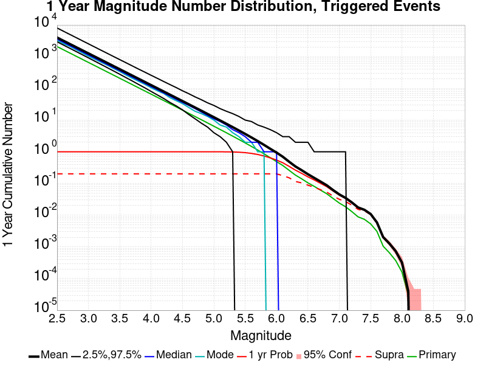

| Mag | Mean | 2.5 %ile | 97.5 %ile | Median | Mode | 1 yr Probability | 1 yr Supra-Seis Prob | Primary Aftershocks Mean |
|-----|-----|-----|-----|-----|-----|-----|-----|-----|
| **M&ge;2.5** | 4015.001 | 2951.000 | 8032.000 | 3579.000 | 3261.000 | 1.000 (100.00%) | 0.201 (20.15%) | 2083.729 |
| **M&ge;2.6** | 3189.106 | 2339.000 | 6386.000 | 2843.000 | 2585.000 | 1.000 (100.00%) | 0.201 (20.15%) | 1655.105 |
| **M&ge;2.7** | 2533.244 | 1854.000 | 5072.000 | 2260.000 | 2140.000 | 1.000 (100.00%) | 0.201 (20.15%) | 1314.704 |
| **M&ge;2.8** | 2012.300 | 1467.000 | 4033.000 | 1795.000 | 1672.000 | 1.000 (100.00%) | 0.201 (20.15%) | 1044.363 |
| **M&ge;2.9** | 1598.455 | 1162.000 | 3201.000 | 1426.000 | 1323.000 | 1.000 (100.00%) | 0.201 (20.15%) | 829.596 |
| **M&ge;3** | 1269.583 | 919.000 | 2544.000 | 1133.000 | 1037.000 | 1.000 (100.00%) | 0.201 (20.15%) | 658.913 |
| **M&ge;3.1** | 1008.403 | 725.000 | 2020.000 | 901.000 | 838.000 | 1.000 (100.00%) | 0.201 (20.15%) | 523.365 |
| **M&ge;3.2** | 800.898 | 572.000 | 1604.000 | 716.000 | 670.000 | 1.000 (100.00%) | 0.201 (20.15%) | 415.684 |
| **M&ge;3.3** | 636.076 | 451.000 | 1276.000 | 569.000 | 540.000 | 1.000 (100.00%) | 0.201 (20.15%) | 330.143 |
| **M&ge;3.4** | 505.184 | 355.000 | 1015.000 | 453.000 | 424.000 | 1.000 (100.00%) | 0.201 (20.15%) | 262.228 |
| **M&ge;3.5** | 401.202 | 279.000 | 808.000 | 360.000 | 339.000 | 1.000 (100.00%) | 0.201 (20.15%) | 208.271 |
| **M&ge;3.6** | 318.613 | 218.000 | 642.000 | 286.000 | 263.000 | 1.000 (100.00%) | 0.201 (20.15%) | 165.399 |
| **M&ge;3.7** | 252.920 | 171.000 | 511.000 | 227.000 | 208.000 | 1.000 (100.00%) | 0.201 (20.15%) | 131.311 |
| **M&ge;3.8** | 200.844 | 133.000 | 406.000 | 181.000 | 167.000 | 1.000 (100.00%) | 0.201 (20.15%) | 104.267 |
| **M&ge;3.9** | 159.444 | 104.000 | 325.000 | 144.000 | 134.000 | 1.000 (100.00%) | 0.201 (20.15%) | 82.782 |
| **M&ge;4** | 126.571 | 80.000 | 259.000 | 114.000 | 105.000 | 1.000 (100.00%) | 0.201 (20.15%) | 65.718 |
| **M&ge;4.1** | 100.438 | 62.000 | 207.000 | 91.000 | 84.000 | 1.000 (100.00%) | 0.201 (20.15%) | 52.143 |
| **M&ge;4.2** | 79.716 | 48.000 | 165.000 | 72.000 | 69.000 | 1.000 (100.00%) | 0.201 (20.15%) | 41.399 |
| **M&ge;4.3** | 63.223 | 36.000 | 132.000 | 57.000 | 51.000 | 1.000 (100.00%) | 0.201 (20.15%) | 32.834 |
| **M&ge;4.4** | 50.154 | 28.000 | 106.000 | 45.000 | 41.000 | 1.000 (100.00%) | 0.201 (20.15%) | 26.043 |
| **M&ge;4.5** | 39.769 | 21.000 | 84.000 | 36.000 | 33.000 | 1.000 (100.00%) | 0.201 (20.15%) | 20.662 |
| **M&ge;4.6** | 31.502 | 15.000 | 68.000 | 29.000 | 25.000 | 1.000 (100.00%) | 0.201 (20.15%) | 16.369 |
| **M&ge;4.7** | 24.948 | 11.000 | 54.000 | 23.000 | 19.000 | 1.000 (100.00%) | 0.201 (20.15%) | 12.962 |
| **M&ge;4.8** | 19.754 | 8.000 | 44.000 | 18.000 | 16.000 | 1.000 (100.00%) | 0.201 (20.15%) | 10.271 |
| **M&ge;4.9** | 15.608 | 6.000 | 35.000 | 14.000 | 13.000 | 1.000 (100.00%) | 0.201 (20.15%) | 8.119 |
| **M&ge;5** | 12.321 | 4.000 | 29.000 | 11.000 | 10.000 | 1.000 (99.99%) | 0.201 (20.15%) | 6.410 |
| **M&ge;5.1** | 9.712 | 3.000 | 23.000 | 9.000 | 7.000 | 0.999 (99.92%) | 0.201 (20.15%) | 5.053 |
| **M&ge;5.2** | 7.645 | 2.000 | 19.000 | 7.000 | 6.000 | 0.996 (99.62%) | 0.201 (20.15%) | 3.981 |
| **M&ge;5.3** | 5.996 | 1.000 | 16.000 | 5.000 | 4.000 | 0.988 (98.79%) | 0.201 (20.15%) | 3.119 |
| **M&ge;5.4** | 4.689 | 0.000 | 13.000 | 4.000 | 3.000 | 0.970 (97.03%) | 0.201 (20.15%) | 2.441 |
| **M&ge;5.5** | 3.651 | 0.000 | 10.000 | 3.000 | 2.000 | 0.938 (93.82%) | 0.201 (20.15%) | 1.903 |
| **M&ge;5.6** | 2.825 | 0.000 | 9.000 | 2.000 | 2.000 | 0.889 (88.92%) | 0.201 (20.15%) | 1.474 |
| **M&ge;5.7** | 2.171 | 0.000 | 7.000 | 2.000 | 1.000 | 0.821 (82.14%) | 0.201 (20.15%) | 1.135 |
| **M&ge;5.8** | 1.650 | 0.000 | 6.000 | 1.000 | 1.000 | 0.738 (73.83%) | 0.201 (20.15%) | 0.863 |
| **M&ge;5.9** | 1.241 | 0.000 | 5.000 | 1.000 | 0.000 | 0.643 (64.30%) | 0.201 (20.13%) | 0.649 |
| **M&ge;6** | 0.942 | 0.000 | 4.000 | 1.000 | 0.000 | 0.548 (54.81%) | 0.201 (20.12%) | 0.490 |
| **M&ge;6.1** | 0.696 | 0.000 | 3.000 | 0.000 | 0.000 | 0.449 (44.94%) | 0.176 (17.62%) | 0.368 |
| **M&ge;6.2** | 0.485 | 0.000 | 3.000 | 0.000 | 0.000 | 0.347 (34.75%) | 0.151 (15.13%) | 0.260 |
| **M&ge;6.3** | 0.345 | 0.000 | 2.000 | 0.000 | 0.000 | 0.264 (26.42%) | 0.116 (11.59%) | 0.184 |
| **M&ge;6.4** | 0.262 | 0.000 | 2.000 | 0.000 | 0.000 | 0.209 (20.89%) | 0.105 (10.46%) | 0.140 |
| **M&ge;6.5** | 0.196 | 0.000 | 2.000 | 0.000 | 0.000 | 0.162 (16.17%) | 0.089 (8.87%) | 0.105 |
| **M&ge;6.6** | 0.150 | 0.000 | 1.000 | 0.000 | 0.000 | 0.129 (12.91%) | 0.076 (7.58%) | 0.081 |
| **M&ge;6.7** | 0.115 | 0.000 | 1.000 | 0.000 | 0.000 | 0.101 (10.13%) | 0.064 (6.36%) | 0.062 |
| **M&ge;6.8** | 0.088 | 0.000 | 1.000 | 0.000 | 0.000 | 0.079 (7.94%) | 0.053 (5.35%) | 0.047 |
| **M&ge;6.9** | 0.062 | 0.000 | 1.000 | 0.000 | 0.000 | 0.058 (5.80%) | 0.040 (4.03%) | 0.034 |
| **M&ge;7** | 0.045 | 0.000 | 1.000 | 0.000 | 0.000 | 0.043 (4.30%) | 0.032 (3.17%) | 0.024 |
| **M&ge;7.1** | 0.035 | 0.000 | 1.000 | 0.000 | 0.000 | 0.034 (3.36%) | 0.027 (2.70%) | 0.018 |
| **M&ge;7.2** | 0.025 | 0.000 | 0.000 | 0.000 | 0.000 | 0.024 (2.44%) | 0.021 (2.07%) | 0.013 |
| **M&ge;7.3** | 0.018 | 0.000 | 0.000 | 0.000 | 0.000 | 0.017 (1.70%) | 0.015 (1.52%) | 8.85E-3 |
| **M&ge;7.4** | 0.015 | 0.000 | 0.000 | 0.000 | 0.000 | 0.014 (1.44%) | 0.014 (1.36%) | 7.41E-3 |
| **M&ge;7.5** | 0.011 | 0.000 | 0.000 | 0.000 | 0.000 | 0.011 (1.07%) | 0.010 (1.05%) | 5.32E-3 |
| **M&ge;7.6** | 5.93E-3 | 0.000 | 0.000 | 0.000 | 0.000 | 5.85E-3 (0.58%) | 5.73E-3 (0.57%) | 3.10E-3 |
| **M&ge;7.7** | 2.03E-3 | 0.000 | 0.000 | 0.000 | 0.000 | 2.03E-3 (0.20%) | 1.96E-3 (0.20%) | 1.05E-3 |
| **M&ge;7.8** | 1.27E-3 | 0.000 | 0.000 | 0.000 | 0.000 | 1.27E-3 (0.13%) | 1.23E-3 (0.12%) | 6.50E-4 |
| **M&ge;7.9** | 7.30E-4 | 0.000 | 0.000 | 0.000 | 0.000 | 7.30E-4 (0.07%) | 7.30E-4 (0.07%) | 3.70E-4 |
| **M&ge;8** | 3.20E-4 | 0.000 | 0.000 | 0.000 | 0.000 | 3.20E-4 (0.03%) | 3.20E-4 (0.03%) | 1.60E-4 |
| **M&ge;8.1** | 4.00E-5 | 0.000 | 0.000 | 0.000 | 0.000 | 4.00E-5 (0.00%) | 4.00E-5 (0.00%) | 3.00E-5 |
| **M&ge;8.2** | 0.000 | 0.000 | 0.000 | 0.000 | 0.000 | 0.000 (0.00%) | 0.000 (0.00%) | 0.000 |
| **M&ge;8.3** | 0.000 | 0.000 | 0.000 | 0.000 | 0.000 | 0.000 (0.00%) | 0.000 (0.00%) | 0.000 |
| **M&ge;8.4** | 0.000 | 0.000 | 0.000 | 0.000 | 0.000 | 0.000 (0.00%) | 0.000 (0.00%) | 0.000 |
| **M&ge;8.5** | 0.000 | 0.000 | 0.000 | 0.000 | 0.000 | 0.000 (0.00%) | 0.000 (0.00%) | 0.000 |
| **M&ge;8.6** | 0.000 | 0.000 | 0.000 | 0.000 | 0.000 | 0.000 (0.00%) | 0.000 (0.00%) | 0.000 |
| **M&ge;8.7** | 0.000 | 0.000 | 0.000 | 0.000 | 0.000 | 0.000 (0.00%) | 0.000 (0.00%) | 0.000 |
| **M&ge;8.8** | 0.000 | 0.000 | 0.000 | 0.000 | 0.000 | 0.000 (0.00%) | 0.000 (0.00%) | 0.000 |
| **M&ge;8.9** | 0.000 | 0.000 | 0.000 | 0.000 | 0.000 | 0.000 (0.00%) | 0.000 (0.00%) | 0.000 |
| **M&ge;9** | 0.000 | 0.000 | 0.000 | 0.000 | 0.000 | 0.000 (0.00%) | 0.000 (0.00%) | 0.000 |

### 1 Month Magnitude Number Distribution
*[(top)](#table-of-contents)*

**Legend**
* **Mean** (thick black line): mean expected number across all 100000 catalogs
* **2.5%,97.5%** (thin black lines): expected number percentiles across all 100000 catalogs
* **Median** (thin blue line): median expected number across all 100000 catalogs
* **Mode** (thin cyan line): modal expected number across all 100000 catalogs
* **1 mo Probability** (thin red line): 1 month probability calculated as the fraction of catalogs with at least 1 occurrence
* **1 mo Supraseismogenic Probability** (thin dashed red line): same as above, but only for supraseismogenic ruptures on explicitly modeled UCERF3 faults
* **95% Conf** (light red shaded region): binomial 95% confidence bounds on probability
* **Primary** (thin green line): mean expected number from primary triggered aftershocks only (no secondary, tertiary, etc...) across all 100000 catalogs


| Mag | Mean | 2.5 %ile | 97.5 %ile | Median | Mode | 1 mo Probability | 1 mo Supra-Seis Prob | Primary Aftershocks Mean |
|-----|-----|-----|-----|-----|-----|-----|-----|-----|
| **M&ge;2.5** | 2800.203 | 2188.000 | 5039.000 | 2557.000 | 2402.000 | 1.000 (100.00%) | 0.149 (14.91%) | 1689.567 |
| **M&ge;2.6** | 2224.171 | 1733.000 | 4002.000 | 2032.000 | 1924.000 | 1.000 (100.00%) | 0.149 (14.91%) | 1341.992 |
| **M&ge;2.7** | 1766.755 | 1371.000 | 3176.000 | 1615.000 | 1507.000 | 1.000 (100.00%) | 0.149 (14.91%) | 1065.989 |
| **M&ge;2.8** | 1403.428 | 1085.000 | 2525.000 | 1284.000 | 1239.000 | 1.000 (100.00%) | 0.149 (14.91%) | 846.774 |
| **M&ge;2.9** | 1114.829 | 857.000 | 2006.000 | 1020.000 | 959.000 | 1.000 (100.00%) | 0.149 (14.91%) | 672.661 |
| **M&ge;3** | 885.453 | 677.000 | 1593.000 | 811.000 | 785.000 | 1.000 (100.00%) | 0.149 (14.91%) | 534.267 |
| **M&ge;3.1** | 703.330 | 533.000 | 1267.000 | 645.000 | 619.000 | 1.000 (100.00%) | 0.149 (14.91%) | 424.356 |
| **M&ge;3.2** | 558.585 | 420.000 | 1005.000 | 512.000 | 487.000 | 1.000 (100.00%) | 0.149 (14.91%) | 337.027 |
| **M&ge;3.3** | 443.649 | 330.000 | 799.000 | 407.000 | 387.000 | 1.000 (100.00%) | 0.149 (14.91%) | 267.665 |
| **M&ge;3.4** | 352.368 | 259.000 | 635.000 | 324.000 | 308.000 | 1.000 (100.00%) | 0.149 (14.91%) | 212.600 |
| **M&ge;3.5** | 279.837 | 203.000 | 505.000 | 258.000 | 240.000 | 1.000 (100.00%) | 0.149 (14.91%) | 168.848 |
| **M&ge;3.6** | 222.215 | 159.000 | 402.000 | 205.000 | 194.000 | 1.000 (100.00%) | 0.149 (14.91%) | 134.092 |
| **M&ge;3.7** | 176.391 | 123.000 | 321.000 | 163.000 | 150.000 | 1.000 (100.00%) | 0.149 (14.91%) | 106.454 |
| **M&ge;3.8** | 140.078 | 96.000 | 255.000 | 129.000 | 119.000 | 1.000 (100.00%) | 0.149 (14.91%) | 84.530 |
| **M&ge;3.9** | 111.205 | 74.000 | 203.000 | 103.000 | 96.000 | 1.000 (100.00%) | 0.149 (14.91%) | 67.112 |
| **M&ge;4** | 88.280 | 57.000 | 163.000 | 82.000 | 80.000 | 1.000 (100.00%) | 0.149 (14.91%) | 53.279 |
| **M&ge;4.1** | 70.036 | 44.000 | 130.000 | 65.000 | 63.000 | 1.000 (100.00%) | 0.149 (14.91%) | 42.263 |
| **M&ge;4.2** | 55.608 | 33.000 | 104.000 | 52.000 | 46.000 | 1.000 (100.00%) | 0.149 (14.91%) | 33.562 |
| **M&ge;4.3** | 44.101 | 25.000 | 83.000 | 41.000 | 38.000 | 1.000 (100.00%) | 0.149 (14.91%) | 26.621 |
| **M&ge;4.4** | 34.979 | 19.000 | 67.000 | 32.000 | 30.000 | 1.000 (100.00%) | 0.149 (14.91%) | 21.113 |
| **M&ge;4.5** | 27.741 | 14.000 | 54.000 | 26.000 | 24.000 | 1.000 (100.00%) | 0.149 (14.91%) | 16.753 |
| **M&ge;4.6** | 21.975 | 10.000 | 44.000 | 20.000 | 19.000 | 1.000 (100.00%) | 0.149 (14.91%) | 13.273 |
| **M&ge;4.7** | 17.401 | 7.000 | 35.000 | 16.000 | 15.000 | 1.000 (100.00%) | 0.149 (14.91%) | 10.506 |
| **M&ge;4.8** | 13.781 | 5.000 | 29.000 | 13.000 | 11.000 | 1.000 (100.00%) | 0.149 (14.91%) | 8.326 |
| **M&ge;4.9** | 10.888 | 4.000 | 24.000 | 10.000 | 9.000 | 1.000 (99.98%) | 0.149 (14.91%) | 6.582 |
| **M&ge;5** | 8.596 | 2.000 | 19.000 | 8.000 | 7.000 | 0.999 (99.87%) | 0.149 (14.91%) | 5.195 |
| **M&ge;5.1** | 6.778 | 1.000 | 16.000 | 6.000 | 5.000 | 0.995 (99.50%) | 0.149 (14.91%) | 4.098 |
| **M&ge;5.2** | 5.335 | 1.000 | 13.000 | 5.000 | 4.000 | 0.985 (98.51%) | 0.149 (14.91%) | 3.228 |
| **M&ge;5.3** | 4.182 | 0.000 | 11.000 | 4.000 | 3.000 | 0.965 (96.46%) | 0.149 (14.91%) | 2.527 |
| **M&ge;5.4** | 3.273 | 0.000 | 9.000 | 3.000 | 2.000 | 0.930 (92.95%) | 0.149 (14.91%) | 1.978 |
| **M&ge;5.5** | 2.547 | 0.000 | 8.000 | 2.000 | 2.000 | 0.877 (87.70%) | 0.149 (14.91%) | 1.541 |
| **M&ge;5.6** | 1.972 | 0.000 | 6.000 | 2.000 | 1.000 | 0.807 (80.73%) | 0.149 (14.91%) | 1.194 |
| **M&ge;5.7** | 1.516 | 0.000 | 5.000 | 1.000 | 1.000 | 0.723 (72.34%) | 0.149 (14.91%) | 0.918 |
| **M&ge;5.8** | 1.151 | 0.000 | 4.000 | 1.000 | 0.000 | 0.629 (62.94%) | 0.149 (14.91%) | 0.697 |
| **M&ge;5.9** | 0.866 | 0.000 | 4.000 | 1.000 | 0.000 | 0.531 (53.14%) | 0.149 (14.90%) | 0.525 |
| **M&ge;6** | 0.656 | 0.000 | 3.000 | 0.000 | 0.000 | 0.441 (44.11%) | 0.149 (14.89%) | 0.396 |
| **M&ge;6.1** | 0.486 | 0.000 | 3.000 | 0.000 | 0.000 | 0.354 (35.39%) | 0.131 (13.09%) | 0.298 |
| **M&ge;6.2** | 0.339 | 0.000 | 2.000 | 0.000 | 0.000 | 0.267 (26.67%) | 0.112 (11.19%) | 0.210 |
| **M&ge;6.3** | 0.241 | 0.000 | 2.000 | 0.000 | 0.000 | 0.199 (19.90%) | 0.085 (8.47%) | 0.149 |
| **M&ge;6.4** | 0.182 | 0.000 | 1.000 | 0.000 | 0.000 | 0.156 (15.57%) | 0.077 (7.66%) | 0.113 |
| **M&ge;6.5** | 0.136 | 0.000 | 1.000 | 0.000 | 0.000 | 0.119 (11.91%) | 0.065 (6.47%) | 0.085 |
| **M&ge;6.6** | 0.105 | 0.000 | 1.000 | 0.000 | 0.000 | 0.095 (9.47%) | 0.055 (5.50%) | 0.066 |
| **M&ge;6.7** | 0.080 | 0.000 | 1.000 | 0.000 | 0.000 | 0.074 (7.38%) | 0.046 (4.59%) | 0.050 |
| **M&ge;6.8** | 0.061 | 0.000 | 1.000 | 0.000 | 0.000 | 0.058 (5.75%) | 0.039 (3.86%) | 0.039 |
| **M&ge;6.9** | 0.043 | 0.000 | 1.000 | 0.000 | 0.000 | 0.041 (4.13%) | 0.029 (2.88%) | 0.028 |
| **M&ge;7** | 0.031 | 0.000 | 1.000 | 0.000 | 0.000 | 0.030 (3.03%) | 0.022 (2.24%) | 0.020 |
| **M&ge;7.1** | 0.024 | 0.000 | 0.000 | 0.000 | 0.000 | 0.024 (2.35%) | 0.019 (1.89%) | 0.015 |
| **M&ge;7.2** | 0.017 | 0.000 | 0.000 | 0.000 | 0.000 | 0.017 (1.70%) | 0.014 (1.44%) | 0.011 |
| **M&ge;7.3** | 0.012 | 0.000 | 0.000 | 0.000 | 0.000 | 0.012 (1.17%) | 0.011 (1.05%) | 7.26E-3 |
| **M&ge;7.4** | 0.010 | 0.000 | 0.000 | 0.000 | 0.000 | 9.91E-3 (0.99%) | 9.36E-3 (0.94%) | 6.04E-3 |
| **M&ge;7.5** | 7.41E-3 | 0.000 | 0.000 | 0.000 | 0.000 | 7.29E-3 (0.73%) | 7.12E-3 (0.71%) | 4.33E-3 |
| **M&ge;7.6** | 4.05E-3 | 0.000 | 0.000 | 0.000 | 0.000 | 4.00E-3 (0.40%) | 3.90E-3 (0.39%) | 2.57E-3 |
| **M&ge;7.7** | 1.30E-3 | 0.000 | 0.000 | 0.000 | 0.000 | 1.30E-3 (0.13%) | 1.25E-3 (0.12%) | 8.30E-4 |
| **M&ge;7.8** | 8.00E-4 | 0.000 | 0.000 | 0.000 | 0.000 | 8.00E-4 (0.08%) | 7.80E-4 (0.08%) | 4.80E-4 |
| **M&ge;7.9** | 4.60E-4 | 0.000 | 0.000 | 0.000 | 0.000 | 4.60E-4 (0.05%) | 4.60E-4 (0.05%) | 2.90E-4 |
| **M&ge;8** | 2.10E-4 | 0.000 | 0.000 | 0.000 | 0.000 | 2.10E-4 (0.02%) | 2.10E-4 (0.02%) | 1.10E-4 |
| **M&ge;8.1** | 3.00E-5 | 0.000 | 0.000 | 0.000 | 0.000 | 3.00E-5 (0.00%) | 3.00E-5 (0.00%) | 2.00E-5 |
| **M&ge;8.2** | 0.000 | 0.000 | 0.000 | 0.000 | 0.000 | 0.000 (0.00%) | 0.000 (0.00%) | 0.000 |
| **M&ge;8.3** | 0.000 | 0.000 | 0.000 | 0.000 | 0.000 | 0.000 (0.00%) | 0.000 (0.00%) | 0.000 |
| **M&ge;8.4** | 0.000 | 0.000 | 0.000 | 0.000 | 0.000 | 0.000 (0.00%) | 0.000 (0.00%) | 0.000 |
| **M&ge;8.5** | 0.000 | 0.000 | 0.000 | 0.000 | 0.000 | 0.000 (0.00%) | 0.000 (0.00%) | 0.000 |
| **M&ge;8.6** | 0.000 | 0.000 | 0.000 | 0.000 | 0.000 | 0.000 (0.00%) | 0.000 (0.00%) | 0.000 |
| **M&ge;8.7** | 0.000 | 0.000 | 0.000 | 0.000 | 0.000 | 0.000 (0.00%) | 0.000 (0.00%) | 0.000 |
| **M&ge;8.8** | 0.000 | 0.000 | 0.000 | 0.000 | 0.000 | 0.000 (0.00%) | 0.000 (0.00%) | 0.000 |
| **M&ge;8.9** | 0.000 | 0.000 | 0.000 | 0.000 | 0.000 | 0.000 (0.00%) | 0.000 (0.00%) | 0.000 |
| **M&ge;9** | 0.000 | 0.000 | 0.000 | 0.000 | 0.000 | 0.000 (0.00%) | 0.000 (0.00%) | 0.000 |

### 1 Week Magnitude Number Distribution
*[(top)](#table-of-contents)*

**Legend**
* **Mean** (thick black line): mean expected number across all 100000 catalogs
* **2.5%,97.5%** (thin black lines): expected number percentiles across all 100000 catalogs
* **Median** (thin blue line): median expected number across all 100000 catalogs
* **Mode** (thin cyan line): modal expected number across all 100000 catalogs
* **1 wk Probability** (thin red line): 1 week probability calculated as the fraction of catalogs with at least 1 occurrence
* **1 wk Supraseismogenic Probability** (thin dashed red line): same as above, but only for supraseismogenic ruptures on explicitly modeled UCERF3 faults
* **95% Conf** (light red shaded region): binomial 95% confidence bounds on probability
* **Primary** (thin green line): mean expected number from primary triggered aftershocks only (no secondary, tertiary, etc...) across all 100000 catalogs

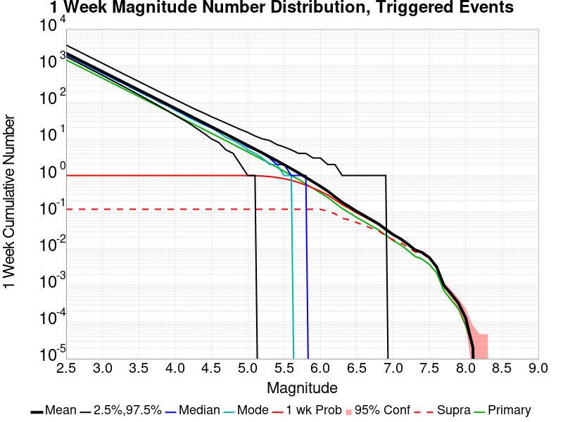

| Mag | Mean | 2.5 %ile | 97.5 %ile | Median | Mode | 1 wk Probability | 1 wk Supra-Seis Prob | Primary Aftershocks Mean |
|-----|-----|-----|-----|-----|-----|-----|-----|-----|
| **M&ge;2.5** | 2167.633 | 1752.000 | 3622.000 | 2008.000 | 1947.000 | 1.000 (100.00%) | 0.120 (11.98%) | 1430.729 |
| **M&ge;2.6** | 1721.766 | 1386.000 | 2879.000 | 1596.000 | 1535.000 | 1.000 (100.00%) | 0.120 (11.98%) | 1136.404 |
| **M&ge;2.7** | 1367.665 | 1096.000 | 2287.000 | 1268.000 | 1210.000 | 1.000 (100.00%) | 0.120 (11.98%) | 902.683 |
| **M&ge;2.8** | 1086.424 | 866.000 | 1818.000 | 1008.000 | 965.000 | 1.000 (100.00%) | 0.120 (11.98%) | 717.062 |
| **M&ge;2.9** | 863.049 | 684.000 | 1446.000 | 802.000 | 768.000 | 1.000 (100.00%) | 0.120 (11.98%) | 569.647 |
| **M&ge;3** | 685.455 | 539.000 | 1150.000 | 637.000 | 609.000 | 1.000 (100.00%) | 0.120 (11.98%) | 452.422 |
| **M&ge;3.1** | 544.450 | 424.000 | 914.000 | 506.000 | 489.000 | 1.000 (100.00%) | 0.120 (11.98%) | 359.342 |
| **M&ge;3.2** | 432.409 | 333.000 | 726.000 | 403.000 | 387.000 | 1.000 (100.00%) | 0.120 (11.98%) | 285.399 |
| **M&ge;3.3** | 343.437 | 261.000 | 577.000 | 320.000 | 314.000 | 1.000 (100.00%) | 0.120 (11.98%) | 226.665 |
| **M&ge;3.4** | 272.788 | 205.000 | 460.000 | 255.000 | 244.000 | 1.000 (100.00%) | 0.120 (11.98%) | 180.041 |
| **M&ge;3.5** | 216.646 | 160.000 | 366.000 | 202.000 | 194.000 | 1.000 (100.00%) | 0.120 (11.98%) | 142.998 |
| **M&ge;3.6** | 172.040 | 125.000 | 292.000 | 161.000 | 154.000 | 1.000 (100.00%) | 0.120 (11.98%) | 113.561 |
| **M&ge;3.7** | 136.567 | 97.000 | 232.000 | 128.000 | 125.000 | 1.000 (100.00%) | 0.120 (11.98%) | 90.159 |
| **M&ge;3.8** | 108.452 | 75.000 | 185.000 | 102.000 | 95.000 | 1.000 (100.00%) | 0.120 (11.98%) | 71.591 |
| **M&ge;3.9** | 86.088 | 58.000 | 148.000 | 81.000 | 79.000 | 1.000 (100.00%) | 0.120 (11.98%) | 56.834 |
| **M&ge;4** | 68.342 | 44.000 | 119.000 | 64.000 | 60.000 | 1.000 (100.00%) | 0.120 (11.98%) | 45.120 |
| **M&ge;4.1** | 54.218 | 34.000 | 95.000 | 51.000 | 48.000 | 1.000 (100.00%) | 0.120 (11.98%) | 35.792 |
| **M&ge;4.2** | 43.052 | 26.000 | 76.000 | 40.000 | 37.000 | 1.000 (100.00%) | 0.120 (11.98%) | 28.426 |
| **M&ge;4.3** | 34.147 | 19.000 | 61.000 | 32.000 | 30.000 | 1.000 (100.00%) | 0.120 (11.98%) | 22.550 |
| **M&ge;4.4** | 27.083 | 14.000 | 50.000 | 25.000 | 24.000 | 1.000 (100.00%) | 0.120 (11.98%) | 17.885 |
| **M&ge;4.5** | 21.483 | 10.000 | 40.000 | 20.000 | 20.000 | 1.000 (100.00%) | 0.120 (11.98%) | 14.191 |
| **M&ge;4.6** | 17.021 | 8.000 | 33.000 | 16.000 | 15.000 | 1.000 (100.00%) | 0.120 (11.98%) | 11.246 |
| **M&ge;4.7** | 13.476 | 5.000 | 27.000 | 13.000 | 11.000 | 1.000 (100.00%) | 0.120 (11.98%) | 8.903 |
| **M&ge;4.8** | 10.675 | 4.000 | 22.000 | 10.000 | 9.000 | 1.000 (99.98%) | 0.120 (11.98%) | 7.055 |
| **M&ge;4.9** | 8.432 | 2.000 | 18.000 | 8.000 | 7.000 | 0.999 (99.88%) | 0.120 (11.98%) | 5.576 |
| **M&ge;5** | 6.655 | 1.000 | 15.000 | 6.000 | 5.000 | 0.995 (99.55%) | 0.120 (11.98%) | 4.399 |
| **M&ge;5.1** | 5.249 | 1.000 | 12.000 | 5.000 | 4.000 | 0.987 (98.66%) | 0.120 (11.98%) | 3.471 |
| **M&ge;5.2** | 4.131 | 0.000 | 10.000 | 4.000 | 3.000 | 0.968 (96.76%) | 0.120 (11.98%) | 2.735 |
| **M&ge;5.3** | 3.240 | 0.000 | 9.000 | 3.000 | 2.000 | 0.934 (93.39%) | 0.120 (11.98%) | 2.142 |
| **M&ge;5.4** | 2.537 | 0.000 | 7.000 | 2.000 | 2.000 | 0.884 (88.39%) | 0.120 (11.98%) | 1.678 |
| **M&ge;5.5** | 1.972 | 0.000 | 6.000 | 2.000 | 1.000 | 0.816 (81.62%) | 0.120 (11.98%) | 1.306 |
| **M&ge;5.6** | 1.525 | 0.000 | 5.000 | 1.000 | 1.000 | 0.734 (73.42%) | 0.120 (11.98%) | 1.011 |
| **M&ge;5.7** | 1.173 | 0.000 | 4.000 | 1.000 | 0.000 | 0.643 (64.29%) | 0.120 (11.98%) | 0.778 |
| **M&ge;5.8** | 0.890 | 0.000 | 4.000 | 1.000 | 0.000 | 0.548 (54.77%) | 0.120 (11.98%) | 0.591 |
| **M&ge;5.9** | 0.670 | 0.000 | 3.000 | 0.000 | 0.000 | 0.454 (45.38%) | 0.120 (11.97%) | 0.445 |
| **M&ge;6** | 0.506 | 0.000 | 3.000 | 0.000 | 0.000 | 0.370 (36.96%) | 0.120 (11.97%) | 0.335 |
| **M&ge;6.1** | 0.376 | 0.000 | 2.000 | 0.000 | 0.000 | 0.293 (29.28%) | 0.106 (10.59%) | 0.252 |
| **M&ge;6.2** | 0.263 | 0.000 | 2.000 | 0.000 | 0.000 | 0.218 (21.79%) | 0.090 (9.03%) | 0.178 |
| **M&ge;6.3** | 0.186 | 0.000 | 1.000 | 0.000 | 0.000 | 0.161 (16.07%) | 0.068 (6.79%) | 0.125 |
| **M&ge;6.4** | 0.141 | 0.000 | 1.000 | 0.000 | 0.000 | 0.125 (12.50%) | 0.062 (6.17%) | 0.096 |
| **M&ge;6.5** | 0.105 | 0.000 | 1.000 | 0.000 | 0.000 | 0.095 (9.52%) | 0.052 (5.20%) | 0.072 |
| **M&ge;6.6** | 0.081 | 0.000 | 1.000 | 0.000 | 0.000 | 0.075 (7.52%) | 0.044 (4.38%) | 0.055 |
| **M&ge;6.7** | 0.062 | 0.000 | 1.000 | 0.000 | 0.000 | 0.059 (5.85%) | 0.037 (3.65%) | 0.042 |
| **M&ge;6.8** | 0.048 | 0.000 | 1.000 | 0.000 | 0.000 | 0.046 (4.57%) | 0.031 (3.07%) | 0.033 |
| **M&ge;6.9** | 0.034 | 0.000 | 1.000 | 0.000 | 0.000 | 0.033 (3.27%) | 0.023 (2.28%) | 0.024 |
| **M&ge;7** | 0.024 | 0.000 | 0.000 | 0.000 | 0.000 | 0.024 (2.38%) | 0.018 (1.75%) | 0.017 |
| **M&ge;7.1** | 0.019 | 0.000 | 0.000 | 0.000 | 0.000 | 0.018 (1.85%) | 0.015 (1.48%) | 0.013 |
| **M&ge;7.2** | 0.014 | 0.000 | 0.000 | 0.000 | 0.000 | 0.013 (1.33%) | 0.011 (1.12%) | 9.21E-3 |
| **M&ge;7.3** | 9.44E-3 | 0.000 | 0.000 | 0.000 | 0.000 | 9.23E-3 (0.92%) | 8.25E-3 (0.83%) | 6.26E-3 |
| **M&ge;7.4** | 7.95E-3 | 0.000 | 0.000 | 0.000 | 0.000 | 7.78E-3 (0.78%) | 7.33E-3 (0.73%) | 5.23E-3 |
| **M&ge;7.5** | 5.76E-3 | 0.000 | 0.000 | 0.000 | 0.000 | 5.67E-3 (0.57%) | 5.54E-3 (0.55%) | 3.74E-3 |
| **M&ge;7.6** | 3.22E-3 | 0.000 | 0.000 | 0.000 | 0.000 | 3.17E-3 (0.32%) | 3.10E-3 (0.31%) | 2.21E-3 |
| **M&ge;7.7** | 1.00E-3 | 0.000 | 0.000 | 0.000 | 0.000 | 1.00E-3 (0.10%) | 9.70E-4 (0.10%) | 7.20E-4 |
| **M&ge;7.8** | 5.90E-4 | 0.000 | 0.000 | 0.000 | 0.000 | 5.90E-4 (0.06%) | 5.80E-4 (0.06%) | 4.00E-4 |
| **M&ge;7.9** | 3.30E-4 | 0.000 | 0.000 | 0.000 | 0.000 | 3.30E-4 (0.03%) | 3.30E-4 (0.03%) | 2.30E-4 |
| **M&ge;8** | 1.30E-4 | 0.000 | 0.000 | 0.000 | 0.000 | 1.30E-4 (0.01%) | 1.30E-4 (0.01%) | 8.00E-5 |
| **M&ge;8.1** | 2.00E-5 | 0.000 | 0.000 | 0.000 | 0.000 | 2.00E-5 (0.00%) | 2.00E-5 (0.00%) | 2.00E-5 |
| **M&ge;8.2** | 0.000 | 0.000 | 0.000 | 0.000 | 0.000 | 0.000 (0.00%) | 0.000 (0.00%) | 0.000 |
| **M&ge;8.3** | 0.000 | 0.000 | 0.000 | 0.000 | 0.000 | 0.000 (0.00%) | 0.000 (0.00%) | 0.000 |
| **M&ge;8.4** | 0.000 | 0.000 | 0.000 | 0.000 | 0.000 | 0.000 (0.00%) | 0.000 (0.00%) | 0.000 |
| **M&ge;8.5** | 0.000 | 0.000 | 0.000 | 0.000 | 0.000 | 0.000 (0.00%) | 0.000 (0.00%) | 0.000 |
| **M&ge;8.6** | 0.000 | 0.000 | 0.000 | 0.000 | 0.000 | 0.000 (0.00%) | 0.000 (0.00%) | 0.000 |
| **M&ge;8.7** | 0.000 | 0.000 | 0.000 | 0.000 | 0.000 | 0.000 (0.00%) | 0.000 (0.00%) | 0.000 |
| **M&ge;8.8** | 0.000 | 0.000 | 0.000 | 0.000 | 0.000 | 0.000 (0.00%) | 0.000 (0.00%) | 0.000 |
| **M&ge;8.9** | 0.000 | 0.000 | 0.000 | 0.000 | 0.000 | 0.000 (0.00%) | 0.000 (0.00%) | 0.000 |
| **M&ge;9** | 0.000 | 0.000 | 0.000 | 0.000 | 0.000 | 0.000 (0.00%) | 0.000 (0.00%) | 0.000 |

### 1 Day Magnitude Number Distribution
*[(top)](#table-of-contents)*

**Legend**
* **Mean** (thick black line): mean expected number across all 100000 catalogs
* **2.5%,97.5%** (thin black lines): expected number percentiles across all 100000 catalogs
* **Median** (thin blue line): median expected number across all 100000 catalogs
* **Mode** (thin cyan line): modal expected number across all 100000 catalogs
* **1 d Probability** (thin red line): 1 day probability calculated as the fraction of catalogs with at least 1 occurrence
* **1 d Supraseismogenic Probability** (thin dashed red line): same as above, but only for supraseismogenic ruptures on explicitly modeled UCERF3 faults
* **95% Conf** (light red shaded region): binomial 95% confidence bounds on probability
* **Primary** (thin green line): mean expected number from primary triggered aftershocks only (no secondary, tertiary, etc...) across all 100000 catalogs


| Mag | Mean | 2.5 %ile | 97.5 %ile | Median | Mode | 1 d Probability | 1 d Supra-Seis Prob | Primary Aftershocks Mean |
|-----|-----|-----|-----|-----|-----|-----|-----|-----|
| **M&ge;2.5** | 1426.947 | 1203.000 | 2138.000 | 1350.000 | 1325.000 | 1.000 (100.00%) | 0.082 (8.20%) | 1064.491 |
| **M&ge;2.6** | 1133.401 | 951.000 | 1697.000 | 1073.000 | 1034.000 | 1.000 (100.00%) | 0.082 (8.20%) | 845.508 |
| **M&ge;2.7** | 900.318 | 750.000 | 1351.000 | 853.000 | 827.000 | 1.000 (100.00%) | 0.082 (8.20%) | 671.620 |
| **M&ge;2.8** | 715.150 | 591.000 | 1073.000 | 678.000 | 647.000 | 1.000 (100.00%) | 0.082 (8.20%) | 533.497 |
| **M&ge;2.9** | 568.112 | 466.000 | 853.000 | 539.000 | 524.000 | 1.000 (100.00%) | 0.082 (8.20%) | 423.818 |
| **M&ge;3** | 451.185 | 366.000 | 678.000 | 428.000 | 419.000 | 1.000 (100.00%) | 0.082 (8.20%) | 336.592 |
| **M&ge;3.1** | 358.353 | 287.000 | 541.000 | 341.000 | 329.000 | 1.000 (100.00%) | 0.082 (8.20%) | 267.339 |
| **M&ge;3.2** | 284.616 | 225.000 | 430.000 | 271.000 | 264.000 | 1.000 (100.00%) | 0.082 (8.20%) | 212.325 |
| **M&ge;3.3** | 226.051 | 176.000 | 342.000 | 215.000 | 211.000 | 1.000 (100.00%) | 0.082 (8.20%) | 168.636 |
| **M&ge;3.4** | 179.559 | 137.000 | 272.000 | 171.000 | 169.000 | 1.000 (100.00%) | 0.082 (8.20%) | 133.951 |
| **M&ge;3.5** | 142.612 | 107.000 | 217.000 | 136.000 | 134.000 | 1.000 (100.00%) | 0.082 (8.20%) | 106.399 |
| **M&ge;3.6** | 113.260 | 83.000 | 173.000 | 108.000 | 103.000 | 1.000 (100.00%) | 0.082 (8.20%) | 84.508 |
| **M&ge;3.7** | 89.906 | 64.000 | 139.000 | 86.000 | 84.000 | 1.000 (100.00%) | 0.082 (8.20%) | 67.086 |
| **M&ge;3.8** | 71.395 | 49.000 | 111.000 | 68.000 | 67.000 | 1.000 (100.00%) | 0.082 (8.20%) | 53.272 |
| **M&ge;3.9** | 56.669 | 37.000 | 89.000 | 54.000 | 53.000 | 1.000 (100.00%) | 0.082 (8.20%) | 42.287 |
| **M&ge;4** | 44.994 | 28.000 | 72.000 | 43.000 | 41.000 | 1.000 (100.00%) | 0.082 (8.20%) | 33.577 |
| **M&ge;4.1** | 35.687 | 21.000 | 58.000 | 34.000 | 33.000 | 1.000 (100.00%) | 0.082 (8.20%) | 26.633 |
| **M&ge;4.2** | 28.341 | 16.000 | 47.000 | 27.000 | 26.000 | 1.000 (100.00%) | 0.082 (8.20%) | 21.153 |
| **M&ge;4.3** | 22.478 | 12.000 | 38.000 | 21.000 | 20.000 | 1.000 (100.00%) | 0.082 (8.20%) | 16.780 |
| **M&ge;4.4** | 17.834 | 9.000 | 31.000 | 17.000 | 17.000 | 1.000 (100.00%) | 0.082 (8.20%) | 13.310 |
| **M&ge;4.5** | 14.150 | 6.000 | 26.000 | 13.000 | 13.000 | 1.000 (100.00%) | 0.082 (8.20%) | 10.562 |
| **M&ge;4.6** | 11.209 | 4.000 | 21.000 | 11.000 | 10.000 | 1.000 (99.99%) | 0.082 (8.20%) | 8.369 |
| **M&ge;4.7** | 8.878 | 3.000 | 18.000 | 8.000 | 8.000 | 0.999 (99.94%) | 0.082 (8.20%) | 6.629 |
| **M&ge;4.8** | 7.033 | 2.000 | 15.000 | 7.000 | 6.000 | 0.997 (99.74%) | 0.082 (8.20%) | 5.254 |
| **M&ge;4.9** | 5.556 | 1.000 | 12.000 | 5.000 | 5.000 | 0.992 (99.16%) | 0.082 (8.20%) | 4.153 |
| **M&ge;5** | 4.384 | 1.000 | 10.000 | 4.000 | 3.000 | 0.978 (97.77%) | 0.082 (8.20%) | 3.277 |
| **M&ge;5.1** | 3.460 | 0.000 | 9.000 | 3.000 | 3.000 | 0.951 (95.14%) | 0.082 (8.20%) | 2.586 |
| **M&ge;5.2** | 2.724 | 0.000 | 7.000 | 2.000 | 2.000 | 0.909 (90.89%) | 0.082 (8.20%) | 2.038 |
| **M&ge;5.3** | 2.135 | 0.000 | 6.000 | 2.000 | 1.000 | 0.849 (84.89%) | 0.082 (8.20%) | 1.596 |
| **M&ge;5.4** | 1.672 | 0.000 | 5.000 | 1.000 | 1.000 | 0.775 (77.55%) | 0.082 (8.20%) | 1.250 |
| **M&ge;5.5** | 1.299 | 0.000 | 4.000 | 1.000 | 1.000 | 0.690 (69.02%) | 0.082 (8.20%) | 0.971 |
| **M&ge;5.6** | 1.005 | 0.000 | 4.000 | 1.000 | 0.000 | 0.599 (59.91%) | 0.082 (8.20%) | 0.753 |
| **M&ge;5.7** | 0.772 | 0.000 | 3.000 | 1.000 | 0.000 | 0.506 (50.64%) | 0.082 (8.20%) | 0.579 |
| **M&ge;5.8** | 0.584 | 0.000 | 3.000 | 0.000 | 0.000 | 0.418 (41.76%) | 0.082 (8.20%) | 0.438 |
| **M&ge;5.9** | 0.440 | 0.000 | 2.000 | 0.000 | 0.000 | 0.337 (33.71%) | 0.082 (8.19%) | 0.330 |
| **M&ge;6** | 0.332 | 0.000 | 2.000 | 0.000 | 0.000 | 0.268 (26.82%) | 0.082 (8.19%) | 0.249 |
| **M&ge;6.1** | 0.247 | 0.000 | 2.000 | 0.000 | 0.000 | 0.209 (20.88%) | 0.073 (7.33%) | 0.187 |
| **M&ge;6.2** | 0.173 | 0.000 | 1.000 | 0.000 | 0.000 | 0.152 (15.21%) | 0.062 (6.25%) | 0.131 |
| **M&ge;6.3** | 0.122 | 0.000 | 1.000 | 0.000 | 0.000 | 0.111 (11.08%) | 0.047 (4.70%) | 0.093 |
| **M&ge;6.4** | 0.093 | 0.000 | 1.000 | 0.000 | 0.000 | 0.086 (8.60%) | 0.043 (4.26%) | 0.071 |
| **M&ge;6.5** | 0.069 | 0.000 | 1.000 | 0.000 | 0.000 | 0.065 (6.47%) | 0.036 (3.57%) | 0.053 |
| **M&ge;6.6** | 0.053 | 0.000 | 1.000 | 0.000 | 0.000 | 0.051 (5.08%) | 0.030 (2.99%) | 0.041 |
| **M&ge;6.7** | 0.041 | 0.000 | 1.000 | 0.000 | 0.000 | 0.040 (3.96%) | 0.025 (2.49%) | 0.032 |
| **M&ge;6.8** | 0.032 | 0.000 | 1.000 | 0.000 | 0.000 | 0.031 (3.09%) | 0.021 (2.10%) | 0.025 |
| **M&ge;6.9** | 0.023 | 0.000 | 0.000 | 0.000 | 0.000 | 0.022 (2.22%) | 0.016 (1.57%) | 0.018 |
| **M&ge;7** | 0.016 | 0.000 | 0.000 | 0.000 | 0.000 | 0.016 (1.59%) | 0.012 (1.19%) | 0.013 |
| **M&ge;7.1** | 0.012 | 0.000 | 0.000 | 0.000 | 0.000 | 0.012 (1.22%) | 9.90E-3 (0.99%) | 9.63E-3 |
| **M&ge;7.2** | 8.82E-3 | 0.000 | 0.000 | 0.000 | 0.000 | 8.71E-3 (0.87%) | 7.42E-3 (0.74%) | 6.81E-3 |
| **M&ge;7.3** | 6.23E-3 | 0.000 | 0.000 | 0.000 | 0.000 | 6.13E-3 (0.61%) | 5.48E-3 (0.55%) | 4.76E-3 |
| **M&ge;7.4** | 5.26E-3 | 0.000 | 0.000 | 0.000 | 0.000 | 5.17E-3 (0.52%) | 4.89E-3 (0.49%) | 4.03E-3 |
| **M&ge;7.5** | 3.80E-3 | 0.000 | 0.000 | 0.000 | 0.000 | 3.74E-3 (0.37%) | 3.69E-3 (0.37%) | 2.86E-3 |
| **M&ge;7.6** | 2.13E-3 | 0.000 | 0.000 | 0.000 | 0.000 | 2.09E-3 (0.21%) | 2.05E-3 (0.21%) | 1.65E-3 |
| **M&ge;7.7** | 6.90E-4 | 0.000 | 0.000 | 0.000 | 0.000 | 6.90E-4 (0.07%) | 6.80E-4 (0.07%) | 5.40E-4 |
| **M&ge;7.8** | 3.70E-4 | 0.000 | 0.000 | 0.000 | 0.000 | 3.70E-4 (0.04%) | 3.70E-4 (0.04%) | 2.80E-4 |
| **M&ge;7.9** | 2.10E-4 | 0.000 | 0.000 | 0.000 | 0.000 | 2.10E-4 (0.02%) | 2.10E-4 (0.02%) | 1.60E-4 |
| **M&ge;8** | 8.00E-5 | 0.000 | 0.000 | 0.000 | 0.000 | 8.00E-5 (0.01%) | 8.00E-5 (0.01%) | 4.00E-5 |
| **M&ge;8.1** | 0.000 | 0.000 | 0.000 | 0.000 | 0.000 | 0.000 (0.00%) | 0.000 (0.00%) | 0.000 |
| **M&ge;8.2** | 0.000 | 0.000 | 0.000 | 0.000 | 0.000 | 0.000 (0.00%) | 0.000 (0.00%) | 0.000 |
| **M&ge;8.3** | 0.000 | 0.000 | 0.000 | 0.000 | 0.000 | 0.000 (0.00%) | 0.000 (0.00%) | 0.000 |
| **M&ge;8.4** | 0.000 | 0.000 | 0.000 | 0.000 | 0.000 | 0.000 (0.00%) | 0.000 (0.00%) | 0.000 |
| **M&ge;8.5** | 0.000 | 0.000 | 0.000 | 0.000 | 0.000 | 0.000 (0.00%) | 0.000 (0.00%) | 0.000 |
| **M&ge;8.6** | 0.000 | 0.000 | 0.000 | 0.000 | 0.000 | 0.000 (0.00%) | 0.000 (0.00%) | 0.000 |
| **M&ge;8.7** | 0.000 | 0.000 | 0.000 | 0.000 | 0.000 | 0.000 (0.00%) | 0.000 (0.00%) | 0.000 |
| **M&ge;8.8** | 0.000 | 0.000 | 0.000 | 0.000 | 0.000 | 0.000 (0.00%) | 0.000 (0.00%) | 0.000 |
| **M&ge;8.9** | 0.000 | 0.000 | 0.000 | 0.000 | 0.000 | 0.000 (0.00%) | 0.000 (0.00%) | 0.000 |
| **M&ge;9** | 0.000 | 0.000 | 0.000 | 0.000 | 0.000 | 0.000 (0.00%) | 0.000 (0.00%) | 0.000 |

### 1 Hour Magnitude Number Distribution
*[(top)](#table-of-contents)*

**Legend**
* **Mean** (thick black line): mean expected number across all 100000 catalogs
* **2.5%,97.5%** (thin black lines): expected number percentiles across all 100000 catalogs
* **Median** (thin blue line): median expected number across all 100000 catalogs
* **Mode** (thin cyan line): modal expected number across all 100000 catalogs
* **1 hr Probability** (thin red line): 1 hour probability calculated as the fraction of catalogs with at least 1 occurrence
* **1 hr Supraseismogenic Probability** (thin dashed red line): same as above, but only for supraseismogenic ruptures on explicitly modeled UCERF3 faults
* **95% Conf** (light red shaded region): binomial 95% confidence bounds on probability
* **Primary** (thin green line): mean expected number from primary triggered aftershocks only (no secondary, tertiary, etc...) across all 100000 catalogs


| Mag | Mean | 2.5 %ile | 97.5 %ile | Median | Mode | 1 hr Probability | 1 hr Supra-Seis Prob | Primary Aftershocks Mean |
|-----|-----|-----|-----|-----|-----|-----|-----|-----|
| **M&ge;2.5** | 504.911 | 444.000 | 604.000 | 496.000 | 488.000 | 1.000 (100.00%) | 0.030 (3.05%) | 457.567 |
| **M&ge;2.6** | 401.037 | 349.000 | 482.000 | 394.000 | 393.000 | 1.000 (100.00%) | 0.030 (3.05%) | 363.434 |
| **M&ge;2.7** | 318.558 | 274.000 | 385.000 | 313.000 | 311.000 | 1.000 (100.00%) | 0.030 (3.05%) | 288.697 |
| **M&ge;2.8** | 253.046 | 214.000 | 308.000 | 249.000 | 245.000 | 1.000 (100.00%) | 0.030 (3.05%) | 229.322 |
| **M&ge;2.9** | 200.998 | 167.000 | 247.000 | 198.000 | 193.000 | 1.000 (100.00%) | 0.030 (3.05%) | 182.153 |
| **M&ge;3** | 159.639 | 130.000 | 198.000 | 157.000 | 157.000 | 1.000 (100.00%) | 0.030 (3.05%) | 144.674 |
| **M&ge;3.1** | 126.786 | 101.000 | 159.000 | 125.000 | 122.000 | 1.000 (100.00%) | 0.030 (3.05%) | 114.901 |
| **M&ge;3.2** | 100.682 | 78.000 | 129.000 | 99.000 | 99.000 | 1.000 (100.00%) | 0.030 (3.05%) | 91.241 |
| **M&ge;3.3** | 79.963 | 60.000 | 104.000 | 79.000 | 78.000 | 1.000 (100.00%) | 0.030 (3.05%) | 72.462 |
| **M&ge;3.4** | 63.524 | 46.000 | 84.000 | 63.000 | 61.000 | 1.000 (100.00%) | 0.030 (3.05%) | 57.564 |
| **M&ge;3.5** | 50.467 | 35.000 | 69.000 | 50.000 | 49.000 | 1.000 (100.00%) | 0.030 (3.05%) | 45.731 |
| **M&ge;3.6** | 40.082 | 27.000 | 56.000 | 39.000 | 40.000 | 1.000 (100.00%) | 0.030 (3.05%) | 36.325 |
| **M&ge;3.7** | 31.819 | 20.000 | 46.000 | 31.000 | 31.000 | 1.000 (100.00%) | 0.030 (3.05%) | 28.832 |
| **M&ge;3.8** | 25.261 | 15.000 | 38.000 | 25.000 | 25.000 | 1.000 (100.00%) | 0.030 (3.05%) | 22.891 |
| **M&ge;3.9** | 20.053 | 11.000 | 31.000 | 20.000 | 19.000 | 1.000 (100.00%) | 0.030 (3.05%) | 18.174 |
| **M&ge;4** | 15.920 | 8.000 | 25.000 | 16.000 | 15.000 | 1.000 (100.00%) | 0.030 (3.05%) | 14.430 |
| **M&ge;4.1** | 12.631 | 6.000 | 21.000 | 12.000 | 12.000 | 1.000 (100.00%) | 0.030 (3.05%) | 11.449 |
| **M&ge;4.2** | 10.035 | 4.000 | 18.000 | 10.000 | 9.000 | 1.000 (99.99%) | 0.030 (3.05%) | 9.097 |
| **M&ge;4.3** | 7.959 | 3.000 | 15.000 | 8.000 | 7.000 | 0.999 (99.94%) | 0.030 (3.05%) | 7.216 |
| **M&ge;4.4** | 6.311 | 2.000 | 12.000 | 6.000 | 6.000 | 0.997 (99.75%) | 0.030 (3.05%) | 5.722 |
| **M&ge;4.5** | 5.007 | 1.000 | 10.000 | 5.000 | 4.000 | 0.992 (99.16%) | 0.030 (3.05%) | 4.542 |
| **M&ge;4.6** | 3.968 | 1.000 | 9.000 | 4.000 | 3.000 | 0.977 (97.70%) | 0.030 (3.05%) | 3.600 |
| **M&ge;4.7** | 3.144 | 0.000 | 7.000 | 3.000 | 3.000 | 0.950 (95.00%) | 0.030 (3.05%) | 2.852 |
| **M&ge;4.8** | 2.489 | 0.000 | 6.000 | 2.000 | 2.000 | 0.907 (90.65%) | 0.030 (3.05%) | 2.258 |
| **M&ge;4.9** | 1.964 | 0.000 | 5.000 | 2.000 | 1.000 | 0.846 (84.65%) | 0.030 (3.05%) | 1.781 |
| **M&ge;5** | 1.549 | 0.000 | 5.000 | 1.000 | 1.000 | 0.772 (77.20%) | 0.030 (3.05%) | 1.406 |
| **M&ge;5.1** | 1.222 | 0.000 | 4.000 | 1.000 | 1.000 | 0.690 (68.96%) | 0.030 (3.05%) | 1.110 |
| **M&ge;5.2** | 0.964 | 0.000 | 3.000 | 1.000 | 0.000 | 0.603 (60.27%) | 0.030 (3.05%) | 0.874 |
| **M&ge;5.3** | 0.755 | 0.000 | 3.000 | 1.000 | 0.000 | 0.516 (51.58%) | 0.030 (3.05%) | 0.684 |
| **M&ge;5.4** | 0.592 | 0.000 | 3.000 | 0.000 | 0.000 | 0.435 (43.45%) | 0.030 (3.05%) | 0.537 |
| **M&ge;5.5** | 0.460 | 0.000 | 2.000 | 0.000 | 0.000 | 0.359 (35.86%) | 0.030 (3.05%) | 0.416 |
| **M&ge;5.6** | 0.354 | 0.000 | 2.000 | 0.000 | 0.000 | 0.291 (29.08%) | 0.030 (3.05%) | 0.321 |
| **M&ge;5.7** | 0.271 | 0.000 | 2.000 | 0.000 | 0.000 | 0.232 (23.21%) | 0.030 (3.05%) | 0.246 |
| **M&ge;5.8** | 0.205 | 0.000 | 1.000 | 0.000 | 0.000 | 0.181 (18.12%) | 0.030 (3.05%) | 0.186 |
| **M&ge;5.9** | 0.154 | 0.000 | 1.000 | 0.000 | 0.000 | 0.140 (14.00%) | 0.030 (3.05%) | 0.140 |
| **M&ge;6** | 0.116 | 0.000 | 1.000 | 0.000 | 0.000 | 0.108 (10.78%) | 0.030 (3.04%) | 0.105 |
| **M&ge;6.1** | 0.087 | 0.000 | 1.000 | 0.000 | 0.000 | 0.082 (8.22%) | 0.028 (2.77%) | 0.080 |
| **M&ge;6.2** | 0.061 | 0.000 | 1.000 | 0.000 | 0.000 | 0.059 (5.87%) | 0.024 (2.36%) | 0.056 |
| **M&ge;6.3** | 0.043 | 0.000 | 1.000 | 0.000 | 0.000 | 0.042 (4.16%) | 0.017 (1.74%) | 0.039 |
| **M&ge;6.4** | 0.033 | 0.000 | 1.000 | 0.000 | 0.000 | 0.032 (3.19%) | 0.016 (1.58%) | 0.030 |
| **M&ge;6.5** | 0.024 | 0.000 | 0.000 | 0.000 | 0.000 | 0.024 (2.35%) | 0.013 (1.32%) | 0.022 |
| **M&ge;6.6** | 0.019 | 0.000 | 0.000 | 0.000 | 0.000 | 0.019 (1.86%) | 0.011 (1.11%) | 0.017 |
| **M&ge;6.7** | 0.015 | 0.000 | 0.000 | 0.000 | 0.000 | 0.015 (1.45%) | 9.26E-3 (0.93%) | 0.014 |
| **M&ge;6.8** | 0.012 | 0.000 | 0.000 | 0.000 | 0.000 | 0.011 (1.15%) | 7.86E-3 (0.79%) | 0.011 |
| **M&ge;6.9** | 8.46E-3 | 0.000 | 0.000 | 0.000 | 0.000 | 8.41E-3 (0.84%) | 5.82E-3 (0.58%) | 7.71E-3 |
| **M&ge;7** | 6.04E-3 | 0.000 | 0.000 | 0.000 | 0.000 | 6.00E-3 (0.60%) | 4.51E-3 (0.45%) | 5.49E-3 |
| **M&ge;7.1** | 4.79E-3 | 0.000 | 0.000 | 0.000 | 0.000 | 4.75E-3 (0.47%) | 3.82E-3 (0.38%) | 4.35E-3 |
| **M&ge;7.2** | 3.39E-3 | 0.000 | 0.000 | 0.000 | 0.000 | 3.37E-3 (0.34%) | 2.80E-3 (0.28%) | 3.08E-3 |
| **M&ge;7.3** | 2.28E-3 | 0.000 | 0.000 | 0.000 | 0.000 | 2.26E-3 (0.23%) | 1.98E-3 (0.20%) | 2.07E-3 |
| **M&ge;7.4** | 1.91E-3 | 0.000 | 0.000 | 0.000 | 0.000 | 1.89E-3 (0.19%) | 1.78E-3 (0.18%) | 1.72E-3 |
| **M&ge;7.5** | 1.28E-3 | 0.000 | 0.000 | 0.000 | 0.000 | 1.26E-3 (0.13%) | 1.24E-3 (0.12%) | 1.14E-3 |
| **M&ge;7.6** | 8.20E-4 | 0.000 | 0.000 | 0.000 | 0.000 | 8.10E-4 (0.08%) | 8.00E-4 (0.08%) | 7.60E-4 |
| **M&ge;7.7** | 3.40E-4 | 0.000 | 0.000 | 0.000 | 0.000 | 3.40E-4 (0.03%) | 3.30E-4 (0.03%) | 3.10E-4 |
| **M&ge;7.8** | 2.10E-4 | 0.000 | 0.000 | 0.000 | 0.000 | 2.10E-4 (0.02%) | 2.10E-4 (0.02%) | 1.80E-4 |
| **M&ge;7.9** | 1.00E-4 | 0.000 | 0.000 | 0.000 | 0.000 | 1.00E-4 (0.01%) | 1.00E-4 (0.01%) | 8.00E-5 |
| **M&ge;8** | 3.00E-5 | 0.000 | 0.000 | 0.000 | 0.000 | 3.00E-5 (0.00%) | 3.00E-5 (0.00%) | 2.00E-5 |
| **M&ge;8.1** | 0.000 | 0.000 | 0.000 | 0.000 | 0.000 | 0.000 (0.00%) | 0.000 (0.00%) | 0.000 |
| **M&ge;8.2** | 0.000 | 0.000 | 0.000 | 0.000 | 0.000 | 0.000 (0.00%) | 0.000 (0.00%) | 0.000 |
| **M&ge;8.3** | 0.000 | 0.000 | 0.000 | 0.000 | 0.000 | 0.000 (0.00%) | 0.000 (0.00%) | 0.000 |
| **M&ge;8.4** | 0.000 | 0.000 | 0.000 | 0.000 | 0.000 | 0.000 (0.00%) | 0.000 (0.00%) | 0.000 |
| **M&ge;8.5** | 0.000 | 0.000 | 0.000 | 0.000 | 0.000 | 0.000 (0.00%) | 0.000 (0.00%) | 0.000 |
| **M&ge;8.6** | 0.000 | 0.000 | 0.000 | 0.000 | 0.000 | 0.000 (0.00%) | 0.000 (0.00%) | 0.000 |
| **M&ge;8.7** | 0.000 | 0.000 | 0.000 | 0.000 | 0.000 | 0.000 (0.00%) | 0.000 (0.00%) | 0.000 |
| **M&ge;8.8** | 0.000 | 0.000 | 0.000 | 0.000 | 0.000 | 0.000 (0.00%) | 0.000 (0.00%) | 0.000 |
| **M&ge;8.9** | 0.000 | 0.000 | 0.000 | 0.000 | 0.000 | 0.000 (0.00%) | 0.000 (0.00%) | 0.000 |
| **M&ge;9** | 0.000 | 0.000 | 0.000 | 0.000 | 0.000 | 0.000 (0.00%) | 0.000 (0.00%) | 0.000 |


## Hazard Change Over Time
*[(top)](#table-of-contents)*

These plots show how the probability of ruptures of various magnitudes within 100km of any scenario rupture changes over time

### M&ge;5.0 Hazard Change Over Time
*[(top)](#table-of-contents)*


| Forecast Duration | UCERF3-ETAS [95% Conf] | UCERF3-ETAS Triggered Only | UCERF3-TD | UCERF3-ETAS/TD Gain | UCERF3-TI |
|-----|-----|-----|-----|-----|-----|
| 1 Hour | 0.770 [0.768 - 0.773] | 0.770 | 7.83E-5 | 9830.56 | 7.78E-5 |
| 1 Day | 0.977 [0.976 - 0.978] | 0.977 | 1.88E-3 | 520.16 | 1.87E-3 |
| 1 Week | 0.995 [0.995 - 0.996] | 0.995 | 0.013 | 76.12 | 0.013 |
| 1 Month | 0.999 [0.998 - 0.999] | 0.999 | 0.055 | 18.21 | 0.054 |
| 1 Year | 1.000 [1.000 - 1.000] | 1.000 | 0.497 | 2.01 | 0.495 |
| 10 Years | 1.000 [1.000 - 1.000] | 1.000 | 0.999 | 1 | 0.999 |
| 30 Years | 1.000 [1.000 - 1.000] \* | \* | 1.000 | 1 \* | 1.000 |
| 100 Years | 1.000 [1.000 - 1.000] \* | \* | 1.000 | 1 \* | 1.000 |

\* *forecast duration is longer than simulation length, only ETAS ruptures from the first 10 years are included*
### M&ge;6.0 Hazard Change Over Time
*[(top)](#table-of-contents)*


| Forecast Duration | UCERF3-ETAS [95% Conf] | UCERF3-ETAS Triggered Only | UCERF3-TD | UCERF3-ETAS/TD Gain | UCERF3-TI |
|-----|-----|-----|-----|-----|-----|
| 1 Hour | 0.107 [0.105 - 0.109] | 0.107 | 8.43E-6 | 12692.98 | 7.92E-6 |
| 1 Day | 0.266 [0.264 - 0.269] | 0.266 | 2.02E-4 | 1316.43 | 1.90E-4 |
| 1 Week | 0.368 [0.365 - 0.371] | 0.367 | 1.42E-3 | 259.72 | 1.33E-3 |
| 1 Month | 0.441 [0.438 - 0.444] | 0.438 | 6.05E-3 | 72.86 | 5.68E-3 |
| 1 Year | 0.577 [0.574 - 0.580] | 0.544 | 0.071 | 8.09 | 0.067 |
| 10 Years | 0.821 [0.820 - 0.823] | 0.626 | 0.523 | 1.57 | 0.500 |
| 30 Years | 0.960 [0.959 - 0.960] \* | \* | 0.892 | 1.08 \* | 0.875 |
| 100 Years | 1.000 [1.000 - 1.000] \* | \* | 0.999 | 1 \* | 0.999 |

\* *forecast duration is longer than simulation length, only ETAS ruptures from the first 10 years are included*
### M&ge;7.0 Hazard Change Over Time
*[(top)](#table-of-contents)*


| Forecast Duration | UCERF3-ETAS [95% Conf] | UCERF3-ETAS Triggered Only | UCERF3-TD | UCERF3-ETAS/TD Gain | UCERF3-TI |
|-----|-----|-----|-----|-----|-----|
| 1 Hour | 5.92E-3 [5.46E-3 - 6.42E-3] | 5.92E-3 | 7.38E-7 | 8019.18 | 6.69E-7 |
| 1 Day | 0.016 [0.015 - 0.017] | 0.016 | 1.77E-5 | 887.57 | 1.61E-5 |
| 1 Week | 0.024 [0.023 - 0.025] | 0.023 | 1.24E-4 | 189.88 | 1.12E-4 |
| 1 Month | 0.030 [0.029 - 0.031] | 0.030 | 5.31E-4 | 57.01 | 4.82E-4 |
| 1 Year | 0.048 [0.047 - 0.050] | 0.042 | 6.45E-3 | 7.51 | 5.85E-3 |
| 10 Years | 0.114 [0.113 - 0.115] | 0.055 | 0.063 | 1.82 | 0.057 |
| 30 Years | 0.224 [0.223 - 0.225] \* | \* | 0.179 | 1.25 \* | 0.161 |
| 100 Years | 0.523 [0.522 - 0.523] \* | \* | 0.495 | 1.06 \* | 0.444 |

\* *forecast duration is longer than simulation length, only ETAS ruptures from the first 10 years are included*
### M&ge;8.0 Hazard Change Over Time
*[(top)](#table-of-contents)*


| Forecast Duration | UCERF3-ETAS [95% Conf] | UCERF3-ETAS Triggered Only | UCERF3-TD | UCERF3-ETAS/TD Gain | UCERF3-TI |
|-----|-----|-----|-----|-----|-----|
| 1 Hour | 3.00E-5 [7.76E-6 - 9.56E-5] | 3.00E-5 | 1.24E-8 | 2426.97 | 1.06E-8 |
| 1 Day | 6.03E-5 [2.47E-5 - 1.38E-4] | 6.00E-5 | 2.97E-7 | 203.16 | 2.54E-7 |
| 1 Week | 1.12E-4 [5.99E-5 - 2.05E-4] | 1.10E-4 | 2.08E-6 | 53.95 | 1.78E-6 |
| 1 Month | 1.79E-4 [1.11E-4 - 2.87E-4] | 1.70E-4 | 8.90E-6 | 20.09 | 7.63E-6 |
| 1 Year | 3.88E-4 [2.98E-4 - 5.19E-4] | 2.80E-4 | 1.08E-4 | 3.58 | 9.29E-5 |
| 10 Years | 1.46E-3 [1.35E-3 - 1.60E-3] | 3.60E-4 | 1.10E-3 | 1.33 | 9.29E-4 |
| 30 Years | 3.86E-3 [3.76E-3 - 4.01E-3] \* | \* | 3.50E-3 | 1.1 \* | 2.78E-3 |
| 100 Years | 0.014 [0.014 - 0.014] \* | \* | 0.014 | 1.03 \* | 9.25E-3 |

\* *forecast duration is longer than simulation length, only ETAS ruptures from the first 10 years are included*

## Trigger Rupture Fault Map
*[(top)](#table-of-contents)*


## Trigger Rupture Depth Map
*[(top)](#table-of-contents)*


## Fault Distances To Triggers
*[(top)](#table-of-contents)*

| Section Name | Strike, Dip, Rake | # Hypos In Poly | Max Mag w/ Hypo In Poly | # Surfs In Poly | Max Mag w/ Surf In Poly | Min Dist To Any (km) | Min Poly Dist To Any (km) | Min Dist To Largest (km) | Min Poly Dist To Largest (km) | Min Hypo Dist To Largest (km) | Min Hypo Poly Dist To Largest (km) |
|-----|-----|-----|-----|-----|-----|-----|-----|-----|-----|-----|-----|
| Airport Lake | 359, 50, -90 | 92 | 7.1 | 92 | 7.1 | 0.236 | 0.000 | 0.236 | 0.000 | 5.612 | 0.000 |
| Little Lake | 327, 90, 180 | 16 | 3.85 | 17 | 7.1 | 2.321 | 0.000 | 8.698 | 0.000 | 13.471 | 1.469 |
| Garlock (Central) | 71, 90, 0 | 2 | 3.21 | 3 | 7.1 | 7.203 | 0.000 | 7.203 | 0.000 | 22.766 | 10.797 |
| So Sierra Nevada | 2, 50, -90 | 1 | 2.75 | 2 | 7.1 | 1.352 | 0.000 | 1.352 | 0.000 | 16.191 | 15.188 |
| Tank Canyon | 189, 50, -90 | 0 |  | 0 |  | 10.689 | 9.581 | 10.689 | 9.581 | 17.039 | 16.895 |
| Kern Canyon (North Kern) 2011 | 360, 60, -90 | 0 |  | 0 |  | 13.810 | 12.271 | 13.810 | 12.271 | 81.168 | 80.888 |
| Blackwater | 323, 90, 180 | 0 |  | 0 |  | 14.854 | 11.110 | 14.854 | 11.110 | 29.622 | 27.613 |
| Owens Valley | 344, 90, 180 | 0 |  | 0 |  | 16.146 | 4.568 | 16.146 | 4.568 | 68.299 | 66.819 |
| Scodie Lineament | 221, 68, 0 | 0 |  | 0 |  | 16.722 | 15.781 | 27.181 | 26.035 | 36.559 | 32.668 |
| Sierra Nevada  (No Extension) | 344, 50, -90 | 0 |  | 0 |  | 18.049 | 2.308 | 18.049 | 2.308 | 58.680 | 58.391 |
| Kern Canyon (South Kern) 2011 | 357, 60, -90 | 0 |  | 0 |  | 18.162 | 16.777 | 18.162 | 16.777 | 64.327 | 63.973 |

## Individual Simulated Catalog Maps
*[(top)](#table-of-contents)*

These are map plots of individual catalogs from the simulations, selected as the closest catalog to each of the given percentiles in terms of total number of events.

| Duration | p0.0 %-ile | p25.0 %-ile | p50.0 %-ile | p75.0 %-ile | p90.0 %-ile | p95.0 %-ile | p97.5 %-ile | p98.0 %-ile | p99.0 %-ile | p99.5 %-ile | p99.9 %-ile | p100.0 %-ile |
|-----|-----|-----|-----|-----|-----|-----|-----|-----|-----|-----|-----|-----|
| **1 Week** |  |  |  |  |  |  |  |  |  |  |  |  |
| **1 Month** |  |  |  |  |  |  | 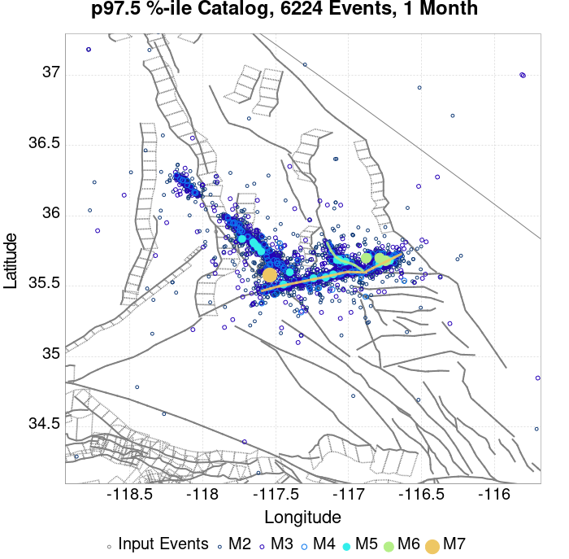 |  |  | 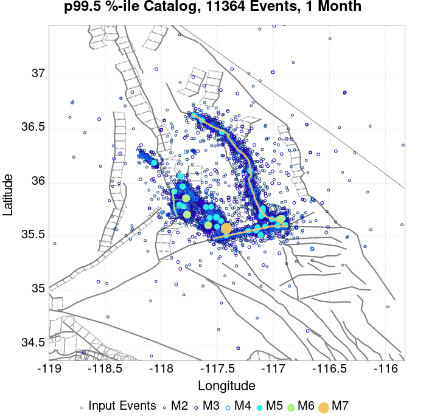 |  |  |
| **1 Year** |  |  |  |  |  |  |  |  |  |  |  |  |
| **10 Year** |  |  |  |  |  |  |  |  |  |  |  | 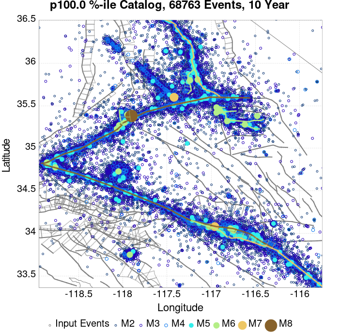 |

## ComCat Data Comparisons
*[(top)](#table-of-contents)*

These plots compare simulated sequences with data from ComCat. All plots only consider events with hypocenters inside the ComCat region defined in the JSON input file.

Last updated at 2020/04/05 00:14:27 UTC, 9 months after the simulation start time.

Total matching ComCat events found: 2395

### ComCat Magnitude-Number Distributions
*[(top)](#table-of-contents)*

| Incremental MND | Cumulative MND |
|-----|-----|
|  |  |

### ComCat Time-Dependent Mc
*[(top)](#table-of-contents)*

The following plots compare simulation results with ComCat data above a magnitude threshold. Plots labeled as *M&ge;Mc(t)* use the time-dependent magnitude of completeness (Mc) defined in Helmstetter et al. (2006), which is plotted below. In the case of multiple M&ge;5 ruptures, either as input to the simulation or in the comparison data, the maximum calculated time-dependent Mc is used. This time-dependent Mc function is plotted below.


### ComCat Cumulative Number Vs Time
*[(top)](#table-of-contents)*

| M&ge;Mc(t) | M&ge;3.5 | M&ge;4 | M&ge;5 | M&ge;6 | M&ge;7 |
|-----|-----|-----|-----|-----|-----|
| 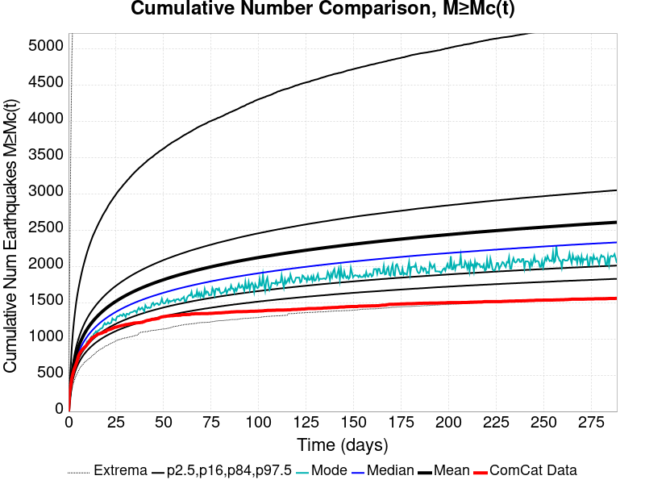 |  |  |  | 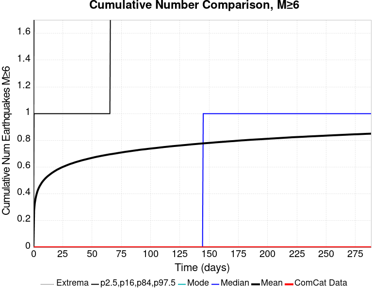 |  |

### ComCat Cumulative Number Simulation Percentiles
*[(top)](#table-of-contents)*


### ComCat Probability Spatial Distribution
*[(top)](#table-of-contents)*

*Note: maps labeled 'Forecast' are for a duration that extends into the future, only forecasted values are plotted (ComCat data omitted)*

|  | 1 Day | 1 Week | 1 Month | Current (9 Month) | Forecast: 1 Year |
|-----|-----|-----|-----|-----|-----|
| **M&ge;Mc(t)** |  |  |  | 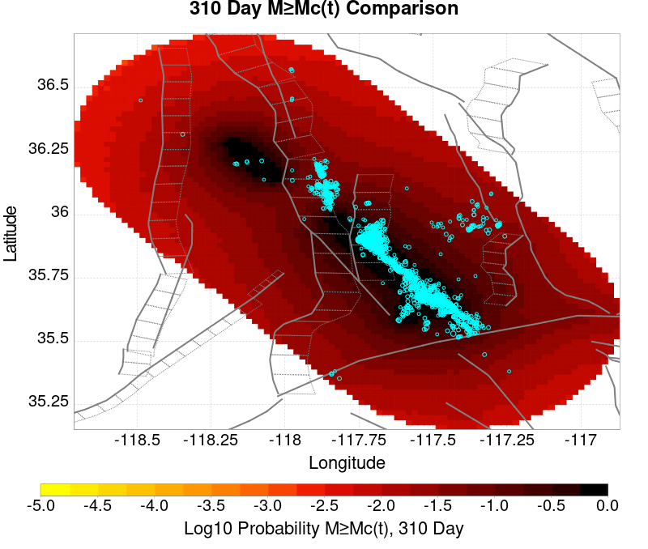 |  |
|  | Prob: 100.00%, Actual: 332 | Prob: 100.00%, Actual: 843 | Prob: 100.00%, Actual: 1196 | Prob: 100.00%, Actual: 1549 | Prob: 100.00% |
| **M&ge;3.5** |  |  |  |  |  |
|  | Prob: 100.00%, Actual: 246 | Prob: 100.00%, Actual: 306 | Prob: 100.00%, Actual: 334 | Prob: 100.00%, Actual: 366 | Prob: 100.00% |
| **M&ge;4** |  |  |  |  |  |
|  | Prob: 100.00%, Actual: 67 | Prob: 100.00%, Actual: 79 | Prob: 100.00%, Actual: 85 | Prob: 100.00%, Actual: 88 | Prob: 100.00% |
| **M&ge;5** |  |  |  |  |  |
|  | Prob: 97.65%, Actual: 2 | Prob: 99.50%, Actual: 2 | Prob: 99.85%, Actual: 2 | Prob: 99.98%, Actual: 2 | Prob: 99.99% |
| **M&ge;6** |  |  |  |  |  |
|  | Prob: 26.24%, Actual: 0 | Prob: 36.14%, Actual: 0 | Prob: 43.12%, Actual: 0 | Prob: 52.58%, Actual: 0 | Prob: 53.63% |
| **M&ge;7** |  |  | 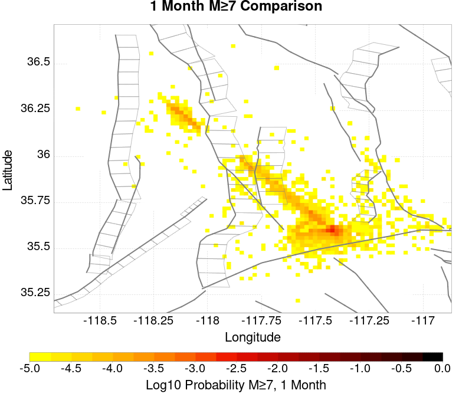 |  |  |
|  | Prob: 1.51%, Actual: 0 | Prob: 2.25%, Actual: 0 | Prob: 2.86%, Actual: 0 | Prob: 3.89%, Actual: 0 | Prob: 4.03% |
| **M&ge;8** |  | 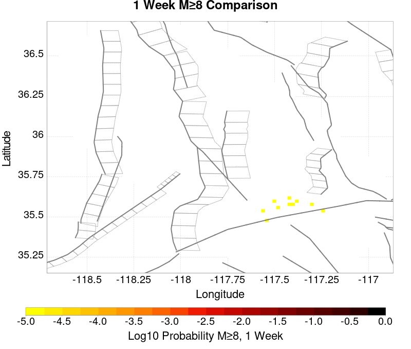 | 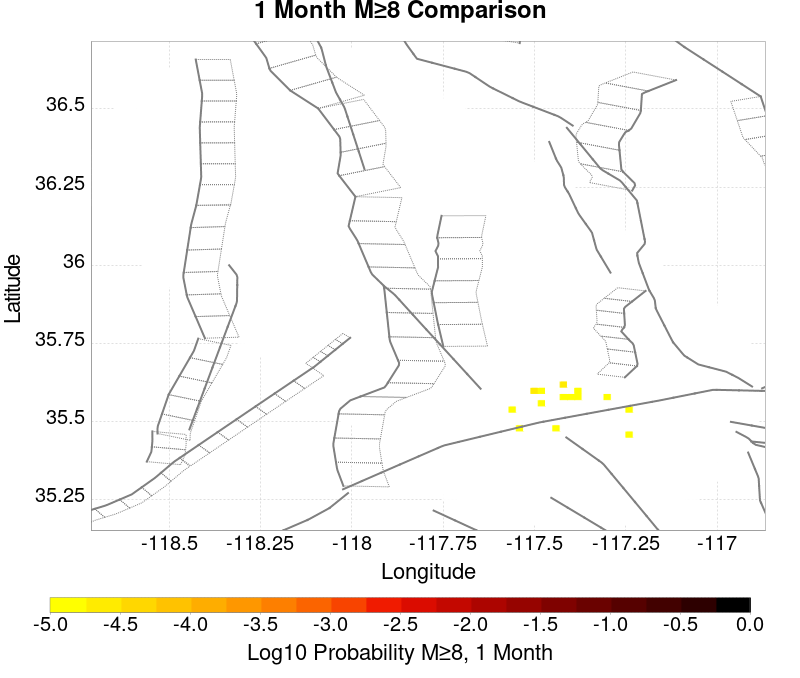 |  |  |
|  | Prob: 0.01%, Actual: 0 | Prob: 0.01%, Actual: 0 | Prob: 0.02%, Actual: 0 | Prob: 0.03%, Actual: 0 | Prob: 0.03% |

### ComCat Mean Expectation Spatial Distribution
*[(top)](#table-of-contents)*

*Note: maps labeled 'Forecast' are for a duration that extends into the future, only forecasted values are plotted (ComCat data omitted)*

|  | 1 Day | 1 Week | 1 Month | Current (9 Month) | Forecast: 1 Year |
|-----|-----|-----|-----|-----|-----|
| **M&ge;Mc(t)** |  |  |  |  |  |
|  | Mean: 305.114, Actual: 332 | Mean: 1001.595, Actual: 843 | Mean: 1597.394, Actual: 1196 | Mean: 2585.114, Actual: 1549 | Mean: 2719.933 |
| **M&ge;3.5** |  |  |  |  |  |
|  | Mean: 139.020, Actual: 246 | Mean: 209.690, Actual: 306 | Mean: 269.211, Actual: 334 | Mean: 367.901, Actual: 366 | Mean: 381.361 |
| **M&ge;4** |  | 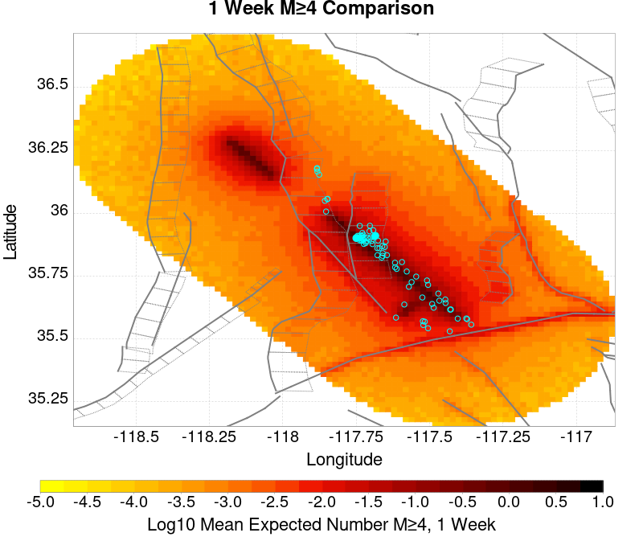 |  |  |  |
|  | Mean: 43.861, Actual: 67 | Mean: 66.148, Actual: 79 | Mean: 84.930, Actual: 85 | Mean: 116.063, Actual: 88 | Mean: 120.314 |
| **M&ge;5** |  |  |  |  |  |
|  | Mean: 4.268, Actual: 2 | Mean: 6.433, Actual: 2 | Mean: 8.258, Actual: 2 | Mean: 11.282, Actual: 2 | Mean: 11.694 |
| **M&ge;6** |  |  |  |  |  |
|  | Mean: 0.319, Actual: 0 | Mean: 0.482, Actual: 0 | Mean: 0.619, Actual: 0 | Mean: 0.845, Actual: 0 | Mean: 0.875 |
| **M&ge;7** |  |  |  |  |  |
|  | Mean: 0.015, Actual: 0 | Mean: 0.023, Actual: 0 | Mean: 0.029, Actual: 0 | Mean: 0.040, Actual: 0 | Mean: 0.042 |
| **M&ge;8** |  |  | 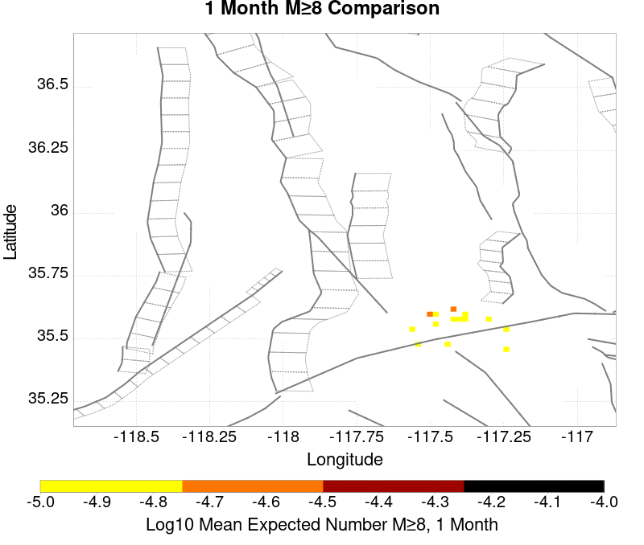 |  |  |
|  | Mean: 5.00E-5, Actual: 0 | Mean: 1.00E-4, Actual: 0 | Mean: 1.60E-4, Actual: 0 | Mean: 2.50E-4, Actual: 0 | Mean: 2.60E-4 |

### ComCat Depth Distribution
*[(top)](#table-of-contents)*

| M&ge;Mc(t) | M&ge;3.5 | M&ge;4 | M&ge;5 | M&ge;6 | M&ge;7 | M&ge;8 |
|-----|-----|-----|-----|-----|-----|-----|
|  |  |  |  |  |  | 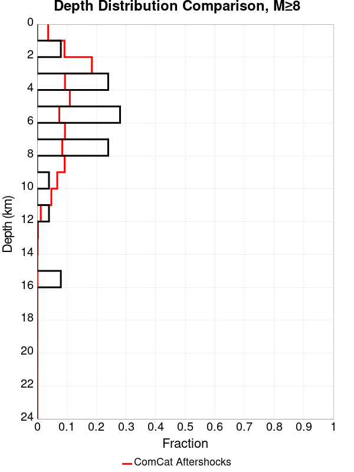 |

## Section Participation
*[(top)](#table-of-contents)*

### Section Participation Plots
*[(top)](#table-of-contents)*

| Min Mag | 1 yr Triggered Ruptures (no spontaneous) | 10 yr Triggered Ruptures (no spontaneous) | 10 yr Triggered Ruptures (primary aftershocks only) |
|-----|-----|-----|-----|
| **All Supra. Seis.** |  |  |  |
| **M&ge;6.5** |  | 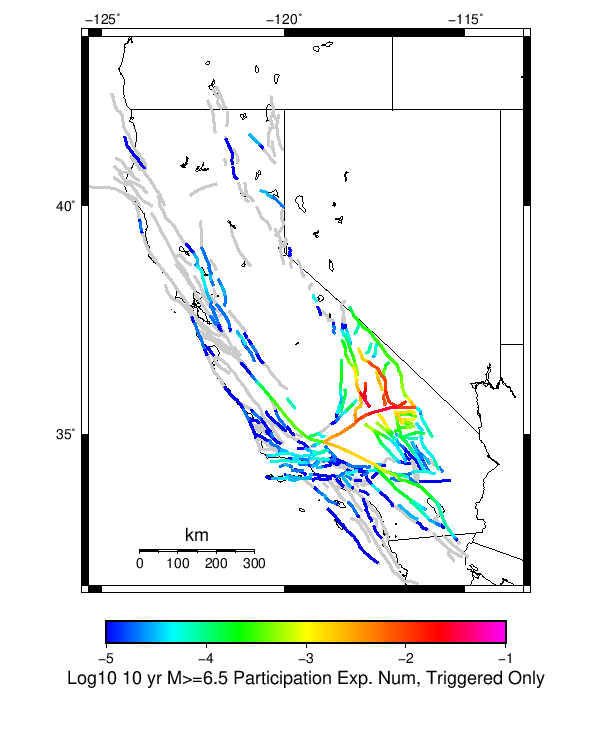 |  |
| **M&ge;7** |  |  | 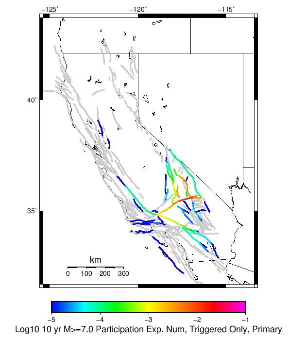 |
| **M&ge;7.5** |  |  |  |
| **M&ge;8** |  |  |  |

### Supra-Seismogenic Parent Sections Table
*[(top)](#table-of-contents)*

*First 10 of 221 with matching ruptures shown*

| Parent Name | Triggered 10 Year Mean Count | Triggered 1 Day Prob | Triggered 1 Week Prob | Triggered 1 Month Prob | Triggered 1 Year Prob | Triggered 10 Year Prob | Triggered 10 Year Primary Mean Count |
|-----|-----|-----|-----|-----|-----|-----|-----|
| Little Lake | 0.09248 | 0.03369 | 0.04714 | 0.05692 | 0.07396 | 0.0894 | 0.05822 |
| Tank Canyon | 0.08043 | 0.01376 | 0.02363 | 0.03232 | 0.04948 | 0.06918 | 0.02027 |
| Garlock (Central) | 0.07496 | 0.02165 | 0.03172 | 0.04021 | 0.05598 | 0.07211 | 0.03669 |
| Airport Lake | 0.04014 | 0.01489 | 0.02042 | 0.02487 | 0.03281 | 0.04001 | 0.02567 |
| Owl Lake | 0.02704 | 0.00491 | 0.00816 | 0.01112 | 0.0172 | 0.0239 | 0.00636 |
| Panamint Valley | 0.0204 | 0.00414 | 0.0066 | 0.00897 | 0.01389 | 0.01979 | 0.00599 |
| Garlock (East) | 0.0182 | 0.00302 | 0.0052 | 0.00713 | 0.01138 | 0.01629 | 0.00434 |
| Ash Hill | 0.00965 | 0.00144 | 0.0025 | 0.00342 | 0.00603 | 0.0091 | 0.00171 |
| Hunter Mountain-Saline Valley | 0.00936 | 0.00229 | 0.00348 | 0.0046 | 0.00669 | 0.00917 | 0.00348 |
| Blackwater | 0.00865 | 0.00173 | 0.00281 | 0.00377 | 0.0057 | 0.00832 | 0.00232 |

### M≥6.5 Parent Sections Table
*[(top)](#table-of-contents)*

*First 10 of 190 with matching ruptures shown*

| Parent Name | Triggered 10 Year Mean Count | Triggered 1 Day Prob | Triggered 1 Week Prob | Triggered 1 Month Prob | Triggered 1 Year Prob | Triggered 10 Year Prob | Triggered 10 Year Primary Mean Count |
|-----|-----|-----|-----|-----|-----|-----|-----|
| Little Lake | 0.04604 | 0.01696 | 0.0237 | 0.0287 | 0.03767 | 0.04529 | 0.02927 |
| Garlock (Central) | 0.03315 | 0.00898 | 0.01341 | 0.01727 | 0.02454 | 0.03248 | 0.01551 |
| Airport Lake | 0.02953 | 0.01098 | 0.01508 | 0.01831 | 0.02416 | 0.02948 | 0.0189 |
| Panamint Valley | 0.01847 | 0.00387 | 0.00615 | 0.00838 | 0.01277 | 0.01796 | 0.00582 |
| Owl Lake | 0.01434 | 0.0035 | 0.0054 | 0.00715 | 0.01059 | 0.01429 | 0.00551 |
| Garlock (East) | 0.01178 | 0.00242 | 0.00395 | 0.00516 | 0.00786 | 0.0111 | 0.00395 |
| Hunter Mountain-Saline Valley | 0.00892 | 0.0022 | 0.00332 | 0.0044 | 0.0064 | 0.0088 | 0.00336 |
| Tank Canyon | 0.00878 | 0.00151 | 0.00259 | 0.00368 | 0.00594 | 0.00875 | 0.0021 |
| So Sierra Nevada | 0.00705 | 0.0019 | 0.0029 | 0.00368 | 0.0053 | 0.00699 | 0.00252 |
| Garlock (West) | 0.00596 | 0.00156 | 0.0024 | 0.00307 | 0.0046 | 0.00596 | 0.00282 |

### M≥7 Parent Sections Table
*[(top)](#table-of-contents)*

*First 10 of 143 with matching ruptures shown*

| Parent Name | Triggered 10 Year Mean Count | Triggered 1 Day Prob | Triggered 1 Week Prob | Triggered 1 Month Prob | Triggered 1 Year Prob | Triggered 10 Year Prob | Triggered 10 Year Primary Mean Count |
|-----|-----|-----|-----|-----|-----|-----|-----|
| Garlock (Central) | 0.0294 | 0.00791 | 0.01182 | 0.0153 | 0.0218 | 0.02892 | 0.01363 |
| Panamint Valley | 0.01214 | 0.00296 | 0.00434 | 0.00589 | 0.00872 | 0.01208 | 0.00457 |
| Owl Lake | 0.01021 | 0.0029 | 0.0043 | 0.00568 | 0.00791 | 0.01021 | 0.00512 |
| Garlock (East) | 0.00847 | 0.00212 | 0.00336 | 0.00427 | 0.00628 | 0.00842 | 0.00375 |
| Hunter Mountain-Saline Valley | 0.00847 | 0.00215 | 0.00318 | 0.00422 | 0.00614 | 0.00845 | 0.00325 |
| Little Lake | 0.00706 | 0.00262 | 0.00356 | 0.00427 | 0.00583 | 0.00706 | 0.0046 |
| Airport Lake | 0.00589 | 0.0021 | 0.00286 | 0.00348 | 0.00487 | 0.00589 | 0.00385 |
| Garlock (West) | 0.00576 | 0.00151 | 0.00234 | 0.00298 | 0.00445 | 0.00576 | 0.00275 |
| So Sierra Nevada | 0.00305 | 0.00109 | 0.00159 | 0.00185 | 0.00247 | 0.00304 | 0.0015 |
| San Andreas (Mojave N) | 0.00252 | 6.6E-4 | 9.5E-4 | 0.00127 | 0.00194 | 0.00248 | 0.00116 |

### M≥7.5 Parent Sections Table
*[(top)](#table-of-contents)*

*First 10 of 80 with matching ruptures shown*

| Parent Name | Triggered 10 Year Mean Count | Triggered 1 Day Prob | Triggered 1 Week Prob | Triggered 1 Month Prob | Triggered 1 Year Prob | Triggered 10 Year Prob | Triggered 10 Year Primary Mean Count |
|-----|-----|-----|-----|-----|-----|-----|-----|
| Garlock (Central) | 0.01208 | 0.00316 | 0.00473 | 0.00607 | 0.00902 | 0.01197 | 0.00531 |
| Panamint Valley | 0.00798 | 0.00202 | 0.003 | 0.00401 | 0.00583 | 0.00797 | 0.00314 |
| Hunter Mountain-Saline Valley | 0.00797 | 0.00202 | 0.003 | 0.00401 | 0.00583 | 0.00797 | 0.00313 |
| Garlock (West) | 0.00502 | 0.00133 | 0.00205 | 0.00255 | 0.0039 | 0.00502 | 0.0024 |
| Garlock (East) | 0.00328 | 8.4E-4 | 0.0013 | 0.00164 | 0.00247 | 0.00328 | 0.00151 |
| San Andreas (Mojave N) | 0.00247 | 6.4E-4 | 9.3E-4 | 0.00125 | 0.00192 | 0.00246 | 0.00115 |
| San Andreas (Mojave S) | 0.00188 | 4.7E-4 | 7.0E-4 | 9.5E-4 | 0.00146 | 0.00188 | 8.5E-4 |
| San Andreas (San Bernardino N) | 0.00116 | 2.8E-4 | 4.1E-4 | 5.6E-4 | 9.1E-4 | 0.00116 | 5.2E-4 |
| Owl Lake | 0.0011 | 2.9E-4 | 4.7E-4 | 5.5E-4 | 9.4E-4 | 0.0011 | 5.4E-4 |
| Sierra Nevada  (No Extension) | 5.7E-4 | 2.3E-4 | 3.2E-4 | 3.5E-4 | 4.8E-4 | 5.7E-4 | 3.0E-4 |

### M≥8 Parent Sections Table
*[(top)](#table-of-contents)*

*First 10 of 28 with matching ruptures shown*

| Parent Name | Triggered 10 Year Mean Count | Triggered 1 Day Prob | Triggered 1 Week Prob | Triggered 1 Month Prob | Triggered 1 Year Prob | Triggered 10 Year Prob | Triggered 10 Year Primary Mean Count |
|-----|-----|-----|-----|-----|-----|-----|-----|
| San Andreas (Mojave N) | 4.0E-4 | 8.0E-5 | 1.3E-4 | 2.1E-4 | 3.2E-4 | 4.0E-4 | 1.7E-4 |
| San Andreas (Mojave S) | 4.0E-4 | 8.0E-5 | 1.3E-4 | 2.1E-4 | 3.2E-4 | 4.0E-4 | 1.7E-4 |
| San Andreas (San Bernardino N) | 4.0E-4 | 8.0E-5 | 1.3E-4 | 2.1E-4 | 3.2E-4 | 4.0E-4 | 1.7E-4 |
| Garlock (Central) | 3.6E-4 | 6.0E-5 | 1.1E-4 | 1.7E-4 | 2.8E-4 | 3.6E-4 | 1.5E-4 |
| Garlock (West) | 3.6E-4 | 6.0E-5 | 1.1E-4 | 1.7E-4 | 2.8E-4 | 3.6E-4 | 1.5E-4 |
| Garlock (East) | 3.4E-4 | 6.0E-5 | 1.1E-4 | 1.7E-4 | 2.6E-4 | 3.4E-4 | 1.4E-4 |
| San Andreas (San Bernardino S) | 2.0E-4 | 5.0E-5 | 6.0E-5 | 1.1E-4 | 1.6E-4 | 2.0E-4 | 9.0E-5 |
| San Jacinto (San Bernardino) | 1.6E-4 | 2.0E-5 | 6.0E-5 | 9.0E-5 | 1.3E-4 | 1.6E-4 | 6.0E-5 |
| San Jacinto (San Jacinto Valley) rev | 1.6E-4 | 2.0E-5 | 6.0E-5 | 9.0E-5 | 1.3E-4 | 1.6E-4 | 6.0E-5 |
| San Jacinto (Stepovers Combined) | 1.6E-4 | 2.0E-5 | 6.0E-5 | 9.0E-5 | 1.3E-4 | 1.6E-4 | 6.0E-5 |

### Fault Magnitude-Probability Distributions
*[(top)](#table-of-contents)*

The first 5 sections (sorted by trigger rate) are plotted below. All fault MPDs are available [here](plots/parent_sect_mpds/README.md)

| 1 Week | 1 Month | 1 Year | 10 Year |
|-----|-----|-----|-----|
|  |  |  |  |
|  |  |  |  |
| 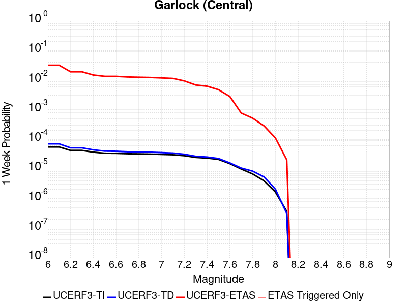 | 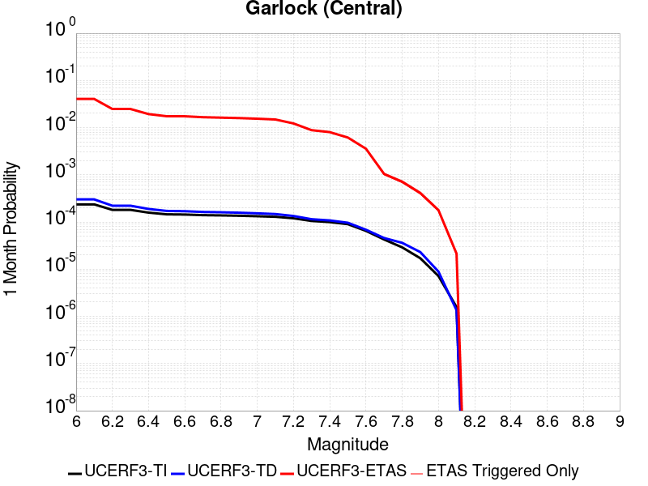 |  |  |
|  |  |  |  |
|  |  |  | 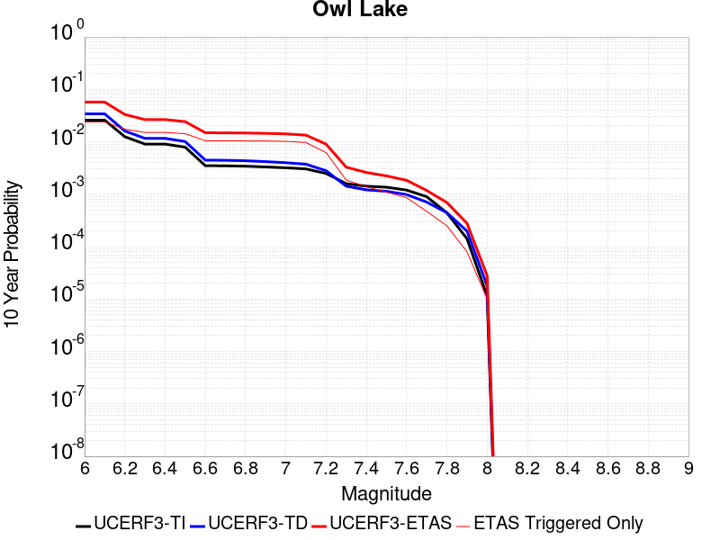 |

## Gridded Nucleation
*[(top)](#table-of-contents)*

| Min Mag | Triggered Ruptures (no spontaneous) | Triggered Ruptures (primary aftershocks only) |
|-----|-----|-----|
| **M&ge;2.5** |  |  |
| **M&ge;5** |  |  |
| **M&ge;6** |  |  |
| **M&ge;7** |  |  |


## JSON Input File
*[(top)](#table-of-contents)*

```
{
  "numSimulations": 100000,
  "duration": 10.0,
  "startTimeMillis": 1562383194040,
  "includeSpontaneous": false,
  "randomSeed": 1566346983395,
  "binaryOutput": true,
  "binaryOutputFilters": [
    {
      "prefix": "results_complete",
      "descendantsOnly": false
    },
    {
      "prefix": "results_m5_preserve_chain",
      "minMag": 5.0,
      "preserveChainBelowMag": true,
      "descendantsOnly": false
    }
  ],
  "forceRecalc": false,
  "simulationName": "ComCat M7.1 (ci38457511), Inverted Surface (minSlip\u003d0.5), ShakeMap Surface",
  "numRetries": 3,
  "outputDir": "/home/scec-02/kmilner/ucerf3/etas_sim/2019_08_20-ComCatM7p1_ci38457511_InvertedSurface_minSlip0p5_ShakeMapSurface-noSpont-full_td-scale1.14",
  "triggerRuptures": [
    "omitted due to length, see original input file"
  ],
  "cacheDir": "/home/scec-02/kmilner/ucerf3/ucerf3-etas-launcher/inputs/cache_fm3p1_ba",
  "fssFile": "/home/scec-02/kmilner/ucerf3/ucerf3-etas-launcher/inputs/2013_05_10-ucerf3p3-production-10runs_COMPOUND_SOL_FM3_1_SpatSeisU3_MEAN_BRANCH_AVG_SOL.zip",
  "probModel": "FULL_TD",
  "applySubSeisForSupraNucl": true,
  "totRateScaleFactor": 1.14,
  "gridSeisCorr": true,
  "timeIndependentERF": false,
  "griddedOnly": false,
  "imposeGR": false,
  "includeIndirectTriggering": true,
  "gridSeisDiscr": 0.1,
  "catalogCompletenessModel": "RELAXED",
  "configCommand": "u3etas_comcat_event_config_builder.sh --event-id ci38457511 --num-simulations 100000 --days-before 7 --finite-surf-inversion --finite-surf-inversion-min-slip 0.5 --finite-surf-inversion-min-mag 6 --finite-surf-shakemap --finite-surf-shakemap-min-mag 5 --hpc-site USC_HPC --nodes 36 --hours 24 --queue scec_hiprio",
  "configTime": 1566346983395,
  "comcatMetadata": {
    "region": {
      "border": [
        {
          "latitude": 35.159638009804986,
          "longitude": -117.491914977488
        },
        {
          "latitude": 35.178913623104876,
          "longitude": -117.58040124586493
        },
        {
          "latitude": 35.210398054460796,
          "longitude": -117.66350797072435
        },
        {
          "latitude": 35.25314818685778,
          "longitude": -117.73873827472748
        },
        {
          "latitude": 35.283690426977515,
          "longitude": -117.77643334092167
        },
        {
          "latitude": 35.28484763492727,
          "longitude": -117.77847056992192
        },
        {
          "latitude": 35.3001703655427,
          "longitude": -117.7973893746622
        },
        {
          "latitude": 35.3001703655427,
          "longitude": -117.79738937466217
        },
        {
          "latitude": 35.30000735945169,
          "longitude": -117.79761967014147
        },
        {
          "latitude": 35.30272226765911,
          "longitude": -117.8005401797679
        },
        {
          "latitude": 35.33216204768687,
          "longitude": -117.83688914810261
        },
        {
          "latitude": 35.33216204768687,
          "longitude": -117.83688914810264
        },
        {
          "latitude": 35.33177000717417,
          "longitude": -117.83744346333431
        },
        {
          "latitude": 35.352408858084694,
          "longitude": -117.85964548212606
        },
        {
          "latitude": 35.36502290181148,
          "longitude": -117.87522636324155
        },
        {
          "latitude": 35.364634913399776,
          "longitude": -117.87577539981169
        },
        {
          "latitude": 35.39841483902951,
          "longitude": -117.91211408656547
        },
        {
          "latitude": 35.398810166802015,
          "longitude": -117.91155484389004
        },
        {
          "latitude": 35.40427929401403,
          "longitude": -117.91831321646742
        },
        {
          "latitude": 35.416282615602185,
          "longitude": -117.92872486044283
        },
        {
          "latitude": 35.46167208479213,
          "longitude": -117.9782373738544
        },
        {
          "latitude": 35.46669981493302,
          "longitude": -117.98445566010135
        },
        {
          "latitude": 35.46669981493302,
          "longitude": -117.98445566010137
        },
        {
          "latitude": 35.46669981493303,
          "longitude": -117.98445566010135
        },
        {
          "latitude": 35.46669981493303,
          "longitude": -117.98445566010137
        },
        {
          "latitude": 35.46669981493302,
          "longitude": -117.98445566010135
        },
        {
          "latitude": 35.46669981493302,
          "longitude": -117.98445566010137
        },
        {
          "latitude": 35.466297392827045,
          "longitude": -117.98502501199211
        },
        {
          "latitude": 35.50007677073234,
          "longitude": -118.02146348824331
        },
        {
          "latitude": 35.50048650578521,
          "longitude": -118.02088397738135
        },
        {
          "latitude": 35.50071677053598,
          "longitude": -118.0211688910815
        },
        {
          "latitude": 35.50036498917297,
          "longitude": -118.02166702178798
        },
        {
          "latitude": 35.53414424571078,
          "longitude": -118.05810568038041
        },
        {
          "latitude": 35.5344686111405,
          "longitude": -118.05764651988466
        },
        {
          "latitude": 35.5344686111405,
          "longitude": -118.05764651988463
        },
        {
          "latitude": 35.534655720527155,
          "longitude": -118.05785062573078
        },
        {
          "latitude": 35.53433247922036,
          "longitude": -118.05830873413534
        },
        {
          "latitude": 35.55626678454466,
          "longitude": -118.0819701053282
        },
        {
          "latitude": 35.56758781761892,
          "longitude": -118.09598988975094
        },
        {
          "latitude": 35.56719786733488,
          "longitude": -118.09654299778937
        },
        {
          "latitude": 35.600976885730034,
          "longitude": -118.13298201581752
        },
        {
          "latitude": 35.601374222441166,
          "longitude": -118.13241861330262
        },
        {
          "latitude": 35.601374222441166,
          "longitude": -118.13241861330265
        },
        {
          "latitude": 35.606874254509464,
          "longitude": -118.13923271030119
        },
        {
          "latitude": 35.61791505109012,
          "longitude": -118.14883434537421
        },
        {
          "latitude": 35.810165412472564,
          "longitude": -118.36028147326947
        },
        {
          "latitude": 35.810165412472564,
          "longitude": -118.36028147326944
        },
        {
          "latitude": 35.818938269995236,
          "longitude": -118.37583096916897
        },
        {
          "latitude": 35.86688002989442,
          "longitude": -118.43542903364308
        },
        {
          "latitude": 35.86652993985928,
          "longitude": -118.43592948421696
        },
        {
          "latitude": 35.90040754463217,
          "longitude": -118.47247031701266
        },
        {
          "latitude": 35.90048401652161,
          "longitude": -118.47236103673566
        },
        {
          "latitude": 35.905120704200016,
          "longitude": -118.47737588256634
        },
        {
          "latitude": 35.90566677532291,
          "longitude": -118.47805502025227
        },
        {
          "latitude": 35.90609129495061,
          "longitude": -118.47842563258543
        },
        {
          "latitude": 35.93393807136231,
          "longitude": -118.50854353145445
        },
        {
          "latitude": 35.93431877070425,
          "longitude": -118.50800051951785
        },
        {
          "latitude": 35.93442347434786,
          "longitude": -118.50813079435123
        },
        {
          "latitude": 35.934129513737076,
          "longitude": -118.50855058832656
        },
        {
          "latitude": 35.938958979096704,
          "longitude": -118.51377398025264
        },
        {
          "latitude": 35.939565923219305,
          "longitude": -118.51452915496974
        },
        {
          "latitude": 35.94004017694247,
          "longitude": -118.51494336851356
        },
        {
          "latitude": 35.96800668731071,
          "longitude": -118.5451910322983
        },
        {
          "latitude": 35.96838307657541,
          "longitude": -118.54465370125804
        },
        {
          "latitude": 35.9684880051517,
          "longitude": -118.54478431336052
        },
        {
          "latitude": 35.96819834592024,
          "longitude": -118.5451983248646
        },
        {
          "latitude": 35.97294464723684,
          "longitude": -118.55033181446447
        },
        {
          "latitude": 35.97356506786761,
          "longitude": -118.55110409639073
        },
        {
          "latitude": 35.97405233690107,
          "longitude": -118.55152986595593
        },
        {
          "latitude": 36.00207539730208,
          "longitude": -118.58183895919076
        },
        {
          "latitude": 36.00244746047628,
          "longitude": -118.58130734164104
        },
        {
          "latitude": 36.007564211778764,
          "longitude": -118.587679331777
        },
        {
          "latitude": 36.06869180261568,
          "longitude": -118.64111553280443
        },
        {
          "latitude": 36.13637861928926,
          "longitude": -118.68068588223265
        },
        {
          "latitude": 36.208582294251265,
          "longitude": -118.70515946184861
        },
        {
          "latitude": 36.283118437607584,
          "longitude": -118.71375356500238
        },
        {
          "latitude": 36.35772583236781,
          "longitude": -118.70616209051555
        },
        {
          "latitude": 36.4301346694901,
          "longitude": -118.68257022685015
        },
        {
          "latitude": 36.49813581835627,
          "longitude": -118.6436543428629
        },
        {
          "latitude": 36.55964900384397,
          "longitude": -118.59056641504854
        },
        {
          "latitude": 36.610325885375204,
          "longitude": -118.52794490762054
        },
        {
          "latitude": 36.61054691589035,
          "longitude": -118.52817878199889
        },
        {
          "latitude": 36.61164821965216,
          "longitude": -118.52658181425988
        },
        {
          "latitude": 36.61274620941618,
          "longitude": -118.5249896523575
        },
        {
          "latitude": 36.61384758506882,
          "longitude": -118.52339258098822
        },
        {
          "latitude": 36.613832200689295,
          "longitude": -118.52337630203525
        },
        {
          "latitude": 36.613832200689295,
          "longitude": -118.52337630203522
        },
        {
          "latitude": 36.61388768108074,
          "longitude": -118.52330774386706
        },
        {
          "latitude": 36.614330895082645,
          "longitude": -118.52252423963827
        },
        {
          "latitude": 36.614987661265175,
          "longitude": -118.52171264994432
        },
        {
          "latitude": 36.61543083288144,
          "longitude": -118.52092920967152
        },
        {
          "latitude": 36.61608764144906,
          "longitude": -118.52011755628831
        },
        {
          "latitude": 36.659218539254226,
          "longitude": -118.44386954224915
        },
        {
          "latitude": 36.691013388910385,
          "longitude": -118.35937207713815
        },
        {
          "latitude": 36.71049162038784,
          "longitude": -118.26922235260245
        },
        {
          "latitude": 36.717051907926475,
          "longitude": -118.1762
        },
        {
          "latitude": 36.71049162038784,
          "longitude": -118.08317764739753
        },
        {
          "latitude": 36.691013388910385,
          "longitude": -117.99302792286183
        },
        {
          "latitude": 36.659218539254226,
          "longitude": -117.90853045775083
        },
        {
          "latitude": 36.61608764144906,
          "longitude": -117.83228244371166
        },
        {
          "latitude": 36.57921342699197,
          "longitude": -117.78671500992294
        },
        {
          "latitude": 36.57921342699197,
          "longitude": -117.78671500992296
        },
        {
          "latitude": 36.580168563285426,
          "longitude": -117.78544684439196
        },
        {
          "latitude": 36.54724572050866,
          "longitude": -117.74747016836132
        },
        {
          "latitude": 36.546347379516845,
          "longitude": -117.74866336207114
        },
        {
          "latitude": 36.546347379516845,
          "longitude": -117.74866336207113
        },
        {
          "latitude": 36.54551123109308,
          "longitude": -117.74776495812064
        },
        {
          "latitude": 36.53881531809979,
          "longitude": -117.7394938973858
        },
        {
          "latitude": 36.53941218002274,
          "longitude": -117.73866099992897
        },
        {
          "latitude": 36.33424605874162,
          "longitude": -117.51508406938504
        },
        {
          "latitude": 36.320792941002644,
          "longitude": -117.49139004584345
        },
        {
          "latitude": 36.2729849235163,
          "longitude": -117.4325305806329
        },
        {
          "latitude": 36.27337445016627,
          "longitude": -117.431976732117
        },
        {
          "latitude": 36.23945270604668,
          "longitude": -117.39572704250592
        },
        {
          "latitude": 36.20552389761525,
          "longitude": -117.35946948117491
        },
        {
          "latitude": 36.2054810244095,
          "longitude": -117.35953040788698
        },
        {
          "latitude": 36.2054810244095,
          "longitude": -117.35953040788701
        },
        {
          "latitude": 36.20528216483315,
          "longitude": -117.35931852857875
        },
        {
          "latitude": 36.17169265755837,
          "longitude": -117.3234232371389
        },
        {
          "latitude": 36.137763863284356,
          "longitude": -117.28716504667801
        },
        {
          "latitude": 36.13768142782989,
          "longitude": -117.28728199403476
        },
        {
          "latitude": 36.13768142782989,
          "longitude": -117.28728199403477
        },
        {
          "latitude": 36.13730062104065,
          "longitude": -117.28687737011415
        },
        {
          "latitude": 36.13253896142026,
          "longitude": -117.28178875153156
        },
        {
          "latitude": 36.13195987113711,
          "longitude": -117.28107700555466
        },
        {
          "latitude": 36.13151799851881,
          "longitude": -117.28069768429732
        },
        {
          "latitude": 36.10383380482219,
          "longitude": -117.25111255774073
        },
        {
          "latitude": 36.10379086931343,
          "longitude": -117.25117341612687
        },
        {
          "latitude": 36.103591837018676,
          "longitude": -117.25096134712062
        },
        {
          "latitude": 36.103591837018676,
          "longitude": -117.2509613471206
        },
        {
          "latitude": 36.070001959475604,
          "longitude": -117.21506470561306
        },
        {
          "latitude": 36.070001959475604,
          "longitude": -117.21506470561309
        },
        {
          "latitude": 36.03607319434244,
          "longitude": -117.17880558417261
        },
        {
          "latitude": 36.036030217436995,
          "longitude": -117.17886639715958
        },
        {
          "latitude": 36.0358310702954,
          "longitude": -117.17865420202126
        },
        {
          "latitude": 36.002299567194356,
          "longitude": -117.14281931205782
        },
        {
          "latitude": 36.00229957371802,
          "longitude": -117.1428193028436
        },
        {
          "latitude": 36.002222564152525,
          "longitude": -117.14273701925688
        },
        {
          "latitude": 35.968312200867324,
          "longitude": -117.10649692595887
        },
        {
          "latitude": 35.96830923061134,
          "longitude": -117.10650112175428
        },
        {
          "latitude": 35.96817962617032,
          "longitude": -117.10636264131752
        },
        {
          "latitude": 35.967947813205356,
          "longitude": -117.10669016711726
        },
        {
          "latitude": 35.96772727500734,
          "longitude": -117.1064532748794
        },
        {
          "latitude": 35.96772727500734,
          "longitude": -117.10645327487943
        },
        {
          "latitude": 35.96795828111774,
          "longitude": -117.10612643995225
        },
        {
          "latitude": 35.93409633427034,
          "longitude": -117.07003785939851
        },
        {
          "latitude": 35.934096334270336,
          "longitude": -117.07003785939851
        },
        {
          "latitude": 35.93409633427033,
          "longitude": -117.07003785939851
        },
        {
          "latitude": 35.93409633427033,
          "longitude": -117.07003785939848
        },
        {
          "latitude": 35.934096334270336,
          "longitude": -117.07003785939851
        },
        {
          "latitude": 35.93409633427034,
          "longitude": -117.07003785939848
        },
        {
          "latitude": 35.934096340549345,
          "longitude": -117.07003785052056
        },
        {
          "latitude": 35.934018209392065,
          "longitude": -117.06995459732335
        },
        {
          "latitude": 35.93393898386122,
          "longitude": -117.06987016222088
        },
        {
          "latitude": 35.933938977497284,
          "longitude": -117.06987017122768
        },
        {
          "latitude": 35.89997682582424,
          "longitude": -117.03368156466858
        },
        {
          "latitude": 35.89993932093255,
          "longitude": -117.0337346100854
        },
        {
          "latitude": 35.89993932093255,
          "longitude": -117.03373461008538
        },
        {
          "latitude": 35.89971465388408,
          "longitude": -117.0334958317414
        },
        {
          "latitude": 35.89975225354973,
          "longitude": -117.03344257807527
        },
        {
          "latitude": 35.86573338825229,
          "longitude": -116.99728667552351
        },
        {
          "latitude": 35.86535961539546,
          "longitude": -116.99781623160194
        },
        {
          "latitude": 35.86026671328925,
          "longitude": -116.99157773675913
        },
        {
          "latitude": 35.7987584167624,
          "longitude": -116.93895293044297
        },
        {
          "latitude": 35.730761230052046,
          "longitude": -116.90037148302505
        },
        {
          "latitude": 35.658354950967514,
          "longitude": -116.87697625172382
        },
        {
          "latitude": 35.58374840486038,
          "longitude": -116.86943901012712
        },
        {
          "latitude": 35.509211303178525,
          "longitude": -116.87794484452527
        },
        {
          "latitude": 35.437004983173665,
          "longitude": -116.90219186001173
        },
        {
          "latitude": 35.36931415680613,
          "longitude": -116.94140555481783
        },
        {
          "latitude": 35.30818167556599,
          "longitude": -116.99436681004025
        },
        {
          "latitude": 35.256557397072925,
          "longitude": -117.05808306317283
        },
        {
          "latitude": 35.25645551434778,
          "longitude": -117.05797715605912
        },
        {
          "latitude": 35.25536002052954,
          "longitude": -117.0595752185183
        },
        {
          "latitude": 35.255371452268584,
          "longitude": -117.0595871020418
        },
        {
          "latitude": 35.25532834530022,
          "longitude": -117.05966296248667
        },
        {
          "latitude": 35.255253495485476,
          "longitude": -117.05958515842084
        },
        {
          "latitude": 35.25415800149648,
          "longitude": -117.0611832208154
        },
        {
          "latitude": 35.254169644139594,
          "longitude": -117.06119532321519
        },
        {
          "latitude": 35.25377823237934,
          "longitude": -117.06188412652574
        },
        {
          "latitude": 35.25314818685778,
          "longitude": -117.0626617252725
        },
        {
          "latitude": 35.210398054460796,
          "longitude": -117.13789202927563
        },
        {
          "latitude": 35.178913623104876,
          "longitude": -117.22099875413505
        },
        {
          "latitude": 35.159638009804986,
          "longitude": -117.30948502251199
        },
        {
          "latitude": 35.15314809207353,
          "longitude": -117.4007
        }
      ]
    },
    "eventID": "ci38457511",
    "minDepth": -10.0,
    "maxDepth": 24.0,
    "minMag": 2.5,
    "startTime": 1561778393040,
    "endTime": 1562383193041,
    "magComplete": 3.5
  }
}
```

