# Parent Section Magnitude-Probability Distributions

Only fault sections with at least one triggered aftershock are plotted. Sections are sorted by total supraseismogenic trigger rate (decreasing)

## Table Of Contents

* [Little Lake](#little-lake)
* [Tank Canyon](#tank-canyon)
* [Garlock (Central)](#garlock-central)
* [Airport Lake](#airport-lake)
* [Owl Lake](#owl-lake)
* [Panamint Valley](#panamint-valley)
* [Garlock (East)](#garlock-east)
* [Ash Hill](#ash-hill)
* [Hunter Mountain-Saline Valley](#hunter-mountain-saline-valley)
* [Blackwater](#blackwater)
* [So Sierra Nevada](#so-sierra-nevada)
* [Garlock (West)](#garlock-west)
* [McLean Lake](#mclean-lake)
* [Gravel Hills-Harper Lk](#gravel-hills-harper-lk)
* [Goldstone Lake](#goldstone-lake)
* [Coyote Canyon](#coyote-canyon)
* [San Andreas (Mojave S)](#san-andreas-mojave-s)
* [Death Valley (So)](#death-valley-so)
* [Nelson Lake](#nelson-lake)
* [Lenwood-Lockhart-Old Woman Springs](#lenwood-lockhart-old-woman-springs)
* [Towne Pass](#towne-pass)
* [San Andreas (Mojave N)](#san-andreas-mojave-n)
* [Sierra Nevada  (No Extension)](#sierra-nevada--no-extension)
* [Bicycle Lake](#bicycle-lake)
* [Paradise](#paradise)
* [San Andreas (San Bernardino N)](#san-andreas-san-bernardino-n)
* [Garlic Springs](#garlic-springs)
* [Coyote Lake](#coyote-lake)
* [Owens Valley](#owens-valley)
* [San Andreas (Parkfield)](#san-andreas-parkfield)
* [San Andreas (San Bernardino S)](#san-andreas-san-bernardino-s)
* [Helendale-So Lockhart](#helendale-so-lockhart)
* [Death Valley (Black Mtns Frontal)](#death-valley-black-mtns-frontal)
* [Independence rev 2011](#independence-rev-2011)
* [San Andreas (Big Bend)](#san-andreas-big-bend)
* [Red Pass](#red-pass)
* [Lake Isabella (Seismicity)](#lake-isabella-seismicity)
* [San Andreas (Cholame) rev](#san-andreas-cholame-rev)
* [San Andreas (Carrizo) rev](#san-andreas-carrizo-rev)
* [San Andreas (San Gorgonio Pass-Garnet HIll)](#san-andreas-san-gorgonio-pass-garnet-hill)
* [Kern Canyon (North Kern) 2011](#kern-canyon-north-kern-2011)
* [Scodie Lineament](#scodie-lineament)
* [Calico-Hidalgo](#calico-hidalgo)
* [Baker](#baker)
* [Mission Ridge-Arroyo Parida-Santa Ana](#mission-ridge-arroyo-parida-santa-ana)
* [Ludlow](#ludlow)
* [Elsinore (Glen Ivy) rev](#elsinore-glen-ivy-rev)
* [Cady](#cady)
* [Kern Canyon (South Kern) 2011](#kern-canyon-south-kern-2011)
* [Manix-Afton Hills](#manix-afton-hills)
* [San Andreas (Coachella) rev](#san-andreas-coachella-rev)
* [Death Valley (No)](#death-valley-no)
* [San Jacinto (San Bernardino)](#san-jacinto-san-bernardino)
* [San Jacinto (San Jacinto Valley) rev](#san-jacinto-san-jacinto-valley-rev)
* [White Wolf (Extension)](#white-wolf-extension)
* [San Andreas (Creeping Section) 2011 CFM](#san-andreas-creeping-section-2011-cfm)
* [Pleito](#pleito)
* [San Jacinto (Stepovers Combined)](#san-jacinto-stepovers-combined)
* [Death Valley (Fish Lake Valley)](#death-valley-fish-lake-valley)
* [White Mountains](#white-mountains)
* [San Jacinto (Anza) rev](#san-jacinto-anza-rev)
* [Santa Ynez (West)](#santa-ynez-west)
* [Cleghorn Lake](#cleghorn-lake)
* [Tin Mountain](#tin-mountain)
* [Kern Canyon (Lake Isabella) 2011](#kern-canyon-lake-isabella-2011)
* [San Andreas (North Branch Mill Creek)](#san-andreas-north-branch-mill-creek)
* [Pinto Mtn](#pinto-mtn)
* [Deep Springs](#deep-springs)
* [Lost Hills](#lost-hills)
* [Pisgah-Bullion Mtn-Mesquite Lk](#pisgah-bullion-mtn-mesquite-lk)
* [Mission Creek](#mission-creek)
* [Cleghorn Pass](#cleghorn-pass)
* [San Jacinto (Coyote Creek)](#san-jacinto-coyote-creek)
* [Elysian Park (Upper)](#elysian-park-upper)
* [Santa Rosa Island](#santa-rosa-island)
* [Pine Mtn](#pine-mtn)
* [Santa Ynez (East)](#santa-ynez-east)
* [Rose Canyon](#rose-canyon)
* [Big Pine (Central)](#big-pine-central)
* [Santa Ynez River](#santa-ynez-river)
* [Red Mountain](#red-mountain)
* [Brawley (Seismic Zone) alt 1](#brawley-seismic-zone-alt-1)
* [Imperial](#imperial)
* [San Jacinto (Borrego)](#san-jacinto-borrego)
* [Dry Mountain](#dry-mountain)
* [Ortigalita (North)](#ortigalita-north)
* [Simi-Santa Rosa](#simi-santa-rosa)
* [Oak Ridge (Onshore)](#oak-ridge-onshore)
* [Whittier alt 1](#whittier-alt-1)
* [San Cayetano](#san-cayetano)
* [San Pedro Basin](#san-pedro-basin)
* [San Jacinto (Lytle Creek connector)](#san-jacinto-lytle-creek-connector)
* [Great Valley 09 (Laguna Seca)](#great-valley-09-laguna-seca)
* [Ventura-Pitas Point](#ventura-pitas-point)
* [Great Valley 07 (Orestimba)](#great-valley-07-orestimba)
* [San Gabriel](#san-gabriel)
* [Hunting Creek - Berryessa 2011 CFM](#hunting-creek---berryessa-2011-cfm)
* [Oceanic - West Huasna](#oceanic---west-huasna)
* [Ortigalita (South)](#ortigalita-south)
* [Camp Rock 2011](#camp-rock-2011)
* [Laguna Salada](#laguna-salada)
* [Los Alamos extension](#los-alamos-extension)
* [Great Valley 06 (Midland) 2011 CFM alt1](#great-valley-06-midland-2011-cfm-alt1)
* [Newport-Inglewood alt 1](#newport-inglewood-alt-1)
* [Calaveras (No) 2011 CFM](#calaveras-no-2011-cfm)
* [Bullion Mountains](#bullion-mountains)
* [Puente Hills](#puente-hills)
* [Elsinore (Stepovers Combined)](#elsinore-stepovers-combined)
* [Coronado Bank alt1](#coronado-bank-alt1)
* [San Gregorio (North) 2011 CFM](#san-gregorio-north-2011-cfm)
* [Johnson Valley (No) 2011 rev](#johnson-valley-no-2011-rev)
* [Hat Creek-McArthur-Mayfield](#hat-creek-mcarthur-mayfield)
* [San Juan](#san-juan)
* [Earthquake Valley (So Extension)](#earthquake-valley-so-extension)
* [Santa Cruz Island](#santa-cruz-island)
* [Palos Verdes](#palos-verdes)
* [Los Alamos 2011 CFM](#los-alamos-2011-cfm)
* [Elsinore (Temecula) rev](#elsinore-temecula-rev)
* [San Luis Range 2011 CFM](#san-luis-range-2011-cfm)
* [Casmalia 2011 CFM](#casmalia-2011-cfm)
* [San Jacinto (Clark) rev](#san-jacinto-clark-rev)
* [Mono Lake 2011 CFM](#mono-lake-2011-cfm)
* [Great Valley 10 (Panoche)](#great-valley-10-panoche)
* [Owens Valley Keough Hot Springs](#owens-valley-keough-hot-springs)
* [Pitas Point (Lower West)](#pitas-point-lower-west)
* [Newport-Inglewood (Offshore)](#newport-inglewood-offshore)
* [San Diego Trough north alt1](#san-diego-trough-north-alt1)
* [Sheephole](#sheephole)
* [Gillem - Big Crack 2011 CFM](#gillem---big-crack-2011-cfm)
* [Calaveras (So) - Paicines extension 2011 CFM](#calaveras-so---paicines-extension-2011-cfm)
* [Round Valley](#round-valley)
* [Robinson Creek](#robinson-creek)
* [Great Valley 11](#great-valley-11)
* [Great Valley 08 (Quinto)](#great-valley-08-quinto)
* [Big Pine (West)](#big-pine-west)
* [Holser alt 1](#holser-alt-1)
* [Malibu Coast alt 1](#malibu-coast-alt-1)
* [San Andreas (Offshore) 2011 CFM](#san-andreas-offshore-2011-cfm)
* [Swain Ravine - Spenceville](#swain-ravine---spenceville)
* [San Gabriel (Extension)](#san-gabriel-extension)
* [Goose Lake 2011 CFM](#goose-lake-2011-cfm)
* [Pitas Point (Lower)-Montalvo](#pitas-point-lower-montalvo)
* [Great Valley 04b Gordon Valley](#great-valley-04b-gordon-valley)
* [Malibu Coast (Extension) alt 1](#malibu-coast-extension-alt-1)
* [Rinconada 2011 CFM](#rinconada-2011-cfm)
* [Pittville 2011 CFM](#pittville-2011-cfm)
* [Earthquake Valley](#earthquake-valley)
* [Cleghorn](#cleghorn)
* [Likely 2011 CFM](#likely-2011-cfm)
* [Santa Cruz Catalina Ridge alt1](#santa-cruz-catalina-ridge-alt1)
* [Mount Diablo Thrust South](#mount-diablo-thrust-south)
* [Ozena](#ozena)
* [Rocky Ledge 2011 CFM](#rocky-ledge-2011-cfm)
* [Calaveras (Central) 2011 CFM](#calaveras-central-2011-cfm)
* [Green Valley 2011 CFM](#green-valley-2011-cfm)
* [Great Valley 03a Dunnigan Hills](#great-valley-03a-dunnigan-hills)
* [Earthquake Valley (No  Extension)](#earthquake-valley-no--extension)
* [Sierra Madre](#sierra-madre)
* [North Frontal  (East)](#north-frontal--east)
* [Hosgri](#hosgri)
* [Northridge](#northridge)
* [Chino alt 1](#chino-alt-1)
* [White Wolf](#white-wolf)
* [Hartley Springs 2011 CFM](#hartley-springs-2011-cfm)
* [Cucamonga](#cucamonga)
* [Channel Islands Thrust](#channel-islands-thrust)
* [Hector Mine](#hector-mine)
* [San Gorgonio Pass](#san-gorgonio-pass)
* [Hunting Creek - Bartlett Springs connector 2011](#hunting-creek---bartlett-springs-connector-2011)
* [Hollywood](#hollywood)
* [Raymond](#raymond)
* [San Jacinto (Superstition Mtn)](#san-jacinto-superstition-mtn)
* [Santa Monica alt 1](#santa-monica-alt-1)
* [Blue Cut](#blue-cut)
* [Emerson-Copper Mtn 2011](#emerson-copper-mtn-2011)
* [Honey Lake 2011 CFM](#honey-lake-2011-cfm)
* [Concord 2011 CFM](#concord-2011-cfm)
* [Carson Range (Genoa)](#carson-range-genoa)
* [Lions Head 2011 CFM](#lions-head-2011-cfm)
* [Hayward (So) extension 2011 CFM](#hayward-so-extension-2011-cfm)

## Little Lake
*[(top)](#table-of-contents)*

| 1 Week | 1 Month | 1 Year | 10 Year |
|-----|-----|-----|-----|
|  |  |  |  |

| Magnitude | 1 wk TI Prob | 1 wk TD Prob | 1 wk ETAS Prob | 1 wk ETAS/TD Gain | 1 wk ETAS Triggered Only | 1 mo TI Prob | 1 mo TD Prob | 1 mo ETAS Prob | 1 mo ETAS/TD Gain | 1 mo ETAS Triggered Only | 1 yr TI Prob | 1 yr TD Prob | 1 yr ETAS Prob | 1 yr ETAS/TD Gain | 1 yr ETAS Triggered Only | 10 yr TI Prob | 10 yr TD Prob | 10 yr ETAS Prob | 10 yr ETAS/TD Gain | 10 yr ETAS Triggered Only |
|-----|-----|-----|-----|-----|-----|-----|-----|-----|-----|-----|-----|-----|-----|-----|-----|-----|-----|-----|-----|-----|
| 6.0 | 2.8424427E-5 | 3.120572E-5 | 0.04726898 | 1514.7537 | 0.047239248 | 1.2181328E-4 | 1.337327E-4 | 0.0568674 | 425.2318 | 0.056741256 | 0.0014820677 | 0.0016271127 | 0.07606946 | 46.751194 | 0.07456367 | 0.014722223 | 0.016165402 | 0.10524163 | 6.510301 | 0.09053984 |
| 6.1 | 2.8424427E-5 | 3.120572E-5 | 0.04726898 | 1514.7537 | 0.047239248 | 1.2181328E-4 | 1.337327E-4 | 0.0568674 | 425.2318 | 0.056741256 | 0.0014820677 | 0.0016271127 | 0.07606946 | 46.751194 | 0.07456367 | 0.014722223 | 0.016165402 | 0.10524163 | 6.510301 | 0.09053984 |
| 6.2 | 2.8424427E-5 | 3.120572E-5 | 0.04726898 | 1514.7537 | 0.047239248 | 1.2181328E-4 | 1.337327E-4 | 0.0568674 | 425.2318 | 0.056741256 | 0.0014820677 | 0.0016271127 | 0.07606946 | 46.751194 | 0.07456367 | 0.014722223 | 0.016165402 | 0.10524163 | 6.510301 | 0.09053984 |
| 6.3 | 1.48860645E-5 | 1.6081389E-5 | 0.027733924 | 1724.5974 | 0.027718287 | 6.379586E-5 | 6.8918576E-5 | 0.033299033 | 483.16483 | 0.033232406 | 7.7643775E-4 | 8.3878887E-4 | 0.044521194 | 53.07795 | 0.043719076 | 0.007737305 | 0.008359048 | 0.06084232 | 7.278619 | 0.052925684 |
| 6.4 | 1.48860645E-5 | 1.6081389E-5 | 0.027733924 | 1724.5974 | 0.027718287 | 6.379586E-5 | 6.8918576E-5 | 0.033299033 | 483.16483 | 0.033232406 | 7.7643775E-4 | 8.3878887E-4 | 0.044521194 | 53.07795 | 0.043719076 | 0.007737305 | 0.008359048 | 0.06084232 | 7.278619 | 0.052925684 |
| 6.5 | 1.2797581E-5 | 1.3765565E-5 | 0.023226896 | 1687.3188 | 0.02321345 | 5.4845623E-5 | 5.899409E-5 | 0.028144874 | 477.07956 | 0.028087536 | 6.675408E-4 | 7.18042E-4 | 0.03796081 | 52.86711 | 0.03726953 | 0.006655392 | 0.00715977 | 0.051910046 | 7.2502394 | 0.045072988 |
| 6.6 | 9.661896E-6 | 1.0289038E-5 | 0.017315578 | 1682.9153 | 0.017305467 | 4.1407468E-5 | 4.409522E-5 | 0.02096728 | 475.50003 | 0.020924106 | 5.040193E-4 | 5.367433E-4 | 0.02828936 | 52.705566 | 0.02776752 | 0.005028777 | 0.0053560743 | 0.03907157 | 7.294815 | 0.033897053 |
| 6.7 | 7.767871E-6 | 8.199687E-6 | 0.014236475 | 1736.2219 | 0.014228392 | 3.329045E-5 | 3.5141118E-5 | 0.016896917 | 480.83038 | 0.016862368 | 4.0523586E-4 | 4.2777284E-4 | 0.023114566 | 54.03467 | 0.022696503 | 0.004044977 | 0.004270846 | 0.032238424 | 7.5484867 | 0.028087536 |
| 6.8 | 6.4235196E-6 | 6.7357446E-6 | 0.011305678 | 1678.46 | 0.011299018 | 2.752908E-5 | 2.8867229E-5 | 0.013395294 | 464.03113 | 0.013366812 | 3.35115E-4 | 3.5141467E-4 | 0.018266 | 51.978477 | 0.017920882 | 0.003346101 | 0.00350985 | 0.025709677 | 7.3250074 | 0.02227802 |
| 6.9 | 3.1283696E-6 | 3.1121804E-6 | 0.0056649116 | 1820.2389 | 0.0056618173 | 1.3407229E-5 | 1.3337856E-5 | 0.0066597303 | 499.3104 | 0.006646481 | 1.6322079E-4 | 1.6237781E-4 | 0.009293652 | 57.23474 | 0.009132757 | 0.0016310095 | 0.00162274 | 0.013050882 | 8.042498 | 0.011446717 |
| 7.0 | 2.290603E-6 | 2.2286815E-6 | 0.0033254619 | 1492.1206 | 0.0033232404 | 9.816834E-6 | 9.551463E-6 | 0.0039727855 | 415.93475 | 0.003963272 | 1.19513395E-4 | 1.162839E-4 | 0.0057036015 | 49.048935 | 0.0055879676 | 0.0011944914 | 0.0011623327 | 0.008243672 | 7.0923514 | 0.00708958 |
| 7.1 | 1.293693E-6 | 1.1776827E-6 | 0.001404322 | 1192.4451 | 0.001403146 | 5.5443866E-6 | 5.0472063E-6 | 0.0016543509 | 327.77557 | 0.001649312 | 6.750081E-5 | 6.14487E-5 | 0.0025721872 | 41.8591 | 0.002510893 | 6.7480316E-4 | 6.143856E-4 | 0.0038371785 | 6.2455544 | 0.003224774 |
| 7.2 | 4.715842E-7 | 3.0917857E-7 | 3.6955802E-4 | 1195.2899 | 3.6924894E-4 | 2.0210737E-6 | 1.3250503E-6 | 4.1980663E-4 | 316.82315 | 4.1848214E-4 | 2.4606294E-5 | 1.6132375E-5 | 5.084564E-4 | 31.517763 | 4.923319E-4 | 2.460357E-4 | 1.6131258E-4 | 8.0124085E-4 | 4.967008 | 6.4003153E-4 |
| 7.3 | 3.9430947E-7 | 2.3097488E-7 | 3.2024665E-4 | 1386.5 | 3.2001577E-4 | 1.6898966E-6 | 9.89892E-7 | 3.7023847E-4 | 374.01907 | 3.6924894E-4 | 2.0574296E-5 | 1.2051869E-5 | 4.5514526E-4 | 37.765533 | 4.4309875E-4 | 2.0572392E-4 | 1.20512224E-4 | 7.1123935E-4 | 5.9018025 | 5.907983E-4 |
| 7.4 | 3.547123E-7 | 1.9679135E-7 | 2.463627E-4 | 1251.8981 | 2.4616596E-4 | 1.5201948E-6 | 8.4339126E-7 | 2.962423E-4 | 351.25134 | 2.9539916E-4 | 1.8508214E-5 | 1.0268241E-5 | 3.795134E-4 | 36.959923 | 3.6924894E-4 | 1.8506673E-4 | 1.02677724E-4 | 5.7034503E-4 | 5.5547104 | 4.6771532E-4 |
| 7.5 | 2.6354266E-7 | 1.4423138E-7 | 2.2169357E-4 | 1537.0688 | 2.2154937E-4 | 1.129468E-6 | 6.181344E-7 | 2.7140052E-4 | 439.06396 | 2.7078256E-4 | 1.3751187E-5 | 7.5257603E-6 | 3.029227E-4 | 40.251442 | 2.9539916E-4 | 1.3750336E-4 | 7.5255106E-5 | 4.4447626E-4 | 5.9062605 | 3.6924894E-4 |
| 7.6 | 1.269913E-7 | 7.572556E-8 | 9.854211E-5 | 1301.3057 | 9.8466386E-5 | 5.4424834E-7 | 3.245381E-7 | 1.2340747E-4 | 380.25577 | 1.2308298E-4 | 6.6262032E-6 | 3.9512443E-6 | 1.5165024E-4 | 38.380375 | 1.4769958E-4 | 6.626006E-5 | 3.9511775E-5 | 2.610524E-4 | 6.6069517 | 2.2154937E-4 |

## Tank Canyon
*[(top)](#table-of-contents)*

| 1 Week | 1 Month | 1 Year | 10 Year |
|-----|-----|-----|-----|
|  |  |  | 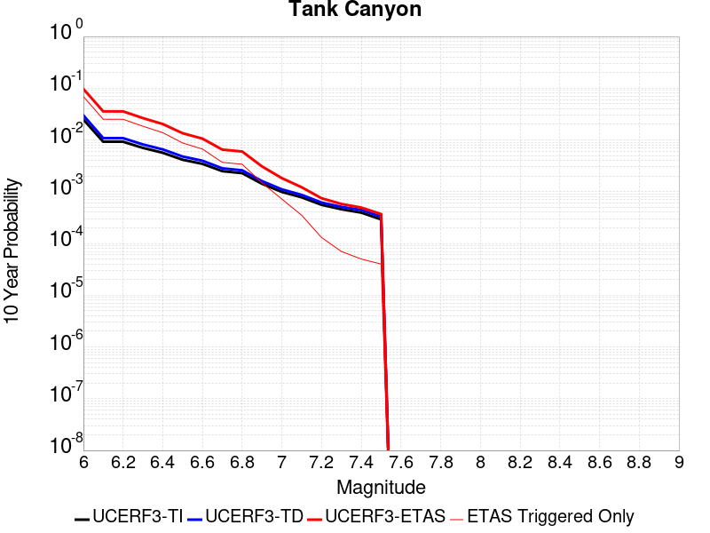 |

| Magnitude | 1 wk TI Prob | 1 wk TD Prob | 1 wk ETAS Prob | 1 wk ETAS/TD Gain | 1 wk ETAS Triggered Only | 1 mo TI Prob | 1 mo TD Prob | 1 mo ETAS Prob | 1 mo ETAS/TD Gain | 1 mo ETAS Triggered Only | 1 yr TI Prob | 1 yr TD Prob | 1 yr ETAS Prob | 1 yr ETAS/TD Gain | 1 yr ETAS Triggered Only | 10 yr TI Prob | 10 yr TD Prob | 10 yr ETAS Prob | 10 yr ETAS/TD Gain | 10 yr ETAS Triggered Only |
|-----|-----|-----|-----|-----|-----|-----|-----|-----|-----|-----|-----|-----|-----|-----|-----|-----|-----|-----|-----|-----|
| 6.0 | 4.8284557E-5 | 5.7964822E-5 | 0.024254676 | 418.43787 | 0.024198115 | 2.0691741E-4 | 2.4840087E-4 | 0.03344794 | 134.65308 | 0.03320779 | 0.0025163088 | 0.0030207601 | 0.05362685 | 17.752766 | 0.050759424 | 0.02488006 | 0.029863637 | 0.0979019 | 3.2782981 | 0.07013268 |
| 6.1 | 1.7796336E-5 | 2.0873314E-5 | 0.008193413 | 392.5305 | 0.00817271 | 7.626778E-5 | 8.945422E-5 | 0.011633605 | 130.05095 | 0.011545184 | 9.281647E-4 | 0.0010885983 | 0.01911292 | 17.55737 | 0.018043965 | 0.009242975 | 0.010836744 | 0.03613622 | 3.3346014 | 0.025576644 |
| 6.2 | 1.7796336E-5 | 2.0873314E-5 | 0.008193413 | 392.5305 | 0.00817271 | 7.626778E-5 | 8.945422E-5 | 0.011633605 | 130.05095 | 0.011545184 | 9.281647E-4 | 0.0010885983 | 0.01911292 | 17.55737 | 0.018043965 | 0.009242975 | 0.010836744 | 0.03613622 | 3.3346014 | 0.025576644 |
| 6.3 | 1.3515912E-5 | 1.5759564E-5 | 0.005702104 | 361.8186 | 0.005686434 | 5.792405E-5 | 6.753938E-5 | 0.008215083 | 121.633965 | 0.008148094 | 7.049971E-4 | 8.2200574E-4 | 0.013931867 | 16.948624 | 0.013120646 | 0.007027647 | 0.0081922645 | 0.026552292 | 3.241142 | 0.01851168 |
| 6.4 | 1.0870146E-5 | 1.2618021E-5 | 0.004246619 | 336.5519 | 0.0042340546 | 4.658551E-5 | 5.4076212E-5 | 0.0061832773 | 114.34376 | 0.0061295326 | 5.67031E-4 | 6.581969E-4 | 0.010547555 | 16.024923 | 0.009895871 | 0.005655863 | 0.0065644905 | 0.02055275 | 3.130898 | 0.014080693 |
| 6.5 | 7.964826E-6 | 9.196094E-6 | 0.002667764 | 290.0975 | 0.0026585925 | 3.4134522E-5 | 3.9411298E-5 | 0.0038548333 | 97.81036 | 0.0038155725 | 4.1550855E-4 | 4.7973756E-4 | 0.006803168 | 14.18102 | 0.0063264654 | 0.0041473247 | 0.004788321 | 0.01382835 | 2.887933 | 0.009083524 |
| 6.6 | 6.6317E-6 | 7.6122988E-6 | 0.0021000071 | 275.8703 | 0.0020924108 | 2.8421264E-5 | 3.2623782E-5 | 0.0030603663 | 93.80784 | 0.0030278414 | 3.4597394E-4 | 3.9713128E-4 | 0.005539957 | 13.949938 | 0.0051448685 | 0.0034543579 | 0.003965368 | 0.011026835 | 2.7807848 | 0.00708958 |
| 6.7 | 4.793663E-6 | 5.4307857E-6 | 0.001187021 | 218.57262 | 0.0011815967 | 2.0544108E-5 | 2.3274613E-5 | 0.0017710123 | 76.09202 | 0.0017477784 | 2.500958E-4 | 2.8333595E-4 | 0.0031134423 | 10.98852 | 0.0028309086 | 0.0024981452 | 0.0028304397 | 0.0067334003 | 2.3789237 | 0.0039140387 |
| 6.8 | 4.382823E-6 | 4.9692567E-6 | 0.0010142447 | 204.1039 | 0.0010092804 | 1.8783392E-5 | 2.1296666E-5 | 0.0015721092 | 73.8195 | 0.0015508456 | 2.286638E-4 | 2.5926033E-4 | 0.002843333 | 10.967096 | 0.0025847426 | 0.0022842865 | 0.002590253 | 0.0061749667 | 2.3839242 | 0.0035940232 |
| 6.9 | 2.729601E-6 | 3.0735416E-6 | 4.215544E-4 | 137.1559 | 4.1848214E-4 | 1.1698237E-5 | 1.3172262E-5 | 6.039628E-4 | 45.85111 | 5.907983E-4 | 1.4241673E-4 | 1.6036171E-4 | 0.0012187057 | 7.5997295 | 0.0010585136 | 0.001423255 | 0.0016026258 | 0.0030772546 | 1.9201329 | 0.0014769958 |
| 7.0 | 1.8987357E-6 | 2.126939E-6 | 2.2367583E-4 | 105.16325 | 2.2154937E-4 | 8.137413E-6 | 9.115425E-6 | 3.5374463E-4 | 38.807255 | 3.4463234E-4 | 9.90685E-5 | 1.1097535E-4 | 6.278665E-4 | 5.6577115 | 5.169485E-4 | 9.902435E-4 | 0.0011092679 | 0.001797768 | 1.6206797 | 6.892647E-4 |
| 7.1 | 1.4928986E-6 | 1.6641272E-6 | 1.9859656E-4 | 119.33978 | 1.9693277E-4 | 6.398121E-6 | 7.1319573E-6 | 2.2867974E-4 | 32.06409 | 2.2154937E-4 | 7.789434E-5 | 8.682871E-5 | 3.822022E-4 | 4.4017954 | 2.9539916E-4 | 7.786704E-4 | 8.6800574E-4 | 0.0012861247 | 1.4817007 | 4.1848214E-4 |
| 7.2 | 1.069082E-6 | 1.1828573E-6 | 7.5032556E-5 | 63.433315 | 7.384979E-5 | 4.581772E-6 | 5.0693816E-6 | 7.89188E-5 | 15.567737 | 7.384979E-5 | 5.5781646E-5 | 6.171851E-5 | 1.6017881E-4 | 2.5953126 | 9.8466386E-5 | 5.576765E-4 | 6.170659E-4 | 7.400729E-4 | 1.1993418 | 1.2308298E-4 |
| 7.3 | 8.776551E-7 | 9.770005E-7 | 2.5593574E-5 | 26.19607 | 2.4616596E-5 | 3.7613736E-6 | 4.1871413E-6 | 2.8803635E-5 | 6.8790693 | 2.4616596E-5 | 4.579376E-5 | 5.097777E-5 | 7.559311E-5 | 1.4828643 | 2.4616596E-5 | 4.5784327E-4 | 5.097118E-4 | 5.5891986E-4 | 1.096541 | 4.9233193E-5 |
| 7.4 | 7.55721E-7 | 8.510244E-7 | 2.54676E-5 | 29.925816 | 2.4616596E-5 | 3.2388E-6 | 3.6472454E-6 | 2.8263752E-5 | 7.749342 | 2.4616596E-5 | 3.9431678E-5 | 4.4404827E-5 | 6.902033E-5 | 1.554343 | 2.4616596E-5 | 3.942468E-4 | 4.440104E-4 | 4.9322174E-4 | 1.1108338 | 4.9233193E-5 |
| 7.5 | 5.587665E-7 | 6.305619E-7 | 2.5247144E-5 | 40.03912 | 2.4616596E-5 | 2.3947114E-6 | 2.702408E-6 | 2.7318938E-5 | 10.109109 | 2.4616596E-5 | 2.915522E-5 | 3.290182E-5 | 5.7517605E-5 | 1.7481588 | 2.4616596E-5 | 2.9151395E-4 | 3.290182E-4 | 3.7823519E-4 | 1.1495875 | 4.9233193E-5 |

## Garlock (Central)
*[(top)](#table-of-contents)*

| 1 Week | 1 Month | 1 Year | 10 Year |
|-----|-----|-----|-----|
|  |  |  |  |

| Magnitude | 1 wk TI Prob | 1 wk TD Prob | 1 wk ETAS Prob | 1 wk ETAS/TD Gain | 1 wk ETAS Triggered Only | 1 mo TI Prob | 1 mo TD Prob | 1 mo ETAS Prob | 1 mo ETAS/TD Gain | 1 mo ETAS Triggered Only | 1 yr TI Prob | 1 yr TD Prob | 1 yr ETAS Prob | 1 yr ETAS/TD Gain | 1 yr ETAS Triggered Only | 10 yr TI Prob | 10 yr TD Prob | 10 yr ETAS Prob | 10 yr ETAS/TD Gain | 10 yr ETAS Triggered Only |
|-----|-----|-----|-----|-----|-----|-----|-----|-----|-----|-----|-----|-----|-----|-----|-----|-----|-----|-----|-----|-----|
| 6.0 | 5.5131142E-5 | 7.024681E-5 | 0.032094188 | 456.87753 | 0.03202619 | 2.3625491E-4 | 3.010234E-4 | 0.03999564 | 132.86555 | 0.03970657 | 0.0028726095 | 0.0036588663 | 0.058426604 | 15.968499 | 0.05496886 | 0.028357591 | 0.036079824 | 0.10505838 | 2.9118319 | 0.07156044 |
| 6.1 | 5.5131142E-5 | 7.024681E-5 | 0.032094188 | 456.87753 | 0.03202619 | 2.3625491E-4 | 3.010234E-4 | 0.03999564 | 132.86555 | 0.03970657 | 0.0028726095 | 0.0036588663 | 0.058426604 | 15.968499 | 0.05496886 | 0.028357591 | 0.036079824 | 0.10505838 | 2.9118319 | 0.07156044 |
| 6.2 | 4.216245E-5 | 5.1661493E-5 | 0.019350076 | 374.5551 | 0.019299412 | 1.806837E-4 | 2.2138779E-4 | 0.024291089 | 109.7219 | 0.024075031 | 0.0021976046 | 0.0026920962 | 0.036571547 | 13.584784 | 0.033970904 | 0.021759989 | 0.026689773 | 0.070943125 | 2.658064 | 0.045466855 |
| 6.3 | 4.216245E-5 | 5.1661493E-5 | 0.019350076 | 374.5551 | 0.019299412 | 1.806837E-4 | 2.2138779E-4 | 0.024291089 | 109.7219 | 0.024075031 | 0.0021976046 | 0.0026920962 | 0.036571547 | 13.584784 | 0.033970904 | 0.021759989 | 0.026689773 | 0.070943125 | 2.658064 | 0.045466855 |
| 6.4 | 3.6858168E-5 | 4.411054E-5 | 0.014985725 | 339.73117 | 0.014942274 | 1.5795401E-4 | 1.8903162E-4 | 0.01904178 | 100.73331 | 0.018856313 | 0.0019213937 | 0.002299056 | 0.029388737 | 12.782959 | 0.027152106 | 0.019048655 | 0.02284894 | 0.058449056 | 2.5580642 | 0.036432564 |
| 6.5 | 3.39199E-5 | 4.0018083E-5 | 0.013775529 | 344.2326 | 0.013736061 | 1.453629E-4 | 1.7149492E-4 | 0.017473994 | 101.8922 | 0.017305467 | 0.0017683565 | 0.002085973 | 0.026872307 | 12.882385 | 0.024838146 | 0.017543508 | 0.020759864 | 0.053181842 | 2.5617626 | 0.033109322 |
| 6.6 | 3.3571985E-5 | 3.9472274E-5 | 0.013774991 | 348.9789 | 0.013736061 | 1.4387199E-4 | 1.6915603E-4 | 0.017447084 | 103.14195 | 0.01728085 | 0.0017502342 | 0.0020575512 | 0.026770893 | 13.011046 | 0.024764296 | 0.017365133 | 0.020481179 | 0.052815933 | 2.5787547 | 0.033010855 |
| 6.7 | 3.2580007E-5 | 3.8088703E-5 | 0.012985925 | 340.93903 | 0.01294833 | 1.3962112E-4 | 1.632272E-4 | 0.016530592 | 101.27351 | 0.016370038 | 0.0016985617 | 0.0019855013 | 0.025619648 | 12.903365 | 0.023681166 | 0.016856372 | 0.019773813 | 0.05080478 | 2.569296 | 0.031656943 |
| 6.8 | 3.2185937E-5 | 3.7515918E-5 | 0.012689972 | 338.25565 | 0.012652931 | 1.3793244E-4 | 1.6077272E-4 | 0.0161836 | 100.661354 | 0.016025404 | 0.0016780337 | 0.001955672 | 0.025148293 | 12.859157 | 0.023238067 | 0.016654192 | 0.019480614 | 0.050038118 | 2.568611 | 0.03116461 |
| 6.9 | 3.165394E-5 | 3.6720503E-5 | 0.012418414 | 338.18747 | 0.012382148 | 1.3565269E-4 | 1.5736422E-4 | 0.015811056 | 100.47427 | 0.015656155 | 0.0016503202 | 0.001914247 | 0.024542732 | 12.821089 | 0.022671886 | 0.01638118 | 0.019073246 | 0.048870742 | 2.5622666 | 0.03037688 |
| 7.0 | 3.0903822E-5 | 3.5625766E-5 | 0.012023482 | 337.494 | 0.011988282 | 1.3243823E-4 | 1.5267303E-4 | 0.015363407 | 100.62947 | 0.0152130565 | 0.0016112428 | 0.0018572307 | 0.023774454 | 12.8010235 | 0.021958005 | 0.015996104 | 0.018512413 | 0.047505476 | 2.5661416 | 0.029539917 |
| 7.1 | 3.0069863E-5 | 3.4392073E-5 | 0.011529948 | 335.25015 | 0.011495951 | 1.2886449E-4 | 1.4738638E-4 | 0.014841328 | 100.69674 | 0.014696108 | 0.0015677959 | 0.0017929734 | 0.022827 | 12.731365 | 0.021071807 | 0.01556781 | 0.017880075 | 0.045731347 | 2.5576708 | 0.02835832 |
| 7.2 | 2.7957109E-5 | 3.128145E-5 | 0.009459143 | 302.3882 | 0.009428157 | 1.1981068E-4 | 1.340566E-4 | 0.012366865 | 92.251076 | 0.012234448 | 0.0014577188 | 0.0016309366 | 0.019498015 | 11.955103 | 0.017896265 | 0.014481937 | 0.016283695 | 0.039894048 | 2.4499383 | 0.024001181 |
| 7.3 | 2.4519275E-5 | 2.6714795E-5 | 0.006771482 | 253.47311 | 0.0067449473 | 1.0507837E-4 | 1.1448703E-4 | 0.008704696 | 76.03215 | 0.008591192 | 0.0012785783 | 0.001393003 | 0.013954561 | 10.01761 | 0.012579081 | 0.012712469 | 0.013928054 | 0.030749751 | 2.2077565 | 0.017059302 |
| 7.4 | 2.3225532E-5 | 2.51994E-5 | 0.0061545772 | 244.23508 | 0.0061295326 | 9.95342E-5 | 1.0799304E-4 | 0.007836769 | 72.56736 | 0.0077296114 | 0.0012111551 | 0.0013140367 | 0.012696544 | 9.662245 | 0.011397484 | 0.012045753 | 0.013145725 | 0.028426018 | 2.1623774 | 0.015483839 |
| 7.5 | 2.097765E-5 | 2.2483688E-5 | 0.004699532 | 209.01962 | 0.004677153 | 8.9901114E-5 | 9.635517E-5 | 0.006003769 | 62.30874 | 0.005907983 | 0.0010939965 | 0.0011725046 | 0.009851974 | 8.402504 | 0.008689659 | 0.010886264 | 0.011740365 | 0.02361223 | 2.0112004 | 0.012012899 |
| 7.6 | 1.511254E-5 | 1.5991332E-5 | 0.0026991575 | 168.78877 | 0.002683209 | 6.476642E-5 | 6.853253E-5 | 0.0033423156 | 48.769768 | 0.0032740072 | 7.882459E-4 | 8.3407195E-4 | 0.0056057083 | 6.7208934 | 0.0047756196 | 0.007854558 | 0.008383559 | 0.014803447 | 1.7657713 | 0.006474165 |
| 7.7 | 9.934069E-6 | 1.0678794E-5 | 8.230178E-4 | 77.0703 | 8.123477E-4 | 4.2573887E-5 | 4.5765457E-5 | 0.0010796152 | 23.590176 | 0.001033897 | 5.182138E-4 | 5.570524E-4 | 0.0020578282 | 3.6941378 | 0.0015016124 | 0.00517007 | 0.005627684 | 0.0075369724 | 1.3392673 | 0.0019200945 |
| 7.8 | 6.7562896E-6 | 8.428449E-6 | 5.746054E-4 | 68.174515 | 5.661817E-4 | 2.8955206E-5 | 3.6121426E-5 | 7.253612E-4 | 20.08119 | 6.892647E-4 | 3.5247262E-4 | 4.3968976E-4 | 0.0015223437 | 3.4623134 | 0.0010831302 | 0.0035191406 | 0.004446654 | 0.005868068 | 1.3196591 | 0.0014277626 |
| 7.9 | 3.975453E-6 | 5.37103E-6 | 3.5000153E-4 | 65.16469 | 3.4463234E-4 | 1.7037546E-5 | 2.3018498E-5 | 4.41491E-4 | 19.179834 | 4.1848214E-4 | 2.0741238E-4 | 2.8021427E-4 | 9.446761E-4 | 3.3712635 | 6.6464813E-4 | 0.002072189 | 0.0028336283 | 0.0037173147 | 1.3118569 | 8.861975E-4 |
| 8.0 | 1.6729537E-6 | 2.0775144E-6 | 1.7439334E-4 | 83.94326 | 1.7231617E-4 | 7.169782E-6 | 8.903603E-6 | 2.30451E-4 | 25.882893 | 2.2154937E-4 | 8.7288594E-5 | 1.0839601E-4 | 4.0376314E-4 | 3.7248895 | 2.9539916E-4 | 8.7254314E-4 | 0.0010969337 | 0.0014903672 | 1.3586665 | 3.9386554E-4 |
| 8.1 | 3.6733252E-7 | 3.1489964E-7 | 2.4931489E-5 | 79.172806 | 2.4616596E-5 | 1.5742813E-6 | 1.3495693E-6 | 2.5966132E-5 | 19.24031 | 2.4616596E-5 | 1.9166706E-5 | 1.6430899E-5 | 4.104709E-5 | 2.4981647 | 2.4616596E-5 | 1.9165053E-4 | 1.6638759E-4 | 2.1561258E-4 | 1.2958454 | 4.9233193E-5 |

## Airport Lake
*[(top)](#table-of-contents)*

| 1 Week | 1 Month | 1 Year | 10 Year |
|-----|-----|-----|-----|
|  |  |  |  |

| Magnitude | 1 wk TI Prob | 1 wk TD Prob | 1 wk ETAS Prob | 1 wk ETAS/TD Gain | 1 wk ETAS Triggered Only | 1 mo TI Prob | 1 mo TD Prob | 1 mo ETAS Prob | 1 mo ETAS/TD Gain | 1 mo ETAS Triggered Only | 1 yr TI Prob | 1 yr TD Prob | 1 yr ETAS Prob | 1 yr ETAS/TD Gain | 1 yr ETAS Triggered Only | 10 yr TI Prob | 10 yr TD Prob | 10 yr ETAS Prob | 10 yr ETAS/TD Gain | 10 yr ETAS Triggered Only |
|-----|-----|-----|-----|-----|-----|-----|-----|-----|-----|-----|-----|-----|-----|-----|-----|-----|-----|-----|-----|-----|
| 6.0 | 1.2387061E-5 | 1.3103157E-5 | 0.020198448 | 1541.4948 | 0.020185608 | 5.3086325E-5 | 5.615534E-5 | 0.0247206 | 440.21817 | 0.024665829 | 6.461343E-4 | 6.8350515E-4 | 0.033155203 | 48.50761 | 0.032493908 | 0.0064425888 | 0.0068168393 | 0.04635053 | 6.7994165 | 0.039805036 |
| 6.1 | 1.2387061E-5 | 1.3103157E-5 | 0.020198448 | 1541.4948 | 0.020185608 | 5.3086325E-5 | 5.615534E-5 | 0.0247206 | 440.21817 | 0.024665829 | 6.461343E-4 | 6.8350515E-4 | 0.033155203 | 48.50761 | 0.032493908 | 0.0064425888 | 0.0068168393 | 0.04635053 | 6.7994165 | 0.039805036 |
| 6.2 | 1.2387061E-5 | 1.3103157E-5 | 0.020198448 | 1541.4948 | 0.020185608 | 5.3086325E-5 | 5.615534E-5 | 0.0247206 | 440.21817 | 0.024665829 | 6.461343E-4 | 6.8350515E-4 | 0.033155203 | 48.50761 | 0.032493908 | 0.0064425888 | 0.0068168393 | 0.04635053 | 6.7994165 | 0.039805036 |
| 6.3 | 1.2387061E-5 | 1.3103157E-5 | 0.020198448 | 1541.4948 | 0.020185608 | 5.3086325E-5 | 5.615534E-5 | 0.0247206 | 440.21817 | 0.024665829 | 6.461343E-4 | 6.8350515E-4 | 0.033155203 | 48.50761 | 0.032493908 | 0.0064425888 | 0.0068168393 | 0.04635053 | 6.7994165 | 0.039805036 |
| 6.4 | 1.2387061E-5 | 1.3103157E-5 | 0.020198448 | 1541.4948 | 0.020185608 | 5.3086325E-5 | 5.615534E-5 | 0.0247206 | 440.21817 | 0.024665829 | 6.461343E-4 | 6.8350515E-4 | 0.033155203 | 48.50761 | 0.032493908 | 0.0064425888 | 0.0068168393 | 0.04635053 | 6.7994165 | 0.039805036 |
| 6.5 | 6.9922594E-6 | 7.384925E-6 | 0.014949549 | 2024.3331 | 0.014942274 | 2.996648E-5 | 3.1649324E-5 | 0.01809966 | 571.88135 | 0.018068582 | 3.6478083E-4 | 3.8526783E-4 | 0.024352595 | 63.209522 | 0.023976564 | 0.003641826 | 0.0038465366 | 0.033003084 | 8.579948 | 0.029269133 |
| 6.6 | 6.9922594E-6 | 7.384925E-6 | 0.014949549 | 2024.3331 | 0.014942274 | 2.996648E-5 | 3.1649324E-5 | 0.01809966 | 571.88135 | 0.018068582 | 3.6478083E-4 | 3.8526783E-4 | 0.024352595 | 63.209522 | 0.023976564 | 0.003641826 | 0.0038465366 | 0.033003084 | 8.579948 | 0.029269133 |
| 6.7 | 5.477277E-6 | 5.7860684E-6 | 0.01268326 | 2192.0342 | 0.0126775475 | 2.3473833E-5 | 2.4797222E-5 | 0.015409788 | 621.43207 | 0.015385373 | 2.8575645E-4 | 3.0186825E-4 | 0.02089974 | 69.23464 | 0.02060409 | 0.0028538927 | 0.003014966 | 0.028097276 | 9.319268 | 0.025158161 |
| 6.8 | 3.9950432E-6 | 4.2190873E-6 | 0.009210788 | 2183.1233 | 0.009206607 | 1.7121502E-5 | 1.8081691E-5 | 0.0112184305 | 620.43036 | 0.011200552 | 2.0843433E-4 | 2.2012512E-4 | 0.015479055 | 70.31935 | 0.01526229 | 0.0020823893 | 0.0021993418 | 0.020915933 | 9.510088 | 0.018757846 |
| 6.9 | 2.95695E-6 | 3.1230243E-6 | 0.006452651 | 2066.1545 | 0.006449548 | 1.2672582E-5 | 1.3384334E-5 | 0.007742892 | 578.5041 | 0.0077296114 | 1.5427776E-4 | 1.6294434E-4 | 0.011017094 | 67.612625 | 0.010855919 | 0.001541707 | 0.0016284712 | 0.015022669 | 9.225014 | 0.013416045 |
| 7.0 | 1.456072E-6 | 1.540812E-6 | 0.0025370463 | 1646.5645 | 0.0025355094 | 6.2402937E-6 | 6.603469E-6 | 0.0030836577 | 466.97543 | 0.0030770747 | 7.597293E-5 | 8.039528E-5 | 0.0046094847 | 57.33527 | 0.004529454 | 7.594696E-4 | 8.0376083E-4 | 0.0065594143 | 8.160904 | 0.0057602837 |
| 7.1 | 6.995192E-7 | 7.4089746E-7 | 9.85404E-4 | 1330.014 | 9.846638E-4 | 2.997936E-6 | 3.1752747E-6 | 0.0011601517 | 365.37048 | 0.00115698 | 3.649926E-5 | 3.865897E-5 | 0.0019340636 | 50.028847 | 0.0018954779 | 3.6493264E-4 | 3.865897E-4 | 0.0027980835 | 7.2378635 | 0.0024124265 |

## Owl Lake
*[(top)](#table-of-contents)*

| 1 Week | 1 Month | 1 Year | 10 Year |
|-----|-----|-----|-----|
|  |  |  |  |

| Magnitude | 1 wk TI Prob | 1 wk TD Prob | 1 wk ETAS Prob | 1 wk ETAS/TD Gain | 1 wk ETAS Triggered Only | 1 mo TI Prob | 1 mo TD Prob | 1 mo ETAS Prob | 1 mo ETAS/TD Gain | 1 mo ETAS Triggered Only | 1 yr TI Prob | 1 yr TD Prob | 1 yr ETAS Prob | 1 yr ETAS/TD Gain | 1 yr ETAS Triggered Only | 10 yr TI Prob | 10 yr TD Prob | 10 yr ETAS Prob | 10 yr ETAS/TD Gain | 10 yr ETAS Triggered Only |
|-----|-----|-----|-----|-----|-----|-----|-----|-----|-----|-----|-----|-----|-----|-----|-----|-----|-----|-----|-----|-----|
| 6.0 | 5.0320643E-5 | 6.635816E-5 | 0.00855852 | 128.97466 | 0.008492726 | 2.1564208E-4 | 2.843674E-4 | 0.01175244 | 41.328365 | 0.011471334 | 0.0026222812 | 0.0034577388 | 0.02089962 | 6.044303 | 0.017502401 | 0.02591553 | 0.034140717 | 0.057607796 | 1.6873634 | 0.02429658 |
| 6.1 | 5.0320643E-5 | 6.635816E-5 | 0.00855852 | 128.97466 | 0.008492726 | 2.1564208E-4 | 2.843674E-4 | 0.01175244 | 41.328365 | 0.011471334 | 0.0026222812 | 0.0034577388 | 0.02089962 | 6.044303 | 0.017502401 | 0.02591553 | 0.034140717 | 0.057607796 | 1.6873634 | 0.02429658 |
| 6.2 | 2.4125871E-5 | 3.0981035E-5 | 0.006554177 | 211.55447 | 0.006523398 | 1.0339249E-4 | 1.3277028E-4 | 0.008968955 | 67.55243 | 0.008837358 | 0.0012580766 | 0.001615439 | 0.01478862 | 9.1545515 | 0.013194496 | 0.012509781 | 0.016070465 | 0.033824455 | 2.104759 | 0.018043965 |
| 6.3 | 1.7433485E-5 | 2.2355514E-5 | 0.005733278 | 256.45926 | 0.0057110502 | 7.471279E-5 | 9.580672E-5 | 0.0077262204 | 80.64383 | 0.007631145 | 9.0924866E-4 | 0.0011659743 | 0.012500994 | 10.7215 | 0.011348251 | 0.009055373 | 0.011628896 | 0.026957005 | 2.3181052 | 0.015508456 |
| 6.4 | 1.7433485E-5 | 2.2355514E-5 | 0.005733278 | 256.45926 | 0.0057110502 | 7.471279E-5 | 9.580672E-5 | 0.0077262204 | 80.64383 | 0.007631145 | 9.0924866E-4 | 0.0011659743 | 0.012500994 | 10.7215 | 0.011348251 | 0.009055373 | 0.011628896 | 0.026957005 | 2.3181052 | 0.015508456 |
| 6.5 | 1.5182742E-5 | 1.9429144E-5 | 0.0055088233 | 283.53403 | 0.005489501 | 6.506727E-5 | 8.326596E-5 | 0.007393786 | 88.797226 | 0.007311129 | 7.919061E-4 | 0.0010134429 | 0.011809177 | 11.652534 | 0.010806686 | 0.0078909 | 0.010118429 | 0.0246171 | 2.4328976 | 0.014646875 |
| 6.6 | 6.7271576E-6 | 8.547361E-6 | 0.0044887294 | 525.1597 | 0.0044802204 | 2.8830356E-5 | 3.6631063E-5 | 0.006018245 | 164.29347 | 0.0059818327 | 3.5095305E-4 | 4.458976E-4 | 0.008885625 | 19.927502 | 0.008443492 | 0.0035039932 | 0.004467813 | 0.015446776 | 3.4573464 | 0.011028235 |
| 6.7 | 6.682835E-6 | 8.479807E-6 | 0.0044394294 | 523.52954 | 0.0044309874 | 2.8640408E-5 | 3.6341557E-5 | 0.005968726 | 164.23969 | 0.0059326 | 3.4864116E-4 | 4.4237426E-4 | 0.008808315 | 19.911453 | 0.008369643 | 0.003480947 | 0.0044327388 | 0.015338566 | 3.460291 | 0.010954386 |
| 6.8 | 6.5774975E-6 | 8.32628E-6 | 0.0044392766 | 533.1644 | 0.0044309874 | 2.8188972E-5 | 3.5683603E-5 | 0.0059434557 | 166.55986 | 0.005907983 | 3.4314668E-4 | 4.343669E-4 | 0.008775768 | 20.203585 | 0.0083450265 | 0.0034261728 | 0.004352885 | 0.015210568 | 3.494365 | 0.010905152 |
| 6.9 | 6.363419E-6 | 7.999454E-6 | 0.0044389516 | 554.90674 | 0.0044309874 | 2.727151E-5 | 3.428296E-5 | 0.0059420634 | 173.32413 | 0.005907983 | 3.3198006E-4 | 4.1732067E-4 | 0.008758864 | 20.98833 | 0.0083450265 | 0.0033148455 | 0.0041828766 | 0.014993386 | 3.584468 | 0.010855919 |
| 7.0 | 6.1342453E-6 | 7.6316555E-6 | 0.004389352 | 575.15076 | 0.004381754 | 2.6289357E-5 | 3.2706717E-5 | 0.005891265 | 180.12401 | 0.00585875 | 3.2002592E-4 | 3.9813702E-4 | 0.0085921995 | 21.581013 | 0.008197326 | 0.0031956544 | 0.003991571 | 0.01463253 | 3.6658576 | 0.010683603 |
| 7.1 | 5.842926E-6 | 7.142211E-6 | 0.0041919337 | 586.9238 | 0.0041848216 | 2.504087E-5 | 3.0609146E-5 | 0.005667637 | 185.16154 | 0.0056372005 | 3.0482994E-4 | 3.7260808E-4 | 0.008148554 | 21.868969 | 0.0077788443 | 0.0030441214 | 0.0037370329 | 0.013865694 | 3.7103484 | 0.010166654 |
| 7.2 | 4.77173E-6 | 5.358483E-6 | 0.0024916213 | 464.98633 | 0.0024862762 | 2.045011E-5 | 2.2964748E-5 | 0.0036169053 | 157.49814 | 0.0035940232 | 2.4895166E-4 | 2.79564E-4 | 0.005447604 | 19.48607 | 0.005169485 | 0.0024867293 | 0.002808645 | 0.009436458 | 3.3597903 | 0.006646481 |
| 7.3 | 3.0494948E-6 | 2.710463E-6 | 7.658229E-4 | 282.5432 | 7.631145E-4 | 1.3069198E-5 | 1.1616219E-5 | 0.0010455012 | 90.00358 | 0.001033897 | 1.5910587E-4 | 1.4141845E-4 | 0.0015935922 | 11.26863 | 0.0014523792 | 0.0015899199 | 0.0014232415 | 0.00329144 | 2.3126366 | 0.0018708613 |
| 7.4 | 2.7263884E-6 | 2.3056762E-6 | 5.9310265E-4 | 257.23587 | 5.907983E-4 | 1.1684469E-5 | 9.881433E-6 | 7.4837205E-4 | 75.735176 | 7.384979E-4 | 1.4224913E-4 | 1.20299905E-4 | 0.0012279135 | 10.207103 | 0.0011077469 | 0.0014215811 | 0.0012112238 | 0.0025634968 | 2.1164517 | 0.0013539128 |
| 7.5 | 2.6090431E-6 | 2.1656133E-6 | 4.6987995E-4 | 216.97316 | 4.6771532E-4 | 1.1181565E-5 | 9.281167E-6 | 5.0160853E-4 | 54.045845 | 4.923319E-4 | 1.3612706E-4 | 1.1299244E-4 | 9.006345E-4 | 7.97075 | 7.877311E-4 | 0.001360437 | 0.0011379806 | 0.0021461125 | 1.8858955 | 0.0010092804 |
| 7.6 | 2.3008756E-6 | 1.8727933E-6 | 3.957376E-4 | 211.30873 | 3.9386554E-4 | 9.860858E-6 | 8.0262325E-6 | 4.0188862E-4 | 50.071884 | 3.9386554E-4 | 1.20049335E-4 | 9.7715085E-5 | 6.392273E-4 | 6.541746 | 5.415651E-4 | 0.001199845 | 9.849932E-4 | 0.0016981713 | 1.7240437 | 7.138813E-4 |
| 7.7 | 1.7184348E-6 | 1.3419171E-6 | 1.7365786E-4 | 129.41028 | 1.7231617E-4 | 7.3646997E-6 | 5.7510606E-6 | 1.7806624E-4 | 30.96233 | 1.7231617E-4 | 8.966153E-5 | 7.0016955E-5 | 3.6539542E-4 | 5.2186704 | 2.9539916E-4 | 8.962536E-4 | 7.078345E-4 | 0.0010522229 | 1.486538 | 3.4463234E-4 |
| 7.8 | 8.4612907E-7 | 8.4058576E-7 | 9.930689E-5 | 118.14011 | 9.8466386E-5 | 3.6262625E-6 | 3.6025056E-6 | 1.0206854E-4 | 28.332653 | 9.8466386E-5 | 4.4148852E-5 | 4.3859643E-5 | 2.4078377E-4 | 5.489871 | 1.9693277E-4 | 4.414008E-4 | 4.4398365E-4 | 6.900403E-4 | 1.5542021 | 2.4616596E-4 |
| 7.9 | 2.716738E-7 | 3.768106E-7 | 2.4993398E-5 | 66.32881 | 2.4616596E-5 | 1.1643157E-6 | 1.6149015E-6 | 2.6231459E-5 | 16.24338 | 2.4616596E-5 | 1.4175452E-5 | 1.966126E-5 | 6.889348E-5 | 3.504022 | 4.9233193E-5 | 1.4174548E-4 | 1.9836679E-4 | 2.7220193E-4 | 1.3722153 | 7.384979E-5 |
| 8.0 | 2.1995428E-8 | 3.384878E-8 | 3.384878E-8 | 1.0 | 0.0 | 9.426611E-8 | 1.4506621E-7 | 1.4506621E-7 | 1.0 | 0.0 | 1.1476893E-6 | 1.7661803E-6 | 1.7661803E-6 | 1.0 | 0.0 | 1.14768345E-5 | 1.7963059E-5 | 1.7963059E-5 | 1.0 | 0.0 |

## Panamint Valley
*[(top)](#table-of-contents)*

| 1 Week | 1 Month | 1 Year | 10 Year |
|-----|-----|-----|-----|
| 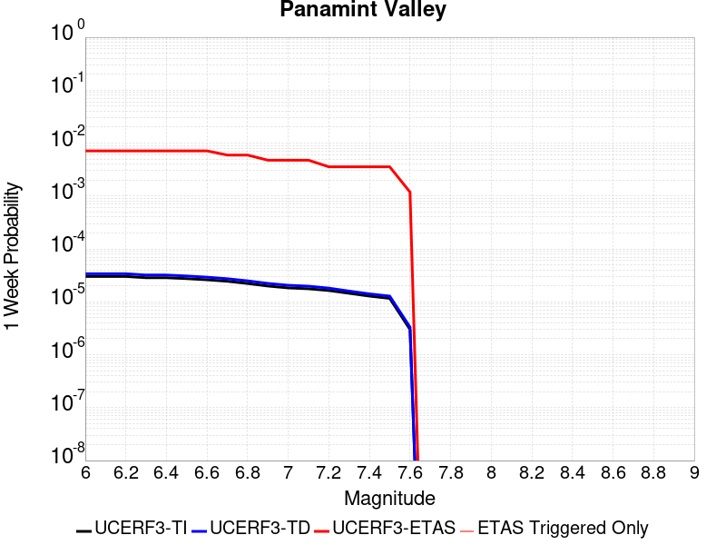 | 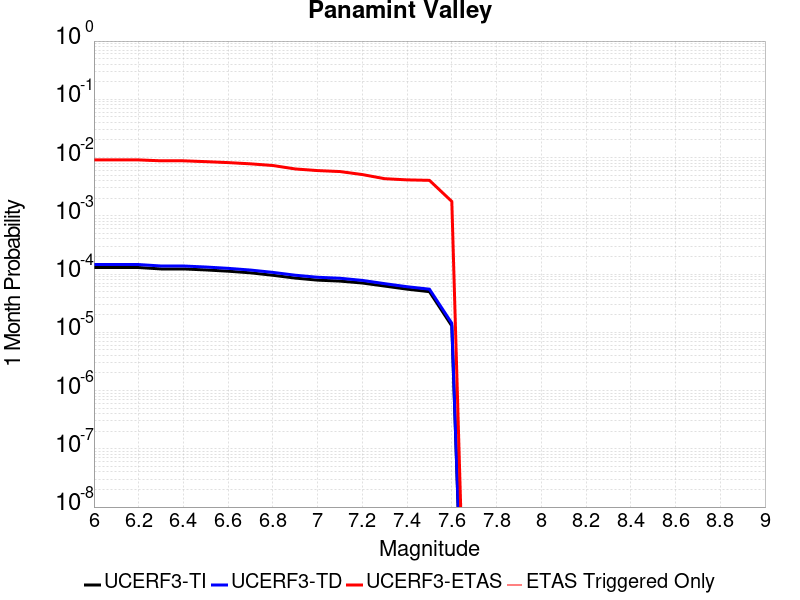 | 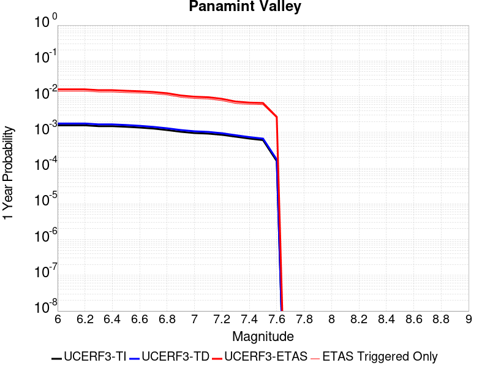 | 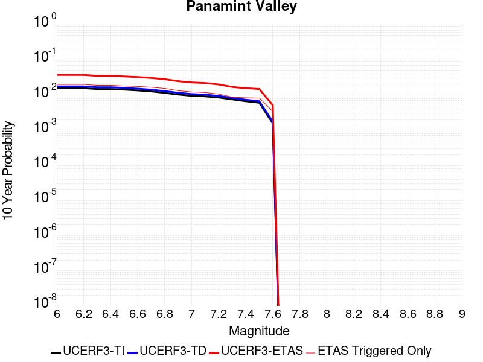 |

| Magnitude | 1 wk TI Prob | 1 wk TD Prob | 1 wk ETAS Prob | 1 wk ETAS/TD Gain | 1 wk ETAS Triggered Only | 1 mo TI Prob | 1 mo TD Prob | 1 mo ETAS Prob | 1 mo ETAS/TD Gain | 1 mo ETAS Triggered Only | 1 yr TI Prob | 1 yr TD Prob | 1 yr ETAS Prob | 1 yr ETAS/TD Gain | 1 yr ETAS Triggered Only | 10 yr TI Prob | 10 yr TD Prob | 10 yr ETAS Prob | 10 yr ETAS/TD Gain | 10 yr ETAS Triggered Only |
|-----|-----|-----|-----|-----|-----|-----|-----|-----|-----|-----|-----|-----|-----|-----|-----|-----|-----|-----|-----|-----|
| 6.0 | 3.0211835E-5 | 3.3984514E-5 | 0.0067048552 | 197.2915 | 0.0066710976 | 1.2947287E-4 | 1.4563995E-4 | 0.00905555 | 62.177654 | 0.008911208 | 0.0015751923 | 0.0017717537 | 0.015925791 | 8.988716 | 0.01417916 | 0.015640736 | 0.017583137 | 0.037244532 | 2.1181962 | 0.020013293 |
| 6.1 | 3.0211835E-5 | 3.3984514E-5 | 0.0067048552 | 197.2915 | 0.0066710976 | 1.2947287E-4 | 1.4563995E-4 | 0.00905555 | 62.177654 | 0.008911208 | 0.0015751923 | 0.0017717537 | 0.015925791 | 8.988716 | 0.01417916 | 0.015640736 | 0.017583137 | 0.037244532 | 2.1181962 | 0.020013293 |
| 6.2 | 3.0211835E-5 | 3.3984514E-5 | 0.0067048552 | 197.2915 | 0.0066710976 | 1.2947287E-4 | 1.4563995E-4 | 0.00905555 | 62.177654 | 0.008911208 | 0.0015751923 | 0.0017717537 | 0.015925791 | 8.988716 | 0.01417916 | 0.015640736 | 0.017583137 | 0.037244532 | 2.1181962 | 0.020013293 |
| 6.3 | 2.8573924E-5 | 3.210268E-5 | 0.0065306756 | 203.43085 | 0.0064987815 | 1.2245393E-4 | 1.3757581E-4 | 0.008776813 | 63.79619 | 0.008640425 | 0.001489857 | 0.0016737265 | 0.015190193 | 9.075673 | 0.013539128 | 0.01479908 | 0.016617801 | 0.035184972 | 2.117306 | 0.01888093 |
| 6.4 | 2.8573924E-5 | 3.210268E-5 | 0.0065306756 | 203.43085 | 0.0064987815 | 1.2245393E-4 | 1.3757581E-4 | 0.008776813 | 63.79619 | 0.008640425 | 0.001489857 | 0.0016737265 | 0.015190193 | 9.075673 | 0.013539128 | 0.01479908 | 0.016617801 | 0.035184972 | 2.117306 | 0.01888093 |
| 6.5 | 2.7468774E-5 | 3.0828433E-5 | 0.0063324827 | 205.41046 | 0.0063018487 | 1.1771801E-4 | 1.3211532E-4 | 0.008476039 | 64.156364 | 0.0083450265 | 0.0014322745 | 0.0016073446 | 0.014608593 | 9.088651 | 0.01302218 | 0.014230782 | 0.015963677 | 0.03376804 | 2.1153047 | 0.018093199 |
| 6.6 | 2.6135967E-5 | 2.925248E-5 | 0.00613399 | 209.69127 | 0.006104916 | 1.1200648E-4 | 1.253619E-4 | 0.008124753 | 64.81039 | 0.008000394 | 0.0013628257 | 0.0015252391 | 0.014085134 | 9.234706 | 0.012579081 | 0.013544982 | 0.015154043 | 0.03246394 | 2.1422627 | 0.01757625 |
| 6.7 | 2.4498746E-5 | 2.7341335E-5 | 0.0057874676 | 211.67465 | 0.0057602837 | 1.04990395E-4 | 1.1717203E-4 | 0.007722809 | 65.91 | 0.0076065282 | 0.0012775084 | 0.0014256609 | 0.013347689 | 9.362457 | 0.01193905 | 0.012701893 | 0.014171274 | 0.03060054 | 2.1593359 | 0.016665436 |
| 6.8 | 2.2244329E-5 | 2.4935423E-5 | 0.0054158354 | 217.19444 | 0.0053910348 | 9.532935E-5 | 1.0686185E-4 | 0.007244912 | 67.79699 | 0.007138813 | 0.0011600169 | 0.0013002884 | 0.0122895995 | 9.451442 | 0.011003619 | 0.011539802 | 0.0129325185 | 0.028191814 | 2.1799169 | 0.015459223 |
| 6.9 | 1.9902658E-5 | 2.2290267E-5 | 0.0047485717 | 213.0334 | 0.0047263866 | 8.529431E-5 | 9.552632E-5 | 0.0062490874 | 65.41744 | 0.0061541493 | 0.0010379635 | 0.0011624309 | 0.010604216 | 9.122448 | 0.009452773 | 0.010331288 | 0.011568608 | 0.02473212 | 2.1378648 | 0.0133175785 |
| 7.0 | 1.8353881E-5 | 2.0566185E-5 | 0.0044760783 | 217.64261 | 0.004455604 | 7.865712E-5 | 8.813792E-5 | 0.0058971425 | 66.90812 | 0.0058095166 | 9.5722964E-4 | 0.0010725686 | 0.0097774975 | 9.115964 | 0.008714275 | 0.009531168 | 0.010678849 | 0.022831356 | 2.1379976 | 0.012283682 |
| 7.1 | 1.7667631E-5 | 1.9772613E-5 | 0.004376824 | 221.35791 | 0.0043571377 | 7.571623E-5 | 8.473711E-5 | 0.0056968457 | 67.22964 | 0.005612584 | 9.2145515E-4 | 0.0010312037 | 0.009392216 | 9.108012 | 0.008369643 | 0.009176437 | 0.010269073 | 0.021939335 | 2.1364477 | 0.011791349 |
| 7.2 | 1.6381597E-5 | 1.8158249E-5 | 0.00390751 | 215.19199 | 0.0038894222 | 7.020495E-5 | 7.781885E-5 | 0.005148443 | 66.15933 | 0.005071019 | 8.544101E-4 | 9.4704994E-4 | 0.008546375 | 9.024207 | 0.0076065282 | 0.008511325 | 0.009434792 | 0.019993214 | 2.1190941 | 0.010658986 |
| 7.3 | 1.4520491E-5 | 1.5966476E-5 | 0.0032406892 | 202.96834 | 0.003224774 | 6.222919E-5 | 6.842605E-5 | 0.004351421 | 63.593044 | 0.0042832876 | 7.57377E-4 | 8.327849E-4 | 0.007153982 | 8.590431 | 0.0063264654 | 0.0075480095 | 0.00829975 | 0.0169417 | 2.04123 | 0.008714275 |
| 7.4 | 1.2852287E-5 | 1.4145411E-5 | 0.003140409 | 222.00903 | 0.0031263079 | 5.5080065E-5 | 6.062187E-5 | 0.0041959593 | 69.21527 | 0.004135588 | 6.7039346E-4 | 7.378371E-4 | 0.0067644534 | 9.167949 | 0.006031066 | 0.0066837464 | 0.0073567946 | 0.015664864 | 2.1293056 | 0.008369643 |
| 7.5 | 1.1637851E-5 | 1.2836797E-5 | 0.003089872 | 240.70425 | 0.0030770747 | 4.987555E-5 | 5.5013777E-5 | 0.004141144 | 75.27467 | 0.004086355 | 6.070656E-4 | 6.6960254E-4 | 0.00662283 | 9.890688 | 0.0059572165 | 0.006054099 | 0.0066787465 | 0.014845777 | 2.2228389 | 0.008221943 |
| 7.6 | 3.0068115E-6 | 3.3330316E-6 | 0.0013572413 | 407.20926 | 0.0013539128 | 1.2886271E-5 | 1.4284384E-5 | 0.001688189 | 118.18424 | 0.0016739286 | 1.5687906E-4 | 1.7390578E-4 | 0.002610525 | 15.011147 | 0.002437043 | 0.0015676835 | 0.0017391363 | 0.0051548923 | 2.9640532 | 0.0034217068 |

## Garlock (East)
*[(top)](#table-of-contents)*

| 1 Week | 1 Month | 1 Year | 10 Year |
|-----|-----|-----|-----|
| 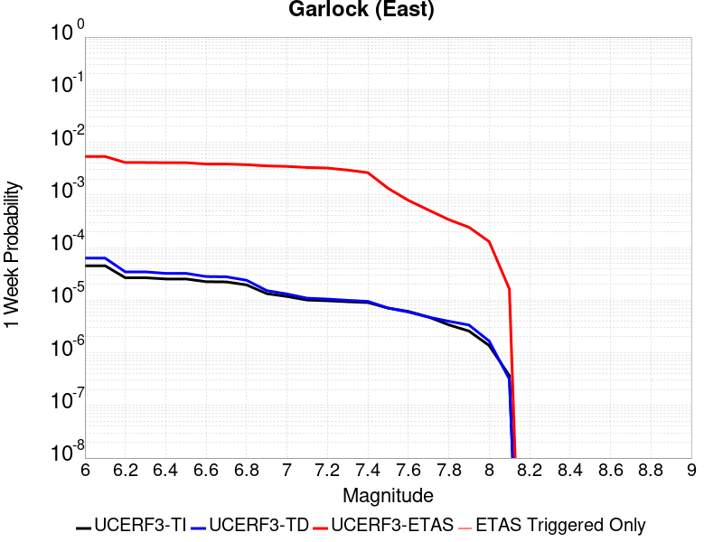 | 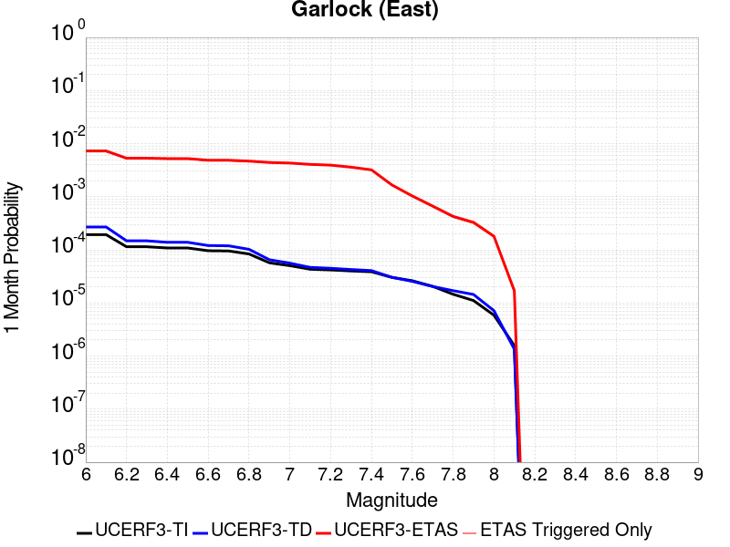 | 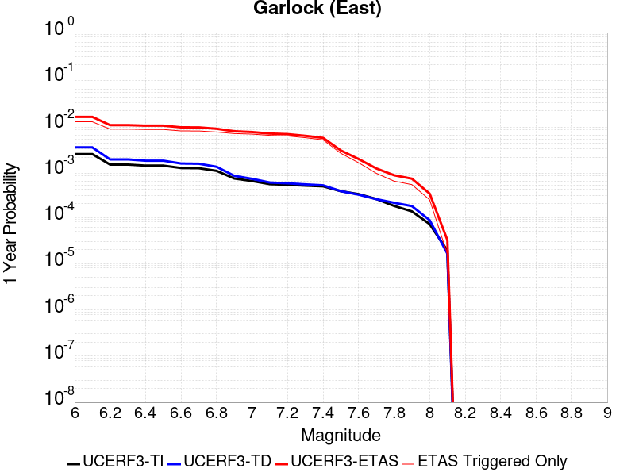 | 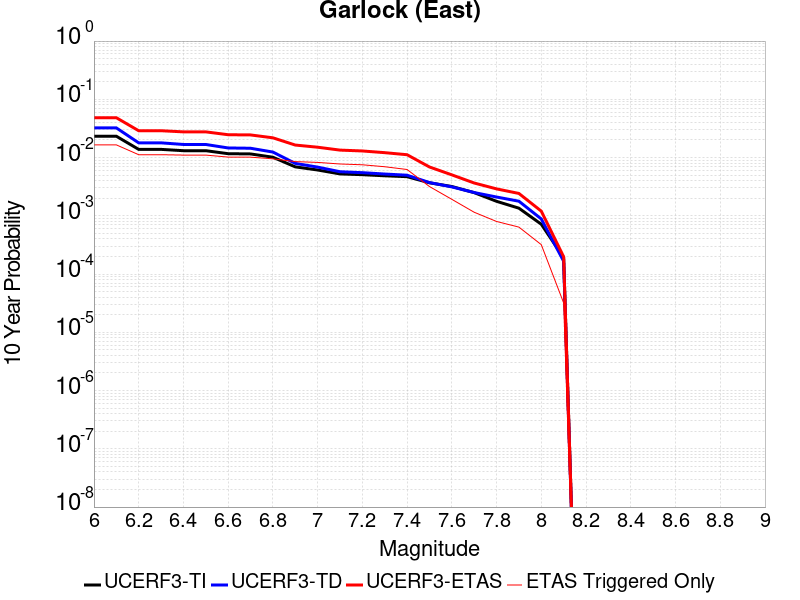 |

| Magnitude | 1 wk TI Prob | 1 wk TD Prob | 1 wk ETAS Prob | 1 wk ETAS/TD Gain | 1 wk ETAS Triggered Only | 1 mo TI Prob | 1 mo TD Prob | 1 mo ETAS Prob | 1 mo ETAS/TD Gain | 1 mo ETAS Triggered Only | 1 yr TI Prob | 1 yr TD Prob | 1 yr ETAS Prob | 1 yr ETAS/TD Gain | 1 yr ETAS Triggered Only | 10 yr TI Prob | 10 yr TD Prob | 10 yr ETAS Prob | 10 yr ETAS/TD Gain | 10 yr ETAS Triggered Only |
|-----|-----|-----|-----|-----|-----|-----|-----|-----|-----|-----|-----|-----|-----|-----|-----|-----|-----|-----|-----|-----|
| 6.0 | 4.5092507E-5 | 6.290325E-5 | 0.0056751342 | 90.22005 | 0.005612584 | 1.9323928E-4 | 2.6956003E-4 | 0.0076279384 | 28.297737 | 0.0073603624 | 0.0023501497 | 0.0032774 | 0.015201856 | 4.638389 | 0.0119636655 | 0.023254504 | 0.032351844 | 0.048525766 | 1.499938 | 0.01671467 |
| 6.1 | 4.5092507E-5 | 6.290325E-5 | 0.0056751342 | 90.22005 | 0.005612584 | 1.9323928E-4 | 2.6956003E-4 | 0.0076279384 | 28.297737 | 0.0073603624 | 0.0023501497 | 0.0032774 | 0.015201856 | 4.638389 | 0.0119636655 | 0.023254504 | 0.032351844 | 0.048525766 | 1.499938 | 0.01671467 |
| 6.2 | 2.6674514E-5 | 3.4509674E-5 | 0.0042438023 | 122.97428 | 0.004209438 | 1.1431433E-4 | 1.4789042E-4 | 0.005439676 | 36.781803 | 0.0052925684 | 0.0013908884 | 0.0017991117 | 0.010055407 | 5.5890956 | 0.008271176 | 0.01382215 | 0.017890299 | 0.029180583 | 1.6310842 | 0.011495951 |
| 6.3 | 2.6674514E-5 | 3.4509674E-5 | 0.0042438023 | 122.97428 | 0.004209438 | 1.1431433E-4 | 1.4789042E-4 | 0.005439676 | 36.781803 | 0.0052925684 | 0.0013908884 | 0.0017991117 | 0.010055407 | 5.5890956 | 0.008271176 | 0.01382215 | 0.017890299 | 0.029180583 | 1.6310842 | 0.011495951 |
| 6.4 | 2.5312667E-5 | 3.233893E-5 | 0.004192409 | 129.6397 | 0.004160205 | 1.0847834E-4 | 1.3858822E-4 | 0.0053319703 | 38.473473 | 0.005194102 | 0.0013199237 | 0.0016860351 | 0.00972209 | 5.7662444 | 0.008049627 | 0.013121112 | 0.016778335 | 0.027839368 | 1.6592449 | 0.011249784 |
| 6.5 | 2.5312667E-5 | 3.233893E-5 | 0.004192409 | 129.6397 | 0.004160205 | 1.0847834E-4 | 1.3858822E-4 | 0.0053319703 | 38.473473 | 0.005194102 | 0.0013199237 | 0.0016860351 | 0.00972209 | 5.7662444 | 0.008049627 | 0.013121112 | 0.016778335 | 0.027839368 | 1.6592449 | 0.011249784 |
| 6.6 | 2.246556E-5 | 2.8133776E-5 | 0.0039420626 | 140.1185 | 0.0039140387 | 9.627742E-5 | 1.20567885E-4 | 0.0049694525 | 41.21705 | 0.0048494693 | 0.0011715472 | 0.0014669491 | 0.008939417 | 6.093883 | 0.007483445 | 0.011653901 | 0.01461866 | 0.024976287 | 1.7085209 | 0.010511287 |
| 6.7 | 2.2241198E-5 | 2.7803519E-5 | 0.0039417334 | 141.77103 | 0.0039140387 | 9.531594E-5 | 1.1915263E-4 | 0.0049680443 | 41.694794 | 0.0048494693 | 0.0011598538 | 0.0014497414 | 0.008922338 | 6.1544337 | 0.007483445 | 0.011538187 | 0.014448853 | 0.024784002 | 1.715292 | 0.01048667 |
| 6.8 | 1.9528685E-5 | 2.389819E-5 | 0.0038147634 | 159.62561 | 0.0037909558 | 8.369167E-5 | 1.0241691E-4 | 0.004779091 | 46.66311 | 0.004677153 | 0.0010184698 | 0.0012462323 | 0.008326977 | 6.681721 | 0.00708958 | 0.010138147 | 0.012436427 | 0.022111988 | 1.7780017 | 0.009797405 |
| 6.9 | 1.3318621E-5 | 1.5198884E-5 | 0.0036583997 | 240.70186 | 0.0036432564 | 5.7078556E-5 | 6.513648E-5 | 0.004545065 | 69.777565 | 0.0044802204 | 6.9470983E-4 | 7.927538E-4 | 0.007433966 | 9.377395 | 0.006646481 | 0.0069254204 | 0.007939888 | 0.016682656 | 2.10112 | 0.008812741 |
| 7.0 | 1.1760853E-5 | 1.31077895E-5 | 0.003533235 | 269.5523 | 0.0035201733 | 5.0402683E-5 | 5.6175057E-5 | 0.0043884525 | 78.12102 | 0.004332521 | 6.134799E-4 | 6.8372174E-4 | 0.0071042604 | 10.390573 | 0.006424932 | 0.0061178906 | 0.00685652 | 0.015291016 | 2.2301424 | 0.008492726 |
| 7.1 | 1.0064758E-5 | 1.0902931E-5 | 0.0032848746 | 301.28363 | 0.0032740072 | 4.3133965E-5 | 4.672603E-5 | 0.0040590437 | 86.86901 | 0.004012505 | 5.2502943E-4 | 5.687444E-4 | 0.006448765 | 11.338599 | 0.0058833663 | 0.005237907 | 0.0057129986 | 0.013471878 | 2.35811 | 0.007803461 |
| 7.2 | 9.768808E-6 | 1.0498807E-5 | 0.0032106228 | 305.80835 | 0.0032001575 | 4.186565E-5 | 4.499413E-5 | 0.0039342414 | 87.43899 | 0.0038894222 | 5.095951E-4 | 5.4766936E-4 | 0.0062555918 | 11.422206 | 0.0057110502 | 0.0050842804 | 0.0055032647 | 0.01301897 | 2.3656812 | 0.0075572953 |
| 7.3 | 9.344516E-6 | 9.944468E-6 | 0.0028900576 | 290.61966 | 0.0028801418 | 4.004731E-5 | 4.261847E-5 | 0.0035380262 | 83.016266 | 0.0034955568 | 4.8746695E-4 | 5.1875977E-4 | 0.005685563 | 10.959915 | 0.005169485 | 0.0048639905 | 0.0052149445 | 0.012145111 | 2.328905 | 0.006966497 |
| 7.4 | 9.023491E-6 | 9.490661E-6 | 0.0025695923 | 270.74957 | 0.0025601261 | 3.867153E-5 | 4.0673647E-5 | 0.003117623 | 76.649704 | 0.0030770747 | 4.7072413E-4 | 4.950925E-4 | 0.0050715124 | 10.2435665 | 0.004578687 | 0.004697283 | 0.0049783974 | 0.011150897 | 2.2398567 | 0.0062033823 |
| 7.5 | 7.081253E-6 | 7.087672E-6 | 0.0012871416 | 181.60287 | 0.0012800631 | 3.0347876E-5 | 3.0375388E-5 | 0.0015811739 | 52.054443 | 0.0015508456 | 3.6942272E-4 | 3.6975832E-4 | 0.0026090404 | 7.056069 | 0.0022401102 | 0.003688092 | 0.0037243143 | 0.0068144538 | 1.8297204 | 0.0031016911 |
| 7.6 | 6.116396E-6 | 5.959245E-6 | 8.183021E-4 | 137.3164 | 8.123477E-4 | 2.6212863E-5 | 2.5539372E-5 | 0.001034794 | 40.5176 | 0.0010092804 | 3.1909486E-4 | 3.1089774E-4 | 0.0018120433 | 5.828422 | 0.0015016124 | 0.0031863707 | 0.0031357552 | 0.0050989077 | 1.6260542 | 0.0019693277 |
| 7.7 | 4.797145E-6 | 4.757281E-6 | 5.2170333E-4 | 109.664185 | 5.169485E-4 | 2.055903E-5 | 2.0388188E-5 | 6.8502274E-4 | 33.599 | 6.6464813E-4 | 2.5027743E-4 | 2.4819805E-4 | 0.001158786 | 4.668796 | 9.108141E-4 | 0.0024999576 | 0.0025093474 | 0.0037370885 | 1.4892671 | 0.0012308299 |
| 7.8 | 3.4028885E-6 | 3.978462E-6 | 3.4860944E-4 | 87.624176 | 3.4463234E-4 | 1.4583726E-5 | 1.7050439E-5 | 4.3552544E-4 | 25.543356 | 4.1848214E-4 | 1.775424E-4 | 2.0756939E-4 | 8.2285656E-4 | 3.964248 | 6.1541493E-4 | 0.0017740062 | 0.0021012232 | 0.0029855585 | 1.420867 | 8.861975E-4 |
| 7.9 | 2.5928412E-6 | 3.3724489E-6 | 2.741541E-4 | 81.29229 | 2.7078256E-4 | 1.1112129E-5 | 1.4453272E-5 | 3.5908064E-4 | 24.844244 | 3.4463234E-4 | 1.3528178E-4 | 1.7595445E-4 | 7.1742426E-4 | 4.0773296 | 5.415651E-4 | 0.0013519945 | 0.0017812408 | 0.0024938504 | 1.4000636 | 7.138813E-4 |
| 8.0 | 1.3743648E-6 | 1.6734747E-6 | 1.7398936E-4 | 103.968925 | 1.7231617E-4 | 5.8901214E-6 | 7.1720146E-6 | 2.287198E-4 | 31.890593 | 2.2154937E-4 | 7.1709874E-5 | 8.731581E-5 | 3.8268918E-4 | 4.3828163 | 2.9539916E-4 | 7.1686733E-4 | 8.837234E-4 | 0.0012772408 | 1.4452949 | 3.9386554E-4 |
| 8.1 | 3.6733252E-7 | 3.1489964E-7 | 2.4931489E-5 | 79.172806 | 2.4616596E-5 | 1.5742813E-6 | 1.3495693E-6 | 2.5966132E-5 | 19.24031 | 2.4616596E-5 | 1.9166706E-5 | 1.6430899E-5 | 4.104709E-5 | 2.4981647 | 2.4616596E-5 | 1.9165053E-4 | 1.6638759E-4 | 2.1561258E-4 | 1.2958454 | 4.9233193E-5 |

## Ash Hill
*[(top)](#table-of-contents)*

| 1 Week | 1 Month | 1 Year | 10 Year |
|-----|-----|-----|-----|
| 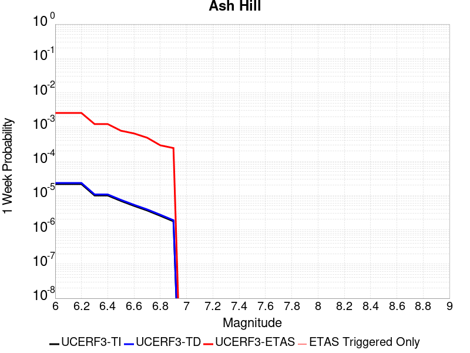 | 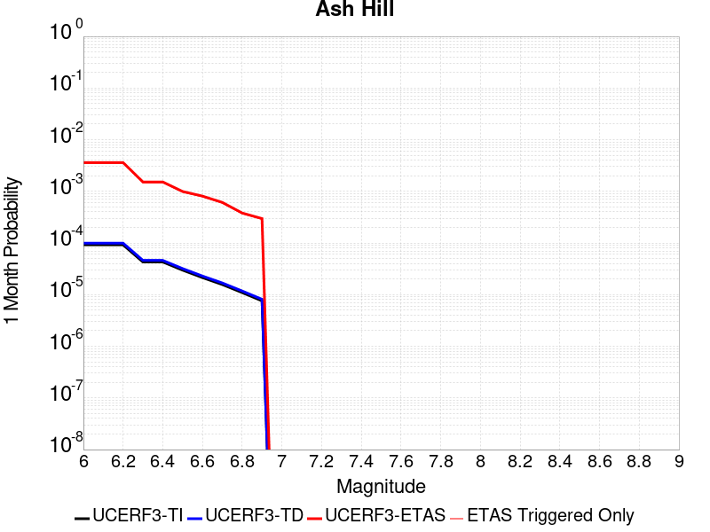 | 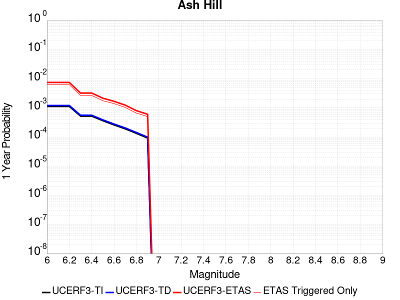 |  |

| Magnitude | 1 wk TI Prob | 1 wk TD Prob | 1 wk ETAS Prob | 1 wk ETAS/TD Gain | 1 wk ETAS Triggered Only | 1 mo TI Prob | 1 mo TD Prob | 1 mo ETAS Prob | 1 mo ETAS/TD Gain | 1 mo ETAS Triggered Only | 1 yr TI Prob | 1 yr TD Prob | 1 yr ETAS Prob | 1 yr ETAS/TD Gain | 1 yr ETAS Triggered Only | 10 yr TI Prob | 10 yr TD Prob | 10 yr ETAS Prob | 10 yr ETAS/TD Gain | 10 yr ETAS Triggered Only |
|-----|-----|-----|-----|-----|-----|-----|-----|-----|-----|-----|-----|-----|-----|-----|-----|-----|-----|-----|-----|-----|
| 6.0 | 2.1545662E-5 | 2.3194447E-5 | 0.002435565 | 105.006386 | 0.0024124265 | 9.2335285E-5 | 9.940143E-5 | 0.003643839 | 36.65781 | 0.00354479 | 0.0011236023 | 0.0012096206 | 0.007675954 | 6.3457537 | 0.006474165 | 0.011179381 | 0.012038348 | 0.021377325 | 1.775769 | 0.009452773 |
| 6.1 | 2.1545662E-5 | 2.3194447E-5 | 0.002435565 | 105.006386 | 0.0024124265 | 9.2335285E-5 | 9.940143E-5 | 0.003643839 | 36.65781 | 0.00354479 | 0.0011236023 | 0.0012096206 | 0.007675954 | 6.3457537 | 0.006474165 | 0.011179381 | 0.012038348 | 0.021377325 | 1.775769 | 0.009452773 |
| 6.2 | 2.1545662E-5 | 2.3194447E-5 | 0.002435565 | 105.006386 | 0.0024124265 | 9.2335285E-5 | 9.940143E-5 | 0.003643839 | 36.65781 | 0.00354479 | 0.0011236023 | 0.0012096206 | 0.007675954 | 6.3457537 | 0.006474165 | 0.011179381 | 0.012038348 | 0.021377325 | 1.775769 | 0.009452773 |
| 6.3 | 1.0025529E-5 | 1.0746934E-5 | 0.0010692492 | 99.493416 | 0.0010585136 | 4.2965847E-5 | 4.605755E-5 | 0.001399908 | 30.394754 | 0.0013539128 | 5.229836E-4 | 5.6061964E-4 | 0.0032423243 | 5.7834654 | 0.002683209 | 0.005217545 | 0.0055933665 | 0.009338639 | 1.6695919 | 0.0037663393 |
| 6.4 | 1.0025529E-5 | 1.0746934E-5 | 0.0010692492 | 99.493416 | 0.0010585136 | 4.2965847E-5 | 4.605755E-5 | 0.001399908 | 30.394754 | 0.0013539128 | 5.229836E-4 | 5.6061964E-4 | 0.0032423243 | 5.7834654 | 0.002683209 | 0.005217545 | 0.0055933665 | 0.009338639 | 1.6695919 | 0.0037663393 |
| 6.5 | 6.9617327E-6 | 7.456634E-6 | 7.213326E-4 | 96.73703 | 7.138813E-4 | 2.9835655E-5 | 3.195666E-5 | 9.4274164E-4 | 29.50063 | 9.108141E-4 | 3.6318856E-4 | 3.8901155E-4 | 0.002185324 | 5.617633 | 0.0017970116 | 0.0036259557 | 0.0038841602 | 0.006458863 | 1.6628726 | 0.0025847426 |
| 6.6 | 4.9919777E-6 | 5.3466883E-6 | 5.9614185E-4 | 111.4974 | 5.907983E-4 | 2.1394015E-5 | 2.2914215E-5 | 7.613952E-4 | 33.228073 | 7.384979E-4 | 2.60441E-4 | 2.7895154E-4 | 0.0017063159 | 6.1168895 | 0.0014277626 | 0.0026013597 | 0.0027866727 | 0.0047259643 | 1.6959167 | 0.0019447111 |
| 6.7 | 3.6630722E-6 | 3.924624E-6 | 4.962546E-4 | 126.44642 | 4.923319E-4 | 1.5698786E-5 | 1.681974E-5 | 6.568405E-4 | 39.05176 | 6.4003153E-4 | 1.9111596E-4 | 2.0476682E-4 | 0.0013861215 | 6.769268 | 0.0011815967 | 0.0019095168 | 0.0020463446 | 0.0035694502 | 1.7443056 | 0.001526229 |
| 6.8 | 2.5599613E-6 | 2.744925E-6 | 2.7352673E-4 | 99.64816 | 2.7078256E-4 | 1.0971216E-5 | 1.1763939E-5 | 4.0562486E-4 | 34.48036 | 3.9386554E-4 | 1.3356637E-4 | 1.4322149E-4 | 8.8161364E-4 | 6.155596 | 7.384979E-4 | 0.0013348613 | 0.0014317769 | 0.0023904496 | 1.6695685 | 9.6004724E-4 |
| 6.9 | 1.7684905E-6 | 1.8968707E-6 | 2.2344582E-4 | 117.79707 | 2.2154937E-4 | 7.579223E-6 | 8.129446E-6 | 3.035262E-4 | 37.33664 | 2.9539916E-4 | 9.2273134E-5 | 9.8976E-5 | 6.4048753E-4 | 6.4711394 | 5.415651E-4 | 9.223483E-4 | 9.8976E-4 | 0.0016537503 | 1.6708598 | 6.6464813E-4 |

## Hunter Mountain-Saline Valley
*[(top)](#table-of-contents)*

| 1 Week | 1 Month | 1 Year | 10 Year |
|-----|-----|-----|-----|
| 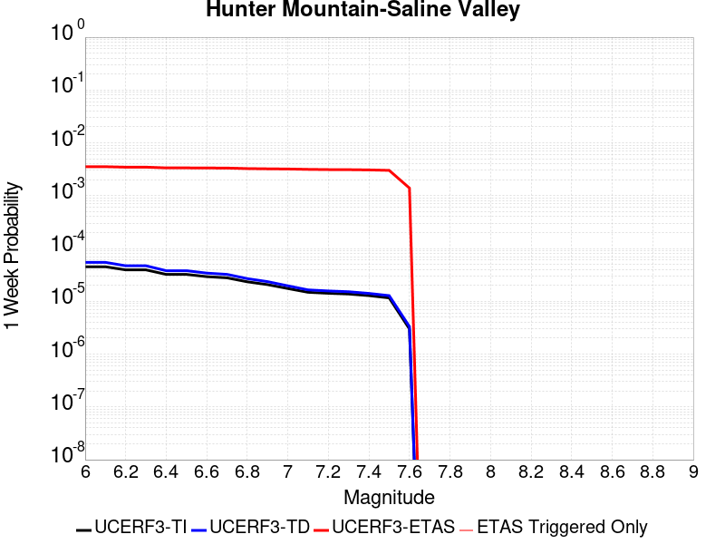 | 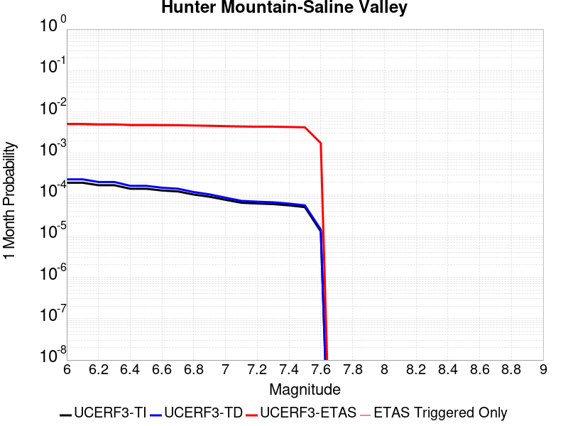 | 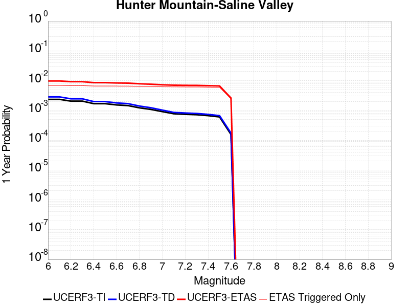 | 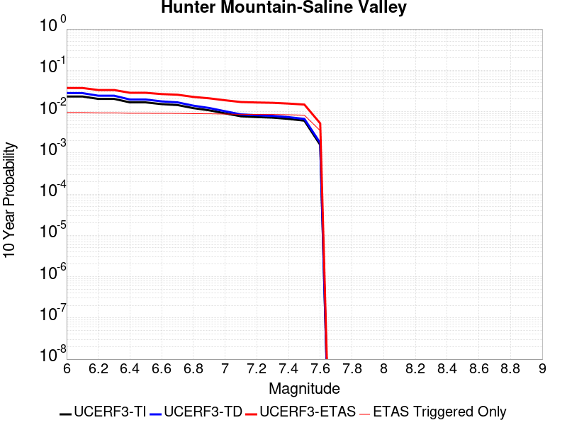 |

| Magnitude | 1 wk TI Prob | 1 wk TD Prob | 1 wk ETAS Prob | 1 wk ETAS/TD Gain | 1 wk ETAS Triggered Only | 1 mo TI Prob | 1 mo TD Prob | 1 mo ETAS Prob | 1 mo ETAS/TD Gain | 1 mo ETAS Triggered Only | 1 yr TI Prob | 1 yr TD Prob | 1 yr ETAS Prob | 1 yr ETAS/TD Gain | 1 yr ETAS Triggered Only | 10 yr TI Prob | 10 yr TD Prob | 10 yr ETAS Prob | 10 yr ETAS/TD Gain | 10 yr ETAS Triggered Only |
|-----|-----|-----|-----|-----|-----|-----|-----|-----|-----|-----|-----|-----|-----|-----|-----|-----|-----|-----|-----|-----|
| 6.0 | 4.5103672E-5 | 5.4570177E-5 | 0.0036730124 | 67.30805 | 0.0036186397 | 1.9328714E-4 | 2.3385242E-4 | 0.0049837446 | 21.311493 | 0.0047510033 | 0.002350731 | 0.0028435152 | 0.00974111 | 3.4257278 | 0.006917264 | 0.023260195 | 0.028091887 | 0.03735089 | 1.329597 | 0.0095266225 |
| 6.1 | 4.5103672E-5 | 5.4570177E-5 | 0.0036730124 | 67.30805 | 0.0036186397 | 1.9328714E-4 | 2.3385242E-4 | 0.0049837446 | 21.311493 | 0.0047510033 | 0.002350731 | 0.0028435152 | 0.00974111 | 3.4257278 | 0.006917264 | 0.023260195 | 0.028091887 | 0.03735089 | 1.329597 | 0.0095266225 |
| 6.2 | 3.9363465E-5 | 4.706337E-5 | 0.003567071 | 75.79294 | 0.0035201733 | 1.6868966E-4 | 2.0168544E-4 | 0.004853284 | 24.06363 | 0.004652537 | 0.002051862 | 0.0024528175 | 0.009205777 | 3.753144 | 0.006769564 | 0.020330196 | 0.024273481 | 0.033352688 | 1.3740381 | 0.009305074 |
| 6.3 | 3.9363465E-5 | 4.706337E-5 | 0.003567071 | 75.79294 | 0.0035201733 | 1.6868966E-4 | 2.0168544E-4 | 0.004853284 | 24.06363 | 0.004652537 | 0.002051862 | 0.0024528175 | 0.009205777 | 3.753144 | 0.006769564 | 0.020330196 | 0.024273481 | 0.033352688 | 1.3740381 | 0.009305074 |
| 6.4 | 3.2311684E-5 | 3.795099E-5 | 0.003459528 | 91.15778 | 0.0034217068 | 1.384713E-4 | 1.6263737E-4 | 0.0046913545 | 28.84549 | 0.004529454 | 0.0016845843 | 0.0019783843 | 0.008562581 | 4.3280673 | 0.006597248 | 0.016718714 | 0.019616475 | 0.028545946 | 1.4552027 | 0.009108141 |
| 6.5 | 3.2311684E-5 | 3.795099E-5 | 0.003459528 | 91.15778 | 0.0034217068 | 1.384713E-4 | 1.6263737E-4 | 0.0046913545 | 28.84549 | 0.004529454 | 0.0016845843 | 0.0019783843 | 0.008562581 | 4.3280673 | 0.006597248 | 0.016718714 | 0.019616475 | 0.028545946 | 1.4552027 | 0.009108141 |
| 6.6 | 2.9305844E-5 | 3.418183E-5 | 0.0034557718 | 101.09966 | 0.0034217068 | 1.2559042E-4 | 1.4648569E-4 | 0.004675276 | 31.916264 | 0.004529454 | 0.0015279909 | 0.001782067 | 0.008342985 | 4.681634 | 0.006572631 | 0.015175272 | 0.01768569 | 0.026608568 | 1.5045252 | 0.009083524 |
| 6.7 | 2.7826512E-5 | 3.2344276E-5 | 0.0034293248 | 106.02571 | 0.0033970904 | 1.19251024E-4 | 1.386113E-4 | 0.004642824 | 33.495277 | 0.004504837 | 0.0014509142 | 0.0016863465 | 0.0082233185 | 4.8764114 | 0.0065480145 | 0.014414776 | 0.016743187 | 0.02565042 | 1.5319915 | 0.009058908 |
| 6.8 | 2.3389874E-5 | 2.6866714E-5 | 0.003350018 | 124.69028 | 0.0033232404 | 1.0023846E-4 | 1.15138246E-4 | 0.0045456155 | 39.47963 | 0.0044309874 | 0.00121972 | 0.001400954 | 0.007841467 | 5.597234 | 0.006449548 | 0.01213047 | 0.013927434 | 0.022690257 | 1.6291772 | 0.0088865915 |
| 6.9 | 2.069209E-5 | 2.3570032E-5 | 0.0032975003 | 139.90224 | 0.0032740072 | 8.867737E-5 | 1.01010715E-4 | 0.004457708 | 44.131042 | 0.0043571377 | 0.0010791123 | 0.0012291478 | 0.007572423 | 6.1607103 | 0.006351082 | 0.010738871 | 0.012228523 | 0.020933498 | 1.7118582 | 0.008812741 |
| 7.0 | 1.7462342E-5 | 1.9633546E-5 | 0.0032689604 | 166.49873 | 0.0032493907 | 7.483646E-5 | 8.414118E-5 | 0.0043670684 | 51.90168 | 0.0042832876 | 9.1075303E-4 | 0.0010239601 | 0.0072455816 | 7.0760393 | 0.006227999 | 0.009070295 | 0.0101960525 | 0.01879711 | 1.8435675 | 0.008689659 |
| 7.1 | 1.4807709E-5 | 1.6441749E-5 | 0.0032165467 | 195.63287 | 0.0032001575 | 6.3460066E-5 | 7.046283E-5 | 0.004304219 | 61.084957 | 0.0042340546 | 7.723524E-4 | 8.575638E-4 | 0.007031031 | 8.198843 | 0.0061787656 | 0.007696735 | 0.008545532 | 0.017038902 | 1.993896 | 0.008566575 |
| 7.2 | 1.4180048E-5 | 1.5698337E-5 | 0.0031665731 | 201.71394 | 0.0031509243 | 6.077022E-5 | 6.727694E-5 | 0.004251817 | 63.198723 | 0.0041848216 | 7.396263E-4 | 8.188051E-4 | 0.006943319 | 8.479818 | 0.0061295326 | 0.0073716943 | 0.008160833 | 0.016608667 | 2.035168 | 0.008517343 |
| 7.3 | 1.3730402E-5 | 1.5172075E-5 | 0.0031660486 | 208.67604 | 0.0031509243 | 5.8843252E-5 | 6.502165E-5 | 0.004249571 | 65.35625 | 0.0041848216 | 7.161811E-4 | 7.9136714E-4 | 0.006916049 | 8.739368 | 0.0061295326 | 0.007138774 | 0.007888422 | 0.016314154 | 2.0681136 | 0.008492726 |
| 7.4 | 1.2810095E-5 | 1.4109277E-5 | 0.003140373 | 222.57504 | 0.0031263079 | 5.489925E-5 | 6.0467017E-5 | 0.004195805 | 69.38998 | 0.004135588 | 6.681934E-4 | 7.359531E-4 | 0.0067625805 | 9.188874 | 0.006031066 | 0.006661878 | 0.007338053 | 0.015646279 | 2.1322112 | 0.008369643 |
| 7.5 | 1.1595659E-5 | 1.2800664E-5 | 0.0030898359 | 241.3809 | 0.0030770747 | 4.9694736E-5 | 5.4858923E-5 | 0.00414099 | 75.484344 | 0.004086355 | 6.0486543E-4 | 6.6771836E-4 | 0.006620957 | 9.915792 | 0.0059572165 | 0.006032217 | 0.0066599925 | 0.014827178 | 2.2263055 | 0.008221943 |
| 7.6 | 2.997694E-6 | 3.3251579E-6 | 0.0013572335 | 408.17114 | 0.0013539128 | 1.28471975E-5 | 1.425064E-5 | 0.0016881553 | 118.46172 | 0.0016739286 | 1.564034E-4 | 1.73495E-4 | 0.0026101153 | 15.044325 | 0.002437043 | 0.0015629337 | 0.001735031 | 0.005150801 | 2.9687085 | 0.0034217068 |

## Blackwater
*[(top)](#table-of-contents)*

| 1 Week | 1 Month | 1 Year | 10 Year |
|-----|-----|-----|-----|
| 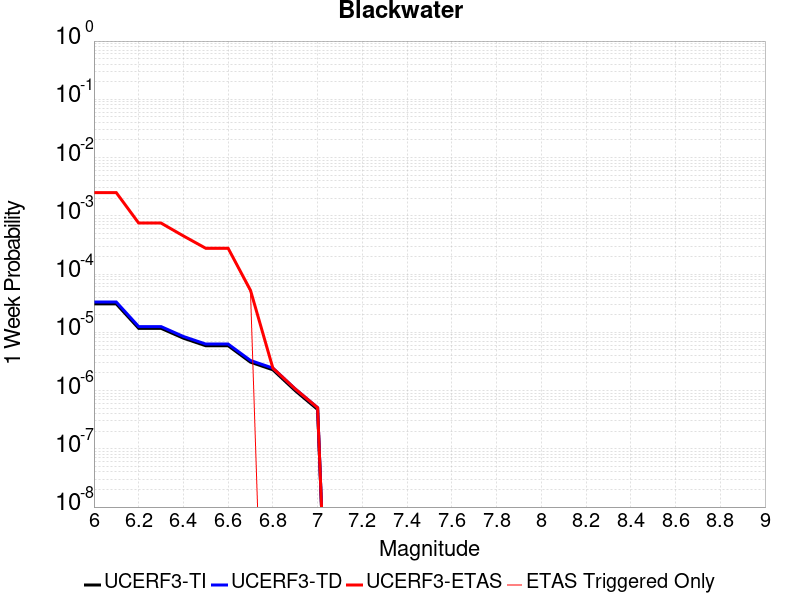 | 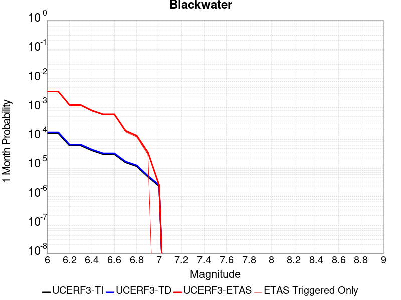 | 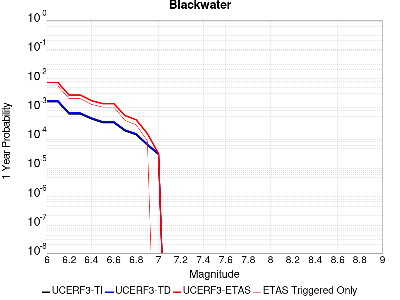 | 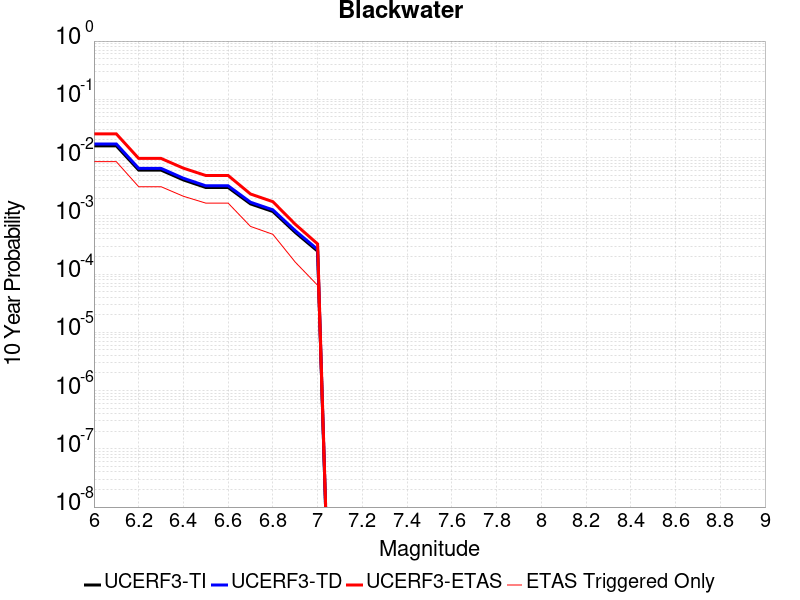 |

| Magnitude | 1 wk TI Prob | 1 wk TD Prob | 1 wk ETAS Prob | 1 wk ETAS/TD Gain | 1 wk ETAS Triggered Only | 1 mo TI Prob | 1 mo TD Prob | 1 mo ETAS Prob | 1 mo ETAS/TD Gain | 1 mo ETAS Triggered Only | 1 yr TI Prob | 1 yr TD Prob | 1 yr ETAS Prob | 1 yr ETAS/TD Gain | 1 yr ETAS Triggered Only | 10 yr TI Prob | 10 yr TD Prob | 10 yr ETAS Prob | 10 yr ETAS/TD Gain | 10 yr ETAS Triggered Only |
|-----|-----|-----|-----|-----|-----|-----|-----|-----|-----|-----|-----|-----|-----|-----|-----|-----|-----|-----|-----|-----|
| 6.0 | 3.0708583E-5 | 3.3095846E-5 | 0.002494674 | 75.37725 | 0.0024616597 | 1.3160157E-4 | 1.4183241E-4 | 0.0035876671 | 25.295115 | 0.0034463236 | 0.0016010714 | 0.0017255784 | 0.007082736 | 4.1045575 | 0.005366418 | 0.015895851 | 0.017135633 | 0.024950545 | 1.4560621 | 0.007951161 |
| 6.1 | 3.0708583E-5 | 3.3095846E-5 | 0.002494674 | 75.37725 | 0.0024616597 | 1.3160157E-4 | 1.4183241E-4 | 0.0035876671 | 25.295115 | 0.0034463236 | 0.0016010714 | 0.0017255784 | 0.007082736 | 4.1045575 | 0.005366418 | 0.015895851 | 0.017135633 | 0.024950545 | 1.4560621 | 0.007951161 |
| 6.2 | 1.1707779E-5 | 1.2545122E-5 | 7.510338E-4 | 59.866596 | 7.384979E-4 | 5.017523E-5 | 5.3763757E-5 | 0.0012352968 | 22.976387 | 0.0011815967 | 6.107122E-4 | 6.5438676E-4 | 0.0024994232 | 3.8194895 | 0.0018462448 | 0.006090366 | 0.0065255696 | 0.009240181 | 1.4159961 | 0.0027324422 |
| 6.3 | 1.1707779E-5 | 1.2545122E-5 | 7.510338E-4 | 59.866596 | 7.384979E-4 | 5.017523E-5 | 5.3763757E-5 | 0.0012352968 | 22.976387 | 0.0011815967 | 6.107122E-4 | 6.5438676E-4 | 0.0024994232 | 3.8194895 | 0.0018462448 | 0.006090366 | 0.0065255696 | 0.009240181 | 1.4159961 | 0.0027324422 |
| 6.4 | 7.929244E-6 | 8.480098E-6 | 4.515751E-4 | 53.251163 | 4.4309875E-4 | 3.3982033E-5 | 3.6342793E-5 | 7.9942954E-4 | 21.996922 | 7.631145E-4 | 4.136527E-4 | 4.423877E-4 | 0.0015496445 | 3.5029104 | 0.0011077469 | 0.0041288356 | 0.0044154758 | 0.006155537 | 1.3940823 | 0.0017477784 |
| 6.5 | 5.8832115E-6 | 6.285991E-6 | 2.7706684E-4 | 44.076878 | 2.7078256E-4 | 2.521352E-5 | 2.6939697E-5 | 5.9310615E-4 | 22.016066 | 5.661817E-4 | 3.0693135E-4 | 3.27944E-4 | 0.0011646338 | 3.5513191 | 8.369643E-4 | 0.0030650778 | 0.0032748538 | 0.0045507248 | 1.3895963 | 0.0012800631 |
| 6.6 | 5.8832115E-6 | 6.285991E-6 | 2.7706684E-4 | 44.076878 | 2.7078256E-4 | 2.521352E-5 | 2.6939697E-5 | 5.9310615E-4 | 22.016066 | 5.661817E-4 | 3.0693135E-4 | 3.27944E-4 | 0.0011646338 | 3.5513191 | 8.369643E-4 | 0.0030650778 | 0.0032748538 | 0.0045507248 | 1.3895963 | 0.0012800631 |
| 6.7 | 3.0715053E-6 | 3.2814662E-6 | 5.2514497E-5 | 16.003365 | 4.9233193E-5 | 1.3163528E-5 | 1.4063357E-5 | 1.6176087E-4 | 11.502294 | 1.4769958E-4 | 1.6025416E-4 | 1.7120909E-4 | 4.4194527E-4 | 2.581319 | 2.7078256E-4 | 0.0016013865 | 0.0017108864 | 0.002202376 | 1.2872719 | 4.923319E-4 |
| 6.8 | 2.2722281E-6 | 2.4287538E-6 | 2.4287538E-6 | 1.0 | 0.0 | 9.738084E-6 | 1.0408908E-5 | 1.0887427E-4 | 10.459721 | 9.8466386E-5 | 1.1855473E-4 | 1.26722E-4 | 2.9901633E-4 | 2.3596246 | 1.7231617E-4 | 0.001184915 | 0.0012665876 | 0.001586198 | 1.2523397 | 3.2001577E-4 |
| 6.9 | 9.952399E-7 | 1.0653489E-6 | 1.0653489E-6 | 1.0 | 0.0 | 4.265307E-6 | 4.5657757E-6 | 2.918226E-5 | 6.391523 | 2.4616596E-5 | 5.1928873E-5 | 5.5587418E-5 | 1.04817875E-4 | 1.8856403 | 4.9233193E-5 | 5.191674E-4 | 5.557858E-4 | 6.7880034E-4 | 1.2213346 | 1.2308298E-4 |
| 7.0 | 4.7385504E-7 | 5.0755597E-7 | 5.0755597E-7 | 1.0 | 0.0 | 2.0308057E-6 | 2.1752398E-6 | 2.1752398E-6 | 1.0 | 0.0 | 2.4724779E-5 | 2.6483543E-5 | 2.6483543E-5 | 1.0 | 0.0 | 2.4722028E-4 | 2.6483546E-4 | 3.140556E-4 | 1.1858518 | 4.9233193E-5 |

## So Sierra Nevada
*[(top)](#table-of-contents)*

| 1 Week | 1 Month | 1 Year | 10 Year |
|-----|-----|-----|-----|
| 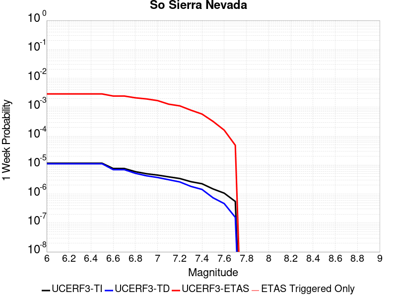 | 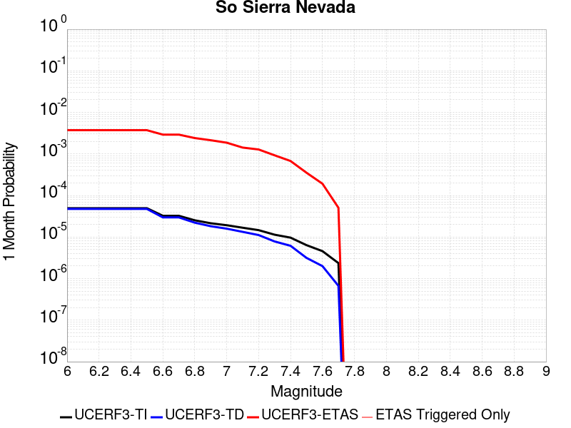 | 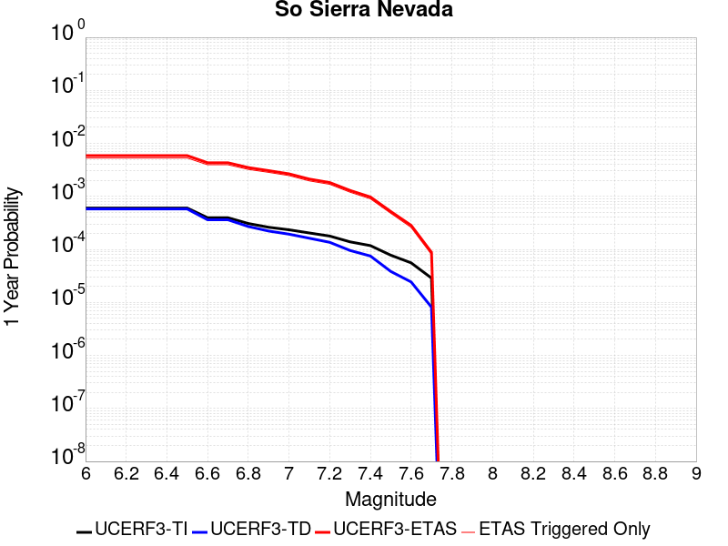 | 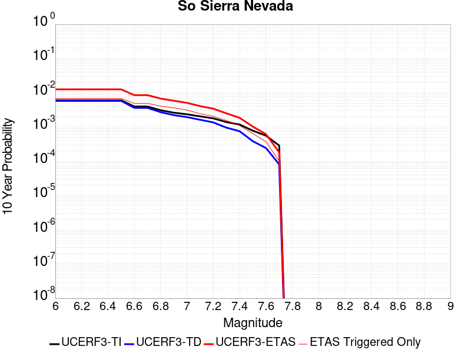 |

| Magnitude | 1 wk TI Prob | 1 wk TD Prob | 1 wk ETAS Prob | 1 wk ETAS/TD Gain | 1 wk ETAS Triggered Only | 1 mo TI Prob | 1 mo TD Prob | 1 mo ETAS Prob | 1 mo ETAS/TD Gain | 1 mo ETAS Triggered Only | 1 yr TI Prob | 1 yr TD Prob | 1 yr ETAS Prob | 1 yr ETAS/TD Gain | 1 yr ETAS Triggered Only | 10 yr TI Prob | 10 yr TD Prob | 10 yr ETAS Prob | 10 yr ETAS/TD Gain | 10 yr ETAS Triggered Only |
|-----|-----|-----|-----|-----|-----|-----|-----|-----|-----|-----|-----|-----|-----|-----|-----|-----|-----|-----|-----|-----|
| 6.0 | 1.15488665E-5 | 1.1079643E-5 | 0.002989655 | 269.83316 | 0.0029786082 | 4.9494203E-5 | 4.748339E-5 | 0.0037397975 | 78.760124 | 0.0036924896 | 6.024253E-4 | 5.7796965E-4 | 0.0057198647 | 9.896479 | 0.0051448685 | 0.006007948 | 0.005765934 | 0.01252094 | 2.1715372 | 0.0067941807 |
| 6.1 | 1.15488665E-5 | 1.1079643E-5 | 0.002989655 | 269.83316 | 0.0029786082 | 4.9494203E-5 | 4.748339E-5 | 0.0037397975 | 78.760124 | 0.0036924896 | 6.024253E-4 | 5.7796965E-4 | 0.0057198647 | 9.896479 | 0.0051448685 | 0.006007948 | 0.005765934 | 0.01252094 | 2.1715372 | 0.0067941807 |
| 6.2 | 1.15488665E-5 | 1.1079643E-5 | 0.002989655 | 269.83316 | 0.0029786082 | 4.9494203E-5 | 4.748339E-5 | 0.0037397975 | 78.760124 | 0.0036924896 | 6.024253E-4 | 5.7796965E-4 | 0.0057198647 | 9.896479 | 0.0051448685 | 0.006007948 | 0.005765934 | 0.01252094 | 2.1715372 | 0.0067941807 |
| 6.3 | 1.15488665E-5 | 1.1079643E-5 | 0.002989655 | 269.83316 | 0.0029786082 | 4.9494203E-5 | 4.748339E-5 | 0.0037397975 | 78.760124 | 0.0036924896 | 6.024253E-4 | 5.7796965E-4 | 0.0057198647 | 9.896479 | 0.0051448685 | 0.006007948 | 0.005765934 | 0.01252094 | 2.1715372 | 0.0067941807 |
| 6.4 | 1.15488665E-5 | 1.1079643E-5 | 0.002989655 | 269.83316 | 0.0029786082 | 4.9494203E-5 | 4.748339E-5 | 0.0037397975 | 78.760124 | 0.0036924896 | 6.024253E-4 | 5.7796965E-4 | 0.0057198647 | 9.896479 | 0.0051448685 | 0.006007948 | 0.005765934 | 0.01252094 | 2.1715372 | 0.0067941807 |
| 6.5 | 1.15488665E-5 | 1.1079643E-5 | 0.002989655 | 269.83316 | 0.0029786082 | 4.9494203E-5 | 4.748339E-5 | 0.0037397975 | 78.760124 | 0.0036924896 | 6.024253E-4 | 5.7796965E-4 | 0.0057198647 | 9.896479 | 0.0051448685 | 0.006007948 | 0.005765934 | 0.01252094 | 2.1715372 | 0.0067941807 |
| 6.6 | 7.587044E-6 | 6.935635E-6 | 0.0026162767 | 377.22238 | 0.0026093593 | 3.2515498E-5 | 2.9723828E-5 | 0.003082091 | 103.69092 | 0.003052458 | 3.9580427E-4 | 3.6183043E-4 | 0.004348276 | 12.017442 | 0.003987889 | 0.003951 | 0.0036127048 | 0.008616348 | 2.385013 | 0.005021786 |
| 6.7 | 7.587044E-6 | 6.935635E-6 | 0.0026162767 | 377.22238 | 0.0026093593 | 3.2515498E-5 | 2.9723828E-5 | 0.003082091 | 103.69092 | 0.003052458 | 3.9580427E-4 | 3.6183043E-4 | 0.004348276 | 12.017442 | 0.003987889 | 0.003951 | 0.0036127048 | 0.008616348 | 2.385013 | 0.005021786 |
| 6.8 | 5.9026956E-6 | 5.1793927E-6 | 0.0022698946 | 438.25494 | 0.002264727 | 2.5297022E-5 | 2.2197215E-5 | 0.0026314985 | 118.55084 | 0.0026093593 | 3.0794772E-4 | 2.7021873E-4 | 0.0035679513 | 13.203938 | 0.003298624 | 0.0030752132 | 0.002699018 | 0.0068479944 | 2.537217 | 0.004160205 |
| 6.9 | 5.0118915E-6 | 4.2524252E-6 | 0.0020228047 | 475.68262 | 0.002018561 | 2.1479358E-5 | 1.8224557E-5 | 0.0023321426 | 127.96703 | 0.00231396 | 2.614798E-4 | 2.2186211E-4 | 0.0031505872 | 14.200654 | 0.002929375 | 0.0026117235 | 0.0022164788 | 0.00585166 | 2.6400704 | 0.0036432564 |
| 7.0 | 4.4924795E-6 | 3.7139177E-6 | 0.0017761022 | 478.22876 | 0.001772395 | 1.925334E-5 | 1.5916696E-5 | 0.0020836778 | 130.91145 | 0.002067794 | 2.3438422E-4 | 1.9376918E-4 | 0.002778011 | 14.336702 | 0.0025847426 | 0.0023413717 | 0.0019360651 | 0.005080889 | 2.624338 | 0.0031509243 |
| 7.1 | 3.9118436E-6 | 3.1119775E-6 | 0.001283171 | 412.33298 | 0.0012800631 | 1.6764936E-5 | 1.3336982E-5 | 0.0015395456 | 115.43433 | 0.001526229 | 2.0409399E-4 | 1.6236622E-4 | 0.002082149 | 12.823782 | 0.0019200945 | 0.0020390663 | 0.001622532 | 0.003981891 | 2.4541216 | 0.0023631933 |
| 7.2 | 3.4200818E-6 | 2.6054543E-6 | 0.0011595825 | 445.0596 | 0.00115698 | 1.4657411E-5 | 1.11661875E-5 | 0.0013650638 | 122.24977 | 0.0013539128 | 1.7843937E-4 | 1.3594035E-4 | 0.0017604149 | 12.949906 | 0.0016246954 | 0.0017829615 | 0.0013586218 | 0.0033744401 | 2.4837232 | 0.002018561 |
| 7.3 | 2.6593618E-6 | 1.8284203E-6 | 8.387912E-4 | 458.75183 | 8.369643E-4 | 1.13972155E-5 | 7.836065E-6 | 9.924922E-4 | 126.65697 | 9.846638E-4 | 1.3875226E-4 | 9.540021E-5 | 0.0012768841 | 13.3845005 | 0.0011815967 | 0.0013866565 | 9.5362146E-4 | 0.002453802 | 2.5731404 | 0.0015016124 |
| 7.4 | 2.2577992E-6 | 1.436438E-6 | 5.922339E-4 | 412.2934 | 5.907983E-4 | 9.676246E-6 | 6.15615E-6 | 6.954166E-4 | 112.96291 | 6.892647E-4 | 1.1780193E-4 | 7.49488E-5 | 9.6107984E-4 | 12.823152 | 8.861975E-4 | 0.001177395 | 7.492603E-4 | 0.001831579 | 2.4445162 | 0.0010831302 |
| 7.5 | 1.489319E-6 | 7.353936E-7 | 3.9460065E-4 | 536.5843 | 3.9386554E-4 | 6.3827797E-6 | 3.1516831E-6 | 4.4624903E-4 | 141.5907 | 4.4309875E-4 | 7.770758E-5 | 3.8371072E-5 | 5.799154E-4 | 15.11335 | 5.415651E-4 | 7.7680405E-4 | 3.836449E-4 | 0.0010726452 | 2.7959323 | 6.892647E-4 |
| 7.6 | 1.0680322E-6 | 4.6596554E-7 | 1.9739865E-4 | 423.63358 | 1.9693277E-4 | 4.577273E-6 | 1.9969937E-6 | 2.2354593E-4 | 111.94122 | 2.2154937E-4 | 5.5726876E-5 | 2.4313129E-5 | 3.197051E-4 | 13.149484 | 2.9539916E-4 | 5.5712904E-4 | 2.4310495E-4 | 6.6148536E-4 | 2.7209868 | 4.1848214E-4 |
| 7.7 | 5.509146E-7 | 1.5580486E-7 | 4.938899E-5 | 316.9926 | 4.9233193E-5 | 2.3610605E-6 | 6.677349E-7 | 4.9900897E-5 | 74.73159 | 4.9233193E-5 | 2.8745531E-5 | 8.129644E-6 | 8.197883E-5 | 10.08394 | 7.384979E-5 | 2.8741814E-4 | 8.1293576E-5 | 1.7975197E-4 | 2.2111459 | 9.8466386E-5 |

## Garlock (West)
*[(top)](#table-of-contents)*

| 1 Week | 1 Month | 1 Year | 10 Year |
|-----|-----|-----|-----|
| 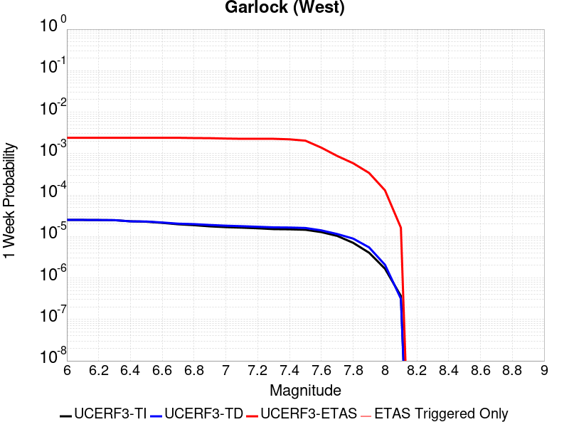 | 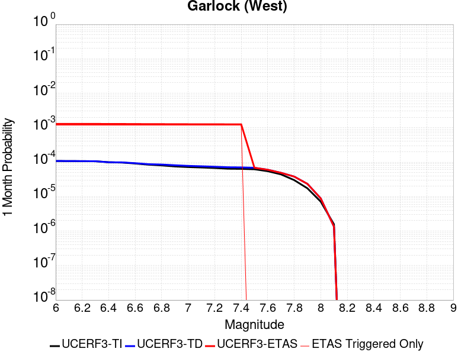 | 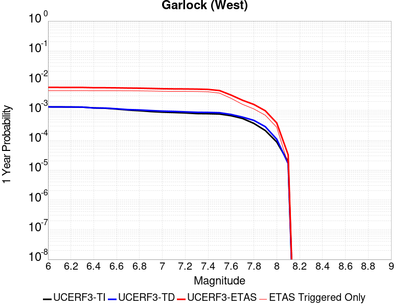 | 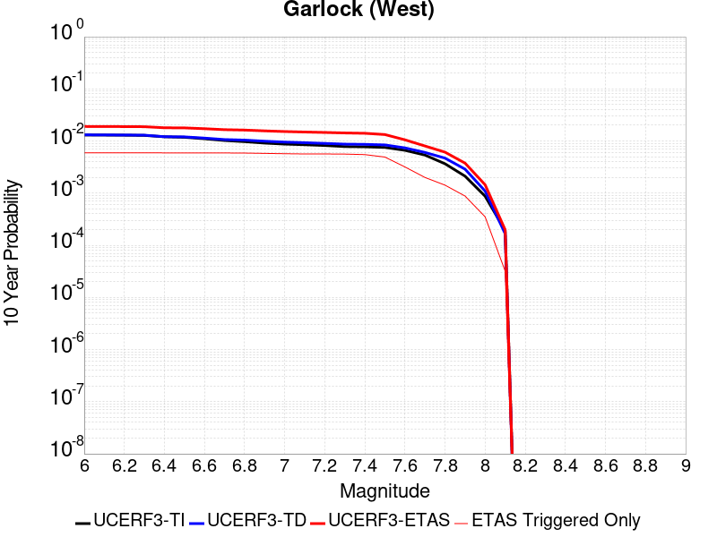 |

| Magnitude | 1 wk TI Prob | 1 wk TD Prob | 1 wk ETAS Prob | 1 wk ETAS/TD Gain | 1 wk ETAS Triggered Only | 1 mo TI Prob | 1 mo TD Prob | 1 mo ETAS Prob | 1 mo ETAS/TD Gain | 1 mo ETAS Triggered Only | 1 yr TI Prob | 1 yr TD Prob | 1 yr ETAS Prob | 1 yr ETAS/TD Gain | 1 yr ETAS Triggered Only | 10 yr TI Prob | 10 yr TD Prob | 10 yr ETAS Prob | 10 yr ETAS/TD Gain | 10 yr ETAS Triggered Only |
|-----|-----|-----|-----|-----|-----|-----|-----|-----|-----|-----|-----|-----|-----|-----|-----|-----|-----|-----|-----|-----|
| 6.0 | 2.5181727E-5 | 2.51973E-5 | 0.0022406352 | 88.92362 | 0.0022154937 | 1.0791722E-4 | 1.0798398E-4 | 0.002913973 | 26.985235 | 0.002806292 | 0.0013131002 | 0.0013139155 | 0.0054194857 | 4.1246834 | 0.0041109715 | 0.013053683 | 0.013141977 | 0.01860792 | 1.4159149 | 0.005538734 |
| 6.1 | 2.5077732E-5 | 2.5098372E-5 | 0.0022405365 | 89.27019 | 0.0022154937 | 1.0747157E-4 | 1.0756004E-4 | 0.0029135502 | 27.087664 | 0.002806292 | 0.001307681 | 0.0013087603 | 0.0054143514 | 4.137008 | 0.0041109715 | 0.013000126 | 0.013091032 | 0.018557258 | 1.417555 | 0.005538734 |
| 6.2 | 2.494612E-5 | 2.498005E-5 | 0.0022404185 | 89.68831 | 0.0022154937 | 1.0690756E-4 | 1.0705298E-4 | 0.0029130445 | 27.21124 | 0.002806292 | 0.0013008224 | 0.0013025942 | 0.0054082107 | 4.151877 | 0.0041109715 | 0.012932341 | 0.013030097 | 0.01849666 | 1.4195336 | 0.005538734 |
| 6.3 | 2.4733758E-5 | 2.479942E-5 | 0.0022402382 | 90.3343 | 0.0022154937 | 1.0599751E-4 | 1.06278916E-4 | 0.0029122727 | 27.402168 | 0.002806292 | 0.0012897556 | 0.0012931811 | 0.0053988365 | 4.1748495 | 0.0041109715 | 0.012822957 | 0.012937066 | 0.018404145 | 1.4225904 | 0.005538734 |
| 6.4 | 2.3237335E-5 | 2.317873E-5 | 0.002238621 | 96.58083 | 0.0022154937 | 9.958477E-5 | 9.933365E-5 | 0.002905347 | 29.248365 | 0.002806292 | 0.0012117702 | 0.001208719 | 0.005290135 | 4.3766456 | 0.004086355 | 0.012051838 | 0.012101916 | 0.017549302 | 1.4501259 | 0.0055141174 |
| 6.5 | 2.2732203E-5 | 2.2993298E-5 | 0.0022384361 | 97.35168 | 0.0022154937 | 9.742009E-5 | 9.8539E-5 | 0.0029045544 | 29.476192 | 0.002806292 | 0.0011854442 | 0.0011990548 | 0.00528051 | 4.403894 | 0.004086355 | 0.011791403 | 0.012006322 | 0.017454235 | 1.4537537 | 0.0055141174 |
| 6.6 | 2.1319436E-5 | 2.17735E-5 | 0.002237219 | 102.749626 | 0.0022154937 | 9.136581E-5 | 9.331167E-5 | 0.0028993418 | 31.071589 | 0.002806292 | 0.001111811 | 0.0011354799 | 0.005217195 | 4.594705 | 0.004086355 | 0.011062649 | 0.011377227 | 0.016828608 | 1.4791486 | 0.0055141174 |
| 6.7 | 1.970802E-5 | 2.0393396E-5 | 0.002235842 | 109.63559 | 0.0022154937 | 8.446021E-5 | 8.739735E-5 | 0.0028934442 | 33.106773 | 0.002806292 | 0.001027818 | 0.001063545 | 0.005145554 | 4.8381157 | 0.004086355 | 0.010230771 | 0.010664964 | 0.016120274 | 1.5115169 | 0.0055141174 |
| 6.8 | 1.8744462E-5 | 1.9901045E-5 | 0.0022353507 | 112.32328 | 0.0022154937 | 8.033094E-5 | 8.5287415E-5 | 0.00289134 | 33.901134 | 0.002806292 | 9.775903E-4 | 0.0010378812 | 0.005119995 | 4.933122 | 0.004086355 | 0.009733009 | 0.01041075 | 0.015867462 | 1.524142 | 0.0055141174 |
| 6.9 | 1.7559682E-5 | 1.8953415E-5 | 0.002209789 | 116.590546 | 0.002190877 | 7.5253614E-5 | 8.12264E-5 | 0.0028626758 | 35.24317 | 0.0027816754 | 9.158276E-4 | 9.884841E-4 | 0.0050216154 | 5.080117 | 0.004037122 | 0.0091206245 | 0.009921231 | 0.015307525 | 1.5429058 | 0.0054402677 |
| 7.0 | 1.6794445E-5 | 1.8216237E-5 | 0.0021844374 | 119.91704 | 0.0021662605 | 7.197421E-5 | 7.8067256E-5 | 0.0028102961 | 35.998398 | 0.0027324422 | 8.759337E-4 | 9.5005584E-4 | 0.004934156 | 5.193543 | 0.003987889 | 0.008724891 | 0.009540141 | 0.014879744 | 1.5596986 | 0.0053910348 |
| 7.1 | 1.6337795E-5 | 1.7717046E-5 | 0.002183939 | 123.267685 | 0.0021662605 | 7.0017246E-5 | 7.5927994E-5 | 0.0028081627 | 36.98455 | 0.0027324422 | 8.521265E-4 | 9.240326E-4 | 0.004908236 | 5.3117566 | 0.003987889 | 0.008488664 | 0.009281996 | 0.014574215 | 1.5701596 | 0.0053418013 |
| 7.2 | 1.5780008E-5 | 1.7165687E-5 | 0.002183389 | 127.19497 | 0.0021662605 | 6.762685E-5 | 7.356516E-5 | 0.0028058065 | 38.140423 | 0.0027324422 | 8.2304585E-4 | 8.9528906E-4 | 0.0048796074 | 5.450315 | 0.003987889 | 0.008200042 | 0.008996838 | 0.0142905805 | 1.5884002 | 0.0053418013 |
| 7.3 | 1.5058865E-5 | 1.6618762E-5 | 0.0021828432 | 131.34813 | 0.0021662605 | 6.45364E-5 | 7.122133E-5 | 0.0028034688 | 39.362774 | 0.0027324422 | 7.854473E-4 | 8.667759E-4 | 0.004826613 | 5.5684667 | 0.003963272 | 0.00782677 | 0.008713539 | 0.0139843915 | 1.6049039 | 0.005317185 |
| 7.4 | 1.4887923E-5 | 1.6454731E-5 | 0.002108831 | 128.15955 | 0.0020924108 | 6.380382E-5 | 7.051838E-5 | 0.0027289232 | 38.698044 | 0.0026585925 | 7.7653467E-4 | 8.582243E-4 | 0.0047197132 | 5.4993935 | 0.0038648057 | 0.0077382675 | 0.008628399 | 0.013777684 | 1.5967834 | 0.005194102 |
| 7.5 | 1.4509299E-5 | 1.6046748E-5 | 0.0019114943 | 119.120346 | 0.0018954779 | 6.218123E-5 | 6.876997E-5 | 0.002357956 | 34.287582 | 0.0022893434 | 7.567935E-4 | 8.36954E-4 | 0.004231201 | 5.0554767 | 0.0033970904 | 0.0075422134 | 0.008416704 | 0.013030082 | 1.5481217 | 0.004652537 |
| 7.6 | 1.2756717E-5 | 1.4050848E-5 | 0.0013433284 | 95.60479 | 0.0013292963 | 5.4670498E-5 | 6.0216535E-5 | 0.0016601989 | 27.570482 | 0.0016000788 | 6.6541E-4 | 7.328904E-4 | 0.003069753 | 4.188557 | 0.0023385766 | 0.006634211 | 0.0073816874 | 0.010411614 | 1.4104651 | 0.003052458 |
| 7.7 | 1.0328985E-5 | 1.1460557E-5 | 8.2379894E-4 | 71.88123 | 8.123477E-4 | 4.4266326E-5 | 4.911575E-5 | 0.001082962 | 22.04918 | 0.001033897 | 5.388092E-4 | 5.978206E-4 | 0.0020985352 | 3.5103095 | 0.0015016124 | 0.0053750467 | 0.006038511 | 0.007947011 | 1.3160547 | 0.0019200945 |
| 7.8 | 7.0306583E-6 | 8.899601E-6 | 5.7507626E-4 | 64.61821 | 5.661817E-4 | 3.0131043E-5 | 3.814059E-5 | 7.27379E-4 | 19.070995 | 6.892647E-4 | 3.667837E-4 | 4.642629E-4 | 0.0015468902 | 3.3319273 | 0.0010831302 | 0.003661789 | 0.0046952725 | 0.006116331 | 1.3026574 | 0.0014277626 |
| 7.9 | 4.060633E-6 | 5.4653938E-6 | 3.5009586E-4 | 64.05684 | 3.4463234E-4 | 1.7402595E-5 | 2.3422906E-5 | 4.4189524E-4 | 18.865944 | 4.1848214E-4 | 2.11856E-4 | 2.851367E-4 | 9.4959524E-4 | 3.330316 | 6.6464813E-4 | 0.0021165414 | 0.002884201 | 0.0037678424 | 1.3063731 | 8.861975E-4 |
| 8.0 | 1.6729537E-6 | 2.0775144E-6 | 1.7439334E-4 | 83.94326 | 1.7231617E-4 | 7.169782E-6 | 8.903603E-6 | 2.30451E-4 | 25.882893 | 2.2154937E-4 | 8.7288594E-5 | 1.0839601E-4 | 4.0376314E-4 | 3.7248895 | 2.9539916E-4 | 8.7254314E-4 | 0.0010969337 | 0.0014903672 | 1.3586665 | 3.9386554E-4 |
| 8.1 | 3.6733252E-7 | 3.1489964E-7 | 2.4931489E-5 | 79.172806 | 2.4616596E-5 | 1.5742813E-6 | 1.3495693E-6 | 2.5966132E-5 | 19.24031 | 2.4616596E-5 | 1.9166706E-5 | 1.6430899E-5 | 4.104709E-5 | 2.4981647 | 2.4616596E-5 | 1.9165053E-4 | 1.6638759E-4 | 2.1561258E-4 | 1.2958454 | 4.9233193E-5 |

## McLean Lake
*[(top)](#table-of-contents)*

| 1 Week | 1 Month | 1 Year | 10 Year |
|-----|-----|-----|-----|
| 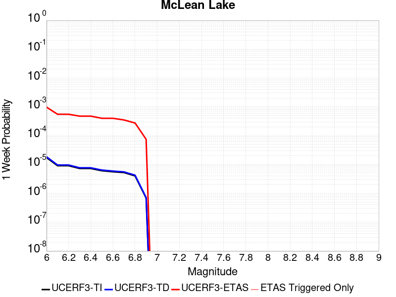 | 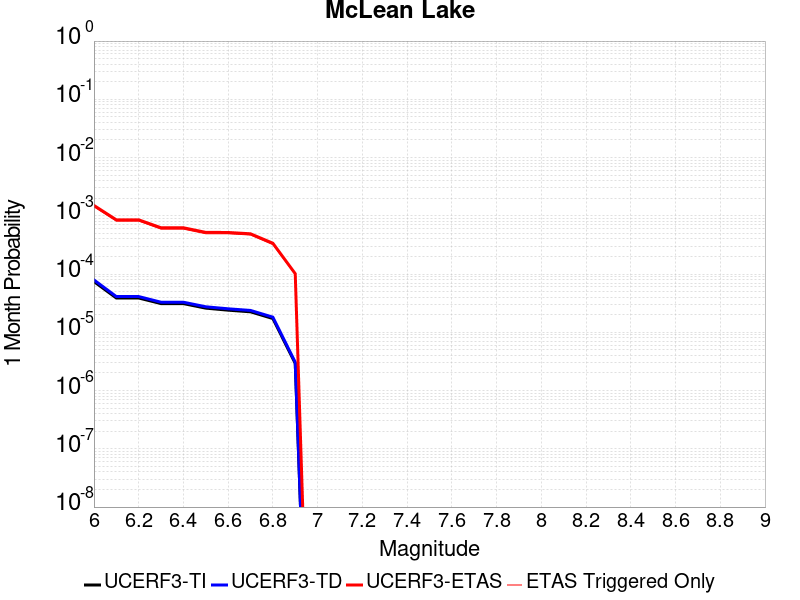 | 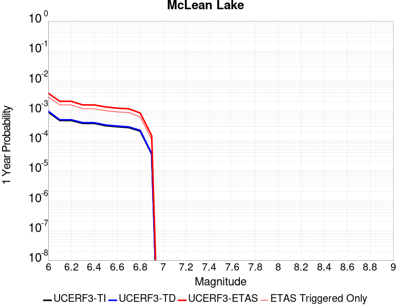 | 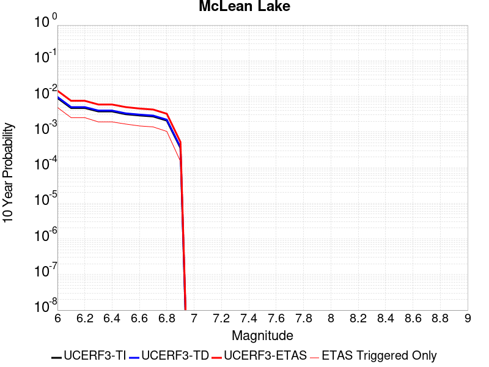 |

| Magnitude | 1 wk TI Prob | 1 wk TD Prob | 1 wk ETAS Prob | 1 wk ETAS/TD Gain | 1 wk ETAS Triggered Only | 1 mo TI Prob | 1 mo TD Prob | 1 mo ETAS Prob | 1 mo ETAS/TD Gain | 1 mo ETAS Triggered Only | 1 yr TI Prob | 1 yr TD Prob | 1 yr ETAS Prob | 1 yr ETAS/TD Gain | 1 yr ETAS Triggered Only | 10 yr TI Prob | 10 yr TD Prob | 10 yr ETAS Prob | 10 yr ETAS/TD Gain | 10 yr ETAS Triggered Only |
|-----|-----|-----|-----|-----|-----|-----|-----|-----|-----|-----|-----|-----|-----|-----|-----|-----|-----|-----|-----|-----|
| 6.0 | 1.7360222E-5 | 1.8501627E-5 | 9.785311E-4 | 52.888924 | 9.6004724E-4 | 7.439883E-5 | 7.9290556E-5 | 0.00150694 | 19.00529 | 0.0014277626 | 9.0542925E-4 | 9.6498354E-4 | 0.0039653103 | 4.1092 | 0.0030032247 | 0.009017491 | 0.0096127745 | 0.0144400075 | 1.5021685 | 0.004874086 |
| 6.1 | 9.062689E-6 | 9.592193E-6 | 5.511521E-4 | 57.458405 | 5.415651E-4 | 3.8839516E-5 | 4.1108804E-5 | 8.534231E-4 | 20.760105 | 8.123477E-4 | 4.727685E-4 | 5.003936E-4 | 0.0021488804 | 4.2943797 | 0.001649312 | 0.0047176396 | 0.004993552 | 0.007736843 | 1.5493667 | 0.0027570587 |
| 6.2 | 9.062689E-6 | 9.592193E-6 | 5.511521E-4 | 57.458405 | 5.415651E-4 | 3.8839516E-5 | 4.1108804E-5 | 8.534231E-4 | 20.760105 | 8.123477E-4 | 4.727685E-4 | 5.003936E-4 | 0.0021488804 | 4.2943797 | 0.001649312 | 0.0047176396 | 0.004993552 | 0.007736843 | 1.5493667 | 0.0027570587 |
| 6.3 | 7.2575485E-6 | 7.66771E-6 | 4.7537946E-4 | 61.997585 | 4.6771532E-4 | 3.110341E-5 | 3.2861237E-5 | 6.2364014E-4 | 18.977987 | 5.907983E-4 | 3.786182E-4 | 4.0001926E-4 | 0.0016303568 | 4.0756955 | 0.0012308299 | 0.0037797375 | 0.0039936965 | 0.006151306 | 1.5402536 | 0.0021662605 |
| 6.4 | 7.2575485E-6 | 7.66771E-6 | 4.7537946E-4 | 61.997585 | 4.6771532E-4 | 3.110341E-5 | 3.2861237E-5 | 6.2364014E-4 | 18.977987 | 5.907983E-4 | 3.786182E-4 | 4.0001926E-4 | 0.0016303568 | 4.0756955 | 0.0012308299 | 0.0037797375 | 0.0039936965 | 0.006151306 | 1.5402536 | 0.0021662605 |
| 6.5 | 6.06582E-6 | 6.4038773E-6 | 4.002669E-4 | 62.503838 | 3.9386554E-4 | 2.5996113E-5 | 2.7444936E-5 | 5.197633E-4 | 18.938406 | 4.923319E-4 | 3.164567E-4 | 3.3409733E-4 | 0.001367649 | 4.0935645 | 0.001033897 | 0.0031600643 | 0.0033365893 | 0.0052012084 | 1.5588398 | 0.0018708613 |
| 6.6 | 5.598744E-6 | 5.910262E-6 | 3.9977347E-4 | 67.640564 | 3.9386554E-4 | 2.3994397E-5 | 2.5329486E-5 | 5.1764894E-4 | 20.436615 | 4.923319E-4 | 2.9209262E-4 | 3.0834923E-4 | 0.0012681005 | 4.112546 | 9.6004724E-4 | 0.0029170897 | 0.003079843 | 0.0047486164 | 1.5418371 | 0.0016739286 |
| 6.7 | 5.246996E-6 | 5.539162E-6 | 3.501696E-4 | 63.21707 | 3.4463234E-4 | 2.2486933E-5 | 2.3739085E-5 | 4.914433E-4 | 20.701864 | 4.6771532E-4 | 2.73744E-4 | 2.8899137E-4 | 0.0011995422 | 4.150789 | 9.108141E-4 | 0.0027340704 | 0.0028867796 | 0.004433148 | 1.5356725 | 0.0015508456 |
| 6.8 | 4.02324E-6 | 4.2469046E-6 | 2.7502832E-4 | 64.75971 | 2.7078256E-4 | 1.7242342E-5 | 1.8200926E-5 | 3.3821087E-4 | 18.58207 | 3.2001577E-4 | 2.099053E-4 | 2.2157968E-4 | 8.860805E-4 | 3.9989247 | 6.6464813E-4 | 0.0020970714 | 0.002214172 | 0.0033685903 | 1.521377 | 0.00115698 |
| 6.9 | 6.835972E-7 | 7.1399285E-7 | 7.456373E-5 | 104.432045 | 7.384979E-5 | 2.9296991E-6 | 3.0599674E-6 | 1.0152605E-4 | 33.178802 | 9.8466386E-5 | 3.56685E-5 | 3.7254784E-5 | 1.8494886E-4 | 4.9644322 | 1.4769958E-4 | 3.5662777E-4 | 3.7251666E-4 | 5.2016124E-4 | 1.3963435 | 1.4769958E-4 |

## Gravel Hills-Harper Lk
*[(top)](#table-of-contents)*

| 1 Week | 1 Month | 1 Year | 10 Year |
|-----|-----|-----|-----|
| 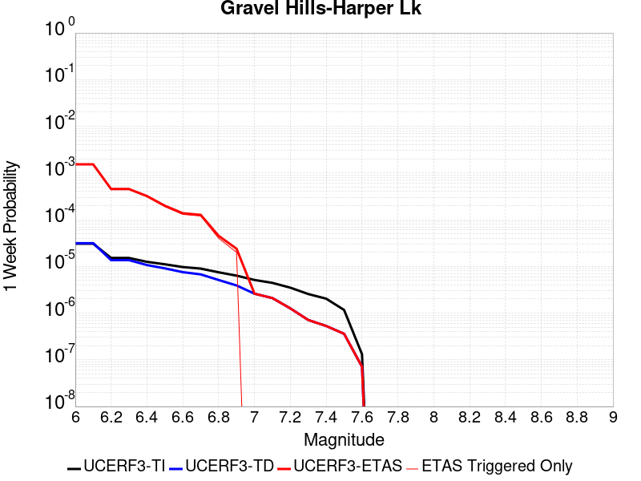 | 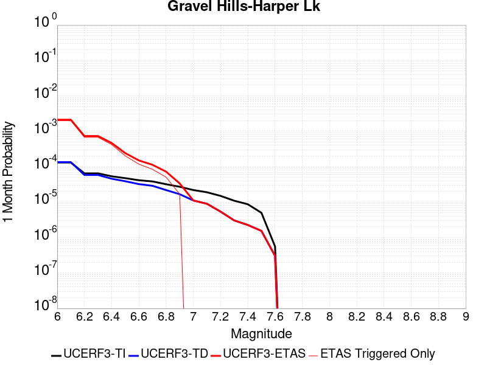 | 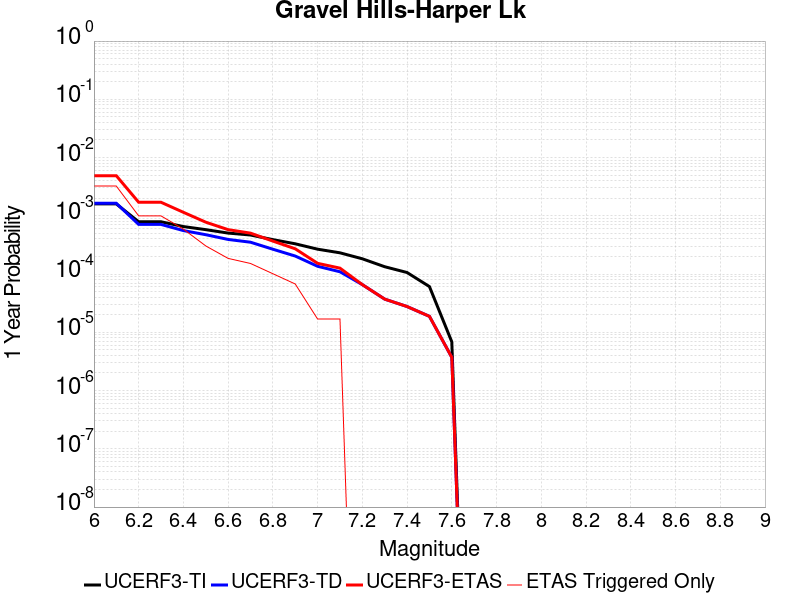 | 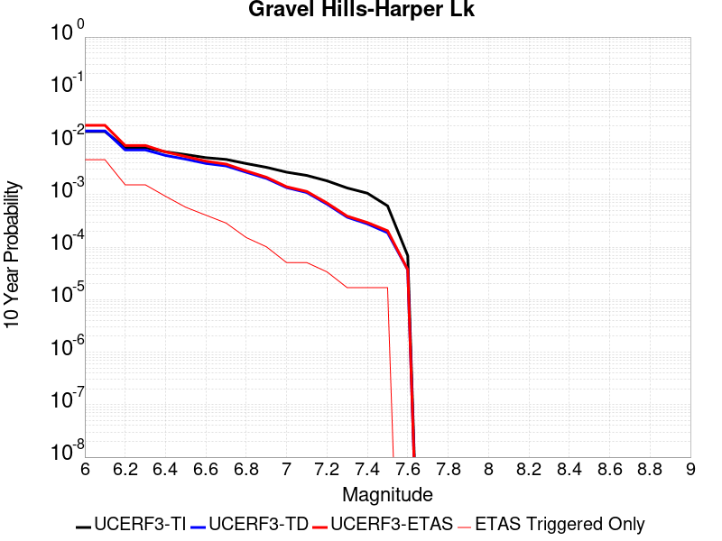 |

| Magnitude | 1 wk TI Prob | 1 wk TD Prob | 1 wk ETAS Prob | 1 wk ETAS/TD Gain | 1 wk ETAS Triggered Only | 1 mo TI Prob | 1 mo TD Prob | 1 mo ETAS Prob | 1 mo ETAS/TD Gain | 1 mo ETAS Triggered Only | 1 yr TI Prob | 1 yr TD Prob | 1 yr ETAS Prob | 1 yr ETAS/TD Gain | 1 yr ETAS Triggered Only | 10 yr TI Prob | 10 yr TD Prob | 10 yr ETAS Prob | 10 yr ETAS/TD Gain | 10 yr ETAS Triggered Only |
|-----|-----|-----|-----|-----|-----|-----|-----|-----|-----|-----|-----|-----|-----|-----|-----|-----|-----|-----|-----|-----|
| 6.0 | 3.0679566E-5 | 3.1464646E-5 | 0.0015822614 | 50.28696 | 0.0015508456 | 1.3147724E-4 | 1.3484273E-4 | 0.0021777446 | 16.150255 | 0.0020431776 | 0.0015995599 | 0.0016406906 | 0.004761869 | 2.9023564 | 0.0031263079 | 0.015880952 | 0.01630734 | 0.020738713 | 1.2717412 | 0.004504837 |
| 6.1 | 3.0679566E-5 | 3.1464646E-5 | 0.0015822614 | 50.28696 | 0.0015508456 | 1.3147724E-4 | 1.3484273E-4 | 0.0021777446 | 16.150255 | 0.0020431776 | 0.0015995599 | 0.0016406906 | 0.004761869 | 2.9023564 | 0.0031263079 | 0.015880952 | 0.01630734 | 0.020738713 | 1.2717412 | 0.004504837 |
| 6.2 | 1.514536E-5 | 1.3635206E-5 | 5.305767E-4 | 38.91226 | 5.169485E-4 | 6.490707E-5 | 5.843536E-5 | 7.4765977E-4 | 12.794647 | 6.892647E-4 | 7.8995706E-4 | 7.1123015E-4 | 0.0016459955 | 2.3142939 | 9.3543064E-4 | 0.007871548 | 0.0070907404 | 0.008557263 | 1.2068223 | 0.0014769958 |
| 6.3 | 1.514536E-5 | 1.3635206E-5 | 5.305767E-4 | 38.91226 | 5.169485E-4 | 6.490707E-5 | 5.843536E-5 | 7.4765977E-4 | 12.794647 | 6.892647E-4 | 7.8995706E-4 | 7.1123015E-4 | 0.0016459955 | 2.3142939 | 9.3543064E-4 | 0.007871548 | 0.0070907404 | 0.008557263 | 1.2068223 | 0.0014769958 |
| 6.4 | 1.2532521E-5 | 1.06896905E-5 | 3.5531836E-4 | 33.23935 | 3.4463234E-4 | 5.37097E-5 | 4.581219E-5 | 4.888906E-4 | 10.671628 | 4.4309875E-4 | 6.537194E-4 | 5.576265E-4 | 0.0011234925 | 2.014776 | 5.661817E-4 | 0.0065179965 | 0.005562863 | 0.0064441306 | 1.1584198 | 8.861975E-4 |
| 6.5 | 1.1094058E-5 | 9.083664E-6 | 2.3063102E-4 | 25.389648 | 2.2154937E-4 | 4.7545094E-5 | 3.892943E-5 | 2.850858E-4 | 7.323144 | 2.4616596E-4 | 5.787078E-4 | 4.7386673E-4 | 7.9373084E-4 | 1.6750085 | 3.2001577E-4 | 0.0057720304 | 0.0047289706 | 0.0052679745 | 1.1139791 | 5.415651E-4 |
| 6.6 | 9.688328E-6 | 7.5316952E-6 | 1.5523015E-4 | 20.610256 | 1.4769958E-4 | 4.1520743E-5 | 3.227831E-5 | 1.7997313E-4 | 5.575668 | 1.4769958E-4 | 5.053978E-4 | 3.9292008E-4 | 5.897755E-4 | 1.5010061 | 1.9693277E-4 | 0.0050424994 | 0.0039225104 | 0.004290311 | 1.0937666 | 3.6924894E-4 |
| 6.7 | 8.974824E-6 | 6.749413E-6 | 1.2983156E-4 | 19.23598 | 1.2308298E-4 | 3.8462964E-5 | 2.8925748E-5 | 1.5200517E-4 | 5.2550125 | 1.2308298E-4 | 4.6818596E-4 | 3.5211627E-4 | 5.2437175E-4 | 1.4892006 | 1.7231617E-4 | 0.004672008 | 0.0035158044 | 0.003761105 | 1.0697708 | 2.4616596E-4 |
| 6.8 | 7.4780046E-6 | 5.1161933E-6 | 7.8965604E-5 | 15.434445 | 7.384979E-5 | 3.20482E-5 | 2.1926366E-5 | 9.5774536E-5 | 4.3680077 | 7.384979E-5 | 3.9011694E-4 | 2.669222E-4 | 3.8997232E-4 | 1.4609963 | 1.2308298E-4 | 0.0038943281 | 0.0026661542 | 0.0028134598 | 1.0552503 | 1.4769958E-4 |
| 6.9 | 6.3409307E-6 | 3.9074966E-6 | 2.8523997E-5 | 7.2998133 | 2.4616596E-5 | 2.7175134E-5 | 1.6746313E-5 | 4.13625E-5 | 2.4699466 | 2.4616596E-5 | 3.3080703E-4 | 2.0386827E-4 | 2.7770302E-4 | 1.3621688 | 7.384979E-5 | 0.0033031502 | 0.0020369107 | 0.0021351764 | 1.0482426 | 9.8466386E-5 |
| 7.0 | 5.1239335E-6 | 2.6058565E-6 | 2.6058565E-6 | 1.0 | 0.0 | 2.195953E-5 | 1.116791E-5 | 1.116791E-5 | 1.0 | 0.0 | 2.6732447E-4 | 1.3596108E-4 | 1.6057432E-4 | 1.1810316 | 2.4616596E-5 | 0.0026700313 | 0.0013588042 | 0.0014079704 | 1.0361835 | 4.9233193E-5 |
| 7.1 | 4.438899E-6 | 2.0984728E-6 | 2.0984728E-6 | 1.0 | 0.0 | 1.9023713E-5 | 8.993425E-6 | 8.993425E-6 | 1.0 | 0.0 | 2.315891E-4 | 1.0948967E-4 | 1.3410357E-4 | 1.2248057 | 2.4616596E-5 | 0.002313479 | 0.0010943791 | 0.0011435584 | 1.0449381 | 4.9233193E-5 |
| 7.2 | 3.50367E-6 | 1.2615716E-6 | 1.2615716E-6 | 1.0 | 0.0 | 1.5015643E-5 | 5.4067245E-6 | 5.4067245E-6 | 1.0 | 0.0 | 1.8280011E-4 | 6.582497E-5 | 6.582497E-5 | 1.0 | 0.0 | 0.0018264982 | 6.580629E-4 | 6.8266335E-4 | 1.0373831 | 2.4616596E-5 |
| 7.3 | 2.561638E-6 | 7.1191585E-7 | 7.1191585E-7 | 1.0 | 0.0 | 1.0978401E-5 | 3.0510646E-6 | 3.0510646E-6 | 1.0 | 0.0 | 1.3365384E-4 | 3.71461E-5 | 3.71461E-5 | 1.0 | 0.0 | 0.0013357349 | 3.7140088E-4 | 3.9600834E-4 | 1.0662558 | 2.4616596E-5 |
| 7.4 | 2.0368864E-6 | 5.304837E-7 | 5.304837E-7 | 1.0 | 0.0 | 8.729483E-6 | 2.2734996E-6 | 2.2734996E-6 | 1.0 | 0.0 | 1.06276275E-4 | 2.7679513E-5 | 2.7679513E-5 | 1.0 | 0.0 | 0.0010622547 | 2.767612E-4 | 3.0137098E-4 | 1.0889206 | 2.4616596E-5 |
| 7.5 | 1.1681728E-6 | 3.6030585E-7 | 3.6030585E-7 | 1.0 | 0.0 | 5.0064455E-6 | 1.544167E-6 | 1.544167E-6 | 1.0 | 0.0 | 6.0951766E-5 | 1.8800076E-5 | 1.8800076E-5 | 1.0 | 0.0 | 6.093505E-4 | 1.8798532E-4 | 2.125973E-4 | 1.1309249 | 2.4616596E-5 |
| 7.6 | 1.3154387E-7 | 7.1197384E-8 | 7.1197384E-8 | 1.0 | 0.0 | 5.6375933E-7 | 3.051316E-7 | 3.051316E-7 | 1.0 | 0.0 | 6.863748E-6 | 3.7149728E-6 | 3.7149728E-6 | 1.0 | 0.0 | 6.863536E-5 | 3.7149264E-5 | 3.7149264E-5 | 1.0 | 0.0 |

## Goldstone Lake
*[(top)](#table-of-contents)*

| 1 Week | 1 Month | 1 Year | 10 Year |
|-----|-----|-----|-----|
| 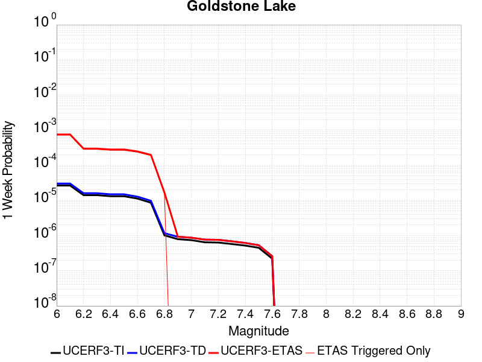 | 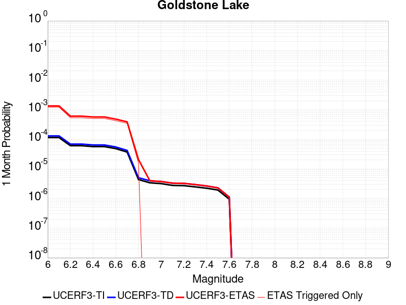 | 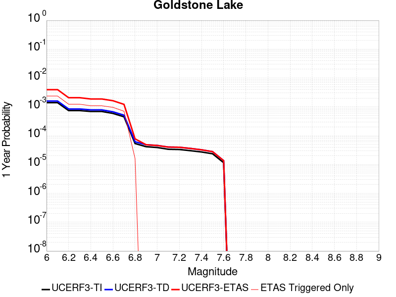 | 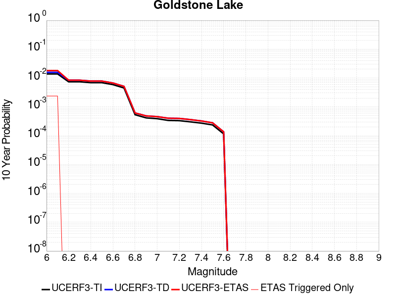 |

| Magnitude | 1 wk TI Prob | 1 wk TD Prob | 1 wk ETAS Prob | 1 wk ETAS/TD Gain | 1 wk ETAS Triggered Only | 1 mo TI Prob | 1 mo TD Prob | 1 mo ETAS Prob | 1 mo ETAS/TD Gain | 1 mo ETAS Triggered Only | 1 yr TI Prob | 1 yr TD Prob | 1 yr ETAS Prob | 1 yr ETAS/TD Gain | 1 yr ETAS Triggered Only | 10 yr TI Prob | 10 yr TD Prob | 10 yr ETAS Prob | 10 yr ETAS/TD Gain | 10 yr ETAS Triggered Only |
|-----|-----|-----|-----|-----|-----|-----|-----|-----|-----|-----|-----|-----|-----|-----|-----|-----|-----|-----|-----|-----|
| 6.0 | 2.671352E-5 | 3.037609E-5 | 8.1808324E-4 | 26.931816 | 7.877311E-4 | 1.1448149E-4 | 1.3017785E-4 | 0.0014839144 | 11.399131 | 0.0013539128 | 0.001392921 | 0.0015839594 | 0.0042383405 | 2.6757886 | 0.0026585925 | 0.013842222 | 0.015746197 | 0.019501688 | 1.2385015 | 0.0038155725 |
| 6.1 | 2.671352E-5 | 3.037609E-5 | 8.1808324E-4 | 26.931816 | 7.877311E-4 | 1.1448149E-4 | 1.3017785E-4 | 0.0014839144 | 11.399131 | 0.0013539128 | 0.001392921 | 0.0015839594 | 0.0042383405 | 2.6757886 | 0.0026585925 | 0.013842222 | 0.015746197 | 0.019501688 | 1.2385015 | 0.0038155725 |
| 6.2 | 1.4197047E-5 | 1.6096245E-5 | 3.3610684E-4 | 20.881073 | 3.2001577E-4 | 6.0843064E-5 | 6.8982634E-5 | 6.843551E-4 | 9.920686 | 6.1541493E-4 | 7.4051257E-4 | 8.3963864E-4 | 0.0021924146 | 2.6111407 | 0.0013539128 | 0.007380498 | 0.0083743585 | 0.010424837 | 1.244852 | 0.002067794 |
| 6.3 | 1.4197047E-5 | 1.6096245E-5 | 3.3610684E-4 | 20.881073 | 3.2001577E-4 | 6.0843064E-5 | 6.8982634E-5 | 6.843551E-4 | 9.920686 | 6.1541493E-4 | 7.4051257E-4 | 8.3963864E-4 | 0.0021924146 | 2.6111407 | 0.0013539128 | 0.007380498 | 0.0083743585 | 0.010424837 | 1.244852 | 0.002067794 |
| 6.4 | 1.3238931E-5 | 1.500846E-5 | 3.1040318E-4 | 20.68188 | 2.9539916E-4 | 5.6737044E-5 | 6.4320935E-5 | 6.304662E-4 | 9.801882 | 5.661817E-4 | 6.9055456E-4 | 7.82924E-4 | 0.0019635956 | 2.5080283 | 0.0011815967 | 0.006884126 | 0.0078112837 | 0.009667531 | 1.2376367 | 0.0018708613 |
| 6.5 | 1.3238931E-5 | 1.500846E-5 | 3.1040318E-4 | 20.68188 | 2.9539916E-4 | 5.6737044E-5 | 6.4320935E-5 | 6.304662E-4 | 9.801882 | 5.661817E-4 | 6.9055456E-4 | 7.82924E-4 | 0.0019635956 | 2.5080283 | 0.0011815967 | 0.006884126 | 0.0078112837 | 0.009667531 | 1.2376367 | 0.0018708613 |
| 6.6 | 1.1328278E-5 | 1.2855166E-5 | 2.8363423E-4 | 22.063835 | 2.7078256E-4 | 4.8548856E-5 | 5.5092944E-5 | 5.227825E-4 | 9.489101 | 4.6771532E-4 | 5.90922E-4 | 6.7064585E-4 | 0.0017038495 | 2.54061 | 0.001033897 | 0.0058935313 | 0.0066956086 | 0.008309426 | 1.2410262 | 0.0016246954 |
| 6.7 | 8.651175E-6 | 9.824565E-6 | 2.3137176E-4 | 23.550333 | 2.2154937E-4 | 3.707594E-5 | 4.2105108E-5 | 4.6056963E-4 | 10.938569 | 4.1848214E-4 | 4.5130608E-4 | 5.1259965E-4 | 0.0013245309 | 2.5839481 | 8.123477E-4 | 0.0045039062 | 0.005123051 | 0.0063230847 | 1.234242 | 0.0012062133 |
| 6.8 | 1.0215377E-6 | 1.1754702E-6 | 2.5792038E-5 | 21.941889 | 2.4616596E-5 | 4.378012E-6 | 5.0377203E-6 | 2.9654193E-5 | 5.8864307 | 2.4616596E-5 | 5.3300988E-5 | 6.1332634E-5 | 8.594772E-5 | 1.4013375 | 2.4616596E-5 | 5.3288206E-4 | 6.1316835E-4 | 6.8697287E-4 | 1.1203659 | 7.384979E-5 |
| 6.9 | 7.9360774E-7 | 9.2833966E-7 | 9.2833966E-7 | 1.0 | 0.0 | 3.4011714E-6 | 3.9785928E-6 | 3.9785928E-6 | 1.0 | 0.0 | 4.1408475E-5 | 4.843836E-5 | 4.843836E-5 | 1.0 | 0.0 | 4.140076E-4 | 4.8428503E-4 | 5.334944E-4 | 1.1016123 | 4.9233193E-5 |
| 7.0 | 7.4382757E-7 | 8.7473285E-7 | 8.7473285E-7 | 1.0 | 0.0 | 3.1878285E-6 | 3.74885E-6 | 3.74885E-6 | 1.0 | 0.0 | 3.8811122E-5 | 4.564136E-5 | 4.564136E-5 | 1.0 | 0.0 | 3.8804344E-4 | 4.5632652E-4 | 5.0553726E-4 | 1.107841 | 4.9233193E-5 |
| 7.1 | 6.4709513E-7 | 7.7113E-7 | 7.7113E-7 | 1.0 | 0.0 | 2.773262E-6 | 3.3048389E-6 | 3.3048389E-6 | 1.0 | 0.0 | 3.376394E-5 | 4.0235733E-5 | 4.0235733E-5 | 1.0 | 0.0 | 3.375881E-4 | 4.0229043E-4 | 4.5150382E-4 | 1.1223329 | 4.9233193E-5 |
| 7.2 | 6.356704E-7 | 7.5883594E-7 | 7.5883594E-7 | 1.0 | 0.0 | 2.7242988E-6 | 3.2521505E-6 | 3.2521505E-6 | 1.0 | 0.0 | 3.3167835E-5 | 3.959427E-5 | 3.959427E-5 | 1.0 | 0.0 | 3.3162883E-4 | 3.958781E-4 | 4.450918E-4 | 1.1243153 | 4.9233193E-5 |
| 7.3 | 5.7695723E-7 | 6.8965653E-7 | 6.8965653E-7 | 1.0 | 0.0 | 2.4726714E-6 | 2.9556677E-6 | 2.9556677E-6 | 1.0 | 0.0 | 3.0104358E-5 | 3.5984718E-5 | 3.5984718E-5 | 1.0 | 0.0 | 3.0100282E-4 | 3.5979465E-4 | 4.0901013E-4 | 1.1367877 | 4.9233193E-5 |
| 7.4 | 5.209647E-7 | 6.193514E-7 | 6.193514E-7 | 1.0 | 0.0 | 2.232704E-6 | 2.6543607E-6 | 2.6543607E-6 | 1.0 | 0.0 | 2.718283E-5 | 3.2316417E-5 | 3.2316417E-5 | 1.0 | 0.0 | 2.7179506E-4 | 3.2312275E-4 | 3.7234003E-4 | 1.1523176 | 4.9233193E-5 |
| 7.5 | 4.512955E-7 | 5.348885E-7 | 5.348885E-7 | 1.0 | 0.0 | 1.934122E-6 | 2.2923775E-6 | 2.2923775E-6 | 1.0 | 0.0 | 2.3547682E-5 | 2.7909393E-5 | 2.7909393E-5 | 1.0 | 0.0 | 2.3545188E-4 | 2.7906417E-4 | 3.036739E-4 | 1.0881866 | 2.4616596E-5 |
| 7.6 | 2.21172E-7 | 2.603961E-7 | 2.603961E-7 | 1.0 | 0.0 | 9.478797E-7 | 1.1159829E-6 | 1.1159829E-6 | 1.0 | 0.0 | 1.1540374E-5 | 1.3587036E-5 | 1.3587036E-5 | 1.0 | 0.0 | 1.1539775E-4 | 1.3586486E-4 | 1.6047811E-4 | 1.1811599 | 2.4616596E-5 |

## Coyote Canyon
*[(top)](#table-of-contents)*

| 1 Week | 1 Month | 1 Year | 10 Year |
|-----|-----|-----|-----|
| 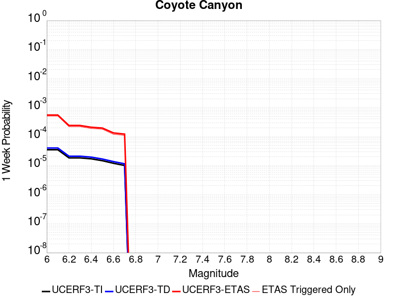 | 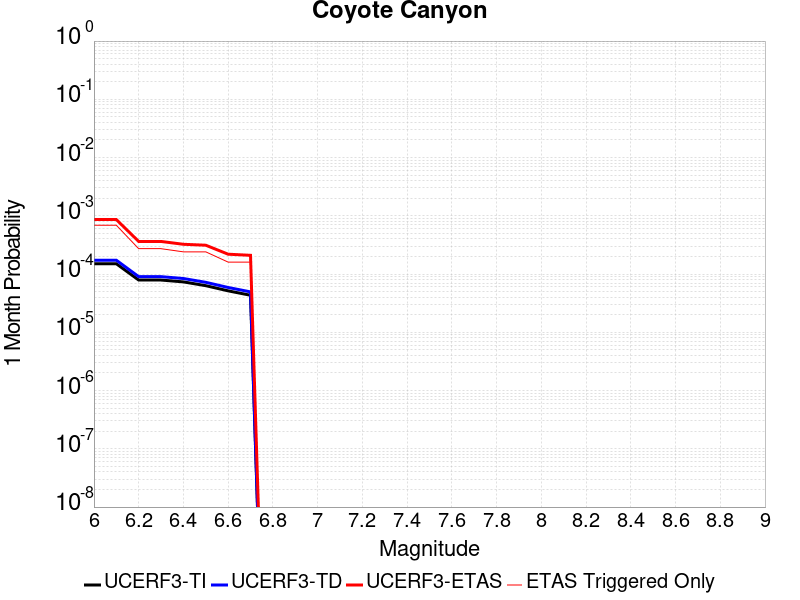 | 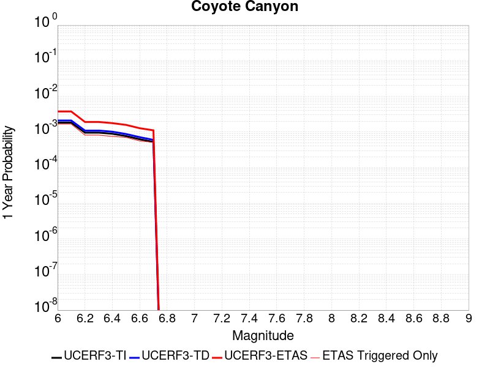 | 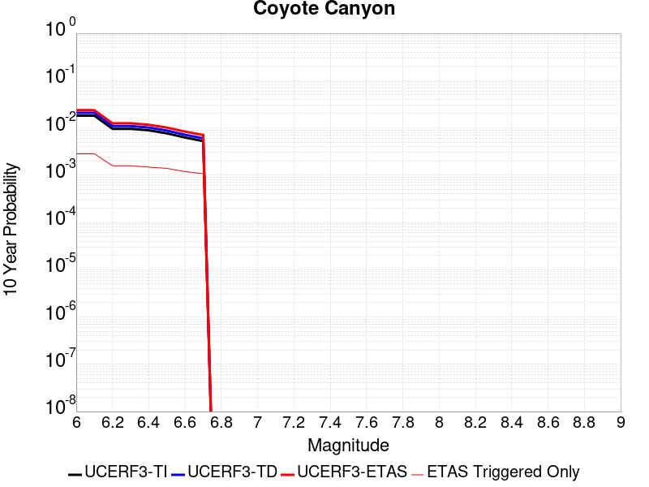 |

| Magnitude | 1 wk TI Prob | 1 wk TD Prob | 1 wk ETAS Prob | 1 wk ETAS/TD Gain | 1 wk ETAS Triggered Only | 1 mo TI Prob | 1 mo TD Prob | 1 mo ETAS Prob | 1 mo ETAS/TD Gain | 1 mo ETAS Triggered Only | 1 yr TI Prob | 1 yr TD Prob | 1 yr ETAS Prob | 1 yr ETAS/TD Gain | 1 yr ETAS Triggered Only | 10 yr TI Prob | 10 yr TD Prob | 10 yr ETAS Prob | 10 yr ETAS/TD Gain | 10 yr ETAS Triggered Only |
|-----|-----|-----|-----|-----|-----|-----|-----|-----|-----|-----|-----|-----|-----|-----|-----|-----|-----|-----|-----|-----|
| 6.0 | 3.5090034E-5 | 4.0364324E-5 | 4.3421396E-4 | 10.75737 | 3.9386554E-4 | 1.503772E-4 | 1.7297994E-4 | 7.882884E-4 | 4.557109 | 6.1541493E-4 | 0.0018293047 | 0.0021042528 | 0.0037009646 | 1.7588023 | 0.0016000788 | 0.018143194 | 0.020869201 | 0.02354462 | 1.1281993 | 0.0027324422 |
| 6.1 | 3.5090034E-5 | 4.0364324E-5 | 4.3421396E-4 | 10.75737 | 3.9386554E-4 | 1.503772E-4 | 1.7297994E-4 | 7.882884E-4 | 4.557109 | 6.1541493E-4 | 0.0018293047 | 0.0021042528 | 0.0037009646 | 1.7588023 | 0.0016000788 | 0.018143194 | 0.020869201 | 0.02354462 | 1.1281993 | 0.0027324422 |
| 6.2 | 1.841879E-5 | 2.1059794E-5 | 1.9337234E-4 | 9.182062 | 1.7231617E-4 | 7.8935285E-5 | 9.0253714E-5 | 3.1178308E-4 | 3.454518 | 2.2154937E-4 | 9.606133E-4 | 0.001098387 | 0.0019098424 | 1.73877 | 8.123477E-4 | 0.0095647145 | 0.010939667 | 0.012522241 | 1.1446638 | 0.0016000788 |
| 6.3 | 1.841879E-5 | 2.1059794E-5 | 1.9337234E-4 | 9.182062 | 1.7231617E-4 | 7.8935285E-5 | 9.0253714E-5 | 3.1178308E-4 | 3.454518 | 2.2154937E-4 | 9.606133E-4 | 0.001098387 | 0.0019098424 | 1.73877 | 8.123477E-4 | 0.0095647145 | 0.010939667 | 0.012522241 | 1.1446638 | 0.0016000788 |
| 6.4 | 1.712201E-5 | 1.9565212E-5 | 1.672619E-4 | 8.548944 | 1.4769958E-4 | 7.337798E-5 | 8.3848776E-5 | 2.8076503E-4 | 3.348469 | 1.9693277E-4 | 8.930107E-4 | 0.0010204813 | 0.0017828171 | 1.7470355 | 7.631145E-4 | 0.008894307 | 0.010167871 | 0.011678581 | 1.1485769 | 0.001526229 |
| 6.5 | 1.4744935E-5 | 1.6836972E-5 | 1.6453407E-4 | 9.772189 | 1.4769958E-4 | 6.3191044E-5 | 7.215698E-5 | 2.6907554E-4 | 3.72903 | 1.9693277E-4 | 7.6907943E-4 | 8.7825063E-4 | 0.0016161 | 1.8401352 | 7.384979E-4 | 0.007664232 | 0.008756994 | 0.010196655 | 1.1644013 | 0.0014523792 |
| 6.6 | 1.2017839E-5 | 1.37240895E-5 | 6.2956606E-5 | 4.5873065 | 4.9233193E-5 | 5.150401E-5 | 5.88167E-5 | 1.5727729E-4 | 2.6740246 | 9.8466386E-5 | 6.268809E-4 | 7.159466E-4 | 0.0013063219 | 1.8246081 | 5.907983E-4 | 0.0062511545 | 0.0071450938 | 0.008367129 | 1.1710314 | 0.0012308299 |
| 6.7 | 1.00956095E-5 | 1.1533517E-5 | 6.0766142E-5 | 5.2686567 | 4.9233193E-5 | 4.326618E-5 | 4.942891E-5 | 1.4789043E-4 | 2.9919825 | 9.8466386E-5 | 5.266384E-4 | 6.017178E-4 | 0.0011183553 | 1.8586043 | 5.169485E-4 | 0.005253921 | 0.0060094125 | 0.007134971 | 1.1872993 | 0.0011323635 |

## San Andreas (Mojave S)
*[(top)](#table-of-contents)*

| 1 Week | 1 Month | 1 Year | 10 Year |
|-----|-----|-----|-----|
| 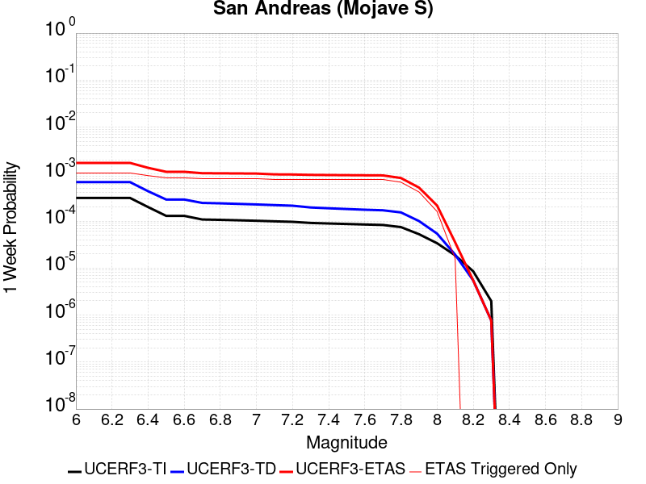 | 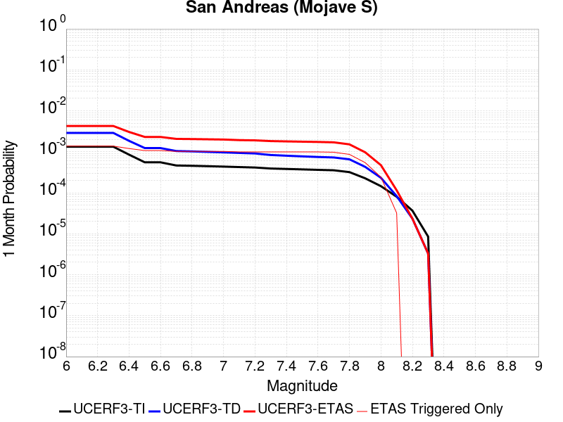 | 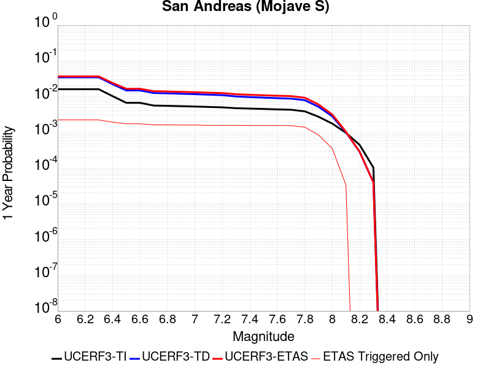 | 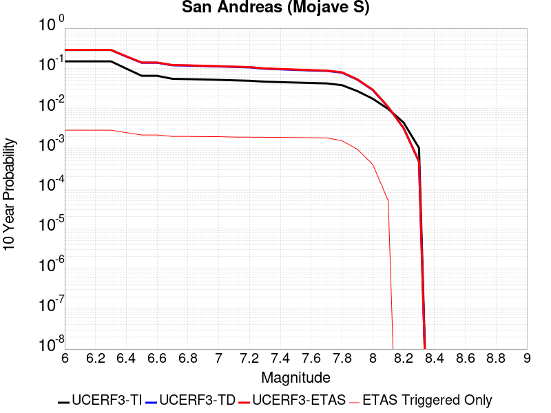 |

| Magnitude | 1 wk TI Prob | 1 wk TD Prob | 1 wk ETAS Prob | 1 wk ETAS/TD Gain | 1 wk ETAS Triggered Only | 1 mo TI Prob | 1 mo TD Prob | 1 mo ETAS Prob | 1 mo ETAS/TD Gain | 1 mo ETAS Triggered Only | 1 yr TI Prob | 1 yr TD Prob | 1 yr ETAS Prob | 1 yr ETAS/TD Gain | 1 yr ETAS Triggered Only | 10 yr TI Prob | 10 yr TD Prob | 10 yr ETAS Prob | 10 yr ETAS/TD Gain | 10 yr ETAS Triggered Only |
|-----|-----|-----|-----|-----|-----|-----|-----|-----|-----|-----|-----|-----|-----|-----|-----|-----|-----|-----|-----|-----|
| 6.0 | 3.1064058E-4 | 6.7460834E-4 | 0.0017078079 | 2.5315547 | 0.001033897 | 0.0013306376 | 0.0028881032 | 0.0042135604 | 1.4589368 | 0.0013292963 | 0.016080605 | 0.03462235 | 0.036808666 | 1.0631475 | 0.002264727 | 0.1496549 | 0.28660452 | 0.28860652 | 1.0069852 | 0.002806292 |
| 6.1 | 3.1064058E-4 | 6.7460834E-4 | 0.0017078079 | 2.5315547 | 0.001033897 | 0.0013306376 | 0.0028881032 | 0.0042135604 | 1.4589368 | 0.0013292963 | 0.016080605 | 0.03462235 | 0.036808666 | 1.0631475 | 0.002264727 | 0.1496549 | 0.28660452 | 0.28860652 | 1.0069852 | 0.002806292 |
| 6.2 | 3.1064058E-4 | 6.7460834E-4 | 0.0017078079 | 2.5315547 | 0.001033897 | 0.0013306376 | 0.0028881032 | 0.0042135604 | 1.4589368 | 0.0013292963 | 0.016080605 | 0.03462235 | 0.036808666 | 1.0631475 | 0.002264727 | 0.1496549 | 0.28660452 | 0.28860652 | 1.0069852 | 0.002806292 |
| 6.3 | 3.1064058E-4 | 6.7460834E-4 | 0.0017078079 | 2.5315547 | 0.001033897 | 0.0013306376 | 0.0028881032 | 0.0042135604 | 1.4589368 | 0.0013292963 | 0.016080605 | 0.03462235 | 0.036808666 | 1.0631475 | 0.002264727 | 0.1496549 | 0.28660452 | 0.28860652 | 1.0069852 | 0.002806292 |
| 6.4 | 1.9872203E-4 | 4.3179357E-4 | 0.0013914263 | 3.222434 | 9.6004724E-4 | 8.5138786E-4 | 0.0018492596 | 0.0030778134 | 1.664349 | 0.0012308299 | 0.010316478 | 0.02228844 | 0.024213875 | 1.0863872 | 0.0019693277 | 0.098504856 | 0.19699748 | 0.19899397 | 1.0101346 | 0.0024862762 |
| 6.5 | 1.291105E-4 | 2.875267E-4 | 0.0010996409 | 3.8244824 | 8.123477E-4 | 5.5321335E-4 | 0.0012316781 | 0.0023134742 | 1.8783108 | 0.0010831302 | 0.006714592 | 0.0148934 | 0.016590897 | 1.1139765 | 0.0017231618 | 0.065152965 | 0.13803436 | 0.13992283 | 1.013681 | 0.002190877 |
| 6.6 | 1.291105E-4 | 2.875267E-4 | 0.0010996409 | 3.8244824 | 8.123477E-4 | 5.5321335E-4 | 0.0012316781 | 0.0023134742 | 1.8783108 | 0.0010831302 | 0.006714592 | 0.0148934 | 0.016590897 | 1.1139765 | 0.0017231618 | 0.065152965 | 0.13803436 | 0.13992283 | 1.013681 | 0.002190877 |
| 6.7 | 1.08001186E-4 | 2.4333889E-4 | 0.0010308783 | 4.2363896 | 7.877311E-4 | 4.6278012E-4 | 0.0010424647 | 0.002075284 | 1.9907475 | 0.001033897 | 0.0056198016 | 0.012618446 | 0.014174028 | 1.1232784 | 0.0015754622 | 0.054797906 | 0.119176775 | 0.120911404 | 1.0145551 | 0.0019693277 |
| 6.8 | 1.0624356E-4 | 2.3851555E-4 | 0.0010260588 | 4.3018527 | 7.877311E-4 | 4.5525006E-4 | 0.0010218095 | 0.00205465 | 2.0107956 | 0.001033897 | 0.0055285925 | 0.012369843 | 0.013925817 | 1.1257877 | 0.0015754622 | 0.053930566 | 0.11712591 | 0.11886458 | 1.0148444 | 0.0019693277 |
| 6.9 | 1.0393785E-4 | 2.3221898E-4 | 0.0010197671 | 4.391403 | 7.877311E-4 | 4.4537184E-4 | 9.948451E-4 | 0.0020277137 | 2.0382204 | 0.001033897 | 0.0054089287 | 0.012045221 | 0.013577387 | 1.1272011 | 0.0015508456 | 0.05279156 | 0.11442335 | 0.116145544 | 1.015051 | 0.0019447111 |
| 7.0 | 1.0155622E-4 | 2.2591476E-4 | 0.0010134679 | 4.4860635 | 7.877311E-4 | 4.3516833E-4 | 9.6784724E-4 | 0.0020007435 | 2.0672102 | 0.001033897 | 0.005285311 | 0.0117200995 | 0.01325277 | 1.1307727 | 0.0015508456 | 0.05161361 | 0.111683756 | 0.11341127 | 1.015468 | 0.0019447111 |
| 7.1 | 9.885595E-5 | 2.1879886E-4 | 9.817464E-4 | 4.4869814 | 7.631145E-4 | 4.2359953E-4 | 9.3737274E-4 | 0.0019457071 | 2.0757027 | 0.0010092804 | 0.0051451353 | 0.011352993 | 0.012861894 | 1.1329079 | 0.001526229 | 0.05027629 | 0.1085682 | 0.110279836 | 1.0157655 | 0.0019200945 |
| 7.2 | 9.6411415E-5 | 2.124288E-4 | 9.753812E-4 | 4.5915675 | 7.631145E-4 | 4.1312634E-4 | 9.1009185E-4 | 0.0019184537 | 2.107978 | 0.0010092804 | 0.005018219 | 0.011024255 | 0.012533659 | 1.1369166 | 0.001526229 | 0.049064007 | 0.105758004 | 0.107475035 | 1.0162355 | 0.0019200945 |
| 7.3 | 9.1180635E-5 | 1.9471257E-4 | 9.576785E-4 | 4.9184213 | 7.631145E-4 | 3.907156E-4 | 8.342157E-4 | 0.0018426542 | 2.2088463 | 0.0010092804 | 0.004746591 | 0.01010939 | 0.011620189 | 1.1494452 | 0.001526229 | 0.046464786 | 0.09795115 | 0.09968317 | 1.0176824 | 0.0019200945 |
| 7.4 | 8.887388E-5 | 1.8719878E-4 | 9.5017045E-4 | 5.07573 | 7.631145E-4 | 3.8083247E-4 | 8.020339E-4 | 0.0018105048 | 2.257392 | 0.0010092804 | 0.0046267817 | 0.00972114 | 0.011208155 | 1.1529671 | 0.0015016124 | 0.045316286 | 0.09458615 | 0.09630234 | 1.0181442 | 0.0018954779 |
| 7.5 | 8.6750515E-5 | 1.8051457E-4 | 9.434913E-4 | 5.226677 | 7.631145E-4 | 3.7173493E-4 | 7.7340455E-4 | 0.0017819045 | 2.3039746 | 0.0010092804 | 0.004516484 | 0.009375632 | 0.010863165 | 1.1586596 | 0.0015016124 | 0.04425787 | 0.091549896 | 0.093271844 | 1.0188088 | 0.0018954779 |
| 7.6 | 8.453092E-5 | 1.7439072E-4 | 9.3737216E-4 | 5.3751264 | 7.631145E-4 | 3.6222505E-4 | 7.471748E-4 | 0.0017557011 | 2.3497863 | 0.0010092804 | 0.0044011753 | 0.009058985 | 0.010546993 | 1.1642579 | 0.0015016124 | 0.04315024 | 0.08870898 | 0.09043632 | 1.0194719 | 0.0018954779 |
| 7.7 | 8.259102E-5 | 1.6961215E-4 | 9.325972E-4 | 5.49841 | 7.631145E-4 | 3.539135E-4 | 7.2670676E-4 | 0.001710655 | 2.3539827 | 9.846638E-4 | 0.004300386 | 0.008811831 | 0.010275811 | 1.166138 | 0.0014769958 | 0.042181134 | 0.08645982 | 0.088168934 | 1.0197676 | 0.0018708613 |
| 7.8 | 7.444844E-5 | 1.5283503E-4 | 8.1738154E-4 | 5.3481297 | 6.6464813E-4 | 3.1902574E-4 | 6.548429E-4 | 0.0015158595 | 2.3148446 | 8.615809E-4 | 0.0038772223 | 0.007943616 | 0.009262353 | 1.1660122 | 0.0013292963 | 0.03810269 | 0.078290746 | 0.07983362 | 1.019707 | 0.0016739286 |
| 7.9 | 5.2586525E-5 | 1.00064186E-4 | 5.185045E-4 | 5.1817183 | 4.1848214E-4 | 2.2535135E-4 | 4.2877605E-4 | 9.7010896E-4 | 2.2625074 | 5.415651E-4 | 0.0027402006 | 0.005207864 | 0.006015981 | 1.1551725 | 8.123477E-4 | 0.027066574 | 0.052200034 | 0.05317996 | 1.0187726 | 0.001033897 |
| 8.0 | 3.379877E-5 | 5.4074168E-5 | 2.7561156E-4 | 5.096917 | 2.2154937E-4 | 1.4484383E-4 | 2.3172585E-4 | 5.516675E-4 | 2.38069 | 3.2001577E-4 | 0.0017620471 | 0.002817614 | 0.0032103697 | 1.1393931 | 3.9386554E-4 | 0.017481409 | 0.028834904 | 0.029313039 | 1.0165819 | 4.923319E-4 |
| 8.1 | 1.8668277E-5 | 1.9309397E-5 | 4.3925516E-5 | 2.274826 | 2.4616596E-5 | 8.000444E-5 | 8.275194E-5 | 1.3198105E-4 | 1.5948999 | 4.9233193E-5 | 9.736188E-4 | 0.0010070398 | 0.0010562234 | 1.0488398 | 4.9233193E-5 | 0.009693642 | 0.010798888 | 0.01087194 | 1.0067648 | 7.384979E-5 |
| 8.2 | 8.541571E-6 | 5.460819E-6 | 5.460819E-6 | 1.0 | 0.0 | 3.660622E-5 | 2.3403301E-5 | 2.3403301E-5 | 1.0 | 0.0 | 4.455896E-4 | 2.84898E-4 | 2.84898E-4 | 1.0 | 0.0 | 0.0044469717 | 0.0032408056 | 0.0032408056 | 1.0 | 0.0 |
| 8.3 | 1.983087E-6 | 7.6599065E-7 | 7.6599065E-7 | 1.0 | 0.0 | 8.498917E-6 | 3.282813E-6 | 3.282813E-6 | 1.0 | 0.0 | 1.034694E-4 | 3.9967534E-5 | 3.9967534E-5 | 1.0 | 0.0 | 0.0010342124 | 4.719687E-4 | 4.719687E-4 | 1.0 | 0.0 |

## Death Valley (So)
*[(top)](#table-of-contents)*

| 1 Week | 1 Month | 1 Year | 10 Year |
|-----|-----|-----|-----|
| 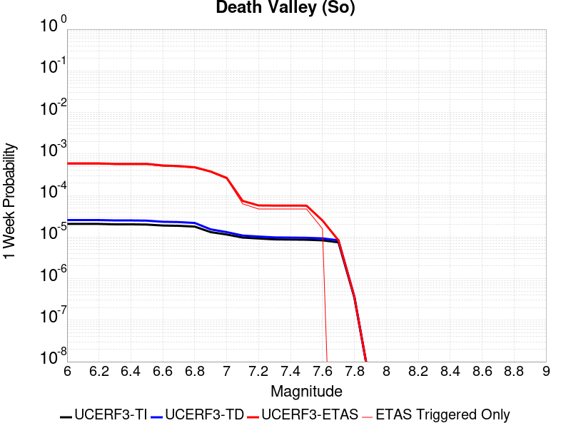 | 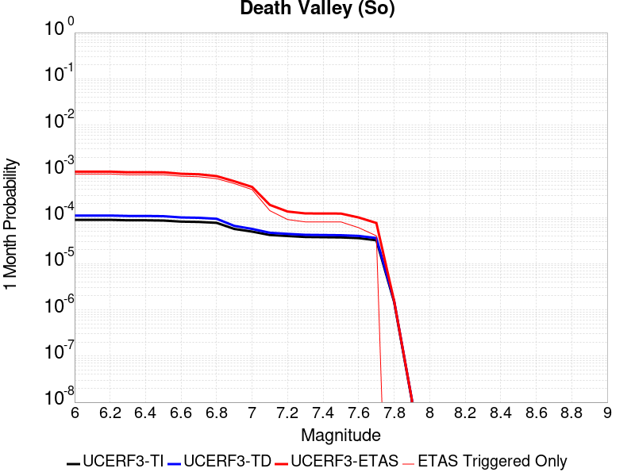 | 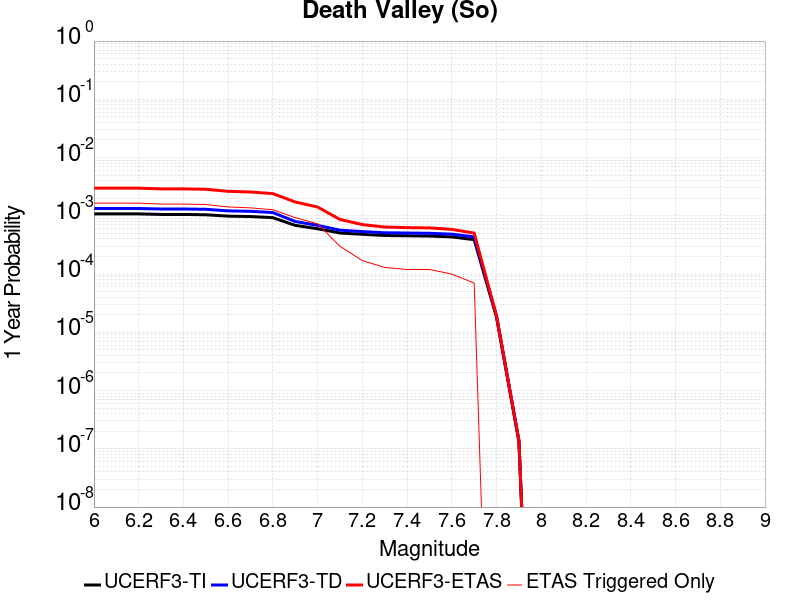 | 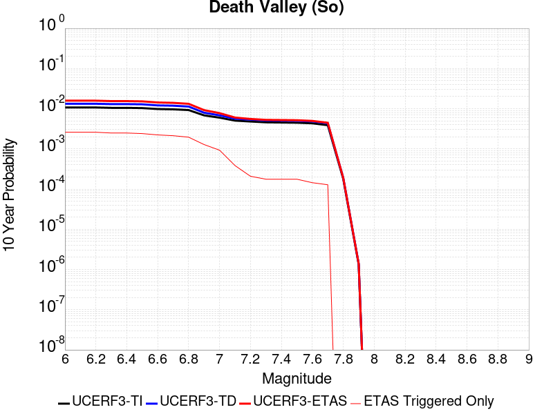 |

| Magnitude | 1 wk TI Prob | 1 wk TD Prob | 1 wk ETAS Prob | 1 wk ETAS/TD Gain | 1 wk ETAS Triggered Only | 1 mo TI Prob | 1 mo TD Prob | 1 mo ETAS Prob | 1 mo ETAS/TD Gain | 1 mo ETAS Triggered Only | 1 yr TI Prob | 1 yr TD Prob | 1 yr ETAS Prob | 1 yr ETAS/TD Gain | 1 yr ETAS Triggered Only | 10 yr TI Prob | 10 yr TD Prob | 10 yr ETAS Prob | 10 yr ETAS/TD Gain | 10 yr ETAS Triggered Only |
|-----|-----|-----|-----|-----|-----|-----|-----|-----|-----|-----|-----|-----|-----|-----|-----|-----|-----|-----|-----|-----|
| 6.0 | 2.0684236E-5 | 2.5617775E-5 | 7.6409674E-4 | 29.826818 | 7.384979E-4 | 8.864371E-5 | 1.0978594E-4 | 0.0011189556 | 10.192157 | 0.0010092804 | 0.0010787029 | 0.0013358411 | 0.003155036 | 2.3618345 | 0.0018216282 | 0.010734817 | 0.013281397 | 0.016098997 | 1.2121464 | 0.0028555251 |
| 6.1 | 2.0684236E-5 | 2.5617775E-5 | 7.6409674E-4 | 29.826818 | 7.384979E-4 | 8.864371E-5 | 1.0978594E-4 | 0.0011189556 | 10.192157 | 0.0010092804 | 0.0010787029 | 0.0013358411 | 0.003155036 | 2.3618345 | 0.0018216282 | 0.010734817 | 0.013281397 | 0.016098997 | 1.2121464 | 0.0028555251 |
| 6.2 | 2.0684236E-5 | 2.5617775E-5 | 7.6409674E-4 | 29.826818 | 7.384979E-4 | 8.864371E-5 | 1.0978594E-4 | 0.0011189556 | 10.192157 | 0.0010092804 | 0.0010787029 | 0.0013358411 | 0.003155036 | 2.3618345 | 0.0018216282 | 0.010734817 | 0.013281397 | 0.016098997 | 1.2121464 | 0.0028555251 |
| 6.3 | 2.0240292E-5 | 2.511786E-5 | 7.3898124E-4 | 29.420547 | 7.138813E-4 | 8.6741224E-5 | 1.07643624E-4 | 0.0010922014 | 10.146458 | 9.846638E-4 | 0.0010555626 | 0.00130979 | 0.0031044479 | 2.3701875 | 0.0017970116 | 0.010505628 | 0.013023956 | 0.015745107 | 1.2089343 | 0.0027570587 |
| 6.4 | 2.0240292E-5 | 2.511786E-5 | 7.3898124E-4 | 29.420547 | 7.138813E-4 | 8.6741224E-5 | 1.07643624E-4 | 0.0010922014 | 10.146458 | 9.846638E-4 | 0.0010555626 | 0.00130979 | 0.0031044479 | 2.3701875 | 0.0017970116 | 0.010505628 | 0.013023956 | 0.015745107 | 1.2089343 | 0.0027570587 |
| 6.5 | 1.9962767E-5 | 2.4807114E-5 | 7.386707E-4 | 29.776567 | 7.138813E-4 | 8.55519E-5 | 1.0631196E-4 | 0.0010908712 | 10.261039 | 9.846638E-4 | 0.0010410968 | 0.0012935963 | 0.0030391137 | 2.3493526 | 0.0017477784 | 0.010362327 | 0.012863902 | 0.015488295 | 1.2040122 | 0.0026585925 |
| 6.6 | 1.8937297E-5 | 2.3310964E-5 | 6.633276E-4 | 28.455603 | 6.4003153E-4 | 8.115732E-5 | 9.990039E-5 | 0.0010106235 | 10.116311 | 9.108141E-4 | 9.876423E-4 | 0.0012156231 | 0.0027645836 | 2.274211 | 0.0015508456 | 0.009832645 | 0.012092789 | 0.014476042 | 1.1970806 | 0.0024124265 |
| 6.7 | 1.8621096E-5 | 2.2911607E-5 | 6.383124E-4 | 27.859785 | 6.1541493E-4 | 7.980225E-5 | 9.818898E-5 | 9.5968525E-4 | 9.773859 | 8.615809E-4 | 9.711593E-4 | 0.0011948098 | 0.0026454537 | 2.214121 | 0.0014523792 | 0.009669261 | 0.011886904 | 0.014149034 | 1.1903044 | 0.0022893434 |
| 6.8 | 1.7830353E-5 | 2.1805688E-5 | 6.125911E-4 | 28.09318 | 5.907983E-4 | 7.641356E-5 | 9.344968E-5 | 8.811072E-4 | 9.42868 | 7.877311E-4 | 9.29938E-4 | 0.00113717 | 0.0024895433 | 2.1892445 | 0.0013539128 | 0.009260561 | 0.011316354 | 0.013385086 | 1.1828091 | 0.0020924108 |
| 6.9 | 1.3135183E-5 | 1.5303925E-5 | 5.076283E-4 | 33.16981 | 4.923319E-4 | 5.6292425E-5 | 6.558664E-5 | 7.301911E-4 | 11.13323 | 6.6464813E-4 | 6.8514474E-4 | 7.982312E-4 | 0.0018804969 | 2.3558297 | 0.0010831302 | 0.006830362 | 0.007954649 | 0.009419896 | 1.1842 | 0.0014769958 |
| 7.0 | 1.1507512E-5 | 1.3154199E-5 | 3.5778203E-4 | 27.199072 | 3.4463234E-4 | 4.9316975E-5 | 5.6373956E-5 | 5.240629E-4 | 9.296188 | 4.6771532E-4 | 6.002687E-4 | 6.8614254E-4 | 0.0014733331 | 2.1472697 | 7.877311E-4 | 0.0059864987 | 0.0068409415 | 0.007892214 | 1.1536736 | 0.0010585136 |
| 7.1 | 9.715903E-6 | 1.0865278E-5 | 8.4714266E-5 | 7.7967877 | 7.384979E-5 | 4.1638916E-5 | 4.656467E-5 | 1.6964192E-4 | 3.6431465 | 1.2308298E-4 | 5.068359E-4 | 5.667817E-4 | 8.128081E-4 | 1.4340762 | 2.4616596E-4 | 0.0050568148 | 0.0056538144 | 0.0059964983 | 1.0606111 | 3.4463234E-4 |
| 7.2 | 9.233269E-6 | 1.02863105E-5 | 8.413534E-5 | 8.179351 | 7.384979E-5 | 3.9570554E-5 | 4.4083466E-5 | 1.4254551E-4 | 3.2335367 | 9.8466386E-5 | 4.81665E-4 | 5.3658825E-4 | 6.842086E-4 | 1.2751092 | 1.4769958E-4 | 0.0048062233 | 0.0053533576 | 0.005549236 | 1.0365899 | 1.9693277E-4 |
| 7.3 | 8.8041315E-6 | 9.808164E-6 | 8.365723E-5 | 8.529346 | 7.384979E-5 | 3.7731446E-5 | 4.2034335E-5 | 1.4049659E-4 | 3.3424244 | 9.8466386E-5 | 4.592835E-4 | 5.1165203E-4 | 6.1006803E-4 | 1.1923494 | 9.8466386E-5 | 0.0045833546 | 0.005105167 | 0.0052521126 | 1.0287837 | 1.4769958E-4 |
| 7.4 | 8.708749E-6 | 9.707175E-6 | 8.3556246E-5 | 8.607679 | 7.384979E-5 | 3.7322676E-5 | 4.160154E-5 | 1.4006383E-4 | 3.3667943 | 9.8466386E-5 | 4.5430884E-4 | 5.0638523E-4 | 6.0480175E-4 | 1.1943511 | 9.8466386E-5 | 0.004533812 | 0.0050527398 | 0.005199693 | 1.0290838 | 1.4769958E-4 |
| 7.5 | 8.612678E-6 | 9.604817E-6 | 8.3453895E-5 | 8.688754 | 7.384979E-5 | 3.6910955E-5 | 4.1162875E-5 | 1.396252E-4 | 3.3920178 | 9.8466386E-5 | 4.492982E-4 | 5.01047E-4 | 5.9946405E-4 | 1.1964228 | 9.8466386E-5 | 0.004483909 | 0.0049995985 | 0.00514656 | 1.0293946 | 1.4769958E-4 |
| 7.6 | 8.319024E-6 | 9.283916E-6 | 3.3900284E-5 | 3.651507 | 2.4616596E-5 | 3.5652476E-5 | 3.978763E-5 | 8.901887E-5 | 2.2373502 | 4.9233193E-5 | 4.3398244E-4 | 4.8431093E-4 | 5.3352024E-4 | 1.101607 | 4.9233193E-5 | 0.0043313587 | 0.0048329784 | 0.004930969 | 1.0202754 | 9.8466386E-5 |
| 7.7 | 7.4718328E-6 | 8.34517E-6 | 8.34517E-6 | 1.0 | 0.0 | 3.2021748E-5 | 3.5764548E-5 | 6.0380262E-5 | 1.6882714 | 2.4616596E-5 | 3.8979502E-4 | 4.353504E-4 | 4.5995627E-4 | 1.0565197 | 2.4616596E-5 | 0.00389112 | 0.0043453807 | 0.0044189095 | 1.0169212 | 7.384979E-5 |
| 7.8 | 3.4586725E-7 | 3.6482615E-7 | 3.6482615E-7 | 1.0 | 0.0 | 1.4822873E-6 | 1.5635396E-6 | 1.5635396E-6 | 1.0 | 0.0 | 1.80467E-5 | 1.9035933E-5 | 1.9035933E-5 | 1.0 | 0.0 | 1.8045233E-4 | 1.9034347E-4 | 1.9034347E-4 | 1.0 | 0.0 |
| 7.9 | 2.5591178E-9 | 2.6696718E-9 | 2.6696718E-9 | 1.0 | 0.0 | 1.0967647E-8 | 1.14414505E-8 | 1.14414505E-8 | 1.0 | 0.0 | 1.335311E-7 | 1.3929966E-7 | 1.3929966E-7 | 1.0 | 0.0 | 1.3353102E-6 | 1.3929966E-6 | 1.3929966E-6 | 1.0 | 0.0 |

## Nelson Lake
*[(top)](#table-of-contents)*

| 1 Week | 1 Month | 1 Year | 10 Year |
|-----|-----|-----|-----|
| 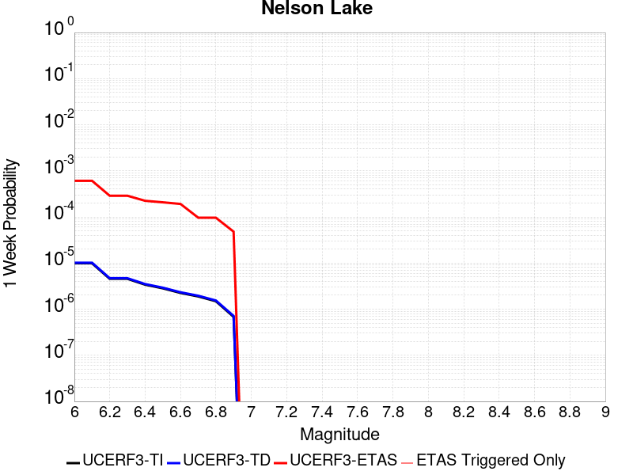 | 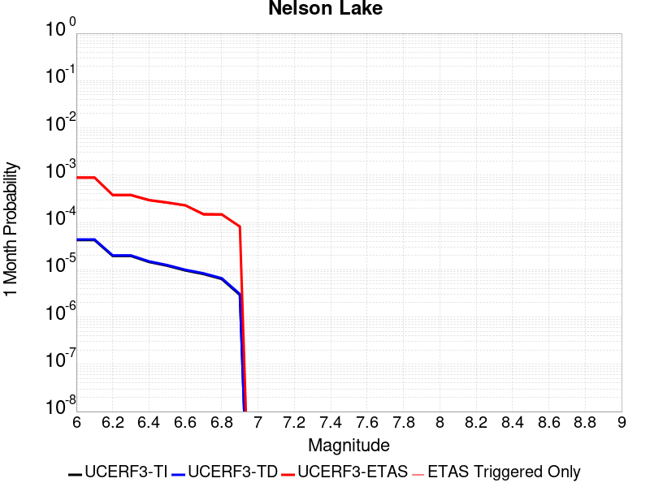 | 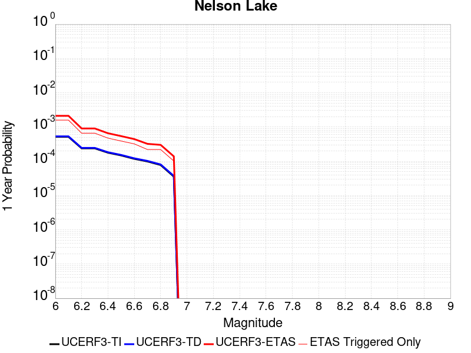 | 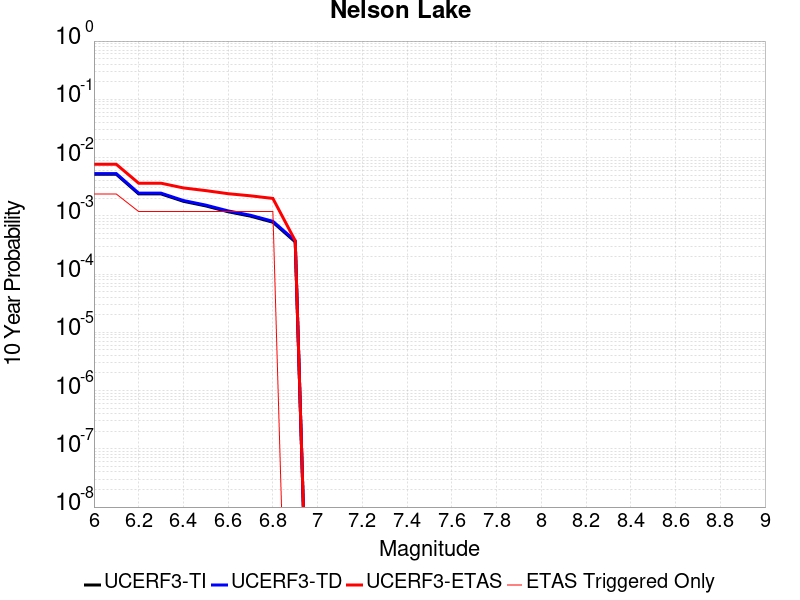 |

| Magnitude | 1 wk TI Prob | 1 wk TD Prob | 1 wk ETAS Prob | 1 wk ETAS/TD Gain | 1 wk ETAS Triggered Only | 1 mo TI Prob | 1 mo TD Prob | 1 mo ETAS Prob | 1 mo ETAS/TD Gain | 1 mo ETAS Triggered Only | 1 yr TI Prob | 1 yr TD Prob | 1 yr ETAS Prob | 1 yr ETAS/TD Gain | 1 yr ETAS Triggered Only | 10 yr TI Prob | 10 yr TD Prob | 10 yr ETAS Prob | 10 yr ETAS/TD Gain | 10 yr ETAS Triggered Only |
|-----|-----|-----|-----|-----|-----|-----|-----|-----|-----|-----|-----|-----|-----|-----|-----|-----|-----|-----|-----|-----|
| 6.0 | 9.913453E-6 | 1.0192255E-5 | 6.0098455E-4 | 58.964825 | 5.907983E-4 | 4.2485535E-5 | 4.3680422E-5 | 8.8060816E-4 | 20.160248 | 8.369643E-4 | 5.1713863E-4 | 5.316897E-4 | 0.0020079003 | 3.776451 | 0.0014769958 | 0.0051593683 | 0.005305204 | 0.007582402 | 1.4292386 | 0.0022893434 |
| 6.1 | 9.913453E-6 | 1.0192255E-5 | 6.0098455E-4 | 58.964825 | 5.907983E-4 | 4.2485535E-5 | 4.3680422E-5 | 8.8060816E-4 | 20.160248 | 8.369643E-4 | 5.1713863E-4 | 5.316897E-4 | 0.0020079003 | 3.776451 | 0.0014769958 | 0.0051593683 | 0.005305204 | 0.007582402 | 1.4292386 | 0.0022893434 |
| 6.2 | 4.5596407E-6 | 4.696313E-6 | 3.2471056E-4 | 69.141594 | 3.2001577E-4 | 1.954117E-5 | 2.0126909E-5 | 3.8936842E-4 | 19.345665 | 3.6924894E-4 | 2.3788778E-4 | 2.4501883E-4 | 8.848935E-4 | 3.611533 | 6.4003153E-4 | 0.0023763329 | 0.0024476128 | 0.003454423 | 1.4113437 | 0.0010092804 |
| 6.3 | 4.5596407E-6 | 4.696313E-6 | 3.2471056E-4 | 69.141594 | 3.2001577E-4 | 1.954117E-5 | 2.0126909E-5 | 3.8936842E-4 | 19.345665 | 3.6924894E-4 | 2.3788778E-4 | 2.4501883E-4 | 8.848935E-4 | 3.611533 | 6.4003153E-4 | 0.0023763329 | 0.0024476128 | 0.003454423 | 1.4113437 | 0.0010092804 |
| 6.4 | 3.4025713E-6 | 3.5098972E-6 | 2.49675E-4 | 71.13456 | 2.4616596E-4 | 1.4582367E-5 | 1.5042335E-5 | 2.8582083E-4 | 19.001095 | 2.7078256E-4 | 1.7752586E-4 | 1.8312587E-4 | 6.7536766E-4 | 3.6879969 | 4.923319E-4 | 0.001773841 | 0.0018298327 | 0.0026652655 | 1.4565624 | 8.369643E-4 |
| 6.5 | 2.8352947E-6 | 2.927856E-6 | 2.490931E-4 | 85.07696 | 2.4616596E-4 | 1.2151207E-5 | 1.2547898E-5 | 2.8332707E-4 | 22.579643 | 2.7078256E-4 | 1.479309E-4 | 1.5276071E-4 | 5.9579173E-4 | 3.9001637 | 4.4309875E-4 | 0.0014783246 | 0.0015266308 | 0.0022885804 | 1.4991052 | 7.631145E-4 |
| 6.6 | 2.251518E-6 | 2.3290677E-6 | 2.4849447E-4 | 106.69268 | 2.4616596E-4 | 9.649328E-6 | 9.981683E-6 | 2.561452E-4 | 25.661522 | 2.4616596E-4 | 1.1747423E-4 | 1.2152085E-4 | 4.907249E-4 | 4.0381956 | 3.6924894E-4 | 0.0011741214 | 0.0012146058 | 0.0018292732 | 1.5060633 | 6.1541493E-4 |
| 6.7 | 1.8911853E-6 | 1.9591396E-6 | 1.4965843E-4 | 76.38987 | 1.4769958E-4 | 8.105055E-6 | 8.39629E-6 | 1.8071102E-4 | 21.522724 | 1.7231617E-4 | 9.867457E-5 | 1.0222061E-4 | 3.7297548E-4 | 3.6487308 | 2.7078256E-4 | 9.863076E-4 | 0.0010217935 | 0.0014644394 | 1.433205 | 4.4309875E-4 |
| 6.8 | 1.4874814E-6 | 1.5438305E-6 | 1.4924318E-4 | 96.67071 | 1.4769958E-4 | 6.374905E-6 | 6.6164025E-6 | 1.7893144E-4 | 27.043613 | 1.7231617E-4 | 7.76117E-5 | 8.055224E-5 | 3.51313E-4 | 4.361306 | 2.7078256E-4 | 7.75846E-4 | 8.0528157E-4 | 0.0012234267 | 1.5192534 | 4.1848214E-4 |
| 6.9 | 6.835972E-7 | 7.1399285E-7 | 7.456373E-5 | 104.432045 | 7.384979E-5 | 2.9296991E-6 | 3.0599674E-6 | 1.0152605E-4 | 33.178802 | 9.8466386E-5 | 3.56685E-5 | 3.7254784E-5 | 1.8494886E-4 | 4.9644322 | 1.4769958E-4 | 3.5662777E-4 | 3.7251666E-4 | 5.2016124E-4 | 1.3963435 | 1.4769958E-4 |

## Lenwood-Lockhart-Old Woman Springs
*[(top)](#table-of-contents)*

| 1 Week | 1 Month | 1 Year | 10 Year |
|-----|-----|-----|-----|
| 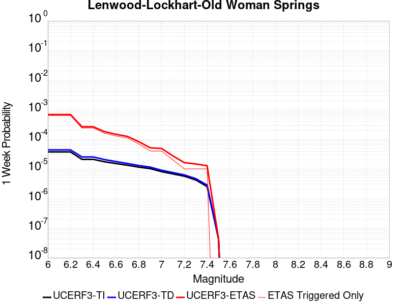 | 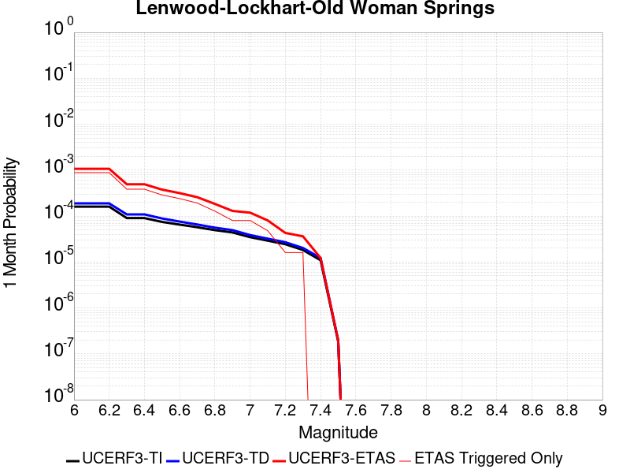 | 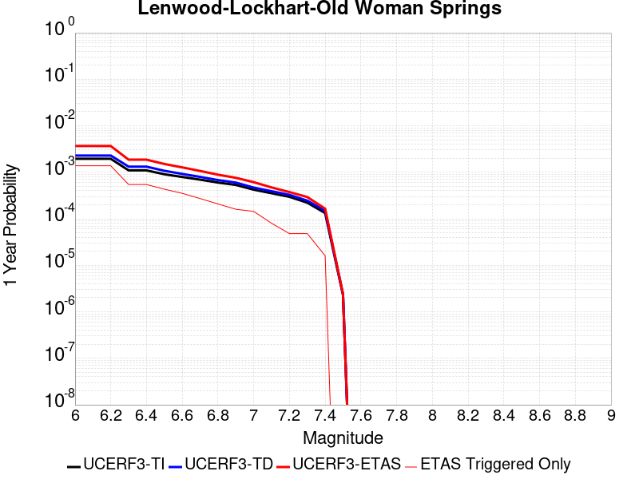 | 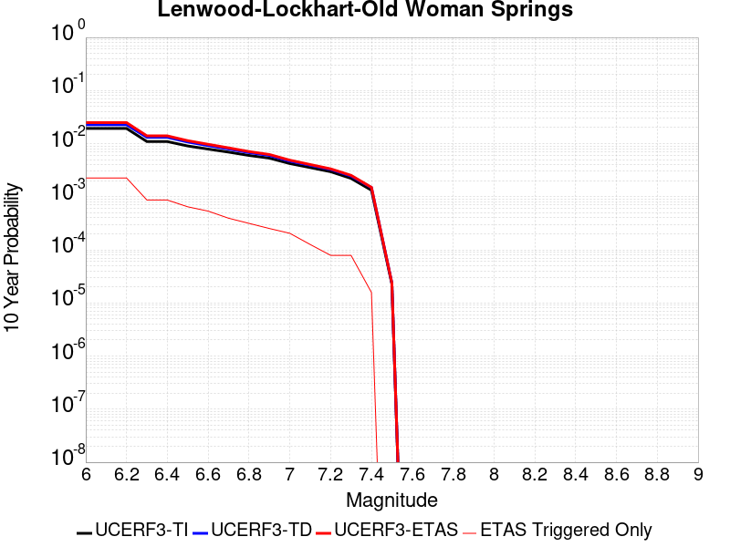 |

| Magnitude | 1 wk TI Prob | 1 wk TD Prob | 1 wk ETAS Prob | 1 wk ETAS/TD Gain | 1 wk ETAS Triggered Only | 1 mo TI Prob | 1 mo TD Prob | 1 mo ETAS Prob | 1 mo ETAS/TD Gain | 1 mo ETAS Triggered Only | 1 yr TI Prob | 1 yr TD Prob | 1 yr ETAS Prob | 1 yr ETAS/TD Gain | 1 yr ETAS Triggered Only | 10 yr TI Prob | 10 yr TD Prob | 10 yr ETAS Prob | 10 yr ETAS/TD Gain | 10 yr ETAS Triggered Only |
|-----|-----|-----|-----|-----|-----|-----|-----|-----|-----|-----|-----|-----|-----|-----|-----|-----|-----|-----|-----|-----|
| 6.0 | 3.744542E-5 | 4.396252E-5 | 6.839659E-4 | 15.557932 | 6.4003153E-4 | 1.604705E-4 | 1.8839816E-4 | 0.0011236526 | 5.964244 | 9.3543064E-4 | 0.0019519776 | 0.0022915069 | 0.0038142384 | 1.6645111 | 0.001526229 | 0.019349206 | 0.022696787 | 0.025006345 | 1.1017569 | 0.0023631933 |
| 6.1 | 3.744542E-5 | 4.396252E-5 | 6.839659E-4 | 15.557932 | 6.4003153E-4 | 1.604705E-4 | 1.8839816E-4 | 0.0011236526 | 5.964244 | 9.3543064E-4 | 0.0019519776 | 0.0022915069 | 0.0038142384 | 1.6645111 | 0.001526229 | 0.019349206 | 0.022696787 | 0.025006345 | 1.1017569 | 0.0023631933 |
| 6.2 | 3.744542E-5 | 4.396252E-5 | 6.839659E-4 | 15.557932 | 6.4003153E-4 | 1.604705E-4 | 1.8839816E-4 | 0.0011236526 | 5.964244 | 9.3543064E-4 | 0.0019519776 | 0.0022915069 | 0.0038142384 | 1.6645111 | 0.001526229 | 0.019349206 | 0.022696787 | 0.025006345 | 1.1017569 | 0.0023631933 |
| 6.3 | 2.1079984E-5 | 2.5353434E-5 | 2.468972E-4 | 9.7382145 | 2.2154937E-4 | 9.0339665E-5 | 1.0865316E-4 | 5.270898E-4 | 4.851123 | 4.1848214E-4 | 0.0010993304 | 0.0013220694 | 0.0019120867 | 1.4462831 | 5.907983E-4 | 0.010939079 | 0.0131442575 | 0.014018807 | 1.0665346 | 8.861975E-4 |
| 6.4 | 2.1079984E-5 | 2.5353434E-5 | 2.468972E-4 | 9.7382145 | 2.2154937E-4 | 9.0339665E-5 | 1.0865316E-4 | 5.270898E-4 | 4.851123 | 4.1848214E-4 | 0.0010993304 | 0.0013220694 | 0.0019120867 | 1.4462831 | 5.907983E-4 | 0.010939079 | 0.0131442575 | 0.014018807 | 1.0665346 | 8.861975E-4 |
| 6.5 | 1.7397282E-5 | 2.066241E-5 | 1.4374284E-4 | 6.9567323 | 1.2308298E-4 | 7.455765E-5 | 8.8550245E-5 | 3.8392324E-4 | 4.3356543 | 2.9539916E-4 | 9.073613E-4 | 0.0010775778 | 0.001520199 | 1.4107558 | 4.4309875E-4 | 0.009036654 | 0.010724821 | 0.011357988 | 1.0590376 | 6.4003153E-4 |
| 6.6 | 1.52050325E-5 | 1.7679693E-5 | 1.407605E-4 | 7.9617047 | 1.2308298E-4 | 6.51628E-5 | 7.576796E-5 | 3.4653E-4 | 4.5735693 | 2.7078256E-4 | 7.9306826E-4 | 9.220924E-4 | 0.0013155948 | 1.4267493 | 3.9386554E-4 | 0.007902439 | 0.009183526 | 0.009720118 | 1.0584298 | 5.415651E-4 |
| 6.7 | 1.332523E-5 | 1.5264002E-5 | 1.13728885E-4 | 7.4507904 | 9.8466386E-5 | 5.7106878E-5 | 6.5415545E-5 | 2.869504E-4 | 4.3865786 | 2.2154937E-4 | 6.950544E-4 | 7.961491E-4 | 0.0010913131 | 1.3707396 | 2.9539916E-4 | 0.006928845 | 0.007933599 | 0.00832434 | 1.0492514 | 3.9386554E-4 |
| 6.8 | 1.1525329E-5 | 1.3030979E-5 | 6.226353E-5 | 4.778116 | 4.9233193E-5 | 4.9393333E-5 | 5.584588E-5 | 2.0353722E-4 | 3.6446235 | 1.4769958E-4 | 6.011979E-4 | 6.797157E-4 | 9.0111454E-4 | 1.3257226 | 2.2154937E-4 | 0.00599574 | 0.006776819 | 0.0070702164 | 1.0432942 | 2.9539916E-4 |
| 6.9 | 1.0253909E-5 | 1.15144385E-5 | 3.613075E-5 | 3.1378648 | 2.4616596E-5 | 4.3944583E-5 | 4.9346683E-5 | 1.4780821E-4 | 2.995302 | 9.8466386E-5 | 5.3489394E-4 | 6.0063385E-4 | 7.728465E-4 | 1.2867182 | 1.7231617E-4 | 0.0053360825 | 0.0059904843 | 0.0062107067 | 1.036762 | 2.2154937E-4 |
| 7.0 | 8.104563E-6 | 8.991279E-6 | 3.3607655E-5 | 3.7378058 | 2.4616596E-5 | 3.4733377E-5 | 3.8533497E-5 | 1.369961E-4 | 3.5552468 | 9.8466386E-5 | 4.2279682E-4 | 4.6904673E-4 | 6.412821E-4 | 1.367203 | 1.7231617E-4 | 0.0042199334 | 0.0046808156 | 0.004901328 | 1.0471098 | 2.2154937E-4 |
| 7.1 | 6.7986157E-6 | 7.515816E-6 | 7.515816E-6 | 1.0 | 0.0 | 2.91366E-5 | 3.2210253E-5 | 8.144186E-5 | 2.5284452 | 4.9233193E-5 | 3.5468035E-4 | 3.920914E-4 | 4.9051916E-4 | 1.2510327 | 9.8466386E-5 | 0.003541148 | 0.003914213 | 0.004036814 | 1.031322 | 1.2308298E-4 |
| 7.2 | 5.6893327E-6 | 6.2800136E-6 | 6.2800136E-6 | 1.0 | 0.0 | 2.4382627E-5 | 2.6914078E-5 | 5.1530013E-5 | 1.9146118 | 2.4616596E-5 | 2.9681803E-4 | 3.2763163E-4 | 4.0145722E-4 | 1.2253311 | 7.384979E-5 | 0.002964219 | 0.0032716845 | 0.003369829 | 1.0299981 | 9.8466386E-5 |
| 7.3 | 4.253348E-6 | 4.7069107E-6 | 4.7069107E-6 | 1.0 | 0.0 | 1.8228506E-5 | 2.0172329E-5 | 4.4788427E-5 | 2.2202904 | 2.4616596E-5 | 2.2190946E-4 | 2.4557224E-4 | 3.194039E-4 | 1.3006514 | 7.384979E-5 | 0.00221688 | 0.0024531898 | 0.0025514145 | 1.0400397 | 9.8466386E-5 |
| 7.4 | 2.5448119E-6 | 2.852045E-6 | 2.852045E-6 | 1.0 | 0.0 | 1.0906291E-5 | 1.2223002E-5 | 1.2223002E-5 | 1.0 | 0.0 | 1.3277601E-4 | 1.4880655E-4 | 1.7341947E-4 | 1.1654022 | 2.4616596E-5 | 0.001326967 | 0.0014872311 | 0.0015118112 | 1.0165273 | 2.4616596E-5 |
| 7.5 | 4.3706837E-8 | 4.562909E-8 | 4.562909E-8 | 1.0 | 0.0 | 1.8731501E-7 | 1.9555324E-7 | 1.9555324E-7 | 1.0 | 0.0 | 2.2805577E-6 | 2.3808586E-6 | 2.3808586E-6 | 1.0 | 0.0 | 2.2805343E-5 | 2.3808387E-5 | 2.3808387E-5 | 1.0 | 0.0 |

## Towne Pass
*[(top)](#table-of-contents)*

| 1 Week | 1 Month | 1 Year | 10 Year |
|-----|-----|-----|-----|
| 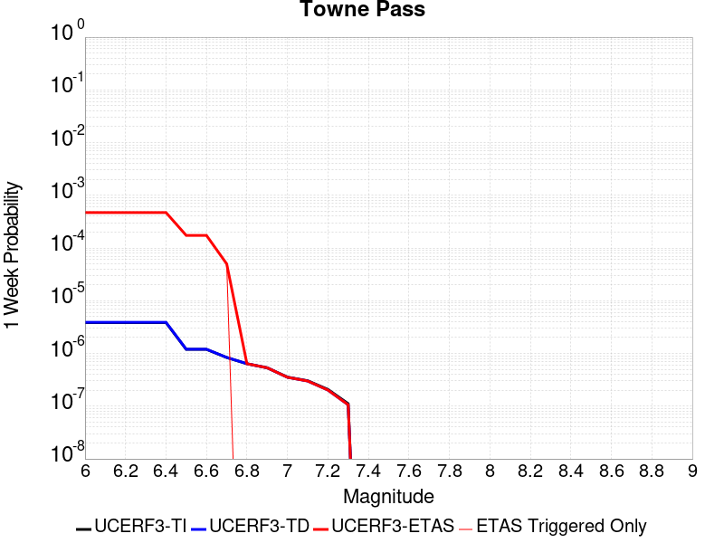 | 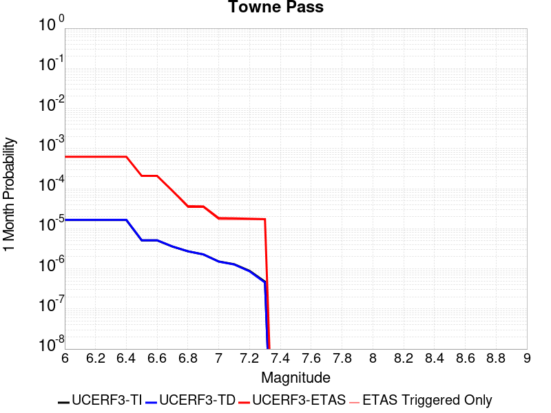 | 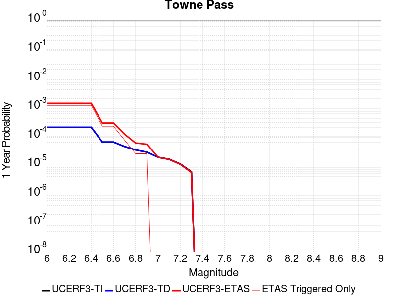 | 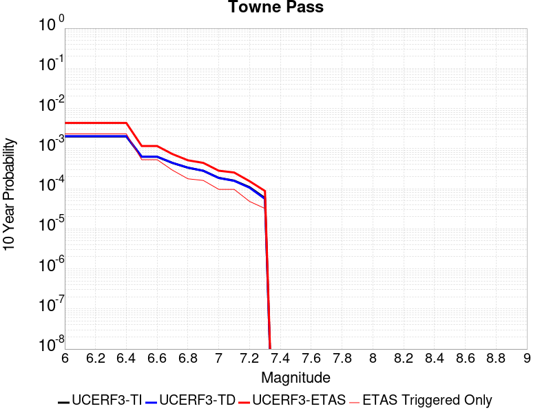 |

| Magnitude | 1 wk TI Prob | 1 wk TD Prob | 1 wk ETAS Prob | 1 wk ETAS/TD Gain | 1 wk ETAS Triggered Only | 1 mo TI Prob | 1 mo TD Prob | 1 mo ETAS Prob | 1 mo ETAS/TD Gain | 1 mo ETAS Triggered Only | 1 yr TI Prob | 1 yr TD Prob | 1 yr ETAS Prob | 1 yr ETAS/TD Gain | 1 yr ETAS Triggered Only | 10 yr TI Prob | 10 yr TD Prob | 10 yr ETAS Prob | 10 yr ETAS/TD Gain | 10 yr ETAS Triggered Only |
|-----|-----|-----|-----|-----|-----|-----|-----|-----|-----|-----|-----|-----|-----|-----|-----|-----|-----|-----|-----|-----|
| 6.0 | 3.849728E-6 | 3.8945414E-6 | 4.7160804E-4 | 121.094635 | 4.6771532E-4 | 1.649873E-5 | 1.669081E-5 | 6.3209544E-4 | 37.87087 | 6.1541493E-4 | 2.0085352E-4 | 2.0319603E-4 | 0.001359941 | 6.692754 | 0.00115698 | 0.0020067208 | 0.0020305314 | 0.004388926 | 2.1614668 | 0.0023631933 |
| 6.1 | 3.849728E-6 | 3.8945414E-6 | 4.7160804E-4 | 121.094635 | 4.6771532E-4 | 1.649873E-5 | 1.669081E-5 | 6.3209544E-4 | 37.87087 | 6.1541493E-4 | 2.0085352E-4 | 2.0319603E-4 | 0.001359941 | 6.692754 | 0.00115698 | 0.0020067208 | 0.0020305314 | 0.004388926 | 2.1614668 | 0.0023631933 |
| 6.2 | 3.849728E-6 | 3.8945414E-6 | 4.7160804E-4 | 121.094635 | 4.6771532E-4 | 1.649873E-5 | 1.669081E-5 | 6.3209544E-4 | 37.87087 | 6.1541493E-4 | 2.0085352E-4 | 2.0319603E-4 | 0.001359941 | 6.692754 | 0.00115698 | 0.0020067208 | 0.0020305314 | 0.004388926 | 2.1614668 | 0.0023631933 |
| 6.3 | 3.849728E-6 | 3.8945414E-6 | 4.7160804E-4 | 121.094635 | 4.6771532E-4 | 1.649873E-5 | 1.669081E-5 | 6.3209544E-4 | 37.87087 | 6.1541493E-4 | 2.0085352E-4 | 2.0319603E-4 | 0.001359941 | 6.692754 | 0.00115698 | 0.0020067208 | 0.0020305314 | 0.004388926 | 2.1614668 | 0.0023631933 |
| 6.4 | 3.849728E-6 | 3.8945414E-6 | 4.7160804E-4 | 121.094635 | 4.6771532E-4 | 1.649873E-5 | 1.669081E-5 | 6.3209544E-4 | 37.87087 | 6.1541493E-4 | 2.0085352E-4 | 2.0319603E-4 | 0.001359941 | 6.692754 | 0.00115698 | 0.0020067208 | 0.0020305314 | 0.004388926 | 2.1614668 | 0.0023631933 |
| 6.5 | 1.1953545E-6 | 1.203052E-6 | 1.7351902E-4 | 144.23235 | 1.7231617E-4 | 5.1229376E-6 | 5.1559277E-6 | 1.7747121E-4 | 34.42081 | 1.7231617E-4 | 6.236998E-5 | 6.277173E-5 | 2.843072E-4 | 4.5292234 | 2.2154937E-4 | 6.235248E-4 | 6.275517E-4 | 0.001168777 | 1.8624393 | 5.415651E-4 |
| 6.6 | 1.1953545E-6 | 1.203052E-6 | 1.7351902E-4 | 144.23235 | 1.7231617E-4 | 5.1229376E-6 | 5.1559277E-6 | 1.7747121E-4 | 34.42081 | 1.7231617E-4 | 6.236998E-5 | 6.277173E-5 | 2.843072E-4 | 4.5292234 | 2.2154937E-4 | 6.235248E-4 | 6.275517E-4 | 0.001168777 | 1.8624393 | 5.415651E-4 |
| 6.7 | 8.375951E-7 | 8.4106705E-7 | 5.0074217E-5 | 59.536537 | 4.9233193E-5 | 3.5896885E-6 | 3.6045683E-6 | 5.2837582E-5 | 14.658505 | 4.9233193E-5 | 4.370358E-5 | 4.3884793E-5 | 1.17731346E-4 | 2.6827366 | 7.384979E-5 | 4.3694986E-4 | 4.38767E-4 | 7.3403656E-4 | 1.672953 | 2.9539916E-4 |
| 6.8 | 6.38041E-7 | 6.392156E-7 | 6.392156E-7 | 1.0 | 0.0 | 2.7344586E-6 | 2.7394929E-6 | 2.7394929E-6 | 1.0 | 0.0 | 3.3291526E-5 | 3.3352855E-5 | 5.796863E-5 | 1.738041 | 2.4616596E-5 | 3.3286537E-4 | 3.334823E-4 | 4.8113262E-4 | 1.4427531 | 1.4769958E-4 |
| 6.9 | 5.3460053E-7 | 5.345333E-7 | 5.345333E-7 | 1.0 | 0.0 | 2.2911431E-6 | 2.2908553E-6 | 2.2908553E-6 | 1.0 | 0.0 | 2.789431E-5 | 2.789084E-5 | 5.2506748E-5 | 1.8825805 | 2.4616596E-5 | 2.789081E-4 | 2.7887672E-4 | 4.0192535E-4 | 1.4412296 | 1.2308298E-4 |
| 7.0 | 3.557783E-7 | 3.5324226E-7 | 3.5324226E-7 | 1.0 | 0.0 | 1.5247632E-6 | 1.5138945E-6 | 1.5138945E-6 | 1.0 | 0.0 | 1.8563835E-5 | 1.843152E-5 | 1.843152E-5 | 1.0 | 0.0 | 1.8562283E-4 | 1.8430075E-4 | 2.3352487E-4 | 1.2670858 | 4.9233193E-5 |
| 7.1 | 3.037942E-7 | 3.0002218E-7 | 3.0002218E-7 | 1.0 | 0.0 | 1.3019744E-6 | 1.2858087E-6 | 1.2858087E-6 | 1.0 | 0.0 | 1.5851423E-5 | 1.5654618E-5 | 1.5654618E-5 | 1.0 | 0.0 | 1.5850292E-4 | 1.5653588E-4 | 2.0576137E-4 | 1.3144678 | 4.9233193E-5 |
| 7.2 | 2.0808248E-7 | 2.0217689E-7 | 2.0217689E-7 | 1.0 | 0.0 | 8.917818E-7 | 8.6647213E-7 | 8.6647213E-7 | 1.0 | 0.0 | 1.0857389E-5 | 1.0549252E-5 | 1.0549252E-5 | 1.0 | 0.0 | 1.0856859E-4 | 1.0548797E-4 | 1.3010197E-4 | 1.2333347 | 2.4616596E-5 |
| 7.3 | 1.1162073E-7 | 1.0636894E-7 | 1.0636894E-7 | 1.0 | 0.0 | 4.7837443E-7 | 4.558668E-7 | 4.558668E-7 | 1.0 | 0.0 | 5.8241935E-6 | 5.550166E-6 | 5.550166E-6 | 1.0 | 0.0 | 5.8240406E-5 | 5.5500474E-5 | 5.5500474E-5 | 1.0 | 0.0 |

## San Andreas (Mojave N)
*[(top)](#table-of-contents)*

| 1 Week | 1 Month | 1 Year | 10 Year |
|-----|-----|-----|-----|
| 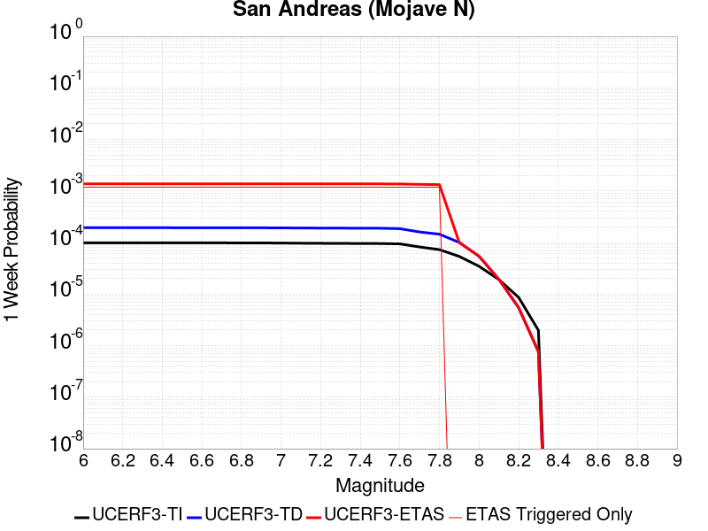 |  | 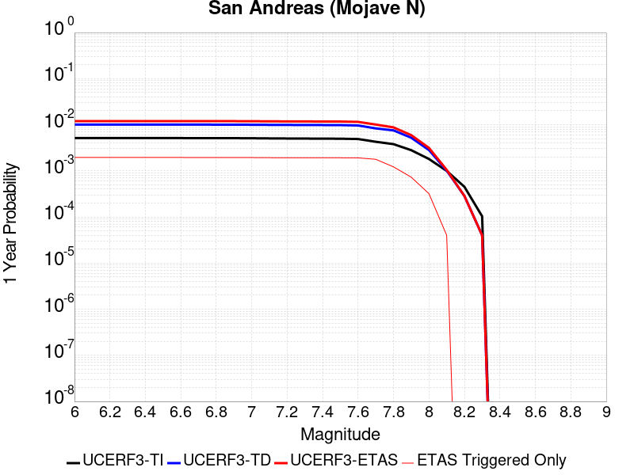 | 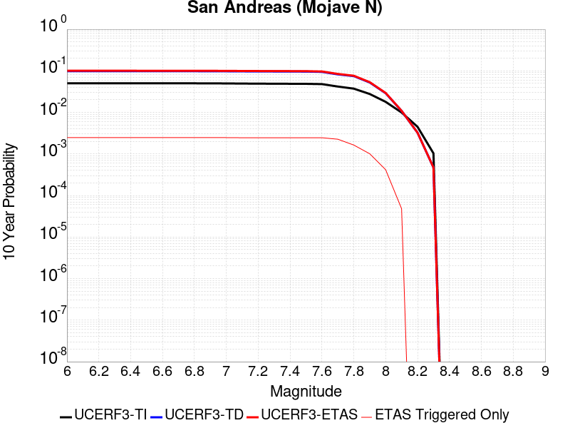 |

| Magnitude | 1 wk TI Prob | 1 wk TD Prob | 1 wk ETAS Prob | 1 wk ETAS/TD Gain | 1 wk ETAS Triggered Only | 1 mo TI Prob | 1 mo TD Prob | 1 mo ETAS Prob | 1 mo ETAS/TD Gain | 1 mo ETAS Triggered Only | 1 yr TI Prob | 1 yr TD Prob | 1 yr ETAS Prob | 1 yr ETAS/TD Gain | 1 yr ETAS Triggered Only | 10 yr TI Prob | 10 yr TD Prob | 10 yr ETAS Prob | 10 yr ETAS/TD Gain | 10 yr ETAS Triggered Only |
|-----|-----|-----|-----|-----|-----|-----|-----|-----|-----|-----|-----|-----|-----|-----|-----|-----|-----|-----|-----|-----|
| 6.0 | 9.877682E-5 | 1.9400702E-4 | 0.001153868 | 5.9475584 | 9.6004724E-4 | 4.2326056E-4 | 8.311939E-4 | 0.002110193 | 2.5387492 | 0.0012800631 | 0.0051410277 | 0.010072956 | 0.011900604 | 1.1814411 | 0.0018462448 | 0.05023708 | 0.09831428 | 0.10044513 | 1.0216739 | 0.0023631933 |
| 6.1 | 9.877682E-5 | 1.9400702E-4 | 0.001153868 | 5.9475584 | 9.6004724E-4 | 4.2326056E-4 | 8.311939E-4 | 0.002110193 | 2.5387492 | 0.0012800631 | 0.0051410277 | 0.010072956 | 0.011900604 | 1.1814411 | 0.0018462448 | 0.05023708 | 0.09831428 | 0.10044513 | 1.0216739 | 0.0023631933 |
| 6.2 | 9.877682E-5 | 1.9400702E-4 | 0.001153868 | 5.9475584 | 9.6004724E-4 | 4.2326056E-4 | 8.311939E-4 | 0.002110193 | 2.5387492 | 0.0012800631 | 0.0051410277 | 0.010072956 | 0.011900604 | 1.1814411 | 0.0018462448 | 0.05023708 | 0.09831428 | 0.10044513 | 1.0216739 | 0.0023631933 |
| 6.3 | 9.877682E-5 | 1.9400702E-4 | 0.001153868 | 5.9475584 | 9.6004724E-4 | 4.2326056E-4 | 8.311939E-4 | 0.002110193 | 2.5387492 | 0.0012800631 | 0.0051410277 | 0.010072956 | 0.011900604 | 1.1814411 | 0.0018462448 | 0.05023708 | 0.09831428 | 0.10044513 | 1.0216739 | 0.0023631933 |
| 6.4 | 9.877682E-5 | 1.9400702E-4 | 0.001153868 | 5.9475584 | 9.6004724E-4 | 4.2326056E-4 | 8.311939E-4 | 0.002110193 | 2.5387492 | 0.0012800631 | 0.0051410277 | 0.010072956 | 0.011900604 | 1.1814411 | 0.0018462448 | 0.05023708 | 0.09831428 | 0.10044513 | 1.0216739 | 0.0023631933 |
| 6.5 | 9.861474E-5 | 1.9374468E-4 | 0.001153606 | 5.9542584 | 9.6004724E-4 | 4.2256617E-4 | 8.300703E-4 | 0.0021090708 | 2.540834 | 0.0012800631 | 0.0051326132 | 0.010059402 | 0.011887075 | 1.181688 | 0.0018462448 | 0.050156746 | 0.098192066 | 0.100323215 | 1.0217038 | 0.0023631933 |
| 6.6 | 9.861474E-5 | 1.9374468E-4 | 0.001153606 | 5.9542584 | 9.6004724E-4 | 4.2256617E-4 | 8.300703E-4 | 0.0021090708 | 2.540834 | 0.0012800631 | 0.0051326132 | 0.010059402 | 0.011887075 | 1.181688 | 0.0018462448 | 0.050156746 | 0.098192066 | 0.100323215 | 1.0217038 | 0.0023631933 |
| 6.7 | 9.8552715E-5 | 1.9364421E-4 | 0.0011535055 | 5.9568295 | 9.6004724E-4 | 4.223004E-4 | 8.2964E-4 | 0.002108641 | 2.5416338 | 0.0012800631 | 0.0051293927 | 0.010054212 | 0.011881894 | 1.1817827 | 0.0018462448 | 0.050125998 | 0.098145254 | 0.100276515 | 1.0217153 | 0.0023631933 |
| 6.8 | 9.8464974E-5 | 1.9349584E-4 | 0.0011533573 | 5.960631 | 9.6004724E-4 | 4.219245E-4 | 8.290045E-4 | 0.0021080063 | 2.5428164 | 0.0012800631 | 0.0051248376 | 0.010046546 | 0.011874243 | 1.1819228 | 0.0018462448 | 0.05008251 | 0.09807528 | 0.1002067 | 1.0217326 | 0.0023631933 |
| 6.9 | 9.825824E-5 | 1.9317595E-4 | 0.0011530378 | 5.9688478 | 9.6004724E-4 | 4.2103877E-4 | 8.276344E-4 | 0.002106638 | 2.5453727 | 0.0012800631 | 0.0051141046 | 0.010030019 | 0.011857746 | 1.1822257 | 0.0018462448 | 0.049980022 | 0.09792438 | 0.10005616 | 1.0217696 | 0.0023631933 |
| 7.0 | 9.781462E-5 | 1.924896E-4 | 0.0011523521 | 5.986568 | 9.6004724E-4 | 4.1913814E-4 | 8.246948E-4 | 0.0021037022 | 2.5508857 | 0.0012800631 | 0.005091073 | 0.009994558 | 0.01182235 | 1.1828787 | 0.0018462448 | 0.04976007 | 0.09760077 | 0.099733315 | 1.0218496 | 0.0023631933 |
| 7.1 | 9.7121134E-5 | 1.9150671E-4 | 0.0011513701 | 6.0121655 | 9.6004724E-4 | 4.1616702E-4 | 8.204851E-4 | 0.002099498 | 2.5588493 | 0.0012800631 | 0.005055068 | 0.009943774 | 0.01177166 | 1.1838222 | 0.0018462448 | 0.04941613 | 0.09713728 | 0.0992487 | 1.0217364 | 0.0023385766 |
| 7.2 | 9.663819E-5 | 1.9081456E-4 | 0.0011506786 | 6.03035 | 9.6004724E-4 | 4.1409794E-4 | 8.175206E-4 | 0.0020965373 | 2.5645068 | 0.0012800631 | 0.0050299936 | 0.00990801 | 0.011735963 | 1.1844923 | 0.0018462448 | 0.049176537 | 0.09681055 | 0.09892272 | 1.0218177 | 0.0023385766 |
| 7.3 | 9.6277574E-5 | 1.9033969E-4 | 0.0011502042 | 6.0429025 | 9.6004724E-4 | 4.125529E-4 | 8.154867E-4 | 0.0020945058 | 2.568412 | 0.0012800631 | 0.0050112694 | 0.009883473 | 0.01171147 | 1.184955 | 0.0018462448 | 0.04899759 | 0.09658401 | 0.098696716 | 1.0218743 | 0.0023385766 |
| 7.4 | 9.593308E-5 | 1.897375E-4 | 0.0011496026 | 6.058911 | 9.6004724E-4 | 4.1107697E-4 | 8.129075E-4 | 0.00209193 | 2.5733924 | 0.0012800631 | 0.0049933824 | 0.009852355 | 0.01168041 | 1.185545 | 0.0018462448 | 0.04882661 | 0.09630218 | 0.09841555 | 1.0219451 | 0.0023385766 |
| 7.5 | 9.561707E-5 | 1.8919831E-4 | 0.0011490639 | 6.073331 | 9.6004724E-4 | 4.0972308E-4 | 8.1059814E-4 | 0.0020896236 | 2.5778785 | 0.0012800631 | 0.0049769743 | 0.009824493 | 0.011652599 | 1.1860764 | 0.0018462448 | 0.048669744 | 0.09604836 | 0.09816232 | 1.0220094 | 0.0023385766 |
| 7.6 | 9.418194E-5 | 1.8572104E-4 | 0.00114559 | 6.168337 | 9.6004724E-4 | 4.0357444E-4 | 7.957047E-4 | 0.0020747492 | 2.6074362 | 0.0012800631 | 0.004902454 | 0.009644784 | 0.011473223 | 1.1895779 | 0.0018462448 | 0.047957025 | 0.094430685 | 0.09654843 | 1.0224265 | 0.0023385766 |
| 7.7 | 8.202141E-5 | 1.6021315E-4 | 0.0010954939 | 6.837728 | 9.3543064E-4 | 3.51473E-4 | 6.8644714E-4 | 0.001916432 | 2.791813 | 0.0012308299 | 0.00427079 | 0.008325525 | 0.010083163 | 1.2111145 | 0.001772395 | 0.04189639 | 0.08223219 | 0.08424291 | 1.0244517 | 0.002190877 |
| 7.8 | 7.2859846E-5 | 1.4516473E-4 | 8.0971635E-4 | 5.577914 | 6.6464813E-4 | 3.1221908E-4 | 6.219862E-4 | 0.0014830312 | 2.3843474 | 8.615809E-4 | 0.003794643 | 0.0075464295 | 0.0088656945 | 1.1748197 | 0.0013292963 | 0.037304975 | 0.07472468 | 0.07627352 | 1.0207274 | 0.0016739286 |
| 7.9 | 5.3874453E-5 | 1.0045676E-4 | 5.1889685E-4 | 5.165375 | 4.1848214E-4 | 2.3087008E-4 | 4.3045796E-4 | 9.7178994E-4 | 2.2575724 | 5.415651E-4 | 0.0028072202 | 0.0052282433 | 0.0060363435 | 1.1545645 | 8.123477E-4 | 0.02772022 | 0.05242443 | 0.053404126 | 1.0186877 | 0.001033897 |
| 8.0 | 3.468538E-5 | 5.4260272E-5 | 2.7579762E-4 | 5.0828648 | 2.2154937E-4 | 1.4864317E-4 | 2.325233E-4 | 5.524646E-4 | 2.375954 | 3.2001577E-4 | 0.0018082283 | 0.002827298 | 0.00322005 | 1.1389142 | 3.9386554E-4 | 0.017935853 | 0.028947512 | 0.029425591 | 1.0165154 | 4.923319E-4 |
| 8.1 | 1.9152367E-5 | 1.940263E-5 | 4.401875E-5 | 2.2687001 | 2.4616596E-5 | 8.207899E-5 | 8.3151484E-5 | 1.3238058E-4 | 1.5920411 | 4.9233193E-5 | 9.988535E-4 | 0.0010118998 | 0.0010610832 | 1.048605 | 4.9233193E-5 | 0.009943757 | 0.01085625 | 0.010929299 | 1.0067286 | 7.384979E-5 |
| 8.2 | 8.643924E-6 | 5.4748625E-6 | 5.4748625E-6 | 1.0 | 0.0 | 3.704486E-5 | 2.3463486E-5 | 2.3463486E-5 | 1.0 | 0.0 | 4.5092785E-4 | 2.8563058E-4 | 2.8563058E-4 | 1.0 | 0.0 | 0.0045001395 | 0.0032487072 | 0.0032487072 | 1.0 | 0.0 |
| 8.3 | 1.983087E-6 | 7.6599065E-7 | 7.6599065E-7 | 1.0 | 0.0 | 8.498917E-6 | 3.282813E-6 | 3.282813E-6 | 1.0 | 0.0 | 1.034694E-4 | 3.9967534E-5 | 3.9967534E-5 | 1.0 | 0.0 | 0.0010342124 | 4.719687E-4 | 4.719687E-4 | 1.0 | 0.0 |

## Sierra Nevada  (No Extension)
*[(top)](#table-of-contents)*

| 1 Week | 1 Month | 1 Year | 10 Year |
|-----|-----|-----|-----|
| 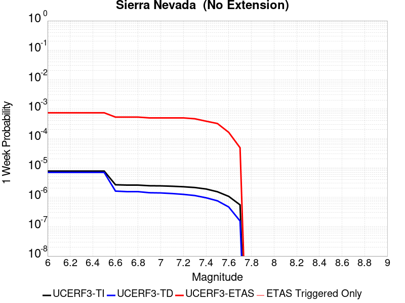 | 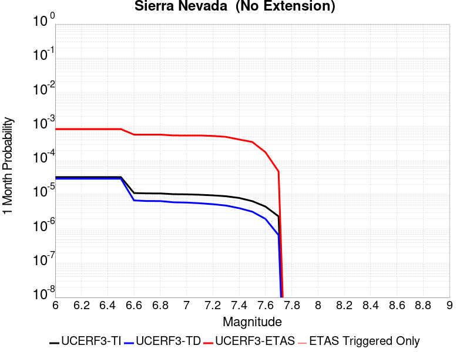 | 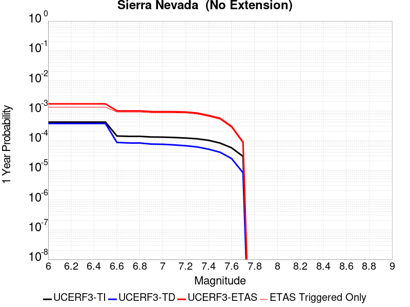 | 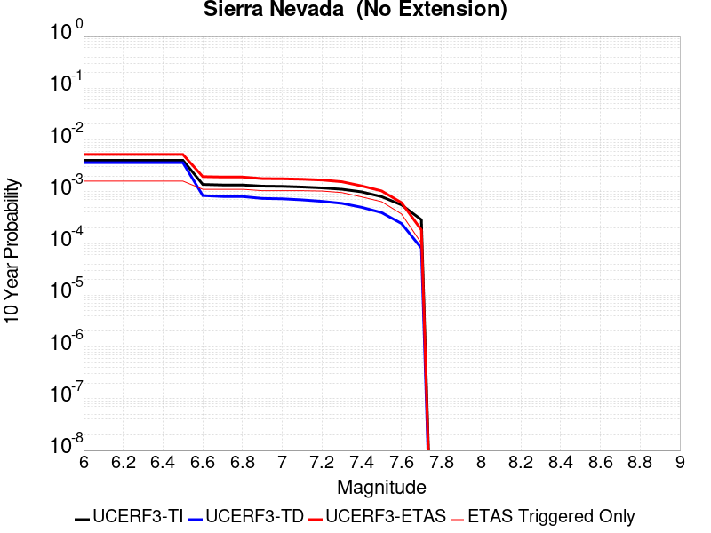 |

| Magnitude | 1 wk TI Prob | 1 wk TD Prob | 1 wk ETAS Prob | 1 wk ETAS/TD Gain | 1 wk ETAS Triggered Only | 1 mo TI Prob | 1 mo TD Prob | 1 mo ETAS Prob | 1 mo ETAS/TD Gain | 1 mo ETAS Triggered Only | 1 yr TI Prob | 1 yr TD Prob | 1 yr ETAS Prob | 1 yr ETAS/TD Gain | 1 yr ETAS Triggered Only | 10 yr TI Prob | 10 yr TD Prob | 10 yr ETAS Prob | 10 yr ETAS/TD Gain | 10 yr ETAS Triggered Only |
|-----|-----|-----|-----|-----|-----|-----|-----|-----|-----|-----|-----|-----|-----|-----|-----|-----|-----|-----|-----|-----|
| 6.0 | 7.7690465E-6 | 6.976322E-6 | 6.4700335E-4 | 92.74277 | 6.4003153E-4 | 3.329549E-5 | 2.9898381E-5 | 7.4375834E-4 | 24.876207 | 7.138813E-4 | 4.0529718E-4 | 3.6398784E-4 | 0.0014467238 | 3.974649 | 0.0010831302 | 0.004045588 | 0.0036374326 | 0.005133583 | 1.4113204 | 0.0015016124 |
| 6.1 | 7.7690465E-6 | 6.976322E-6 | 6.4700335E-4 | 92.74277 | 6.4003153E-4 | 3.329549E-5 | 2.9898381E-5 | 7.4375834E-4 | 24.876207 | 7.138813E-4 | 4.0529718E-4 | 3.6398784E-4 | 0.0014467238 | 3.974649 | 0.0010831302 | 0.004045588 | 0.0036374326 | 0.005133583 | 1.4113204 | 0.0015016124 |
| 6.2 | 7.7690465E-6 | 6.976322E-6 | 6.4700335E-4 | 92.74277 | 6.4003153E-4 | 3.329549E-5 | 2.9898381E-5 | 7.4375834E-4 | 24.876207 | 7.138813E-4 | 4.0529718E-4 | 3.6398784E-4 | 0.0014467238 | 3.974649 | 0.0010831302 | 0.004045588 | 0.0036374326 | 0.005133583 | 1.4113204 | 0.0015016124 |
| 6.3 | 7.7690465E-6 | 6.976322E-6 | 6.4700335E-4 | 92.74277 | 6.4003153E-4 | 3.329549E-5 | 2.9898381E-5 | 7.4375834E-4 | 24.876207 | 7.138813E-4 | 4.0529718E-4 | 3.6398784E-4 | 0.0014467238 | 3.974649 | 0.0010831302 | 0.004045588 | 0.0036374326 | 0.005133583 | 1.4113204 | 0.0015016124 |
| 6.4 | 7.7690465E-6 | 6.976322E-6 | 6.4700335E-4 | 92.74277 | 6.4003153E-4 | 3.329549E-5 | 2.9898381E-5 | 7.4375834E-4 | 24.876207 | 7.138813E-4 | 4.0529718E-4 | 3.6398784E-4 | 0.0014467238 | 3.974649 | 0.0010831302 | 0.004045588 | 0.0036374326 | 0.005133583 | 1.4113204 | 0.0015016124 |
| 6.5 | 7.7690465E-6 | 6.976322E-6 | 6.4700335E-4 | 92.74277 | 6.4003153E-4 | 3.329549E-5 | 2.9898381E-5 | 7.4375834E-4 | 24.876207 | 7.138813E-4 | 4.0529718E-4 | 3.6398784E-4 | 0.0014467238 | 3.974649 | 0.0010831302 | 0.004045588 | 0.0036374326 | 0.005133583 | 1.4113204 | 0.0015016124 |
| 6.6 | 2.653E-6 | 1.614854E-6 | 5.431791E-4 | 336.36423 | 5.415651E-4 | 1.136995E-5 | 6.9207845E-6 | 5.97715E-4 | 86.36521 | 5.907983E-4 | 1.3842035E-4 | 8.425733E-5 | 8.9653657E-4 | 10.640458 | 8.123477E-4 | 0.0013833415 | 8.422573E-4 | 0.0019490711 | 2.3141043 | 0.0011077469 |
| 6.7 | 2.5902466E-6 | 1.5501876E-6 | 5.431145E-4 | 350.35403 | 5.415651E-4 | 1.11010095E-5 | 6.643644E-6 | 5.97438E-4 | 89.926254 | 5.907983E-4 | 1.351464E-4 | 8.0883394E-5 | 8.9316536E-4 | 11.04263 | 8.123477E-4 | 0.0013506424 | 8.0854254E-4 | 0.0019153937 | 2.368946 | 0.0011077469 |
| 6.8 | 2.5853892E-6 | 1.5469877E-6 | 5.431113E-4 | 351.07666 | 5.415651E-4 | 1.1080193E-5 | 6.629931E-6 | 5.9742434E-4 | 90.11019 | 5.907983E-4 | 1.34893E-4 | 8.071645E-5 | 8.9299853E-4 | 11.063402 | 8.123477E-4 | 0.0013481114 | 8.068743E-4 | 0.0019137273 | 2.3717787 | 0.0011077469 |
| 6.9 | 2.458257E-6 | 1.4220619E-6 | 5.1836984E-4 | 364.51987 | 5.169485E-4 | 1.0535345E-5 | 6.094537E-6 | 5.722728E-4 | 93.89931 | 5.661817E-4 | 1.2826028E-4 | 7.4198484E-5 | 8.372564E-4 | 11.284009 | 7.631145E-4 | 0.0012818627 | 7.4173906E-4 | 0.0017748693 | 2.3928485 | 0.001033897 |
| 7.0 | 2.4341468E-6 | 1.3990258E-6 | 5.1834685E-4 | 370.50555 | 5.169485E-4 | 1.0432016E-5 | 5.9958115E-6 | 5.7217415E-4 | 95.42898 | 5.661817E-4 | 1.270024E-4 | 7.2996576E-5 | 8.360554E-4 | 11.45335 | 7.631145E-4 | 0.0012692984 | 7.297279E-4 | 0.0017628705 | 2.4157915 | 0.001033897 |
| 7.1 | 2.3652476E-6 | 1.3339754E-6 | 5.182818E-4 | 388.52426 | 5.169485E-4 | 1.0136736E-5 | 5.717025E-6 | 5.718955E-4 | 100.03376 | 5.661817E-4 | 1.2340778E-4 | 6.9602575E-5 | 8.3266397E-4 | 11.9631195 | 7.631145E-4 | 0.0012333926 | 6.9580943E-4 | 0.0017289871 | 2.484857 | 0.001033897 |
| 7.2 | 2.272158E-6 | 1.2502821E-6 | 5.181982E-4 | 414.465 | 5.169485E-4 | 9.737784E-6 | 5.3583412E-6 | 5.71537E-4 | 106.663055 | 5.661817E-4 | 1.1855107E-4 | 6.5235865E-5 | 8.283006E-4 | 12.697012 | 7.631145E-4 | 0.0011848784 | 6.5216864E-4 | 0.0016607909 | 2.5465665 | 0.0010092804 |
| 7.3 | 2.1382127E-6 | 1.1419703E-6 | 4.934733E-4 | 432.1245 | 4.923319E-4 | 9.163737E-6 | 4.8941492E-6 | 5.464566E-4 | 111.65508 | 5.415651E-4 | 1.1156279E-4 | 5.958465E-5 | 7.734234E-4 | 12.980247 | 7.138813E-4 | 0.001115068 | 5.956879E-4 | 0.0015305614 | 2.5694015 | 9.3543064E-4 |
| 7.4 | 1.9048055E-6 | 9.575242E-7 | 4.1943925E-4 | 438.0456 | 4.1848214E-4 | 8.163426E-6 | 4.1036687E-6 | 4.718171E-4 | 114.97445 | 4.6771532E-4 | 9.9385186E-5 | 4.996103E-5 | 6.653452E-4 | 13.317284 | 6.1541493E-4 | 9.934074E-4 | 4.994987E-4 | 0.0012868363 | 2.5762556 | 7.877311E-4 |
| 7.5 | 1.5373403E-6 | 7.560042E-7 | 3.9462125E-4 | 521.98285 | 3.9386554E-4 | 6.5885843E-6 | 3.2400142E-6 | 4.463373E-4 | 137.75783 | 4.4309875E-4 | 8.021306E-5 | 3.9446462E-5 | 5.809902E-4 | 14.728576 | 5.415651E-4 | 8.0184115E-4 | 3.943951E-4 | 0.001083388 | 2.746961 | 6.892647E-4 |
| 7.6 | 1.0680322E-6 | 4.6596554E-7 | 1.9739865E-4 | 423.63358 | 1.9693277E-4 | 4.577273E-6 | 1.9969937E-6 | 2.2354593E-4 | 111.94122 | 2.2154937E-4 | 5.5726876E-5 | 2.4313129E-5 | 3.197051E-4 | 13.149484 | 2.9539916E-4 | 5.5712904E-4 | 2.4310495E-4 | 6.6148536E-4 | 2.7209868 | 4.1848214E-4 |
| 7.7 | 5.509146E-7 | 1.5580486E-7 | 4.938899E-5 | 316.9926 | 4.9233193E-5 | 2.3610605E-6 | 6.677349E-7 | 4.9900897E-5 | 74.73159 | 4.9233193E-5 | 2.8745531E-5 | 8.129644E-6 | 8.197883E-5 | 10.08394 | 7.384979E-5 | 2.8741814E-4 | 8.1293576E-5 | 1.7975197E-4 | 2.2111459 | 9.8466386E-5 |

## Bicycle Lake
*[(top)](#table-of-contents)*

| 1 Week | 1 Month | 1 Year | 10 Year |
|-----|-----|-----|-----|
| 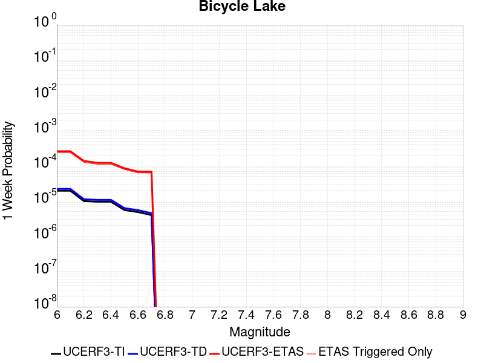 | 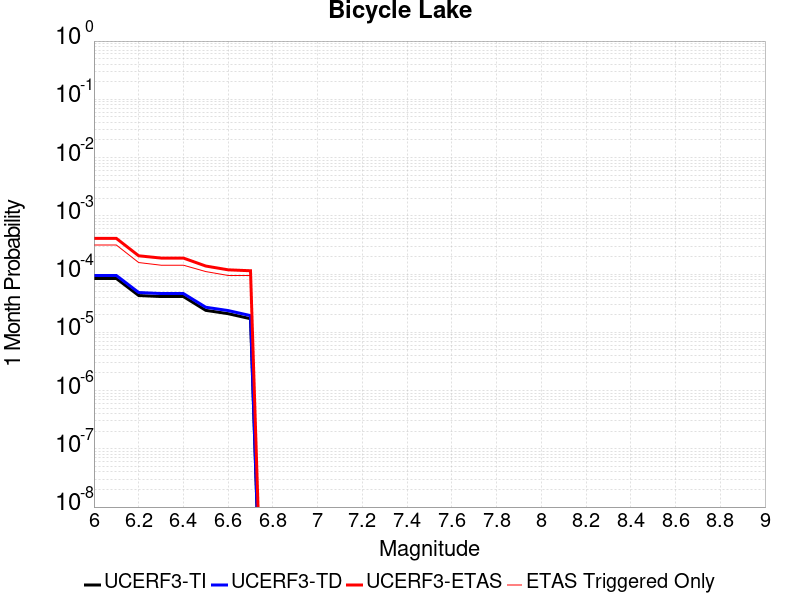 | 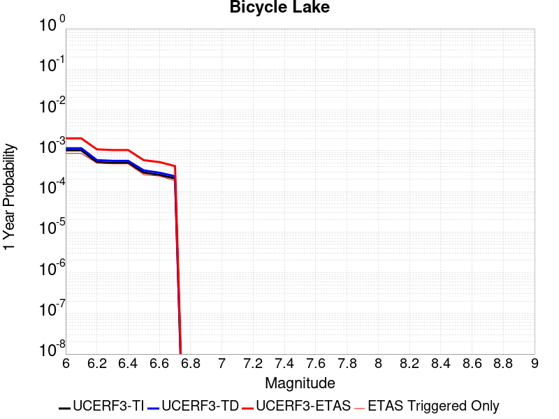 | 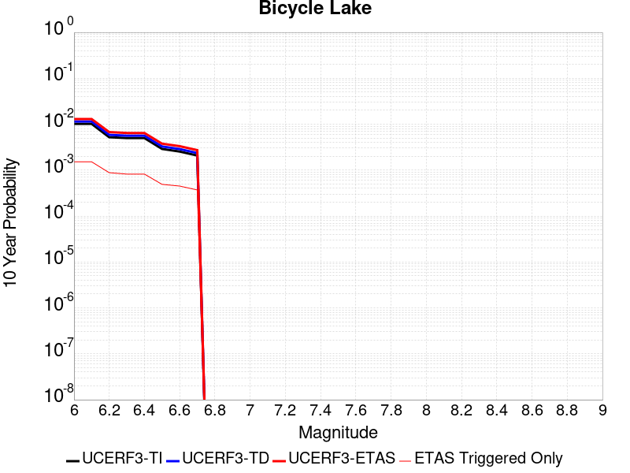 |

| Magnitude | 1 wk TI Prob | 1 wk TD Prob | 1 wk ETAS Prob | 1 wk ETAS/TD Gain | 1 wk ETAS Triggered Only | 1 mo TI Prob | 1 mo TD Prob | 1 mo ETAS Prob | 1 mo ETAS/TD Gain | 1 mo ETAS Triggered Only | 1 yr TI Prob | 1 yr TD Prob | 1 yr ETAS Prob | 1 yr ETAS/TD Gain | 1 yr ETAS Triggered Only | 10 yr TI Prob | 10 yr TD Prob | 10 yr ETAS Prob | 10 yr ETAS/TD Gain | 10 yr ETAS Triggered Only |
|-----|-----|-----|-----|-----|-----|-----|-----|-----|-----|-----|-----|-----|-----|-----|-----|-----|-----|-----|-----|-----|
| 6.0 | 1.9621975E-5 | 2.2097078E-5 | 1.9440944E-4 | 8.797971 | 1.7231617E-4 | 8.4091465E-5 | 9.4699084E-5 | 3.4084174E-4 | 3.5992084 | 2.4616596E-4 | 0.0010233327 | 0.0011524865 | 0.0019393098 | 1.6827179 | 7.877311E-4 | 0.01018633 | 0.011478408 | 0.012962785 | 1.129319 | 0.0015016124 |
| 6.1 | 1.9621975E-5 | 2.2097078E-5 | 1.9440944E-4 | 8.797971 | 1.7231617E-4 | 8.4091465E-5 | 9.4699084E-5 | 3.4084174E-4 | 3.5992084 | 2.4616596E-4 | 0.0010233327 | 0.0011524865 | 0.0019393098 | 1.6827179 | 7.877311E-4 | 0.01018633 | 0.011478408 | 0.012962785 | 1.129319 | 0.0015016124 |
| 6.2 | 9.9971285E-6 | 1.1255639E-5 | 8.51046E-5 | 7.561063 | 7.384979E-5 | 4.2844134E-5 | 4.8237856E-5 | 1.4669949E-4 | 3.0411694 | 9.8466386E-5 | 5.2150246E-4 | 5.871896E-4 | 0.0010300282 | 1.7541661 | 4.4309875E-4 | 0.0052028033 | 0.005861487 | 0.006693545 | 1.1419535 | 8.369643E-4 |
| 6.3 | 9.589428E-6 | 1.0798346E-5 | 8.464734E-5 | 7.838917 | 7.384979E-5 | 4.10969E-5 | 4.62781E-5 | 1.4473993E-4 | 3.1276119 | 9.8466386E-5 | 5.002399E-4 | 5.6334207E-4 | 0.0010061911 | 1.7861105 | 4.4309875E-4 | 0.0049911533 | 0.0056242296 | 0.0064320085 | 1.1436248 | 8.123477E-4 |
| 6.4 | 9.589428E-6 | 1.0798346E-5 | 8.464734E-5 | 7.838917 | 7.384979E-5 | 4.10969E-5 | 4.62781E-5 | 1.4473993E-4 | 3.1276119 | 9.8466386E-5 | 5.002399E-4 | 5.6334207E-4 | 0.0010061911 | 1.7861105 | 4.4309875E-4 | 0.0049911533 | 0.0056242296 | 0.0064320085 | 1.1436248 | 8.123477E-4 |
| 6.5 | 5.557707E-6 | 6.2856016E-6 | 5.5518485E-5 | 8.832644 | 4.9233193E-5 | 2.3818526E-5 | 2.6938165E-5 | 1.0078597E-4 | 3.741382 | 7.384979E-5 | 2.8995197E-4 | 3.2794967E-4 | 5.7403493E-4 | 1.7503749 | 2.4616596E-4 | 0.0028957394 | 0.0032772934 | 0.0037925479 | 1.1572195 | 5.169485E-4 |
| 6.6 | 4.8742945E-6 | 5.5132896E-6 | 5.474621E-5 | 9.929863 | 4.9233193E-5 | 2.0889667E-5 | 2.3628318E-5 | 9.747636E-5 | 4.1254044 | 7.384979E-5 | 2.54302E-4 | 2.87663E-4 | 5.3375814E-4 | 1.8554981 | 2.4616596E-4 | 0.002540112 | 0.0028754752 | 0.0033663914 | 1.1707252 | 4.923319E-4 |
| 6.7 | 3.991108E-6 | 4.5159104E-6 | 5.374888E-5 | 11.902114 | 4.9233193E-5 | 1.7104636E-5 | 1.9353902E-5 | 9.320226E-5 | 4.8156834 | 7.384979E-5 | 2.0822904E-4 | 2.3563375E-4 | 4.0790933E-4 | 1.7311158 | 1.7231617E-4 | 0.0020803404 | 0.0023563374 | 0.0027247164 | 1.1563354 | 3.6924894E-4 |

## Paradise
*[(top)](#table-of-contents)*

| 1 Week | 1 Month | 1 Year | 10 Year |
|-----|-----|-----|-----|
| 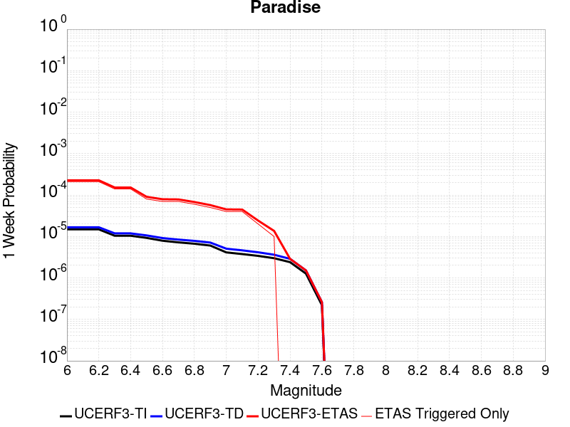 | 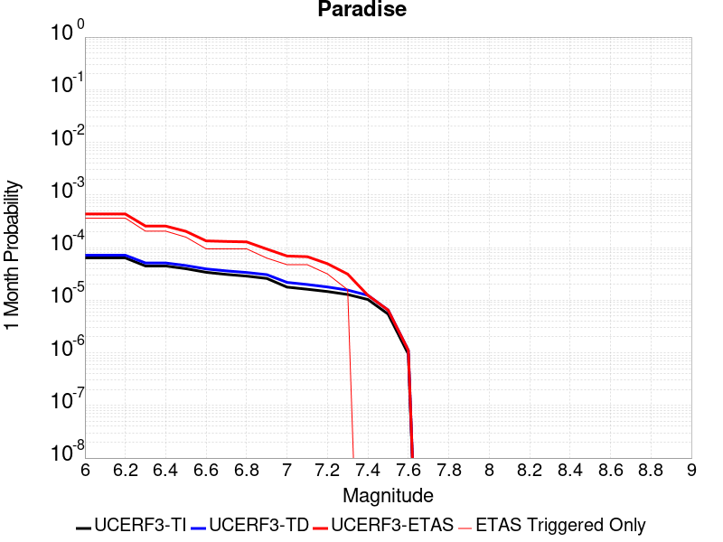 | 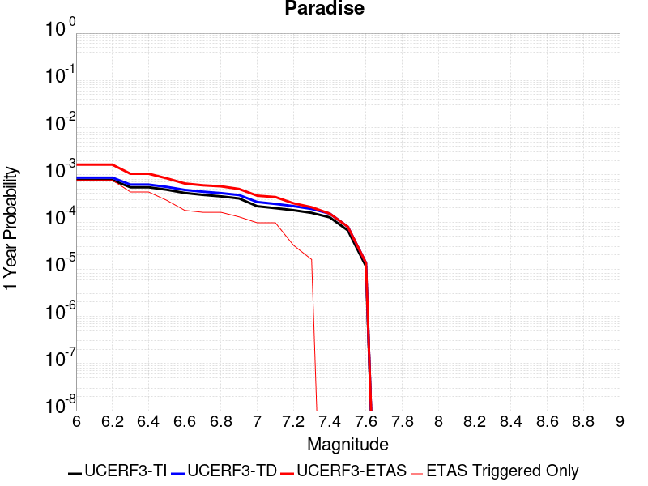 | 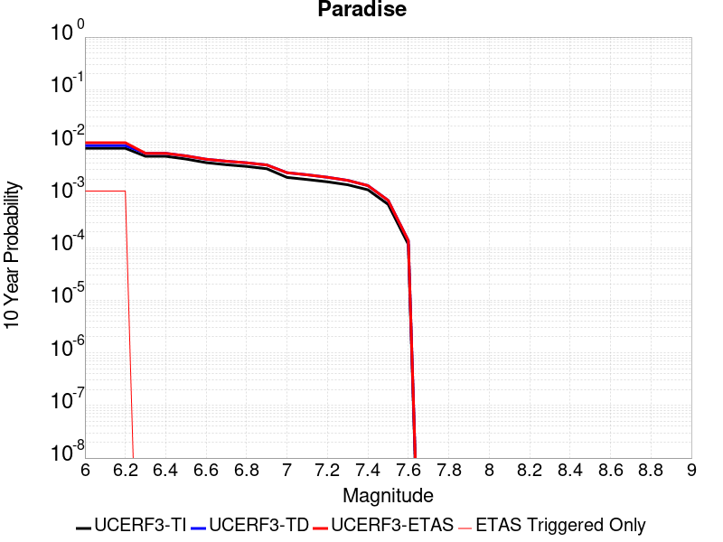 |

| Magnitude | 1 wk TI Prob | 1 wk TD Prob | 1 wk ETAS Prob | 1 wk ETAS/TD Gain | 1 wk ETAS Triggered Only | 1 mo TI Prob | 1 mo TD Prob | 1 mo ETAS Prob | 1 mo ETAS/TD Gain | 1 mo ETAS Triggered Only | 1 yr TI Prob | 1 yr TD Prob | 1 yr ETAS Prob | 1 yr ETAS/TD Gain | 1 yr ETAS Triggered Only | 10 yr TI Prob | 10 yr TD Prob | 10 yr ETAS Prob | 10 yr ETAS/TD Gain | 10 yr ETAS Triggered Only |
|-----|-----|-----|-----|-----|-----|-----|-----|-----|-----|-----|-----|-----|-----|-----|-----|-----|-----|-----|-----|-----|
| 6.0 | 1.4851273E-5 | 1.6694692E-5 | 3.1208893E-4 | 18.693901 | 2.9539916E-4 | 6.364676E-5 | 7.154685E-5 | 5.638435E-4 | 7.88076 | 4.923319E-4 | 7.7462377E-4 | 8.707584E-4 | 0.0018299697 | 2.1015816 | 9.6004724E-4 | 0.0077192914 | 0.008675844 | 0.01009122 | 1.1631398 | 0.0014277626 |
| 6.1 | 1.4851273E-5 | 1.6694692E-5 | 3.1208893E-4 | 18.693901 | 2.9539916E-4 | 6.364676E-5 | 7.154685E-5 | 5.638435E-4 | 7.88076 | 4.923319E-4 | 7.7462377E-4 | 8.707584E-4 | 0.0018299697 | 2.1015816 | 9.6004724E-4 | 0.0077192914 | 0.008675844 | 0.01009122 | 1.1631398 | 0.0014277626 |
| 6.2 | 1.4851273E-5 | 1.6694692E-5 | 3.1208893E-4 | 18.693901 | 2.9539916E-4 | 6.364676E-5 | 7.154685E-5 | 5.638435E-4 | 7.88076 | 4.923319E-4 | 7.7462377E-4 | 8.707584E-4 | 0.0018299697 | 2.1015816 | 9.6004724E-4 | 0.0077192914 | 0.008675844 | 0.01009122 | 1.1631398 | 0.0014277626 |
| 6.3 | 1.0426831E-5 | 1.188862E-5 | 1.8420274E-4 | 15.49404 | 1.7231617E-4 | 4.4685654E-5 | 5.0950268E-5 | 3.2171904E-4 | 6.3143735 | 2.7078256E-4 | 5.43912E-4 | 6.201489E-4 | 0.0011367769 | 1.8330708 | 5.169485E-4 | 0.0054258266 | 0.0061847917 | 0.0069676507 | 1.1265781 | 7.877311E-4 |
| 6.4 | 1.0426831E-5 | 1.188862E-5 | 1.8420274E-4 | 15.49404 | 1.7231617E-4 | 4.4685654E-5 | 5.0950268E-5 | 3.2171904E-4 | 6.3143735 | 2.7078256E-4 | 5.43912E-4 | 6.201489E-4 | 0.0011367769 | 1.8330708 | 5.169485E-4 | 0.0054258266 | 0.0061847917 | 0.0069676507 | 1.1265781 | 7.877311E-4 |
| 6.5 | 9.25027E-6 | 1.06199595E-5 | 1.5831797E-4 | 14.907587 | 1.4769958E-4 | 3.964341E-5 | 4.551335E-5 | 2.6705264E-4 | 5.8675675 | 2.2154937E-4 | 4.8255164E-4 | 5.53989E-4 | 8.984304E-4 | 1.6217477 | 3.4463234E-4 | 0.0048150513 | 0.0055265795 | 0.006040671 | 1.0930216 | 5.169485E-4 |
| 6.6 | 7.904275E-6 | 9.159525E-6 | 1.3224137E-4 | 14.43758 | 1.2308298E-4 | 3.3875025E-5 | 3.9254537E-5 | 1.6233268E-4 | 4.1353865 | 1.2308298E-4 | 4.1235037E-4 | 4.7782314E-4 | 6.7466183E-4 | 1.4119488 | 1.9693277E-4 | 0.0041158604 | 0.0047683544 | 0.005062345 | 1.0616546 | 2.9539916E-4 |
| 6.7 | 7.2061953E-6 | 8.407248E-6 | 1.314892E-4 | 15.63998 | 1.2308298E-4 | 3.088333E-5 | 3.6030586E-5 | 1.5910914E-4 | 4.415946 | 1.2308298E-4 | 3.7593965E-4 | 4.3858777E-4 | 6.108284E-4 | 1.3927164 | 1.7231617E-4 | 0.003753043 | 0.004377591 | 0.004622679 | 1.055987 | 2.4616596E-4 |
| 6.8 | 6.6948724E-6 | 7.842166E-6 | 1.3092418E-4 | 16.6949 | 1.2308298E-4 | 2.8691995E-5 | 3.360887E-5 | 1.5668772E-4 | 4.662094 | 1.2308298E-4 | 3.4926904E-4 | 4.0911473E-4 | 5.813604E-4 | 1.4210205 | 1.7231617E-4 | 0.003487206 | 0.0040839734 | 0.004329134 | 1.06003 | 2.4616596E-4 |
| 6.9 | 6.0421025E-6 | 7.130621E-6 | 1.0559631E-4 | 14.808851 | 9.8466386E-5 | 2.5894467E-5 | 3.0559466E-5 | 1.2902284E-4 | 4.2220254 | 9.8466386E-5 | 3.1521954E-4 | 3.7200135E-4 | 5.19646E-4 | 1.3968928 | 1.4769958E-4 | 0.0031477278 | 0.0037141247 | 0.0039348514 | 1.0594289 | 2.2154937E-4 |
| 7.0 | 4.134091E-6 | 5.0803087E-6 | 7.892973E-5 | 15.536403 | 7.384979E-5 | 1.7717413E-5 | 2.177258E-5 | 9.562076E-5 | 4.3917975 | 7.384979E-5 | 2.1568815E-4 | 2.6505045E-4 | 3.6349075E-4 | 1.371402 | 9.8466386E-5 | 0.0021547892 | 0.0026474963 | 0.002794805 | 1.0556407 | 1.4769958E-4 |
| 7.1 | 3.7674888E-6 | 4.6318696E-6 | 7.848132E-5 | 16.943768 | 7.384979E-5 | 1.6146281E-5 | 1.9850726E-5 | 9.369905E-5 | 4.7201824 | 7.384979E-5 | 1.9656324E-4 | 2.4165731E-4 | 3.400999E-4 | 1.4073644 | 9.8466386E-5 | 0.0019638946 | 0.002414096 | 0.0025614388 | 1.0610344 | 1.4769958E-4 |
| 7.2 | 3.4065345E-6 | 4.156723E-6 | 5.338971E-5 | 12.844183 | 4.9233193E-5 | 1.4599351E-5 | 1.7814415E-5 | 6.704673E-5 | 3.7636225 | 4.9233193E-5 | 1.777326E-4 | 2.1687041E-4 | 2.6609292E-4 | 1.2269675 | 4.9233193E-5 | 0.0017759053 | 0.002166736 | 0.0022649888 | 1.0453461 | 9.8466386E-5 |
| 7.3 | 2.9934936E-6 | 3.6293168E-6 | 2.8245824E-5 | 7.782684 | 2.4616596E-5 | 1.2829195E-5 | 1.555413E-5 | 4.0170344E-5 | 2.5826159 | 2.4616596E-5 | 1.5618425E-4 | 1.8935655E-4 | 2.139685E-4 | 1.1299766 | 2.4616596E-5 | 0.0015607453 | 0.0018920974 | 0.0019658075 | 1.0389568 | 7.384979E-5 |
| 7.4 | 2.4049796E-6 | 2.8889842E-6 | 2.8889842E-6 | 1.0 | 0.0 | 1.0307015E-5 | 1.238131E-5 | 1.238131E-5 | 1.0 | 0.0 | 1.2548068E-4 | 1.5073347E-4 | 1.5073347E-4 | 1.0 | 0.0 | 0.0012540985 | 0.0015064536 | 0.0015556127 | 1.0326322 | 4.9233193E-5 |
| 7.5 | 1.2710091E-6 | 1.5134682E-6 | 1.5134682E-6 | 1.0 | 0.0 | 5.44717E-6 | 6.4862834E-6 | 6.4862834E-6 | 1.0 | 0.0 | 6.631728E-5 | 7.8968886E-5 | 7.8968886E-5 | 1.0 | 0.0 | 6.6297496E-4 | 7.8953087E-4 | 8.14128E-4 | 1.0311542 | 2.4616596E-5 |
| 7.6 | 2.21172E-7 | 2.603961E-7 | 2.603961E-7 | 1.0 | 0.0 | 9.478797E-7 | 1.1159829E-6 | 1.1159829E-6 | 1.0 | 0.0 | 1.1540374E-5 | 1.3587036E-5 | 1.3587036E-5 | 1.0 | 0.0 | 1.1539775E-4 | 1.3586486E-4 | 1.6047811E-4 | 1.1811599 | 2.4616596E-5 |

## San Andreas (San Bernardino N)
*[(top)](#table-of-contents)*

| 1 Week | 1 Month | 1 Year | 10 Year |
|-----|-----|-----|-----|
| 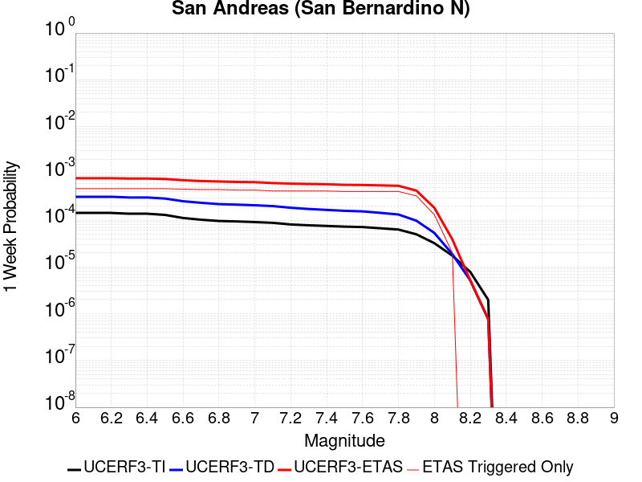 | 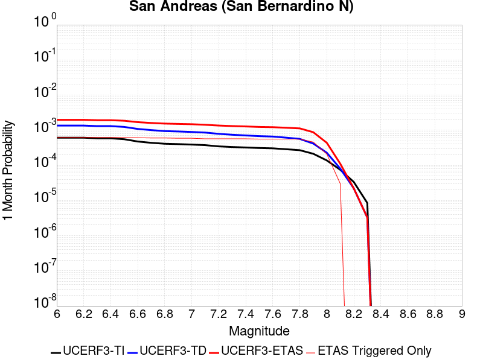 | 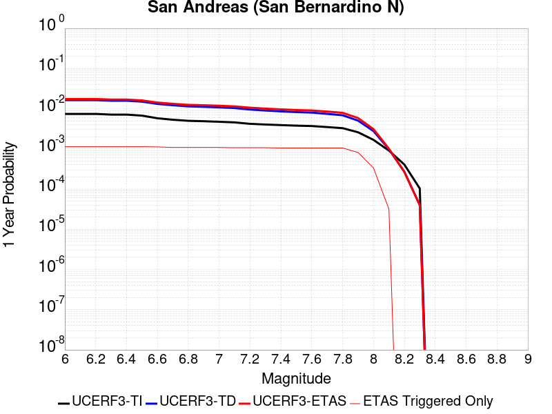 | 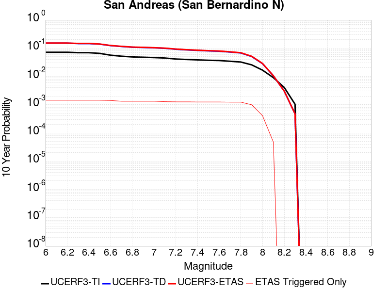 |

| Magnitude | 1 wk TI Prob | 1 wk TD Prob | 1 wk ETAS Prob | 1 wk ETAS/TD Gain | 1 wk ETAS Triggered Only | 1 mo TI Prob | 1 mo TD Prob | 1 mo ETAS Prob | 1 mo ETAS/TD Gain | 1 mo ETAS Triggered Only | 1 yr TI Prob | 1 yr TD Prob | 1 yr ETAS Prob | 1 yr ETAS/TD Gain | 1 yr ETAS Triggered Only | 10 yr TI Prob | 10 yr TD Prob | 10 yr ETAS Prob | 10 yr ETAS/TD Gain | 10 yr ETAS Triggered Only |
|-----|-----|-----|-----|-----|-----|-----|-----|-----|-----|-----|-----|-----|-----|-----|-----|-----|-----|-----|-----|-----|
| 6.0 | 1.4273766E-4 | 3.1606483E-4 | 8.082412E-4 | 2.5572004 | 4.923319E-4 | 6.115894E-4 | 0.0013538664 | 0.0020176147 | 1.4902613 | 6.6464813E-4 | 0.0074207084 | 0.016360244 | 0.017449867 | 1.066602 | 0.0011077469 | 0.07177748 | 0.15026689 | 0.15141734 | 1.0076561 | 0.0013539128 |
| 6.1 | 1.4273766E-4 | 3.1606483E-4 | 8.082412E-4 | 2.5572004 | 4.923319E-4 | 6.115894E-4 | 0.0013538664 | 0.0020176147 | 1.4902613 | 6.6464813E-4 | 0.0074207084 | 0.016360244 | 0.017449867 | 1.066602 | 0.0011077469 | 0.07177748 | 0.15026689 | 0.15141734 | 1.0076561 | 0.0013539128 |
| 6.2 | 1.4273766E-4 | 3.1606483E-4 | 8.082412E-4 | 2.5572004 | 4.923319E-4 | 6.115894E-4 | 0.0013538664 | 0.0020176147 | 1.4902613 | 6.6464813E-4 | 0.0074207084 | 0.016360244 | 0.017449867 | 1.066602 | 0.0011077469 | 0.07177748 | 0.15026689 | 0.15141734 | 1.0076561 | 0.0013539128 |
| 6.3 | 1.3730655E-4 | 3.0511338E-4 | 7.9729507E-4 | 2.6131108 | 4.923319E-4 | 5.883239E-4 | 0.0013069791 | 0.0019707587 | 1.507873 | 6.6464813E-4 | 0.0071393442 | 0.015797773 | 0.016888019 | 1.0690126 | 0.0011077469 | 0.06914291 | 0.14556676 | 0.1467236 | 1.0079471 | 0.0013539128 |
| 6.4 | 1.3730655E-4 | 3.0511338E-4 | 7.9729507E-4 | 2.6131108 | 4.923319E-4 | 5.883239E-4 | 0.0013069791 | 0.0019707587 | 1.507873 | 6.6464813E-4 | 0.0071393442 | 0.015797773 | 0.016888019 | 1.0690126 | 0.0011077469 | 0.06914291 | 0.14556676 | 0.1467236 | 1.0079471 | 0.0013539128 |
| 6.5 | 1.2942807E-4 | 2.8925808E-4 | 7.8144757E-4 | 2.7015584 | 4.923319E-4 | 5.545738E-4 | 0.0012390936 | 0.0019029182 | 1.5357339 | 6.6464813E-4 | 0.0067310524 | 0.01498286 | 0.01607401 | 1.0728265 | 0.0011077469 | 0.06530788 | 0.13870941 | 0.13987553 | 1.0084069 | 0.0013539128 |
| 6.6 | 1.1125901E-4 | 2.536472E-4 | 7.458542E-4 | 2.9405184 | 4.923319E-4 | 4.767372E-4 | 0.0010866089 | 0.0017505347 | 1.6110072 | 6.6464813E-4 | 0.005788839 | 0.013149847 | 0.014218735 | 1.0812851 | 0.0010831302 | 0.056403454 | 0.122999296 | 0.12416509 | 1.0094781 | 0.0013292963 |
| 6.7 | 1.02209575E-4 | 2.3499702E-4 | 7.272132E-4 | 3.0945637 | 4.923319E-4 | 4.3796748E-4 | 0.0010067427 | 0.0016707217 | 1.659532 | 6.6464813E-4 | 0.0053192247 | 0.012188629 | 0.013234241 | 1.0857859 | 0.0010585136 | 0.051936906 | 0.114790924 | 0.115924045 | 1.0098712 | 0.0012800631 |
| 6.8 | 9.610582E-5 | 2.2025521E-4 | 7.124787E-4 | 3.234787 | 4.923319E-4 | 4.1181705E-4 | 9.436101E-4 | 0.001607631 | 1.7037027 | 6.6464813E-4 | 0.0050023515 | 0.011428202 | 0.012474618 | 1.0915644 | 0.0010585136 | 0.048912346 | 0.1081929 | 0.10933447 | 1.0105512 | 0.0012800631 |
| 6.9 | 9.3877505E-5 | 2.1481077E-4 | 7.0703693E-4 | 3.2914407 | 4.923319E-4 | 4.0227012E-4 | 9.2029345E-4 | 0.0015843299 | 1.7215486 | 6.6464813E-4 | 0.0048866454 | 0.011147255 | 0.012193969 | 1.0938988 | 0.0010585136 | 0.04780577 | 0.10578323 | 0.10692788 | 1.0108207 | 0.0012800631 |
| 7.0 | 9.1019785E-5 | 2.0808022E-4 | 7.003097E-4 | 3.3655756 | 4.923319E-4 | 3.900265E-4 | 8.914682E-4 | 0.0015555238 | 1.7449011 | 6.6464813E-4 | 0.0047382377 | 0.010799837 | 0.011846919 | 1.0969535 | 0.0010585136 | 0.046384744 | 0.102753714 | 0.10390225 | 1.0111775 | 0.0012800631 |
| 7.1 | 8.771155E-5 | 1.9982594E-4 | 6.920595E-4 | 3.4633114 | 4.923319E-4 | 3.758525E-4 | 8.5611636E-4 | 0.0015201955 | 1.7756879 | 6.6464813E-4 | 0.0045664064 | 0.0103736 | 0.011421133 | 1.1009806 | 0.0010585136 | 0.044737056 | 0.09906527 | 0.10021852 | 1.0116414 | 0.0012800631 |
| 7.2 | 8.0830236E-5 | 1.8388197E-4 | 6.7612337E-4 | 3.676942 | 4.923319E-4 | 3.4636928E-4 | 7.8782777E-4 | 0.0014519523 | 1.8429818 | 6.6464813E-4 | 0.0042088944 | 0.009549725 | 0.01059813 | 1.1097838 | 0.0010585136 | 0.041300658 | 0.09179615 | 0.09295871 | 1.0126646 | 0.0012800631 |
| 7.3 | 7.7668235E-5 | 1.7331762E-4 | 6.655642E-4 | 3.8401418 | 4.923319E-4 | 3.328214E-4 | 7.425784E-4 | 0.001406733 | 1.8943897 | 6.6464813E-4 | 0.0040445733 | 0.009003494 | 0.010052477 | 1.1165085 | 0.0010585136 | 0.03971748 | 0.08706327 | 0.088231884 | 1.0134226 | 0.0012800631 |
| 7.4 | 7.520177E-5 | 1.6551897E-4 | 6.5776944E-4 | 3.9739819 | 4.923319E-4 | 3.2225347E-4 | 7.0917426E-4 | 0.001373351 | 1.9365494 | 6.6464813E-4 | 0.0039163795 | 0.008600081 | 0.009625087 | 1.1191856 | 0.001033897 | 0.038480744 | 0.08351955 | 0.08467014 | 1.0137763 | 0.0012554465 |
| 7.5 | 7.274697E-5 | 1.5839566E-4 | 6.506496E-4 | 4.107749 | 4.923319E-4 | 3.1173544E-4 | 6.78662E-4 | 0.001342859 | 1.9786861 | 6.6464813E-4 | 0.003788775 | 0.008231463 | 0.009256849 | 1.1245692 | 0.001033897 | 0.03724827 | 0.08023631 | 0.08139102 | 1.0143914 | 0.0012554465 |
| 7.6 | 7.1185845E-5 | 1.540943E-4 | 6.463504E-4 | 4.194512 | 4.923319E-4 | 3.0504653E-4 | 6.6023704E-4 | 0.0013244464 | 2.0060163 | 6.6464813E-4 | 0.0037076178 | 0.008008812 | 0.009034428 | 1.128061 | 0.001033897 | 0.036463667 | 0.07822598 | 0.07938322 | 1.0147935 | 0.0012554465 |
| 7.7 | 6.709961E-5 | 1.4318313E-4 | 6.354446E-4 | 4.437985 | 4.923319E-4 | 2.8753807E-4 | 6.1349774E-4 | 0.001277738 | 2.0827103 | 6.6464813E-4 | 0.003495157 | 0.0074437927 | 0.008469993 | 1.13786 | 0.001033897 | 0.034406938 | 0.07305469 | 0.07421842 | 1.0159296 | 0.0012554465 |
| 7.8 | 6.300812E-5 | 1.3202413E-4 | 6.242911E-4 | 4.7286134 | 4.923319E-4 | 2.7000686E-4 | 5.65695E-4 | 0.0012299671 | 2.1742585 | 6.6464813E-4 | 0.0032823787 | 0.006865616 | 0.007892415 | 1.1495566 | 0.001033897 | 0.032343175 | 0.06771354 | 0.06888397 | 1.0172851 | 0.0012554465 |
| 7.9 | 4.983037E-5 | 9.723488E-5 | 5.1567634E-4 | 5.303409 | 4.1848214E-4 | 2.1354125E-4 | 4.1665437E-4 | 9.5799385E-4 | 2.299253 | 5.415651E-4 | 0.0025967648 | 0.0050609782 | 0.0058692144 | 1.1596997 | 8.123477E-4 | 0.025666296 | 0.05064886 | 0.051630393 | 1.0193791 | 0.001033897 |
| 8.0 | 3.2211527E-5 | 5.3304586E-5 | 2.7484214E-4 | 5.1560693 | 2.2154937E-4 | 1.380421E-4 | 2.2842824E-4 | 5.483709E-4 | 2.4006267 | 3.2001577E-4 | 0.0016793669 | 0.0027775685 | 0.00317034 | 1.1414084 | 3.9386554E-4 | 0.016667323 | 0.028361378 | 0.028839748 | 1.0168669 | 4.923319E-4 |
| 8.1 | 1.743376E-5 | 1.8824427E-5 | 4.344056E-5 | 2.3076699 | 2.4616596E-5 | 7.471398E-5 | 8.067362E-5 | 1.2990284E-4 | 1.610227 | 4.9233193E-5 | 9.0926304E-4 | 9.817594E-4 | 0.0010309443 | 1.0500987 | 4.9233193E-5 | 0.009055517 | 0.010484105 | 0.01055718 | 1.0069702 | 7.384979E-5 |
| 8.2 | 7.831616E-6 | 5.1551065E-6 | 5.1551065E-6 | 1.0 | 0.0 | 3.3563636E-5 | 2.2093127E-5 | 2.2093127E-5 | 1.0 | 0.0 | 4.0856065E-4 | 2.6895068E-4 | 2.6895068E-4 | 1.0 | 0.0 | 0.004078103 | 0.0030418145 | 0.0030418145 | 1.0 | 0.0 |
| 8.3 | 1.983087E-6 | 7.6599065E-7 | 7.6599065E-7 | 1.0 | 0.0 | 8.498917E-6 | 3.282813E-6 | 3.282813E-6 | 1.0 | 0.0 | 1.034694E-4 | 3.9967534E-5 | 3.9967534E-5 | 1.0 | 0.0 | 0.0010342124 | 4.719687E-4 | 4.719687E-4 | 1.0 | 0.0 |

## Garlic Springs
*[(top)](#table-of-contents)*

| 1 Week | 1 Month | 1 Year | 10 Year |
|-----|-----|-----|-----|
| 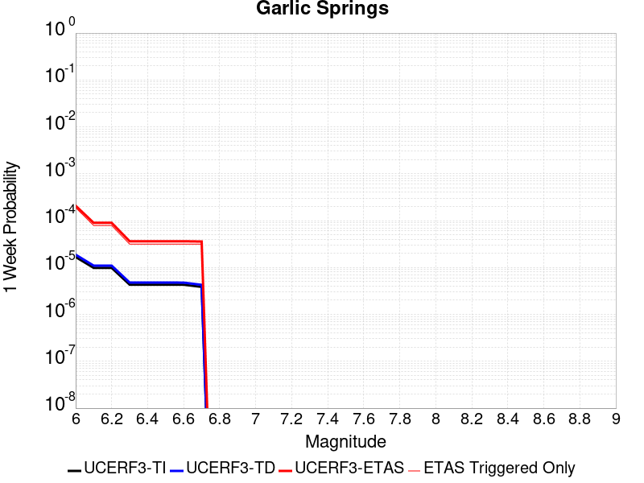 | 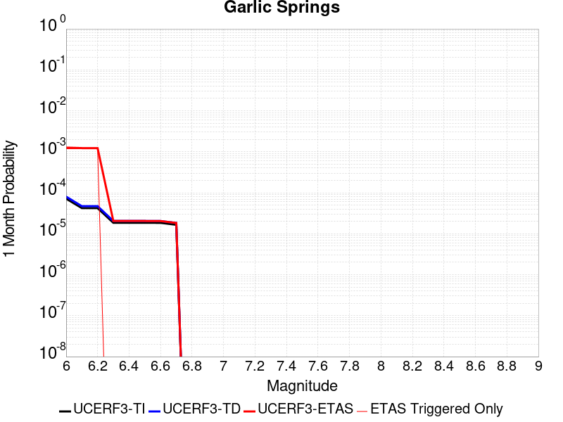 | 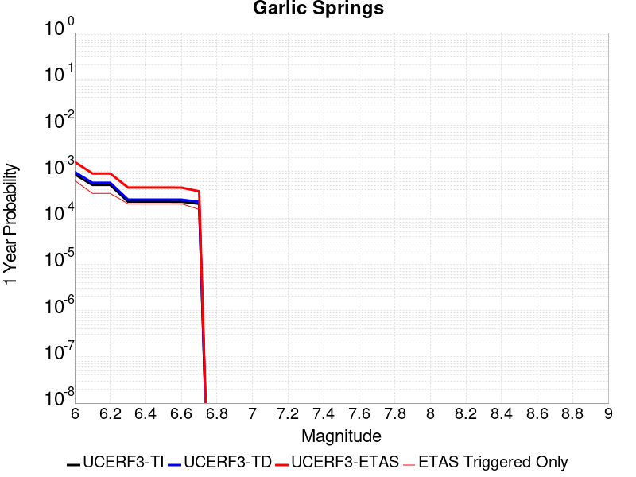 | 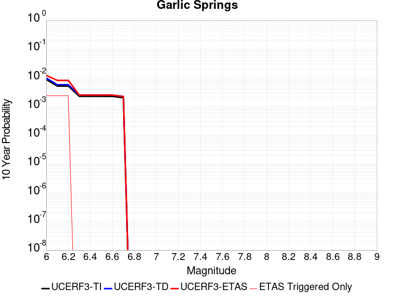 |

| Magnitude | 1 wk TI Prob | 1 wk TD Prob | 1 wk ETAS Prob | 1 wk ETAS/TD Gain | 1 wk ETAS Triggered Only | 1 mo TI Prob | 1 mo TD Prob | 1 mo ETAS Prob | 1 mo ETAS/TD Gain | 1 mo ETAS Triggered Only | 1 yr TI Prob | 1 yr TD Prob | 1 yr ETAS Prob | 1 yr ETAS/TD Gain | 1 yr ETAS Triggered Only | 10 yr TI Prob | 10 yr TD Prob | 10 yr ETAS Prob | 10 yr ETAS/TD Gain | 10 yr ETAS Triggered Only |
|-----|-----|-----|-----|-----|-----|-----|-----|-----|-----|-----|-----|-----|-----|-----|-----|-----|-----|-----|-----|-----|
| 6.0 | 1.6760017E-5 | 1.8776833E-5 | 1.6647363E-4 | 8.865907 | 1.4769958E-4 | 7.182667E-5 | 8.0470316E-5 | 3.266165E-4 | 4.058844 | 2.4616596E-4 | 8.7413884E-4 | 9.794032E-4 | 0.0015942154 | 1.6277417 | 6.1541493E-4 | 0.008707083 | 0.009762413 | 0.010859345 | 1.1123629 | 0.0011077469 |
| 6.1 | 9.852767E-6 | 1.09735865E-5 | 1.0943889E-4 | 9.972938 | 9.8466386E-5 | 4.222546E-5 | 4.702921E-5 | 2.1933728E-4 | 4.663852 | 1.7231617E-4 | 5.139737E-4 | 5.7250116E-4 | 9.6614123E-4 | 1.6875795 | 3.9386554E-4 | 0.005127866 | 0.005717221 | 0.0064025456 | 1.1198701 | 6.892647E-4 |
| 6.2 | 9.852767E-6 | 1.09735865E-5 | 1.0943889E-4 | 9.972938 | 9.8466386E-5 | 4.222546E-5 | 4.702921E-5 | 2.1933728E-4 | 4.663852 | 1.7231617E-4 | 5.139737E-4 | 5.7250116E-4 | 9.6614123E-4 | 1.6875795 | 3.9386554E-4 | 0.005127866 | 0.005717221 | 0.0064025456 | 1.1198701 | 6.892647E-4 |
| 6.3 | 4.3167724E-6 | 4.7780286E-6 | 5.4010987E-5 | 11.304031 | 4.9233193E-5 | 1.8500323E-5 | 2.0477235E-5 | 9.4325515E-5 | 4.60636 | 7.384979E-5 | 2.2521814E-4 | 2.4930484E-4 | 4.954094E-4 | 1.9871633 | 2.4616596E-4 | 0.0022499003 | 0.00249251 | 0.0028362833 | 1.1379225 | 3.4463234E-4 |
| 6.4 | 4.3167724E-6 | 4.7780286E-6 | 5.4010987E-5 | 11.304031 | 4.9233193E-5 | 1.8500323E-5 | 2.0477235E-5 | 9.4325515E-5 | 4.60636 | 7.384979E-5 | 2.2521814E-4 | 2.4930484E-4 | 4.954094E-4 | 1.9871633 | 2.4616596E-4 | 0.0022499003 | 0.00249251 | 0.0028362833 | 1.1379225 | 3.4463234E-4 |
| 6.5 | 4.3167724E-6 | 4.7780286E-6 | 5.4010987E-5 | 11.304031 | 4.9233193E-5 | 1.8500323E-5 | 2.0477235E-5 | 9.4325515E-5 | 4.60636 | 7.384979E-5 | 2.2521814E-4 | 2.4930484E-4 | 4.954094E-4 | 1.9871633 | 2.4616596E-4 | 0.0022499003 | 0.00249251 | 0.0028362833 | 1.1379225 | 3.4463234E-4 |
| 6.6 | 4.301311E-6 | 4.760897E-6 | 5.3993856E-5 | 11.341109 | 4.9233193E-5 | 1.8434059E-5 | 2.0403815E-5 | 9.42521E-5 | 4.619337 | 7.384979E-5 | 2.2441156E-4 | 2.4841115E-4 | 4.94516E-4 | 1.9907156 | 2.4616596E-4 | 0.0022418506 | 0.002483593 | 0.0028273696 | 1.138419 | 3.4463234E-4 |
| 6.7 | 3.8599724E-6 | 4.27106E-6 | 5.350404E-5 | 12.527111 | 4.9233193E-5 | 1.6542634E-5 | 1.8304541E-5 | 9.215298E-5 | 5.0344324 | 7.384979E-5 | 2.0138794E-4 | 2.228578E-4 | 3.9513558E-4 | 1.773039 | 1.7231617E-4 | 0.0020120554 | 0.002228578 | 0.002498757 | 1.1212338 | 2.7078256E-4 |

## Coyote Lake
*[(top)](#table-of-contents)*

| 1 Week | 1 Month | 1 Year | 10 Year |
|-----|-----|-----|-----|
| 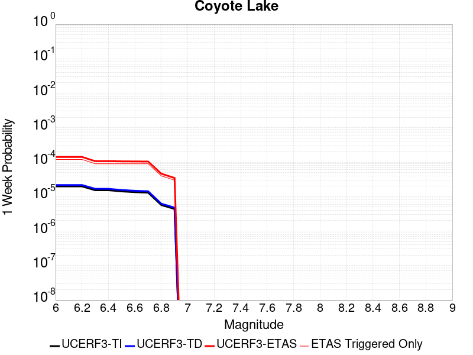 | 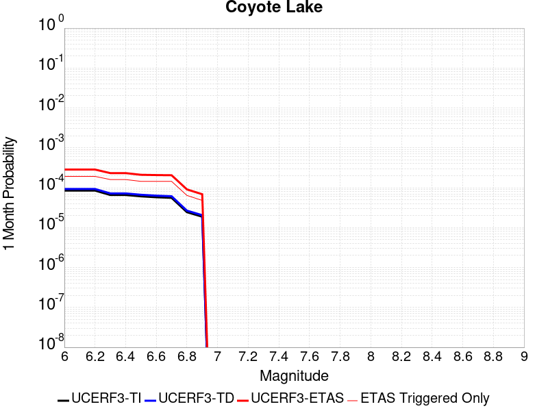 | 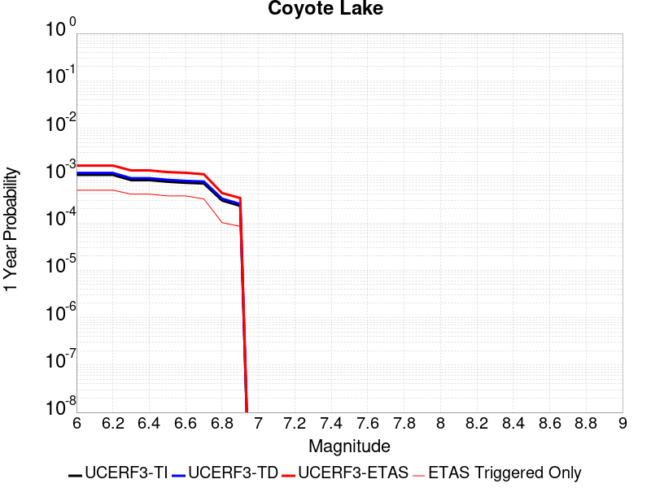 | 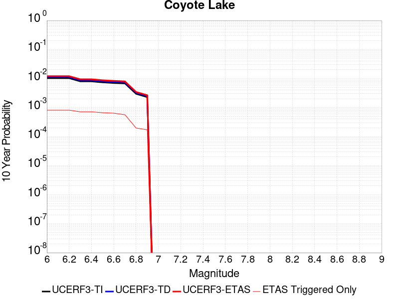 |

| Magnitude | 1 wk TI Prob | 1 wk TD Prob | 1 wk ETAS Prob | 1 wk ETAS/TD Gain | 1 wk ETAS Triggered Only | 1 mo TI Prob | 1 mo TD Prob | 1 mo ETAS Prob | 1 mo ETAS/TD Gain | 1 mo ETAS Triggered Only | 1 yr TI Prob | 1 yr TD Prob | 1 yr ETAS Prob | 1 yr ETAS/TD Gain | 1 yr ETAS Triggered Only | 10 yr TI Prob | 10 yr TD Prob | 10 yr ETAS Prob | 10 yr ETAS/TD Gain | 10 yr ETAS Triggered Only |
|-----|-----|-----|-----|-----|-----|-----|-----|-----|-----|-----|-----|-----|-----|-----|-----|-----|-----|-----|-----|-----|
| 6.0 | 1.980352E-5 | 2.1706745E-5 | 1.4478706E-4 | 6.670141 | 1.2308298E-4 | 8.486947E-5 | 9.302599E-5 | 2.8994045E-4 | 3.1167681 | 1.9693277E-4 | 0.0010327959 | 0.0011320751 | 0.0016484384 | 1.4561211 | 5.169485E-4 | 0.010280091 | 0.011270258 | 0.012073451 | 1.0712665 | 8.123477E-4 |
| 6.1 | 1.980352E-5 | 2.1706745E-5 | 1.4478706E-4 | 6.670141 | 1.2308298E-4 | 8.486947E-5 | 9.302599E-5 | 2.8994045E-4 | 3.1167681 | 1.9693277E-4 | 0.0010327959 | 0.0011320751 | 0.0016484384 | 1.4561211 | 5.169485E-4 | 0.010280091 | 0.011270258 | 0.012073451 | 1.0712665 | 8.123477E-4 |
| 6.2 | 1.980352E-5 | 2.1706745E-5 | 1.4478706E-4 | 6.670141 | 1.2308298E-4 | 8.486947E-5 | 9.302599E-5 | 2.8994045E-4 | 3.1167681 | 1.9693277E-4 | 0.0010327959 | 0.0011320751 | 0.0016484384 | 1.4561211 | 5.169485E-4 | 0.010280091 | 0.011270258 | 0.012073451 | 1.0712665 | 8.123477E-4 |
| 6.3 | 1.5344787E-5 | 1.682067E-5 | 1.3990157E-4 | 8.317243 | 1.2308298E-4 | 6.576172E-5 | 7.2086936E-5 | 2.4439069E-4 | 3.3902216 | 1.7231617E-4 | 8.003548E-4 | 8.773662E-4 | 0.0013446712 | 1.5326225 | 4.6771532E-4 | 0.007974784 | 0.00874507 | 0.009452707 | 1.0809186 | 7.138813E-4 |
| 6.4 | 1.5344787E-5 | 1.682067E-5 | 1.3990157E-4 | 8.317243 | 1.2308298E-4 | 6.576172E-5 | 7.2086936E-5 | 2.4439069E-4 | 3.3902216 | 1.7231617E-4 | 8.003548E-4 | 8.773662E-4 | 0.0013446712 | 1.5326225 | 4.6771532E-4 | 0.007974784 | 0.00874507 | 0.009452707 | 1.0809186 | 7.138813E-4 |
| 6.5 | 1.4189697E-5 | 1.5557987E-5 | 1.3863905E-4 | 8.911118 | 1.2308298E-4 | 6.081157E-5 | 6.6675726E-5 | 2.1436546E-4 | 3.215045 | 1.4769958E-4 | 7.401293E-4 | 8.115349E-4 | 0.0012296773 | 1.515249 | 4.1848214E-4 | 0.0073766913 | 0.008091656 | 0.008750926 | 1.0814753 | 6.6464813E-4 |
| 6.6 | 1.3469301E-5 | 1.4771577E-5 | 1.3785274E-4 | 9.332296 | 1.2308298E-4 | 5.7724297E-5 | 6.330556E-5 | 2.1099579E-4 | 3.332974 | 1.4769958E-4 | 7.025667E-4 | 7.7053264E-4 | 0.0011886923 | 1.5426891 | 4.1848214E-4 | 0.0070034964 | 0.0076845144 | 0.0083196275 | 1.0826484 | 6.4003153E-4 |
| 6.7 | 1.3027966E-5 | 1.4281745E-5 | 1.3736296E-4 | 9.61808 | 1.2308298E-4 | 5.5832945E-5 | 6.120638E-5 | 2.0889692E-4 | 3.4129925 | 1.4769958E-4 | 6.7955407E-4 | 7.4499263E-4 | 0.0010893682 | 1.4622537 | 3.4463234E-4 | 0.006774798 | 0.0074308286 | 0.007992803 | 1.0756274 | 5.661817E-4 |
| 6.8 | 5.695434E-6 | 6.2244176E-6 | 8.007375E-5 | 12.864456 | 7.384979E-5 | 2.4408775E-5 | 2.6675973E-5 | 1.00523794E-4 | 3.7683272 | 7.384979E-5 | 2.971363E-4 | 3.2476155E-4 | 4.4780457E-4 | 1.3788718 | 1.2308298E-4 | 0.0029673933 | 0.0032458105 | 0.003442104 | 1.060476 | 1.9693277E-4 |
| 6.9 | 4.385688E-6 | 4.7930553E-6 | 5.402601E-5 | 11.271728 | 4.9233193E-5 | 1.879567E-5 | 2.0541665E-5 | 6.977385E-5 | 3.3966985 | 4.9233193E-5 | 2.2881327E-4 | 2.5009477E-4 | 3.4853653E-4 | 1.3936177 | 9.8466386E-5 | 0.002285778 | 0.0025009478 | 0.0026728332 | 1.0687281 | 1.7231617E-4 |

## Owens Valley
*[(top)](#table-of-contents)*

| 1 Week | 1 Month | 1 Year | 10 Year |
|-----|-----|-----|-----|
| 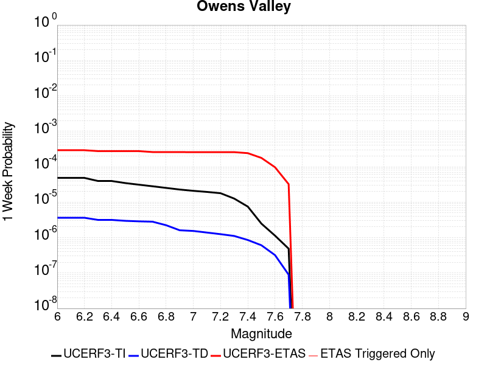 | 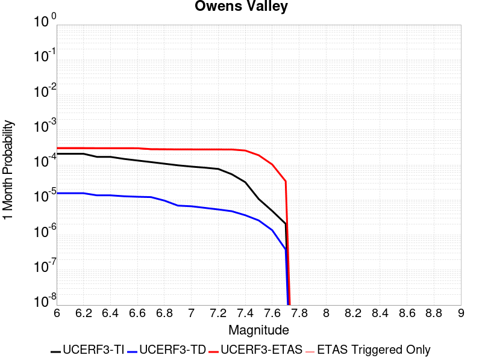 |  | 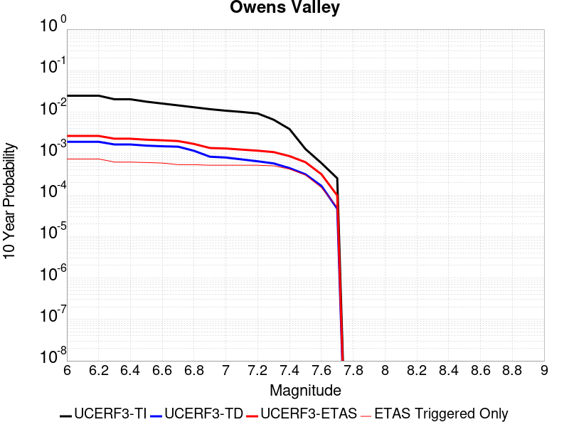 |

| Magnitude | 1 wk TI Prob | 1 wk TD Prob | 1 wk ETAS Prob | 1 wk ETAS/TD Gain | 1 wk ETAS Triggered Only | 1 mo TI Prob | 1 mo TD Prob | 1 mo ETAS Prob | 1 mo ETAS/TD Gain | 1 mo ETAS Triggered Only | 1 yr TI Prob | 1 yr TD Prob | 1 yr ETAS Prob | 1 yr ETAS/TD Gain | 1 yr ETAS Triggered Only | 10 yr TI Prob | 10 yr TD Prob | 10 yr ETAS Prob | 10 yr ETAS/TD Gain | 10 yr ETAS Triggered Only |
|-----|-----|-----|-----|-----|-----|-----|-----|-----|-----|-----|-----|-----|-----|-----|-----|-----|-----|-----|-----|-----|
| 6.0 | 4.83821E-5 | 3.626567E-6 | 2.4979163E-4 | 68.878265 | 2.4616596E-4 | 2.0733538E-4 | 1.5542342E-5 | 2.617045E-4 | 16.838161 | 2.4616596E-4 | 0.002521386 | 1.8921259E-4 | 6.568394E-4 | 3.4714363 | 4.6771532E-4 | 0.024929691 | 0.001925011 | 0.0026866565 | 1.3956578 | 7.631145E-4 |
| 6.1 | 4.83821E-5 | 3.626567E-6 | 2.4979163E-4 | 68.878265 | 2.4616596E-4 | 2.0733538E-4 | 1.5542342E-5 | 2.617045E-4 | 16.838161 | 2.4616596E-4 | 0.002521386 | 1.8921259E-4 | 6.568394E-4 | 3.4714363 | 4.6771532E-4 | 0.024929691 | 0.001925011 | 0.0026866565 | 1.3956578 | 7.631145E-4 |
| 6.2 | 4.83821E-5 | 3.626567E-6 | 2.4979163E-4 | 68.878265 | 2.4616596E-4 | 2.0733538E-4 | 1.5542342E-5 | 2.617045E-4 | 16.838161 | 2.4616596E-4 | 0.002521386 | 1.8921259E-4 | 6.568394E-4 | 3.4714363 | 4.6771532E-4 | 0.024929691 | 0.001925011 | 0.0026866565 | 1.3956578 | 7.631145E-4 |
| 6.3 | 3.953008E-5 | 3.1553948E-6 | 2.4932058E-4 | 79.01407 | 2.4616596E-4 | 1.6940363E-4 | 1.3523055E-5 | 2.5968568E-4 | 19.203182 | 2.4616596E-4 | 0.002060538 | 1.6463149E-4 | 5.584322E-4 | 3.3920133 | 3.9386554E-4 | 0.020415364 | 0.0016592 | 0.0022735938 | 1.3702953 | 6.1541493E-4 |
| 6.4 | 3.953008E-5 | 3.1553948E-6 | 2.4932058E-4 | 79.01407 | 2.4616596E-4 | 1.6940363E-4 | 1.3523055E-5 | 2.5968568E-4 | 19.203182 | 2.4616596E-4 | 0.002060538 | 1.6463149E-4 | 5.584322E-4 | 3.3920133 | 3.9386554E-4 | 0.020415364 | 0.0016592 | 0.0022735938 | 1.3702953 | 6.1541493E-4 |
| 6.5 | 3.457342E-5 | 2.9715961E-6 | 2.4913682E-4 | 83.83939 | 2.4616596E-4 | 1.4816338E-4 | 1.2735354E-5 | 2.588982E-4 | 20.329092 | 2.4616596E-4 | 0.0018023965 | 1.550426E-4 | 5.242343E-4 | 3.3812275 | 3.6924894E-4 | 0.017878477 | 0.001555719 | 0.0021455982 | 1.3791683 | 5.907983E-4 |
| 6.6 | 3.1127765E-5 | 2.8744932E-6 | 2.4903976E-4 | 86.637794 | 2.4616596E-4 | 1.3339789E-4 | 1.2319203E-5 | 2.5848215E-4 | 20.98205 | 2.4616596E-4 | 0.0016229092 | 1.4997667E-4 | 5.1917025E-4 | 3.4616735 | 3.6924894E-4 | 0.016111081 | 0.0015012559 | 0.0020665876 | 1.3765725 | 5.661817E-4 |
| 6.7 | 2.806885E-5 | 2.8104134E-6 | 2.4897567E-4 | 88.590416 | 2.4616596E-4 | 1.2028952E-4 | 1.20445775E-5 | 2.5820758E-4 | 21.437662 | 2.4616596E-4 | 0.001463541 | 1.4663354E-4 | 4.912154E-4 | 3.3499522 | 3.4463234E-4 | 0.014539397 | 0.0014657511 | 0.001981942 | 1.3521681 | 5.169485E-4 |
| 6.8 | 2.524524E-5 | 2.2353688E-6 | 2.484008E-4 | 111.122955 | 2.4616596E-4 | 1.0818939E-4 | 9.580118E-6 | 2.557437E-4 | 26.695257 | 2.4616596E-4 | 0.0013164099 | 1.16632E-4 | 4.6122415E-4 | 3.954525 | 3.4463234E-4 | 0.01308639 | 0.0011659812 | 0.0016823269 | 1.4428422 | 5.169485E-4 |
| 6.9 | 2.2704568E-5 | 1.6081682E-6 | 2.4777374E-4 | 154.07202 | 2.4616596E-4 | 9.730166E-5 | 6.8921313E-6 | 2.530564E-4 | 36.71671 | 2.4616596E-4 | 0.0011840039 | 8.390849E-5 | 4.2851194E-4 | 5.106896 | 3.4463234E-4 | 0.011777153 | 8.3897985E-4 | 0.0013308987 | 1.5863298 | 4.923319E-4 |
| 7.0 | 2.0871712E-5 | 1.5395453E-6 | 2.4770515E-4 | 160.89499 | 2.4616596E-4 | 8.944713E-5 | 6.598035E-6 | 2.5276237E-4 | 38.308735 | 2.4616596E-4 | 0.0010884746 | 8.032813E-5 | 4.249328E-4 | 5.289963 | 3.4463234E-4 | 0.010831586 | 8.0316263E-4 | 0.0012950992 | 1.6124992 | 4.923319E-4 |
| 7.1 | 1.944928E-5 | 1.3864178E-6 | 2.4755203E-4 | 178.55516 | 2.4616596E-4 | 8.335139E-5 | 5.941777E-6 | 2.5210629E-4 | 42.429443 | 2.4616596E-4 | 0.0010143308 | 7.233874E-5 | 4.1694616E-4 | 5.7638016 | 3.4463234E-4 | 0.010097133 | 7.2330976E-4 | 0.0012152856 | 1.680173 | 4.923319E-4 |
| 7.2 | 1.7876306E-5 | 1.2489141E-6 | 2.4741457E-4 | 198.10374 | 2.4616596E-4 | 7.6610486E-5 | 5.352478E-6 | 2.5151714E-4 | 46.99078 | 2.4616596E-4 | 9.3233347E-4 | 6.516448E-5 | 4.0977437E-4 | 6.2883086 | 3.4463234E-4 | 0.009284316 | 6.5159105E-4 | 0.0011436022 | 1.7550919 | 4.923319E-4 |
| 7.3 | 1.2618672E-5 | 1.1115209E-6 | 2.472772E-4 | 222.46745 | 2.4616596E-4 | 5.40789E-5 | 4.763652E-6 | 2.5092845E-4 | 52.675644 | 2.4616596E-4 | 6.582117E-4 | 5.799593E-5 | 3.7799313E-4 | 6.51758 | 3.2001577E-4 | 0.0065626553 | 5.7994033E-4 | 0.0010473845 | 1.806021 | 4.6771532E-4 |
| 7.4 | 7.4874442E-6 | 8.5486437E-7 | 2.2240404E-4 | 260.16296 | 2.2154937E-4 | 3.208865E-5 | 3.6636993E-6 | 2.2521225E-4 | 61.47127 | 2.2154937E-4 | 3.906093E-4 | 4.4604632E-5 | 3.3999063E-4 | 7.6223164 | 2.9539916E-4 | 0.003899234 | 4.4604883E-4 | 8.397387E-4 | 1.882616 | 3.9386554E-4 |
| 7.5 | 2.4734156E-6 | 6.068616E-7 | 1.9753951E-4 | 325.51 | 1.9693277E-4 | 1.060031E-5 | 2.6008327E-6 | 1.995331E-4 | 76.718925 | 1.9693277E-4 | 1.2905113E-4 | 3.166468E-5 | 2.5320702E-4 | 7.996513 | 2.2154937E-4 | 0.0012897621 | 3.1660203E-4 | 6.119077E-4 | 1.9327345 | 2.9539916E-4 |
| 7.6 | 1.1328841E-6 | 3.196531E-7 | 9.878601E-5 | 309.0413 | 9.8466386E-5 | 4.8552088E-6 | 1.3699412E-6 | 9.9836194E-5 | 72.87627 | 9.8466386E-5 | 5.9110564E-5 | 1.6678909E-5 | 1.1514365E-4 | 6.9035487 | 9.8466386E-5 | 5.9094845E-4 | 1.6677675E-4 | 3.144517E-4 | 1.8854648 | 1.4769958E-4 |
| 7.7 | 4.8613185E-7 | 8.964689E-8 | 2.4706242E-5 | 275.59506 | 2.4616596E-5 | 2.0834207E-6 | 3.8420092E-7 | 2.5000789E-5 | 65.072174 | 2.4616596E-5 | 2.536535E-5 | 4.6776368E-6 | 2.9294119E-5 | 6.2625895 | 2.4616596E-5 | 2.5362454E-4 | 4.677545E-5 | 9.600634E-5 | 2.0524943 | 4.9233193E-5 |

## San Andreas (Parkfield)
*[(top)](#table-of-contents)*

| 1 Week | 1 Month | 1 Year | 10 Year |
|-----|-----|-----|-----|
| 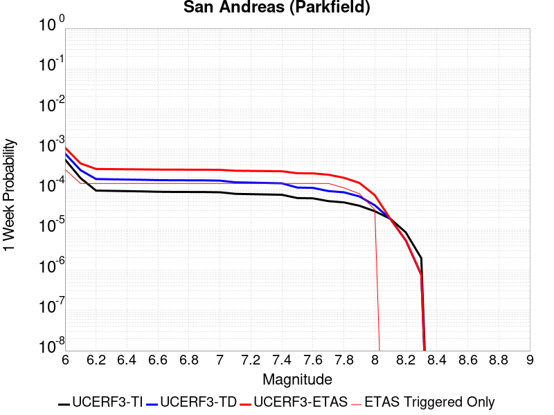 | 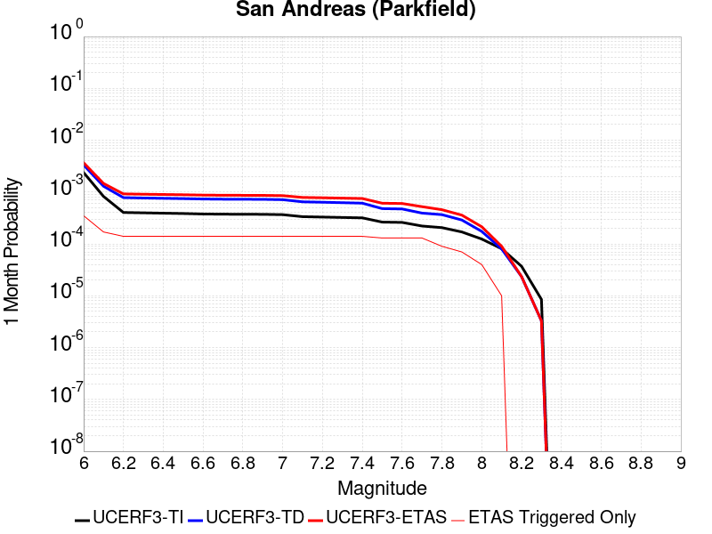 | 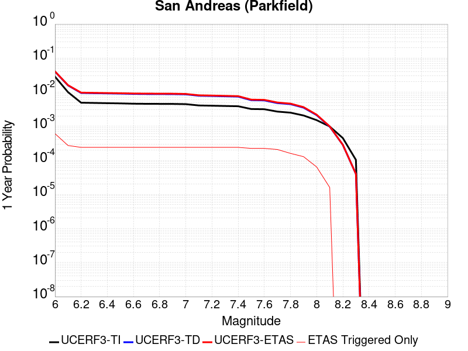 | 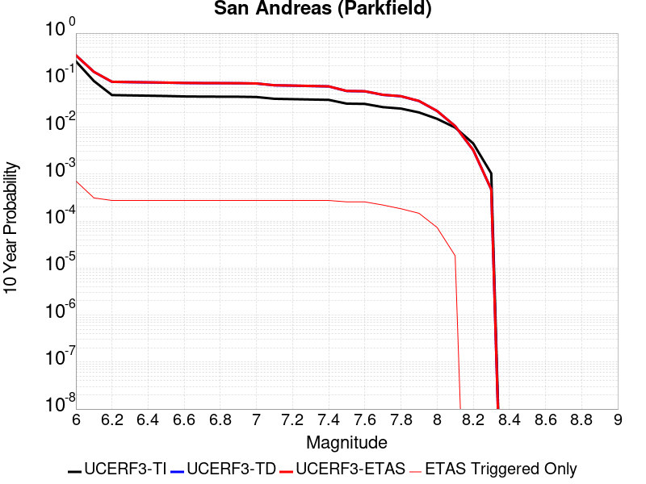 |

| Magnitude | 1 wk TI Prob | 1 wk TD Prob | 1 wk ETAS Prob | 1 wk ETAS/TD Gain | 1 wk ETAS Triggered Only | 1 mo TI Prob | 1 mo TD Prob | 1 mo ETAS Prob | 1 mo ETAS/TD Gain | 1 mo ETAS Triggered Only | 1 yr TI Prob | 1 yr TD Prob | 1 yr ETAS Prob | 1 yr ETAS/TD Gain | 1 yr ETAS Triggered Only | 10 yr TI Prob | 10 yr TD Prob | 10 yr ETAS Prob | 10 yr ETAS/TD Gain | 10 yr ETAS Triggered Only |
|-----|-----|-----|-----|-----|-----|-----|-----|-----|-----|-----|-----|-----|-----|-----|-----|-----|-----|-----|-----|-----|
| 6.0 | 5.556969E-4 | 7.7782426E-4 | 0.0010483962 | 1.3478575 | 2.7078256E-4 | 0.0023793848 | 0.0033298214 | 0.0037223755 | 1.1178905 | 3.9386554E-4 | 0.028586963 | 0.040191233 | 0.040758286 | 1.0141089 | 5.907983E-4 | 0.25176284 | 0.33716413 | 0.33763734 | 1.0014035 | 7.138813E-4 |
| 6.1 | 1.925858E-4 | 3.0276453E-4 | 4.2581026E-4 | 1.4064074 | 1.2308298E-4 | 8.2510663E-4 | 0.0012970108 | 0.0014936881 | 1.151639 | 1.9693277E-4 | 0.0099994885 | 0.015778083 | 0.016068822 | 1.0184268 | 2.9539916E-4 | 0.095613256 | 0.1497237 | 0.14999579 | 1.0018173 | 3.2001577E-4 |
| 6.2 | 9.4306815E-5 | 1.8242796E-4 | 3.054885E-4 | 1.6745706 | 1.2308298E-4 | 4.0410945E-4 | 7.816011E-4 | 9.537826E-4 | 1.2202933 | 1.7231617E-4 | 0.0049089384 | 0.009474681 | 0.009742898 | 1.0283089 | 2.7078256E-4 | 0.048019063 | 0.09185409 | 0.09212235 | 1.0029205 | 2.9539916E-4 |
| 6.3 | 9.283051E-5 | 1.7939322E-4 | 3.024541E-4 | 1.6859841 | 1.2308298E-4 | 3.9778434E-4 | 7.686027E-4 | 9.4078644E-4 | 1.2240218 | 1.7231617E-4 | 0.0048322747 | 0.009317789 | 0.009586048 | 1.02879 | 2.7078256E-4 | 0.047285385 | 0.09050704 | 0.0907757 | 1.0029684 | 2.9539916E-4 |
| 6.4 | 9.138826E-5 | 1.770153E-4 | 3.000765E-4 | 1.6952009 | 1.2308298E-4 | 3.916052E-4 | 7.5841765E-4 | 9.306031E-4 | 1.2270325 | 1.7231617E-4 | 0.0047573745 | 0.00919484 | 0.009463132 | 1.0291786 | 2.7078256E-4 | 0.046568092 | 0.08940927 | 0.08967826 | 1.0030085 | 2.9539916E-4 |
| 6.5 | 9.000255E-5 | 1.7459576E-4 | 2.9765724E-4 | 1.7048366 | 1.2308298E-4 | 3.8566816E-4 | 7.480541E-4 | 9.202414E-4 | 1.2301803 | 1.7231617E-4 | 0.0046854047 | 0.009069731 | 0.0093380585 | 1.0295849 | 2.7078256E-4 | 0.045878403 | 0.088295065 | 0.08856438 | 1.0030502 | 2.9539916E-4 |
| 6.6 | 8.8109264E-5 | 1.7140752E-4 | 2.944694E-4 | 1.7179492 | 1.2308298E-4 | 3.7755648E-4 | 7.3439797E-4 | 9.0658764E-4 | 1.2344637 | 1.7231617E-4 | 0.0045870654 | 0.008904854 | 0.009173225 | 1.0301377 | 2.7078256E-4 | 0.04493529 | 0.0868267 | 0.087096445 | 1.0031067 | 2.9539916E-4 |
| 6.7 | 8.738073E-5 | 1.7007832E-4 | 2.9314036E-4 | 1.723561 | 1.2308298E-4 | 3.7443507E-4 | 7.287046E-4 | 9.008952E-4 | 1.2362969 | 1.7231617E-4 | 0.0045492216 | 0.008836143 | 0.009104533 | 1.030374 | 2.7078256E-4 | 0.04457213 | 0.08622707 | 0.086496994 | 1.0031304 | 2.9539916E-4 |
| 6.8 | 8.710195E-5 | 1.6953335E-4 | 2.9259545E-4 | 1.7258874 | 1.2308298E-4 | 3.7324068E-4 | 7.263703E-4 | 8.985613E-4 | 1.2370567 | 1.7231617E-4 | 0.0045347405 | 0.008807961 | 0.009076359 | 1.0304722 | 2.7078256E-4 | 0.04443313 | 0.08597467 | 0.08624467 | 1.0031404 | 2.9539916E-4 |
| 6.9 | 8.6801556E-5 | 1.689429E-4 | 2.9200508E-4 | 1.7284248 | 1.2308298E-4 | 3.7195362E-4 | 7.2384125E-4 | 8.9603267E-4 | 1.2378856 | 1.7231617E-4 | 0.0045191357 | 0.008777418 | 0.0090458235 | 1.0305791 | 2.7078256E-4 | 0.044283327 | 0.085700735 | 0.08597082 | 1.0031514 | 2.9539916E-4 |
| 7.0 | 8.5571606E-5 | 1.6647128E-4 | 2.8953378E-4 | 1.7392416 | 1.2308298E-4 | 3.6668387E-4 | 7.132544E-4 | 8.8544766E-4 | 1.2414192 | 1.7231617E-4 | 0.004455241 | 0.008649553 | 0.008917994 | 1.0310352 | 2.7078256E-4 | 0.043669727 | 0.08454914 | 0.08481956 | 1.0031984 | 2.9539916E-4 |
| 7.1 | 7.82589E-5 | 1.5128135E-4 | 2.7434572E-4 | 1.81348 | 1.2308298E-4 | 3.3535215E-4 | 6.481883E-4 | 8.2039274E-4 | 1.2656704 | 1.7231617E-4 | 0.0040752706 | 0.007863307 | 0.00813196 | 1.0341654 | 2.7078256E-4 | 0.040013418 | 0.07746111 | 0.07773363 | 1.0035181 | 2.9539916E-4 |
| 7.2 | 7.690929E-5 | 1.4865391E-4 | 2.717186E-4 | 1.8278604 | 1.2308298E-4 | 3.2956956E-4 | 6.369334E-4 | 8.091398E-4 | 1.270368 | 1.7231617E-4 | 0.004005129 | 0.007727258 | 0.007995948 | 1.0347717 | 2.7078256E-4 | 0.0393371 | 0.07623427 | 0.07650715 | 1.0035795 | 2.9539916E-4 |
| 7.3 | 7.5543794E-5 | 1.4561978E-4 | 2.6868485E-4 | 1.8451122 | 1.2308298E-4 | 3.2371894E-4 | 6.2393624E-4 | 7.961449E-4 | 1.2760036 | 1.7231617E-4 | 0.003934157 | 0.007570127 | 0.00783886 | 1.0354991 | 2.7078256E-4 | 0.038652334 | 0.074797355 | 0.07507066 | 1.0036539 | 2.9539916E-4 |
| 7.4 | 7.4214564E-5 | 1.4262961E-4 | 2.6569504E-4 | 1.8628322 | 1.2308298E-4 | 3.1802364E-4 | 6.111273E-4 | 7.8333815E-4 | 1.2817922 | 1.7231617E-4 | 0.003865065 | 0.00741525 | 0.0076840245 | 1.0362462 | 2.7078256E-4 | 0.03798529 | 0.07337123 | 0.07364496 | 1.0037307 | 2.9539916E-4 |
| 7.5 | 6.149578E-5 | 1.11907226E-4 | 2.3497644E-4 | 2.0997431 | 1.2308298E-4 | 2.6352672E-4 | 4.7951436E-4 | 6.517479E-4 | 1.3591833 | 1.7231617E-4 | 0.0032037178 | 0.0058224914 | 0.006067224 | 1.0420322 | 2.4616596E-4 | 0.03157923 | 0.058557566 | 0.05881249 | 1.0043534 | 2.7078256E-4 |
| 7.6 | 6.0643448E-5 | 1.10193796E-4 | 2.3326321E-4 | 2.1168451 | 1.2308298E-4 | 2.598746E-4 | 4.7217376E-4 | 6.444086E-4 | 1.3647699 | 1.7231617E-4 | 0.0031593828 | 0.0057335934 | 0.005978348 | 1.0426878 | 2.4616596E-4 | 0.031148417 | 0.057718582 | 0.057973735 | 1.0044206 | 2.7078256E-4 |
| 7.7 | 5.1652263E-5 | 9.174698E-5 | 2.1481868E-4 | 2.341425 | 1.2308298E-4 | 2.2134806E-4 | 3.931421E-4 | 5.6539057E-4 | 1.4381328 | 1.7231617E-4 | 0.002691582 | 0.0047760103 | 0.0049965014 | 1.0461664 | 2.2154937E-4 | 0.026592141 | 0.04853623 | 0.048747025 | 1.004343 | 2.2154937E-4 |
| 7.8 | 4.8090482E-5 | 8.559635E-5 | 1.8405431E-4 | 2.1502588 | 9.8466386E-5 | 2.060858E-4 | 3.6678996E-4 | 5.1443535E-4 | 1.4025339 | 1.4769958E-4 | 0.0025062072 | 0.0044565317 | 0.004652587 | 1.0439928 | 1.9693277E-4 | 0.024781305 | 0.04530245 | 0.045490462 | 1.0041502 | 1.9693277E-4 |
| 7.9 | 3.970278E-5 | 6.750426E-5 | 1.4134907E-4 | 2.093928 | 7.384979E-5 | 1.7014367E-4 | 2.892719E-4 | 4.123193E-4 | 1.4253693 | 1.2308298E-4 | 0.002069531 | 0.0035162016 | 0.0036633818 | 1.0418577 | 1.4769958E-4 | 0.020503636 | 0.035881363 | 0.036023762 | 1.0039686 | 1.4769958E-4 |
| 8.0 | 2.8982335E-5 | 4.069796E-5 | 8.992915E-5 | 2.2096722 | 4.9233193E-5 | 1.2420409E-4 | 1.7440817E-4 | 2.7285737E-4 | 1.5644759 | 9.8466386E-5 | 0.0015111357 | 0.0021213528 | 0.0022196101 | 1.0463183 | 9.8466386E-5 | 0.015009012 | 0.022010697 | 0.022106996 | 1.0043751 | 9.8466386E-5 |
| 8.1 | 1.8836186E-5 | 1.8681134E-5 | 1.8681134E-5 | 1.0 | 0.0 | 8.0724014E-5 | 8.005955E-5 | 1.04674175E-4 | 1.307454 | 2.4616596E-5 | 9.823717E-4 | 9.742898E-4 | 9.988823E-4 | 1.0252416 | 2.4616596E-5 | 0.009780403 | 0.010488115 | 0.010512474 | 1.0023224 | 2.4616596E-5 |
| 8.2 | 8.643924E-6 | 5.4748625E-6 | 5.4748625E-6 | 1.0 | 0.0 | 3.704486E-5 | 2.3463486E-5 | 2.3463486E-5 | 1.0 | 0.0 | 4.5092785E-4 | 2.8563058E-4 | 2.8563058E-4 | 1.0 | 0.0 | 0.0045001395 | 0.0032487072 | 0.0032487072 | 1.0 | 0.0 |
| 8.3 | 1.983087E-6 | 7.6599065E-7 | 7.6599065E-7 | 1.0 | 0.0 | 8.498917E-6 | 3.282813E-6 | 3.282813E-6 | 1.0 | 0.0 | 1.034694E-4 | 3.9967534E-5 | 3.9967534E-5 | 1.0 | 0.0 | 0.0010342124 | 4.719687E-4 | 4.719687E-4 | 1.0 | 0.0 |

## San Andreas (San Bernardino S)
*[(top)](#table-of-contents)*

| 1 Week | 1 Month | 1 Year | 10 Year |
|-----|-----|-----|-----|
| 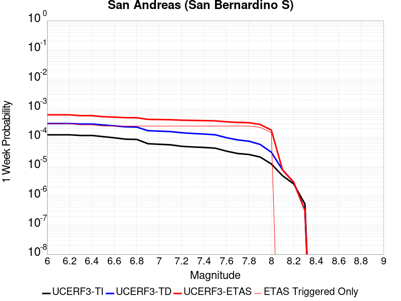 | 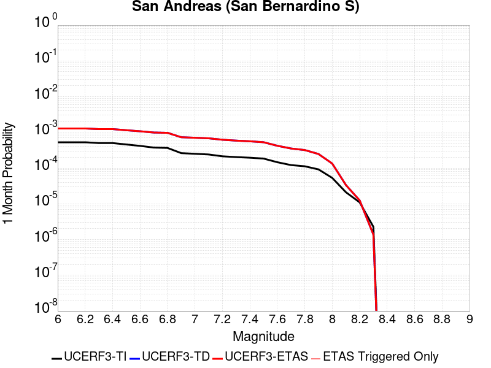 | 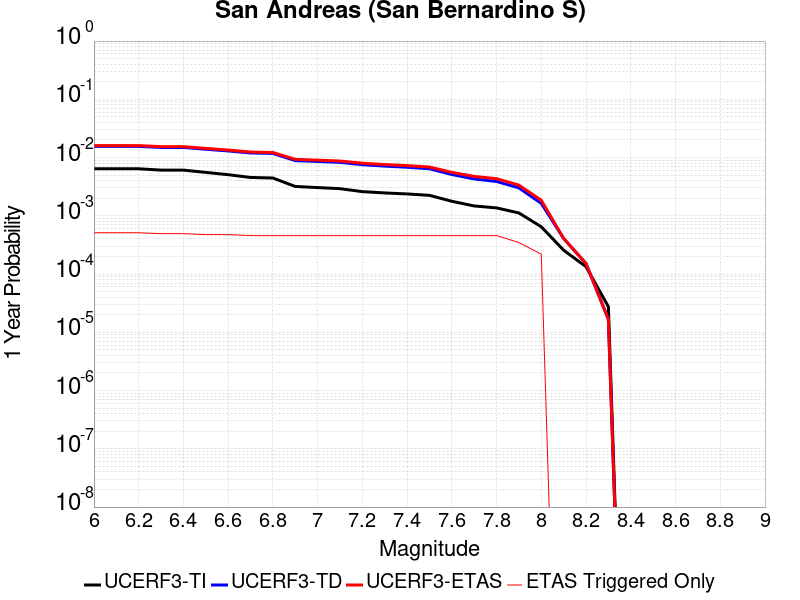 | 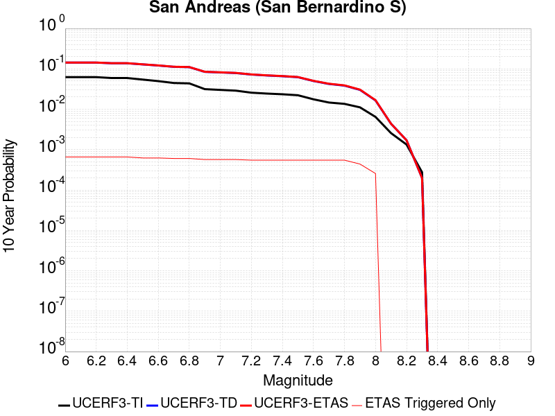 |

| Magnitude | 1 wk TI Prob | 1 wk TD Prob | 1 wk ETAS Prob | 1 wk ETAS/TD Gain | 1 wk ETAS Triggered Only | 1 mo TI Prob | 1 mo TD Prob | 1 mo ETAS Prob | 1 mo ETAS/TD Gain | 1 mo ETAS Triggered Only | 1 yr TI Prob | 1 yr TD Prob | 1 yr ETAS Prob | 1 yr ETAS/TD Gain | 1 yr ETAS Triggered Only | 10 yr TI Prob | 10 yr TD Prob | 10 yr ETAS Prob | 10 yr ETAS/TD Gain | 10 yr ETAS Triggered Only |
|-----|-----|-----|-----|-----|-----|-----|-----|-----|-----|-----|-----|-----|-----|-----|-----|-----|-----|-----|-----|-----|
| 6.0 | 1.2336002E-4 | 3.0004102E-4 | 5.9535156E-4 | 1.9842339 | 2.9539916E-4 | 5.2857865E-4 | 0.0012852824 | 0.0017032267 | 1.325177 | 4.1848214E-4 | 0.006416472 | 0.015540994 | 0.016025675 | 1.0311872 | 4.923319E-4 | 0.06234337 | 0.14283717 | 0.14340688 | 1.0039885 | 6.6464813E-4 |
| 6.1 | 1.2336002E-4 | 3.0004102E-4 | 5.9535156E-4 | 1.9842339 | 2.9539916E-4 | 5.2857865E-4 | 0.0012852824 | 0.0017032267 | 1.325177 | 4.1848214E-4 | 0.006416472 | 0.015540994 | 0.016025675 | 1.0311872 | 4.923319E-4 | 0.06234337 | 0.14283717 | 0.14340688 | 1.0039885 | 6.6464813E-4 |
| 6.2 | 1.2336002E-4 | 3.0004102E-4 | 5.9535156E-4 | 1.9842339 | 2.9539916E-4 | 5.2857865E-4 | 0.0012852824 | 0.0017032267 | 1.325177 | 4.1848214E-4 | 0.006416472 | 0.015540994 | 0.016025675 | 1.0311872 | 4.923319E-4 | 0.06234337 | 0.14283717 | 0.14340688 | 1.0039885 | 6.6464813E-4 |
| 6.3 | 1.1712257E-4 | 2.8792414E-4 | 5.5862876E-4 | 1.9401941 | 2.7078256E-4 | 5.018573E-4 | 0.0012334028 | 0.0016267825 | 1.3189386 | 3.9386554E-4 | 0.006093008 | 0.014918125 | 0.015378863 | 1.0308844 | 4.6771532E-4 | 0.059286322 | 0.13754563 | 0.13811886 | 1.0041676 | 6.6464813E-4 |
| 6.4 | 1.1712257E-4 | 2.8792414E-4 | 5.5862876E-4 | 1.9401941 | 2.7078256E-4 | 5.018573E-4 | 0.0012334028 | 0.0016267825 | 1.3189386 | 3.9386554E-4 | 0.006093008 | 0.014918125 | 0.015378863 | 1.0308844 | 4.6771532E-4 | 0.059286322 | 0.13754563 | 0.13811886 | 1.0041676 | 6.6464813E-4 |
| 6.5 | 1.0689076E-4 | 2.680528E-4 | 5.1415275E-4 | 1.9181026 | 2.4616596E-4 | 4.5802278E-4 | 0.0011483167 | 0.0015171416 | 1.3211875 | 3.6924894E-4 | 0.0055621783 | 0.01389575 | 0.014332692 | 1.0314443 | 4.4309875E-4 | 0.05425003 | 0.12879294 | 0.1293291 | 1.0041629 | 6.1541493E-4 |
| 6.6 | 9.7648895E-5 | 2.50501E-4 | 4.966053E-4 | 1.9824483 | 2.4616596E-4 | 4.1842813E-4 | 0.0010731576 | 0.0014420104 | 1.3437078 | 3.6924894E-4 | 0.005082469 | 0.012991785 | 0.013429128 | 1.0336629 | 4.4309875E-4 | 0.049677886 | 0.12095292 | 0.1214939 | 1.0044726 | 6.1541493E-4 |
| 6.7 | 8.757013E-5 | 2.3120902E-4 | 4.7731807E-4 | 2.064444 | 2.4616596E-4 | 3.7524657E-4 | 9.905418E-4 | 0.001359425 | 1.3724055 | 3.6924894E-4 | 0.00455906 | 0.011997245 | 0.012435028 | 1.0364903 | 4.4309875E-4 | 0.04466656 | 0.11226123 | 0.11280756 | 1.0048666 | 6.1541493E-4 |
| 6.8 | 8.562978E-5 | 2.2680782E-4 | 4.7291795E-4 | 2.0851042 | 2.4616596E-4 | 3.6693315E-4 | 9.7169366E-4 | 0.0013405838 | 1.3796363 | 3.6924894E-4 | 0.004458263 | 0.011770263 | 0.012208147 | 1.0372025 | 4.4309875E-4 | 0.043698758 | 0.11027153 | 0.11081909 | 1.0049655 | 6.1541493E-4 |
| 6.9 | 6.124075E-5 | 1.7065753E-4 | 4.167815E-4 | 2.4422097 | 2.4616596E-4 | 2.6243398E-4 | 7.311852E-4 | 0.0011001641 | 1.5046313 | 3.6924894E-4 | 0.0031904527 | 0.008866051 | 0.009305221 | 1.049534 | 4.4309875E-4 | 0.031450346 | 0.08418263 | 0.08470115 | 1.0061594 | 5.661817E-4 |
| 7.0 | 5.8598747E-5 | 1.649477E-4 | 4.1107307E-4 | 2.4921417 | 2.4616596E-4 | 2.5111332E-4 | 7.06728E-4 | 0.001075716 | 1.5221075 | 3.6924894E-4 | 0.0030530186 | 0.008570663 | 0.009009964 | 1.0512564 | 4.4309875E-4 | 0.03011414 | 0.081500374 | 0.08202041 | 1.0063808 | 5.661817E-4 |
| 7.1 | 5.613814E-5 | 1.5913323E-4 | 4.0526E-4 | 2.5466712 | 2.4616596E-4 | 2.4056983E-4 | 6.818221E-4 | 0.0010508193 | 1.5411928 | 3.6924894E-4 | 0.0029250039 | 0.008269769 | 0.008709203 | 1.0531374 | 4.4309875E-4 | 0.028868021 | 0.07879931 | 0.07932088 | 1.006619 | 5.661817E-4 |
| 7.2 | 4.991222E-5 | 1.4519796E-4 | 3.9132818E-4 | 2.6951356 | 2.4616596E-4 | 2.1389198E-4 | 6.2212895E-4 | 9.911482E-4 | 1.5931555 | 3.6924894E-4 | 0.002601025 | 0.007548217 | 0.007987971 | 1.0582594 | 4.4309875E-4 | 0.025707912 | 0.07225321 | 0.07275564 | 1.0069538 | 5.415651E-4 |
| 7.3 | 4.7410045E-5 | 1.3714004E-4 | 3.8327224E-4 | 2.794751 | 2.4616596E-4 | 2.0317009E-4 | 5.8761094E-4 | 9.566429E-4 | 1.6280209 | 3.6924894E-4 | 0.0024707897 | 0.0071307817 | 0.0075707207 | 1.0616958 | 4.4309875E-4 | 0.024434982 | 0.06853558 | 0.06904003 | 1.0073603 | 5.415651E-4 |
| 7.4 | 4.5556746E-5 | 1.3121912E-4 | 3.773528E-4 | 2.8757455 | 2.4616596E-4 | 1.952286E-4 | 5.622468E-4 | 9.312881E-4 | 1.656369 | 3.6924894E-4 | 0.002374317 | 0.0068239477 | 0.0072640227 | 1.0644898 | 4.4309875E-4 | 0.023491086 | 0.065788016 | 0.06629395 | 1.0076904 | 5.415651E-4 |
| 7.5 | 4.3084514E-5 | 1.2357246E-4 | 3.6970802E-4 | 2.9918315 | 2.4616596E-4 | 1.8463485E-4 | 5.2948913E-4 | 8.985425E-4 | 1.6969991 | 3.6924894E-4 | 0.0022456115 | 0.0064275465 | 0.0068677976 | 1.0684943 | 4.4309875E-4 | 0.022230545 | 0.062188786 | 0.06269667 | 1.0081668 | 5.415651E-4 |
| 7.6 | 3.408608E-5 | 9.83552E-5 | 3.4449695E-4 | 3.50258 | 2.4616596E-4 | 1.4607502E-4 | 4.214543E-4 | 7.905476E-4 | 1.8757613 | 3.6924894E-4 | 0.0017770125 | 0.0051191594 | 0.0055599897 | 1.0861138 | 4.4309875E-4 | 0.017628696 | 0.050020292 | 0.05053477 | 1.0102854 | 5.415651E-4 |
| 7.7 | 2.8315713E-5 | 8.248679E-5 | 3.2863245E-4 | 3.9840615 | 2.4616596E-4 | 1.2134742E-4 | 3.5346695E-4 | 7.2258536E-4 | 2.0442798 | 3.6924894E-4 | 0.0014764034 | 0.0042949775 | 0.004736173 | 1.1027236 | 4.4309875E-4 | 0.01466633 | 0.0422714 | 0.042790074 | 1.0122701 | 5.415651E-4 |
| 7.8 | 2.6222975E-5 | 7.463088E-5 | 3.2077846E-4 | 4.2982006 | 2.4616596E-4 | 1.1237934E-4 | 3.1980744E-4 | 6.889383E-4 | 2.1542284 | 3.6924894E-4 | 0.0013673597 | 0.0038867102 | 0.0043280865 | 1.1135604 | 4.4309875E-4 | 0.013589768 | 0.03843674 | 0.03895749 | 1.0135483 | 5.415651E-4 |
| 7.9 | 2.1469694E-5 | 5.787864E-5 | 2.794152E-4 | 4.827605 | 2.2154937E-4 | 9.200973E-5 | 2.4802773E-4 | 5.679641E-4 | 2.2899218 | 3.2001577E-4 | 0.0011196428 | 0.0030155594 | 0.003383695 | 1.1220787 | 3.6924894E-4 | 0.011140184 | 0.030152109 | 0.030605722 | 1.0150441 | 4.6771532E-4 |
| 8.0 | 1.2420249E-5 | 3.131896E-5 | 1.790139E-4 | 5.715832 | 1.4769958E-4 | 5.322855E-5 | 1.342172E-4 | 3.5573685E-4 | 2.6504562 | 2.2154937E-4 | 6.478649E-4 | 0.0016328706 | 0.0018786347 | 1.1505104 | 2.4616596E-4 | 0.0064597935 | 0.016522504 | 0.016813021 | 1.0175833 | 2.9539916E-4 |
| 8.1 | 4.9197724E-6 | 7.822348E-6 | 7.822348E-6 | 1.0 | 0.0 | 2.1084568E-5 | 3.352392E-5 | 3.352392E-5 | 1.0 | 0.0 | 2.566744E-4 | 4.0807744E-4 | 4.0807744E-4 | 1.0 | 0.0 | 0.002563781 | 0.0043843705 | 0.0043843705 | 1.0 | 0.0 |
| 8.2 | 2.5634774E-6 | 2.9067196E-6 | 2.9067196E-6 | 1.0 | 0.0 | 1.0986286E-5 | 1.2457311E-5 | 1.2457311E-5 | 1.0 | 0.0 | 1.3374983E-4 | 1.5165724E-4 | 1.5165724E-4 | 1.0 | 0.0 | 0.0013366934 | 0.0017049741 | 0.0017049741 | 1.0 | 0.0 |
| 8.3 | 5.2850464E-7 | 3.2088764E-7 | 3.2088764E-7 | 1.0 | 0.0 | 2.2650179E-6 | 1.375232E-6 | 1.375232E-6 | 1.0 | 0.0 | 2.7576245E-5 | 1.6743334E-5 | 1.6743334E-5 | 1.0 | 0.0 | 2.7572823E-4 | 1.9870348E-4 | 1.9870348E-4 | 1.0 | 0.0 |

## Helendale-So Lockhart
*[(top)](#table-of-contents)*

| 1 Week | 1 Month | 1 Year | 10 Year |
|-----|-----|-----|-----|
| 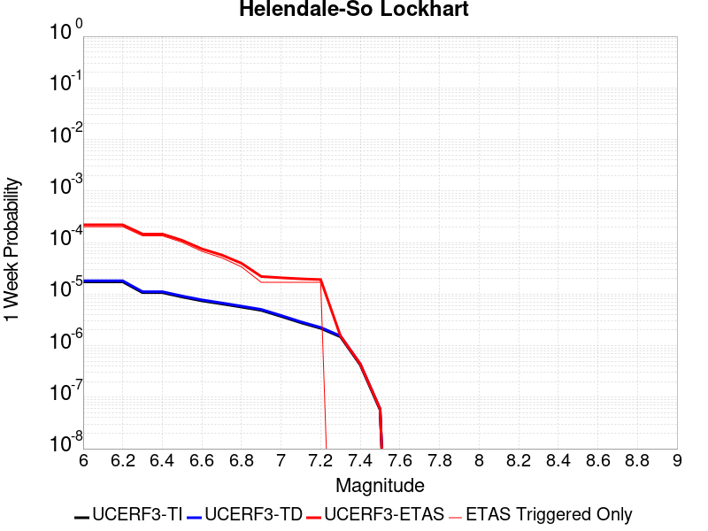 | 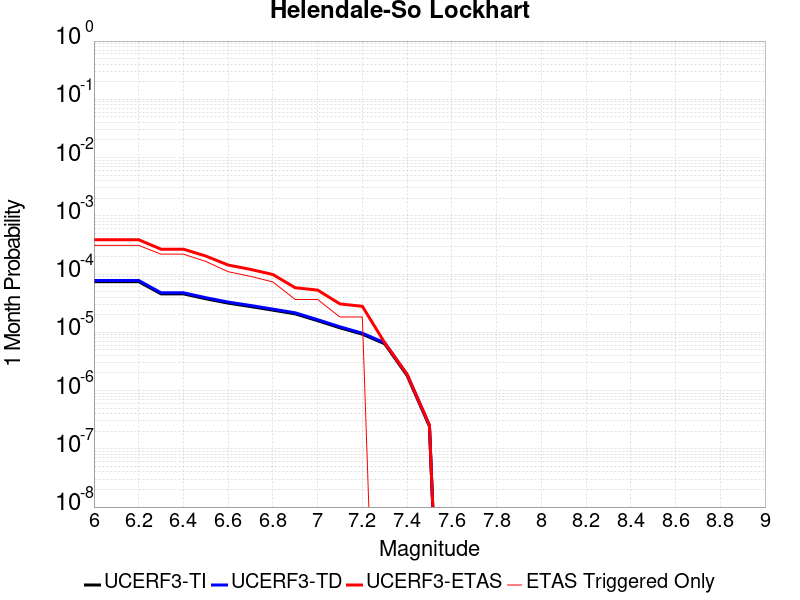 | 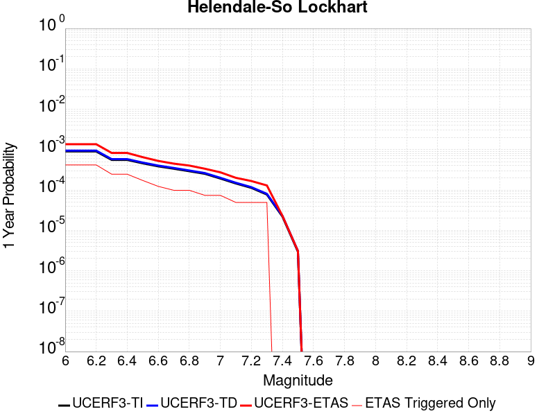 | 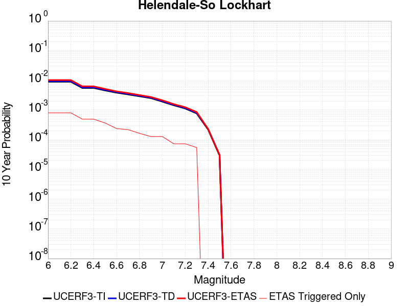 |

| Magnitude | 1 wk TI Prob | 1 wk TD Prob | 1 wk ETAS Prob | 1 wk ETAS/TD Gain | 1 wk ETAS Triggered Only | 1 mo TI Prob | 1 mo TD Prob | 1 mo ETAS Prob | 1 mo ETAS/TD Gain | 1 mo ETAS Triggered Only | 1 yr TI Prob | 1 yr TD Prob | 1 yr ETAS Prob | 1 yr ETAS/TD Gain | 1 yr ETAS Triggered Only | 10 yr TI Prob | 10 yr TD Prob | 10 yr ETAS Prob | 10 yr ETAS/TD Gain | 10 yr ETAS Triggered Only |
|-----|-----|-----|-----|-----|-----|-----|-----|-----|-----|-----|-----|-----|-----|-----|-----|-----|-----|-----|-----|-----|
| 6.0 | 1.7296055E-5 | 1.8103729E-5 | 1.9041679E-4 | 10.518097 | 1.7231617E-4 | 7.412385E-5 | 7.7585224E-5 | 3.4834677E-4 | 4.48986 | 2.7078256E-4 | 9.0208417E-4 | 9.4421144E-4 | 0.0013622985 | 1.4427896 | 4.1848214E-4 | 0.008984311 | 0.009404116 | 0.010086899 | 1.0726047 | 6.892647E-4 |
| 6.1 | 1.7296055E-5 | 1.8103729E-5 | 1.9041679E-4 | 10.518097 | 1.7231617E-4 | 7.412385E-5 | 7.7585224E-5 | 3.4834677E-4 | 4.48986 | 2.7078256E-4 | 9.0208417E-4 | 9.4421144E-4 | 0.0013622985 | 1.4427896 | 4.1848214E-4 | 0.008984311 | 0.009404116 | 0.010086899 | 1.0726047 | 6.892647E-4 |
| 6.2 | 1.7296055E-5 | 1.8103729E-5 | 1.9041679E-4 | 10.518097 | 1.7231617E-4 | 7.412385E-5 | 7.7585224E-5 | 3.4834677E-4 | 4.48986 | 2.7078256E-4 | 9.0208417E-4 | 9.4421144E-4 | 0.0013622985 | 1.4427896 | 4.1848214E-4 | 0.008984311 | 0.009404116 | 0.010086899 | 1.0726047 | 6.892647E-4 |
| 6.3 | 1.0669118E-5 | 1.1135425E-5 | 1.0960071E-4 | 9.842526 | 9.8466386E-5 | 4.5723988E-5 | 4.772239E-5 | 2.2003034E-4 | 4.610631 | 1.7231617E-4 | 5.5654737E-4 | 5.80868E-4 | 8.26891E-4 | 1.4235437 | 2.4616596E-4 | 0.0055515557 | 0.0057937936 | 0.006185377 | 1.0675868 | 3.9386554E-4 |
| 6.4 | 1.0669118E-5 | 1.1135425E-5 | 1.0960071E-4 | 9.842526 | 9.8466386E-5 | 4.5723988E-5 | 4.772239E-5 | 2.2003034E-4 | 4.610631 | 1.7231617E-4 | 5.5654737E-4 | 5.80868E-4 | 8.26891E-4 | 1.4235437 | 2.4616596E-4 | 0.0055515557 | 0.0057937936 | 0.006185377 | 1.0675868 | 3.9386554E-4 |
| 6.5 | 8.790038E-6 | 9.170197E-6 | 5.8402937E-5 | 6.368777 | 4.9233193E-5 | 3.767105E-5 | 3.930026E-5 | 1.3776278E-4 | 3.505391 | 9.8466386E-5 | 4.585485E-4 | 4.7837716E-4 | 6.506109E-4 | 1.3600376 | 1.7231617E-4 | 0.0045760344 | 0.004773638 | 0.0050431285 | 1.0564538 | 2.7078256E-4 |
| 6.6 | 7.396949E-6 | 7.715537E-6 | 3.2331944E-5 | 4.1904984 | 2.4616596E-5 | 3.1700827E-5 | 3.3066175E-5 | 1.0691352E-4 | 3.23332 | 7.384979E-5 | 3.858892E-4 | 4.025073E-4 | 5.2554073E-4 | 1.3056676 | 1.2308298E-4 | 0.003852198 | 0.00401789 | 0.004214031 | 1.048817 | 1.9693277E-4 |
| 6.7 | 6.4600285E-6 | 6.738031E-6 | 6.738031E-6 | 1.0 | 0.0 | 2.7685543E-5 | 2.887696E-5 | 7.810873E-5 | 2.7048807 | 4.9233193E-5 | 3.3701936E-4 | 3.5152107E-4 | 4.4995284E-4 | 1.2800167 | 9.8466386E-5 | 0.0033650869 | 0.003509732 | 0.0036814434 | 1.0489243 | 1.7231617E-4 |
| 6.8 | 5.600104E-6 | 5.836009E-6 | 5.836009E-6 | 1.0 | 0.0 | 2.4000226E-5 | 2.5011232E-5 | 7.4243195E-5 | 2.968394 | 4.9233193E-5 | 2.9216358E-4 | 3.044698E-4 | 4.029062E-4 | 1.3233043 | 9.8466386E-5 | 0.0029177975 | 0.003040588 | 0.0031878385 | 1.0484283 | 1.4769958E-4 |
| 6.9 | 4.839122E-6 | 5.0395092E-6 | 5.0395092E-6 | 1.0 | 0.0 | 2.0738931E-5 | 2.159772E-5 | 4.6213787E-5 | 2.1397529 | 2.4616596E-5 | 2.5246723E-4 | 2.6292098E-4 | 3.3675137E-4 | 1.2808082 | 7.384979E-5 | 0.002521806 | 0.002626147 | 0.0027489066 | 1.0467452 | 1.2308298E-4 |
| 7.0 | 3.6937633E-6 | 3.845208E-6 | 3.845208E-6 | 1.0 | 0.0 | 1.5830317E-5 | 1.647936E-5 | 4.109555E-5 | 2.493759 | 2.4616596E-5 | 1.9271708E-4 | 2.0061806E-4 | 2.7445302E-4 | 1.3680376 | 7.384979E-5 | 0.0019255003 | 0.002004401 | 0.0021272372 | 1.0612832 | 1.2308298E-4 |
| 7.1 | 2.7858857E-6 | 2.8978538E-6 | 2.8978538E-6 | 1.0 | 0.0 | 1.1939455E-5 | 1.2419316E-5 | 1.2419316E-5 | 1.0 | 0.0 | 1.4535317E-4 | 1.511949E-4 | 2.0042063E-4 | 1.3255781 | 4.9233193E-5 | 0.0014525814 | 0.0015109418 | 0.0015601006 | 1.0325352 | 4.9233193E-5 |
| 7.2 | 2.1672065E-6 | 2.2540128E-6 | 2.2540128E-6 | 1.0 | 0.0 | 9.2879945E-6 | 9.66002E-6 | 9.66002E-6 | 1.0 | 0.0 | 1.1307546E-4 | 1.1760458E-4 | 1.6683199E-4 | 1.4185841 | 4.9233193E-5 | 0.0011301794 | 0.0011754417 | 0.001224617 | 1.0418357 | 4.9233193E-5 |
| 7.3 | 1.4823496E-6 | 1.5422102E-6 | 1.5422102E-6 | 1.0 | 0.0 | 6.3529114E-6 | 6.6094562E-6 | 6.6094562E-6 | 1.0 | 0.0 | 7.734395E-5 | 8.046731E-5 | 1.2969655E-4 | 1.6117916 | 4.9233193E-5 | 7.731704E-4 | 8.0439687E-4 | 8.535905E-4 | 1.0611559 | 4.9233193E-5 |
| 7.4 | 4.2321457E-7 | 4.4108765E-7 | 4.4108765E-7 | 1.0 | 0.0 | 1.8137755E-6 | 1.8903745E-6 | 1.8903745E-6 | 1.0 | 0.0 | 2.2082493E-5 | 2.3015113E-5 | 2.3015113E-5 | 1.0 | 0.0 | 2.2080299E-4 | 2.3013182E-4 | 2.3013182E-4 | 1.0 | 0.0 |
| 7.5 | 5.6942316E-8 | 5.9415648E-8 | 5.9415648E-8 | 1.0 | 0.0 | 2.440385E-7 | 2.5463845E-7 | 2.5463845E-7 | 1.0 | 0.0 | 2.9711643E-6 | 3.1002196E-6 | 3.1002196E-6 | 1.0 | 0.0 | 2.9711247E-5 | 3.1001844E-5 | 3.1001844E-5 | 1.0 | 0.0 |

## Death Valley (Black Mtns Frontal)
*[(top)](#table-of-contents)*

| 1 Week | 1 Month | 1 Year | 10 Year |
|-----|-----|-----|-----|
| 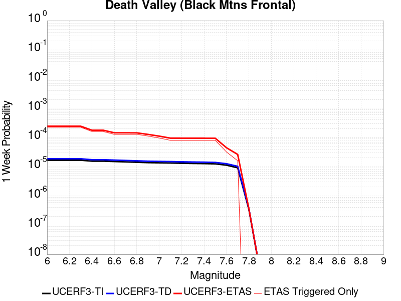 | 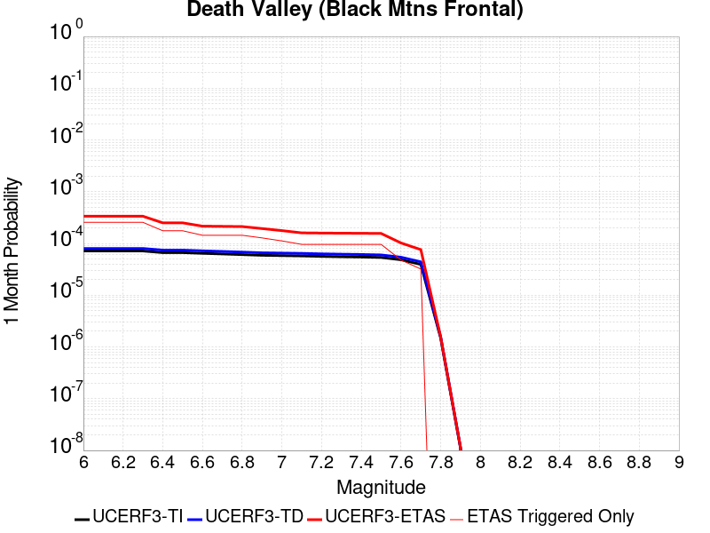 | 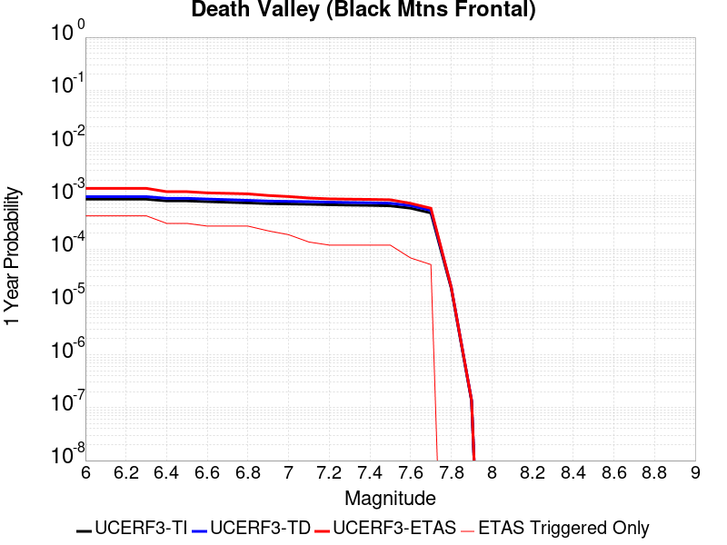 | 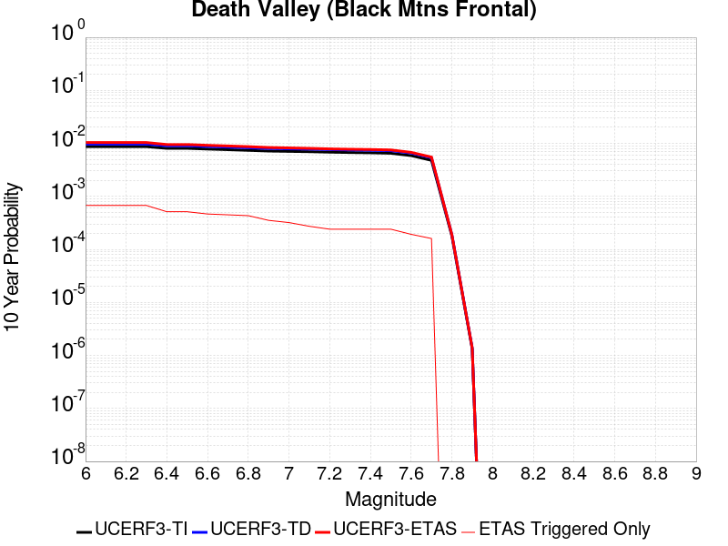 |

| Magnitude | 1 wk TI Prob | 1 wk TD Prob | 1 wk ETAS Prob | 1 wk ETAS/TD Gain | 1 wk ETAS Triggered Only | 1 mo TI Prob | 1 mo TD Prob | 1 mo ETAS Prob | 1 mo ETAS/TD Gain | 1 mo ETAS Triggered Only | 1 yr TI Prob | 1 yr TD Prob | 1 yr ETAS Prob | 1 yr ETAS/TD Gain | 1 yr ETAS Triggered Only | 10 yr TI Prob | 10 yr TD Prob | 10 yr ETAS Prob | 10 yr ETAS/TD Gain | 10 yr ETAS Triggered Only |
|-----|-----|-----|-----|-----|-----|-----|-----|-----|-----|-----|-----|-----|-----|-----|-----|-----|-----|-----|-----|-----|
| 6.0 | 1.6707214E-5 | 1.867027E-5 | 3.1406392E-4 | 16.821606 | 2.9539916E-4 | 7.160038E-5 | 8.001302E-5 | 4.246178E-4 | 5.3068585 | 3.4463234E-4 | 8.71386E-4 | 9.737309E-4 | 0.0014409907 | 1.4798656 | 4.6771532E-4 | 0.00867977 | 0.009695496 | 0.010304945 | 1.0628589 | 6.1541493E-4 |
| 6.1 | 1.6707214E-5 | 1.867027E-5 | 3.1406392E-4 | 16.821606 | 2.9539916E-4 | 7.160038E-5 | 8.001302E-5 | 4.246178E-4 | 5.3068585 | 3.4463234E-4 | 8.71386E-4 | 9.737309E-4 | 0.0014409907 | 1.4798656 | 4.6771532E-4 | 0.00867977 | 0.009695496 | 0.010304945 | 1.0628589 | 6.1541493E-4 |
| 6.2 | 1.6707214E-5 | 1.867027E-5 | 3.1406392E-4 | 16.821606 | 2.9539916E-4 | 7.160038E-5 | 8.001302E-5 | 4.246178E-4 | 5.3068585 | 3.4463234E-4 | 8.71386E-4 | 9.737309E-4 | 0.0014409907 | 1.4798656 | 4.6771532E-4 | 0.00867977 | 0.009695496 | 0.010304945 | 1.0628589 | 6.1541493E-4 |
| 6.3 | 1.6707214E-5 | 1.867027E-5 | 3.1406392E-4 | 16.821606 | 2.9539916E-4 | 7.160038E-5 | 8.001302E-5 | 4.246178E-4 | 5.3068585 | 3.4463234E-4 | 8.71386E-4 | 9.737309E-4 | 0.0014409907 | 1.4798656 | 4.6771532E-4 | 0.00867977 | 0.009695496 | 0.010304945 | 1.0628589 | 6.1541493E-4 |
| 6.4 | 1.5515609E-5 | 1.7338214E-5 | 2.1426757E-4 | 12.358111 | 1.9693277E-4 | 6.649377E-5 | 7.4304546E-5 | 2.9583744E-4 | 3.981418 | 2.2154937E-4 | 8.0926094E-4 | 9.042885E-4 | 0.0012240149 | 1.3535668 | 3.2001577E-4 | 0.008063202 | 0.009006773 | 0.009445881 | 1.048753 | 4.4309875E-4 |
| 6.5 | 1.5515609E-5 | 1.7338214E-5 | 2.1426757E-4 | 12.358111 | 1.9693277E-4 | 6.649377E-5 | 7.4304546E-5 | 2.9583744E-4 | 3.981418 | 2.2154937E-4 | 8.0926094E-4 | 9.042885E-4 | 0.0012240149 | 1.3535668 | 3.2001577E-4 | 0.008063202 | 0.009006773 | 0.009445881 | 1.048753 | 4.4309875E-4 |
| 6.6 | 1.5041828E-5 | 1.6809145E-5 | 1.8912242E-4 | 11.251163 | 1.7231617E-4 | 6.4463384E-5 | 7.203723E-5 | 2.6895583E-4 | 3.7335668 | 1.9693277E-4 | 7.8455906E-4 | 8.767063E-4 | 0.0011718465 | 1.3366466 | 2.9539916E-4 | 0.00781795 | 0.008733132 | 0.00914796 | 1.0475004 | 4.1848214E-4 |
| 6.7 | 1.4634985E-5 | 1.6356016E-5 | 1.8866938E-4 | 11.535167 | 1.7231617E-4 | 6.271985E-5 | 7.009536E-5 | 2.6701434E-4 | 3.809301 | 1.9693277E-4 | 7.6334673E-4 | 8.5308263E-4 | 0.0011482298 | 1.3459772 | 2.9539916E-4 | 0.007607299 | 0.008498715 | 0.008913641 | 1.0488222 | 4.1848214E-4 |
| 6.8 | 1.4209158E-5 | 1.5882048E-5 | 1.8819548E-4 | 11.849573 | 1.7231617E-4 | 6.089497E-5 | 6.8064175E-5 | 2.6498354E-4 | 3.8931427 | 1.9693277E-4 | 7.4114406E-4 | 8.2837185E-4 | 0.0011235264 | 1.3563067 | 2.9539916E-4 | 0.007386771 | 0.008253456 | 0.008644071 | 1.0473274 | 3.9386554E-4 |
| 6.9 | 1.3780098E-5 | 1.5404594E-5 | 1.631019E-4 | 10.587874 | 1.4769958E-4 | 5.9056227E-5 | 6.6018045E-5 | 2.3832284E-4 | 3.6099653 | 1.7231617E-4 | 7.1877235E-4 | 8.0347876E-4 | 0.0010494469 | 1.306129 | 2.4616596E-4 | 0.0071645193 | 0.008006332 | 0.008348206 | 1.0427003 | 3.4463234E-4 |
| 7.0 | 1.3585064E-5 | 1.5188155E-5 | 1.3826927E-4 | 9.103757 | 1.2308298E-4 | 5.8220405E-5 | 6.50905E-5 | 2.1278046E-4 | 3.268994 | 1.4769958E-4 | 7.086029E-4 | 7.9219416E-4 | 9.88971E-4 | 1.2483946 | 1.9693277E-4 | 0.007063476 | 0.007894293 | 0.008187361 | 1.0371239 | 2.9539916E-4 |
| 7.1 | 1.3398601E-5 | 1.49813395E-5 | 1.1344625E-4 | 7.572504 | 9.8466386E-5 | 5.742131E-5 | 6.420419E-5 | 1.8727928E-4 | 2.916932 | 1.2308298E-4 | 6.9888023E-4 | 7.8141113E-4 | 9.289953E-4 | 1.1888688 | 1.4769958E-4 | 0.0069668638 | 0.007787224 | 0.0080314735 | 1.0313654 | 2.4616596E-4 |
| 7.2 | 1.3126312E-5 | 1.4679561E-5 | 1.131445E-4 | 7.7076216 | 9.8466386E-5 | 5.6254412E-5 | 6.291092E-5 | 1.8598615E-4 | 2.9563415 | 1.2308298E-4 | 6.846822E-4 | 7.6567667E-4 | 8.8866544E-4 | 1.1606275 | 1.2308298E-4 | 0.006825765 | 0.00763097 | 0.007850829 | 1.0288113 | 2.2154937E-4 |
| 7.3 | 1.2922429E-5 | 1.4453788E-5 | 1.1291875E-4 | 7.8123984 | 9.8466386E-5 | 5.5380664E-5 | 6.194336E-5 | 1.8501873E-4 | 2.9869013 | 1.2308298E-4 | 6.74051E-4 | 7.53905E-4 | 8.7689515E-4 | 1.1631376 | 1.2308298E-4 | 0.006720101 | 0.007514055 | 0.007733939 | 1.0292631 | 2.2154937E-4 |
| 7.4 | 1.2768878E-5 | 1.4283772E-5 | 1.1274875E-4 | 7.893486 | 9.8466386E-5 | 5.4722615E-5 | 6.1214756E-5 | 1.842902E-4 | 3.010552 | 1.2308298E-4 | 6.660441E-4 | 7.4504025E-4 | 8.680315E-4 | 1.1650801 | 1.2308298E-4 | 0.0066405144 | 0.0074260035 | 0.007645908 | 1.0296127 | 2.2154937E-4 |
| 7.5 | 1.2521929E-5 | 1.40120155E-5 | 1.1247702E-4 | 8.027184 | 9.8466386E-5 | 5.366431E-5 | 6.005014E-5 | 1.8312574E-4 | 3.049547 | 1.2308298E-4 | 6.531671E-4 | 7.3087064E-4 | 8.5386366E-4 | 1.1682829 | 1.2308298E-4 | 0.006512506 | 0.0072852457 | 0.0075051812 | 1.0301892 | 2.2154937E-4 |
| 7.6 | 1.1301089E-5 | 1.2648149E-5 | 6.188072E-5 | 4.8924723 | 4.9233193E-5 | 4.8432343E-5 | 5.4205255E-5 | 1.2805105E-4 | 2.3623364 | 7.384979E-5 | 5.895042E-4 | 6.5975444E-4 | 7.335555E-4 | 1.1118615 | 7.384979E-5 | 0.0058794282 | 0.00657851 | 0.006749693 | 1.0260215 | 1.7231617E-4 |
| 7.7 | 9.189108E-6 | 1.0283358E-5 | 3.4899702E-5 | 3.3938038 | 2.4616596E-5 | 3.93813E-5 | 4.407082E-5 | 9.3301845E-5 | 2.1170888 | 4.9233193E-5 | 4.7936183E-4 | 5.3643517E-4 | 5.8564194E-4 | 1.0917293 | 4.9233193E-5 | 0.004783291 | 0.005351914 | 0.0054743383 | 1.0228748 | 1.2308298E-4 |
| 7.8 | 3.4586725E-7 | 3.6482615E-7 | 3.6482615E-7 | 1.0 | 0.0 | 1.4822873E-6 | 1.5635396E-6 | 1.5635396E-6 | 1.0 | 0.0 | 1.80467E-5 | 1.9035933E-5 | 1.9035933E-5 | 1.0 | 0.0 | 1.8045233E-4 | 1.9034347E-4 | 1.9034347E-4 | 1.0 | 0.0 |
| 7.9 | 2.5591178E-9 | 2.6696718E-9 | 2.6696718E-9 | 1.0 | 0.0 | 1.0967647E-8 | 1.14414505E-8 | 1.14414505E-8 | 1.0 | 0.0 | 1.335311E-7 | 1.3929966E-7 | 1.3929966E-7 | 1.0 | 0.0 | 1.3353102E-6 | 1.3929966E-6 | 1.3929966E-6 | 1.0 | 0.0 |

## Independence rev 2011
*[(top)](#table-of-contents)*

| 1 Week | 1 Month | 1 Year | 10 Year |
|-----|-----|-----|-----|
| 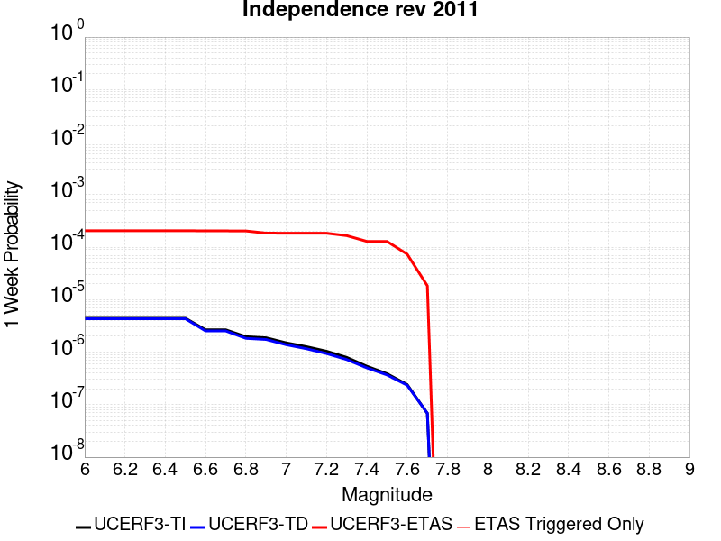 | 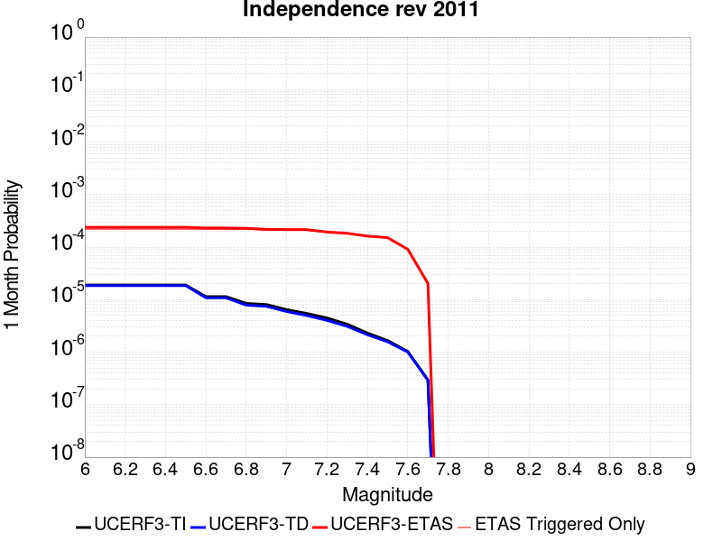 | 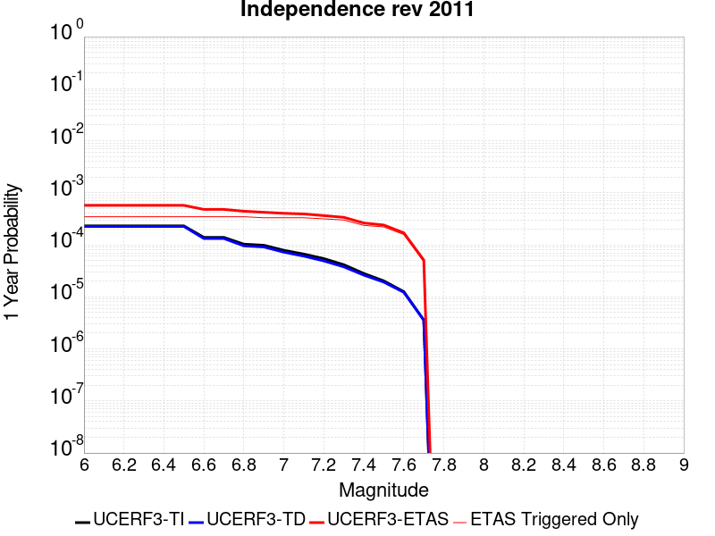 | 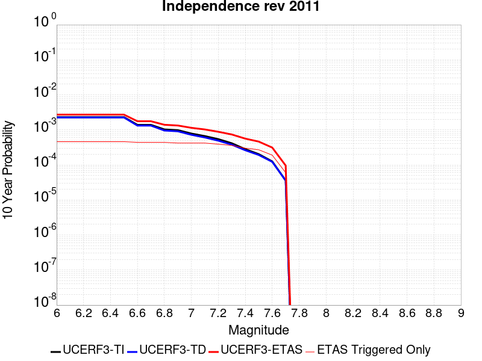 |

| Magnitude | 1 wk TI Prob | 1 wk TD Prob | 1 wk ETAS Prob | 1 wk ETAS/TD Gain | 1 wk ETAS Triggered Only | 1 mo TI Prob | 1 mo TD Prob | 1 mo ETAS Prob | 1 mo ETAS/TD Gain | 1 mo ETAS Triggered Only | 1 yr TI Prob | 1 yr TD Prob | 1 yr ETAS Prob | 1 yr ETAS/TD Gain | 1 yr ETAS Triggered Only | 10 yr TI Prob | 10 yr TD Prob | 10 yr ETAS Prob | 10 yr ETAS/TD Gain | 10 yr ETAS Triggered Only |
|-----|-----|-----|-----|-----|-----|-----|-----|-----|-----|-----|-----|-----|-----|-----|-----|-----|-----|-----|-----|-----|
| 6.0 | 4.422171E-6 | 4.326227E-6 | 2.0125815E-4 | 46.520477 | 1.9693277E-4 | 1.8952025E-5 | 1.8540857E-5 | 2.6470225E-4 | 14.2767 | 2.4616596E-4 | 2.3071647E-4 | 2.2571455E-4 | 5.702691E-4 | 2.5265057 | 3.4463234E-4 | 0.0023047708 | 0.0022551466 | 0.0027709294 | 1.2287136 | 5.169485E-4 |
| 6.1 | 4.422171E-6 | 4.326227E-6 | 2.0125815E-4 | 46.520477 | 1.9693277E-4 | 1.8952025E-5 | 1.8540857E-5 | 2.6470225E-4 | 14.2767 | 2.4616596E-4 | 2.3071647E-4 | 2.2571455E-4 | 5.702691E-4 | 2.5265057 | 3.4463234E-4 | 0.0023047708 | 0.0022551466 | 0.0027709294 | 1.2287136 | 5.169485E-4 |
| 6.2 | 4.422171E-6 | 4.326227E-6 | 2.0125815E-4 | 46.520477 | 1.9693277E-4 | 1.8952025E-5 | 1.8540857E-5 | 2.6470225E-4 | 14.2767 | 2.4616596E-4 | 2.3071647E-4 | 2.2571455E-4 | 5.702691E-4 | 2.5265057 | 3.4463234E-4 | 0.0023047708 | 0.0022551466 | 0.0027709294 | 1.2287136 | 5.169485E-4 |
| 6.3 | 4.422171E-6 | 4.326227E-6 | 2.0125815E-4 | 46.520477 | 1.9693277E-4 | 1.8952025E-5 | 1.8540857E-5 | 2.6470225E-4 | 14.2767 | 2.4616596E-4 | 2.3071647E-4 | 2.2571455E-4 | 5.702691E-4 | 2.5265057 | 3.4463234E-4 | 0.0023047708 | 0.0022551466 | 0.0027709294 | 1.2287136 | 5.169485E-4 |
| 6.4 | 4.422171E-6 | 4.326227E-6 | 2.0125815E-4 | 46.520477 | 1.9693277E-4 | 1.8952025E-5 | 1.8540857E-5 | 2.6470225E-4 | 14.2767 | 2.4616596E-4 | 2.3071647E-4 | 2.2571455E-4 | 5.702691E-4 | 2.5265057 | 3.4463234E-4 | 0.0023047708 | 0.0022551466 | 0.0027709294 | 1.2287136 | 5.169485E-4 |
| 6.5 | 4.422171E-6 | 4.326227E-6 | 2.0125815E-4 | 46.520477 | 1.9693277E-4 | 1.8952025E-5 | 1.8540857E-5 | 2.6470225E-4 | 14.2767 | 2.4616596E-4 | 2.3071647E-4 | 2.2571455E-4 | 5.702691E-4 | 2.5265057 | 3.4463234E-4 | 0.0023047708 | 0.0022551466 | 0.0027709294 | 1.2287136 | 5.169485E-4 |
| 6.6 | 2.663744E-6 | 2.5319862E-6 | 1.9946427E-4 | 78.77779 | 1.9693277E-4 | 1.1415996E-5 | 1.0851327E-5 | 2.5701462E-4 | 23.685087 | 2.4616596E-4 | 1.3898089E-4 | 1.3210738E-4 | 4.766942E-4 | 3.6083841 | 3.4463234E-4 | 0.0013889399 | 0.0013203367 | 0.0018120187 | 1.3723912 | 4.923319E-4 |
| 6.7 | 2.663744E-6 | 2.5319862E-6 | 1.9946427E-4 | 78.77779 | 1.9693277E-4 | 1.1415996E-5 | 1.0851327E-5 | 2.5701462E-4 | 23.685087 | 2.4616596E-4 | 1.3898089E-4 | 1.3210738E-4 | 4.766942E-4 | 3.6083841 | 3.4463234E-4 | 0.0013889399 | 0.0013203367 | 0.0018120187 | 1.3723912 | 4.923319E-4 |
| 6.8 | 1.9716529E-6 | 1.8322585E-6 | 1.9876467E-4 | 108.4807 | 1.9693277E-4 | 8.449913E-6 | 7.852514E-6 | 2.5401654E-4 | 32.34844 | 2.4616596E-4 | 1.0287284E-4 | 9.5600284E-5 | 4.4019968E-4 | 4.6045856 | 3.4463234E-4 | 0.0010282523 | 9.556045E-4 | 0.001447466 | 1.5147123 | 4.923319E-4 |
| 6.9 | 1.8788617E-6 | 1.7429993E-6 | 1.9867542E-4 | 113.9848 | 1.9693277E-4 | 8.0522395E-6 | 7.4699765E-6 | 2.536341E-4 | 33.953804 | 2.4616596E-4 | 9.80316E-5 | 9.0943286E-5 | 4.355443E-4 | 4.7891855 | 3.4463234E-4 | 9.798837E-4 | 9.0907275E-4 | 0.0014009571 | 1.5410836 | 4.923319E-4 |
| 7.0 | 1.5045488E-6 | 1.3849503E-6 | 1.9831744E-4 | 143.19463 | 1.9693277E-4 | 6.44805E-6 | 5.9354884E-6 | 2.521E-4 | 42.473335 | 2.4616596E-4 | 7.8502184E-5 | 7.226223E-5 | 4.1686968E-4 | 5.768846 | 3.4463234E-4 | 7.8474457E-4 | 7.2239246E-4 | 0.0012143687 | 1.6810374 | 4.923319E-4 |
| 7.1 | 1.272341E-6 | 1.1625096E-6 | 1.9809505E-4 | 170.40292 | 1.9693277E-4 | 5.4528787E-6 | 4.982175E-6 | 2.511469E-4 | 50.409092 | 2.4616596E-4 | 6.6386776E-5 | 6.0656326E-5 | 4.0526778E-4 | 6.681377 | 3.4463234E-4 | 6.636695E-4 | 6.064009E-4 | 0.0010984343 | 1.8113995 | 4.923319E-4 |
| 7.2 | 1.0416892E-6 | 9.4098806E-7 | 1.9787358E-4 | 210.28278 | 1.9693277E-4 | 4.464375E-6 | 4.0328E-6 | 2.5019777E-4 | 62.040714 | 2.4616596E-4 | 5.4352407E-5 | 4.909825E-5 | 3.9371368E-4 | 8.018894 | 3.4463234E-4 | 5.4339116E-4 | 4.9087586E-4 | 9.583616E-4 | 1.9523501 | 4.6771532E-4 |
| 7.3 | 7.9450155E-7 | 7.235002E-7 | 1.7303955E-4 | 239.17001 | 1.7231617E-4 | 3.4050022E-6 | 3.1007114E-6 | 2.246494E-4 | 72.45092 | 2.2154937E-4 | 4.1455114E-5 | 3.775052E-5 | 3.5775418E-4 | 9.476802 | 3.2001577E-4 | 4.144738E-4 | 3.7744216E-4 | 7.9576636E-4 | 2.1083133 | 4.1848214E-4 |
| 7.4 | 5.3893444E-7 | 5.019512E-7 | 1.7281804E-4 | 344.2925 | 1.7231617E-4 | 2.309717E-6 | 2.1512178E-6 | 2.237001E-4 | 103.98766 | 2.2154937E-4 | 2.8120441E-5 | 2.6190766E-5 | 3.215822E-4 | 12.278457 | 2.9539916E-4 | 2.8116882E-4 | 2.6187726E-4 | 6.310295E-4 | 2.4096384 | 3.6924894E-4 |
| 7.5 | 3.8852085E-7 | 3.682554E-7 | 1.7268436E-4 | 468.92557 | 1.7231617E-4 | 1.6650882E-6 | 1.5782365E-6 | 2.2312725E-4 | 141.37758 | 2.2154937E-4 | 2.027226E-5 | 1.9214862E-5 | 3.1460833E-4 | 16.373178 | 2.9539916E-4 | 2.0270412E-4 | 1.9213221E-4 | 5.613102E-4 | 2.921479 | 3.6924894E-4 |
| 7.6 | 2.414929E-7 | 2.345755E-7 | 9.870094E-5 | 420.76404 | 9.8466386E-5 | 1.0349692E-6 | 1.0053232E-6 | 1.2408818E-4 | 123.43114 | 1.2308298E-4 | 1.2600677E-5 | 1.2239742E-5 | 2.091701E-4 | 17.08942 | 1.9693277E-4 | 1.2599962E-4 | 1.223908E-4 | 3.9314022E-4 | 3.2121713 | 2.7078256E-4 |
| 7.7 | 6.8298014E-8 | 6.85897E-8 | 2.4685185E-5 | 359.8964 | 2.4616596E-5 | 2.9270575E-7 | 2.9395582E-7 | 2.4910545E-5 | 84.742485 | 2.4616596E-5 | 3.5636867E-6 | 3.5789067E-6 | 5.2811924E-5 | 14.756441 | 4.9233193E-5 | 3.5636294E-5 | 3.5788536E-5 | 8.5019965E-5 | 2.3756201 | 4.9233193E-5 |

## San Andreas (Big Bend)
*[(top)](#table-of-contents)*

| 1 Week | 1 Month | 1 Year | 10 Year |
|-----|-----|-----|-----|
| 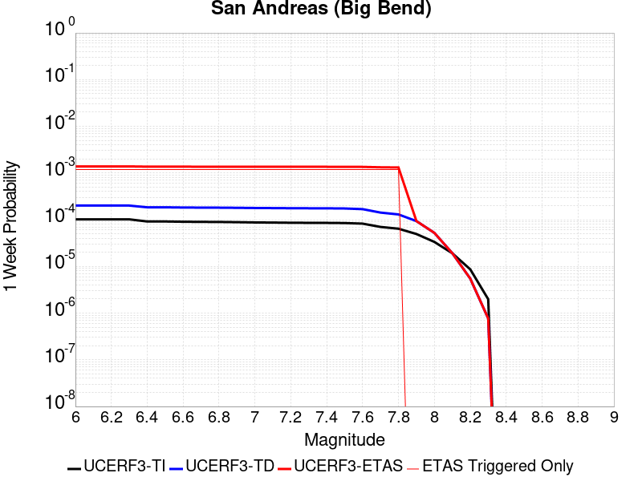 | 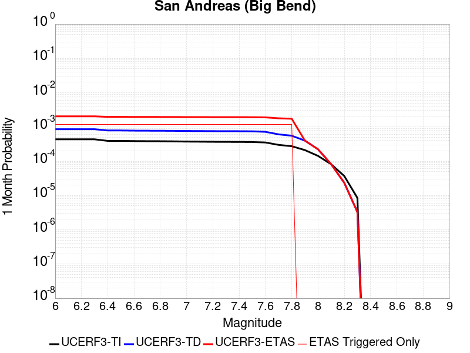 | 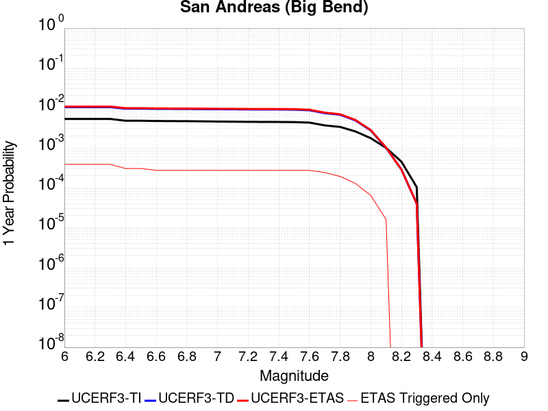 |  |

| Magnitude | 1 wk TI Prob | 1 wk TD Prob | 1 wk ETAS Prob | 1 wk ETAS/TD Gain | 1 wk ETAS Triggered Only | 1 mo TI Prob | 1 mo TD Prob | 1 mo ETAS Prob | 1 mo ETAS/TD Gain | 1 mo ETAS Triggered Only | 1 yr TI Prob | 1 yr TD Prob | 1 yr ETAS Prob | 1 yr ETAS/TD Gain | 1 yr ETAS Triggered Only | 10 yr TI Prob | 10 yr TD Prob | 10 yr ETAS Prob | 10 yr ETAS/TD Gain | 10 yr ETAS Triggered Only |
|-----|-----|-----|-----|-----|-----|-----|-----|-----|-----|-----|-----|-----|-----|-----|-----|-----|-----|-----|-----|-----|
| 6.0 | 1.0179969E-4 | 2.0072258E-4 | 3.9761583E-4 | 1.9809222 | 1.9693277E-4 | 4.362114E-4 | 8.599571E-4 | 0.0012042931 | 1.4004107 | 3.4463234E-4 | 0.0052979486 | 0.010419999 | 0.010858481 | 1.0420808 | 4.4309875E-4 | 0.051734097 | 0.10144902 | 0.10191353 | 1.0045787 | 5.169485E-4 |
| 6.1 | 1.0179969E-4 | 2.0072258E-4 | 3.9761583E-4 | 1.9809222 | 1.9693277E-4 | 4.362114E-4 | 8.599571E-4 | 0.0012042931 | 1.4004107 | 3.4463234E-4 | 0.0052979486 | 0.010419999 | 0.010858481 | 1.0420808 | 4.4309875E-4 | 0.051734097 | 0.10144902 | 0.10191353 | 1.0045787 | 5.169485E-4 |
| 6.2 | 1.0179969E-4 | 2.0072258E-4 | 3.9761583E-4 | 1.9809222 | 1.9693277E-4 | 4.362114E-4 | 8.599571E-4 | 0.0012042931 | 1.4004107 | 3.4463234E-4 | 0.0052979486 | 0.010419999 | 0.010858481 | 1.0420808 | 4.4309875E-4 | 0.051734097 | 0.10144902 | 0.10191353 | 1.0045787 | 5.169485E-4 |
| 6.3 | 1.0179969E-4 | 2.0072258E-4 | 3.9761583E-4 | 1.9809222 | 1.9693277E-4 | 4.362114E-4 | 8.599571E-4 | 0.0012042931 | 1.4004107 | 3.4463234E-4 | 0.0052979486 | 0.010419999 | 0.010858481 | 1.0420808 | 4.4309875E-4 | 0.051734097 | 0.10144902 | 0.10191353 | 1.0045787 | 5.169485E-4 |
| 6.4 | 9.1639464E-5 | 1.8429532E-4 | 3.319677E-4 | 1.8012811 | 1.4769958E-4 | 3.9268145E-4 | 7.895982E-4 | 0.001060167 | 1.3426664 | 2.7078256E-4 | 0.0047704205 | 0.009571102 | 0.009912436 | 1.035663 | 3.4463234E-4 | 0.046693064 | 0.09377527 | 0.0941322 | 1.0038062 | 3.9386554E-4 |
| 6.5 | 9.1639464E-5 | 1.8429532E-4 | 3.319677E-4 | 1.8012811 | 1.4769958E-4 | 3.9268145E-4 | 7.895982E-4 | 0.001060167 | 1.3426664 | 2.7078256E-4 | 0.0047704205 | 0.009571102 | 0.009912436 | 1.035663 | 3.4463234E-4 | 0.046693064 | 0.09377527 | 0.0941322 | 1.0038062 | 3.9386554E-4 |
| 6.6 | 9.042622E-5 | 1.823659E-4 | 3.0542645E-4 | 1.6748002 | 1.2308298E-4 | 3.8748336E-4 | 7.8133424E-4 | 0.0010027105 | 1.283331 | 2.2154937E-4 | 0.0047074095 | 0.009471365 | 0.009763966 | 1.0308932 | 2.9539916E-4 | 0.046089325 | 0.092869274 | 0.0931819 | 1.0033664 | 3.4463234E-4 |
| 6.7 | 8.9836685E-5 | 1.8150927E-4 | 3.045699E-4 | 1.6779854 | 1.2308298E-4 | 3.8495753E-4 | 7.776651E-4 | 9.990422E-4 | 1.2846689 | 2.2154937E-4 | 0.00467679 | 0.00942708 | 0.009719695 | 1.0310397 | 2.9539916E-4 | 0.045795817 | 0.09246355 | 0.09277631 | 1.0033826 | 3.4463234E-4 |
| 6.8 | 8.9471854E-5 | 1.8097709E-4 | 3.040378E-4 | 1.6799794 | 1.2308298E-4 | 3.8339442E-4 | 7.7538576E-4 | 9.967634E-4 | 1.2855064 | 2.2154937E-4 | 0.004657841 | 0.009399569 | 0.009692191 | 1.0311315 | 2.9539916E-4 | 0.04561414 | 0.092210755 | 0.09252361 | 1.0033928 | 3.4463234E-4 |
| 6.9 | 8.858234E-5 | 1.7979681E-4 | 3.0285766E-4 | 1.684444 | 1.2308298E-4 | 3.7958333E-4 | 7.703304E-4 | 9.917092E-4 | 1.2873815 | 2.2154937E-4 | 0.004611638 | 0.009338548 | 0.0096311895 | 1.0313368 | 2.9539916E-4 | 0.04517103 | 0.09165087 | 0.09196392 | 1.0034156 | 3.4463234E-4 |
| 7.0 | 8.7433385E-5 | 1.7818481E-4 | 3.0124586E-4 | 1.6906371 | 1.2308298E-4 | 3.746607E-4 | 7.634259E-4 | 9.848061E-4 | 1.2899826 | 2.2154937E-4 | 0.004551957 | 0.009255203 | 0.009547869 | 1.0316217 | 2.9539916E-4 | 0.044598386 | 0.09088532 | 0.09119862 | 1.0034473 | 3.4463234E-4 |
| 7.1 | 8.684964E-5 | 1.7730435E-4 | 3.003655E-4 | 1.6940674 | 1.2308298E-4 | 3.7215967E-4 | 7.596547E-4 | 9.810358E-4 | 1.2914233 | 2.2154937E-4 | 0.0045216335 | 0.009209678 | 0.009502356 | 1.0317794 | 2.9539916E-4 | 0.04430731 | 0.09046686 | 0.09078032 | 1.0034648 | 3.4463234E-4 |
| 7.2 | 8.606521E-5 | 1.762105E-4 | 2.992718E-4 | 1.6983767 | 1.2308298E-4 | 3.6879873E-4 | 7.549695E-4 | 9.763516E-4 | 1.2932332 | 2.2154937E-4 | 0.0044808835 | 0.0091531165 | 0.009445812 | 1.0319777 | 2.9539916E-4 | 0.043916024 | 0.089947365 | 0.090261005 | 1.0034869 | 3.4463234E-4 |
| 7.3 | 8.568266E-5 | 1.7563057E-4 | 2.9869194E-4 | 1.7006831 | 1.2308298E-4 | 3.6715972E-4 | 7.524855E-4 | 9.738681E-4 | 1.2942019 | 2.2154937E-4 | 0.0044610105 | 0.009123127 | 0.009415831 | 1.0320837 | 2.9539916E-4 | 0.043725148 | 0.08966853 | 0.08998226 | 1.0034988 | 3.4463234E-4 |
| 7.4 | 8.5432206E-5 | 1.7525644E-4 | 2.9831784E-4 | 1.7021791 | 1.2308298E-4 | 3.6608664E-4 | 7.50883E-4 | 9.72266E-4 | 1.2948302 | 2.2154937E-4 | 0.004447999 | 0.009103781 | 0.009396491 | 1.0321525 | 2.9539916E-4 | 0.043600157 | 0.08948871 | 0.089802496 | 1.0035065 | 3.4463234E-4 |
| 7.5 | 8.4791965E-5 | 1.7394972E-4 | 2.970113E-4 | 1.7074548 | 1.2308298E-4 | 3.633435E-4 | 7.4528606E-4 | 9.666703E-4 | 1.2970461 | 2.2154937E-4 | 0.0044147377 | 0.009036204 | 0.009328934 | 1.0323952 | 2.9539916E-4 | 0.043280575 | 0.088866346 | 0.08918035 | 1.0035335 | 3.4463234E-4 |
| 7.6 | 8.241105E-5 | 1.6840403E-4 | 2.9146628E-4 | 1.7307559 | 1.2308298E-4 | 3.531424E-4 | 7.215321E-4 | 9.429216E-4 | 1.3068326 | 2.2154937E-4 | 0.0042910352 | 0.008749358 | 0.009042174 | 1.0334669 | 2.9539916E-4 | 0.042091176 | 0.086243294 | 0.0865582 | 1.0036514 | 3.4463234E-4 |
| 7.7 | 7.00432E-5 | 1.42045E-4 | 2.6511052E-4 | 1.8663839 | 1.2308298E-4 | 3.001506E-4 | 6.0862233E-4 | 8.0543524E-4 | 1.3233745 | 1.9693277E-4 | 0.0036482112 | 0.0073848404 | 0.0076291882 | 1.0330878 | 2.4616596E-4 | 0.035888977 | 0.07351733 | 0.0737454 | 1.0031022 | 2.4616596E-4 |
| 7.8 | 6.415362E-5 | 1.2968935E-4 | 2.2814296E-4 | 1.7591497 | 9.8466386E-5 | 2.749151E-4 | 5.556931E-4 | 7.279135E-4 | 1.3099201 | 1.7231617E-4 | 0.0033419547 | 0.0067446055 | 0.0069646607 | 1.0326269 | 2.2154937E-4 | 0.03292141 | 0.06725231 | 0.06745896 | 1.0030727 | 2.2154937E-4 |
| 7.9 | 4.939911E-5 | 9.3411545E-5 | 1.6725443E-4 | 1.7905114 | 7.384979E-5 | 2.116933E-4 | 4.0027377E-4 | 5.233075E-4 | 1.3073739 | 1.2308298E-4 | 0.0025743195 | 0.004862453 | 0.005009434 | 1.0302278 | 1.4769958E-4 | 0.025447013 | 0.048914436 | 0.049054913 | 1.0028719 | 1.4769958E-4 |
| 8.0 | 3.344983E-5 | 5.222685E-5 | 1.01457474E-4 | 1.9426305 | 4.9233193E-5 | 1.4334853E-4 | 2.2381016E-4 | 3.2225452E-4 | 1.4398564 | 9.8466386E-5 | 0.0017438711 | 0.0027214854 | 0.0028196839 | 1.0360826 | 9.8466386E-5 | 0.017302496 | 0.027922187 | 0.028017905 | 1.003428 | 9.8466386E-5 |
| 8.1 | 1.9104898E-5 | 1.9173063E-5 | 1.9173063E-5 | 1.0 | 0.0 | 8.1875565E-5 | 8.216769E-5 | 1.0678226E-4 | 1.2995651 | 2.4616596E-5 | 9.963791E-4 | 9.999331E-4 | 0.0010245251 | 1.0245936 | 2.4616596E-5 | 0.009919235 | 0.010749801 | 0.010774153 | 1.0022653 | 2.4616596E-5 |
| 8.2 | 8.643924E-6 | 5.4748625E-6 | 5.4748625E-6 | 1.0 | 0.0 | 3.704486E-5 | 2.3463486E-5 | 2.3463486E-5 | 1.0 | 0.0 | 4.5092785E-4 | 2.8563058E-4 | 2.8563058E-4 | 1.0 | 0.0 | 0.0045001395 | 0.0032487072 | 0.0032487072 | 1.0 | 0.0 |
| 8.3 | 1.983087E-6 | 7.6599065E-7 | 7.6599065E-7 | 1.0 | 0.0 | 8.498917E-6 | 3.282813E-6 | 3.282813E-6 | 1.0 | 0.0 | 1.034694E-4 | 3.9967534E-5 | 3.9967534E-5 | 1.0 | 0.0 | 0.0010342124 | 4.719687E-4 | 4.719687E-4 | 1.0 | 0.0 |

## Red Pass
*[(top)](#table-of-contents)*

| 1 Week | 1 Month | 1 Year | 10 Year |
|-----|-----|-----|-----|
| 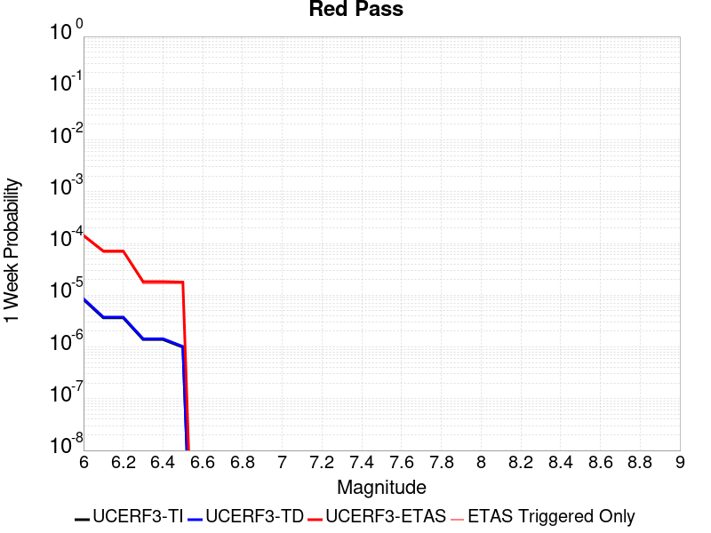 | 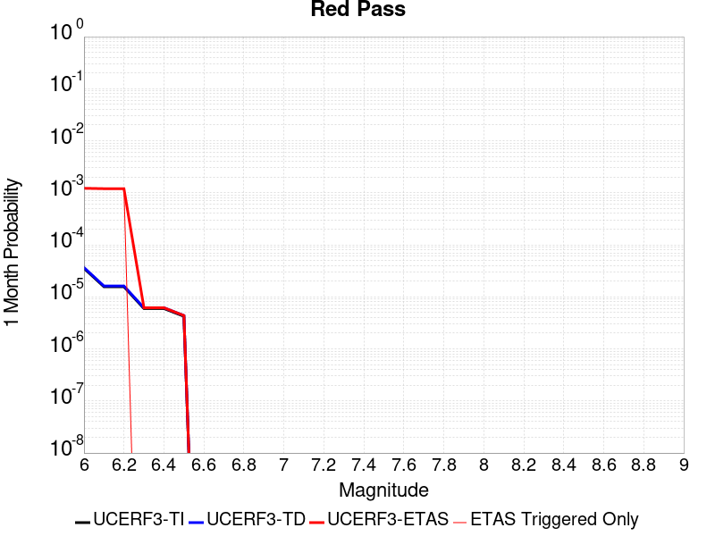 | 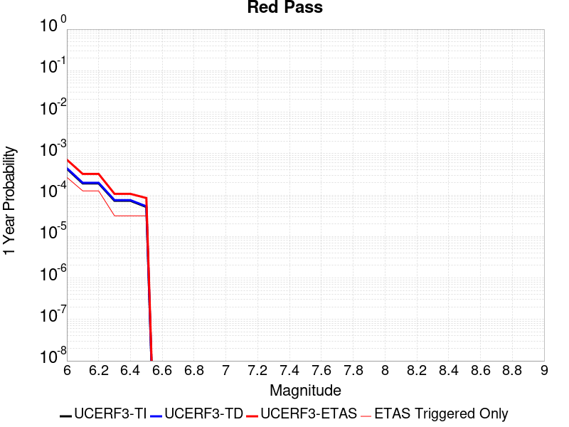 | 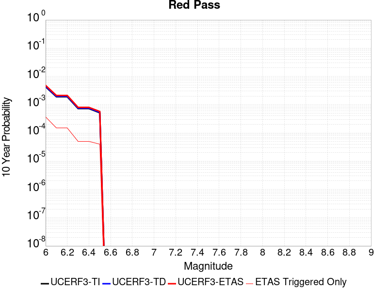 |

| Magnitude | 1 wk TI Prob | 1 wk TD Prob | 1 wk ETAS Prob | 1 wk ETAS/TD Gain | 1 wk ETAS Triggered Only | 1 mo TI Prob | 1 mo TD Prob | 1 mo ETAS Prob | 1 mo ETAS/TD Gain | 1 mo ETAS Triggered Only | 1 yr TI Prob | 1 yr TD Prob | 1 yr ETAS Prob | 1 yr ETAS/TD Gain | 1 yr ETAS Triggered Only | 10 yr TI Prob | 10 yr TD Prob | 10 yr ETAS Prob | 10 yr ETAS/TD Gain | 10 yr ETAS Triggered Only |
|-----|-----|-----|-----|-----|-----|-----|-----|-----|-----|-----|-----|-----|-----|-----|-----|-----|-----|-----|-----|-----|
| 6.0 | 8.258278E-6 | 8.551265E-6 | 1.5624957E-4 | 18.272102 | 1.4769958E-4 | 3.539214E-5 | 3.6647863E-5 | 2.581891E-4 | 7.045134 | 2.2154937E-4 | 4.308141E-4 | 4.4611428E-4 | 7.4138166E-4 | 1.6618649 | 2.9539916E-4 | 0.0042997985 | 0.004453945 | 0.00489507 | 1.0990415 | 4.4309875E-4 |
| 6.1 | 3.649988E-6 | 3.7753161E-6 | 7.762483E-5 | 20.561146 | 7.384979E-5 | 1.5642712E-5 | 1.6179853E-5 | 1.14644645E-4 | 7.0856423 | 9.8466386E-5 | 1.9043336E-4 | 1.9697666E-4 | 2.9542364E-4 | 1.4997901 | 9.8466386E-5 | 0.0019027026 | 0.001968488 | 0.002115897 | 1.0748843 | 1.4769958E-4 |
| 6.2 | 3.649988E-6 | 3.7753161E-6 | 7.762483E-5 | 20.561146 | 7.384979E-5 | 1.5642712E-5 | 1.6179853E-5 | 1.14644645E-4 | 7.0856423 | 9.8466386E-5 | 1.9043336E-4 | 1.9697666E-4 | 2.9542364E-4 | 1.4997901 | 9.8466386E-5 | 0.0019027026 | 0.001968488 | 0.002115897 | 1.0748843 | 1.4769958E-4 |
| 6.3 | 1.3924937E-6 | 1.4411166E-6 | 1.4411166E-6 | 1.0 | 0.0 | 5.9678164E-6 | 6.1762075E-6 | 6.1762075E-6 | 1.0 | 0.0 | 7.265574E-5 | 7.519415E-5 | 7.519415E-5 | 1.0 | 0.0 | 7.263199E-4 | 7.518258E-4 | 7.518258E-4 | 1.0 | 0.0 |
| 6.4 | 1.3924937E-6 | 1.4411166E-6 | 1.4411166E-6 | 1.0 | 0.0 | 5.9678164E-6 | 6.1762075E-6 | 6.1762075E-6 | 1.0 | 0.0 | 7.265574E-5 | 7.519415E-5 | 7.519415E-5 | 1.0 | 0.0 | 7.263199E-4 | 7.518258E-4 | 7.518258E-4 | 1.0 | 0.0 |
| 6.5 | 9.876812E-7 | 1.0221912E-6 | 1.0221912E-6 | 1.0 | 0.0 | 4.2329125E-6 | 4.3808195E-6 | 4.3808195E-6 | 1.0 | 0.0 | 5.153449E-5 | 5.3336476E-5 | 5.3336476E-5 | 1.0 | 0.0 | 5.1522546E-4 | 5.333648E-4 | 5.333648E-4 | 1.0 | 0.0 |

## Lake Isabella (Seismicity)
*[(top)](#table-of-contents)*

| 1 Week | 1 Month | 1 Year | 10 Year |
|-----|-----|-----|-----|
| 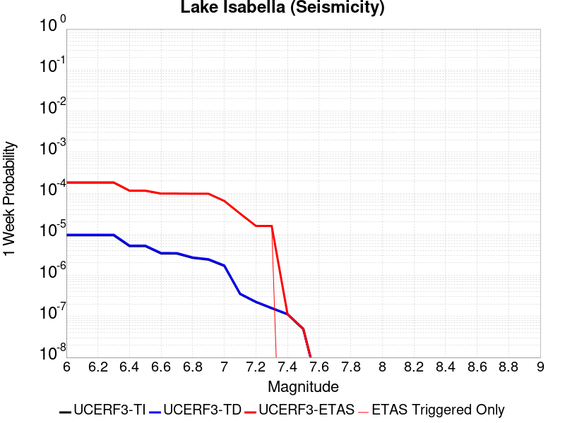 |  | 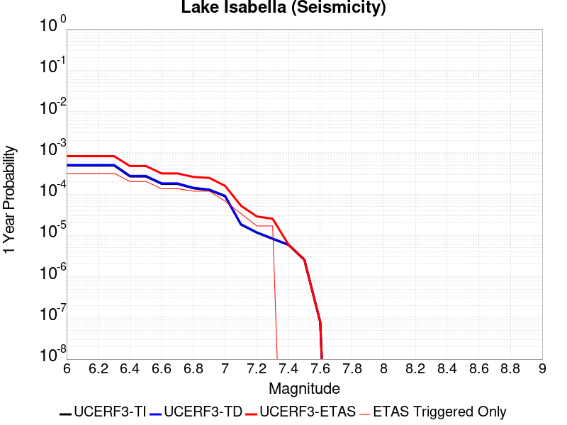 | 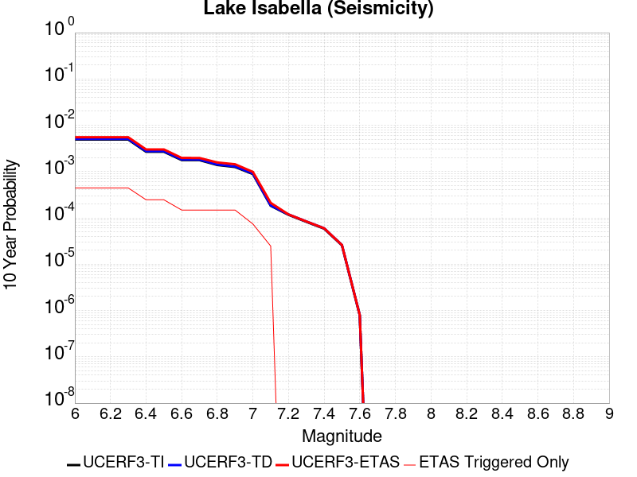 |

| Magnitude | 1 wk TI Prob | 1 wk TD Prob | 1 wk ETAS Prob | 1 wk ETAS/TD Gain | 1 wk ETAS Triggered Only | 1 mo TI Prob | 1 mo TD Prob | 1 mo ETAS Prob | 1 mo ETAS/TD Gain | 1 mo ETAS Triggered Only | 1 yr TI Prob | 1 yr TD Prob | 1 yr ETAS Prob | 1 yr ETAS/TD Gain | 1 yr ETAS Triggered Only | 10 yr TI Prob | 10 yr TD Prob | 10 yr ETAS Prob | 10 yr ETAS/TD Gain | 10 yr ETAS Triggered Only |
|-----|-----|-----|-----|-----|-----|-----|-----|-----|-----|-----|-----|-----|-----|-----|-----|-----|-----|-----|-----|-----|
| 6.0 | 9.431637E-6 | 9.741651E-6 | 2.3128887E-4 | 23.742264 | 2.2154937E-4 | 4.0420677E-5 | 4.1749343E-5 | 2.8790502E-4 | 6.8960376 | 2.4616596E-4 | 4.920106E-4 | 5.0819275E-4 | 8.5265E-4 | 1.6778082 | 3.4463234E-4 | 0.004909227 | 0.005071599 | 0.0055124504 | 1.0869255 | 4.4309875E-4 |
| 6.1 | 9.431637E-6 | 9.741651E-6 | 2.3128887E-4 | 23.742264 | 2.2154937E-4 | 4.0420677E-5 | 4.1749343E-5 | 2.8790502E-4 | 6.8960376 | 2.4616596E-4 | 4.920106E-4 | 5.0819275E-4 | 8.5265E-4 | 1.6778082 | 3.4463234E-4 | 0.004909227 | 0.005071599 | 0.0055124504 | 1.0869255 | 4.4309875E-4 |
| 6.2 | 9.431637E-6 | 9.741651E-6 | 2.3128887E-4 | 23.742264 | 2.2154937E-4 | 4.0420677E-5 | 4.1749343E-5 | 2.8790502E-4 | 6.8960376 | 2.4616596E-4 | 4.920106E-4 | 5.0819275E-4 | 8.5265E-4 | 1.6778082 | 3.4463234E-4 | 0.004909227 | 0.005071599 | 0.0055124504 | 1.0869255 | 4.4309875E-4 |
| 6.3 | 9.431637E-6 | 9.741651E-6 | 2.3128887E-4 | 23.742264 | 2.2154937E-4 | 4.0420677E-5 | 4.1749343E-5 | 2.8790502E-4 | 6.8960376 | 2.4616596E-4 | 4.920106E-4 | 5.0819275E-4 | 8.5265E-4 | 1.6778082 | 3.4463234E-4 | 0.004909227 | 0.005071599 | 0.0055124504 | 1.0869255 | 4.4309875E-4 |
| 6.4 | 5.144063E-6 | 5.3000763E-6 | 1.2838241E-4 | 24.222748 | 1.2308298E-4 | 2.2045799E-5 | 2.2714434E-5 | 1.7041065E-4 | 7.502307 | 1.4769958E-4 | 2.6837454E-4 | 2.765166E-4 | 4.733949E-4 | 1.7119946 | 1.9693277E-4 | 0.0026805066 | 0.0027620657 | 0.0030075517 | 1.0888777 | 2.4616596E-4 |
| 6.5 | 5.144063E-6 | 5.3000763E-6 | 1.2838241E-4 | 24.222748 | 1.2308298E-4 | 2.2045799E-5 | 2.2714434E-5 | 1.7041065E-4 | 7.502307 | 1.4769958E-4 | 2.6837454E-4 | 2.765166E-4 | 4.733949E-4 | 1.7119946 | 1.9693277E-4 | 0.0026805066 | 0.0027620657 | 0.0030075517 | 1.0888777 | 2.4616596E-4 |
| 6.6 | 3.4009804E-6 | 3.498786E-6 | 1.01964826E-4 | 29.142916 | 9.8466386E-5 | 1.4575549E-5 | 1.4994721E-5 | 1.3807586E-4 | 9.208298 | 1.2308298E-4 | 1.7744285E-4 | 1.8254704E-4 | 3.0560754E-4 | 1.6741304 | 1.2308298E-4 | 0.0017730123 | 0.0018241286 | 0.0019715587 | 1.0808222 | 1.4769958E-4 |
| 6.7 | 3.3880428E-6 | 3.4856528E-6 | 1.0195169E-4 | 29.248953 | 9.8466386E-5 | 1.4520103E-5 | 1.4938435E-5 | 1.3801958E-4 | 9.239226 | 1.2308298E-4 | 1.767679E-4 | 1.8186188E-4 | 3.0492246E-4 | 1.6766707 | 1.2308298E-4 | 0.0017662736 | 0.0018172882 | 0.0019647193 | 1.081127 | 1.4769958E-4 |
| 6.8 | 2.6582E-6 | 2.7337003E-6 | 1.0119982E-4 | 37.019356 | 9.8466386E-5 | 1.1392236E-5 | 1.1715813E-5 | 1.3479736E-4 | 11.505591 | 1.2308298E-4 | 1.3869164E-4 | 1.4263204E-4 | 2.6569745E-4 | 1.8628176 | 1.2308298E-4 | 0.0013860512 | 0.0014255369 | 0.001573026 | 1.1034621 | 1.4769958E-4 |
| 6.9 | 2.406011E-6 | 2.4743288E-6 | 1.0094047E-4 | 40.79509 | 9.8466386E-5 | 1.0311434E-5 | 1.0604231E-5 | 1.3368591E-4 | 12.606846 | 1.2308298E-4 | 1.2553448E-4 | 1.2910018E-4 | 2.521673E-4 | 1.9532682 | 1.2308298E-4 | 0.0012546359 | 0.0012903814 | 0.0014378905 | 1.1143142 | 1.4769958E-4 |
| 7.0 | 1.6953097E-6 | 1.7429371E-6 | 5.0976043E-5 | 29.247208 | 4.9233193E-5 | 7.265593E-6 | 7.469715E-6 | 5.670254E-5 | 7.590991 | 4.9233193E-5 | 8.8455E-5 | 9.094104E-5 | 1.4016975E-4 | 1.5413257 | 4.9233193E-5 | 8.84198E-4 | 9.09141E-4 | 9.829235E-4 | 1.0811565 | 7.384979E-5 |
| 7.1 | 3.5013824E-7 | 3.5714822E-7 | 2.4973737E-5 | 69.92541 | 2.4616596E-5 | 1.5005916E-6 | 1.5306344E-6 | 2.6147192E-5 | 17.082586 | 2.4616596E-5 | 1.826955E-5 | 1.8635317E-5 | 4.3251453E-5 | 2.32094 | 2.4616596E-5 | 1.8268047E-4 | 1.863378E-4 | 2.109498E-4 | 1.1320827 | 2.4616596E-5 |
| 7.2 | 2.2321095E-7 | 2.2750574E-7 | 2.2750574E-7 | 1.0 | 0.0 | 9.56618E-7 | 9.750242E-7 | 9.750242E-7 | 1.0 | 0.0 | 1.1646762E-5 | 1.1870856E-5 | 1.1870856E-5 | 1.0 | 0.0 | 1.1646151E-4 | 1.1870232E-4 | 1.1870232E-4 | 1.0 | 0.0 |
| 7.3 | 1.5760406E-7 | 1.6060922E-7 | 1.6060922E-7 | 1.0 | 0.0 | 6.7544585E-7 | 6.8832503E-7 | 6.8832503E-7 | 1.0 | 0.0 | 8.223522E-6 | 8.380326E-6 | 8.380326E-6 | 1.0 | 0.0 | 8.2232174E-5 | 8.3800165E-5 | 8.3800165E-5 | 1.0 | 0.0 |
| 7.4 | 1.1216497E-7 | 1.1431706E-7 | 1.1431706E-7 | 1.0 | 0.0 | 4.8070694E-7 | 4.899302E-7 | 4.899302E-7 | 1.0 | 0.0 | 5.852591E-6 | 5.964884E-6 | 5.964884E-6 | 1.0 | 0.0 | 5.8524372E-5 | 5.9647282E-5 | 5.9647282E-5 | 1.0 | 0.0 |
| 7.5 | 4.885185E-8 | 4.9787737E-8 | 4.9787737E-8 | 1.0 | 0.0 | 2.0936506E-7 | 2.13376E-7 | 2.13376E-7 | 1.0 | 0.0 | 2.5490165E-6 | 2.59785E-6 | 2.59785E-6 | 1.0 | 0.0 | 2.5489873E-5 | 2.5978214E-5 | 2.5978214E-5 | 1.0 | 0.0 |
| 7.6 | 1.504641E-9 | 1.5317903E-9 | 1.5317903E-9 | 1.0 | 0.0 | 6.4484613E-9 | 6.5648154E-9 | 6.5648154E-9 | 1.0 | 0.0 | 7.851001E-8 | 7.992663E-8 | 7.992663E-8 | 1.0 | 0.0 | 7.8509987E-7 | 7.992663E-7 | 7.992663E-7 | 1.0 | 0.0 |

## San Andreas (Cholame) rev
*[(top)](#table-of-contents)*

| 1 Week | 1 Month | 1 Year | 10 Year |
|-----|-----|-----|-----|
| 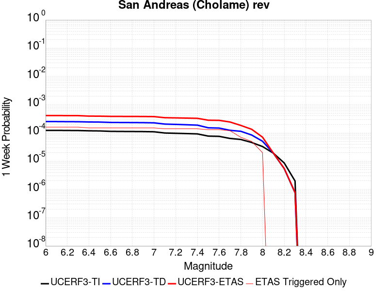 | 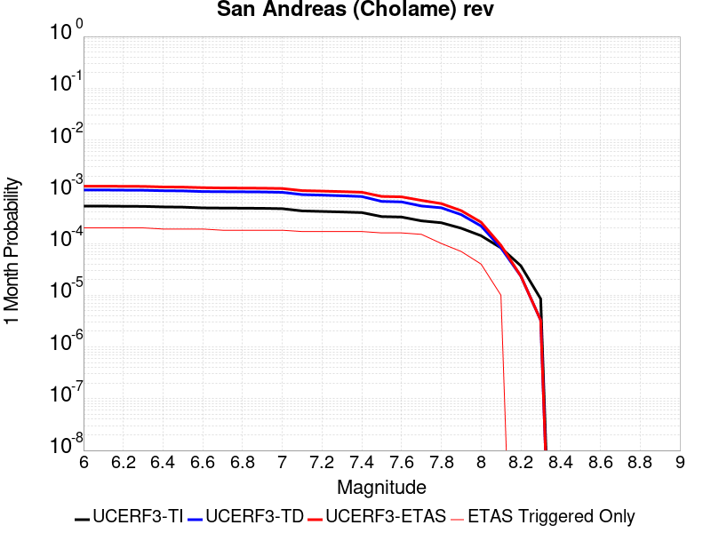 | 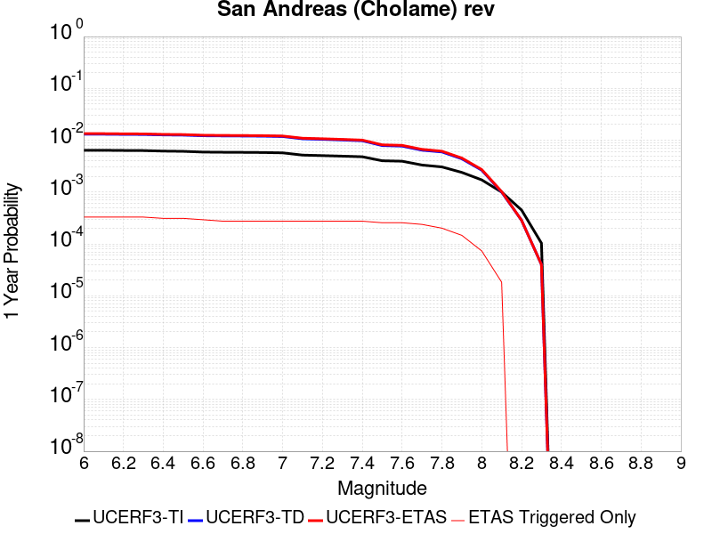 |  |

| Magnitude | 1 wk TI Prob | 1 wk TD Prob | 1 wk ETAS Prob | 1 wk ETAS/TD Gain | 1 wk ETAS Triggered Only | 1 mo TI Prob | 1 mo TD Prob | 1 mo ETAS Prob | 1 mo ETAS/TD Gain | 1 mo ETAS Triggered Only | 1 yr TI Prob | 1 yr TD Prob | 1 yr ETAS Prob | 1 yr ETAS/TD Gain | 1 yr ETAS Triggered Only | 10 yr TI Prob | 10 yr TD Prob | 10 yr ETAS Prob | 10 yr ETAS/TD Gain | 10 yr ETAS Triggered Only |
|-----|-----|-----|-----|-----|-----|-----|-----|-----|-----|-----|-----|-----|-----|-----|-----|-----|-----|-----|-----|-----|
| 6.0 | 1.2302514E-4 | 2.5204287E-4 | 3.9970523E-4 | 1.585862 | 1.4769958E-4 | 5.27144E-4 | 0.0010797381 | 0.0013256384 | 1.2277405 | 2.4616596E-4 | 0.0063991086 | 0.0130670825 | 0.013431506 | 1.0278887 | 3.6924894E-4 | 0.06217949 | 0.12439073 | 0.124757156 | 1.0029458 | 4.1848214E-4 |
| 6.1 | 1.2302514E-4 | 2.5204287E-4 | 3.9970523E-4 | 1.585862 | 1.4769958E-4 | 5.27144E-4 | 0.0010797381 | 0.0013256384 | 1.2277405 | 2.4616596E-4 | 0.0063991086 | 0.0130670825 | 0.013431506 | 1.0278887 | 3.6924894E-4 | 0.06217949 | 0.12439073 | 0.124757156 | 1.0029458 | 4.1848214E-4 |
| 6.2 | 1.2203569E-4 | 2.5021084E-4 | 3.9787346E-4 | 1.5901527 | 1.4769958E-4 | 5.2290526E-4 | 0.0010718931 | 0.0013177952 | 1.2294092 | 2.4616596E-4 | 0.006347804 | 0.01297271 | 0.013337169 | 1.0280943 | 3.6924894E-4 | 0.061695136 | 0.12357691 | 0.12394367 | 1.002968 | 4.1848214E-4 |
| 6.3 | 1.2142645E-4 | 2.4907055E-4 | 3.9673335E-4 | 1.5928552 | 1.4769958E-4 | 5.202953E-4 | 0.0010670102 | 0.0013129135 | 1.2304602 | 2.4616596E-4 | 0.006316212 | 0.012913967 | 0.013278447 | 1.0282238 | 3.6924894E-4 | 0.06139677 | 0.12307103 | 0.12343801 | 1.0029819 | 4.1848214E-4 |
| 6.4 | 1.1865206E-4 | 2.44126E-4 | 3.6717893E-4 | 1.504055 | 1.2308298E-4 | 5.0840975E-4 | 0.0010458364 | 0.001267154 | 1.2116178 | 2.2154937E-4 | 0.006172335 | 0.012659196 | 0.012999466 | 1.0268792 | 3.4463234E-4 | 0.060036868 | 0.1208638 | 0.12121007 | 1.0028648 | 3.9386554E-4 |
| 6.5 | 1.17443946E-4 | 2.4205919E-4 | 3.6511238E-4 | 1.5083599 | 1.2308298E-4 | 5.032341E-4 | 0.0010369857 | 0.0012583053 | 1.2134259 | 2.2154937E-4 | 0.006109677 | 0.012552682 | 0.0128929885 | 1.0271102 | 3.4463234E-4 | 0.059444077 | 0.11993805 | 0.12028468 | 1.00289 | 3.9386554E-4 |
| 6.6 | 1.13579066E-4 | 2.3514954E-4 | 3.5820357E-4 | 1.5233012 | 1.2308298E-4 | 4.866766E-4 | 0.001007396 | 0.0012287222 | 1.2197013 | 2.2154937E-4 | 0.0059092017 | 0.012196515 | 0.012512627 | 1.0259182 | 3.2001577E-4 | 0.057545185 | 0.11685214 | 0.11717825 | 1.0027907 | 3.6924894E-4 |
| 6.7 | 1.1271412E-4 | 2.3359268E-4 | 3.5664692E-4 | 1.5267898 | 1.2308298E-4 | 4.829711E-4 | 0.0010007289 | 0.0011974646 | 1.1965925 | 1.9693277E-4 | 0.005864331 | 0.012116249 | 0.012408068 | 1.024085 | 2.9539916E-4 | 0.057119697 | 0.116155714 | 0.116460316 | 1.0026224 | 3.4463234E-4 |
| 6.8 | 1.1217975E-4 | 2.3247694E-4 | 3.5553132E-4 | 1.5293186 | 1.2308298E-4 | 4.8068175E-4 | 9.959509E-4 | 0.0011926875 | 1.1975365 | 1.9693277E-4 | 0.005836608 | 0.012058721 | 0.012350558 | 1.0242013 | 2.9539916E-4 | 0.056856725 | 0.11565396 | 0.11595874 | 1.0026352 | 3.4463234E-4 |
| 6.9 | 1.1146753E-4 | 2.3096445E-4 | 3.54019E-4 | 1.5327857 | 1.2308298E-4 | 4.7763053E-4 | 9.894737E-4 | 0.0011862116 | 1.1988308 | 1.9693277E-4 | 0.0057996577 | 0.011980731 | 0.012272592 | 1.0243608 | 2.9539916E-4 | 0.056506127 | 0.11497439 | 0.1152794 | 1.0026529 | 3.4463234E-4 |
| 7.0 | 1.0965793E-4 | 2.2719789E-4 | 3.502529E-4 | 1.5416204 | 1.2308298E-4 | 4.698779E-4 | 9.733434E-4 | 0.0011700845 | 1.2021291 | 1.9693277E-4 | 0.005705768 | 0.011786487 | 0.012078404 | 1.0247672 | 2.9539916E-4 | 0.055614736 | 0.11327597 | 0.11358156 | 1.0026978 | 3.4463234E-4 |
| 7.1 | 9.927982E-5 | 2.0538924E-4 | 3.2844694E-4 | 1.5991439 | 1.2308298E-4 | 4.2541555E-4 | 8.7994366E-4 | 0.0010767031 | 1.2236047 | 1.9693277E-4 | 0.0051671406 | 0.010660981 | 0.010953231 | 1.027413 | 2.9539916E-4 | 0.05048634 | 0.1033706 | 0.103679605 | 1.0029893 | 3.4463234E-4 |
| 7.2 | 9.696786E-5 | 2.0043184E-4 | 3.2349015E-4 | 1.6139659 | 1.2308298E-4 | 4.1551032E-4 | 8.5871184E-4 | 0.0010554754 | 1.2291381 | 1.9693277E-4 | 0.00504711 | 0.010404981 | 0.010697306 | 1.0280948 | 2.9539916E-4 | 0.04934009 | 0.1011086 | 0.10141839 | 1.0030639 | 3.4463234E-4 |
| 7.3 | 9.4727984E-5 | 1.9472468E-4 | 3.177837E-4 | 1.6319641 | 1.2308298E-4 | 4.0591392E-4 | 8.3426846E-4 | 0.001031037 | 1.2358575 | 1.9693277E-4 | 0.0049308087 | 0.010110183 | 0.010402596 | 1.0289226 | 2.9539916E-4 | 0.048228268 | 0.09847952 | 0.098790206 | 1.0031549 | 3.4463234E-4 |
| 7.4 | 9.220358E-5 | 1.8843076E-4 | 3.1149056E-4 | 1.653077 | 1.2308298E-4 | 3.9509835E-4 | 8.073114E-4 | 0.0010040852 | 1.2437396 | 1.9693277E-4 | 0.004799717 | 0.009784967 | 0.010077476 | 1.0298936 | 2.9539916E-4 | 0.046973653 | 0.095557496 | 0.0958692 | 1.0032619 | 3.4463234E-4 |
| 7.5 | 7.71631E-5 | 1.5177966E-4 | 2.7484397E-4 | 1.8108089 | 1.2308298E-4 | 3.306571E-4 | 6.503223E-4 | 8.47127E-4 | 1.3026264 | 1.9693277E-4 | 0.0040183207 | 0.007889002 | 0.008157647 | 1.0340533 | 2.7078256E-4 | 0.03946433 | 0.07828531 | 0.07858027 | 1.0037678 | 3.2001577E-4 |
| 7.6 | 7.5634416E-5 | 1.483744E-4 | 2.7143912E-4 | 1.8294202 | 1.2308298E-4 | 3.241072E-4 | 6.3573546E-4 | 8.3254307E-4 | 1.3095746 | 1.9693277E-4 | 0.0039388672 | 0.0077126776 | 0.007981372 | 1.034838 | 2.7078256E-4 | 0.038697794 | 0.07664872 | 0.07694421 | 1.0038551 | 3.2001577E-4 |
| 7.7 | 6.3783E-5 | 1.235872E-4 | 2.4665496E-4 | 1.995797 | 1.2308298E-4 | 2.7332708E-4 | 5.29552E-4 | 7.2638044E-4 | 1.3716887 | 1.9693277E-4 | 0.0033226798 | 0.0064282627 | 0.006672846 | 1.0380481 | 2.4616596E-4 | 0.032734364 | 0.06454029 | 0.06477057 | 1.0035679 | 2.4616596E-4 |
| 7.8 | 5.863422E-5 | 1.1416107E-4 | 2.1261621E-4 | 1.8624231 | 9.8466386E-5 | 2.512653E-4 | 4.8917E-4 | 6.6140195E-4 | 1.35209 | 1.7231617E-4 | 0.003054864 | 0.0059394026 | 0.006159636 | 1.03708 | 2.2154937E-4 | 0.030132094 | 0.059659187 | 0.059867516 | 1.003492 | 2.2154937E-4 |
| 7.9 | 4.595283E-5 | 8.426331E-5 | 1.5810688E-4 | 1.876343 | 7.384979E-5 | 1.9692584E-4 | 3.610785E-4 | 4.8411704E-4 | 1.3407528 | 1.2308298E-4 | 0.0023949358 | 0.0043872762 | 0.004534328 | 1.0335177 | 1.4769958E-4 | 0.023692891 | 0.044362005 | 0.044503152 | 1.0031817 | 1.4769958E-4 |
| 8.0 | 3.2950178E-5 | 5.0772942E-5 | 1.00003635E-4 | 1.9696246 | 4.9233193E-5 | 1.412074E-4 | 2.1758018E-4 | 3.1602514E-4 | 1.4524537 | 9.8466386E-5 | 0.0017178444 | 0.0026458222 | 0.002744028 | 1.0371174 | 9.8466386E-5 | 0.017046256 | 0.027180137 | 0.027275927 | 1.0035243 | 9.8466386E-5 |
| 8.1 | 1.9177472E-5 | 1.9185145E-5 | 1.9185145E-5 | 1.0 | 0.0 | 8.218658E-5 | 8.221946E-5 | 1.06834035E-4 | 1.2993765 | 2.4616596E-5 | 0.0010001622 | 0.0010005629 | 0.0010251548 | 1.0245781 | 2.4616596E-5 | 0.009956728 | 0.010758142 | 0.010782494 | 1.0022635 | 2.4616596E-5 |
| 8.2 | 8.643924E-6 | 5.4748625E-6 | 5.4748625E-6 | 1.0 | 0.0 | 3.704486E-5 | 2.3463486E-5 | 2.3463486E-5 | 1.0 | 0.0 | 4.5092785E-4 | 2.8563058E-4 | 2.8563058E-4 | 1.0 | 0.0 | 0.0045001395 | 0.0032487072 | 0.0032487072 | 1.0 | 0.0 |
| 8.3 | 1.983087E-6 | 7.6599065E-7 | 7.6599065E-7 | 1.0 | 0.0 | 8.498917E-6 | 3.282813E-6 | 3.282813E-6 | 1.0 | 0.0 | 1.034694E-4 | 3.9967534E-5 | 3.9967534E-5 | 1.0 | 0.0 | 0.0010342124 | 4.719687E-4 | 4.719687E-4 | 1.0 | 0.0 |

## San Andreas (Carrizo) rev
*[(top)](#table-of-contents)*

| 1 Week | 1 Month | 1 Year | 10 Year |
|-----|-----|-----|-----|
| 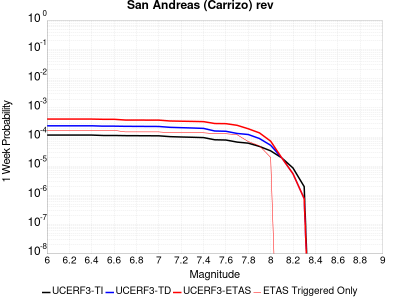 | 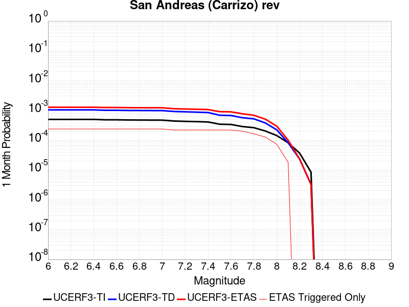 | 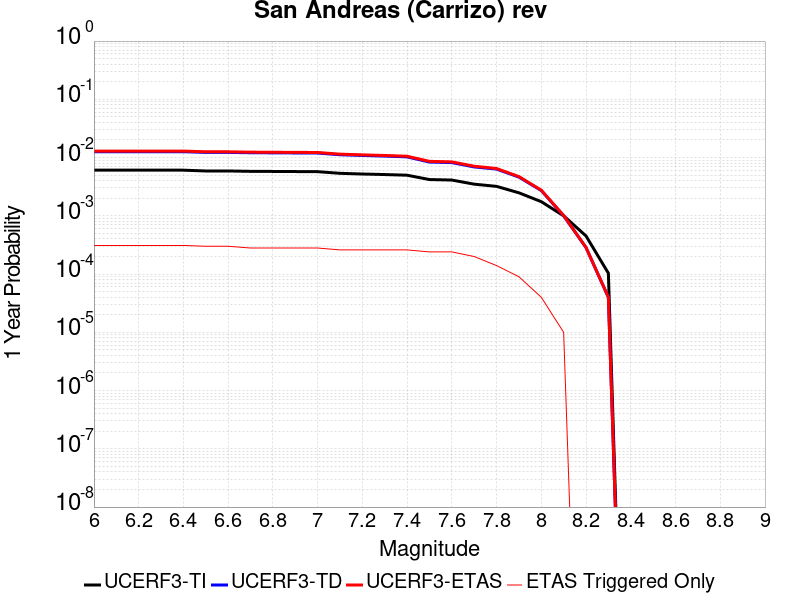 | 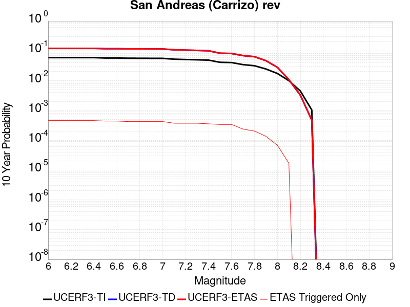 |

| Magnitude | 1 wk TI Prob | 1 wk TD Prob | 1 wk ETAS Prob | 1 wk ETAS/TD Gain | 1 wk ETAS Triggered Only | 1 mo TI Prob | 1 mo TD Prob | 1 mo ETAS Prob | 1 mo ETAS/TD Gain | 1 mo ETAS Triggered Only | 1 yr TI Prob | 1 yr TD Prob | 1 yr ETAS Prob | 1 yr ETAS/TD Gain | 1 yr ETAS Triggered Only | 10 yr TI Prob | 10 yr TD Prob | 10 yr ETAS Prob | 10 yr ETAS/TD Gain | 10 yr ETAS Triggered Only |
|-----|-----|-----|-----|-----|-----|-----|-----|-----|-----|-----|-----|-----|-----|-----|-----|-----|-----|-----|-----|-----|
| 6.0 | 1.1674632E-4 | 2.432302E-4 | 3.6628326E-4 | 1.5059118 | 1.2308298E-4 | 5.002454E-4 | 0.0010420004 | 0.0012879098 | 1.2359974 | 2.4616596E-4 | 0.006073493 | 0.012613042 | 0.012953328 | 1.0269789 | 3.4463234E-4 | 0.0591016 | 0.12061418 | 0.120982185 | 1.0030512 | 4.1848214E-4 |
| 6.1 | 1.1674632E-4 | 2.432302E-4 | 3.6628326E-4 | 1.5059118 | 1.2308298E-4 | 5.002454E-4 | 0.0010420004 | 0.0012879098 | 1.2359974 | 2.4616596E-4 | 0.006073493 | 0.012613042 | 0.012953328 | 1.0269789 | 3.4463234E-4 | 0.0591016 | 0.12061418 | 0.120982185 | 1.0030512 | 4.1848214E-4 |
| 6.2 | 1.1674632E-4 | 2.432302E-4 | 3.6628326E-4 | 1.5059118 | 1.2308298E-4 | 5.002454E-4 | 0.0010420004 | 0.0012879098 | 1.2359974 | 2.4616596E-4 | 0.006073493 | 0.012613042 | 0.012953328 | 1.0269789 | 3.4463234E-4 | 0.0591016 | 0.12061418 | 0.120982185 | 1.0030512 | 4.1848214E-4 |
| 6.3 | 1.1674632E-4 | 2.432302E-4 | 3.6628326E-4 | 1.5059118 | 1.2308298E-4 | 5.002454E-4 | 0.0010420004 | 0.0012879098 | 1.2359974 | 2.4616596E-4 | 0.006073493 | 0.012613042 | 0.012953328 | 1.0269789 | 3.4463234E-4 | 0.0591016 | 0.12061418 | 0.120982185 | 1.0030512 | 4.1848214E-4 |
| 6.4 | 1.1674632E-4 | 2.432302E-4 | 3.6628326E-4 | 1.5059118 | 1.2308298E-4 | 5.002454E-4 | 0.0010420004 | 0.0012879098 | 1.2359974 | 2.4616596E-4 | 0.006073493 | 0.012613042 | 0.012953328 | 1.0269789 | 3.4463234E-4 | 0.0591016 | 0.12061418 | 0.120982185 | 1.0030512 | 4.1848214E-4 |
| 6.5 | 1.13136164E-4 | 2.3643032E-4 | 3.594842E-4 | 1.5204657 | 1.2308298E-4 | 4.847792E-4 | 0.0010128808 | 0.0012587975 | 1.2427893 | 2.4616596E-4 | 0.0058862255 | 0.012262545 | 0.01260295 | 1.0277598 | 3.4463234E-4 | 0.057327334 | 0.117585555 | 0.11795483 | 1.0031404 | 4.1848214E-4 |
| 6.6 | 1.13136164E-4 | 2.3643032E-4 | 3.594842E-4 | 1.5204657 | 1.2308298E-4 | 4.847792E-4 | 0.0010128808 | 0.0012587975 | 1.2427893 | 2.4616596E-4 | 0.0058862255 | 0.012262545 | 0.01260295 | 1.0277598 | 3.4463234E-4 | 0.057327334 | 0.117585555 | 0.11795483 | 1.0031404 | 4.1848214E-4 |
| 6.7 | 1.1149675E-4 | 2.3334254E-4 | 3.563968E-4 | 1.5273546 | 1.2308298E-4 | 4.777557E-4 | 9.996577E-4 | 0.0012455776 | 1.2460041 | 2.4616596E-4 | 0.0058011734 | 0.012103349 | 0.01244381 | 1.0281295 | 3.4463234E-4 | 0.05652051 | 0.1162071 | 0.116576955 | 1.0031826 | 4.1848214E-4 |
| 6.8 | 1.1103589E-4 | 2.3236412E-4 | 3.554185E-4 | 1.5295757 | 1.2308298E-4 | 4.7578133E-4 | 9.954676E-4 | 0.0012413886 | 1.2470406 | 2.4616596E-4 | 0.005777263 | 0.012052901 | 0.01239338 | 1.0282487 | 3.4463234E-4 | 0.056293584 | 0.1157674 | 0.11613743 | 1.0031964 | 4.1848214E-4 |
| 6.9 | 1.1053259E-4 | 2.3128795E-4 | 3.5434245E-4 | 1.5320404 | 1.2308298E-4 | 4.7362508E-4 | 9.90859E-4 | 0.0012367811 | 1.2481908 | 2.4616596E-4 | 0.0057511497 | 0.01199741 | 0.012337908 | 1.0283809 | 3.4463234E-4 | 0.05604569 | 0.11528359 | 0.115653835 | 1.0032115 | 4.1848214E-4 |
| 7.0 | 1.1005377E-4 | 2.3029637E-4 | 3.53351E-4 | 1.5343317 | 1.2308298E-4 | 4.7157376E-4 | 9.866126E-4 | 0.0012325357 | 1.2492601 | 2.4616596E-4 | 0.0057263062 | 0.011946279 | 0.012286794 | 1.0285039 | 3.4463234E-4 | 0.055809796 | 0.11483591 | 0.11520634 | 1.0032257 | 4.1848214E-4 |
| 7.1 | 1.0308142E-4 | 2.1539345E-4 | 3.384499E-4 | 1.5713102 | 1.2308298E-4 | 4.417027E-4 | 9.227892E-4 | 0.0011441341 | 1.2398651 | 2.2154937E-4 | 0.0053644776 | 0.011177397 | 0.0114938365 | 1.0283107 | 3.2001577E-4 | 0.052368138 | 0.108092256 | 0.108421594 | 1.0030468 | 3.6924894E-4 |
| 7.2 | 1.0027479E-4 | 2.094724E-4 | 3.325296E-4 | 1.5874625 | 1.2308298E-4 | 4.296783E-4 | 8.9743105E-4 | 0.0011187816 | 1.246649 | 2.2154937E-4 | 0.0052187922 | 0.010871782 | 0.011188319 | 1.0291154 | 3.2001577E-4 | 0.050979212 | 0.10539625 | 0.10572658 | 1.0031341 | 3.6924894E-4 |
| 7.3 | 9.816942E-5 | 2.0422463E-4 | 3.272825E-4 | 1.6025612 | 1.2308298E-4 | 4.2065824E-4 | 8.7495585E-4 | 0.0010963114 | 1.2529905 | 2.2154937E-4 | 0.005109493 | 0.010600842 | 0.010917465 | 1.0298678 | 3.2001577E-4 | 0.049935985 | 0.102979995 | 0.10331122 | 1.0032164 | 3.6924894E-4 |
| 7.4 | 9.5634205E-5 | 1.9791997E-4 | 3.2097858E-4 | 1.6217595 | 1.2308298E-4 | 4.0979648E-4 | 8.479536E-4 | 0.0010693151 | 1.2610538 | 2.2154937E-4 | 0.0049778637 | 0.010275229 | 0.010591957 | 1.0308244 | 3.2001577E-4 | 0.048678253 | 0.10006632 | 0.100398615 | 1.0033208 | 3.6924894E-4 |
| 7.5 | 8.052417E-5 | 1.611261E-4 | 2.8418924E-4 | 1.7637691 | 1.2308298E-4 | 3.4505792E-4 | 6.903579E-4 | 9.1175426E-4 | 1.320698 | 2.2154937E-4 | 0.0041929903 | 0.008372796 | 0.008665722 | 1.0349854 | 2.9539916E-4 | 0.04114753 | 0.08281049 | 0.08312658 | 1.0038171 | 3.4463234E-4 |
| 7.6 | 7.897024E-5 | 1.5765853E-4 | 2.807221E-4 | 1.7805704 | 1.2308298E-4 | 3.384E-4 | 6.755046E-4 | 8.969043E-4 | 1.3277545 | 2.2154937E-4 | 0.0041122385 | 0.008193332 | 0.008486311 | 1.0357583 | 2.9539916E-4 | 0.040369697 | 0.08115171 | 0.08146837 | 1.0039021 | 3.4463234E-4 |
| 7.7 | 6.707427E-5 | 1.3276102E-4 | 2.5582768E-4 | 1.9269787 | 1.2308298E-4 | 2.8742946E-4 | 5.688518E-4 | 7.6567254E-4 | 1.3459965 | 1.9693277E-4 | 0.003493839 | 0.00690381 | 0.0071482765 | 1.0354104 | 2.4616596E-4 | 0.034394164 | 0.069048055 | 0.06927723 | 1.003319 | 2.4616596E-4 |
| 7.8 | 6.147705E-5 | 1.2197486E-4 | 2.2042924E-4 | 1.8071694 | 9.8466386E-5 | 2.6344648E-4 | 5.226447E-4 | 6.9487083E-4 | 1.3295281 | 1.7231617E-4 | 0.0032027436 | 0.006344659 | 0.006564803 | 1.0346975 | 2.2154937E-4 | 0.031569764 | 0.06351457 | 0.063722044 | 1.0032666 | 2.2154937E-4 |
| 7.9 | 4.7636717E-5 | 8.87977E-5 | 1.6264094E-4 | 1.8315895 | 7.384979E-5 | 2.0414138E-4 | 3.8050607E-4 | 5.0354225E-4 | 1.3233488 | 1.2308298E-4 | 0.0024825884 | 0.0046228287 | 0.0047698454 | 1.0318023 | 1.4769958E-4 | 0.024550365 | 0.046628095 | 0.046768907 | 1.0030199 | 1.4769958E-4 |
| 8.0 | 3.3554235E-5 | 5.2136907E-5 | 1.01367536E-4 | 1.9442567 | 4.9233193E-5 | 1.4379594E-4 | 2.2342477E-4 | 3.2186916E-4 | 1.4406154 | 9.8466386E-5 | 0.0017493097 | 0.002716805 | 0.002815004 | 1.036145 | 9.8466386E-5 | 0.017356034 | 0.027880952 | 0.027976673 | 1.0034332 | 9.8466386E-5 |
| 8.1 | 1.9175432E-5 | 1.9184976E-5 | 1.9184976E-5 | 1.0 | 0.0 | 8.217783E-5 | 8.2218736E-5 | 1.0683331E-4 | 1.2993791 | 2.4616596E-5 | 0.0010000558 | 0.0010005541 | 0.001025146 | 1.0245783 | 2.4616596E-5 | 0.009955673 | 0.0107580265 | 0.010782379 | 1.0022635 | 2.4616596E-5 |
| 8.2 | 8.643924E-6 | 5.4748625E-6 | 5.4748625E-6 | 1.0 | 0.0 | 3.704486E-5 | 2.3463486E-5 | 2.3463486E-5 | 1.0 | 0.0 | 4.5092785E-4 | 2.8563058E-4 | 2.8563058E-4 | 1.0 | 0.0 | 0.0045001395 | 0.0032487072 | 0.0032487072 | 1.0 | 0.0 |
| 8.3 | 1.983087E-6 | 7.6599065E-7 | 7.6599065E-7 | 1.0 | 0.0 | 8.498917E-6 | 3.282813E-6 | 3.282813E-6 | 1.0 | 0.0 | 1.034694E-4 | 3.9967534E-5 | 3.9967534E-5 | 1.0 | 0.0 | 0.0010342124 | 4.719687E-4 | 4.719687E-4 | 1.0 | 0.0 |

## San Andreas (San Gorgonio Pass-Garnet HIll)
*[(top)](#table-of-contents)*

| 1 Week | 1 Month | 1 Year | 10 Year |
|-----|-----|-----|-----|
| 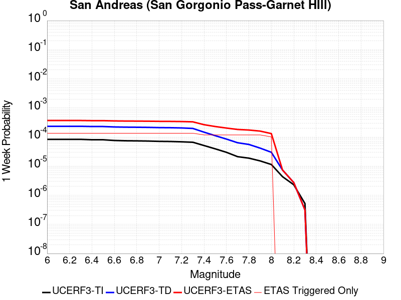 | 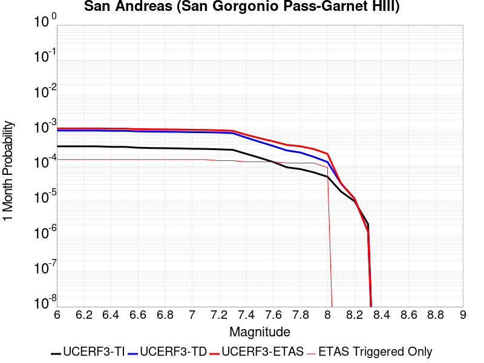 | 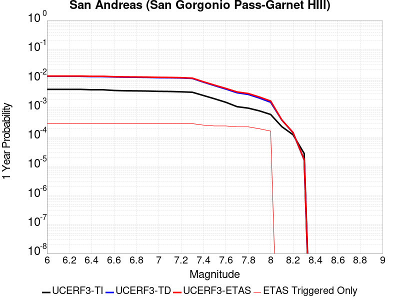 | 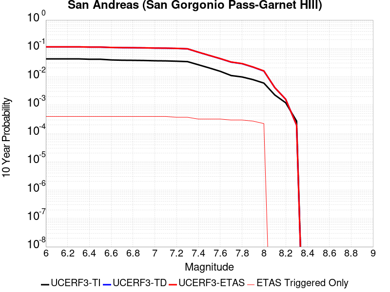 |

| Magnitude | 1 wk TI Prob | 1 wk TD Prob | 1 wk ETAS Prob | 1 wk ETAS/TD Gain | 1 wk ETAS Triggered Only | 1 mo TI Prob | 1 mo TD Prob | 1 mo ETAS Prob | 1 mo ETAS/TD Gain | 1 mo ETAS Triggered Only | 1 yr TI Prob | 1 yr TD Prob | 1 yr ETAS Prob | 1 yr ETAS/TD Gain | 1 yr ETAS Triggered Only | 10 yr TI Prob | 10 yr TD Prob | 10 yr ETAS Prob | 10 yr ETAS/TD Gain | 10 yr ETAS Triggered Only |
|-----|-----|-----|-----|-----|-----|-----|-----|-----|-----|-----|-----|-----|-----|-----|-----|-----|-----|-----|-----|-----|
| 6.0 | 8.31567E-5 | 2.3382473E-4 | 4.3071146E-4 | 1.842027 | 1.9693277E-4 | 3.5633717E-4 | 0.0010017233 | 0.0012722347 | 1.2700459 | 2.7078256E-4 | 0.004329778 | 0.012127888 | 0.012468341 | 1.0280719 | 3.4463234E-4 | 0.042463828 | 0.11257892 | 0.11292844 | 1.0031047 | 3.9386554E-4 |
| 6.1 | 8.31567E-5 | 2.3382473E-4 | 4.3071146E-4 | 1.842027 | 1.9693277E-4 | 3.5633717E-4 | 0.0010017233 | 0.0012722347 | 1.2700459 | 2.7078256E-4 | 0.004329778 | 0.012127888 | 0.012468341 | 1.0280719 | 3.4463234E-4 | 0.042463828 | 0.11257892 | 0.11292844 | 1.0031047 | 3.9386554E-4 |
| 6.2 | 8.31567E-5 | 2.3382473E-4 | 4.3071146E-4 | 1.842027 | 1.9693277E-4 | 3.5633717E-4 | 0.0010017233 | 0.0012722347 | 1.2700459 | 2.7078256E-4 | 0.004329778 | 0.012127888 | 0.012468341 | 1.0280719 | 3.4463234E-4 | 0.042463828 | 0.11257892 | 0.11292844 | 1.0031047 | 3.9386554E-4 |
| 6.3 | 8.31567E-5 | 2.3382473E-4 | 4.3071146E-4 | 1.842027 | 1.9693277E-4 | 3.5633717E-4 | 0.0010017233 | 0.0012722347 | 1.2700459 | 2.7078256E-4 | 0.004329778 | 0.012127888 | 0.012468341 | 1.0280719 | 3.4463234E-4 | 0.042463828 | 0.11257892 | 0.11292844 | 1.0031047 | 3.9386554E-4 |
| 6.4 | 8.059055E-5 | 2.2940808E-4 | 4.2629568E-4 | 1.8582418 | 1.9693277E-4 | 3.4534236E-4 | 9.828096E-4 | 0.001253326 | 1.275248 | 2.7078256E-4 | 0.0041964394 | 0.011900152 | 0.012240683 | 1.0286157 | 3.4463234E-4 | 0.041180745 | 0.11056015 | 0.11091047 | 1.0031686 | 3.9386554E-4 |
| 6.5 | 8.059055E-5 | 2.2940808E-4 | 4.2629568E-4 | 1.8582418 | 1.9693277E-4 | 3.4534236E-4 | 9.828096E-4 | 0.001253326 | 1.275248 | 2.7078256E-4 | 0.0041964394 | 0.011900152 | 0.012240683 | 1.0286157 | 3.4463234E-4 | 0.041180745 | 0.11056015 | 0.11091047 | 1.0031686 | 3.9386554E-4 |
| 6.6 | 7.619237E-5 | 2.218517E-4 | 4.187408E-4 | 1.8874806 | 1.9693277E-4 | 3.2649786E-4 | 9.5044886E-4 | 0.001220974 | 1.2846289 | 2.7078256E-4 | 0.0039678677 | 0.01151087 | 0.011851535 | 1.0295951 | 3.4463234E-4 | 0.03897764 | 0.10709683 | 0.10744851 | 1.0032837 | 3.9386554E-4 |
| 6.7 | 7.440636E-5 | 2.1860997E-4 | 4.154997E-4 | 1.9006438 | 1.9693277E-4 | 3.188454E-4 | 9.3656575E-4 | 0.0012070946 | 1.2888521 | 2.7078256E-4 | 0.0038750346 | 0.011343609 | 0.011684331 | 1.0300366 | 3.4463234E-4 | 0.038081564 | 0.105605274 | 0.105957545 | 1.0033357 | 3.9386554E-4 |
| 6.8 | 7.3735864E-5 | 2.1708169E-4 | 4.1397172E-4 | 1.9069859 | 1.9693277E-4 | 3.1597257E-4 | 9.3002064E-4 | 0.0012005514 | 1.2908868 | 2.7078256E-4 | 0.0038401815 | 0.011264749 | 0.011605499 | 1.0302492 | 3.4463234E-4 | 0.03774495 | 0.10490683 | 0.105259374 | 1.0033605 | 3.9386554E-4 |
| 6.9 | 7.27575E-5 | 2.1477141E-4 | 4.116619E-4 | 1.9167444 | 1.9693277E-4 | 3.117806E-4 | 9.201265E-4 | 0.0011906599 | 1.2940177 | 2.7078256E-4 | 0.003789323 | 0.011145527 | 0.011486317 | 1.0305765 | 3.4463234E-4 | 0.037253562 | 0.103854746 | 0.1042077 | 1.0033987 | 3.9386554E-4 |
| 7.0 | 7.102591E-5 | 2.1061185E-4 | 4.0750313E-4 | 1.9348538 | 1.9693277E-4 | 3.0436125E-4 | 9.023122E-4 | 0.0011728504 | 1.2998277 | 2.7078256E-4 | 0.003699303 | 0.010930831 | 0.011271697 | 1.0311838 | 3.4463234E-4 | 0.03638325 | 0.10195695 | 0.10231066 | 1.0034692 | 3.9386554E-4 |
| 7.1 | 7.028513E-5 | 2.0896831E-4 | 4.0585993E-4 | 1.942208 | 1.9693277E-4 | 3.0118722E-4 | 8.9527335E-4 | 0.0011658134 | 1.3021872 | 2.7078256E-4 | 0.0036607897 | 0.010845989 | 0.011186884 | 1.0314305 | 3.4463234E-4 | 0.036010686 | 0.101199985 | 0.10155399 | 1.0034981 | 3.9386554E-4 |
| 7.2 | 6.8498244E-5 | 2.0504706E-4 | 4.0193947E-4 | 1.9602302 | 1.9693277E-4 | 2.9353087E-4 | 8.784794E-4 | 0.0011490241 | 1.3079693 | 2.7078256E-4 | 0.003567883 | 0.010643536 | 0.0109845 | 1.0320349 | 3.4463234E-4 | 0.035111405 | 0.09939202 | 0.09972457 | 1.0033458 | 3.6924894E-4 |
| 7.3 | 6.622592E-5 | 1.9732013E-4 | 3.9421403E-4 | 1.99784 | 1.9693277E-4 | 2.8379448E-4 | 8.453858E-4 | 0.0011159395 | 1.3200357 | 2.7078256E-4 | 0.0034497243 | 0.0102444785 | 0.010585581 | 1.0332961 | 3.4463234E-4 | 0.033966612 | 0.095888525 | 0.09622237 | 1.0034815 | 3.6924894E-4 |
| 7.4 | 5.1050705E-5 | 1.4689034E-4 | 3.1918118E-4 | 2.1729217 | 1.7231617E-4 | 2.1877038E-4 | 6.29379E-4 | 8.7539E-4 | 1.390879 | 2.4616596E-4 | 0.002660276 | 0.0076359594 | 0.007929103 | 1.0383899 | 2.9539916E-4 | 0.02628654 | 0.07286301 | 0.07315972 | 1.004072 | 3.2001577E-4 |
| 7.5 | 3.9302922E-5 | 1.1129847E-4 | 2.8359547E-4 | 2.5480626 | 1.7231617E-4 | 1.6843023E-4 | 4.7690657E-4 | 7.229551E-4 | 1.5159261 | 2.4616596E-4 | 0.0020487092 | 0.005790949 | 0.0060846373 | 1.0507151 | 2.9539916E-4 | 0.020299247 | 0.05600951 | 0.056311604 | 1.0053936 | 3.2001577E-4 |
| 7.6 | 2.9851626E-5 | 8.4949745E-5 | 2.572513E-4 | 3.0282762 | 1.7231617E-4 | 1.2792926E-4 | 3.6401965E-4 | 6.1009603E-4 | 1.6759975 | 2.4616596E-4 | 0.0015564259 | 0.0044229585 | 0.004717051 | 1.0664923 | 2.9539916E-4 | 0.0154556995 | 0.04319374 | 0.04349993 | 1.0070888 | 3.2001577E-4 |
| 7.7 | 2.1135214E-5 | 6.3529005E-5 | 2.3583423E-4 | 3.7122295 | 1.7231617E-4 | 9.0576345E-5 | 2.7223877E-4 | 4.937278E-4 | 1.8135839 | 2.2154937E-4 | 0.0011022091 | 0.0033094748 | 0.0035793611 | 1.0815496 | 2.7078256E-4 | 0.010967582 | 0.032582592 | 0.032868367 | 1.0087708 | 2.9539916E-4 |
| 7.8 | 1.883379E-5 | 5.564028E-5 | 2.2794686E-4 | 4.096796 | 1.7231617E-4 | 8.0713755E-5 | 2.3843657E-4 | 4.599331E-4 | 1.9289538 | 2.2154937E-4 | 9.822468E-4 | 0.0028991038 | 0.0031691014 | 1.0931314 | 2.7078256E-4 | 0.0097791655 | 0.028695205 | 0.028982129 | 1.0099989 | 2.9539916E-4 |
| 7.9 | 1.5156185E-5 | 4.1658426E-5 | 2.1396742E-4 | 5.136234 | 1.7231617E-4 | 6.495346E-5 | 1.785239E-4 | 4.0003372E-4 | 2.2407851 | 2.2154937E-4 | 7.9052144E-4 | 0.0021713632 | 0.0024169947 | 1.1131232 | 2.4616596E-4 | 0.007877152 | 0.021759422 | 0.022024313 | 1.0121737 | 2.7078256E-4 |
| 8.0 | 1.1405907E-5 | 2.9974231E-5 | 1.7766938E-4 | 5.9274044 | 1.4769958E-4 | 4.8881542E-5 | 1.2845467E-4 | 3.2536214E-4 | 2.5328946 | 1.9693277E-4 | 5.9497025E-4 | 0.0015628147 | 0.0017594397 | 1.1258147 | 1.9693277E-4 | 0.005933798 | 0.015772851 | 0.015990905 | 1.0138247 | 2.2154937E-4 |
| 8.1 | 4.3511436E-6 | 7.369219E-6 | 7.369219E-6 | 1.0 | 0.0 | 1.8647626E-5 | 3.1581985E-5 | 3.1581985E-5 | 1.0 | 0.0 | 2.2701119E-4 | 3.8444297E-4 | 3.8444297E-4 | 1.0 | 0.0 | 0.0022677942 | 0.0041163345 | 0.0041163345 | 1.0 | 0.0 |
| 8.2 | 2.3042528E-6 | 2.7329415E-6 | 2.7329415E-6 | 1.0 | 0.0 | 9.875332E-6 | 1.1712554E-5 | 1.1712554E-5 | 1.0 | 0.0 | 1.2022553E-4 | 1.4259106E-4 | 1.4259106E-4 | 1.0 | 0.0 | 0.0012016051 | 0.0015979785 | 0.0015979785 | 1.0 | 0.0 |
| 8.3 | 5.202968E-7 | 3.1598344E-7 | 3.1598344E-7 | 1.0 | 0.0 | 2.2298414E-6 | 1.3542141E-6 | 1.3542141E-6 | 1.0 | 0.0 | 2.714798E-5 | 1.6487444E-5 | 1.6487444E-5 | 1.0 | 0.0 | 2.7144665E-4 | 1.9563142E-4 | 1.9563142E-4 | 1.0 | 0.0 |

## Kern Canyon (North Kern) 2011
*[(top)](#table-of-contents)*

| 1 Week | 1 Month | 1 Year | 10 Year |
|-----|-----|-----|-----|
| 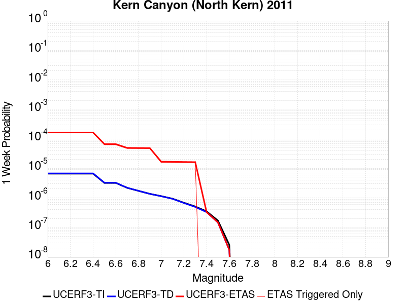 | 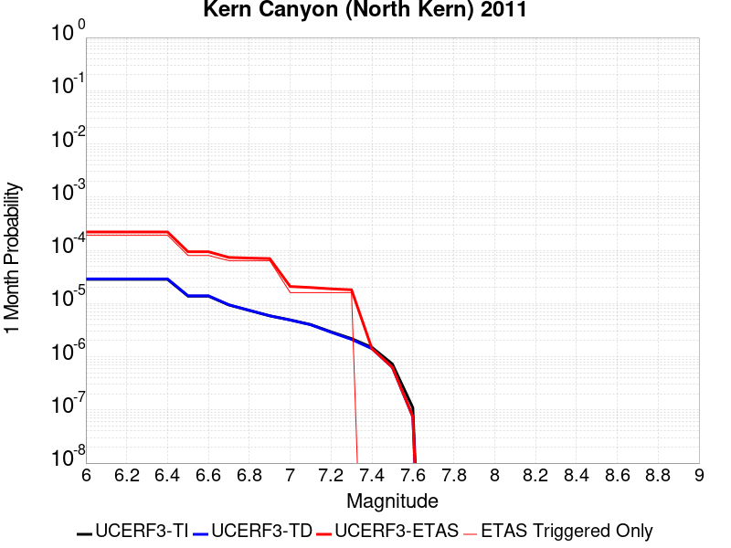 | 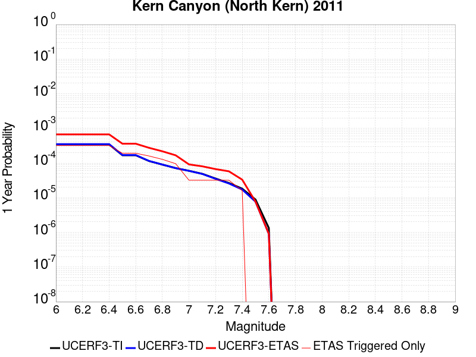 | 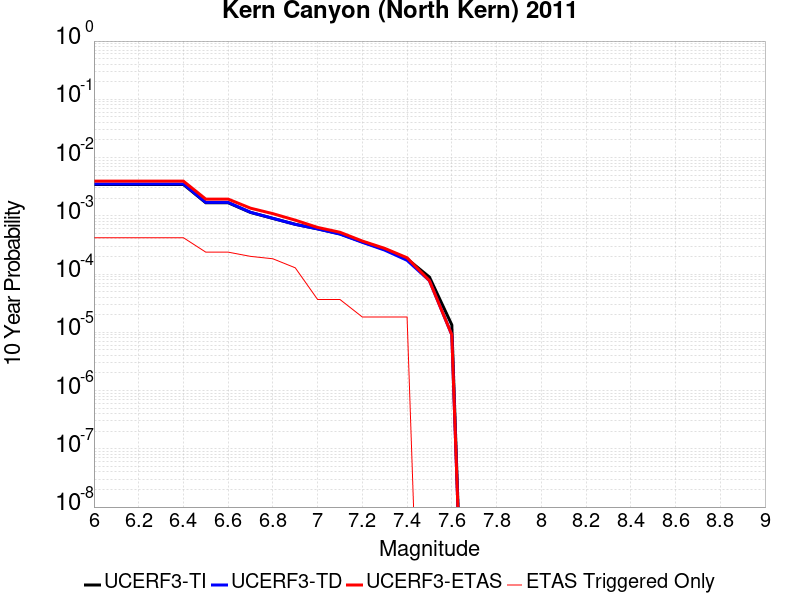 |

| Magnitude | 1 wk TI Prob | 1 wk TD Prob | 1 wk ETAS Prob | 1 wk ETAS/TD Gain | 1 wk ETAS Triggered Only | 1 mo TI Prob | 1 mo TD Prob | 1 mo ETAS Prob | 1 mo ETAS/TD Gain | 1 mo ETAS Triggered Only | 1 yr TI Prob | 1 yr TD Prob | 1 yr ETAS Prob | 1 yr ETAS/TD Gain | 1 yr ETAS Triggered Only | 10 yr TI Prob | 10 yr TD Prob | 10 yr ETAS Prob | 10 yr ETAS/TD Gain | 10 yr ETAS Triggered Only |
|-----|-----|-----|-----|-----|-----|-----|-----|-----|-----|-----|-----|-----|-----|-----|-----|-----|-----|-----|-----|-----|
| 6.0 | 6.6264497E-6 | 6.75733E-6 | 1.544559E-4 | 22.857536 | 1.4769958E-4 | 2.8398761E-5 | 2.895971E-5 | 2.012709E-4 | 6.9500318 | 1.7231617E-4 | 3.4570007E-4 | 3.5253543E-4 | 6.232225E-4 | 1.7678295 | 2.7078256E-4 | 0.0034516277 | 0.0035205502 | 0.003913029 | 1.1114823 | 3.9386554E-4 |
| 6.1 | 6.6264497E-6 | 6.75733E-6 | 1.544559E-4 | 22.857536 | 1.4769958E-4 | 2.8398761E-5 | 2.895971E-5 | 2.012709E-4 | 6.9500318 | 1.7231617E-4 | 3.4570007E-4 | 3.5253543E-4 | 6.232225E-4 | 1.7678295 | 2.7078256E-4 | 0.0034516277 | 0.0035205502 | 0.003913029 | 1.1114823 | 3.9386554E-4 |
| 6.2 | 6.6264497E-6 | 6.75733E-6 | 1.544559E-4 | 22.857536 | 1.4769958E-4 | 2.8398761E-5 | 2.895971E-5 | 2.012709E-4 | 6.9500318 | 1.7231617E-4 | 3.4570007E-4 | 3.5253543E-4 | 6.232225E-4 | 1.7678295 | 2.7078256E-4 | 0.0034516277 | 0.0035205502 | 0.003913029 | 1.1114823 | 3.9386554E-4 |
| 6.3 | 6.6264497E-6 | 6.75733E-6 | 1.544559E-4 | 22.857536 | 1.4769958E-4 | 2.8398761E-5 | 2.895971E-5 | 2.012709E-4 | 6.9500318 | 1.7231617E-4 | 3.4570007E-4 | 3.5253543E-4 | 6.232225E-4 | 1.7678295 | 2.7078256E-4 | 0.0034516277 | 0.0035205502 | 0.003913029 | 1.1114823 | 3.9386554E-4 |
| 6.4 | 6.6264497E-6 | 6.75733E-6 | 1.544559E-4 | 22.857536 | 1.4769958E-4 | 2.8398761E-5 | 2.895971E-5 | 2.012709E-4 | 6.9500318 | 1.7231617E-4 | 3.4570007E-4 | 3.5253543E-4 | 6.232225E-4 | 1.7678295 | 2.7078256E-4 | 0.0034516277 | 0.0035205502 | 0.003913029 | 1.1114823 | 3.9386554E-4 |
| 6.5 | 3.2162225E-6 | 3.2570915E-6 | 5.2490122E-5 | 16.115643 | 4.9233193E-5 | 1.3783738E-5 | 1.3958893E-5 | 8.780765E-5 | 6.2904453 | 7.384979E-5 | 1.6780409E-4 | 1.6993708E-4 | 3.4222397E-4 | 2.0138276 | 1.7231617E-4 | 0.0016767744 | 0.001698151 | 0.001943899 | 1.1447151 | 2.4616596E-4 |
| 6.6 | 3.2162225E-6 | 3.2570915E-6 | 5.2490122E-5 | 16.115643 | 4.9233193E-5 | 1.3783738E-5 | 1.3958893E-5 | 8.780765E-5 | 6.2904453 | 7.384979E-5 | 1.6780409E-4 | 1.6993708E-4 | 3.4222397E-4 | 2.0138276 | 1.7231617E-4 | 0.0016767744 | 0.001698151 | 0.001943899 | 1.1447151 | 2.4616596E-4 |
| 6.7 | 2.1908265E-6 | 2.2071222E-6 | 5.1440205E-5 | 23.306461 | 4.9233193E-5 | 9.389223E-6 | 9.459061E-6 | 8.330815E-5 | 8.807232 | 7.384979E-5 | 1.1430779E-4 | 1.1515819E-4 | 2.8745452E-4 | 2.496171 | 1.7231617E-4 | 0.0011424901 | 0.0011510046 | 0.0013722989 | 1.1922619 | 2.2154937E-4 |
| 6.8 | 1.7303895E-6 | 1.7365529E-6 | 5.0969662E-5 | 29.351055 | 4.9233193E-5 | 7.415934E-6 | 7.4423488E-6 | 8.129159E-5 | 10.92284 | 7.384979E-5 | 9.028525E-5 | 9.0606925E-5 | 2.3829313E-4 | 2.6299658 | 1.4769958E-4 | 9.024858E-4 | 9.057096E-4 | 0.001102464 | 1.2172378 | 1.9693277E-4 |
| 6.9 | 1.3700314E-6 | 1.3688622E-6 | 5.060199E-5 | 36.966457 | 4.9233193E-5 | 5.87155E-6 | 5.8665396E-6 | 7.9715894E-5 | 13.588231 | 7.384979E-5 | 7.148377E-5 | 7.142282E-5 | 1.6988217E-4 | 2.378542 | 9.8466386E-5 | 7.146078E-4 | 7.140032E-4 | 8.3699834E-4 | 1.1722612 | 1.2308298E-4 |
| 7.0 | 1.1467797E-6 | 1.1413804E-6 | 1.1413804E-6 | 1.0 | 0.0 | 4.9147607E-6 | 4.8916213E-6 | 4.8916213E-6 | 1.0 | 0.0 | 5.983557E-5 | 5.9553895E-5 | 5.9553895E-5 | 1.0 | 0.0 | 5.981946E-4 | 5.953825E-4 | 5.953825E-4 | 1.0 | 0.0 |
| 7.1 | 9.3952065E-7 | 9.3026904E-7 | 9.3026904E-7 | 1.0 | 0.0 | 4.026511E-6 | 3.9868614E-6 | 3.9868614E-6 | 1.0 | 0.0 | 4.9021666E-5 | 4.8538972E-5 | 4.8538972E-5 | 1.0 | 0.0 | 4.901085E-4 | 4.8528548E-4 | 4.8528548E-4 | 1.0 | 0.0 |
| 7.2 | 6.858055E-7 | 6.7193E-7 | 6.7193E-7 | 1.0 | 0.0 | 2.939163E-6 | 2.879697E-6 | 2.879697E-6 | 1.0 | 0.0 | 3.5783723E-5 | 3.5059755E-5 | 3.5059755E-5 | 1.0 | 0.0 | 3.5777962E-4 | 3.5054312E-4 | 3.5054312E-4 | 1.0 | 0.0 |
| 7.3 | 5.1101983E-7 | 4.9393E-7 | 4.9393E-7 | 1.0 | 0.0 | 2.1900833E-6 | 2.116841E-6 | 2.116841E-6 | 1.0 | 0.0 | 2.6663936E-5 | 2.5772239E-5 | 2.5772239E-5 | 1.0 | 0.0 | 2.6660739E-4 | 2.57693E-4 | 2.57693E-4 | 1.0 | 0.0 |
| 7.4 | 3.4999414E-7 | 3.2995905E-7 | 3.2995905E-7 | 1.0 | 0.0 | 1.499974E-6 | 1.4141094E-6 | 1.4141094E-6 | 1.0 | 0.0 | 1.8262032E-5 | 1.721665E-5 | 1.721665E-5 | 1.0 | 0.0 | 1.826053E-4 | 1.7215339E-4 | 1.7215339E-4 | 1.0 | 0.0 |
| 7.5 | 1.7021522E-7 | 1.4750044E-7 | 1.4750044E-7 | 1.0 | 0.0 | 7.2949354E-7 | 6.321446E-7 | 6.321446E-7 | 1.0 | 0.0 | 8.881548E-6 | 7.696334E-6 | 7.696334E-6 | 1.0 | 0.0 | 8.8811925E-5 | 7.696076E-5 | 7.696076E-5 | 1.0 | 0.0 |
| 7.6 | 2.572245E-8 | 1.7352555E-8 | 1.7352555E-8 | 1.0 | 0.0 | 1.10239064E-7 | 7.436809E-8 | 7.436809E-8 | 1.0 | 0.0 | 1.3421597E-6 | 9.054312E-7 | 9.054312E-7 | 1.0 | 0.0 | 1.3421517E-5 | 9.05428E-6 | 9.05428E-6 | 1.0 | 0.0 |

## Scodie Lineament
*[(top)](#table-of-contents)*

| 1 Week | 1 Month | 1 Year | 10 Year |
|-----|-----|-----|-----|
| 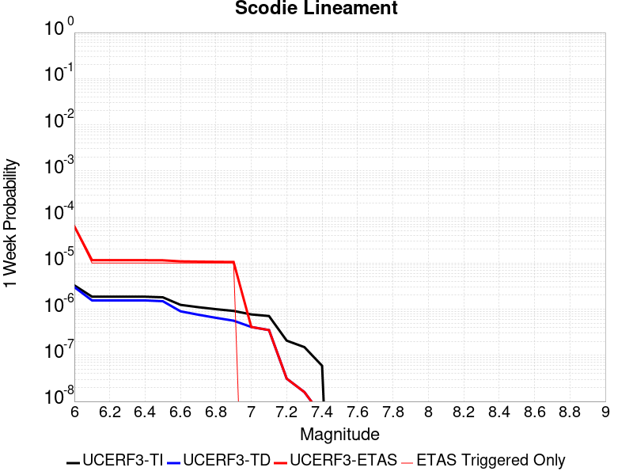 | 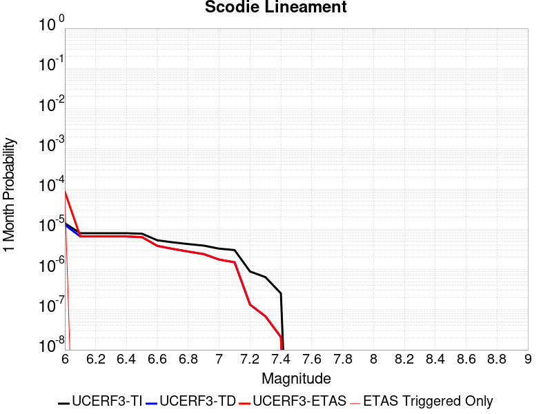 | 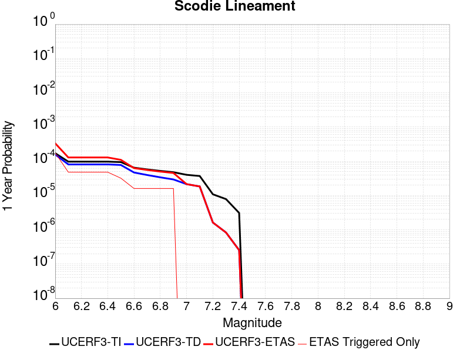 | 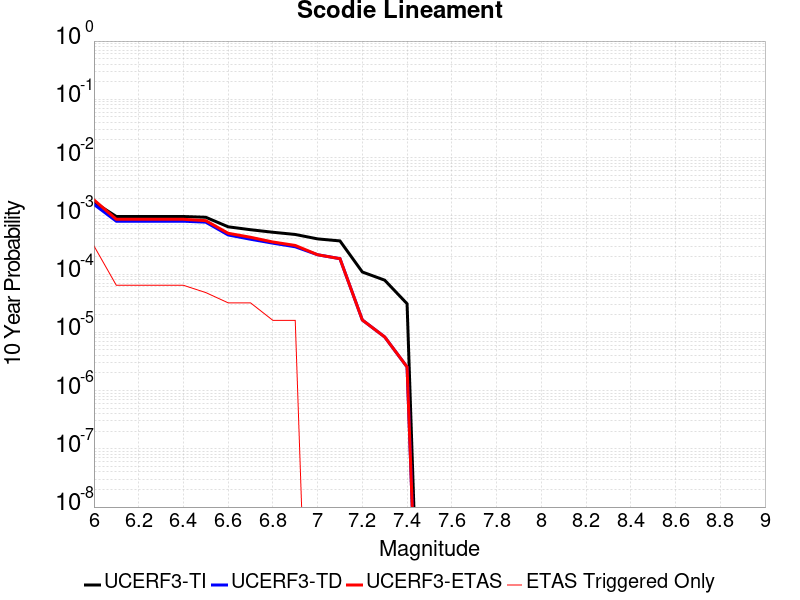 |

| Magnitude | 1 wk TI Prob | 1 wk TD Prob | 1 wk ETAS Prob | 1 wk ETAS/TD Gain | 1 wk ETAS Triggered Only | 1 mo TI Prob | 1 mo TD Prob | 1 mo ETAS Prob | 1 mo ETAS/TD Gain | 1 mo ETAS Triggered Only | 1 yr TI Prob | 1 yr TD Prob | 1 yr ETAS Prob | 1 yr ETAS/TD Gain | 1 yr ETAS Triggered Only | 10 yr TI Prob | 10 yr TD Prob | 10 yr ETAS Prob | 10 yr ETAS/TD Gain | 10 yr ETAS Triggered Only |
|-----|-----|-----|-----|-----|-----|-----|-----|-----|-----|-----|-----|-----|-----|-----|-----|-----|-----|-----|-----|-----|
| 6.0 | 3.2919327E-6 | 3.0133422E-6 | 5.2246385E-5 | 17.338352 | 4.9233193E-5 | 1.4108206E-5 | 1.2914278E-5 | 1.1137939E-4 | 8.624516 | 9.8466386E-5 | 1.7175387E-4 | 1.5722317E-4 | 3.787377E-4 | 2.408918 | 2.2154937E-4 | 0.0017162118 | 0.0015714309 | 0.0019400996 | 1.234607 | 3.6924894E-4 |
| 6.1 | 1.8663811E-6 | 1.5490499E-6 | 1.5490499E-6 | 1.0 | 0.0 | 7.998751E-6 | 6.6387715E-6 | 6.6387715E-6 | 1.0 | 0.0 | 9.738045E-5 | 8.082454E-5 | 1.0543915E-4 | 1.3045437 | 2.4616596E-5 | 9.7337784E-4 | 8.080003E-4 | 8.3259697E-4 | 1.0304414 | 2.4616596E-5 |
| 6.2 | 1.8663811E-6 | 1.5490499E-6 | 1.5490499E-6 | 1.0 | 0.0 | 7.998751E-6 | 6.6387715E-6 | 6.6387715E-6 | 1.0 | 0.0 | 9.738045E-5 | 8.082454E-5 | 1.0543915E-4 | 1.3045437 | 2.4616596E-5 | 9.7337784E-4 | 8.080003E-4 | 8.3259697E-4 | 1.0304414 | 2.4616596E-5 |
| 6.3 | 1.8663811E-6 | 1.5490499E-6 | 1.5490499E-6 | 1.0 | 0.0 | 7.998751E-6 | 6.6387715E-6 | 6.6387715E-6 | 1.0 | 0.0 | 9.738045E-5 | 8.082454E-5 | 1.0543915E-4 | 1.3045437 | 2.4616596E-5 | 9.7337784E-4 | 8.080003E-4 | 8.3259697E-4 | 1.0304414 | 2.4616596E-5 |
| 6.4 | 1.8663811E-6 | 1.5490499E-6 | 1.5490499E-6 | 1.0 | 0.0 | 7.998751E-6 | 6.6387715E-6 | 6.6387715E-6 | 1.0 | 0.0 | 9.738045E-5 | 8.082454E-5 | 1.0543915E-4 | 1.3045437 | 2.4616596E-5 | 9.7337784E-4 | 8.080003E-4 | 8.3259697E-4 | 1.0304414 | 2.4616596E-5 |
| 6.5 | 1.8106311E-6 | 1.4909839E-6 | 1.4909839E-6 | 1.0 | 0.0 | 7.759824E-6 | 6.3899183E-6 | 6.3899183E-6 | 1.0 | 0.0 | 9.447177E-5 | 7.7794975E-5 | 7.7794975E-5 | 1.0 | 0.0 | 9.4431615E-4 | 7.7772606E-4 | 7.7772606E-4 | 1.0 | 0.0 |
| 6.6 | 1.2414679E-6 | 8.997558E-7 | 8.997558E-7 | 1.0 | 0.0 | 5.320566E-6 | 3.856091E-6 | 3.856091E-6 | 1.0 | 0.0 | 6.477596E-5 | 4.6946985E-5 | 4.6946985E-5 | 1.0 | 0.0 | 6.475708E-4 | 4.693793E-4 | 4.693793E-4 | 1.0 | 0.0 |
| 6.7 | 1.1062215E-6 | 7.594311E-7 | 7.594311E-7 | 1.0 | 0.0 | 4.7409408E-6 | 3.2547011E-6 | 3.2547011E-6 | 1.0 | 0.0 | 5.7719422E-5 | 3.9625334E-5 | 3.9625334E-5 | 1.0 | 0.0 | 5.770443E-4 | 3.961897E-4 | 3.961897E-4 | 1.0 | 0.0 |
| 6.8 | 1.0006736E-6 | 6.500397E-7 | 6.500397E-7 | 1.0 | 0.0 | 4.288594E-6 | 2.7858816E-6 | 2.7858816E-6 | 1.0 | 0.0 | 5.221238E-5 | 3.3917644E-5 | 3.3917644E-5 | 1.0 | 0.0 | 5.220012E-4 | 3.3913075E-4 | 3.3913075E-4 | 1.0 | 0.0 |
| 6.9 | 9.167364E-7 | 5.631625E-7 | 5.631625E-7 | 1.0 | 0.0 | 3.9288643E-6 | 2.4135516E-6 | 2.4135516E-6 | 1.0 | 0.0 | 4.7832873E-5 | 2.9384651E-5 | 2.9384651E-5 | 1.0 | 0.0 | 4.782258E-4 | 2.9381333E-4 | 2.9381333E-4 | 1.0 | 0.0 |
| 7.0 | 7.6987664E-7 | 4.113383E-7 | 4.113383E-7 | 1.0 | 0.0 | 3.2994672E-6 | 1.7628774E-6 | 1.7628774E-6 | 1.0 | 0.0 | 4.0170275E-5 | 2.1462862E-5 | 2.1462862E-5 | 1.0 | 0.0 | 4.0163012E-4 | 2.1461173E-4 | 2.1461173E-4 | 1.0 | 0.0 |
| 7.1 | 7.1038727E-7 | 3.5211494E-7 | 3.5211494E-7 | 1.0 | 0.0 | 3.0445133E-6 | 1.5090633E-6 | 1.5090633E-6 | 1.0 | 0.0 | 3.706632E-5 | 1.8372726E-5 | 1.8372726E-5 | 1.0 | 0.0 | 3.7060137E-4 | 1.8371557E-4 | 1.8371557E-4 | 1.0 | 0.0 |
| 7.2 | 2.0799602E-7 | 3.1186854E-8 | 3.1186854E-8 | 1.0 | 0.0 | 8.914113E-7 | 1.3365793E-7 | 1.3365793E-7 | 1.0 | 0.0 | 1.0852878E-5 | 1.6272843E-6 | 1.6272843E-6 | 1.0 | 0.0 | 1.08523476E-4 | 1.627273E-5 | 1.627273E-5 | 1.0 | 0.0 |
| 7.3 | 1.5048182E-7 | 1.5945696E-8 | 1.5945696E-8 | 1.0 | 0.0 | 6.449219E-7 | 6.83387E-8 | 6.83387E-8 | 1.0 | 0.0 | 7.851896E-6 | 8.320234E-7 | 8.320234E-7 | 1.0 | 0.0 | 7.851618E-5 | 8.320206E-6 | 8.320206E-6 | 1.0 | 0.0 |
| 7.4 | 5.9334678E-8 | 4.8683537E-9 | 4.8683537E-9 | 1.0 | 0.0 | 2.5429145E-7 | 2.0864372E-8 | 2.0864372E-8 | 1.0 | 0.0 | 3.095994E-6 | 2.5402372E-7 | 2.5402372E-7 | 1.0 | 0.0 | 3.095951E-5 | 2.5402353E-6 | 2.5402353E-6 | 1.0 | 0.0 |

## Calico-Hidalgo
*[(top)](#table-of-contents)*

| 1 Week | 1 Month | 1 Year | 10 Year |
|-----|-----|-----|-----|
| 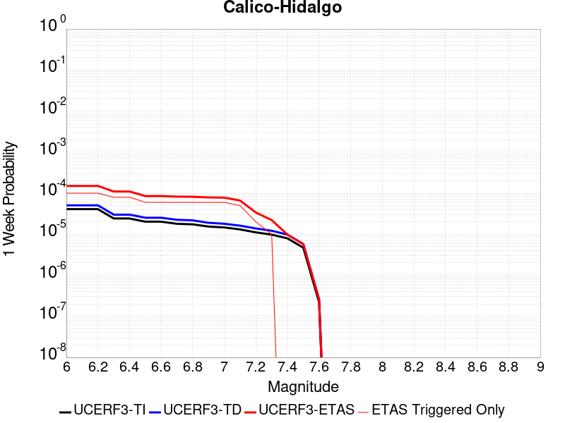 | 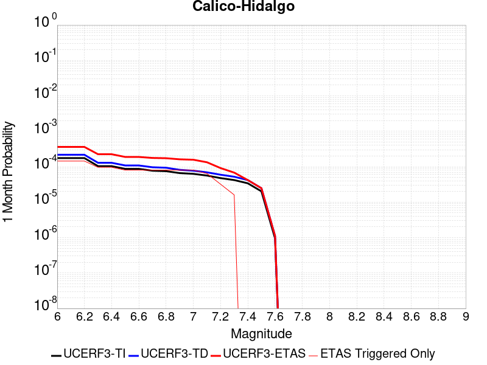 | 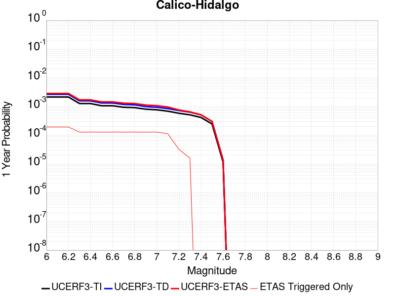 | 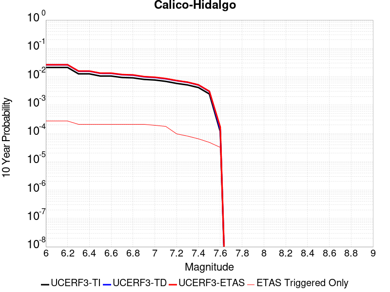 |

| Magnitude | 1 wk TI Prob | 1 wk TD Prob | 1 wk ETAS Prob | 1 wk ETAS/TD Gain | 1 wk ETAS Triggered Only | 1 mo TI Prob | 1 mo TD Prob | 1 mo ETAS Prob | 1 mo ETAS/TD Gain | 1 mo ETAS Triggered Only | 1 yr TI Prob | 1 yr TD Prob | 1 yr ETAS Prob | 1 yr ETAS/TD Gain | 1 yr ETAS Triggered Only | 10 yr TI Prob | 10 yr TD Prob | 10 yr ETAS Prob | 10 yr ETAS/TD Gain | 10 yr ETAS Triggered Only |
|-----|-----|-----|-----|-----|-----|-----|-----|-----|-----|-----|-----|-----|-----|-----|-----|-----|-----|-----|-----|-----|
| 6.0 | 4.0906612E-5 | 5.0703686E-5 | 2.4762648E-4 | 4.883796 | 1.9693277E-4 | 1.7530227E-4 | 2.172857E-4 | 4.1417568E-4 | 1.9061341 | 1.9693277E-4 | 0.0021322158 | 0.002642648 | 0.002863612 | 1.0836146 | 2.2154937E-4 | 0.02111873 | 0.026152607 | 0.026440281 | 1.0109998 | 2.9539916E-4 |
| 6.1 | 4.0906612E-5 | 5.0703686E-5 | 2.4762648E-4 | 4.883796 | 1.9693277E-4 | 1.7530227E-4 | 2.172857E-4 | 4.1417568E-4 | 1.9061341 | 1.9693277E-4 | 0.0021322158 | 0.002642648 | 0.002863612 | 1.0836146 | 2.2154937E-4 | 0.02111873 | 0.026152607 | 0.026440281 | 1.0109998 | 2.9539916E-4 |
| 6.2 | 4.0906612E-5 | 5.0703686E-5 | 2.4762648E-4 | 4.883796 | 1.9693277E-4 | 1.7530227E-4 | 2.172857E-4 | 4.1417568E-4 | 1.9061341 | 1.9693277E-4 | 0.0021322158 | 0.002642648 | 0.002863612 | 1.0836146 | 2.2154937E-4 | 0.02111873 | 0.026152607 | 0.026440281 | 1.0109998 | 2.9539916E-4 |
| 6.3 | 2.4242801E-5 | 3.0090669E-5 | 1.777858E-4 | 5.9083366 | 1.4769958E-4 | 1.0389358E-4 | 1.2895382E-4 | 2.7663435E-4 | 2.1452203 | 1.4769958E-4 | 0.0012641704 | 0.0015689151 | 0.0017163829 | 1.0939935 | 1.4769958E-4 | 0.01257003 | 0.01558206 | 0.015800158 | 1.0139967 | 2.2154937E-4 |
| 6.4 | 2.4242801E-5 | 3.0090669E-5 | 1.777858E-4 | 5.9083366 | 1.4769958E-4 | 1.0389358E-4 | 1.2895382E-4 | 2.7663435E-4 | 2.1452203 | 1.4769958E-4 | 0.0012641704 | 0.0015689151 | 0.0017163829 | 1.0939935 | 1.4769958E-4 | 0.01257003 | 0.01558206 | 0.015800158 | 1.0139967 | 2.2154937E-4 |
| 6.5 | 2.0286952E-5 | 2.5315738E-5 | 1.483956E-4 | 5.8617926 | 1.2308298E-4 | 8.694118E-5 | 1.0849161E-4 | 2.3156124E-4 | 2.13437 | 1.2308298E-4 | 0.0010579949 | 0.001320102 | 0.0014676066 | 1.1117373 | 1.4769958E-4 | 0.010529719 | 0.013124538 | 0.01334318 | 1.016659 | 2.2154937E-4 |
| 6.6 | 2.0269223E-5 | 2.5296687E-5 | 1.4837655E-4 | 5.865454 | 1.2308298E-4 | 8.6865206E-5 | 1.08409964E-4 | 2.314796E-4 | 2.1352243 | 1.2308298E-4 | 0.0010570707 | 0.0013191093 | 0.0014666141 | 1.1118215 | 1.4769958E-4 | 0.010520565 | 0.013114728 | 0.013333372 | 1.0166717 | 2.2154937E-4 |
| 6.7 | 1.799852E-5 | 2.25406E-5 | 1.4562081E-4 | 6.4603786 | 1.2308298E-4 | 7.713423E-5 | 9.659908E-5 | 2.1967017E-4 | 2.27404 | 1.2308298E-4 | 9.3870464E-4 | 0.0011754738 | 0.0013229997 | 1.1255034 | 1.4769958E-4 | 0.009347493 | 0.011694173 | 0.011913132 | 1.0187237 | 2.2154937E-4 |
| 6.8 | 1.7458793E-5 | 2.184212E-5 | 1.4492241E-4 | 6.6349974 | 1.2308298E-4 | 7.4821255E-5 | 9.3605806E-5 | 2.1667728E-4 | 2.3147845 | 1.2308298E-4 | 9.10568E-4 | 0.0011390693 | 0.0012866007 | 1.1295192 | 1.4769958E-4 | 0.009068459 | 0.011333893 | 0.011552932 | 1.019326 | 2.2154937E-4 |
| 6.9 | 1.542884E-5 | 1.9025927E-5 | 1.4210657E-4 | 7.469101 | 1.2308298E-4 | 6.612192E-5 | 8.153721E-5 | 2.0461016E-4 | 2.5094082 | 1.2308298E-4 | 8.04737E-4 | 9.922766E-4 | 0.0011398296 | 1.1487015 | 1.4769958E-4 | 0.008018291 | 0.009879857 | 0.010099218 | 1.0222028 | 2.2154937E-4 |
| 7.0 | 1.468253E-5 | 1.8030598E-5 | 1.4111136E-4 | 7.826216 | 1.2308298E-4 | 6.292361E-5 | 7.7271776E-5 | 2.0034525E-4 | 2.592735 | 1.2308298E-4 | 7.658257E-4 | 9.4039086E-4 | 0.0010879516 | 1.1569142 | 1.4769958E-4 | 0.0076319184 | 0.009365481 | 0.009584956 | 1.0234344 | 2.2154937E-4 |
| 7.1 | 1.3139281E-5 | 1.6200942E-5 | 1.1466573E-4 | 7.0777197 | 9.8466386E-5 | 5.6309986E-5 | 6.943083E-5 | 1.6789038E-4 | 2.4180954 | 9.8466386E-5 | 6.853584E-4 | 8.4500515E-4 | 9.6798415E-4 | 1.1455364 | 1.2308298E-4 | 0.0068324856 | 0.0084192185 | 0.0086144935 | 1.023194 | 1.9693277E-4 |
| 7.2 | 1.1127404E-5 | 1.3866597E-5 | 6.3099105E-5 | 4.5504394 | 4.9233193E-5 | 4.7688E-5 | 5.942698E-5 | 1.0865725E-4 | 1.8284161 | 4.9233193E-5 | 5.8044674E-4 | 7.232942E-4 | 7.724918E-4 | 1.0680188 | 4.9233193E-5 | 0.0057893298 | 0.0072105085 | 0.007332704 | 1.0169469 | 1.2308298E-4 |
| 7.3 | 9.808154E-6 | 1.2176215E-5 | 3.6792513E-5 | 3.0216706 | 2.4616596E-5 | 4.2034266E-5 | 5.2182797E-5 | 7.679811E-5 | 1.4717132 | 2.4616596E-5 | 5.11647E-4 | 6.3515105E-4 | 6.59752E-4 | 1.0387324 | 2.4616596E-5 | 0.0051047057 | 0.006334433 | 0.0064322758 | 1.0154462 | 9.8466386E-5 |
| 7.4 | 7.942452E-6 | 9.792144E-6 | 9.792144E-6 | 1.0 | 0.0 | 3.4038632E-5 | 4.1965708E-5 | 4.1965708E-5 | 1.0 | 0.0 | 4.1434157E-4 | 5.1082217E-4 | 5.1082217E-4 | 1.0 | 0.0 | 0.0041356985 | 0.005097421 | 0.0051708943 | 1.0144138 | 7.384979E-5 |
| 7.5 | 4.7121216E-6 | 5.772836E-6 | 5.772836E-6 | 1.0 | 0.0 | 2.019465E-5 | 2.4740535E-5 | 2.4740535E-5 | 1.0 | 0.0 | 2.4584212E-4 | 3.0118204E-4 | 3.0118204E-4 | 1.0 | 0.0 | 0.0024557032 | 0.0030084911 | 0.0030575763 | 1.0163155 | 4.9233193E-5 |
| 7.6 | 2.21172E-7 | 2.603961E-7 | 2.603961E-7 | 1.0 | 0.0 | 9.478797E-7 | 1.1159829E-6 | 1.1159829E-6 | 1.0 | 0.0 | 1.1540374E-5 | 1.3587036E-5 | 1.3587036E-5 | 1.0 | 0.0 | 1.1539775E-4 | 1.3586486E-4 | 1.6047811E-4 | 1.1811599 | 2.4616596E-5 |

## Baker
*[(top)](#table-of-contents)*

| 1 Week | 1 Month | 1 Year | 10 Year |
|-----|-----|-----|-----|
| 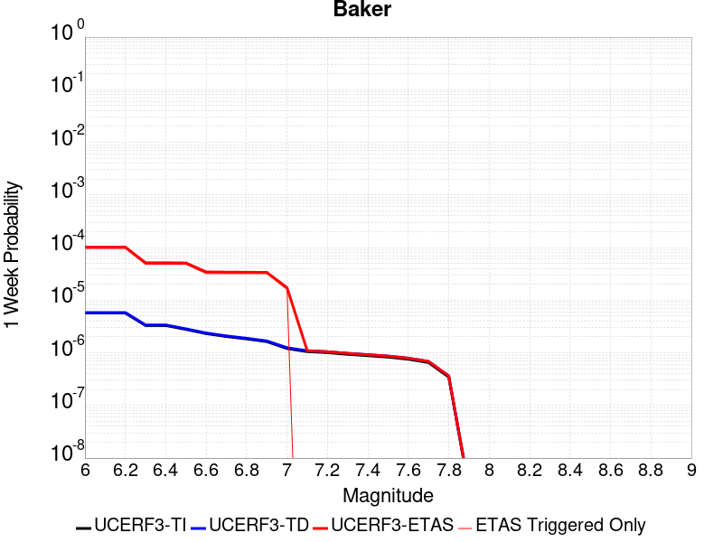 | 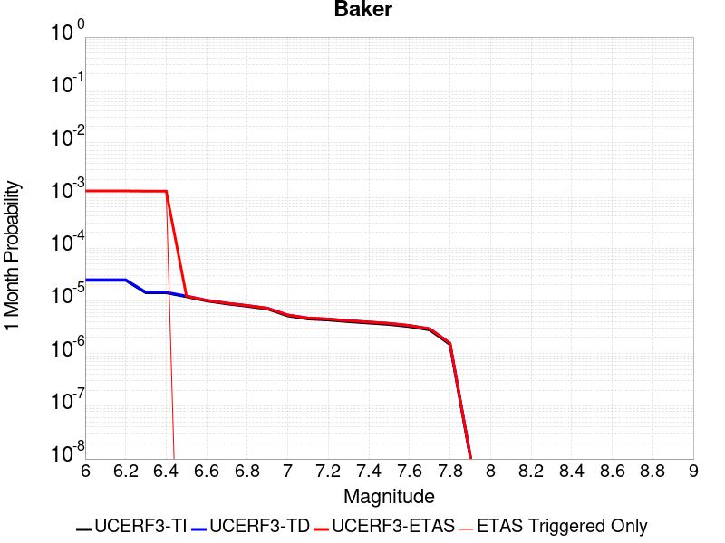 | 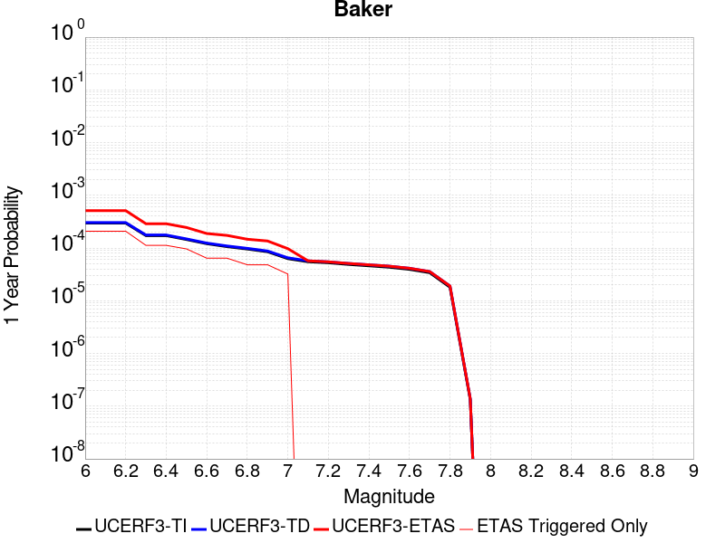 | 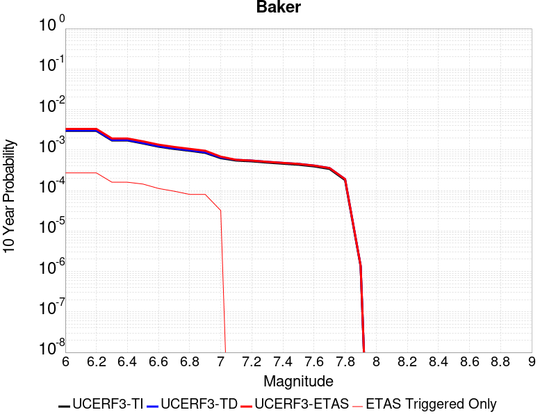 |

| Magnitude | 1 wk TI Prob | 1 wk TD Prob | 1 wk ETAS Prob | 1 wk ETAS/TD Gain | 1 wk ETAS Triggered Only | 1 mo TI Prob | 1 mo TD Prob | 1 mo ETAS Prob | 1 mo ETAS/TD Gain | 1 mo ETAS Triggered Only | 1 yr TI Prob | 1 yr TD Prob | 1 yr ETAS Prob | 1 yr ETAS/TD Gain | 1 yr ETAS Triggered Only | 10 yr TI Prob | 10 yr TD Prob | 10 yr ETAS Prob | 10 yr ETAS/TD Gain | 10 yr ETAS Triggered Only |
|-----|-----|-----|-----|-----|-----|-----|-----|-----|-----|-----|-----|-----|-----|-----|-----|-----|-----|-----|-----|-----|
| 6.0 | 5.695525E-6 | 5.8348373E-6 | 1.289171E-4 | 22.09438 | 1.2308298E-4 | 2.4409164E-5 | 2.5006228E-5 | 2.2193408E-4 | 8.875153 | 1.9693277E-4 | 2.9714106E-4 | 3.044123E-4 | 5.997215E-4 | 1.9700962 | 2.9539916E-4 | 0.0029674405 | 0.0030403486 | 0.0033839333 | 1.1130083 | 3.4463234E-4 |
| 6.1 | 5.695525E-6 | 5.8348373E-6 | 1.289171E-4 | 22.09438 | 1.2308298E-4 | 2.4409164E-5 | 2.5006228E-5 | 2.2193408E-4 | 8.875153 | 1.9693277E-4 | 2.9714106E-4 | 3.044123E-4 | 5.997215E-4 | 1.9700962 | 2.9539916E-4 | 0.0029674405 | 0.0030403486 | 0.0033839333 | 1.1130083 | 3.4463234E-4 |
| 6.2 | 5.695525E-6 | 5.8348373E-6 | 1.289171E-4 | 22.09438 | 1.2308298E-4 | 2.4409164E-5 | 2.5006228E-5 | 2.2193408E-4 | 8.875153 | 1.9693277E-4 | 2.9714106E-4 | 3.044123E-4 | 5.997215E-4 | 1.9700962 | 2.9539916E-4 | 0.0029674405 | 0.0030403486 | 0.0033839333 | 1.1130083 | 3.4463234E-4 |
| 6.3 | 3.2995713E-6 | 3.383667E-6 | 7.7233206E-5 | 22.825296 | 7.384979E-5 | 1.4140943E-5 | 1.4501353E-5 | 1.3758255E-4 | 9.487567 | 1.2308298E-4 | 1.7215237E-4 | 1.7654014E-4 | 3.4882588E-4 | 1.9759014 | 1.7231617E-4 | 0.0017201907 | 0.001764046 | 0.0019606315 | 1.1114401 | 1.9693277E-4 |
| 6.4 | 3.2995713E-6 | 3.383667E-6 | 7.7233206E-5 | 22.825296 | 7.384979E-5 | 1.4140943E-5 | 1.4501353E-5 | 1.3758255E-4 | 9.487567 | 1.2308298E-4 | 1.7215237E-4 | 1.7654014E-4 | 3.4882588E-4 | 1.9759014 | 1.7231617E-4 | 0.0017201907 | 0.001764046 | 0.0019606315 | 1.1114401 | 1.9693277E-4 |
| 6.5 | 2.782202E-6 | 2.8558404E-6 | 7.670542E-5 | 26.85914 | 7.384979E-5 | 1.1923668E-5 | 1.223926E-5 | 1.10704445E-4 | 9.045027 | 9.8466386E-5 | 1.4516099E-4 | 1.4900314E-4 | 2.9668072E-4 | 1.9911038 | 1.4769958E-4 | 0.001450662 | 0.0014890651 | 0.0016611246 | 1.1155487 | 1.7231617E-4 |
| 6.6 | 2.3163404E-6 | 2.38092E-6 | 5.1613995E-5 | 21.678173 | 4.9233193E-5 | 9.927136E-6 | 1.0203904E-5 | 8.405294E-5 | 8.237331 | 7.384979E-5 | 1.20856166E-4 | 1.2422565E-4 | 2.2267981E-4 | 1.7925428 | 9.8466386E-5 | 0.0012079047 | 0.0012415823 | 0.0013645125 | 1.099011 | 1.2308298E-4 |
| 6.7 | 2.037056E-6 | 2.0965003E-6 | 5.132959E-5 | 24.483463 | 4.9233193E-5 | 8.7302105E-6 | 8.984972E-6 | 8.28341E-5 | 9.219183 | 7.384979E-5 | 1.0628513E-4 | 1.093867E-4 | 2.0784231E-4 | 1.9000694 | 9.8466386E-5 | 0.0010623431 | 0.0010933448 | 0.0012162932 | 1.1124517 | 1.2308298E-4 |
| 6.8 | 1.8356744E-6 | 1.8915287E-6 | 5.112463E-5 | 27.028208 | 4.9233193E-5 | 7.867153E-6 | 8.106527E-6 | 8.195572E-5 | 10.109843 | 7.384979E-5 | 9.577837E-5 | 9.869264E-5 | 1.7253513E-4 | 1.7482067 | 7.384979E-5 | 9.57371E-4 | 9.86502E-4 | 0.0010848712 | 1.0997152 | 9.8466386E-5 |
| 6.9 | 1.6310546E-6 | 1.6832072E-6 | 5.091632E-5 | 30.249584 | 4.9233193E-5 | 6.9902153E-6 | 7.213726E-6 | 8.106298E-5 | 11.237326 | 7.384979E-5 | 8.510255E-5 | 8.782368E-5 | 1.6166699E-4 | 1.840813 | 7.384979E-5 | 8.5069967E-4 | 8.7790104E-4 | 9.76281E-4 | 1.1120627 | 9.8466386E-5 |
| 7.0 | 1.2058036E-6 | 1.2508665E-6 | 2.5867432E-5 | 20.67961 | 2.4616596E-5 | 5.1677193E-6 | 5.3608455E-6 | 5.4593776E-5 | 10.183799 | 4.9233193E-5 | 6.291517E-5 | 6.5266366E-5 | 1.14496346E-4 | 1.7542933 | 4.9233193E-5 | 6.289736E-4 | 6.524743E-4 | 7.0167537E-4 | 1.0754069 | 4.9233193E-5 |
| 7.1 | 1.052382E-6 | 1.0951609E-6 | 1.0951609E-6 | 1.0 | 0.0 | 4.5102006E-6 | 4.693538E-6 | 4.693538E-6 | 1.0 | 0.0 | 5.491031E-5 | 5.7142337E-5 | 5.7142337E-5 | 1.0 | 0.0 | 5.4896745E-4 | 5.7127734E-4 | 5.7127734E-4 | 1.0 | 0.0 |
| 7.2 | 1.0067454E-6 | 1.0487711E-6 | 1.0487711E-6 | 1.0 | 0.0 | 4.3146156E-6 | 4.4947255E-6 | 4.4947255E-6 | 1.0 | 0.0 | 5.252918E-5 | 5.4721917E-5 | 5.4721917E-5 | 1.0 | 0.0 | 5.251676E-4 | 5.470853E-4 | 5.470853E-4 | 1.0 | 0.0 |
| 7.3 | 9.3596316E-7 | 9.767723E-7 | 9.767723E-7 | 1.0 | 0.0 | 4.0112645E-6 | 4.1861604E-6 | 4.1861604E-6 | 1.0 | 0.0 | 4.8836053E-5 | 5.096532E-5 | 5.096532E-5 | 1.0 | 0.0 | 4.8825322E-4 | 5.095371E-4 | 5.095371E-4 | 1.0 | 0.0 |
| 7.4 | 8.8117395E-7 | 9.2076635E-7 | 9.2076635E-7 | 1.0 | 0.0 | 3.7764542E-6 | 3.9461356E-6 | 3.9461356E-6 | 1.0 | 0.0 | 4.5977362E-5 | 4.8043148E-5 | 4.8043148E-5 | 1.0 | 0.0 | 4.596785E-4 | 4.8032837E-4 | 4.8032837E-4 | 1.0 | 0.0 |
| 7.5 | 8.292386E-7 | 8.6745956E-7 | 8.6745956E-7 | 1.0 | 0.0 | 3.5538749E-6 | 3.7176785E-6 | 3.7176785E-6 | 1.0 | 0.0 | 4.326757E-5 | 4.5261804E-5 | 4.5261804E-5 | 1.0 | 0.0 | 4.3259145E-4 | 4.5252658E-4 | 4.5252658E-4 | 1.0 | 0.0 |
| 7.6 | 7.553842E-7 | 7.9144706E-7 | 7.9144706E-7 | 1.0 | 0.0 | 3.2373566E-6 | 3.3919116E-6 | 3.3919116E-6 | 1.0 | 0.0 | 3.9414106E-5 | 4.129575E-5 | 4.129575E-5 | 1.0 | 0.0 | 3.9407116E-4 | 4.1288146E-4 | 4.1288146E-4 | 1.0 | 0.0 |
| 7.7 | 6.5285366E-7 | 6.852797E-7 | 6.852797E-7 | 1.0 | 0.0 | 2.797941E-6 | 2.9369096E-6 | 2.9369096E-6 | 1.0 | 0.0 | 3.40644E-5 | 3.5756293E-5 | 3.5756293E-5 | 1.0 | 0.0 | 3.405918E-4 | 3.5750607E-4 | 3.5750607E-4 | 1.0 | 0.0 |
| 7.8 | 3.4586725E-7 | 3.6482615E-7 | 3.6482615E-7 | 1.0 | 0.0 | 1.4822873E-6 | 1.5635396E-6 | 1.5635396E-6 | 1.0 | 0.0 | 1.80467E-5 | 1.9035933E-5 | 1.9035933E-5 | 1.0 | 0.0 | 1.8045233E-4 | 1.9034347E-4 | 1.9034347E-4 | 1.0 | 0.0 |
| 7.9 | 2.5591178E-9 | 2.6696718E-9 | 2.6696718E-9 | 1.0 | 0.0 | 1.0967647E-8 | 1.14414505E-8 | 1.14414505E-8 | 1.0 | 0.0 | 1.335311E-7 | 1.3929966E-7 | 1.3929966E-7 | 1.0 | 0.0 | 1.3353102E-6 | 1.3929966E-6 | 1.3929966E-6 | 1.0 | 0.0 |

## Mission Ridge-Arroyo Parida-Santa Ana
*[(top)](#table-of-contents)*

| 1 Week | 1 Month | 1 Year | 10 Year |
|-----|-----|-----|-----|
| 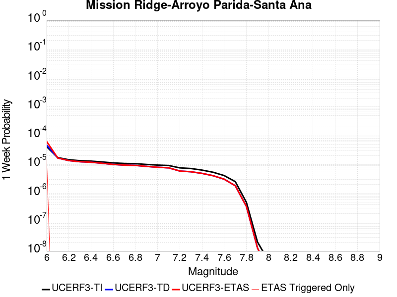 | 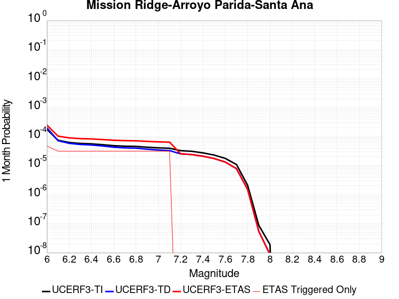 | 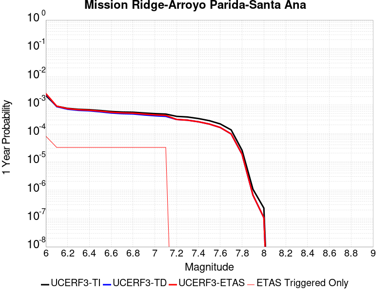 | 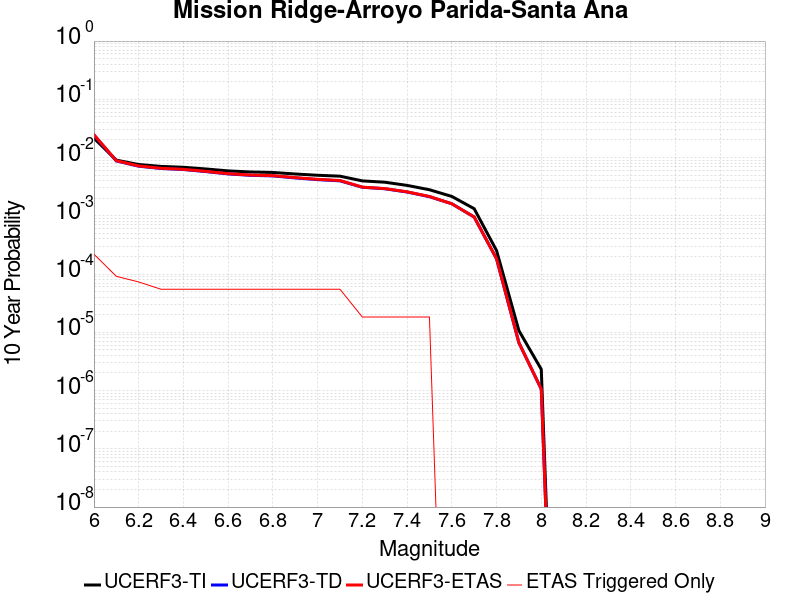 |

| Magnitude | 1 wk TI Prob | 1 wk TD Prob | 1 wk ETAS Prob | 1 wk ETAS/TD Gain | 1 wk ETAS Triggered Only | 1 mo TI Prob | 1 mo TD Prob | 1 mo ETAS Prob | 1 mo ETAS/TD Gain | 1 mo ETAS Triggered Only | 1 yr TI Prob | 1 yr TD Prob | 1 yr ETAS Prob | 1 yr ETAS/TD Gain | 1 yr ETAS Triggered Only | 10 yr TI Prob | 10 yr TD Prob | 10 yr ETAS Prob | 10 yr ETAS/TD Gain | 10 yr ETAS Triggered Only |
|-----|-----|-----|-----|-----|-----|-----|-----|-----|-----|-----|-----|-----|-----|-----|-----|-----|-----|-----|-----|-----|
| 6.0 | 4.169034E-5 | 4.7138263E-5 | 7.17537E-5 | 1.5221965 | 2.4616596E-5 | 1.7866064E-4 | 2.0201034E-4 | 2.5123358E-4 | 1.243667 | 4.9233193E-5 | 0.0021730233 | 0.00245745 | 0.0025556744 | 1.03997 | 9.8466386E-5 | 0.021518968 | 0.024384614 | 0.024648795 | 1.0108339 | 2.7078256E-4 |
| 6.1 | 1.73813E-5 | 1.6854226E-5 | 1.6854226E-5 | 1.0 | 0.0 | 7.4489166E-5 | 7.223046E-5 | 9.684528E-5 | 1.3407817 | 2.4616596E-5 | 9.065282E-4 | 8.790618E-4 | 9.0365676E-4 | 1.0279787 | 2.4616596E-5 | 0.009028391 | 0.008756988 | 0.008854592 | 1.0111458 | 9.8466386E-5 |
| 6.2 | 1.4622182E-5 | 1.367329E-5 | 1.367329E-5 | 1.0 | 0.0 | 6.2664985E-5 | 5.8598518E-5 | 8.321367E-5 | 1.4200644 | 2.4616596E-5 | 7.6267915E-4 | 7.132073E-4 | 7.378063E-4 | 1.0344907 | 2.4616596E-5 | 0.007600669 | 0.007109627 | 0.007182952 | 1.0103134 | 7.384979E-5 |
| 6.3 | 1.3552434E-5 | 1.2482201E-5 | 1.2482201E-5 | 1.0 | 0.0 | 5.8080568E-5 | 5.3494066E-5 | 7.810935E-5 | 1.4601498 | 2.4616596E-5 | 7.069015E-4 | 6.510988E-4 | 6.756994E-4 | 1.0377831 | 2.4616596E-5 | 0.00704657 | 0.006492275 | 0.0065411883 | 1.0075341 | 4.9233193E-5 |
| 6.4 | 1.30977305E-5 | 1.1979156E-5 | 1.1979156E-5 | 1.0 | 0.0 | 5.613192E-5 | 5.1338247E-5 | 7.5953576E-5 | 1.4794736 | 2.4616596E-5 | 6.831918E-4 | 6.248669E-4 | 6.494681E-4 | 1.0393703 | 2.4616596E-5 | 0.006810953 | 0.0062314444 | 0.0062803705 | 1.0078515 | 4.9233193E-5 |
| 6.5 | 1.225205E-5 | 1.1048803E-5 | 1.1048803E-5 | 1.0 | 0.0 | 5.2507727E-5 | 4.7351168E-5 | 7.19666E-5 | 1.5198485 | 2.4616596E-5 | 6.3909404E-4 | 5.7635066E-4 | 6.009531E-4 | 1.0426866 | 2.4616596E-5 | 0.006372592 | 0.005748869 | 0.0057978192 | 1.0085148 | 4.9233193E-5 |
| 6.6 | 1.1352241E-5 | 1.0063535E-5 | 1.0063535E-5 | 1.0 | 0.0 | 4.8651553E-5 | 4.3128734E-5 | 6.7744266E-5 | 1.5707456 | 2.4616596E-5 | 5.921717E-4 | 5.2496797E-4 | 5.495716E-4 | 1.046867 | 2.4616596E-5 | 0.0059059616 | 0.0052375244 | 0.0052865 | 1.0093509 | 4.9233193E-5 |
| 6.7 | 1.0864116E-5 | 9.517027E-6 | 9.517027E-6 | 1.0 | 0.0 | 4.6559664E-5 | 4.0786632E-5 | 6.540222E-5 | 1.6035211 | 2.4616596E-5 | 5.667165E-4 | 4.964661E-4 | 5.210705E-4 | 1.049559 | 2.4616596E-5 | 0.005652734 | 0.004953804 | 0.005002793 | 1.0098892 | 4.9233193E-5 |
| 6.8 | 1.0666365E-5 | 9.299779E-6 | 9.299779E-6 | 1.0 | 0.0 | 4.571219E-5 | 3.9855597E-5 | 6.447121E-5 | 1.61762 | 2.4616596E-5 | 5.564038E-4 | 4.8513585E-4 | 5.097405E-4 | 1.050717 | 2.4616596E-5 | 0.005550127 | 0.0048410003 | 0.004889995 | 1.0101209 | 4.9233193E-5 |
| 6.9 | 1.0038665E-5 | 8.592046E-6 | 8.592046E-6 | 1.0 | 0.0 | 4.302214E-5 | 3.682254E-5 | 6.143823E-5 | 1.6684952 | 2.4616596E-5 | 5.236687E-4 | 4.4822405E-4 | 4.728296E-4 | 1.0548956 | 2.4616596E-5 | 0.005224364 | 0.004473411 | 0.0045224237 | 1.0109565 | 4.9233193E-5 |
| 7.0 | 9.5379955E-6 | 8.025073E-6 | 8.025073E-6 | 1.0 | 0.0 | 4.0876483E-5 | 3.4392728E-5 | 5.900848E-5 | 1.7157254 | 2.4616596E-5 | 4.975576E-4 | 4.1865272E-4 | 4.43259E-4 | 1.058775 | 2.4616596E-5 | 0.00496445 | 0.0041788397 | 0.0042278673 | 1.0117323 | 4.9233193E-5 |
| 7.1 | 9.207389E-6 | 7.652375E-6 | 7.652375E-6 | 1.0 | 0.0 | 3.945964E-5 | 3.279549E-5 | 5.741128E-5 | 1.7505846 | 2.4616596E-5 | 4.803152E-4 | 3.9921363E-4 | 4.238204E-4 | 1.0616381 | 2.4616596E-5 | 0.004792784 | 0.003985161 | 0.004034198 | 1.0123049 | 4.9233193E-5 |
| 7.2 | 7.638091E-6 | 5.9311183E-6 | 5.9311183E-6 | 1.0 | 0.0 | 3.2734264E-5 | 2.541883E-5 | 2.541883E-5 | 1.0 | 0.0 | 3.984668E-4 | 3.0943064E-4 | 3.0943064E-4 | 1.0 | 0.0 | 0.0039775306 | 0.0030900547 | 0.0031145953 | 1.0079417 | 2.4616596E-5 |
| 7.3 | 7.2500147E-6 | 5.5961527E-6 | 5.5961527E-6 | 1.0 | 0.0 | 3.1071122E-5 | 2.3983293E-5 | 2.3983293E-5 | 1.0 | 0.0 | 3.7822526E-4 | 2.9195778E-4 | 2.9195778E-4 | 1.0 | 0.0 | 0.0037758215 | 0.0029157975 | 0.0029403423 | 1.0084178 | 2.4616596E-5 |
| 7.4 | 6.3899715E-6 | 4.9184964E-6 | 4.9184964E-6 | 1.0 | 0.0 | 2.7385306E-5 | 2.10791E-5 | 2.10791E-5 | 1.0 | 0.0 | 3.3336508E-4 | 2.5660804E-4 | 2.5660804E-4 | 1.0 | 0.0 | 0.0033286542 | 0.0025631618 | 0.0025877152 | 1.0095794 | 2.4616596E-5 |
| 7.5 | 5.379025E-6 | 4.0838527E-6 | 4.0838527E-6 | 1.0 | 0.0 | 2.305276E-5 | 1.7502109E-5 | 1.7502109E-5 | 1.0 | 0.0 | 2.806312E-4 | 2.1306744E-4 | 2.1306744E-4 | 1.0 | 0.0 | 0.0028027708 | 0.002128643 | 0.002153207 | 1.0115398 | 2.4616596E-5 |
| 7.6 | 4.1270696E-6 | 3.0883439E-6 | 3.0883439E-6 | 1.0 | 0.0 | 1.768732E-5 | 1.3235693E-5 | 1.3235693E-5 | 1.0 | 0.0 | 2.1532185E-4 | 1.6113273E-4 | 1.6113273E-4 | 1.0 | 0.0 | 0.0021511333 | 0.001610167 | 0.001610167 | 1.0 | 0.0 |
| 7.7 | 2.5406805E-6 | 1.8282013E-6 | 1.8282013E-6 | 1.0 | 0.0 | 1.0888585E-5 | 7.835125E-6 | 7.835125E-6 | 1.0 | 0.0 | 1.3256045E-4 | 9.538854E-5 | 9.538854E-5 | 1.0 | 0.0 | 0.0013248142 | 9.534821E-4 | 9.534821E-4 | 1.0 | 0.0 |
| 7.8 | 4.8608285E-7 | 3.5098864E-7 | 3.5098864E-7 | 1.0 | 0.0 | 2.0832106E-6 | 1.5042363E-6 | 1.5042363E-6 | 1.0 | 0.0 | 2.5362791E-5 | 1.8313924E-5 | 1.8313924E-5 | 1.0 | 0.0 | 2.5359896E-4 | 1.8312426E-4 | 1.8312426E-4 | 1.0 | 0.0 |
| 7.9 | 2.0472514E-8 | 1.2688783E-8 | 1.2688783E-8 | 1.0 | 0.0 | 8.7739345E-8 | 5.43805E-8 | 5.43805E-8 | 1.0 | 0.0 | 1.068226E-6 | 6.6208236E-7 | 6.6208236E-7 | 1.0 | 0.0 | 1.0682209E-5 | 6.620805E-6 | 6.620805E-6 | 1.0 | 0.0 |
| 8.0 | 4.443582E-9 | 2.0321211E-9 | 2.0321211E-9 | 1.0 | 0.0 | 1.9043922E-8 | 8.70909E-9 | 8.70909E-9 | 1.0 | 0.0 | 2.3185973E-7 | 1.0603316E-7 | 1.0603316E-7 | 1.0 | 0.0 | 2.3185949E-6 | 1.0603312E-6 | 1.0603312E-6 | 1.0 | 0.0 |

## Ludlow
*[(top)](#table-of-contents)*

| 1 Week | 1 Month | 1 Year | 10 Year |
|-----|-----|-----|-----|
| 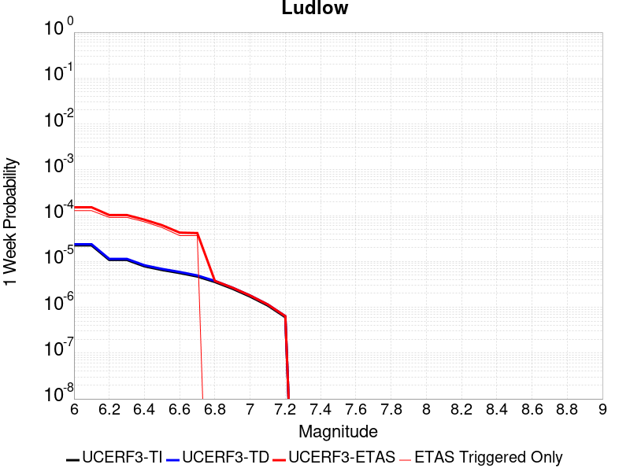 | 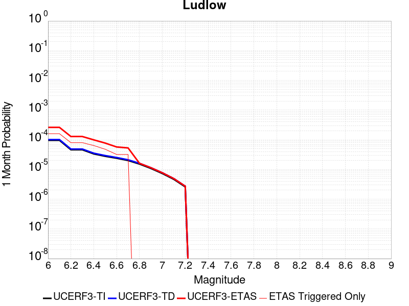 | 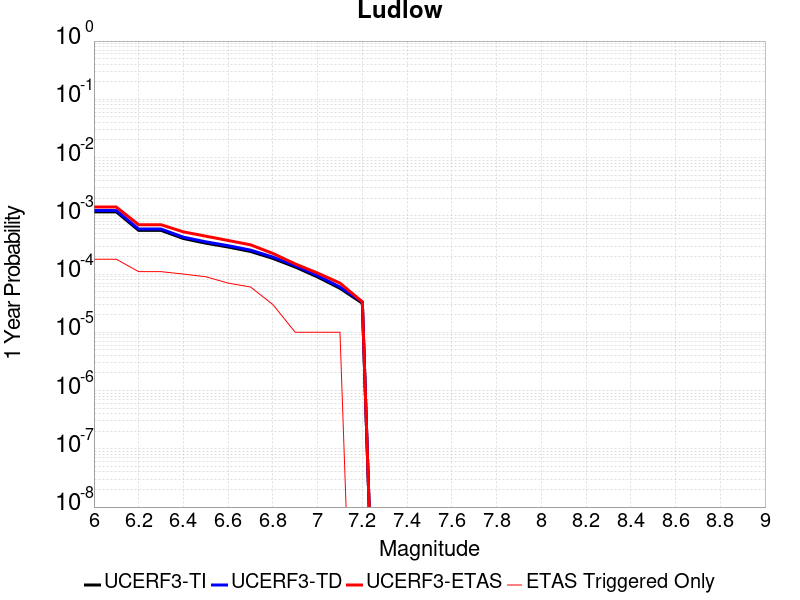 | 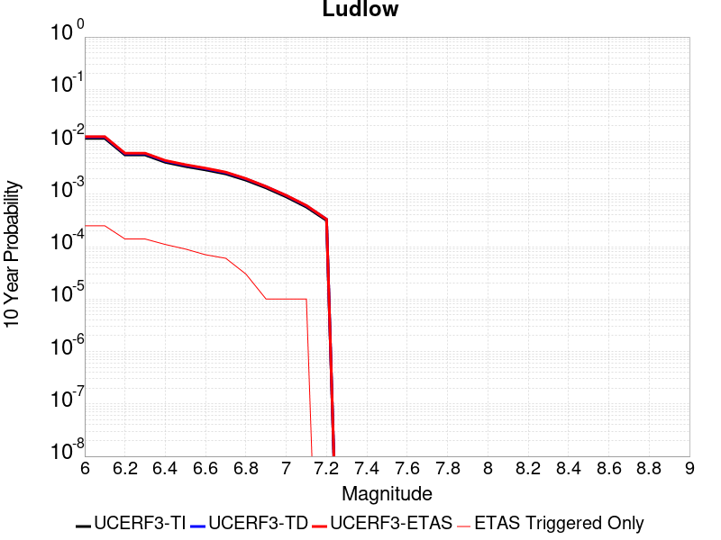 |

| Magnitude | 1 wk TI Prob | 1 wk TD Prob | 1 wk ETAS Prob | 1 wk ETAS/TD Gain | 1 wk ETAS Triggered Only | 1 mo TI Prob | 1 mo TD Prob | 1 mo ETAS Prob | 1 mo ETAS/TD Gain | 1 mo ETAS Triggered Only | 1 yr TI Prob | 1 yr TD Prob | 1 yr ETAS Prob | 1 yr ETAS/TD Gain | 1 yr ETAS Triggered Only | 10 yr TI Prob | 10 yr TD Prob | 10 yr ETAS Prob | 10 yr ETAS/TD Gain | 10 yr ETAS Triggered Only |
|-----|-----|-----|-----|-----|-----|-----|-----|-----|-----|-----|-----|-----|-----|-----|-----|-----|-----|-----|-----|-----|
| 6.0 | 2.2407607E-5 | 2.3657254E-5 | 9.75053E-5 | 4.1215816 | 7.384979E-5 | 9.602906E-5 | 1.0138454E-4 | 2.4906915E-4 | 2.4566777 | 1.4769958E-4 | 0.0011685267 | 0.001233702 | 0.0014795642 | 1.1992882 | 2.4616596E-4 | 0.011624013 | 0.012273042 | 0.012564816 | 1.0237736 | 2.9539916E-4 |
| 6.1 | 2.2407607E-5 | 2.3657254E-5 | 9.75053E-5 | 4.1215816 | 7.384979E-5 | 9.602906E-5 | 1.0138454E-4 | 2.4906915E-4 | 2.4566777 | 1.4769958E-4 | 0.0011685267 | 0.001233702 | 0.0014795642 | 1.1992882 | 2.4616596E-4 | 0.011624013 | 0.012273042 | 0.012564816 | 1.0237736 | 2.9539916E-4 |
| 6.2 | 1.0781252E-5 | 1.1365663E-5 | 8.521461E-5 | 7.4975486 | 7.384979E-5 | 4.620455E-5 | 4.8709102E-5 | 1.225553E-4 | 2.5160656 | 7.384979E-5 | 5.623952E-4 | 5.9287593E-4 | 7.40488E-4 | 1.2489762 | 1.4769958E-4 | 0.00560974 | 0.0059133614 | 0.0060601872 | 1.0248295 | 1.4769958E-4 |
| 6.3 | 1.0781252E-5 | 1.1365663E-5 | 8.521461E-5 | 7.4975486 | 7.384979E-5 | 4.620455E-5 | 4.8709102E-5 | 1.225553E-4 | 2.5160656 | 7.384979E-5 | 5.623952E-4 | 5.9287593E-4 | 7.40488E-4 | 1.2489762 | 1.4769958E-4 | 0.00560974 | 0.0059133614 | 0.0060601872 | 1.0248295 | 1.4769958E-4 |
| 6.4 | 7.814439E-6 | 8.237729E-6 | 5.7470515E-5 | 6.9765 | 4.9233193E-5 | 3.3490025E-5 | 3.530408E-5 | 8.453554E-5 | 2.3944976 | 4.9233193E-5 | 4.0766477E-4 | 4.2974384E-4 | 5.5277394E-4 | 1.2862871 | 1.2308298E-4 | 0.0040691774 | 0.0042892746 | 0.0044118296 | 1.0285724 | 1.2308298E-4 |
| 6.5 | 6.4986366E-6 | 6.85092E-6 | 5.6083776E-5 | 8.186314 | 4.9233193E-5 | 2.7851002E-5 | 2.9360759E-5 | 7.859251E-5 | 2.6767874 | 4.9233193E-5 | 3.390332E-4 | 3.5740953E-4 | 4.8044854E-4 | 1.3442521 | 1.2308298E-4 | 0.003385164 | 0.0035684432 | 0.003691087 | 1.034369 | 1.2308298E-4 |
| 6.6 | 5.582177E-6 | 5.8860055E-6 | 3.0502457E-5 | 5.1822 | 2.4616596E-5 | 2.3923398E-5 | 2.5225498E-5 | 4.9841474E-5 | 1.975837 | 2.4616596E-5 | 2.9122844E-4 | 3.0707786E-4 | 3.80905E-4 | 1.2404182 | 7.384979E-5 | 0.0029084706 | 0.003066609 | 0.003140232 | 1.024008 | 7.384979E-5 |
| 6.7 | 4.6858763E-6 | 4.940427E-6 | 2.9556903E-5 | 5.9826612 | 2.4616596E-5 | 2.0082172E-5 | 2.1173091E-5 | 4.5789166E-5 | 2.1626112 | 2.4616596E-5 | 2.4447302E-4 | 2.5775246E-4 | 3.315832E-4 | 1.2864406 | 7.384979E-5 | 0.0024420423 | 0.0025745912 | 0.002648251 | 1.0286102 | 7.384979E-5 |
| 6.8 | 3.5584908E-6 | 3.7520183E-6 | 3.7520183E-6 | 1.0 | 0.0 | 1.5250586E-5 | 1.6079981E-5 | 1.6079981E-5 | 1.0 | 0.0 | 1.8566006E-4 | 1.957566E-4 | 2.2036838E-4 | 1.1257265 | 2.4616596E-5 | 0.0018550502 | 0.0019558826 | 0.0019804512 | 1.0125613 | 2.4616596E-5 |
| 6.9 | 2.532834E-6 | 2.6710034E-6 | 2.6710034E-6 | 1.0 | 0.0 | 1.0854958E-5 | 1.1447109E-5 | 1.1447109E-5 | 1.0 | 0.0 | 1.3215111E-4 | 1.3935992E-4 | 1.3935992E-4 | 1.0 | 0.0 | 0.0013207254 | 0.0013927529 | 0.0013927529 | 1.0 | 0.0 |
| 7.0 | 1.7083285E-6 | 1.8019439E-6 | 1.8019439E-6 | 1.0 | 0.0 | 7.3213873E-6 | 7.722595E-6 | 7.722595E-6 | 1.0 | 0.0 | 8.913424E-5 | 9.40187E-5 | 9.40187E-5 | 1.0 | 0.0 | 8.9098496E-4 | 9.3980576E-4 | 9.3980576E-4 | 1.0 | 0.0 |
| 7.1 | 1.0905424E-6 | 1.1497619E-6 | 1.1497619E-6 | 1.0 | 0.0 | 4.6737446E-6 | 4.9275427E-6 | 4.9275427E-6 | 1.0 | 0.0 | 5.6901354E-5 | 5.999128E-5 | 5.999128E-5 | 1.0 | 0.0 | 5.6886784E-4 | 5.997606E-4 | 5.997606E-4 | 1.0 | 0.0 |
| 7.2 | 6.06668E-7 | 6.387277E-7 | 6.387277E-7 | 1.0 | 0.0 | 2.600003E-6 | 2.7374022E-6 | 2.7374022E-6 | 1.0 | 0.0 | 3.1654577E-5 | 3.3327433E-5 | 3.3327433E-5 | 1.0 | 0.0 | 3.1650066E-4 | 3.3323118E-4 | 3.3323118E-4 | 1.0 | 0.0 |

## Elsinore (Glen Ivy) rev
*[(top)](#table-of-contents)*

| 1 Week | 1 Month | 1 Year | 10 Year |
|-----|-----|-----|-----|
| 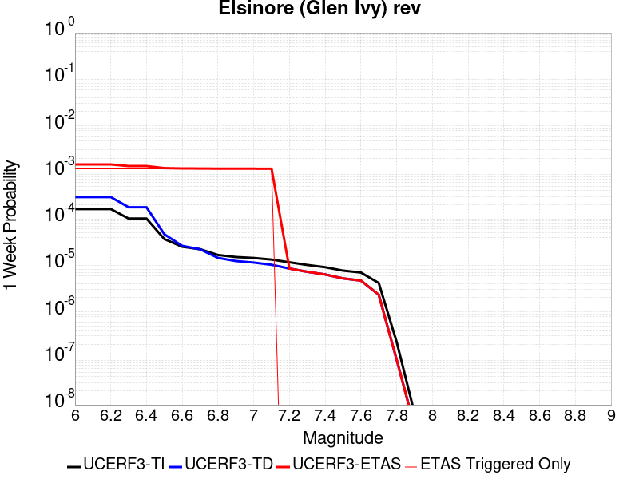 | 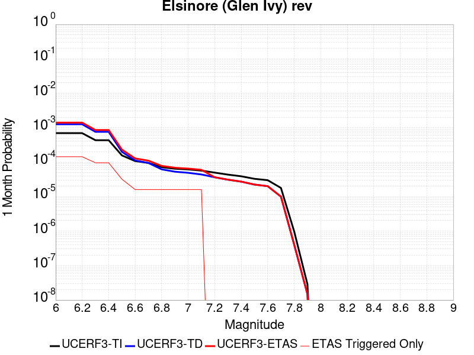 | 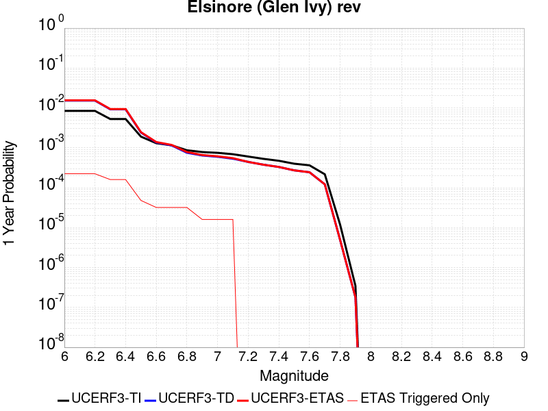 | 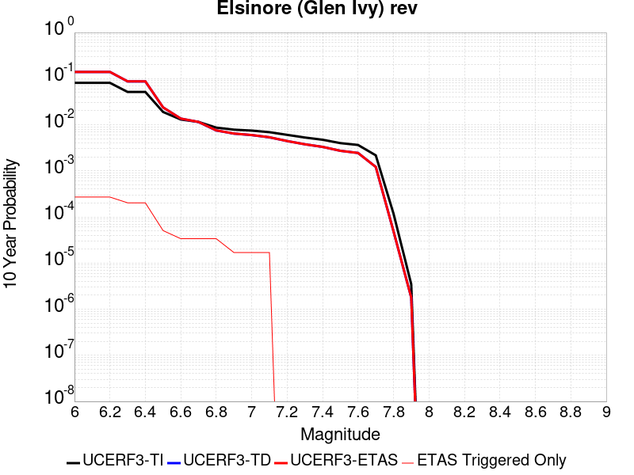 |

| Magnitude | 1 wk TI Prob | 1 wk TD Prob | 1 wk ETAS Prob | 1 wk ETAS/TD Gain | 1 wk ETAS Triggered Only | 1 mo TI Prob | 1 mo TD Prob | 1 mo ETAS Prob | 1 mo ETAS/TD Gain | 1 mo ETAS Triggered Only | 1 yr TI Prob | 1 yr TD Prob | 1 yr ETAS Prob | 1 yr ETAS/TD Gain | 1 yr ETAS Triggered Only | 10 yr TI Prob | 10 yr TD Prob | 10 yr ETAS Prob | 10 yr ETAS/TD Gain | 10 yr ETAS Triggered Only |
|-----|-----|-----|-----|-----|-----|-----|-----|-----|-----|-----|-----|-----|-----|-----|-----|-----|-----|-----|-----|-----|
| 6.0 | 1.6204086E-4 | 2.9360707E-4 | 4.4126328E-4 | 1.5029042 | 1.4769958E-4 | 6.94276E-4 | 0.0012578638 | 0.0014545489 | 1.1563643 | 1.9693277E-4 | 0.008420097 | 0.015234485 | 0.015476901 | 1.0159123 | 2.4616596E-4 | 0.081081145 | 0.13969168 | 0.13992463 | 1.0016676 | 2.7078256E-4 |
| 6.1 | 1.6204086E-4 | 2.9360707E-4 | 4.4126328E-4 | 1.5029042 | 1.4769958E-4 | 6.94276E-4 | 0.0012578638 | 0.0014545489 | 1.1563643 | 1.9693277E-4 | 0.008420097 | 0.015234485 | 0.015476901 | 1.0159123 | 2.4616596E-4 | 0.081081145 | 0.13969168 | 0.13992463 | 1.0016676 | 2.7078256E-4 |
| 6.2 | 1.6204086E-4 | 2.9360707E-4 | 4.4126328E-4 | 1.5029042 | 1.4769958E-4 | 6.94276E-4 | 0.0012578638 | 0.0014545489 | 1.1563643 | 1.9693277E-4 | 0.008420097 | 0.015234485 | 0.015476901 | 1.0159123 | 2.4616596E-4 | 0.081081145 | 0.13969168 | 0.13992463 | 1.0016676 | 2.7078256E-4 |
| 6.3 | 1.0111737E-4 | 1.7703383E-4 | 2.5087054E-4 | 1.417077 | 7.384979E-5 | 4.332882E-4 | 7.5861247E-4 | 8.8160206E-4 | 1.1621244 | 1.2308298E-4 | 0.005262531 | 0.009217682 | 0.0093884105 | 1.0185218 | 1.7231617E-4 | 0.0513964 | 0.0870191 | 0.08717642 | 1.0018079 | 1.7231617E-4 |
| 6.4 | 1.0111737E-4 | 1.7703383E-4 | 2.5087054E-4 | 1.417077 | 7.384979E-5 | 4.332882E-4 | 7.5861247E-4 | 8.8160206E-4 | 1.1621244 | 1.2308298E-4 | 0.005262531 | 0.009217682 | 0.0093884105 | 1.0185218 | 1.7231617E-4 | 0.0513964 | 0.0870191 | 0.08717642 | 1.0018079 | 1.7231617E-4 |
| 6.5 | 3.6624708E-5 | 4.6391084E-5 | 7.1006536E-5 | 1.5306075 | 2.4616596E-5 | 1.569536E-4 | 1.9880582E-4 | 2.4802922E-4 | 1.2475954 | 4.9233193E-5 | 0.001909235 | 0.0024181372 | 0.0024672511 | 1.0203108 | 4.9233193E-5 | 0.01892915 | 0.023739954 | 0.02378802 | 1.0020247 | 4.9233193E-5 |
| 6.6 | 2.5051324E-5 | 2.614772E-5 | 5.0763672E-5 | 1.9414188 | 2.4616596E-5 | 1.073584E-4 | 1.12057096E-4 | 1.3667093E-4 | 1.2196544 | 2.4616596E-5 | 0.0013063047 | 0.0013634858 | 0.0013880689 | 1.0180296 | 2.4616596E-5 | 0.012986525 | 0.013564618 | 0.013588901 | 1.0017902 | 2.4616596E-5 |
| 6.7 | 2.2189772E-5 | 2.2072849E-5 | 4.6688903E-5 | 2.1152186 | 2.4616596E-5 | 9.509556E-5 | 9.4594696E-5 | 1.1920897E-4 | 1.2602077 | 2.4616596E-5 | 0.0011571734 | 0.0011511183 | 0.0011757066 | 1.0213603 | 2.4616596E-5 | 0.011511663 | 0.011465415 | 0.01148975 | 1.0021224 | 2.4616596E-5 |
| 6.8 | 1.6654378E-5 | 1.4437705E-5 | 3.9053946E-5 | 2.7049968 | 2.4616596E-5 | 7.137396E-5 | 6.187444E-5 | 8.648951E-5 | 1.397823 | 2.4616596E-5 | 8.686314E-4 | 7.530661E-4 | 7.776641E-4 | 1.0326638 | 2.4616596E-5 | 0.008652439 | 0.00751048 | 0.007534912 | 1.003253 | 2.4616596E-5 |
| 6.9 | 1.5042909E-5 | 1.2332022E-5 | 3.6948317E-5 | 2.9961278 | 2.4616596E-5 | 6.446802E-5 | 5.285047E-5 | 7.746577E-5 | 1.4657536 | 2.4616596E-5 | 7.8461546E-4 | 6.4326765E-4 | 6.678684E-4 | 1.0382434 | 2.4616596E-5 | 0.007818509 | 0.00641828 | 0.0064427387 | 1.0038108 | 2.4616596E-5 |
| 7.0 | 1.4361385E-5 | 1.1451324E-5 | 3.606764E-5 | 3.149648 | 2.4616596E-5 | 6.154734E-5 | 4.9076196E-5 | 7.369158E-5 | 1.5015749 | 2.4616596E-5 | 7.490812E-4 | 5.973418E-4 | 6.219437E-4 | 1.0411856 | 2.4616596E-5 | 0.007465612 | 0.0059613534 | 0.005985823 | 1.0041047 | 2.4616596E-5 |
| 7.1 | 1.3265571E-5 | 1.0244926E-5 | 3.486127E-5 | 3.402784 | 2.4616596E-5 | 5.6851208E-5 | 4.39061E-5 | 6.8521615E-5 | 1.56064 | 2.4616596E-5 | 6.919436E-4 | 5.344282E-4 | 5.590316E-4 | 1.046037 | 2.4616596E-5 | 0.006897931 | 0.0053347866 | 0.005359272 | 1.0045898 | 2.4616596E-5 |
| 7.2 | 1.1596403E-5 | 8.505067E-6 | 8.505067E-6 | 1.0 | 0.0 | 4.9697923E-5 | 3.6449786E-5 | 3.6449786E-5 | 1.0 | 0.0 | 6.049042E-4 | 4.436875E-4 | 4.436875E-4 | 1.0 | 0.0 | 0.006032603 | 0.0044294316 | 0.0044294316 | 1.0 | 0.0 |
| 7.3 | 1.0150827E-5 | 7.2387597E-6 | 7.2387597E-6 | 1.0 | 0.0 | 4.3502816E-5 | 3.1022897E-5 | 3.1022897E-5 | 1.0 | 0.0 | 5.2951806E-4 | 3.7763975E-4 | 3.7763975E-4 | 1.0 | 0.0 | 0.005282581 | 0.0037703665 | 0.0037703665 | 1.0 | 0.0 |
| 7.4 | 9.080705E-6 | 6.352519E-6 | 6.352519E-6 | 1.0 | 0.0 | 3.8916725E-5 | 2.7224805E-5 | 2.7224805E-5 | 1.0 | 0.0 | 4.7370812E-4 | 3.3141294E-4 | 3.3141294E-4 | 1.0 | 0.0 | 0.004726996 | 0.0033093381 | 0.0033093381 | 1.0 | 0.0 |
| 7.5 | 7.671649E-6 | 5.2256332E-6 | 5.2256332E-6 | 1.0 | 0.0 | 3.287808E-5 | 2.2395385E-5 | 2.2395385E-5 | 1.0 | 0.0 | 4.0021708E-4 | 2.7263095E-4 | 2.7263095E-4 | 1.0 | 0.0 | 0.0039949706 | 0.00272309 | 0.00272309 | 1.0 | 0.0 |
| 7.6 | 6.990086E-6 | 4.687545E-6 | 4.687545E-6 | 1.0 | 0.0 | 2.9957167E-5 | 2.008933E-5 | 2.008933E-5 | 1.0 | 0.0 | 3.6466747E-4 | 2.445613E-4 | 2.445613E-4 | 1.0 | 0.0 | 0.0036406964 | 0.002443038 | 0.002443038 | 1.0 | 0.0 |
| 7.7 | 4.163505E-6 | 2.3295343E-6 | 2.3295343E-6 | 1.0 | 0.0 | 1.7843471E-5 | 9.983683E-6 | 9.983683E-6 | 1.0 | 0.0 | 2.172226E-4 | 1.21545316E-4 | 1.21545316E-4 | 1.0 | 0.0 | 0.0021701038 | 0.0012148614 | 0.0012148614 | 1.0 | 0.0 |
| 7.8 | 2.2692414E-7 | 9.3854695E-8 | 9.3854695E-8 | 1.0 | 0.0 | 9.725317E-7 | 4.0223435E-7 | 4.0223435E-7 | 1.0 | 0.0 | 1.1840509E-5 | 4.8971956E-6 | 4.8971956E-6 | 1.0 | 0.0 | 1.1839878E-4 | 4.8971204E-5 | 4.8971204E-5 | 1.0 | 0.0 |
| 7.9 | 6.676829E-9 | 3.439853E-9 | 3.439853E-9 | 1.0 | 0.0 | 2.861498E-8 | 1.4742227E-8 | 1.4742227E-8 | 1.0 | 0.0 | 3.4838732E-7 | 1.7948659E-7 | 1.7948659E-7 | 1.0 | 0.0 | 3.4838679E-6 | 1.7948646E-6 | 1.7948646E-6 | 1.0 | 0.0 |

## Cady
*[(top)](#table-of-contents)*

| 1 Week | 1 Month | 1 Year | 10 Year |
|-----|-----|-----|-----|
| 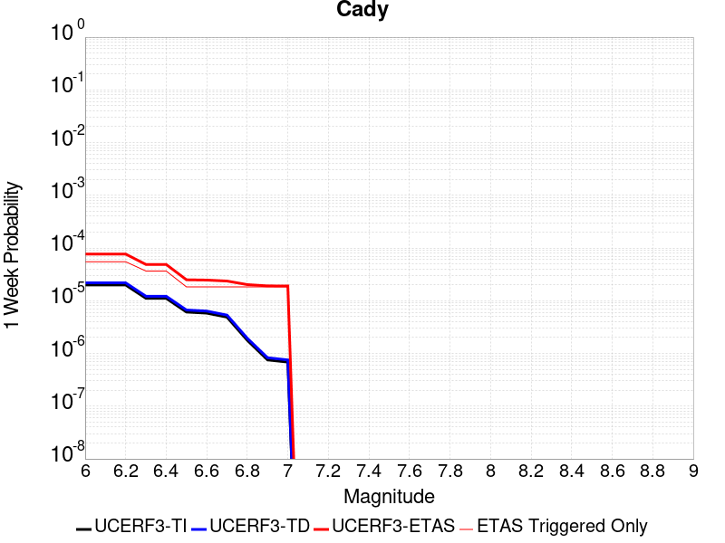 | 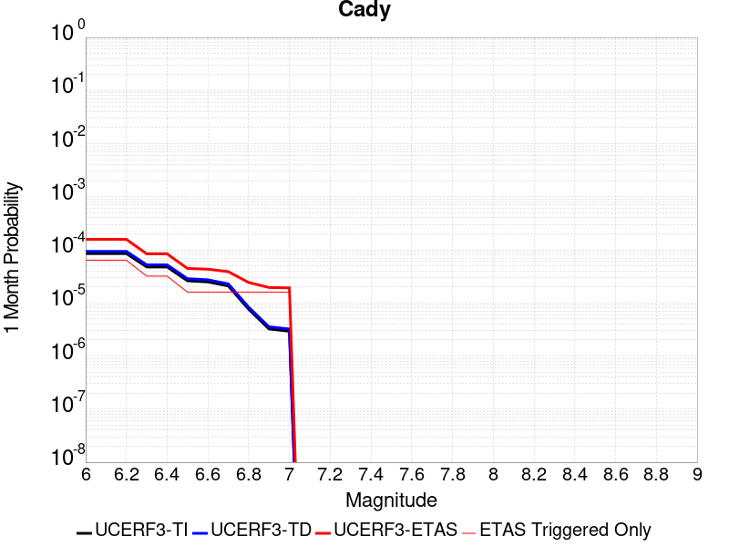 | 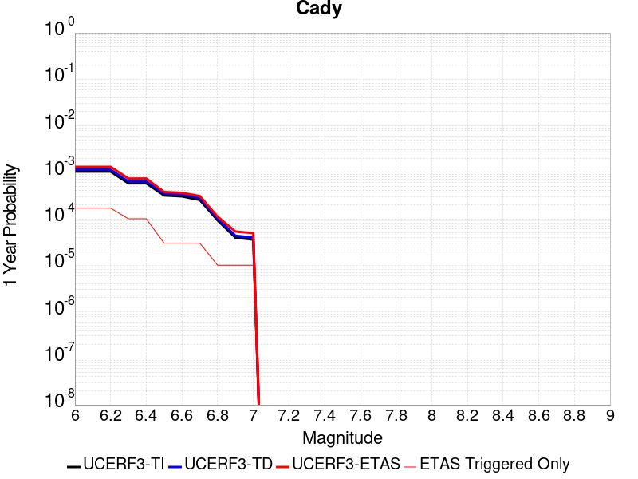 | 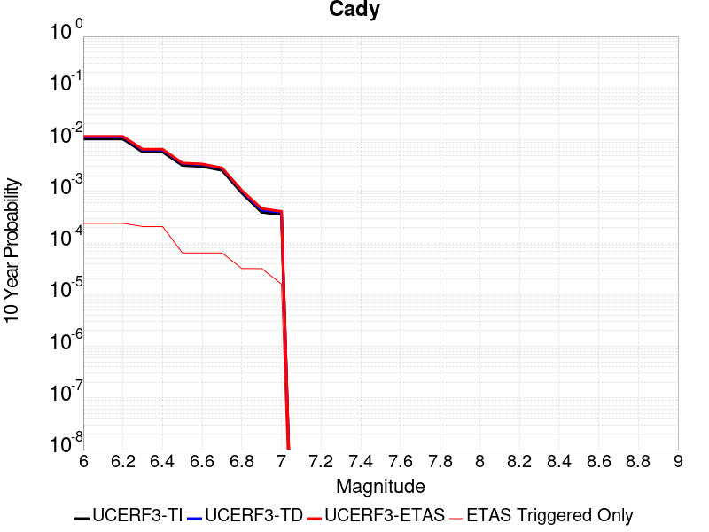 |

| Magnitude | 1 wk TI Prob | 1 wk TD Prob | 1 wk ETAS Prob | 1 wk ETAS/TD Gain | 1 wk ETAS Triggered Only | 1 mo TI Prob | 1 mo TD Prob | 1 mo ETAS Prob | 1 mo ETAS/TD Gain | 1 mo ETAS Triggered Only | 1 yr TI Prob | 1 yr TD Prob | 1 yr ETAS Prob | 1 yr ETAS/TD Gain | 1 yr ETAS Triggered Only | 10 yr TI Prob | 10 yr TD Prob | 10 yr ETAS Prob | 10 yr ETAS/TD Gain | 10 yr ETAS Triggered Only |
|-----|-----|-----|-----|-----|-----|-----|-----|-----|-----|-----|-----|-----|-----|-----|-----|-----|-----|-----|-----|-----|
| 6.0 | 1.9892565E-5 | 2.1858728E-5 | 9.5706906E-5 | 4.3784294 | 7.384979E-5 | 8.525106E-5 | 9.3677416E-5 | 1.675203E-4 | 1.7882676 | 7.384979E-5 | 0.0010374374 | 0.0011400167 | 0.0013121364 | 1.15098 | 1.7231617E-4 | 0.010326075 | 0.011350701 | 0.011594072 | 1.0214411 | 2.4616596E-4 |
| 6.1 | 1.9892565E-5 | 2.1858728E-5 | 9.5706906E-5 | 4.3784294 | 7.384979E-5 | 8.525106E-5 | 9.3677416E-5 | 1.675203E-4 | 1.7882676 | 7.384979E-5 | 0.0010374374 | 0.0011400167 | 0.0013121364 | 1.15098 | 1.7231617E-4 | 0.010326075 | 0.011350701 | 0.011594072 | 1.0214411 | 2.4616596E-4 |
| 6.2 | 1.9892565E-5 | 2.1858728E-5 | 9.5706906E-5 | 4.3784294 | 7.384979E-5 | 8.525106E-5 | 9.3677416E-5 | 1.675203E-4 | 1.7882676 | 7.384979E-5 | 0.0010374374 | 0.0011400167 | 0.0013121364 | 1.15098 | 1.7231617E-4 | 0.010326075 | 0.011350701 | 0.011594072 | 1.0214411 | 2.4616596E-4 |
| 6.3 | 1.1117327E-5 | 1.2176583E-5 | 6.140918E-5 | 5.043219 | 4.9233193E-5 | 4.764482E-5 | 5.2184492E-5 | 1.0141511E-4 | 1.9433956 | 4.9233193E-5 | 5.7992124E-4 | 6.351925E-4 | 7.581973E-4 | 1.1936496 | 1.2308298E-4 | 0.0057841022 | 0.0063368753 | 0.006557021 | 1.0347403 | 2.2154937E-4 |
| 6.4 | 1.1117327E-5 | 1.2176583E-5 | 6.140918E-5 | 5.043219 | 4.9233193E-5 | 4.764482E-5 | 5.2184492E-5 | 1.0141511E-4 | 1.9433956 | 4.9233193E-5 | 5.7992124E-4 | 6.351925E-4 | 7.581973E-4 | 1.1936496 | 1.2308298E-4 | 0.0057841022 | 0.0063368753 | 0.006557021 | 1.0347403 | 2.2154937E-4 |
| 6.5 | 6.103093E-6 | 6.672021E-6 | 3.128845E-5 | 4.689502 | 2.4616596E-5 | 2.615585E-5 | 2.8594131E-5 | 5.3210024E-5 | 1.8608721 | 2.4616596E-5 | 3.1840094E-4 | 3.480905E-4 | 3.9730655E-4 | 1.1413887 | 4.9233193E-5 | 0.0031794512 | 0.0034766865 | 0.0035257486 | 1.0141118 | 4.9233193E-5 |
| 6.6 | 5.817237E-6 | 6.3656585E-6 | 3.0982097E-5 | 4.867069 | 2.4616596E-5 | 2.4930776E-5 | 2.728118E-5 | 5.1897103E-5 | 1.9023043 | 2.4616596E-5 | 3.034899E-4 | 3.3211018E-4 | 3.81327E-4 | 1.1481943 | 4.9233193E-5 | 0.0030307577 | 0.0033173605 | 0.0033664305 | 1.0147918 | 4.9233193E-5 |
| 6.7 | 4.8846314E-6 | 5.3405684E-6 | 2.9957033E-5 | 5.6093345 | 2.4616596E-5 | 2.0933967E-5 | 2.2888014E-5 | 4.7504047E-5 | 2.0754988 | 2.4616596E-5 | 2.5484123E-4 | 2.7863772E-4 | 3.278572E-4 | 1.1766433 | 4.9233193E-5 | 0.0025454918 | 0.0027840391 | 0.0028331352 | 1.0176349 | 4.9233193E-5 |
| 6.8 | 1.7788773E-6 | 1.9399079E-6 | 2.6556456E-5 | 13.689545 | 2.4616596E-5 | 7.6237375E-6 | 8.313874E-6 | 3.2930264E-5 | 3.9608812 | 2.4616596E-5 | 9.281505E-5 | 1.01218284E-4 | 1.2583239E-4 | 1.2431785 | 2.4616596E-5 | 9.2776294E-4 | 0.0010118765 | 0.0010364682 | 1.0243031 | 2.4616596E-5 |
| 6.9 | 7.5455404E-7 | 8.297092E-7 | 2.5446285E-5 | 30.66892 | 2.4616596E-5 | 3.233799E-6 | 3.5558937E-6 | 2.8172402E-5 | 7.9227347 | 2.4616596E-5 | 3.937079E-5 | 4.3292483E-5 | 6.790801E-5 | 1.5685867 | 2.4616596E-5 | 3.9363815E-4 | 4.3287344E-4 | 4.5747936E-4 | 1.0568433 | 2.4616596E-5 |
| 7.0 | 6.8578805E-7 | 7.541816E-7 | 2.537076E-5 | 33.64012 | 2.4616596E-5 | 2.9390883E-6 | 3.2322048E-6 | 2.7848722E-5 | 8.6160145 | 2.4616596E-5 | 3.578281E-5 | 3.9351715E-5 | 6.396734E-5 | 1.6255287 | 2.4616596E-5 | 3.577705E-4 | 3.9347992E-4 | 4.1808683E-4 | 1.0625366 | 2.4616596E-5 |

## Kern Canyon (South Kern) 2011
*[(top)](#table-of-contents)*

| 1 Week | 1 Month | 1 Year | 10 Year |
|-----|-----|-----|-----|
| 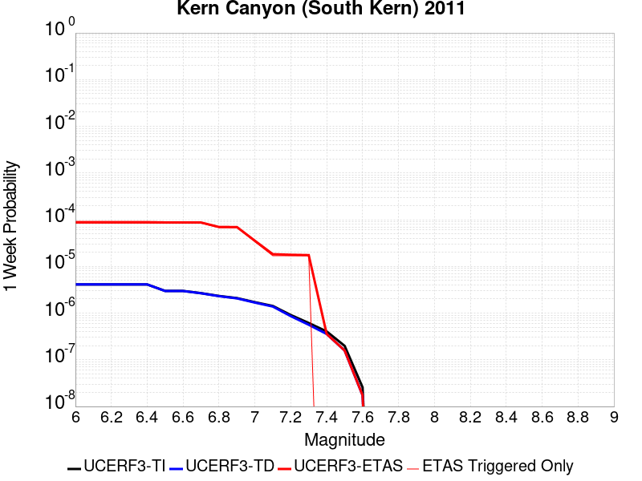 | 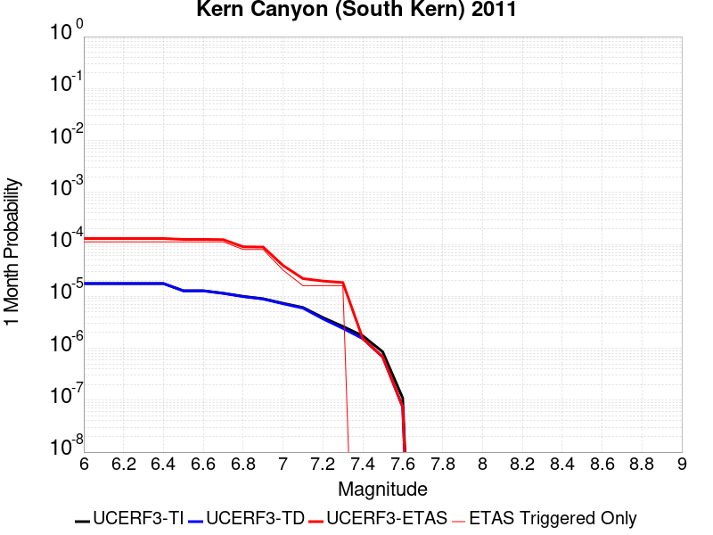 | 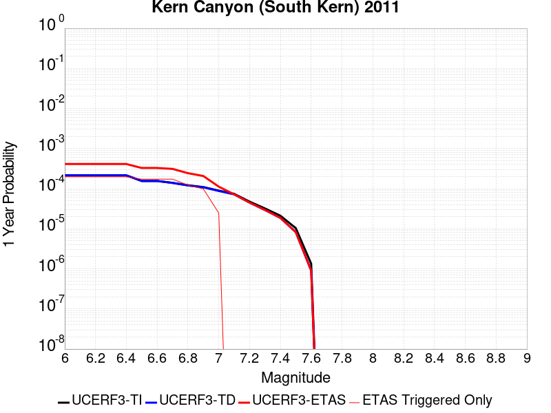 | 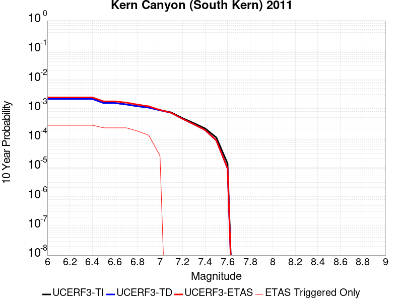 |

| Magnitude | 1 wk TI Prob | 1 wk TD Prob | 1 wk ETAS Prob | 1 wk ETAS/TD Gain | 1 wk ETAS Triggered Only | 1 mo TI Prob | 1 mo TD Prob | 1 mo ETAS Prob | 1 mo ETAS/TD Gain | 1 mo ETAS Triggered Only | 1 yr TI Prob | 1 yr TD Prob | 1 yr ETAS Prob | 1 yr ETAS/TD Gain | 1 yr ETAS Triggered Only | 10 yr TI Prob | 10 yr TD Prob | 10 yr ETAS Prob | 10 yr ETAS/TD Gain | 10 yr ETAS Triggered Only |
|-----|-----|-----|-----|-----|-----|-----|-----|-----|-----|-----|-----|-----|-----|-----|-----|-----|-----|-----|-----|-----|
| 6.0 | 4.105075E-6 | 4.1137264E-6 | 1.0257971E-4 | 24.935957 | 9.8466386E-5 | 1.7593058E-5 | 1.763014E-5 | 1.6532712E-4 | 9.377527 | 1.4769958E-4 | 2.1417443E-4 | 2.1462646E-4 | 4.1151696E-4 | 1.9173636 | 1.9693277E-4 | 0.0021396813 | 0.0021442557 | 0.0024144577 | 1.126012 | 2.7078256E-4 |
| 6.1 | 4.105075E-6 | 4.1137264E-6 | 1.0257971E-4 | 24.935957 | 9.8466386E-5 | 1.7593058E-5 | 1.763014E-5 | 1.6532712E-4 | 9.377527 | 1.4769958E-4 | 2.1417443E-4 | 2.1462646E-4 | 4.1151696E-4 | 1.9173636 | 1.9693277E-4 | 0.0021396813 | 0.0021442557 | 0.0024144577 | 1.126012 | 2.7078256E-4 |
| 6.2 | 4.105075E-6 | 4.1137264E-6 | 1.0257971E-4 | 24.935957 | 9.8466386E-5 | 1.7593058E-5 | 1.763014E-5 | 1.6532712E-4 | 9.377527 | 1.4769958E-4 | 2.1417443E-4 | 2.1462646E-4 | 4.1151696E-4 | 1.9173636 | 1.9693277E-4 | 0.0021396813 | 0.0021442557 | 0.0024144577 | 1.126012 | 2.7078256E-4 |
| 6.3 | 4.105075E-6 | 4.1137264E-6 | 1.0257971E-4 | 24.935957 | 9.8466386E-5 | 1.7593058E-5 | 1.763014E-5 | 1.6532712E-4 | 9.377527 | 1.4769958E-4 | 2.1417443E-4 | 2.1462646E-4 | 4.1151696E-4 | 1.9173636 | 1.9693277E-4 | 0.0021396813 | 0.0021442557 | 0.0024144577 | 1.126012 | 2.7078256E-4 |
| 6.4 | 4.105075E-6 | 4.1137264E-6 | 1.0257971E-4 | 24.935957 | 9.8466386E-5 | 1.7593058E-5 | 1.763014E-5 | 1.6532712E-4 | 9.377527 | 1.4769958E-4 | 2.1417443E-4 | 2.1462646E-4 | 4.1151696E-4 | 1.9173636 | 1.9693277E-4 | 0.0021396813 | 0.0021442557 | 0.0024144577 | 1.126012 | 2.7078256E-4 |
| 6.5 | 2.9849807E-6 | 2.9731548E-6 | 1.0143925E-4 | 34.11839 | 9.8466386E-5 | 1.2792712E-5 | 1.274203E-5 | 1.6043973E-4 | 12.591378 | 1.4769958E-4 | 1.5574014E-4 | 1.5512333E-4 | 3.2741277E-4 | 2.110661 | 1.7231617E-4 | 0.0015563103 | 0.0015501656 | 0.0017713716 | 1.1426983 | 2.2154937E-4 |
| 6.6 | 2.9849807E-6 | 2.9731548E-6 | 1.0143925E-4 | 34.11839 | 9.8466386E-5 | 1.2792712E-5 | 1.274203E-5 | 1.6043973E-4 | 12.591378 | 1.4769958E-4 | 1.5574014E-4 | 1.5512333E-4 | 3.2741277E-4 | 2.110661 | 1.7231617E-4 | 0.0015563103 | 0.0015501656 | 0.0017713716 | 1.1426983 | 2.2154937E-4 |
| 6.7 | 2.6756725E-6 | 2.6582206E-6 | 1.01124344E-4 | 38.042118 | 9.8466386E-5 | 1.1467117E-5 | 1.1392325E-5 | 1.5909022E-4 | 13.964684 | 1.4769958E-4 | 1.396032E-4 | 1.3869285E-4 | 3.109851E-4 | 2.2422578 | 1.7231617E-4 | 0.0013951553 | 0.0013860738 | 0.0016073161 | 1.159618 | 2.2154937E-4 |
| 6.8 | 2.3283721E-6 | 2.3047787E-6 | 7.61544E-5 | 33.041954 | 7.384979E-5 | 9.9787E-6 | 9.877586E-6 | 1.08343E-4 | 10.96857 | 9.8466386E-5 | 1.214839E-4 | 1.20253055E-4 | 2.4332124E-4 | 2.02341 | 1.2308298E-4 | 0.001214175 | 0.0012018873 | 0.0013739964 | 1.143199 | 1.7231617E-4 |
| 6.9 | 2.0972677E-6 | 2.0696411E-6 | 7.591928E-5 | 36.68234 | 7.384979E-5 | 8.988259E-6 | 8.869861E-6 | 1.0733537E-4 | 12.101134 | 9.8466386E-5 | 1.0942656E-4 | 1.0798526E-4 | 2.0644101E-4 | 1.9117517 | 9.8466386E-5 | 0.0010937268 | 0.0010793337 | 0.0012022839 | 1.1139129 | 1.2308298E-4 |
| 7.0 | 1.7132242E-6 | 1.6787036E-6 | 2.6295258E-5 | 15.664027 | 2.4616596E-5 | 7.3423685E-6 | 7.194424E-6 | 3.1810843E-5 | 4.421597 | 2.4616596E-5 | 8.938967E-5 | 8.758863E-5 | 1.1220307E-4 | 1.2810233 | 2.4616596E-5 | 8.935372E-4 | 8.7554497E-4 | 9.0014E-4 | 1.0280911 | 2.4616596E-5 |
| 7.1 | 1.4215541E-6 | 1.3815752E-6 | 1.3815752E-6 | 1.0 | 0.0 | 6.0923603E-6 | 5.9210233E-6 | 5.9210233E-6 | 1.0 | 0.0 | 7.417196E-5 | 7.20861E-5 | 7.20861E-5 | 1.0 | 0.0 | 7.414721E-4 | 7.206299E-4 | 7.206299E-4 | 1.0 | 0.0 |
| 7.2 | 9.097853E-7 | 8.6037755E-7 | 8.6037755E-7 | 1.0 | 0.0 | 3.899074E-6 | 3.6873273E-6 | 3.6873273E-6 | 1.0 | 0.0 | 4.7470192E-5 | 4.4892295E-5 | 4.4892295E-5 | 1.0 | 0.0 | 4.7460053E-4 | 4.4883334E-4 | 4.4883334E-4 | 1.0 | 0.0 |
| 7.3 | 6.144169E-7 | 5.628206E-7 | 5.628206E-7 | 1.0 | 0.0 | 2.6332125E-6 | 2.4120861E-6 | 2.4120861E-6 | 1.0 | 0.0 | 3.205889E-5 | 2.9366758E-5 | 2.9366758E-5 | 1.0 | 0.0 | 3.2054266E-4 | 2.936293E-4 | 2.936293E-4 | 1.0 | 0.0 |
| 7.4 | 4.049844E-7 | 3.5728314E-7 | 3.5728314E-7 | 1.0 | 0.0 | 1.7356463E-6 | 1.5312125E-6 | 1.5312125E-6 | 1.0 | 0.0 | 2.1131287E-5 | 1.8642357E-5 | 1.8642357E-5 | 1.0 | 0.0 | 2.1129279E-4 | 1.8640817E-4 | 1.8640817E-4 | 1.0 | 0.0 |
| 7.5 | 1.9871162E-7 | 1.583044E-7 | 1.583044E-7 | 1.0 | 0.0 | 8.5162094E-7 | 6.7844724E-7 | 6.7844724E-7 | 1.0 | 0.0 | 1.0368436E-5 | 8.260065E-6 | 8.260065E-6 | 1.0 | 0.0 | 1.0367952E-4 | 8.259767E-5 | 8.259767E-5 | 1.0 | 0.0 |
| 7.6 | 2.572245E-8 | 1.7352555E-8 | 1.7352555E-8 | 1.0 | 0.0 | 1.10239064E-7 | 7.436809E-8 | 7.436809E-8 | 1.0 | 0.0 | 1.3421597E-6 | 9.054312E-7 | 9.054312E-7 | 1.0 | 0.0 | 1.3421517E-5 | 9.05428E-6 | 9.05428E-6 | 1.0 | 0.0 |

## Manix-Afton Hills
*[(top)](#table-of-contents)*

| 1 Week | 1 Month | 1 Year | 10 Year |
|-----|-----|-----|-----|
| 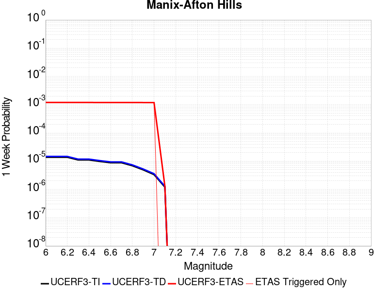 | 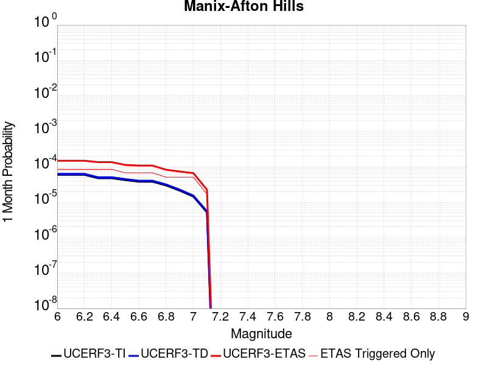 |  | 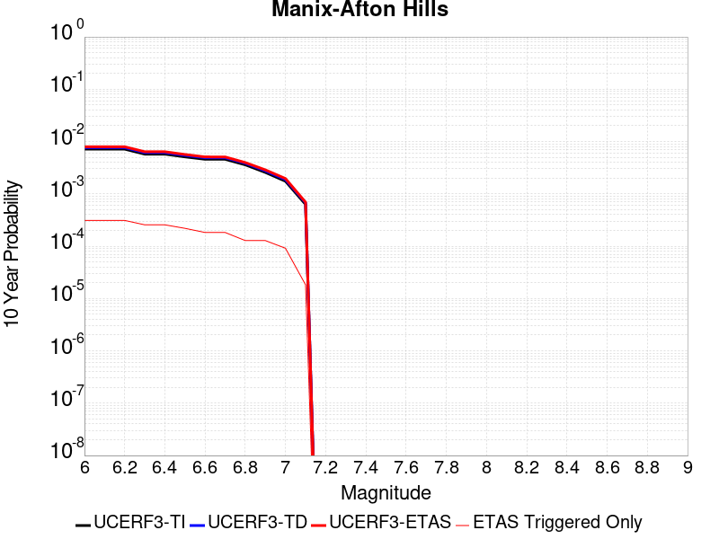 |

| Magnitude | 1 wk TI Prob | 1 wk TD Prob | 1 wk ETAS Prob | 1 wk ETAS/TD Gain | 1 wk ETAS Triggered Only | 1 mo TI Prob | 1 mo TD Prob | 1 mo ETAS Prob | 1 mo ETAS/TD Gain | 1 mo ETAS Triggered Only | 1 yr TI Prob | 1 yr TD Prob | 1 yr ETAS Prob | 1 yr ETAS/TD Gain | 1 yr ETAS Triggered Only | 10 yr TI Prob | 10 yr TD Prob | 10 yr ETAS Prob | 10 yr ETAS/TD Gain | 10 yr ETAS Triggered Only |
|-----|-----|-----|-----|-----|-----|-----|-----|-----|-----|-----|-----|-----|-----|-----|-----|-----|-----|-----|-----|-----|
| 6.0 | 1.3783202E-5 | 1.47110895E-5 | 1.1317603E-4 | 7.6932454 | 9.8466386E-5 | 5.906953E-5 | 6.30461E-5 | 1.6150628E-4 | 2.561717 | 9.8466386E-5 | 7.189342E-4 | 7.6733343E-4 | 9.395174E-4 | 1.2243927 | 1.7231617E-4 | 0.0071661277 | 0.007648596 | 0.007917307 | 1.0351322 | 2.7078256E-4 |
| 6.1 | 1.3783202E-5 | 1.47110895E-5 | 1.1317603E-4 | 7.6932454 | 9.8466386E-5 | 5.906953E-5 | 6.30461E-5 | 1.6150628E-4 | 2.561717 | 9.8466386E-5 | 7.189342E-4 | 7.6733343E-4 | 9.395174E-4 | 1.2243927 | 1.7231617E-4 | 0.0071661277 | 0.007648596 | 0.007917307 | 1.0351322 | 2.7078256E-4 |
| 6.2 | 1.3783202E-5 | 1.47110895E-5 | 1.1317603E-4 | 7.6932454 | 9.8466386E-5 | 5.906953E-5 | 6.30461E-5 | 1.6150628E-4 | 2.561717 | 9.8466386E-5 | 7.189342E-4 | 7.6733343E-4 | 9.395174E-4 | 1.2243927 | 1.7231617E-4 | 0.0071661277 | 0.007648596 | 0.007917307 | 1.0351322 | 2.7078256E-4 |
| 6.3 | 1.10494875E-5 | 1.1793136E-5 | 1.1025836E-4 | 9.349368 | 9.8466386E-5 | 4.7354086E-5 | 5.054109E-5 | 1.490025E-4 | 2.9481459 | 9.8466386E-5 | 5.763835E-4 | 6.151744E-4 | 7.873846E-4 | 1.2799371 | 1.7231617E-4 | 0.005748908 | 0.0061357557 | 0.0063559455 | 1.0358864 | 2.2154937E-4 |
| 6.4 | 1.10494875E-5 | 1.1793136E-5 | 1.1025836E-4 | 9.349368 | 9.8466386E-5 | 4.7354086E-5 | 5.054109E-5 | 1.490025E-4 | 2.9481459 | 9.8466386E-5 | 5.763835E-4 | 6.151744E-4 | 7.873846E-4 | 1.2799371 | 1.7231617E-4 | 0.005748908 | 0.0061357557 | 0.0063559455 | 1.0358864 | 2.2154937E-4 |
| 6.5 | 9.788949E-6 | 1.045432E-5 | 1.08919674E-4 | 10.418629 | 9.8466386E-5 | 4.1951964E-5 | 4.480351E-5 | 1.4326548E-4 | 3.1976397 | 9.8466386E-5 | 5.1064545E-4 | 5.453555E-4 | 7.175777E-4 | 1.315798 | 1.7231617E-4 | 0.0050947363 | 0.0054410985 | 0.00563696 | 1.0359967 | 1.9693277E-4 |
| 6.6 | 8.810006E-6 | 9.4136285E-6 | 1.0787909E-4 | 11.459884 | 9.8466386E-5 | 3.775662E-5 | 4.0343548E-5 | 1.3880596E-4 | 3.4405987 | 9.8466386E-5 | 4.5958988E-4 | 4.9108086E-4 | 6.387079E-4 | 1.3006166 | 1.4769958E-4 | 0.0045864056 | 0.004900839 | 0.005047815 | 1.02999 | 1.4769958E-4 |
| 6.7 | 8.80128E-6 | 9.404108E-6 | 1.0786957E-4 | 11.470473 | 9.8466386E-5 | 3.7719226E-5 | 4.0302748E-5 | 1.3876517E-4 | 3.4430697 | 9.8466386E-5 | 4.591348E-4 | 4.9058435E-4 | 6.382115E-4 | 1.300921 | 1.4769958E-4 | 0.004581874 | 0.0048958957 | 0.0050428724 | 1.0300204 | 1.4769958E-4 |
| 6.8 | 6.8994877E-6 | 7.380076E-6 | 8.122932E-5 | 11.00657 | 7.384979E-5 | 2.9568899E-5 | 3.162856E-5 | 1.05476014E-4 | 3.3348346 | 7.384979E-5 | 3.5994186E-4 | 3.8501783E-4 | 4.588392E-4 | 1.1917349 | 7.384979E-5 | 0.003593594 | 0.0038443129 | 0.003917879 | 1.0191363 | 7.384979E-5 |
| 6.9 | 4.9328037E-6 | 5.2709615E-6 | 7.9120364E-5 | 15.0106125 | 7.384979E-5 | 2.1140417E-5 | 2.2589675E-5 | 9.64378E-5 | 4.2691097 | 7.384979E-5 | 2.5735417E-4 | 2.7500073E-4 | 3.4883022E-4 | 1.2684702 | 7.384979E-5 | 0.0025705635 | 0.0027472095 | 0.0028208564 | 1.0268079 | 7.384979E-5 |
| 7.0 | 3.347973E-6 | 3.59003E-6 | 7.743955E-5 | 21.570726 | 7.384979E-5 | 1.4348378E-5 | 1.5385775E-5 | 8.9234425E-5 | 5.7998004 | 7.384979E-5 | 1.746775E-4 | 1.8730981E-4 | 2.6114576E-4 | 1.3941916 | 7.384979E-5 | 0.0017454025 | 0.0018719219 | 0.0019456336 | 1.0393775 | 7.384979E-5 |
| 7.1 | 1.2073567E-6 | 1.293482E-6 | 2.5910047E-5 | 20.031239 | 2.4616596E-5 | 5.1743755E-6 | 5.543492E-6 | 3.0159952E-5 | 5.440605 | 2.4616596E-5 | 6.29962E-5 | 6.749156E-5 | 9.210649E-5 | 1.3647113 | 2.4616596E-5 | 6.297835E-4 | 6.7487074E-4 | 6.9947075E-4 | 1.0364515 | 2.4616596E-5 |

## San Andreas (Coachella) rev
*[(top)](#table-of-contents)*

| 1 Week | 1 Month | 1 Year | 10 Year |
|-----|-----|-----|-----|
| 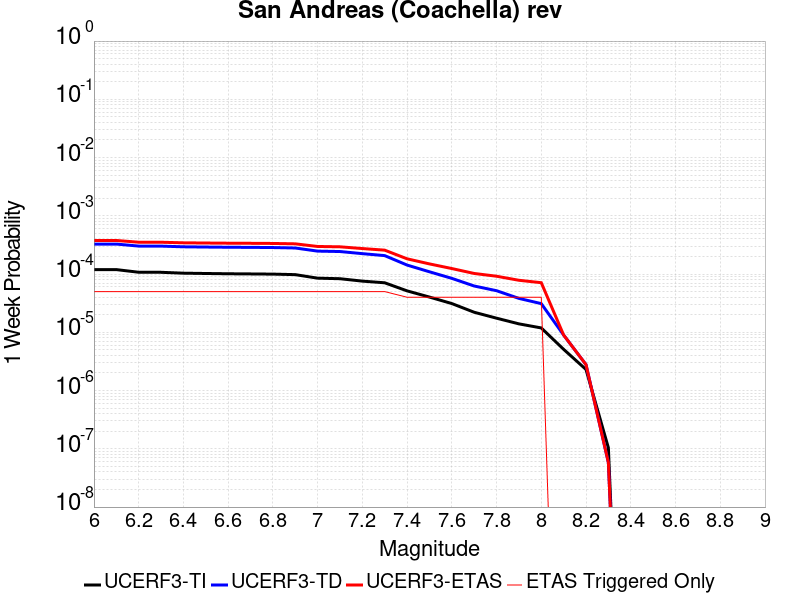 | 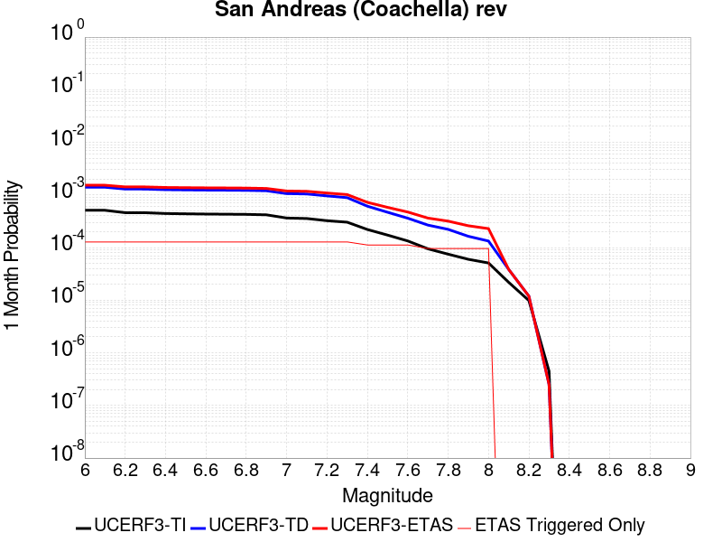 | 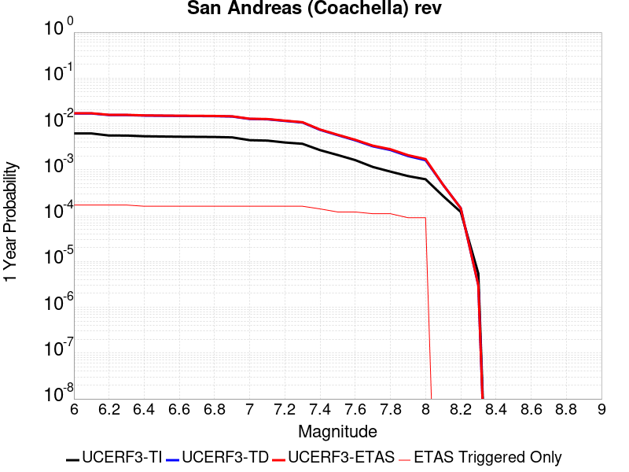 | 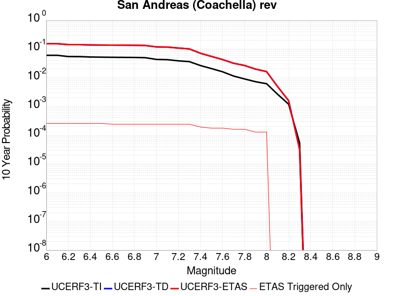 |

| Magnitude | 1 wk TI Prob | 1 wk TD Prob | 1 wk ETAS Prob | 1 wk ETAS/TD Gain | 1 wk ETAS Triggered Only | 1 mo TI Prob | 1 mo TD Prob | 1 mo ETAS Prob | 1 mo ETAS/TD Gain | 1 mo ETAS Triggered Only | 1 yr TI Prob | 1 yr TD Prob | 1 yr ETAS Prob | 1 yr ETAS/TD Gain | 1 yr ETAS Triggered Only | 10 yr TI Prob | 10 yr TD Prob | 10 yr ETAS Prob | 10 yr ETAS/TD Gain | 10 yr ETAS Triggered Only |
|-----|-----|-----|-----|-----|-----|-----|-----|-----|-----|-----|-----|-----|-----|-----|-----|-----|-----|-----|-----|-----|
| 6.0 | 1.1925945E-4 | 3.2729402E-4 | 4.503367E-4 | 1.3759394 | 1.2308298E-4 | 5.110118E-4 | 0.0014019393 | 0.001598596 | 1.1402748 | 1.9693277E-4 | 0.0062038354 | 0.016936364 | 0.01717836 | 1.0142885 | 2.4616596E-4 | 0.060334753 | 0.15265316 | 0.1528826 | 1.0015031 | 2.7078256E-4 |
| 6.1 | 1.1925945E-4 | 3.2729402E-4 | 4.503367E-4 | 1.3759394 | 1.2308298E-4 | 5.110118E-4 | 0.0014019393 | 0.001598596 | 1.1402748 | 1.9693277E-4 | 0.0062038354 | 0.016936364 | 0.01717836 | 1.0142885 | 2.4616596E-4 | 0.060334753 | 0.15265316 | 0.1528826 | 1.0015031 | 2.7078256E-4 |
| 6.2 | 1.07432395E-4 | 3.0230157E-4 | 4.2534733E-4 | 1.4070299 | 1.2308298E-4 | 4.603433E-4 | 0.0012949388 | 0.0014916166 | 1.1518819 | 1.9693277E-4 | 0.005590286 | 0.015653009 | 0.015895322 | 1.0154803 | 2.4616596E-4 | 0.05451731 | 0.14182423 | 0.14205661 | 1.0016385 | 2.7078256E-4 |
| 6.3 | 1.0718766E-4 | 3.0175463E-4 | 4.2480047E-4 | 1.4077679 | 1.2308298E-4 | 4.592948E-4 | 0.0012925972 | 0.0014892754 | 1.1521574 | 1.9693277E-4 | 0.005577586 | 0.015624908 | 0.015867228 | 1.0155085 | 2.4616596E-4 | 0.054396555 | 0.14159249 | 0.14182493 | 1.0016416 | 2.7078256E-4 |
| 6.4 | 1.0355944E-4 | 2.9383553E-4 | 4.1688234E-4 | 1.4187609 | 1.2308298E-4 | 4.4375064E-4 | 0.0012586913 | 0.0014553762 | 1.1562614 | 1.9693277E-4 | 0.0053892885 | 0.015217941 | 0.015460362 | 1.0159298 | 2.4616596E-4 | 0.052604496 | 0.13815255 | 0.13838592 | 1.0016892 | 2.7078256E-4 |
| 6.5 | 1.0227914E-4 | 2.9102986E-4 | 4.1407702E-4 | 1.4227991 | 1.2308298E-4 | 4.382655E-4 | 0.0012466786 | 0.0014433658 | 1.157769 | 1.9693277E-4 | 0.0053228354 | 0.01507372 | 0.015316175 | 1.0160847 | 2.4616596E-4 | 0.051971316 | 0.13693172 | 0.13716543 | 1.0017067 | 2.7078256E-4 |
| 6.6 | 1.0116757E-4 | 2.8868738E-4 | 4.1173483E-4 | 1.4262308 | 1.2308298E-4 | 4.3350324E-4 | 0.0012366489 | 0.0014333382 | 1.1590502 | 1.9693277E-4 | 0.0052651367 | 0.01495329 | 0.015195776 | 1.0162162 | 2.4616596E-4 | 0.051421247 | 0.1359099 | 0.13614388 | 1.0017216 | 2.7078256E-4 |
| 6.7 | 1.0050676E-4 | 2.8727303E-4 | 4.1032064E-4 | 1.42833 | 1.2308298E-4 | 4.3067214E-4 | 0.0012305931 | 0.0014272835 | 1.1598339 | 1.9693277E-4 | 0.005230834 | 0.014880571 | 0.015123073 | 1.0162966 | 2.4616596E-4 | 0.051094085 | 0.13529462 | 0.13552877 | 1.0017307 | 2.7078256E-4 |
| 6.8 | 9.976819E-5 | 2.853096E-4 | 4.0835745E-4 | 1.4312785 | 1.2308298E-4 | 4.2750788E-4 | 0.0012221863 | 0.0014188784 | 1.1609346 | 1.9693277E-4 | 0.0051924936 | 0.0147796115 | 0.015022139 | 1.0164096 | 2.4616596E-4 | 0.050728295 | 0.13444631 | 0.13468069 | 1.0017433 | 2.7078256E-4 |
| 6.9 | 9.77719E-5 | 2.8027873E-4 | 4.0332723E-4 | 1.4390218 | 1.2308298E-4 | 4.1895514E-4 | 0.0012006456 | 0.0013973418 | 1.1638255 | 1.9693277E-4 | 0.0050888555 | 0.014520878 | 0.014763469 | 1.0167063 | 2.4616596E-4 | 0.049738888 | 0.1322748 | 0.13250978 | 1.0017763 | 2.7078256E-4 |
| 7.0 | 8.500761E-5 | 2.4762485E-4 | 3.7067736E-4 | 1.4969312 | 1.2308298E-4 | 3.6426744E-4 | 0.001060821 | 0.0012575448 | 1.185445 | 1.9693277E-4 | 0.0044259406 | 0.012839786 | 0.013082791 | 1.0189259 | 2.4616596E-4 | 0.04338823 | 0.11813272 | 0.11837152 | 1.0020214 | 2.7078256E-4 |
| 7.1 | 8.319876E-5 | 2.4365232E-4 | 3.6670532E-4 | 1.5050352 | 1.2308298E-4 | 3.5651738E-4 | 0.0010438096 | 0.0012405368 | 1.1884704 | 1.9693277E-4 | 0.004331963 | 0.012635092 | 0.012878148 | 1.0192366 | 2.4616596E-4 | 0.042484846 | 0.116353 | 0.11659227 | 1.0020565 | 2.7078256E-4 |
| 7.2 | 7.563917E-5 | 2.2413683E-4 | 3.4719222E-4 | 1.5490191 | 1.2308298E-4 | 3.2412758E-4 | 9.602359E-4 | 0.0011569796 | 1.204891 | 1.9693277E-4 | 0.0039391145 | 0.011628893 | 0.011872197 | 1.0209223 | 2.4616596E-4 | 0.03870018 | 0.10775925 | 0.10800085 | 1.0022421 | 2.7078256E-4 |
| 7.3 | 7.082985E-5 | 2.0729867E-4 | 3.3035612E-4 | 1.593624 | 1.2308298E-4 | 3.0352117E-4 | 8.881233E-4 | 0.0010848811 | 1.2215434 | 1.9693277E-4 | 0.0036891096 | 0.010759917 | 0.011003435 | 1.0226319 | 2.4616596E-4 | 0.03628465 | 0.100282 | 0.100525625 | 1.0024295 | 2.7078256E-4 |
| 7.4 | 5.146215E-5 | 1.4273795E-4 | 2.4119027E-4 | 1.6897418 | 9.8466386E-5 | 2.2053342E-4 | 6.115915E-4 | 7.838023E-4 | 1.2815782 | 1.7231617E-4 | 0.0026816884 | 0.0074208933 | 0.007616365 | 1.0263407 | 1.9693277E-4 | 0.02649557 | 0.070849575 | 0.07105543 | 1.0029055 | 2.2154937E-4 |
| 7.5 | 4.0285166E-5 | 1.09416E-4 | 2.078716E-4 | 1.8998283 | 9.8466386E-5 | 1.7263928E-4 | 4.6884175E-4 | 6.410772E-4 | 1.3673636 | 1.7231617E-4 | 0.002099857 | 0.0056932783 | 0.00588909 | 1.0343934 | 1.9693277E-4 | 0.020801254 | 0.055011146 | 0.055220507 | 1.0038058 | 2.2154937E-4 |
| 7.6 | 3.1168736E-5 | 8.4389096E-5 | 1.8284717E-4 | 2.1667156 | 9.8466386E-5 | 1.3357346E-4 | 3.6161754E-4 | 5.338714E-4 | 1.4763427 | 1.7231617E-4 | 0.0016250437 | 0.0043938323 | 0.0045899 | 1.0446234 | 1.9693277E-4 | 0.016132116 | 0.04281005 | 0.043022115 | 1.0049536 | 2.2154937E-4 |
| 7.7 | 2.2100989E-5 | 6.238755E-5 | 1.6084779E-4 | 2.5782034 | 9.8466386E-5 | 9.4715084E-5 | 2.6734784E-4 | 4.1500796E-4 | 1.5523145 | 1.4769958E-4 | 0.001152546 | 0.0032501083 | 0.0034218645 | 1.0528463 | 1.7231617E-4 | 0.011465867 | 0.0319002 | 0.03209085 | 1.0059764 | 1.9693277E-4 |
| 7.8 | 1.7484861E-5 | 5.179572E-5 | 1.5025701E-4 | 2.9009542 | 9.8466386E-5 | 7.493296E-5 | 2.2196278E-4 | 3.6962956E-4 | 1.6652772 | 1.4769958E-4 | 9.1192697E-4 | 0.0026990508 | 0.0028709017 | 1.063671 | 1.7231617E-4 | 0.009081938 | 0.026640115 | 0.026831802 | 1.0071954 | 1.9693277E-4 |
| 7.9 | 1.3967285E-5 | 3.822255E-5 | 1.3668518E-4 | 3.5760348 | 9.8466386E-5 | 5.985842E-5 | 1.6380067E-4 | 3.1147603E-4 | 1.9015555 | 1.4769958E-4 | 7.2853256E-4 | 0.00199245 | 0.0021398554 | 1.0739819 | 1.4769958E-4 | 0.0072614877 | 0.019909438 | 0.020078322 | 1.0084827 | 1.7231617E-4 |
| 8.0 | 1.1887396E-5 | 3.106521E-5 | 1.2952853E-4 | 4.169569 | 9.8466386E-5 | 5.094499E-5 | 1.3312983E-4 | 2.8080973E-4 | 2.1092925 | 1.4769958E-4 | 6.200787E-4 | 0.0016196516 | 0.001767112 | 1.0910445 | 1.4769958E-4 | 0.006183513 | 0.016279267 | 0.016448779 | 1.0104127 | 1.7231617E-4 |
| 8.1 | 5.100864E-6 | 8.973418E-6 | 8.973418E-6 | 1.0 | 0.0 | 2.1860664E-5 | 3.8456936E-5 | 3.8456936E-5 | 1.0 | 0.0 | 2.6612106E-4 | 4.6811273E-4 | 4.6811273E-4 | 1.0 | 0.0 | 0.002658026 | 0.004917731 | 0.004917731 | 1.0 | 0.0 |
| 8.2 | 2.3004484E-6 | 2.7864487E-6 | 2.7864487E-6 | 1.0 | 0.0 | 9.859027E-6 | 1.1941868E-5 | 1.1941868E-5 | 1.0 | 0.0 | 1.2002704E-4 | 1.4538258E-4 | 1.4538258E-4 | 1.0 | 0.0 | 0.0011996223 | 0.0015973912 | 0.0015973912 | 1.0 | 0.0 |
| 8.3 | 1.0424446E-7 | 5.8161504E-8 | 5.8161504E-8 | 1.0 | 0.0 | 4.4676187E-7 | 2.4926356E-7 | 2.4926356E-7 | 1.0 | 0.0 | 5.439312E-6 | 3.03478E-6 | 3.03478E-6 | 1.0 | 0.0 | 5.4391792E-5 | 3.190716E-5 | 3.190716E-5 | 1.0 | 0.0 |

## Death Valley (No)
*[(top)](#table-of-contents)*

| 1 Week | 1 Month | 1 Year | 10 Year |
|-----|-----|-----|-----|
| 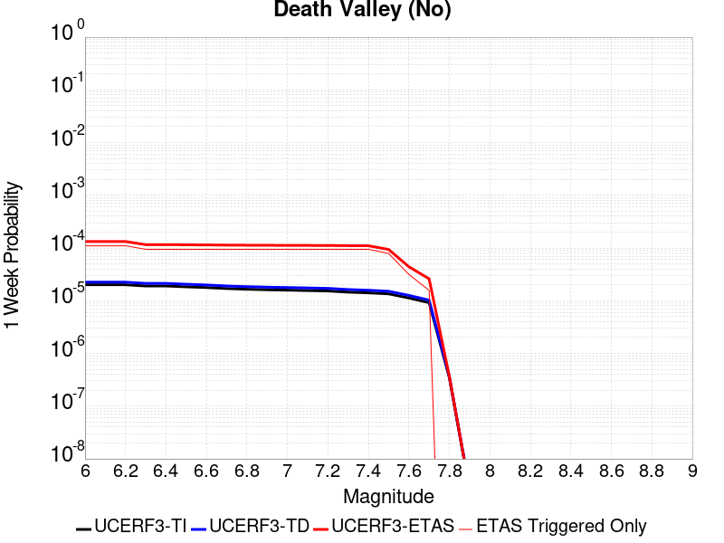 | 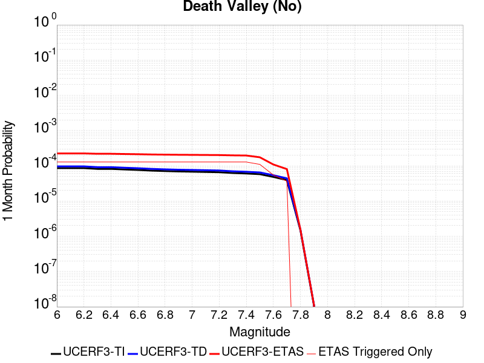 | 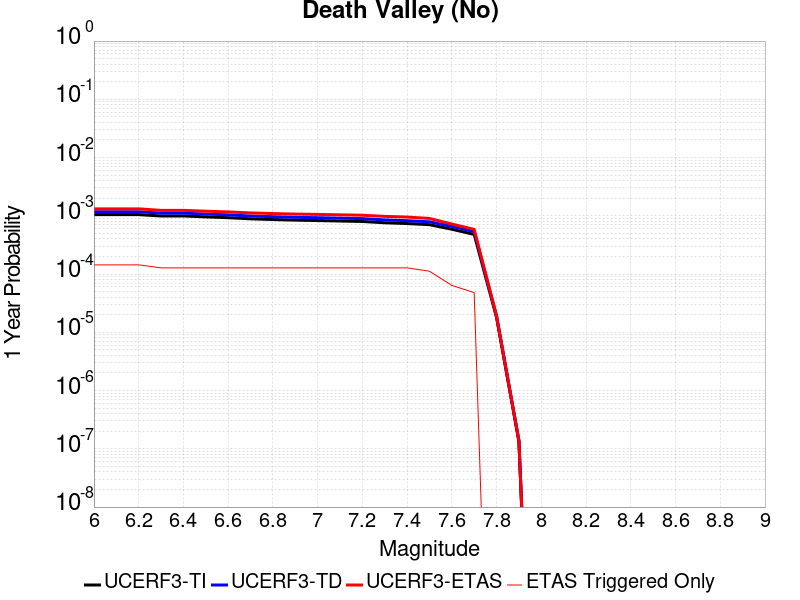 | 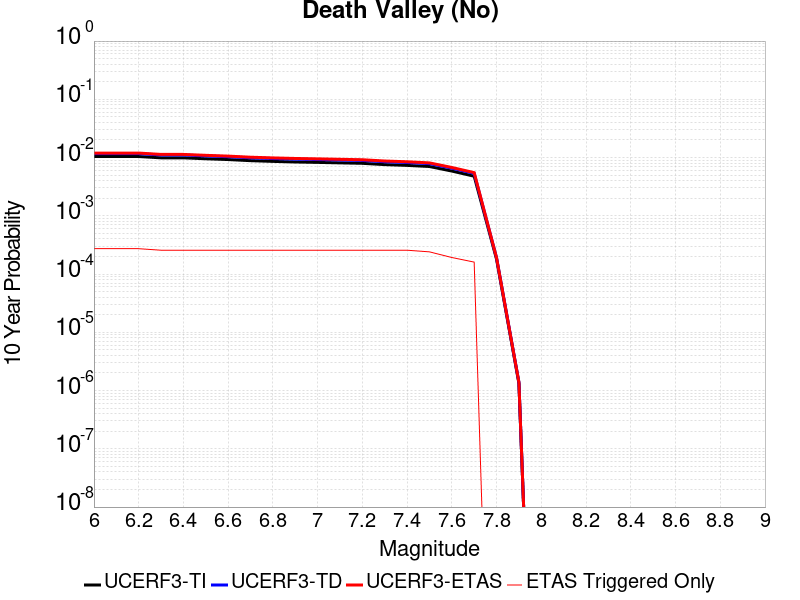 |

| Magnitude | 1 wk TI Prob | 1 wk TD Prob | 1 wk ETAS Prob | 1 wk ETAS/TD Gain | 1 wk ETAS Triggered Only | 1 mo TI Prob | 1 mo TD Prob | 1 mo ETAS Prob | 1 mo ETAS/TD Gain | 1 mo ETAS Triggered Only | 1 yr TI Prob | 1 yr TD Prob | 1 yr ETAS Prob | 1 yr ETAS/TD Gain | 1 yr ETAS Triggered Only | 10 yr TI Prob | 10 yr TD Prob | 10 yr ETAS Prob | 10 yr ETAS/TD Gain | 10 yr ETAS Triggered Only |
|-----|-----|-----|-----|-----|-----|-----|-----|-----|-----|-----|-----|-----|-----|-----|-----|-----|-----|-----|-----|-----|
| 6.0 | 2.0074807E-5 | 2.2500084E-5 | 1.455803E-4 | 6.4702115 | 1.2308298E-4 | 8.603206E-5 | 9.642541E-5 | 2.4411075E-4 | 2.531602 | 1.4769958E-4 | 0.001046937 | 0.0011733545 | 0.0013208807 | 1.1257304 | 1.4769958E-4 | 0.010420183 | 0.011672506 | 0.011915799 | 1.0208433 | 2.4616596E-4 |
| 6.1 | 2.0074807E-5 | 2.2500084E-5 | 1.455803E-4 | 6.4702115 | 1.2308298E-4 | 8.603206E-5 | 9.642541E-5 | 2.4411075E-4 | 2.531602 | 1.4769958E-4 | 0.001046937 | 0.0011733545 | 0.0013208807 | 1.1257304 | 1.4769958E-4 | 0.010420183 | 0.011672506 | 0.011915799 | 1.0208433 | 2.4616596E-4 |
| 6.2 | 2.0074807E-5 | 2.2500084E-5 | 1.455803E-4 | 6.4702115 | 1.2308298E-4 | 8.603206E-5 | 9.642541E-5 | 2.4411075E-4 | 2.531602 | 1.4769958E-4 | 0.001046937 | 0.0011733545 | 0.0013208807 | 1.1257304 | 1.4769958E-4 | 0.010420183 | 0.011672506 | 0.011915799 | 1.0208433 | 2.4616596E-4 |
| 6.3 | 1.9050609E-5 | 2.1336948E-5 | 1.4441731E-4 | 6.7684145 | 1.2308298E-4 | 8.164292E-5 | 9.1440896E-5 | 2.3912697E-4 | 2.6150987 | 1.4769958E-4 | 9.935491E-4 | 0.001112731 | 0.0012602663 | 1.1325884 | 1.4769958E-4 | 0.009891188 | 0.011072419 | 0.011315859 | 1.0219862 | 2.4616596E-4 |
| 6.4 | 1.9050609E-5 | 2.1336948E-5 | 1.4441731E-4 | 6.7684145 | 1.2308298E-4 | 8.164292E-5 | 9.1440896E-5 | 2.3912697E-4 | 2.6150987 | 1.4769958E-4 | 9.935491E-4 | 0.001112731 | 0.0012602663 | 1.1325884 | 1.4769958E-4 | 0.009891188 | 0.011072419 | 0.011315859 | 1.0219862 | 2.4616596E-4 |
| 6.5 | 1.8367004E-5 | 2.0561009E-5 | 1.4364146E-4 | 6.9861097 | 1.2308298E-4 | 7.8713354E-5 | 8.811567E-5 | 2.3580223E-4 | 2.6760533 | 1.4769958E-4 | 9.5791375E-4 | 0.0010722869 | 0.001219828 | 1.1375949 | 1.4769958E-4 | 0.009537951 | 0.0106719155 | 0.0109154545 | 1.0228206 | 2.4616596E-4 |
| 6.6 | 1.779439E-5 | 1.9910927E-5 | 1.4299146E-4 | 7.1815567 | 1.2308298E-4 | 7.625944E-5 | 8.53298E-5 | 2.3301676E-4 | 2.7307785 | 1.4769958E-4 | 9.280632E-4 | 0.0010384015 | 0.0011859477 | 1.1420897 | 1.4769958E-4 | 0.009241969 | 0.010336253 | 0.010579874 | 1.0235696 | 2.4616596E-4 |
| 6.7 | 1.7025437E-5 | 1.9043426E-5 | 1.4212406E-4 | 7.4631567 | 1.2308298E-4 | 7.296412E-5 | 8.161216E-5 | 2.2929968E-4 | 2.8096263 | 1.4769958E-4 | 8.87976E-4 | 9.931813E-4 | 0.0011407342 | 1.1485659 | 1.4769958E-4 | 0.008844362 | 0.009888145 | 0.010131877 | 1.0246489 | 2.4616596E-4 |
| 6.8 | 1.6545107E-5 | 1.8512545E-5 | 1.4159325E-4 | 7.6485023 | 1.2308298E-4 | 7.090568E-5 | 7.93371E-5 | 2.2702497E-4 | 2.8615232 | 1.4769958E-4 | 8.629347E-4 | 9.655073E-4 | 0.0011130642 | 1.1528285 | 1.4769958E-4 | 0.008595915 | 0.009613829 | 0.0098576285 | 1.0253593 | 2.4616596E-4 |
| 6.9 | 1.615478E-5 | 1.8087594E-5 | 1.4116835E-4 | 7.8047056 | 1.2308298E-4 | 6.9232934E-5 | 7.751599E-5 | 2.2520412E-4 | 2.90526 | 1.4769958E-4 | 8.4258494E-4 | 9.433546E-4 | 0.001090915 | 1.1564207 | 1.4769958E-4 | 0.008393973 | 0.009394196 | 0.009638049 | 1.025958 | 2.4616596E-4 |
| 7.0 | 1.5894311E-5 | 1.780555E-5 | 1.4088635E-4 | 7.912496 | 1.2308298E-4 | 6.81167E-5 | 7.6307304E-5 | 2.2399561E-4 | 2.9354413 | 1.4769958E-4 | 8.2900526E-4 | 9.286515E-4 | 0.0010762139 | 1.1588997 | 1.4769958E-4 | 0.008259195 | 0.009248397 | 0.0094922865 | 1.026371 | 2.4616596E-4 |
| 7.1 | 1.5602263E-5 | 1.7483504E-5 | 1.4056433E-4 | 8.039826 | 1.2308298E-4 | 6.6865134E-5 | 7.492718E-5 | 2.226157E-4 | 2.971094 | 1.4769958E-4 | 8.137789E-4 | 9.118627E-4 | 0.0010594276 | 1.1618279 | 1.4769958E-4 | 0.008108052 | 0.009081894 | 0.009325824 | 1.0268589 | 2.4616596E-4 |
| 7.2 | 1.5323829E-5 | 1.717063E-5 | 1.402515E-4 | 8.168104 | 1.2308298E-4 | 6.56719E-5 | 7.358637E-5 | 2.2127508E-4 | 3.0070117 | 1.4769958E-4 | 7.99262E-4 | 8.9555193E-4 | 0.0010431192 | 1.1647781 | 1.4769958E-4 | 0.007963934 | 0.008920107 | 0.009164076 | 1.0273505 | 2.4616596E-4 |
| 7.3 | 1.4556212E-5 | 1.6302456E-5 | 1.3938342E-4 | 8.549843 | 1.2308298E-4 | 6.238227E-5 | 6.9865826E-5 | 2.1755509E-4 | 3.1138983 | 1.4769958E-4 | 7.592395E-4 | 8.5029035E-4 | 9.978643E-4 | 1.1735572 | 1.4769958E-4 | 0.0075665074 | 0.008471014 | 0.008715095 | 1.0288136 | 2.4616596E-4 |
| 7.4 | 1.411725E-5 | 1.580796E-5 | 1.38889E-4 | 8.786016 | 1.2308298E-4 | 6.0501097E-5 | 6.7746674E-5 | 2.1543624E-4 | 3.180027 | 1.4769958E-4 | 7.363519E-4 | 8.245094E-4 | 9.7208726E-4 | 1.1789886 | 1.4769958E-4 | 0.0073391674 | 0.008215138 | 0.008459282 | 1.0297188 | 2.4616596E-4 |
| 7.5 | 1.3503312E-5 | 1.5126289E-5 | 1.1359119E-4 | 7.509521 | 9.8466386E-5 | 5.7870053E-5 | 6.482538E-5 | 1.8790038E-4 | 2.8985622 | 1.2308298E-4 | 7.043401E-4 | 7.8896893E-4 | 9.1195485E-4 | 1.1558818 | 1.2308298E-4 | 0.007021119 | 0.007862304 | 0.008082111 | 1.0279571 | 2.2154937E-4 |
| 7.6 | 1.1279839E-5 | 1.2626327E-5 | 6.18589E-5 | 4.8992 | 4.9233193E-5 | 4.834127E-5 | 5.4111737E-5 | 1.2795754E-4 | 2.3646908 | 7.384979E-5 | 5.88396E-4 | 6.5861654E-4 | 7.324177E-4 | 1.1120548 | 7.384979E-5 | 0.005868405 | 0.006567199 | 0.0067383833 | 1.0260665 | 1.7231617E-4 |
| 7.7 | 9.189108E-6 | 1.0283358E-5 | 3.4899702E-5 | 3.3938038 | 2.4616596E-5 | 3.93813E-5 | 4.407082E-5 | 9.3301845E-5 | 2.1170888 | 4.9233193E-5 | 4.7936183E-4 | 5.3643517E-4 | 5.8564194E-4 | 1.0917293 | 4.9233193E-5 | 0.004783291 | 0.005351914 | 0.0054743383 | 1.0228748 | 1.2308298E-4 |
| 7.8 | 3.4586725E-7 | 3.6482615E-7 | 3.6482615E-7 | 1.0 | 0.0 | 1.4822873E-6 | 1.5635396E-6 | 1.5635396E-6 | 1.0 | 0.0 | 1.80467E-5 | 1.9035933E-5 | 1.9035933E-5 | 1.0 | 0.0 | 1.8045233E-4 | 1.9034347E-4 | 1.9034347E-4 | 1.0 | 0.0 |
| 7.9 | 2.5591178E-9 | 2.6696718E-9 | 2.6696718E-9 | 1.0 | 0.0 | 1.0967647E-8 | 1.14414505E-8 | 1.14414505E-8 | 1.0 | 0.0 | 1.335311E-7 | 1.3929966E-7 | 1.3929966E-7 | 1.0 | 0.0 | 1.3353102E-6 | 1.3929966E-6 | 1.3929966E-6 | 1.0 | 0.0 |

## San Jacinto (San Bernardino)
*[(top)](#table-of-contents)*

| 1 Week | 1 Month | 1 Year | 10 Year |
|-----|-----|-----|-----|
| 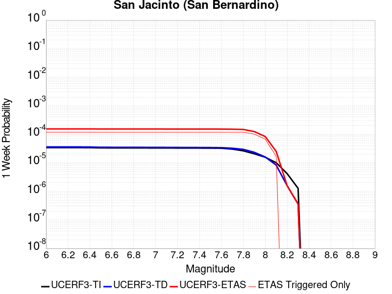 | 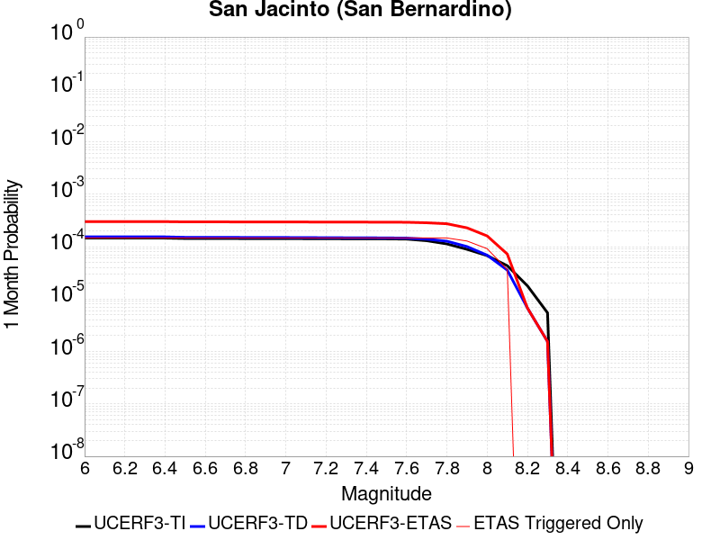 | 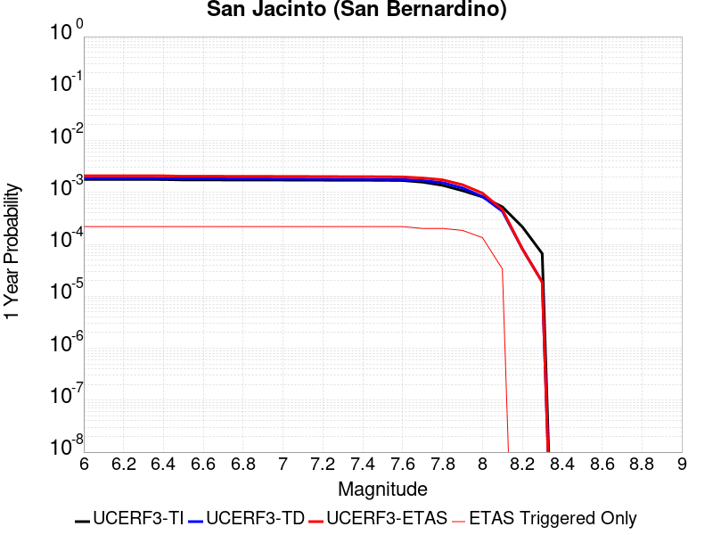 | 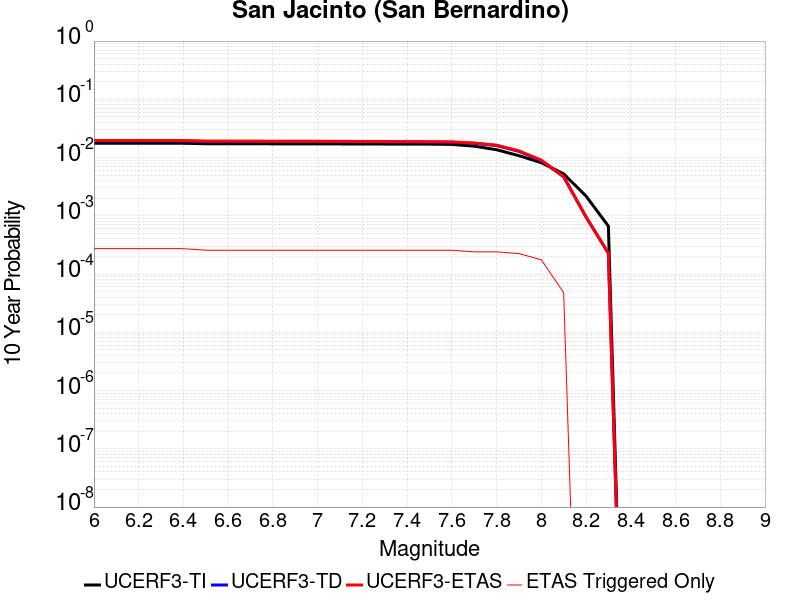 |

| Magnitude | 1 wk TI Prob | 1 wk TD Prob | 1 wk ETAS Prob | 1 wk ETAS/TD Gain | 1 wk ETAS Triggered Only | 1 mo TI Prob | 1 mo TD Prob | 1 mo ETAS Prob | 1 mo ETAS/TD Gain | 1 mo ETAS Triggered Only | 1 yr TI Prob | 1 yr TD Prob | 1 yr ETAS Prob | 1 yr ETAS/TD Gain | 1 yr ETAS Triggered Only | 10 yr TI Prob | 10 yr TD Prob | 10 yr ETAS Prob | 10 yr ETAS/TD Gain | 10 yr ETAS Triggered Only |
|-----|-----|-----|-----|-----|-----|-----|-----|-----|-----|-----|-----|-----|-----|-----|-----|-----|-----|-----|-----|-----|
| 6.0 | 3.409352E-5 | 3.5986508E-5 | 1.5906506E-4 | 4.4201303 | 1.2308298E-4 | 1.461069E-4 | 1.542188E-4 | 3.018956E-4 | 1.9575799 | 1.4769958E-4 | 0.0017774 | 0.0018759987 | 0.002072562 | 1.1047779 | 1.9693277E-4 | 0.01763251 | 0.019349935 | 0.019591337 | 1.0124756 | 2.4616596E-4 |
| 6.1 | 3.409352E-5 | 3.5986508E-5 | 1.5906506E-4 | 4.4201303 | 1.2308298E-4 | 1.461069E-4 | 1.542188E-4 | 3.018956E-4 | 1.9575799 | 1.4769958E-4 | 0.0017774 | 0.0018759987 | 0.002072562 | 1.1047779 | 1.9693277E-4 | 0.01763251 | 0.019349935 | 0.019591337 | 1.0124756 | 2.4616596E-4 |
| 6.2 | 3.409352E-5 | 3.5986508E-5 | 1.5906506E-4 | 4.4201303 | 1.2308298E-4 | 1.461069E-4 | 1.542188E-4 | 3.018956E-4 | 1.9575799 | 1.4769958E-4 | 0.0017774 | 0.0018759987 | 0.002072562 | 1.1047779 | 1.9693277E-4 | 0.01763251 | 0.019349935 | 0.019591337 | 1.0124756 | 2.4616596E-4 |
| 6.3 | 3.409352E-5 | 3.5986508E-5 | 1.5906506E-4 | 4.4201303 | 1.2308298E-4 | 1.461069E-4 | 1.542188E-4 | 3.018956E-4 | 1.9575799 | 1.4769958E-4 | 0.0017774 | 0.0018759987 | 0.002072562 | 1.1047779 | 1.9693277E-4 | 0.01763251 | 0.019349935 | 0.019591337 | 1.0124756 | 2.4616596E-4 |
| 6.4 | 3.400795E-5 | 3.5879173E-5 | 1.5895774E-4 | 4.4303627 | 1.2308298E-4 | 1.4574021E-4 | 1.5375883E-4 | 3.014357E-4 | 1.9604448 | 1.4769958E-4 | 0.0017729428 | 0.0018704084 | 0.002066973 | 1.1050917 | 1.9693277E-4 | 0.017588645 | 0.019295016 | 0.019536434 | 1.0125118 | 2.4616596E-4 |
| 6.5 | 3.341482E-5 | 3.5139812E-5 | 1.5821846E-4 | 4.502542 | 1.2308298E-4 | 1.4319851E-4 | 1.5059051E-4 | 2.9826784E-4 | 1.9806551 | 1.4769958E-4 | 0.0017420477 | 0.0018318989 | 0.002028471 | 1.107305 | 1.9693277E-4 | 0.017284546 | 0.018916558 | 0.019158067 | 1.0127671 | 2.4616596E-4 |
| 6.6 | 3.3364955E-5 | 3.5077028E-5 | 1.581557E-4 | 4.508811 | 1.2308298E-4 | 1.4298483E-4 | 1.5032147E-4 | 2.9799883E-4 | 1.9824104 | 1.4769958E-4 | 0.0017394501 | 0.001828629 | 0.0020252017 | 1.1074973 | 1.9693277E-4 | 0.017258976 | 0.018884424 | 0.01912594 | 1.0127892 | 2.4616596E-4 |
| 6.7 | 3.335922E-5 | 3.5066805E-5 | 1.5814547E-4 | 4.5098343 | 1.2308298E-4 | 1.4296026E-4 | 1.5027766E-4 | 2.9795503E-4 | 1.9826969 | 1.4769958E-4 | 0.0017391514 | 0.0018280965 | 0.0020246692 | 1.1075287 | 1.9693277E-4 | 0.017256035 | 0.018879214 | 0.019120734 | 1.0127928 | 2.4616596E-4 |
| 6.8 | 3.327683E-5 | 3.496087E-5 | 1.5803955E-4 | 4.5204697 | 1.2308298E-4 | 1.4260718E-4 | 1.498237E-4 | 2.9750116E-4 | 1.9856749 | 1.4769958E-4 | 0.0017348597 | 0.0018225788 | 0.0020191527 | 1.1078548 | 1.9693277E-4 | 0.017213784 | 0.018824987 | 0.019066518 | 1.0128304 | 2.4616596E-4 |
| 6.9 | 3.3235785E-5 | 3.4901823E-5 | 1.5798051E-4 | 4.526426 | 1.2308298E-4 | 1.4243131E-4 | 1.4957068E-4 | 2.9724816E-4 | 1.9873425 | 1.4769958E-4 | 0.0017327217 | 0.0018195034 | 0.0020160777 | 1.1080375 | 1.9693277E-4 | 0.017192734 | 0.018794855 | 0.019036395 | 1.0128514 | 2.4616596E-4 |
| 7.0 | 3.3197095E-5 | 3.4841752E-5 | 1.5792045E-4 | 4.5325055 | 1.2308298E-4 | 1.422655E-4 | 1.4931326E-4 | 2.969908E-4 | 1.9890449 | 1.4769958E-4 | 0.0017307063 | 0.0018163746 | 0.0020129497 | 1.1082239 | 1.9693277E-4 | 0.017172894 | 0.018764233 | 0.01900578 | 1.0128727 | 2.4616596E-4 |
| 7.1 | 3.3129716E-5 | 3.4721965E-5 | 1.5780068E-4 | 4.544693 | 1.2308298E-4 | 1.4197677E-4 | 1.4879994E-4 | 2.9647755E-4 | 1.9924574 | 1.4769958E-4 | 0.0017271966 | 0.0018101353 | 0.0020067117 | 1.1085975 | 1.9693277E-4 | 0.017138338 | 0.018703312 | 0.018944874 | 1.0129155 | 2.4616596E-4 |
| 7.2 | 3.3034008E-5 | 3.458941E-5 | 1.5766814E-4 | 4.5582776 | 1.2308298E-4 | 1.4156665E-4 | 1.4823192E-4 | 2.9590962E-4 | 1.996261 | 1.4769958E-4 | 0.0017222111 | 0.0018032312 | 0.001999809 | 1.1090142 | 1.9693277E-4 | 0.017089253 | 0.018635705 | 0.018877283 | 1.0129632 | 2.4616596E-4 |
| 7.3 | 3.2956614E-5 | 3.445717E-5 | 1.575359E-4 | 4.571934 | 1.2308298E-4 | 1.4123498E-4 | 1.4766524E-4 | 2.95343E-4 | 2.0000849 | 1.4769958E-4 | 0.0017181796 | 0.0017963431 | 0.001992922 | 1.1094329 | 1.9693277E-4 | 0.017049557 | 0.018568452 | 0.018810049 | 1.0130111 | 2.4616596E-4 |
| 7.4 | 3.2915937E-5 | 3.4378863E-5 | 1.5745762E-4 | 4.58007 | 1.2308298E-4 | 1.4106068E-4 | 1.4732967E-4 | 2.9500748E-4 | 2.002363 | 1.4769958E-4 | 0.0017160608 | 0.0017922645 | 0.0019888442 | 1.1096823 | 1.9693277E-4 | 0.017028693 | 0.018528719 | 0.018770324 | 1.0130395 | 2.4616596E-4 |
| 7.5 | 3.281791E-5 | 3.4243778E-5 | 1.5732255E-4 | 4.5941935 | 1.2308298E-4 | 1.406406E-4 | 1.4675081E-4 | 2.944287E-4 | 2.0063174 | 1.4769958E-4 | 0.0017109542 | 0.0017852283 | 0.0019818095 | 1.1101154 | 1.9693277E-4 | 0.016978411 | 0.018459605 | 0.018701227 | 1.0130892 | 2.4616596E-4 |
| 7.6 | 3.2521442E-5 | 3.396873E-5 | 1.5704753E-4 | 4.623297 | 1.2308298E-4 | 1.3937015E-4 | 1.4557215E-4 | 2.9325022E-4 | 2.0144665 | 1.4769958E-4 | 0.0016955109 | 0.0017709016 | 0.0019674858 | 1.1110079 | 1.9693277E-4 | 0.016826328 | 0.018317232 | 0.01855889 | 1.0131929 | 2.4616596E-4 |
| 7.7 | 3.0287873E-5 | 3.245276E-5 | 1.5553176E-4 | 4.792558 | 1.2308298E-4 | 1.297987E-4 | 1.3907586E-4 | 2.867549E-4 | 2.0618596 | 1.4769958E-4 | 0.0015791537 | 0.0016919347 | 0.0018639592 | 1.1016734 | 1.7231617E-4 | 0.01567979 | 0.01752809 | 0.017745756 | 1.0124182 | 2.2154937E-4 |
| 7.8 | 2.6316151E-5 | 2.9663592E-5 | 1.5274293E-4 | 5.149172 | 1.2308298E-4 | 1.1277862E-4 | 1.2712348E-4 | 2.7480428E-4 | 2.1617115 | 1.4769958E-4 | 0.0013722149 | 0.0015466306 | 0.0017186803 | 1.1112416 | 1.7231617E-4 | 0.013637724 | 0.016069634 | 0.016287623 | 1.0135653 | 2.2154937E-4 |
| 7.9 | 2.0761147E-5 | 2.34181E-5 | 1.2188218E-4 | 5.204614 | 9.8466386E-5 | 8.897331E-5 | 1.0035944E-4 | 2.2343006E-4 | 2.2262986 | 1.2308298E-4 | 0.0010827117 | 0.0012211921 | 0.0013687112 | 1.1207993 | 1.4769958E-4 | 0.010774517 | 0.012793174 | 0.012987588 | 1.0151967 | 1.9693277E-4 |
| 8.0 | 1.5738568E-5 | 1.6033575E-5 | 8.988218E-5 | 5.6058726 | 7.384979E-5 | 6.744926E-5 | 6.871352E-5 | 1.6717313E-4 | 2.4329004 | 9.8466386E-5 | 8.2088535E-4 | 8.3626667E-4 | 9.592467E-4 | 1.1470584 | 1.2308298E-4 | 0.008178596 | 0.008865921 | 0.009036709 | 1.0192635 | 1.7231617E-4 |
| 8.1 | 1.0105832E-5 | 8.3304985E-6 | 3.294689E-5 | 3.9549723 | 2.4616596E-5 | 4.3309992E-5 | 3.570165E-5 | 8.493308E-5 | 2.378968 | 4.9233193E-5 | 5.2717153E-4 | 4.345814E-4 | 4.837932E-4 | 1.1132395 | 4.9233193E-5 | 0.005259227 | 0.004677232 | 0.0047507365 | 1.0157154 | 7.384979E-5 |
| 8.2 | 4.189207E-6 | 1.5784357E-6 | 1.5784357E-6 | 1.0 | 0.0 | 1.7953622E-5 | 6.7647065E-6 | 6.7647065E-6 | 1.0 | 0.0 | 2.1856341E-4 | 8.235722E-5 | 8.235722E-5 | 1.0 | 0.0 | 0.0021834858 | 9.565867E-4 | 9.565867E-4 | 1.0 | 0.0 |
| 8.3 | 1.2758221E-6 | 3.6149942E-7 | 3.6149942E-7 | 1.0 | 0.0 | 5.4677976E-6 | 1.5492824E-6 | 1.5492824E-6 | 1.0 | 0.0 | 6.65684E-5 | 1.8862354E-5 | 1.8862354E-5 | 1.0 | 0.0 | 6.6548464E-4 | 2.2751294E-4 | 2.2751294E-4 | 1.0 | 0.0 |

## San Jacinto (San Jacinto Valley) rev
*[(top)](#table-of-contents)*

| 1 Week | 1 Month | 1 Year | 10 Year |
|-----|-----|-----|-----|
| 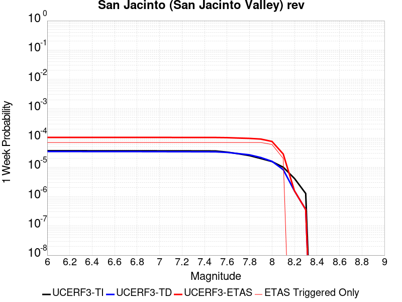 | 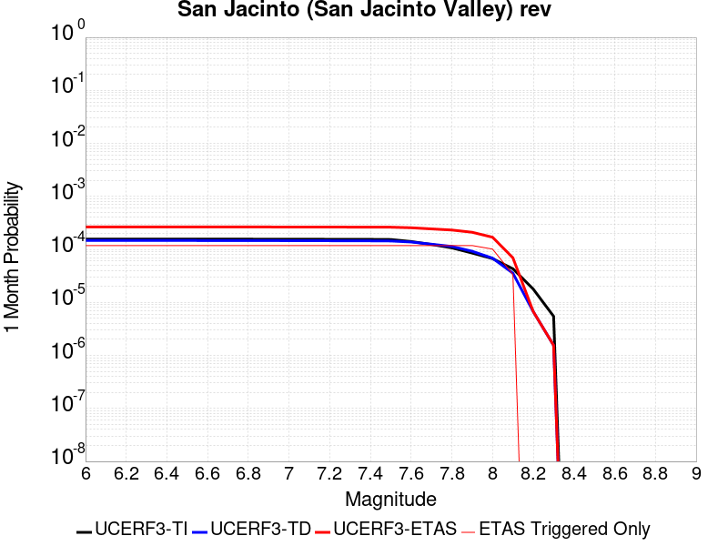 | 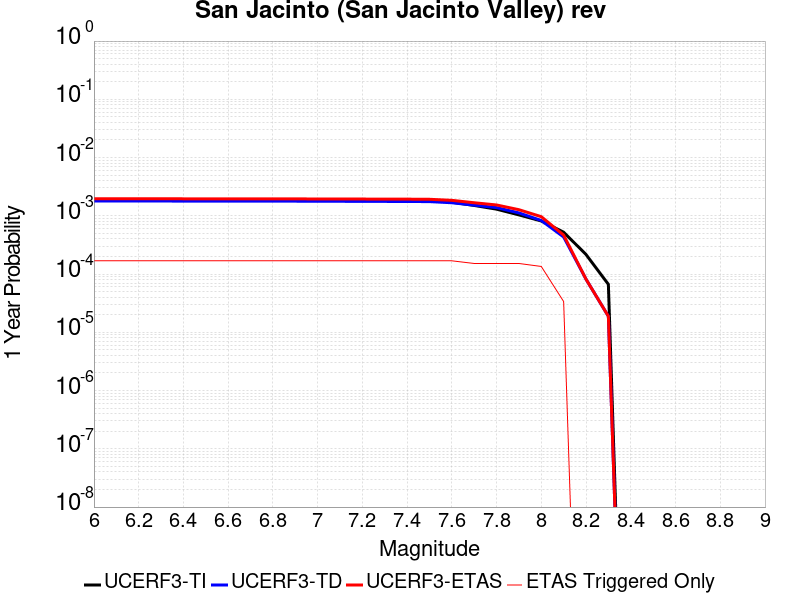 | 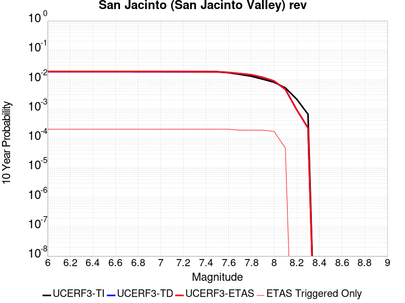 |

| Magnitude | 1 wk TI Prob | 1 wk TD Prob | 1 wk ETAS Prob | 1 wk ETAS/TD Gain | 1 wk ETAS Triggered Only | 1 mo TI Prob | 1 mo TD Prob | 1 mo ETAS Prob | 1 mo ETAS/TD Gain | 1 mo ETAS Triggered Only | 1 yr TI Prob | 1 yr TD Prob | 1 yr ETAS Prob | 1 yr ETAS/TD Gain | 1 yr ETAS Triggered Only | 10 yr TI Prob | 10 yr TD Prob | 10 yr ETAS Prob | 10 yr ETAS/TD Gain | 10 yr ETAS Triggered Only |
|-----|-----|-----|-----|-----|-----|-----|-----|-----|-----|-----|-----|-----|-----|-----|-----|-----|-----|-----|-----|-----|
| 6.0 | 3.652694E-5 | 3.4402394E-5 | 1.3286539E-4 | 3.8620975 | 9.8466386E-5 | 1.5653463E-4 | 1.474305E-4 | 2.7049534E-4 | 1.8347312 | 1.2308298E-4 | 0.0019041431 | 0.00179349 | 0.0019654972 | 1.0959064 | 1.7231617E-4 | 0.018879099 | 0.018526595 | 0.01874404 | 1.0117369 | 2.2154937E-4 |
| 6.1 | 3.652694E-5 | 3.4402394E-5 | 1.3286539E-4 | 3.8620975 | 9.8466386E-5 | 1.5653463E-4 | 1.474305E-4 | 2.7049534E-4 | 1.8347312 | 1.2308298E-4 | 0.0019041431 | 0.00179349 | 0.0019654972 | 1.0959064 | 1.7231617E-4 | 0.018879099 | 0.018526595 | 0.01874404 | 1.0117369 | 2.2154937E-4 |
| 6.2 | 3.652694E-5 | 3.4402394E-5 | 1.3286539E-4 | 3.8620975 | 9.8466386E-5 | 1.5653463E-4 | 1.474305E-4 | 2.7049534E-4 | 1.8347312 | 1.2308298E-4 | 0.0019041431 | 0.00179349 | 0.0019654972 | 1.0959064 | 1.7231617E-4 | 0.018879099 | 0.018526595 | 0.01874404 | 1.0117369 | 2.2154937E-4 |
| 6.3 | 3.652694E-5 | 3.4402394E-5 | 1.3286539E-4 | 3.8620975 | 9.8466386E-5 | 1.5653463E-4 | 1.474305E-4 | 2.7049534E-4 | 1.8347312 | 1.2308298E-4 | 0.0019041431 | 0.00179349 | 0.0019654972 | 1.0959064 | 1.7231617E-4 | 0.018879099 | 0.018526595 | 0.01874404 | 1.0117369 | 2.2154937E-4 |
| 6.4 | 3.646941E-5 | 3.432397E-5 | 1.3278697E-4 | 3.868637 | 9.8466386E-5 | 1.5628811E-4 | 1.4709444E-4 | 2.7015933E-4 | 1.8366386 | 1.2308298E-4 | 0.0019011468 | 0.0017894056 | 0.0019614135 | 1.0961257 | 1.7231617E-4 | 0.018849645 | 0.018486476 | 0.01870393 | 1.0117629 | 2.2154937E-4 |
| 6.5 | 3.646941E-5 | 3.432397E-5 | 1.3278697E-4 | 3.868637 | 9.8466386E-5 | 1.5628811E-4 | 1.4709444E-4 | 2.7015933E-4 | 1.8366386 | 1.2308298E-4 | 0.0019011468 | 0.0017894056 | 0.0019614135 | 1.0961257 | 1.7231617E-4 | 0.018849645 | 0.018486476 | 0.01870393 | 1.0117629 | 2.2154937E-4 |
| 6.6 | 3.6442503E-5 | 3.4287354E-5 | 1.3275037E-4 | 3.8717005 | 9.8466386E-5 | 1.561728E-4 | 1.4693754E-4 | 2.7000243E-4 | 1.837532 | 1.2308298E-4 | 0.0018997455 | 0.0017874985 | 0.0019595067 | 1.0962285 | 1.7231617E-4 | 0.018835869 | 0.018467745 | 0.018685203 | 1.011775 | 2.2154937E-4 |
| 6.7 | 3.6432113E-5 | 3.4272925E-5 | 1.3273594E-4 | 3.8729093 | 9.8466386E-5 | 1.5612828E-4 | 1.4687571E-4 | 2.6994062E-4 | 1.8378847 | 1.2308298E-4 | 0.0018992044 | 0.0017867472 | 0.0019587555 | 1.096269 | 1.7231617E-4 | 0.018830549 | 0.018460369 | 0.018677829 | 1.0117798 | 2.2154937E-4 |
| 6.8 | 3.6409598E-5 | 3.424198E-5 | 1.32705E-4 | 3.8755057 | 9.8466386E-5 | 1.560318E-4 | 1.4674311E-4 | 2.6980802E-4 | 1.8386419 | 1.2308298E-4 | 0.0018980318 | 0.0017851355 | 0.0019571441 | 1.096356 | 1.7231617E-4 | 0.018819023 | 0.018444523 | 0.018661987 | 1.0117902 | 2.2154937E-4 |
| 6.9 | 3.638078E-5 | 3.4202407E-5 | 1.3266543E-4 | 3.878833 | 9.8466386E-5 | 1.5590832E-4 | 1.4657351E-4 | 2.6963846E-4 | 1.8396124 | 1.2308298E-4 | 0.0018965311 | 0.001783074 | 0.0019550829 | 1.0964676 | 1.7231617E-4 | 0.018804269 | 0.018424258 | 0.018641725 | 1.0118033 | 2.2154937E-4 |
| 7.0 | 3.6294874E-5 | 3.408442E-5 | 1.3254744E-4 | 3.8887987 | 9.8466386E-5 | 1.5554018E-4 | 1.4606792E-4 | 2.6913293E-4 | 1.842519 | 1.2308298E-4 | 0.0018920569 | 0.001776929 | 0.0019489389 | 1.0968019 | 1.7231617E-4 | 0.018760284 | 0.018363839 | 0.01858132 | 1.0118428 | 2.2154937E-4 |
| 7.1 | 3.6260717E-5 | 3.4040702E-5 | 1.3250373E-4 | 3.892509 | 9.8466386E-5 | 1.5539382E-4 | 1.4588058E-4 | 2.6894562E-4 | 1.8436011 | 1.2308298E-4 | 0.001890278 | 0.0017746518 | 0.0019466622 | 1.0969262 | 1.7231617E-4 | 0.018742796 | 0.018341439 | 0.018558925 | 1.0118576 | 2.2154937E-4 |
| 7.2 | 3.6210204E-5 | 3.397492E-5 | 1.3243796E-4 | 3.8981094 | 9.8466386E-5 | 1.5517735E-4 | 1.455987E-4 | 2.6866375E-4 | 1.8452346 | 1.2308298E-4 | 0.001887647 | 0.0017712255 | 0.0019432364 | 1.0971141 | 1.7231617E-4 | 0.01871693 | 0.01830772 | 0.018525213 | 1.0118799 | 2.2154937E-4 |
| 7.3 | 3.6119454E-5 | 3.386321E-5 | 1.3232625E-4 | 3.9076705 | 9.8466386E-5 | 1.5478847E-4 | 1.4511998E-4 | 2.681851E-4 | 1.8480233 | 1.2308298E-4 | 0.0018829206 | 0.0017654065 | 0.0019374185 | 1.0974348 | 1.7231617E-4 | 0.018670462 | 0.018250274 | 0.018467778 | 1.011918 | 2.2154937E-4 |
| 7.4 | 3.607848E-5 | 3.381071E-5 | 1.3227377E-4 | 3.9121857 | 9.8466386E-5 | 1.5461289E-4 | 1.44895E-4 | 2.6796016E-4 | 1.8493402 | 1.2308298E-4 | 0.0018807866 | 0.0017626719 | 0.0019346843 | 1.0975862 | 1.7231617E-4 | 0.018649481 | 0.018223269 | 0.018440781 | 1.011936 | 2.2154937E-4 |
| 7.5 | 3.5856774E-5 | 3.3620483E-5 | 1.3208356E-4 | 3.9286635 | 9.8466386E-5 | 1.5366284E-4 | 1.4407984E-4 | 2.6714508E-4 | 1.8541462 | 1.2308298E-4 | 0.0018692396 | 0.0017527633 | 0.0019247774 | 1.0981388 | 1.7231617E-4 | 0.018535944 | 0.018124366 | 0.0183419 | 1.0120023 | 2.2154937E-4 |
| 7.6 | 3.286655E-5 | 3.2143445E-5 | 1.3060667E-4 | 4.063244 | 9.8466386E-5 | 1.4084904E-4 | 1.3775036E-4 | 2.608164E-4 | 1.8933989 | 1.2308298E-4 | 0.001713488 | 0.0016758227 | 0.00184785 | 1.1026525 | 1.7231617E-4 | 0.017003361 | 0.017344031 | 0.017561737 | 1.0125523 | 2.2154937E-4 |
| 7.7 | 2.8882527E-5 | 2.9236293E-5 | 1.2769981E-4 | 4.3678517 | 9.8466386E-5 | 1.237764E-4 | 1.2529238E-4 | 2.4835995E-4 | 1.982243 | 1.2308298E-4 | 0.0015059357 | 0.0015243685 | 0.001671843 | 1.0967447 | 1.4769958E-4 | 0.014957713 | 0.015830461 | 0.016024277 | 1.0122432 | 1.9693277E-4 |
| 7.8 | 2.4950225E-5 | 2.6527203E-5 | 1.2499098E-4 | 4.711804 | 9.8466386E-5 | 1.0692515E-4 | 1.1368306E-4 | 2.3675205E-4 | 2.0825622 | 1.2308298E-4 | 0.0013010362 | 0.0013832134 | 0.0015307087 | 1.1066324 | 1.4769958E-4 | 0.012934455 | 0.014411755 | 0.014605849 | 1.0134678 | 1.9693277E-4 |
| 7.9 | 1.9881603E-5 | 2.1507445E-5 | 1.19971715E-4 | 5.578148 | 9.8466386E-5 | 8.520408E-5 | 9.217151E-5 | 2.1524316E-4 | 2.3352458 | 1.2308298E-4 | 0.001036866 | 0.0011216112 | 0.0012691452 | 1.1315374 | 1.4769958E-4 | 0.010320415 | 0.011777027 | 0.01197164 | 1.0165248 | 1.9693277E-4 |
| 8.0 | 1.563292E-5 | 1.5937347E-5 | 8.978596E-5 | 5.633683 | 7.384979E-5 | 6.6996516E-5 | 6.8301124E-5 | 1.6676079E-4 | 2.4415524 | 9.8466386E-5 | 8.153773E-4 | 8.3124964E-4 | 9.542303E-4 | 1.1479467 | 1.2308298E-4 | 0.00812392 | 0.008810506 | 0.008981304 | 1.0193857 | 1.7231617E-4 |
| 8.1 | 1.0045313E-5 | 8.301802E-6 | 3.2918193E-5 | 3.9651864 | 2.4616596E-5 | 4.305063E-5 | 3.5578672E-5 | 8.481011E-5 | 2.3837347 | 4.9233193E-5 | 5.2401534E-4 | 4.3308473E-4 | 4.822966E-4 | 1.113631 | 4.9233193E-5 | 0.0052278144 | 0.0046591135 | 0.0047326195 | 1.0157768 | 7.384979E-5 |
| 8.2 | 4.1554413E-6 | 1.5655598E-6 | 1.5655598E-6 | 1.0 | 0.0 | 1.7808914E-5 | 6.709525E-6 | 6.709525E-6 | 1.0 | 0.0 | 2.1680194E-4 | 8.168544E-5 | 8.168544E-5 | 1.0 | 0.0 | 0.0021659054 | 9.482903E-4 | 9.482903E-4 | 1.0 | 0.0 |
| 8.3 | 1.2758221E-6 | 3.6149942E-7 | 3.6149942E-7 | 1.0 | 0.0 | 5.4677976E-6 | 1.5492824E-6 | 1.5492824E-6 | 1.0 | 0.0 | 6.65684E-5 | 1.8862354E-5 | 1.8862354E-5 | 1.0 | 0.0 | 6.6548464E-4 | 2.2751294E-4 | 2.2751294E-4 | 1.0 | 0.0 |

## White Wolf (Extension)
*[(top)](#table-of-contents)*

| 1 Week | 1 Month | 1 Year | 10 Year |
|-----|-----|-----|-----|
| 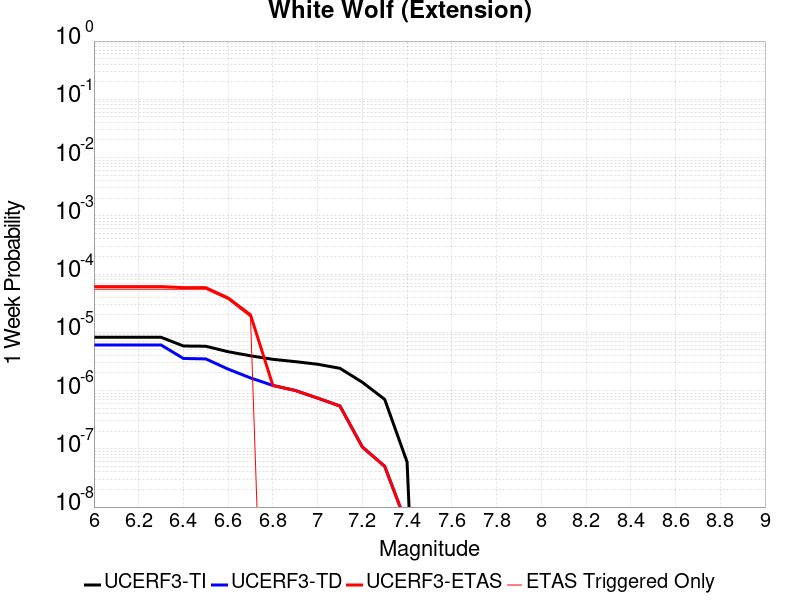 | 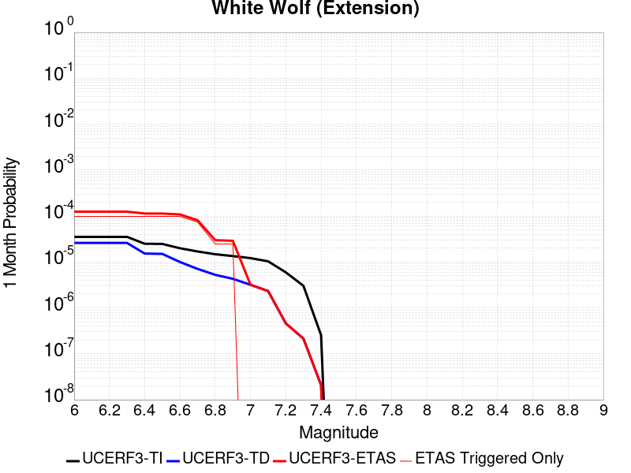 | 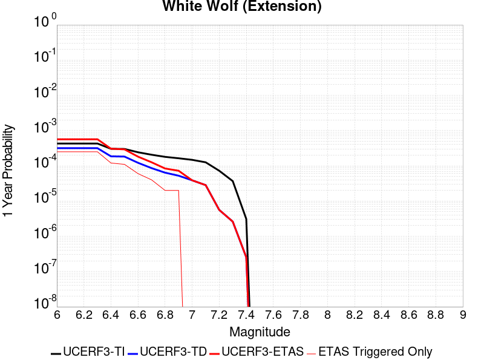 | 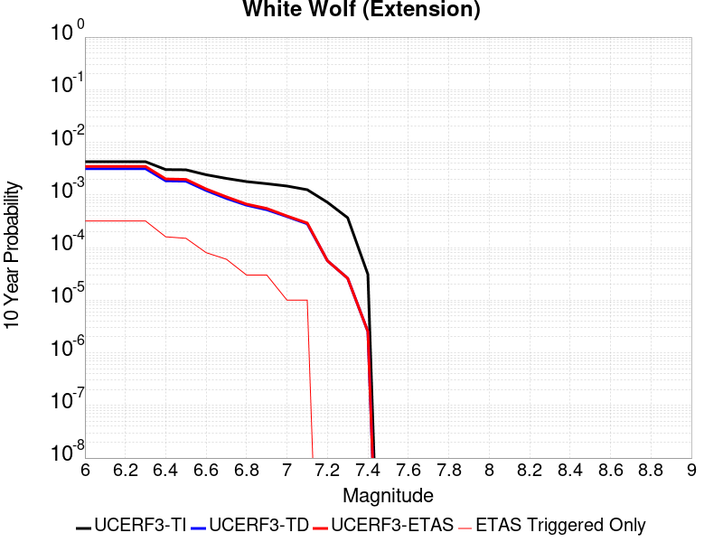 |

| Magnitude | 1 wk TI Prob | 1 wk TD Prob | 1 wk ETAS Prob | 1 wk ETAS/TD Gain | 1 wk ETAS Triggered Only | 1 mo TI Prob | 1 mo TD Prob | 1 mo ETAS Prob | 1 mo ETAS/TD Gain | 1 mo ETAS Triggered Only | 1 yr TI Prob | 1 yr TD Prob | 1 yr ETAS Prob | 1 yr ETAS/TD Gain | 1 yr ETAS Triggered Only | 10 yr TI Prob | 10 yr TD Prob | 10 yr ETAS Prob | 10 yr ETAS/TD Gain | 10 yr ETAS Triggered Only |
|-----|-----|-----|-----|-----|-----|-----|-----|-----|-----|-----|-----|-----|-----|-----|-----|-----|-----|-----|-----|-----|
| 6.0 | 8.222555E-6 | 6.0666657E-6 | 5.529956E-5 | 9.115314 | 4.9233193E-5 | 3.5239045E-5 | 2.5999774E-5 | 1.244636E-4 | 4.787103 | 9.8466386E-5 | 4.289509E-4 | 3.1650788E-4 | 4.8876955E-4 | 1.544257 | 1.7231617E-4 | 0.0042812387 | 0.003161223 | 0.003382072 | 1.0698619 | 2.2154937E-4 |
| 6.1 | 8.222555E-6 | 6.0666657E-6 | 5.529956E-5 | 9.115314 | 4.9233193E-5 | 3.5239045E-5 | 2.5999774E-5 | 1.244636E-4 | 4.787103 | 9.8466386E-5 | 4.289509E-4 | 3.1650788E-4 | 4.8876955E-4 | 1.544257 | 1.7231617E-4 | 0.0042812387 | 0.003161223 | 0.003382072 | 1.0698619 | 2.2154937E-4 |
| 6.2 | 8.222555E-6 | 6.0666657E-6 | 5.529956E-5 | 9.115314 | 4.9233193E-5 | 3.5239045E-5 | 2.5999774E-5 | 1.244636E-4 | 4.787103 | 9.8466386E-5 | 4.289509E-4 | 3.1650788E-4 | 4.8876955E-4 | 1.544257 | 1.7231617E-4 | 0.0042812387 | 0.003161223 | 0.003382072 | 1.0698619 | 2.2154937E-4 |
| 6.3 | 8.222555E-6 | 6.0666657E-6 | 5.529956E-5 | 9.115314 | 4.9233193E-5 | 3.5239045E-5 | 2.5999774E-5 | 1.244636E-4 | 4.787103 | 9.8466386E-5 | 4.289509E-4 | 3.1650788E-4 | 4.8876955E-4 | 1.544257 | 1.7231617E-4 | 0.0042812387 | 0.003161223 | 0.003382072 | 1.0698619 | 2.2154937E-4 |
| 6.4 | 5.821773E-6 | 3.5571766E-6 | 5.2790194E-5 | 14.840477 | 4.9233193E-5 | 2.4950215E-5 | 1.5244959E-5 | 1.13709844E-4 | 7.4588485 | 9.8466386E-5 | 3.0372653E-4 | 1.8559267E-4 | 3.0865282E-4 | 1.6630658 | 1.2308298E-4 | 0.0030331176 | 0.001854485 | 0.0020264818 | 1.0927463 | 1.7231617E-4 |
| 6.5 | 5.766023E-6 | 3.4991106E-6 | 5.273213E-5 | 15.070152 | 4.9233193E-5 | 2.4711293E-5 | 1.4996108E-5 | 1.1346102E-4 | 7.566031 | 9.8466386E-5 | 3.0081844E-4 | 1.8256342E-4 | 2.8101183E-4 | 1.539256 | 9.8466386E-5 | 0.0030041158 | 0.0018242426 | 0.0019716728 | 1.0808172 | 1.4769958E-4 |
| 6.6 | 4.643576E-6 | 2.332624E-6 | 5.15657E-5 | 22.106306 | 4.9233193E-5 | 1.9900888E-5 | 9.996925E-6 | 1.0846233E-4 | 10.849569 | 9.8466386E-5 | 2.4226638E-4 | 1.2170619E-4 | 2.201606E-4 | 1.8089515 | 9.8466386E-5 | 0.0024200242 | 0.0012164378 | 0.0013393711 | 1.10106 | 1.2308298E-4 |
| 6.7 | 3.9529173E-6 | 1.6483477E-6 | 2.6264905E-5 | 15.934079 | 2.4616596E-5 | 1.6940963E-5 | 7.0643296E-6 | 8.0913596E-5 | 11.453825 | 7.384979E-5 | 2.0623671E-4 | 8.6005006E-5 | 1.5984844E-4 | 1.8585947 | 7.384979E-5 | 0.002060454 | 8.597357E-4 | 9.581175E-4 | 1.1144326 | 9.8466386E-5 |
| 6.8 | 3.4377522E-6 | 1.2245237E-6 | 1.2245237E-6 | 1.0 | 0.0 | 1.473314E-5 | 5.2479486E-6 | 2.9864415E-5 | 5.690684 | 2.4616596E-5 | 1.7936122E-4 | 6.3891996E-5 | 8.850702E-5 | 1.3852599 | 2.4616596E-5 | 0.0017921652 | 6.387454E-4 | 6.879471E-4 | 1.0770288 | 4.9233193E-5 |
| 6.9 | 3.1367306E-6 | 1.0033783E-6 | 1.0033783E-6 | 1.0 | 0.0 | 1.3443062E-5 | 4.3001864E-6 | 2.8916676E-5 | 6.7245173 | 2.4616596E-5 | 1.63657E-4 | 5.235359E-5 | 7.696889E-5 | 1.4701742 | 2.4616596E-5 | 0.0016353652 | 5.2342017E-4 | 5.726276E-4 | 1.0940113 | 4.9233193E-5 |
| 7.0 | 2.8298145E-6 | 7.4286646E-7 | 7.4286646E-7 | 1.0 | 0.0 | 1.2127721E-5 | 3.1837099E-6 | 3.1837099E-6 | 1.0 | 0.0 | 1.47645E-4 | 3.8761027E-5 | 3.8761027E-5 | 1.0 | 0.0 | 0.0014754693 | 3.8754768E-4 | 4.1215474E-4 | 1.0634943 | 2.4616596E-5 |
| 7.1 | 2.4091064E-6 | 5.4227525E-7 | 5.4227525E-7 | 1.0 | 0.0 | 1.03247E-5 | 2.3240348E-6 | 2.3240348E-6 | 1.0 | 0.0 | 1.2569598E-4 | 2.8294799E-5 | 2.8294799E-5 | 1.0 | 0.0 | 0.001256249 | 2.8291598E-4 | 3.0752562E-4 | 1.0869857 | 2.4616596E-5 |
| 7.2 | 1.3875518E-6 | 1.0743063E-7 | 1.0743063E-7 | 1.0 | 0.0 | 5.9466374E-6 | 4.6041689E-7 | 4.6041689E-7 | 1.0 | 0.0 | 7.23979E-5 | 5.6055624E-6 | 5.6055624E-6 | 1.0 | 0.0 | 7.2374323E-4 | 5.6054323E-5 | 5.6054323E-5 | 1.0 | 0.0 |
| 7.3 | 7.056077E-7 | 5.002034E-8 | 5.002034E-8 | 1.0 | 0.0 | 3.0240296E-6 | 2.1437286E-7 | 2.1437286E-7 | 1.0 | 0.0 | 3.681694E-5 | 2.609987E-6 | 2.609987E-6 | 1.0 | 0.0 | 3.681084E-4 | 2.609961E-5 | 2.609961E-5 | 1.0 | 0.0 |
| 7.4 | 5.9334678E-8 | 4.8683537E-9 | 4.8683537E-9 | 1.0 | 0.0 | 2.5429145E-7 | 2.0864372E-8 | 2.0864372E-8 | 1.0 | 0.0 | 3.095994E-6 | 2.5402372E-7 | 2.5402372E-7 | 1.0 | 0.0 | 3.095951E-5 | 2.5402353E-6 | 2.5402353E-6 | 1.0 | 0.0 |

## San Andreas (Creeping Section) 2011 CFM
*[(top)](#table-of-contents)*

| 1 Week | 1 Month | 1 Year | 10 Year |
|-----|-----|-----|-----|
| 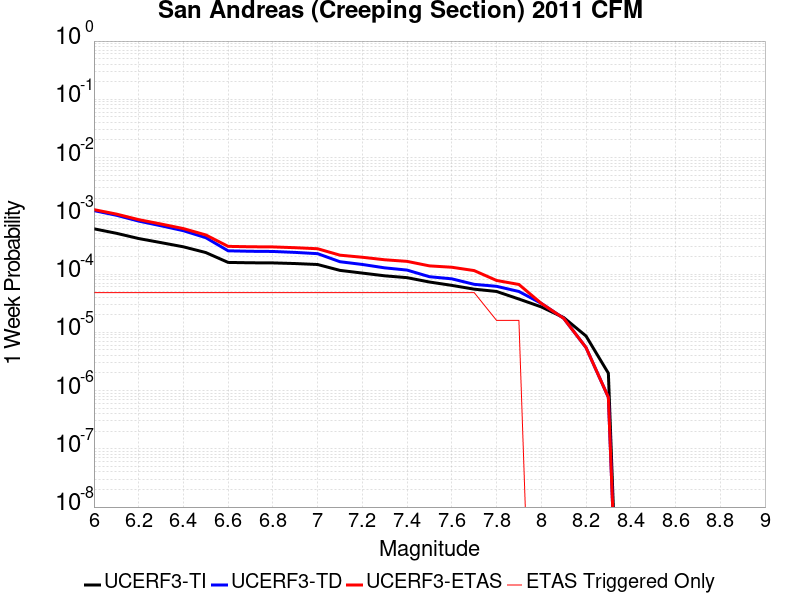 | 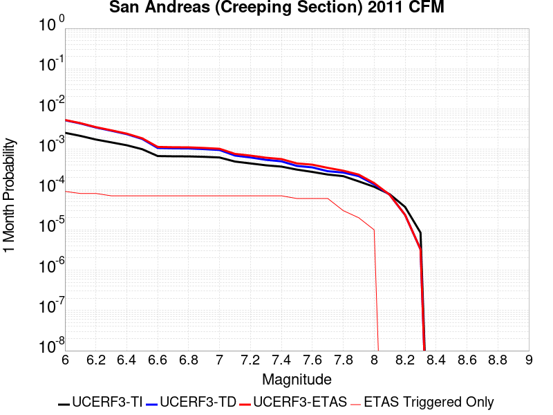 |  | 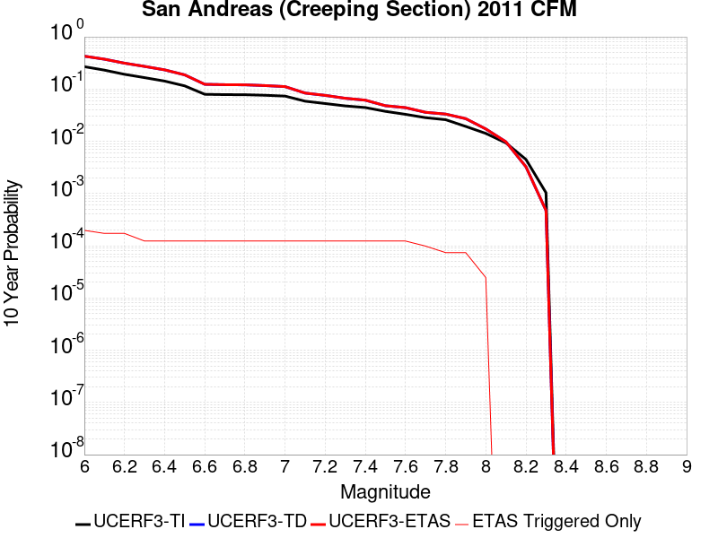 |

| Magnitude | 1 wk TI Prob | 1 wk TD Prob | 1 wk ETAS Prob | 1 wk ETAS/TD Gain | 1 wk ETAS Triggered Only | 1 mo TI Prob | 1 mo TD Prob | 1 mo ETAS Prob | 1 mo ETAS/TD Gain | 1 mo ETAS Triggered Only | 1 yr TI Prob | 1 yr TD Prob | 1 yr ETAS Prob | 1 yr ETAS/TD Gain | 1 yr ETAS Triggered Only | 10 yr TI Prob | 10 yr TD Prob | 10 yr ETAS Prob | 10 yr ETAS/TD Gain | 10 yr ETAS Triggered Only |
|-----|-----|-----|-----|-----|-----|-----|-----|-----|-----|-----|-----|-----|-----|-----|-----|-----|-----|-----|-----|-----|
| 6.0 | 5.986481E-4 | 0.001228691 | 0.0012778637 | 1.0400203 | 4.9233193E-5 | 0.0025631124 | 0.005246795 | 0.0053202575 | 1.0140014 | 7.384979E-5 | 0.030762846 | 0.061203245 | 0.061388128 | 1.0030208 | 1.9693277E-4 | 0.26835477 | 0.425928 | 0.42604107 | 1.0002655 | 1.9693277E-4 |
| 6.1 | 5.015945E-4 | 0.0010230356 | 0.0010722184 | 1.0480754 | 4.9233193E-5 | 0.00214792 | 0.004369436 | 0.004442963 | 1.0168276 | 7.384979E-5 | 0.025839351 | 0.051246606 | 0.051386736 | 1.0027344 | 1.4769958E-4 | 0.23032776 | 0.37284943 | 0.37295753 | 1.0002898 | 1.7231617E-4 |
| 6.2 | 4.073338E-4 | 8.1157376E-4 | 8.60767E-4 | 1.0606146 | 4.9233193E-5 | 0.0017445484 | 0.0034683137 | 0.0035419073 | 1.0212189 | 7.384979E-5 | 0.021034058 | 0.04093177 | 0.041073423 | 1.0034608 | 1.4769958E-4 | 0.19150782 | 0.31302592 | 0.3131443 | 1.0003781 | 1.7231617E-4 |
| 6.3 | 3.464099E-4 | 6.7455834E-4 | 7.237583E-4 | 1.0729365 | 4.9233193E-5 | 0.0014837692 | 0.0028832308 | 0.0029568677 | 1.0255398 | 7.384979E-5 | 0.017915873 | 0.034187846 | 0.03430672 | 1.0034771 | 1.2308298E-4 | 0.16538359 | 0.27130842 | 0.2713981 | 1.0003306 | 1.2308298E-4 |
| 6.4 | 2.935057E-4 | 5.5516965E-4 | 6.043755E-4 | 1.0886321 | 4.9233193E-5 | 0.0012572751 | 0.0023727308 | 0.0024464054 | 1.0310506 | 7.384979E-5 | 0.015200248 | 0.02826279 | 0.028382394 | 1.0042318 | 1.2308298E-4 | 0.14201577 | 0.23297668 | 0.23307107 | 1.0004052 | 1.2308298E-4 |
| 6.5 | 2.3409708E-4 | 4.2132285E-4 | 4.705353E-4 | 1.1168046 | 4.9233193E-5 | 0.0010028875 | 0.0018017791 | 0.0018754959 | 1.0409133 | 7.384979E-5 | 0.012141965 | 0.021586355 | 0.02170678 | 1.0055788 | 1.2308298E-4 | 0.11499573 | 0.1868149 | 0.186915 | 1.0005357 | 1.2308298E-4 |
| 6.6 | 1.5842178E-4 | 2.5068692E-4 | 2.9990776E-4 | 1.1963439 | 4.9233193E-5 | 6.7877385E-4 | 0.0010739256 | 0.001147696 | 1.0686923 | 7.384979E-5 | 0.0082328 | 0.012995283 | 0.013116767 | 1.0093483 | 1.2308298E-4 | 0.07934396 | 0.12313759 | 0.12324552 | 1.0008764 | 1.2308298E-4 |
| 6.7 | 1.5616413E-4 | 2.4605254E-4 | 2.952736E-4 | 1.200043 | 4.9233193E-5 | 6.691031E-4 | 0.0010540807 | 0.0011278526 | 1.069987 | 7.384979E-5 | 0.0081159435 | 0.012757154 | 0.012878667 | 1.0095251 | 1.2308298E-4 | 0.0782586 | 0.12116472 | 0.121272884 | 1.0008928 | 1.2308298E-4 |
| 6.8 | 1.5538467E-4 | 2.442914E-4 | 2.935126E-4 | 1.2014854 | 4.9233193E-5 | 6.6576427E-4 | 0.001046539 | 0.0011203116 | 1.0704919 | 7.384979E-5 | 0.008075596 | 0.012666538 | 0.012788062 | 1.0095941 | 1.2308298E-4 | 0.07788358 | 0.12039561 | 0.12050387 | 1.0008992 | 1.2308298E-4 |
| 6.9 | 1.5153569E-4 | 2.3538464E-4 | 2.8460624E-4 | 1.2091113 | 4.9233193E-5 | 6.49277E-4 | 0.0010084033 | 0.0010821787 | 1.0731605 | 7.384979E-5 | 0.007876333 | 0.012208726 | 0.012330307 | 1.0099585 | 1.2308298E-4 | 0.07602952 | 0.11646574 | 0.11657449 | 1.0009338 | 1.2308298E-4 |
| 7.0 | 1.4588932E-4 | 2.2395732E-4 | 2.731795E-4 | 1.2197837 | 4.9233193E-5 | 6.250901E-4 | 9.59466E-4 | 0.0010332449 | 1.0768958 | 7.384979E-5 | 0.0075839474 | 0.011619428 | 0.01174108 | 1.0104698 | 1.2308298E-4 | 0.073302895 | 0.11131206 | 0.11142144 | 1.0009826 | 1.2308298E-4 |
| 7.1 | 1.1565079E-4 | 1.6281323E-4 | 2.120384E-4 | 1.3023413 | 4.9233193E-5 | 4.955521E-4 | 6.9758523E-4 | 7.713835E-4 | 1.1057911 | 7.384979E-5 | 0.006016669 | 0.008460228 | 0.00858227 | 1.0144254 | 1.2308298E-4 | 0.058563538 | 0.08366478 | 0.08377757 | 1.001348 | 1.2308298E-4 |
| 7.2 | 1.0393792E-4 | 1.4615392E-4 | 1.9537992E-4 | 1.3368093 | 4.9233193E-5 | 4.4537216E-4 | 6.262243E-4 | 7.0002786E-4 | 1.1178548 | 7.384979E-5 | 0.005408933 | 0.0075977976 | 0.0077199456 | 1.0160767 | 1.2308298E-4 | 0.052791595 | 0.07561503 | 0.07572881 | 1.0015047 | 1.2308298E-4 |
| 7.3 | 9.332884E-5 | 1.2780601E-4 | 1.770329E-4 | 1.3851689 | 4.9233193E-5 | 3.999194E-4 | 5.4762565E-4 | 6.21435E-4 | 1.1347806 | 7.384979E-5 | 0.0048581534 | 0.0066470946 | 0.006769359 | 1.0183938 | 1.2308298E-4 | 0.047533102 | 0.06647954 | 0.066594444 | 1.0017284 | 1.2308298E-4 |
| 7.4 | 8.670252E-5 | 1.1702972E-4 | 1.6625714E-4 | 1.4206405 | 4.9233193E-5 | 3.715293E-4 | 5.014601E-4 | 5.752729E-4 | 1.1471957 | 7.384979E-5 | 0.004513991 | 0.0060883067 | 0.00621064 | 1.0200932 | 1.2308298E-4 | 0.044233937 | 0.061148684 | 0.06126424 | 1.0018897 | 1.2308298E-4 |
| 7.5 | 7.3036405E-5 | 9.005699E-5 | 1.3928574E-4 | 1.5466402 | 4.9233193E-5 | 3.129756E-4 | 3.859015E-4 | 4.597228E-4 | 1.1912956 | 7.384979E-5 | 0.0038038217 | 0.0046882504 | 0.0048107565 | 1.0261304 | 1.2308298E-4 | 0.03739367 | 0.047875606 | 0.047992796 | 1.0024478 | 1.2308298E-4 |
| 7.6 | 6.3935775E-5 | 8.280209E-5 | 1.320312E-4 | 1.5945395 | 4.9233193E-5 | 2.7398168E-4 | 3.5481792E-4 | 4.286415E-4 | 1.2080605 | 7.384979E-5 | 0.0033306254 | 0.00431137 | 0.0044339225 | 1.0284253 | 1.2308298E-4 | 0.032811474 | 0.043990135 | 0.044107802 | 1.0026749 | 1.2308298E-4 |
| 7.7 | 5.5050095E-5 | 6.661729E-5 | 1.1584721E-4 | 1.738996 | 4.9233193E-5 | 2.3590765E-4 | 2.8547147E-4 | 3.5930017E-4 | 1.2586203 | 7.384979E-5 | 0.0028683927 | 0.0034700802 | 0.0035682048 | 1.0282774 | 9.8466386E-5 | 0.0283165 | 0.03579509 | 0.035890028 | 1.0026524 | 9.8466386E-5 |
| 7.8 | 5.027131E-5 | 6.1627725E-5 | 8.62428E-5 | 1.3994157 | 2.4616596E-5 | 2.1543067E-4 | 2.640921E-4 | 3.1331228E-4 | 1.1863751 | 4.9233193E-5 | 0.0026197135 | 0.003210584 | 0.0032841966 | 1.0229281 | 7.384979E-5 | 0.025890453 | 0.03312572 | 0.033197124 | 1.0021555 | 7.384979E-5 |
| 7.9 | 3.7271806E-5 | 5.0224386E-5 | 7.483974E-5 | 1.4901078 | 2.4616596E-5 | 1.5972654E-4 | 2.1522962E-4 | 2.6445222E-4 | 1.228698 | 4.9233193E-5 | 0.0019429359 | 0.0026172737 | 0.0026909302 | 1.0281425 | 7.384979E-5 | 0.019260362 | 0.027066687 | 0.027138539 | 1.0026546 | 7.384979E-5 |
| 8.0 | 2.7310243E-5 | 3.1428404E-5 | 3.1428404E-5 | 1.0 | 0.0 | 1.17038646E-4 | 1.3468621E-4 | 1.592995E-4 | 1.1827453 | 2.4616596E-5 | 0.0014240141 | 0.0016385721 | 0.0016631483 | 1.0149986 | 2.4616596E-5 | 0.014149235 | 0.01721387 | 0.017238062 | 1.0014055 | 2.4616596E-5 |
| 8.1 | 1.7940547E-5 | 1.7400796E-5 | 1.7400796E-5 | 1.0 | 0.0 | 7.688579E-5 | 7.457271E-5 | 7.457271E-5 | 1.0 | 0.0 | 9.3568244E-4 | 9.075451E-4 | 9.075451E-4 | 1.0 | 0.0 | 0.009317525 | 0.009799073 | 0.009799073 | 1.0 | 0.0 |
| 8.2 | 8.643924E-6 | 5.4748625E-6 | 5.4748625E-6 | 1.0 | 0.0 | 3.704486E-5 | 2.3463486E-5 | 2.3463486E-5 | 1.0 | 0.0 | 4.5092785E-4 | 2.8563058E-4 | 2.8563058E-4 | 1.0 | 0.0 | 0.0045001395 | 0.0032487072 | 0.0032487072 | 1.0 | 0.0 |
| 8.3 | 1.983087E-6 | 7.6599065E-7 | 7.6599065E-7 | 1.0 | 0.0 | 8.498917E-6 | 3.282813E-6 | 3.282813E-6 | 1.0 | 0.0 | 1.034694E-4 | 3.9967534E-5 | 3.9967534E-5 | 1.0 | 0.0 | 0.0010342124 | 4.719687E-4 | 4.719687E-4 | 1.0 | 0.0 |

## Pleito
*[(top)](#table-of-contents)*

| 1 Week | 1 Month | 1 Year | 10 Year |
|-----|-----|-----|-----|
| 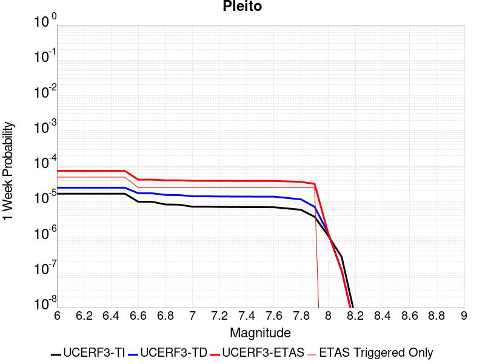 | 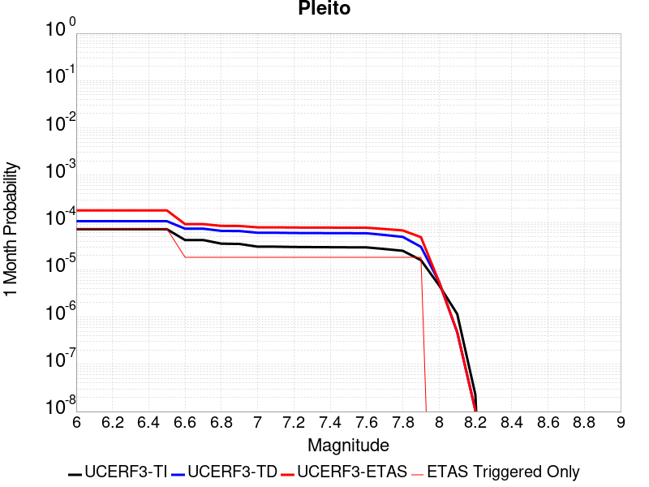 | 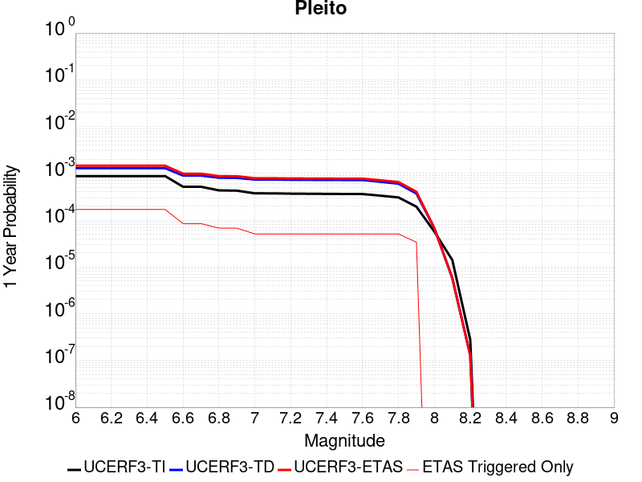 | 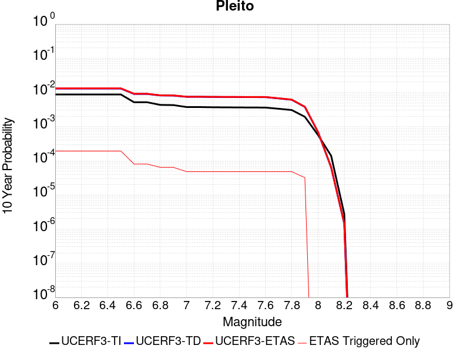 |

| Magnitude | 1 wk TI Prob | 1 wk TD Prob | 1 wk ETAS Prob | 1 wk ETAS/TD Gain | 1 wk ETAS Triggered Only | 1 mo TI Prob | 1 mo TD Prob | 1 mo ETAS Prob | 1 mo ETAS/TD Gain | 1 mo ETAS Triggered Only | 1 yr TI Prob | 1 yr TD Prob | 1 yr ETAS Prob | 1 yr ETAS/TD Gain | 1 yr ETAS Triggered Only | 10 yr TI Prob | 10 yr TD Prob | 10 yr ETAS Prob | 10 yr ETAS/TD Gain | 10 yr ETAS Triggered Only |
|-----|-----|-----|-----|-----|-----|-----|-----|-----|-----|-----|-----|-----|-----|-----|-----|-----|-----|-----|-----|-----|
| 6.0 | 1.6763008E-5 | 2.4763838E-5 | 7.399581E-5 | 2.988059 | 4.9233193E-5 | 7.183948E-5 | 1.0612683E-4 | 1.5535479E-4 | 1.4638598 | 4.9233193E-5 | 8.742947E-4 | 0.0012914003 | 0.0014634939 | 1.1332613 | 1.7231617E-4 | 0.00870863 | 0.0129538905 | 0.01317257 | 1.0168813 | 2.2154937E-4 |
| 6.1 | 1.6763008E-5 | 2.4763838E-5 | 7.399581E-5 | 2.988059 | 4.9233193E-5 | 7.183948E-5 | 1.0612683E-4 | 1.5535479E-4 | 1.4638598 | 4.9233193E-5 | 8.742947E-4 | 0.0012914003 | 0.0014634939 | 1.1332613 | 1.7231617E-4 | 0.00870863 | 0.0129538905 | 0.01317257 | 1.0168813 | 2.2154937E-4 |
| 6.2 | 1.6763008E-5 | 2.4763838E-5 | 7.399581E-5 | 2.988059 | 4.9233193E-5 | 7.183948E-5 | 1.0612683E-4 | 1.5535479E-4 | 1.4638598 | 4.9233193E-5 | 8.742947E-4 | 0.0012914003 | 0.0014634939 | 1.1332613 | 1.7231617E-4 | 0.00870863 | 0.0129538905 | 0.01317257 | 1.0168813 | 2.2154937E-4 |
| 6.3 | 1.6763008E-5 | 2.4763838E-5 | 7.399581E-5 | 2.988059 | 4.9233193E-5 | 7.183948E-5 | 1.0612683E-4 | 1.5535479E-4 | 1.4638598 | 4.9233193E-5 | 8.742947E-4 | 0.0012914003 | 0.0014634939 | 1.1332613 | 1.7231617E-4 | 0.00870863 | 0.0129538905 | 0.01317257 | 1.0168813 | 2.2154937E-4 |
| 6.4 | 1.6763008E-5 | 2.4763838E-5 | 7.399581E-5 | 2.988059 | 4.9233193E-5 | 7.183948E-5 | 1.0612683E-4 | 1.5535479E-4 | 1.4638598 | 4.9233193E-5 | 8.742947E-4 | 0.0012914003 | 0.0014634939 | 1.1332613 | 1.7231617E-4 | 0.00870863 | 0.0129538905 | 0.01317257 | 1.0168813 | 2.2154937E-4 |
| 6.5 | 1.6763008E-5 | 2.4763838E-5 | 7.399581E-5 | 2.988059 | 4.9233193E-5 | 7.183948E-5 | 1.0612683E-4 | 1.5535479E-4 | 1.4638598 | 4.9233193E-5 | 8.742947E-4 | 0.0012914003 | 0.0014634939 | 1.1332613 | 1.7231617E-4 | 0.00870863 | 0.0129538905 | 0.01317257 | 1.0168813 | 2.2154937E-4 |
| 6.6 | 9.910213E-6 | 1.7214623E-5 | 4.1830797E-5 | 2.4299572 | 2.4616596E-5 | 4.247165E-5 | 7.377489E-5 | 9.8389675E-5 | 1.3336471 | 2.4616596E-5 | 5.169696E-4 | 8.978429E-4 | 9.962209E-4 | 1.1095715 | 9.8466386E-5 | 0.0051576863 | 0.009050702 | 0.009148277 | 1.0107809 | 9.8466386E-5 |
| 6.7 | 9.910213E-6 | 1.7214623E-5 | 4.1830797E-5 | 2.4299572 | 2.4616596E-5 | 4.247165E-5 | 7.377489E-5 | 9.8389675E-5 | 1.3336471 | 2.4616596E-5 | 5.169696E-4 | 8.978429E-4 | 9.962209E-4 | 1.1095715 | 9.8466386E-5 | 0.0051576863 | 0.009050702 | 0.009148277 | 1.0107809 | 9.8466386E-5 |
| 6.8 | 8.300162E-6 | 1.5474232E-5 | 4.0090446E-5 | 2.5907874 | 2.4616596E-5 | 3.557164E-5 | 6.631646E-5 | 9.0931426E-5 | 1.3711742 | 2.4616596E-5 | 4.3299864E-4 | 8.071053E-4 | 8.808955E-4 | 1.0914258 | 7.384979E-5 | 0.004321559 | 0.008150139 | 0.0082233865 | 1.0089873 | 7.384979E-5 |
| 6.9 | 8.183114E-6 | 1.5345448E-5 | 3.9961666E-5 | 2.6041381 | 2.4616596E-5 | 3.5070017E-5 | 6.576455E-5 | 9.037953E-5 | 1.3742894 | 2.4616596E-5 | 4.2689382E-4 | 8.003907E-4 | 8.741814E-4 | 1.0921934 | 7.384979E-5 | 0.0042607468 | 0.008083483 | 0.008156736 | 1.009062 | 7.384979E-5 |
| 7.0 | 7.1748823E-6 | 1.413244E-5 | 3.8748687E-5 | 2.7418258 | 2.4616596E-5 | 3.0749135E-5 | 6.0566195E-5 | 8.51813E-5 | 1.4064165 | 2.4616596E-5 | 3.743064E-4 | 7.371445E-4 | 7.863414E-4 | 1.0667398 | 4.9233193E-5 | 0.0037367654 | 0.007454939 | 0.007503805 | 1.0065548 | 4.9233193E-5 |
| 7.1 | 7.1671807E-6 | 1.412281E-5 | 3.8739057E-5 | 2.7430134 | 2.4616596E-5 | 3.0716128E-5 | 6.052493E-5 | 8.514003E-5 | 1.4066937 | 2.4616596E-5 | 3.7390468E-4 | 7.366424E-4 | 7.8583934E-4 | 1.0667853 | 4.9233193E-5 | 0.0037327618 | 0.0074499524 | 0.0074988184 | 1.0065593 | 4.9233193E-5 |
| 7.2 | 7.0649667E-6 | 1.39701015E-5 | 3.8586353E-5 | 2.7620668 | 2.4616596E-5 | 3.0278077E-5 | 5.9870494E-5 | 8.448562E-5 | 1.4111395 | 2.4616596E-5 | 3.6857324E-4 | 7.2868E-4 | 7.778773E-4 | 1.0675156 | 4.9233193E-5 | 0.0036796255 | 0.0073707094 | 0.0074195797 | 1.0066303 | 4.9233193E-5 |
| 7.3 | 7.02082E-6 | 1.3913556E-5 | 3.852981E-5 | 2.769228 | 2.4616596E-5 | 3.008888E-5 | 5.9628168E-5 | 8.42433E-5 | 1.4128104 | 2.4616596E-5 | 3.6627054E-4 | 7.2573166E-4 | 7.749291E-4 | 1.0677902 | 4.9233193E-5 | 0.0036566744 | 0.007341209 | 0.0073900805 | 1.0066571 | 4.9233193E-5 |
| 7.4 | 6.987146E-6 | 1.3873118E-5 | 3.8489372E-5 | 2.7743852 | 2.4616596E-5 | 2.9944567E-5 | 5.945487E-5 | 8.407E-5 | 1.4140137 | 2.4616596E-5 | 3.6451413E-4 | 7.2362315E-4 | 7.728207E-4 | 1.0679878 | 4.9233193E-5 | 0.0036391679 | 0.007320144 | 0.007369017 | 1.0066764 | 4.9233193E-5 |
| 7.5 | 6.9494554E-6 | 1.3830024E-5 | 3.844628E-5 | 2.7799141 | 2.4616596E-5 | 2.9783041E-5 | 5.9270187E-5 | 8.388532E-5 | 1.4153038 | 2.4616596E-5 | 3.625482E-4 | 7.2137616E-4 | 7.705738E-4 | 1.0681998 | 4.9233193E-5 | 0.0036195726 | 0.0072977724 | 0.0073466464 | 1.006697 | 4.9233193E-5 |
| 7.6 | 6.92694E-6 | 1.3789138E-5 | 3.8405396E-5 | 2.7851918 | 2.4616596E-5 | 2.9686547E-5 | 5.909497E-5 | 8.371011E-5 | 1.4165353 | 2.4616596E-5 | 3.6137376E-4 | 7.1924424E-4 | 7.6844206E-4 | 1.068402 | 4.9233193E-5 | 0.0036078666 | 0.0072765257 | 0.0073254006 | 1.0067168 | 4.9233193E-5 |
| 7.7 | 6.395867E-6 | 1.2668219E-5 | 3.7284502E-5 | 2.9431527 | 2.4616596E-5 | 2.741057E-5 | 5.429124E-5 | 7.89065E-5 | 1.4533929 | 2.4616596E-5 | 3.336726E-4 | 6.6079566E-4 | 7.099963E-4 | 1.0744567 | 4.9233193E-5 | 0.0033317201 | 0.0066951844 | 0.006744088 | 1.0073043 | 4.9233193E-5 |
| 7.8 | 5.8664327E-6 | 1.153586E-5 | 3.6152174E-5 | 3.133895 | 2.4616596E-5 | 2.5141611E-5 | 4.9438466E-5 | 7.4053845E-5 | 1.4978993 | 2.4616596E-5 | 3.060561E-4 | 6.017473E-4 | 6.509509E-4 | 1.0817678 | 4.9233193E-5 | 0.0030563495 | 0.0061006667 | 0.0061495993 | 1.0080209 | 4.9233193E-5 |
| 7.9 | 3.7167474E-6 | 7.1140853E-6 | 3.1730506E-5 | 4.460237 | 2.4616596E-5 | 1.592882E-5 | 3.0488582E-5 | 5.510443E-5 | 1.8073791 | 2.4616596E-5 | 1.9391612E-4 | 3.7113542E-4 | 4.2035032E-4 | 1.1326064 | 4.9233193E-5 | 0.0019374699 | 0.0037674906 | 0.0038165383 | 1.0130186 | 4.9233193E-5 |
| 8.0 | 1.0903841E-6 | 1.2879392E-6 | 1.2879392E-6 | 1.0 | 0.0 | 4.6730665E-6 | 5.5197274E-6 | 5.5197274E-6 | 1.0 | 0.0 | 5.68931E-5 | 6.720063E-5 | 6.720063E-5 | 1.0 | 0.0 | 5.6878536E-4 | 6.941948E-4 | 6.941948E-4 | 1.0 | 0.0 |
| 8.1 | 2.6894583E-7 | 1.1060341E-7 | 1.1060341E-7 | 1.0 | 0.0 | 1.1526245E-6 | 4.740145E-7 | 4.740145E-7 | 1.0 | 0.0 | 1.4033113E-5 | 5.7711113E-6 | 5.7711113E-6 | 1.0 | 0.0 | 1.4032227E-4 | 6.456908E-5 | 6.456908E-5 | 1.0 | 0.0 |
| 8.2 | 5.2967013E-9 | 2.4578228E-9 | 2.4578228E-9 | 1.0 | 0.0 | 2.2700148E-8 | 1.0533527E-8 | 1.0533527E-8 | 1.0 | 0.0 | 2.7637427E-7 | 1.2824569E-7 | 1.2824569E-7 | 1.0 | 0.0 | 2.7637393E-6 | 1.4592787E-6 | 1.4592787E-6 | 1.0 | 0.0 |

## San Jacinto (Stepovers Combined)
*[(top)](#table-of-contents)*

| 1 Week | 1 Month | 1 Year | 10 Year |
|-----|-----|-----|-----|
| 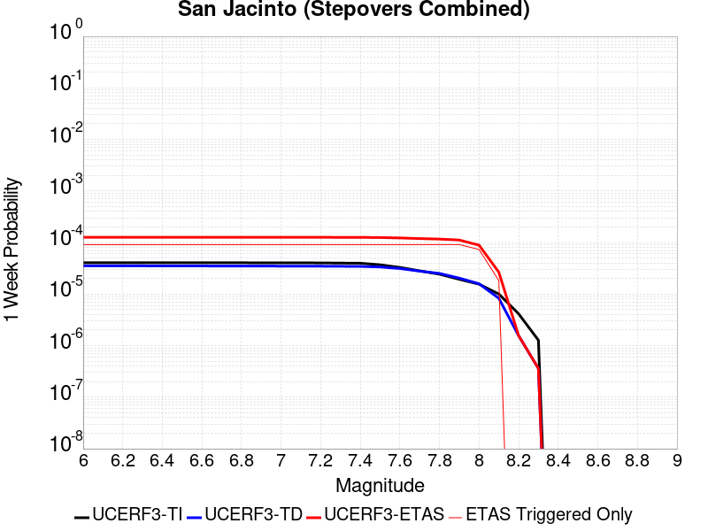 | 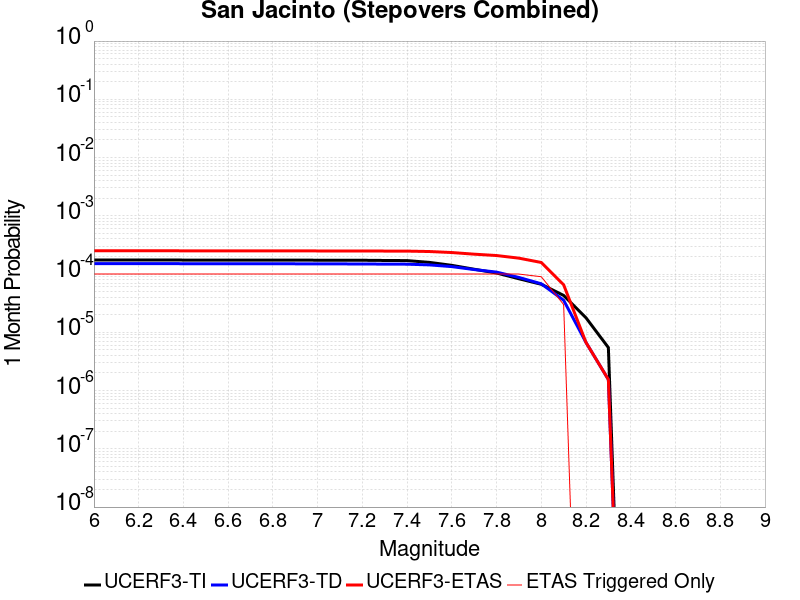 | 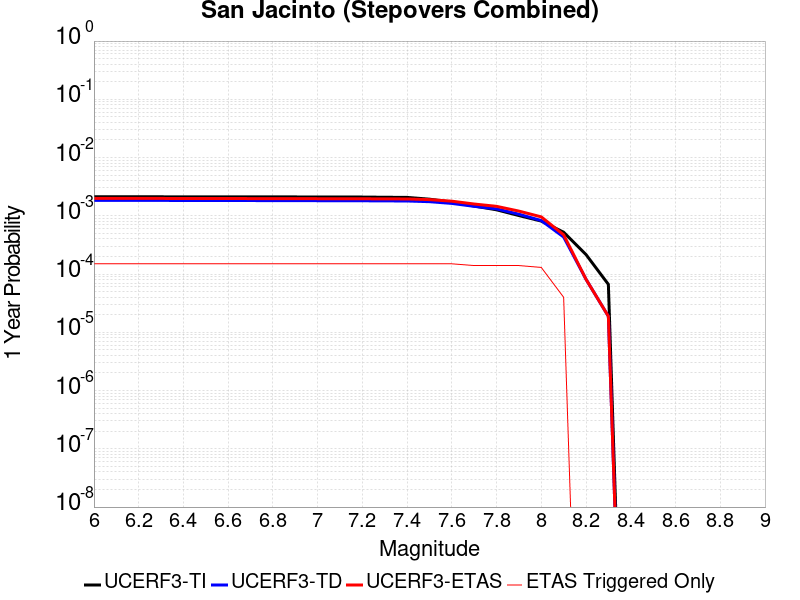 | 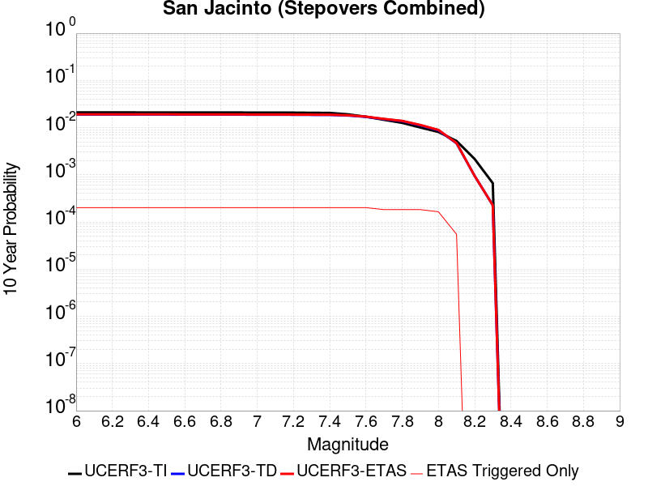 |

| Magnitude | 1 wk TI Prob | 1 wk TD Prob | 1 wk ETAS Prob | 1 wk ETAS/TD Gain | 1 wk ETAS Triggered Only | 1 mo TI Prob | 1 mo TD Prob | 1 mo ETAS Prob | 1 mo ETAS/TD Gain | 1 mo ETAS Triggered Only | 1 yr TI Prob | 1 yr TD Prob | 1 yr ETAS Prob | 1 yr ETAS/TD Gain | 1 yr ETAS Triggered Only | 10 yr TI Prob | 10 yr TD Prob | 10 yr ETAS Prob | 10 yr ETAS/TD Gain | 10 yr ETAS Triggered Only |
|-----|-----|-----|-----|-----|-----|-----|-----|-----|-----|-----|-----|-----|-----|-----|-----|-----|-----|-----|-----|-----|
| 6.0 | 4.0667746E-5 | 3.5272755E-5 | 1.3373567E-4 | 3.7914722 | 9.8466386E-5 | 1.742787E-4 | 1.5116022E-4 | 2.7422459E-4 | 1.8141321 | 1.2308298E-4 | 0.0021197782 | 0.0018388226 | 0.0020108218 | 1.0935377 | 1.7231617E-4 | 0.020996714 | 0.018986892 | 0.019204235 | 1.011447 | 2.2154937E-4 |
| 6.1 | 4.0667746E-5 | 3.5272755E-5 | 1.3373567E-4 | 3.7914722 | 9.8466386E-5 | 1.742787E-4 | 1.5116022E-4 | 2.7422459E-4 | 1.8141321 | 1.2308298E-4 | 0.0021197782 | 0.0018388226 | 0.0020108218 | 1.0935377 | 1.7231617E-4 | 0.020996714 | 0.018986892 | 0.019204235 | 1.011447 | 2.2154937E-4 |
| 6.2 | 4.0667746E-5 | 3.5272755E-5 | 1.3373567E-4 | 3.7914722 | 9.8466386E-5 | 1.742787E-4 | 1.5116022E-4 | 2.7422459E-4 | 1.8141321 | 1.2308298E-4 | 0.0021197782 | 0.0018388226 | 0.0020108218 | 1.0935377 | 1.7231617E-4 | 0.020996714 | 0.018986892 | 0.019204235 | 1.011447 | 2.2154937E-4 |
| 6.3 | 4.0667746E-5 | 3.5272755E-5 | 1.3373567E-4 | 3.7914722 | 9.8466386E-5 | 1.742787E-4 | 1.5116022E-4 | 2.7422459E-4 | 1.8141321 | 1.2308298E-4 | 0.0021197782 | 0.0018388226 | 0.0020108218 | 1.0935377 | 1.7231617E-4 | 0.020996714 | 0.018986892 | 0.019204235 | 1.011447 | 2.2154937E-4 |
| 6.4 | 4.0577226E-5 | 3.5144654E-5 | 1.3360758E-4 | 3.8016472 | 9.8466386E-5 | 1.738908E-4 | 1.5061127E-4 | 2.7367572E-4 | 1.8170998 | 1.2308298E-4 | 0.0021150648 | 0.0018321523 | 0.0020041526 | 1.0938789 | 1.7231617E-4 | 0.020950472 | 0.018921461 | 0.019138817 | 1.0114874 | 2.2154937E-4 |
| 6.5 | 4.0577226E-5 | 3.5144654E-5 | 1.3360758E-4 | 3.8016472 | 9.8466386E-5 | 1.738908E-4 | 1.5061127E-4 | 2.7367572E-4 | 1.8170998 | 1.2308298E-4 | 0.0021150648 | 0.0018321523 | 0.0020041526 | 1.0938789 | 1.7231617E-4 | 0.020950472 | 0.018921461 | 0.019138817 | 1.0114874 | 2.2154937E-4 |
| 6.6 | 4.053861E-5 | 3.509E-5 | 1.3355294E-4 | 3.806011 | 9.8466386E-5 | 1.7372532E-4 | 1.5037706E-4 | 2.7344155E-4 | 1.8183726 | 1.2308298E-4 | 0.0021130538 | 0.0018293057 | 0.0020013065 | 1.0940253 | 1.7231617E-4 | 0.020930743 | 0.018893538 | 0.019110901 | 1.0115047 | 2.2154937E-4 |
| 6.7 | 4.0516545E-5 | 3.5059067E-5 | 1.33522E-4 | 3.808487 | 9.8466386E-5 | 1.7363077E-4 | 1.5024451E-4 | 2.73309E-4 | 1.8190948 | 1.2308298E-4 | 0.002111905 | 0.001827695 | 0.0019996963 | 1.0941082 | 1.7231617E-4 | 0.020919468 | 0.018877735 | 0.019095102 | 1.0115144 | 2.2154937E-4 |
| 6.8 | 4.049434E-5 | 3.5030633E-5 | 1.3349357E-4 | 3.810767 | 9.8466386E-5 | 1.7353562E-4 | 1.5012265E-4 | 2.7318715E-4 | 1.8197597 | 1.2308298E-4 | 0.0021107488 | 0.0018262138 | 0.0019982152 | 1.0941848 | 1.7231617E-4 | 0.020908125 | 0.018863149 | 0.019080518 | 1.0115235 | 2.2154937E-4 |
| 6.9 | 4.046386E-5 | 3.499319E-5 | 1.3345614E-4 | 3.8137743 | 9.8466386E-5 | 1.73405E-4 | 1.4996222E-4 | 2.7302673E-4 | 1.8206369 | 1.2308298E-4 | 0.0021091616 | 0.0018242638 | 0.0019962657 | 1.0942856 | 1.7231617E-4 | 0.020892553 | 0.01884392 | 0.019061295 | 1.0115355 | 2.2154937E-4 |
| 7.0 | 4.036382E-5 | 3.487376E-5 | 1.3333671E-4 | 3.823411 | 9.8466386E-5 | 1.7297632E-4 | 1.4945042E-4 | 2.72515E-4 | 1.8234476 | 1.2308298E-4 | 0.0021039525 | 0.0018180435 | 0.0019900464 | 1.0946088 | 1.7231617E-4 | 0.02084144 | 0.018782536 | 0.018999923 | 1.0115739 | 2.2154937E-4 |
| 7.1 | 4.0343282E-5 | 3.4852223E-5 | 1.3331517E-4 | 3.8251557 | 9.8466386E-5 | 1.7288832E-4 | 1.4935812E-4 | 2.7242274E-4 | 1.8239565 | 1.2308298E-4 | 0.002102883 | 0.0018169218 | 0.0019889248 | 1.0946673 | 1.7231617E-4 | 0.020830948 | 0.018771412 | 0.018988803 | 1.011581 | 2.2154937E-4 |
| 7.2 | 4.0257353E-5 | 3.4756722E-5 | 1.3321968E-4 | 3.8329186 | 9.8466386E-5 | 1.725201E-4 | 1.489489E-4 | 2.7201354E-4 | 1.8262206 | 1.2308298E-4 | 0.0020984085 | 0.0018119477 | 0.0019839515 | 1.0949277 | 1.7231617E-4 | 0.020787042 | 0.018722152 | 0.018939553 | 1.0116119 | 2.2154937E-4 |
| 7.3 | 3.9940667E-5 | 3.4584376E-5 | 1.3304736E-4 | 3.8470364 | 9.8466386E-5 | 1.7116306E-4 | 1.4821035E-4 | 2.712751E-4 | 1.8303384 | 1.2308298E-4 | 0.0020819185 | 0.0018029709 | 0.0019749764 | 1.0954012 | 1.7231617E-4 | 0.020625217 | 0.018630784 | 0.018848205 | 1.01167 | 2.2154937E-4 |
| 7.4 | 3.9721202E-5 | 3.4469766E-5 | 1.3293276E-4 | 3.856503 | 9.8466386E-5 | 1.7022261E-4 | 1.4771923E-4 | 2.7078402E-4 | 1.8330995 | 1.2308298E-4 | 0.0020704903 | 0.0017970012 | 0.0019690078 | 1.0957186 | 1.7231617E-4 | 0.020513052 | 0.018569905 | 0.018787341 | 1.011709 | 2.2154937E-4 |
| 7.5 | 3.7036873E-5 | 3.3537188E-5 | 1.3200026E-4 | 3.9359376 | 9.8466386E-5 | 1.5871979E-4 | 1.437229E-4 | 2.6678818E-4 | 1.8562678 | 1.2308298E-4 | 0.0019307006 | 0.0017484248 | 0.0019204397 | 1.0983828 | 1.7231617E-4 | 0.019140124 | 0.018071463 | 0.01828901 | 1.0120381 | 2.2154937E-4 |
| 7.6 | 3.2940967E-5 | 3.1317984E-5 | 1.2978129E-4 | 4.1439857 | 9.8466386E-5 | 1.4116794E-4 | 1.3421304E-4 | 2.5727952E-4 | 1.9169486 | 1.2308298E-4 | 0.0017173645 | 0.0016328214 | 0.0018048561 | 1.1053605 | 1.7231617E-4 | 0.01704153 | 0.016904354 | 0.017122157 | 1.0128845 | 2.2154937E-4 |
| 7.7 | 2.8236149E-5 | 2.7883889E-5 | 1.2634753E-4 | 4.531202 | 9.8466386E-5 | 1.2100645E-4 | 1.19496915E-4 | 2.4256519E-4 | 2.0298867 | 1.2308298E-4 | 0.0014722579 | 0.001453905 | 0.0016013898 | 1.1014404 | 1.4769958E-4 | 0.014625421 | 0.015115095 | 0.015309052 | 1.0128319 | 1.9693277E-4 |
| 7.8 | 2.4329287E-5 | 2.5207537E-5 | 1.2367145E-4 | 4.9061294 | 9.8466386E-5 | 1.042642E-4 | 1.0802783E-4 | 2.3109753E-4 | 2.1392405 | 1.2308298E-4 | 0.0012686774 | 0.0013144462 | 0.0014619516 | 1.1122187 | 1.4769958E-4 | 0.012614589 | 0.013712396 | 0.013906628 | 1.0141647 | 1.9693277E-4 |
| 7.9 | 1.9370926E-5 | 2.0421452E-5 | 1.1888583E-4 | 5.8216147 | 9.8466386E-5 | 8.301561E-5 | 8.7517576E-5 | 2.1058979E-4 | 2.4062572 | 1.2308298E-4 | 0.0010102465 | 0.0010650064 | 0.0012125487 | 1.1385366 | 1.4769958E-4 | 0.0100566605 | 0.011199483 | 0.011394209 | 1.0173872 | 1.9693277E-4 |
| 8.0 | 1.5583017E-5 | 1.588647E-5 | 8.9735084E-5 | 5.648523 | 7.384979E-5 | 6.6782646E-5 | 6.808309E-5 | 1.6654277E-4 | 2.4461694 | 9.8466386E-5 | 8.127754E-4 | 8.285971E-4 | 9.515781E-4 | 1.1484207 | 1.2308298E-4 | 0.008098091 | 0.008781809 | 0.008952613 | 1.0194496 | 1.7231617E-4 |
| 8.1 | 1.0024873E-5 | 8.292404E-6 | 3.2908796E-5 | 3.968547 | 2.4616596E-5 | 4.2963035E-5 | 3.5538393E-5 | 8.476984E-5 | 2.385303 | 4.9233193E-5 | 5.229494E-4 | 4.3259456E-4 | 4.8180643E-4 | 1.1137599 | 4.9233193E-5 | 0.0052172043 | 0.0046534105 | 0.0047269166 | 1.0157962 | 7.384979E-5 |
| 8.2 | 4.142796E-6 | 1.5610041E-6 | 1.5610041E-6 | 1.0 | 0.0 | 1.775472E-5 | 6.69E-6 | 6.69E-6 | 1.0 | 0.0 | 2.1614227E-4 | 8.144774E-5 | 8.144774E-5 | 1.0 | 0.0 | 0.0021593217 | 9.454649E-4 | 9.454649E-4 | 1.0 | 0.0 |
| 8.3 | 1.2750878E-6 | 3.612133E-7 | 3.612133E-7 | 1.0 | 0.0 | 5.4646503E-6 | 1.548056E-6 | 1.548056E-6 | 1.0 | 0.0 | 6.653009E-5 | 1.8847424E-5 | 1.8847424E-5 | 1.0 | 0.0 | 6.6510175E-4 | 2.2734253E-4 | 2.2734253E-4 | 1.0 | 0.0 |

## Death Valley (Fish Lake Valley)
*[(top)](#table-of-contents)*

| 1 Week | 1 Month | 1 Year | 10 Year |
|-----|-----|-----|-----|
| 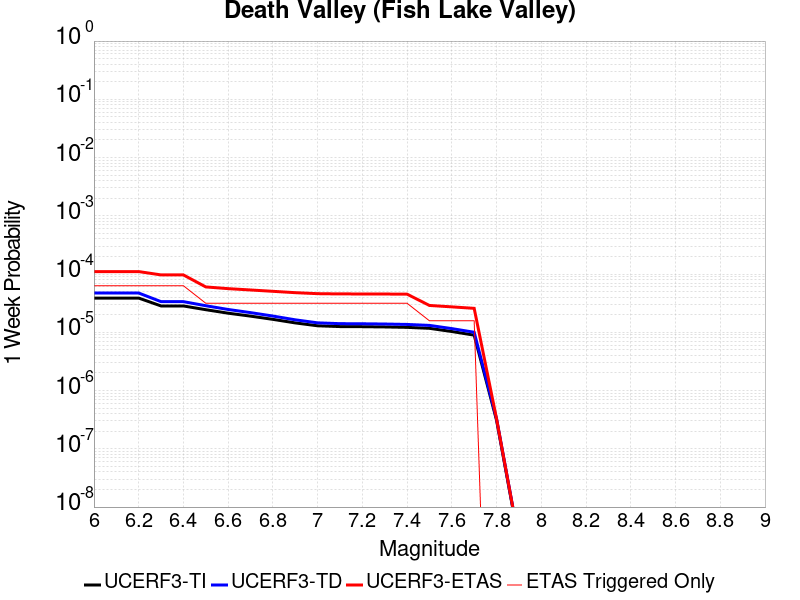 | 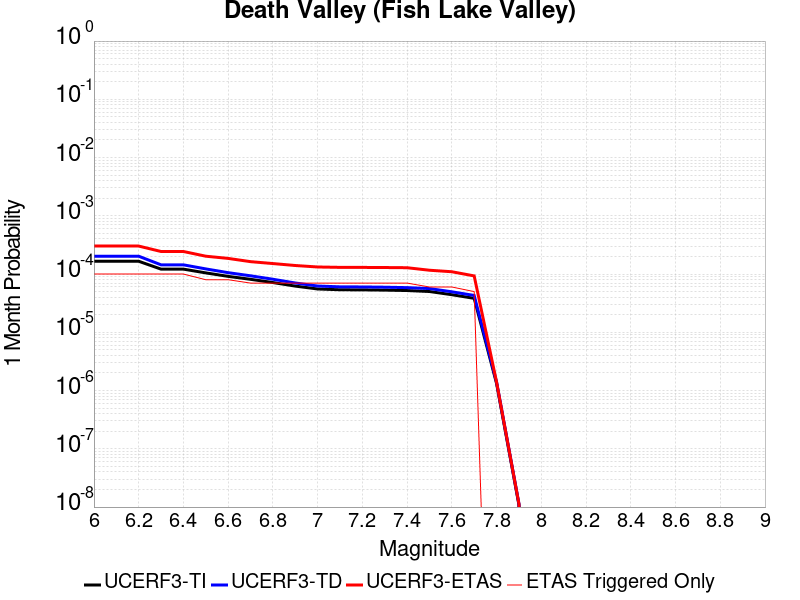 | 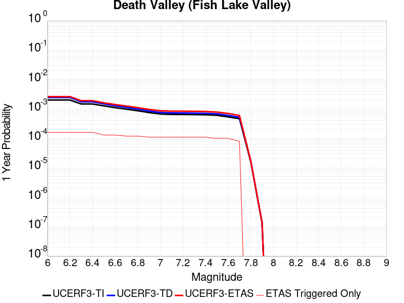 | 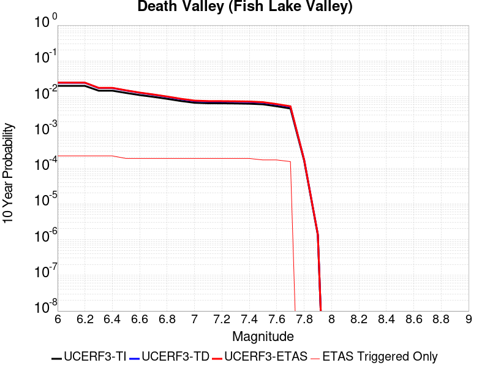 |

| Magnitude | 1 wk TI Prob | 1 wk TD Prob | 1 wk ETAS Prob | 1 wk ETAS/TD Gain | 1 wk ETAS Triggered Only | 1 mo TI Prob | 1 mo TD Prob | 1 mo ETAS Prob | 1 mo ETAS/TD Gain | 1 mo ETAS Triggered Only | 1 yr TI Prob | 1 yr TD Prob | 1 yr ETAS Prob | 1 yr ETAS/TD Gain | 1 yr ETAS Triggered Only | 10 yr TI Prob | 10 yr TD Prob | 10 yr ETAS Prob | 10 yr ETAS/TD Gain | 10 yr ETAS Triggered Only |
|-----|-----|-----|-----|-----|-----|-----|-----|-----|-----|-----|-----|-----|-----|-----|-----|-----|-----|-----|-----|-----|
| 6.0 | 3.872328E-5 | 4.7267473E-5 | 1.2111377E-4 | 2.562307 | 7.384979E-5 | 1.6594635E-4 | 2.0256084E-4 | 3.010073E-4 | 1.4860092 | 9.8466386E-5 | 0.0020185246 | 0.002463534 | 0.0025617578 | 1.0398711 | 9.8466386E-5 | 0.02000288 | 0.024388181 | 0.024580311 | 1.007878 | 1.9693277E-4 |
| 6.1 | 3.872328E-5 | 4.7267473E-5 | 1.2111377E-4 | 2.562307 | 7.384979E-5 | 1.6594635E-4 | 2.0256084E-4 | 3.010073E-4 | 1.4860092 | 9.8466386E-5 | 0.0020185246 | 0.002463534 | 0.0025617578 | 1.0398711 | 9.8466386E-5 | 0.02000288 | 0.024388181 | 0.024580311 | 1.007878 | 1.9693277E-4 |
| 6.2 | 3.872328E-5 | 4.7267473E-5 | 1.2111377E-4 | 2.562307 | 7.384979E-5 | 1.6594635E-4 | 2.0256084E-4 | 3.010073E-4 | 1.4860092 | 9.8466386E-5 | 0.0020185246 | 0.002463534 | 0.0025617578 | 1.0398711 | 9.8466386E-5 | 0.02000288 | 0.024388181 | 0.024580311 | 1.007878 | 1.9693277E-4 |
| 6.3 | 2.8356371E-5 | 3.3609853E-5 | 1.07457156E-4 | 3.1971924 | 7.384979E-5 | 1.2152165E-4 | 1.4403471E-4 | 2.4248692E-4 | 1.683531 | 9.8466386E-5 | 0.0014785219 | 0.0017522911 | 0.001850585 | 1.0560945 | 9.8466386E-5 | 0.014687235 | 0.017391782 | 0.01758529 | 1.0111264 | 1.9693277E-4 |
| 6.4 | 2.8356371E-5 | 3.3609853E-5 | 1.07457156E-4 | 3.1971924 | 7.384979E-5 | 1.2152165E-4 | 1.4403471E-4 | 2.4248692E-4 | 1.683531 | 9.8466386E-5 | 0.0014785219 | 0.0017522911 | 0.001850585 | 1.0560945 | 9.8466386E-5 | 0.014687235 | 0.017391782 | 0.01758529 | 1.0111264 | 1.9693277E-4 |
| 6.5 | 2.4448687E-5 | 2.8607552E-5 | 7.783934E-5 | 2.7209365 | 4.9233193E-5 | 1.0477588E-4 | 1.2259831E-4 | 1.9643905E-4 | 1.6022981 | 7.384979E-5 | 0.0012748998 | 0.0014916632 | 0.0015654027 | 1.0494345 | 7.384979E-5 | 0.012676105 | 0.014821377 | 0.014991139 | 1.0114539 | 1.7231617E-4 |
| 6.6 | 2.1298161E-5 | 2.4660083E-5 | 7.3892064E-5 | 2.9964237 | 4.9233193E-5 | 9.127464E-5 | 1.0568198E-4 | 1.7952397E-4 | 1.6987188 | 7.384979E-5 | 0.0011107022 | 0.0012859525 | 0.0013597073 | 1.0573542 | 7.384979E-5 | 0.011051672 | 0.012788526 | 0.012958637 | 1.013302 | 1.7231617E-4 |
| 6.7 | 1.8959729E-5 | 2.1781025E-5 | 7.101315E-5 | 3.2603216 | 4.9233193E-5 | 8.125345E-5 | 9.334405E-5 | 1.6718695E-4 | 1.791083 | 7.384979E-5 | 9.888117E-4 | 0.001135897 | 0.0012096629 | 1.0649407 | 7.384979E-5 | 0.009844234 | 0.01130357 | 0.011473938 | 1.0150721 | 1.7231617E-4 |
| 6.8 | 1.6691629E-5 | 1.9018353E-5 | 6.825061E-5 | 3.588671 | 4.9233193E-5 | 7.153359E-5 | 8.150477E-5 | 1.5534855E-4 | 1.9060055 | 7.384979E-5 | 8.7057345E-4 | 9.918857E-4 | 0.0010656622 | 1.07438 | 7.384979E-5 | 0.008671708 | 0.009876343 | 0.010046958 | 1.0172751 | 1.7231617E-4 |
| 6.9 | 1.450505E-5 | 1.638954E-5 | 6.562193E-5 | 4.0038905 | 4.9233193E-5 | 6.216302E-5 | 7.0239046E-5 | 1.4408365E-4 | 2.0513327 | 7.384979E-5 | 7.5657194E-4 | 8.5483363E-4 | 9.286203E-4 | 1.086317 | 7.384979E-5 | 0.007540013 | 0.008516385 | 0.0086872345 | 1.0200611 | 1.7231617E-4 |
| 7.0 | 1.2940855E-5 | 1.4537972E-5 | 6.377045E-5 | 4.386475 | 4.9233193E-5 | 5.545963E-5 | 6.230414E-5 | 1.3614932E-4 | 2.1852374 | 7.384979E-5 | 6.750118E-4 | 7.5829466E-4 | 8.3208847E-4 | 1.0973154 | 7.384979E-5 | 0.006729651 | 0.0075576897 | 0.007728704 | 1.0226278 | 1.7231617E-4 |
| 7.1 | 1.2544658E-5 | 1.4078208E-5 | 6.3310705E-5 | 4.4970717 | 4.9233193E-5 | 5.3761712E-5 | 6.0333812E-5 | 1.3417915E-4 | 2.223946 | 7.384979E-5 | 6.5435225E-4 | 7.343222E-4 | 8.0811774E-4 | 1.1004947 | 7.384979E-5 | 0.006524288 | 0.007319551 | 0.0074906056 | 1.0233696 | 1.7231617E-4 |
| 7.2 | 1.2489416E-5 | 1.4015674E-5 | 6.3248175E-5 | 4.512675 | 4.9233193E-5 | 5.3524967E-5 | 6.0065824E-5 | 1.3391118E-4 | 2.229407 | 7.384979E-5 | 6.514716E-4 | 7.310616E-4 | 8.048574E-4 | 1.1009433 | 7.384979E-5 | 0.006495651 | 0.0072871596 | 0.0074582202 | 1.0234742 | 1.7231617E-4 |
| 7.3 | 1.2368307E-5 | 1.3879812E-5 | 6.3112326E-5 | 4.5470586 | 4.9233193E-5 | 5.3005948E-5 | 5.9483587E-5 | 1.3332898E-4 | 2.2414415 | 7.384979E-5 | 6.451563E-4 | 7.2397763E-4 | 7.9777394E-4 | 1.1019318 | 7.384979E-5 | 0.0064328653 | 0.007216782 | 0.0073878546 | 1.0237049 | 1.7231617E-4 |
| 7.4 | 1.2161707E-5 | 1.36478675E-5 | 6.288039E-5 | 4.607342 | 4.9233193E-5 | 5.212056E-5 | 5.8489582E-5 | 1.3233506E-4 | 2.2625406 | 7.384979E-5 | 6.3438306E-4 | 7.118836E-4 | 7.8568084E-4 | 1.1036648 | 7.384979E-5 | 0.006325751 | 0.0070966207 | 0.007267714 | 1.0241091 | 1.7231617E-4 |
| 7.5 | 1.1707948E-5 | 1.3145515E-5 | 3.7761787E-5 | 2.8725986 | 2.4616596E-5 | 5.0175953E-5 | 5.6336736E-5 | 1.0556715E-4 | 1.87386 | 4.9233193E-5 | 6.10721E-4 | 6.856895E-4 | 7.3488895E-4 | 1.0717517 | 4.9233193E-5 | 0.0060904534 | 0.006836321 | 0.006983011 | 1.0214574 | 1.4769958E-4 |
| 7.6 | 1.0319538E-5 | 1.1579622E-5 | 3.6195936E-5 | 3.1258302 | 2.4616596E-5 | 4.4225842E-5 | 4.9626036E-5 | 9.8856784E-5 | 1.9920347 | 4.9233193E-5 | 5.383166E-4 | 6.040347E-4 | 6.5323815E-4 | 1.081458 | 4.9233193E-5 | 0.0053701443 | 0.0060244603 | 0.0061712703 | 1.024369 | 1.4769958E-4 |
| 7.7 | 8.937764E-6 | 1.0022779E-5 | 3.4639128E-5 | 3.4560404 | 2.4616596E-5 | 3.830414E-5 | 4.295409E-5 | 9.218517E-5 | 2.1461325 | 4.9233193E-5 | 4.6625308E-4 | 5.228456E-4 | 5.72053E-4 | 1.0941147 | 4.9233193E-5 | 0.0046527605 | 0.005216664 | 0.005339105 | 1.0234711 | 1.2308298E-4 |
| 7.8 | 3.108007E-7 | 3.284654E-7 | 3.284654E-7 | 1.0 | 0.0 | 1.3320023E-6 | 1.407708E-6 | 1.407708E-6 | 1.0 | 0.0 | 1.6217007E-5 | 1.7138715E-5 | 1.7138715E-5 | 1.0 | 0.0 | 1.6215823E-4 | 1.7137431E-4 | 1.7137431E-4 | 1.0 | 0.0 |
| 7.9 | 2.5591178E-9 | 2.6696718E-9 | 2.6696718E-9 | 1.0 | 0.0 | 1.0967647E-8 | 1.14414505E-8 | 1.14414505E-8 | 1.0 | 0.0 | 1.335311E-7 | 1.3929966E-7 | 1.3929966E-7 | 1.0 | 0.0 | 1.3353102E-6 | 1.3929966E-6 | 1.3929966E-6 | 1.0 | 0.0 |

## White Mountains
*[(top)](#table-of-contents)*

| 1 Week | 1 Month | 1 Year | 10 Year |
|-----|-----|-----|-----|
| 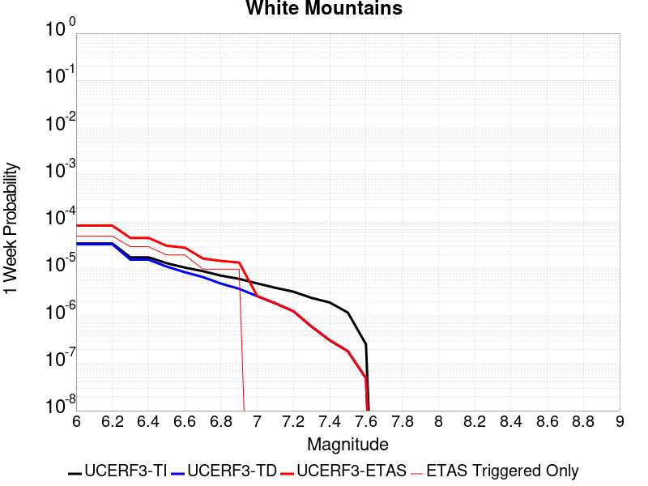 | 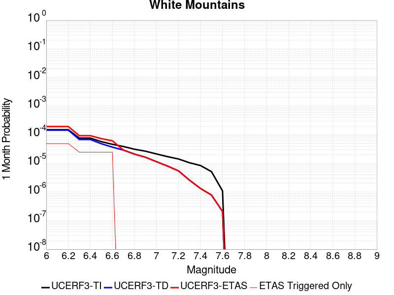 | 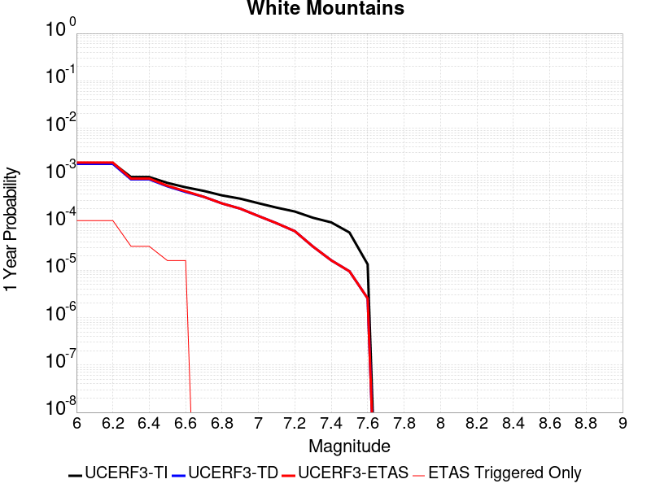 | 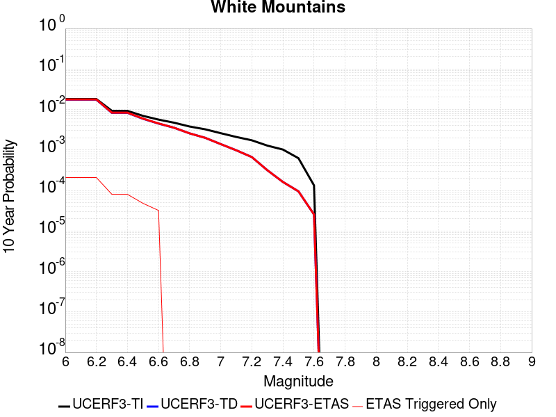 |

| Magnitude | 1 wk TI Prob | 1 wk TD Prob | 1 wk ETAS Prob | 1 wk ETAS/TD Gain | 1 wk ETAS Triggered Only | 1 mo TI Prob | 1 mo TD Prob | 1 mo ETAS Prob | 1 mo ETAS/TD Gain | 1 mo ETAS Triggered Only | 1 yr TI Prob | 1 yr TD Prob | 1 yr ETAS Prob | 1 yr ETAS/TD Gain | 1 yr ETAS Triggered Only | 10 yr TI Prob | 10 yr TD Prob | 10 yr ETAS Prob | 10 yr ETAS/TD Gain | 10 yr ETAS Triggered Only |
|-----|-----|-----|-----|-----|-----|-----|-----|-----|-----|-----|-----|-----|-----|-----|-----|-----|-----|-----|-----|-----|
| 6.0 | 3.503579E-5 | 3.378405E-5 | 8.3015584E-5 | 2.4572418 | 4.9233193E-5 | 1.5014476E-4 | 1.4478143E-4 | 1.940075E-4 | 1.3400027 | 4.9233193E-5 | 0.0018264796 | 0.0017614096 | 0.0018842757 | 1.0697545 | 1.2308298E-4 | 0.018115403 | 0.017486818 | 0.017680308 | 1.0110649 | 1.9693277E-4 |
| 6.1 | 3.503579E-5 | 3.378405E-5 | 8.3015584E-5 | 2.4572418 | 4.9233193E-5 | 1.5014476E-4 | 1.4478143E-4 | 1.940075E-4 | 1.3400027 | 4.9233193E-5 | 0.0018264796 | 0.0017614096 | 0.0018842757 | 1.0697545 | 1.2308298E-4 | 0.018115403 | 0.017486818 | 0.017680308 | 1.0110649 | 1.9693277E-4 |
| 6.2 | 3.503579E-5 | 3.378405E-5 | 8.3015584E-5 | 2.4572418 | 4.9233193E-5 | 1.5014476E-4 | 1.4478143E-4 | 1.940075E-4 | 1.3400027 | 4.9233193E-5 | 0.0018264796 | 0.0017614096 | 0.0018842757 | 1.0697545 | 1.2308298E-4 | 0.018115403 | 0.017486818 | 0.017680308 | 1.0110649 | 1.9693277E-4 |
| 6.3 | 1.7818425E-5 | 1.5916074E-5 | 4.053228E-5 | 2.5466254 | 2.4616596E-5 | 7.636245E-5 | 6.821004E-5 | 9.282496E-5 | 1.3608694 | 2.4616596E-5 | 9.293162E-4 | 8.301551E-4 | 8.5475127E-4 | 1.0296284 | 2.4616596E-5 | 0.009254395 | 0.008271999 | 0.008345238 | 1.0088538 | 7.384979E-5 |
| 6.4 | 1.7818425E-5 | 1.5916074E-5 | 4.053228E-5 | 2.5466254 | 2.4616596E-5 | 7.636245E-5 | 6.821004E-5 | 9.282496E-5 | 1.3608694 | 2.4616596E-5 | 9.293162E-4 | 8.301551E-4 | 8.5475127E-4 | 1.0296284 | 2.4616596E-5 | 0.009254395 | 0.008271999 | 0.008345238 | 1.0088538 | 7.384979E-5 |
| 6.5 | 1.3397557E-5 | 1.13362685E-5 | 3.5952587E-5 | 3.1714656 | 2.4616596E-5 | 5.741684E-5 | 4.858314E-5 | 7.319854E-5 | 1.5066655 | 2.4616596E-5 | 6.988258E-4 | 5.913462E-4 | 6.159482E-4 | 1.0416034 | 2.4616596E-5 | 0.006966323 | 0.005898432 | 0.0059473747 | 1.0082976 | 4.9233193E-5 |
| 6.6 | 1.0818695E-5 | 8.625366E-6 | 3.324175E-5 | 3.8539524 | 2.4616596E-5 | 4.6365014E-5 | 3.6965357E-5 | 6.158104E-5 | 1.6659124 | 2.4616596E-5 | 5.6434784E-4 | 4.4996463E-4 | 4.7457014E-4 | 1.0546832 | 2.4616596E-5 | 0.005629168 | 0.004490972 | 0.0045399843 | 1.0109135 | 4.9233193E-5 |
| 6.7 | 9.067908E-6 | 6.802442E-6 | 6.802442E-6 | 1.0 | 0.0 | 3.8861883E-5 | 2.9153016E-5 | 2.9153016E-5 | 1.0 | 0.0 | 4.7304068E-4 | 3.5488335E-4 | 3.5488335E-4 | 1.0 | 0.0 | 0.00472035 | 0.0035434833 | 0.0035434833 | 1.0 | 0.0 |
| 6.8 | 7.295947E-6 | 4.936391E-6 | 4.936391E-6 | 1.0 | 0.0 | 3.126797E-5 | 2.1155796E-5 | 2.1155796E-5 | 1.0 | 0.0 | 3.8062103E-4 | 2.575425E-4 | 2.575425E-4 | 1.0 | 0.0 | 0.0037996976 | 0.0025725532 | 0.0025725532 | 1.0 | 0.0 |
| 6.9 | 6.2243444E-6 | 3.832213E-6 | 3.832213E-6 | 1.0 | 0.0 | 2.6675489E-5 | 1.642367E-5 | 1.642367E-5 | 1.0 | 0.0 | 3.2472567E-4 | 1.9994036E-4 | 1.9994036E-4 | 1.0 | 0.0 | 0.0032425157 | 0.0019976576 | 0.0019976576 | 1.0 | 0.0 |
| 7.0 | 4.9878413E-6 | 2.6795342E-6 | 2.6795342E-6 | 1.0 | 0.0 | 2.1376287E-5 | 1.14836685E-5 | 1.14836685E-5 | 1.0 | 0.0 | 2.602252E-4 | 1.3980496E-4 | 1.3980496E-4 | 1.0 | 0.0 | 0.002599207 | 0.0013971963 | 0.0013971963 | 1.0 | 0.0 |
| 7.1 | 4.0252844E-6 | 1.8857575E-6 | 1.8857575E-6 | 1.0 | 0.0 | 1.7251105E-5 | 8.081794E-6 | 8.081794E-6 | 1.0 | 0.0 | 2.1001195E-4 | 9.8391516E-5 | 9.8391516E-5 | 1.0 | 0.0 | 0.0020981359 | 9.834924E-4 | 9.834924E-4 | 1.0 | 0.0 |
| 7.2 | 3.3284066E-6 | 1.281964E-6 | 1.281964E-6 | 1.0 | 0.0 | 1.4264522E-5 | 5.494121E-6 | 5.494121E-6 | 1.0 | 0.0 | 1.736567E-4 | 6.688897E-5 | 6.688897E-5 | 1.0 | 0.0 | 0.0017352107 | 6.6869846E-4 | 6.6869846E-4 | 1.0 | 0.0 |
| 7.3 | 2.458226E-6 | 6.05722E-7 | 6.05722E-7 | 1.0 | 0.0 | 1.0535211E-5 | 2.5959491E-6 | 2.5959491E-6 | 1.0 | 0.0 | 1.2825865E-4 | 3.1605257E-5 | 3.1605257E-5 | 1.0 | 0.0 | 0.0012818464 | 3.160114E-4 | 3.160114E-4 | 1.0 | 0.0 |
| 7.4 | 1.965953E-6 | 3.1089303E-7 | 3.1089303E-7 | 1.0 | 0.0 | 8.425486E-6 | 1.332398E-6 | 1.332398E-6 | 1.0 | 0.0 | 1.0257547E-4 | 1.6221828E-5 | 1.6221828E-5 | 1.0 | 0.0 | 0.0010252813 | 1.6220656E-4 | 1.6220656E-4 | 1.0 | 0.0 |
| 7.5 | 1.2014192E-6 | 1.8244253E-7 | 1.8244253E-7 | 1.0 | 0.0 | 5.148929E-6 | 7.8189635E-7 | 7.8189635E-7 | 1.0 | 0.0 | 6.2686406E-5 | 9.519547E-6 | 9.519547E-6 | 1.0 | 0.0 | 6.266873E-4 | 9.519148E-5 | 9.519148E-5 | 1.0 | 0.0 |
| 7.6 | 2.5612175E-7 | 4.8946475E-8 | 4.8946475E-8 | 1.0 | 0.0 | 1.0976642E-6 | 2.0977059E-7 | 2.0977059E-7 | 1.0 | 0.0 | 1.3363979E-5 | 2.5539543E-6 | 2.5539543E-6 | 1.0 | 0.0 | 1.3363175E-4 | 2.5539286E-5 | 2.5539286E-5 | 1.0 | 0.0 |

## San Jacinto (Anza) rev
*[(top)](#table-of-contents)*

| 1 Week | 1 Month | 1 Year | 10 Year |
|-----|-----|-----|-----|
| 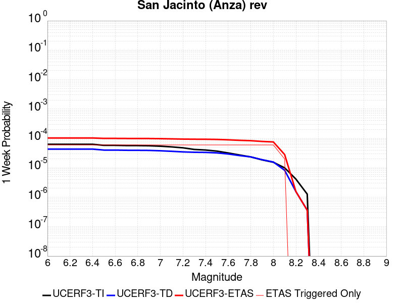 | 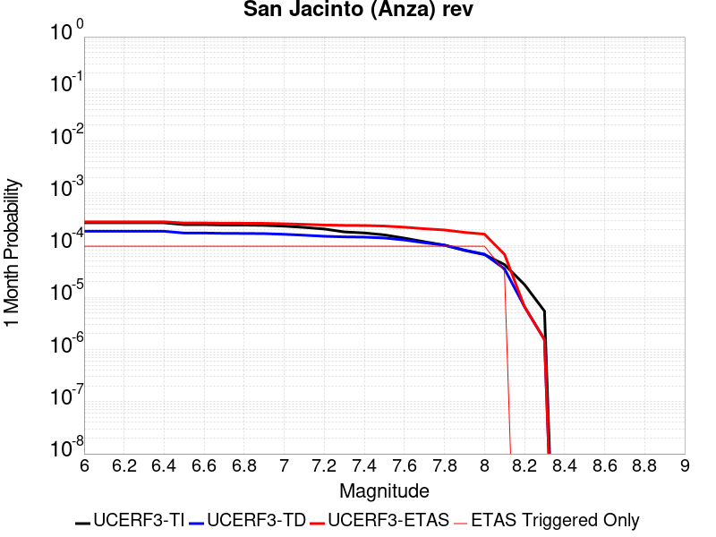 | 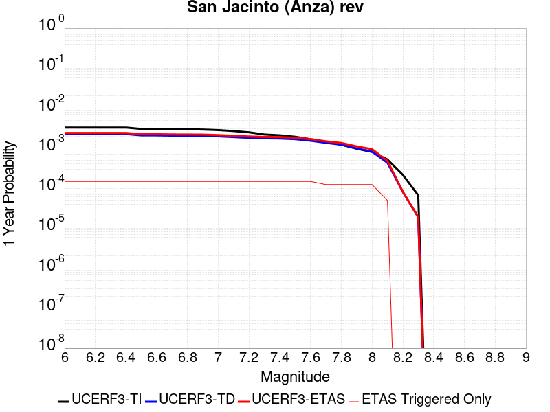 | 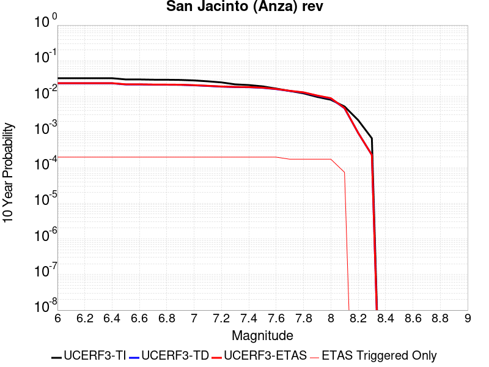 |

| Magnitude | 1 wk TI Prob | 1 wk TD Prob | 1 wk ETAS Prob | 1 wk ETAS/TD Gain | 1 wk ETAS Triggered Only | 1 mo TI Prob | 1 mo TD Prob | 1 mo ETAS Prob | 1 mo ETAS/TD Gain | 1 mo ETAS Triggered Only | 1 yr TI Prob | 1 yr TD Prob | 1 yr ETAS Prob | 1 yr ETAS/TD Gain | 1 yr ETAS Triggered Only | 10 yr TI Prob | 10 yr TD Prob | 10 yr ETAS Prob | 10 yr ETAS/TD Gain | 10 yr ETAS Triggered Only |
|-----|-----|-----|-----|-----|-----|-----|-----|-----|-----|-----|-----|-----|-----|-----|-----|-----|-----|-----|-----|-----|
| 6.0 | 6.3015636E-5 | 4.3302647E-5 | 1.1714924E-4 | 2.7053597 | 7.384979E-5 | 2.7003905E-4 | 1.8556965E-4 | 2.8401776E-4 | 1.5305184 | 9.8466386E-5 | 0.0032827691 | 0.0022569813 | 0.0024043475 | 1.0652936 | 1.4769958E-4 | 0.032346968 | 0.023296192 | 0.023488536 | 1.0082566 | 1.9693277E-4 |
| 6.1 | 6.3015636E-5 | 4.3302647E-5 | 1.1714924E-4 | 2.7053597 | 7.384979E-5 | 2.7003905E-4 | 1.8556965E-4 | 2.8401776E-4 | 1.5305184 | 9.8466386E-5 | 0.0032827691 | 0.0022569813 | 0.0024043475 | 1.0652936 | 1.4769958E-4 | 0.032346968 | 0.023296192 | 0.023488536 | 1.0082566 | 1.9693277E-4 |
| 6.2 | 6.3015636E-5 | 4.3302647E-5 | 1.1714924E-4 | 2.7053597 | 7.384979E-5 | 2.7003905E-4 | 1.8556965E-4 | 2.8401776E-4 | 1.5305184 | 9.8466386E-5 | 0.0032827691 | 0.0022569813 | 0.0024043475 | 1.0652936 | 1.4769958E-4 | 0.032346968 | 0.023296192 | 0.023488536 | 1.0082566 | 1.9693277E-4 |
| 6.3 | 6.3015636E-5 | 4.3302647E-5 | 1.1714924E-4 | 2.7053597 | 7.384979E-5 | 2.7003905E-4 | 1.8556965E-4 | 2.8401776E-4 | 1.5305184 | 9.8466386E-5 | 0.0032827691 | 0.0022569813 | 0.0024043475 | 1.0652936 | 1.4769958E-4 | 0.032346968 | 0.023296192 | 0.023488536 | 1.0082566 | 1.9693277E-4 |
| 6.4 | 6.3015636E-5 | 4.3302647E-5 | 1.1714924E-4 | 2.7053597 | 7.384979E-5 | 2.7003905E-4 | 1.8556965E-4 | 2.8401776E-4 | 1.5305184 | 9.8466386E-5 | 0.0032827691 | 0.0022569813 | 0.0024043475 | 1.0652936 | 1.4769958E-4 | 0.032346968 | 0.023296192 | 0.023488536 | 1.0082566 | 1.9693277E-4 |
| 6.5 | 5.811017E-5 | 4.0082516E-5 | 1.13929345E-4 | 2.8423703 | 7.384979E-5 | 2.4901982E-4 | 1.7177092E-4 | 2.702204E-4 | 1.573144 | 9.8466386E-5 | 0.0030276014 | 0.002089311 | 0.0022367018 | 1.0705453 | 1.4769958E-4 | 0.02986684 | 0.021593736 | 0.021786418 | 1.0089229 | 1.9693277E-4 |
| 6.6 | 5.811017E-5 | 4.0082516E-5 | 1.13929345E-4 | 2.8423703 | 7.384979E-5 | 2.4901982E-4 | 1.7177092E-4 | 2.702204E-4 | 1.573144 | 9.8466386E-5 | 0.0030276014 | 0.002089311 | 0.0022367018 | 1.0705453 | 1.4769958E-4 | 0.02986684 | 0.021593736 | 0.021786418 | 1.0089229 | 1.9693277E-4 |
| 6.7 | 5.712442E-5 | 3.9505223E-5 | 1.1335209E-4 | 2.869294 | 7.384979E-5 | 2.4479596E-4 | 1.6929714E-4 | 2.6774686E-4 | 1.5815202 | 9.8466386E-5 | 0.0029763177 | 0.0020592497 | 0.0022066452 | 1.0715772 | 1.4769958E-4 | 0.029367693 | 0.021285562 | 0.021478303 | 1.009055 | 1.9693277E-4 |
| 6.8 | 5.6967532E-5 | 3.9361643E-5 | 1.1320852E-4 | 2.8761127 | 7.384979E-5 | 2.4412372E-4 | 1.6868189E-4 | 2.6713166E-4 | 1.5836416 | 9.8466386E-5 | 0.0029681553 | 0.002051773 | 0.0021991695 | 1.0718386 | 1.4769958E-4 | 0.029288229 | 0.021210281 | 0.021403037 | 1.0090878 | 1.9693277E-4 |
| 6.9 | 5.6211324E-5 | 3.9066435E-5 | 1.1291334E-4 | 2.8902903 | 7.384979E-5 | 2.4088343E-4 | 1.6741687E-4 | 2.6586678E-4 | 1.5880525 | 9.8466386E-5 | 0.0029288116 | 0.0020364004 | 0.0021837992 | 1.0723821 | 1.4769958E-4 | 0.028905109 | 0.021049714 | 0.021242501 | 1.0091586 | 1.9693277E-4 |
| 7.0 | 5.4383527E-5 | 3.792697E-5 | 1.1177396E-4 | 2.947084 | 7.384979E-5 | 2.3305144E-4 | 1.6253405E-4 | 2.6098444E-4 | 1.6057216 | 9.8466386E-5 | 0.0028337094 | 0.001977061 | 0.0021244686 | 1.074559 | 1.4769958E-4 | 0.027978465 | 0.020440677 | 0.020633584 | 1.0094374 | 1.9693277E-4 |
| 7.1 | 5.1393665E-5 | 3.6389913E-5 | 1.10237015E-4 | 3.0293288 | 7.384979E-5 | 2.2023996E-4 | 1.5594746E-4 | 2.543985E-4 | 1.6313089 | 9.8466386E-5 | 0.0026781242 | 0.0018970112 | 0.0020444305 | 1.0777113 | 1.4769958E-4 | 0.026460782 | 0.019614287 | 0.019807357 | 1.0098433 | 1.9693277E-4 |
| 7.2 | 4.785222E-5 | 3.4741795E-5 | 1.0858902E-4 | 3.1256018 | 7.384979E-5 | 2.0506482E-4 | 1.4888494E-4 | 2.4733666E-4 | 1.6612605 | 9.8466386E-5 | 0.0024938055 | 0.0018111705 | 0.0019586026 | 1.0814016 | 1.4769958E-4 | 0.024660049 | 0.018728992 | 0.018922236 | 1.0103179 | 1.9693277E-4 |
| 7.3 | 4.2143256E-5 | 3.383628E-5 | 1.0768357E-4 | 3.1824884 | 7.384979E-5 | 1.8060145E-4 | 1.4500458E-4 | 2.4345668E-4 | 1.6789587 | 9.8466386E-5 | 0.002196605 | 0.0017640047 | 0.0019114437 | 1.083582 | 1.4769958E-4 | 0.02175019 | 0.01823724 | 0.018430583 | 1.0106014 | 1.9693277E-4 |
| 7.4 | 4.0264713E-5 | 3.347446E-5 | 1.0732178E-4 | 3.2060792 | 7.384979E-5 | 1.7255165E-4 | 1.4345412E-4 | 2.4190638E-4 | 1.6862979 | 9.8466386E-5 | 0.002098792 | 0.0017451581 | 0.0018925999 | 1.0844862 | 1.4769958E-4 | 0.020790804 | 0.018041821 | 0.018235201 | 1.0107185 | 1.9693277E-4 |
| 7.5 | 3.694492E-5 | 3.218847E-5 | 1.0603588E-4 | 3.2942195 | 7.384979E-5 | 1.5832575E-4 | 1.379433E-4 | 2.363961E-4 | 1.7137194 | 9.8466386E-5 | 0.0019259118 | 0.001678169 | 0.0018256207 | 1.0878646 | 1.4769958E-4 | 0.01909306 | 0.01735827 | 0.017551785 | 1.0111482 | 1.9693277E-4 |
| 7.6 | 3.200565E-5 | 2.9504106E-5 | 1.0335172E-4 | 3.5029604 | 7.384979E-5 | 1.3715986E-4 | 1.2644005E-4 | 2.2489399E-4 | 1.778661 | 9.8466386E-5 | 0.001668642 | 0.0015383229 | 0.0016857953 | 1.0958657 | 1.4769958E-4 | 0.01656168 | 0.0159463 | 0.016140092 | 1.0121528 | 1.9693277E-4 |
| 7.7 | 2.731642E-5 | 2.6092788E-5 | 9.994065E-5 | 3.830202 | 7.384979E-5 | 1.1706512E-4 | 1.1182144E-4 | 2.1027682E-4 | 1.8804696 | 9.8466386E-5 | 0.001424336 | 0.0013605768 | 0.0014834924 | 1.0903407 | 1.2308298E-4 | 0.014152412 | 0.014167004 | 0.014336879 | 1.0119909 | 1.7231617E-4 |
| 7.8 | 2.3466424E-5 | 2.3504817E-5 | 9.735287E-5 | 4.141826 | 7.384979E-5 | 1.0056651E-4 | 1.0073105E-4 | 1.9918752E-4 | 1.9774193 | 9.8466386E-5 | 0.0012237094 | 0.0012257113 | 0.0013486434 | 1.1002945 | 1.2308298E-4 | 0.012169928 | 0.012808893 | 0.012979002 | 1.0132805 | 1.7231617E-4 |
| 7.9 | 1.8611925E-5 | 1.8908117E-5 | 9.275651E-5 | 4.905645 | 7.384979E-5 | 7.9762955E-5 | 8.1032274E-5 | 1.7949069E-4 | 2.2150517 | 9.8466386E-5 | 9.7068126E-4 | 9.861222E-4 | 0.0011090838 | 1.1246921 | 1.2308298E-4 | 0.0096645225 | 0.010393824 | 0.01056435 | 1.0164064 | 1.7231617E-4 |
| 8.0 | 1.5460775E-5 | 1.5740965E-5 | 8.9589594E-5 | 5.691493 | 7.384979E-5 | 6.6258784E-5 | 6.7459536E-5 | 1.6591928E-4 | 2.4595377 | 9.8466386E-5 | 8.0640207E-4 | 8.21011E-4 | 9.43993E-4 | 1.1497933 | 1.2308298E-4 | 0.008034821 | 0.0087028835 | 0.0088737 | 1.0196276 | 1.7231617E-4 |
| 8.1 | 9.983884E-6 | 8.269952E-6 | 3.2886346E-5 | 3.9766066 | 2.4616596E-5 | 4.2787375E-5 | 3.544217E-5 | 8.467362E-5 | 2.389064 | 4.9233193E-5 | 5.2081177E-4 | 4.314235E-4 | 4.8063547E-4 | 1.1140687 | 4.9233193E-5 | 0.0051959283 | 0.004640022 | 0.0047135293 | 1.015842 | 7.384979E-5 |
| 8.2 | 4.1226E-6 | 1.5529788E-6 | 1.5529788E-6 | 1.0 | 0.0 | 1.7668166E-5 | 6.6556063E-6 | 6.6556063E-6 | 1.0 | 0.0 | 2.1508869E-4 | 8.102902E-5 | 8.102902E-5 | 1.0 | 0.0 | 0.0021488064 | 9.4050163E-4 | 9.4050163E-4 | 1.0 | 0.0 |
| 8.3 | 1.2750878E-6 | 3.612133E-7 | 3.612133E-7 | 1.0 | 0.0 | 5.4646503E-6 | 1.548056E-6 | 1.548056E-6 | 1.0 | 0.0 | 6.653009E-5 | 1.8847424E-5 | 1.8847424E-5 | 1.0 | 0.0 | 6.6510175E-4 | 2.2734253E-4 | 2.2734253E-4 | 1.0 | 0.0 |

## Santa Ynez (West)
*[(top)](#table-of-contents)*

| 1 Week | 1 Month | 1 Year | 10 Year |
|-----|-----|-----|-----|
| 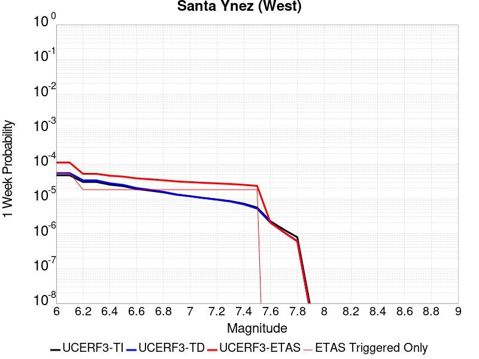 | 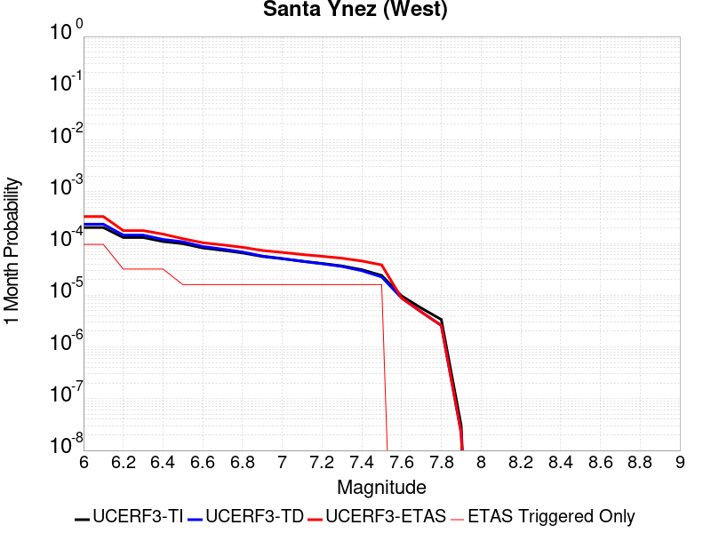 | 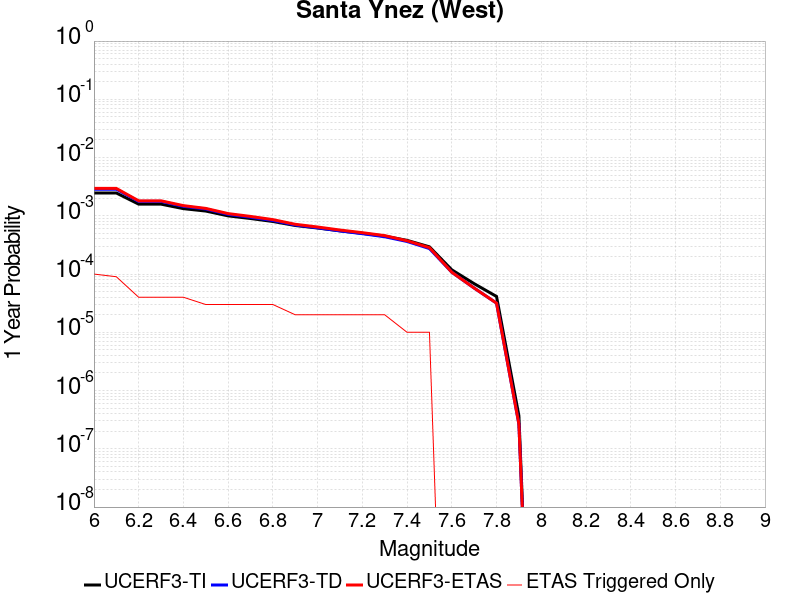 |  |

| Magnitude | 1 wk TI Prob | 1 wk TD Prob | 1 wk ETAS Prob | 1 wk ETAS/TD Gain | 1 wk ETAS Triggered Only | 1 mo TI Prob | 1 mo TD Prob | 1 mo ETAS Prob | 1 mo ETAS/TD Gain | 1 mo ETAS Triggered Only | 1 yr TI Prob | 1 yr TD Prob | 1 yr ETAS Prob | 1 yr ETAS/TD Gain | 1 yr ETAS Triggered Only | 10 yr TI Prob | 10 yr TD Prob | 10 yr ETAS Prob | 10 yr ETAS/TD Gain | 10 yr ETAS Triggered Only |
|-----|-----|-----|-----|-----|-----|-----|-----|-----|-----|-----|-----|-----|-----|-----|-----|-----|-----|-----|-----|-----|
| 6.0 | 4.7352758E-5 | 5.4972126E-5 | 7.958737E-5 | 1.4477768 | 2.4616596E-5 | 2.0292461E-4 | 2.3557522E-4 | 2.847968E-4 | 1.2089422 | 4.9233193E-5 | 0.0024678076 | 0.0028645284 | 0.0029381665 | 1.0257069 | 7.384979E-5 | 0.024405818 | 0.028304417 | 0.028447935 | 1.0050706 | 1.4769958E-4 |
| 6.1 | 4.7352758E-5 | 5.4972126E-5 | 7.958737E-5 | 1.4477768 | 2.4616596E-5 | 2.0292461E-4 | 2.3557522E-4 | 2.847968E-4 | 1.2089422 | 4.9233193E-5 | 0.0024678076 | 0.0028645284 | 0.0029136206 | 1.017138 | 4.9233193E-5 | 0.024405818 | 0.028304417 | 0.028424017 | 1.0042255 | 1.2308298E-4 |
| 6.2 | 3.0415853E-5 | 3.392511E-5 | 3.392511E-5 | 1.0 | 0.0 | 1.3034715E-4 | 1.4538545E-4 | 1.4538545E-4 | 1.0 | 0.0 | 0.0015858212 | 0.0017686661 | 0.0017686661 | 1.0 | 0.0 | 0.015745522 | 0.017549807 | 0.017622361 | 1.0041342 | 7.384979E-5 |
| 6.3 | 3.0415853E-5 | 3.392511E-5 | 3.392511E-5 | 1.0 | 0.0 | 1.3034715E-4 | 1.4538545E-4 | 1.4538545E-4 | 1.0 | 0.0 | 0.0015858212 | 0.0017686661 | 0.0017686661 | 1.0 | 0.0 | 0.015745522 | 0.017549807 | 0.017622361 | 1.0041342 | 7.384979E-5 |
| 6.4 | 2.5452082E-5 | 2.7912422E-5 | 2.7912422E-5 | 1.0 | 0.0 | 1.09075794E-4 | 1.196193E-4 | 1.196193E-4 | 1.0 | 0.0 | 0.0013271887 | 0.0014554089 | 0.0014554089 | 1.0 | 0.0 | 0.013192902 | 0.014460951 | 0.014533733 | 1.005033 | 7.384979E-5 |
| 6.5 | 2.3143784E-5 | 2.5128256E-5 | 2.5128256E-5 | 1.0 | 0.0 | 9.9183875E-5 | 1.0768817E-4 | 1.0768817E-4 | 1.0 | 0.0 | 0.0012068948 | 0.0013103267 | 0.0013103267 | 1.0 | 0.0 | 0.012003611 | 0.01302768 | 0.013100568 | 1.0055948 | 7.384979E-5 |
| 6.6 | 1.9118515E-5 | 2.035434E-5 | 2.035434E-5 | 1.0 | 0.0 | 8.193392E-5 | 8.7230015E-5 | 8.7230015E-5 | 1.0 | 0.0 | 9.97089E-4 | 0.001061516 | 0.001061516 | 1.0 | 0.0 | 0.00992627 | 0.010565365 | 0.010614078 | 1.0046107 | 4.9233193E-5 |
| 6.7 | 1.722807E-5 | 1.8146347E-5 | 1.8146347E-5 | 1.0 | 0.0 | 7.3832496E-5 | 7.776777E-5 | 7.776777E-5 | 1.0 | 0.0 | 8.985399E-4 | 9.464169E-4 | 9.464169E-4 | 1.0 | 0.0 | 0.008949154 | 0.0094245095 | 0.009473279 | 1.0051748 | 4.9233193E-5 |
| 6.8 | 1.5317364E-5 | 1.5926486E-5 | 1.5926486E-5 | 1.0 | 0.0 | 6.56442E-5 | 6.82546E-5 | 6.82546E-5 | 1.0 | 0.0 | 7.98925E-4 | 8.306873E-4 | 8.306873E-4 | 1.0 | 0.0 | 0.007960589 | 0.00827631 | 0.008300723 | 1.0029497 | 2.4616596E-5 |
| 6.9 | 1.3071226E-5 | 1.3329624E-5 | 1.3329624E-5 | 1.0 | 0.0 | 5.6018336E-5 | 5.7125722E-5 | 5.7125722E-5 | 1.0 | 0.0 | 6.8180985E-4 | 6.9528597E-4 | 6.9528597E-4 | 1.0 | 0.0 | 0.0067972173 | 0.006931367 | 0.006955813 | 1.0035268 | 2.4616596E-5 |
| 7.0 | 1.1836986E-5 | 1.19327815E-5 | 1.19327815E-5 | 1.0 | 0.0 | 5.0728955E-5 | 5.11395E-5 | 5.11395E-5 | 1.0 | 0.0 | 6.1745E-4 | 6.2244723E-4 | 6.2244723E-4 | 1.0 | 0.0 | 0.006157372 | 0.006207231 | 0.006231695 | 1.0039412 | 2.4616596E-5 |
| 7.1 | 1.0597169E-5 | 1.0542201E-5 | 1.0542201E-5 | 1.0 | 0.0 | 4.541565E-5 | 4.5180084E-5 | 4.5180084E-5 | 1.0 | 0.0 | 5.5279525E-4 | 5.4992986E-4 | 5.4992986E-4 | 1.0 | 0.0 | 0.0055142213 | 0.005485821 | 0.0055103023 | 1.0044627 | 2.4616596E-5 |
| 7.2 | 9.59113E-6 | 9.459144E-6 | 9.459144E-6 | 1.0 | 0.0 | 4.11042E-5 | 4.0538565E-5 | 4.0538565E-5 | 1.0 | 0.0 | 5.0032866E-4 | 4.934463E-4 | 4.934463E-4 | 1.0 | 0.0 | 0.004992037 | 0.0049236254 | 0.0049481206 | 1.0049751 | 2.4616596E-5 |
| 7.3 | 8.586084E-6 | 8.379583E-6 | 8.379583E-6 | 1.0 | 0.0 | 3.679698E-5 | 3.5912013E-5 | 3.5912013E-5 | 1.0 | 0.0 | 4.4791115E-4 | 4.3714207E-4 | 4.3714207E-4 | 1.0 | 0.0 | 0.004470094 | 0.004362933 | 0.004387442 | 1.0056176 | 2.4616596E-5 |
| 7.4 | 7.2622997E-6 | 6.9515427E-6 | 6.9515427E-6 | 1.0 | 0.0 | 3.112377E-5 | 2.979199E-5 | 2.979199E-5 | 1.0 | 0.0 | 3.78866E-4 | 3.626581E-4 | 3.626581E-4 | 1.0 | 0.0 | 0.0037822074 | 0.0036207628 | 0.0036452904 | 1.0067741 | 2.4616596E-5 |
| 7.5 | 5.627296E-6 | 5.251588E-6 | 5.251588E-6 | 1.0 | 0.0 | 2.411676E-5 | 2.2506614E-5 | 2.2506614E-5 | 1.0 | 0.0 | 2.9358198E-4 | 2.739843E-4 | 2.739843E-4 | 1.0 | 0.0 | 0.0029319443 | 0.002736537 | 0.0027610862 | 1.0089709 | 2.4616596E-5 |
| 7.6 | 2.265244E-6 | 2.0608625E-6 | 2.0608625E-6 | 1.0 | 0.0 | 9.708152E-6 | 8.832238E-6 | 8.832238E-6 | 1.0 | 0.0 | 1.18190335E-4 | 1.0752728E-4 | 1.0752728E-4 | 1.0 | 0.0 | 0.001181275 | 0.0010747612 | 0.0010993513 | 1.0228796 | 2.4616596E-5 |
| 7.7 | 1.3099874E-6 | 1.1016252E-6 | 1.1016252E-6 | 1.0 | 0.0 | 5.61422E-6 | 4.7212425E-6 | 4.7212425E-6 | 1.0 | 0.0 | 6.8350986E-5 | 5.7479636E-5 | 5.7479636E-5 | 1.0 | 0.0 | 6.832996E-4 | 5.7465007E-4 | 5.992525E-4 | 1.042813 | 2.4616596E-5 |
| 7.8 | 7.903951E-7 | 6.0711415E-7 | 6.0711415E-7 | 1.0 | 0.0 | 3.3874032E-6 | 2.6019152E-6 | 2.6019152E-6 | 1.0 | 0.0 | 4.1240855E-5 | 3.167787E-5 | 3.167787E-5 | 1.0 | 0.0 | 4.12332E-4 | 3.167349E-4 | 3.167349E-4 | 1.0 | 0.0 |
| 7.9 | 7.0753297E-9 | 5.0899476E-9 | 5.0899476E-9 | 1.0 | 0.0 | 3.032284E-8 | 2.181406E-8 | 2.181406E-8 | 1.0 | 0.0 | 3.6918053E-7 | 2.6558615E-7 | 2.6558615E-7 | 1.0 | 0.0 | 3.691799E-6 | 2.6558594E-6 | 2.6558594E-6 | 1.0 | 0.0 |

## Cleghorn Lake
*[(top)](#table-of-contents)*

| 1 Week | 1 Month | 1 Year | 10 Year |
|-----|-----|-----|-----|
| 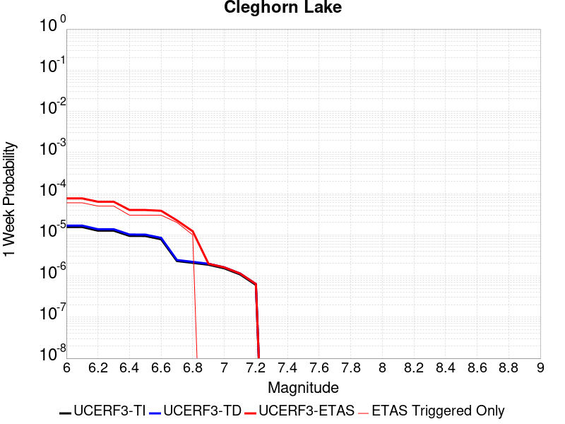 | 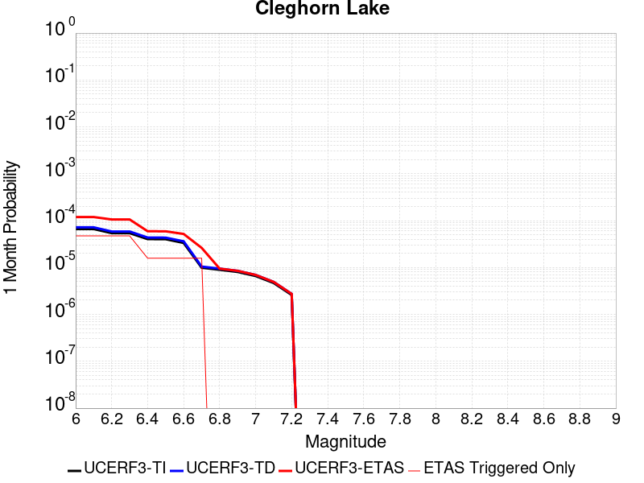 | 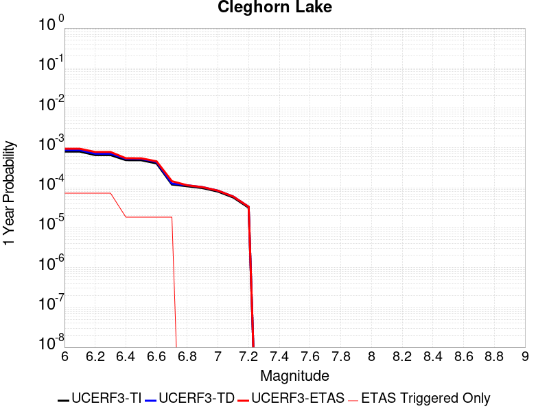 | 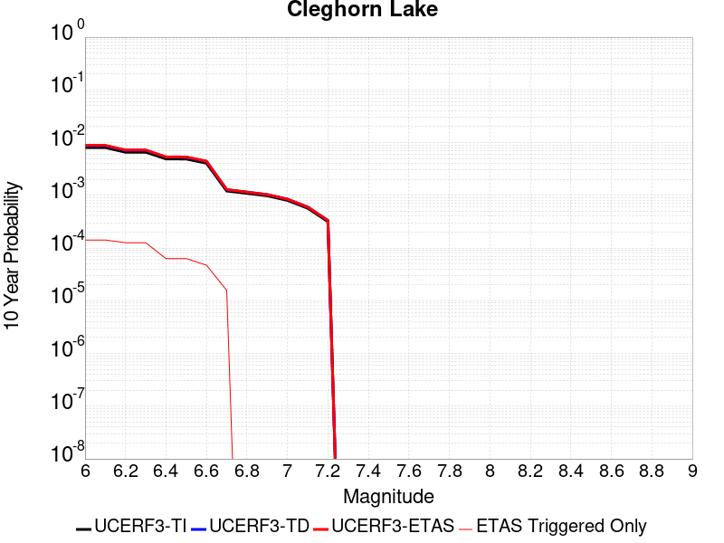 |

| Magnitude | 1 wk TI Prob | 1 wk TD Prob | 1 wk ETAS Prob | 1 wk ETAS/TD Gain | 1 wk ETAS Triggered Only | 1 mo TI Prob | 1 mo TD Prob | 1 mo ETAS Prob | 1 mo ETAS/TD Gain | 1 mo ETAS Triggered Only | 1 yr TI Prob | 1 yr TD Prob | 1 yr ETAS Prob | 1 yr ETAS/TD Gain | 1 yr ETAS Triggered Only | 10 yr TI Prob | 10 yr TD Prob | 10 yr ETAS Prob | 10 yr ETAS/TD Gain | 10 yr ETAS Triggered Only |
|-----|-----|-----|-----|-----|-----|-----|-----|-----|-----|-----|-----|-----|-----|-----|-----|-----|-----|-----|-----|-----|
| 6.0 | 1.5467183E-5 | 1.6794203E-5 | 6.602657E-5 | 3.9315095 | 4.9233193E-5 | 6.6286244E-5 | 7.197348E-5 | 1.4581796E-4 | 2.0259955 | 7.384979E-5 | 8.067362E-4 | 8.759797E-4 | 9.7435986E-4 | 1.1123087 | 9.8466386E-5 | 0.008038137 | 0.008730696 | 0.008901508 | 1.0195645 | 1.7231617E-4 |
| 6.1 | 1.5467183E-5 | 1.6794203E-5 | 6.602657E-5 | 3.9315095 | 4.9233193E-5 | 6.6286244E-5 | 7.197348E-5 | 1.4581796E-4 | 2.0259955 | 7.384979E-5 | 8.067362E-4 | 8.759797E-4 | 9.7435986E-4 | 1.1123087 | 9.8466386E-5 | 0.008038137 | 0.008730696 | 0.008901508 | 1.0195645 | 1.7231617E-4 |
| 6.2 | 1.2624631E-5 | 1.3681544E-5 | 6.291406E-5 | 4.598462 | 4.9233193E-5 | 5.410444E-5 | 5.863415E-5 | 1.324796E-4 | 2.2594275 | 7.384979E-5 | 6.585225E-4 | 7.1368564E-4 | 8.1208174E-4 | 1.1378704 | 9.8466386E-5 | 0.0065657445 | 0.0071187317 | 0.0072898213 | 1.0240337 | 1.7231617E-4 |
| 6.3 | 1.2624631E-5 | 1.3681544E-5 | 6.291406E-5 | 4.598462 | 4.9233193E-5 | 5.410444E-5 | 5.863415E-5 | 1.324796E-4 | 2.2594275 | 7.384979E-5 | 6.585225E-4 | 7.1368564E-4 | 8.1208174E-4 | 1.1378704 | 9.8466386E-5 | 0.0065657445 | 0.0071187317 | 0.0072898213 | 1.0240337 | 1.7231617E-4 |
| 6.4 | 9.417684E-6 | 1.0170118E-5 | 3.4786462E-5 | 3.4204583 | 2.4616596E-5 | 4.036088E-5 | 4.3585722E-5 | 6.820125E-5 | 1.5647612 | 2.4616596E-5 | 4.912829E-4 | 5.3056807E-4 | 5.551716E-4 | 1.046372 | 2.4616596E-5 | 0.004901982 | 0.005297049 | 0.0053705075 | 1.0138679 | 7.384979E-5 |
| 6.5 | 9.368219E-6 | 1.0117545E-5 | 3.473389E-5 | 3.4330359 | 2.4616596E-5 | 4.014889E-5 | 4.3360415E-5 | 6.797595E-5 | 1.5676959 | 2.4616596E-5 | 4.8870314E-4 | 5.2782625E-4 | 5.524299E-4 | 1.0466131 | 2.4616596E-5 | 0.004876298 | 0.0052697617 | 0.005343222 | 1.01394 | 7.384979E-5 |
| 6.6 | 7.803798E-6 | 8.441831E-6 | 3.305822E-5 | 3.916001 | 2.4616596E-5 | 3.3444423E-5 | 3.6179E-5 | 6.0794704E-5 | 1.6803865 | 2.4616596E-5 | 4.0710976E-4 | 4.4043022E-4 | 4.6503596E-4 | 1.0558676 | 2.4616596E-5 | 0.0040636472 | 0.0043994905 | 0.004473015 | 1.0167122 | 7.384979E-5 |
| 6.7 | 2.3108669E-6 | 2.4438336E-6 | 2.706037E-5 | 11.072918 | 2.4616596E-5 | 9.903678E-6 | 1.0473532E-5 | 3.508987E-5 | 3.350338 | 2.4616596E-5 | 1.205706E-4 | 1.2750797E-4 | 1.5212143E-4 | 1.1930346 | 2.4616596E-5 | 0.001205052 | 0.0012743667 | 0.001298952 | 1.0192921 | 2.4616596E-5 |
| 6.8 | 2.0882828E-6 | 2.2062823E-6 | 2.2062823E-6 | 1.0 | 0.0 | 8.949753E-6 | 9.455462E-6 | 9.455462E-6 | 1.0 | 0.0 | 1.08957785E-4 | 1.1511434E-4 | 1.1511434E-4 | 1.0 | 0.0 | 0.0010890438 | 0.0011505639 | 0.0011505639 | 1.0 | 0.0 |
| 6.9 | 1.876935E-6 | 1.981051E-6 | 1.981051E-6 | 1.0 | 0.0 | 8.043982E-6 | 8.490192E-6 | 8.490192E-6 | 1.0 | 0.0 | 9.7931086E-5 | 1.03363345E-4 | 1.03363345E-4 | 1.0 | 0.0 | 9.788794E-4 | 0.0010331686 | 0.0010331686 | 1.0 | 0.0 |
| 7.0 | 1.5357559E-6 | 1.6202807E-6 | 1.6202807E-6 | 1.0 | 0.0 | 6.5817944E-6 | 6.9440425E-6 | 6.9440425E-6 | 1.0 | 0.0 | 8.01304E-5 | 8.454057E-5 | 8.454057E-5 | 1.0 | 0.0 | 8.010151E-4 | 8.450965E-4 | 8.450965E-4 | 1.0 | 0.0 |
| 7.1 | 1.0905424E-6 | 1.1497619E-6 | 1.1497619E-6 | 1.0 | 0.0 | 4.6737446E-6 | 4.9275427E-6 | 4.9275427E-6 | 1.0 | 0.0 | 5.6901354E-5 | 5.999128E-5 | 5.999128E-5 | 1.0 | 0.0 | 5.6886784E-4 | 5.997606E-4 | 5.997606E-4 | 1.0 | 0.0 |
| 7.2 | 6.06668E-7 | 6.387277E-7 | 6.387277E-7 | 1.0 | 0.0 | 2.600003E-6 | 2.7374022E-6 | 2.7374022E-6 | 1.0 | 0.0 | 3.1654577E-5 | 3.3327433E-5 | 3.3327433E-5 | 1.0 | 0.0 | 3.1650066E-4 | 3.3323118E-4 | 3.3323118E-4 | 1.0 | 0.0 |

## Tin Mountain
*[(top)](#table-of-contents)*

| 1 Week | 1 Month | 1 Year | 10 Year |
|-----|-----|-----|-----|
| 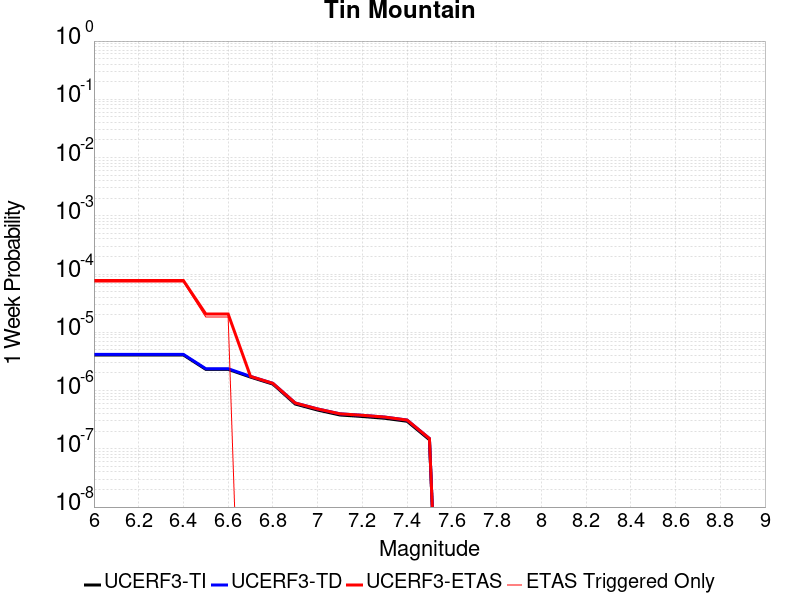 | 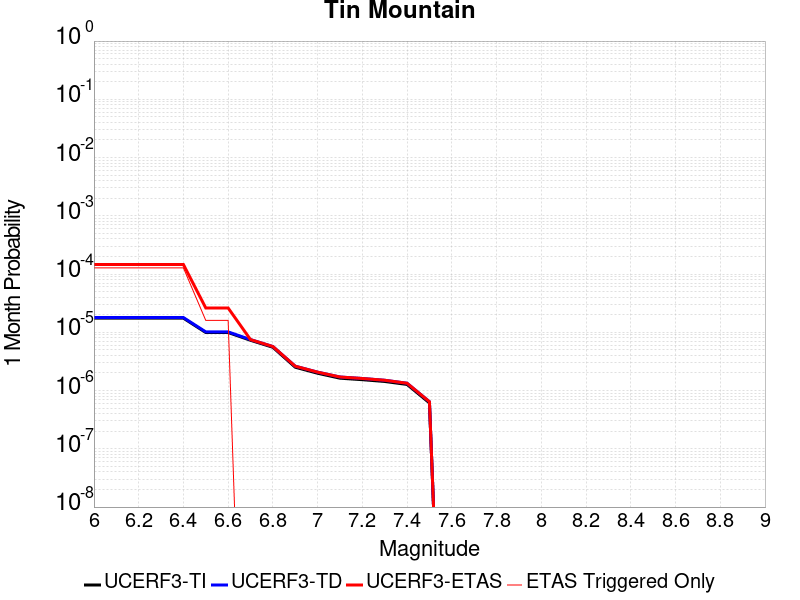 |  | 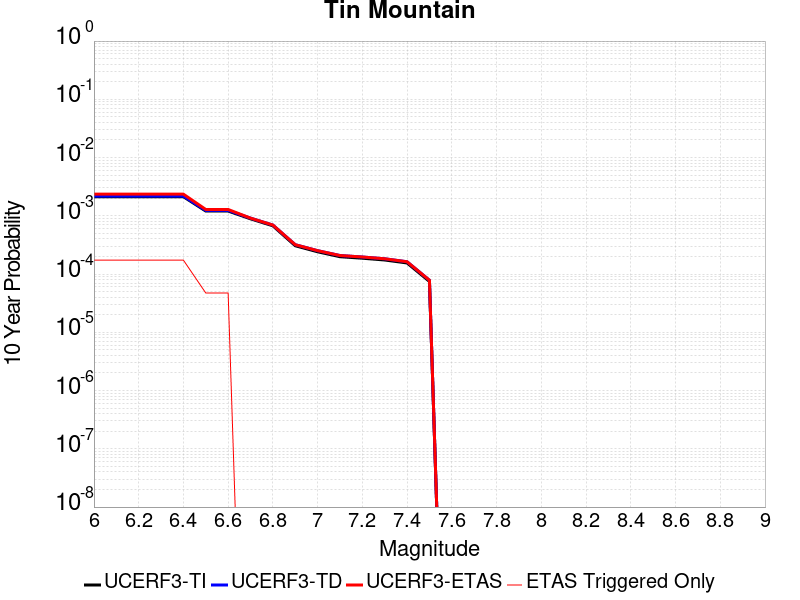 |

| Magnitude | 1 wk TI Prob | 1 wk TD Prob | 1 wk ETAS Prob | 1 wk ETAS/TD Gain | 1 wk ETAS Triggered Only | 1 mo TI Prob | 1 mo TD Prob | 1 mo ETAS Prob | 1 mo ETAS/TD Gain | 1 mo ETAS Triggered Only | 1 yr TI Prob | 1 yr TD Prob | 1 yr ETAS Prob | 1 yr ETAS/TD Gain | 1 yr ETAS Triggered Only | 10 yr TI Prob | 10 yr TD Prob | 10 yr ETAS Prob | 10 yr ETAS/TD Gain | 10 yr ETAS Triggered Only |
|-----|-----|-----|-----|-----|-----|-----|-----|-----|-----|-----|-----|-----|-----|-----|-----|-----|-----|-----|-----|-----|
| 6.0 | 4.083776E-6 | 4.1815365E-6 | 5.3414526E-5 | 12.773898 | 4.9233193E-5 | 1.750178E-5 | 1.792077E-5 | 1.1638539E-4 | 6.4944415 | 9.8466386E-5 | 2.1306332E-4 | 2.1816725E-4 | 3.4122338E-4 | 1.564045 | 1.2308298E-4 | 0.0021285915 | 0.0021798965 | 0.002327274 | 1.0676076 | 1.4769958E-4 |
| 6.1 | 4.083776E-6 | 4.1815365E-6 | 5.3414526E-5 | 12.773898 | 4.9233193E-5 | 1.750178E-5 | 1.792077E-5 | 1.1638539E-4 | 6.4944415 | 9.8466386E-5 | 2.1306332E-4 | 2.1816725E-4 | 3.4122338E-4 | 1.564045 | 1.2308298E-4 | 0.0021285915 | 0.0021798965 | 0.002327274 | 1.0676076 | 1.4769958E-4 |
| 6.2 | 4.083776E-6 | 4.1815365E-6 | 5.3414526E-5 | 12.773898 | 4.9233193E-5 | 1.750178E-5 | 1.792077E-5 | 1.1638539E-4 | 6.4944415 | 9.8466386E-5 | 2.1306332E-4 | 2.1816725E-4 | 3.4122338E-4 | 1.564045 | 1.2308298E-4 | 0.0021285915 | 0.0021798965 | 0.002327274 | 1.0676076 | 1.4769958E-4 |
| 6.3 | 4.083776E-6 | 4.1815365E-6 | 5.3414526E-5 | 12.773898 | 4.9233193E-5 | 1.750178E-5 | 1.792077E-5 | 1.1638539E-4 | 6.4944415 | 9.8466386E-5 | 2.1306332E-4 | 2.1816725E-4 | 3.4122338E-4 | 1.564045 | 1.2308298E-4 | 0.0021285915 | 0.0021798965 | 0.002327274 | 1.0676076 | 1.4769958E-4 |
| 6.4 | 4.083776E-6 | 4.1815365E-6 | 5.3414526E-5 | 12.773898 | 4.9233193E-5 | 1.750178E-5 | 1.792077E-5 | 1.1638539E-4 | 6.4944415 | 9.8466386E-5 | 2.1306332E-4 | 2.1816725E-4 | 3.4122338E-4 | 1.564045 | 1.2308298E-4 | 0.0021285915 | 0.0021798965 | 0.002327274 | 1.0676076 | 1.4769958E-4 |
| 6.5 | 2.3143427E-6 | 2.3731573E-6 | 2.3731573E-6 | 1.0 | 0.0 | 9.9185745E-6 | 1.0170638E-5 | 1.0170638E-5 | 1.0 | 0.0 | 1.2075195E-4 | 1.2382126E-4 | 1.484348E-4 | 1.1987829 | 2.4616596E-5 | 0.0012068636 | 0.0012375986 | 0.0012867709 | 1.039732 | 4.9233193E-5 |
| 6.6 | 2.3143427E-6 | 2.3731573E-6 | 2.3731573E-6 | 1.0 | 0.0 | 9.9185745E-6 | 1.0170638E-5 | 1.0170638E-5 | 1.0 | 0.0 | 1.2075195E-4 | 1.2382126E-4 | 1.484348E-4 | 1.1987829 | 2.4616596E-5 | 0.0012068636 | 0.0012375986 | 0.0012867709 | 1.039732 | 4.9233193E-5 |
| 6.7 | 1.7029532E-6 | 1.7497915E-6 | 1.7497915E-6 | 1.0 | 0.0 | 7.2983503E-6 | 7.499088E-6 | 7.499088E-6 | 1.0 | 0.0 | 8.885379E-5 | 9.1298105E-5 | 9.1298105E-5 | 1.0 | 0.0 | 8.881827E-4 | 9.1265864E-4 | 9.1265864E-4 | 1.0 | 0.0 |
| 6.8 | 1.2914646E-6 | 1.3299378E-6 | 1.3299378E-6 | 1.0 | 0.0 | 5.534837E-6 | 5.6997237E-6 | 5.6997237E-6 | 1.0 | 0.0 | 6.738455E-5 | 6.939237E-5 | 6.939237E-5 | 1.0 | 0.0 | 6.736412E-4 | 6.9375033E-4 | 6.9375033E-4 | 1.0 | 0.0 |
| 6.9 | 5.8708974E-7 | 6.1169936E-7 | 6.1169936E-7 | 1.0 | 0.0 | 2.5160964E-6 | 2.6215664E-6 | 2.6215664E-6 | 1.0 | 0.0 | 3.0633044E-5 | 3.1917145E-5 | 3.1917145E-5 | 1.0 | 0.0 | 3.0628822E-4 | 3.191297E-4 | 3.191297E-4 | 1.0 | 0.0 |
| 7.0 | 4.6248786E-7 | 4.832015E-7 | 4.832015E-7 | 1.0 | 0.0 | 1.9820893E-6 | 2.0708624E-6 | 2.0708624E-6 | 1.0 | 0.0 | 2.413167E-5 | 2.5212494E-5 | 2.5212494E-5 | 1.0 | 0.0 | 2.412905E-4 | 2.5210003E-4 | 2.5210003E-4 | 1.0 | 0.0 |
| 7.1 | 3.804606E-7 | 3.987147E-7 | 3.987147E-7 | 1.0 | 0.0 | 1.6305444E-6 | 1.7087764E-6 | 1.7087764E-6 | 1.0 | 0.0 | 1.9851697E-5 | 2.0804187E-5 | 2.0804187E-5 | 1.0 | 0.0 | 1.9849923E-4 | 2.0802575E-4 | 2.0802575E-4 | 1.0 | 0.0 |
| 7.2 | 3.5864858E-7 | 3.7616863E-7 | 3.7616863E-7 | 1.0 | 0.0 | 1.5370645E-6 | 1.6121504E-6 | 1.6121504E-6 | 1.0 | 0.0 | 1.87136E-5 | 1.9627789E-5 | 1.9627789E-5 | 1.0 | 0.0 | 1.8712023E-4 | 1.9626386E-4 | 1.9626386E-4 | 1.0 | 0.0 |
| 7.3 | 3.342063E-7 | 3.506347E-7 | 3.506347E-7 | 1.0 | 0.0 | 1.4323119E-6 | 1.5027196E-6 | 1.5027196E-6 | 1.0 | 0.0 | 1.7438259E-5 | 1.829549E-5 | 1.829549E-5 | 1.0 | 0.0 | 1.743689E-4 | 1.8294314E-4 | 1.8294314E-4 | 1.0 | 0.0 |
| 7.4 | 2.971242E-7 | 3.1165817E-7 | 3.1165817E-7 | 1.0 | 0.0 | 1.2733886E-6 | 1.3356774E-6 | 1.3356774E-6 | 1.0 | 0.0 | 1.5503398E-5 | 1.6261785E-5 | 1.6261785E-5 | 1.0 | 0.0 | 1.5502315E-4 | 1.6260923E-4 | 1.6260923E-4 | 1.0 | 0.0 |
| 7.5 | 1.4326713E-7 | 1.5012525E-7 | 1.5012525E-7 | 1.0 | 0.0 | 6.140018E-7 | 6.433939E-7 | 6.433939E-7 | 1.0 | 0.0 | 7.4754466E-6 | 7.8333205E-6 | 7.8333205E-6 | 1.0 | 0.0 | 7.475195E-5 | 7.833321E-5 | 7.833321E-5 | 1.0 | 0.0 |

## Kern Canyon (Lake Isabella) 2011
*[(top)](#table-of-contents)*

| 1 Week | 1 Month | 1 Year | 10 Year |
|-----|-----|-----|-----|
| 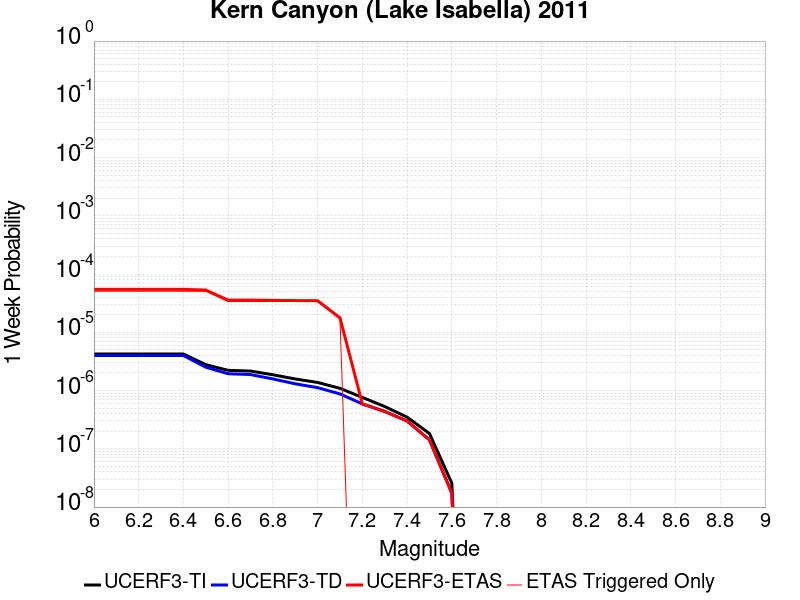 | 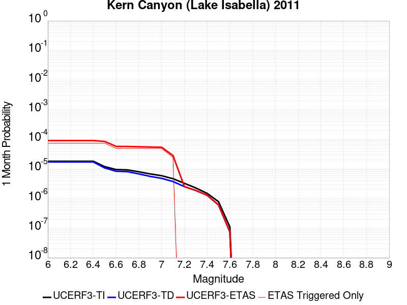 | 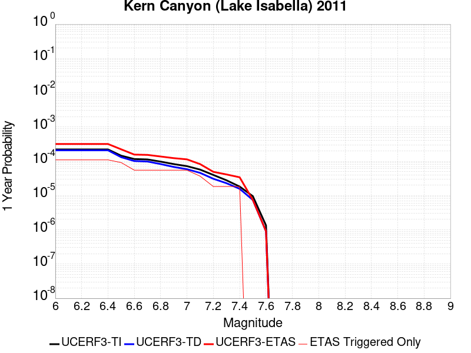 | 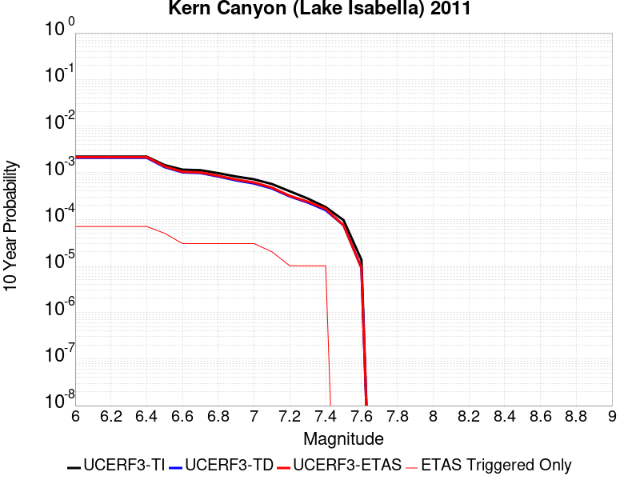 |

| Magnitude | 1 wk TI Prob | 1 wk TD Prob | 1 wk ETAS Prob | 1 wk ETAS/TD Gain | 1 wk ETAS Triggered Only | 1 mo TI Prob | 1 mo TD Prob | 1 mo ETAS Prob | 1 mo ETAS/TD Gain | 1 mo ETAS Triggered Only | 1 yr TI Prob | 1 yr TD Prob | 1 yr ETAS Prob | 1 yr ETAS/TD Gain | 1 yr ETAS Triggered Only | 10 yr TI Prob | 10 yr TD Prob | 10 yr ETAS Prob | 10 yr ETAS/TD Gain | 10 yr ETAS Triggered Only |
|-----|-----|-----|-----|-----|-----|-----|-----|-----|-----|-----|-----|-----|-----|-----|-----|-----|-----|-----|-----|-----|
| 6.0 | 4.2387383E-6 | 4.001639E-6 | 7.785113E-5 | 19.454813 | 7.384979E-5 | 1.8165894E-5 | 1.7149778E-5 | 9.09983E-5 | 5.3060923 | 7.384979E-5 | 2.2114732E-4 | 2.087804E-4 | 3.3183768E-4 | 1.5894101 | 1.2308298E-4 | 0.0022092736 | 0.0020860266 | 0.002233418 | 1.0706565 | 1.4769958E-4 |
| 6.1 | 4.2387383E-6 | 4.001639E-6 | 7.785113E-5 | 19.454813 | 7.384979E-5 | 1.8165894E-5 | 1.7149778E-5 | 9.09983E-5 | 5.3060923 | 7.384979E-5 | 2.2114732E-4 | 2.087804E-4 | 3.3183768E-4 | 1.5894101 | 1.2308298E-4 | 0.0022092736 | 0.0020860266 | 0.002233418 | 1.0706565 | 1.4769958E-4 |
| 6.2 | 4.2387383E-6 | 4.001639E-6 | 7.785113E-5 | 19.454813 | 7.384979E-5 | 1.8165894E-5 | 1.7149778E-5 | 9.09983E-5 | 5.3060923 | 7.384979E-5 | 2.2114732E-4 | 2.087804E-4 | 3.3183768E-4 | 1.5894101 | 1.2308298E-4 | 0.0022092736 | 0.0020860266 | 0.002233418 | 1.0706565 | 1.4769958E-4 |
| 6.3 | 4.2387383E-6 | 4.001639E-6 | 7.785113E-5 | 19.454813 | 7.384979E-5 | 1.8165894E-5 | 1.7149778E-5 | 9.09983E-5 | 5.3060923 | 7.384979E-5 | 2.2114732E-4 | 2.087804E-4 | 3.3183768E-4 | 1.5894101 | 1.2308298E-4 | 0.0022092736 | 0.0020860266 | 0.002233418 | 1.0706565 | 1.4769958E-4 |
| 6.4 | 4.2387383E-6 | 4.001639E-6 | 7.785113E-5 | 19.454813 | 7.384979E-5 | 1.8165894E-5 | 1.7149778E-5 | 9.09983E-5 | 5.3060923 | 7.384979E-5 | 2.2114732E-4 | 2.087804E-4 | 3.3183768E-4 | 1.5894101 | 1.2308298E-4 | 0.0022092736 | 0.0020860266 | 0.002233418 | 1.0706565 | 1.4769958E-4 |
| 6.5 | 2.7857532E-6 | 2.517867E-6 | 7.636747E-5 | 30.330225 | 7.384979E-5 | 1.1938888E-5 | 1.0790815E-5 | 8.463981E-5 | 7.84369 | 7.384979E-5 | 1.4534626E-4 | 1.3137059E-4 | 2.2982404E-4 | 1.7494329 | 9.8466386E-5 | 0.0014525123 | 0.001312962 | 0.0014112991 | 1.0748972 | 9.8466386E-5 |
| 6.6 | 2.2233348E-6 | 1.9441236E-6 | 5.117722E-5 | 26.324057 | 4.9233193E-5 | 9.528543E-6 | 8.331932E-6 | 5.7564714E-5 | 6.9089274 | 4.9233193E-5 | 1.1600384E-4 | 1.01436635E-4 | 1.5066484E-4 | 1.4853098 | 4.9233193E-5 | 0.001159433 | 0.001013912 | 0.0010630953 | 1.0485084 | 4.9233193E-5 |
| 6.7 | 2.1635126E-6 | 1.8835036E-6 | 5.1116604E-5 | 27.139107 | 4.9233193E-5 | 9.272164E-6 | 8.072134E-6 | 5.730493E-5 | 7.099106 | 4.9233193E-5 | 1.1288274E-4 | 9.827388E-5 | 1.4750223E-4 | 1.5009302 | 4.9233193E-5 | 0.0011282542 | 9.823124E-4 | 0.0010314971 | 1.0500704 | 4.9233193E-5 |
| 6.8 | 1.8685711E-6 | 1.5831425E-6 | 5.081626E-5 | 32.098347 | 4.9233193E-5 | 8.008137E-6 | 6.784879E-6 | 5.601774E-5 | 8.256262 | 4.9233193E-5 | 9.74947E-5 | 8.260282E-5 | 1.3183196E-4 | 1.5959738 | 4.9233193E-5 | 9.745194E-4 | 8.2572614E-4 | 8.7491865E-4 | 1.0595748 | 4.9233193E-5 |
| 6.9 | 1.5815071E-6 | 1.3064928E-6 | 5.053962E-5 | 38.68343 | 4.9233193E-5 | 6.77787E-6 | 5.599243E-6 | 5.483216E-5 | 9.792781 | 4.9233193E-5 | 8.251744E-5 | 6.816868E-5 | 1.17398515E-4 | 1.7221768 | 4.9233193E-5 | 8.248681E-4 | 6.8148033E-4 | 7.3068E-4 | 1.0721953 | 4.9233193E-5 |
| 7.0 | 1.3772564E-6 | 1.1210718E-6 | 5.035421E-5 | 44.916134 | 4.9233193E-5 | 5.9025137E-6 | 4.8045845E-6 | 5.403754E-5 | 11.247079 | 4.9233193E-5 | 7.186073E-5 | 5.8494268E-5 | 1.0772458E-4 | 1.8416263 | 4.9233193E-5 | 7.18375E-4 | 5.847908E-4 | 6.3399517E-4 | 1.0841402 | 4.9233193E-5 |
| 7.1 | 1.0916998E-6 | 8.763777E-7 | 2.5492953E-5 | 29.089 | 2.4616596E-5 | 4.678705E-6 | 3.7558991E-6 | 2.8372404E-5 | 7.554091 | 2.4616596E-5 | 5.6961744E-5 | 4.5727127E-5 | 7.03426E-5 | 1.5383122 | 2.4616596E-5 | 5.6947145E-4 | 4.571785E-4 | 4.8178385E-4 | 1.05382 | 2.4616596E-5 |
| 7.2 | 7.6277024E-7 | 5.901454E-7 | 5.901454E-7 | 1.0 | 0.0 | 3.2690114E-6 | 2.5291922E-6 | 2.5291922E-6 | 1.0 | 0.0 | 3.9799485E-5 | 3.0792486E-5 | 3.0792486E-5 | 1.0 | 0.0 | 3.9792358E-4 | 3.0788282E-4 | 3.0788282E-4 | 1.0 | 0.0 |
| 7.3 | 5.3265916E-7 | 4.3824414E-7 | 4.3824414E-7 | 1.0 | 0.0 | 2.282823E-6 | 1.878188E-6 | 1.878188E-6 | 1.0 | 0.0 | 2.7793016E-5 | 2.2866701E-5 | 2.2866701E-5 | 1.0 | 0.0 | 2.778954E-4 | 2.2864387E-4 | 2.2864387E-4 | 1.0 | 0.0 |
| 7.4 | 3.4946007E-7 | 3.006571E-7 | 3.006571E-7 | 1.0 | 0.0 | 1.497685E-6 | 1.2885298E-6 | 1.2885298E-6 | 1.0 | 0.0 | 1.8234163E-5 | 1.568774E-5 | 1.568774E-5 | 1.0 | 0.0 | 1.8232666E-4 | 1.5686655E-4 | 1.5686655E-4 | 1.0 | 0.0 |
| 7.5 | 1.8317026E-7 | 1.4244812E-7 | 1.4244812E-7 | 1.0 | 0.0 | 7.850152E-7 | 6.104918E-7 | 6.104918E-7 | 1.0 | 0.0 | 9.557518E-6 | 7.432713E-6 | 7.432713E-6 | 1.0 | 0.0 | 9.5571064E-5 | 7.432472E-5 | 7.432472E-5 | 1.0 | 0.0 |
| 7.6 | 2.572245E-8 | 1.7352555E-8 | 1.7352555E-8 | 1.0 | 0.0 | 1.10239064E-7 | 7.436809E-8 | 7.436809E-8 | 1.0 | 0.0 | 1.3421597E-6 | 9.054312E-7 | 9.054312E-7 | 1.0 | 0.0 | 1.3421517E-5 | 9.05428E-6 | 9.05428E-6 | 1.0 | 0.0 |

## San Andreas (North Branch Mill Creek)
*[(top)](#table-of-contents)*

| 1 Week | 1 Month | 1 Year | 10 Year |
|-----|-----|-----|-----|
| 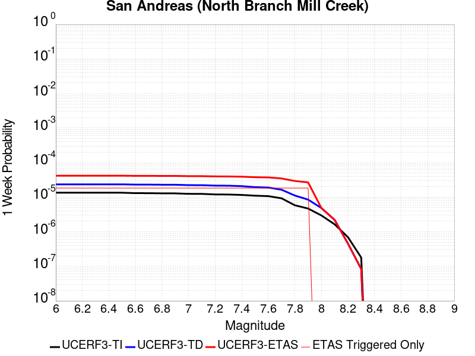 | 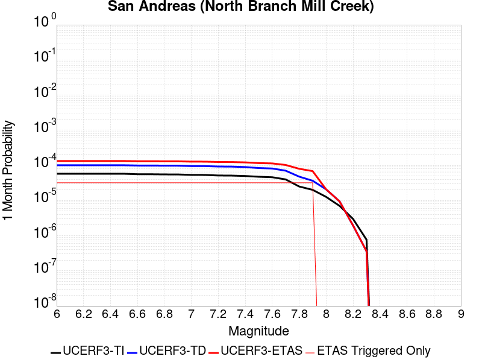 | 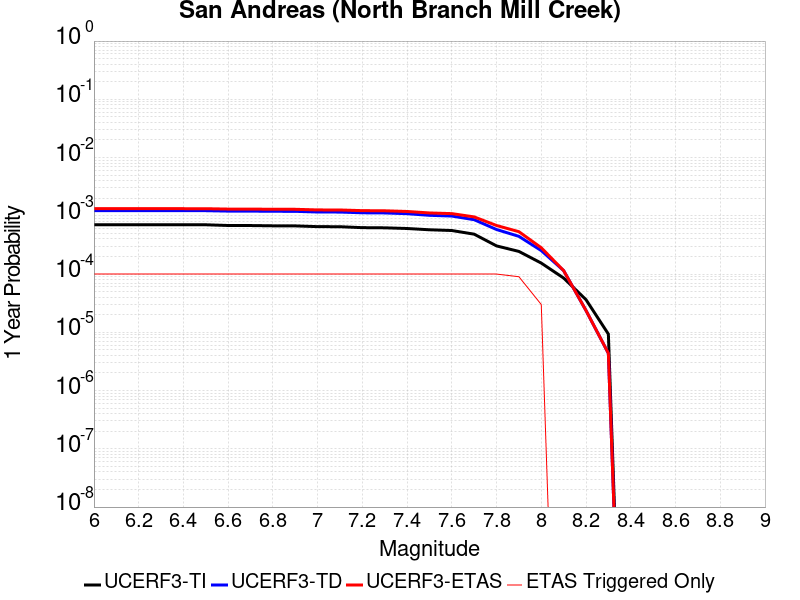 | 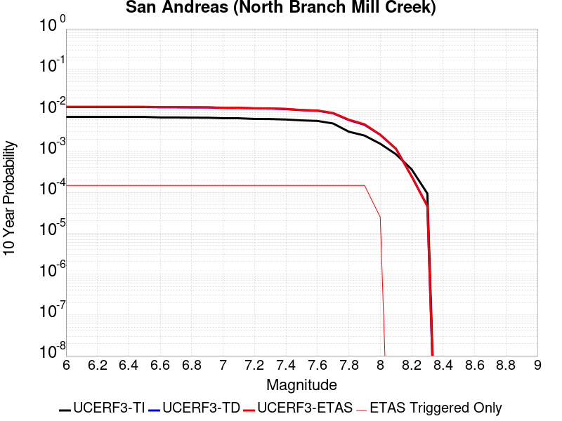 |

| Magnitude | 1 wk TI Prob | 1 wk TD Prob | 1 wk ETAS Prob | 1 wk ETAS/TD Gain | 1 wk ETAS Triggered Only | 1 mo TI Prob | 1 mo TD Prob | 1 mo ETAS Prob | 1 mo ETAS/TD Gain | 1 mo ETAS Triggered Only | 1 yr TI Prob | 1 yr TD Prob | 1 yr ETAS Prob | 1 yr ETAS/TD Gain | 1 yr ETAS Triggered Only | 10 yr TI Prob | 10 yr TD Prob | 10 yr ETAS Prob | 10 yr ETAS/TD Gain | 10 yr ETAS Triggered Only |
|-----|-----|-----|-----|-----|-----|-----|-----|-----|-----|-----|-----|-----|-----|-----|-----|-----|-----|-----|-----|-----|
| 6.0 | 1.3461156E-5 | 2.3499893E-5 | 4.811591E-5 | 2.047495 | 2.4616596E-5 | 5.7689394E-5 | 1.00709956E-4 | 1.2532408E-4 | 1.244406 | 2.4616596E-5 | 7.02142E-4 | 0.0012254574 | 0.0013483895 | 1.1003153 | 1.2308298E-4 | 0.0069992766 | 0.01222957 | 0.012375463 | 1.0119295 | 1.4769958E-4 |
| 6.1 | 1.3461156E-5 | 2.3499893E-5 | 4.811591E-5 | 2.047495 | 2.4616596E-5 | 5.7689394E-5 | 1.00709956E-4 | 1.2532408E-4 | 1.244406 | 2.4616596E-5 | 7.02142E-4 | 0.0012254574 | 0.0013483895 | 1.1003153 | 1.2308298E-4 | 0.0069992766 | 0.01222957 | 0.012375463 | 1.0119295 | 1.4769958E-4 |
| 6.2 | 1.3461156E-5 | 2.3499893E-5 | 4.811591E-5 | 2.047495 | 2.4616596E-5 | 5.7689394E-5 | 1.00709956E-4 | 1.2532408E-4 | 1.244406 | 2.4616596E-5 | 7.02142E-4 | 0.0012254574 | 0.0013483895 | 1.1003153 | 1.2308298E-4 | 0.0069992766 | 0.01222957 | 0.012375463 | 1.0119295 | 1.4769958E-4 |
| 6.3 | 1.3461156E-5 | 2.3499893E-5 | 4.811591E-5 | 2.047495 | 2.4616596E-5 | 5.7689394E-5 | 1.00709956E-4 | 1.2532408E-4 | 1.244406 | 2.4616596E-5 | 7.02142E-4 | 0.0012254574 | 0.0013483895 | 1.1003153 | 1.2308298E-4 | 0.0069992766 | 0.01222957 | 0.012375463 | 1.0119295 | 1.4769958E-4 |
| 6.4 | 1.3461156E-5 | 2.3499893E-5 | 4.811591E-5 | 2.047495 | 2.4616596E-5 | 5.7689394E-5 | 1.00709956E-4 | 1.2532408E-4 | 1.244406 | 2.4616596E-5 | 7.02142E-4 | 0.0012254574 | 0.0013483895 | 1.1003153 | 1.2308298E-4 | 0.0069992766 | 0.01222957 | 0.012375463 | 1.0119295 | 1.4769958E-4 |
| 6.5 | 1.3450706E-5 | 2.3488852E-5 | 4.810487E-5 | 2.0479872 | 2.4616596E-5 | 5.764461E-5 | 1.0066265E-4 | 1.2527677E-4 | 1.2445209 | 2.4616596E-5 | 7.0159714E-4 | 0.001224882 | 0.0013478142 | 1.1003625 | 1.2308298E-4 | 0.006993862 | 0.01222388 | 0.012369773 | 1.0119351 | 1.4769958E-4 |
| 6.6 | 1.3074523E-5 | 2.3103135E-5 | 4.7719164E-5 | 2.0654843 | 2.4616596E-5 | 5.6032466E-5 | 9.9009696E-5 | 1.2362386E-4 | 1.2486035 | 2.4616596E-5 | 6.8198174E-4 | 0.0012047797 | 0.0013277144 | 1.1020391 | 1.2308298E-4 | 0.006798926 | 0.012025044 | 0.012170968 | 1.0121349 | 1.4769958E-4 |
| 6.7 | 1.3050216E-5 | 2.3078432E-5 | 4.769446E-5 | 2.0666249 | 2.4616596E-5 | 5.59283E-5 | 9.890384E-5 | 1.23518E-4 | 1.2488697 | 2.4616596E-5 | 6.8071426E-4 | 0.0012034923 | 0.0013264271 | 1.1021484 | 1.2308298E-4 | 0.0067863287 | 0.012012309 | 0.012158235 | 1.012148 | 1.4769958E-4 |
| 6.8 | 1.29049395E-5 | 2.292684E-5 | 4.7542875E-5 | 2.0736775 | 2.4616596E-5 | 5.530571E-5 | 9.825421E-5 | 1.2286838E-4 | 1.2505152 | 2.4616596E-5 | 6.73139E-4 | 0.0011955918 | 0.0013185276 | 1.1028242 | 1.2308298E-4 | 0.0067110364 | 0.011934154 | 0.012080091 | 1.0122285 | 1.4769958E-4 |
| 6.9 | 1.2867369E-5 | 2.2886245E-5 | 4.750228E-5 | 2.075582 | 2.4616596E-5 | 5.51447E-5 | 9.8080236E-5 | 1.2269442E-4 | 1.2509596 | 2.4616596E-5 | 6.711799E-4 | 0.0011934759 | 0.001316412 | 1.1030067 | 1.2308298E-4 | 0.006691564 | 0.011913223 | 0.012059163 | 1.0122503 | 1.4769958E-4 |
| 7.0 | 1.2495996E-5 | 2.2286325E-5 | 4.6902373E-5 | 2.104536 | 2.4616596E-5 | 5.3553173E-5 | 9.550934E-5 | 1.2012359E-4 | 1.2577156 | 2.4616596E-5 | 6.518148E-4 | 0.0011622087 | 0.0012851487 | 1.1057813 | 1.2308298E-4 | 0.0064990623 | 0.0116038285 | 0.011749814 | 1.0125809 | 1.4769958E-4 |
| 7.1 | 1.2452067E-5 | 2.2231397E-5 | 4.6847446E-5 | 2.107265 | 2.4616596E-5 | 5.3364907E-5 | 9.527396E-5 | 1.1988821E-4 | 1.2583524 | 2.4616596E-5 | 6.4952404E-4 | 0.0011593461 | 0.0012822864 | 1.1060427 | 1.2308298E-4 | 0.0064762887 | 0.0115755 | 0.01172149 | 1.012612 | 1.4769958E-4 |
| 7.2 | 1.2002777E-5 | 2.1609963E-5 | 4.622603E-5 | 2.1391072 | 2.4616596E-5 | 5.143946E-5 | 9.2610855E-5 | 1.1722517E-4 | 1.2657822 | 2.4616596E-5 | 6.2609545E-4 | 0.0011269567 | 0.0012499009 | 1.109094 | 1.2308298E-4 | 0.006243344 | 0.011254923 | 0.01140096 | 1.0129755 | 1.4769958E-4 |
| 7.3 | 1.1923425E-5 | 2.1479793E-5 | 4.609586E-5 | 2.1460104 | 2.4616596E-5 | 5.109939E-5 | 9.205302E-5 | 1.16667354E-4 | 1.267393 | 2.4616596E-5 | 6.219575E-4 | 0.001120172 | 0.001243117 | 1.1097555 | 1.2308298E-4 | 0.0062021962 | 0.011187789 | 0.011333836 | 1.0130541 | 1.4769958E-4 |
| 7.4 | 1.16105175E-5 | 2.0853771E-5 | 4.5469857E-5 | 2.180414 | 2.4616596E-5 | 4.975841E-5 | 8.937026E-5 | 1.1398466E-4 | 1.2754204 | 2.4616596E-5 | 6.0564023E-4 | 0.0010875424 | 0.0012104915 | 1.1130522 | 1.2308298E-4 | 0.006039923 | 0.010865397 | 0.0110114915 | 1.0134459 | 1.4769958E-4 |
| 7.5 | 1.1037265E-5 | 1.9553907E-5 | 4.417002E-5 | 2.2588847 | 2.4616596E-5 | 4.7301706E-5 | 8.379978E-5 | 1.08414315E-4 | 1.2937303 | 2.4616596E-5 | 5.757461E-4 | 0.0010197869 | 0.0011427444 | 1.1205717 | 1.2308298E-4 | 0.005742567 | 0.010194898 | 0.010341091 | 1.0143399 | 1.4769958E-4 |
| 7.6 | 1.0720915E-5 | 1.899582E-5 | 4.3611948E-5 | 2.295871 | 2.4616596E-5 | 4.5945973E-5 | 8.140812E-5 | 1.06022715E-4 | 1.3023604 | 2.4616596E-5 | 5.592486E-4 | 9.906954E-4 | 0.0011136564 | 1.124116 | 1.2308298E-4 | 0.005578433 | 0.009906623 | 0.010052859 | 1.0147614 | 1.4769958E-4 |
| 7.7 | 9.276279E-6 | 1.6441649E-5 | 4.105784E-5 | 2.4971852 | 2.4616596E-5 | 3.9754876E-5 | 7.0462316E-5 | 9.507718E-5 | 1.3493338 | 2.4616596E-5 | 4.839081E-4 | 8.575427E-4 | 9.805202E-4 | 1.1434067 | 1.2308298E-4 | 0.0048285574 | 0.008586041 | 0.008732473 | 1.0170546 | 1.4769958E-4 |
| 7.8 | 5.8346777E-6 | 1.1155013E-5 | 3.5771336E-5 | 3.2067497 | 2.4616596E-5 | 2.5005522E-5 | 4.7806327E-5 | 7.2421746E-5 | 1.5148988 | 2.4616596E-5 | 3.043997E-4 | 5.818867E-4 | 7.0489803E-4 | 1.2114009 | 1.2308298E-4 | 0.0030398308 | 0.0058469265 | 0.0059937625 | 1.0251133 | 1.4769958E-4 |
| 7.9 | 4.690204E-6 | 8.509093E-6 | 3.312548E-5 | 3.8929505 | 2.4616596E-5 | 2.0100719E-5 | 3.6467034E-5 | 6.1082734E-5 | 1.6750124 | 2.4616596E-5 | 2.4469878E-4 | 4.4389578E-4 | 5.669241E-4 | 1.2771559 | 1.2308298E-4 | 0.002444295 | 0.0044707474 | 0.0046177865 | 1.0328892 | 1.4769958E-4 |
| 8.0 | 2.9570454E-6 | 4.846947E-6 | 4.846947E-6 | 1.0 | 0.0 | 1.267299E-5 | 2.0772464E-5 | 2.0772464E-5 | 1.0 | 0.0 | 1.5428272E-4 | 2.5287544E-4 | 2.774858E-4 | 1.0973221 | 2.4616596E-5 | 0.0015417566 | 0.002549644 | 0.002574198 | 1.0096303 | 2.4616596E-5 |
| 8.1 | 1.6376824E-6 | 2.1968929E-6 | 2.1968929E-6 | 1.0 | 0.0 | 7.01862E-6 | 9.41522E-6 | 9.41522E-6 | 1.0 | 0.0 | 8.544835E-5 | 1.14624294E-4 | 1.14624294E-4 | 1.0 | 0.0 | 8.54155E-4 | 0.0011606582 | 0.0011606582 | 1.0 | 0.0 |
| 8.2 | 6.9631557E-7 | 4.5360213E-7 | 4.5360213E-7 | 1.0 | 0.0 | 2.984206E-6 | 1.9440076E-6 | 1.9440076E-6 | 1.0 | 0.0 | 3.63321E-5 | 2.3668037E-5 | 2.3668037E-5 | 1.0 | 0.0 | 3.6326164E-4 | 2.451564E-4 | 2.451564E-4 | 1.0 | 0.0 |
| 8.3 | 1.7876137E-7 | 8.360375E-8 | 8.360375E-8 | 1.0 | 0.0 | 7.661199E-7 | 3.5830175E-7 | 3.5830175E-7 | 1.0 | 0.0 | 9.32747E-6 | 4.3623154E-6 | 4.3623154E-6 | 1.0 | 0.0 | 9.3270784E-5 | 4.5817014E-5 | 4.5817014E-5 | 1.0 | 0.0 |

## Pinto Mtn
*[(top)](#table-of-contents)*

| 1 Week | 1 Month | 1 Year | 10 Year |
|-----|-----|-----|-----|
| 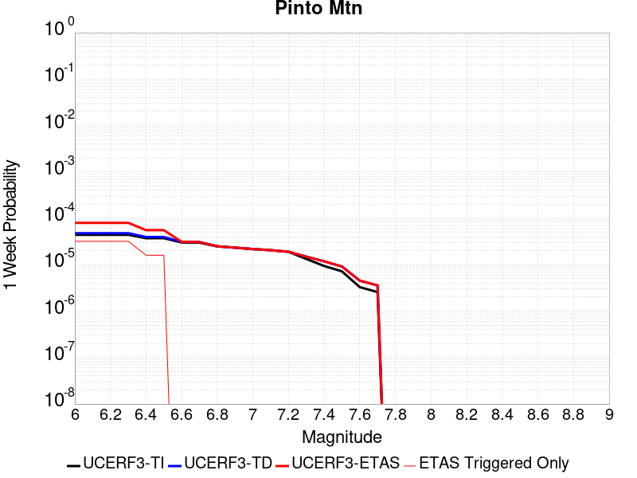 | 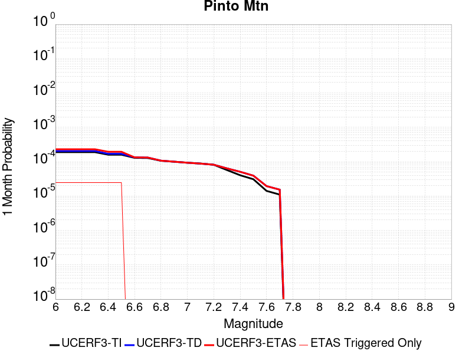 | 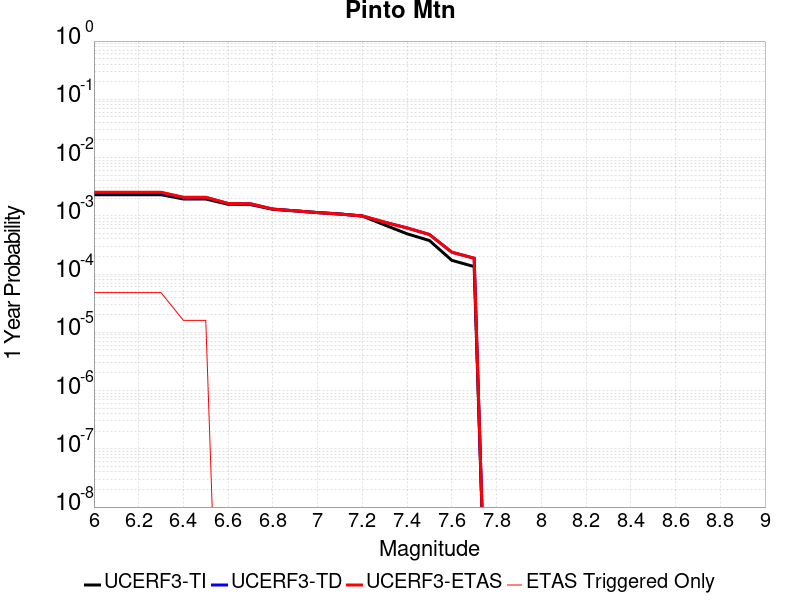 | 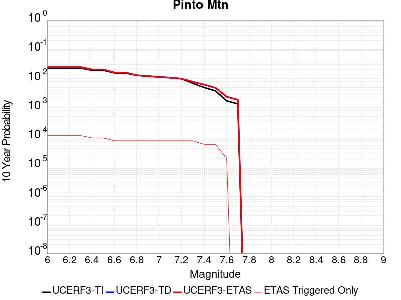 |

| Magnitude | 1 wk TI Prob | 1 wk TD Prob | 1 wk ETAS Prob | 1 wk ETAS/TD Gain | 1 wk ETAS Triggered Only | 1 mo TI Prob | 1 mo TD Prob | 1 mo ETAS Prob | 1 mo ETAS/TD Gain | 1 mo ETAS Triggered Only | 1 yr TI Prob | 1 yr TD Prob | 1 yr ETAS Prob | 1 yr ETAS/TD Gain | 1 yr ETAS Triggered Only | 10 yr TI Prob | 10 yr TD Prob | 10 yr ETAS Prob | 10 yr ETAS/TD Gain | 10 yr ETAS Triggered Only |
|-----|-----|-----|-----|-----|-----|-----|-----|-----|-----|-----|-----|-----|-----|-----|-----|-----|-----|-----|-----|-----|
| 6.0 | 4.4194956E-5 | 4.785362E-5 | 7.246904E-5 | 1.5143899 | 2.4616596E-5 | 1.893932E-4 | 2.0507174E-4 | 2.296833E-4 | 1.1200143 | 2.4616596E-5 | 0.0023034236 | 0.0024940541 | 0.0025431646 | 1.019691 | 4.9233193E-5 | 0.022796938 | 0.024678145 | 0.0248222 | 1.0058373 | 1.4769958E-4 |
| 6.1 | 4.4194956E-5 | 4.785362E-5 | 7.246904E-5 | 1.5143899 | 2.4616596E-5 | 1.893932E-4 | 2.0507174E-4 | 2.296833E-4 | 1.1200143 | 2.4616596E-5 | 0.0023034236 | 0.0024940541 | 0.0025431646 | 1.019691 | 4.9233193E-5 | 0.022796938 | 0.024678145 | 0.0248222 | 1.0058373 | 1.4769958E-4 |
| 6.2 | 4.4194956E-5 | 4.785362E-5 | 7.246904E-5 | 1.5143899 | 2.4616596E-5 | 1.893932E-4 | 2.0507174E-4 | 2.296833E-4 | 1.1200143 | 2.4616596E-5 | 0.0023034236 | 0.0024940541 | 0.0025431646 | 1.019691 | 4.9233193E-5 | 0.022796938 | 0.024678145 | 0.0248222 | 1.0058373 | 1.4769958E-4 |
| 6.3 | 4.4194956E-5 | 4.785362E-5 | 7.246904E-5 | 1.5143899 | 2.4616596E-5 | 1.893932E-4 | 2.0507174E-4 | 2.296833E-4 | 1.1200143 | 2.4616596E-5 | 0.0023034236 | 0.0024940541 | 0.0025431646 | 1.019691 | 4.9233193E-5 | 0.022796938 | 0.024678145 | 0.0248222 | 1.0058373 | 1.4769958E-4 |
| 6.4 | 3.729929E-5 | 3.9603186E-5 | 6.421881E-5 | 1.6215566 | 2.4616596E-5 | 1.5984432E-4 | 1.6971743E-4 | 1.9432984E-4 | 1.14502 | 2.4616596E-5 | 0.0019443673 | 0.002064445 | 0.0020890108 | 1.0118995 | 2.4616596E-5 | 0.019274427 | 0.02046269 | 0.020583255 | 1.0058919 | 1.2308298E-4 |
| 6.5 | 3.729929E-5 | 3.9603186E-5 | 6.421881E-5 | 1.6215566 | 2.4616596E-5 | 1.5984432E-4 | 1.6971743E-4 | 1.9432984E-4 | 1.14502 | 2.4616596E-5 | 0.0019443673 | 0.002064445 | 0.0020890108 | 1.0118995 | 2.4616596E-5 | 0.019274427 | 0.02046269 | 0.020583255 | 1.0058919 | 1.2308298E-4 |
| 6.6 | 3.0204548E-5 | 3.1205298E-5 | 3.1205298E-5 | 1.0 | 0.0 | 1.2944164E-4 | 1.3373033E-4 | 1.3373033E-4 | 1.0 | 0.0 | 0.0015748127 | 0.0016269855 | 0.0016269855 | 1.0 | 0.0 | 0.015636992 | 0.01615461 | 0.016251484 | 1.0059968 | 9.8466386E-5 |
| 6.7 | 2.9857754E-5 | 3.081468E-5 | 3.081468E-5 | 1.0 | 0.0 | 1.2795553E-4 | 1.3205643E-4 | 1.3205643E-4 | 1.0 | 0.0 | 0.0015567453 | 0.001606636 | 0.001606636 | 1.0 | 0.0 | 0.015458848 | 0.01595405 | 0.016050944 | 1.0060734 | 9.8466386E-5 |
| 6.8 | 2.4819734E-5 | 2.5009364E-5 | 2.5009364E-5 | 1.0 | 0.0 | 1.0636595E-4 | 1.07178705E-4 | 1.07178705E-4 | 1.0 | 0.0 | 0.0012942362 | 0.0013041412 | 0.0013041412 | 1.0 | 0.0 | 0.012867244 | 0.0129672475 | 0.013064437 | 1.007495 | 9.8466386E-5 |
| 6.9 | 2.331124E-5 | 2.3337643E-5 | 2.3337643E-5 | 1.0 | 0.0 | 9.990149E-5 | 1.00014746E-4 | 1.00014746E-4 | 1.0 | 0.0 | 0.001215622 | 0.0012170197 | 0.0012170197 | 1.0 | 0.0 | 0.012089936 | 0.012105742 | 0.012203015 | 1.0080354 | 9.8466386E-5 |
| 7.0 | 2.1818534E-5 | 2.1760772E-5 | 2.1760772E-5 | 1.0 | 0.0 | 9.3504656E-5 | 9.325723E-5 | 9.325723E-5 | 1.0 | 0.0 | 0.0011378246 | 0.0011348352 | 0.0011348352 | 1.0 | 0.0 | 0.011320163 | 0.011292503 | 0.011389858 | 1.0086212 | 9.8466386E-5 |
| 7.1 | 2.066081E-5 | 2.0540418E-5 | 2.0540418E-5 | 1.0 | 0.0 | 8.854332E-5 | 8.8027504E-5 | 8.8027504E-5 | 1.0 | 0.0 | 0.0010774818 | 0.0010712275 | 0.0010712275 | 1.0 | 0.0 | 0.010722724 | 0.010662688 | 0.010760105 | 1.0091362 | 9.8466386E-5 |
| 7.2 | 1.8990233E-5 | 1.9053701E-5 | 1.9053701E-5 | 1.0 | 0.0 | 8.138417E-5 | 8.1656275E-5 | 8.1656275E-5 | 1.0 | 0.0 | 9.904018E-4 | 9.937311E-4 | 9.937311E-4 | 1.0 | 0.0 | 0.009859995 | 0.009894874 | 0.009992366 | 1.0098528 | 9.8466386E-5 |
| 7.3 | 1.3335872E-5 | 1.4906372E-5 | 1.4906372E-5 | 1.0 | 0.0 | 5.7152483E-5 | 6.388296E-5 | 6.388296E-5 | 1.0 | 0.0 | 6.956093E-4 | 7.775102E-4 | 7.775102E-4 | 1.0 | 0.0 | 0.006934359 | 0.0077491994 | 0.007846903 | 1.0126082 | 9.8466386E-5 |
| 7.4 | 9.414066E-6 | 1.186061E-5 | 1.186061E-5 | 1.0 | 0.0 | 4.0345374E-5 | 5.0830247E-5 | 5.0830247E-5 | 1.0 | 0.0 | 4.910942E-4 | 6.1869196E-4 | 6.1869196E-4 | 1.0 | 0.0 | 0.0049001034 | 0.006170644 | 0.0062440378 | 1.0118941 | 7.384979E-5 |
| 7.5 | 7.2101157E-6 | 9.157893E-6 | 9.157893E-6 | 1.0 | 0.0 | 3.090013E-5 | 3.924757E-5 | 3.924757E-5 | 1.0 | 0.0 | 3.7614413E-4 | 4.7774217E-4 | 4.7774217E-4 | 1.0 | 0.0 | 0.0037550807 | 0.004767927 | 0.0048414245 | 1.0154151 | 7.384979E-5 |
| 7.6 | 3.296375E-6 | 4.5453176E-6 | 4.5453176E-6 | 1.0 | 0.0 | 1.4127245E-5 | 1.9479796E-5 | 1.9479796E-5 | 1.0 | 0.0 | 1.7198564E-4 | 2.3714209E-4 | 2.3714209E-4 | 1.0 | 0.0 | 0.0017185259 | 0.0023690276 | 0.0023935859 | 1.0103664 | 2.4616596E-5 |
| 7.7 | 2.5741092E-6 | 3.584251E-6 | 3.584251E-6 | 1.0 | 0.0 | 1.103185E-5 | 1.5360993E-5 | 1.5360993E-5 | 1.0 | 0.0 | 1.3430449E-4 | 1.8700535E-4 | 1.8700535E-4 | 1.0 | 0.0 | 0.0013422335 | 0.0018686098 | 0.0018686098 | 1.0 | 0.0 |

## Deep Springs
*[(top)](#table-of-contents)*

| 1 Week | 1 Month | 1 Year | 10 Year |
|-----|-----|-----|-----|
| 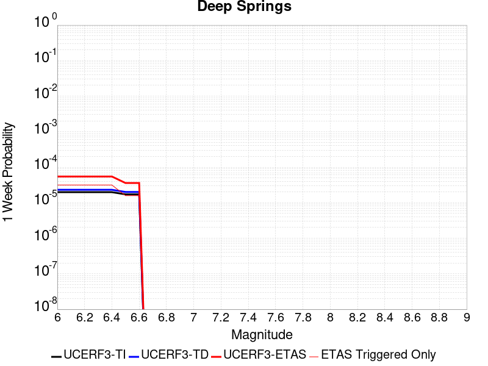 | 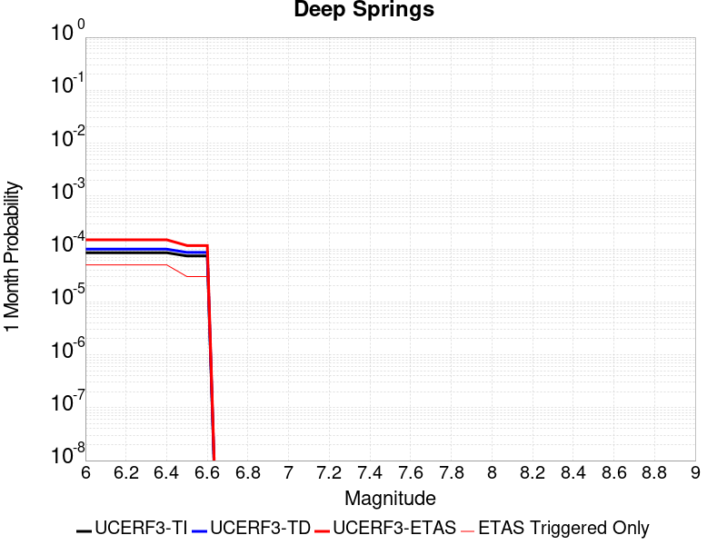 | 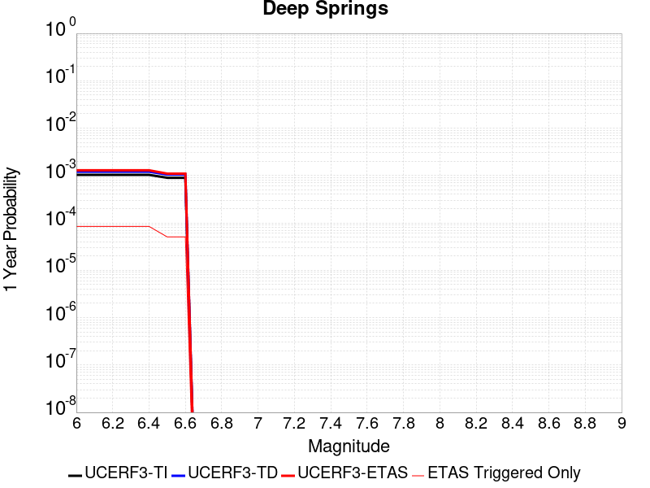 | 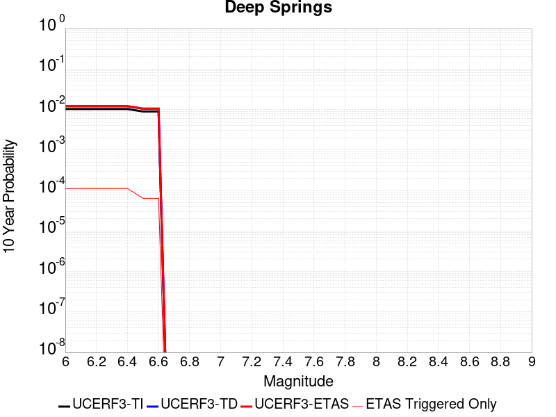 |

| Magnitude | 1 wk TI Prob | 1 wk TD Prob | 1 wk ETAS Prob | 1 wk ETAS/TD Gain | 1 wk ETAS Triggered Only | 1 mo TI Prob | 1 mo TD Prob | 1 mo ETAS Prob | 1 mo ETAS/TD Gain | 1 mo ETAS Triggered Only | 1 yr TI Prob | 1 yr TD Prob | 1 yr ETAS Prob | 1 yr ETAS/TD Gain | 1 yr ETAS Triggered Only | 10 yr TI Prob | 10 yr TD Prob | 10 yr ETAS Prob | 10 yr ETAS/TD Gain | 10 yr ETAS Triggered Only |
|-----|-----|-----|-----|-----|-----|-----|-----|-----|-----|-----|-----|-----|-----|-----|-----|-----|-----|-----|-----|-----|
| 6.0 | 1.9810619E-5 | 2.311252E-5 | 7.234458E-5 | 3.1301033 | 4.9233193E-5 | 8.489989E-5 | 9.905276E-5 | 1.7289523E-4 | 1.7454863 | 7.384979E-5 | 0.001033166 | 0.0012058079 | 0.0013041556 | 1.0815616 | 9.8466386E-5 | 0.010283757 | 0.012042425 | 0.012188346 | 1.0121173 | 1.4769958E-4 |
| 6.1 | 1.9810619E-5 | 2.311252E-5 | 7.234458E-5 | 3.1301033 | 4.9233193E-5 | 8.489989E-5 | 9.905276E-5 | 1.7289523E-4 | 1.7454863 | 7.384979E-5 | 0.001033166 | 0.0012058079 | 0.0013041556 | 1.0815616 | 9.8466386E-5 | 0.010283757 | 0.012042425 | 0.012188346 | 1.0121173 | 1.4769958E-4 |
| 6.2 | 1.9810619E-5 | 2.311252E-5 | 7.234458E-5 | 3.1301033 | 4.9233193E-5 | 8.489989E-5 | 9.905276E-5 | 1.7289523E-4 | 1.7454863 | 7.384979E-5 | 0.001033166 | 0.0012058079 | 0.0013041556 | 1.0815616 | 9.8466386E-5 | 0.010283757 | 0.012042425 | 0.012188346 | 1.0121173 | 1.4769958E-4 |
| 6.3 | 1.9810619E-5 | 2.311252E-5 | 7.234458E-5 | 3.1301033 | 4.9233193E-5 | 8.489989E-5 | 9.905276E-5 | 1.7289523E-4 | 1.7454863 | 7.384979E-5 | 0.001033166 | 0.0012058079 | 0.0013041556 | 1.0815616 | 9.8466386E-5 | 0.010283757 | 0.012042425 | 0.012188346 | 1.0121173 | 1.4769958E-4 |
| 6.4 | 1.9810619E-5 | 2.311252E-5 | 7.234458E-5 | 3.1301033 | 4.9233193E-5 | 8.489989E-5 | 9.905276E-5 | 1.7289523E-4 | 1.7454863 | 7.384979E-5 | 0.001033166 | 0.0012058079 | 0.0013041556 | 1.0815616 | 9.8466386E-5 | 0.010283757 | 0.012042425 | 0.012188346 | 1.0121173 | 1.4769958E-4 |
| 6.5 | 1.7190405E-5 | 2.0050555E-5 | 4.466666E-5 | 2.227702 | 2.4616596E-5 | 7.367108E-5 | 8.593095E-5 | 1.10545436E-4 | 1.2864449 | 2.4616596E-5 | 8.9657627E-4 | 0.0010462094 | 0.001095391 | 1.0470095 | 4.9233193E-5 | 0.008929676 | 0.010462056 | 0.010535133 | 1.006985 | 7.384979E-5 |
| 6.6 | 1.7190405E-5 | 2.0050555E-5 | 4.466666E-5 | 2.227702 | 2.4616596E-5 | 7.367108E-5 | 8.593095E-5 | 1.10545436E-4 | 1.2864449 | 2.4616596E-5 | 8.9657627E-4 | 0.0010462094 | 0.001095391 | 1.0470095 | 4.9233193E-5 | 0.008929676 | 0.010462056 | 0.010535133 | 1.006985 | 7.384979E-5 |

## Lost Hills
*[(top)](#table-of-contents)*

| 1 Week | 1 Month | 1 Year | 10 Year |
|-----|-----|-----|-----|
| 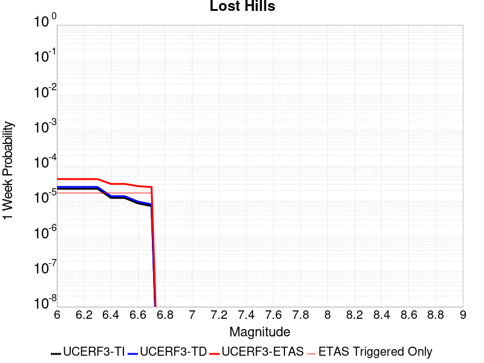 |  | 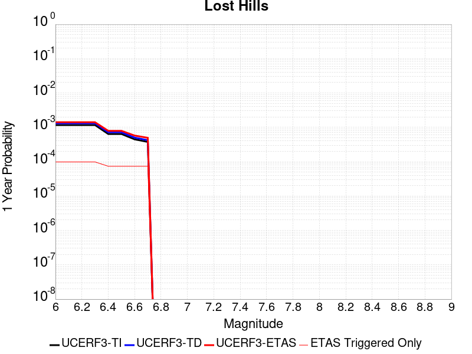 | 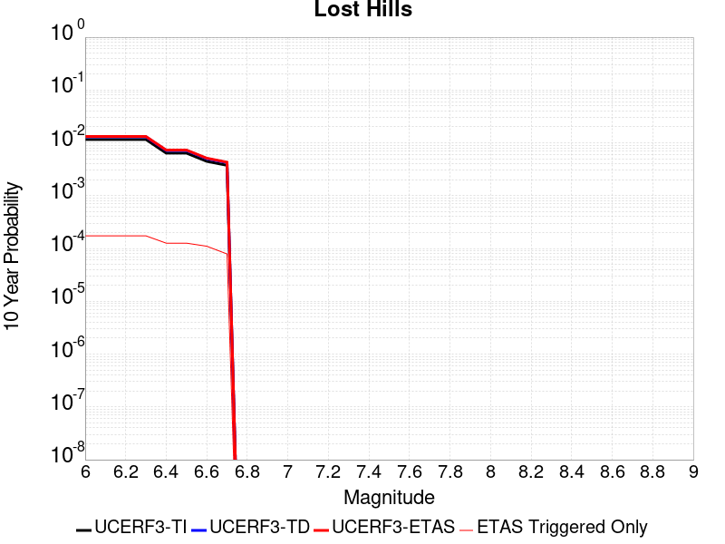 |

| Magnitude | 1 wk TI Prob | 1 wk TD Prob | 1 wk ETAS Prob | 1 wk ETAS/TD Gain | 1 wk ETAS Triggered Only | 1 mo TI Prob | 1 mo TD Prob | 1 mo ETAS Prob | 1 mo ETAS/TD Gain | 1 mo ETAS Triggered Only | 1 yr TI Prob | 1 yr TD Prob | 1 yr ETAS Prob | 1 yr ETAS/TD Gain | 1 yr ETAS Triggered Only | 10 yr TI Prob | 10 yr TD Prob | 10 yr ETAS Prob | 10 yr ETAS/TD Gain | 10 yr ETAS Triggered Only |
|-----|-----|-----|-----|-----|-----|-----|-----|-----|-----|-----|-----|-----|-----|-----|-----|-----|-----|-----|-----|-----|
| 6.0 | 2.233523E-5 | 2.5106583E-5 | 2.5106583E-5 | 1.0 | 0.0 | 9.571891E-5 | 1.0759615E-4 | 1.5682404E-4 | 1.4575247 | 4.9233193E-5 | 0.0011647546 | 0.001309364 | 0.0014077015 | 1.0751032 | 9.8466386E-5 | 0.011586686 | 0.013033091 | 0.013178865 | 1.0111849 | 1.4769958E-4 |
| 6.1 | 2.233523E-5 | 2.5106583E-5 | 2.5106583E-5 | 1.0 | 0.0 | 9.571891E-5 | 1.0759615E-4 | 1.5682404E-4 | 1.4575247 | 4.9233193E-5 | 0.0011647546 | 0.001309364 | 0.0014077015 | 1.0751032 | 9.8466386E-5 | 0.011586686 | 0.013033091 | 0.013178865 | 1.0111849 | 1.4769958E-4 |
| 6.2 | 2.233523E-5 | 2.5106583E-5 | 2.5106583E-5 | 1.0 | 0.0 | 9.571891E-5 | 1.0759615E-4 | 1.5682404E-4 | 1.4575247 | 4.9233193E-5 | 0.0011647546 | 0.001309364 | 0.0014077015 | 1.0751032 | 9.8466386E-5 | 0.011586686 | 0.013033091 | 0.013178865 | 1.0111849 | 1.4769958E-4 |
| 6.3 | 2.233523E-5 | 2.5106583E-5 | 2.5106583E-5 | 1.0 | 0.0 | 9.571891E-5 | 1.0759615E-4 | 1.5682404E-4 | 1.4575247 | 4.9233193E-5 | 0.0011647546 | 0.001309364 | 0.0014077015 | 1.0751032 | 9.8466386E-5 | 0.011586686 | 0.013033091 | 0.013178865 | 1.0111849 | 1.4769958E-4 |
| 6.4 | 1.2288092E-5 | 1.3781108E-5 | 1.3781108E-5 | 1.0 | 0.0 | 5.2662188E-5 | 5.906108E-5 | 8.367623E-5 | 1.4167744 | 2.4616596E-5 | 6.409735E-4 | 7.189252E-4 | 7.927219E-4 | 1.1026486 | 7.384979E-5 | 0.006391279 | 0.0071752006 | 0.0072729606 | 1.0136247 | 9.8466386E-5 |
| 6.5 | 1.2288092E-5 | 1.3781108E-5 | 1.3781108E-5 | 1.0 | 0.0 | 5.2662188E-5 | 5.906108E-5 | 8.367623E-5 | 1.4167744 | 2.4616596E-5 | 6.409735E-4 | 7.189252E-4 | 7.927219E-4 | 1.1026486 | 7.384979E-5 | 0.006391279 | 0.0071752006 | 0.0072729606 | 1.0136247 | 9.8466386E-5 |
| 6.6 | 8.58281E-6 | 9.63377E-6 | 9.63377E-6 | 1.0 | 0.0 | 3.6782953E-5 | 4.12874E-5 | 6.590298E-5 | 1.5962008 | 2.4616596E-5 | 4.4774043E-4 | 5.026414E-4 | 5.7645404E-4 | 1.1468495 | 7.384979E-5 | 0.0044683935 | 0.005023205 | 0.005121177 | 1.0195038 | 9.8466386E-5 |
| 6.7 | 7.205685E-6 | 8.088302E-6 | 8.088302E-6 | 1.0 | 0.0 | 3.088114E-5 | 3.466415E-5 | 5.9279893E-5 | 1.710121 | 2.4616596E-5 | 3.7591302E-4 | 4.2203604E-4 | 4.9585465E-4 | 1.1749107 | 7.384979E-5 | 0.0037527776 | 0.0042203604 | 0.004318411 | 1.0232328 | 9.8466386E-5 |

## Pisgah-Bullion Mtn-Mesquite Lk
*[(top)](#table-of-contents)*

| 1 Week | 1 Month | 1 Year | 10 Year |
|-----|-----|-----|-----|
| 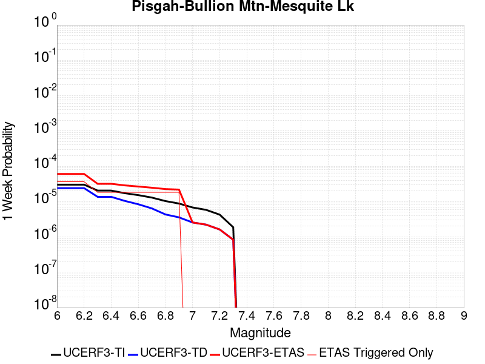 | 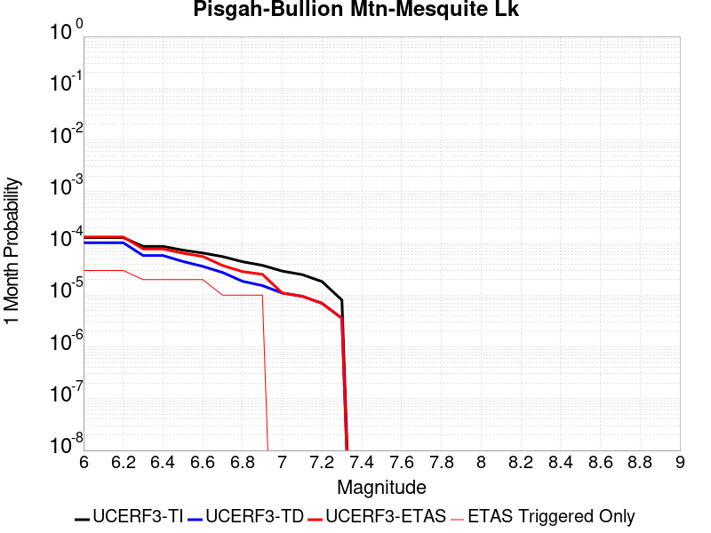 | 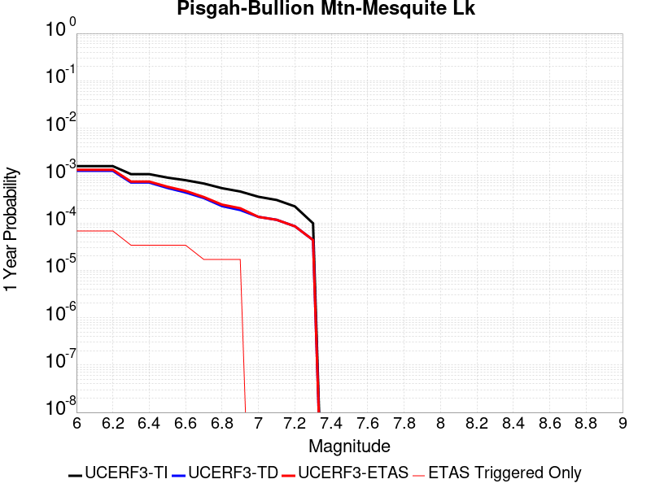 | 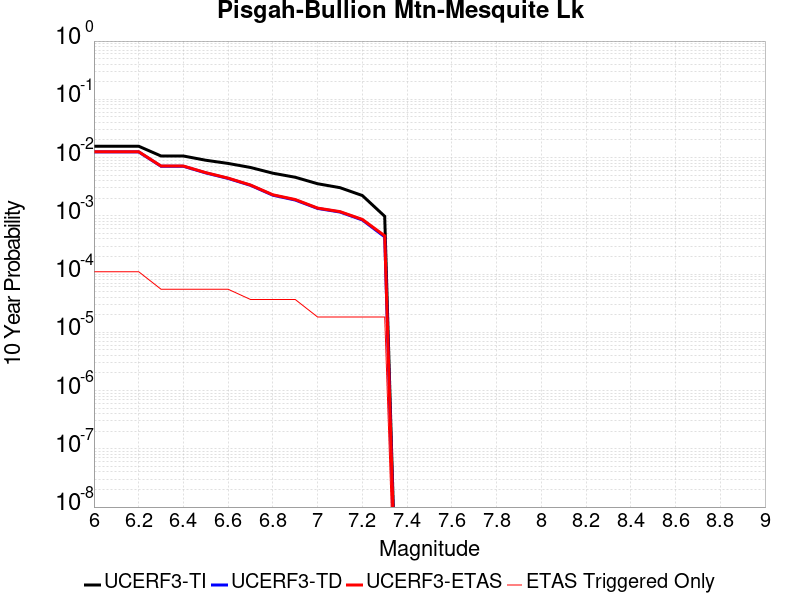 |

| Magnitude | 1 wk TI Prob | 1 wk TD Prob | 1 wk ETAS Prob | 1 wk ETAS/TD Gain | 1 wk ETAS Triggered Only | 1 mo TI Prob | 1 mo TD Prob | 1 mo ETAS Prob | 1 mo ETAS/TD Gain | 1 mo ETAS Triggered Only | 1 yr TI Prob | 1 yr TD Prob | 1 yr ETAS Prob | 1 yr ETAS/TD Gain | 1 yr ETAS Triggered Only | 10 yr TI Prob | 10 yr TD Prob | 10 yr ETAS Prob | 10 yr ETAS/TD Gain | 10 yr ETAS Triggered Only |
|-----|-----|-----|-----|-----|-----|-----|-----|-----|-----|-----|-----|-----|-----|-----|-----|-----|-----|-----|-----|-----|
| 6.0 | 3.0240792E-5 | 2.4091114E-5 | 7.332312E-5 | 3.0435753 | 4.9233193E-5 | 1.2959696E-4 | 1.03244114E-4 | 1.5247223E-4 | 1.4768127 | 4.9233193E-5 | 0.0015767008 | 0.0012563728 | 0.0013547154 | 1.0782751 | 9.8466386E-5 | 0.015655609 | 0.012502721 | 0.012648574 | 1.0116657 | 1.4769958E-4 |
| 6.1 | 3.0240792E-5 | 2.4091114E-5 | 7.332312E-5 | 3.0435753 | 4.9233193E-5 | 1.2959696E-4 | 1.03244114E-4 | 1.5247223E-4 | 1.4768127 | 4.9233193E-5 | 0.0015767008 | 0.0012563728 | 0.0013547154 | 1.0782751 | 9.8466386E-5 | 0.015655609 | 0.012502721 | 0.012648574 | 1.0116657 | 1.4769958E-4 |
| 6.2 | 3.0240792E-5 | 2.4091114E-5 | 7.332312E-5 | 3.0435753 | 4.9233193E-5 | 1.2959696E-4 | 1.03244114E-4 | 1.5247223E-4 | 1.4768127 | 4.9233193E-5 | 0.0015767008 | 0.0012563728 | 0.0013547154 | 1.0782751 | 9.8466386E-5 | 0.015655609 | 0.012502721 | 0.012648574 | 1.0116657 | 1.4769958E-4 |
| 6.3 | 2.0498217E-5 | 1.36380695E-5 | 3.825433E-5 | 2.8049667 | 2.4616596E-5 | 8.784654E-5 | 5.844765E-5 | 8.3062805E-5 | 1.4211488 | 2.4616596E-5 | 0.0010690069 | 7.1138405E-4 | 7.605822E-4 | 1.0691584 | 4.9233193E-5 | 0.01063879 | 0.0070926943 | 0.0071660206 | 1.0103382 | 7.384979E-5 |
| 6.4 | 2.0498217E-5 | 1.36380695E-5 | 3.825433E-5 | 2.8049667 | 2.4616596E-5 | 8.784654E-5 | 5.844765E-5 | 8.3062805E-5 | 1.4211488 | 2.4616596E-5 | 0.0010690069 | 7.1138405E-4 | 7.605822E-4 | 1.0691584 | 4.9233193E-5 | 0.01063879 | 0.0070926943 | 0.0071660206 | 1.0103382 | 7.384979E-5 |
| 6.5 | 1.7316182E-5 | 1.0477042E-5 | 3.509338E-5 | 3.3495502 | 2.4616596E-5 | 7.42101E-5 | 4.4900895E-5 | 6.951638E-5 | 1.5482183 | 2.4616596E-5 | 9.0313336E-4 | 5.465413E-4 | 5.9574755E-4 | 1.0900321 | 4.9233193E-5 | 0.008994718 | 0.0054529672 | 0.005526414 | 1.0134692 | 7.384979E-5 |
| 6.6 | 1.5251077E-5 | 8.414273E-6 | 3.303066E-5 | 3.9255517 | 2.4616596E-5 | 6.536012E-5 | 3.6060712E-5 | 6.067642E-5 | 1.6826185 | 2.4616596E-5 | 7.9546886E-4 | 4.3895794E-4 | 4.8816955E-4 | 1.11211 | 4.9233193E-5 | 0.007926274 | 0.0043816264 | 0.0044551524 | 1.0167806 | 7.384979E-5 |
| 6.7 | 1.2997425E-5 | 6.4114965E-6 | 3.1027936E-5 | 4.8394217 | 2.4616596E-5 | 5.570206E-5 | 2.7477578E-5 | 5.20935E-5 | 1.8958548 | 2.4616596E-5 | 6.7796157E-4 | 3.3449283E-4 | 3.591012E-4 | 1.0735692 | 2.4616596E-5 | 0.0067589693 | 0.0033403537 | 0.0033894225 | 1.0146897 | 4.9233193E-5 |
| 6.8 | 1.035386E-5 | 4.3332193E-6 | 2.894971E-5 | 6.6808777 | 2.4616596E-5 | 4.437293E-5 | 1.8570812E-5 | 4.3186952E-5 | 2.3255284 | 2.4616596E-5 | 5.401065E-4 | 2.2607706E-4 | 2.5068808E-4 | 1.1088612 | 2.4616596E-5 | 0.0053879567 | 0.0022585576 | 0.0023076795 | 1.0217493 | 4.9233193E-5 |
| 6.9 | 8.816252E-6 | 3.580638E-6 | 2.8197146E-5 | 7.874895 | 2.4616596E-5 | 3.778339E-5 | 1.5345504E-5 | 3.9961724E-5 | 2.6041324 | 2.4616596E-5 | 4.5991567E-4 | 1.8681608E-4 | 2.1142808E-4 | 1.1317445 | 2.4616596E-5 | 0.00458965 | 0.0018666488 | 0.00191579 | 1.026326 | 4.9233193E-5 |
| 7.0 | 6.8232207E-6 | 2.5675843E-6 | 2.5675843E-6 | 1.0 | 0.0 | 2.9242048E-5 | 1.1003888E-5 | 1.1003888E-5 | 1.0 | 0.0 | 3.5596377E-4 | 1.3396442E-4 | 1.3396442E-4 | 1.0 | 0.0 | 0.0035539411 | 0.0013388677 | 0.0013634514 | 1.0183616 | 2.4616596E-5 |
| 7.1 | 5.837013E-6 | 2.22738E-6 | 2.22738E-6 | 1.0 | 0.0 | 2.501553E-5 | 9.545881E-6 | 9.545881E-6 | 1.0 | 0.0 | 3.045215E-4 | 1.16215204E-4 | 1.16215204E-4 | 1.0 | 0.0 | 0.0030410455 | 0.0011615733 | 0.0011861613 | 1.0211679 | 2.4616596E-5 |
| 7.2 | 4.278052E-6 | 1.6275711E-6 | 1.6275711E-6 | 1.0 | 0.0 | 1.833438E-5 | 6.9752873E-6 | 6.9752873E-6 | 1.0 | 0.0 | 2.231982E-4 | 8.492105E-5 | 8.492105E-5 | 1.0 | 0.0 | 0.0022297418 | 8.489092E-4 | 8.735049E-4 | 1.0289733 | 2.4616596E-5 |
| 7.3 | 1.8803692E-6 | 8.344926E-7 | 8.344926E-7 | 1.0 | 0.0 | 8.0587E-6 | 3.5763926E-6 | 3.5763926E-6 | 1.0 | 0.0 | 9.811026E-5 | 4.354186E-5 | 4.354186E-5 | 1.0 | 0.0 | 9.806695E-4 | 4.3534773E-4 | 4.5995362E-4 | 1.0565201 | 2.4616596E-5 |

## Mission Creek
*[(top)](#table-of-contents)*

| 1 Week | 1 Month | 1 Year | 10 Year |
|-----|-----|-----|-----|
| 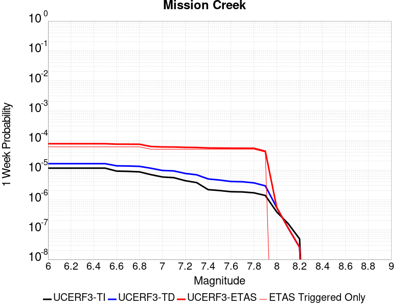 | 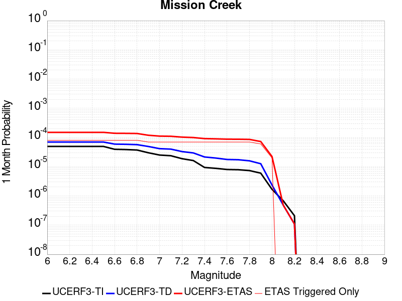 | 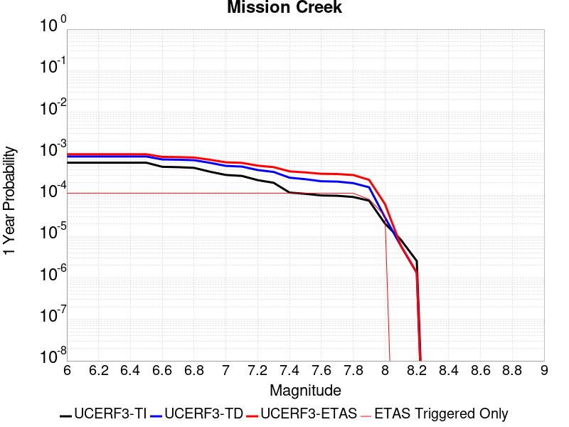 | 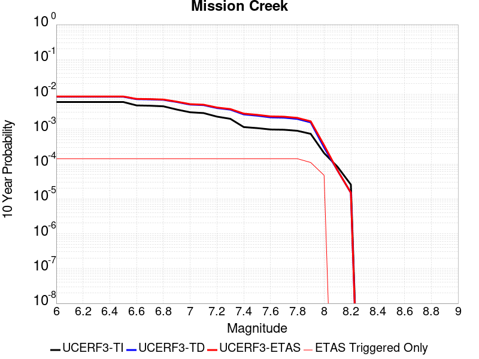 |

| Magnitude | 1 wk TI Prob | 1 wk TD Prob | 1 wk ETAS Prob | 1 wk ETAS/TD Gain | 1 wk ETAS Triggered Only | 1 mo TI Prob | 1 mo TD Prob | 1 mo ETAS Prob | 1 mo ETAS/TD Gain | 1 mo ETAS Triggered Only | 1 yr TI Prob | 1 yr TD Prob | 1 yr ETAS Prob | 1 yr ETAS/TD Gain | 1 yr ETAS Triggered Only | 10 yr TI Prob | 10 yr TD Prob | 10 yr ETAS Prob | 10 yr ETAS/TD Gain | 10 yr ETAS Triggered Only |
|-----|-----|-----|-----|-----|-----|-----|-----|-----|-----|-----|-----|-----|-----|-----|-----|-----|-----|-----|-----|-----|
| 6.0 | 1.1549387E-5 | 1.632237E-5 | 4.0938565E-5 | 2.5081263 | 2.4616596E-5 | 4.9496433E-5 | 6.9951224E-5 | 1.1918097E-4 | 1.7037725 | 4.9233193E-5 | 6.0245243E-4 | 8.513384E-4 | 9.251253E-4 | 1.0866717 | 7.384979E-5 | 0.006008218 | 0.008509998 | 0.008632033 | 1.0143403 | 1.2308298E-4 |
| 6.1 | 1.1549387E-5 | 1.632237E-5 | 4.0938565E-5 | 2.5081263 | 2.4616596E-5 | 4.9496433E-5 | 6.9951224E-5 | 1.1918097E-4 | 1.7037725 | 4.9233193E-5 | 6.0245243E-4 | 8.513384E-4 | 9.251253E-4 | 1.0866717 | 7.384979E-5 | 0.006008218 | 0.008509998 | 0.008632033 | 1.0143403 | 1.2308298E-4 |
| 6.2 | 1.1549387E-5 | 1.632237E-5 | 4.0938565E-5 | 2.5081263 | 2.4616596E-5 | 4.9496433E-5 | 6.9951224E-5 | 1.1918097E-4 | 1.7037725 | 4.9233193E-5 | 6.0245243E-4 | 8.513384E-4 | 9.251253E-4 | 1.0866717 | 7.384979E-5 | 0.006008218 | 0.008509998 | 0.008632033 | 1.0143403 | 1.2308298E-4 |
| 6.3 | 1.1549387E-5 | 1.632237E-5 | 4.0938565E-5 | 2.5081263 | 2.4616596E-5 | 4.9496433E-5 | 6.9951224E-5 | 1.1918097E-4 | 1.7037725 | 4.9233193E-5 | 6.0245243E-4 | 8.513384E-4 | 9.251253E-4 | 1.0866717 | 7.384979E-5 | 0.006008218 | 0.008509998 | 0.008632033 | 1.0143403 | 1.2308298E-4 |
| 6.4 | 1.1549387E-5 | 1.632237E-5 | 4.0938565E-5 | 2.5081263 | 2.4616596E-5 | 4.9496433E-5 | 6.9951224E-5 | 1.1918097E-4 | 1.7037725 | 4.9233193E-5 | 6.0245243E-4 | 8.513384E-4 | 9.251253E-4 | 1.0866717 | 7.384979E-5 | 0.006008218 | 0.008509998 | 0.008632033 | 1.0143403 | 1.2308298E-4 |
| 6.5 | 1.1549387E-5 | 1.632237E-5 | 4.0938565E-5 | 2.5081263 | 2.4616596E-5 | 4.9496433E-5 | 6.9951224E-5 | 1.1918097E-4 | 1.7037725 | 4.9233193E-5 | 6.0245243E-4 | 8.513384E-4 | 9.251253E-4 | 1.0866717 | 7.384979E-5 | 0.006008218 | 0.008509998 | 0.008632033 | 1.0143403 | 1.2308298E-4 |
| 6.6 | 9.202681E-6 | 1.3845646E-5 | 3.84619E-5 | 2.777906 | 2.4616596E-5 | 3.9439463E-5 | 5.9337188E-5 | 1.0856746E-4 | 1.8296698 | 4.9233193E-5 | 4.800697E-4 | 7.221998E-4 | 7.959963E-4 | 1.1021829 | 7.384979E-5 | 0.004790339 | 0.0072271815 | 0.0073493747 | 1.0169075 | 1.2308298E-4 |
| 6.7 | 9.019164E-6 | 1.3651316E-5 | 3.8267575E-5 | 2.8032153 | 2.4616596E-5 | 3.8652986E-5 | 5.8504378E-5 | 1.0773469E-4 | 1.8414809 | 4.9233193E-5 | 4.7049852E-4 | 7.12067E-4 | 7.8586425E-4 | 1.103638 | 7.384979E-5 | 0.004695036 | 0.007126506 | 0.007248712 | 1.017148 | 1.2308298E-4 |
| 6.8 | 8.673558E-6 | 1.3273427E-5 | 3.78897E-5 | 2.8545527 | 2.4616596E-5 | 3.717186E-5 | 5.6884925E-5 | 1.06115316E-4 | 1.8654383 | 4.9233193E-5 | 4.524734E-4 | 6.923627E-4 | 7.6616136E-4 | 1.1065896 | 7.384979E-5 | 0.0045155324 | 0.006930694 | 0.007052924 | 1.0176361 | 1.2308298E-4 |
| 6.9 | 7.002255E-6 | 1.1477657E-5 | 3.609397E-5 | 3.144716 | 2.4616596E-5 | 3.000932E-5 | 4.9189068E-5 | 9.841984E-5 | 2.0008478 | 4.9233193E-5 | 3.653022E-4 | 5.9871917E-4 | 6.7252474E-4 | 1.1232724 | 7.384979E-5 | 0.0036470229 | 0.005999517 | 0.0061218617 | 1.0203924 | 1.2308298E-4 |
| 7.0 | 5.84644E-6 | 9.67498E-6 | 3.4291337E-5 | 3.5443318 | 2.4616596E-5 | 2.5055931E-5 | 4.1463565E-5 | 9.069472E-5 | 2.1873353 | 4.9233193E-5 | 3.0501327E-4 | 5.047066E-4 | 5.785191E-4 | 1.1462483 | 7.384979E-5 | 0.0030459496 | 0.0050638523 | 0.005186312 | 1.0241832 | 1.2308298E-4 |
| 7.1 | 5.54703E-6 | 9.329456E-6 | 3.3945824E-5 | 3.638564 | 2.4616596E-5 | 2.377277E-5 | 3.9982795E-5 | 8.921402E-5 | 2.2313101 | 4.9233193E-5 | 2.8939504E-4 | 4.8668624E-4 | 5.605001E-4 | 1.1516662 | 7.384979E-5 | 0.0028901845 | 0.004884446 | 0.005006928 | 1.0250759 | 1.2308298E-4 |
| 7.2 | 4.384709E-6 | 7.68157E-6 | 3.229798E-5 | 4.204606 | 2.4616596E-5 | 1.8791474E-5 | 3.2920623E-5 | 8.21522E-5 | 2.495463 | 4.9233193E-5 | 2.2876218E-4 | 4.0073853E-4 | 4.745587E-4 | 1.1842104 | 7.384979E-5 | 0.0022852682 | 0.004028366 | 0.0041509527 | 1.030431 | 1.2308298E-4 |
| 7.3 | 3.7888456E-6 | 6.915452E-6 | 3.153188E-5 | 4.5596266 | 2.4616596E-5 | 1.623781E-5 | 2.9637333E-5 | 7.886907E-5 | 2.661139 | 4.9233193E-5 | 1.9767738E-4 | 3.6077813E-4 | 4.3460127E-4 | 1.204622 | 7.384979E-5 | 0.0019750162 | 0.0036301152 | 0.0037527513 | 1.033783 | 1.2308298E-4 |
| 7.4 | 2.1982462E-6 | 5.0237763E-6 | 2.9640249E-5 | 5.8999934 | 2.4616596E-5 | 9.421021E-6 | 2.1530293E-5 | 7.076243E-5 | 3.2866447 | 4.9233193E-5 | 1.1469489E-4 | 2.621E-4 | 3.359304E-4 | 1.2816881 | 7.384979E-5 | 0.0011463572 | 0.0026458844 | 0.0027686418 | 1.0463955 | 1.2308298E-4 |
| 7.5 | 2.051923E-6 | 4.615016E-6 | 2.92315E-5 | 6.3339972 | 2.4616596E-5 | 8.793926E-6 | 1.9778492E-5 | 6.901071E-5 | 3.4891796 | 4.9233193E-5 | 1.0706078E-4 | 2.4077666E-4 | 3.1460868E-4 | 1.3066411 | 7.384979E-5 | 0.0010700922 | 0.0024335422 | 0.0025563254 | 1.0504546 | 1.2308298E-4 |
| 7.6 | 1.8733427E-6 | 4.1233748E-6 | 2.873987E-5 | 6.969987 | 2.4616596E-5 | 8.028587E-6 | 1.7671488E-5 | 6.690381E-5 | 3.785975 | 4.9233193E-5 | 9.774366E-5 | 2.151292E-4 | 2.889631E-4 | 1.3432072 | 7.384979E-5 | 9.770069E-4 | 0.0021780801 | 0.002300895 | 1.0563867 | 1.2308298E-4 |
| 7.7 | 1.8411953E-6 | 4.0430496E-6 | 2.8659546E-5 | 7.0885963 | 2.4616596E-5 | 7.890813E-6 | 1.732724E-5 | 6.655958E-5 | 3.841326 | 4.9233193E-5 | 9.606641E-5 | 2.1093882E-4 | 2.8477304E-4 | 1.3500266 | 7.384979E-5 | 9.6024893E-4 | 0.0021363653 | 0.0022591853 | 1.0574902 | 1.2308298E-4 |
| 7.8 | 1.7194251E-6 | 3.7104276E-6 | 2.8326933E-5 | 7.634412 | 2.4616596E-5 | 7.368944E-6 | 1.5901736E-5 | 6.513415E-5 | 4.09604 | 4.9233193E-5 | 8.97132E-5 | 1.9358651E-4 | 2.67422E-4 | 1.3814082 | 7.384979E-5 | 8.967699E-4 | 0.0019623525 | 0.002085194 | 1.0625991 | 1.2308298E-4 |
| 7.9 | 1.4035052E-6 | 2.9500632E-6 | 2.7566586E-5 | 9.344406 | 2.4616596E-5 | 6.0150082E-6 | 1.2643067E-5 | 6.187564E-5 | 4.8940372 | 4.9233193E-5 | 7.3230265E-5 | 1.5391852E-4 | 2.2775694E-4 | 1.479724 | 7.384979E-5 | 7.3206134E-4 | 0.0015631086 | 0.0016859992 | 1.0786194 | 1.2308298E-4 |
| 8.0 | 3.9318823E-7 | 5.528522E-7 | 5.528522E-7 | 1.0 | 0.0 | 1.6850913E-6 | 2.3693647E-6 | 2.6985903E-5 | 11.38951 | 2.4616596E-5 | 2.0515794E-5 | 2.8846638E-5 | 7.807841E-5 | 2.706673 | 4.9233193E-5 | 2.0513899E-4 | 2.9899E-4 | 3.728177E-4 | 1.2469237 | 7.384979E-5 |
| 8.1 | 1.596793E-7 | 1.1380002E-7 | 1.1380002E-7 | 1.0 | 0.0 | 6.8433974E-7 | 4.877143E-7 | 4.877143E-7 | 1.0 | 0.0 | 8.331805E-6 | 5.937906E-6 | 5.937906E-6 | 1.0 | 0.0 | 8.331492E-5 | 6.549966E-5 | 6.549966E-5 | 1.0 | 0.0 |
| 8.2 | 4.9003038E-8 | 2.5444924E-8 | 2.5444924E-8 | 1.0 | 0.0 | 2.10013E-7 | 1.0904967E-7 | 1.0904967E-7 | 1.0 | 0.0 | 2.5569052E-6 | 1.327679E-6 | 1.327679E-6 | 1.0 | 0.0 | 2.556876E-5 | 1.495635E-5 | 1.495635E-5 | 1.0 | 0.0 |

## Cleghorn Pass
*[(top)](#table-of-contents)*

| 1 Week | 1 Month | 1 Year | 10 Year |
|-----|-----|-----|-----|
|  | 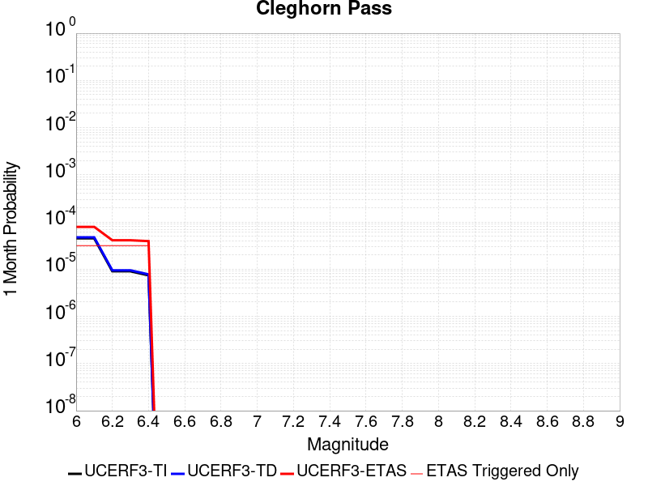 | 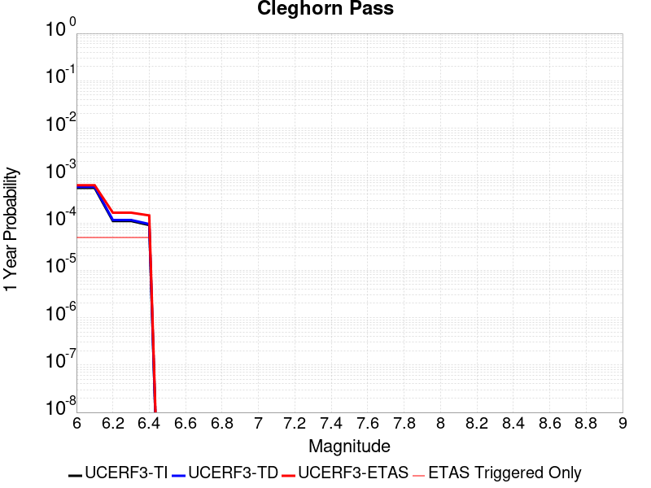 |  |

| Magnitude | 1 wk TI Prob | 1 wk TD Prob | 1 wk ETAS Prob | 1 wk ETAS/TD Gain | 1 wk ETAS Triggered Only | 1 mo TI Prob | 1 mo TD Prob | 1 mo ETAS Prob | 1 mo ETAS/TD Gain | 1 mo ETAS Triggered Only | 1 yr TI Prob | 1 yr TD Prob | 1 yr ETAS Prob | 1 yr ETAS/TD Gain | 1 yr ETAS Triggered Only | 10 yr TI Prob | 10 yr TD Prob | 10 yr ETAS Prob | 10 yr ETAS/TD Gain | 10 yr ETAS Triggered Only |
|-----|-----|-----|-----|-----|-----|-----|-----|-----|-----|-----|-----|-----|-----|-----|-----|-----|-----|-----|-----|-----|
| 6.0 | 1.0522846E-5 | 1.1040642E-5 | 1.1040642E-5 | 1.0 | 0.0 | 4.509713E-5 | 4.7316473E-5 | 9.654734E-5 | 2.0404592 | 4.9233193E-5 | 5.4891926E-4 | 5.759784E-4 | 6.251833E-4 | 1.0854282 | 4.9233193E-5 | 0.0054756533 | 0.005750022 | 0.005847922 | 1.0170261 | 9.8466386E-5 |
| 6.1 | 1.0522846E-5 | 1.1040642E-5 | 1.1040642E-5 | 1.0 | 0.0 | 4.509713E-5 | 4.7316473E-5 | 9.654734E-5 | 2.0404592 | 4.9233193E-5 | 5.4891926E-4 | 5.759784E-4 | 6.251833E-4 | 1.0854282 | 4.9233193E-5 | 0.0054756533 | 0.005750022 | 0.005847922 | 1.0170261 | 9.8466386E-5 |
| 6.2 | 2.1045846E-6 | 2.2082024E-6 | 2.2082024E-6 | 1.0 | 0.0 | 9.019617E-6 | 9.463714E-6 | 5.869644E-5 | 6.202263 | 4.9233193E-5 | 1.098083E-4 | 1.1521882E-4 | 1.6444635E-4 | 1.4272524 | 4.9233193E-5 | 0.0010975406 | 0.0011520023 | 0.0012011788 | 1.0426878 | 4.9233193E-5 |
| 6.3 | 2.1045846E-6 | 2.2082024E-6 | 2.2082024E-6 | 1.0 | 0.0 | 9.019617E-6 | 9.463714E-6 | 5.869644E-5 | 6.202263 | 4.9233193E-5 | 1.098083E-4 | 1.1521882E-4 | 1.6444635E-4 | 1.4272524 | 4.9233193E-5 | 0.0010975406 | 0.0011520023 | 0.0012011788 | 1.0426878 | 4.9233193E-5 |
| 6.4 | 1.7259927E-6 | 1.810877E-6 | 1.810877E-6 | 1.0 | 0.0 | 7.3970905E-6 | 7.760902E-6 | 5.699371E-5 | 7.343697 | 4.9233193E-5 | 9.005586E-5 | 9.4488976E-5 | 1.4371752E-4 | 1.5209976 | 4.9233193E-5 | 9.001937E-4 | 9.448898E-4 | 9.940765E-4 | 1.0520555 | 4.9233193E-5 |

## San Jacinto (Coyote Creek)
*[(top)](#table-of-contents)*

| 1 Week | 1 Month | 1 Year | 10 Year |
|-----|-----|-----|-----|
| 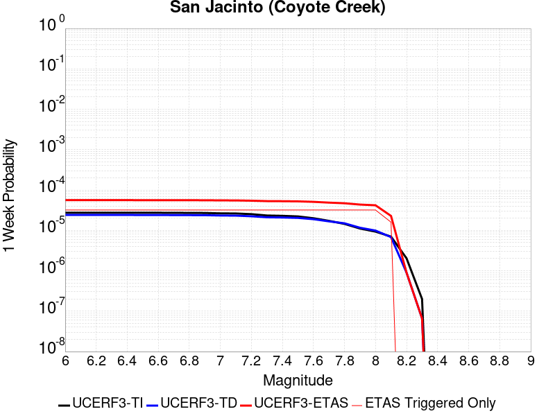 | 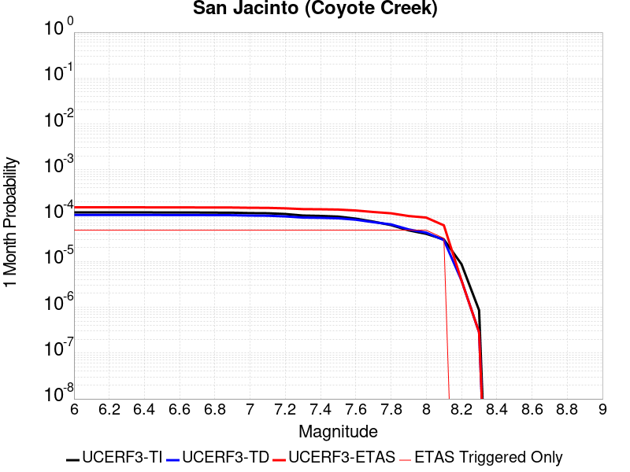 | 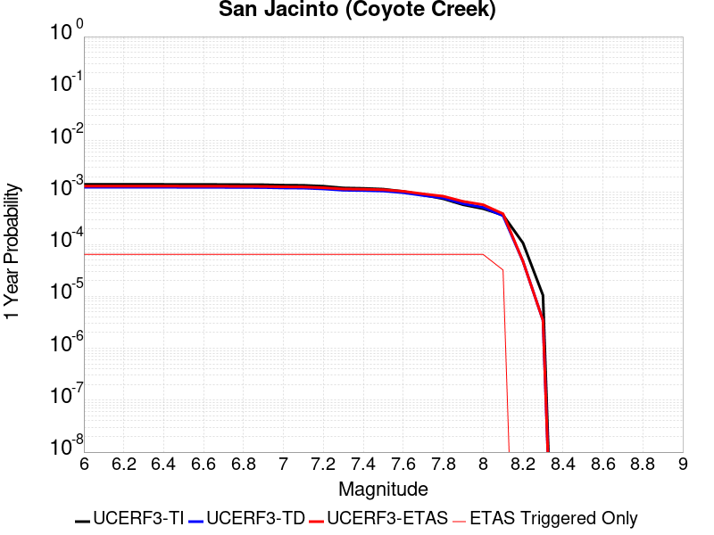 | 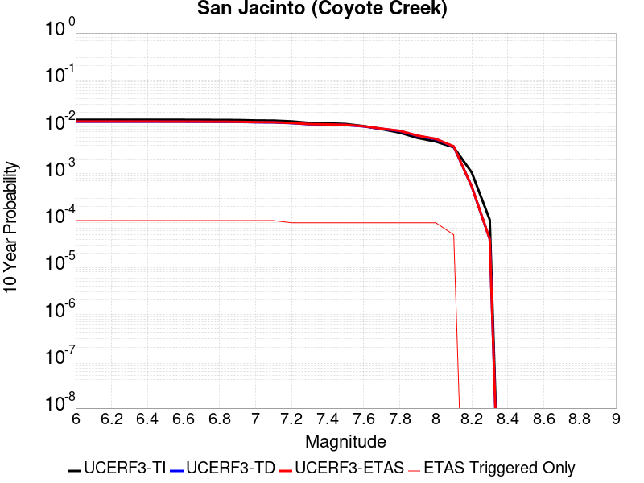 |

| Magnitude | 1 wk TI Prob | 1 wk TD Prob | 1 wk ETAS Prob | 1 wk ETAS/TD Gain | 1 wk ETAS Triggered Only | 1 mo TI Prob | 1 mo TD Prob | 1 mo ETAS Prob | 1 mo ETAS/TD Gain | 1 mo ETAS Triggered Only | 1 yr TI Prob | 1 yr TD Prob | 1 yr ETAS Prob | 1 yr ETAS/TD Gain | 1 yr ETAS Triggered Only | 10 yr TI Prob | 10 yr TD Prob | 10 yr ETAS Prob | 10 yr ETAS/TD Gain | 10 yr ETAS Triggered Only |
|-----|-----|-----|-----|-----|-----|-----|-----|-----|-----|-----|-----|-----|-----|-----|-----|-----|-----|-----|-----|-----|
| 6.0 | 2.7374346E-5 | 2.4145214E-5 | 7.337722E-5 | 3.0389965 | 4.9233193E-5 | 1.1731335E-4 | 1.034754E-4 | 1.7731755E-4 | 1.7136203 | 7.384979E-5 | 0.0014273542 | 0.0012590875 | 0.0013328443 | 1.0585796 | 7.384979E-5 | 0.01418221 | 0.012928318 | 0.013049809 | 1.0093974 | 1.2308298E-4 |
| 6.1 | 2.7374346E-5 | 2.4145214E-5 | 7.337722E-5 | 3.0389965 | 4.9233193E-5 | 1.1731335E-4 | 1.034754E-4 | 1.7731755E-4 | 1.7136203 | 7.384979E-5 | 0.0014273542 | 0.0012590875 | 0.0013328443 | 1.0585796 | 7.384979E-5 | 0.01418221 | 0.012928318 | 0.013049809 | 1.0093974 | 1.2308298E-4 |
| 6.2 | 2.7374346E-5 | 2.4145214E-5 | 7.337722E-5 | 3.0389965 | 4.9233193E-5 | 1.1731335E-4 | 1.034754E-4 | 1.7731755E-4 | 1.7136203 | 7.384979E-5 | 0.0014273542 | 0.0012590875 | 0.0013328443 | 1.0585796 | 7.384979E-5 | 0.01418221 | 0.012928318 | 0.013049809 | 1.0093974 | 1.2308298E-4 |
| 6.3 | 2.7374346E-5 | 2.4145214E-5 | 7.337722E-5 | 3.0389965 | 4.9233193E-5 | 1.1731335E-4 | 1.034754E-4 | 1.7731755E-4 | 1.7136203 | 7.384979E-5 | 0.0014273542 | 0.0012590875 | 0.0013328443 | 1.0585796 | 7.384979E-5 | 0.01418221 | 0.012928318 | 0.013049809 | 1.0093974 | 1.2308298E-4 |
| 6.4 | 2.7374346E-5 | 2.4145214E-5 | 7.337722E-5 | 3.0389965 | 4.9233193E-5 | 1.1731335E-4 | 1.034754E-4 | 1.7731755E-4 | 1.7136203 | 7.384979E-5 | 0.0014273542 | 0.0012590875 | 0.0013328443 | 1.0585796 | 7.384979E-5 | 0.01418221 | 0.012928318 | 0.013049809 | 1.0093974 | 1.2308298E-4 |
| 6.5 | 2.7282445E-5 | 2.4031293E-5 | 7.3263305E-5 | 3.0486627 | 4.9233193E-5 | 1.16919524E-4 | 1.029872E-4 | 1.7682939E-4 | 1.7170035 | 7.384979E-5 | 0.0014225657 | 0.0012531505 | 0.0013269078 | 1.0588574 | 7.384979E-5 | 0.014134934 | 0.012869646 | 0.012991144 | 1.0094408 | 1.2308298E-4 |
| 6.6 | 2.7282445E-5 | 2.4031293E-5 | 7.3263305E-5 | 3.0486627 | 4.9233193E-5 | 1.16919524E-4 | 1.029872E-4 | 1.7682939E-4 | 1.7170035 | 7.384979E-5 | 0.0014225657 | 0.0012531505 | 0.0013269078 | 1.0588574 | 7.384979E-5 | 0.014134934 | 0.012869646 | 0.012991144 | 1.0094408 | 1.2308298E-4 |
| 6.7 | 2.7216198E-5 | 2.3956412E-5 | 7.318843E-5 | 3.055066 | 4.9233193E-5 | 1.1663563E-4 | 1.02666316E-4 | 1.7650852E-4 | 1.7192447 | 7.384979E-5 | 0.0014191137 | 0.0012492483 | 0.0013230059 | 1.0590415 | 7.384979E-5 | 0.014100855 | 0.0128310565 | 0.012952561 | 1.0094695 | 1.2308298E-4 |
| 6.8 | 2.7078617E-5 | 2.387363E-5 | 7.310565E-5 | 3.0621924 | 4.9233193E-5 | 1.1604605E-4 | 1.0231156E-4 | 1.761538E-4 | 1.7217389 | 7.384979E-5 | 0.001411945 | 0.0012449342 | 0.001318692 | 1.0592464 | 7.384979E-5 | 0.014030075 | 0.012788199 | 0.012909708 | 1.0095017 | 1.2308298E-4 |
| 6.9 | 2.6982952E-5 | 2.3793142E-5 | 7.302516E-5 | 3.0691686 | 4.9233193E-5 | 1.15636096E-4 | 1.0196664E-4 | 1.7580889E-4 | 1.7241806 | 7.384979E-5 | 0.0014069602 | 0.0012407395 | 0.0013144977 | 1.0594469 | 7.384979E-5 | 0.013980856 | 0.012746515 | 0.012868028 | 1.0095332 | 1.2308298E-4 |
| 7.0 | 2.6449972E-5 | 2.3370165E-5 | 7.2602204E-5 | 3.1066194 | 4.9233193E-5 | 1.1335209E-4 | 1.00154015E-4 | 1.739964E-4 | 1.7372884 | 7.384979E-5 | 0.001379188 | 0.0012186957 | 0.0012924555 | 1.0605235 | 7.384979E-5 | 0.0137065975 | 0.0125278765 | 0.012649418 | 1.0097016 | 1.2308298E-4 |
| 7.1 | 2.6257849E-5 | 2.3196202E-5 | 7.242825E-5 | 3.1224186 | 4.9233193E-5 | 1.1252879E-4 | 9.940852E-5 | 1.7325097E-4 | 1.7428181 | 7.384979E-5 | 0.0013691769 | 0.0012096294 | 0.0012833897 | 1.0609777 | 7.384979E-5 | 0.013607717 | 0.012437741 | 0.012559294 | 1.0097729 | 1.2308298E-4 |
| 7.2 | 2.5270041E-5 | 2.2390966E-5 | 7.162306E-5 | 3.1987479 | 4.9233193E-5 | 1.0829568E-4 | 9.595777E-5 | 1.6980048E-4 | 1.7695334 | 7.384979E-5 | 0.0013177024 | 0.0011676621 | 0.0012414256 | 1.063172 | 7.384979E-5 | 0.013099162 | 0.012018777 | 0.012140381 | 1.0101178 | 1.2308298E-4 |
| 7.3 | 2.339701E-5 | 2.1122814E-5 | 7.035497E-5 | 3.3307574 | 4.9233193E-5 | 1.0026905E-4 | 9.0523215E-5 | 1.6436633E-4 | 1.8157367 | 7.384979E-5 | 0.001220092 | 0.0011015651 | 0.0011753335 | 1.0669669 | 7.384979E-5 | 0.012134149 | 0.011357696 | 0.011479381 | 1.0107139 | 1.2308298E-4 |
| 7.4 | 2.296333E-5 | 2.0853171E-5 | 7.0085334E-5 | 3.360896 | 4.9233193E-5 | 9.841056E-5 | 8.936768E-5 | 1.6321088E-4 | 1.8262852 | 7.384979E-5 | 0.0011974899 | 0.0010875105 | 0.00116128 | 1.0678333 | 7.384979E-5 | 0.011910575 | 0.01121681 | 0.0113385115 | 1.01085 | 1.2308298E-4 |
| 7.5 | 2.2188895E-5 | 2.0376096E-5 | 6.9608286E-5 | 3.416174 | 4.9233193E-5 | 9.50918E-5 | 8.732321E-5 | 1.6116655E-4 | 1.8456324 | 7.384979E-5 | 0.0011571277 | 0.0010626436 | 0.0011364149 | 1.0694225 | 7.384979E-5 | 0.011511209 | 0.010966429 | 0.011088162 | 1.0111005 | 1.2308298E-4 |
| 7.6 | 2.0013189E-5 | 1.8962366E-5 | 6.8194626E-5 | 3.5963142 | 4.9233193E-5 | 8.5767984E-5 | 8.1264756E-5 | 1.5510854E-4 | 1.9086815 | 7.384979E-5 | 0.001043725 | 9.889511E-4 | 0.0010627279 | 1.074601 | 7.384979E-5 | 0.010388365 | 0.010224434 | 0.010346258 | 1.0119151 | 1.2308298E-4 |
| 7.7 | 1.7230794E-5 | 1.674371E-5 | 6.597608E-5 | 3.94035 | 4.9233193E-5 | 7.384417E-5 | 7.175679E-5 | 1.4560128E-4 | 2.0290942 | 7.384979E-5 | 8.986819E-4 | 8.7328954E-4 | 9.4707485E-4 | 1.0844913 | 7.384979E-5 | 0.008950562 | 0.009062956 | 0.009184924 | 1.0134578 | 1.2308298E-4 |
| 7.8 | 1.4478809E-5 | 1.4990978E-5 | 6.422343E-5 | 4.284139 | 4.9233193E-5 | 6.205057E-5 | 6.424547E-5 | 1.3809052E-4 | 2.1494203 | 7.384979E-5 | 7.552038E-4 | 7.819085E-4 | 8.557006E-4 | 1.0943743 | 7.384979E-5 | 0.0075264242 | 0.008141387 | 0.008263468 | 1.0149951 | 1.2308298E-4 |
| 7.9 | 1.1114467E-5 | 1.1645102E-5 | 6.0877723E-5 | 5.227753 | 4.9233193E-5 | 4.7632562E-5 | 4.990663E-5 | 1.2375273E-4 | 2.4796853 | 7.384979E-5 | 5.797721E-4 | 6.074444E-4 | 6.812493E-4 | 1.1215007 | 7.384979E-5 | 0.0057826187 | 0.0063803247 | 0.0065026223 | 1.0191679 | 1.2308298E-4 |
| 8.0 | 9.327402E-6 | 9.899186E-6 | 5.9131893E-5 | 5.973409 | 4.9233193E-5 | 3.9973966E-5 | 4.2424395E-5 | 1.16271054E-4 | 2.740665 | 7.384979E-5 | 4.8657437E-4 | 5.1639514E-4 | 5.902068E-4 | 1.1429363 | 7.384979E-5 | 0.0048551033 | 0.0054499684 | 0.005572381 | 1.022461 | 1.2308298E-4 |
| 8.1 | 7.0235833E-6 | 6.827495E-6 | 3.1443924E-5 | 4.6054845 | 2.4616596E-5 | 3.0100724E-5 | 2.9260367E-5 | 7.849212E-5 | 2.6825404 | 4.9233193E-5 | 3.664147E-4 | 3.5618723E-4 | 4.054029E-4 | 1.1381736 | 4.9233193E-5 | 0.003658111 | 0.0037876023 | 0.0038611724 | 1.019424 | 7.384979E-5 |
| 8.2 | 2.0358202E-6 | 8.994527E-7 | 8.994527E-7 | 1.0 | 0.0 | 8.724915E-6 | 3.854792E-6 | 3.854792E-6 | 1.0 | 0.0 | 1.06220665E-4 | 4.69311E-5 | 4.69311E-5 | 1.0 | 0.0 | 0.001061699 | 5.3254166E-4 | 5.3254166E-4 | 1.0 | 0.0 |
| 8.3 | 2.0051264E-7 | 6.617272E-8 | 6.617272E-8 | 1.0 | 0.0 | 8.5933965E-7 | 2.8359733E-7 | 2.8359733E-7 | 1.0 | 0.0 | 1.046241E-5 | 3.4527925E-6 | 3.4527925E-6 | 1.0 | 0.0 | 1.0461917E-4 | 4.01389E-5 | 4.01389E-5 | 1.0 | 0.0 |

## Elysian Park (Upper)
*[(top)](#table-of-contents)*

| 1 Week | 1 Month | 1 Year | 10 Year |
|-----|-----|-----|-----|
| 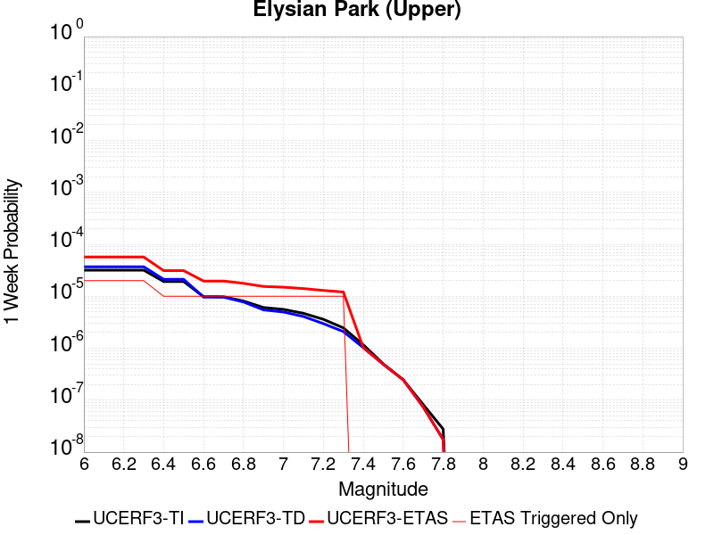 |  | 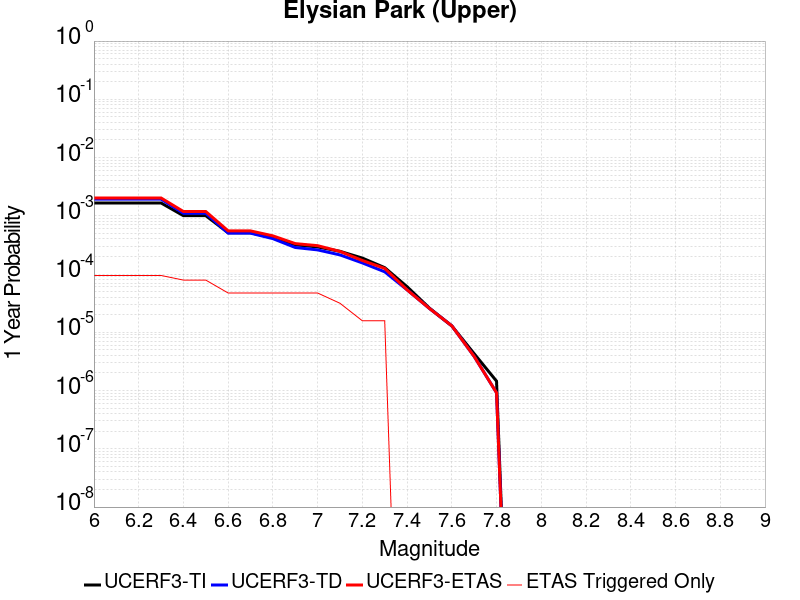 | 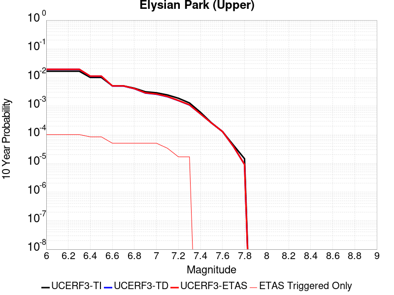 |

| Magnitude | 1 wk TI Prob | 1 wk TD Prob | 1 wk ETAS Prob | 1 wk ETAS/TD Gain | 1 wk ETAS Triggered Only | 1 mo TI Prob | 1 mo TD Prob | 1 mo ETAS Prob | 1 mo ETAS/TD Gain | 1 mo ETAS Triggered Only | 1 yr TI Prob | 1 yr TD Prob | 1 yr ETAS Prob | 1 yr ETAS/TD Gain | 1 yr ETAS Triggered Only | 10 yr TI Prob | 10 yr TD Prob | 10 yr ETAS Prob | 10 yr ETAS/TD Gain | 10 yr ETAS Triggered Only |
|-----|-----|-----|-----|-----|-----|-----|-----|-----|-----|-----|-----|-----|-----|-----|-----|-----|-----|-----|-----|-----|
| 6.0 | 3.1876025E-5 | 3.7035516E-5 | 6.16512E-5 | 1.6646508 | 2.4616596E-5 | 1.3660437E-4 | 1.587167E-4 | 2.5716747E-4 | 1.6202923 | 9.8466386E-5 | 0.0016618895 | 0.0019311075 | 0.0020293838 | 1.0508912 | 9.8466386E-5 | 0.016495159 | 0.019189782 | 0.01928636 | 1.0050328 | 9.8466386E-5 |
| 6.1 | 3.1876025E-5 | 3.7035516E-5 | 6.16512E-5 | 1.6646508 | 2.4616596E-5 | 1.3660437E-4 | 1.587167E-4 | 2.5716747E-4 | 1.6202923 | 9.8466386E-5 | 0.0016618895 | 0.0019311075 | 0.0020293838 | 1.0508912 | 9.8466386E-5 | 0.016495159 | 0.019189782 | 0.01928636 | 1.0050328 | 9.8466386E-5 |
| 6.2 | 3.1876025E-5 | 3.7035516E-5 | 6.16512E-5 | 1.6646508 | 2.4616596E-5 | 1.3660437E-4 | 1.587167E-4 | 2.5716747E-4 | 1.6202923 | 9.8466386E-5 | 0.0016618895 | 0.0019311075 | 0.0020293838 | 1.0508912 | 9.8466386E-5 | 0.016495159 | 0.019189782 | 0.01928636 | 1.0050328 | 9.8466386E-5 |
| 6.3 | 3.1876025E-5 | 3.7035516E-5 | 6.16512E-5 | 1.6646508 | 2.4616596E-5 | 1.3660437E-4 | 1.587167E-4 | 2.5716747E-4 | 1.6202923 | 9.8466386E-5 | 0.0016618895 | 0.0019311075 | 0.0020293838 | 1.0508912 | 9.8466386E-5 | 0.016495159 | 0.019189782 | 0.01928636 | 1.0050328 | 9.8466386E-5 |
| 6.4 | 1.9273462E-5 | 2.1202266E-5 | 4.581834E-5 | 2.1610115 | 2.4616596E-5 | 8.259794E-5 | 9.086466E-5 | 1.893221E-4 | 2.0835614 | 9.8466386E-5 | 0.001005166 | 0.0011058892 | 0.0012042468 | 1.0889398 | 9.8466386E-5 | 0.010006315 | 0.011020724 | 0.011118105 | 1.0088362 | 9.8466386E-5 |
| 6.5 | 1.9273462E-5 | 2.1202266E-5 | 4.581834E-5 | 2.1610115 | 2.4616596E-5 | 8.259794E-5 | 9.086466E-5 | 1.893221E-4 | 2.0835614 | 9.8466386E-5 | 0.001005166 | 0.0011058892 | 0.0012042468 | 1.0889398 | 9.8466386E-5 | 0.010006315 | 0.011020724 | 0.011118105 | 1.0088362 | 9.8466386E-5 |
| 6.6 | 9.813258E-6 | 9.665599E-6 | 3.428196E-5 | 3.5468013 | 2.4616596E-5 | 4.205614E-5 | 4.1423376E-5 | 9.065453E-5 | 2.1884873 | 4.9233193E-5 | 5.119132E-4 | 5.0422014E-4 | 5.5342854E-4 | 1.0975931 | 4.9233193E-5 | 0.005107356 | 0.0050314846 | 0.0050804703 | 1.0097358 | 4.9233193E-5 |
| 6.7 | 9.801478E-6 | 9.653168E-6 | 3.4269528E-5 | 3.5500808 | 2.4616596E-5 | 4.2005657E-5 | 4.1370105E-5 | 9.060126E-5 | 2.1900177 | 4.9233193E-5 | 5.112989E-4 | 5.035719E-4 | 5.527803E-4 | 1.0977187 | 4.9233193E-5 | 0.0051012407 | 0.0050250315 | 0.005074017 | 1.0097483 | 4.9233193E-5 |
| 6.8 | 8.102489E-6 | 7.773004E-6 | 3.238941E-5 | 4.16691 | 2.4616596E-5 | 3.4724493E-5 | 3.3312477E-5 | 8.254403E-5 | 2.4778712 | 4.9233193E-5 | 4.2268867E-4 | 4.055089E-4 | 4.5472212E-4 | 1.1213616 | 4.9233193E-5 | 0.004218856 | 0.0040481836 | 0.004097217 | 1.0121126 | 4.9233193E-5 |
| 6.9 | 6.08275E-6 | 5.4814514E-6 | 3.0097914E-5 | 5.4908657 | 2.4616596E-5 | 2.6068668E-5 | 2.3491726E-5 | 7.2723764E-5 | 3.0957181 | 4.9233193E-5 | 3.173398E-4 | 2.85975E-4 | 3.351941E-4 | 1.1721098 | 4.9233193E-5 | 0.0031688702 | 0.0028561477 | 0.0029052403 | 1.0171884 | 4.9233193E-5 |
| 7.0 | 5.5995934E-6 | 4.98278E-6 | 2.9599254E-5 | 5.940309 | 2.4616596E-5 | 2.3998036E-5 | 2.13546E-5 | 7.058674E-5 | 3.3054583 | 4.9233193E-5 | 2.9213692E-4 | 2.599619E-4 | 3.091823E-4 | 1.1893369 | 4.9233193E-5 | 0.0029175316 | 0.0025966454 | 0.0026457508 | 1.0189111 | 4.9233193E-5 |
| 7.1 | 4.709881E-6 | 4.0874015E-6 | 2.8703897E-5 | 7.0225296 | 2.4616596E-5 | 2.0185047E-5 | 1.7517319E-5 | 6.674965E-5 | 3.8104947 | 4.9233193E-5 | 2.4572524E-4 | 2.132529E-4 | 2.624756E-4 | 1.2308184 | 4.9233193E-5 | 0.002454537 | 0.002130524 | 0.0021796522 | 1.0230592 | 4.9233193E-5 |
| 7.2 | 3.6063436E-6 | 2.9779544E-6 | 2.7594479E-5 | 9.2662525 | 2.4616596E-5 | 1.5455667E-5 | 1.27626E-5 | 3.7378883E-5 | 2.9287827 | 2.4616596E-5 | 1.881565E-4 | 1.5537368E-4 | 1.7998645E-4 | 1.1584102 | 2.4616596E-5 | 0.0018799726 | 0.0015526618 | 0.0015772402 | 1.0158298 | 2.4616596E-5 |
| 7.3 | 2.471135E-6 | 2.0954615E-6 | 2.6712007E-5 | 12.747553 | 2.4616596E-5 | 1.0590536E-5 | 8.980519E-6 | 3.3596894E-5 | 3.741086 | 2.4616596E-5 | 1.2893214E-4 | 1.093324E-4 | 1.339463E-4 | 1.2251291 | 2.4616596E-5 | 0.0012885736 | 0.0010927934 | 0.0011173831 | 1.0225017 | 2.4616596E-5 |
| 7.4 | 1.163943E-6 | 1.0275091E-6 | 1.0275091E-6 | 1.0 | 0.0 | 4.988318E-6 | 4.4036033E-6 | 4.4036033E-6 | 1.0 | 0.0 | 6.0731076E-5 | 5.3612584E-5 | 5.3612584E-5 | 1.0 | 0.0 | 6.071448E-4 | 5.359995E-4 | 5.359995E-4 | 1.0 | 0.0 |
| 7.5 | 4.99459E-7 | 4.917604E-7 | 4.917604E-7 | 1.0 | 0.0 | 2.140537E-6 | 2.1075427E-6 | 2.1075427E-6 | 1.0 | 0.0 | 2.6060725E-5 | 2.5659048E-5 | 2.5659048E-5 | 1.0 | 0.0 | 2.605767E-4 | 2.5656243E-4 | 2.5656243E-4 | 1.0 | 0.0 |
| 7.6 | 2.4667852E-7 | 2.4778336E-7 | 2.4778336E-7 | 1.0 | 0.0 | 1.0571932E-6 | 1.0619283E-6 | 1.0619283E-6 | 1.0 | 0.0 | 1.2871251E-5 | 1.2928905E-5 | 1.2928905E-5 | 1.0 | 0.0 | 1.2870505E-4 | 1.2928189E-4 | 1.2928189E-4 | 1.0 | 0.0 |
| 7.7 | 8.2312795E-8 | 7.3864456E-8 | 7.3864456E-8 | 1.0 | 0.0 | 3.527691E-7 | 3.165619E-7 | 3.165619E-7 | 1.0 | 0.0 | 4.294955E-6 | 3.8541357E-6 | 3.8541357E-6 | 1.0 | 0.0 | 4.2948723E-5 | 3.8540802E-5 | 3.8540802E-5 | 1.0 | 0.0 |
| 7.8 | 2.7819295E-8 | 1.7566023E-8 | 1.7566023E-8 | 1.0 | 0.0 | 1.1922555E-7 | 7.5282955E-8 | 7.5282955E-8 | 1.0 | 0.0 | 1.45157E-6 | 9.165697E-7 | 9.165697E-7 | 1.0 | 0.0 | 1.45156055E-5 | 9.165675E-6 | 9.165675E-6 | 1.0 | 0.0 |

## Santa Rosa Island
*[(top)](#table-of-contents)*

| 1 Week | 1 Month | 1 Year | 10 Year |
|-----|-----|-----|-----|
| 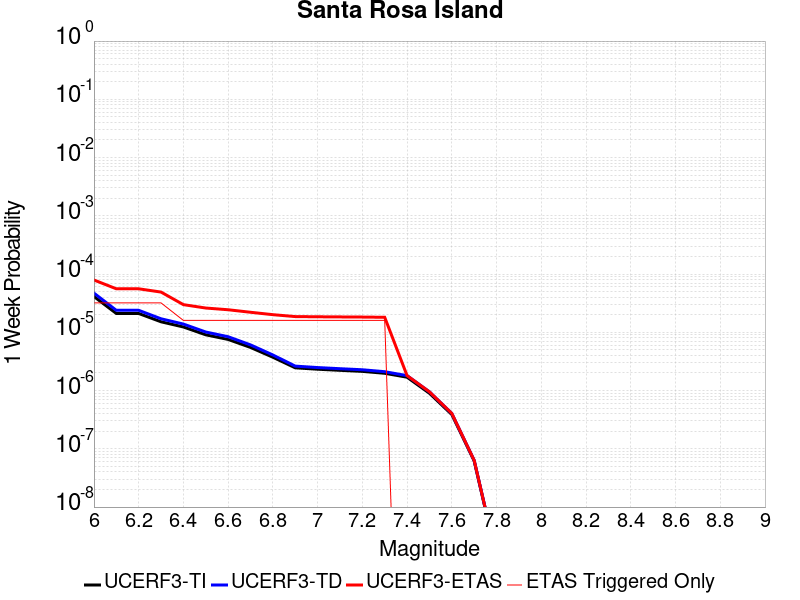 | 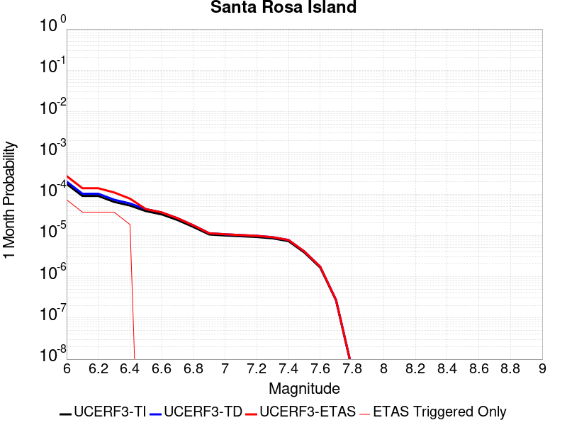 | 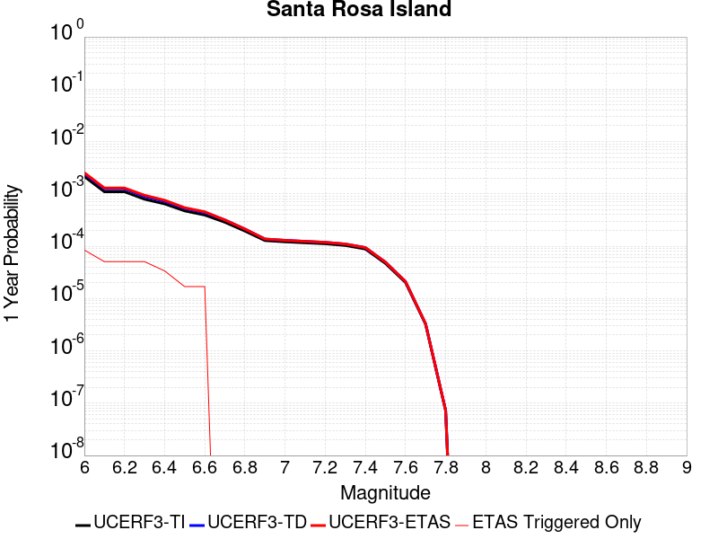 | 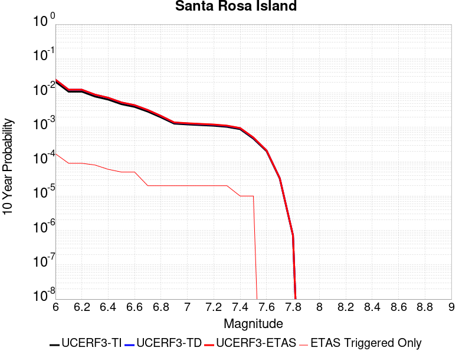 |

| Magnitude | 1 wk TI Prob | 1 wk TD Prob | 1 wk ETAS Prob | 1 wk ETAS/TD Gain | 1 wk ETAS Triggered Only | 1 mo TI Prob | 1 mo TD Prob | 1 mo ETAS Prob | 1 mo ETAS/TD Gain | 1 mo ETAS Triggered Only | 1 yr TI Prob | 1 yr TD Prob | 1 yr ETAS Prob | 1 yr ETAS/TD Gain | 1 yr ETAS Triggered Only | 10 yr TI Prob | 10 yr TD Prob | 10 yr ETAS Prob | 10 yr ETAS/TD Gain | 10 yr ETAS Triggered Only |
|-----|-----|-----|-----|-----|-----|-----|-----|-----|-----|-----|-----|-----|-----|-----|-----|-----|-----|-----|-----|-----|
| 6.0 | 4.1143165E-5 | 4.7091133E-5 | 7.170657E-5 | 1.5227191 | 2.4616596E-5 | 1.7631594E-4 | 2.0180465E-4 | 2.7563953E-4 | 1.3658731 | 7.384979E-5 | 0.002144533 | 0.0024544 | 0.0025526248 | 1.0400199 | 9.8466386E-5 | 0.021239553 | 0.024293551 | 0.024413643 | 1.0049434 | 1.2308298E-4 |
| 6.1 | 2.1061249E-5 | 2.3864959E-5 | 4.8480968E-5 | 2.0314708 | 2.4616596E-5 | 9.0259375E-5 | 1.0227455E-4 | 1.5150271E-4 | 1.4813334 | 4.9233193E-5 | 0.0010983539 | 0.0012445104 | 0.0013182682 | 1.0592666 | 7.384979E-5 | 0.01092941 | 0.012378449 | 0.012475695 | 1.0078562 | 9.8466386E-5 |
| 6.2 | 2.1061249E-5 | 2.3864959E-5 | 4.8480968E-5 | 2.0314708 | 2.4616596E-5 | 9.0259375E-5 | 1.0227455E-4 | 1.5150271E-4 | 1.4813334 | 4.9233193E-5 | 0.0010983539 | 0.0012445104 | 0.0013182682 | 1.0592666 | 7.384979E-5 | 0.01092941 | 0.012378449 | 0.012475695 | 1.0078562 | 9.8466386E-5 |
| 6.3 | 1.5158236E-5 | 1.7074419E-5 | 4.1690597E-5 | 2.4416993 | 2.4616596E-5 | 6.496225E-5 | 7.3174095E-5 | 1.2240368E-4 | 1.6727735 | 4.9233193E-5 | 7.906284E-4 | 8.905424E-4 | 9.6432643E-4 | 1.082853 | 7.384979E-5 | 0.007878214 | 0.008870989 | 0.008968582 | 1.0110013 | 9.8466386E-5 |
| 6.4 | 1.2341918E-5 | 1.3852917E-5 | 1.3852917E-5 | 1.0 | 0.0 | 5.2892858E-5 | 5.9368336E-5 | 8.398347E-5 | 1.4146172 | 2.4616596E-5 | 6.437803E-4 | 7.225779E-4 | 7.7177555E-4 | 1.0680863 | 4.9233193E-5 | 0.006419184 | 0.007203121 | 0.007252 | 1.0067858 | 4.9233193E-5 |
| 6.5 | 9.061158E-6 | 1.0117031E-5 | 1.0117031E-5 | 1.0 | 0.0 | 3.883296E-5 | 4.3358013E-5 | 4.3358013E-5 | 1.0 | 0.0 | 4.726887E-4 | 5.277613E-4 | 5.523649E-4 | 1.0466188 | 2.4616596E-5 | 0.004716845 | 0.0052656173 | 0.0052901045 | 1.0046504 | 2.4616596E-5 |
| 6.6 | 7.5461685E-6 | 8.400733E-6 | 8.400733E-6 | 1.0 | 0.0 | 3.2340322E-5 | 3.600267E-5 | 3.600267E-5 | 1.0 | 0.0 | 3.936723E-4 | 4.3824865E-4 | 4.6285446E-4 | 1.0561458 | 2.4616596E-5 | 0.003929756 | 0.0043742736 | 0.0043987827 | 1.005603 | 2.4616596E-5 |
| 6.7 | 5.5023775E-6 | 6.087381E-6 | 6.087381E-6 | 1.0 | 0.0 | 2.3581404E-5 | 2.6088532E-5 | 2.6088532E-5 | 1.0 | 0.0 | 2.8706578E-4 | 3.1758484E-4 | 3.1758484E-4 | 1.0 | 0.0 | 0.0028669522 | 0.0031716314 | 0.0031716314 | 1.0 | 0.0 |
| 6.8 | 3.7351679E-6 | 4.0831405E-6 | 4.0831405E-6 | 1.0 | 0.0 | 1.6007763E-5 | 1.749907E-5 | 1.749907E-5 | 1.0 | 0.0 | 1.948771E-4 | 2.1303284E-4 | 2.1303284E-4 | 1.0 | 0.0 | 0.0019470629 | 0.0021285315 | 0.0021285315 | 1.0 | 0.0 |
| 6.9 | 2.456366E-6 | 2.6292705E-6 | 2.6292705E-6 | 1.0 | 0.0 | 1.0527241E-5 | 1.1268254E-5 | 1.1268254E-5 | 1.0 | 0.0 | 1.2816161E-4 | 1.3718237E-4 | 1.3718237E-4 | 1.0 | 0.0 | 0.0012808773 | 0.0013709799 | 0.0013709799 | 1.0 | 0.0 |
| 7.0 | 2.3245157E-6 | 2.4827782E-6 | 2.4827782E-6 | 1.0 | 0.0 | 9.962172E-6 | 1.0640435E-5 | 1.0640435E-5 | 1.0 | 0.0 | 1.2128269E-4 | 1.2953962E-4 | 1.2953962E-4 | 1.0 | 0.0 | 0.0012121652 | 0.0012946434 | 0.0012946434 | 1.0 | 0.0 |
| 7.1 | 2.2248344E-6 | 2.37325E-6 | 2.37325E-6 | 1.0 | 0.0 | 9.53497E-6 | 1.0171032E-5 | 1.0171032E-5 | 1.0 | 0.0 | 1.1608207E-4 | 1.2382529E-4 | 1.2382529E-4 | 1.0 | 0.0 | 0.0011602144 | 0.001237565 | 0.001237565 | 1.0 | 0.0 |
| 7.2 | 2.1350402E-6 | 2.276154E-6 | 2.276154E-6 | 1.0 | 0.0 | 9.150141E-6 | 9.754909E-6 | 9.754909E-6 | 1.0 | 0.0 | 1.1139726E-4 | 1.1875956E-4 | 1.1875956E-4 | 1.0 | 0.0 | 0.0011134144 | 0.0011869629 | 0.0011869629 | 1.0 | 0.0 |
| 7.3 | 1.9793572E-6 | 2.108719E-6 | 2.108719E-6 | 1.0 | 0.0 | 8.482932E-6 | 9.037336E-6 | 9.037336E-6 | 1.0 | 0.0 | 1.032748E-4 | 1.10024026E-4 | 1.10024026E-4 | 1.0 | 0.0 | 0.0010322682 | 0.0010996973 | 0.0010996973 | 1.0 | 0.0 |
| 7.4 | 1.6951194E-6 | 1.8045733E-6 | 1.8045733E-6 | 1.0 | 0.0 | 7.264777E-6 | 7.733863E-6 | 7.733863E-6 | 1.0 | 0.0 | 8.844508E-5 | 9.415573E-5 | 9.415573E-5 | 1.0 | 0.0 | 8.840988E-4 | 9.4116E-4 | 9.4116E-4 | 1.0 | 0.0 |
| 7.5 | 8.987207E-7 | 9.5122147E-7 | 9.5122147E-7 | 1.0 | 0.0 | 3.8516546E-6 | 4.076657E-6 | 4.076657E-6 | 1.0 | 0.0 | 4.6892885E-5 | 4.963218E-5 | 4.963218E-5 | 1.0 | 0.0 | 4.688299E-4 | 4.9621216E-4 | 4.9621216E-4 | 1.0 | 0.0 |
| 7.6 | 3.8783037E-7 | 4.052932E-7 | 4.052932E-7 | 1.0 | 0.0 | 1.6621291E-6 | 1.7369698E-6 | 1.7369698E-6 | 1.0 | 0.0 | 2.0236233E-5 | 2.1147409E-5 | 2.1147409E-5 | 1.0 | 0.0 | 2.023439E-4 | 2.1145462E-4 | 2.1145462E-4 | 1.0 | 0.0 |
| 7.7 | 6.181804E-8 | 6.339035E-8 | 6.339035E-8 | 1.0 | 0.0 | 2.6493444E-7 | 2.7167292E-7 | 2.7167292E-7 | 1.0 | 0.0 | 3.225572E-6 | 3.3076128E-6 | 3.3076128E-6 | 1.0 | 0.0 | 3.225525E-5 | 3.307564E-5 | 3.307564E-5 | 1.0 | 0.0 |
| 7.8 | 1.3704449E-9 | 1.3964153E-9 | 1.3964153E-9 | 1.0 | 0.0 | 5.873335E-9 | 5.984637E-9 | 5.984637E-9 | 1.0 | 0.0 | 7.1507856E-8 | 7.286295E-8 | 7.286295E-8 | 1.0 | 0.0 | 7.1507833E-7 | 7.286294E-7 | 7.286294E-7 | 1.0 | 0.0 |

## Pine Mtn
*[(top)](#table-of-contents)*

| 1 Week | 1 Month | 1 Year | 10 Year |
|-----|-----|-----|-----|
| 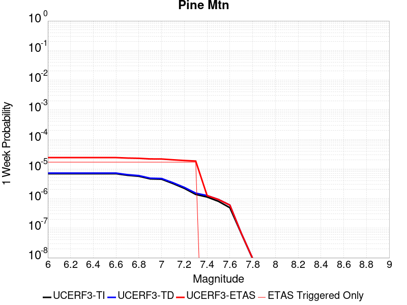 | 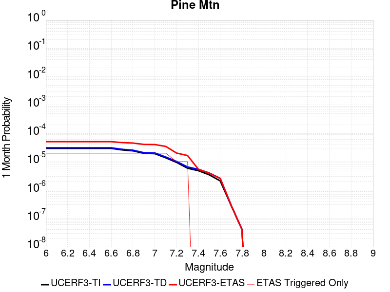 | 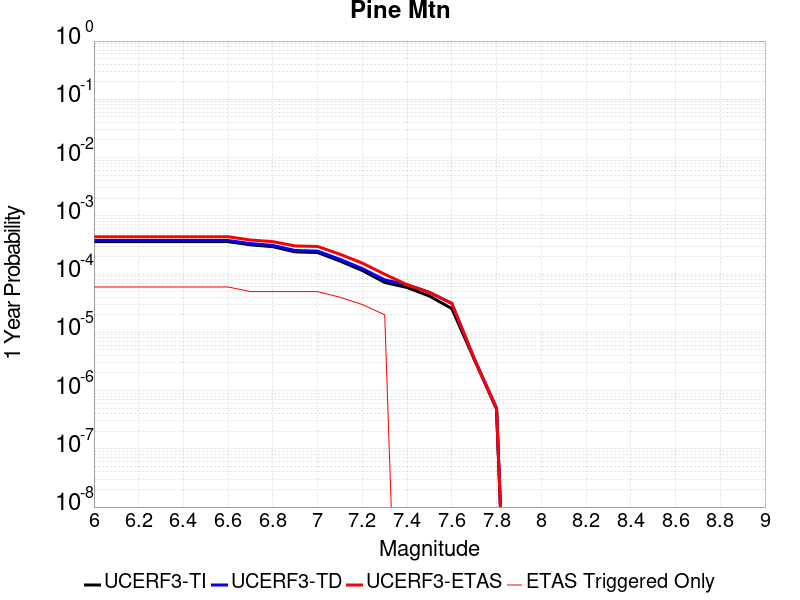 | 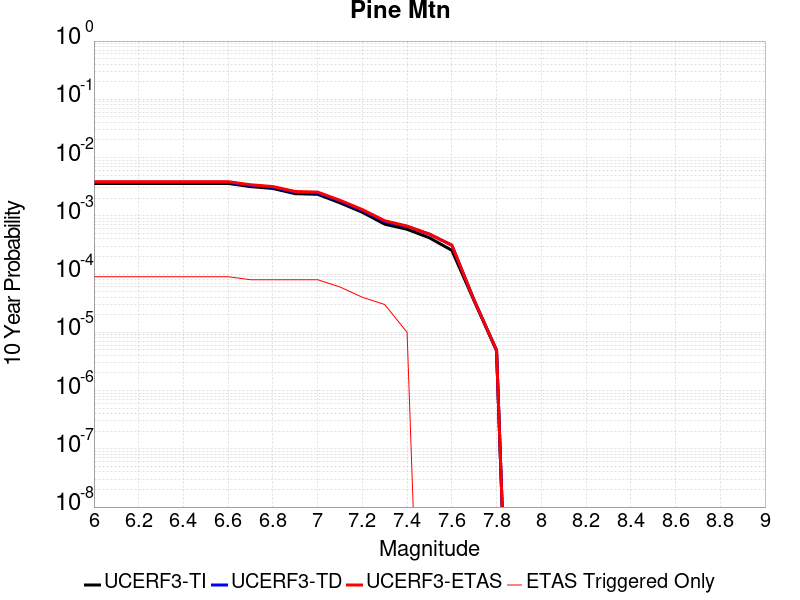 |

| Magnitude | 1 wk TI Prob | 1 wk TD Prob | 1 wk ETAS Prob | 1 wk ETAS/TD Gain | 1 wk ETAS Triggered Only | 1 mo TI Prob | 1 mo TD Prob | 1 mo ETAS Prob | 1 mo ETAS/TD Gain | 1 mo ETAS Triggered Only | 1 yr TI Prob | 1 yr TD Prob | 1 yr ETAS Prob | 1 yr ETAS/TD Gain | 1 yr ETAS Triggered Only | 10 yr TI Prob | 10 yr TD Prob | 10 yr ETAS Prob | 10 yr ETAS/TD Gain | 10 yr ETAS Triggered Only |
|-----|-----|-----|-----|-----|-----|-----|-----|-----|-----|-----|-----|-----|-----|-----|-----|-----|-----|-----|-----|-----|
| 6.0 | 6.894797E-6 | 7.225461E-6 | 3.184188E-5 | 4.4068995 | 2.4616596E-5 | 2.9548795E-5 | 3.096591E-5 | 8.0197584E-5 | 2.5898666 | 4.9233193E-5 | 3.596972E-4 | 3.7694772E-4 | 4.5076967E-4 | 1.1958413 | 7.384979E-5 | 0.0035911554 | 0.003763381 | 0.0038860007 | 1.0325824 | 1.2308298E-4 |
| 6.1 | 6.894797E-6 | 7.225461E-6 | 3.184188E-5 | 4.4068995 | 2.4616596E-5 | 2.9548795E-5 | 3.096591E-5 | 8.0197584E-5 | 2.5898666 | 4.9233193E-5 | 3.596972E-4 | 3.7694772E-4 | 4.5076967E-4 | 1.1958413 | 7.384979E-5 | 0.0035911554 | 0.003763381 | 0.0038860007 | 1.0325824 | 1.2308298E-4 |
| 6.2 | 6.894797E-6 | 7.225461E-6 | 3.184188E-5 | 4.4068995 | 2.4616596E-5 | 2.9548795E-5 | 3.096591E-5 | 8.0197584E-5 | 2.5898666 | 4.9233193E-5 | 3.596972E-4 | 3.7694772E-4 | 4.5076967E-4 | 1.1958413 | 7.384979E-5 | 0.0035911554 | 0.003763381 | 0.0038860007 | 1.0325824 | 1.2308298E-4 |
| 6.3 | 6.894797E-6 | 7.225461E-6 | 3.184188E-5 | 4.4068995 | 2.4616596E-5 | 2.9548795E-5 | 3.096591E-5 | 8.0197584E-5 | 2.5898666 | 4.9233193E-5 | 3.596972E-4 | 3.7694772E-4 | 4.5076967E-4 | 1.1958413 | 7.384979E-5 | 0.0035911554 | 0.003763381 | 0.0038860007 | 1.0325824 | 1.2308298E-4 |
| 6.4 | 6.894797E-6 | 7.225461E-6 | 3.184188E-5 | 4.4068995 | 2.4616596E-5 | 2.9548795E-5 | 3.096591E-5 | 8.0197584E-5 | 2.5898666 | 4.9233193E-5 | 3.596972E-4 | 3.7694772E-4 | 4.5076967E-4 | 1.1958413 | 7.384979E-5 | 0.0035911554 | 0.003763381 | 0.0038860007 | 1.0325824 | 1.2308298E-4 |
| 6.5 | 6.894797E-6 | 7.225461E-6 | 3.184188E-5 | 4.4068995 | 2.4616596E-5 | 2.9548795E-5 | 3.096591E-5 | 8.0197584E-5 | 2.5898666 | 4.9233193E-5 | 3.596972E-4 | 3.7694772E-4 | 4.5076967E-4 | 1.1958413 | 7.384979E-5 | 0.0035911554 | 0.003763381 | 0.0038860007 | 1.0325824 | 1.2308298E-4 |
| 6.6 | 6.894797E-6 | 7.225461E-6 | 3.184188E-5 | 4.4068995 | 2.4616596E-5 | 2.9548795E-5 | 3.096591E-5 | 8.0197584E-5 | 2.5898666 | 4.9233193E-5 | 3.596972E-4 | 3.7694772E-4 | 4.5076967E-4 | 1.1958413 | 7.384979E-5 | 0.0035911554 | 0.003763381 | 0.0038860007 | 1.0325824 | 1.2308298E-4 |
| 6.7 | 6.0867933E-6 | 6.3971133E-6 | 3.101355E-5 | 4.8480544 | 2.4616596E-5 | 2.6085996E-5 | 2.7415923E-5 | 7.664777E-5 | 2.795739 | 4.9233193E-5 | 3.1755073E-4 | 3.3373994E-4 | 4.075651E-4 | 1.2212056 | 7.384979E-5 | 0.0031709734 | 0.0033326065 | 0.0034552792 | 1.0368099 | 1.2308298E-4 |
| 6.8 | 5.6530425E-6 | 5.9505956E-6 | 3.0567047E-5 | 5.1368046 | 2.4616596E-5 | 2.42271E-5 | 2.5502315E-5 | 7.473425E-5 | 2.930489 | 4.9233193E-5 | 2.94925E-4 | 3.104485E-4 | 3.8427536E-4 | 1.2378072 | 7.384979E-5 | 0.002945339 | 0.0031003528 | 0.003223054 | 1.0395765 | 1.2308298E-4 |
| 6.9 | 4.6015225E-6 | 4.863834E-6 | 2.948031E-5 | 6.0611258 | 2.4616596E-5 | 1.9720663E-5 | 2.0844845E-5 | 7.007701E-5 | 3.361839 | 4.9233193E-5 | 2.4007261E-4 | 2.5375787E-4 | 3.2758893E-4 | 1.2909508 | 7.384979E-5 | 0.0023981342 | 0.0025348254 | 0.0026575965 | 1.0484337 | 1.2308298E-4 |
| 7.0 | 4.4875965E-6 | 4.747473E-6 | 2.9363953E-5 | 6.1851754 | 2.4616596E-5 | 1.9232413E-5 | 2.0346162E-5 | 6.957835E-5 | 3.4197285 | 4.9233193E-5 | 2.3412947E-4 | 2.4768783E-4 | 3.2151933E-4 | 1.2980828 | 7.384979E-5 | 0.0023388295 | 0.0024742614 | 0.0025970398 | 1.0496223 | 1.2308298E-4 |
| 7.1 | 3.203907E-6 | 3.4294096E-6 | 2.804592E-5 | 8.1780615 | 2.4616596E-5 | 1.3730958E-5 | 1.4697391E-5 | 6.392986E-5 | 4.3497424 | 4.9233193E-5 | 1.6716159E-4 | 1.789267E-4 | 2.2815108E-4 | 1.2751092 | 4.9233193E-5 | 0.0016703589 | 0.0017878925 | 0.0018616103 | 1.0412316 | 7.384979E-5 |
| 7.2 | 2.2060601E-6 | 2.3784817E-6 | 2.699502E-5 | 11.349687 | 2.4616596E-5 | 9.4545085E-6 | 1.0193455E-5 | 3.48098E-5 | 3.4149168 | 2.4616596E-5 | 1.15102564E-4 | 1.240987E-4 | 1.4871225E-4 | 1.1983384 | 2.4616596E-5 | 0.0011504296 | 0.0012403389 | 0.001289511 | 1.0396441 | 4.9233193E-5 |
| 7.3 | 1.3765207E-6 | 1.5216481E-6 | 2.6138207E-5 | 17.177565 | 2.4616596E-5 | 5.899361E-6 | 6.521333E-6 | 3.113777E-5 | 4.774755 | 2.4616596E-5 | 7.182235E-5 | 7.939443E-5 | 1.0400907E-4 | 1.3100299 | 2.4616596E-5 | 7.1799144E-4 | 7.936697E-4 | 8.4286387E-4 | 1.0619831 | 4.9233193E-5 |
| 7.4 | 1.1245983E-6 | 1.2587075E-6 | 1.2587075E-6 | 1.0 | 0.0 | 4.819698E-6 | 5.39445E-6 | 5.39445E-6 | 1.0 | 0.0 | 5.8678244E-5 | 6.567554E-5 | 6.567554E-5 | 1.0 | 0.0 | 5.866275E-4 | 6.5656955E-4 | 6.8117003E-4 | 1.0374681 | 2.4616596E-5 |
| 7.5 | 8.031682E-7 | 9.276951E-7 | 9.276951E-7 | 1.0 | 0.0 | 3.4421448E-6 | 3.9758306E-6 | 3.9758306E-6 | 1.0 | 0.0 | 4.1907308E-5 | 4.840473E-5 | 4.840473E-5 | 1.0 | 0.0 | 4.1899405E-4 | 4.8394862E-4 | 4.8394862E-4 | 1.0 | 0.0 |
| 7.6 | 4.8953444E-7 | 6.003009E-7 | 6.003009E-7 | 1.0 | 0.0 | 2.098003E-6 | 2.5727159E-6 | 2.5727159E-6 | 1.0 | 0.0 | 2.5542888E-5 | 3.1322415E-5 | 3.1322415E-5 | 1.0 | 0.0 | 2.5539953E-4 | 3.1318486E-4 | 3.1318486E-4 | 1.0 | 0.0 |
| 7.7 | 6.634529E-8 | 6.788826E-8 | 6.788826E-8 | 1.0 | 0.0 | 2.843369E-7 | 2.9094966E-7 | 2.9094966E-7 | 1.0 | 0.0 | 3.4617963E-6 | 3.5423066E-6 | 3.5423066E-6 | 1.0 | 0.0 | 3.4617424E-5 | 3.542255E-5 | 3.542255E-5 | 1.0 | 0.0 |
| 7.8 | 9.235578E-9 | 9.488566E-9 | 9.488566E-9 | 1.0 | 0.0 | 3.9581046E-8 | 4.0665284E-8 | 4.0665284E-8 | 1.0 | 0.0 | 4.818991E-7 | 4.950997E-7 | 4.950997E-7 | 1.0 | 0.0 | 4.8189804E-6 | 4.950988E-6 | 4.950988E-6 | 1.0 | 0.0 |

## Santa Ynez (East)
*[(top)](#table-of-contents)*

| 1 Week | 1 Month | 1 Year | 10 Year |
|-----|-----|-----|-----|
| 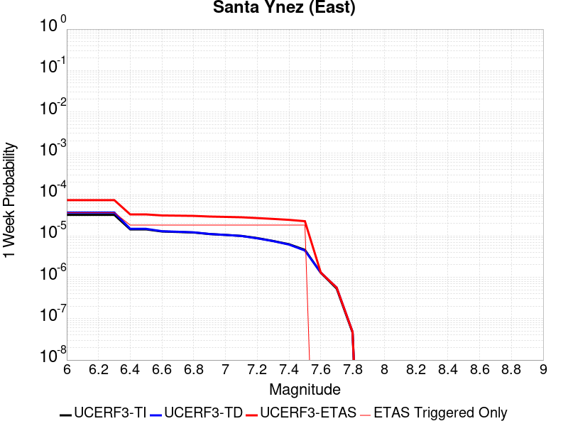 | 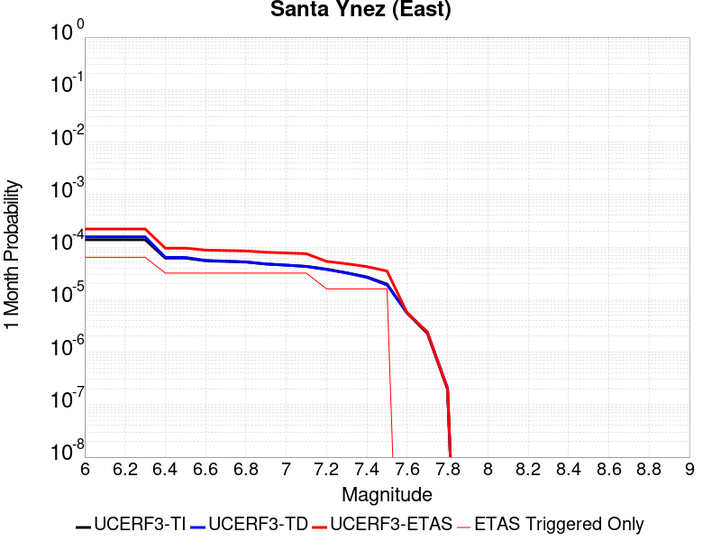 | 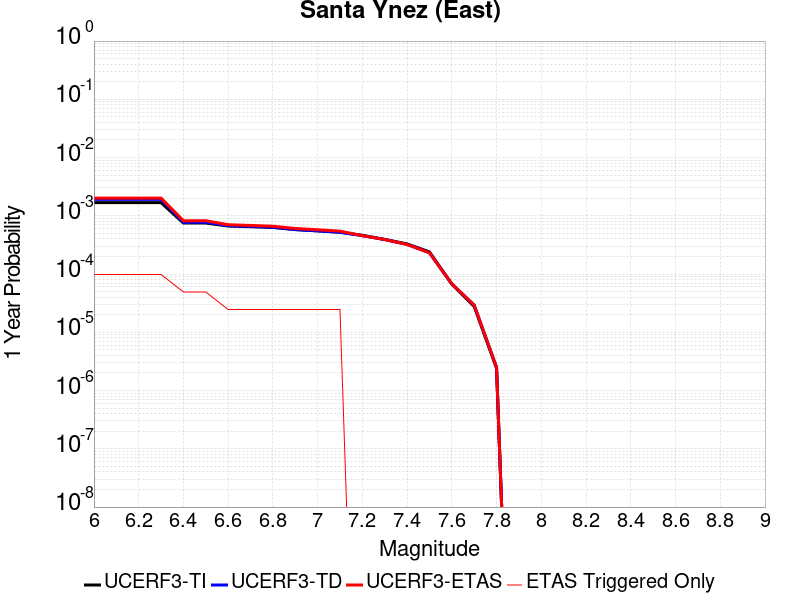 | 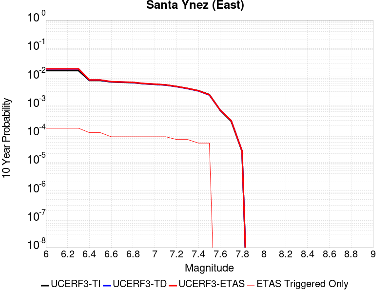 |

| Magnitude | 1 wk TI Prob | 1 wk TD Prob | 1 wk ETAS Prob | 1 wk ETAS/TD Gain | 1 wk ETAS Triggered Only | 1 mo TI Prob | 1 mo TD Prob | 1 mo ETAS Prob | 1 mo ETAS/TD Gain | 1 mo ETAS Triggered Only | 1 yr TI Prob | 1 yr TD Prob | 1 yr ETAS Prob | 1 yr ETAS/TD Gain | 1 yr ETAS Triggered Only | 10 yr TI Prob | 10 yr TD Prob | 10 yr ETAS Prob | 10 yr ETAS/TD Gain | 10 yr ETAS Triggered Only |
|-----|-----|-----|-----|-----|-----|-----|-----|-----|-----|-----|-----|-----|-----|-----|-----|-----|-----|-----|-----|-----|
| 6.0 | 3.2269712E-5 | 3.67505E-5 | 3.67505E-5 | 1.0 | 0.0 | 1.3829143E-4 | 1.5749598E-4 | 2.0672141E-4 | 1.3125504 | 4.9233193E-5 | 0.0016823979 | 0.0019164166 | 0.0020146943 | 1.051282 | 9.8466386E-5 | 0.016697178 | 0.019056441 | 0.01915303 | 1.0050687 | 9.8466386E-5 |
| 6.1 | 3.2269712E-5 | 3.67505E-5 | 3.67505E-5 | 1.0 | 0.0 | 1.3829143E-4 | 1.5749598E-4 | 2.0672141E-4 | 1.3125504 | 4.9233193E-5 | 0.0016823979 | 0.0019164166 | 0.0020146943 | 1.051282 | 9.8466386E-5 | 0.016697178 | 0.019056441 | 0.01915303 | 1.0050687 | 9.8466386E-5 |
| 6.2 | 3.2269712E-5 | 3.67505E-5 | 3.67505E-5 | 1.0 | 0.0 | 1.3829143E-4 | 1.5749598E-4 | 2.0672141E-4 | 1.3125504 | 4.9233193E-5 | 0.0016823979 | 0.0019164166 | 0.0020146943 | 1.051282 | 9.8466386E-5 | 0.016697178 | 0.019056441 | 0.01915303 | 1.0050687 | 9.8466386E-5 |
| 6.3 | 3.2269712E-5 | 3.67505E-5 | 3.67505E-5 | 1.0 | 0.0 | 1.3829143E-4 | 1.5749598E-4 | 2.0672141E-4 | 1.3125504 | 4.9233193E-5 | 0.0016823979 | 0.0019164166 | 0.0020146943 | 1.051282 | 9.8466386E-5 | 0.016697178 | 0.019056441 | 0.01915303 | 1.0050687 | 9.8466386E-5 |
| 6.4 | 1.4404779E-5 | 1.4849382E-5 | 1.4849382E-5 | 1.0 | 0.0 | 6.1733306E-5 | 6.363868E-5 | 8.825371E-5 | 1.3867935 | 2.4616596E-5 | 7.513438E-4 | 7.745306E-4 | 8.2372566E-4 | 1.063516 | 4.9233193E-5 | 0.0074880854 | 0.007718862 | 0.007767715 | 1.006329 | 4.9233193E-5 |
| 6.5 | 1.4404779E-5 | 1.4849382E-5 | 1.4849382E-5 | 1.0 | 0.0 | 6.1733306E-5 | 6.363868E-5 | 8.825371E-5 | 1.3867935 | 2.4616596E-5 | 7.513438E-4 | 7.745306E-4 | 8.2372566E-4 | 1.063516 | 4.9233193E-5 | 0.0074880854 | 0.007718862 | 0.007767715 | 1.006329 | 4.9233193E-5 |
| 6.6 | 1.280208E-5 | 1.3011947E-5 | 1.3011947E-5 | 1.0 | 0.0 | 5.4864904E-5 | 5.5764307E-5 | 8.037953E-5 | 1.4414154 | 2.4616596E-5 | 6.6777546E-4 | 6.787207E-4 | 7.033206E-4 | 1.0362445 | 2.4616596E-5 | 0.006657724 | 0.0067666885 | 0.0067911386 | 1.0036132 | 2.4616596E-5 |
| 6.7 | 1.2457027E-5 | 1.2628468E-5 | 1.2628468E-5 | 1.0 | 0.0 | 5.3386164E-5 | 5.412089E-5 | 7.873616E-5 | 1.45482 | 2.4616596E-5 | 6.497827E-4 | 6.587243E-4 | 6.833247E-4 | 1.0373455 | 2.4616596E-5 | 0.00647886 | 0.006567915 | 0.0065923696 | 1.0037234 | 2.4616596E-5 |
| 6.8 | 1.2095134E-5 | 1.2230915E-5 | 1.2230915E-5 | 1.0 | 0.0 | 5.1835254E-5 | 5.241716E-5 | 7.703247E-5 | 1.469604 | 2.4616596E-5 | 6.309115E-4 | 6.379937E-4 | 6.6259457E-4 | 1.0385598 | 2.4616596E-5 | 0.0062912325 | 0.006361809 | 0.006386269 | 1.0038449 | 2.4616596E-5 |
| 6.9 | 1.1104036E-5 | 1.1157347E-5 | 1.1157347E-5 | 1.0 | 0.0 | 4.758786E-5 | 4.781633E-5 | 7.243175E-5 | 1.514791 | 2.4616596E-5 | 5.7922816E-4 | 5.820096E-4 | 6.0661184E-4 | 1.0422713 | 2.4616596E-5 | 0.005777207 | 0.0058049993 | 0.005829473 | 1.004216 | 2.4616596E-5 |
| 7.0 | 1.0577444E-5 | 1.058168E-5 | 1.058168E-5 | 1.0 | 0.0 | 4.5331115E-5 | 4.5349276E-5 | 6.996476E-5 | 1.5427977 | 2.4616596E-5 | 5.5176654E-4 | 5.519888E-4 | 5.7659176E-4 | 1.0445715 | 2.4616596E-5 | 0.0055039856 | 0.0055063153 | 0.0055307965 | 1.004446 | 2.4616596E-5 |
| 7.1 | 1.0021775E-5 | 9.980988E-6 | 9.980988E-6 | 1.0 | 0.0 | 4.294976E-5 | 4.2774966E-5 | 6.739051E-5 | 1.5754662 | 2.4616596E-5 | 5.2278786E-4 | 5.2066194E-4 | 5.4526574E-4 | 1.0472548 | 2.4616596E-5 | 0.0052155964 | 0.0051945536 | 0.0052190423 | 1.0047143 | 2.4616596E-5 |
| 7.2 | 8.874109E-6 | 8.748793E-6 | 8.748793E-6 | 1.0 | 0.0 | 3.8031343E-5 | 3.7494297E-5 | 3.7494297E-5 | 1.0 | 0.0 | 4.629332E-4 | 4.5639853E-4 | 4.5639853E-4 | 1.0 | 0.0 | 0.0046197 | 0.0045547304 | 0.0045547304 | 1.0 | 0.0 |
| 7.3 | 7.5504267E-6 | 7.5051175E-6 | 7.5051175E-6 | 1.0 | 0.0 | 3.235857E-5 | 3.21644E-5 | 3.21644E-5 | 1.0 | 0.0 | 3.9389438E-4 | 3.915322E-4 | 3.915322E-4 | 1.0 | 0.0 | 0.0039319694 | 0.003908531 | 0.003908531 | 1.0 | 0.0 |
| 7.4 | 6.309394E-6 | 6.1831556E-6 | 6.1831556E-6 | 1.0 | 0.0 | 2.703998E-5 | 2.6498974E-5 | 2.6498974E-5 | 1.0 | 0.0 | 3.2916202E-4 | 3.225782E-4 | 3.225782E-4 | 1.0 | 0.0 | 0.003286749 | 0.003221197 | 0.003221197 | 1.0 | 0.0 |
| 7.5 | 4.6103073E-6 | 4.4408903E-6 | 4.4408903E-6 | 1.0 | 0.0 | 1.975831E-5 | 1.9032252E-5 | 1.9032252E-5 | 1.0 | 0.0 | 2.4053088E-4 | 2.3169373E-4 | 2.3169373E-4 | 1.0 | 0.0 | 0.002402707 | 0.002314591 | 0.002314591 | 1.0 | 0.0 |
| 7.6 | 1.2858658E-6 | 1.3008173E-6 | 1.3008173E-6 | 1.0 | 0.0 | 5.5108417E-6 | 5.5749197E-6 | 5.5749197E-6 | 1.0 | 0.0 | 6.7092435E-5 | 6.78726E-5 | 6.78726E-5 | 1.0 | 0.0 | 6.707218E-4 | 6.785256E-4 | 6.785256E-4 | 1.0 | 0.0 |
| 7.7 | 5.3302307E-7 | 5.612138E-7 | 5.612138E-7 | 1.0 | 0.0 | 2.2843826E-6 | 2.4052001E-6 | 2.4052001E-6 | 1.0 | 0.0 | 2.7812002E-5 | 2.9282954E-5 | 2.9282954E-5 | 1.0 | 0.0 | 2.7808524E-4 | 2.9279452E-4 | 2.9279452E-4 | 1.0 | 0.0 |
| 7.8 | 4.613933E-8 | 4.80301E-8 | 4.80301E-8 | 1.0 | 0.0 | 1.9773998E-7 | 2.0584326E-7 | 2.0584326E-7 | 1.0 | 0.0 | 2.4074816E-6 | 2.5061388E-6 | 2.5061388E-6 | 1.0 | 0.0 | 2.4074554E-5 | 2.5061116E-5 | 2.5061116E-5 | 1.0 | 0.0 |

## Rose Canyon
*[(top)](#table-of-contents)*

| 1 Week | 1 Month | 1 Year | 10 Year |
|-----|-----|-----|-----|
| 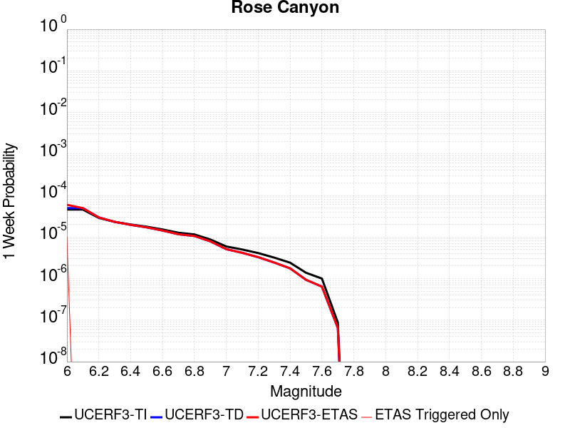 | 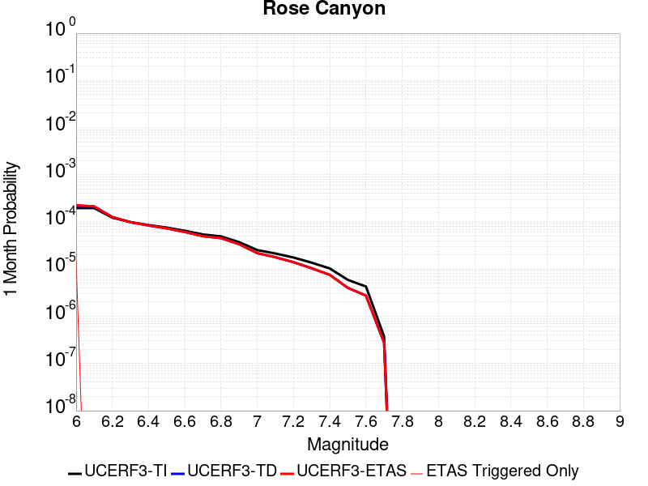 | 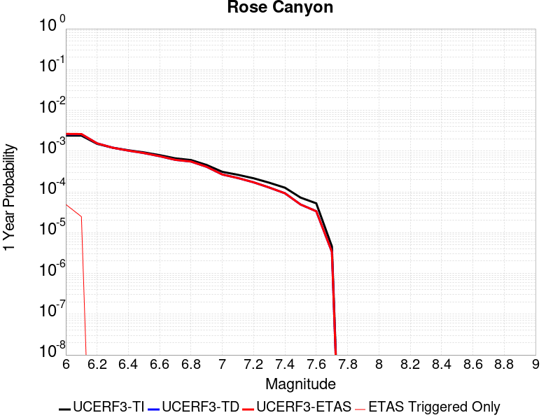 | 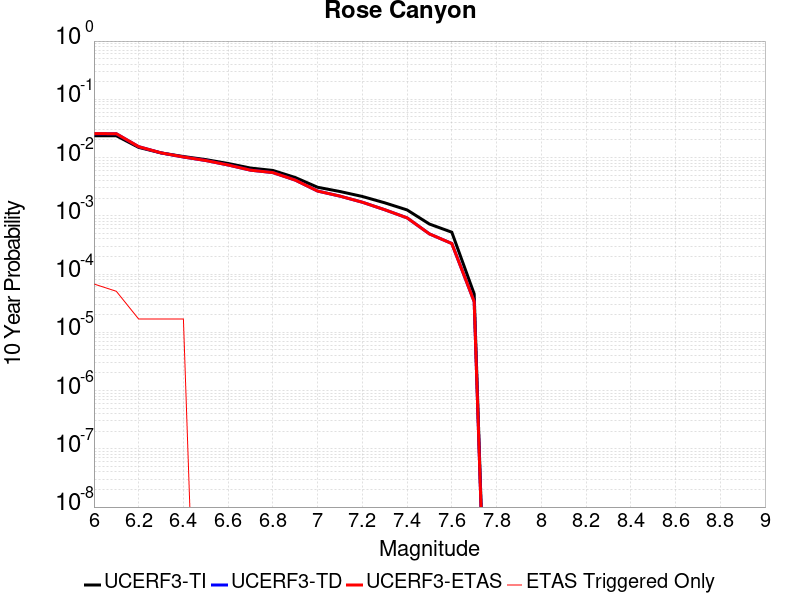 |

| Magnitude | 1 wk TI Prob | 1 wk TD Prob | 1 wk ETAS Prob | 1 wk ETAS/TD Gain | 1 wk ETAS Triggered Only | 1 mo TI Prob | 1 mo TD Prob | 1 mo ETAS Prob | 1 mo ETAS/TD Gain | 1 mo ETAS Triggered Only | 1 yr TI Prob | 1 yr TD Prob | 1 yr ETAS Prob | 1 yr ETAS/TD Gain | 1 yr ETAS Triggered Only | 10 yr TI Prob | 10 yr TD Prob | 10 yr ETAS Prob | 10 yr ETAS/TD Gain | 10 yr ETAS Triggered Only |
|-----|-----|-----|-----|-----|-----|-----|-----|-----|-----|-----|-----|-----|-----|-----|-----|-----|-----|-----|-----|-----|
| 6.0 | 4.5923203E-5 | 4.9714225E-5 | 7.43296E-5 | 1.4951375 | 2.4616596E-5 | 1.9679888E-4 | 2.1304491E-4 | 2.3765626E-4 | 1.1155219 | 2.4616596E-5 | 0.0023933933 | 0.0025909345 | 0.0026400401 | 1.0189528 | 4.9233193E-5 | 0.023677798 | 0.02563999 | 0.025735933 | 1.0037419 | 9.8466386E-5 |
| 6.1 | 4.5923203E-5 | 4.9714225E-5 | 4.9714225E-5 | 1.0 | 0.0 | 1.9679888E-4 | 2.1304491E-4 | 2.1304491E-4 | 1.0 | 0.0 | 0.0023933933 | 0.0025909345 | 0.0026154872 | 1.0094764 | 2.4616596E-5 | 0.023677798 | 0.02563999 | 0.025711946 | 1.0028064 | 7.384979E-5 |
| 6.2 | 2.8844734E-5 | 2.9668723E-5 | 2.9668723E-5 | 1.0 | 0.0 | 1.2361443E-4 | 1.2714567E-4 | 1.2714567E-4 | 1.0 | 0.0 | 0.0015039665 | 0.0015468939 | 0.0015468939 | 1.0 | 0.0 | 0.0149382865 | 0.015374276 | 0.015398514 | 1.0015765 | 2.4616596E-5 |
| 6.3 | 2.3171577E-5 | 2.3161238E-5 | 2.3161238E-5 | 1.0 | 0.0 | 9.9302975E-5 | 9.9258745E-5 | 9.9258745E-5 | 1.0 | 0.0 | 0.0012083431 | 0.0012078186 | 0.0012078186 | 1.0 | 0.0 | 0.012017938 | 0.012022437 | 0.012046757 | 1.002023 | 2.4616596E-5 |
| 6.4 | 2.0066604E-5 | 1.9667024E-5 | 1.9667024E-5 | 1.0 | 0.0 | 8.599689E-5 | 8.4284584E-5 | 8.4284584E-5 | 1.0 | 0.0 | 0.0010465092 | 0.0010256917 | 0.0010256917 | 1.0 | 0.0 | 0.010415946 | 0.010217559 | 0.010241924 | 1.0023847 | 2.4616596E-5 |
| 6.5 | 1.776989E-5 | 1.7113807E-5 | 1.7113807E-5 | 1.0 | 0.0 | 7.615444E-5 | 7.334287E-5 | 7.334287E-5 | 1.0 | 0.0 | 9.267859E-4 | 8.925905E-4 | 8.925905E-4 | 1.0 | 0.0 | 0.009229303 | 0.008896211 | 0.008896211 | 1.0 | 0.0 |
| 6.6 | 1.5227364E-5 | 1.433926E-5 | 1.433926E-5 | 1.0 | 0.0 | 6.52585E-5 | 6.1452556E-5 | 6.1452556E-5 | 1.0 | 0.0 | 7.942326E-4 | 7.479332E-4 | 7.479332E-4 | 1.0 | 0.0 | 0.007914 | 0.007458359 | 0.007458359 | 1.0 | 0.0 |
| 6.7 | 1.2703898E-5 | 1.1673274E-5 | 1.1673274E-5 | 1.0 | 0.0 | 5.4444143E-5 | 5.0027378E-5 | 5.0027378E-5 | 1.0 | 0.0 | 6.626558E-4 | 6.089174E-4 | 6.089174E-4 | 1.0 | 0.0 | 0.006606833 | 0.0060750856 | 0.0060750856 | 1.0 | 0.0 |
| 6.8 | 1.1554917E-5 | 1.0609337E-5 | 1.0609337E-5 | 1.0 | 0.0 | 4.9520135E-5 | 4.546782E-5 | 4.546782E-5 | 1.0 | 0.0 | 6.0274085E-4 | 5.5343413E-4 | 5.5343413E-4 | 1.0 | 0.0 | 0.0060110865 | 0.0055225673 | 0.0055225673 | 1.0 | 0.0 |
| 6.9 | 8.732078E-6 | 7.881357E-6 | 7.881357E-6 | 1.0 | 0.0 | 3.7422655E-5 | 3.3776825E-5 | 3.3776825E-5 | 1.0 | 0.0 | 4.5552556E-4 | 4.111582E-4 | 4.111582E-4 | 1.0 | 0.0 | 0.0045459294 | 0.0041048084 | 0.0041048084 | 1.0 | 0.0 |
| 7.0 | 5.9337494E-6 | 5.1074853E-6 | 5.1074853E-6 | 1.0 | 0.0 | 2.5430107E-5 | 2.188904E-5 | 2.188904E-5 | 1.0 | 0.0 | 3.0956755E-4 | 2.664666E-4 | 2.664666E-4 | 1.0 | 0.0 | 0.0030913667 | 0.0026614866 | 0.0026614866 | 1.0 | 0.0 |
| 7.1 | 5.013409E-6 | 4.1773833E-6 | 4.1773833E-6 | 1.0 | 0.0 | 2.1485863E-5 | 1.7902948E-5 | 1.7902948E-5 | 1.0 | 0.0 | 2.6155898E-4 | 2.179467E-4 | 2.179467E-4 | 1.0 | 0.0 | 0.0026125133 | 0.0021773411 | 0.0021773411 | 1.0 | 0.0 |
| 7.2 | 4.120763E-6 | 3.2821383E-6 | 3.2821383E-6 | 1.0 | 0.0 | 1.7660293E-5 | 1.4066231E-5 | 1.4066231E-5 | 1.0 | 0.0 | 2.1499286E-4 | 1.7124301E-4 | 1.7124301E-4 | 1.0 | 0.0 | 0.0021478499 | 0.00171112 | 0.00171112 | 1.0 | 0.0 |
| 7.3 | 3.2081239E-6 | 2.4405372E-6 | 2.4405372E-6 | 1.0 | 0.0 | 1.374903E-5 | 1.0459404E-5 | 1.0459404E-5 | 1.0 | 0.0 | 1.6738157E-4 | 1.2733586E-4 | 1.2733586E-4 | 1.0 | 0.0 | 0.0016725556 | 0.001272636 | 0.001272636 | 1.0 | 0.0 |
| 7.4 | 2.4194755E-6 | 1.7680634E-6 | 1.7680634E-6 | 1.0 | 0.0 | 1.0369139E-5 | 7.577393E-6 | 7.577393E-6 | 1.0 | 0.0 | 1.2623696E-4 | 9.2250906E-5 | 9.2250906E-5 | 1.0 | 0.0 | 0.0012616527 | 9.2213147E-4 | 9.2213147E-4 | 1.0 | 0.0 |
| 7.5 | 1.3842889E-6 | 9.3786275E-7 | 9.3786275E-7 | 1.0 | 0.0 | 5.9326535E-6 | 4.019406E-6 | 4.019406E-6 | 1.0 | 0.0 | 7.222766E-5 | 4.8935202E-5 | 4.8935202E-5 | 1.0 | 0.0 | 7.220419E-4 | 4.892478E-4 | 4.892478E-4 | 1.0 | 0.0 |
| 7.6 | 1.0021575E-6 | 6.411463E-7 | 6.411463E-7 | 1.0 | 0.0 | 4.2949537E-6 | 2.7477672E-6 | 2.7477672E-6 | 1.0 | 0.0 | 5.2289808E-5 | 3.3453573E-5 | 3.3453573E-5 | 1.0 | 0.0 | 5.2277505E-4 | 3.344875E-4 | 3.344875E-4 | 1.0 | 0.0 |
| 7.7 | 8.7620116E-8 | 6.4492404E-8 | 6.4492404E-8 | 1.0 | 0.0 | 3.7551473E-7 | 2.76396E-7 | 2.76396E-7 | 1.0 | 0.0 | 4.5718825E-6 | 3.3651165E-6 | 3.3651165E-6 | 1.0 | 0.0 | 4.5717883E-5 | 3.3650686E-5 | 3.3650686E-5 | 1.0 | 0.0 |

## Big Pine (Central)
*[(top)](#table-of-contents)*

| 1 Week | 1 Month | 1 Year | 10 Year |
|-----|-----|-----|-----|
| 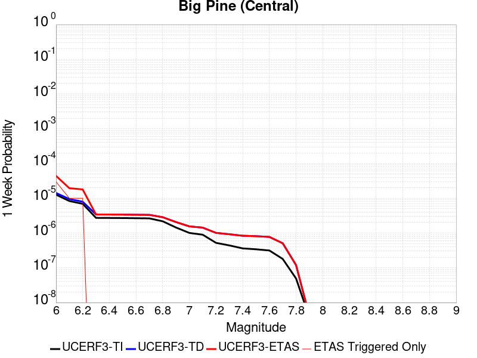 | 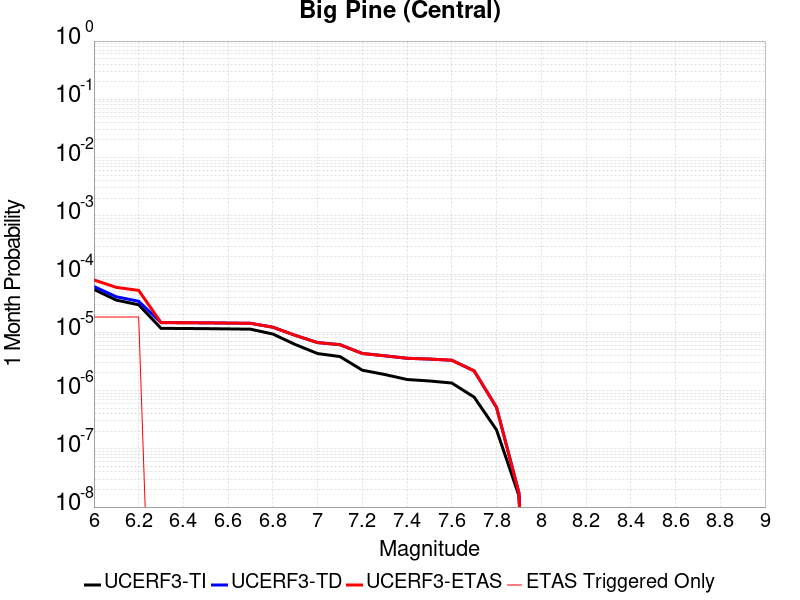 | 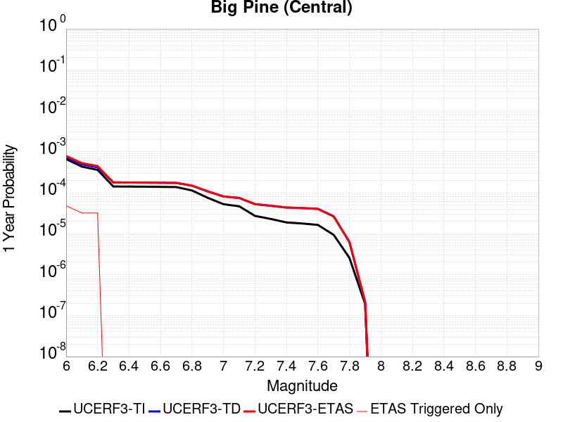 | 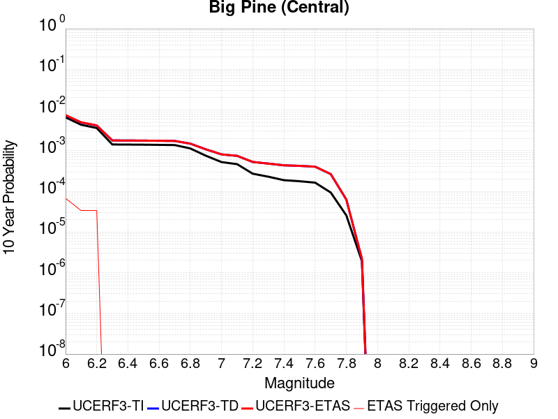 |

| Magnitude | 1 wk TI Prob | 1 wk TD Prob | 1 wk ETAS Prob | 1 wk ETAS/TD Gain | 1 wk ETAS Triggered Only | 1 mo TI Prob | 1 mo TD Prob | 1 mo ETAS Prob | 1 mo ETAS/TD Gain | 1 mo ETAS Triggered Only | 1 yr TI Prob | 1 yr TD Prob | 1 yr ETAS Prob | 1 yr ETAS/TD Gain | 1 yr ETAS Triggered Only | 10 yr TI Prob | 10 yr TD Prob | 10 yr ETAS Prob | 10 yr ETAS/TD Gain | 10 yr ETAS Triggered Only |
|-----|-----|-----|-----|-----|-----|-----|-----|-----|-----|-----|-----|-----|-----|-----|-----|-----|-----|-----|-----|-----|
| 6.0 | 1.2706755E-5 | 1.4250529E-5 | 3.8866772E-5 | 2.7273917 | 2.4616596E-5 | 5.4456385E-5 | 6.107247E-5 | 8.568756E-5 | 1.4030473 | 2.4616596E-5 | 6.628048E-4 | 7.433402E-4 | 8.171351E-4 | 1.0992748 | 7.384979E-5 | 0.006608314 | 0.0074135666 | 0.0075113033 | 1.0131835 | 9.8466386E-5 |
| 6.1 | 8.342579E-6 | 9.510762E-6 | 3.4127122E-5 | 3.588264 | 2.4616596E-5 | 3.5753423E-5 | 4.0759893E-5 | 6.537548E-5 | 1.603917 | 2.4616596E-5 | 4.3521097E-4 | 4.961604E-4 | 5.4536917E-4 | 1.0991791 | 4.9233193E-5 | 0.0043435963 | 0.0049540824 | 0.005003072 | 1.0098886 | 4.9233193E-5 |
| 6.2 | 6.923899E-6 | 7.967147E-6 | 3.2583546E-5 | 4.0897384 | 2.4616596E-5 | 2.9673516E-5 | 3.4144578E-5 | 5.8760335E-5 | 1.7209272 | 2.4616596E-5 | 3.6121515E-4 | 4.156502E-4 | 4.648629E-4 | 1.1183994 | 4.9233193E-5 | 0.003606286 | 0.0041520367 | 0.0042010653 | 1.0118084 | 4.9233193E-5 |
| 6.3 | 2.728396E-6 | 3.4242908E-6 | 3.4242908E-6 | 1.0 | 0.0 | 1.1693074E-5 | 1.4675454E-5 | 1.4675454E-5 | 1.0 | 0.0 | 1.4235388E-4 | 1.7865987E-4 | 1.7865987E-4 | 1.0 | 0.0 | 0.0014226272 | 0.0017866704 | 0.0017866704 | 1.0 | 0.0 |
| 6.4 | 2.7136944E-6 | 3.408584E-6 | 3.408584E-6 | 1.0 | 0.0 | 1.1630066E-5 | 1.4608141E-5 | 1.4608141E-5 | 1.0 | 0.0 | 1.4158686E-4 | 1.7784047E-4 | 1.7784047E-4 | 1.0 | 0.0 | 0.0014149669 | 0.0017784894 | 0.0017784894 | 1.0 | 0.0 |
| 6.5 | 2.6971882E-6 | 3.3909291E-6 | 3.3909291E-6 | 1.0 | 0.0 | 1.1559327E-5 | 1.45324775E-5 | 1.45324775E-5 | 1.0 | 0.0 | 1.4072572E-4 | 1.7691942E-4 | 1.7691942E-4 | 1.0 | 0.0 | 0.0014063664 | 0.0017692937 | 0.0017692937 | 1.0 | 0.0 |
| 6.6 | 2.669092E-6 | 3.3609497E-6 | 3.3609497E-6 | 1.0 | 0.0 | 1.1438916E-5 | 1.4403995E-5 | 1.4403995E-5 | 1.0 | 0.0 | 1.3925991E-4 | 1.753554E-4 | 1.753554E-4 | 1.0 | 0.0 | 0.0013917267 | 0.0017536782 | 0.0017536782 | 1.0 | 0.0 |
| 6.7 | 2.6408059E-6 | 3.3309752E-6 | 3.3309752E-6 | 1.0 | 0.0 | 1.1317691E-5 | 1.4275535E-5 | 1.4275535E-5 | 1.0 | 0.0 | 1.3778417E-4 | 1.7379165E-4 | 1.7379165E-4 | 1.0 | 0.0 | 0.0013769877 | 0.0017380653 | 0.0017380653 | 1.0 | 0.0 |
| 6.8 | 2.1786943E-6 | 2.8544325E-6 | 2.8544325E-6 | 1.0 | 0.0 | 9.337228E-6 | 1.2233229E-5 | 1.2233229E-5 | 1.0 | 0.0 | 1.1367482E-4 | 1.4893012E-4 | 1.4893012E-4 | 1.0 | 0.0 | 0.0011361669 | 0.0014897975 | 0.0014897975 | 1.0 | 0.0 |
| 6.9 | 1.4411696E-6 | 2.068499E-6 | 2.068499E-6 | 1.0 | 0.0 | 6.1764263E-6 | 8.864968E-6 | 8.864968E-6 | 1.0 | 0.0 | 7.51954E-5 | 1.079259E-4 | 1.079259E-4 | 1.0 | 0.0 | 7.5169955E-4 | 0.0010801847 | 0.0010801847 | 1.0 | 0.0 |
| 7.0 | 1.0073411E-6 | 1.554261E-6 | 1.554261E-6 | 1.0 | 0.0 | 4.317169E-6 | 6.6611024E-6 | 6.6611024E-6 | 1.0 | 0.0 | 5.2560266E-5 | 8.1096056E-5 | 8.1096056E-5 | 1.0 | 0.0 | 5.2547833E-4 | 8.1210316E-4 | 8.1210316E-4 | 1.0 | 0.0 |
| 7.1 | 8.947104E-7 | 1.4302494E-6 | 1.4302494E-6 | 1.0 | 0.0 | 3.834468E-6 | 6.129627E-6 | 6.129627E-6 | 1.0 | 0.0 | 4.6683643E-5 | 7.46258E-5 | 7.46258E-5 | 1.0 | 0.0 | 4.6673836E-4 | 7.474457E-4 | 7.474457E-4 | 1.0 | 0.0 |
| 7.2 | 5.215166E-7 | 1.0111678E-6 | 1.0111678E-6 | 1.0 | 0.0 | 2.2350691E-6 | 4.3335694E-6 | 4.3335694E-6 | 1.0 | 0.0 | 2.7211627E-5 | 5.2759973E-5 | 5.2759973E-5 | 1.0 | 0.0 | 2.7208295E-4 | 5.2890263E-4 | 5.2890263E-4 | 1.0 | 0.0 |
| 7.3 | 4.4024807E-7 | 9.219589E-7 | 9.219589E-7 | 1.0 | 0.0 | 1.8867761E-6 | 3.9512465E-6 | 3.9512465E-6 | 1.0 | 0.0 | 2.2971257E-5 | 4.810541E-5 | 4.810541E-5 | 1.0 | 0.0 | 2.2968883E-4 | 4.8237795E-4 | 4.8237795E-4 | 1.0 | 0.0 |
| 7.4 | 3.6130905E-7 | 8.358523E-7 | 8.358523E-7 | 1.0 | 0.0 | 1.5484665E-6 | 3.5822195E-6 | 3.5822195E-6 | 1.0 | 0.0 | 1.8852415E-5 | 4.3612687E-5 | 4.3612687E-5 | 1.0 | 0.0 | 1.8850817E-4 | 4.374597E-4 | 4.374597E-4 | 1.0 | 0.0 |
| 7.5 | 3.408184E-7 | 8.108147E-7 | 8.108147E-7 | 1.0 | 0.0 | 1.4606494E-6 | 3.4749157E-6 | 3.4749157E-6 | 1.0 | 0.0 | 1.7783263E-5 | 4.2306317E-5 | 4.2306317E-5 | 1.0 | 0.0 | 1.778184E-4 | 4.2437963E-4 | 4.2437963E-4 | 1.0 | 0.0 |
| 7.6 | 3.1428627E-7 | 7.7316E-7 | 7.7316E-7 | 1.0 | 0.0 | 1.3469405E-6 | 3.3135389E-6 | 3.3135389E-6 | 1.0 | 0.0 | 1.6398877E-5 | 4.0341627E-5 | 4.0341627E-5 | 1.0 | 0.0 | 1.6397667E-4 | 4.0471106E-4 | 4.0471106E-4 | 1.0 | 0.0 |
| 7.7 | 1.7972785E-7 | 5.077752E-7 | 5.077752E-7 | 1.0 | 0.0 | 7.70262E-7 | 2.1761778E-6 | 2.1761778E-6 | 1.0 | 0.0 | 9.377899E-6 | 2.6494654E-5 | 2.6494654E-5 | 1.0 | 0.0 | 9.377503E-5 | 2.662899E-4 | 2.662899E-4 | 1.0 | 0.0 |
| 7.8 | 4.9230927E-8 | 1.198079E-7 | 1.198079E-7 | 1.0 | 0.0 | 2.1098968E-7 | 5.134623E-7 | 5.134623E-7 | 1.0 | 0.0 | 2.5687964E-6 | 6.2513873E-6 | 6.2513873E-6 | 1.0 | 0.0 | 2.5687666E-5 | 6.295415E-5 | 6.295415E-5 | 1.0 | 0.0 |
| 7.9 | 3.6805972E-9 | 4.105293E-9 | 4.105293E-9 | 1.0 | 0.0 | 1.5773987E-8 | 1.7594115E-8 | 1.7594115E-8 | 1.0 | 0.0 | 1.9204828E-7 | 2.1420831E-7 | 2.1420831E-7 | 1.0 | 0.0 | 1.920481E-6 | 2.1900614E-6 | 2.1900614E-6 | 1.0 | 0.0 |

## Santa Ynez River
*[(top)](#table-of-contents)*

| 1 Week | 1 Month | 1 Year | 10 Year |
|-----|-----|-----|-----|
| 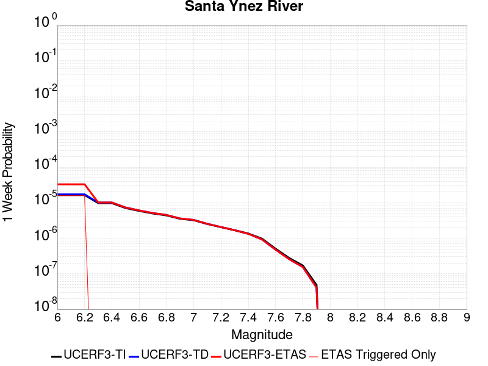 | 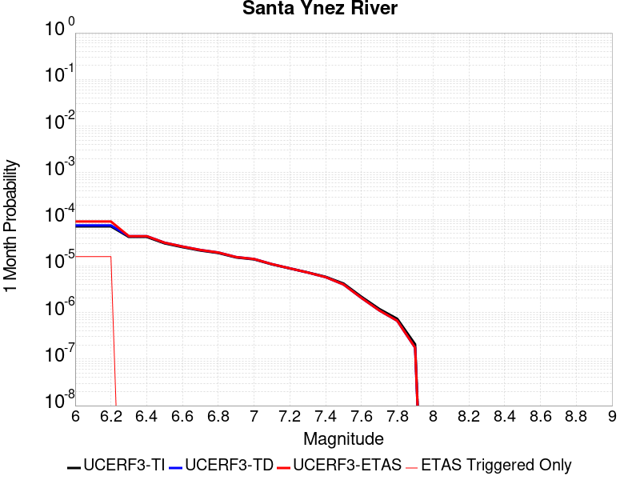 | 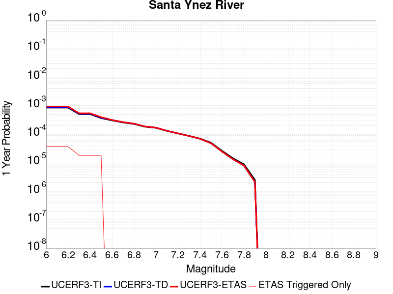 | 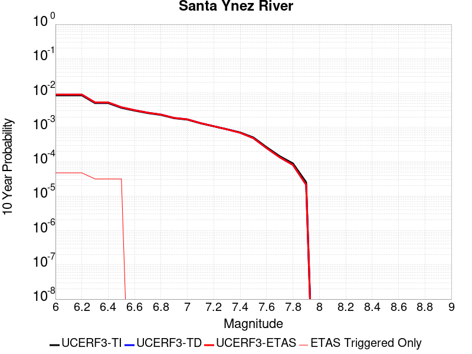 |

| Magnitude | 1 wk TI Prob | 1 wk TD Prob | 1 wk ETAS Prob | 1 wk ETAS/TD Gain | 1 wk ETAS Triggered Only | 1 mo TI Prob | 1 mo TD Prob | 1 mo ETAS Prob | 1 mo ETAS/TD Gain | 1 mo ETAS Triggered Only | 1 yr TI Prob | 1 yr TD Prob | 1 yr ETAS Prob | 1 yr ETAS/TD Gain | 1 yr ETAS Triggered Only | 10 yr TI Prob | 10 yr TD Prob | 10 yr ETAS Prob | 10 yr ETAS/TD Gain | 10 yr ETAS Triggered Only |
|-----|-----|-----|-----|-----|-----|-----|-----|-----|-----|-----|-----|-----|-----|-----|-----|-----|-----|-----|-----|-----|
| 6.0 | 1.6396456E-5 | 1.7209435E-5 | 4.182561E-5 | 2.4303882 | 2.4616596E-5 | 7.026863E-5 | 7.375284E-5 | 9.836762E-5 | 1.3337469 | 2.4616596E-5 | 8.551848E-4 | 8.976064E-4 | 9.4679545E-4 | 1.0548002 | 4.9233193E-5 | 0.0085190125 | 0.008943358 | 0.009016547 | 1.0081836 | 7.384979E-5 |
| 6.1 | 1.6396456E-5 | 1.7209435E-5 | 4.182561E-5 | 2.4303882 | 2.4616596E-5 | 7.026863E-5 | 7.375284E-5 | 9.836762E-5 | 1.3337469 | 2.4616596E-5 | 8.551848E-4 | 8.976064E-4 | 9.4679545E-4 | 1.0548002 | 4.9233193E-5 | 0.0085190125 | 0.008943358 | 0.009016547 | 1.0081836 | 7.384979E-5 |
| 6.2 | 1.6396456E-5 | 1.7209435E-5 | 4.182561E-5 | 2.4303882 | 2.4616596E-5 | 7.026863E-5 | 7.375284E-5 | 9.836762E-5 | 1.3337469 | 2.4616596E-5 | 8.551848E-4 | 8.976064E-4 | 9.4679545E-4 | 1.0548002 | 4.9233193E-5 | 0.0085190125 | 0.008943358 | 0.009016547 | 1.0081836 | 7.384979E-5 |
| 6.3 | 9.736976E-6 | 1.012233E-5 | 1.012233E-5 | 1.0 | 0.0 | 4.172923E-5 | 4.338072E-5 | 4.338072E-5 | 1.0 | 0.0 | 5.0793495E-4 | 5.280373E-4 | 5.526409E-4 | 1.0465944 | 2.4616596E-5 | 0.005067755 | 0.005268332 | 0.0053173057 | 1.009296 | 4.9233193E-5 |
| 6.4 | 9.736976E-6 | 1.012233E-5 | 1.012233E-5 | 1.0 | 0.0 | 4.172923E-5 | 4.338072E-5 | 4.338072E-5 | 1.0 | 0.0 | 5.0793495E-4 | 5.280373E-4 | 5.526409E-4 | 1.0465944 | 2.4616596E-5 | 0.005067755 | 0.005268332 | 0.0053173057 | 1.009296 | 4.9233193E-5 |
| 6.5 | 7.081964E-6 | 7.3298966E-6 | 7.3298966E-6 | 1.0 | 0.0 | 3.035092E-5 | 3.1413474E-5 | 3.1413474E-5 | 1.0 | 0.0 | 3.694598E-4 | 3.8239348E-4 | 4.0700068E-4 | 1.0643504 | 2.4616596E-5 | 0.0036884616 | 0.0038175168 | 0.003866562 | 1.0128474 | 4.9233193E-5 |
| 6.6 | 5.873247E-6 | 6.059743E-6 | 6.059743E-6 | 1.0 | 0.0 | 2.5170815E-5 | 2.5970074E-5 | 2.5970074E-5 | 1.0 | 0.0 | 3.064116E-4 | 3.1614062E-4 | 3.1614062E-4 | 1.0 | 0.0 | 0.0030598943 | 0.0031569963 | 0.0031569963 | 1.0 | 0.0 |
| 6.7 | 4.973277E-6 | 5.115901E-6 | 5.115901E-6 | 1.0 | 0.0 | 2.1313872E-5 | 2.1925109E-5 | 2.1925109E-5 | 1.0 | 0.0 | 2.5946548E-4 | 2.66906E-4 | 2.66906E-4 | 1.0 | 0.0 | 0.0025916274 | 0.0026659032 | 0.0026659032 | 1.0 | 0.0 |
| 6.8 | 4.396492E-6 | 4.5109778E-6 | 4.5109778E-6 | 1.0 | 0.0 | 1.884197E-5 | 1.9332621E-5 | 1.9332621E-5 | 1.0 | 0.0 | 2.2937685E-4 | 2.3534958E-4 | 2.3534958E-4 | 1.0 | 0.0 | 0.0022914023 | 0.0023510386 | 0.0023510386 | 1.0 | 0.0 |
| 6.9 | 3.5255632E-6 | 3.6013332E-6 | 3.6013332E-6 | 1.0 | 0.0 | 1.5109469E-5 | 1.5434196E-5 | 1.5434196E-5 | 1.0 | 0.0 | 1.8394225E-4 | 1.8789528E-4 | 1.8789528E-4 | 1.0 | 0.0 | 0.0018379007 | 0.0018773803 | 0.0018773803 | 1.0 | 0.0 |
| 7.0 | 3.211603E-6 | 3.273654E-6 | 3.273654E-6 | 1.0 | 0.0 | 1.376394E-5 | 1.4029872E-5 | 1.4029872E-5 | 1.0 | 0.0 | 1.6756308E-4 | 1.7080043E-4 | 1.7080043E-4 | 1.0 | 0.0 | 0.0016743679 | 0.0017067058 | 0.0017067058 | 1.0 | 0.0 |
| 7.1 | 2.5094619E-6 | 2.5409204E-6 | 2.5409204E-6 | 1.0 | 0.0 | 1.0754793E-5 | 1.0889614E-5 | 1.0889614E-5 | 1.0 | 0.0 | 1.3093173E-4 | 1.3257304E-4 | 1.3257304E-4 | 1.0 | 0.0 | 0.0013085462 | 0.0013249456 | 0.0013249456 | 1.0 | 0.0 |
| 7.2 | 2.0515774E-6 | 2.0619375E-6 | 2.0619375E-6 | 1.0 | 0.0 | 8.792445E-6 | 8.836846E-6 | 8.836846E-6 | 1.0 | 0.0 | 1.0704277E-4 | 1.0758333E-4 | 1.0758333E-4 | 1.0 | 0.0 | 0.0010699122 | 0.0010753168 | 0.0010753168 | 1.0 | 0.0 |
| 7.3 | 1.6845745E-6 | 1.6773907E-6 | 1.6773907E-6 | 1.0 | 0.0 | 7.219585E-6 | 7.1887976E-6 | 7.1887976E-6 | 1.0 | 0.0 | 8.78949E-5 | 8.752012E-5 | 8.752012E-5 | 1.0 | 0.0 | 8.7860145E-4 | 8.7485946E-4 | 8.7485946E-4 | 1.0 | 0.0 |
| 7.4 | 1.3600285E-6 | 1.3333357E-6 | 1.3333357E-6 | 1.0 | 0.0 | 5.82868E-6 | 5.714284E-6 | 5.714284E-6 | 1.0 | 0.0 | 7.096187E-5 | 6.956921E-5 | 6.956921E-5 | 1.0 | 0.0 | 7.0939213E-4 | 6.954765E-4 | 6.954765E-4 | 1.0 | 0.0 |
| 7.5 | 9.735342E-7 | 9.290103E-7 | 9.290103E-7 | 1.0 | 0.0 | 4.172283E-6 | 3.9814668E-6 | 3.9814668E-6 | 1.0 | 0.0 | 5.079636E-5 | 4.8473295E-5 | 4.8473295E-5 | 1.0 | 0.0 | 5.0784746E-4 | 4.8462892E-4 | 4.8462892E-4 | 1.0 | 0.0 |
| 7.6 | 5.067187E-7 | 4.77857E-7 | 4.77857E-7 | 1.0 | 0.0 | 2.1716498E-6 | 2.047957E-6 | 2.047957E-6 | 1.0 | 0.0 | 2.6439517E-5 | 2.4933597E-5 | 2.4933597E-5 | 1.0 | 0.0 | 2.643637E-4 | 2.4930874E-4 | 2.4930874E-4 | 1.0 | 0.0 |
| 7.7 | 2.769089E-7 | 2.5759124E-7 | 2.5759124E-7 | 1.0 | 0.0 | 1.1867519E-6 | 1.1039621E-6 | 1.1039621E-6 | 1.0 | 0.0 | 1.4448608E-5 | 1.34406555E-5 | 1.34406555E-5 | 1.0 | 0.0 | 1.444767E-4 | 1.3439846E-4 | 1.3439846E-4 | 1.0 | 0.0 |
| 7.8 | 1.7044663E-7 | 1.5449015E-7 | 1.5449015E-7 | 1.0 | 0.0 | 7.3048534E-7 | 6.621005E-7 | 6.621005E-7 | 1.0 | 0.0 | 8.893623E-6 | 8.061043E-6 | 8.061043E-6 | 1.0 | 0.0 | 8.893267E-5 | 8.060753E-5 | 8.060753E-5 | 1.0 | 0.0 |
| 7.9 | 4.8344287E-8 | 4.0910923E-8 | 4.0910923E-8 | 1.0 | 0.0 | 2.0718979E-7 | 1.7533252E-7 | 1.7533252E-7 | 1.0 | 0.0 | 2.5225327E-6 | 2.1346711E-6 | 2.1346711E-6 | 1.0 | 0.0 | 2.5225041E-5 | 2.1346512E-5 | 2.1346512E-5 | 1.0 | 0.0 |

## Red Mountain
*[(top)](#table-of-contents)*

| 1 Week | 1 Month | 1 Year | 10 Year |
|-----|-----|-----|-----|
| 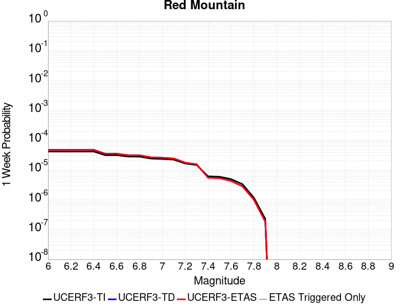 | 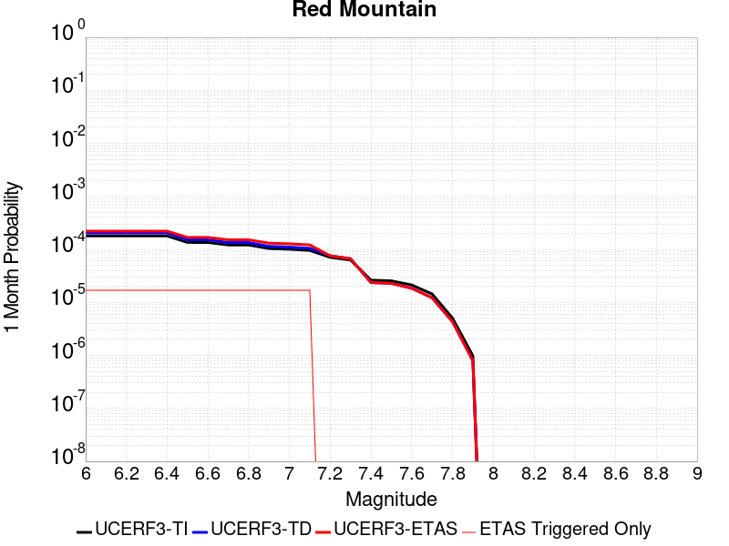 | 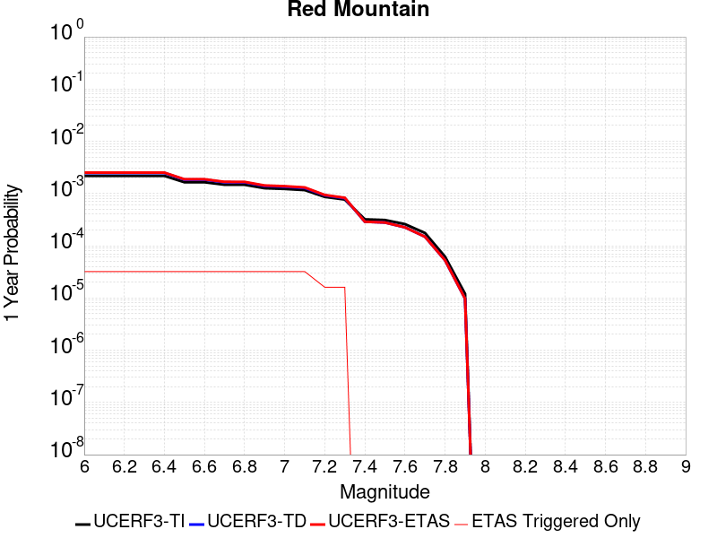 | 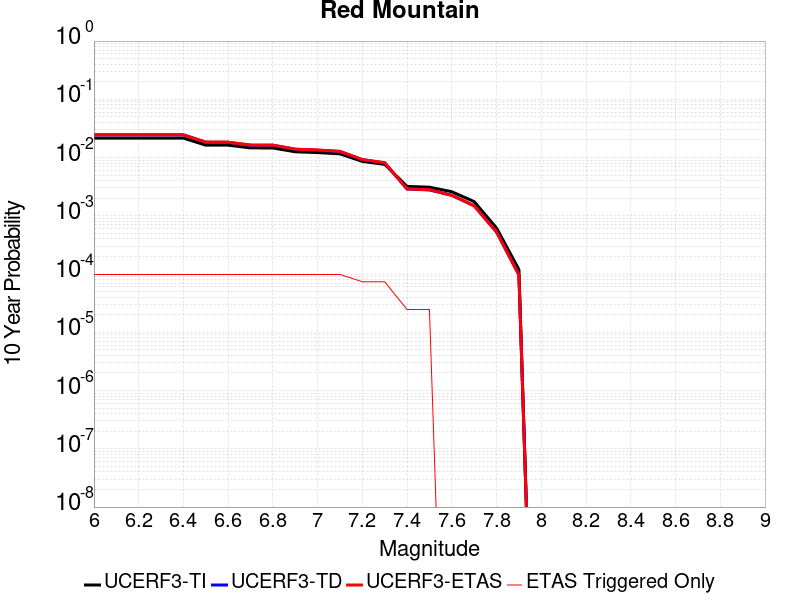 |

| Magnitude | 1 wk TI Prob | 1 wk TD Prob | 1 wk ETAS Prob | 1 wk ETAS/TD Gain | 1 wk ETAS Triggered Only | 1 mo TI Prob | 1 mo TD Prob | 1 mo ETAS Prob | 1 mo ETAS/TD Gain | 1 mo ETAS Triggered Only | 1 yr TI Prob | 1 yr TD Prob | 1 yr ETAS Prob | 1 yr ETAS/TD Gain | 1 yr ETAS Triggered Only | 10 yr TI Prob | 10 yr TD Prob | 10 yr ETAS Prob | 10 yr ETAS/TD Gain | 10 yr ETAS Triggered Only |
|-----|-----|-----|-----|-----|-----|-----|-----|-----|-----|-----|-----|-----|-----|-----|-----|-----|-----|-----|-----|-----|
| 6.0 | 4.1810763E-5 | 4.7589947E-5 | 4.7589947E-5 | 1.0 | 0.0 | 1.7917668E-4 | 2.039419E-4 | 2.039419E-4 | 1.0 | 0.0 | 0.0021792934 | 0.0024803306 | 0.0025048861 | 1.0099001 | 2.4616596E-5 | 0.021580452 | 0.024544092 | 0.024640141 | 1.0039134 | 9.8466386E-5 |
| 6.1 | 4.1810763E-5 | 4.7589947E-5 | 4.7589947E-5 | 1.0 | 0.0 | 1.7917668E-4 | 2.039419E-4 | 2.039419E-4 | 1.0 | 0.0 | 0.0021792934 | 0.0024803306 | 0.0025048861 | 1.0099001 | 2.4616596E-5 | 0.021580452 | 0.024544092 | 0.024640141 | 1.0039134 | 9.8466386E-5 |
| 6.2 | 4.1810763E-5 | 4.7589947E-5 | 4.7589947E-5 | 1.0 | 0.0 | 1.7917668E-4 | 2.039419E-4 | 2.039419E-4 | 1.0 | 0.0 | 0.0021792934 | 0.0024803306 | 0.0025048861 | 1.0099001 | 2.4616596E-5 | 0.021580452 | 0.024544092 | 0.024640141 | 1.0039134 | 9.8466386E-5 |
| 6.3 | 4.1810763E-5 | 4.7589947E-5 | 4.7589947E-5 | 1.0 | 0.0 | 1.7917668E-4 | 2.039419E-4 | 2.039419E-4 | 1.0 | 0.0 | 0.0021792934 | 0.0024803306 | 0.0025048861 | 1.0099001 | 2.4616596E-5 | 0.021580452 | 0.024544092 | 0.024640141 | 1.0039134 | 9.8466386E-5 |
| 6.4 | 4.1810763E-5 | 4.7589947E-5 | 4.7589947E-5 | 1.0 | 0.0 | 1.7917668E-4 | 2.039419E-4 | 2.039419E-4 | 1.0 | 0.0 | 0.0021792934 | 0.0024803306 | 0.0025048861 | 1.0099001 | 2.4616596E-5 | 0.021580452 | 0.024544092 | 0.024640141 | 1.0039134 | 9.8466386E-5 |
| 6.5 | 3.154503E-5 | 3.5359728E-5 | 3.5359728E-5 | 1.0 | 0.0 | 1.3518598E-4 | 1.5153342E-4 | 1.5153342E-4 | 1.0 | 0.0 | 0.0016446467 | 0.0018434501 | 0.0018680213 | 1.0133289 | 2.4616596E-5 | 0.01632528 | 0.018291233 | 0.018387899 | 1.0052848 | 9.8466386E-5 |
| 6.6 | 3.1535834E-5 | 3.534911E-5 | 3.534911E-5 | 1.0 | 0.0 | 1.3514658E-4 | 1.5148791E-4 | 1.5148791E-4 | 1.0 | 0.0 | 0.0016441676 | 0.001842897 | 0.0018674684 | 1.013333 | 2.4616596E-5 | 0.01632056 | 0.018285794 | 0.01838246 | 1.0052863 | 9.8466386E-5 |
| 6.7 | 2.8267326E-5 | 3.146934E-5 | 3.146934E-5 | 1.0 | 0.0 | 1.2114006E-4 | 1.348621E-4 | 1.348621E-4 | 1.0 | 0.0 | 0.0014738824 | 0.0016407946 | 0.0016653708 | 1.0149783 | 2.4616596E-5 | 0.014641452 | 0.016295563 | 0.016392425 | 1.005944 | 9.8466386E-5 |
| 6.8 | 2.8212884E-5 | 3.1407224E-5 | 3.1407224E-5 | 1.0 | 0.0 | 1.20906756E-4 | 1.3459593E-4 | 1.3459593E-4 | 1.0 | 0.0 | 0.0014710457 | 0.0016375587 | 0.001662135 | 1.0150079 | 2.4616596E-5 | 0.014613459 | 0.01626368 | 0.016360546 | 1.0059559 | 9.8466386E-5 |
| 6.9 | 2.4227871E-5 | 2.6706979E-5 | 2.6706979E-5 | 1.0 | 0.0 | 1.03829596E-4 | 1.14453884E-4 | 1.14453884E-4 | 1.0 | 0.0 | 0.0012633923 | 0.0013926612 | 0.0014172435 | 1.0176513 | 2.4616596E-5 | 0.012562336 | 0.013847026 | 0.0139441285 | 1.0070126 | 9.8466386E-5 |
| 7.0 | 2.348524E-5 | 2.5835763E-5 | 2.5835763E-5 | 1.0 | 0.0 | 1.0064714E-4 | 1.1072042E-4 | 1.1072042E-4 | 1.0 | 0.0 | 0.0012246901 | 0.0013472632 | 0.0013718467 | 1.0182469 | 2.4616596E-5 | 0.012179627 | 0.01339859 | 0.013495737 | 1.0072505 | 9.8466386E-5 |
| 7.1 | 2.2311642E-5 | 2.4462828E-5 | 2.4462828E-5 | 1.0 | 0.0 | 9.561782E-5 | 1.048369E-4 | 1.048369E-4 | 1.0 | 0.0 | 0.0011635252 | 0.0012757168 | 0.001300302 | 1.0192716 | 2.4616596E-5 | 0.01157452 | 0.012691451 | 0.012788668 | 1.00766 | 9.8466386E-5 |
| 7.2 | 1.6533986E-5 | 1.7670347E-5 | 1.7670347E-5 | 1.0 | 0.0 | 7.085802E-5 | 7.572822E-5 | 7.572822E-5 | 1.0 | 0.0 | 8.623549E-4 | 9.216645E-4 | 9.462584E-4 | 1.0266843 | 2.4616596E-5 | 0.008590161 | 0.009184699 | 0.009257871 | 1.0079666 | 7.384979E-5 |
| 7.3 | 1.4703092E-5 | 1.555952E-5 | 1.555952E-5 | 1.0 | 0.0 | 6.301173E-5 | 6.66823E-5 | 6.66823E-5 | 1.0 | 0.0 | 7.668978E-4 | 8.1161625E-4 | 8.362129E-4 | 1.0303057 | 2.4616596E-5 | 0.0076425658 | 0.008092596 | 0.008165848 | 1.0090518 | 7.384979E-5 |
| 7.4 | 6.1331984E-6 | 5.528872E-6 | 5.528872E-6 | 1.0 | 0.0 | 2.6284872E-5 | 2.3694953E-5 | 2.3694953E-5 | 1.0 | 0.0 | 3.199713E-4 | 2.8844838E-4 | 2.8844838E-4 | 1.0 | 0.0 | 0.0031951098 | 0.0028807942 | 0.00290534 | 1.0085205 | 2.4616596E-5 |
| 7.5 | 5.954766E-6 | 5.3385015E-6 | 5.3385015E-6 | 1.0 | 0.0 | 2.5520176E-5 | 2.2879094E-5 | 2.2879094E-5 | 1.0 | 0.0 | 3.1066386E-4 | 2.785179E-4 | 2.785179E-4 | 1.0 | 0.0 | 0.003102299 | 0.0027817423 | 0.0028062905 | 1.0088247 | 2.4616596E-5 |
| 7.6 | 4.9726646E-6 | 4.315295E-6 | 4.315295E-6 | 1.0 | 0.0 | 2.1311245E-5 | 1.8493993E-5 | 1.8493993E-5 | 1.0 | 0.0 | 2.5943352E-4 | 2.2514143E-4 | 2.2514143E-4 | 1.0 | 0.0 | 0.0025913084 | 0.002249168 | 0.002249168 | 1.0 | 0.0 |
| 7.7 | 3.3613894E-6 | 2.8526642E-6 | 2.8526642E-6 | 1.0 | 0.0 | 1.4405875E-5 | 1.2225649E-5 | 1.2225649E-5 | 1.0 | 0.0 | 1.7537741E-4 | 1.4883737E-4 | 1.4883737E-4 | 1.0 | 0.0 | 0.0017523908 | 0.0014874031 | 0.0014874031 | 1.0 | 0.0 |
| 7.8 | 1.1828961E-6 | 1.0122756E-6 | 1.0122756E-6 | 1.0 | 0.0 | 5.069545E-6 | 4.338317E-6 | 4.338317E-6 | 1.0 | 0.0 | 6.171996E-5 | 5.281776E-5 | 5.281776E-5 | 1.0 | 0.0 | 6.170282E-4 | 5.2805495E-4 | 5.2805495E-4 | 1.0 | 0.0 |
| 7.9 | 2.2967266E-7 | 1.8618952E-7 | 1.8618952E-7 | 1.0 | 0.0 | 9.843111E-7 | 7.9795484E-7 | 7.9795484E-7 | 1.0 | 0.0 | 1.19839215E-5 | 9.7150605E-6 | 9.7150605E-6 | 1.0 | 0.0 | 1.1983275E-4 | 9.714664E-5 | 9.714664E-5 | 1.0 | 0.0 |

## Brawley (Seismic Zone) alt 1
*[(top)](#table-of-contents)*

| 1 Week | 1 Month | 1 Year | 10 Year |
|-----|-----|-----|-----|
| 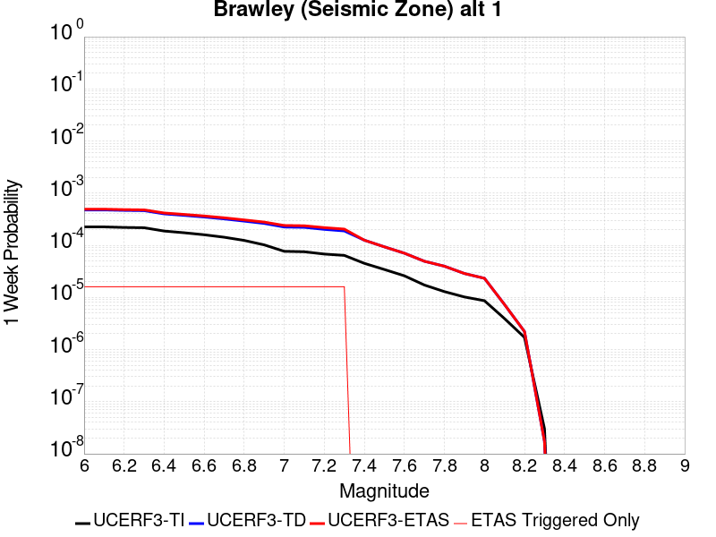 | 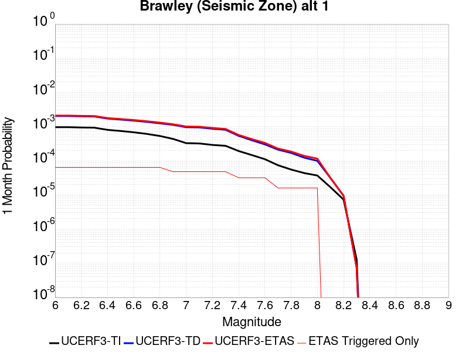 |  |  |

| Magnitude | 1 wk TI Prob | 1 wk TD Prob | 1 wk ETAS Prob | 1 wk ETAS/TD Gain | 1 wk ETAS Triggered Only | 1 mo TI Prob | 1 mo TD Prob | 1 mo ETAS Prob | 1 mo ETAS/TD Gain | 1 mo ETAS Triggered Only | 1 yr TI Prob | 1 yr TD Prob | 1 yr ETAS Prob | 1 yr ETAS/TD Gain | 1 yr ETAS Triggered Only | 10 yr TI Prob | 10 yr TD Prob | 10 yr ETAS Prob | 10 yr ETAS/TD Gain | 10 yr ETAS Triggered Only |
|-----|-----|-----|-----|-----|-----|-----|-----|-----|-----|-----|-----|-----|-----|-----|-----|-----|-----|-----|-----|-----|
| 6.0 | 2.2521618E-4 | 4.7632487E-4 | 5.009297E-4 | 1.0516557 | 2.4616596E-5 | 9.6485513E-4 | 0.0020398323 | 0.0021135313 | 1.03613 | 7.384979E-5 | 0.011683988 | 0.024546238 | 0.024642287 | 1.003913 | 9.8466386E-5 | 0.11088423 | 0.21350002 | 0.21357746 | 1.0003628 | 9.8466386E-5 |
| 6.1 | 2.2521618E-4 | 4.7632487E-4 | 5.009297E-4 | 1.0516557 | 2.4616596E-5 | 9.6485513E-4 | 0.0020398323 | 0.0021135313 | 1.03613 | 7.384979E-5 | 0.011683988 | 0.024546238 | 0.024642287 | 1.003913 | 9.8466386E-5 | 0.11088423 | 0.21350002 | 0.21357746 | 1.0003628 | 9.8466386E-5 |
| 6.2 | 2.198148E-4 | 4.6717093E-4 | 4.9177604E-4 | 1.0526683 | 2.4616596E-5 | 9.417233E-4 | 0.0020006616 | 0.0020743636 | 1.0368389 | 7.384979E-5 | 0.011405343 | 0.024080504 | 0.024176598 | 1.0039905 | 9.8466386E-5 | 0.10837428 | 0.20993657 | 0.21001437 | 1.0003706 | 9.8466386E-5 |
| 6.3 | 2.1704129E-4 | 4.615278E-4 | 4.86133E-4 | 1.0533125 | 2.4616596E-5 | 9.298453E-4 | 0.0019765133 | 0.0020502172 | 1.0372899 | 7.384979E-5 | 0.011262234 | 0.02379366 | 0.023889784 | 1.0040399 | 9.8466386E-5 | 0.107082725 | 0.20782755 | 0.20790555 | 1.0003753 | 9.8466386E-5 |
| 6.4 | 1.876142E-4 | 4.00449E-4 | 4.2505574E-4 | 1.0614479 | 2.4616596E-5 | 8.038131E-4 | 0.0017150956 | 0.0017888187 | 1.0429848 | 7.384979E-5 | 0.00974259 | 0.020680401 | 0.02077683 | 1.0046629 | 9.8466386E-5 | 0.093263686 | 0.18457815 | 0.18465845 | 1.000435 | 9.8466386E-5 |
| 6.5 | 1.7390939E-4 | 3.7477075E-4 | 3.9937813E-4 | 1.0656598 | 2.4616596E-5 | 7.45113E-4 | 0.0016051838 | 0.0016789151 | 1.0459332 | 7.384979E-5 | 0.009034078 | 0.019368723 | 0.019465283 | 1.0049853 | 9.8466386E-5 | 0.086755216 | 0.17440031 | 0.17448162 | 1.0004661 | 9.8466386E-5 |
| 6.6 | 1.591791E-4 | 3.4891962E-4 | 3.7352764E-4 | 1.0705262 | 2.4616596E-5 | 6.8201777E-4 | 0.0014945229 | 0.0015682623 | 1.0493398 | 7.384979E-5 | 0.008271996 | 0.018045569 | 0.018142259 | 1.0053581 | 9.8466386E-5 | 0.07970774 | 0.16380852 | 0.16389087 | 1.0005026 | 9.8466386E-5 |
| 6.7 | 1.4268003E-4 | 3.20582E-4 | 3.4519073E-4 | 1.0767626 | 2.4616596E-5 | 6.1134255E-4 | 0.0013732077 | 0.0014469561 | 1.0537052 | 7.384979E-5 | 0.007417723 | 0.016592601 | 0.016689435 | 1.0058359 | 9.8466386E-5 | 0.07174956 | 0.15193306 | 0.15201657 | 1.0005497 | 9.8466386E-5 |
| 6.8 | 1.239713E-4 | 2.9053655E-4 | 3.15146E-4 | 1.0847034 | 2.4616596E-5 | 5.3119735E-4 | 0.0012445687 | 0.0013183266 | 1.0592638 | 7.384979E-5 | 0.0064481674 | 0.015048777 | 0.015145762 | 1.0064447 | 9.8466386E-5 | 0.06264243 | 0.13837762 | 0.13846247 | 1.0006131 | 9.8466386E-5 |
| 6.9 | 1.0180238E-4 | 2.625439E-4 | 2.8715405E-4 | 1.0937372 | 2.4616596E-5 | 4.3622297E-4 | 0.0011247073 | 0.001198474 | 1.0655875 | 7.384979E-5 | 0.005298089 | 0.013608336 | 0.013705462 | 1.0071373 | 9.8466386E-5 | 0.05173543 | 0.124961674 | 0.12504783 | 1.0006895 | 9.8466386E-5 |
| 7.0 | 7.6619996E-5 | 2.23993E-4 | 2.4860408E-4 | 1.1098744 | 2.4616596E-5 | 3.283301E-4 | 9.5962E-4 | 0.0010333989 | 1.0768834 | 7.384979E-5 | 0.0039900932 | 0.011621496 | 0.011718818 | 1.0083743 | 9.8466386E-5 | 0.039192066 | 0.107266866 | 0.10735477 | 1.0008194 | 9.8466386E-5 |
| 7.1 | 7.5127435E-5 | 2.2082464E-4 | 2.454358E-4 | 1.1114511 | 2.4616596E-5 | 3.2193496E-4 | 9.4605127E-4 | 0.0010198312 | 1.0779872 | 7.384979E-5 | 0.0039125155 | 0.011458045 | 0.011555383 | 1.0084952 | 9.8466386E-5 | 0.038443442 | 0.10583085 | 0.10591889 | 1.000832 | 9.8466386E-5 |
| 7.2 | 6.788582E-5 | 2.0210193E-4 | 2.2671356E-4 | 1.1217782 | 2.4616596E-5 | 2.9090676E-4 | 8.6586666E-4 | 9.396525E-4 | 1.0852162 | 7.384979E-5 | 0.0035360386 | 0.0104916105 | 0.010589044 | 1.0092868 | 9.8466386E-5 | 0.034803 | 0.09750131 | 0.09759018 | 1.0009115 | 9.8466386E-5 |
| 7.3 | 6.399602E-5 | 1.8841137E-4 | 2.1302333E-4 | 1.1306288 | 2.4616596E-5 | 2.7423984E-4 | 8.072303E-4 | 8.810205E-4 | 1.0914116 | 7.384979E-5 | 0.0033337586 | 0.009784332 | 0.0098818345 | 1.0099652 | 9.8466386E-5 | 0.03284188 | 0.09139617 | 0.091485634 | 1.000979 | 9.8466386E-5 |
| 7.4 | 4.506759E-5 | 1.2529209E-4 | 1.2529209E-4 | 1.0 | 0.0 | 1.9313251E-4 | 5.368565E-4 | 5.8606325E-4 | 1.0916572 | 4.9233193E-5 | 0.0023488526 | 0.0065168133 | 0.006565726 | 1.0075055 | 4.9233193E-5 | 0.023241805 | 0.062363707 | 0.062409867 | 1.0007402 | 4.9233193E-5 |
| 7.5 | 3.43289E-5 | 9.33541E-5 | 9.33541E-5 | 1.0 | 0.0 | 1.4711556E-4 | 4.00028E-4 | 4.4924146E-4 | 1.1230252 | 4.9233193E-5 | 0.0017896603 | 0.0048595266 | 0.0049085207 | 1.010082 | 4.9233193E-5 | 0.01775316 | 0.04705519 | 0.047102105 | 1.0009971 | 4.9233193E-5 |
| 7.6 | 2.5980507E-5 | 7.053101E-5 | 7.053101E-5 | 1.0 | 0.0 | 1.1134028E-4 | 3.0224086E-4 | 3.5145917E-4 | 1.1628447 | 4.9233193E-5 | 0.001354725 | 0.003673598 | 0.0037226502 | 1.0133526 | 4.9233193E-5 | 0.013464959 | 0.035840835 | 0.035888303 | 1.0013244 | 4.9233193E-5 |
| 7.7 | 1.7292105E-5 | 4.9407296E-5 | 4.9407296E-5 | 1.0 | 0.0 | 7.4106916E-5 | 2.117284E-4 | 2.363398E-4 | 1.1162404 | 2.4616596E-5 | 9.018782E-4 | 0.0025747516 | 0.0025993048 | 1.0095361 | 2.4616596E-5 | 0.008982267 | 0.025290398 | 0.025314393 | 1.0009488 | 2.4616596E-5 |
| 7.8 | 1.2927471E-5 | 3.9693266E-5 | 3.9693266E-5 | 1.0 | 0.0 | 5.5402274E-5 | 1.7010293E-4 | 1.9471534E-4 | 1.1446912 | 2.4616596E-5 | 6.743139E-4 | 0.0020690386 | 0.0020936043 | 1.011873 | 2.4616596E-5 | 0.0067227143 | 0.020431727 | 0.020455841 | 1.0011802 | 2.4616596E-5 |
| 7.9 | 1.0200774E-5 | 2.874569E-5 | 2.874569E-5 | 1.0 | 0.0 | 4.371687E-5 | 1.2319001E-4 | 1.4780357E-4 | 1.1998017 | 2.4616596E-5 | 5.321229E-4 | 0.0014988075 | 0.0015233872 | 1.0163995 | 2.4616596E-5 | 0.005308505 | 0.014991644 | 0.015015892 | 1.0016174 | 2.4616596E-5 |
| 8.0 | 8.650396E-6 | 2.3277367E-5 | 2.3277367E-5 | 1.0 | 0.0 | 3.70726E-5 | 9.975634E-5 | 1.2437048E-4 | 1.2467426 | 2.4616596E-5 | 4.5126543E-4 | 0.0012138576 | 0.0012384442 | 1.020255 | 2.4616596E-5 | 0.0045035016 | 0.012211097 | 0.012235413 | 1.0019913 | 2.4616596E-5 |
| 8.1 | 3.9368224E-6 | 7.3279825E-6 | 7.3279825E-6 | 1.0 | 0.0 | 1.6871985E-5 | 3.140526E-5 | 3.140526E-5 | 1.0 | 0.0 | 2.0539707E-4 | 3.8229208E-4 | 3.8229208E-4 | 1.0 | 0.0 | 0.0020520731 | 0.004001185 | 0.004001185 | 1.0 | 0.0 |
| 8.2 | 1.7101195E-6 | 2.217876E-6 | 2.217876E-6 | 1.0 | 0.0 | 7.329063E-6 | 9.505149E-6 | 9.505149E-6 | 1.0 | 0.0 | 8.922769E-5 | 1.1571907E-4 | 1.1571907E-4 | 1.0 | 0.0 | 8.9191867E-4 | 0.0012666774 | 0.0012666774 | 1.0 | 0.0 |
| 8.3 | 3.0346666E-8 | 1.721586E-8 | 1.721586E-8 | 1.0 | 0.0 | 1.3005713E-7 | 7.378226E-8 | 7.378226E-8 | 1.0 | 0.0 | 1.5834444E-6 | 8.9829894E-7 | 8.9829894E-7 | 1.0 | 0.0 | 1.5834332E-5 | 9.367729E-6 | 9.367729E-6 | 1.0 | 0.0 |

## Imperial
*[(top)](#table-of-contents)*

| 1 Week | 1 Month | 1 Year | 10 Year |
|-----|-----|-----|-----|
| 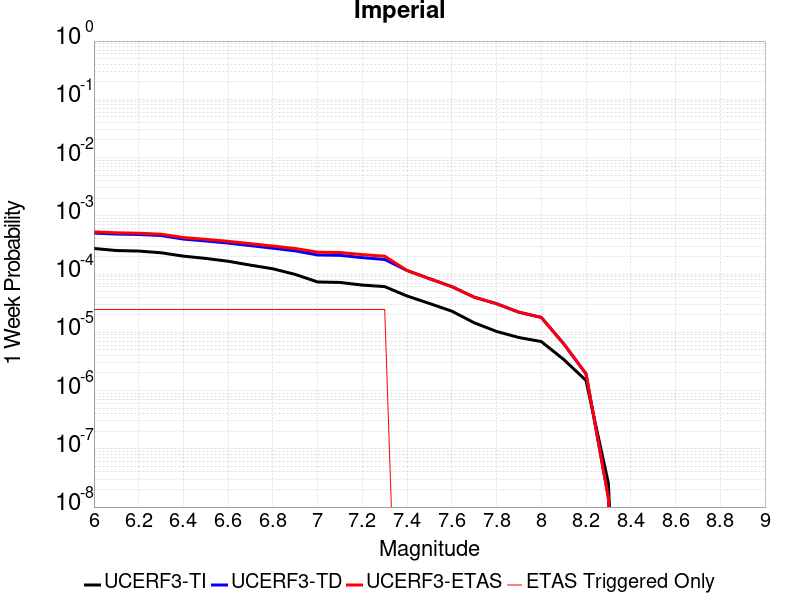 | 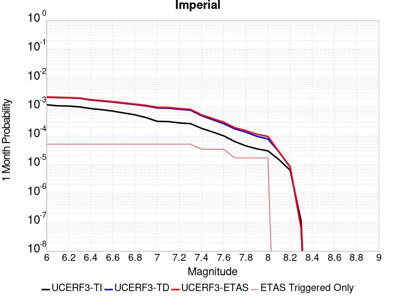 | 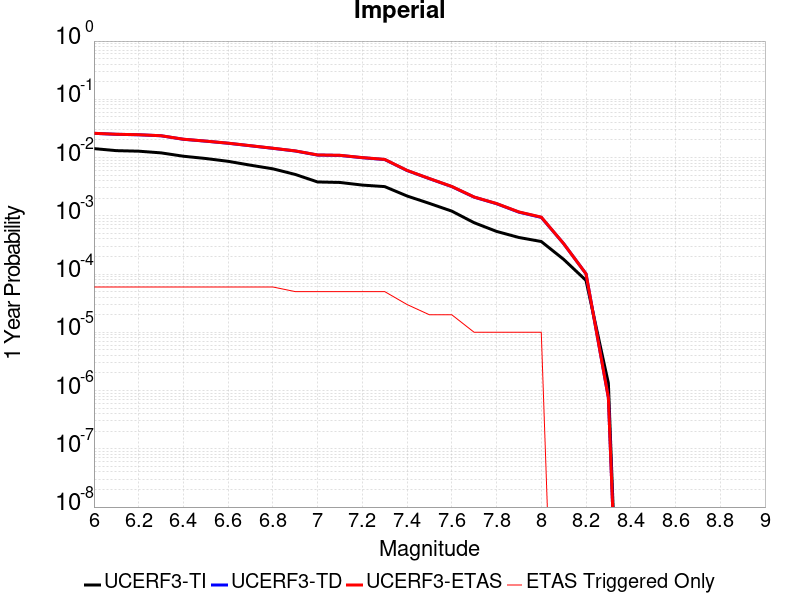 | 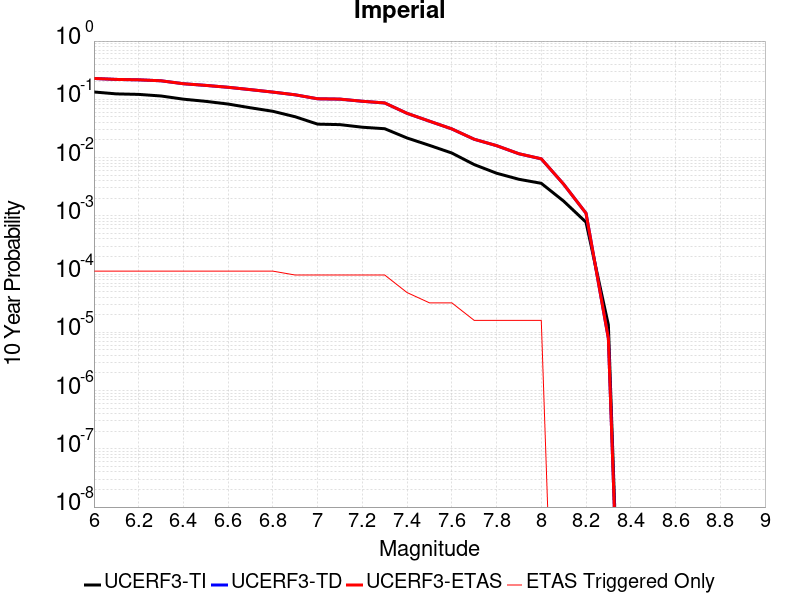 |

| Magnitude | 1 wk TI Prob | 1 wk TD Prob | 1 wk ETAS Prob | 1 wk ETAS/TD Gain | 1 wk ETAS Triggered Only | 1 mo TI Prob | 1 mo TD Prob | 1 mo ETAS Prob | 1 mo ETAS/TD Gain | 1 mo ETAS Triggered Only | 1 yr TI Prob | 1 yr TD Prob | 1 yr ETAS Prob | 1 yr ETAS/TD Gain | 1 yr ETAS Triggered Only | 10 yr TI Prob | 10 yr TD Prob | 10 yr ETAS Prob | 10 yr ETAS/TD Gain | 10 yr ETAS Triggered Only |
|-----|-----|-----|-----|-----|-----|-----|-----|-----|-----|-----|-----|-----|-----|-----|-----|-----|-----|-----|-----|-----|
| 6.0 | 2.7496446E-4 | 5.0552754E-4 | 5.301317E-4 | 1.0486703 | 2.4616596E-5 | 0.0011778869 | 0.002164787 | 0.0022384769 | 1.0340402 | 7.384979E-5 | 0.0142467655 | 0.026038699 | 0.0261346 | 1.0036831 | 9.8466386E-5 | 0.13367249 | 0.2280438 | 0.2281198 | 1.0003333 | 9.8466386E-5 |
| 6.1 | 2.5356023E-4 | 4.8656776E-4 | 5.111724E-4 | 1.0505677 | 2.4616596E-5 | 0.001086234 | 0.0020836622 | 0.0021573582 | 1.0353684 | 7.384979E-5 | 0.013144928 | 0.025071215 | 0.025167212 | 1.003829 | 9.8466386E-5 | 0.123940155 | 0.21947981 | 0.21955666 | 1.0003501 | 9.8466386E-5 |
| 6.2 | 2.4820742E-4 | 4.7752203E-4 | 5.021269E-4 | 1.0515261 | 2.4616596E-5 | 0.0010633124 | 0.0020449557 | 0.0021186545 | 1.0360394 | 7.384979E-5 | 0.01286919 | 0.024611235 | 0.024707278 | 1.0039024 | 9.8466386E-5 | 0.12148927 | 0.21598552 | 0.21606272 | 1.0003574 | 9.8466386E-5 |
| 6.3 | 2.3205351E-4 | 4.5890483E-4 | 4.835101E-4 | 1.0536175 | 2.4616596E-5 | 9.94136E-4 | 0.0019652895 | 0.002038994 | 1.0375032 | 7.384979E-5 | 0.012036599 | 0.02366133 | 0.023757467 | 1.004063 | 9.8466386E-5 | 0.11405133 | 0.20793462 | 0.20801261 | 1.000375 | 9.8466386E-5 |
| 6.4 | 2.0304754E-4 | 3.987652E-4 | 4.2337197E-4 | 1.0617075 | 2.4616596E-5 | 8.6991355E-4 | 0.0017078889 | 0.0017816126 | 1.0431665 | 7.384979E-5 | 0.010539869 | 0.020595672 | 0.02069211 | 1.0046824 | 9.8466386E-5 | 0.100537635 | 0.1850669 | 0.18514714 | 1.0004336 | 9.8466386E-5 |
| 6.5 | 1.854992E-4 | 3.6988858E-4 | 3.9449608E-4 | 1.0665268 | 2.4616596E-5 | 7.9475436E-4 | 0.0015842861 | 0.0016580189 | 1.04654 | 7.384979E-5 | 0.009633281 | 0.01911948 | 0.019216064 | 1.0050516 | 9.8466386E-5 | 0.0922623 | 0.173298 | 0.1733794 | 1.0004697 | 9.8466386E-5 |
| 6.6 | 1.6586106E-4 | 3.403506E-4 | 3.6495883E-4 | 1.0723026 | 2.4616596E-5 | 7.106394E-4 | 0.0014578402 | 0.0015315824 | 1.0505831 | 7.384979E-5 | 0.008617763 | 0.01760642 | 0.017703153 | 1.0054941 | 9.8466386E-5 | 0.08291132 | 0.16077545 | 0.16085808 | 1.000514 | 9.8466386E-5 |
| 6.7 | 1.4224656E-4 | 3.076692E-4 | 3.322782E-4 | 1.0799854 | 2.4616596E-5 | 6.094856E-4 | 0.001317924 | 0.0013916765 | 1.0559611 | 7.384979E-5 | 0.0073952693 | 0.015929576 | 0.016026475 | 1.0060829 | 9.8466386E-5 | 0.07153955 | 0.14648417 | 0.14656821 | 1.0005738 | 9.8466386E-5 |
| 6.8 | 1.2317259E-4 | 2.779122E-4 | 3.0252195E-4 | 1.0885522 | 2.4616596E-5 | 5.2777573E-4 | 0.0011905148 | 0.0012642766 | 1.061958 | 7.384979E-5 | 0.0064067547 | 0.0143995695 | 0.014496618 | 1.0067397 | 9.8466386E-5 | 0.06225166 | 0.13293684 | 0.1330222 | 1.0006422 | 9.8466386E-5 |
| 6.9 | 9.859898E-5 | 2.5014306E-4 | 2.747535E-4 | 1.0983855 | 2.4616596E-5 | 4.2249862E-4 | 0.0010716055 | 0.0011453761 | 1.0688412 | 7.384979E-5 | 0.0051317946 | 0.012969712 | 0.013066901 | 1.0074936 | 9.8466386E-5 | 0.05014893 | 0.11940631 | 0.11949302 | 1.0007262 | 9.8466386E-5 |
| 7.0 | 7.3191884E-5 | 2.1266776E-4 | 2.3727912E-4 | 1.1157268 | 2.4616596E-5 | 3.136418E-4 | 9.1111806E-4 | 9.849006E-4 | 1.0809802 | 7.384979E-5 | 0.003811904 | 0.011037128 | 0.011134507 | 1.0088229 | 9.8466386E-5 | 0.037471764 | 0.10206493 | 0.102153346 | 1.0008663 | 9.8466386E-5 |
| 7.1 | 7.1760296E-5 | 2.0968143E-4 | 2.3429286E-4 | 1.1173754 | 2.4616596E-5 | 3.0750787E-4 | 8.983284E-4 | 9.721118E-4 | 1.0821341 | 7.384979E-5 | 0.003737482 | 0.010882978 | 0.010980373 | 1.0089493 | 9.8466386E-5 | 0.03675245 | 0.10070146 | 0.10079001 | 1.0008793 | 9.8466386E-5 |
| 7.2 | 6.46614E-5 | 1.9136685E-4 | 2.1597874E-4 | 1.128611 | 2.4616596E-5 | 2.7709085E-4 | 8.1988896E-4 | 8.9367817E-4 | 1.0899991 | 7.384979E-5 | 0.0033683628 | 0.0099370815 | 0.01003457 | 1.0098106 | 9.8466386E-5 | 0.033177625 | 0.09250898 | 0.092598334 | 1.000966 | 9.8466386E-5 |
| 7.3 | 6.088115E-5 | 1.78084E-4 | 2.026962E-4 | 1.1382056 | 2.4616596E-5 | 2.6089314E-4 | 7.6299673E-4 | 8.367902E-4 | 1.0967153 | 7.384979E-5 | 0.0031717476 | 0.009250494 | 0.009348049 | 1.010546 | 9.8466386E-5 | 0.031268585 | 0.08655989 | 0.086649835 | 1.001039 | 9.8466386E-5 |
| 7.4 | 4.199346E-5 | 1.1510366E-4 | 1.1510366E-4 | 1.0 | 0.0 | 1.7995955E-4 | 4.9320905E-4 | 5.424179E-4 | 1.0997729 | 4.9233193E-5 | 0.0021888057 | 0.0059884563 | 0.0060373945 | 1.0081722 | 4.9233193E-5 | 0.02167372 | 0.057439793 | 0.0574862 | 1.0008079 | 4.9233193E-5 |
| 7.5 | 3.130448E-5 | 8.33328E-5 | 8.33328E-5 | 1.0 | 0.0 | 1.3415517E-4 | 3.57092E-4 | 4.063076E-4 | 1.1378233 | 4.9233193E-5 | 0.0016321153 | 0.004338988 | 0.004388008 | 1.0112975 | 4.9233193E-5 | 0.016201803 | 0.04213201 | 0.042179167 | 1.0011193 | 4.9233193E-5 |
| 7.6 | 2.3074248E-5 | 6.0844646E-5 | 6.0844646E-5 | 1.0 | 0.0 | 9.888588E-5 | 2.6073685E-4 | 3.099572E-4 | 1.1887741 | 4.9233193E-5 | 0.0012032706 | 0.0031698733 | 0.0032189505 | 1.0154823 | 4.9233193E-5 | 0.011967761 | 0.031026395 | 0.031074101 | 1.0015376 | 4.9233193E-5 |
| 7.7 | 1.45864815E-5 | 4.0124698E-5 | 4.0124698E-5 | 1.0 | 0.0 | 6.2511994E-5 | 1.7195169E-4 | 1.9656405E-4 | 1.1431353 | 2.4616596E-5 | 7.608177E-4 | 0.0020915072 | 0.0021160722 | 1.0117452 | 2.4616596E-5 | 0.007582182 | 0.020627763 | 0.020651873 | 1.0011687 | 2.4616596E-5 |
| 7.8 | 1.0352979E-5 | 3.0960902E-5 | 3.0960902E-5 | 1.0 | 0.0 | 4.4369157E-5 | 1.3268284E-4 | 1.5729616E-4 | 1.185505 | 2.4616596E-5 | 5.400606E-4 | 0.0016142189 | 0.0016387958 | 1.0152253 | 2.4616596E-5 | 0.0053875 | 0.016016833 | 0.016041055 | 1.0015123 | 2.4616596E-5 |
| 7.9 | 8.137906E-6 | 2.2149103E-5 | 2.2149103E-5 | 1.0 | 0.0 | 3.4876273E-5 | 9.492128E-5 | 1.19535536E-4 | 1.2593124 | 2.4616596E-5 | 4.2453592E-4 | 0.0011550548 | 0.001179643 | 1.0212874 | 2.4616596E-5 | 0.004237258 | 0.011617903 | 0.0116422335 | 1.0020943 | 2.4616596E-5 |
| 8.0 | 6.93792E-6 | 1.8008766E-5 | 1.8008766E-5 | 1.0 | 0.0 | 2.9733603E-5 | 7.717814E-5 | 1.01792844E-4 | 1.3189335 | 2.4616596E-5 | 3.6194647E-4 | 9.3923963E-4 | 9.6383307E-4 | 1.0261844 | 2.4616596E-5 | 0.0036135751 | 0.00950155 | 0.009525933 | 1.0025662 | 2.4616596E-5 |
| 8.1 | 3.4286315E-6 | 6.379872E-6 | 6.379872E-6 | 1.0 | 0.0 | 1.4694053E-5 | 2.7342023E-5 | 2.7342023E-5 | 1.0 | 0.0 | 1.7888541E-4 | 3.328384E-4 | 3.328384E-4 | 1.0 | 0.0 | 0.0017874148 | 0.003486031 | 0.003486031 | 1.0 | 0.0 |
| 8.2 | 1.4906886E-6 | 1.9366646E-6 | 1.9366646E-6 | 1.0 | 0.0 | 6.3886496E-6 | 8.299965E-6 | 8.299965E-6 | 1.0 | 0.0 | 7.7779034E-5 | 1.0104742E-4 | 1.0104742E-4 | 1.0 | 0.0 | 7.775182E-4 | 0.0011075331 | 0.0011075331 | 1.0 | 0.0 |
| 8.3 | 2.5758007E-8 | 1.4500102E-8 | 1.4500102E-8 | 1.0 | 0.0 | 1.10391454E-7 | 6.214329E-8 | 6.214329E-8 | 1.0 | 0.0 | 1.3440151E-6 | 7.565946E-7 | 7.565946E-7 | 1.0 | 0.0 | 1.344007E-5 | 7.887763E-6 | 7.887763E-6 | 1.0 | 0.0 |

## San Jacinto (Borrego)
*[(top)](#table-of-contents)*

| 1 Week | 1 Month | 1 Year | 10 Year |
|-----|-----|-----|-----|
| 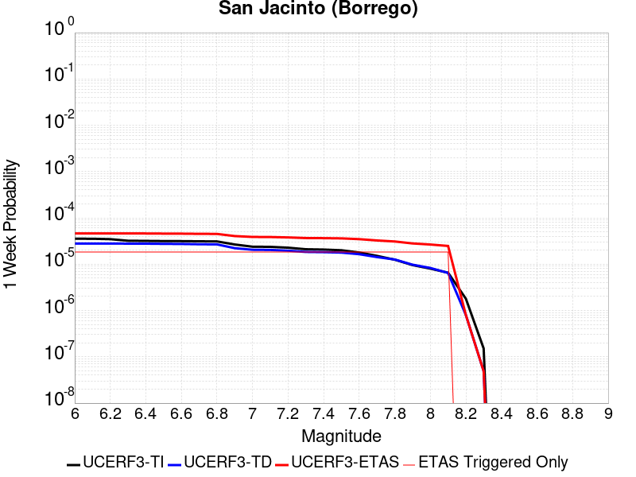 | 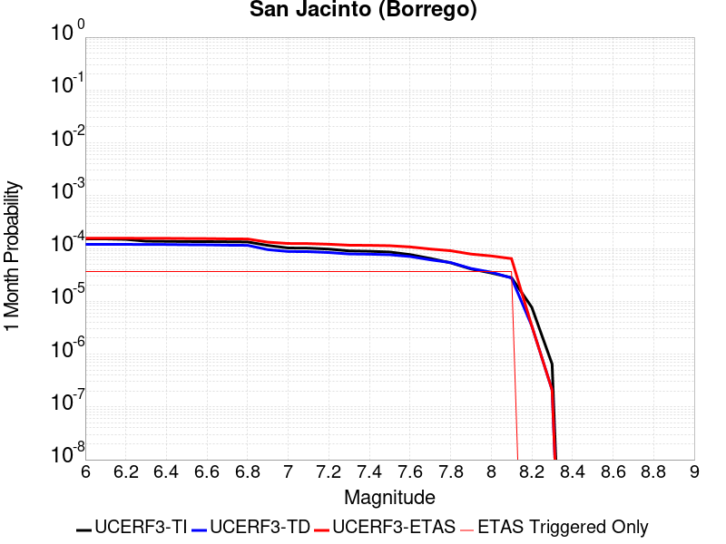 | 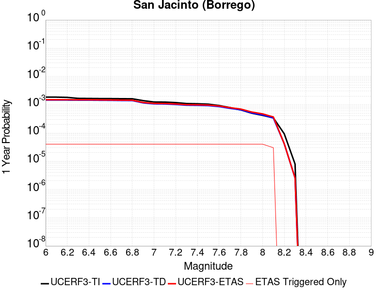 | 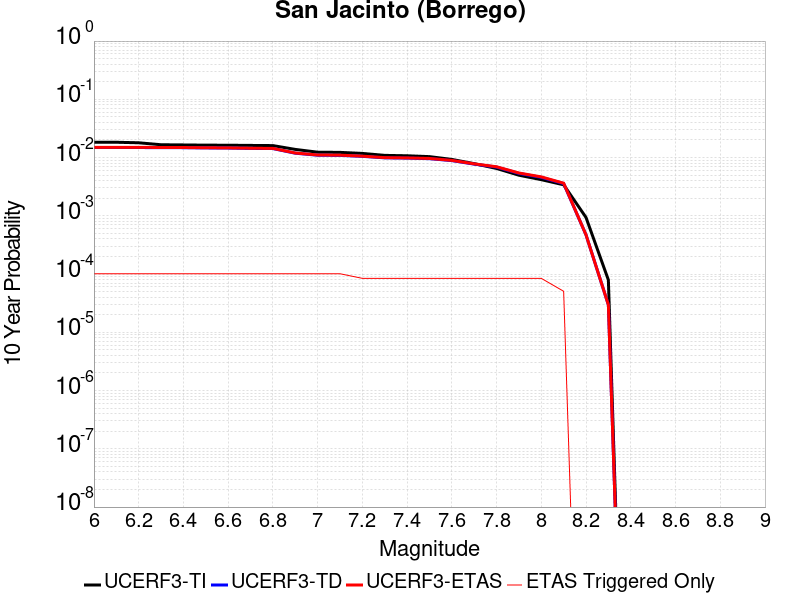 |

| Magnitude | 1 wk TI Prob | 1 wk TD Prob | 1 wk ETAS Prob | 1 wk ETAS/TD Gain | 1 wk ETAS Triggered Only | 1 mo TI Prob | 1 mo TD Prob | 1 mo ETAS Prob | 1 mo ETAS/TD Gain | 1 mo ETAS Triggered Only | 1 yr TI Prob | 1 yr TD Prob | 1 yr ETAS Prob | 1 yr ETAS/TD Gain | 1 yr ETAS Triggered Only | 10 yr TI Prob | 10 yr TD Prob | 10 yr ETAS Prob | 10 yr ETAS/TD Gain | 10 yr ETAS Triggered Only |
|-----|-----|-----|-----|-----|-----|-----|-----|-----|-----|-----|-----|-----|-----|-----|-----|-----|-----|-----|-----|-----|
| 6.0 | 3.543992E-5 | 2.7926513E-5 | 5.2542422E-5 | 1.881453 | 2.4616596E-5 | 1.5187653E-4 | 1.1967963E-4 | 1.6890693E-4 | 1.4113257 | 4.9233193E-5 | 0.0018475284 | 0.0014561379 | 0.0015052994 | 1.0337616 | 4.9233193E-5 | 0.018322436 | 0.014869647 | 0.01496665 | 1.0065235 | 9.8466386E-5 |
| 6.1 | 3.542281E-5 | 2.7926513E-5 | 5.2542422E-5 | 1.881453 | 2.4616596E-5 | 1.5180321E-4 | 1.1967963E-4 | 1.6890693E-4 | 1.4113257 | 4.9233193E-5 | 0.0018466372 | 0.0014561379 | 0.0015052994 | 1.0337616 | 4.9233193E-5 | 0.018313672 | 0.014869647 | 0.01496665 | 1.0065235 | 9.8466386E-5 |
| 6.2 | 3.4688688E-5 | 2.7926511E-5 | 5.2542422E-5 | 1.881453 | 2.4616596E-5 | 1.4865733E-4 | 1.1967963E-4 | 1.6890693E-4 | 1.4113257 | 4.9233193E-5 | 0.0018084005 | 0.0014561379 | 0.0015052994 | 1.0337616 | 4.9233193E-5 | 0.017937548 | 0.014869647 | 0.014966649 | 1.0065235 | 9.8466386E-5 |
| 6.3 | 3.2087122E-5 | 2.7771865E-5 | 5.2387775E-5 | 1.8863616 | 2.4616596E-5 | 1.3750899E-4 | 1.1901691E-4 | 1.6824425E-4 | 1.4136163 | 4.9233193E-5 | 0.0016728862 | 0.00144808 | 0.0014972419 | 1.0339497 | 4.9233193E-5 | 0.016603488 | 0.014790683 | 0.014887693 | 1.0065589 | 9.8466386E-5 |
| 6.4 | 3.1828724E-5 | 2.7738852E-5 | 5.2354764E-5 | 1.8874165 | 2.4616596E-5 | 1.364017E-4 | 1.1887544E-4 | 1.6810278E-4 | 1.4141086 | 4.9233193E-5 | 0.0016594254 | 0.0014463598 | 0.0014955219 | 1.0339901 | 4.9233193E-5 | 0.016470885 | 0.014773762 | 0.014870773 | 1.0065665 | 9.8466386E-5 |
| 6.5 | 3.1563577E-5 | 2.747857E-5 | 5.209449E-5 | 1.8958224 | 2.4616596E-5 | 1.3526545E-4 | 1.1776006E-4 | 1.6698745E-4 | 1.4180313 | 4.9233193E-5 | 0.0016456128 | 0.0014327979 | 0.0014819605 | 1.0343124 | 4.9233193E-5 | 0.0163348 | 0.014640348 | 0.014737372 | 1.0066272 | 9.8466386E-5 |
| 6.6 | 3.1467625E-5 | 2.7322796E-5 | 5.1938718E-5 | 1.9009299 | 2.4616596E-5 | 1.3485427E-4 | 1.1709251E-4 | 1.6631994E-4 | 1.4204148 | 4.9233193E-5 | 0.0016406142 | 0.0014246812 | 0.0014738443 | 1.0345081 | 4.9233193E-5 | 0.016285548 | 0.014560594 | 0.014657627 | 1.006664 | 9.8466386E-5 |
| 6.7 | 3.1223695E-5 | 2.6940816E-5 | 5.1556748E-5 | 1.9137042 | 2.4616596E-5 | 1.3380898E-4 | 1.15455594E-4 | 1.6468311E-4 | 1.4263761 | 4.9233193E-5 | 0.0016279068 | 0.0014047775 | 0.0014539416 | 1.0349977 | 4.9233193E-5 | 0.01616033 | 0.014364966 | 0.014462018 | 1.0067562 | 9.8466386E-5 |
| 6.8 | 3.1015585E-5 | 2.6761822E-5 | 5.137776E-5 | 1.9198154 | 2.4616596E-5 | 1.3291716E-4 | 1.1468855E-4 | 1.6391609E-4 | 1.4292281 | 4.9233193E-5 | 0.001617065 | 0.0013954508 | 0.0014446153 | 1.035232 | 4.9233193E-5 | 0.016053487 | 0.014272246 | 0.014369307 | 1.0068007 | 9.8466386E-5 |
| 6.9 | 2.6641965E-5 | 2.2184247E-5 | 4.6800298E-5 | 2.1096184 | 2.4616596E-5 | 1.1417485E-4 | 9.50719E-5 | 1.4430041E-4 | 1.517803 | 4.9233193E-5 | 0.0013891924 | 0.0011568897 | 0.0012060659 | 1.0425073 | 4.9233193E-5 | 0.0138054015 | 0.011882438 | 0.011979735 | 1.0081882 | 9.8466386E-5 |
| 7.0 | 2.3854353E-5 | 2.0479023E-5 | 4.5095116E-5 | 2.202015 | 2.4616596E-5 | 1.02228936E-4 | 8.77643E-5 | 1.3699317E-4 | 1.5609213 | 4.9233193E-5 | 0.0012439266 | 0.0010680092 | 0.0011171898 | 1.0460489 | 4.9233193E-5 | 0.012369866 | 0.0109828 | 0.011080186 | 1.008867 | 9.8466386E-5 |
| 7.1 | 2.3672901E-5 | 2.031551E-5 | 4.4931607E-5 | 2.2116897 | 2.4616596E-5 | 1.0145135E-4 | 8.7063585E-5 | 1.362925E-4 | 1.5654362 | 4.9233193E-5 | 0.0012344702 | 0.0010594862 | 0.0011086672 | 1.0464197 | 4.9233193E-5 | 0.0122763505 | 0.010897976 | 0.010995369 | 1.0089369 | 9.8466386E-5 |
| 7.2 | 2.2717244E-5 | 1.9542893E-5 | 4.415901E-5 | 2.2595942 | 2.4616596E-5 | 9.735599E-5 | 8.375258E-5 | 1.3298164E-4 | 1.5877917 | 4.9233193E-5 | 0.0011846646 | 0.001019213 | 0.001068396 | 1.0482559 | 4.9233193E-5 | 0.01178369 | 0.010495341 | 0.0105927745 | 1.0092834 | 9.8466386E-5 |
| 7.3 | 2.1016205E-5 | 1.8384526E-5 | 4.300067E-5 | 2.33896 | 2.4616596E-5 | 9.006634E-5 | 7.878846E-5 | 1.2801777E-4 | 1.624829 | 4.9233193E-5 | 0.001096006 | 9.5882936E-4 | 0.0010080154 | 1.0512979 | 4.9233193E-5 | 0.010906163 | 0.009890967 | 0.009988459 | 1.0098567 | 9.8466386E-5 |
| 7.4 | 2.0683625E-5 | 1.8187047E-5 | 4.2803196E-5 | 2.353499 | 2.4616596E-5 | 8.86411E-5 | 7.794217E-5 | 1.2717153E-4 | 1.6316139 | 4.9233193E-5 | 0.001078671 | 9.485349E-4 | 9.977213E-4 | 1.0518552 | 4.9233193E-5 | 0.010734501 | 0.009787692 | 0.009885195 | 1.0099617 | 9.8466386E-5 |
| 7.5 | 1.9993966E-5 | 1.7782075E-5 | 4.239823E-5 | 2.3843243 | 2.4616596E-5 | 8.568561E-5 | 7.620667E-5 | 1.2543611E-4 | 1.6459991 | 4.9233193E-5 | 0.001042723 | 9.2742336E-4 | 9.766108E-4 | 1.0530368 | 4.9233193E-5 | 0.010378438 | 0.009574614 | 0.009672138 | 1.0101856 | 9.8466386E-5 |
| 7.6 | 1.788966E-5 | 1.6435291E-5 | 4.1051484E-5 | 2.4977643 | 2.4616596E-5 | 7.666772E-5 | 7.043507E-5 | 1.1966479E-4 | 1.6989378 | 4.9233193E-5 | 9.3302975E-4 | 8.572113E-4 | 9.064023E-4 | 1.0573848 | 4.9233193E-5 | 0.00929122 | 0.008866487 | 0.00896408 | 1.011007 | 9.8466386E-5 |
| 7.7 | 1.5125781E-5 | 1.4237377E-5 | 3.8853625E-5 | 2.7289875 | 2.4616596E-5 | 6.4823165E-5 | 6.1015908E-5 | 1.10246096E-4 | 1.8068419 | 4.9233193E-5 | 7.889362E-4 | 7.426163E-4 | 7.9181296E-4 | 1.0662477 | 4.9233193E-5 | 0.007861412 | 0.0077142045 | 0.007811911 | 1.0126659 | 9.8466386E-5 |
| 7.8 | 1.250089E-5 | 1.26304985E-5 | 3.7246784E-5 | 2.948956 | 2.4616596E-5 | 5.3574146E-5 | 5.412959E-5 | 1.03360115E-4 | 1.9094939 | 4.9233193E-5 | 6.5207E-4 | 6.588291E-4 | 7.0802984E-4 | 1.0746791 | 4.9233193E-5 | 0.006501599 | 0.0068677636 | 0.006965554 | 1.014239 | 9.8466386E-5 |
| 7.9 | 9.561E-6 | 9.754616E-6 | 3.4370973E-5 | 3.5235596 | 2.4616596E-5 | 4.0975072E-5 | 4.1804833E-5 | 9.103597E-5 | 2.177642 | 4.9233193E-5 | 4.987573E-4 | 5.088555E-4 | 5.580637E-4 | 1.0967035 | 4.9233193E-5 | 0.0049763937 | 0.0053523467 | 0.005450286 | 1.0182984 | 9.8466386E-5 |
| 8.0 | 8.01699E-6 | 8.293488E-6 | 3.290988E-5 | 3.9681592 | 2.4616596E-5 | 3.4358076E-5 | 3.554304E-5 | 8.477448E-5 | 2.385122 | 4.9233193E-5 | 4.1822926E-4 | 4.3265108E-4 | 4.8186295E-4 | 1.113745 | 4.9233193E-5 | 0.0041744304 | 0.004573375 | 0.004671391 | 1.0214319 | 9.8466386E-5 |
| 8.1 | 6.541947E-6 | 6.4622354E-6 | 3.1078675E-5 | 4.809276 | 2.4616596E-5 | 2.8036617E-5 | 2.7695003E-5 | 7.692683E-5 | 2.777643 | 4.9233193E-5 | 3.4129233E-4 | 3.37135E-4 | 3.863516E-4 | 1.1459848 | 4.9233193E-5 | 0.0034076865 | 0.0035806994 | 0.0036542849 | 1.0205506 | 7.384979E-5 |
| 8.2 | 1.7968189E-6 | 7.9713476E-7 | 7.9713476E-7 | 1.0 | 0.0 | 7.70063E-6 | 3.4162877E-6 | 3.4162877E-6 | 1.0 | 0.0 | 9.3751136E-5 | 4.159253E-5 | 4.159253E-5 | 1.0 | 0.0 | 9.371159E-4 | 4.712058E-4 | 4.712058E-4 | 1.0 | 0.0 |
| 8.3 | 1.5167889E-7 | 4.897714E-8 | 4.897714E-8 | 1.0 | 0.0 | 6.500522E-7 | 2.09902E-7 | 2.09902E-7 | 1.0 | 0.0 | 7.9143565E-6 | 2.5555544E-6 | 2.5555544E-6 | 1.0 | 0.0 | 7.914075E-5 | 2.969505E-5 | 2.969505E-5 | 1.0 | 0.0 |

## Dry Mountain
*[(top)](#table-of-contents)*

| 1 Week | 1 Month | 1 Year | 10 Year |
|-----|-----|-----|-----|
| 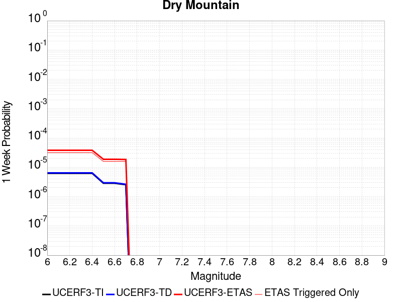 | 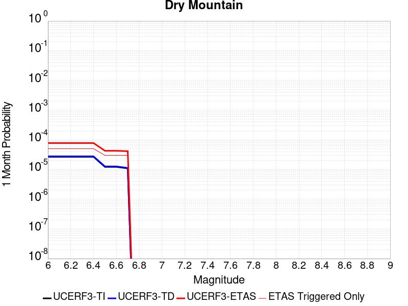 | 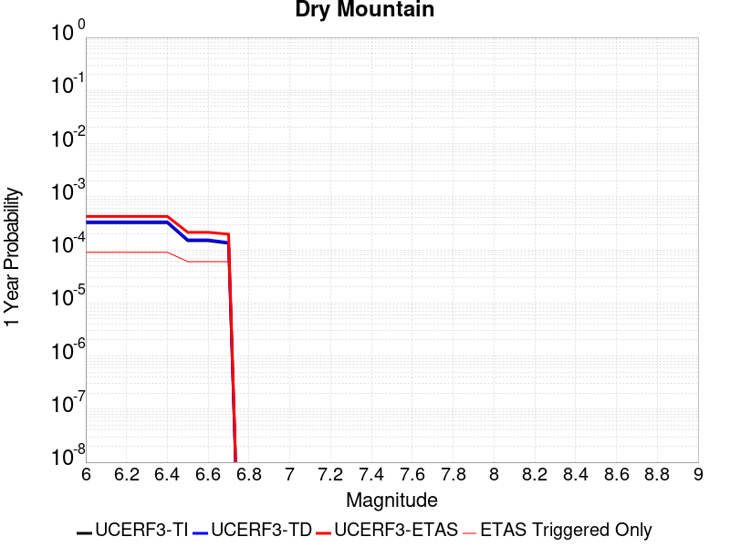 | 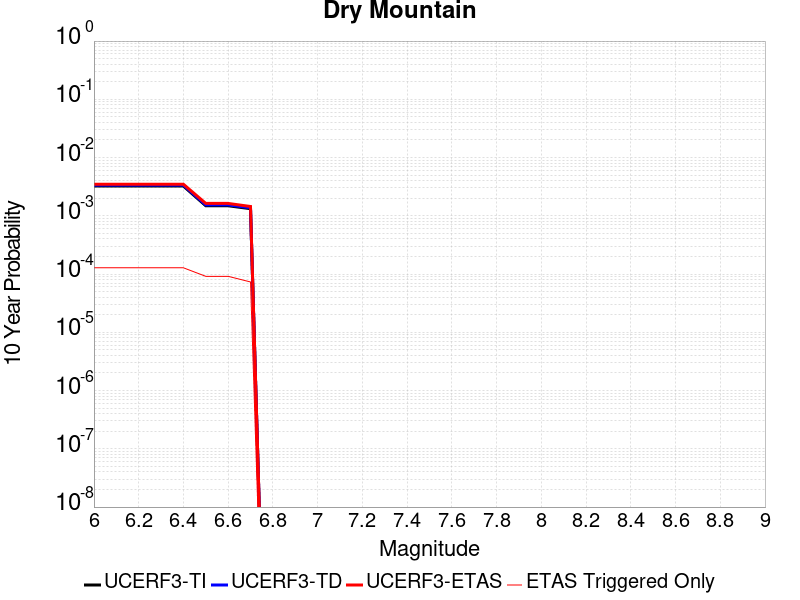 |

| Magnitude | 1 wk TI Prob | 1 wk TD Prob | 1 wk ETAS Prob | 1 wk ETAS/TD Gain | 1 wk ETAS Triggered Only | 1 mo TI Prob | 1 mo TD Prob | 1 mo ETAS Prob | 1 mo ETAS/TD Gain | 1 mo ETAS Triggered Only | 1 yr TI Prob | 1 yr TD Prob | 1 yr ETAS Prob | 1 yr ETAS/TD Gain | 1 yr ETAS Triggered Only | 10 yr TI Prob | 10 yr TD Prob | 10 yr ETAS Prob | 10 yr ETAS/TD Gain | 10 yr ETAS Triggered Only |
|-----|-----|-----|-----|-----|-----|-----|-----|-----|-----|-----|-----|-----|-----|-----|-----|-----|-----|-----|-----|-----|
| 6.0 | 6.222801E-6 | 6.439381E-6 | 6.439381E-6 | 1.0 | 0.0 | 2.6668875E-5 | 2.7597147E-5 | 2.7597147E-5 | 1.0 | 0.0 | 3.2464517E-4 | 3.3595937E-4 | 4.0978435E-4 | 1.2197437 | 7.384979E-5 | 0.0032417132 | 0.0033560768 | 0.0034542128 | 1.0292412 | 9.8466386E-5 |
| 6.1 | 6.222801E-6 | 6.439381E-6 | 6.439381E-6 | 1.0 | 0.0 | 2.6668875E-5 | 2.7597147E-5 | 2.7597147E-5 | 1.0 | 0.0 | 3.2464517E-4 | 3.3595937E-4 | 4.0978435E-4 | 1.2197437 | 7.384979E-5 | 0.0032417132 | 0.0033560768 | 0.0034542128 | 1.0292412 | 9.8466386E-5 |
| 6.2 | 6.222801E-6 | 6.439381E-6 | 6.439381E-6 | 1.0 | 0.0 | 2.6668875E-5 | 2.7597147E-5 | 2.7597147E-5 | 1.0 | 0.0 | 3.2464517E-4 | 3.3595937E-4 | 4.0978435E-4 | 1.2197437 | 7.384979E-5 | 0.0032417132 | 0.0033560768 | 0.0034542128 | 1.0292412 | 9.8466386E-5 |
| 6.3 | 6.222801E-6 | 6.439381E-6 | 6.439381E-6 | 1.0 | 0.0 | 2.6668875E-5 | 2.7597147E-5 | 2.7597147E-5 | 1.0 | 0.0 | 3.2464517E-4 | 3.3595937E-4 | 4.0978435E-4 | 1.2197437 | 7.384979E-5 | 0.0032417132 | 0.0033560768 | 0.0034542128 | 1.0292412 | 9.8466386E-5 |
| 6.4 | 6.222801E-6 | 6.439381E-6 | 6.439381E-6 | 1.0 | 0.0 | 2.6668875E-5 | 2.7597147E-5 | 2.7597147E-5 | 1.0 | 0.0 | 3.2464517E-4 | 3.3595937E-4 | 4.0978435E-4 | 1.2197437 | 7.384979E-5 | 0.0032417132 | 0.0033560768 | 0.0034542128 | 1.0292412 | 9.8466386E-5 |
| 6.5 | 2.8528623E-6 | 2.9521684E-6 | 2.9521684E-6 | 1.0 | 0.0 | 1.22264955E-5 | 1.2652138E-5 | 1.2652138E-5 | 1.0 | 0.0 | 1.4884741E-4 | 1.540376E-4 | 2.032632E-4 | 1.3195688 | 4.9233193E-5 | 0.0014874774 | 0.0015401616 | 0.0016138976 | 1.0478755 | 7.384979E-5 |
| 6.6 | 2.8528623E-6 | 2.9521684E-6 | 2.9521684E-6 | 1.0 | 0.0 | 1.22264955E-5 | 1.2652138E-5 | 1.2652138E-5 | 1.0 | 0.0 | 1.4884741E-4 | 1.540376E-4 | 2.032632E-4 | 1.3195688 | 4.9233193E-5 | 0.0014874774 | 0.0015401616 | 0.0016138976 | 1.0478755 | 7.384979E-5 |
| 6.7 | 2.541E-6 | 2.6293578E-6 | 2.6293578E-6 | 1.0 | 0.0 | 1.0889954E-5 | 1.1268677E-5 | 1.1268677E-5 | 1.0 | 0.0 | 1.3257713E-4 | 1.3719614E-4 | 1.8642258E-4 | 1.3588034 | 4.9233193E-5 | 0.0013249806 | 0.0013719613 | 0.001421127 | 1.035836 | 4.9233193E-5 |

## Ortigalita (North)
*[(top)](#table-of-contents)*

| 1 Week | 1 Month | 1 Year | 10 Year |
|-----|-----|-----|-----|
| 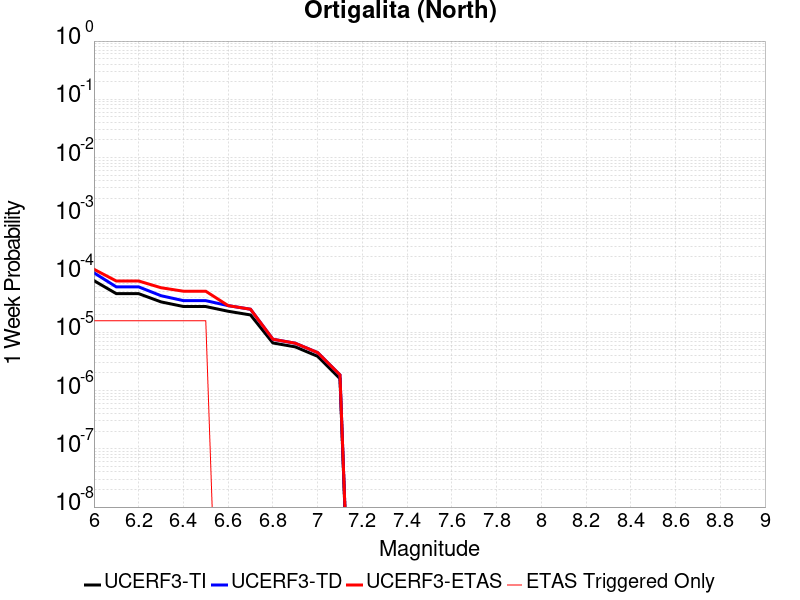 | 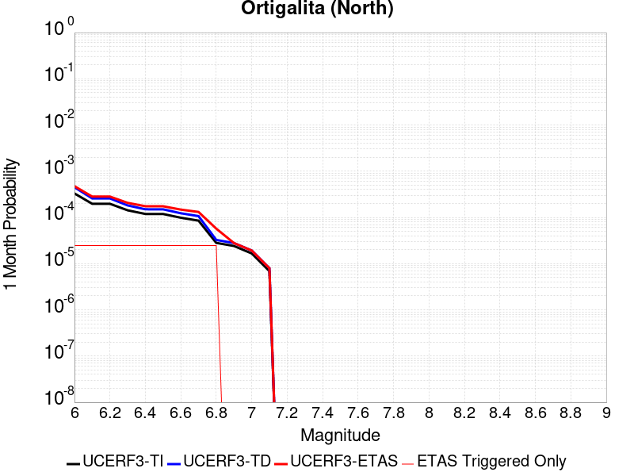 | 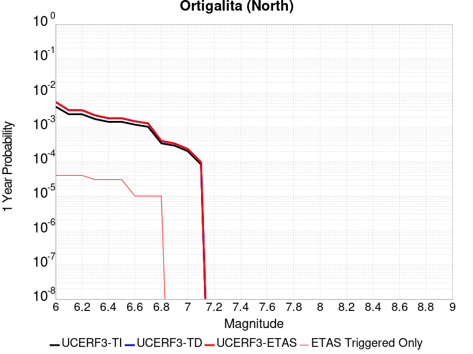 | 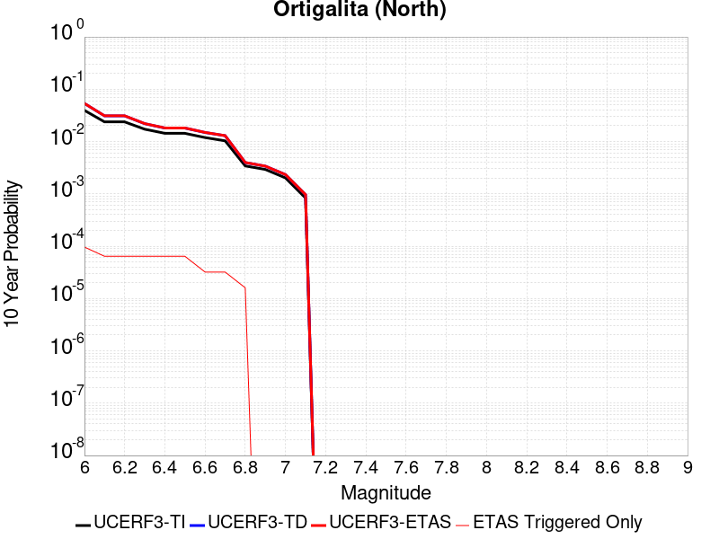 |

| Magnitude | 1 wk TI Prob | 1 wk TD Prob | 1 wk ETAS Prob | 1 wk ETAS/TD Gain | 1 wk ETAS Triggered Only | 1 mo TI Prob | 1 mo TD Prob | 1 mo ETAS Prob | 1 mo ETAS/TD Gain | 1 mo ETAS Triggered Only | 1 yr TI Prob | 1 yr TD Prob | 1 yr ETAS Prob | 1 yr ETAS/TD Gain | 1 yr ETAS Triggered Only | 10 yr TI Prob | 10 yr TD Prob | 10 yr ETAS Prob | 10 yr ETAS/TD Gain | 10 yr ETAS Triggered Only |
|-----|-----|-----|-----|-----|-----|-----|-----|-----|-----|-----|-----|-----|-----|-----|-----|-----|-----|-----|-----|-----|
| 6.0 | 7.711876E-5 | 1.05064966E-4 | 1.05064966E-4 | 1.0 | 0.0 | 3.3046713E-4 | 4.502116E-4 | 4.7481712E-4 | 1.0546532 | 2.4616596E-5 | 0.004016016 | 0.0054681194 | 0.0054926015 | 1.0044773 | 2.4616596E-5 | 0.039442103 | 0.053454787 | 0.05352469 | 1.0013077 | 7.384979E-5 |
| 6.1 | 4.607858E-5 | 6.0239203E-5 | 6.0239203E-5 | 1.0 | 0.0 | 1.9746469E-4 | 2.5814527E-4 | 2.827555E-4 | 1.0953349 | 2.4616596E-5 | 0.0024014818 | 0.0031387596 | 0.0031632988 | 1.0078181 | 2.4616596E-5 | 0.023756953 | 0.030975068 | 0.030998923 | 1.0007701 | 2.4616596E-5 |
| 6.2 | 4.607858E-5 | 6.0239203E-5 | 6.0239203E-5 | 1.0 | 0.0 | 1.9746469E-4 | 2.5814527E-4 | 2.827555E-4 | 1.0953349 | 2.4616596E-5 | 0.0024014818 | 0.0031387596 | 0.0031632988 | 1.0078181 | 2.4616596E-5 | 0.023756953 | 0.030975068 | 0.030998923 | 1.0007701 | 2.4616596E-5 |
| 6.3 | 3.327423E-5 | 4.2475127E-5 | 4.2475127E-5 | 1.0 | 0.0 | 1.4259605E-4 | 1.8202531E-4 | 2.0663743E-4 | 1.1352127 | 2.4616596E-5 | 0.0017347244 | 0.002214197 | 0.0022387593 | 1.011093 | 2.4616596E-5 | 0.017212452 | 0.021945644 | 0.02196972 | 1.0010971 | 2.4616596E-5 |
| 6.4 | 2.7732503E-5 | 3.4998593E-5 | 3.4998593E-5 | 1.0 | 0.0 | 1.1884817E-4 | 1.4998685E-4 | 1.7459976E-4 | 1.1641004 | 2.4616596E-5 | 0.001446016 | 0.0018248095 | 0.0018493813 | 1.0134653 | 2.4616596E-5 | 0.014366428 | 0.018121224 | 0.018145394 | 1.0013338 | 2.4616596E-5 |
| 6.5 | 2.7689714E-5 | 3.4948407E-5 | 3.4948407E-5 | 1.0 | 0.0 | 1.186648E-4 | 1.497718E-4 | 1.7438471E-4 | 1.1643361 | 2.4616596E-5 | 0.0014437864 | 0.0018221956 | 0.0018467673 | 1.0134847 | 2.4616596E-5 | 0.014344421 | 0.01809551 | 0.018119682 | 1.0013357 | 2.4616596E-5 |
| 6.6 | 2.2976905E-5 | 2.8718265E-5 | 2.8718265E-5 | 1.0 | 0.0 | 9.846873E-5 | 1.230739E-4 | 1.4768747E-4 | 1.1999902 | 2.4616596E-5 | 0.0011981975 | 0.0014976363 | 0.0015222161 | 1.0164124 | 2.4616596E-5 | 0.011917574 | 0.014898697 | 0.014922947 | 1.0016277 | 2.4616596E-5 |
| 6.7 | 1.9871539E-5 | 2.4904411E-5 | 2.4904411E-5 | 1.0 | 0.0 | 8.516096E-5 | 1.0673023E-4 | 1.313442E-4 | 1.2306185 | 2.4616596E-5 | 0.0010363415 | 0.0012989145 | 0.0013234993 | 1.0189271 | 2.4616596E-5 | 0.010315218 | 0.012936919 | 0.012961217 | 1.0018781 | 2.4616596E-5 |
| 6.8 | 6.5640475E-6 | 7.6054926E-6 | 7.6054926E-6 | 1.0 | 0.0 | 2.813133E-5 | 3.2594577E-5 | 5.721037E-5 | 1.7552114 | 2.4616596E-5 | 3.424451E-4 | 3.9676955E-4 | 4.213764E-4 | 1.0620179 | 2.4616596E-5 | 0.0034191788 | 0.003960899 | 0.003985418 | 1.0061903 | 2.4616596E-5 |
| 6.9 | 5.6219683E-6 | 6.5018376E-6 | 6.5018376E-6 | 1.0 | 0.0 | 2.4093928E-5 | 2.7864735E-5 | 2.7864735E-5 | 1.0 | 0.0 | 2.933041E-4 | 3.3920293E-4 | 3.3920293E-4 | 1.0 | 0.0 | 0.0029291727 | 0.003387109 | 0.003387109 | 1.0 | 0.0 |
| 7.0 | 3.875591E-6 | 4.4847548E-6 | 4.4847548E-6 | 1.0 | 0.0 | 1.6609569E-5 | 1.9220248E-5 | 1.9220248E-5 | 1.0 | 0.0 | 2.0220275E-4 | 2.339835E-4 | 2.339835E-4 | 1.0 | 0.0 | 0.0020201886 | 0.0023375798 | 0.0023375798 | 1.0 | 0.0 |
| 7.1 | 1.6017933E-6 | 1.8570418E-6 | 1.8570418E-6 | 1.0 | 0.0 | 6.8648105E-6 | 7.958732E-6 | 7.958732E-6 | 1.0 | 0.0 | 8.357586E-5 | 9.689432E-5 | 9.689432E-5 | 1.0 | 0.0 | 8.3544437E-4 | 9.686254E-4 | 9.686254E-4 | 1.0 | 0.0 |

## Simi-Santa Rosa
*[(top)](#table-of-contents)*

| 1 Week | 1 Month | 1 Year | 10 Year |
|-----|-----|-----|-----|
| 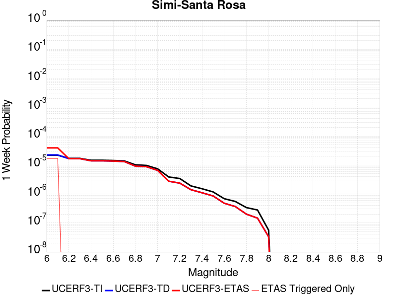 | 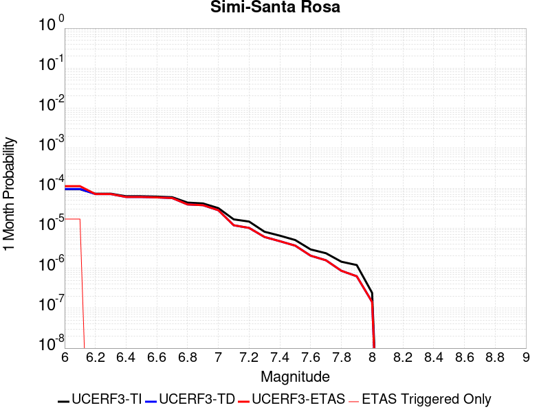 | 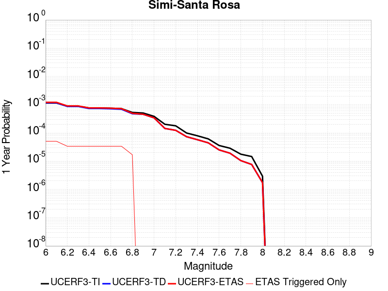 | 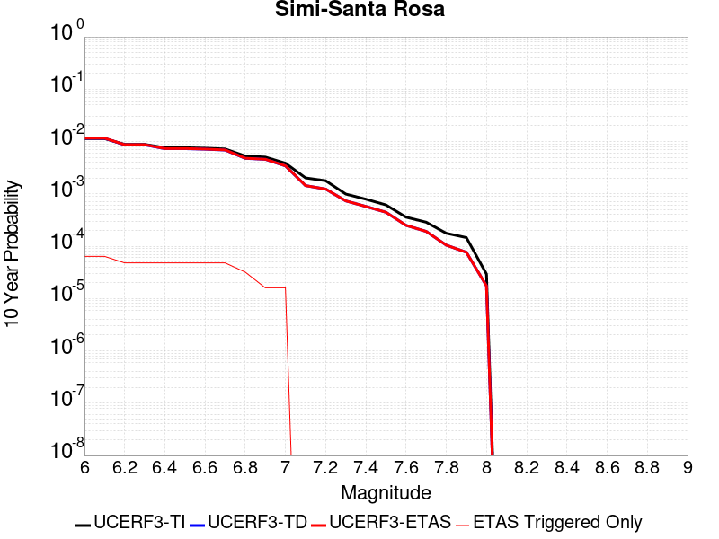 |

| Magnitude | 1 wk TI Prob | 1 wk TD Prob | 1 wk ETAS Prob | 1 wk ETAS/TD Gain | 1 wk ETAS Triggered Only | 1 mo TI Prob | 1 mo TD Prob | 1 mo ETAS Prob | 1 mo ETAS/TD Gain | 1 mo ETAS Triggered Only | 1 yr TI Prob | 1 yr TD Prob | 1 yr ETAS Prob | 1 yr ETAS/TD Gain | 1 yr ETAS Triggered Only | 10 yr TI Prob | 10 yr TD Prob | 10 yr ETAS Prob | 10 yr ETAS/TD Gain | 10 yr ETAS Triggered Only |
|-----|-----|-----|-----|-----|-----|-----|-----|-----|-----|-----|-----|-----|-----|-----|-----|-----|-----|-----|-----|-----|
| 6.0 | 2.198912E-5 | 2.2275442E-5 | 4.689149E-5 | 2.1050756 | 2.4616596E-5 | 9.4235686E-5 | 9.5462936E-5 | 1.2007718E-4 | 1.2578409 | 2.4616596E-5 | 0.0011467156 | 0.0011616853 | 0.0012108614 | 1.0423316 | 4.9233193E-5 | 0.011408163 | 0.011560575 | 0.011633571 | 1.0063143 | 7.384979E-5 |
| 6.1 | 2.198912E-5 | 2.2275442E-5 | 4.689149E-5 | 2.1050756 | 2.4616596E-5 | 9.4235686E-5 | 9.5462936E-5 | 1.2007718E-4 | 1.2578409 | 2.4616596E-5 | 0.0011467156 | 0.0011616853 | 0.0012108614 | 1.0423316 | 4.9233193E-5 | 0.011408163 | 0.011560575 | 0.011633571 | 1.0063143 | 7.384979E-5 |
| 6.2 | 1.69983E-5 | 1.6668559E-5 | 1.6668559E-5 | 1.0 | 0.0 | 7.284782E-5 | 7.143489E-5 | 7.143489E-5 | 1.0 | 0.0 | 8.865613E-4 | 8.6940196E-4 | 8.9399714E-4 | 1.0282898 | 2.4616596E-5 | 0.008830327 | 0.008662928 | 0.008711734 | 1.005634 | 4.9233193E-5 |
| 6.3 | 1.69983E-5 | 1.6668559E-5 | 1.6668559E-5 | 1.0 | 0.0 | 7.284782E-5 | 7.143489E-5 | 7.143489E-5 | 1.0 | 0.0 | 8.865613E-4 | 8.6940196E-4 | 8.9399714E-4 | 1.0282898 | 2.4616596E-5 | 0.008830327 | 0.008662928 | 0.008711734 | 1.005634 | 4.9233193E-5 |
| 6.4 | 1.4666188E-5 | 1.4052543E-5 | 1.4052543E-5 | 1.0 | 0.0 | 6.285358E-5 | 6.0223934E-5 | 6.0223934E-5 | 1.0 | 0.0 | 7.6497364E-4 | 7.3300465E-4 | 7.5760315E-4 | 1.0335585 | 2.4616596E-5 | 0.0076234564 | 0.007308344 | 0.0073572174 | 1.0066873 | 4.9233193E-5 |
| 6.5 | 1.4666188E-5 | 1.4052543E-5 | 1.4052543E-5 | 1.0 | 0.0 | 6.285358E-5 | 6.0223934E-5 | 6.0223934E-5 | 1.0 | 0.0 | 7.6497364E-4 | 7.3300465E-4 | 7.5760315E-4 | 1.0335585 | 2.4616596E-5 | 0.0076234564 | 0.007308344 | 0.0073572174 | 1.0066873 | 4.9233193E-5 |
| 6.6 | 1.4377586E-5 | 1.3729583E-5 | 1.3729583E-5 | 1.0 | 0.0 | 6.1616774E-5 | 5.883988E-5 | 5.883988E-5 | 1.0 | 0.0 | 7.4992597E-4 | 7.1616494E-4 | 7.407639E-4 | 1.0343481 | 2.4616596E-5 | 0.007474003 | 0.0071410383 | 0.00718992 | 1.0068451 | 4.9233193E-5 |
| 6.7 | 1.3881404E-5 | 1.320755E-5 | 1.320755E-5 | 1.0 | 0.0 | 5.9490372E-5 | 5.66027E-5 | 5.66027E-5 | 1.0 | 0.0 | 7.240546E-4 | 6.8894465E-4 | 7.135443E-4 | 1.0357063 | 2.4616596E-5 | 0.007217 | 0.006870538 | 0.006919433 | 1.0071166 | 4.9233193E-5 |
| 6.8 | 1.0176516E-5 | 9.154151E-6 | 9.154151E-6 | 1.0 | 0.0 | 4.3612912E-5 | 3.9231574E-5 | 3.9231574E-5 | 1.0 | 0.0 | 5.308578E-4 | 4.7755634E-4 | 4.7755634E-4 | 1.0 | 0.0 | 0.0052959146 | 0.004766934 | 0.0047914335 | 1.0051395 | 2.4616596E-5 |
| 6.9 | 9.699797E-6 | 8.774719E-6 | 8.774719E-6 | 1.0 | 0.0 | 4.15699E-5 | 3.7605492E-5 | 3.7605492E-5 | 1.0 | 0.0 | 5.05996E-4 | 4.577671E-4 | 4.577671E-4 | 1.0 | 0.0 | 0.005048454 | 0.0045698597 | 0.0045943637 | 1.0053622 | 2.4616596E-5 |
| 7.0 | 7.4049476E-6 | 6.559333E-6 | 6.559333E-6 | 1.0 | 0.0 | 3.1735104E-5 | 2.8111197E-5 | 2.8111197E-5 | 1.0 | 0.0 | 3.8630638E-4 | 3.422127E-4 | 3.422127E-4 | 1.0 | 0.0 | 0.0038563553 | 0.0034180996 | 0.003442632 | 1.0071772 | 2.4616596E-5 |
| 7.1 | 3.873439E-6 | 2.7595095E-6 | 2.7595095E-6 | 1.0 | 0.0 | 1.6600346E-5 | 1.1826417E-5 | 1.1826417E-5 | 1.0 | 0.0 | 2.0209046E-4 | 1.4397735E-4 | 1.4397735E-4 | 1.0 | 0.0 | 0.0020190678 | 0.0014388643 | 0.0014388643 | 1.0 | 0.0 |
| 7.2 | 3.417706E-6 | 2.3676484E-6 | 2.3676484E-6 | 1.0 | 0.0 | 1.4647229E-5 | 1.0147027E-5 | 1.0147027E-5 | 1.0 | 0.0 | 1.7831543E-4 | 1.2353327E-4 | 1.2353327E-4 | 1.0 | 0.0 | 0.0017817242 | 0.0012346683 | 0.0012346683 | 1.0 | 0.0 |
| 7.3 | 1.90225E-6 | 1.4073753E-6 | 1.4073753E-6 | 1.0 | 0.0 | 8.152474E-6 | 6.0315947E-6 | 6.0315947E-6 | 1.0 | 0.0 | 9.9251854E-5 | 7.343221E-5 | 7.343221E-5 | 1.0 | 0.0 | 9.920754E-4 | 7.340817E-4 | 7.340817E-4 | 1.0 | 0.0 |
| 7.4 | 1.5170556E-6 | 1.1024773E-6 | 1.1024773E-6 | 1.0 | 0.0 | 6.5016507E-6 | 4.724894E-6 | 4.724894E-6 | 1.0 | 0.0 | 7.915472E-5 | 5.7524077E-5 | 5.7524077E-5 | 1.0 | 0.0 | 7.9126534E-4 | 5.7509297E-4 | 5.7509297E-4 | 1.0 | 0.0 |
| 7.5 | 1.178732E-6 | 8.535102E-7 | 8.535102E-7 | 1.0 | 0.0 | 5.0516987E-6 | 3.6578958E-6 | 3.6578958E-6 | 1.0 | 0.0 | 6.1502695E-5 | 4.453398E-5 | 4.453398E-5 | 1.0 | 0.0 | 6.148568E-4 | 4.452515E-4 | 4.452515E-4 | 1.0 | 0.0 |
| 7.6 | 6.8722386E-7 | 4.793198E-7 | 4.793198E-7 | 1.0 | 0.0 | 2.9452417E-6 | 2.054226E-6 | 2.054226E-6 | 1.0 | 0.0 | 3.5857727E-5 | 2.5009915E-5 | 2.5009915E-5 | 1.0 | 0.0 | 3.5851944E-4 | 2.5007114E-4 | 2.5007114E-4 | 1.0 | 0.0 |
| 7.7 | 5.5126515E-7 | 3.6731157E-7 | 3.6731157E-7 | 1.0 | 0.0 | 2.3625628E-6 | 1.5741915E-6 | 1.5741915E-6 | 1.0 | 0.0 | 2.8763823E-5 | 1.9165615E-5 | 1.9165615E-5 | 1.0 | 0.0 | 2.87601E-4 | 1.9163972E-4 | 1.9163972E-4 | 1.0 | 0.0 |
| 7.8 | 3.3860243E-7 | 2.0075942E-7 | 2.0075942E-7 | 1.0 | 0.0 | 1.4511525E-6 | 8.6039717E-7 | 8.6039717E-7 | 1.0 | 0.0 | 1.7667637E-5 | 1.0475286E-5 | 1.0475286E-5 | 1.0 | 0.0 | 1.7666233E-4 | 1.04747975E-4 | 1.04747975E-4 | 1.0 | 0.0 |
| 7.9 | 2.7955386E-7 | 1.4649108E-7 | 1.4649108E-7 | 1.0 | 0.0 | 1.1980875E-6 | 6.278188E-7 | 6.278188E-7 | 1.0 | 0.0 | 1.4586617E-5 | 7.643667E-6 | 7.643667E-6 | 1.0 | 0.0 | 1.458566E-4 | 7.643409E-5 | 7.643409E-5 | 1.0 | 0.0 |
| 8.0 | 5.6259015E-8 | 3.3355324E-8 | 3.3355324E-8 | 1.0 | 0.0 | 2.4111003E-7 | 1.4295138E-7 | 1.4295138E-7 | 1.0 | 0.0 | 2.9355108E-6 | 1.7404317E-6 | 1.7404317E-6 | 1.0 | 0.0 | 2.935472E-5 | 1.7404194E-5 | 1.7404194E-5 | 1.0 | 0.0 |

## Oak Ridge (Onshore)
*[(top)](#table-of-contents)*

| 1 Week | 1 Month | 1 Year | 10 Year |
|-----|-----|-----|-----|
| 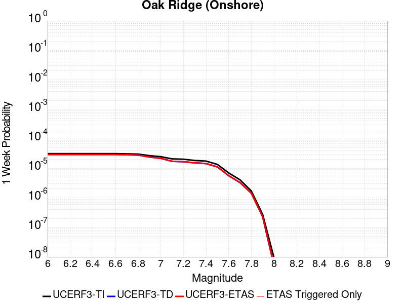 |  | 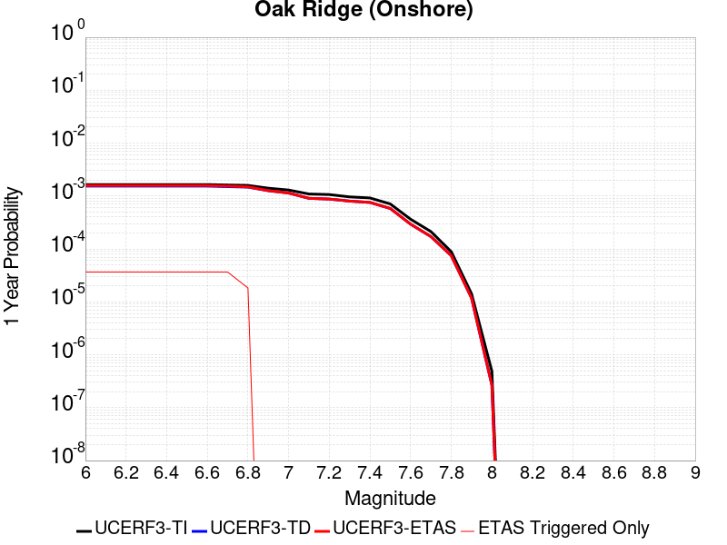 | 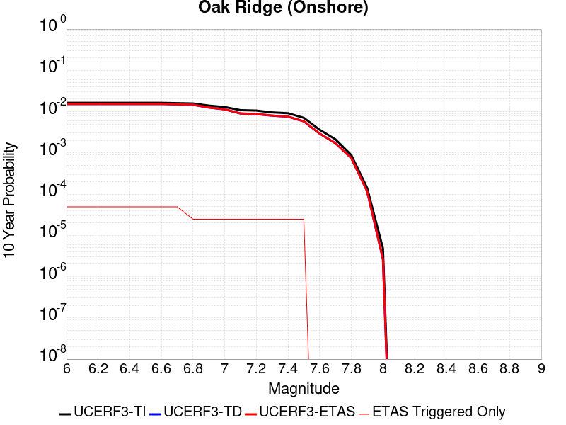 |

| Magnitude | 1 wk TI Prob | 1 wk TD Prob | 1 wk ETAS Prob | 1 wk ETAS/TD Gain | 1 wk ETAS Triggered Only | 1 mo TI Prob | 1 mo TD Prob | 1 mo ETAS Prob | 1 mo ETAS/TD Gain | 1 mo ETAS Triggered Only | 1 yr TI Prob | 1 yr TD Prob | 1 yr ETAS Prob | 1 yr ETAS/TD Gain | 1 yr ETAS Triggered Only | 10 yr TI Prob | 10 yr TD Prob | 10 yr ETAS Prob | 10 yr ETAS/TD Gain | 10 yr ETAS Triggered Only |
|-----|-----|-----|-----|-----|-----|-----|-----|-----|-----|-----|-----|-----|-----|-----|-----|-----|-----|-----|-----|-----|
| 6.0 | 3.155064E-5 | 2.9525974E-5 | 2.9525974E-5 | 1.0 | 0.0 | 1.3521002E-4 | 1.2653397E-4 | 1.2653397E-4 | 1.0 | 0.0 | 0.001644939 | 0.0015395004 | 0.0015640791 | 1.0159653 | 2.4616596E-5 | 0.01632816 | 0.015292859 | 0.015341339 | 1.0031701 | 4.9233193E-5 |
| 6.1 | 3.155064E-5 | 2.9525974E-5 | 2.9525974E-5 | 1.0 | 0.0 | 1.3521002E-4 | 1.2653397E-4 | 1.2653397E-4 | 1.0 | 0.0 | 0.001644939 | 0.0015395004 | 0.0015640791 | 1.0159653 | 2.4616596E-5 | 0.01632816 | 0.015292859 | 0.015341339 | 1.0031701 | 4.9233193E-5 |
| 6.2 | 3.155064E-5 | 2.9525974E-5 | 2.9525974E-5 | 1.0 | 0.0 | 1.3521002E-4 | 1.2653397E-4 | 1.2653397E-4 | 1.0 | 0.0 | 0.001644939 | 0.0015395004 | 0.0015640791 | 1.0159653 | 2.4616596E-5 | 0.01632816 | 0.015292859 | 0.015341339 | 1.0031701 | 4.9233193E-5 |
| 6.3 | 3.155064E-5 | 2.9525974E-5 | 2.9525974E-5 | 1.0 | 0.0 | 1.3521002E-4 | 1.2653397E-4 | 1.2653397E-4 | 1.0 | 0.0 | 0.001644939 | 0.0015395004 | 0.0015640791 | 1.0159653 | 2.4616596E-5 | 0.01632816 | 0.015292859 | 0.015341339 | 1.0031701 | 4.9233193E-5 |
| 6.4 | 3.155064E-5 | 2.9525974E-5 | 2.9525974E-5 | 1.0 | 0.0 | 1.3521002E-4 | 1.2653397E-4 | 1.2653397E-4 | 1.0 | 0.0 | 0.001644939 | 0.0015395004 | 0.0015640791 | 1.0159653 | 2.4616596E-5 | 0.01632816 | 0.015292859 | 0.015341339 | 1.0031701 | 4.9233193E-5 |
| 6.5 | 3.155064E-5 | 2.9525974E-5 | 2.9525974E-5 | 1.0 | 0.0 | 1.3521002E-4 | 1.2653397E-4 | 1.2653397E-4 | 1.0 | 0.0 | 0.001644939 | 0.0015395004 | 0.0015640791 | 1.0159653 | 2.4616596E-5 | 0.01632816 | 0.015292859 | 0.015341339 | 1.0031701 | 4.9233193E-5 |
| 6.6 | 3.155064E-5 | 2.9525974E-5 | 2.9525974E-5 | 1.0 | 0.0 | 1.3521002E-4 | 1.2653397E-4 | 1.2653397E-4 | 1.0 | 0.0 | 0.001644939 | 0.0015395004 | 0.0015640791 | 1.0159653 | 2.4616596E-5 | 0.01632816 | 0.015292859 | 0.015341339 | 1.0031701 | 4.9233193E-5 |
| 6.7 | 3.098897E-5 | 2.8864175E-5 | 2.8864175E-5 | 1.0 | 0.0 | 1.328031E-4 | 1.2369796E-4 | 1.2369796E-4 | 1.0 | 0.0 | 0.0016156785 | 0.0015050198 | 0.0015295994 | 1.0163317 | 2.4616596E-5 | 0.016039822 | 0.014952714 | 0.01500121 | 1.0032433 | 4.9233193E-5 |
| 6.8 | 3.0449872E-5 | 2.8239372E-5 | 2.8239372E-5 | 1.0 | 0.0 | 1.3049292E-4 | 1.2102048E-4 | 1.2102048E-4 | 1.0 | 0.0 | 0.0015875935 | 0.0014724657 | 0.0014724657 | 1.0 | 0.0 | 0.015762992 | 0.014631462 | 0.014655719 | 1.0016578 | 2.4616596E-5 |
| 6.9 | 2.697928E-5 | 2.4219773E-5 | 2.4219773E-5 | 1.0 | 0.0 | 1.15620365E-4 | 1.0379502E-4 | 1.0379502E-4 | 1.0 | 0.0 | 0.0014067689 | 0.0012629933 | 0.0012629933 | 1.0 | 0.0 | 0.0139789665 | 0.01256087 | 0.012585177 | 1.0019351 | 2.4616596E-5 |
| 7.0 | 2.4893961E-5 | 2.1862043E-5 | 2.1862043E-5 | 1.0 | 0.0 | 1.0668404E-4 | 9.3691204E-5 | 9.3691204E-5 | 1.0 | 0.0 | 0.0012981043 | 0.0011401111 | 0.0011401111 | 1.0 | 0.0 | 0.012905477 | 0.011344905 | 0.011369242 | 1.0021452 | 2.4616596E-5 |
| 7.1 | 2.0945363E-5 | 1.7354487E-5 | 1.7354487E-5 | 1.0 | 0.0 | 8.976275E-5 | 7.437428E-5 | 7.437428E-5 | 1.0 | 0.0 | 0.0010923136 | 9.051354E-4 | 9.051354E-4 | 1.0 | 0.0 | 0.0108696 | 0.009015423 | 0.009039817 | 1.0027059 | 2.4616596E-5 |
| 7.2 | 2.0439404E-5 | 1.6809423E-5 | 1.6809423E-5 | 1.0 | 0.0 | 8.7594504E-5 | 7.203843E-5 | 7.203843E-5 | 1.0 | 0.0 | 0.0010659413 | 8.767196E-4 | 8.767196E-4 | 1.0 | 0.0 | 0.010608427 | 0.008733526 | 0.008757927 | 1.002794 | 2.4616596E-5 |
| 7.3 | 1.8463334E-5 | 1.5381811E-5 | 1.5381811E-5 | 1.0 | 0.0 | 7.912617E-5 | 6.59204E-5 | 6.59204E-5 | 1.0 | 0.0 | 9.6293533E-4 | 8.0228975E-4 | 8.0228975E-4 | 1.0 | 0.0 | 0.009587734 | 0.007994797 | 0.008019216 | 1.0030545 | 2.4616596E-5 |
| 7.4 | 1.763139E-5 | 1.451684E-5 | 1.451684E-5 | 1.0 | 0.0 | 7.556091E-5 | 6.221356E-5 | 6.221356E-5 | 1.0 | 0.0 | 9.1956573E-4 | 7.571909E-4 | 7.571909E-4 | 1.0 | 0.0 | 0.009157699 | 0.007546914 | 0.0075713443 | 1.0032372 | 2.4616596E-5 |
| 7.5 | 1.3594944E-5 | 1.1163356E-5 | 1.1163356E-5 | 1.0 | 0.0 | 5.8262744E-5 | 4.784209E-5 | 4.784209E-5 | 1.0 | 0.0 | 7.0911803E-4 | 5.8232434E-4 | 5.8232434E-4 | 1.0 | 0.0 | 0.007068595 | 0.0058082556 | 0.0058327294 | 1.0042136 | 2.4616596E-5 |
| 7.6 | 6.9889534E-6 | 5.6367144E-6 | 5.6367144E-6 | 1.0 | 0.0 | 2.9952313E-5 | 2.4157125E-5 | 2.4157125E-5 | 1.0 | 0.0 | 3.646084E-4 | 2.9407372E-4 | 2.9407372E-4 | 1.0 | 0.0 | 0.0036401073 | 0.0029368899 | 0.0029368899 | 1.0 | 0.0 |
| 7.7 | 4.0824193E-6 | 3.2832586E-6 | 3.2832586E-6 | 1.0 | 0.0 | 1.7495966E-5 | 1.4071033E-5 | 1.4071033E-5 | 1.0 | 0.0 | 2.1299256E-4 | 1.713015E-4 | 1.713015E-4 | 1.0 | 0.0 | 0.0021278851 | 0.0017117079 | 0.0017117079 | 1.0 | 0.0 |
| 7.8 | 1.7023609E-6 | 1.4370495E-6 | 1.4370495E-6 | 1.0 | 0.0 | 7.295812E-6 | 6.1587693E-6 | 6.1587693E-6 | 1.0 | 0.0 | 8.882289E-5 | 7.498047E-5 | 7.498047E-5 | 1.0 | 0.0 | 8.8787393E-4 | 7.495545E-4 | 7.495545E-4 | 1.0 | 0.0 |
| 7.9 | 2.721225E-7 | 2.2616497E-7 | 2.2616497E-7 | 1.0 | 0.0 | 1.1662388E-6 | 9.692781E-7 | 9.692781E-7 | 1.0 | 0.0 | 1.4198865E-5 | 1.1800899E-5 | 1.1800899E-5 | 1.0 | 0.0 | 1.4197957E-4 | 1.1800301E-4 | 1.1800301E-4 | 1.0 | 0.0 |
| 8.0 | 9.364255E-9 | 5.1206666E-9 | 5.1206666E-9 | 1.0 | 0.0 | 4.0132523E-8 | 2.1945715E-8 | 2.1945715E-8 | 1.0 | 0.0 | 4.8861335E-7 | 2.6718905E-7 | 2.6718905E-7 | 1.0 | 0.0 | 4.8861225E-6 | 2.6718876E-6 | 2.6718876E-6 | 1.0 | 0.0 |

## Whittier alt 1
*[(top)](#table-of-contents)*

| 1 Week | 1 Month | 1 Year | 10 Year |
|-----|-----|-----|-----|
| 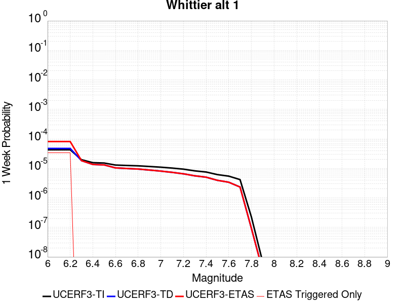 | 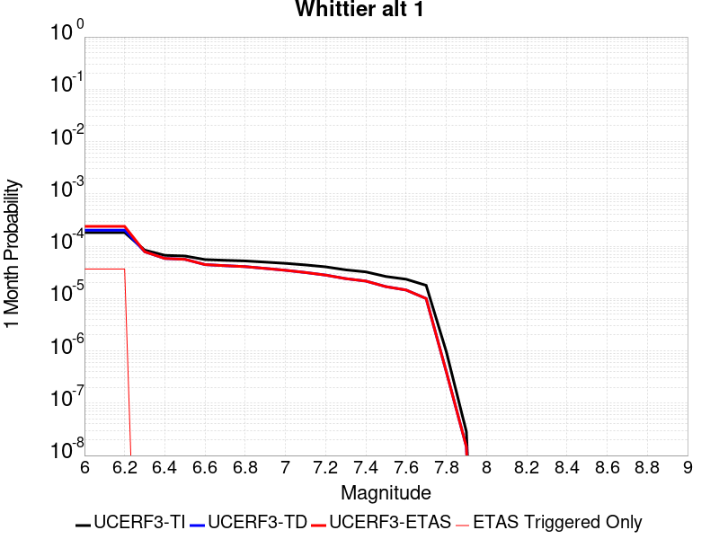 | 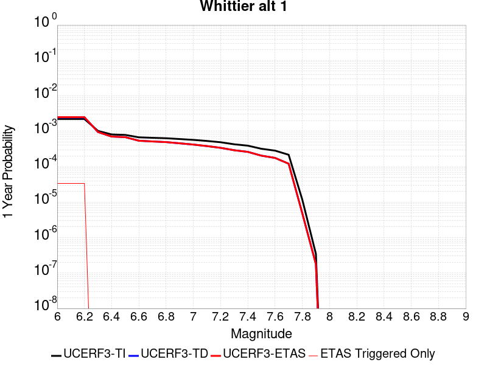 | 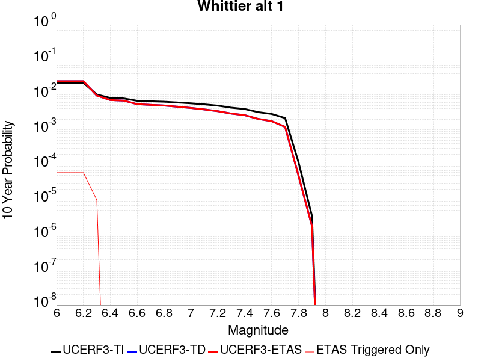 |

| Magnitude | 1 wk TI Prob | 1 wk TD Prob | 1 wk ETAS Prob | 1 wk ETAS/TD Gain | 1 wk ETAS Triggered Only | 1 mo TI Prob | 1 mo TD Prob | 1 mo ETAS Prob | 1 mo ETAS/TD Gain | 1 mo ETAS Triggered Only | 1 yr TI Prob | 1 yr TD Prob | 1 yr ETAS Prob | 1 yr ETAS/TD Gain | 1 yr ETAS Triggered Only | 10 yr TI Prob | 10 yr TD Prob | 10 yr ETAS Prob | 10 yr ETAS/TD Gain | 10 yr ETAS Triggered Only |
|-----|-----|-----|-----|-----|-----|-----|-----|-----|-----|-----|-----|-----|-----|-----|-----|-----|-----|-----|-----|-----|
| 6.0 | 4.2554693E-5 | 4.725218E-5 | 7.186761E-5 | 1.5209376 | 2.4616596E-5 | 1.8236451E-4 | 2.0249544E-4 | 2.2710706E-4 | 1.1215416 | 2.4616596E-5 | 0.002218027 | 0.0024629154 | 0.0024874713 | 1.0099703 | 2.4616596E-5 | 0.02196019 | 0.024390234 | 0.024462283 | 1.002954 | 7.384979E-5 |
| 6.1 | 4.2554693E-5 | 4.725218E-5 | 7.186761E-5 | 1.5209376 | 2.4616596E-5 | 1.8236451E-4 | 2.0249544E-4 | 2.2710706E-4 | 1.1215416 | 2.4616596E-5 | 0.002218027 | 0.0024629154 | 0.0024874713 | 1.0099703 | 2.4616596E-5 | 0.02196019 | 0.024390234 | 0.024462283 | 1.002954 | 7.384979E-5 |
| 6.2 | 4.2554693E-5 | 4.725218E-5 | 7.186761E-5 | 1.5209376 | 2.4616596E-5 | 1.8236451E-4 | 2.0249544E-4 | 2.2710706E-4 | 1.1215416 | 2.4616596E-5 | 0.002218027 | 0.0024629154 | 0.0024874713 | 1.0099703 | 2.4616596E-5 | 0.02196019 | 0.024390234 | 0.024462283 | 1.002954 | 7.384979E-5 |
| 6.3 | 1.9617712E-5 | 1.8268593E-5 | 1.8268593E-5 | 1.0 | 0.0 | 8.40732E-5 | 7.829172E-5 | 7.829172E-5 | 1.0 | 0.0 | 0.0010231105 | 9.52804E-4 | 9.52804E-4 | 1.0 | 0.0 | 0.01018413 | 0.009490474 | 0.009490474 | 1.0 | 0.0 |
| 6.4 | 1.5611336E-5 | 1.3604271E-5 | 1.3604271E-5 | 1.0 | 0.0 | 6.690401E-5 | 5.8302747E-5 | 5.8302747E-5 | 1.0 | 0.0 | 8.142519E-4 | 7.0961076E-4 | 7.0961076E-4 | 1.0 | 0.0 | 0.008112748 | 0.0070754145 | 0.0070754145 | 1.0 | 0.0 |
| 6.5 | 1.5150166E-5 | 1.3100925E-5 | 1.3100925E-5 | 1.0 | 0.0 | 6.492767E-5 | 5.6145647E-5 | 5.6145647E-5 | 1.0 | 0.0 | 7.9020765E-4 | 6.8336475E-4 | 6.8336475E-4 | 1.0 | 0.0 | 0.007874036 | 0.0068145846 | 0.0068145846 | 1.0 | 0.0 |
| 6.6 | 1.295588E-5 | 1.0380725E-5 | 1.0380725E-5 | 1.0 | 0.0 | 5.552402E-5 | 4.4488075E-5 | 4.4488075E-5 | 1.0 | 0.0 | 6.7579525E-4 | 5.4150965E-4 | 5.4150965E-4 | 1.0 | 0.0 | 0.006737438 | 0.0054033357 | 0.0054033357 | 1.0 | 0.0 |
| 6.7 | 1.2542085E-5 | 9.899369E-6 | 9.899369E-6 | 1.0 | 0.0 | 5.3750682E-5 | 4.242519E-5 | 4.242519E-5 | 1.0 | 0.0 | 6.542181E-4 | 5.164061E-4 | 5.164061E-4 | 1.0 | 0.0 | 0.006522954 | 0.0051534795 | 0.0051534795 | 1.0 | 0.0 |
| 6.8 | 1.2195878E-5 | 9.495415E-6 | 9.495415E-6 | 1.0 | 0.0 | 5.2267E-5 | 4.069401E-5 | 4.069401E-5 | 1.0 | 0.0 | 6.36165E-4 | 4.9533875E-4 | 4.9533875E-4 | 1.0 | 0.0 | 0.0063434686 | 0.004943688 | 0.004943688 | 1.0 | 0.0 |
| 6.9 | 1.1580298E-5 | 8.772933E-6 | 8.772933E-6 | 1.0 | 0.0 | 4.9628903E-5 | 3.7597754E-5 | 3.7597754E-5 | 1.0 | 0.0 | 6.040644E-4 | 4.5765814E-4 | 4.5765814E-4 | 1.0 | 0.0 | 0.00602425 | 0.0045684157 | 0.0045684157 | 1.0 | 0.0 |
| 7.0 | 1.0964795E-5 | 8.083994E-6 | 8.083994E-6 | 1.0 | 0.0 | 4.6991136E-5 | 3.4645236E-5 | 3.4645236E-5 | 1.0 | 0.0 | 5.7196687E-4 | 4.2172565E-4 | 4.2172565E-4 | 1.0 | 0.0 | 0.0057049696 | 0.004210462 | 0.004210462 | 1.0 | 0.0 |
| 7.1 | 1.0230601E-5 | 7.3266697E-6 | 7.3266697E-6 | 1.0 | 0.0 | 4.3844695E-5 | 3.1399642E-5 | 3.1399642E-5 | 1.0 | 0.0 | 5.336784E-4 | 3.8222488E-4 | 3.8222488E-4 | 1.0 | 0.0 | 0.005323986 | 0.0038168381 | 0.0038168381 | 1.0 | 0.0 |
| 7.2 | 9.40865E-6 | 6.543289E-6 | 6.543289E-6 | 1.0 | 0.0 | 4.032216E-5 | 2.8042374E-5 | 2.8042374E-5 | 1.0 | 0.0 | 4.908117E-4 | 3.4136363E-4 | 3.4136363E-4 | 1.0 | 0.0 | 0.0048972913 | 0.003409485 | 0.003409485 | 1.0 | 0.0 |
| 7.3 | 8.237384E-6 | 5.5977525E-6 | 5.5977525E-6 | 1.0 | 0.0 | 3.5302593E-5 | 2.3990153E-5 | 2.3990153E-5 | 1.0 | 0.0 | 4.2972428E-4 | 2.92042E-4 | 2.92042E-4 | 1.0 | 0.0 | 0.0042889426 | 0.002916903 | 0.002916903 | 1.0 | 0.0 |
| 7.4 | 7.5316966E-6 | 5.027819E-6 | 5.027819E-6 | 1.0 | 0.0 | 3.2278298E-5 | 2.1547625E-5 | 2.1547625E-5 | 1.0 | 0.0 | 3.9291743E-4 | 2.6231175E-4 | 2.6231175E-4 | 1.0 | 0.0 | 0.0039222343 | 0.0026201333 | 0.0026201333 | 1.0 | 0.0 |
| 7.5 | 6.149649E-6 | 3.933841E-6 | 3.933841E-6 | 1.0 | 0.0 | 2.6355372E-5 | 1.6859214E-5 | 1.6859214E-5 | 1.0 | 0.0 | 3.208294E-4 | 2.052425E-4 | 2.052425E-4 | 1.0 | 0.0 | 0.003203666 | 0.0020506186 | 0.0020506186 | 1.0 | 0.0 |
| 7.6 | 5.457711E-6 | 3.3953788E-6 | 3.3953788E-6 | 1.0 | 0.0 | 2.338998E-5 | 1.4551547E-5 | 1.4551547E-5 | 1.0 | 0.0 | 2.8473578E-4 | 1.771515E-4 | 1.771515E-4 | 1.0 | 0.0 | 0.0028437122 | 0.0017701836 | 0.0017701836 | 1.0 | 0.0 |
| 7.7 | 4.1676276E-6 | 2.3331952E-6 | 2.3331952E-6 | 1.0 | 0.0 | 1.7861139E-5 | 9.999374E-6 | 9.999374E-6 | 1.0 | 0.0 | 2.1743766E-4 | 1.2173632E-4 | 1.2173632E-4 | 1.0 | 0.0 | 0.0021722503 | 0.0012167693 | 0.0012167693 | 1.0 | 0.0 |
| 7.8 | 2.2692414E-7 | 9.3854695E-8 | 9.3854695E-8 | 1.0 | 0.0 | 9.725317E-7 | 4.0223435E-7 | 4.0223435E-7 | 1.0 | 0.0 | 1.1840509E-5 | 4.8971956E-6 | 4.8971956E-6 | 1.0 | 0.0 | 1.1839878E-4 | 4.8971204E-5 | 4.8971204E-5 | 1.0 | 0.0 |
| 7.9 | 6.676829E-9 | 3.439853E-9 | 3.439853E-9 | 1.0 | 0.0 | 2.861498E-8 | 1.4742227E-8 | 1.4742227E-8 | 1.0 | 0.0 | 3.4838732E-7 | 1.7948659E-7 | 1.7948659E-7 | 1.0 | 0.0 | 3.4838679E-6 | 1.7948646E-6 | 1.7948646E-6 | 1.0 | 0.0 |

## San Cayetano
*[(top)](#table-of-contents)*

| 1 Week | 1 Month | 1 Year | 10 Year |
|-----|-----|-----|-----|
| 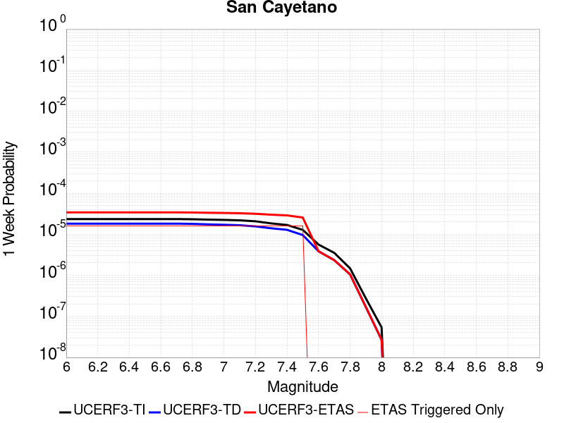 | 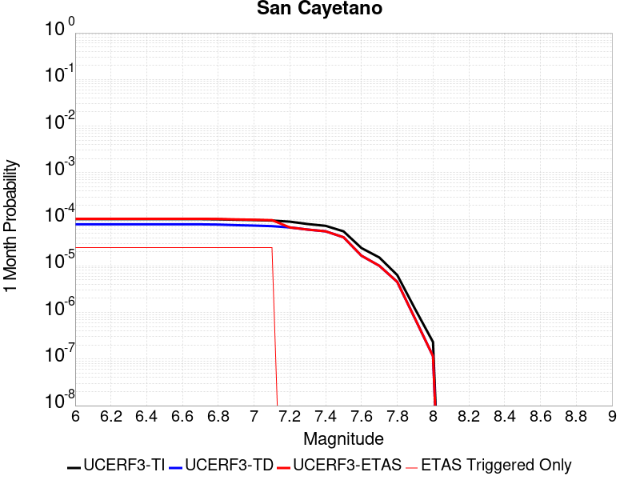 | 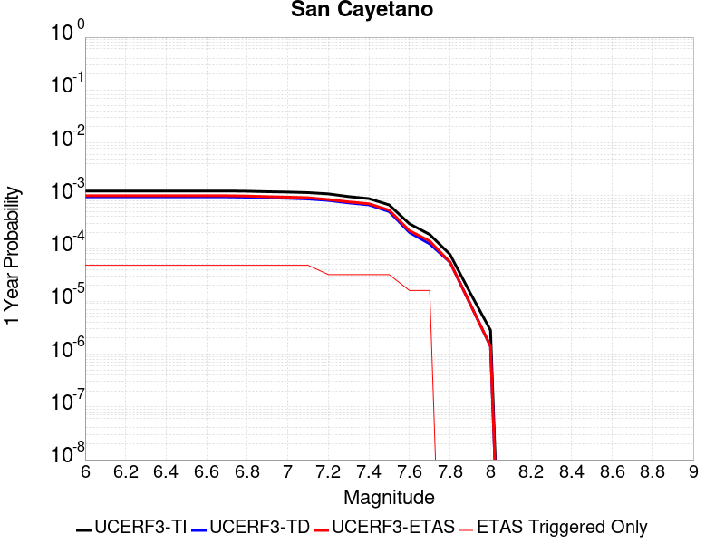 | 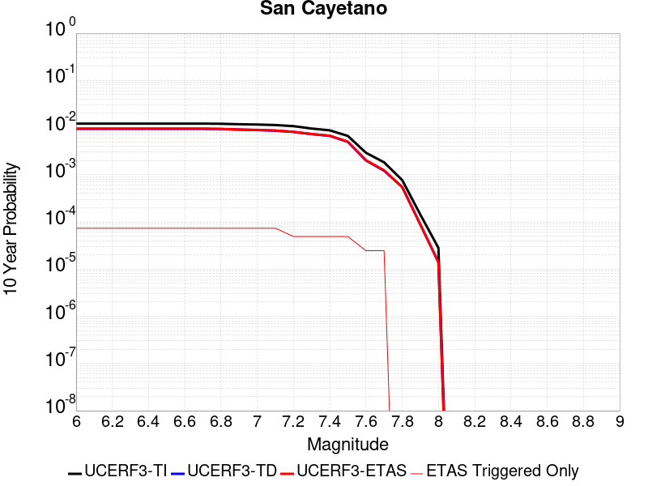 |

| Magnitude | 1 wk TI Prob | 1 wk TD Prob | 1 wk ETAS Prob | 1 wk ETAS/TD Gain | 1 wk ETAS Triggered Only | 1 mo TI Prob | 1 mo TD Prob | 1 mo ETAS Prob | 1 mo ETAS/TD Gain | 1 mo ETAS Triggered Only | 1 yr TI Prob | 1 yr TD Prob | 1 yr ETAS Prob | 1 yr ETAS/TD Gain | 1 yr ETAS Triggered Only | 10 yr TI Prob | 10 yr TD Prob | 10 yr ETAS Prob | 10 yr ETAS/TD Gain | 10 yr ETAS Triggered Only |
|-----|-----|-----|-----|-----|-----|-----|-----|-----|-----|-----|-----|-----|-----|-----|-----|-----|-----|-----|-----|-----|
| 6.0 | 2.3476267E-5 | 1.816928E-5 | 1.816928E-5 | 1.0 | 0.0 | 1.0060869E-4 | 7.786603E-5 | 1.0248071E-4 | 1.3161157 | 2.4616596E-5 | 0.0012242225 | 9.476103E-4 | 9.967969E-4 | 1.0519059 | 4.9233193E-5 | 0.012175002 | 0.009436584 | 0.009509737 | 1.0077521 | 7.384979E-5 |
| 6.1 | 2.3476267E-5 | 1.816928E-5 | 1.816928E-5 | 1.0 | 0.0 | 1.0060869E-4 | 7.786603E-5 | 1.0248071E-4 | 1.3161157 | 2.4616596E-5 | 0.0012242225 | 9.476103E-4 | 9.967969E-4 | 1.0519059 | 4.9233193E-5 | 0.012175002 | 0.009436584 | 0.009509737 | 1.0077521 | 7.384979E-5 |
| 6.2 | 2.3476267E-5 | 1.816928E-5 | 1.816928E-5 | 1.0 | 0.0 | 1.0060869E-4 | 7.786603E-5 | 1.0248071E-4 | 1.3161157 | 2.4616596E-5 | 0.0012242225 | 9.476103E-4 | 9.967969E-4 | 1.0519059 | 4.9233193E-5 | 0.012175002 | 0.009436584 | 0.009509737 | 1.0077521 | 7.384979E-5 |
| 6.3 | 2.3476267E-5 | 1.816928E-5 | 1.816928E-5 | 1.0 | 0.0 | 1.0060869E-4 | 7.786603E-5 | 1.0248071E-4 | 1.3161157 | 2.4616596E-5 | 0.0012242225 | 9.476103E-4 | 9.967969E-4 | 1.0519059 | 4.9233193E-5 | 0.012175002 | 0.009436584 | 0.009509737 | 1.0077521 | 7.384979E-5 |
| 6.4 | 2.3476267E-5 | 1.816928E-5 | 1.816928E-5 | 1.0 | 0.0 | 1.0060869E-4 | 7.786603E-5 | 1.0248071E-4 | 1.3161157 | 2.4616596E-5 | 0.0012242225 | 9.476103E-4 | 9.967969E-4 | 1.0519059 | 4.9233193E-5 | 0.012175002 | 0.009436584 | 0.009509737 | 1.0077521 | 7.384979E-5 |
| 6.5 | 2.3476267E-5 | 1.816928E-5 | 1.816928E-5 | 1.0 | 0.0 | 1.0060869E-4 | 7.786603E-5 | 1.0248071E-4 | 1.3161157 | 2.4616596E-5 | 0.0012242225 | 9.476103E-4 | 9.967969E-4 | 1.0519059 | 4.9233193E-5 | 0.012175002 | 0.009436584 | 0.009509737 | 1.0077521 | 7.384979E-5 |
| 6.6 | 2.3476267E-5 | 1.816928E-5 | 1.816928E-5 | 1.0 | 0.0 | 1.0060869E-4 | 7.786603E-5 | 1.0248071E-4 | 1.3161157 | 2.4616596E-5 | 0.0012242225 | 9.476103E-4 | 9.967969E-4 | 1.0519059 | 4.9233193E-5 | 0.012175002 | 0.009436584 | 0.009509737 | 1.0077521 | 7.384979E-5 |
| 6.7 | 2.3476267E-5 | 1.816928E-5 | 1.816928E-5 | 1.0 | 0.0 | 1.0060869E-4 | 7.786603E-5 | 1.0248071E-4 | 1.3161157 | 2.4616596E-5 | 0.0012242225 | 9.476103E-4 | 9.967969E-4 | 1.0519059 | 4.9233193E-5 | 0.012175002 | 0.009436584 | 0.009509737 | 1.0077521 | 7.384979E-5 |
| 6.8 | 2.3241924E-5 | 1.7936987E-5 | 1.7936987E-5 | 1.0 | 0.0 | 9.960445E-5 | 7.687056E-5 | 1.0148526E-4 | 1.3202097 | 2.4616596E-5 | 0.0012120095 | 9.3550084E-4 | 9.846879E-4 | 1.0525784 | 4.9233193E-5 | 0.012054204 | 0.009316482 | 0.009389644 | 1.0078529 | 7.384979E-5 |
| 6.9 | 2.2761007E-5 | 1.7432423E-5 | 1.7432423E-5 | 1.0 | 0.0 | 9.7543525E-5 | 7.470827E-5 | 9.932302E-5 | 1.3294784 | 2.4616596E-5 | 0.0011869454 | 9.09197E-4 | 9.5838547E-4 | 1.054101 | 4.9233193E-5 | 0.011806256 | 0.009055603 | 0.009128784 | 1.0080813 | 7.384979E-5 |
| 7.0 | 2.240283E-5 | 1.7066168E-5 | 1.7066168E-5 | 1.0 | 0.0 | 9.600859E-5 | 7.313869E-5 | 9.775349E-5 | 1.3365496 | 2.4616596E-5 | 0.0011682777 | 8.9010317E-4 | 9.3929254E-4 | 1.0552626 | 4.9233193E-5 | 0.011621549 | 0.008866196 | 0.00893939 | 1.0082555 | 7.384979E-5 |
| 7.1 | 2.1871154E-5 | 1.6586018E-5 | 1.6586018E-5 | 1.0 | 0.0 | 9.373015E-5 | 7.108101E-5 | 9.569586E-5 | 1.3462929 | 2.4616596E-5 | 0.0011405671 | 8.6507114E-4 | 9.1426173E-4 | 1.0568631 | 4.9233193E-5 | 0.011347309 | 0.008617838 | 0.008691052 | 1.0084956 | 7.384979E-5 |
| 7.2 | 2.0714133E-5 | 1.5564561E-5 | 1.5564561E-5 | 1.0 | 0.0 | 8.8771834E-5 | 6.670357E-5 | 6.670357E-5 | 1.0 | 0.0 | 0.0010802611 | 8.1181666E-4 | 8.364133E-4 | 1.0302982 | 2.4616596E-5 | 0.010750249 | 0.008089285 | 0.00813812 | 1.006037 | 4.9233193E-5 |
| 7.3 | 1.8408395E-5 | 1.3996864E-5 | 1.3996864E-5 | 1.0 | 0.0 | 7.8890735E-5 | 5.99852E-5 | 5.99852E-5 | 1.0 | 0.0 | 9.600714E-4 | 7.300781E-4 | 7.546767E-4 | 1.0336932 | 2.4616596E-5 | 0.009559342 | 0.0072775153 | 0.00732639 | 1.0067159 | 4.9233193E-5 |
| 7.4 | 1.6856795E-5 | 1.28500815E-5 | 1.28500815E-5 | 1.0 | 0.0 | 7.2241404E-5 | 5.5070628E-5 | 5.5070628E-5 | 1.0 | 0.0 | 8.7918417E-4 | 6.7028153E-4 | 6.948816E-4 | 1.0367011 | 2.4616596E-5 | 0.00875714 | 0.0066832784 | 0.0067321826 | 1.0073174 | 4.9233193E-5 |
| 7.5 | 1.2822778E-5 | 9.577542E-6 | 9.577542E-6 | 1.0 | 0.0 | 5.495361E-5 | 4.1045972E-5 | 4.1045972E-5 | 1.0 | 0.0 | 6.688548E-4 | 4.996217E-4 | 5.24226E-4 | 1.0492458 | 2.4616596E-5 | 0.006668452 | 0.0049851555 | 0.005034143 | 1.0098268 | 4.9233193E-5 |
| 7.6 | 5.6272684E-6 | 3.854903E-6 | 3.854903E-6 | 1.0 | 0.0 | 2.4116642E-5 | 1.652091E-5 | 1.652091E-5 | 1.0 | 0.0 | 2.9358055E-4 | 2.0112359E-4 | 2.2573525E-4 | 1.1223707 | 2.4616596E-5 | 0.0029319301 | 0.0020094267 | 0.0020339938 | 1.012226 | 2.4616596E-5 |
| 7.7 | 3.5261346E-6 | 2.3407013E-6 | 2.3407013E-6 | 1.0 | 0.0 | 1.5111918E-5 | 1.0031539E-5 | 1.0031539E-5 | 1.0 | 0.0 | 1.8397206E-4 | 1.2212721E-4 | 1.467408E-4 | 1.2015406 | 2.4616596E-5 | 0.0018381984 | 0.0012206084 | 0.0012451949 | 1.0201429 | 2.4616596E-5 |
| 7.8 | 1.4826929E-6 | 1.056428E-6 | 1.056428E-6 | 1.0 | 0.0 | 6.354383E-6 | 4.5275406E-6 | 4.5275406E-6 | 1.0 | 0.0 | 7.736187E-5 | 5.5121433E-5 | 5.5121433E-5 | 1.0 | 0.0 | 7.733494E-4 | 5.5107963E-4 | 5.5107963E-4 | 1.0 | 0.0 |
| 7.9 | 2.7568166E-7 | 1.6978244E-7 | 1.6978244E-7 | 1.0 | 0.0 | 1.1814923E-6 | 7.2763885E-7 | 7.2763885E-7 | 1.0 | 0.0 | 1.4384574E-5 | 8.858967E-6 | 8.858967E-6 | 1.0 | 0.0 | 1.4383643E-4 | 8.8586174E-5 | 8.8586174E-5 | 1.0 | 0.0 |
| 8.0 | 5.407832E-8 | 2.6887697E-8 | 2.6887697E-8 | 1.0 | 0.0 | 2.3176422E-7 | 1.15232986E-7 | 1.15232986E-7 | 1.0 | 0.0 | 2.8217257E-6 | 1.4029607E-6 | 1.4029607E-6 | 1.0 | 0.0 | 2.8216898E-5 | 1.4029522E-5 | 1.4029522E-5 | 1.0 | 0.0 |

## San Pedro Basin
*[(top)](#table-of-contents)*

| 1 Week | 1 Month | 1 Year | 10 Year |
|-----|-----|-----|-----|
| 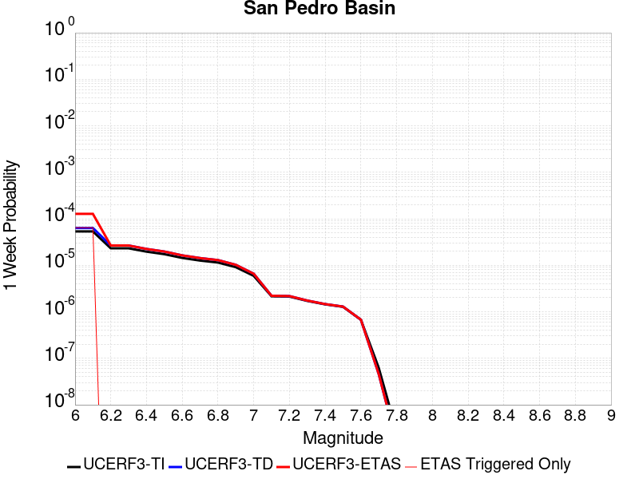 | 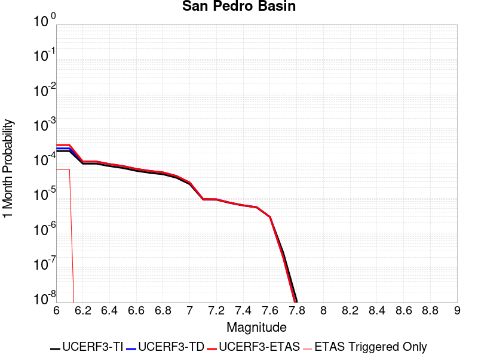 | 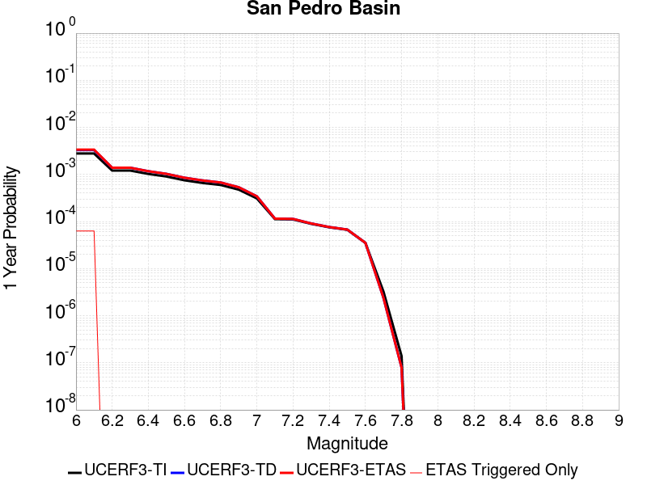 | 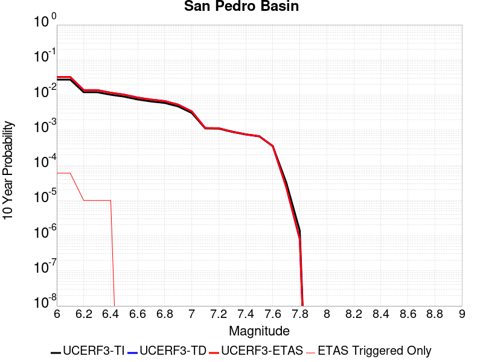 |

| Magnitude | 1 wk TI Prob | 1 wk TD Prob | 1 wk ETAS Prob | 1 wk ETAS/TD Gain | 1 wk ETAS Triggered Only | 1 mo TI Prob | 1 mo TD Prob | 1 mo ETAS Prob | 1 mo ETAS/TD Gain | 1 mo ETAS Triggered Only | 1 yr TI Prob | 1 yr TD Prob | 1 yr ETAS Prob | 1 yr ETAS/TD Gain | 1 yr ETAS Triggered Only | 10 yr TI Prob | 10 yr TD Prob | 10 yr ETAS Prob | 10 yr ETAS/TD Gain | 10 yr ETAS Triggered Only |
|-----|-----|-----|-----|-----|-----|-----|-----|-----|-----|-----|-----|-----|-----|-----|-----|-----|-----|-----|-----|-----|
| 6.0 | 5.3449043E-5 | 6.336954E-5 | 1.3721465E-4 | 2.1653092 | 7.384979E-5 | 2.2904722E-4 | 2.715589E-4 | 3.4538866E-4 | 1.2718737 | 7.384979E-5 | 0.0027850836 | 0.0033018254 | 0.0033754313 | 1.0222925 | 7.384979E-5 | 0.027504366 | 0.03258945 | 0.032660894 | 1.0021923 | 7.384979E-5 |
| 6.1 | 5.3449043E-5 | 6.336954E-5 | 1.3721465E-4 | 2.1653092 | 7.384979E-5 | 2.2904722E-4 | 2.715589E-4 | 3.4538866E-4 | 1.2718737 | 7.384979E-5 | 0.0027850836 | 0.0033018254 | 0.0033754313 | 1.0222925 | 7.384979E-5 | 0.027504366 | 0.03258945 | 0.032660894 | 1.0021923 | 7.384979E-5 |
| 6.2 | 2.3189454E-5 | 2.6642796E-5 | 2.6642796E-5 | 1.0 | 0.0 | 9.9379584E-5 | 1.14178685E-4 | 1.14178685E-4 | 1.0 | 0.0 | 0.0012092749 | 0.0013892864 | 0.0013892864 | 1.0 | 0.0 | 0.012027155 | 0.013810883 | 0.013810883 | 1.0 | 0.0 |
| 6.3 | 2.3189454E-5 | 2.6642796E-5 | 2.6642796E-5 | 1.0 | 0.0 | 9.9379584E-5 | 1.14178685E-4 | 1.14178685E-4 | 1.0 | 0.0 | 0.0012092749 | 0.0013892864 | 0.0013892864 | 1.0 | 0.0 | 0.012027155 | 0.013810883 | 0.013810883 | 1.0 | 0.0 |
| 6.4 | 1.966056E-5 | 2.2463413E-5 | 2.2463413E-5 | 1.0 | 0.0 | 8.425682E-5 | 9.626844E-5 | 9.626844E-5 | 1.0 | 0.0 | 0.001025344 | 0.0011714783 | 0.0011714783 | 1.0 | 0.0 | 0.010206259 | 0.011657117 | 0.011657117 | 1.0 | 0.0 |
| 6.5 | 1.7342953E-5 | 1.9745148E-5 | 1.9745148E-5 | 1.0 | 0.0 | 7.4324824E-5 | 8.4619525E-5 | 8.4619525E-5 | 1.0 | 0.0 | 9.04529E-4 | 0.0010297928 | 0.0010297928 | 1.0 | 0.0 | 0.009008561 | 0.010253931 | 0.010253931 | 1.0 | 0.0 |
| 6.6 | 1.439804E-5 | 1.6322716E-5 | 1.6322716E-5 | 1.0 | 0.0 | 6.170443E-5 | 6.99528E-5 | 6.99528E-5 | 1.0 | 0.0 | 7.509924E-4 | 8.513747E-4 | 8.513747E-4 | 1.0 | 0.0 | 0.0074845953 | 0.008484332 | 0.008484332 | 1.0 | 0.0 |
| 6.7 | 1.2634884E-5 | 1.4285297E-5 | 1.4285297E-5 | 1.0 | 0.0 | 5.414838E-5 | 6.1221435E-5 | 6.1221435E-5 | 1.0 | 0.0 | 6.590571E-4 | 7.4514654E-4 | 7.4514654E-4 | 1.0 | 0.0 | 0.006571059 | 0.007429501 | 0.007429501 | 1.0 | 0.0 |
| 6.8 | 1.146091E-5 | 1.2933192E-5 | 1.2933192E-5 | 1.0 | 0.0 | 4.911726E-5 | 5.5426954E-5 | 5.5426954E-5 | 1.0 | 0.0 | 5.9783855E-4 | 6.7464396E-4 | 6.7464396E-4 | 1.0 | 0.0 | 0.0059623276 | 0.006728899 | 0.006728899 | 1.0 | 0.0 |
| 6.9 | 9.109035E-6 | 1.0235011E-5 | 1.0235011E-5 | 1.0 | 0.0 | 3.9038136E-5 | 4.3863754E-5 | 4.3863754E-5 | 1.0 | 0.0 | 4.7518566E-4 | 5.3393835E-4 | 5.3393835E-4 | 1.0 | 0.0 | 0.0047417083 | 0.005329309 | 0.005329309 | 1.0 | 0.0 |
| 7.0 | 5.9351028E-6 | 6.583964E-6 | 6.583964E-6 | 1.0 | 0.0 | 2.5435906E-5 | 2.8216817E-5 | 2.8216817E-5 | 1.0 | 0.0 | 3.0963816E-4 | 3.435092E-4 | 3.435092E-4 | 1.0 | 0.0 | 0.0030920706 | 0.0034320992 | 0.0034320992 | 1.0 | 0.0 |
| 7.1 | 2.1557585E-6 | 2.209648E-6 | 2.209648E-6 | 1.0 | 0.0 | 9.238933E-6 | 9.469887E-6 | 9.469887E-6 | 1.0 | 0.0 | 1.1247819E-4 | 1.1528993E-4 | 1.1528993E-4 | 1.0 | 0.0 | 0.0011242128 | 0.0011523166 | 0.0011523166 | 1.0 | 0.0 |
| 7.2 | 2.1251979E-6 | 2.1779945E-6 | 2.1779945E-6 | 1.0 | 0.0 | 9.107958E-6 | 9.334229E-6 | 9.334229E-6 | 1.0 | 0.0 | 1.1088375E-4 | 1.1363847E-4 | 1.1363847E-4 | 1.0 | 0.0 | 0.0011082845 | 0.0011358189 | 0.0011358189 | 1.0 | 0.0 |
| 7.3 | 1.7145798E-6 | 1.7442874E-6 | 1.7442874E-6 | 1.0 | 0.0 | 7.3481783E-6 | 7.4754967E-6 | 7.4754967E-6 | 1.0 | 0.0 | 8.94604E-5 | 9.1010465E-5 | 9.1010465E-5 | 1.0 | 0.0 | 8.9424395E-4 | 9.0974104E-4 | 9.0974104E-4 | 1.0 | 0.0 |
| 7.4 | 1.4467993E-6 | 1.4641868E-6 | 1.4641868E-6 | 1.0 | 0.0 | 6.200554E-6 | 6.2750714E-6 | 6.2750714E-6 | 1.0 | 0.0 | 7.548913E-5 | 7.639639E-5 | 7.639639E-5 | 1.0 | 0.0 | 7.546349E-4 | 7.6370855E-4 | 7.6370855E-4 | 1.0 | 0.0 |
| 7.5 | 1.2803735E-6 | 1.2931497E-6 | 1.2931497E-6 | 1.0 | 0.0 | 5.487303E-6 | 5.5420587E-6 | 5.5420587E-6 | 1.0 | 0.0 | 6.680587E-5 | 6.7472545E-5 | 6.7472545E-5 | 1.0 | 0.0 | 6.678579E-4 | 6.7452766E-4 | 6.7452766E-4 | 1.0 | 0.0 |
| 7.6 | 6.755009E-7 | 6.769465E-7 | 6.769465E-7 | 1.0 | 0.0 | 2.8950008E-6 | 2.9011965E-6 | 2.9011965E-6 | 1.0 | 0.0 | 3.5246063E-5 | 3.5321555E-5 | 3.5321555E-5 | 1.0 | 0.0 | 3.5240475E-4 | 3.5316512E-4 | 3.5316512E-4 | 1.0 | 0.0 |
| 7.7 | 6.211885E-8 | 4.569953E-8 | 4.569953E-8 | 1.0 | 0.0 | 2.6622362E-7 | 1.9585512E-7 | 1.9585512E-7 | 1.0 | 0.0 | 3.2412677E-6 | 2.3845337E-6 | 2.3845337E-6 | 1.0 | 0.0 | 3.2412205E-5 | 2.3845101E-5 | 2.3845101E-5 | 1.0 | 0.0 |
| 7.8 | 2.6580573E-9 | 1.5138163E-9 | 1.5138163E-9 | 1.0 | 0.0 | 1.1391674E-8 | 6.487784E-9 | 6.487784E-9 | 1.0 | 0.0 | 1.3869362E-7 | 7.898877E-8 | 7.898877E-8 | 1.0 | 0.0 | 1.3869354E-6 | 7.898877E-7 | 7.898877E-7 | 1.0 | 0.0 |

## San Jacinto (Lytle Creek connector)
*[(top)](#table-of-contents)*

| 1 Week | 1 Month | 1 Year | 10 Year |
|-----|-----|-----|-----|
| 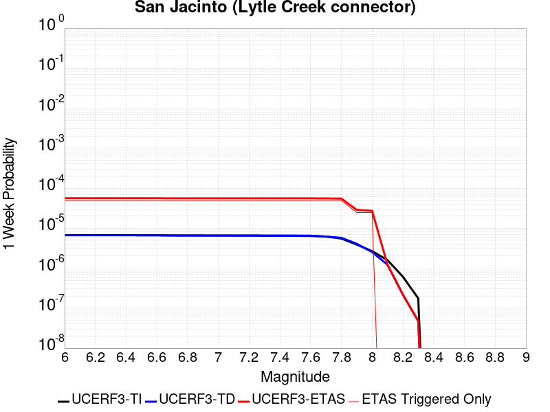 | 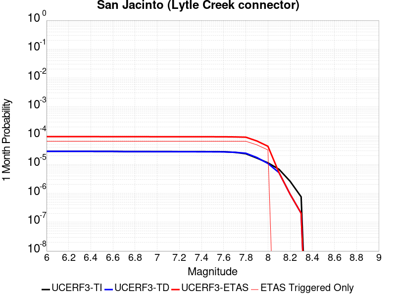 | 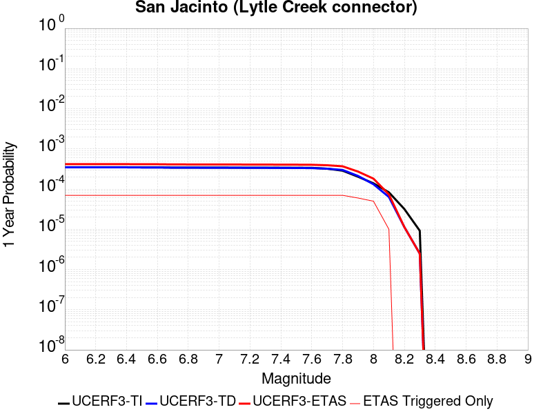 | 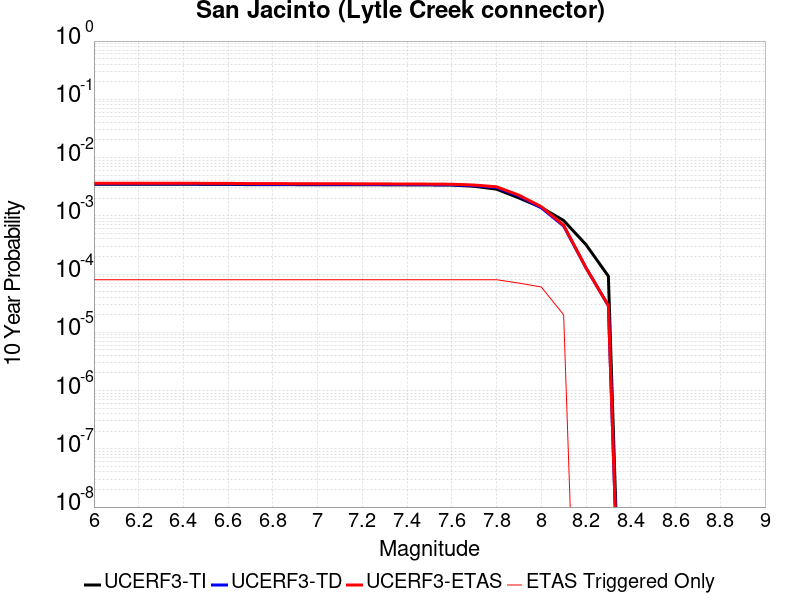 |

| Magnitude | 1 wk TI Prob | 1 wk TD Prob | 1 wk ETAS Prob | 1 wk ETAS/TD Gain | 1 wk ETAS Triggered Only | 1 mo TI Prob | 1 mo TD Prob | 1 mo ETAS Prob | 1 mo ETAS/TD Gain | 1 mo ETAS Triggered Only | 1 yr TI Prob | 1 yr TD Prob | 1 yr ETAS Prob | 1 yr ETAS/TD Gain | 1 yr ETAS Triggered Only | 10 yr TI Prob | 10 yr TD Prob | 10 yr ETAS Prob | 10 yr ETAS/TD Gain | 10 yr ETAS Triggered Only |
|-----|-----|-----|-----|-----|-----|-----|-----|-----|-----|-----|-----|-----|-----|-----|-----|-----|-----|-----|-----|-----|
| 6.0 | 6.693995E-6 | 6.660216E-6 | 5.589308E-5 | 8.392082 | 4.9233193E-5 | 2.8688235E-5 | 2.854347E-5 | 7.777526E-5 | 2.7248003 | 4.9233193E-5 | 3.492233E-4 | 3.4746144E-4 | 3.9667753E-4 | 1.1416447 | 4.9233193E-5 | 0.00348675 | 0.0035493854 | 0.0036229729 | 1.0207325 | 7.384979E-5 |
| 6.1 | 6.693995E-6 | 6.660216E-6 | 5.589308E-5 | 8.392082 | 4.9233193E-5 | 2.8688235E-5 | 2.854347E-5 | 7.777526E-5 | 2.7248003 | 4.9233193E-5 | 3.492233E-4 | 3.4746144E-4 | 3.9667753E-4 | 1.1416447 | 4.9233193E-5 | 0.00348675 | 0.0035493854 | 0.0036229729 | 1.0207325 | 7.384979E-5 |
| 6.2 | 6.693995E-6 | 6.660216E-6 | 5.589308E-5 | 8.392082 | 4.9233193E-5 | 2.8688235E-5 | 2.854347E-5 | 7.777526E-5 | 2.7248003 | 4.9233193E-5 | 3.492233E-4 | 3.4746144E-4 | 3.9667753E-4 | 1.1416447 | 4.9233193E-5 | 0.00348675 | 0.0035493854 | 0.0036229729 | 1.0207325 | 7.384979E-5 |
| 6.3 | 6.693995E-6 | 6.660216E-6 | 5.589308E-5 | 8.392082 | 4.9233193E-5 | 2.8688235E-5 | 2.854347E-5 | 7.777526E-5 | 2.7248003 | 4.9233193E-5 | 3.492233E-4 | 3.4746144E-4 | 3.9667753E-4 | 1.1416447 | 4.9233193E-5 | 0.00348675 | 0.0035493854 | 0.0036229729 | 1.0207325 | 7.384979E-5 |
| 6.4 | 6.693995E-6 | 6.660216E-6 | 5.589308E-5 | 8.392082 | 4.9233193E-5 | 2.8688235E-5 | 2.854347E-5 | 7.777526E-5 | 2.7248003 | 4.9233193E-5 | 3.492233E-4 | 3.4746144E-4 | 3.9667753E-4 | 1.1416447 | 4.9233193E-5 | 0.00348675 | 0.0035493854 | 0.0036229729 | 1.0207325 | 7.384979E-5 |
| 6.5 | 6.6561875E-6 | 6.6204343E-6 | 5.5853303E-5 | 8.4365015 | 4.9233193E-5 | 2.8526205E-5 | 2.837298E-5 | 7.7604775E-5 | 2.7351646 | 4.9233193E-5 | 3.472512E-4 | 3.4538636E-4 | 3.9460257E-4 | 1.142496 | 4.9233193E-5 | 0.0034670907 | 0.003528701 | 0.00360229 | 1.0208545 | 7.384979E-5 |
| 6.6 | 6.6561875E-6 | 6.6204343E-6 | 5.5853303E-5 | 8.4365015 | 4.9233193E-5 | 2.8526205E-5 | 2.837298E-5 | 7.7604775E-5 | 2.7351646 | 4.9233193E-5 | 3.472512E-4 | 3.4538636E-4 | 3.9460257E-4 | 1.142496 | 4.9233193E-5 | 0.0034670907 | 0.003528701 | 0.00360229 | 1.0208545 | 7.384979E-5 |
| 6.7 | 6.5802237E-6 | 6.539611E-6 | 5.577248E-5 | 8.52841 | 4.9233193E-5 | 2.8200653E-5 | 2.8026603E-5 | 7.725842E-5 | 2.75661 | 4.9233193E-5 | 3.4328885E-4 | 3.4117055E-4 | 3.9038694E-4 | 1.1442574 | 4.9233193E-5 | 0.0034275902 | 0.0034866752 | 0.0035602676 | 1.0211067 | 7.384979E-5 |
| 6.8 | 6.575632E-6 | 6.5341005E-6 | 5.5766974E-5 | 8.534759 | 4.9233193E-5 | 2.8180975E-5 | 2.8002989E-5 | 7.72348E-5 | 2.7580914 | 4.9233193E-5 | 3.4304935E-4 | 3.4088313E-4 | 3.9009954E-4 | 1.1443791 | 4.9233193E-5 | 0.0034252026 | 0.00348381 | 0.0035574026 | 1.0211241 | 7.384979E-5 |
| 6.9 | 6.570433E-6 | 6.525495E-6 | 5.5758366E-5 | 8.544696 | 4.9233193E-5 | 2.8158694E-5 | 2.7966107E-5 | 7.7197925E-5 | 2.76041 | 4.9233193E-5 | 3.4277816E-4 | 3.4043423E-4 | 3.8965067E-4 | 1.1445696 | 4.9233193E-5 | 0.0034224992 | 0.0034793352 | 0.003552928 | 1.0211514 | 7.384979E-5 |
| 7.0 | 6.5643826E-6 | 6.515616E-6 | 5.574849E-5 | 8.556135 | 4.9233193E-5 | 2.8132765E-5 | 2.792377E-5 | 7.7155586E-5 | 2.7630792 | 4.9233193E-5 | 3.424626E-4 | 3.3991894E-4 | 3.8913538E-4 | 1.1447889 | 4.9233193E-5 | 0.0034193532 | 0.0034741985 | 0.0035477916 | 1.0211828 | 7.384979E-5 |
| 7.1 | 6.557402E-6 | 6.5043278E-6 | 5.57372E-5 | 8.569248 | 4.9233193E-5 | 2.8102848E-5 | 2.7875392E-5 | 7.7107215E-5 | 2.766139 | 4.9233193E-5 | 3.4209844E-4 | 3.3933012E-4 | 3.885466E-4 | 1.1450402 | 4.9233193E-5 | 0.0034157229 | 0.0034683298 | 0.0035419234 | 1.0212188 | 7.384979E-5 |
| 7.2 | 6.546394E-6 | 6.4862943E-6 | 5.5719167E-5 | 8.590293 | 4.9233193E-5 | 2.8055672E-5 | 2.7798109E-5 | 7.702993E-5 | 2.7710495 | 4.9233193E-5 | 3.4152428E-4 | 3.3838948E-4 | 3.8760604E-4 | 1.1454434 | 4.9233193E-5 | 0.0034099987 | 0.0034589572 | 0.0035325515 | 1.0212765 | 7.384979E-5 |
| 7.3 | 6.5364216E-6 | 6.4670803E-6 | 5.5699955E-5 | 8.612844 | 4.9233193E-5 | 2.8012933E-5 | 2.7715765E-5 | 7.6947596E-5 | 2.7763114 | 4.9233193E-5 | 3.4100408E-4 | 3.3738726E-4 | 3.8660385E-4 | 1.1458757 | 4.9233193E-5 | 0.003404813 | 0.0034489788 | 0.0035225737 | 1.0213382 | 7.384979E-5 |
| 7.4 | 6.5269523E-6 | 6.4481674E-6 | 5.5681045E-5 | 8.635173 | 4.9233193E-5 | 2.7972354E-5 | 2.7634711E-5 | 7.686654E-5 | 2.7815216 | 4.9233193E-5 | 3.4051016E-4 | 3.3640073E-4 | 3.8561737E-4 | 1.1463035 | 4.9233193E-5 | 0.0033998888 | 0.003439161 | 0.0035127567 | 1.0213994 | 7.384979E-5 |
| 7.5 | 6.5111835E-6 | 6.424442E-6 | 5.5657318E-5 | 8.66337 | 4.9233193E-5 | 2.7904773E-5 | 2.7533031E-5 | 7.676487E-5 | 2.7881007 | 4.9233193E-5 | 3.3968766E-4 | 3.3516317E-4 | 3.8437988E-4 | 1.146844 | 4.9233193E-5 | 0.0033916887 | 0.003426834 | 0.0035004308 | 1.0214766 | 7.384979E-5 |
| 7.6 | 6.4768806E-6 | 6.383551E-6 | 5.561643E-5 | 8.71246 | 4.9233193E-5 | 2.7757764E-5 | 2.735779E-5 | 7.658963E-5 | 2.799555 | 4.9233193E-5 | 3.3789838E-4 | 3.3303024E-4 | 3.8224706E-4 | 1.1477847 | 4.9233193E-5 | 0.0033738504 | 0.0034055663 | 0.0034791646 | 1.0216112 | 7.384979E-5 |
| 7.7 | 6.1655364E-6 | 6.1760365E-6 | 5.5408924E-5 | 8.9716 | 4.9233193E-5 | 2.642346E-5 | 2.646846E-5 | 7.570035E-5 | 2.8600209 | 4.9233193E-5 | 3.2165812E-4 | 3.2220592E-4 | 3.7142323E-4 | 1.1527512 | 4.9233193E-5 | 0.0032119295 | 0.0032971818 | 0.003370788 | 1.022324 | 7.384979E-5 |
| 7.8 | 5.5043524E-6 | 5.737097E-6 | 5.497001E-5 | 9.581502 | 4.9233193E-5 | 2.3589868E-5 | 2.4587327E-5 | 7.381931E-5 | 3.0023317 | 4.9233193E-5 | 2.871688E-4 | 2.9930964E-4 | 3.485281E-4 | 1.1644399 | 4.9233193E-5 | 0.0028679797 | 0.0030672832 | 0.0031409066 | 1.0240028 | 7.384979E-5 |
| 7.9 | 3.889249E-6 | 4.076761E-6 | 2.8693257E-5 | 7.0382485 | 2.4616596E-5 | 1.6668104E-5 | 1.7471715E-5 | 4.2087882E-5 | 2.4089153 | 2.4616596E-5 | 2.0291525E-4 | 2.1269741E-4 | 2.3730878E-4 | 1.1157106 | 2.4616596E-5 | 0.0020273007 | 0.0021943315 | 0.0022434567 | 1.0223873 | 4.9233193E-5 |
| 8.0 | 2.668535E-6 | 2.5315155E-6 | 2.714805E-5 | 10.7240305 | 2.4616596E-5 | 1.1436528E-5 | 1.0849307E-5 | 3.5465637E-5 | 3.2689312 | 2.4616596E-5 | 1.3923083E-4 | 1.3208234E-4 | 1.5669568E-4 | 1.1863486 | 2.4616596E-5 | 0.0013914363 | 0.0013757964 | 0.0014249618 | 1.035736 | 4.9233193E-5 |
| 8.1 | 1.5911459E-6 | 1.218661E-6 | 1.218661E-6 | 1.0 | 0.0 | 6.8191785E-6 | 5.2228224E-6 | 5.2228224E-6 | 1.0 | 0.0 | 8.3020335E-5 | 6.3586034E-5 | 6.3586034E-5 | 1.0 | 0.0 | 8.298933E-4 | 6.6932244E-4 | 6.939226E-4 | 1.0367538 | 2.4616596E-5 |
| 8.2 | 6.1294963E-7 | 2.1812275E-7 | 2.1812275E-7 | 1.0 | 0.0 | 2.6269242E-6 | 9.3481145E-7 | 9.3481145E-7 | 1.0 | 0.0 | 3.1982334E-5 | 1.138127E-5 | 1.138127E-5 | 1.0 | 0.0 | 3.1977732E-4 | 1.2784546E-4 | 1.2784546E-4 | 1.0 | 0.0 |
| 8.3 | 1.762871E-7 | 4.7546838E-8 | 4.7546838E-8 | 1.0 | 0.0 | 7.5551594E-7 | 2.0377215E-7 | 2.0377215E-7 | 1.0 | 0.0 | 9.1983675E-6 | 2.480923E-6 | 2.480923E-6 | 1.0 | 0.0 | 9.197987E-5 | 2.868753E-5 | 2.868753E-5 | 1.0 | 0.0 |

## Great Valley 09 (Laguna Seca)
*[(top)](#table-of-contents)*

| 1 Week | 1 Month | 1 Year | 10 Year |
|-----|-----|-----|-----|
| 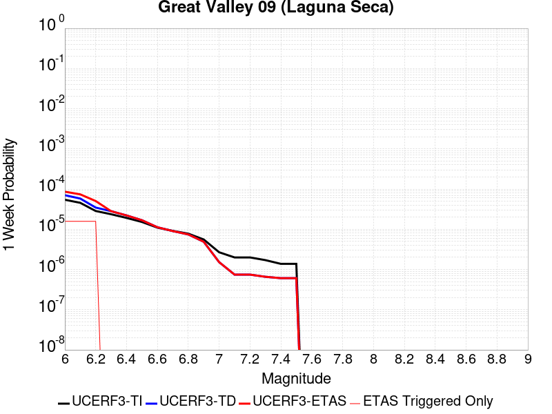 | 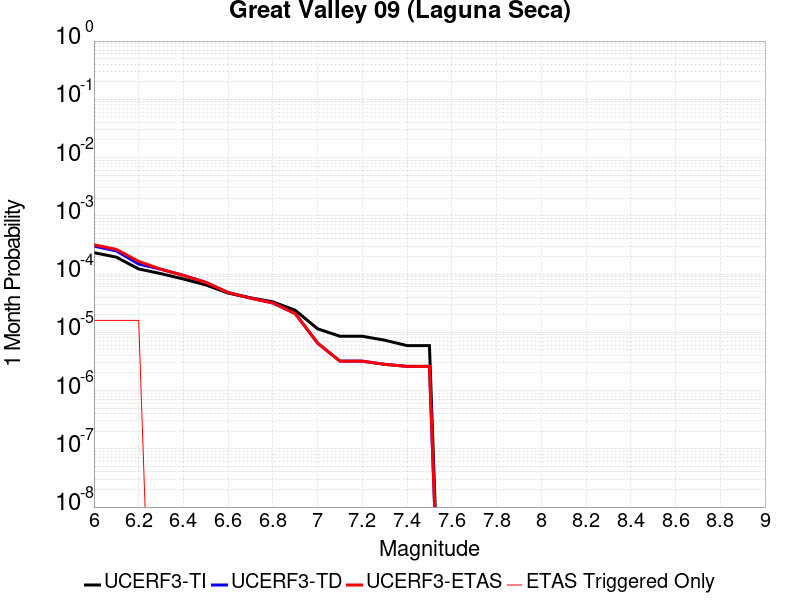 | 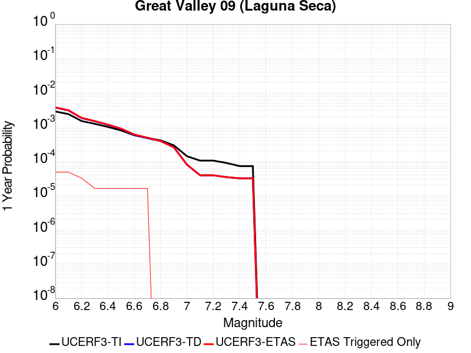 |  |

| Magnitude | 1 wk TI Prob | 1 wk TD Prob | 1 wk ETAS Prob | 1 wk ETAS/TD Gain | 1 wk ETAS Triggered Only | 1 mo TI Prob | 1 mo TD Prob | 1 mo ETAS Prob | 1 mo ETAS/TD Gain | 1 mo ETAS Triggered Only | 1 yr TI Prob | 1 yr TD Prob | 1 yr ETAS Prob | 1 yr ETAS/TD Gain | 1 yr ETAS Triggered Only | 10 yr TI Prob | 10 yr TD Prob | 10 yr ETAS Prob | 10 yr ETAS/TD Gain | 10 yr ETAS Triggered Only |
|-----|-----|-----|-----|-----|-----|-----|-----|-----|-----|-----|-----|-----|-----|-----|-----|-----|-----|-----|-----|-----|
| 6.0 | 5.4353277E-5 | 7.05022E-5 | 7.05022E-5 | 1.0 | 0.0 | 2.3292181E-4 | 3.0211566E-4 | 3.0211566E-4 | 1.0 | 0.0 | 0.0028321352 | 0.0036721937 | 0.00369672 | 1.0066789 | 2.4616596E-5 | 0.02796312 | 0.03611547 | 0.036186654 | 1.001971 | 7.384979E-5 |
| 6.1 | 4.5578287E-5 | 5.822118E-5 | 5.822118E-5 | 1.0 | 0.0 | 1.953209E-4 | 2.4949326E-4 | 2.4949326E-4 | 1.0 | 0.0 | 0.0023754383 | 0.003033432 | 0.003057974 | 1.0080905 | 2.4616596E-5 | 0.023502063 | 0.029919548 | 0.029967308 | 1.0015963 | 4.9233193E-5 |
| 6.2 | 2.8536782E-5 | 3.4737273E-5 | 3.4737273E-5 | 1.0 | 0.0 | 1.2229476E-4 | 1.4886224E-4 | 1.4886224E-4 | 1.0 | 0.0 | 0.0014879217 | 0.001810813 | 0.001835385 | 1.0135696 | 2.4616596E-5 | 0.014779986 | 0.017958116 | 0.018006466 | 1.0026923 | 4.9233193E-5 |
| 6.3 | 2.3698774E-5 | 2.8213295E-5 | 2.8213295E-5 | 1.0 | 0.0 | 1.01562226E-4 | 1.20905075E-4 | 1.20905075E-4 | 1.0 | 0.0 | 0.0012358186 | 0.0014710218 | 0.0014956022 | 1.0167097 | 2.4616596E-5 | 0.012289686 | 0.014611342 | 0.014635598 | 1.0016601 | 2.4616596E-5 |
| 6.4 | 1.9191197E-5 | 2.2123184E-5 | 2.2123184E-5 | 1.0 | 0.0 | 8.2245395E-5 | 9.4806666E-5 | 9.4806666E-5 | 1.0 | 0.0 | 0.0010008777 | 0.0011536429 | 0.0011782311 | 1.0213135 | 2.4616596E-5 | 0.009963818 | 0.011476948 | 0.0115012815 | 1.0021203 | 2.4616596E-5 |
| 6.5 | 1.5203241E-5 | 1.6802203E-5 | 1.6802203E-5 | 1.0 | 0.0 | 6.5155116E-5 | 7.200386E-5 | 7.200386E-5 | 1.0 | 0.0 | 7.9297484E-4 | 8.7626575E-4 | 9.008608E-4 | 1.028068 | 2.4616596E-5 | 0.007901512 | 0.0087295165 | 0.008753918 | 1.0027953 | 2.4616596E-5 |
| 6.6 | 1.0984925E-5 | 1.1242595E-5 | 1.1242595E-5 | 1.0 | 0.0 | 4.70774E-5 | 4.8181686E-5 | 4.8181686E-5 | 1.0 | 0.0 | 5.730166E-4 | 5.8645656E-4 | 6.1105867E-4 | 1.0419506 | 2.4616596E-5 | 0.005715413 | 0.0058494853 | 0.005873958 | 1.0041838 | 2.4616596E-5 |
| 6.7 | 9.134616E-6 | 9.019894E-6 | 9.019894E-6 | 1.0 | 0.0 | 3.9147766E-5 | 3.865613E-5 | 3.865613E-5 | 1.0 | 0.0 | 4.7651984E-4 | 4.7053912E-4 | 4.951441E-4 | 1.0522912 | 2.4616596E-5 | 0.004754993 | 0.0046956735 | 0.0047201742 | 1.0052178 | 2.4616596E-5 |
| 6.8 | 7.785589E-6 | 7.4519444E-6 | 7.4519444E-6 | 1.0 | 0.0 | 3.3366385E-5 | 3.1936524E-5 | 3.1936524E-5 | 1.0 | 0.0 | 4.0616E-4 | 3.8875983E-4 | 3.8875983E-4 | 1.0 | 0.0 | 0.0040541845 | 0.0038810016 | 0.0038810016 | 1.0 | 0.0 |
| 6.9 | 5.579095E-6 | 4.898492E-6 | 4.898492E-6 | 1.0 | 0.0 | 2.3910188E-5 | 2.0993377E-5 | 2.0993377E-5 | 1.0 | 0.0 | 2.9106764E-4 | 2.5556577E-4 | 2.5556577E-4 | 1.0 | 0.0 | 0.002906867 | 0.002552856 | 0.002552856 | 1.0 | 0.0 |
| 7.0 | 2.6816688E-6 | 1.5216126E-6 | 1.5216126E-6 | 1.0 | 0.0 | 1.1492816E-5 | 6.521181E-6 | 6.521181E-6 | 1.0 | 0.0 | 1.3991605E-4 | 7.939258E-5 | 7.939258E-5 | 1.0 | 0.0 | 0.0013982799 | 7.9365086E-4 | 7.9365086E-4 | 1.0 | 0.0 |
| 7.1 | 1.9951021E-6 | 7.453827E-7 | 7.453827E-7 | 1.0 | 0.0 | 8.55041E-6 | 3.1944935E-6 | 3.1944935E-6 | 1.0 | 0.0 | 1.0409627E-4 | 3.8892307E-5 | 3.8892307E-5 | 1.0 | 0.0 | 0.0010404752 | 3.8885913E-4 | 3.8885913E-4 | 1.0 | 0.0 |
| 7.2 | 1.9951021E-6 | 7.453827E-7 | 7.453827E-7 | 1.0 | 0.0 | 8.55041E-6 | 3.1944935E-6 | 3.1944935E-6 | 1.0 | 0.0 | 1.0409627E-4 | 3.8892307E-5 | 3.8892307E-5 | 1.0 | 0.0 | 0.0010404752 | 3.8885913E-4 | 3.8885913E-4 | 1.0 | 0.0 |
| 7.3 | 1.7087556E-6 | 6.578881E-7 | 6.578881E-7 | 1.0 | 0.0 | 7.3232177E-6 | 2.8195177E-6 | 2.8195177E-6 | 1.0 | 0.0 | 8.915652E-5 | 3.4327128E-5 | 3.4327128E-5 | 1.0 | 0.0 | 8.9120766E-4 | 3.432223E-4 | 3.432223E-4 | 1.0 | 0.0 |
| 7.4 | 1.3804846E-6 | 6.073852E-7 | 6.073852E-7 | 1.0 | 0.0 | 5.916349E-6 | 2.6030768E-6 | 2.6030768E-6 | 1.0 | 0.0 | 7.2029165E-5 | 3.169204E-5 | 3.169204E-5 | 1.0 | 0.0 | 7.200583E-4 | 3.1687922E-4 | 3.1687922E-4 | 1.0 | 0.0 |
| 7.5 | 1.3804846E-6 | 6.073852E-7 | 6.073852E-7 | 1.0 | 0.0 | 5.916349E-6 | 2.6030768E-6 | 2.6030768E-6 | 1.0 | 0.0 | 7.2029165E-5 | 3.169204E-5 | 3.169204E-5 | 1.0 | 0.0 | 7.200583E-4 | 3.1687922E-4 | 3.1687922E-4 | 1.0 | 0.0 |

## Ventura-Pitas Point
*[(top)](#table-of-contents)*

| 1 Week | 1 Month | 1 Year | 10 Year |
|-----|-----|-----|-----|
| 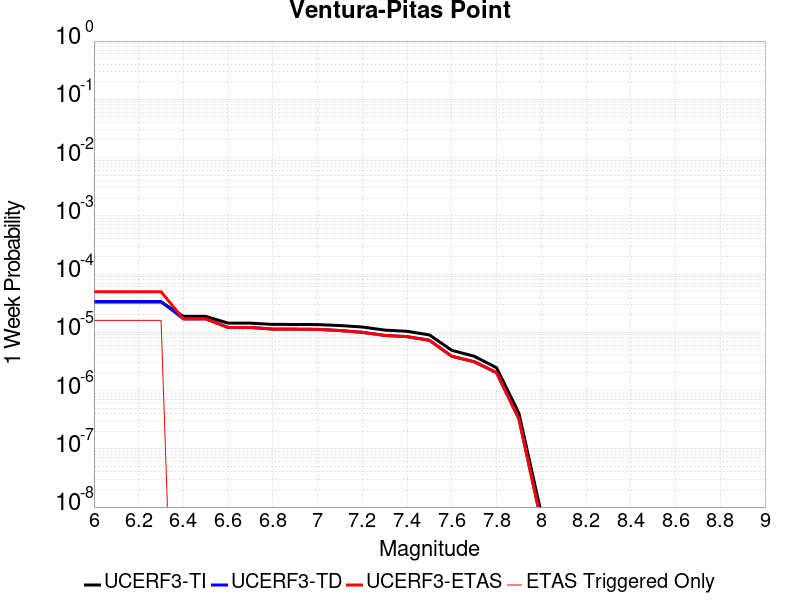 | 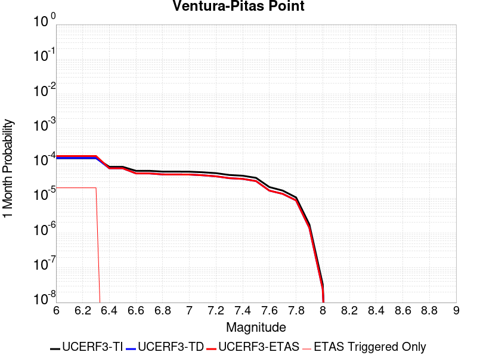 | 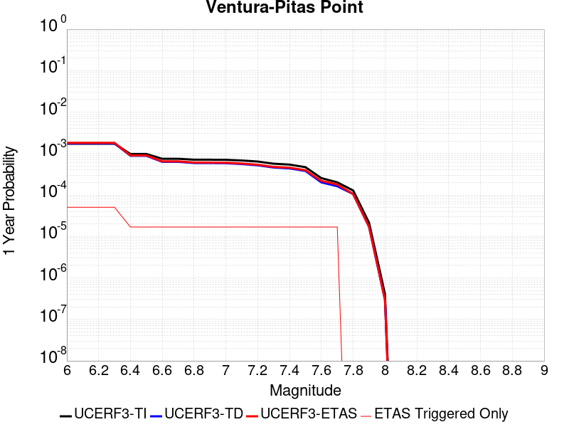 | 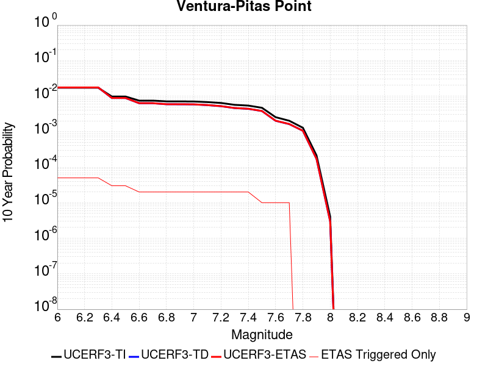 |

| Magnitude | 1 wk TI Prob | 1 wk TD Prob | 1 wk ETAS Prob | 1 wk ETAS/TD Gain | 1 wk ETAS Triggered Only | 1 mo TI Prob | 1 mo TD Prob | 1 mo ETAS Prob | 1 mo ETAS/TD Gain | 1 mo ETAS Triggered Only | 1 yr TI Prob | 1 yr TD Prob | 1 yr ETAS Prob | 1 yr ETAS/TD Gain | 1 yr ETAS Triggered Only | 10 yr TI Prob | 10 yr TD Prob | 10 yr ETAS Prob | 10 yr ETAS/TD Gain | 10 yr ETAS Triggered Only |
|-----|-----|-----|-----|-----|-----|-----|-----|-----|-----|-----|-----|-----|-----|-----|-----|-----|-----|-----|-----|-----|
| 6.0 | 3.3179622E-5 | 3.3735185E-5 | 5.835095E-5 | 1.7296764 | 2.4616596E-5 | 1.4219063E-4 | 1.445728E-4 | 1.9379887E-4 | 1.3404933 | 4.9233193E-5 | 0.0017297962 | 0.0017590096 | 0.0018327294 | 1.0419099 | 7.384979E-5 | 0.017163932 | 0.0174764 | 0.01754896 | 1.0041518 | 7.384979E-5 |
| 6.1 | 3.3179622E-5 | 3.3735185E-5 | 5.835095E-5 | 1.7296764 | 2.4616596E-5 | 1.4219063E-4 | 1.445728E-4 | 1.9379887E-4 | 1.3404933 | 4.9233193E-5 | 0.0017297962 | 0.0017590096 | 0.0018327294 | 1.0419099 | 7.384979E-5 | 0.017163932 | 0.0174764 | 0.01754896 | 1.0041518 | 7.384979E-5 |
| 6.2 | 3.3179622E-5 | 3.3735185E-5 | 5.835095E-5 | 1.7296764 | 2.4616596E-5 | 1.4219063E-4 | 1.445728E-4 | 1.9379887E-4 | 1.3404933 | 4.9233193E-5 | 0.0017297962 | 0.0017590096 | 0.0018327294 | 1.0419099 | 7.384979E-5 | 0.017163932 | 0.0174764 | 0.01754896 | 1.0041518 | 7.384979E-5 |
| 6.3 | 3.3179622E-5 | 3.3735185E-5 | 5.835095E-5 | 1.7296764 | 2.4616596E-5 | 1.4219063E-4 | 1.445728E-4 | 1.9379887E-4 | 1.3404933 | 4.9233193E-5 | 0.0017297962 | 0.0017590096 | 0.0018327294 | 1.0419099 | 7.384979E-5 | 0.017163932 | 0.0174764 | 0.01754896 | 1.0041518 | 7.384979E-5 |
| 6.4 | 1.8754668E-5 | 1.701961E-5 | 1.701961E-5 | 1.0 | 0.0 | 8.037467E-5 | 7.293928E-5 | 7.293928E-5 | 1.0 | 0.0 | 9.781223E-4 | 8.8769704E-4 | 9.1229175E-4 | 1.0277063 | 2.4616596E-5 | 0.009738282 | 0.008843848 | 0.008868246 | 1.0027589 | 2.4616596E-5 |
| 6.5 | 1.8754668E-5 | 1.701961E-5 | 1.701961E-5 | 1.0 | 0.0 | 8.037467E-5 | 7.293928E-5 | 7.293928E-5 | 1.0 | 0.0 | 9.781223E-4 | 8.8769704E-4 | 9.1229175E-4 | 1.0277063 | 2.4616596E-5 | 0.009738282 | 0.008843848 | 0.008868246 | 1.0027589 | 2.4616596E-5 |
| 6.6 | 1.4361558E-5 | 1.2122275E-5 | 1.2122275E-5 | 1.0 | 0.0 | 6.154808E-5 | 5.1951585E-5 | 5.1951585E-5 | 1.0 | 0.0 | 7.490902E-4 | 6.3232926E-4 | 6.569303E-4 | 1.0389054 | 2.4616596E-5 | 0.0074657016 | 0.0063055577 | 0.006330019 | 1.0038793 | 2.4616596E-5 |
| 6.7 | 1.4361558E-5 | 1.2122275E-5 | 1.2122275E-5 | 1.0 | 0.0 | 6.154808E-5 | 5.1951585E-5 | 5.1951585E-5 | 1.0 | 0.0 | 7.490902E-4 | 6.3232926E-4 | 6.569303E-4 | 1.0389054 | 2.4616596E-5 | 0.0074657016 | 0.0063055577 | 0.006330019 | 1.0038793 | 2.4616596E-5 |
| 6.8 | 1.3663846E-5 | 1.13444175E-5 | 1.13444175E-5 | 1.0 | 0.0 | 5.8558027E-5 | 4.861804E-5 | 4.861804E-5 | 1.0 | 0.0 | 7.127108E-4 | 5.917658E-4 | 6.1636785E-4 | 1.0415739 | 2.4616596E-5 | 0.007104293 | 0.005902116 | 0.0059265876 | 1.0041462 | 2.4616596E-5 |
| 6.9 | 1.3644157E-5 | 1.1322519E-5 | 1.1322519E-5 | 1.0 | 0.0 | 5.8473648E-5 | 4.8524187E-5 | 4.8524187E-5 | 1.0 | 0.0 | 7.116841E-4 | 5.9062376E-4 | 6.152258E-4 | 1.0416543 | 2.4616596E-5 | 0.007094092 | 0.0058907564 | 0.0059152283 | 1.0041542 | 2.4616596E-5 |
| 7.0 | 1.3568845E-5 | 1.1242086E-5 | 1.1242086E-5 | 1.0 | 0.0 | 5.8150898E-5 | 4.817949E-5 | 4.817949E-5 | 1.0 | 0.0 | 7.077572E-4 | 5.864293E-4 | 6.110315E-4 | 1.0419525 | 2.4616596E-5 | 0.007055073 | 0.0058490336 | 0.005873506 | 1.004184 | 2.4616596E-5 |
| 7.1 | 1.306572E-5 | 1.072054E-5 | 1.072054E-5 | 1.0 | 0.0 | 5.599474E-5 | 4.5944373E-5 | 4.5944373E-5 | 1.0 | 0.0 | 6.815227E-4 | 5.5923103E-4 | 5.8383384E-4 | 1.0439941 | 2.4616596E-5 | 0.0067943637 | 0.0055784425 | 0.0056029214 | 1.0043882 | 2.4616596E-5 |
| 7.2 | 1.232604E-5 | 9.995143E-6 | 9.995143E-6 | 1.0 | 0.0 | 5.2824813E-5 | 4.2835632E-5 | 4.2835632E-5 | 1.0 | 0.0 | 6.429523E-4 | 5.214008E-4 | 5.4600456E-4 | 1.0471878 | 2.4616596E-5 | 0.0064109527 | 0.005201967 | 0.0052264556 | 1.0047076 | 2.4616596E-5 |
| 7.3 | 1.0917261E-5 | 8.84384E-6 | 8.84384E-6 | 1.0 | 0.0 | 4.678742E-5 | 3.790163E-5 | 3.790163E-5 | 1.0 | 0.0 | 5.69488E-4 | 4.6135622E-4 | 4.8596144E-4 | 1.0533324 | 2.4616596E-5 | 0.0056803077 | 0.00460415 | 0.004628653 | 1.005322 | 2.4616596E-5 |
| 7.4 | 1.039959E-5 | 8.423562E-6 | 8.423562E-6 | 1.0 | 0.0 | 4.456891E-5 | 3.610049E-5 | 3.610049E-5 | 1.0 | 0.0 | 5.424914E-4 | 4.3943635E-4 | 4.6404212E-4 | 1.0559939 | 2.4616596E-5 | 0.0054116896 | 0.004385836 | 0.0044103446 | 1.0055882 | 2.4616596E-5 |
| 7.5 | 9.015877E-6 | 7.2975445E-6 | 7.2975445E-6 | 1.0 | 0.0 | 3.86389E-5 | 3.1274823E-5 | 3.1274823E-5 | 1.0 | 0.0 | 4.7032707E-4 | 3.8070587E-4 | 4.053131E-4 | 1.0646358 | 2.4616596E-5 | 0.004693329 | 0.0038006818 | 0.003825205 | 1.0064523 | 2.4616596E-5 |
| 7.6 | 4.900162E-6 | 3.8741155E-6 | 3.8741155E-6 | 1.0 | 0.0 | 2.1000526E-5 | 1.6603248E-5 | 1.6603248E-5 | 1.0 | 0.0 | 2.556514E-4 | 2.0212591E-4 | 2.2673754E-4 | 1.1217638 | 2.4616596E-5 | 0.0025535747 | 0.0020194345 | 0.0020440014 | 1.0121652 | 2.4616596E-5 |
| 7.7 | 3.8850626E-6 | 3.1267302E-6 | 3.1267302E-6 | 1.0 | 0.0 | 1.6650163E-5 | 1.3400205E-5 | 1.3400205E-5 | 1.0 | 0.0 | 2.0269687E-4 | 1.6313537E-4 | 1.8774794E-4 | 1.1508721 | 2.4616596E-5 | 0.002025121 | 0.0016301654 | 0.0016547418 | 1.015076 | 2.4616596E-5 |
| 7.8 | 2.4654719E-6 | 2.029875E-6 | 2.029875E-6 | 1.0 | 0.0 | 1.0566265E-5 | 8.699436E-6 | 8.699436E-6 | 1.0 | 0.0 | 1.2863669E-4 | 1.0591053E-4 | 1.0591053E-4 | 1.0 | 0.0 | 0.0012856225 | 0.0010586053 | 0.0010586053 | 1.0 | 0.0 |
| 7.9 | 4.095894E-7 | 3.2764765E-7 | 3.2764765E-7 | 1.0 | 0.0 | 1.7553821E-6 | 1.4042034E-6 | 1.4042034E-6 | 1.0 | 0.0 | 2.1371567E-5 | 1.7096047E-5 | 1.7096047E-5 | 1.0 | 0.0 | 2.1369511E-4 | 1.7094762E-4 | 1.7094762E-4 | 1.0 | 0.0 |
| 8.0 | 7.791402E-9 | 5.683497E-9 | 5.683497E-9 | 1.0 | 0.0 | 3.3391725E-8 | 2.4357844E-8 | 2.4357844E-8 | 1.0 | 0.0 | 4.0654416E-7 | 2.9655675E-7 | 2.9655675E-7 | 1.0 | 0.0 | 4.065434E-6 | 2.9655655E-6 | 2.9655655E-6 | 1.0 | 0.0 |

## Great Valley 07 (Orestimba)
*[(top)](#table-of-contents)*

| 1 Week | 1 Month | 1 Year | 10 Year |
|-----|-----|-----|-----|
|  |  | 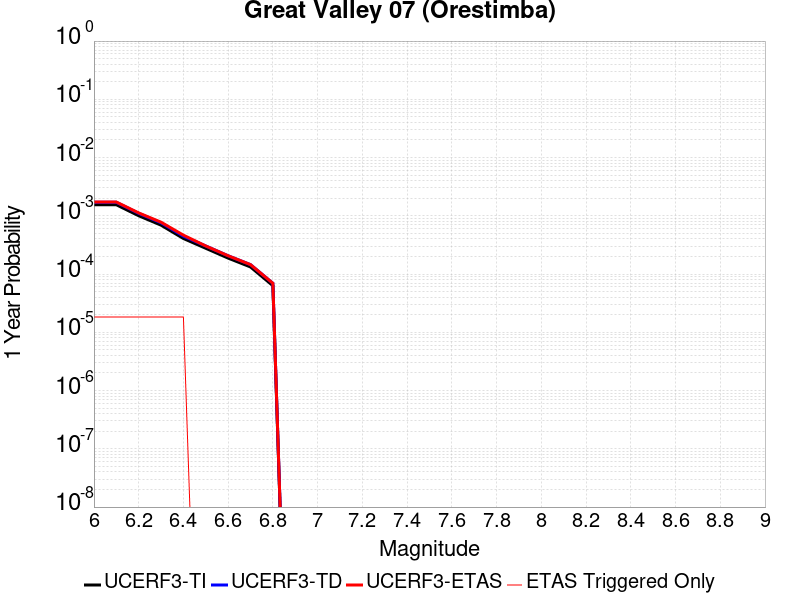 | 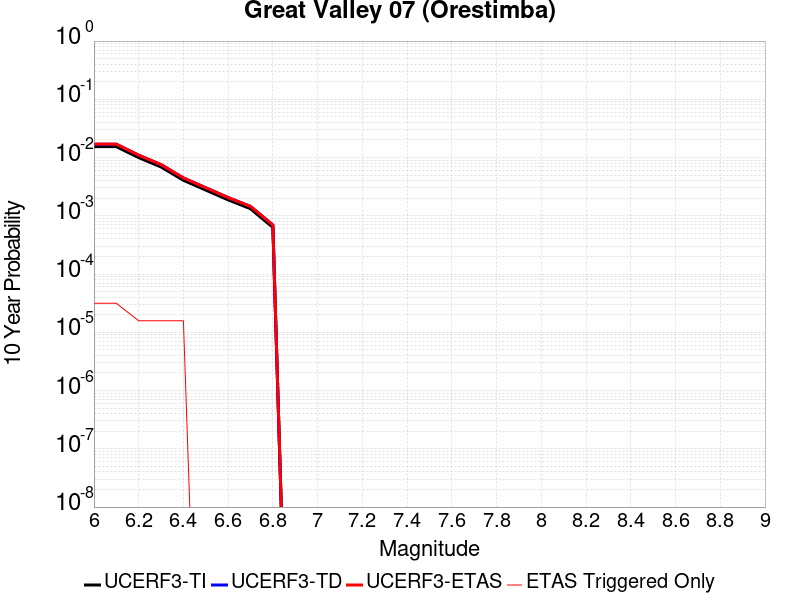 |

| Magnitude | 1 wk TI Prob | 1 wk TD Prob | 1 wk ETAS Prob | 1 wk ETAS/TD Gain | 1 wk ETAS Triggered Only | 1 mo TI Prob | 1 mo TD Prob | 1 mo ETAS Prob | 1 mo ETAS/TD Gain | 1 mo ETAS Triggered Only | 1 yr TI Prob | 1 yr TD Prob | 1 yr ETAS Prob | 1 yr ETAS/TD Gain | 1 yr ETAS Triggered Only | 10 yr TI Prob | 10 yr TD Prob | 10 yr ETAS Prob | 10 yr ETAS/TD Gain | 10 yr ETAS Triggered Only |
|-----|-----|-----|-----|-----|-----|-----|-----|-----|-----|-----|-----|-----|-----|-----|-----|-----|-----|-----|-----|-----|
| 6.0 | 2.9687902E-5 | 3.27575E-5 | 3.27575E-5 | 1.0 | 0.0 | 1.2722766E-4 | 1.4038214E-4 | 1.4038214E-4 | 1.0 | 0.0 | 0.0015478961 | 0.0017078844 | 0.001732459 | 1.0143889 | 2.4616596E-5 | 0.015371585 | 0.016955135 | 0.017003534 | 1.0028545 | 4.9233193E-5 |
| 6.1 | 2.9687902E-5 | 3.27575E-5 | 3.27575E-5 | 1.0 | 0.0 | 1.2722766E-4 | 1.4038214E-4 | 1.4038214E-4 | 1.0 | 0.0 | 0.0015478961 | 0.0017078844 | 0.001732459 | 1.0143889 | 2.4616596E-5 | 0.015371585 | 0.016955135 | 0.017003534 | 1.0028545 | 4.9233193E-5 |
| 6.2 | 1.9231524E-5 | 2.1159167E-5 | 2.1159167E-5 | 1.0 | 0.0 | 8.2418206E-5 | 9.067912E-5 | 9.067912E-5 | 1.0 | 0.0 | 0.0010029797 | 0.0011034822 | 0.0011280717 | 1.0222834 | 2.4616596E-5 | 0.00998465 | 0.01098244 | 0.0110067865 | 1.0022168 | 2.4616596E-5 |
| 6.3 | 1.324766E-5 | 1.4548534E-5 | 1.4548534E-5 | 1.0 | 0.0 | 5.6774446E-5 | 6.234942E-5 | 6.234942E-5 | 1.0 | 0.0 | 6.910097E-4 | 7.5884897E-4 | 7.834469E-4 | 1.0324148 | 2.4616596E-5 | 0.006888649 | 0.0075635235 | 0.007587954 | 1.00323 | 2.4616596E-5 |
| 6.4 | 7.818645E-6 | 8.57284E-6 | 8.57284E-6 | 1.0 | 0.0 | 3.3508048E-5 | 3.6740246E-5 | 3.6740246E-5 | 1.0 | 0.0 | 4.078841E-4 | 4.4722404E-4 | 4.718296E-4 | 1.0550184 | 2.4616596E-5 | 0.004071363 | 0.0044635804 | 0.0044880873 | 1.0054904 | 2.4616596E-5 |
| 6.5 | 5.3076565E-6 | 5.8178007E-6 | 5.8178007E-6 | 1.0 | 0.0 | 2.27469E-5 | 2.4933206E-5 | 2.4933206E-5 | 1.0 | 0.0 | 2.7690834E-4 | 3.035216E-4 | 3.035216E-4 | 1.0 | 0.0 | 0.0027656353 | 0.00303128 | 0.00303128 | 1.0 | 0.0 |
| 6.6 | 3.6003578E-6 | 3.9484953E-6 | 3.9484953E-6 | 1.0 | 0.0 | 1.5430012E-5 | 1.6922022E-5 | 1.6922022E-5 | 1.0 | 0.0 | 1.8784421E-4 | 2.0600771E-4 | 2.0600771E-4 | 1.0 | 0.0 | 0.0018768552 | 0.0020583214 | 0.0020583214 | 1.0 | 0.0 |
| 6.7 | 2.5361826E-6 | 2.7834678E-6 | 2.7834678E-6 | 1.0 | 0.0 | 1.0869308E-5 | 1.1929101E-5 | 1.1929101E-5 | 1.0 | 0.0 | 1.3232579E-4 | 1.4522845E-4 | 1.4522845E-4 | 1.0 | 0.0 | 0.0013224703 | 0.0014514653 | 0.0014514653 | 1.0 | 0.0 |
| 6.8 | 1.2115831E-6 | 1.3313797E-6 | 1.3313797E-6 | 1.0 | 0.0 | 5.1924885E-6 | 5.7059065E-6 | 5.7059065E-6 | 1.0 | 0.0 | 6.3216714E-5 | 6.9468166E-5 | 6.9468166E-5 | 1.0 | 0.0 | 6.3198735E-4 | 6.945596E-4 | 6.945596E-4 | 1.0 | 0.0 |

## San Gabriel
*[(top)](#table-of-contents)*

| 1 Week | 1 Month | 1 Year | 10 Year |
|-----|-----|-----|-----|
| 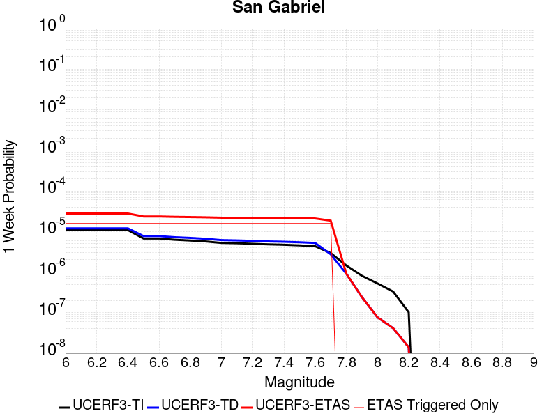 | 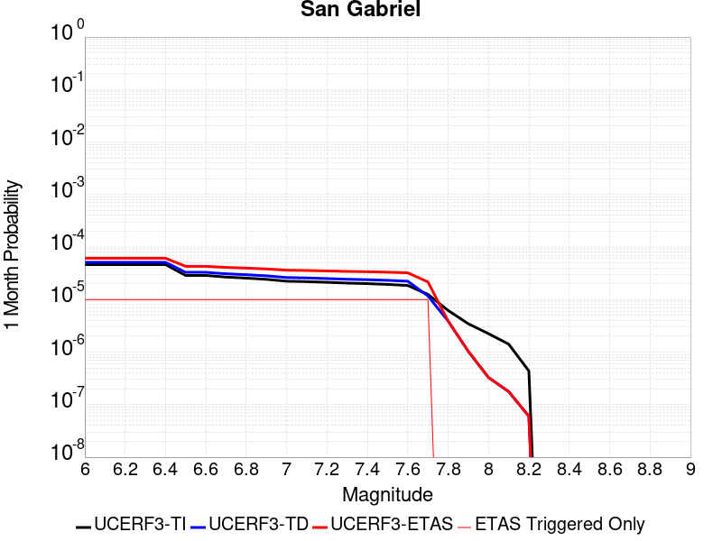 | 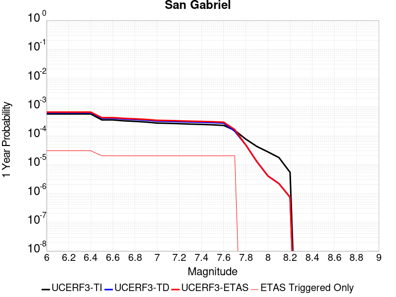 | 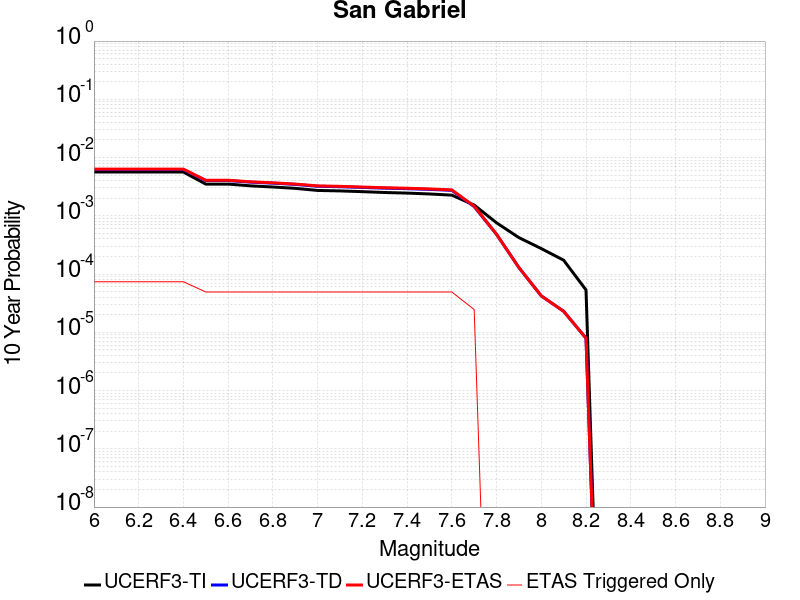 |

| Magnitude | 1 wk TI Prob | 1 wk TD Prob | 1 wk ETAS Prob | 1 wk ETAS/TD Gain | 1 wk ETAS Triggered Only | 1 mo TI Prob | 1 mo TD Prob | 1 mo ETAS Prob | 1 mo ETAS/TD Gain | 1 mo ETAS Triggered Only | 1 yr TI Prob | 1 yr TD Prob | 1 yr ETAS Prob | 1 yr ETAS/TD Gain | 1 yr ETAS Triggered Only | 10 yr TI Prob | 10 yr TD Prob | 10 yr ETAS Prob | 10 yr ETAS/TD Gain | 10 yr ETAS Triggered Only |
|-----|-----|-----|-----|-----|-----|-----|-----|-----|-----|-----|-----|-----|-----|-----|-----|-----|-----|-----|-----|-----|
| 6.0 | 1.083775E-5 | 1.19851875E-5 | 1.19851875E-5 | 1.0 | 0.0 | 4.6446676E-5 | 5.1364143E-5 | 5.1364143E-5 | 1.0 | 0.0 | 5.653415E-4 | 6.251903E-4 | 6.7439274E-4 | 1.0787 | 4.9233193E-5 | 0.0056390543 | 0.006246409 | 0.0063197976 | 1.0117489 | 7.384979E-5 |
| 6.1 | 1.083775E-5 | 1.19851875E-5 | 1.19851875E-5 | 1.0 | 0.0 | 4.6446676E-5 | 5.1364143E-5 | 5.1364143E-5 | 1.0 | 0.0 | 5.653415E-4 | 6.251903E-4 | 6.7439274E-4 | 1.0787 | 4.9233193E-5 | 0.0056390543 | 0.006246409 | 0.0063197976 | 1.0117489 | 7.384979E-5 |
| 6.2 | 1.083775E-5 | 1.19851875E-5 | 1.19851875E-5 | 1.0 | 0.0 | 4.6446676E-5 | 5.1364143E-5 | 5.1364143E-5 | 1.0 | 0.0 | 5.653415E-4 | 6.251903E-4 | 6.7439274E-4 | 1.0787 | 4.9233193E-5 | 0.0056390543 | 0.006246409 | 0.0063197976 | 1.0117489 | 7.384979E-5 |
| 6.3 | 1.083775E-5 | 1.19851875E-5 | 1.19851875E-5 | 1.0 | 0.0 | 4.6446676E-5 | 5.1364143E-5 | 5.1364143E-5 | 1.0 | 0.0 | 5.653415E-4 | 6.251903E-4 | 6.7439274E-4 | 1.0787 | 4.9233193E-5 | 0.0056390543 | 0.006246409 | 0.0063197976 | 1.0117489 | 7.384979E-5 |
| 6.4 | 1.083775E-5 | 1.19851875E-5 | 1.19851875E-5 | 1.0 | 0.0 | 4.6446676E-5 | 5.1364143E-5 | 5.1364143E-5 | 1.0 | 0.0 | 5.653415E-4 | 6.251903E-4 | 6.7439274E-4 | 1.0787 | 4.9233193E-5 | 0.0056390543 | 0.006246409 | 0.0063197976 | 1.0117489 | 7.384979E-5 |
| 6.5 | 6.7317824E-6 | 7.716944E-6 | 7.716944E-6 | 1.0 | 0.0 | 2.8850178E-5 | 3.3072207E-5 | 3.3072207E-5 | 1.0 | 0.0 | 3.511943E-4 | 4.0258077E-4 | 4.2718745E-4 | 1.0611224 | 2.4616596E-5 | 0.003506398 | 0.0040296097 | 0.0040786443 | 1.0121686 | 4.9233193E-5 |
| 6.6 | 6.7317824E-6 | 7.716944E-6 | 7.716944E-6 | 1.0 | 0.0 | 2.8850178E-5 | 3.3072207E-5 | 3.3072207E-5 | 1.0 | 0.0 | 3.511943E-4 | 4.0258077E-4 | 4.2718745E-4 | 1.0611224 | 2.4616596E-5 | 0.003506398 | 0.0040296097 | 0.0040786443 | 1.0121686 | 4.9233193E-5 |
| 6.7 | 6.274881E-6 | 7.2458647E-6 | 7.2458647E-6 | 1.0 | 0.0 | 2.6892068E-5 | 3.1053343E-5 | 3.1053343E-5 | 1.0 | 0.0 | 3.2736175E-4 | 3.780098E-4 | 4.0261712E-4 | 1.065097 | 2.4616596E-5 | 0.0032687993 | 0.0037847564 | 0.0038338033 | 1.012959 | 4.9233193E-5 |
| 6.8 | 5.996209E-6 | 6.958585E-6 | 6.958585E-6 | 1.0 | 0.0 | 2.5697784E-5 | 2.9822171E-5 | 2.9822171E-5 | 1.0 | 0.0 | 3.128256E-4 | 3.6302538E-4 | 3.8763304E-4 | 1.0677849 | 2.4616596E-5 | 0.003123856 | 0.0036354093 | 0.0036844634 | 1.0134934 | 4.9233193E-5 |
| 6.9 | 5.686331E-6 | 6.6236316E-6 | 6.6236316E-6 | 1.0 | 0.0 | 2.4369761E-5 | 2.8386688E-5 | 2.8386688E-5 | 1.0 | 0.0 | 2.9666146E-4 | 3.4555403E-4 | 3.7016213E-4 | 1.0712135 | 2.4616596E-5 | 0.0029626573 | 0.0034612515 | 0.0035103143 | 1.0141748 | 4.9233193E-5 |
| 7.0 | 5.2329838E-6 | 6.147514E-6 | 6.147514E-6 | 1.0 | 0.0 | 2.242688E-5 | 2.6346226E-5 | 2.6346226E-5 | 1.0 | 0.0 | 2.7301308E-4 | 3.2071886E-4 | 3.4532757E-4 | 1.0767298 | 2.4616596E-5 | 0.002726779 | 0.0032136322 | 0.003262707 | 1.0152708 | 4.9233193E-5 |
| 7.1 | 5.135671E-6 | 6.03764E-6 | 6.03764E-6 | 1.0 | 0.0 | 2.2009834E-5 | 2.5875348E-5 | 2.5875348E-5 | 1.0 | 0.0 | 2.6793676E-4 | 3.1498758E-4 | 3.3959642E-4 | 1.0781264 | 2.4616596E-5 | 0.0026761394 | 0.0031564834 | 0.003205561 | 1.0155482 | 4.9233193E-5 |
| 7.2 | 4.989062E-6 | 5.87102E-6 | 5.87102E-6 | 1.0 | 0.0 | 2.1381518E-5 | 2.5161276E-5 | 2.5161276E-5 | 1.0 | 0.0 | 2.6028889E-4 | 3.0629625E-4 | 3.3090528E-4 | 1.080344 | 2.4616596E-5 | 0.0025998424 | 0.003069813 | 0.003118895 | 1.0159886 | 4.9233193E-5 |
| 7.3 | 4.8219395E-6 | 5.702574E-6 | 5.702574E-6 | 1.0 | 0.0 | 2.0665291E-5 | 2.443938E-5 | 2.443938E-5 | 1.0 | 0.0 | 2.5157086E-4 | 2.9750957E-4 | 3.2211884E-4 | 1.0827175 | 2.4616596E-5 | 0.0025128627 | 0.0029821852 | 0.0030312715 | 1.0164598 | 4.9233193E-5 |
| 7.4 | 4.7118383E-6 | 5.5911332E-6 | 5.5911332E-6 | 1.0 | 0.0 | 2.0193436E-5 | 2.3961782E-5 | 2.3961782E-5 | 1.0 | 0.0 | 2.4582737E-4 | 2.916964E-4 | 3.163058E-4 | 1.0843666 | 2.4616596E-5 | 0.002455556 | 0.0029242067 | 0.002973296 | 1.0167872 | 4.9233193E-5 |
| 7.5 | 4.5506545E-6 | 5.4365014E-6 | 5.4365014E-6 | 1.0 | 0.0 | 1.9502659E-5 | 2.3299088E-5 | 2.3299088E-5 | 1.0 | 0.0 | 2.37419E-4 | 2.8363022E-4 | 3.0823983E-4 | 1.0867666 | 2.4616596E-5 | 0.002371655 | 0.002843753 | 0.0028928462 | 1.0172635 | 4.9233193E-5 |
| 7.6 | 4.343636E-6 | 5.2293817E-6 | 5.2293817E-6 | 1.0 | 0.0 | 1.861545E-5 | 2.2411448E-5 | 2.2411448E-5 | 1.0 | 0.0 | 2.2661954E-4 | 2.7282597E-4 | 2.9743585E-4 | 1.0902036 | 2.4616596E-5 | 0.0022638857 | 0.0027359722 | 0.0027850708 | 1.0179455 | 4.9233193E-5 |
| 7.7 | 2.936235E-6 | 2.7440458E-6 | 2.7440458E-6 | 1.0 | 0.0 | 1.2583803E-5 | 1.1760143E-5 | 1.1760143E-5 | 1.0 | 0.0 | 1.5319703E-4 | 1.4317037E-4 | 1.6778345E-4 | 1.1719146 | 2.4616596E-5 | 0.0015309147 | 0.0014380751 | 0.0014626562 | 1.0170932 | 2.4616596E-5 |
| 7.8 | 1.4541639E-6 | 9.1237047E-7 | 9.1237047E-7 | 1.0 | 0.0 | 6.232116E-6 | 3.9101533E-6 | 3.9101533E-6 | 1.0 | 0.0 | 7.587337E-5 | 4.7605077E-5 | 4.7605077E-5 | 1.0 | 0.0 | 7.584747E-4 | 4.8085177E-4 | 4.8085177E-4 | 1.0 | 0.0 |
| 7.9 | 8.098958E-7 | 2.41753E-7 | 2.41753E-7 | 1.0 | 0.0 | 3.4709774E-6 | 1.0360839E-6 | 1.0360839E-6 | 1.0 | 0.0 | 4.225833E-5 | 1.2614248E-5 | 1.2614248E-5 | 1.0 | 0.0 | 4.2250296E-4 | 1.2921814E-4 | 1.2921814E-4 | 1.0 | 0.0 |
| 8.0 | 5.2473234E-7 | 7.6792055E-8 | 7.6792055E-8 | 1.0 | 0.0 | 2.248851E-6 | 3.2910876E-7 | 3.2910876E-7 | 1.0 | 0.0 | 2.7379416E-5 | 4.0068917E-6 | 4.0068917E-6 | 1.0 | 0.0 | 2.7376044E-4 | 4.21918E-5 | 4.21918E-5 | 1.0 | 0.0 |
| 8.1 | 3.3162388E-7 | 4.1496126E-8 | 4.1496126E-8 | 1.0 | 0.0 | 1.4212444E-6 | 1.7784053E-7 | 1.7784053E-7 | 1.0 | 0.0 | 1.7303513E-5 | 2.1652063E-6 | 2.1652063E-6 | 1.0 | 0.0 | 1.7302166E-4 | 2.2965523E-5 | 2.2965523E-5 | 1.0 | 0.0 |
| 8.2 | 1.0235345E-7 | 1.4043474E-8 | 1.4043474E-8 | 1.0 | 0.0 | 4.3865757E-7 | 6.0186316E-8 | 6.0186316E-8 | 1.0 | 0.0 | 5.340643E-6 | 7.327681E-7 | 7.327681E-7 | 1.0 | 0.0 | 5.3405143E-5 | 7.9273705E-6 | 7.9273705E-6 | 1.0 | 0.0 |

## Hunting Creek - Berryessa 2011 CFM
*[(top)](#table-of-contents)*

| 1 Week | 1 Month | 1 Year | 10 Year |
|-----|-----|-----|-----|
| 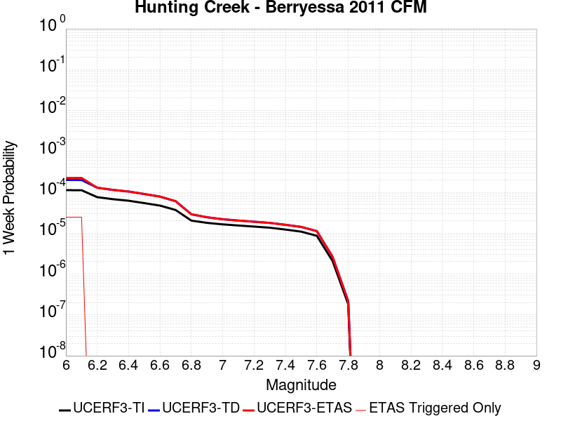 | 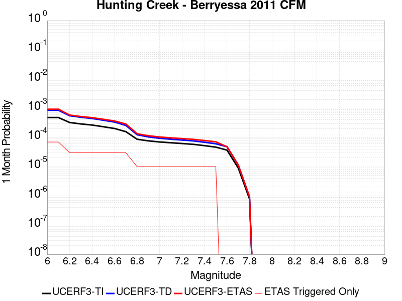 | 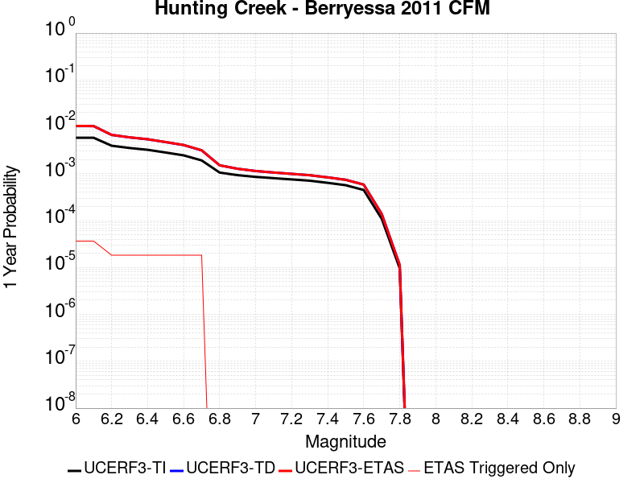 | 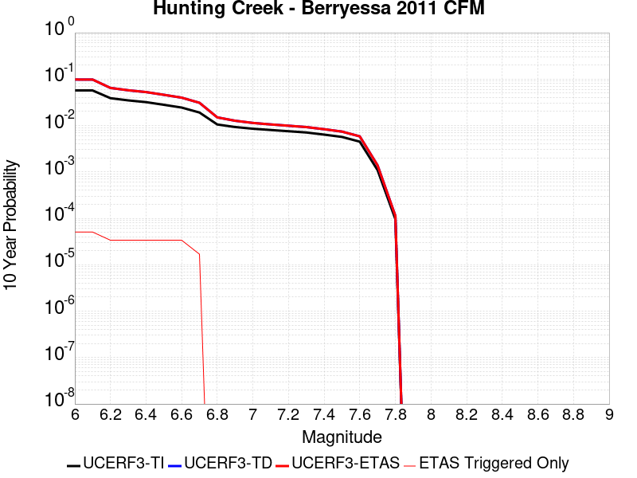 |

| Magnitude | 1 wk TI Prob | 1 wk TD Prob | 1 wk ETAS Prob | 1 wk ETAS/TD Gain | 1 wk ETAS Triggered Only | 1 mo TI Prob | 1 mo TD Prob | 1 mo ETAS Prob | 1 mo ETAS/TD Gain | 1 mo ETAS Triggered Only | 1 yr TI Prob | 1 yr TD Prob | 1 yr ETAS Prob | 1 yr ETAS/TD Gain | 1 yr ETAS Triggered Only | 10 yr TI Prob | 10 yr TD Prob | 10 yr ETAS Prob | 10 yr ETAS/TD Gain | 10 yr ETAS Triggered Only |
|-----|-----|-----|-----|-----|-----|-----|-----|-----|-----|-----|-----|-----|-----|-----|-----|-----|-----|-----|-----|-----|
| 6.0 | 1.1270982E-4 | 2.0012174E-4 | 2.247334E-4 | 1.1229835 | 2.4616596E-5 | 4.8295266E-4 | 8.5739547E-4 | 8.81991E-4 | 1.0286863 | 2.4616596E-5 | 0.0058641075 | 0.010386313 | 0.010410674 | 1.0023454 | 2.4616596E-5 | 0.057117578 | 0.09803703 | 0.09808143 | 1.000453 | 4.9233193E-5 |
| 6.1 | 1.1239393E-4 | 1.9960315E-4 | 2.2421483E-4 | 1.123303 | 2.4616596E-5 | 4.8159933E-4 | 8.551744E-4 | 8.797699E-4 | 1.0287609 | 2.4616596E-5 | 0.0058477195 | 0.010359551 | 0.010383912 | 1.0023516 | 2.4616596E-5 | 0.056962132 | 0.09779551 | 0.09783992 | 1.0004542 | 4.9233193E-5 |
| 6.2 | 7.596265E-5 | 1.2940196E-4 | 1.2940196E-4 | 1.0 | 0.0 | 3.2551357E-4 | 5.5444165E-4 | 5.5444165E-4 | 1.0 | 0.0 | 0.0039559277 | 0.0067210156 | 0.0067210156 | 1.0 | 0.0 | 0.038862433 | 0.0645915 | 0.06461453 | 1.0003566 | 2.4616596E-5 |
| 6.3 | 6.78794E-5 | 1.145119E-4 | 1.145119E-4 | 1.0 | 0.0 | 2.9087928E-4 | 4.906513E-4 | 4.906513E-4 | 1.0 | 0.0 | 0.003535705 | 0.005952679 | 0.005952679 | 1.0 | 0.0 | 0.034799766 | 0.057465393 | 0.057488594 | 1.0004038 | 2.4616596E-5 |
| 6.4 | 6.2165134E-5 | 1.0436625E-4 | 1.0436625E-4 | 1.0 | 0.0 | 2.6639478E-4 | 4.4721062E-4 | 4.4721062E-4 | 1.0 | 0.0 | 0.0032385332 | 0.005427573 | 0.005427573 | 1.0 | 0.0 | 0.03191742 | 0.052550517 | 0.05257384 | 1.0004438 | 2.4616596E-5 |
| 6.5 | 5.4368087E-5 | 9.071415E-5 | 9.071415E-5 | 1.0 | 0.0 | 2.3298527E-4 | 3.8872007E-4 | 3.8872007E-4 | 1.0 | 0.0 | 0.0028329059 | 0.0047198683 | 0.0047198683 | 1.0 | 0.0 | 0.027970633 | 0.045880128 | 0.045903616 | 1.0005119 | 2.4616596E-5 |
| 6.6 | 4.729947E-5 | 7.847572E-5 | 7.847572E-5 | 1.0 | 0.0 | 2.0269625E-4 | 3.362842E-4 | 3.362842E-4 | 1.0 | 0.0 | 0.002465034 | 0.0040849647 | 0.0040849647 | 1.0 | 0.0 | 0.02437869 | 0.03985155 | 0.039875183 | 1.0005931 | 2.4616596E-5 |
| 6.7 | 3.6875328E-5 | 6.0451803E-5 | 6.0451803E-5 | 1.0 | 0.0 | 1.5802756E-4 | 2.59056E-4 | 2.59056E-4 | 1.0 | 0.0 | 0.0019222875 | 0.0031482063 | 0.0031482063 | 1.0 | 0.0 | 0.019057442 | 0.03089237 | 0.03089237 | 1.0 | 0.0 |
| 6.8 | 2.0292036E-5 | 2.8976308E-5 | 2.8976308E-5 | 1.0 | 0.0 | 8.6962966E-5 | 1.2417832E-4 | 1.2417832E-4 | 1.0 | 0.0 | 0.0010582599 | 0.0015108072 | 0.0015108072 | 1.0 | 0.0 | 0.010532344 | 0.014978523 | 0.014978523 | 1.0 | 0.0 |
| 6.9 | 1.7871042E-5 | 2.4472254E-5 | 2.4472254E-5 | 1.0 | 0.0 | 7.658793E-5 | 1.048769E-4 | 1.048769E-4 | 1.0 | 0.0 | 9.320591E-4 | 0.0012761299 | 0.0012761299 | 1.0 | 0.0 | 0.009281595 | 0.012679775 | 0.012679775 | 1.0 | 0.0 |
| 7.0 | 1.6415532E-5 | 2.1906277E-5 | 2.1906277E-5 | 1.0 | 0.0 | 7.035038E-5 | 9.3880684E-5 | 9.3880684E-5 | 1.0 | 0.0 | 8.561793E-4 | 0.0011424015 | 0.0011424015 | 1.0 | 0.0 | 0.008528882 | 0.01136452 | 0.01136452 | 1.0 | 0.0 |
| 7.1 | 1.5409885E-5 | 2.0346342E-5 | 2.0346342E-5 | 1.0 | 0.0 | 6.6040695E-5 | 8.7195716E-5 | 8.7195716E-5 | 1.0 | 0.0 | 8.0374884E-4 | 0.0010610938 | 0.0010610938 | 1.0 | 0.0 | 0.00800848 | 0.010560595 | 0.010560595 | 1.0 | 0.0 |
| 7.2 | 1.4497423E-5 | 1.9054964E-5 | 1.9054964E-5 | 1.0 | 0.0 | 6.213033E-5 | 8.166159E-5 | 8.166159E-5 | 1.0 | 0.0 | 7.5617427E-4 | 9.937795E-4 | 9.937795E-4 | 1.0 | 0.0 | 0.0075360634 | 0.009893929 | 0.009893929 | 1.0 | 0.0 |
| 7.3 | 1.3615175E-5 | 1.7826127E-5 | 1.7826127E-5 | 1.0 | 0.0 | 5.8349444E-5 | 7.639547E-5 | 7.639547E-5 | 1.0 | 0.0 | 7.101729E-4 | 9.297209E-4 | 9.297209E-4 | 1.0 | 0.0 | 0.0070790765 | 0.009258823 | 0.009258823 | 1.0 | 0.0 |
| 7.4 | 1.2252825E-5 | 1.602625E-5 | 1.602625E-5 | 1.0 | 0.0 | 5.251105E-5 | 6.868213E-5 | 6.868213E-5 | 1.0 | 0.0 | 6.391345E-4 | 8.35887E-4 | 8.35887E-4 | 1.0 | 0.0 | 0.0063729943 | 0.008327872 | 0.008327872 | 1.0 | 0.0 |
| 7.5 | 1.0913301E-5 | 1.4241117E-5 | 1.4241117E-5 | 1.0 | 0.0 | 4.6770452E-5 | 6.1031948E-5 | 6.1031948E-5 | 1.0 | 0.0 | 5.6928146E-4 | 7.4281334E-4 | 7.4281334E-4 | 1.0 | 0.0 | 0.0056782532 | 0.0074036797 | 0.0074036797 | 1.0 | 0.0 |
| 7.6 | 8.623192E-6 | 1.12346415E-5 | 1.12346415E-5 | 1.0 | 0.0 | 3.6956015E-5 | 4.814759E-5 | 4.814759E-5 | 1.0 | 0.0 | 4.4984656E-4 | 5.8604183E-4 | 5.8604183E-4 | 1.0 | 0.0 | 0.00448937 | 0.0058452785 | 0.0058452785 | 1.0 | 0.0 |
| 7.7 | 2.0993634E-6 | 2.662584E-6 | 2.662584E-6 | 1.0 | 0.0 | 8.997241E-6 | 1.1411025E-5 | 1.1411025E-5 | 1.0 | 0.0 | 1.09535904E-4 | 1.3892044E-4 | 1.3892044E-4 | 1.0 | 0.0 | 0.0010948193 | 0.0013883426 | 0.0013883426 | 1.0 | 0.0 |
| 7.8 | 1.8428308E-7 | 2.167437E-7 | 2.167437E-7 | 1.0 | 0.0 | 7.897844E-7 | 9.289013E-7 | 9.289013E-7 | 1.0 | 0.0 | 9.615583E-6 | 1.1309318E-5 | 1.1309318E-5 | 1.0 | 0.0 | 9.615166E-5 | 1.13086026E-4 | 1.13086026E-4 | 1.0 | 0.0 |

## Oceanic - West Huasna
*[(top)](#table-of-contents)*

| 1 Week | 1 Month | 1 Year | 10 Year |
|-----|-----|-----|-----|
| 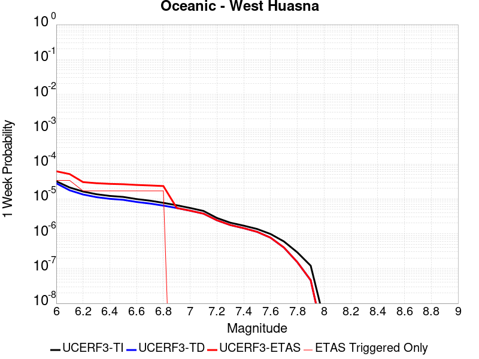 | 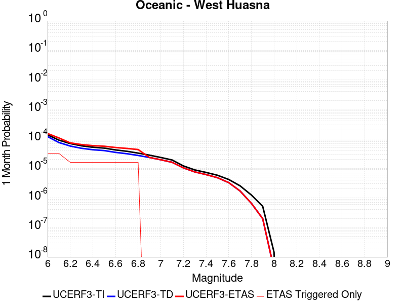 | 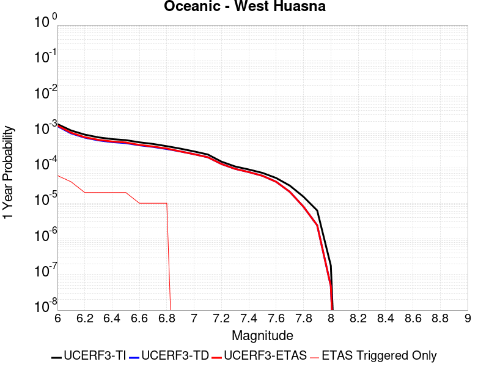 | 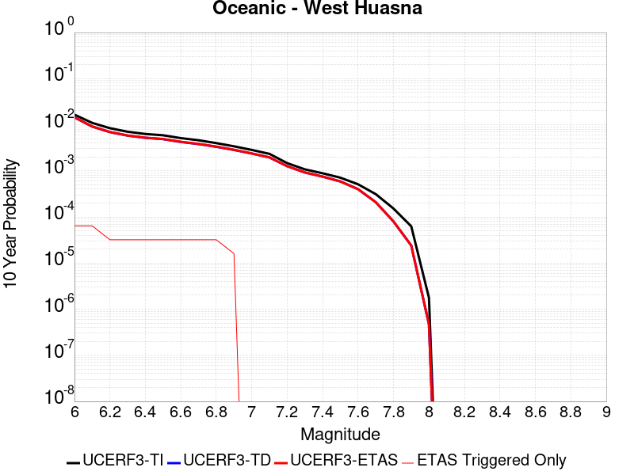 |

| Magnitude | 1 wk TI Prob | 1 wk TD Prob | 1 wk ETAS Prob | 1 wk ETAS/TD Gain | 1 wk ETAS Triggered Only | 1 mo TI Prob | 1 mo TD Prob | 1 mo ETAS Prob | 1 mo ETAS/TD Gain | 1 mo ETAS Triggered Only | 1 yr TI Prob | 1 yr TD Prob | 1 yr ETAS Prob | 1 yr ETAS/TD Gain | 1 yr ETAS Triggered Only | 10 yr TI Prob | 10 yr TD Prob | 10 yr ETAS Prob | 10 yr ETAS/TD Gain | 10 yr ETAS Triggered Only |
|-----|-----|-----|-----|-----|-----|-----|-----|-----|-----|-----|-----|-----|-----|-----|-----|-----|-----|-----|-----|-----|
| 6.0 | 3.195567E-5 | 2.7926868E-5 | 5.254278E-5 | 1.8814418 | 2.4616596E-5 | 1.3694567E-4 | 1.1968133E-4 | 1.4429499E-4 | 1.2056599 | 2.4616596E-5 | 0.0016660384 | 0.0014561893 | 0.0015053509 | 1.0337604 | 4.9233193E-5 | 0.016536033 | 0.014471028 | 0.014519548 | 1.003353 | 4.9233193E-5 |
| 6.1 | 2.1156782E-5 | 1.7573486E-5 | 4.218965E-5 | 2.400756 | 2.4616596E-5 | 9.066878E-5 | 7.531282E-5 | 9.992756E-5 | 1.3268334 | 2.4616596E-5 | 0.0011033333 | 9.165572E-4 | 9.657453E-4 | 1.0536661 | 4.9233193E-5 | 0.010978713 | 0.009128777 | 0.009177562 | 1.0053439 | 4.9233193E-5 |
| 6.2 | 1.6195117E-5 | 1.3327152E-5 | 3.794342E-5 | 2.8470764 | 2.4616596E-5 | 6.9405796E-5 | 5.7115132E-5 | 8.173032E-5 | 1.430975 | 2.4616596E-5 | 8.44688E-4 | 6.9515745E-4 | 7.1975694E-4 | 1.0353869 | 2.4616596E-5 | 0.008414844 | 0.006930123 | 0.0069545694 | 1.0035275 | 2.4616596E-5 |
| 6.3 | 1.3559345E-5 | 1.1179142E-5 | 3.5795463E-5 | 3.2019866 | 2.4616596E-5 | 5.811018E-5 | 4.7909736E-5 | 7.252515E-5 | 1.5137874 | 2.4616596E-5 | 7.072618E-4 | 5.831459E-4 | 6.077481E-4 | 1.0421889 | 2.4616596E-5 | 0.0070501505 | 0.0058162753 | 0.0058407485 | 1.0042077 | 2.4616596E-5 |
| 6.4 | 1.2120619E-5 | 1.0000977E-5 | 3.461733E-5 | 3.4613943 | 2.4616596E-5 | 5.1944477E-5 | 4.2860633E-5 | 6.7476176E-5 | 1.5743159 | 2.4616596E-5 | 6.322405E-4 | 5.2170374E-4 | 5.463075E-4 | 1.0471604 | 2.4616596E-5 | 0.006304447 | 0.0052048573 | 0.005229346 | 1.004705 | 2.4616596E-5 |
| 6.5 | 1.13511915E-5 | 9.3674735E-6 | 3.398384E-5 | 3.6278553 | 2.4616596E-5 | 4.8647056E-5 | 4.01457E-5 | 6.4761305E-5 | 1.6131568 | 2.4616596E-5 | 5.9211696E-4 | 4.886647E-4 | 5.132693E-4 | 1.0503507 | 2.4616596E-5 | 0.0059054173 | 0.0048759608 | 0.0049004573 | 1.005024 | 2.4616596E-5 |
| 6.6 | 9.850605E-6 | 8.135418E-6 | 3.2751814E-5 | 4.0258303 | 2.4616596E-5 | 4.2216197E-5 | 3.4865614E-5 | 5.948135E-5 | 1.7060176 | 2.4616596E-5 | 5.1386096E-4 | 4.2440637E-4 | 4.4901253E-4 | 1.0579778 | 2.4616596E-5 | 0.0051267436 | 0.004235991 | 0.004260503 | 1.0057867 | 2.4616596E-5 |
| 6.7 | 8.8558645E-6 | 7.318433E-6 | 3.1934847E-5 | 4.3636184 | 2.4616596E-5 | 3.7953152E-5 | 3.1364336E-5 | 5.598016E-5 | 1.7848349 | 2.4616596E-5 | 4.6198163E-4 | 3.8179406E-4 | 4.0640126E-4 | 1.0644515 | 2.4616596E-5 | 0.004610224 | 0.0038114067 | 0.0038359296 | 1.0064341 | 2.4616596E-5 |
| 6.8 | 7.67136E-6 | 6.391756E-6 | 3.1008196E-5 | 4.8512797 | 2.4616596E-5 | 3.2876844E-5 | 2.7392953E-5 | 5.2008876E-5 | 1.8986224 | 2.4616596E-5 | 4.0020206E-4 | 3.3345833E-4 | 3.5806673E-4 | 1.0737975 | 2.4616596E-5 | 0.003994821 | 0.0033296007 | 0.0033541352 | 1.0073687 | 2.4616596E-5 |
| 6.9 | 6.534529E-6 | 5.4583297E-6 | 5.4583297E-6 | 1.0 | 0.0 | 2.8004823E-5 | 2.3392633E-5 | 2.3392633E-5 | 1.0 | 0.0 | 3.4090536E-4 | 2.847682E-4 | 2.847682E-4 | 1.0 | 0.0 | 0.0034038287 | 0.0028440498 | 0.0028440498 | 1.0 | 0.0 |
| 7.0 | 5.460525E-6 | 4.5699517E-6 | 4.5699517E-6 | 1.0 | 0.0 | 2.3402039E-5 | 1.958536E-5 | 1.958536E-5 | 1.0 | 0.0 | 2.8488258E-4 | 2.3842578E-4 | 2.3842578E-4 | 1.0 | 0.0 | 0.0028451765 | 0.0023817138 | 0.0023817138 | 1.0 | 0.0 |
| 7.1 | 4.4825083E-6 | 3.7524428E-6 | 3.7524428E-6 | 1.0 | 0.0 | 1.9210609E-5 | 1.60818E-5 | 1.60818E-5 | 1.0 | 0.0 | 2.3386406E-4 | 1.9577841E-4 | 1.9577841E-4 | 1.0 | 0.0 | 0.002336181 | 0.0019560715 | 0.0019560715 | 1.0 | 0.0 |
| 7.2 | 2.821708E-6 | 2.4249334E-6 | 2.4249334E-6 | 1.0 | 0.0 | 1.2092979E-5 | 1.039253E-5 | 1.039253E-5 | 1.0 | 0.0 | 1.4722206E-4 | 1.2652173E-4 | 1.2652173E-4 | 1.0 | 0.0 | 0.0014712457 | 0.0012644994 | 0.0012644994 | 1.0 | 0.0 |
| 7.3 | 2.0644757E-6 | 1.7687412E-6 | 1.7687412E-6 | 1.0 | 0.0 | 8.847723E-6 | 7.5802973E-6 | 7.5802973E-6 | 1.0 | 0.0 | 1.0771569E-4 | 9.228622E-5 | 9.228622E-5 | 1.0 | 0.0 | 0.001076635 | 9.2248066E-4 | 9.2248066E-4 | 1.0 | 0.0 |
| 7.4 | 1.6980367E-6 | 1.4379892E-6 | 1.4379892E-6 | 1.0 | 0.0 | 7.27728E-6 | 6.162796E-6 | 6.162796E-6 | 1.0 | 0.0 | 8.8597284E-5 | 7.5029464E-5 | 7.5029464E-5 | 1.0 | 0.0 | 8.8561967E-4 | 7.500429E-4 | 7.500429E-4 | 1.0 | 0.0 |
| 7.5 | 1.3637683E-6 | 1.1302635E-6 | 1.1302635E-6 | 1.0 | 0.0 | 5.844708E-6 | 4.8439774E-6 | 4.8439774E-6 | 1.0 | 0.0 | 7.1156996E-5 | 5.897383E-5 | 5.897383E-5 | 1.0 | 0.0 | 7.1134215E-4 | 5.895833E-4 | 5.895833E-4 | 1.0 | 0.0 |
| 7.6 | 9.802994E-7 | 7.677247E-7 | 7.677247E-7 | 1.0 | 0.0 | 4.2012766E-6 | 3.2902446E-6 | 3.2902446E-6 | 1.0 | 0.0 | 5.1149345E-5 | 4.0057992E-5 | 4.0057992E-5 | 1.0 | 0.0 | 5.113757E-4 | 4.0050913E-4 | 4.0050913E-4 | 1.0 | 0.0 |
| 7.7 | 5.986191E-7 | 4.0050548E-7 | 4.0050548E-7 | 1.0 | 0.0 | 2.5655079E-6 | 1.7164509E-6 | 1.7164509E-6 | 1.0 | 0.0 | 3.1234613E-5 | 2.089759E-5 | 2.089759E-5 | 1.0 | 0.0 | 3.123022E-4 | 2.089576E-4 | 2.089576E-4 | 1.0 | 0.0 |
| 7.8 | 2.9189815E-7 | 1.5285792E-7 | 1.5285792E-7 | 1.0 | 0.0 | 1.2509914E-6 | 6.5510517E-7 | 6.5510517E-7 | 1.0 | 0.0 | 1.5230714E-5 | 7.9758765E-6 | 7.9758765E-6 | 1.0 | 0.0 | 1.522967E-4 | 7.9757214E-5 | 7.9757214E-5 | 1.0 | 0.0 |
| 7.9 | 1.2057845E-7 | 4.621248E-8 | 4.621248E-8 | 1.0 | 0.0 | 5.1676466E-7 | 1.9805347E-7 | 1.9805347E-7 | 1.0 | 0.0 | 6.2915915E-6 | 2.4112983E-6 | 2.4112983E-6 | 1.0 | 0.0 | 6.2914136E-5 | 2.4114026E-5 | 2.4114026E-5 | 1.0 | 0.0 |
| 8.0 | 3.3806387E-9 | 9.011393E-10 | 9.011393E-10 | 1.0 | 0.0 | 1.4488451E-8 | 3.8620254E-9 | 3.8620254E-9 | 1.0 | 0.0 | 1.7639688E-7 | 4.702016E-8 | 4.702016E-8 | 1.0 | 0.0 | 1.7639674E-6 | 4.7129527E-7 | 4.7129527E-7 | 1.0 | 0.0 |

## Ortigalita (South)
*[(top)](#table-of-contents)*

| 1 Week | 1 Month | 1 Year | 10 Year |
|-----|-----|-----|-----|
| 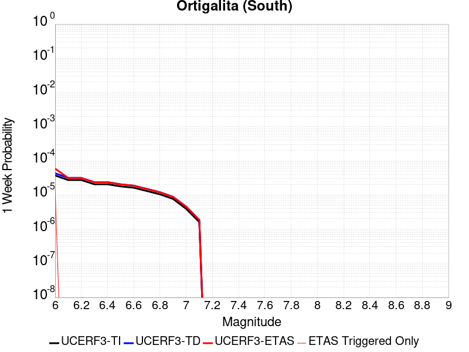 | 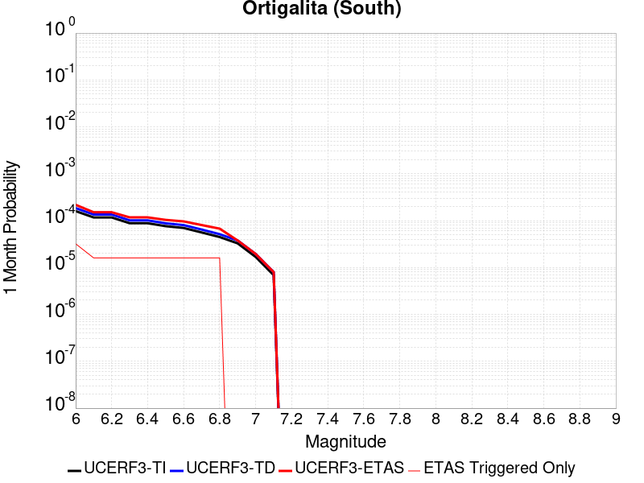 | 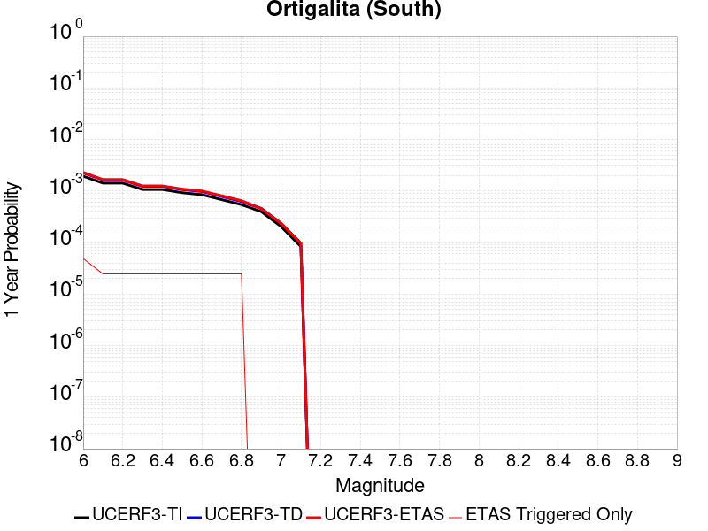 | 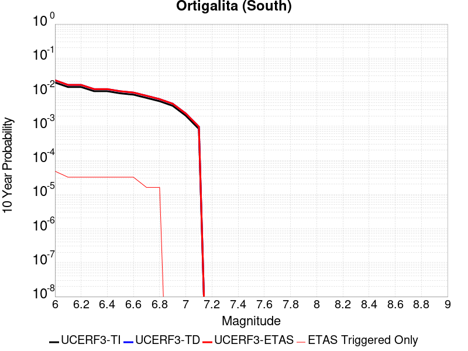 |

| Magnitude | 1 wk TI Prob | 1 wk TD Prob | 1 wk ETAS Prob | 1 wk ETAS/TD Gain | 1 wk ETAS Triggered Only | 1 mo TI Prob | 1 mo TD Prob | 1 mo ETAS Prob | 1 mo ETAS/TD Gain | 1 mo ETAS Triggered Only | 1 yr TI Prob | 1 yr TD Prob | 1 yr ETAS Prob | 1 yr ETAS/TD Gain | 1 yr ETAS Triggered Only | 10 yr TI Prob | 10 yr TD Prob | 10 yr ETAS Prob | 10 yr ETAS/TD Gain | 10 yr ETAS Triggered Only |
|-----|-----|-----|-----|-----|-----|-----|-----|-----|-----|-----|-----|-----|-----|-----|-----|-----|-----|-----|-----|-----|
| 6.0 | 3.72394E-5 | 4.325562E-5 | 6.787115E-5 | 1.5690713 | 2.4616596E-5 | 1.5958765E-4 | 1.8536893E-4 | 2.34593E-4 | 1.2655464 | 4.9233193E-5 | 0.0019412481 | 0.0022546875 | 0.0023038096 | 1.0217867 | 4.9233193E-5 | 0.019243775 | 0.022334497 | 0.02238263 | 1.0021551 | 4.9233193E-5 |
| 6.1 | 2.7299884E-5 | 3.149204E-5 | 3.149204E-5 | 1.0 | 0.0 | 1.16994255E-4 | 1.3495922E-4 | 1.595725E-4 | 1.1823757 | 2.4616596E-5 | 0.0014234743 | 0.0016419457 | 0.0016665219 | 1.0149677 | 2.4616596E-5 | 0.014143906 | 0.01630407 | 0.016328286 | 1.0014852 | 2.4616596E-5 |
| 6.2 | 2.7299884E-5 | 3.149204E-5 | 3.149204E-5 | 1.0 | 0.0 | 1.16994255E-4 | 1.3495922E-4 | 1.595725E-4 | 1.1823757 | 2.4616596E-5 | 0.0014234743 | 0.0016419457 | 0.0016665219 | 1.0149677 | 2.4616596E-5 | 0.014143906 | 0.01630407 | 0.016328286 | 1.0014852 | 2.4616596E-5 |
| 6.3 | 2.0546433E-5 | 2.363145E-5 | 2.363145E-5 | 1.0 | 0.0 | 8.805317E-5 | 1.0127382E-4 | 1.2588792E-4 | 1.2430451 | 2.4616596E-5 | 0.00107152 | 0.0012323303 | 0.0012569166 | 1.019951 | 2.4616596E-5 | 0.010663681 | 0.01225703 | 0.012281345 | 1.0019838 | 2.4616596E-5 |
| 6.4 | 2.0546433E-5 | 2.363145E-5 | 2.363145E-5 | 1.0 | 0.0 | 8.805317E-5 | 1.0127382E-4 | 1.2588792E-4 | 1.2430451 | 2.4616596E-5 | 0.00107152 | 0.0012323303 | 0.0012569166 | 1.019951 | 2.4616596E-5 | 0.010663681 | 0.01225703 | 0.012281345 | 1.0019838 | 2.4616596E-5 |
| 6.5 | 1.7779594E-5 | 2.0446974E-5 | 2.0446974E-5 | 1.0 | 0.0 | 7.619603E-5 | 8.762702E-5 | 1.1224146E-4 | 1.2809001 | 2.4616596E-5 | 9.272918E-4 | 0.0010663504 | 0.0010909408 | 1.0230603 | 2.4616596E-5 | 0.009234319 | 0.010613803 | 0.010638159 | 1.0022947 | 2.4616596E-5 |
| 6.6 | 1.6272212E-5 | 1.8714967E-5 | 1.8714967E-5 | 1.0 | 0.0 | 6.973618E-5 | 8.0204605E-5 | 1.0481923E-4 | 1.3068979 | 2.4616596E-5 | 8.487073E-4 | 9.760658E-4 | 0.0010006584 | 1.0251956 | 2.4616596E-5 | 0.008454733 | 0.009719091 | 0.009743468 | 1.0025082 | 2.4616596E-5 |
| 6.7 | 1.3051484E-5 | 1.5038758E-5 | 1.5038758E-5 | 1.0 | 0.0 | 5.593373E-5 | 6.445028E-5 | 8.906529E-5 | 1.3819225 | 2.4616596E-5 | 6.807804E-4 | 7.844092E-4 | 8.0900645E-4 | 1.0313578 | 2.4616596E-5 | 0.006786986 | 0.007817388 | 0.0078418115 | 1.0031244 | 2.4616596E-5 |
| 6.8 | 1.04277415E-5 | 1.1987235E-5 | 1.1987235E-5 | 1.0 | 0.0 | 4.4689557E-5 | 5.1372896E-5 | 7.5988224E-5 | 1.4791502 | 2.4616596E-5 | 5.439595E-4 | 6.2529295E-4 | 6.498941E-4 | 1.0393435 | 2.4616596E-5 | 0.0054262993 | 0.00623609 | 0.006260553 | 1.0039228 | 2.4616596E-5 |
| 6.9 | 7.639968E-6 | 8.791503E-6 | 8.791503E-6 | 1.0 | 0.0 | 3.274231E-5 | 3.767736E-5 | 3.767736E-5 | 1.0 | 0.0 | 3.9856473E-4 | 4.586312E-4 | 4.586312E-4 | 1.0 | 0.0 | 0.003978506 | 0.004577433 | 0.004577433 | 1.0 | 0.0 |
| 7.0 | 3.919831E-6 | 4.5334014E-6 | 4.5334014E-6 | 1.0 | 0.0 | 1.679917E-5 | 1.942873E-5 | 1.942873E-5 | 1.0 | 0.0 | 2.045107E-4 | 2.3652123E-4 | 2.3652123E-4 | 1.0 | 0.0 | 0.0020432258 | 0.0023629034 | 0.0023629034 | 1.0 | 0.0 |
| 7.1 | 1.6017933E-6 | 1.8570418E-6 | 1.8570418E-6 | 1.0 | 0.0 | 6.8648105E-6 | 7.958732E-6 | 7.958732E-6 | 1.0 | 0.0 | 8.357586E-5 | 9.689432E-5 | 9.689432E-5 | 1.0 | 0.0 | 8.3544437E-4 | 9.686254E-4 | 9.686254E-4 | 1.0 | 0.0 |

## Camp Rock 2011
*[(top)](#table-of-contents)*

| 1 Week | 1 Month | 1 Year | 10 Year |
|-----|-----|-----|-----|
| 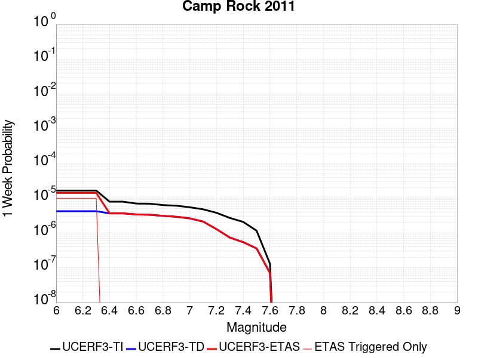 | 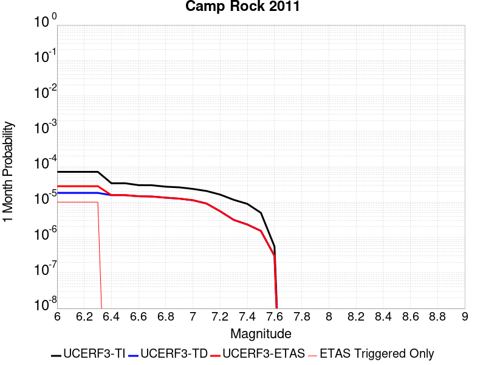 | 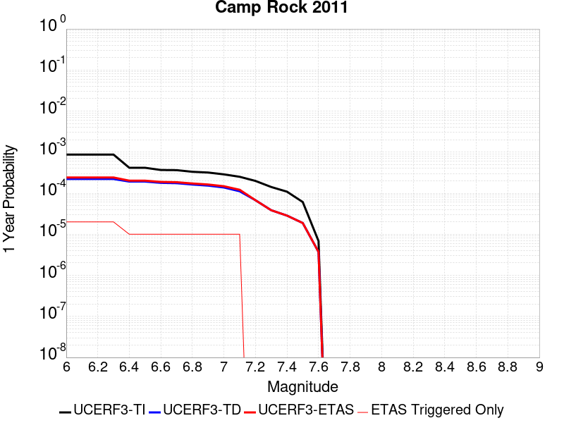 | 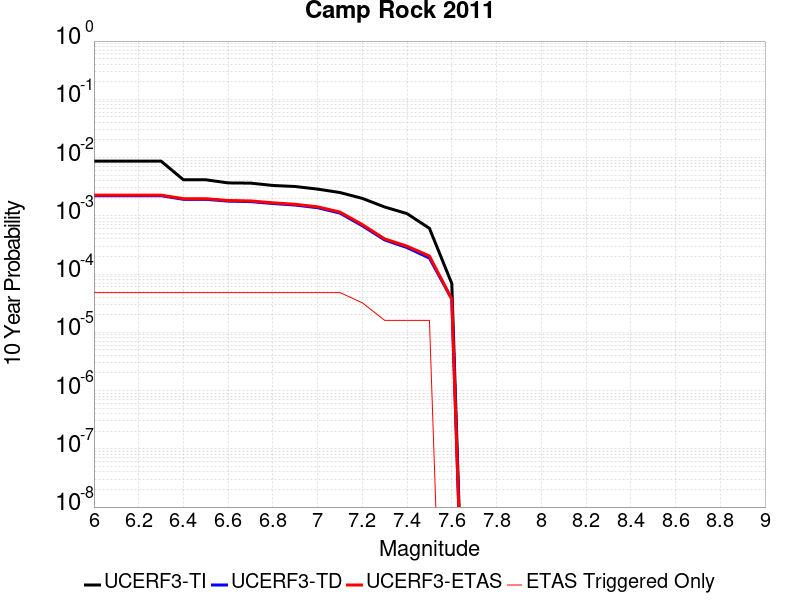 |

| Magnitude | 1 wk TI Prob | 1 wk TD Prob | 1 wk ETAS Prob | 1 wk ETAS/TD Gain | 1 wk ETAS Triggered Only | 1 mo TI Prob | 1 mo TD Prob | 1 mo ETAS Prob | 1 mo ETAS/TD Gain | 1 mo ETAS Triggered Only | 1 yr TI Prob | 1 yr TD Prob | 1 yr ETAS Prob | 1 yr ETAS/TD Gain | 1 yr ETAS Triggered Only | 10 yr TI Prob | 10 yr TD Prob | 10 yr ETAS Prob | 10 yr ETAS/TD Gain | 10 yr ETAS Triggered Only |
|-----|-----|-----|-----|-----|-----|-----|-----|-----|-----|-----|-----|-----|-----|-----|-----|-----|-----|-----|-----|-----|
| 6.0 | 1.6710783E-5 | 4.25026E-6 | 4.25026E-6 | 1.0 | 0.0 | 7.161568E-5 | 1.8215276E-5 | 1.8215276E-5 | 1.0 | 0.0 | 8.7157206E-4 | 2.2174895E-4 | 2.4636008E-4 | 1.1109865 | 2.4616596E-5 | 0.008681616 | 0.0022153298 | 0.0022644538 | 1.0221746 | 4.9233193E-5 |
| 6.1 | 1.6710783E-5 | 4.25026E-6 | 4.25026E-6 | 1.0 | 0.0 | 7.161568E-5 | 1.8215276E-5 | 1.8215276E-5 | 1.0 | 0.0 | 8.7157206E-4 | 2.2174895E-4 | 2.4636008E-4 | 1.1109865 | 2.4616596E-5 | 0.008681616 | 0.0022153298 | 0.0022644538 | 1.0221746 | 4.9233193E-5 |
| 6.2 | 1.6710783E-5 | 4.25026E-6 | 4.25026E-6 | 1.0 | 0.0 | 7.161568E-5 | 1.8215276E-5 | 1.8215276E-5 | 1.0 | 0.0 | 8.7157206E-4 | 2.2174895E-4 | 2.4636008E-4 | 1.1109865 | 2.4616596E-5 | 0.008681616 | 0.0022153298 | 0.0022644538 | 1.0221746 | 4.9233193E-5 |
| 6.3 | 1.6710783E-5 | 4.25026E-6 | 4.25026E-6 | 1.0 | 0.0 | 7.161568E-5 | 1.8215276E-5 | 1.8215276E-5 | 1.0 | 0.0 | 8.7157206E-4 | 2.2174895E-4 | 2.4636008E-4 | 1.1109865 | 2.4616596E-5 | 0.008681616 | 0.0022153298 | 0.0022644538 | 1.0221746 | 4.9233193E-5 |
| 6.4 | 7.982846E-6 | 3.6820884E-6 | 3.6820884E-6 | 1.0 | 0.0 | 3.421175E-5 | 1.5780286E-5 | 1.5780286E-5 | 1.0 | 0.0 | 4.1644843E-4 | 1.9210839E-4 | 2.1672026E-4 | 1.1281145 | 2.4616596E-5 | 0.0041566887 | 0.001919458 | 0.0019685968 | 1.0256003 | 4.9233193E-5 |
| 6.5 | 7.982846E-6 | 3.6820884E-6 | 3.6820884E-6 | 1.0 | 0.0 | 3.421175E-5 | 1.5780286E-5 | 1.5780286E-5 | 1.0 | 0.0 | 4.1644843E-4 | 1.9210839E-4 | 2.1672026E-4 | 1.1281145 | 2.4616596E-5 | 0.0041566887 | 0.001919458 | 0.0019685968 | 1.0256003 | 4.9233193E-5 |
| 6.6 | 7.048869E-6 | 3.4243571E-6 | 3.4243571E-6 | 1.0 | 0.0 | 3.0209088E-5 | 1.4675736E-5 | 1.4675736E-5 | 1.0 | 0.0 | 3.677336E-4 | 1.7866275E-4 | 2.0327495E-4 | 1.1377579 | 2.4616596E-5 | 0.0036712566 | 0.0017852228 | 0.0018343681 | 1.027529 | 4.9233193E-5 |
| 6.7 | 6.987307E-6 | 3.3623348E-6 | 3.3623348E-6 | 1.0 | 0.0 | 2.9945259E-5 | 1.4409929E-5 | 1.4409929E-5 | 1.0 | 0.0 | 3.6452254E-4 | 1.7542706E-4 | 2.0003934E-4 | 1.1402992 | 2.4616596E-5 | 0.0036392517 | 0.001752917 | 0.0018020639 | 1.0280372 | 4.9233193E-5 |
| 6.8 | 6.3737602E-6 | 3.1179077E-6 | 3.1179077E-6 | 1.0 | 0.0 | 2.731583E-5 | 1.3362394E-5 | 1.3362394E-5 | 1.0 | 0.0 | 3.3251947E-4 | 1.626753E-4 | 1.872879E-4 | 1.1512989 | 2.4616596E-5 | 0.0033202237 | 0.0016255907 | 0.001674744 | 1.0302371 | 4.9233193E-5 |
| 6.9 | 6.112211E-6 | 2.9331156E-6 | 2.9331156E-6 | 1.0 | 0.0 | 2.6194928E-5 | 1.2570436E-5 | 1.2570436E-5 | 1.0 | 0.0 | 3.1887658E-4 | 1.5303459E-4 | 1.7764742E-4 | 1.1608318 | 2.4616596E-5 | 0.003184194 | 0.0015293199 | 0.0015784778 | 1.0321436 | 4.9233193E-5 |
| 7.0 | 5.5140117E-6 | 2.641923E-6 | 2.641923E-6 | 1.0 | 0.0 | 2.3631264E-5 | 1.132248E-5 | 1.132248E-5 | 1.0 | 0.0 | 2.8767265E-4 | 1.3784273E-4 | 1.6245592E-4 | 1.17856 | 2.4616596E-5 | 0.0028730053 | 0.0013775975 | 0.0014267628 | 1.0356892 | 4.9233193E-5 |
| 7.1 | 4.8151105E-6 | 2.1342705E-6 | 2.1342705E-6 | 1.0 | 0.0 | 2.0636026E-5 | 9.146843E-6 | 9.146843E-6 | 1.0 | 0.0 | 2.5121463E-4 | 1.1135734E-4 | 1.3597119E-4 | 1.2210349 | 2.4616596E-5 | 0.0025093083 | 0.0011130372 | 0.0011622156 | 1.044184 | 4.9233193E-5 |
| 7.2 | 3.818335E-6 | 1.2937425E-6 | 1.2937425E-6 | 1.0 | 0.0 | 1.6364189E-5 | 5.5445994E-6 | 5.5445994E-6 | 1.0 | 0.0 | 1.9921579E-4 | 6.750349E-5 | 6.750349E-5 | 1.0 | 0.0 | 0.0019903728 | 6.748381E-4 | 6.9943804E-4 | 1.0364531 | 2.4616596E-5 |
| 7.3 | 2.7166698E-6 | 7.3835776E-7 | 7.3835776E-7 | 1.0 | 0.0 | 1.1642818E-5 | 3.1643867E-6 | 3.1643867E-6 | 1.0 | 0.0 | 1.4174209E-4 | 3.8525748E-5 | 3.8525748E-5 | 1.0 | 0.0 | 0.0014165172 | 3.851927E-4 | 4.097998E-4 | 1.0638826 | 2.4616596E-5 |
| 7.4 | 2.0893426E-6 | 5.4618386E-7 | 5.4618386E-7 | 1.0 | 0.0 | 8.954295E-6 | 2.3407858E-6 | 2.3407858E-6 | 1.0 | 0.0 | 1.0901308E-4 | 2.84987E-5 | 2.84987E-5 | 1.0 | 0.0 | 0.0010895962 | 2.84951E-4 | 3.095606E-4 | 1.0863643 | 2.4616596E-5 |
| 7.5 | 1.1681728E-6 | 3.6030585E-7 | 3.6030585E-7 | 1.0 | 0.0 | 5.0064455E-6 | 1.544167E-6 | 1.544167E-6 | 1.0 | 0.0 | 6.0951766E-5 | 1.8800076E-5 | 1.8800076E-5 | 1.0 | 0.0 | 6.093505E-4 | 1.8798532E-4 | 2.125973E-4 | 1.1309249 | 2.4616596E-5 |
| 7.6 | 1.3154387E-7 | 7.1197384E-8 | 7.1197384E-8 | 1.0 | 0.0 | 5.6375933E-7 | 3.051316E-7 | 3.051316E-7 | 1.0 | 0.0 | 6.863748E-6 | 3.7149728E-6 | 3.7149728E-6 | 1.0 | 0.0 | 6.863536E-5 | 3.7149264E-5 | 3.7149264E-5 | 1.0 | 0.0 |

## Laguna Salada
*[(top)](#table-of-contents)*

| 1 Week | 1 Month | 1 Year | 10 Year |
|-----|-----|-----|-----|
| 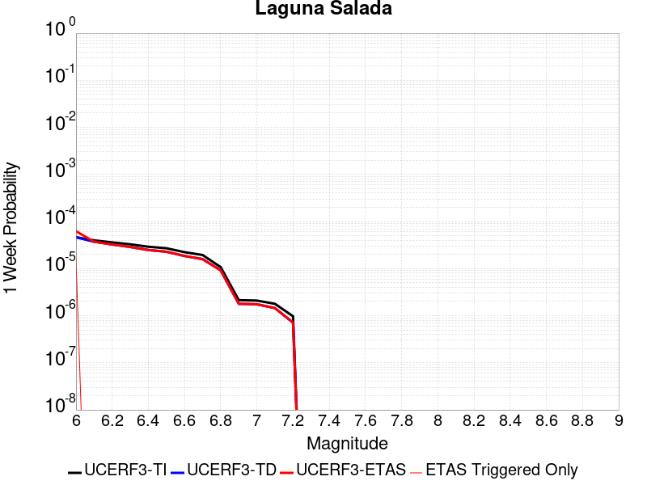 | 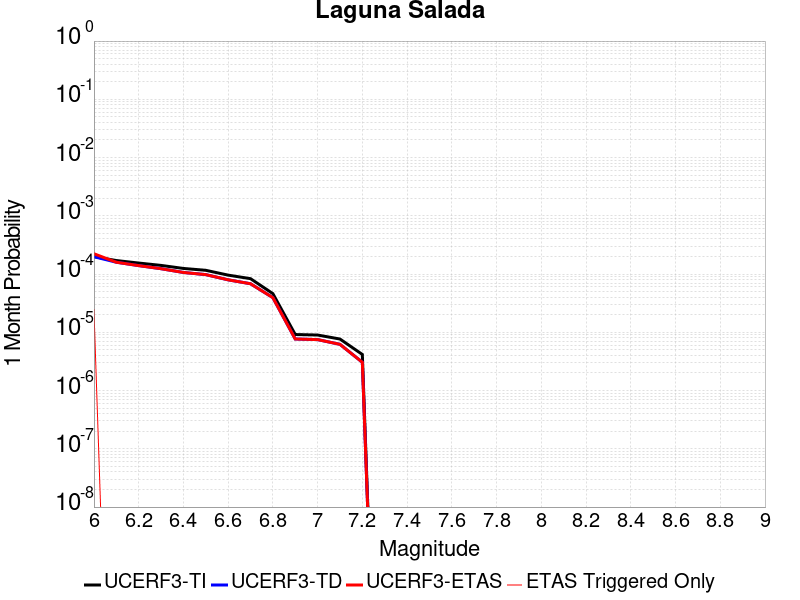 | 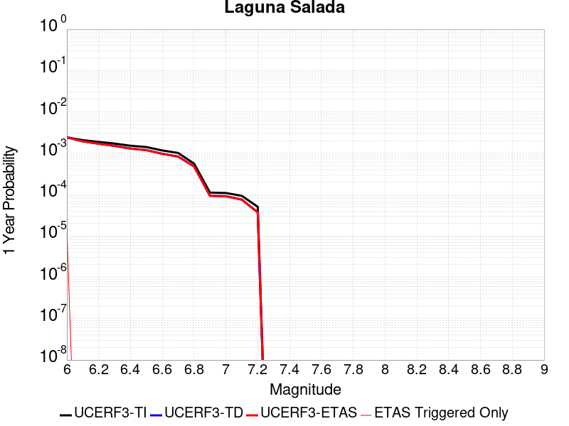 | 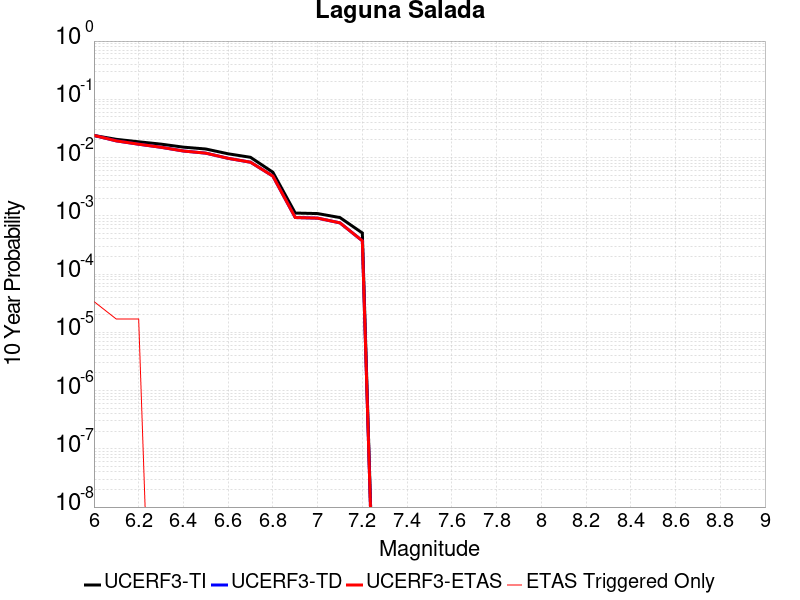 |

| Magnitude | 1 wk TI Prob | 1 wk TD Prob | 1 wk ETAS Prob | 1 wk ETAS/TD Gain | 1 wk ETAS Triggered Only | 1 mo TI Prob | 1 mo TD Prob | 1 mo ETAS Prob | 1 mo ETAS/TD Gain | 1 mo ETAS Triggered Only | 1 yr TI Prob | 1 yr TD Prob | 1 yr ETAS Prob | 1 yr ETAS/TD Gain | 1 yr ETAS Triggered Only | 10 yr TI Prob | 10 yr TD Prob | 10 yr ETAS Prob | 10 yr ETAS/TD Gain | 10 yr ETAS Triggered Only |
|-----|-----|-----|-----|-----|-----|-----|-----|-----|-----|-----|-----|-----|-----|-----|-----|-----|-----|-----|-----|-----|
| 6.0 | 4.6465593E-5 | 4.634639E-5 | 7.096185E-5 | 1.5311191 | 2.4616596E-5 | 1.9912305E-4 | 1.9861311E-4 | 2.2322481E-4 | 1.1239178 | 2.4616596E-5 | 0.0024216278 | 0.002415429 | 0.0024399862 | 1.0101668 | 2.4616596E-5 | 0.02395408 | 0.023975259 | 0.024023311 | 1.0020043 | 4.9233193E-5 |
| 6.1 | 3.982297E-5 | 3.7246125E-5 | 3.7246125E-5 | 1.0 | 0.0 | 1.706587E-4 | 1.5961716E-4 | 1.5961716E-4 | 1.0 | 0.0 | 0.0020757897 | 0.0019417295 | 0.0019417295 | 1.0 | 0.0 | 0.020565065 | 0.019331863 | 0.019356003 | 1.0012487 | 2.4616596E-5 |
| 6.2 | 3.6067784E-5 | 3.2602693E-5 | 3.2602693E-5 | 1.0 | 0.0 | 1.5456705E-4 | 1.3971896E-4 | 1.3971896E-4 | 1.0 | 0.0 | 0.0018802295 | 0.0016998611 | 0.0016998611 | 1.0 | 0.0 | 0.018644003 | 0.016949628 | 0.016973827 | 1.0014278 | 2.4616596E-5 |
| 6.3 | 3.2859112E-5 | 2.8849448E-5 | 2.8849448E-5 | 1.0 | 0.0 | 1.4081717E-4 | 1.2363521E-4 | 1.2363521E-4 | 1.0 | 0.0 | 0.0017131006 | 0.0015043203 | 0.0015043203 | 1.0 | 0.0 | 0.016999546 | 0.015018767 | 0.015018767 | 1.0 | 0.0 |
| 6.4 | 2.9132116E-5 | 2.4852965E-5 | 2.4852965E-5 | 1.0 | 0.0 | 1.2484594E-4 | 1.0650887E-4 | 1.0650887E-4 | 1.0 | 0.0 | 0.0015189396 | 0.001296065 | 0.001296065 | 1.0 | 0.0 | 0.015085992 | 0.012956262 | 0.012956262 | 1.0 | 0.0 |
| 6.5 | 2.7075037E-5 | 2.2825836E-5 | 2.2825836E-5 | 1.0 | 0.0 | 1.1603071E-4 | 9.7821845E-5 | 9.7821845E-5 | 1.0 | 0.0 | 0.0014117584 | 0.0011904186 | 0.0011904186 | 1.0 | 0.0 | 0.014028233 | 0.011907749 | 0.011907749 | 1.0 | 0.0 |
| 6.6 | 2.2367465E-5 | 1.8573526E-5 | 1.8573526E-5 | 1.0 | 0.0 | 9.5857045E-5 | 7.959886E-5 | 7.959886E-5 | 1.0 | 0.0 | 0.0011664346 | 9.6876756E-4 | 9.6876756E-4 | 1.0 | 0.0 | 0.011603311 | 0.009702191 | 0.009702191 | 1.0 | 0.0 |
| 6.7 | 1.9458053E-5 | 1.5914242E-5 | 1.5914242E-5 | 1.0 | 0.0 | 8.338899E-5 | 6.8202564E-5 | 6.8202564E-5 | 1.0 | 0.0 | 0.001014788 | 8.3013024E-4 | 8.3013024E-4 | 1.0 | 0.0 | 0.010101665 | 0.0083209425 | 0.0083209425 | 1.0 | 0.0 |
| 6.8 | 1.0767866E-5 | 9.18435E-6 | 9.18435E-6 | 1.0 | 0.0 | 4.614718E-5 | 3.9361294E-5 | 3.9361294E-5 | 1.0 | 0.0 | 5.6169706E-4 | 4.7918706E-4 | 4.7918706E-4 | 1.0 | 0.0 | 0.0056027942 | 0.0048096925 | 0.0048096925 | 1.0 | 0.0 |
| 6.9 | 2.1384765E-6 | 1.7913675E-6 | 1.7913675E-6 | 1.0 | 0.0 | 9.164866E-6 | 7.677269E-6 | 7.677269E-6 | 1.0 | 0.0 | 1.1157654E-4 | 9.346713E-5 | 9.346713E-5 | 1.0 | 0.0 | 0.0011152053 | 9.343165E-4 | 9.343165E-4 | 1.0 | 0.0 |
| 7.0 | 2.0952946E-6 | 1.7493046E-6 | 1.7493046E-6 | 1.0 | 0.0 | 8.979802E-6 | 7.4970003E-6 | 7.4970003E-6 | 1.0 | 0.0 | 1.0932361E-4 | 9.1272545E-5 | 9.1272545E-5 | 1.0 | 0.0 | 0.0010926984 | 9.123888E-4 | 9.123888E-4 | 1.0 | 0.0 |
| 7.1 | 1.7887576E-6 | 1.4500254E-6 | 1.4500254E-6 | 1.0 | 0.0 | 7.666081E-6 | 6.2143813E-6 | 6.2143813E-6 | 1.0 | 0.0 | 9.333054E-5 | 7.565777E-5 | 7.565777E-5 | 1.0 | 0.0 | 9.329135E-4 | 7.563506E-4 | 7.563506E-4 | 1.0 | 0.0 |
| 7.2 | 9.723109E-7 | 7.135619E-7 | 7.135619E-7 | 1.0 | 0.0 | 4.16704E-6 | 3.0581198E-6 | 3.0581198E-6 | 1.0 | 0.0 | 5.073253E-5 | 3.7232137E-5 | 3.7232137E-5 | 1.0 | 0.0 | 5.072095E-4 | 3.7227524E-4 | 3.7227524E-4 | 1.0 | 0.0 |

## Los Alamos extension
*[(top)](#table-of-contents)*

| 1 Week | 1 Month | 1 Year | 10 Year |
|-----|-----|-----|-----|
| 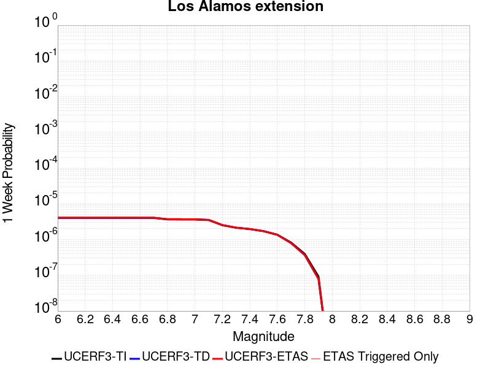 |  | 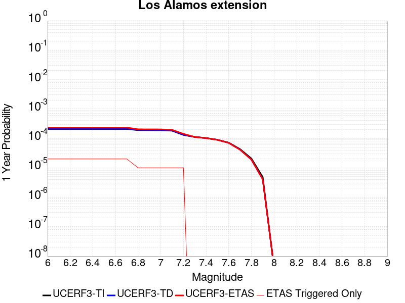 | 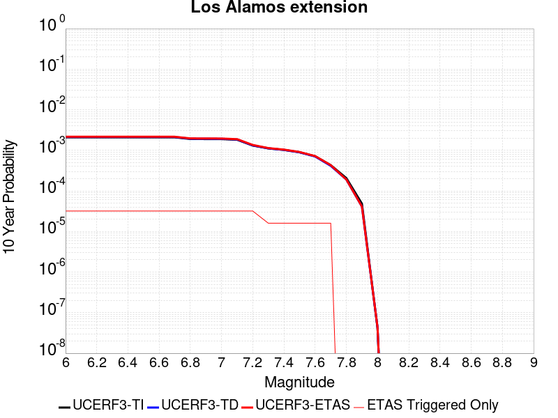 |

| Magnitude | 1 wk TI Prob | 1 wk TD Prob | 1 wk ETAS Prob | 1 wk ETAS/TD Gain | 1 wk ETAS Triggered Only | 1 mo TI Prob | 1 mo TD Prob | 1 mo ETAS Prob | 1 mo ETAS/TD Gain | 1 mo ETAS Triggered Only | 1 yr TI Prob | 1 yr TD Prob | 1 yr ETAS Prob | 1 yr ETAS/TD Gain | 1 yr ETAS Triggered Only | 10 yr TI Prob | 10 yr TD Prob | 10 yr ETAS Prob | 10 yr ETAS/TD Gain | 10 yr ETAS Triggered Only |
|-----|-----|-----|-----|-----|-----|-----|-----|-----|-----|-----|-----|-----|-----|-----|-----|-----|-----|-----|-----|-----|
| 6.0 | 4.0146506E-6 | 4.0861596E-6 | 4.0861596E-6 | 1.0 | 0.0 | 1.7205533E-5 | 1.7512002E-5 | 1.7512002E-5 | 1.0 | 0.0 | 2.0945723E-4 | 2.1318886E-4 | 2.3780021E-4 | 1.1154438 | 2.4616596E-5 | 0.0020925992 | 0.0021299527 | 0.002179081 | 1.0230654 | 4.9233193E-5 |
| 6.1 | 4.0146506E-6 | 4.0861596E-6 | 4.0861596E-6 | 1.0 | 0.0 | 1.7205533E-5 | 1.7512002E-5 | 1.7512002E-5 | 1.0 | 0.0 | 2.0945723E-4 | 2.1318886E-4 | 2.3780021E-4 | 1.1154438 | 2.4616596E-5 | 0.0020925992 | 0.0021299527 | 0.002179081 | 1.0230654 | 4.9233193E-5 |
| 6.2 | 4.0146506E-6 | 4.0861596E-6 | 4.0861596E-6 | 1.0 | 0.0 | 1.7205533E-5 | 1.7512002E-5 | 1.7512002E-5 | 1.0 | 0.0 | 2.0945723E-4 | 2.1318886E-4 | 2.3780021E-4 | 1.1154438 | 2.4616596E-5 | 0.0020925992 | 0.0021299527 | 0.002179081 | 1.0230654 | 4.9233193E-5 |
| 6.3 | 4.0146506E-6 | 4.0861596E-6 | 4.0861596E-6 | 1.0 | 0.0 | 1.7205533E-5 | 1.7512002E-5 | 1.7512002E-5 | 1.0 | 0.0 | 2.0945723E-4 | 2.1318886E-4 | 2.3780021E-4 | 1.1154438 | 2.4616596E-5 | 0.0020925992 | 0.0021299527 | 0.002179081 | 1.0230654 | 4.9233193E-5 |
| 6.4 | 4.0146506E-6 | 4.0861596E-6 | 4.0861596E-6 | 1.0 | 0.0 | 1.7205533E-5 | 1.7512002E-5 | 1.7512002E-5 | 1.0 | 0.0 | 2.0945723E-4 | 2.1318886E-4 | 2.3780021E-4 | 1.1154438 | 2.4616596E-5 | 0.0020925992 | 0.0021299527 | 0.002179081 | 1.0230654 | 4.9233193E-5 |
| 6.5 | 4.0146506E-6 | 4.0861596E-6 | 4.0861596E-6 | 1.0 | 0.0 | 1.7205533E-5 | 1.7512002E-5 | 1.7512002E-5 | 1.0 | 0.0 | 2.0945723E-4 | 2.1318886E-4 | 2.3780021E-4 | 1.1154438 | 2.4616596E-5 | 0.0020925992 | 0.0021299527 | 0.002179081 | 1.0230654 | 4.9233193E-5 |
| 6.6 | 4.0146506E-6 | 4.0861596E-6 | 4.0861596E-6 | 1.0 | 0.0 | 1.7205533E-5 | 1.7512002E-5 | 1.7512002E-5 | 1.0 | 0.0 | 2.0945723E-4 | 2.1318886E-4 | 2.3780021E-4 | 1.1154438 | 2.4616596E-5 | 0.0020925992 | 0.0021299527 | 0.002179081 | 1.0230654 | 4.9233193E-5 |
| 6.7 | 4.0146506E-6 | 4.0861596E-6 | 4.0861596E-6 | 1.0 | 0.0 | 1.7205533E-5 | 1.7512002E-5 | 1.7512002E-5 | 1.0 | 0.0 | 2.0945723E-4 | 2.1318886E-4 | 2.3780021E-4 | 1.1154438 | 2.4616596E-5 | 0.0020925992 | 0.0021299527 | 0.002179081 | 1.0230654 | 4.9233193E-5 |
| 6.8 | 3.6584688E-6 | 3.7188588E-6 | 3.7188588E-6 | 1.0 | 0.0 | 1.5679057E-5 | 1.5937874E-5 | 1.5937874E-5 | 1.0 | 0.0 | 1.9087581E-4 | 1.9402728E-4 | 2.186391E-4 | 1.1268473 | 2.4616596E-5 | 0.0019071194 | 0.0019386712 | 0.0019878088 | 1.025346 | 4.9233193E-5 |
| 6.9 | 3.644631E-6 | 3.7045688E-6 | 3.7045688E-6 | 1.0 | 0.0 | 1.5619753E-5 | 1.5876632E-5 | 1.5876632E-5 | 1.0 | 0.0 | 1.901539E-4 | 1.9328178E-4 | 2.1789363E-4 | 1.1273366 | 2.4616596E-5 | 0.0018999127 | 0.0019312293 | 0.0019803673 | 1.0254439 | 4.9233193E-5 |
| 7.0 | 3.6318522E-6 | 3.6913295E-6 | 3.6913295E-6 | 1.0 | 0.0 | 1.5564989E-5 | 1.5819893E-5 | 1.5819893E-5 | 1.0 | 0.0 | 1.8948725E-4 | 1.925911E-4 | 2.1720296E-4 | 1.1277933 | 2.4616596E-5 | 0.0018932576 | 0.0019243343 | 0.0019734728 | 1.0255353 | 4.9233193E-5 |
| 7.1 | 3.5001724E-6 | 3.5554E-6 | 3.5554E-6 | 1.0 | 0.0 | 1.5000653E-5 | 1.5237345E-5 | 1.5237345E-5 | 1.0 | 0.0 | 1.8261763E-4 | 1.854998E-4 | 2.1011183E-4 | 1.1326796 | 2.4616596E-5 | 0.0018246764 | 0.0018535402 | 0.0019026821 | 1.0265125 | 4.9233193E-5 |
| 7.2 | 2.5204702E-6 | 2.5436943E-6 | 2.5436943E-6 | 1.0 | 0.0 | 1.080197E-5 | 1.0901502E-5 | 1.0901502E-5 | 1.0 | 0.0 | 1.3150605E-4 | 1.3271775E-4 | 1.5733109E-4 | 1.1854562 | 2.4616596E-5 | 0.0013142825 | 0.0013263905 | 0.0013755584 | 1.037069 | 4.9233193E-5 |
| 7.3 | 2.1399692E-6 | 2.1501316E-6 | 2.1501316E-6 | 1.0 | 0.0 | 9.1712645E-6 | 9.2148175E-6 | 9.2148175E-6 | 1.0 | 0.0 | 1.1165442E-4 | 1.1218466E-4 | 1.1218466E-4 | 1.0 | 0.0 | 0.0011159834 | 0.0011212835 | 0.0011458725 | 1.0219294 | 2.4616596E-5 |
| 7.4 | 1.9660122E-6 | 1.9702363E-6 | 1.9702363E-6 | 1.0 | 0.0 | 8.42574E-6 | 8.4438425E-6 | 8.4438425E-6 | 1.0 | 0.0 | 1.0257855E-4 | 1.0279897E-4 | 1.0279897E-4 | 1.0 | 0.0 | 0.0010253121 | 0.0010275173 | 0.0010521086 | 1.0239327 | 2.4616596E-5 |
| 7.5 | 1.7204633E-6 | 1.7150983E-6 | 1.7150983E-6 | 1.0 | 0.0 | 7.373393E-6 | 7.3504007E-6 | 7.3504007E-6 | 1.0 | 0.0 | 8.976737E-5 | 8.948748E-5 | 8.948748E-5 | 1.0 | 0.0 | 8.9731114E-4 | 8.9451746E-4 | 9.19112E-4 | 1.0274948 | 2.4616596E-5 |
| 7.6 | 1.3717638E-6 | 1.3535827E-6 | 1.3535827E-6 | 1.0 | 0.0 | 5.878974E-6 | 5.8010555E-6 | 5.8010555E-6 | 1.0 | 0.0 | 7.157416E-5 | 7.062559E-5 | 7.062559E-5 | 1.0 | 0.0 | 7.1551115E-4 | 7.060341E-4 | 7.3063327E-4 | 1.0348414 | 2.4616596E-5 |
| 7.7 | 8.272564E-7 | 7.957636E-7 | 7.957636E-7 | 1.0 | 0.0 | 3.5453797E-6 | 3.410411E-6 | 3.410411E-6 | 1.0 | 0.0 | 4.3164142E-5 | 4.1520965E-5 | 4.1520965E-5 | 1.0 | 0.0 | 4.315576E-4 | 4.1513226E-4 | 4.3973862E-4 | 1.0592736 | 2.4616596E-5 |
| 7.8 | 3.9708277E-7 | 3.6719027E-7 | 3.6719027E-7 | 1.0 | 0.0 | 1.7017821E-6 | 1.5736716E-6 | 1.5736716E-6 | 1.0 | 0.0 | 2.0719E-5 | 1.9159284E-5 | 1.9159284E-5 | 1.0 | 0.0 | 2.071707E-4 | 1.9157639E-4 | 1.9157639E-4 | 1.0 | 0.0 |
| 7.9 | 9.292528E-8 | 7.889087E-8 | 7.889087E-8 | 1.0 | 0.0 | 3.9825116E-7 | 3.381037E-7 | 3.381037E-7 | 1.0 | 0.0 | 4.848697E-6 | 4.116405E-6 | 4.116405E-6 | 1.0 | 0.0 | 4.8485912E-5 | 4.1163294E-5 | 4.1163294E-5 | 1.0 | 0.0 |
| 8.0 | 7.880441E-11 | 8.2353124E-11 | 8.2353124E-11 | 1.0 | 0.0 | 3.3773329E-10 | 3.52942E-10 | 3.52942E-10 | 1.0 | 0.0 | 4.1119033E-9 | 4.2970694E-9 | 4.2970694E-9 | 1.0 | 0.0 | 4.1119034E-8 | 4.2970694E-8 | 4.2970694E-8 | 1.0 | 0.0 |

## Great Valley 06 (Midland) 2011 CFM alt1
*[(top)](#table-of-contents)*

| 1 Week | 1 Month | 1 Year | 10 Year |
|-----|-----|-----|-----|
| 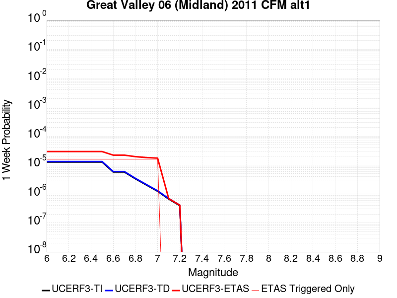 | 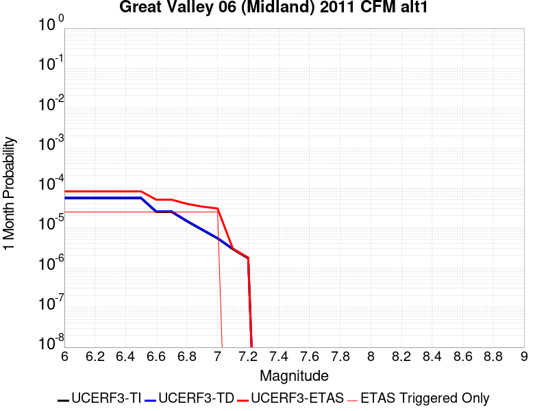 | 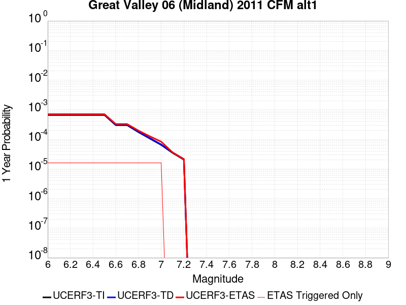 | 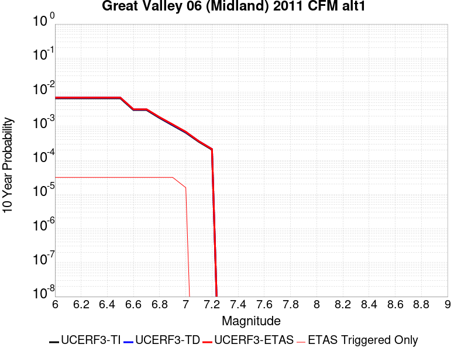 |

| Magnitude | 1 wk TI Prob | 1 wk TD Prob | 1 wk ETAS Prob | 1 wk ETAS/TD Gain | 1 wk ETAS Triggered Only | 1 mo TI Prob | 1 mo TD Prob | 1 mo ETAS Prob | 1 mo ETAS/TD Gain | 1 mo ETAS Triggered Only | 1 yr TI Prob | 1 yr TD Prob | 1 yr ETAS Prob | 1 yr ETAS/TD Gain | 1 yr ETAS Triggered Only | 10 yr TI Prob | 10 yr TD Prob | 10 yr ETAS Prob | 10 yr ETAS/TD Gain | 10 yr ETAS Triggered Only |
|-----|-----|-----|-----|-----|-----|-----|-----|-----|-----|-----|-----|-----|-----|-----|-----|-----|-----|-----|-----|-----|
| 6.0 | 1.2712525E-5 | 1.3210576E-5 | 3.782685E-5 | 2.8633761 | 2.4616596E-5 | 5.4481112E-5 | 5.6615667E-5 | 8.123087E-5 | 1.4347773 | 2.4616596E-5 | 6.6310563E-4 | 6.8910315E-4 | 7.1370276E-4 | 1.035698 | 2.4616596E-5 | 0.0066113044 | 0.006872179 | 0.006921074 | 1.0071149 | 4.9233193E-5 |
| 6.1 | 1.2712525E-5 | 1.3210576E-5 | 3.782685E-5 | 2.8633761 | 2.4616596E-5 | 5.4481112E-5 | 5.6615667E-5 | 8.123087E-5 | 1.4347773 | 2.4616596E-5 | 6.6310563E-4 | 6.8910315E-4 | 7.1370276E-4 | 1.035698 | 2.4616596E-5 | 0.0066113044 | 0.006872179 | 0.006921074 | 1.0071149 | 4.9233193E-5 |
| 6.2 | 1.2712525E-5 | 1.3210576E-5 | 3.782685E-5 | 2.8633761 | 2.4616596E-5 | 5.4481112E-5 | 5.6615667E-5 | 8.123087E-5 | 1.4347773 | 2.4616596E-5 | 6.6310563E-4 | 6.8910315E-4 | 7.1370276E-4 | 1.035698 | 2.4616596E-5 | 0.0066113044 | 0.006872179 | 0.006921074 | 1.0071149 | 4.9233193E-5 |
| 6.3 | 1.2712525E-5 | 1.3210576E-5 | 3.782685E-5 | 2.8633761 | 2.4616596E-5 | 5.4481112E-5 | 5.6615667E-5 | 8.123087E-5 | 1.4347773 | 2.4616596E-5 | 6.6310563E-4 | 6.8910315E-4 | 7.1370276E-4 | 1.035698 | 2.4616596E-5 | 0.0066113044 | 0.006872179 | 0.006921074 | 1.0071149 | 4.9233193E-5 |
| 6.4 | 1.2712525E-5 | 1.3210576E-5 | 3.782685E-5 | 2.8633761 | 2.4616596E-5 | 5.4481112E-5 | 5.6615667E-5 | 8.123087E-5 | 1.4347773 | 2.4616596E-5 | 6.6310563E-4 | 6.8910315E-4 | 7.1370276E-4 | 1.035698 | 2.4616596E-5 | 0.0066113044 | 0.006872179 | 0.006921074 | 1.0071149 | 4.9233193E-5 |
| 6.5 | 1.2712525E-5 | 1.3210576E-5 | 3.782685E-5 | 2.8633761 | 2.4616596E-5 | 5.4481112E-5 | 5.6615667E-5 | 8.123087E-5 | 1.4347773 | 2.4616596E-5 | 6.6310563E-4 | 6.8910315E-4 | 7.1370276E-4 | 1.035698 | 2.4616596E-5 | 0.0066113044 | 0.006872179 | 0.006921074 | 1.0071149 | 4.9233193E-5 |
| 6.6 | 5.7574384E-6 | 5.9706463E-6 | 3.0587096E-5 | 5.122912 | 2.4616596E-5 | 2.4674504E-5 | 2.5588255E-5 | 5.020422E-5 | 1.9620025 | 2.4616596E-5 | 3.0037065E-4 | 3.1149638E-4 | 3.3610532E-4 | 1.0790023 | 2.4616596E-5 | 0.0029996498 | 0.0031109843 | 0.0031600643 | 1.0157764 | 4.9233193E-5 |
| 6.7 | 5.7574384E-6 | 5.9706463E-6 | 3.0587096E-5 | 5.122912 | 2.4616596E-5 | 2.4674504E-5 | 2.5588255E-5 | 5.020422E-5 | 1.9620025 | 2.4616596E-5 | 3.0037065E-4 | 3.1149638E-4 | 3.3610532E-4 | 1.0790023 | 2.4616596E-5 | 0.0029996498 | 0.0031109843 | 0.0031600643 | 1.0157764 | 4.9233193E-5 |
| 6.8 | 3.3474828E-6 | 3.4693849E-6 | 2.8085897E-5 | 8.095353 | 2.4616596E-5 | 1.4346277E-5 | 1.4868716E-5 | 3.9484945E-5 | 2.6555722 | 2.4616596E-5 | 1.7465191E-4 | 1.8101306E-4 | 2.0562521E-4 | 1.1359688 | 2.4616596E-5 | 0.0017451472 | 0.0018088033 | 0.0018579474 | 1.0271695 | 4.9233193E-5 |
| 6.9 | 2.035106E-6 | 2.1090357E-6 | 2.672558E-5 | 12.671944 | 2.4616596E-5 | 8.721853E-6 | 9.038697E-6 | 3.365507E-5 | 3.7234428 | 2.4616596E-5 | 1.0618339E-4 | 1.10041314E-4 | 1.346552E-4 | 1.2236786 | 2.4616596E-5 | 0.0010613267 | 0.0010999405 | 0.0011491195 | 1.0447106 | 4.9233193E-5 |
| 7.0 | 1.2424716E-6 | 1.2878762E-6 | 2.5904441E-5 | 20.114077 | 2.4616596E-5 | 5.3248673E-6 | 5.51946E-6 | 3.0135921E-5 | 5.45994 | 2.4616596E-5 | 6.482833E-5 | 6.7197805E-5 | 9.181275E-5 | 1.3663057 | 2.4616596E-5 | 6.480942E-4 | 6.718192E-4 | 6.964193E-4 | 1.036617 | 2.4616596E-5 |
| 7.1 | 6.6904556E-7 | 6.939035E-7 | 6.939035E-7 | 1.0 | 0.0 | 2.867335E-6 | 2.97387E-6 | 2.97387E-6 | 1.0 | 0.0 | 3.4909244E-5 | 3.6206526E-5 | 3.6206526E-5 | 1.0 | 0.0 | 3.490376E-4 | 3.6203177E-4 | 3.6203177E-4 | 1.0 | 0.0 |
| 7.2 | 3.948168E-7 | 4.095705E-7 | 4.095705E-7 | 1.0 | 0.0 | 1.6920709E-6 | 1.7553022E-6 | 1.7553022E-6 | 1.0 | 0.0 | 2.0600768E-5 | 2.1370803E-5 | 2.1370803E-5 | 1.0 | 0.0 | 2.0598859E-4 | 2.1370803E-4 | 2.1370803E-4 | 1.0 | 0.0 |

## Newport-Inglewood alt 1
*[(top)](#table-of-contents)*

| 1 Week | 1 Month | 1 Year | 10 Year |
|-----|-----|-----|-----|
|  | 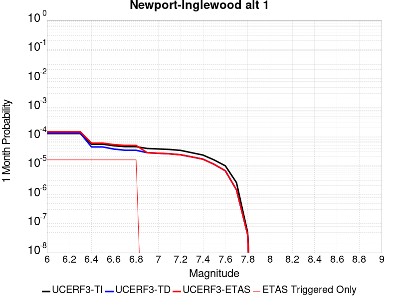 | 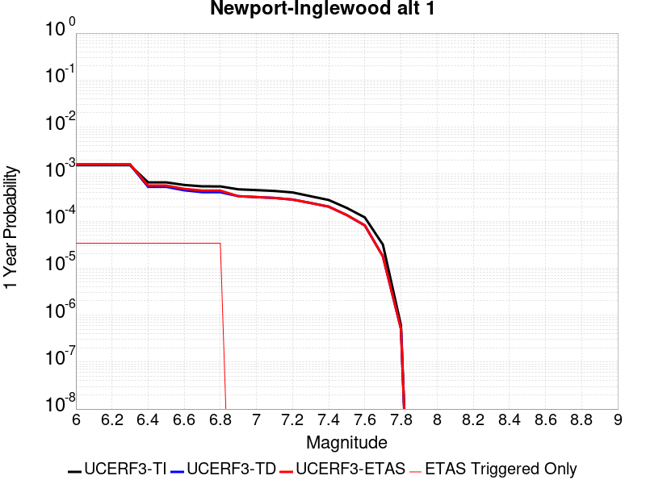 | 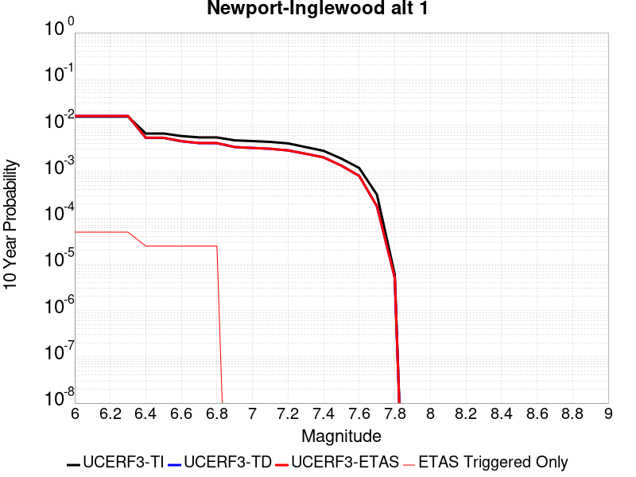 |

| Magnitude | 1 wk TI Prob | 1 wk TD Prob | 1 wk ETAS Prob | 1 wk ETAS/TD Gain | 1 wk ETAS Triggered Only | 1 mo TI Prob | 1 mo TD Prob | 1 mo ETAS Prob | 1 mo ETAS/TD Gain | 1 mo ETAS Triggered Only | 1 yr TI Prob | 1 yr TD Prob | 1 yr ETAS Prob | 1 yr ETAS/TD Gain | 1 yr ETAS Triggered Only | 10 yr TI Prob | 10 yr TD Prob | 10 yr ETAS Prob | 10 yr ETAS/TD Gain | 10 yr ETAS Triggered Only |
|-----|-----|-----|-----|-----|-----|-----|-----|-----|-----|-----|-----|-----|-----|-----|-----|-----|-----|-----|-----|-----|
| 6.0 | 2.9668912E-5 | 3.0404817E-5 | 3.0404817E-5 | 1.0 | 0.0 | 1.2714628E-4 | 1.303026E-4 | 1.5491598E-4 | 1.188894 | 2.4616596E-5 | 0.0015469068 | 0.0015857625 | 0.0016103401 | 1.0154989 | 2.4616596E-5 | 0.015361829 | 0.015792042 | 0.015840499 | 1.0030683 | 4.9233193E-5 |
| 6.1 | 2.9668912E-5 | 3.0404817E-5 | 3.0404817E-5 | 1.0 | 0.0 | 1.2714628E-4 | 1.303026E-4 | 1.5491598E-4 | 1.188894 | 2.4616596E-5 | 0.0015469068 | 0.0015857625 | 0.0016103401 | 1.0154989 | 2.4616596E-5 | 0.015361829 | 0.015792042 | 0.015840499 | 1.0030683 | 4.9233193E-5 |
| 6.2 | 2.9668912E-5 | 3.0404817E-5 | 3.0404817E-5 | 1.0 | 0.0 | 1.2714628E-4 | 1.303026E-4 | 1.5491598E-4 | 1.188894 | 2.4616596E-5 | 0.0015469068 | 0.0015857625 | 0.0016103401 | 1.0154989 | 2.4616596E-5 | 0.015361829 | 0.015792042 | 0.015840499 | 1.0030683 | 4.9233193E-5 |
| 6.3 | 2.9668912E-5 | 3.0404817E-5 | 3.0404817E-5 | 1.0 | 0.0 | 1.2714628E-4 | 1.303026E-4 | 1.5491598E-4 | 1.188894 | 2.4616596E-5 | 0.0015469068 | 0.0015857625 | 0.0016103401 | 1.0154989 | 2.4616596E-5 | 0.015361829 | 0.015792042 | 0.015840499 | 1.0030683 | 4.9233193E-5 |
| 6.4 | 1.275942E-5 | 1.0272503E-5 | 1.0272503E-5 | 1.0 | 0.0 | 5.4682085E-5 | 4.402429E-5 | 6.8639805E-5 | 1.5591347 | 2.4616596E-5 | 6.65551E-4 | 5.358681E-4 | 5.604715E-4 | 1.0459132 | 2.4616596E-5 | 0.0066356123 | 0.005346184 | 0.005370669 | 1.0045799 | 2.4616596E-5 |
| 6.5 | 1.275942E-5 | 1.0272503E-5 | 1.0272503E-5 | 1.0 | 0.0 | 5.4682085E-5 | 4.402429E-5 | 6.8639805E-5 | 1.5591347 | 2.4616596E-5 | 6.65551E-4 | 5.358681E-4 | 5.604715E-4 | 1.0459132 | 2.4616596E-5 | 0.0066356123 | 0.005346184 | 0.005370669 | 1.0045799 | 2.4616596E-5 |
| 6.6 | 1.1255358E-5 | 8.661884E-6 | 8.661884E-6 | 1.0 | 0.0 | 4.8236358E-5 | 3.712184E-5 | 6.1737526E-5 | 1.6631051 | 2.4616596E-5 | 5.871194E-4 | 4.518664E-4 | 4.7647185E-4 | 1.054453 | 2.4616596E-5 | 0.005855706 | 0.004509653 | 0.004534159 | 1.005434 | 2.4616596E-5 |
| 6.7 | 1.0504745E-5 | 7.8997955E-6 | 7.8997955E-6 | 1.0 | 0.0 | 4.5019555E-5 | 3.3855835E-5 | 5.8471596E-5 | 1.7270759 | 2.4616596E-5 | 5.4797524E-4 | 4.1211807E-4 | 4.367245E-4 | 1.0597073 | 2.4616596E-5 | 0.0054662596 | 0.004113668 | 0.0041381833 | 1.0059595 | 2.4616596E-5 |
| 6.8 | 1.0476007E-5 | 7.881176E-6 | 7.881176E-6 | 1.0 | 0.0 | 4.4896402E-5 | 3.3776043E-5 | 5.8391808E-5 | 1.7287936 | 2.4616596E-5 | 5.464766E-4 | 4.1114696E-4 | 4.3575343E-4 | 1.0598484 | 2.4616596E-5 | 0.005451347 | 0.0041039926 | 0.0041285083 | 1.0059736 | 2.4616596E-5 |
| 6.9 | 9.076797E-6 | 6.4896312E-6 | 6.4896312E-6 | 1.0 | 0.0 | 3.889998E-5 | 2.781241E-5 | 2.781241E-5 | 1.0 | 0.0 | 4.7350433E-4 | 3.385638E-4 | 3.385638E-4 | 1.0 | 0.0 | 0.004724967 | 0.0033805177 | 0.0033805177 | 1.0 | 0.0 |
| 7.0 | 8.73795E-6 | 6.2120125E-6 | 6.2120125E-6 | 1.0 | 0.0 | 3.7447822E-5 | 2.6622642E-5 | 2.6622642E-5 | 1.0 | 0.0 | 4.5583185E-4 | 3.2408274E-4 | 3.2408274E-4 | 1.0 | 0.0 | 0.0045489795 | 0.0032361327 | 0.0032361327 | 1.0 | 0.0 |
| 7.1 | 8.391299E-6 | 5.95579E-6 | 5.95579E-6 | 1.0 | 0.0 | 3.5962214E-5 | 2.5524565E-5 | 2.5524565E-5 | 1.0 | 0.0 | 4.37752E-4 | 3.1071753E-4 | 3.1071753E-4 | 1.0 | 0.0 | 0.004368907 | 0.0031028606 | 0.0031028606 | 1.0 | 0.0 |
| 7.2 | 7.796882E-6 | 5.4965344E-6 | 5.4965344E-6 | 1.0 | 0.0 | 3.341478E-5 | 2.3556364E-5 | 2.3556364E-5 | 1.0 | 0.0 | 4.06749E-4 | 2.867612E-4 | 2.867612E-4 | 1.0 | 0.0 | 0.0040600533 | 0.0028639357 | 0.0028639357 | 1.0 | 0.0 |
| 7.3 | 6.4738833E-6 | 4.6478162E-6 | 4.6478162E-6 | 1.0 | 0.0 | 2.774492E-5 | 1.9919062E-5 | 1.9919062E-5 | 1.0 | 0.0 | 3.3774204E-4 | 2.4248775E-4 | 2.4248775E-4 | 1.0 | 0.0 | 0.0033722918 | 0.0024222482 | 0.0024222482 | 1.0 | 0.0 |
| 7.4 | 5.382145E-6 | 3.8857597E-6 | 3.8857597E-6 | 1.0 | 0.0 | 2.3066134E-5 | 1.665315E-5 | 1.665315E-5 | 1.0 | 0.0 | 2.8079396E-4 | 2.0273338E-4 | 2.0273338E-4 | 1.0 | 0.0 | 0.0028043943 | 0.0020254988 | 0.0020254988 | 1.0 | 0.0 |
| 7.5 | 3.648244E-6 | 2.5737843E-6 | 2.5737843E-6 | 1.0 | 0.0 | 1.5635238E-5 | 1.1030458E-5 | 1.1030458E-5 | 1.0 | 0.0 | 1.9034238E-4 | 1.3428765E-4 | 1.3428765E-4 | 1.0 | 0.0 | 0.0019017943 | 0.0013420755 | 0.0013420755 | 1.0 | 0.0 |
| 7.6 | 2.2906888E-6 | 1.5479842E-6 | 1.5479842E-6 | 1.0 | 0.0 | 9.817201E-6 | 6.634202E-6 | 6.634202E-6 | 1.0 | 0.0 | 1.1951787E-4 | 8.076848E-5 | 8.076848E-5 | 1.0 | 0.0 | 0.0011945361 | 8.07398E-4 | 8.07398E-4 | 1.0 | 0.0 |
| 7.7 | 6.0479874E-7 | 3.397512E-7 | 3.397512E-7 | 1.0 | 0.0 | 2.5919921E-6 | 1.4560758E-6 | 1.4560758E-6 | 1.0 | 0.0 | 3.1557047E-5 | 1.7727592E-5 | 1.7727592E-5 | 1.0 | 0.0 | 3.1552566E-4 | 1.7726317E-4 | 1.7726317E-4 | 1.0 | 0.0 |
| 7.8 | 1.16056995E-8 | 9.782373E-9 | 9.782373E-9 | 1.0 | 0.0 | 4.9738713E-8 | 4.1924455E-8 | 4.1924455E-8 | 1.0 | 0.0 | 6.0556863E-7 | 5.1043025E-7 | 5.1043025E-7 | 1.0 | 0.0 | 6.05567E-6 | 5.1043025E-6 | 5.1043025E-6 | 1.0 | 0.0 |

## Calaveras (No) 2011 CFM
*[(top)](#table-of-contents)*

| 1 Week | 1 Month | 1 Year | 10 Year |
|-----|-----|-----|-----|
| 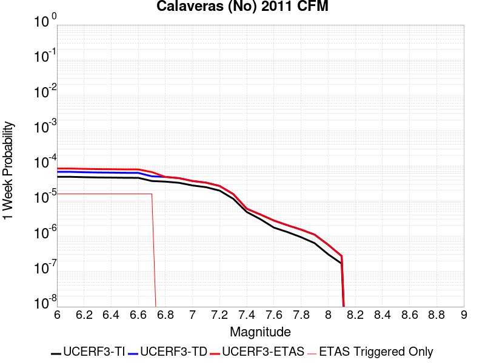 | 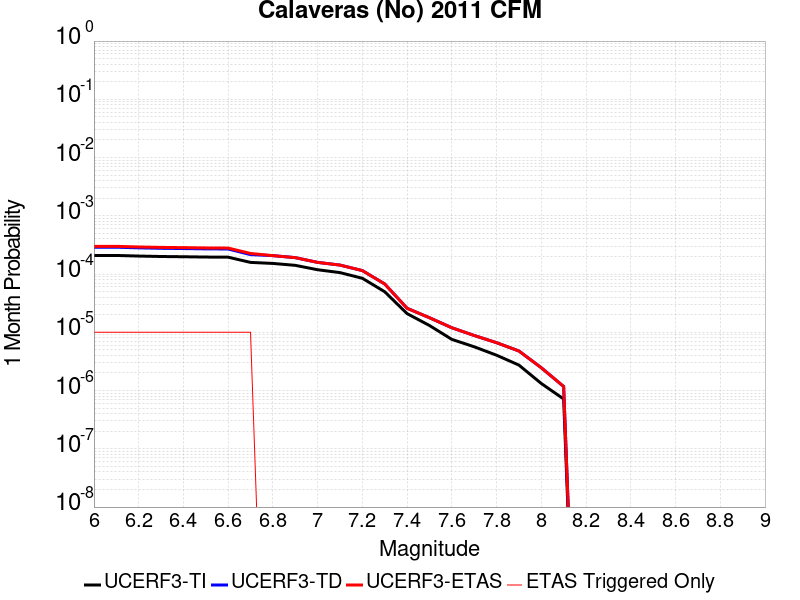 | 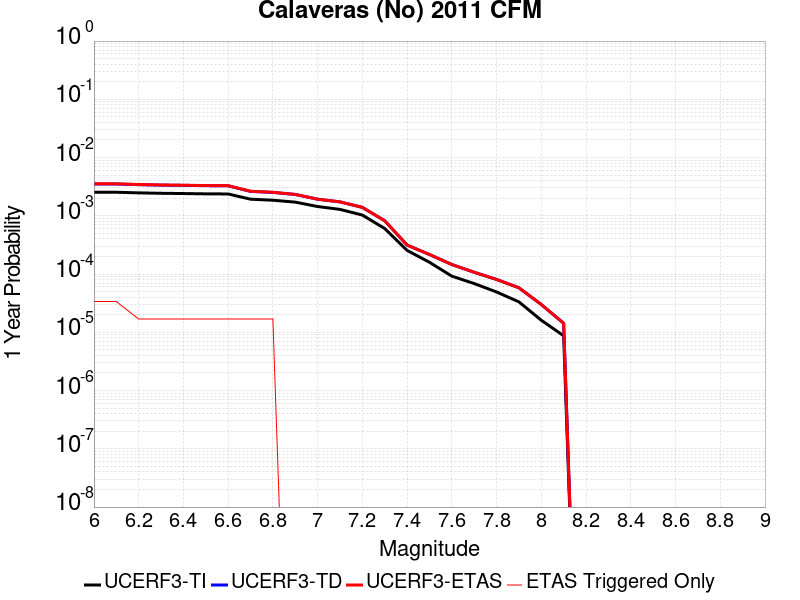 | 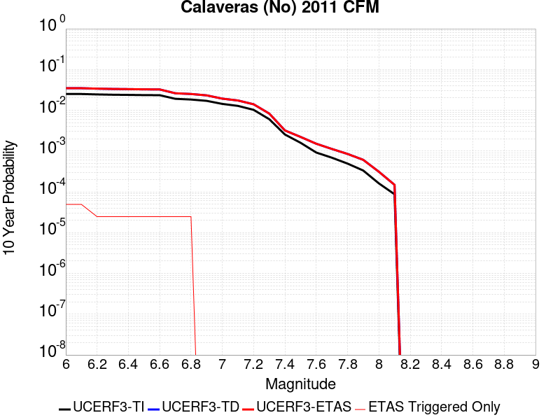 |

| Magnitude | 1 wk TI Prob | 1 wk TD Prob | 1 wk ETAS Prob | 1 wk ETAS/TD Gain | 1 wk ETAS Triggered Only | 1 mo TI Prob | 1 mo TD Prob | 1 mo ETAS Prob | 1 mo ETAS/TD Gain | 1 mo ETAS Triggered Only | 1 yr TI Prob | 1 yr TD Prob | 1 yr ETAS Prob | 1 yr ETAS/TD Gain | 1 yr ETAS Triggered Only | 10 yr TI Prob | 10 yr TD Prob | 10 yr ETAS Prob | 10 yr ETAS/TD Gain | 10 yr ETAS Triggered Only |
|-----|-----|-----|-----|-----|-----|-----|-----|-----|-----|-----|-----|-----|-----|-----|-----|-----|-----|-----|-----|-----|
| 6.0 | 4.8694856E-5 | 6.747121E-5 | 6.747121E-5 | 1.0 | 0.0 | 2.0867554E-4 | 2.8913133E-4 | 2.8913133E-4 | 1.0 | 0.0 | 0.0025376645 | 0.003514627 | 0.0035636872 | 1.0139588 | 4.9233193E-5 | 0.02508881 | 0.034771245 | 0.034818765 | 1.0013667 | 4.9233193E-5 |
| 6.1 | 4.8694856E-5 | 6.747121E-5 | 6.747121E-5 | 1.0 | 0.0 | 2.0867554E-4 | 2.8913133E-4 | 2.8913133E-4 | 1.0 | 0.0 | 0.0025376645 | 0.003514627 | 0.0035636872 | 1.0139588 | 4.9233193E-5 | 0.02508881 | 0.034771245 | 0.034818765 | 1.0013667 | 4.9233193E-5 |
| 6.2 | 4.7541962E-5 | 6.580218E-5 | 6.580218E-5 | 1.0 | 0.0 | 2.0373536E-4 | 2.8197994E-4 | 2.8197994E-4 | 1.0 | 0.0 | 0.0024776561 | 0.003427859 | 0.0034523911 | 1.0071567 | 2.4616596E-5 | 0.024502134 | 0.033932675 | 0.033956457 | 1.0007008 | 2.4616596E-5 |
| 6.3 | 4.6717287E-5 | 6.4635555E-5 | 6.4635555E-5 | 1.0 | 0.0 | 2.0020158E-4 | 2.7698115E-4 | 2.7698115E-4 | 1.0 | 0.0 | 0.0024347296 | 0.0033672103 | 0.003391744 | 1.0072861 | 2.4616596E-5 | 0.024082264 | 0.033345193 | 0.033368986 | 1.0007136 | 2.4616596E-5 |
| 6.4 | 4.6276386E-5 | 6.399742E-5 | 6.399742E-5 | 1.0 | 0.0 | 1.983123E-4 | 2.7424688E-4 | 2.7424688E-4 | 1.0 | 0.0 | 0.0024117786 | 0.0033340224 | 0.003358557 | 1.0073588 | 2.4616596E-5 | 0.02385771 | 0.033024073 | 0.033047877 | 1.0007207 | 2.4616596E-5 |
| 6.5 | 4.5720994E-5 | 6.319881E-5 | 6.319881E-5 | 1.0 | 0.0 | 1.9593239E-4 | 2.70825E-4 | 2.70825E-4 | 1.0 | 0.0 | 0.002382867 | 0.0032924965 | 0.003317032 | 1.007452 | 2.4616596E-5 | 0.023574775 | 0.032622032 | 0.032645848 | 1.00073 | 2.4616596E-5 |
| 6.6 | 4.549134E-5 | 6.28519E-5 | 6.28519E-5 | 1.0 | 0.0 | 1.949483E-4 | 2.6933852E-4 | 2.6933852E-4 | 1.0 | 0.0 | 0.0023709119 | 0.0032744533 | 0.0032989893 | 1.0074931 | 2.4616596E-5 | 0.023457756 | 0.032447387 | 0.032471206 | 1.0007341 | 2.4616596E-5 |
| 6.7 | 3.701047E-5 | 5.0359427E-5 | 5.0359427E-5 | 1.0 | 0.0 | 1.5860666E-4 | 2.1580851E-4 | 2.1580851E-4 | 1.0 | 0.0 | 0.0019293258 | 0.002624346 | 0.002648898 | 1.0093554 | 2.4616596E-5 | 0.019126613 | 0.026125323 | 0.026149297 | 1.0009177 | 2.4616596E-5 |
| 6.8 | 3.5523568E-5 | 4.8341022E-5 | 4.8341022E-5 | 1.0 | 0.0 | 1.5223498E-4 | 2.071596E-4 | 2.071596E-4 | 1.0 | 0.0 | 0.0018518851 | 0.0025192937 | 0.0025438485 | 1.0097467 | 2.4616596E-5 | 0.018365284 | 0.025097553 | 0.025121551 | 1.0009562 | 2.4616596E-5 |
| 6.9 | 3.2946147E-5 | 4.466269E-5 | 4.466269E-5 | 1.0 | 0.0 | 1.4119013E-4 | 1.9139773E-4 | 1.9139773E-4 | 1.0 | 0.0 | 0.0017176344 | 0.0023278191 | 0.0023278191 | 1.0 | 0.0 | 0.017044188 | 0.023219598 | 0.023219598 | 1.0 | 0.0 |
| 7.0 | 2.7682381E-5 | 3.702223E-5 | 3.702223E-5 | 1.0 | 0.0 | 1.1863338E-4 | 1.5865723E-4 | 1.5865723E-4 | 1.0 | 0.0 | 0.0014434044 | 0.0019299705 | 0.0019299705 | 1.0 | 0.0 | 0.01434065 | 0.01931092 | 0.01931092 | 1.0 | 0.0 |
| 7.1 | 2.471967E-5 | 3.328669E-5 | 3.328669E-5 | 1.0 | 0.0 | 1.05937135E-4 | 1.4264962E-4 | 1.4264962E-4 | 1.0 | 0.0 | 0.0012890215 | 0.0017354045 | 0.0017354045 | 1.0 | 0.0 | 0.0128157 | 0.017385952 | 0.017385952 | 1.0 | 0.0 |
| 7.2 | 1.9748062E-5 | 2.6774684E-5 | 2.6774684E-5 | 1.0 | 0.0 | 8.463181E-5 | 1.1474373E-4 | 1.1474373E-4 | 1.0 | 0.0 | 0.0010299052 | 0.0013961331 | 0.0013961331 | 1.0 | 0.0 | 0.01025145 | 0.014030739 | 0.014030739 | 1.0 | 0.0 |
| 7.3 | 1.1603734E-5 | 1.5783844E-5 | 1.5783844E-5 | 1.0 | 0.0 | 4.9729337E-5 | 6.764337E-5 | 6.764337E-5 | 1.0 | 0.0 | 6.052865E-4 | 8.232611E-4 | 8.232611E-4 | 1.0 | 0.0 | 0.0060364045 | 0.008308666 | 0.008308666 | 1.0 | 0.0 |
| 7.4 | 4.885381E-6 | 6.0349853E-6 | 6.0349853E-6 | 1.0 | 0.0 | 2.0937177E-5 | 2.5863968E-5 | 2.5863968E-5 | 1.0 | 0.0 | 2.5488032E-4 | 3.148485E-4 | 3.148485E-4 | 1.0 | 0.0 | 0.0025458818 | 0.0032010598 | 0.0032010598 | 1.0 | 0.0 |
| 7.5 | 3.0571264E-6 | 4.155299E-6 | 4.155299E-6 | 1.0 | 0.0 | 1.3101904E-5 | 1.7808303E-5 | 1.7808303E-5 | 1.0 | 0.0 | 1.5950401E-4 | 2.1679462E-4 | 2.1679462E-4 | 1.0 | 0.0 | 0.0015938957 | 0.002221121 | 0.002221121 | 1.0 | 0.0 |
| 7.6 | 1.764948E-6 | 2.7955498E-6 | 2.7955498E-6 | 1.0 | 0.0 | 7.564041E-6 | 1.1980874E-5 | 1.1980874E-5 | 1.0 | 0.0 | 9.208831E-5 | 1.4585744E-4 | 1.4585744E-4 | 1.0 | 0.0 | 9.205016E-4 | 0.0015123509 | 0.0015123509 | 1.0 | 0.0 |
| 7.7 | 1.3173734E-6 | 2.058471E-6 | 2.058471E-6 | 1.0 | 0.0 | 5.645874E-6 | 8.8219895E-6 | 8.8219895E-6 | 1.0 | 0.0 | 6.873634E-5 | 1.0740245E-4 | 1.0740245E-4 | 1.0 | 0.0 | 6.8715087E-4 | 0.0011261401 | 0.0011261401 | 1.0 | 0.0 |
| 7.8 | 9.4429885E-7 | 1.5489635E-6 | 1.5489635E-6 | 1.0 | 0.0 | 4.0469886E-6 | 6.638398E-6 | 6.638398E-6 | 1.0 | 0.0 | 4.9270973E-5 | 8.081952E-5 | 8.081952E-5 | 1.0 | 0.0 | 4.926005E-4 | 8.5014524E-4 | 8.5014524E-4 | 1.0 | 0.0 |
| 7.9 | 6.388233E-7 | 1.1148749E-6 | 1.1148749E-6 | 1.0 | 0.0 | 2.7378112E-6 | 4.7780263E-6 | 4.7780263E-6 | 1.0 | 0.0 | 3.3332344E-5 | 5.817093E-5 | 5.817093E-5 | 1.0 | 0.0 | 3.3327343E-4 | 6.0963054E-4 | 6.0963054E-4 | 1.0 | 0.0 |
| 8.0 | 3.087986E-7 | 5.7543696E-7 | 5.7543696E-7 | 1.0 | 0.0 | 1.323422E-6 | 2.466156E-6 | 2.466156E-6 | 1.0 | 0.0 | 1.6112543E-5 | 3.002504E-5 | 3.002504E-5 | 1.0 | 0.0 | 1.6111376E-4 | 3.110302E-4 | 3.110302E-4 | 1.0 | 0.0 |
| 8.1 | 1.6725647E-7 | 2.7410047E-7 | 2.7410047E-7 | 1.0 | 0.0 | 7.168133E-7 | 1.1747159E-6 | 1.1747159E-6 | 1.0 | 0.0 | 8.7271665E-6 | 1.4302073E-5 | 1.4302073E-5 | 1.0 | 0.0 | 8.726824E-5 | 1.48486E-4 | 1.48486E-4 | 1.0 | 0.0 |

## Bullion Mountains
*[(top)](#table-of-contents)*

| 1 Week | 1 Month | 1 Year | 10 Year |
|-----|-----|-----|-----|
| 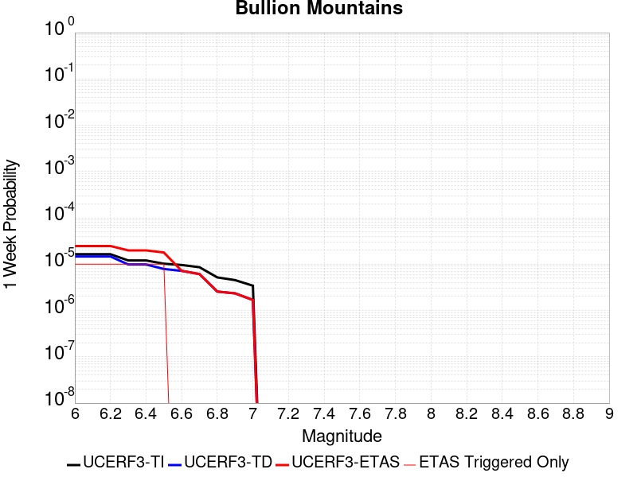 | 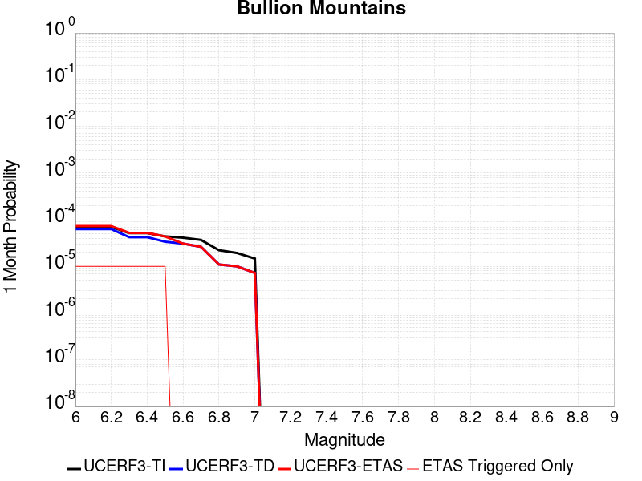 | 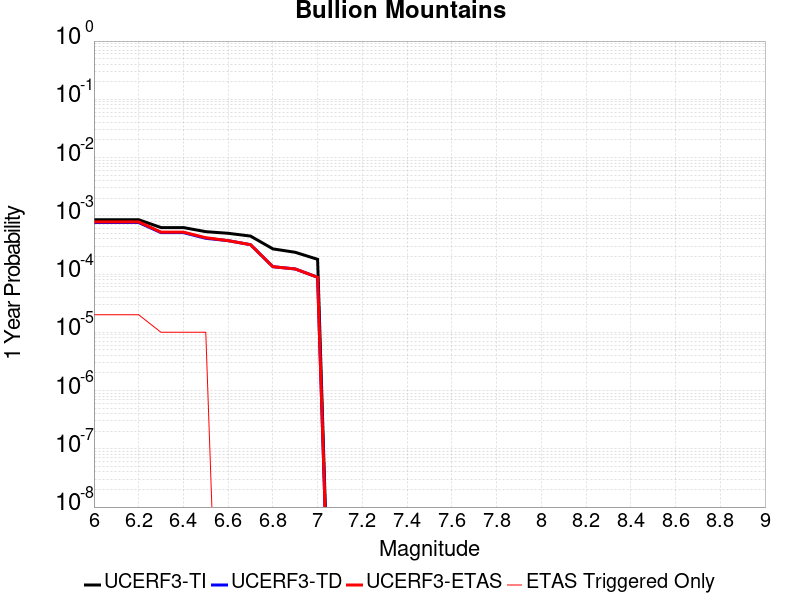 | 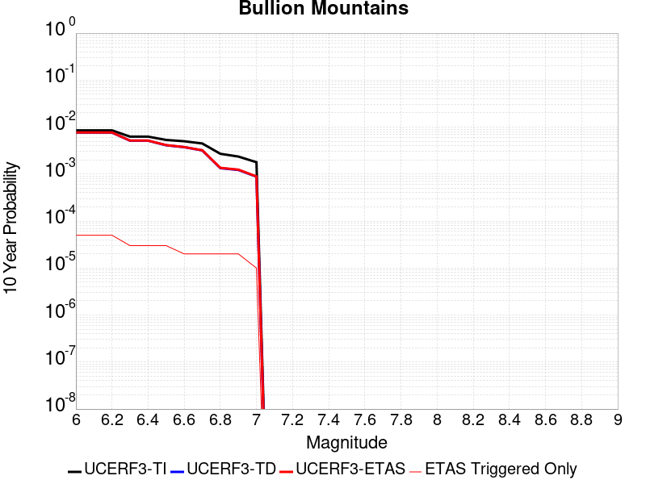 |

| Magnitude | 1 wk TI Prob | 1 wk TD Prob | 1 wk ETAS Prob | 1 wk ETAS/TD Gain | 1 wk ETAS Triggered Only | 1 mo TI Prob | 1 mo TD Prob | 1 mo ETAS Prob | 1 mo ETAS/TD Gain | 1 mo ETAS Triggered Only | 1 yr TI Prob | 1 yr TD Prob | 1 yr ETAS Prob | 1 yr ETAS/TD Gain | 1 yr ETAS Triggered Only | 10 yr TI Prob | 10 yr TD Prob | 10 yr ETAS Prob | 10 yr ETAS/TD Gain | 10 yr ETAS Triggered Only |
|-----|-----|-----|-----|-----|-----|-----|-----|-----|-----|-----|-----|-----|-----|-----|-----|-----|-----|-----|-----|-----|
| 6.0 | 1.6420427E-5 | 1.4692089E-5 | 1.4692089E-5 | 1.0 | 0.0 | 7.037136E-5 | 6.296479E-5 | 6.296479E-5 | 1.0 | 0.0 | 8.5643446E-4 | 7.663651E-4 | 7.663651E-4 | 1.0 | 0.0 | 0.008531413 | 0.007641016 | 0.007689873 | 1.006394 | 4.9233193E-5 |
| 6.1 | 1.6420427E-5 | 1.4692089E-5 | 1.4692089E-5 | 1.0 | 0.0 | 7.037136E-5 | 6.296479E-5 | 6.296479E-5 | 1.0 | 0.0 | 8.5643446E-4 | 7.663651E-4 | 7.663651E-4 | 1.0 | 0.0 | 0.008531413 | 0.007641016 | 0.007689873 | 1.006394 | 4.9233193E-5 |
| 6.2 | 1.6420427E-5 | 1.4692089E-5 | 1.4692089E-5 | 1.0 | 0.0 | 7.037136E-5 | 6.296479E-5 | 6.296479E-5 | 1.0 | 0.0 | 8.5643446E-4 | 7.663651E-4 | 7.663651E-4 | 1.0 | 0.0 | 0.008531413 | 0.007641016 | 0.007689873 | 1.006394 | 4.9233193E-5 |
| 6.3 | 1.2046778E-5 | 9.862335E-6 | 9.862335E-6 | 1.0 | 0.0 | 5.1628023E-5 | 4.2266598E-5 | 4.2266598E-5 | 1.0 | 0.0 | 6.283899E-4 | 5.144975E-4 | 5.144975E-4 | 1.0 | 0.0 | 0.0062661595 | 0.005135345 | 0.0051598353 | 1.004769 | 2.4616596E-5 |
| 6.4 | 1.2046778E-5 | 9.862335E-6 | 9.862335E-6 | 1.0 | 0.0 | 5.1628023E-5 | 4.2266598E-5 | 4.2266598E-5 | 1.0 | 0.0 | 6.283899E-4 | 5.144975E-4 | 5.144975E-4 | 1.0 | 0.0 | 0.0062661595 | 0.005135345 | 0.0051598353 | 1.004769 | 2.4616596E-5 |
| 6.5 | 1.0244343E-5 | 7.879458E-6 | 7.879458E-6 | 1.0 | 0.0 | 4.390359E-5 | 3.3768785E-5 | 3.3768785E-5 | 1.0 | 0.0 | 5.343951E-4 | 4.110781E-4 | 4.110781E-4 | 1.0 | 0.0 | 0.005331118 | 0.004105208 | 0.0041297236 | 1.0059718 | 2.4616596E-5 |
| 6.6 | 9.605408E-6 | 7.1774966E-6 | 7.1774966E-6 | 1.0 | 0.0 | 4.1165385E-5 | 3.076045E-5 | 3.076045E-5 | 1.0 | 0.0 | 5.010733E-4 | 3.744645E-4 | 3.744645E-4 | 1.0 | 0.0 | 0.00499945 | 0.003740332 | 0.0037648566 | 1.0065567 | 2.4616596E-5 |
| 6.7 | 8.60418E-6 | 6.1240044E-6 | 6.1240044E-6 | 1.0 | 0.0 | 3.687454E-5 | 2.624558E-5 | 2.624558E-5 | 1.0 | 0.0 | 4.48855E-4 | 3.1951256E-4 | 3.1951256E-4 | 1.0 | 0.0 | 0.004479495 | 0.0031924439 | 0.003216982 | 1.0076863 | 2.4616596E-5 |
| 6.8 | 5.187994E-6 | 2.5631666E-6 | 2.5631666E-6 | 1.0 | 0.0 | 2.223407E-5 | 1.0984976E-5 | 1.0984976E-5 | 1.0 | 0.0 | 2.7066618E-4 | 1.3373788E-4 | 1.3373788E-4 | 1.0 | 0.0 | 0.0027033675 | 0.0013369655 | 0.0013615491 | 1.0183877 | 2.4616596E-5 |
| 6.9 | 4.5302368E-6 | 2.3443165E-6 | 2.3443165E-6 | 1.0 | 0.0 | 1.9415156E-5 | 1.0047055E-5 | 1.0047055E-5 | 1.0 | 0.0 | 2.3635388E-4 | 1.2232E-4 | 1.2232E-4 | 1.0 | 0.0 | 0.0023610266 | 0.0012229157 | 0.0012475023 | 1.0201048 | 2.4616596E-5 |
| 7.0 | 3.431668E-6 | 1.6882402E-6 | 1.6882402E-6 | 1.0 | 0.0 | 1.4707065E-5 | 7.235315E-6 | 7.235315E-6 | 1.0 | 0.0 | 1.7904381E-4 | 8.808996E-5 | 8.808996E-5 | 1.0 | 0.0 | 0.0017889962 | 8.808996E-4 | 9.0549455E-4 | 1.0279202 | 2.4616596E-5 |

## Puente Hills
*[(top)](#table-of-contents)*

| 1 Week | 1 Month | 1 Year | 10 Year |
|-----|-----|-----|-----|
| 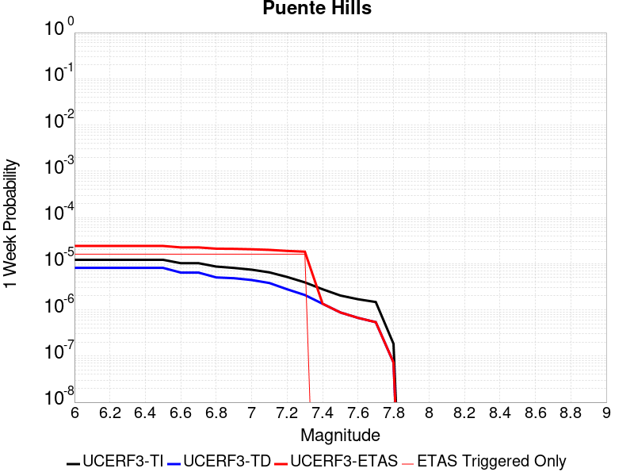 | 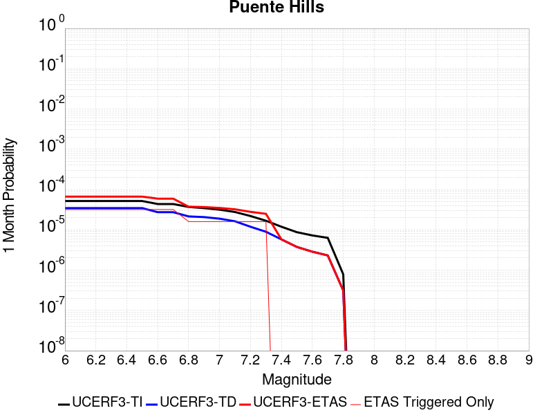 | 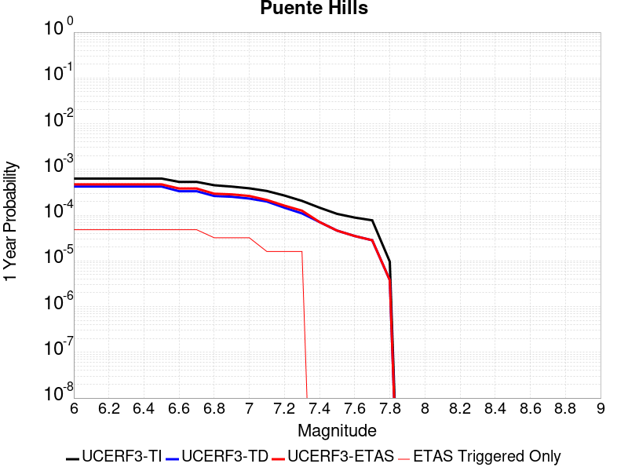 | 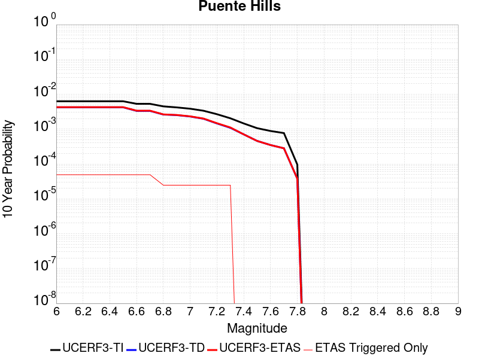 |

| Magnitude | 1 wk TI Prob | 1 wk TD Prob | 1 wk ETAS Prob | 1 wk ETAS/TD Gain | 1 wk ETAS Triggered Only | 1 mo TI Prob | 1 mo TD Prob | 1 mo ETAS Prob | 1 mo ETAS/TD Gain | 1 mo ETAS Triggered Only | 1 yr TI Prob | 1 yr TD Prob | 1 yr ETAS Prob | 1 yr ETAS/TD Gain | 1 yr ETAS Triggered Only | 10 yr TI Prob | 10 yr TD Prob | 10 yr ETAS Prob | 10 yr ETAS/TD Gain | 10 yr ETAS Triggered Only |
|-----|-----|-----|-----|-----|-----|-----|-----|-----|-----|-----|-----|-----|-----|-----|-----|-----|-----|-----|-----|-----|
| 6.0 | 1.2101656E-5 | 8.098625E-6 | 3.2715023E-5 | 4.0395775 | 2.4616596E-5 | 5.1863204E-5 | 3.4707962E-5 | 8.393945E-5 | 2.4184492 | 4.9233193E-5 | 6.312516E-4 | 4.2249315E-4 | 4.7170554E-4 | 1.116481 | 4.9233193E-5 | 0.0062946146 | 0.0042174594 | 0.004266485 | 1.0116245 | 4.9233193E-5 |
| 6.1 | 1.2101656E-5 | 8.098625E-6 | 3.2715023E-5 | 4.0395775 | 2.4616596E-5 | 5.1863204E-5 | 3.4707962E-5 | 8.393945E-5 | 2.4184492 | 4.9233193E-5 | 6.312516E-4 | 4.2249315E-4 | 4.7170554E-4 | 1.116481 | 4.9233193E-5 | 0.0062946146 | 0.0042174594 | 0.004266485 | 1.0116245 | 4.9233193E-5 |
| 6.2 | 1.2101656E-5 | 8.098625E-6 | 3.2715023E-5 | 4.0395775 | 2.4616596E-5 | 5.1863204E-5 | 3.4707962E-5 | 8.393945E-5 | 2.4184492 | 4.9233193E-5 | 6.312516E-4 | 4.2249315E-4 | 4.7170554E-4 | 1.116481 | 4.9233193E-5 | 0.0062946146 | 0.0042174594 | 0.004266485 | 1.0116245 | 4.9233193E-5 |
| 6.3 | 1.2101656E-5 | 8.098625E-6 | 3.2715023E-5 | 4.0395775 | 2.4616596E-5 | 5.1863204E-5 | 3.4707962E-5 | 8.393945E-5 | 2.4184492 | 4.9233193E-5 | 6.312516E-4 | 4.2249315E-4 | 4.7170554E-4 | 1.116481 | 4.9233193E-5 | 0.0062946146 | 0.0042174594 | 0.004266485 | 1.0116245 | 4.9233193E-5 |
| 6.4 | 1.2101656E-5 | 8.098625E-6 | 3.2715023E-5 | 4.0395775 | 2.4616596E-5 | 5.1863204E-5 | 3.4707962E-5 | 8.393945E-5 | 2.4184492 | 4.9233193E-5 | 6.312516E-4 | 4.2249315E-4 | 4.7170554E-4 | 1.116481 | 4.9233193E-5 | 0.0062946146 | 0.0042174594 | 0.004266485 | 1.0116245 | 4.9233193E-5 |
| 6.5 | 1.2101656E-5 | 8.098625E-6 | 3.2715023E-5 | 4.0395775 | 2.4616596E-5 | 5.1863204E-5 | 3.4707962E-5 | 8.393945E-5 | 2.4184492 | 4.9233193E-5 | 6.312516E-4 | 4.2249315E-4 | 4.7170554E-4 | 1.116481 | 4.9233193E-5 | 0.0062946146 | 0.0042174594 | 0.004266485 | 1.0116245 | 4.9233193E-5 |
| 6.6 | 1.0222488E-5 | 6.3991847E-6 | 3.1015625E-5 | 4.846809 | 2.4616596E-5 | 4.3809923E-5 | 2.7424803E-5 | 7.6656645E-5 | 2.7951577 | 4.9233193E-5 | 5.332553E-4 | 3.3384826E-4 | 3.8306502E-4 | 1.1474226 | 4.9233193E-5 | 0.0053197746 | 0.0033337125 | 0.0033827815 | 1.014719 | 4.9233193E-5 |
| 6.7 | 1.0222488E-5 | 6.3991847E-6 | 3.1015625E-5 | 4.846809 | 2.4616596E-5 | 4.3809923E-5 | 2.7424803E-5 | 7.6656645E-5 | 2.7951577 | 4.9233193E-5 | 5.332553E-4 | 3.3384826E-4 | 3.8306502E-4 | 1.1474226 | 4.9233193E-5 | 0.0053197746 | 0.0033337125 | 0.0033827815 | 1.014719 | 4.9233193E-5 |
| 6.8 | 8.6367845E-6 | 5.0282533E-6 | 2.9644725E-5 | 5.895631 | 2.4616596E-5 | 3.7014266E-5 | 2.1549482E-5 | 4.6165547E-5 | 2.1423044 | 2.4616596E-5 | 4.505555E-4 | 2.623339E-4 | 2.8694404E-4 | 1.0938122 | 2.4616596E-5 | 0.004496431 | 0.0026202986 | 0.0026448506 | 1.00937 | 2.4616596E-5 |
| 6.9 | 8.066481E-6 | 4.836117E-6 | 2.9452594E-5 | 6.0901327 | 2.4616596E-5 | 3.4570177E-5 | 2.0726053E-5 | 4.534214E-5 | 2.187688 | 2.4616596E-5 | 4.2081063E-4 | 2.52311E-4 | 2.769214E-4 | 1.0975399 | 2.4616596E-5 | 0.0042001465 | 0.0025202993 | 0.0025448538 | 1.0097427 | 2.4616596E-5 |
| 7.0 | 7.393828E-6 | 4.417296E-6 | 2.9033785E-5 | 6.57275 | 2.4616596E-5 | 3.168745E-5 | 1.8931134E-5 | 4.3547265E-5 | 2.3002987 | 2.4616596E-5 | 3.857264E-4 | 2.3046264E-4 | 2.5507357E-4 | 1.1067892 | 2.4616596E-5 | 0.0038505755 | 0.0023022818 | 0.0023268417 | 1.0106677 | 2.4616596E-5 |
| 7.1 | 6.4660953E-6 | 3.8044495E-6 | 2.8420953E-5 | 7.4704504 | 2.4616596E-5 | 2.7711543E-5 | 1.6304684E-5 | 4.092088E-5 | 2.509762 | 2.4616596E-5 | 3.373358E-4 | 1.984918E-4 | 2.2310352E-4 | 1.1239936 | 2.4616596E-5 | 0.0033682417 | 0.001983181 | 0.0020077487 | 1.0123881 | 2.4616596E-5 |
| 7.2 | 5.143232E-6 | 2.7865456E-6 | 2.7403074E-5 | 9.834066 | 2.4616596E-5 | 2.2042237E-5 | 1.1942284E-5 | 3.6558587E-5 | 3.0612726 | 2.4616596E-5 | 2.6833118E-4 | 1.453877E-4 | 1.7000071E-4 | 1.1692923 | 2.4616596E-5 | 0.002680074 | 0.0014529356 | 0.0014775164 | 1.0169181 | 2.4616596E-5 |
| 7.3 | 3.928255E-6 | 2.0913774E-6 | 2.6707923E-5 | 12.770494 | 2.4616596E-5 | 1.683527E-5 | 8.963015E-6 | 3.3579392E-5 | 3.7464392 | 2.4616596E-5 | 2.0495013E-4 | 1.0911931E-4 | 1.3373322E-4 | 1.2255688 | 2.4616596E-5 | 0.002047612 | 0.001090664 | 0.0011152537 | 1.0225457 | 2.4616596E-5 |
| 7.4 | 2.7894434E-6 | 1.3546753E-6 | 1.3546753E-6 | 1.0 | 0.0 | 1.1954703E-5 | 5.8057385E-6 | 5.8057385E-6 | 1.0 | 0.0 | 1.4553878E-4 | 7.068262E-5 | 7.068262E-5 | 1.0 | 0.0 | 0.001454435 | 7.066058E-4 | 7.066058E-4 | 1.0 | 0.0 |
| 7.5 | 2.041735E-6 | 8.787305E-7 | 8.787305E-7 | 1.0 | 0.0 | 8.750263E-6 | 3.7659825E-6 | 3.7659825E-6 | 1.0 | 0.0 | 1.06529245E-4 | 4.5849905E-5 | 4.5849905E-5 | 1.0 | 0.0 | 0.0010647819 | 4.5840783E-4 | 4.5840783E-4 | 1.0 | 0.0 |
| 7.6 | 1.6959062E-6 | 6.6986263E-7 | 6.6986263E-7 | 1.0 | 0.0 | 7.268149E-6 | 2.8708366E-6 | 2.8708366E-6 | 1.0 | 0.0 | 8.848612E-5 | 3.4951907E-5 | 3.4951907E-5 | 1.0 | 0.0 | 8.84509E-4 | 3.4946698E-4 | 3.4946698E-4 | 1.0 | 0.0 |
| 7.7 | 1.4767965E-6 | 5.407607E-7 | 5.407607E-7 | 1.0 | 0.0 | 6.3291122E-6 | 2.317544E-6 | 2.317544E-6 | 1.0 | 0.0 | 7.705422E-5 | 2.8215758E-5 | 2.8215758E-5 | 1.0 | 0.0 | 7.702751E-4 | 2.8212433E-4 | 2.8212433E-4 | 1.0 | 0.0 |
| 7.8 | 1.8432911E-7 | 7.28201E-8 | 7.28201E-8 | 1.0 | 0.0 | 7.8998164E-7 | 3.1208612E-7 | 3.1208612E-7 | 1.0 | 0.0 | 9.617985E-6 | 3.7996451E-6 | 3.7996451E-6 | 1.0 | 0.0 | 9.617568E-5 | 3.7996128E-5 | 3.7996128E-5 | 1.0 | 0.0 |

## Elsinore (Stepovers Combined)
*[(top)](#table-of-contents)*

| 1 Week | 1 Month | 1 Year | 10 Year |
|-----|-----|-----|-----|
| 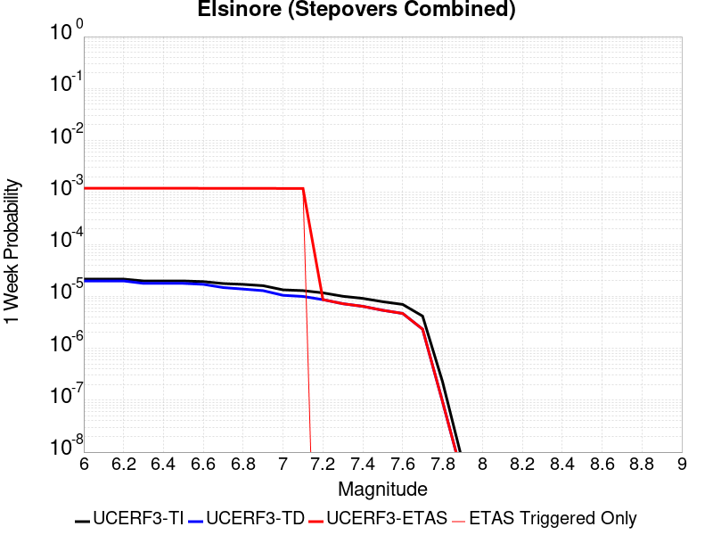 | 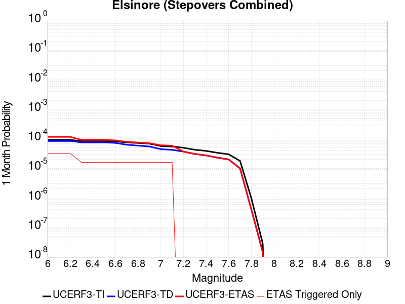 | 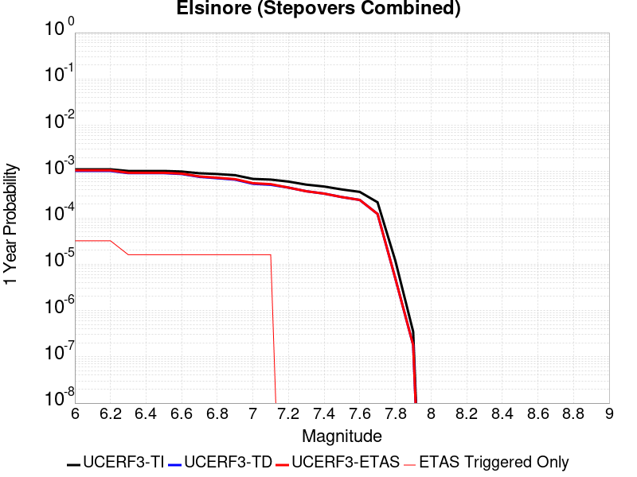 | 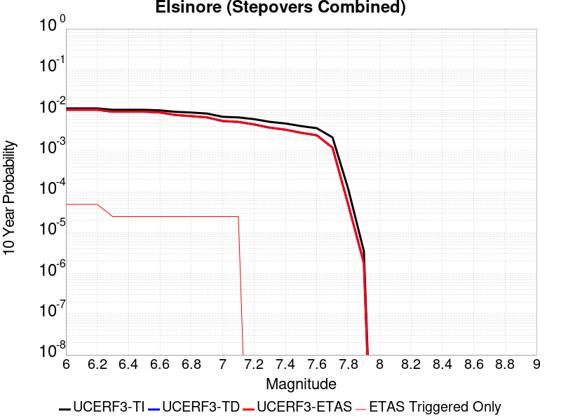 |

| Magnitude | 1 wk TI Prob | 1 wk TD Prob | 1 wk ETAS Prob | 1 wk ETAS/TD Gain | 1 wk ETAS Triggered Only | 1 mo TI Prob | 1 mo TD Prob | 1 mo ETAS Prob | 1 mo ETAS/TD Gain | 1 mo ETAS Triggered Only | 1 yr TI Prob | 1 yr TD Prob | 1 yr ETAS Prob | 1 yr ETAS/TD Gain | 1 yr ETAS Triggered Only | 10 yr TI Prob | 10 yr TD Prob | 10 yr ETAS Prob | 10 yr ETAS/TD Gain | 10 yr ETAS Triggered Only |
|-----|-----|-----|-----|-----|-----|-----|-----|-----|-----|-----|-----|-----|-----|-----|-----|-----|-----|-----|-----|-----|
| 6.0 | 2.144392E-5 | 1.9760193E-5 | 4.4376302E-5 | 2.2457423 | 2.4616596E-5 | 9.189928E-5 | 8.468392E-5 | 1.3391294E-4 | 1.5813267 | 4.9233193E-5 | 0.0011182994 | 0.0010305607 | 0.0010797431 | 1.047724 | 4.9233193E-5 | 0.011126885 | 0.010264917 | 0.010313645 | 1.004747 | 4.9233193E-5 |
| 6.1 | 2.144392E-5 | 1.9760193E-5 | 4.4376302E-5 | 2.2457423 | 2.4616596E-5 | 9.189928E-5 | 8.468392E-5 | 1.3391294E-4 | 1.5813267 | 4.9233193E-5 | 0.0011182994 | 0.0010305607 | 0.0010797431 | 1.047724 | 4.9233193E-5 | 0.011126885 | 0.010264917 | 0.010313645 | 1.004747 | 4.9233193E-5 |
| 6.2 | 2.144392E-5 | 1.9760193E-5 | 4.4376302E-5 | 2.2457423 | 2.4616596E-5 | 9.189928E-5 | 8.468392E-5 | 1.3391294E-4 | 1.5813267 | 4.9233193E-5 | 0.0011182994 | 0.0010305607 | 0.0010797431 | 1.047724 | 4.9233193E-5 | 0.011126885 | 0.010264917 | 0.010313645 | 1.004747 | 4.9233193E-5 |
| 6.3 | 1.9751555E-5 | 1.7741453E-5 | 4.2357613E-5 | 2.387494 | 2.4616596E-5 | 8.4646774E-5 | 7.603267E-5 | 1.006474E-4 | 1.3237388 | 2.4616596E-5 | 0.0010300872 | 9.253213E-4 | 9.499151E-4 | 1.0265787 | 2.4616596E-5 | 0.010253254 | 0.009221276 | 0.009245666 | 1.0026449 | 2.4616596E-5 |
| 6.4 | 1.9751555E-5 | 1.7741453E-5 | 4.2357613E-5 | 2.387494 | 2.4616596E-5 | 8.4646774E-5 | 7.603267E-5 | 1.006474E-4 | 1.3237388 | 2.4616596E-5 | 0.0010300872 | 9.253213E-4 | 9.499151E-4 | 1.0265787 | 2.4616596E-5 | 0.010253254 | 0.009221276 | 0.009245666 | 1.0026449 | 2.4616596E-5 |
| 6.5 | 1.9751555E-5 | 1.7741453E-5 | 4.2357613E-5 | 2.387494 | 2.4616596E-5 | 8.4646774E-5 | 7.603267E-5 | 1.006474E-4 | 1.3237388 | 2.4616596E-5 | 0.0010300872 | 9.253213E-4 | 9.499151E-4 | 1.0265787 | 2.4616596E-5 | 0.010253254 | 0.009221276 | 0.009245666 | 1.0026449 | 2.4616596E-5 |
| 6.6 | 1.9188685E-5 | 1.7003393E-5 | 4.1619573E-5 | 2.4477215 | 2.4616596E-5 | 8.2234634E-5 | 7.286974E-5 | 9.748454E-5 | 1.3377918 | 2.4616596E-5 | 0.0010007467 | 8.868442E-4 | 9.114389E-4 | 1.0277328 | 2.4616596E-5 | 0.00996252 | 0.0088398475 | 0.008864246 | 1.0027602 | 2.4616596E-5 |
| 6.7 | 1.7608272E-5 | 1.4732616E-5 | 3.934885E-5 | 2.6708665 | 2.4616596E-5 | 7.546184E-5 | 6.3138315E-5 | 8.775335E-5 | 1.3898591 | 2.4616596E-5 | 9.183606E-4 | 7.684476E-4 | 7.9304527E-4 | 1.0320096 | 2.4616596E-5 | 0.009145746 | 0.00766491 | 0.007689338 | 1.003187 | 2.4616596E-5 |
| 6.8 | 1.697165E-5 | 1.3783365E-5 | 3.8399623E-5 | 2.7859397 | 2.4616596E-5 | 7.273361E-5 | 5.9070277E-5 | 8.3685416E-5 | 1.4167094 | 2.4616596E-5 | 8.8517193E-4 | 7.18952E-4 | 7.435509E-4 | 1.034215 | 2.4616596E-5 | 0.008816543 | 0.007172675 | 0.007197115 | 1.0034074 | 2.4616596E-5 |
| 6.9 | 1.600365E-5 | 1.2846671E-5 | 3.7462953E-5 | 2.91616 | 2.4616596E-5 | 6.858527E-5 | 5.5056043E-5 | 7.9671285E-5 | 1.4470942 | 2.4616596E-5 | 8.347058E-4 | 6.7010894E-4 | 6.947091E-4 | 1.0367106 | 2.4616596E-5 | 0.008315775 | 0.0066867657 | 0.006711218 | 1.0036567 | 2.4616596E-5 |
| 7.0 | 1.3314581E-5 | 1.0447548E-5 | 3.5063887E-5 | 3.3561833 | 2.4616596E-5 | 5.7061243E-5 | 4.4774453E-5 | 6.938995E-5 | 1.5497665 | 2.4616596E-5 | 6.944992E-4 | 5.449953E-4 | 5.695985E-4 | 1.0451438 | 2.4616596E-5 | 0.006923327 | 0.0054405155 | 0.005464998 | 1.0045 | 2.4616596E-5 |
| 7.1 | 1.2865345E-5 | 9.937536E-6 | 3.4553887E-5 | 3.4771082 | 2.4616596E-5 | 5.5136024E-5 | 4.258876E-5 | 6.720431E-5 | 1.5779823 | 2.4616596E-5 | 6.710743E-4 | 5.183973E-4 | 5.4300117E-4 | 1.0474614 | 2.4616596E-5 | 0.0066905143 | 0.0051752133 | 0.0051997025 | 1.004732 | 2.4616596E-5 |
| 7.2 | 1.1650051E-5 | 8.633809E-6 | 8.633809E-6 | 1.0 | 0.0 | 4.9927836E-5 | 3.7001522E-5 | 3.7001522E-5 | 1.0 | 0.0 | 6.0770183E-4 | 4.504022E-4 | 4.504022E-4 | 1.0 | 0.0 | 0.0060604266 | 0.0044963174 | 0.0044963174 | 1.0 | 0.0 |
| 7.3 | 1.0008533E-5 | 7.2010425E-6 | 7.2010425E-6 | 1.0 | 0.0 | 4.2893007E-5 | 3.0861254E-5 | 3.0861254E-5 | 1.0 | 0.0 | 5.220972E-4 | 3.7567242E-4 | 3.7567242E-4 | 1.0 | 0.0 | 0.005208723 | 0.003750761 | 0.003750761 | 1.0 | 0.0 |
| 7.4 | 9.116759E-6 | 6.410068E-6 | 6.410068E-6 | 1.0 | 0.0 | 3.907124E-5 | 2.747144E-5 | 2.747144E-5 | 1.0 | 0.0 | 4.7558855E-4 | 3.3441483E-4 | 3.3441483E-4 | 1.0 | 0.0 | 0.00474572 | 0.0033392678 | 0.0033392678 | 1.0 | 0.0 |
| 7.5 | 7.870524E-6 | 5.3825365E-6 | 5.3825365E-6 | 1.0 | 0.0 | 3.3730383E-5 | 2.3067816E-5 | 2.3067816E-5 | 1.0 | 0.0 | 4.1059E-4 | 2.8081573E-4 | 2.8081573E-4 | 1.0 | 0.0 | 0.0040983222 | 0.0028047354 | 0.0028047354 | 1.0 | 0.0 |
| 7.6 | 6.9774537E-6 | 4.6776067E-6 | 4.6776067E-6 | 1.0 | 0.0 | 2.990303E-5 | 2.0046738E-5 | 2.0046738E-5 | 1.0 | 0.0 | 3.640086E-4 | 2.4404288E-4 | 2.4404288E-4 | 1.0 | 0.0 | 0.003634129 | 0.0024378651 | 0.0024378651 | 1.0 | 0.0 |
| 7.7 | 4.1616954E-6 | 2.32834E-6 | 2.32834E-6 | 1.0 | 0.0 | 1.7835715E-5 | 9.978567E-6 | 9.978567E-6 | 1.0 | 0.0 | 2.171282E-4 | 1.2148302E-4 | 1.2148302E-4 | 1.0 | 0.0 | 0.0021691616 | 0.0012142392 | 0.0012142392 | 1.0 | 0.0 |
| 7.8 | 2.2692414E-7 | 9.3854695E-8 | 9.3854695E-8 | 1.0 | 0.0 | 9.725317E-7 | 4.0223435E-7 | 4.0223435E-7 | 1.0 | 0.0 | 1.1840509E-5 | 4.8971956E-6 | 4.8971956E-6 | 1.0 | 0.0 | 1.1839878E-4 | 4.8971204E-5 | 4.8971204E-5 | 1.0 | 0.0 |
| 7.9 | 6.676829E-9 | 3.439853E-9 | 3.439853E-9 | 1.0 | 0.0 | 2.861498E-8 | 1.4742227E-8 | 1.4742227E-8 | 1.0 | 0.0 | 3.4838732E-7 | 1.7948659E-7 | 1.7948659E-7 | 1.0 | 0.0 | 3.4838679E-6 | 1.7948646E-6 | 1.7948646E-6 | 1.0 | 0.0 |

## Coronado Bank alt1
*[(top)](#table-of-contents)*

| 1 Week | 1 Month | 1 Year | 10 Year |
|-----|-----|-----|-----|
| 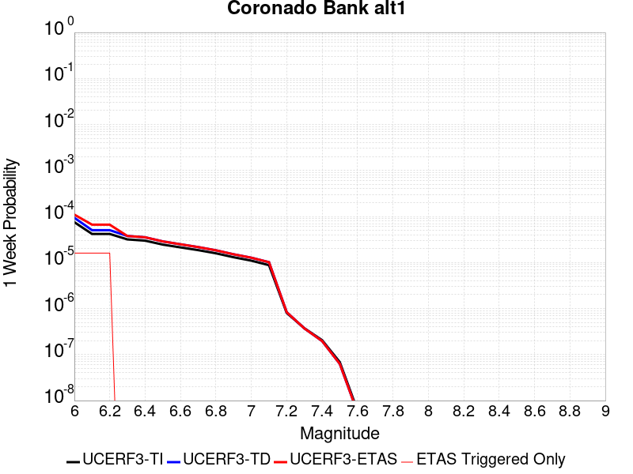 | 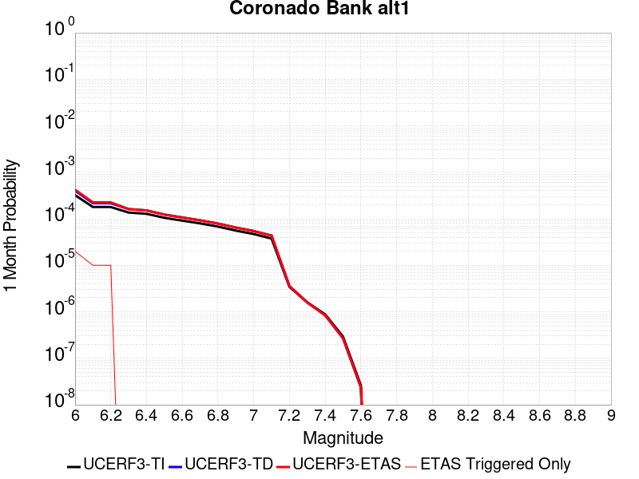 | 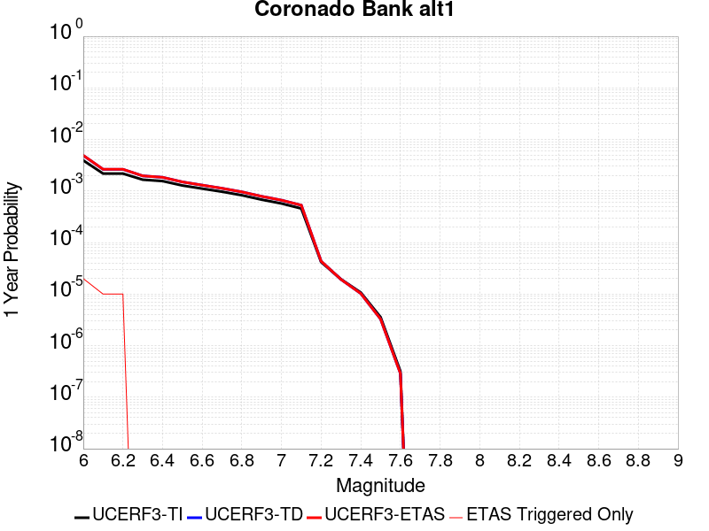 | 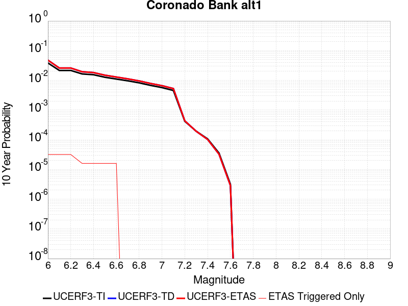 |

| Magnitude | 1 wk TI Prob | 1 wk TD Prob | 1 wk ETAS Prob | 1 wk ETAS/TD Gain | 1 wk ETAS Triggered Only | 1 mo TI Prob | 1 mo TD Prob | 1 mo ETAS Prob | 1 mo ETAS/TD Gain | 1 mo ETAS Triggered Only | 1 yr TI Prob | 1 yr TD Prob | 1 yr ETAS Prob | 1 yr ETAS/TD Gain | 1 yr ETAS Triggered Only | 10 yr TI Prob | 10 yr TD Prob | 10 yr ETAS Prob | 10 yr ETAS/TD Gain | 10 yr ETAS Triggered Only |
|-----|-----|-----|-----|-----|-----|-----|-----|-----|-----|-----|-----|-----|-----|-----|-----|-----|-----|-----|-----|-----|
| 6.0 | 7.533492E-5 | 9.394913E-5 | 1.1856342E-4 | 1.2619959 | 2.4616596E-5 | 3.22824E-4 | 4.0258127E-4 | 4.2718794E-4 | 1.0611223 | 2.4616596E-5 | 0.0039233007 | 0.0048909658 | 0.004915462 | 1.0050085 | 2.4616596E-5 | 0.03854755 | 0.04790356 | 0.047950435 | 1.0009785 | 4.9233193E-5 |
| 6.1 | 4.1807285E-5 | 5.049283E-5 | 7.510818E-5 | 1.487502 | 2.4616596E-5 | 1.7916178E-4 | 2.1638049E-4 | 2.4099175E-4 | 1.1137407 | 2.4616596E-5 | 0.0021791123 | 0.0026313474 | 0.0026558992 | 1.0093305 | 2.4616596E-5 | 0.021578677 | 0.026011046 | 0.026059 | 1.0018436 | 4.9233193E-5 |
| 6.2 | 4.1807285E-5 | 5.049283E-5 | 7.510818E-5 | 1.487502 | 2.4616596E-5 | 1.7916178E-4 | 2.1638049E-4 | 2.4099175E-4 | 1.1137407 | 2.4616596E-5 | 0.0021791123 | 0.0026313474 | 0.0026558992 | 1.0093305 | 2.4616596E-5 | 0.021578677 | 0.026011046 | 0.026059 | 1.0018436 | 4.9233193E-5 |
| 6.3 | 3.1793104E-5 | 3.7711117E-5 | 3.7711117E-5 | 1.0 | 0.0 | 1.3624904E-4 | 1.6160926E-4 | 1.6160926E-4 | 1.0 | 0.0 | 0.0016575698 | 0.001965848 | 0.001965848 | 1.0 | 0.0 | 0.016452603 | 0.019488465 | 0.019512601 | 1.0012385 | 2.4616596E-5 |
| 6.4 | 2.9878007E-5 | 3.5335794E-5 | 3.5335794E-5 | 1.0 | 0.0 | 1.2804232E-4 | 1.5143053E-4 | 1.5143053E-4 | 1.0 | 0.0 | 0.0015578003 | 0.0018421387 | 0.0018421387 | 1.0 | 0.0 | 0.015469253 | 0.01827244 | 0.018296609 | 1.0013226 | 2.4616596E-5 |
| 6.5 | 2.4512565E-5 | 2.8764043E-5 | 2.8764043E-5 | 1.0 | 0.0 | 1.0504962E-4 | 1.2326881E-4 | 1.2326881E-4 | 1.0 | 0.0 | 0.0012782287 | 0.0014997921 | 0.0014997921 | 1.0 | 0.0 | 0.012709012 | 0.014899683 | 0.014923933 | 1.0016276 | 2.4616596E-5 |
| 6.6 | 2.1317413E-5 | 2.490667E-5 | 2.490667E-5 | 1.0 | 0.0 | 9.135714E-5 | 1.0673863E-4 | 1.0673863E-4 | 1.0 | 0.0 | 0.0011117056 | 0.0012987906 | 0.0012987906 | 1.0 | 0.0 | 0.011061605 | 0.012914404 | 0.012938703 | 1.0018815 | 2.4616596E-5 |
| 6.7 | 1.8585655E-5 | 2.163488E-5 | 2.163488E-5 | 1.0 | 0.0 | 7.9650374E-5 | 9.271773E-5 | 9.271773E-5 | 1.0 | 0.0 | 9.6931186E-4 | 0.0011282742 | 0.0011282742 | 1.0 | 0.0 | 0.0096509475 | 0.011227623 | 0.011227623 | 1.0 | 0.0 |
| 6.8 | 1.5862879E-5 | 1.8419474E-5 | 1.8419474E-5 | 1.0 | 0.0 | 6.798199E-5 | 7.893833E-5 | 7.893833E-5 | 1.0 | 0.0 | 8.273665E-4 | 9.6066965E-4 | 9.6066965E-4 | 1.0 | 0.0 | 0.008242928 | 0.00956715 | 0.00956715 | 1.0 | 0.0 |
| 6.9 | 1.3021509E-5 | 1.5095265E-5 | 1.5095265E-5 | 1.0 | 0.0 | 5.5805274E-5 | 6.469249E-5 | 6.469249E-5 | 1.0 | 0.0 | 6.792174E-4 | 7.8736455E-4 | 7.8736455E-4 | 1.0 | 0.0 | 0.006771452 | 0.007847573 | 0.007847573 | 1.0 | 0.0 |
| 7.0 | 1.0974371E-5 | 1.2720104E-5 | 1.2720104E-5 | 1.0 | 0.0 | 4.7032172E-5 | 5.451369E-5 | 5.451369E-5 | 1.0 | 0.0 | 5.7246623E-4 | 6.6351966E-4 | 6.6351966E-4 | 1.0 | 0.0 | 0.0057099373 | 0.006617135 | 0.006617135 | 1.0 | 0.0 |
| 7.1 | 8.766221E-6 | 1.01638325E-5 | 1.01638325E-5 | 1.0 | 0.0 | 3.7568978E-5 | 4.355865E-5 | 4.355865E-5 | 1.0 | 0.0 | 4.573063E-4 | 5.3021475E-4 | 5.3021475E-4 | 1.0 | 0.0 | 0.0045636636 | 0.0052911965 | 0.0052911965 | 1.0 | 0.0 |
| 7.2 | 8.026024E-7 | 8.331765E-7 | 8.331765E-7 | 1.0 | 0.0 | 3.43972E-6 | 3.5707515E-6 | 3.5707515E-6 | 1.0 | 0.0 | 4.1877785E-5 | 4.3473043E-5 | 4.3473043E-5 | 1.0 | 0.0 | 4.1869894E-4 | 4.3464647E-4 | 4.3464647E-4 | 1.0 | 0.0 |
| 7.3 | 3.7293114E-7 | 3.7000953E-7 | 3.7000953E-7 | 1.0 | 0.0 | 1.5982754E-6 | 1.5857541E-6 | 1.5857541E-6 | 1.0 | 0.0 | 1.9458828E-5 | 1.9306386E-5 | 1.9306386E-5 | 1.0 | 0.0 | 1.9457124E-4 | 1.9304715E-4 | 1.9304715E-4 | 1.0 | 0.0 |
| 7.4 | 2.0557036E-7 | 1.9674363E-7 | 1.9674363E-7 | 1.0 | 0.0 | 8.810155E-7 | 8.431867E-7 | 8.431867E-7 | 1.0 | 0.0 | 1.0726311E-5 | 1.026575E-5 | 1.026575E-5 | 1.0 | 0.0 | 1.0725793E-4 | 1.0265279E-4 | 1.0265279E-4 | 1.0 | 0.0 |
| 7.5 | 6.845446E-8 | 6.279369E-8 | 6.279369E-8 | 1.0 | 0.0 | 2.9337625E-7 | 2.691158E-7 | 2.691158E-7 | 1.0 | 0.0 | 3.5718497E-6 | 3.2764797E-6 | 3.2764797E-6 | 1.0 | 0.0 | 3.5717923E-5 | 3.2764325E-5 | 3.2764325E-5 | 1.0 | 0.0 |
| 7.6 | 6.0975145E-9 | 5.53185E-9 | 5.53185E-9 | 1.0 | 0.0 | 2.6132206E-8 | 2.370793E-8 | 2.370793E-8 | 1.0 | 0.0 | 3.1815955E-7 | 2.88644E-7 | 2.88644E-7 | 1.0 | 0.0 | 3.181591E-6 | 2.8864374E-6 | 2.8864374E-6 | 1.0 | 0.0 |

## San Gregorio (North) 2011 CFM
*[(top)](#table-of-contents)*

| 1 Week | 1 Month | 1 Year | 10 Year |
|-----|-----|-----|-----|
| 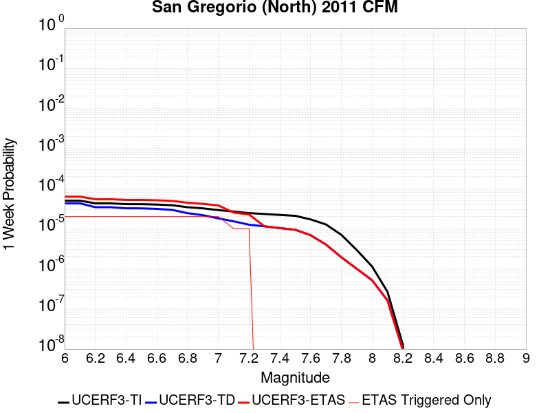 | 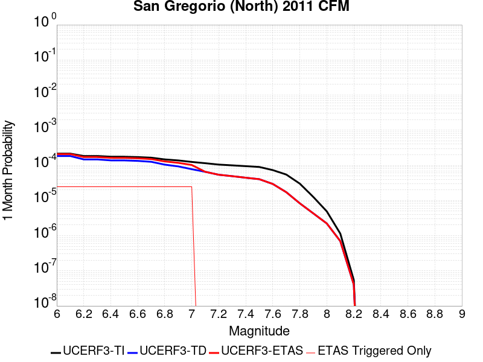 | 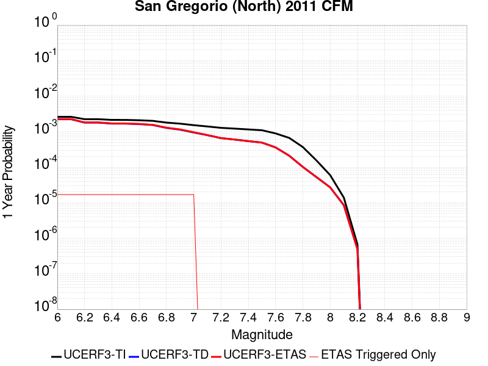 | 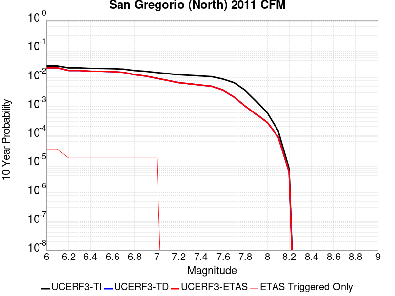 |

| Magnitude | 1 wk TI Prob | 1 wk TD Prob | 1 wk ETAS Prob | 1 wk ETAS/TD Gain | 1 wk ETAS Triggered Only | 1 mo TI Prob | 1 mo TD Prob | 1 mo ETAS Prob | 1 mo ETAS/TD Gain | 1 mo ETAS Triggered Only | 1 yr TI Prob | 1 yr TD Prob | 1 yr ETAS Prob | 1 yr ETAS/TD Gain | 1 yr ETAS Triggered Only | 10 yr TI Prob | 10 yr TD Prob | 10 yr ETAS Prob | 10 yr ETAS/TD Gain | 10 yr ETAS Triggered Only |
|-----|-----|-----|-----|-----|-----|-----|-----|-----|-----|-----|-----|-----|-----|-----|-----|-----|-----|-----|-----|-----|
| 6.0 | 5.0283932E-5 | 4.3057815E-5 | 6.767335E-5 | 1.5716857 | 2.4616596E-5 | 2.1548476E-4 | 1.8452053E-4 | 2.0913257E-4 | 1.1333839 | 2.4616596E-5 | 0.0026203706 | 0.002244237 | 0.0022687984 | 1.0109441 | 2.4616596E-5 | 0.02589687 | 0.022293162 | 0.022341298 | 1.0021592 | 4.9233193E-5 |
| 6.1 | 5.0283932E-5 | 4.3057815E-5 | 6.767335E-5 | 1.5716857 | 2.4616596E-5 | 2.1548476E-4 | 1.8452053E-4 | 2.0913257E-4 | 1.1333839 | 2.4616596E-5 | 0.0026203706 | 0.002244237 | 0.0022687984 | 1.0109441 | 2.4616596E-5 | 0.02589687 | 0.022293162 | 0.022341298 | 1.0021592 | 4.9233193E-5 |
| 6.2 | 4.2998647E-5 | 3.4441564E-5 | 5.905731E-5 | 1.7147106 | 2.4616596E-5 | 1.842669E-4 | 1.475984E-4 | 1.7221137E-4 | 1.1667563 | 2.4616596E-5 | 0.0022411412 | 0.00179554 | 0.0018201123 | 1.0136852 | 2.4616596E-5 | 0.022186736 | 0.017886506 | 0.017910682 | 1.0013516 | 2.4616596E-5 |
| 6.3 | 4.2998647E-5 | 3.4441564E-5 | 5.905731E-5 | 1.7147106 | 2.4616596E-5 | 1.842669E-4 | 1.475984E-4 | 1.7221137E-4 | 1.1667563 | 2.4616596E-5 | 0.0022411412 | 0.00179554 | 0.0018201123 | 1.0136852 | 2.4616596E-5 | 0.022186736 | 0.017886506 | 0.017910682 | 1.0013516 | 2.4616596E-5 |
| 6.4 | 4.1101295E-5 | 3.2326872E-5 | 5.6942674E-5 | 1.7614655 | 2.4616596E-5 | 1.7613651E-4 | 1.3853642E-4 | 1.6314961E-4 | 1.1776658 | 2.4616596E-5 | 0.0021423528 | 0.0016853869 | 0.0017099619 | 1.0145813 | 2.4616596E-5 | 0.02121817 | 0.016801886 | 0.016826088 | 1.0014405 | 2.4616596E-5 |
| 6.5 | 4.1032585E-5 | 3.2244905E-5 | 5.686071E-5 | 1.7634013 | 2.4616596E-5 | 1.7584208E-4 | 1.3818518E-4 | 1.6279837E-4 | 1.1781175 | 2.4616596E-5 | 0.0021387753 | 0.0016811171 | 0.0017056923 | 1.0146184 | 2.4616596E-5 | 0.021183075 | 0.016759839 | 0.016784042 | 1.0014442 | 2.4616596E-5 |
| 6.6 | 4.011629E-5 | 3.1266558E-5 | 5.5882385E-5 | 1.7872894 | 2.4616596E-5 | 1.7191563E-4 | 1.339927E-4 | 1.58606E-4 | 1.1836914 | 2.4616596E-5 | 0.0020910634 | 0.0016301516 | 0.0016547281 | 1.0150762 | 2.4616596E-5 | 0.020714961 | 0.01625741 | 0.016281627 | 1.0014895 | 2.4616596E-5 |
| 6.7 | 3.8583938E-5 | 2.9453593E-5 | 5.4069464E-5 | 1.835751 | 2.4616596E-5 | 1.6534925E-4 | 1.2622366E-4 | 1.5083715E-4 | 1.194999 | 2.4616596E-5 | 0.0020112682 | 0.0015357039 | 0.0015602828 | 1.0160049 | 2.4616596E-5 | 0.019931622 | 0.015325955 | 0.015350194 | 1.0015815 | 2.4616596E-5 |
| 6.8 | 3.44341E-5 | 2.4450854E-5 | 4.906685E-5 | 2.006754 | 2.4616596E-5 | 1.4756636E-4 | 1.0478523E-4 | 1.2939924E-4 | 1.2348996 | 2.4616596E-5 | 0.0017951399 | 0.0012750238 | 0.001299609 | 1.0192821 | 2.4616596E-5 | 0.017807078 | 0.012751131 | 0.012775434 | 1.0019059 | 2.4616596E-5 |
| 6.9 | 3.221199E-5 | 2.1778029E-5 | 4.639409E-5 | 2.1303163 | 2.4616596E-5 | 1.3804408E-4 | 9.333112E-5 | 1.1794542E-4 | 1.2637309 | 2.4616596E-5 | 0.0016793909 | 0.0011357224 | 0.0011603109 | 1.0216502 | 2.4616596E-5 | 0.01666756 | 0.011372583 | 0.011396919 | 1.0021399 | 2.4616596E-5 |
| 7.0 | 2.9186718E-5 | 1.8146875E-5 | 4.2763026E-5 | 2.3564954 | 2.4616596E-5 | 1.2507994E-4 | 7.7770026E-5 | 1.0238471E-4 | 1.316506 | 2.4616596E-5 | 0.0015217843 | 9.464431E-4 | 9.710364E-4 | 1.025985 | 2.4616596E-5 | 0.015114053 | 0.009496798 | 0.009521181 | 1.0025675 | 2.4616596E-5 |
| 7.1 | 2.6840138E-5 | 1.5284508E-5 | 1.5284508E-5 | 1.0 | 0.0 | 1.1502409E-4 | 6.55034E-5 | 6.55034E-5 | 1.0 | 0.0 | 0.0013995186 | 7.9721404E-4 | 7.9721404E-4 | 1.0 | 0.0 | 0.013907375 | 0.008015723 | 0.008015723 | 1.0 | 0.0 |
| 7.2 | 2.453002E-5 | 1.2606672E-5 | 1.2606672E-5 | 1.0 | 0.0 | 1.05124425E-4 | 5.4027478E-5 | 5.4027478E-5 | 1.0 | 0.0 | 0.0012791384 | 6.575866E-4 | 6.575866E-4 | 1.0 | 0.0 | 0.012718005 | 0.00662763 | 0.00662763 | 1.0 | 0.0 |
| 7.3 | 2.3330727E-5 | 1.1488677E-5 | 1.1488677E-5 | 1.0 | 0.0 | 9.9985E-5 | 4.923626E-5 | 4.923626E-5 | 1.0 | 0.0 | 0.0012166376 | 5.9928704E-4 | 5.9928704E-4 | 1.0 | 0.0 | 0.012099981 | 0.006046564 | 0.006046564 | 1.0 | 0.0 |
| 7.4 | 2.2136466E-5 | 1.0368981E-5 | 1.0368981E-5 | 1.0 | 0.0 | 9.486712E-5 | 4.4437733E-5 | 4.4437733E-5 | 1.0 | 0.0 | 0.0011543952 | 5.4089533E-4 | 5.4089533E-4 | 1.0 | 0.0 | 0.011484168 | 0.005464249 | 0.005464249 | 1.0 | 0.0 |
| 7.5 | 2.0994974E-5 | 9.427217E-6 | 9.427217E-6 | 1.0 | 0.0 | 8.997535E-5 | 4.0401734E-5 | 4.0401734E-5 | 1.0 | 0.0 | 0.0010948994 | 4.9178035E-4 | 4.9178035E-4 | 1.0 | 0.0 | 0.010895205 | 0.004973358 | 0.004973358 | 1.0 | 0.0 |
| 7.6 | 1.7091823E-5 | 6.893766E-6 | 6.893766E-6 | 1.0 | 0.0 | 7.3248615E-5 | 2.9544377E-5 | 2.9544377E-5 | 1.0 | 0.0 | 8.9143694E-4 | 3.596435E-4 | 3.596435E-4 | 1.0 | 0.0 | 0.008878695 | 0.0036482841 | 0.0036482841 | 1.0 | 0.0 |
| 7.7 | 1.2772179E-5 | 4.0208706E-6 | 4.0208706E-6 | 1.0 | 0.0 | 5.473676E-5 | 1.7232189E-5 | 1.7232189E-5 | 1.0 | 0.0 | 6.6621625E-4 | 2.0978172E-4 | 2.0978172E-4 | 1.0 | 0.0 | 0.006642225 | 0.002136922 | 0.002136922 | 1.0 | 0.0 |
| 7.8 | 7.041923E-6 | 1.940626E-6 | 1.940626E-6 | 1.0 | 0.0 | 3.017932E-5 | 8.316942E-6 | 8.316942E-6 | 1.0 | 0.0 | 3.6737128E-4 | 1.0125406E-4 | 1.0125406E-4 | 1.0 | 0.0 | 0.0036676454 | 0.0010379003 | 0.0010379003 | 1.0 | 0.0 |
| 7.9 | 2.946768E-6 | 1.0033551E-6 | 1.0033551E-6 | 1.0 | 0.0 | 1.2628945E-5 | 4.300086E-6 | 4.300086E-6 | 1.0 | 0.0 | 1.5374656E-4 | 5.235229E-5 | 5.235229E-5 | 1.0 | 0.0 | 0.0015364023 | 5.3400313E-4 | 5.3400313E-4 | 1.0 | 0.0 |
| 8.0 | 1.1433375E-6 | 5.18146E-7 | 5.18146E-7 | 1.0 | 0.0 | 4.9000087E-6 | 2.2206239E-6 | 2.2206239E-6 | 1.0 | 0.0 | 5.965597E-5 | 2.703576E-5 | 2.703576E-5 | 1.0 | 0.0 | 5.963996E-4 | 2.7398416E-4 | 2.7398416E-4 | 1.0 | 0.0 |
| 8.1 | 2.6675295E-7 | 1.62899E-7 | 1.62899E-7 | 1.0 | 0.0 | 1.1432264E-6 | 6.9813836E-7 | 6.9813836E-7 | 1.0 | 0.0 | 1.3918692E-5 | 8.499802E-6 | 8.499802E-6 | 1.0 | 0.0 | 1.391782E-4 | 8.63795E-5 | 8.63795E-5 | 1.0 | 0.0 |
| 8.2 | 1.2704569E-8 | 9.431393E-9 | 9.431393E-9 | 1.0 | 0.0 | 5.444815E-8 | 4.042026E-8 | 4.042026E-8 | 1.0 | 0.0 | 6.629061E-7 | 4.9211656E-7 | 4.9211656E-7 | 1.0 | 0.0 | 6.629041E-6 | 5.1121438E-6 | 5.1121438E-6 | 1.0 | 0.0 |

## Johnson Valley (No) 2011 rev
*[(top)](#table-of-contents)*

| 1 Week | 1 Month | 1 Year | 10 Year |
|-----|-----|-----|-----|
|  | 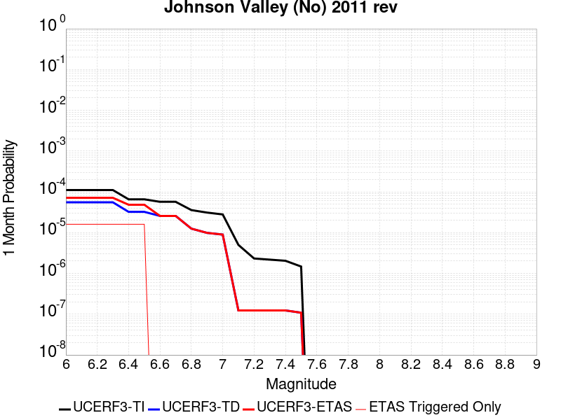 | 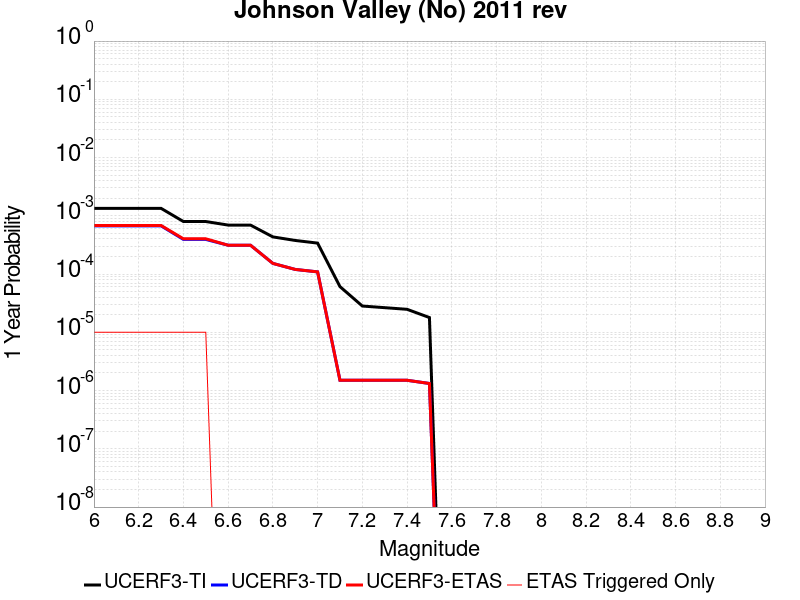 | 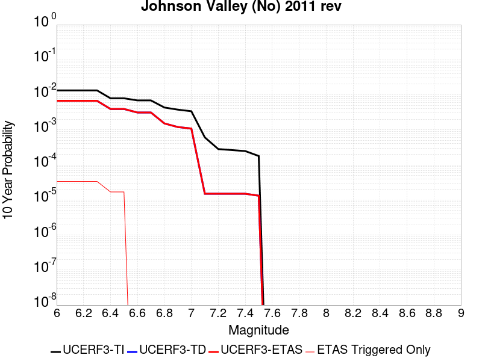 |

| Magnitude | 1 wk TI Prob | 1 wk TD Prob | 1 wk ETAS Prob | 1 wk ETAS/TD Gain | 1 wk ETAS Triggered Only | 1 mo TI Prob | 1 mo TD Prob | 1 mo ETAS Prob | 1 mo ETAS/TD Gain | 1 mo ETAS Triggered Only | 1 yr TI Prob | 1 yr TD Prob | 1 yr ETAS Prob | 1 yr ETAS/TD Gain | 1 yr ETAS Triggered Only | 10 yr TI Prob | 10 yr TD Prob | 10 yr ETAS Prob | 10 yr ETAS/TD Gain | 10 yr ETAS Triggered Only |
|-----|-----|-----|-----|-----|-----|-----|-----|-----|-----|-----|-----|-----|-----|-----|-----|-----|-----|-----|-----|-----|
| 6.0 | 2.577707E-5 | 1.2900938E-5 | 1.2900938E-5 | 1.0 | 0.0 | 1.1046848E-4 | 5.5288787E-5 | 7.990402E-5 | 1.4452121 | 2.4616596E-5 | 0.0013441239 | 6.7297276E-4 | 6.975728E-4 | 1.0365542 | 2.4616596E-5 | 0.013360229 | 0.006713257 | 0.0067621595 | 1.0072845 | 4.9233193E-5 |
| 6.1 | 2.577707E-5 | 1.2900938E-5 | 1.2900938E-5 | 1.0 | 0.0 | 1.1046848E-4 | 5.5288787E-5 | 7.990402E-5 | 1.4452121 | 2.4616596E-5 | 0.0013441239 | 6.7297276E-4 | 6.975728E-4 | 1.0365542 | 2.4616596E-5 | 0.013360229 | 0.006713257 | 0.0067621595 | 1.0072845 | 4.9233193E-5 |
| 6.2 | 2.577707E-5 | 1.2900938E-5 | 1.2900938E-5 | 1.0 | 0.0 | 1.1046848E-4 | 5.5288787E-5 | 7.990402E-5 | 1.4452121 | 2.4616596E-5 | 0.0013441239 | 6.7297276E-4 | 6.975728E-4 | 1.0365542 | 2.4616596E-5 | 0.013360229 | 0.006713257 | 0.0067621595 | 1.0072845 | 4.9233193E-5 |
| 6.3 | 2.577707E-5 | 1.2900938E-5 | 1.2900938E-5 | 1.0 | 0.0 | 1.1046848E-4 | 5.5288787E-5 | 7.990402E-5 | 1.4452121 | 2.4616596E-5 | 0.0013441239 | 6.7297276E-4 | 6.975728E-4 | 1.0365542 | 2.4616596E-5 | 0.013360229 | 0.006713257 | 0.0067621595 | 1.0072845 | 4.9233193E-5 |
| 6.4 | 1.5296591E-5 | 7.536742E-6 | 7.536742E-6 | 1.0 | 0.0 | 6.555518E-5 | 3.2300028E-5 | 5.691583E-5 | 1.7620984 | 2.4616596E-5 | 7.97842E-4 | 3.9320064E-4 | 4.1780755E-4 | 1.0625811 | 2.4616596E-5 | 0.007949836 | 0.0039268904 | 0.0039514108 | 1.0062441 | 2.4616596E-5 |
| 6.5 | 1.5296591E-5 | 7.536742E-6 | 7.536742E-6 | 1.0 | 0.0 | 6.555518E-5 | 3.2300028E-5 | 5.691583E-5 | 1.7620984 | 2.4616596E-5 | 7.97842E-4 | 3.9320064E-4 | 4.1780755E-4 | 1.0625811 | 2.4616596E-5 | 0.007949836 | 0.0039268904 | 0.0039514108 | 1.0062441 | 2.4616596E-5 |
| 6.6 | 1.3289383E-5 | 5.9917306E-6 | 5.9917306E-6 | 1.0 | 0.0 | 5.6953253E-5 | 2.5678688E-5 | 2.5678688E-5 | 1.0 | 0.0 | 6.9318525E-4 | 3.1261015E-4 | 3.1261015E-4 | 1.0 | 0.0 | 0.0069102696 | 0.0031233684 | 0.0031233684 | 1.0 | 0.0 |
| 6.7 | 1.3289383E-5 | 5.9917306E-6 | 5.9917306E-6 | 1.0 | 0.0 | 5.6953253E-5 | 2.5678688E-5 | 2.5678688E-5 | 1.0 | 0.0 | 6.9318525E-4 | 3.1261015E-4 | 3.1261015E-4 | 1.0 | 0.0 | 0.0069102696 | 0.0031233684 | 0.0031233684 | 1.0 | 0.0 |
| 6.8 | 8.330789E-6 | 2.9211888E-6 | 2.9211888E-6 | 1.0 | 0.0 | 3.570289E-5 | 1.2519352E-5 | 1.2519352E-5 | 1.0 | 0.0 | 4.34596E-4 | 1.5241816E-4 | 1.5241816E-4 | 1.0 | 0.0 | 0.0043374705 | 0.0015236961 | 0.0015236961 | 1.0 | 0.0 |
| 6.9 | 7.2359003E-6 | 2.3013247E-6 | 2.3013247E-6 | 1.0 | 0.0 | 3.1010633E-5 | 9.8628125E-6 | 9.8628125E-6 | 1.0 | 0.0 | 3.7748902E-4 | 1.2007845E-4 | 1.2007845E-4 | 1.0 | 0.0 | 0.0037684843 | 0.0012006586 | 0.0012006586 | 1.0 | 0.0 |
| 7.0 | 6.5149957E-6 | 2.088482E-6 | 2.088482E-6 | 1.0 | 0.0 | 2.792111E-5 | 8.950637E-6 | 8.950637E-6 | 1.0 | 0.0 | 3.398865E-4 | 1.0897385E-4 | 1.0897385E-4 | 1.0 | 0.0 | 0.003393671 | 0.0010897239 | 0.0010897239 | 1.0 | 0.0 |
| 7.1 | 1.1662233E-6 | 2.8802024E-8 | 2.8802024E-8 | 1.0 | 0.0 | 4.9980904E-6 | 1.2343725E-7 | 1.2343725E-7 | 1.0 | 0.0 | 6.0850052E-5 | 1.5028476E-6 | 1.5028476E-6 | 1.0 | 0.0 | 6.083339E-4 | 1.50283895E-5 | 1.50283895E-5 | 1.0 | 0.0 |
| 7.2 | 5.413881E-7 | 2.8802024E-8 | 2.8802024E-8 | 1.0 | 0.0 | 2.3202326E-6 | 1.2343725E-7 | 1.2343725E-7 | 1.0 | 0.0 | 2.8248465E-5 | 1.5028476E-6 | 1.5028476E-6 | 1.0 | 0.0 | 2.8244875E-4 | 1.50283895E-5 | 1.50283895E-5 | 1.0 | 0.0 |
| 7.3 | 5.076821E-7 | 2.8802024E-8 | 2.8802024E-8 | 1.0 | 0.0 | 2.1757785E-6 | 1.2343723E-7 | 1.2343723E-7 | 1.0 | 0.0 | 2.648978E-5 | 1.5028475E-6 | 1.5028475E-6 | 1.0 | 0.0 | 2.6486625E-4 | 1.50283895E-5 | 1.50283895E-5 | 1.0 | 0.0 |
| 7.4 | 4.7568687E-7 | 2.8783948E-8 | 2.8783948E-8 | 1.0 | 0.0 | 2.0386565E-6 | 1.2335977E-7 | 1.2335977E-7 | 1.0 | 0.0 | 2.482036E-5 | 1.5019043E-6 | 1.5019043E-6 | 1.0 | 0.0 | 2.4817587E-4 | 1.5018958E-5 | 1.5018958E-5 | 1.0 | 0.0 |
| 7.5 | 3.435626E-7 | 2.5357679E-8 | 2.5357679E-8 | 1.0 | 0.0 | 1.4724103E-6 | 1.0867576E-7 | 1.0867576E-7 | 1.0 | 0.0 | 1.7926448E-5 | 1.3231268E-6 | 1.3231268E-6 | 1.0 | 0.0 | 1.7925001E-4 | 1.3231205E-5 | 1.3231205E-5 | 1.0 | 0.0 |

## Hat Creek-McArthur-Mayfield
*[(top)](#table-of-contents)*

| 1 Week | 1 Month | 1 Year | 10 Year |
|-----|-----|-----|-----|
|  | 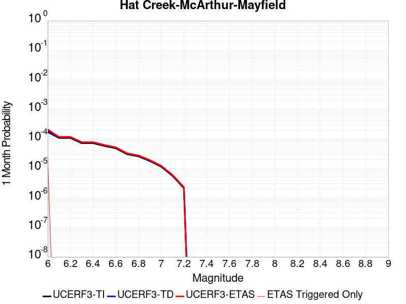 | 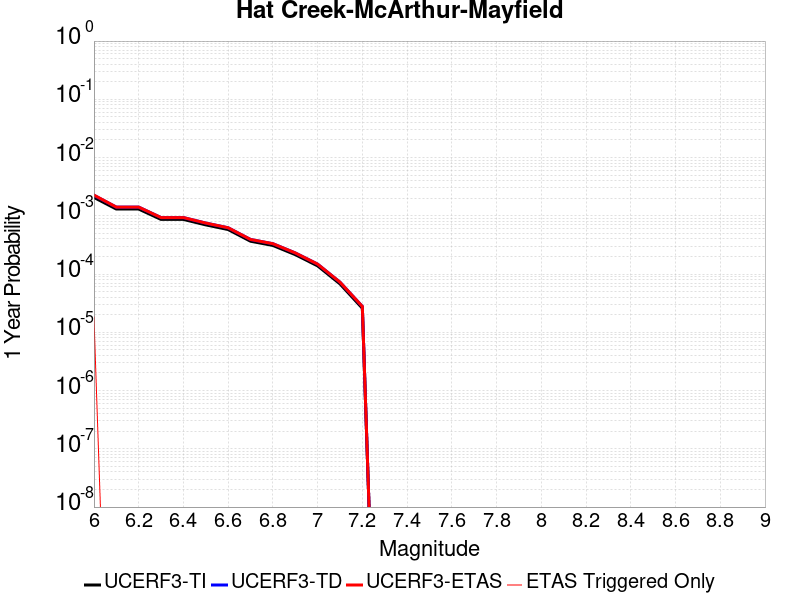 | 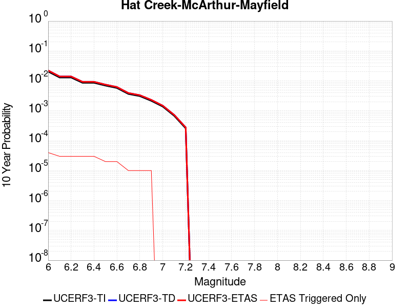 |

| Magnitude | 1 wk TI Prob | 1 wk TD Prob | 1 wk ETAS Prob | 1 wk ETAS/TD Gain | 1 wk ETAS Triggered Only | 1 mo TI Prob | 1 mo TD Prob | 1 mo ETAS Prob | 1 mo ETAS/TD Gain | 1 mo ETAS Triggered Only | 1 yr TI Prob | 1 yr TD Prob | 1 yr ETAS Prob | 1 yr ETAS/TD Gain | 1 yr ETAS Triggered Only | 10 yr TI Prob | 10 yr TD Prob | 10 yr ETAS Prob | 10 yr ETAS/TD Gain | 10 yr ETAS Triggered Only |
|-----|-----|-----|-----|-----|-----|-----|-----|-----|-----|-----|-----|-----|-----|-----|-----|-----|-----|-----|-----|-----|
| 6.0 | 3.967457E-5 | 4.315831E-5 | 4.315831E-5 | 1.0 | 0.0 | 1.7002279E-4 | 1.8495171E-4 | 2.0956376E-4 | 1.1330729 | 2.4616596E-5 | 0.002068062 | 0.002249576 | 0.0022741372 | 1.0109181 | 2.4616596E-5 | 0.02048922 | 0.022280399 | 0.022328535 | 1.0021604 | 4.9233193E-5 |
| 6.1 | 2.5044013E-5 | 2.7071164E-5 | 2.7071164E-5 | 1.0 | 0.0 | 1.0732707E-4 | 1.1601429E-4 | 1.1601429E-4 | 1.0 | 0.0 | 0.0013059238 | 0.0014115906 | 0.0014115906 | 1.0 | 0.0 | 0.01298276 | 0.01402966 | 0.014053931 | 1.00173 | 2.4616596E-5 |
| 6.2 | 2.5044013E-5 | 2.7071164E-5 | 2.7071164E-5 | 1.0 | 0.0 | 1.0732707E-4 | 1.1601429E-4 | 1.1601429E-4 | 1.0 | 0.0 | 0.0013059238 | 0.0014115906 | 0.0014115906 | 1.0 | 0.0 | 0.01298276 | 0.01402966 | 0.014053931 | 1.00173 | 2.4616596E-5 |
| 6.3 | 1.6624012E-5 | 1.7891072E-5 | 1.7891072E-5 | 1.0 | 0.0 | 7.124382E-5 | 7.6673816E-5 | 7.6673816E-5 | 1.0 | 0.0 | 8.670483E-4 | 9.331125E-4 | 9.331125E-4 | 1.0 | 0.0 | 0.008636732 | 0.009292879 | 0.009317267 | 1.0026244 | 2.4616596E-5 |
| 6.4 | 1.6624012E-5 | 1.7891072E-5 | 1.7891072E-5 | 1.0 | 0.0 | 7.124382E-5 | 7.6673816E-5 | 7.6673816E-5 | 1.0 | 0.0 | 8.670483E-4 | 9.331125E-4 | 9.331125E-4 | 1.0 | 0.0 | 0.008636732 | 0.009292879 | 0.009317267 | 1.0026244 | 2.4616596E-5 |
| 6.5 | 1.3394842E-5 | 1.4392137E-5 | 1.4392137E-5 | 1.0 | 0.0 | 5.7405203E-5 | 6.167916E-5 | 6.167916E-5 | 1.0 | 0.0 | 6.986842E-4 | 7.506906E-4 | 7.506906E-4 | 1.0 | 0.0 | 0.006964916 | 0.0074821403 | 0.0074821403 | 1.0 | 0.0 |
| 6.6 | 1.1137514E-5 | 1.1954546E-5 | 1.1954546E-5 | 1.0 | 0.0 | 4.7731326E-5 | 5.1232782E-5 | 5.1232782E-5 | 1.0 | 0.0 | 5.809739E-4 | 6.2358467E-4 | 6.2358467E-4 | 1.0 | 0.0 | 0.005794574 | 0.00621877 | 0.00621877 | 1.0 | 0.0 |
| 6.7 | 7.0200663E-6 | 7.5242897E-6 | 7.5242897E-6 | 1.0 | 0.0 | 3.008565E-5 | 3.2246568E-5 | 3.2246568E-5 | 1.0 | 0.0 | 3.6623122E-4 | 3.925328E-4 | 3.925328E-4 | 1.0 | 0.0 | 0.0036562826 | 0.0039185574 | 0.0039185574 | 1.0 | 0.0 |
| 6.8 | 5.940172E-6 | 6.3654766E-6 | 6.3654766E-6 | 1.0 | 0.0 | 2.545763E-5 | 2.7280335E-5 | 2.7280335E-5 | 1.0 | 0.0 | 3.0990256E-4 | 3.3208873E-4 | 3.3208873E-4 | 1.0 | 0.0 | 0.0030947074 | 0.0033160534 | 0.0033160534 | 1.0 | 0.0 |
| 6.9 | 4.129831E-6 | 4.423547E-6 | 4.423547E-6 | 1.0 | 0.0 | 1.7699154E-5 | 1.8957926E-5 | 1.8957926E-5 | 1.0 | 0.0 | 2.154659E-4 | 2.3078908E-4 | 2.3078908E-4 | 1.0 | 0.0 | 0.002152571 | 0.0023055724 | 0.0023055724 | 1.0 | 0.0 |
| 7.0 | 2.6512955E-6 | 2.8374002E-6 | 2.8374002E-6 | 1.0 | 0.0 | 1.1362646E-5 | 1.2160232E-5 | 1.2160232E-5 | 1.0 | 0.0 | 1.3833142E-4 | 1.480412E-4 | 1.480412E-4 | 1.0 | 0.0 | 0.0013824535 | 0.0014794683 | 0.0014794683 | 1.0 | 0.0 |
| 7.1 | 1.2992575E-6 | 1.3909317E-6 | 1.3909317E-6 | 1.0 | 0.0 | 5.568235E-6 | 5.961124E-6 | 5.961124E-6 | 1.0 | 0.0 | 6.779115E-5 | 7.257448E-5 | 7.257448E-5 | 1.0 | 0.0 | 6.7770475E-4 | 7.2552945E-4 | 7.2552945E-4 | 1.0 | 0.0 |
| 7.2 | 4.968191E-7 | 5.3271475E-7 | 5.3271475E-7 | 1.0 | 0.0 | 2.1292228E-6 | 2.283062E-6 | 2.283062E-6 | 1.0 | 0.0 | 2.592298E-5 | 2.7796052E-5 | 2.7796052E-5 | 1.0 | 0.0 | 2.5919956E-4 | 2.7793812E-4 | 2.7793812E-4 | 1.0 | 0.0 |

## San Juan
*[(top)](#table-of-contents)*

| 1 Week | 1 Month | 1 Year | 10 Year |
|-----|-----|-----|-----|
| 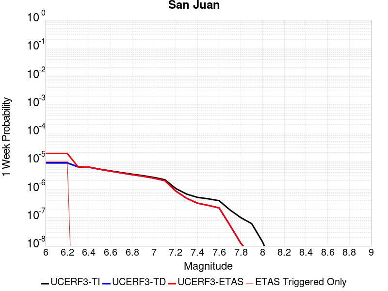 | 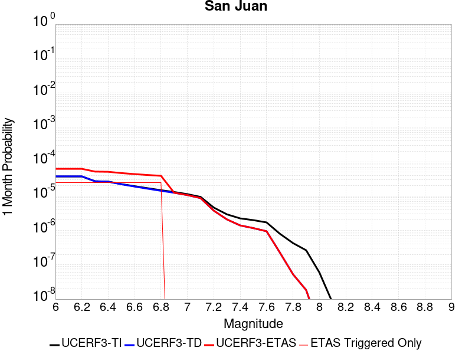 | 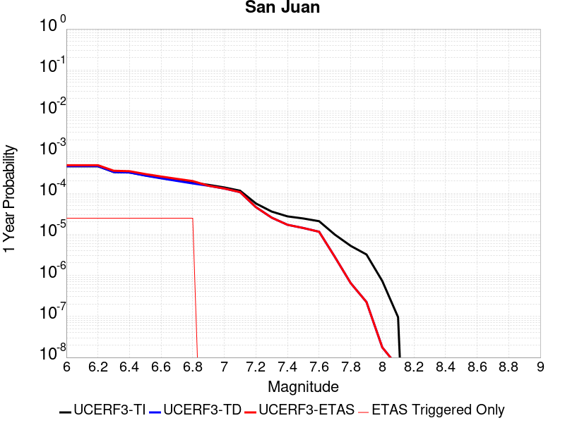 |  |

| Magnitude | 1 wk TI Prob | 1 wk TD Prob | 1 wk ETAS Prob | 1 wk ETAS/TD Gain | 1 wk ETAS Triggered Only | 1 mo TI Prob | 1 mo TD Prob | 1 mo ETAS Prob | 1 mo ETAS/TD Gain | 1 mo ETAS Triggered Only | 1 yr TI Prob | 1 yr TD Prob | 1 yr ETAS Prob | 1 yr ETAS/TD Gain | 1 yr ETAS Triggered Only | 10 yr TI Prob | 10 yr TD Prob | 10 yr ETAS Prob | 10 yr ETAS/TD Gain | 10 yr ETAS Triggered Only |
|-----|-----|-----|-----|-----|-----|-----|-----|-----|-----|-----|-----|-----|-----|-----|-----|-----|-----|-----|-----|-----|
| 6.0 | 8.682808E-6 | 8.7491635E-6 | 8.7491635E-6 | 1.0 | 0.0 | 3.72115E-5 | 3.74959E-5 | 6.2111576E-5 | 1.6564897 | 2.4616596E-5 | 4.5295584E-4 | 4.564218E-4 | 4.8102718E-4 | 1.0539093 | 2.4616596E-5 | 0.004520337 | 0.004555385 | 0.004604394 | 1.0107584 | 4.9233193E-5 |
| 6.1 | 8.682808E-6 | 8.7491635E-6 | 8.7491635E-6 | 1.0 | 0.0 | 3.72115E-5 | 3.74959E-5 | 6.2111576E-5 | 1.6564897 | 2.4616596E-5 | 4.5295584E-4 | 4.564218E-4 | 4.8102718E-4 | 1.0539093 | 2.4616596E-5 | 0.004520337 | 0.004555385 | 0.004604394 | 1.0107584 | 4.9233193E-5 |
| 6.2 | 8.682808E-6 | 8.7491635E-6 | 8.7491635E-6 | 1.0 | 0.0 | 3.72115E-5 | 3.74959E-5 | 6.2111576E-5 | 1.6564897 | 2.4616596E-5 | 4.5295584E-4 | 4.564218E-4 | 4.8102718E-4 | 1.0539093 | 2.4616596E-5 | 0.004520337 | 0.004555385 | 0.004604394 | 1.0107584 | 4.9233193E-5 |
| 6.3 | 6.3054235E-6 | 6.2825848E-6 | 6.2825848E-6 | 1.0 | 0.0 | 2.7022963E-5 | 2.6925094E-5 | 5.154103E-5 | 1.9142376 | 2.4616596E-5 | 3.2895492E-4 | 3.2776513E-4 | 3.5237364E-4 | 1.0750798 | 2.4616596E-5 | 0.003284684 | 0.003273017 | 0.003297553 | 1.0074965 | 2.4616596E-5 |
| 6.4 | 6.1490473E-6 | 6.1144656E-6 | 6.1144656E-6 | 1.0 | 0.0 | 2.6352795E-5 | 2.6204598E-5 | 5.082055E-5 | 1.9393753 | 2.4616596E-5 | 3.2079802E-4 | 3.1899565E-4 | 3.436044E-4 | 1.0771445 | 2.4616596E-5 | 0.0032033534 | 0.0031855737 | 0.003210112 | 1.007703 | 2.4616596E-5 |
| 6.5 | 5.204848E-6 | 5.137233E-6 | 5.137233E-6 | 1.0 | 0.0 | 2.23063E-5 | 2.2016533E-5 | 4.6632587E-5 | 2.1180713 | 2.4616596E-5 | 2.7154534E-4 | 2.6801927E-4 | 2.926293E-4 | 1.0918218 | 2.4616596E-5 | 0.0027121378 | 0.0026771144 | 0.002701665 | 1.0091705 | 2.4616596E-5 |
| 6.6 | 4.5179986E-6 | 4.4150297E-6 | 4.4150297E-6 | 1.0 | 0.0 | 1.9362706E-5 | 1.8921424E-5 | 4.3537555E-5 | 2.300966 | 2.4616596E-5 | 2.3571544E-4 | 2.3034477E-4 | 2.549557E-4 | 1.1068438 | 2.4616596E-5 | 0.0023546559 | 0.0023011973 | 0.0023257572 | 1.0106727 | 2.4616596E-5 |
| 6.7 | 3.9442616E-6 | 3.819828E-6 | 3.819828E-6 | 1.0 | 0.0 | 1.6903869E-5 | 1.6370592E-5 | 4.0986786E-5 | 2.5036838 | 2.4616596E-5 | 2.0578515E-4 | 1.992944E-4 | 2.239061E-4 | 1.1234941 | 2.4616596E-5 | 0.002055947 | 0.0019912818 | 0.0020158493 | 1.0123376 | 2.4616596E-5 |
| 6.8 | 3.4536245E-6 | 3.3163353E-6 | 3.3163353E-6 | 1.0 | 0.0 | 1.4801163E-5 | 1.4212792E-5 | 3.882904E-5 | 2.7319782 | 2.4616596E-5 | 1.8018926E-4 | 1.7302761E-4 | 1.9763995E-4 | 1.1422452 | 2.4616596E-5 | 0.0018004322 | 0.0017290477 | 0.0017536219 | 1.0142125 | 2.4616596E-5 |
| 6.9 | 3.059865E-6 | 2.9120315E-6 | 2.9120315E-6 | 1.0 | 0.0 | 1.3113641E-5 | 1.2480078E-5 | 1.2480078E-5 | 1.0 | 0.0 | 1.596469E-4 | 1.5193493E-4 | 1.5193493E-4 | 1.0 | 0.0 | 0.0015953224 | 0.0015184252 | 0.0015184252 | 1.0 | 0.0 |
| 7.0 | 2.6504351E-6 | 2.4920002E-6 | 2.4920002E-6 | 1.0 | 0.0 | 1.1358958E-5 | 1.0679961E-5 | 1.0679961E-5 | 1.0 | 0.0 | 1.3828653E-4 | 1.300213E-4 | 1.300213E-4 | 1.0 | 0.0 | 0.0013820052 | 0.0012995641 | 0.0012995641 | 1.0 | 0.0 |
| 7.1 | 2.2039317E-6 | 2.0338296E-6 | 2.0338296E-6 | 1.0 | 0.0 | 9.445387E-6 | 8.716386E-6 | 8.716386E-6 | 1.0 | 0.0 | 1.1499152E-4 | 1.0611736E-4 | 1.0611736E-4 | 1.0 | 0.0 | 0.0011493203 | 0.0010607769 | 0.0010607769 | 1.0 | 0.0 |
| 7.2 | 1.0786707E-6 | 8.7701903E-7 | 8.7701903E-7 | 1.0 | 0.0 | 4.622866E-6 | 3.7586476E-6 | 3.7586476E-6 | 1.0 | 0.0 | 5.628194E-5 | 4.5760586E-5 | 4.5760586E-5 | 1.0 | 0.0 | 5.6267687E-4 | 4.5757066E-4 | 4.5757066E-4 | 1.0 | 0.0 |
| 7.3 | 6.846433E-7 | 4.868805E-7 | 4.868805E-7 | 1.0 | 0.0 | 2.9341822E-6 | 2.086629E-6 | 2.086629E-6 | 1.0 | 0.0 | 3.5723086E-5 | 2.5404412E-5 | 2.5404412E-5 | 1.0 | 0.0 | 3.571734E-4 | 2.540486E-4 | 2.540486E-4 | 1.0 | 0.0 |
| 7.4 | 5.23043E-7 | 3.2628162E-7 | 3.2628162E-7 | 1.0 | 0.0 | 2.2416111E-6 | 1.398349E-6 | 1.398349E-6 | 1.0 | 0.0 | 2.7291273E-5 | 1.7024766E-5 | 1.7024766E-5 | 1.0 | 0.0 | 2.7287923E-4 | 1.7026656E-4 | 1.7026656E-4 | 1.0 | 0.0 |
| 7.5 | 4.648444E-7 | 2.7234944E-7 | 2.7234944E-7 | 1.0 | 0.0 | 1.9921886E-6 | 1.1672114E-6 | 1.1672114E-6 | 1.0 | 0.0 | 2.4254627E-5 | 1.42107065E-5 | 1.42107065E-5 | 1.0 | 0.0 | 2.425198E-4 | 1.421276E-4 | 1.421276E-4 | 1.0 | 0.0 |
| 7.6 | 3.9906567E-7 | 2.2083314E-7 | 2.2083314E-7 | 1.0 | 0.0 | 1.7102802E-6 | 9.464274E-7 | 9.464274E-7 | 1.0 | 0.0 | 2.0822463E-5 | 1.1522693E-5 | 1.1522693E-5 | 1.0 | 0.0 | 2.0820512E-4 | 1.15245566E-4 | 1.15245566E-4 | 1.0 | 0.0 |
| 7.7 | 1.8784601E-7 | 5.3666906E-8 | 5.3666906E-8 | 1.0 | 0.0 | 8.0505407E-7 | 2.30001E-7 | 2.30001E-7 | 1.0 | 0.0 | 9.80149E-6 | 2.8002585E-6 | 2.8002585E-6 | 1.0 | 0.0 | 9.801057E-5 | 2.8011282E-5 | 2.8011282E-5 | 1.0 | 0.0 |
| 7.8 | 1.00154914E-7 | 1.2415832E-8 | 1.2415832E-8 | 1.0 | 0.0 | 4.2923529E-7 | 5.3210716E-8 | 5.3210716E-8 | 1.0 | 0.0 | 5.225927E-6 | 6.4784024E-7 | 6.4784024E-7 | 1.0 | 0.0 | 5.225804E-5 | 6.484273E-6 | 6.484273E-6 | 1.0 | 0.0 |
| 7.9 | 6.171429E-8 | 4.2966155E-9 | 4.2966155E-9 | 1.0 | 0.0 | 2.6448978E-7 | 1.8414067E-8 | 1.8414067E-8 | 1.0 | 0.0 | 3.2201583E-6 | 2.2419121E-7 | 2.2419121E-7 | 1.0 | 0.0 | 3.2201115E-5 | 2.2472002E-6 | 2.2472002E-6 | 1.0 | 0.0 |
| 8.0 | 1.3974572E-8 | 3.3788217E-10 | 3.3788217E-10 | 1.0 | 0.0 | 5.989102E-8 | 1.448067E-9 | 1.448067E-9 | 1.0 | 0.0 | 7.2917294E-7 | 1.763022E-8 | 1.763022E-8 | 1.0 | 0.0 | 7.2917055E-6 | 1.8060365E-7 | 1.8060365E-7 | 1.0 | 0.0 |
| 8.1 | 1.8403477E-9 | 1.1302803E-10 | 1.1302803E-10 | 1.0 | 0.0 | 7.887204E-9 | 4.844063E-10 | 4.844063E-10 | 1.0 | 0.0 | 9.602671E-8 | 5.8976446E-9 | 5.8976446E-9 | 1.0 | 0.0 | 9.602667E-7 | 6.021993E-8 | 6.021993E-8 | 1.0 | 0.0 |

## Earthquake Valley (So Extension)
*[(top)](#table-of-contents)*

| 1 Week | 1 Month | 1 Year | 10 Year |
|-----|-----|-----|-----|
|  | 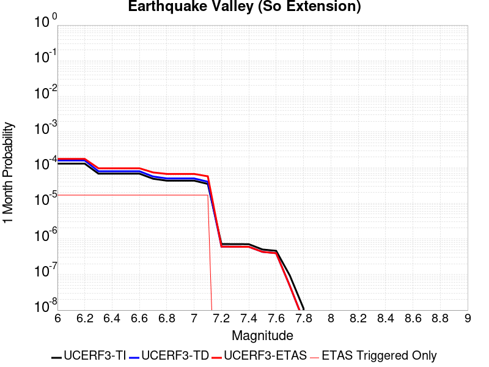 | 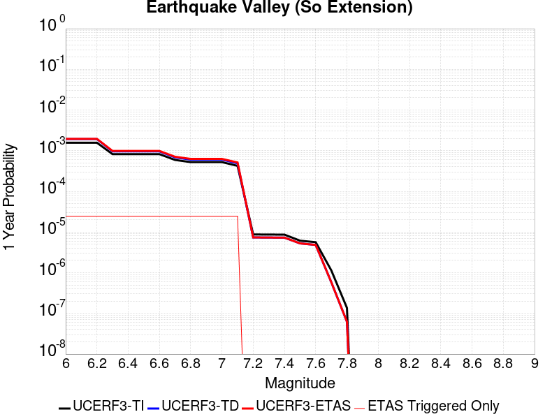 | 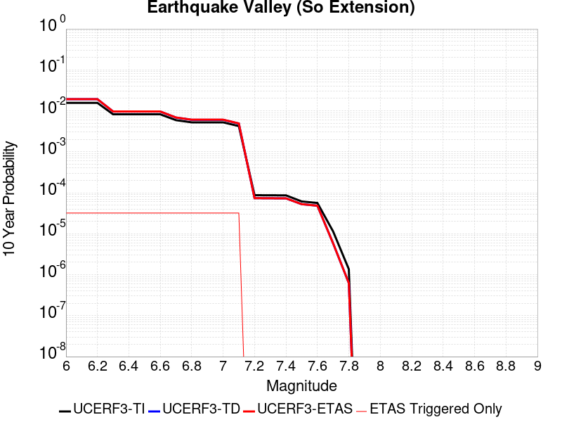 |

| Magnitude | 1 wk TI Prob | 1 wk TD Prob | 1 wk ETAS Prob | 1 wk ETAS/TD Gain | 1 wk ETAS Triggered Only | 1 mo TI Prob | 1 mo TD Prob | 1 mo ETAS Prob | 1 mo ETAS/TD Gain | 1 mo ETAS Triggered Only | 1 yr TI Prob | 1 yr TD Prob | 1 yr ETAS Prob | 1 yr ETAS/TD Gain | 1 yr ETAS Triggered Only | 10 yr TI Prob | 10 yr TD Prob | 10 yr ETAS Prob | 10 yr ETAS/TD Gain | 10 yr ETAS Triggered Only |
|-----|-----|-----|-----|-----|-----|-----|-----|-----|-----|-----|-----|-----|-----|-----|-----|-----|-----|-----|-----|-----|
| 6.0 | 3.0194888E-5 | 3.7072114E-5 | 3.7072114E-5 | 1.0 | 0.0 | 1.2940024E-4 | 1.5887388E-4 | 1.5887388E-4 | 1.0 | 0.0 | 0.0015743093 | 0.0019331174 | 0.0019576864 | 1.0127095 | 2.4616596E-5 | 0.01563203 | 0.019213019 | 0.019237163 | 1.0012566 | 2.4616596E-5 |
| 6.1 | 3.0194888E-5 | 3.7072114E-5 | 3.7072114E-5 | 1.0 | 0.0 | 1.2940024E-4 | 1.5887388E-4 | 1.5887388E-4 | 1.0 | 0.0 | 0.0015743093 | 0.0019331174 | 0.0019576864 | 1.0127095 | 2.4616596E-5 | 0.01563203 | 0.019213019 | 0.019237163 | 1.0012566 | 2.4616596E-5 |
| 6.2 | 3.0194888E-5 | 3.7072114E-5 | 3.7072114E-5 | 1.0 | 0.0 | 1.2940024E-4 | 1.5887388E-4 | 1.5887388E-4 | 1.0 | 0.0 | 0.0015743093 | 0.0019331174 | 0.0019576864 | 1.0127095 | 2.4616596E-5 | 0.01563203 | 0.019213019 | 0.019237163 | 1.0012566 | 2.4616596E-5 |
| 6.3 | 1.5795305E-5 | 1.844658E-5 | 1.844658E-5 | 1.0 | 0.0 | 6.769241E-5 | 7.9055004E-5 | 7.9055004E-5 | 1.0 | 0.0 | 8.238434E-4 | 9.6218096E-4 | 9.867739E-4 | 1.0255595 | 2.4616596E-5 | 0.008207959 | 0.009591061 | 0.009615442 | 1.002542 | 2.4616596E-5 |
| 6.4 | 1.5795305E-5 | 1.844658E-5 | 1.844658E-5 | 1.0 | 0.0 | 6.769241E-5 | 7.9055004E-5 | 7.9055004E-5 | 1.0 | 0.0 | 8.238434E-4 | 9.6218096E-4 | 9.867739E-4 | 1.0255595 | 2.4616596E-5 | 0.008207959 | 0.009591061 | 0.009615442 | 1.002542 | 2.4616596E-5 |
| 6.5 | 1.5795305E-5 | 1.844658E-5 | 1.844658E-5 | 1.0 | 0.0 | 6.769241E-5 | 7.9055004E-5 | 7.9055004E-5 | 1.0 | 0.0 | 8.238434E-4 | 9.6218096E-4 | 9.867739E-4 | 1.0255595 | 2.4616596E-5 | 0.008207959 | 0.009591061 | 0.009615442 | 1.002542 | 2.4616596E-5 |
| 6.6 | 1.5795305E-5 | 1.844658E-5 | 1.844658E-5 | 1.0 | 0.0 | 6.769241E-5 | 7.9055004E-5 | 7.9055004E-5 | 1.0 | 0.0 | 8.238434E-4 | 9.6218096E-4 | 9.867739E-4 | 1.0255595 | 2.4616596E-5 | 0.008207959 | 0.009591061 | 0.009615442 | 1.002542 | 2.4616596E-5 |
| 6.7 | 1.1363076E-5 | 1.3138294E-5 | 1.3138294E-5 | 1.0 | 0.0 | 4.8697988E-5 | 5.6306188E-5 | 5.6306188E-5 | 1.0 | 0.0 | 5.927367E-4 | 6.8538834E-4 | 7.0998806E-4 | 1.0358917 | 2.4616596E-5 | 0.0059115817 | 0.0068402183 | 0.0068646665 | 1.0035741 | 2.4616596E-5 |
| 6.8 | 1.0049611E-5 | 1.1594334E-5 | 1.1594334E-5 | 1.0 | 0.0 | 4.306905E-5 | 4.9689468E-5 | 4.9689468E-5 | 1.0 | 0.0 | 5.242395E-4 | 6.048745E-4 | 6.294762E-4 | 1.0406724 | 2.4616596E-5 | 0.0052300454 | 0.006039458 | 0.006063926 | 1.0040513 | 2.4616596E-5 |
| 6.9 | 1.0049611E-5 | 1.1594334E-5 | 1.1594334E-5 | 1.0 | 0.0 | 4.306905E-5 | 4.9689468E-5 | 4.9689468E-5 | 1.0 | 0.0 | 5.242395E-4 | 6.048745E-4 | 6.294762E-4 | 1.0406724 | 2.4616596E-5 | 0.0052300454 | 0.006039458 | 0.006063926 | 1.0040513 | 2.4616596E-5 |
| 7.0 | 1.0049611E-5 | 1.1594334E-5 | 1.1594334E-5 | 1.0 | 0.0 | 4.306905E-5 | 4.9689468E-5 | 4.9689468E-5 | 1.0 | 0.0 | 5.242395E-4 | 6.048745E-4 | 6.294762E-4 | 1.0406724 | 2.4616596E-5 | 0.0052300454 | 0.006039458 | 0.006063926 | 1.0040513 | 2.4616596E-5 |
| 7.1 | 8.140254E-6 | 9.383458E-6 | 9.383458E-6 | 1.0 | 0.0 | 3.4886336E-5 | 4.0214578E-5 | 4.0214578E-5 | 1.0 | 0.0 | 4.2465836E-4 | 4.8956956E-4 | 5.141741E-4 | 1.0502576 | 2.4616596E-5 | 0.0042384774 | 0.0048914864 | 0.0049159825 | 1.0050079 | 2.4616596E-5 |
| 7.2 | 1.673835E-7 | 1.4154125E-7 | 1.4154125E-7 | 1.0 | 0.0 | 7.173577E-7 | 6.066052E-7 | 6.066052E-7 | 1.0 | 0.0 | 8.733795E-6 | 7.385397E-6 | 7.385397E-6 | 1.0 | 0.0 | 8.733451E-5 | 7.385187E-5 | 7.385187E-5 | 1.0 | 0.0 |
| 7.3 | 1.6632116E-7 | 1.4052354E-7 | 1.4052354E-7 | 1.0 | 0.0 | 7.1280476E-7 | 6.0224363E-7 | 6.0224363E-7 | 1.0 | 0.0 | 8.678364E-6 | 7.332295E-6 | 7.332295E-6 | 1.0 | 0.0 | 8.6780245E-5 | 7.332089E-5 | 7.332089E-5 | 1.0 | 0.0 |
| 7.4 | 1.6569169E-7 | 1.3996983E-7 | 1.3996983E-7 | 1.0 | 0.0 | 7.1010703E-7 | 5.9987053E-7 | 5.9987053E-7 | 1.0 | 0.0 | 8.645519E-6 | 7.303403E-6 | 7.303403E-6 | 1.0 | 0.0 | 8.645182E-5 | 7.303199E-5 | 7.303199E-5 | 1.0 | 0.0 |
| 7.5 | 1.1764555E-7 | 1.0095917E-7 | 1.0095917E-7 | 1.0 | 0.0 | 5.041951E-7 | 4.326821E-7 | 4.326821E-7 | 1.0 | 0.0 | 6.138558E-6 | 5.267894E-6 | 5.267894E-6 | 1.0 | 0.0 | 6.1383886E-5 | 5.2677904E-5 | 5.2677904E-5 | 1.0 | 0.0 |
| 7.6 | 1.07927605E-7 | 9.260736E-8 | 9.260736E-8 | 1.0 | 0.0 | 4.6254678E-7 | 3.9688865E-7 | 3.9688865E-7 | 1.0 | 0.0 | 5.6314925E-6 | 4.832111E-6 | 4.832111E-6 | 1.0 | 0.0 | 5.63135E-5 | 4.8320264E-5 | 4.8320264E-5 | 1.0 | 0.0 |
| 7.7 | 2.1826905E-8 | 1.1180516E-8 | 1.1180516E-8 | 1.0 | 0.0 | 9.3543875E-8 | 4.7916494E-8 | 4.7916494E-8 | 1.0 | 0.0 | 1.1388961E-6 | 5.833832E-7 | 5.833832E-7 | 1.0 | 0.0 | 1.1388902E-5 | 5.8338223E-6 | 5.8338223E-6 | 1.0 | 0.0 |
| 7.8 | 2.6169649E-9 | 1.1969472E-9 | 1.1969472E-9 | 1.0 | 0.0 | 1.1215564E-8 | 5.1297735E-9 | 5.1297735E-9 | 1.0 | 0.0 | 1.3654947E-7 | 6.2454994E-8 | 6.2454994E-8 | 1.0 | 0.0 | 1.365494E-6 | 6.245499E-7 | 6.245499E-7 | 1.0 | 0.0 |

## Santa Cruz Island
*[(top)](#table-of-contents)*

| 1 Week | 1 Month | 1 Year | 10 Year |
|-----|-----|-----|-----|
| 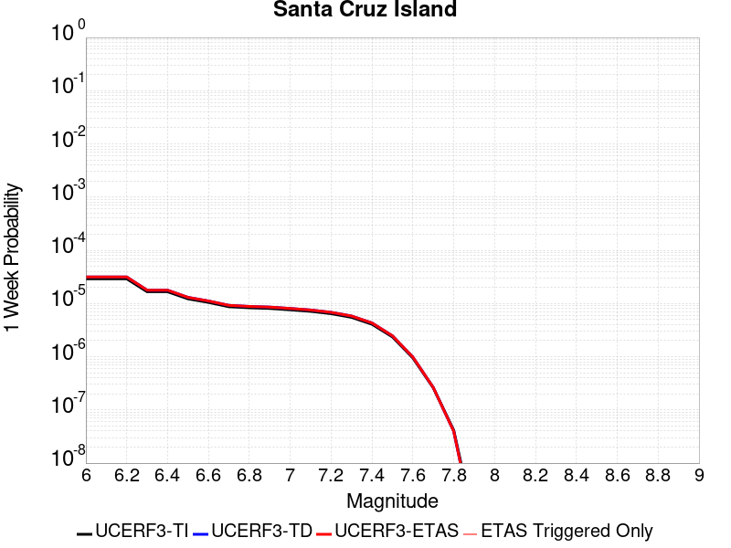 | 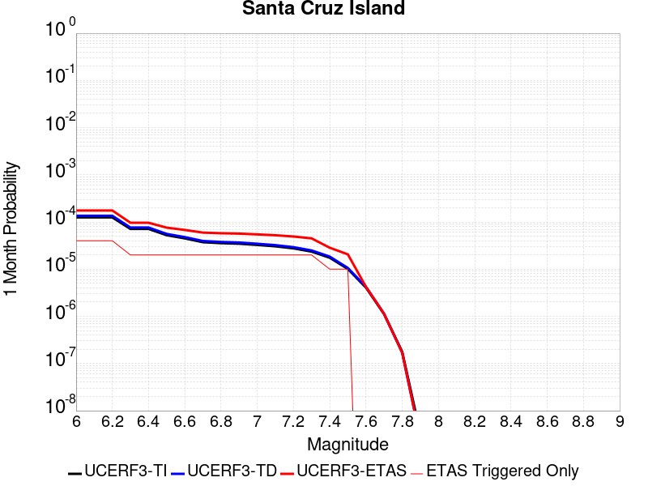 | 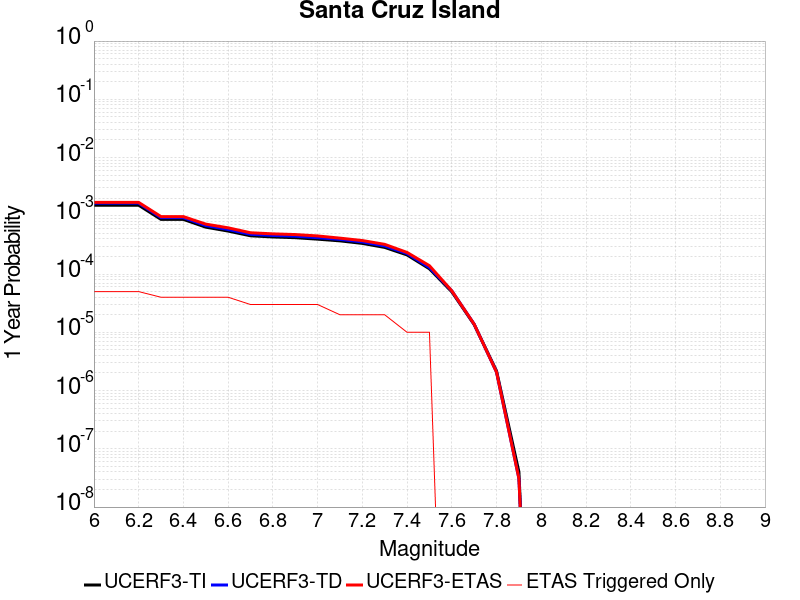 | 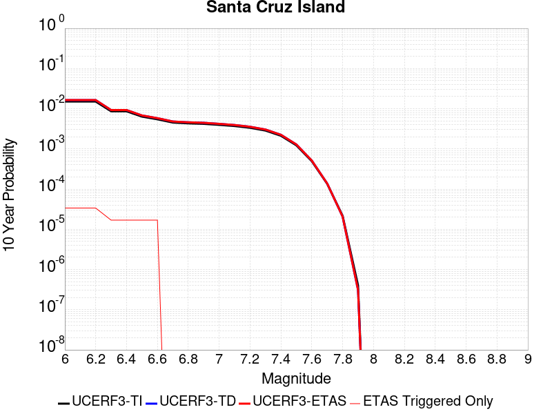 |

| Magnitude | 1 wk TI Prob | 1 wk TD Prob | 1 wk ETAS Prob | 1 wk ETAS/TD Gain | 1 wk ETAS Triggered Only | 1 mo TI Prob | 1 mo TD Prob | 1 mo ETAS Prob | 1 mo ETAS/TD Gain | 1 mo ETAS Triggered Only | 1 yr TI Prob | 1 yr TD Prob | 1 yr ETAS Prob | 1 yr ETAS/TD Gain | 1 yr ETAS Triggered Only | 10 yr TI Prob | 10 yr TD Prob | 10 yr ETAS Prob | 10 yr ETAS/TD Gain | 10 yr ETAS Triggered Only |
|-----|-----|-----|-----|-----|-----|-----|-----|-----|-----|-----|-----|-----|-----|-----|-----|-----|-----|-----|-----|-----|
| 6.0 | 2.9164563E-5 | 3.1599742E-5 | 3.1599742E-5 | 1.0 | 0.0 | 1.2498499E-4 | 1.3542121E-4 | 1.3542121E-4 | 1.0 | 0.0 | 0.0015206301 | 0.0016476426 | 0.0016722186 | 1.0149158 | 2.4616596E-5 | 0.015102667 | 0.016368 | 0.016416427 | 1.0029587 | 4.9233193E-5 |
| 6.1 | 2.9164563E-5 | 3.1599742E-5 | 3.1599742E-5 | 1.0 | 0.0 | 1.2498499E-4 | 1.3542121E-4 | 1.3542121E-4 | 1.0 | 0.0 | 0.0015206301 | 0.0016476426 | 0.0016722186 | 1.0149158 | 2.4616596E-5 | 0.015102667 | 0.016368 | 0.016416427 | 1.0029587 | 4.9233193E-5 |
| 6.2 | 2.9164563E-5 | 3.1599742E-5 | 3.1599742E-5 | 1.0 | 0.0 | 1.2498499E-4 | 1.3542121E-4 | 1.3542121E-4 | 1.0 | 0.0 | 0.0015206301 | 0.0016476426 | 0.0016722186 | 1.0149158 | 2.4616596E-5 | 0.015102667 | 0.016368 | 0.016416427 | 1.0029587 | 4.9233193E-5 |
| 6.3 | 1.6635553E-5 | 1.780436E-5 | 1.780436E-5 | 1.0 | 0.0 | 7.1293274E-5 | 7.630226E-5 | 7.630226E-5 | 1.0 | 0.0 | 8.6765E-4 | 9.2860236E-4 | 9.5319614E-4 | 1.0264847 | 2.4616596E-5 | 0.008642701 | 0.009249094 | 0.0092734825 | 1.0026369 | 2.4616596E-5 |
| 6.4 | 1.6635553E-5 | 1.780436E-5 | 1.780436E-5 | 1.0 | 0.0 | 7.1293274E-5 | 7.630226E-5 | 7.630226E-5 | 1.0 | 0.0 | 8.6765E-4 | 9.2860236E-4 | 9.5319614E-4 | 1.0264847 | 2.4616596E-5 | 0.008642701 | 0.009249094 | 0.0092734825 | 1.0026369 | 2.4616596E-5 |
| 6.5 | 1.2238748E-5 | 1.3042995E-5 | 1.3042995E-5 | 1.0 | 0.0 | 5.2450723E-5 | 5.5897377E-5 | 5.5897377E-5 | 1.0 | 0.0 | 6.3840044E-4 | 6.8034173E-4 | 7.049416E-4 | 1.0361581 | 2.4616596E-5 | 0.0063656955 | 0.0067829876 | 0.0068074376 | 1.0036045 | 2.4616596E-5 |
| 6.6 | 1.0489767E-5 | 1.1156636E-5 | 1.1156636E-5 | 1.0 | 0.0 | 4.495537E-5 | 4.781329E-5 | 4.781329E-5 | 1.0 | 0.0 | 5.4719415E-4 | 5.819735E-4 | 6.065758E-4 | 1.0422739 | 2.4616596E-5 | 0.005458487 | 0.0058047357 | 0.0058292095 | 1.0042162 | 2.4616596E-5 |
| 6.7 | 8.699222E-6 | 9.236782E-6 | 9.236782E-6 | 1.0 | 0.0 | 3.7281847E-5 | 3.958561E-5 | 3.958561E-5 | 1.0 | 0.0 | 4.5381195E-4 | 4.8184878E-4 | 4.8184878E-4 | 1.0 | 0.0 | 0.0045288634 | 0.004808108 | 0.004808108 | 1.0 | 0.0 |
| 6.8 | 8.307732E-6 | 8.8169045E-6 | 8.8169045E-6 | 1.0 | 0.0 | 3.560408E-5 | 3.7786187E-5 | 3.7786187E-5 | 1.0 | 0.0 | 4.3339343E-4 | 4.5995016E-4 | 4.5995016E-4 | 1.0 | 0.0 | 0.004325492 | 0.0045900354 | 0.0045900354 | 1.0 | 0.0 |
| 6.9 | 8.073121E-6 | 8.564939E-6 | 8.564939E-6 | 1.0 | 0.0 | 3.459863E-5 | 3.6706366E-5 | 3.6706366E-5 | 1.0 | 0.0 | 4.2115687E-4 | 4.468088E-4 | 4.468088E-4 | 1.0 | 0.0 | 0.004203596 | 0.004459156 | 0.004459156 | 1.0 | 0.0 |
| 7.0 | 7.617019E-6 | 8.074664E-6 | 8.074664E-6 | 1.0 | 0.0 | 3.264396E-5 | 3.4605247E-5 | 3.4605247E-5 | 1.0 | 0.0 | 3.9736772E-4 | 4.212378E-4 | 4.212378E-4 | 1.0 | 0.0 | 0.003966579 | 0.0042044413 | 0.0042044413 | 1.0 | 0.0 |
| 7.1 | 7.1224836E-6 | 7.545788E-6 | 7.545788E-6 | 1.0 | 0.0 | 3.052457E-5 | 3.2338692E-5 | 3.2338692E-5 | 1.0 | 0.0 | 3.715733E-4 | 3.936528E-4 | 3.936528E-4 | 1.0 | 0.0 | 0.003709526 | 0.003929598 | 0.003929598 | 1.0 | 0.0 |
| 7.2 | 6.441115E-6 | 6.8273835E-6 | 6.8273835E-6 | 1.0 | 0.0 | 2.7604487E-5 | 2.9259887E-5 | 2.9259887E-5 | 1.0 | 0.0 | 3.360328E-4 | 3.5618112E-4 | 3.5618112E-4 | 1.0 | 0.0 | 0.0033552512 | 0.003556131 | 0.003556131 | 1.0 | 0.0 |
| 7.3 | 5.494274E-6 | 5.8199944E-6 | 5.8199944E-6 | 1.0 | 0.0 | 2.3546674E-5 | 2.4942596E-5 | 2.4942596E-5 | 1.0 | 0.0 | 2.8664304E-4 | 3.0363398E-4 | 3.0363398E-4 | 1.0 | 0.0 | 0.002862736 | 0.0030322142 | 0.0030322142 | 1.0 | 0.0 |
| 7.4 | 4.0802624E-6 | 4.312256E-6 | 4.312256E-6 | 1.0 | 0.0 | 1.7486722E-5 | 1.8480967E-5 | 1.8480967E-5 | 1.0 | 0.0 | 2.1288003E-4 | 2.2498262E-4 | 2.2498262E-4 | 1.0 | 0.0 | 0.0021267622 | 0.0022475575 | 0.0022475575 | 1.0 | 0.0 |
| 7.5 | 2.3584746E-6 | 2.4753094E-6 | 2.4753094E-6 | 1.0 | 0.0 | 1.0107709E-5 | 1.0608426E-5 | 1.0608426E-5 | 1.0 | 0.0 | 1.2305441E-4 | 1.2915E-4 | 1.2915E-4 | 1.0 | 0.0 | 0.0012298629 | 0.0012907543 | 0.0012907543 | 1.0 | 0.0 |
| 7.6 | 9.4981914E-7 | 9.86093E-7 | 9.86093E-7 | 1.0 | 0.0 | 4.0706473E-6 | 4.2261063E-6 | 4.2261063E-6 | 1.0 | 0.0 | 4.9559E-5 | 5.145164E-5 | 5.145164E-5 | 1.0 | 0.0 | 4.954795E-4 | 5.1439856E-4 | 5.1439856E-4 | 1.0 | 0.0 |
| 7.7 | 2.6013532E-7 | 2.6416603E-7 | 2.6416603E-7 | 1.0 | 0.0 | 1.1148652E-6 | 1.1321397E-6 | 1.1321397E-6 | 1.0 | 0.0 | 1.3573399E-5 | 1.3783714E-5 | 1.3783714E-5 | 1.0 | 0.0 | 1.357257E-4 | 1.3782867E-4 | 1.3782867E-4 | 1.0 | 0.0 |
| 7.8 | 4.1522263E-8 | 3.965679E-8 | 3.965679E-8 | 1.0 | 0.0 | 1.7795254E-7 | 1.6995766E-7 | 1.6995766E-7 | 1.0 | 0.0 | 2.16657E-6 | 2.0692328E-6 | 2.0692328E-6 | 1.0 | 0.0 | 2.1665488E-5 | 2.0692156E-5 | 2.0692156E-5 | 1.0 | 0.0 |
| 7.9 | 7.7242046E-10 | 5.9468175E-10 | 5.9468175E-10 | 1.0 | 0.0 | 3.3103735E-9 | 2.5486364E-9 | 2.5486364E-9 | 1.0 | 0.0 | 4.0303796E-8 | 3.1029646E-8 | 3.1029646E-8 | 1.0 | 0.0 | 4.030379E-7 | 3.1029643E-7 | 3.1029643E-7 | 1.0 | 0.0 |

## Palos Verdes
*[(top)](#table-of-contents)*

| 1 Week | 1 Month | 1 Year | 10 Year |
|-----|-----|-----|-----|
| 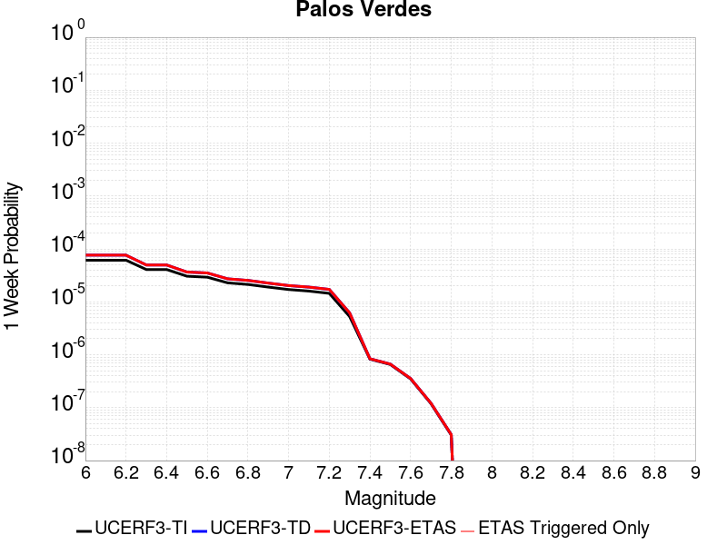 |  | 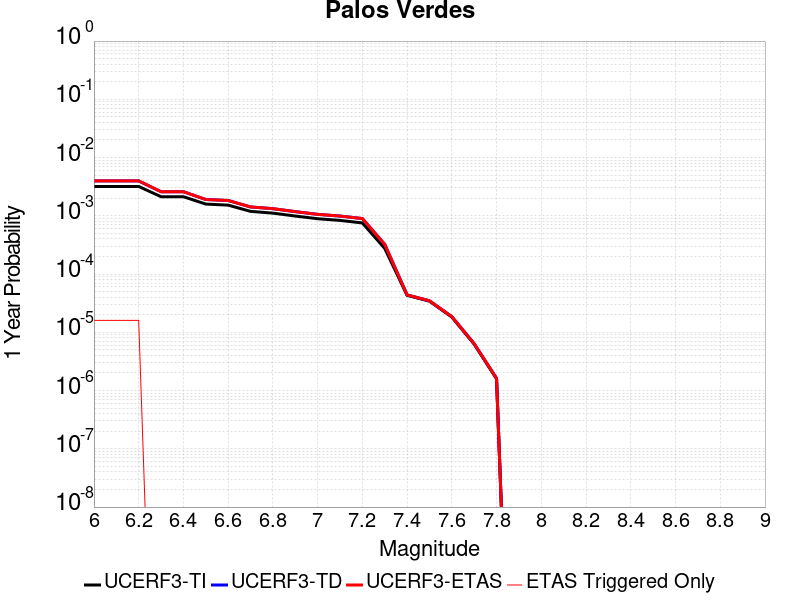 | 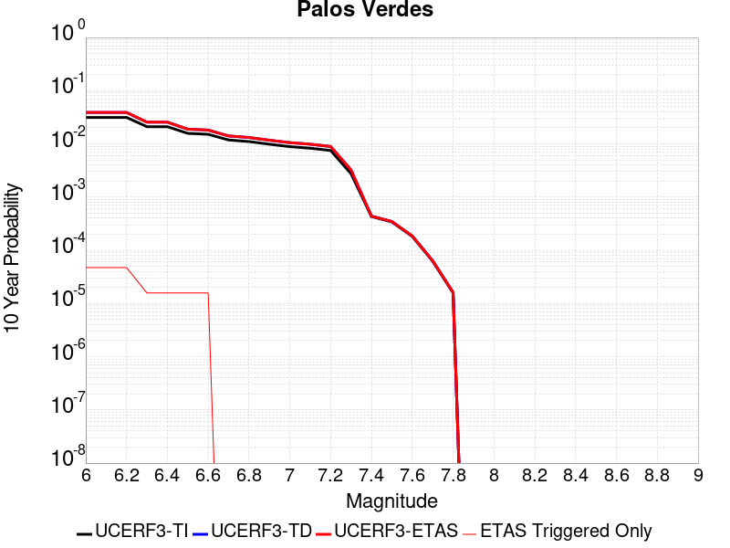 |

| Magnitude | 1 wk TI Prob | 1 wk TD Prob | 1 wk ETAS Prob | 1 wk ETAS/TD Gain | 1 wk ETAS Triggered Only | 1 mo TI Prob | 1 mo TD Prob | 1 mo ETAS Prob | 1 mo ETAS/TD Gain | 1 mo ETAS Triggered Only | 1 yr TI Prob | 1 yr TD Prob | 1 yr ETAS Prob | 1 yr ETAS/TD Gain | 1 yr ETAS Triggered Only | 10 yr TI Prob | 10 yr TD Prob | 10 yr ETAS Prob | 10 yr ETAS/TD Gain | 10 yr ETAS Triggered Only |
|-----|-----|-----|-----|-----|-----|-----|-----|-----|-----|-----|-----|-----|-----|-----|-----|-----|-----|-----|-----|-----|
| 6.0 | 6.126063E-5 | 7.622612E-5 | 7.622612E-5 | 1.0 | 0.0 | 2.6251914E-4 | 3.2664582E-4 | 3.2664582E-4 | 1.0 | 0.0 | 0.0031914865 | 0.003970174 | 0.003994693 | 1.0061758 | 2.4616596E-5 | 0.031460393 | 0.039048895 | 0.039096206 | 1.0012115 | 4.9233193E-5 |
| 6.1 | 6.126063E-5 | 7.622612E-5 | 7.622612E-5 | 1.0 | 0.0 | 2.6251914E-4 | 3.2664582E-4 | 3.2664582E-4 | 1.0 | 0.0 | 0.0031914865 | 0.003970174 | 0.003994693 | 1.0061758 | 2.4616596E-5 | 0.031460393 | 0.039048895 | 0.039096206 | 1.0012115 | 4.9233193E-5 |
| 6.2 | 6.126063E-5 | 7.622612E-5 | 7.622612E-5 | 1.0 | 0.0 | 2.6251914E-4 | 3.2664582E-4 | 3.2664582E-4 | 1.0 | 0.0 | 0.0031914865 | 0.003970174 | 0.003994693 | 1.0061758 | 2.4616596E-5 | 0.031460393 | 0.039048895 | 0.039096206 | 1.0012115 | 4.9233193E-5 |
| 6.3 | 4.0838047E-5 | 4.9749437E-5 | 4.9749437E-5 | 1.0 | 0.0 | 1.7500846E-4 | 2.1319572E-4 | 2.1319572E-4 | 1.0 | 0.0 | 0.0021286458 | 0.0025927818 | 0.0025927818 | 1.0 | 0.0 | 0.021083709 | 0.025646681 | 0.025646681 | 1.0 | 0.0 |
| 6.4 | 4.0838047E-5 | 4.9749437E-5 | 4.9749437E-5 | 1.0 | 0.0 | 1.7500846E-4 | 2.1319572E-4 | 2.1319572E-4 | 1.0 | 0.0 | 0.0021286458 | 0.0025927818 | 0.0025927818 | 1.0 | 0.0 | 0.021083709 | 0.025646681 | 0.025646681 | 1.0 | 0.0 |
| 6.5 | 3.0512005E-5 | 3.656162E-5 | 3.656162E-5 | 1.0 | 0.0 | 1.3075917E-4 | 1.5668393E-4 | 1.5668393E-4 | 1.0 | 0.0 | 0.0015908304 | 0.0019060767 | 0.0019060767 | 1.0 | 0.0 | 0.015794903 | 0.018909154 | 0.018909154 | 1.0 | 0.0 |
| 6.6 | 2.9255087E-5 | 3.515442E-5 | 3.515442E-5 | 1.0 | 0.0 | 1.2537291E-4 | 1.5065377E-4 | 1.5065377E-4 | 1.0 | 0.0 | 0.0015253464 | 0.0018327828 | 0.0018327828 | 1.0 | 0.0 | 0.015149189 | 0.018188225 | 0.018188225 | 1.0 | 0.0 |
| 6.7 | 2.287198E-5 | 2.7248278E-5 | 2.7248278E-5 | 1.0 | 0.0 | 9.801909E-5 | 1.16773626E-4 | 1.16773626E-4 | 1.0 | 0.0 | 0.001192729 | 0.0014208833 | 0.0014208833 | 1.0 | 0.0 | 0.011863477 | 0.014127217 | 0.014127217 | 1.0 | 0.0 |
| 6.8 | 2.1325764E-5 | 2.5431877E-5 | 2.5431877E-5 | 1.0 | 0.0 | 9.139293E-5 | 1.0898971E-4 | 1.0898971E-4 | 1.0 | 0.0 | 0.001112141 | 0.0013262323 | 0.0013262323 | 1.0 | 0.0 | 0.011065915 | 0.013192211 | 0.013192211 | 1.0 | 0.0 |
| 6.9 | 1.9009392E-5 | 2.2613547E-5 | 2.2613547E-5 | 1.0 | 0.0 | 8.1466285E-5 | 9.6912096E-5 | 9.6912096E-5 | 1.0 | 0.0 | 9.914007E-4 | 0.0011793535 | 0.0011793535 | 1.0 | 0.0 | 0.009869894 | 0.011739632 | 0.011739632 | 1.0 | 0.0 |
| 7.0 | 1.7098473E-5 | 2.0319356E-5 | 2.0319356E-5 | 1.0 | 0.0 | 7.3277115E-5 | 8.708052E-5 | 8.708052E-5 | 1.0 | 0.0 | 8.917837E-4 | 0.001059775 | 0.001059775 | 1.0 | 0.0 | 0.008882134 | 0.010555646 | 0.010555646 | 1.0 | 0.0 |
| 7.1 | 1.5982785E-5 | 1.899476E-5 | 1.899476E-5 | 1.0 | 0.0 | 6.849585E-5 | 8.1404054E-5 | 8.1404054E-5 | 1.0 | 0.0 | 8.336179E-4 | 9.907284E-4 | 9.907284E-4 | 1.0 | 0.0 | 0.008304977 | 0.009871479 | 0.009871479 | 1.0 | 0.0 |
| 7.2 | 1.4468002E-5 | 1.7197237E-5 | 1.7197237E-5 | 1.0 | 0.0 | 6.200425E-5 | 7.370083E-5 | 7.370083E-5 | 1.0 | 0.0 | 7.546402E-4 | 8.970222E-4 | 8.970222E-4 | 1.0 | 0.0 | 0.007520827 | 0.008942284 | 0.008942284 | 1.0 | 0.0 |
| 7.3 | 5.288233E-6 | 6.2036747E-6 | 6.2036747E-6 | 1.0 | 0.0 | 2.2663658E-5 | 2.6587102E-5 | 2.6587102E-5 | 1.0 | 0.0 | 2.7589512E-4 | 3.236848E-4 | 3.236848E-4 | 1.0 | 0.0 | 0.0027555283 | 0.0032355562 | 0.0032355562 | 1.0 | 0.0 |
| 7.4 | 8.279556E-7 | 8.408347E-7 | 8.408347E-7 | 1.0 | 0.0 | 3.5483763E-6 | 3.6035726E-6 | 3.6035726E-6 | 1.0 | 0.0 | 4.3200624E-5 | 4.3872686E-5 | 4.3872686E-5 | 1.0 | 0.0 | 4.3192226E-4 | 4.3864746E-4 | 4.3864746E-4 | 1.0 | 0.0 |
| 7.5 | 6.559831E-7 | 6.667229E-7 | 6.667229E-7 | 1.0 | 0.0 | 2.8113532E-6 | 2.857381E-6 | 2.857381E-6 | 1.0 | 0.0 | 3.4227687E-5 | 3.4788125E-5 | 3.4788125E-5 | 1.0 | 0.0 | 3.4222414E-4 | 3.4783344E-4 | 3.4783344E-4 | 1.0 | 0.0 |
| 7.6 | 3.5018968E-7 | 3.5620027E-7 | 3.5620027E-7 | 1.0 | 0.0 | 1.500812E-6 | 1.526572E-6 | 1.526572E-6 | 1.0 | 0.0 | 1.8272232E-5 | 1.8585903E-5 | 1.8585903E-5 | 1.0 | 0.0 | 1.8270731E-4 | 1.8584808E-4 | 1.8584808E-4 | 1.0 | 0.0 |
| 7.7 | 1.1986104E-7 | 1.2198376E-7 | 1.2198376E-7 | 1.0 | 0.0 | 5.1369005E-7 | 5.2278745E-7 | 5.2278745E-7 | 1.0 | 0.0 | 6.2541585E-6 | 6.364919E-6 | 6.364919E-6 | 1.0 | 0.0 | 6.2539824E-5 | 6.364741E-5 | 6.364741E-5 | 1.0 | 0.0 |
| 7.8 | 3.0445005E-8 | 3.1027582E-8 | 3.1027582E-8 | 1.0 | 0.0 | 1.3047858E-7 | 1.3297536E-7 | 1.3297536E-7 | 1.0 | 0.0 | 1.5885756E-6 | 1.6189739E-6 | 1.6189739E-6 | 1.0 | 0.0 | 1.5885644E-5 | 1.6189642E-5 | 1.6189642E-5 | 1.0 | 0.0 |

## Los Alamos 2011 CFM
*[(top)](#table-of-contents)*

| 1 Week | 1 Month | 1 Year | 10 Year |
|-----|-----|-----|-----|
|  |  |  | 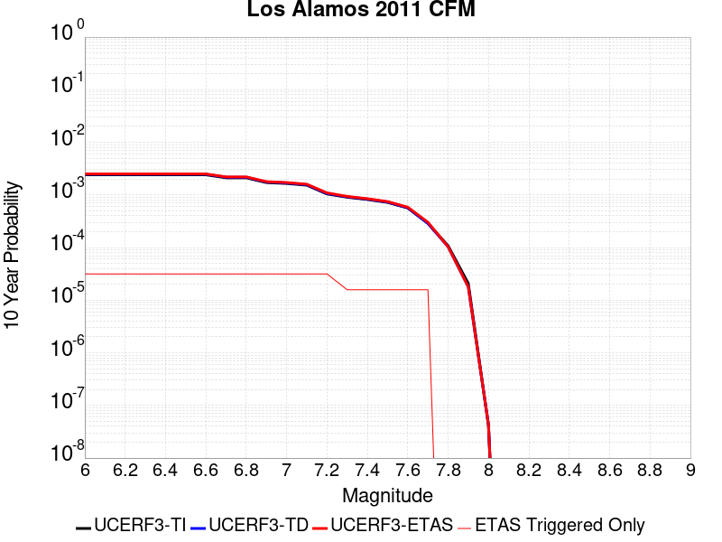 |

| Magnitude | 1 wk TI Prob | 1 wk TD Prob | 1 wk ETAS Prob | 1 wk ETAS/TD Gain | 1 wk ETAS Triggered Only | 1 mo TI Prob | 1 mo TD Prob | 1 mo ETAS Prob | 1 mo ETAS/TD Gain | 1 mo ETAS Triggered Only | 1 yr TI Prob | 1 yr TD Prob | 1 yr ETAS Prob | 1 yr ETAS/TD Gain | 1 yr ETAS Triggered Only | 10 yr TI Prob | 10 yr TD Prob | 10 yr ETAS Prob | 10 yr ETAS/TD Gain | 10 yr ETAS Triggered Only |
|-----|-----|-----|-----|-----|-----|-----|-----|-----|-----|-----|-----|-----|-----|-----|-----|-----|-----|-----|-----|-----|
| 6.0 | 4.6284417E-6 | 4.751731E-6 | 4.751731E-6 | 1.0 | 0.0 | 1.9836029E-5 | 2.0364414E-5 | 2.0364414E-5 | 1.0 | 0.0 | 2.4147688E-4 | 2.4791027E-4 | 2.725208E-4 | 1.0992718 | 2.4616596E-5 | 0.0024121467 | 0.0024765113 | 0.0025256227 | 1.0198308 | 4.9233193E-5 |
| 6.1 | 4.6284417E-6 | 4.751731E-6 | 4.751731E-6 | 1.0 | 0.0 | 1.9836029E-5 | 2.0364414E-5 | 2.0364414E-5 | 1.0 | 0.0 | 2.4147688E-4 | 2.4791027E-4 | 2.725208E-4 | 1.0992718 | 2.4616596E-5 | 0.0024121467 | 0.0024765113 | 0.0025256227 | 1.0198308 | 4.9233193E-5 |
| 6.2 | 4.6284417E-6 | 4.751731E-6 | 4.751731E-6 | 1.0 | 0.0 | 1.9836029E-5 | 2.0364414E-5 | 2.0364414E-5 | 1.0 | 0.0 | 2.4147688E-4 | 2.4791027E-4 | 2.725208E-4 | 1.0992718 | 2.4616596E-5 | 0.0024121467 | 0.0024765113 | 0.0025256227 | 1.0198308 | 4.9233193E-5 |
| 6.3 | 4.6284417E-6 | 4.751731E-6 | 4.751731E-6 | 1.0 | 0.0 | 1.9836029E-5 | 2.0364414E-5 | 2.0364414E-5 | 1.0 | 0.0 | 2.4147688E-4 | 2.4791027E-4 | 2.725208E-4 | 1.0992718 | 2.4616596E-5 | 0.0024121467 | 0.0024765113 | 0.0025256227 | 1.0198308 | 4.9233193E-5 |
| 6.4 | 4.6284417E-6 | 4.751731E-6 | 4.751731E-6 | 1.0 | 0.0 | 1.9836029E-5 | 2.0364414E-5 | 2.0364414E-5 | 1.0 | 0.0 | 2.4147688E-4 | 2.4791027E-4 | 2.725208E-4 | 1.0992718 | 2.4616596E-5 | 0.0024121467 | 0.0024765113 | 0.0025256227 | 1.0198308 | 4.9233193E-5 |
| 6.5 | 4.6284417E-6 | 4.751731E-6 | 4.751731E-6 | 1.0 | 0.0 | 1.9836029E-5 | 2.0364414E-5 | 2.0364414E-5 | 1.0 | 0.0 | 2.4147688E-4 | 2.4791027E-4 | 2.725208E-4 | 1.0992718 | 2.4616596E-5 | 0.0024121467 | 0.0024765113 | 0.0025256227 | 1.0198308 | 4.9233193E-5 |
| 6.6 | 4.6284417E-6 | 4.751731E-6 | 4.751731E-6 | 1.0 | 0.0 | 1.9836029E-5 | 2.0364414E-5 | 2.0364414E-5 | 1.0 | 0.0 | 2.4147688E-4 | 2.4791027E-4 | 2.725208E-4 | 1.0992718 | 2.4616596E-5 | 0.0024121467 | 0.0024765113 | 0.0025256227 | 1.0198308 | 4.9233193E-5 |
| 6.7 | 4.062321E-6 | 4.166349E-6 | 4.166349E-6 | 1.0 | 0.0 | 1.7409831E-5 | 1.7855667E-5 | 1.7855667E-5 | 1.0 | 0.0 | 2.1194408E-4 | 2.1737257E-4 | 2.4198381E-4 | 1.1132215 | 2.4616596E-5 | 0.0021174205 | 0.0021717492 | 0.0022208754 | 1.0226206 | 4.9233193E-5 |
| 6.8 | 4.062321E-6 | 4.166349E-6 | 4.166349E-6 | 1.0 | 0.0 | 1.7409831E-5 | 1.7855667E-5 | 1.7855667E-5 | 1.0 | 0.0 | 2.1194408E-4 | 2.1737257E-4 | 2.4198381E-4 | 1.1132215 | 2.4616596E-5 | 0.0021174205 | 0.0021717492 | 0.0022208754 | 1.0226206 | 4.9233193E-5 |
| 6.9 | 3.2936077E-6 | 3.372958E-6 | 3.372958E-6 | 1.0 | 0.0 | 1.4115385E-5 | 1.4455459E-5 | 1.4455459E-5 | 1.0 | 0.0 | 1.7184127E-4 | 1.7598194E-4 | 2.0059421E-4 | 1.1398568 | 2.4616596E-5 | 0.0017170844 | 0.0017585184 | 0.001807665 | 1.0279478 | 4.9233193E-5 |
| 7.0 | 3.1687898E-6 | 3.2448156E-6 | 3.2448156E-6 | 1.0 | 0.0 | 1.3580457E-5 | 1.3906283E-5 | 1.3906283E-5 | 1.0 | 0.0 | 1.6532952E-4 | 1.6929678E-4 | 1.939092E-4 | 1.1453804 | 2.4616596E-5 | 0.0016520657 | 0.0016917696 | 0.0017409195 | 1.0290524 | 4.9233193E-5 |
| 7.1 | 2.9379228E-6 | 3.0073259E-6 | 3.0073259E-6 | 1.0 | 0.0 | 1.25910365E-5 | 1.288848E-5 | 1.288848E-5 | 1.0 | 0.0 | 1.5328509E-4 | 1.5690686E-4 | 1.8151959E-4 | 1.156862 | 2.4616596E-5 | 0.001531794 | 0.0015680499 | 0.0016172059 | 1.0313485 | 4.9233193E-5 |
| 7.2 | 2.0020686E-6 | 2.0416298E-6 | 2.0416298E-6 | 1.0 | 0.0 | 8.580266E-6 | 8.749813E-6 | 8.749813E-6 | 1.0 | 0.0 | 1.0445973E-4 | 1.0652381E-4 | 1.3113779E-4 | 1.2310655 | 2.4616596E-5 | 0.0010441064 | 0.001064732 | 0.0011139127 | 1.0461907 | 4.9233193E-5 |
| 7.3 | 1.7364243E-6 | 1.7678802E-6 | 1.7678802E-6 | 1.0 | 0.0 | 7.441797E-6 | 7.576608E-6 | 7.576608E-6 | 1.0 | 0.0 | 9.0600115E-5 | 9.2241324E-5 | 9.2241324E-5 | 1.0 | 0.0 | 9.0563187E-4 | 9.2203356E-4 | 9.4662746E-4 | 1.0266736 | 2.4616596E-5 |
| 7.4 | 1.5718434E-6 | 1.5983177E-6 | 1.5983177E-6 | 1.0 | 0.0 | 6.7364545E-6 | 6.849915E-6 | 6.849915E-6 | 1.0 | 0.0 | 8.201325E-5 | 8.339455E-5 | 8.339455E-5 | 1.0 | 0.0 | 8.198299E-4 | 8.3363557E-4 | 8.582317E-4 | 1.0295045 | 2.4616596E-5 |
| 7.5 | 1.3841119E-6 | 1.4042793E-6 | 1.4042793E-6 | 1.0 | 0.0 | 5.9318945E-6 | 6.0183256E-6 | 6.0183256E-6 | 1.0 | 0.0 | 7.221842E-5 | 7.327068E-5 | 7.327068E-5 | 1.0 | 0.0 | 7.2194956E-4 | 7.324681E-4 | 7.570667E-4 | 1.0335832 | 2.4616596E-5 |
| 7.6 | 1.0843726E-6 | 1.093442E-6 | 1.093442E-6 | 1.0 | 0.0 | 4.647303E-6 | 4.6861724E-6 | 4.6861724E-6 | 1.0 | 0.0 | 5.6579443E-5 | 5.705268E-5 | 5.705268E-5 | 1.0 | 0.0 | 5.656504E-4 | 5.703829E-4 | 5.9498544E-4 | 1.0431334 | 2.4616596E-5 |
| 7.7 | 5.544814E-7 | 5.5018705E-7 | 5.5018705E-7 | 1.0 | 0.0 | 2.3763469E-6 | 2.3579425E-6 | 2.3579425E-6 | 1.0 | 0.0 | 2.8931638E-5 | 2.8707573E-5 | 2.8707573E-5 | 1.0 | 0.0 | 2.8927872E-4 | 2.870388E-4 | 3.1164833E-4 | 1.0857359 | 2.4616596E-5 |
| 7.8 | 2.0707465E-7 | 1.977846E-7 | 1.977846E-7 | 1.0 | 0.0 | 8.874625E-7 | 8.4764804E-7 | 8.4764804E-7 | 1.0 | 0.0 | 1.08048025E-5 | 1.0320066E-5 | 1.0320066E-5 | 1.0 | 0.0 | 1.0804277E-4 | 1.0319592E-4 | 1.0319592E-4 | 1.0 | 0.0 |
| 7.9 | 3.9821284E-8 | 3.433109E-8 | 3.433109E-8 | 1.0 | 0.0 | 1.7066264E-7 | 1.4713324E-7 | 1.4713324E-7 | 1.0 | 0.0 | 2.0778157E-6 | 1.7913457E-6 | 1.7913457E-6 | 1.0 | 0.0 | 2.0777963E-5 | 1.7913319E-5 | 1.7913319E-5 | 1.0 | 0.0 |
| 8.0 | 7.880441E-11 | 8.2353124E-11 | 8.2353124E-11 | 1.0 | 0.0 | 3.3773329E-10 | 3.52942E-10 | 3.52942E-10 | 1.0 | 0.0 | 4.1119033E-9 | 4.2970694E-9 | 4.2970694E-9 | 1.0 | 0.0 | 4.1119034E-8 | 4.2970694E-8 | 4.2970694E-8 | 1.0 | 0.0 |

## Elsinore (Temecula) rev
*[(top)](#table-of-contents)*

| 1 Week | 1 Month | 1 Year | 10 Year |
|-----|-----|-----|-----|
| 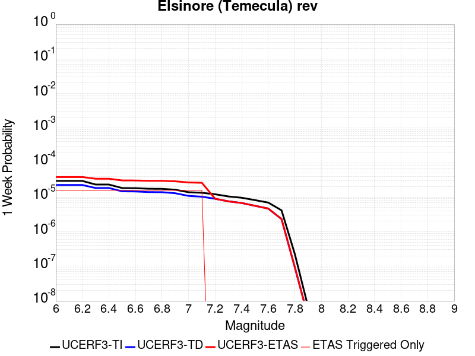 | 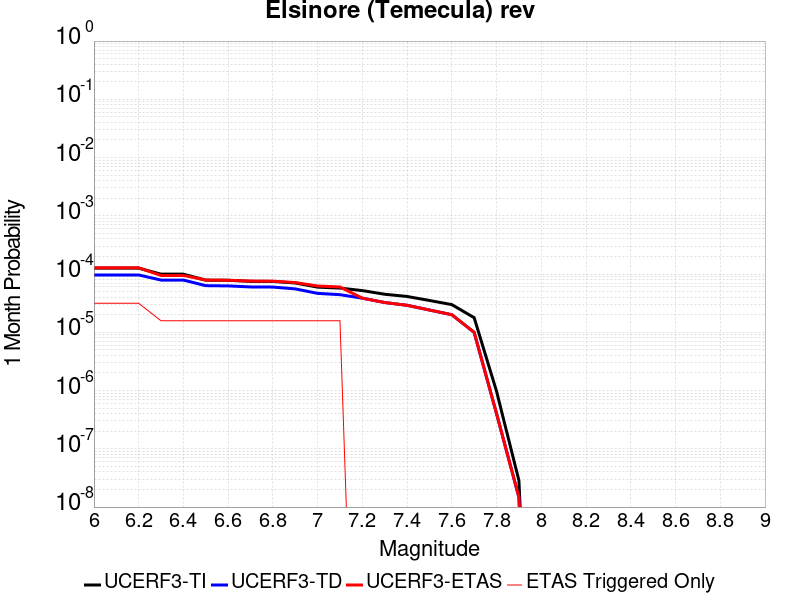 | 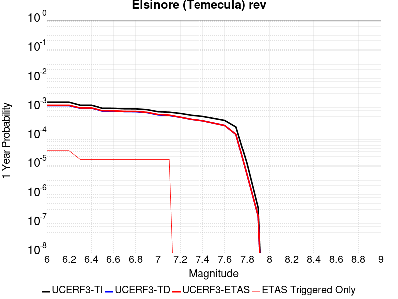 | 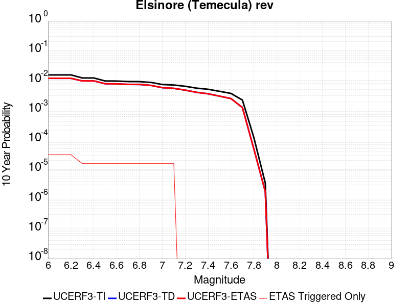 |

| Magnitude | 1 wk TI Prob | 1 wk TD Prob | 1 wk ETAS Prob | 1 wk ETAS/TD Gain | 1 wk ETAS Triggered Only | 1 mo TI Prob | 1 mo TD Prob | 1 mo ETAS Prob | 1 mo ETAS/TD Gain | 1 mo ETAS Triggered Only | 1 yr TI Prob | 1 yr TD Prob | 1 yr ETAS Prob | 1 yr ETAS/TD Gain | 1 yr ETAS Triggered Only | 10 yr TI Prob | 10 yr TD Prob | 10 yr ETAS Prob | 10 yr ETAS/TD Gain | 10 yr ETAS Triggered Only |
|-----|-----|-----|-----|-----|-----|-----|-----|-----|-----|-----|-----|-----|-----|-----|-----|-----|-----|-----|-----|-----|
| 6.0 | 2.9514995E-5 | 2.2517117E-5 | 4.713316E-5 | 2.0932148 | 2.4616596E-5 | 1.264867E-4 | 9.649849E-5 | 1.4572692E-4 | 1.5101473 | 4.9233193E-5 | 0.0015388876 | 0.0011742581 | 0.0012234334 | 1.0418779 | 4.9233193E-5 | 0.015282745 | 0.011696897 | 0.011745555 | 1.0041598 | 4.9233193E-5 |
| 6.1 | 2.9514995E-5 | 2.2517117E-5 | 4.713316E-5 | 2.0932148 | 2.4616596E-5 | 1.264867E-4 | 9.649849E-5 | 1.4572692E-4 | 1.5101473 | 4.9233193E-5 | 0.0015388876 | 0.0011742581 | 0.0012234334 | 1.0418779 | 4.9233193E-5 | 0.015282745 | 0.011696897 | 0.011745555 | 1.0041598 | 4.9233193E-5 |
| 6.2 | 2.9514995E-5 | 2.2517117E-5 | 4.713316E-5 | 2.0932148 | 2.4616596E-5 | 1.264867E-4 | 9.649849E-5 | 1.4572692E-4 | 1.5101473 | 4.9233193E-5 | 0.0015388876 | 0.0011742581 | 0.0012234334 | 1.0418779 | 4.9233193E-5 | 0.015282745 | 0.011696897 | 0.011745555 | 1.0041598 | 4.9233193E-5 |
| 6.3 | 2.3223649E-5 | 1.8406454E-5 | 4.30226E-5 | 2.3373647 | 2.4616596E-5 | 9.952613E-5 | 7.888251E-5 | 1.0349717E-4 | 1.312042 | 2.4616596E-5 | 0.001211057 | 9.599888E-4 | 9.845818E-4 | 1.025618 | 2.4616596E-5 | 0.012044783 | 0.009569948 | 0.009594329 | 1.0025476 | 2.4616596E-5 |
| 6.4 | 2.3223649E-5 | 1.8406454E-5 | 4.30226E-5 | 2.3373647 | 2.4616596E-5 | 9.952613E-5 | 7.888251E-5 | 1.0349717E-4 | 1.312042 | 2.4616596E-5 | 0.001211057 | 9.599888E-4 | 9.845818E-4 | 1.025618 | 2.4616596E-5 | 0.012044783 | 0.009569948 | 0.009594329 | 1.0025476 | 2.4616596E-5 |
| 6.5 | 1.8338875E-5 | 1.4750118E-5 | 3.936635E-5 | 2.6688838 | 2.4616596E-5 | 7.8592806E-5 | 6.321331E-5 | 8.7828346E-5 | 1.3893965 | 2.4616596E-5 | 9.5644733E-4 | 7.69359E-4 | 7.939567E-4 | 1.0319716 | 2.4616596E-5 | 0.009523412 | 0.0076739118 | 0.0076983394 | 1.0031832 | 2.4616596E-5 |
| 6.6 | 1.8223333E-5 | 1.4612673E-5 | 3.922891E-5 | 2.6845813 | 2.4616596E-5 | 7.809766E-5 | 6.262429E-5 | 8.723934E-5 | 1.3930593 | 2.4616596E-5 | 9.504242E-4 | 7.6219277E-4 | 7.8679057E-4 | 1.0322725 | 2.4616596E-5 | 0.009463696 | 0.0076027405 | 0.00762717 | 1.0032133 | 2.4616596E-5 |
| 6.7 | 1.7512752E-5 | 1.402721E-5 | 3.8643462E-5 | 2.7548928 | 2.4616596E-5 | 7.505249E-5 | 6.011528E-5 | 8.4730396E-5 | 1.4094652 | 2.4616596E-5 | 9.13381E-4 | 7.3166634E-4 | 7.562649E-4 | 1.03362 | 2.4616596E-5 | 0.00909636 | 0.00729892 | 0.007323357 | 1.003348 | 2.4616596E-5 |
| 6.8 | 1.7417142E-5 | 1.3951195E-5 | 3.8567447E-5 | 2.7644548 | 2.4616596E-5 | 7.4642754E-5 | 5.9789512E-5 | 8.440464E-5 | 1.4116963 | 2.4616596E-5 | 9.083966E-4 | 7.277028E-4 | 7.523015E-4 | 1.0338032 | 2.4616596E-5 | 0.009046922 | 0.0072594886 | 0.0072839265 | 1.0033664 | 2.4616596E-5 |
| 6.9 | 1.6402591E-5 | 1.2988613E-5 | 3.7604892E-5 | 2.8952198 | 2.4616596E-5 | 7.0294926E-5 | 5.5664343E-5 | 8.027957E-5 | 1.4422082 | 2.4616596E-5 | 8.5550465E-4 | 6.775103E-4 | 7.0211024E-4 | 1.0363092 | 2.4616596E-5 | 0.008522186 | 0.006760169 | 0.006784619 | 1.0036168 | 2.4616596E-5 |
| 7.0 | 1.3912486E-5 | 1.0878233E-5 | 3.5494562E-5 | 3.2628977 | 2.4616596E-5 | 5.9623577E-5 | 4.6620182E-5 | 7.1235634E-5 | 1.5279999 | 2.4616596E-5 | 7.2567526E-4 | 5.674556E-4 | 5.9205823E-4 | 1.0433561 | 2.4616596E-5 | 0.0072331014 | 0.005663986 | 0.005688463 | 1.0043216 | 2.4616596E-5 |
| 7.1 | 1.3405147E-5 | 1.03274215E-5 | 3.4943765E-5 | 3.3835905 | 2.4616596E-5 | 5.7449364E-5 | 4.425964E-5 | 6.8875146E-5 | 1.5561615 | 2.4616596E-5 | 6.9922156E-4 | 5.3873047E-4 | 5.633338E-4 | 1.0456691 | 2.4616596E-5 | 0.0069702556 | 0.005377577 | 0.005402061 | 1.0045531 | 2.4616596E-5 |
| 7.2 | 1.21402E-5 | 8.996737E-6 | 8.996737E-6 | 1.0 | 0.0 | 5.202839E-5 | 3.8556886E-5 | 3.8556886E-5 | 1.0 | 0.0 | 6.332616E-4 | 4.6933076E-4 | 4.6933076E-4 | 1.0 | 0.0 | 0.0063146 | 0.004684821 | 0.004684821 | 1.0 | 0.0 |
| 7.3 | 1.05047775E-5 | 7.571771E-6 | 7.571771E-6 | 1.0 | 0.0 | 4.5019697E-5 | 3.245005E-5 | 3.245005E-5 | 1.0 | 0.0 | 5.4797693E-4 | 3.950092E-4 | 3.950092E-4 | 1.0 | 0.0 | 0.005466277 | 0.00394346 | 0.00394346 | 1.0 | 0.0 |
| 7.4 | 9.624483E-6 | 6.7868696E-6 | 6.7868696E-6 | 1.0 | 0.0 | 4.124713E-5 | 2.9086266E-5 | 2.9086266E-5 | 1.0 | 0.0 | 5.0206814E-4 | 3.5406914E-4 | 3.5406914E-4 | 1.0 | 0.0 | 0.005009353 | 0.003535204 | 0.003535204 | 1.0 | 0.0 |
| 7.5 | 8.215151E-6 | 5.635538E-6 | 5.635538E-6 | 1.0 | 0.0 | 3.5207315E-5 | 2.4152088E-5 | 2.4152088E-5 | 1.0 | 0.0 | 4.2856473E-4 | 2.9401327E-4 | 2.9401327E-4 | 1.0 | 0.0 | 0.004277392 | 0.002936371 | 0.002936371 | 1.0 | 0.0 |
| 7.6 | 6.975058E-6 | 4.676045E-6 | 4.676045E-6 | 1.0 | 0.0 | 2.9892764E-5 | 2.0040046E-5 | 2.0040046E-5 | 1.0 | 0.0 | 3.6388362E-4 | 2.439614E-4 | 2.439614E-4 | 1.0 | 0.0 | 0.0036328835 | 0.002437052 | 0.002437052 | 1.0 | 0.0 |
| 7.7 | 4.159604E-6 | 2.3269924E-6 | 2.3269924E-6 | 1.0 | 0.0 | 1.7826753E-5 | 9.97279E-6 | 9.97279E-6 | 1.0 | 0.0 | 2.1701909E-4 | 1.21412704E-4 | 1.21412704E-4 | 1.0 | 0.0 | 0.0021680726 | 0.0012135367 | 0.0012135367 | 1.0 | 0.0 |
| 7.8 | 2.2692414E-7 | 9.3854695E-8 | 9.3854695E-8 | 1.0 | 0.0 | 9.725317E-7 | 4.0223435E-7 | 4.0223435E-7 | 1.0 | 0.0 | 1.1840509E-5 | 4.8971956E-6 | 4.8971956E-6 | 1.0 | 0.0 | 1.1839878E-4 | 4.8971204E-5 | 4.8971204E-5 | 1.0 | 0.0 |
| 7.9 | 6.676829E-9 | 3.439853E-9 | 3.439853E-9 | 1.0 | 0.0 | 2.861498E-8 | 1.4742227E-8 | 1.4742227E-8 | 1.0 | 0.0 | 3.4838732E-7 | 1.7948659E-7 | 1.7948659E-7 | 1.0 | 0.0 | 3.4838679E-6 | 1.7948646E-6 | 1.7948646E-6 | 1.0 | 0.0 |

## San Luis Range 2011 CFM
*[(top)](#table-of-contents)*

| 1 Week | 1 Month | 1 Year | 10 Year |
|-----|-----|-----|-----|
|  | 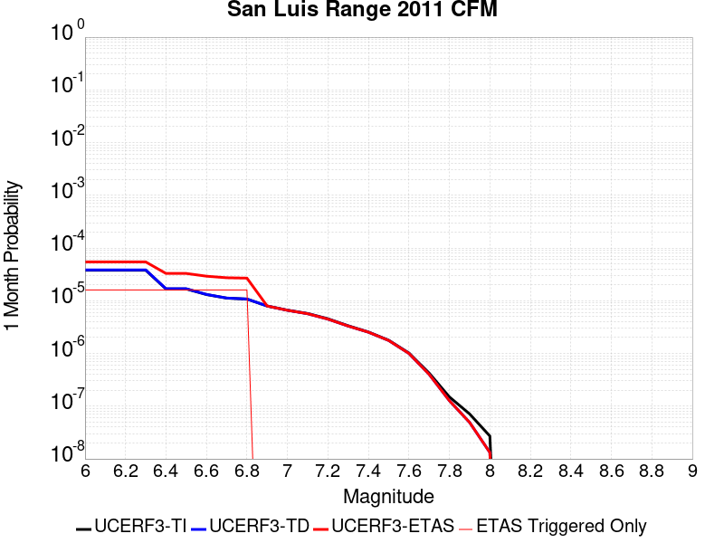 | 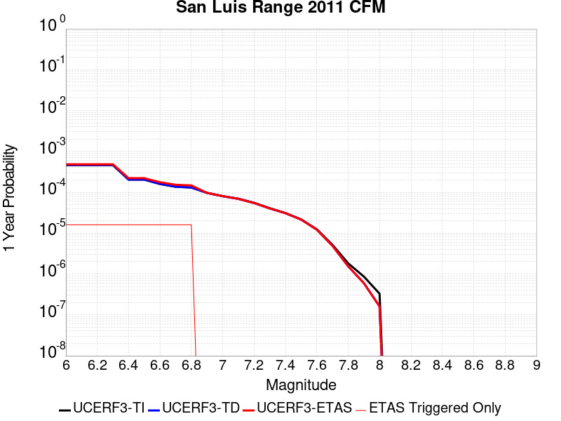 | 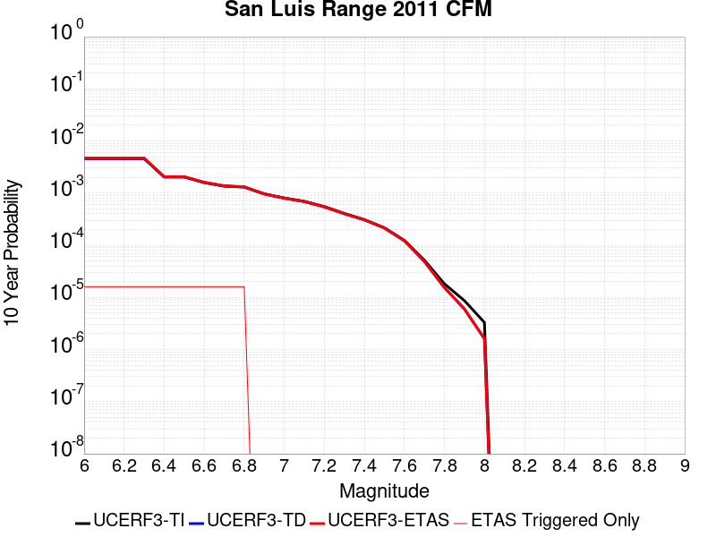 |

| Magnitude | 1 wk TI Prob | 1 wk TD Prob | 1 wk ETAS Prob | 1 wk ETAS/TD Gain | 1 wk ETAS Triggered Only | 1 mo TI Prob | 1 mo TD Prob | 1 mo ETAS Prob | 1 mo ETAS/TD Gain | 1 mo ETAS Triggered Only | 1 yr TI Prob | 1 yr TD Prob | 1 yr ETAS Prob | 1 yr ETAS/TD Gain | 1 yr ETAS Triggered Only | 10 yr TI Prob | 10 yr TD Prob | 10 yr ETAS Prob | 10 yr ETAS/TD Gain | 10 yr ETAS Triggered Only |
|-----|-----|-----|-----|-----|-----|-----|-----|-----|-----|-----|-----|-----|-----|-----|-----|-----|-----|-----|-----|-----|
| 6.0 | 8.8368415E-6 | 8.965454E-6 | 3.358183E-5 | 3.7456923 | 2.4616596E-5 | 3.787163E-5 | 3.842285E-5 | 6.3038504E-5 | 1.6406513 | 2.4616596E-5 | 4.609895E-4 | 4.677057E-4 | 4.923108E-4 | 1.052608 | 2.4616596E-5 | 0.0046003438 | 0.0046679964 | 0.004692498 | 1.0052489 | 2.4616596E-5 |
| 6.1 | 8.8368415E-6 | 8.965454E-6 | 3.358183E-5 | 3.7456923 | 2.4616596E-5 | 3.787163E-5 | 3.842285E-5 | 6.3038504E-5 | 1.6406513 | 2.4616596E-5 | 4.609895E-4 | 4.677057E-4 | 4.923108E-4 | 1.052608 | 2.4616596E-5 | 0.0046003438 | 0.0046679964 | 0.004692498 | 1.0052489 | 2.4616596E-5 |
| 6.2 | 8.8368415E-6 | 8.965454E-6 | 3.358183E-5 | 3.7456923 | 2.4616596E-5 | 3.787163E-5 | 3.842285E-5 | 6.3038504E-5 | 1.6406513 | 2.4616596E-5 | 4.609895E-4 | 4.677057E-4 | 4.923108E-4 | 1.052608 | 2.4616596E-5 | 0.0046003438 | 0.0046679964 | 0.004692498 | 1.0052489 | 2.4616596E-5 |
| 6.3 | 8.8368415E-6 | 8.965454E-6 | 3.358183E-5 | 3.7456923 | 2.4616596E-5 | 3.787163E-5 | 3.842285E-5 | 6.3038504E-5 | 1.6406513 | 2.4616596E-5 | 4.609895E-4 | 4.677057E-4 | 4.923108E-4 | 1.052608 | 2.4616596E-5 | 0.0046003438 | 0.0046679964 | 0.004692498 | 1.0052489 | 2.4616596E-5 |
| 6.4 | 3.9094193E-6 | 3.9412025E-6 | 2.8557703E-5 | 7.245936 | 2.4616596E-5 | 1.6754546E-5 | 1.689076E-5 | 4.150694E-5 | 2.4573755 | 2.4616596E-5 | 2.039675E-4 | 2.056259E-4 | 2.3023742E-4 | 1.1196908 | 2.4616596E-5 | 0.0020378039 | 0.0020543851 | 0.002078951 | 1.0119579 | 2.4616596E-5 |
| 6.5 | 3.9094193E-6 | 3.9412025E-6 | 2.8557703E-5 | 7.245936 | 2.4616596E-5 | 1.6754546E-5 | 1.689076E-5 | 4.150694E-5 | 2.4573755 | 2.4616596E-5 | 2.039675E-4 | 2.056259E-4 | 2.3023742E-4 | 1.1196908 | 2.4616596E-5 | 0.0020378039 | 0.0020543851 | 0.002078951 | 1.0119579 | 2.4616596E-5 |
| 6.6 | 3.0587726E-6 | 3.0753883E-6 | 2.7691909E-5 | 9.004362 | 2.4616596E-5 | 1.3108959E-5 | 1.318017E-5 | 3.7796442E-5 | 2.8676748 | 2.4616596E-5 | 1.595899E-4 | 1.6045687E-4 | 1.8506951E-4 | 1.153391 | 2.4616596E-5 | 0.0015947534 | 0.0016034221 | 0.0016279992 | 1.0153279 | 2.4616596E-5 |
| 6.7 | 2.6160574E-6 | 2.6251273E-6 | 2.724166E-5 | 10.377272 | 2.4616596E-5 | 1.1211626E-5 | 1.1250498E-5 | 3.586682E-5 | 3.1880205 | 2.4616596E-5 | 1.3649299E-4 | 1.3696625E-4 | 1.6157948E-4 | 1.1797029 | 2.4616596E-5 | 0.0013640919 | 0.0013688246 | 0.0013934075 | 1.0179591 | 2.4616596E-5 |
| 6.8 | 2.5110312E-6 | 2.51814E-6 | 2.7134674E-5 | 10.775681 | 2.4616596E-5 | 1.0761518E-5 | 1.0791985E-5 | 3.5408317E-5 | 3.2809827 | 2.4616596E-5 | 1.310136E-4 | 1.3138456E-4 | 1.5599791E-4 | 1.1873384 | 2.4616596E-5 | 0.0013093639 | 0.0013130746 | 0.001337659 | 1.0187227 | 2.4616596E-5 |
| 6.9 | 1.8564405E-6 | 1.852487E-6 | 1.852487E-6 | 1.0 | 0.0 | 7.95615E-6 | 7.939206E-6 | 7.939206E-6 | 1.0 | 0.0 | 9.686181E-5 | 9.665557E-5 | 9.665557E-5 | 1.0 | 0.0 | 9.68196E-4 | 9.661373E-4 | 9.661373E-4 | 1.0 | 0.0 |
| 7.0 | 1.546127E-6 | 1.5369537E-6 | 1.5369537E-6 | 1.0 | 0.0 | 6.626242E-6 | 6.586928E-6 | 6.586928E-6 | 1.0 | 0.0 | 8.06715E-5 | 8.0192905E-5 | 8.0192905E-5 | 1.0 | 0.0 | 8.0642226E-4 | 8.016404E-4 | 8.016404E-4 | 1.0 | 0.0 |
| 7.1 | 1.3368208E-6 | 1.3235326E-6 | 1.3235326E-6 | 1.0 | 0.0 | 5.7292195E-6 | 5.67227E-6 | 5.67227E-6 | 1.0 | 0.0 | 6.975101E-5 | 6.905771E-5 | 6.905771E-5 | 1.0 | 0.0 | 6.972912E-4 | 6.9036294E-4 | 6.9036294E-4 | 1.0 | 0.0 |
| 7.2 | 1.0623363E-6 | 1.0454368E-6 | 1.0454368E-6 | 1.0 | 0.0 | 4.5528623E-6 | 4.4804356E-6 | 4.4804356E-6 | 1.0 | 0.0 | 5.5429686E-5 | 5.4547938E-5 | 5.4547938E-5 | 1.0 | 0.0 | 5.5415864E-4 | 5.4534577E-4 | 5.4534577E-4 | 1.0 | 0.0 |
| 7.3 | 7.831679E-7 | 7.7273904E-7 | 7.7273904E-7 | 1.0 | 0.0 | 3.3564295E-6 | 3.3117344E-6 | 3.3117344E-6 | 1.0 | 0.0 | 4.086376E-5 | 4.0319625E-5 | 4.0319625E-5 | 1.0 | 0.0 | 4.0856248E-4 | 4.031232E-4 | 4.031232E-4 | 1.0 | 0.0 |
| 7.4 | 5.9558846E-7 | 5.910636E-7 | 5.910636E-7 | 1.0 | 0.0 | 2.5525194E-6 | 2.5331274E-6 | 2.5331274E-6 | 1.0 | 0.0 | 3.107648E-5 | 3.084039E-5 | 3.084039E-5 | 1.0 | 0.0 | 3.1072134E-4 | 3.083612E-4 | 3.083612E-4 | 1.0 | 0.0 |
| 7.5 | 4.1616502E-7 | 4.119631E-7 | 4.119631E-7 | 1.0 | 0.0 | 1.7835631E-6 | 1.7655549E-6 | 1.7655549E-6 | 1.0 | 0.0 | 2.1714664E-5 | 2.149542E-5 | 2.149542E-5 | 1.0 | 0.0 | 2.1712543E-4 | 2.1493346E-4 | 2.1493346E-4 | 1.0 | 0.0 |
| 7.6 | 2.3816014E-7 | 2.3376548E-7 | 2.3376548E-7 | 1.0 | 0.0 | 1.0206859E-6 | 1.0018516E-6 | 1.0018516E-6 | 1.0 | 0.0 | 1.242678E-5 | 1.2197475E-5 | 1.2197475E-5 | 1.0 | 0.0 | 1.2426086E-4 | 1.2196808E-4 | 1.2196808E-4 | 1.0 | 0.0 |
| 7.7 | 9.918777E-8 | 9.3867584E-8 | 9.3867584E-8 | 1.0 | 0.0 | 4.2509038E-7 | 4.0228957E-7 | 4.0228957E-7 | 1.0 | 0.0 | 5.1754632E-6 | 4.8978645E-6 | 4.8978645E-6 | 1.0 | 0.0 | 5.1753424E-5 | 4.897757E-5 | 4.897757E-5 | 1.0 | 0.0 |
| 7.8 | 3.4982556E-8 | 2.968655E-8 | 2.968655E-8 | 1.0 | 0.0 | 1.4992524E-7 | 1.2722806E-7 | 1.2722806E-7 | 1.0 | 0.0 | 1.8253382E-6 | 1.5490006E-6 | 1.5490006E-6 | 1.0 | 0.0 | 1.8253233E-5 | 1.5489897E-5 | 1.5489897E-5 | 1.0 | 0.0 |
| 7.9 | 1.6624908E-8 | 1.1477036E-8 | 1.1477036E-8 | 1.0 | 0.0 | 7.12496E-8 | 4.91873E-8 | 4.91873E-8 | 1.0 | 0.0 | 8.6746354E-7 | 5.988552E-7 | 5.988552E-7 | 1.0 | 0.0 | 8.674601E-6 | 5.988536E-6 | 5.988536E-6 | 1.0 | 0.0 |
| 8.0 | 6.3352315E-9 | 3.0888412E-9 | 3.0888412E-9 | 1.0 | 0.0 | 2.715099E-8 | 1.3237893E-8 | 1.3237893E-8 | 1.0 | 0.0 | 3.3056327E-7 | 1.6117131E-7 | 1.6117131E-7 | 1.0 | 0.0 | 3.3056278E-6 | 1.611712E-6 | 1.611712E-6 | 1.0 | 0.0 |

## Casmalia 2011 CFM
*[(top)](#table-of-contents)*

| 1 Week | 1 Month | 1 Year | 10 Year |
|-----|-----|-----|-----|
|  |  | 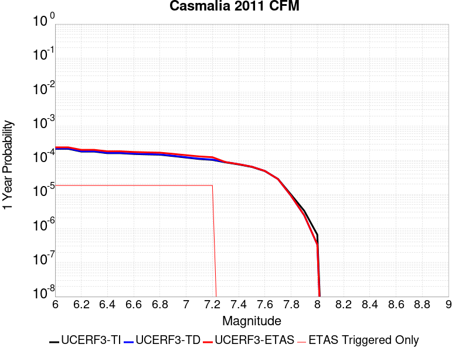 | 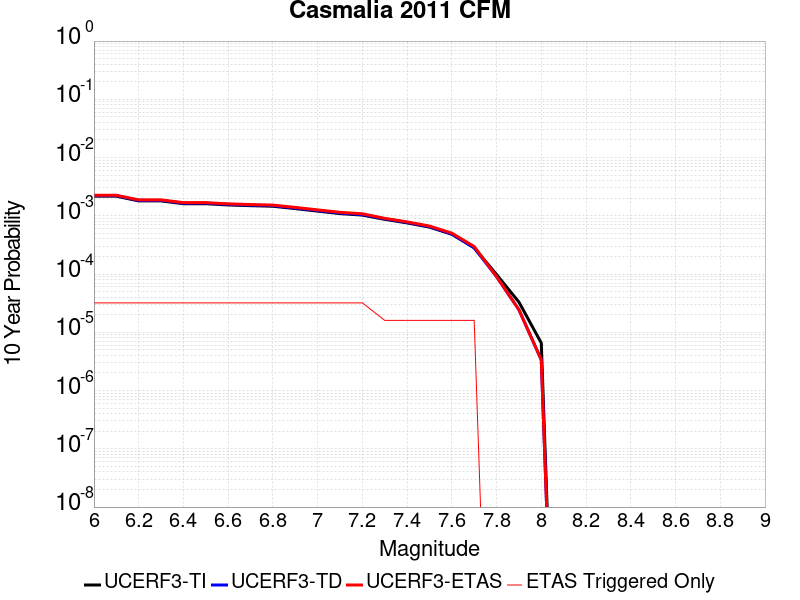 |

| Magnitude | 1 wk TI Prob | 1 wk TD Prob | 1 wk ETAS Prob | 1 wk ETAS/TD Gain | 1 wk ETAS Triggered Only | 1 mo TI Prob | 1 mo TD Prob | 1 mo ETAS Prob | 1 mo ETAS/TD Gain | 1 mo ETAS Triggered Only | 1 yr TI Prob | 1 yr TD Prob | 1 yr ETAS Prob | 1 yr ETAS/TD Gain | 1 yr ETAS Triggered Only | 10 yr TI Prob | 10 yr TD Prob | 10 yr ETAS Prob | 10 yr ETAS/TD Gain | 10 yr ETAS Triggered Only |
|-----|-----|-----|-----|-----|-----|-----|-----|-----|-----|-----|-----|-----|-----|-----|-----|-----|-----|-----|-----|-----|
| 6.0 | 4.1704893E-6 | 4.262483E-6 | 4.262483E-6 | 1.0 | 0.0 | 1.7873403E-5 | 1.8267656E-5 | 1.8267656E-5 | 1.0 | 0.0 | 2.1758694E-4 | 2.2238622E-4 | 2.4699734E-4 | 1.1106684 | 2.4616596E-5 | 0.0021737402 | 0.0022216577 | 0.0022707817 | 1.0221113 | 4.9233193E-5 |
| 6.1 | 4.1704893E-6 | 4.262483E-6 | 4.262483E-6 | 1.0 | 0.0 | 1.7873403E-5 | 1.8267656E-5 | 1.8267656E-5 | 1.0 | 0.0 | 2.1758694E-4 | 2.2238622E-4 | 2.4699734E-4 | 1.1106684 | 2.4616596E-5 | 0.0021737402 | 0.0022216577 | 0.0022707817 | 1.0221113 | 4.9233193E-5 |
| 6.2 | 3.457312E-6 | 3.5370217E-6 | 3.5370217E-6 | 1.0 | 0.0 | 1.4816967E-5 | 1.5158577E-5 | 1.5158577E-5 | 1.0 | 0.0 | 1.8038164E-4 | 1.8454014E-4 | 2.0915219E-4 | 1.1333697 | 2.4616596E-5 | 0.001802353 | 0.0018438784 | 0.0018930208 | 1.0266516 | 4.9233193E-5 |
| 6.3 | 3.457312E-6 | 3.5370217E-6 | 3.5370217E-6 | 1.0 | 0.0 | 1.4816967E-5 | 1.5158577E-5 | 1.5158577E-5 | 1.0 | 0.0 | 1.8038164E-4 | 1.8454014E-4 | 2.0915219E-4 | 1.1333697 | 2.4616596E-5 | 0.001802353 | 0.0018438784 | 0.0018930208 | 1.0266516 | 4.9233193E-5 |
| 6.4 | 3.0957337E-6 | 3.1692257E-6 | 3.1692257E-6 | 1.0 | 0.0 | 1.3267363E-5 | 1.3582326E-5 | 1.3582326E-5 | 1.0 | 0.0 | 1.6151817E-4 | 1.6535232E-4 | 1.8996485E-4 | 1.148849 | 2.4616596E-5 | 0.0016140083 | 0.0016522991 | 0.0017014509 | 1.0297476 | 4.9233193E-5 |
| 6.5 | 3.0957337E-6 | 3.1692257E-6 | 3.1692257E-6 | 1.0 | 0.0 | 1.3267363E-5 | 1.3582326E-5 | 1.3582326E-5 | 1.0 | 0.0 | 1.6151817E-4 | 1.6535232E-4 | 1.8996485E-4 | 1.148849 | 2.4616596E-5 | 0.0016140083 | 0.0016522991 | 0.0017014509 | 1.0297476 | 4.9233193E-5 |
| 6.6 | 2.9459152E-6 | 3.0165752E-6 | 3.0165752E-6 | 1.0 | 0.0 | 1.262529E-5 | 1.2928115E-5 | 1.2928115E-5 | 1.0 | 0.0 | 1.5370206E-4 | 1.5738848E-4 | 1.8200121E-4 | 1.156382 | 2.4616596E-5 | 0.0015359579 | 0.0015727758 | 0.0016219316 | 1.0312542 | 4.9233193E-5 |
| 6.7 | 2.8634809E-6 | 2.9324726E-6 | 2.9324726E-6 | 1.0 | 0.0 | 1.2272003E-5 | 1.256768E-5 | 1.256768E-5 | 1.0 | 0.0 | 1.4940138E-4 | 1.530008E-4 | 1.7761363E-4 | 1.1608673 | 2.4616596E-5 | 0.0014930099 | 0.0015289601 | 0.001578118 | 1.0321512 | 4.9233193E-5 |
| 6.8 | 2.7999822E-6 | 2.8675968E-6 | 2.8675968E-6 | 1.0 | 0.0 | 1.1999869E-5 | 1.2289643E-5 | 1.2289643E-5 | 1.0 | 0.0 | 1.460886E-4 | 1.4961617E-4 | 1.7422909E-4 | 1.164507 | 2.4616596E-5 | 0.001459926 | 0.0014951597 | 0.0015443193 | 1.0328791 | 4.9233193E-5 |
| 6.9 | 2.551052E-6 | 2.6119649E-6 | 2.6119649E-6 | 1.0 | 0.0 | 1.0933034E-5 | 1.1194087E-5 | 1.1194087E-5 | 1.0 | 0.0 | 1.3310155E-4 | 1.3627953E-4 | 1.6089277E-4 | 1.1806085 | 2.4616596E-5 | 0.0013302186 | 0.0013619636 | 0.0014111297 | 1.0360994 | 4.9233193E-5 |
| 7.0 | 2.3081875E-6 | 2.3624088E-6 | 2.3624088E-6 | 1.0 | 0.0 | 9.892195E-6 | 1.01245705E-5 | 1.01245705E-5 | 1.0 | 0.0 | 1.20430814E-4 | 1.232597E-4 | 1.4787326E-4 | 1.1996887 | 2.4616596E-5 | 0.0012036557 | 0.0012319161 | 0.0012810887 | 1.0399154 | 4.9233193E-5 |
| 7.1 | 2.093245E-6 | 2.1417243E-6 | 2.1417243E-6 | 1.0 | 0.0 | 8.971019E-6 | 9.178786E-6 | 9.178786E-6 | 1.0 | 0.0 | 1.09216686E-4 | 1.1174601E-4 | 1.3635986E-4 | 1.220266 | 2.4616596E-5 | 0.0010916302 | 0.0011169002 | 0.0011660785 | 1.044031 | 4.9233193E-5 |
| 7.2 | 1.9714576E-6 | 2.0165091E-6 | 2.0165091E-6 | 1.0 | 0.0 | 8.449076E-6 | 8.642153E-6 | 8.642153E-6 | 1.0 | 0.0 | 1.0286264E-4 | 1.05213156E-4 | 1.2982715E-4 | 1.2339442 | 2.4616596E-5 | 0.0010281504 | 0.0010516352 | 0.0011008166 | 1.0467666 | 4.9233193E-5 |
| 7.3 | 1.6689512E-6 | 1.7047131E-6 | 1.7047131E-6 | 1.0 | 0.0 | 7.1526288E-6 | 7.3058927E-6 | 7.3058927E-6 | 1.0 | 0.0 | 8.7079774E-5 | 8.894562E-5 | 8.894562E-5 | 1.0 | 0.0 | 8.7045657E-4 | 8.89101E-4 | 9.136957E-4 | 1.0276624 | 2.4616596E-5 |
| 7.4 | 1.4490954E-6 | 1.4778908E-6 | 1.4778908E-6 | 1.0 | 0.0 | 6.210394E-6 | 6.333802E-6 | 6.333802E-6 | 1.0 | 0.0 | 7.560892E-5 | 7.711132E-5 | 7.711132E-5 | 1.0 | 0.0 | 7.55832E-4 | 7.7084627E-4 | 7.954439E-4 | 1.03191 | 2.4616596E-5 |
| 7.5 | 1.226873E-6 | 1.2481701E-6 | 1.2481701E-6 | 1.0 | 0.0 | 5.2580162E-6 | 5.3492895E-6 | 5.3492895E-6 | 1.0 | 0.0 | 6.401447E-5 | 6.5125656E-5 | 6.5125656E-5 | 1.0 | 0.0 | 6.399603E-4 | 6.5106625E-4 | 6.7566684E-4 | 1.037785 | 2.4616596E-5 |
| 7.6 | 9.2561345E-7 | 9.361923E-7 | 9.361923E-7 | 1.0 | 0.0 | 3.966909E-6 | 4.012247E-6 | 4.012247E-6 | 1.0 | 0.0 | 4.8296046E-5 | 4.884801E-5 | 4.884801E-5 | 1.0 | 0.0 | 4.828555E-4 | 4.8837316E-4 | 5.129777E-4 | 1.0503807 | 2.4616596E-5 |
| 7.7 | 5.4367933E-7 | 5.392888E-7 | 5.392888E-7 | 1.0 | 0.0 | 2.3300522E-6 | 2.3112357E-6 | 2.3112357E-6 | 1.0 | 0.0 | 2.8368017E-5 | 2.8138933E-5 | 2.8138933E-5 | 1.0 | 0.0 | 2.8364395E-4 | 2.8135383E-4 | 3.059635E-4 | 1.0874687 | 2.4616596E-5 |
| 7.8 | 1.8825742E-7 | 1.7342276E-7 | 1.7342276E-7 | 1.0 | 0.0 | 8.068173E-7 | 7.4324015E-7 | 7.4324015E-7 | 1.0 | 0.0 | 9.822956E-6 | 9.048912E-6 | 9.048912E-6 | 1.0 | 0.0 | 9.822522E-5 | 9.048546E-5 | 9.048546E-5 | 1.0 | 0.0 |
| 7.9 | 6.342771E-8 | 4.6790706E-8 | 4.6790706E-8 | 1.0 | 0.0 | 2.7183304E-7 | 2.0053157E-7 | 2.0053157E-7 | 1.0 | 0.0 | 3.3095623E-6 | 2.4414692E-6 | 2.4414692E-6 | 1.0 | 0.0 | 3.309513E-5 | 2.4414428E-5 | 2.4414428E-5 | 1.0 | 0.0 |
| 8.0 | 1.2574819E-8 | 6.4733463E-9 | 6.4733463E-9 | 1.0 | 0.0 | 5.3892084E-8 | 2.7742912E-8 | 2.7742912E-8 | 1.0 | 0.0 | 6.561359E-7 | 3.377699E-7 | 3.377699E-7 | 1.0 | 0.0 | 6.56134E-6 | 3.377694E-6 | 3.377694E-6 | 1.0 | 0.0 |

## San Jacinto (Clark) rev
*[(top)](#table-of-contents)*

| 1 Week | 1 Month | 1 Year | 10 Year |
|-----|-----|-----|-----|
| 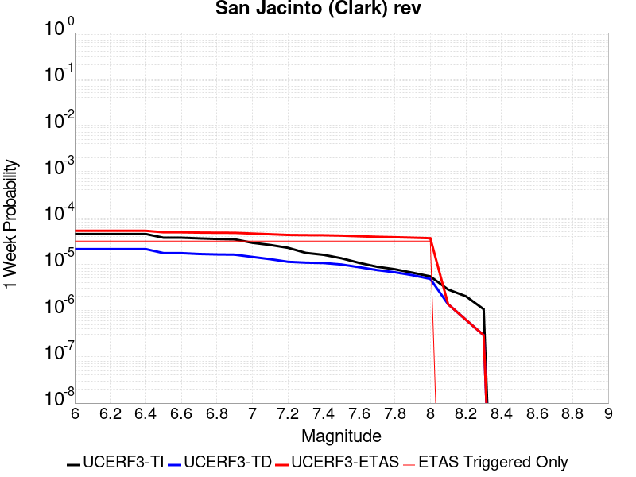 | 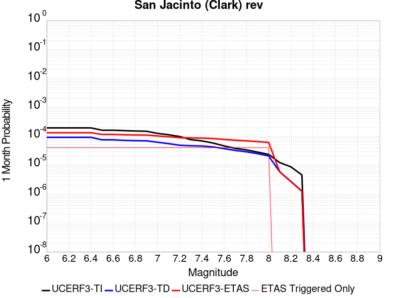 | 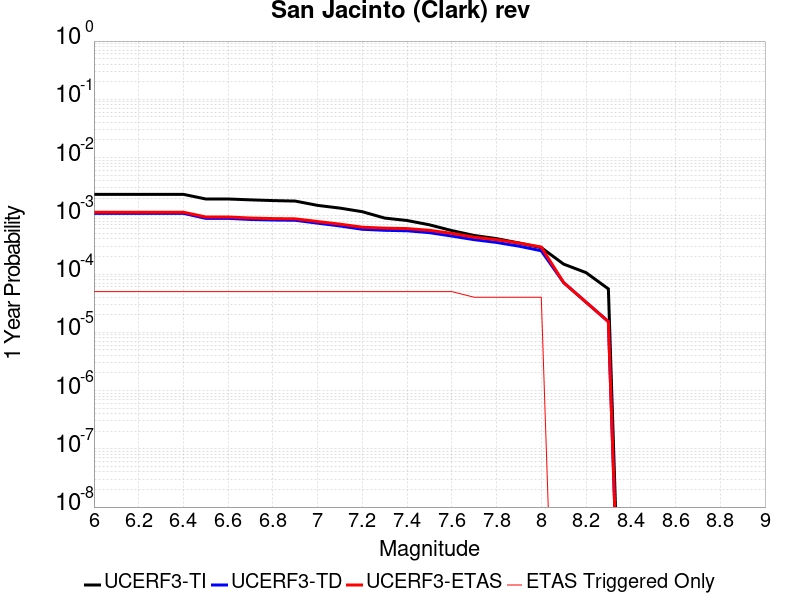 | 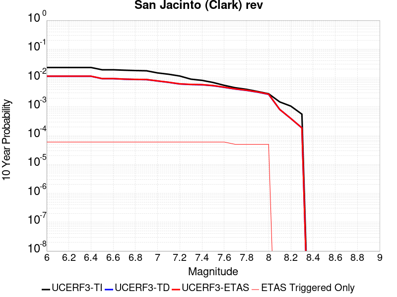 |

| Magnitude | 1 wk TI Prob | 1 wk TD Prob | 1 wk ETAS Prob | 1 wk ETAS/TD Gain | 1 wk ETAS Triggered Only | 1 mo TI Prob | 1 mo TD Prob | 1 mo ETAS Prob | 1 mo ETAS/TD Gain | 1 mo ETAS Triggered Only | 1 yr TI Prob | 1 yr TD Prob | 1 yr ETAS Prob | 1 yr ETAS/TD Gain | 1 yr ETAS Triggered Only | 10 yr TI Prob | 10 yr TD Prob | 10 yr ETAS Prob | 10 yr ETAS/TD Gain | 10 yr ETAS Triggered Only |
|-----|-----|-----|-----|-----|-----|-----|-----|-----|-----|-----|-----|-----|-----|-----|-----|-----|-----|-----|-----|-----|
| 6.0 | 4.482615E-5 | 2.1154196E-5 | 4.577027E-5 | 2.1636498 | 2.4616596E-5 | 1.9209793E-4 | 9.065773E-5 | 1.152721E-4 | 1.2715087 | 2.4616596E-5 | 0.0023362834 | 0.0011032083 | 0.0011523871 | 1.0445781 | 4.9233193E-5 | 0.02311874 | 0.011503847 | 0.011552514 | 1.0042305 | 4.9233193E-5 |
| 6.1 | 4.482615E-5 | 2.1154196E-5 | 4.577027E-5 | 2.1636498 | 2.4616596E-5 | 1.9209793E-4 | 9.065773E-5 | 1.152721E-4 | 1.2715087 | 2.4616596E-5 | 0.0023362834 | 0.0011032083 | 0.0011523871 | 1.0445781 | 4.9233193E-5 | 0.02311874 | 0.011503847 | 0.011552514 | 1.0042305 | 4.9233193E-5 |
| 6.2 | 4.482615E-5 | 2.1154196E-5 | 4.577027E-5 | 2.1636498 | 2.4616596E-5 | 1.9209793E-4 | 9.065773E-5 | 1.152721E-4 | 1.2715087 | 2.4616596E-5 | 0.0023362834 | 0.0011032083 | 0.0011523871 | 1.0445781 | 4.9233193E-5 | 0.02311874 | 0.011503847 | 0.011552514 | 1.0042305 | 4.9233193E-5 |
| 6.3 | 4.482615E-5 | 2.1154196E-5 | 4.577027E-5 | 2.1636498 | 2.4616596E-5 | 1.9209793E-4 | 9.065773E-5 | 1.152721E-4 | 1.2715087 | 2.4616596E-5 | 0.0023362834 | 0.0011032083 | 0.0011523871 | 1.0445781 | 4.9233193E-5 | 0.02311874 | 0.011503847 | 0.011552514 | 1.0042305 | 4.9233193E-5 |
| 6.4 | 4.482615E-5 | 2.1154196E-5 | 4.577027E-5 | 2.1636498 | 2.4616596E-5 | 1.9209793E-4 | 9.065773E-5 | 1.152721E-4 | 1.2715087 | 2.4616596E-5 | 0.0023362834 | 0.0011032083 | 0.0011523871 | 1.0445781 | 4.9233193E-5 | 0.02311874 | 0.011503847 | 0.011552514 | 1.0042305 | 4.9233193E-5 |
| 6.5 | 3.7294863E-5 | 1.7356087E-5 | 4.1972256E-5 | 2.4183018 | 2.4616596E-5 | 1.5982533E-4 | 7.438113E-5 | 9.89959E-5 | 1.3309275 | 2.4616596E-5 | 0.0019441366 | 9.052186E-4 | 9.544072E-4 | 1.0543389 | 4.9233193E-5 | 0.01927216 | 0.0094941035 | 0.009542869 | 1.0051364 | 4.9233193E-5 |
| 6.6 | 3.7294863E-5 | 1.7356087E-5 | 4.1972256E-5 | 2.4183018 | 2.4616596E-5 | 1.5982533E-4 | 7.438113E-5 | 9.89959E-5 | 1.3309275 | 2.4616596E-5 | 0.0019441366 | 9.052186E-4 | 9.544072E-4 | 1.0543389 | 4.9233193E-5 | 0.01927216 | 0.0094941035 | 0.009542869 | 1.0051364 | 4.9233193E-5 |
| 6.7 | 3.6039248E-5 | 1.6604314E-5 | 4.12205E-5 | 2.4825177 | 2.4616596E-5 | 1.5444479E-4 | 7.1159426E-5 | 9.577427E-5 | 1.3459113 | 2.4616596E-5 | 0.0018787434 | 8.6602574E-4 | 9.1521634E-4 | 1.0568004 | 4.9233193E-5 | 0.01862939 | 0.009096047 | 0.009144832 | 1.0053633 | 4.9233193E-5 |
| 6.8 | 3.5031844E-5 | 1.6232942E-5 | 4.084914E-5 | 2.5164347 | 2.4616596E-5 | 1.5012783E-4 | 6.956792E-5 | 9.4182804E-5 | 1.3538252 | 2.4616596E-5 | 0.0018262739 | 8.4666436E-4 | 8.9585583E-4 | 1.0581003 | 4.9233193E-5 | 0.01811338 | 0.008895969 | 0.008944765 | 1.005485 | 4.9233193E-5 |
| 6.9 | 3.435112E-5 | 1.6063195E-5 | 4.0679395E-5 | 2.53246 | 2.4616596E-5 | 1.4721078E-4 | 6.884047E-5 | 9.345537E-5 | 1.3575644 | 2.4616596E-5 | 0.0017908178 | 8.3781447E-4 | 8.8700646E-4 | 1.0587146 | 4.9233193E-5 | 0.017764548 | 0.008804181 | 0.00885298 | 1.0055428 | 4.9233193E-5 |
| 7.0 | 2.8959772E-5 | 1.4336745E-5 | 3.895299E-5 | 2.7170036 | 2.4616596E-5 | 1.241074E-4 | 6.144176E-5 | 8.605685E-5 | 1.4006246 | 2.4616596E-5 | 0.0015099603 | 7.477995E-4 | 7.969959E-4 | 1.0657881 | 4.9233193E-5 | 0.014997416 | 0.007868037 | 0.007916883 | 1.0062082 | 4.9233193E-5 |
| 7.1 | 2.6002877E-5 | 1.2829002E-5 | 3.7445283E-5 | 2.9187994 | 2.4616596E-5 | 1.11436144E-4 | 5.498029E-5 | 7.9595535E-5 | 1.4477103 | 2.4616596E-5 | 0.0013558907 | 6.691816E-4 | 7.183818E-4 | 1.073523 | 4.9233193E-5 | 0.013476475 | 0.0070465137 | 0.0070954002 | 1.0069376 | 4.9233193E-5 |
| 7.2 | 2.2544838E-5 | 1.1262543E-5 | 3.5878864E-5 | 3.1856804 | 2.4616596E-5 | 9.661716E-5 | 4.8267157E-5 | 7.288257E-5 | 1.5099826 | 2.4616596E-5 | 0.001175679 | 5.874956E-4 | 6.366999E-4 | 1.0837525 | 4.9233193E-5 | 0.011694785 | 0.0061927503 | 0.0062416783 | 1.007901 | 4.9233193E-5 |
| 7.3 | 1.75334E-5 | 1.0811715E-5 | 3.5428046E-5 | 3.2768202 | 2.4616596E-5 | 7.514098E-5 | 4.6335106E-5 | 7.095056E-5 | 1.5312486 | 2.4616596E-5 | 9.144575E-4 | 5.6398526E-4 | 6.131907E-4 | 1.087246 | 4.9233193E-5 | 0.009107036 | 0.0059337732 | 0.0059827147 | 1.0082479 | 4.9233193E-5 |
| 7.4 | 1.5924552E-5 | 1.0611516E-5 | 3.522785E-5 | 3.3197756 | 2.4616596E-5 | 6.82463E-5 | 4.547714E-5 | 7.009262E-5 | 1.5412714 | 2.4616596E-5 | 8.305819E-4 | 5.535449E-4 | 6.0275086E-4 | 1.0888925 | 4.9233193E-5 | 0.008274844 | 0.0058210334 | 0.00586998 | 1.0084085 | 4.9233193E-5 |
| 7.5 | 1.3428931E-5 | 9.8519E-6 | 3.4468252E-5 | 3.4986403 | 2.4616596E-5 | 5.7551293E-5 | 4.2221753E-5 | 6.683731E-5 | 1.5830065 | 2.4616596E-5 | 7.004617E-4 | 5.1392964E-4 | 5.631375E-4 | 1.0957483 | 4.9233193E-5 | 0.006982579 | 0.0054066023 | 0.0054555694 | 1.0090569 | 4.9233193E-5 |
| 7.6 | 1.0688787E-5 | 8.614839E-6 | 3.3231223E-5 | 3.8574395 | 2.4616596E-5 | 4.5808283E-5 | 3.692022E-5 | 6.153591E-5 | 1.6667265 | 2.4616596E-5 | 5.5757316E-4 | 4.4941145E-4 | 4.9862254E-4 | 1.1095011 | 4.9233193E-5 | 0.005561762 | 0.0047416524 | 0.004790652 | 1.0103339 | 4.9233193E-5 |
| 7.7 | 8.81236E-6 | 7.4680274E-6 | 3.208444E-5 | 4.2962403 | 2.4616596E-5 | 3.776671E-5 | 3.2005442E-5 | 5.662125E-5 | 1.7691133 | 2.4616596E-5 | 4.597127E-4 | 3.8959677E-4 | 4.142038E-4 | 1.0631602 | 2.4616596E-5 | 0.0045876284 | 0.0041346536 | 0.0041591683 | 1.0059291 | 2.4616596E-5 |
| 7.8 | 7.780431E-6 | 6.696579E-6 | 3.131301E-5 | 4.675971 | 2.4616596E-5 | 3.3344273E-5 | 2.8699309E-5 | 5.3315198E-5 | 1.8577172 | 2.4616596E-5 | 4.0589093E-4 | 3.4935825E-4 | 3.7396624E-4 | 1.0704377 | 2.4616596E-5 | 0.0040515037 | 0.0037227906 | 0.0037473156 | 1.0065877 | 2.4616596E-5 |
| 7.9 | 6.5437994E-6 | 5.780382E-6 | 3.0396835E-5 | 5.2586207 | 2.4616596E-5 | 2.8044553E-5 | 2.477283E-5 | 4.938882E-5 | 1.9936687 | 2.4616596E-5 | 3.4138895E-4 | 3.0156763E-4 | 3.261768E-4 | 1.0816041 | 2.4616596E-5 | 0.0034086495 | 0.0032344845 | 0.0032590216 | 1.007586 | 2.4616596E-5 |
| 8.0 | 5.4488164E-6 | 4.8133406E-6 | 2.9429819E-5 | 6.1142187 | 2.4616596E-5 | 2.3351862E-5 | 2.062844E-5 | 4.524453E-5 | 2.1933084 | 2.4616596E-5 | 2.8427184E-4 | 2.5112246E-4 | 2.757329E-4 | 1.0980016 | 2.4616596E-5 | 0.0028390845 | 0.002710839 | 0.002735389 | 1.0090562 | 2.4616596E-5 |
| 8.1 | 2.8397242E-6 | 1.3670389E-6 | 1.3670389E-6 | 1.0 | 0.0 | 1.217019E-5 | 5.858725E-6 | 5.858725E-6 | 1.0 | 0.0 | 1.4816198E-4 | 7.132765E-5 | 7.132765E-5 | 1.0 | 0.0 | 0.0014806325 | 8.115382E-4 | 8.115382E-4 | 1.0 | 0.0 |
| 8.2 | 2.030244E-6 | 6.318974E-7 | 6.318974E-7 | 1.0 | 0.0 | 8.701017E-6 | 2.708129E-6 | 2.708129E-6 | 1.0 | 0.0 | 1.05929736E-4 | 3.2970976E-5 | 3.2970976E-5 | 1.0 | 0.0 | 0.0010587925 | 3.9486602E-4 | 3.9486602E-4 | 1.0 | 0.0 |
| 8.3 | 1.0659804E-6 | 2.9250086E-7 | 2.9250086E-7 | 1.0 | 0.0 | 4.568479E-6 | 1.2535745E-6 | 1.2535745E-6 | 1.0 | 0.0 | 5.5619817E-5 | 1.5262167E-5 | 1.5262167E-5 | 1.0 | 0.0 | 5.5605895E-4 | 1.8566217E-4 | 1.8566217E-4 | 1.0 | 0.0 |

## Mono Lake 2011 CFM
*[(top)](#table-of-contents)*

| 1 Week | 1 Month | 1 Year | 10 Year |
|-----|-----|-----|-----|
| 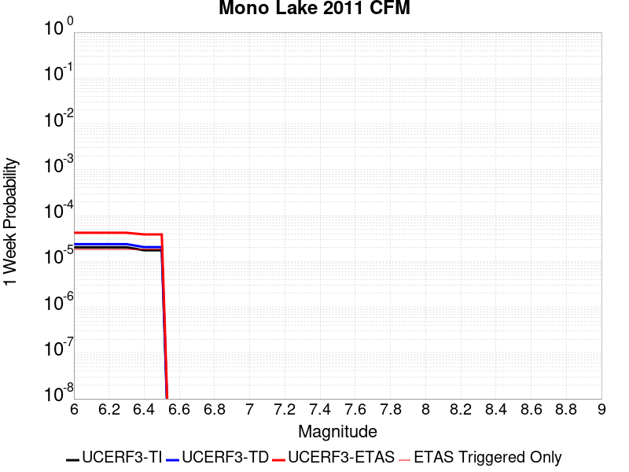 | 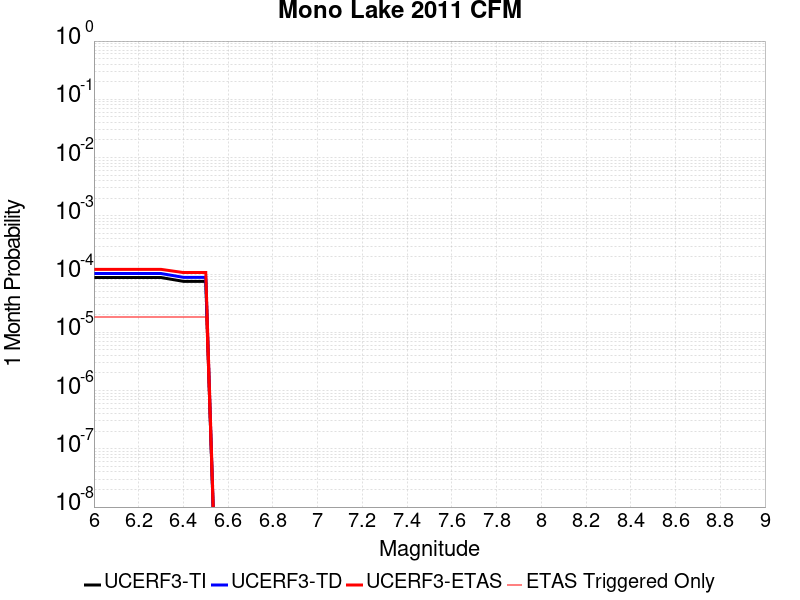 | 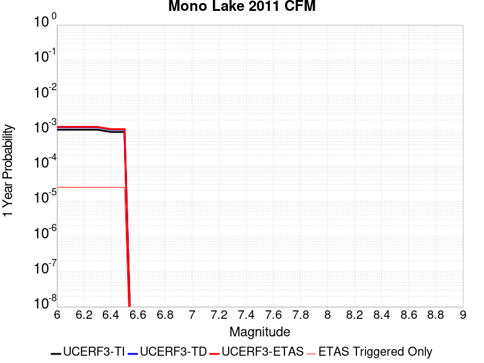 | 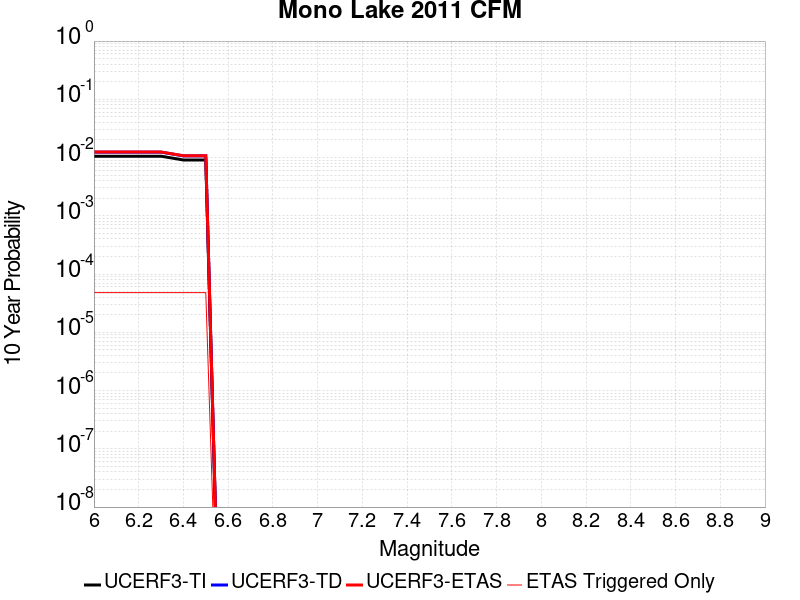 |

| Magnitude | 1 wk TI Prob | 1 wk TD Prob | 1 wk ETAS Prob | 1 wk ETAS/TD Gain | 1 wk ETAS Triggered Only | 1 mo TI Prob | 1 mo TD Prob | 1 mo ETAS Prob | 1 mo ETAS/TD Gain | 1 mo ETAS Triggered Only | 1 yr TI Prob | 1 yr TD Prob | 1 yr ETAS Prob | 1 yr ETAS/TD Gain | 1 yr ETAS Triggered Only | 10 yr TI Prob | 10 yr TD Prob | 10 yr ETAS Prob | 10 yr ETAS/TD Gain | 10 yr ETAS Triggered Only |
|-----|-----|-----|-----|-----|-----|-----|-----|-----|-----|-----|-----|-----|-----|-----|-----|-----|-----|-----|-----|-----|
| 6.0 | 2.0341662E-5 | 2.3828166E-5 | 4.8444177E-5 | 2.0330637 | 2.4616596E-5 | 8.717564E-5 | 1.0211971E-4 | 1.267338E-4 | 1.2410316 | 2.4616596E-5 | 0.0010608466 | 0.0012431298 | 0.0012677158 | 1.0197775 | 2.4616596E-5 | 0.010557966 | 0.012413835 | 0.012438146 | 1.0019584 | 2.4616596E-5 |
| 6.1 | 2.0341662E-5 | 2.3828166E-5 | 4.8444177E-5 | 2.0330637 | 2.4616596E-5 | 8.717564E-5 | 1.0211971E-4 | 1.267338E-4 | 1.2410316 | 2.4616596E-5 | 0.0010608466 | 0.0012431298 | 0.0012677158 | 1.0197775 | 2.4616596E-5 | 0.010557966 | 0.012413835 | 0.012438146 | 1.0019584 | 2.4616596E-5 |
| 6.2 | 2.0341662E-5 | 2.3828166E-5 | 4.8444177E-5 | 2.0330637 | 2.4616596E-5 | 8.717564E-5 | 1.0211971E-4 | 1.267338E-4 | 1.2410316 | 2.4616596E-5 | 0.0010608466 | 0.0012431298 | 0.0012677158 | 1.0197775 | 2.4616596E-5 | 0.010557966 | 0.012413835 | 0.012438146 | 1.0019584 | 2.4616596E-5 |
| 6.3 | 2.0341662E-5 | 2.3828166E-5 | 4.8444177E-5 | 2.0330637 | 2.4616596E-5 | 8.717564E-5 | 1.0211971E-4 | 1.267338E-4 | 1.2410316 | 2.4616596E-5 | 0.0010608466 | 0.0012431298 | 0.0012677158 | 1.0197775 | 2.4616596E-5 | 0.010557966 | 0.012413835 | 0.012438146 | 1.0019584 | 2.4616596E-5 |
| 6.4 | 1.749821E-5 | 2.0490985E-5 | 4.5107077E-5 | 2.2013133 | 2.4616596E-5 | 7.499018E-5 | 8.781851E-5 | 1.1243294E-4 | 1.2802875 | 2.4616596E-5 | 9.1262296E-4 | 0.0010691903 | 0.0010937806 | 1.0229989 | 2.4616596E-5 | 0.009088841 | 0.010691865 | 0.0107162185 | 1.0022777 | 2.4616596E-5 |
| 6.5 | 1.749821E-5 | 2.0490985E-5 | 4.5107077E-5 | 2.2013133 | 2.4616596E-5 | 7.499018E-5 | 8.781851E-5 | 1.1243294E-4 | 1.2802875 | 2.4616596E-5 | 9.1262296E-4 | 0.0010691903 | 0.0010937806 | 1.0229989 | 2.4616596E-5 | 0.009088841 | 0.010691865 | 0.0107162185 | 1.0022777 | 2.4616596E-5 |

## Great Valley 10 (Panoche)
*[(top)](#table-of-contents)*

| 1 Week | 1 Month | 1 Year | 10 Year |
|-----|-----|-----|-----|
| 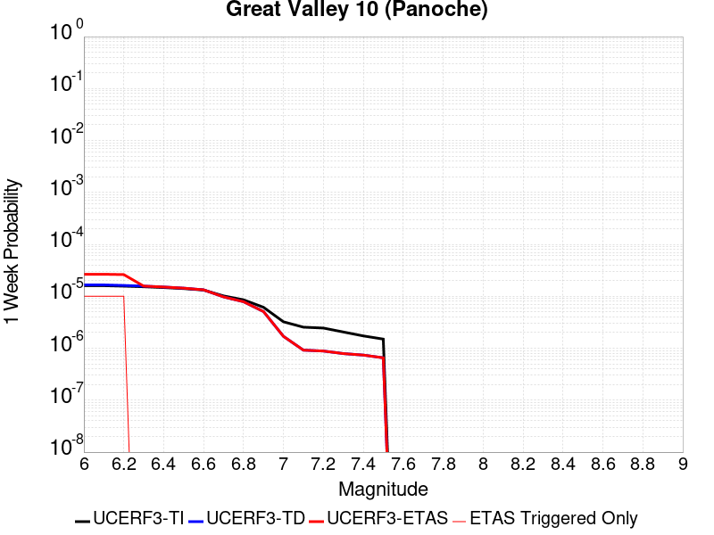 | 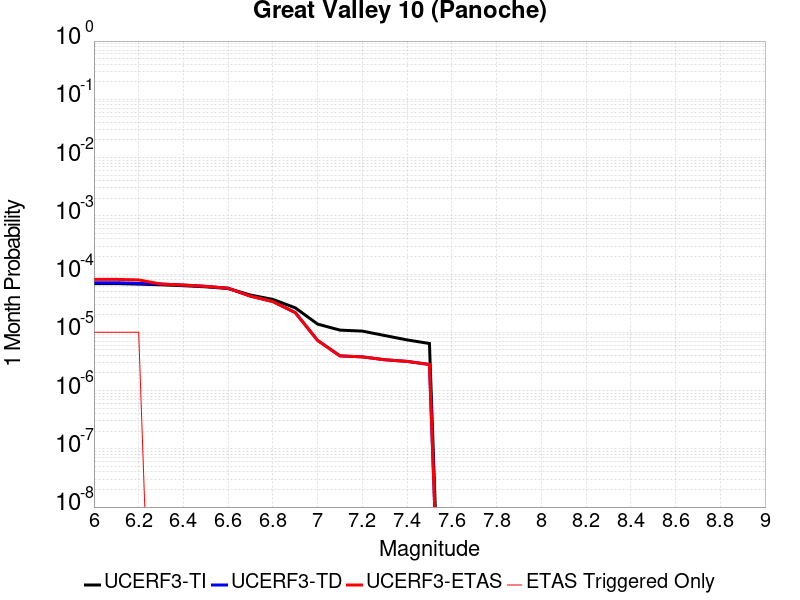 | 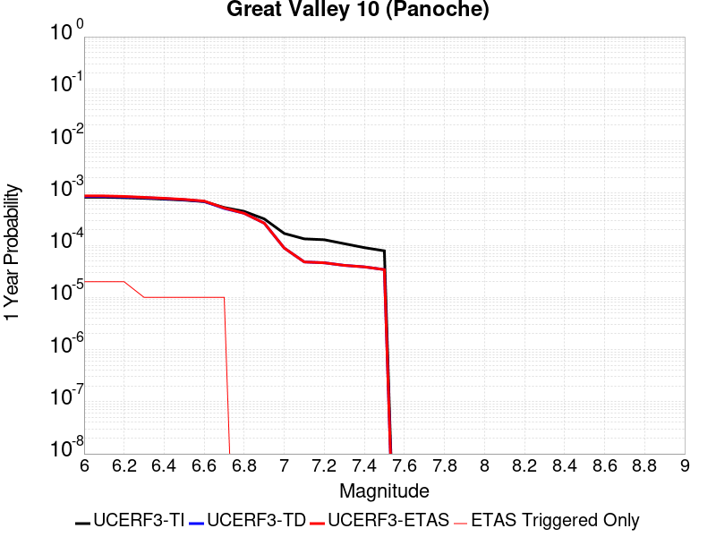 | 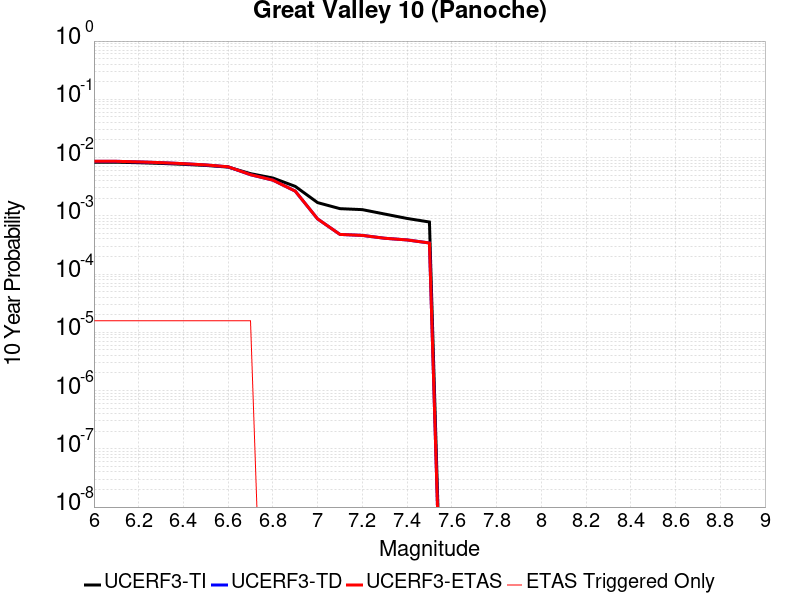 |

| Magnitude | 1 wk TI Prob | 1 wk TD Prob | 1 wk ETAS Prob | 1 wk ETAS/TD Gain | 1 wk ETAS Triggered Only | 1 mo TI Prob | 1 mo TD Prob | 1 mo ETAS Prob | 1 mo ETAS/TD Gain | 1 mo ETAS Triggered Only | 1 yr TI Prob | 1 yr TD Prob | 1 yr ETAS Prob | 1 yr ETAS/TD Gain | 1 yr ETAS Triggered Only | 10 yr TI Prob | 10 yr TD Prob | 10 yr ETAS Prob | 10 yr ETAS/TD Gain | 10 yr ETAS Triggered Only |
|-----|-----|-----|-----|-----|-----|-----|-----|-----|-----|-----|-----|-----|-----|-----|-----|-----|-----|-----|-----|-----|
| 6.0 | 1.6014626E-5 | 1.6575399E-5 | 1.6575399E-5 | 1.0 | 0.0 | 6.863231E-5 | 7.103552E-5 | 7.103552E-5 | 1.0 | 0.0 | 8.35278E-4 | 8.645185E-4 | 8.891138E-4 | 1.0284498 | 2.4616596E-5 | 0.008321454 | 0.008612172 | 0.008636576 | 1.0028337 | 2.4616596E-5 |
| 6.1 | 1.6014626E-5 | 1.6575399E-5 | 1.6575399E-5 | 1.0 | 0.0 | 6.863231E-5 | 7.103552E-5 | 7.103552E-5 | 1.0 | 0.0 | 8.35278E-4 | 8.645185E-4 | 8.891138E-4 | 1.0284498 | 2.4616596E-5 | 0.008321454 | 0.008612172 | 0.008636576 | 1.0028337 | 2.4616596E-5 |
| 6.2 | 1.56782E-5 | 1.6198446E-5 | 1.6198446E-5 | 1.0 | 0.0 | 6.719056E-5 | 6.94201E-5 | 6.94201E-5 | 1.0 | 0.0 | 8.17738E-4 | 8.4486604E-4 | 8.6946186E-4 | 1.0291121 | 2.4616596E-5 | 0.008147354 | 0.008417147 | 0.008441556 | 1.0029 | 2.4616596E-5 |
| 6.3 | 1.5263338E-5 | 1.5723514E-5 | 1.5723514E-5 | 1.0 | 0.0 | 6.541267E-5 | 6.738478E-5 | 6.738478E-5 | 1.0 | 0.0 | 7.961082E-4 | 8.201049E-4 | 8.447013E-4 | 1.0299917 | 2.4616596E-5 | 0.007932622 | 0.008171377 | 0.008195792 | 1.002988 | 2.4616596E-5 |
| 6.4 | 1.4720723E-5 | 1.5099376E-5 | 1.5099376E-5 | 1.0 | 0.0 | 6.308728E-5 | 6.471004E-5 | 6.471004E-5 | 1.0 | 0.0 | 7.67817E-4 | 7.8756385E-4 | 8.12161E-4 | 1.031232 | 2.4616596E-5 | 0.007651695 | 0.007848303 | 0.007872727 | 1.003112 | 2.4616596E-5 |
| 6.5 | 1.408264E-5 | 1.4355969E-5 | 1.4355969E-5 | 1.0 | 0.0 | 6.0352773E-5 | 6.1524166E-5 | 6.1524166E-5 | 1.0 | 0.0 | 7.3454727E-4 | 7.488031E-4 | 7.734013E-4 | 1.03285 | 2.4616596E-5 | 0.0073212404 | 0.0074633555 | 0.007487789 | 1.0032737 | 2.4616596E-5 |
| 6.6 | 1.3197086E-5 | 1.3321889E-5 | 1.3321889E-5 | 1.0 | 0.0 | 5.6557717E-5 | 5.709259E-5 | 5.709259E-5 | 1.0 | 0.0 | 6.8837265E-4 | 6.9488434E-4 | 7.194838E-4 | 1.0354009 | 2.4616596E-5 | 0.006862442 | 0.0069276537 | 0.0069520995 | 1.0035287 | 2.4616596E-5 |
| 6.7 | 1.017583E-5 | 9.745382E-6 | 9.745382E-6 | 1.0 | 0.0 | 4.360997E-5 | 4.176527E-5 | 4.176527E-5 | 1.0 | 0.0 | 5.30822E-4 | 5.0837593E-4 | 5.3298E-4 | 1.0483974 | 2.4616596E-5 | 0.0052955584 | 0.005072382 | 0.0050968737 | 1.0048285 | 2.4616596E-5 |
| 6.8 | 8.557912E-6 | 7.872707E-6 | 7.872707E-6 | 1.0 | 0.0 | 3.667625E-5 | 3.373975E-5 | 3.373975E-5 | 1.0 | 0.0 | 4.4644187E-4 | 4.1070607E-4 | 4.1070607E-4 | 1.0 | 0.0 | 0.0044554602 | 0.004099677 | 0.004099677 | 1.0 | 0.0 |
| 6.9 | 6.14664E-6 | 5.092071E-6 | 5.092071E-6 | 1.0 | 0.0 | 2.6342475E-5 | 2.1822989E-5 | 2.1822989E-5 | 1.0 | 0.0 | 3.2067244E-4 | 2.6566387E-4 | 2.6566387E-4 | 1.0 | 0.0 | 0.003202101 | 0.002653601 | 0.002653601 | 1.0 | 0.0 |
| 7.0 | 3.2310581E-6 | 1.6951219E-6 | 1.6951219E-6 | 1.0 | 0.0 | 1.3847319E-5 | 7.264788E-6 | 7.264788E-6 | 1.0 | 0.0 | 1.6857806E-4 | 8.8445304E-5 | 8.8445304E-5 | 1.0 | 0.0 | 0.0016845023 | 8.841104E-4 | 8.841104E-4 | 1.0 | 0.0 |
| 7.1 | 2.544492E-6 | 9.1889206E-7 | 9.1889206E-7 | 1.0 | 0.0 | 1.090492E-5 | 3.938103E-6 | 3.938103E-6 | 1.0 | 0.0 | 1.327593E-4 | 4.79454E-5 | 4.79454E-5 | 1.0 | 0.0 | 0.0013268003 | 4.793553E-4 | 4.793553E-4 | 1.0 | 0.0 |
| 7.2 | 2.4479045E-6 | 8.841304E-7 | 8.841304E-7 | 1.0 | 0.0 | 1.0490977E-5 | 3.789125E-6 | 3.789125E-6 | 1.0 | 0.0 | 1.2772017E-4 | 4.6131667E-5 | 4.6131667E-5 | 1.0 | 0.0 | 0.0012764678 | 4.6122566E-4 | 4.6122566E-4 | 1.0 | 0.0 |
| 7.3 | 2.0559578E-6 | 7.892787E-7 | 7.892787E-7 | 1.0 | 0.0 | 8.811218E-6 | 3.3826188E-6 | 3.3826188E-6 | 1.0 | 0.0 | 1.072713E-4 | 4.1182655E-5 | 4.1182655E-5 | 1.0 | 0.0 | 0.0010721954 | 4.1175485E-4 | 4.1175485E-4 | 1.0 | 0.0 |
| 7.4 | 1.727687E-6 | 7.387757E-7 | 7.387757E-7 | 1.0 | 0.0 | 7.404352E-6 | 3.1661782E-6 | 3.1661782E-6 | 1.0 | 0.0 | 9.0144255E-5 | 3.8547583E-5 | 3.8547583E-5 | 1.0 | 0.0 | 9.0107694E-4 | 3.854136E-4 | 3.854136E-4 | 1.0 | 0.0 |
| 7.5 | 1.5002679E-6 | 6.546144E-7 | 6.546144E-7 | 1.0 | 0.0 | 6.4297037E-6 | 2.8054874E-6 | 2.8054874E-6 | 1.0 | 0.0 | 7.827883E-5 | 3.4156317E-5 | 3.4156317E-5 | 1.0 | 0.0 | 7.825126E-4 | 3.4151482E-4 | 3.4151482E-4 | 1.0 | 0.0 |

## Owens Valley Keough Hot Springs
*[(top)](#table-of-contents)*

| 1 Week | 1 Month | 1 Year | 10 Year |
|-----|-----|-----|-----|
| 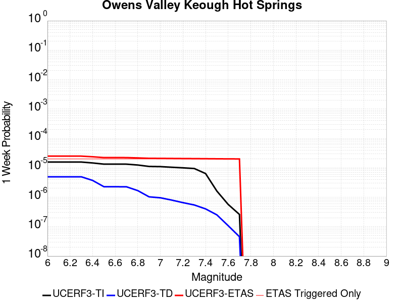 | 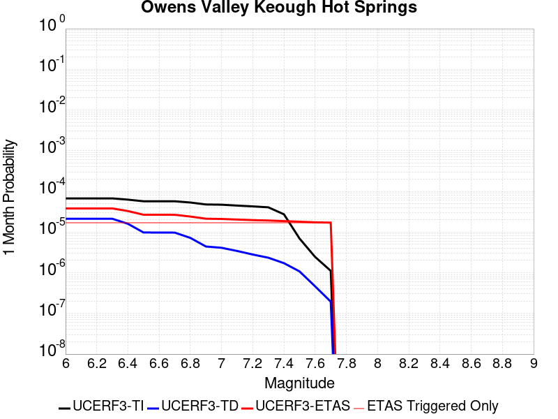 | 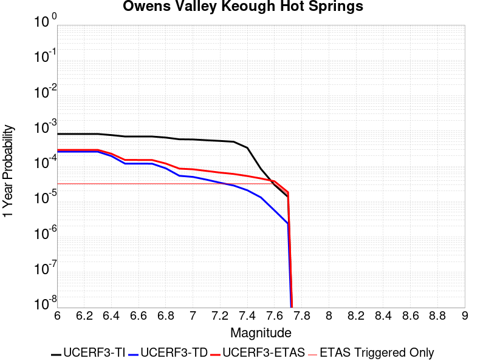 | 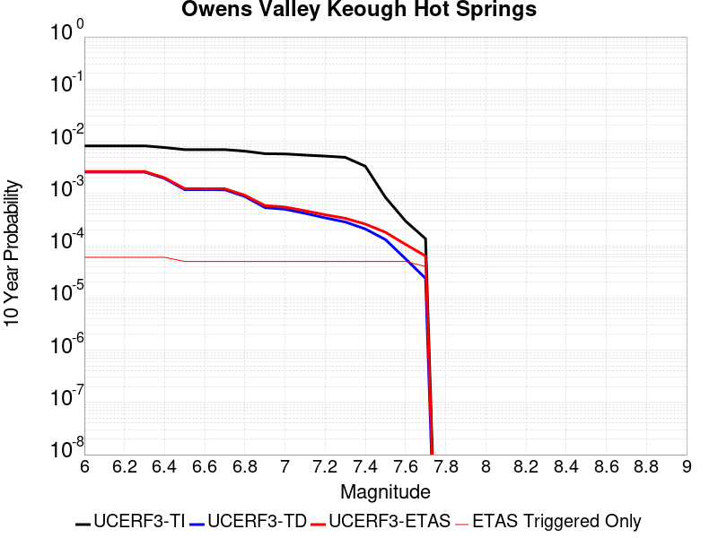 |

| Magnitude | 1 wk TI Prob | 1 wk TD Prob | 1 wk ETAS Prob | 1 wk ETAS/TD Gain | 1 wk ETAS Triggered Only | 1 mo TI Prob | 1 mo TD Prob | 1 mo ETAS Prob | 1 mo ETAS/TD Gain | 1 mo ETAS Triggered Only | 1 yr TI Prob | 1 yr TD Prob | 1 yr ETAS Prob | 1 yr ETAS/TD Gain | 1 yr ETAS Triggered Only | 10 yr TI Prob | 10 yr TD Prob | 10 yr ETAS Prob | 10 yr ETAS/TD Gain | 10 yr ETAS Triggered Only |
|-----|-----|-----|-----|-----|-----|-----|-----|-----|-----|-----|-----|-----|-----|-----|-----|-----|-----|-----|-----|-----|
| 6.0 | 1.5708529E-5 | 4.950656E-6 | 4.950656E-6 | 1.0 | 0.0 | 6.7320536E-5 | 2.1216953E-5 | 2.1216953E-5 | 1.0 | 0.0 | 8.193192E-4 | 2.582909E-4 | 2.582909E-4 | 1.0 | 0.0 | 0.008163051 | 0.0025805652 | 0.002605118 | 1.0095146 | 2.4616596E-5 |
| 6.1 | 1.5708529E-5 | 4.950656E-6 | 4.950656E-6 | 1.0 | 0.0 | 6.7320536E-5 | 2.1216953E-5 | 2.1216953E-5 | 1.0 | 0.0 | 8.193192E-4 | 2.582909E-4 | 2.582909E-4 | 1.0 | 0.0 | 0.008163051 | 0.0025805652 | 0.002605118 | 1.0095146 | 2.4616596E-5 |
| 6.2 | 1.5708529E-5 | 4.950656E-6 | 4.950656E-6 | 1.0 | 0.0 | 6.7320536E-5 | 2.1216953E-5 | 2.1216953E-5 | 1.0 | 0.0 | 8.193192E-4 | 2.582909E-4 | 2.582909E-4 | 1.0 | 0.0 | 0.008163051 | 0.0025805652 | 0.002605118 | 1.0095146 | 2.4616596E-5 |
| 6.3 | 1.5708529E-5 | 4.950656E-6 | 4.950656E-6 | 1.0 | 0.0 | 6.7320536E-5 | 2.1216953E-5 | 2.1216953E-5 | 1.0 | 0.0 | 8.193192E-4 | 2.582909E-4 | 2.582909E-4 | 1.0 | 0.0 | 0.008163051 | 0.0025805652 | 0.002605118 | 1.0095146 | 2.4616596E-5 |
| 6.4 | 1.4622509E-5 | 3.7265204E-6 | 3.7265204E-6 | 1.0 | 0.0 | 6.266639E-5 | 1.5970723E-5 | 1.5970723E-5 | 1.0 | 0.0 | 7.626962E-4 | 1.944295E-4 | 1.944295E-4 | 1.0 | 0.0 | 0.007600839 | 0.0019430731 | 0.0019676418 | 1.0126443 | 2.4616596E-5 |
| 6.5 | 1.3335527E-5 | 2.2777172E-6 | 2.2777172E-6 | 1.0 | 0.0 | 5.7151006E-5 | 9.761612E-6 | 9.761612E-6 | 1.0 | 0.0 | 6.955913E-4 | 1.18841825E-4 | 1.18841825E-4 | 1.0 | 0.0 | 0.0069341804 | 0.0011880046 | 0.001212592 | 1.0206964 | 2.4616596E-5 |
| 6.6 | 1.3332855E-5 | 2.2748663E-6 | 2.2748663E-6 | 1.0 | 0.0 | 5.7139558E-5 | 9.749395E-6 | 9.749395E-6 | 1.0 | 0.0 | 6.9545204E-4 | 1.186931E-4 | 1.186931E-4 | 1.0 | 0.0 | 0.0069327964 | 0.0011865189 | 0.0012111063 | 1.0207223 | 2.4616596E-5 |
| 6.7 | 1.3318214E-5 | 2.2640966E-6 | 2.2640966E-6 | 1.0 | 0.0 | 5.707681E-5 | 9.703239E-6 | 9.703239E-6 | 1.0 | 0.0 | 6.946886E-4 | 1.1813121E-4 | 1.1813121E-4 | 1.0 | 0.0 | 0.0069252094 | 0.001180906 | 0.0012054936 | 1.0208209 | 2.4616596E-5 |
| 6.8 | 1.2441338E-5 | 1.6777863E-6 | 1.6777863E-6 | 1.0 | 0.0 | 5.331893E-5 | 7.1904947E-6 | 7.1904947E-6 | 1.0 | 0.0 | 6.489646E-4 | 8.7541055E-5 | 8.7541055E-5 | 1.0 | 0.0 | 0.0064707273 | 8.752499E-4 | 8.998449E-4 | 1.0281006 | 2.4616596E-5 |
| 6.9 | 1.1130476E-5 | 1.0303868E-6 | 1.0303868E-6 | 1.0 | 0.0 | 4.7701167E-5 | 4.415936E-6 | 4.415936E-6 | 1.0 | 0.0 | 5.806069E-4 | 5.3762706E-5 | 5.3762706E-5 | 1.0 | 0.0 | 0.0057909233 | 5.37651E-4 | 5.6225434E-4 | 1.0457609 | 2.4616596E-5 |
| 7.0 | 1.0986073E-5 | 9.579413E-7 | 9.579413E-7 | 1.0 | 0.0 | 4.7082318E-5 | 4.1054564E-6 | 4.1054564E-6 | 1.0 | 0.0 | 5.730765E-4 | 4.99828E-5 | 4.99828E-5 | 1.0 | 0.0 | 0.0057160086 | 4.9986853E-4 | 5.244728E-4 | 1.0492215 | 2.4616596E-5 |
| 7.1 | 1.0451338E-5 | 8.0002656E-7 | 8.0002656E-7 | 1.0 | 0.0 | 4.4790682E-5 | 3.4286807E-6 | 3.4286807E-6 | 1.0 | 0.0 | 5.451901E-4 | 4.1743395E-5 | 4.1743395E-5 | 1.0 | 0.0 | 0.005438545 | 4.1750458E-4 | 4.421109E-4 | 1.0589366 | 2.4616596E-5 |
| 7.2 | 9.989061E-6 | 6.544956E-7 | 6.544956E-7 | 1.0 | 0.0 | 4.280956E-5 | 2.804978E-6 | 2.804978E-6 | 1.0 | 0.0 | 5.2108173E-4 | 3.4150078E-5 | 3.4150078E-5 | 1.0 | 0.0 | 0.0051986156 | 3.415851E-4 | 3.661933E-4 | 1.0720412 | 2.4616596E-5 |
| 7.3 | 9.465365E-6 | 5.4600474E-7 | 5.4600474E-7 | 1.0 | 0.0 | 4.056522E-5 | 2.3400182E-6 | 2.3400182E-6 | 1.0 | 0.0 | 4.937696E-4 | 2.8489352E-5 | 2.8489352E-5 | 1.0 | 0.0 | 0.0049267393 | 2.8498896E-4 | 3.0959854E-4 | 1.0863527 | 2.4616596E-5 |
| 7.4 | 6.3824805E-6 | 4.016335E-7 | 4.016335E-7 | 1.0 | 0.0 | 2.73532E-5 | 1.7212853E-6 | 1.7212853E-6 | 1.0 | 0.0 | 3.3297433E-4 | 2.095645E-5 | 2.095645E-5 | 1.0 | 0.0 | 0.0033247585 | 2.0963654E-4 | 2.3424797E-4 | 1.1174005 | 2.4616596E-5 |
| 7.5 | 1.6192645E-6 | 2.516124E-7 | 2.516124E-7 | 1.0 | 0.0 | 6.9396865E-6 | 1.0783383E-6 | 1.0783383E-6 | 1.0 | 0.0 | 8.448741E-5 | 1.31286915E-5 | 1.31286915E-5 | 1.0 | 0.0 | 8.4455294E-4 | 1.3127929E-4 | 1.5589266E-4 | 1.1874886 | 2.4616596E-5 |
| 7.6 | 5.7062545E-7 | 1.07924045E-7 | 1.07924045E-7 | 1.0 | 0.0 | 2.4455355E-6 | 4.6253152E-7 | 4.6253152E-7 | 1.0 | 0.0 | 2.9773988E-5 | 5.6313074E-6 | 5.6313074E-6 | 1.0 | 0.0 | 2.977E-4 | 5.6311732E-5 | 8.092694E-5 | 1.437124 | 2.4616596E-5 |
| 7.7 | 2.5988817E-7 | 4.5457977E-8 | 4.5457977E-8 | 1.0 | 0.0 | 1.113806E-6 | 1.9481989E-7 | 1.9481989E-7 | 1.0 | 0.0 | 1.3560503E-5 | 2.3719301E-6 | 2.3719301E-6 | 1.0 | 0.0 | 1.3559677E-4 | 2.371909E-5 | 4.8335103E-5 | 2.0378144 | 2.4616596E-5 |

## Pitas Point (Lower West)
*[(top)](#table-of-contents)*

| 1 Week | 1 Month | 1 Year | 10 Year |
|-----|-----|-----|-----|
|  |  | 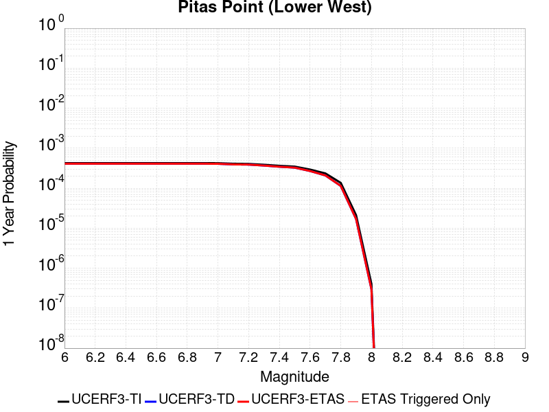 | 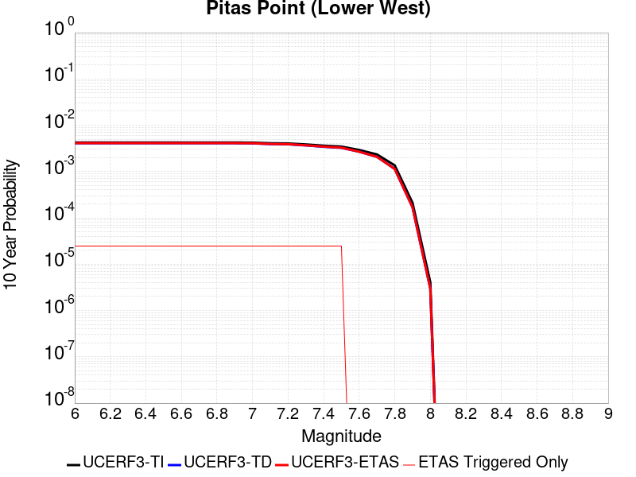 |

| Magnitude | 1 wk TI Prob | 1 wk TD Prob | 1 wk ETAS Prob | 1 wk ETAS/TD Gain | 1 wk ETAS Triggered Only | 1 mo TI Prob | 1 mo TD Prob | 1 mo ETAS Prob | 1 mo ETAS/TD Gain | 1 mo ETAS Triggered Only | 1 yr TI Prob | 1 yr TD Prob | 1 yr ETAS Prob | 1 yr ETAS/TD Gain | 1 yr ETAS Triggered Only | 10 yr TI Prob | 10 yr TD Prob | 10 yr ETAS Prob | 10 yr ETAS/TD Gain | 10 yr ETAS Triggered Only |
|-----|-----|-----|-----|-----|-----|-----|-----|-----|-----|-----|-----|-----|-----|-----|-----|-----|-----|-----|-----|-----|
| 6.0 | 8.151497E-6 | 7.855762E-6 | 7.855762E-6 | 1.0 | 0.0 | 3.493452E-5 | 3.3667122E-5 | 3.3667122E-5 | 1.0 | 0.0 | 4.252448E-4 | 4.0982084E-4 | 4.0982084E-4 | 1.0 | 0.0 | 0.0042443196 | 0.0040907315 | 0.0041152476 | 1.005993 | 2.4616596E-5 |
| 6.1 | 8.151497E-6 | 7.855762E-6 | 7.855762E-6 | 1.0 | 0.0 | 3.493452E-5 | 3.3667122E-5 | 3.3667122E-5 | 1.0 | 0.0 | 4.252448E-4 | 4.0982084E-4 | 4.0982084E-4 | 1.0 | 0.0 | 0.0042443196 | 0.0040907315 | 0.0041152476 | 1.005993 | 2.4616596E-5 |
| 6.2 | 8.151497E-6 | 7.855762E-6 | 7.855762E-6 | 1.0 | 0.0 | 3.493452E-5 | 3.3667122E-5 | 3.3667122E-5 | 1.0 | 0.0 | 4.252448E-4 | 4.0982084E-4 | 4.0982084E-4 | 1.0 | 0.0 | 0.0042443196 | 0.0040907315 | 0.0041152476 | 1.005993 | 2.4616596E-5 |
| 6.3 | 8.151497E-6 | 7.855762E-6 | 7.855762E-6 | 1.0 | 0.0 | 3.493452E-5 | 3.3667122E-5 | 3.3667122E-5 | 1.0 | 0.0 | 4.252448E-4 | 4.0982084E-4 | 4.0982084E-4 | 1.0 | 0.0 | 0.0042443196 | 0.0040907315 | 0.0041152476 | 1.005993 | 2.4616596E-5 |
| 6.4 | 8.151497E-6 | 7.855762E-6 | 7.855762E-6 | 1.0 | 0.0 | 3.493452E-5 | 3.3667122E-5 | 3.3667122E-5 | 1.0 | 0.0 | 4.252448E-4 | 4.0982084E-4 | 4.0982084E-4 | 1.0 | 0.0 | 0.0042443196 | 0.0040907315 | 0.0041152476 | 1.005993 | 2.4616596E-5 |
| 6.5 | 8.151497E-6 | 7.855762E-6 | 7.855762E-6 | 1.0 | 0.0 | 3.493452E-5 | 3.3667122E-5 | 3.3667122E-5 | 1.0 | 0.0 | 4.252448E-4 | 4.0982084E-4 | 4.0982084E-4 | 1.0 | 0.0 | 0.0042443196 | 0.0040907315 | 0.0041152476 | 1.005993 | 2.4616596E-5 |
| 6.6 | 8.151497E-6 | 7.855762E-6 | 7.855762E-6 | 1.0 | 0.0 | 3.493452E-5 | 3.3667122E-5 | 3.3667122E-5 | 1.0 | 0.0 | 4.252448E-4 | 4.0982084E-4 | 4.0982084E-4 | 1.0 | 0.0 | 0.0042443196 | 0.0040907315 | 0.0041152476 | 1.005993 | 2.4616596E-5 |
| 6.7 | 8.151497E-6 | 7.855762E-6 | 7.855762E-6 | 1.0 | 0.0 | 3.493452E-5 | 3.3667122E-5 | 3.3667122E-5 | 1.0 | 0.0 | 4.252448E-4 | 4.0982084E-4 | 4.0982084E-4 | 1.0 | 0.0 | 0.0042443196 | 0.0040907315 | 0.0041152476 | 1.005993 | 2.4616596E-5 |
| 6.8 | 8.151497E-6 | 7.855762E-6 | 7.855762E-6 | 1.0 | 0.0 | 3.493452E-5 | 3.3667122E-5 | 3.3667122E-5 | 1.0 | 0.0 | 4.252448E-4 | 4.0982084E-4 | 4.0982084E-4 | 1.0 | 0.0 | 0.0042443196 | 0.0040907315 | 0.0041152476 | 1.005993 | 2.4616596E-5 |
| 6.9 | 8.151497E-6 | 7.855762E-6 | 7.855762E-6 | 1.0 | 0.0 | 3.493452E-5 | 3.3667122E-5 | 3.3667122E-5 | 1.0 | 0.0 | 4.252448E-4 | 4.0982084E-4 | 4.0982084E-4 | 1.0 | 0.0 | 0.0042443196 | 0.0040907315 | 0.0041152476 | 1.005993 | 2.4616596E-5 |
| 7.0 | 8.103535E-6 | 7.805192E-6 | 7.805192E-6 | 1.0 | 0.0 | 3.4728975E-5 | 3.3450397E-5 | 3.3450397E-5 | 1.0 | 0.0 | 4.2274324E-4 | 4.0718322E-4 | 4.0718322E-4 | 1.0 | 0.0 | 0.0042193993 | 0.004064452 | 0.0040889685 | 1.006032 | 2.4616596E-5 |
| 7.1 | 7.853298E-6 | 7.540883E-6 | 7.540883E-6 | 1.0 | 0.0 | 3.3656554E-5 | 3.2317676E-5 | 3.2317676E-5 | 1.0 | 0.0 | 4.096915E-4 | 3.9339735E-4 | 3.9339735E-4 | 1.0 | 0.0 | 0.00408937 | 0.0039270855 | 0.0039516054 | 1.0062438 | 2.4616596E-5 |
| 7.2 | 7.771102E-6 | 7.453165E-6 | 7.453165E-6 | 1.0 | 0.0 | 3.33043E-5 | 3.194175E-5 | 3.194175E-5 | 1.0 | 0.0 | 4.0540437E-4 | 3.8882208E-4 | 3.8882208E-4 | 1.0 | 0.0 | 0.0040466557 | 0.0038814936 | 0.0039060146 | 1.0063174 | 2.4616596E-5 |
| 7.3 | 7.3945344E-6 | 7.0492697E-6 | 7.0492697E-6 | 1.0 | 0.0 | 3.1690477E-5 | 3.021081E-5 | 3.021081E-5 | 1.0 | 0.0 | 3.8576324E-4 | 3.6775516E-4 | 3.6775516E-4 | 1.0 | 0.0 | 0.0038509427 | 0.0036715334 | 0.0036960596 | 1.0066801 | 2.4616596E-5 |
| 7.4 | 6.964645E-6 | 6.5901186E-6 | 6.5901186E-6 | 1.0 | 0.0 | 2.9848137E-5 | 2.8243063E-5 | 2.8243063E-5 | 1.0 | 0.0 | 3.6334046E-4 | 3.4380553E-4 | 3.4380553E-4 | 1.0 | 0.0 | 0.0036274698 | 0.0034327896 | 0.0034573216 | 1.0071464 | 2.4616596E-5 |
| 7.5 | 6.6525035E-6 | 6.259157E-6 | 6.259157E-6 | 1.0 | 0.0 | 2.851042E-5 | 2.6824686E-5 | 2.6824686E-5 | 1.0 | 0.0 | 3.4705905E-4 | 3.265421E-4 | 3.265421E-4 | 1.0 | 0.0 | 0.0034651754 | 0.0032606742 | 0.0032852106 | 1.007525 | 2.4616596E-5 |
| 7.6 | 5.613338E-6 | 5.151386E-6 | 5.151386E-6 | 1.0 | 0.0 | 2.405694E-5 | 2.2077185E-5 | 2.2077185E-5 | 1.0 | 0.0 | 2.928539E-4 | 2.6875688E-4 | 2.6875688E-4 | 1.0 | 0.0 | 0.0029246826 | 0.0026843501 | 0.0026843501 | 1.0 | 0.0 |
| 7.7 | 4.494704E-6 | 3.996911E-6 | 3.996911E-6 | 1.0 | 0.0 | 1.9262876E-5 | 1.7129507E-5 | 1.7129507E-5 | 1.0 | 0.0 | 2.3450027E-4 | 2.0853203E-4 | 2.0853203E-4 | 1.0 | 0.0 | 0.0023425296 | 0.0020833875 | 0.0020833875 | 1.0 | 0.0 |
| 7.8 | 2.6075882E-6 | 2.1836374E-6 | 2.1836374E-6 | 1.0 | 0.0 | 1.117533E-5 | 9.358413E-6 | 9.358413E-6 | 1.0 | 0.0 | 1.3605114E-4 | 1.1393277E-4 | 1.1393277E-4 | 1.0 | 0.0 | 0.0013596788 | 0.0011387484 | 0.0011387484 | 1.0 | 0.0 |
| 7.9 | 4.045984E-7 | 3.242375E-7 | 3.242375E-7 | 1.0 | 0.0 | 1.733992E-6 | 1.3895885E-6 | 1.3895885E-6 | 1.0 | 0.0 | 2.1111147E-5 | 1.6918111E-5 | 1.6918111E-5 | 1.0 | 0.0 | 2.1109142E-4 | 1.6916855E-4 | 1.6916855E-4 | 1.0 | 0.0 |
| 8.0 | 7.791402E-9 | 5.683497E-9 | 5.683497E-9 | 1.0 | 0.0 | 3.3391725E-8 | 2.4357844E-8 | 2.4357844E-8 | 1.0 | 0.0 | 4.0654416E-7 | 2.9655675E-7 | 2.9655675E-7 | 1.0 | 0.0 | 4.065434E-6 | 2.9655655E-6 | 2.9655655E-6 | 1.0 | 0.0 |

## Newport-Inglewood (Offshore)
*[(top)](#table-of-contents)*

| 1 Week | 1 Month | 1 Year | 10 Year |
|-----|-----|-----|-----|
| 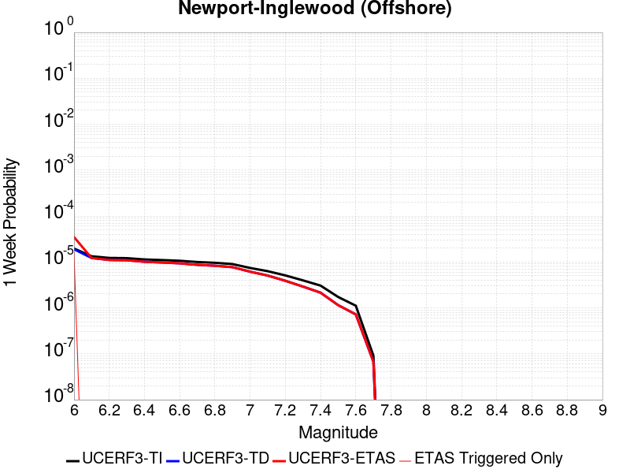 | 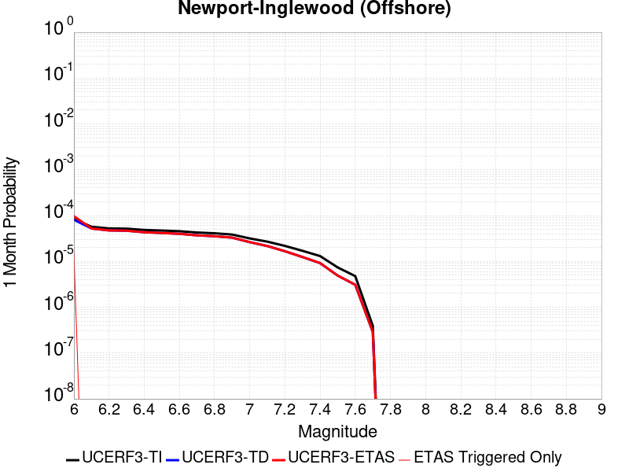 | 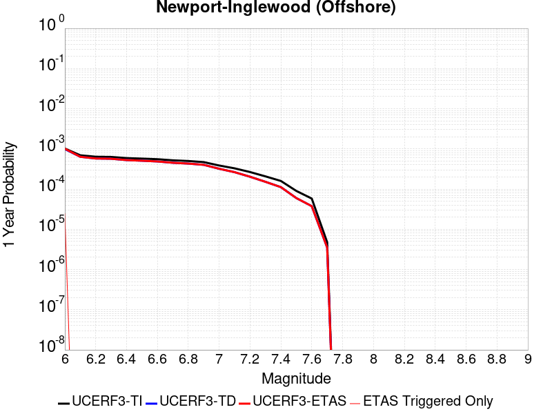 | 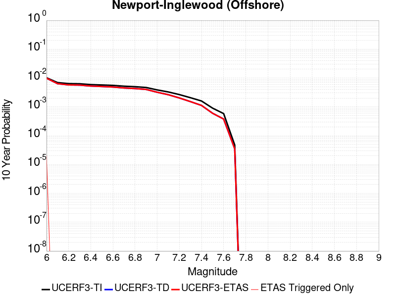 |

| Magnitude | 1 wk TI Prob | 1 wk TD Prob | 1 wk ETAS Prob | 1 wk ETAS/TD Gain | 1 wk ETAS Triggered Only | 1 mo TI Prob | 1 mo TD Prob | 1 mo ETAS Prob | 1 mo ETAS/TD Gain | 1 mo ETAS Triggered Only | 1 yr TI Prob | 1 yr TD Prob | 1 yr ETAS Prob | 1 yr ETAS/TD Gain | 1 yr ETAS Triggered Only | 10 yr TI Prob | 10 yr TD Prob | 10 yr ETAS Prob | 10 yr ETAS/TD Gain | 10 yr ETAS Triggered Only |
|-----|-----|-----|-----|-----|-----|-----|-----|-----|-----|-----|-----|-----|-----|-----|-----|-----|-----|-----|-----|-----|
| 6.0 | 1.9626508E-5 | 1.8965357E-5 | 4.3581487E-5 | 2.2979524 | 2.4616596E-5 | 8.411089E-5 | 8.1277634E-5 | 1.05892235E-4 | 1.3028458 | 2.4616596E-5 | 0.001023569 | 9.891186E-4 | 0.0010137109 | 1.0248628 | 2.4616596E-5 | 0.010188672 | 0.009848503 | 0.009872878 | 1.0024749 | 2.4616596E-5 |
| 6.1 | 1.331886E-5 | 1.2218092E-5 | 1.2218092E-5 | 1.0 | 0.0 | 5.707958E-5 | 5.2362207E-5 | 5.2362207E-5 | 1.0 | 0.0 | 6.947222E-4 | 6.3732493E-4 | 6.3732493E-4 | 1.0 | 0.0 | 0.006925544 | 0.006355149 | 0.006355149 | 1.0 | 0.0 |
| 6.2 | 1.2250852E-5 | 1.1076029E-5 | 1.1076029E-5 | 1.0 | 0.0 | 5.2502597E-5 | 4.7467838E-5 | 4.7467838E-5 | 1.0 | 0.0 | 6.3903164E-4 | 5.777687E-4 | 5.777687E-4 | 1.0 | 0.0 | 0.006371971 | 0.0057627866 | 0.0057627866 | 1.0 | 0.0 |
| 6.3 | 1.2106258E-5 | 1.0918891E-5 | 1.0918891E-5 | 1.0 | 0.0 | 5.1882926E-5 | 4.6794412E-5 | 4.6794412E-5 | 1.0 | 0.0 | 6.3149154E-4 | 5.69574E-4 | 5.69574E-4 | 1.0 | 0.0 | 0.0062970007 | 0.005681259 | 0.005681259 | 1.0 | 0.0 |
| 6.4 | 1.1348758E-5 | 1.0109362E-5 | 1.0109362E-5 | 1.0 | 0.0 | 4.8636626E-5 | 4.3325123E-5 | 4.3325123E-5 | 1.0 | 0.0 | 5.919901E-4 | 5.273565E-4 | 5.273565E-4 | 1.0 | 0.0 | 0.005904155 | 0.0052611465 | 0.0052611465 | 1.0 | 0.0 |
| 6.5 | 1.100837E-5 | 9.7433895E-6 | 9.7433895E-6 | 1.0 | 0.0 | 4.7177873E-5 | 4.1756717E-5 | 4.1756717E-5 | 1.0 | 0.0 | 5.7423924E-4 | 5.082702E-4 | 5.082702E-4 | 1.0 | 0.0 | 0.005727576 | 0.0050711688 | 0.0050711688 | 1.0 | 0.0 |
| 6.6 | 1.0634696E-5 | 9.345544E-6 | 9.345544E-6 | 1.0 | 0.0 | 4.557647E-5 | 4.0051716E-5 | 4.0051716E-5 | 1.0 | 0.0 | 5.5475225E-4 | 4.8752132E-4 | 4.8752132E-4 | 1.0 | 0.0 | 0.0055336943 | 0.0048646047 | 0.0048646047 | 1.0 | 0.0 |
| 6.7 | 9.9780855E-6 | 8.667911E-6 | 8.667911E-6 | 1.0 | 0.0 | 4.276252E-5 | 3.7147664E-5 | 3.7147664E-5 | 1.0 | 0.0 | 5.205093E-4 | 4.5217964E-4 | 4.5217964E-4 | 1.0 | 0.0 | 0.0051929182 | 0.004512675 | 0.004512675 | 1.0 | 0.0 |
| 6.8 | 9.59546E-6 | 8.27295E-6 | 8.27295E-6 | 1.0 | 0.0 | 4.1122752E-5 | 3.5455025E-5 | 3.5455025E-5 | 1.0 | 0.0 | 5.0055445E-4 | 4.315801E-4 | 4.315801E-4 | 1.0 | 0.0 | 0.004994285 | 0.004307495 | 0.004307495 | 1.0 | 0.0 |
| 6.9 | 9.000614E-6 | 7.70684E-6 | 7.70684E-6 | 1.0 | 0.0 | 3.857349E-5 | 3.30289E-5 | 3.30289E-5 | 1.0 | 0.0 | 4.6953102E-4 | 4.0205332E-4 | 4.0205332E-4 | 1.0 | 0.0 | 0.004685402 | 0.0040133307 | 0.0040133307 | 1.0 | 0.0 |
| 7.0 | 7.4070194E-6 | 6.148904E-6 | 6.148904E-6 | 1.0 | 0.0 | 3.1743984E-5 | 2.635218E-5 | 2.635218E-5 | 1.0 | 0.0 | 3.8641447E-4 | 3.207907E-4 | 3.207907E-4 | 1.0 | 0.0 | 0.0038574322 | 0.0032032963 | 0.0032032963 | 1.0 | 0.0 |
| 7.1 | 6.299615E-6 | 5.0565927E-6 | 5.0565927E-6 | 1.0 | 0.0 | 2.699807E-5 | 2.1670932E-5 | 2.1670932E-5 | 1.0 | 0.0 | 3.2865192E-4 | 2.638118E-4 | 2.638118E-4 | 1.0 | 0.0 | 0.003281663 | 0.002635001 | 0.002635001 | 1.0 | 0.0 |
| 7.2 | 5.096653E-6 | 3.892769E-6 | 3.892769E-6 | 1.0 | 0.0 | 2.1842614E-5 | 1.668319E-5 | 1.668319E-5 | 1.0 | 0.0 | 2.6590136E-4 | 2.0309901E-4 | 2.0309901E-4 | 1.0 | 0.0 | 0.0026558342 | 0.0020291451 | 0.0020291451 | 1.0 | 0.0 |
| 7.3 | 3.9753018E-6 | 2.9099103E-6 | 2.9099103E-6 | 1.0 | 0.0 | 1.7036897E-5 | 1.2470985E-5 | 1.2470985E-5 | 1.0 | 0.0 | 2.0740448E-4 | 1.5182374E-4 | 1.5182374E-4 | 1.0 | 0.0 | 0.00207211 | 0.0015172083 | 0.0015172083 | 1.0 | 0.0 |
| 7.4 | 3.0568392E-6 | 2.1449955E-6 | 2.1449955E-6 | 1.0 | 0.0 | 1.3100675E-5 | 9.192806E-6 | 9.192806E-6 | 1.0 | 0.0 | 1.5948903E-4 | 1.1191672E-4 | 1.1191672E-4 | 1.0 | 0.0 | 0.0015937461 | 0.0011186098 | 0.0011186098 | 1.0 | 0.0 |
| 7.5 | 1.7279019E-6 | 1.1469883E-6 | 1.1469883E-6 | 1.0 | 0.0 | 7.405273E-6 | 4.915655E-6 | 4.915655E-6 | 1.0 | 0.0 | 9.015547E-5 | 5.9846494E-5 | 5.9846494E-5 | 1.0 | 0.0 | 9.01189E-4 | 5.9830764E-4 | 5.9830764E-4 | 1.0 | 0.0 |
| 7.6 | 1.1156416E-6 | 7.223012E-7 | 7.223012E-7 | 1.0 | 0.0 | 4.7813123E-6 | 3.095573E-6 | 3.095573E-6 | 1.0 | 0.0 | 5.821092E-5 | 3.7687976E-5 | 3.7687976E-5 | 1.0 | 0.0 | 5.8195676E-4 | 3.7681818E-4 | 3.7681818E-4 | 1.0 | 0.0 |
| 7.7 | 9.117973E-8 | 6.734145E-8 | 6.734145E-8 | 1.0 | 0.0 | 3.907702E-7 | 2.886062E-7 | 2.886062E-7 | 1.0 | 0.0 | 4.757617E-6 | 3.513775E-6 | 3.513775E-6 | 1.0 | 0.0 | 4.7575148E-5 | 3.5137225E-5 | 3.5137225E-5 | 1.0 | 0.0 |

## San Diego Trough north alt1
*[(top)](#table-of-contents)*

| 1 Week | 1 Month | 1 Year | 10 Year |
|-----|-----|-----|-----|
| 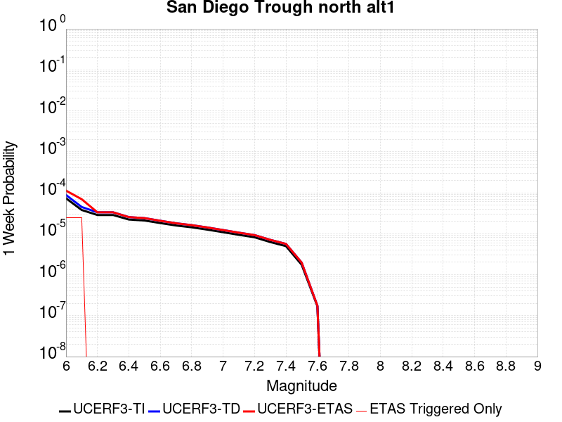 | 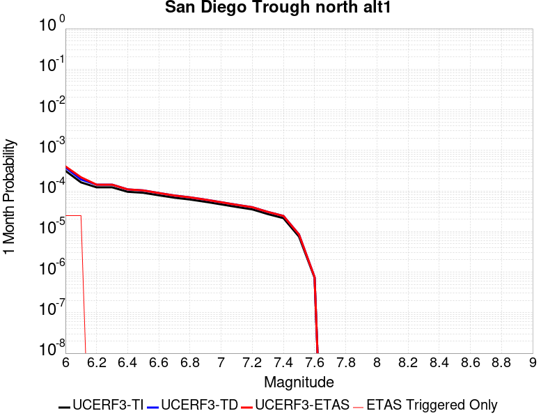 | 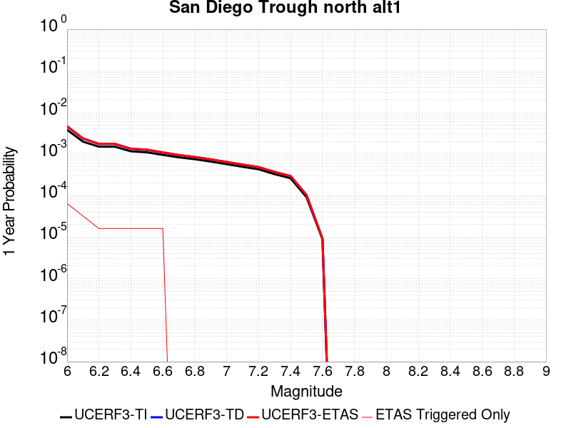 | 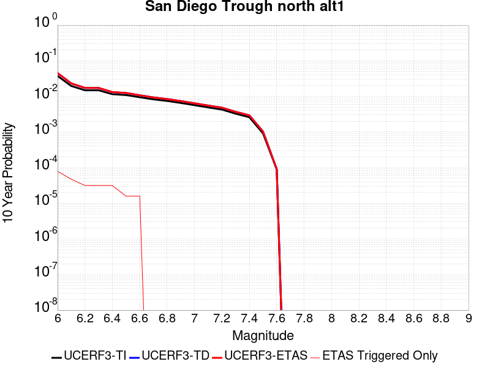 |

| Magnitude | 1 wk TI Prob | 1 wk TD Prob | 1 wk ETAS Prob | 1 wk ETAS/TD Gain | 1 wk ETAS Triggered Only | 1 mo TI Prob | 1 mo TD Prob | 1 mo ETAS Prob | 1 mo ETAS/TD Gain | 1 mo ETAS Triggered Only | 1 yr TI Prob | 1 yr TD Prob | 1 yr ETAS Prob | 1 yr ETAS/TD Gain | 1 yr ETAS Triggered Only | 10 yr TI Prob | 10 yr TD Prob | 10 yr ETAS Prob | 10 yr ETAS/TD Gain | 10 yr ETAS Triggered Only |
|-----|-----|-----|-----|-----|-----|-----|-----|-----|-----|-----|-----|-----|-----|-----|-----|-----|-----|-----|-----|-----|
| 6.0 | 7.329252E-5 | 8.821093E-5 | 1.1282536E-4 | 1.2790406 | 2.4616596E-5 | 3.14073E-4 | 3.7799572E-4 | 4.02603E-4 | 1.0650994 | 2.4616596E-5 | 0.0038171355 | 0.004593027 | 0.0046175304 | 1.005335 | 2.4616596E-5 | 0.03752231 | 0.045044992 | 0.0450685 | 1.0005219 | 2.4616596E-5 |
| 6.1 | 3.7940346E-5 | 4.4885E-5 | 6.950049E-5 | 1.5484124 | 2.4616596E-5 | 1.6259136E-4 | 1.9235066E-4 | 2.1696252E-4 | 1.127953 | 2.4616596E-5 | 0.0019777524 | 0.0023394432 | 0.0023640022 | 1.0104978 | 2.4616596E-5 | 0.019602431 | 0.023156688 | 0.023180734 | 1.0010384 | 2.4616596E-5 |
| 6.2 | 2.8645263E-5 | 3.329678E-5 | 3.329678E-5 | 1.0 | 0.0 | 1.2275964E-4 | 1.4269284E-4 | 1.4269284E-4 | 1.0 | 0.0 | 0.0014935739 | 0.0017359189 | 0.0017359189 | 1.0 | 0.0 | 0.0148357535 | 0.017226247 | 0.017226247 | 1.0 | 0.0 |
| 6.3 | 2.8645263E-5 | 3.329678E-5 | 3.329678E-5 | 1.0 | 0.0 | 1.2275964E-4 | 1.4269284E-4 | 1.4269284E-4 | 1.0 | 0.0 | 0.0014935739 | 0.0017359189 | 0.0017359189 | 1.0 | 0.0 | 0.0148357535 | 0.017226247 | 0.017226247 | 1.0 | 0.0 |
| 6.4 | 2.2204576E-5 | 2.5448318E-5 | 2.5448318E-5 | 1.0 | 0.0 | 9.5159E-5 | 1.0905972E-4 | 1.0905972E-4 | 1.0 | 0.0 | 0.001157945 | 0.0013270034 | 0.0013270034 | 1.0 | 0.0 | 0.011519298 | 0.013191955 | 0.013191955 | 1.0 | 0.0 |
| 6.5 | 2.1004838E-5 | 2.4024694E-5 | 2.4024694E-5 | 1.0 | 0.0 | 9.0017624E-5 | 1.0295896E-4 | 1.0295896E-4 | 1.0 | 0.0 | 0.0010954136 | 0.0012528138 | 0.0012528138 | 1.0 | 0.0 | 0.010900296 | 0.012458589 | 0.012458589 | 1.0 | 0.0 |
| 6.6 | 1.820557E-5 | 2.0704787E-5 | 2.0704787E-5 | 1.0 | 0.0 | 7.802154E-5 | 8.873181E-5 | 8.873181E-5 | 1.0 | 0.0 | 9.4949827E-4 | 0.0010797799 | 0.0010797799 | 1.0 | 0.0 | 0.009454516 | 0.010746004 | 0.010746004 | 1.0 | 0.0 |
| 6.7 | 1.5884485E-5 | 1.7983646E-5 | 1.7983646E-5 | 1.0 | 0.0 | 6.807459E-5 | 7.707051E-5 | 7.707051E-5 | 1.0 | 0.0 | 8.284929E-4 | 9.3793223E-4 | 9.3793223E-4 | 1.0 | 0.0 | 0.008254109 | 0.009340104 | 0.009340104 | 1.0 | 0.0 |
| 6.8 | 1.4331171E-5 | 1.6201066E-5 | 1.6201066E-5 | 1.0 | 0.0 | 6.141786E-5 | 6.94313E-5 | 6.94313E-5 | 1.0 | 0.0 | 7.4750587E-4 | 8.450002E-4 | 8.450002E-4 | 1.0 | 0.0 | 0.0074499645 | 0.008418139 | 0.008418139 | 1.0 | 0.0 |
| 6.9 | 1.2574203E-5 | 1.4205835E-5 | 1.4205835E-5 | 1.0 | 0.0 | 5.3888325E-5 | 6.0880735E-5 | 6.0880735E-5 | 1.0 | 0.0 | 6.558929E-4 | 7.409723E-4 | 7.409723E-4 | 1.0 | 0.0 | 0.0065396037 | 0.007385203 | 0.007385203 | 1.0 | 0.0 |
| 7.0 | 1.0883844E-5 | 1.2289262E-5 | 1.2289262E-5 | 1.0 | 0.0 | 4.664421E-5 | 5.2667205E-5 | 5.2667205E-5 | 1.0 | 0.0 | 5.677453E-4 | 6.4103556E-4 | 6.4103556E-4 | 1.0 | 0.0 | 0.00566297 | 0.006391993 | 0.006391993 | 1.0 | 0.0 |
| 7.1 | 9.393088E-6 | 1.060702E-5 | 1.060702E-5 | 1.0 | 0.0 | 4.025547E-5 | 4.545787E-5 | 4.545787E-5 | 1.0 | 0.0 | 4.900001E-4 | 5.533098E-4 | 5.533098E-4 | 1.0 | 0.0 | 0.0048892107 | 0.005519418 | 0.005519418 | 1.0 | 0.0 |
| 7.2 | 8.190791E-6 | 9.258625E-6 | 9.258625E-6 | 1.0 | 0.0 | 3.510292E-5 | 3.9679224E-5 | 3.9679224E-5 | 1.0 | 0.0 | 4.2729423E-4 | 4.8298817E-4 | 4.8298817E-4 | 1.0 | 0.0 | 0.0042647356 | 0.004819465 | 0.004819465 | 1.0 | 0.0 |
| 7.3 | 6.268162E-6 | 7.089716E-6 | 7.089716E-6 | 1.0 | 0.0 | 2.6863276E-5 | 3.0384144E-5 | 3.0384144E-5 | 1.0 | 0.0 | 3.2701128E-4 | 3.6986457E-4 | 3.6986457E-4 | 1.0 | 0.0 | 0.003265305 | 0.003692536 | 0.003692536 | 1.0 | 0.0 |
| 7.4 | 4.985186E-6 | 5.6426816E-6 | 5.6426816E-6 | 1.0 | 0.0 | 2.1364907E-5 | 2.4182698E-5 | 2.4182698E-5 | 1.0 | 0.0 | 2.600867E-4 | 2.9438498E-4 | 2.9438498E-4 | 1.0 | 0.0 | 0.002597825 | 0.0029399914 | 0.0029399914 | 1.0 | 0.0 |
| 7.5 | 1.7489613E-6 | 1.969678E-6 | 1.969678E-6 | 1.0 | 0.0 | 7.495527E-6 | 8.4414505E-6 | 8.4414505E-6 | 1.0 | 0.0 | 9.125422E-5 | 1.02770035E-4 | 1.02770035E-4 | 1.0 | 0.0 | 9.1216754E-4 | 0.0010272472 | 0.0010272472 | 1.0 | 0.0 |
| 7.6 | 1.6988751E-7 | 1.7533823E-7 | 1.7533823E-7 | 1.0 | 0.0 | 7.2808916E-7 | 7.5144936E-7 | 7.5144936E-7 | 1.0 | 0.0 | 8.864449E-6 | 9.14886E-6 | 9.14886E-6 | 1.0 | 0.0 | 8.8640954E-5 | 9.1485024E-5 | 9.1485024E-5 | 1.0 | 0.0 |

## Sheephole
*[(top)](#table-of-contents)*

| 1 Week | 1 Month | 1 Year | 10 Year |
|-----|-----|-----|-----|
| 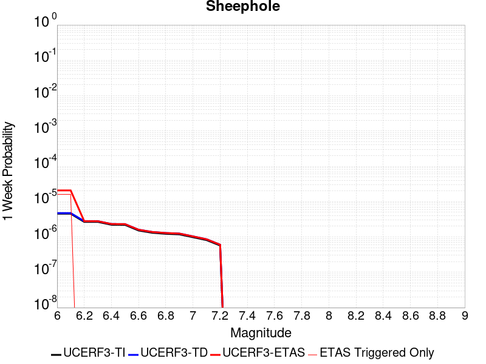 |  |  | 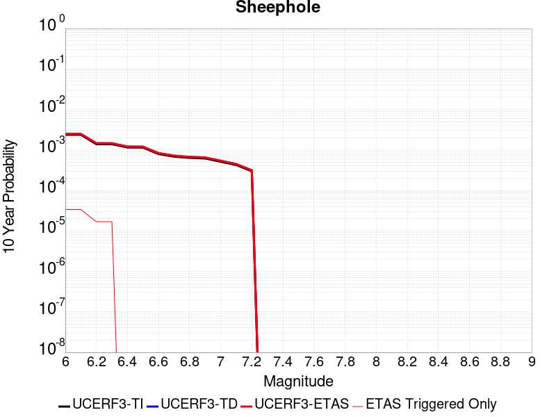 |

| Magnitude | 1 wk TI Prob | 1 wk TD Prob | 1 wk ETAS Prob | 1 wk ETAS/TD Gain | 1 wk ETAS Triggered Only | 1 mo TI Prob | 1 mo TD Prob | 1 mo ETAS Prob | 1 mo ETAS/TD Gain | 1 mo ETAS Triggered Only | 1 yr TI Prob | 1 yr TD Prob | 1 yr ETAS Prob | 1 yr ETAS/TD Gain | 1 yr ETAS Triggered Only | 10 yr TI Prob | 10 yr TD Prob | 10 yr ETAS Prob | 10 yr ETAS/TD Gain | 10 yr ETAS Triggered Only |
|-----|-----|-----|-----|-----|-----|-----|-----|-----|-----|-----|-----|-----|-----|-----|-----|-----|-----|-----|-----|-----|
| 6.0 | 4.5579695E-6 | 4.7412627E-6 | 4.7412627E-6 | 1.0 | 0.0 | 1.9534009E-5 | 2.031957E-5 | 2.031957E-5 | 1.0 | 0.0 | 2.3780059E-4 | 2.473682E-4 | 2.473682E-4 | 1.0 | 0.0 | 0.0023754628 | 0.002471473 | 0.002496029 | 1.0099356 | 2.4616596E-5 |
| 6.1 | 4.5579695E-6 | 4.7412627E-6 | 4.7412627E-6 | 1.0 | 0.0 | 1.9534009E-5 | 2.031957E-5 | 2.031957E-5 | 1.0 | 0.0 | 2.3780059E-4 | 2.473682E-4 | 2.473682E-4 | 1.0 | 0.0 | 0.0023754628 | 0.002471473 | 0.002496029 | 1.0099356 | 2.4616596E-5 |
| 6.2 | 2.6677674E-6 | 2.7873941E-6 | 2.7873941E-6 | 1.0 | 0.0 | 1.1433239E-5 | 1.1945926E-5 | 1.1945926E-5 | 1.0 | 0.0 | 1.3919079E-4 | 1.4543302E-4 | 1.4543302E-4 | 1.0 | 0.0 | 0.0013910364 | 0.0014534844 | 0.0014780653 | 1.0169116 | 2.4616596E-5 |
| 6.3 | 2.6677674E-6 | 2.7873941E-6 | 2.7873941E-6 | 1.0 | 0.0 | 1.1433239E-5 | 1.1945926E-5 | 1.1945926E-5 | 1.0 | 0.0 | 1.3919079E-4 | 1.4543302E-4 | 1.4543302E-4 | 1.0 | 0.0 | 0.0013910364 | 0.0014534844 | 0.0014780653 | 1.0169116 | 2.4616596E-5 |
| 6.4 | 2.2159759E-6 | 2.3228788E-6 | 2.3228788E-6 | 1.0 | 0.0 | 9.497005E-6 | 9.955161E-6 | 9.955161E-6 | 1.0 | 0.0 | 1.156199E-4 | 1.2119815E-4 | 1.2119815E-4 | 1.0 | 0.0 | 0.0011555976 | 0.0012113999 | 0.0012113999 | 1.0 | 0.0 |
| 6.5 | 2.1986082E-6 | 2.304759E-6 | 2.304759E-6 | 1.0 | 0.0 | 9.4225725E-6 | 9.877506E-6 | 9.877506E-6 | 1.0 | 0.0 | 1.1471378E-4 | 1.2025281E-4 | 1.2025281E-4 | 1.0 | 0.0 | 0.0011465458 | 0.0012019566 | 0.0012019566 | 1.0 | 0.0 |
| 6.6 | 1.5232331E-6 | 1.6018919E-6 | 1.6018919E-6 | 1.0 | 0.0 | 6.5281256E-6 | 6.865234E-6 | 6.865234E-6 | 1.0 | 0.0 | 7.947703E-5 | 8.35812E-5 | 8.35812E-5 | 1.0 | 0.0 | 7.9448614E-4 | 8.3551643E-4 | 8.3551643E-4 | 1.0 | 0.0 |
| 6.7 | 1.3137362E-6 | 1.382819E-6 | 1.382819E-6 | 1.0 | 0.0 | 5.6302856E-6 | 5.926355E-6 | 5.926355E-6 | 1.0 | 0.0 | 6.854657E-5 | 7.215112E-5 | 7.215112E-5 | 1.0 | 0.0 | 6.8525434E-4 | 7.212908E-4 | 7.212908E-4 | 1.0 | 0.0 |
| 6.8 | 1.2275751E-6 | 1.2922847E-6 | 1.2922847E-6 | 1.0 | 0.0 | 5.2610258E-6 | 5.5383516E-6 | 5.5383516E-6 | 1.0 | 0.0 | 6.4051106E-5 | 6.7427485E-5 | 6.7427485E-5 | 1.0 | 0.0 | 6.4032647E-4 | 6.740836E-4 | 6.740836E-4 | 1.0 | 0.0 |
| 6.9 | 1.1837088E-6 | 1.246102E-6 | 1.246102E-6 | 1.0 | 0.0 | 5.0730278E-6 | 5.340427E-6 | 5.340427E-6 | 1.0 | 0.0 | 6.176237E-5 | 6.501789E-5 | 6.501789E-5 | 1.0 | 0.0 | 6.17452E-4 | 6.5000186E-4 | 6.5000186E-4 | 1.0 | 0.0 |
| 7.0 | 9.849371E-7 | 1.0366288E-6 | 1.0366288E-6 | 1.0 | 0.0 | 4.2211523E-6 | 4.442688E-6 | 4.442688E-6 | 1.0 | 0.0 | 5.1391315E-5 | 5.4088487E-5 | 5.4088487E-5 | 1.0 | 0.0 | 5.137943E-4 | 5.407633E-4 | 5.407633E-4 | 1.0 | 0.0 |
| 7.1 | 8.1643645E-7 | 8.591669E-7 | 8.591669E-7 | 1.0 | 0.0 | 3.4990085E-6 | 3.682139E-6 | 3.682139E-6 | 1.0 | 0.0 | 4.2599597E-5 | 4.482921E-5 | 4.482921E-5 | 1.0 | 0.0 | 4.259143E-4 | 4.4821028E-4 | 4.4821028E-4 | 1.0 | 0.0 |
| 7.2 | 5.7295756E-7 | 6.029502E-7 | 6.029502E-7 | 1.0 | 0.0 | 2.45553E-6 | 2.58407E-6 | 2.58407E-6 | 1.0 | 0.0 | 2.9895667E-5 | 3.1460666E-5 | 3.1460666E-5 | 1.0 | 0.0 | 2.9891645E-4 | 3.145688E-4 | 3.145688E-4 | 1.0 | 0.0 |

## Gillem - Big Crack 2011 CFM
*[(top)](#table-of-contents)*

| 1 Week | 1 Month | 1 Year | 10 Year |
|-----|-----|-----|-----|
|  | 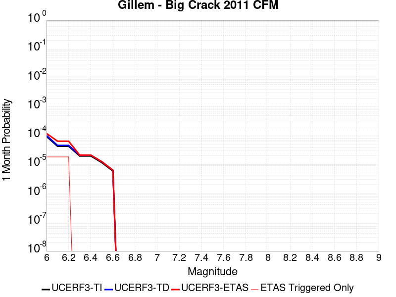 |  | 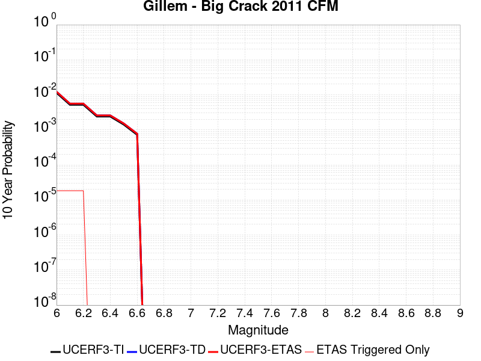 |

| Magnitude | 1 wk TI Prob | 1 wk TD Prob | 1 wk ETAS Prob | 1 wk ETAS/TD Gain | 1 wk ETAS Triggered Only | 1 mo TI Prob | 1 mo TD Prob | 1 mo ETAS Prob | 1 mo ETAS/TD Gain | 1 mo ETAS Triggered Only | 1 yr TI Prob | 1 yr TD Prob | 1 yr ETAS Prob | 1 yr ETAS/TD Gain | 1 yr ETAS Triggered Only | 10 yr TI Prob | 10 yr TD Prob | 10 yr ETAS Prob | 10 yr ETAS/TD Gain | 10 yr ETAS Triggered Only |
|-----|-----|-----|-----|-----|-----|-----|-----|-----|-----|-----|-----|-----|-----|-----|-----|-----|-----|-----|-----|-----|
| 6.0 | 2.196852E-5 | 2.3604485E-5 | 4.8220503E-5 | 2.0428534 | 2.4616596E-5 | 9.4147406E-5 | 1.01158665E-4 | 1.2577277E-4 | 1.2433218 | 2.4616596E-5 | 0.0011456419 | 0.0012309998 | 0.001255586 | 1.0199726 | 2.4616596E-5 | 0.011397537 | 0.012250669 | 0.012274984 | 1.0019848 | 2.4616596E-5 |
| 6.1 | 9.992795E-6 | 1.071189E-5 | 3.5328223E-5 | 3.2980382 | 2.4616596E-5 | 4.2825563E-5 | 4.5907396E-5 | 7.052286E-5 | 1.5361983 | 2.4616596E-5 | 5.2127644E-4 | 5.587975E-4 | 5.8340037E-4 | 1.0440282 | 2.4616596E-5 | 0.0052005537 | 0.0055757347 | 0.005600214 | 1.0043904 | 2.4616596E-5 |
| 6.2 | 9.992795E-6 | 1.071189E-5 | 3.5328223E-5 | 3.2980382 | 2.4616596E-5 | 4.2825563E-5 | 4.5907396E-5 | 7.052286E-5 | 1.5361983 | 2.4616596E-5 | 5.2127644E-4 | 5.587975E-4 | 5.8340037E-4 | 1.0440282 | 2.4616596E-5 | 0.0052005537 | 0.0055757347 | 0.005600214 | 1.0043904 | 2.4616596E-5 |
| 6.3 | 4.6127884E-6 | 4.942657E-6 | 4.942657E-6 | 1.0 | 0.0 | 1.9768944E-5 | 2.1182668E-5 | 2.1182668E-5 | 1.0 | 0.0 | 2.406603E-4 | 2.5787292E-4 | 2.5787292E-4 | 1.0 | 0.0 | 0.0024039985 | 0.0025761751 | 0.0025761751 | 1.0 | 0.0 |
| 6.4 | 4.6127884E-6 | 4.942657E-6 | 4.942657E-6 | 1.0 | 0.0 | 1.9768944E-5 | 2.1182668E-5 | 2.1182668E-5 | 1.0 | 0.0 | 2.406603E-4 | 2.5787292E-4 | 2.5787292E-4 | 1.0 | 0.0 | 0.0024039985 | 0.0025761751 | 0.0025761751 | 1.0 | 0.0 |
| 6.5 | 2.716712E-6 | 2.9111113E-6 | 2.9111113E-6 | 1.0 | 0.0 | 1.1643E-5 | 1.24761455E-5 | 1.24761455E-5 | 1.0 | 0.0 | 1.417443E-4 | 1.5188892E-4 | 1.5188892E-4 | 1.0 | 0.0 | 0.0014165393 | 0.001518089 | 0.001518089 | 1.0 | 0.0 |
| 6.6 | 1.3818255E-6 | 1.4820689E-6 | 1.4820689E-6 | 1.0 | 0.0 | 5.922096E-6 | 6.3517155E-6 | 6.3517155E-6 | 1.0 | 0.0 | 7.209913E-5 | 7.7330624E-5 | 7.7330624E-5 | 1.0 | 0.0 | 7.2075747E-4 | 7.7315804E-4 | 7.7315804E-4 | 1.0 | 0.0 |

## Calaveras (So) - Paicines extension 2011 CFM
*[(top)](#table-of-contents)*

| 1 Week | 1 Month | 1 Year | 10 Year |
|-----|-----|-----|-----|
|  | 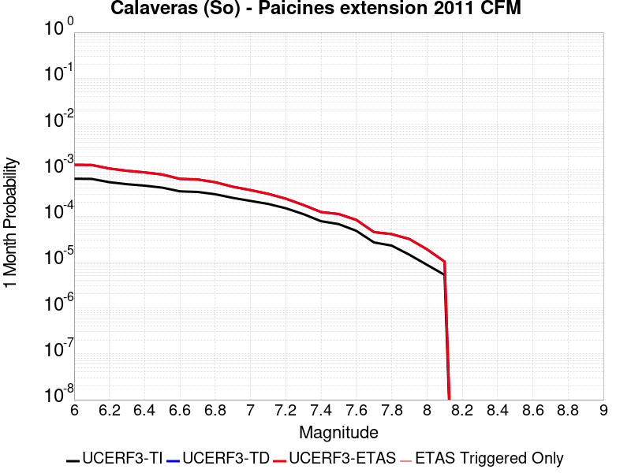 | 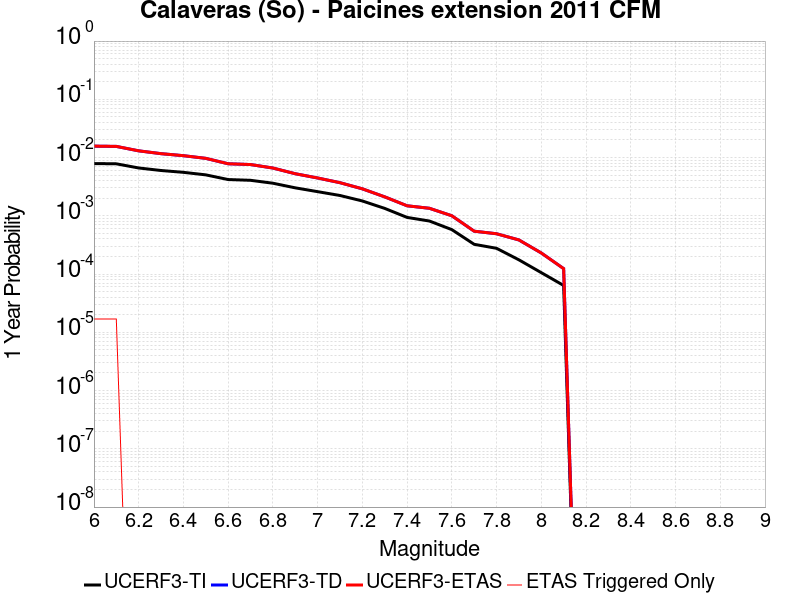 |  |

| Magnitude | 1 wk TI Prob | 1 wk TD Prob | 1 wk ETAS Prob | 1 wk ETAS/TD Gain | 1 wk ETAS Triggered Only | 1 mo TI Prob | 1 mo TD Prob | 1 mo ETAS Prob | 1 mo ETAS/TD Gain | 1 mo ETAS Triggered Only | 1 yr TI Prob | 1 yr TD Prob | 1 yr ETAS Prob | 1 yr ETAS/TD Gain | 1 yr ETAS Triggered Only | 10 yr TI Prob | 10 yr TD Prob | 10 yr ETAS Prob | 10 yr ETAS/TD Gain | 10 yr ETAS Triggered Only |
|-----|-----|-----|-----|-----|-----|-----|-----|-----|-----|-----|-----|-----|-----|-----|-----|-----|-----|-----|-----|-----|
| 6.0 | 1.5183659E-4 | 3.0533716E-4 | 3.0533716E-4 | 1.0 | 0.0 | 6.5056595E-4 | 0.0013069661 | 0.0013069661 | 1.0 | 0.0 | 0.007891912 | 0.01569571 | 0.01571994 | 1.0015438 | 2.4616596E-5 | 0.076174594 | 0.13848671 | 0.13850793 | 1.0001532 | 2.4616596E-5 |
| 6.1 | 1.5024997E-4 | 3.0227835E-4 | 3.0227835E-4 | 1.0 | 0.0 | 6.437695E-4 | 0.00129387 | 0.00129387 | 1.0 | 0.0 | 0.0078097614 | 0.015539104 | 0.015563338 | 1.0015595 | 2.4616596E-5 | 0.075409345 | 0.13715632 | 0.13717757 | 1.0001549 | 2.4616596E-5 |
| 6.2 | 1.2743923E-4 | 2.5306802E-4 | 2.5306802E-4 | 1.0 | 0.0 | 5.460538E-4 | 0.0010841049 | 0.0010841049 | 1.0 | 0.0 | 0.0066279583 | 0.013046704 | 0.013046704 | 1.0 | 0.0 | 0.064337276 | 0.11725405 | 0.11725405 | 1.0 | 0.0 |
| 6.3 | 1.1525114E-4 | 2.2595265E-4 | 2.2595265E-4 | 1.0 | 0.0 | 4.9383997E-4 | 9.6799526E-4 | 9.6799526E-4 | 1.0 | 0.0 | 0.0059959386 | 0.011667927 | 0.011667927 | 1.0 | 0.0 | 0.058367174 | 0.10637007 | 0.10637007 | 1.0 | 0.0 |
| 6.4 | 1.07200925E-4 | 2.0836305E-4 | 2.0836305E-4 | 1.0 | 0.0 | 4.5935164E-4 | 8.926636E-4 | 8.926636E-4 | 1.0 | 0.0 | 0.0055782744 | 0.010772766 | 0.010772766 | 1.0 | 0.0 | 0.0544031 | 0.09919256 | 0.09919256 | 1.0 | 0.0 |
| 6.5 | 9.69631E-5 | 1.8729115E-4 | 1.8729115E-4 | 1.0 | 0.0 | 4.1548995E-4 | 8.024135E-4 | 8.024135E-4 | 1.0 | 0.0 | 0.0050468626 | 0.009694662 | 0.009694662 | 1.0 | 0.0 | 0.04933773 | 0.090084255 | 0.090084255 | 1.0 | 0.0 |
| 6.6 | 8.0552316E-5 | 1.5070537E-4 | 1.5070537E-4 | 1.0 | 0.0 | 3.4517853E-4 | 6.456994E-4 | 6.456994E-4 | 1.0 | 0.0 | 0.0041944524 | 0.007826256 | 0.007826256 | 1.0 | 0.0 | 0.04116161 | 0.074854024 | 0.074854024 | 1.0 | 0.0 |
| 6.7 | 7.815757E-5 | 1.4610609E-4 | 1.4610609E-4 | 1.0 | 0.0 | 3.34918E-4 | 6.260017E-4 | 6.260017E-4 | 1.0 | 0.0 | 0.004070005 | 0.0075890915 | 0.0075890915 | 1.0 | 0.0 | 0.039962657 | 0.072703585 | 0.072703585 | 1.0 | 0.0 |
| 6.8 | 6.965264E-5 | 1.2721405E-4 | 1.2721405E-4 | 1.0 | 0.0 | 2.9847719E-4 | 5.450839E-4 | 5.450839E-4 | 1.0 | 0.0 | 0.0036279052 | 0.00661342 | 0.00661342 | 1.0 | 0.0 | 0.03569247 | 0.06379891 | 0.06379891 | 1.0 | 0.0 |
| 6.9 | 5.8000453E-5 | 1.01435086E-4 | 1.01435086E-4 | 1.0 | 0.0 | 2.4854968E-4 | 4.3464993E-4 | 4.3464993E-4 | 1.0 | 0.0 | 0.0030218933 | 0.0052791284 | 0.0052791284 | 1.0 | 0.0 | 0.029811295 | 0.051501602 | 0.051501602 | 1.0 | 0.0 |
| 7.0 | 4.9865852E-5 | 8.567692E-5 | 8.567692E-5 | 1.0 | 0.0 | 2.1369329E-4 | 3.671356E-4 | 3.671356E-4 | 1.0 | 0.0 | 0.0025986114 | 0.0044608037 | 0.0044608037 | 1.0 | 0.0 | 0.025684336 | 0.043781694 | 0.043781694 | 1.0 | 0.0 |
| 7.1 | 4.283875E-5 | 7.112159E-5 | 7.112159E-5 | 1.0 | 0.0 | 1.8358172E-4 | 3.047715E-4 | 3.047715E-4 | 1.0 | 0.0 | 0.0022328163 | 0.003704336 | 0.003704336 | 1.0 | 0.0 | 0.022105146 | 0.03673583 | 0.03673583 | 1.0 | 0.0 |
| 7.2 | 3.450115E-5 | 5.5776054E-5 | 5.5776054E-5 | 1.0 | 0.0 | 1.478537E-4 | 2.390185E-4 | 2.390185E-4 | 1.0 | 0.0 | 0.0017986323 | 0.0029061958 | 0.0029061958 | 1.0 | 0.0 | 0.017841442 | 0.029079199 | 0.029079199 | 1.0 | 0.0 |
| 7.3 | 2.5709045E-5 | 4.0588155E-5 | 4.0588155E-5 | 1.0 | 0.0 | 1.1017697E-4 | 1.7393773E-4 | 1.7393773E-4 | 1.0 | 0.0 | 0.0013405791 | 0.002115652 | 0.002115652 | 1.0 | 0.0 | 0.013325208 | 0.021297242 | 0.021297242 | 1.0 | 0.0 |
| 7.4 | 1.8003093E-5 | 2.8509934E-5 | 2.8509934E-5 | 1.0 | 0.0 | 7.715383E-5 | 1.2217973E-4 | 1.2217973E-4 | 1.0 | 0.0 | 9.3894306E-4 | 0.0014865254 | 0.0014865254 | 1.0 | 0.0 | 0.009349857 | 0.015052196 | 0.015052196 | 1.0 | 0.0 |
| 7.5 | 1.5595824E-5 | 2.5822499E-5 | 2.5822499E-5 | 1.0 | 0.0 | 6.683753E-5 | 1.1066317E-4 | 1.1066317E-4 | 1.0 | 0.0 | 8.134431E-4 | 0.0013464936 | 0.0013464936 | 1.0 | 0.0 | 0.008104719 | 0.01365213 | 0.01365213 | 1.0 | 0.0 |
| 7.6 | 1.1110309E-5 | 1.9222098E-5 | 1.9222098E-5 | 1.0 | 0.0 | 4.761474E-5 | 8.2377825E-5 | 8.2377825E-5 | 1.0 | 0.0 | 5.795553E-4 | 0.0010024898 | 0.0010024898 | 1.0 | 0.0 | 0.0057804612 | 0.010203943 | 0.010203943 | 1.0 | 0.0 |
| 7.7 | 6.2140443E-6 | 1.0437076E-5 | 1.0437076E-5 | 1.0 | 0.0 | 2.6631347E-5 | 4.4729557E-5 | 4.4729557E-5 | 1.0 | 0.0 | 3.241884E-4 | 5.444464E-4 | 5.444464E-4 | 1.0 | 0.0 | 0.0032371588 | 0.005619835 | 0.005619835 | 1.0 | 0.0 |
| 7.8 | 5.305533E-6 | 9.433038E-6 | 9.433038E-6 | 1.0 | 0.0 | 2.27378E-5 | 4.042668E-5 | 4.042668E-5 | 1.0 | 0.0 | 2.7679754E-4 | 4.920837E-4 | 4.920837E-4 | 1.0 | 0.0 | 0.0027645302 | 0.005074324 | 0.005074324 | 1.0 | 0.0 |
| 7.9 | 3.363505E-6 | 7.3848937E-6 | 7.3848937E-6 | 1.0 | 0.0 | 1.4414942E-5 | 3.164916E-5 | 3.164916E-5 | 1.0 | 0.0 | 1.7548777E-4 | 3.8526047E-4 | 3.8526047E-4 | 1.0 | 0.0 | 0.0017534926 | 0.003948527 | 0.003948527 | 1.0 | 0.0 |
| 8.0 | 2.0271132E-6 | 4.413104E-6 | 4.413104E-6 | 1.0 | 0.0 | 8.687599E-6 | 1.8913164E-5 | 1.8913164E-5 | 1.0 | 0.0 | 1.05766376E-4 | 2.302435E-4 | 2.302435E-4 | 1.0 | 0.0 | 0.0010571606 | 0.002351099 | 0.002351099 | 1.0 | 0.0 |
| 8.1 | 1.2206116E-6 | 2.3751331E-6 | 2.3751331E-6 | 1.0 | 0.0 | 5.2311816E-6 | 1.0179103E-5 | 1.0179103E-5 | 1.0 | 0.0 | 6.3687774E-5 | 1.2392356E-4 | 1.2392356E-4 | 1.0 | 0.0 | 6.366953E-4 | 0.0012705477 | 0.0012705477 | 1.0 | 0.0 |

## Round Valley
*[(top)](#table-of-contents)*

| 1 Week | 1 Month | 1 Year | 10 Year |
|-----|-----|-----|-----|
|  | 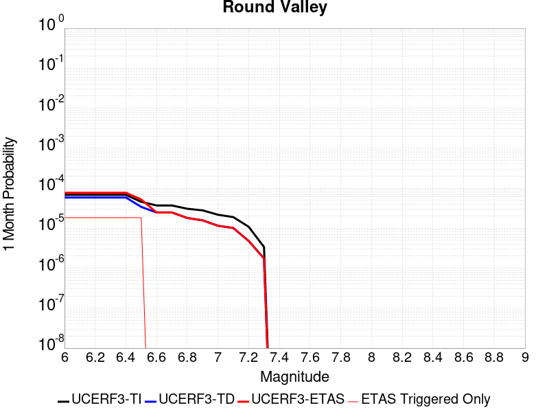 | 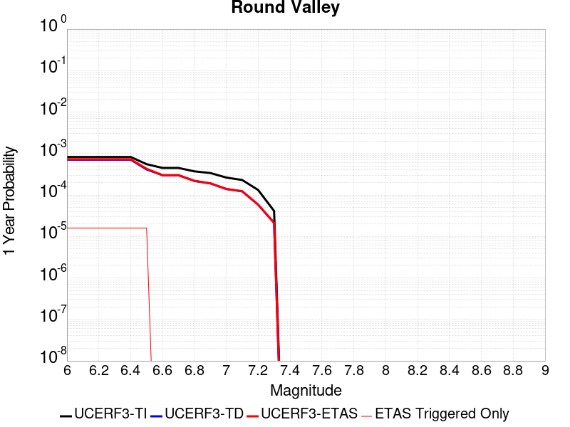 | 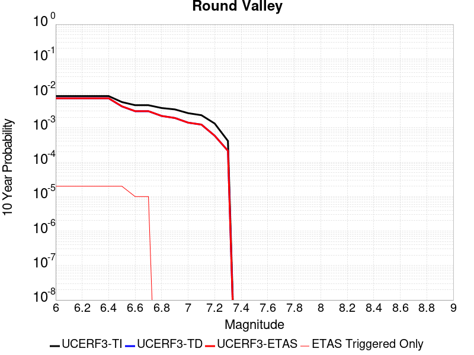 |

| Magnitude | 1 wk TI Prob | 1 wk TD Prob | 1 wk ETAS Prob | 1 wk ETAS/TD Gain | 1 wk ETAS Triggered Only | 1 mo TI Prob | 1 mo TD Prob | 1 mo ETAS Prob | 1 mo ETAS/TD Gain | 1 mo ETAS Triggered Only | 1 yr TI Prob | 1 yr TD Prob | 1 yr ETAS Prob | 1 yr ETAS/TD Gain | 1 yr ETAS Triggered Only | 10 yr TI Prob | 10 yr TD Prob | 10 yr ETAS Prob | 10 yr ETAS/TD Gain | 10 yr ETAS Triggered Only |
|-----|-----|-----|-----|-----|-----|-----|-----|-----|-----|-----|-----|-----|-----|-----|-----|-----|-----|-----|-----|-----|
| 6.0 | 1.588152E-5 | 1.3670716E-5 | 1.3670716E-5 | 1.0 | 0.0 | 6.806188E-5 | 5.8587688E-5 | 8.320284E-5 | 1.420142 | 2.4616596E-5 | 8.283384E-4 | 7.13111E-4 | 7.377101E-4 | 1.0344954 | 2.4616596E-5 | 0.008252576 | 0.0071121147 | 0.0071365563 | 1.0034366 | 2.4616596E-5 |
| 6.1 | 1.588152E-5 | 1.3670716E-5 | 1.3670716E-5 | 1.0 | 0.0 | 6.806188E-5 | 5.8587688E-5 | 8.320284E-5 | 1.420142 | 2.4616596E-5 | 8.283384E-4 | 7.13111E-4 | 7.377101E-4 | 1.0344954 | 2.4616596E-5 | 0.008252576 | 0.0071121147 | 0.0071365563 | 1.0034366 | 2.4616596E-5 |
| 6.2 | 1.588152E-5 | 1.3670716E-5 | 1.3670716E-5 | 1.0 | 0.0 | 6.806188E-5 | 5.8587688E-5 | 8.320284E-5 | 1.420142 | 2.4616596E-5 | 8.283384E-4 | 7.13111E-4 | 7.377101E-4 | 1.0344954 | 2.4616596E-5 | 0.008252576 | 0.0071121147 | 0.0071365563 | 1.0034366 | 2.4616596E-5 |
| 6.3 | 1.588152E-5 | 1.3670716E-5 | 1.3670716E-5 | 1.0 | 0.0 | 6.806188E-5 | 5.8587688E-5 | 8.320284E-5 | 1.420142 | 2.4616596E-5 | 8.283384E-4 | 7.13111E-4 | 7.377101E-4 | 1.0344954 | 2.4616596E-5 | 0.008252576 | 0.0071121147 | 0.0071365563 | 1.0034366 | 2.4616596E-5 |
| 6.4 | 1.588152E-5 | 1.3670716E-5 | 1.3670716E-5 | 1.0 | 0.0 | 6.806188E-5 | 5.8587688E-5 | 8.320284E-5 | 1.420142 | 2.4616596E-5 | 8.283384E-4 | 7.13111E-4 | 7.377101E-4 | 1.0344954 | 2.4616596E-5 | 0.008252576 | 0.0071121147 | 0.0071365563 | 1.0034366 | 2.4616596E-5 |
| 6.5 | 1.0646776E-5 | 7.953037E-6 | 7.953037E-6 | 1.0 | 0.0 | 4.5628243E-5 | 3.408405E-5 | 5.8699807E-5 | 1.7222075 | 2.4616596E-5 | 5.553823E-4 | 4.1490266E-4 | 4.3950905E-4 | 1.0593064 | 2.4616596E-5 | 0.005539963 | 0.0041421093 | 0.0041666236 | 1.0059184 | 2.4616596E-5 |
| 6.6 | 8.632956E-6 | 5.768742E-6 | 5.768742E-6 | 1.0 | 0.0 | 3.6997862E-5 | 2.4722967E-5 | 2.4722967E-5 | 1.0 | 0.0 | 4.5035584E-4 | 3.009644E-4 | 3.009644E-4 | 1.0 | 0.0 | 0.0044944426 | 0.003005946 | 0.003005946 | 1.0 | 0.0 |
| 6.7 | 8.632956E-6 | 5.768742E-6 | 5.768742E-6 | 1.0 | 0.0 | 3.6997862E-5 | 2.4722967E-5 | 2.4722967E-5 | 1.0 | 0.0 | 4.5035584E-4 | 3.009644E-4 | 3.009644E-4 | 1.0 | 0.0 | 0.0044944426 | 0.003005946 | 0.003005946 | 1.0 | 0.0 |
| 6.8 | 7.143895E-6 | 4.2018346E-6 | 4.2018346E-6 | 1.0 | 0.0 | 3.0616335E-5 | 1.8007748E-5 | 1.8007748E-5 | 1.0 | 0.0 | 3.726901E-4 | 2.1922393E-4 | 2.1922393E-4 | 1.0 | 0.0 | 0.0037206567 | 0.0021902416 | 0.0021902416 | 1.0 | 0.0 |
| 6.9 | 6.5120694E-6 | 3.6644687E-6 | 3.6644687E-6 | 1.0 | 0.0 | 2.790857E-5 | 1.570478E-5 | 1.570478E-5 | 1.0 | 0.0 | 3.3973387E-4 | 1.9119044E-4 | 1.9119044E-4 | 1.0 | 0.0 | 0.0033921495 | 0.0019104085 | 0.0019104085 | 1.0 | 0.0 |
| 7.0 | 5.0614435E-6 | 2.6836676E-6 | 2.6836676E-6 | 1.0 | 0.0 | 2.169172E-5 | 1.1501388E-5 | 1.1501388E-5 | 1.0 | 0.0 | 2.6406467E-4 | 1.4002144E-4 | 1.4002144E-4 | 1.0 | 0.0 | 0.0026375111 | 0.0013994334 | 0.0013994334 | 1.0 | 0.0 |
| 7.1 | 4.41728E-6 | 2.3575074E-6 | 2.3575074E-6 | 1.0 | 0.0 | 1.8931061E-5 | 1.0103569E-5 | 1.0103569E-5 | 1.0 | 0.0 | 2.304613E-4 | 1.23005E-4 | 1.23005E-4 | 1.0 | 0.0 | 0.0023022245 | 0.0012294657 | 0.0012294657 | 1.0 | 0.0 |
| 7.2 | 2.535495E-6 | 1.1208391E-6 | 1.1208391E-6 | 1.0 | 0.0 | 1.0866362E-5 | 4.8035904E-6 | 4.8035904E-6 | 1.0 | 0.0 | 1.3228992E-4 | 5.8482667E-5 | 5.8482667E-5 | 1.0 | 0.0 | 0.0013221119 | 5.84724E-4 | 5.84724E-4 | 1.0 | 0.0 |
| 7.3 | 7.900015E-7 | 4.0889498E-7 | 4.0889498E-7 | 1.0 | 0.0 | 3.3857161E-6 | 1.752407E-6 | 1.752407E-6 | 1.0 | 0.0 | 4.1220315E-5 | 2.1335554E-5 | 2.1335554E-5 | 1.0 | 0.0 | 4.121267E-4 | 2.1335555E-4 | 2.1335555E-4 | 1.0 | 0.0 |

## Robinson Creek
*[(top)](#table-of-contents)*

| 1 Week | 1 Month | 1 Year | 10 Year |
|-----|-----|-----|-----|
| 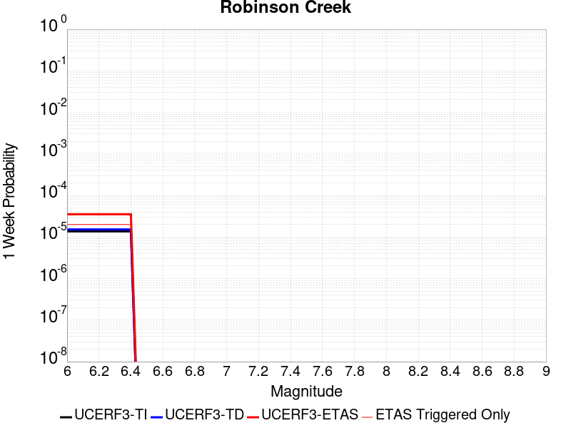 |  | 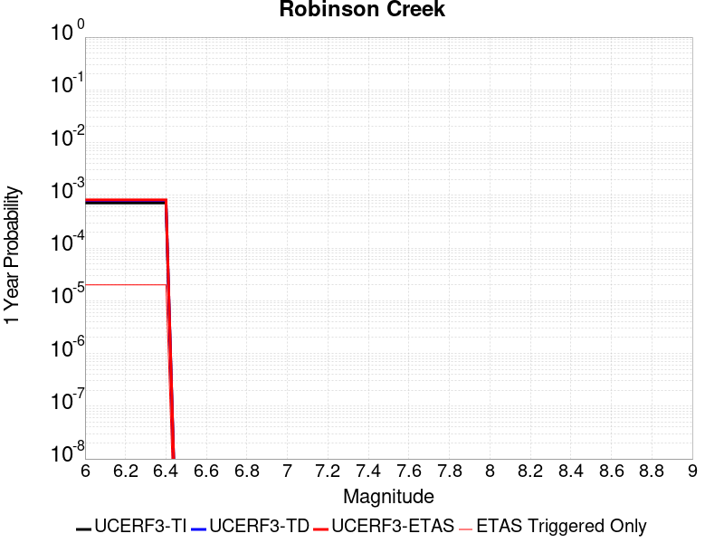 | 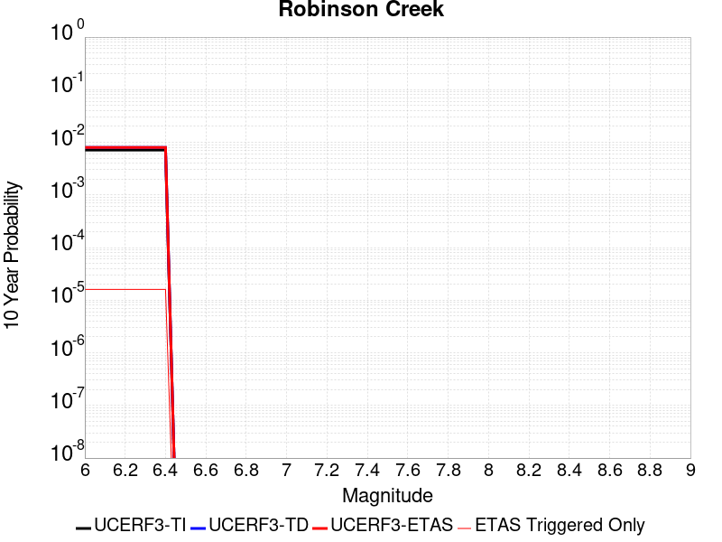 |

| Magnitude | 1 wk TI Prob | 1 wk TD Prob | 1 wk ETAS Prob | 1 wk ETAS/TD Gain | 1 wk ETAS Triggered Only | 1 mo TI Prob | 1 mo TD Prob | 1 mo ETAS Prob | 1 mo ETAS/TD Gain | 1 mo ETAS Triggered Only | 1 yr TI Prob | 1 yr TD Prob | 1 yr ETAS Prob | 1 yr ETAS/TD Gain | 1 yr ETAS Triggered Only | 10 yr TI Prob | 10 yr TD Prob | 10 yr ETAS Prob | 10 yr ETAS/TD Gain | 10 yr ETAS Triggered Only |
|-----|-----|-----|-----|-----|-----|-----|-----|-----|-----|-----|-----|-----|-----|-----|-----|-----|-----|-----|-----|-----|
| 6.0 | 1.3705327E-5 | 1.5285013E-5 | 1.5285013E-5 | 1.0 | 0.0 | 5.8735794E-5 | 6.55072E-5 | 6.55072E-5 | 1.0 | 0.0 | 7.1487366E-4 | 7.9755014E-4 | 7.9755014E-4 | 1.0 | 0.0 | 0.0071257832 | 0.007975501 | 0.007999921 | 1.0030619 | 2.4616596E-5 |
| 6.1 | 1.3705327E-5 | 1.5285013E-5 | 1.5285013E-5 | 1.0 | 0.0 | 5.8735794E-5 | 6.55072E-5 | 6.55072E-5 | 1.0 | 0.0 | 7.1487366E-4 | 7.9755014E-4 | 7.9755014E-4 | 1.0 | 0.0 | 0.0071257832 | 0.007975501 | 0.007999921 | 1.0030619 | 2.4616596E-5 |
| 6.2 | 1.3705327E-5 | 1.5285013E-5 | 1.5285013E-5 | 1.0 | 0.0 | 5.8735794E-5 | 6.55072E-5 | 6.55072E-5 | 1.0 | 0.0 | 7.1487366E-4 | 7.9755014E-4 | 7.9755014E-4 | 1.0 | 0.0 | 0.0071257832 | 0.007975501 | 0.007999921 | 1.0030619 | 2.4616596E-5 |
| 6.3 | 1.3705327E-5 | 1.5285013E-5 | 1.5285013E-5 | 1.0 | 0.0 | 5.8735794E-5 | 6.55072E-5 | 6.55072E-5 | 1.0 | 0.0 | 7.1487366E-4 | 7.9755014E-4 | 7.9755014E-4 | 1.0 | 0.0 | 0.0071257832 | 0.007975501 | 0.007999921 | 1.0030619 | 2.4616596E-5 |
| 6.4 | 1.3705327E-5 | 1.5285013E-5 | 1.5285013E-5 | 1.0 | 0.0 | 5.8735794E-5 | 6.55072E-5 | 6.55072E-5 | 1.0 | 0.0 | 7.1487366E-4 | 7.9755014E-4 | 7.9755014E-4 | 1.0 | 0.0 | 0.0071257832 | 0.007975501 | 0.007999921 | 1.0030619 | 2.4616596E-5 |

## Great Valley 11
*[(top)](#table-of-contents)*

| 1 Week | 1 Month | 1 Year | 10 Year |
|-----|-----|-----|-----|
| 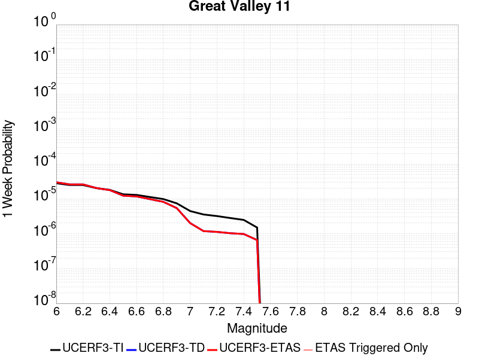 | 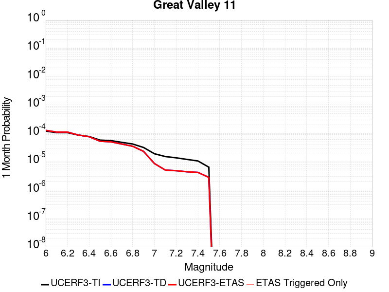 | 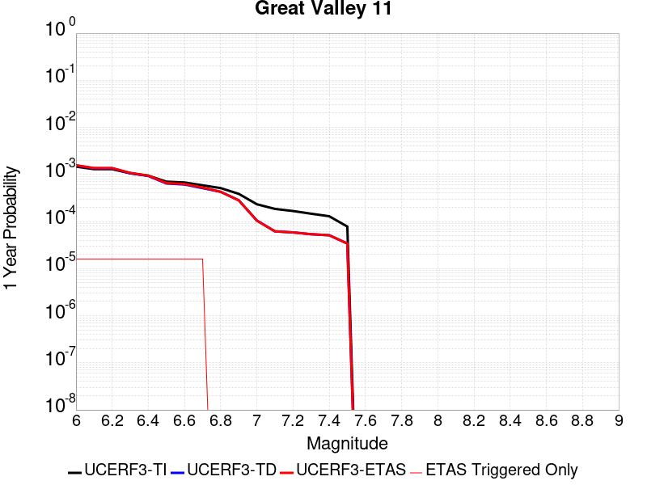 | 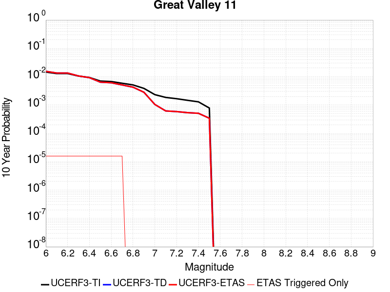 |

| Magnitude | 1 wk TI Prob | 1 wk TD Prob | 1 wk ETAS Prob | 1 wk ETAS/TD Gain | 1 wk ETAS Triggered Only | 1 mo TI Prob | 1 mo TD Prob | 1 mo ETAS Prob | 1 mo ETAS/TD Gain | 1 mo ETAS Triggered Only | 1 yr TI Prob | 1 yr TD Prob | 1 yr ETAS Prob | 1 yr ETAS/TD Gain | 1 yr ETAS Triggered Only | 10 yr TI Prob | 10 yr TD Prob | 10 yr ETAS Prob | 10 yr ETAS/TD Gain | 10 yr ETAS Triggered Only |
|-----|-----|-----|-----|-----|-----|-----|-----|-----|-----|-----|-----|-----|-----|-----|-----|-----|-----|-----|-----|-----|
| 6.0 | 2.8099583E-5 | 2.9832152E-5 | 2.9832152E-5 | 1.0 | 0.0 | 1.20421224E-4 | 1.278462E-4 | 1.278462E-4 | 1.0 | 0.0 | 0.0014651422 | 0.0015554909 | 0.0015800692 | 1.015801 | 2.4616596E-5 | 0.0145552 | 0.01545356 | 0.015477796 | 1.0015683 | 2.4616596E-5 |
| 6.1 | 2.483194E-5 | 2.590715E-5 | 2.590715E-5 | 1.0 | 0.0 | 1.0641825E-4 | 1.11026246E-4 | 1.11026246E-4 | 1.0 | 0.0 | 0.0012948721 | 0.0013509706 | 0.0013755539 | 1.0181968 | 2.4616596E-5 | 0.012873529 | 0.013433994 | 0.013458279 | 1.0018078 | 2.4616596E-5 |
| 6.2 | 2.483194E-5 | 2.590715E-5 | 2.590715E-5 | 1.0 | 0.0 | 1.0641825E-4 | 1.11026246E-4 | 1.11026246E-4 | 1.0 | 0.0 | 0.0012948721 | 0.0013509706 | 0.0013755539 | 1.0181968 | 2.4616596E-5 | 0.012873529 | 0.013433994 | 0.013458279 | 1.0018078 | 2.4616596E-5 |
| 6.3 | 2.0257901E-5 | 2.0398922E-5 | 2.0398922E-5 | 1.0 | 0.0 | 8.681669E-5 | 8.742122E-5 | 8.742122E-5 | 1.0 | 0.0 | 0.0010564806 | 0.0010638756 | 0.001088466 | 1.023114 | 2.4616596E-5 | 0.01051472 | 0.010592012 | 0.010616368 | 1.0022994 | 2.4616596E-5 |
| 6.4 | 1.8054898E-5 | 1.7780874E-5 | 1.7780874E-5 | 1.0 | 0.0 | 7.737584E-5 | 7.62017E-5 | 7.62017E-5 | 1.0 | 0.0 | 9.416436E-4 | 9.2739856E-4 | 9.5199235E-4 | 1.0265191 | 2.4616596E-5 | 0.009376635 | 0.009239036 | 0.009263425 | 1.0026398 | 2.4616596E-5 |
| 6.5 | 1.34804895E-5 | 1.2321055E-5 | 1.2321055E-5 | 1.0 | 0.0 | 5.777225E-5 | 5.2803476E-5 | 5.2803476E-5 | 1.0 | 0.0 | 7.031501E-4 | 6.4269686E-4 | 6.6729763E-4 | 1.0382774 | 2.4616596E-5 | 0.007009294 | 0.0064088185 | 0.0064332774 | 1.0038165 | 2.4616596E-5 |
| 6.6 | 1.294883E-5 | 1.1732312E-5 | 1.1732312E-5 | 1.0 | 0.0 | 5.5493805E-5 | 5.028039E-5 | 5.028039E-5 | 1.0 | 0.0 | 6.754276E-4 | 6.1199587E-4 | 6.365974E-4 | 1.0401988 | 2.4616596E-5 | 0.006733784 | 0.0061035305 | 0.006127997 | 1.0040085 | 2.4616596E-5 |
| 6.7 | 1.1272237E-5 | 9.811886E-6 | 9.811886E-6 | 1.0 | 0.0 | 4.8308695E-5 | 4.2050277E-5 | 4.2050277E-5 | 1.0 | 0.0 | 5.879996E-4 | 5.118446E-4 | 5.364486E-4 | 1.0480692 | 2.4616596E-5 | 0.005864462 | 0.0051069413 | 0.005131432 | 1.0047956 | 2.4616596E-5 |
| 6.8 | 9.8337505E-6 | 8.19377E-6 | 8.19377E-6 | 1.0 | 0.0 | 4.2143965E-5 | 3.5115696E-5 | 3.5115696E-5 | 1.0 | 0.0 | 5.1298196E-4 | 4.2745177E-4 | 4.2745177E-4 | 1.0 | 0.0 | 0.005117994 | 0.0042665056 | 0.0042665056 | 1.0 | 0.0 |
| 6.9 | 7.4224813E-6 | 5.4131347E-6 | 5.4131347E-6 | 1.0 | 0.0 | 3.1810247E-5 | 2.319895E-5 | 2.319895E-5 | 1.0 | 0.0 | 3.872209E-4 | 2.8241202E-4 | 2.8241202E-4 | 1.0 | 0.0 | 0.0038654688 | 0.0028206722 | 0.0028206722 | 1.0 | 0.0 |
| 7.0 | 4.4628923E-6 | 2.0110795E-6 | 2.0110795E-6 | 1.0 | 0.0 | 1.912654E-5 | 8.618884E-6 | 8.618884E-6 | 1.0 | 0.0 | 2.3284076E-4 | 1.04929975E-4 | 1.04929975E-4 | 1.0 | 0.0 | 0.0023259693 | 0.0010488159 | 0.0010488159 | 1.0 | 0.0 |
| 7.1 | 3.5546527E-6 | 1.1855836E-6 | 1.1855836E-6 | 1.0 | 0.0 | 1.5234136E-5 | 5.081063E-6 | 5.081063E-6 | 1.0 | 0.0 | 1.8545982E-4 | 6.186026E-5 | 6.186026E-5 | 1.0 | 0.0 | 0.0018530512 | 6.1843713E-4 | 6.1843713E-4 | 1.0 | 0.0 |
| 7.2 | 3.2039936E-6 | 1.1254128E-6 | 1.1254128E-6 | 1.0 | 0.0 | 1.3731329E-5 | 4.823189E-6 | 4.823189E-6 | 1.0 | 0.0 | 1.671661E-4 | 5.8720816E-5 | 5.8720816E-5 | 1.0 | 0.0 | 0.0016704041 | 5.870597E-4 | 5.870597E-4 | 1.0 | 0.0 |
| 7.3 | 2.8120473E-6 | 1.0305612E-6 | 1.0305612E-6 | 1.0 | 0.0 | 1.2051575E-5 | 4.4166836E-6 | 4.4166836E-6 | 1.0 | 0.0 | 1.4671806E-4 | 5.3771862E-5 | 5.3771862E-5 | 1.0 | 0.0 | 0.0014662122 | 5.3759513E-4 | 5.3759513E-4 | 1.0 | 0.0 |
| 7.4 | 2.4837766E-6 | 9.800582E-7 | 9.800582E-7 | 1.0 | 0.0 | 1.0644713E-5 | 4.200243E-6 | 4.200243E-6 | 1.0 | 0.0 | 1.2959167E-4 | 5.1136827E-5 | 5.1136827E-5 | 1.0 | 0.0 | 0.0012951613 | 5.112572E-4 | 5.112572E-4 | 1.0 | 0.0 |
| 7.5 | 1.5002679E-6 | 6.546144E-7 | 6.546144E-7 | 1.0 | 0.0 | 6.4297037E-6 | 2.8054874E-6 | 2.8054874E-6 | 1.0 | 0.0 | 7.827883E-5 | 3.4156317E-5 | 3.4156317E-5 | 1.0 | 0.0 | 7.825126E-4 | 3.4151482E-4 | 3.4151482E-4 | 1.0 | 0.0 |

## Great Valley 08 (Quinto)
*[(top)](#table-of-contents)*

| 1 Week | 1 Month | 1 Year | 10 Year |
|-----|-----|-----|-----|
|  | 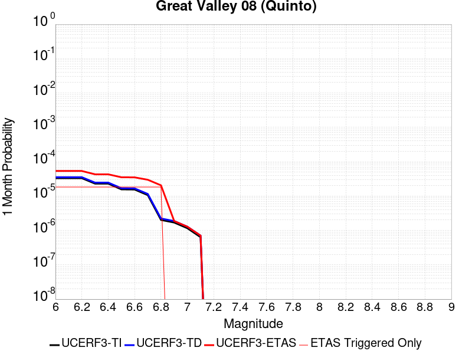 | 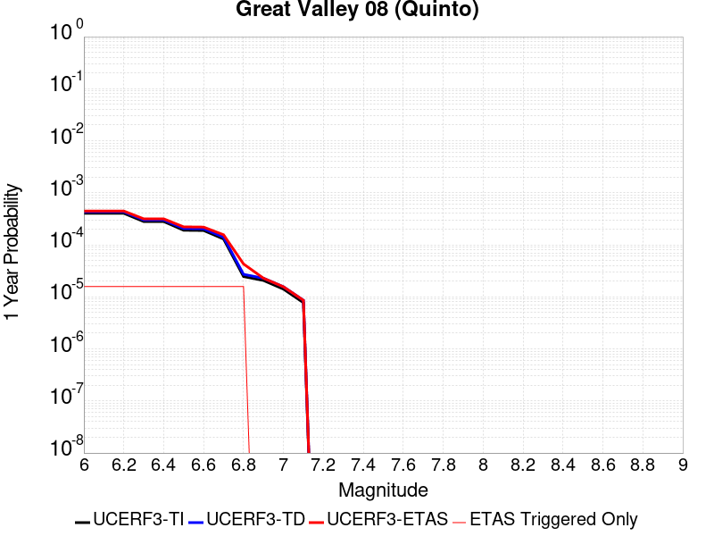 | 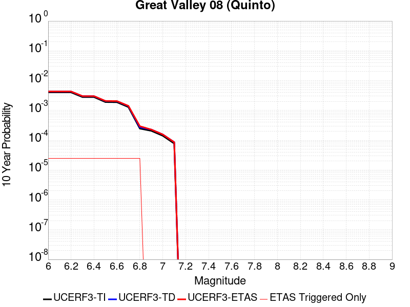 |

| Magnitude | 1 wk TI Prob | 1 wk TD Prob | 1 wk ETAS Prob | 1 wk ETAS/TD Gain | 1 wk ETAS Triggered Only | 1 mo TI Prob | 1 mo TD Prob | 1 mo ETAS Prob | 1 mo ETAS/TD Gain | 1 mo ETAS Triggered Only | 1 yr TI Prob | 1 yr TD Prob | 1 yr ETAS Prob | 1 yr ETAS/TD Gain | 1 yr ETAS Triggered Only | 10 yr TI Prob | 10 yr TD Prob | 10 yr ETAS Prob | 10 yr ETAS/TD Gain | 10 yr ETAS Triggered Only |
|-----|-----|-----|-----|-----|-----|-----|-----|-----|-----|-----|-----|-----|-----|-----|-----|-----|-----|-----|-----|-----|
| 6.0 | 7.737697E-6 | 8.253038E-6 | 8.253038E-6 | 1.0 | 0.0 | 3.3161137E-5 | 3.536979E-5 | 5.9985516E-5 | 1.6959534 | 2.4616596E-5 | 4.0366207E-4 | 4.3056096E-4 | 4.5516694E-4 | 1.0571487 | 2.4616596E-5 | 0.004029296 | 0.0042991205 | 0.0043236315 | 1.0057013 | 2.4616596E-5 |
| 6.1 | 7.737697E-6 | 8.253038E-6 | 8.253038E-6 | 1.0 | 0.0 | 3.3161137E-5 | 3.536979E-5 | 5.9985516E-5 | 1.6959534 | 2.4616596E-5 | 4.0366207E-4 | 4.3056096E-4 | 4.5516694E-4 | 1.0571487 | 2.4616596E-5 | 0.004029296 | 0.0042991205 | 0.0043236315 | 1.0057013 | 2.4616596E-5 |
| 6.2 | 7.737697E-6 | 8.253038E-6 | 8.253038E-6 | 1.0 | 0.0 | 3.3161137E-5 | 3.536979E-5 | 5.9985516E-5 | 1.6959534 | 2.4616596E-5 | 4.0366207E-4 | 4.3056096E-4 | 4.5516694E-4 | 1.0571487 | 2.4616596E-5 | 0.004029296 | 0.0042991205 | 0.0043236315 | 1.0057013 | 2.4616596E-5 |
| 6.3 | 5.374012E-6 | 5.7505736E-6 | 5.7505736E-6 | 1.0 | 0.0 | 2.3031276E-5 | 2.4645145E-5 | 4.9261136E-5 | 1.998817 | 2.4616596E-5 | 2.803697E-4 | 3.0002446E-4 | 3.2463367E-4 | 1.082024 | 2.4616596E-5 | 0.0028001624 | 0.0029972875 | 0.0030218302 | 1.0081884 | 2.4616596E-5 |
| 6.4 | 5.374012E-6 | 5.7505736E-6 | 5.7505736E-6 | 1.0 | 0.0 | 2.3031276E-5 | 2.4645145E-5 | 4.9261136E-5 | 1.998817 | 2.4616596E-5 | 2.803697E-4 | 3.0002446E-4 | 3.2463367E-4 | 1.082024 | 2.4616596E-5 | 0.0028001624 | 0.0029972875 | 0.0030218302 | 1.0081884 | 2.4616596E-5 |
| 6.5 | 3.65427E-6 | 3.941324E-6 | 3.941324E-6 | 1.0 | 0.0 | 1.5661062E-5 | 1.689132E-5 | 4.1507497E-5 | 2.4573274 | 2.4616596E-5 | 1.9065675E-4 | 2.0563944E-4 | 2.3025098E-4 | 1.1196829 | 2.4616596E-5 | 0.0019049325 | 0.0020551833 | 0.0020797492 | 1.0119532 | 2.4616596E-5 |
| 6.6 | 3.6143538E-6 | 3.8985104E-6 | 3.8985104E-6 | 1.0 | 0.0 | 1.5489995E-5 | 1.6707834E-5 | 4.132402E-5 | 2.473332 | 2.4616596E-5 | 1.8857437E-4 | 2.0340596E-4 | 2.2801754E-4 | 1.1209974 | 2.4616596E-5 | 0.0018841444 | 0.0020328893 | 0.002057456 | 1.0120846 | 2.4616596E-5 |
| 6.7 | 2.4821015E-6 | 2.6857067E-6 | 2.6857067E-6 | 1.0 | 0.0 | 1.0637535E-5 | 1.1510153E-5 | 3.6126465E-5 | 3.138661 | 2.4616596E-5 | 1.2950429E-4 | 1.4013276E-4 | 1.6474591E-4 | 1.1756417 | 2.4616596E-5 | 0.0012942884 | 0.0014009989 | 0.0014255809 | 1.0175462 | 2.4616596E-5 |
| 6.8 | 4.7110538E-7 | 5.193021E-7 | 5.193021E-7 | 1.0 | 0.0 | 2.0190216E-6 | 2.2255786E-6 | 2.684212E-5 | 12.060738 | 2.4616596E-5 | 2.458131E-5 | 2.70961E-5 | 5.171203E-5 | 1.9084675 | 2.4616596E-5 | 2.457859E-4 | 2.7092977E-4 | 2.955397E-4 | 1.0908351 | 2.4616596E-5 |
| 6.9 | 3.958685E-7 | 4.3703452E-7 | 4.3703452E-7 | 1.0 | 0.0 | 1.6965782E-6 | 1.8730038E-6 | 1.8730038E-6 | 1.0 | 0.0 | 2.0655643E-5 | 2.28036E-5 | 2.28036E-5 | 1.0 | 0.0 | 2.0653724E-4 | 2.2801422E-4 | 2.2801422E-4 | 1.0 | 0.0 |
| 7.0 | 2.70294E-7 | 2.9920008E-7 | 2.9920008E-7 | 1.0 | 0.0 | 1.1584025E-6 | 1.2822856E-6 | 1.2822856E-6 | 1.0 | 0.0 | 1.4103458E-5 | 1.5611728E-5 | 1.5611728E-5 | 1.0 | 0.0 | 1.4102564E-4 | 1.5610759E-4 | 1.5610759E-4 | 1.0 | 0.0 |
| 7.1 | 1.4828602E-7 | 1.6469107E-7 | 1.6469107E-7 | 1.0 | 0.0 | 6.3551136E-7 | 7.058187E-7 | 7.058187E-7 | 1.0 | 0.0 | 7.737323E-6 | 8.593317E-6 | 8.593317E-6 | 1.0 | 0.0 | 7.737054E-5 | 8.593065E-5 | 8.593065E-5 | 1.0 | 0.0 |

## Big Pine (West)
*[(top)](#table-of-contents)*

| 1 Week | 1 Month | 1 Year | 10 Year |
|-----|-----|-----|-----|
| 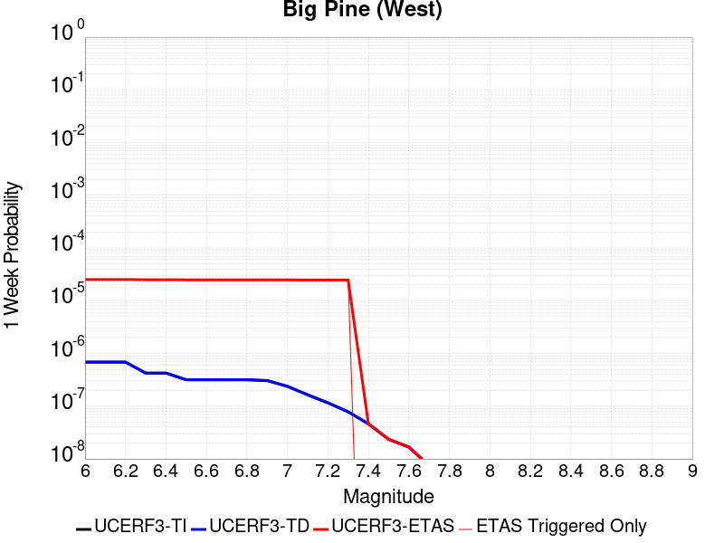 | 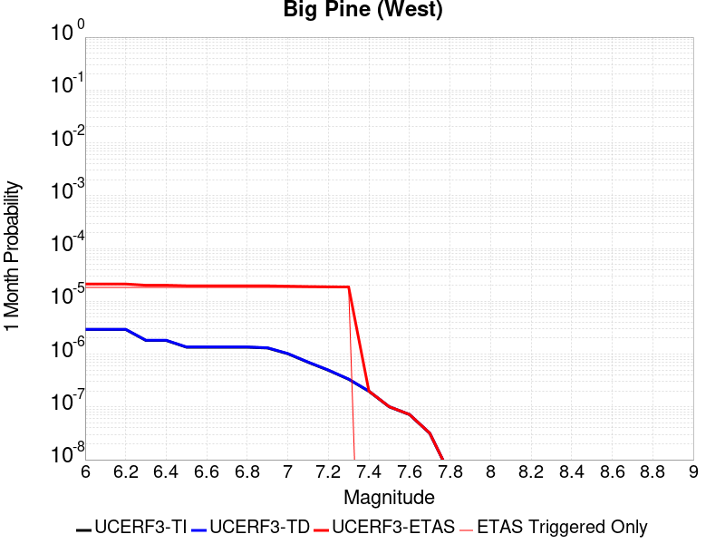 | 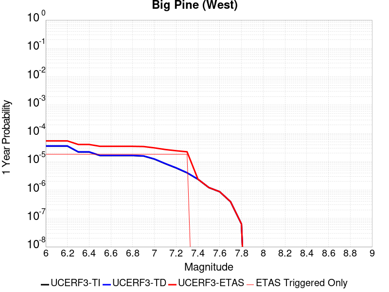 | 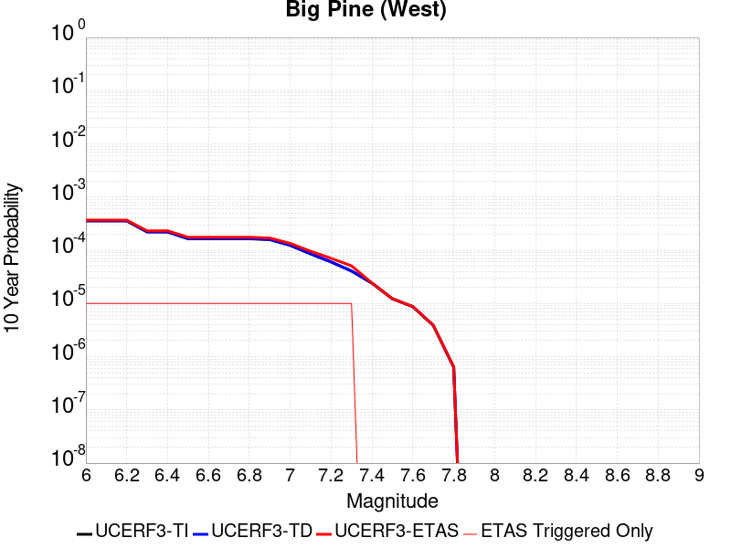 |

| Magnitude | 1 wk TI Prob | 1 wk TD Prob | 1 wk ETAS Prob | 1 wk ETAS/TD Gain | 1 wk ETAS Triggered Only | 1 mo TI Prob | 1 mo TD Prob | 1 mo ETAS Prob | 1 mo ETAS/TD Gain | 1 mo ETAS Triggered Only | 1 yr TI Prob | 1 yr TD Prob | 1 yr ETAS Prob | 1 yr ETAS/TD Gain | 1 yr ETAS Triggered Only | 10 yr TI Prob | 10 yr TD Prob | 10 yr ETAS Prob | 10 yr ETAS/TD Gain | 10 yr ETAS Triggered Only |
|-----|-----|-----|-----|-----|-----|-----|-----|-----|-----|-----|-----|-----|-----|-----|-----|-----|-----|-----|-----|-----|
| 6.0 | 6.8306974E-7 | 6.8818304E-7 | 2.5304762E-5 | 36.770397 | 2.4616596E-5 | 2.9274386E-6 | 2.949353E-6 | 2.7565877E-5 | 9.346415 | 2.4616596E-5 | 3.564098E-5 | 3.5907877E-5 | 6.052359E-5 | 1.685524 | 2.4616596E-5 | 3.5635266E-4 | 3.5903015E-4 | 3.836379E-4 | 1.0685395 | 2.4616596E-5 |
| 6.1 | 6.8306974E-7 | 6.8818304E-7 | 2.5304762E-5 | 36.770397 | 2.4616596E-5 | 2.9274386E-6 | 2.949353E-6 | 2.7565877E-5 | 9.346415 | 2.4616596E-5 | 3.564098E-5 | 3.5907877E-5 | 6.052359E-5 | 1.685524 | 2.4616596E-5 | 3.5635266E-4 | 3.5903015E-4 | 3.836379E-4 | 1.0685395 | 2.4616596E-5 |
| 6.2 | 6.8306974E-7 | 6.8818304E-7 | 2.5304762E-5 | 36.770397 | 2.4616596E-5 | 2.9274386E-6 | 2.949353E-6 | 2.7565877E-5 | 9.346415 | 2.4616596E-5 | 3.564098E-5 | 3.5907877E-5 | 6.052359E-5 | 1.685524 | 2.4616596E-5 | 3.5635266E-4 | 3.5903015E-4 | 3.836379E-4 | 1.0685395 | 2.4616596E-5 |
| 6.3 | 4.227652E-7 | 4.2665604E-7 | 2.5043242E-5 | 58.69656 | 2.4616596E-5 | 1.8118495E-6 | 1.8285248E-6 | 2.6445075E-5 | 14.462521 | 2.4616596E-5 | 2.2059045E-5 | 2.226208E-5 | 4.687813E-5 | 2.1057389 | 2.4616596E-5 | 2.2056856E-4 | 2.2260031E-4 | 2.4721143E-4 | 1.110562 | 2.4616596E-5 |
| 6.4 | 4.227652E-7 | 4.2665604E-7 | 2.5043242E-5 | 58.69656 | 2.4616596E-5 | 1.8118495E-6 | 1.8285248E-6 | 2.6445075E-5 | 14.462521 | 2.4616596E-5 | 2.2059045E-5 | 2.226208E-5 | 4.687813E-5 | 2.1057389 | 2.4616596E-5 | 2.2056856E-4 | 2.2260031E-4 | 2.4721143E-4 | 1.110562 | 2.4616596E-5 |
| 6.5 | 3.1538403E-7 | 3.1884528E-7 | 2.4935434E-5 | 78.20544 | 2.4616596E-5 | 1.3516451E-6 | 1.3664791E-6 | 2.5983041E-5 | 19.014593 | 2.4616596E-5 | 1.6456155E-5 | 1.6636759E-5 | 4.1252948E-5 | 2.4796264 | 2.4616596E-5 | 1.6454936E-4 | 1.6635554E-4 | 1.9096804E-4 | 1.1479512 | 2.4616596E-5 |
| 6.6 | 3.1538403E-7 | 3.1884528E-7 | 2.4935434E-5 | 78.20544 | 2.4616596E-5 | 1.3516451E-6 | 1.3664791E-6 | 2.5983041E-5 | 19.014593 | 2.4616596E-5 | 1.6456155E-5 | 1.6636759E-5 | 4.1252948E-5 | 2.4796264 | 2.4616596E-5 | 1.6454936E-4 | 1.6635554E-4 | 1.9096804E-4 | 1.1479512 | 2.4616596E-5 |
| 6.7 | 3.1538403E-7 | 3.1884528E-7 | 2.4935434E-5 | 78.20544 | 2.4616596E-5 | 1.3516451E-6 | 1.3664791E-6 | 2.5983041E-5 | 19.014593 | 2.4616596E-5 | 1.6456155E-5 | 1.6636759E-5 | 4.1252948E-5 | 2.4796264 | 2.4616596E-5 | 1.6454936E-4 | 1.6635554E-4 | 1.9096804E-4 | 1.1479512 | 2.4616596E-5 |
| 6.8 | 3.1538403E-7 | 3.1884528E-7 | 2.4935434E-5 | 78.20544 | 2.4616596E-5 | 1.3516451E-6 | 1.3664791E-6 | 2.5983041E-5 | 19.014593 | 2.4616596E-5 | 1.6456155E-5 | 1.6636759E-5 | 4.1252948E-5 | 2.4796264 | 2.4616596E-5 | 1.6454936E-4 | 1.6635554E-4 | 1.9096804E-4 | 1.1479512 | 2.4616596E-5 |
| 6.9 | 3.0402092E-7 | 3.0739798E-7 | 2.4923987E-5 | 81.08052 | 2.4616596E-5 | 1.3029462E-6 | 1.3174192E-6 | 2.5933983E-5 | 19.685444 | 2.4616596E-5 | 1.5863254E-5 | 1.6039465E-5 | 4.065567E-5 | 2.534727 | 2.4616596E-5 | 1.5862122E-4 | 1.6038347E-4 | 1.8499611E-4 | 1.1534612 | 2.4616596E-5 |
| 7.0 | 2.3673063E-7 | 2.3944315E-7 | 2.4856034E-5 | 103.80766 | 2.4616596E-5 | 1.0145594E-6 | 1.0261845E-6 | 2.5642756E-5 | 24.988445 | 2.4616596E-5 | 1.235219E-5 | 1.2493728E-5 | 3.7110018E-5 | 2.9702919 | 2.4616596E-5 | 1.2351504E-4 | 1.2493054E-4 | 1.4954405E-4 | 1.1970177 | 2.4616596E-5 |
| 7.1 | 1.632138E-7 | 1.6514511E-7 | 2.4781737E-5 | 150.06038 | 2.4616596E-5 | 6.9948754E-7 | 7.0776457E-7 | 2.5324343E-5 | 35.780743 | 2.4616596E-5 | 8.516227E-6 | 8.617002E-6 | 3.3233388E-5 | 3.8567228 | 2.4616596E-5 | 8.5159016E-5 | 8.616685E-5 | 1.1078132E-4 | 1.2856606 | 2.4616596E-5 |
| 7.2 | 1.1523723E-7 | 1.1657165E-7 | 2.4733165E-5 | 212.17136 | 2.4616596E-5 | 4.9387376E-7 | 4.9959266E-7 | 2.5116176E-5 | 50.273308 | 2.4616596E-5 | 6.0128964E-6 | 6.082525E-6 | 3.069897E-5 | 5.0470767 | 2.4616596E-5 | 6.0127335E-5 | 6.0823695E-5 | 8.543879E-5 | 1.4046959 | 2.4616596E-5 |
| 7.3 | 7.777805E-8 | 7.862446E-8 | 2.4695219E-5 | 314.0908 | 2.4616596E-5 | 3.3333444E-7 | 3.3696193E-7 | 2.495355E-5 | 74.05451 | 2.4616596E-5 | 4.0583395E-6 | 4.102504E-6 | 2.8719E-5 | 7.000358 | 2.4616596E-5 | 4.0582654E-5 | 4.102434E-5 | 6.563993E-5 | 1.6000239 | 2.4616596E-5 |
| 7.4 | 4.609946E-8 | 4.6522135E-8 | 4.6522135E-8 | 1.0 | 0.0 | 1.975691E-7 | 1.9938055E-7 | 1.9938055E-7 | 1.0 | 0.0 | 2.4054011E-6 | 2.4274557E-6 | 2.4274557E-6 | 1.0 | 0.0 | 2.405375E-5 | 2.427431E-5 | 2.427431E-5 | 1.0 | 0.0 |
| 7.5 | 2.3439137E-8 | 2.3608283E-8 | 2.3608283E-8 | 1.0 | 0.0 | 1.00453434E-7 | 1.0117836E-7 | 1.0117836E-7 | 1.0 | 0.0 | 1.2230199E-6 | 1.2318458E-6 | 1.2318458E-6 | 1.0 | 0.0 | 1.2230132E-5 | 1.2318393E-5 | 1.2318393E-5 | 1.0 | 0.0 |
| 7.6 | 1.6699769E-8 | 1.6817072E-8 | 1.6817072E-8 | 1.0 | 0.0 | 7.157044E-8 | 7.207316E-8 | 7.207316E-8 | 1.0 | 0.0 | 8.713697E-7 | 8.7749044E-7 | 8.7749044E-7 | 1.0 | 0.0 | 8.713663E-6 | 8.774871E-6 | 8.774871E-6 | 1.0 | 0.0 |
| 7.7 | 7.4061512E-9 | 7.4541635E-9 | 7.4541635E-9 | 1.0 | 0.0 | 3.1740647E-8 | 3.1946417E-8 | 3.1946417E-8 | 1.0 | 0.0 | 3.864423E-7 | 3.8894754E-7 | 3.8894754E-7 | 1.0 | 0.0 | 3.8644166E-6 | 3.8894696E-6 | 3.8894696E-6 | 1.0 | 0.0 |
| 7.8 | 1.2189427E-9 | 1.2270763E-9 | 1.2270763E-9 | 1.0 | 0.0 | 5.2240403E-9 | 5.258898E-9 | 5.258898E-9 | 1.0 | 0.0 | 6.3602684E-8 | 6.4027084E-8 | 6.4027084E-8 | 1.0 | 0.0 | 6.360267E-7 | 6.4027074E-7 | 6.4027074E-7 | 1.0 | 0.0 |

## Holser alt 1
*[(top)](#table-of-contents)*

| 1 Week | 1 Month | 1 Year | 10 Year |
|-----|-----|-----|-----|
|  | 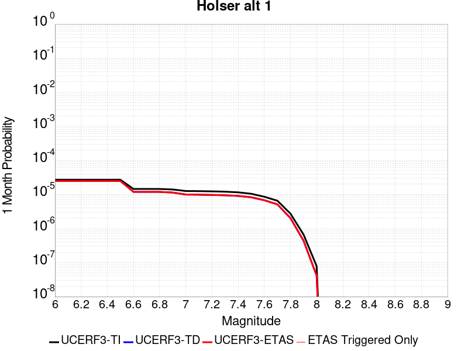 | 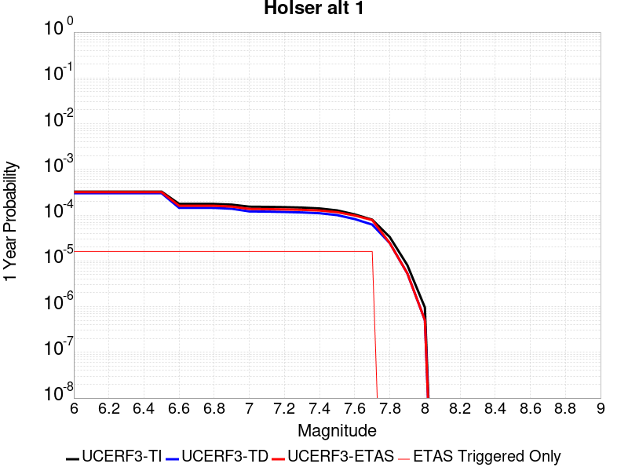 | 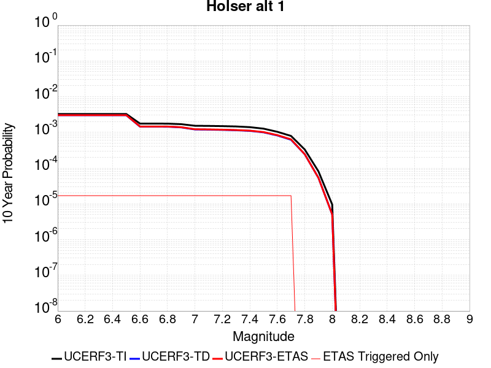 |

| Magnitude | 1 wk TI Prob | 1 wk TD Prob | 1 wk ETAS Prob | 1 wk ETAS/TD Gain | 1 wk ETAS Triggered Only | 1 mo TI Prob | 1 mo TD Prob | 1 mo ETAS Prob | 1 mo ETAS/TD Gain | 1 mo ETAS Triggered Only | 1 yr TI Prob | 1 yr TD Prob | 1 yr ETAS Prob | 1 yr ETAS/TD Gain | 1 yr ETAS Triggered Only | 10 yr TI Prob | 10 yr TD Prob | 10 yr ETAS Prob | 10 yr ETAS/TD Gain | 10 yr ETAS Triggered Only |
|-----|-----|-----|-----|-----|-----|-----|-----|-----|-----|-----|-----|-----|-----|-----|-----|-----|-----|-----|-----|-----|
| 6.0 | 6.2746653E-6 | 5.789965E-6 | 5.789965E-6 | 1.0 | 0.0 | 2.6891146E-5 | 2.4813964E-5 | 2.4813964E-5 | 1.0 | 0.0 | 3.273505E-4 | 3.020797E-4 | 3.2668884E-4 | 1.0814658 | 2.4616596E-5 | 0.0032686873 | 0.0030178234 | 0.0030423657 | 1.0081325 | 2.4616596E-5 |
| 6.1 | 6.2746653E-6 | 5.789965E-6 | 5.789965E-6 | 1.0 | 0.0 | 2.6891146E-5 | 2.4813964E-5 | 2.4813964E-5 | 1.0 | 0.0 | 3.273505E-4 | 3.020797E-4 | 3.2668884E-4 | 1.0814658 | 2.4616596E-5 | 0.0032686873 | 0.0030178234 | 0.0030423657 | 1.0081325 | 2.4616596E-5 |
| 6.2 | 6.2746653E-6 | 5.789965E-6 | 5.789965E-6 | 1.0 | 0.0 | 2.6891146E-5 | 2.4813964E-5 | 2.4813964E-5 | 1.0 | 0.0 | 3.273505E-4 | 3.020797E-4 | 3.2668884E-4 | 1.0814658 | 2.4616596E-5 | 0.0032686873 | 0.0030178234 | 0.0030423657 | 1.0081325 | 2.4616596E-5 |
| 6.3 | 6.2746653E-6 | 5.789965E-6 | 5.789965E-6 | 1.0 | 0.0 | 2.6891146E-5 | 2.4813964E-5 | 2.4813964E-5 | 1.0 | 0.0 | 3.273505E-4 | 3.020797E-4 | 3.2668884E-4 | 1.0814658 | 2.4616596E-5 | 0.0032686873 | 0.0030178234 | 0.0030423657 | 1.0081325 | 2.4616596E-5 |
| 6.4 | 6.2746653E-6 | 5.789965E-6 | 5.789965E-6 | 1.0 | 0.0 | 2.6891146E-5 | 2.4813964E-5 | 2.4813964E-5 | 1.0 | 0.0 | 3.273505E-4 | 3.020797E-4 | 3.2668884E-4 | 1.0814658 | 2.4616596E-5 | 0.0032686873 | 0.0030178234 | 0.0030423657 | 1.0081325 | 2.4616596E-5 |
| 6.5 | 6.2746653E-6 | 5.789965E-6 | 5.789965E-6 | 1.0 | 0.0 | 2.6891146E-5 | 2.4813964E-5 | 2.4813964E-5 | 1.0 | 0.0 | 3.273505E-4 | 3.020797E-4 | 3.2668884E-4 | 1.0814658 | 2.4616596E-5 | 0.0032686873 | 0.0030178234 | 0.0030423657 | 1.0081325 | 2.4616596E-5 |
| 6.6 | 3.375825E-6 | 2.7711897E-6 | 2.7711897E-6 | 1.0 | 0.0 | 1.4467741E-5 | 1.1876474E-5 | 1.1876474E-5 | 1.0 | 0.0 | 1.761305E-4 | 1.4458665E-4 | 1.6919969E-4 | 1.1702304 | 2.4616596E-5 | 0.0017599097 | 0.0014449427 | 0.0014695238 | 1.0170118 | 2.4616596E-5 |
| 6.7 | 3.375825E-6 | 2.7711897E-6 | 2.7711897E-6 | 1.0 | 0.0 | 1.4467741E-5 | 1.1876474E-5 | 1.1876474E-5 | 1.0 | 0.0 | 1.761305E-4 | 1.4458665E-4 | 1.6919969E-4 | 1.1702304 | 2.4616596E-5 | 0.0017599097 | 0.0014449427 | 0.0014695238 | 1.0170118 | 2.4616596E-5 |
| 6.8 | 3.366533E-6 | 2.7615893E-6 | 2.7615893E-6 | 1.0 | 0.0 | 1.4427919E-5 | 1.183533E-5 | 1.183533E-5 | 1.0 | 0.0 | 1.7564575E-4 | 1.4408577E-4 | 1.6869883E-4 | 1.1708221 | 2.4616596E-5 | 0.0017550698 | 0.0014399405 | 0.0014645217 | 1.0170709 | 2.4616596E-5 |
| 6.9 | 3.253174E-6 | 2.6438113E-6 | 2.6438113E-6 | 1.0 | 0.0 | 1.39421E-5 | 1.1330571E-5 | 1.1330571E-5 | 1.0 | 0.0 | 1.6973184E-4 | 1.3794114E-4 | 1.6255434E-4 | 1.1784326 | 2.4616596E-5 | 0.0016960226 | 0.001378571 | 0.0014031536 | 1.017832 | 2.4616596E-5 |
| 7.0 | 2.9336593E-6 | 2.311799E-6 | 2.311799E-6 | 1.0 | 0.0 | 1.2572766E-5 | 9.907673E-6 | 9.907673E-6 | 1.0 | 0.0 | 1.5306266E-4 | 1.2061927E-4 | 1.4523289E-4 | 1.2040604 | 2.4616596E-5 | 0.0015295728 | 0.0012055405 | 0.0012301274 | 1.0203949 | 2.4616596E-5 |
| 7.1 | 2.9087812E-6 | 2.2876513E-6 | 2.2876513E-6 | 1.0 | 0.0 | 1.2466146E-5 | 9.804184E-6 | 9.804184E-6 | 1.0 | 0.0 | 1.5176475E-4 | 1.19359414E-4 | 1.4397307E-4 | 1.2062147 | 2.4616596E-5 | 0.0015166114 | 0.0011929555 | 0.0012175428 | 1.0206103 | 2.4616596E-5 |
| 7.2 | 2.8674524E-6 | 2.2475429E-6 | 2.2475429E-6 | 1.0 | 0.0 | 1.2289024E-5 | 9.63229E-6 | 9.63229E-6 | 1.0 | 0.0 | 1.4960859E-4 | 1.1726685E-4 | 1.4188056E-4 | 1.2098949 | 2.4616596E-5 | 0.0014950791 | 0.001172052 | 0.0011966398 | 1.0209783 | 2.4616596E-5 |
| 7.3 | 2.8057775E-6 | 2.1954324E-6 | 2.1954324E-6 | 1.0 | 0.0 | 1.2024705E-5 | 9.408962E-6 | 9.408962E-6 | 1.0 | 0.0 | 1.4639096E-4 | 1.14548115E-4 | 1.3916189E-4 | 1.2148771 | 2.4616596E-5 | 0.0014629456 | 0.001144893 | 0.0011694814 | 1.0214766 | 2.4616596E-5 |
| 7.4 | 2.683666E-6 | 2.1092305E-6 | 2.1092305E-6 | 1.0 | 0.0 | 1.1501375E-5 | 9.039529E-6 | 9.039529E-6 | 1.0 | 0.0 | 1.4002025E-4 | 1.1005072E-4 | 1.346646E-4 | 1.2236595 | 2.4616596E-5 | 0.0013993206 | 0.0010999644 | 0.001124554 | 1.0223548 | 2.4616596E-5 |
| 7.5 | 2.434495E-6 | 1.9195363E-6 | 1.9195363E-6 | 1.0 | 0.0 | 1.0433508E-5 | 8.226558E-6 | 8.226558E-6 | 1.0 | 0.0 | 1.2702055E-4 | 1.0015376E-4 | 1.2476789E-4 | 1.2457634 | 2.4616596E-5 | 0.0012694797 | 0.0010010883 | 0.0010256802 | 1.0245652 | 2.4616596E-5 |
| 7.6 | 1.9914562E-6 | 1.5731459E-6 | 1.5731459E-6 | 1.0 | 0.0 | 8.534785E-6 | 6.742037E-6 | 6.742037E-6 | 1.0 | 0.0 | 1.03906044E-4 | 8.208122E-5 | 1.066958E-4 | 1.2998807 | 2.4616596E-5 | 0.0010385747 | 8.205106E-4 | 8.4510696E-4 | 1.029977 | 2.4616596E-5 |
| 7.7 | 1.5229501E-6 | 1.1896061E-6 | 1.1896061E-6 | 1.0 | 0.0 | 6.526913E-6 | 5.098302E-6 | 5.098302E-6 | 1.0 | 0.0 | 7.946226E-5 | 6.2070074E-5 | 8.668514E-5 | 1.396569 | 2.4616596E-5 | 7.943385E-4 | 6.2052865E-4 | 6.4512994E-4 | 1.0396458 | 2.4616596E-5 |
| 7.8 | 6.3489426E-7 | 4.687806E-7 | 4.687806E-7 | 1.0 | 0.0 | 2.7209726E-6 | 2.009058E-6 | 2.009058E-6 | 1.0 | 0.0 | 3.312734E-5 | 2.4460009E-5 | 2.4460009E-5 | 1.0 | 0.0 | 3.31224E-4 | 2.4457334E-4 | 2.4457334E-4 | 1.0 | 0.0 |
| 7.9 | 1.5459432E-7 | 1.0193758E-7 | 1.0193758E-7 | 1.0 | 0.0 | 6.6254694E-7 | 4.3687527E-7 | 4.3687527E-7 | 1.0 | 0.0 | 8.066479E-6 | 5.3189433E-6 | 5.3189433E-6 | 1.0 | 0.0 | 8.066186E-5 | 5.3188178E-5 | 5.3188178E-5 | 1.0 | 0.0 |
| 8.0 | 1.8307812E-8 | 9.690293E-9 | 9.690293E-9 | 1.0 | 0.0 | 7.846205E-8 | 4.152983E-8 | 4.152983E-8 | 1.0 | 0.0 | 9.55275E-7 | 5.0562556E-7 | 5.0562556E-7 | 1.0 | 0.0 | 9.552709E-6 | 5.0562444E-6 | 5.0562444E-6 | 1.0 | 0.0 |

## Malibu Coast alt 1
*[(top)](#table-of-contents)*

| 1 Week | 1 Month | 1 Year | 10 Year |
|-----|-----|-----|-----|
| 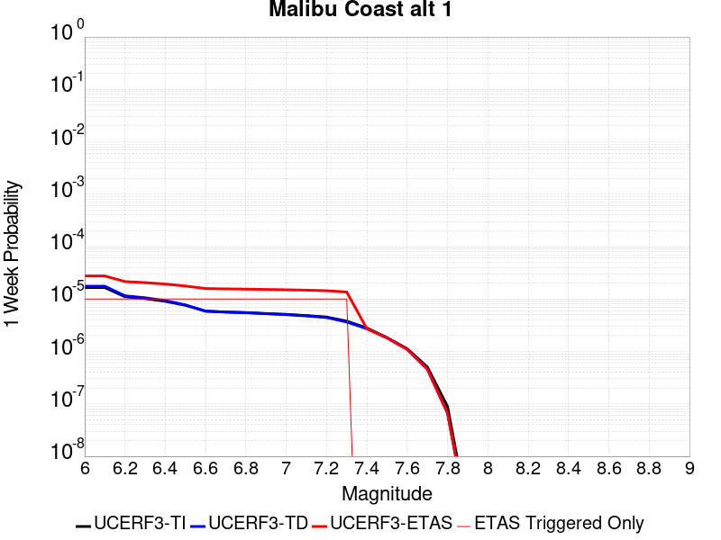 | 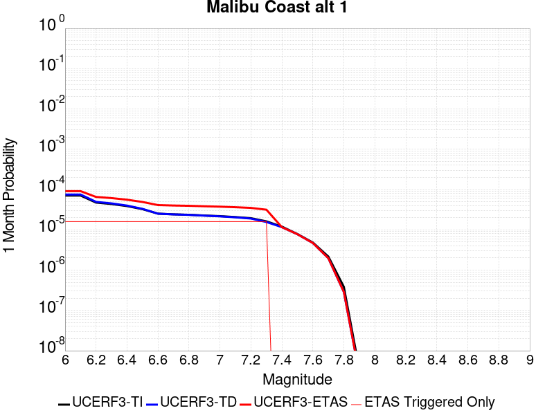 | 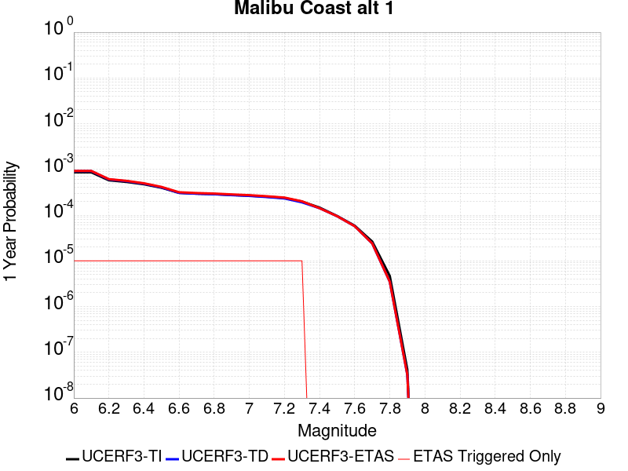 | 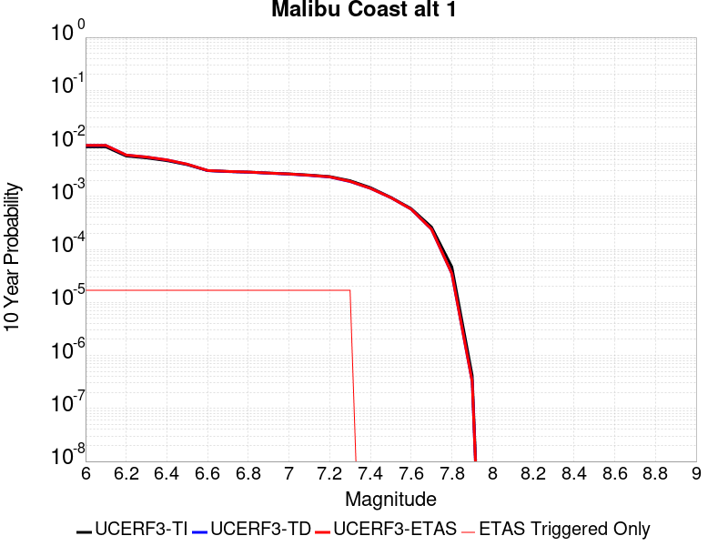 |

| Magnitude | 1 wk TI Prob | 1 wk TD Prob | 1 wk ETAS Prob | 1 wk ETAS/TD Gain | 1 wk ETAS Triggered Only | 1 mo TI Prob | 1 mo TD Prob | 1 mo ETAS Prob | 1 mo ETAS/TD Gain | 1 mo ETAS Triggered Only | 1 yr TI Prob | 1 yr TD Prob | 1 yr ETAS Prob | 1 yr ETAS/TD Gain | 1 yr ETAS Triggered Only | 10 yr TI Prob | 10 yr TD Prob | 10 yr ETAS Prob | 10 yr ETAS/TD Gain | 10 yr ETAS Triggered Only |
|-----|-----|-----|-----|-----|-----|-----|-----|-----|-----|-----|-----|-----|-----|-----|-----|-----|-----|-----|-----|-----|
| 6.0 | 1.6572556E-5 | 1.7598066E-5 | 4.221423E-5 | 2.3987994 | 2.4616596E-5 | 7.102331E-5 | 7.541821E-5 | 1.0003295E-4 | 1.3263766 | 2.4616596E-5 | 8.6436566E-4 | 9.178488E-4 | 9.424428E-4 | 1.0267953 | 2.4616596E-5 | 0.0086101135 | 0.009142512 | 0.009166904 | 1.0026679 | 2.4616596E-5 |
| 6.1 | 1.6572556E-5 | 1.7598066E-5 | 4.221423E-5 | 2.3987994 | 2.4616596E-5 | 7.102331E-5 | 7.541821E-5 | 1.0003295E-4 | 1.3263766 | 2.4616596E-5 | 8.6436566E-4 | 9.178488E-4 | 9.424428E-4 | 1.0267953 | 2.4616596E-5 | 0.0086101135 | 0.009142512 | 0.009166904 | 1.0026679 | 2.4616596E-5 |
| 6.2 | 1.1085717E-5 | 1.1557147E-5 | 3.617346E-5 | 3.1299644 | 2.4616596E-5 | 4.750935E-5 | 4.952971E-5 | 7.4145086E-5 | 1.4969821 | 2.4616596E-5 | 5.782728E-4 | 6.028609E-4 | 6.2746264E-4 | 1.0408083 | 2.4616596E-5 | 0.0057677035 | 0.0060126255 | 0.006037094 | 1.0040696 | 2.4616596E-5 |
| 6.3 | 1.0208568E-5 | 1.0592237E-5 | 3.5208574E-5 | 3.3239977 | 2.4616596E-5 | 4.375027E-5 | 4.539453E-5 | 7.0010006E-5 | 1.5422565 | 2.4616596E-5 | 5.325294E-4 | 5.5254117E-4 | 5.771442E-4 | 1.0445269 | 2.4616596E-5 | 0.0053125503 | 0.0055119814 | 0.0055364626 | 1.0044414 | 2.4616596E-5 |
| 6.4 | 9.0682315E-6 | 9.342637E-6 | 3.3959004E-5 | 3.6348412 | 2.4616596E-5 | 3.8863272E-5 | 4.003927E-5 | 6.465488E-5 | 1.6147867 | 2.4616596E-5 | 4.730576E-4 | 4.8737114E-4 | 5.119757E-4 | 1.0504843 | 2.4616596E-5 | 0.0047205184 | 0.004863236 | 0.004887733 | 1.0050372 | 2.4616596E-5 |
| 6.5 | 7.605796E-6 | 7.748587E-6 | 3.2364995E-5 | 4.1768894 | 2.4616596E-5 | 3.259586E-5 | 3.3207816E-5 | 5.7823596E-5 | 1.7412646 | 2.4616596E-5 | 3.9678233E-4 | 4.0423148E-4 | 4.2883813E-4 | 1.0608727 | 2.4616596E-5 | 0.0039607463 | 0.0040351 | 0.004059617 | 1.006076 | 2.4616596E-5 |
| 6.6 | 5.889873E-6 | 5.8795385E-6 | 3.049599E-5 | 5.1868 | 2.4616596E-5 | 2.5242069E-5 | 2.519778E-5 | 4.9813756E-5 | 1.9769105 | 2.4616596E-5 | 3.0727885E-4 | 3.0673988E-4 | 3.313489E-4 | 1.0802277 | 2.4616596E-5 | 0.003068543 | 0.0030631777 | 0.003087719 | 1.0080117 | 2.4616596E-5 |
| 6.7 | 5.66586E-6 | 5.641641E-6 | 3.02581E-5 | 5.3633504 | 2.4616596E-5 | 2.428203E-5 | 2.417824E-5 | 4.879424E-5 | 2.0181057 | 2.4616596E-5 | 2.955936E-4 | 2.9433038E-4 | 3.1893974E-4 | 1.0836114 | 2.4616596E-5 | 0.0029520073 | 0.0029394177 | 0.002963962 | 1.00835 | 2.4616596E-5 |
| 6.8 | 5.521556E-6 | 5.489427E-6 | 3.0105888E-5 | 5.4843407 | 2.4616596E-5 | 2.3663597E-5 | 2.3525903E-5 | 4.8141923E-5 | 2.0463367 | 2.4616596E-5 | 2.880662E-4 | 2.8639034E-4 | 3.1099987E-4 | 1.0859301 | 2.4616596E-5 | 0.0028769306 | 0.002860224 | 0.0028847703 | 1.0085819 | 2.4616596E-5 |
| 6.9 | 5.29752E-6 | 5.2499317E-6 | 2.9866398E-5 | 5.688912 | 2.4616596E-5 | 2.270346E-5 | 2.2499513E-5 | 4.7115554E-5 | 2.09407 | 2.4616596E-5 | 2.7637955E-4 | 2.7389723E-4 | 2.9850708E-4 | 1.0898507 | 2.4616596E-5 | 0.0027603607 | 0.0027356069 | 0.002760156 | 1.008974 | 2.4616596E-5 |
| 7.0 | 5.106743E-6 | 5.0476788E-6 | 2.966415E-5 | 5.8767905 | 2.4616596E-5 | 2.1885859E-5 | 2.163273E-5 | 4.6248795E-5 | 2.1379085 | 2.4616596E-5 | 2.6642776E-4 | 2.6334674E-4 | 2.8795685E-4 | 1.0934514 | 2.4616596E-5 | 0.0026610855 | 0.0026303562 | 0.002654908 | 1.0093341 | 2.4616596E-5 |
| 7.1 | 4.8469647E-6 | 4.770373E-6 | 2.9386852E-5 | 6.160284 | 2.4616596E-5 | 2.0772539E-5 | 2.0444295E-5 | 4.5060387E-5 | 2.2040567 | 2.4616596E-5 | 2.528763E-4 | 2.4888094E-4 | 2.734914E-4 | 1.0988845 | 2.4616596E-5 | 0.0025258875 | 0.00248603 | 0.0025105856 | 1.0098773 | 2.4616596E-5 |
| 7.2 | 4.545514E-6 | 4.4481935E-6 | 2.906468E-5 | 6.5340414 | 2.4616596E-5 | 1.9480629E-5 | 1.9063547E-5 | 4.3679676E-5 | 2.291267 | 2.4616596E-5 | 2.3715083E-4 | 2.3207403E-4 | 2.5668493E-4 | 1.1060475 | 2.4616596E-5 | 0.0023689792 | 0.0023183243 | 0.002342884 | 1.0105937 | 2.4616596E-5 |
| 7.3 | 3.794097E-6 | 3.6519348E-6 | 2.8268441E-5 | 7.740675 | 2.4616596E-5 | 1.6260314E-5 | 1.5651056E-5 | 4.0267267E-5 | 2.5728147 | 2.4616596E-5 | 1.9795135E-4 | 1.9053498E-4 | 2.1514688E-4 | 1.1291727 | 2.4616596E-5 | 0.001977751 | 0.0019037209 | 0.0019282906 | 1.0129062 | 2.4616596E-5 |
| 7.4 | 2.808217E-6 | 2.719077E-6 | 2.719077E-6 | 1.0 | 0.0 | 1.203516E-5 | 1.1653135E-5 | 1.1653135E-5 | 1.0 | 0.0 | 1.4651821E-4 | 1.418677E-4 | 1.418677E-4 | 1.0 | 0.0 | 0.0014642165 | 0.001417774 | 0.001417774 | 1.0 | 0.0 |
| 7.5 | 1.83809E-6 | 1.8190691E-6 | 1.8190691E-6 | 1.0 | 0.0 | 7.877505E-6 | 7.795988E-6 | 7.795988E-6 | 1.0 | 0.0 | 9.59044E-5 | 9.491203E-5 | 9.491203E-5 | 1.0 | 0.0 | 9.5863023E-4 | 9.48717E-4 | 9.48717E-4 | 1.0 | 0.0 |
| 7.6 | 1.1292672E-6 | 1.1001447E-6 | 1.1001447E-6 | 1.0 | 0.0 | 4.839708E-6 | 4.714897E-6 | 4.714897E-6 | 1.0 | 0.0 | 5.8921847E-5 | 5.7402376E-5 | 5.7402376E-5 | 1.0 | 0.0 | 5.890623E-4 | 5.738771E-4 | 5.738771E-4 | 1.0 | 0.0 |
| 7.7 | 5.065272E-7 | 4.609151E-7 | 4.609151E-7 | 1.0 | 0.0 | 2.170829E-6 | 1.975349E-6 | 1.975349E-6 | 1.0 | 0.0 | 2.6429525E-5 | 2.404962E-5 | 2.404962E-5 | 1.0 | 0.0 | 2.642638E-4 | 2.4047129E-4 | 2.4047129E-4 | 1.0 | 0.0 |
| 7.8 | 8.952991E-8 | 6.707874E-8 | 6.707874E-8 | 1.0 | 0.0 | 3.8369956E-7 | 2.8748025E-7 | 2.8748025E-7 | 1.0 | 0.0 | 4.671532E-6 | 3.5000667E-6 | 3.5000667E-6 | 1.0 | 0.0 | 4.671434E-5 | 3.5000136E-5 | 3.5000136E-5 | 1.0 | 0.0 |
| 7.9 | 8.007447E-10 | 6.1608785E-10 | 6.1608785E-10 | 1.0 | 0.0 | 3.4317629E-9 | 2.6403764E-9 | 2.6403764E-9 | 1.0 | 0.0 | 4.1781714E-8 | 3.2146584E-8 | 3.2146584E-8 | 1.0 | 0.0 | 4.1781706E-7 | 3.214658E-7 | 3.214658E-7 | 1.0 | 0.0 |

## San Andreas (Offshore) 2011 CFM
*[(top)](#table-of-contents)*

| 1 Week | 1 Month | 1 Year | 10 Year |
|-----|-----|-----|-----|
| 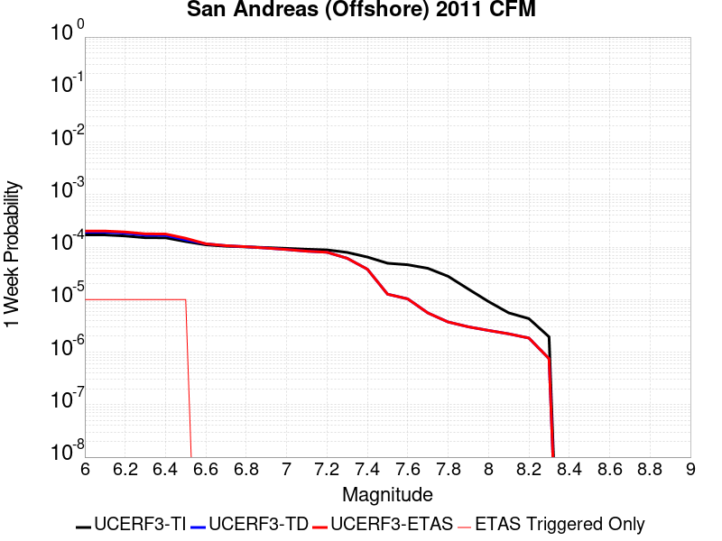 | 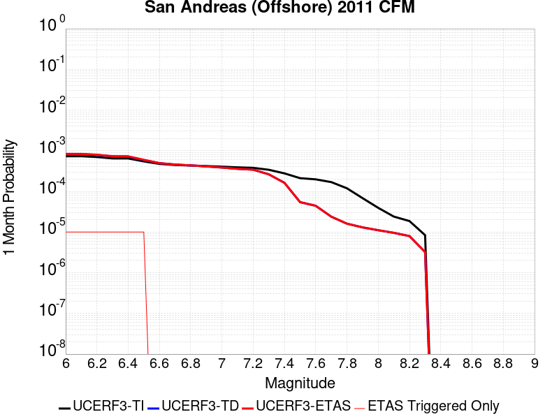 | 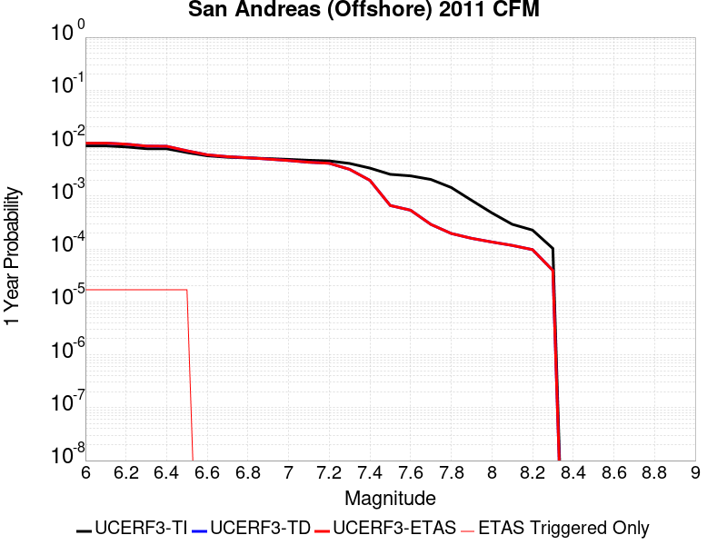 | 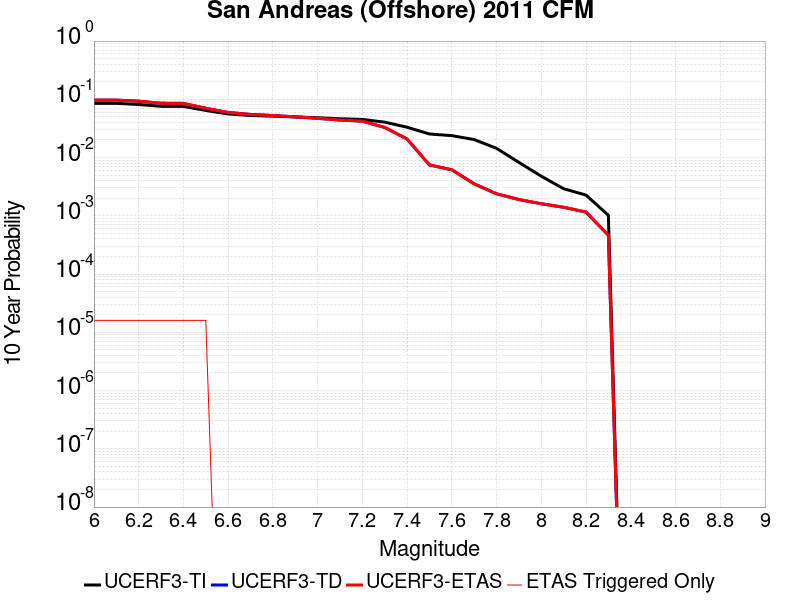 |

| Magnitude | 1 wk TI Prob | 1 wk TD Prob | 1 wk ETAS Prob | 1 wk ETAS/TD Gain | 1 wk ETAS Triggered Only | 1 mo TI Prob | 1 mo TD Prob | 1 mo ETAS Prob | 1 mo ETAS/TD Gain | 1 mo ETAS Triggered Only | 1 yr TI Prob | 1 yr TD Prob | 1 yr ETAS Prob | 1 yr ETAS/TD Gain | 1 yr ETAS Triggered Only | 10 yr TI Prob | 10 yr TD Prob | 10 yr ETAS Prob | 10 yr ETAS/TD Gain | 10 yr ETAS Triggered Only |
|-----|-----|-----|-----|-----|-----|-----|-----|-----|-----|-----|-----|-----|-----|-----|-----|-----|-----|-----|-----|-----|
| 6.0 | 1.7072787E-4 | 1.9226041E-4 | 1.9226041E-4 | 1.0 | 0.0 | 7.3148566E-4 | 8.237154E-4 | 8.237154E-4 | 1.0 | 0.0 | 0.008869528 | 0.0099831335 | 0.010007504 | 1.0024412 | 2.4616596E-5 | 0.085237645 | 0.09682738 | 0.09684961 | 1.0002296 | 2.4616596E-5 |
| 6.1 | 1.7072787E-4 | 1.9226041E-4 | 1.9226041E-4 | 1.0 | 0.0 | 7.3148566E-4 | 8.237154E-4 | 8.237154E-4 | 1.0 | 0.0 | 0.008869528 | 0.0099831335 | 0.010007504 | 1.0024412 | 2.4616596E-5 | 0.085237645 | 0.09682738 | 0.09684961 | 1.0002296 | 2.4616596E-5 |
| 6.2 | 1.6312556E-4 | 1.8407789E-4 | 1.8407789E-4 | 1.0 | 0.0 | 6.989222E-4 | 7.8866904E-4 | 7.8866904E-4 | 1.0 | 0.0 | 0.008476226 | 0.009560268 | 0.00958465 | 1.0025502 | 2.4616596E-5 | 0.08160117 | 0.09284818 | 0.09287051 | 1.0002406 | 2.4616596E-5 |
| 6.3 | 1.5103363E-4 | 1.6880741E-4 | 1.6880741E-4 | 1.0 | 0.0 | 6.471264E-4 | 7.232619E-4 | 7.232619E-4 | 1.0 | 0.0 | 0.007850339 | 0.008770605 | 0.008795005 | 1.0027821 | 2.4616596E-5 | 0.075787395 | 0.085489064 | 0.08551158 | 1.0002633 | 2.4616596E-5 |
| 6.4 | 1.5047993E-4 | 1.676667E-4 | 1.676667E-4 | 1.0 | 0.0 | 6.4475456E-4 | 7.1837584E-4 | 7.1837584E-4 | 1.0 | 0.0 | 0.007821669 | 0.008711592 | 0.008735994 | 1.0028011 | 2.4616596E-5 | 0.0755203 | 0.08496926 | 0.08499179 | 1.0002651 | 2.4616596E-5 |
| 6.5 | 1.2760791E-4 | 1.3735025E-4 | 1.3735025E-4 | 1.0 | 0.0 | 5.467764E-4 | 5.885125E-4 | 5.885125E-4 | 1.0 | 0.0 | 0.0066367025 | 0.0071418737 | 0.0071663144 | 1.0034221 | 2.4616596E-5 | 0.064419635 | 0.07025001 | 0.0702729 | 1.0003258 | 2.4616596E-5 |
| 6.6 | 1.1063525E-4 | 1.15566356E-4 | 1.15566356E-4 | 1.0 | 0.0 | 4.740649E-4 | 4.9519143E-4 | 4.9519143E-4 | 1.0 | 0.0 | 0.0057564764 | 0.006012491 | 0.006012491 | 1.0 | 0.0 | 0.05609626 | 0.05948894 | 0.05948894 | 1.0 | 0.0 |
| 6.7 | 1.0391049E-4 | 1.0645922E-4 | 1.0645922E-4 | 1.0 | 0.0 | 4.4525467E-4 | 4.5617504E-4 | 4.5617504E-4 | 1.0 | 0.0 | 0.0054075094 | 0.005539975 | 0.005539975 | 1.0 | 0.0 | 0.052778035 | 0.05498876 | 0.05498876 | 1.0 | 0.0 |
| 6.8 | 1.0096706E-4 | 1.01582686E-4 | 1.01582686E-4 | 1.0 | 0.0 | 4.3264418E-4 | 4.3528268E-4 | 4.3528268E-4 | 1.0 | 0.0 | 0.0052547283 | 0.005286866 | 0.005286866 | 1.0 | 0.0 | 0.051321987 | 0.052687574 | 0.052687574 | 1.0 | 0.0 |
| 6.9 | 9.800265E-5 | 9.588748E-5 | 9.588748E-5 | 1.0 | 0.0 | 4.1994374E-4 | 4.1088252E-4 | 4.1088252E-4 | 1.0 | 0.0 | 0.0051008356 | 0.0049911886 | 0.0049911886 | 1.0 | 0.0 | 0.049853306 | 0.05001504 | 0.05001504 | 1.0 | 0.0 |
| 7.0 | 9.4642375E-5 | 9.002143E-5 | 9.002143E-5 | 1.0 | 0.0 | 4.0554712E-4 | 3.8574997E-4 | 3.8574997E-4 | 1.0 | 0.0 | 0.004926363 | 0.0046865544 | 0.0046865544 | 1.0 | 0.0 | 0.048185747 | 0.047196057 | 0.047196057 | 1.0 | 0.0 |
| 7.1 | 9.0996844E-5 | 8.354169E-5 | 8.354169E-5 | 1.0 | 0.0 | 3.8992817E-4 | 3.5798753E-4 | 3.5798753E-4 | 1.0 | 0.0 | 0.004737046 | 0.004349944 | 0.004349944 | 1.0 | 0.0 | 0.04637333 | 0.044047635 | 0.044047635 | 1.0 | 0.0 |
| 7.2 | 8.848287E-5 | 7.9818135E-5 | 7.9818135E-5 | 1.0 | 0.0 | 3.791572E-4 | 3.4203375E-4 | 3.4203375E-4 | 1.0 | 0.0 | 0.004606472 | 0.0041564633 | 0.0041564633 | 1.0 | 0.0 | 0.045121472 | 0.042191572 | 0.042191572 | 1.0 | 0.0 |
| 7.3 | 7.9280784E-5 | 6.1276216E-5 | 6.1276216E-5 | 1.0 | 0.0 | 3.3973053E-4 | 2.625865E-4 | 2.625865E-4 | 1.0 | 0.0 | 0.004128377 | 0.0031924061 | 0.0031924061 | 1.0 | 0.0 | 0.040525194 | 0.032904375 | 0.032904375 | 1.0 | 0.0 |
| 7.4 | 6.468038E-5 | 3.7933212E-5 | 3.7933212E-5 | 1.0 | 0.0 | 2.771722E-4 | 1.625611E-4 | 1.625611E-4 | 1.0 | 0.0 | 0.0033693502 | 0.0019774425 | 0.0019774425 | 1.0 | 0.0 | 0.0331872 | 0.02082181 | 0.02082181 | 1.0 | 0.0 |
| 7.5 | 4.930574E-5 | 1.2703362E-5 | 1.2703362E-5 | 1.0 | 0.0 | 2.1129321E-4 | 5.444185E-5 | 5.444185E-5 | 1.0 | 0.0 | 0.0025694598 | 6.6262955E-4 | 6.6262955E-4 | 1.0 | 0.0 | 0.02539953 | 0.007481418 | 0.007481418 | 1.0 | 0.0 |
| 7.6 | 4.612566E-5 | 1.0336213E-5 | 1.0336213E-5 | 1.0 | 0.0 | 1.9766642E-4 | 4.429731E-5 | 4.429731E-5 | 1.0 | 0.0 | 0.0024039324 | 5.391877E-4 | 5.391877E-4 | 1.0 | 0.0 | 0.023780935 | 0.006172099 | 0.006172099 | 1.0 | 0.0 |
| 7.7 | 3.9435414E-5 | 5.574925E-6 | 5.574925E-6 | 1.0 | 0.0 | 1.6899795E-4 | 2.3892318E-5 | 2.3892318E-5 | 1.0 | 0.0 | 0.0020556084 | 2.9085035E-4 | 2.9085035E-4 | 1.0 | 0.0 | 0.020366974 | 0.0035420412 | 0.0035420412 | 1.0 | 0.0 |
| 7.8 | 2.7787428E-5 | 3.7553348E-6 | 3.7553348E-6 | 1.0 | 0.0 | 1.1908354E-4 | 1.6094193E-5 | 1.6094193E-5 | 1.0 | 0.0 | 0.0014488777 | 1.9592921E-4 | 1.9592921E-4 | 1.0 | 0.0 | 0.014394675 | 0.0023877125 | 0.0023877125 | 1.0 | 0.0 |
| 7.9 | 1.590671E-5 | 3.04085E-6 | 3.04085E-6 | 1.0 | 0.0 | 6.816983E-5 | 1.303215E-5 | 1.303215E-5 | 1.0 | 0.0 | 8.2965166E-4 | 1.586549E-4 | 1.586549E-4 | 1.0 | 0.0 | 0.008265611 | 0.001904262 | 0.001904262 | 1.0 | 0.0 |
| 8.0 | 9.193638E-6 | 2.5920847E-6 | 2.5920847E-6 | 1.0 | 0.0 | 3.940071E-5 | 1.1108887E-5 | 1.1108887E-5 | 1.0 | 0.0 | 4.7959806E-4 | 1.3524233E-4 | 1.3524233E-4 | 1.0 | 0.0 | 0.0047856434 | 0.0016115032 | 0.0016115032 | 1.0 | 0.0 |
| 8.1 | 5.601576E-6 | 2.2343472E-6 | 2.2343472E-6 | 1.0 | 0.0 | 2.4006533E-5 | 9.575739E-6 | 9.575739E-6 | 1.0 | 0.0 | 2.9224035E-4 | 1.16578405E-4 | 1.16578405E-4 | 1.0 | 0.0 | 0.0029185633 | 0.0014020674 | 0.0014020674 | 1.0 | 0.0 |
| 8.2 | 4.3508785E-6 | 1.857566E-6 | 1.857566E-6 | 1.0 | 0.0 | 1.864649E-5 | 7.960973E-6 | 7.960973E-6 | 1.0 | 0.0 | 2.2699735E-4 | 9.692056E-5 | 9.692056E-5 | 1.0 | 0.0 | 0.0022676561 | 0.0011594221 | 0.0011594221 | 1.0 | 0.0 |
| 8.3 | 1.9573292E-6 | 7.514906E-7 | 7.514906E-7 | 1.0 | 0.0 | 8.388526E-6 | 3.22067E-6 | 3.22067E-6 | 1.0 | 0.0 | 1.0212552E-4 | 3.921097E-5 | 3.921097E-5 | 1.0 | 0.0 | 0.001020786 | 4.640846E-4 | 4.640846E-4 | 1.0 | 0.0 |

## Swain Ravine - Spenceville
*[(top)](#table-of-contents)*

| 1 Week | 1 Month | 1 Year | 10 Year |
|-----|-----|-----|-----|
| 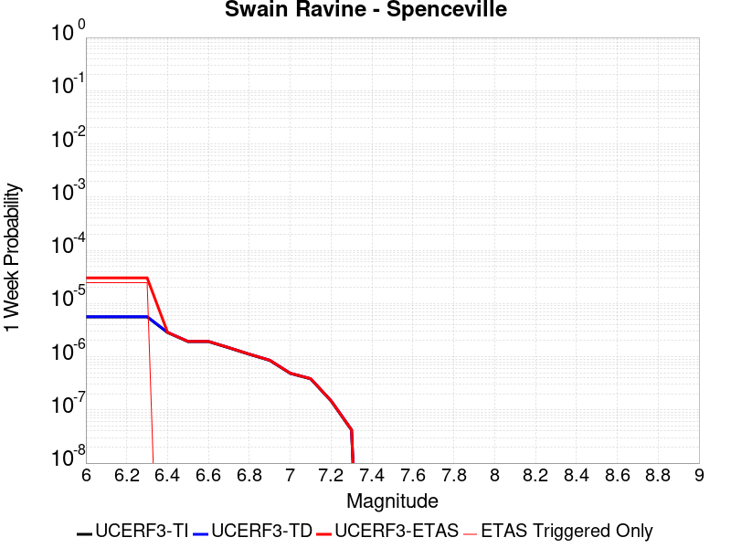 | 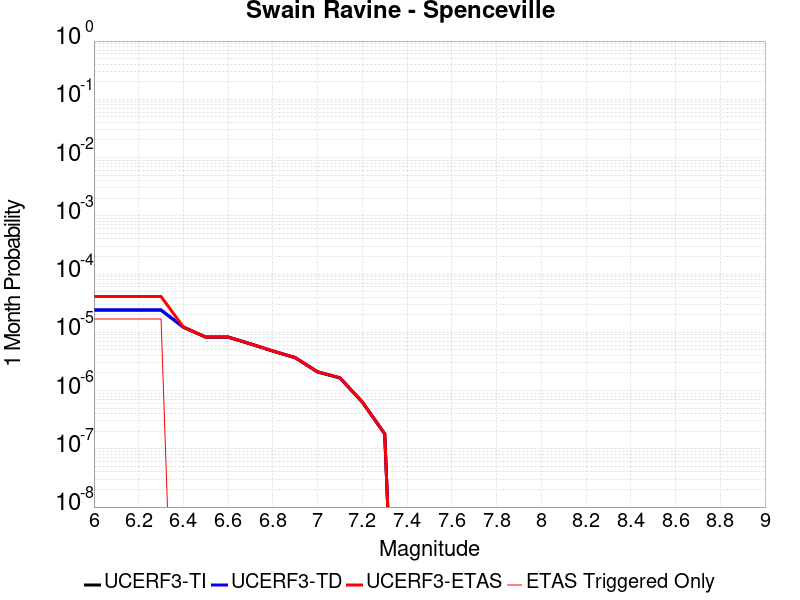 | 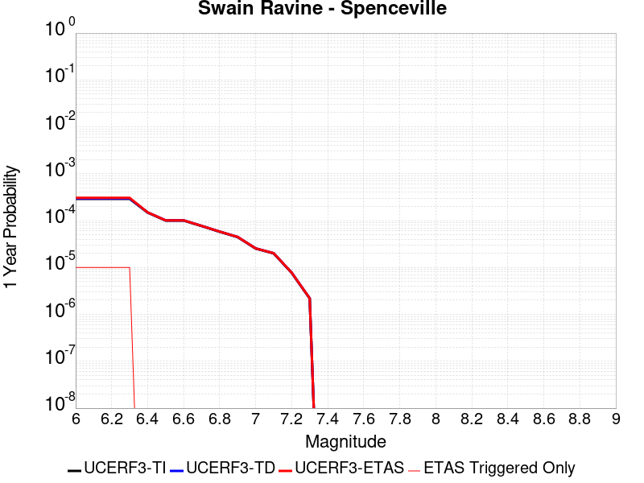 | 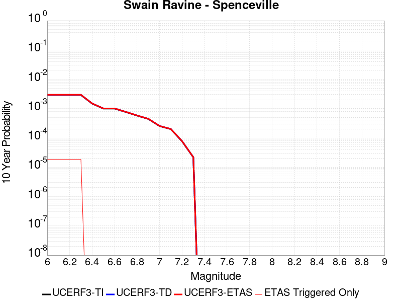 |

| Magnitude | 1 wk TI Prob | 1 wk TD Prob | 1 wk ETAS Prob | 1 wk ETAS/TD Gain | 1 wk ETAS Triggered Only | 1 mo TI Prob | 1 mo TD Prob | 1 mo ETAS Prob | 1 mo ETAS/TD Gain | 1 mo ETAS Triggered Only | 1 yr TI Prob | 1 yr TD Prob | 1 yr ETAS Prob | 1 yr ETAS/TD Gain | 1 yr ETAS Triggered Only | 10 yr TI Prob | 10 yr TD Prob | 10 yr ETAS Prob | 10 yr ETAS/TD Gain | 10 yr ETAS Triggered Only |
|-----|-----|-----|-----|-----|-----|-----|-----|-----|-----|-----|-----|-----|-----|-----|-----|-----|-----|-----|-----|-----|
| 6.0 | 5.596169E-6 | 5.663794E-6 | 3.0280251E-5 | 5.346284 | 2.4616596E-5 | 2.398336E-5 | 2.4273193E-5 | 4.8889193E-5 | 2.0141227 | 2.4616596E-5 | 2.9195828E-4 | 2.9548878E-4 | 3.200981E-4 | 1.0832834 | 2.4616596E-5 | 0.00291575 | 0.002951228 | 0.002975772 | 1.0083165 | 2.4616596E-5 |
| 6.1 | 5.596169E-6 | 5.663794E-6 | 3.0280251E-5 | 5.346284 | 2.4616596E-5 | 2.398336E-5 | 2.4273193E-5 | 4.8889193E-5 | 2.0141227 | 2.4616596E-5 | 2.9195828E-4 | 2.9548878E-4 | 3.200981E-4 | 1.0832834 | 2.4616596E-5 | 0.00291575 | 0.002951228 | 0.002975772 | 1.0083165 | 2.4616596E-5 |
| 6.2 | 5.596169E-6 | 5.663794E-6 | 3.0280251E-5 | 5.346284 | 2.4616596E-5 | 2.398336E-5 | 2.4273193E-5 | 4.8889193E-5 | 2.0141227 | 2.4616596E-5 | 2.9195828E-4 | 2.9548878E-4 | 3.200981E-4 | 1.0832834 | 2.4616596E-5 | 0.00291575 | 0.002951228 | 0.002975772 | 1.0083165 | 2.4616596E-5 |
| 6.3 | 5.596169E-6 | 5.663794E-6 | 3.0280251E-5 | 5.346284 | 2.4616596E-5 | 2.398336E-5 | 2.4273193E-5 | 4.8889193E-5 | 2.0141227 | 2.4616596E-5 | 2.9195828E-4 | 2.9548878E-4 | 3.200981E-4 | 1.0832834 | 2.4616596E-5 | 0.00291575 | 0.002951228 | 0.002975772 | 1.0083165 | 2.4616596E-5 |
| 6.4 | 2.8426775E-6 | 2.874144E-6 | 2.874144E-6 | 1.0 | 0.0 | 1.2182847E-5 | 1.2317704E-5 | 1.2317704E-5 | 1.0 | 0.0 | 1.4831607E-4 | 1.4995811E-4 | 1.4995811E-4 | 1.0 | 0.0 | 0.0014821711 | 0.0014986077 | 0.0014986077 | 1.0 | 0.0 |
| 6.5 | 1.9210793E-6 | 1.9414147E-6 | 1.9414147E-6 | 1.0 | 0.0 | 8.233172E-6 | 8.320323E-6 | 8.320323E-6 | 1.0 | 0.0 | 1.0023425E-4 | 1.0129536E-4 | 1.0129536E-4 | 1.0 | 0.0 | 0.0010018905 | 0.0010125053 | 0.0010125053 | 1.0 | 0.0 |
| 6.6 | 1.9210793E-6 | 1.9414147E-6 | 1.9414147E-6 | 1.0 | 0.0 | 8.233172E-6 | 8.320323E-6 | 8.320323E-6 | 1.0 | 0.0 | 1.0023425E-4 | 1.0129536E-4 | 1.0129536E-4 | 1.0 | 0.0 | 0.0010018905 | 0.0010125053 | 0.0010125053 | 1.0 | 0.0 |
| 6.7 | 1.4667394E-6 | 1.4818934E-6 | 1.4818934E-6 | 1.0 | 0.0 | 6.286011E-6 | 6.3509565E-6 | 6.3509565E-6 | 1.0 | 0.0 | 7.65295E-5 | 7.732023E-5 | 7.732023E-5 | 1.0 | 0.0 | 7.6503144E-4 | 7.72941E-4 | 7.72941E-4 | 1.0 | 0.0 |
| 6.8 | 1.1076943E-6 | 1.1189535E-6 | 1.1189535E-6 | 1.0 | 0.0 | 4.747252E-6 | 4.7955064E-6 | 4.7955064E-6 | 1.0 | 0.0 | 5.7796264E-5 | 5.838377E-5 | 5.838377E-5 | 1.0 | 0.0 | 5.778124E-4 | 5.836887E-4 | 5.836887E-4 | 1.0 | 0.0 |
| 6.9 | 8.514296E-7 | 8.600095E-7 | 8.600095E-7 | 1.0 | 0.0 | 3.648979E-6 | 3.6857498E-6 | 3.6857498E-6 | 1.0 | 0.0 | 4.442541E-5 | 4.4873108E-5 | 4.4873108E-5 | 1.0 | 0.0 | 4.441653E-4 | 4.4864335E-4 | 4.4864335E-4 | 1.0 | 0.0 |
| 7.0 | 4.8544706E-7 | 4.9033E-7 | 4.9033E-7 | 1.0 | 0.0 | 2.0804857E-6 | 2.1014127E-6 | 2.1014127E-6 | 1.0 | 0.0 | 2.532962E-5 | 2.5584413E-5 | 2.5584413E-5 | 1.0 | 0.0 | 2.5326732E-4 | 2.5581598E-4 | 2.5581598E-4 | 1.0 | 0.0 |
| 7.1 | 3.829186E-7 | 3.8678783E-7 | 3.8678783E-7 | 1.0 | 0.0 | 1.6410787E-6 | 1.6576612E-6 | 1.6576612E-6 | 1.0 | 0.0 | 1.997995E-5 | 2.0181848E-5 | 2.0181848E-5 | 1.0 | 0.0 | 1.9978154E-4 | 2.0180122E-4 | 2.0180122E-4 | 1.0 | 0.0 |
| 7.2 | 1.4726595E-7 | 1.4879437E-7 | 1.4879437E-7 | 1.0 | 0.0 | 6.3113964E-7 | 6.3769005E-7 | 6.3769005E-7 | 1.0 | 0.0 | 7.684098E-6 | 7.763854E-6 | 7.763854E-6 | 1.0 | 0.0 | 7.6838325E-5 | 7.763636E-5 | 7.763636E-5 | 1.0 | 0.0 |
| 7.3 | 4.1880604E-8 | 4.2324306E-8 | 4.2324306E-8 | 1.0 | 0.0 | 1.7948828E-7 | 1.8138988E-7 | 1.8138988E-7 | 1.0 | 0.0 | 2.1852677E-6 | 2.2084218E-6 | 2.2084218E-6 | 1.0 | 0.0 | 2.1852462E-5 | 2.2084218E-5 | 2.2084218E-5 | 1.0 | 0.0 |

## San Gabriel (Extension)
*[(top)](#table-of-contents)*

| 1 Week | 1 Month | 1 Year | 10 Year |
|-----|-----|-----|-----|
|  |  | 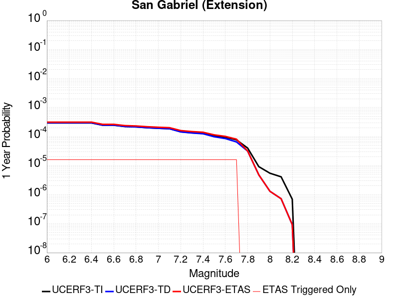 | 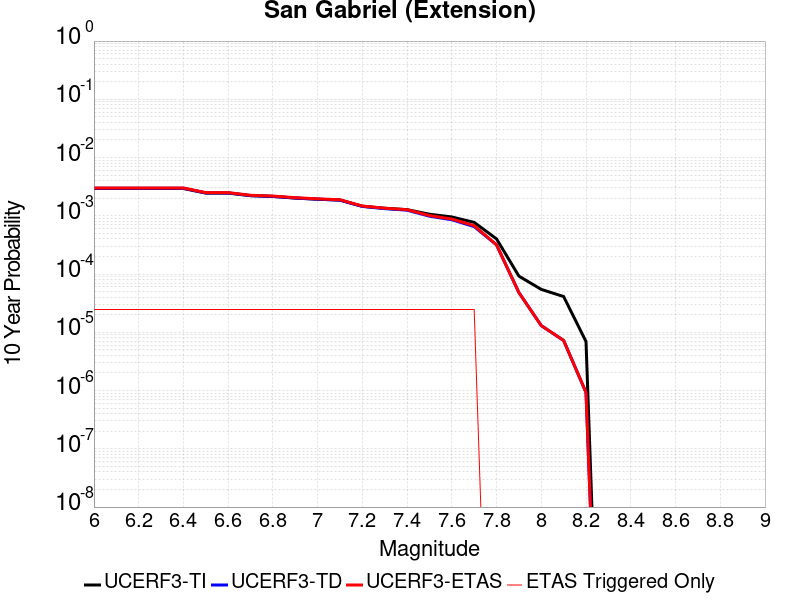 |

| Magnitude | 1 wk TI Prob | 1 wk TD Prob | 1 wk ETAS Prob | 1 wk ETAS/TD Gain | 1 wk ETAS Triggered Only | 1 mo TI Prob | 1 mo TD Prob | 1 mo ETAS Prob | 1 mo ETAS/TD Gain | 1 mo ETAS Triggered Only | 1 yr TI Prob | 1 yr TD Prob | 1 yr ETAS Prob | 1 yr ETAS/TD Gain | 1 yr ETAS Triggered Only | 10 yr TI Prob | 10 yr TD Prob | 10 yr ETAS Prob | 10 yr ETAS/TD Gain | 10 yr ETAS Triggered Only |
|-----|-----|-----|-----|-----|-----|-----|-----|-----|-----|-----|-----|-----|-----|-----|-----|-----|-----|-----|-----|-----|
| 6.0 | 5.6486106E-6 | 5.7168304E-6 | 5.7168304E-6 | 1.0 | 0.0 | 2.4208108E-5 | 2.450048E-5 | 2.450048E-5 | 1.0 | 0.0 | 2.9469383E-4 | 2.9825376E-4 | 3.2286302E-4 | 1.0825112 | 2.4616596E-5 | 0.0029430336 | 0.0029786653 | 0.0030032084 | 1.0082397 | 2.4616596E-5 |
| 6.1 | 5.6486106E-6 | 5.7168304E-6 | 5.7168304E-6 | 1.0 | 0.0 | 2.4208108E-5 | 2.450048E-5 | 2.450048E-5 | 1.0 | 0.0 | 2.9469383E-4 | 2.9825376E-4 | 3.2286302E-4 | 1.0825112 | 2.4616596E-5 | 0.0029430336 | 0.0029786653 | 0.0030032084 | 1.0082397 | 2.4616596E-5 |
| 6.2 | 5.6486106E-6 | 5.7168304E-6 | 5.7168304E-6 | 1.0 | 0.0 | 2.4208108E-5 | 2.450048E-5 | 2.450048E-5 | 1.0 | 0.0 | 2.9469383E-4 | 2.9825376E-4 | 3.2286302E-4 | 1.0825112 | 2.4616596E-5 | 0.0029430336 | 0.0029786653 | 0.0030032084 | 1.0082397 | 2.4616596E-5 |
| 6.3 | 5.6486106E-6 | 5.7168304E-6 | 5.7168304E-6 | 1.0 | 0.0 | 2.4208108E-5 | 2.450048E-5 | 2.450048E-5 | 1.0 | 0.0 | 2.9469383E-4 | 2.9825376E-4 | 3.2286302E-4 | 1.0825112 | 2.4616596E-5 | 0.0029430336 | 0.0029786653 | 0.0030032084 | 1.0082397 | 2.4616596E-5 |
| 6.4 | 5.6486106E-6 | 5.7168304E-6 | 5.7168304E-6 | 1.0 | 0.0 | 2.4208108E-5 | 2.450048E-5 | 2.450048E-5 | 1.0 | 0.0 | 2.9469383E-4 | 2.9825376E-4 | 3.2286302E-4 | 1.0825112 | 2.4616596E-5 | 0.0029430336 | 0.0029786653 | 0.0030032084 | 1.0082397 | 2.4616596E-5 |
| 6.5 | 4.7134554E-6 | 4.7542544E-6 | 4.7542544E-6 | 1.0 | 0.0 | 2.0200367E-5 | 2.0375222E-5 | 2.0375222E-5 | 1.0 | 0.0 | 2.459117E-4 | 2.4804095E-4 | 2.7265144E-4 | 1.0992194 | 2.4616596E-5 | 0.0024563975 | 0.002477729 | 0.0025022847 | 1.0099106 | 2.4616596E-5 |
| 6.6 | 4.7134554E-6 | 4.7542544E-6 | 4.7542544E-6 | 1.0 | 0.0 | 2.0200367E-5 | 2.0375222E-5 | 2.0375222E-5 | 1.0 | 0.0 | 2.459117E-4 | 2.4804095E-4 | 2.7265144E-4 | 1.0992194 | 2.4616596E-5 | 0.0024563975 | 0.002477729 | 0.0025022847 | 1.0099106 | 2.4616596E-5 |
| 6.7 | 4.2468837E-6 | 4.2740717E-6 | 4.2740717E-6 | 1.0 | 0.0 | 1.8200803E-5 | 1.8317325E-5 | 1.8317325E-5 | 1.0 | 0.0 | 2.2157225E-4 | 2.2299135E-4 | 2.4760244E-4 | 1.110368 | 2.4616596E-5 | 0.0022135144 | 0.0022277518 | 0.0022523135 | 1.0110253 | 2.4616596E-5 |
| 6.8 | 4.1180615E-6 | 4.1414614E-6 | 4.1414614E-6 | 1.0 | 0.0 | 1.7648716E-5 | 1.7749004E-5 | 1.7749004E-5 | 1.0 | 0.0 | 2.1485193E-4 | 2.160734E-4 | 2.4068468E-4 | 1.1139024 | 2.4616596E-5 | 0.0021464431 | 0.0021587082 | 0.0021832718 | 1.0113788 | 2.4616596E-5 |
| 6.9 | 3.863861E-6 | 3.8797766E-6 | 3.8797766E-6 | 1.0 | 0.0 | 1.65593E-5 | 1.6627511E-5 | 1.6627511E-5 | 1.0 | 0.0 | 2.0159081E-4 | 2.0242184E-4 | 2.2703345E-4 | 1.1215857 | 2.4616596E-5 | 0.0020140803 | 0.002022446 | 0.0020470128 | 1.0121471 | 2.4616596E-5 |
| 7.0 | 3.6947372E-6 | 3.705676E-6 | 3.705676E-6 | 1.0 | 0.0 | 1.5834492E-5 | 1.5881375E-5 | 1.5881375E-5 | 1.0 | 0.0 | 1.9276788E-4 | 1.9333926E-4 | 2.1795109E-4 | 1.1272987 | 2.4616596E-5 | 0.0019260074 | 0.0019317807 | 0.0019563497 | 1.0127183 | 2.4616596E-5 |
| 7.1 | 3.5686835E-6 | 3.5728963E-6 | 3.5728963E-6 | 1.0 | 0.0 | 1.5294268E-5 | 1.5312327E-5 | 1.5312327E-5 | 1.0 | 0.0 | 1.861918E-4 | 1.8641229E-4 | 2.1102431E-4 | 1.13203 | 2.4616596E-5 | 0.0018603588 | 0.0018626289 | 0.0018871997 | 1.0131915 | 2.4616596E-5 |
| 7.2 | 2.8023446E-6 | 2.7767885E-6 | 2.7767885E-6 | 1.0 | 0.0 | 1.2009994E-5 | 1.1900468E-5 | 1.1900468E-5 | 1.0 | 0.0 | 1.4621185E-4 | 1.4487868E-4 | 1.6949172E-4 | 1.1698872 | 2.4616596E-5 | 0.001461157 | 0.0014478569 | 0.0014724379 | 1.0169774 | 2.4616596E-5 |
| 7.3 | 2.5843012E-6 | 2.5459642E-6 | 2.5459642E-6 | 1.0 | 0.0 | 1.1075529E-5 | 1.0911231E-5 | 1.0911231E-5 | 1.0 | 0.0 | 1.3483623E-4 | 1.3283623E-4 | 1.5744955E-4 | 1.1852908 | 2.4616596E-5 | 0.0013475444 | 0.0013275818 | 0.0013521657 | 1.0185179 | 2.4616596E-5 |
| 7.4 | 2.4464468E-6 | 2.396665E-6 | 2.396665E-6 | 1.0 | 0.0 | 1.04847295E-5 | 1.0271382E-5 | 1.0271382E-5 | 1.0 | 0.0 | 1.276441E-4 | 1.25047E-4 | 1.4966051E-4 | 1.1968341 | 2.4616596E-5 | 0.0012757082 | 0.0012497796 | 0.0012743655 | 1.0196722 | 2.4616596E-5 |
| 7.5 | 2.0420266E-6 | 1.8910426E-6 | 1.8910426E-6 | 1.0 | 0.0 | 8.751514E-6 | 8.104444E-6 | 8.104444E-6 | 1.0 | 0.0 | 1.0654447E-4 | 9.8667166E-5 | 1.2328134E-4 | 1.2494667 | 2.4616596E-5 | 0.001064934 | 9.862408E-4 | 0.0010108331 | 1.0249354 | 2.4616596E-5 |
| 7.6 | 1.8326596E-6 | 1.6398341E-6 | 1.6398341E-6 | 1.0 | 0.0 | 7.854232E-6 | 7.0278415E-6 | 7.0278415E-6 | 1.0 | 0.0 | 9.562107E-5 | 8.5560634E-5 | 1.10175126E-4 | 1.2876848 | 2.4616596E-5 | 9.5579936E-4 | 8.5528276E-4 | 8.7987835E-4 | 1.0287572 | 2.4616596E-5 |
| 7.7 | 1.4786998E-6 | 1.2523838E-6 | 1.2523838E-6 | 1.0 | 0.0 | 6.3372695E-6 | 5.367348E-6 | 5.367348E-6 | 1.0 | 0.0 | 7.715353E-5 | 6.534551E-5 | 8.99605E-5 | 1.3766898 | 2.4616596E-5 | 7.7126746E-4 | 6.532707E-4 | 6.7787117E-4 | 1.0376575 | 2.4616596E-5 |
| 7.8 | 7.6975533E-7 | 6.0693884E-7 | 6.0693884E-7 | 1.0 | 0.0 | 3.2989474E-6 | 2.601164E-6 | 2.601164E-6 | 1.0 | 0.0 | 4.0163945E-5 | 3.166871E-5 | 3.166871E-5 | 1.0 | 0.0 | 4.0156685E-4 | 3.1664805E-4 | 3.1664805E-4 | 1.0 | 0.0 |
| 7.9 | 1.7645915E-7 | 9.213256E-8 | 9.213256E-8 | 1.0 | 0.0 | 7.562533E-7 | 3.9485377E-7 | 3.9485377E-7 | 1.0 | 0.0 | 9.207345E-6 | 4.807334E-6 | 4.807334E-6 | 1.0 | 0.0 | 9.206964E-5 | 4.807699E-5 | 4.807699E-5 | 1.0 | 0.0 |
| 8.0 | 1.0463461E-7 | 2.4949307E-8 | 2.4949307E-8 | 1.0 | 0.0 | 4.4843398E-7 | 1.0692559E-7 | 1.0692559E-7 | 1.0 | 0.0 | 5.45967E-6 | 1.3018183E-6 | 1.3018183E-6 | 1.0 | 0.0 | 5.459536E-5 | 1.3022789E-5 | 1.3022789E-5 | 1.0 | 0.0 |
| 8.1 | 7.875717E-8 | 1.3866874E-8 | 1.3866874E-8 | 1.0 | 0.0 | 3.3753068E-7 | 5.942946E-8 | 5.942946E-8 | 1.0 | 0.0 | 4.109428E-6 | 7.235534E-7 | 7.235534E-7 | 1.0 | 0.0 | 4.109352E-5 | 7.2401926E-6 | 7.2401926E-6 | 1.0 | 0.0 |
| 8.2 | 1.33163E-8 | 1.7733891E-9 | 1.7733891E-9 | 1.0 | 0.0 | 5.7069855E-8 | 7.600239E-9 | 7.600239E-9 | 1.0 | 0.0 | 6.9482525E-7 | 9.25329E-8 | 9.25329E-8 | 1.0 | 0.0 | 6.9482307E-6 | 9.272953E-7 | 9.272953E-7 | 1.0 | 0.0 |

## Goose Lake 2011 CFM
*[(top)](#table-of-contents)*

| 1 Week | 1 Month | 1 Year | 10 Year |
|-----|-----|-----|-----|
| 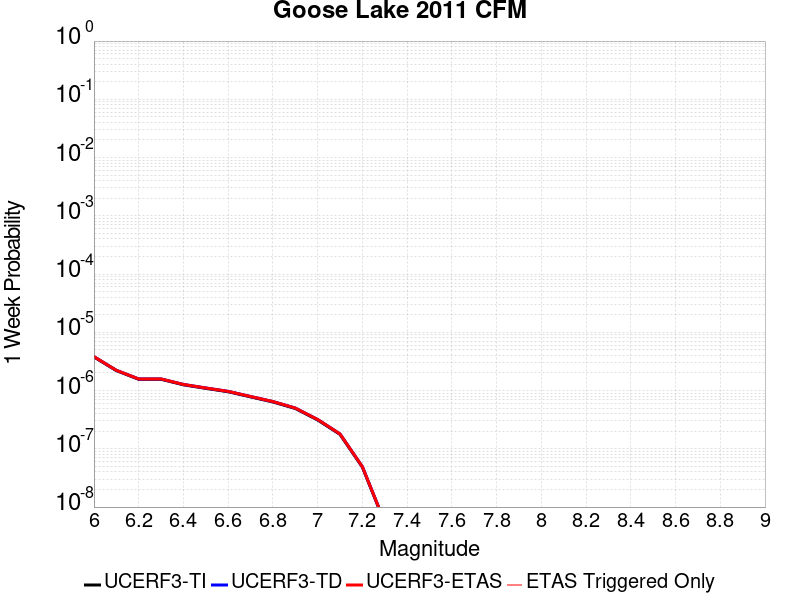 |  | 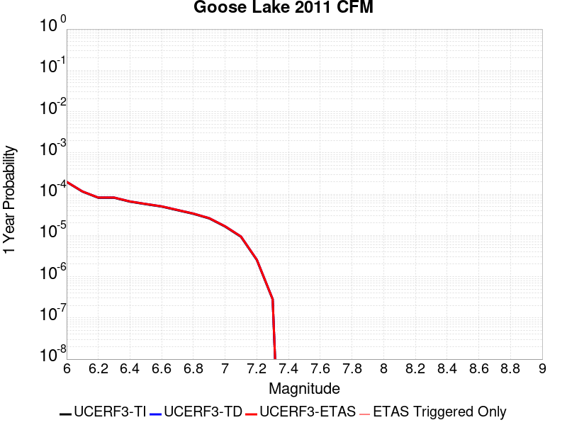 | 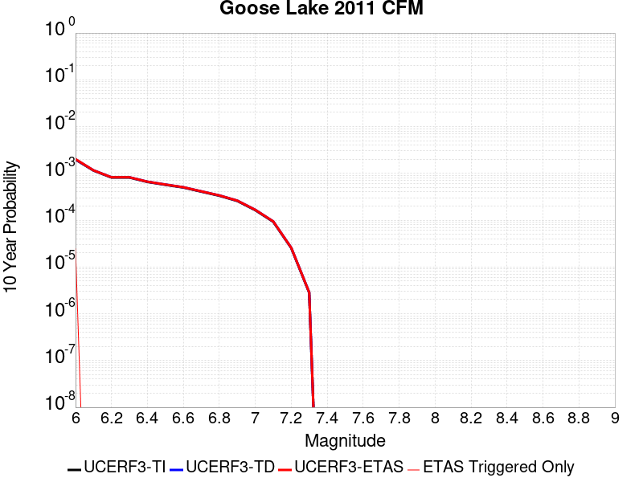 |

| Magnitude | 1 wk TI Prob | 1 wk TD Prob | 1 wk ETAS Prob | 1 wk ETAS/TD Gain | 1 wk ETAS Triggered Only | 1 mo TI Prob | 1 mo TD Prob | 1 mo ETAS Prob | 1 mo ETAS/TD Gain | 1 mo ETAS Triggered Only | 1 yr TI Prob | 1 yr TD Prob | 1 yr ETAS Prob | 1 yr ETAS/TD Gain | 1 yr ETAS Triggered Only | 10 yr TI Prob | 10 yr TD Prob | 10 yr ETAS Prob | 10 yr ETAS/TD Gain | 10 yr ETAS Triggered Only |
|-----|-----|-----|-----|-----|-----|-----|-----|-----|-----|-----|-----|-----|-----|-----|-----|-----|-----|-----|-----|-----|
| 6.0 | 3.780968E-6 | 3.8230223E-6 | 3.8230223E-6 | 1.0 | 0.0 | 1.6204049E-5 | 1.6384285E-5 | 1.6384285E-5 | 1.0 | 0.0 | 1.9726643E-4 | 1.994615E-4 | 1.994615E-4 | 1.0 | 0.0 | 0.001970914 | 0.001992933 | 0.0020175006 | 1.0123273 | 2.4616596E-5 |
| 6.1 | 2.2035124E-6 | 2.229801E-6 | 2.229801E-6 | 1.0 | 0.0 | 9.443591E-6 | 9.556257E-6 | 9.556257E-6 | 1.0 | 0.0 | 1.1496965E-4 | 1.163414E-4 | 1.163414E-4 | 1.0 | 0.0 | 0.0011491019 | 0.0011628233 | 0.0011628233 | 1.0 | 0.0 |
| 6.2 | 1.5624689E-6 | 1.5826923E-6 | 1.5826923E-6 | 1.0 | 0.0 | 6.6962784E-6 | 6.7829496E-6 | 6.7829496E-6 | 1.0 | 0.0 | 8.152414E-5 | 8.2579325E-5 | 8.2579325E-5 | 1.0 | 0.0 | 8.1494235E-4 | 8.2549086E-4 | 8.2549086E-4 | 1.0 | 0.0 |
| 6.3 | 1.5624689E-6 | 1.5826923E-6 | 1.5826923E-6 | 1.0 | 0.0 | 6.6962784E-6 | 6.7829496E-6 | 6.7829496E-6 | 1.0 | 0.0 | 8.152414E-5 | 8.2579325E-5 | 8.2579325E-5 | 1.0 | 0.0 | 8.1494235E-4 | 8.2549086E-4 | 8.2549086E-4 | 1.0 | 0.0 |
| 6.4 | 1.256464E-6 | 1.2738695E-6 | 1.2738695E-6 | 1.0 | 0.0 | 5.3848344E-6 | 5.4594293E-6 | 5.4594293E-6 | 1.0 | 0.0 | 6.5558386E-5 | 6.646655E-5 | 6.646655E-5 | 1.0 | 0.0 | 6.553905E-4 | 6.644687E-4 | 6.644687E-4 | 1.0 | 0.0 |
| 6.5 | 1.0910911E-6 | 1.1069404E-6 | 1.1069404E-6 | 1.0 | 0.0 | 4.6760965E-6 | 4.7440217E-6 | 4.7440217E-6 | 1.0 | 0.0 | 5.692999E-5 | 5.7756948E-5 | 5.7756948E-5 | 1.0 | 0.0 | 5.6915404E-4 | 5.7742064E-4 | 5.7742064E-4 | 1.0 | 0.0 |
| 6.6 | 9.546601E-7 | 9.691246E-7 | 9.691246E-7 | 1.0 | 0.0 | 4.091394E-6 | 4.1533845E-6 | 4.1533845E-6 | 1.0 | 0.0 | 4.9811584E-5 | 5.056629E-5 | 5.056629E-5 | 1.0 | 0.0 | 4.980042E-4 | 5.055487E-4 | 5.055487E-4 | 1.0 | 0.0 |
| 6.7 | 7.790316E-7 | 7.9159634E-7 | 7.9159634E-7 | 1.0 | 0.0 | 3.3387028E-6 | 3.3925514E-6 | 3.3925514E-6 | 1.0 | 0.0 | 4.0647945E-5 | 4.1303538E-5 | 4.1303538E-5 | 1.0 | 0.0 | 4.0640513E-4 | 4.129592E-4 | 4.129592E-4 | 1.0 | 0.0 |
| 6.8 | 6.3714384E-7 | 6.4787395E-7 | 6.4787395E-7 | 1.0 | 0.0 | 2.7306137E-6 | 2.7765998E-6 | 2.7765998E-6 | 1.0 | 0.0 | 3.3244716E-5 | 3.3804583E-5 | 3.3804583E-5 | 1.0 | 0.0 | 3.323974E-4 | 3.379949E-4 | 3.379949E-4 | 1.0 | 0.0 |
| 6.9 | 4.92586E-7 | 5.0139147E-7 | 5.0139147E-7 | 1.0 | 0.0 | 2.1110811E-6 | 2.1488188E-6 | 2.1488188E-6 | 1.0 | 0.0 | 2.5702111E-5 | 2.616156E-5 | 2.616156E-5 | 1.0 | 0.0 | 2.569914E-4 | 2.6158517E-4 | 2.6158517E-4 | 1.0 | 0.0 |
| 7.0 | 3.130245E-7 | 3.190354E-7 | 3.190354E-7 | 1.0 | 0.0 | 1.3415328E-6 | 1.3672939E-6 | 1.3672939E-6 | 1.0 | 0.0 | 1.6333039E-5 | 1.6646678E-5 | 1.6646678E-5 | 1.0 | 0.0 | 1.6331839E-4 | 1.6645451E-4 | 1.6645451E-4 | 1.0 | 0.0 |
| 7.1 | 1.7680084E-7 | 1.8023923E-7 | 1.8023923E-7 | 1.0 | 0.0 | 7.5771766E-7 | 7.724536E-7 | 7.724536E-7 | 1.0 | 0.0 | 9.225173E-6 | 9.404583E-6 | 9.404583E-6 | 1.0 | 0.0 | 9.22479E-5 | 9.4041956E-5 | 9.4041956E-5 | 1.0 | 0.0 |
| 7.2 | 4.8641045E-8 | 4.9402068E-8 | 4.9402068E-8 | 1.0 | 0.0 | 2.084616E-7 | 2.1172312E-7 | 2.1172312E-7 | 1.0 | 0.0 | 2.538017E-6 | 2.577726E-6 | 2.577726E-6 | 1.0 | 0.0 | 2.537988E-5 | 2.5776973E-5 | 2.5776973E-5 | 1.0 | 0.0 |
| 7.3 | 5.3911844E-9 | 5.4758145E-9 | 5.4758145E-9 | 1.0 | 0.0 | 2.3105075E-8 | 2.3467775E-8 | 2.3467775E-8 | 1.0 | 0.0 | 2.8130427E-7 | 2.8572015E-7 | 2.8572015E-7 | 1.0 | 0.0 | 2.8130391E-6 | 2.8571992E-6 | 2.8571992E-6 | 1.0 | 0.0 |

## Pitas Point (Lower)-Montalvo
*[(top)](#table-of-contents)*

| 1 Week | 1 Month | 1 Year | 10 Year |
|-----|-----|-----|-----|
|  |  | 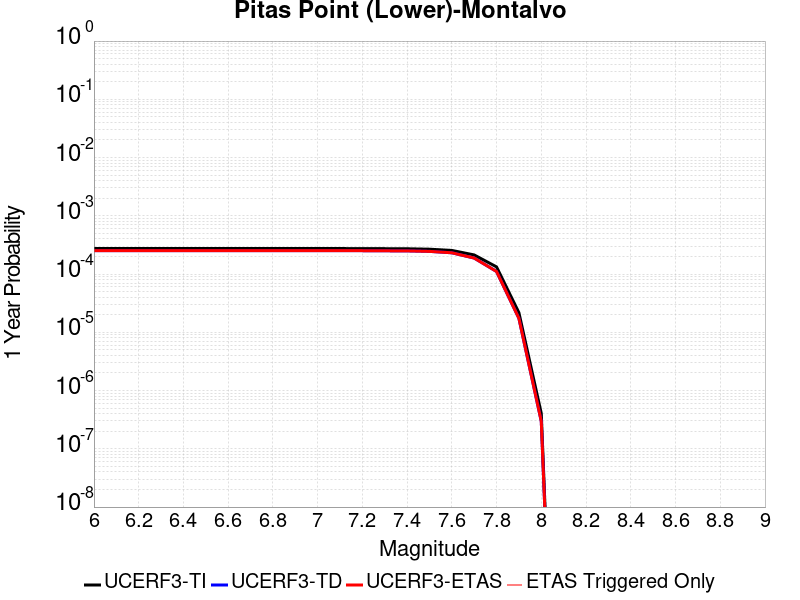 | 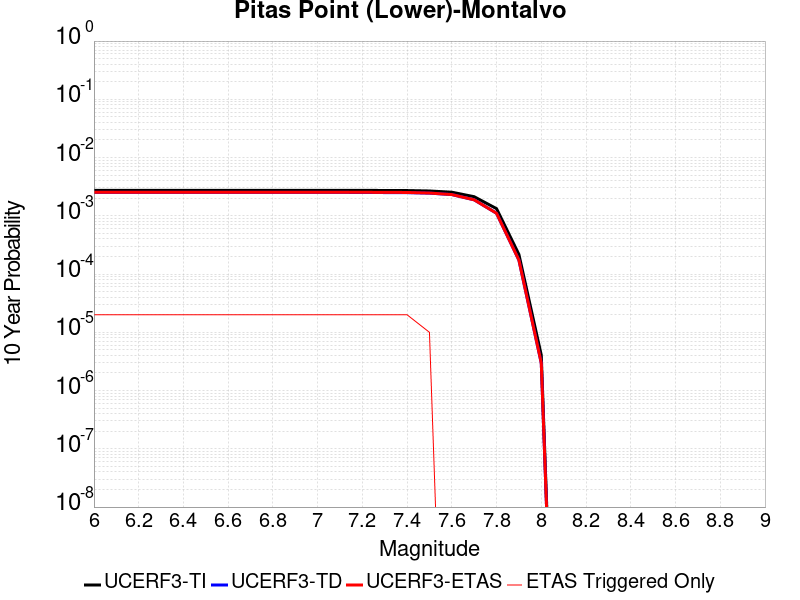 |

| Magnitude | 1 wk TI Prob | 1 wk TD Prob | 1 wk ETAS Prob | 1 wk ETAS/TD Gain | 1 wk ETAS Triggered Only | 1 mo TI Prob | 1 mo TD Prob | 1 mo ETAS Prob | 1 mo ETAS/TD Gain | 1 mo ETAS Triggered Only | 1 yr TI Prob | 1 yr TD Prob | 1 yr ETAS Prob | 1 yr ETAS/TD Gain | 1 yr ETAS Triggered Only | 10 yr TI Prob | 10 yr TD Prob | 10 yr ETAS Prob | 10 yr ETAS/TD Gain | 10 yr ETAS Triggered Only |
|-----|-----|-----|-----|-----|-----|-----|-----|-----|-----|-----|-----|-----|-----|-----|-----|-----|-----|-----|-----|-----|
| 6.0 | 5.2543637E-6 | 4.8378706E-6 | 4.8378706E-6 | 1.0 | 0.0 | 2.2518509E-5 | 2.0733567E-5 | 2.0733567E-5 | 1.0 | 0.0 | 2.7412834E-4 | 2.5240227E-4 | 2.5240227E-4 | 1.0 | 0.0 | 0.0027379042 | 0.0025211885 | 0.002545743 | 1.0097393 | 2.4616596E-5 |
| 6.1 | 5.2543637E-6 | 4.8378706E-6 | 4.8378706E-6 | 1.0 | 0.0 | 2.2518509E-5 | 2.0733567E-5 | 2.0733567E-5 | 1.0 | 0.0 | 2.7412834E-4 | 2.5240227E-4 | 2.5240227E-4 | 1.0 | 0.0 | 0.0027379042 | 0.0025211885 | 0.002545743 | 1.0097393 | 2.4616596E-5 |
| 6.2 | 5.2543637E-6 | 4.8378706E-6 | 4.8378706E-6 | 1.0 | 0.0 | 2.2518509E-5 | 2.0733567E-5 | 2.0733567E-5 | 1.0 | 0.0 | 2.7412834E-4 | 2.5240227E-4 | 2.5240227E-4 | 1.0 | 0.0 | 0.0027379042 | 0.0025211885 | 0.002545743 | 1.0097393 | 2.4616596E-5 |
| 6.3 | 5.2543637E-6 | 4.8378706E-6 | 4.8378706E-6 | 1.0 | 0.0 | 2.2518509E-5 | 2.0733567E-5 | 2.0733567E-5 | 1.0 | 0.0 | 2.7412834E-4 | 2.5240227E-4 | 2.5240227E-4 | 1.0 | 0.0 | 0.0027379042 | 0.0025211885 | 0.002545743 | 1.0097393 | 2.4616596E-5 |
| 6.4 | 5.2543637E-6 | 4.8378706E-6 | 4.8378706E-6 | 1.0 | 0.0 | 2.2518509E-5 | 2.0733567E-5 | 2.0733567E-5 | 1.0 | 0.0 | 2.7412834E-4 | 2.5240227E-4 | 2.5240227E-4 | 1.0 | 0.0 | 0.0027379042 | 0.0025211885 | 0.002545743 | 1.0097393 | 2.4616596E-5 |
| 6.5 | 5.2543637E-6 | 4.8378706E-6 | 4.8378706E-6 | 1.0 | 0.0 | 2.2518509E-5 | 2.0733567E-5 | 2.0733567E-5 | 1.0 | 0.0 | 2.7412834E-4 | 2.5240227E-4 | 2.5240227E-4 | 1.0 | 0.0 | 0.0027379042 | 0.0025211885 | 0.002545743 | 1.0097393 | 2.4616596E-5 |
| 6.6 | 5.2543637E-6 | 4.8378706E-6 | 4.8378706E-6 | 1.0 | 0.0 | 2.2518509E-5 | 2.0733567E-5 | 2.0733567E-5 | 1.0 | 0.0 | 2.7412834E-4 | 2.5240227E-4 | 2.5240227E-4 | 1.0 | 0.0 | 0.0027379042 | 0.0025211885 | 0.002545743 | 1.0097393 | 2.4616596E-5 |
| 6.7 | 5.2543637E-6 | 4.8378706E-6 | 4.8378706E-6 | 1.0 | 0.0 | 2.2518509E-5 | 2.0733567E-5 | 2.0733567E-5 | 1.0 | 0.0 | 2.7412834E-4 | 2.5240227E-4 | 2.5240227E-4 | 1.0 | 0.0 | 0.0027379042 | 0.0025211885 | 0.002545743 | 1.0097393 | 2.4616596E-5 |
| 6.8 | 5.2543637E-6 | 4.8378706E-6 | 4.8378706E-6 | 1.0 | 0.0 | 2.2518509E-5 | 2.0733567E-5 | 2.0733567E-5 | 1.0 | 0.0 | 2.7412834E-4 | 2.5240227E-4 | 2.5240227E-4 | 1.0 | 0.0 | 0.0027379042 | 0.0025211885 | 0.002545743 | 1.0097393 | 2.4616596E-5 |
| 6.9 | 5.2543637E-6 | 4.8378706E-6 | 4.8378706E-6 | 1.0 | 0.0 | 2.2518509E-5 | 2.0733567E-5 | 2.0733567E-5 | 1.0 | 0.0 | 2.7412834E-4 | 2.5240227E-4 | 2.5240227E-4 | 1.0 | 0.0 | 0.0027379042 | 0.0025211885 | 0.002545743 | 1.0097393 | 2.4616596E-5 |
| 7.0 | 5.2543637E-6 | 4.8378706E-6 | 4.8378706E-6 | 1.0 | 0.0 | 2.2518509E-5 | 2.0733567E-5 | 2.0733567E-5 | 1.0 | 0.0 | 2.7412834E-4 | 2.5240227E-4 | 2.5240227E-4 | 1.0 | 0.0 | 0.0027379042 | 0.0025211885 | 0.002545743 | 1.0097393 | 2.4616596E-5 |
| 7.1 | 5.2543637E-6 | 4.8378706E-6 | 4.8378706E-6 | 1.0 | 0.0 | 2.2518509E-5 | 2.0733567E-5 | 2.0733567E-5 | 1.0 | 0.0 | 2.7412834E-4 | 2.5240227E-4 | 2.5240227E-4 | 1.0 | 0.0 | 0.0027379042 | 0.0025211885 | 0.002545743 | 1.0097393 | 2.4616596E-5 |
| 7.2 | 5.2458695E-6 | 4.8290244E-6 | 4.8290244E-6 | 1.0 | 0.0 | 2.2482105E-5 | 2.0695656E-5 | 2.0695656E-5 | 1.0 | 0.0 | 2.7368523E-4 | 2.519408E-4 | 2.519408E-4 | 1.0 | 0.0 | 0.0027334841 | 0.0025165842 | 0.0025411388 | 1.0097572 | 2.4616596E-5 |
| 7.3 | 5.22665E-6 | 4.8089414E-6 | 4.8089414E-6 | 1.0 | 0.0 | 2.2399736E-5 | 2.0609588E-5 | 2.0609588E-5 | 1.0 | 0.0 | 2.7268266E-4 | 2.5089315E-4 | 2.5089315E-4 | 1.0 | 0.0 | 0.002723483 | 0.0025061315 | 0.0025306866 | 1.0097979 | 2.4616596E-5 |
| 7.4 | 5.210642E-6 | 4.792154E-6 | 4.792154E-6 | 1.0 | 0.0 | 2.233113E-5 | 2.0537642E-5 | 2.0537642E-5 | 1.0 | 0.0 | 2.718476E-4 | 2.5001742E-4 | 2.5001742E-4 | 1.0 | 0.0 | 0.002715153 | 0.0024973939 | 0.002521949 | 1.0098323 | 2.4616596E-5 |
| 7.5 | 5.1226016E-6 | 4.7000403E-6 | 4.7000403E-6 | 1.0 | 0.0 | 2.1953823E-5 | 2.0142877E-5 | 2.0142877E-5 | 1.0 | 0.0 | 2.67255E-4 | 2.4521223E-4 | 2.4521223E-4 | 1.0 | 0.0 | 0.0026693381 | 0.0024494485 | 0.0024740046 | 1.0100253 | 2.4616596E-5 |
| 7.6 | 4.8796987E-6 | 4.4449403E-6 | 4.4449403E-6 | 1.0 | 0.0 | 2.0912828E-5 | 1.9049607E-5 | 1.9049607E-5 | 1.0 | 0.0 | 2.5458392E-4 | 2.3190459E-4 | 2.3190459E-4 | 1.0 | 0.0 | 0.0025429246 | 0.0023166565 | 0.0023166565 | 1.0 | 0.0 |
| 7.7 | 4.0834398E-6 | 3.6091124E-6 | 3.6091124E-6 | 1.0 | 0.0 | 1.7500339E-5 | 1.5467534E-5 | 1.5467534E-5 | 1.0 | 0.0 | 2.1304579E-4 | 1.8830119E-4 | 1.8830119E-4 | 1.0 | 0.0 | 0.0021284167 | 0.00188144 | 0.00188144 | 1.0 | 0.0 |
| 7.8 | 2.5445438E-6 | 2.121228E-6 | 2.121228E-6 | 1.0 | 0.0 | 1.0905142E-5 | 9.090945E-6 | 9.090945E-6 | 1.0 | 0.0 | 1.3276201E-4 | 1.1067669E-4 | 1.1067669E-4 | 1.0 | 0.0 | 0.0013268272 | 0.0011062203 | 0.0011062203 | 1.0 | 0.0 |
| 7.9 | 4.1677114E-7 | 3.3293693E-7 | 3.3293693E-7 | 1.0 | 0.0 | 1.7861609E-6 | 1.4268718E-6 | 1.4268718E-6 | 1.0 | 0.0 | 2.1746291E-5 | 1.737203E-5 | 1.737203E-5 | 1.0 | 0.0 | 2.1744163E-4 | 1.7370703E-4 | 1.7370703E-4 | 1.0 | 0.0 |
| 8.0 | 7.791402E-9 | 5.683497E-9 | 5.683497E-9 | 1.0 | 0.0 | 3.3391725E-8 | 2.4357844E-8 | 2.4357844E-8 | 1.0 | 0.0 | 4.0654416E-7 | 2.9655675E-7 | 2.9655675E-7 | 1.0 | 0.0 | 4.065434E-6 | 2.9655655E-6 | 2.9655655E-6 | 1.0 | 0.0 |

## Great Valley 04b Gordon Valley
*[(top)](#table-of-contents)*

| 1 Week | 1 Month | 1 Year | 10 Year |
|-----|-----|-----|-----|
| 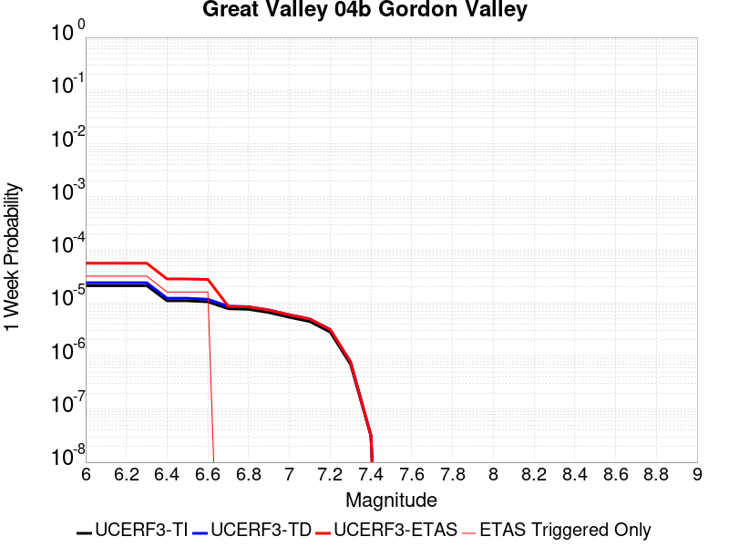 | 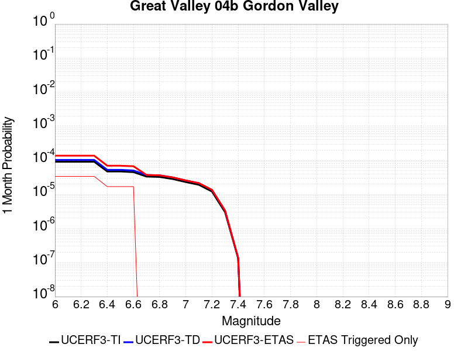 | 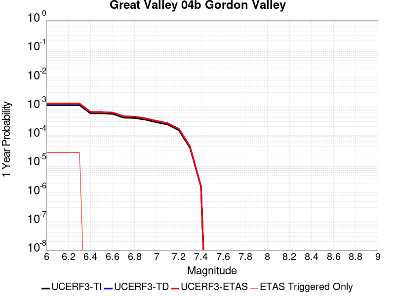 | 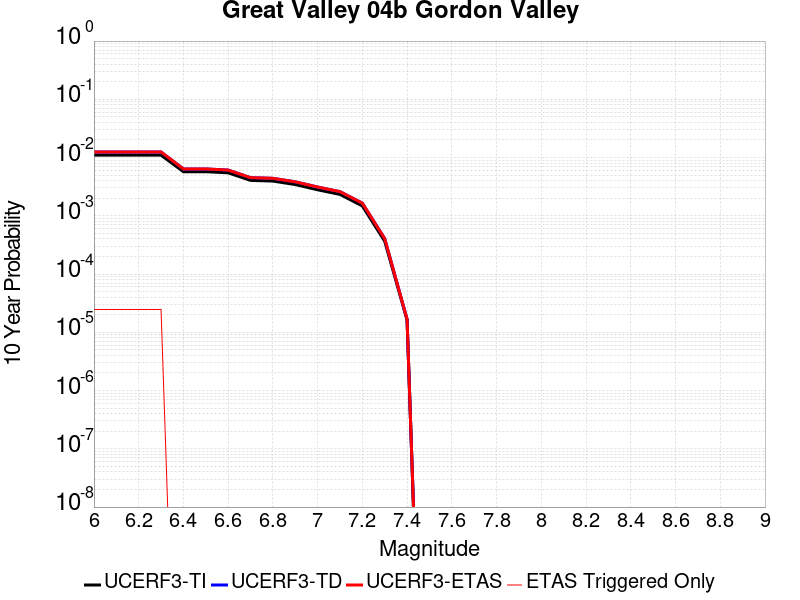 |

| Magnitude | 1 wk TI Prob | 1 wk TD Prob | 1 wk ETAS Prob | 1 wk ETAS/TD Gain | 1 wk ETAS Triggered Only | 1 mo TI Prob | 1 mo TD Prob | 1 mo ETAS Prob | 1 mo ETAS/TD Gain | 1 mo ETAS Triggered Only | 1 yr TI Prob | 1 yr TD Prob | 1 yr ETAS Prob | 1 yr ETAS/TD Gain | 1 yr ETAS Triggered Only | 10 yr TI Prob | 10 yr TD Prob | 10 yr ETAS Prob | 10 yr ETAS/TD Gain | 10 yr ETAS Triggered Only |
|-----|-----|-----|-----|-----|-----|-----|-----|-----|-----|-----|-----|-----|-----|-----|-----|-----|-----|-----|-----|-----|
| 6.0 | 2.1181217E-5 | 2.3981953E-5 | 4.8597958E-5 | 2.0264387 | 2.4616596E-5 | 9.077348E-5 | 1.0277669E-4 | 1.2739075E-4 | 1.2394907 | 2.4616596E-5 | 0.0011046068 | 0.0012507546 | 0.0012753404 | 1.0196568 | 2.4616596E-5 | 0.010991322 | 0.012453599 | 0.012477909 | 1.001952 | 2.4616596E-5 |
| 6.1 | 2.1181217E-5 | 2.3981953E-5 | 4.8597958E-5 | 2.0264387 | 2.4616596E-5 | 9.077348E-5 | 1.0277669E-4 | 1.2739075E-4 | 1.2394907 | 2.4616596E-5 | 0.0011046068 | 0.0012507546 | 0.0012753404 | 1.0196568 | 2.4616596E-5 | 0.010991322 | 0.012453599 | 0.012477909 | 1.001952 | 2.4616596E-5 |
| 6.2 | 2.1181217E-5 | 2.3981953E-5 | 4.8597958E-5 | 2.0264387 | 2.4616596E-5 | 9.077348E-5 | 1.0277669E-4 | 1.2739075E-4 | 1.2394907 | 2.4616596E-5 | 0.0011046068 | 0.0012507546 | 0.0012753404 | 1.0196568 | 2.4616596E-5 | 0.010991322 | 0.012453599 | 0.012477909 | 1.001952 | 2.4616596E-5 |
| 6.3 | 2.1181217E-5 | 2.3981953E-5 | 4.8597958E-5 | 2.0264387 | 2.4616596E-5 | 9.077348E-5 | 1.0277669E-4 | 1.2739075E-4 | 1.2394907 | 2.4616596E-5 | 0.0011046068 | 0.0012507546 | 0.0012753404 | 1.0196568 | 2.4616596E-5 | 0.010991322 | 0.012453599 | 0.012477909 | 1.001952 | 2.4616596E-5 |
| 6.4 | 1.0988268E-5 | 1.2254499E-5 | 1.2254499E-5 | 1.0 | 0.0 | 4.7091726E-5 | 5.2518313E-5 | 5.2518313E-5 | 1.0 | 0.0 | 5.731909E-4 | 6.392388E-4 | 6.392388E-4 | 1.0 | 0.0 | 0.005717147 | 0.0063755875 | 0.0063755875 | 1.0 | 0.0 |
| 6.5 | 1.0988268E-5 | 1.2254499E-5 | 1.2254499E-5 | 1.0 | 0.0 | 4.7091726E-5 | 5.2518313E-5 | 5.2518313E-5 | 1.0 | 0.0 | 5.731909E-4 | 6.392388E-4 | 6.392388E-4 | 1.0 | 0.0 | 0.005717147 | 0.0063755875 | 0.0063755875 | 1.0 | 0.0 |
| 6.6 | 1.0517822E-5 | 1.1724062E-5 | 1.1724062E-5 | 1.0 | 0.0 | 4.5075605E-5 | 5.02451E-5 | 5.02451E-5 | 1.0 | 0.0 | 5.4865726E-4 | 6.11578E-4 | 6.11578E-4 | 1.0 | 0.0 | 0.0054730466 | 0.0061005033 | 0.0061005033 | 1.0 | 0.0 |
| 6.7 | 7.789219E-6 | 8.6776445E-6 | 8.6776445E-6 | 1.0 | 0.0 | 3.3381937E-5 | 3.7189402E-5 | 3.7189402E-5 | 1.0 | 0.0 | 4.063493E-4 | 4.526921E-4 | 4.526921E-4 | 1.0 | 0.0 | 0.004056071 | 0.0045182165 | 0.0045182165 | 1.0 | 0.0 |
| 6.8 | 7.5850853E-6 | 8.452389E-6 | 8.452389E-6 | 1.0 | 0.0 | 3.2507105E-5 | 3.622405E-5 | 3.622405E-5 | 1.0 | 0.0 | 3.957021E-4 | 4.409437E-4 | 4.409437E-4 | 1.0 | 0.0 | 0.0039499826 | 0.0044012 | 0.0044012 | 1.0 | 0.0 |
| 6.9 | 6.604105E-6 | 7.3585493E-6 | 7.3585493E-6 | 1.0 | 0.0 | 2.8303E-5 | 3.153628E-5 | 3.153628E-5 | 1.0 | 0.0 | 3.4453452E-4 | 3.8389044E-4 | 3.8389044E-4 | 1.0 | 0.0 | 0.0034400085 | 0.0038326595 | 0.0038326595 | 1.0 | 0.0 |
| 7.0 | 5.3701115E-6 | 5.9884183E-6 | 5.9884183E-6 | 1.0 | 0.0 | 2.301456E-5 | 2.5664414E-5 | 2.5664414E-5 | 1.0 | 0.0 | 2.8016625E-4 | 3.1242234E-4 | 3.1242234E-4 | 1.0 | 0.0 | 0.0027981328 | 0.00312012 | 0.00312012 | 1.0 | 0.0 |
| 7.1 | 4.4685607E-6 | 4.986478E-6 | 4.986478E-6 | 1.0 | 0.0 | 1.9150835E-5 | 2.1370459E-5 | 2.1370459E-5 | 1.0 | 0.0 | 2.3313647E-4 | 2.6015675E-4 | 2.6015675E-4 | 1.0 | 0.0 | 0.0023289204 | 0.0025987667 | 0.0025987667 | 1.0 | 0.0 |
| 7.2 | 2.833378E-6 | 3.164419E-6 | 3.164419E-6 | 1.0 | 0.0 | 1.2142991E-5 | 1.3561736E-5 | 1.3561736E-5 | 1.0 | 0.0 | 1.4783088E-4 | 1.6510337E-4 | 1.6510337E-4 | 1.0 | 0.0 | 0.0014773258 | 0.0016499789 | 0.0016499789 | 1.0 | 0.0 |
| 7.3 | 7.0087293E-7 | 7.7728157E-7 | 7.7728157E-7 | 1.0 | 0.0 | 3.0037377E-6 | 3.3312049E-6 | 3.3312049E-6 | 1.0 | 0.0 | 3.656989E-5 | 4.0557123E-5 | 4.0557123E-5 | 1.0 | 0.0 | 3.6563876E-4 | 4.055422E-4 | 4.055422E-4 | 1.0 | 0.0 |
| 7.4 | 3.112171E-8 | 3.2068368E-8 | 3.2068368E-8 | 1.0 | 0.0 | 1.3337875E-7 | 1.3743585E-7 | 1.3743585E-7 | 1.0 | 0.0 | 1.6238852E-6 | 1.6732803E-6 | 1.6732803E-6 | 1.0 | 0.0 | 1.6238733E-5 | 1.6732685E-5 | 1.6732685E-5 | 1.0 | 0.0 |

## Malibu Coast (Extension) alt 1
*[(top)](#table-of-contents)*

| 1 Week | 1 Month | 1 Year | 10 Year |
|-----|-----|-----|-----|
|  | 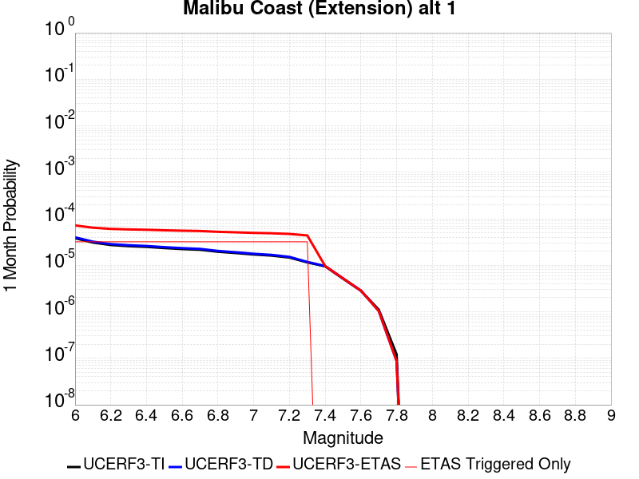 | 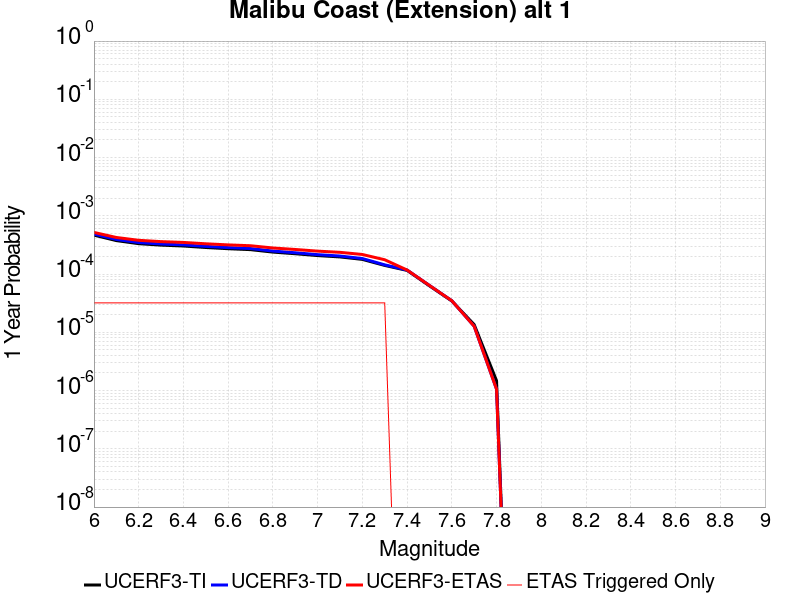 | 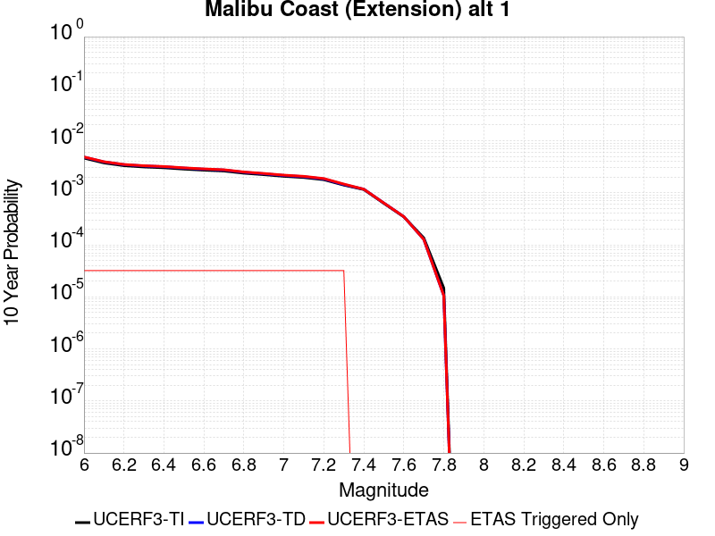 |

| Magnitude | 1 wk TI Prob | 1 wk TD Prob | 1 wk ETAS Prob | 1 wk ETAS/TD Gain | 1 wk ETAS Triggered Only | 1 mo TI Prob | 1 mo TD Prob | 1 mo ETAS Prob | 1 mo ETAS/TD Gain | 1 mo ETAS Triggered Only | 1 yr TI Prob | 1 yr TD Prob | 1 yr ETAS Prob | 1 yr ETAS/TD Gain | 1 yr ETAS Triggered Only | 10 yr TI Prob | 10 yr TD Prob | 10 yr ETAS Prob | 10 yr ETAS/TD Gain | 10 yr ETAS Triggered Only |
|-----|-----|-----|-----|-----|-----|-----|-----|-----|-----|-----|-----|-----|-----|-----|-----|-----|-----|-----|-----|-----|
| 6.0 | 8.930738E-6 | 9.329276E-6 | 3.3945642E-5 | 3.638615 | 2.4616596E-5 | 3.827403E-5 | 3.998201E-5 | 6.459762E-5 | 1.6156672 | 2.4616596E-5 | 4.6588664E-4 | 4.8667393E-4 | 5.112786E-4 | 1.0505567 | 2.4616596E-5 | 0.0046491115 | 0.004856264 | 0.0048807613 | 1.0050445 | 2.4616596E-5 |
| 6.1 | 7.199952E-6 | 7.5302964E-6 | 3.214671E-5 | 4.268983 | 2.4616596E-5 | 3.0856572E-5 | 3.2272303E-5 | 5.6888104E-5 | 1.7627531 | 2.4616596E-5 | 3.75614E-4 | 3.9284505E-4 | 4.1745199E-4 | 1.0626377 | 2.4616596E-5 | 0.0037497976 | 0.003921572 | 0.0039460924 | 1.0062526 | 2.4616596E-5 |
| 6.2 | 6.3721413E-6 | 6.6667917E-6 | 3.1283224E-5 | 4.6923957 | 2.4616596E-5 | 2.7308892E-5 | 2.8571652E-5 | 5.3187545E-5 | 1.8615495 | 2.4616596E-5 | 3.3243504E-4 | 3.4780471E-4 | 3.7241273E-4 | 1.0707525 | 2.4616596E-5 | 0.0033193815 | 0.0034726437 | 0.0034971747 | 1.0070641 | 2.4616596E-5 |
| 6.3 | 6.016345E-6 | 6.295158E-6 | 3.09116E-5 | 4.910377 | 2.4616596E-5 | 2.578408E-5 | 2.6978973E-5 | 5.1594903E-5 | 1.9124118 | 2.4616596E-5 | 3.1387596E-4 | 3.2841982E-4 | 3.5302833E-4 | 1.0749301 | 2.4616596E-5 | 0.00313433 | 0.0032793807 | 0.0033039167 | 1.0074818 | 2.4616596E-5 |
| 6.4 | 5.8104883E-6 | 6.0795446E-6 | 3.0695992E-5 | 5.049061 | 2.4616596E-5 | 2.4901856E-5 | 2.6054933E-5 | 5.067089E-5 | 1.9447714 | 2.4616596E-5 | 3.031379E-4 | 3.1717293E-4 | 3.4178174E-4 | 1.077588 | 2.4616596E-5 | 0.0030272473 | 0.0031672374 | 0.0031917759 | 1.0077477 | 2.4616596E-5 |
| 6.5 | 5.476925E-6 | 5.7275133E-6 | 3.0343968E-5 | 5.2979307 | 2.4616596E-5 | 2.3472323E-5 | 2.4546256E-5 | 4.916225E-5 | 2.002841 | 2.4616596E-5 | 2.8573806E-4 | 2.9880996E-4 | 3.2341923E-4 | 1.0823575 | 2.4616596E-5 | 0.0028537093 | 0.002984114 | 0.0030086571 | 1.0082246 | 2.4616596E-5 |
| 6.6 | 5.222387E-6 | 5.45858E-6 | 3.0075042E-5 | 5.5096827 | 2.4616596E-5 | 2.2381464E-5 | 2.3393704E-5 | 4.8009726E-5 | 2.0522497 | 2.4616596E-5 | 2.7246025E-4 | 2.8478142E-4 | 3.09391E-4 | 1.0864156 | 2.4616596E-5 | 0.0027212645 | 0.0028441956 | 0.002868742 | 1.0086304 | 2.4616596E-5 |
| 6.7 | 5.0337076E-6 | 5.259103E-6 | 2.987557E-5 | 5.6807346 | 2.4616596E-5 | 2.1572854E-5 | 2.253882E-5 | 4.7154863E-5 | 2.092162 | 2.4616596E-5 | 2.6261783E-4 | 2.7437587E-4 | 2.9898572E-4 | 1.0896939 | 2.4616596E-5 | 0.002623077 | 0.002740401 | 0.0027649503 | 1.0089582 | 2.4616596E-5 |
| 6.8 | 4.5675624E-6 | 4.7587164E-6 | 2.9375196E-5 | 6.172924 | 2.4616596E-5 | 1.9575122E-5 | 2.039434E-5 | 4.5010434E-5 | 2.2070062 | 2.4616596E-5 | 2.3830103E-4 | 2.48273E-4 | 2.7288348E-4 | 1.0991267 | 2.4616596E-5 | 0.0023804565 | 0.002479976 | 0.0025045315 | 1.0099015 | 2.4616596E-5 |
| 6.9 | 4.2802412E-6 | 4.4520207E-6 | 2.9068508E-5 | 6.529284 | 2.4616596E-5 | 1.8343762E-5 | 1.907995E-5 | 4.3696076E-5 | 2.2901568 | 2.4616596E-5 | 2.2331243E-4 | 2.3227377E-4 | 2.5688467E-4 | 1.1059563 | 2.4616596E-5 | 0.0022308815 | 0.0023203269 | 0.0023448863 | 1.0105845 | 2.4616596E-5 |
| 7.0 | 3.9794063E-6 | 4.130099E-6 | 2.8746594E-5 | 6.9602675 | 2.4616596E-5 | 1.7054486E-5 | 1.7700306E-5 | 4.2316467E-5 | 2.3907197 | 2.4616596E-5 | 2.0761859E-4 | 2.1548003E-4 | 2.4009132E-4 | 1.1142161 | 2.4616596E-5 | 0.0020742472 | 0.0021527244 | 0.002177288 | 1.0114105 | 2.4616596E-5 |
| 7.1 | 3.7730424E-6 | 3.911217E-6 | 2.8527716E-5 | 7.293821 | 2.4616596E-5 | 1.6170083E-5 | 1.6762251E-5 | 4.1378436E-5 | 2.4685488 | 2.4616596E-5 | 1.9685295E-4 | 2.0406142E-4 | 2.28673E-4 | 1.1206087 | 2.4616596E-5 | 0.0019667868 | 0.0020387534 | 0.0020633198 | 1.0120497 | 2.4616596E-5 |
| 7.2 | 3.424985E-6 | 3.541337E-6 | 2.8157847E-5 | 7.951191 | 2.4616596E-5 | 1.4678424E-5 | 1.5177071E-5 | 3.9793293E-5 | 2.621935 | 2.4616596E-5 | 1.7869516E-4 | 1.8476529E-4 | 2.0937734E-4 | 1.1332071 | 2.4616596E-5 | 0.0017855153 | 0.0018461287 | 0.0018706999 | 1.0133096 | 2.4616596E-5 |
| 7.3 | 2.6966375E-6 | 2.7596534E-6 | 2.7376182E-5 | 9.920153 | 2.4616596E-5 | 1.15569665E-5 | 1.1827032E-5 | 3.6443336E-5 | 3.0813594 | 2.4616596E-5 | 1.4069698E-4 | 1.4398464E-4 | 1.6859769E-4 | 1.1709422 | 2.4616596E-5 | 0.0014060794 | 0.0014389176 | 0.0014634988 | 1.017083 | 2.4616596E-5 |
| 7.4 | 2.215957E-6 | 2.249378E-6 | 2.249378E-6 | 1.0 | 0.0 | 9.496924E-6 | 9.640156E-6 | 9.640156E-6 | 1.0 | 0.0 | 1.1561892E-4 | 1.17362615E-4 | 1.17362615E-4 | 1.0 | 0.0 | 0.0011555878 | 0.0011730101 | 0.0011730101 | 1.0 | 0.0 |
| 7.5 | 1.2040218E-6 | 1.2219067E-6 | 1.2219067E-6 | 1.0 | 0.0 | 5.160083E-6 | 5.2367322E-6 | 5.2367322E-6 | 1.0 | 0.0 | 6.2822204E-5 | 6.375537E-5 | 6.375537E-5 | 1.0 | 0.0 | 6.280445E-4 | 6.3737266E-4 | 6.3737266E-4 | 1.0 | 0.0 |
| 7.6 | 6.6157446E-7 | 6.678975E-7 | 6.678975E-7 | 1.0 | 0.0 | 2.835316E-6 | 2.8624147E-6 | 2.8624147E-6 | 1.0 | 0.0 | 3.4519428E-5 | 3.484936E-5 | 3.484936E-5 | 1.0 | 0.0 | 3.4514067E-4 | 3.4844046E-4 | 3.4844046E-4 | 1.0 | 0.0 |
| 7.7 | 2.6012302E-7 | 2.4357593E-7 | 2.4357593E-7 | 1.0 | 0.0 | 1.1148124E-6 | 1.0438964E-6 | 1.0438964E-6 | 1.0 | 0.0 | 1.3572758E-5 | 1.2709375E-5 | 1.2709375E-5 | 1.0 | 0.0 | 1.3571928E-4 | 1.2708755E-4 | 1.2708755E-4 | 1.0 | 0.0 |
| 7.8 | 2.8323132E-8 | 2.0266649E-8 | 2.0266649E-8 | 1.0 | 0.0 | 1.2138484E-7 | 8.685707E-8 | 8.685707E-8 | 1.0 | 0.0 | 1.4778595E-6 | 1.0574844E-6 | 1.0574844E-6 | 1.0 | 0.0 | 1.4778497E-5 | 1.0574801E-5 | 1.0574801E-5 | 1.0 | 0.0 |

## Rinconada 2011 CFM
*[(top)](#table-of-contents)*

| 1 Week | 1 Month | 1 Year | 10 Year |
|-----|-----|-----|-----|
| 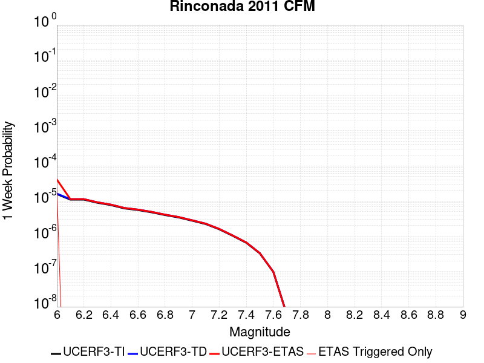 | 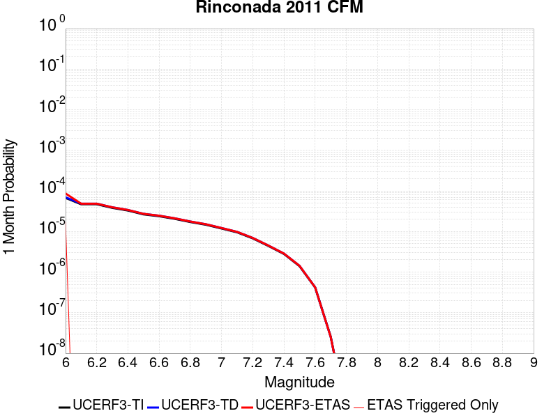 | 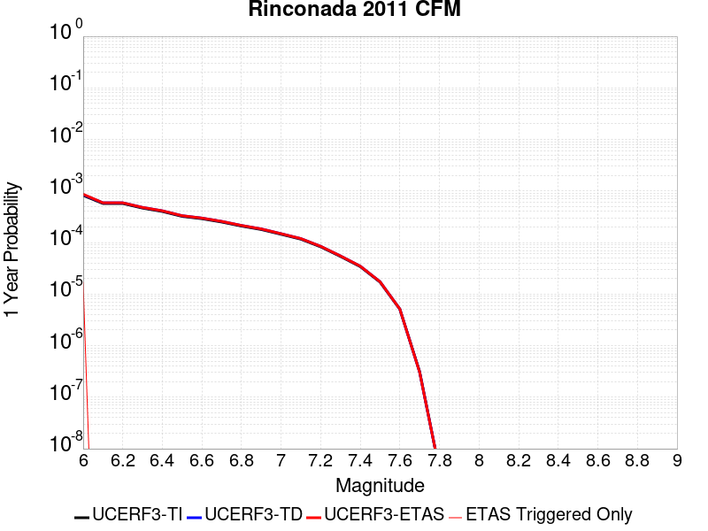 | 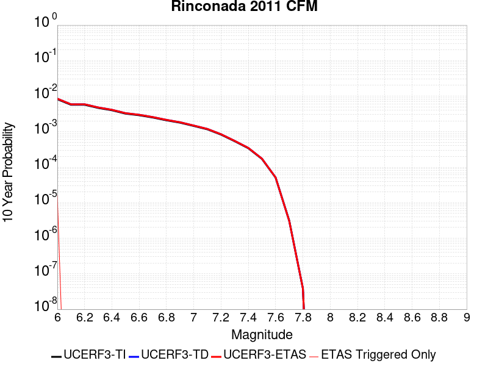 |

| Magnitude | 1 wk TI Prob | 1 wk TD Prob | 1 wk ETAS Prob | 1 wk ETAS/TD Gain | 1 wk ETAS Triggered Only | 1 mo TI Prob | 1 mo TD Prob | 1 mo ETAS Prob | 1 mo ETAS/TD Gain | 1 mo ETAS Triggered Only | 1 yr TI Prob | 1 yr TD Prob | 1 yr ETAS Prob | 1 yr ETAS/TD Gain | 1 yr ETAS Triggered Only | 10 yr TI Prob | 10 yr TD Prob | 10 yr ETAS Prob | 10 yr ETAS/TD Gain | 10 yr ETAS Triggered Only |
|-----|-----|-----|-----|-----|-----|-----|-----|-----|-----|-----|-----|-----|-----|-----|-----|-----|-----|-----|-----|-----|
| 6.0 | 1.5752368E-5 | 1.6274716E-5 | 4.089091E-5 | 2.5125422 | 2.4616596E-5 | 6.75084E-5 | 6.974694E-5 | 9.4361814E-5 | 1.352917 | 2.4616596E-5 | 8.2160486E-4 | 8.488412E-4 | 8.734369E-4 | 1.0289756 | 2.4616596E-5 | 0.008185739 | 0.00845637 | 0.008480778 | 1.0028864 | 2.4616596E-5 |
| 6.1 | 1.0966133E-5 | 1.1323029E-5 | 1.1323029E-5 | 1.0 | 0.0 | 4.6996865E-5 | 4.852637E-5 | 4.852637E-5 | 1.0 | 0.0 | 5.720366E-4 | 5.906491E-4 | 5.906491E-4 | 1.0 | 0.0 | 0.0057056635 | 0.0058908886 | 0.0058908886 | 1.0 | 0.0 |
| 6.2 | 1.0966133E-5 | 1.1323029E-5 | 1.1323029E-5 | 1.0 | 0.0 | 4.6996865E-5 | 4.852637E-5 | 4.852637E-5 | 1.0 | 0.0 | 5.720366E-4 | 5.906491E-4 | 5.906491E-4 | 1.0 | 0.0 | 0.0057056635 | 0.0058908886 | 0.0058908886 | 1.0 | 0.0 |
| 6.3 | 8.926149E-6 | 9.212771E-6 | 9.212771E-6 | 1.0 | 0.0 | 3.8254362E-5 | 3.948271E-5 | 3.948271E-5 | 1.0 | 0.0 | 4.6564735E-4 | 4.805963E-4 | 4.805963E-4 | 1.0 | 0.0 | 0.0046467283 | 0.0047956146 | 0.0047956146 | 1.0 | 0.0 |
| 6.4 | 7.676955E-6 | 7.920191E-6 | 7.920191E-6 | 1.0 | 0.0 | 3.290082E-5 | 3.3943234E-5 | 3.3943234E-5 | 1.0 | 0.0 | 4.0049385E-4 | 4.1318068E-4 | 4.1318068E-4 | 1.0 | 0.0 | 0.0039977287 | 0.004124151 | 0.004124151 | 1.0 | 0.0 |
| 6.5 | 6.1671026E-6 | 6.3589546E-6 | 6.3589546E-6 | 1.0 | 0.0 | 2.6430173E-5 | 2.725238E-5 | 2.725238E-5 | 1.0 | 0.0 | 3.2173982E-4 | 3.317473E-4 | 3.317473E-4 | 1.0 | 0.0 | 0.003212744 | 0.0033125326 | 0.0033125326 | 1.0 | 0.0 |
| 6.6 | 5.553456E-6 | 5.7248126E-6 | 5.7248126E-6 | 1.0 | 0.0 | 2.3800309E-5 | 2.453468E-5 | 2.453468E-5 | 1.0 | 0.0 | 2.897302E-4 | 2.9866883E-4 | 2.9866883E-4 | 1.0 | 0.0 | 0.0028935277 | 0.002982683 | 0.002982683 | 1.0 | 0.0 |
| 6.7 | 4.787857E-6 | 4.9333094E-6 | 4.9333094E-6 | 1.0 | 0.0 | 2.0519226E-5 | 2.1142583E-5 | 2.1142583E-5 | 1.0 | 0.0 | 2.4979294E-4 | 2.573806E-4 | 2.573806E-4 | 1.0 | 0.0 | 0.0024951235 | 0.0025708308 | 0.0025708308 | 1.0 | 0.0 |
| 6.8 | 3.9955166E-6 | 4.1134763E-6 | 4.1134763E-6 | 1.0 | 0.0 | 1.7123532E-5 | 1.7629065E-5 | 1.7629065E-5 | 1.0 | 0.0 | 2.0845905E-4 | 2.1461274E-4 | 2.1461274E-4 | 1.0 | 0.0 | 0.002082636 | 0.0021440585 | 0.0021440585 | 1.0 | 0.0 |
| 6.9 | 3.4250072E-6 | 3.5224464E-6 | 3.5224464E-6 | 1.0 | 0.0 | 1.46785205E-5 | 1.5096111E-5 | 1.5096111E-5 | 1.0 | 0.0 | 1.7869633E-4 | 1.8377967E-4 | 1.8377967E-4 | 1.0 | 0.0 | 0.001785527 | 0.0018362794 | 0.0018362794 | 1.0 | 0.0 |
| 7.0 | 2.7712713E-6 | 2.8467E-6 | 2.8467E-6 | 1.0 | 0.0 | 1.1876823E-5 | 1.2200086E-5 | 1.2200086E-5 | 1.0 | 0.0 | 1.4459073E-4 | 1.4852593E-4 | 1.4852593E-4 | 1.0 | 0.0 | 0.0014449668 | 0.0014842682 | 0.0014842682 | 1.0 | 0.0 |
| 7.1 | 2.227358E-6 | 2.2856984E-6 | 2.2856984E-6 | 1.0 | 0.0 | 9.545785E-6 | 9.795814E-6 | 9.795814E-6 | 1.0 | 0.0 | 1.16213734E-4 | 1.19257515E-4 | 1.19257515E-4 | 1.0 | 0.0 | 0.0011615298 | 0.0011919362 | 0.0011919362 | 1.0 | 0.0 |
| 7.2 | 1.581796E-6 | 1.6209011E-6 | 1.6209011E-6 | 1.0 | 0.0 | 6.779108E-6 | 6.9467005E-6 | 6.9467005E-6 | 1.0 | 0.0 | 8.253252E-5 | 8.457281E-5 | 8.457281E-5 | 1.0 | 0.0 | 8.250187E-4 | 8.454067E-4 | 8.454067E-4 | 1.0 | 0.0 |
| 7.3 | 1.0306567E-6 | 1.0546477E-6 | 1.0546477E-6 | 1.0 | 0.0 | 4.4170924E-6 | 4.519911E-6 | 4.519911E-6 | 1.0 | 0.0 | 5.3776774E-5 | 5.5028526E-5 | 5.5028526E-5 | 1.0 | 0.0 | 5.376376E-4 | 5.5014924E-4 | 5.5014924E-4 | 1.0 | 0.0 |
| 7.4 | 6.535541E-7 | 6.682742E-7 | 6.682742E-7 | 1.0 | 0.0 | 2.800943E-6 | 2.864029E-6 | 2.864029E-6 | 1.0 | 0.0 | 3.4100947E-5 | 3.4868997E-5 | 3.4868997E-5 | 1.0 | 0.0 | 3.4095717E-4 | 3.4863537E-4 | 3.4863537E-4 | 1.0 | 0.0 |
| 7.5 | 3.2656962E-7 | 3.3316687E-7 | 3.3316687E-7 | 1.0 | 0.0 | 1.3995833E-6 | 1.4278572E-6 | 1.4278572E-6 | 1.0 | 0.0 | 1.7039794E-5 | 1.7384024E-5 | 1.7384024E-5 | 1.0 | 0.0 | 1.7038487E-4 | 1.7382667E-4 | 1.7382667E-4 | 1.0 | 0.0 |
| 7.6 | 9.754343E-8 | 9.82099E-8 | 9.82099E-8 | 1.0 | 0.0 | 4.180432E-7 | 4.208995E-7 | 4.208995E-7 | 1.0 | 0.0 | 5.089664E-6 | 5.1244397E-6 | 5.1244397E-6 | 1.0 | 0.0 | 5.0895473E-5 | 5.1243223E-5 | 5.1243223E-5 | 1.0 | 0.0 |
| 7.7 | 6.0001453E-9 | 5.8490435E-9 | 5.8490435E-9 | 1.0 | 0.0 | 2.5714908E-8 | 2.506733E-8 | 2.506733E-8 | 1.0 | 0.0 | 3.1307894E-7 | 3.051947E-7 | 3.051947E-7 | 1.0 | 0.0 | 3.1307852E-6 | 3.051943E-6 | 3.051943E-6 | 1.0 | 0.0 |
| 7.8 | 7.400003E-11 | 7.4654505E-11 | 7.4654505E-11 | 1.0 | 0.0 | 3.171432E-10 | 3.1994773E-10 | 3.1994773E-10 | 1.0 | 0.0 | 3.861218E-9 | 3.895363E-9 | 3.895363E-9 | 1.0 | 0.0 | 3.861218E-8 | 3.895363E-8 | 3.895363E-8 | 1.0 | 0.0 |

## Pittville 2011 CFM
*[(top)](#table-of-contents)*

| 1 Week | 1 Month | 1 Year | 10 Year |
|-----|-----|-----|-----|
| 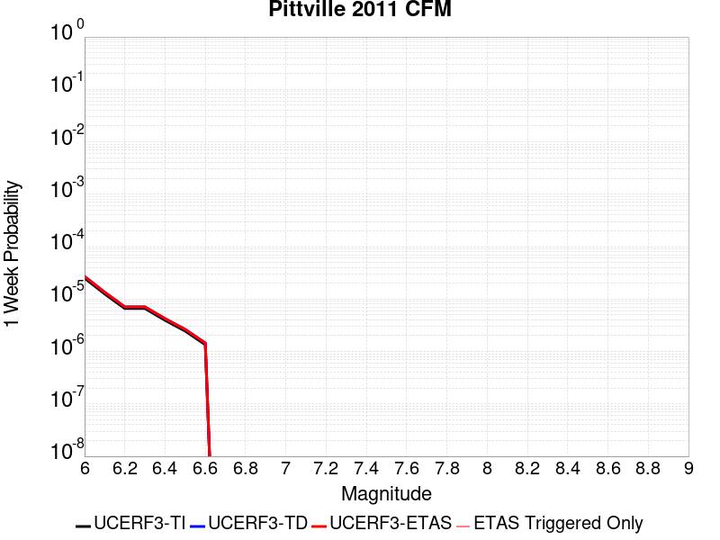 | 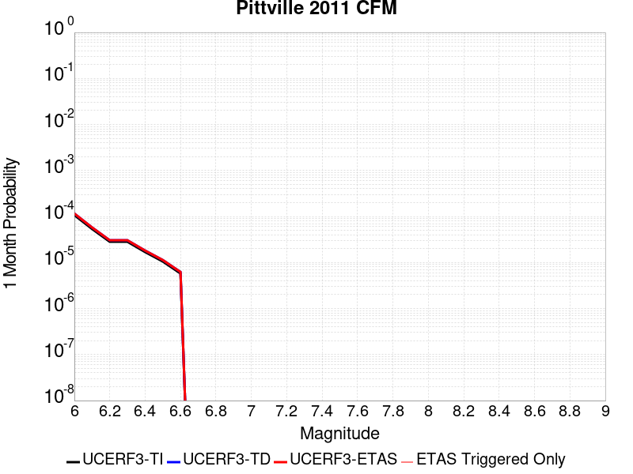 | 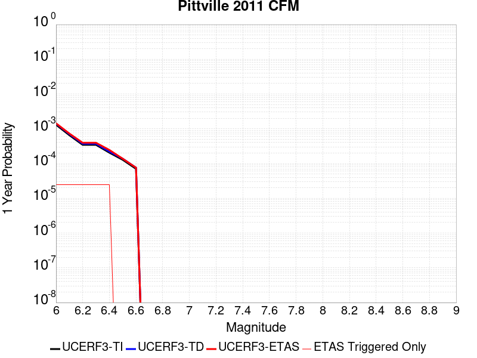 | 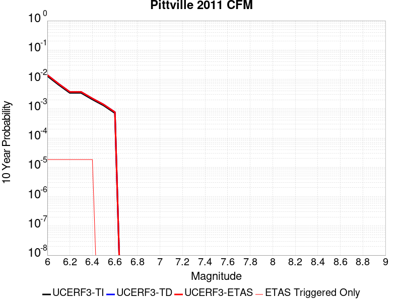 |

| Magnitude | 1 wk TI Prob | 1 wk TD Prob | 1 wk ETAS Prob | 1 wk ETAS/TD Gain | 1 wk ETAS Triggered Only | 1 mo TI Prob | 1 mo TD Prob | 1 mo ETAS Prob | 1 mo ETAS/TD Gain | 1 mo ETAS Triggered Only | 1 yr TI Prob | 1 yr TD Prob | 1 yr ETAS Prob | 1 yr ETAS/TD Gain | 1 yr ETAS Triggered Only | 10 yr TI Prob | 10 yr TD Prob | 10 yr ETAS Prob | 10 yr ETAS/TD Gain | 10 yr ETAS Triggered Only |
|-----|-----|-----|-----|-----|-----|-----|-----|-----|-----|-----|-----|-----|-----|-----|-----|-----|-----|-----|-----|-----|
| 6.0 | 2.5031832E-5 | 2.7056969E-5 | 2.7056969E-5 | 1.0 | 0.0 | 1.0727487E-4 | 1.1595384E-4 | 1.1595384E-4 | 1.0 | 0.0 | 0.001305289 | 0.0014109211 | 0.0014355029 | 1.0174226 | 2.4616596E-5 | 0.012976485 | 0.014029415 | 0.0140536865 | 1.0017301 | 2.4616596E-5 |
| 6.1 | 1.2540113E-5 | 1.3513067E-5 | 1.3513067E-5 | 1.0 | 0.0 | 5.3742235E-5 | 5.7911984E-5 | 5.7911984E-5 | 1.0 | 0.0 | 6.541153E-4 | 7.048728E-4 | 7.29472E-4 | 1.0348989 | 2.4616596E-5 | 0.0065219323 | 0.0070286044 | 0.007053048 | 1.0034777 | 2.4616596E-5 |
| 6.2 | 6.603218E-6 | 7.107189E-6 | 7.107189E-6 | 1.0 | 0.0 | 2.8299199E-5 | 3.0459063E-5 | 3.0459063E-5 | 1.0 | 0.0 | 3.4448825E-4 | 3.7078248E-4 | 3.9538994E-4 | 1.0663663 | 2.4616596E-5 | 0.0034395473 | 0.0037022792 | 0.0037268046 | 1.0066245 | 2.4616596E-5 |
| 6.3 | 6.603218E-6 | 7.107189E-6 | 7.107189E-6 | 1.0 | 0.0 | 2.8299199E-5 | 3.0459063E-5 | 3.0459063E-5 | 1.0 | 0.0 | 3.4448825E-4 | 3.7078248E-4 | 3.9538994E-4 | 1.0663663 | 2.4616596E-5 | 0.0034395473 | 0.0037022792 | 0.0037268046 | 1.0066245 | 2.4616596E-5 |
| 6.4 | 3.9389015E-6 | 4.239175E-6 | 4.239175E-6 | 1.0 | 0.0 | 1.6880897E-5 | 1.8167784E-5 | 1.8167784E-5 | 1.0 | 0.0 | 2.0550552E-4 | 2.2117342E-4 | 2.4578458E-4 | 1.1112753 | 2.4616596E-5 | 0.0020531558 | 0.002209838 | 0.0022344 | 1.011115 | 2.4616596E-5 |
| 6.5 | 2.4533072E-6 | 2.6412686E-6 | 2.6412686E-6 | 1.0 | 0.0 | 1.0514132E-5 | 1.1319685E-5 | 1.1319685E-5 | 1.0 | 0.0 | 1.2800204E-4 | 1.3781038E-4 | 1.3781038E-4 | 1.0 | 0.0 | 0.0012792832 | 0.0013774394 | 0.0013774394 | 1.0 | 0.0 |
| 6.6 | 1.3482367E-6 | 1.452993E-6 | 1.452993E-6 | 1.0 | 0.0 | 5.778144E-6 | 6.2271047E-6 | 6.2271047E-6 | 1.0 | 0.0 | 7.0346636E-5 | 7.58135E-5 | 7.58135E-5 | 1.0 | 0.0 | 7.032437E-4 | 7.5798744E-4 | 7.5798744E-4 | 1.0 | 0.0 |

## Earthquake Valley
*[(top)](#table-of-contents)*

| 1 Week | 1 Month | 1 Year | 10 Year |
|-----|-----|-----|-----|
|  | 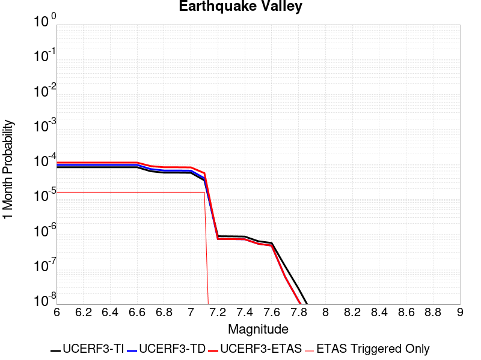 | 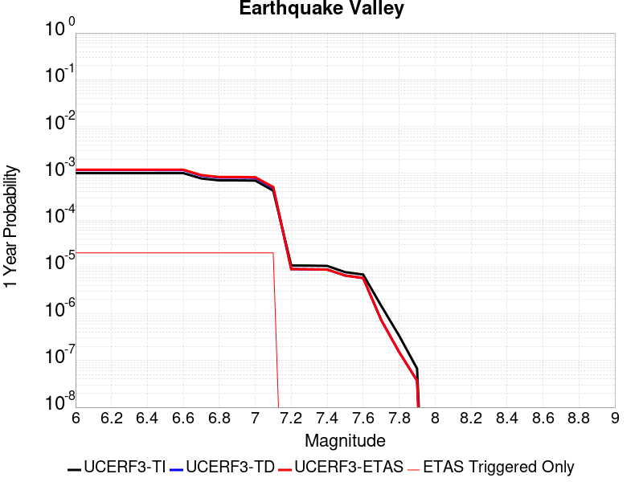 | 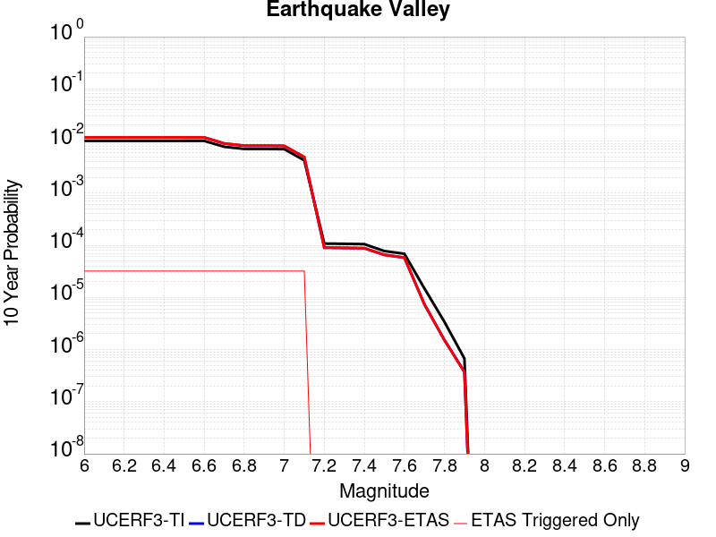 |

| Magnitude | 1 wk TI Prob | 1 wk TD Prob | 1 wk ETAS Prob | 1 wk ETAS/TD Gain | 1 wk ETAS Triggered Only | 1 mo TI Prob | 1 mo TD Prob | 1 mo ETAS Prob | 1 mo ETAS/TD Gain | 1 mo ETAS Triggered Only | 1 yr TI Prob | 1 yr TD Prob | 1 yr ETAS Prob | 1 yr ETAS/TD Gain | 1 yr ETAS Triggered Only | 10 yr TI Prob | 10 yr TD Prob | 10 yr ETAS Prob | 10 yr ETAS/TD Gain | 10 yr ETAS Triggered Only |
|-----|-----|-----|-----|-----|-----|-----|-----|-----|-----|-----|-----|-----|-----|-----|-----|-----|-----|-----|-----|-----|
| 6.0 | 1.9416384E-5 | 2.258408E-5 | 2.258408E-5 | 1.0 | 0.0 | 8.321042E-5 | 9.6785996E-5 | 9.6785996E-5 | 1.0 | 0.0 | 0.001012616 | 0.0011778527 | 0.0012024404 | 1.020875 | 2.4616596E-5 | 0.010080142 | 0.011727943 | 0.011752271 | 1.0020744 | 2.4616596E-5 |
| 6.1 | 1.9416384E-5 | 2.258408E-5 | 2.258408E-5 | 1.0 | 0.0 | 8.321042E-5 | 9.6785996E-5 | 9.6785996E-5 | 1.0 | 0.0 | 0.001012616 | 0.0011778527 | 0.0012024404 | 1.020875 | 2.4616596E-5 | 0.010080142 | 0.011727943 | 0.011752271 | 1.0020744 | 2.4616596E-5 |
| 6.2 | 1.9416384E-5 | 2.258408E-5 | 2.258408E-5 | 1.0 | 0.0 | 8.321042E-5 | 9.6785996E-5 | 9.6785996E-5 | 1.0 | 0.0 | 0.001012616 | 0.0011778527 | 0.0012024404 | 1.020875 | 2.4616596E-5 | 0.010080142 | 0.011727943 | 0.011752271 | 1.0020744 | 2.4616596E-5 |
| 6.3 | 1.9416384E-5 | 2.258408E-5 | 2.258408E-5 | 1.0 | 0.0 | 8.321042E-5 | 9.6785996E-5 | 9.6785996E-5 | 1.0 | 0.0 | 0.001012616 | 0.0011778527 | 0.0012024404 | 1.020875 | 2.4616596E-5 | 0.010080142 | 0.011727943 | 0.011752271 | 1.0020744 | 2.4616596E-5 |
| 6.4 | 1.9416384E-5 | 2.258408E-5 | 2.258408E-5 | 1.0 | 0.0 | 8.321042E-5 | 9.6785996E-5 | 9.6785996E-5 | 1.0 | 0.0 | 0.001012616 | 0.0011778527 | 0.0012024404 | 1.020875 | 2.4616596E-5 | 0.010080142 | 0.011727943 | 0.011752271 | 1.0020744 | 2.4616596E-5 |
| 6.5 | 1.9389157E-5 | 2.255267E-5 | 2.255267E-5 | 1.0 | 0.0 | 8.309374E-5 | 9.665139E-5 | 9.665139E-5 | 1.0 | 0.0 | 0.0010111968 | 0.0011762156 | 0.0012008032 | 1.0209041 | 2.4616596E-5 | 0.010066078 | 0.011711745 | 0.0117360735 | 1.0020772 | 2.4616596E-5 |
| 6.6 | 1.9389157E-5 | 2.255267E-5 | 2.255267E-5 | 1.0 | 0.0 | 8.309374E-5 | 9.665139E-5 | 9.665139E-5 | 1.0 | 0.0 | 0.0010111968 | 0.0011762156 | 0.0012008032 | 1.0209041 | 2.4616596E-5 | 0.010066078 | 0.011711745 | 0.0117360735 | 1.0020772 | 2.4616596E-5 |
| 6.7 | 1.4925434E-5 | 1.7208227E-5 | 1.7208227E-5 | 1.0 | 0.0 | 6.396457E-5 | 7.374794E-5 | 7.374794E-5 | 1.0 | 0.0 | 7.7849044E-4 | 8.9759636E-4 | 9.2219084E-4 | 1.0274004 | 2.4616596E-5 | 0.007757689 | 0.008948085 | 0.008972481 | 1.0027264 | 2.4616596E-5 |
| 6.8 | 1.3570335E-5 | 1.5616843E-5 | 1.5616843E-5 | 1.0 | 0.0 | 5.8157282E-5 | 6.692807E-5 | 6.692807E-5 | 1.0 | 0.0 | 7.0783484E-4 | 8.1462675E-4 | 8.3922327E-4 | 1.0301937 | 2.4616596E-5 | 0.0070558446 | 0.008124476 | 0.008148893 | 1.0030053 | 2.4616596E-5 |
| 6.9 | 1.3570335E-5 | 1.5616843E-5 | 1.5616843E-5 | 1.0 | 0.0 | 5.8157282E-5 | 6.692807E-5 | 6.692807E-5 | 1.0 | 0.0 | 7.0783484E-4 | 8.1462675E-4 | 8.3922327E-4 | 1.0301937 | 2.4616596E-5 | 0.0070558446 | 0.008124476 | 0.008148893 | 1.0030053 | 2.4616596E-5 |
| 7.0 | 1.3433392E-5 | 1.5460388E-5 | 1.5460388E-5 | 1.0 | 0.0 | 5.757041E-5 | 6.6257584E-5 | 6.6257584E-5 | 1.0 | 0.0 | 7.0069433E-4 | 8.064695E-4 | 8.310663E-4 | 1.0304993 | 2.4616596E-5 | 0.006984891 | 0.008043497 | 0.008067915 | 1.0030358 | 2.4616596E-5 |
| 7.1 | 8.181609E-6 | 9.416851E-6 | 9.416851E-6 | 1.0 | 0.0 | 3.5063567E-5 | 4.0357685E-5 | 4.0357685E-5 | 1.0 | 0.0 | 4.268153E-4 | 4.9131113E-4 | 5.159156E-4 | 1.0500792 | 2.4616596E-5 | 0.0042599645 | 0.0049088253 | 0.0049333214 | 1.0049901 | 2.4616596E-5 |
| 7.2 | 2.0663983E-7 | 1.726294E-7 | 1.726294E-7 | 1.0 | 0.0 | 8.855989E-7 | 7.398401E-7 | 7.398401E-7 | 1.0 | 0.0 | 1.0782113E-5 | 9.00752E-6 | 9.00752E-6 | 1.0 | 0.0 | 1.07815904E-4 | 9.00719E-5 | 9.00719E-5 | 1.0 | 0.0 |
| 7.3 | 2.0462376E-7 | 1.7078433E-7 | 1.7078433E-7 | 1.0 | 0.0 | 8.7695867E-7 | 7.319327E-7 | 7.319327E-7 | 1.0 | 0.0 | 1.0676919E-5 | 8.911247E-6 | 8.911247E-6 | 1.0 | 0.0 | 1.0676406E-4 | 8.910926E-5 | 8.910926E-5 | 1.0 | 0.0 |
| 7.4 | 2.0171088E-7 | 1.6860913E-7 | 1.6860913E-7 | 1.0 | 0.0 | 8.644749E-7 | 7.2261037E-7 | 7.2261037E-7 | 1.0 | 0.0 | 1.0524931E-5 | 8.79775E-6 | 8.79775E-6 | 1.0 | 0.0 | 1.05244326E-4 | 8.7974375E-5 | 8.7974375E-5 | 1.0 | 0.0 |
| 7.5 | 1.4847944E-7 | 1.2559275E-7 | 1.2559275E-7 | 1.0 | 0.0 | 6.363403E-7 | 5.3825454E-7 | 5.3825454E-7 | 1.0 | 0.0 | 7.747416E-6 | 6.5532317E-6 | 6.5532317E-6 | 1.0 | 0.0 | 7.747146E-5 | 6.55306E-5 | 6.55306E-5 | 1.0 | 0.0 |
| 7.6 | 1.3185847E-7 | 1.1123213E-7 | 1.1123213E-7 | 1.0 | 0.0 | 5.6510765E-7 | 4.7670906E-7 | 4.7670906E-7 | 1.0 | 0.0 | 6.8801637E-6 | 5.8039195E-6 | 5.8039195E-6 | 1.0 | 0.0 | 6.8799505E-5 | 5.803789E-5 | 5.803789E-5 | 1.0 | 0.0 |
| 7.7 | 2.8609954E-8 | 1.4170958E-8 | 1.4170958E-8 | 1.0 | 0.0 | 1.2261408E-7 | 6.0732674E-8 | 6.0732674E-8 | 1.0 | 0.0 | 1.4928254E-6 | 7.394201E-7 | 7.394201E-7 | 1.0 | 0.0 | 1.4928154E-5 | 7.394182E-6 | 7.394182E-6 | 1.0 | 0.0 |
| 7.8 | 6.527266E-9 | 2.923417E-9 | 2.923417E-9 | 1.0 | 0.0 | 2.7973995E-8 | 1.2528931E-8 | 1.2528931E-8 | 1.0 | 0.0 | 3.4058334E-7 | 1.5253973E-7 | 1.5253973E-7 | 1.0 | 0.0 | 3.4058282E-6 | 1.5253964E-6 | 1.5253964E-6 | 1.0 | 0.0 |
| 7.9 | 1.2898267E-9 | 7.127684E-10 | 7.127684E-10 | 1.0 | 0.0 | 5.527829E-9 | 3.0547218E-9 | 3.0547218E-9 | 1.0 | 0.0 | 6.7301315E-8 | 3.719124E-8 | 3.719124E-8 | 1.0 | 0.0 | 6.7301295E-7 | 3.719124E-7 | 3.719124E-7 | 1.0 | 0.0 |

## Cleghorn
*[(top)](#table-of-contents)*

| 1 Week | 1 Month | 1 Year | 10 Year |
|-----|-----|-----|-----|
| 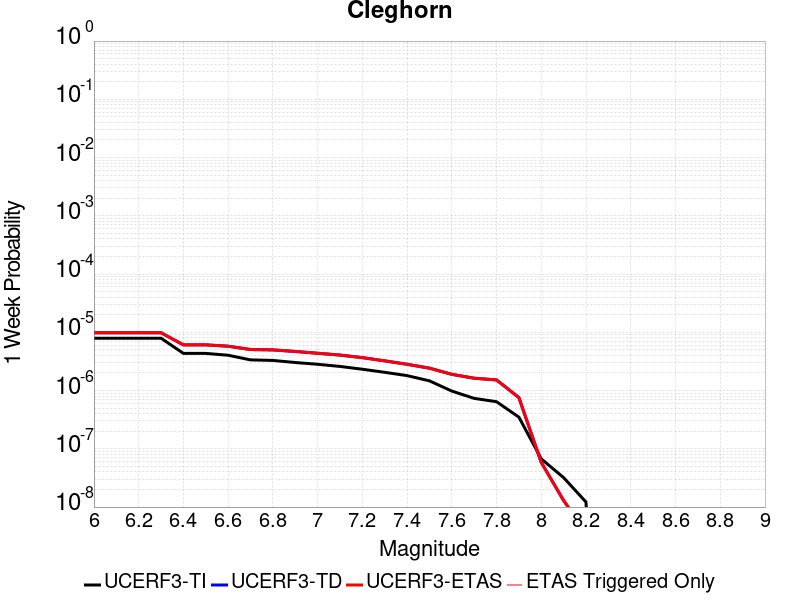 | 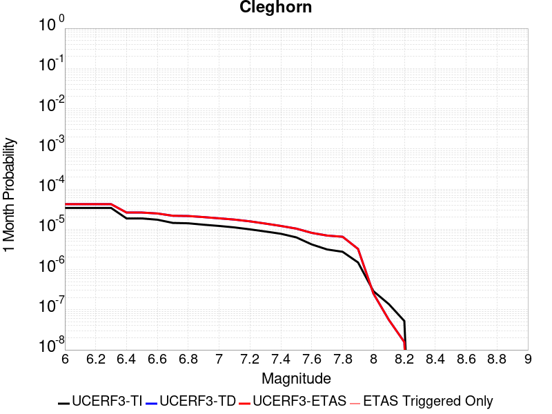 | 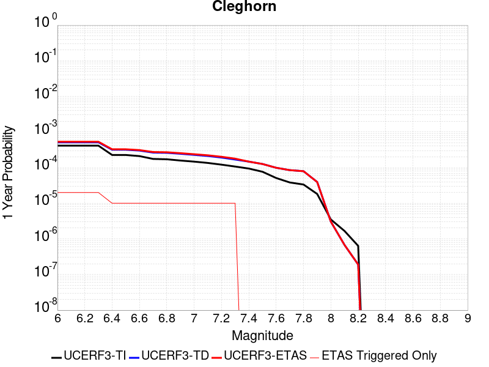 | 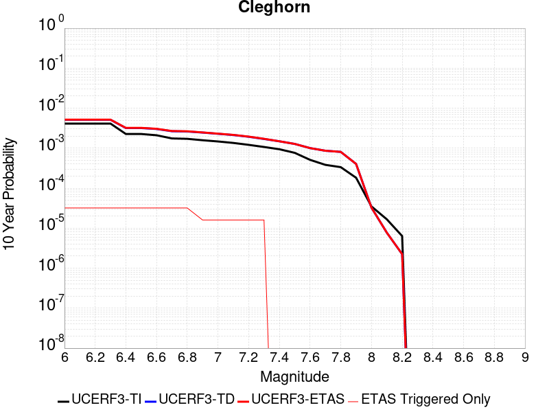 |

| Magnitude | 1 wk TI Prob | 1 wk TD Prob | 1 wk ETAS Prob | 1 wk ETAS/TD Gain | 1 wk ETAS Triggered Only | 1 mo TI Prob | 1 mo TD Prob | 1 mo ETAS Prob | 1 mo ETAS/TD Gain | 1 mo ETAS Triggered Only | 1 yr TI Prob | 1 yr TD Prob | 1 yr ETAS Prob | 1 yr ETAS/TD Gain | 1 yr ETAS Triggered Only | 10 yr TI Prob | 10 yr TD Prob | 10 yr ETAS Prob | 10 yr ETAS/TD Gain | 10 yr ETAS Triggered Only |
|-----|-----|-----|-----|-----|-----|-----|-----|-----|-----|-----|-----|-----|-----|-----|-----|-----|-----|-----|-----|-----|
| 6.0 | 7.9267165E-6 | 9.831582E-6 | 9.831582E-6 | 1.0 | 0.0 | 3.39712E-5 | 4.2134732E-5 | 4.2134732E-5 | 1.0 | 0.0 | 4.1352084E-4 | 5.128803E-4 | 5.3748424E-4 | 1.0479722 | 2.4616596E-5 | 0.004127522 | 0.0051320773 | 0.0051565673 | 1.004772 | 2.4616596E-5 |
| 6.1 | 7.9267165E-6 | 9.831582E-6 | 9.831582E-6 | 1.0 | 0.0 | 3.39712E-5 | 4.2134732E-5 | 4.2134732E-5 | 1.0 | 0.0 | 4.1352084E-4 | 5.128803E-4 | 5.3748424E-4 | 1.0479722 | 2.4616596E-5 | 0.004127522 | 0.0051320773 | 0.0051565673 | 1.004772 | 2.4616596E-5 |
| 6.2 | 7.9267165E-6 | 9.831582E-6 | 9.831582E-6 | 1.0 | 0.0 | 3.39712E-5 | 4.2134732E-5 | 4.2134732E-5 | 1.0 | 0.0 | 4.1352084E-4 | 5.128803E-4 | 5.3748424E-4 | 1.0479722 | 2.4616596E-5 | 0.004127522 | 0.0051320773 | 0.0051565673 | 1.004772 | 2.4616596E-5 |
| 6.3 | 7.9267165E-6 | 9.831582E-6 | 9.831582E-6 | 1.0 | 0.0 | 3.39712E-5 | 4.2134732E-5 | 4.2134732E-5 | 1.0 | 0.0 | 4.1352084E-4 | 5.128803E-4 | 5.3748424E-4 | 1.0479722 | 2.4616596E-5 | 0.004127522 | 0.0051320773 | 0.0051565673 | 1.004772 | 2.4616596E-5 |
| 6.4 | 4.3445207E-6 | 6.0914435E-6 | 6.0914435E-6 | 1.0 | 0.0 | 1.8619241E-5 | 2.610593E-5 | 2.610593E-5 | 1.0 | 0.0 | 2.2666567E-4 | 3.1779436E-4 | 3.4240313E-4 | 1.0774362 | 2.4616596E-5 | 0.0022643462 | 0.0031875873 | 0.0032121255 | 1.007698 | 2.4616596E-5 |
| 6.5 | 4.3445207E-6 | 6.0914435E-6 | 6.0914435E-6 | 1.0 | 0.0 | 1.8619241E-5 | 2.610593E-5 | 2.610593E-5 | 1.0 | 0.0 | 2.2666567E-4 | 3.1779436E-4 | 3.4240313E-4 | 1.0774362 | 2.4616596E-5 | 0.0022643462 | 0.0031875873 | 0.0032121255 | 1.007698 | 2.4616596E-5 |
| 6.6 | 4.040109E-6 | 5.773851E-6 | 5.773851E-6 | 1.0 | 0.0 | 1.7314638E-5 | 2.4744846E-5 | 2.4744846E-5 | 1.0 | 0.0 | 2.1078532E-4 | 3.012278E-4 | 3.2583697E-4 | 1.0816963 | 2.4616596E-5 | 0.002105855 | 0.003022377 | 0.0030469191 | 1.0081202 | 2.4616596E-5 |
| 6.7 | 3.3632055E-6 | 5.067348E-6 | 5.067348E-6 | 1.0 | 0.0 | 1.4413658E-5 | 2.1717027E-5 | 2.1717027E-5 | 1.0 | 0.0 | 1.7547216E-4 | 2.6437303E-4 | 2.8898314E-4 | 1.0930885 | 2.4616596E-5 | 0.0017533366 | 0.0026547113 | 0.0026792625 | 1.0092481 | 2.4616596E-5 |
| 6.8 | 3.2902772E-6 | 4.9892556E-6 | 4.9892556E-6 | 1.0 | 0.0 | 1.4101111E-5 | 2.1382351E-5 | 2.1382351E-5 | 1.0 | 0.0 | 1.716675E-4 | 2.6029933E-4 | 2.8490953E-4 | 1.0945457 | 2.4616596E-5 | 0.0017153495 | 0.0026140702 | 0.0026386224 | 1.0093924 | 2.4616596E-5 |
| 6.9 | 3.031547E-6 | 4.6910186E-6 | 4.6910186E-6 | 1.0 | 0.0 | 1.299228E-5 | 2.0104211E-5 | 2.0104211E-5 | 1.0 | 0.0 | 1.5816953E-4 | 2.4474156E-4 | 2.693521E-4 | 1.1005574 | 2.4616596E-5 | 0.00158057 | 0.0024588439 | 0.0024833998 | 1.0099869 | 2.4616596E-5 |
| 7.0 | 2.8259715E-6 | 4.3705895E-6 | 4.3705895E-6 | 1.0 | 0.0 | 1.211125E-5 | 1.8730963E-5 | 1.8730963E-5 | 1.0 | 0.0 | 1.4744449E-4 | 2.2802586E-4 | 2.5263685E-4 | 1.1079307 | 2.4616596E-5 | 0.001473467 | 0.0022920412 | 0.0023166013 | 1.0107154 | 2.4616596E-5 |
| 7.1 | 2.5962665E-6 | 4.0658106E-6 | 4.0658106E-6 | 1.0 | 0.0 | 1.1126809E-5 | 1.7424789E-5 | 1.7424789E-5 | 1.0 | 0.0 | 1.3546048E-4 | 2.1212637E-4 | 2.3673773E-4 | 1.1160222 | 2.4616596E-5 | 0.0013537793 | 0.002133366 | 0.00215793 | 1.0115142 | 2.4616596E-5 |
| 7.2 | 2.3247253E-6 | 3.6763672E-6 | 3.6763672E-6 | 1.0 | 0.0 | 9.96307E-6 | 1.5755764E-5 | 1.5755764E-5 | 1.0 | 0.0 | 1.21293626E-4 | 1.9180974E-4 | 2.1642161E-4 | 1.128314 | 2.4616596E-5 | 0.0012122744 | 0.0019305905 | 0.0019551595 | 1.0127262 | 2.4616596E-5 |
| 7.3 | 2.056928E-6 | 3.2350938E-6 | 3.2350938E-6 | 1.0 | 0.0 | 8.815376E-6 | 1.3864615E-5 | 1.3864615E-5 | 1.0 | 0.0 | 1.0732192E-4 | 1.6878877E-4 | 1.9340121E-4 | 1.145818 | 2.4616596E-5 | 0.001072701 | 0.0017008206 | 0.0017253953 | 1.0144488 | 2.4616596E-5 |
| 7.4 | 1.8055999E-6 | 2.8255042E-6 | 2.8255042E-6 | 1.0 | 0.0 | 7.738263E-6 | 1.2109249E-5 | 1.2109249E-5 | 1.0 | 0.0 | 9.4209274E-5 | 1.4742027E-4 | 1.4742027E-4 | 1.0 | 0.0 | 9.4169343E-4 | 0.0014875771 | 0.0014875771 | 1.0 | 0.0 |
| 7.5 | 1.4683443E-6 | 2.4247483E-6 | 2.4247483E-6 | 1.0 | 0.0 | 6.292889E-6 | 1.0391738E-5 | 1.0391738E-5 | 1.0 | 0.0 | 7.661323E-5 | 1.2651215E-4 | 1.2651215E-4 | 1.0 | 0.0 | 7.658682E-4 | 0.0012787961 | 0.0012787961 | 1.0 | 0.0 |
| 7.6 | 9.804088E-7 | 1.900266E-6 | 1.900266E-6 | 1.0 | 0.0 | 4.201745E-6 | 8.143972E-6 | 8.143972E-6 | 1.0 | 0.0 | 5.1155046E-5 | 9.91484E-5 | 9.91484E-5 | 1.0 | 0.0 | 5.114327E-4 | 0.001005471 | 0.001005471 | 1.0 | 0.0 |
| 7.7 | 7.3434086E-7 | 1.6284146E-6 | 1.6284146E-6 | 1.0 | 0.0 | 3.1471714E-6 | 6.978901E-6 | 6.978901E-6 | 1.0 | 0.0 | 3.831614E-5 | 8.4964835E-5 | 8.4964835E-5 | 1.0 | 0.0 | 3.8309532E-4 | 8.6378685E-4 | 8.6378685E-4 | 1.0 | 0.0 |
| 7.8 | 6.434184E-7 | 1.5220047E-6 | 1.5220047E-6 | 1.0 | 0.0 | 2.7575045E-6 | 6.5228614E-6 | 6.5228614E-6 | 1.0 | 0.0 | 3.35721E-5 | 7.941297E-5 | 7.941297E-5 | 1.0 | 0.0 | 3.3567028E-4 | 8.079678E-4 | 8.079678E-4 | 1.0 | 0.0 |
| 7.9 | 3.4943926E-7 | 7.574459E-7 | 7.574459E-7 | 1.0 | 0.0 | 1.497596E-6 | 3.2461926E-6 | 3.2461926E-6 | 1.0 | 0.0 | 1.8233079E-5 | 3.952169E-5 | 3.952169E-5 | 1.0 | 0.0 | 1.8231584E-4 | 4.040099E-4 | 4.040099E-4 | 1.0 | 0.0 |
| 8.0 | 6.717524E-8 | 5.838828E-8 | 5.838828E-8 | 1.0 | 0.0 | 2.8789387E-7 | 2.5023547E-7 | 2.5023547E-7 | 1.0 | 0.0 | 3.505102E-6 | 3.0466126E-6 | 3.0466126E-6 | 1.0 | 0.0 | 3.5050467E-5 | 3.273506E-5 | 3.273506E-5 | 1.0 | 0.0 |
| 8.1 | 3.1984914E-8 | 1.2956093E-8 | 1.2956093E-8 | 1.0 | 0.0 | 1.370782E-7 | 5.552611E-8 | 5.552611E-8 | 1.0 | 0.0 | 1.6689258E-6 | 6.760302E-7 | 6.760302E-7 | 1.0 | 0.0 | 1.6689133E-5 | 7.74454E-6 | 7.74454E-6 | 1.0 | 0.0 |
| 8.2 | 1.21887656E-8 | 3.6495305E-9 | 3.6495305E-9 | 1.0 | 0.0 | 5.2237567E-8 | 1.5640845E-8 | 1.5640845E-8 | 1.0 | 0.0 | 6.359922E-7 | 1.9042727E-7 | 1.9042727E-7 | 1.0 | 0.0 | 6.3599036E-6 | 2.2470974E-6 | 2.2470974E-6 | 1.0 | 0.0 |

## Likely 2011 CFM
*[(top)](#table-of-contents)*

| 1 Week | 1 Month | 1 Year | 10 Year |
|-----|-----|-----|-----|
| 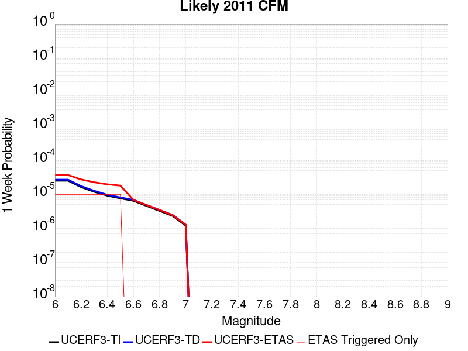 | 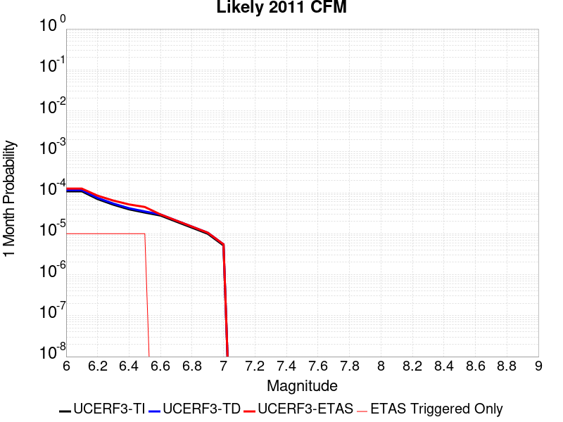 | 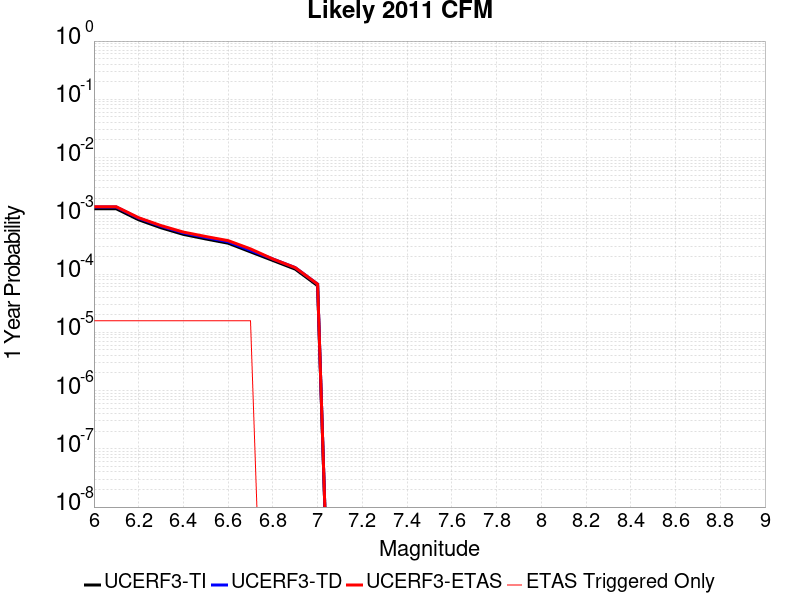 | 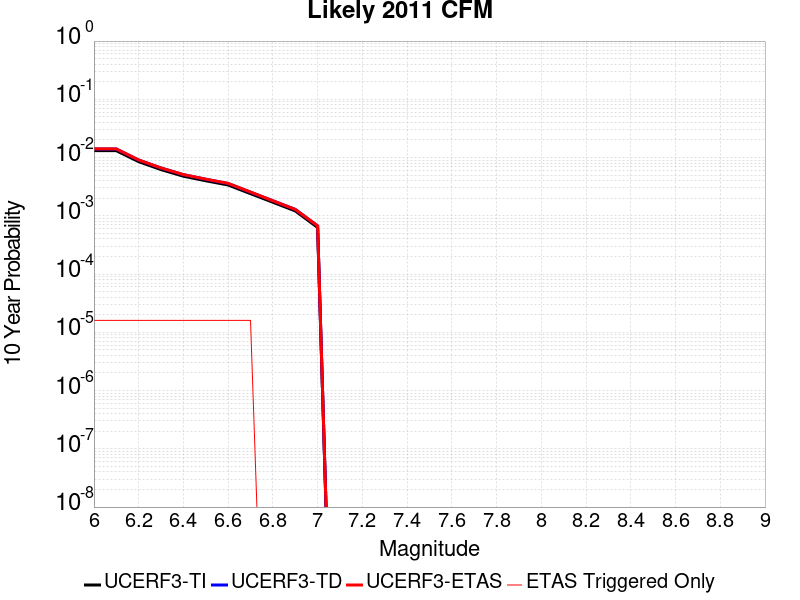 |

| Magnitude | 1 wk TI Prob | 1 wk TD Prob | 1 wk ETAS Prob | 1 wk ETAS/TD Gain | 1 wk ETAS Triggered Only | 1 mo TI Prob | 1 mo TD Prob | 1 mo ETAS Prob | 1 mo ETAS/TD Gain | 1 mo ETAS Triggered Only | 1 yr TI Prob | 1 yr TD Prob | 1 yr ETAS Prob | 1 yr ETAS/TD Gain | 1 yr ETAS Triggered Only | 10 yr TI Prob | 10 yr TD Prob | 10 yr ETAS Prob | 10 yr ETAS/TD Gain | 10 yr ETAS Triggered Only |
|-----|-----|-----|-----|-----|-----|-----|-----|-----|-----|-----|-----|-----|-----|-----|-----|-----|-----|-----|-----|-----|
| 6.0 | 2.5315949E-5 | 2.7104748E-5 | 2.7104748E-5 | 1.0 | 0.0 | 1.0849241E-4 | 1.16158284E-4 | 1.16158284E-4 | 1.0 | 0.0 | 0.0013200947 | 0.0014133542 | 0.001437936 | 1.0173925 | 2.4616596E-5 | 0.013122803 | 0.01404831 | 0.014072581 | 1.0017277 | 2.4616596E-5 |
| 6.1 | 2.5315949E-5 | 2.7104748E-5 | 2.7104748E-5 | 1.0 | 0.0 | 1.0849241E-4 | 1.16158284E-4 | 1.16158284E-4 | 1.0 | 0.0 | 0.0013200947 | 0.0014133542 | 0.001437936 | 1.0173925 | 2.4616596E-5 | 0.013122803 | 0.01404831 | 0.014072581 | 1.0017277 | 2.4616596E-5 |
| 6.2 | 1.6375941E-5 | 1.7465842E-5 | 1.7465842E-5 | 1.0 | 0.0 | 7.0180715E-5 | 7.485153E-5 | 7.485153E-5 | 1.0 | 0.0 | 8.5411523E-4 | 9.109487E-4 | 9.355428E-4 | 1.0269984 | 2.4616596E-5 | 0.008508399 | 0.009073433 | 0.009097826 | 1.0026884 | 2.4616596E-5 |
| 6.3 | 1.1945543E-5 | 1.2712587E-5 | 1.2712587E-5 | 1.0 | 0.0 | 5.119418E-5 | 5.4481407E-5 | 5.4481407E-5 | 1.0 | 0.0 | 6.2311086E-4 | 6.631146E-4 | 6.8771484E-4 | 1.037098 | 2.4616596E-5 | 0.0062136655 | 0.0066119144 | 0.006636368 | 1.0036985 | 2.4616596E-5 |
| 6.4 | 9.192729E-6 | 9.768488E-6 | 9.768488E-6 | 1.0 | 0.0 | 3.939681E-5 | 4.1864292E-5 | 4.1864292E-5 | 1.0 | 0.0 | 4.7955062E-4 | 5.0958124E-4 | 5.341853E-4 | 1.0482829 | 2.4616596E-5 | 0.004785171 | 0.0050844094 | 0.005108901 | 1.004817 | 2.4616596E-5 |
| 6.5 | 7.67906E-6 | 8.152622E-6 | 8.152622E-6 | 1.0 | 0.0 | 3.2909844E-5 | 3.4939352E-5 | 3.4939352E-5 | 1.0 | 0.0 | 4.006037E-4 | 4.2530545E-4 | 4.4991157E-4 | 1.0578551 | 2.4616596E-5 | 0.0039988225 | 0.004245108 | 0.0042696204 | 1.0057741 | 2.4616596E-5 |
| 6.6 | 6.4884057E-6 | 6.8847507E-6 | 6.8847507E-6 | 1.0 | 0.0 | 2.7807157E-5 | 2.9505749E-5 | 2.9505749E-5 | 1.0 | 0.0 | 3.3849955E-4 | 3.591747E-4 | 3.8378246E-4 | 1.068512 | 2.4616596E-5 | 0.003379844 | 0.0035860867 | 0.0036106152 | 1.0068399 | 2.4616596E-5 |
| 6.7 | 4.6060636E-6 | 4.884041E-6 | 4.884041E-6 | 1.0 | 0.0 | 1.9740122E-5 | 2.0931442E-5 | 2.0931442E-5 | 1.0 | 0.0 | 2.403095E-4 | 2.5481134E-4 | 2.7942166E-4 | 1.0965825 | 2.4616596E-5 | 0.002400498 | 0.0025452746 | 0.0025698286 | 1.0096469 | 2.4616596E-5 |
| 6.8 | 3.2795615E-6 | 3.4773732E-6 | 3.4773732E-6 | 1.0 | 0.0 | 1.4055187E-5 | 1.4902946E-5 | 1.4902946E-5 | 1.0 | 0.0 | 1.7110848E-4 | 1.8142881E-4 | 1.8142881E-4 | 1.0 | 0.0 | 0.0017097679 | 0.0018128622 | 0.0018128622 | 1.0 | 0.0 |
| 6.9 | 2.3289967E-6 | 2.4705569E-6 | 2.4705569E-6 | 1.0 | 0.0 | 9.981376E-6 | 1.058806E-5 | 1.058806E-5 | 1.0 | 0.0 | 1.2151648E-4 | 1.2890245E-4 | 1.2890245E-4 | 1.0 | 0.0 | 0.0012145005 | 0.0012883197 | 0.0012883197 | 1.0 | 0.0 |
| 7.0 | 1.211292E-6 | 1.2863958E-6 | 1.2863958E-6 | 1.0 | 0.0 | 5.1912407E-6 | 5.5131145E-6 | 5.5131145E-6 | 1.0 | 0.0 | 6.320152E-5 | 6.712041E-5 | 6.712041E-5 | 1.0 | 0.0 | 6.3183554E-4 | 6.710312E-4 | 6.710312E-4 | 1.0 | 0.0 |

## Santa Cruz Catalina Ridge alt1
*[(top)](#table-of-contents)*

| 1 Week | 1 Month | 1 Year | 10 Year |
|-----|-----|-----|-----|
| 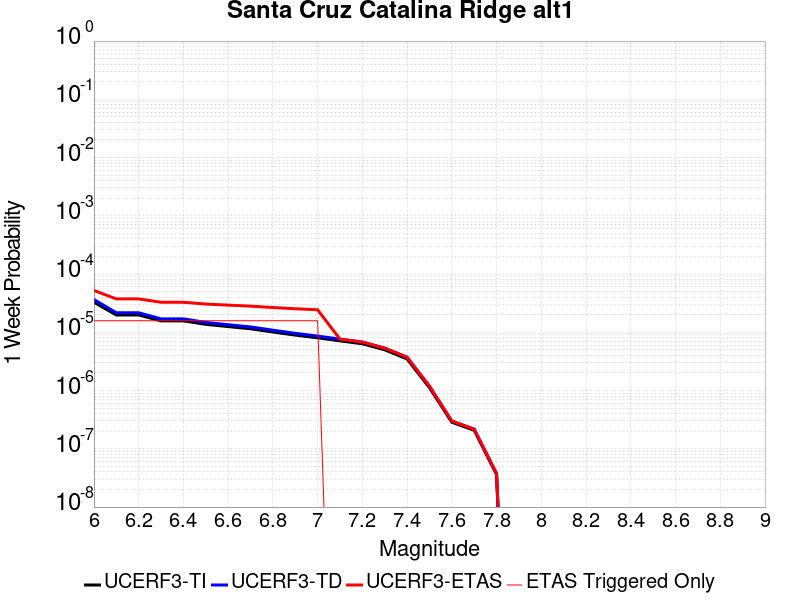 | 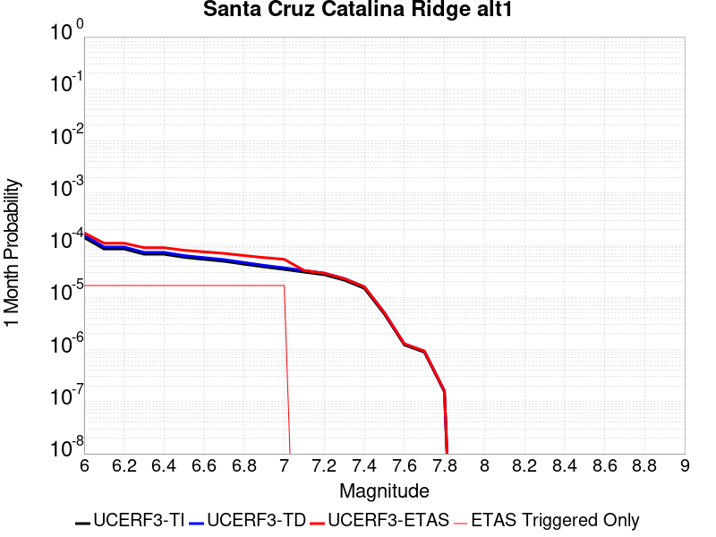 | 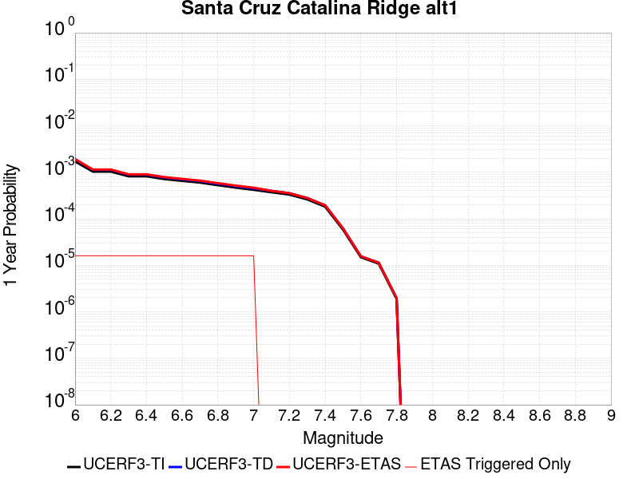 | 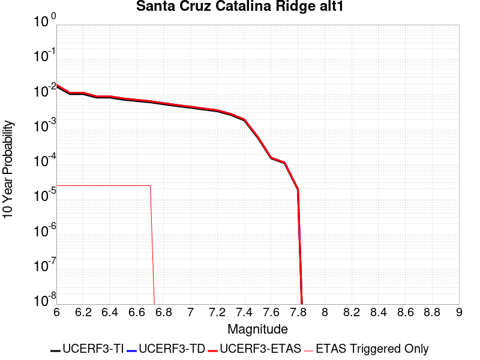 |

| Magnitude | 1 wk TI Prob | 1 wk TD Prob | 1 wk ETAS Prob | 1 wk ETAS/TD Gain | 1 wk ETAS Triggered Only | 1 mo TI Prob | 1 mo TD Prob | 1 mo ETAS Prob | 1 mo ETAS/TD Gain | 1 mo ETAS Triggered Only | 1 yr TI Prob | 1 yr TD Prob | 1 yr ETAS Prob | 1 yr ETAS/TD Gain | 1 yr ETAS Triggered Only | 10 yr TI Prob | 10 yr TD Prob | 10 yr ETAS Prob | 10 yr ETAS/TD Gain | 10 yr ETAS Triggered Only |
|-----|-----|-----|-----|-----|-----|-----|-----|-----|-----|-----|-----|-----|-----|-----|-----|-----|-----|-----|-----|-----|
| 6.0 | 3.2833184E-5 | 3.65584E-5 | 3.65584E-5 | 1.0 | 0.0 | 1.4070606E-4 | 1.5667039E-4 | 1.5667039E-4 | 1.0 | 0.0 | 0.00171175 | 0.0019059596 | 0.0019059596 | 1.0 | 0.0 | 0.016986247 | 0.018913029 | 0.01893718 | 1.001277 | 2.4616596E-5 |
| 6.1 | 1.9835548E-5 | 2.1659505E-5 | 2.1659505E-5 | 1.0 | 0.0 | 8.500672E-5 | 9.282326E-5 | 9.282326E-5 | 1.0 | 0.0 | 0.0010344655 | 0.0011295575 | 0.0011295575 | 1.0 | 0.0 | 0.010296632 | 0.011240295 | 0.011264635 | 1.0021654 | 2.4616596E-5 |
| 6.2 | 1.9835548E-5 | 2.1659505E-5 | 2.1659505E-5 | 1.0 | 0.0 | 8.500672E-5 | 9.282326E-5 | 9.282326E-5 | 1.0 | 0.0 | 0.0010344655 | 0.0011295575 | 0.0011295575 | 1.0 | 0.0 | 0.010296632 | 0.011240295 | 0.011264635 | 1.0021654 | 2.4616596E-5 |
| 6.3 | 1.5728183E-5 | 1.703395E-5 | 1.703395E-5 | 1.0 | 0.0 | 6.7404755E-5 | 7.300063E-5 | 7.300063E-5 | 1.0 | 0.0 | 8.2034385E-4 | 8.884264E-4 | 8.884264E-4 | 1.0 | 0.0 | 0.008173222 | 0.008849427 | 0.008873826 | 1.0027571 | 2.4616596E-5 |
| 6.4 | 1.5728183E-5 | 1.703395E-5 | 1.703395E-5 | 1.0 | 0.0 | 6.7404755E-5 | 7.300063E-5 | 7.300063E-5 | 1.0 | 0.0 | 8.2034385E-4 | 8.884264E-4 | 8.884264E-4 | 1.0 | 0.0 | 0.008173222 | 0.008849427 | 0.008873826 | 1.0027571 | 2.4616596E-5 |
| 6.5 | 1.3707734E-5 | 1.4794522E-5 | 1.4794522E-5 | 1.0 | 0.0 | 5.8746107E-5 | 6.3403575E-5 | 6.3403575E-5 | 1.0 | 0.0 | 7.1499916E-4 | 7.716686E-4 | 7.716686E-4 | 1.0 | 0.0 | 0.0071270303 | 0.0076902895 | 0.0077147167 | 1.0031763 | 2.4616596E-5 |
| 6.6 | 1.2539813E-5 | 1.3510219E-5 | 1.3510219E-5 | 1.0 | 0.0 | 5.3740947E-5 | 5.789967E-5 | 5.789967E-5 | 1.0 | 0.0 | 6.540996E-4 | 7.0470315E-4 | 7.0470315E-4 | 1.0 | 0.0 | 0.0065217763 | 0.0070249885 | 0.007049432 | 1.0034795 | 2.4616596E-5 |
| 6.7 | 1.1504083E-5 | 1.2377375E-5 | 1.2377375E-5 | 1.0 | 0.0 | 4.930228E-5 | 5.3044827E-5 | 5.3044827E-5 | 1.0 | 0.0 | 6.0008996E-4 | 6.456314E-4 | 6.456314E-4 | 1.0 | 0.0 | 0.005984721 | 0.006437786 | 0.006462244 | 1.0037992 | 2.4616596E-5 |
| 6.8 | 1.012739E-5 | 1.0877071E-5 | 1.0877071E-5 | 1.0 | 0.0 | 4.340238E-5 | 4.6615194E-5 | 4.6615194E-5 | 1.0 | 0.0 | 5.282958E-4 | 5.673937E-4 | 5.673937E-4 | 1.0 | 0.0 | 0.0052704164 | 0.0056596193 | 0.0056596193 | 1.0 | 0.0 |
| 6.9 | 8.9607865E-6 | 9.609117E-6 | 9.609117E-6 | 1.0 | 0.0 | 3.8402806E-5 | 4.1181287E-5 | 4.1181287E-5 | 1.0 | 0.0 | 4.6745385E-4 | 5.012679E-4 | 5.012679E-4 | 1.0 | 0.0 | 0.0046647177 | 0.005001492 | 0.005001492 | 1.0 | 0.0 |
| 7.0 | 8.046829E-6 | 8.619746E-6 | 8.619746E-6 | 1.0 | 0.0 | 3.4485955E-5 | 3.694125E-5 | 3.694125E-5 | 1.0 | 0.0 | 4.1978562E-4 | 4.496677E-4 | 4.496677E-4 | 1.0 | 0.0 | 0.004189935 | 0.0044876686 | 0.0044876686 | 1.0 | 0.0 |
| 7.1 | 7.136131E-6 | 7.637656E-6 | 7.637656E-6 | 1.0 | 0.0 | 3.0583058E-5 | 3.2732405E-5 | 3.2732405E-5 | 1.0 | 0.0 | 3.7228514E-4 | 3.9844486E-4 | 3.9844486E-4 | 1.0 | 0.0 | 0.0037166206 | 0.003977381 | 0.003977381 | 1.0 | 0.0 |
| 7.2 | 6.362014E-6 | 6.8049585E-6 | 6.8049585E-6 | 1.0 | 0.0 | 2.726549E-5 | 2.9163786E-5 | 2.9163786E-5 | 1.0 | 0.0 | 3.3190678E-4 | 3.550119E-4 | 3.550119E-4 | 1.0 | 0.0 | 0.0033141149 | 0.003544516 | 0.003544516 | 1.0 | 0.0 |
| 7.3 | 5.004101E-6 | 5.351715E-6 | 5.351715E-6 | 1.0 | 0.0 | 2.1445969E-5 | 2.2935723E-5 | 2.2935723E-5 | 1.0 | 0.0 | 2.6107338E-4 | 2.792072E-4 | 2.792072E-4 | 1.0 | 0.0 | 0.002607669 | 0.0027886187 | 0.0027886187 | 1.0 | 0.0 |
| 7.4 | 3.4901443E-6 | 3.7320526E-6 | 3.7320526E-6 | 1.0 | 0.0 | 1.4957676E-5 | 1.5994416E-5 | 1.5994416E-5 | 1.0 | 0.0 | 1.8209449E-4 | 1.9471499E-4 | 1.9471499E-4 | 1.0 | 0.0 | 0.0018194534 | 0.0019454823 | 0.0019454823 | 1.0 | 0.0 |
| 7.5 | 1.1215045E-6 | 1.189387E-6 | 1.189387E-6 | 1.0 | 0.0 | 4.806439E-6 | 5.097363E-6 | 5.097363E-6 | 1.0 | 0.0 | 5.851682E-5 | 6.205866E-5 | 6.205866E-5 | 1.0 | 0.0 | 5.850142E-4 | 6.2041637E-4 | 6.2041637E-4 | 1.0 | 0.0 |
| 7.6 | 2.8599047E-7 | 2.9951994E-7 | 2.9951994E-7 | 1.0 | 0.0 | 1.2256729E-6 | 1.2836562E-6 | 1.2836562E-6 | 1.0 | 0.0 | 1.4922465E-5 | 1.5628404E-5 | 1.5628404E-5 | 1.0 | 0.0 | 1.4921463E-4 | 1.5627318E-4 | 1.5627318E-4 | 1.0 | 0.0 |
| 7.7 | 2.0781519E-7 | 2.1744323E-7 | 2.1744323E-7 | 1.0 | 0.0 | 8.906362E-7 | 9.3189925E-7 | 9.3189925E-7 | 1.0 | 0.0 | 1.08434415E-5 | 1.13458145E-5 | 1.13458145E-5 | 1.0 | 0.0 | 1.0842913E-4 | 1.1345245E-4 | 1.1345245E-4 | 1.0 | 0.0 |
| 7.8 | 3.614776E-8 | 3.764102E-8 | 3.764102E-8 | 1.0 | 0.0 | 1.5491896E-7 | 1.6131864E-7 | 1.6131864E-7 | 1.0 | 0.0 | 1.8861368E-6 | 1.9640527E-6 | 1.9640527E-6 | 1.0 | 0.0 | 1.8861208E-5 | 1.9640367E-5 | 1.9640367E-5 | 1.0 | 0.0 |

## Mount Diablo Thrust South
*[(top)](#table-of-contents)*

| 1 Week | 1 Month | 1 Year | 10 Year |
|-----|-----|-----|-----|
| 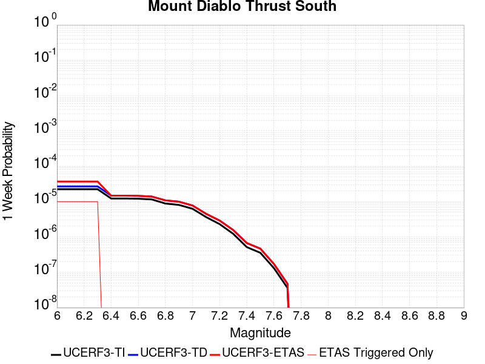 | 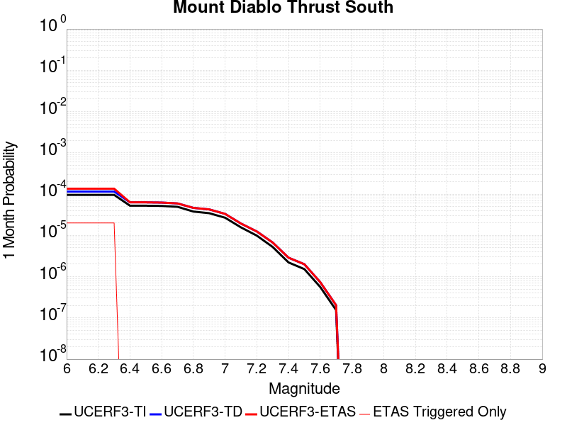 | 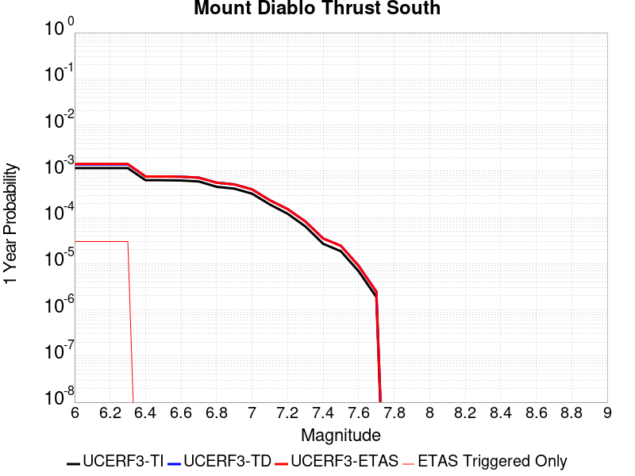 | 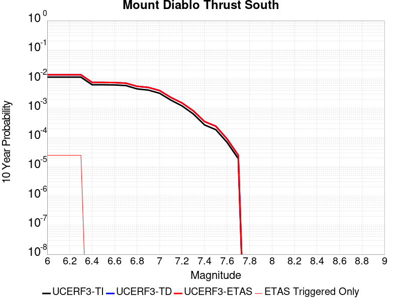 |

| Magnitude | 1 wk TI Prob | 1 wk TD Prob | 1 wk ETAS Prob | 1 wk ETAS/TD Gain | 1 wk ETAS Triggered Only | 1 mo TI Prob | 1 mo TD Prob | 1 mo ETAS Prob | 1 mo ETAS/TD Gain | 1 mo ETAS Triggered Only | 1 yr TI Prob | 1 yr TD Prob | 1 yr ETAS Prob | 1 yr ETAS/TD Gain | 1 yr ETAS Triggered Only | 10 yr TI Prob | 10 yr TD Prob | 10 yr ETAS Prob | 10 yr ETAS/TD Gain | 10 yr ETAS Triggered Only |
|-----|-----|-----|-----|-----|-----|-----|-----|-----|-----|-----|-----|-----|-----|-----|-----|-----|-----|-----|-----|-----|
| 6.0 | 2.2377444E-5 | 2.695623E-5 | 2.695623E-5 | 1.0 | 0.0 | 9.5899806E-5 | 1.1552271E-4 | 1.1552271E-4 | 1.0 | 0.0 | 0.0011669548 | 0.0014057803 | 0.0014303623 | 1.0174863 | 2.4616596E-5 | 0.011608457 | 0.013988447 | 0.0140127195 | 1.0017352 | 2.4616596E-5 |
| 6.1 | 2.2377444E-5 | 2.695623E-5 | 2.695623E-5 | 1.0 | 0.0 | 9.5899806E-5 | 1.1552271E-4 | 1.1552271E-4 | 1.0 | 0.0 | 0.0011669548 | 0.0014057803 | 0.0014303623 | 1.0174863 | 2.4616596E-5 | 0.011608457 | 0.013988447 | 0.0140127195 | 1.0017352 | 2.4616596E-5 |
| 6.2 | 2.2377444E-5 | 2.695623E-5 | 2.695623E-5 | 1.0 | 0.0 | 9.5899806E-5 | 1.1552271E-4 | 1.1552271E-4 | 1.0 | 0.0 | 0.0011669548 | 0.0014057803 | 0.0014303623 | 1.0174863 | 2.4616596E-5 | 0.011608457 | 0.013988447 | 0.0140127195 | 1.0017352 | 2.4616596E-5 |
| 6.3 | 2.2377444E-5 | 2.695623E-5 | 2.695623E-5 | 1.0 | 0.0 | 9.5899806E-5 | 1.1552271E-4 | 1.1552271E-4 | 1.0 | 0.0 | 0.0011669548 | 0.0014057803 | 0.0014303623 | 1.0174863 | 2.4616596E-5 | 0.011608457 | 0.013988447 | 0.0140127195 | 1.0017352 | 2.4616596E-5 |
| 6.4 | 1.2228463E-5 | 1.4747655E-5 | 1.4747655E-5 | 1.0 | 0.0 | 5.2406645E-5 | 6.320278E-5 | 6.320278E-5 | 1.0 | 0.0 | 6.378641E-4 | 7.6923496E-4 | 7.6923496E-4 | 1.0 | 0.0 | 0.0063603627 | 0.0076671084 | 0.0076671084 | 1.0 | 0.0 |
| 6.5 | 1.2228463E-5 | 1.4747655E-5 | 1.4747655E-5 | 1.0 | 0.0 | 5.2406645E-5 | 6.320278E-5 | 6.320278E-5 | 1.0 | 0.0 | 6.378641E-4 | 7.6923496E-4 | 7.6923496E-4 | 1.0 | 0.0 | 0.0063603627 | 0.0076671084 | 0.0076671084 | 1.0 | 0.0 |
| 6.6 | 1.2068118E-5 | 1.4552453E-5 | 1.4552453E-5 | 1.0 | 0.0 | 5.1719482E-5 | 6.2366234E-5 | 6.2366234E-5 | 1.0 | 0.0 | 6.2950276E-4 | 7.590571E-4 | 7.590571E-4 | 1.0 | 0.0 | 0.006277225 | 0.0075660287 | 0.0075660287 | 1.0 | 0.0 |
| 6.7 | 1.1499428E-5 | 1.3875117E-5 | 1.3875117E-5 | 1.0 | 0.0 | 4.9282335E-5 | 5.94635E-5 | 5.94635E-5 | 1.0 | 0.0 | 5.9984723E-4 | 7.237403E-4 | 7.237403E-4 | 1.0 | 0.0 | 0.0059823063 | 0.0072152023 | 0.0072152023 | 1.0 | 0.0 |
| 6.8 | 8.82118E-6 | 1.0830408E-5 | 1.0830408E-5 | 1.0 | 0.0 | 3.780451E-5 | 4.641524E-5 | 4.641524E-5 | 1.0 | 0.0 | 4.601727E-4 | 5.6496455E-4 | 5.6496455E-4 | 1.0 | 0.0 | 0.0045922096 | 0.005635934 | 0.005635934 | 1.0 | 0.0 |
| 6.9 | 8.047112E-6 | 9.9393765E-6 | 9.9393765E-6 | 1.0 | 0.0 | 3.4487166E-5 | 4.259666E-5 | 4.259666E-5 | 1.0 | 0.0 | 4.1980037E-4 | 5.1849615E-4 | 5.1849615E-4 | 1.0 | 0.0 | 0.004190082 | 0.0051734787 | 0.0051734787 | 1.0 | 0.0 |
| 7.0 | 6.2574763E-6 | 7.748453E-6 | 7.748453E-6 | 1.0 | 0.0 | 2.681748E-5 | 3.3207252E-5 | 3.3207252E-5 | 1.0 | 0.0 | 3.264539E-4 | 4.0422694E-4 | 4.0422694E-4 | 1.0 | 0.0 | 0.0032597475 | 0.004035359 | 0.004035359 | 1.0 | 0.0 |
| 7.1 | 3.6485903E-6 | 4.512883E-6 | 4.512883E-6 | 1.0 | 0.0 | 1.5636722E-5 | 1.9340787E-5 | 1.9340787E-5 | 1.0 | 0.0 | 1.9036046E-4 | 2.3544904E-4 | 2.3544904E-4 | 1.0 | 0.0 | 0.0019019748 | 0.0023520947 | 0.0023520947 | 1.0 | 0.0 |
| 7.2 | 2.3034274E-6 | 2.9054847E-6 | 2.9054847E-6 | 1.0 | 0.0 | 9.871795E-6 | 1.2452019E-5 | 1.2452019E-5 | 1.0 | 0.0 | 1.2018247E-4 | 1.5159303E-4 | 1.5159303E-4 | 1.0 | 0.0 | 0.0012011749 | 0.0015149695 | 0.0015149695 | 1.0 | 0.0 |
| 7.3 | 1.224035E-6 | 1.567953E-6 | 1.567953E-6 | 1.0 | 0.0 | 5.245854E-6 | 6.7197816E-6 | 6.7197816E-6 | 1.0 | 0.0 | 6.38664E-5 | 8.181038E-5 | 8.181038E-5 | 1.0 | 0.0 | 6.384805E-4 | 8.1784575E-4 | 8.1784575E-4 | 1.0 | 0.0 |
| 7.4 | 5.1601154E-7 | 6.72323E-7 | 6.72323E-7 | 1.0 | 0.0 | 2.2114762E-6 | 2.8813813E-6 | 2.8813813E-6 | 1.0 | 0.0 | 2.6924388E-5 | 3.508027E-5 | 3.508027E-5 | 1.0 | 0.0 | 2.6921128E-4 | 3.507647E-4 | 3.507647E-4 | 1.0 | 0.0 |
| 7.5 | 3.552894E-7 | 4.6652323E-7 | 4.6652323E-7 | 1.0 | 0.0 | 1.5226678E-6 | 1.9993838E-6 | 1.9993838E-6 | 1.0 | 0.0 | 1.8538323E-5 | 2.434224E-5 | 2.434224E-5 | 1.0 | 0.0 | 1.8536777E-4 | 2.4340794E-4 | 2.4340794E-4 | 1.0 | 0.0 |
| 7.6 | 1.3124082E-7 | 1.7191535E-7 | 1.7191535E-7 | 1.0 | 0.0 | 5.6246057E-7 | 7.367799E-7 | 7.367799E-7 | 1.0 | 0.0 | 6.8479358E-6 | 8.970267E-6 | 8.970267E-6 | 1.0 | 0.0 | 6.8477246E-5 | 8.9703215E-5 | 8.9703215E-5 | 1.0 | 0.0 |
| 7.7 | 3.6193022E-8 | 4.733273E-8 | 4.733273E-8 | 1.0 | 0.0 | 1.5511293E-7 | 2.0285455E-7 | 2.0285455E-7 | 1.0 | 0.0 | 1.8884983E-6 | 2.4697524E-6 | 2.4697524E-6 | 1.0 | 0.0 | 1.8884823E-5 | 2.4697838E-5 | 2.4697838E-5 | 1.0 | 0.0 |

## Ozena
*[(top)](#table-of-contents)*

| 1 Week | 1 Month | 1 Year | 10 Year |
|-----|-----|-----|-----|
| 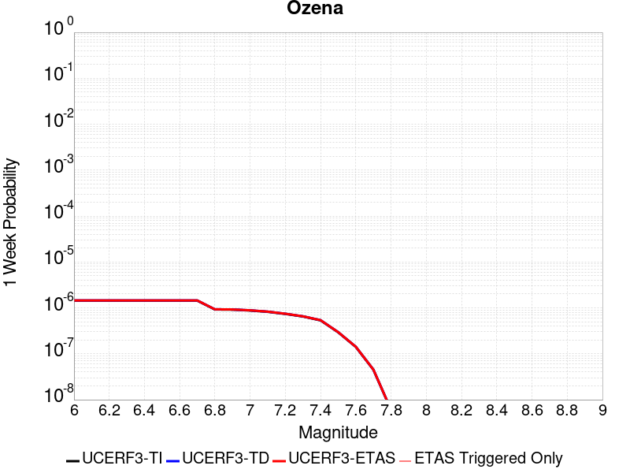 |  |  | 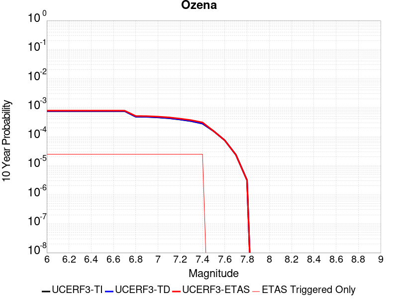 |

| Magnitude | 1 wk TI Prob | 1 wk TD Prob | 1 wk ETAS Prob | 1 wk ETAS/TD Gain | 1 wk ETAS Triggered Only | 1 mo TI Prob | 1 mo TD Prob | 1 mo ETAS Prob | 1 mo ETAS/TD Gain | 1 mo ETAS Triggered Only | 1 yr TI Prob | 1 yr TD Prob | 1 yr ETAS Prob | 1 yr ETAS/TD Gain | 1 yr ETAS Triggered Only | 10 yr TI Prob | 10 yr TD Prob | 10 yr ETAS Prob | 10 yr ETAS/TD Gain | 10 yr ETAS Triggered Only |
|-----|-----|-----|-----|-----|-----|-----|-----|-----|-----|-----|-----|-----|-----|-----|-----|-----|-----|-----|-----|-----|
| 6.0 | 1.4377547E-6 | 1.4513782E-6 | 1.4513782E-6 | 1.0 | 0.0 | 6.161791E-6 | 6.2201793E-6 | 6.2201793E-6 | 1.0 | 0.0 | 7.5017226E-5 | 7.572832E-5 | 7.572832E-5 | 1.0 | 0.0 | 7.4991904E-4 | 7.570518E-4 | 7.816498E-4 | 1.0324918 | 2.4616596E-5 |
| 6.1 | 1.4377547E-6 | 1.4513782E-6 | 1.4513782E-6 | 1.0 | 0.0 | 6.161791E-6 | 6.2201793E-6 | 6.2201793E-6 | 1.0 | 0.0 | 7.5017226E-5 | 7.572832E-5 | 7.572832E-5 | 1.0 | 0.0 | 7.4991904E-4 | 7.570518E-4 | 7.816498E-4 | 1.0324918 | 2.4616596E-5 |
| 6.2 | 1.4377547E-6 | 1.4513782E-6 | 1.4513782E-6 | 1.0 | 0.0 | 6.161791E-6 | 6.2201793E-6 | 6.2201793E-6 | 1.0 | 0.0 | 7.5017226E-5 | 7.572832E-5 | 7.572832E-5 | 1.0 | 0.0 | 7.4991904E-4 | 7.570518E-4 | 7.816498E-4 | 1.0324918 | 2.4616596E-5 |
| 6.3 | 1.4377547E-6 | 1.4513782E-6 | 1.4513782E-6 | 1.0 | 0.0 | 6.161791E-6 | 6.2201793E-6 | 6.2201793E-6 | 1.0 | 0.0 | 7.5017226E-5 | 7.572832E-5 | 7.572832E-5 | 1.0 | 0.0 | 7.4991904E-4 | 7.570518E-4 | 7.816498E-4 | 1.0324918 | 2.4616596E-5 |
| 6.4 | 1.4377547E-6 | 1.4513782E-6 | 1.4513782E-6 | 1.0 | 0.0 | 6.161791E-6 | 6.2201793E-6 | 6.2201793E-6 | 1.0 | 0.0 | 7.5017226E-5 | 7.572832E-5 | 7.572832E-5 | 1.0 | 0.0 | 7.4991904E-4 | 7.570518E-4 | 7.816498E-4 | 1.0324918 | 2.4616596E-5 |
| 6.5 | 1.4377547E-6 | 1.4513782E-6 | 1.4513782E-6 | 1.0 | 0.0 | 6.161791E-6 | 6.2201793E-6 | 6.2201793E-6 | 1.0 | 0.0 | 7.5017226E-5 | 7.572832E-5 | 7.572832E-5 | 1.0 | 0.0 | 7.4991904E-4 | 7.570518E-4 | 7.816498E-4 | 1.0324918 | 2.4616596E-5 |
| 6.6 | 1.4377547E-6 | 1.4513782E-6 | 1.4513782E-6 | 1.0 | 0.0 | 6.161791E-6 | 6.2201793E-6 | 6.2201793E-6 | 1.0 | 0.0 | 7.5017226E-5 | 7.572832E-5 | 7.572832E-5 | 1.0 | 0.0 | 7.4991904E-4 | 7.570518E-4 | 7.816498E-4 | 1.0324918 | 2.4616596E-5 |
| 6.7 | 1.4377547E-6 | 1.4513782E-6 | 1.4513782E-6 | 1.0 | 0.0 | 6.161791E-6 | 6.2201793E-6 | 6.2201793E-6 | 1.0 | 0.0 | 7.5017226E-5 | 7.572832E-5 | 7.572832E-5 | 1.0 | 0.0 | 7.4991904E-4 | 7.570518E-4 | 7.816498E-4 | 1.0324918 | 2.4616596E-5 |
| 6.8 | 9.223257E-7 | 9.317624E-7 | 9.317624E-7 | 1.0 | 0.0 | 3.9528186E-6 | 3.9932615E-6 | 3.9932615E-6 | 1.0 | 0.0 | 4.81245E-5 | 4.8616912E-5 | 4.8616912E-5 | 1.0 | 0.0 | 4.811408E-4 | 4.860668E-4 | 5.106714E-4 | 1.0506198 | 2.4616596E-5 |
| 6.9 | 9.141515E-7 | 9.235371E-7 | 9.235371E-7 | 1.0 | 0.0 | 3.917786E-6 | 3.9580104E-6 | 3.9580104E-6 | 1.0 | 0.0 | 4.7698002E-5 | 4.818775E-5 | 4.818775E-5 | 1.0 | 0.0 | 4.7687767E-4 | 4.8177704E-4 | 5.063818E-4 | 1.0510708 | 2.4616596E-5 |
| 7.0 | 8.767648E-7 | 8.8585773E-7 | 8.8585773E-7 | 1.0 | 0.0 | 3.757558E-6 | 3.7965276E-6 | 3.7965276E-6 | 1.0 | 0.0 | 4.5747307E-5 | 4.6221783E-5 | 4.6221783E-5 | 1.0 | 0.0 | 4.5737892E-4 | 4.6212564E-4 | 4.8673086E-4 | 1.0532435 | 2.4616596E-5 |
| 7.1 | 8.199402E-7 | 8.2853984E-7 | 8.2853984E-7 | 1.0 | 0.0 | 3.5140247E-6 | 3.5508804E-6 | 3.5508804E-6 | 1.0 | 0.0 | 4.2782412E-5 | 4.323115E-5 | 4.323115E-5 | 1.0 | 0.0 | 4.2774176E-4 | 4.322311E-4 | 4.5683706E-4 | 1.0569278 | 2.4616596E-5 |
| 7.2 | 7.38705E-7 | 7.464262E-7 | 7.464262E-7 | 1.0 | 0.0 | 3.1658747E-6 | 3.198966E-6 | 3.198966E-6 | 1.0 | 0.0 | 3.8543843E-5 | 3.894675E-5 | 3.894675E-5 | 1.0 | 0.0 | 3.853716E-4 | 3.8940276E-4 | 4.1400976E-4 | 1.0631917 | 2.4616596E-5 |
| 7.3 | 6.490017E-7 | 6.557802E-7 | 6.557802E-7 | 1.0 | 0.0 | 2.7814328E-6 | 2.8104837E-6 | 2.8104837E-6 | 1.0 | 0.0 | 3.386342E-5 | 3.4217133E-5 | 3.4217133E-5 | 1.0 | 0.0 | 3.3858258E-4 | 3.4212202E-4 | 3.667302E-4 | 1.071928 | 2.4616596E-5 |
| 7.4 | 5.346736E-7 | 5.4022604E-7 | 5.4022604E-7 | 1.0 | 0.0 | 2.291456E-6 | 2.3152527E-6 | 2.3152527E-6 | 1.0 | 0.0 | 2.789812E-5 | 2.8187867E-5 | 2.8187867E-5 | 1.0 | 0.0 | 2.789462E-4 | 2.8184598E-4 | 3.0645562E-4 | 1.087316 | 2.4616596E-5 |
| 7.5 | 2.939325E-7 | 2.9666057E-7 | 2.9666057E-7 | 1.0 | 0.0 | 1.25971E-6 | 1.271402E-6 | 1.271402E-6 | 1.0 | 0.0 | 1.5336862E-5 | 1.5479225E-5 | 1.5479225E-5 | 1.0 | 0.0 | 1.5335804E-4 | 1.5478309E-4 | 1.5478309E-4 | 1.0 | 0.0 |
| 7.6 | 1.4151905E-7 | 1.4253266E-7 | 1.4253266E-7 | 1.0 | 0.0 | 6.065101E-7 | 6.108541E-7 | 6.108541E-7 | 1.0 | 0.0 | 7.3842357E-6 | 7.4371237E-6 | 7.4371237E-6 | 1.0 | 0.0 | 7.38399E-5 | 7.436883E-5 | 7.436883E-5 | 1.0 | 0.0 |
| 7.7 | 4.4957577E-8 | 4.5252243E-8 | 4.5252243E-8 | 1.0 | 0.0 | 1.9267533E-7 | 1.9393818E-7 | 1.9393818E-7 | 1.0 | 0.0 | 2.3458194E-6 | 2.3611947E-6 | 2.3611947E-6 | 1.0 | 0.0 | 2.3457947E-5 | 2.3611707E-5 | 2.3611707E-5 | 1.0 | 0.0 |
| 7.8 | 5.9993255E-9 | 6.0412972E-9 | 6.0412972E-9 | 1.0 | 0.0 | 2.5711394E-8 | 2.5891273E-8 | 2.5891273E-8 | 1.0 | 0.0 | 3.1303617E-7 | 3.1522623E-7 | 3.1522623E-7 | 1.0 | 0.0 | 3.1303573E-6 | 3.1522588E-6 | 3.1522588E-6 | 1.0 | 0.0 |

## Rocky Ledge 2011 CFM
*[(top)](#table-of-contents)*

| 1 Week | 1 Month | 1 Year | 10 Year |
|-----|-----|-----|-----|
|  | 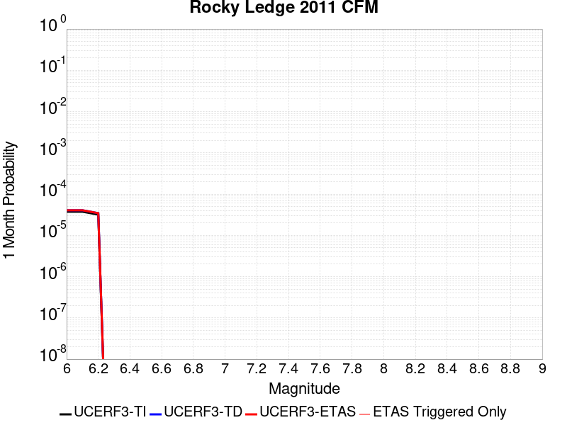 | 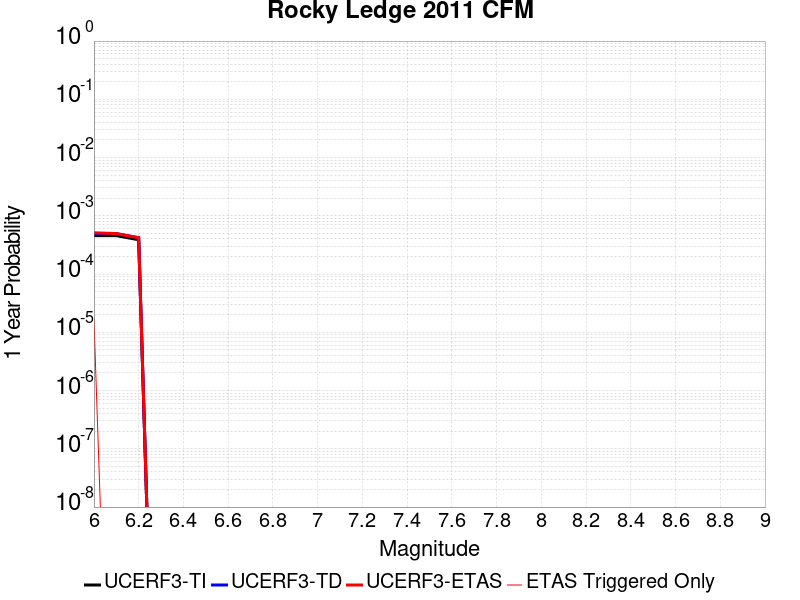 | 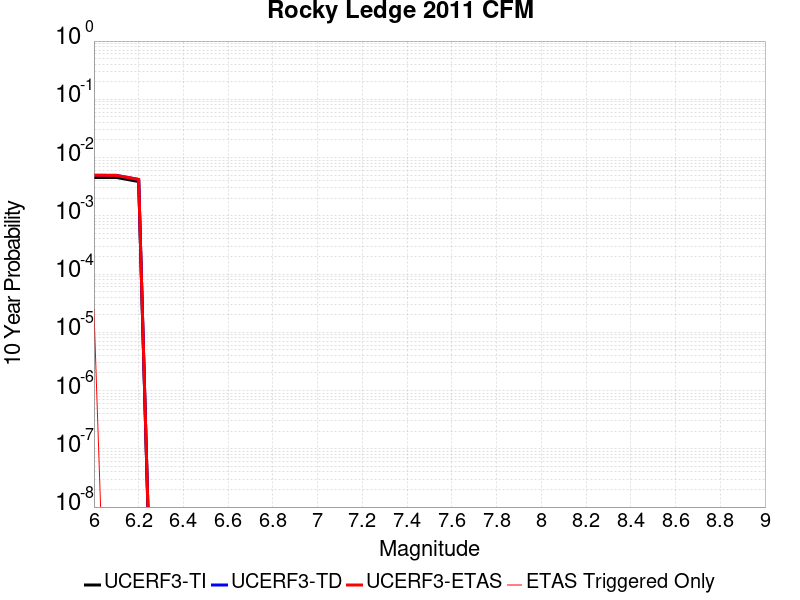 |

| Magnitude | 1 wk TI Prob | 1 wk TD Prob | 1 wk ETAS Prob | 1 wk ETAS/TD Gain | 1 wk ETAS Triggered Only | 1 mo TI Prob | 1 mo TD Prob | 1 mo ETAS Prob | 1 mo ETAS/TD Gain | 1 mo ETAS Triggered Only | 1 yr TI Prob | 1 yr TD Prob | 1 yr ETAS Prob | 1 yr ETAS/TD Gain | 1 yr ETAS Triggered Only | 10 yr TI Prob | 10 yr TD Prob | 10 yr ETAS Prob | 10 yr ETAS/TD Gain | 10 yr ETAS Triggered Only |
|-----|-----|-----|-----|-----|-----|-----|-----|-----|-----|-----|-----|-----|-----|-----|-----|-----|-----|-----|-----|-----|
| 6.0 | 8.7550525E-6 | 9.486605E-6 | 9.486605E-6 | 1.0 | 0.0 | 3.7521113E-5 | 4.0656712E-5 | 4.0656712E-5 | 1.0 | 0.0 | 4.567238E-4 | 4.949655E-4 | 5.1956996E-4 | 1.0497093 | 2.4616596E-5 | 0.0045578624 | 0.0049467194 | 0.004971214 | 1.0049517 | 2.4616596E-5 |
| 6.1 | 8.7550525E-6 | 9.486605E-6 | 9.486605E-6 | 1.0 | 0.0 | 3.7521113E-5 | 4.0656712E-5 | 4.0656712E-5 | 1.0 | 0.0 | 4.567238E-4 | 4.949655E-4 | 4.949655E-4 | 1.0 | 0.0 | 0.0045578624 | 0.0049467194 | 0.0049467194 | 1.0 | 0.0 |
| 6.2 | 7.442295E-6 | 8.06304E-6 | 8.06304E-6 | 1.0 | 0.0 | 3.189516E-5 | 3.4555887E-5 | 3.4555887E-5 | 1.0 | 0.0 | 3.8825438E-4 | 4.2071793E-4 | 4.2071793E-4 | 1.0 | 0.0 | 0.0038757676 | 0.004207179 | 0.004207179 | 1.0 | 0.0 |

## Calaveras (Central) 2011 CFM
*[(top)](#table-of-contents)*

| 1 Week | 1 Month | 1 Year | 10 Year |
|-----|-----|-----|-----|
| 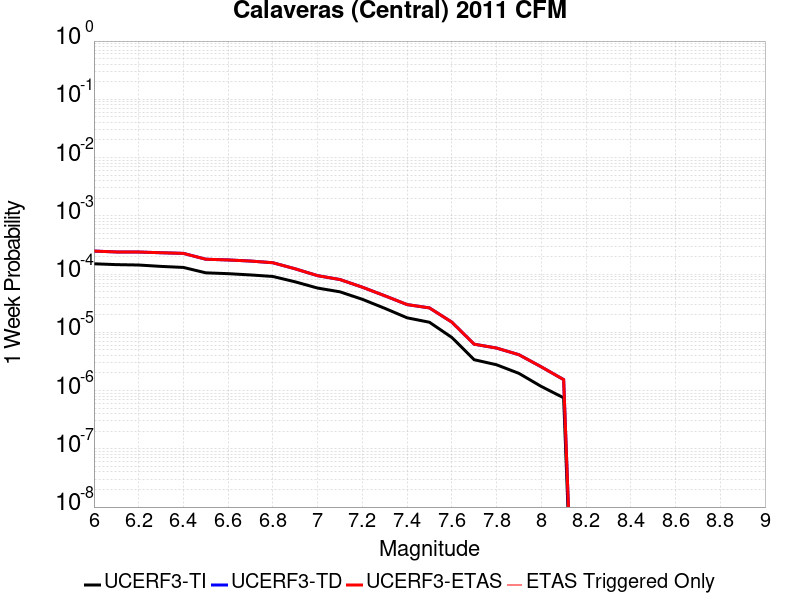 |  | 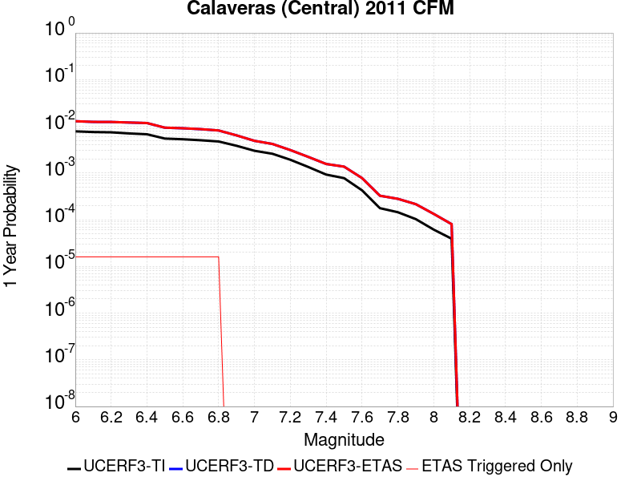 | 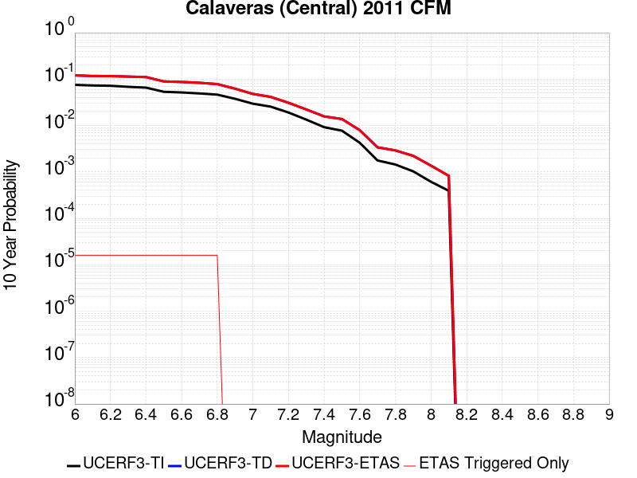 |

| Magnitude | 1 wk TI Prob | 1 wk TD Prob | 1 wk ETAS Prob | 1 wk ETAS/TD Gain | 1 wk ETAS Triggered Only | 1 mo TI Prob | 1 mo TD Prob | 1 mo ETAS Prob | 1 mo ETAS/TD Gain | 1 mo ETAS Triggered Only | 1 yr TI Prob | 1 yr TD Prob | 1 yr ETAS Prob | 1 yr ETAS/TD Gain | 1 yr ETAS Triggered Only | 10 yr TI Prob | 10 yr TD Prob | 10 yr ETAS Prob | 10 yr ETAS/TD Gain | 10 yr ETAS Triggered Only |
|-----|-----|-----|-----|-----|-----|-----|-----|-----|-----|-----|-----|-----|-----|-----|-----|-----|-----|-----|-----|-----|
| 6.0 | 1.5010907E-4 | 2.481574E-4 | 2.481574E-4 | 1.0 | 0.0 | 6.4316596E-4 | 0.0010621005 | 0.0010621005 | 1.0 | 0.0 | 0.0078024664 | 0.012850073 | 0.012874374 | 1.001891 | 2.4616596E-5 | 0.07534136 | 0.120401435 | 0.120423086 | 1.0001799 | 2.4616596E-5 |
| 6.1 | 1.4521465E-4 | 2.397987E-4 | 2.397987E-4 | 1.0 | 0.0 | 6.222001E-4 | 0.0010263061 | 0.0010263061 | 1.0 | 0.0 | 0.0075490056 | 0.012419341 | 0.012443652 | 1.0019575 | 2.4616596E-5 | 0.07297657 | 0.11667323 | 0.11669497 | 1.0001863 | 2.4616596E-5 |
| 6.2 | 1.429998E-4 | 2.3911126E-4 | 2.3911126E-4 | 1.0 | 0.0 | 6.127123E-4 | 0.0010233623 | 0.0010233623 | 1.0 | 0.0 | 0.007434286 | 0.01238394 | 0.012408252 | 1.0019631 | 2.4616596E-5 | 0.07190444 | 0.1163272 | 0.11634895 | 1.000187 | 2.4616596E-5 |
| 6.3 | 1.3536277E-4 | 2.3242626E-4 | 2.3242626E-4 | 1.0 | 0.0 | 5.799972E-4 | 9.947343E-4 | 9.947343E-4 | 1.0 | 0.0 | 0.0070386264 | 0.012040132 | 0.012064452 | 1.0020199 | 2.4616596E-5 | 0.0681982 | 0.11323977 | 0.1132616 | 1.0001928 | 2.4616596E-5 |
| 6.4 | 1.2993296E-4 | 2.2666177E-4 | 2.2666177E-4 | 1.0 | 0.0 | 5.5673666E-4 | 9.700479E-4 | 9.700479E-4 | 1.0 | 0.0 | 0.006757223 | 0.011742937 | 0.011767265 | 1.0020716 | 2.4616596E-5 | 0.06555412 | 0.11051771 | 0.11053961 | 1.0001981 | 2.4616596E-5 |
| 6.5 | 1.0498927E-4 | 1.7981697E-4 | 1.7981697E-4 | 1.0 | 0.0 | 4.498764E-4 | 7.704157E-4 | 7.704157E-4 | 1.0 | 0.0 | 0.005463498 | 0.00933924 | 0.009363627 | 1.0026112 | 2.4616596E-5 | 0.053311124 | 0.089199215 | 0.089221634 | 1.0002514 | 2.4616596E-5 |
| 6.6 | 1.0157505E-4 | 1.7469203E-4 | 1.7469203E-4 | 1.0 | 0.0 | 4.35249E-4 | 7.484645E-4 | 7.484645E-4 | 1.0 | 0.0 | 0.0052862884 | 0.009074297 | 0.00909869 | 1.0026882 | 2.4616596E-5 | 0.05162293 | 0.08677671 | 0.08679919 | 1.000259 | 2.4616596E-5 |
| 6.7 | 9.660386E-5 | 1.6728524E-4 | 1.6728524E-4 | 1.0 | 0.0 | 4.1395082E-4 | 7.1673887E-4 | 7.1673887E-4 | 1.0 | 0.0 | 0.0050282106 | 0.008691208 | 0.008715611 | 1.0028077 | 2.4616596E-5 | 0.049159497 | 0.083266065 | 0.08328863 | 1.000271 | 2.4616596E-5 |
| 6.8 | 9.089927E-5 | 1.5643016E-4 | 1.5643016E-4 | 1.0 | 0.0 | 3.8951015E-4 | 6.702439E-4 | 6.702439E-4 | 1.0 | 0.0 | 0.0047319788 | 0.008129478 | 0.008153895 | 1.0030035 | 2.4616596E-5 | 0.046324775 | 0.078159414 | 0.07818211 | 1.0002904 | 2.4616596E-5 |
| 6.9 | 7.353187E-5 | 1.2295354E-4 | 1.2295354E-4 | 1.0 | 0.0 | 3.150985E-4 | 5.2683795E-4 | 5.2683795E-4 | 1.0 | 0.0 | 0.0038295772 | 0.006395508 | 0.006395508 | 1.0 | 0.0 | 0.037642512 | 0.062187865 | 0.062187865 | 1.0 | 0.0 |
| 7.0 | 5.746064E-5 | 9.3887444E-5 | 9.3887444E-5 | 1.0 | 0.0 | 2.4623662E-4 | 4.0231308E-4 | 4.0231308E-4 | 1.0 | 0.0 | 0.0029938098 | 0.004887232 | 0.004887232 | 1.0 | 0.0 | 0.02953797 | 0.04798685 | 0.04798685 | 1.0 | 0.0 |
| 7.1 | 4.9557195E-5 | 8.052461E-5 | 8.052461E-5 | 1.0 | 0.0 | 2.123707E-4 | 3.4506017E-4 | 3.4506017E-4 | 1.0 | 0.0 | 0.0025825473 | 0.0041930773 | 0.0041930773 | 1.0 | 0.0 | 0.0255274 | 0.041373078 | 0.041373078 | 1.0 | 0.0 |
| 7.2 | 3.687595E-5 | 5.9524526E-5 | 5.9524526E-5 | 1.0 | 0.0 | 1.5803022E-4 | 2.5508032E-4 | 2.5508032E-4 | 1.0 | 0.0 | 0.0019223199 | 0.0031012094 | 0.0031012094 | 1.0 | 0.0 | 0.01905776 | 0.030883716 | 0.030883716 | 1.0 | 0.0 |
| 7.3 | 2.5846984E-5 | 4.247213E-5 | 4.247213E-5 | 1.0 | 0.0 | 1.1076809E-4 | 1.8201082E-4 | 1.8201082E-4 | 1.0 | 0.0 | 0.0013477671 | 0.002213747 | 0.002213747 | 1.0 | 0.0 | 0.013396223 | 0.02217554 | 0.02217554 | 1.0 | 0.0 |
| 7.4 | 1.7747854E-5 | 2.9936204E-5 | 2.9936204E-5 | 1.0 | 0.0 | 7.6060016E-5 | 1.2829172E-4 | 1.2829172E-4 | 1.0 | 0.0 | 9.2563726E-4 | 0.0015608355 | 0.0015608355 | 1.0 | 0.0 | 0.009217911 | 0.015709236 | 0.015709236 | 1.0 | 0.0 |
| 7.5 | 1.4883479E-5 | 2.6243379E-5 | 2.6243379E-5 | 1.0 | 0.0 | 6.378478E-5 | 1.1246678E-4 | 1.1246678E-4 | 1.0 | 0.0 | 7.76303E-4 | 0.0013684258 | 0.0013684258 | 1.0 | 0.0 | 0.0077359667 | 0.013802425 | 0.013802425 | 1.0 | 0.0 |
| 7.6 | 8.166975E-6 | 1.4963478E-5 | 1.4963478E-5 | 1.0 | 0.0 | 3.5000852E-5 | 6.412763E-5 | 6.412763E-5 | 1.0 | 0.0 | 4.2605202E-4 | 7.804755E-4 | 7.804755E-4 | 1.0 | 0.0 | 0.004252361 | 0.00793984 | 0.00793984 | 1.0 | 0.0 |
| 7.7 | 3.3858064E-6 | 6.253914E-6 | 6.253914E-6 | 1.0 | 0.0 | 1.4510518E-5 | 2.6802214E-5 | 2.6802214E-5 | 1.0 | 0.0 | 1.7665124E-4 | 3.2626814E-4 | 3.2626814E-4 | 1.0 | 0.0 | 0.0017651088 | 0.0033882293 | 0.0033882293 | 1.0 | 0.0 |
| 7.8 | 2.7721615E-6 | 5.3663807E-6 | 5.3663807E-6 | 1.0 | 0.0 | 1.1880637E-5 | 2.2998573E-5 | 2.2998573E-5 | 1.0 | 0.0 | 1.4463716E-4 | 2.799717E-4 | 2.799717E-4 | 1.0 | 0.0 | 0.0014454306 | 0.0029074624 | 0.0029074624 | 1.0 | 0.0 |
| 7.9 | 1.9736292E-6 | 4.1284193E-6 | 4.1284193E-6 | 1.0 | 0.0 | 8.4583835E-6 | 1.7693106E-5 | 1.7693106E-5 | 1.0 | 0.0 | 1.0297595E-4 | 2.1539231E-4 | 2.1539231E-4 | 1.0 | 0.0 | 0.0010292825 | 0.0022236116 | 0.0022236116 | 1.0 | 0.0 |
| 8.0 | 1.1767289E-6 | 2.5544743E-6 | 2.5544743E-6 | 1.0 | 0.0 | 5.0431145E-6 | 1.0947701E-5 | 1.0947701E-5 | 1.0 | 0.0 | 6.139818E-5 | 1.3328013E-4 | 1.3328013E-4 | 1.0 | 0.0 | 6.1381224E-4 | 0.0013660848 | 0.0013660848 | 1.0 | 0.0 |
| 8.1 | 7.5112825E-7 | 1.5409794E-6 | 1.5409794E-6 | 1.0 | 0.0 | 3.2191172E-6 | 6.6041807E-6 | 6.6041807E-6 | 1.0 | 0.0 | 3.9192048E-5 | 8.0402955E-5 | 8.0402955E-5 | 1.0 | 0.0 | 3.9185135E-4 | 8.235564E-4 | 8.235564E-4 | 1.0 | 0.0 |

## Green Valley 2011 CFM
*[(top)](#table-of-contents)*

| 1 Week | 1 Month | 1 Year | 10 Year |
|-----|-----|-----|-----|
| 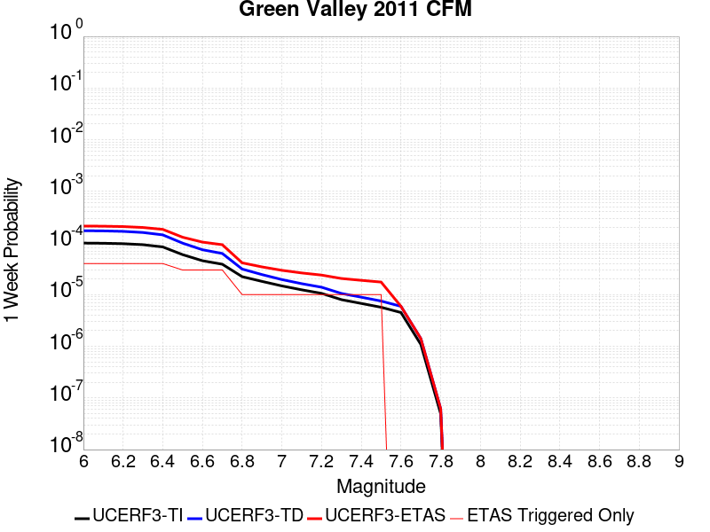 | 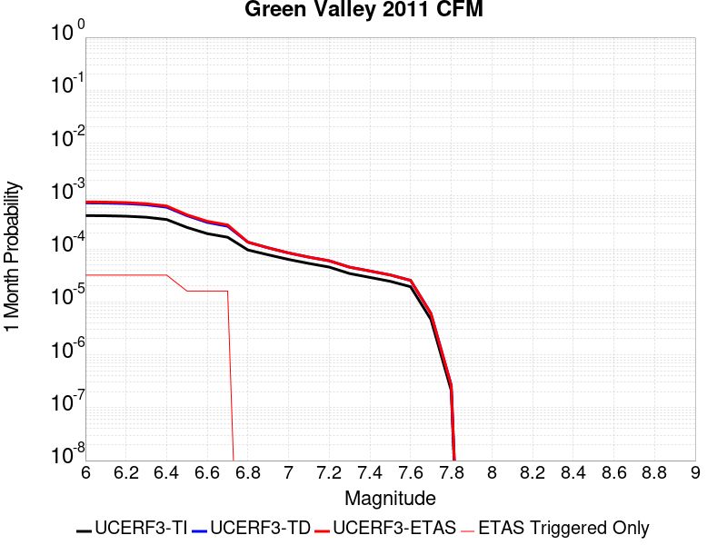 | 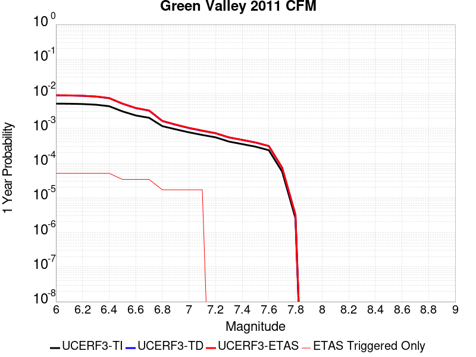 | 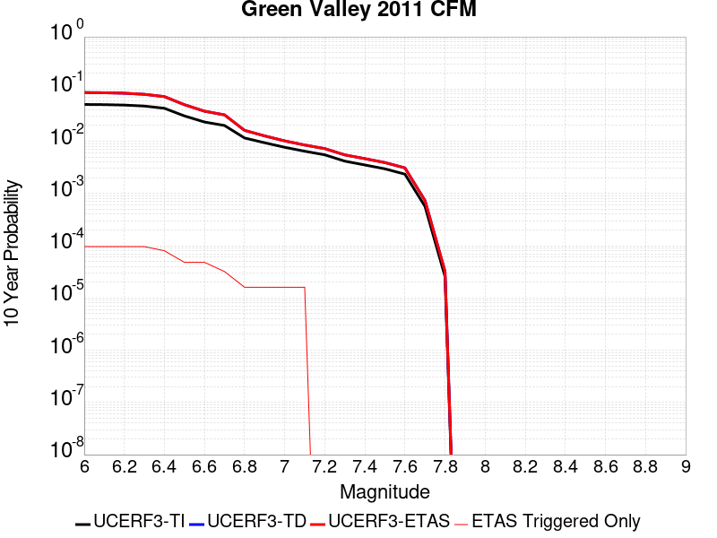 |

| Magnitude | 1 wk TI Prob | 1 wk TD Prob | 1 wk ETAS Prob | 1 wk ETAS/TD Gain | 1 wk ETAS Triggered Only | 1 mo TI Prob | 1 mo TD Prob | 1 mo ETAS Prob | 1 mo ETAS/TD Gain | 1 mo ETAS Triggered Only | 1 yr TI Prob | 1 yr TD Prob | 1 yr ETAS Prob | 1 yr ETAS/TD Gain | 1 yr ETAS Triggered Only | 10 yr TI Prob | 10 yr TD Prob | 10 yr ETAS Prob | 10 yr ETAS/TD Gain | 10 yr ETAS Triggered Only |
|-----|-----|-----|-----|-----|-----|-----|-----|-----|-----|-----|-----|-----|-----|-----|-----|-----|-----|-----|-----|-----|
| 6.0 | 9.9629346E-5 | 1.7305532E-4 | 1.7305532E-4 | 1.0 | 0.0 | 4.2691303E-4 | 7.4143766E-4 | 7.4143766E-4 | 1.0 | 0.0 | 0.0051852856 | 0.008986705 | 0.008986705 | 1.0 | 0.0 | 0.050659515 | 0.085522056 | 0.08554457 | 1.0002632 | 2.4616596E-5 |
| 6.1 | 9.88615E-5 | 1.7152846E-4 | 1.7152846E-4 | 1.0 | 0.0 | 4.2362334E-4 | 7.348976E-4 | 7.348976E-4 | 1.0 | 0.0 | 0.0051454236 | 0.0089077335 | 0.0089077335 | 1.0 | 0.0 | 0.050279044 | 0.084809676 | 0.08483221 | 1.0002656 | 2.4616596E-5 |
| 6.2 | 9.696895E-5 | 1.6791887E-4 | 1.6791887E-4 | 1.0 | 0.0 | 4.15515E-4 | 7.194366E-4 | 7.194366E-4 | 1.0 | 0.0 | 0.0050471667 | 0.008721114 | 0.008721114 | 1.0 | 0.0 | 0.04934063 | 0.0831186 | 0.08314118 | 1.0002716 | 2.4616596E-5 |
| 6.3 | 9.275224E-5 | 1.5971228E-4 | 1.5971228E-4 | 1.0 | 0.0 | 3.9744904E-4 | 6.842841E-4 | 6.842841E-4 | 1.0 | 0.0 | 0.0048282105 | 0.008296439 | 0.008296439 | 1.0 | 0.0 | 0.047246475 | 0.07925707 | 0.079279736 | 1.000286 | 2.4616596E-5 |
| 6.4 | 8.391499E-5 | 1.4367796E-4 | 1.4367796E-4 | 1.0 | 0.0 | 3.595861E-4 | 6.156248E-4 | 6.156248E-4 | 1.0 | 0.0 | 0.004369175 | 0.0074670846 | 0.0074670846 | 1.0 | 0.0 | 0.04284265 | 0.071630865 | 0.071653716 | 1.000319 | 2.4616596E-5 |
| 6.5 | 5.9519385E-5 | 9.9340905E-5 | 9.9340905E-5 | 1.0 | 0.0 | 2.5505814E-4 | 4.2568138E-4 | 4.2568138E-4 | 1.0 | 0.0 | 0.0031009112 | 0.005168295 | 0.005168295 | 1.0 | 0.0 | 0.030579966 | 0.050145864 | 0.050169244 | 1.0004662 | 2.4616596E-5 |
| 6.6 | 4.5361558E-5 | 7.402609E-5 | 7.402609E-5 | 1.0 | 0.0 | 1.9439218E-4 | 3.1721895E-4 | 3.1721895E-4 | 1.0 | 0.0 | 0.0023641558 | 0.0038539418 | 0.0038539418 | 1.0 | 0.0 | 0.023391623 | 0.037665963 | 0.037689652 | 1.000629 | 2.4616596E-5 |
| 6.7 | 3.8808106E-5 | 6.2651976E-5 | 6.2651976E-5 | 1.0 | 0.0 | 1.6630985E-4 | 2.6848342E-4 | 2.6848342E-4 | 1.0 | 0.0 | 0.0020229418 | 0.0032626586 | 0.0032626586 | 1.0 | 0.0 | 0.020046256 | 0.032005914 | 0.032005914 | 1.0 | 0.0 |
| 6.8 | 2.2284667E-5 | 3.1285235E-5 | 3.1285235E-5 | 1.0 | 0.0 | 9.550222E-5 | 1.3407279E-4 | 1.3407279E-4 | 1.0 | 0.0 | 0.0011621192 | 0.0016311078 | 0.0016311078 | 1.0 | 0.0 | 0.011560607 | 0.016165998 | 0.016165998 | 1.0 | 0.0 |
| 6.9 | 1.8050168E-5 | 2.4448054E-5 | 2.4448054E-5 | 1.0 | 0.0 | 7.735557E-5 | 1.047732E-4 | 1.047732E-4 | 1.0 | 0.0 | 9.4139716E-4 | 0.0012748708 | 0.0012748708 | 1.0 | 0.0 | 0.009374191 | 0.012667833 | 0.012667833 | 1.0 | 0.0 |
| 7.0 | 1.4763166E-5 | 1.9582854E-5 | 1.9582854E-5 | 1.0 | 0.0 | 6.326917E-5 | 8.3923835E-5 | 8.3923835E-5 | 1.0 | 0.0 | 7.7002996E-4 | 0.0010212966 | 0.0010212966 | 1.0 | 0.0 | 0.007673672 | 0.010165343 | 0.010165343 | 1.0 | 0.0 |
| 7.1 | 1.2399713E-5 | 1.6303715E-5 | 1.6303715E-5 | 1.0 | 0.0 | 5.3140546E-5 | 6.98712E-5 | 6.98712E-5 | 1.0 | 0.0 | 6.467941E-4 | 8.503518E-4 | 8.503518E-4 | 1.0 | 0.0 | 0.006449148 | 0.008471259 | 0.008471259 | 1.0 | 0.0 |
| 7.2 | 1.0584195E-5 | 1.3921742E-5 | 1.3921742E-5 | 1.0 | 0.0 | 4.5360044E-5 | 5.9663253E-5 | 5.9663253E-5 | 1.0 | 0.0 | 5.521186E-4 | 7.261596E-4 | 7.261596E-4 | 1.0 | 0.0 | 0.0055074887 | 0.007238285 | 0.007238285 | 1.0 | 0.0 |
| 7.3 | 7.998173E-6 | 1.054402E-5 | 1.054402E-5 | 1.0 | 0.0 | 3.4277433E-5 | 4.518788E-5 | 4.518788E-5 | 1.0 | 0.0 | 4.1724785E-4 | 5.500247E-4 | 5.500247E-4 | 1.0 | 0.0 | 0.004164653 | 0.0054868995 | 0.0054868995 | 1.0 | 0.0 |
| 7.4 | 6.7571127E-6 | 8.932697E-6 | 8.932697E-6 | 1.0 | 0.0 | 2.8958733E-5 | 3.828243E-5 | 3.828243E-5 | 1.0 | 0.0 | 3.5251552E-4 | 4.6598984E-4 | 4.6598984E-4 | 1.0 | 0.0 | 0.0035195686 | 0.0046503306 | 0.0046503306 | 1.0 | 0.0 |
| 7.5 | 5.69878E-6 | 7.516314E-6 | 7.516314E-6 | 1.0 | 0.0 | 2.4423114E-5 | 3.221238E-5 | 3.221238E-5 | 1.0 | 0.0 | 2.9731085E-4 | 3.9211605E-4 | 3.9211605E-4 | 1.0 | 0.0 | 0.002969134 | 0.0039143935 | 0.0039143935 | 1.0 | 0.0 |
| 7.6 | 4.503664E-6 | 5.9356807E-6 | 5.9356807E-6 | 1.0 | 0.0 | 1.9301275E-5 | 2.5438389E-5 | 2.5438389E-5 | 1.0 | 0.0 | 2.3496768E-4 | 3.096692E-4 | 3.096692E-4 | 1.0 | 0.0 | 0.002347194 | 0.003092502 | 0.003092502 | 1.0 | 0.0 |
| 7.7 | 1.0873546E-6 | 1.4106979E-6 | 1.4106979E-6 | 1.0 | 0.0 | 4.6600826E-6 | 6.045834E-6 | 6.045834E-6 | 1.0 | 0.0 | 5.6735033E-5 | 7.360557E-5 | 7.360557E-5 | 1.0 | 0.0 | 5.672055E-4 | 7.35814E-4 | 7.35814E-4 | 1.0 | 0.0 |
| 7.8 | 4.9373917E-8 | 6.1777136E-8 | 6.1777136E-8 | 1.0 | 0.0 | 2.1160248E-7 | 2.6475914E-7 | 2.6475914E-7 | 1.0 | 0.0 | 2.5762572E-6 | 3.223439E-6 | 3.223439E-6 | 1.0 | 0.0 | 2.5762274E-5 | 3.2232296E-5 | 3.2232296E-5 | 1.0 | 0.0 |

## Great Valley 03a Dunnigan Hills
*[(top)](#table-of-contents)*

| 1 Week | 1 Month | 1 Year | 10 Year |
|-----|-----|-----|-----|
| 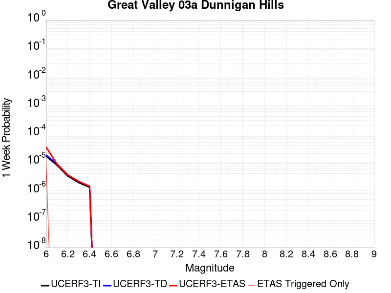 | 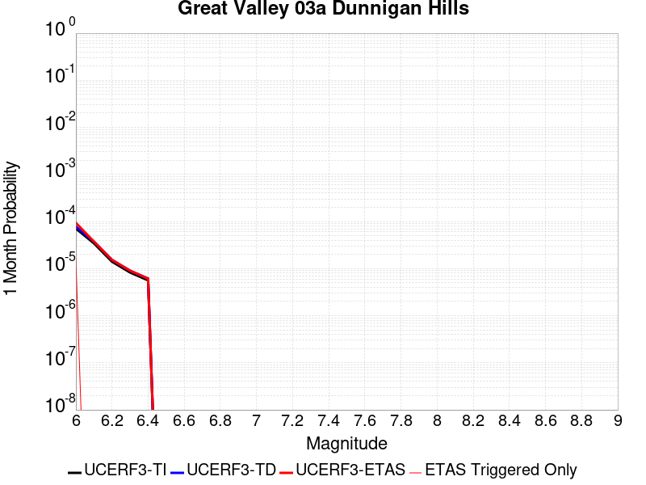 | 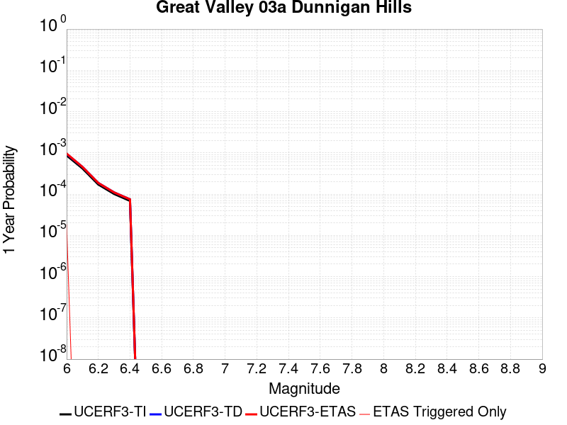 | 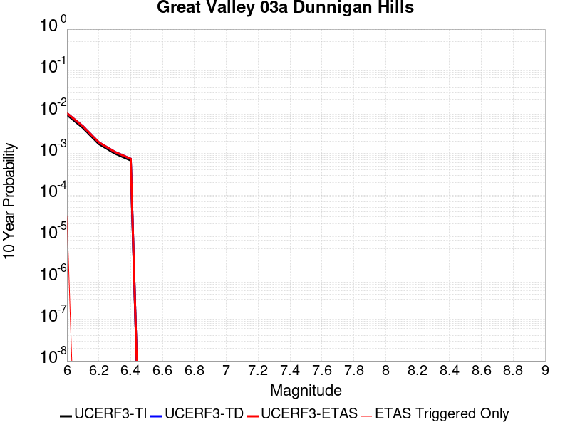 |

| Magnitude | 1 wk TI Prob | 1 wk TD Prob | 1 wk ETAS Prob | 1 wk ETAS/TD Gain | 1 wk ETAS Triggered Only | 1 mo TI Prob | 1 mo TD Prob | 1 mo ETAS Prob | 1 mo ETAS/TD Gain | 1 mo ETAS Triggered Only | 1 yr TI Prob | 1 yr TD Prob | 1 yr ETAS Prob | 1 yr ETAS/TD Gain | 1 yr ETAS Triggered Only | 10 yr TI Prob | 10 yr TD Prob | 10 yr ETAS Prob | 10 yr ETAS/TD Gain | 10 yr ETAS Triggered Only |
|-----|-----|-----|-----|-----|-----|-----|-----|-----|-----|-----|-----|-----|-----|-----|-----|-----|-----|-----|-----|-----|
| 6.0 | 1.6591328E-5 | 1.8107954E-5 | 4.2724107E-5 | 2.359411 | 2.4616596E-5 | 7.110376E-5 | 7.7603596E-5 | 1.02218284E-4 | 1.3171848 | 2.4616596E-5 | 8.6534437E-4 | 9.444834E-4 | 9.6907676E-4 | 1.0260389 | 2.4616596E-5 | 0.008619824 | 0.009411525 | 0.00943591 | 1.002591 | 2.4616596E-5 |
| 6.1 | 8.041125E-6 | 8.769726E-6 | 8.769726E-6 | 1.0 | 0.0 | 3.4461507E-5 | 3.7584115E-5 | 3.7584115E-5 | 1.0 | 0.0 | 4.194881E-4 | 4.5751085E-4 | 4.5751085E-4 | 1.0 | 0.0 | 0.004186971 | 0.004567687 | 0.004567687 | 1.0 | 0.0 |
| 6.2 | 3.2807004E-6 | 3.5795688E-6 | 3.5795688E-6 | 1.0 | 0.0 | 1.4060069E-5 | 1.5340942E-5 | 1.5340942E-5 | 1.0 | 0.0 | 1.7116789E-4 | 1.8676413E-4 | 1.8676413E-4 | 1.0 | 0.0 | 0.0017103611 | 0.0018664796 | 0.0018664796 | 1.0 | 0.0 |
| 6.3 | 1.9339366E-6 | 2.1103806E-6 | 2.1103806E-6 | 1.0 | 0.0 | 8.288273E-6 | 9.044474E-6 | 9.044474E-6 | 1.0 | 0.0 | 1.00905054E-4 | 1.1011375E-4 | 1.1011375E-4 | 1.0 | 0.0 | 0.0010085925 | 0.0011008718 | 0.0011008718 | 1.0 | 0.0 |
| 6.4 | 1.3142635E-6 | 1.4339867E-6 | 1.4339867E-6 | 1.0 | 0.0 | 5.6325457E-6 | 6.145657E-6 | 6.145657E-6 | 1.0 | 0.0 | 6.857408E-5 | 7.482337E-5 | 7.482337E-5 | 1.0 | 0.0 | 6.8552926E-4 | 7.4823375E-4 | 7.4823375E-4 | 1.0 | 0.0 |

## Earthquake Valley (No  Extension)
*[(top)](#table-of-contents)*

| 1 Week | 1 Month | 1 Year | 10 Year |
|-----|-----|-----|-----|
| 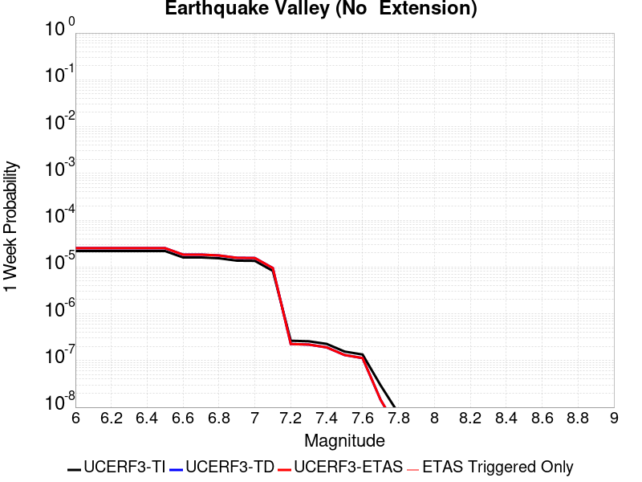 | 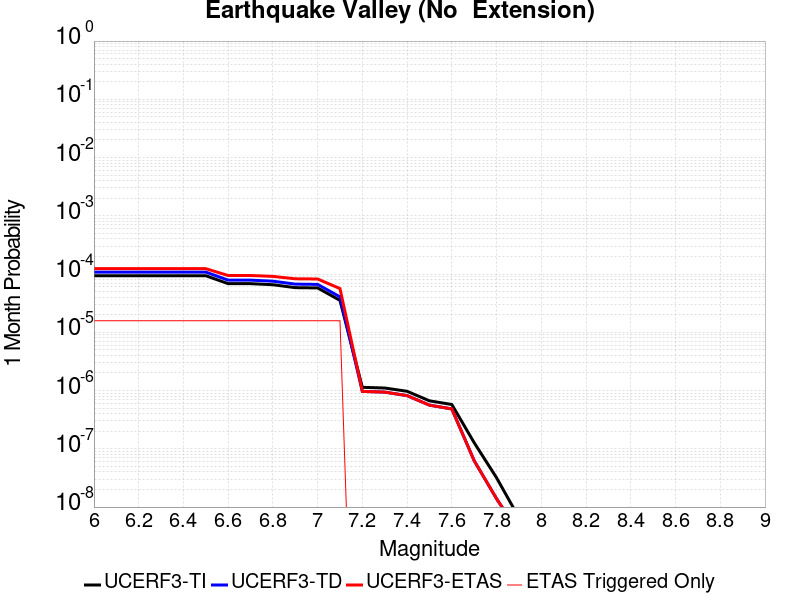 | 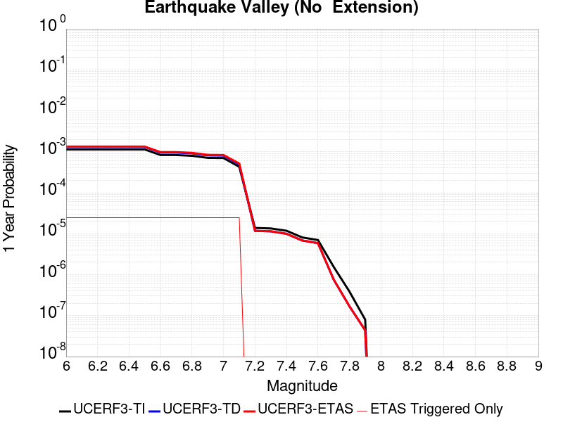 | 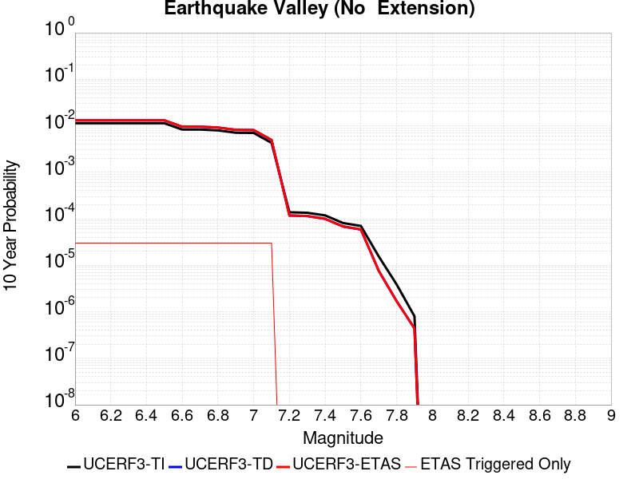 |

| Magnitude | 1 wk TI Prob | 1 wk TD Prob | 1 wk ETAS Prob | 1 wk ETAS/TD Gain | 1 wk ETAS Triggered Only | 1 mo TI Prob | 1 mo TD Prob | 1 mo ETAS Prob | 1 mo ETAS/TD Gain | 1 mo ETAS Triggered Only | 1 yr TI Prob | 1 yr TD Prob | 1 yr ETAS Prob | 1 yr ETAS/TD Gain | 1 yr ETAS Triggered Only | 10 yr TI Prob | 10 yr TD Prob | 10 yr ETAS Prob | 10 yr ETAS/TD Gain | 10 yr ETAS Triggered Only |
|-----|-----|-----|-----|-----|-----|-----|-----|-----|-----|-----|-----|-----|-----|-----|-----|-----|-----|-----|-----|-----|
| 6.0 | 2.1859703E-5 | 2.5198362E-5 | 2.5198362E-5 | 1.0 | 0.0 | 9.3681076E-5 | 1.07989326E-4 | 1.07989326E-4 | 1.0 | 0.0 | 0.0011399703 | 0.001314122 | 0.0013387062 | 1.0187078 | 2.4616596E-5 | 0.011341401 | 0.013077871 | 0.013102166 | 1.0018576 | 2.4616596E-5 |
| 6.1 | 2.1859703E-5 | 2.5198362E-5 | 2.5198362E-5 | 1.0 | 0.0 | 9.3681076E-5 | 1.07989326E-4 | 1.07989326E-4 | 1.0 | 0.0 | 0.0011399703 | 0.001314122 | 0.0013387062 | 1.0187078 | 2.4616596E-5 | 0.011341401 | 0.013077871 | 0.013102166 | 1.0018576 | 2.4616596E-5 |
| 6.2 | 2.1859703E-5 | 2.5198362E-5 | 2.5198362E-5 | 1.0 | 0.0 | 9.3681076E-5 | 1.07989326E-4 | 1.07989326E-4 | 1.0 | 0.0 | 0.0011399703 | 0.001314122 | 0.0013387062 | 1.0187078 | 2.4616596E-5 | 0.011341401 | 0.013077871 | 0.013102166 | 1.0018576 | 2.4616596E-5 |
| 6.3 | 2.1859703E-5 | 2.5198362E-5 | 2.5198362E-5 | 1.0 | 0.0 | 9.3681076E-5 | 1.07989326E-4 | 1.07989326E-4 | 1.0 | 0.0 | 0.0011399703 | 0.001314122 | 0.0013387062 | 1.0187078 | 2.4616596E-5 | 0.011341401 | 0.013077871 | 0.013102166 | 1.0018576 | 2.4616596E-5 |
| 6.4 | 2.1859703E-5 | 2.5198362E-5 | 2.5198362E-5 | 1.0 | 0.0 | 9.3681076E-5 | 1.07989326E-4 | 1.07989326E-4 | 1.0 | 0.0 | 0.0011399703 | 0.001314122 | 0.0013387062 | 1.0187078 | 2.4616596E-5 | 0.011341401 | 0.013077871 | 0.013102166 | 1.0018576 | 2.4616596E-5 |
| 6.5 | 2.1859703E-5 | 2.5198362E-5 | 2.5198362E-5 | 1.0 | 0.0 | 9.3681076E-5 | 1.07989326E-4 | 1.07989326E-4 | 1.0 | 0.0 | 0.0011399703 | 0.001314122 | 0.0013387062 | 1.0187078 | 2.4616596E-5 | 0.011341401 | 0.013077871 | 0.013102166 | 1.0018576 | 2.4616596E-5 |
| 6.6 | 1.597E-5 | 1.8356275E-5 | 1.8356275E-5 | 1.0 | 0.0 | 6.8441055E-5 | 7.866787E-5 | 7.866787E-5 | 1.0 | 0.0 | 8.329513E-4 | 9.574478E-4 | 9.820408E-4 | 1.025686 | 2.4616596E-5 | 0.008298361 | 0.009541836 | 0.009566218 | 1.0025553 | 2.4616596E-5 |
| 6.7 | 1.597E-5 | 1.8356275E-5 | 1.8356275E-5 | 1.0 | 0.0 | 6.8441055E-5 | 7.866787E-5 | 7.866787E-5 | 1.0 | 0.0 | 8.329513E-4 | 9.574478E-4 | 9.820408E-4 | 1.025686 | 2.4616596E-5 | 0.008298361 | 0.009541836 | 0.009566218 | 1.0025553 | 2.4616596E-5 |
| 6.8 | 1.5315149E-5 | 1.7602091E-5 | 1.7602091E-5 | 1.0 | 0.0 | 6.5634704E-5 | 7.543584E-5 | 7.543584E-5 | 1.0 | 0.0 | 7.988095E-4 | 9.181311E-4 | 9.427251E-4 | 1.026787 | 2.4616596E-5 | 0.007959441 | 0.009151919 | 0.00917631 | 1.0026652 | 2.4616596E-5 |
| 6.9 | 1.3634728E-5 | 1.5675821E-5 | 1.5675821E-5 | 1.0 | 0.0 | 5.8433237E-5 | 6.718082E-5 | 6.718082E-5 | 1.0 | 0.0 | 7.1119244E-4 | 8.177017E-4 | 8.4229815E-4 | 1.03008 | 2.4616596E-5 | 0.007089207 | 0.008155 | 0.008179417 | 1.002994 | 2.4616596E-5 |
| 7.0 | 1.3496271E-5 | 1.5517853E-5 | 1.5517853E-5 | 1.0 | 0.0 | 5.783988E-5 | 6.650385E-5 | 6.650385E-5 | 1.0 | 0.0 | 7.03973E-4 | 8.094657E-4 | 8.340624E-4 | 1.0303863 | 2.4616596E-5 | 0.007017471 | 0.0080732405 | 0.008097659 | 1.0030246 | 2.4616596E-5 |
| 7.1 | 8.242798E-6 | 9.4726E-6 | 9.4726E-6 | 1.0 | 0.0 | 3.53258E-5 | 4.0596606E-5 | 4.0596606E-5 | 1.0 | 0.0 | 4.300067E-4 | 4.9421866E-4 | 5.1882304E-4 | 1.0497845 | 2.4616596E-5 | 0.004291756 | 0.0049377717 | 0.004962267 | 1.0049608 | 2.4616596E-5 |
| 7.2 | 2.6506527E-7 | 2.2560312E-7 | 2.2560312E-7 | 1.0 | 0.0 | 1.1359936E-6 | 9.668702E-7 | 9.668702E-7 | 1.0 | 0.0 | 1.3830633E-5 | 1.17715845E-5 | 1.17715845E-5 | 1.0 | 0.0 | 1.3829772E-4 | 1.1771003E-4 | 1.1771003E-4 | 1.0 | 0.0 |
| 7.3 | 2.5810488E-7 | 2.1955442E-7 | 2.1955442E-7 | 1.0 | 0.0 | 1.1061633E-6 | 9.409472E-7 | 9.409472E-7 | 1.0 | 0.0 | 1.3467455E-5 | 1.1455976E-5 | 1.1455976E-5 | 1.0 | 0.0 | 1.3466639E-4 | 1.1455427E-4 | 1.1455427E-4 | 1.0 | 0.0 |
| 7.4 | 2.2676066E-7 | 1.9110601E-7 | 1.9110601E-7 | 1.0 | 0.0 | 9.71831E-7 | 8.190255E-7 | 8.190255E-7 | 1.0 | 0.0 | 1.1831979E-5 | 9.9715935E-6 | 9.9715935E-6 | 1.0 | 0.0 | 1.1831349E-4 | 9.9711855E-5 | 9.9711855E-5 | 1.0 | 0.0 |
| 7.5 | 1.5553917E-7 | 1.3112096E-7 | 1.3112096E-7 | 1.0 | 0.0 | 6.6659624E-7 | 5.619469E-7 | 5.619469E-7 | 1.0 | 0.0 | 8.115779E-6 | 6.8416834E-6 | 6.8416834E-6 | 1.0 | 0.0 | 8.115482E-5 | 6.841495E-5 | 6.841495E-5 | 1.0 | 0.0 |
| 7.6 | 1.3448629E-7 | 1.1288419E-7 | 1.1288419E-7 | 1.0 | 0.0 | 5.7636964E-7 | 4.837893E-7 | 4.837893E-7 | 1.0 | 0.0 | 7.017278E-6 | 5.890121E-6 | 5.890121E-6 | 1.0 | 0.0 | 7.0170565E-5 | 5.889986E-5 | 5.889986E-5 | 1.0 | 0.0 |
| 7.7 | 2.9719402E-8 | 1.458206E-8 | 1.458206E-8 | 1.0 | 0.0 | 1.2736886E-7 | 6.249454E-8 | 6.249454E-8 | 1.0 | 0.0 | 1.5507147E-6 | 7.608708E-7 | 7.608708E-7 | 1.0 | 0.0 | 1.550704E-5 | 7.6086876E-6 | 7.6086876E-6 | 1.0 | 0.0 |
| 7.8 | 7.4390196E-9 | 3.2502152E-9 | 3.2502152E-9 | 1.0 | 0.0 | 3.1881513E-8 | 1.3929493E-8 | 1.3929493E-8 | 1.0 | 0.0 | 3.8815733E-7 | 1.6959156E-7 | 1.6959156E-7 | 1.0 | 0.0 | 3.8815665E-6 | 1.6959145E-6 | 1.6959145E-6 | 1.0 | 0.0 |
| 7.9 | 1.5373532E-9 | 8.440161E-10 | 8.440161E-10 | 1.0 | 0.0 | 6.5886567E-9 | 3.6172119E-9 | 3.6172119E-9 | 1.0 | 0.0 | 8.021689E-8 | 4.4039556E-8 | 4.4039556E-8 | 1.0 | 0.0 | 8.0216864E-7 | 4.4039552E-7 | 4.4039552E-7 | 1.0 | 0.0 |

## Sierra Madre
*[(top)](#table-of-contents)*

| 1 Week | 1 Month | 1 Year | 10 Year |
|-----|-----|-----|-----|
|  | 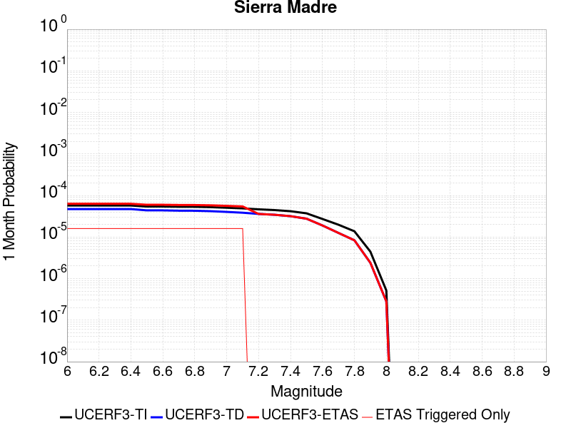 | 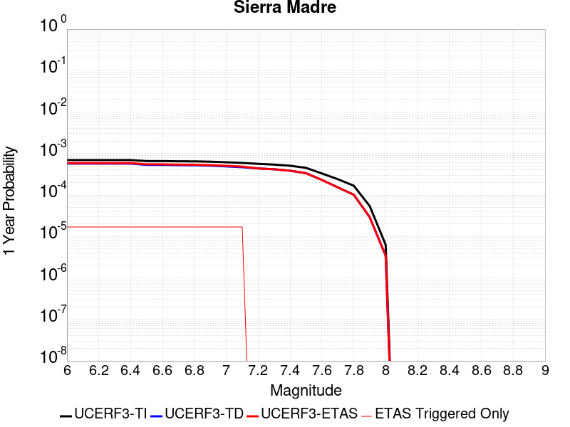 |  |

| Magnitude | 1 wk TI Prob | 1 wk TD Prob | 1 wk ETAS Prob | 1 wk ETAS/TD Gain | 1 wk ETAS Triggered Only | 1 mo TI Prob | 1 mo TD Prob | 1 mo ETAS Prob | 1 mo ETAS/TD Gain | 1 mo ETAS Triggered Only | 1 yr TI Prob | 1 yr TD Prob | 1 yr ETAS Prob | 1 yr ETAS/TD Gain | 1 yr ETAS Triggered Only | 10 yr TI Prob | 10 yr TD Prob | 10 yr ETAS Prob | 10 yr ETAS/TD Gain | 10 yr ETAS Triggered Only |
|-----|-----|-----|-----|-----|-----|-----|-----|-----|-----|-----|-----|-----|-----|-----|-----|-----|-----|-----|-----|-----|
| 6.0 | 1.3379373E-5 | 1.10007395E-5 | 1.10007395E-5 | 1.0 | 0.0 | 5.7338908E-5 | 4.7145186E-5 | 7.176062E-5 | 1.5221199 | 2.4616596E-5 | 6.978776E-4 | 5.738429E-4 | 5.984454E-4 | 1.0428731 | 2.4616596E-5 | 0.0069569005 | 0.0057239756 | 0.005748451 | 1.004276 | 2.4616596E-5 |
| 6.1 | 1.3379373E-5 | 1.10007395E-5 | 1.10007395E-5 | 1.0 | 0.0 | 5.7338908E-5 | 4.7145186E-5 | 7.176062E-5 | 1.5221199 | 2.4616596E-5 | 6.978776E-4 | 5.738429E-4 | 5.984454E-4 | 1.0428731 | 2.4616596E-5 | 0.0069569005 | 0.0057239756 | 0.005748451 | 1.004276 | 2.4616596E-5 |
| 6.2 | 1.3379373E-5 | 1.10007395E-5 | 1.10007395E-5 | 1.0 | 0.0 | 5.7338908E-5 | 4.7145186E-5 | 7.176062E-5 | 1.5221199 | 2.4616596E-5 | 6.978776E-4 | 5.738429E-4 | 5.984454E-4 | 1.0428731 | 2.4616596E-5 | 0.0069569005 | 0.0057239756 | 0.005748451 | 1.004276 | 2.4616596E-5 |
| 6.3 | 1.3379373E-5 | 1.10007395E-5 | 1.10007395E-5 | 1.0 | 0.0 | 5.7338908E-5 | 4.7145186E-5 | 7.176062E-5 | 1.5221199 | 2.4616596E-5 | 6.978776E-4 | 5.738429E-4 | 5.984454E-4 | 1.0428731 | 2.4616596E-5 | 0.0069569005 | 0.0057239756 | 0.005748451 | 1.004276 | 2.4616596E-5 |
| 6.4 | 1.3379373E-5 | 1.10007395E-5 | 1.10007395E-5 | 1.0 | 0.0 | 5.7338908E-5 | 4.7145186E-5 | 7.176062E-5 | 1.5221199 | 2.4616596E-5 | 6.978776E-4 | 5.738429E-4 | 5.984454E-4 | 1.0428731 | 2.4616596E-5 | 0.0069569005 | 0.0057239756 | 0.005748451 | 1.004276 | 2.4616596E-5 |
| 6.5 | 1.26563245E-5 | 1.0230196E-5 | 1.0230196E-5 | 1.0 | 0.0 | 5.4240263E-5 | 4.3842967E-5 | 6.845848E-5 | 1.5614474 | 2.4616596E-5 | 6.601751E-4 | 5.336584E-4 | 5.5826193E-4 | 1.0461034 | 2.4616596E-5 | 0.006582173 | 0.0053240913 | 0.0053485767 | 1.004599 | 2.4616596E-5 |
| 6.6 | 1.26563245E-5 | 1.0230196E-5 | 1.0230196E-5 | 1.0 | 0.0 | 5.4240263E-5 | 4.3842967E-5 | 6.845848E-5 | 1.5614474 | 2.4616596E-5 | 6.601751E-4 | 5.336584E-4 | 5.5826193E-4 | 1.0461034 | 2.4616596E-5 | 0.006582173 | 0.0053240913 | 0.0053485767 | 1.004599 | 2.4616596E-5 |
| 6.7 | 1.2502474E-5 | 1.006634E-5 | 1.006634E-5 | 1.0 | 0.0 | 5.3580934E-5 | 4.314075E-5 | 6.7756286E-5 | 1.5705867 | 2.4616596E-5 | 6.521526E-4 | 5.251131E-4 | 5.4971676E-4 | 1.046854 | 2.4616596E-5 | 0.0065024206 | 0.0052390425 | 0.00526353 | 1.0046741 | 2.4616596E-5 |
| 6.8 | 1.2454966E-5 | 1.0018625E-5 | 1.0018625E-5 | 1.0 | 0.0 | 5.3377335E-5 | 4.2936266E-5 | 6.75518E-5 | 1.5733042 | 2.4616596E-5 | 6.4967526E-4 | 5.226247E-4 | 5.4722844E-4 | 1.0470773 | 2.4616596E-5 | 0.006477792 | 0.0052142753 | 0.0052387635 | 1.0046964 | 2.4616596E-5 |
| 6.9 | 1.2225574E-5 | 9.792602E-6 | 9.792602E-6 | 1.0 | 0.0 | 5.2394265E-5 | 4.1967625E-5 | 6.658319E-5 | 1.586537 | 2.4616596E-5 | 6.3771347E-4 | 5.108371E-4 | 5.354411E-4 | 1.0481641 | 2.4616596E-5 | 0.006358865 | 0.0050969445 | 0.005121436 | 1.0048051 | 2.4616596E-5 |
| 7.0 | 1.182946E-5 | 9.399144E-6 | 9.399144E-6 | 1.0 | 0.0 | 5.06967E-5 | 4.0281426E-5 | 6.489703E-5 | 1.6110907 | 2.4616596E-5 | 6.1705755E-4 | 4.9031706E-4 | 5.1492156E-4 | 1.0501808 | 2.4616596E-5 | 0.006153469 | 0.004892664 | 0.00491716 | 1.0050067 | 2.4616596E-5 |
| 7.1 | 1.14369095E-5 | 8.986159E-6 | 8.986159E-6 | 1.0 | 0.0 | 4.9014405E-5 | 3.8511545E-5 | 6.31272E-5 | 1.6391758 | 2.4616596E-5 | 5.9658696E-4 | 4.687782E-4 | 4.9338327E-4 | 1.0524876 | 2.4616596E-5 | 0.005949879 | 0.004678199 | 0.004702701 | 1.0052373 | 2.4616596E-5 |
| 7.2 | 1.0836419E-5 | 8.3995565E-6 | 8.3995565E-6 | 1.0 | 0.0 | 4.644097E-5 | 3.5997607E-5 | 3.5997607E-5 | 1.0 | 0.0 | 5.652721E-4 | 4.3818366E-4 | 4.3818366E-4 | 1.0 | 0.0 | 0.0056383642 | 0.004373494 | 0.004373494 | 1.0 | 0.0 |
| 7.3 | 1.0403439E-5 | 8.02082E-6 | 8.02082E-6 | 1.0 | 0.0 | 4.4585406E-5 | 3.4374494E-5 | 3.4374494E-5 | 1.0 | 0.0 | 5.426921E-4 | 4.1843E-4 | 4.1843E-4 | 1.0 | 0.0 | 0.005413687 | 0.004176717 | 0.004176717 | 1.0 | 0.0 |
| 7.4 | 9.768864E-6 | 7.414448E-6 | 7.414448E-6 | 1.0 | 0.0 | 4.186589E-5 | 3.1775824E-5 | 3.1775824E-5 | 1.0 | 0.0 | 5.09598E-4 | 3.868029E-4 | 3.868029E-4 | 1.0 | 0.0 | 0.0050843097 | 0.0038615882 | 0.0038615882 | 1.0 | 0.0 |
| 7.5 | 8.687089E-6 | 6.4501564E-6 | 6.4501564E-6 | 1.0 | 0.0 | 3.722985E-5 | 2.764324E-5 | 2.764324E-5 | 1.0 | 0.0 | 4.5317915E-4 | 3.3650533E-4 | 3.3650533E-4 | 1.0 | 0.0 | 0.004522561 | 0.0033602451 | 0.0033602451 | 1.0 | 0.0 |
| 7.6 | 6.3506063E-6 | 4.4303215E-6 | 4.4303215E-6 | 1.0 | 0.0 | 2.72166E-5 | 1.8986955E-5 | 1.8986955E-5 | 1.0 | 0.0 | 3.3131172E-4 | 2.3114192E-4 | 2.3114192E-4 | 1.0 | 0.0 | 0.003308182 | 0.0023092402 | 0.0023092402 | 1.0 | 0.0 |
| 7.7 | 4.62223E-6 | 2.932967E-6 | 2.932967E-6 | 1.0 | 0.0 | 1.9809406E-5 | 1.2569798E-5 | 1.2569798E-5 | 1.0 | 0.0 | 2.4115283E-4 | 1.5302657E-4 | 1.5302657E-4 | 1.0 | 0.0 | 0.0024089129 | 0.001529413 | 0.001529413 | 1.0 | 0.0 |
| 7.8 | 3.2145008E-6 | 1.9494332E-6 | 1.9494332E-6 | 1.0 | 0.0 | 1.3776359E-5 | 8.3546865E-6 | 8.3546865E-6 | 1.0 | 0.0 | 1.6771426E-4 | 1.0171358E-4 | 1.0171358E-4 | 1.0 | 0.0 | 0.0016758774 | 0.0010168145 | 0.0010168145 | 1.0 | 0.0 |
| 7.9 | 1.0391769E-6 | 5.6026335E-7 | 5.6026335E-7 | 1.0 | 0.0 | 4.4536077E-6 | 2.4011265E-6 | 2.4011265E-6 | 1.0 | 0.0 | 5.4221324E-5 | 2.9233326E-5 | 2.9233326E-5 | 1.0 | 0.0 | 5.4208096E-4 | 2.9229524E-4 | 2.9229524E-4 | 1.0 | 0.0 |
| 8.0 | 1.210983E-7 | 6.613821E-8 | 6.613821E-8 | 1.0 | 0.0 | 5.1899264E-7 | 2.8344945E-7 | 2.8344945E-7 | 1.0 | 0.0 | 6.3187167E-6 | 3.4509917E-6 | 3.4509917E-6 | 1.0 | 0.0 | 6.318537E-5 | 3.45094E-5 | 3.45094E-5 | 1.0 | 0.0 |

## North Frontal  (East)
*[(top)](#table-of-contents)*

| 1 Week | 1 Month | 1 Year | 10 Year |
|-----|-----|-----|-----|
|  |  | 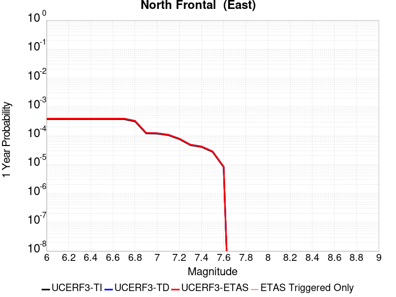 | 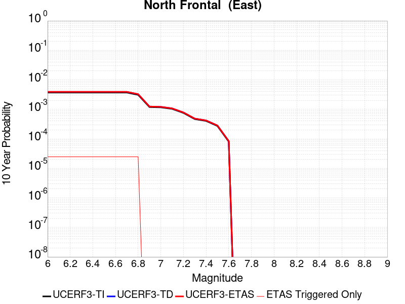 |

| Magnitude | 1 wk TI Prob | 1 wk TD Prob | 1 wk ETAS Prob | 1 wk ETAS/TD Gain | 1 wk ETAS Triggered Only | 1 mo TI Prob | 1 mo TD Prob | 1 mo ETAS Prob | 1 mo ETAS/TD Gain | 1 mo ETAS Triggered Only | 1 yr TI Prob | 1 yr TD Prob | 1 yr ETAS Prob | 1 yr ETAS/TD Gain | 1 yr ETAS Triggered Only | 10 yr TI Prob | 10 yr TD Prob | 10 yr ETAS Prob | 10 yr ETAS/TD Gain | 10 yr ETAS Triggered Only |
|-----|-----|-----|-----|-----|-----|-----|-----|-----|-----|-----|-----|-----|-----|-----|-----|-----|-----|-----|-----|-----|
| 6.0 | 7.135738E-6 | 7.4771765E-6 | 7.4771765E-6 | 1.0 | 0.0 | 3.0581377E-5 | 3.204476E-5 | 3.204476E-5 | 1.0 | 0.0 | 3.7226462E-4 | 3.9009505E-4 | 3.9009505E-4 | 1.0 | 0.0 | 0.0037164164 | 0.0038960609 | 0.0039205817 | 1.0062937 | 2.4616596E-5 |
| 6.1 | 7.135738E-6 | 7.4771765E-6 | 7.4771765E-6 | 1.0 | 0.0 | 3.0581377E-5 | 3.204476E-5 | 3.204476E-5 | 1.0 | 0.0 | 3.7226462E-4 | 3.9009505E-4 | 3.9009505E-4 | 1.0 | 0.0 | 0.0037164164 | 0.0038960609 | 0.0039205817 | 1.0062937 | 2.4616596E-5 |
| 6.2 | 7.135738E-6 | 7.4771765E-6 | 7.4771765E-6 | 1.0 | 0.0 | 3.0581377E-5 | 3.204476E-5 | 3.204476E-5 | 1.0 | 0.0 | 3.7226462E-4 | 3.9009505E-4 | 3.9009505E-4 | 1.0 | 0.0 | 0.0037164164 | 0.0038960609 | 0.0039205817 | 1.0062937 | 2.4616596E-5 |
| 6.3 | 7.135738E-6 | 7.4771765E-6 | 7.4771765E-6 | 1.0 | 0.0 | 3.0581377E-5 | 3.204476E-5 | 3.204476E-5 | 1.0 | 0.0 | 3.7226462E-4 | 3.9009505E-4 | 3.9009505E-4 | 1.0 | 0.0 | 0.0037164164 | 0.0038960609 | 0.0039205817 | 1.0062937 | 2.4616596E-5 |
| 6.4 | 7.135738E-6 | 7.4771765E-6 | 7.4771765E-6 | 1.0 | 0.0 | 3.0581377E-5 | 3.204476E-5 | 3.204476E-5 | 1.0 | 0.0 | 3.7226462E-4 | 3.9009505E-4 | 3.9009505E-4 | 1.0 | 0.0 | 0.0037164164 | 0.0038960609 | 0.0039205817 | 1.0062937 | 2.4616596E-5 |
| 6.5 | 7.135738E-6 | 7.4771765E-6 | 7.4771765E-6 | 1.0 | 0.0 | 3.0581377E-5 | 3.204476E-5 | 3.204476E-5 | 1.0 | 0.0 | 3.7226462E-4 | 3.9009505E-4 | 3.9009505E-4 | 1.0 | 0.0 | 0.0037164164 | 0.0038960609 | 0.0039205817 | 1.0062937 | 2.4616596E-5 |
| 6.6 | 7.135738E-6 | 7.4771765E-6 | 7.4771765E-6 | 1.0 | 0.0 | 3.0581377E-5 | 3.204476E-5 | 3.204476E-5 | 1.0 | 0.0 | 3.7226462E-4 | 3.9009505E-4 | 3.9009505E-4 | 1.0 | 0.0 | 0.0037164164 | 0.0038960609 | 0.0039205817 | 1.0062937 | 2.4616596E-5 |
| 6.7 | 7.135738E-6 | 7.4771765E-6 | 7.4771765E-6 | 1.0 | 0.0 | 3.0581377E-5 | 3.204476E-5 | 3.204476E-5 | 1.0 | 0.0 | 3.7226462E-4 | 3.9009505E-4 | 3.9009505E-4 | 1.0 | 0.0 | 0.0037164164 | 0.0038960609 | 0.0039205817 | 1.0062937 | 2.4616596E-5 |
| 6.8 | 5.959142E-6 | 6.236683E-6 | 6.236683E-6 | 1.0 | 0.0 | 2.553893E-5 | 2.6728469E-5 | 2.6728469E-5 | 1.0 | 0.0 | 3.108921E-4 | 3.253886E-4 | 3.253886E-4 | 1.0 | 0.0 | 0.0031045752 | 0.0032508948 | 0.0032754312 | 1.0075476 | 2.4616596E-5 |
| 6.9 | 2.2946929E-6 | 2.3824605E-6 | 2.3824605E-6 | 1.0 | 0.0 | 9.834361E-6 | 1.0210508E-5 | 1.0210508E-5 | 1.0 | 0.0 | 1.1972676E-4 | 1.2430632E-4 | 1.2430632E-4 | 1.0 | 0.0 | 0.0011966228 | 0.0012424142 | 0.0012424142 | 1.0 | 0.0 |
| 7.0 | 2.2468673E-6 | 2.3321538E-6 | 2.3321538E-6 | 1.0 | 0.0 | 9.629396E-6 | 9.994909E-6 | 9.994909E-6 | 1.0 | 0.0 | 1.1723159E-4 | 1.21681696E-4 | 1.21681696E-4 | 1.0 | 0.0 | 0.0011716976 | 0.0012161969 | 0.0012161969 | 1.0 | 0.0 |
| 7.1 | 1.9921076E-6 | 2.0646032E-6 | 2.0646032E-6 | 1.0 | 0.0 | 8.537577E-6 | 8.848272E-6 | 8.848272E-6 | 1.0 | 0.0 | 1.0394004E-4 | 1.0772282E-4 | 1.0772282E-4 | 1.0 | 0.0 | 0.0010389143 | 0.0010767487 | 0.0010767487 | 1.0 | 0.0 |
| 7.2 | 1.4524545E-6 | 1.5045148E-6 | 1.5045148E-6 | 1.0 | 0.0 | 6.2247905E-6 | 6.447906E-6 | 6.447906E-6 | 1.0 | 0.0 | 7.5784184E-5 | 7.850068E-5 | 7.850068E-5 | 1.0 | 0.0 | 7.575835E-4 | 7.8475394E-4 | 7.8475394E-4 | 1.0 | 0.0 |
| 7.3 | 8.9802575E-7 | 9.3087283E-7 | 9.3087283E-7 | 1.0 | 0.0 | 3.848676E-6 | 3.9894494E-6 | 3.9894494E-6 | 1.0 | 0.0 | 4.685662E-5 | 4.857058E-5 | 4.857058E-5 | 1.0 | 0.0 | 4.6846745E-4 | 4.8561094E-4 | 4.8561094E-4 | 1.0 | 0.0 |
| 7.4 | 7.776139E-7 | 8.0604747E-7 | 8.0604747E-7 | 1.0 | 0.0 | 3.3326266E-6 | 3.4544853E-6 | 3.4544853E-6 | 1.0 | 0.0 | 4.0573974E-5 | 4.2057654E-5 | 4.2057654E-5 | 1.0 | 0.0 | 4.0566566E-4 | 4.205077E-4 | 4.205077E-4 | 1.0 | 0.0 |
| 7.5 | 5.244417E-7 | 5.441219E-7 | 5.441219E-7 | 1.0 | 0.0 | 2.2476054E-6 | 2.3319494E-6 | 2.3319494E-6 | 1.0 | 0.0 | 2.7364253E-5 | 2.839118E-5 | 2.839118E-5 | 1.0 | 0.0 | 2.7360884E-4 | 2.8388205E-4 | 2.8388205E-4 | 1.0 | 0.0 |
| 7.6 | 1.5489647E-7 | 1.6089504E-7 | 1.6089504E-7 | 1.0 | 0.0 | 6.6384183E-7 | 6.895501E-7 | 6.895501E-7 | 1.0 | 0.0 | 8.082245E-6 | 8.395261E-6 | 8.395261E-6 | 1.0 | 0.0 | 8.08195E-5 | 8.395143E-5 | 8.395143E-5 | 1.0 | 0.0 |

## Hosgri
*[(top)](#table-of-contents)*

| 1 Week | 1 Month | 1 Year | 10 Year |
|-----|-----|-----|-----|
|  | 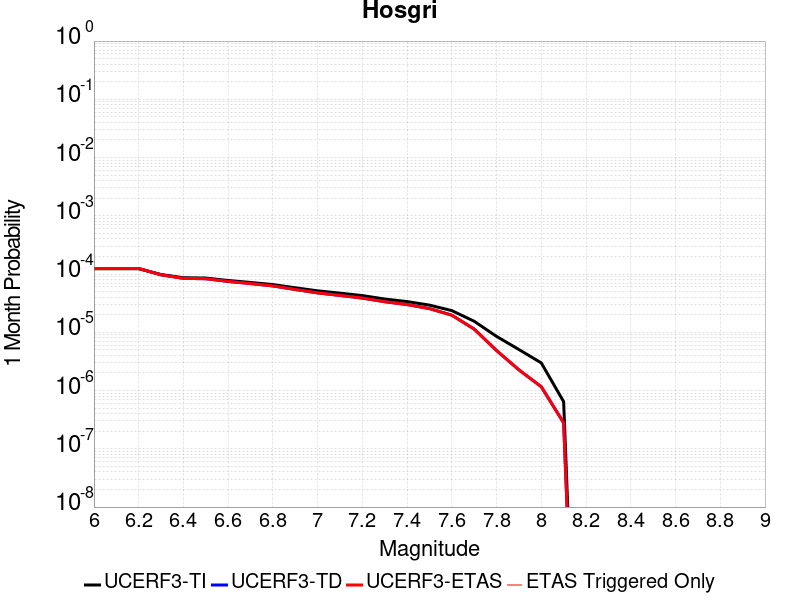 | 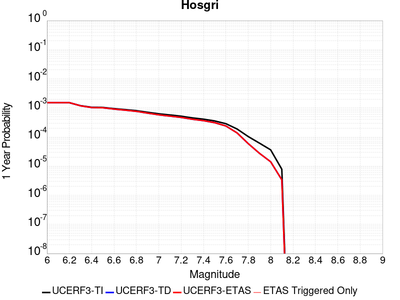 | 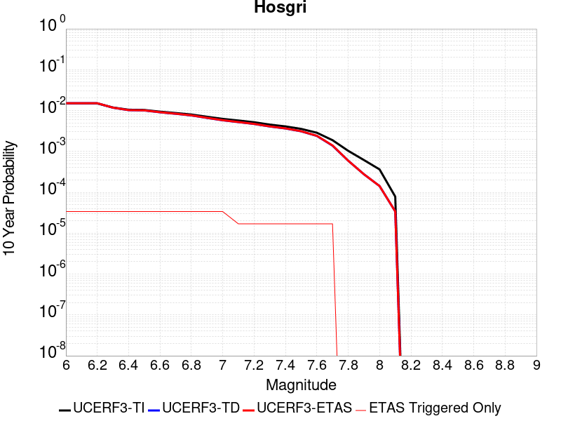 |

| Magnitude | 1 wk TI Prob | 1 wk TD Prob | 1 wk ETAS Prob | 1 wk ETAS/TD Gain | 1 wk ETAS Triggered Only | 1 mo TI Prob | 1 mo TD Prob | 1 mo ETAS Prob | 1 mo ETAS/TD Gain | 1 mo ETAS Triggered Only | 1 yr TI Prob | 1 yr TD Prob | 1 yr ETAS Prob | 1 yr ETAS/TD Gain | 1 yr ETAS Triggered Only | 10 yr TI Prob | 10 yr TD Prob | 10 yr ETAS Prob | 10 yr ETAS/TD Gain | 10 yr ETAS Triggered Only |
|-----|-----|-----|-----|-----|-----|-----|-----|-----|-----|-----|-----|-----|-----|-----|-----|-----|-----|-----|-----|-----|
| 6.0 | 2.883978E-5 | 2.9128416E-5 | 2.9128416E-5 | 1.0 | 0.0 | 1.235932E-4 | 1.2483024E-4 | 1.2483024E-4 | 1.0 | 0.0 | 0.0015037085 | 0.001518776 | 0.001518776 | 1.0 | 0.0 | 0.01493574 | 0.01508774 | 0.015111985 | 1.001607 | 2.4616596E-5 |
| 6.1 | 2.883978E-5 | 2.9128416E-5 | 2.9128416E-5 | 1.0 | 0.0 | 1.235932E-4 | 1.2483024E-4 | 1.2483024E-4 | 1.0 | 0.0 | 0.0015037085 | 0.001518776 | 0.001518776 | 1.0 | 0.0 | 0.01493574 | 0.01508774 | 0.015111985 | 1.001607 | 2.4616596E-5 |
| 6.2 | 2.883978E-5 | 2.9128416E-5 | 2.9128416E-5 | 1.0 | 0.0 | 1.235932E-4 | 1.2483024E-4 | 1.2483024E-4 | 1.0 | 0.0 | 0.0015037085 | 0.001518776 | 0.001518776 | 1.0 | 0.0 | 0.01493574 | 0.01508774 | 0.015111985 | 1.001607 | 2.4616596E-5 |
| 6.3 | 2.2914428E-5 | 2.2641969E-5 | 2.2641969E-5 | 1.0 | 0.0 | 9.8200995E-5 | 9.703343E-5 | 9.703343E-5 | 1.0 | 0.0 | 0.0011949413 | 0.0011807467 | 0.0011807467 | 1.0 | 0.0 | 0.011885363 | 0.011746133 | 0.011770461 | 1.0020711 | 2.4616596E-5 |
| 6.4 | 2.0195741E-5 | 1.969656E-5 | 1.969656E-5 | 1.0 | 0.0 | 8.65503E-5 | 8.4411105E-5 | 8.4411105E-5 | 1.0 | 0.0 | 0.0010532405 | 0.0010272227 | 0.0010272227 | 1.0 | 0.0 | 0.010482626 | 0.010225792 | 0.010250158 | 1.0023826 | 2.4616596E-5 |
| 6.5 | 1.9924333E-5 | 1.940898E-5 | 1.940898E-5 | 1.0 | 0.0 | 8.53872E-5 | 8.3178704E-5 | 8.3178704E-5 | 1.0 | 0.0 | 0.0010390934 | 0.0010122322 | 0.0010122322 | 1.0 | 0.0 | 0.010342481 | 0.010077253 | 0.010101622 | 1.0024182 | 2.4616596E-5 |
| 6.6 | 1.809694E-5 | 1.74583E-5 | 1.74583E-5 | 1.0 | 0.0 | 7.7556004E-5 | 7.4819145E-5 | 7.4819145E-5 | 1.0 | 0.0 | 9.438353E-4 | 9.105437E-4 | 9.105437E-4 | 1.0 | 0.0 | 0.009398366 | 0.009069073 | 0.009093466 | 1.0026897 | 2.4616596E-5 |
| 6.7 | 1.675989E-5 | 1.6042764E-5 | 1.6042764E-5 | 1.0 | 0.0 | 7.182612E-5 | 6.87529E-5 | 6.87529E-5 | 1.0 | 0.0 | 8.7413215E-4 | 8.3674624E-4 | 8.3674624E-4 | 1.0 | 0.0 | 0.008707017 | 0.0083368635 | 0.008361274 | 1.0029281 | 2.4616596E-5 |
| 6.8 | 1.5401129E-5 | 1.4614083E-5 | 1.4614083E-5 | 1.0 | 0.0 | 6.6003166E-5 | 6.2630286E-5 | 6.2630286E-5 | 1.0 | 0.0 | 8.032922E-4 | 7.622578E-4 | 7.622578E-4 | 1.0 | 0.0 | 0.008003947 | 0.007597296 | 0.007621726 | 1.0032156 | 2.4616596E-5 |
| 6.9 | 1.356559E-5 | 1.2689968E-5 | 1.2689968E-5 | 1.0 | 0.0 | 5.8136946E-5 | 5.4384444E-5 | 5.4384444E-5 | 1.0 | 0.0 | 7.0758746E-4 | 6.619299E-4 | 6.619299E-4 | 1.0 | 0.0 | 0.007053386 | 0.006600388 | 0.006624842 | 1.0037049 | 2.4616596E-5 |
| 7.0 | 1.2030819E-5 | 1.1095962E-5 | 1.1095962E-5 | 1.0 | 0.0 | 5.155963E-5 | 4.7553254E-5 | 4.7553254E-5 | 1.0 | 0.0 | 6.275577E-4 | 5.7880714E-4 | 5.7880714E-4 | 1.0 | 0.0 | 0.006257884 | 0.005773757 | 0.0057982313 | 1.004239 | 2.4616596E-5 |
| 7.1 | 1.0972698E-5 | 1.0022179E-5 | 1.0022179E-5 | 1.0 | 0.0 | 4.7025E-5 | 4.2951488E-5 | 4.2951488E-5 | 1.0 | 0.0 | 5.72379E-4 | 5.22809E-4 | 5.22809E-4 | 1.0 | 0.0 | 0.0057090693 | 0.005216542 | 0.0052410304 | 1.0046943 | 2.4616596E-5 |
| 7.2 | 9.961926E-6 | 9.034746E-6 | 9.034746E-6 | 1.0 | 0.0 | 4.2693267E-5 | 3.8719765E-5 | 3.8719765E-5 | 1.0 | 0.0 | 5.1966653E-4 | 4.713112E-4 | 4.713112E-4 | 1.0 | 0.0 | 0.00518453 | 0.0047038626 | 0.0047283634 | 1.0052086 | 2.4616596E-5 |
| 7.3 | 8.700929E-6 | 7.8281E-6 | 7.8281E-6 | 1.0 | 0.0 | 3.7289166E-5 | 3.354857E-5 | 3.354857E-5 | 1.0 | 0.0 | 4.53901E-4 | 4.0837732E-4 | 4.0837732E-4 | 1.0 | 0.0 | 0.00452975 | 0.004077008 | 0.0041015246 | 1.0060133 | 2.4616596E-5 |
| 7.4 | 7.866285E-6 | 6.998739E-6 | 6.998739E-6 | 1.0 | 0.0 | 3.3712215E-5 | 2.9994251E-5 | 2.9994251E-5 | 1.0 | 0.0 | 4.103689E-4 | 3.6511885E-4 | 3.6511885E-4 | 1.0 | 0.0 | 0.004096119 | 0.0036459267 | 0.0036704536 | 1.0067272 | 2.4616596E-5 |
| 7.5 | 6.8381305E-6 | 5.9596955E-6 | 5.9596955E-6 | 1.0 | 0.0 | 2.9305946E-5 | 2.5541302E-5 | 2.5541302E-5 | 1.0 | 0.0 | 3.5674145E-4 | 3.10921E-4 | 3.10921E-4 | 1.0 | 0.0 | 0.0035616932 | 0.0031055948 | 0.003130135 | 1.0079019 | 2.4616596E-5 |
| 7.6 | 5.503376E-6 | 4.5952443E-6 | 4.5952443E-6 | 1.0 | 0.0 | 2.3585684E-5 | 1.9693754E-5 | 1.9693754E-5 | 1.0 | 0.0 | 2.8711787E-4 | 2.397451E-4 | 2.397451E-4 | 1.0 | 0.0 | 0.002867472 | 0.0023955975 | 0.002420155 | 1.0102512 | 2.4616596E-5 |
| 7.7 | 3.6144982E-6 | 2.6522112E-6 | 2.6522112E-6 | 1.0 | 0.0 | 1.5490614E-5 | 1.1366569E-5 | 1.1366569E-5 | 1.0 | 0.0 | 1.8858191E-4 | 1.383792E-4 | 1.383792E-4 | 1.0 | 0.0 | 0.0018842196 | 0.0013836613 | 0.0014082439 | 1.0177662 | 2.4616596E-5 |
| 7.8 | 1.9853494E-6 | 1.1361129E-6 | 1.1361129E-6 | 1.0 | 0.0 | 8.508612E-6 | 4.8690463E-6 | 4.8690463E-6 | 1.0 | 0.0 | 1.0358743E-4 | 5.9279027E-5 | 5.9279027E-5 | 1.0 | 0.0 | 0.0010353916 | 5.9336185E-4 | 5.9336185E-4 | 1.0 | 0.0 |
| 7.9 | 1.1818757E-6 | 5.2951856E-7 | 5.2951856E-7 | 1.0 | 0.0 | 5.0651715E-6 | 2.2693632E-6 | 2.2693632E-6 | 1.0 | 0.0 | 6.1666724E-5 | 2.7629147E-5 | 2.7629147E-5 | 1.0 | 0.0 | 6.1649614E-4 | 2.7694515E-4 | 2.7694515E-4 | 1.0 | 0.0 |
| 8.0 | 6.962958E-7 | 2.7139782E-7 | 2.7139782E-7 | 1.0 | 0.0 | 2.9841215E-6 | 1.163133E-6 | 1.163133E-6 | 1.0 | 0.0 | 3.6331072E-5 | 1.4161053E-5 | 1.4161053E-5 | 1.0 | 0.0 | 3.6325134E-4 | 1.4217179E-4 | 1.4217179E-4 | 1.0 | 0.0 |
| 8.1 | 1.5033264E-7 | 6.527624E-8 | 6.527624E-8 | 1.0 | 0.0 | 6.442826E-7 | 2.7975528E-7 | 2.7975528E-7 | 1.0 | 0.0 | 7.844113E-6 | 3.4060151E-6 | 3.4060151E-6 | 1.0 | 0.0 | 7.843835E-5 | 3.407693E-5 | 3.407693E-5 | 1.0 | 0.0 |

## Northridge
*[(top)](#table-of-contents)*

| 1 Week | 1 Month | 1 Year | 10 Year |
|-----|-----|-----|-----|
|  | 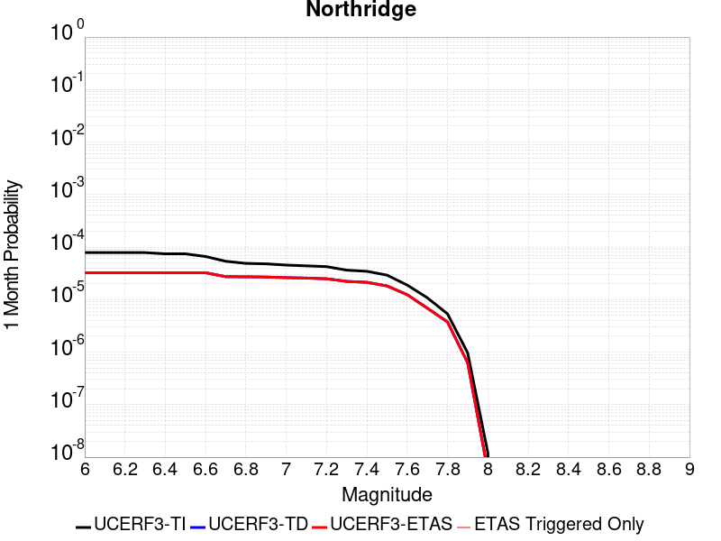 | 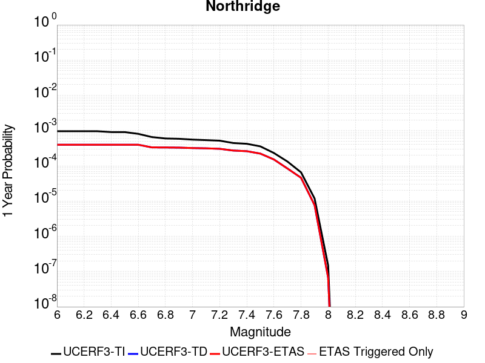 | 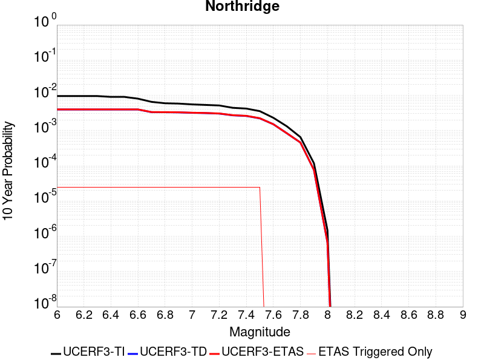 |

| Magnitude | 1 wk TI Prob | 1 wk TD Prob | 1 wk ETAS Prob | 1 wk ETAS/TD Gain | 1 wk ETAS Triggered Only | 1 mo TI Prob | 1 mo TD Prob | 1 mo ETAS Prob | 1 mo ETAS/TD Gain | 1 mo ETAS Triggered Only | 1 yr TI Prob | 1 yr TD Prob | 1 yr ETAS Prob | 1 yr ETAS/TD Gain | 1 yr ETAS Triggered Only | 10 yr TI Prob | 10 yr TD Prob | 10 yr ETAS Prob | 10 yr ETAS/TD Gain | 10 yr ETAS Triggered Only |
|-----|-----|-----|-----|-----|-----|-----|-----|-----|-----|-----|-----|-----|-----|-----|-----|-----|-----|-----|-----|-----|
| 6.0 | 1.8340852E-5 | 7.5880193E-6 | 7.5880193E-6 | 1.0 | 0.0 | 7.860128E-5 | 3.251969E-5 | 3.251969E-5 | 1.0 | 0.0 | 9.565505E-4 | 3.958575E-4 | 3.958575E-4 | 1.0 | 0.0 | 0.009524435 | 0.003951746 | 0.0039762654 | 1.0062047 | 2.4616596E-5 |
| 6.1 | 1.8340852E-5 | 7.5880193E-6 | 7.5880193E-6 | 1.0 | 0.0 | 7.860128E-5 | 3.251969E-5 | 3.251969E-5 | 1.0 | 0.0 | 9.565505E-4 | 3.958575E-4 | 3.958575E-4 | 1.0 | 0.0 | 0.009524435 | 0.003951746 | 0.0039762654 | 1.0062047 | 2.4616596E-5 |
| 6.2 | 1.8340852E-5 | 7.5880193E-6 | 7.5880193E-6 | 1.0 | 0.0 | 7.860128E-5 | 3.251969E-5 | 3.251969E-5 | 1.0 | 0.0 | 9.565505E-4 | 3.958575E-4 | 3.958575E-4 | 1.0 | 0.0 | 0.009524435 | 0.003951746 | 0.0039762654 | 1.0062047 | 2.4616596E-5 |
| 6.3 | 1.8340852E-5 | 7.5880193E-6 | 7.5880193E-6 | 1.0 | 0.0 | 7.860128E-5 | 3.251969E-5 | 3.251969E-5 | 1.0 | 0.0 | 9.565505E-4 | 3.958575E-4 | 3.958575E-4 | 1.0 | 0.0 | 0.009524435 | 0.003951746 | 0.0039762654 | 1.0062047 | 2.4616596E-5 |
| 6.4 | 1.7361892E-5 | 7.5880193E-6 | 7.5880193E-6 | 1.0 | 0.0 | 7.440598E-5 | 3.251969E-5 | 3.251969E-5 | 1.0 | 0.0 | 9.055163E-4 | 3.958575E-4 | 3.958575E-4 | 1.0 | 0.0 | 0.009018354 | 0.003951746 | 0.0039762654 | 1.0062047 | 2.4616596E-5 |
| 6.5 | 1.7361892E-5 | 7.5880193E-6 | 7.5880193E-6 | 1.0 | 0.0 | 7.440598E-5 | 3.251969E-5 | 3.251969E-5 | 1.0 | 0.0 | 9.055163E-4 | 3.958575E-4 | 3.958575E-4 | 1.0 | 0.0 | 0.009018354 | 0.003951746 | 0.0039762654 | 1.0062047 | 2.4616596E-5 |
| 6.6 | 1.5458201E-5 | 7.5880193E-6 | 7.5880193E-6 | 1.0 | 0.0 | 6.624775E-5 | 3.251969E-5 | 3.251969E-5 | 1.0 | 0.0 | 8.0626784E-4 | 3.958575E-4 | 3.958575E-4 | 1.0 | 0.0 | 0.008033488 | 0.003951746 | 0.0039762654 | 1.0062047 | 2.4616596E-5 |
| 6.7 | 1.2538368E-5 | 6.381603E-6 | 6.381603E-6 | 1.0 | 0.0 | 5.3734755E-5 | 2.7349442E-5 | 2.7349442E-5 | 1.0 | 0.0 | 6.5402425E-4 | 3.3292902E-4 | 3.3292902E-4 | 1.0 | 0.0 | 0.0065210275 | 0.0033243506 | 0.0033488853 | 1.0073804 | 2.4616596E-5 |
| 6.8 | 1.1438097E-5 | 6.3502566E-6 | 6.3502566E-6 | 1.0 | 0.0 | 4.9019498E-5 | 2.7215105E-5 | 2.7215105E-5 | 1.0 | 0.0 | 5.9664896E-4 | 3.3129397E-4 | 3.3129397E-4 | 1.0 | 0.0 | 0.005950495 | 0.0033080487 | 0.0033325837 | 1.0074168 | 2.4616596E-5 |
| 6.9 | 1.1204891E-5 | 6.2867084E-6 | 6.2867084E-6 | 1.0 | 0.0 | 4.8020076E-5 | 2.694276E-5 | 2.694276E-5 | 1.0 | 0.0 | 5.8448757E-4 | 3.2797916E-4 | 3.2797916E-4 | 1.0 | 0.0 | 0.0058295266 | 0.0032749989 | 0.0032995348 | 1.007492 | 2.4616596E-5 |
| 7.0 | 1.061046E-5 | 6.115359E-6 | 6.115359E-6 | 1.0 | 0.0 | 4.5472607E-5 | 2.6208421E-5 | 2.6208421E-5 | 1.0 | 0.0 | 5.534883E-4 | 3.1904122E-4 | 3.1904122E-4 | 1.0 | 0.0 | 0.0055211177 | 0.0031858785 | 0.0032104168 | 1.0077021 | 2.4616596E-5 |
| 7.1 | 1.0266979E-5 | 6.004274E-6 | 6.004274E-6 | 1.0 | 0.0 | 4.40006E-5 | 2.5732352E-5 | 2.5732352E-5 | 1.0 | 0.0 | 5.355756E-4 | 3.1324677E-4 | 3.1324677E-4 | 1.0 | 0.0 | 0.0053428668 | 0.003128098 | 0.0031526377 | 1.0078449 | 2.4616596E-5 |
| 7.2 | 9.91273E-6 | 5.819984E-6 | 5.819984E-6 | 1.0 | 0.0 | 4.248244E-5 | 2.4942554E-5 | 2.4942554E-5 | 1.0 | 0.0 | 5.171009E-4 | 3.036337E-4 | 3.036337E-4 | 1.0 | 0.0 | 0.0051589934 | 0.0030322333 | 0.0030567753 | 1.0080937 | 2.4616596E-5 |
| 7.3 | 8.4959265E-6 | 5.193062E-6 | 5.193062E-6 | 1.0 | 0.0 | 3.6410605E-5 | 2.225579E-5 | 2.225579E-5 | 1.0 | 0.0 | 4.4320893E-4 | 2.709308E-4 | 2.709308E-4 | 1.0 | 0.0 | 0.00442326 | 0.0027060313 | 0.0027305814 | 1.0090723 | 2.4616596E-5 |
| 7.4 | 8.0847185E-6 | 4.9819355E-6 | 4.9819355E-6 | 1.0 | 0.0 | 3.4648332E-5 | 2.135098E-5 | 2.135098E-5 | 1.0 | 0.0 | 4.2176177E-4 | 2.599174E-4 | 2.599174E-4 | 1.0 | 0.0 | 0.0042096223 | 0.00259616 | 0.0026207126 | 1.0094573 | 2.4616596E-5 |
| 7.5 | 6.8220684E-6 | 4.2533075E-6 | 4.2533075E-6 | 1.0 | 0.0 | 2.9237108E-5 | 1.8228335E-5 | 1.8228335E-5 | 1.0 | 0.0 | 3.5590364E-4 | 2.2190758E-4 | 2.2190758E-4 | 1.0 | 0.0 | 0.0035533418 | 0.002216881 | 0.002241443 | 1.0110795 | 2.4616596E-5 |
| 7.6 | 4.4224143E-6 | 2.8999582E-6 | 2.8999582E-6 | 1.0 | 0.0 | 1.8953066E-5 | 1.2428334E-5 | 1.2428334E-5 | 1.0 | 0.0 | 2.3072914E-4 | 1.5130457E-4 | 1.5130457E-4 | 1.0 | 0.0 | 0.0023048974 | 0.0015120271 | 0.0015120271 | 1.0 | 0.0 |
| 7.7 | 2.5297056E-6 | 1.6045905E-6 | 1.6045905E-6 | 1.0 | 0.0 | 1.0841551E-5 | 6.8767986E-6 | 6.8767986E-6 | 1.0 | 0.0 | 1.319879E-4 | 8.3721854E-5 | 8.3721854E-5 | 1.0 | 0.0 | 0.0013190953 | 8.369078E-4 | 8.369078E-4 | 1.0 | 0.0 |
| 7.8 | 1.2508156E-6 | 8.780076E-7 | 8.780076E-7 | 1.0 | 0.0 | 5.3606273E-6 | 3.7628845E-6 | 3.7628845E-6 | 1.0 | 0.0 | 6.526368E-5 | 4.581217E-5 | 4.581217E-5 | 1.0 | 0.0 | 6.524452E-4 | 4.5802852E-4 | 4.5802852E-4 | 1.0 | 0.0 |
| 7.9 | 2.262199E-7 | 1.4664671E-7 | 1.4664671E-7 | 1.0 | 0.0 | 9.695135E-7 | 6.284858E-7 | 6.284858E-7 | 1.0 | 0.0 | 1.1803763E-5 | 7.651788E-6 | 7.651788E-6 | 1.0 | 0.0 | 1.1803136E-4 | 7.651533E-5 | 7.651533E-5 | 1.0 | 0.0 |
| 8.0 | 2.865362E-9 | 1.2753101E-9 | 1.2753101E-9 | 1.0 | 0.0 | 1.2280123E-8 | 5.4656146E-9 | 5.4656146E-9 | 1.0 | 0.0 | 1.4951048E-7 | 6.654386E-8 | 6.654386E-8 | 1.0 | 0.0 | 1.4951038E-6 | 6.654386E-7 | 6.654386E-7 | 1.0 | 0.0 |

## Chino alt 1
*[(top)](#table-of-contents)*

| 1 Week | 1 Month | 1 Year | 10 Year |
|-----|-----|-----|-----|
| 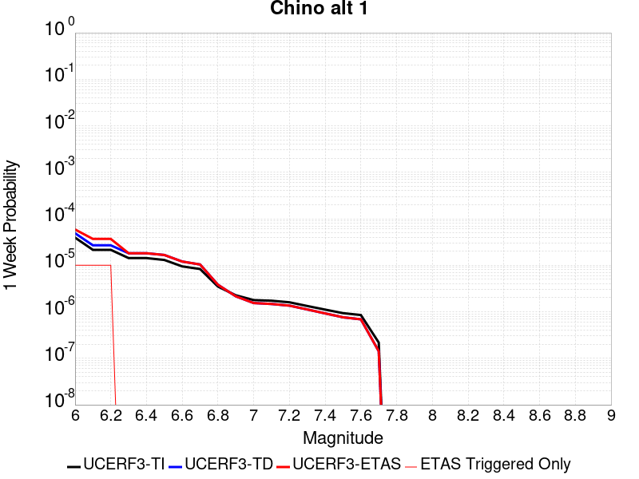 | 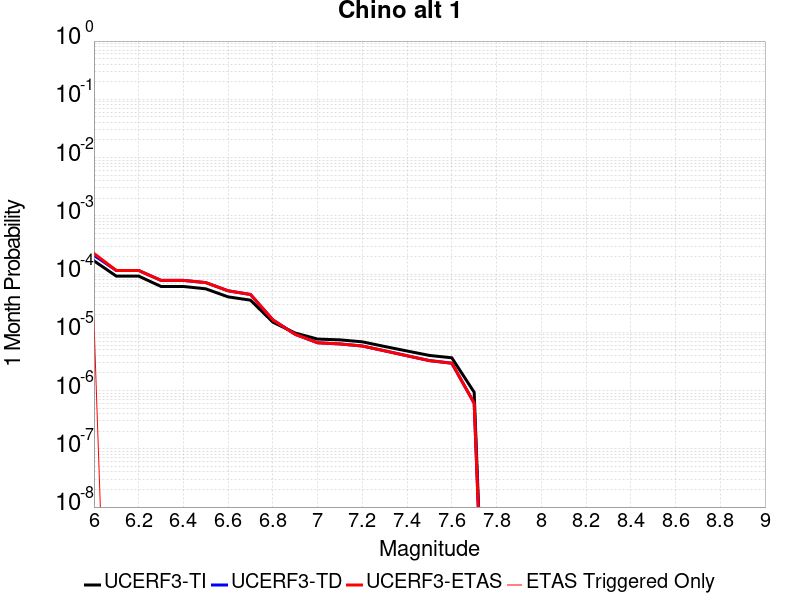 | 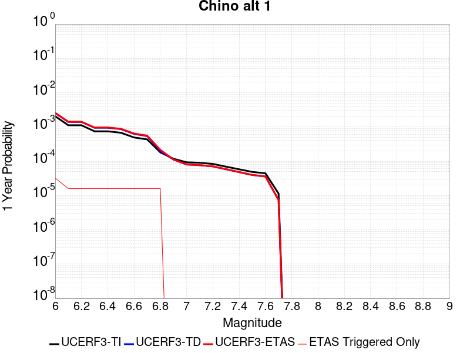 | 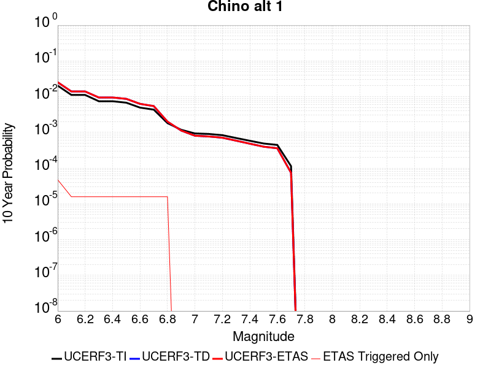 |

| Magnitude | 1 wk TI Prob | 1 wk TD Prob | 1 wk ETAS Prob | 1 wk ETAS/TD Gain | 1 wk ETAS Triggered Only | 1 mo TI Prob | 1 mo TD Prob | 1 mo ETAS Prob | 1 mo ETAS/TD Gain | 1 mo ETAS Triggered Only | 1 yr TI Prob | 1 yr TD Prob | 1 yr ETAS Prob | 1 yr ETAS/TD Gain | 1 yr ETAS Triggered Only | 10 yr TI Prob | 10 yr TD Prob | 10 yr ETAS Prob | 10 yr ETAS/TD Gain | 10 yr ETAS Triggered Only |
|-----|-----|-----|-----|-----|-----|-----|-----|-----|-----|-----|-----|-----|-----|-----|-----|-----|-----|-----|-----|-----|
| 6.0 | 3.939946E-5 | 4.8948554E-5 | 4.8948554E-5 | 1.0 | 0.0 | 1.6884391E-4 | 2.097656E-4 | 2.3437703E-4 | 1.1173283 | 2.4616596E-5 | 0.0020537362 | 0.0025513945 | 0.0025759484 | 1.0096236 | 2.4616596E-5 | 0.020348595 | 0.025277847 | 0.025301842 | 1.0009493 | 2.4616596E-5 |
| 6.1 | 2.1505624E-5 | 2.6879026E-5 | 2.6879026E-5 | 1.0 | 0.0 | 9.2163704E-5 | 1.1519137E-4 | 1.1519137E-4 | 1.0 | 0.0 | 0.0011215154 | 0.001401664 | 0.001401664 | 1.0 | 0.0 | 0.011158722 | 0.013945141 | 0.013945141 | 1.0 | 0.0 |
| 6.2 | 2.1505624E-5 | 2.6879026E-5 | 2.6879026E-5 | 1.0 | 0.0 | 9.2163704E-5 | 1.1519137E-4 | 1.1519137E-4 | 1.0 | 0.0 | 0.0011215154 | 0.001401664 | 0.001401664 | 1.0 | 0.0 | 0.011158722 | 0.013945141 | 0.013945141 | 1.0 | 0.0 |
| 6.3 | 1.4290785E-5 | 1.8165128E-5 | 1.8165128E-5 | 1.0 | 0.0 | 6.1244784E-5 | 7.784848E-5 | 7.784848E-5 | 1.0 | 0.0 | 7.454001E-4 | 9.4743853E-4 | 9.4743853E-4 | 1.0 | 0.0 | 0.007429048 | 0.0094444575 | 0.0094444575 | 1.0 | 0.0 |
| 6.4 | 1.4290785E-5 | 1.8165128E-5 | 1.8165128E-5 | 1.0 | 0.0 | 6.1244784E-5 | 7.784848E-5 | 7.784848E-5 | 1.0 | 0.0 | 7.454001E-4 | 9.4743853E-4 | 9.4743853E-4 | 1.0 | 0.0 | 0.007429048 | 0.0094444575 | 0.0094444575 | 1.0 | 0.0 |
| 6.5 | 1.3017944E-5 | 1.6652088E-5 | 1.6652088E-5 | 1.0 | 0.0 | 5.5789995E-5 | 7.136439E-5 | 7.136439E-5 | 1.0 | 0.0 | 6.790315E-4 | 8.685589E-4 | 8.685589E-4 | 1.0 | 0.0 | 0.0067696036 | 0.008661949 | 0.008661949 | 1.0 | 0.0 |
| 6.6 | 9.470016E-6 | 1.2039424E-5 | 1.2039424E-5 | 1.0 | 0.0 | 4.058515E-5 | 5.1596704E-5 | 5.1596704E-5 | 1.0 | 0.0 | 4.940122E-4 | 6.280428E-4 | 6.280428E-4 | 1.0 | 0.0 | 0.004929154 | 0.0062718987 | 0.0062718987 | 1.0 | 0.0 |
| 6.7 | 8.314155E-6 | 1.0407736E-5 | 1.0407736E-5 | 1.0 | 0.0 | 3.5631605E-5 | 4.4604003E-5 | 4.4604003E-5 | 1.0 | 0.0 | 4.3372845E-4 | 5.429507E-4 | 5.429507E-4 | 1.0 | 0.0 | 0.004328829 | 0.005425775 | 0.005425775 | 1.0 | 0.0 |
| 6.8 | 3.4856364E-6 | 3.8133708E-6 | 3.8133708E-6 | 1.0 | 0.0 | 1.4938357E-5 | 1.6342927E-5 | 1.6342927E-5 | 1.0 | 0.0 | 1.8185932E-4 | 1.9895904E-4 | 1.9895904E-4 | 1.0 | 0.0 | 0.0018171056 | 0.0019894864 | 0.0019894864 | 1.0 | 0.0 |
| 6.9 | 2.2645952E-6 | 2.1529022E-6 | 2.1529022E-6 | 1.0 | 0.0 | 9.705372E-6 | 9.226692E-6 | 9.226692E-6 | 1.0 | 0.0 | 1.18156495E-4 | 1.123294E-4 | 1.123294E-4 | 1.0 | 0.0 | 0.0011809369 | 0.0011233423 | 0.0011233423 | 1.0 | 0.0 |
| 7.0 | 1.7864003E-6 | 1.5430785E-6 | 1.5430785E-6 | 1.0 | 0.0 | 7.655979E-6 | 6.613177E-6 | 6.613177E-6 | 1.0 | 0.0 | 9.3207556E-5 | 8.051251E-5 | 8.051251E-5 | 1.0 | 0.0 | 9.316847E-4 | 8.0528046E-4 | 8.0528046E-4 | 1.0 | 0.0 |
| 7.1 | 1.7315456E-6 | 1.4733511E-6 | 1.4733511E-6 | 1.0 | 0.0 | 7.420889E-6 | 6.3143466E-6 | 6.3143466E-6 | 1.0 | 0.0 | 9.034557E-5 | 7.6874516E-5 | 7.6874516E-5 | 1.0 | 0.0 | 9.0308854E-4 | 7.6891703E-4 | 7.6891703E-4 | 1.0 | 0.0 |
| 7.2 | 1.6008337E-6 | 1.3574215E-6 | 1.3574215E-6 | 1.0 | 0.0 | 6.860698E-6 | 5.817508E-6 | 5.817508E-6 | 1.0 | 0.0 | 8.352579E-5 | 7.082591E-5 | 7.082591E-5 | 1.0 | 0.0 | 8.34944E-4 | 7.0845755E-4 | 7.0845755E-4 | 1.0 | 0.0 |
| 7.3 | 1.3320939E-6 | 1.121782E-6 | 1.121782E-6 | 1.0 | 0.0 | 5.7089615E-6 | 4.807629E-6 | 4.807629E-6 | 1.0 | 0.0 | 6.9504385E-5 | 5.8531357E-5 | 5.8531357E-5 | 1.0 | 0.0 | 6.9482654E-4 | 5.8530393E-4 | 5.8530393E-4 | 1.0 | 0.0 |
| 7.4 | 1.114294E-6 | 9.237111E-7 | 9.237111E-7 | 1.0 | 0.0 | 4.775537E-6 | 3.958756E-6 | 3.958756E-6 | 1.0 | 0.0 | 5.8140613E-5 | 4.8196827E-5 | 4.8196827E-5 | 1.0 | 0.0 | 5.81254E-4 | 4.8188053E-4 | 4.8188053E-4 | 1.0 | 0.0 |
| 7.5 | 9.354081E-7 | 7.6234323E-7 | 7.6234323E-7 | 1.0 | 0.0 | 4.0088858E-6 | 3.2671815E-6 | 3.2671815E-6 | 1.0 | 0.0 | 4.8807087E-5 | 3.9777242E-5 | 3.9777242E-5 | 1.0 | 0.0 | 4.879637E-4 | 3.977046E-4 | 3.977046E-4 | 1.0 | 0.0 |
| 7.6 | 8.521771E-7 | 6.88071E-7 | 6.88071E-7 | 1.0 | 0.0 | 3.6521824E-6 | 2.9488726E-6 | 2.9488726E-6 | 1.0 | 0.0 | 4.4464414E-5 | 3.5901965E-5 | 3.5901965E-5 | 1.0 | 0.0 | 4.4455516E-4 | 3.589648E-4 | 3.589648E-4 | 1.0 | 0.0 |
| 7.7 | 2.1803626E-7 | 1.418649E-7 | 1.418649E-7 | 1.0 | 0.0 | 9.344408E-7 | 6.079923E-7 | 6.079923E-7 | 1.0 | 0.0 | 1.1376757E-5 | 7.4022914E-6 | 7.4022914E-6 | 1.0 | 0.0 | 1.13761744E-4 | 7.402141E-5 | 7.402141E-5 | 1.0 | 0.0 |

## White Wolf
*[(top)](#table-of-contents)*

| 1 Week | 1 Month | 1 Year | 10 Year |
|-----|-----|-----|-----|
|  | 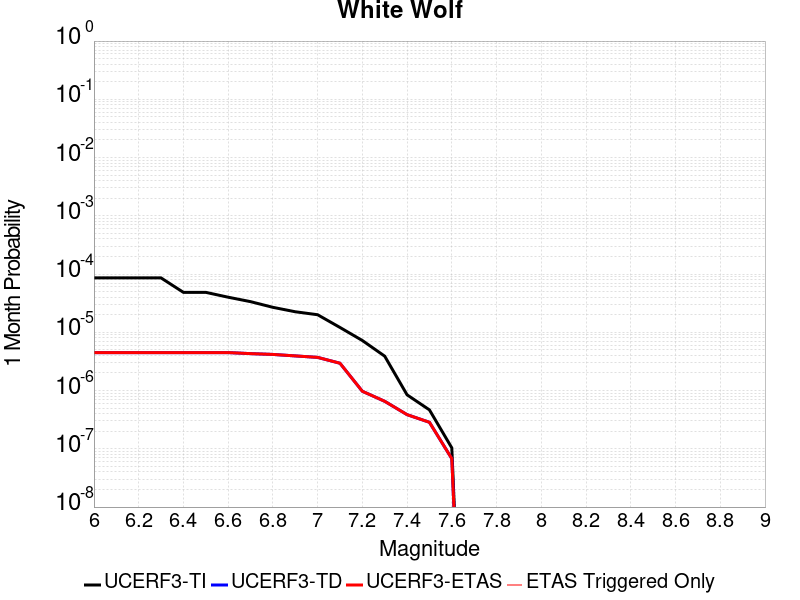 |  | 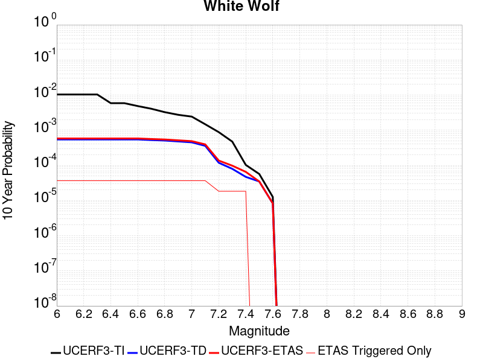 |

| Magnitude | 1 wk TI Prob | 1 wk TD Prob | 1 wk ETAS Prob | 1 wk ETAS/TD Gain | 1 wk ETAS Triggered Only | 1 mo TI Prob | 1 mo TD Prob | 1 mo ETAS Prob | 1 mo ETAS/TD Gain | 1 mo ETAS Triggered Only | 1 yr TI Prob | 1 yr TD Prob | 1 yr ETAS Prob | 1 yr ETAS/TD Gain | 1 yr ETAS Triggered Only | 10 yr TI Prob | 10 yr TD Prob | 10 yr ETAS Prob | 10 yr ETAS/TD Gain | 10 yr ETAS Triggered Only |
|-----|-----|-----|-----|-----|-----|-----|-----|-----|-----|-----|-----|-----|-----|-----|-----|-----|-----|-----|-----|-----|
| 6.0 | 2.0037822E-5 | 1.0469162E-6 | 1.0469162E-6 | 1.0 | 0.0 | 8.587355E-5 | 4.486776E-6 | 4.486776E-6 | 1.0 | 0.0 | 0.001045009 | 5.4625183E-5 | 5.4625183E-5 | 1.0 | 0.0 | 0.010401085 | 5.461226E-4 | 5.7072577E-4 | 1.0450506 | 2.4616596E-5 |
| 6.1 | 2.0037822E-5 | 1.0469162E-6 | 1.0469162E-6 | 1.0 | 0.0 | 8.587355E-5 | 4.486776E-6 | 4.486776E-6 | 1.0 | 0.0 | 0.001045009 | 5.4625183E-5 | 5.4625183E-5 | 1.0 | 0.0 | 0.010401085 | 5.461226E-4 | 5.7072577E-4 | 1.0450506 | 2.4616596E-5 |
| 6.2 | 2.0037822E-5 | 1.0469162E-6 | 1.0469162E-6 | 1.0 | 0.0 | 8.587355E-5 | 4.486776E-6 | 4.486776E-6 | 1.0 | 0.0 | 0.001045009 | 5.4625183E-5 | 5.4625183E-5 | 1.0 | 0.0 | 0.010401085 | 5.461226E-4 | 5.7072577E-4 | 1.0450506 | 2.4616596E-5 |
| 6.3 | 2.0037822E-5 | 1.0469162E-6 | 1.0469162E-6 | 1.0 | 0.0 | 8.587355E-5 | 4.486776E-6 | 4.486776E-6 | 1.0 | 0.0 | 0.001045009 | 5.4625183E-5 | 5.4625183E-5 | 1.0 | 0.0 | 0.010401085 | 5.461226E-4 | 5.7072577E-4 | 1.0450506 | 2.4616596E-5 |
| 6.4 | 1.132487E-5 | 1.0469162E-6 | 1.0469162E-6 | 1.0 | 0.0 | 4.8534253E-5 | 4.486776E-6 | 4.486776E-6 | 1.0 | 0.0 | 5.907443E-4 | 5.4625183E-5 | 5.4625183E-5 | 1.0 | 0.0 | 0.005891764 | 5.461226E-4 | 5.7072577E-4 | 1.0450506 | 2.4616596E-5 |
| 6.5 | 1.132487E-5 | 1.0469162E-6 | 1.0469162E-6 | 1.0 | 0.0 | 4.8534253E-5 | 4.486776E-6 | 4.486776E-6 | 1.0 | 0.0 | 5.907443E-4 | 5.4625183E-5 | 5.4625183E-5 | 1.0 | 0.0 | 0.005891764 | 5.461226E-4 | 5.7072577E-4 | 1.0450506 | 2.4616596E-5 |
| 6.6 | 9.347473E-6 | 1.0469162E-6 | 1.0469162E-6 | 1.0 | 0.0 | 4.0059982E-5 | 4.486776E-6 | 4.486776E-6 | 1.0 | 0.0 | 4.8762115E-4 | 5.4625183E-5 | 5.4625183E-5 | 1.0 | 0.0 | 0.0048655253 | 5.461226E-4 | 5.7072577E-4 | 1.0450506 | 2.4616596E-5 |
| 6.7 | 7.842647E-6 | 1.0048342E-6 | 1.0048342E-6 | 1.0 | 0.0 | 3.361091E-5 | 4.3064256E-6 | 4.3064256E-6 | 1.0 | 0.0 | 4.0913603E-4 | 5.2429517E-5 | 5.2429517E-5 | 1.0 | 0.0 | 0.004083836 | 5.2417646E-4 | 5.4878014E-4 | 1.0469378 | 2.4616596E-5 |
| 6.8 | 6.26597E-6 | 9.734822E-7 | 9.734822E-7 | 1.0 | 0.0 | 2.685388E-5 | 4.17206E-6 | 4.17206E-6 | 1.0 | 0.0 | 3.2689696E-4 | 5.0793697E-5 | 5.0793697E-5 | 1.0 | 0.0 | 0.003264165 | 5.078258E-4 | 5.324299E-4 | 1.0484499 | 2.4616596E-5 |
| 6.9 | 5.258436E-6 | 9.183254E-7 | 9.183254E-7 | 1.0 | 0.0 | 2.2535958E-5 | 3.9356746E-6 | 3.9356746E-6 | 1.0 | 0.0 | 2.7434074E-4 | 4.7915833E-5 | 4.7915833E-5 | 1.0 | 0.0 | 0.0027400232 | 4.790598E-4 | 5.036646E-4 | 1.0513606 | 2.4616596E-5 |
| 7.0 | 4.675028E-6 | 8.6611794E-7 | 8.6611794E-7 | 1.0 | 0.0 | 2.003568E-5 | 3.7119291E-6 | 3.7119291E-6 | 1.0 | 0.0 | 2.4390711E-4 | 4.5191846E-5 | 4.5191846E-5 | 1.0 | 0.0 | 0.0024363957 | 4.518313E-4 | 4.7643675E-4 | 1.0544572 | 2.4616596E-5 |
| 7.1 | 2.8270078E-6 | 6.8741696E-7 | 6.8741696E-7 | 1.0 | 0.0 | 1.2115692E-5 | 2.9460696E-6 | 2.9460696E-6 | 1.0 | 0.0 | 1.4749856E-4 | 3.5867848E-5 | 3.5867848E-5 | 1.0 | 0.0 | 0.001474007 | 3.586247E-4 | 3.8323246E-4 | 1.0686171 | 2.4616596E-5 |
| 7.2 | 1.6881406E-6 | 2.2706382E-7 | 2.2706382E-7 | 1.0 | 0.0 | 7.2348685E-6 | 9.731303E-7 | 9.731303E-7 | 1.0 | 0.0 | 8.808096E-5 | 1.1847799E-5 | 1.1847799E-5 | 1.0 | 0.0 | 8.8046055E-4 | 1.1847183E-4 | 1.1847183E-4 | 1.0 | 0.0 |
| 7.3 | 9.086107E-7 | 1.5266386E-7 | 1.5266386E-7 | 1.0 | 0.0 | 3.8940398E-6 | 6.5427355E-7 | 6.5427355E-7 | 1.0 | 0.0 | 4.7408903E-5 | 7.965752E-6 | 7.965752E-6 | 1.0 | 0.0 | 4.739879E-4 | 7.965475E-5 | 7.965475E-5 | 1.0 | 0.0 |
| 7.4 | 1.9717383E-7 | 9.003913E-8 | 9.003913E-8 | 1.0 | 0.0 | 8.450304E-7 | 3.8588192E-7 | 3.8588192E-7 | 1.0 | 0.0 | 1.0288197E-5 | 4.6981027E-6 | 4.6981027E-6 | 1.0 | 0.0 | 1.028772E-4 | 4.6980065E-5 | 4.6980065E-5 | 1.0 | 0.0 |
| 7.5 | 1.086975E-7 | 6.6597195E-8 | 6.6597195E-8 | 1.0 | 0.0 | 4.6584634E-7 | 2.8541652E-7 | 2.8541652E-7 | 1.0 | 0.0 | 5.6716644E-6 | 3.474941E-6 | 3.474941E-6 | 1.0 | 0.0 | 5.6715195E-5 | 3.474889E-5 | 3.474889E-5 | 1.0 | 0.0 |
| 7.6 | 2.4217808E-8 | 1.5820765E-8 | 1.5820765E-8 | 1.0 | 0.0 | 1.03790605E-7 | 6.780328E-8 | 6.780328E-8 | 1.0 | 0.0 | 1.2636499E-6 | 8.255046E-7 | 8.255046E-7 | 1.0 | 0.0 | 1.2636427E-5 | 8.2550205E-6 | 8.2550205E-6 | 1.0 | 0.0 |

## Hartley Springs 2011 CFM
*[(top)](#table-of-contents)*

| 1 Week | 1 Month | 1 Year | 10 Year |
|-----|-----|-----|-----|
| 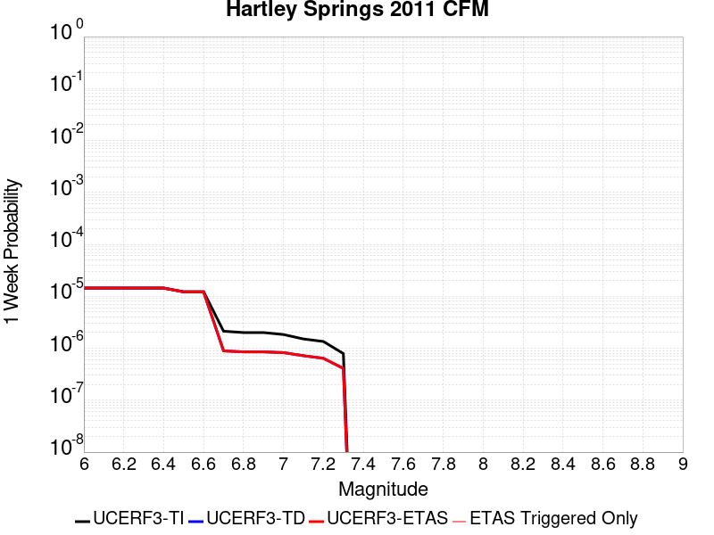 | 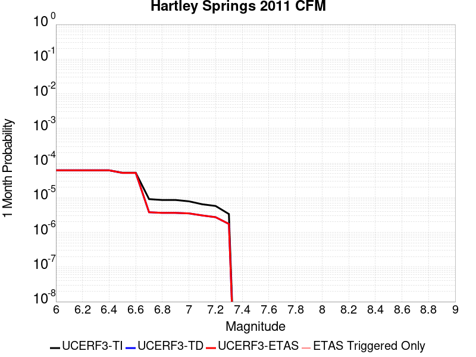 | 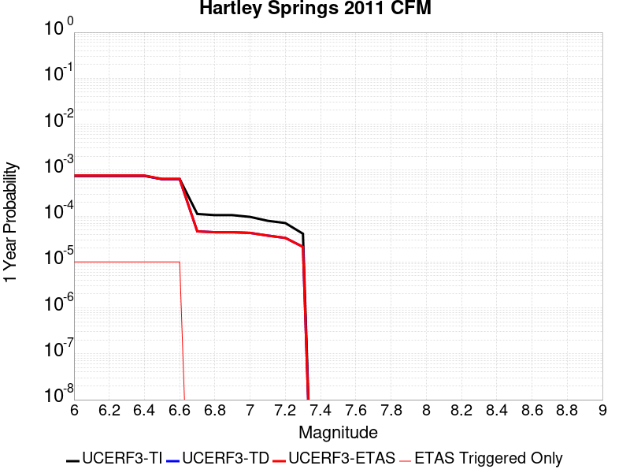 | 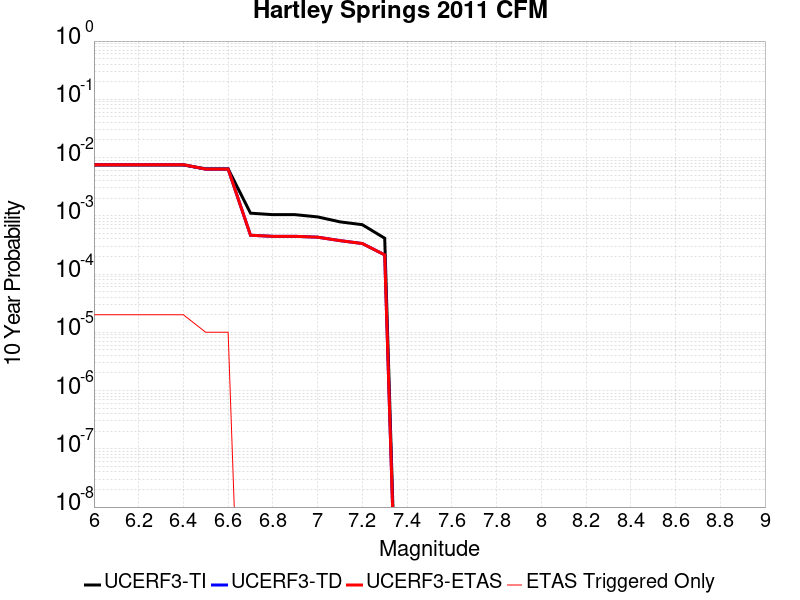 |

| Magnitude | 1 wk TI Prob | 1 wk TD Prob | 1 wk ETAS Prob | 1 wk ETAS/TD Gain | 1 wk ETAS Triggered Only | 1 mo TI Prob | 1 mo TD Prob | 1 mo ETAS Prob | 1 mo ETAS/TD Gain | 1 mo ETAS Triggered Only | 1 yr TI Prob | 1 yr TD Prob | 1 yr ETAS Prob | 1 yr ETAS/TD Gain | 1 yr ETAS Triggered Only | 10 yr TI Prob | 10 yr TD Prob | 10 yr ETAS Prob | 10 yr ETAS/TD Gain | 10 yr ETAS Triggered Only |
|-----|-----|-----|-----|-----|-----|-----|-----|-----|-----|-----|-----|-----|-----|-----|-----|-----|-----|-----|-----|-----|
| 6.0 | 1.4352418E-5 | 1.4434182E-5 | 1.4434182E-5 | 1.0 | 0.0 | 6.1508916E-5 | 6.1860235E-5 | 6.1860235E-5 | 1.0 | 0.0 | 7.486137E-4 | 7.5305253E-4 | 7.5305253E-4 | 1.0 | 0.0 | 0.007460968 | 0.0075211283 | 0.0075455597 | 1.0032483 | 2.4616596E-5 |
| 6.1 | 1.4352418E-5 | 1.4434182E-5 | 1.4434182E-5 | 1.0 | 0.0 | 6.1508916E-5 | 6.1860235E-5 | 6.1860235E-5 | 1.0 | 0.0 | 7.486137E-4 | 7.5305253E-4 | 7.5305253E-4 | 1.0 | 0.0 | 0.007460968 | 0.0075211283 | 0.0075455597 | 1.0032483 | 2.4616596E-5 |
| 6.2 | 1.4352418E-5 | 1.4434182E-5 | 1.4434182E-5 | 1.0 | 0.0 | 6.1508916E-5 | 6.1860235E-5 | 6.1860235E-5 | 1.0 | 0.0 | 7.486137E-4 | 7.5305253E-4 | 7.5305253E-4 | 1.0 | 0.0 | 0.007460968 | 0.0075211283 | 0.0075455597 | 1.0032483 | 2.4616596E-5 |
| 6.3 | 1.4352418E-5 | 1.4434182E-5 | 1.4434182E-5 | 1.0 | 0.0 | 6.1508916E-5 | 6.1860235E-5 | 6.1860235E-5 | 1.0 | 0.0 | 7.486137E-4 | 7.5305253E-4 | 7.5305253E-4 | 1.0 | 0.0 | 0.007460968 | 0.0075211283 | 0.0075455597 | 1.0032483 | 2.4616596E-5 |
| 6.4 | 1.4352418E-5 | 1.4434182E-5 | 1.4434182E-5 | 1.0 | 0.0 | 6.1508916E-5 | 6.1860235E-5 | 6.1860235E-5 | 1.0 | 0.0 | 7.486137E-4 | 7.5305253E-4 | 7.5305253E-4 | 1.0 | 0.0 | 0.007460968 | 0.0075211283 | 0.0075455597 | 1.0032483 | 2.4616596E-5 |
| 6.5 | 1.2279858E-5 | 1.2133106E-5 | 1.2133106E-5 | 1.0 | 0.0 | 5.26269E-5 | 5.1998883E-5 | 5.1998883E-5 | 1.0 | 0.0 | 6.4054417E-4 | 6.3306064E-4 | 6.3306064E-4 | 1.0 | 0.0 | 0.0063870098 | 0.006328085 | 0.006328085 | 1.0 | 0.0 |
| 6.6 | 1.2279858E-5 | 1.2133106E-5 | 1.2133106E-5 | 1.0 | 0.0 | 5.26269E-5 | 5.1998883E-5 | 5.1998883E-5 | 1.0 | 0.0 | 6.4054417E-4 | 6.3306064E-4 | 6.3306064E-4 | 1.0 | 0.0 | 0.0063870098 | 0.006328085 | 0.006328085 | 1.0 | 0.0 |
| 6.7 | 2.1282601E-6 | 8.8948315E-7 | 8.8948315E-7 | 1.0 | 0.0 | 9.121083E-6 | 3.8120663E-6 | 3.8120663E-6 | 1.0 | 0.0 | 1.11043526E-4 | 4.641118E-5 | 4.641118E-5 | 1.0 | 0.0 | 0.0011098806 | 4.6404017E-4 | 4.6404017E-4 | 1.0 | 0.0 |
| 6.8 | 2.00516E-6 | 8.517597E-7 | 8.517597E-7 | 1.0 | 0.0 | 8.593515E-6 | 3.650395E-6 | 3.650395E-6 | 1.0 | 0.0 | 1.04621024E-4 | 4.444291E-5 | 4.444291E-5 | 1.0 | 0.0 | 0.0010457177 | 4.4436535E-4 | 4.4436535E-4 | 1.0 | 0.0 |
| 6.9 | 2.00516E-6 | 8.517597E-7 | 8.517597E-7 | 1.0 | 0.0 | 8.593515E-6 | 3.650395E-6 | 3.650395E-6 | 1.0 | 0.0 | 1.04621024E-4 | 4.444291E-5 | 4.444291E-5 | 1.0 | 0.0 | 0.0010457177 | 4.4436535E-4 | 4.4436535E-4 | 1.0 | 0.0 |
| 7.0 | 1.8366732E-6 | 8.237307E-7 | 8.237307E-7 | 1.0 | 0.0 | 7.871433E-6 | 3.5302712E-6 | 3.5302712E-6 | 1.0 | 0.0 | 9.583048E-5 | 4.298046E-5 | 4.298046E-5 | 1.0 | 0.0 | 9.5789164E-4 | 4.2974652E-4 | 4.2974652E-4 | 1.0 | 0.0 |
| 7.1 | 1.5097997E-6 | 7.1902616E-7 | 7.1902616E-7 | 1.0 | 0.0 | 6.470554E-6 | 3.0815384E-6 | 3.0815384E-6 | 1.0 | 0.0 | 7.877615E-5 | 3.7517326E-5 | 3.7517326E-5 | 1.0 | 0.0 | 7.874823E-4 | 3.7513362E-4 | 3.7513362E-4 | 1.0 | 0.0 |
| 7.2 | 1.3490993E-6 | 6.405254E-7 | 6.405254E-7 | 1.0 | 0.0 | 5.7818415E-6 | 2.7451074E-6 | 2.7451074E-6 | 1.0 | 0.0 | 7.0391645E-5 | 3.3421402E-5 | 3.3421402E-5 | 1.0 | 0.0 | 7.0369354E-4 | 3.341867E-4 | 3.341867E-4 | 1.0 | 0.0 |
| 7.3 | 7.900015E-7 | 4.0889498E-7 | 4.0889498E-7 | 1.0 | 0.0 | 3.3857161E-6 | 1.752407E-6 | 1.752407E-6 | 1.0 | 0.0 | 4.1220315E-5 | 2.1335554E-5 | 2.1335554E-5 | 1.0 | 0.0 | 4.121267E-4 | 2.1335555E-4 | 2.1335555E-4 | 1.0 | 0.0 |

## Cucamonga
*[(top)](#table-of-contents)*

| 1 Week | 1 Month | 1 Year | 10 Year |
|-----|-----|-----|-----|
| 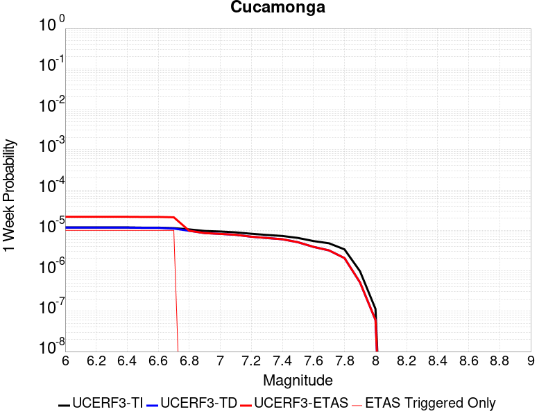 | 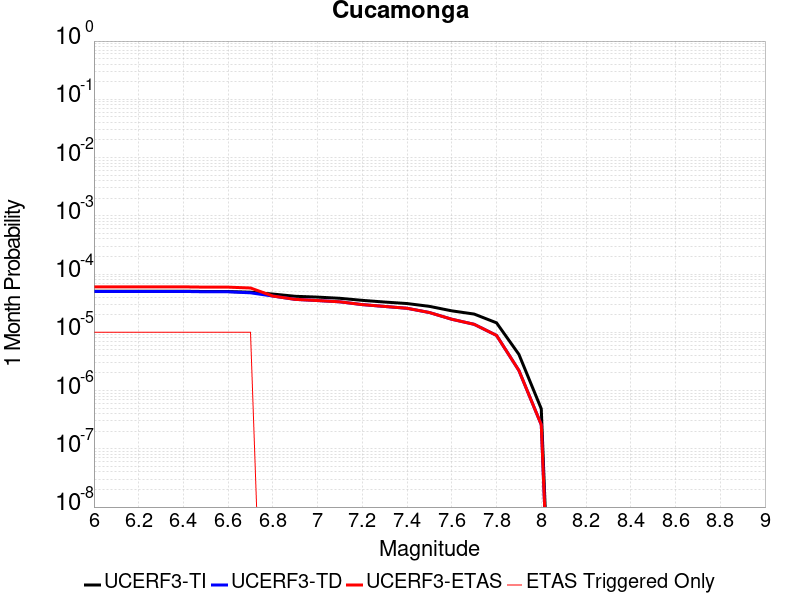 | 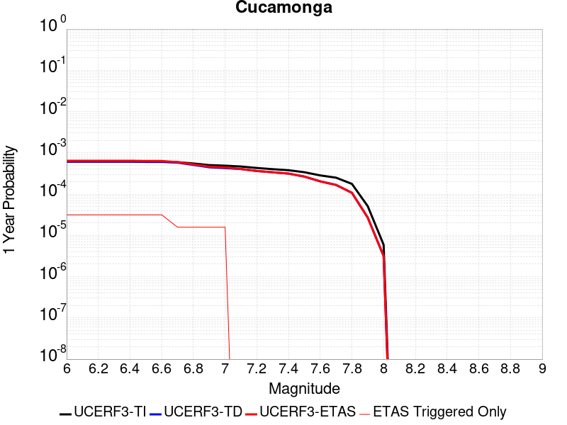 | 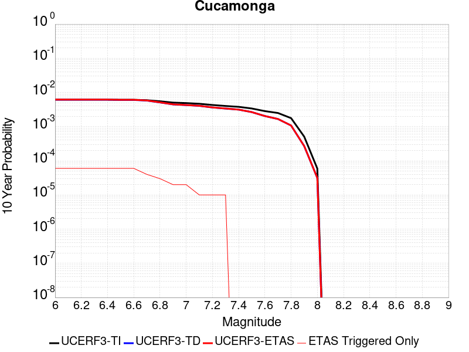 |

| Magnitude | 1 wk TI Prob | 1 wk TD Prob | 1 wk ETAS Prob | 1 wk ETAS/TD Gain | 1 wk ETAS Triggered Only | 1 mo TI Prob | 1 mo TD Prob | 1 mo ETAS Prob | 1 mo ETAS/TD Gain | 1 mo ETAS Triggered Only | 1 yr TI Prob | 1 yr TD Prob | 1 yr ETAS Prob | 1 yr ETAS/TD Gain | 1 yr ETAS Triggered Only | 10 yr TI Prob | 10 yr TD Prob | 10 yr ETAS Prob | 10 yr ETAS/TD Gain | 10 yr ETAS Triggered Only |
|-----|-----|-----|-----|-----|-----|-----|-----|-----|-----|-----|-----|-----|-----|-----|-----|-----|-----|-----|-----|-----|
| 6.0 | 1.1848348E-5 | 1.1737008E-5 | 1.1737008E-5 | 1.0 | 0.0 | 5.0777642E-5 | 5.030051E-5 | 5.030051E-5 | 1.0 | 0.0 | 6.180424E-4 | 6.1223935E-4 | 6.368409E-4 | 1.0401828 | 2.4616596E-5 | 0.0061632637 | 0.0061067017 | 0.006131168 | 1.0040065 | 2.4616596E-5 |
| 6.1 | 1.1848348E-5 | 1.1737008E-5 | 1.1737008E-5 | 1.0 | 0.0 | 5.0777642E-5 | 5.030051E-5 | 5.030051E-5 | 1.0 | 0.0 | 6.180424E-4 | 6.1223935E-4 | 6.368409E-4 | 1.0401828 | 2.4616596E-5 | 0.0061632637 | 0.0061067017 | 0.006131168 | 1.0040065 | 2.4616596E-5 |
| 6.2 | 1.1848348E-5 | 1.1737008E-5 | 1.1737008E-5 | 1.0 | 0.0 | 5.0777642E-5 | 5.030051E-5 | 5.030051E-5 | 1.0 | 0.0 | 6.180424E-4 | 6.1223935E-4 | 6.368409E-4 | 1.0401828 | 2.4616596E-5 | 0.0061632637 | 0.0061067017 | 0.006131168 | 1.0040065 | 2.4616596E-5 |
| 6.3 | 1.1848348E-5 | 1.1737008E-5 | 1.1737008E-5 | 1.0 | 0.0 | 5.0777642E-5 | 5.030051E-5 | 5.030051E-5 | 1.0 | 0.0 | 6.180424E-4 | 6.1223935E-4 | 6.368409E-4 | 1.0401828 | 2.4616596E-5 | 0.0061632637 | 0.0061067017 | 0.006131168 | 1.0040065 | 2.4616596E-5 |
| 6.4 | 1.1848348E-5 | 1.1737008E-5 | 1.1737008E-5 | 1.0 | 0.0 | 5.0777642E-5 | 5.030051E-5 | 5.030051E-5 | 1.0 | 0.0 | 6.180424E-4 | 6.1223935E-4 | 6.368409E-4 | 1.0401828 | 2.4616596E-5 | 0.0061632637 | 0.0061067017 | 0.006131168 | 1.0040065 | 2.4616596E-5 |
| 6.5 | 1.16988695E-5 | 1.15760395E-5 | 1.15760395E-5 | 1.0 | 0.0 | 5.013705E-5 | 4.9610666E-5 | 4.9610666E-5 | 1.0 | 0.0 | 6.102476E-4 | 6.0384517E-4 | 6.2844687E-4 | 1.0407418 | 2.4616596E-5 | 0.006085745 | 0.006023216 | 0.0060476842 | 1.0040623 | 2.4616596E-5 |
| 6.6 | 1.16988695E-5 | 1.15760395E-5 | 1.15760395E-5 | 1.0 | 0.0 | 5.013705E-5 | 4.9610666E-5 | 4.9610666E-5 | 1.0 | 0.0 | 6.102476E-4 | 6.0384517E-4 | 6.2844687E-4 | 1.0407418 | 2.4616596E-5 | 0.006085745 | 0.006023216 | 0.0060476842 | 1.0040623 | 2.4616596E-5 |
| 6.7 | 1.1397107E-5 | 1.11149475E-5 | 1.11149475E-5 | 1.0 | 0.0 | 4.884383E-5 | 4.7634636E-5 | 4.7634636E-5 | 1.0 | 0.0 | 5.9451134E-4 | 5.797998E-4 | 5.797998E-4 | 1.0 | 0.0 | 0.005929234 | 0.0057840226 | 0.0057840226 | 1.0 | 0.0 |
| 6.8 | 1.058387E-5 | 9.784992E-6 | 9.784992E-6 | 1.0 | 0.0 | 4.5358654E-5 | 4.193501E-5 | 4.193501E-5 | 1.0 | 0.0 | 5.521017E-4 | 5.1044027E-4 | 5.1044027E-4 | 1.0 | 0.0 | 0.00550732 | 0.0050936877 | 0.0050936877 | 1.0 | 0.0 |
| 6.9 | 9.690046E-6 | 8.57948E-6 | 8.57948E-6 | 1.0 | 0.0 | 4.1528107E-5 | 3.6768684E-5 | 3.6768684E-5 | 1.0 | 0.0 | 5.054874E-4 | 4.475672E-4 | 4.475672E-4 | 1.0 | 0.0 | 0.005043391 | 0.004467594 | 0.004467594 | 1.0 | 0.0 |
| 7.0 | 9.381461E-6 | 8.187101E-6 | 8.187101E-6 | 1.0 | 0.0 | 4.020564E-5 | 3.5087105E-5 | 3.5087105E-5 | 1.0 | 0.0 | 4.893937E-4 | 4.2710215E-4 | 4.2710215E-4 | 1.0 | 0.0 | 0.0048831734 | 0.0042637475 | 0.0042637475 | 1.0 | 0.0 |
| 7.1 | 8.946492E-6 | 7.781886E-6 | 7.781886E-6 | 1.0 | 0.0 | 3.8341543E-5 | 3.3350516E-5 | 3.3350516E-5 | 1.0 | 0.0 | 4.667083E-4 | 4.0596718E-4 | 4.0596718E-4 | 1.0 | 0.0 | 0.0046572937 | 0.004053192 | 0.004053192 | 1.0 | 0.0 |
| 7.2 | 8.251016E-6 | 6.9752796E-6 | 6.9752796E-6 | 1.0 | 0.0 | 3.5361016E-5 | 2.9893714E-5 | 2.9893714E-5 | 1.0 | 0.0 | 4.3043532E-4 | 3.6389544E-4 | 3.6389544E-4 | 1.0 | 0.0 | 0.0042960253 | 0.0036339292 | 0.0036339292 | 1.0 | 0.0 |
| 7.3 | 7.717881E-6 | 6.4863502E-6 | 6.4863502E-6 | 1.0 | 0.0 | 3.3076216E-5 | 2.7798349E-5 | 2.7798349E-5 | 1.0 | 0.0 | 4.026285E-4 | 3.3839257E-4 | 3.3839257E-4 | 1.0 | 0.0 | 0.004018998 | 0.00337971 | 0.00337971 | 1.0 | 0.0 |
| 7.4 | 7.275623E-6 | 6.031997E-6 | 6.031997E-6 | 1.0 | 0.0 | 3.118087E-5 | 2.585116E-5 | 2.585116E-5 | 1.0 | 0.0 | 3.7956095E-4 | 3.1469265E-4 | 3.1469265E-4 | 1.0 | 0.0 | 0.0037891332 | 0.0031434062 | 0.0031434062 | 1.0 | 0.0 |
| 7.5 | 6.5109502E-6 | 5.1006014E-6 | 5.1006014E-6 | 1.0 | 0.0 | 2.7903774E-5 | 2.1859538E-5 | 2.1859538E-5 | 1.0 | 0.0 | 3.3967546E-4 | 2.661075E-4 | 2.661075E-4 | 1.0 | 0.0 | 0.0033915674 | 0.002658813 | 0.002658813 | 1.0 | 0.0 |
| 7.6 | 5.4495326E-6 | 3.90857E-6 | 3.90857E-6 | 1.0 | 0.0 | 2.335493E-5 | 1.6750908E-5 | 1.6750908E-5 | 1.0 | 0.0 | 2.8430918E-4 | 2.0392328E-4 | 2.0392328E-4 | 1.0 | 0.0 | 0.0028394572 | 0.002038282 | 0.002038282 | 1.0 | 0.0 |
| 7.7 | 4.7997164E-6 | 3.2002547E-6 | 3.2002547E-6 | 1.0 | 0.0 | 2.057005E-5 | 1.3715306E-5 | 1.3715306E-5 | 1.0 | 0.0 | 2.504116E-4 | 1.6697108E-4 | 1.6697108E-4 | 1.0 | 0.0 | 0.002501296 | 0.0016693877 | 0.0016693877 | 1.0 | 0.0 |
| 7.8 | 3.3941733E-6 | 2.0641899E-6 | 2.0641899E-6 | 1.0 | 0.0 | 1.4546376E-5 | 8.846498E-6 | 8.846498E-6 | 1.0 | 0.0 | 1.7708774E-4 | 1.07700806E-4 | 1.07700806E-4 | 1.0 | 0.0 | 0.0017694668 | 0.001076723 | 0.001076723 | 1.0 | 0.0 |
| 7.9 | 9.750552E-7 | 5.155946E-7 | 5.155946E-7 | 1.0 | 0.0 | 4.178801E-6 | 2.2096892E-6 | 2.2096892E-6 | 1.0 | 0.0 | 5.0875715E-5 | 2.690264E-5 | 2.690264E-5 | 1.0 | 0.0 | 5.086407E-4 | 2.6899425E-4 | 2.6899425E-4 | 1.0 | 0.0 |
| 8.0 | 1.133857E-7 | 6.053707E-8 | 6.053707E-8 | 1.0 | 0.0 | 4.8593864E-7 | 2.5944456E-7 | 2.5944456E-7 | 1.0 | 0.0 | 5.9162867E-6 | 3.158733E-6 | 3.158733E-6 | 1.0 | 0.0 | 5.916129E-5 | 3.1586897E-5 | 3.1586897E-5 | 1.0 | 0.0 |

## Channel Islands Thrust
*[(top)](#table-of-contents)*

| 1 Week | 1 Month | 1 Year | 10 Year |
|-----|-----|-----|-----|
| 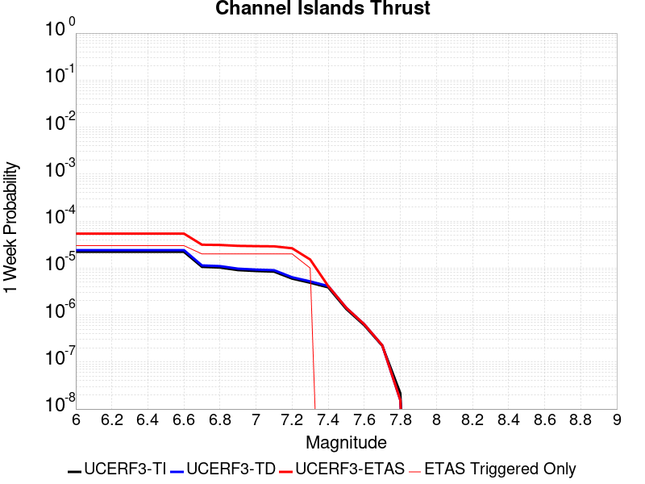 | 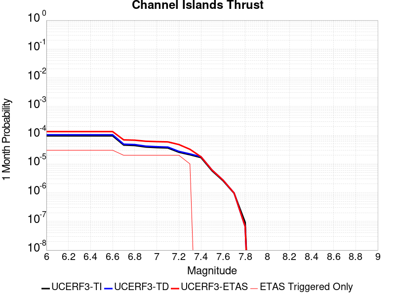 | 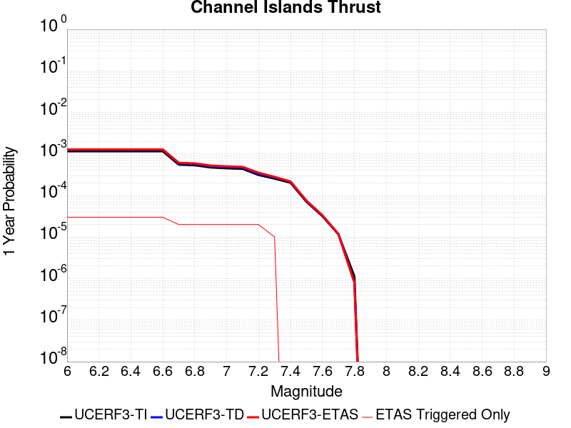 |  |

| Magnitude | 1 wk TI Prob | 1 wk TD Prob | 1 wk ETAS Prob | 1 wk ETAS/TD Gain | 1 wk ETAS Triggered Only | 1 mo TI Prob | 1 mo TD Prob | 1 mo ETAS Prob | 1 mo ETAS/TD Gain | 1 mo ETAS Triggered Only | 1 yr TI Prob | 1 yr TD Prob | 1 yr ETAS Prob | 1 yr ETAS/TD Gain | 1 yr ETAS Triggered Only | 10 yr TI Prob | 10 yr TD Prob | 10 yr ETAS Prob | 10 yr ETAS/TD Gain | 10 yr ETAS Triggered Only |
|-----|-----|-----|-----|-----|-----|-----|-----|-----|-----|-----|-----|-----|-----|-----|-----|-----|-----|-----|-----|-----|
| 6.0 | 2.2156251E-5 | 2.4092022E-5 | 2.4092022E-5 | 1.0 | 0.0 | 9.495191E-5 | 1.03248036E-4 | 1.03248036E-4 | 1.0 | 0.0 | 0.0011554264 | 0.0012564264 | 0.0012564264 | 1.0 | 0.0 | 0.011494373 | 0.0125038205 | 0.012528129 | 1.0019441 | 2.4616596E-5 |
| 6.1 | 2.2156251E-5 | 2.4092022E-5 | 2.4092022E-5 | 1.0 | 0.0 | 9.495191E-5 | 1.03248036E-4 | 1.03248036E-4 | 1.0 | 0.0 | 0.0011554264 | 0.0012564264 | 0.0012564264 | 1.0 | 0.0 | 0.011494373 | 0.0125038205 | 0.012528129 | 1.0019441 | 2.4616596E-5 |
| 6.2 | 2.2156251E-5 | 2.4092022E-5 | 2.4092022E-5 | 1.0 | 0.0 | 9.495191E-5 | 1.03248036E-4 | 1.03248036E-4 | 1.0 | 0.0 | 0.0011554264 | 0.0012564264 | 0.0012564264 | 1.0 | 0.0 | 0.011494373 | 0.0125038205 | 0.012528129 | 1.0019441 | 2.4616596E-5 |
| 6.3 | 2.2156251E-5 | 2.4092022E-5 | 2.4092022E-5 | 1.0 | 0.0 | 9.495191E-5 | 1.03248036E-4 | 1.03248036E-4 | 1.0 | 0.0 | 0.0011554264 | 0.0012564264 | 0.0012564264 | 1.0 | 0.0 | 0.011494373 | 0.0125038205 | 0.012528129 | 1.0019441 | 2.4616596E-5 |
| 6.4 | 2.2156251E-5 | 2.4092022E-5 | 2.4092022E-5 | 1.0 | 0.0 | 9.495191E-5 | 1.03248036E-4 | 1.03248036E-4 | 1.0 | 0.0 | 0.0011554264 | 0.0012564264 | 0.0012564264 | 1.0 | 0.0 | 0.011494373 | 0.0125038205 | 0.012528129 | 1.0019441 | 2.4616596E-5 |
| 6.5 | 2.2156251E-5 | 2.4092022E-5 | 2.4092022E-5 | 1.0 | 0.0 | 9.495191E-5 | 1.03248036E-4 | 1.03248036E-4 | 1.0 | 0.0 | 0.0011554264 | 0.0012564264 | 0.0012564264 | 1.0 | 0.0 | 0.011494373 | 0.0125038205 | 0.012528129 | 1.0019441 | 2.4616596E-5 |
| 6.6 | 2.2156251E-5 | 2.4092022E-5 | 2.4092022E-5 | 1.0 | 0.0 | 9.495191E-5 | 1.03248036E-4 | 1.03248036E-4 | 1.0 | 0.0 | 0.0011554264 | 0.0012564264 | 0.0012564264 | 1.0 | 0.0 | 0.011494373 | 0.0125038205 | 0.012528129 | 1.0019441 | 2.4616596E-5 |
| 6.7 | 1.0601296E-5 | 1.1379544E-5 | 1.1379544E-5 | 1.0 | 0.0 | 4.5433335E-5 | 4.876859E-5 | 4.876859E-5 | 1.0 | 0.0 | 5.5301044E-4 | 5.936007E-4 | 5.936007E-4 | 1.0 | 0.0 | 0.005516363 | 0.005920653 | 0.005920653 | 1.0 | 0.0 |
| 6.8 | 1.0246747E-5 | 1.0996669E-5 | 1.0996669E-5 | 1.0 | 0.0 | 4.391389E-5 | 4.7127756E-5 | 4.7127756E-5 | 1.0 | 0.0 | 5.345204E-4 | 5.7363417E-4 | 5.7363417E-4 | 1.0 | 0.0 | 0.0053323656 | 0.005722025 | 0.005722025 | 1.0 | 0.0 |
| 6.9 | 9.049551E-6 | 9.699645E-6 | 9.699645E-6 | 1.0 | 0.0 | 3.878322E-5 | 4.1569267E-5 | 4.1569267E-5 | 1.0 | 0.0 | 4.7208337E-4 | 5.059924E-4 | 5.059924E-4 | 1.0 | 0.0 | 0.0047108172 | 0.0050488203 | 0.0050488203 | 1.0 | 0.0 |
| 7.0 | 8.6542195E-6 | 9.274603E-6 | 9.274603E-6 | 1.0 | 0.0 | 3.7088983E-5 | 3.9747716E-5 | 3.9747716E-5 | 1.0 | 0.0 | 4.5146482E-4 | 4.8382508E-4 | 4.8382508E-4 | 1.0 | 0.0 | 0.004505487 | 0.004828129 | 0.004828129 | 1.0 | 0.0 |
| 7.1 | 8.391028E-6 | 8.992924E-6 | 8.992924E-6 | 1.0 | 0.0 | 3.5961057E-5 | 3.854056E-5 | 3.854056E-5 | 1.0 | 0.0 | 4.3773788E-4 | 4.6913436E-4 | 4.6913436E-4 | 1.0 | 0.0 | 0.004368766 | 0.0046818503 | 0.0046818503 | 1.0 | 0.0 |
| 7.2 | 5.965188E-6 | 6.3716952E-6 | 6.3716952E-6 | 1.0 | 0.0 | 2.556484E-5 | 2.7306982E-5 | 2.7306982E-5 | 1.0 | 0.0 | 3.1120746E-4 | 3.3241234E-4 | 3.3241234E-4 | 1.0 | 0.0 | 0.00310772 | 0.0033192092 | 0.0033192092 | 1.0 | 0.0 |
| 7.3 | 4.877518E-6 | 5.2060063E-6 | 5.2060063E-6 | 1.0 | 0.0 | 2.0903482E-5 | 2.2311267E-5 | 2.2311267E-5 | 1.0 | 0.0 | 2.5447016E-4 | 2.716063E-4 | 2.716063E-4 | 1.0 | 0.0 | 0.0025417898 | 0.0027127895 | 0.0027127895 | 1.0 | 0.0 |
| 7.4 | 3.8829853E-6 | 4.141863E-6 | 4.141863E-6 | 1.0 | 0.0 | 1.664126E-5 | 1.7750723E-5 | 1.7750723E-5 | 1.0 | 0.0 | 2.0258849E-4 | 2.1609402E-4 | 2.1609402E-4 | 1.0 | 0.0 | 0.002024039 | 0.0021588807 | 0.0021588807 | 1.0 | 0.0 |
| 7.5 | 1.3489616E-6 | 1.4277903E-6 | 1.4277903E-6 | 1.0 | 0.0 | 5.7812517E-6 | 6.119087E-6 | 6.119087E-6 | 1.0 | 0.0 | 7.038446E-5 | 7.449738E-5 | 7.449738E-5 | 1.0 | 0.0 | 7.036218E-4 | 7.44728E-4 | 7.44728E-4 | 1.0 | 0.0 |
| 7.6 | 6.058192E-7 | 6.353778E-7 | 6.353778E-7 | 1.0 | 0.0 | 2.5963652E-6 | 2.7230449E-6 | 2.7230449E-6 | 1.0 | 0.0 | 3.161029E-5 | 3.3152584E-5 | 3.3152584E-5 | 1.0 | 0.0 | 3.1605794E-4 | 3.31478E-4 | 3.31478E-4 | 1.0 | 0.0 |
| 7.7 | 2.2170494E-7 | 2.2607902E-7 | 2.2607902E-7 | 1.0 | 0.0 | 9.5016367E-7 | 9.689098E-7 | 9.689098E-7 | 1.0 | 0.0 | 1.1568181E-5 | 1.1796425E-5 | 1.1796425E-5 | 1.0 | 0.0 | 1.1567579E-4 | 1.1795909E-4 | 1.1795909E-4 | 1.0 | 0.0 |
| 7.8 | 2.1613102E-8 | 1.5466682E-8 | 1.5466682E-8 | 1.0 | 0.0 | 9.262757E-8 | 6.628578E-8 | 6.628578E-8 | 1.0 | 0.0 | 1.1277401E-6 | 8.070291E-7 | 8.070291E-7 | 1.0 | 0.0 | 1.1277344E-5 | 8.070269E-6 | 8.070269E-6 | 1.0 | 0.0 |

## Hector Mine
*[(top)](#table-of-contents)*

| 1 Week | 1 Month | 1 Year | 10 Year |
|-----|-----|-----|-----|
|  |  | 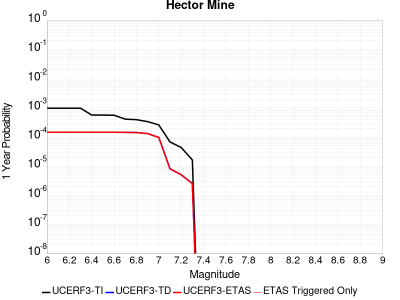 | 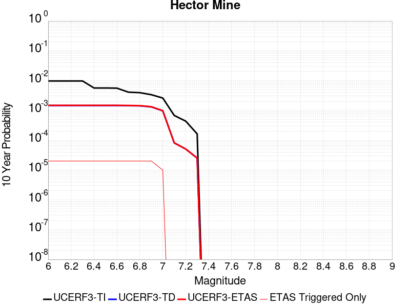 |

| Magnitude | 1 wk TI Prob | 1 wk TD Prob | 1 wk ETAS Prob | 1 wk ETAS/TD Gain | 1 wk ETAS Triggered Only | 1 mo TI Prob | 1 mo TD Prob | 1 mo ETAS Prob | 1 mo ETAS/TD Gain | 1 mo ETAS Triggered Only | 1 yr TI Prob | 1 yr TD Prob | 1 yr ETAS Prob | 1 yr ETAS/TD Gain | 1 yr ETAS Triggered Only | 10 yr TI Prob | 10 yr TD Prob | 10 yr ETAS Prob | 10 yr ETAS/TD Gain | 10 yr ETAS Triggered Only |
|-----|-----|-----|-----|-----|-----|-----|-----|-----|-----|-----|-----|-----|-----|-----|-----|-----|-----|-----|-----|-----|
| 6.0 | 1.8760093E-5 | 2.7963818E-6 | 2.7963818E-6 | 1.0 | 0.0 | 8.039792E-5 | 1.1984461E-5 | 1.1984461E-5 | 1.0 | 0.0 | 9.78405E-4 | 1.4590504E-4 | 1.4590504E-4 | 1.0 | 0.0 | 0.009741086 | 0.0014584847 | 0.0014830653 | 1.0168536 | 2.4616596E-5 |
| 6.1 | 1.8760093E-5 | 2.7963818E-6 | 2.7963818E-6 | 1.0 | 0.0 | 8.039792E-5 | 1.1984461E-5 | 1.1984461E-5 | 1.0 | 0.0 | 9.78405E-4 | 1.4590504E-4 | 1.4590504E-4 | 1.0 | 0.0 | 0.009741086 | 0.0014584847 | 0.0014830653 | 1.0168536 | 2.4616596E-5 |
| 6.2 | 1.8760093E-5 | 2.7963818E-6 | 2.7963818E-6 | 1.0 | 0.0 | 8.039792E-5 | 1.1984461E-5 | 1.1984461E-5 | 1.0 | 0.0 | 9.78405E-4 | 1.4590504E-4 | 1.4590504E-4 | 1.0 | 0.0 | 0.009741086 | 0.0014584847 | 0.0014830653 | 1.0168536 | 2.4616596E-5 |
| 6.3 | 1.8760093E-5 | 2.7963818E-6 | 2.7963818E-6 | 1.0 | 0.0 | 8.039792E-5 | 1.1984461E-5 | 1.1984461E-5 | 1.0 | 0.0 | 9.78405E-4 | 1.4590504E-4 | 1.4590504E-4 | 1.0 | 0.0 | 0.009741086 | 0.0014584847 | 0.0014830653 | 1.0168536 | 2.4616596E-5 |
| 6.4 | 1.0888055E-5 | 2.7963818E-6 | 2.7963818E-6 | 1.0 | 0.0 | 4.666226E-5 | 1.1984461E-5 | 1.1984461E-5 | 1.0 | 0.0 | 5.679649E-4 | 1.4590504E-4 | 1.4590504E-4 | 1.0 | 0.0 | 0.0056651547 | 0.0014584847 | 0.0014830653 | 1.0168536 | 2.4616596E-5 |
| 6.5 | 1.0888055E-5 | 2.7963818E-6 | 2.7963818E-6 | 1.0 | 0.0 | 4.666226E-5 | 1.1984461E-5 | 1.1984461E-5 | 1.0 | 0.0 | 5.679649E-4 | 1.4590504E-4 | 1.4590504E-4 | 1.0 | 0.0 | 0.0056651547 | 0.0014584847 | 0.0014830653 | 1.0168536 | 2.4616596E-5 |
| 6.6 | 1.0730738E-5 | 2.7963818E-6 | 2.7963818E-6 | 1.0 | 0.0 | 4.5988065E-5 | 1.1984461E-5 | 1.1984461E-5 | 1.0 | 0.0 | 5.5976084E-4 | 1.4590504E-4 | 1.4590504E-4 | 1.0 | 0.0 | 0.0055835294 | 0.0014584847 | 0.0014830653 | 1.0168536 | 2.4616596E-5 |
| 6.7 | 7.881326E-6 | 2.7710626E-6 | 2.7710626E-6 | 1.0 | 0.0 | 3.3776672E-5 | 1.1875951E-5 | 1.1875951E-5 | 1.0 | 0.0 | 4.111534E-4 | 1.445841E-4 | 1.445841E-4 | 1.0 | 0.0 | 0.0041039353 | 0.0014452925 | 0.0014698735 | 1.0170076 | 2.4616596E-5 |
| 6.8 | 7.5683483E-6 | 2.7328138E-6 | 2.7328138E-6 | 1.0 | 0.0 | 3.2435375E-5 | 1.1712029E-5 | 1.1712029E-5 | 1.0 | 0.0 | 3.9482914E-4 | 1.4258861E-4 | 1.4258861E-4 | 1.0 | 0.0 | 0.0039412836 | 0.0014253634 | 0.0014499448 | 1.0172458 | 2.4616596E-5 |
| 6.9 | 6.473048E-6 | 2.5138945E-6 | 2.5138945E-6 | 1.0 | 0.0 | 2.7741338E-5 | 1.07738115E-5 | 1.07738115E-5 | 1.0 | 0.0 | 3.3769844E-4 | 1.3116724E-4 | 1.3116724E-4 | 1.0 | 0.0 | 0.0033718573 | 0.0013112876 | 0.001335872 | 1.0187483 | 2.4616596E-5 |
| 7.0 | 4.9959954E-6 | 1.8565124E-6 | 1.8565124E-6 | 1.0 | 0.0 | 2.1411232E-5 | 7.956478E-6 | 7.956478E-6 | 1.0 | 0.0 | 2.6065056E-4 | 9.686937E-5 | 9.686937E-5 | 1.0 | 0.0 | 0.0026034506 | 9.6862105E-4 | 9.932138E-4 | 1.0253894 | 2.4616596E-5 |
| 7.1 | 1.2997541E-6 | 1.5602147E-7 | 1.5602147E-7 | 1.0 | 0.0 | 5.5703626E-6 | 6.686633E-7 | 6.686633E-7 | 1.0 | 0.0 | 6.7817055E-5 | 8.140949E-6 | 8.140949E-6 | 1.0 | 0.0 | 6.779636E-4 | 8.1406906E-5 | 8.1406906E-5 | 1.0 | 0.0 |
| 7.2 | 8.392699E-7 | 9.727592E-8 | 9.727592E-8 | 1.0 | 0.0 | 3.596866E-6 | 4.1689677E-7 | 4.1689677E-7 | 1.0 | 0.0 | 4.3790962E-5 | 5.0757085E-6 | 5.0757085E-6 | 1.0 | 0.0 | 4.3782333E-4 | 5.0756116E-5 | 5.0756116E-5 | 1.0 | 0.0 |
| 7.3 | 3.13015E-7 | 4.829262E-8 | 4.829262E-8 | 1.0 | 0.0 | 1.3414921E-6 | 2.0696835E-7 | 2.0696835E-7 | 1.0 | 0.0 | 1.6332544E-5 | 2.5198376E-6 | 2.5198376E-6 | 1.0 | 0.0 | 1.6331344E-4 | 2.5198176E-5 | 2.5198176E-5 | 1.0 | 0.0 |

## San Gorgonio Pass
*[(top)](#table-of-contents)*

| 1 Week | 1 Month | 1 Year | 10 Year |
|-----|-----|-----|-----|
|  | 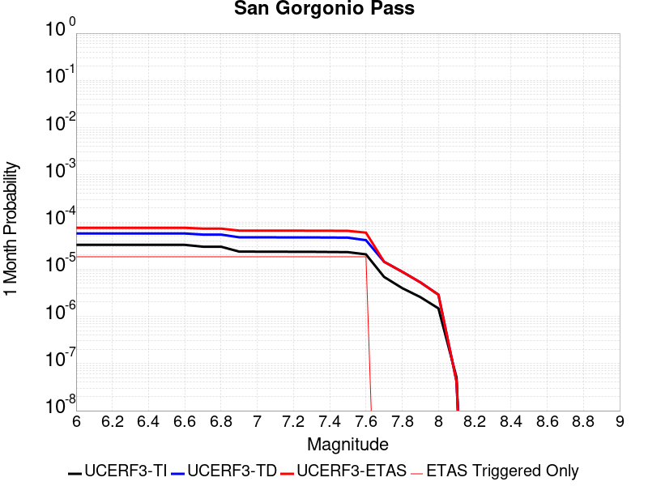 | 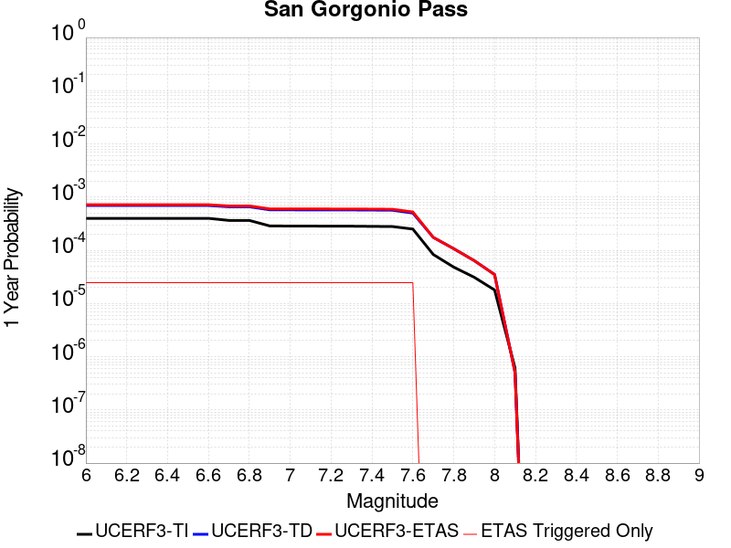 | 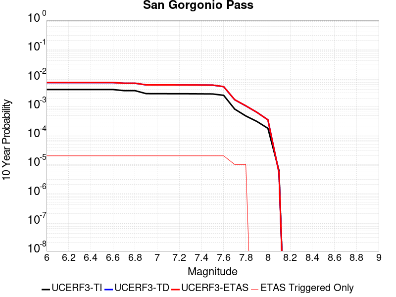 |

| Magnitude | 1 wk TI Prob | 1 wk TD Prob | 1 wk ETAS Prob | 1 wk ETAS/TD Gain | 1 wk ETAS Triggered Only | 1 mo TI Prob | 1 mo TD Prob | 1 mo ETAS Prob | 1 mo ETAS/TD Gain | 1 mo ETAS Triggered Only | 1 yr TI Prob | 1 yr TD Prob | 1 yr ETAS Prob | 1 yr ETAS/TD Gain | 1 yr ETAS Triggered Only | 10 yr TI Prob | 10 yr TD Prob | 10 yr ETAS Prob | 10 yr ETAS/TD Gain | 10 yr ETAS Triggered Only |
|-----|-----|-----|-----|-----|-----|-----|-----|-----|-----|-----|-----|-----|-----|-----|-----|-----|-----|-----|-----|-----|
| 6.0 | 7.644328E-6 | 1.3314231E-5 | 1.3314231E-5 | 1.0 | 0.0 | 3.2760996E-5 | 5.705979E-5 | 8.167498E-5 | 1.4313929 | 2.4616596E-5 | 3.987921E-4 | 6.944901E-4 | 7.190896E-4 | 1.0354209 | 2.4616596E-5 | 0.003980772 | 0.0069299806 | 0.006954427 | 1.0035275 | 2.4616596E-5 |
| 6.1 | 7.644328E-6 | 1.3314231E-5 | 1.3314231E-5 | 1.0 | 0.0 | 3.2760996E-5 | 5.705979E-5 | 8.167498E-5 | 1.4313929 | 2.4616596E-5 | 3.987921E-4 | 6.944901E-4 | 7.190896E-4 | 1.0354209 | 2.4616596E-5 | 0.003980772 | 0.0069299806 | 0.006954427 | 1.0035275 | 2.4616596E-5 |
| 6.2 | 7.644328E-6 | 1.3314231E-5 | 1.3314231E-5 | 1.0 | 0.0 | 3.2760996E-5 | 5.705979E-5 | 8.167498E-5 | 1.4313929 | 2.4616596E-5 | 3.987921E-4 | 6.944901E-4 | 7.190896E-4 | 1.0354209 | 2.4616596E-5 | 0.003980772 | 0.0069299806 | 0.006954427 | 1.0035275 | 2.4616596E-5 |
| 6.3 | 7.644328E-6 | 1.3314231E-5 | 1.3314231E-5 | 1.0 | 0.0 | 3.2760996E-5 | 5.705979E-5 | 8.167498E-5 | 1.4313929 | 2.4616596E-5 | 3.987921E-4 | 6.944901E-4 | 7.190896E-4 | 1.0354209 | 2.4616596E-5 | 0.003980772 | 0.0069299806 | 0.006954427 | 1.0035275 | 2.4616596E-5 |
| 6.4 | 7.644328E-6 | 1.3314231E-5 | 1.3314231E-5 | 1.0 | 0.0 | 3.2760996E-5 | 5.705979E-5 | 8.167498E-5 | 1.4313929 | 2.4616596E-5 | 3.987921E-4 | 6.944901E-4 | 7.190896E-4 | 1.0354209 | 2.4616596E-5 | 0.003980772 | 0.0069299806 | 0.006954427 | 1.0035275 | 2.4616596E-5 |
| 6.5 | 7.644328E-6 | 1.3314231E-5 | 1.3314231E-5 | 1.0 | 0.0 | 3.2760996E-5 | 5.705979E-5 | 8.167498E-5 | 1.4313929 | 2.4616596E-5 | 3.987921E-4 | 6.944901E-4 | 7.190896E-4 | 1.0354209 | 2.4616596E-5 | 0.003980772 | 0.0069299806 | 0.006954427 | 1.0035275 | 2.4616596E-5 |
| 6.6 | 7.644328E-6 | 1.3314231E-5 | 1.3314231E-5 | 1.0 | 0.0 | 3.2760996E-5 | 5.705979E-5 | 8.167498E-5 | 1.4313929 | 2.4616596E-5 | 3.987921E-4 | 6.944901E-4 | 7.190896E-4 | 1.0354209 | 2.4616596E-5 | 0.003980772 | 0.0069299806 | 0.006954427 | 1.0035275 | 2.4616596E-5 |
| 6.7 | 6.987586E-6 | 1.2618505E-5 | 1.2618505E-5 | 1.0 | 0.0 | 2.9946454E-5 | 5.4078235E-5 | 7.86935E-5 | 1.4551787 | 2.4616596E-5 | 3.645371E-4 | 6.582117E-4 | 6.828121E-4 | 1.0373746 | 2.4616596E-5 | 0.0036393967 | 0.0065693567 | 0.006593812 | 1.0037225 | 2.4616596E-5 |
| 6.8 | 6.987586E-6 | 1.2618505E-5 | 1.2618505E-5 | 1.0 | 0.0 | 2.9946454E-5 | 5.4078235E-5 | 7.86935E-5 | 1.4551787 | 2.4616596E-5 | 3.645371E-4 | 6.582117E-4 | 6.828121E-4 | 1.0373746 | 2.4616596E-5 | 0.0036393967 | 0.0065693567 | 0.006593812 | 1.0037225 | 2.4616596E-5 |
| 6.9 | 5.504702E-6 | 1.1049368E-5 | 1.1049368E-5 | 1.0 | 0.0 | 2.3591367E-5 | 4.7353606E-5 | 7.1969036E-5 | 1.5198216 | 2.4616596E-5 | 2.8718702E-4 | 5.7638274E-4 | 6.0098513E-4 | 1.0426842 | 2.4616596E-5 | 0.0028681618 | 0.005755309 | 0.005779784 | 1.0042526 | 2.4616596E-5 |
| 7.0 | 5.4825764E-6 | 1.102571E-5 | 1.102571E-5 | 1.0 | 0.0 | 2.3496545E-5 | 4.7252215E-5 | 7.1867646E-5 | 1.5209371 | 2.4616596E-5 | 2.8603288E-4 | 5.751489E-4 | 5.9975137E-4 | 1.0427758 | 2.4616596E-5 | 0.00285665 | 0.005743035 | 0.0057675103 | 1.0042617 | 2.4616596E-5 |
| 7.1 | 5.4692787E-6 | 1.101142E-5 | 1.101142E-5 | 1.0 | 0.0 | 2.3439556E-5 | 4.7190973E-5 | 7.180641E-5 | 1.5216132 | 2.4616596E-5 | 2.8533922E-4 | 5.744037E-4 | 5.9900613E-4 | 1.0428313 | 2.4616596E-5 | 0.0028497311 | 0.0057356213 | 0.005760097 | 1.0042672 | 2.4616596E-5 |
| 7.2 | 5.453661E-6 | 1.0994446E-5 | 1.0994446E-5 | 1.0 | 0.0 | 2.3372622E-5 | 4.7118232E-5 | 7.1733666E-5 | 1.5224185 | 2.4616596E-5 | 2.8452452E-4 | 5.7351857E-4 | 5.98121E-4 | 1.0428975 | 2.4616596E-5 | 0.002841605 | 0.0057268157 | 0.0057512913 | 1.0042739 | 2.4616596E-5 |
| 7.3 | 5.4422303E-6 | 1.0981369E-5 | 1.0981369E-5 | 1.0 | 0.0 | 2.3323635E-5 | 4.706219E-5 | 7.167763E-5 | 1.5230407 | 2.4616596E-5 | 2.8392827E-4 | 5.728366E-4 | 5.9743907E-4 | 1.0429485 | 2.4616596E-5 | 0.0028356577 | 0.005720031 | 0.005744507 | 1.004279 | 2.4616596E-5 |
| 7.4 | 5.398595E-6 | 1.0928734E-5 | 1.0928734E-5 | 1.0 | 0.0 | 2.313663E-5 | 4.683662E-5 | 7.1452065E-5 | 1.5255598 | 2.4616596E-5 | 2.8165206E-4 | 5.700917E-4 | 5.946943E-4 | 1.0431554 | 2.4616596E-5 | 0.0028129534 | 0.005692723 | 0.0057171998 | 1.0042996 | 2.4616596E-5 |
| 7.5 | 5.3578788E-6 | 1.0855281E-5 | 1.0855281E-5 | 1.0 | 0.0 | 2.2962136E-5 | 4.6521833E-5 | 7.1137285E-5 | 1.5291162 | 2.4616596E-5 | 2.7952815E-4 | 5.662612E-4 | 5.908638E-4 | 1.0434475 | 2.4616596E-5 | 0.002791768 | 0.0056546377 | 0.005679115 | 1.0043287 | 2.4616596E-5 |
| 7.6 | 4.8091474E-6 | 9.60368E-6 | 9.60368E-6 | 1.0 | 0.0 | 2.0610469E-5 | 4.1158008E-5 | 6.577359E-5 | 1.5980753 | 2.4616596E-5 | 2.5090357E-4 | 5.0098833E-4 | 5.255926E-4 | 1.0491115 | 2.4616596E-5 | 0.0025062046 | 0.0050053033 | 0.0050297966 | 1.0048935 | 2.4616596E-5 |
| 7.7 | 1.5991155E-6 | 3.352866E-6 | 3.352866E-6 | 1.0 | 0.0 | 6.853334E-6 | 1.4369349E-5 | 1.4369349E-5 | 1.0 | 0.0 | 8.343615E-5 | 1.7493303E-4 | 1.7493303E-4 | 1.0 | 0.0 | 8.340483E-4 | 0.0017534072 | 0.0017534072 | 1.0 | 0.0 |
| 7.8 | 9.258398E-7 | 2.0579948E-6 | 2.0579948E-6 | 1.0 | 0.0 | 3.967879E-6 | 8.819949E-6 | 8.819949E-6 | 1.0 | 0.0 | 4.8307855E-5 | 1.073776E-4 | 1.073776E-4 | 1.0 | 0.0 | 4.8297356E-4 | 0.001078687 | 0.001078687 | 1.0 | 0.0 |
| 7.9 | 5.975575E-7 | 1.2291794E-6 | 1.2291794E-6 | 1.0 | 0.0 | 2.5609581E-6 | 5.2679006E-6 | 5.2679006E-6 | 1.0 | 0.0 | 3.117922E-5 | 6.4134816E-5 | 6.4134816E-5 | 1.0 | 0.0 | 3.1174847E-4 | 6.463092E-4 | 6.463092E-4 | 1.0 | 0.0 |
| 8.0 | 3.4413725E-7 | 6.7148494E-7 | 6.7148494E-7 | 1.0 | 0.0 | 1.4748731E-6 | 2.8777895E-6 | 2.8777895E-6 | 1.0 | 0.0 | 1.7956432E-5 | 3.503653E-5 | 3.503653E-5 | 1.0 | 0.0 | 1.7954981E-4 | 3.5373896E-4 | 3.5373896E-4 | 1.0 | 0.0 |
| 8.1 | 1.1787731E-8 | 9.634385E-9 | 9.634385E-9 | 1.0 | 0.0 | 5.0518846E-8 | 4.129022E-8 | 4.129022E-8 | 1.0 | 0.0 | 6.1506677E-7 | 5.027083E-7 | 5.027083E-7 | 1.0 | 0.0 | 6.1506507E-6 | 5.2424944E-6 | 5.2424944E-6 | 1.0 | 0.0 |

## Hunting Creek - Bartlett Springs connector 2011
*[(top)](#table-of-contents)*

| 1 Week | 1 Month | 1 Year | 10 Year |
|-----|-----|-----|-----|
| 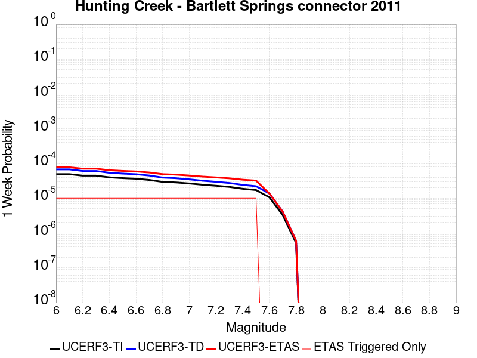 | 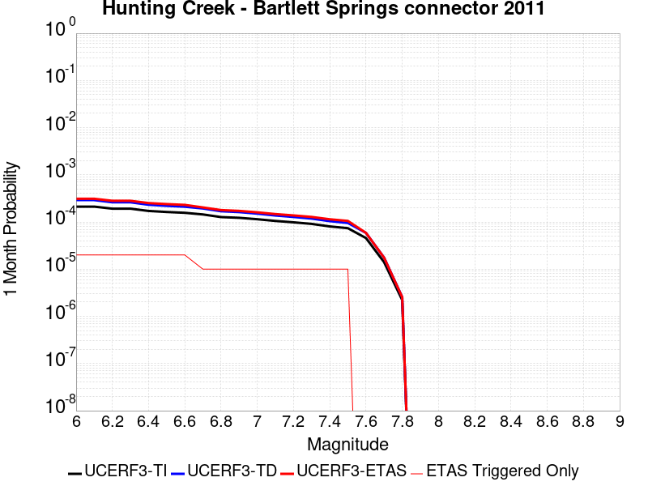 | 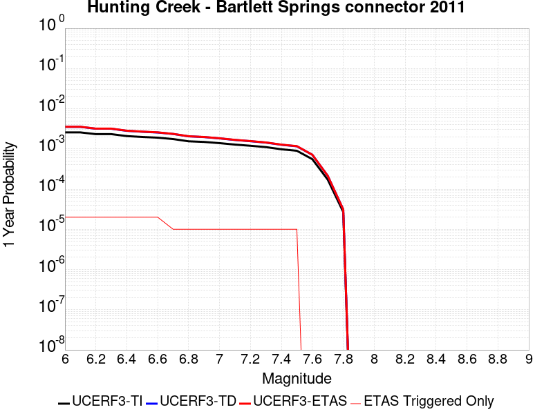 | 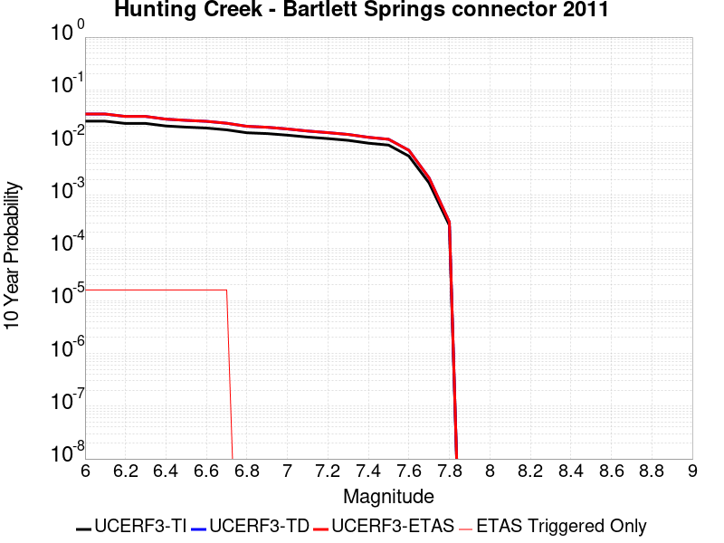 |

| Magnitude | 1 wk TI Prob | 1 wk TD Prob | 1 wk ETAS Prob | 1 wk ETAS/TD Gain | 1 wk ETAS Triggered Only | 1 mo TI Prob | 1 mo TD Prob | 1 mo ETAS Prob | 1 mo ETAS/TD Gain | 1 mo ETAS Triggered Only | 1 yr TI Prob | 1 yr TD Prob | 1 yr ETAS Prob | 1 yr ETAS/TD Gain | 1 yr ETAS Triggered Only | 10 yr TI Prob | 10 yr TD Prob | 10 yr ETAS Prob | 10 yr ETAS/TD Gain | 10 yr ETAS Triggered Only |
|-----|-----|-----|-----|-----|-----|-----|-----|-----|-----|-----|-----|-----|-----|-----|-----|-----|-----|-----|-----|-----|
| 6.0 | 4.940016E-5 | 6.786822E-5 | 6.786822E-5 | 1.0 | 0.0 | 2.1169778E-4 | 2.9083234E-4 | 2.9083234E-4 | 1.0 | 0.0 | 0.002574374 | 0.003535177 | 0.003535177 | 1.0 | 0.0 | 0.025447546 | 0.034773834 | 0.034797594 | 1.0006833 | 2.4616596E-5 |
| 6.1 | 4.940016E-5 | 6.786822E-5 | 6.786822E-5 | 1.0 | 0.0 | 2.1169778E-4 | 2.9083234E-4 | 2.9083234E-4 | 1.0 | 0.0 | 0.002574374 | 0.003535177 | 0.003535177 | 1.0 | 0.0 | 0.025447546 | 0.034773834 | 0.034797594 | 1.0006833 | 2.4616596E-5 |
| 6.2 | 4.472471E-5 | 6.1002804E-5 | 6.1002804E-5 | 1.0 | 0.0 | 1.9166325E-4 | 2.6141506E-4 | 2.6141506E-4 | 1.0 | 0.0 | 0.0023310026 | 0.003178107 | 0.003178107 | 1.0 | 0.0 | 0.02306703 | 0.031316914 | 0.03134076 | 1.0007614 | 2.4616596E-5 |
| 6.3 | 4.472471E-5 | 6.1002804E-5 | 6.1002804E-5 | 1.0 | 0.0 | 1.9166325E-4 | 2.6141506E-4 | 2.6141506E-4 | 1.0 | 0.0 | 0.0023310026 | 0.003178107 | 0.003178107 | 1.0 | 0.0 | 0.02306703 | 0.031316914 | 0.03134076 | 1.0007614 | 2.4616596E-5 |
| 6.4 | 4.0001003E-5 | 5.4103755E-5 | 5.4103755E-5 | 1.0 | 0.0 | 1.714216E-4 | 2.31853E-4 | 2.31853E-4 | 1.0 | 0.0 | 0.0020850603 | 0.0028191248 | 0.0028191248 | 1.0 | 0.0 | 0.02065605 | 0.027828315 | 0.027852247 | 1.00086 | 2.4616596E-5 |
| 6.5 | 3.8033053E-5 | 5.1266547E-5 | 5.1266547E-5 | 1.0 | 0.0 | 1.6298861E-4 | 2.1969559E-4 | 2.1969559E-4 | 1.0 | 0.0 | 0.0019825802 | 0.0026714746 | 0.0026714746 | 1.0 | 0.0 | 0.019649856 | 0.026390454 | 0.02641442 | 1.0009081 | 2.4616596E-5 |
| 6.6 | 3.653754E-5 | 4.913017E-5 | 4.913017E-5 | 1.0 | 0.0 | 1.5658008E-4 | 2.1054115E-4 | 2.1054115E-4 | 1.0 | 0.0 | 0.0019046954 | 0.0025602852 | 0.0025602852 | 1.0 | 0.0 | 0.018884527 | 0.025306415 | 0.025330408 | 1.0009481 | 2.4616596E-5 |
| 6.7 | 3.372024E-5 | 4.514011E-5 | 4.514011E-5 | 1.0 | 0.0 | 1.4450731E-4 | 1.9344354E-4 | 1.9344354E-4 | 1.0 | 0.0 | 0.0017579567 | 0.002352639 | 0.002352639 | 1.0 | 0.0 | 0.017441148 | 0.023278099 | 0.023302142 | 1.0010328 | 2.4616596E-5 |
| 6.8 | 2.9650024E-5 | 3.9411374E-5 | 3.9411374E-5 | 1.0 | 0.0 | 1.2706534E-4 | 1.6889503E-4 | 1.6889503E-4 | 1.0 | 0.0 | 0.0015459227 | 0.0020543463 | 0.0020543463 | 1.0 | 0.0 | 0.015352124 | 0.020351216 | 0.020351216 | 1.0 | 0.0 |
| 6.9 | 2.860775E-5 | 3.7812544E-5 | 3.7812544E-5 | 1.0 | 0.0 | 1.2259888E-4 | 1.6204377E-4 | 1.6204377E-4 | 1.0 | 0.0 | 0.0014916194 | 0.001971107 | 0.001971107 | 1.0 | 0.0 | 0.014816469 | 0.01953584 | 0.01953584 | 1.0 | 0.0 |
| 7.0 | 2.6696067E-5 | 3.506726E-5 | 3.506726E-5 | 1.0 | 0.0 | 1.144067E-4 | 1.5027967E-4 | 1.5027967E-4 | 1.0 | 0.0 | 0.0013920115 | 0.0018281302 | 0.0018281302 | 1.0 | 0.0 | 0.013833242 | 0.018131364 | 0.018131364 | 1.0 | 0.0 |
| 7.1 | 2.456087E-5 | 3.2013093E-5 | 3.2013093E-5 | 1.0 | 0.0 | 1.0525662E-4 | 1.371918E-4 | 1.371918E-4 | 1.0 | 0.0 | 0.001280746 | 0.0016690396 | 0.0016690396 | 1.0 | 0.0 | 0.012733897 | 0.016566366 | 0.016566366 | 1.0 | 0.0 |
| 7.2 | 2.295761E-5 | 2.9822932E-5 | 2.9822932E-5 | 1.0 | 0.0 | 9.8386045E-5 | 1.2780636E-4 | 1.2780636E-4 | 1.0 | 0.0 | 0.0011971919 | 0.001554941 | 0.001554941 | 1.0 | 0.0 | 0.011907627 | 0.015442089 | 0.015442089 | 1.0 | 0.0 |
| 7.3 | 2.1256936E-5 | 2.7541912E-5 | 2.7541912E-5 | 1.0 | 0.0 | 9.109797E-5 | 1.1803147E-4 | 1.1803147E-4 | 1.0 | 0.0 | 0.0011085535 | 0.0014360948 | 0.0014360948 | 1.0 | 0.0 | 0.011030397 | 0.014269472 | 0.014269472 | 1.0 | 0.0 |
| 7.4 | 1.8784336E-5 | 2.4306766E-5 | 2.4306766E-5 | 1.0 | 0.0 | 8.050181E-5 | 1.0416774E-4 | 1.0416774E-4 | 1.0 | 0.0 | 9.796688E-4 | 0.001267512 | 0.001267512 | 1.0 | 0.0 | 0.009753612 | 0.012603902 | 0.012603902 | 1.0 | 0.0 |
| 7.5 | 1.7248298E-5 | 2.2268887E-5 | 2.2268887E-5 | 1.0 | 0.0 | 7.391918E-5 | 9.543464E-5 | 9.543464E-5 | 1.0 | 0.0 | 8.9959445E-4 | 0.0011613049 | 0.0011613049 | 1.0 | 0.0 | 0.008959615 | 0.01155334 | 0.01155334 | 1.0 | 0.0 |
| 7.6 | 1.0653709E-5 | 1.3722118E-5 | 1.3722118E-5 | 1.0 | 0.0 | 4.5657955E-5 | 5.8807767E-5 | 5.8807767E-5 | 1.0 | 0.0 | 5.557438E-4 | 7.157521E-4 | 7.157521E-4 | 1.0 | 0.0 | 0.0055435603 | 0.0071348166 | 0.0071348166 | 1.0 | 0.0 |
| 7.7 | 3.286316E-6 | 4.0903437E-6 | 4.0903437E-6 | 1.0 | 0.0 | 1.4084137E-5 | 1.7529928E-5 | 1.7529928E-5 | 1.0 | 0.0 | 1.7146087E-4 | 2.1340612E-4 | 2.1340612E-4 | 1.0 | 0.0 | 0.0017132863 | 0.0021320276 | 0.0021320276 | 1.0 | 0.0 |
| 7.8 | 5.1855085E-7 | 5.9720696E-7 | 5.9720696E-7 | 1.0 | 0.0 | 2.222359E-6 | 2.5594559E-6 | 2.5594559E-6 | 1.0 | 0.0 | 2.7056883E-5 | 3.116094E-5 | 3.116094E-5 | 1.0 | 0.0 | 2.705359E-4 | 3.1156495E-4 | 3.1156495E-4 | 1.0 | 0.0 |

## Hollywood
*[(top)](#table-of-contents)*

| 1 Week | 1 Month | 1 Year | 10 Year |
|-----|-----|-----|-----|
| 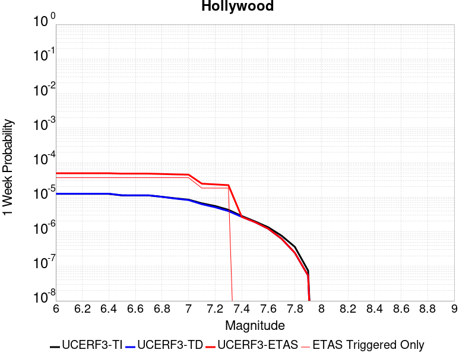 |  | 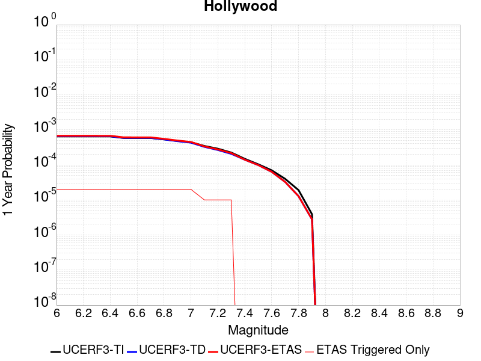 |  |

| Magnitude | 1 wk TI Prob | 1 wk TD Prob | 1 wk ETAS Prob | 1 wk ETAS/TD Gain | 1 wk ETAS Triggered Only | 1 mo TI Prob | 1 mo TD Prob | 1 mo ETAS Prob | 1 mo ETAS/TD Gain | 1 mo ETAS Triggered Only | 1 yr TI Prob | 1 yr TD Prob | 1 yr ETAS Prob | 1 yr ETAS/TD Gain | 1 yr ETAS Triggered Only | 10 yr TI Prob | 10 yr TD Prob | 10 yr ETAS Prob | 10 yr ETAS/TD Gain | 10 yr ETAS Triggered Only |
|-----|-----|-----|-----|-----|-----|-----|-----|-----|-----|-----|-----|-----|-----|-----|-----|-----|-----|-----|-----|-----|
| 6.0 | 1.24487615E-5 | 1.2593226E-5 | 3.7209513E-5 | 2.9547246 | 2.4616596E-5 | 5.3350745E-5 | 5.3969878E-5 | 7.8585144E-5 | 1.4560927 | 2.4616596E-5 | 6.4935174E-4 | 6.568898E-4 | 6.8149023E-4 | 1.0374498 | 2.4616596E-5 | 0.0064745755 | 0.006549969 | 0.0065744244 | 1.0037336 | 2.4616596E-5 |
| 6.1 | 1.24487615E-5 | 1.2593226E-5 | 3.7209513E-5 | 2.9547246 | 2.4616596E-5 | 5.3350745E-5 | 5.3969878E-5 | 7.8585144E-5 | 1.4560927 | 2.4616596E-5 | 6.4935174E-4 | 6.568898E-4 | 6.8149023E-4 | 1.0374498 | 2.4616596E-5 | 0.0064745755 | 0.006549969 | 0.0065744244 | 1.0037336 | 2.4616596E-5 |
| 6.2 | 1.24487615E-5 | 1.2593226E-5 | 3.7209513E-5 | 2.9547246 | 2.4616596E-5 | 5.3350745E-5 | 5.3969878E-5 | 7.8585144E-5 | 1.4560927 | 2.4616596E-5 | 6.4935174E-4 | 6.568898E-4 | 6.8149023E-4 | 1.0374498 | 2.4616596E-5 | 0.0064745755 | 0.006549969 | 0.0065744244 | 1.0037336 | 2.4616596E-5 |
| 6.3 | 1.24487615E-5 | 1.2593226E-5 | 3.7209513E-5 | 2.9547246 | 2.4616596E-5 | 5.3350745E-5 | 5.3969878E-5 | 7.8585144E-5 | 1.4560927 | 2.4616596E-5 | 6.4935174E-4 | 6.568898E-4 | 6.8149023E-4 | 1.0374498 | 2.4616596E-5 | 0.0064745755 | 0.006549969 | 0.0065744244 | 1.0037336 | 2.4616596E-5 |
| 6.4 | 1.2431024E-5 | 1.2573839E-5 | 3.7190126E-5 | 2.9577384 | 2.4616596E-5 | 5.327473E-5 | 5.3886797E-5 | 7.850207E-5 | 1.4567959 | 2.4616596E-5 | 6.4842677E-4 | 6.558789E-4 | 6.8047934E-4 | 1.0375077 | 2.4616596E-5 | 0.0064653796 | 0.0065399194 | 0.006564375 | 1.0037395 | 2.4616596E-5 |
| 6.5 | 1.1242222E-5 | 1.13178E-5 | 3.5934117E-5 | 3.175009 | 2.4616596E-5 | 4.8180063E-5 | 4.850397E-5 | 7.311937E-5 | 1.5074925 | 2.4616596E-5 | 5.864344E-4 | 5.9037853E-4 | 6.149806E-4 | 1.0416716 | 2.4616596E-5 | 0.0058488925 | 0.005888388 | 0.0059128595 | 1.0041559 | 2.4616596E-5 |
| 6.6 | 1.1234066E-5 | 1.13089145E-5 | 3.5925234E-5 | 3.176718 | 2.4616596E-5 | 4.8145106E-5 | 4.846589E-5 | 7.308129E-5 | 1.5078913 | 2.4616596E-5 | 5.86009E-4 | 5.8991514E-4 | 6.145172E-4 | 1.0417044 | 2.4616596E-5 | 0.005844661 | 0.0058837784 | 0.0059082503 | 1.0041592 | 2.4616596E-5 |
| 6.7 | 1.12294E-5 | 1.1303658E-5 | 3.5919977E-5 | 3.1777303 | 2.4616596E-5 | 4.812511E-5 | 4.8443362E-5 | 7.305876E-5 | 1.5081275 | 2.4616596E-5 | 5.857657E-4 | 5.89641E-4 | 6.142431E-4 | 1.0417238 | 2.4616596E-5 | 0.0058422405 | 0.005881052 | 0.0059055234 | 1.0041611 | 2.4616596E-5 |
| 6.8 | 1.0252819E-5 | 1.0218445E-5 | 3.483479E-5 | 3.409011 | 2.4616596E-5 | 4.3939912E-5 | 4.379261E-5 | 6.840813E-5 | 1.562093 | 2.4616596E-5 | 5.3483713E-4 | 5.330467E-4 | 5.5765023E-4 | 1.0461563 | 2.4616596E-5 | 0.005335517 | 0.005317908 | 0.005342393 | 1.0046043 | 2.4616596E-5 |
| 6.9 | 9.252289E-6 | 9.110306E-6 | 3.372668E-5 | 3.7020357 | 2.4616596E-5 | 3.9652066E-5 | 3.9043593E-5 | 6.365923E-5 | 1.6304654 | 2.4616596E-5 | 4.8265693E-4 | 4.752537E-4 | 4.998586E-4 | 1.0517721 | 2.4616596E-5 | 0.0048161 | 0.004742547 | 0.004767047 | 1.0051659 | 2.4616596E-5 |
| 7.0 | 8.474604E-6 | 8.258257E-6 | 3.287465E-5 | 3.9808218 | 2.4616596E-5 | 3.6319227E-5 | 3.539206E-5 | 6.0007784E-5 | 1.6955155 | 2.4616596E-5 | 4.4209688E-4 | 4.3081454E-4 | 4.5542052E-4 | 1.0571151 | 2.4616596E-5 | 0.004412184 | 0.004299944 | 0.004324455 | 1.0057002 | 2.4616596E-5 |
| 7.1 | 6.643643E-6 | 6.2683675E-6 | 3.088481E-5 | 4.9270897 | 2.4616596E-5 | 2.8472443E-5 | 2.6864158E-5 | 5.1480092E-5 | 1.9163114 | 2.4616596E-5 | 3.4659685E-4 | 3.2702246E-4 | 3.51631E-4 | 1.0752503 | 2.4616596E-5 | 0.0034605677 | 0.0032654584 | 0.0032899946 | 1.0075139 | 2.4616596E-5 |
| 7.2 | 5.549002E-6 | 5.108709E-6 | 2.9725179E-5 | 5.8185306 | 2.4616596E-5 | 2.378122E-5 | 2.1894284E-5 | 4.6510344E-5 | 2.1243143 | 2.4616596E-5 | 2.8949787E-4 | 2.6653046E-4 | 2.911405E-4 | 1.0923347 | 2.4616596E-5 | 0.0028912104 | 0.0026621243 | 0.0026866754 | 1.0092224 | 2.4616596E-5 |
| 7.3 | 4.3059727E-6 | 3.9598885E-6 | 2.8576387E-5 | 7.2164626 | 2.4616596E-5 | 1.8454039E-5 | 1.6970842E-5 | 4.158702E-5 | 2.4504983 | 2.4616596E-5 | 2.2465475E-4 | 2.066005E-4 | 2.31212E-4 | 1.1191261 | 2.4616596E-5 | 0.0022442779 | 0.0020640944 | 0.0020886601 | 1.0119015 | 2.4616596E-5 |
| 7.4 | 2.8550733E-6 | 2.7012966E-6 | 2.7012966E-6 | 1.0 | 0.0 | 1.2235971E-5 | 1.1576934E-5 | 1.1576934E-5 | 1.0 | 0.0 | 1.4896276E-4 | 1.409401E-4 | 1.409401E-4 | 1.0 | 0.0 | 0.0014886294 | 0.0014085122 | 0.0014085122 | 1.0 | 0.0 |
| 7.5 | 1.9927045E-6 | 1.8976367E-6 | 1.8976367E-6 | 1.0 | 0.0 | 8.540134E-6 | 8.132703E-6 | 8.132703E-6 | 1.0 | 0.0 | 1.0397117E-4 | 9.90112E-5 | 9.90112E-5 | 1.0 | 0.0 | 0.0010392254 | 9.896745E-4 | 9.896745E-4 | 1.0 | 0.0 |
| 7.6 | 1.345084E-6 | 1.2216007E-6 | 1.2216007E-6 | 1.0 | 0.0 | 5.764633E-6 | 5.235421E-6 | 5.235421E-6 | 1.0 | 0.0 | 7.018215E-5 | 6.3739404E-5 | 6.3739404E-5 | 1.0 | 0.0 | 7.0159987E-4 | 6.3721323E-4 | 6.3721323E-4 | 1.0 | 0.0 |
| 7.7 | 7.6835164E-7 | 6.277697E-7 | 6.277697E-7 | 1.0 | 0.0 | 3.2929315E-6 | 2.6904388E-6 | 2.6904388E-6 | 1.0 | 0.0 | 4.00907E-5 | 3.2755615E-5 | 3.2755615E-5 | 1.0 | 0.0 | 4.0083472E-4 | 3.2750933E-4 | 3.2750933E-4 | 1.0 | 0.0 |
| 7.8 | 3.6562128E-7 | 2.453479E-7 | 2.453479E-7 | 1.0 | 0.0 | 1.5669474E-6 | 1.0514907E-6 | 1.0514907E-6 | 1.0 | 0.0 | 1.9077417E-5 | 1.2801827E-5 | 1.2801827E-5 | 1.0 | 0.0 | 1.907578E-4 | 1.2801126E-4 | 1.2801126E-4 | 1.0 | 0.0 |
| 7.9 | 7.5024424E-8 | 5.3816795E-8 | 5.3816795E-8 | 1.0 | 0.0 | 3.215332E-7 | 2.306434E-7 | 2.306434E-7 | 1.0 | 0.0 | 3.91466E-6 | 2.808081E-6 | 2.808081E-6 | 1.0 | 0.0 | 3.9145907E-5 | 2.8080585E-5 | 2.8080585E-5 | 1.0 | 0.0 |

## Raymond
*[(top)](#table-of-contents)*

| 1 Week | 1 Month | 1 Year | 10 Year |
|-----|-----|-----|-----|
| 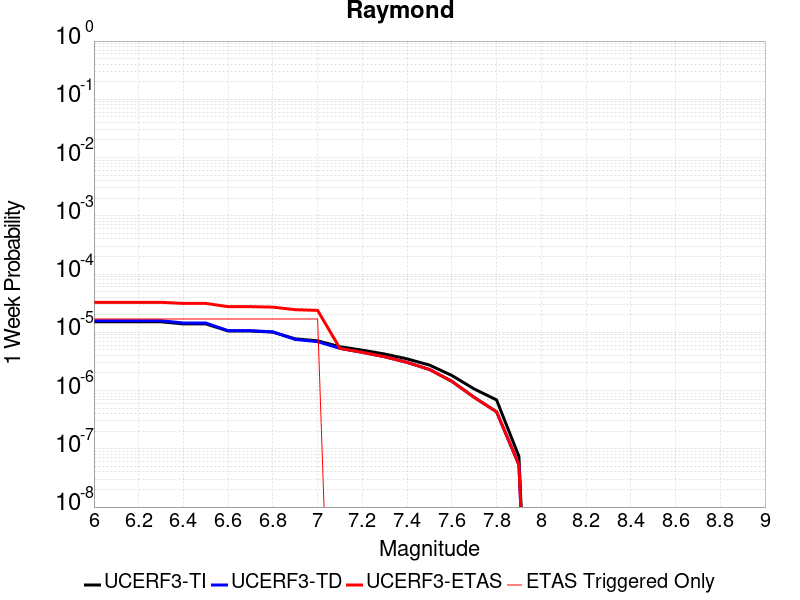 | 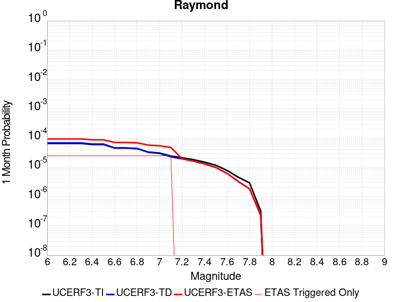 | 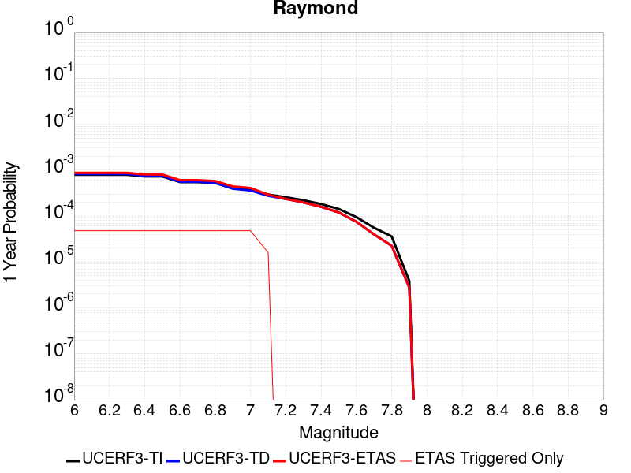 | 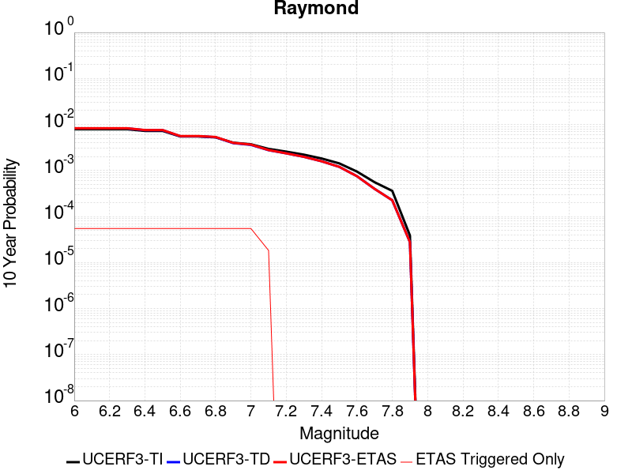 |

| Magnitude | 1 wk TI Prob | 1 wk TD Prob | 1 wk ETAS Prob | 1 wk ETAS/TD Gain | 1 wk ETAS Triggered Only | 1 mo TI Prob | 1 mo TD Prob | 1 mo ETAS Prob | 1 mo ETAS/TD Gain | 1 mo ETAS Triggered Only | 1 yr TI Prob | 1 yr TD Prob | 1 yr ETAS Prob | 1 yr ETAS/TD Gain | 1 yr ETAS Triggered Only | 10 yr TI Prob | 10 yr TD Prob | 10 yr ETAS Prob | 10 yr ETAS/TD Gain | 10 yr ETAS Triggered Only |
|-----|-----|-----|-----|-----|-----|-----|-----|-----|-----|-----|-----|-----|-----|-----|-----|-----|-----|-----|-----|-----|
| 6.0 | 1.5157413E-5 | 1.5810128E-5 | 1.5810128E-5 | 1.0 | 0.0 | 6.4958724E-5 | 6.7756075E-5 | 9.2371E-5 | 1.3632874 | 2.4616596E-5 | 7.905855E-4 | 8.2464307E-4 | 8.4923935E-4 | 1.0298266 | 2.4616596E-5 | 0.007877788 | 0.008218348 | 0.008242763 | 1.0029707 | 2.4616596E-5 |
| 6.1 | 1.5157413E-5 | 1.5810128E-5 | 1.5810128E-5 | 1.0 | 0.0 | 6.4958724E-5 | 6.7756075E-5 | 9.2371E-5 | 1.3632874 | 2.4616596E-5 | 7.905855E-4 | 8.2464307E-4 | 8.4923935E-4 | 1.0298266 | 2.4616596E-5 | 0.007877788 | 0.008218348 | 0.008242763 | 1.0029707 | 2.4616596E-5 |
| 6.2 | 1.5157413E-5 | 1.5810128E-5 | 1.5810128E-5 | 1.0 | 0.0 | 6.4958724E-5 | 6.7756075E-5 | 9.2371E-5 | 1.3632874 | 2.4616596E-5 | 7.905855E-4 | 8.2464307E-4 | 8.4923935E-4 | 1.0298266 | 2.4616596E-5 | 0.007877788 | 0.008218348 | 0.008242763 | 1.0029707 | 2.4616596E-5 |
| 6.3 | 1.5157413E-5 | 1.5810128E-5 | 1.5810128E-5 | 1.0 | 0.0 | 6.4958724E-5 | 6.7756075E-5 | 9.2371E-5 | 1.3632874 | 2.4616596E-5 | 7.905855E-4 | 8.2464307E-4 | 8.4923935E-4 | 1.0298266 | 2.4616596E-5 | 0.007877788 | 0.008218348 | 0.008242763 | 1.0029707 | 2.4616596E-5 |
| 6.4 | 1.3941944E-5 | 1.445469E-5 | 1.445469E-5 | 1.0 | 0.0 | 5.9749822E-5 | 6.1947336E-5 | 8.656241E-5 | 1.3973548 | 2.4616596E-5 | 7.2721124E-4 | 7.5397117E-4 | 7.785692E-4 | 1.0326246 | 2.4616596E-5 | 0.007248361 | 0.0075164647 | 0.0075408965 | 1.0032504 | 2.4616596E-5 |
| 6.5 | 1.3941944E-5 | 1.445469E-5 | 1.445469E-5 | 1.0 | 0.0 | 5.9749822E-5 | 6.1947336E-5 | 8.656241E-5 | 1.3973548 | 2.4616596E-5 | 7.2721124E-4 | 7.5397117E-4 | 7.785692E-4 | 1.0326246 | 2.4616596E-5 | 0.007248361 | 0.0075164647 | 0.0075408965 | 1.0032504 | 2.4616596E-5 |
| 6.6 | 1.0542609E-5 | 1.0671113E-5 | 1.0671113E-5 | 1.0 | 0.0 | 4.5181827E-5 | 4.573257E-5 | 7.034804E-5 | 1.5382482 | 2.4616596E-5 | 5.499499E-4 | 5.5665727E-4 | 5.8126013E-4 | 1.0441976 | 2.4616596E-5 | 0.005485909 | 0.00555319 | 0.00557767 | 1.0044082 | 2.4616596E-5 |
| 6.7 | 1.0542609E-5 | 1.0671113E-5 | 1.0671113E-5 | 1.0 | 0.0 | 4.5181827E-5 | 4.573257E-5 | 7.034804E-5 | 1.5382482 | 2.4616596E-5 | 5.499499E-4 | 5.5665727E-4 | 5.8126013E-4 | 1.0441976 | 2.4616596E-5 | 0.005485909 | 0.00555319 | 0.00557767 | 1.0044082 | 2.4616596E-5 |
| 6.8 | 1.0079132E-5 | 1.0176646E-5 | 1.0176646E-5 | 1.0 | 0.0 | 4.3195567E-5 | 4.3613498E-5 | 6.822902E-5 | 1.5644015 | 2.4616596E-5 | 5.257791E-4 | 5.3087034E-4 | 5.5547385E-4 | 1.0463456 | 2.4616596E-5 | 0.0052453685 | 0.005296571 | 0.0053210575 | 1.004623 | 2.4616596E-5 |
| 6.9 | 7.721598E-6 | 7.5489047E-6 | 7.5489047E-6 | 1.0 | 0.0 | 3.3092143E-5 | 3.2352054E-5 | 5.6967856E-5 | 1.7608728 | 2.4616596E-5 | 4.0282236E-4 | 3.9381627E-4 | 4.1842318E-4 | 1.0624832 | 2.4616596E-5 | 0.0040209293 | 0.0039313175 | 0.0039558373 | 1.006237 | 2.4616596E-5 |
| 7.0 | 7.137566E-6 | 6.9113057E-6 | 6.9113057E-6 | 1.0 | 0.0 | 3.058921E-5 | 2.961955E-5 | 5.4235417E-5 | 1.8310683 | 2.4616596E-5 | 3.7236E-4 | 3.6055944E-4 | 3.8516716E-4 | 1.0682487 | 2.4616596E-5 | 0.0037173668 | 0.0035998628 | 0.0036243908 | 1.0068136 | 2.4616596E-5 |
| 7.1 | 5.654976E-6 | 5.29954E-6 | 5.29954E-6 | 1.0 | 0.0 | 2.4235387E-5 | 2.2712118E-5 | 4.7328154E-5 | 2.0838282 | 2.4616596E-5 | 2.9502588E-4 | 2.7648517E-4 | 3.0109496E-4 | 1.0890094 | 2.4616596E-5 | 0.0029463451 | 0.002761443 | 0.0027859916 | 1.0088898 | 2.4616596E-5 |
| 7.2 | 4.9358455E-6 | 4.5266574E-6 | 4.5266574E-6 | 1.0 | 0.0 | 2.1153453E-5 | 1.9399817E-5 | 1.9399817E-5 | 1.0 | 0.0 | 2.5751285E-4 | 2.3616731E-4 | 2.3616731E-4 | 1.0 | 0.0 | 0.0025721465 | 0.0023591854 | 0.0023591854 | 1.0 | 0.0 |
| 7.3 | 4.2368597E-6 | 3.8056164E-6 | 3.8056164E-6 | 1.0 | 0.0 | 1.8157843E-5 | 1.6309683E-5 | 1.6309683E-5 | 1.0 | 0.0 | 2.2104931E-4 | 1.9855241E-4 | 1.9855241E-4 | 1.0 | 0.0 | 0.0022082955 | 0.0019837688 | 0.0019837688 | 1.0 | 0.0 |
| 7.4 | 3.4999923E-6 | 3.043744E-6 | 3.043744E-6 | 1.0 | 0.0 | 1.49998805E-5 | 1.3044552E-5 | 1.3044552E-5 | 1.0 | 0.0 | 1.8260824E-4 | 1.5880594E-4 | 1.5880594E-4 | 1.0 | 0.0 | 0.0018245826 | 0.0015869403 | 0.0015869403 | 1.0 | 0.0 |
| 7.5 | 2.738017E-6 | 2.3020468E-6 | 2.3020468E-6 | 1.0 | 0.0 | 1.1734306E-5 | 9.865878E-6 | 9.865878E-6 | 1.0 | 0.0 | 1.428558E-4 | 1.2011051E-4 | 1.2011051E-4 | 1.0 | 0.0 | 0.0014276401 | 0.0012004703 | 0.0012004703 | 1.0 | 0.0 |
| 7.6 | 1.8186392E-6 | 1.442312E-6 | 1.442312E-6 | 1.0 | 0.0 | 7.794145E-6 | 6.181323E-6 | 6.181323E-6 | 1.0 | 0.0 | 9.488958E-5 | 7.5255055E-5 | 7.5255055E-5 | 1.0 | 0.0 | 9.4849075E-4 | 7.523072E-4 | 7.523072E-4 | 1.0 | 0.0 |
| 7.7 | 1.0660348E-6 | 7.6438056E-7 | 7.6438056E-7 | 1.0 | 0.0 | 4.5687125E-6 | 3.2759126E-6 | 3.2759126E-6 | 1.0 | 0.0 | 5.5622655E-5 | 3.9883522E-5 | 3.9883522E-5 | 1.0 | 0.0 | 5.5608735E-4 | 3.9877277E-4 | 3.9877277E-4 | 1.0 | 0.0 |
| 7.8 | 6.913602E-7 | 4.3204133E-7 | 4.3204133E-7 | 1.0 | 0.0 | 2.962969E-6 | 1.8516045E-6 | 1.8516045E-6 | 1.0 | 0.0 | 3.607355E-5 | 2.2543056E-5 | 2.2543056E-5 | 1.0 | 0.0 | 3.6067693E-4 | 2.2541556E-4 | 2.2541556E-4 | 1.0 | 0.0 |
| 7.9 | 7.425201E-8 | 5.3222113E-8 | 5.3222113E-8 | 1.0 | 0.0 | 3.1822285E-7 | 2.2809476E-7 | 2.2809476E-7 | 1.0 | 0.0 | 3.874356E-6 | 2.7770516E-6 | 2.7770516E-6 | 1.0 | 0.0 | 3.8742884E-5 | 2.7770298E-5 | 2.7770298E-5 | 1.0 | 0.0 |

## San Jacinto (Superstition Mtn)
*[(top)](#table-of-contents)*

| 1 Week | 1 Month | 1 Year | 10 Year |
|-----|-----|-----|-----|
| 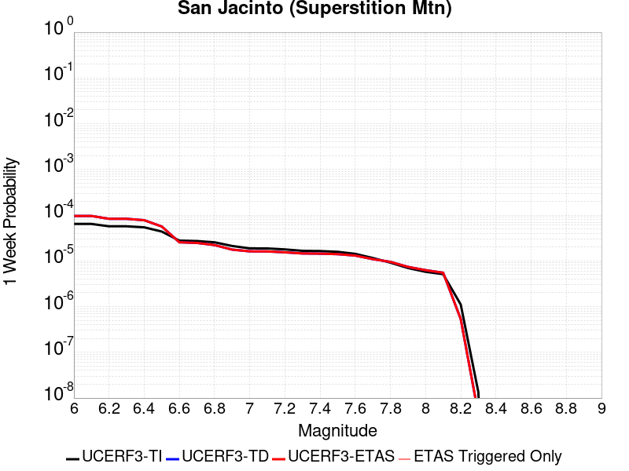 |  | 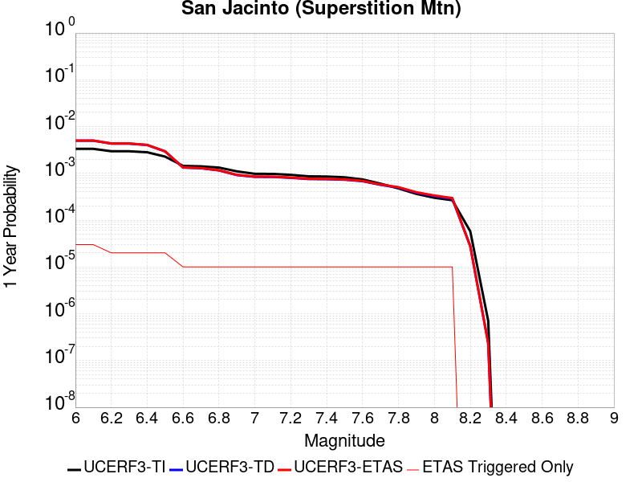 | 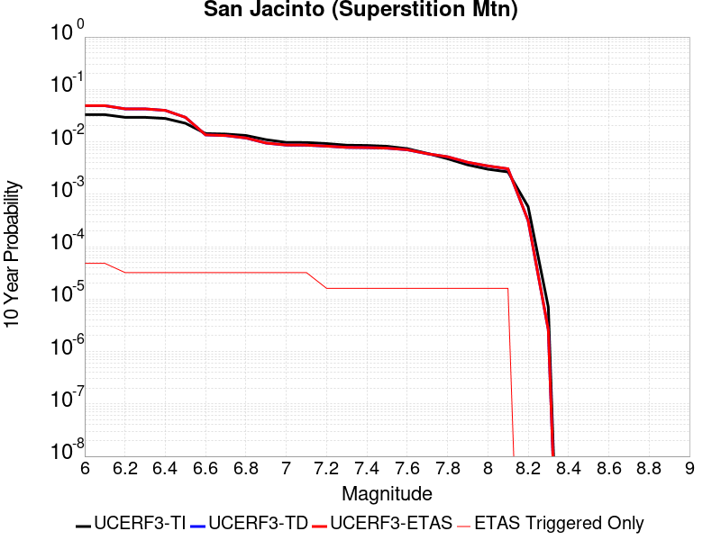 |

| Magnitude | 1 wk TI Prob | 1 wk TD Prob | 1 wk ETAS Prob | 1 wk ETAS/TD Gain | 1 wk ETAS Triggered Only | 1 mo TI Prob | 1 mo TD Prob | 1 mo ETAS Prob | 1 mo ETAS/TD Gain | 1 mo ETAS Triggered Only | 1 yr TI Prob | 1 yr TD Prob | 1 yr ETAS Prob | 1 yr ETAS/TD Gain | 1 yr ETAS Triggered Only | 10 yr TI Prob | 10 yr TD Prob | 10 yr ETAS Prob | 10 yr ETAS/TD Gain | 10 yr ETAS Triggered Only |
|-----|-----|-----|-----|-----|-----|-----|-----|-----|-----|-----|-----|-----|-----|-----|-----|-----|-----|-----|-----|-----|
| 6.0 | 6.4193904E-5 | 9.599367E-5 | 9.599367E-5 | 1.0 | 0.0 | 2.7508775E-4 | 4.1134638E-4 | 4.3595282E-4 | 1.0598193 | 2.4616596E-5 | 0.0033440501 | 0.0049980893 | 0.005022583 | 1.0049006 | 2.4616596E-5 | 0.03294174 | 0.048823986 | 0.0488474 | 1.0004796 | 2.4616596E-5 |
| 6.1 | 6.4193904E-5 | 9.599367E-5 | 9.599367E-5 | 1.0 | 0.0 | 2.7508775E-4 | 4.1134638E-4 | 4.3595282E-4 | 1.0598193 | 2.4616596E-5 | 0.0033440501 | 0.0049980893 | 0.005022583 | 1.0049006 | 2.4616596E-5 | 0.03294174 | 0.048823986 | 0.0488474 | 1.0004796 | 2.4616596E-5 |
| 6.2 | 5.7023593E-5 | 8.3144434E-5 | 8.3144434E-5 | 1.0 | 0.0 | 2.4436394E-4 | 3.5629404E-4 | 3.8090185E-4 | 1.069066 | 2.4616596E-5 | 0.002971072 | 0.0043308944 | 0.0043554045 | 1.0056593 | 2.4616596E-5 | 0.029316625 | 0.04250403 | 0.0425276 | 1.0005546 | 2.4616596E-5 |
| 6.3 | 5.6940098E-5 | 8.298979E-5 | 8.298979E-5 | 1.0 | 0.0 | 2.4400617E-4 | 3.5563146E-4 | 3.802393E-4 | 1.0691948 | 2.4616596E-5 | 0.002966728 | 0.00432286 | 0.00434737 | 1.00567 | 2.4616596E-5 | 0.029274331 | 0.042427283 | 0.042450856 | 1.0005556 | 2.4616596E-5 |
| 6.4 | 5.4171585E-5 | 7.7483564E-5 | 7.7483564E-5 | 1.0 | 0.0 | 2.3214328E-4 | 3.3203943E-4 | 3.5664786E-4 | 1.0741129 | 2.4616596E-5 | 0.0028226813 | 0.0040367353 | 0.0040612523 | 1.0060735 | 2.4616596E-5 | 0.02787096 | 0.03971653 | 0.03974017 | 1.0005952 | 2.4616596E-5 |
| 6.5 | 4.375144E-5 | 5.642133E-5 | 5.642133E-5 | 1.0 | 0.0 | 1.874927E-4 | 2.4178992E-4 | 2.6640057E-4 | 1.1017852 | 2.4616596E-5 | 0.0022803338 | 0.002940994 | 0.002965538 | 1.0083456 | 2.4616596E-5 | 0.022570757 | 0.029236801 | 0.029260699 | 1.0008173 | 2.4616596E-5 |
| 6.6 | 2.772192E-5 | 2.5488358E-5 | 2.5488358E-5 | 1.0 | 0.0 | 1.1880282E-4 | 1.09231354E-4 | 1.3384526E-4 | 1.2253374 | 2.4616596E-5 | 0.0014454646 | 0.0013290998 | 0.0013536836 | 1.0184966 | 2.4616596E-5 | 0.014360986 | 0.01354049 | 0.013564773 | 1.0017934 | 2.4616596E-5 |
| 6.7 | 2.7124124E-5 | 2.4699386E-5 | 2.4699386E-5 | 1.0 | 0.0 | 1.1624106E-4 | 1.05850326E-4 | 1.3046432E-4 | 1.2325358 | 2.4616596E-5 | 0.0014143161 | 0.001287985 | 0.00131257 | 1.0190879 | 2.4616596E-5 | 0.014053487 | 0.013133943 | 0.013158237 | 1.0018497 | 2.4616596E-5 |
| 6.8 | 2.5475807E-5 | 2.216446E-5 | 2.216446E-5 | 1.0 | 0.0 | 1.0917746E-4 | 9.4987154E-5 | 1.1960141E-4 | 1.2591325 | 2.4616596E-5 | 0.001328425 | 0.001155867 | 0.0011804551 | 1.0212724 | 2.4616596E-5 | 0.0132051185 | 0.011822182 | 0.011846507 | 1.0020577 | 2.4616596E-5 |
| 6.9 | 2.1162023E-5 | 1.7626244E-5 | 1.7626244E-5 | 1.0 | 0.0 | 9.069123E-5 | 7.5538876E-5 | 1.00153615E-4 | 1.3258553 | 2.4616596E-5 | 0.0011036064 | 9.193016E-4 | 9.4389555E-4 | 1.0267528 | 2.4616596E-5 | 0.010981417 | 0.00944688 | 0.009471264 | 1.0025811 | 2.4616596E-5 |
| 7.0 | 1.8754288E-5 | 1.6161559E-5 | 1.6161559E-5 | 1.0 | 0.0 | 8.037304E-5 | 6.9261994E-5 | 9.3876886E-5 | 1.3553882 | 2.4616596E-5 | 9.781026E-4 | 8.4294105E-4 | 8.675369E-4 | 1.0291786 | 2.4616596E-5 | 0.009738087 | 0.008670042 | 0.008694446 | 1.0028147 | 2.4616596E-5 |
| 7.1 | 1.8678527E-5 | 1.6086702E-5 | 1.6086702E-5 | 1.0 | 0.0 | 8.0048376E-5 | 6.89412E-5 | 9.35561E-5 | 1.357042 | 2.4616596E-5 | 9.7415317E-4 | 8.3903834E-4 | 8.636343E-4 | 1.0293144 | 2.4616596E-5 | 0.009698939 | 0.008630998 | 0.008655402 | 1.0028275 | 2.4616596E-5 |
| 7.2 | 1.7804578E-5 | 1.5381282E-5 | 1.5381282E-5 | 1.0 | 0.0 | 7.6303106E-5 | 6.5918124E-5 | 9.0533096E-5 | 1.3734174 | 2.4616596E-5 | 9.285943E-4 | 8.022599E-4 | 8.2685676E-4 | 1.0306594 | 2.4616596E-5 | 0.009247236 | 0.008262311 | 0.008286725 | 1.0029547 | 2.4616596E-5 |
| 7.3 | 1.6583685E-5 | 1.4530388E-5 | 1.4530388E-5 | 1.0 | 0.0 | 7.1070994E-5 | 6.227162E-5 | 8.688668E-5 | 1.3952855 | 2.4616596E-5 | 8.649459E-4 | 7.5789524E-4 | 7.8249315E-4 | 1.0324556 | 2.4616596E-5 | 0.00861587 | 0.007817623 | 0.007842048 | 1.0031242 | 2.4616596E-5 |
| 7.4 | 1.6387552E-5 | 1.4395274E-5 | 1.4395274E-5 | 1.0 | 0.0 | 7.023047E-5 | 6.169258E-5 | 8.6307664E-5 | 1.3989958 | 2.4616596E-5 | 8.5472054E-4 | 7.5085036E-4 | 7.7544845E-4 | 1.0327604 | 2.4616596E-5 | 0.008514405 | 0.0077470057 | 0.007771432 | 1.003153 | 2.4616596E-5 |
| 7.5 | 1.5790754E-5 | 1.4035962E-5 | 1.4035962E-5 | 1.0 | 0.0 | 6.767291E-5 | 6.0152746E-5 | 8.476786E-5 | 1.4092102 | 2.4616596E-5 | 8.236062E-4 | 7.321156E-4 | 7.5671414E-4 | 1.0335993 | 2.4616596E-5 | 0.008205604 | 0.007557569 | 0.0075819995 | 1.0032326 | 2.4616596E-5 |
| 7.6 | 1.4248672E-5 | 1.3054932E-5 | 1.3054932E-5 | 1.0 | 0.0 | 6.106431E-5 | 5.594852E-5 | 8.056374E-5 | 1.4399619 | 2.4616596E-5 | 7.432043E-4 | 6.8096205E-4 | 7.055619E-4 | 1.0361251 | 2.4616596E-5 | 0.007407237 | 0.0070401574 | 0.0070646005 | 1.003472 | 2.4616596E-5 |
| 7.7 | 1.15449975E-5 | 1.090368E-5 | 1.090368E-5 | 1.0 | 0.0 | 4.947762E-5 | 4.6729223E-5 | 7.134467E-5 | 1.5267677 | 2.4616596E-5 | 6.022235E-4 | 5.687805E-4 | 5.9338316E-4 | 1.043255 | 2.4616596E-5 | 0.006005941 | 0.0059101824 | 0.0059346533 | 1.0041405 | 2.4616596E-5 |
| 7.8 | 9.1391985E-6 | 9.514299E-6 | 9.514299E-6 | 1.0 | 0.0 | 3.9167408E-5 | 4.0774932E-5 | 6.539052E-5 | 1.6036943 | 2.4616596E-5 | 4.767588E-4 | 4.963223E-4 | 5.2092667E-4 | 1.0495734 | 2.4616596E-5 | 0.0047573727 | 0.0051766867 | 0.005201176 | 1.0047307 | 2.4616596E-5 |
| 7.9 | 6.973017E-6 | 7.3821784E-6 | 7.3821784E-6 | 1.0 | 0.0 | 2.9884017E-5 | 3.1637526E-5 | 5.6253346E-5 | 1.7780576 | 2.4616596E-5 | 3.6377716E-4 | 3.8511935E-4 | 4.0972646E-4 | 1.0638947 | 2.4616596E-5 | 0.0036318225 | 0.0040517948 | 0.0040763114 | 1.0060508 | 2.4616596E-5 |
| 8.0 | 5.7638235E-6 | 6.259972E-6 | 6.259972E-6 | 1.0 | 0.0 | 2.4701867E-5 | 2.6828178E-5 | 5.1444113E-5 | 1.9175403 | 2.4616596E-5 | 3.0070372E-4 | 3.2658462E-4 | 3.5119316E-4 | 1.0753512 | 2.4616596E-5 | 0.0030029714 | 0.0034534496 | 0.003477981 | 1.0071034 | 2.4616596E-5 |
| 8.1 | 5.1124434E-6 | 5.4956718E-6 | 5.4956718E-6 | 1.0 | 0.0 | 2.1910288E-5 | 2.355267E-5 | 4.8168684E-5 | 2.0451477 | 2.4616596E-5 | 2.6672508E-4 | 2.867165E-4 | 3.1132603E-4 | 1.0858324 | 2.4616596E-5 | 0.0026640517 | 0.003040336 | 0.0030648778 | 1.008072 | 2.4616596E-5 |
| 8.2 | 1.1075938E-6 | 5.336568E-7 | 5.336568E-7 | 1.0 | 0.0 | 4.7468216E-6 | 2.2870988E-6 | 2.2870988E-6 | 1.0 | 0.0 | 5.779102E-5 | 2.7845093E-5 | 2.7845093E-5 | 1.0 | 0.0 | 5.777599E-4 | 3.1346595E-4 | 3.1346595E-4 | 1.0 | 0.0 |
| 8.3 | 1.3584393E-8 | 4.473836E-9 | 4.473836E-9 | 1.0 | 0.0 | 5.8218827E-8 | 1.9173582E-8 | 1.9173582E-8 | 1.0 | 0.0 | 7.0881396E-7 | 2.3343837E-7 | 2.3343837E-7 | 1.0 | 0.0 | 7.0881174E-6 | 2.6163038E-6 | 2.6163038E-6 | 1.0 | 0.0 |

## Santa Monica alt 1
*[(top)](#table-of-contents)*

| 1 Week | 1 Month | 1 Year | 10 Year |
|-----|-----|-----|-----|
|  | 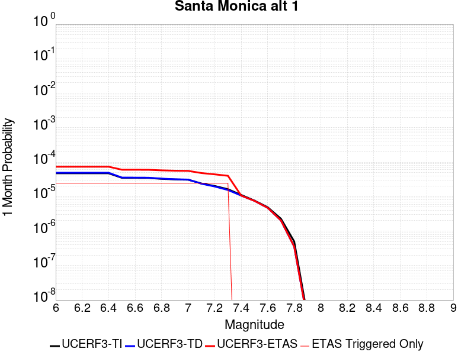 | 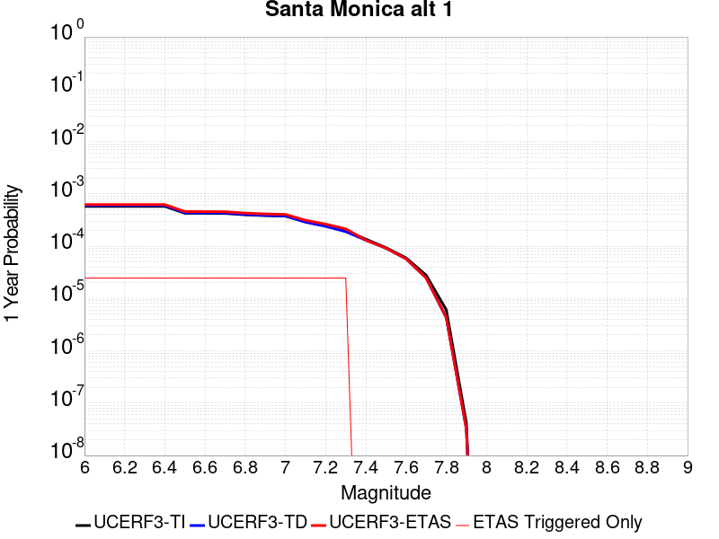 | 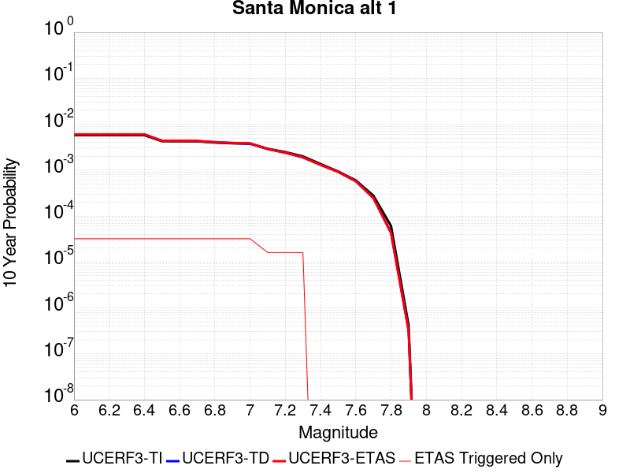 |

| Magnitude | 1 wk TI Prob | 1 wk TD Prob | 1 wk ETAS Prob | 1 wk ETAS/TD Gain | 1 wk ETAS Triggered Only | 1 mo TI Prob | 1 mo TD Prob | 1 mo ETAS Prob | 1 mo ETAS/TD Gain | 1 mo ETAS Triggered Only | 1 yr TI Prob | 1 yr TD Prob | 1 yr ETAS Prob | 1 yr ETAS/TD Gain | 1 yr ETAS Triggered Only | 10 yr TI Prob | 10 yr TD Prob | 10 yr ETAS Prob | 10 yr ETAS/TD Gain | 10 yr ETAS Triggered Only |
|-----|-----|-----|-----|-----|-----|-----|-----|-----|-----|-----|-----|-----|-----|-----|-----|-----|-----|-----|-----|-----|
| 6.0 | 1.1066008E-5 | 1.148031E-5 | 3.6096622E-5 | 3.1442204 | 2.4616596E-5 | 4.742488E-5 | 4.920048E-5 | 7.381586E-5 | 1.5003078 | 2.4616596E-5 | 5.7724497E-4 | 5.9886515E-4 | 6.2346697E-4 | 1.0410808 | 2.4616596E-5 | 0.005757478 | 0.0059739 | 0.00599837 | 1.004096 | 2.4616596E-5 |
| 6.1 | 1.1066008E-5 | 1.148031E-5 | 3.6096622E-5 | 3.1442204 | 2.4616596E-5 | 4.742488E-5 | 4.920048E-5 | 7.381586E-5 | 1.5003078 | 2.4616596E-5 | 5.7724497E-4 | 5.9886515E-4 | 6.2346697E-4 | 1.0410808 | 2.4616596E-5 | 0.005757478 | 0.0059739 | 0.00599837 | 1.004096 | 2.4616596E-5 |
| 6.2 | 1.1066008E-5 | 1.148031E-5 | 3.6096622E-5 | 3.1442204 | 2.4616596E-5 | 4.742488E-5 | 4.920048E-5 | 7.381586E-5 | 1.5003078 | 2.4616596E-5 | 5.7724497E-4 | 5.9886515E-4 | 6.2346697E-4 | 1.0410808 | 2.4616596E-5 | 0.005757478 | 0.0059739 | 0.00599837 | 1.004096 | 2.4616596E-5 |
| 6.3 | 1.1066008E-5 | 1.148031E-5 | 3.6096622E-5 | 3.1442204 | 2.4616596E-5 | 4.742488E-5 | 4.920048E-5 | 7.381586E-5 | 1.5003078 | 2.4616596E-5 | 5.7724497E-4 | 5.9886515E-4 | 6.2346697E-4 | 1.0410808 | 2.4616596E-5 | 0.005757478 | 0.0059739 | 0.00599837 | 1.004096 | 2.4616596E-5 |
| 6.4 | 1.1066008E-5 | 1.148031E-5 | 3.6096622E-5 | 3.1442204 | 2.4616596E-5 | 4.742488E-5 | 4.920048E-5 | 7.381586E-5 | 1.5003078 | 2.4616596E-5 | 5.7724497E-4 | 5.9886515E-4 | 6.2346697E-4 | 1.0410808 | 2.4616596E-5 | 0.005757478 | 0.0059739 | 0.00599837 | 1.004096 | 2.4616596E-5 |
| 6.5 | 8.183544E-6 | 8.335432E-6 | 3.2951823E-5 | 3.9532235 | 2.4616596E-5 | 3.5071862E-5 | 3.57228E-5 | 6.0338512E-5 | 1.6890758 | 2.4616596E-5 | 4.2691626E-4 | 4.3483984E-4 | 4.5944573E-4 | 1.0565861 | 2.4616596E-5 | 0.0042609703 | 0.0043400554 | 0.0043645655 | 1.0056473 | 2.4616596E-5 |
| 6.6 | 8.1543285E-6 | 8.303646E-6 | 3.2920037E-5 | 3.9645283 | 2.4616596E-5 | 3.4946657E-5 | 3.5586578E-5 | 6.0202296E-5 | 1.6917137 | 2.4616596E-5 | 4.2539247E-4 | 4.3318202E-4 | 4.5778797E-4 | 1.0568027 | 2.4616596E-5 | 0.0042457907 | 0.004323542 | 0.004348052 | 1.005669 | 2.4616596E-5 |
| 6.7 | 8.110878E-6 | 8.257042E-6 | 3.2873435E-5 | 3.9812603 | 2.4616596E-5 | 3.4760444E-5 | 3.5386853E-5 | 6.0002578E-5 | 1.6956178 | 2.4616596E-5 | 4.231262E-4 | 4.3075136E-4 | 4.5535734E-4 | 1.0571234 | 2.4616596E-5 | 0.0042232145 | 0.0042993296 | 0.00432384 | 1.0057011 | 2.4616596E-5 |
| 6.8 | 7.644036E-6 | 7.75106E-6 | 3.2367465E-5 | 4.1758757 | 2.4616596E-5 | 3.275974E-5 | 3.3218414E-5 | 5.7834193E-5 | 1.7410281 | 2.4616596E-5 | 3.9877684E-4 | 4.0436056E-4 | 4.289672E-4 | 1.0608532 | 2.4616596E-5 | 0.00398062 | 0.0040363944 | 0.0040609115 | 1.0060741 | 2.4616596E-5 |
| 6.9 | 7.3698293E-6 | 7.455719E-6 | 3.2072134E-5 | 4.301682 | 2.4616596E-5 | 3.15846E-5 | 3.19527E-5 | 5.6568508E-5 | 1.7703829 | 2.4616596E-5 | 3.8447464E-4 | 3.8895605E-4 | 4.1356307E-4 | 1.0632643 | 2.4616596E-5 | 0.0038381014 | 0.0038828964 | 0.0039074174 | 1.0063151 | 2.4616596E-5 |
| 7.0 | 7.209872E-6 | 7.2856255E-6 | 3.1902044E-5 | 4.378765 | 2.4616596E-5 | 3.0899086E-5 | 3.1223743E-5 | 5.5839573E-5 | 1.7883688 | 2.4616596E-5 | 3.7613141E-4 | 3.8008415E-4 | 4.046914E-4 | 1.0647416 | 2.4616596E-5 | 0.0037549543 | 0.0037944836 | 0.0038190067 | 1.0064628 | 2.4616596E-5 |
| 7.1 | 5.603456E-6 | 5.5238925E-6 | 3.0140352E-5 | 5.4563613 | 2.4616596E-5 | 2.4014591E-5 | 2.3673612E-5 | 4.8289625E-5 | 2.039808 | 2.4616596E-5 | 2.923384E-4 | 2.881885E-4 | 3.12798E-4 | 1.0853938 | 2.4616596E-5 | 0.0029195412 | 0.0028781896 | 0.0029027353 | 1.0085282 | 2.4616596E-5 |
| 7.2 | 4.7483613E-6 | 4.5911324E-6 | 2.9207617E-5 | 6.3617454 | 2.4616596E-5 | 2.0349962E-5 | 1.9676136E-5 | 4.4292246E-5 | 2.2510643 | 2.4616596E-5 | 2.4773262E-4 | 2.3953074E-4 | 2.6414145E-4 | 1.1027455 | 2.4616596E-5 | 0.0024745662 | 0.0023927398 | 0.0024172976 | 1.0102634 | 2.4616596E-5 |
| 7.3 | 3.829015E-6 | 3.6342253E-6 | 2.8250732E-5 | 7.7735224 | 2.4616596E-5 | 1.6409962E-5 | 1.5575159E-5 | 4.019137E-5 | 2.5804791 | 2.4616596E-5 | 1.9977297E-4 | 1.8961114E-4 | 2.1422307E-4 | 1.1298021 | 2.4616596E-5 | 0.0019959346 | 0.0018945024 | 0.0019190724 | 1.0129691 | 2.4616596E-5 |
| 7.4 | 2.610755E-6 | 2.4995716E-6 | 2.4995716E-6 | 1.0 | 0.0 | 1.1188902E-5 | 1.0712406E-5 | 1.0712406E-5 | 1.0 | 0.0 | 1.3621636E-4 | 1.3041578E-4 | 1.3041578E-4 | 1.0 | 0.0 | 0.001361329 | 0.0013033969 | 0.0013033969 | 1.0 | 0.0 |
| 7.5 | 1.792146E-6 | 1.7584184E-6 | 1.7584184E-6 | 1.0 | 0.0 | 7.680603E-6 | 7.536057E-6 | 7.536057E-6 | 1.0 | 0.0 | 9.3507326E-5 | 9.1747665E-5 | 9.1747665E-5 | 1.0 | 0.0 | 9.3467993E-4 | 9.1710105E-4 | 9.1710105E-4 | 1.0 | 0.0 |
| 7.6 | 1.1473018E-6 | 1.1029152E-6 | 1.1029152E-6 | 1.0 | 0.0 | 4.9169985E-6 | 4.726771E-6 | 4.726771E-6 | 1.0 | 0.0 | 5.986281E-5 | 5.7546935E-5 | 5.7546935E-5 | 1.0 | 0.0 | 5.984669E-4 | 5.7532196E-4 | 5.7532196E-4 | 1.0 | 0.0 |
| 7.7 | 5.330919E-7 | 4.7452556E-7 | 4.7452556E-7 | 1.0 | 0.0 | 2.2846775E-6 | 2.0336795E-6 | 2.0336795E-6 | 1.0 | 0.0 | 2.7815593E-5 | 2.4759778E-5 | 2.4759778E-5 | 1.0 | 0.0 | 2.7812112E-4 | 2.4757133E-4 | 2.4757133E-4 | 1.0 | 0.0 |
| 7.8 | 1.1668574E-7 | 8.2966224E-8 | 8.2966224E-8 | 1.0 | 0.0 | 5.000816E-7 | 3.5556948E-7 | 3.5556948E-7 | 1.0 | 0.0 | 6.0884768E-6 | 4.32905E-6 | 4.32905E-6 | 1.0 | 0.0 | 6.08831E-5 | 4.3289692E-5 | 4.3289692E-5 | 1.0 | 0.0 |
| 7.9 | 8.007447E-10 | 6.1608785E-10 | 6.1608785E-10 | 1.0 | 0.0 | 3.4317629E-9 | 2.6403764E-9 | 2.6403764E-9 | 1.0 | 0.0 | 4.1781714E-8 | 3.2146584E-8 | 3.2146584E-8 | 1.0 | 0.0 | 4.1781706E-7 | 3.214658E-7 | 3.214658E-7 | 1.0 | 0.0 |

## Blue Cut
*[(top)](#table-of-contents)*

| 1 Week | 1 Month | 1 Year | 10 Year |
|-----|-----|-----|-----|
| 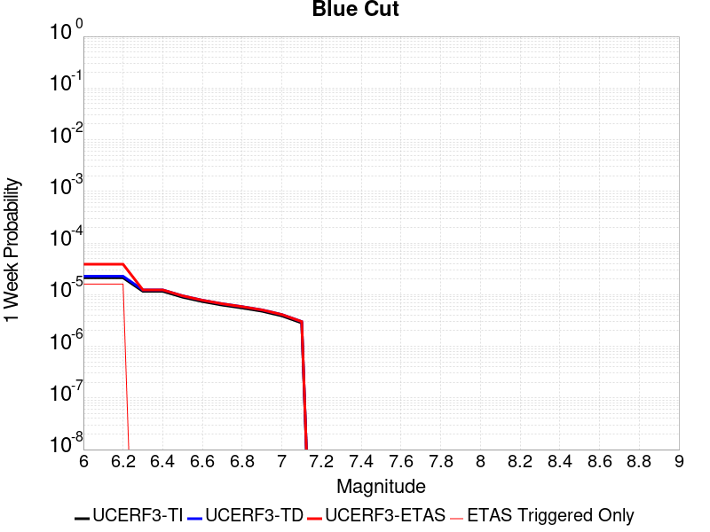 | 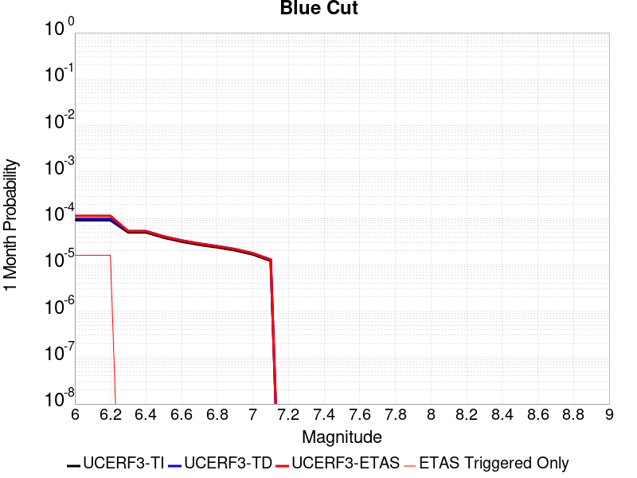 | 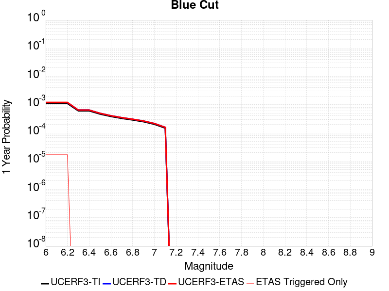 | 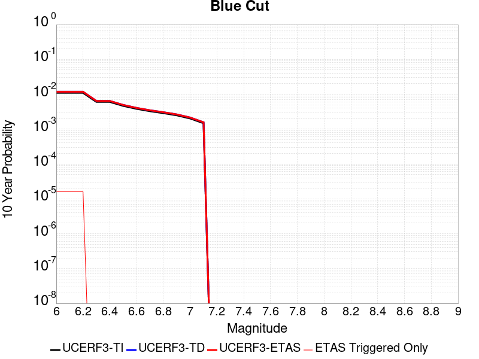 |

| Magnitude | 1 wk TI Prob | 1 wk TD Prob | 1 wk ETAS Prob | 1 wk ETAS/TD Gain | 1 wk ETAS Triggered Only | 1 mo TI Prob | 1 mo TD Prob | 1 mo ETAS Prob | 1 mo ETAS/TD Gain | 1 mo ETAS Triggered Only | 1 yr TI Prob | 1 yr TD Prob | 1 yr ETAS Prob | 1 yr ETAS/TD Gain | 1 yr ETAS Triggered Only | 10 yr TI Prob | 10 yr TD Prob | 10 yr ETAS Prob | 10 yr ETAS/TD Gain | 10 yr ETAS Triggered Only |
|-----|-----|-----|-----|-----|-----|-----|-----|-----|-----|-----|-----|-----|-----|-----|-----|-----|-----|-----|-----|-----|
| 6.0 | 2.1227985E-5 | 2.2719574E-5 | 4.7335612E-5 | 2.0834727 | 2.4616596E-5 | 9.097391E-5 | 9.73663E-5 | 1.219805E-4 | 1.2528 | 2.4616596E-5 | 0.0011070445 | 0.0011848481 | 0.0012094355 | 1.0207516 | 2.4616596E-5 | 0.011015458 | 0.011791152 | 0.011815478 | 1.0020632 | 2.4616596E-5 |
| 6.1 | 2.1227985E-5 | 2.2719574E-5 | 4.7335612E-5 | 2.0834727 | 2.4616596E-5 | 9.097391E-5 | 9.73663E-5 | 1.219805E-4 | 1.2528 | 2.4616596E-5 | 0.0011070445 | 0.0011848481 | 0.0012094355 | 1.0207516 | 2.4616596E-5 | 0.011015458 | 0.011791152 | 0.011815478 | 1.0020632 | 2.4616596E-5 |
| 6.2 | 2.1227985E-5 | 2.2719574E-5 | 4.7335612E-5 | 2.0834727 | 2.4616596E-5 | 9.097391E-5 | 9.73663E-5 | 1.219805E-4 | 1.2528 | 2.4616596E-5 | 0.0011070445 | 0.0011848481 | 0.0012094355 | 1.0207516 | 2.4616596E-5 | 0.011015458 | 0.011791152 | 0.011815478 | 1.0020632 | 2.4616596E-5 |
| 6.3 | 1.1613981E-5 | 1.2353542E-5 | 1.2353542E-5 | 1.0 | 0.0 | 4.9773254E-5 | 5.2942745E-5 | 5.2942745E-5 | 1.0 | 0.0 | 6.0582085E-4 | 6.443998E-4 | 6.443998E-4 | 1.0 | 0.0 | 0.0060417196 | 0.0064265593 | 0.0064265593 | 1.0 | 0.0 |
| 6.4 | 1.1613981E-5 | 1.2353542E-5 | 1.2353542E-5 | 1.0 | 0.0 | 4.9773254E-5 | 5.2942745E-5 | 5.2942745E-5 | 1.0 | 0.0 | 6.0582085E-4 | 6.443998E-4 | 6.443998E-4 | 1.0 | 0.0 | 0.0060417196 | 0.0064265593 | 0.0064265593 | 1.0 | 0.0 |
| 6.5 | 8.931326E-6 | 9.4816E-6 | 9.4816E-6 | 1.0 | 0.0 | 3.8276554E-5 | 4.0634844E-5 | 4.0634844E-5 | 1.0 | 0.0 | 4.6591737E-4 | 4.946261E-4 | 4.946261E-4 | 1.0 | 0.0 | 0.0046494175 | 0.004936161 | 0.004936161 | 1.0 | 0.0 |
| 6.6 | 7.345353E-6 | 7.79028E-6 | 7.79028E-6 | 1.0 | 0.0 | 3.1479703E-5 | 3.338653E-5 | 3.338653E-5 | 1.0 | 0.0 | 3.83198E-4 | 4.064132E-4 | 4.064132E-4 | 1.0 | 0.0 | 0.0038253788 | 0.0040574907 | 0.0040574907 | 1.0 | 0.0 |
| 6.7 | 6.2775666E-6 | 6.655149E-6 | 6.655149E-6 | 1.0 | 0.0 | 2.690358E-5 | 2.8521798E-5 | 2.8521798E-5 | 1.0 | 0.0 | 3.2750185E-4 | 3.472051E-4 | 3.472051E-4 | 1.0 | 0.0 | 0.0032701963 | 0.003467367 | 0.003467367 | 1.0 | 0.0 |
| 6.8 | 5.5234095E-6 | 5.8551113E-6 | 5.8551113E-6 | 1.0 | 0.0 | 2.367154E-5 | 2.5093133E-5 | 2.5093133E-5 | 1.0 | 0.0 | 2.8816288E-4 | 3.0547334E-4 | 3.0547334E-4 | 1.0 | 0.0 | 0.002877895 | 0.0030512505 | 0.0030512505 | 1.0 | 0.0 |
| 6.9 | 4.7780054E-6 | 5.0654203E-6 | 5.0654203E-6 | 1.0 | 0.0 | 2.0477004E-5 | 2.1708804E-5 | 2.1708804E-5 | 1.0 | 0.0 | 2.4927902E-4 | 2.642797E-4 | 2.642797E-4 | 1.0 | 0.0 | 0.0024899957 | 0.002640346 | 0.002640346 | 1.0 | 0.0 |
| 7.0 | 3.883171E-6 | 4.118487E-6 | 4.118487E-6 | 1.0 | 0.0 | 1.6642054E-5 | 1.7650578E-5 | 1.7650578E-5 | 1.0 | 0.0 | 2.0259817E-4 | 2.1488148E-4 | 2.1488148E-4 | 1.0 | 0.0 | 0.0020241356 | 0.0021474129 | 0.0021474129 | 1.0 | 0.0 |
| 7.1 | 2.8358215E-6 | 3.0097158E-6 | 3.0097158E-6 | 1.0 | 0.0 | 1.2153464E-5 | 1.2898756E-5 | 1.2898756E-5 | 1.0 | 0.0 | 1.4795837E-4 | 1.5703762E-4 | 1.5703762E-4 | 1.0 | 0.0 | 0.001478599 | 0.0015699116 | 0.0015699116 | 1.0 | 0.0 |

## Emerson-Copper Mtn 2011
*[(top)](#table-of-contents)*

| 1 Week | 1 Month | 1 Year | 10 Year |
|-----|-----|-----|-----|
|  |  |  | 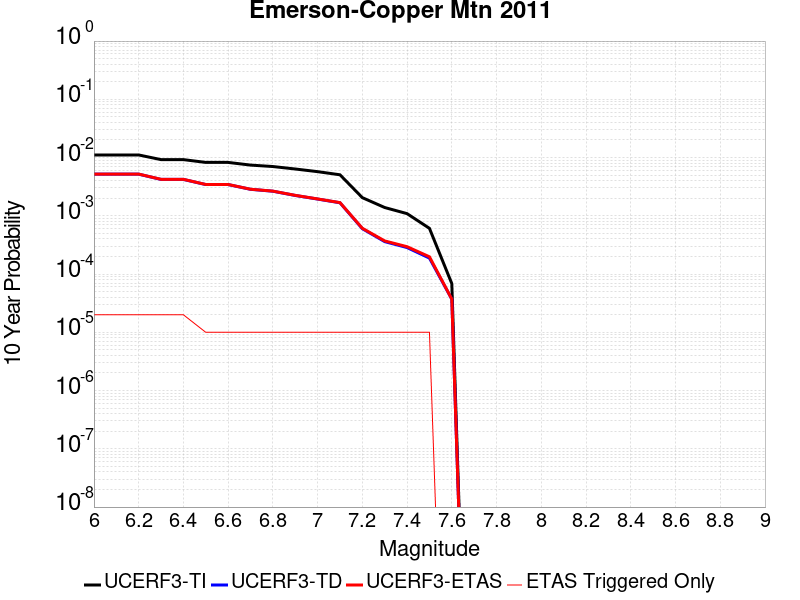 |

| Magnitude | 1 wk TI Prob | 1 wk TD Prob | 1 wk ETAS Prob | 1 wk ETAS/TD Gain | 1 wk ETAS Triggered Only | 1 mo TI Prob | 1 mo TD Prob | 1 mo ETAS Prob | 1 mo ETAS/TD Gain | 1 mo ETAS Triggered Only | 1 yr TI Prob | 1 yr TD Prob | 1 yr ETAS Prob | 1 yr ETAS/TD Gain | 1 yr ETAS Triggered Only | 10 yr TI Prob | 10 yr TD Prob | 10 yr ETAS Prob | 10 yr ETAS/TD Gain | 10 yr ETAS Triggered Only |
|-----|-----|-----|-----|-----|-----|-----|-----|-----|-----|-----|-----|-----|-----|-----|-----|-----|-----|-----|-----|-----|
| 6.0 | 2.1364202E-5 | 9.968114E-6 | 9.968114E-6 | 1.0 | 0.0 | 9.1557646E-5 | 4.2719836E-5 | 4.2719836E-5 | 1.0 | 0.0 | 0.0011141442 | 5.199986E-4 | 5.199986E-4 | 1.0 | 0.0 | 0.011085749 | 0.005188688 | 0.005213177 | 1.0047196 | 2.4616596E-5 |
| 6.1 | 2.1364202E-5 | 9.968114E-6 | 9.968114E-6 | 1.0 | 0.0 | 9.1557646E-5 | 4.2719836E-5 | 4.2719836E-5 | 1.0 | 0.0 | 0.0011141442 | 5.199986E-4 | 5.199986E-4 | 1.0 | 0.0 | 0.011085749 | 0.005188688 | 0.005213177 | 1.0047196 | 2.4616596E-5 |
| 6.2 | 2.1364202E-5 | 9.968114E-6 | 9.968114E-6 | 1.0 | 0.0 | 9.1557646E-5 | 4.2719836E-5 | 4.2719836E-5 | 1.0 | 0.0 | 0.0011141442 | 5.199986E-4 | 5.199986E-4 | 1.0 | 0.0 | 0.011085749 | 0.005188688 | 0.005213177 | 1.0047196 | 2.4616596E-5 |
| 6.3 | 1.7751237E-5 | 8.089227E-6 | 8.089227E-6 | 1.0 | 0.0 | 7.607452E-5 | 3.466769E-5 | 3.466769E-5 | 1.0 | 0.0 | 9.258136E-4 | 4.2200365E-4 | 4.2200365E-4 | 1.0 | 0.0 | 0.00921966 | 0.0042126453 | 0.004237158 | 1.0058188 | 2.4616596E-5 |
| 6.4 | 1.7751237E-5 | 8.089227E-6 | 8.089227E-6 | 1.0 | 0.0 | 7.607452E-5 | 3.466769E-5 | 3.466769E-5 | 1.0 | 0.0 | 9.258136E-4 | 4.2200365E-4 | 4.2200365E-4 | 1.0 | 0.0 | 0.00921966 | 0.0042126453 | 0.004237158 | 1.0058188 | 2.4616596E-5 |
| 6.5 | 1.5886664E-5 | 6.603819E-6 | 6.603819E-6 | 1.0 | 0.0 | 6.808392E-5 | 2.8301802E-5 | 2.8301802E-5 | 1.0 | 0.0 | 8.286065E-4 | 3.4452465E-4 | 3.4452465E-4 | 1.0 | 0.0 | 0.008255237 | 0.0034403696 | 0.0034649014 | 1.0071306 | 2.4616596E-5 |
| 6.6 | 1.5886664E-5 | 6.603819E-6 | 6.603819E-6 | 1.0 | 0.0 | 6.808392E-5 | 2.8301802E-5 | 2.8301802E-5 | 1.0 | 0.0 | 8.286065E-4 | 3.4452465E-4 | 3.4452465E-4 | 1.0 | 0.0 | 0.008255237 | 0.0034403696 | 0.0034649014 | 1.0071306 | 2.4616596E-5 |
| 6.7 | 1.428471E-5 | 5.470403E-6 | 5.470403E-6 | 1.0 | 0.0 | 6.121875E-5 | 2.3444394E-5 | 2.3444394E-5 | 1.0 | 0.0 | 7.450834E-4 | 2.8540206E-4 | 2.8540206E-4 | 1.0 | 0.0 | 0.007425902 | 0.0028507432 | 0.0028752896 | 1.0086105 | 2.4616596E-5 |
| 6.8 | 1.3490684E-5 | 5.073699E-6 | 5.073699E-6 | 1.0 | 0.0 | 5.7815934E-5 | 2.1744265E-5 | 2.1744265E-5 | 1.0 | 0.0 | 7.0368167E-4 | 2.6470813E-4 | 2.6470813E-4 | 1.0 | 0.0 | 0.007014576 | 0.002644309 | 0.0026688606 | 1.0092846 | 2.4616596E-5 |
| 6.9 | 1.2235421E-5 | 4.289677E-6 | 4.289677E-6 | 1.0 | 0.0 | 5.2436466E-5 | 1.838422E-5 | 1.838422E-5 | 1.0 | 0.0 | 6.38227E-4 | 2.238085E-4 | 2.238085E-4 | 1.0 | 0.0 | 0.0063639707 | 0.0022361854 | 0.002260747 | 1.0109837 | 2.4616596E-5 |
| 7.0 | 1.1009851E-5 | 3.7189886E-6 | 3.7189886E-6 | 1.0 | 0.0 | 4.7184225E-5 | 1.5938444E-5 | 1.5938444E-5 | 1.0 | 0.0 | 5.743165E-4 | 1.9403672E-4 | 1.9403672E-4 | 1.0 | 0.0 | 0.005728345 | 0.0019390108 | 0.0019635796 | 1.0126709 | 2.4616596E-5 |
| 7.1 | 9.726373E-6 | 3.2117953E-6 | 3.2117953E-6 | 1.0 | 0.0 | 4.168379E-5 | 1.3764783E-5 | 1.3764783E-5 | 1.0 | 0.0 | 5.07382E-4 | 1.6757673E-4 | 1.6757673E-4 | 1.0 | 0.0 | 0.0050622504 | 0.0016748349 | 0.0016994103 | 1.0146734 | 2.4616596E-5 |
| 7.2 | 3.9335127E-6 | 1.1524792E-6 | 1.1524792E-6 | 1.0 | 0.0 | 1.6857803E-5 | 4.9391874E-6 | 4.9391874E-6 | 1.0 | 0.0 | 2.0522442E-4 | 6.0133007E-5 | 6.0133007E-5 | 1.0 | 0.0 | 0.00205035 | 6.011733E-4 | 6.257751E-4 | 1.040923 | 2.4616596E-5 |
| 7.3 | 2.661632E-6 | 6.911505E-7 | 6.911505E-7 | 1.0 | 0.0 | 1.14069435E-5 | 2.9620703E-6 | 2.9620703E-6 | 1.0 | 0.0 | 1.3887069E-4 | 3.6062618E-5 | 3.6062618E-5 | 1.0 | 0.0 | 0.0013878393 | 3.605687E-4 | 3.8517642E-4 | 1.068247 | 2.4616596E-5 |
| 7.4 | 2.0893426E-6 | 5.4618386E-7 | 5.4618386E-7 | 1.0 | 0.0 | 8.954295E-6 | 2.3407858E-6 | 2.3407858E-6 | 1.0 | 0.0 | 1.0901308E-4 | 2.84987E-5 | 2.84987E-5 | 1.0 | 0.0 | 0.0010895962 | 2.84951E-4 | 3.095606E-4 | 1.0863643 | 2.4616596E-5 |
| 7.5 | 1.1681728E-6 | 3.6030585E-7 | 3.6030585E-7 | 1.0 | 0.0 | 5.0064455E-6 | 1.544167E-6 | 1.544167E-6 | 1.0 | 0.0 | 6.0951766E-5 | 1.8800076E-5 | 1.8800076E-5 | 1.0 | 0.0 | 6.093505E-4 | 1.8798532E-4 | 2.125973E-4 | 1.1309249 | 2.4616596E-5 |
| 7.6 | 1.3154387E-7 | 7.1197384E-8 | 7.1197384E-8 | 1.0 | 0.0 | 5.6375933E-7 | 3.051316E-7 | 3.051316E-7 | 1.0 | 0.0 | 6.863748E-6 | 3.7149728E-6 | 3.7149728E-6 | 1.0 | 0.0 | 6.863536E-5 | 3.7149264E-5 | 3.7149264E-5 | 1.0 | 0.0 |

## Honey Lake 2011 CFM
*[(top)](#table-of-contents)*

| 1 Week | 1 Month | 1 Year | 10 Year |
|-----|-----|-----|-----|
| 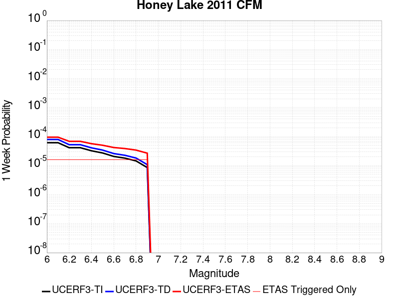 | 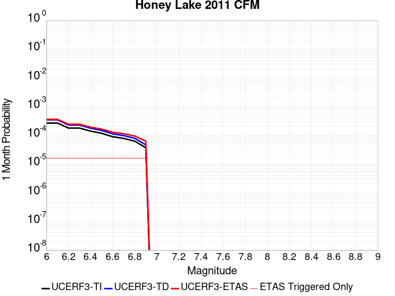 | 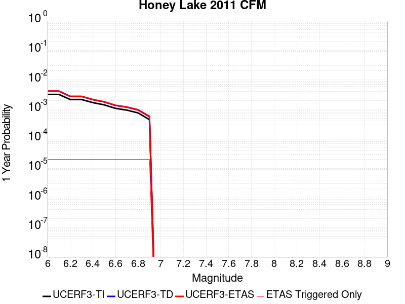 | 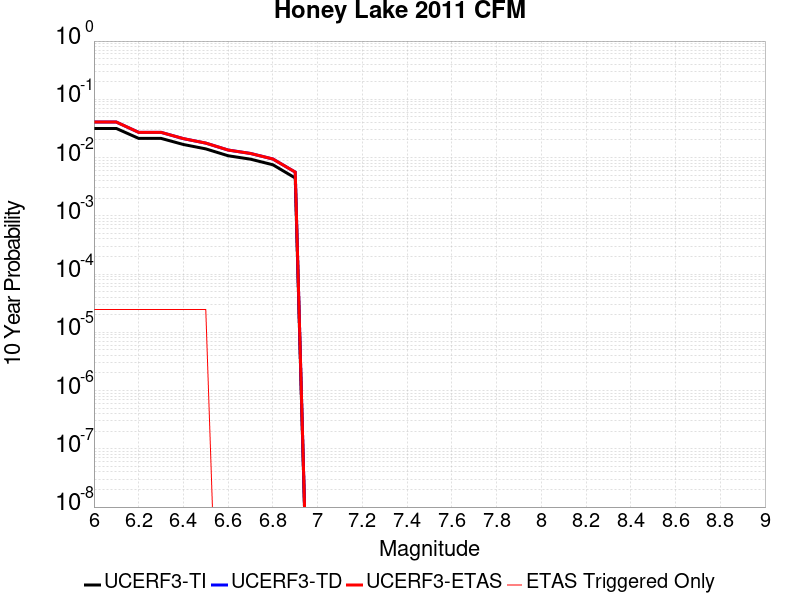 |

| Magnitude | 1 wk TI Prob | 1 wk TD Prob | 1 wk ETAS Prob | 1 wk ETAS/TD Gain | 1 wk ETAS Triggered Only | 1 mo TI Prob | 1 mo TD Prob | 1 mo ETAS Prob | 1 mo ETAS/TD Gain | 1 mo ETAS Triggered Only | 1 yr TI Prob | 1 yr TD Prob | 1 yr ETAS Prob | 1 yr ETAS/TD Gain | 1 yr ETAS Triggered Only | 10 yr TI Prob | 10 yr TD Prob | 10 yr ETAS Prob | 10 yr ETAS/TD Gain | 10 yr ETAS Triggered Only |
|-----|-----|-----|-----|-----|-----|-----|-----|-----|-----|-----|-----|-----|-----|-----|-----|-----|-----|-----|-----|-----|
| 6.0 | 6.155506E-5 | 7.954667E-5 | 7.954667E-5 | 1.0 | 0.0 | 2.6378073E-4 | 3.40873E-4 | 3.40873E-4 | 1.0 | 0.0 | 0.0032068014 | 0.0041427943 | 0.0041427943 | 1.0 | 0.0 | 0.03160919 | 0.040702924 | 0.04072654 | 1.0005802 | 2.4616596E-5 |
| 6.1 | 6.155506E-5 | 7.954667E-5 | 7.954667E-5 | 1.0 | 0.0 | 2.6378073E-4 | 3.40873E-4 | 3.40873E-4 | 1.0 | 0.0 | 0.0032068014 | 0.0041427943 | 0.0041427943 | 1.0 | 0.0 | 0.03160919 | 0.040702924 | 0.04072654 | 1.0005802 | 2.4616596E-5 |
| 6.2 | 4.1335024E-5 | 5.257629E-5 | 5.257629E-5 | 1.0 | 0.0 | 1.7713808E-4 | 2.253086E-4 | 2.253086E-4 | 1.0 | 0.0 | 0.0021545228 | 0.0027398595 | 0.0027398595 | 1.0 | 0.0 | 0.021337535 | 0.027076708 | 0.027100658 | 1.0008845 | 2.4616596E-5 |
| 6.3 | 4.1335024E-5 | 5.257629E-5 | 5.257629E-5 | 1.0 | 0.0 | 1.7713808E-4 | 2.253086E-4 | 2.253086E-4 | 1.0 | 0.0 | 0.0021545228 | 0.0027398595 | 0.0027398595 | 1.0 | 0.0 | 0.021337535 | 0.027076708 | 0.027100658 | 1.0008845 | 2.4616596E-5 |
| 6.4 | 3.2393702E-5 | 4.0887444E-5 | 4.0887444E-5 | 1.0 | 0.0 | 1.3882275E-4 | 1.7522085E-4 | 1.7522085E-4 | 1.0 | 0.0 | 0.0016888566 | 0.002131335 | 0.002131335 | 1.0 | 0.0 | 0.016760793 | 0.02111982 | 0.021143917 | 1.001141 | 2.4616596E-5 |
| 6.5 | 2.7205504E-5 | 3.4211684E-5 | 3.4211684E-5 | 1.0 | 0.0 | 1.1658981E-4 | 1.4661385E-4 | 1.4661385E-4 | 1.0 | 0.0 | 0.0014185566 | 0.0017836588 | 0.0017836588 | 1.0 | 0.0 | 0.014095354 | 0.017702932 | 0.017727112 | 1.0013659 | 2.4616596E-5 |
| 6.6 | 2.069265E-5 | 2.5955307E-5 | 2.5955307E-5 | 1.0 | 0.0 | 8.867977E-5 | 1.1123277E-4 | 1.1123277E-4 | 1.0 | 0.0 | 0.0010791414 | 0.0013535038 | 0.0013535038 | 1.0 | 0.0 | 0.010739161 | 0.013461002 | 0.013461002 | 1.0 | 0.0 |
| 6.7 | 1.8060919E-5 | 2.2656828E-5 | 2.2656828E-5 | 1.0 | 0.0 | 7.7401644E-5 | 9.709754E-5 | 9.709754E-5 | 1.0 | 0.0 | 9.419576E-4 | 0.0011816026 | 0.0011816026 | 1.0 | 0.0 | 0.009379748 | 0.011761238 | 0.011761238 | 1.0 | 0.0 |
| 6.8 | 1.4474663E-5 | 1.818127E-5 | 1.818127E-5 | 1.0 | 0.0 | 6.203279E-5 | 7.791784E-5 | 7.791784E-5 | 1.0 | 0.0 | 7.5498753E-4 | 9.483136E-4 | 9.483136E-4 | 1.0 | 0.0 | 0.007524277 | 0.009450192 | 0.009450192 | 1.0 | 0.0 |
| 6.9 | 8.564552E-6 | 1.0802308E-5 | 1.0802308E-5 | 1.0 | 0.0 | 3.6704707E-5 | 4.6295158E-5 | 4.6295158E-5 | 1.0 | 0.0 | 4.4678818E-4 | 5.635644E-4 | 5.635644E-4 | 1.0 | 0.0 | 0.0044589094 | 0.0056278477 | 0.0056278477 | 1.0 | 0.0 |

## Concord 2011 CFM
*[(top)](#table-of-contents)*

| 1 Week | 1 Month | 1 Year | 10 Year |
|-----|-----|-----|-----|
| 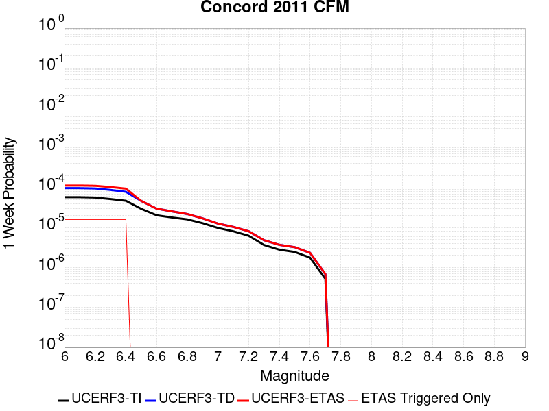 | 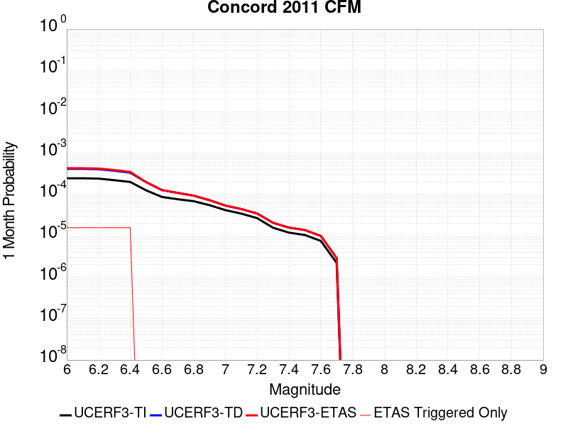 |  |  |

| Magnitude | 1 wk TI Prob | 1 wk TD Prob | 1 wk ETAS Prob | 1 wk ETAS/TD Gain | 1 wk ETAS Triggered Only | 1 mo TI Prob | 1 mo TD Prob | 1 mo ETAS Prob | 1 mo ETAS/TD Gain | 1 mo ETAS Triggered Only | 1 yr TI Prob | 1 yr TD Prob | 1 yr ETAS Prob | 1 yr ETAS/TD Gain | 1 yr ETAS Triggered Only | 10 yr TI Prob | 10 yr TD Prob | 10 yr ETAS Prob | 10 yr ETAS/TD Gain | 10 yr ETAS Triggered Only |
|-----|-----|-----|-----|-----|-----|-----|-----|-----|-----|-----|-----|-----|-----|-----|-----|-----|-----|-----|-----|-----|
| 6.0 | 5.7865112E-5 | 9.759152E-5 | 9.759152E-5 | 1.0 | 0.0 | 2.4796976E-4 | 4.1818706E-4 | 4.1818706E-4 | 1.0 | 0.0 | 0.0030148525 | 0.005079467 | 0.005079467 | 1.0 | 0.0 | 0.029742775 | 0.049248982 | 0.049272384 | 1.0004752 | 2.4616596E-5 |
| 6.1 | 5.7865112E-5 | 9.759152E-5 | 9.759152E-5 | 1.0 | 0.0 | 2.4796976E-4 | 4.1818706E-4 | 4.1818706E-4 | 1.0 | 0.0 | 0.0030148525 | 0.005079467 | 0.005079467 | 1.0 | 0.0 | 0.029742775 | 0.049248982 | 0.049272384 | 1.0004752 | 2.4616596E-5 |
| 6.2 | 5.6789337E-5 | 9.5795076E-5 | 9.5795076E-5 | 1.0 | 0.0 | 2.4336016E-4 | 4.104905E-4 | 4.104905E-4 | 1.0 | 0.0 | 0.0029588845 | 0.0049861916 | 0.0049861916 | 1.0 | 0.0 | 0.029197963 | 0.04836556 | 0.048388984 | 1.0004843 | 2.4616596E-5 |
| 6.3 | 5.203322E-5 | 8.803056E-5 | 8.803056E-5 | 1.0 | 0.0 | 2.2298045E-4 | 3.7722368E-4 | 3.7722368E-4 | 1.0 | 0.0 | 0.0027114071 | 0.0045838105 | 0.0045838105 | 1.0 | 0.0 | 0.026785625 | 0.04453672 | 0.04456024 | 1.0005281 | 2.4616596E-5 |
| 6.4 | 4.7120942E-5 | 7.897404E-5 | 7.897404E-5 | 1.0 | 0.0 | 2.0193127E-4 | 3.3842045E-4 | 3.3842045E-4 | 1.0 | 0.0 | 0.0024557412 | 0.00411323 | 0.00411323 | 1.0 | 0.0 | 0.024287801 | 0.040065527 | 0.04008916 | 1.0005898 | 2.4616596E-5 |
| 6.5 | 2.9598437E-5 | 4.667486E-5 | 4.667486E-5 | 1.0 | 0.0 | 1.2684427E-4 | 2.0002096E-4 | 2.0002096E-4 | 1.0 | 0.0 | 0.001543235 | 0.0024327459 | 0.0024327459 | 1.0 | 0.0 | 0.015325619 | 0.023909973 | 0.023934001 | 1.0010049 | 2.4616596E-5 |
| 6.6 | 2.0443718E-5 | 2.998433E-5 | 2.998433E-5 | 1.0 | 0.0 | 8.7613E-5 | 1.2849816E-4 | 1.2849816E-4 | 1.0 | 0.0 | 0.0010661662 | 0.0015633785 | 0.0015633785 | 1.0 | 0.0 | 0.010610655 | 0.015466996 | 0.015491231 | 1.0015669 | 2.4616596E-5 |
| 6.7 | 1.798539E-5 | 2.5557381E-5 | 2.5557381E-5 | 1.0 | 0.0 | 7.7077966E-5 | 1.0952716E-4 | 1.0952716E-4 | 1.0 | 0.0 | 9.380202E-4 | 0.001332699 | 0.001332699 | 1.0 | 0.0 | 0.009340706 | 0.013217433 | 0.013217433 | 1.0 | 0.0 |
| 6.8 | 1.613555E-5 | 2.1959211E-5 | 2.1959211E-5 | 1.0 | 0.0 | 6.915052E-5 | 9.4107585E-5 | 9.4107585E-5 | 1.0 | 0.0 | 8.4158237E-4 | 0.0011451716 | 0.0011451716 | 1.0 | 0.0 | 0.008384023 | 0.0113782035 | 0.0113782035 | 1.0 | 0.0 |
| 6.9 | 1.2916435E-5 | 1.7081054E-5 | 1.7081054E-5 | 1.0 | 0.0 | 5.5354973E-5 | 7.32025E-5 | 7.32025E-5 | 1.0 | 0.0 | 6.7373837E-4 | 8.908818E-4 | 8.908818E-4 | 1.0 | 0.0 | 0.006716994 | 0.008867139 | 0.008867139 | 1.0 | 0.0 |
| 7.0 | 9.81129E-6 | 1.2630829E-5 | 1.2630829E-5 | 1.0 | 0.0 | 4.2047708E-5 | 5.413101E-5 | 5.413101E-5 | 1.0 | 0.0 | 5.118106E-4 | 6.588474E-4 | 6.588474E-4 | 1.0 | 0.0 | 0.005106334 | 0.006569153 | 0.006569153 | 1.0 | 0.0 |
| 7.1 | 8.0889195E-6 | 1.0418261E-5 | 1.0418261E-5 | 1.0 | 0.0 | 3.4666336E-5 | 4.4648932E-5 | 4.4648932E-5 | 1.0 | 0.0 | 4.219809E-4 | 5.434662E-4 | 5.434662E-4 | 1.0 | 0.0 | 0.004211805 | 0.0054215975 | 0.0054215975 | 1.0 | 0.0 |
| 7.2 | 6.267438E-6 | 8.115699E-6 | 8.115699E-6 | 1.0 | 0.0 | 2.6860173E-5 | 3.4781104E-5 | 3.4781104E-5 | 1.0 | 0.0 | 3.2697353E-4 | 4.233784E-4 | 4.233784E-4 | 1.0 | 0.0 | 0.0032649285 | 0.004225969 | 0.004225969 | 1.0 | 0.0 |
| 7.3 | 3.6761196E-6 | 4.8401653E-6 | 4.8401653E-6 | 1.0 | 0.0 | 1.5754704E-5 | 2.0743402E-5 | 2.0743402E-5 | 1.0 | 0.0 | 1.9179663E-4 | 2.5252186E-4 | 2.5252186E-4 | 1.0 | 0.0 | 0.0019163118 | 0.002522487 | 0.002522487 | 1.0 | 0.0 |
| 7.4 | 2.8044356E-6 | 3.7096036E-6 | 3.7096036E-6 | 1.0 | 0.0 | 1.2018954E-5 | 1.5898204E-5 | 1.5898204E-5 | 1.0 | 0.0 | 1.4632095E-4 | 1.9354356E-4 | 1.9354356E-4 | 1.0 | 0.0 | 0.0014622464 | 0.0019338481 | 0.0019338481 | 1.0 | 0.0 |
| 7.5 | 2.4578699E-6 | 3.2447442E-6 | 3.2447442E-6 | 1.0 | 0.0 | 1.0533685E-5 | 1.3905973E-5 | 1.3905973E-5 | 1.0 | 0.0 | 1.2824008E-4 | 1.6929218E-4 | 1.6929218E-4 | 1.0 | 0.0 | 0.0012816609 | 0.001691713 | 0.001691713 | 1.0 | 0.0 |
| 7.6 | 1.7713267E-6 | 2.3351192E-6 | 2.3351192E-6 | 1.0 | 0.0 | 7.591378E-6 | 1.0007616E-5 | 1.0007616E-5 | 1.0 | 0.0 | 9.2421105E-5 | 1.21836E-4 | 1.21836E-4 | 1.0 | 0.0 | 9.2382677E-4 | 0.0012177454 | 0.0012177454 | 1.0 | 0.0 |
| 7.7 | 5.1912366E-7 | 6.8290143E-7 | 6.8290143E-7 | 1.0 | 0.0 | 2.2248137E-6 | 2.9267171E-6 | 2.9267171E-6 | 1.0 | 0.0 | 2.708677E-5 | 3.5632213E-5 | 3.5632213E-5 | 1.0 | 0.0 | 2.708347E-4 | 3.5627294E-4 | 3.5627294E-4 | 1.0 | 0.0 |

## Carson Range (Genoa)
*[(top)](#table-of-contents)*

| 1 Week | 1 Month | 1 Year | 10 Year |
|-----|-----|-----|-----|
| 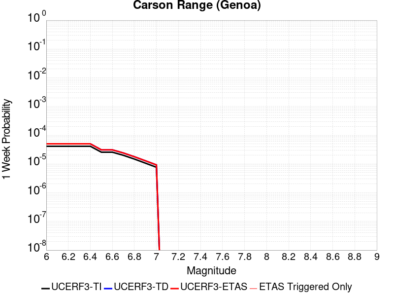 | 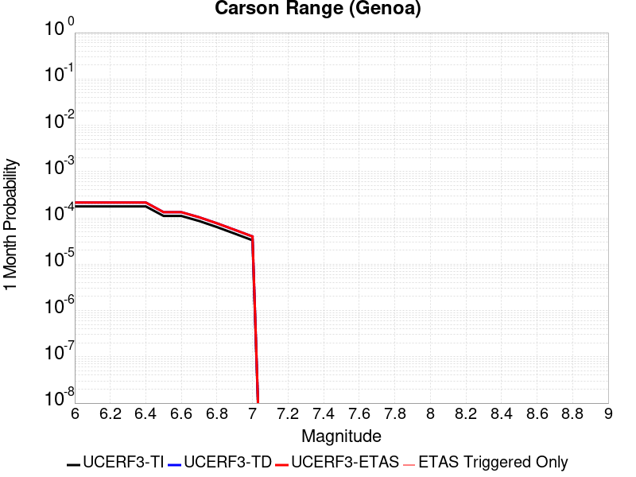 | 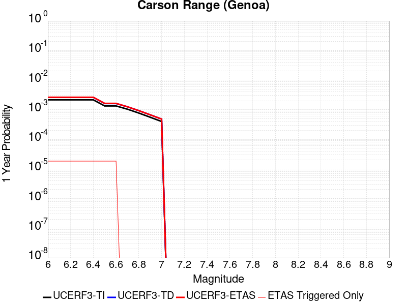 | 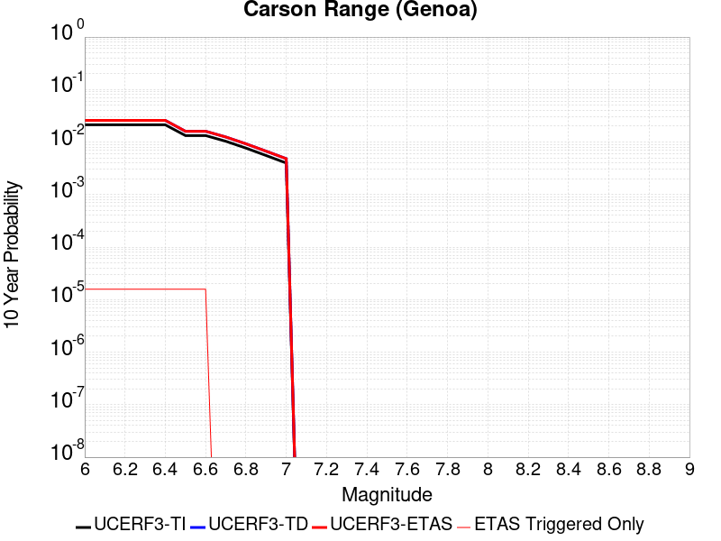 |

| Magnitude | 1 wk TI Prob | 1 wk TD Prob | 1 wk ETAS Prob | 1 wk ETAS/TD Gain | 1 wk ETAS Triggered Only | 1 mo TI Prob | 1 mo TD Prob | 1 mo ETAS Prob | 1 mo ETAS/TD Gain | 1 mo ETAS Triggered Only | 1 yr TI Prob | 1 yr TD Prob | 1 yr ETAS Prob | 1 yr ETAS/TD Gain | 1 yr ETAS Triggered Only | 10 yr TI Prob | 10 yr TD Prob | 10 yr ETAS Prob | 10 yr ETAS/TD Gain | 10 yr ETAS Triggered Only |
|-----|-----|-----|-----|-----|-----|-----|-----|-----|-----|-----|-----|-----|-----|-----|-----|-----|-----|-----|-----|-----|
| 6.0 | 4.1268457E-5 | 5.0146893E-5 | 5.0146893E-5 | 1.0 | 0.0 | 1.7685282E-4 | 2.148998E-4 | 2.148998E-4 | 1.0 | 0.0 | 0.0021510567 | 0.0026136558 | 0.002638208 | 1.0093938 | 2.4616596E-5 | 0.02130354 | 0.025868816 | 0.025892796 | 1.000927 | 2.4616596E-5 |
| 6.1 | 4.1268457E-5 | 5.0146893E-5 | 5.0146893E-5 | 1.0 | 0.0 | 1.7685282E-4 | 2.148998E-4 | 2.148998E-4 | 1.0 | 0.0 | 0.0021510567 | 0.0026136558 | 0.002638208 | 1.0093938 | 2.4616596E-5 | 0.02130354 | 0.025868816 | 0.025892796 | 1.000927 | 2.4616596E-5 |
| 6.2 | 4.1268457E-5 | 5.0146893E-5 | 5.0146893E-5 | 1.0 | 0.0 | 1.7685282E-4 | 2.148998E-4 | 2.148998E-4 | 1.0 | 0.0 | 0.0021510567 | 0.0026136558 | 0.002638208 | 1.0093938 | 2.4616596E-5 | 0.02130354 | 0.025868816 | 0.025892796 | 1.000927 | 2.4616596E-5 |
| 6.3 | 4.1268457E-5 | 5.0146893E-5 | 5.0146893E-5 | 1.0 | 0.0 | 1.7685282E-4 | 2.148998E-4 | 2.148998E-4 | 1.0 | 0.0 | 0.0021510567 | 0.0026136558 | 0.002638208 | 1.0093938 | 2.4616596E-5 | 0.02130354 | 0.025868816 | 0.025892796 | 1.000927 | 2.4616596E-5 |
| 6.4 | 4.1268457E-5 | 5.0146893E-5 | 5.0146893E-5 | 1.0 | 0.0 | 1.7685282E-4 | 2.148998E-4 | 2.148998E-4 | 1.0 | 0.0 | 0.0021510567 | 0.0026136558 | 0.002638208 | 1.0093938 | 2.4616596E-5 | 0.02130354 | 0.025868816 | 0.025892796 | 1.000927 | 2.4616596E-5 |
| 6.5 | 2.5677185E-5 | 3.0978295E-5 | 3.0978295E-5 | 1.0 | 0.0 | 1.1004044E-4 | 1.3275839E-4 | 1.3275839E-4 | 1.0 | 0.0 | 0.0013389189 | 0.0016153135 | 0.0016398903 | 1.0152149 | 2.4616596E-5 | 0.0133088045 | 0.016053649 | 0.01607787 | 1.0015088 | 2.4616596E-5 |
| 6.6 | 2.5677185E-5 | 3.0978295E-5 | 3.0978295E-5 | 1.0 | 0.0 | 1.1004044E-4 | 1.3275839E-4 | 1.3275839E-4 | 1.0 | 0.0 | 0.0013389189 | 0.0016153135 | 0.0016398903 | 1.0152149 | 2.4616596E-5 | 0.0133088045 | 0.016053649 | 0.01607787 | 1.0015088 | 2.4616596E-5 |
| 6.7 | 1.9969408E-5 | 2.406347E-5 | 2.406347E-5 | 1.0 | 0.0 | 8.558037E-5 | 1.0312595E-4 | 1.0312595E-4 | 1.0 | 0.0 | 0.0010414429 | 0.0012549888 | 0.0012549888 | 1.0 | 0.0 | 0.010365757 | 0.012494174 | 0.012494174 | 1.0 | 0.0 |
| 6.8 | 1.4783156E-5 | 1.7817569E-5 | 1.7817569E-5 | 1.0 | 0.0 | 6.335485E-5 | 7.635951E-5 | 7.635951E-5 | 1.0 | 0.0 | 7.710722E-4 | 9.294106E-4 | 9.294106E-4 | 1.0 | 0.0 | 0.0076840227 | 0.009268024 | 0.009268024 | 1.0 | 0.0 |
| 6.9 | 1.06660555E-5 | 1.2877026E-5 | 1.2877026E-5 | 1.0 | 0.0 | 4.5710865E-5 | 5.5186738E-5 | 5.5186738E-5 | 1.0 | 0.0 | 5.5638765E-4 | 6.718066E-4 | 6.718066E-4 | 1.0 | 0.0 | 0.005549967 | 0.006709056 | 0.006709056 | 1.0 | 0.0 |
| 7.0 | 7.664838E-6 | 9.258307E-6 | 9.258307E-6 | 1.0 | 0.0 | 3.2848893E-5 | 3.9678456E-5 | 3.9678456E-5 | 1.0 | 0.0 | 3.998619E-4 | 4.830852E-4 | 4.830852E-4 | 1.0 | 0.0 | 0.0039914316 | 0.00483085 | 0.00483085 | 1.0 | 0.0 |

## Lions Head 2011 CFM
*[(top)](#table-of-contents)*

| 1 Week | 1 Month | 1 Year | 10 Year |
|-----|-----|-----|-----|
|  | 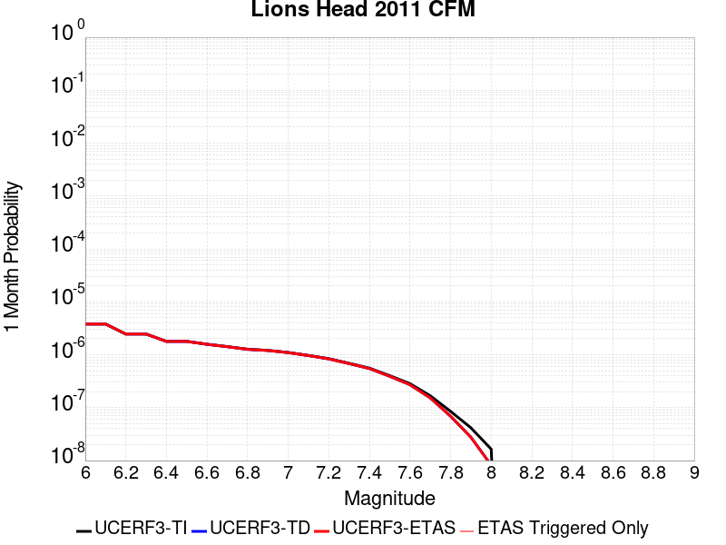 | 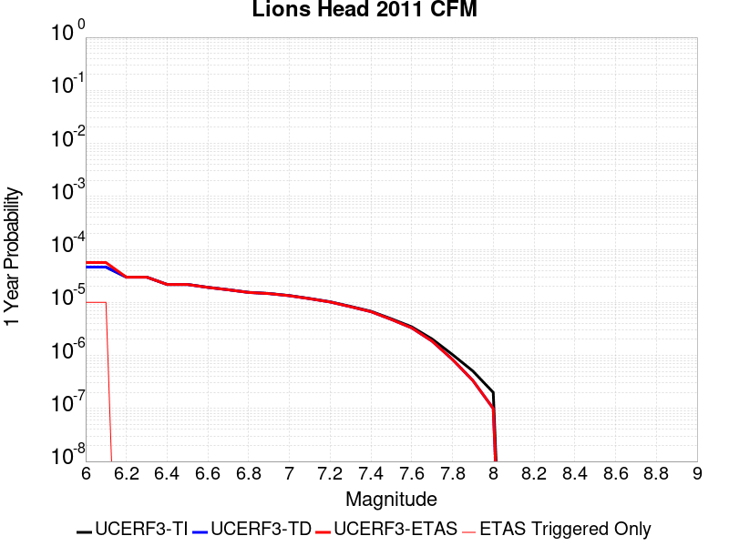 | 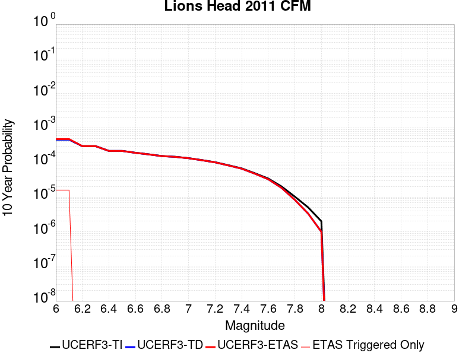 |

| Magnitude | 1 wk TI Prob | 1 wk TD Prob | 1 wk ETAS Prob | 1 wk ETAS/TD Gain | 1 wk ETAS Triggered Only | 1 mo TI Prob | 1 mo TD Prob | 1 mo ETAS Prob | 1 mo ETAS/TD Gain | 1 mo ETAS Triggered Only | 1 yr TI Prob | 1 yr TD Prob | 1 yr ETAS Prob | 1 yr ETAS/TD Gain | 1 yr ETAS Triggered Only | 10 yr TI Prob | 10 yr TD Prob | 10 yr ETAS Prob | 10 yr ETAS/TD Gain | 10 yr ETAS Triggered Only |
|-----|-----|-----|-----|-----|-----|-----|-----|-----|-----|-----|-----|-----|-----|-----|-----|-----|-----|-----|-----|-----|
| 6.0 | 8.889363E-7 | 8.891425E-7 | 8.891425E-7 | 1.0 | 0.0 | 3.8097214E-6 | 3.8106054E-6 | 3.8106054E-6 | 1.0 | 0.0 | 4.638237E-5 | 4.6393197E-5 | 7.100865E-5 | 1.5305833 | 2.4616596E-5 | 4.637269E-4 | 4.638414E-4 | 4.8844656E-4 | 1.0530466 | 2.4616596E-5 |
| 6.1 | 8.889363E-7 | 8.891425E-7 | 8.891425E-7 | 1.0 | 0.0 | 3.8097214E-6 | 3.8106054E-6 | 3.8106054E-6 | 1.0 | 0.0 | 4.638237E-5 | 4.6393197E-5 | 7.100865E-5 | 1.5305833 | 2.4616596E-5 | 4.637269E-4 | 4.638414E-4 | 4.8844656E-4 | 1.0530466 | 2.4616596E-5 |
| 6.2 | 5.7435483E-7 | 5.736071E-7 | 5.736071E-7 | 1.0 | 0.0 | 2.4615185E-6 | 2.458314E-6 | 2.458314E-6 | 1.0 | 0.0 | 2.9968574E-5 | 2.9929575E-5 | 2.9929575E-5 | 1.0 | 0.0 | 2.9964533E-4 | 2.992569E-4 | 2.992569E-4 | 1.0 | 0.0 |
| 6.3 | 5.7435483E-7 | 5.736071E-7 | 5.736071E-7 | 1.0 | 0.0 | 2.4615185E-6 | 2.458314E-6 | 2.458314E-6 | 1.0 | 0.0 | 2.9968574E-5 | 2.9929575E-5 | 2.9929575E-5 | 1.0 | 0.0 | 2.9964533E-4 | 2.992569E-4 | 2.992569E-4 | 1.0 | 0.0 |
| 6.4 | 4.1835764E-7 | 4.171541E-7 | 4.171541E-7 | 1.0 | 0.0 | 1.7929601E-6 | 1.787802E-6 | 1.787802E-6 | 1.0 | 0.0 | 2.1829072E-5 | 2.1766275E-5 | 2.1766275E-5 | 1.0 | 0.0 | 2.1826927E-4 | 2.1764166E-4 | 2.1764166E-4 | 1.0 | 0.0 |
| 6.5 | 4.1835764E-7 | 4.171541E-7 | 4.171541E-7 | 1.0 | 0.0 | 1.7929601E-6 | 1.787802E-6 | 1.787802E-6 | 1.0 | 0.0 | 2.1829072E-5 | 2.1766275E-5 | 2.1766275E-5 | 1.0 | 0.0 | 2.1826927E-4 | 2.1764166E-4 | 2.1764166E-4 | 1.0 | 0.0 |
| 6.6 | 3.6896213E-7 | 3.6761884E-7 | 3.6761884E-7 | 1.0 | 0.0 | 1.5812653E-6 | 1.5755083E-6 | 1.5755083E-6 | 1.0 | 0.0 | 1.9251736E-5 | 1.9181647E-5 | 1.9181647E-5 | 1.0 | 0.0 | 1.9250068E-4 | 1.9180003E-4 | 1.9180003E-4 | 1.0 | 0.0 |
| 6.7 | 3.3283942E-7 | 3.3139824E-7 | 3.3139824E-7 | 1.0 | 0.0 | 1.4264539E-6 | 1.4202773E-6 | 1.4202773E-6 | 1.0 | 0.0 | 1.7366938E-5 | 1.7291739E-5 | 1.7291739E-5 | 1.0 | 0.0 | 1.736558E-4 | 1.7290401E-4 | 1.7290401E-4 | 1.0 | 0.0 |
| 6.8 | 2.9684807E-7 | 2.953145E-7 | 2.953145E-7 | 1.0 | 0.0 | 1.2722054E-6 | 1.2656328E-6 | 1.2656328E-6 | 1.0 | 0.0 | 1.5488991E-5 | 1.5408972E-5 | 1.5408972E-5 | 1.0 | 0.0 | 1.5487912E-4 | 1.5407907E-4 | 1.5407907E-4 | 1.0 | 0.0 |
| 6.9 | 2.8254823E-7 | 2.8096647E-7 | 2.8096647E-7 | 1.0 | 0.0 | 1.2109203E-6 | 1.2041414E-6 | 1.2041414E-6 | 1.0 | 0.0 | 1.4742856E-5 | 1.4660324E-5 | 1.4660324E-5 | 1.0 | 0.0 | 1.4741877E-4 | 1.465936E-4 | 1.465936E-4 | 1.0 | 0.0 |
| 7.0 | 2.5794475E-7 | 2.5627148E-7 | 2.5627148E-7 | 1.0 | 0.0 | 1.105477E-6 | 1.0983058E-6 | 1.0983058E-6 | 1.0 | 0.0 | 1.34591E-5 | 1.3371792E-5 | 1.3371792E-5 | 1.0 | 0.0 | 1.3458285E-4 | 1.337099E-4 | 1.337099E-4 | 1.0 | 0.0 |
| 7.1 | 2.2678832E-7 | 2.2496131E-7 | 2.2496131E-7 | 1.0 | 0.0 | 9.719496E-7 | 9.641195E-7 | 9.641195E-7 | 1.0 | 0.0 | 1.1833421E-5 | 1.1738091E-5 | 1.1738091E-5 | 1.0 | 0.0 | 1.1832791E-4 | 1.1737474E-4 | 1.1737474E-4 | 1.0 | 0.0 |
| 7.2 | 1.968546E-7 | 1.9487938E-7 | 1.9487938E-7 | 1.0 | 0.0 | 8.436623E-7 | 8.35197E-7 | 8.35197E-7 | 1.0 | 0.0 | 1.027154E-5 | 1.0168476E-5 | 1.0168476E-5 | 1.0 | 0.0 | 1.0271065E-4 | 1.0168012E-4 | 1.0168012E-4 | 1.0 | 0.0 |
| 7.3 | 1.6101195E-7 | 1.5880458E-7 | 1.5880458E-7 | 1.0 | 0.0 | 6.90051E-7 | 6.8059086E-7 | 6.8059086E-7 | 1.0 | 0.0 | 8.401339E-6 | 8.2861625E-6 | 8.2861625E-6 | 1.0 | 0.0 | 8.4010215E-5 | 8.285854E-5 | 8.285854E-5 | 1.0 | 0.0 |
| 7.4 | 1.304744E-7 | 1.2803389E-7 | 1.2803389E-7 | 1.0 | 0.0 | 5.591759E-7 | 5.487165E-7 | 5.487165E-7 | 1.0 | 0.0 | 6.807945E-6 | 6.680603E-6 | 6.680603E-6 | 1.0 | 0.0 | 6.807737E-5 | 6.680403E-5 | 6.680403E-5 | 1.0 | 0.0 |
| 7.5 | 9.410614E-8 | 9.132599E-8 | 9.132599E-8 | 1.0 | 0.0 | 4.0331196E-7 | 3.91397E-7 | 3.91397E-7 | 1.0 | 0.0 | 4.910312E-6 | 4.7652484E-6 | 4.7652484E-6 | 1.0 | 0.0 | 4.9102036E-5 | 4.765146E-5 | 4.765146E-5 | 1.0 | 0.0 |
| 7.6 | 6.6360826E-8 | 6.327055E-8 | 6.327055E-8 | 1.0 | 0.0 | 2.844035E-7 | 2.7115945E-7 | 2.7115945E-7 | 1.0 | 0.0 | 3.462607E-6 | 3.3013614E-6 | 3.3013614E-6 | 1.0 | 0.0 | 3.4625533E-5 | 3.3013126E-5 | 3.3013126E-5 | 1.0 | 0.0 |
| 7.7 | 3.9100893E-8 | 3.5617894E-8 | 3.5617894E-8 | 1.0 | 0.0 | 1.6757524E-7 | 1.5264811E-7 | 1.5264811E-7 | 1.0 | 0.0 | 2.0402267E-6 | 1.8584891E-6 | 1.8584891E-6 | 1.0 | 0.0 | 2.040208E-5 | 1.8584737E-5 | 1.8584737E-5 | 1.0 | 0.0 |
| 7.8 | 1.9858547E-8 | 1.6059074E-8 | 1.6059074E-8 | 1.0 | 0.0 | 8.5108056E-8 | 6.882461E-8 | 6.882461E-8 | 1.0 | 0.0 | 1.0361902E-6 | 8.3793924E-7 | 8.3793924E-7 | 1.0 | 0.0 | 1.0361853E-5 | 8.379361E-6 | 8.379361E-6 | 1.0 | 0.0 |
| 7.9 | 9.717722E-9 | 6.4448784E-9 | 6.4448784E-9 | 1.0 | 0.0 | 4.1647375E-8 | 2.762091E-8 | 2.762091E-8 | 1.0 | 0.0 | 5.070567E-7 | 3.3628453E-7 | 3.3628453E-7 | 1.0 | 0.0 | 5.0705553E-6 | 3.3628403E-6 | 3.3628403E-6 | 1.0 | 0.0 |
| 8.0 | 3.8397716E-9 | 1.908926E-9 | 1.908926E-9 | 1.0 | 0.0 | 1.6456164E-8 | 8.18111E-9 | 8.18111E-9 | 1.0 | 0.0 | 2.0035378E-7 | 9.9605E-8 | 9.9605E-8 | 1.0 | 0.0 | 2.0035359E-6 | 9.960496E-7 | 9.960496E-7 | 1.0 | 0.0 |

## Hayward (So) extension 2011 CFM
*[(top)](#table-of-contents)*

| 1 Week | 1 Month | 1 Year | 10 Year |
|-----|-----|-----|-----|
|  |  | 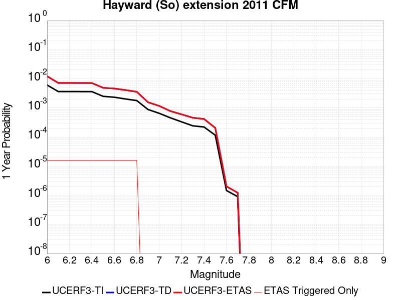 | 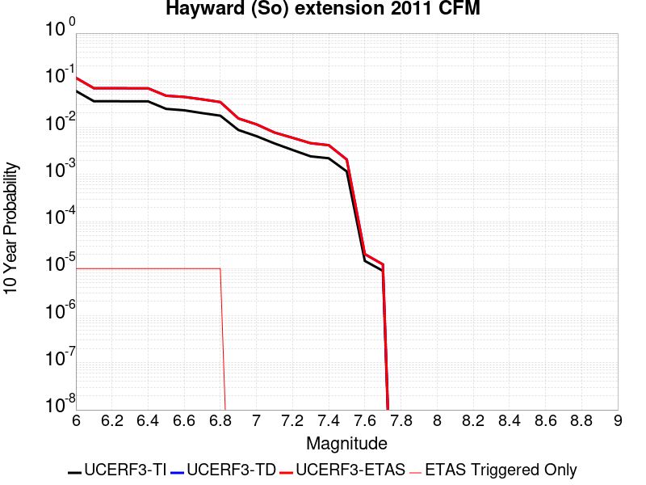 |

| Magnitude | 1 wk TI Prob | 1 wk TD Prob | 1 wk ETAS Prob | 1 wk ETAS/TD Gain | 1 wk ETAS Triggered Only | 1 mo TI Prob | 1 mo TD Prob | 1 mo ETAS Prob | 1 mo ETAS/TD Gain | 1 mo ETAS Triggered Only | 1 yr TI Prob | 1 yr TD Prob | 1 yr ETAS Prob | 1 yr ETAS/TD Gain | 1 yr ETAS Triggered Only | 10 yr TI Prob | 10 yr TD Prob | 10 yr ETAS Prob | 10 yr ETAS/TD Gain | 10 yr ETAS Triggered Only |
|-----|-----|-----|-----|-----|-----|-----|-----|-----|-----|-----|-----|-----|-----|-----|-----|-----|-----|-----|-----|-----|
| 6.0 | 1.1721256E-4 | 2.3697627E-4 | 2.3697627E-4 | 1.0 | 0.0 | 5.022428E-4 | 0.0010129517 | 0.0010129517 | 1.0 | 0.0 | 0.0060976758 | 0.012248711 | 0.012273027 | 1.0019851 | 2.4616596E-5 | 0.0593305 | 0.112843215 | 0.11286505 | 1.0001935 | 2.4616596E-5 |
| 6.1 | 6.99169E-5 | 1.3822885E-4 | 1.3822885E-4 | 1.0 | 0.0 | 2.9960944E-4 | 5.9128006E-4 | 5.9128006E-4 | 1.0 | 0.0 | 0.0036416445 | 0.0071720886 | 0.0071965284 | 1.0034077 | 2.4616596E-5 | 0.035825435 | 0.067803554 | 0.0678265 | 1.0003384 | 2.4616596E-5 |
| 6.2 | 6.99169E-5 | 1.3822885E-4 | 1.3822885E-4 | 1.0 | 0.0 | 2.9960944E-4 | 5.9128006E-4 | 5.9128006E-4 | 1.0 | 0.0 | 0.0036416445 | 0.0071720886 | 0.0071965284 | 1.0034077 | 2.4616596E-5 | 0.035825435 | 0.067803554 | 0.0678265 | 1.0003384 | 2.4616596E-5 |
| 6.3 | 6.970908E-5 | 1.379104E-4 | 1.379104E-4 | 1.0 | 0.0 | 2.9871898E-4 | 5.899159E-4 | 5.899159E-4 | 1.0 | 0.0 | 0.0036308395 | 0.007155625 | 0.0071800654 | 1.0034156 | 2.4616596E-5 | 0.035720866 | 0.067652516 | 0.067675464 | 1.0003393 | 2.4616596E-5 |
| 6.4 | 6.9517155E-5 | 1.375792E-4 | 1.375792E-4 | 1.0 | 0.0 | 2.9789665E-4 | 5.884971E-4 | 5.884971E-4 | 1.0 | 0.0 | 0.0036208609 | 0.0071385372 | 0.0071629784 | 1.0034238 | 2.4616596E-5 | 0.03562429 | 0.06749655 | 0.06751951 | 1.0003401 | 2.4616596E-5 |
| 6.5 | 4.786248E-5 | 9.41498E-5 | 9.41498E-5 | 1.0 | 0.0 | 2.0510878E-4 | 4.034394E-4 | 4.034394E-4 | 1.0 | 0.0 | 0.0024943394 | 0.004901227 | 0.004925723 | 1.004998 | 2.4616596E-5 | 0.02466527 | 0.046901822 | 0.046925284 | 1.0005002 | 2.4616596E-5 |
| 6.6 | 4.4662214E-5 | 8.881654E-5 | 8.881654E-5 | 1.0 | 0.0 | 1.9139545E-4 | 3.805894E-4 | 3.805894E-4 | 1.0 | 0.0 | 0.0023277493 | 0.0046242937 | 0.0046487963 | 1.0052987 | 2.4616596E-5 | 0.02303517 | 0.044293344 | 0.04431687 | 1.0005312 | 2.4616596E-5 |
| 6.7 | 3.884542E-5 | 7.8648096E-5 | 7.8648096E-5 | 1.0 | 0.0 | 1.6646975E-4 | 3.370222E-4 | 3.370222E-4 | 1.0 | 0.0 | 0.002024885 | 0.0040959697 | 0.004120486 | 1.0059854 | 2.4616596E-5 | 0.020065336 | 0.039333146 | 0.039356794 | 1.0006013 | 2.4616596E-5 |
| 6.8 | 3.4221863E-5 | 6.855653E-5 | 6.855653E-5 | 1.0 | 0.0 | 1.4665688E-4 | 2.93783E-4 | 2.93783E-4 | 1.0 | 0.0 | 0.0017840851 | 0.0035713627 | 0.0035958914 | 1.0068681 | 2.4616596E-5 | 0.017698295 | 0.034421004 | 0.03444477 | 1.0006906 | 2.4616596E-5 |
| 6.9 | 1.6927712E-5 | 3.0061563E-5 | 3.0061563E-5 | 1.0 | 0.0 | 7.2545314E-5 | 1.2882923E-4 | 1.2882923E-4 | 1.0 | 0.0 | 8.828813E-4 | 0.0015674243 | 0.0015674243 | 1.0 | 0.0 | 0.008793819 | 0.01546327 | 0.01546327 | 1.0 | 0.0 |
| 7.0 | 1.2509653E-5 | 2.2462571E-5 | 2.2462571E-5 | 1.0 | 0.0 | 5.3611697E-5 | 9.6264856E-5 | 9.6264856E-5 | 1.0 | 0.0 | 6.525269E-4 | 0.0011714385 | 0.0011714385 | 1.0 | 0.0 | 0.0065061417 | 0.01158231 | 0.01158231 | 1.0 | 0.0 |
| 7.1 | 8.751583E-6 | 1.4925648E-5 | 1.4925648E-5 | 1.0 | 0.0 | 3.750624E-5 | 6.3965526E-5 | 6.3965526E-5 | 1.0 | 0.0 | 4.5654282E-4 | 7.785079E-4 | 7.785079E-4 | 1.0 | 0.0 | 0.0045560603 | 0.007763496 | 0.007763496 | 1.0 | 0.0 |
| 7.2 | 6.354379E-6 | 1.1498636E-5 | 1.1498636E-5 | 1.0 | 0.0 | 2.7232769E-5 | 4.9278966E-5 | 4.9278966E-5 | 1.0 | 0.0 | 3.3150852E-4 | 5.99811E-4 | 5.99811E-4 | 1.0 | 0.0 | 0.0033101442 | 0.0060003046 | 0.0060003046 | 1.0 | 0.0 |
| 7.3 | 4.645554E-6 | 8.818172E-6 | 8.818172E-6 | 1.0 | 0.0 | 1.9909365E-5 | 3.779164E-5 | 3.779164E-5 | 1.0 | 0.0 | 2.4236954E-4 | 4.6002E-4 | 4.6002E-4 | 1.0 | 0.0 | 0.0024210536 | 0.004610708 | 0.004610708 | 1.0 | 0.0 |
| 7.4 | 4.23437E-6 | 7.992532E-6 | 7.992532E-6 | 1.0 | 0.0 | 1.8147173E-5 | 3.425328E-5 | 3.425328E-5 | 1.0 | 0.0 | 2.2091944E-4 | 4.1695772E-4 | 4.1695772E-4 | 1.0 | 0.0 | 0.0022069993 | 0.004181972 | 0.004181972 | 1.0 | 0.0 |
| 7.5 | 2.2187417E-6 | 3.9522306E-6 | 3.9522306E-6 | 1.0 | 0.0 | 9.508858E-6 | 1.6938036E-5 | 1.6938036E-5 | 1.0 | 0.0 | 1.157642E-4 | 2.0620368E-4 | 2.0620368E-4 | 1.0 | 0.0 | 0.0011570391 | 0.0020734754 | 0.0020734754 | 1.0 | 0.0 |
| 7.6 | 2.7952495E-8 | 3.878529E-8 | 3.878529E-8 | 1.0 | 0.0 | 1.1979641E-7 | 1.6622266E-7 | 1.6622266E-7 | 1.0 | 0.0 | 1.4585203E-6 | 2.0237592E-6 | 2.0237592E-6 | 1.0 | 0.0 | 1.4585107E-5 | 2.0328182E-5 | 2.0328182E-5 | 1.0 | 0.0 |
| 7.7 | 1.7192724E-8 | 2.3436517E-8 | 2.3436517E-8 | 1.0 | 0.0 | 7.36831E-8 | 1.0044221E-7 | 1.0044221E-7 | 1.0 | 0.0 | 8.9709135E-7 | 1.2228833E-6 | 1.2228833E-6 | 1.0 | 0.0 | 8.970877E-6 | 1.2296933E-5 | 1.2296933E-5 | 1.0 | 0.0 |

