# Parent Section Magnitude-Probability Distributions

Only fault sections with at least one triggered aftershock are plotted. Sections are sorted by total supraseismogenic trigger rate (decreasing)

## Table Of Contents

* [Little Lake](#little-lake)
* [Tank Canyon](#tank-canyon)
* [Garlock (Central)](#garlock-central)
* [Airport Lake](#airport-lake)
* [Owl Lake](#owl-lake)
* [Panamint Valley](#panamint-valley)
* [Garlock (East)](#garlock-east)
* [Ash Hill](#ash-hill)
* [Hunter Mountain-Saline Valley](#hunter-mountain-saline-valley)
* [Blackwater](#blackwater)
* [So Sierra Nevada](#so-sierra-nevada)
* [Garlock (West)](#garlock-west)
* [McLean Lake](#mclean-lake)
* [Gravel Hills-Harper Lk](#gravel-hills-harper-lk)
* [Goldstone Lake](#goldstone-lake)
* [Coyote Canyon](#coyote-canyon)
* [San Andreas (Mojave S)](#san-andreas-mojave-s)
* [Nelson Lake](#nelson-lake)
* [Death Valley (So)](#death-valley-so)
* [San Andreas (Mojave N)](#san-andreas-mojave-n)
* [Towne Pass](#towne-pass)
* [Lenwood-Lockhart-Old Woman Springs](#lenwood-lockhart-old-woman-springs)
* [Sierra Nevada  (No Extension)](#sierra-nevada--no-extension)
* [Bicycle Lake](#bicycle-lake)
* [San Andreas (San Bernardino N)](#san-andreas-san-bernardino-n)
* [Paradise](#paradise)
* [Garlic Springs](#garlic-springs)
* [Coyote Lake](#coyote-lake)
* [San Andreas (Parkfield)](#san-andreas-parkfield)
* [Helendale-So Lockhart](#helendale-so-lockhart)
* [Owens Valley](#owens-valley)
* [San Andreas (San Bernardino S)](#san-andreas-san-bernardino-s)
* [Death Valley (Black Mtns Frontal)](#death-valley-black-mtns-frontal)
* [San Andreas (Big Bend)](#san-andreas-big-bend)
* [Independence rev 2011](#independence-rev-2011)
* [Kern Canyon (North Kern) 2011](#kern-canyon-north-kern-2011)
* [San Andreas (Carrizo) rev](#san-andreas-carrizo-rev)
* [Lake Isabella (Seismicity)](#lake-isabella-seismicity)
* [Red Pass](#red-pass)
* [San Andreas (Cholame) rev](#san-andreas-cholame-rev)
* [San Andreas (San Gorgonio Pass-Garnet HIll)](#san-andreas-san-gorgonio-pass-garnet-hill)
* [Calico-Hidalgo](#calico-hidalgo)
* [White Wolf (Extension)](#white-wolf-extension)
* [Scodie Lineament](#scodie-lineament)
* [Mission Ridge-Arroyo Parida-Santa Ana](#mission-ridge-arroyo-parida-santa-ana)
* [Manix-Afton Hills](#manix-afton-hills)
* [Cady](#cady)
* [Elsinore (Glen Ivy) rev](#elsinore-glen-ivy-rev)
* [Baker](#baker)
* [Ludlow](#ludlow)
* [Kern Canyon (South Kern) 2011](#kern-canyon-south-kern-2011)
* [Death Valley (No)](#death-valley-no)
* [San Jacinto (San Bernardino)](#san-jacinto-san-bernardino)
* [San Andreas (Coachella) rev](#san-andreas-coachella-rev)
* [Death Valley (Fish Lake Valley)](#death-valley-fish-lake-valley)
* [San Jacinto (San Jacinto Valley) rev](#san-jacinto-san-jacinto-valley-rev)
* [White Mountains](#white-mountains)
* [San Jacinto (Stepovers Combined)](#san-jacinto-stepovers-combined)
* [Pleito](#pleito)
* [San Jacinto (Anza) rev](#san-jacinto-anza-rev)
* [Santa Ynez (West)](#santa-ynez-west)
* [Lost Hills](#lost-hills)
* [Tin Mountain](#tin-mountain)
* [San Andreas (Creeping Section) 2011 CFM](#san-andreas-creeping-section-2011-cfm)
* [Santa Ynez (East)](#santa-ynez-east)
* [Mission Creek](#mission-creek)
* [San Andreas (North Branch Mill Creek)](#san-andreas-north-branch-mill-creek)
* [Santa Rosa Island](#santa-rosa-island)
* [Cleghorn Lake](#cleghorn-lake)
* [Cleghorn Pass](#cleghorn-pass)
* [Kern Canyon (Lake Isabella) 2011](#kern-canyon-lake-isabella-2011)
* [San Jacinto (Coyote Creek)](#san-jacinto-coyote-creek)
* [Elysian Park (Upper)](#elysian-park-upper)
* [Deep Springs](#deep-springs)
* [Dry Mountain](#dry-mountain)
* [Ortigalita (North)](#ortigalita-north)
* [Great Valley 09 (Laguna Seca)](#great-valley-09-laguna-seca)
* [San Jacinto (Borrego)](#san-jacinto-borrego)
* [Pine Mtn](#pine-mtn)
* [Red Mountain](#red-mountain)
* [Pinto Mtn](#pinto-mtn)
* [Pisgah-Bullion Mtn-Mesquite Lk](#pisgah-bullion-mtn-mesquite-lk)
* [Oak Ridge (Onshore)](#oak-ridge-onshore)
* [Imperial](#imperial)
* [Green Valley 2011 CFM](#green-valley-2011-cfm)
* [San Jacinto (Clark) rev](#san-jacinto-clark-rev)
* [San Cayetano](#san-cayetano)
* [San Jacinto (Lytle Creek connector)](#san-jacinto-lytle-creek-connector)
* [Brawley (Seismic Zone) alt 1](#brawley-seismic-zone-alt-1)
* [Oceanic - West Huasna](#oceanic---west-huasna)
* [San Diego Trough north alt1](#san-diego-trough-north-alt1)
* [Whittier alt 1](#whittier-alt-1)
* [San Pedro Basin](#san-pedro-basin)
* [Santa Ynez River](#santa-ynez-river)
* [Concord 2011 CFM](#concord-2011-cfm)
* [San Gabriel](#san-gabriel)
* [Hunting Creek - Berryessa 2011 CFM](#hunting-creek---berryessa-2011-cfm)
* [Simi-Santa Rosa](#simi-santa-rosa)
* [Rose Canyon](#rose-canyon)
* [Big Pine (Central)](#big-pine-central)
* [Camp Rock 2011](#camp-rock-2011)
* [Owens Valley Keough Hot Springs](#owens-valley-keough-hot-springs)
* [Newport-Inglewood alt 1](#newport-inglewood-alt-1)
* [San Jacinto (Superstition Mtn)](#san-jacinto-superstition-mtn)
* [Mono Lake 2011 CFM](#mono-lake-2011-cfm)
* [Bullion Mountains](#bullion-mountains)
* [Ventura-Pitas Point](#ventura-pitas-point)
* [Earthquake Valley (So Extension)](#earthquake-valley-so-extension)
* [Palos Verdes](#palos-verdes)
* [Raymond](#raymond)
* [Great Valley 07 (Orestimba)](#great-valley-07-orestimba)
* [Ortigalita (South)](#ortigalita-south)
* [Laguna Salada](#laguna-salada)
* [Los Alamos extension](#los-alamos-extension)
* [Pitas Point (Lower West)](#pitas-point-lower-west)
* [Big Pine (East)](#big-pine-east)
* [Great Valley 06 (Midland) 2011 CFM alt1](#great-valley-06-midland-2011-cfm-alt1)
* [Calaveras (No) 2011 CFM](#calaveras-no-2011-cfm)
* [Elsinore (Stepovers Combined)](#elsinore-stepovers-combined)
* [Earthquake Valley](#earthquake-valley)
* [Cleghorn](#cleghorn)
* [San Gregorio (North) 2011 CFM](#san-gregorio-north-2011-cfm)
* [Johnson Valley (No) 2011 rev](#johnson-valley-no-2011-rev)
* [Earthquake Valley (No  Extension)](#earthquake-valley-no--extension)
* [White Wolf](#white-wolf)
* [San Juan](#san-juan)
* [Santa Cruz Island](#santa-cruz-island)
* [Hollywood](#hollywood)
* [Santa Monica alt 1](#santa-monica-alt-1)
* [Sheephole](#sheephole)
* [Puente Hills](#puente-hills)
* [Coronado Bank alt1](#coronado-bank-alt1)
* [Great Valley 04b Gordon Valley](#great-valley-04b-gordon-valley)
* [Santa Cruz Catalina Ridge alt1](#santa-cruz-catalina-ridge-alt1)
* [Hosgri](#hosgri)
* [Northridge](#northridge)
* [Chino alt 1](#chino-alt-1)
* [Hat Creek-McArthur-Mayfield](#hat-creek-mcarthur-mayfield)
* [Cucamonga](#cucamonga)
* [Hector Mine](#hector-mine)
* [Los Alamos 2011 CFM](#los-alamos-2011-cfm)
* [Elsinore (Temecula) rev](#elsinore-temecula-rev)
* [San Gorgonio Pass](#san-gorgonio-pass)
* [San Luis Range 2011 CFM](#san-luis-range-2011-cfm)
* [Casmalia 2011 CFM](#casmalia-2011-cfm)
* [Honey Lake 2011 CFM](#honey-lake-2011-cfm)
* [Newport-Inglewood (Offshore)](#newport-inglewood-offshore)
* [Robinson Creek](#robinson-creek)
* [Fontana (Seismicity)](#fontana-seismicity)
* [Great Valley 11](#great-valley-11)
* [Fish Slough 2011 CFM](#fish-slough-2011-cfm)
* [Great Valley 08 (Quinto)](#great-valley-08-quinto)
* [Big Pine (West)](#big-pine-west)
* [Greenville (No) 2011 CFM](#greenville-no-2011-cfm)
* [Holser alt 1](#holser-alt-1)
* [San Andreas (Offshore) 2011 CFM](#san-andreas-offshore-2011-cfm)
* [Greenville (So) 2011 CFM](#greenville-so-2011-cfm)
* [Swain Ravine - Spenceville](#swain-ravine---spenceville)
* [Malibu Coast (Extension) alt 1](#malibu-coast-extension-alt-1)
* [San Clemente](#san-clemente)
* [Rinconada 2011 CFM](#rinconada-2011-cfm)
* [Pittville 2011 CFM](#pittville-2011-cfm)
* [Los Osos 2011](#los-osos-2011)
* [Breckenridge 2011](#breckenridge-2011)
* [Mount Diablo Thrust South](#mount-diablo-thrust-south)
* [Rocky Ledge 2011 CFM](#rocky-ledge-2011-cfm)
* [Calaveras (Central) 2011 CFM](#calaveras-central-2011-cfm)
* [Superstition Hills](#superstition-hills)
* [Elysian Park (Lower CFM)](#elysian-park-lower-cfm)
* [Sierra Madre](#sierra-madre)
* [Great Valley 05 Pittsburg - Kirby Hills alt1](#great-valley-05-pittsburg---kirby-hills-alt1)
* [La Panza 2011](#la-panza-2011)
* [Clamshell-Sawpit](#clamshell-sawpit)
* [Lions Head 2011 CFM](#lions-head-2011-cfm)
* [Hayward (So) extension 2011 CFM](#hayward-so-extension-2011-cfm)
* [Great Valley 10 (Panoche)](#great-valley-10-panoche)
* [Redondo Canyon alt 1](#redondo-canyon-alt-1)
* [Gillem - Big Crack 2011 CFM](#gillem---big-crack-2011-cfm)
* [Calaveras (So) - Paicines extension 2011 CFM](#calaveras-so---paicines-extension-2011-cfm)
* [Round Valley](#round-valley)
* [San Luis Range - Pecho 2011 CFM](#san-luis-range---pecho-2011-cfm)
* [West Napa 2011 CFM](#west-napa-2011-cfm)
* [Mount Diablo Thrust North CFM](#mount-diablo-thrust-north-cfm)
* [Oceanside alt1](#oceanside-alt1)
* [San Joaquin Hills](#san-joaquin-hills)
* [Shoreline](#shoreline)
* [Hayward (So) 2011 CFM](#hayward-so-2011-cfm)
* [Malibu Coast alt 1](#malibu-coast-alt-1)
* [San Gabriel (Extension)](#san-gabriel-extension)
* [Goose Lake 2011 CFM](#goose-lake-2011-cfm)
* [Pitas Point (Lower)-Montalvo](#pitas-point-lower-montalvo)
* [Likely 2011 CFM](#likely-2011-cfm)
* [Ozena](#ozena)
* [Great Valley 03a Dunnigan Hills](#great-valley-03a-dunnigan-hills)
* [Surprise Valley 2011 CFM](#surprise-valley-2011-cfm)
* [North Frontal  (East)](#north-frontal--east)
* [Hartley Springs 2011 CFM](#hartley-springs-2011-cfm)
* [Channel Islands Thrust](#channel-islands-thrust)
* [Hunting Creek - Bartlett Springs connector 2011](#hunting-creek---bartlett-springs-connector-2011)
* [Blue Cut](#blue-cut)
* [Emerson-Copper Mtn 2011](#emerson-copper-mtn-2011)
* [Carson Range (Genoa)](#carson-range-genoa)

## Little Lake
*[(top)](#table-of-contents)*

| 1 Week | 1 Month | 1 Year | 10 Year |
|-----|-----|-----|-----|
|  |  |  |  |

| Magnitude | 1 wk TI Prob | 1 wk TD Prob | 1 wk ETAS Prob | 1 wk ETAS/TD Gain | 1 wk ETAS Triggered Only | 1 mo TI Prob | 1 mo TD Prob | 1 mo ETAS Prob | 1 mo ETAS/TD Gain | 1 mo ETAS Triggered Only | 1 yr TI Prob | 1 yr TD Prob | 1 yr ETAS Prob | 1 yr ETAS/TD Gain | 1 yr ETAS Triggered Only | 10 yr TI Prob | 10 yr TD Prob | 10 yr ETAS Prob | 10 yr ETAS/TD Gain | 10 yr ETAS Triggered Only |
|-----|-----|-----|-----|-----|-----|-----|-----|-----|-----|-----|-----|-----|-----|-----|-----|-----|-----|-----|-----|-----|
| 6.0 | 2.8424427E-5 | 3.120572E-5 | 0.047955137 | 1536.7418 | 0.047925428 | 1.2181328E-4 | 1.337327E-4 | 0.057626422 | 430.9075 | 0.05750038 | 0.0014820677 | 0.0016271127 | 0.07656788 | 47.057514 | 0.0750629 | 0.014722223 | 0.016165402 | 0.105698556 | 6.5385666 | 0.091004275 |
| 6.1 | 2.8424427E-5 | 3.120572E-5 | 0.047955137 | 1536.7418 | 0.047925428 | 1.2181328E-4 | 1.337327E-4 | 0.057626422 | 430.9075 | 0.05750038 | 0.0014820677 | 0.0016271127 | 0.07656788 | 47.057514 | 0.0750629 | 0.014722223 | 0.016165402 | 0.105698556 | 6.5385666 | 0.091004275 |
| 6.2 | 2.8424427E-5 | 3.120572E-5 | 0.047955137 | 1536.7418 | 0.047925428 | 1.2181328E-4 | 1.337327E-4 | 0.057626422 | 430.9075 | 0.05750038 | 0.0014820677 | 0.0016271127 | 0.07656788 | 47.057514 | 0.0750629 | 0.014722223 | 0.016165402 | 0.105698556 | 6.5385666 | 0.091004275 |
| 6.3 | 1.48860645E-5 | 1.6081389E-5 | 0.028149443 | 1750.4359 | 0.028133813 | 6.379586E-5 | 6.8918576E-5 | 0.033722475 | 489.3089 | 0.033655874 | 7.7643775E-4 | 8.3878887E-4 | 0.045130093 | 53.803875 | 0.04432849 | 0.007737305 | 0.008359048 | 0.061443496 | 7.350538 | 0.053531926 |
| 6.4 | 1.48860645E-5 | 1.6081389E-5 | 0.028149443 | 1750.4359 | 0.028133813 | 6.379586E-5 | 6.8918576E-5 | 0.033722475 | 489.3089 | 0.033655874 | 7.7643775E-4 | 8.3878887E-4 | 0.045130093 | 53.803875 | 0.04432849 | 0.007737305 | 0.008359048 | 0.061443496 | 7.350538 | 0.053531926 |
| 6.5 | 1.2797581E-5 | 1.3765565E-5 | 0.023942376 | 1739.2948 | 0.023928938 | 5.4845623E-5 | 5.899409E-5 | 0.029018564 | 491.88934 | 0.028961278 | 6.675408E-4 | 7.18042E-4 | 0.03893973 | 54.23043 | 0.03824915 | 0.006655392 | 0.00715977 | 0.05293132 | 7.39288 | 0.046101626 |
| 6.6 | 9.661896E-6 | 1.0289038E-5 | 0.01764018 | 1714.4635 | 0.017630072 | 4.1407468E-5 | 4.409522E-5 | 0.021472808 | 486.96448 | 0.021429658 | 5.040193E-4 | 5.367433E-4 | 0.028857991 | 53.764977 | 0.028336458 | 0.005028777 | 0.0053560743 | 0.039520346 | 7.378603 | 0.034348246 |
| 6.7 | 7.767871E-6 | 8.199687E-6 | 0.014446503 | 1761.8359 | 0.014438421 | 3.329045E-5 | 3.5141118E-5 | 0.017377524 | 494.50687 | 0.017342992 | 4.0523586E-4 | 4.2777284E-4 | 0.023502486 | 54.941505 | 0.023084586 | 0.004044977 | 0.004270846 | 0.032351762 | 7.5750246 | 0.02820136 |
| 6.8 | 6.4235196E-6 | 6.7357446E-6 | 0.011557395 | 1715.8303 | 0.011550738 | 2.752908E-5 | 2.8867229E-5 | 0.013825183 | 478.9231 | 0.013796714 | 3.35115E-4 | 3.5141467E-4 | 0.018701179 | 53.216843 | 0.018356215 | 0.003346101 | 0.00350985 | 0.025974926 | 7.40058 | 0.022544201 |
| 6.9 | 3.1283696E-6 | 3.1121804E-6 | 0.0060655414 | 1948.9685 | 0.0060624485 | 1.3407229E-5 | 1.3337856E-5 | 0.0072408956 | 542.883 | 0.007227654 | 1.6322079E-4 | 1.6237781E-4 | 0.00975266 | 60.061535 | 0.00959184 | 0.0016310095 | 0.00162274 | 0.013373909 | 8.24156 | 0.011770269 |
| 7.0 | 2.290603E-6 | 2.2286815E-6 | 0.0035653866 | 1599.7739 | 0.003563166 | 9.816834E-6 | 9.551463E-6 | 0.0042650457 | 446.5332 | 0.0042555346 | 1.19513395E-4 | 1.162839E-4 | 0.005941636 | 51.095947 | 0.0058260295 | 0.0011944914 | 0.0011623327 | 0.008314116 | 7.1529574 | 0.007160106 |
| 7.1 | 1.293693E-6 | 1.1776827E-6 | 0.0016898799 | 1434.9194 | 0.0016887042 | 5.5443866E-6 | 5.0472063E-6 | 0.0019808211 | 392.45895 | 0.001975784 | 6.750081E-5 | 6.14487E-5 | 0.0028476396 | 46.341736 | 0.002786362 | 6.7480316E-4 | 6.143856E-4 | 0.003989719 | 6.493836 | 0.0033774085 |
| 7.2 | 4.715842E-7 | 3.0917857E-7 | 3.8871105E-4 | 1257.2379 | 3.8840197E-4 | 2.0210737E-6 | 1.3250503E-6 | 4.2350055E-4 | 319.6109 | 4.2217606E-4 | 2.4606294E-5 | 1.6132375E-5 | 5.2273547E-4 | 32.402885 | 5.0661125E-4 | 2.460357E-4 | 1.6131258E-4 | 8.0291665E-4 | 4.9773965 | 6.417076E-4 |
| 7.3 | 3.9430947E-7 | 2.3097488E-7 | 3.2108472E-4 | 1390.1283 | 3.208538E-4 | 1.6898966E-6 | 9.89892E-7 | 3.5561743E-4 | 359.24875 | 3.546279E-4 | 2.0574296E-5 | 1.2051869E-5 | 4.3422283E-4 | 36.029503 | 4.2217606E-4 | 2.0572392E-4 | 1.20512224E-4 | 6.7771744E-4 | 5.623641 | 5.572724E-4 |
| 7.4 | 3.547123E-7 | 1.9679135E-7 | 2.5350237E-4 | 1288.1785 | 2.5330562E-4 | 1.5201948E-6 | 8.4339126E-7 | 2.8792289E-4 | 341.3871 | 2.8707972E-4 | 1.8508214E-5 | 1.0268241E-5 | 3.648925E-4 | 35.53603 | 3.546279E-4 | 1.8506673E-4 | 1.02677724E-4 | 5.4169574E-4 | 5.275689 | 4.390631E-4 |
| 7.5 | 2.6354266E-7 | 1.4423138E-7 | 1.8590168E-4 | 1288.9127 | 1.8575747E-4 | 1.129468E-6 | 6.181344E-7 | 2.2014955E-4 | 356.1516 | 2.1953155E-4 | 1.3751187E-5 | 7.5257603E-6 | 2.4394257E-4 | 32.414345 | 2.364186E-4 | 1.3750336E-4 | 7.5255106E-5 | 3.79199E-4 | 5.0388474 | 3.0396678E-4 |
| 7.6 | 1.269913E-7 | 7.572556E-8 | 8.451093E-5 | 1116.0159 | 8.443521E-5 | 5.4424834E-7 | 3.245381E-7 | 1.0164676E-4 | 313.2044 | 1.0132226E-4 | 6.6262032E-6 | 3.9512443E-6 | 1.2216007E-4 | 30.916862 | 1.182093E-4 | 6.626006E-5 | 3.9511775E-5 | 2.0837552E-4 | 5.2737575 | 1.6887042E-4 |

## Tank Canyon
*[(top)](#table-of-contents)*

| 1 Week | 1 Month | 1 Year | 10 Year |
|-----|-----|-----|-----|
|  |  | 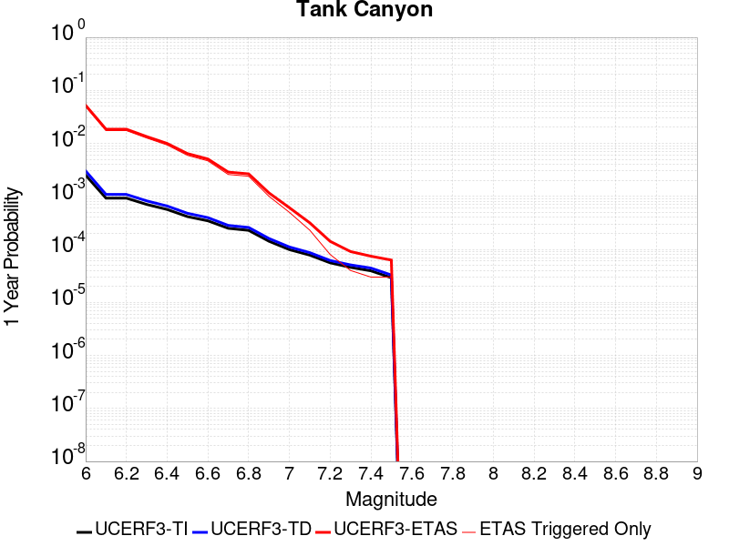 |  |

| Magnitude | 1 wk TI Prob | 1 wk TD Prob | 1 wk ETAS Prob | 1 wk ETAS/TD Gain | 1 wk ETAS Triggered Only | 1 mo TI Prob | 1 mo TD Prob | 1 mo ETAS Prob | 1 mo ETAS/TD Gain | 1 mo ETAS Triggered Only | 1 yr TI Prob | 1 yr TD Prob | 1 yr ETAS Prob | 1 yr ETAS/TD Gain | 1 yr ETAS Triggered Only | 10 yr TI Prob | 10 yr TD Prob | 10 yr ETAS Prob | 10 yr ETAS/TD Gain | 10 yr ETAS Triggered Only |
|-----|-----|-----|-----|-----|-----|-----|-----|-----|-----|-----|-----|-----|-----|-----|-----|-----|-----|-----|-----|-----|
| 6.0 | 4.8284557E-5 | 5.7964822E-5 | 0.024154378 | 416.70752 | 0.02409781 | 2.0691741E-4 | 2.4840087E-4 | 0.03308554 | 133.19414 | 0.032845296 | 0.0025163088 | 0.0030207601 | 0.052973263 | 17.536402 | 0.050103854 | 0.02488006 | 0.029863637 | 0.09727859 | 3.257426 | 0.06949018 |
| 6.1 | 1.7796336E-5 | 2.0873314E-5 | 0.008042051 | 385.27905 | 0.008021345 | 7.626778E-5 | 8.945422E-5 | 0.0112170195 | 125.393974 | 0.011128561 | 9.281647E-4 | 0.0010885983 | 0.018530792 | 17.022617 | 0.017461201 | 0.009242975 | 0.010836744 | 0.035441797 | 3.270521 | 0.024874615 |
| 6.2 | 1.7796336E-5 | 2.0873314E-5 | 0.008042051 | 385.27905 | 0.008021345 | 7.626778E-5 | 8.945422E-5 | 0.0112170195 | 125.393974 | 0.011128561 | 9.281647E-4 | 0.0010885983 | 0.018530792 | 17.022617 | 0.017461201 | 0.009242975 | 0.010836744 | 0.035441797 | 3.270521 | 0.024874615 |
| 6.3 | 1.3515912E-5 | 1.5759564E-5 | 0.0056052827 | 355.67496 | 0.005589611 | 5.792405E-5 | 6.753938E-5 | 0.008003914 | 118.507355 | 0.00793691 | 7.049971E-4 | 8.2200574E-4 | 0.013375638 | 16.271952 | 0.01256396 | 0.007027647 | 0.0081922645 | 0.026130121 | 3.189609 | 0.018086022 |
| 6.4 | 1.0870146E-5 | 1.2618021E-5 | 0.0042005517 | 332.901 | 0.0041879867 | 4.658551E-5 | 5.4076212E-5 | 0.005997994 | 110.91742 | 0.005944239 | 5.67031E-4 | 6.581969E-4 | 0.010159344 | 15.435114 | 0.009507405 | 0.005655863 | 0.0065644905 | 0.020270636 | 3.087922 | 0.013796714 |
| 6.5 | 7.964826E-6 | 9.196094E-6 | 0.002727985 | 296.64606 | 0.002718814 | 3.4134522E-5 | 3.9411298E-5 | 0.0038557325 | 97.83318 | 0.0038164717 | 4.1550855E-4 | 4.7973756E-4 | 0.0065392773 | 13.630947 | 0.0060624485 | 0.0041473247 | 0.004788321 | 0.013510729 | 2.8216007 | 0.008764375 |
| 6.6 | 6.6317E-6 | 7.6122988E-6 | 0.0021184767 | 278.29657 | 0.0021108803 | 2.8421264E-5 | 3.2623782E-5 | 0.0030046464 | 92.09988 | 0.0029721195 | 3.4597394E-4 | 3.9713128E-4 | 0.0051742666 | 13.029108 | 0.004779033 | 0.0034543579 | 0.003965368 | 0.01067658 | 2.6924562 | 0.00673793 |
| 6.7 | 4.793663E-6 | 5.4307857E-6 | 0.0011706305 | 215.55452 | 0.001165206 | 2.0544108E-5 | 2.3274613E-5 | 0.0017119396 | 73.55395 | 0.0016887042 | 2.500958E-4 | 2.8333595E-4 | 0.0029507326 | 10.414255 | 0.0026681528 | 0.0024981452 | 0.0028304397 | 0.0066024307 | 2.3326519 | 0.0037826975 |
| 6.8 | 4.382823E-6 | 4.9692567E-6 | 0.0010181868 | 204.89719 | 0.0010132225 | 1.8783392E-5 | 2.1296666E-5 | 0.0015410981 | 72.36336 | 0.0015198338 | 2.286638E-4 | 2.5926033E-4 | 0.0027072467 | 10.442194 | 0.0024486212 | 0.0022842865 | 0.002590253 | 0.006026286 | 2.3265243 | 0.0034449566 |
| 6.9 | 2.729601E-6 | 3.0735416E-6 | 3.914743E-4 | 127.369125 | 3.8840197E-4 | 1.1698237E-5 | 1.3172262E-5 | 5.7043735E-4 | 43.30595 | 5.572724E-4 | 1.4241673E-4 | 1.6036171E-4 | 0.0011565374 | 7.2120547 | 9.963355E-4 | 0.001423255 | 0.0016026258 | 0.0030188642 | 1.8836986 | 0.0014185116 |
| 7.0 | 1.8987357E-6 | 2.126939E-6 | 1.8788401E-4 | 88.3354 | 1.8575747E-4 | 8.137413E-6 | 9.115425E-6 | 2.9619253E-4 | 32.49355 | 2.8707972E-4 | 9.90685E-5 | 1.1097535E-4 | 5.4998975E-4 | 4.955963 | 4.390631E-4 | 9.902435E-4 | 0.0011092679 | 0.0017502637 | 1.5778548 | 6.417076E-4 |
| 7.1 | 1.4928986E-6 | 1.6641272E-6 | 1.5364726E-4 | 92.32903 | 1.5198339E-4 | 6.398121E-6 | 7.1319573E-6 | 1.928881E-4 | 27.045605 | 1.8575747E-4 | 7.789434E-5 | 8.682871E-5 | 3.4011237E-4 | 3.9170494 | 2.5330562E-4 | 7.786704E-4 | 8.6800574E-4 | 0.0012391983 | 1.4276383 | 3.7151494E-4 |
| 7.2 | 1.069082E-6 | 1.1828573E-6 | 6.873095E-5 | 58.105865 | 6.754817E-5 | 4.581772E-6 | 5.0693816E-6 | 7.261721E-5 | 14.324669 | 6.754817E-5 | 5.5781646E-5 | 6.171851E-5 | 1.630345E-4 | 2.6415823 | 1.0132226E-4 | 5.576765E-4 | 6.170659E-4 | 7.520789E-4 | 1.2187983 | 1.3509634E-4 |
| 7.3 | 8.776551E-7 | 9.770005E-7 | 3.4751054E-5 | 35.569126 | 3.3774086E-5 | 3.7613736E-6 | 4.1871413E-6 | 3.7961086E-5 | 9.066111 | 3.3774086E-5 | 4.579376E-5 | 5.097777E-5 | 1.0163632E-4 | 1.9937379 | 5.066113E-5 | 4.5784327E-4 | 5.097118E-4 | 5.9410394E-4 | 1.1655685 | 8.443521E-5 |
| 7.4 | 7.55721E-7 | 8.510244E-7 | 3.462508E-5 | 40.68635 | 3.3774086E-5 | 3.2388E-6 | 3.6472454E-6 | 3.7421207E-5 | 10.260129 | 3.3774086E-5 | 3.9431678E-5 | 4.4404827E-5 | 7.8177414E-5 | 1.7605611 | 3.3774086E-5 | 3.942468E-4 | 4.440104E-4 | 4.9464905E-4 | 1.1140484 | 5.066113E-5 |
| 7.5 | 5.587665E-7 | 6.305619E-7 | 3.4404628E-5 | 54.561855 | 3.3774086E-5 | 2.3947114E-6 | 2.702408E-6 | 3.6476402E-5 | 13.49774 | 3.3774086E-5 | 2.915522E-5 | 3.290182E-5 | 6.6674795E-5 | 2.0264773 | 3.3774086E-5 | 2.9151395E-4 | 3.290182E-4 | 3.7966264E-4 | 1.153926 | 5.066113E-5 |

## Garlock (Central)
*[(top)](#table-of-contents)*

| 1 Week | 1 Month | 1 Year | 10 Year |
|-----|-----|-----|-----|
|  |  |  |  |

| Magnitude | 1 wk TI Prob | 1 wk TD Prob | 1 wk ETAS Prob | 1 wk ETAS/TD Gain | 1 wk ETAS Triggered Only | 1 mo TI Prob | 1 mo TD Prob | 1 mo ETAS Prob | 1 mo ETAS/TD Gain | 1 mo ETAS Triggered Only | 1 yr TI Prob | 1 yr TD Prob | 1 yr ETAS Prob | 1 yr ETAS/TD Gain | 1 yr ETAS Triggered Only | 10 yr TI Prob | 10 yr TD Prob | 10 yr ETAS Prob | 10 yr ETAS/TD Gain | 10 yr ETAS Triggered Only |
|-----|-----|-----|-----|-----|-----|-----|-----|-----|-----|-----|-----|-----|-----|-----|-----|-----|-----|-----|-----|-----|
| 6.0 | 5.5131142E-5 | 7.024681E-5 | 0.031900086 | 454.11438 | 0.031832077 | 2.3625491E-4 | 3.010234E-4 | 0.040446322 | 134.36273 | 0.04015739 | 0.0028726095 | 0.0036588663 | 0.059199035 | 16.179611 | 0.055744126 | 0.028357591 | 0.036079824 | 0.105455644 | 2.9228423 | 0.07197258 |
| 6.1 | 5.5131142E-5 | 7.024681E-5 | 0.031900086 | 454.11438 | 0.031832077 | 2.3625491E-4 | 3.010234E-4 | 0.040446322 | 134.36273 | 0.04015739 | 0.0028726095 | 0.0036588663 | 0.059199035 | 16.179611 | 0.055744126 | 0.028357591 | 0.036079824 | 0.105455644 | 2.9228423 | 0.07197258 |
| 6.2 | 4.216245E-5 | 5.1661493E-5 | 0.019301895 | 373.6225 | 0.01925123 | 1.806837E-4 | 2.2138779E-4 | 0.02475283 | 111.80756 | 0.024536872 | 0.0021976046 | 0.0026920962 | 0.03714997 | 13.799644 | 0.03455089 | 0.021759989 | 0.026689773 | 0.071248665 | 2.6695118 | 0.045780774 |
| 6.3 | 4.216245E-5 | 5.1661493E-5 | 0.019301895 | 373.6225 | 0.01925123 | 1.806837E-4 | 2.2138779E-4 | 0.02475283 | 111.80756 | 0.024536872 | 0.0021976046 | 0.0026920962 | 0.03714997 | 13.799644 | 0.03455089 | 0.021759989 | 0.026689773 | 0.071248665 | 2.6695118 | 0.045780774 |
| 6.4 | 3.6858168E-5 | 4.411054E-5 | 0.014920939 | 338.26242 | 0.014877484 | 1.5795401E-4 | 1.8903162E-4 | 0.019166479 | 101.39298 | 0.018981036 | 0.0019213937 | 0.002299056 | 0.029508928 | 12.8352375 | 0.027272575 | 0.019048655 | 0.02284894 | 0.05844201 | 2.557756 | 0.036425352 |
| 6.5 | 3.39199E-5 | 4.0018083E-5 | 0.013599771 | 339.84064 | 0.013560295 | 1.453629E-4 | 1.7149492E-4 | 0.017427092 | 101.61871 | 0.017258558 | 0.0017683565 | 0.002085973 | 0.026807588 | 12.851359 | 0.024773292 | 0.017543508 | 0.020759864 | 0.0529233 | 2.5493085 | 0.032845296 |
| 6.6 | 3.3571985E-5 | 3.9472274E-5 | 0.013582346 | 344.0984 | 0.013543408 | 1.4387199E-4 | 1.6915603E-4 | 0.017391026 | 102.810555 | 0.017224783 | 0.0017502342 | 0.0020575512 | 0.02671246 | 12.982648 | 0.024705743 | 0.017365133 | 0.020481179 | 0.052571062 | 2.5667984 | 0.032760862 |
| 6.7 | 3.2580007E-5 | 3.8088703E-5 | 0.012804206 | 336.1681 | 0.012766604 | 1.3962112E-4 | 1.632272E-4 | 0.016473448 | 100.92342 | 0.016312882 | 0.0016985617 | 0.0019855013 | 0.02552986 | 12.858143 | 0.023591198 | 0.016856372 | 0.019773813 | 0.05051296 | 2.554538 | 0.031359237 |
| 6.8 | 3.2185937E-5 | 3.7515918E-5 | 0.012533459 | 334.08374 | 0.012496412 | 1.3793244E-4 | 1.6077272E-4 | 0.01615023 | 100.4538 | 0.015992029 | 0.0016780337 | 0.001955672 | 0.02511309 | 12.841157 | 0.023202797 | 0.016654192 | 0.019480614 | 0.04978189 | 2.5554578 | 0.030903287 |
| 6.9 | 3.165394E-5 | 3.6720503E-5 | 0.01231315 | 335.32083 | 0.0122768795 | 1.3565269E-4 | 1.5736422E-4 | 0.015792305 | 100.35512 | 0.015637401 | 0.0016503202 | 0.001914247 | 0.024533277 | 12.81615 | 0.02266241 | 0.01638118 | 0.019073246 | 0.04865825 | 2.5511258 | 0.030160258 |
| 7.0 | 3.0903822E-5 | 3.5625766E-5 | 0.011906793 | 334.2186 | 0.011871591 | 1.3243823E-4 | 1.5267303E-4 | 0.015348691 | 100.53308 | 0.015198339 | 0.0016112428 | 0.0018572307 | 0.02378647 | 12.807493 | 0.021970043 | 0.015996104 | 0.018512413 | 0.047285613 | 2.554265 | 0.029315906 |
| 7.1 | 3.0069863E-5 | 3.4392073E-5 | 0.011415867 | 331.9331 | 0.011381866 | 1.2886449E-4 | 1.4738638E-4 | 0.014786295 | 100.32334 | 0.014641066 | 0.0015677959 | 0.0017929734 | 0.022897642 | 12.770765 | 0.021142578 | 0.01556781 | 0.017880075 | 0.045577195 | 2.5490494 | 0.02820136 |
| 7.2 | 2.7957109E-5 | 3.128145E-5 | 0.0094201835 | 301.14276 | 0.009389196 | 1.1981068E-4 | 1.340566E-4 | 0.012257327 | 91.43398 | 0.012124897 | 0.0014577188 | 0.0016309366 | 0.01941771 | 11.905865 | 0.01781583 | 0.014481937 | 0.016283695 | 0.03973992 | 2.4404733 | 0.023844505 |
| 7.3 | 2.4519275E-5 | 2.6714795E-5 | 0.0069333306 | 259.5315 | 0.0069068004 | 1.0507837E-4 | 1.1448703E-4 | 0.0088778585 | 77.54466 | 0.008764375 | 0.0012785783 | 0.001393003 | 0.014158687 | 10.164146 | 0.012783491 | 0.012712469 | 0.013928054 | 0.030846322 | 2.21469 | 0.017157236 |
| 7.4 | 2.3225532E-5 | 2.51994E-5 | 0.006256361 | 248.27422 | 0.0062313187 | 9.95342E-5 | 1.0799304E-4 | 0.00799339 | 74.01765 | 0.007886249 | 0.0012111551 | 0.0013140367 | 0.01290019 | 9.817223 | 0.011601399 | 0.012045753 | 0.013145725 | 0.028544232 | 2.1713698 | 0.015603627 |
| 7.5 | 2.097765E-5 | 2.2483688E-5 | 0.004868956 | 216.55504 | 0.0048465813 | 8.9901114E-5 | 9.635517E-5 | 0.0062426464 | 64.78787 | 0.0061468836 | 0.0010939965 | 0.0011725046 | 0.010196479 | 8.696323 | 0.0090345675 | 0.010886264 | 0.011740365 | 0.023823043 | 2.029157 | 0.012226218 |
| 7.6 | 1.511254E-5 | 1.5991332E-5 | 0.0029205163 | 182.6312 | 0.0029045714 | 6.476642E-5 | 6.853253E-5 | 0.0035976826 | 52.495987 | 0.003529392 | 7.882459E-4 | 8.3407195E-4 | 0.005963451 | 7.149804 | 0.005133661 | 0.007854558 | 0.008383559 | 0.015048255 | 1.7949723 | 0.006721043 |
| 7.7 | 9.934069E-6 | 1.0678794E-5 | 8.8879565E-4 | 83.229965 | 8.781262E-4 | 4.2573887E-5 | 4.5765457E-5 | 0.0011602592 | 25.352293 | 0.0011145448 | 5.182138E-4 | 5.570524E-4 | 0.002194183 | 3.938917 | 0.0016380431 | 0.00517007 | 0.005627684 | 0.007625933 | 1.3550749 | 0.002009558 |
| 7.8 | 6.7562896E-6 | 8.428449E-6 | 5.9946993E-4 | 71.12459 | 5.9104647E-4 | 2.8955206E-5 | 3.6121426E-5 | 7.7912444E-4 | 21.569593 | 7.430299E-4 | 3.5247262E-4 | 4.3968976E-4 | 0.0016043833 | 3.6488986 | 0.001165206 | 0.0035191406 | 0.004446654 | 0.005909294 | 1.3289304 | 0.0014691727 |
| 7.9 | 3.975453E-6 | 5.37103E-6 | 3.4311006E-4 | 63.88161 | 3.3774084E-4 | 1.7037546E-5 | 2.3018498E-5 | 4.620715E-4 | 20.07392 | 4.390631E-4 | 2.0741238E-4 | 2.8021427E-4 | 9.892713E-4 | 3.53041 | 7.092558E-4 | 0.002072189 | 0.0028336283 | 0.0037429447 | 1.3209018 | 9.119003E-4 |
| 8.0 | 1.6729537E-6 | 2.0775144E-6 | 1.3717357E-4 | 66.02774 | 1.3509634E-4 | 7.169782E-6 | 8.903603E-6 | 1.9465941E-4 | 21.862993 | 1.8575747E-4 | 8.7288594E-5 | 1.0839601E-4 | 3.954446E-4 | 3.6481473 | 2.8707972E-4 | 8.7254314E-4 | 0.0010969337 | 0.0014680412 | 1.3383135 | 3.7151494E-4 |
| 8.1 | 3.6733252E-7 | 3.1489964E-7 | 1.7201937E-5 | 54.626728 | 1.6887043E-5 | 1.5742813E-6 | 1.3495693E-6 | 1.823659E-5 | 13.512896 | 1.6887043E-5 | 1.9166706E-5 | 1.6430899E-5 | 3.3317665E-5 | 2.0277445 | 1.6887043E-5 | 1.9165053E-4 | 1.6638759E-4 | 2.0015605E-4 | 1.2029506 | 3.3774086E-5 |

## Airport Lake
*[(top)](#table-of-contents)*

| 1 Week | 1 Month | 1 Year | 10 Year |
|-----|-----|-----|-----|
| 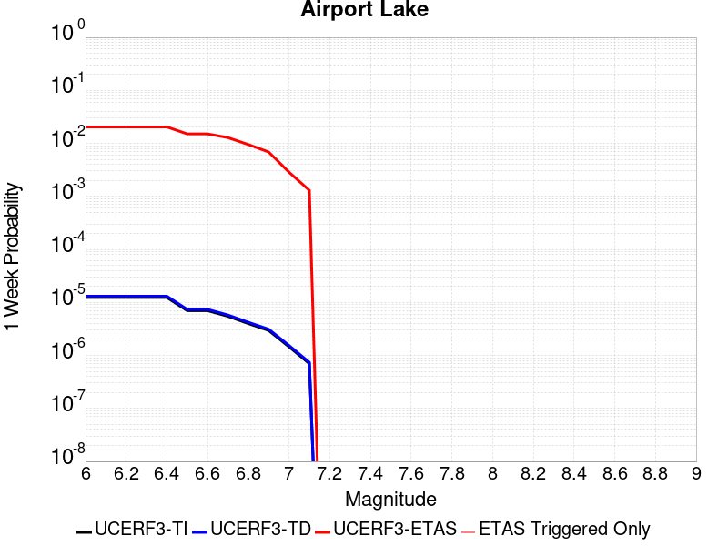 |  |  |  |

| Magnitude | 1 wk TI Prob | 1 wk TD Prob | 1 wk ETAS Prob | 1 wk ETAS/TD Gain | 1 wk ETAS Triggered Only | 1 mo TI Prob | 1 mo TD Prob | 1 mo ETAS Prob | 1 mo ETAS/TD Gain | 1 mo ETAS Triggered Only | 1 yr TI Prob | 1 yr TD Prob | 1 yr ETAS Prob | 1 yr ETAS/TD Gain | 1 yr ETAS Triggered Only | 10 yr TI Prob | 10 yr TD Prob | 10 yr ETAS Prob | 10 yr ETAS/TD Gain | 10 yr ETAS Triggered Only |
|-----|-----|-----|-----|-----|-----|-----|-----|-----|-----|-----|-----|-----|-----|-----|-----|-----|-----|-----|-----|-----|
| 6.0 | 1.2387061E-5 | 1.3103157E-5 | 0.02042927 | 1559.1106 | 0.020416435 | 5.3086325E-5 | 5.615534E-5 | 0.024844943 | 442.4324 | 0.024790179 | 6.461343E-4 | 6.8350515E-4 | 0.033421975 | 48.89791 | 0.032760862 | 0.0064425888 | 0.0068168393 | 0.04651599 | 6.8236885 | 0.03997163 |
| 6.1 | 1.2387061E-5 | 1.3103157E-5 | 0.02042927 | 1559.1106 | 0.020416435 | 5.3086325E-5 | 5.615534E-5 | 0.024844943 | 442.4324 | 0.024790179 | 6.461343E-4 | 6.8350515E-4 | 0.033421975 | 48.89791 | 0.032760862 | 0.0064425888 | 0.0068168393 | 0.04651599 | 6.8236885 | 0.03997163 |
| 6.2 | 1.2387061E-5 | 1.3103157E-5 | 0.02042927 | 1559.1106 | 0.020416435 | 5.3086325E-5 | 5.615534E-5 | 0.024844943 | 442.4324 | 0.024790179 | 6.461343E-4 | 6.8350515E-4 | 0.033421975 | 48.89791 | 0.032760862 | 0.0064425888 | 0.0068168393 | 0.04651599 | 6.8236885 | 0.03997163 |
| 6.3 | 1.2387061E-5 | 1.3103157E-5 | 0.02042927 | 1559.1106 | 0.020416435 | 5.3086325E-5 | 5.615534E-5 | 0.024844943 | 442.4324 | 0.024790179 | 6.461343E-4 | 6.8350515E-4 | 0.033421975 | 48.89791 | 0.032760862 | 0.0064425888 | 0.0068168393 | 0.04651599 | 6.8236885 | 0.03997163 |
| 6.4 | 1.2387061E-5 | 1.3103157E-5 | 0.02042927 | 1559.1106 | 0.020416435 | 5.3086325E-5 | 5.615534E-5 | 0.024844943 | 442.4324 | 0.024790179 | 6.461343E-4 | 6.8350515E-4 | 0.033421975 | 48.89791 | 0.032760862 | 0.0064425888 | 0.0068168393 | 0.04651599 | 6.8236885 | 0.03997163 |
| 6.5 | 6.9922594E-6 | 7.384925E-6 | 0.015357593 | 2079.587 | 0.015350321 | 2.996648E-5 | 3.1649324E-5 | 0.018573035 | 586.83826 | 0.018541973 | 3.6478083E-4 | 3.8526783E-4 | 0.024828285 | 64.44422 | 0.024452437 | 0.003641826 | 0.0038465366 | 0.03348705 | 8.705768 | 0.029754968 |
| 6.6 | 6.9922594E-6 | 7.384925E-6 | 0.015357593 | 2079.587 | 0.015350321 | 2.996648E-5 | 3.1649324E-5 | 0.018573035 | 586.83826 | 0.018541973 | 3.6478083E-4 | 3.8526783E-4 | 0.024828285 | 64.44422 | 0.024452437 | 0.003641826 | 0.0038465366 | 0.03348705 | 8.705768 | 0.029754968 |
| 6.7 | 5.477277E-6 | 5.7860684E-6 | 0.013143829 | 2271.6338 | 0.013138119 | 2.3473833E-5 | 2.4797222E-5 | 0.015931997 | 642.4912 | 0.015907595 | 2.8575645E-4 | 3.0186825E-4 | 0.0214043 | 70.9061 | 0.021108802 | 0.0028538927 | 0.003014966 | 0.028521702 | 9.460041 | 0.025583869 |
| 6.8 | 3.9950432E-6 | 4.2190873E-6 | 0.0096297925 | 2282.435 | 0.009625615 | 1.7121502E-5 | 1.8081691E-5 | 0.01166993 | 645.4003 | 0.011652059 | 2.0843433E-4 | 2.2012512E-4 | 0.01588785 | 72.17646 | 0.015671175 | 0.0020823893 | 0.0021993418 | 0.021121781 | 9.603683 | 0.018964149 |
| 6.9 | 2.95695E-6 | 3.1230243E-6 | 0.006994337 | 2239.6038 | 0.0069912355 | 1.2672582E-5 | 1.3384334E-5 | 0.008456793 | 631.8426 | 0.008443521 | 1.5427776E-4 | 1.6294434E-4 | 0.011610494 | 71.25435 | 0.011449415 | 0.001541707 | 0.0016284712 | 0.0154701555 | 9.499804 | 0.013864262 |
| 7.0 | 1.456072E-6 | 1.540812E-6 | 0.0027710116 | 1798.4099 | 0.0027694749 | 6.2402937E-6 | 6.603469E-6 | 0.0033839897 | 512.45636 | 0.0033774085 | 7.597293E-5 | 8.039528E-5 | 0.004859044 | 60.439423 | 0.004779033 | 7.594696E-4 | 8.0376083E-4 | 0.006675728 | 8.305615 | 0.0058766906 |
| 7.1 | 6.995192E-7 | 7.4089746E-7 | 0.0012334941 | 1664.8649 | 0.0012327541 | 2.997936E-6 | 3.1752747E-6 | 0.0014723433 | 463.69006 | 0.0014691727 | 3.649926E-5 | 3.865897E-5 | 0.0021832304 | 56.4741 | 0.0021446545 | 3.6493264E-4 | 3.865897E-4 | 0.0029524278 | 7.6371093 | 0.0025668305 |

## Owl Lake
*[(top)](#table-of-contents)*

| 1 Week | 1 Month | 1 Year | 10 Year |
|-----|-----|-----|-----|
|  |  |  |  |

| Magnitude | 1 wk TI Prob | 1 wk TD Prob | 1 wk ETAS Prob | 1 wk ETAS/TD Gain | 1 wk ETAS Triggered Only | 1 mo TI Prob | 1 mo TD Prob | 1 mo ETAS Prob | 1 mo ETAS/TD Gain | 1 mo ETAS Triggered Only | 1 yr TI Prob | 1 yr TD Prob | 1 yr ETAS Prob | 1 yr ETAS/TD Gain | 1 yr ETAS Triggered Only | 10 yr TI Prob | 10 yr TD Prob | 10 yr ETAS Prob | 10 yr ETAS/TD Gain | 10 yr ETAS Triggered Only |
|-----|-----|-----|-----|-----|-----|-----|-----|-----|-----|-----|-----|-----|-----|-----|-----|-----|-----|-----|-----|-----|
| 6.0 | 5.0320643E-5 | 6.635816E-5 | 0.008475548 | 127.72427 | 0.008409747 | 2.1564208E-4 | 2.843674E-4 | 0.011578586 | 40.717 | 0.011297432 | 0.0026222812 | 0.0034577388 | 0.020808078 | 6.0178285 | 0.017410541 | 0.02591553 | 0.034140717 | 0.05741581 | 1.68174 | 0.02409781 |
| 6.1 | 5.0320643E-5 | 6.635816E-5 | 0.008475548 | 127.72427 | 0.008409747 | 2.1564208E-4 | 2.843674E-4 | 0.011578586 | 40.717 | 0.011297432 | 0.0026222812 | 0.0034577388 | 0.020808078 | 6.0178285 | 0.017410541 | 0.02591553 | 0.034140717 | 0.05741581 | 1.68174 | 0.02409781 |
| 6.2 | 2.4125871E-5 | 3.0981035E-5 | 0.006430972 | 207.57768 | 0.0064001894 | 1.0339249E-4 | 1.3277028E-4 | 0.008625825 | 64.96804 | 0.0084941825 | 0.0012580766 | 0.001615439 | 0.014546877 | 9.004907 | 0.012952361 | 0.012509781 | 0.016070465 | 0.033516906 | 2.0856216 | 0.017731395 |
| 6.3 | 1.7433485E-5 | 2.2355514E-5 | 0.005594955 | 250.27182 | 0.005572724 | 7.471279E-5 | 9.580672E-5 | 0.0073734247 | 76.96146 | 0.0072783153 | 9.0924866E-4 | 0.0011659743 | 0.012264692 | 10.518836 | 0.011111674 | 0.009055373 | 0.011628896 | 0.026583731 | 2.2860065 | 0.01513079 |
| 6.4 | 1.7433485E-5 | 2.2355514E-5 | 0.005594955 | 250.27182 | 0.005572724 | 7.471279E-5 | 9.580672E-5 | 0.0073734247 | 76.96146 | 0.0072783153 | 9.0924866E-4 | 0.0011659743 | 0.012264692 | 10.518836 | 0.011111674 | 0.009055373 | 0.011628896 | 0.026583731 | 2.2860065 | 0.01513079 |
| 6.5 | 1.5182742E-5 | 1.9429144E-5 | 0.005406291 | 278.25677 | 0.0053869667 | 6.506727E-5 | 8.326596E-5 | 0.007107691 | 85.361305 | 0.0070250095 | 7.919061E-4 | 0.0010134429 | 0.011675238 | 11.5203705 | 0.010672611 | 0.0078909 | 0.010118429 | 0.024410756 | 2.4125047 | 0.014438421 |
| 6.6 | 6.7271576E-6 | 8.547361E-6 | 0.0042978195 | 502.82416 | 0.004289309 | 2.8830356E-5 | 3.6631063E-5 | 0.0056598103 | 154.50848 | 0.0056233853 | 3.5095305E-4 | 4.458976E-4 | 0.008548064 | 19.170464 | 0.00810578 | 0.0035039932 | 0.004467813 | 0.015025494 | 3.3630538 | 0.010605062 |
| 6.7 | 6.682835E-6 | 8.479807E-6 | 0.0042639785 | 502.83908 | 0.0042555346 | 2.8640408E-5 | 3.6341557E-5 | 0.0056257495 | 154.80211 | 0.005589611 | 3.4864116E-4 | 4.4237426E-4 | 0.00849393 | 19.200779 | 0.008055119 | 0.003480947 | 0.0044327388 | 0.014940356 | 3.370457 | 0.010554401 |
| 6.8 | 6.5774975E-6 | 8.32628E-6 | 0.0042638257 | 512.09247 | 0.0042555346 | 2.8188972E-5 | 3.5683603E-5 | 0.005608209 | 157.16487 | 0.005572724 | 3.4314668E-4 | 4.343669E-4 | 0.008469108 | 19.49759 | 0.008038232 | 0.0034261728 | 0.004352885 | 0.014827717 | 3.4064116 | 0.010520628 |
| 6.9 | 6.363419E-6 | 7.999454E-6 | 0.004246613 | 530.86285 | 0.004238648 | 2.727151E-5 | 3.428296E-5 | 0.0055899294 | 163.05272 | 0.005555837 | 3.3198006E-4 | 4.1732067E-4 | 0.008435318 | 20.213037 | 0.008021345 | 0.0033148455 | 0.0041828766 | 0.014609048 | 3.4925842 | 0.010469967 |
| 7.0 | 6.1342453E-6 | 7.6316555E-6 | 0.004212473 | 551.9737 | 0.0042048735 | 2.6289357E-5 | 3.2706717E-5 | 0.005554589 | 169.83023 | 0.005522063 | 3.2002592E-4 | 3.9813702E-4 | 0.008315006 | 20.884787 | 0.007920023 | 0.0031956544 | 0.003991571 | 0.014285188 | 3.5788388 | 0.01033487 |
| 7.1 | 5.842926E-6 | 7.142211E-6 | 0.0040093428 | 561.35876 | 0.0040022293 | 2.504087E-5 | 3.0609146E-5 | 0.0053160917 | 173.67656 | 0.0052856444 | 3.0482994E-4 | 3.7260808E-4 | 0.007901423 | 21.20572 | 0.007531621 | 0.0030441214 | 0.0037370329 | 0.013545387 | 3.624637 | 0.009845146 |
| 7.2 | 4.77173E-6 | 5.358483E-6 | 0.0024370796 | 454.80774 | 0.0024317342 | 2.045011E-5 | 2.2964748E-5 | 0.003383409 | 147.33055 | 0.0033605215 | 2.4895166E-4 | 2.79564E-4 | 0.005276731 | 18.874859 | 0.0049985647 | 0.0024867293 | 0.002808645 | 0.009308736 | 3.3143156 | 0.0065183984 |
| 7.3 | 3.0494948E-6 | 2.710463E-6 | 8.132863E-4 | 300.05438 | 8.1057806E-4 | 1.3069198E-5 | 1.1616219E-5 | 0.0010754876 | 92.58499 | 0.0010638837 | 1.5910587E-4 | 1.4141845E-4 | 0.0017116913 | 12.103734 | 0.001570495 | 0.0015899199 | 0.0014232415 | 0.0034130763 | 2.3981009 | 0.001992671 |
| 7.4 | 2.7263884E-6 | 2.3056762E-6 | 5.933508E-4 | 257.3435 | 5.9104647E-4 | 1.1684469E-5 | 9.881433E-6 | 7.6979084E-4 | 77.902756 | 7.599169E-4 | 1.4224913E-4 | 1.20299905E-4 | 0.0013191357 | 10.965392 | 0.00119898 | 0.0014215811 | 0.0012112238 | 0.002678617 | 2.2114964 | 0.0014691727 |
| 7.5 | 2.6090431E-6 | 2.1656133E-6 | 5.087758E-4 | 234.93382 | 5.0661125E-4 | 1.1181565E-5 | 9.281167E-6 | 5.665484E-4 | 61.042797 | 5.572724E-4 | 1.3612706E-4 | 1.1299244E-4 | 0.0010247898 | 9.069542 | 9.119003E-4 | 0.001360437 | 0.0011379806 | 0.0022512572 | 1.9782913 | 0.0011145448 |
| 7.6 | 2.3008756E-6 | 1.8727933E-6 | 4.2404808E-4 | 226.42545 | 4.2217606E-4 | 9.860858E-6 | 8.0262325E-6 | 4.639727E-4 | 57.807034 | 4.5595015E-4 | 1.20049335E-4 | 9.7715085E-5 | 7.562454E-4 | 7.7392898 | 6.5859465E-4 | 0.001199845 | 9.849932E-4 | 0.0017947728 | 1.822117 | 8.1057806E-4 |
| 7.7 | 1.7184348E-6 | 1.3419171E-6 | 1.8709914E-4 | 139.42674 | 1.8575747E-4 | 7.3646997E-6 | 5.7510606E-6 | 2.0839441E-4 | 36.23582 | 2.0264451E-4 | 8.966153E-5 | 7.0016955E-5 | 4.2462003E-4 | 6.0645313 | 3.546279E-4 | 8.962536E-4 | 7.078345E-4 | 0.0011297117 | 1.5960112 | 4.2217606E-4 |
| 7.8 | 8.4612907E-7 | 8.4058576E-7 | 8.527573E-5 | 101.44798 | 8.443521E-5 | 3.6262625E-6 | 3.6025056E-6 | 1.04924395E-4 | 29.125395 | 1.0132226E-4 | 4.4148852E-5 | 4.3859643E-5 | 2.4649527E-4 | 5.620093 | 2.0264451E-4 | 4.414008E-4 | 4.4398365E-4 | 6.971768E-4 | 1.5702759 | 2.5330562E-4 |
| 7.9 | 2.716738E-7 | 3.768106E-7 | 3.4150882E-5 | 90.63143 | 3.3774086E-5 | 1.1643157E-6 | 1.6149015E-6 | 3.5388934E-5 | 21.913988 | 3.3774086E-5 | 1.4175452E-5 | 1.966126E-5 | 8.72081E-5 | 4.4355297 | 6.754817E-5 | 1.4174548E-4 | 1.9836679E-4 | 2.8278524E-4 | 1.4255675 | 8.443521E-5 |
| 8.0 | 2.1995428E-8 | 3.384878E-8 | 3.384878E-8 | 1.0 | 0.0 | 9.426611E-8 | 1.4506621E-7 | 1.4506621E-7 | 1.0 | 0.0 | 1.1476893E-6 | 1.7661803E-6 | 1.8653192E-5 | 10.561318 | 1.6887043E-5 | 1.14768345E-5 | 1.7963059E-5 | 3.4849796E-5 | 1.9400815 | 1.6887043E-5 |

## Panamint Valley
*[(top)](#table-of-contents)*

| 1 Week | 1 Month | 1 Year | 10 Year |
|-----|-----|-----|-----|
|  |  |  |  |

| Magnitude | 1 wk TI Prob | 1 wk TD Prob | 1 wk ETAS Prob | 1 wk ETAS/TD Gain | 1 wk ETAS Triggered Only | 1 mo TI Prob | 1 mo TD Prob | 1 mo ETAS Prob | 1 mo ETAS/TD Gain | 1 mo ETAS Triggered Only | 1 yr TI Prob | 1 yr TD Prob | 1 yr ETAS Prob | 1 yr ETAS/TD Gain | 1 yr ETAS Triggered Only | 10 yr TI Prob | 10 yr TD Prob | 10 yr ETAS Prob | 10 yr ETAS/TD Gain | 10 yr ETAS Triggered Only |
|-----|-----|-----|-----|-----|-----|-----|-----|-----|-----|-----|-----|-----|-----|-----|-----|-----|-----|-----|-----|-----|
| 6.0 | 3.0211835E-5 | 3.3984514E-5 | 0.0069574364 | 204.72374 | 0.0069236876 | 1.2947287E-4 | 1.4563995E-4 | 0.00943216 | 64.76356 | 0.009287873 | 0.0015751923 | 0.0017717537 | 0.015999166 | 9.030129 | 0.014252664 | 0.015640736 | 0.017583137 | 0.037325375 | 2.1227937 | 0.020095581 |
| 6.1 | 3.0211835E-5 | 3.3984514E-5 | 0.0069574364 | 204.72374 | 0.0069236876 | 1.2947287E-4 | 1.4563995E-4 | 0.00943216 | 64.76356 | 0.009287873 | 0.0015751923 | 0.0017717537 | 0.015999166 | 9.030129 | 0.014252664 | 0.015640736 | 0.017583137 | 0.037325375 | 2.1227937 | 0.020095581 |
| 6.2 | 3.0211835E-5 | 3.3984514E-5 | 0.0069574364 | 204.72374 | 0.0069236876 | 1.2947287E-4 | 1.4563995E-4 | 0.00943216 | 64.76356 | 0.009287873 | 0.0015751923 | 0.0017717537 | 0.015999166 | 9.030129 | 0.014252664 | 0.015640736 | 0.017583137 | 0.037325375 | 2.1227937 | 0.020095581 |
| 6.3 | 2.8573924E-5 | 3.210268E-5 | 0.0066684973 | 207.72401 | 0.006636608 | 1.2245393E-4 | 1.3757581E-4 | 0.009052708 | 65.80159 | 0.008916358 | 0.001489857 | 0.0016737265 | 0.015160749 | 9.058081 | 0.013509634 | 0.01479908 | 0.016617801 | 0.03520038 | 2.1182334 | 0.0188966 |
| 6.4 | 2.8573924E-5 | 3.210268E-5 | 0.0066684973 | 207.72401 | 0.006636608 | 1.2245393E-4 | 1.3757581E-4 | 0.009052708 | 65.80159 | 0.008916358 | 0.001489857 | 0.0016737265 | 0.015160749 | 9.058081 | 0.013509634 | 0.01479908 | 0.016617801 | 0.03520038 | 2.1182334 | 0.0188966 |
| 6.5 | 2.7468774E-5 | 3.0828433E-5 | 0.006413934 | 208.05254 | 0.006383302 | 1.1771801E-4 | 1.3211532E-4 | 0.008726484 | 66.052025 | 0.008595505 | 0.0014322745 | 0.0016073446 | 0.014572607 | 9.066262 | 0.012986136 | 0.014230782 | 0.015963677 | 0.033794213 | 2.1169443 | 0.018119797 |
| 6.6 | 2.6135967E-5 | 2.925248E-5 | 0.006260389 | 214.01224 | 0.0062313187 | 1.1200648E-4 | 1.253619E-4 | 0.008466515 | 67.53659 | 0.008342199 | 0.0013628257 | 0.0015252391 | 0.014154342 | 9.280081 | 0.012648395 | 0.013544982 | 0.015154043 | 0.03251695 | 2.1457605 | 0.017630072 |
| 6.7 | 2.4498746E-5 | 2.7341335E-5 | 0.0059714178 | 218.40257 | 0.005944239 | 1.04990395E-4 | 1.1717203E-4 | 0.008086923 | 69.01752 | 0.007970684 | 0.0012775084 | 0.0014256609 | 0.013482682 | 9.457145 | 0.012074236 | 0.012701893 | 0.014171274 | 0.030735768 | 2.168878 | 0.016802607 |
| 6.8 | 2.2244329E-5 | 2.4935423E-5 | 0.005563747 | 223.12624 | 0.0055389497 | 9.532935E-5 | 1.0686185E-4 | 0.0075701373 | 70.84041 | 0.0074640727 | 0.0011600169 | 0.0013002884 | 0.012448109 | 9.573345 | 0.011162335 | 0.011539802 | 0.0129325185 | 0.028217671 | 2.181916 | 0.015485418 |
| 6.9 | 1.9902658E-5 | 2.2290267E-5 | 0.00483499 | 216.91037 | 0.0048128073 | 8.529431E-5 | 9.552632E-5 | 0.006528875 | 68.346344 | 0.0064339633 | 0.0010379635 | 0.0011624309 | 0.010776856 | 9.270965 | 0.009625615 | 0.010331288 | 0.011568608 | 0.024805112 | 2.1441743 | 0.013391425 |
| 7.0 | 1.8353881E-5 | 2.0566185E-5 | 0.0045462004 | 221.05219 | 0.0045257276 | 7.865712E-5 | 8.813792E-5 | 0.006133166 | 69.58601 | 0.0060455613 | 9.5722964E-4 | 0.0010725686 | 0.009945625 | 9.272717 | 0.008882584 | 0.009531168 | 0.010678849 | 0.022941573 | 2.1483188 | 0.0123950895 |
| 7.1 | 1.7667631E-5 | 1.9772613E-5 | 0.004460977 | 225.61394 | 0.004441292 | 7.571623E-5 | 8.473711E-5 | 0.0059778155 | 70.545425 | 0.005893578 | 9.2145515E-4 | 0.0010312037 | 0.009634715 | 9.343173 | 0.008612392 | 0.009176437 | 0.010269073 | 0.022119034 | 2.1539466 | 0.0119729135 |
| 7.2 | 1.6381597E-5 | 1.8158249E-5 | 0.0040203147 | 221.4043 | 0.0040022293 | 7.020495E-5 | 7.781885E-5 | 0.005363052 | 68.91713 | 0.0052856444 | 8.544101E-4 | 9.4704994E-4 | 0.008673991 | 9.158958 | 0.0077342656 | 0.008511325 | 0.009434792 | 0.020107076 | 2.1311626 | 0.0107739335 |
| 7.3 | 1.4520491E-5 | 1.5966476E-5 | 0.0034270945 | 214.64314 | 0.0034111827 | 6.222919E-5 | 6.842605E-5 | 0.004576958 | 66.889114 | 0.0045088404 | 7.57377E-4 | 8.327849E-4 | 0.007278263 | 8.739667 | 0.00645085 | 0.0075480095 | 0.00829975 | 0.017142106 | 2.065376 | 0.008916358 |
| 7.4 | 1.2852287E-5 | 1.4145411E-5 | 0.003239525 | 229.01596 | 0.003225425 | 5.5080065E-5 | 6.062187E-5 | 0.004349671 | 71.75085 | 0.004289309 | 6.7039346E-4 | 7.378371E-4 | 0.006812687 | 9.23332 | 0.006079335 | 0.0066837464 | 0.0073567946 | 0.015738199 | 2.139274 | 0.008443521 |
| 7.5 | 1.1637851E-5 | 1.2836797E-5 | 0.0031706733 | 246.99876 | 0.003157877 | 4.987555E-5 | 5.5013777E-5 | 0.004259656 | 77.4289 | 0.0042048735 | 6.070656E-4 | 6.6960254E-4 | 0.006626737 | 9.8965225 | 0.005961126 | 0.006054099 | 0.0066787465 | 0.0148813585 | 2.2281666 | 0.008257763 |
| 7.6 | 3.0068115E-6 | 3.3330316E-6 | 0.0015231618 | 456.9899 | 0.0015198338 | 1.2886271E-5 | 1.4284384E-5 | 0.0018211721 | 127.49392 | 0.0018069135 | 1.5687906E-4 | 1.7390578E-4 | 0.0027234058 | 15.660237 | 0.0025499435 | 0.0015676835 | 0.0017391363 | 0.0052455324 | 3.016171 | 0.0035125047 |

## Garlock (East)
*[(top)](#table-of-contents)*

| 1 Week | 1 Month | 1 Year | 10 Year |
|-----|-----|-----|-----|
|  |  |  |  |

| Magnitude | 1 wk TI Prob | 1 wk TD Prob | 1 wk ETAS Prob | 1 wk ETAS/TD Gain | 1 wk ETAS Triggered Only | 1 mo TI Prob | 1 mo TD Prob | 1 mo ETAS Prob | 1 mo ETAS/TD Gain | 1 mo ETAS Triggered Only | 1 yr TI Prob | 1 yr TD Prob | 1 yr ETAS Prob | 1 yr ETAS/TD Gain | 1 yr ETAS Triggered Only | 10 yr TI Prob | 10 yr TD Prob | 10 yr ETAS Prob | 10 yr ETAS/TD Gain | 10 yr ETAS Triggered Only |
|-----|-----|-----|-----|-----|-----|-----|-----|-----|-----|-----|-----|-----|-----|-----|-----|-----|-----|-----|-----|-----|
| 6.0 | 4.5092507E-5 | 6.290325E-5 | 0.005381987 | 85.55976 | 0.0053194184 | 1.9323928E-4 | 2.6956003E-4 | 0.007326441 | 27.179256 | 0.007058784 | 0.0023501497 | 0.0032774 | 0.014857608 | 4.533352 | 0.011618285 | 0.023254504 | 0.032351844 | 0.04825136 | 1.4914563 | 0.016431093 |
| 6.1 | 4.5092507E-5 | 6.290325E-5 | 0.005381987 | 85.55976 | 0.0053194184 | 1.9323928E-4 | 2.6956003E-4 | 0.007326441 | 27.179256 | 0.007058784 | 0.0023501497 | 0.0032774 | 0.014857608 | 4.533352 | 0.011618285 | 0.023254504 | 0.032351844 | 0.04825136 | 1.4914563 | 0.016431093 |
| 6.2 | 2.6674514E-5 | 3.4509674E-5 | 0.0041041463 | 118.927414 | 0.004069777 | 1.1431433E-4 | 1.4789042E-4 | 0.0053483304 | 36.164146 | 0.0052012093 | 0.0013908884 | 0.0017991117 | 0.009890309 | 5.4973288 | 0.00810578 | 0.01382215 | 0.017890299 | 0.02890269 | 1.6155511 | 0.011212996 |
| 6.3 | 2.6674514E-5 | 3.4509674E-5 | 0.0041041463 | 118.927414 | 0.004069777 | 1.1431433E-4 | 1.4789042E-4 | 0.0053483304 | 36.164146 | 0.0052012093 | 0.0013908884 | 0.0017991117 | 0.009890309 | 5.4973288 | 0.00810578 | 0.01382215 | 0.017890299 | 0.02890269 | 1.6155511 | 0.011212996 |
| 6.4 | 2.5312667E-5 | 3.233893E-5 | 0.0040682117 | 125.7992 | 0.0040360033 | 1.0847834E-4 | 1.3858822E-4 | 0.005254653 | 37.91558 | 0.005116774 | 0.0013199237 | 0.0016860351 | 0.009609563 | 5.699504 | 0.00793691 | 0.013121112 | 0.016778335 | 0.027620556 | 1.6462035 | 0.011027239 |
| 6.5 | 2.5312667E-5 | 3.233893E-5 | 0.0040682117 | 125.7992 | 0.0040360033 | 1.0847834E-4 | 1.3858822E-4 | 0.005254653 | 37.91558 | 0.005116774 | 0.0013199237 | 0.0016860351 | 0.009609563 | 5.699504 | 0.00793691 | 0.013121112 | 0.016778335 | 0.027620556 | 1.6462035 | 0.011027239 |
| 6.6 | 2.246556E-5 | 2.8133776E-5 | 0.0038276115 | 136.0504 | 0.0037995847 | 9.627742E-5 | 1.20567885E-4 | 0.0048652547 | 40.352825 | 0.004745259 | 0.0011715472 | 0.0014669491 | 0.008818899 | 6.011728 | 0.0073627504 | 0.011653901 | 0.01461866 | 0.024636047 | 1.6852465 | 0.010166 |
| 6.7 | 2.2241198E-5 | 2.7803519E-5 | 0.0038272825 | 137.6546 | 0.0037995847 | 9.531594E-5 | 1.1915263E-4 | 0.004863846 | 40.8203 | 0.004745259 | 0.0011598538 | 0.0014497414 | 0.008784955 | 6.0596704 | 0.0073458636 | 0.011538187 | 0.014448853 | 0.02443468 | 1.6911155 | 0.010132225 |
| 6.8 | 1.9528685E-5 | 2.389819E-5 | 0.003722072 | 155.74702 | 0.0036982624 | 8.369167E-5 | 1.0241691E-4 | 0.0047121076 | 46.009075 | 0.0046101627 | 0.0010184698 | 0.0012462323 | 0.008211889 | 6.589373 | 0.006974349 | 0.010138147 | 0.012436427 | 0.021808917 | 1.7536321 | 0.009490518 |
| 6.9 | 1.3318621E-5 | 1.5198884E-5 | 0.0035445371 | 233.21034 | 0.003529392 | 5.7078556E-5 | 6.513648E-5 | 0.004438596 | 68.143005 | 0.004373744 | 6.9470983E-4 | 7.927538E-4 | 0.0072722374 | 9.173387 | 0.0064846245 | 0.0069254204 | 0.007939888 | 0.016400134 | 2.0655372 | 0.008527957 |
| 7.0 | 1.1760853E-5 | 1.31077895E-5 | 0.0034580193 | 263.8141 | 0.0034449566 | 5.0402683E-5 | 5.6175057E-5 | 0.004328357 | 77.05122 | 0.004272422 | 6.134799E-4 | 6.8372174E-4 | 0.006978282 | 10.206319 | 0.006298867 | 0.0061178906 | 0.00685652 | 0.015040893 | 2.193663 | 0.008240877 |
| 7.1 | 1.0064758E-5 | 1.0902931E-5 | 0.0032869535 | 301.4743 | 0.0032760862 | 4.3133965E-5 | 4.672603E-5 | 0.0040656542 | 87.01048 | 0.004019116 | 5.2502943E-4 | 5.687444E-4 | 0.0064589703 | 11.356544 | 0.005893578 | 0.005237907 | 0.0057129986 | 0.013386288 | 2.3431282 | 0.0077173784 |
| 7.2 | 9.768808E-6 | 1.0498807E-5 | 0.0032021163 | 304.9981 | 0.003191651 | 4.186565E-5 | 4.499413E-5 | 0.003928839 | 87.318924 | 0.0038840198 | 5.095951E-4 | 5.4766936E-4 | 0.0062692417 | 11.447129 | 0.0057247076 | 0.0050842804 | 0.0055032647 | 0.012943055 | 2.3518867 | 0.00748096 |
| 7.3 | 9.344516E-6 | 9.944468E-6 | 0.002914487 | 293.0762 | 0.0029045714 | 4.004731E-5 | 4.261847E-5 | 0.00357186 | 83.81014 | 0.003529392 | 4.8746695E-4 | 5.1875977E-4 | 0.0057679056 | 11.118645 | 0.00525187 | 0.0048639905 | 0.0052149445 | 0.012102526 | 2.320739 | 0.0069236876 |
| 7.4 | 9.023491E-6 | 9.490661E-6 | 0.0025931837 | 273.2353 | 0.0025837175 | 3.867153E-5 | 4.0673647E-5 | 0.0031646495 | 77.80589 | 0.003124103 | 4.7072413E-4 | 4.950925E-4 | 0.0052042445 | 10.511662 | 0.004711485 | 0.004697283 | 0.0049783974 | 0.011161891 | 2.2420652 | 0.0062144315 |
| 7.5 | 7.081253E-6 | 7.087672E-6 | 0.0013242677 | 186.84099 | 0.0013171893 | 3.0347876E-5 | 3.0375388E-5 | 0.0016514822 | 54.36909 | 0.0016211561 | 3.6942272E-4 | 3.6975832E-4 | 0.002817474 | 7.619772 | 0.0024486212 | 0.003688092 | 0.0037243143 | 0.0069209025 | 1.8583026 | 0.003208538 |
| 7.6 | 6.116396E-6 | 5.959245E-6 | 7.996455E-4 | 134.18571 | 7.93691E-4 | 2.6212863E-5 | 2.5539372E-5 | 0.0010556227 | 41.33315 | 0.0010301096 | 3.1909486E-4 | 3.1089774E-4 | 0.0018809044 | 6.0499134 | 0.001570495 | 0.0031863707 | 0.0031357552 | 0.0050885095 | 1.6227381 | 0.0019588969 |
| 7.7 | 4.797145E-6 | 4.757281E-6 | 5.4514006E-4 | 114.59068 | 5.403854E-4 | 2.055903E-5 | 2.0388188E-5 | 7.127428E-4 | 34.958614 | 6.923687E-4 | 2.5027743E-4 | 2.4819805E-4 | 0.0011936377 | 4.8092146 | 9.456744E-4 | 0.0024999576 | 0.0025093474 | 0.003688474 | 1.4698938 | 0.0011820929 |
| 7.8 | 3.4028885E-6 | 3.978462E-6 | 3.5860494E-4 | 90.13658 | 3.546279E-4 | 1.4583726E-5 | 1.7050439E-5 | 4.5610606E-4 | 26.750399 | 4.390631E-4 | 1.775424E-4 | 2.0756939E-4 | 8.4914383E-4 | 4.0908914 | 6.417076E-4 | 0.0017740062 | 0.0021012232 | 0.002943801 | 1.4009941 | 8.443521E-4 |
| 7.9 | 2.5928412E-6 | 3.3724489E-6 | 2.5667725E-4 | 76.11005 | 2.5330562E-4 | 1.1112129E-5 | 1.4453272E-5 | 3.5218924E-4 | 24.36744 | 3.3774084E-4 | 1.3528178E-4 | 1.7595445E-4 | 7.1624474E-4 | 4.070626 | 5.403854E-4 | 0.0013519945 | 0.0017812408 | 0.0024555193 | 1.3785443 | 6.754817E-4 |
| 8.0 | 1.3743648E-6 | 1.6734747E-6 | 1.367696E-4 | 81.72791 | 1.3509634E-4 | 5.8901214E-6 | 7.1720146E-6 | 1.9292816E-4 | 26.900133 | 1.8575747E-4 | 7.1709874E-5 | 8.731581E-5 | 3.4059933E-4 | 3.900775 | 2.5330562E-4 | 7.1686733E-4 | 8.837234E-4 | 0.0012211658 | 1.3818417 | 3.3774084E-4 |
| 8.1 | 3.6733252E-7 | 3.1489964E-7 | 1.7201937E-5 | 54.626728 | 1.6887043E-5 | 1.5742813E-6 | 1.3495693E-6 | 1.823659E-5 | 13.512896 | 1.6887043E-5 | 1.9166706E-5 | 1.6430899E-5 | 3.3317665E-5 | 2.0277445 | 1.6887043E-5 | 1.9165053E-4 | 1.6638759E-4 | 2.0015605E-4 | 1.2029506 | 3.3774086E-5 |

## Ash Hill
*[(top)](#table-of-contents)*

| 1 Week | 1 Month | 1 Year | 10 Year |
|-----|-----|-----|-----|
|  | 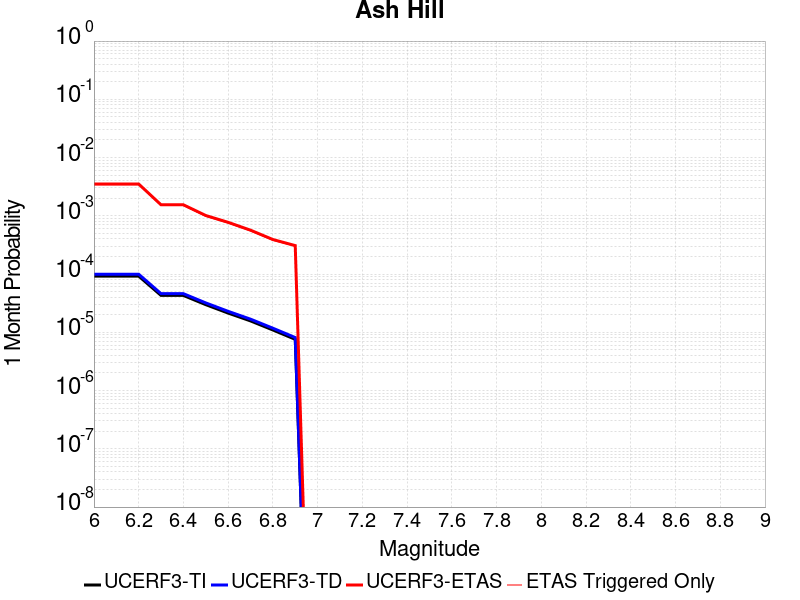 | 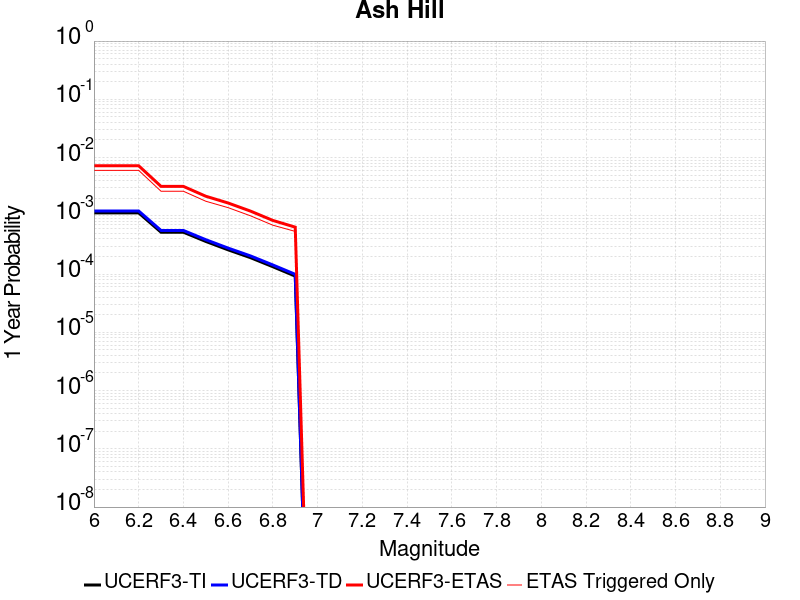 |  |

| Magnitude | 1 wk TI Prob | 1 wk TD Prob | 1 wk ETAS Prob | 1 wk ETAS/TD Gain | 1 wk ETAS Triggered Only | 1 mo TI Prob | 1 mo TD Prob | 1 mo ETAS Prob | 1 mo ETAS/TD Gain | 1 mo ETAS Triggered Only | 1 yr TI Prob | 1 yr TD Prob | 1 yr ETAS Prob | 1 yr ETAS/TD Gain | 1 yr ETAS Triggered Only | 10 yr TI Prob | 10 yr TD Prob | 10 yr ETAS Prob | 10 yr ETAS/TD Gain | 10 yr ETAS Triggered Only |
|-----|-----|-----|-----|-----|-----|-----|-----|-----|-----|-----|-----|-----|-----|-----|-----|-----|-----|-----|-----|-----|
| 6.0 | 2.1545662E-5 | 2.3194447E-5 | 0.0025224187 | 108.75098 | 0.0024992824 | 9.2335285E-5 | 9.940143E-5 | 0.0035777865 | 35.99331 | 0.0034787308 | 0.0011236023 | 0.0012096206 | 0.007433402 | 6.145234 | 0.0062313187 | 0.011179381 | 0.012038348 | 0.02129783 | 1.7691654 | 0.009372309 |
| 6.1 | 2.1545662E-5 | 2.3194447E-5 | 0.0025224187 | 108.75098 | 0.0024992824 | 9.2335285E-5 | 9.940143E-5 | 0.0035777865 | 35.99331 | 0.0034787308 | 0.0011236023 | 0.0012096206 | 0.007433402 | 6.145234 | 0.0062313187 | 0.011179381 | 0.012038348 | 0.02129783 | 1.7691654 | 0.009372309 |
| 6.2 | 2.1545662E-5 | 2.3194447E-5 | 0.0025224187 | 108.75098 | 0.0024992824 | 9.2335285E-5 | 9.940143E-5 | 0.0035777865 | 35.99331 | 0.0034787308 | 0.0011236023 | 0.0012096206 | 0.007433402 | 6.145234 | 0.0062313187 | 0.011179381 | 0.012038348 | 0.02129783 | 1.7691654 | 0.009372309 |
| 6.3 | 1.0025529E-5 | 1.0746934E-5 | 0.0012097141 | 112.563644 | 0.00119898 | 4.2965847E-5 | 4.605755E-5 | 0.0015320488 | 33.263794 | 0.0014860597 | 5.229836E-4 | 5.6061964E-4 | 0.0032441542 | 5.7867293 | 0.0026850398 | 0.005217545 | 0.0055933665 | 0.009556417 | 1.7085268 | 0.003985342 |
| 6.4 | 1.0025529E-5 | 1.0746934E-5 | 0.0012097141 | 112.563644 | 0.00119898 | 4.2965847E-5 | 4.605755E-5 | 0.0015320488 | 33.263794 | 0.0014860597 | 5.229836E-4 | 5.6061964E-4 | 0.0032441542 | 5.7867293 | 0.0026850398 | 0.005217545 | 0.0055933665 | 0.009556417 | 1.7085268 | 0.003985342 |
| 6.5 | 6.9617327E-6 | 7.456634E-6 | 8.011417E-4 | 107.440125 | 7.93691E-4 | 2.9835655E-5 | 3.195666E-5 | 0.0010282603 | 32.176716 | 9.963355E-4 | 3.6318856E-4 | 3.8901155E-4 | 0.0021445807 | 5.5128975 | 0.0017562524 | 0.0036259557 | 0.0038841602 | 0.0066092354 | 1.7015866 | 0.002735701 |
| 6.6 | 4.9919777E-6 | 5.3466883E-6 | 6.639378E-4 | 124.1774 | 6.5859465E-4 | 2.1394015E-5 | 2.2914215E-5 | 8.334737E-4 | 36.373653 | 8.1057806E-4 | 2.60441E-4 | 2.7895154E-4 | 0.0016801851 | 6.023215 | 0.0014016245 | 0.0026013597 | 0.0027866727 | 0.0048748306 | 1.7493374 | 0.0020939934 |
| 6.7 | 3.6630722E-6 | 3.924624E-6 | 5.105339E-4 | 130.08481 | 5.0661125E-4 | 1.5698786E-5 | 1.681974E-5 | 6.416298E-4 | 38.147427 | 6.248206E-4 | 1.9111596E-4 | 2.0476682E-4 | 0.0012853162 | 6.276975 | 0.0010807707 | 0.0019095168 | 0.0020463446 | 0.0035799209 | 1.7494223 | 0.0015367209 |
| 6.8 | 2.5599613E-6 | 2.744925E-6 | 3.0671086E-4 | 111.73742 | 3.0396678E-4 | 1.0971216E-5 | 1.1763939E-5 | 4.0016134E-4 | 34.01593 | 3.8840197E-4 | 1.3356637E-4 | 1.4322149E-4 | 8.3549105E-4 | 5.833559 | 6.923687E-4 | 0.0013348613 | 0.0014317769 | 0.0023423715 | 1.6359892 | 9.119003E-4 |
| 6.9 | 1.7684905E-6 | 1.8968707E-6 | 2.5520203E-4 | 134.53844 | 2.5330562E-4 | 7.579223E-6 | 8.129446E-6 | 3.1209373E-4 | 38.39053 | 3.0396678E-4 | 9.2273134E-5 | 9.8976E-5 | 6.224225E-4 | 6.2886205 | 5.2349834E-4 | 9.223483E-4 | 9.8976E-4 | 0.0016645732 | 1.6817946 | 6.754817E-4 |

## Hunter Mountain-Saline Valley
*[(top)](#table-of-contents)*

| 1 Week | 1 Month | 1 Year | 10 Year |
|-----|-----|-----|-----|
|  |  | 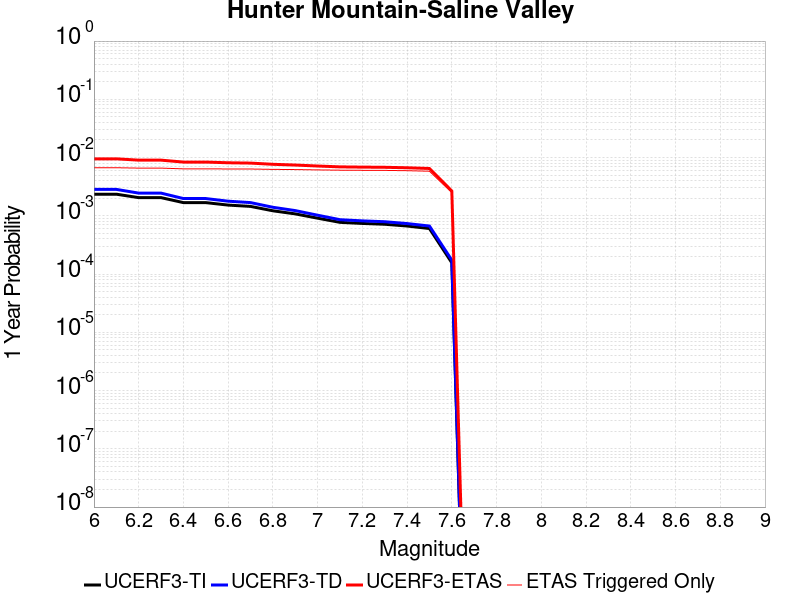 |  |

| Magnitude | 1 wk TI Prob | 1 wk TD Prob | 1 wk ETAS Prob | 1 wk ETAS/TD Gain | 1 wk ETAS Triggered Only | 1 mo TI Prob | 1 mo TD Prob | 1 mo ETAS Prob | 1 mo ETAS/TD Gain | 1 mo ETAS Triggered Only | 1 yr TI Prob | 1 yr TD Prob | 1 yr ETAS Prob | 1 yr ETAS/TD Gain | 1 yr ETAS Triggered Only | 10 yr TI Prob | 10 yr TD Prob | 10 yr ETAS Prob | 10 yr ETAS/TD Gain | 10 yr ETAS Triggered Only |
|-----|-----|-----|-----|-----|-----|-----|-----|-----|-----|-----|-----|-----|-----|-----|-----|-----|-----|-----|-----|-----|
| 6.0 | 4.5103672E-5 | 5.4570177E-5 | 0.0037695167 | 69.0765 | 0.0037151494 | 1.9328714E-4 | 2.3385242E-4 | 0.0051468327 | 22.008892 | 0.0049141296 | 0.002350731 | 0.0028435152 | 0.009764354 | 3.4339025 | 0.0069405744 | 0.023260195 | 0.028091887 | 0.03739786 | 1.3312691 | 0.0095749535 |
| 6.1 | 4.5103672E-5 | 5.4570177E-5 | 0.0037695167 | 69.0765 | 0.0037151494 | 1.9328714E-4 | 2.3385242E-4 | 0.0051468327 | 22.008892 | 0.0049141296 | 0.002350731 | 0.0028435152 | 0.009764354 | 3.4339025 | 0.0069405744 | 0.023260195 | 0.028091887 | 0.03739786 | 1.3312691 | 0.0095749535 |
| 6.2 | 3.9363465E-5 | 4.706337E-5 | 0.0036776066 | 78.141594 | 0.0036307143 | 1.6868966E-4 | 2.0168544E-4 | 0.0050304057 | 24.941837 | 0.004829694 | 0.002051862 | 0.0024528175 | 0.009258449 | 3.774618 | 0.0068223653 | 0.020330196 | 0.024273481 | 0.033434767 | 1.3774196 | 0.009389196 |
| 6.3 | 3.9363465E-5 | 4.706337E-5 | 0.0036776066 | 78.141594 | 0.0036307143 | 1.6868966E-4 | 2.0168544E-4 | 0.0050304057 | 24.941837 | 0.004829694 | 0.002051862 | 0.0024528175 | 0.009258449 | 3.774618 | 0.0068223653 | 0.020330196 | 0.024273481 | 0.033434767 | 1.3774196 | 0.009389196 |
| 6.4 | 3.2311684E-5 | 3.795099E-5 | 0.0035840953 | 94.4401 | 0.003546279 | 1.384713E-4 | 1.6263737E-4 | 0.004856472 | 29.860737 | 0.004694598 | 0.0016845843 | 0.0019783843 | 0.008601862 | 4.347923 | 0.006636608 | 0.016718714 | 0.019616475 | 0.028606262 | 1.4582775 | 0.009169664 |
| 6.5 | 3.2311684E-5 | 3.795099E-5 | 0.0035840953 | 94.4401 | 0.003546279 | 1.384713E-4 | 1.6263737E-4 | 0.004856472 | 29.860737 | 0.004694598 | 0.0016845843 | 0.0019783843 | 0.008601862 | 4.347923 | 0.006636608 | 0.016718714 | 0.019616475 | 0.028606262 | 1.4582775 | 0.009169664 |
| 6.6 | 2.9305844E-5 | 3.418183E-5 | 0.0035803395 | 104.743935 | 0.003546279 | 1.2559042E-4 | 1.4648569E-4 | 0.004840396 | 33.043472 | 0.004694598 | 0.0015279909 | 0.001782067 | 0.008389991 | 4.7080107 | 0.0066197207 | 0.015175272 | 0.01768569 | 0.026676595 | 1.5083716 | 0.0091527775 |
| 6.7 | 2.7826512E-5 | 3.2344276E-5 | 0.003561622 | 110.116 | 0.003529392 | 1.19251024E-4 | 1.386113E-4 | 0.004815674 | 34.742287 | 0.0046777106 | 0.0014509142 | 0.0016863465 | 0.008278046 | 4.908864 | 0.0066028335 | 0.014414776 | 0.016743187 | 0.025726112 | 1.5365124 | 0.00913589 |
| 6.8 | 2.3389874E-5 | 2.6866714E-5 | 0.0034717307 | 129.22052 | 0.0034449566 | 1.0023846E-4 | 1.15138246E-4 | 0.004707885 | 40.888977 | 0.0045932755 | 0.00121972 | 0.001400954 | 0.007893357 | 5.634273 | 0.006501511 | 0.01213047 | 0.013927434 | 0.022786217 | 1.6360672 | 0.008983906 |
| 6.9 | 2.069209E-5 | 2.3570032E-5 | 0.0034346723 | 145.722 | 0.0034111827 | 8.867737E-5 | 1.01010715E-4 | 0.0046431664 | 45.967068 | 0.0045426143 | 0.0010791123 | 0.0012291478 | 0.007655203 | 6.2280574 | 0.0064339633 | 0.010738871 | 0.012228523 | 0.021052528 | 1.7215921 | 0.008933245 |
| 7.0 | 1.7462342E-5 | 1.9633546E-5 | 0.0033969758 | 173.01897 | 0.0033774085 | 7.483646E-5 | 8.414118E-5 | 0.004541945 | 53.980053 | 0.004458179 | 9.1075303E-4 | 0.0010239601 | 0.007333247 | 7.161653 | 0.006315754 | 0.009070295 | 0.0101960525 | 0.01888778 | 1.8524601 | 0.008781262 |
| 7.1 | 1.4807709E-5 | 1.6441749E-5 | 0.0033431344 | 203.33203 | 0.0033267473 | 6.3460066E-5 | 7.046283E-5 | 0.0044776704 | 63.54656 | 0.004407518 | 7.723524E-4 | 8.575638E-4 | 0.007117284 | 8.299422 | 0.0062650926 | 0.007696735 | 0.008545532 | 0.017134555 | 2.0050893 | 0.008663053 |
| 7.2 | 1.4180048E-5 | 1.5698337E-5 | 0.003291733 | 209.68675 | 0.0032760862 | 6.077022E-5 | 6.727694E-5 | 0.004423841 | 65.75568 | 0.004356857 | 7.396263E-4 | 8.188051E-4 | 0.0070281485 | 8.58342 | 0.0062144315 | 0.0073716943 | 0.008160833 | 0.01670294 | 2.04672 | 0.008612392 |
| 7.3 | 1.3730402E-5 | 1.5172075E-5 | 0.0032912085 | 216.9254 | 0.0032760862 | 5.8843252E-5 | 6.502165E-5 | 0.0044215955 | 68.00189 | 0.004356857 | 7.161811E-4 | 7.9136714E-4 | 0.006984007 | 8.825243 | 0.0061975447 | 0.007138774 | 0.007888422 | 0.016399369 | 2.078916 | 0.008578618 |
| 7.4 | 1.2810095E-5 | 1.4109277E-5 | 0.003239489 | 229.59991 | 0.003225425 | 5.489925E-5 | 6.0467017E-5 | 0.0043495162 | 71.932045 | 0.004289309 | 6.681934E-4 | 7.359531E-4 | 0.006810814 | 9.254414 | 0.006079335 | 0.006661878 | 0.007338053 | 0.015719615 | 2.1422052 | 0.008443521 |
| 7.5 | 1.1595659E-5 | 1.2800664E-5 | 0.0031706372 | 247.69319 | 0.003157877 | 4.9694736E-5 | 5.4858923E-5 | 0.004259502 | 77.64465 | 0.0042048735 | 6.0486543E-4 | 6.6771836E-4 | 0.006624864 | 9.921644 | 0.005961126 | 0.006032217 | 0.0066599925 | 0.014862759 | 2.2316482 | 0.008257763 |
| 7.6 | 2.997694E-6 | 3.3251579E-6 | 0.001523154 | 458.06964 | 0.0015198338 | 1.28471975E-5 | 1.425064E-5 | 0.0018211384 | 127.79345 | 0.0018069135 | 1.564034E-4 | 1.73495E-4 | 0.002722996 | 15.694953 | 0.0025499435 | 0.0015629337 | 0.001735031 | 0.0052414415 | 3.0209498 | 0.0035125047 |

## Blackwater
*[(top)](#table-of-contents)*

| 1 Week | 1 Month | 1 Year | 10 Year |
|-----|-----|-----|-----|
|  |  | 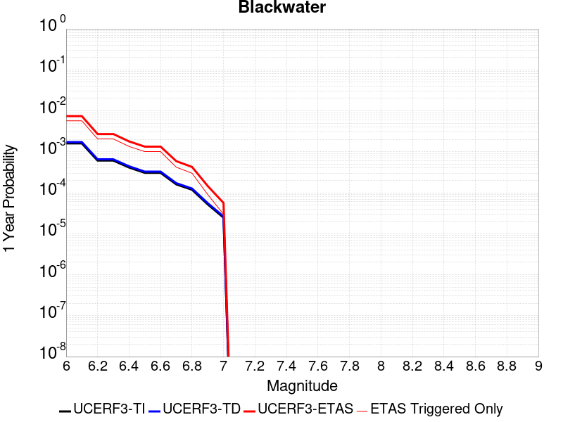 |  |

| Magnitude | 1 wk TI Prob | 1 wk TD Prob | 1 wk ETAS Prob | 1 wk ETAS/TD Gain | 1 wk ETAS Triggered Only | 1 mo TI Prob | 1 mo TD Prob | 1 mo ETAS Prob | 1 mo ETAS/TD Gain | 1 mo ETAS Triggered Only | 1 yr TI Prob | 1 yr TD Prob | 1 yr ETAS Prob | 1 yr ETAS/TD Gain | 1 yr ETAS Triggered Only | 10 yr TI Prob | 10 yr TD Prob | 10 yr ETAS Prob | 10 yr ETAS/TD Gain | 10 yr ETAS Triggered Only |
|-----|-----|-----|-----|-----|-----|-----|-----|-----|-----|-----|-----|-----|-----|-----|-----|-----|-----|-----|-----|-----|
| 6.0 | 3.0708583E-5 | 3.3095846E-5 | 0.0026673872 | 80.595825 | 0.0026343786 | 1.3160157E-4 | 1.4183241E-4 | 0.0038564547 | 27.190224 | 0.0037151494 | 0.0016010714 | 0.0017255784 | 0.0072718286 | 4.2141395 | 0.005555837 | 0.015895851 | 0.017135633 | 0.025251895 | 1.4736482 | 0.008257763 |
| 6.1 | 3.0708583E-5 | 3.3095846E-5 | 0.0026673872 | 80.595825 | 0.0026343786 | 1.3160157E-4 | 1.4183241E-4 | 0.0038564547 | 27.190224 | 0.0037151494 | 0.0016010714 | 0.0017255784 | 0.0072718286 | 4.2141395 | 0.005555837 | 0.015895851 | 0.017135633 | 0.025251895 | 1.4736482 | 0.008257763 |
| 6.2 | 1.1707779E-5 | 1.2545122E-5 | 8.568867E-4 | 68.30437 | 8.443521E-4 | 5.017523E-5 | 5.3763757E-5 | 0.0013708823 | 25.49826 | 0.0013171893 | 6.107122E-4 | 6.5438676E-4 | 0.0026626298 | 4.068893 | 0.002009558 | 0.006090366 | 0.0065255696 | 0.009545402 | 1.4627692 | 0.0030396676 |
| 6.3 | 1.1707779E-5 | 1.2545122E-5 | 8.568867E-4 | 68.30437 | 8.443521E-4 | 5.017523E-5 | 5.3763757E-5 | 0.0013708823 | 25.49826 | 0.0013171893 | 6.107122E-4 | 6.5438676E-4 | 0.0026626298 | 4.068893 | 0.002009558 | 0.006090366 | 0.0065255696 | 0.009545402 | 1.4627692 | 0.0030396676 |
| 6.4 | 7.929244E-6 | 8.480098E-6 | 4.8131327E-4 | 56.757984 | 4.728372E-4 | 3.3982033E-5 | 3.6342793E-5 | 8.9755066E-4 | 24.696798 | 8.6123915E-4 | 4.136527E-4 | 4.423877E-4 | 0.0017252351 | 3.899826 | 0.0012834152 | 0.0041288356 | 0.0044154758 | 0.0064665982 | 1.4645303 | 0.0020602192 |
| 6.5 | 5.8832115E-6 | 6.285991E-6 | 3.440247E-4 | 54.728798 | 3.3774084E-4 | 2.521352E-5 | 2.6939697E-5 | 7.361764E-4 | 27.326824 | 7.092558E-4 | 3.0693135E-4 | 3.27944E-4 | 0.0013577158 | 4.1400843 | 0.0010301096 | 0.0030650778 | 0.0032748538 | 0.0048402054 | 1.4779913 | 0.001570495 |
| 6.6 | 5.8832115E-6 | 6.285991E-6 | 3.440247E-4 | 54.728798 | 3.3774084E-4 | 2.521352E-5 | 2.6939697E-5 | 7.361764E-4 | 27.326824 | 7.092558E-4 | 3.0693135E-4 | 3.27944E-4 | 0.0013577158 | 4.1400843 | 0.0010301096 | 0.0030650778 | 0.0032748538 | 0.0048402054 | 1.4779913 | 0.001570495 |
| 6.7 | 3.0715053E-6 | 3.2814662E-6 | 1.0460339E-4 | 31.877028 | 1.0132226E-4 | 1.3163528E-5 | 1.4063357E-5 | 2.6736542E-4 | 19.011494 | 2.5330562E-4 | 1.6025416E-4 | 1.7120909E-4 | 5.426604E-4 | 3.1695771 | 3.7151494E-4 | 0.0016013865 | 0.0017108864 | 0.002334638 | 1.364578 | 6.248206E-4 |
| 6.8 | 2.2722281E-6 | 2.4287538E-6 | 6.997676E-5 | 28.811798 | 6.754817E-5 | 9.738084E-6 | 1.0408908E-5 | 2.1305132E-4 | 20.468172 | 2.0264451E-4 | 1.1855473E-4 | 1.26722E-4 | 3.9688044E-4 | 3.1318984 | 2.701927E-4 | 0.001184915 | 0.0012665876 | 0.0017219603 | 1.3595271 | 4.5595015E-4 |
| 6.9 | 9.952399E-7 | 1.0653489E-6 | 3.48394E-5 | 32.70234 | 3.3774086E-5 | 4.265307E-6 | 4.5657757E-6 | 5.5226672E-5 | 12.095792 | 5.066113E-5 | 5.1928873E-5 | 5.5587418E-5 | 1.2313183E-4 | 2.2151027 | 6.754817E-5 | 5.191674E-4 | 5.557858E-4 | 7.0768467E-4 | 1.2733048 | 1.5198339E-4 |
| 7.0 | 4.7385504E-7 | 5.0755597E-7 | 5.0755597E-7 | 1.0 | 0.0 | 2.0308057E-6 | 2.1752398E-6 | 2.1752398E-6 | 1.0 | 0.0 | 2.4724779E-5 | 2.6483543E-5 | 2.6483543E-5 | 1.0 | 0.0 | 2.4722028E-4 | 2.6483546E-4 | 3.1548316E-4 | 1.1912422 | 5.066113E-5 |

## So Sierra Nevada
*[(top)](#table-of-contents)*

| 1 Week | 1 Month | 1 Year | 10 Year |
|-----|-----|-----|-----|
|  |  |  | 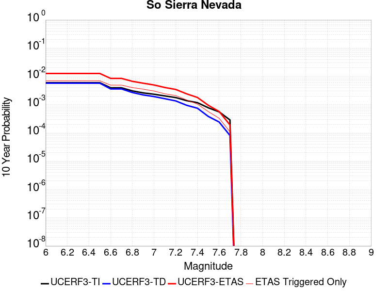 |

| Magnitude | 1 wk TI Prob | 1 wk TD Prob | 1 wk ETAS Prob | 1 wk ETAS/TD Gain | 1 wk ETAS Triggered Only | 1 mo TI Prob | 1 mo TD Prob | 1 mo ETAS Prob | 1 mo ETAS/TD Gain | 1 mo ETAS Triggered Only | 1 yr TI Prob | 1 yr TD Prob | 1 yr ETAS Prob | 1 yr ETAS/TD Gain | 1 yr ETAS Triggered Only | 10 yr TI Prob | 10 yr TD Prob | 10 yr ETAS Prob | 10 yr ETAS/TD Gain | 10 yr ETAS Triggered Only |
|-----|-----|-----|-----|-----|-----|-----|-----|-----|-----|-----|-----|-----|-----|-----|-----|-----|-----|-----|-----|-----|
| 6.0 | 1.15488665E-5 | 1.1079643E-5 | 0.002881845 | 260.10272 | 0.0028707972 | 4.9494203E-5 | 4.748339E-5 | 0.003661139 | 77.10357 | 0.003613827 | 6.024253E-4 | 5.7796965E-4 | 0.005674909 | 9.818697 | 0.005099887 | 0.006007948 | 0.005765934 | 0.012498593 | 2.1676614 | 0.006771704 |
| 6.1 | 1.15488665E-5 | 1.1079643E-5 | 0.002881845 | 260.10272 | 0.0028707972 | 4.9494203E-5 | 4.748339E-5 | 0.003661139 | 77.10357 | 0.003613827 | 6.024253E-4 | 5.7796965E-4 | 0.005674909 | 9.818697 | 0.005099887 | 0.006007948 | 0.005765934 | 0.012498593 | 2.1676614 | 0.006771704 |
| 6.2 | 1.15488665E-5 | 1.1079643E-5 | 0.002881845 | 260.10272 | 0.0028707972 | 4.9494203E-5 | 4.748339E-5 | 0.003661139 | 77.10357 | 0.003613827 | 6.024253E-4 | 5.7796965E-4 | 0.005674909 | 9.818697 | 0.005099887 | 0.006007948 | 0.005765934 | 0.012498593 | 2.1676614 | 0.006771704 |
| 6.3 | 1.15488665E-5 | 1.1079643E-5 | 0.002881845 | 260.10272 | 0.0028707972 | 4.9494203E-5 | 4.748339E-5 | 0.003661139 | 77.10357 | 0.003613827 | 6.024253E-4 | 5.7796965E-4 | 0.005674909 | 9.818697 | 0.005099887 | 0.006007948 | 0.005765934 | 0.012498593 | 2.1676614 | 0.006771704 |
| 6.4 | 1.15488665E-5 | 1.1079643E-5 | 0.002881845 | 260.10272 | 0.0028707972 | 4.9494203E-5 | 4.748339E-5 | 0.003661139 | 77.10357 | 0.003613827 | 6.024253E-4 | 5.7796965E-4 | 0.005674909 | 9.818697 | 0.005099887 | 0.006007948 | 0.005765934 | 0.012498593 | 2.1676614 | 0.006771704 |
| 6.5 | 1.15488665E-5 | 1.1079643E-5 | 0.002881845 | 260.10272 | 0.0028707972 | 4.9494203E-5 | 4.748339E-5 | 0.003661139 | 77.10357 | 0.003613827 | 6.024253E-4 | 5.7796965E-4 | 0.005674909 | 9.818697 | 0.005099887 | 0.006007948 | 0.005765934 | 0.012498593 | 2.1676614 | 0.006771704 |
| 6.6 | 7.587044E-6 | 6.935635E-6 | 0.0024724267 | 356.48166 | 0.0024655082 | 3.2515498E-5 | 2.9723828E-5 | 0.0029510953 | 99.28382 | 0.0029214583 | 3.9580427E-4 | 3.6183043E-4 | 0.0042275637 | 11.683826 | 0.0038671328 | 0.003951 | 0.0036127048 | 0.008475428 | 2.3460064 | 0.004880355 |
| 6.7 | 7.587044E-6 | 6.935635E-6 | 0.0024724267 | 356.48166 | 0.0024655082 | 3.2515498E-5 | 2.9723828E-5 | 0.0029510953 | 99.28382 | 0.0029214583 | 3.9580427E-4 | 3.6183043E-4 | 0.0042275637 | 11.683826 | 0.0038671328 | 0.003951 | 0.0036127048 | 0.008475428 | 2.3460064 | 0.004880355 |
| 6.8 | 5.9026956E-6 | 5.1793927E-6 | 0.0021498227 | 415.07236 | 0.0021446545 | 2.5297022E-5 | 2.2197215E-5 | 0.0025045373 | 112.831154 | 0.0024823952 | 3.0794772E-4 | 2.7021873E-4 | 0.0034778898 | 12.870646 | 0.003208538 | 0.0030752132 | 0.002699018 | 0.006740969 | 2.4975638 | 0.00405289 |
| 6.9 | 5.0118915E-6 | 4.2524252E-6 | 0.0019631411 | 461.6521 | 0.0019588969 | 2.1479358E-5 | 1.8224557E-5 | 0.0022472735 | 123.31019 | 0.0022290896 | 2.614798E-4 | 2.2186211E-4 | 0.0031089056 | 14.012783 | 0.0028876844 | 0.0026117235 | 0.0022164788 | 0.005822296 | 2.6268222 | 0.003613827 |
| 7.0 | 4.4924795E-6 | 3.7139177E-6 | 0.0017092989 | 460.24146 | 0.0017055913 | 1.925334E-5 | 1.5916696E-5 | 0.0019747824 | 124.06987 | 0.0019588969 | 2.3438422E-4 | 1.9376918E-4 | 0.0027432186 | 14.1571455 | 0.0025499435 | 0.0023413717 | 0.0019360651 | 0.0050541195 | 2.610511 | 0.003124103 |
| 7.1 | 3.9118436E-6 | 3.1119775E-6 | 0.0012696362 | 407.98373 | 0.0012665282 | 1.6764936E-5 | 1.3336982E-5 | 0.0014824901 | 111.15634 | 0.0014691727 | 2.0409399E-4 | 1.6236622E-4 | 0.0021378293 | 13.166713 | 0.001975784 | 0.0020390663 | 0.001622532 | 0.0040503205 | 2.4962962 | 0.0024317342 |
| 7.2 | 3.4200818E-6 | 2.6054543E-6 | 0.0011340344 | 435.25397 | 0.0011314319 | 1.4657411E-5 | 1.11661875E-5 | 0.001311454 | 117.44868 | 0.0013003023 | 1.7843937E-4 | 1.3594035E-4 | 0.0017906455 | 13.172288 | 0.0016549302 | 0.0017829615 | 0.0013586218 | 0.0034160418 | 2.5143435 | 0.0020602192 |
| 7.3 | 2.6593618E-6 | 1.8284203E-6 | 8.1240496E-4 | 444.3207 | 8.1057806E-4 | 1.13972155E-5 | 7.836065E-6 | 9.53503E-4 | 121.68136 | 9.456744E-4 | 1.3875226E-4 | 9.540021E-5 | 0.0013111513 | 13.743694 | 0.0012158671 | 0.0013866565 | 9.5362146E-4 | 0.002488877 | 2.6099212 | 0.0015367209 |
| 7.4 | 2.2577992E-6 | 1.436438E-6 | 5.924821E-4 | 412.46616 | 5.9104647E-4 | 9.676246E-6 | 6.15615E-6 | 6.985206E-4 | 113.467125 | 6.923687E-4 | 1.1780193E-4 | 7.49488E-5 | 0.0010036665 | 13.391362 | 9.2878734E-4 | 0.001177395 | 7.492603E-4 | 0.0018460957 | 2.463891 | 0.0010976577 |
| 7.5 | 1.489319E-6 | 7.353936E-7 | 3.38476E-4 | 460.26508 | 3.3774084E-4 | 6.3827797E-6 | 3.1516831E-6 | 3.7466545E-4 | 118.87789 | 3.7151494E-4 | 7.770758E-5 | 3.8371072E-5 | 5.6184933E-4 | 14.642524 | 5.2349834E-4 | 7.7680405E-4 | 3.836449E-4 | 0.0010251063 | 2.6720188 | 6.417076E-4 |
| 7.6 | 1.0680322E-6 | 4.6596554E-7 | 1.6933632E-4 | 363.40952 | 1.6887042E-4 | 4.577273E-6 | 1.9969937E-6 | 1.8775409E-4 | 94.01837 | 1.8575747E-4 | 5.5726876E-5 | 2.4313129E-5 | 3.1138587E-4 | 12.807314 | 2.8707972E-4 | 5.5712904E-4 | 2.4310495E-4 | 6.145296E-4 | 2.5278366 | 3.7151494E-4 |
| 7.7 | 5.509146E-7 | 1.5580486E-7 | 5.0816925E-5 | 326.1575 | 5.066113E-5 | 2.3610605E-6 | 6.677349E-7 | 5.132883E-5 | 76.87006 | 5.066113E-5 | 2.8745531E-5 | 8.129644E-6 | 9.256417E-5 | 11.386005 | 8.443521E-5 | 2.8741814E-4 | 8.1293576E-5 | 1.826076E-4 | 2.2462733 | 1.0132226E-4 |

## Garlock (West)
*[(top)](#table-of-contents)*

| 1 Week | 1 Month | 1 Year | 10 Year |
|-----|-----|-----|-----|
| 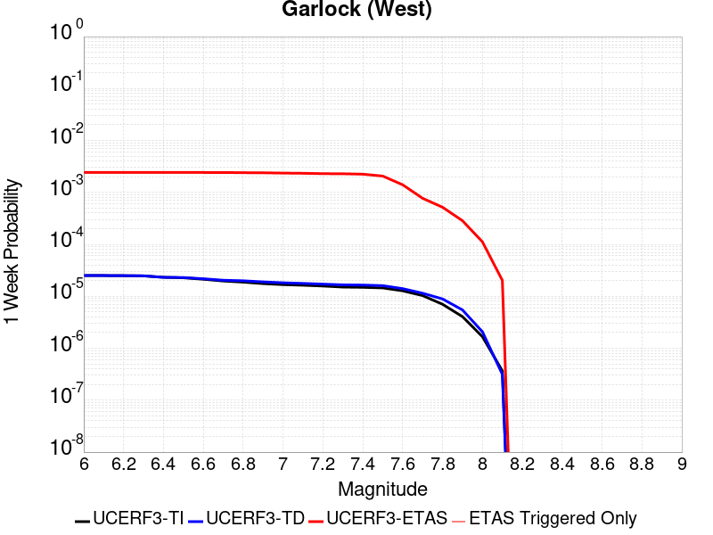 |  |  |  |

| Magnitude | 1 wk TI Prob | 1 wk TD Prob | 1 wk ETAS Prob | 1 wk ETAS/TD Gain | 1 wk ETAS Triggered Only | 1 mo TI Prob | 1 mo TD Prob | 1 mo ETAS Prob | 1 mo ETAS/TD Gain | 1 mo ETAS Triggered Only | 1 yr TI Prob | 1 yr TD Prob | 1 yr ETAS Prob | 1 yr ETAS/TD Gain | 1 yr ETAS Triggered Only | 10 yr TI Prob | 10 yr TD Prob | 10 yr ETAS Prob | 10 yr ETAS/TD Gain | 10 yr ETAS Triggered Only |
|-----|-----|-----|-----|-----|-----|-----|-----|-----|-----|-----|-----|-----|-----|-----|-----|-----|-----|-----|-----|-----|
| 6.0 | 2.5181727E-5 | 2.51973E-5 | 0.0023555504 | 93.48424 | 0.002330412 | 1.0791722E-4 | 1.0798398E-4 | 0.0030966678 | 28.677103 | 0.0029890065 | 0.0013131002 | 0.0013139155 | 0.005901156 | 4.4912753 | 0.0045932755 | 0.013053683 | 0.013141977 | 0.019024761 | 1.4476333 | 0.005961126 |
| 6.1 | 2.5077732E-5 | 2.5098372E-5 | 0.0023554517 | 93.848785 | 0.002330412 | 1.0747157E-4 | 1.0756004E-4 | 0.003096245 | 28.786203 | 0.0029890065 | 0.001307681 | 0.0013087603 | 0.0058960244 | 4.5050454 | 0.0045932755 | 0.013000126 | 0.013091032 | 0.018974122 | 1.4493984 | 0.005961126 |
| 6.2 | 2.494612E-5 | 2.498005E-5 | 0.0023553337 | 94.28859 | 0.002330412 | 1.0690756E-4 | 1.0705298E-4 | 0.0030957395 | 28.917826 | 0.0029890065 | 0.0013008224 | 0.0013025942 | 0.0058898865 | 4.521659 | 0.0045932755 | 0.012932341 | 0.013030097 | 0.018913548 | 1.4515278 | 0.005961126 |
| 6.3 | 2.4733758E-5 | 2.479942E-5 | 0.0023551534 | 94.968094 | 0.002330412 | 1.0599751E-4 | 1.06278916E-4 | 0.0030949677 | 29.121183 | 0.0029890065 | 0.0012897556 | 0.0012931811 | 0.005880517 | 4.5473266 | 0.0045932755 | 0.012822957 | 0.012937066 | 0.018821072 | 1.4548177 | 0.005961126 |
| 6.4 | 2.3237335E-5 | 2.317873E-5 | 0.0023535367 | 101.538635 | 0.002330412 | 9.958477E-5 | 9.933365E-5 | 0.0030880433 | 31.087585 | 0.0029890065 | 0.0012117702 | 0.001208719 | 0.0057627093 | 4.767617 | 0.0045595015 | 0.012051838 | 0.012101916 | 0.017957535 | 1.483859 | 0.005927352 |
| 6.5 | 2.2732203E-5 | 2.2993298E-5 | 0.0023533516 | 102.34946 | 0.002330412 | 9.742009E-5 | 9.8539E-5 | 0.003087251 | 31.330246 | 0.0029890065 | 0.0011854442 | 0.0011990548 | 0.005753089 | 4.7980204 | 0.0045595015 | 0.011791403 | 0.012006322 | 0.017862508 | 1.4877585 | 0.005927352 |
| 6.6 | 2.1319436E-5 | 2.17735E-5 | 0.0023521346 | 108.027405 | 0.002330412 | 9.136581E-5 | 9.331167E-5 | 0.0030820393 | 33.029514 | 0.0029890065 | 0.001111811 | 0.0011354799 | 0.005689804 | 5.010925 | 0.0045595015 | 0.011062649 | 0.011377227 | 0.017237142 | 1.5150566 | 0.005927352 |
| 6.7 | 1.970802E-5 | 2.0393396E-5 | 0.0023507578 | 115.27054 | 0.002330412 | 8.446021E-5 | 8.739735E-5 | 0.003059257 | 35.004 | 0.0029721195 | 0.001027818 | 0.001063545 | 0.0056013283 | 5.2666583 | 0.0045426143 | 0.010230771 | 0.010664964 | 0.016512394 | 1.548284 | 0.005910465 |
| 6.8 | 1.8744462E-5 | 1.9901045E-5 | 0.0023333798 | 117.249115 | 0.0023135247 | 8.033094E-5 | 8.5287415E-5 | 0.0030402679 | 35.64732 | 0.0029552325 | 9.775903E-4 | 0.0010378812 | 0.0055589117 | 5.3560185 | 0.0045257276 | 0.009733009 | 0.01041075 | 0.016242972 | 1.5602114 | 0.005893578 |
| 6.9 | 1.7559682E-5 | 1.8953415E-5 | 0.0023155478 | 122.17048 | 0.0022966377 | 7.5253614E-5 | 8.12264E-5 | 0.0030193331 | 37.17182 | 0.0029383453 | 9.158276E-4 | 9.884841E-4 | 0.0054422566 | 5.5056586 | 0.004458179 | 0.0091206245 | 0.009921231 | 0.01567274 | 1.5797173 | 0.0058091427 |
| 7.0 | 1.6794445E-5 | 1.8216237E-5 | 0.0022810388 | 125.220085 | 0.0022628638 | 7.197421E-5 | 7.8067256E-5 | 0.0029655262 | 37.98681 | 0.0028876844 | 8.759337E-4 | 9.5005584E-4 | 0.0053365156 | 5.617055 | 0.004390631 | 0.008724891 | 0.009540141 | 0.015226959 | 1.5960938 | 0.0057415944 |
| 7.1 | 1.6337795E-5 | 1.7717046E-5 | 0.0022467673 | 126.81387 | 0.0022290896 | 7.0017246E-5 | 7.5927994E-5 | 0.0029296216 | 38.58421 | 0.0028539102 | 8.521265E-4 | 9.240326E-4 | 0.0052768635 | 5.71069 | 0.004356857 | 0.008488664 | 0.009281996 | 0.014903376 | 1.6056218 | 0.0056740465 |
| 7.2 | 1.5780008E-5 | 1.7165687E-5 | 0.002246217 | 130.85507 | 0.0022290896 | 6.762685E-5 | 7.356516E-5 | 0.0029272654 | 39.791466 | 0.0028539102 | 8.2304585E-4 | 8.9528906E-4 | 0.0052482453 | 5.8620677 | 0.004356857 | 0.008200042 | 0.008996838 | 0.014619836 | 1.6249971 | 0.0056740465 |
| 7.3 | 1.5058865E-5 | 1.6618762E-5 | 0.0022456713 | 135.12868 | 0.0022290896 | 6.45364E-5 | 7.122133E-5 | 0.0029249282 | 41.06815 | 0.0028539102 | 7.854473E-4 | 8.667759E-4 | 0.0051861117 | 5.983221 | 0.004323083 | 0.00782677 | 0.008713539 | 0.014304664 | 1.6416596 | 0.005640272 |
| 7.4 | 1.4887923E-5 | 1.6454731E-5 | 0.0021779607 | 132.36075 | 0.0021615415 | 6.380382E-5 | 7.051838E-5 | 0.002839798 | 40.270325 | 0.0027694749 | 7.7653467E-4 | 8.582243E-4 | 0.005059489 | 5.8952994 | 0.0042048735 | 0.0077382675 | 0.008628399 | 0.014086074 | 1.6325246 | 0.005505176 |
| 7.5 | 1.4509299E-5 | 1.6046748E-5 | 0.0020424593 | 127.28182 | 0.002026445 | 6.218123E-5 | 6.876997E-5 | 0.0025341087 | 36.849056 | 0.0024655082 | 7.567935E-4 | 8.36954E-4 | 0.0046333587 | 5.535978 | 0.0037995847 | 0.0075422134 | 0.008416704 | 0.013322962 | 1.5829192 | 0.0049479036 |
| 7.6 | 1.2756717E-5 | 1.4050848E-5 | 0.0013987689 | 99.55049 | 0.0013847374 | 5.4670498E-5 | 6.0216535E-5 | 0.0017825911 | 29.603018 | 0.0017224783 | 6.6541E-4 | 7.328904E-4 | 0.0033147144 | 4.522797 | 0.0025837175 | 0.006634211 | 0.0073816874 | 0.010566541 | 1.4314533 | 0.003208538 |
| 7.7 | 1.0328985E-5 | 1.1460557E-5 | 8.895767E-4 | 77.62072 | 8.781262E-4 | 4.4266326E-5 | 4.911575E-5 | 0.0011636058 | 23.691093 | 0.0011145448 | 5.388092E-4 | 5.978206E-4 | 0.0022348845 | 3.7383866 | 0.0016380431 | 0.0053750467 | 0.006038511 | 0.0080359345 | 1.3307807 | 0.002009558 |
| 7.8 | 7.0306583E-6 | 8.899601E-6 | 5.9994083E-4 | 67.4121 | 5.9104647E-4 | 3.0131043E-5 | 3.814059E-5 | 7.8114215E-4 | 20.480598 | 7.430299E-4 | 3.667837E-4 | 4.642629E-4 | 0.0016289279 | 3.5086324 | 0.001165206 | 0.003661789 | 0.0046952725 | 0.006157547 | 1.3114355 | 0.0014691727 |
| 7.9 | 4.060633E-6 | 5.4653938E-6 | 3.432044E-4 | 62.795914 | 3.3774084E-4 | 1.7402595E-5 | 2.3422906E-5 | 4.6247573E-4 | 19.74459 | 4.390631E-4 | 2.11856E-4 | 2.851367E-4 | 9.941902E-4 | 3.4867146 | 7.092558E-4 | 0.0021165414 | 0.002884201 | 0.0037934713 | 1.315259 | 9.119003E-4 |
| 8.0 | 1.6729537E-6 | 2.0775144E-6 | 1.3717357E-4 | 66.02774 | 1.3509634E-4 | 7.169782E-6 | 8.903603E-6 | 1.9465941E-4 | 21.862993 | 1.8575747E-4 | 8.7288594E-5 | 1.0839601E-4 | 3.954446E-4 | 3.6481473 | 2.8707972E-4 | 8.7254314E-4 | 0.0010969337 | 0.0014680412 | 1.3383135 | 3.7151494E-4 |
| 8.1 | 3.6733252E-7 | 3.1489964E-7 | 1.7201937E-5 | 54.626728 | 1.6887043E-5 | 1.5742813E-6 | 1.3495693E-6 | 1.823659E-5 | 13.512896 | 1.6887043E-5 | 1.9166706E-5 | 1.6430899E-5 | 3.3317665E-5 | 2.0277445 | 1.6887043E-5 | 1.9165053E-4 | 1.6638759E-4 | 2.0015605E-4 | 1.2029506 | 3.3774086E-5 |

## McLean Lake
*[(top)](#table-of-contents)*

| 1 Week | 1 Month | 1 Year | 10 Year |
|-----|-----|-----|-----|
|  |  |  |  |

| Magnitude | 1 wk TI Prob | 1 wk TD Prob | 1 wk ETAS Prob | 1 wk ETAS/TD Gain | 1 wk ETAS Triggered Only | 1 mo TI Prob | 1 mo TD Prob | 1 mo ETAS Prob | 1 mo ETAS/TD Gain | 1 mo ETAS Triggered Only | 1 yr TI Prob | 1 yr TD Prob | 1 yr ETAS Prob | 1 yr ETAS/TD Gain | 1 yr ETAS Triggered Only | 10 yr TI Prob | 10 yr TD Prob | 10 yr ETAS Prob | 10 yr ETAS/TD Gain | 10 yr ETAS Triggered Only |
|-----|-----|-----|-----|-----|-----|-----|-----|-----|-----|-----|-----|-----|-----|-----|-----|-----|-----|-----|-----|-----|
| 6.0 | 1.7360222E-5 | 1.8501627E-5 | 0.0011161391 | 60.326534 | 0.0010976577 | 7.439883E-5 | 7.9290556E-5 | 0.0016834324 | 21.231184 | 0.001604269 | 9.0542925E-4 | 9.6498354E-4 | 0.0039679767 | 4.111963 | 0.0030058937 | 0.009017491 | 0.0096127745 | 0.014379317 | 1.4958551 | 0.0048128073 |
| 6.1 | 9.062689E-6 | 9.592193E-6 | 5.4997235E-4 | 57.33541 | 5.403854E-4 | 3.8839516E-5 | 4.1108804E-5 | 8.516535E-4 | 20.71706 | 8.1057806E-4 | 4.727685E-4 | 5.003936E-4 | 0.0020363454 | 4.0694876 | 0.0015367209 | 0.0047176396 | 0.004993552 | 0.007631578 | 1.5282866 | 0.0026512656 |
| 6.2 | 9.062689E-6 | 9.592193E-6 | 5.4997235E-4 | 57.33541 | 5.403854E-4 | 3.8839516E-5 | 4.1108804E-5 | 8.516535E-4 | 20.71706 | 8.1057806E-4 | 4.727685E-4 | 5.003936E-4 | 0.0020363454 | 4.0694876 | 0.0015367209 | 0.0047176396 | 0.004993552 | 0.007631578 | 1.5282866 | 0.0026512656 |
| 6.3 | 7.2575485E-6 | 7.66771E-6 | 4.8050127E-4 | 62.665558 | 4.728372E-4 | 3.110341E-5 | 3.2861237E-5 | 6.238883E-4 | 18.985538 | 5.9104647E-4 | 3.786182E-4 | 4.0001926E-4 | 0.0015478788 | 3.869511 | 0.0011483189 | 0.0037797375 | 0.0039936965 | 0.0060625076 | 1.5180191 | 0.0020771062 |
| 6.4 | 7.2575485E-6 | 7.66771E-6 | 4.8050127E-4 | 62.665558 | 4.728372E-4 | 3.110341E-5 | 3.2861237E-5 | 6.238883E-4 | 18.985538 | 5.9104647E-4 | 3.786182E-4 | 4.0001926E-4 | 0.0015478788 | 3.869511 | 0.0011483189 | 0.0037797375 | 0.0039936965 | 0.0060625076 | 1.5180191 | 0.0020771062 |
| 6.5 | 6.06582E-6 | 6.4038773E-6 | 3.9480336E-4 | 61.650677 | 3.8840197E-4 | 2.5996113E-5 | 2.7444936E-5 | 5.1715574E-4 | 18.843393 | 4.897242E-4 | 3.164567E-4 | 3.3409733E-4 | 0.0013132186 | 3.9306467 | 9.794484E-4 | 0.0031600643 | 0.0033365893 | 0.0051038126 | 1.5296496 | 0.0017731395 |
| 6.6 | 5.598744E-6 | 5.910262E-6 | 3.6053607E-4 | 61.0017 | 3.546279E-4 | 2.3994397E-5 | 2.5329486E-5 | 4.812681E-4 | 19.00031 | 4.5595015E-4 | 2.9209262E-4 | 3.0834923E-4 | 0.0011862047 | 3.846952 | 8.781262E-4 | 0.0029170897 | 0.003079843 | 0.0046623363 | 1.5138227 | 0.001587382 |
| 6.7 | 5.246996E-6 | 5.539162E-6 | 3.263912E-4 | 58.92429 | 3.208538E-4 | 2.2486933E-5 | 2.3739085E-5 | 4.6279177E-4 | 19.494928 | 4.390631E-4 | 2.73744E-4 | 2.8899137E-4 | 0.0011330995 | 3.9208765 | 8.443521E-4 | 0.0027340704 | 0.0028867796 | 0.0043853875 | 1.519128 | 0.0015029468 |
| 6.8 | 4.02324E-6 | 4.2469046E-6 | 2.2377752E-4 | 52.691914 | 2.1953155E-4 | 1.7242342E-5 | 1.8200926E-5 | 2.883887E-4 | 15.844727 | 2.701927E-4 | 2.099053E-4 | 2.2157968E-4 | 8.293785E-4 | 3.7430258 | 6.0793356E-4 | 0.0020970714 | 0.002214172 | 0.0033430986 | 1.5098641 | 0.0011314319 |
| 6.9 | 6.835972E-7 | 7.1399285E-7 | 5.1375086E-5 | 71.95462 | 5.066113E-5 | 2.9296991E-6 | 3.0599674E-6 | 7.060793E-5 | 23.074732 | 6.754817E-5 | 3.56685E-5 | 3.7254784E-5 | 1.3857326E-4 | 3.7196097 | 1.0132226E-4 | 3.5662777E-4 | 3.7251666E-4 | 4.906819E-4 | 1.317208 | 1.182093E-4 |

## Gravel Hills-Harper Lk
*[(top)](#table-of-contents)*

| 1 Week | 1 Month | 1 Year | 10 Year |
|-----|-----|-----|-----|
|  |  |  |  |

| Magnitude | 1 wk TI Prob | 1 wk TD Prob | 1 wk ETAS Prob | 1 wk ETAS/TD Gain | 1 wk ETAS Triggered Only | 1 mo TI Prob | 1 mo TD Prob | 1 mo ETAS Prob | 1 mo ETAS/TD Gain | 1 mo ETAS Triggered Only | 1 yr TI Prob | 1 yr TD Prob | 1 yr ETAS Prob | 1 yr ETAS/TD Gain | 1 yr ETAS Triggered Only | 10 yr TI Prob | 10 yr TD Prob | 10 yr ETAS Prob | 10 yr ETAS/TD Gain | 10 yr ETAS Triggered Only |
|-----|-----|-----|-----|-----|-----|-----|-----|-----|-----|-----|-----|-----|-----|-----|-----|-----|-----|-----|-----|-----|
| 6.0 | 3.0679566E-5 | 3.1464646E-5 | 0.0015343642 | 48.764706 | 0.0015029468 | 1.3147724E-4 | 1.3484273E-4 | 0.002127245 | 15.775748 | 0.001992671 | 0.0015995599 | 0.0016406906 | 0.0048776832 | 2.972945 | 0.0032423122 | 0.015880952 | 0.01630734 | 0.020842321 | 1.2780946 | 0.0046101627 |
| 6.1 | 3.0679566E-5 | 3.1464646E-5 | 0.0015343642 | 48.764706 | 0.0015029468 | 1.3147724E-4 | 1.3484273E-4 | 0.002127245 | 15.775748 | 0.001992671 | 0.0015995599 | 0.0016406906 | 0.0048776832 | 2.972945 | 0.0032423122 | 0.015880952 | 0.01630734 | 0.020842321 | 1.2780946 | 0.0046101627 |
| 6.2 | 1.514536E-5 | 1.3635206E-5 | 5.033528E-4 | 36.91567 | 4.897242E-4 | 6.490707E-5 | 5.843536E-5 | 7.338776E-4 | 12.558793 | 6.754817E-4 | 7.8995706E-4 | 7.1123015E-4 | 0.001706857 | 2.399866 | 9.963355E-4 | 0.007871548 | 0.0070907404 | 0.008616565 | 1.2151855 | 0.0015367209 |
| 6.3 | 1.514536E-5 | 1.3635206E-5 | 5.033528E-4 | 36.91567 | 4.897242E-4 | 6.490707E-5 | 5.843536E-5 | 7.338776E-4 | 12.558793 | 6.754817E-4 | 7.8995706E-4 | 7.1123015E-4 | 0.001706857 | 2.399866 | 9.963355E-4 | 0.007871548 | 0.0070907404 | 0.008616565 | 1.2151855 | 0.0015367209 |
| 6.4 | 1.2532521E-5 | 1.06896905E-5 | 3.146532E-4 | 29.435202 | 3.0396678E-4 | 5.37097E-5 | 4.581219E-5 | 4.679689E-4 | 10.214943 | 4.2217606E-4 | 6.537194E-4 | 5.576265E-4 | 0.0011483434 | 2.0593417 | 5.9104647E-4 | 0.0065179965 | 0.005562863 | 0.0064864834 | 1.1660334 | 9.2878734E-4 |
| 6.5 | 1.1094058E-5 | 9.083664E-6 | 1.7795255E-4 | 19.590395 | 1.6887042E-4 | 4.7545094E-5 | 3.892943E-5 | 2.4156606E-4 | 6.2052298 | 2.0264451E-4 | 5.787078E-4 | 4.7386673E-4 | 7.7768945E-4 | 1.6411564 | 3.0396678E-4 | 0.0057720304 | 0.0047289706 | 0.0053004147 | 1.120839 | 5.7415944E-4 |
| 6.6 | 9.688328E-6 | 7.5316952E-6 | 1.08853186E-4 | 14.452682 | 1.0132226E-4 | 4.1520743E-5 | 3.227831E-5 | 1.5048379E-4 | 4.6620717 | 1.182093E-4 | 5.053978E-4 | 3.9292008E-4 | 5.786046E-4 | 1.4725757 | 1.8575747E-4 | 0.0050424994 | 0.0039225104 | 0.00432621 | 1.1029186 | 4.0528903E-4 |
| 6.7 | 8.974824E-6 | 6.749413E-6 | 9.1184054E-5 | 13.509924 | 8.443521E-5 | 3.8462964E-5 | 2.8925748E-5 | 1.1335852E-4 | 3.9189487 | 8.443521E-5 | 4.6818596E-4 | 3.5211627E-4 | 5.0404615E-4 | 1.4314765 | 1.5198339E-4 | 0.004672008 | 0.0035158044 | 0.0038018748 | 1.081367 | 2.8707972E-4 |
| 6.8 | 7.4780046E-6 | 5.1161933E-6 | 5.577706E-5 | 10.902063 | 5.066113E-5 | 3.20482E-5 | 2.1926366E-5 | 7.258639E-5 | 3.310461 | 5.066113E-5 | 3.9011694E-4 | 2.669222E-4 | 3.682174E-4 | 1.3794934 | 1.0132226E-4 | 0.0038943281 | 0.0026661542 | 0.0028177323 | 1.0568527 | 1.5198339E-4 |
| 6.9 | 6.3409307E-6 | 3.9074966E-6 | 2.0794474E-5 | 5.3216867 | 1.6887043E-5 | 2.7175134E-5 | 1.6746313E-5 | 3.3633074E-5 | 2.0083869 | 1.6887043E-5 | 3.3080703E-4 | 2.0386827E-4 | 2.7140268E-4 | 1.3312649 | 6.754817E-5 | 0.0033031502 | 0.0020369107 | 0.0021380265 | 1.0496417 | 1.0132226E-4 |
| 7.0 | 5.1239335E-6 | 2.6058565E-6 | 2.6058565E-6 | 1.0 | 0.0 | 2.195953E-5 | 1.116791E-5 | 1.116791E-5 | 1.0 | 0.0 | 2.6732447E-4 | 1.3596108E-4 | 1.5284582E-4 | 1.1241881 | 1.6887043E-5 | 0.0026700313 | 0.0013588042 | 0.0014093964 | 1.037233 | 5.066113E-5 |
| 7.1 | 4.438899E-6 | 2.0984728E-6 | 2.0984728E-6 | 1.0 | 0.0 | 1.9023713E-5 | 8.993425E-6 | 8.993425E-6 | 1.0 | 0.0 | 2.315891E-4 | 1.0948967E-4 | 1.2637486E-4 | 1.1542172 | 1.6887043E-5 | 0.002313479 | 0.0010943791 | 0.0011449849 | 1.0462414 | 5.066113E-5 |
| 7.2 | 3.50367E-6 | 1.2615716E-6 | 1.2615716E-6 | 1.0 | 0.0 | 1.5015643E-5 | 5.4067245E-6 | 5.4067245E-6 | 1.0 | 0.0 | 1.8280011E-4 | 6.582497E-5 | 6.582497E-5 | 1.0 | 0.0 | 0.0018264982 | 6.580629E-4 | 6.918148E-4 | 1.0512897 | 3.3774086E-5 |
| 7.3 | 2.561638E-6 | 7.1191585E-7 | 7.1191585E-7 | 1.0 | 0.0 | 1.0978401E-5 | 3.0510646E-6 | 3.0510646E-6 | 1.0 | 0.0 | 1.3365384E-4 | 3.71461E-5 | 3.71461E-5 | 1.0 | 0.0 | 0.0013357349 | 3.7140088E-4 | 3.8828165E-4 | 1.0454516 | 1.6887043E-5 |
| 7.4 | 2.0368864E-6 | 5.304837E-7 | 5.304837E-7 | 1.0 | 0.0 | 8.729483E-6 | 2.2734996E-6 | 2.2734996E-6 | 1.0 | 0.0 | 1.06276275E-4 | 2.7679513E-5 | 2.7679513E-5 | 1.0 | 0.0 | 0.0010622547 | 2.767612E-4 | 2.9364356E-4 | 1.0609998 | 1.6887043E-5 |
| 7.5 | 1.1681728E-6 | 3.6030585E-7 | 3.6030585E-7 | 1.0 | 0.0 | 5.0064455E-6 | 1.544167E-6 | 1.544167E-6 | 1.0 | 0.0 | 6.0951766E-5 | 1.8800076E-5 | 1.8800076E-5 | 1.0 | 0.0 | 6.093505E-4 | 1.8798532E-4 | 2.048692E-4 | 1.0898148 | 1.6887043E-5 |
| 7.6 | 1.3154387E-7 | 7.1197384E-8 | 7.1197384E-8 | 1.0 | 0.0 | 5.6375933E-7 | 3.051316E-7 | 3.051316E-7 | 1.0 | 0.0 | 6.863748E-6 | 3.7149728E-6 | 3.7149728E-6 | 1.0 | 0.0 | 6.863536E-5 | 3.7149264E-5 | 3.7149264E-5 | 1.0 | 0.0 |

## Goldstone Lake
*[(top)](#table-of-contents)*

| 1 Week | 1 Month | 1 Year | 10 Year |
|-----|-----|-----|-----|
|  |  |  |  |

| Magnitude | 1 wk TI Prob | 1 wk TD Prob | 1 wk ETAS Prob | 1 wk ETAS/TD Gain | 1 wk ETAS Triggered Only | 1 mo TI Prob | 1 mo TD Prob | 1 mo ETAS Prob | 1 mo ETAS/TD Gain | 1 mo ETAS Triggered Only | 1 yr TI Prob | 1 yr TD Prob | 1 yr ETAS Prob | 1 yr ETAS/TD Gain | 1 yr ETAS Triggered Only | 10 yr TI Prob | 10 yr TD Prob | 10 yr ETAS Prob | 10 yr ETAS/TD Gain | 10 yr ETAS Triggered Only |
|-----|-----|-----|-----|-----|-----|-----|-----|-----|-----|-----|-----|-----|-----|-----|-----|-----|-----|-----|-----|-----|
| 6.0 | 2.671352E-5 | 3.037609E-5 | 7.3961035E-4 | 24.348438 | 7.092558E-4 | 1.1448149E-4 | 1.3017785E-4 | 0.0013458866 | 10.33883 | 0.0012158671 | 0.001392921 | 0.0015839594 | 0.003961261 | 2.50086 | 0.002381073 | 0.013842222 | 0.015746197 | 0.019352982 | 1.2290577 | 0.0036644882 |
| 6.1 | 2.671352E-5 | 3.037609E-5 | 7.3961035E-4 | 24.348438 | 7.092558E-4 | 1.1448149E-4 | 1.3017785E-4 | 0.0013458866 | 10.33883 | 0.0012158671 | 0.001392921 | 0.0015839594 | 0.003961261 | 2.50086 | 0.002381073 | 0.013842222 | 0.015746197 | 0.019352982 | 1.2290577 | 0.0036644882 |
| 6.2 | 1.4197047E-5 | 1.6096245E-5 | 3.200581E-4 | 19.884024 | 3.0396678E-4 | 6.0843064E-5 | 6.8982634E-5 | 6.262166E-4 | 9.077888 | 5.572724E-4 | 7.4051257E-4 | 8.3963864E-4 | 0.0021051033 | 2.507154 | 0.0012665282 | 0.007380498 | 0.0083743585 | 0.010417325 | 1.2439549 | 0.0020602192 |
| 6.3 | 1.4197047E-5 | 1.6096245E-5 | 3.200581E-4 | 19.884024 | 3.0396678E-4 | 6.0843064E-5 | 6.8982634E-5 | 6.262166E-4 | 9.077888 | 5.572724E-4 | 7.4051257E-4 | 8.3963864E-4 | 0.0021051033 | 2.507154 | 0.0012665282 | 0.007380498 | 0.0083743585 | 0.010417325 | 1.2439549 | 0.0020602192 |
| 6.4 | 1.3238931E-5 | 1.500846E-5 | 3.0208388E-4 | 20.127573 | 2.8707972E-4 | 5.6737044E-5 | 6.4320935E-5 | 5.8778556E-4 | 9.138325 | 5.2349834E-4 | 6.9055456E-4 | 7.82924E-4 | 0.0018965963 | 2.4224524 | 0.0011145448 | 0.006884126 | 0.0078112837 | 0.009654348 | 1.235949 | 0.0018575747 |
| 6.5 | 1.3238931E-5 | 1.500846E-5 | 3.0208388E-4 | 20.127573 | 2.8707972E-4 | 5.6737044E-5 | 6.4320935E-5 | 5.8778556E-4 | 9.138325 | 5.2349834E-4 | 6.9055456E-4 | 7.82924E-4 | 0.0018965963 | 2.4224524 | 0.0011145448 | 0.006884126 | 0.0078112837 | 0.009654348 | 1.235949 | 0.0018575747 |
| 6.6 | 1.1328278E-5 | 1.2855166E-5 | 2.6615756E-4 | 20.704327 | 2.5330562E-4 | 4.8548856E-5 | 5.5092944E-5 | 4.941319E-4 | 8.969059 | 4.390631E-4 | 5.90922E-4 | 6.7064585E-4 | 0.0016494375 | 2.4594762 | 9.794484E-4 | 0.0058935313 | 0.0066956086 | 0.008289136 | 1.2379959 | 0.001604269 |
| 6.7 | 8.651175E-6 | 9.824565E-6 | 2.1246709E-4 | 21.626108 | 2.0264451E-4 | 3.707594E-5 | 4.2105108E-5 | 3.9671807E-4 | 9.42209 | 3.546279E-4 | 4.5130608E-4 | 5.1259965E-4 | 0.0012214918 | 2.3829355 | 7.092558E-4 | 0.0045039062 | 0.005123051 | 0.0062822876 | 1.2262785 | 0.001165206 |
| 6.8 | 1.0215377E-6 | 1.1754702E-6 | 1.8062494E-5 | 15.366185 | 1.6887043E-5 | 4.378012E-6 | 5.0377203E-6 | 2.1924678E-5 | 4.3521028 | 1.6887043E-5 | 5.3300988E-5 | 6.1332634E-5 | 7.821864E-5 | 1.2753185 | 1.6887043E-5 | 5.3288206E-4 | 6.1316835E-4 | 6.637984E-4 | 1.0825713 | 5.066113E-5 |
| 6.9 | 7.9360774E-7 | 9.2833966E-7 | 9.2833966E-7 | 1.0 | 0.0 | 3.4011714E-6 | 3.9785928E-6 | 3.9785928E-6 | 1.0 | 0.0 | 4.1408475E-5 | 4.843836E-5 | 4.843836E-5 | 1.0 | 0.0 | 4.140076E-4 | 4.8428503E-4 | 5.1804277E-4 | 1.0697063 | 3.3774086E-5 |
| 7.0 | 7.4382757E-7 | 8.7473285E-7 | 8.7473285E-7 | 1.0 | 0.0 | 3.1878285E-6 | 3.74885E-6 | 3.74885E-6 | 1.0 | 0.0 | 3.8811122E-5 | 4.564136E-5 | 4.564136E-5 | 1.0 | 0.0 | 3.8804344E-4 | 4.5632652E-4 | 4.9008516E-4 | 1.0739793 | 3.3774086E-5 |
| 7.1 | 6.4709513E-7 | 7.7113E-7 | 7.7113E-7 | 1.0 | 0.0 | 2.773262E-6 | 3.3048389E-6 | 3.3048389E-6 | 1.0 | 0.0 | 3.376394E-5 | 4.0235733E-5 | 4.0235733E-5 | 1.0 | 0.0 | 3.375881E-4 | 4.0229043E-4 | 4.3605093E-4 | 1.0839207 | 3.3774086E-5 |
| 7.2 | 6.356704E-7 | 7.5883594E-7 | 7.5883594E-7 | 1.0 | 0.0 | 2.7242988E-6 | 3.2521505E-6 | 3.2521505E-6 | 1.0 | 0.0 | 3.3167835E-5 | 3.959427E-5 | 3.959427E-5 | 1.0 | 0.0 | 3.3162883E-4 | 3.958781E-4 | 4.296388E-4 | 1.0852805 | 3.3774086E-5 |
| 7.3 | 5.7695723E-7 | 6.8965653E-7 | 6.8965653E-7 | 1.0 | 0.0 | 2.4726714E-6 | 2.9556677E-6 | 2.9556677E-6 | 1.0 | 0.0 | 3.0104358E-5 | 3.5984718E-5 | 3.5984718E-5 | 1.0 | 0.0 | 3.0100282E-4 | 3.5979465E-4 | 3.9355658E-4 | 1.0938367 | 3.3774086E-5 |
| 7.4 | 5.209647E-7 | 6.193514E-7 | 6.193514E-7 | 1.0 | 0.0 | 2.232704E-6 | 2.6543607E-6 | 2.6543607E-6 | 1.0 | 0.0 | 2.718283E-5 | 3.2316417E-5 | 3.2316417E-5 | 1.0 | 0.0 | 2.7179506E-4 | 3.2312275E-4 | 3.5688592E-4 | 1.1044903 | 3.3774086E-5 |
| 7.5 | 4.512955E-7 | 5.348885E-7 | 5.348885E-7 | 1.0 | 0.0 | 1.934122E-6 | 2.2923775E-6 | 2.2923775E-6 | 1.0 | 0.0 | 2.3547682E-5 | 2.7909393E-5 | 2.7909393E-5 | 1.0 | 0.0 | 2.3545188E-4 | 2.7906417E-4 | 2.9594652E-4 | 1.0604962 | 1.6887043E-5 |
| 7.6 | 2.21172E-7 | 2.603961E-7 | 2.603961E-7 | 1.0 | 0.0 | 9.478797E-7 | 1.1159829E-6 | 1.1159829E-6 | 1.0 | 0.0 | 1.1540374E-5 | 1.3587036E-5 | 1.3587036E-5 | 1.0 | 0.0 | 1.1539775E-4 | 1.3586486E-4 | 1.527496E-4 | 1.124276 | 1.6887043E-5 |

## Coyote Canyon
*[(top)](#table-of-contents)*

| 1 Week | 1 Month | 1 Year | 10 Year |
|-----|-----|-----|-----|
|  |  |  |  |

| Magnitude | 1 wk TI Prob | 1 wk TD Prob | 1 wk ETAS Prob | 1 wk ETAS/TD Gain | 1 wk ETAS Triggered Only | 1 mo TI Prob | 1 mo TD Prob | 1 mo ETAS Prob | 1 mo ETAS/TD Gain | 1 mo ETAS Triggered Only | 1 yr TI Prob | 1 yr TD Prob | 1 yr ETAS Prob | 1 yr ETAS/TD Gain | 1 yr ETAS Triggered Only | 10 yr TI Prob | 10 yr TD Prob | 10 yr ETAS Prob | 10 yr ETAS/TD Gain | 10 yr ETAS Triggered Only |
|-----|-----|-----|-----|-----|-----|-----|-----|-----|-----|-----|-----|-----|-----|-----|-----|-----|-----|-----|-----|-----|
| 6.0 | 3.5090034E-5 | 4.0364324E-5 | 4.962961E-4 | 12.295414 | 4.5595015E-4 | 1.503772E-4 | 1.7297994E-4 | 8.8211306E-4 | 5.0995107 | 7.092558E-4 | 0.0018293047 | 0.0021042528 | 0.0037894035 | 1.800831 | 0.0016887042 | 0.018143194 | 0.020869201 | 0.023713157 | 1.1362752 | 0.0029045714 |
| 6.1 | 3.5090034E-5 | 4.0364324E-5 | 4.962961E-4 | 12.295414 | 4.5595015E-4 | 1.503772E-4 | 1.7297994E-4 | 8.8211306E-4 | 5.0995107 | 7.092558E-4 | 0.0018293047 | 0.0021042528 | 0.0037894035 | 1.800831 | 0.0016887042 | 0.018143194 | 0.020869201 | 0.023713157 | 1.1362752 | 0.0029045714 |
| 6.2 | 1.841879E-5 | 2.1059794E-5 | 2.4058673E-4 | 11.423984 | 2.1953155E-4 | 7.8935285E-5 | 9.0253714E-5 | 3.7730753E-4 | 4.180521 | 2.8707972E-4 | 9.606133E-4 | 0.001098387 | 0.00195868 | 1.7832333 | 8.6123915E-4 | 0.0095647145 | 0.010939667 | 0.012543088 | 1.1465695 | 0.0016211561 |
| 6.3 | 1.841879E-5 | 2.1059794E-5 | 2.4058673E-4 | 11.423984 | 2.1953155E-4 | 7.8935285E-5 | 9.0253714E-5 | 3.7730753E-4 | 4.180521 | 2.8707972E-4 | 9.606133E-4 | 0.001098387 | 0.00195868 | 1.7832333 | 8.6123915E-4 | 0.0095647145 | 0.010939667 | 0.012543088 | 1.1465695 | 0.0016211561 |
| 6.4 | 1.712201E-5 | 1.9565212E-5 | 2.0531904E-4 | 10.494087 | 1.8575747E-4 | 7.337798E-5 | 8.3848776E-5 | 3.3713318E-4 | 4.0207286 | 2.5330562E-4 | 8.930107E-4 | 0.0010204813 | 0.0018133624 | 1.7769678 | 7.93691E-4 | 0.008894307 | 0.010167871 | 0.011688966 | 1.1495982 | 0.0015367209 |
| 6.5 | 1.4744935E-5 | 1.6836972E-5 | 2.0259131E-4 | 12.032527 | 1.8575747E-4 | 6.3191044E-5 | 7.215698E-5 | 3.2544433E-4 | 4.5102267 | 2.5330562E-4 | 7.6907943E-4 | 8.7825063E-4 | 0.0016206279 | 1.8452909 | 7.430299E-4 | 0.007664232 | 0.008756994 | 0.010146345 | 1.1586561 | 0.0014016245 |
| 6.6 | 1.2017839E-5 | 1.37240895E-5 | 1.1504495E-4 | 8.382702 | 1.0132226E-4 | 5.150401E-5 | 5.88167E-5 | 2.2767718E-4 | 3.8709617 | 1.6887042E-4 | 6.268809E-4 | 7.159466E-4 | 0.0013065699 | 1.8249545 | 5.9104647E-4 | 0.0062511545 | 0.0071450938 | 0.008318741 | 1.1642591 | 0.0011820929 |
| 6.7 | 1.00956095E-5 | 1.1533517E-5 | 1.1285461E-4 | 9.784925 | 1.0132226E-4 | 4.326618E-5 | 4.942891E-5 | 2.18291E-4 | 4.416261 | 1.6887042E-4 | 5.266384E-4 | 6.017178E-4 | 0.001141778 | 1.8975307 | 5.403854E-4 | 0.005253921 | 0.0060094125 | 0.0071172593 | 1.1843519 | 0.0011145448 |

## San Andreas (Mojave S)
*[(top)](#table-of-contents)*

| 1 Week | 1 Month | 1 Year | 10 Year |
|-----|-----|-----|-----|
|  |  | 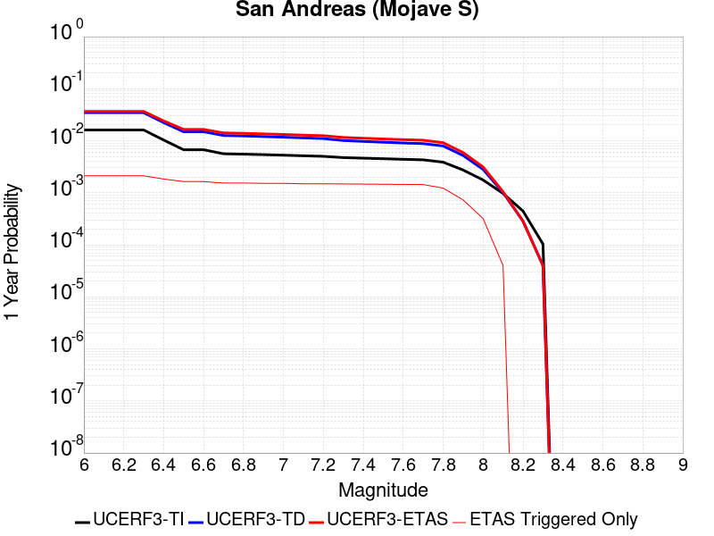 |  |

| Magnitude | 1 wk TI Prob | 1 wk TD Prob | 1 wk ETAS Prob | 1 wk ETAS/TD Gain | 1 wk ETAS Triggered Only | 1 mo TI Prob | 1 mo TD Prob | 1 mo ETAS Prob | 1 mo ETAS/TD Gain | 1 mo ETAS Triggered Only | 1 yr TI Prob | 1 yr TD Prob | 1 yr ETAS Prob | 1 yr ETAS/TD Gain | 1 yr ETAS Triggered Only | 10 yr TI Prob | 10 yr TD Prob | 10 yr ETAS Prob | 10 yr ETAS/TD Gain | 10 yr ETAS Triggered Only |
|-----|-----|-----|-----|-----|-----|-----|-----|-----|-----|-----|-----|-----|-----|-----|-----|-----|-----|-----|-----|-----|
| 6.0 | 3.1064058E-4 | 6.7460834E-4 | 0.0017208987 | 2.5509598 | 0.0010469967 | 0.0013306376 | 0.0028881032 | 0.004235165 | 1.4664174 | 0.0013509634 | 0.016080605 | 0.03462235 | 0.036774263 | 1.0621539 | 0.0022290896 | 0.1496549 | 0.28660452 | 0.2886164 | 1.0070196 | 0.002820136 |
| 6.1 | 3.1064058E-4 | 6.7460834E-4 | 0.0017208987 | 2.5509598 | 0.0010469967 | 0.0013306376 | 0.0028881032 | 0.004235165 | 1.4664174 | 0.0013509634 | 0.016080605 | 0.03462235 | 0.036774263 | 1.0621539 | 0.0022290896 | 0.1496549 | 0.28660452 | 0.2886164 | 1.0070196 | 0.002820136 |
| 6.2 | 3.1064058E-4 | 6.7460834E-4 | 0.0017208987 | 2.5509598 | 0.0010469967 | 0.0013306376 | 0.0028881032 | 0.004235165 | 1.4664174 | 0.0013509634 | 0.016080605 | 0.03462235 | 0.036774263 | 1.0621539 | 0.0022290896 | 0.1496549 | 0.28660452 | 0.2886164 | 1.0070196 | 0.002820136 |
| 6.3 | 3.1064058E-4 | 6.7460834E-4 | 0.0017208987 | 2.5509598 | 0.0010469967 | 0.0013306376 | 0.0028881032 | 0.004235165 | 1.4664174 | 0.0013509634 | 0.016080605 | 0.03462235 | 0.036774263 | 1.0621539 | 0.0022290896 | 0.1496549 | 0.28660452 | 0.2886164 | 1.0070196 | 0.002820136 |
| 6.4 | 1.9872203E-4 | 4.3179357E-4 | 0.0013770596 | 3.189162 | 9.456744E-4 | 8.5138786E-4 | 0.0018492596 | 0.0030628783 | 1.6562726 | 0.0012158671 | 0.010316478 | 0.02228844 | 0.024170654 | 1.084448 | 0.0019251228 | 0.098504856 | 0.19699748 | 0.19899085 | 1.0101187 | 0.0024823952 |
| 6.5 | 1.291105E-4 | 2.875267E-4 | 0.0011316361 | 3.93576 | 8.443521E-4 | 5.5321335E-4 | 0.0012316781 | 0.002327984 | 1.8900912 | 0.0010976577 | 0.006714592 | 0.0148934 | 0.01660686 | 1.1150483 | 0.0017393654 | 0.065152965 | 0.13803436 | 0.13995576 | 1.0139197 | 0.0022290896 |
| 6.6 | 1.291105E-4 | 2.875267E-4 | 0.0011316361 | 3.93576 | 8.443521E-4 | 5.5321335E-4 | 0.0012316781 | 0.002327984 | 1.8900912 | 0.0010976577 | 0.006714592 | 0.0148934 | 0.01660686 | 1.1150483 | 0.0017393654 | 0.065152965 | 0.13803436 | 0.13995576 | 1.0139197 | 0.0022290896 |
| 6.7 | 1.08001186E-4 | 2.4333889E-4 | 0.0010537197 | 4.330256 | 8.1057806E-4 | 4.6278012E-4 | 0.0010424647 | 0.0020883698 | 2.0033004 | 0.0010469967 | 0.0056198016 | 0.012618446 | 0.014219145 | 1.126854 | 0.0016211561 | 0.054797906 | 0.119176775 | 0.12097659 | 1.015102 | 0.0020433322 |
| 6.8 | 1.0624356E-4 | 2.3851555E-4 | 0.0010489003 | 4.397618 | 8.1057806E-4 | 4.5525006E-4 | 0.0010218095 | 0.0020677363 | 2.0236025 | 0.0010469967 | 0.0055285925 | 0.012369843 | 0.013970946 | 1.129436 | 0.0016211561 | 0.053930566 | 0.11712591 | 0.11892992 | 1.0154023 | 0.0020433322 |
| 6.9 | 1.0393785E-4 | 2.3221898E-4 | 0.0010426088 | 4.4897656 | 8.1057806E-4 | 4.4537184E-4 | 9.948451E-4 | 0.0020408002 | 2.0513747 | 0.0010469967 | 0.0054089287 | 0.012045221 | 0.013630167 | 1.1315829 | 0.001604269 | 0.05279156 | 0.11442335 | 0.116217926 | 1.0156837 | 0.002026445 |
| 7.0 | 1.0155622E-4 | 2.2591476E-4 | 0.0010363096 | 4.587171 | 8.1057806E-4 | 4.3516833E-4 | 9.6784724E-4 | 0.0020138305 | 2.0807319 | 0.0010469967 | 0.005285311 | 0.0117200995 | 0.013305566 | 1.1352776 | 0.001604269 | 0.05161361 | 0.111683756 | 0.11346888 | 1.0159837 | 0.002009558 |
| 7.1 | 9.885595E-5 | 2.1879886E-4 | 9.954328E-4 | 4.549534 | 7.7680394E-4 | 4.2359953E-4 | 9.3737274E-4 | 0.0019496456 | 2.0799043 | 0.0010132225 | 0.0051451353 | 0.011352993 | 0.012905658 | 1.1367626 | 0.001570495 | 0.05027629 | 0.1085682 | 0.11029937 | 1.0159454 | 0.0019420099 |
| 7.2 | 9.6411415E-5 | 2.124288E-4 | 9.890677E-4 | 4.6559963 | 7.7680394E-4 | 4.1312634E-4 | 9.1009185E-4 | 0.0019223923 | 2.1123059 | 0.0010132225 | 0.005018219 | 0.011024255 | 0.012577437 | 1.1408876 | 0.001570495 | 0.049064007 | 0.105758004 | 0.10749463 | 1.0164207 | 0.0019420099 |
| 7.3 | 9.1180635E-5 | 1.9471257E-4 | 9.7136525E-4 | 4.9887137 | 7.7680394E-4 | 3.907156E-4 | 8.342157E-4 | 0.001846593 | 2.2135677 | 0.0010132225 | 0.004746591 | 0.01010939 | 0.011664008 | 1.1537796 | 0.001570495 | 0.046464786 | 0.09795115 | 0.09970294 | 1.0178843 | 0.0019420099 |
| 7.4 | 8.887388E-5 | 1.8719878E-4 | 9.6385734E-4 | 5.148844 | 7.7680394E-4 | 3.8083247E-4 | 8.020339E-4 | 0.0018144439 | 2.262303 | 0.0010132225 | 0.0046267817 | 0.00972114 | 0.011259645 | 1.1582638 | 0.0015536079 | 0.045316286 | 0.09458615 | 0.09632918 | 1.018428 | 0.0019251228 |
| 7.5 | 8.6750515E-5 | 1.8051457E-4 | 9.571783E-4 | 5.302499 | 7.7680394E-4 | 3.7173493E-4 | 7.7340455E-4 | 0.0017858435 | 2.3090677 | 0.0010132225 | 0.004516484 | 0.009375632 | 0.010914674 | 1.1641535 | 0.0015536079 | 0.04425787 | 0.091549896 | 0.09329877 | 1.019103 | 0.0019251228 |
| 7.6 | 8.453092E-5 | 1.7439072E-4 | 9.510592E-4 | 5.4536114 | 7.7680394E-4 | 3.6222505E-4 | 7.471748E-4 | 0.0017596403 | 2.3550584 | 0.0010132225 | 0.0044011753 | 0.009058985 | 0.010598518 | 1.1699455 | 0.0015536079 | 0.04315024 | 0.08870898 | 0.09046333 | 1.0197765 | 0.0019251228 |
| 7.7 | 8.259102E-5 | 1.6961215E-4 | 9.4628433E-4 | 5.5791073 | 7.7680394E-4 | 3.539135E-4 | 7.2670676E-4 | 0.0017223182 | 2.3700318 | 9.963355E-4 | 0.004300386 | 0.008811831 | 0.01033501 | 1.1728562 | 0.0015367209 | 0.042181134 | 0.08645982 | 0.08818765 | 1.0199841 | 0.0018913487 |
| 7.8 | 7.444844E-5 | 1.5283503E-4 | 8.4509794E-4 | 5.529478 | 6.923687E-4 | 3.1902574E-4 | 6.548429E-4 | 0.00154927 | 2.3658652 | 8.950133E-4 | 0.0038772223 | 0.007943616 | 0.009334107 | 1.175045 | 0.0014016245 | 0.03810269 | 0.078290746 | 0.0798628 | 1.0200797 | 0.0017055913 |
| 7.9 | 5.2586525E-5 | 1.00064186E-4 | 5.22198E-4 | 5.2186303 | 4.2217606E-4 | 2.2535135E-4 | 4.2877605E-4 | 9.858095E-4 | 2.2991245 | 5.572724E-4 | 0.0027402006 | 0.005207864 | 0.006047819 | 1.1612859 | 8.443521E-4 | 0.027066574 | 0.052200034 | 0.053192377 | 1.0190104 | 0.0010469967 |
| 8.0 | 3.379877E-5 | 5.4074168E-5 | 2.2293546E-4 | 4.122772 | 1.6887042E-4 | 1.4484383E-4 | 2.3172585E-4 | 4.8497278E-4 | 2.092873 | 2.5330562E-4 | 0.0017620471 | 0.002817614 | 0.0031712428 | 1.1255064 | 3.546279E-4 | 0.017481409 | 0.028834904 | 0.029261306 | 1.0147877 | 4.390631E-4 |
| 8.1 | 1.8668277E-5 | 1.9309397E-5 | 3.6196114E-5 | 1.8745337 | 1.6887043E-5 | 8.000444E-5 | 8.275194E-5 | 1.16523224E-4 | 1.4081028 | 3.3774086E-5 | 9.736188E-4 | 0.0010070398 | 0.0010407799 | 1.0335042 | 3.3774086E-5 | 0.009693642 | 0.010798888 | 0.010849002 | 1.0046407 | 5.066113E-5 |
| 8.2 | 8.541571E-6 | 5.460819E-6 | 5.460819E-6 | 1.0 | 0.0 | 3.660622E-5 | 2.3403301E-5 | 2.3403301E-5 | 1.0 | 0.0 | 4.455896E-4 | 2.84898E-4 | 2.84898E-4 | 1.0 | 0.0 | 0.0044469717 | 0.0032408056 | 0.0032408056 | 1.0 | 0.0 |
| 8.3 | 1.983087E-6 | 7.6599065E-7 | 7.6599065E-7 | 1.0 | 0.0 | 8.498917E-6 | 3.282813E-6 | 3.282813E-6 | 1.0 | 0.0 | 1.034694E-4 | 3.9967534E-5 | 3.9967534E-5 | 1.0 | 0.0 | 0.0010342124 | 4.719687E-4 | 4.719687E-4 | 1.0 | 0.0 |

## Nelson Lake
*[(top)](#table-of-contents)*

| 1 Week | 1 Month | 1 Year | 10 Year |
|-----|-----|-----|-----|
|  |  |  |  |

| Magnitude | 1 wk TI Prob | 1 wk TD Prob | 1 wk ETAS Prob | 1 wk ETAS/TD Gain | 1 wk ETAS Triggered Only | 1 mo TI Prob | 1 mo TD Prob | 1 mo ETAS Prob | 1 mo ETAS/TD Gain | 1 mo ETAS Triggered Only | 1 yr TI Prob | 1 yr TD Prob | 1 yr ETAS Prob | 1 yr ETAS/TD Gain | 1 yr ETAS Triggered Only | 10 yr TI Prob | 10 yr TD Prob | 10 yr ETAS Prob | 10 yr ETAS/TD Gain | 10 yr ETAS Triggered Only |
|-----|-----|-----|-----|-----|-----|-----|-----|-----|-----|-----|-----|-----|-----|-----|-----|-----|-----|-----|-----|-----|
| 6.0 | 9.913453E-6 | 1.0192255E-5 | 6.181196E-4 | 60.646008 | 6.0793356E-4 | 4.2485535E-5 | 4.3680422E-5 | 9.04882E-4 | 20.715963 | 8.6123915E-4 | 5.1713863E-4 | 5.316897E-4 | 0.0021182278 | 3.9839547 | 0.001587382 | 0.0051593683 | 0.005305204 | 0.0077240374 | 1.455936 | 0.0024317342 |
| 6.1 | 9.913453E-6 | 1.0192255E-5 | 6.181196E-4 | 60.646008 | 6.0793356E-4 | 4.2485535E-5 | 4.3680422E-5 | 9.04882E-4 | 20.715963 | 8.6123915E-4 | 5.1713863E-4 | 5.316897E-4 | 0.0021182278 | 3.9839547 | 0.001587382 | 0.0051593683 | 0.005305204 | 0.0077240374 | 1.455936 | 0.0024317342 |
| 6.2 | 4.5596407E-6 | 4.696313E-6 | 3.0866166E-4 | 65.72425 | 3.0396678E-4 | 1.954117E-5 | 2.0126909E-5 | 3.9163436E-4 | 19.458248 | 3.7151494E-4 | 2.3788778E-4 | 2.4501883E-4 | 9.034521E-4 | 3.6872764 | 6.5859465E-4 | 0.0023763329 | 0.0024476128 | 0.0035088926 | 1.4335979 | 0.0010638837 |
| 6.3 | 4.5596407E-6 | 4.696313E-6 | 3.0866166E-4 | 65.72425 | 3.0396678E-4 | 1.954117E-5 | 2.0126909E-5 | 3.9163436E-4 | 19.458248 | 3.7151494E-4 | 2.3788778E-4 | 2.4501883E-4 | 9.034521E-4 | 3.6872764 | 6.5859465E-4 | 0.0023763329 | 0.0024476128 | 0.0035088926 | 1.4335979 | 0.0010638837 |
| 6.4 | 3.4025713E-6 | 3.5098972E-6 | 2.3992766E-4 | 68.35746 | 2.364186E-4 | 1.4582367E-5 | 1.5042335E-5 | 3.0211775E-4 | 20.084497 | 2.8707972E-4 | 1.7752586E-4 | 1.8312587E-4 | 6.558765E-4 | 3.5815609 | 4.728372E-4 | 0.001773841 | 0.0018298327 | 0.0026220714 | 1.4329569 | 7.93691E-4 |
| 6.5 | 2.8352947E-6 | 2.927856E-6 | 2.2245877E-4 | 75.98009 | 2.1953155E-4 | 1.2151207E-5 | 1.2547898E-5 | 2.6585037E-4 | 21.186844 | 2.5330562E-4 | 1.479309E-4 | 1.5276071E-4 | 5.4110336E-4 | 3.5421631 | 3.8840197E-4 | 0.0014783246 | 0.0015266308 | 0.0022179426 | 1.452835 | 6.923687E-4 |
| 6.6 | 2.251518E-6 | 2.3290677E-6 | 2.0497311E-4 | 88.00651 | 2.0264451E-4 | 9.649328E-6 | 9.981683E-6 | 2.2951105E-4 | 22.99322 | 2.1953155E-4 | 1.1747423E-4 | 1.2152085E-4 | 4.4233567E-4 | 3.6399982 | 3.208538E-4 | 0.0011741214 | 0.0012146058 | 0.0017543347 | 1.4443656 | 5.403854E-4 |
| 6.7 | 1.8911853E-6 | 1.9591396E-6 | 1.032812E-4 | 52.71763 | 1.0132226E-4 | 8.105055E-6 | 8.39629E-6 | 1.4349149E-4 | 17.08987 | 1.3509634E-4 | 9.867457E-5 | 1.0222061E-4 | 3.2172972E-4 | 3.1474056 | 2.1953155E-4 | 9.863076E-4 | 0.0010217935 | 0.0013929288 | 1.3632195 | 3.7151494E-4 |
| 6.8 | 1.4874814E-6 | 1.5438305E-6 | 1.0286593E-4 | 66.630325 | 1.0132226E-4 | 6.374905E-6 | 6.6164025E-6 | 1.4171185E-4 | 21.418262 | 1.3509634E-4 | 7.76117E-5 | 8.055224E-5 | 3.000661E-4 | 3.7251117 | 2.1953155E-4 | 7.75846E-4 | 8.0528157E-4 | 0.0011596238 | 1.440023 | 3.546279E-4 |
| 6.9 | 6.835972E-7 | 7.1399285E-7 | 5.1375086E-5 | 71.95462 | 5.066113E-5 | 2.9296991E-6 | 3.0599674E-6 | 7.060793E-5 | 23.074732 | 6.754817E-5 | 3.56685E-5 | 3.7254784E-5 | 1.3857326E-4 | 3.7196097 | 1.0132226E-4 | 3.5662777E-4 | 3.7251666E-4 | 4.906819E-4 | 1.317208 | 1.182093E-4 |

## Death Valley (So)
*[(top)](#table-of-contents)*

| 1 Week | 1 Month | 1 Year | 10 Year |
|-----|-----|-----|-----|
|  | 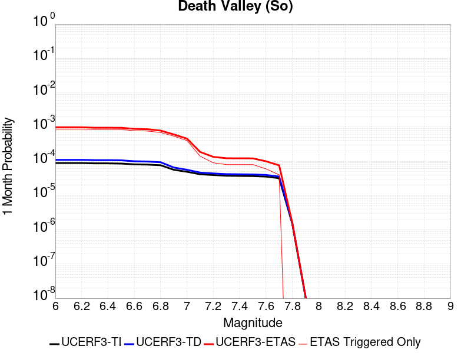 |  |  |

| Magnitude | 1 wk TI Prob | 1 wk TD Prob | 1 wk ETAS Prob | 1 wk ETAS/TD Gain | 1 wk ETAS Triggered Only | 1 mo TI Prob | 1 mo TD Prob | 1 mo ETAS Prob | 1 mo ETAS/TD Gain | 1 mo ETAS Triggered Only | 1 yr TI Prob | 1 yr TD Prob | 1 yr ETAS Prob | 1 yr ETAS/TD Gain | 1 yr ETAS Triggered Only | 10 yr TI Prob | 10 yr TD Prob | 10 yr ETAS Prob | 10 yr ETAS/TD Gain | 10 yr ETAS Triggered Only |
|-----|-----|-----|-----|-----|-----|-----|-----|-----|-----|-----|-----|-----|-----|-----|-----|-----|-----|-----|-----|-----|
| 6.0 | 2.0684236E-5 | 2.5617775E-5 | 6.3353573E-4 | 24.730318 | 6.0793356E-4 | 8.864371E-5 | 1.0978594E-4 | 9.878158E-4 | 8.997652 | 8.781262E-4 | 0.0010787029 | 0.0013358411 | 0.0029885606 | 2.2372124 | 0.0016549302 | 0.010734817 | 0.013281397 | 0.015880788 | 1.1957166 | 0.0026343786 |
| 6.1 | 2.0684236E-5 | 2.5617775E-5 | 6.3353573E-4 | 24.730318 | 6.0793356E-4 | 8.864371E-5 | 1.0978594E-4 | 9.878158E-4 | 8.997652 | 8.781262E-4 | 0.0010787029 | 0.0013358411 | 0.0029885606 | 2.2372124 | 0.0016549302 | 0.010734817 | 0.013281397 | 0.015880788 | 1.1957166 | 0.0026343786 |
| 6.2 | 2.0684236E-5 | 2.5617775E-5 | 6.3353573E-4 | 24.730318 | 6.0793356E-4 | 8.864371E-5 | 1.0978594E-4 | 9.878158E-4 | 8.997652 | 8.781262E-4 | 0.0010787029 | 0.0013358411 | 0.0029885606 | 2.2372124 | 0.0016549302 | 0.010734817 | 0.013281397 | 0.015880788 | 1.1957166 | 0.0026343786 |
| 6.3 | 2.0240292E-5 | 2.511786E-5 | 6.161495E-4 | 24.530334 | 5.9104647E-4 | 8.6741224E-5 | 1.07643624E-4 | 9.687901E-4 | 8.999976 | 8.6123915E-4 | 0.0010555626 | 0.00130979 | 0.0029456876 | 2.248977 | 0.0016380431 | 0.010505628 | 0.013023956 | 0.015540689 | 1.1932387 | 0.0025499435 |
| 6.4 | 2.0240292E-5 | 2.511786E-5 | 6.161495E-4 | 24.530334 | 5.9104647E-4 | 8.6741224E-5 | 1.07643624E-4 | 9.687901E-4 | 8.999976 | 8.6123915E-4 | 0.0010555626 | 0.00130979 | 0.0029456876 | 2.248977 | 0.0016380431 | 0.010505628 | 0.013023956 | 0.015540689 | 1.1932387 | 0.0025499435 |
| 6.5 | 1.9962767E-5 | 2.4807114E-5 | 6.158389E-4 | 24.825094 | 5.9104647E-4 | 8.55519E-5 | 1.0631196E-4 | 9.674596E-4 | 9.100195 | 8.6123915E-4 | 0.0010410968 | 0.0012935963 | 0.0028957902 | 2.2385578 | 0.001604269 | 0.010362327 | 0.012863902 | 0.015297695 | 1.1891955 | 0.0024655082 |
| 6.6 | 1.8937297E-5 | 2.3310964E-5 | 5.6368374E-4 | 24.181055 | 5.403854E-4 | 8.115732E-5 | 9.990039E-5 | 8.935121E-4 | 8.94403 | 7.93691E-4 | 9.876423E-4 | 0.0012156231 | 0.0026661435 | 2.1932318 | 0.0014522857 | 0.009832645 | 0.012092789 | 0.014344971 | 1.1862417 | 0.0022797508 |
| 6.7 | 1.8621096E-5 | 2.2911607E-5 | 5.4639793E-4 | 23.848085 | 5.2349834E-4 | 7.980225E-5 | 9.818898E-5 | 8.580313E-4 | 8.738569 | 7.599169E-4 | 9.711593E-4 | 0.0011948098 | 0.002561026 | 2.143459 | 0.0013678505 | 0.009669261 | 0.011886904 | 0.014039437 | 1.1810845 | 0.0021784285 |
| 6.8 | 1.7830353E-5 | 2.1805688E-5 | 5.1151926E-4 | 23.458065 | 4.897242E-4 | 7.641356E-5 | 9.344968E-5 | 7.857537E-4 | 8.408308 | 6.923687E-4 | 9.29938E-4 | 0.00113717 | 0.0023853902 | 2.0976548 | 0.0012496412 | 0.009260561 | 0.011316354 | 0.013286476 | 1.174095 | 0.001992671 |
| 6.9 | 1.3135183E-5 | 1.5303925E-5 | 4.0369996E-4 | 26.37885 | 3.8840197E-4 | 5.6292425E-5 | 6.558664E-5 | 6.228225E-4 | 9.49618 | 5.572724E-4 | 6.8514474E-4 | 7.982312E-4 | 0.0017094036 | 2.1414893 | 9.119003E-4 | 0.006830362 | 0.007954649 | 0.00926136 | 1.1642702 | 0.0013171893 |
| 7.0 | 1.1507512E-5 | 1.3154199E-5 | 2.8334334E-4 | 21.540142 | 2.701927E-4 | 4.9316975E-5 | 5.6373956E-5 | 4.6164013E-4 | 8.18889 | 4.0528903E-4 | 6.002687E-4 | 6.8614254E-4 | 0.0013442853 | 1.9591925 | 6.5859465E-4 | 0.0059864987 | 0.0068409415 | 0.007780147 | 1.1372918 | 9.456744E-4 |
| 7.1 | 9.715903E-6 | 1.0865278E-5 | 7.841271E-5 | 7.216816 | 6.754817E-5 | 4.1638916E-5 | 4.656467E-5 | 1.6476847E-4 | 3.5384867 | 1.182093E-4 | 5.068359E-4 | 5.667817E-4 | 7.8618876E-4 | 1.3871105 | 2.1953155E-4 | 0.0050568148 | 0.0056538144 | 0.006023229 | 1.065339 | 3.7151494E-4 |
| 7.2 | 9.233269E-6 | 1.02863105E-5 | 6.0946917E-5 | 5.925051 | 5.066113E-5 | 3.9570554E-5 | 4.4083466E-5 | 1.1162866E-4 | 2.5322115 | 6.754817E-5 | 4.81665E-4 | 5.3658825E-4 | 6.5473415E-4 | 1.2201798 | 1.182093E-4 | 0.0048062233 | 0.0053533576 | 0.0055549173 | 1.0376511 | 2.0264451E-4 |
| 7.3 | 8.8041315E-6 | 9.808164E-6 | 6.0468796E-5 | 6.165149 | 5.066113E-5 | 3.7731446E-5 | 4.2034335E-5 | 1.0957967E-4 | 2.6069086 | 6.754817E-5 | 4.592835E-4 | 5.1165203E-4 | 5.9604406E-4 | 1.1649402 | 8.443521E-5 | 0.0045833546 | 0.005105167 | 0.0052731754 | 1.0329095 | 1.6887042E-4 |
| 7.4 | 8.708749E-6 | 9.707175E-6 | 6.0367813E-5 | 6.2188854 | 5.066113E-5 | 3.7322676E-5 | 4.160154E-5 | 1.091469E-4 | 2.6236265 | 6.754817E-5 | 4.5430884E-4 | 5.0638523E-4 | 5.9077766E-4 | 1.1666566 | 8.443521E-5 | 0.004533812 | 0.0050527398 | 0.005220757 | 1.0332527 | 1.6887042E-4 |
| 7.5 | 8.612678E-6 | 9.604817E-6 | 6.0265458E-5 | 6.274503 | 5.066113E-5 | 3.6910955E-5 | 4.1162875E-5 | 1.08708264E-4 | 2.6409297 | 6.754817E-5 | 4.492982E-4 | 5.01047E-4 | 5.854399E-4 | 1.1684331 | 8.443521E-5 | 0.004483909 | 0.0049995985 | 0.005167625 | 1.033608 | 1.6887042E-4 |
| 7.6 | 8.319024E-6 | 9.283916E-6 | 2.6170803E-5 | 2.81894 | 1.6887043E-5 | 3.5652476E-5 | 3.978763E-5 | 7.356037E-5 | 1.8488252 | 3.3774086E-5 | 4.3398244E-4 | 4.8431093E-4 | 5.349475E-4 | 1.1045539 | 5.066113E-5 | 0.0043313587 | 0.0048329784 | 0.0049674218 | 1.027818 | 1.3509634E-4 |
| 7.7 | 7.4718328E-6 | 8.34517E-6 | 8.34517E-6 | 1.0 | 0.0 | 3.2021748E-5 | 3.5764548E-5 | 5.2650983E-5 | 1.4721558 | 1.6887043E-5 | 3.8979502E-4 | 4.353504E-4 | 4.6910977E-4 | 1.0775453 | 3.3774086E-5 | 0.00389112 | 0.0043453807 | 0.004463076 | 1.0270852 | 1.182093E-4 |
| 7.8 | 3.4586725E-7 | 3.6482615E-7 | 3.6482615E-7 | 1.0 | 0.0 | 1.4822873E-6 | 1.5635396E-6 | 1.5635396E-6 | 1.0 | 0.0 | 1.80467E-5 | 1.9035933E-5 | 1.9035933E-5 | 1.0 | 0.0 | 1.8045233E-4 | 1.9034347E-4 | 1.9034347E-4 | 1.0 | 0.0 |
| 7.9 | 2.5591178E-9 | 2.6696718E-9 | 2.6696718E-9 | 1.0 | 0.0 | 1.0967647E-8 | 1.14414505E-8 | 1.14414505E-8 | 1.0 | 0.0 | 1.335311E-7 | 1.3929966E-7 | 1.3929966E-7 | 1.0 | 0.0 | 1.3353102E-6 | 1.3929966E-6 | 1.3929966E-6 | 1.0 | 0.0 |

## San Andreas (Mojave N)
*[(top)](#table-of-contents)*

| 1 Week | 1 Month | 1 Year | 10 Year |
|-----|-----|-----|-----|
| 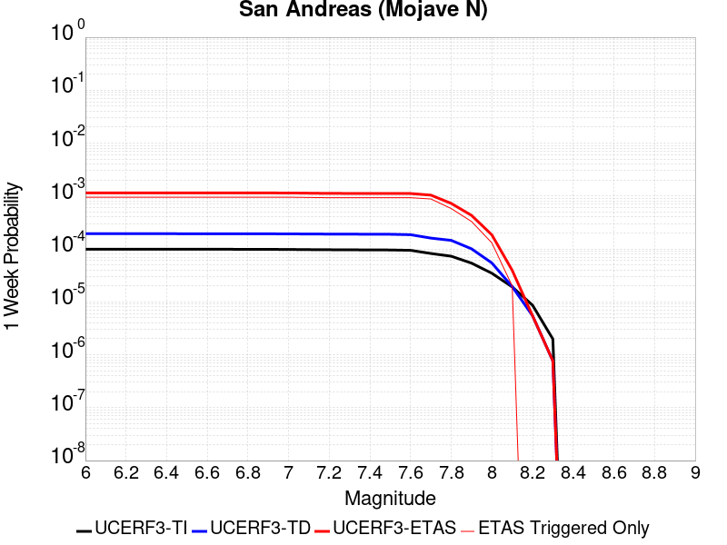 |  |  |  |

| Magnitude | 1 wk TI Prob | 1 wk TD Prob | 1 wk ETAS Prob | 1 wk ETAS/TD Gain | 1 wk ETAS Triggered Only | 1 mo TI Prob | 1 mo TD Prob | 1 mo ETAS Prob | 1 mo ETAS/TD Gain | 1 mo ETAS Triggered Only | 1 yr TI Prob | 1 yr TD Prob | 1 yr ETAS Prob | 1 yr ETAS/TD Gain | 1 yr ETAS Triggered Only | 10 yr TI Prob | 10 yr TD Prob | 10 yr ETAS Prob | 10 yr ETAS/TD Gain | 10 yr ETAS Triggered Only |
|-----|-----|-----|-----|-----|-----|-----|-----|-----|-----|-----|-----|-----|-----|-----|-----|-----|-----|-----|-----|-----|
| 6.0 | 9.877682E-5 | 1.9400702E-4 | 0.0012408005 | 6.3956475 | 0.0010469967 | 4.2326056E-4 | 8.311939E-4 | 0.0021979073 | 2.6442776 | 0.0013678505 | 0.0051410277 | 0.010072956 | 0.012045555 | 1.1958312 | 0.001992671 | 0.05023708 | 0.09831428 | 0.10053739 | 1.0226123 | 0.0024655082 |
| 6.1 | 9.877682E-5 | 1.9400702E-4 | 0.0012408005 | 6.3956475 | 0.0010469967 | 4.2326056E-4 | 8.311939E-4 | 0.0021979073 | 2.6442776 | 0.0013678505 | 0.0051410277 | 0.010072956 | 0.012045555 | 1.1958312 | 0.001992671 | 0.05023708 | 0.09831428 | 0.10053739 | 1.0226123 | 0.0024655082 |
| 6.2 | 9.877682E-5 | 1.9400702E-4 | 0.0012408005 | 6.3956475 | 0.0010469967 | 4.2326056E-4 | 8.311939E-4 | 0.0021979073 | 2.6442776 | 0.0013678505 | 0.0051410277 | 0.010072956 | 0.012045555 | 1.1958312 | 0.001992671 | 0.05023708 | 0.09831428 | 0.10053739 | 1.0226123 | 0.0024655082 |
| 6.3 | 9.877682E-5 | 1.9400702E-4 | 0.0012408005 | 6.3956475 | 0.0010469967 | 4.2326056E-4 | 8.311939E-4 | 0.0021979073 | 2.6442776 | 0.0013678505 | 0.0051410277 | 0.010072956 | 0.012045555 | 1.1958312 | 0.001992671 | 0.05023708 | 0.09831428 | 0.10053739 | 1.0226123 | 0.0024655082 |
| 6.4 | 9.877682E-5 | 1.9400702E-4 | 0.0012408005 | 6.3956475 | 0.0010469967 | 4.2326056E-4 | 8.311939E-4 | 0.0021979073 | 2.6442776 | 0.0013678505 | 0.0051410277 | 0.010072956 | 0.012045555 | 1.1958312 | 0.001992671 | 0.05023708 | 0.09831428 | 0.10053739 | 1.0226123 | 0.0024655082 |
| 6.5 | 9.861474E-5 | 1.9374468E-4 | 0.0012405384 | 6.402955 | 0.0010469967 | 4.2256617E-4 | 8.300703E-4 | 0.0021967853 | 2.646505 | 0.0013678505 | 0.0051326132 | 0.010059402 | 0.012032028 | 1.1960977 | 0.001992671 | 0.050156746 | 0.098192066 | 0.10041548 | 1.0226436 | 0.0024655082 |
| 6.6 | 9.861474E-5 | 1.9374468E-4 | 0.0012405384 | 6.402955 | 0.0010469967 | 4.2256617E-4 | 8.300703E-4 | 0.0021967853 | 2.646505 | 0.0013678505 | 0.0051326132 | 0.010059402 | 0.012032028 | 1.1960977 | 0.001992671 | 0.050156746 | 0.098192066 | 0.10041548 | 1.0226436 | 0.0024655082 |
| 6.7 | 9.8552715E-5 | 1.9364421E-4 | 0.0012404381 | 6.405759 | 0.0010469967 | 4.223004E-4 | 8.2964E-4 | 0.0021963557 | 2.6473598 | 0.0013678505 | 0.0051293927 | 0.010054212 | 0.012026848 | 1.1962 | 0.001992671 | 0.050125998 | 0.098145254 | 0.10036878 | 1.0226555 | 0.0024655082 |
| 6.8 | 9.8464974E-5 | 1.9349584E-4 | 0.0012402899 | 6.4099045 | 0.0010469967 | 4.219245E-4 | 8.290045E-4 | 0.002195721 | 2.6486237 | 0.0013678505 | 0.0051248376 | 0.010046546 | 0.012019198 | 1.1963512 | 0.001992671 | 0.05008251 | 0.09807528 | 0.100298986 | 1.0226734 | 0.0024655082 |
| 6.9 | 9.825824E-5 | 1.9317595E-4 | 0.0012399703 | 6.418865 | 0.0010469967 | 4.2103877E-4 | 8.276344E-4 | 0.0021943527 | 2.6513553 | 0.0013678505 | 0.0051141046 | 0.010030019 | 0.012002704 | 1.196678 | 0.001992671 | 0.049980022 | 0.09792438 | 0.100148454 | 1.0227121 | 0.0024655082 |
| 7.0 | 9.781462E-5 | 1.924896E-4 | 0.0012392848 | 6.4381905 | 0.0010469967 | 4.1913814E-4 | 8.246948E-4 | 0.0021914172 | 2.6572464 | 0.0013678505 | 0.005091073 | 0.009994558 | 0.0119673135 | 1.1973829 | 0.001992671 | 0.04976007 | 0.09760077 | 0.09982564 | 1.0227957 | 0.0024655082 |
| 7.1 | 9.7121134E-5 | 1.9150671E-4 | 0.0012383028 | 6.4661064 | 0.0010469967 | 4.1616702E-4 | 8.204851E-4 | 0.0021872132 | 2.6657562 | 0.0013678505 | 0.005055068 | 0.009943774 | 0.011916631 | 1.1984012 | 0.001992671 | 0.04941613 | 0.09713728 | 0.09934805 | 1.0227592 | 0.0024486212 |
| 7.2 | 9.663819E-5 | 1.9081456E-4 | 0.0012376114 | 6.4859376 | 0.0010469967 | 4.1409794E-4 | 8.175206E-4 | 0.0021842527 | 2.6718016 | 0.0013678505 | 0.0050299936 | 0.00990801 | 0.011880938 | 1.1991245 | 0.001992671 | 0.049176537 | 0.09681055 | 0.09902211 | 1.0228443 | 0.0024486212 |
| 7.3 | 9.6277574E-5 | 1.9033969E-4 | 0.001237137 | 6.499627 | 0.0010469967 | 4.125529E-4 | 8.154867E-4 | 0.0021822217 | 2.6759746 | 0.0013678505 | 0.0050112694 | 0.009883473 | 0.01185645 | 1.1996238 | 0.001992671 | 0.04899759 | 0.09658401 | 0.09879613 | 1.0229037 | 0.0024486212 |
| 7.4 | 9.593308E-5 | 1.897375E-4 | 0.0012365355 | 6.517085 | 0.0010469967 | 4.1107697E-4 | 8.129075E-4 | 0.002179646 | 2.6812963 | 0.0013678505 | 0.0049933824 | 0.009852355 | 0.011825394 | 1.2002606 | 0.001992671 | 0.04882661 | 0.09630218 | 0.098515 | 1.0229778 | 0.0024486212 |
| 7.5 | 9.561707E-5 | 1.8919831E-4 | 0.0012359968 | 6.532811 | 0.0010469967 | 4.0972308E-4 | 8.1059814E-4 | 0.0021773397 | 2.6860902 | 0.0013678505 | 0.0049769743 | 0.009824493 | 0.011797586 | 1.2008342 | 0.001992671 | 0.048669744 | 0.09604836 | 0.098261796 | 1.0230451 | 0.0024486212 |
| 7.6 | 9.418194E-5 | 1.8572104E-4 | 0.0012325232 | 6.636422 | 0.0010469967 | 4.0357444E-4 | 7.957047E-4 | 0.0021624668 | 2.717675 | 0.0013678505 | 0.004902454 | 0.009644784 | 0.011618236 | 1.2046134 | 0.001992671 | 0.047957025 | 0.094430685 | 0.09664808 | 1.0234817 | 0.0024486212 |
| 7.7 | 8.202141E-5 | 1.6021315E-4 | 0.0011732734 | 7.3232026 | 0.0010132225 | 3.51473E-4 | 6.8644714E-4 | 0.0019858568 | 2.8929493 | 0.0013003023 | 0.00427079 | 0.008325525 | 0.010201127 | 1.2252834 | 0.0018913487 | 0.04189639 | 0.08223219 | 0.084308974 | 1.0252551 | 0.0022628638 |
| 7.8 | 7.2859846E-5 | 1.4516473E-4 | 8.37433E-4 | 5.7688465 | 6.923687E-4 | 3.1221908E-4 | 6.219862E-4 | 0.0015164427 | 2.438065 | 8.950133E-4 | 0.003794643 | 0.0075464295 | 0.008920717 | 1.182111 | 0.0013847374 | 0.037304975 | 0.07472468 | 0.076287195 | 1.0209103 | 0.0016887042 |
| 7.9 | 5.3874453E-5 | 1.0045676E-4 | 5.225904E-4 | 5.2021427 | 4.2217606E-4 | 2.3087008E-4 | 4.3045796E-4 | 9.874905E-4 | 2.2940464 | 5.572724E-4 | 0.0028072202 | 0.0052282433 | 0.006068181 | 1.160654 | 8.443521E-4 | 0.02772022 | 0.05242443 | 0.05341654 | 1.0189246 | 0.0010469967 |
| 8.0 | 3.468538E-5 | 5.4260272E-5 | 2.2312153E-4 | 4.112061 | 1.6887042E-4 | 1.4864317E-4 | 2.325233E-4 | 4.8577003E-4 | 2.0891242 | 2.5330562E-4 | 0.0018082283 | 0.002827298 | 0.0031809232 | 1.1250753 | 3.546279E-4 | 0.017935853 | 0.028947512 | 0.029373864 | 1.0147285 | 4.390631E-4 |
| 8.1 | 1.9152367E-5 | 1.940263E-5 | 3.6289344E-5 | 1.8703312 | 1.6887043E-5 | 8.207899E-5 | 8.3151484E-5 | 1.1692276E-4 | 1.4061416 | 3.3774086E-5 | 9.988535E-4 | 0.0010118998 | 0.0010456396 | 1.0333431 | 3.3774086E-5 | 0.009943757 | 0.01085625 | 0.010906361 | 1.0046159 | 5.066113E-5 |
| 8.2 | 8.643924E-6 | 5.4748625E-6 | 5.4748625E-6 | 1.0 | 0.0 | 3.704486E-5 | 2.3463486E-5 | 2.3463486E-5 | 1.0 | 0.0 | 4.5092785E-4 | 2.8563058E-4 | 2.8563058E-4 | 1.0 | 0.0 | 0.0045001395 | 0.0032487072 | 0.0032487072 | 1.0 | 0.0 |
| 8.3 | 1.983087E-6 | 7.6599065E-7 | 7.6599065E-7 | 1.0 | 0.0 | 8.498917E-6 | 3.282813E-6 | 3.282813E-6 | 1.0 | 0.0 | 1.034694E-4 | 3.9967534E-5 | 3.9967534E-5 | 1.0 | 0.0 | 0.0010342124 | 4.719687E-4 | 4.719687E-4 | 1.0 | 0.0 |

## Towne Pass
*[(top)](#table-of-contents)*

| 1 Week | 1 Month | 1 Year | 10 Year |
|-----|-----|-----|-----|
|  |  |  |  |

| Magnitude | 1 wk TI Prob | 1 wk TD Prob | 1 wk ETAS Prob | 1 wk ETAS/TD Gain | 1 wk ETAS Triggered Only | 1 mo TI Prob | 1 mo TD Prob | 1 mo ETAS Prob | 1 mo ETAS/TD Gain | 1 mo ETAS Triggered Only | 1 yr TI Prob | 1 yr TD Prob | 1 yr ETAS Prob | 1 yr ETAS/TD Gain | 1 yr ETAS Triggered Only | 10 yr TI Prob | 10 yr TD Prob | 10 yr ETAS Prob | 10 yr ETAS/TD Gain | 10 yr ETAS Triggered Only |
|-----|-----|-----|-----|-----|-----|-----|-----|-----|-----|-----|-----|-----|-----|-----|-----|-----|-----|-----|-----|-----|
| 6.0 | 3.849728E-6 | 3.8945414E-6 | 4.2606896E-4 | 109.40157 | 4.2217606E-4 | 1.649873E-5 | 1.669081E-5 | 6.246142E-4 | 37.42264 | 6.0793356E-4 | 2.0085352E-4 | 2.0319603E-4 | 0.0013850488 | 6.8163185 | 0.0011820929 | 0.0020067208 | 0.0020305314 | 0.0043562115 | 2.1453552 | 0.002330412 |
| 6.1 | 3.849728E-6 | 3.8945414E-6 | 4.2606896E-4 | 109.40157 | 4.2217606E-4 | 1.649873E-5 | 1.669081E-5 | 6.246142E-4 | 37.42264 | 6.0793356E-4 | 2.0085352E-4 | 2.0319603E-4 | 0.0013850488 | 6.8163185 | 0.0011820929 | 0.0020067208 | 0.0020305314 | 0.0043562115 | 2.1453552 | 0.002330412 |
| 6.2 | 3.849728E-6 | 3.8945414E-6 | 4.2606896E-4 | 109.40157 | 4.2217606E-4 | 1.649873E-5 | 1.669081E-5 | 6.246142E-4 | 37.42264 | 6.0793356E-4 | 2.0085352E-4 | 2.0319603E-4 | 0.0013850488 | 6.8163185 | 0.0011820929 | 0.0020067208 | 0.0020305314 | 0.0043562115 | 2.1453552 | 0.002330412 |
| 6.3 | 3.849728E-6 | 3.8945414E-6 | 4.2606896E-4 | 109.40157 | 4.2217606E-4 | 1.649873E-5 | 1.669081E-5 | 6.246142E-4 | 37.42264 | 6.0793356E-4 | 2.0085352E-4 | 2.0319603E-4 | 0.0013850488 | 6.8163185 | 0.0011820929 | 0.0020067208 | 0.0020305314 | 0.0043562115 | 2.1453552 | 0.002330412 |
| 6.4 | 3.849728E-6 | 3.8945414E-6 | 4.2606896E-4 | 109.40157 | 4.2217606E-4 | 1.649873E-5 | 1.669081E-5 | 6.246142E-4 | 37.42264 | 6.0793356E-4 | 2.0085352E-4 | 2.0319603E-4 | 0.0013850488 | 6.8163185 | 0.0011820929 | 0.0020067208 | 0.0020305314 | 0.0043562115 | 2.1453552 | 0.002330412 |
| 6.5 | 1.1953545E-6 | 1.203052E-6 | 1.7007327E-4 | 141.36818 | 1.6887042E-4 | 5.1229376E-6 | 5.1559277E-6 | 2.077994E-4 | 40.30301 | 2.0264451E-4 | 6.236998E-5 | 6.277173E-5 | 3.4983343E-4 | 5.573105 | 2.8707972E-4 | 6.235248E-4 | 6.275517E-4 | 0.0011507216 | 1.833668 | 5.2349834E-4 |
| 6.6 | 1.1953545E-6 | 1.203052E-6 | 1.7007327E-4 | 141.36818 | 1.6887042E-4 | 5.1229376E-6 | 5.1559277E-6 | 2.077994E-4 | 40.30301 | 2.0264451E-4 | 6.236998E-5 | 6.277173E-5 | 3.4983343E-4 | 5.573105 | 2.8707972E-4 | 6.235248E-4 | 6.275517E-4 | 0.0011507216 | 1.833668 | 5.2349834E-4 |
| 6.7 | 8.375951E-7 | 8.4106705E-7 | 6.838918E-5 | 81.3124 | 6.754817E-5 | 3.5896885E-6 | 3.6045683E-6 | 8.803948E-5 | 24.424416 | 8.443521E-5 | 4.370358E-5 | 4.3884793E-5 | 1.6208891E-4 | 3.6935096 | 1.182093E-4 | 4.3694986E-4 | 4.38767E-4 | 7.257208E-4 | 1.6540003 | 2.8707972E-4 |
| 6.8 | 6.38041E-7 | 6.392156E-7 | 1.7526247E-5 | 27.418364 | 1.6887043E-5 | 2.7344586E-6 | 2.7394929E-6 | 3.6513484E-5 | 13.328556 | 3.3774086E-5 | 3.3291526E-5 | 3.3352855E-5 | 1.00898775E-4 | 3.0251915 | 6.754817E-5 | 3.3286537E-4 | 3.334823E-4 | 5.0229643E-4 | 1.506216 | 1.6887042E-4 |
| 6.9 | 5.3460053E-7 | 5.345333E-7 | 1.7421567E-5 | 32.592106 | 1.6887043E-5 | 2.2911431E-6 | 2.2908553E-6 | 3.6064863E-5 | 15.7429695 | 3.3774086E-5 | 2.789431E-5 | 2.789084E-5 | 9.543713E-5 | 3.421809 | 6.754817E-5 | 2.789081E-4 | 2.7887672E-4 | 4.3081772E-4 | 1.5448321 | 1.5198339E-4 |
| 7.0 | 3.557783E-7 | 3.5324226E-7 | 1.724028E-5 | 48.80582 | 1.6887043E-5 | 1.5247632E-6 | 1.5138945E-6 | 1.8400911E-5 | 12.154685 | 1.6887043E-5 | 1.8563835E-5 | 1.843152E-5 | 5.220498E-5 | 2.8323755 | 3.3774086E-5 | 1.8562283E-4 | 1.8430075E-4 | 2.687204E-4 | 1.4580538 | 8.443521E-5 |
| 7.1 | 3.037942E-7 | 3.0002218E-7 | 1.718706E-5 | 57.285965 | 1.6887043E-5 | 1.3019744E-6 | 1.2858087E-6 | 1.817283E-5 | 14.133385 | 1.6887043E-5 | 1.5851423E-5 | 1.5654618E-5 | 4.9428174E-5 | 3.1574183 | 3.3774086E-5 | 1.5850292E-4 | 1.5653588E-4 | 2.4095789E-4 | 1.539314 | 8.443521E-5 |
| 7.2 | 2.0808248E-7 | 2.0217689E-7 | 1.7089216E-5 | 84.52606 | 1.6887043E-5 | 8.917818E-7 | 8.6647213E-7 | 1.77535E-5 | 20.489407 | 1.6887043E-5 | 1.0857389E-5 | 1.0549252E-5 | 2.7436115E-5 | 2.6007643 | 1.6887043E-5 | 1.0856859E-4 | 1.0548797E-4 | 1.5614375E-4 | 1.4802043 | 5.066113E-5 |
| 7.3 | 1.1162073E-7 | 1.0636894E-7 | 1.699341E-5 | 159.75914 | 1.6887043E-5 | 4.7837443E-7 | 4.558668E-7 | 1.7342902E-5 | 38.043793 | 1.6887043E-5 | 5.8241935E-6 | 5.550166E-6 | 2.2437114E-5 | 4.0426025 | 1.6887043E-5 | 5.8240406E-5 | 5.5500474E-5 | 8.927269E-5 | 1.6085031 | 3.3774086E-5 |

## Lenwood-Lockhart-Old Woman Springs
*[(top)](#table-of-contents)*

| 1 Week | 1 Month | 1 Year | 10 Year |
|-----|-----|-----|-----|
|  |  |  |  |

| Magnitude | 1 wk TI Prob | 1 wk TD Prob | 1 wk ETAS Prob | 1 wk ETAS/TD Gain | 1 wk ETAS Triggered Only | 1 mo TI Prob | 1 mo TD Prob | 1 mo ETAS Prob | 1 mo ETAS/TD Gain | 1 mo ETAS Triggered Only | 1 yr TI Prob | 1 yr TD Prob | 1 yr ETAS Prob | 1 yr ETAS/TD Gain | 1 yr ETAS Triggered Only | 10 yr TI Prob | 10 yr TD Prob | 10 yr ETAS Prob | 10 yr ETAS/TD Gain | 10 yr ETAS Triggered Only |
|-----|-----|-----|-----|-----|-----|-----|-----|-----|-----|-----|-----|-----|-----|-----|-----|-----|-----|-----|-----|-----|
| 6.0 | 3.744542E-5 | 4.396252E-5 | 7.025282E-4 | 15.980163 | 6.5859465E-4 | 1.604705E-4 | 1.8839816E-4 | 0.0011001267 | 5.8393703 | 9.119003E-4 | 0.0019519776 | 0.0022915069 | 0.003706768 | 1.6176115 | 0.0014185116 | 0.019349206 | 0.022696787 | 0.024908291 | 1.0974369 | 0.0022628638 |
| 6.1 | 3.744542E-5 | 4.396252E-5 | 7.025282E-4 | 15.980163 | 6.5859465E-4 | 1.604705E-4 | 1.8839816E-4 | 0.0011001267 | 5.8393703 | 9.119003E-4 | 0.0019519776 | 0.0022915069 | 0.003706768 | 1.6176115 | 0.0014185116 | 0.019349206 | 0.022696787 | 0.024908291 | 1.0974369 | 0.0022628638 |
| 6.2 | 3.744542E-5 | 4.396252E-5 | 7.025282E-4 | 15.980163 | 6.5859465E-4 | 1.604705E-4 | 1.8839816E-4 | 0.0011001267 | 5.8393703 | 9.119003E-4 | 0.0019519776 | 0.0022915069 | 0.003706768 | 1.6176115 | 0.0014185116 | 0.019349206 | 0.022696787 | 0.024908291 | 1.0974369 | 0.0022628638 |
| 6.3 | 2.1079984E-5 | 2.5353434E-5 | 2.6176605E-4 | 10.324677 | 2.364186E-4 | 9.0339665E-5 | 1.0865316E-4 | 4.970129E-4 | 4.5743074 | 3.8840197E-4 | 0.0010993304 | 0.0013220694 | 0.0018786051 | 1.4209579 | 5.572724E-4 | 0.010939079 | 0.0131442575 | 0.013977511 | 1.063393 | 8.443521E-4 |
| 6.4 | 2.1079984E-5 | 2.5353434E-5 | 2.6176605E-4 | 10.324677 | 2.364186E-4 | 9.0339665E-5 | 1.0865316E-4 | 4.970129E-4 | 4.5743074 | 3.8840197E-4 | 0.0010993304 | 0.0013220694 | 0.0018786051 | 1.4209579 | 5.572724E-4 | 0.010939079 | 0.0131442575 | 0.013977511 | 1.063393 | 8.443521E-4 |
| 6.5 | 1.7397282E-5 | 2.066241E-5 | 1.8952935E-4 | 9.172664 | 1.6887042E-4 | 7.455765E-5 | 8.8550245E-5 | 3.924901E-4 | 4.4323997 | 3.0396678E-4 | 9.073613E-4 | 0.0010775778 | 0.0015330366 | 1.422669 | 4.5595015E-4 | 0.009036654 | 0.010724821 | 0.011376352 | 1.0607499 | 6.5859465E-4 |
| 6.6 | 1.52050325E-5 | 1.7679693E-5 | 1.6966039E-4 | 9.596342 | 1.5198339E-4 | 6.51628E-5 | 7.576796E-5 | 3.290544E-4 | 4.3429227 | 2.5330562E-4 | 7.9306826E-4 | 9.220924E-4 | 0.0012932648 | 1.4025327 | 3.7151494E-4 | 0.007902439 | 0.009183526 | 0.009718949 | 1.0583025 | 5.403854E-4 |
| 6.7 | 1.332523E-5 | 1.5264002E-5 | 1.3347149E-4 | 8.744201 | 1.182093E-4 | 5.7106878E-5 | 6.5415545E-5 | 2.680468E-4 | 4.097601 | 2.0264451E-4 | 6.950544E-4 | 7.961491E-4 | 0.0010830002 | 1.3602983 | 2.8707972E-4 | 0.006928845 | 0.007933599 | 0.00831892 | 1.0485682 | 3.8840197E-4 |
| 6.8 | 1.1525329E-5 | 1.3030979E-5 | 8.057827E-5 | 6.183593 | 6.754817E-5 | 4.9393333E-5 | 5.584588E-5 | 1.9093468E-4 | 3.4189572 | 1.3509634E-4 | 6.011979E-4 | 6.797157E-4 | 8.9909806E-4 | 1.322756 | 2.1953155E-4 | 0.00599574 | 0.006776819 | 0.007078726 | 1.04455 | 3.0396678E-4 |
| 6.9 | 1.0253909E-5 | 1.15144385E-5 | 4.5288136E-5 | 3.9331605 | 3.3774086E-5 | 4.3944583E-5 | 4.9346683E-5 | 1.3377772E-4 | 2.710977 | 8.443521E-5 | 5.3489394E-4 | 6.0063385E-4 | 7.6940283E-4 | 1.2809849 | 1.6887042E-4 | 0.0053360825 | 0.0059904843 | 0.0062254868 | 1.0392293 | 2.364186E-4 |
| 7.0 | 8.104563E-6 | 8.991279E-6 | 4.276506E-5 | 4.7562823 | 3.3774086E-5 | 3.4733377E-5 | 3.8533497E-5 | 1.2296546E-4 | 3.1911316 | 8.443521E-5 | 4.2279682E-4 | 4.6904673E-4 | 6.2095886E-4 | 1.3238741 | 1.5198339E-4 | 0.0042199334 | 0.0046808156 | 0.0048825117 | 1.0430899 | 2.0264451E-4 |
| 7.1 | 6.7986157E-6 | 7.515816E-6 | 2.4402732E-5 | 3.2468507 | 1.6887043E-5 | 2.91366E-5 | 3.2210253E-5 | 8.286975E-5 | 2.5727754 | 5.066113E-5 | 3.5468035E-4 | 3.920914E-4 | 4.7649353E-4 | 1.2152613 | 8.443521E-5 | 0.003541148 | 0.003914213 | 0.0040319595 | 1.0300819 | 1.182093E-4 |
| 7.2 | 5.6893327E-6 | 6.2800136E-6 | 6.2800136E-6 | 1.0 | 0.0 | 2.4382627E-5 | 2.6914078E-5 | 4.3800665E-5 | 1.6274258 | 1.6887043E-5 | 2.9681803E-4 | 3.2763163E-4 | 3.7827613E-4 | 1.1545776 | 5.066113E-5 | 0.002964219 | 0.0032716845 | 0.0033558435 | 1.0257235 | 8.443521E-5 |
| 7.3 | 4.253348E-6 | 4.7069107E-6 | 4.7069107E-6 | 1.0 | 0.0 | 1.8228506E-5 | 2.0172329E-5 | 3.705903E-5 | 1.8371221 | 1.6887043E-5 | 2.2190946E-4 | 2.4557224E-4 | 2.9622094E-4 | 1.2062476 | 5.066113E-5 | 0.00221688 | 0.0024531898 | 0.002537418 | 1.0343341 | 8.443521E-5 |
| 7.4 | 2.5448119E-6 | 2.852045E-6 | 2.852045E-6 | 1.0 | 0.0 | 1.0906291E-5 | 1.2223002E-5 | 1.2223002E-5 | 1.0 | 0.0 | 1.3277601E-4 | 1.4880655E-4 | 1.6569108E-4 | 1.1134663 | 1.6887043E-5 | 0.001326967 | 0.0014872311 | 0.0015040931 | 1.0113378 | 1.6887043E-5 |
| 7.5 | 4.3706837E-8 | 4.562909E-8 | 4.562909E-8 | 1.0 | 0.0 | 1.8731501E-7 | 1.9555324E-7 | 1.9555324E-7 | 1.0 | 0.0 | 2.2805577E-6 | 2.3808586E-6 | 2.3808586E-6 | 1.0 | 0.0 | 2.2805343E-5 | 2.3808387E-5 | 2.3808387E-5 | 1.0 | 0.0 |

## Sierra Nevada  (No Extension)
*[(top)](#table-of-contents)*

| 1 Week | 1 Month | 1 Year | 10 Year |
|-----|-----|-----|-----|
|  |  |  |  |

| Magnitude | 1 wk TI Prob | 1 wk TD Prob | 1 wk ETAS Prob | 1 wk ETAS/TD Gain | 1 wk ETAS Triggered Only | 1 mo TI Prob | 1 mo TD Prob | 1 mo ETAS Prob | 1 mo ETAS/TD Gain | 1 mo ETAS Triggered Only | 1 yr TI Prob | 1 yr TD Prob | 1 yr ETAS Prob | 1 yr ETAS/TD Gain | 1 yr ETAS Triggered Only | 10 yr TI Prob | 10 yr TD Prob | 10 yr ETAS Prob | 10 yr ETAS/TD Gain | 10 yr ETAS Triggered Only |
|-----|-----|-----|-----|-----|-----|-----|-----|-----|-----|-----|-----|-----|-----|-----|-----|-----|-----|-----|-----|-----|
| 6.0 | 7.7690465E-6 | 6.976322E-6 | 7.50001E-4 | 107.50665 | 7.430299E-4 | 3.329549E-5 | 2.9898381E-5 | 8.404522E-4 | 28.11029 | 8.1057806E-4 | 4.0529718E-4 | 3.6398784E-4 | 0.0015962933 | 4.3855677 | 0.0012327541 | 0.004045588 | 0.0036374326 | 0.005235866 | 1.43944 | 0.001604269 |
| 6.1 | 7.7690465E-6 | 6.976322E-6 | 7.50001E-4 | 107.50665 | 7.430299E-4 | 3.329549E-5 | 2.9898381E-5 | 8.404522E-4 | 28.11029 | 8.1057806E-4 | 4.0529718E-4 | 3.6398784E-4 | 0.0015962933 | 4.3855677 | 0.0012327541 | 0.004045588 | 0.0036374326 | 0.005235866 | 1.43944 | 0.001604269 |
| 6.2 | 7.7690465E-6 | 6.976322E-6 | 7.50001E-4 | 107.50665 | 7.430299E-4 | 3.329549E-5 | 2.9898381E-5 | 8.404522E-4 | 28.11029 | 8.1057806E-4 | 4.0529718E-4 | 3.6398784E-4 | 0.0015962933 | 4.3855677 | 0.0012327541 | 0.004045588 | 0.0036374326 | 0.005235866 | 1.43944 | 0.001604269 |
| 6.3 | 7.7690465E-6 | 6.976322E-6 | 7.50001E-4 | 107.50665 | 7.430299E-4 | 3.329549E-5 | 2.9898381E-5 | 8.404522E-4 | 28.11029 | 8.1057806E-4 | 4.0529718E-4 | 3.6398784E-4 | 0.0015962933 | 4.3855677 | 0.0012327541 | 0.004045588 | 0.0036374326 | 0.005235866 | 1.43944 | 0.001604269 |
| 6.4 | 7.7690465E-6 | 6.976322E-6 | 7.50001E-4 | 107.50665 | 7.430299E-4 | 3.329549E-5 | 2.9898381E-5 | 8.404522E-4 | 28.11029 | 8.1057806E-4 | 4.0529718E-4 | 3.6398784E-4 | 0.0015962933 | 4.3855677 | 0.0012327541 | 0.004045588 | 0.0036374326 | 0.005235866 | 1.43944 | 0.001604269 |
| 6.5 | 7.7690465E-6 | 6.976322E-6 | 7.50001E-4 | 107.50665 | 7.430299E-4 | 3.329549E-5 | 2.9898381E-5 | 8.404522E-4 | 28.11029 | 8.1057806E-4 | 4.0529718E-4 | 3.6398784E-4 | 0.0015962933 | 4.3855677 | 0.0012327541 | 0.004045588 | 0.0036374326 | 0.005235866 | 1.43944 | 0.001604269 |
| 6.6 | 2.653E-6 | 1.614854E-6 | 5.588864E-4 | 346.09094 | 5.572724E-4 | 1.136995E-5 | 6.9207845E-6 | 5.9796317E-4 | 86.40107 | 5.9104647E-4 | 1.3842035E-4 | 8.425733E-5 | 9.6230954E-4 | 11.421079 | 8.781262E-4 | 0.0013833415 | 8.422573E-4 | 0.0019558633 | 2.3221686 | 0.0011145448 |
| 6.7 | 2.5902466E-6 | 1.5501876E-6 | 5.588217E-4 | 360.48654 | 5.572724E-4 | 1.11010095E-5 | 6.643644E-6 | 5.976862E-4 | 89.96361 | 5.9104647E-4 | 1.351464E-4 | 8.0883394E-5 | 9.5893856E-4 | 11.855815 | 8.781262E-4 | 0.0013506424 | 8.0854254E-4 | 0.0019221862 | 2.377347 | 0.0011145448 |
| 6.8 | 2.5853892E-6 | 1.5469877E-6 | 5.588185E-4 | 361.2301 | 5.572724E-4 | 1.1080193E-5 | 6.629931E-6 | 5.976725E-4 | 90.14762 | 5.9104647E-4 | 1.34893E-4 | 8.071645E-5 | 9.587718E-4 | 11.87827 | 8.781262E-4 | 0.0013481114 | 8.068743E-4 | 0.0019205197 | 2.380197 | 0.0011145448 |
| 6.9 | 2.458257E-6 | 1.4220619E-6 | 5.2491965E-4 | 369.1257 | 5.2349834E-4 | 1.0535345E-5 | 6.094537E-6 | 5.6336354E-4 | 92.43746 | 5.572724E-4 | 1.2826028E-4 | 7.4198484E-5 | 9.0160215E-4 | 12.151221 | 8.274651E-4 | 0.0012818627 | 7.4173906E-4 | 0.0017879591 | 2.410496 | 0.0010469967 |
| 7.0 | 2.4341468E-6 | 1.3990258E-6 | 5.248966E-4 | 375.18723 | 5.2349834E-4 | 1.0432016E-5 | 5.9958115E-6 | 5.632649E-4 | 93.94306 | 5.572724E-4 | 1.270024E-4 | 7.2996576E-5 | 9.0040127E-4 | 12.334843 | 8.274651E-4 | 0.0012692984 | 7.297279E-4 | 0.0017759606 | 2.43373 | 0.0010469967 |
| 7.1 | 2.3652476E-6 | 1.3339754E-6 | 5.248316E-4 | 393.43423 | 5.2349834E-4 | 1.0136736E-5 | 5.717025E-6 | 5.6298624E-4 | 98.47538 | 5.572724E-4 | 1.2340778E-4 | 6.9602575E-5 | 8.970101E-4 | 12.887599 | 8.274651E-4 | 0.0012333926 | 6.9580943E-4 | 0.0017420775 | 2.5036705 | 0.0010469967 |
| 7.2 | 2.272158E-6 | 1.2502821E-6 | 5.2474794E-4 | 419.7036 | 5.2349834E-4 | 9.737784E-6 | 5.3583412E-6 | 5.6262774E-4 | 105.00037 | 5.572724E-4 | 1.1855107E-4 | 6.5235865E-5 | 8.9264696E-4 | 13.683377 | 8.274651E-4 | 0.0011848784 | 6.5216864E-4 | 0.0016816064 | 2.578484 | 0.0010301096 |
| 7.3 | 2.1382127E-6 | 1.1419703E-6 | 4.9086567E-4 | 429.841 | 4.897242E-4 | 9.163737E-6 | 4.8941492E-6 | 5.283899E-4 | 107.963585 | 5.2349834E-4 | 1.1156279E-4 | 5.958465E-5 | 8.3634234E-4 | 14.036204 | 7.7680394E-4 | 0.001115068 | 5.956879E-4 | 0.001557676 | 2.6149194 | 9.625614E-4 |
| 7.4 | 1.9048055E-6 | 9.575242E-7 | 4.0624617E-4 | 424.26724 | 4.0528903E-4 | 8.163426E-6 | 4.1036687E-6 | 4.43165E-4 | 107.99238 | 4.390631E-4 | 9.9385186E-5 | 4.996103E-5 | 7.085228E-4 | 14.181509 | 6.5859465E-4 | 9.934074E-4 | 4.994987E-4 | 0.0012927932 | 2.5881815 | 7.93691E-4 |
| 7.5 | 1.5373403E-6 | 7.560042E-7 | 3.384966E-4 | 447.74432 | 3.3774084E-4 | 6.5885843E-6 | 3.2400142E-6 | 3.7475376E-4 | 115.66423 | 3.7151494E-4 | 8.021306E-5 | 3.9446462E-5 | 5.6292414E-4 | 14.270586 | 5.2349834E-4 | 8.0184115E-4 | 3.943951E-4 | 0.0010358496 | 2.6264262 | 6.417076E-4 |
| 7.6 | 1.0680322E-6 | 4.6596554E-7 | 1.6933632E-4 | 363.40952 | 1.6887042E-4 | 4.577273E-6 | 1.9969937E-6 | 1.8775409E-4 | 94.01837 | 1.8575747E-4 | 5.5726876E-5 | 2.4313129E-5 | 3.1138587E-4 | 12.807314 | 2.8707972E-4 | 5.5712904E-4 | 2.4310495E-4 | 6.145296E-4 | 2.5278366 | 3.7151494E-4 |
| 7.7 | 5.509146E-7 | 1.5580486E-7 | 5.0816925E-5 | 326.1575 | 5.066113E-5 | 2.3610605E-6 | 6.677349E-7 | 5.132883E-5 | 76.87006 | 5.066113E-5 | 2.8745531E-5 | 8.129644E-6 | 9.256417E-5 | 11.386005 | 8.443521E-5 | 2.8741814E-4 | 8.1293576E-5 | 1.826076E-4 | 2.2462733 | 1.0132226E-4 |

## Bicycle Lake
*[(top)](#table-of-contents)*

| 1 Week | 1 Month | 1 Year | 10 Year |
|-----|-----|-----|-----|
|  |  |  |  |

| Magnitude | 1 wk TI Prob | 1 wk TD Prob | 1 wk ETAS Prob | 1 wk ETAS/TD Gain | 1 wk ETAS Triggered Only | 1 mo TI Prob | 1 mo TD Prob | 1 mo ETAS Prob | 1 mo ETAS/TD Gain | 1 mo ETAS Triggered Only | 1 yr TI Prob | 1 yr TD Prob | 1 yr ETAS Prob | 1 yr ETAS/TD Gain | 1 yr ETAS Triggered Only | 10 yr TI Prob | 10 yr TD Prob | 10 yr ETAS Prob | 10 yr ETAS/TD Gain | 10 yr ETAS Triggered Only |
|-----|-----|-----|-----|-----|-----|-----|-----|-----|-----|-----|-----|-----|-----|-----|-----|-----|-----|-----|-----|-----|
| 6.0 | 1.9621975E-5 | 2.2097078E-5 | 2.7539712E-4 | 12.463056 | 2.5330562E-4 | 8.4091465E-5 | 9.4699084E-5 | 4.3240795E-4 | 4.566126 | 3.3774084E-4 | 0.0010233327 | 0.0011524865 | 0.0020127331 | 1.7464266 | 8.6123915E-4 | 0.01018633 | 0.011478408 | 0.012964103 | 1.1294339 | 0.0015029468 |
| 6.1 | 1.9621975E-5 | 2.2097078E-5 | 2.7539712E-4 | 12.463056 | 2.5330562E-4 | 8.4091465E-5 | 9.4699084E-5 | 4.3240795E-4 | 4.566126 | 3.3774084E-4 | 0.0010233327 | 0.0011524865 | 0.0020127331 | 1.7464266 | 8.6123915E-4 | 0.01018633 | 0.011478408 | 0.012964103 | 1.1294339 | 0.0015029468 |
| 6.2 | 9.9971285E-6 | 1.1255639E-5 | 1.4635046E-4 | 13.002412 | 1.3509634E-4 | 4.2844134E-5 | 4.8237856E-5 | 2.1710014E-4 | 4.5006175 | 1.6887042E-4 | 5.2150246E-4 | 5.871896E-4 | 0.0010935034 | 1.8622662 | 5.0661125E-4 | 0.0052028033 | 0.005861487 | 0.0067512537 | 1.1517988 | 8.950133E-4 |
| 6.3 | 9.589428E-6 | 1.0798346E-5 | 1.2900637E-4 | 11.946864 | 1.182093E-4 | 4.10969E-5 | 4.62781E-5 | 1.9825445E-4 | 4.28398 | 1.5198339E-4 | 5.002399E-4 | 5.6334207E-4 | 0.0010527904 | 1.8688298 | 4.897242E-4 | 0.0049911533 | 0.0056242296 | 0.006447041 | 1.1462976 | 8.274651E-4 |
| 6.4 | 9.589428E-6 | 1.0798346E-5 | 1.2900637E-4 | 11.946864 | 1.182093E-4 | 4.10969E-5 | 4.62781E-5 | 1.9825445E-4 | 4.28398 | 1.5198339E-4 | 5.002399E-4 | 5.6334207E-4 | 0.0010527904 | 1.8688298 | 4.897242E-4 | 0.0049911533 | 0.0056242296 | 0.006447041 | 1.1462976 | 8.274651E-4 |
| 6.5 | 5.557707E-6 | 6.2856016E-6 | 9.0720285E-5 | 14.433031 | 8.443521E-5 | 2.3818526E-5 | 2.6938165E-5 | 1.4514428E-4 | 5.3880534 | 1.182093E-4 | 2.8995197E-4 | 3.2794967E-4 | 5.9805374E-4 | 1.8236144 | 2.701927E-4 | 0.0028957394 | 0.0032772934 | 0.0038159078 | 1.1643473 | 5.403854E-4 |
| 6.6 | 4.8742945E-6 | 5.5132896E-6 | 7.3061085E-5 | 13.251814 | 6.754817E-5 | 2.0889667E-5 | 2.3628318E-5 | 1.2494819E-4 | 5.2880692 | 1.0132226E-4 | 2.54302E-4 | 2.87663E-4 | 5.240136E-4 | 1.8216232 | 2.364186E-4 | 0.002540112 | 0.0028754752 | 0.0033637912 | 1.169821 | 4.897242E-4 |
| 6.7 | 3.991108E-6 | 4.5159104E-6 | 7.2063776E-5 | 15.957751 | 6.754817E-5 | 1.7104636E-5 | 1.9353902E-5 | 1.20674194E-4 | 6.2351356 | 1.0132226E-4 | 2.0822904E-4 | 2.3563375E-4 | 4.2134745E-4 | 1.7881455 | 1.8575747E-4 | 0.0020803404 | 0.0023563374 | 0.0027606715 | 1.1715943 | 4.0528903E-4 |

## San Andreas (San Bernardino N)
*[(top)](#table-of-contents)*

| 1 Week | 1 Month | 1 Year | 10 Year |
|-----|-----|-----|-----|
|  |  |  |  |

| Magnitude | 1 wk TI Prob | 1 wk TD Prob | 1 wk ETAS Prob | 1 wk ETAS/TD Gain | 1 wk ETAS Triggered Only | 1 mo TI Prob | 1 mo TD Prob | 1 mo ETAS Prob | 1 mo ETAS/TD Gain | 1 mo ETAS Triggered Only | 1 yr TI Prob | 1 yr TD Prob | 1 yr ETAS Prob | 1 yr ETAS/TD Gain | 1 yr ETAS Triggered Only | 10 yr TI Prob | 10 yr TD Prob | 10 yr ETAS Prob | 10 yr ETAS/TD Gain | 10 yr ETAS Triggered Only |
|-----|-----|-----|-----|-----|-----|-----|-----|-----|-----|-----|-----|-----|-----|-----|-----|-----|-----|-----|-----|-----|
| 6.0 | 1.4273766E-4 | 3.1606483E-4 | 8.7316113E-4 | 2.7626011 | 5.572724E-4 | 6.115894E-4 | 0.0013538664 | 0.002079026 | 1.5356213 | 7.2614284E-4 | 0.0074207084 | 0.016360244 | 0.017522996 | 1.0710719 | 0.0011820929 | 0.07177748 | 0.15026689 | 0.15152964 | 1.0084034 | 0.0014860597 |
| 6.1 | 1.4273766E-4 | 3.1606483E-4 | 8.7316113E-4 | 2.7626011 | 5.572724E-4 | 6.115894E-4 | 0.0013538664 | 0.002079026 | 1.5356213 | 7.2614284E-4 | 0.0074207084 | 0.016360244 | 0.017522996 | 1.0710719 | 0.0011820929 | 0.07177748 | 0.15026689 | 0.15152964 | 1.0084034 | 0.0014860597 |
| 6.2 | 1.4273766E-4 | 3.1606483E-4 | 8.7316113E-4 | 2.7626011 | 5.572724E-4 | 6.115894E-4 | 0.0013538664 | 0.002079026 | 1.5356213 | 7.2614284E-4 | 0.0074207084 | 0.016360244 | 0.017522996 | 1.0710719 | 0.0011820929 | 0.07177748 | 0.15026689 | 0.15152964 | 1.0084034 | 0.0014860597 |
| 6.3 | 1.3730655E-4 | 3.0511338E-4 | 8.6221576E-4 | 2.8258865 | 5.572724E-4 | 5.883239E-4 | 0.0013069791 | 0.0020321729 | 1.5548625 | 7.2614284E-4 | 0.0071393442 | 0.015797773 | 0.01696119 | 1.0736445 | 0.0011820929 | 0.06914291 | 0.14556676 | 0.1468365 | 1.0087228 | 0.0014860597 |
| 6.4 | 1.3730655E-4 | 3.0511338E-4 | 8.6221576E-4 | 2.8258865 | 5.572724E-4 | 5.883239E-4 | 0.0013069791 | 0.0020321729 | 1.5548625 | 7.2614284E-4 | 0.0071393442 | 0.015797773 | 0.01696119 | 1.0736445 | 0.0011820929 | 0.06914291 | 0.14556676 | 0.1468365 | 1.0087228 | 0.0014860597 |
| 6.5 | 1.2942807E-4 | 2.8925808E-4 | 8.463693E-4 | 2.9260006 | 5.572724E-4 | 5.545738E-4 | 0.0012390936 | 0.0019643367 | 1.5853013 | 7.2614284E-4 | 0.0067310524 | 0.01498286 | 0.016147241 | 1.0777142 | 0.0011820929 | 0.06530788 | 0.13870941 | 0.13998935 | 1.0092274 | 0.0014860597 |
| 6.6 | 1.1125901E-4 | 2.536472E-4 | 8.1077823E-4 | 3.1964803 | 5.572724E-4 | 4.767372E-4 | 0.0010866089 | 0.0018119627 | 1.667539 | 7.2614284E-4 | 0.005788839 | 0.013149847 | 0.014299731 | 1.0874447 | 0.001165206 | 0.056403454 | 0.122999296 | 0.12427295 | 1.010355 | 0.0014522857 |
| 6.7 | 1.02209575E-4 | 2.3499702E-4 | 7.752554E-4 | 3.299001 | 5.403854E-4 | 4.3796748E-4 | 0.0010067427 | 0.0017152844 | 1.7037963 | 7.092558E-4 | 0.0053192247 | 0.012188629 | 0.013306271 | 1.0916954 | 0.0011314319 | 0.051936906 | 0.114790924 | 0.1160167 | 1.0106784 | 0.0013847374 |
| 6.8 | 9.610582E-5 | 2.2025521E-4 | 7.6052157E-4 | 3.4529107 | 5.403854E-4 | 4.1181705E-4 | 9.436101E-4 | 0.0016521966 | 1.7509315 | 7.092558E-4 | 0.0050023515 | 0.011428202 | 0.012546703 | 1.097872 | 0.0011314319 | 0.048912346 | 0.1081929 | 0.10942782 | 1.011414 | 0.0013847374 |
| 6.9 | 9.3877505E-5 | 2.1481077E-4 | 7.550801E-4 | 3.515094 | 5.403854E-4 | 4.0227012E-4 | 9.2029345E-4 | 0.0016288965 | 1.7699752 | 7.092558E-4 | 0.0048866454 | 0.011147255 | 0.012266075 | 1.1003673 | 0.0011314319 | 0.04780577 | 0.10578323 | 0.10702148 | 1.0117056 | 0.0013847374 |
| 7.0 | 9.1019785E-5 | 2.0808022E-4 | 7.4835314E-4 | 3.5964646 | 5.403854E-4 | 3.900265E-4 | 8.914682E-4 | 0.0016000917 | 1.7948948 | 7.092558E-4 | 0.0047382377 | 0.010799837 | 0.01191905 | 1.1036323 | 0.0011314319 | 0.046384744 | 0.102753714 | 0.103996165 | 1.0120915 | 0.0013847374 |
| 7.1 | 8.771155E-5 | 1.9982594E-4 | 7.2321965E-4 | 3.619248 | 5.2349834E-4 | 3.758525E-4 | 8.5611636E-4 | 0.0015478923 | 1.8080397 | 6.923687E-4 | 0.0045664064 | 0.0103736 | 0.011476583 | 1.106326 | 0.0011145448 | 0.044737056 | 0.09906527 | 0.10026718 | 1.0121325 | 0.0013340764 |
| 7.2 | 8.0830236E-5 | 1.8388197E-4 | 7.07284E-4 | 3.8464022 | 5.2349834E-4 | 3.4636928E-4 | 7.8782777E-4 | 0.0014796511 | 1.8781402 | 6.923687E-4 | 0.0042088944 | 0.009549725 | 0.010653626 | 1.1155951 | 0.0011145448 | 0.041300658 | 0.09179615 | 0.093007766 | 1.013199 | 0.0013340764 |
| 7.3 | 7.7668235E-5 | 1.7331762E-4 | 6.967252E-4 | 4.0199327 | 5.2349834E-4 | 3.328214E-4 | 7.425784E-4 | 0.001434433 | 1.9316922 | 6.923687E-4 | 0.0040445733 | 0.009003494 | 0.010108004 | 1.1226757 | 0.0011145448 | 0.03971748 | 0.08706327 | 0.08828119 | 1.013989 | 0.0013340764 |
| 7.4 | 7.520177E-5 | 1.6551897E-4 | 6.889306E-4 | 4.1622458 | 5.2349834E-4 | 3.2225347E-4 | 7.0917426E-4 | 0.001401052 | 1.9756104 | 6.923687E-4 | 0.0039163795 | 0.008600081 | 0.009688299 | 1.1265358 | 0.0010976577 | 0.038480744 | 0.08351955 | 0.08472673 | 1.0144539 | 0.0013171893 |
| 7.5 | 7.274697E-5 | 1.5839566E-4 | 6.8181107E-4 | 4.3044806 | 5.2349834E-4 | 3.1173544E-4 | 6.78662E-4 | 0.0013705608 | 2.0195043 | 6.923687E-4 | 0.003788775 | 0.008231463 | 0.009320085 | 1.1322514 | 0.0010976577 | 0.03724827 | 0.08023631 | 0.08144781 | 1.0150992 | 0.0013171893 |
| 7.6 | 7.1185845E-5 | 1.540943E-4 | 6.7751197E-4 | 4.3967357 | 5.2349834E-4 | 3.0504653E-4 | 6.6023704E-4 | 0.0013521487 | 2.0479746 | 6.923687E-4 | 0.0037076178 | 0.008008812 | 0.009097678 | 1.1359586 | 0.0010976577 | 0.036463667 | 0.07822598 | 0.079440124 | 1.015521 | 0.0013171893 |
| 7.7 | 6.709961E-5 | 1.4318313E-4 | 6.666065E-4 | 4.6556215 | 5.2349834E-4 | 2.8753807E-4 | 6.1349774E-4 | 0.0013054417 | 2.1278672 | 6.923687E-4 | 0.003495157 | 0.0074437927 | 0.008533279 | 1.1463618 | 0.0010976577 | 0.034406938 | 0.07305469 | 0.074260004 | 1.0164987 | 0.0013003023 |
| 7.8 | 6.300812E-5 | 1.3202413E-4 | 6.5545336E-4 | 4.9646482 | 5.2349834E-4 | 2.7000686E-4 | 5.65695E-4 | 0.0012576721 | 2.2232335 | 6.923687E-4 | 0.0032823787 | 0.006865616 | 0.007955737 | 1.1587799 | 0.0010976577 | 0.032343175 | 0.06771354 | 0.06892579 | 1.0179027 | 0.0013003023 |
| 7.9 | 4.983037E-5 | 9.723488E-5 | 5.193699E-4 | 5.341395 | 4.2217606E-4 | 2.1354125E-4 | 4.1665437E-4 | 9.736946E-4 | 2.336936 | 5.572724E-4 | 0.0025967648 | 0.0050609782 | 0.0059010573 | 1.1659914 | 8.443521E-4 | 0.025666296 | 0.05064886 | 0.051642828 | 1.0196247 | 0.0010469967 |
| 8.0 | 3.2211527E-5 | 5.3304586E-5 | 2.2216601E-4 | 4.167859 | 1.6887042E-4 | 1.380421E-4 | 2.2842824E-4 | 4.8167602E-4 | 2.1086535 | 2.5330562E-4 | 0.0016793669 | 0.0027775685 | 0.0031312115 | 1.127321 | 3.546279E-4 | 0.016667323 | 0.028361378 | 0.02878799 | 1.015042 | 4.390631E-4 |
| 8.1 | 1.743376E-5 | 1.8824427E-5 | 3.571115E-5 | 1.8970646 | 1.6887043E-5 | 7.471398E-5 | 8.067362E-5 | 1.1444498E-4 | 1.4186171 | 3.3774086E-5 | 9.0926304E-4 | 9.817594E-4 | 0.0010155003 | 1.0343678 | 3.3774086E-5 | 0.009055517 | 0.010484105 | 0.010534235 | 1.0047815 | 5.066113E-5 |
| 8.2 | 7.831616E-6 | 5.1551065E-6 | 5.1551065E-6 | 1.0 | 0.0 | 3.3563636E-5 | 2.2093127E-5 | 2.2093127E-5 | 1.0 | 0.0 | 4.0856065E-4 | 2.6895068E-4 | 2.6895068E-4 | 1.0 | 0.0 | 0.004078103 | 0.0030418145 | 0.0030418145 | 1.0 | 0.0 |
| 8.3 | 1.983087E-6 | 7.6599065E-7 | 7.6599065E-7 | 1.0 | 0.0 | 8.498917E-6 | 3.282813E-6 | 3.282813E-6 | 1.0 | 0.0 | 1.034694E-4 | 3.9967534E-5 | 3.9967534E-5 | 1.0 | 0.0 | 0.0010342124 | 4.719687E-4 | 4.719687E-4 | 1.0 | 0.0 |

## Paradise
*[(top)](#table-of-contents)*

| 1 Week | 1 Month | 1 Year | 10 Year |
|-----|-----|-----|-----|
|  |  |  | 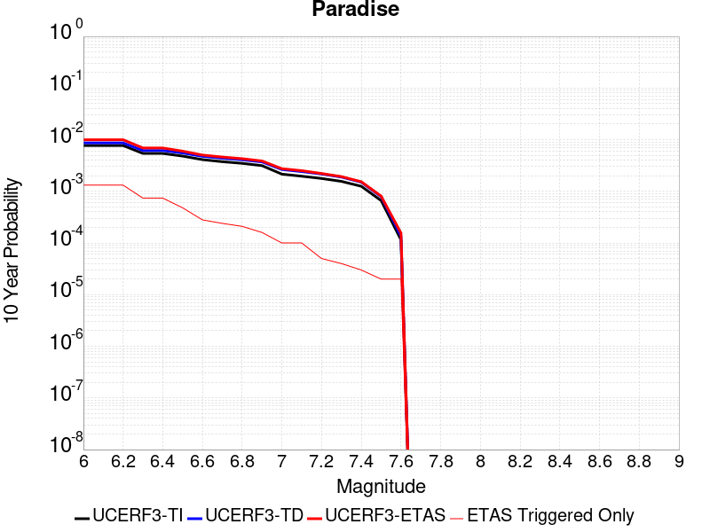 |

| Magnitude | 1 wk TI Prob | 1 wk TD Prob | 1 wk ETAS Prob | 1 wk ETAS/TD Gain | 1 wk ETAS Triggered Only | 1 mo TI Prob | 1 mo TD Prob | 1 mo ETAS Prob | 1 mo ETAS/TD Gain | 1 mo ETAS Triggered Only | 1 yr TI Prob | 1 yr TD Prob | 1 yr ETAS Prob | 1 yr ETAS/TD Gain | 1 yr ETAS Triggered Only | 10 yr TI Prob | 10 yr TD Prob | 10 yr ETAS Prob | 10 yr ETAS/TD Gain | 10 yr ETAS Triggered Only |
|-----|-----|-----|-----|-----|-----|-----|-----|-----|-----|-----|-----|-----|-----|-----|-----|-----|-----|-----|-----|-----|
| 6.0 | 1.4851273E-5 | 1.6694692E-5 | 2.3622258E-4 | 14.149563 | 2.1953155E-4 | 6.364676E-5 | 7.154685E-5 | 4.430352E-4 | 6.1922393 | 3.7151494E-4 | 7.7462377E-4 | 8.707584E-4 | 0.0016637583 | 1.9107003 | 7.93691E-4 | 0.0077192914 | 0.008675844 | 0.009948125 | 1.1466463 | 0.0012834152 |
| 6.1 | 1.4851273E-5 | 1.6694692E-5 | 2.3622258E-4 | 14.149563 | 2.1953155E-4 | 6.364676E-5 | 7.154685E-5 | 4.430352E-4 | 6.1922393 | 3.7151494E-4 | 7.7462377E-4 | 8.707584E-4 | 0.0016637583 | 1.9107003 | 7.93691E-4 | 0.0077192914 | 0.008675844 | 0.009948125 | 1.1466463 | 0.0012834152 |
| 6.2 | 1.4851273E-5 | 1.6694692E-5 | 2.3622258E-4 | 14.149563 | 2.1953155E-4 | 6.364676E-5 | 7.154685E-5 | 4.430352E-4 | 6.1922393 | 3.7151494E-4 | 7.7462377E-4 | 8.707584E-4 | 0.0016637583 | 1.9107003 | 7.93691E-4 | 0.0077192914 | 0.008675844 | 0.009948125 | 1.1466463 | 0.0012834152 |
| 6.3 | 1.0426831E-5 | 1.188862E-5 | 1.4698335E-4 | 12.363365 | 1.3509634E-4 | 4.4685654E-5 | 5.0950268E-5 | 2.7047063E-4 | 5.308522 | 2.1953155E-4 | 5.43912E-4 | 6.201489E-4 | 0.0010758163 | 1.7347709 | 4.5595015E-4 | 0.0054258266 | 0.0061847917 | 0.006923226 | 1.1193951 | 7.430299E-4 |
| 6.4 | 1.0426831E-5 | 1.188862E-5 | 1.4698335E-4 | 12.363365 | 1.3509634E-4 | 4.4685654E-5 | 5.0950268E-5 | 2.7047063E-4 | 5.308522 | 2.1953155E-4 | 5.43912E-4 | 6.201489E-4 | 0.0010758163 | 1.7347709 | 4.5595015E-4 | 0.0054258266 | 0.0061847917 | 0.006923226 | 1.1193951 | 7.430299E-4 |
| 6.5 | 9.25027E-6 | 1.06199595E-5 | 1.1194114E-4 | 10.540637 | 1.0132226E-4 | 3.964341E-5 | 4.551335E-5 | 2.143761E-4 | 4.7101808 | 1.6887042E-4 | 4.8255164E-4 | 5.53989E-4 | 8.577874E-4 | 1.5483834 | 3.0396678E-4 | 0.0048150513 | 0.0055265795 | 0.006030391 | 1.0911615 | 5.0661125E-4 |
| 6.6 | 7.904275E-6 | 9.159525E-6 | 9.359397E-5 | 10.218211 | 8.443521E-5 | 3.3875025E-5 | 3.9254537E-5 | 1.4057281E-4 | 3.581059 | 1.0132226E-4 | 4.1235037E-4 | 4.7782314E-4 | 6.6349184E-4 | 1.3885721 | 1.8575747E-4 | 0.0041158604 | 0.0047683544 | 0.005037259 | 1.0563935 | 2.701927E-4 |
| 6.7 | 7.2061953E-6 | 8.407248E-6 | 9.284175E-5 | 11.04306 | 8.443521E-5 | 3.088333E-5 | 3.6030586E-5 | 1.373492E-4 | 3.8120165 | 1.0132226E-4 | 3.7593965E-4 | 4.3858777E-4 | 6.0738414E-4 | 1.3848634 | 1.6887042E-4 | 0.003753043 | 0.004377591 | 0.004612975 | 1.0537702 | 2.364186E-4 |
| 6.8 | 6.6948724E-6 | 7.842166E-6 | 9.2276714E-5 | 11.766739 | 8.443521E-5 | 2.8691995E-5 | 3.360887E-5 | 1.3492772E-4 | 4.014646 | 1.0132226E-4 | 3.4926904E-4 | 4.0911473E-4 | 5.7791604E-4 | 1.4126015 | 1.6887042E-4 | 0.003487206 | 0.0040839734 | 0.004319426 | 1.057653 | 2.364186E-4 |
| 6.9 | 6.0421025E-6 | 7.130621E-6 | 7.467831E-5 | 10.472904 | 6.754817E-5 | 2.5894467E-5 | 3.0559466E-5 | 9.810557E-5 | 3.2103171 | 6.754817E-5 | 3.1521954E-4 | 3.7200135E-4 | 5.0704746E-4 | 1.3630258 | 1.3509634E-4 | 0.0031477278 | 0.0037141247 | 0.003916017 | 1.0543579 | 2.0264451E-4 |
| 7.0 | 4.134091E-6 | 5.0803087E-6 | 5.574118E-5 | 10.972006 | 5.066113E-5 | 1.7717413E-5 | 2.177258E-5 | 7.24326E-5 | 3.326781 | 5.066113E-5 | 2.1568815E-4 | 2.6505045E-4 | 3.6634586E-4 | 1.382174 | 1.0132226E-4 | 0.0021547892 | 0.0026474963 | 0.0027822352 | 1.0508928 | 1.3509634E-4 |
| 7.1 | 3.7674888E-6 | 4.6318696E-6 | 5.5292763E-5 | 11.937462 | 5.066113E-5 | 1.6146281E-5 | 1.9850726E-5 | 7.051085E-5 | 3.5520537 | 5.066113E-5 | 1.9656324E-4 | 2.4165731E-4 | 3.4295509E-4 | 1.4191794 | 1.0132226E-4 | 0.0019638946 | 0.002414096 | 0.0025488662 | 1.0558264 | 1.3509634E-4 |
| 7.2 | 3.4065345E-6 | 4.156723E-6 | 3.793067E-5 | 9.125137 | 3.3774086E-5 | 1.4599351E-5 | 1.7814415E-5 | 5.1587896E-5 | 2.8958514 | 3.3774086E-5 | 1.777326E-4 | 2.1687041E-4 | 2.5063718E-4 | 1.1557002 | 3.3774086E-5 | 0.0017759053 | 0.002166736 | 0.0022341376 | 1.0311075 | 6.754817E-5 |
| 7.3 | 2.9934936E-6 | 3.6293168E-6 | 2.0516298E-5 | 5.652937 | 1.6887043E-5 | 1.2829195E-5 | 1.555413E-5 | 3.244091E-5 | 2.085678 | 1.6887043E-5 | 1.5618425E-4 | 1.8935655E-4 | 2.062404E-4 | 1.0891643 | 1.6887043E-5 | 0.0015607453 | 0.0018920974 | 0.0019426626 | 1.0267245 | 5.066113E-5 |
| 7.4 | 2.4049796E-6 | 2.8889842E-6 | 2.8889842E-6 | 1.0 | 0.0 | 1.0307015E-5 | 1.238131E-5 | 1.238131E-5 | 1.0 | 0.0 | 1.2548068E-4 | 1.5073347E-4 | 1.5073347E-4 | 1.0 | 0.0 | 0.0012540985 | 0.0015064536 | 0.0015401769 | 1.0223858 | 3.3774086E-5 |
| 7.5 | 1.2710091E-6 | 1.5134682E-6 | 1.5134682E-6 | 1.0 | 0.0 | 5.44717E-6 | 6.4862834E-6 | 6.4862834E-6 | 1.0 | 0.0 | 6.631728E-5 | 7.8968886E-5 | 7.8968886E-5 | 1.0 | 0.0 | 6.6297496E-4 | 7.8953087E-4 | 8.0640457E-4 | 1.0213718 | 1.6887043E-5 |
| 7.6 | 2.21172E-7 | 2.603961E-7 | 2.603961E-7 | 1.0 | 0.0 | 9.478797E-7 | 1.1159829E-6 | 1.1159829E-6 | 1.0 | 0.0 | 1.1540374E-5 | 1.3587036E-5 | 1.3587036E-5 | 1.0 | 0.0 | 1.1539775E-4 | 1.3586486E-4 | 1.527496E-4 | 1.124276 | 1.6887043E-5 |

## Garlic Springs
*[(top)](#table-of-contents)*

| 1 Week | 1 Month | 1 Year | 10 Year |
|-----|-----|-----|-----|
|  |  |  |  |

| Magnitude | 1 wk TI Prob | 1 wk TD Prob | 1 wk ETAS Prob | 1 wk ETAS/TD Gain | 1 wk ETAS Triggered Only | 1 mo TI Prob | 1 mo TD Prob | 1 mo ETAS Prob | 1 mo ETAS/TD Gain | 1 mo ETAS Triggered Only | 1 yr TI Prob | 1 yr TD Prob | 1 yr ETAS Prob | 1 yr ETAS/TD Gain | 1 yr ETAS Triggered Only | 10 yr TI Prob | 10 yr TD Prob | 10 yr ETAS Prob | 10 yr ETAS/TD Gain | 10 yr ETAS Triggered Only |
|-----|-----|-----|-----|-----|-----|-----|-----|-----|-----|-----|-----|-----|-----|-----|-----|-----|-----|-----|-----|-----|
| 6.0 | 1.6760017E-5 | 1.8776833E-5 | 2.2141753E-4 | 11.79206 | 2.0264451E-4 | 7.182667E-5 | 8.0470316E-5 | 4.012983E-4 | 4.986911 | 3.208538E-4 | 8.7413884E-4 | 9.794032E-4 | 0.0016204823 | 1.654561 | 6.417076E-4 | 0.008707083 | 0.009762413 | 0.010849355 | 1.1113394 | 0.0010976577 |
| 6.1 | 9.852767E-6 | 1.09735865E-5 | 9.540787E-5 | 8.69432 | 8.443521E-5 | 4.222546E-5 | 4.702921E-5 | 1.9900544E-4 | 4.2315288 | 1.5198339E-4 | 5.139737E-4 | 5.7250116E-4 | 9.1004866E-4 | 1.5896014 | 3.3774084E-4 | 0.005127866 | 0.005717221 | 0.006288098 | 1.0998522 | 5.7415944E-4 |
| 6.2 | 9.852767E-6 | 1.09735865E-5 | 9.540787E-5 | 8.69432 | 8.443521E-5 | 4.222546E-5 | 4.702921E-5 | 1.9900544E-4 | 4.2315288 | 1.5198339E-4 | 5.139737E-4 | 5.7250116E-4 | 9.1004866E-4 | 1.5896014 | 3.3774084E-4 | 0.005127866 | 0.005717221 | 0.006288098 | 1.0998522 | 5.7415944E-4 |
| 6.3 | 4.3167724E-6 | 4.7780286E-6 | 3.8551952E-5 | 8.06859 | 3.3774086E-5 | 1.8500323E-5 | 2.0477235E-5 | 7.113732E-5 | 3.4739714 | 5.066113E-5 | 2.2521814E-4 | 2.4930484E-4 | 4.5189884E-4 | 1.8126357 | 2.0264451E-4 | 0.0022499003 | 0.00249251 | 0.0027620292 | 1.1081316 | 2.701927E-4 |
| 6.4 | 4.3167724E-6 | 4.7780286E-6 | 3.8551952E-5 | 8.06859 | 3.3774086E-5 | 1.8500323E-5 | 2.0477235E-5 | 7.113732E-5 | 3.4739714 | 5.066113E-5 | 2.2521814E-4 | 2.4930484E-4 | 4.5189884E-4 | 1.8126357 | 2.0264451E-4 | 0.0022499003 | 0.00249251 | 0.0027620292 | 1.1081316 | 2.701927E-4 |
| 6.5 | 4.3167724E-6 | 4.7780286E-6 | 3.8551952E-5 | 8.06859 | 3.3774086E-5 | 1.8500323E-5 | 2.0477235E-5 | 7.113732E-5 | 3.4739714 | 5.066113E-5 | 2.2521814E-4 | 2.4930484E-4 | 4.5189884E-4 | 1.8126357 | 2.0264451E-4 | 0.0022499003 | 0.00249251 | 0.0027620292 | 1.1081316 | 2.701927E-4 |
| 6.6 | 4.301311E-6 | 4.760897E-6 | 3.853482E-5 | 8.094026 | 3.3774086E-5 | 1.8434059E-5 | 2.0403815E-5 | 7.106391E-5 | 3.4828737 | 5.066113E-5 | 2.2441156E-4 | 2.4841115E-4 | 4.5100533E-4 | 1.8155599 | 2.0264451E-4 | 0.0022418506 | 0.002483593 | 0.0027531148 | 1.1085209 | 2.701927E-4 |
| 6.7 | 3.8599724E-6 | 4.27106E-6 | 3.8045E-5 | 8.907625 | 3.3774086E-5 | 1.6542634E-5 | 1.8304541E-5 | 6.896474E-5 | 3.76763 | 5.066113E-5 | 2.0138794E-4 | 2.228578E-4 | 3.748073E-4 | 1.6818228 | 1.5198339E-4 | 0.0020120554 | 0.002228578 | 0.0024476203 | 1.0982879 | 2.1953155E-4 |

## Coyote Lake
*[(top)](#table-of-contents)*

| 1 Week | 1 Month | 1 Year | 10 Year |
|-----|-----|-----|-----|
|  |  |  |  |

| Magnitude | 1 wk TI Prob | 1 wk TD Prob | 1 wk ETAS Prob | 1 wk ETAS/TD Gain | 1 wk ETAS Triggered Only | 1 mo TI Prob | 1 mo TD Prob | 1 mo ETAS Prob | 1 mo ETAS/TD Gain | 1 mo ETAS Triggered Only | 1 yr TI Prob | 1 yr TD Prob | 1 yr ETAS Prob | 1 yr ETAS/TD Gain | 1 yr ETAS Triggered Only | 10 yr TI Prob | 10 yr TD Prob | 10 yr ETAS Prob | 10 yr ETAS/TD Gain | 10 yr ETAS Triggered Only |
|-----|-----|-----|-----|-----|-----|-----|-----|-----|-----|-----|-----|-----|-----|-----|-----|-----|-----|-----|-----|-----|
| 6.0 | 1.980352E-5 | 2.1706745E-5 | 1.3991348E-4 | 6.4456224 | 1.182093E-4 | 8.486947E-5 | 9.302599E-5 | 2.9565167E-4 | 3.1781616 | 2.0264451E-4 | 0.0010327959 | 0.0011320751 | 0.0016212449 | 1.4321002 | 4.897242E-4 | 0.010280091 | 0.011270258 | 0.012055004 | 1.0696298 | 7.93691E-4 |
| 6.1 | 1.980352E-5 | 2.1706745E-5 | 1.3991348E-4 | 6.4456224 | 1.182093E-4 | 8.486947E-5 | 9.302599E-5 | 2.9565167E-4 | 3.1781616 | 2.0264451E-4 | 0.0010327959 | 0.0011320751 | 0.0016212449 | 1.4321002 | 4.897242E-4 | 0.010280091 | 0.011270258 | 0.012055004 | 1.0696298 | 7.93691E-4 |
| 6.2 | 1.980352E-5 | 2.1706745E-5 | 1.3991348E-4 | 6.4456224 | 1.182093E-4 | 8.486947E-5 | 9.302599E-5 | 2.9565167E-4 | 3.1781616 | 2.0264451E-4 | 0.0010327959 | 0.0011320751 | 0.0016212449 | 1.4321002 | 4.897242E-4 | 0.010280091 | 0.011270258 | 0.012055004 | 1.0696298 | 7.93691E-4 |
| 6.3 | 1.5344787E-5 | 1.682067E-5 | 1.3502798E-4 | 8.027503 | 1.182093E-4 | 6.576172E-5 | 7.2086936E-5 | 2.4094518E-4 | 3.342425 | 1.6887042E-4 | 8.003548E-4 | 8.773662E-4 | 0.0012822996 | 1.461533 | 4.0528903E-4 | 0.007974784 | 0.00874507 | 0.009397904 | 1.0746518 | 6.5859465E-4 |
| 6.4 | 1.5344787E-5 | 1.682067E-5 | 1.3502798E-4 | 8.027503 | 1.182093E-4 | 6.576172E-5 | 7.2086936E-5 | 2.4094518E-4 | 3.342425 | 1.6887042E-4 | 8.003548E-4 | 8.773662E-4 | 0.0012822996 | 1.461533 | 4.0528903E-4 | 0.007974784 | 0.00874507 | 0.009397904 | 1.0746518 | 6.5859465E-4 |
| 6.5 | 1.4189697E-5 | 1.5557987E-5 | 1.3376544E-4 | 8.597863 | 1.182093E-4 | 6.081157E-5 | 6.6675726E-5 | 2.1864897E-4 | 3.2792892 | 1.5198339E-4 | 7.401293E-4 | 8.115349E-4 | 0.0011827484 | 1.4574214 | 3.7151494E-4 | 0.0073766913 | 0.008091656 | 0.00869467 | 1.074523 | 6.0793356E-4 |
| 6.6 | 1.3469301E-5 | 1.4771577E-5 | 1.3297913E-4 | 9.002365 | 1.182093E-4 | 5.7724297E-5 | 6.330556E-5 | 2.1527932E-4 | 3.4006383 | 1.5198339E-4 | 7.025667E-4 | 7.7053264E-4 | 0.0011417613 | 1.4817818 | 3.7151494E-4 | 0.0070034964 | 0.0076845144 | 0.008271019 | 1.0763229 | 5.9104647E-4 |
| 6.7 | 1.3027966E-5 | 1.4281745E-5 | 1.3248935E-4 | 9.276833 | 1.182093E-4 | 5.5832945E-5 | 6.120638E-5 | 2.1318046E-4 | 3.4829779 | 1.5198339E-4 | 6.7955407E-4 | 7.4499263E-4 | 0.0010656074 | 1.4303596 | 3.208538E-4 | 0.006774798 | 0.0074308286 | 0.007967198 | 1.0721817 | 5.403854E-4 |
| 6.8 | 5.695434E-6 | 6.2244176E-6 | 7.377217E-5 | 11.852059 | 6.754817E-5 | 2.4408775E-5 | 2.6675973E-5 | 9.422234E-5 | 3.5321052 | 6.754817E-5 | 2.971363E-4 | 3.2476155E-4 | 4.2605092E-4 | 1.3118883 | 1.0132226E-4 | 0.0029673933 | 0.0032458105 | 0.0034477971 | 1.06223 | 2.0264451E-4 |
| 6.9 | 4.385688E-6 | 4.7930553E-6 | 5.545394E-5 | 11.569643 | 5.066113E-5 | 1.879567E-5 | 2.0541665E-5 | 7.120175E-5 | 3.4662113 | 5.066113E-5 | 2.2881327E-4 | 2.5009477E-4 | 3.345089E-4 | 1.3375285 | 8.443521E-5 | 0.002285778 | 0.0025009478 | 0.0026693959 | 1.0673537 | 1.6887042E-4 |

## San Andreas (Parkfield)
*[(top)](#table-of-contents)*

| 1 Week | 1 Month | 1 Year | 10 Year |
|-----|-----|-----|-----|
|  |  |  |  |

| Magnitude | 1 wk TI Prob | 1 wk TD Prob | 1 wk ETAS Prob | 1 wk ETAS/TD Gain | 1 wk ETAS Triggered Only | 1 mo TI Prob | 1 mo TD Prob | 1 mo ETAS Prob | 1 mo ETAS/TD Gain | 1 mo ETAS Triggered Only | 1 yr TI Prob | 1 yr TD Prob | 1 yr ETAS Prob | 1 yr ETAS/TD Gain | 1 yr ETAS Triggered Only | 10 yr TI Prob | 10 yr TD Prob | 10 yr ETAS Prob | 10 yr ETAS/TD Gain | 10 yr ETAS Triggered Only |
|-----|-----|-----|-----|-----|-----|-----|-----|-----|-----|-----|-----|-----|-----|-----|-----|-----|-----|-----|-----|-----|
| 6.0 | 5.556969E-4 | 7.7782426E-4 | 0.0010815546 | 1.3904871 | 3.0396678E-4 | 0.0023793848 | 0.0033298214 | 0.003733761 | 1.1213096 | 4.0528903E-4 | 0.028586963 | 0.040191233 | 0.040758524 | 1.0141149 | 5.9104647E-4 | 0.25176284 | 0.33716413 | 0.33765665 | 1.0014608 | 7.430299E-4 |
| 6.1 | 1.925858E-4 | 3.0276453E-4 | 4.3781998E-4 | 1.4460741 | 1.3509634E-4 | 8.2510663E-4 | 0.0012970108 | 0.0014993924 | 1.156037 | 2.0264451E-4 | 0.0099994885 | 0.015778083 | 0.016044013 | 1.0168544 | 2.701927E-4 | 0.095613256 | 0.1497237 | 0.1499965 | 1.0018221 | 3.208538E-4 |
| 6.2 | 9.4306815E-5 | 1.8242796E-4 | 3.1749965E-4 | 1.7404112 | 1.3509634E-4 | 4.0410945E-4 | 7.816011E-4 | 9.5033954E-4 | 1.2158881 | 1.6887042E-4 | 0.0049089384 | 0.009474681 | 0.009708859 | 1.0247163 | 2.364186E-4 | 0.048019063 | 0.09185409 | 0.0921148 | 1.0028383 | 2.8707972E-4 |
| 6.3 | 9.283051E-5 | 1.7939322E-4 | 3.1446532E-4 | 1.7529387 | 1.3509634E-4 | 3.9778434E-4 | 7.686027E-4 | 9.3734334E-4 | 1.219542 | 1.6887042E-4 | 0.0048322747 | 0.009317789 | 0.009552005 | 1.0251364 | 2.364186E-4 | 0.047285385 | 0.09050704 | 0.09076813 | 1.0028849 | 2.8707972E-4 |
| 6.4 | 9.138826E-5 | 1.770153E-4 | 3.1208774E-4 | 1.7630551 | 1.3509634E-4 | 3.916052E-4 | 7.5841765E-4 | 9.2716E-4 | 1.2224927 | 1.6887042E-4 | 0.0047573745 | 0.00919484 | 0.009429084 | 1.0254756 | 2.364186E-4 | 0.046568092 | 0.08940927 | 0.08967069 | 1.0029237 | 2.8707972E-4 |
| 6.5 | 9.000255E-5 | 1.7459576E-4 | 3.096685E-4 | 1.7736313 | 1.3509634E-4 | 3.8566816E-4 | 7.480541E-4 | 9.1679825E-4 | 1.2255774 | 1.6887042E-4 | 0.0046854047 | 0.009069731 | 0.009304007 | 1.0258304 | 2.364186E-4 | 0.045878403 | 0.088295065 | 0.0885568 | 1.0029643 | 2.8707972E-4 |
| 6.6 | 8.8109264E-5 | 1.7140752E-4 | 3.064807E-4 | 1.7880237 | 1.3509634E-4 | 3.7755648E-4 | 7.3439797E-4 | 9.031444E-4 | 1.2297752 | 1.6887042E-4 | 0.0045870654 | 0.008904854 | 0.009139167 | 1.026313 | 2.364186E-4 | 0.04493529 | 0.0868267 | 0.087088846 | 1.0030193 | 2.8707972E-4 |
| 6.7 | 8.738073E-5 | 1.7007832E-4 | 3.0515168E-4 | 1.7941833 | 1.3509634E-4 | 3.7443507E-4 | 7.287046E-4 | 8.97452E-4 | 1.2315717 | 1.6887042E-4 | 0.0045492216 | 0.008836143 | 0.009070473 | 1.0265194 | 2.364186E-4 | 0.04457213 | 0.08622707 | 0.086489394 | 1.0030422 | 2.8707972E-4 |
| 6.8 | 8.710195E-5 | 1.6953335E-4 | 3.0460677E-4 | 1.7967367 | 1.3509634E-4 | 3.7324068E-4 | 7.263703E-4 | 8.9511805E-4 | 1.2323165 | 1.6887042E-4 | 0.0045347405 | 0.008807961 | 0.0090422975 | 1.026605 | 2.364186E-4 | 0.04443313 | 0.08597467 | 0.086237065 | 1.003052 | 2.8707972E-4 |
| 6.9 | 8.6801556E-5 | 1.689429E-4 | 3.0401643E-4 | 1.7995217 | 1.3509634E-4 | 3.7195362E-4 | 7.2384125E-4 | 8.9258945E-4 | 1.2331288 | 1.6887042E-4 | 0.0045191357 | 0.008777418 | 0.009011761 | 1.0266985 | 2.364186E-4 | 0.044283327 | 0.085700735 | 0.08596321 | 1.0030627 | 2.8707972E-4 |
| 7.0 | 8.5571606E-5 | 1.6647128E-4 | 3.0154514E-4 | 1.8113943 | 1.3509634E-4 | 3.6668387E-4 | 7.132544E-4 | 8.820044E-4 | 1.2365916 | 1.6887042E-4 | 0.004455241 | 0.008649553 | 0.008883927 | 1.0270966 | 2.364186E-4 | 0.043669727 | 0.08454914 | 0.08481195 | 1.0031084 | 2.8707972E-4 |
| 7.1 | 7.82589E-5 | 1.5128135E-4 | 2.8635724E-4 | 1.8928788 | 1.3509634E-4 | 3.3535215E-4 | 6.481883E-4 | 8.1694924E-4 | 1.260358 | 1.6887042E-4 | 0.0040752706 | 0.007863307 | 0.008097867 | 1.0298296 | 2.364186E-4 | 0.040013418 | 0.07746111 | 0.077725954 | 1.003419 | 2.8707972E-4 |
| 7.2 | 7.690929E-5 | 1.4865391E-4 | 2.8373016E-4 | 1.9086627 | 1.3509634E-4 | 3.2956956E-4 | 6.369334E-4 | 8.0569624E-4 | 1.2649616 | 1.6887042E-4 | 0.004005129 | 0.007727258 | 0.00796185 | 1.030359 | 2.364186E-4 | 0.0393371 | 0.07623427 | 0.07649947 | 1.0034786 | 2.8707972E-4 |
| 7.3 | 7.5543794E-5 | 1.4561978E-4 | 2.8069646E-4 | 1.9275984 | 1.3509634E-4 | 3.2371894E-4 | 6.2393624E-4 | 7.9270126E-4 | 1.2704844 | 1.6887042E-4 | 0.003934157 | 0.007570127 | 0.007804756 | 1.030994 | 2.364186E-4 | 0.038652334 | 0.074797355 | 0.07506296 | 1.003551 | 2.8707972E-4 |
| 7.4 | 7.4214564E-5 | 1.4262961E-4 | 2.7770668E-4 | 1.9470478 | 1.3509634E-4 | 3.1802364E-4 | 6.111273E-4 | 7.7989453E-4 | 1.2761573 | 1.6887042E-4 | 0.003865065 | 0.00741525 | 0.0076499153 | 1.0316464 | 2.364186E-4 | 0.03798529 | 0.07337123 | 0.07363725 | 1.0036256 | 2.8707972E-4 |
| 7.5 | 6.149578E-5 | 1.11907226E-4 | 2.4698846E-4 | 2.2070823 | 1.3509634E-4 | 2.6352672E-4 | 4.7951436E-4 | 6.4830383E-4 | 1.3520008 | 1.6887042E-4 | 0.0032037178 | 0.0058224914 | 0.0060407445 | 1.0374845 | 2.1953155E-4 | 0.03157923 | 0.058557566 | 0.058811937 | 1.004344 | 2.701927E-4 |
| 7.6 | 6.0643448E-5 | 1.10193796E-4 | 2.4527524E-4 | 2.2258534 | 1.3509634E-4 | 2.598746E-4 | 4.7217376E-4 | 6.409644E-4 | 1.3574758 | 1.6887042E-4 | 0.0031593828 | 0.0057335934 | 0.0059518665 | 1.0380691 | 2.1953155E-4 | 0.031148417 | 0.057718582 | 0.05797318 | 1.004411 | 2.701927E-4 |
| 7.7 | 5.1652263E-5 | 9.174698E-5 | 2.2683093E-4 | 2.472353 | 1.3509634E-4 | 2.2134806E-4 | 3.931421E-4 | 5.6194613E-4 | 1.4293716 | 1.6887042E-4 | 0.002691582 | 0.0047760103 | 0.004977687 | 1.042227 | 2.0264451E-4 | 0.026592141 | 0.04853623 | 0.048729036 | 1.0039725 | 2.0264451E-4 |
| 7.8 | 4.8090482E-5 | 8.559635E-5 | 1.8690994E-4 | 2.1836202 | 1.0132226E-4 | 2.060858E-4 | 3.6678996E-4 | 5.0183677E-4 | 1.3681856 | 1.3509634E-4 | 0.0025062072 | 0.0044565317 | 0.00462465 | 1.0377239 | 1.6887042E-4 | 0.024781305 | 0.04530245 | 0.04546367 | 1.0035588 | 1.6887042E-4 |
| 7.9 | 3.970278E-5 | 6.750426E-5 | 1.5193377E-4 | 2.2507286 | 8.443521E-5 | 1.7014367E-4 | 2.892719E-4 | 4.0744702E-4 | 1.4085261 | 1.182093E-4 | 0.002069531 | 0.0035162016 | 0.003650823 | 1.038286 | 1.3509634E-4 | 0.020503636 | 0.035881363 | 0.03601161 | 1.00363 | 1.3509634E-4 |
| 8.0 | 2.8982335E-5 | 4.069796E-5 | 7.447067E-5 | 1.8298379 | 3.3774086E-5 | 1.2420409E-4 | 1.7440817E-4 | 2.4194457E-4 | 1.3872318 | 6.754817E-5 | 0.0015111357 | 0.0021213528 | 0.0021887575 | 1.0317745 | 6.754817E-5 | 0.015009012 | 0.022010697 | 0.022076758 | 1.0030013 | 6.754817E-5 |
| 8.1 | 1.8836186E-5 | 1.8681134E-5 | 1.8681134E-5 | 1.0 | 0.0 | 8.0724014E-5 | 8.005955E-5 | 9.6945245E-5 | 1.2109141 | 1.6887043E-5 | 9.823717E-4 | 9.742898E-4 | 9.911604E-4 | 1.0173157 | 1.6887043E-5 | 0.009780403 | 0.010488115 | 0.010504826 | 1.0015932 | 1.6887043E-5 |
| 8.2 | 8.643924E-6 | 5.4748625E-6 | 5.4748625E-6 | 1.0 | 0.0 | 3.704486E-5 | 2.3463486E-5 | 2.3463486E-5 | 1.0 | 0.0 | 4.5092785E-4 | 2.8563058E-4 | 2.8563058E-4 | 1.0 | 0.0 | 0.0045001395 | 0.0032487072 | 0.0032487072 | 1.0 | 0.0 |
| 8.3 | 1.983087E-6 | 7.6599065E-7 | 7.6599065E-7 | 1.0 | 0.0 | 8.498917E-6 | 3.282813E-6 | 3.282813E-6 | 1.0 | 0.0 | 1.034694E-4 | 3.9967534E-5 | 3.9967534E-5 | 1.0 | 0.0 | 0.0010342124 | 4.719687E-4 | 4.719687E-4 | 1.0 | 0.0 |

## Helendale-So Lockhart
*[(top)](#table-of-contents)*

| 1 Week | 1 Month | 1 Year | 10 Year |
|-----|-----|-----|-----|
|  |  |  |  |

| Magnitude | 1 wk TI Prob | 1 wk TD Prob | 1 wk ETAS Prob | 1 wk ETAS/TD Gain | 1 wk ETAS Triggered Only | 1 mo TI Prob | 1 mo TD Prob | 1 mo ETAS Prob | 1 mo ETAS/TD Gain | 1 mo ETAS Triggered Only | 1 yr TI Prob | 1 yr TD Prob | 1 yr ETAS Prob | 1 yr ETAS/TD Gain | 1 yr ETAS Triggered Only | 10 yr TI Prob | 10 yr TD Prob | 10 yr ETAS Prob | 10 yr ETAS/TD Gain | 10 yr ETAS Triggered Only |
|-----|-----|-----|-----|-----|-----|-----|-----|-----|-----|-----|-----|-----|-----|-----|-----|-----|-----|-----|-----|-----|
| 6.0 | 1.7296055E-5 | 1.8103729E-5 | 2.2074457E-4 | 12.19332 | 2.0264451E-4 | 7.412385E-5 | 7.7585224E-5 | 3.6464268E-4 | 4.6998987 | 2.8707972E-4 | 9.0208417E-4 | 9.4421144E-4 | 0.001399731 | 1.4824339 | 4.5595015E-4 | 0.008984311 | 0.009404116 | 0.010156887 | 1.0800469 | 7.599169E-4 |
| 6.1 | 1.7296055E-5 | 1.8103729E-5 | 2.2074457E-4 | 12.19332 | 2.0264451E-4 | 7.412385E-5 | 7.7585224E-5 | 3.6464268E-4 | 4.6998987 | 2.8707972E-4 | 9.0208417E-4 | 9.4421144E-4 | 0.001399731 | 1.4824339 | 4.5595015E-4 | 0.008984311 | 0.009404116 | 0.010156887 | 1.0800469 | 7.599169E-4 |
| 6.2 | 1.7296055E-5 | 1.8103729E-5 | 2.2074457E-4 | 12.19332 | 2.0264451E-4 | 7.412385E-5 | 7.7585224E-5 | 3.6464268E-4 | 4.6998987 | 2.8707972E-4 | 9.0208417E-4 | 9.4421144E-4 | 0.001399731 | 1.4824339 | 4.5595015E-4 | 0.008984311 | 0.009404116 | 0.010156887 | 1.0800469 | 7.599169E-4 |
| 6.3 | 1.0669118E-5 | 1.1135425E-5 | 1.4623026E-4 | 13.131989 | 1.3509634E-4 | 4.5723988E-5 | 4.772239E-5 | 2.5035723E-4 | 5.2461166 | 2.0264451E-4 | 5.5654737E-4 | 5.80868E-4 | 8.67781E-4 | 1.4939383 | 2.8707972E-4 | 0.0055515557 | 0.0057937936 | 0.0062638912 | 1.0811381 | 4.728372E-4 |
| 6.4 | 1.0669118E-5 | 1.1135425E-5 | 1.4623026E-4 | 13.131989 | 1.3509634E-4 | 4.5723988E-5 | 4.772239E-5 | 2.5035723E-4 | 5.2461166 | 2.0264451E-4 | 5.5654737E-4 | 5.80868E-4 | 8.67781E-4 | 1.4939383 | 2.8707972E-4 | 0.0055515557 | 0.0057937936 | 0.0062638912 | 1.0811381 | 4.728372E-4 |
| 6.5 | 8.790038E-6 | 9.170197E-6 | 1.1049152E-4 | 12.048981 | 1.0132226E-4 | 3.767105E-5 | 3.930026E-5 | 1.9127766E-4 | 4.867084 | 1.5198339E-4 | 4.585485E-4 | 4.7837716E-4 | 6.978037E-4 | 1.4586895 | 2.1953155E-4 | 0.0045760344 | 0.004773638 | 0.0051265736 | 1.0739342 | 3.546279E-4 |
| 6.6 | 7.396949E-6 | 7.715537E-6 | 7.526319E-5 | 9.754757 | 6.754817E-5 | 3.1700827E-5 | 3.3066175E-5 | 1.3438507E-4 | 4.0641255 | 1.0132226E-4 | 3.858892E-4 | 4.025073E-4 | 5.5442954E-4 | 1.3774396 | 1.5198339E-4 | 0.003852198 | 0.00401789 | 0.0042533586 | 1.0586051 | 2.364186E-4 |
| 6.7 | 6.4600285E-6 | 6.738031E-6 | 5.7398818E-5 | 8.518634 | 5.066113E-5 | 2.7685543E-5 | 2.887696E-5 | 1.1330973E-4 | 3.9238803 | 8.443521E-5 | 3.3701936E-4 | 3.5152107E-4 | 4.8656992E-4 | 1.3841842 | 1.3509634E-4 | 0.0033650869 | 0.003509732 | 0.003728493 | 1.0623299 | 2.1953155E-4 |
| 6.8 | 5.600104E-6 | 5.836009E-6 | 3.96099E-5 | 6.7871547 | 3.3774086E-5 | 2.4000226E-5 | 2.5011232E-5 | 9.255771E-5 | 3.700646 | 6.754817E-5 | 2.9216358E-4 | 3.044698E-4 | 4.2264312E-4 | 1.3881282 | 1.182093E-4 | 0.0029177975 | 0.003040588 | 0.003208945 | 1.0553699 | 1.6887042E-4 |
| 6.9 | 4.839122E-6 | 5.0395092E-6 | 2.1926468E-5 | 4.350913 | 1.6887043E-5 | 2.0738931E-5 | 2.159772E-5 | 5.5371078E-5 | 2.5637462 | 3.3774086E-5 | 2.5246723E-4 | 2.6292098E-4 | 3.47334E-4 | 1.3210585 | 8.443521E-5 | 0.002521806 | 0.002626147 | 0.0027608883 | 1.0513077 | 1.3509634E-4 |
| 7.0 | 3.6937633E-6 | 3.845208E-6 | 2.0732186E-5 | 5.391694 | 1.6887043E-5 | 1.5830317E-5 | 1.647936E-5 | 5.025289E-5 | 3.0494442 | 3.3774086E-5 | 1.9271708E-4 | 2.0061806E-4 | 2.8503634E-4 | 1.420791 | 8.443521E-5 | 0.0019255003 | 0.002004401 | 0.0021392265 | 1.0672648 | 1.3509634E-4 |
| 7.1 | 2.7858857E-6 | 2.8978538E-6 | 1.9784848E-5 | 6.827414 | 1.6887043E-5 | 1.1939455E-5 | 1.2419316E-5 | 2.9306148E-5 | 2.3597233 | 1.6887043E-5 | 1.4535317E-4 | 1.511949E-4 | 2.0184836E-4 | 1.335021 | 5.066113E-5 | 0.0014525814 | 0.0015109418 | 0.0015783879 | 1.0446385 | 6.754817E-5 |
| 7.2 | 2.1672065E-6 | 2.2540128E-6 | 1.9141018E-5 | 8.491974 | 1.6887043E-5 | 9.2879945E-6 | 9.66002E-6 | 2.6546899E-5 | 2.7481205 | 1.6887043E-5 | 1.1307546E-4 | 1.1760458E-4 | 1.6825975E-4 | 1.4307245 | 5.066113E-5 | 0.0011301794 | 0.0011754417 | 0.0012429104 | 1.0573987 | 6.754817E-5 |
| 7.3 | 1.4823496E-6 | 1.5422102E-6 | 1.5422102E-6 | 1.0 | 0.0 | 6.3529114E-6 | 6.6094562E-6 | 6.6094562E-6 | 1.0 | 0.0 | 7.734395E-5 | 8.046731E-5 | 1.1423868E-4 | 1.4196905 | 3.3774086E-5 | 7.731704E-4 | 8.0439687E-4 | 8.550173E-4 | 1.0629296 | 5.066113E-5 |
| 7.4 | 4.2321457E-7 | 4.4108765E-7 | 4.4108765E-7 | 1.0 | 0.0 | 1.8137755E-6 | 1.8903745E-6 | 1.8903745E-6 | 1.0 | 0.0 | 2.2082493E-5 | 2.3015113E-5 | 2.3015113E-5 | 1.0 | 0.0 | 2.2080299E-4 | 2.3013182E-4 | 2.3013182E-4 | 1.0 | 0.0 |
| 7.5 | 5.6942316E-8 | 5.9415648E-8 | 5.9415648E-8 | 1.0 | 0.0 | 2.440385E-7 | 2.5463845E-7 | 2.5463845E-7 | 1.0 | 0.0 | 2.9711643E-6 | 3.1002196E-6 | 3.1002196E-6 | 1.0 | 0.0 | 2.9711247E-5 | 3.1001844E-5 | 3.1001844E-5 | 1.0 | 0.0 |

## Owens Valley
*[(top)](#table-of-contents)*

| 1 Week | 1 Month | 1 Year | 10 Year |
|-----|-----|-----|-----|
|  |  |  |  |

| Magnitude | 1 wk TI Prob | 1 wk TD Prob | 1 wk ETAS Prob | 1 wk ETAS/TD Gain | 1 wk ETAS Triggered Only | 1 mo TI Prob | 1 mo TD Prob | 1 mo ETAS Prob | 1 mo ETAS/TD Gain | 1 mo ETAS Triggered Only | 1 yr TI Prob | 1 yr TD Prob | 1 yr ETAS Prob | 1 yr ETAS/TD Gain | 1 yr ETAS Triggered Only | 10 yr TI Prob | 10 yr TD Prob | 10 yr ETAS Prob | 10 yr ETAS/TD Gain | 10 yr ETAS Triggered Only |
|-----|-----|-----|-----|-----|-----|-----|-----|-----|-----|-----|-----|-----|-----|-----|-----|-----|-----|-----|-----|-----|
| 6.0 | 4.83821E-5 | 3.626567E-6 | 2.9070524E-4 | 80.159904 | 2.8707972E-4 | 2.0733538E-4 | 1.5542342E-5 | 3.026176E-4 | 19.470528 | 2.8707972E-4 | 0.002521386 | 1.8921259E-4 | 6.95728E-4 | 3.6769648 | 5.0661125E-4 | 0.024929691 | 0.001925011 | 0.0026666105 | 1.3852443 | 7.430299E-4 |
| 6.1 | 4.83821E-5 | 3.626567E-6 | 2.9070524E-4 | 80.159904 | 2.8707972E-4 | 2.0733538E-4 | 1.5542342E-5 | 3.026176E-4 | 19.470528 | 2.8707972E-4 | 0.002521386 | 1.8921259E-4 | 6.95728E-4 | 3.6769648 | 5.0661125E-4 | 0.024929691 | 0.001925011 | 0.0026666105 | 1.3852443 | 7.430299E-4 |
| 6.2 | 4.83821E-5 | 3.626567E-6 | 2.9070524E-4 | 80.159904 | 2.8707972E-4 | 2.0733538E-4 | 1.5542342E-5 | 3.026176E-4 | 19.470528 | 2.8707972E-4 | 0.002521386 | 1.8921259E-4 | 6.95728E-4 | 3.6769648 | 5.0661125E-4 | 0.024929691 | 0.001925011 | 0.0026666105 | 1.3852443 | 7.430299E-4 |
| 6.3 | 3.953008E-5 | 3.1553948E-6 | 2.9023422E-4 | 91.980316 | 2.8707972E-4 | 1.6940363E-4 | 1.3523055E-5 | 3.0059888E-4 | 22.228624 | 2.8707972E-4 | 0.002060538 | 1.6463149E-4 | 6.036223E-4 | 3.6665058 | 4.390631E-4 | 0.020415364 | 0.0016592 | 0.0022829839 | 1.3759546 | 6.248206E-4 |
| 6.4 | 3.953008E-5 | 3.1553948E-6 | 2.9023422E-4 | 91.980316 | 2.8707972E-4 | 1.6940363E-4 | 1.3523055E-5 | 3.0059888E-4 | 22.228624 | 2.8707972E-4 | 0.002060538 | 1.6463149E-4 | 6.036223E-4 | 3.6665058 | 4.390631E-4 | 0.020415364 | 0.0016592 | 0.0022829839 | 1.3759546 | 6.248206E-4 |
| 6.5 | 3.457342E-5 | 2.9715961E-6 | 2.9005046E-4 | 97.60763 | 2.8707972E-4 | 1.4816338E-4 | 1.2735354E-5 | 2.9981142E-4 | 23.541664 | 2.8707972E-4 | 0.0018023965 | 1.550426E-4 | 5.7715323E-4 | 3.7225459 | 4.2217606E-4 | 0.017878477 | 0.001555719 | 0.0021627068 | 1.3901654 | 6.0793356E-4 |
| 6.6 | 3.1127765E-5 | 2.8744932E-6 | 2.899534E-4 | 100.87113 | 2.8707972E-4 | 1.3339789E-4 | 1.2319203E-5 | 2.9939538E-4 | 24.303146 | 2.8707972E-4 | 0.0016229092 | 1.4997667E-4 | 5.720894E-4 | 3.814523 | 4.2217606E-4 | 0.016111081 | 0.0015012559 | 0.002091415 | 1.3931103 | 5.9104647E-4 |
| 6.7 | 2.806885E-5 | 2.8104134E-6 | 2.7300234E-4 | 97.139565 | 2.701927E-4 | 1.2028952E-4 | 1.20445775E-5 | 2.8223402E-4 | 23.432455 | 2.701927E-4 | 0.001463541 | 1.4663354E-4 | 5.349786E-4 | 3.648405 | 3.8840197E-4 | 0.014539397 | 0.0014657511 | 0.0020053443 | 1.3681344 | 5.403854E-4 |
| 6.8 | 2.524524E-5 | 2.2353688E-6 | 2.7242745E-4 | 121.87137 | 2.701927E-4 | 1.0818939E-4 | 9.580118E-6 | 2.797702E-4 | 29.20321 | 2.701927E-4 | 0.0013164099 | 1.16632E-4 | 5.0498865E-4 | 4.329761 | 3.8840197E-4 | 0.01308639 | 0.0011659812 | 0.0017057365 | 1.4629194 | 5.403854E-4 |
| 6.9 | 2.2704568E-5 | 1.6081682E-6 | 2.718004E-4 | 169.01242 | 2.701927E-4 | 9.730166E-5 | 6.8921313E-6 | 2.7708296E-4 | 40.202797 | 2.701927E-4 | 0.0011840039 | 8.390849E-5 | 4.7227787E-4 | 5.6284876 | 3.8840197E-4 | 0.011777153 | 8.3897985E-4 | 0.0013620389 | 1.6234466 | 5.2349834E-4 |
| 7.0 | 2.0871712E-5 | 1.5395453E-6 | 2.717318E-4 | 176.50134 | 2.701927E-4 | 8.944713E-5 | 6.598035E-6 | 2.7678892E-4 | 41.950207 | 2.701927E-4 | 0.0010884746 | 8.032813E-5 | 4.686989E-4 | 5.834804 | 3.8840197E-4 | 0.010831586 | 8.0316263E-4 | 0.0013262405 | 1.6512727 | 5.2349834E-4 |
| 7.1 | 1.944928E-5 | 1.3864178E-6 | 2.7157873E-4 | 195.88521 | 2.701927E-4 | 8.335139E-5 | 5.941777E-6 | 2.7613287E-4 | 46.47311 | 2.701927E-4 | 0.0010143308 | 7.233874E-5 | 4.6071262E-4 | 6.3688226 | 3.8840197E-4 | 0.010097133 | 7.2330976E-4 | 0.0012464294 | 1.7232305 | 5.2349834E-4 |
| 7.2 | 1.7876306E-5 | 1.2489141E-6 | 2.7144127E-4 | 217.34181 | 2.701927E-4 | 7.6610486E-5 | 5.352478E-6 | 2.7554372E-4 | 51.479652 | 2.701927E-4 | 9.3233347E-4 | 6.516448E-5 | 4.5354114E-4 | 6.9599442 | 3.8840197E-4 | 0.009284316 | 6.5159105E-4 | 0.0011747483 | 1.802892 | 5.2349834E-4 |
| 7.3 | 1.2618672E-5 | 1.1115209E-6 | 2.713039E-4 | 244.0835 | 2.701927E-4 | 5.40789E-5 | 4.763652E-6 | 2.7495503E-4 | 57.71938 | 2.701927E-4 | 6.582117E-4 | 5.799593E-5 | 4.2948933E-4 | 7.405508 | 3.7151494E-4 | 0.0065626553 | 5.7994033E-4 | 0.0010862579 | 1.8730509 | 5.0661125E-4 |
| 7.4 | 7.4874442E-6 | 8.5486437E-7 | 2.541603E-4 | 297.31064 | 2.5330562E-4 | 3.208865E-5 | 3.6636993E-6 | 2.569684E-4 | 70.13905 | 2.5330562E-4 | 3.906093E-4 | 4.4604632E-5 | 3.823304E-4 | 8.571541 | 3.3774084E-4 | 0.003899234 | 4.4604883E-4 | 8.680366E-4 | 1.9460573 | 4.2217606E-4 |
| 7.5 | 2.4734156E-6 | 6.068616E-7 | 1.8636421E-4 | 307.0951 | 1.8575747E-4 | 1.060031E-5 | 2.6008327E-6 | 1.8835782E-4 | 72.42212 | 1.8575747E-4 | 1.2905113E-4 | 3.166468E-5 | 2.680758E-4 | 8.466082 | 2.364186E-4 | 0.0012897621 | 3.1660203E-4 | 6.2047254E-4 | 1.9597871 | 3.0396678E-4 |
| 7.6 | 1.1328841E-6 | 3.196531E-7 | 1.01641876E-4 | 317.97556 | 1.0132226E-4 | 4.8552088E-6 | 1.3699412E-6 | 1.0269206E-4 | 74.96093 | 1.0132226E-4 | 5.9110564E-5 | 1.6678909E-5 | 1.3488623E-4 | 8.0872345 | 1.182093E-4 | 5.9094845E-4 | 1.6677675E-4 | 3.187348E-4 | 1.9111464 | 1.5198339E-4 |
| 7.7 | 4.8613185E-7 | 8.964689E-8 | 3.386373E-5 | 377.74573 | 3.3774086E-5 | 2.0834207E-6 | 3.8420092E-7 | 3.4158275E-5 | 88.90732 | 3.3774086E-5 | 2.536535E-5 | 4.6776368E-6 | 3.8451562E-5 | 8.220297 | 3.3774086E-5 | 2.5362454E-4 | 4.677545E-5 | 9.743421E-5 | 2.0830202 | 5.066113E-5 |

## San Andreas (San Bernardino S)
*[(top)](#table-of-contents)*

| 1 Week | 1 Month | 1 Year | 10 Year |
|-----|-----|-----|-----|
|  |  |  |  |

| Magnitude | 1 wk TI Prob | 1 wk TD Prob | 1 wk ETAS Prob | 1 wk ETAS/TD Gain | 1 wk ETAS Triggered Only | 1 mo TI Prob | 1 mo TD Prob | 1 mo ETAS Prob | 1 mo ETAS/TD Gain | 1 mo ETAS Triggered Only | 1 yr TI Prob | 1 yr TD Prob | 1 yr ETAS Prob | 1 yr ETAS/TD Gain | 1 yr ETAS Triggered Only | 10 yr TI Prob | 10 yr TD Prob | 10 yr ETAS Prob | 10 yr ETAS/TD Gain | 10 yr ETAS Triggered Only |
|-----|-----|-----|-----|-----|-----|-----|-----|-----|-----|-----|-----|-----|-----|-----|-----|-----|-----|-----|-----|-----|
| 6.0 | 1.2336002E-4 | 3.0004102E-4 | 6.039166E-4 | 2.01278 | 3.0396678E-4 | 5.2857865E-4 | 0.0012852824 | 0.0016900506 | 1.3149254 | 4.0528903E-4 | 0.006416472 | 0.015540994 | 0.016039733 | 1.0320917 | 5.0661125E-4 | 0.06234337 | 0.14283717 | 0.14338721 | 1.0038508 | 6.417076E-4 |
| 6.1 | 1.2336002E-4 | 3.0004102E-4 | 6.039166E-4 | 2.01278 | 3.0396678E-4 | 5.2857865E-4 | 0.0012852824 | 0.0016900506 | 1.3149254 | 4.0528903E-4 | 0.006416472 | 0.015540994 | 0.016039733 | 1.0320917 | 5.0661125E-4 | 0.06234337 | 0.14283717 | 0.14338721 | 1.0038508 | 6.417076E-4 |
| 6.2 | 1.2336002E-4 | 3.0004102E-4 | 6.039166E-4 | 2.01278 | 3.0396678E-4 | 5.2857865E-4 | 0.0012852824 | 0.0016900506 | 1.3149254 | 4.0528903E-4 | 0.006416472 | 0.015540994 | 0.016039733 | 1.0320917 | 5.0661125E-4 | 0.06234337 | 0.14283717 | 0.14338721 | 1.0038508 | 6.417076E-4 |
| 6.3 | 1.1712257E-4 | 2.8792414E-4 | 5.749212E-4 | 1.9967802 | 2.8707972E-4 | 5.018573E-4 | 0.0012334028 | 0.0016213256 | 1.3145144 | 3.8840197E-4 | 0.006093008 | 0.014918125 | 0.015400544 | 1.0323378 | 4.897242E-4 | 0.059286322 | 0.13754563 | 0.13809907 | 1.0040237 | 6.417076E-4 |
| 6.4 | 1.1712257E-4 | 2.8792414E-4 | 5.749212E-4 | 1.9967802 | 2.8707972E-4 | 5.018573E-4 | 0.0012334028 | 0.0016213256 | 1.3145144 | 3.8840197E-4 | 0.006093008 | 0.014918125 | 0.015400544 | 1.0323378 | 4.897242E-4 | 0.059286322 | 0.13754563 | 0.13809907 | 1.0040237 | 6.417076E-4 |
| 6.5 | 1.0689076E-4 | 2.680528E-4 | 5.381731E-4 | 2.0077128 | 2.701927E-4 | 4.5802278E-4 | 0.0011483167 | 0.001519405 | 1.3231585 | 3.7151494E-4 | 0.0055621783 | 0.01389575 | 0.014362017 | 1.0335547 | 4.728372E-4 | 0.05425003 | 0.12879294 | 0.12932259 | 1.0041124 | 6.0793356E-4 |
| 6.6 | 9.7648895E-5 | 2.50501E-4 | 5.20626E-4 | 2.0783389 | 2.701927E-4 | 4.1842813E-4 | 0.0010731576 | 0.0014442739 | 1.3458171 | 3.7151494E-4 | 0.005082469 | 0.012991785 | 0.013458479 | 1.0359223 | 4.728372E-4 | 0.049677886 | 0.12095292 | 0.12148732 | 1.0044183 | 6.0793356E-4 |
| 6.7 | 8.757013E-5 | 2.3120902E-4 | 5.013392E-4 | 2.1683376 | 2.701927E-4 | 3.7524657E-4 | 9.905418E-4 | 0.0013448184 | 1.3576595 | 3.546279E-4 | 0.00455906 | 0.011997245 | 0.012447725 | 1.0375487 | 4.5595015E-4 | 0.04466656 | 0.11226123 | 0.11278592 | 1.0046738 | 5.9104647E-4 |
| 6.8 | 8.562978E-5 | 2.2680782E-4 | 4.9693923E-4 | 2.1910145 | 2.701927E-4 | 3.6693315E-4 | 9.7169366E-4 | 0.0013259769 | 1.3646039 | 3.546279E-4 | 0.004458263 | 0.011770263 | 0.012220847 | 1.0382816 | 4.5595015E-4 | 0.043698758 | 0.11027153 | 0.110797405 | 1.0047688 | 5.9104647E-4 |
| 6.9 | 6.124075E-5 | 1.7065753E-4 | 4.4080408E-4 | 2.582975 | 2.701927E-4 | 2.6243398E-4 | 7.311852E-4 | 0.0010855538 | 1.4846495 | 3.546279E-4 | 0.0031904527 | 0.008866051 | 0.009317959 | 1.0509706 | 4.5595015E-4 | 0.031450346 | 0.08418263 | 0.08469299 | 1.0060625 | 5.572724E-4 |
| 7.0 | 5.8598747E-5 | 1.649477E-4 | 4.3509583E-4 | 2.6377804 | 2.701927E-4 | 2.5111332E-4 | 7.06728E-4 | 0.0010611053 | 1.5014337 | 3.546279E-4 | 0.0030530186 | 0.008570663 | 0.009022705 | 1.052743 | 4.5595015E-4 | 0.03011414 | 0.081500374 | 0.08201223 | 1.0062804 | 5.572724E-4 |
| 7.1 | 5.613814E-5 | 1.5913323E-4 | 4.2928293E-4 | 2.697632 | 2.701927E-4 | 2.4056983E-4 | 6.818221E-4 | 0.0010362081 | 1.5197634 | 3.546279E-4 | 0.0029250039 | 0.008269769 | 0.008721949 | 1.0546787 | 4.5595015E-4 | 0.028868021 | 0.07879931 | 0.07931267 | 1.0065148 | 5.572724E-4 |
| 7.2 | 4.991222E-5 | 1.4519796E-4 | 4.1535142E-4 | 2.8605871 | 2.701927E-4 | 2.1389198E-4 | 6.2212895E-4 | 9.765362E-4 | 1.5696685 | 3.546279E-4 | 0.002601025 | 0.007548217 | 0.008000726 | 1.059949 | 4.5595015E-4 | 0.025707912 | 0.07225321 | 0.07275455 | 1.0069387 | 5.403854E-4 |
| 7.3 | 4.7410045E-5 | 1.3714004E-4 | 4.0729565E-4 | 2.9699254 | 2.701927E-4 | 2.0317009E-4 | 5.8761094E-4 | 9.4203046E-4 | 1.6031533 | 3.546279E-4 | 0.0024707897 | 0.0071307817 | 0.0075834803 | 1.0634851 | 4.5595015E-4 | 0.024434982 | 0.06853558 | 0.06903893 | 1.0073444 | 5.403854E-4 |
| 7.4 | 4.5556746E-5 | 1.3121912E-4 | 4.0137634E-4 | 3.0588253 | 2.701927E-4 | 1.952286E-4 | 5.622468E-4 | 9.1667526E-4 | 1.630379 | 3.546279E-4 | 0.002374317 | 0.0068239477 | 0.0072767865 | 1.0663602 | 4.5595015E-4 | 0.023491086 | 0.065788016 | 0.06629285 | 1.0076736 | 5.403854E-4 |
| 7.5 | 4.3084514E-5 | 1.2357246E-4 | 3.9373175E-4 | 3.1862419 | 2.701927E-4 | 1.8463485E-4 | 5.2948913E-4 | 8.839292E-4 | 1.6694002 | 3.546279E-4 | 0.0022456115 | 0.0064275465 | 0.006880566 | 1.070481 | 4.5595015E-4 | 0.022230545 | 0.062188786 | 0.06269556 | 1.008149 | 5.403854E-4 |
| 7.6 | 3.408608E-5 | 9.83552E-5 | 3.6852132E-4 | 3.7468412 | 2.701927E-4 | 1.4607502E-4 | 4.214543E-4 | 7.7593274E-4 | 1.841084 | 3.546279E-4 | 0.0017770125 | 0.0051191594 | 0.0055727754 | 1.0886115 | 4.5595015E-4 | 0.017628696 | 0.050020292 | 0.05053365 | 1.010263 | 5.403854E-4 |
| 7.7 | 2.8315713E-5 | 8.248679E-5 | 3.526572E-4 | 4.275317 | 2.701927E-4 | 1.2134742E-4 | 3.5346695E-4 | 7.079695E-4 | 2.0029297 | 3.546279E-4 | 0.0014764034 | 0.0042949775 | 0.0047489693 | 1.105703 | 4.5595015E-4 | 0.01466633 | 0.0422714 | 0.042788945 | 1.0122433 | 5.403854E-4 |
| 7.8 | 2.6222975E-5 | 7.463088E-5 | 3.4480338E-4 | 4.620117 | 2.701927E-4 | 1.1237934E-4 | 3.1980744E-4 | 6.743219E-4 | 2.1085248 | 3.546279E-4 | 0.0013673597 | 0.0038867102 | 0.004340888 | 1.1168541 | 4.5595015E-4 | 0.013589768 | 0.03843674 | 0.038956355 | 1.0135187 | 5.403854E-4 |
| 7.9 | 2.1469694E-5 | 5.787864E-5 | 2.7739748E-4 | 4.7927437 | 2.1953155E-4 | 9.200973E-5 | 2.4802773E-4 | 5.3503626E-4 | 2.157163 | 2.8707972E-4 | 0.0011196428 | 0.0030155594 | 0.0033691179 | 1.1172447 | 3.546279E-4 | 0.011140184 | 0.030152109 | 0.030577933 | 1.0141225 | 4.390631E-4 |
| 8.0 | 1.2420249E-5 | 3.131896E-5 | 1.3263804E-4 | 4.2350717 | 1.0132226E-4 | 5.322855E-5 | 1.342172E-4 | 2.861802E-4 | 2.132217 | 1.5198339E-4 | 6.478649E-4 | 0.0016328706 | 0.0018351843 | 1.1239005 | 2.0264451E-4 | 0.0064597935 | 0.016522504 | 0.016755017 | 1.0140724 | 2.364186E-4 |
| 8.1 | 4.9197724E-6 | 7.822348E-6 | 7.822348E-6 | 1.0 | 0.0 | 2.1084568E-5 | 3.352392E-5 | 3.352392E-5 | 1.0 | 0.0 | 2.566744E-4 | 4.0807744E-4 | 4.0807744E-4 | 1.0 | 0.0 | 0.002563781 | 0.0043843705 | 0.0043843705 | 1.0 | 0.0 |
| 8.2 | 2.5634774E-6 | 2.9067196E-6 | 2.9067196E-6 | 1.0 | 0.0 | 1.0986286E-5 | 1.2457311E-5 | 1.2457311E-5 | 1.0 | 0.0 | 1.3374983E-4 | 1.5165724E-4 | 1.5165724E-4 | 1.0 | 0.0 | 0.0013366934 | 0.0017049741 | 0.0017049741 | 1.0 | 0.0 |
| 8.3 | 5.2850464E-7 | 3.2088764E-7 | 3.2088764E-7 | 1.0 | 0.0 | 2.2650179E-6 | 1.375232E-6 | 1.375232E-6 | 1.0 | 0.0 | 2.7576245E-5 | 1.6743334E-5 | 1.6743334E-5 | 1.0 | 0.0 | 2.7572823E-4 | 1.9870348E-4 | 1.9870348E-4 | 1.0 | 0.0 |

## Death Valley (Black Mtns Frontal)
*[(top)](#table-of-contents)*

| 1 Week | 1 Month | 1 Year | 10 Year |
|-----|-----|-----|-----|
|  |  |  |  |

| Magnitude | 1 wk TI Prob | 1 wk TD Prob | 1 wk ETAS Prob | 1 wk ETAS/TD Gain | 1 wk ETAS Triggered Only | 1 mo TI Prob | 1 mo TD Prob | 1 mo ETAS Prob | 1 mo ETAS/TD Gain | 1 mo ETAS Triggered Only | 1 yr TI Prob | 1 yr TD Prob | 1 yr ETAS Prob | 1 yr ETAS/TD Gain | 1 yr ETAS Triggered Only | 10 yr TI Prob | 10 yr TD Prob | 10 yr ETAS Prob | 10 yr ETAS/TD Gain | 10 yr ETAS Triggered Only |
|-----|-----|-----|-----|-----|-----|-----|-----|-----|-----|-----|-----|-----|-----|-----|-----|-----|-----|-----|-----|-----|
| 6.0 | 1.6707214E-5 | 1.867027E-5 | 2.5508445E-4 | 13.662602 | 2.364186E-4 | 7.160038E-5 | 8.001302E-5 | 3.501841E-4 | 4.3765883 | 2.701927E-4 | 8.71386E-4 | 9.737309E-4 | 0.0013954958 | 1.4331433 | 4.2217606E-4 | 0.00867977 | 0.009695496 | 0.010347706 | 1.0672693 | 6.5859465E-4 |
| 6.1 | 1.6707214E-5 | 1.867027E-5 | 2.5508445E-4 | 13.662602 | 2.364186E-4 | 7.160038E-5 | 8.001302E-5 | 3.501841E-4 | 4.3765883 | 2.701927E-4 | 8.71386E-4 | 9.737309E-4 | 0.0013954958 | 1.4331433 | 4.2217606E-4 | 0.00867977 | 0.009695496 | 0.010347706 | 1.0672693 | 6.5859465E-4 |
| 6.2 | 1.6707214E-5 | 1.867027E-5 | 2.5508445E-4 | 13.662602 | 2.364186E-4 | 7.160038E-5 | 8.001302E-5 | 3.501841E-4 | 4.3765883 | 2.701927E-4 | 8.71386E-4 | 9.737309E-4 | 0.0013954958 | 1.4331433 | 4.2217606E-4 | 0.00867977 | 0.009695496 | 0.010347706 | 1.0672693 | 6.5859465E-4 |
| 6.3 | 1.6707214E-5 | 1.867027E-5 | 2.5508445E-4 | 13.662602 | 2.364186E-4 | 7.160038E-5 | 8.001302E-5 | 3.501841E-4 | 4.3765883 | 2.701927E-4 | 8.71386E-4 | 9.737309E-4 | 0.0013954958 | 1.4331433 | 4.2217606E-4 | 0.00867977 | 0.009695496 | 0.010347706 | 1.0672693 | 6.5859465E-4 |
| 6.4 | 1.5515609E-5 | 1.7338214E-5 | 1.8620571E-4 | 10.739614 | 1.6887042E-4 | 6.649377E-5 | 7.4304546E-5 | 2.6004823E-4 | 3.4997618 | 1.8575747E-4 | 8.0926094E-4 | 9.042885E-4 | 0.0012079804 | 1.3358352 | 3.0396678E-4 | 0.008063202 | 0.009006773 | 0.009492086 | 1.0538832 | 4.897242E-4 |
| 6.5 | 1.5515609E-5 | 1.7338214E-5 | 1.8620571E-4 | 10.739614 | 1.6887042E-4 | 6.649377E-5 | 7.4304546E-5 | 2.6004823E-4 | 3.4997618 | 1.8575747E-4 | 8.0926094E-4 | 9.042885E-4 | 0.0012079804 | 1.3358352 | 3.0396678E-4 | 0.008063202 | 0.009006773 | 0.009492086 | 1.0538832 | 4.897242E-4 |
| 6.6 | 1.5041828E-5 | 1.6809145E-5 | 1.5190321E-4 | 9.036939 | 1.3509634E-4 | 6.4463384E-5 | 7.203723E-5 | 2.2400967E-4 | 3.1096373 | 1.5198339E-4 | 7.8455906E-4 | 8.767063E-4 | 0.0011466622 | 1.3079205 | 2.701927E-4 | 0.00781795 | 0.008733132 | 0.009185101 | 1.0517533 | 4.5595015E-4 |
| 6.7 | 1.4634985E-5 | 1.6356016E-5 | 1.5145015E-4 | 9.259599 | 1.3509634E-4 | 6.271985E-5 | 7.009536E-5 | 2.2206809E-4 | 3.1680853 | 1.5198339E-4 | 7.6334673E-4 | 8.5308263E-4 | 0.0011230449 | 1.3164549 | 2.701927E-4 | 0.007607299 | 0.008498715 | 0.008934047 | 1.0512233 | 4.390631E-4 |
| 6.8 | 1.4209158E-5 | 1.5882048E-5 | 1.5097624E-4 | 9.506094 | 1.3509634E-4 | 6.089497E-5 | 6.8064175E-5 | 2.2003721E-4 | 3.2327905 | 1.5198339E-4 | 7.4114406E-4 | 8.2837185E-4 | 0.0010983407 | 1.3259029 | 2.701927E-4 | 0.007386771 | 0.008253456 | 0.008672148 | 1.0507293 | 4.2217606E-4 |
| 6.9 | 1.3780098E-5 | 1.5404594E-5 | 1.3361208E-4 | 8.673522 | 1.182093E-4 | 5.9056227E-5 | 6.6018045E-5 | 2.0110546E-4 | 3.0462196 | 1.3509634E-4 | 7.1877235E-4 | 8.0347876E-4 | 0.0010228339 | 1.2730068 | 2.1953155E-4 | 0.0071645193 | 0.008006332 | 0.008358121 | 1.0439388 | 3.546279E-4 |
| 7.0 | 1.3585064E-5 | 1.5188155E-5 | 1.1650887E-4 | 7.671035 | 1.0132226E-4 | 5.8220405E-5 | 6.50905E-5 | 1.8329211E-4 | 2.8159578 | 1.182093E-4 | 7.086029E-4 | 7.9219416E-4 | 9.778045E-4 | 1.2342991 | 1.8575747E-4 | 0.007063476 | 0.007894293 | 0.008212615 | 1.0403229 | 3.208538E-4 |
| 7.1 | 1.3398601E-5 | 1.49813395E-5 | 9.941529E-5 | 6.635941 | 8.443521E-5 | 5.742131E-5 | 6.420419E-5 | 1.6551994E-4 | 2.578024 | 1.0132226E-4 | 6.9888023E-4 | 7.8141113E-4 | 9.164019E-4 | 1.1727526 | 1.3509634E-4 | 0.0069668638 | 0.007787224 | 0.008055313 | 1.0344267 | 2.701927E-4 |
| 7.2 | 1.3126312E-5 | 1.4679561E-5 | 9.911353E-5 | 6.7518053 | 8.443521E-5 | 5.6254412E-5 | 6.291092E-5 | 1.642268E-4 | 2.6104658 | 1.0132226E-4 | 6.846822E-4 | 7.6567667E-4 | 8.837955E-4 | 1.1542672 | 1.182093E-4 | 0.006825765 | 0.00763097 | 0.007865584 | 1.030745 | 2.364186E-4 |
| 7.3 | 1.2922429E-5 | 1.4453788E-5 | 9.888778E-5 | 6.8416514 | 8.443521E-5 | 5.5380664E-5 | 6.194336E-5 | 1.6325935E-4 | 2.6356227 | 1.0132226E-4 | 6.74051E-4 | 7.53905E-4 | 8.7202515E-4 | 1.1566778 | 1.182093E-4 | 0.006720101 | 0.007514055 | 0.007748697 | 1.0312271 | 2.364186E-4 |
| 7.4 | 1.2768878E-5 | 1.4283772E-5 | 9.871778E-5 | 6.9111843 | 8.443521E-5 | 5.4722615E-5 | 6.1214756E-5 | 1.625308E-4 | 2.655092 | 1.0132226E-4 | 6.660441E-4 | 7.4504025E-4 | 8.6316146E-4 | 1.1585435 | 1.182093E-4 | 0.0066405144 | 0.0074260035 | 0.0076606665 | 1.0316001 | 2.364186E-4 |
| 7.5 | 1.2521929E-5 | 1.40120155E-5 | 9.844604E-5 | 7.0258307 | 8.443521E-5 | 5.366431E-5 | 6.005014E-5 | 1.6136632E-4 | 2.687193 | 1.0132226E-4 | 6.531671E-4 | 7.3087064E-4 | 8.4899354E-4 | 1.1616194 | 1.182093E-4 | 0.006512506 | 0.0072852457 | 0.007519942 | 1.0322152 | 2.364186E-4 |
| 7.6 | 1.1301089E-5 | 1.2648149E-5 | 4.6421806E-5 | 3.6702452 | 3.3774086E-5 | 4.8432343E-5 | 5.4205255E-5 | 1.0486364E-4 | 1.9345659 | 5.066113E-5 | 5.895042E-4 | 6.5975444E-4 | 7.272581E-4 | 1.1023163 | 6.754817E-5 | 0.0058794282 | 0.00657851 | 0.0067630457 | 1.0280513 | 1.8575747E-4 |
| 7.7 | 9.189108E-6 | 1.0283358E-5 | 2.7170227E-5 | 2.6421552 | 1.6887043E-5 | 3.93813E-5 | 4.407082E-5 | 7.784342E-5 | 1.7663256 | 3.3774086E-5 | 4.7936183E-4 | 5.3643517E-4 | 5.8706914E-4 | 1.0943897 | 5.066113E-5 | 0.004783291 | 0.005351914 | 0.005503084 | 1.0282459 | 1.5198339E-4 |
| 7.8 | 3.4586725E-7 | 3.6482615E-7 | 3.6482615E-7 | 1.0 | 0.0 | 1.4822873E-6 | 1.5635396E-6 | 1.5635396E-6 | 1.0 | 0.0 | 1.80467E-5 | 1.9035933E-5 | 1.9035933E-5 | 1.0 | 0.0 | 1.8045233E-4 | 1.9034347E-4 | 1.9034347E-4 | 1.0 | 0.0 |
| 7.9 | 2.5591178E-9 | 2.6696718E-9 | 2.6696718E-9 | 1.0 | 0.0 | 1.0967647E-8 | 1.14414505E-8 | 1.14414505E-8 | 1.0 | 0.0 | 1.335311E-7 | 1.3929966E-7 | 1.3929966E-7 | 1.0 | 0.0 | 1.3353102E-6 | 1.3929966E-6 | 1.3929966E-6 | 1.0 | 0.0 |

## San Andreas (Big Bend)
*[(top)](#table-of-contents)*

| 1 Week | 1 Month | 1 Year | 10 Year |
|-----|-----|-----|-----|
|  |  |  | 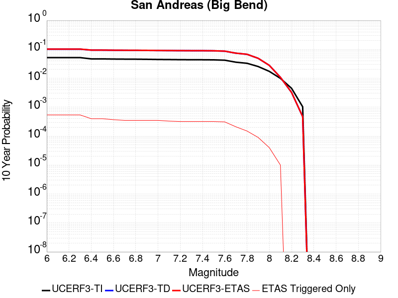 |

| Magnitude | 1 wk TI Prob | 1 wk TD Prob | 1 wk ETAS Prob | 1 wk ETAS/TD Gain | 1 wk ETAS Triggered Only | 1 mo TI Prob | 1 mo TD Prob | 1 mo ETAS Prob | 1 mo ETAS/TD Gain | 1 mo ETAS Triggered Only | 1 yr TI Prob | 1 yr TD Prob | 1 yr ETAS Prob | 1 yr ETAS/TD Gain | 1 yr ETAS Triggered Only | 10 yr TI Prob | 10 yr TD Prob | 10 yr ETAS Prob | 10 yr ETAS/TD Gain | 10 yr ETAS Triggered Only |
|-----|-----|-----|-----|-----|-----|-----|-----|-----|-----|-----|-----|-----|-----|-----|-----|-----|-----|-----|-----|-----|
| 6.0 | 1.0179969E-4 | 2.0072258E-4 | 3.8644279E-4 | 1.925258 | 1.8575747E-4 | 4.362114E-4 | 8.599571E-4 | 0.0011636624 | 1.3531634 | 3.0396678E-4 | 0.0052979486 | 0.010419999 | 0.010804353 | 1.0368862 | 3.8840197E-4 | 0.051734097 | 0.10144902 | 0.10193459 | 1.0047863 | 5.403854E-4 |
| 6.1 | 1.0179969E-4 | 2.0072258E-4 | 3.8644279E-4 | 1.925258 | 1.8575747E-4 | 4.362114E-4 | 8.599571E-4 | 0.0011636624 | 1.3531634 | 3.0396678E-4 | 0.0052979486 | 0.010419999 | 0.010804353 | 1.0368862 | 3.8840197E-4 | 0.051734097 | 0.10144902 | 0.10193459 | 1.0047863 | 5.403854E-4 |
| 6.2 | 1.0179969E-4 | 2.0072258E-4 | 3.8644279E-4 | 1.925258 | 1.8575747E-4 | 4.362114E-4 | 8.599571E-4 | 0.0011636624 | 1.3531634 | 3.0396678E-4 | 0.0052979486 | 0.010419999 | 0.010804353 | 1.0368862 | 3.8840197E-4 | 0.051734097 | 0.10144902 | 0.10193459 | 1.0047863 | 5.403854E-4 |
| 6.3 | 1.0179969E-4 | 2.0072258E-4 | 3.8644279E-4 | 1.925258 | 1.8575747E-4 | 4.362114E-4 | 8.599571E-4 | 0.0011636624 | 1.3531634 | 3.0396678E-4 | 0.0052979486 | 0.010419999 | 0.010804353 | 1.0368862 | 3.8840197E-4 | 0.051734097 | 0.10144902 | 0.10193459 | 1.0047863 | 5.403854E-4 |
| 6.4 | 9.1639464E-5 | 1.8429532E-4 | 3.362507E-4 | 1.8245211 | 1.5198339E-4 | 3.9268145E-4 | 7.895982E-4 | 0.0010258302 | 1.2991799 | 2.364186E-4 | 0.0047704205 | 0.009571102 | 0.00987216 | 1.0314548 | 3.0396678E-4 | 0.046693064 | 0.09377527 | 0.094142556 | 1.0039166 | 4.0528903E-4 |
| 6.5 | 9.1639464E-5 | 1.8429532E-4 | 3.362507E-4 | 1.8245211 | 1.5198339E-4 | 3.9268145E-4 | 7.895982E-4 | 0.0010258302 | 1.2991799 | 2.364186E-4 | 0.0047704205 | 0.009571102 | 0.00987216 | 1.0314548 | 3.0396678E-4 | 0.046693064 | 0.09377527 | 0.094142556 | 1.0039166 | 4.0528903E-4 |
| 6.6 | 9.042622E-5 | 1.823659E-4 | 3.174376E-4 | 1.7406632 | 1.3509634E-4 | 3.8748336E-4 | 7.8133424E-4 | 9.838204E-4 | 1.2591543 | 2.0264451E-4 | 0.0047074095 | 0.009471365 | 0.0097389985 | 1.0282571 | 2.701927E-4 | 0.046089325 | 0.092869274 | 0.09320629 | 1.0036288 | 3.7151494E-4 |
| 6.7 | 8.9836685E-5 | 1.8150927E-4 | 3.1658108E-4 | 1.7441593 | 1.3509634E-4 | 3.8495753E-4 | 7.776651E-4 | 9.80152E-4 | 1.260378 | 2.0264451E-4 | 0.00467679 | 0.00942708 | 0.009694726 | 1.0283911 | 2.701927E-4 | 0.045795817 | 0.09246355 | 0.092800714 | 1.0036465 | 3.7151494E-4 |
| 6.8 | 8.9471854E-5 | 1.8097709E-4 | 3.1604897E-4 | 1.746348 | 1.3509634E-4 | 3.8339442E-4 | 7.7538576E-4 | 9.778731E-4 | 1.261144 | 2.0264451E-4 | 0.004657841 | 0.009399569 | 0.009667221 | 1.028475 | 2.701927E-4 | 0.04561414 | 0.092210755 | 0.09254801 | 1.0036575 | 3.7151494E-4 |
| 6.9 | 8.858234E-5 | 1.7979681E-4 | 3.1486887E-4 | 1.7512482 | 1.3509634E-4 | 3.7958333E-4 | 7.703304E-4 | 9.728188E-4 | 1.2628591 | 2.0264451E-4 | 0.004611638 | 0.009338548 | 0.009606218 | 1.0286628 | 2.701927E-4 | 0.04517103 | 0.09165087 | 0.09198834 | 1.003682 | 3.7151494E-4 |
| 7.0 | 8.7433385E-5 | 1.7818481E-4 | 3.1325707E-4 | 1.7580459 | 1.3509634E-4 | 3.746607E-4 | 7.634259E-4 | 9.6591574E-4 | 1.2652383 | 2.0264451E-4 | 0.004551957 | 0.009255203 | 0.009522895 | 1.0289234 | 2.701927E-4 | 0.044598386 | 0.09088532 | 0.09122307 | 1.0037162 | 3.7151494E-4 |
| 7.1 | 8.684964E-5 | 1.7730435E-4 | 3.1237674E-4 | 1.7618109 | 1.3509634E-4 | 3.7215967E-4 | 7.596547E-4 | 9.621453E-4 | 1.266556 | 2.0264451E-4 | 0.0045216335 | 0.009209678 | 0.009477382 | 1.0290678 | 2.701927E-4 | 0.04430731 | 0.09046686 | 0.09078941 | 1.0035653 | 3.546279E-4 |
| 7.2 | 8.606521E-5 | 1.762105E-4 | 3.1128305E-4 | 1.7665408 | 1.3509634E-4 | 3.6879873E-4 | 7.549695E-4 | 9.57461E-4 | 1.2682115 | 2.0264451E-4 | 0.0044808835 | 0.0091531165 | 0.009420835 | 1.029249 | 2.701927E-4 | 0.043916024 | 0.089947365 | 0.0902701 | 1.003588 | 3.546279E-4 |
| 7.3 | 8.568266E-5 | 1.7563057E-4 | 3.1070318E-4 | 1.7690724 | 1.3509634E-4 | 3.6715972E-4 | 7.524855E-4 | 9.549775E-4 | 1.2690976 | 2.0264451E-4 | 0.0044610105 | 0.009123127 | 0.009390854 | 1.029346 | 2.701927E-4 | 0.043725148 | 0.08966853 | 0.08999135 | 1.0036002 | 3.546279E-4 |
| 7.4 | 8.5432206E-5 | 1.7525644E-4 | 3.103291E-4 | 1.7707144 | 1.3509634E-4 | 3.6608664E-4 | 7.50883E-4 | 9.5337536E-4 | 1.2696723 | 2.0264451E-4 | 0.004447999 | 0.009103781 | 0.0093715135 | 1.0294089 | 2.701927E-4 | 0.043600157 | 0.08948871 | 0.0898116 | 1.0036082 | 3.546279E-4 |
| 7.5 | 8.4791965E-5 | 1.7394972E-4 | 3.0902258E-4 | 1.776505 | 1.3509634E-4 | 3.633435E-4 | 7.4528606E-4 | 9.477795E-4 | 1.2716991 | 2.0264451E-4 | 0.0044147377 | 0.009036204 | 0.009303955 | 1.0296309 | 2.701927E-4 | 0.043280575 | 0.088866346 | 0.089189455 | 1.003636 | 3.546279E-4 |
| 7.6 | 8.241105E-5 | 1.6840403E-4 | 3.0347763E-4 | 1.8020805 | 1.3509634E-4 | 3.531424E-4 | 7.215321E-4 | 9.2403044E-4 | 1.2806504 | 2.0264451E-4 | 0.0042910352 | 0.008749358 | 0.009017187 | 1.0306113 | 2.701927E-4 | 0.042091176 | 0.086243294 | 0.086567335 | 1.0037574 | 3.546279E-4 |
| 7.7 | 7.00432E-5 | 1.42045E-4 | 2.7712216E-4 | 1.9509461 | 1.3509634E-4 | 3.001506E-4 | 6.0862233E-4 | 7.9426676E-4 | 1.305024 | 1.8575747E-4 | 0.0036482112 | 0.0073848404 | 0.007619513 | 1.0317776 | 2.364186E-4 | 0.035888977 | 0.07351733 | 0.07373637 | 1.0029794 | 2.364186E-4 |
| 7.8 | 6.415362E-5 | 1.2968935E-4 | 2.3099846E-4 | 1.7811676 | 1.0132226E-4 | 2.749151E-4 | 5.556931E-4 | 7.07592E-4 | 1.2733504 | 1.5198339E-4 | 0.0033419547 | 0.0067446055 | 0.0069458834 | 1.0298427 | 2.0264451E-4 | 0.03292141 | 0.06725231 | 0.06744132 | 1.0028106 | 2.0264451E-4 |
| 7.9 | 4.939911E-5 | 9.3411545E-5 | 1.7783887E-4 | 1.9038211 | 8.443521E-5 | 2.116933E-4 | 4.0027377E-4 | 5.184357E-4 | 1.2952029 | 1.182093E-4 | 0.0025743195 | 0.004862453 | 0.004996892 | 1.0276484 | 1.3509634E-4 | 0.025447013 | 0.048914436 | 0.049042925 | 1.0026268 | 1.3509634E-4 |
| 8.0 | 3.344983E-5 | 5.222685E-5 | 8.599917E-5 | 1.6466467 | 3.3774086E-5 | 1.4334853E-4 | 2.2381016E-4 | 2.9134323E-4 | 1.3017426 | 6.754817E-5 | 0.0017438711 | 0.0027214854 | 0.0027888499 | 1.0247527 | 6.754817E-5 | 0.017302496 | 0.027922187 | 0.027987849 | 1.0023516 | 6.754817E-5 |
| 8.1 | 1.9104898E-5 | 1.9173063E-5 | 1.9173063E-5 | 1.0 | 0.0 | 8.1875565E-5 | 8.216769E-5 | 9.9053344E-5 | 1.2055024 | 1.6887043E-5 | 9.963791E-4 | 9.999331E-4 | 0.0010168033 | 1.0168713 | 1.6887043E-5 | 0.009919235 | 0.010749801 | 0.010766506 | 1.001554 | 1.6887043E-5 |
| 8.2 | 8.643924E-6 | 5.4748625E-6 | 5.4748625E-6 | 1.0 | 0.0 | 3.704486E-5 | 2.3463486E-5 | 2.3463486E-5 | 1.0 | 0.0 | 4.5092785E-4 | 2.8563058E-4 | 2.8563058E-4 | 1.0 | 0.0 | 0.0045001395 | 0.0032487072 | 0.0032487072 | 1.0 | 0.0 |
| 8.3 | 1.983087E-6 | 7.6599065E-7 | 7.6599065E-7 | 1.0 | 0.0 | 8.498917E-6 | 3.282813E-6 | 3.282813E-6 | 1.0 | 0.0 | 1.034694E-4 | 3.9967534E-5 | 3.9967534E-5 | 1.0 | 0.0 | 0.0010342124 | 4.719687E-4 | 4.719687E-4 | 1.0 | 0.0 |

## Independence rev 2011
*[(top)](#table-of-contents)*

| 1 Week | 1 Month | 1 Year | 10 Year |
|-----|-----|-----|-----|
|  |  |  | 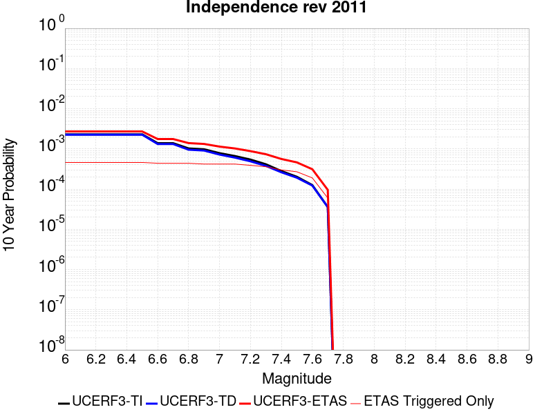 |

| Magnitude | 1 wk TI Prob | 1 wk TD Prob | 1 wk ETAS Prob | 1 wk ETAS/TD Gain | 1 wk ETAS Triggered Only | 1 mo TI Prob | 1 mo TD Prob | 1 mo ETAS Prob | 1 mo ETAS/TD Gain | 1 mo ETAS Triggered Only | 1 yr TI Prob | 1 yr TD Prob | 1 yr ETAS Prob | 1 yr ETAS/TD Gain | 1 yr ETAS Triggered Only | 10 yr TI Prob | 10 yr TD Prob | 10 yr ETAS Prob | 10 yr ETAS/TD Gain | 10 yr ETAS Triggered Only |
|-----|-----|-----|-----|-----|-----|-----|-----|-----|-----|-----|-----|-----|-----|-----|-----|-----|-----|-----|-----|-----|
| 6.0 | 4.422171E-6 | 4.326227E-6 | 1.900829E-4 | 43.937336 | 1.8575747E-4 | 1.8952025E-5 | 1.8540857E-5 | 2.3806834E-4 | 12.840201 | 2.1953155E-4 | 2.3071647E-4 | 2.2571455E-4 | 5.802624E-4 | 2.5707798 | 3.546279E-4 | 0.0023047708 | 0.0022551466 | 0.0027437664 | 1.2166687 | 4.897242E-4 |
| 6.1 | 4.422171E-6 | 4.326227E-6 | 1.900829E-4 | 43.937336 | 1.8575747E-4 | 1.8952025E-5 | 1.8540857E-5 | 2.3806834E-4 | 12.840201 | 2.1953155E-4 | 2.3071647E-4 | 2.2571455E-4 | 5.802624E-4 | 2.5707798 | 3.546279E-4 | 0.0023047708 | 0.0022551466 | 0.0027437664 | 1.2166687 | 4.897242E-4 |
| 6.2 | 4.422171E-6 | 4.326227E-6 | 1.900829E-4 | 43.937336 | 1.8575747E-4 | 1.8952025E-5 | 1.8540857E-5 | 2.3806834E-4 | 12.840201 | 2.1953155E-4 | 2.3071647E-4 | 2.2571455E-4 | 5.802624E-4 | 2.5707798 | 3.546279E-4 | 0.0023047708 | 0.0022551466 | 0.0027437664 | 1.2166687 | 4.897242E-4 |
| 6.3 | 4.422171E-6 | 4.326227E-6 | 1.900829E-4 | 43.937336 | 1.8575747E-4 | 1.8952025E-5 | 1.8540857E-5 | 2.3806834E-4 | 12.840201 | 2.1953155E-4 | 2.3071647E-4 | 2.2571455E-4 | 5.802624E-4 | 2.5707798 | 3.546279E-4 | 0.0023047708 | 0.0022551466 | 0.0027437664 | 1.2166687 | 4.897242E-4 |
| 6.4 | 4.422171E-6 | 4.326227E-6 | 1.900829E-4 | 43.937336 | 1.8575747E-4 | 1.8952025E-5 | 1.8540857E-5 | 2.3806834E-4 | 12.840201 | 2.1953155E-4 | 2.3071647E-4 | 2.2571455E-4 | 5.802624E-4 | 2.5707798 | 3.546279E-4 | 0.0023047708 | 0.0022551466 | 0.0027437664 | 1.2166687 | 4.897242E-4 |
| 6.5 | 4.422171E-6 | 4.326227E-6 | 1.900829E-4 | 43.937336 | 1.8575747E-4 | 1.8952025E-5 | 1.8540857E-5 | 2.3806834E-4 | 12.840201 | 2.1953155E-4 | 2.3071647E-4 | 2.2571455E-4 | 5.802624E-4 | 2.5707798 | 3.546279E-4 | 0.0023047708 | 0.0022551466 | 0.0027437664 | 1.2166687 | 4.897242E-4 |
| 6.6 | 2.663744E-6 | 2.5319862E-6 | 1.8828898E-4 | 74.36414 | 1.8575747E-4 | 1.1415996E-5 | 1.0851327E-5 | 2.303805E-4 | 21.230629 | 2.1953155E-4 | 1.3898089E-4 | 1.3210738E-4 | 4.8668843E-4 | 3.6840365 | 3.546279E-4 | 0.0013889399 | 0.0013203367 | 0.0017756849 | 1.3448727 | 4.5595015E-4 |
| 6.7 | 2.663744E-6 | 2.5319862E-6 | 1.8828898E-4 | 74.36414 | 1.8575747E-4 | 1.1415996E-5 | 1.0851327E-5 | 2.303805E-4 | 21.230629 | 2.1953155E-4 | 1.3898089E-4 | 1.3210738E-4 | 4.8668843E-4 | 3.6840365 | 3.546279E-4 | 0.0013889399 | 0.0013203367 | 0.0017756849 | 1.3448727 | 4.5595015E-4 |
| 6.8 | 1.9716529E-6 | 1.8322585E-6 | 1.8758938E-4 | 102.38151 | 1.8575747E-4 | 8.449913E-6 | 7.852514E-6 | 2.2738235E-4 | 28.956633 | 2.1953155E-4 | 1.0287284E-4 | 9.5600284E-5 | 4.501943E-4 | 4.7091312 | 3.546279E-4 | 0.0010282523 | 9.556045E-4 | 0.0014111189 | 1.4766767 | 4.5595015E-4 |
| 6.9 | 1.8788617E-6 | 1.7429993E-6 | 1.7061313E-4 | 97.884796 | 1.6887042E-4 | 8.0522395E-6 | 7.4699765E-6 | 2.1011298E-4 | 28.127663 | 2.0264451E-4 | 9.80316E-5 | 9.0943286E-5 | 4.286534E-4 | 4.7134147 | 3.3774084E-4 | 9.798837E-4 | 9.0907275E-4 | 0.0013477367 | 1.48254 | 4.390631E-4 |
| 7.0 | 1.5045488E-6 | 1.3849503E-6 | 1.7025514E-4 | 122.932304 | 1.6887042E-4 | 6.44805E-6 | 5.9354884E-6 | 2.085788E-4 | 35.140965 | 2.0264451E-4 | 7.8502184E-5 | 7.226223E-5 | 4.0997867E-4 | 5.6734853 | 3.3774084E-4 | 7.8474457E-4 | 7.2239246E-4 | 0.0011611384 | 1.6073512 | 4.390631E-4 |
| 7.1 | 1.272341E-6 | 1.1625096E-6 | 1.7003274E-4 | 146.2635 | 1.6887042E-4 | 5.4528787E-6 | 4.982175E-6 | 2.0762568E-4 | 41.673702 | 2.0264451E-4 | 6.6386776E-5 | 6.0656326E-5 | 3.983767E-4 | 6.567768 | 3.3774084E-4 | 6.636695E-4 | 6.064009E-4 | 0.0010451977 | 1.7236085 | 4.390631E-4 |
| 7.2 | 1.0416892E-6 | 9.4098806E-7 | 1.6981126E-4 | 180.46059 | 1.6887042E-4 | 4.464375E-6 | 4.0328E-6 | 2.0667649E-4 | 51.248886 | 2.0264451E-4 | 5.4352407E-5 | 4.909825E-5 | 3.8682253E-4 | 7.87854 | 3.3774084E-4 | 5.4339116E-4 | 4.9087586E-4 | 9.128447E-4 | 1.8596243 | 4.2217606E-4 |
| 7.3 | 7.9450155E-7 | 7.235002E-7 | 1.5270678E-4 | 211.06667 | 1.5198339E-4 | 3.4050022E-6 | 3.1007114E-6 | 1.8885761E-4 | 60.90783 | 1.8575747E-4 | 4.1455114E-5 | 3.775052E-5 | 3.5859222E-4 | 9.499001 | 3.208538E-4 | 4.144738E-4 | 3.7744216E-4 | 7.6569756E-4 | 2.0286486 | 3.8840197E-4 |
| 7.4 | 5.3893444E-7 | 5.019512E-7 | 1.1871119E-4 | 236.49945 | 1.182093E-4 | 2.309717E-6 | 2.1512178E-6 | 1.5413428E-4 | 71.64978 | 1.5198339E-4 | 2.8120441E-5 | 2.6190766E-5 | 2.7948976E-4 | 10.671309 | 2.5330562E-4 | 2.8116882E-4 | 2.6187726E-4 | 5.6576444E-4 | 2.1604183 | 3.0396678E-4 |
| 7.5 | 3.8852085E-7 | 3.682554E-7 | 1.1857751E-4 | 321.99802 | 1.182093E-4 | 1.6650882E-6 | 1.5782365E-6 | 1.5356138E-4 | 97.29935 | 1.5198339E-4 | 2.027226E-5 | 1.9214862E-5 | 2.5562893E-4 | 13.303708 | 2.364186E-4 | 2.0270412E-4 | 1.9213221E-4 | 4.791568E-4 | 2.493891 | 2.8707972E-4 |
| 7.6 | 2.414929E-7 | 2.345755E-7 | 6.778273E-5 | 288.9591 | 6.754817E-5 | 1.0349692E-6 | 1.0053232E-6 | 8.544045E-5 | 84.988045 | 8.443521E-5 | 1.2600677E-5 | 1.2239742E-5 | 1.811081E-4 | 14.796725 | 1.6887042E-4 | 1.2599962E-4 | 1.223908E-4 | 3.418955E-4 | 2.7934737 | 2.1953155E-4 |
| 7.7 | 6.8298014E-8 | 6.85897E-8 | 1.6955632E-5 | 247.20377 | 1.6887043E-5 | 2.9270575E-7 | 2.9395582E-7 | 1.7180993E-5 | 58.447536 | 1.6887043E-5 | 3.5636867E-6 | 3.5789067E-6 | 5.4239852E-5 | 15.155426 | 5.066113E-5 | 3.5636294E-5 | 3.5788536E-5 | 8.644785E-5 | 2.4155178 | 5.066113E-5 |

## Kern Canyon (North Kern) 2011
*[(top)](#table-of-contents)*

| 1 Week | 1 Month | 1 Year | 10 Year |
|-----|-----|-----|-----|
|  |  |  |  |

| Magnitude | 1 wk TI Prob | 1 wk TD Prob | 1 wk ETAS Prob | 1 wk ETAS/TD Gain | 1 wk ETAS Triggered Only | 1 mo TI Prob | 1 mo TD Prob | 1 mo ETAS Prob | 1 mo ETAS/TD Gain | 1 mo ETAS Triggered Only | 1 yr TI Prob | 1 yr TD Prob | 1 yr ETAS Prob | 1 yr ETAS/TD Gain | 1 yr ETAS Triggered Only | 10 yr TI Prob | 10 yr TD Prob | 10 yr ETAS Prob | 10 yr ETAS/TD Gain | 10 yr ETAS Triggered Only |
|-----|-----|-----|-----|-----|-----|-----|-----|-----|-----|-----|-----|-----|-----|-----|-----|-----|-----|-----|-----|-----|
| 6.0 | 6.6264497E-6 | 6.75733E-6 | 1.5873968E-4 | 23.49148 | 1.5198339E-4 | 2.8398761E-5 | 2.895971E-5 | 2.1471179E-4 | 7.414156 | 1.8575747E-4 | 3.4570007E-4 | 3.5253543E-4 | 6.5639504E-4 | 1.8619264 | 3.0396678E-4 | 0.0034516277 | 0.0035205502 | 0.0039917226 | 1.133835 | 4.728372E-4 |
| 6.1 | 6.6264497E-6 | 6.75733E-6 | 1.5873968E-4 | 23.49148 | 1.5198339E-4 | 2.8398761E-5 | 2.895971E-5 | 2.1471179E-4 | 7.414156 | 1.8575747E-4 | 3.4570007E-4 | 3.5253543E-4 | 6.5639504E-4 | 1.8619264 | 3.0396678E-4 | 0.0034516277 | 0.0035205502 | 0.0039917226 | 1.133835 | 4.728372E-4 |
| 6.2 | 6.6264497E-6 | 6.75733E-6 | 1.5873968E-4 | 23.49148 | 1.5198339E-4 | 2.8398761E-5 | 2.895971E-5 | 2.1471179E-4 | 7.414156 | 1.8575747E-4 | 3.4570007E-4 | 3.5253543E-4 | 6.5639504E-4 | 1.8619264 | 3.0396678E-4 | 0.0034516277 | 0.0035205502 | 0.0039917226 | 1.133835 | 4.728372E-4 |
| 6.3 | 6.6264497E-6 | 6.75733E-6 | 1.5873968E-4 | 23.49148 | 1.5198339E-4 | 2.8398761E-5 | 2.895971E-5 | 2.1471179E-4 | 7.414156 | 1.8575747E-4 | 3.4570007E-4 | 3.5253543E-4 | 6.5639504E-4 | 1.8619264 | 3.0396678E-4 | 0.0034516277 | 0.0035205502 | 0.0039917226 | 1.133835 | 4.728372E-4 |
| 6.4 | 6.6264497E-6 | 6.75733E-6 | 1.5873968E-4 | 23.49148 | 1.5198339E-4 | 2.8398761E-5 | 2.895971E-5 | 2.1471179E-4 | 7.414156 | 1.8575747E-4 | 3.4570007E-4 | 3.5253543E-4 | 6.5639504E-4 | 1.8619264 | 3.0396678E-4 | 0.0034516277 | 0.0035205502 | 0.0039917226 | 1.133835 | 4.728372E-4 |
| 6.5 | 3.2162225E-6 | 3.2570915E-6 | 5.3918055E-5 | 16.55405 | 5.066113E-5 | 1.3783738E-5 | 1.3958893E-5 | 8.150612E-5 | 5.8390102 | 6.754817E-5 | 1.6780409E-4 | 1.6993708E-4 | 3.387788E-4 | 1.9935544 | 1.6887042E-4 | 0.0016767744 | 0.001698151 | 0.0019847432 | 1.1687672 | 2.8707972E-4 |
| 6.6 | 3.2162225E-6 | 3.2570915E-6 | 5.3918055E-5 | 16.55405 | 5.066113E-5 | 1.3783738E-5 | 1.3958893E-5 | 8.150612E-5 | 5.8390102 | 6.754817E-5 | 1.6780409E-4 | 1.6993708E-4 | 3.387788E-4 | 1.9935544 | 1.6887042E-4 | 0.0016767744 | 0.001698151 | 0.0019847432 | 1.1687672 | 2.8707972E-4 |
| 6.7 | 2.1908265E-6 | 2.2071222E-6 | 5.2868138E-5 | 23.953426 | 5.066113E-5 | 9.389223E-6 | 9.459061E-6 | 7.7006596E-5 | 8.141039 | 6.754817E-5 | 1.1430779E-4 | 1.1515819E-4 | 2.8400918E-4 | 2.4662526 | 1.6887042E-4 | 0.0011424901 | 0.0011510046 | 0.0014040186 | 1.2198203 | 2.5330562E-4 |
| 6.8 | 1.7303895E-6 | 1.7365529E-6 | 5.2397594E-5 | 30.173336 | 5.066113E-5 | 7.415934E-6 | 7.4423488E-6 | 7.4990014E-5 | 10.076122 | 6.754817E-5 | 9.028525E-5 | 9.0606925E-5 | 2.2569102E-4 | 2.4908805 | 1.3509634E-4 | 9.024858E-4 | 9.057096E-4 | 0.0011250423 | 1.2421668 | 2.1953155E-4 |
| 6.9 | 1.3700314E-6 | 1.3688622E-6 | 5.202992E-5 | 38.00961 | 5.066113E-5 | 5.87155E-6 | 5.8665396E-6 | 7.341431E-5 | 12.514075 | 6.754817E-5 | 7.148377E-5 | 7.142282E-5 | 1.7273784E-4 | 2.4185245 | 1.0132226E-4 | 7.146078E-4 | 7.140032E-4 | 8.6587813E-4 | 1.212709 | 1.5198339E-4 |
| 7.0 | 1.1467797E-6 | 1.1413804E-6 | 1.8028404E-5 | 15.795262 | 1.6887043E-5 | 4.9147607E-6 | 4.8916213E-6 | 2.1778582E-5 | 4.4522214 | 1.6887043E-5 | 5.983557E-5 | 5.9553895E-5 | 9.3325965E-5 | 1.5670842 | 3.3774086E-5 | 5.981946E-4 | 5.953825E-4 | 6.6289044E-4 | 1.1133858 | 6.754817E-5 |
| 7.1 | 9.3952065E-7 | 9.3026904E-7 | 1.7817296E-5 | 19.152842 | 1.6887043E-5 | 4.026511E-6 | 3.9868614E-6 | 2.0873837E-5 | 5.2356567 | 1.6887043E-5 | 4.9021666E-5 | 4.8538972E-5 | 8.231142E-5 | 1.69578 | 3.3774086E-5 | 4.901085E-4 | 4.8528548E-4 | 5.35922E-4 | 1.1043438 | 5.066113E-5 |
| 7.2 | 6.858055E-7 | 6.7193E-7 | 1.7558961E-5 | 26.132128 | 1.6887043E-5 | 2.939163E-6 | 2.879697E-6 | 1.976669E-5 | 6.8641562 | 1.6887043E-5 | 3.5783723E-5 | 3.5059755E-5 | 6.8832655E-5 | 1.9632953 | 3.3774086E-5 | 3.5777962E-4 | 3.5054312E-4 | 3.8430537E-4 | 1.0963141 | 3.3774086E-5 |
| 7.3 | 5.1101983E-7 | 4.9393E-7 | 1.7380964E-5 | 35.189125 | 1.6887043E-5 | 2.1900833E-6 | 2.116841E-6 | 1.9003848E-5 | 8.977456 | 1.6887043E-5 | 2.6663936E-5 | 2.5772239E-5 | 5.9545455E-5 | 2.3104494 | 3.3774086E-5 | 2.6660739E-4 | 2.57693E-4 | 2.9145836E-4 | 1.1310295 | 3.3774086E-5 |
| 7.4 | 3.4999414E-7 | 3.2995905E-7 | 3.2995905E-7 | 1.0 | 0.0 | 1.499974E-6 | 1.4141094E-6 | 1.4141094E-6 | 1.0 | 0.0 | 1.8262032E-5 | 1.721665E-5 | 3.41034E-5 | 1.9808385 | 1.6887043E-5 | 1.826053E-4 | 1.7215339E-4 | 1.8903753E-4 | 1.0980761 | 1.6887043E-5 |
| 7.5 | 1.7021522E-7 | 1.4750044E-7 | 1.4750044E-7 | 1.0 | 0.0 | 7.2949354E-7 | 6.321446E-7 | 6.321446E-7 | 1.0 | 0.0 | 8.881548E-6 | 7.696334E-6 | 7.696334E-6 | 1.0 | 0.0 | 8.8811925E-5 | 7.696076E-5 | 7.696076E-5 | 1.0 | 0.0 |
| 7.6 | 2.572245E-8 | 1.7352555E-8 | 1.7352555E-8 | 1.0 | 0.0 | 1.10239064E-7 | 7.436809E-8 | 7.436809E-8 | 1.0 | 0.0 | 1.3421597E-6 | 9.054312E-7 | 9.054312E-7 | 1.0 | 0.0 | 1.3421517E-5 | 9.05428E-6 | 9.05428E-6 | 1.0 | 0.0 |

## San Andreas (Carrizo) rev
*[(top)](#table-of-contents)*

| 1 Week | 1 Month | 1 Year | 10 Year |
|-----|-----|-----|-----|
|  |  |  |  |

| Magnitude | 1 wk TI Prob | 1 wk TD Prob | 1 wk ETAS Prob | 1 wk ETAS/TD Gain | 1 wk ETAS Triggered Only | 1 mo TI Prob | 1 mo TD Prob | 1 mo ETAS Prob | 1 mo ETAS/TD Gain | 1 mo ETAS Triggered Only | 1 yr TI Prob | 1 yr TD Prob | 1 yr ETAS Prob | 1 yr ETAS/TD Gain | 1 yr ETAS Triggered Only | 10 yr TI Prob | 10 yr TD Prob | 10 yr ETAS Prob | 10 yr ETAS/TD Gain | 10 yr ETAS Triggered Only |
|-----|-----|-----|-----|-----|-----|-----|-----|-----|-----|-----|-----|-----|-----|-----|-----|-----|-----|-----|-----|-----|
| 6.0 | 1.1674632E-4 | 2.432302E-4 | 4.1205954E-4 | 1.6941135 | 1.6887042E-4 | 5.002454E-4 | 0.0010420004 | 0.001295042 | 1.2428422 | 2.5330562E-4 | 0.006073493 | 0.012613042 | 0.012963197 | 1.0277613 | 3.546279E-4 | 0.0591016 | 0.12061418 | 0.12101513 | 1.0033243 | 4.5595015E-4 |
| 6.1 | 1.1674632E-4 | 2.432302E-4 | 4.1205954E-4 | 1.6941135 | 1.6887042E-4 | 5.002454E-4 | 0.0010420004 | 0.001295042 | 1.2428422 | 2.5330562E-4 | 0.006073493 | 0.012613042 | 0.012963197 | 1.0277613 | 3.546279E-4 | 0.0591016 | 0.12061418 | 0.12101513 | 1.0033243 | 4.5595015E-4 |
| 6.2 | 1.1674632E-4 | 2.432302E-4 | 4.1205954E-4 | 1.6941135 | 1.6887042E-4 | 5.002454E-4 | 0.0010420004 | 0.001295042 | 1.2428422 | 2.5330562E-4 | 0.006073493 | 0.012613042 | 0.012963197 | 1.0277613 | 3.546279E-4 | 0.0591016 | 0.12061418 | 0.12101513 | 1.0033243 | 4.5595015E-4 |
| 6.3 | 1.1674632E-4 | 2.432302E-4 | 4.1205954E-4 | 1.6941135 | 1.6887042E-4 | 5.002454E-4 | 0.0010420004 | 0.001295042 | 1.2428422 | 2.5330562E-4 | 0.006073493 | 0.012613042 | 0.012963197 | 1.0277613 | 3.546279E-4 | 0.0591016 | 0.12061418 | 0.12101513 | 1.0033243 | 4.5595015E-4 |
| 6.4 | 1.1674632E-4 | 2.432302E-4 | 4.1205954E-4 | 1.6941135 | 1.6887042E-4 | 5.002454E-4 | 0.0010420004 | 0.001295042 | 1.2428422 | 2.5330562E-4 | 0.006073493 | 0.012613042 | 0.012963197 | 1.0277613 | 3.546279E-4 | 0.0591016 | 0.12061418 | 0.12101513 | 1.0033243 | 4.5595015E-4 |
| 6.5 | 1.13136164E-4 | 2.3643032E-4 | 4.0526083E-4 | 1.7140814 | 1.6887042E-4 | 4.847792E-4 | 0.0010128808 | 0.0012659299 | 1.2498311 | 2.5330562E-4 | 0.0058862255 | 0.012262545 | 0.012596143 | 1.0272048 | 3.3774084E-4 | 0.057327334 | 0.117585555 | 0.117972985 | 1.003295 | 4.390631E-4 |
| 6.6 | 1.13136164E-4 | 2.3643032E-4 | 4.0526083E-4 | 1.7140814 | 1.6887042E-4 | 4.847792E-4 | 0.0010128808 | 0.0012659299 | 1.2498311 | 2.5330562E-4 | 0.0058862255 | 0.012262545 | 0.012596143 | 1.0272048 | 3.3774084E-4 | 0.057327334 | 0.117585555 | 0.117972985 | 1.003295 | 4.390631E-4 |
| 6.7 | 1.1149675E-4 | 2.3334254E-4 | 3.8529045E-4 | 1.6511797 | 1.5198339E-4 | 4.777557E-4 | 9.996577E-4 | 0.0012358399 | 1.2362632 | 2.364186E-4 | 0.0058011734 | 0.012103349 | 0.012420319 | 1.0261886 | 3.208538E-4 | 0.05652051 | 0.1162071 | 0.11658022 | 1.0032108 | 4.2217606E-4 |
| 6.8 | 1.1103589E-4 | 2.3236412E-4 | 3.8431218E-4 | 1.6539222 | 1.5198339E-4 | 4.7578133E-4 | 9.954676E-4 | 0.0012316509 | 1.2372586 | 2.364186E-4 | 0.005777263 | 0.012052901 | 0.012369888 | 1.0262996 | 3.208538E-4 | 0.056293584 | 0.1157674 | 0.1161407 | 1.0032246 | 4.2217606E-4 |
| 6.9 | 1.1053259E-4 | 2.3128795E-4 | 3.8323618E-4 | 1.6569656 | 1.5198339E-4 | 4.7362508E-4 | 9.90859E-4 | 0.0012270433 | 1.2383633 | 2.364186E-4 | 0.0057511497 | 0.01199741 | 0.012314415 | 1.0264227 | 3.208538E-4 | 0.05604569 | 0.11528359 | 0.1156571 | 1.0032399 | 4.2217606E-4 |
| 7.0 | 1.1005377E-4 | 2.3029637E-4 | 3.8224476E-4 | 1.6597949 | 1.5198339E-4 | 4.7157376E-4 | 9.866126E-4 | 0.001222798 | 1.2393901 | 2.364186E-4 | 0.0057263062 | 0.011946279 | 0.0122633 | 1.0265372 | 3.208538E-4 | 0.055809796 | 0.11483591 | 0.1152096 | 1.0032542 | 4.2217606E-4 |
| 7.1 | 1.0308142E-4 | 2.1539345E-4 | 3.5046067E-4 | 1.6270722 | 1.3509634E-4 | 4.417027E-4 | 9.227892E-4 | 0.0011252468 | 1.2193973 | 2.0264451E-4 | 0.0053644776 | 0.011177397 | 0.011461269 | 1.0253968 | 2.8707972E-4 | 0.052368138 | 0.108092256 | 0.10842361 | 1.0030655 | 3.7151494E-4 |
| 7.2 | 1.0027479E-4 | 2.094724E-4 | 3.4454046E-4 | 1.6448011 | 1.3509634E-4 | 4.296783E-4 | 8.9743105E-4 | 0.0010998937 | 1.2256025 | 2.0264451E-4 | 0.0052187922 | 0.010871782 | 0.011155741 | 1.0261189 | 2.8707972E-4 | 0.050979212 | 0.10539625 | 0.105728604 | 1.0031534 | 3.7151494E-4 |
| 7.3 | 9.816942E-5 | 2.0422463E-4 | 3.392934E-4 | 1.6613734 | 1.3509634E-4 | 4.2065824E-4 | 8.7495585E-4 | 0.0010774231 | 1.2314028 | 2.0264451E-4 | 0.005109493 | 0.010600842 | 0.010884878 | 1.0267937 | 2.8707972E-4 | 0.049935985 | 0.102979995 | 0.10331325 | 1.0032362 | 3.7151494E-4 |
| 7.4 | 9.5634205E-5 | 1.9791997E-4 | 3.3298956E-4 | 1.6824455 | 1.3509634E-4 | 4.0979648E-4 | 8.479536E-4 | 0.0010504263 | 1.238778 | 2.0264451E-4 | 0.0049778637 | 0.010275229 | 0.010559359 | 1.0276519 | 2.8707972E-4 | 0.048678253 | 0.10006632 | 0.10038546 | 1.0031893 | 3.546279E-4 |
| 7.5 | 8.052417E-5 | 1.611261E-4 | 2.9620068E-4 | 1.838316 | 1.3509634E-4 | 3.4505792E-4 | 6.903579E-4 | 8.9286244E-4 | 1.2933328 | 2.0264451E-4 | 0.0041929903 | 0.008372796 | 0.008640726 | 1.0320001 | 2.701927E-4 | 0.04114753 | 0.08281049 | 0.083120264 | 1.0037408 | 3.3774084E-4 |
| 7.6 | 7.897024E-5 | 1.5765853E-4 | 2.9273357E-4 | 1.8567569 | 1.3509634E-4 | 3.384E-4 | 6.755046E-4 | 8.780123E-4 | 1.2997872 | 2.0264451E-4 | 0.0041122385 | 0.008193332 | 0.0084613105 | 1.032707 | 2.701927E-4 | 0.040369697 | 0.08115171 | 0.08146204 | 1.0038241 | 3.3774084E-4 |
| 7.7 | 6.707427E-5 | 1.3276102E-4 | 2.6783944E-4 | 2.0174553 | 1.3509634E-4 | 2.8742946E-4 | 5.688518E-4 | 7.545036E-4 | 1.3263624 | 1.8575747E-4 | 0.003493839 | 0.00690381 | 0.0071385964 | 1.0340083 | 2.364186E-4 | 0.034394164 | 0.069048055 | 0.06926815 | 1.0031875 | 2.364186E-4 |
| 7.8 | 6.147705E-5 | 1.2197486E-4 | 2.2328476E-4 | 1.8305801 | 1.0132226E-4 | 2.6344648E-4 | 5.226447E-4 | 6.745487E-4 | 1.2906448 | 1.5198339E-4 | 0.0032027436 | 0.006344659 | 0.0065460177 | 1.0317367 | 2.0264451E-4 | 0.031569764 | 0.06351457 | 0.06370434 | 1.0029879 | 2.0264451E-4 |
| 7.9 | 4.7636717E-5 | 8.87977E-5 | 1.7322542E-4 | 1.9507872 | 8.443521E-5 | 2.0414138E-4 | 3.8050607E-4 | 4.986704E-4 | 1.3105452 | 1.182093E-4 | 0.0024825884 | 0.0046228287 | 0.0047573005 | 1.0290886 | 1.3509634E-4 | 0.024550365 | 0.046628095 | 0.04675689 | 1.0027622 | 1.3509634E-4 |
| 8.0 | 3.3554235E-5 | 5.2136907E-5 | 8.590923E-5 | 1.6477623 | 3.3774086E-5 | 1.4379594E-4 | 2.2342477E-4 | 2.9095783E-4 | 1.3022631 | 6.754817E-5 | 0.0017493097 | 0.002716805 | 0.0027841697 | 1.0247955 | 6.754817E-5 | 0.017356034 | 0.027880952 | 0.027946617 | 1.0023552 | 6.754817E-5 |
| 8.1 | 1.9175432E-5 | 1.9184976E-5 | 1.9184976E-5 | 1.0 | 0.0 | 8.217783E-5 | 8.2218736E-5 | 9.910439E-5 | 1.2053747 | 1.6887043E-5 | 0.0010000558 | 0.0010005541 | 0.0010174242 | 1.0168608 | 1.6887043E-5 | 0.009955673 | 0.0107580265 | 0.010774732 | 1.0015528 | 1.6887043E-5 |
| 8.2 | 8.643924E-6 | 5.4748625E-6 | 5.4748625E-6 | 1.0 | 0.0 | 3.704486E-5 | 2.3463486E-5 | 2.3463486E-5 | 1.0 | 0.0 | 4.5092785E-4 | 2.8563058E-4 | 2.8563058E-4 | 1.0 | 0.0 | 0.0045001395 | 0.0032487072 | 0.0032487072 | 1.0 | 0.0 |
| 8.3 | 1.983087E-6 | 7.6599065E-7 | 7.6599065E-7 | 1.0 | 0.0 | 8.498917E-6 | 3.282813E-6 | 3.282813E-6 | 1.0 | 0.0 | 1.034694E-4 | 3.9967534E-5 | 3.9967534E-5 | 1.0 | 0.0 | 0.0010342124 | 4.719687E-4 | 4.719687E-4 | 1.0 | 0.0 |

## Lake Isabella (Seismicity)
*[(top)](#table-of-contents)*

| 1 Week | 1 Month | 1 Year | 10 Year |
|-----|-----|-----|-----|
|  | 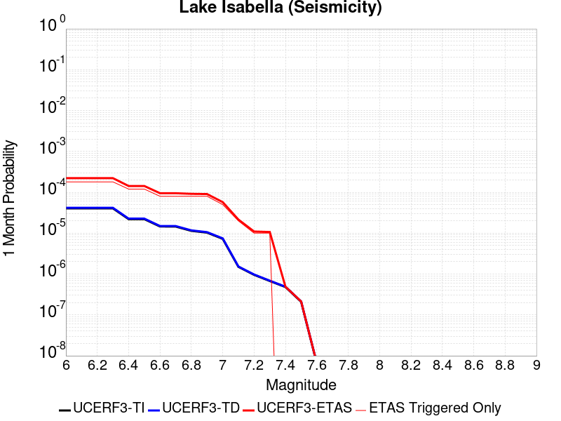 |  |  |

| Magnitude | 1 wk TI Prob | 1 wk TD Prob | 1 wk ETAS Prob | 1 wk ETAS/TD Gain | 1 wk ETAS Triggered Only | 1 mo TI Prob | 1 mo TD Prob | 1 mo ETAS Prob | 1 mo ETAS/TD Gain | 1 mo ETAS Triggered Only | 1 yr TI Prob | 1 yr TD Prob | 1 yr ETAS Prob | 1 yr ETAS/TD Gain | 1 yr ETAS Triggered Only | 10 yr TI Prob | 10 yr TD Prob | 10 yr ETAS Prob | 10 yr ETAS/TD Gain | 10 yr ETAS Triggered Only |
|-----|-----|-----|-----|-----|-----|-----|-----|-----|-----|-----|-----|-----|-----|-----|-----|-----|-----|-----|-----|-----|
| 6.0 | 9.431637E-6 | 9.741651E-6 | 1.9549731E-4 | 20.06819 | 1.8575747E-4 | 4.0420677E-5 | 4.1749343E-5 | 2.6127172E-4 | 6.2581043 | 2.1953155E-4 | 4.920106E-4 | 5.0819275E-4 | 8.288835E-4 | 1.6310415 | 3.208538E-4 | 0.004909227 | 0.005071599 | 0.005491634 | 1.082821 | 4.2217606E-4 |
| 6.1 | 9.431637E-6 | 9.741651E-6 | 1.9549731E-4 | 20.06819 | 1.8575747E-4 | 4.0420677E-5 | 4.1749343E-5 | 2.6127172E-4 | 6.2581043 | 2.1953155E-4 | 4.920106E-4 | 5.0819275E-4 | 8.288835E-4 | 1.6310415 | 3.208538E-4 | 0.004909227 | 0.005071599 | 0.005491634 | 1.082821 | 4.2217606E-4 |
| 6.2 | 9.431637E-6 | 9.741651E-6 | 1.9549731E-4 | 20.06819 | 1.8575747E-4 | 4.0420677E-5 | 4.1749343E-5 | 2.6127172E-4 | 6.2581043 | 2.1953155E-4 | 4.920106E-4 | 5.0819275E-4 | 8.288835E-4 | 1.6310415 | 3.208538E-4 | 0.004909227 | 0.005071599 | 0.005491634 | 1.082821 | 4.2217606E-4 |
| 6.3 | 9.431637E-6 | 9.741651E-6 | 1.9549731E-4 | 20.06819 | 1.8575747E-4 | 4.0420677E-5 | 4.1749343E-5 | 2.6127172E-4 | 6.2581043 | 2.1953155E-4 | 4.920106E-4 | 5.0819275E-4 | 8.288835E-4 | 1.6310415 | 3.208538E-4 | 0.004909227 | 0.005071599 | 0.005491634 | 1.082821 | 4.2217606E-4 |
| 6.4 | 5.144063E-6 | 5.3000763E-6 | 1.2350875E-4 | 23.303202 | 1.182093E-4 | 2.2045799E-5 | 2.2714434E-5 | 1.7469436E-4 | 7.690897 | 1.5198339E-4 | 2.6837454E-4 | 2.765166E-4 | 4.7910507E-4 | 1.7326449 | 2.0264451E-4 | 0.0026805066 | 0.0027620657 | 0.0029978312 | 1.0853584 | 2.364186E-4 |
| 6.5 | 5.144063E-6 | 5.3000763E-6 | 1.2350875E-4 | 23.303202 | 1.182093E-4 | 2.2045799E-5 | 2.2714434E-5 | 1.7469436E-4 | 7.690897 | 1.5198339E-4 | 2.6837454E-4 | 2.765166E-4 | 4.7910507E-4 | 1.7326449 | 2.0264451E-4 | 0.0026805066 | 0.0027620657 | 0.0029978312 | 1.0853584 | 2.364186E-4 |
| 6.6 | 3.4009804E-6 | 3.498786E-6 | 1.0482069E-4 | 29.959158 | 1.0132226E-4 | 1.4575549E-5 | 1.4994721E-5 | 1.3320225E-4 | 8.883276 | 1.182093E-4 | 1.7744285E-4 | 1.8254704E-4 | 3.1761872E-4 | 1.7399281 | 1.3509634E-4 | 0.0017730123 | 0.0018241286 | 0.0019758348 | 1.0831664 | 1.5198339E-4 |
| 6.7 | 3.3880428E-6 | 3.4856528E-6 | 1.0480756E-4 | 30.068272 | 1.0132226E-4 | 1.4520103E-5 | 1.4938435E-5 | 1.3314596E-4 | 8.912979 | 1.182093E-4 | 1.767679E-4 | 1.8186188E-4 | 3.1693364E-4 | 1.7427163 | 1.3509634E-4 | 0.0017662736 | 0.0018172882 | 0.0019689954 | 1.08348 | 1.5198339E-4 |
| 6.8 | 2.6582E-6 | 2.7337003E-6 | 1.0405568E-4 | 38.06404 | 1.0132226E-4 | 1.1392236E-5 | 1.1715813E-5 | 1.2992372E-4 | 11.089604 | 1.182093E-4 | 1.3869164E-4 | 1.4263204E-4 | 2.6082445E-4 | 1.8286529 | 1.182093E-4 | 0.0013860512 | 0.0014255369 | 0.0015604406 | 1.0946337 | 1.3509634E-4 |
| 6.9 | 2.406011E-6 | 2.4743288E-6 | 1.0379633E-4 | 41.949287 | 1.0132226E-4 | 1.0311434E-5 | 1.0604231E-5 | 1.2881227E-4 | 12.147253 | 1.182093E-4 | 1.2553448E-4 | 1.2910018E-4 | 2.4729423E-4 | 1.9155219 | 1.182093E-4 | 0.0012546359 | 0.0012903814 | 0.0014253034 | 1.1045598 | 1.3509634E-4 |
| 7.0 | 1.6953097E-6 | 1.7429371E-6 | 6.929099E-5 | 39.7553 | 6.754817E-5 | 7.265593E-6 | 7.469715E-6 | 7.501738E-5 | 10.0428705 | 6.754817E-5 | 8.8455E-5 | 9.094104E-5 | 1.5848306E-4 | 1.7427013 | 6.754817E-5 | 8.84198E-4 | 9.09141E-4 | 9.934994E-4 | 1.0927892 | 8.443521E-5 |
| 7.1 | 3.5013824E-7 | 3.5714822E-7 | 3.4131222E-5 | 95.56598 | 3.3774086E-5 | 1.5005916E-6 | 1.5306344E-6 | 3.5304667E-5 | 23.065382 | 3.3774086E-5 | 1.826955E-5 | 1.8635317E-5 | 5.2408774E-5 | 2.812336 | 3.3774086E-5 | 1.8268047E-4 | 1.863378E-4 | 2.2010559E-4 | 1.1812181 | 3.3774086E-5 |
| 7.2 | 2.2321095E-7 | 2.2750574E-7 | 1.7114544E-5 | 75.22687 | 1.6887043E-5 | 9.56618E-7 | 9.750242E-7 | 1.786205E-5 | 18.319597 | 1.6887043E-5 | 1.1646762E-5 | 1.1870856E-5 | 2.8757699E-5 | 2.4225461 | 1.6887043E-5 | 1.1646151E-4 | 1.1870232E-4 | 1.3558737E-4 | 1.142247 | 1.6887043E-5 |
| 7.3 | 1.5760406E-7 | 1.6060922E-7 | 1.7047649E-5 | 106.143654 | 1.6887043E-5 | 6.7544585E-7 | 6.8832503E-7 | 1.7575356E-5 | 25.533512 | 1.6887043E-5 | 8.223522E-6 | 8.380326E-6 | 2.5267227E-5 | 3.015065 | 1.6887043E-5 | 8.2232174E-5 | 8.3800165E-5 | 1.00685786E-4 | 1.2014987 | 1.6887043E-5 |
| 7.4 | 1.1216497E-7 | 1.1431706E-7 | 1.1431706E-7 | 1.0 | 0.0 | 4.8070694E-7 | 4.899302E-7 | 4.899302E-7 | 1.0 | 0.0 | 5.852591E-6 | 5.964884E-6 | 5.964884E-6 | 1.0 | 0.0 | 5.8524372E-5 | 5.9647282E-5 | 5.9647282E-5 | 1.0 | 0.0 |
| 7.5 | 4.885185E-8 | 4.9787737E-8 | 4.9787737E-8 | 1.0 | 0.0 | 2.0936506E-7 | 2.13376E-7 | 2.13376E-7 | 1.0 | 0.0 | 2.5490165E-6 | 2.59785E-6 | 2.59785E-6 | 1.0 | 0.0 | 2.5489873E-5 | 2.5978214E-5 | 2.5978214E-5 | 1.0 | 0.0 |
| 7.6 | 1.504641E-9 | 1.5317903E-9 | 1.5317903E-9 | 1.0 | 0.0 | 6.4484613E-9 | 6.5648154E-9 | 6.5648154E-9 | 1.0 | 0.0 | 7.851001E-8 | 7.992663E-8 | 7.992663E-8 | 1.0 | 0.0 | 7.8509987E-7 | 7.992663E-7 | 7.992663E-7 | 1.0 | 0.0 |

## Red Pass
*[(top)](#table-of-contents)*

| 1 Week | 1 Month | 1 Year | 10 Year |
|-----|-----|-----|-----|
|  |  |  | 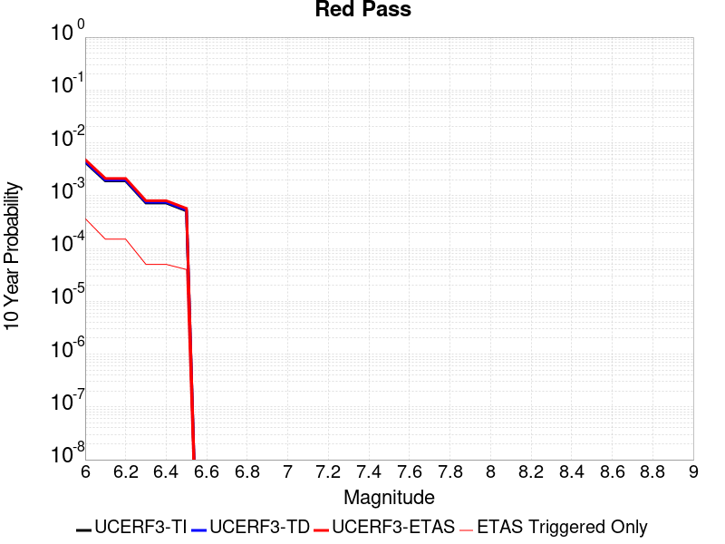 |

| Magnitude | 1 wk TI Prob | 1 wk TD Prob | 1 wk ETAS Prob | 1 wk ETAS/TD Gain | 1 wk ETAS Triggered Only | 1 mo TI Prob | 1 mo TD Prob | 1 mo ETAS Prob | 1 mo ETAS/TD Gain | 1 mo ETAS Triggered Only | 1 yr TI Prob | 1 yr TD Prob | 1 yr ETAS Prob | 1 yr ETAS/TD Gain | 1 yr ETAS Triggered Only | 10 yr TI Prob | 10 yr TD Prob | 10 yr ETAS Prob | 10 yr ETAS/TD Gain | 10 yr ETAS Triggered Only |
|-----|-----|-----|-----|-----|-----|-----|-----|-----|-----|-----|-----|-----|-----|-----|-----|-----|-----|-----|-----|-----|
| 6.0 | 8.258278E-6 | 8.551265E-6 | 1.4364645E-4 | 16.79827 | 1.3509634E-4 | 3.539214E-5 | 3.6647863E-5 | 2.2239852E-4 | 6.0685263 | 1.8575747E-4 | 4.308141E-4 | 4.4611428E-4 | 7.161864E-4 | 1.6053878 | 2.701927E-4 | 0.0042997985 | 0.004453945 | 0.004857429 | 1.0905902 | 4.0528903E-4 |
| 6.1 | 3.649988E-6 | 3.7753161E-6 | 7.132323E-5 | 18.891989 | 6.754817E-5 | 1.5642712E-5 | 1.6179853E-5 | 1.006137E-4 | 6.218456 | 8.443521E-5 | 1.9043336E-4 | 1.9697666E-4 | 3.1516267E-4 | 1.6000001 | 1.182093E-4 | 0.0019027026 | 0.001968488 | 0.002137026 | 1.085618 | 1.6887042E-4 |
| 6.2 | 3.649988E-6 | 3.7753161E-6 | 7.132323E-5 | 18.891989 | 6.754817E-5 | 1.5642712E-5 | 1.6179853E-5 | 1.006137E-4 | 6.218456 | 8.443521E-5 | 1.9043336E-4 | 1.9697666E-4 | 3.1516267E-4 | 1.6000001 | 1.182093E-4 | 0.0019027026 | 0.001968488 | 0.002137026 | 1.085618 | 1.6887042E-4 |
| 6.3 | 1.3924937E-6 | 1.4411166E-6 | 1.8328135E-5 | 12.718009 | 1.6887043E-5 | 5.9678164E-6 | 6.1762075E-6 | 2.3063145E-5 | 3.7341921 | 1.6887043E-5 | 7.265574E-5 | 7.519415E-5 | 9.207992E-5 | 1.2245623 | 1.6887043E-5 | 7.263199E-4 | 7.518258E-4 | 7.855745E-4 | 1.044889 | 3.3774086E-5 |
| 6.4 | 1.3924937E-6 | 1.4411166E-6 | 1.8328135E-5 | 12.718009 | 1.6887043E-5 | 5.9678164E-6 | 6.1762075E-6 | 2.3063145E-5 | 3.7341921 | 1.6887043E-5 | 7.265574E-5 | 7.519415E-5 | 9.207992E-5 | 1.2245623 | 1.6887043E-5 | 7.263199E-4 | 7.518258E-4 | 7.855745E-4 | 1.044889 | 3.3774086E-5 |
| 6.5 | 9.876812E-7 | 1.0221912E-6 | 1.7909217E-5 | 17.520418 | 1.6887043E-5 | 4.2329125E-6 | 4.3808195E-6 | 2.1267788E-5 | 4.854751 | 1.6887043E-5 | 5.153449E-5 | 5.3336476E-5 | 7.022262E-5 | 1.3165965 | 1.6887043E-5 | 5.1522546E-4 | 5.333648E-4 | 5.6712085E-4 | 1.0632889 | 3.3774086E-5 |

## San Andreas (Cholame) rev
*[(top)](#table-of-contents)*

| 1 Week | 1 Month | 1 Year | 10 Year |
|-----|-----|-----|-----|
|  |  |  |  |

| Magnitude | 1 wk TI Prob | 1 wk TD Prob | 1 wk ETAS Prob | 1 wk ETAS/TD Gain | 1 wk ETAS Triggered Only | 1 mo TI Prob | 1 mo TD Prob | 1 mo ETAS Prob | 1 mo ETAS/TD Gain | 1 mo ETAS Triggered Only | 1 yr TI Prob | 1 yr TD Prob | 1 yr ETAS Prob | 1 yr ETAS/TD Gain | 1 yr ETAS Triggered Only | 10 yr TI Prob | 10 yr TD Prob | 10 yr ETAS Prob | 10 yr ETAS/TD Gain | 10 yr ETAS Triggered Only |
|-----|-----|-----|-----|-----|-----|-----|-----|-----|-----|-----|-----|-----|-----|-----|-----|-----|-----|-----|-----|-----|
| 6.0 | 1.2302514E-4 | 2.5204287E-4 | 4.2087073E-4 | 1.6698378 | 1.6887042E-4 | 5.27144E-4 | 0.0010797381 | 0.0013159015 | 1.2187228 | 2.364186E-4 | 0.0063991086 | 0.0130670825 | 0.013383744 | 1.0242335 | 3.208538E-4 | 0.06217949 | 0.12439073 | 0.1247456 | 1.0028529 | 4.0528903E-4 |
| 6.1 | 1.2302514E-4 | 2.5204287E-4 | 4.2087073E-4 | 1.6698378 | 1.6887042E-4 | 5.27144E-4 | 0.0010797381 | 0.0013159015 | 1.2187228 | 2.364186E-4 | 0.0063991086 | 0.0130670825 | 0.013383744 | 1.0242335 | 3.208538E-4 | 0.06217949 | 0.12439073 | 0.1247456 | 1.0028529 | 4.0528903E-4 |
| 6.2 | 1.2203569E-4 | 2.5021084E-4 | 4.1903902E-4 | 1.6747437 | 1.6887042E-4 | 5.2290526E-4 | 0.0010718931 | 0.0013080583 | 1.2203254 | 2.364186E-4 | 0.006347804 | 0.01297271 | 0.013289401 | 1.0244122 | 3.208538E-4 | 0.061695136 | 0.12357691 | 0.12393211 | 1.0028744 | 4.0528903E-4 |
| 6.3 | 1.2142645E-4 | 2.4907055E-4 | 4.1789893E-4 | 1.6778334 | 1.6887042E-4 | 5.202953E-4 | 0.0010670102 | 0.0013031765 | 1.2213347 | 2.364186E-4 | 0.006316212 | 0.012913967 | 0.013230677 | 1.0245247 | 3.208538E-4 | 0.06139677 | 0.12307103 | 0.123426445 | 1.0028878 | 4.0528903E-4 |
| 6.4 | 1.1865206E-4 | 2.44126E-4 | 3.9607228E-4 | 1.6224092 | 1.5198339E-4 | 5.0840975E-4 | 0.0010458364 | 0.0012651384 | 1.2096905 | 2.1953155E-4 | 0.006172335 | 0.012659196 | 0.012959315 | 1.0237076 | 3.0396678E-4 | 0.060036868 | 0.1208638 | 0.12120526 | 1.0028251 | 3.8840197E-4 |
| 6.5 | 1.17443946E-4 | 2.4205919E-4 | 3.940058E-4 | 1.627725 | 1.5198339E-4 | 5.032341E-4 | 0.0010369857 | 0.0012562895 | 1.211482 | 2.1953155E-4 | 0.006109677 | 0.012552682 | 0.012852834 | 1.0239114 | 3.0396678E-4 | 0.059444077 | 0.11993805 | 0.12027987 | 1.0028499 | 3.8840197E-4 |
| 6.6 | 1.13579066E-4 | 2.3514954E-4 | 3.8709719E-4 | 1.6461746 | 1.5198339E-4 | 4.866766E-4 | 0.001007396 | 0.0012267064 | 1.2177002 | 2.1953155E-4 | 0.0059092017 | 0.012196515 | 0.012480093 | 1.0232508 | 2.8707972E-4 | 0.057545185 | 0.11685214 | 0.11718025 | 1.0028079 | 3.7151494E-4 |
| 6.7 | 1.1271412E-4 | 2.3359268E-4 | 3.8554057E-4 | 1.6504822 | 1.5198339E-4 | 4.829711E-4 | 0.0010007289 | 0.0012031706 | 1.2022942 | 2.0264451E-4 | 0.005864331 | 0.012116249 | 0.012383168 | 1.0220299 | 2.701927E-4 | 0.057119697 | 0.116155714 | 0.116469145 | 1.0026984 | 3.546279E-4 |
| 6.8 | 1.1217975E-4 | 2.3247694E-4 | 3.84425E-4 | 1.6536047 | 1.5198339E-4 | 4.8068175E-4 | 9.959509E-4 | 0.0011983935 | 1.2032658 | 2.0264451E-4 | 0.005836608 | 0.012058721 | 0.012325656 | 1.0221362 | 2.701927E-4 | 0.056856725 | 0.11565396 | 0.11596758 | 1.0027117 | 3.546279E-4 |
| 6.9 | 1.1146753E-4 | 2.3096445E-4 | 3.8291272E-4 | 1.657886 | 1.5198339E-4 | 4.7763053E-4 | 9.894737E-4 | 0.0011919177 | 1.2045977 | 2.0264451E-4 | 0.0057996577 | 0.011980731 | 0.012247687 | 1.0222821 | 2.701927E-4 | 0.056506127 | 0.11497439 | 0.11528824 | 1.0027298 | 3.546279E-4 |
| 7.0 | 1.0965793E-4 | 2.2719789E-4 | 3.7914675E-4 | 1.6687952 | 1.5198339E-4 | 4.698779E-4 | 9.733434E-4 | 0.0011757907 | 1.2079916 | 2.0264451E-4 | 0.005705768 | 0.011786487 | 0.012053495 | 1.0226537 | 2.701927E-4 | 0.055614736 | 0.11327597 | 0.11359042 | 1.002776 | 3.546279E-4 |
| 7.1 | 9.927982E-5 | 2.0538924E-4 | 3.4045783E-4 | 1.6576226 | 1.3509634E-4 | 4.2541555E-4 | 8.7994366E-4 | 0.0010655377 | 1.2109158 | 1.8575747E-4 | 0.0051671406 | 0.010660981 | 0.010911586 | 1.0235068 | 2.5330562E-4 | 0.05048634 | 0.1033706 | 0.10367343 | 1.0029296 | 3.3774084E-4 |
| 7.2 | 9.696786E-5 | 2.0043184E-4 | 3.355011E-4 | 1.6738912 | 1.3509634E-4 | 4.1551032E-4 | 8.5871184E-4 | 0.0010443098 | 1.2161353 | 1.8575747E-4 | 0.00504711 | 0.010404981 | 0.010655651 | 1.0240914 | 2.5330562E-4 | 0.04934009 | 0.1011086 | 0.10141219 | 1.0030026 | 3.3774084E-4 |
| 7.3 | 9.4727984E-5 | 1.9472468E-4 | 3.297947E-4 | 1.6936462 | 1.3509634E-4 | 4.0591392E-4 | 8.3426846E-4 | 0.001019871 | 1.2224734 | 1.8575747E-4 | 0.0049308087 | 0.010110183 | 0.010360927 | 1.0248013 | 2.5330562E-4 | 0.048228268 | 0.09847952 | 0.09878399 | 1.0030918 | 3.3774084E-4 |
| 7.4 | 9.220358E-5 | 1.8843076E-4 | 3.2350165E-4 | 1.7168198 | 1.3509634E-4 | 3.9509835E-4 | 8.073114E-4 | 9.929189E-4 | 1.2299082 | 1.8575747E-4 | 0.004799717 | 0.009784967 | 0.010035793 | 1.0256339 | 2.5330562E-4 | 0.046973653 | 0.095557496 | 0.09584769 | 1.0030369 | 3.208538E-4 |
| 7.5 | 7.71631E-5 | 1.5177966E-4 | 2.868555E-4 | 1.8899468 | 1.3509634E-4 | 3.306571E-4 | 6.503223E-4 | 8.359589E-4 | 1.2854533 | 1.8575747E-4 | 0.0040183207 | 0.007889002 | 0.008123555 | 1.0297318 | 2.364186E-4 | 0.03946433 | 0.07828531 | 0.07856548 | 1.0035788 | 3.0396678E-4 |
| 7.6 | 7.5634416E-5 | 1.483744E-4 | 2.834507E-4 | 1.9103746 | 1.3509634E-4 | 3.241072E-4 | 6.3573546E-4 | 8.213748E-4 | 1.2920072 | 1.8575747E-4 | 0.0039388672 | 0.0077126776 | 0.007947273 | 1.0304168 | 2.364186E-4 | 0.038697794 | 0.07664872 | 0.07692939 | 1.0036618 | 3.0396678E-4 |
| 7.7 | 6.3783E-5 | 1.235872E-4 | 2.5866684E-4 | 2.0929906 | 1.3509634E-4 | 2.7332708E-4 | 5.29552E-4 | 7.152111E-4 | 1.3505965 | 1.8575747E-4 | 0.0033226798 | 0.0064282627 | 0.006646383 | 1.0339315 | 2.1953155E-4 | 0.032734364 | 0.06454029 | 0.06474566 | 1.0031819 | 2.1953155E-4 |
| 7.8 | 5.863422E-5 | 1.1416107E-4 | 2.1547177E-4 | 1.8874364 | 1.0132226E-4 | 2.512653E-4 | 4.8917E-4 | 6.410791E-4 | 1.3105445 | 1.5198339E-4 | 0.003054864 | 0.0059394026 | 0.006124057 | 1.0310897 | 1.8575747E-4 | 0.030132094 | 0.059659187 | 0.059833862 | 1.0029279 | 1.8575747E-4 |
| 7.9 | 4.595283E-5 | 8.426331E-5 | 1.686914E-4 | 2.0019555 | 8.443521E-5 | 1.9692584E-4 | 3.610785E-4 | 4.7924512E-4 | 1.3272601 | 1.182093E-4 | 0.0023949358 | 0.0043872762 | 0.0045217797 | 1.0306576 | 1.3509634E-4 | 0.023692891 | 0.044362005 | 0.04449111 | 1.0029103 | 1.3509634E-4 |
| 8.0 | 3.2950178E-5 | 5.0772942E-5 | 8.454531E-5 | 1.6651647 | 3.3774086E-5 | 1.412074E-4 | 2.1758018E-4 | 2.8511367E-4 | 1.3103843 | 6.754817E-5 | 0.0017178444 | 0.0026458222 | 0.0027131918 | 1.0254626 | 6.754817E-5 | 0.017046256 | 0.027180137 | 0.02724585 | 1.0024177 | 6.754817E-5 |
| 8.1 | 1.9177472E-5 | 1.9185145E-5 | 1.9185145E-5 | 1.0 | 0.0 | 8.218658E-5 | 8.221946E-5 | 9.910512E-5 | 1.2053729 | 1.6887043E-5 | 0.0010001622 | 0.0010005629 | 0.001017433 | 1.0168606 | 1.6887043E-5 | 0.009956728 | 0.010758142 | 0.010774848 | 1.0015528 | 1.6887043E-5 |
| 8.2 | 8.643924E-6 | 5.4748625E-6 | 5.4748625E-6 | 1.0 | 0.0 | 3.704486E-5 | 2.3463486E-5 | 2.3463486E-5 | 1.0 | 0.0 | 4.5092785E-4 | 2.8563058E-4 | 2.8563058E-4 | 1.0 | 0.0 | 0.0045001395 | 0.0032487072 | 0.0032487072 | 1.0 | 0.0 |
| 8.3 | 1.983087E-6 | 7.6599065E-7 | 7.6599065E-7 | 1.0 | 0.0 | 8.498917E-6 | 3.282813E-6 | 3.282813E-6 | 1.0 | 0.0 | 1.034694E-4 | 3.9967534E-5 | 3.9967534E-5 | 1.0 | 0.0 | 0.0010342124 | 4.719687E-4 | 4.719687E-4 | 1.0 | 0.0 |

## San Andreas (San Gorgonio Pass-Garnet HIll)
*[(top)](#table-of-contents)*

| 1 Week | 1 Month | 1 Year | 10 Year |
|-----|-----|-----|-----|
|  | 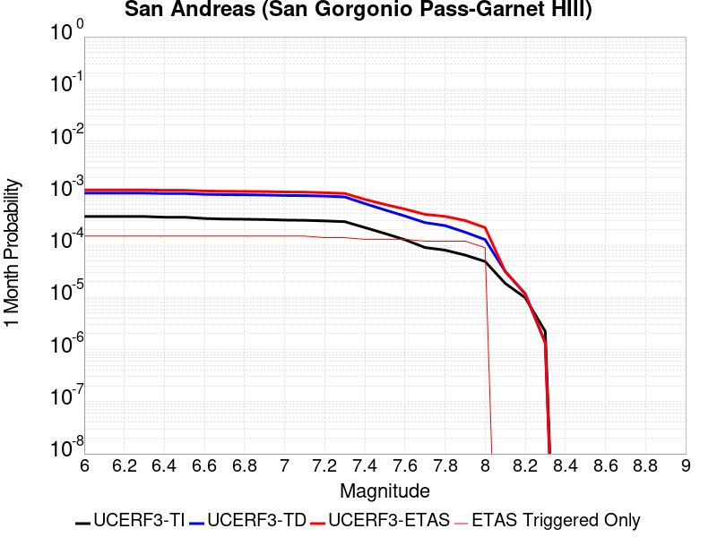 |  |  |

| Magnitude | 1 wk TI Prob | 1 wk TD Prob | 1 wk ETAS Prob | 1 wk ETAS/TD Gain | 1 wk ETAS Triggered Only | 1 mo TI Prob | 1 mo TD Prob | 1 mo ETAS Prob | 1 mo ETAS/TD Gain | 1 mo ETAS Triggered Only | 1 yr TI Prob | 1 yr TD Prob | 1 yr ETAS Prob | 1 yr ETAS/TD Gain | 1 yr ETAS Triggered Only | 10 yr TI Prob | 10 yr TD Prob | 10 yr ETAS Prob | 10 yr ETAS/TD Gain | 10 yr ETAS Triggered Only |
|-----|-----|-----|-----|-----|-----|-----|-----|-----|-----|-----|-----|-----|-----|-----|-----|-----|-----|-----|-----|-----|
| 6.0 | 8.31567E-5 | 2.3382473E-4 | 3.6888948E-4 | 1.5776324 | 1.3509634E-4 | 3.5633717E-4 | 0.0010017233 | 0.0011872947 | 1.1852522 | 1.8575747E-4 | 0.004329778 | 0.012127888 | 0.012411486 | 1.023384 | 2.8707972E-4 | 0.042463828 | 0.11257892 | 0.112893626 | 1.0027955 | 3.546279E-4 |
| 6.1 | 8.31567E-5 | 2.3382473E-4 | 3.6888948E-4 | 1.5776324 | 1.3509634E-4 | 3.5633717E-4 | 0.0010017233 | 0.0011872947 | 1.1852522 | 1.8575747E-4 | 0.004329778 | 0.012127888 | 0.012411486 | 1.023384 | 2.8707972E-4 | 0.042463828 | 0.11257892 | 0.112893626 | 1.0027955 | 3.546279E-4 |
| 6.2 | 8.31567E-5 | 2.3382473E-4 | 3.6888948E-4 | 1.5776324 | 1.3509634E-4 | 3.5633717E-4 | 0.0010017233 | 0.0011872947 | 1.1852522 | 1.8575747E-4 | 0.004329778 | 0.012127888 | 0.012411486 | 1.023384 | 2.8707972E-4 | 0.042463828 | 0.11257892 | 0.112893626 | 1.0027955 | 3.546279E-4 |
| 6.3 | 8.31567E-5 | 2.3382473E-4 | 3.6888948E-4 | 1.5776324 | 1.3509634E-4 | 3.5633717E-4 | 0.0010017233 | 0.0011872947 | 1.1852522 | 1.8575747E-4 | 0.004329778 | 0.012127888 | 0.012411486 | 1.023384 | 2.8707972E-4 | 0.042463828 | 0.11257892 | 0.112893626 | 1.0027955 | 3.546279E-4 |
| 6.4 | 8.059055E-5 | 2.2940808E-4 | 3.6447344E-4 | 1.5887558 | 1.3509634E-4 | 3.4534236E-4 | 9.828096E-4 | 0.0011683844 | 1.1888208 | 1.8575747E-4 | 0.0041964394 | 0.011900152 | 0.012183815 | 1.023837 | 2.8707972E-4 | 0.041180745 | 0.11056015 | 0.11087557 | 1.0028529 | 3.546279E-4 |
| 6.5 | 8.059055E-5 | 2.2940808E-4 | 3.6447344E-4 | 1.5887558 | 1.3509634E-4 | 3.4534236E-4 | 9.828096E-4 | 0.0011683844 | 1.1888208 | 1.8575747E-4 | 0.0041964394 | 0.011900152 | 0.012183815 | 1.023837 | 2.8707972E-4 | 0.041180745 | 0.11056015 | 0.11087557 | 1.0028529 | 3.546279E-4 |
| 6.6 | 7.619237E-5 | 2.218517E-4 | 3.5691808E-4 | 1.6088138 | 1.3509634E-4 | 3.2649786E-4 | 9.5044886E-4 | 0.0011360298 | 1.1952561 | 1.8575747E-4 | 0.0039678677 | 0.01151087 | 0.011794645 | 1.0246528 | 2.8707972E-4 | 0.03897764 | 0.10709683 | 0.1073984 | 1.0028158 | 3.3774084E-4 |
| 6.7 | 7.440636E-5 | 2.1860997E-4 | 3.5367676E-4 | 1.6178437 | 1.3509634E-4 | 3.188454E-4 | 9.3656575E-4 | 0.0011221492 | 1.1981533 | 1.8575747E-4 | 0.0038750346 | 0.011343609 | 0.011627431 | 1.0250206 | 2.8707972E-4 | 0.038081564 | 0.105605274 | 0.10590735 | 1.0028604 | 3.3774084E-4 |
| 6.8 | 7.3735864E-5 | 2.1708169E-4 | 3.521487E-4 | 1.6221944 | 1.3509634E-4 | 3.1597257E-4 | 9.3002064E-4 | 0.0011156054 | 1.1995491 | 1.8575747E-4 | 0.0038401815 | 0.011264749 | 0.011548595 | 1.0251977 | 2.8707972E-4 | 0.03774495 | 0.10490683 | 0.105209135 | 1.0028816 | 3.3774084E-4 |
| 6.9 | 7.27575E-5 | 2.1477141E-4 | 3.4983875E-4 | 1.6288887 | 1.3509634E-4 | 3.117806E-4 | 9.201265E-4 | 0.0011057131 | 1.2016968 | 1.8575747E-4 | 0.003789323 | 0.011145527 | 0.011429406 | 1.0254703 | 2.8707972E-4 | 0.037253562 | 0.103854746 | 0.10415741 | 1.0029143 | 3.3774084E-4 |
| 7.0 | 7.102591E-5 | 2.1061185E-4 | 3.4567973E-4 | 1.6413119 | 1.3509634E-4 | 3.0436125E-4 | 9.023122E-4 | 0.001087902 | 1.2056825 | 1.8575747E-4 | 0.003699303 | 0.010930831 | 0.011214772 | 1.0259762 | 2.8707972E-4 | 0.03638325 | 0.10195695 | 0.102260254 | 1.0029749 | 3.3774084E-4 |
| 7.1 | 7.028513E-5 | 2.0896831E-4 | 3.440364E-4 | 1.6463569 | 1.3509634E-4 | 3.0118722E-4 | 8.9527335E-4 | 0.0010808645 | 1.2073011 | 1.8575747E-4 | 0.0036607897 | 0.010845989 | 0.011129956 | 1.0261817 | 2.8707972E-4 | 0.036010686 | 0.101199985 | 0.10150354 | 1.0029997 | 3.3774084E-4 |
| 7.2 | 6.8498244E-5 | 2.0504706E-4 | 3.4011572E-4 | 1.6587201 | 1.3509634E-4 | 2.9353087E-4 | 8.784794E-4 | 0.0010640736 | 1.2112677 | 1.8575747E-4 | 0.003567883 | 0.010643536 | 0.010927561 | 1.0266851 | 2.8707972E-4 | 0.035111405 | 0.09939202 | 0.09968098 | 1.0029073 | 3.208538E-4 |
| 7.3 | 6.622592E-5 | 1.9732013E-4 | 3.323898E-4 | 1.6845206 | 1.3509634E-4 | 2.8379448E-4 | 8.453858E-4 | 0.0010309862 | 1.2195452 | 1.8575747E-4 | 0.0034497243 | 0.0102444785 | 0.010528618 | 1.0277358 | 2.8707972E-4 | 0.033966612 | 0.095888525 | 0.09617861 | 1.0030253 | 3.208538E-4 |
| 7.4 | 5.1050705E-5 | 1.4689034E-4 | 2.6508226E-4 | 1.8046271 | 1.182093E-4 | 2.1877038E-4 | 6.29379E-4 | 7.9814316E-4 | 1.2681439 | 1.6887042E-4 | 0.002660276 | 0.0076359594 | 0.007887331 | 1.0329194 | 2.5330562E-4 | 0.02628654 | 0.07286301 | 0.07311352 | 1.003438 | 2.701927E-4 |
| 7.5 | 3.9302922E-5 | 1.1129847E-4 | 2.294946E-4 | 2.0619745 | 1.182093E-4 | 1.6843023E-4 | 4.7690657E-4 | 6.456964E-4 | 1.3539265 | 1.6887042E-4 | 0.0020487092 | 0.005790949 | 0.0060427873 | 1.0434884 | 2.5330562E-4 | 0.020299247 | 0.05600951 | 0.056264568 | 1.0045539 | 2.701927E-4 |
| 7.6 | 2.9851626E-5 | 8.4949745E-5 | 2.03149E-4 | 2.3914022 | 1.182093E-4 | 1.2792926E-4 | 3.6401965E-4 | 5.328286E-4 | 1.4637358 | 1.6887042E-4 | 0.0015564259 | 0.0044229585 | 0.004675144 | 1.0570173 | 2.5330562E-4 | 0.0154556995 | 0.04319374 | 0.04345226 | 1.0059851 | 2.701927E-4 |
| 7.7 | 2.1135214E-5 | 6.3529005E-5 | 1.817308E-4 | 2.8605957 | 1.182093E-4 | 9.0576345E-5 | 2.7223877E-4 | 4.2418076E-4 | 1.5581204 | 1.5198339E-4 | 0.0011022091 | 0.0033094748 | 0.003545111 | 1.0712005 | 2.364186E-4 | 0.010967582 | 0.032582592 | 0.032827646 | 1.0075209 | 2.5330562E-4 |
| 7.8 | 1.883379E-5 | 5.564028E-5 | 1.73843E-4 | 3.1244092 | 1.182093E-4 | 8.0713755E-5 | 2.3843657E-4 | 3.903837E-4 | 1.6372645 | 1.5198339E-4 | 9.822468E-4 | 0.0028991038 | 0.0031348371 | 1.0813124 | 2.364186E-4 | 0.0097791655 | 0.028695205 | 0.028941244 | 1.0085741 | 2.5330562E-4 |
| 7.9 | 1.5156185E-5 | 4.1658426E-5 | 1.598628E-4 | 3.8374662 | 1.182093E-4 | 6.495346E-5 | 1.785239E-4 | 3.3048016E-4 | 1.8511815 | 1.5198339E-4 | 7.9052144E-4 | 0.0021713632 | 0.0023735678 | 1.0931233 | 2.0264451E-4 | 0.007877152 | 0.021759422 | 0.021974178 | 1.0098695 | 2.1953155E-4 |
| 8.0 | 1.1405907E-5 | 2.9974231E-5 | 1.3129345E-4 | 4.380211 | 1.0132226E-4 | 4.8881542E-5 | 1.2845467E-4 | 2.6353367E-4 | 2.0515692 | 1.3509634E-4 | 5.9497025E-4 | 0.0015628147 | 0.0017314212 | 1.1078864 | 1.6887042E-4 | 0.005933798 | 0.015772851 | 0.015955677 | 1.0115913 | 1.8575747E-4 |
| 8.1 | 4.3511436E-6 | 7.369219E-6 | 7.369219E-6 | 1.0 | 0.0 | 1.8647626E-5 | 3.1581985E-5 | 3.1581985E-5 | 1.0 | 0.0 | 2.2701119E-4 | 3.8444297E-4 | 3.8444297E-4 | 1.0 | 0.0 | 0.0022677942 | 0.0041163345 | 0.0041163345 | 1.0 | 0.0 |
| 8.2 | 2.3042528E-6 | 2.7329415E-6 | 2.7329415E-6 | 1.0 | 0.0 | 9.875332E-6 | 1.1712554E-5 | 1.1712554E-5 | 1.0 | 0.0 | 1.2022553E-4 | 1.4259106E-4 | 1.4259106E-4 | 1.0 | 0.0 | 0.0012016051 | 0.0015979785 | 0.0015979785 | 1.0 | 0.0 |
| 8.3 | 5.202968E-7 | 3.1598344E-7 | 3.1598344E-7 | 1.0 | 0.0 | 2.2298414E-6 | 1.3542141E-6 | 1.3542141E-6 | 1.0 | 0.0 | 2.714798E-5 | 1.6487444E-5 | 1.6487444E-5 | 1.0 | 0.0 | 2.7144665E-4 | 1.9563142E-4 | 1.9563142E-4 | 1.0 | 0.0 |

## Calico-Hidalgo
*[(top)](#table-of-contents)*

| 1 Week | 1 Month | 1 Year | 10 Year |
|-----|-----|-----|-----|
|  |  |  |  |

| Magnitude | 1 wk TI Prob | 1 wk TD Prob | 1 wk ETAS Prob | 1 wk ETAS/TD Gain | 1 wk ETAS Triggered Only | 1 mo TI Prob | 1 mo TD Prob | 1 mo ETAS Prob | 1 mo ETAS/TD Gain | 1 mo ETAS Triggered Only | 1 yr TI Prob | 1 yr TD Prob | 1 yr ETAS Prob | 1 yr ETAS/TD Gain | 1 yr ETAS Triggered Only | 10 yr TI Prob | 10 yr TD Prob | 10 yr ETAS Prob | 10 yr ETAS/TD Gain | 10 yr ETAS Triggered Only |
|-----|-----|-----|-----|-----|-----|-----|-----|-----|-----|-----|-----|-----|-----|-----|-----|-----|-----|-----|-----|-----|
| 6.0 | 4.0906612E-5 | 5.0703686E-5 | 1.8579318E-4 | 3.6642933 | 1.3509634E-4 | 1.7530227E-4 | 2.172857E-4 | 3.6923605E-4 | 1.6993114 | 1.5198339E-4 | 0.0021322158 | 0.002642648 | 0.002844757 | 1.0764797 | 2.0264451E-4 | 0.02111873 | 0.026152607 | 0.026415734 | 1.0100611 | 2.701927E-4 |
| 6.1 | 4.0906612E-5 | 5.0703686E-5 | 1.8579318E-4 | 3.6642933 | 1.3509634E-4 | 1.7530227E-4 | 2.172857E-4 | 3.6923605E-4 | 1.6993114 | 1.5198339E-4 | 0.0021322158 | 0.002642648 | 0.002844757 | 1.0764797 | 2.0264451E-4 | 0.02111873 | 0.026152607 | 0.026415734 | 1.0100611 | 2.701927E-4 |
| 6.2 | 4.0906612E-5 | 5.0703686E-5 | 1.8579318E-4 | 3.6642933 | 1.3509634E-4 | 1.7530227E-4 | 2.172857E-4 | 3.6923605E-4 | 1.6993114 | 1.5198339E-4 | 0.0021322158 | 0.002642648 | 0.002844757 | 1.0764797 | 2.0264451E-4 | 0.02111873 | 0.026152607 | 0.026415734 | 1.0100611 | 2.701927E-4 |
| 6.3 | 2.4242801E-5 | 3.0090669E-5 | 1.3140988E-4 | 4.3671308 | 1.0132226E-4 | 1.0389358E-4 | 1.2895382E-4 | 2.3026302E-4 | 1.7856238 | 1.0132226E-4 | 0.0012641704 | 0.0015689151 | 0.0017037995 | 1.085973 | 1.3509634E-4 | 0.01257003 | 0.01558206 | 0.015781548 | 1.0128024 | 2.0264451E-4 |
| 6.4 | 2.4242801E-5 | 3.0090669E-5 | 1.3140988E-4 | 4.3671308 | 1.0132226E-4 | 1.0389358E-4 | 1.2895382E-4 | 2.3026302E-4 | 1.7856238 | 1.0132226E-4 | 0.0012641704 | 0.0015689151 | 0.0017037995 | 1.085973 | 1.3509634E-4 | 0.01257003 | 0.01558206 | 0.015781548 | 1.0128024 | 2.0264451E-4 |
| 6.5 | 2.0286952E-5 | 2.5315738E-5 | 1.0974881E-4 | 4.335201 | 8.443521E-5 | 8.694118E-5 | 1.0849161E-4 | 1.9291765E-4 | 1.7781805 | 8.443521E-5 | 0.0010579949 | 0.001320102 | 0.00145502 | 1.1022027 | 1.3509634E-4 | 0.010529719 | 0.013124538 | 0.013324522 | 1.0152375 | 2.0264451E-4 |
| 6.6 | 2.0269223E-5 | 2.5296687E-5 | 1.09729765E-4 | 4.337713 | 8.443521E-5 | 8.6865206E-5 | 1.08409964E-4 | 1.9283603E-4 | 1.7787666 | 8.443521E-5 | 0.0010570707 | 0.0013191093 | 0.0014540275 | 1.1022797 | 1.3509634E-4 | 0.010520565 | 0.013114728 | 0.013314715 | 1.015249 | 2.0264451E-4 |
| 6.7 | 1.799852E-5 | 2.25406E-5 | 1.0697391E-4 | 4.7458324 | 8.443521E-5 | 7.713423E-5 | 9.659908E-5 | 1.8102613E-4 | 1.8739945 | 8.443521E-5 | 9.3870464E-4 | 0.0011754738 | 0.0013104114 | 1.1147941 | 1.3509634E-4 | 0.009347493 | 0.011694173 | 0.011894449 | 1.0171261 | 2.0264451E-4 |
| 6.8 | 1.7458793E-5 | 2.184212E-5 | 1.0627549E-4 | 4.8656216 | 8.443521E-5 | 7.4821255E-5 | 9.3605806E-5 | 1.7803312E-4 | 1.9019452 | 8.443521E-5 | 9.10568E-4 | 0.0011390693 | 0.0012740118 | 1.1184673 | 1.3509634E-4 | 0.009068459 | 0.011333893 | 0.011534241 | 1.0176768 | 2.0264451E-4 |
| 6.9 | 1.542884E-5 | 1.9025927E-5 | 1.0345953E-4 | 5.4378185 | 8.443521E-5 | 6.612192E-5 | 8.153721E-5 | 1.6596554E-4 | 2.0354576 | 8.443521E-5 | 8.04737E-4 | 9.922766E-4 | 0.0011272389 | 1.1360128 | 1.3509634E-4 | 0.008018291 | 0.009879857 | 0.0100805005 | 1.0203083 | 2.0264451E-4 |
| 7.0 | 1.468253E-5 | 1.8030598E-5 | 1.0246429E-4 | 5.6828003 | 8.443521E-5 | 6.292361E-5 | 7.7271776E-5 | 1.6170047E-4 | 2.09262 | 8.443521E-5 | 7.658257E-4 | 9.4039086E-4 | 0.0010753601 | 1.1435246 | 1.3509634E-4 | 0.0076319184 | 0.009365481 | 0.009549499 | 1.0196486 | 1.8575747E-4 |
| 7.1 | 1.3139281E-5 | 1.6200942E-5 | 8.374802E-5 | 5.16933 | 6.754817E-5 | 5.6309986E-5 | 6.943083E-5 | 1.3697431E-4 | 1.9728168 | 6.754817E-5 | 6.853584E-4 | 8.4500515E-4 | 9.6311455E-4 | 1.1397736 | 1.182093E-4 | 0.0068324856 | 0.0084192185 | 0.0085866675 | 1.0198889 | 1.6887042E-4 |
| 7.2 | 1.1127404E-5 | 1.3866597E-5 | 4.7640213E-5 | 3.4356096 | 3.3774086E-5 | 4.7688E-5 | 5.942698E-5 | 9.319906E-5 | 1.5682954 | 3.3774086E-5 | 5.8044674E-4 | 7.232942E-4 | 7.570439E-4 | 1.046661 | 3.3774086E-5 | 0.0057893298 | 0.0072105085 | 0.007294335 | 1.0116255 | 8.443521E-5 |
| 7.3 | 9.808154E-6 | 1.2176215E-5 | 2.9063052E-5 | 2.3868709 | 1.6887043E-5 | 4.2034266E-5 | 5.2182797E-5 | 6.9068956E-5 | 1.3235964 | 1.6887043E-5 | 5.11647E-4 | 6.3515105E-4 | 6.520274E-4 | 1.0265706 | 1.6887043E-5 | 0.0051047057 | 0.006334433 | 0.0064015533 | 1.0105962 | 6.754817E-5 |
| 7.4 | 7.942452E-6 | 9.792144E-6 | 9.792144E-6 | 1.0 | 0.0 | 3.4038632E-5 | 4.1965708E-5 | 4.1965708E-5 | 1.0 | 0.0 | 4.1434157E-4 | 5.1082217E-4 | 5.1082217E-4 | 1.0 | 0.0 | 0.0041356985 | 0.005097421 | 0.005147824 | 1.0098879 | 5.066113E-5 |
| 7.5 | 4.7121216E-6 | 5.772836E-6 | 5.772836E-6 | 1.0 | 0.0 | 2.019465E-5 | 2.4740535E-5 | 2.4740535E-5 | 1.0 | 0.0 | 2.4584212E-4 | 3.0118204E-4 | 3.0118204E-4 | 1.0 | 0.0 | 0.0024557032 | 0.0030084911 | 0.0030421636 | 1.0111924 | 3.3774086E-5 |
| 7.6 | 2.21172E-7 | 2.603961E-7 | 2.603961E-7 | 1.0 | 0.0 | 9.478797E-7 | 1.1159829E-6 | 1.1159829E-6 | 1.0 | 0.0 | 1.1540374E-5 | 1.3587036E-5 | 1.3587036E-5 | 1.0 | 0.0 | 1.1539775E-4 | 1.3586486E-4 | 1.527496E-4 | 1.124276 | 1.6887043E-5 |

## White Wolf (Extension)
*[(top)](#table-of-contents)*

| 1 Week | 1 Month | 1 Year | 10 Year |
|-----|-----|-----|-----|
|  |  |  |  |

| Magnitude | 1 wk TI Prob | 1 wk TD Prob | 1 wk ETAS Prob | 1 wk ETAS/TD Gain | 1 wk ETAS Triggered Only | 1 mo TI Prob | 1 mo TD Prob | 1 mo ETAS Prob | 1 mo ETAS/TD Gain | 1 mo ETAS Triggered Only | 1 yr TI Prob | 1 yr TD Prob | 1 yr ETAS Prob | 1 yr ETAS/TD Gain | 1 yr ETAS Triggered Only | 10 yr TI Prob | 10 yr TD Prob | 10 yr ETAS Prob | 10 yr ETAS/TD Gain | 10 yr ETAS Triggered Only |
|-----|-----|-----|-----|-----|-----|-----|-----|-----|-----|-----|-----|-----|-----|-----|-----|-----|-----|-----|-----|-----|
| 6.0 | 8.222555E-6 | 6.0666657E-6 | 1.073883E-4 | 17.701372 | 1.0132226E-4 | 3.5239045E-5 | 2.5999774E-5 | 1.948658E-4 | 7.494904 | 1.6887042E-4 | 4.289509E-4 | 3.1650788E-4 | 5.8661506E-4 | 1.8533978 | 2.701927E-4 | 0.0042812387 | 0.003161223 | 0.00351473 | 1.111826 | 3.546279E-4 |
| 6.1 | 8.222555E-6 | 6.0666657E-6 | 1.073883E-4 | 17.701372 | 1.0132226E-4 | 3.5239045E-5 | 2.5999774E-5 | 1.948658E-4 | 7.494904 | 1.6887042E-4 | 4.289509E-4 | 3.1650788E-4 | 5.8661506E-4 | 1.8533978 | 2.701927E-4 | 0.0042812387 | 0.003161223 | 0.00351473 | 1.111826 | 3.546279E-4 |
| 6.2 | 8.222555E-6 | 6.0666657E-6 | 1.073883E-4 | 17.701372 | 1.0132226E-4 | 3.5239045E-5 | 2.5999774E-5 | 1.948658E-4 | 7.494904 | 1.6887042E-4 | 4.289509E-4 | 3.1650788E-4 | 5.8661506E-4 | 1.8533978 | 2.701927E-4 | 0.0042812387 | 0.003161223 | 0.00351473 | 1.111826 | 3.546279E-4 |
| 6.3 | 8.222555E-6 | 6.0666657E-6 | 1.073883E-4 | 17.701372 | 1.0132226E-4 | 3.5239045E-5 | 2.5999774E-5 | 1.948658E-4 | 7.494904 | 1.6887042E-4 | 4.289509E-4 | 3.1650788E-4 | 5.8661506E-4 | 1.8533978 | 2.701927E-4 | 0.0042812387 | 0.003161223 | 0.00351473 | 1.111826 | 3.546279E-4 |
| 6.4 | 5.821773E-6 | 3.5571766E-6 | 8.799209E-5 | 24.736498 | 8.443521E-5 | 2.4950215E-5 | 1.5244959E-5 | 1.3345246E-4 | 8.753874 | 1.182093E-4 | 3.0372653E-4 | 1.8559267E-4 | 3.3754786E-4 | 1.8187563 | 1.5198339E-4 | 0.0030331176 | 0.001854485 | 0.0020567537 | 1.1090701 | 2.0264451E-4 |
| 6.5 | 5.766023E-6 | 3.4991106E-6 | 8.793403E-5 | 25.130394 | 8.443521E-5 | 2.4711293E-5 | 1.4996108E-5 | 1.3320363E-4 | 8.882546 | 1.182093E-4 | 3.0081844E-4 | 1.8256342E-4 | 3.176351E-4 | 1.7398617 | 1.3509634E-4 | 0.0030041158 | 0.0018242426 | 0.0020096612 | 1.1016414 | 1.8575747E-4 |
| 6.6 | 4.643576E-6 | 2.332624E-6 | 5.2993633E-5 | 22.718464 | 5.066113E-5 | 1.9900888E-5 | 9.996925E-6 | 9.443129E-5 | 9.446034 | 8.443521E-5 | 2.4226638E-4 | 1.2170619E-4 | 2.0613112E-4 | 1.6936783 | 8.443521E-5 | 0.0024200242 | 0.0012164378 | 0.0013345033 | 1.0970584 | 1.182093E-4 |
| 6.7 | 3.9529173E-6 | 1.6483477E-6 | 3.5422378E-5 | 21.489626 | 3.3774086E-5 | 1.6940963E-5 | 7.0643296E-6 | 7.461202E-5 | 10.561798 | 6.754817E-5 | 2.0623671E-4 | 8.6005006E-5 | 1.5354737E-4 | 1.7853305 | 6.754817E-5 | 0.002060454 | 8.597357E-4 | 9.609709E-4 | 1.1177515 | 1.0132226E-4 |
| 6.8 | 3.4377522E-6 | 1.2245237E-6 | 1.8111545E-5 | 14.790687 | 1.6887043E-5 | 1.473314E-5 | 5.2479486E-6 | 3.9021856E-5 | 7.43564 | 3.3774086E-5 | 1.7936122E-4 | 6.3891996E-5 | 9.766392E-5 | 1.5285784 | 3.3774086E-5 | 0.0017921652 | 6.387454E-4 | 6.893741E-4 | 1.0792629 | 5.066113E-5 |
| 6.9 | 3.1367306E-6 | 1.0033783E-6 | 1.7890405E-5 | 17.830168 | 1.6887043E-5 | 1.3443062E-5 | 4.3001864E-6 | 3.8074126E-5 | 8.854064 | 3.3774086E-5 | 1.63657E-4 | 5.235359E-5 | 8.61259E-5 | 1.6450813 | 3.3774086E-5 | 0.0016353652 | 5.2342017E-4 | 5.740548E-4 | 1.096738 | 5.066113E-5 |
| 7.0 | 2.8298145E-6 | 7.4286646E-7 | 7.4286646E-7 | 1.0 | 0.0 | 1.2127721E-5 | 3.1837099E-6 | 3.1837099E-6 | 1.0 | 0.0 | 1.47645E-4 | 3.8761027E-5 | 3.8761027E-5 | 1.0 | 0.0 | 0.0014754693 | 3.8754768E-4 | 4.0442817E-4 | 1.0435572 | 1.6887043E-5 |
| 7.1 | 2.4091064E-6 | 5.4227525E-7 | 5.4227525E-7 | 1.0 | 0.0 | 1.03247E-5 | 2.3240348E-6 | 2.3240348E-6 | 1.0 | 0.0 | 1.2569598E-4 | 2.8294799E-5 | 2.8294799E-5 | 1.0 | 0.0 | 0.001256249 | 2.8291598E-4 | 2.9979827E-4 | 1.0596724 | 1.6887043E-5 |
| 7.2 | 1.3875518E-6 | 1.0743063E-7 | 1.0743063E-7 | 1.0 | 0.0 | 5.9466374E-6 | 4.6041689E-7 | 4.6041689E-7 | 1.0 | 0.0 | 7.23979E-5 | 5.6055624E-6 | 5.6055624E-6 | 1.0 | 0.0 | 7.2374323E-4 | 5.6054323E-5 | 5.6054323E-5 | 1.0 | 0.0 |
| 7.3 | 7.056077E-7 | 5.002034E-8 | 5.002034E-8 | 1.0 | 0.0 | 3.0240296E-6 | 2.1437286E-7 | 2.1437286E-7 | 1.0 | 0.0 | 3.681694E-5 | 2.609987E-6 | 2.609987E-6 | 1.0 | 0.0 | 3.681084E-4 | 2.609961E-5 | 2.609961E-5 | 1.0 | 0.0 |
| 7.4 | 5.9334678E-8 | 4.8683537E-9 | 4.8683537E-9 | 1.0 | 0.0 | 2.5429145E-7 | 2.0864372E-8 | 2.0864372E-8 | 1.0 | 0.0 | 3.095994E-6 | 2.5402372E-7 | 2.5402372E-7 | 1.0 | 0.0 | 3.095951E-5 | 2.5402353E-6 | 2.5402353E-6 | 1.0 | 0.0 |

## Scodie Lineament
*[(top)](#table-of-contents)*

| 1 Week | 1 Month | 1 Year | 10 Year |
|-----|-----|-----|-----|
| 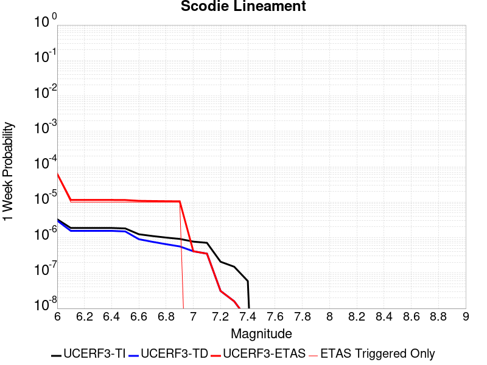 |  |  |  |

| Magnitude | 1 wk TI Prob | 1 wk TD Prob | 1 wk ETAS Prob | 1 wk ETAS/TD Gain | 1 wk ETAS Triggered Only | 1 mo TI Prob | 1 mo TD Prob | 1 mo ETAS Prob | 1 mo ETAS/TD Gain | 1 mo ETAS Triggered Only | 1 yr TI Prob | 1 yr TD Prob | 1 yr ETAS Prob | 1 yr ETAS/TD Gain | 1 yr ETAS Triggered Only | 10 yr TI Prob | 10 yr TD Prob | 10 yr ETAS Prob | 10 yr ETAS/TD Gain | 10 yr ETAS Triggered Only |
|-----|-----|-----|-----|-----|-----|-----|-----|-----|-----|-----|-----|-----|-----|-----|-----|-----|-----|-----|-----|-----|
| 6.0 | 3.2919327E-6 | 3.0133422E-6 | 5.3674317E-5 | 17.812222 | 5.066113E-5 | 1.4108206E-5 | 1.2914278E-5 | 9.73484E-5 | 7.5380445 | 8.443521E-5 | 1.7175387E-4 | 1.5722317E-4 | 3.4295142E-4 | 2.1813035 | 1.8575747E-4 | 0.0017162118 | 0.0015714309 | 0.0018917805 | 1.2038585 | 3.208538E-4 |
| 6.1 | 1.8663811E-6 | 1.5490499E-6 | 1.8436067E-5 | 11.901531 | 1.6887043E-5 | 7.998751E-6 | 6.6387715E-6 | 2.3525701E-5 | 3.543683 | 1.6887043E-5 | 9.738045E-5 | 8.082454E-5 | 1.3148157E-4 | 1.6267531 | 5.066113E-5 | 9.7337784E-4 | 8.080003E-4 | 8.7549386E-4 | 1.0835316 | 6.754817E-5 |
| 6.2 | 1.8663811E-6 | 1.5490499E-6 | 1.8436067E-5 | 11.901531 | 1.6887043E-5 | 7.998751E-6 | 6.6387715E-6 | 2.3525701E-5 | 3.543683 | 1.6887043E-5 | 9.738045E-5 | 8.082454E-5 | 1.3148157E-4 | 1.6267531 | 5.066113E-5 | 9.7337784E-4 | 8.080003E-4 | 8.7549386E-4 | 1.0835316 | 6.754817E-5 |
| 6.3 | 1.8663811E-6 | 1.5490499E-6 | 1.8436067E-5 | 11.901531 | 1.6887043E-5 | 7.998751E-6 | 6.6387715E-6 | 2.3525701E-5 | 3.543683 | 1.6887043E-5 | 9.738045E-5 | 8.082454E-5 | 1.3148157E-4 | 1.6267531 | 5.066113E-5 | 9.7337784E-4 | 8.080003E-4 | 8.7549386E-4 | 1.0835316 | 6.754817E-5 |
| 6.4 | 1.8663811E-6 | 1.5490499E-6 | 1.8436067E-5 | 11.901531 | 1.6887043E-5 | 7.998751E-6 | 6.6387715E-6 | 2.3525701E-5 | 3.543683 | 1.6887043E-5 | 9.738045E-5 | 8.082454E-5 | 1.3148157E-4 | 1.6267531 | 5.066113E-5 | 9.7337784E-4 | 8.080003E-4 | 8.7549386E-4 | 1.0835316 | 6.754817E-5 |
| 6.5 | 1.8106311E-6 | 1.4909839E-6 | 1.8378001E-5 | 12.326089 | 1.6887043E-5 | 7.759824E-6 | 6.3899183E-6 | 2.3276853E-5 | 3.6427464 | 1.6887043E-5 | 9.447177E-5 | 7.7794975E-5 | 1.11566434E-4 | 1.4341085 | 3.3774086E-5 | 9.4431615E-4 | 7.7772606E-4 | 8.283478E-4 | 1.0650895 | 5.066113E-5 |
| 6.6 | 1.2414679E-6 | 8.997558E-7 | 1.7786782E-5 | 19.768457 | 1.6887043E-5 | 5.320566E-6 | 3.856091E-6 | 2.0743068E-5 | 5.3792996 | 1.6887043E-5 | 6.477596E-5 | 4.6946985E-5 | 6.3833235E-5 | 1.3596877 | 1.6887043E-5 | 6.475708E-4 | 4.693793E-4 | 5.0313753E-4 | 1.071921 | 3.3774086E-5 |
| 6.7 | 1.1062215E-6 | 7.594311E-7 | 1.764646E-5 | 23.236422 | 1.6887043E-5 | 4.7409408E-6 | 3.2547011E-6 | 2.0141688E-5 | 6.1884913 | 1.6887043E-5 | 5.7719422E-5 | 3.9625334E-5 | 5.6511708E-5 | 1.4261509 | 1.6887043E-5 | 5.770443E-4 | 3.961897E-4 | 4.299504E-4 | 1.0852135 | 3.3774086E-5 |
| 6.8 | 1.0006736E-6 | 6.500397E-7 | 1.7537071E-5 | 26.978462 | 1.6887043E-5 | 4.288594E-6 | 2.7858816E-6 | 1.9672878E-5 | 7.061634 | 1.6887043E-5 | 5.221238E-5 | 3.3917644E-5 | 5.0804112E-5 | 1.4978669 | 1.6887043E-5 | 5.220012E-4 | 3.3913075E-4 | 3.5601205E-4 | 1.0497782 | 1.6887043E-5 |
| 6.9 | 9.167364E-7 | 5.631625E-7 | 1.7450195E-5 | 30.986076 | 1.6887043E-5 | 3.9288643E-6 | 2.4135516E-6 | 1.9300553E-5 | 7.9967437 | 1.6887043E-5 | 4.7832873E-5 | 2.9384651E-5 | 4.6271198E-5 | 1.5746723 | 1.6887043E-5 | 4.782258E-4 | 2.9381333E-4 | 3.106954E-4 | 1.0574585 | 1.6887043E-5 |
| 7.0 | 7.6987664E-7 | 4.113383E-7 | 4.113383E-7 | 1.0 | 0.0 | 3.2994672E-6 | 1.7628774E-6 | 1.7628774E-6 | 1.0 | 0.0 | 4.0170275E-5 | 2.1462862E-5 | 2.1462862E-5 | 1.0 | 0.0 | 4.0163012E-4 | 2.1461173E-4 | 2.1461173E-4 | 1.0 | 0.0 |
| 7.1 | 7.1038727E-7 | 3.5211494E-7 | 3.5211494E-7 | 1.0 | 0.0 | 3.0445133E-6 | 1.5090633E-6 | 1.5090633E-6 | 1.0 | 0.0 | 3.706632E-5 | 1.8372726E-5 | 1.8372726E-5 | 1.0 | 0.0 | 3.7060137E-4 | 1.8371557E-4 | 1.8371557E-4 | 1.0 | 0.0 |
| 7.2 | 2.0799602E-7 | 3.1186854E-8 | 3.1186854E-8 | 1.0 | 0.0 | 8.914113E-7 | 1.3365793E-7 | 1.3365793E-7 | 1.0 | 0.0 | 1.0852878E-5 | 1.6272843E-6 | 1.6272843E-6 | 1.0 | 0.0 | 1.08523476E-4 | 1.627273E-5 | 1.627273E-5 | 1.0 | 0.0 |
| 7.3 | 1.5048182E-7 | 1.5945696E-8 | 1.5945696E-8 | 1.0 | 0.0 | 6.449219E-7 | 6.83387E-8 | 6.83387E-8 | 1.0 | 0.0 | 7.851896E-6 | 8.320234E-7 | 8.320234E-7 | 1.0 | 0.0 | 7.851618E-5 | 8.320206E-6 | 8.320206E-6 | 1.0 | 0.0 |
| 7.4 | 5.9334678E-8 | 4.8683537E-9 | 4.8683537E-9 | 1.0 | 0.0 | 2.5429145E-7 | 2.0864372E-8 | 2.0864372E-8 | 1.0 | 0.0 | 3.095994E-6 | 2.5402372E-7 | 2.5402372E-7 | 1.0 | 0.0 | 3.095951E-5 | 2.5402353E-6 | 2.5402353E-6 | 1.0 | 0.0 |

## Mission Ridge-Arroyo Parida-Santa Ana
*[(top)](#table-of-contents)*

| 1 Week | 1 Month | 1 Year | 10 Year |
|-----|-----|-----|-----|
|  |  |  |  |

| Magnitude | 1 wk TI Prob | 1 wk TD Prob | 1 wk ETAS Prob | 1 wk ETAS/TD Gain | 1 wk ETAS Triggered Only | 1 mo TI Prob | 1 mo TD Prob | 1 mo ETAS Prob | 1 mo ETAS/TD Gain | 1 mo ETAS Triggered Only | 1 yr TI Prob | 1 yr TD Prob | 1 yr ETAS Prob | 1 yr ETAS/TD Gain | 1 yr ETAS Triggered Only | 10 yr TI Prob | 10 yr TD Prob | 10 yr ETAS Prob | 10 yr ETAS/TD Gain | 10 yr ETAS Triggered Only |
|-----|-----|-----|-----|-----|-----|-----|-----|-----|-----|-----|-----|-----|-----|-----|-----|-----|-----|-----|-----|-----|
| 6.0 | 4.169034E-5 | 4.7138263E-5 | 6.402451E-5 | 1.358228 | 1.6887043E-5 | 1.7866064E-4 | 2.0201034E-4 | 2.5266124E-4 | 1.2507342 | 5.066113E-5 | 0.0021730233 | 0.00245745 | 0.0025416778 | 1.0342745 | 8.443521E-5 | 0.021518968 | 0.024384614 | 0.02461527 | 1.009459 | 2.364186E-4 |
| 6.1 | 1.73813E-5 | 1.6854226E-5 | 1.6854226E-5 | 1.0 | 0.0 | 7.4489166E-5 | 7.223046E-5 | 1.060021E-4 | 1.4675541 | 3.3774086E-5 | 9.065282E-4 | 8.790618E-4 | 9.128062E-4 | 1.0383868 | 3.3774086E-5 | 0.009028391 | 0.008756988 | 0.008874162 | 1.0133806 | 1.182093E-4 |
| 6.2 | 1.4622182E-5 | 1.367329E-5 | 1.367329E-5 | 1.0 | 0.0 | 6.2664985E-5 | 5.8598518E-5 | 9.2370625E-5 | 1.5763304 | 3.3774086E-5 | 7.6267915E-4 | 7.132073E-4 | 7.469573E-4 | 1.0473214 | 3.3774086E-5 | 0.007600669 | 0.007109627 | 0.007193462 | 1.0117917 | 8.443521E-5 |
| 6.3 | 1.3552434E-5 | 1.2482201E-5 | 1.2482201E-5 | 1.0 | 0.0 | 5.8080568E-5 | 5.3494066E-5 | 8.7266344E-5 | 1.6313275 | 3.3774086E-5 | 7.069015E-4 | 6.510988E-4 | 6.848509E-4 | 1.0518386 | 3.3774086E-5 | 0.00704657 | 0.006492275 | 0.0065593845 | 1.0103369 | 6.754817E-5 |
| 6.4 | 1.30977305E-5 | 1.1979156E-5 | 1.1979156E-5 | 1.0 | 0.0 | 5.613192E-5 | 5.1338247E-5 | 8.5110594E-5 | 1.65784 | 3.3774086E-5 | 6.831918E-4 | 6.248669E-4 | 6.5861986E-4 | 1.0540162 | 3.3774086E-5 | 0.006810953 | 0.0062314444 | 0.0062985714 | 1.0107723 | 6.754817E-5 |
| 6.5 | 1.225205E-5 | 1.1048803E-5 | 1.1048803E-5 | 1.0 | 0.0 | 5.2507727E-5 | 4.7351168E-5 | 8.112365E-5 | 1.7132344 | 3.3774086E-5 | 6.3909404E-4 | 5.7635066E-4 | 6.101053E-4 | 1.0585661 | 3.3774086E-5 | 0.006372592 | 0.005748869 | 0.005816029 | 1.0116823 | 6.754817E-5 |
| 6.6 | 1.1352241E-5 | 1.0063535E-5 | 1.0063535E-5 | 1.0 | 0.0 | 4.8651553E-5 | 4.3128734E-5 | 7.6901364E-5 | 1.7830656 | 3.3774086E-5 | 5.921717E-4 | 5.2496797E-4 | 5.587243E-4 | 1.0643017 | 3.3774086E-5 | 0.0059059616 | 0.0052375244 | 0.005304719 | 1.0128294 | 6.754817E-5 |
| 6.7 | 1.0864116E-5 | 9.517027E-6 | 9.517027E-6 | 1.0 | 0.0 | 4.6559664E-5 | 4.0786632E-5 | 7.455934E-5 | 1.8280337 | 3.3774086E-5 | 5.667165E-4 | 4.964661E-4 | 5.302234E-4 | 1.0679952 | 3.3774086E-5 | 0.005652734 | 0.004953804 | 0.0050210175 | 1.013568 | 6.754817E-5 |
| 6.8 | 1.0666365E-5 | 9.299779E-6 | 9.299779E-6 | 1.0 | 0.0 | 4.571219E-5 | 3.9855597E-5 | 7.362833E-5 | 1.8473775 | 3.3774086E-5 | 5.564038E-4 | 4.8513585E-4 | 5.1889353E-4 | 1.069584 | 3.3774086E-5 | 0.005550127 | 0.0048410003 | 0.0049082213 | 1.0138859 | 6.754817E-5 |
| 6.9 | 1.0038665E-5 | 8.592046E-6 | 8.592046E-6 | 1.0 | 0.0 | 4.302214E-5 | 3.682254E-5 | 7.0595386E-5 | 1.9171784 | 3.3774086E-5 | 5.236687E-4 | 4.4822405E-4 | 4.8198298E-4 | 1.0753171 | 3.3774086E-5 | 0.005224364 | 0.004473411 | 0.0045406567 | 1.0150324 | 6.754817E-5 |
| 7.0 | 9.5379955E-6 | 8.025073E-6 | 8.025073E-6 | 1.0 | 0.0 | 4.0876483E-5 | 3.4392728E-5 | 6.816565E-5 | 1.9819787 | 3.3774086E-5 | 4.975576E-4 | 4.1865272E-4 | 4.5241267E-4 | 1.0806395 | 3.3774086E-5 | 0.00496445 | 0.0041788397 | 0.0042461054 | 1.0160968 | 6.754817E-5 |
| 7.1 | 9.207389E-6 | 7.652375E-6 | 7.652375E-6 | 1.0 | 0.0 | 3.945964E-5 | 3.279549E-5 | 6.656847E-5 | 2.0298057 | 3.3774086E-5 | 4.803152E-4 | 3.9921363E-4 | 4.3297422E-4 | 1.0845678 | 3.3774086E-5 | 0.004792784 | 0.003985161 | 0.00405244 | 1.0168824 | 6.754817E-5 |
| 7.2 | 7.638091E-6 | 5.9311183E-6 | 5.9311183E-6 | 1.0 | 0.0 | 3.2734264E-5 | 2.541883E-5 | 2.541883E-5 | 1.0 | 0.0 | 3.984668E-4 | 3.0943064E-4 | 3.0943064E-4 | 1.0 | 0.0 | 0.0039775306 | 0.0030900547 | 0.0031237244 | 1.0108962 | 3.3774086E-5 |
| 7.3 | 7.2500147E-6 | 5.5961527E-6 | 5.5961527E-6 | 1.0 | 0.0 | 3.1071122E-5 | 2.3983293E-5 | 2.3983293E-5 | 1.0 | 0.0 | 3.7822526E-4 | 2.9195778E-4 | 2.9195778E-4 | 1.0 | 0.0 | 0.0037758215 | 0.0029157975 | 0.0029494732 | 1.0115494 | 3.3774086E-5 |
| 7.4 | 6.3899715E-6 | 4.9184964E-6 | 4.9184964E-6 | 1.0 | 0.0 | 2.7385306E-5 | 2.10791E-5 | 2.10791E-5 | 1.0 | 0.0 | 3.3336508E-4 | 2.5660804E-4 | 2.5660804E-4 | 1.0 | 0.0 | 0.0033286542 | 0.0025631618 | 0.0025968493 | 1.013143 | 3.3774086E-5 |
| 7.5 | 5.379025E-6 | 4.0838527E-6 | 4.0838527E-6 | 1.0 | 0.0 | 2.305276E-5 | 1.7502109E-5 | 1.7502109E-5 | 1.0 | 0.0 | 2.806312E-4 | 2.1306744E-4 | 2.1306744E-4 | 1.0 | 0.0 | 0.0028027708 | 0.002128643 | 0.0021623452 | 1.0158327 | 3.3774086E-5 |
| 7.6 | 4.1270696E-6 | 3.0883439E-6 | 3.0883439E-6 | 1.0 | 0.0 | 1.768732E-5 | 1.3235693E-5 | 1.3235693E-5 | 1.0 | 0.0 | 2.1532185E-4 | 1.6113273E-4 | 1.6113273E-4 | 1.0 | 0.0 | 0.0021511333 | 0.001610167 | 0.001610167 | 1.0 | 0.0 |
| 7.7 | 2.5406805E-6 | 1.8282013E-6 | 1.8282013E-6 | 1.0 | 0.0 | 1.0888585E-5 | 7.835125E-6 | 7.835125E-6 | 1.0 | 0.0 | 1.3256045E-4 | 9.538854E-5 | 9.538854E-5 | 1.0 | 0.0 | 0.0013248142 | 9.534821E-4 | 9.534821E-4 | 1.0 | 0.0 |
| 7.8 | 4.8608285E-7 | 3.5098864E-7 | 3.5098864E-7 | 1.0 | 0.0 | 2.0832106E-6 | 1.5042363E-6 | 1.5042363E-6 | 1.0 | 0.0 | 2.5362791E-5 | 1.8313924E-5 | 1.8313924E-5 | 1.0 | 0.0 | 2.5359896E-4 | 1.8312426E-4 | 1.8312426E-4 | 1.0 | 0.0 |
| 7.9 | 2.0472514E-8 | 1.2688783E-8 | 1.2688783E-8 | 1.0 | 0.0 | 8.7739345E-8 | 5.43805E-8 | 5.43805E-8 | 1.0 | 0.0 | 1.068226E-6 | 6.6208236E-7 | 6.6208236E-7 | 1.0 | 0.0 | 1.0682209E-5 | 6.620805E-6 | 6.620805E-6 | 1.0 | 0.0 |
| 8.0 | 4.443582E-9 | 2.0321211E-9 | 2.0321211E-9 | 1.0 | 0.0 | 1.9043922E-8 | 8.70909E-9 | 8.70909E-9 | 1.0 | 0.0 | 2.3185973E-7 | 1.0603316E-7 | 1.0603316E-7 | 1.0 | 0.0 | 2.3185949E-6 | 1.0603312E-6 | 1.0603312E-6 | 1.0 | 0.0 |

## Manix-Afton Hills
*[(top)](#table-of-contents)*

| 1 Week | 1 Month | 1 Year | 10 Year |
|-----|-----|-----|-----|
|  |  |  |  |

| Magnitude | 1 wk TI Prob | 1 wk TD Prob | 1 wk ETAS Prob | 1 wk ETAS/TD Gain | 1 wk ETAS Triggered Only | 1 mo TI Prob | 1 mo TD Prob | 1 mo ETAS Prob | 1 mo ETAS/TD Gain | 1 mo ETAS Triggered Only | 1 yr TI Prob | 1 yr TD Prob | 1 yr ETAS Prob | 1 yr ETAS/TD Gain | 1 yr ETAS Triggered Only | 10 yr TI Prob | 10 yr TD Prob | 10 yr ETAS Prob | 10 yr ETAS/TD Gain | 10 yr ETAS Triggered Only |
|-----|-----|-----|-----|-----|-----|-----|-----|-----|-----|-----|-----|-----|-----|-----|-----|-----|-----|-----|-----|-----|
| 6.0 | 1.3783202E-5 | 1.47110895E-5 | 8.2258266E-5 | 5.591582 | 6.754817E-5 | 5.906953E-5 | 6.30461E-5 | 1.4747599E-4 | 2.339177 | 8.443521E-5 | 7.189342E-4 | 7.6733343E-4 | 9.5294835E-4 | 1.241896 | 1.8575747E-4 | 0.0071661277 | 0.007648596 | 0.007950238 | 1.0394375 | 3.0396678E-4 |
| 6.1 | 1.3783202E-5 | 1.47110895E-5 | 8.2258266E-5 | 5.591582 | 6.754817E-5 | 5.906953E-5 | 6.30461E-5 | 1.4747599E-4 | 2.339177 | 8.443521E-5 | 7.189342E-4 | 7.6733343E-4 | 9.5294835E-4 | 1.241896 | 1.8575747E-4 | 0.0071661277 | 0.007648596 | 0.007950238 | 1.0394375 | 3.0396678E-4 |
| 6.2 | 1.3783202E-5 | 1.47110895E-5 | 8.2258266E-5 | 5.591582 | 6.754817E-5 | 5.906953E-5 | 6.30461E-5 | 1.4747599E-4 | 2.339177 | 8.443521E-5 | 7.189342E-4 | 7.6733343E-4 | 9.5294835E-4 | 1.241896 | 1.8575747E-4 | 0.0071661277 | 0.007648596 | 0.007950238 | 1.0394375 | 3.0396678E-4 |
| 6.3 | 1.10494875E-5 | 1.1793136E-5 | 7.934051E-5 | 6.7276855 | 6.754817E-5 | 4.7354086E-5 | 5.054109E-5 | 1.3497204E-4 | 2.6705406 | 8.443521E-5 | 5.763835E-4 | 6.151744E-4 | 7.8394095E-4 | 1.2743393 | 1.6887042E-4 | 0.005748908 | 0.0061357557 | 0.006387507 | 1.0410302 | 2.5330562E-4 |
| 6.4 | 1.10494875E-5 | 1.1793136E-5 | 7.934051E-5 | 6.7276855 | 6.754817E-5 | 4.7354086E-5 | 5.054109E-5 | 1.3497204E-4 | 2.6705406 | 8.443521E-5 | 5.763835E-4 | 6.151744E-4 | 7.8394095E-4 | 1.2743393 | 1.6887042E-4 | 0.005748908 | 0.0061357557 | 0.006387507 | 1.0410302 | 2.5330562E-4 |
| 6.5 | 9.788949E-6 | 1.045432E-5 | 7.800179E-5 | 7.461201 | 6.754817E-5 | 4.1951964E-5 | 4.480351E-5 | 1.1234865E-4 | 2.507586 | 6.754817E-5 | 5.1064545E-4 | 5.453555E-4 | 6.97256E-4 | 1.2785348 | 1.5198339E-4 | 0.0050947363 | 0.0054410985 | 0.005659436 | 1.0401274 | 2.1953155E-4 |
| 6.6 | 8.810006E-6 | 9.4136285E-6 | 7.6961165E-5 | 8.175505 | 6.754817E-5 | 3.775662E-5 | 4.0343548E-5 | 1.0788899E-4 | 2.6742566 | 6.754817E-5 | 4.5958988E-4 | 4.9108086E-4 | 6.261109E-4 | 1.2749649 | 1.3509634E-4 | 0.0045864056 | 0.004900839 | 0.005085686 | 1.0377175 | 1.8575747E-4 |
| 6.7 | 8.80128E-6 | 9.404108E-6 | 7.695164E-5 | 8.182769 | 6.754817E-5 | 3.7719226E-5 | 4.0302748E-5 | 1.07848195E-4 | 2.6759515 | 6.754817E-5 | 4.591348E-4 | 4.9058435E-4 | 6.256144E-4 | 1.2752433 | 1.3509634E-4 | 0.004581874 | 0.0048958957 | 0.0050807437 | 1.0377557 | 1.8575747E-4 |
| 6.8 | 6.8994877E-6 | 7.380076E-6 | 5.804083E-5 | 7.86453 | 5.066113E-5 | 2.9568899E-5 | 3.162856E-5 | 8.228808E-5 | 2.601702 | 5.066113E-5 | 3.5994186E-4 | 3.8501783E-4 | 4.6942054E-4 | 1.2192177 | 8.443521E-5 | 0.003593594 | 0.0038443129 | 0.00397889 | 1.0350068 | 1.3509634E-4 |
| 6.9 | 4.9328037E-6 | 5.2709615E-6 | 5.593182E-5 | 10.611313 | 5.066113E-5 | 2.1140417E-5 | 2.2589675E-5 | 7.3249656E-5 | 3.242617 | 5.066113E-5 | 2.5735417E-4 | 2.7500073E-4 | 3.5941272E-4 | 1.3069519 | 8.443521E-5 | 0.0025705635 | 0.0027472095 | 0.0028819346 | 1.0490408 | 1.3509634E-4 |
| 7.0 | 3.347973E-6 | 3.59003E-6 | 5.4250977E-5 | 15.111567 | 5.066113E-5 | 1.4348378E-5 | 1.5385775E-5 | 6.604612E-5 | 4.2926745 | 5.066113E-5 | 1.746775E-4 | 1.8730981E-4 | 2.5484533E-4 | 1.3605552 | 6.754817E-5 | 0.0017454025 | 0.0018719219 | 0.0019730546 | 1.0540261 | 1.0132226E-4 |
| 7.1 | 1.2073567E-6 | 1.293482E-6 | 1.8180503E-5 | 14.055473 | 1.6887043E-5 | 5.1743755E-6 | 5.543492E-6 | 2.243044E-5 | 4.0462656 | 1.6887043E-5 | 6.29962E-5 | 6.749156E-5 | 8.437746E-5 | 1.2501928 | 1.6887043E-5 | 6.297835E-4 | 6.7487074E-4 | 6.917464E-4 | 1.0250057 | 1.6887043E-5 |

## Cady
*[(top)](#table-of-contents)*

| 1 Week | 1 Month | 1 Year | 10 Year |
|-----|-----|-----|-----|
|  |  |  | 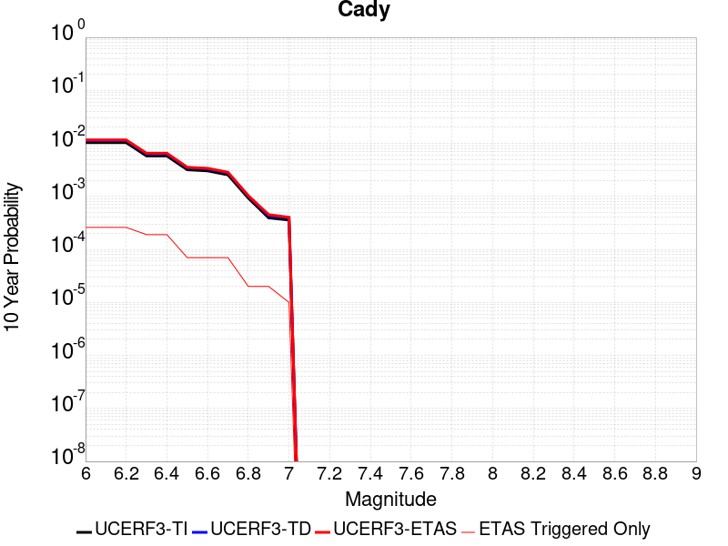 |

| Magnitude | 1 wk TI Prob | 1 wk TD Prob | 1 wk ETAS Prob | 1 wk ETAS/TD Gain | 1 wk ETAS Triggered Only | 1 mo TI Prob | 1 mo TD Prob | 1 mo ETAS Prob | 1 mo ETAS/TD Gain | 1 mo ETAS Triggered Only | 1 yr TI Prob | 1 yr TD Prob | 1 yr ETAS Prob | 1 yr ETAS/TD Gain | 1 yr ETAS Triggered Only | 10 yr TI Prob | 10 yr TD Prob | 10 yr ETAS Prob | 10 yr ETAS/TD Gain | 10 yr ETAS Triggered Only |
|-----|-----|-----|-----|-----|-----|-----|-----|-----|-----|-----|-----|-----|-----|-----|-----|-----|-----|-----|-----|-----|
| 6.0 | 1.9892565E-5 | 2.1858728E-5 | 7.251875E-5 | 3.3176105 | 5.066113E-5 | 8.525106E-5 | 9.3677416E-5 | 1.6121926E-4 | 1.7210045 | 6.754817E-5 | 0.0010374374 | 0.0011400167 | 0.0012918268 | 1.1331648 | 1.5198339E-4 | 0.010326075 | 0.011350701 | 0.0116011305 | 1.022063 | 2.5330562E-4 |
| 6.1 | 1.9892565E-5 | 2.1858728E-5 | 7.251875E-5 | 3.3176105 | 5.066113E-5 | 8.525106E-5 | 9.3677416E-5 | 1.6121926E-4 | 1.7210045 | 6.754817E-5 | 0.0010374374 | 0.0011400167 | 0.0012918268 | 1.1331648 | 1.5198339E-4 | 0.010326075 | 0.011350701 | 0.0116011305 | 1.022063 | 2.5330562E-4 |
| 6.2 | 1.9892565E-5 | 2.1858728E-5 | 7.251875E-5 | 3.3176105 | 5.066113E-5 | 8.525106E-5 | 9.3677416E-5 | 1.6121926E-4 | 1.7210045 | 6.754817E-5 | 0.0010374374 | 0.0011400167 | 0.0012918268 | 1.1331648 | 1.5198339E-4 | 0.010326075 | 0.011350701 | 0.0116011305 | 1.022063 | 2.5330562E-4 |
| 6.3 | 1.1117327E-5 | 1.2176583E-5 | 4.595026E-5 | 3.7736576 | 3.3774086E-5 | 4.764482E-5 | 5.2184492E-5 | 8.595682E-5 | 1.6471716 | 3.3774086E-5 | 5.7992124E-4 | 6.351925E-4 | 7.3645037E-4 | 1.159413 | 1.0132226E-4 | 0.0057841022 | 0.0063368753 | 0.0065550157 | 1.034424 | 2.1953155E-4 |
| 6.4 | 1.1117327E-5 | 1.2176583E-5 | 4.595026E-5 | 3.7736576 | 3.3774086E-5 | 4.764482E-5 | 5.2184492E-5 | 8.595682E-5 | 1.6471716 | 3.3774086E-5 | 5.7992124E-4 | 6.351925E-4 | 7.3645037E-4 | 1.159413 | 1.0132226E-4 | 0.0057841022 | 0.0063368753 | 0.0065550157 | 1.034424 | 2.1953155E-4 |
| 6.5 | 6.103093E-6 | 6.672021E-6 | 2.355895E-5 | 3.5310068 | 1.6887043E-5 | 2.615585E-5 | 2.8594131E-5 | 4.548069E-5 | 1.5905603 | 1.6887043E-5 | 3.1840094E-4 | 3.480905E-4 | 3.8185282E-4 | 1.096993 | 3.3774086E-5 | 0.0031794512 | 0.0034766865 | 0.003544 | 1.0193614 | 6.754817E-5 |
| 6.6 | 5.817237E-6 | 6.3656585E-6 | 2.3252594E-5 | 3.6528182 | 1.6887043E-5 | 2.4930776E-5 | 2.728118E-5 | 4.4167762E-5 | 1.6189829 | 1.6887043E-5 | 3.034899E-4 | 3.3211018E-4 | 3.6587304E-4 | 1.1016617 | 3.3774086E-5 | 0.0030307577 | 0.0033173605 | 0.0033846847 | 1.0202944 | 6.754817E-5 |
| 6.7 | 4.8846314E-6 | 5.3405684E-6 | 2.2227521E-5 | 4.162014 | 1.6887043E-5 | 2.0933967E-5 | 2.2888014E-5 | 3.977467E-5 | 1.7377946 | 1.6887043E-5 | 2.5484123E-4 | 2.7863772E-4 | 3.124024E-4 | 1.1211777 | 3.3774086E-5 | 0.0025454918 | 0.0027840391 | 0.0028513991 | 1.0241951 | 6.754817E-5 |
| 6.8 | 1.7788773E-6 | 1.9399079E-6 | 1.8826919E-5 | 9.705057 | 1.6887043E-5 | 7.6237375E-6 | 8.313874E-6 | 2.5200776E-5 | 3.0311713 | 1.6887043E-5 | 9.281505E-5 | 1.01218284E-4 | 1.1810362E-4 | 1.166821 | 1.6887043E-5 | 9.2776294E-4 | 0.0010118765 | 0.0010456163 | 1.0333439 | 3.3774086E-5 |
| 6.9 | 7.5455404E-7 | 8.297092E-7 | 1.7716739E-5 | 21.352947 | 1.6887043E-5 | 3.233799E-6 | 3.5558937E-6 | 2.0442876E-5 | 5.749012 | 1.6887043E-5 | 3.937079E-5 | 4.3292483E-5 | 6.0178794E-5 | 1.3900518 | 1.6887043E-5 | 3.9363815E-4 | 4.3287344E-4 | 4.666329E-4 | 1.0779892 | 3.3774086E-5 |
| 7.0 | 6.8578805E-7 | 7.541816E-7 | 1.7641212E-5 | 23.3912 | 1.6887043E-5 | 2.9390883E-6 | 3.2322048E-6 | 2.0119192E-5 | 6.2246037 | 1.6887043E-5 | 3.578281E-5 | 3.9351715E-5 | 5.6238092E-5 | 1.4291142 | 1.6887043E-5 | 3.577705E-4 | 3.9347992E-4 | 4.103603E-4 | 1.0429003 | 1.6887043E-5 |

## Elsinore (Glen Ivy) rev
*[(top)](#table-of-contents)*

| 1 Week | 1 Month | 1 Year | 10 Year |
|-----|-----|-----|-----|
|  |  |  | 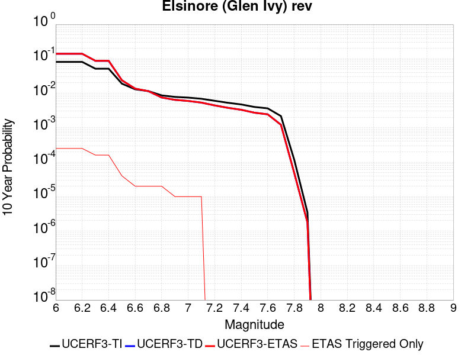 |

| Magnitude | 1 wk TI Prob | 1 wk TD Prob | 1 wk ETAS Prob | 1 wk ETAS/TD Gain | 1 wk ETAS Triggered Only | 1 mo TI Prob | 1 mo TD Prob | 1 mo ETAS Prob | 1 mo ETAS/TD Gain | 1 mo ETAS Triggered Only | 1 yr TI Prob | 1 yr TD Prob | 1 yr ETAS Prob | 1 yr ETAS/TD Gain | 1 yr ETAS Triggered Only | 10 yr TI Prob | 10 yr TD Prob | 10 yr ETAS Prob | 10 yr ETAS/TD Gain | 10 yr ETAS Triggered Only |
|-----|-----|-----|-----|-----|-----|-----|-----|-----|-----|-----|-----|-----|-----|-----|-----|-----|-----|-----|-----|-----|
| 6.0 | 1.6204086E-4 | 2.9360707E-4 | 3.9489957E-4 | 1.3449935 | 1.0132226E-4 | 6.94276E-4 | 0.0012578638 | 0.001409656 | 1.1206746 | 1.5198339E-4 | 0.008420097 | 0.015234485 | 0.015450672 | 1.0141907 | 2.1953155E-4 | 0.081081145 | 0.13969168 | 0.13992412 | 1.001664 | 2.701927E-4 |
| 6.1 | 1.6204086E-4 | 2.9360707E-4 | 3.9489957E-4 | 1.3449935 | 1.0132226E-4 | 6.94276E-4 | 0.0012578638 | 0.001409656 | 1.1206746 | 1.5198339E-4 | 0.008420097 | 0.015234485 | 0.015450672 | 1.0141907 | 2.1953155E-4 | 0.081081145 | 0.13969168 | 0.13992412 | 1.001664 | 2.701927E-4 |
| 6.2 | 1.6204086E-4 | 2.9360707E-4 | 3.9489957E-4 | 1.3449935 | 1.0132226E-4 | 6.94276E-4 | 0.0012578638 | 0.001409656 | 1.1206746 | 1.5198339E-4 | 0.008420097 | 0.015234485 | 0.015450672 | 1.0141907 | 2.1953155E-4 | 0.081081145 | 0.13969168 | 0.13992412 | 1.001664 | 2.701927E-4 |
| 6.3 | 1.0111737E-4 | 1.7703383E-4 | 2.2768597E-4 | 1.2861158 | 5.066113E-5 | 4.332882E-4 | 7.5861247E-4 | 8.598578E-4 | 1.1334612 | 1.0132226E-4 | 0.005262531 | 0.009217682 | 0.009384996 | 1.0181514 | 1.6887042E-4 | 0.0513964 | 0.0870191 | 0.087204106 | 1.0021261 | 2.0264451E-4 |
| 6.4 | 1.0111737E-4 | 1.7703383E-4 | 2.2768597E-4 | 1.2861158 | 5.066113E-5 | 4.332882E-4 | 7.5861247E-4 | 8.598578E-4 | 1.1334612 | 1.0132226E-4 | 0.005262531 | 0.009217682 | 0.009384996 | 1.0181514 | 1.6887042E-4 | 0.0513964 | 0.0870191 | 0.087204106 | 1.0021261 | 2.0264451E-4 |
| 6.5 | 3.6624708E-5 | 4.6391084E-5 | 6.3277344E-5 | 1.3639979 | 1.6887043E-5 | 1.569536E-4 | 1.9880582E-4 | 2.3257319E-4 | 1.1698511 | 3.3774086E-5 | 0.001909235 | 0.0024181372 | 0.0024686756 | 1.0208998 | 5.066113E-5 | 0.01892915 | 0.023739954 | 0.023789413 | 1.0020833 | 5.066113E-5 |
| 6.6 | 2.5051324E-5 | 2.614772E-5 | 4.303432E-5 | 1.6458154 | 1.6887043E-5 | 1.073584E-4 | 1.12057096E-4 | 1.2894225E-4 | 1.1506834 | 1.6887043E-5 | 0.0013063047 | 0.0013634858 | 0.0013972139 | 1.0247366 | 3.3774086E-5 | 0.012986525 | 0.013564618 | 0.0135979345 | 1.0024561 | 3.3774086E-5 |
| 6.7 | 2.2189772E-5 | 2.2072849E-5 | 3.895952E-5 | 1.7650427 | 1.6887043E-5 | 9.509556E-5 | 9.4594696E-5 | 1.1148014E-4 | 1.178503 | 1.6887043E-5 | 0.0011571734 | 0.0011511183 | 0.0011848536 | 1.0293064 | 3.3774086E-5 | 0.011511663 | 0.011465415 | 0.011498802 | 1.0029119 | 3.3774086E-5 |
| 6.8 | 1.6654378E-5 | 1.4437705E-5 | 3.1324504E-5 | 2.1696317 | 1.6887043E-5 | 7.137396E-5 | 6.187444E-5 | 7.876044E-5 | 1.2729075 | 1.6887043E-5 | 8.686314E-4 | 7.530661E-4 | 7.868147E-4 | 1.044815 | 3.3774086E-5 | 0.008652439 | 0.00751048 | 0.0075440006 | 1.0044632 | 3.3774086E-5 |
| 6.9 | 1.5042909E-5 | 1.2332022E-5 | 2.9218856E-5 | 2.3693483 | 1.6887043E-5 | 6.446802E-5 | 5.285047E-5 | 6.973662E-5 | 1.3195081 | 1.6887043E-5 | 7.8461546E-4 | 6.4326765E-4 | 6.6014385E-4 | 1.0262351 | 1.6887043E-5 | 0.007818509 | 0.00641828 | 0.0064350585 | 1.0026141 | 1.6887043E-5 |
| 7.0 | 1.4361385E-5 | 1.1451324E-5 | 2.8338174E-5 | 2.4746635 | 1.6887043E-5 | 6.154734E-5 | 4.9076196E-5 | 6.596241E-5 | 1.3440815 | 1.6887043E-5 | 7.490812E-4 | 5.973418E-4 | 6.1421876E-4 | 1.0282534 | 1.6887043E-5 | 0.007465612 | 0.0059613534 | 0.0059781396 | 1.0028158 | 1.6887043E-5 |
| 7.1 | 1.3265571E-5 | 1.0244926E-5 | 2.7131795E-5 | 2.6483154 | 1.6887043E-5 | 5.6851208E-5 | 4.39061E-5 | 6.07924E-5 | 1.3846003 | 1.6887043E-5 | 6.919436E-4 | 5.344282E-4 | 5.5130624E-4 | 1.0315814 | 1.6887043E-5 | 0.006897931 | 0.0053347866 | 0.0053515835 | 1.0031486 | 1.6887043E-5 |
| 7.2 | 1.1596403E-5 | 8.505067E-6 | 8.505067E-6 | 1.0 | 0.0 | 4.9697923E-5 | 3.6449786E-5 | 3.6449786E-5 | 1.0 | 0.0 | 6.049042E-4 | 4.436875E-4 | 4.436875E-4 | 1.0 | 0.0 | 0.006032603 | 0.0044294316 | 0.0044294316 | 1.0 | 0.0 |
| 7.3 | 1.0150827E-5 | 7.2387597E-6 | 7.2387597E-6 | 1.0 | 0.0 | 4.3502816E-5 | 3.1022897E-5 | 3.1022897E-5 | 1.0 | 0.0 | 5.2951806E-4 | 3.7763975E-4 | 3.7763975E-4 | 1.0 | 0.0 | 0.005282581 | 0.0037703665 | 0.0037703665 | 1.0 | 0.0 |
| 7.4 | 9.080705E-6 | 6.352519E-6 | 6.352519E-6 | 1.0 | 0.0 | 3.8916725E-5 | 2.7224805E-5 | 2.7224805E-5 | 1.0 | 0.0 | 4.7370812E-4 | 3.3141294E-4 | 3.3141294E-4 | 1.0 | 0.0 | 0.004726996 | 0.0033093381 | 0.0033093381 | 1.0 | 0.0 |
| 7.5 | 7.671649E-6 | 5.2256332E-6 | 5.2256332E-6 | 1.0 | 0.0 | 3.287808E-5 | 2.2395385E-5 | 2.2395385E-5 | 1.0 | 0.0 | 4.0021708E-4 | 2.7263095E-4 | 2.7263095E-4 | 1.0 | 0.0 | 0.0039949706 | 0.00272309 | 0.00272309 | 1.0 | 0.0 |
| 7.6 | 6.990086E-6 | 4.687545E-6 | 4.687545E-6 | 1.0 | 0.0 | 2.9957167E-5 | 2.008933E-5 | 2.008933E-5 | 1.0 | 0.0 | 3.6466747E-4 | 2.445613E-4 | 2.445613E-4 | 1.0 | 0.0 | 0.0036406964 | 0.002443038 | 0.002443038 | 1.0 | 0.0 |
| 7.7 | 4.163505E-6 | 2.3295343E-6 | 2.3295343E-6 | 1.0 | 0.0 | 1.7843471E-5 | 9.983683E-6 | 9.983683E-6 | 1.0 | 0.0 | 2.172226E-4 | 1.21545316E-4 | 1.21545316E-4 | 1.0 | 0.0 | 0.0021701038 | 0.0012148614 | 0.0012148614 | 1.0 | 0.0 |
| 7.8 | 2.2692414E-7 | 9.3854695E-8 | 9.3854695E-8 | 1.0 | 0.0 | 9.725317E-7 | 4.0223435E-7 | 4.0223435E-7 | 1.0 | 0.0 | 1.1840509E-5 | 4.8971956E-6 | 4.8971956E-6 | 1.0 | 0.0 | 1.1839878E-4 | 4.8971204E-5 | 4.8971204E-5 | 1.0 | 0.0 |
| 7.9 | 6.676829E-9 | 3.439853E-9 | 3.439853E-9 | 1.0 | 0.0 | 2.861498E-8 | 1.4742227E-8 | 1.4742227E-8 | 1.0 | 0.0 | 3.4838732E-7 | 1.7948659E-7 | 1.7948659E-7 | 1.0 | 0.0 | 3.4838679E-6 | 1.7948646E-6 | 1.7948646E-6 | 1.0 | 0.0 |

## Baker
*[(top)](#table-of-contents)*

| 1 Week | 1 Month | 1 Year | 10 Year |
|-----|-----|-----|-----|
|  | 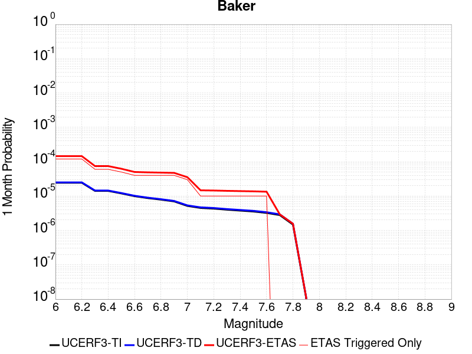 | 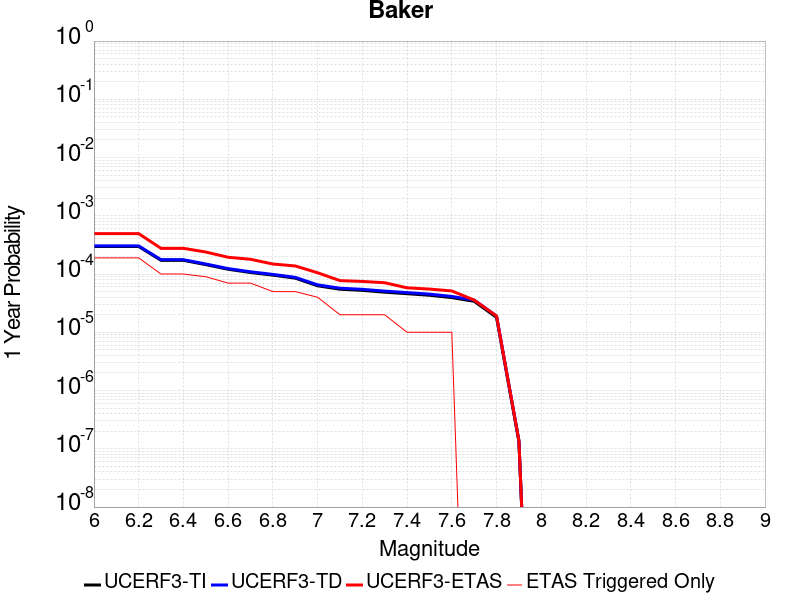 |  |

| Magnitude | 1 wk TI Prob | 1 wk TD Prob | 1 wk ETAS Prob | 1 wk ETAS/TD Gain | 1 wk ETAS Triggered Only | 1 mo TI Prob | 1 mo TD Prob | 1 mo ETAS Prob | 1 mo ETAS/TD Gain | 1 mo ETAS Triggered Only | 1 yr TI Prob | 1 yr TD Prob | 1 yr ETAS Prob | 1 yr ETAS/TD Gain | 1 yr ETAS Triggered Only | 10 yr TI Prob | 10 yr TD Prob | 10 yr ETAS Prob | 10 yr ETAS/TD Gain | 10 yr ETAS Triggered Only |
|-----|-----|-----|-----|-----|-----|-----|-----|-----|-----|-----|-----|-----|-----|-----|-----|-----|-----|-----|-----|-----|
| 6.0 | 5.695525E-6 | 5.8348373E-6 | 1.071565E-4 | 18.364952 | 1.0132226E-4 | 2.4409164E-5 | 2.5006228E-5 | 1.769858E-4 | 7.077669 | 1.5198339E-4 | 2.9714106E-4 | 3.044123E-4 | 5.2387704E-4 | 1.7209457 | 2.1953155E-4 | 0.0029674405 | 0.0030403486 | 0.0033265557 | 1.0941362 | 2.8707972E-4 |
| 6.1 | 5.695525E-6 | 5.8348373E-6 | 1.071565E-4 | 18.364952 | 1.0132226E-4 | 2.4409164E-5 | 2.5006228E-5 | 1.769858E-4 | 7.077669 | 1.5198339E-4 | 2.9714106E-4 | 3.044123E-4 | 5.2387704E-4 | 1.7209457 | 2.1953155E-4 | 0.0029674405 | 0.0030403486 | 0.0033265557 | 1.0941362 | 2.8707972E-4 |
| 6.2 | 5.695525E-6 | 5.8348373E-6 | 1.071565E-4 | 18.364952 | 1.0132226E-4 | 2.4409164E-5 | 2.5006228E-5 | 1.769858E-4 | 7.077669 | 1.5198339E-4 | 2.9714106E-4 | 3.044123E-4 | 5.2387704E-4 | 1.7209457 | 2.1953155E-4 | 0.0029674405 | 0.0030403486 | 0.0033265557 | 1.0941362 | 2.8707972E-4 |
| 6.3 | 3.2995713E-6 | 3.383667E-6 | 5.4044624E-5 | 15.972204 | 5.066113E-5 | 1.4140943E-5 | 1.4501353E-5 | 9.893534E-5 | 6.8224907 | 8.443521E-5 | 1.7215237E-4 | 1.7654014E-4 | 2.9472855E-4 | 1.6694705 | 1.182093E-4 | 0.0017201907 | 0.001764046 | 0.0019326186 | 1.0955602 | 1.6887042E-4 |
| 6.4 | 3.2995713E-6 | 3.383667E-6 | 5.4044624E-5 | 15.972204 | 5.066113E-5 | 1.4140943E-5 | 1.4501353E-5 | 9.893534E-5 | 6.8224907 | 8.443521E-5 | 1.7215237E-4 | 1.7654014E-4 | 2.9472855E-4 | 1.6694705 | 1.182093E-4 | 0.0017201907 | 0.001764046 | 0.0019326186 | 1.0955602 | 1.6887042E-4 |
| 6.5 | 2.782202E-6 | 2.8558404E-6 | 5.3516822E-5 | 18.739431 | 5.066113E-5 | 1.1923668E-5 | 1.223926E-5 | 7.97866E-5 | 6.518907 | 6.754817E-5 | 1.4516099E-4 | 1.4900314E-4 | 2.503103E-4 | 1.6798995 | 1.0132226E-4 | 0.001450662 | 0.0014890651 | 0.0016408222 | 1.1019143 | 1.5198339E-4 |
| 6.6 | 2.3163404E-6 | 2.38092E-6 | 3.6154925E-5 | 15.185275 | 3.3774086E-5 | 9.927136E-6 | 1.0203904E-5 | 6.0864513E-5 | 5.964826 | 5.066113E-5 | 1.20856166E-4 | 1.2422565E-4 | 1.9176543E-4 | 1.5436863 | 6.754817E-5 | 0.0012079047 | 0.0012415823 | 0.0013596448 | 1.0950904 | 1.182093E-4 |
| 6.7 | 2.037056E-6 | 2.0965003E-6 | 3.5870515E-5 | 17.10971 | 3.3774086E-5 | 8.7302105E-6 | 8.984972E-6 | 5.9645645E-5 | 6.6383786 | 5.066113E-5 | 1.0628513E-4 | 1.093867E-4 | 1.7692748E-4 | 1.6174496 | 6.754817E-5 | 0.0010623431 | 0.0010933448 | 0.0011945562 | 1.0925705 | 1.0132226E-4 |
| 6.8 | 1.8356744E-6 | 1.8915287E-6 | 3.566555E-5 | 18.855412 | 3.3774086E-5 | 7.867153E-6 | 8.106527E-6 | 5.8767244E-5 | 7.249374 | 5.066113E-5 | 9.577837E-5 | 9.869264E-5 | 1.4934877E-4 | 1.5132716 | 5.066113E-5 | 9.57371E-4 | 9.86502E-4 | 0.0010708539 | 1.0855061 | 8.443521E-5 |
| 6.9 | 1.6310546E-6 | 1.6832072E-6 | 3.5457237E-5 | 21.065283 | 3.3774086E-5 | 6.9902153E-6 | 7.213726E-6 | 5.7874488E-5 | 8.022829 | 5.066113E-5 | 8.510255E-5 | 8.782368E-5 | 1.3848036E-4 | 1.5767998 | 5.066113E-5 | 8.5069967E-4 | 8.7790104E-4 | 9.6226216E-4 | 1.0960941 | 8.443521E-5 |
| 7.0 | 1.2058036E-6 | 1.2508665E-6 | 1.8137887E-5 | 14.500258 | 1.6887043E-5 | 5.1677193E-6 | 5.3608455E-6 | 3.913475E-5 | 7.3001075 | 3.3774086E-5 | 6.291517E-5 | 6.5266366E-5 | 9.903825E-5 | 1.517447 | 3.3774086E-5 | 6.289736E-4 | 6.524743E-4 | 6.8622635E-4 | 1.0517293 | 3.3774086E-5 |
| 7.1 | 1.052382E-6 | 1.0951609E-6 | 1.0951609E-6 | 1.0 | 0.0 | 4.5102006E-6 | 4.693538E-6 | 4.693538E-6 | 1.0 | 0.0 | 5.491031E-5 | 5.7142337E-5 | 5.7142337E-5 | 1.0 | 0.0 | 5.4896745E-4 | 5.7127734E-4 | 5.7127734E-4 | 1.0 | 0.0 |
| 7.2 | 1.0067454E-6 | 1.0487711E-6 | 1.0487711E-6 | 1.0 | 0.0 | 4.3146156E-6 | 4.4947255E-6 | 4.4947255E-6 | 1.0 | 0.0 | 5.252918E-5 | 5.4721917E-5 | 5.4721917E-5 | 1.0 | 0.0 | 5.251676E-4 | 5.470853E-4 | 5.470853E-4 | 1.0 | 0.0 |
| 7.3 | 9.3596316E-7 | 9.767723E-7 | 9.767723E-7 | 1.0 | 0.0 | 4.0112645E-6 | 4.1861604E-6 | 4.1861604E-6 | 1.0 | 0.0 | 4.8836053E-5 | 5.096532E-5 | 5.096532E-5 | 1.0 | 0.0 | 4.8825322E-4 | 5.095371E-4 | 5.095371E-4 | 1.0 | 0.0 |
| 7.4 | 8.8117395E-7 | 9.2076635E-7 | 9.2076635E-7 | 1.0 | 0.0 | 3.7764542E-6 | 3.9461356E-6 | 3.9461356E-6 | 1.0 | 0.0 | 4.5977362E-5 | 4.8043148E-5 | 4.8043148E-5 | 1.0 | 0.0 | 4.596785E-4 | 4.8032837E-4 | 4.8032837E-4 | 1.0 | 0.0 |
| 7.5 | 8.292386E-7 | 8.6745956E-7 | 8.6745956E-7 | 1.0 | 0.0 | 3.5538749E-6 | 3.7176785E-6 | 3.7176785E-6 | 1.0 | 0.0 | 4.326757E-5 | 4.5261804E-5 | 4.5261804E-5 | 1.0 | 0.0 | 4.3259145E-4 | 4.5252658E-4 | 4.5252658E-4 | 1.0 | 0.0 |
| 7.6 | 7.553842E-7 | 7.9144706E-7 | 7.9144706E-7 | 1.0 | 0.0 | 3.2373566E-6 | 3.3919116E-6 | 3.3919116E-6 | 1.0 | 0.0 | 3.9414106E-5 | 4.129575E-5 | 4.129575E-5 | 1.0 | 0.0 | 3.9407116E-4 | 4.1288146E-4 | 4.1288146E-4 | 1.0 | 0.0 |
| 7.7 | 6.5285366E-7 | 6.852797E-7 | 6.852797E-7 | 1.0 | 0.0 | 2.797941E-6 | 2.9369096E-6 | 2.9369096E-6 | 1.0 | 0.0 | 3.40644E-5 | 3.5756293E-5 | 3.5756293E-5 | 1.0 | 0.0 | 3.405918E-4 | 3.5750607E-4 | 3.5750607E-4 | 1.0 | 0.0 |
| 7.8 | 3.4586725E-7 | 3.6482615E-7 | 3.6482615E-7 | 1.0 | 0.0 | 1.4822873E-6 | 1.5635396E-6 | 1.5635396E-6 | 1.0 | 0.0 | 1.80467E-5 | 1.9035933E-5 | 1.9035933E-5 | 1.0 | 0.0 | 1.8045233E-4 | 1.9034347E-4 | 1.9034347E-4 | 1.0 | 0.0 |
| 7.9 | 2.5591178E-9 | 2.6696718E-9 | 2.6696718E-9 | 1.0 | 0.0 | 1.0967647E-8 | 1.14414505E-8 | 1.14414505E-8 | 1.0 | 0.0 | 1.335311E-7 | 1.3929966E-7 | 1.3929966E-7 | 1.0 | 0.0 | 1.3353102E-6 | 1.3929966E-6 | 1.3929966E-6 | 1.0 | 0.0 |

## Ludlow
*[(top)](#table-of-contents)*

| 1 Week | 1 Month | 1 Year | 10 Year |
|-----|-----|-----|-----|
|  | 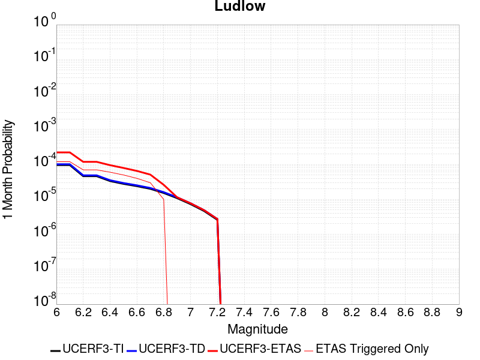 |  |  |

| Magnitude | 1 wk TI Prob | 1 wk TD Prob | 1 wk ETAS Prob | 1 wk ETAS/TD Gain | 1 wk ETAS Triggered Only | 1 mo TI Prob | 1 mo TD Prob | 1 mo ETAS Prob | 1 mo ETAS/TD Gain | 1 mo ETAS Triggered Only | 1 yr TI Prob | 1 yr TD Prob | 1 yr ETAS Prob | 1 yr ETAS/TD Gain | 1 yr ETAS Triggered Only | 10 yr TI Prob | 10 yr TD Prob | 10 yr ETAS Prob | 10 yr ETAS/TD Gain | 10 yr ETAS Triggered Only |
|-----|-----|-----|-----|-----|-----|-----|-----|-----|-----|-----|-----|-----|-----|-----|-----|-----|-----|-----|-----|-----|
| 6.0 | 2.2407607E-5 | 2.3657254E-5 | 1.4186375E-4 | 5.9966283 | 1.182093E-4 | 9.602906E-5 | 1.0138454E-4 | 2.7023786E-4 | 2.665474 | 1.6887042E-4 | 0.0011685267 | 0.001233702 | 0.0014698289 | 1.1913971 | 2.364186E-4 | 0.011624013 | 0.012273042 | 0.012539919 | 1.021745 | 2.701927E-4 |
| 6.1 | 2.2407607E-5 | 2.3657254E-5 | 1.4186375E-4 | 5.9966283 | 1.182093E-4 | 9.602906E-5 | 1.0138454E-4 | 2.7023786E-4 | 2.665474 | 1.6887042E-4 | 0.0011685267 | 0.001233702 | 0.0014698289 | 1.1913971 | 2.364186E-4 | 0.011624013 | 0.012273042 | 0.012539919 | 1.021745 | 2.701927E-4 |
| 6.2 | 1.0781252E-5 | 1.1365663E-5 | 9.5799915E-5 | 8.428889 | 8.443521E-5 | 4.620455E-5 | 4.8709102E-5 | 1.331402E-4 | 2.7333744 | 8.443521E-5 | 5.623952E-4 | 5.9287593E-4 | 7.278922E-4 | 1.227731 | 1.3509634E-4 | 0.00560974 | 0.0059133614 | 0.0060476586 | 1.0227108 | 1.3509634E-4 |
| 6.3 | 1.0781252E-5 | 1.1365663E-5 | 9.5799915E-5 | 8.428889 | 8.443521E-5 | 4.620455E-5 | 4.8709102E-5 | 1.331402E-4 | 2.7333744 | 8.443521E-5 | 5.623952E-4 | 5.9287593E-4 | 7.278922E-4 | 1.227731 | 1.3509634E-4 | 0.00560974 | 0.0059133614 | 0.0060476586 | 1.0227108 | 1.3509634E-4 |
| 6.4 | 7.814439E-6 | 8.237729E-6 | 7.578534E-5 | 9.199786 | 6.754817E-5 | 3.3490025E-5 | 3.530408E-5 | 1.0284987E-4 | 2.9132571 | 6.754817E-5 | 4.0766477E-4 | 4.2974384E-4 | 5.479023E-4 | 1.274951 | 1.182093E-4 | 0.0040691774 | 0.0042892746 | 0.004406977 | 1.027441 | 1.182093E-4 |
| 6.5 | 6.4986366E-6 | 6.85092E-6 | 5.75117E-5 | 8.394742 | 5.066113E-5 | 2.7851002E-5 | 2.9360759E-5 | 8.00204E-5 | 2.72542 | 5.066113E-5 | 3.390332E-4 | 3.5740953E-4 | 4.5869558E-4 | 1.2833893 | 1.0132226E-4 | 0.003385164 | 0.0035684432 | 0.003669404 | 1.0282927 | 1.0132226E-4 |
| 6.6 | 5.582177E-6 | 5.8860055E-6 | 3.965989E-5 | 6.7379975 | 3.3774086E-5 | 2.3923398E-5 | 2.5225498E-5 | 5.8998732E-5 | 2.338853 | 3.3774086E-5 | 2.9122844E-4 | 3.0707786E-4 | 3.746053E-4 | 1.2199032 | 6.754817E-5 | 0.0029084706 | 0.003066609 | 0.0031339498 | 1.0219594 | 6.754817E-5 |
| 6.7 | 4.6858763E-6 | 4.940427E-6 | 3.8714345E-5 | 7.836234 | 3.3774086E-5 | 2.0082172E-5 | 2.1173091E-5 | 5.494646E-5 | 2.5951083 | 3.3774086E-5 | 2.4447302E-4 | 2.5775246E-4 | 3.252832E-4 | 1.2619985 | 6.754817E-5 | 0.0024420423 | 0.0025745912 | 0.0026419656 | 1.026169 | 6.754817E-5 |
| 6.8 | 3.5584908E-6 | 3.7520183E-6 | 3.7520183E-6 | 1.0 | 0.0 | 1.5250586E-5 | 1.6079981E-5 | 1.6079981E-5 | 1.0 | 0.0 | 1.8566006E-4 | 1.957566E-4 | 2.1264034E-4 | 1.0862486 | 1.6887043E-5 | 0.0018550502 | 0.0019558826 | 0.0019727368 | 1.008617 | 1.6887043E-5 |
| 6.9 | 2.532834E-6 | 2.6710034E-6 | 2.6710034E-6 | 1.0 | 0.0 | 1.0854958E-5 | 1.1447109E-5 | 1.1447109E-5 | 1.0 | 0.0 | 1.3215111E-4 | 1.3935992E-4 | 1.3935992E-4 | 1.0 | 0.0 | 0.0013207254 | 0.0013927529 | 0.0013927529 | 1.0 | 0.0 |
| 7.0 | 1.7083285E-6 | 1.8019439E-6 | 1.8019439E-6 | 1.0 | 0.0 | 7.3213873E-6 | 7.722595E-6 | 7.722595E-6 | 1.0 | 0.0 | 8.913424E-5 | 9.40187E-5 | 9.40187E-5 | 1.0 | 0.0 | 8.9098496E-4 | 9.3980576E-4 | 9.3980576E-4 | 1.0 | 0.0 |
| 7.1 | 1.0905424E-6 | 1.1497619E-6 | 1.1497619E-6 | 1.0 | 0.0 | 4.6737446E-6 | 4.9275427E-6 | 4.9275427E-6 | 1.0 | 0.0 | 5.6901354E-5 | 5.999128E-5 | 5.999128E-5 | 1.0 | 0.0 | 5.6886784E-4 | 5.997606E-4 | 5.997606E-4 | 1.0 | 0.0 |
| 7.2 | 6.06668E-7 | 6.387277E-7 | 6.387277E-7 | 1.0 | 0.0 | 2.600003E-6 | 2.7374022E-6 | 2.7374022E-6 | 1.0 | 0.0 | 3.1654577E-5 | 3.3327433E-5 | 3.3327433E-5 | 1.0 | 0.0 | 3.1650066E-4 | 3.3323118E-4 | 3.3323118E-4 | 1.0 | 0.0 |

## Kern Canyon (South Kern) 2011
*[(top)](#table-of-contents)*

| 1 Week | 1 Month | 1 Year | 10 Year |
|-----|-----|-----|-----|
|  |  |  |  |

| Magnitude | 1 wk TI Prob | 1 wk TD Prob | 1 wk ETAS Prob | 1 wk ETAS/TD Gain | 1 wk ETAS Triggered Only | 1 mo TI Prob | 1 mo TD Prob | 1 mo ETAS Prob | 1 mo ETAS/TD Gain | 1 mo ETAS Triggered Only | 1 yr TI Prob | 1 yr TD Prob | 1 yr ETAS Prob | 1 yr ETAS/TD Gain | 1 yr ETAS Triggered Only | 10 yr TI Prob | 10 yr TD Prob | 10 yr ETAS Prob | 10 yr ETAS/TD Gain | 10 yr ETAS Triggered Only |
|-----|-----|-----|-----|-----|-----|-----|-----|-----|-----|-----|-----|-----|-----|-----|-----|-----|-----|-----|-----|-----|
| 6.0 | 4.105075E-6 | 4.1137264E-6 | 8.854859E-5 | 21.525154 | 8.443521E-5 | 1.7593058E-5 | 1.763014E-5 | 1.3583736E-4 | 7.704837 | 1.182093E-4 | 2.1417443E-4 | 2.1462646E-4 | 3.8346063E-4 | 1.786642 | 1.6887042E-4 | 0.0021396813 | 0.0021442557 | 0.002413869 | 1.1257374 | 2.701927E-4 |
| 6.1 | 4.105075E-6 | 4.1137264E-6 | 8.854859E-5 | 21.525154 | 8.443521E-5 | 1.7593058E-5 | 1.763014E-5 | 1.3583736E-4 | 7.704837 | 1.182093E-4 | 2.1417443E-4 | 2.1462646E-4 | 3.8346063E-4 | 1.786642 | 1.6887042E-4 | 0.0021396813 | 0.0021442557 | 0.002413869 | 1.1257374 | 2.701927E-4 |
| 6.2 | 4.105075E-6 | 4.1137264E-6 | 8.854859E-5 | 21.525154 | 8.443521E-5 | 1.7593058E-5 | 1.763014E-5 | 1.3583736E-4 | 7.704837 | 1.182093E-4 | 2.1417443E-4 | 2.1462646E-4 | 3.8346063E-4 | 1.786642 | 1.6887042E-4 | 0.0021396813 | 0.0021442557 | 0.002413869 | 1.1257374 | 2.701927E-4 |
| 6.3 | 4.105075E-6 | 4.1137264E-6 | 8.854859E-5 | 21.525154 | 8.443521E-5 | 1.7593058E-5 | 1.763014E-5 | 1.3583736E-4 | 7.704837 | 1.182093E-4 | 2.1417443E-4 | 2.1462646E-4 | 3.8346063E-4 | 1.786642 | 1.6887042E-4 | 0.0021396813 | 0.0021442557 | 0.002413869 | 1.1257374 | 2.701927E-4 |
| 6.4 | 4.105075E-6 | 4.1137264E-6 | 8.854859E-5 | 21.525154 | 8.443521E-5 | 1.7593058E-5 | 1.763014E-5 | 1.3583736E-4 | 7.704837 | 1.182093E-4 | 2.1417443E-4 | 2.1462646E-4 | 3.8346063E-4 | 1.786642 | 1.6887042E-4 | 0.0021396813 | 0.0021442557 | 0.002413869 | 1.1257374 | 2.701927E-4 |
| 6.5 | 2.9849807E-6 | 2.9731548E-6 | 8.7408116E-5 | 29.399115 | 8.443521E-5 | 1.2792712E-5 | 1.274203E-5 | 1.3094982E-4 | 10.2769985 | 1.182093E-4 | 1.5574014E-4 | 1.5512333E-4 | 3.0708313E-4 | 1.9796064 | 1.5198339E-4 | 0.0015563103 | 0.0015501656 | 0.001752496 | 1.1305218 | 2.0264451E-4 |
| 6.6 | 2.9849807E-6 | 2.9731548E-6 | 8.7408116E-5 | 29.399115 | 8.443521E-5 | 1.2792712E-5 | 1.274203E-5 | 1.3094982E-4 | 10.2769985 | 1.182093E-4 | 1.5574014E-4 | 1.5512333E-4 | 3.0708313E-4 | 1.9796064 | 1.5198339E-4 | 0.0015563103 | 0.0015501656 | 0.001752496 | 1.1305218 | 2.0264451E-4 |
| 6.7 | 2.6756725E-6 | 2.6582206E-6 | 8.709321E-5 | 32.76372 | 8.443521E-5 | 1.1467117E-5 | 1.1392325E-5 | 1.2960027E-4 | 11.376103 | 1.182093E-4 | 1.396032E-4 | 1.3869285E-4 | 2.9065515E-4 | 2.0956752 | 1.5198339E-4 | 0.0013951553 | 0.0013860738 | 0.0015884374 | 1.1459978 | 2.0264451E-4 |
| 6.8 | 2.3283721E-6 | 2.3047787E-6 | 6.9852795E-5 | 30.307808 | 6.754817E-5 | 9.9787E-6 | 9.877586E-6 | 9.431197E-5 | 9.548078 | 8.443521E-5 | 1.214839E-4 | 1.20253055E-4 | 2.3844813E-4 | 1.9828863 | 1.182093E-4 | 0.001214175 | 0.0012018873 | 0.0013705548 | 1.1403356 | 1.6887042E-4 |
| 6.9 | 2.0972677E-6 | 2.0696411E-6 | 6.961767E-5 | 33.637558 | 6.754817E-5 | 8.988259E-6 | 8.869861E-6 | 9.330433E-5 | 10.519255 | 8.443521E-5 | 1.0942656E-4 | 1.0798526E-4 | 2.0929657E-4 | 1.9381958 | 1.0132226E-4 | 0.0010937268 | 0.0010793337 | 0.0012142842 | 1.1250314 | 1.3509634E-4 |
| 7.0 | 1.7132242E-6 | 1.6787036E-6 | 3.5452733E-5 | 21.119114 | 3.3774086E-5 | 7.3423685E-6 | 7.194424E-6 | 4.0968265E-5 | 5.694447 | 3.3774086E-5 | 8.938967E-5 | 8.758863E-5 | 1.3824532E-4 | 1.5783478 | 5.066113E-5 | 8.935372E-4 | 8.7554497E-4 | 9.4303396E-4 | 1.0770823 | 6.754817E-5 |
| 7.1 | 1.4215541E-6 | 1.3815752E-6 | 1.8268594E-5 | 13.223019 | 1.6887043E-5 | 6.0923603E-6 | 5.9210233E-6 | 2.2807966E-5 | 3.852031 | 1.6887043E-5 | 7.417196E-5 | 7.20861E-5 | 1.05857755E-4 | 1.4684905 | 3.3774086E-5 | 7.414721E-4 | 7.206299E-4 | 7.712545E-4 | 1.0702505 | 5.066113E-5 |
| 7.2 | 9.097853E-7 | 8.6037755E-7 | 1.7747405E-5 | 20.627462 | 1.6887043E-5 | 3.899074E-6 | 3.6873273E-6 | 2.0574307E-5 | 5.579735 | 1.6887043E-5 | 4.7470192E-5 | 4.4892295E-5 | 7.866487E-5 | 1.7523022 | 3.3774086E-5 | 4.7460053E-4 | 4.4883334E-4 | 4.8259227E-4 | 1.0752149 | 3.3774086E-5 |
| 7.3 | 6.144169E-7 | 5.628206E-7 | 1.7449855E-5 | 31.00429 | 1.6887043E-5 | 2.6332125E-6 | 2.4120861E-6 | 1.9299088E-5 | 8.000995 | 1.6887043E-5 | 3.205889E-5 | 2.9366758E-5 | 6.313985E-5 | 2.150045 | 3.3774086E-5 | 3.2054266E-4 | 2.936293E-4 | 3.2739347E-4 | 1.114989 | 3.3774086E-5 |
| 7.4 | 4.049844E-7 | 3.5728314E-7 | 3.5728314E-7 | 1.0 | 0.0 | 1.7356463E-6 | 1.5312125E-6 | 1.5312125E-6 | 1.0 | 0.0 | 2.1131287E-5 | 1.8642357E-5 | 3.5529083E-5 | 1.9058259 | 1.6887043E-5 | 2.1129279E-4 | 1.8640817E-4 | 2.0329206E-4 | 1.0905749 | 1.6887043E-5 |
| 7.5 | 1.9871162E-7 | 1.583044E-7 | 1.583044E-7 | 1.0 | 0.0 | 8.5162094E-7 | 6.7844724E-7 | 6.7844724E-7 | 1.0 | 0.0 | 1.0368436E-5 | 8.260065E-6 | 8.260065E-6 | 1.0 | 0.0 | 1.0367952E-4 | 8.259767E-5 | 8.259767E-5 | 1.0 | 0.0 |
| 7.6 | 2.572245E-8 | 1.7352555E-8 | 1.7352555E-8 | 1.0 | 0.0 | 1.10239064E-7 | 7.436809E-8 | 7.436809E-8 | 1.0 | 0.0 | 1.3421597E-6 | 9.054312E-7 | 9.054312E-7 | 1.0 | 0.0 | 1.3421517E-5 | 9.05428E-6 | 9.05428E-6 | 1.0 | 0.0 |

## Death Valley (No)
*[(top)](#table-of-contents)*

| 1 Week | 1 Month | 1 Year | 10 Year |
|-----|-----|-----|-----|
|  |  |  |  |

| Magnitude | 1 wk TI Prob | 1 wk TD Prob | 1 wk ETAS Prob | 1 wk ETAS/TD Gain | 1 wk ETAS Triggered Only | 1 mo TI Prob | 1 mo TD Prob | 1 mo ETAS Prob | 1 mo ETAS/TD Gain | 1 mo ETAS Triggered Only | 1 yr TI Prob | 1 yr TD Prob | 1 yr ETAS Prob | 1 yr ETAS/TD Gain | 1 yr ETAS Triggered Only | 10 yr TI Prob | 10 yr TD Prob | 10 yr ETAS Prob | 10 yr ETAS/TD Gain | 10 yr ETAS Triggered Only |
|-----|-----|-----|-----|-----|-----|-----|-----|-----|-----|-----|-----|-----|-----|-----|-----|-----|-----|-----|-----|-----|
| 6.0 | 2.0074807E-5 | 2.2500084E-5 | 1.4070672E-4 | 6.2536087 | 1.182093E-4 | 8.603206E-5 | 9.642541E-5 | 2.3150872E-4 | 2.40091 | 1.3509634E-4 | 0.001046937 | 0.0011733545 | 0.0013251596 | 1.129377 | 1.5198339E-4 | 0.010420183 | 0.011672506 | 0.011939545 | 1.0228776 | 2.701927E-4 |
| 6.1 | 2.0074807E-5 | 2.2500084E-5 | 1.4070672E-4 | 6.2536087 | 1.182093E-4 | 8.603206E-5 | 9.642541E-5 | 2.3150872E-4 | 2.40091 | 1.3509634E-4 | 0.001046937 | 0.0011733545 | 0.0013251596 | 1.129377 | 1.5198339E-4 | 0.010420183 | 0.011672506 | 0.011939545 | 1.0228776 | 2.701927E-4 |
| 6.2 | 2.0074807E-5 | 2.2500084E-5 | 1.4070672E-4 | 6.2536087 | 1.182093E-4 | 8.603206E-5 | 9.642541E-5 | 2.3150872E-4 | 2.40091 | 1.3509634E-4 | 0.001046937 | 0.0011733545 | 0.0013251596 | 1.129377 | 1.5198339E-4 | 0.010420183 | 0.011672506 | 0.011939545 | 1.0228776 | 2.701927E-4 |
| 6.3 | 1.9050609E-5 | 2.1336948E-5 | 1.2265705E-4 | 5.7485747 | 1.0132226E-4 | 8.164292E-5 | 9.1440896E-5 | 2.0963939E-4 | 2.2926219 | 1.182093E-4 | 9.935491E-4 | 0.001112731 | 0.001247677 | 1.1212746 | 1.3509634E-4 | 0.009891188 | 0.011072419 | 0.011322919 | 1.0226239 | 2.5330562E-4 |
| 6.4 | 1.9050609E-5 | 2.1336948E-5 | 1.2265705E-4 | 5.7485747 | 1.0132226E-4 | 8.164292E-5 | 9.1440896E-5 | 2.0963939E-4 | 2.2926219 | 1.182093E-4 | 9.935491E-4 | 0.001112731 | 0.001247677 | 1.1212746 | 1.3509634E-4 | 0.009891188 | 0.011072419 | 0.011322919 | 1.0226239 | 2.5330562E-4 |
| 6.5 | 1.8367004E-5 | 2.0561009E-5 | 1.2188118E-4 | 5.927782 | 1.0132226E-4 | 7.8713354E-5 | 8.811567E-5 | 2.0631455E-4 | 2.3414059 | 1.182093E-4 | 9.5791375E-4 | 0.0010722869 | 0.0012072383 | 1.1258539 | 1.3509634E-4 | 0.009537951 | 0.0106719155 | 0.010922518 | 1.0234824 | 2.5330562E-4 |
| 6.6 | 1.779439E-5 | 1.9910927E-5 | 1.2123117E-4 | 6.088675 | 1.0132226E-4 | 7.625944E-5 | 8.53298E-5 | 2.0352901E-4 | 2.3852046 | 1.182093E-4 | 9.280632E-4 | 0.0010384015 | 0.0011733576 | 1.1299652 | 1.3509634E-4 | 0.009241969 | 0.010336253 | 0.01058694 | 1.0242532 | 2.5330562E-4 |
| 6.7 | 1.7025437E-5 | 1.9043426E-5 | 1.2036375E-4 | 6.3204885 | 1.0132226E-4 | 7.296412E-5 | 8.161216E-5 | 1.9981181E-4 | 2.4483092 | 1.182093E-4 | 8.87976E-4 | 9.931813E-4 | 0.0011281435 | 1.1358887 | 1.3509634E-4 | 0.008844362 | 0.009888145 | 0.010138947 | 1.0253638 | 2.5330562E-4 |
| 6.8 | 1.6545107E-5 | 1.8512545E-5 | 1.1983293E-4 | 6.473066 | 1.0132226E-4 | 7.090568E-5 | 7.93371E-5 | 1.9753703E-4 | 2.489844 | 1.182093E-4 | 8.629347E-4 | 9.655073E-4 | 0.0011004732 | 1.1397876 | 1.3509634E-4 | 0.008595915 | 0.009613829 | 0.009864699 | 1.0260948 | 2.5330562E-4 |
| 6.9 | 1.615478E-5 | 1.8087594E-5 | 1.1940802E-4 | 6.601653 | 1.0132226E-4 | 6.9232934E-5 | 7.751599E-5 | 1.9571613E-4 | 2.5248485 | 1.182093E-4 | 8.4258494E-4 | 9.433546E-4 | 0.0010783236 | 1.1430733 | 1.3509634E-4 | 0.008393973 | 0.009394196 | 0.009645121 | 1.0267107 | 2.5330562E-4 |
| 7.0 | 1.5894311E-5 | 1.780555E-5 | 1.19126E-4 | 6.690386 | 1.0132226E-4 | 6.81167E-5 | 7.6307304E-5 | 1.9450758E-4 | 2.5490036 | 1.182093E-4 | 8.2900526E-4 | 9.286515E-4 | 0.0010636224 | 1.1453407 | 1.3509634E-4 | 0.008259195 | 0.009248397 | 0.009499361 | 1.0271358 | 2.5330562E-4 |
| 7.1 | 1.5602263E-5 | 1.7483504E-5 | 1.1880399E-4 | 6.795205 | 1.0132226E-4 | 6.6865134E-5 | 7.492718E-5 | 1.9312762E-4 | 2.5775375 | 1.182093E-4 | 8.137789E-4 | 9.118627E-4 | 0.0010468359 | 1.1480192 | 1.3509634E-4 | 0.008108052 | 0.009081894 | 0.009332899 | 1.027638 | 2.5330562E-4 |
| 7.2 | 1.5323829E-5 | 1.717063E-5 | 1.18491145E-4 | 6.9008036 | 1.0132226E-4 | 6.56719E-5 | 7.358637E-5 | 1.9178697E-4 | 2.606284 | 1.182093E-4 | 7.99262E-4 | 8.9555193E-4 | 0.0010305273 | 1.1507175 | 1.3509634E-4 | 0.007963934 | 0.008920107 | 0.0091711525 | 1.0281439 | 2.5330562E-4 |
| 7.3 | 1.4556212E-5 | 1.6302456E-5 | 1.1762306E-4 | 7.2150517 | 1.0132226E-4 | 6.238227E-5 | 6.9865826E-5 | 1.8806687E-4 | 2.6918292 | 1.182093E-4 | 7.592395E-4 | 8.5029035E-4 | 9.852718E-4 | 1.1587476 | 1.3509634E-4 | 0.0075665074 | 0.008471014 | 0.008722174 | 1.0296494 | 2.5330562E-4 |
| 7.4 | 1.411725E-5 | 1.580796E-5 | 1.1712861E-4 | 7.4094706 | 1.0132226E-4 | 6.0501097E-5 | 6.7746674E-5 | 1.8594797E-4 | 2.744754 | 1.182093E-4 | 7.363519E-4 | 8.245094E-4 | 9.594944E-4 | 1.1637155 | 1.3509634E-4 | 0.0073391674 | 0.008215138 | 0.008466363 | 1.0305808 | 2.5330562E-4 |
| 7.5 | 1.3503312E-5 | 1.5126289E-5 | 9.9560224E-5 | 6.581933 | 8.443521E-5 | 5.7870053E-5 | 6.482538E-5 | 1.6614106E-4 | 2.5629017 | 1.0132226E-4 | 7.043401E-4 | 7.8896893E-4 | 9.0708496E-4 | 1.1497093 | 1.182093E-4 | 0.007021119 | 0.007862304 | 0.008096864 | 1.0298334 | 2.364186E-4 |
| 7.6 | 1.1279839E-5 | 1.2626327E-5 | 4.6399986E-5 | 3.6748602 | 3.3774086E-5 | 4.834127E-5 | 5.4111737E-5 | 1.0477012E-4 | 1.9361811 | 5.066113E-5 | 5.88396E-4 | 6.5861654E-4 | 7.2612026E-4 | 1.1024932 | 6.754817E-5 | 0.005868405 | 0.006567199 | 0.006751736 | 1.0280999 | 1.8575747E-4 |
| 7.7 | 9.189108E-6 | 1.0283358E-5 | 2.7170227E-5 | 2.6421552 | 1.6887043E-5 | 3.93813E-5 | 4.407082E-5 | 7.784342E-5 | 1.7663256 | 3.3774086E-5 | 4.7936183E-4 | 5.3643517E-4 | 5.8706914E-4 | 1.0943897 | 5.066113E-5 | 0.004783291 | 0.005351914 | 0.005503084 | 1.0282459 | 1.5198339E-4 |
| 7.8 | 3.4586725E-7 | 3.6482615E-7 | 3.6482615E-7 | 1.0 | 0.0 | 1.4822873E-6 | 1.5635396E-6 | 1.5635396E-6 | 1.0 | 0.0 | 1.80467E-5 | 1.9035933E-5 | 1.9035933E-5 | 1.0 | 0.0 | 1.8045233E-4 | 1.9034347E-4 | 1.9034347E-4 | 1.0 | 0.0 |
| 7.9 | 2.5591178E-9 | 2.6696718E-9 | 2.6696718E-9 | 1.0 | 0.0 | 1.0967647E-8 | 1.14414505E-8 | 1.14414505E-8 | 1.0 | 0.0 | 1.335311E-7 | 1.3929966E-7 | 1.3929966E-7 | 1.0 | 0.0 | 1.3353102E-6 | 1.3929966E-6 | 1.3929966E-6 | 1.0 | 0.0 |

## San Jacinto (San Bernardino)
*[(top)](#table-of-contents)*

| 1 Week | 1 Month | 1 Year | 10 Year |
|-----|-----|-----|-----|
|  |  | 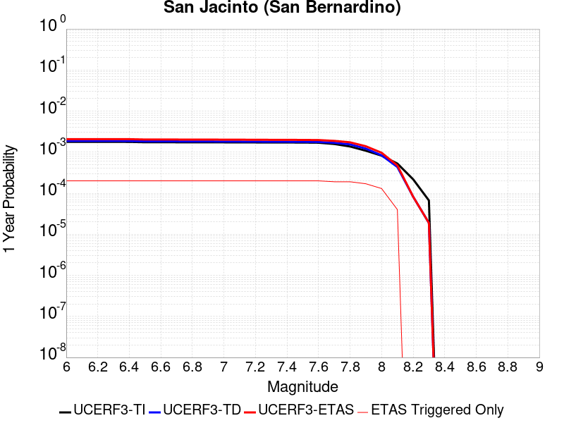 |  |

| Magnitude | 1 wk TI Prob | 1 wk TD Prob | 1 wk ETAS Prob | 1 wk ETAS/TD Gain | 1 wk ETAS Triggered Only | 1 mo TI Prob | 1 mo TD Prob | 1 mo ETAS Prob | 1 mo ETAS/TD Gain | 1 mo ETAS Triggered Only | 1 yr TI Prob | 1 yr TD Prob | 1 yr ETAS Prob | 1 yr ETAS/TD Gain | 1 yr ETAS Triggered Only | 10 yr TI Prob | 10 yr TD Prob | 10 yr ETAS Prob | 10 yr ETAS/TD Gain | 10 yr ETAS Triggered Only |
|-----|-----|-----|-----|-----|-----|-----|-----|-----|-----|-----|-----|-----|-----|-----|-----|-----|-----|-----|-----|-----|
| 6.0 | 3.409352E-5 | 3.5986508E-5 | 1.5419156E-4 | 4.284704 | 1.182093E-4 | 1.461069E-4 | 1.542188E-4 | 3.0617873E-4 | 1.985353 | 1.5198339E-4 | 0.0017774 | 0.0018759987 | 0.0020951184 | 1.1168016 | 2.1953155E-4 | 0.01763251 | 0.019349935 | 0.0196149 | 1.0136933 | 2.701927E-4 |
| 6.1 | 3.409352E-5 | 3.5986508E-5 | 1.5419156E-4 | 4.284704 | 1.182093E-4 | 1.461069E-4 | 1.542188E-4 | 3.0617873E-4 | 1.985353 | 1.5198339E-4 | 0.0017774 | 0.0018759987 | 0.0020951184 | 1.1168016 | 2.1953155E-4 | 0.01763251 | 0.019349935 | 0.0196149 | 1.0136933 | 2.701927E-4 |
| 6.2 | 3.409352E-5 | 3.5986508E-5 | 1.5419156E-4 | 4.284704 | 1.182093E-4 | 1.461069E-4 | 1.542188E-4 | 3.0617873E-4 | 1.985353 | 1.5198339E-4 | 0.0017774 | 0.0018759987 | 0.0020951184 | 1.1168016 | 2.1953155E-4 | 0.01763251 | 0.019349935 | 0.0196149 | 1.0136933 | 2.701927E-4 |
| 6.3 | 3.409352E-5 | 3.5986508E-5 | 1.5419156E-4 | 4.284704 | 1.182093E-4 | 1.461069E-4 | 1.542188E-4 | 3.0617873E-4 | 1.985353 | 1.5198339E-4 | 0.0017774 | 0.0018759987 | 0.0020951184 | 1.1168016 | 2.1953155E-4 | 0.01763251 | 0.019349935 | 0.0196149 | 1.0136933 | 2.701927E-4 |
| 6.4 | 3.400795E-5 | 3.5879173E-5 | 1.5408423E-4 | 4.2945313 | 1.182093E-4 | 1.4574021E-4 | 1.5375883E-4 | 3.0571886E-4 | 1.988301 | 1.5198339E-4 | 0.0017729428 | 0.0018704084 | 0.0020895293 | 1.1171514 | 2.1953155E-4 | 0.017588645 | 0.019295016 | 0.019559996 | 1.013733 | 2.701927E-4 |
| 6.5 | 3.341482E-5 | 3.5139812E-5 | 1.5334495E-4 | 4.3638525 | 1.182093E-4 | 1.4319851E-4 | 1.5059051E-4 | 3.02551E-4 | 2.0090976 | 1.5198339E-4 | 0.0017420477 | 0.0018318989 | 0.0020510284 | 1.1196187 | 2.1953155E-4 | 0.017284546 | 0.018916558 | 0.01918164 | 1.0140132 | 2.701927E-4 |
| 6.6 | 3.3364955E-5 | 3.5077028E-5 | 1.5328218E-4 | 4.3698735 | 1.182093E-4 | 1.4298483E-4 | 1.5032147E-4 | 3.0228202E-4 | 2.0109038 | 1.5198339E-4 | 0.0017394501 | 0.001828629 | 0.0020477592 | 1.119833 | 2.1953155E-4 | 0.017258976 | 0.018884424 | 0.019149514 | 1.0140375 | 2.701927E-4 |
| 6.7 | 3.335922E-5 | 3.5066805E-5 | 1.5327196E-4 | 4.3708563 | 1.182093E-4 | 1.4296026E-4 | 1.5027766E-4 | 3.022382E-4 | 2.0111985 | 1.5198339E-4 | 0.0017391514 | 0.0018280965 | 0.0020472268 | 1.119868 | 2.1953155E-4 | 0.017256035 | 0.018879214 | 0.019144306 | 1.0140414 | 2.701927E-4 |
| 6.8 | 3.327683E-5 | 3.496087E-5 | 1.5316604E-4 | 4.3810706 | 1.182093E-4 | 1.4260718E-4 | 1.498237E-4 | 3.017843E-4 | 2.014263 | 1.5198339E-4 | 0.0017348597 | 0.0018225788 | 0.0020417103 | 1.1202315 | 2.1953155E-4 | 0.017213784 | 0.018824987 | 0.019090094 | 1.0140827 | 2.701927E-4 |
| 6.9 | 3.3235785E-5 | 3.4901823E-5 | 1.53107E-4 | 4.3867908 | 1.182093E-4 | 1.4243131E-4 | 1.4957068E-4 | 3.0153134E-4 | 2.0159788 | 1.5198339E-4 | 0.0017327217 | 0.0018195034 | 0.0020386355 | 1.1204351 | 2.1953155E-4 | 0.017192734 | 0.018794855 | 0.01905997 | 1.0141057 | 2.701927E-4 |
| 7.0 | 3.3197095E-5 | 3.4841752E-5 | 1.5304693E-4 | 4.39263 | 1.182093E-4 | 1.422655E-4 | 1.4931326E-4 | 3.0127395E-4 | 2.0177307 | 1.5198339E-4 | 0.0017307063 | 0.0018163746 | 0.0020355075 | 1.1206429 | 2.1953155E-4 | 0.017172894 | 0.018764233 | 0.019029355 | 1.0141292 | 2.701927E-4 |
| 7.1 | 3.3129716E-5 | 3.4721965E-5 | 1.5292715E-4 | 4.404335 | 1.182093E-4 | 1.4197677E-4 | 1.4879994E-4 | 3.007607E-4 | 2.0212421 | 1.5198339E-4 | 0.0017271966 | 0.0018101353 | 0.0020292695 | 1.1210595 | 2.1953155E-4 | 0.017138338 | 0.018703312 | 0.018968452 | 1.014176 | 2.701927E-4 |
| 7.2 | 3.3034008E-5 | 3.458941E-5 | 1.5279462E-4 | 4.4173813 | 1.182093E-4 | 1.4156665E-4 | 1.4823192E-4 | 3.0019277E-4 | 2.025156 | 1.5198339E-4 | 0.0017222111 | 0.0018032312 | 0.002022367 | 1.1215239 | 2.1953155E-4 | 0.017089253 | 0.018635705 | 0.018900862 | 1.0142285 | 2.701927E-4 |
| 7.3 | 3.2956614E-5 | 3.445717E-5 | 1.526624E-4 | 4.430497 | 1.182093E-4 | 1.4123498E-4 | 1.4766524E-4 | 2.9962618E-4 | 2.029091 | 1.5198339E-4 | 0.0017181796 | 0.0017963431 | 0.0020154803 | 1.1219907 | 2.1953155E-4 | 0.017049557 | 0.018568452 | 0.018833628 | 1.014281 | 2.701927E-4 |
| 7.4 | 3.2915937E-5 | 3.4378863E-5 | 1.5258409E-4 | 4.438311 | 1.182093E-4 | 1.4106068E-4 | 1.4732967E-4 | 2.9929067E-4 | 2.031435 | 1.5198339E-4 | 0.0017160608 | 0.0017922645 | 0.0020114025 | 1.1222688 | 2.1953155E-4 | 0.017028693 | 0.018528719 | 0.018793905 | 1.0143121 | 2.701927E-4 |
| 7.5 | 3.281791E-5 | 3.4243778E-5 | 1.5244904E-4 | 4.451875 | 1.182093E-4 | 1.406406E-4 | 1.4675081E-4 | 2.9871188E-4 | 2.035504 | 1.5198339E-4 | 0.0017109542 | 0.0017852283 | 0.002004368 | 1.1227516 | 2.1953155E-4 | 0.016978411 | 0.018459605 | 0.01872481 | 1.0143667 | 2.701927E-4 |
| 7.6 | 3.2521442E-5 | 3.396873E-5 | 1.5217402E-4 | 4.4798265 | 1.182093E-4 | 1.3937015E-4 | 1.4557215E-4 | 2.975334E-4 | 2.0438895 | 1.5198339E-4 | 0.0016955109 | 0.0017709016 | 0.0019900445 | 1.1237464 | 2.1953155E-4 | 0.016826328 | 0.018317232 | 0.018582476 | 1.0144806 | 2.701927E-4 |
| 7.7 | 3.0287873E-5 | 3.245276E-5 | 1.5065822E-4 | 4.642385 | 1.182093E-4 | 1.297987E-4 | 1.3907586E-4 | 2.910381E-4 | 2.0926573 | 1.5198339E-4 | 0.0015791537 | 0.0016919347 | 0.0018942363 | 1.1195682 | 2.0264451E-4 | 0.01567979 | 0.01752809 | 0.017776957 | 1.0141981 | 2.5330562E-4 |
| 7.8 | 2.6316151E-5 | 2.9663592E-5 | 1.4786939E-4 | 4.984878 | 1.182093E-4 | 1.1277862E-4 | 1.2712348E-4 | 2.7908754E-4 | 2.195405 | 1.5198339E-4 | 0.0013722149 | 0.0015466306 | 0.0017489617 | 1.1308205 | 2.0264451E-4 | 0.013637724 | 0.016069634 | 0.016318869 | 1.0155097 | 2.5330562E-4 |
| 7.9 | 2.0761147E-5 | 2.34181E-5 | 1.2473798E-4 | 5.326563 | 1.0132226E-4 | 8.897331E-5 | 1.0035944E-4 | 2.3544222E-4 | 2.34599 | 1.3509634E-4 | 0.0010827117 | 0.0012211921 | 0.0014067227 | 1.1519258 | 1.8575747E-4 | 0.010774517 | 0.012793174 | 0.013026568 | 1.0182437 | 2.364186E-4 |
| 8.0 | 1.5738568E-5 | 1.6033575E-5 | 8.3580664E-5 | 5.2128525 | 6.754817E-5 | 6.744926E-5 | 6.871352E-5 | 1.7002881E-4 | 2.4744594 | 1.0132226E-4 | 8.2088535E-4 | 8.3626667E-4 | 9.7125E-4 | 1.1614119 | 1.3509634E-4 | 0.008178596 | 0.008865921 | 0.009050031 | 1.0207661 | 1.8575747E-4 |
| 8.1 | 1.0105832E-5 | 8.3304985E-6 | 2.52174E-5 | 3.027118 | 1.6887043E-5 | 4.3309992E-5 | 3.570165E-5 | 6.947453E-5 | 1.9459753 | 3.3774086E-5 | 5.2717153E-4 | 4.345814E-4 | 4.6834082E-4 | 1.0776826 | 3.3774086E-5 | 0.005259227 | 0.004677232 | 0.004727656 | 1.0107808 | 5.066113E-5 |
| 8.2 | 4.189207E-6 | 1.5784357E-6 | 1.5784357E-6 | 1.0 | 0.0 | 1.7953622E-5 | 6.7647065E-6 | 6.7647065E-6 | 1.0 | 0.0 | 2.1856341E-4 | 8.235722E-5 | 8.235722E-5 | 1.0 | 0.0 | 0.0021834858 | 9.565867E-4 | 9.565867E-4 | 1.0 | 0.0 |
| 8.3 | 1.2758221E-6 | 3.6149942E-7 | 3.6149942E-7 | 1.0 | 0.0 | 5.4677976E-6 | 1.5492824E-6 | 1.5492824E-6 | 1.0 | 0.0 | 6.65684E-5 | 1.8862354E-5 | 1.8862354E-5 | 1.0 | 0.0 | 6.6548464E-4 | 2.2751294E-4 | 2.2751294E-4 | 1.0 | 0.0 |

## San Andreas (Coachella) rev
*[(top)](#table-of-contents)*

| 1 Week | 1 Month | 1 Year | 10 Year |
|-----|-----|-----|-----|
|  |  |  |  |

| Magnitude | 1 wk TI Prob | 1 wk TD Prob | 1 wk ETAS Prob | 1 wk ETAS/TD Gain | 1 wk ETAS Triggered Only | 1 mo TI Prob | 1 mo TD Prob | 1 mo ETAS Prob | 1 mo ETAS/TD Gain | 1 mo ETAS Triggered Only | 1 yr TI Prob | 1 yr TD Prob | 1 yr ETAS Prob | 1 yr ETAS/TD Gain | 1 yr ETAS Triggered Only | 10 yr TI Prob | 10 yr TD Prob | 10 yr ETAS Prob | 10 yr ETAS/TD Gain | 10 yr ETAS Triggered Only |
|-----|-----|-----|-----|-----|-----|-----|-----|-----|-----|-----|-----|-----|-----|-----|-----|-----|-----|-----|-----|-----|
| 6.0 | 1.1925945E-4 | 3.2729402E-4 | 4.117016E-4 | 1.2578952 | 8.443521E-5 | 5.110118E-4 | 0.0014019393 | 0.0015368463 | 1.0962288 | 1.3509634E-4 | 0.0062038354 | 0.016936364 | 0.017135577 | 1.0117624 | 2.0264451E-4 | 0.060334753 | 0.15265316 | 0.1528678 | 1.0014061 | 2.5330562E-4 |
| 6.1 | 1.1925945E-4 | 3.2729402E-4 | 4.117016E-4 | 1.2578952 | 8.443521E-5 | 5.110118E-4 | 0.0014019393 | 0.0015368463 | 1.0962288 | 1.3509634E-4 | 0.0062038354 | 0.016936364 | 0.017135577 | 1.0117624 | 2.0264451E-4 | 0.060334753 | 0.15265316 | 0.1528678 | 1.0014061 | 2.5330562E-4 |
| 6.2 | 1.07432395E-4 | 3.0230157E-4 | 3.8671124E-4 | 1.2792234 | 8.443521E-5 | 4.603433E-4 | 0.0012949388 | 0.0014298602 | 1.1041913 | 1.3509634E-4 | 0.005590286 | 0.015653009 | 0.015852481 | 1.0127434 | 2.0264451E-4 | 0.05451731 | 0.14182423 | 0.14204161 | 1.0015328 | 2.5330562E-4 |
| 6.3 | 1.0718766E-4 | 3.0175463E-4 | 3.8616435E-4 | 1.2797297 | 8.443521E-5 | 4.592948E-4 | 0.0012925972 | 0.0014275188 | 1.1043804 | 1.3509634E-4 | 0.005577586 | 0.015624908 | 0.015824385 | 1.0127667 | 2.0264451E-4 | 0.054396555 | 0.14159249 | 0.14180993 | 1.0015357 | 2.5330562E-4 |
| 6.4 | 1.0355944E-4 | 2.9383553E-4 | 3.7824592E-4 | 1.2872709 | 8.443521E-5 | 4.4375064E-4 | 0.0012586913 | 0.0013936176 | 1.1071957 | 1.3509634E-4 | 0.0053892885 | 0.015217941 | 0.015417502 | 1.0131135 | 2.0264451E-4 | 0.052604496 | 0.13815255 | 0.13837087 | 1.0015802 | 2.5330562E-4 |
| 6.5 | 1.0227914E-4 | 2.9102986E-4 | 3.7544052E-4 | 1.2900412 | 8.443521E-5 | 4.382655E-4 | 0.0012466786 | 0.0013816066 | 1.1082299 | 1.3509634E-4 | 0.0053228354 | 0.01507372 | 0.01527331 | 1.0132409 | 2.0264451E-4 | 0.051971316 | 0.13693172 | 0.13715035 | 1.0015966 | 2.5330562E-4 |
| 6.6 | 1.0116757E-4 | 2.8868738E-4 | 3.730982E-4 | 1.2923954 | 8.443521E-5 | 4.3350324E-4 | 0.0012366489 | 0.0013715782 | 1.1091088 | 1.3509634E-4 | 0.0052651367 | 0.01495329 | 0.015152905 | 1.0133492 | 2.0264451E-4 | 0.051421247 | 0.1359099 | 0.13611418 | 1.0015031 | 2.364186E-4 |
| 6.7 | 1.0050676E-4 | 2.8727303E-4 | 3.7168397E-4 | 1.2938353 | 8.443521E-5 | 4.3067214E-4 | 0.0012305931 | 0.0013655232 | 1.1096464 | 1.3509634E-4 | 0.005230834 | 0.014880571 | 0.0150802 | 1.0134155 | 2.0264451E-4 | 0.051094085 | 0.13529462 | 0.13549905 | 1.001511 | 2.364186E-4 |
| 6.8 | 9.976819E-5 | 2.853096E-4 | 3.697207E-4 | 1.295858 | 8.443521E-5 | 4.2750788E-4 | 0.0012221863 | 0.0013571176 | 1.1104015 | 1.3509634E-4 | 0.0051924936 | 0.0147796115 | 0.014979261 | 1.0135084 | 2.0264451E-4 | 0.050728295 | 0.13444631 | 0.13465095 | 1.0015221 | 2.364186E-4 |
| 6.9 | 9.77719E-5 | 2.8027873E-4 | 3.646903E-4 | 1.30117 | 8.443521E-5 | 4.1895514E-4 | 0.0012006456 | 0.0013355797 | 1.1123847 | 1.3509634E-4 | 0.0050888555 | 0.014520878 | 0.01472058 | 1.0137527 | 2.0264451E-4 | 0.049738888 | 0.1322748 | 0.13247995 | 1.0015509 | 2.364186E-4 |
| 7.0 | 8.500761E-5 | 2.4762485E-4 | 3.3203917E-4 | 1.3408959 | 8.443521E-5 | 3.6426744E-4 | 0.001060821 | 0.0011957741 | 1.1272156 | 1.3509634E-4 | 0.0044259406 | 0.012839786 | 0.013039828 | 1.0155799 | 2.0264451E-4 | 0.04338823 | 0.11813272 | 0.118341215 | 1.0017649 | 2.364186E-4 |
| 7.1 | 8.319876E-5 | 2.4365232E-4 | 3.2806696E-4 | 1.3464553 | 8.443521E-5 | 3.5651738E-4 | 0.0010438096 | 0.0011787649 | 1.1292912 | 1.3509634E-4 | 0.004331963 | 0.012635092 | 0.012835177 | 1.0158356 | 2.0264451E-4 | 0.042484846 | 0.116353 | 0.11656191 | 1.0017955 | 2.364186E-4 |
| 7.2 | 7.563917E-5 | 2.2413683E-4 | 3.0855314E-4 | 1.3766284 | 8.443521E-5 | 3.2412758E-4 | 9.602359E-4 | 0.0010952025 | 1.1405557 | 1.3509634E-4 | 0.0039391145 | 0.011628893 | 0.011829182 | 1.0172234 | 2.0264451E-4 | 0.03870018 | 0.10775925 | 0.10797019 | 1.0019575 | 2.364186E-4 |
| 7.3 | 7.082985E-5 | 2.0729867E-4 | 2.9171637E-4 | 1.4072274 | 8.443521E-5 | 3.0352117E-4 | 8.881233E-4 | 0.0010230996 | 1.1519793 | 1.3509634E-4 | 0.0036891096 | 0.010759917 | 0.0109603815 | 1.0186306 | 2.0264451E-4 | 0.03628465 | 0.100282 | 0.10049471 | 1.0021211 | 2.364186E-4 |
| 7.4 | 5.146215E-5 | 1.4273795E-4 | 2.1027647E-4 | 1.4731646 | 6.754817E-5 | 2.2053342E-4 | 6.115915E-4 | 7.297285E-4 | 1.1931633 | 1.182093E-4 | 0.0026816884 | 0.0074208933 | 0.0075885104 | 1.0225872 | 1.6887042E-4 | 0.02649557 | 0.070849575 | 0.071022175 | 1.002436 | 1.8575747E-4 |
| 7.5 | 4.0285166E-5 | 1.09416E-4 | 1.7695678E-4 | 1.6172843 | 6.754817E-5 | 1.7263928E-4 | 4.6884175E-4 | 5.869956E-4 | 1.2520123 | 1.182093E-4 | 0.002099857 | 0.0056932783 | 0.0058611874 | 1.0294925 | 1.6887042E-4 | 0.020801254 | 0.055011146 | 0.055186685 | 1.003191 | 1.8575747E-4 |
| 7.6 | 3.1168736E-5 | 8.4389096E-5 | 1.5193157E-4 | 1.8003696 | 6.754817E-5 | 1.3357346E-4 | 3.6161754E-4 | 4.797841E-4 | 1.3267722 | 1.182093E-4 | 0.0016250437 | 0.0043938323 | 0.0045619607 | 1.0382646 | 1.6887042E-4 | 0.016132116 | 0.04281005 | 0.042987853 | 1.0041534 | 1.8575747E-4 |
| 7.7 | 2.2100989E-5 | 6.238755E-5 | 1.299315E-4 | 2.0826511 | 6.754817E-5 | 9.4715084E-5 | 2.6734784E-4 | 3.6864303E-4 | 1.378889 | 1.0132226E-4 | 0.001152546 | 0.0032501083 | 0.0034015977 | 1.0466106 | 1.5198339E-4 | 0.011465867 | 0.0319002 | 0.03206368 | 1.0051248 | 1.6887042E-4 |
| 7.8 | 1.7484861E-5 | 5.179572E-5 | 1.1934039E-4 | 2.304059 | 6.754817E-5 | 7.493296E-5 | 2.2196278E-4 | 3.2326253E-4 | 1.4563818 | 1.0132226E-4 | 9.1192697E-4 | 0.0026990508 | 0.0028506238 | 1.056158 | 1.5198339E-4 | 0.009081938 | 0.026640115 | 0.026804488 | 1.00617 | 1.6887042E-4 |
| 7.9 | 1.3967285E-5 | 3.822255E-5 | 1.05768144E-4 | 2.767166 | 6.754817E-5 | 5.985842E-5 | 1.6380067E-4 | 2.6510633E-4 | 1.6184691 | 1.0132226E-4 | 7.2853256E-4 | 0.00199245 | 0.002110424 | 1.0592104 | 1.182093E-4 | 0.0072614877 | 0.019909438 | 0.020041844 | 1.0066504 | 1.3509634E-4 |
| 8.0 | 1.1887396E-5 | 3.106521E-5 | 9.861128E-5 | 3.1743317 | 6.754817E-5 | 5.094499E-5 | 1.3312983E-4 | 2.344386E-4 | 1.7609773 | 1.0132226E-4 | 6.200787E-4 | 0.0016196516 | 0.0017376693 | 1.0728662 | 1.182093E-4 | 0.006183513 | 0.016279267 | 0.016412165 | 1.0081636 | 1.3509634E-4 |
| 8.1 | 5.100864E-6 | 8.973418E-6 | 8.973418E-6 | 1.0 | 0.0 | 2.1860664E-5 | 3.8456936E-5 | 3.8456936E-5 | 1.0 | 0.0 | 2.6612106E-4 | 4.6811273E-4 | 4.6811273E-4 | 1.0 | 0.0 | 0.002658026 | 0.004917731 | 0.004917731 | 1.0 | 0.0 |
| 8.2 | 2.3004484E-6 | 2.7864487E-6 | 2.7864487E-6 | 1.0 | 0.0 | 9.859027E-6 | 1.1941868E-5 | 1.1941868E-5 | 1.0 | 0.0 | 1.2002704E-4 | 1.4538258E-4 | 1.4538258E-4 | 1.0 | 0.0 | 0.0011996223 | 0.0015973912 | 0.0015973912 | 1.0 | 0.0 |
| 8.3 | 1.0424446E-7 | 5.8161504E-8 | 5.8161504E-8 | 1.0 | 0.0 | 4.4676187E-7 | 2.4926356E-7 | 2.4926356E-7 | 1.0 | 0.0 | 5.439312E-6 | 3.03478E-6 | 3.03478E-6 | 1.0 | 0.0 | 5.4391792E-5 | 3.190716E-5 | 3.190716E-5 | 1.0 | 0.0 |

## Death Valley (Fish Lake Valley)
*[(top)](#table-of-contents)*

| 1 Week | 1 Month | 1 Year | 10 Year |
|-----|-----|-----|-----|
|  |  |  |  |

| Magnitude | 1 wk TI Prob | 1 wk TD Prob | 1 wk ETAS Prob | 1 wk ETAS/TD Gain | 1 wk ETAS Triggered Only | 1 mo TI Prob | 1 mo TD Prob | 1 mo ETAS Prob | 1 mo ETAS/TD Gain | 1 mo ETAS Triggered Only | 1 yr TI Prob | 1 yr TD Prob | 1 yr ETAS Prob | 1 yr ETAS/TD Gain | 1 yr ETAS Triggered Only | 10 yr TI Prob | 10 yr TD Prob | 10 yr ETAS Prob | 10 yr ETAS/TD Gain | 10 yr ETAS Triggered Only |
|-----|-----|-----|-----|-----|-----|-----|-----|-----|-----|-----|-----|-----|-----|-----|-----|-----|-----|-----|-----|-----|
| 6.0 | 3.872328E-5 | 4.7267473E-5 | 1.1481245E-4 | 2.428995 | 6.754817E-5 | 1.6594635E-4 | 2.0256084E-4 | 2.8697896E-4 | 1.4167544 | 8.443521E-5 | 0.0020185246 | 0.002463534 | 0.0025646067 | 1.0410275 | 1.0132226E-4 | 0.02000288 | 0.024388181 | 0.02460236 | 1.008782 | 2.1953155E-4 |
| 6.1 | 3.872328E-5 | 4.7267473E-5 | 1.1481245E-4 | 2.428995 | 6.754817E-5 | 1.6594635E-4 | 2.0256084E-4 | 2.8697896E-4 | 1.4167544 | 8.443521E-5 | 0.0020185246 | 0.002463534 | 0.0025646067 | 1.0410275 | 1.0132226E-4 | 0.02000288 | 0.024388181 | 0.02460236 | 1.008782 | 2.1953155E-4 |
| 6.2 | 3.872328E-5 | 4.7267473E-5 | 1.1481245E-4 | 2.428995 | 6.754817E-5 | 1.6594635E-4 | 2.0256084E-4 | 2.8697896E-4 | 1.4167544 | 8.443521E-5 | 0.0020185246 | 0.002463534 | 0.0025646067 | 1.0410275 | 1.0132226E-4 | 0.02000288 | 0.024388181 | 0.02460236 | 1.008782 | 2.1953155E-4 |
| 6.3 | 2.8356371E-5 | 3.3609853E-5 | 1.01155754E-4 | 3.0097053 | 6.754817E-5 | 1.2152165E-4 | 1.4403471E-4 | 2.2845776E-4 | 1.5861299 | 8.443521E-5 | 0.0014785219 | 0.0017522911 | 0.0018534358 | 1.0577214 | 1.0132226E-4 | 0.014687235 | 0.017391782 | 0.017607495 | 1.0124031 | 2.1953155E-4 |
| 6.4 | 2.8356371E-5 | 3.3609853E-5 | 1.01155754E-4 | 3.0097053 | 6.754817E-5 | 1.2152165E-4 | 1.4403471E-4 | 2.2845776E-4 | 1.5861299 | 8.443521E-5 | 0.0014785219 | 0.0017522911 | 0.0018534358 | 1.0577214 | 1.0132226E-4 | 0.014687235 | 0.017391782 | 0.017607495 | 1.0124031 | 2.1953155E-4 |
| 6.5 | 2.4448687E-5 | 2.8607552E-5 | 6.238067E-5 | 2.1805665 | 3.3774086E-5 | 1.0477588E-4 | 1.2259831E-4 | 1.7325324E-4 | 1.4131778 | 5.066113E-5 | 0.0012748998 | 0.0014916632 | 0.0015591105 | 1.0452162 | 6.754817E-5 | 0.012676105 | 0.014821377 | 0.015004381 | 1.0123473 | 1.8575747E-4 |
| 6.6 | 2.1298161E-5 | 2.4660083E-5 | 5.8433336E-5 | 2.3695514 | 3.3774086E-5 | 9.127464E-5 | 1.0568198E-4 | 1.5633776E-4 | 1.4793227 | 5.066113E-5 | 0.0011107022 | 0.0012859525 | 0.0013534138 | 1.0524602 | 6.754817E-5 | 0.011051672 | 0.012788526 | 0.012971907 | 1.0143396 | 1.8575747E-4 |
| 6.7 | 1.8959729E-5 | 2.1781025E-5 | 5.5554374E-5 | 2.5505857 | 3.3774086E-5 | 8.125345E-5 | 9.334405E-5 | 1.4400046E-4 | 1.5426848 | 5.066113E-5 | 9.888117E-4 | 0.001135897 | 0.0012033684 | 1.0593992 | 6.754817E-5 | 0.009844234 | 0.01130357 | 0.011487228 | 1.0162477 | 1.8575747E-4 |
| 6.8 | 1.6691629E-5 | 1.9018353E-5 | 5.2791795E-5 | 2.7758343 | 3.3774086E-5 | 7.153359E-5 | 8.150477E-5 | 1.3216177E-4 | 1.6215218 | 5.066113E-5 | 8.7057345E-4 | 9.918857E-4 | 0.0010593669 | 1.0680332 | 6.754817E-5 | 0.008671708 | 0.009876343 | 0.010060267 | 1.0186225 | 1.8575747E-4 |
| 6.9 | 1.450505E-5 | 1.638954E-5 | 5.016307E-5 | 3.060676 | 3.3774086E-5 | 6.216302E-5 | 7.0239046E-5 | 1.2089661E-4 | 1.7212167 | 5.066113E-5 | 7.5657194E-4 | 8.5483363E-4 | 9.223241E-4 | 1.0789515 | 6.754817E-5 | 0.007540013 | 0.008516385 | 0.008700561 | 1.021626 | 1.8575747E-4 |
| 7.0 | 1.2940855E-5 | 1.4537972E-5 | 4.8311565E-5 | 3.3231297 | 3.3774086E-5 | 5.545963E-5 | 6.230414E-5 | 1.1296211E-4 | 1.8130755 | 5.066113E-5 | 6.750118E-4 | 7.5829466E-4 | 8.257916E-4 | 1.0890115 | 6.754817E-5 | 0.006729651 | 0.0075576897 | 0.0077420436 | 1.0243928 | 1.8575747E-4 |
| 7.1 | 1.2544658E-5 | 1.4078208E-5 | 4.7851816E-5 | 3.3989992 | 3.3774086E-5 | 5.3761712E-5 | 6.0333812E-5 | 1.1099188E-4 | 1.8396299 | 5.066113E-5 | 6.5435225E-4 | 7.343222E-4 | 8.018208E-4 | 1.0919195 | 6.754817E-5 | 0.006524288 | 0.007319551 | 0.0075039486 | 1.0251925 | 1.8575747E-4 |
| 7.2 | 1.2489416E-5 | 1.4015674E-5 | 4.7789286E-5 | 3.409703 | 3.3774086E-5 | 5.3524967E-5 | 6.0065824E-5 | 1.1072391E-4 | 1.8433762 | 5.066113E-5 | 6.514716E-4 | 7.310616E-4 | 7.9856045E-4 | 1.0923299 | 6.754817E-5 | 0.006495651 | 0.0072871596 | 0.0074715633 | 1.0253053 | 1.8575747E-4 |
| 7.3 | 1.2368307E-5 | 1.3879812E-5 | 4.765343E-5 | 3.4332905 | 3.3774086E-5 | 5.3005948E-5 | 5.9483587E-5 | 1.101417E-4 | 1.8516318 | 5.066113E-5 | 6.451563E-4 | 7.2397763E-4 | 7.9147686E-4 | 1.093234 | 6.754817E-5 | 0.0064328653 | 0.007216782 | 0.0074011986 | 1.025554 | 1.8575747E-4 |
| 7.4 | 1.2161707E-5 | 1.36478675E-5 | 4.742149E-5 | 3.4746447 | 3.3774086E-5 | 5.212056E-5 | 5.8489582E-5 | 1.09147746E-4 | 1.8661058 | 5.066113E-5 | 6.3438306E-4 | 7.118836E-4 | 7.793837E-4 | 1.094819 | 6.754817E-5 | 0.006325751 | 0.0070966207 | 0.00728106 | 1.0259898 | 1.8575747E-4 |
| 7.5 | 1.1707948E-5 | 1.3145515E-5 | 3.0032335E-5 | 2.284607 | 1.6887043E-5 | 5.0175953E-5 | 5.6336736E-5 | 9.010892E-5 | 1.59947 | 3.3774086E-5 | 6.10721E-4 | 6.856895E-4 | 7.363159E-4 | 1.0738329 | 5.066113E-5 | 0.0060904534 | 0.006836321 | 0.007004037 | 1.024533 | 1.6887042E-4 |
| 7.6 | 1.0319538E-5 | 1.1579622E-5 | 2.846647E-5 | 2.4583244 | 1.6887043E-5 | 4.4225842E-5 | 4.9626036E-5 | 8.3398445E-5 | 1.680538 | 3.3774086E-5 | 5.383166E-4 | 6.040347E-4 | 6.5466523E-4 | 1.0838206 | 5.066113E-5 | 0.0053701443 | 0.0060244603 | 0.0061923135 | 1.027862 | 1.6887042E-4 |
| 7.7 | 8.937764E-6 | 1.0022779E-5 | 2.6909653E-5 | 2.6848495 | 1.6887043E-5 | 3.830414E-5 | 4.295409E-5 | 7.672673E-5 | 1.7862496 | 3.3774086E-5 | 4.6625308E-4 | 5.228456E-4 | 5.734802E-4 | 1.0968443 | 5.066113E-5 | 0.0046527605 | 0.005216664 | 0.0053678546 | 1.0289823 | 1.5198339E-4 |
| 7.8 | 3.108007E-7 | 3.284654E-7 | 3.284654E-7 | 1.0 | 0.0 | 1.3320023E-6 | 1.407708E-6 | 1.407708E-6 | 1.0 | 0.0 | 1.6217007E-5 | 1.7138715E-5 | 1.7138715E-5 | 1.0 | 0.0 | 1.6215823E-4 | 1.7137431E-4 | 1.7137431E-4 | 1.0 | 0.0 |
| 7.9 | 2.5591178E-9 | 2.6696718E-9 | 2.6696718E-9 | 1.0 | 0.0 | 1.0967647E-8 | 1.14414505E-8 | 1.14414505E-8 | 1.0 | 0.0 | 1.335311E-7 | 1.3929966E-7 | 1.3929966E-7 | 1.0 | 0.0 | 1.3353102E-6 | 1.3929966E-6 | 1.3929966E-6 | 1.0 | 0.0 |

## San Jacinto (San Jacinto Valley) rev
*[(top)](#table-of-contents)*

| 1 Week | 1 Month | 1 Year | 10 Year |
|-----|-----|-----|-----|
| 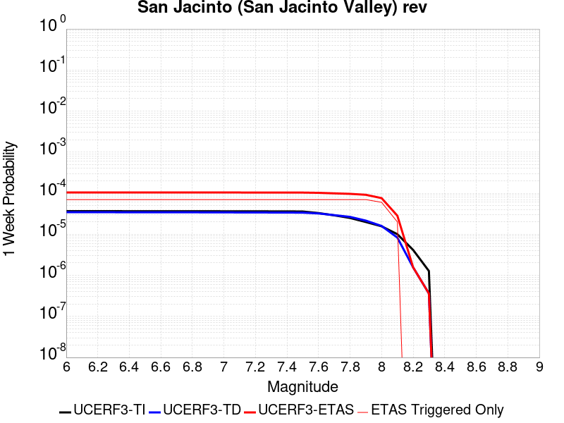 |  |  |  |

| Magnitude | 1 wk TI Prob | 1 wk TD Prob | 1 wk ETAS Prob | 1 wk ETAS/TD Gain | 1 wk ETAS Triggered Only | 1 mo TI Prob | 1 mo TD Prob | 1 mo ETAS Prob | 1 mo ETAS/TD Gain | 1 mo ETAS Triggered Only | 1 yr TI Prob | 1 yr TD Prob | 1 yr ETAS Prob | 1 yr ETAS/TD Gain | 1 yr ETAS Triggered Only | 10 yr TI Prob | 10 yr TD Prob | 10 yr ETAS Prob | 10 yr ETAS/TD Gain | 10 yr ETAS Triggered Only |
|-----|-----|-----|-----|-----|-----|-----|-----|-----|-----|-----|-----|-----|-----|-----|-----|-----|-----|-----|-----|-----|
| 6.0 | 3.652694E-5 | 3.4402394E-5 | 1.188347E-4 | 3.454257 | 8.443521E-5 | 1.5653463E-4 | 1.474305E-4 | 2.6562237E-4 | 1.8016785 | 1.182093E-4 | 0.0019041431 | 0.00179349 | 0.0019620575 | 1.0939885 | 1.6887042E-4 | 0.018879099 | 0.018526595 | 0.018742058 | 1.01163 | 2.1953155E-4 |
| 6.1 | 3.652694E-5 | 3.4402394E-5 | 1.188347E-4 | 3.454257 | 8.443521E-5 | 1.5653463E-4 | 1.474305E-4 | 2.6562237E-4 | 1.8016785 | 1.182093E-4 | 0.0019041431 | 0.00179349 | 0.0019620575 | 1.0939885 | 1.6887042E-4 | 0.018879099 | 0.018526595 | 0.018742058 | 1.01163 | 2.1953155E-4 |
| 6.2 | 3.652694E-5 | 3.4402394E-5 | 1.188347E-4 | 3.454257 | 8.443521E-5 | 1.5653463E-4 | 1.474305E-4 | 2.6562237E-4 | 1.8016785 | 1.182093E-4 | 0.0019041431 | 0.00179349 | 0.0019620575 | 1.0939885 | 1.6887042E-4 | 0.018879099 | 0.018526595 | 0.018742058 | 1.01163 | 2.1953155E-4 |
| 6.3 | 3.652694E-5 | 3.4402394E-5 | 1.188347E-4 | 3.454257 | 8.443521E-5 | 1.5653463E-4 | 1.474305E-4 | 2.6562237E-4 | 1.8016785 | 1.182093E-4 | 0.0019041431 | 0.00179349 | 0.0019620575 | 1.0939885 | 1.6887042E-4 | 0.018879099 | 0.018526595 | 0.018742058 | 1.01163 | 2.1953155E-4 |
| 6.4 | 3.646941E-5 | 3.432397E-5 | 1.1875628E-4 | 3.4598646 | 8.443521E-5 | 1.5628811E-4 | 1.4709444E-4 | 2.6528636E-4 | 1.8035104 | 1.182093E-4 | 0.0019011468 | 0.0017894056 | 0.001957974 | 1.0942035 | 1.6887042E-4 | 0.018849645 | 0.018486476 | 0.01870195 | 1.0116557 | 2.1953155E-4 |
| 6.5 | 3.646941E-5 | 3.432397E-5 | 1.1875628E-4 | 3.4598646 | 8.443521E-5 | 1.5628811E-4 | 1.4709444E-4 | 2.6528636E-4 | 1.8035104 | 1.182093E-4 | 0.0019011468 | 0.0017894056 | 0.001957974 | 1.0942035 | 1.6887042E-4 | 0.018849645 | 0.018486476 | 0.01870195 | 1.0116557 | 2.1953155E-4 |
| 6.6 | 3.6442503E-5 | 3.4287354E-5 | 1.1871967E-4 | 3.4624915 | 8.443521E-5 | 1.561728E-4 | 1.4693754E-4 | 2.6512946E-4 | 1.8043685 | 1.182093E-4 | 0.0018997455 | 0.0017874985 | 0.001956067 | 1.0943042 | 1.6887042E-4 | 0.018835869 | 0.018467745 | 0.018683223 | 1.0116677 | 2.1953155E-4 |
| 6.7 | 3.6432113E-5 | 3.4272925E-5 | 1.1870525E-4 | 3.4635282 | 8.443521E-5 | 1.5612828E-4 | 1.4687571E-4 | 2.6506765E-4 | 1.8047072 | 1.182093E-4 | 0.0018992044 | 0.0017867472 | 0.001955316 | 1.0943439 | 1.6887042E-4 | 0.018830549 | 0.018460369 | 0.018675847 | 1.0116725 | 2.1953155E-4 |
| 6.8 | 3.6409598E-5 | 3.424198E-5 | 1.186743E-4 | 3.4657545 | 8.443521E-5 | 1.560318E-4 | 1.4674311E-4 | 2.6493505E-4 | 1.8054345 | 1.182093E-4 | 0.0018980318 | 0.0017851355 | 0.0019537045 | 1.0944293 | 1.6887042E-4 | 0.018819023 | 0.018444523 | 0.018660005 | 1.0116827 | 2.1953155E-4 |
| 6.9 | 3.638078E-5 | 3.4202407E-5 | 1.1863473E-4 | 3.468608 | 8.443521E-5 | 1.5590832E-4 | 1.4657351E-4 | 2.647655E-4 | 1.8063664 | 1.182093E-4 | 0.0018965311 | 0.001783074 | 0.0019516434 | 1.0945386 | 1.6887042E-4 | 0.018804269 | 0.018424258 | 0.018639743 | 1.0116959 | 2.1953155E-4 |
| 7.0 | 3.6294874E-5 | 3.408442E-5 | 1.1851676E-4 | 3.4771533 | 8.443521E-5 | 1.5554018E-4 | 1.4606792E-4 | 2.6425996E-4 | 1.8091581 | 1.182093E-4 | 0.0018920569 | 0.001776929 | 0.0019454993 | 1.0948662 | 1.6887042E-4 | 0.018760284 | 0.018363839 | 0.01857934 | 1.0117351 | 2.1953155E-4 |
| 7.1 | 3.6260717E-5 | 3.4040702E-5 | 1.1847304E-4 | 3.4803348 | 8.443521E-5 | 1.5539382E-4 | 1.4588058E-4 | 2.6407265E-4 | 1.8101974 | 1.182093E-4 | 0.001890278 | 0.0017746518 | 0.0019432226 | 1.0949881 | 1.6887042E-4 | 0.018742796 | 0.018341439 | 0.018556945 | 1.0117496 | 2.1953155E-4 |
| 7.2 | 3.6210204E-5 | 3.397492E-5 | 1.1840727E-4 | 3.4851372 | 8.443521E-5 | 1.5517735E-4 | 1.455987E-4 | 2.6379077E-4 | 1.8117661 | 1.182093E-4 | 0.001887647 | 0.0017712255 | 0.0019397967 | 1.0951722 | 1.6887042E-4 | 0.01871693 | 0.01830772 | 0.018523231 | 1.0117717 | 2.1953155E-4 |
| 7.3 | 3.6119454E-5 | 3.386321E-5 | 1.1829556E-4 | 3.493336 | 8.443521E-5 | 1.5478847E-4 | 1.4511998E-4 | 2.633121E-4 | 1.8144443 | 1.182093E-4 | 0.0018829206 | 0.0017654065 | 0.0019339788 | 1.0954864 | 1.6887042E-4 | 0.018670462 | 0.018250274 | 0.018465798 | 1.0118095 | 2.1953155E-4 |
| 7.4 | 3.607848E-5 | 3.381071E-5 | 1.18243064E-4 | 3.4972076 | 8.443521E-5 | 1.5461289E-4 | 1.44895E-4 | 2.6308716E-4 | 1.8157091 | 1.182093E-4 | 0.0018807866 | 0.0017626719 | 0.0019312446 | 1.0956348 | 1.6887042E-4 | 0.018649481 | 0.018223269 | 0.0184388 | 1.0118272 | 2.1953155E-4 |
| 7.5 | 3.5856774E-5 | 3.3620483E-5 | 1.18052856E-4 | 3.5113375 | 8.443521E-5 | 1.5366284E-4 | 1.4407984E-4 | 2.622721E-4 | 1.8203248 | 1.182093E-4 | 0.0018692396 | 0.0017527633 | 0.0019213377 | 1.0961764 | 1.6887042E-4 | 0.018535944 | 0.018124366 | 0.018339919 | 1.011893 | 2.1953155E-4 |
| 7.6 | 3.286655E-5 | 3.2143445E-5 | 1.16575946E-4 | 3.6267407 | 8.443521E-5 | 1.4084904E-4 | 1.3775036E-4 | 2.559434E-4 | 1.8580233 | 1.182093E-4 | 0.001713488 | 0.0016758227 | 0.0018444101 | 1.1005998 | 1.6887042E-4 | 0.017003361 | 0.017344031 | 0.017559756 | 1.0124379 | 2.1953155E-4 |
| 7.7 | 2.8882527E-5 | 2.9236293E-5 | 1.1366904E-4 | 3.8879428 | 8.443521E-5 | 1.237764E-4 | 1.2529238E-4 | 2.4348688E-4 | 1.9433492 | 1.182093E-4 | 0.0015059357 | 0.0015243685 | 0.0016761202 | 1.0995505 | 1.5198339E-4 | 0.014957713 | 0.015830461 | 0.016029896 | 1.0125983 | 2.0264451E-4 |
| 7.8 | 2.4950225E-5 | 2.6527203E-5 | 1.1096018E-4 | 4.182883 | 8.443521E-5 | 1.0692515E-4 | 1.1368306E-4 | 2.3187892E-4 | 2.0396962 | 1.182093E-4 | 0.0013010362 | 0.0013832134 | 0.0015349865 | 1.109725 | 1.5198339E-4 | 0.012934455 | 0.014411755 | 0.014611479 | 1.0138584 | 2.0264451E-4 |
| 7.9 | 1.9881603E-5 | 2.1507445E-5 | 1.0594084E-4 | 4.925775 | 8.443521E-5 | 8.520408E-5 | 9.217151E-5 | 2.1036992E-4 | 2.2823746 | 1.182093E-4 | 0.001036866 | 0.0011216112 | 0.0012734241 | 1.1353525 | 1.5198339E-4 | 0.010320415 | 0.011777027 | 0.011977284 | 1.0170041 | 2.0264451E-4 |
| 8.0 | 1.563292E-5 | 1.5937347E-5 | 8.348444E-5 | 5.23829 | 6.754817E-5 | 6.6996516E-5 | 6.8301124E-5 | 1.6961647E-4 | 2.4833627 | 1.0132226E-4 | 8.153773E-4 | 8.3124964E-4 | 9.6623367E-4 | 1.1623869 | 1.3509634E-4 | 0.00812392 | 0.008810506 | 0.008994627 | 1.0208979 | 1.8575747E-4 |
| 8.1 | 1.0045313E-5 | 8.301802E-6 | 2.5188705E-5 | 3.0341249 | 1.6887043E-5 | 4.305063E-5 | 3.5578672E-5 | 6.9351554E-5 | 1.9492452 | 3.3774086E-5 | 5.2401534E-4 | 4.3308473E-4 | 4.668442E-4 | 1.0779512 | 3.3774086E-5 | 0.0052278144 | 0.0046591135 | 0.0047095385 | 1.0108229 | 5.066113E-5 |
| 8.2 | 4.1554413E-6 | 1.5655598E-6 | 1.5655598E-6 | 1.0 | 0.0 | 1.7808914E-5 | 6.709525E-6 | 6.709525E-6 | 1.0 | 0.0 | 2.1680194E-4 | 8.168544E-5 | 8.168544E-5 | 1.0 | 0.0 | 0.0021659054 | 9.482903E-4 | 9.482903E-4 | 1.0 | 0.0 |
| 8.3 | 1.2758221E-6 | 3.6149942E-7 | 3.6149942E-7 | 1.0 | 0.0 | 5.4677976E-6 | 1.5492824E-6 | 1.5492824E-6 | 1.0 | 0.0 | 6.65684E-5 | 1.8862354E-5 | 1.8862354E-5 | 1.0 | 0.0 | 6.6548464E-4 | 2.2751294E-4 | 2.2751294E-4 | 1.0 | 0.0 |

## White Mountains
*[(top)](#table-of-contents)*

| 1 Week | 1 Month | 1 Year | 10 Year |
|-----|-----|-----|-----|
|  |  |  |  |

| Magnitude | 1 wk TI Prob | 1 wk TD Prob | 1 wk ETAS Prob | 1 wk ETAS/TD Gain | 1 wk ETAS Triggered Only | 1 mo TI Prob | 1 mo TD Prob | 1 mo ETAS Prob | 1 mo ETAS/TD Gain | 1 mo ETAS Triggered Only | 1 yr TI Prob | 1 yr TD Prob | 1 yr ETAS Prob | 1 yr ETAS/TD Gain | 1 yr ETAS Triggered Only | 10 yr TI Prob | 10 yr TD Prob | 10 yr ETAS Prob | 10 yr ETAS/TD Gain | 10 yr ETAS Triggered Only |
|-----|-----|-----|-----|-----|-----|-----|-----|-----|-----|-----|-----|-----|-----|-----|-----|-----|-----|-----|-----|-----|
| 6.0 | 3.503579E-5 | 3.378405E-5 | 1.0132994E-4 | 2.9993424 | 6.754817E-5 | 1.5014476E-4 | 1.4478143E-4 | 2.1231982E-4 | 1.4664851 | 6.754817E-5 | 0.0018264796 | 0.0017614096 | 0.0018794106 | 1.0669924 | 1.182093E-4 | 0.018115403 | 0.017486818 | 0.01770251 | 1.0123346 | 2.1953155E-4 |
| 6.1 | 3.503579E-5 | 3.378405E-5 | 1.0132994E-4 | 2.9993424 | 6.754817E-5 | 1.5014476E-4 | 1.4478143E-4 | 2.1231982E-4 | 1.4664851 | 6.754817E-5 | 0.0018264796 | 0.0017614096 | 0.0018794106 | 1.0669924 | 1.182093E-4 | 0.018115403 | 0.017486818 | 0.01770251 | 1.0123346 | 2.1953155E-4 |
| 6.2 | 3.503579E-5 | 3.378405E-5 | 1.0132994E-4 | 2.9993424 | 6.754817E-5 | 1.5014476E-4 | 1.4478143E-4 | 2.1231982E-4 | 1.4664851 | 6.754817E-5 | 0.0018264796 | 0.0017614096 | 0.0018794106 | 1.0669924 | 1.182093E-4 | 0.018115403 | 0.017486818 | 0.01770251 | 1.0123346 | 2.1953155E-4 |
| 6.3 | 1.7818425E-5 | 1.5916074E-5 | 4.968962E-5 | 3.1219773 | 3.3774086E-5 | 7.636245E-5 | 6.821004E-5 | 1.0198182E-4 | 1.4951144 | 3.3774086E-5 | 9.293162E-4 | 8.301551E-4 | 8.6390116E-4 | 1.0406502 | 3.3774086E-5 | 0.009254395 | 0.008271999 | 0.008355736 | 1.0101229 | 8.443521E-5 |
| 6.4 | 1.7818425E-5 | 1.5916074E-5 | 4.968962E-5 | 3.1219773 | 3.3774086E-5 | 7.636245E-5 | 6.821004E-5 | 1.0198182E-4 | 1.4951144 | 3.3774086E-5 | 9.293162E-4 | 8.301551E-4 | 8.6390116E-4 | 1.0406502 | 3.3774086E-5 | 0.009254395 | 0.008271999 | 0.008355736 | 1.0101229 | 8.443521E-5 |
| 6.5 | 1.3397557E-5 | 1.13362685E-5 | 2.822312E-5 | 2.4896305 | 1.6887043E-5 | 5.741684E-5 | 4.858314E-5 | 6.5469365E-5 | 1.3475736 | 1.6887043E-5 | 6.988258E-4 | 5.913462E-4 | 6.0822326E-4 | 1.02854 | 1.6887043E-5 | 0.006966323 | 0.005898432 | 0.005948794 | 1.0085382 | 5.066113E-5 |
| 6.6 | 1.0818695E-5 | 8.625366E-6 | 2.5512263E-5 | 2.957818 | 1.6887043E-5 | 4.6365014E-5 | 3.6965357E-5 | 5.3851774E-5 | 1.4568174 | 1.6887043E-5 | 5.6434784E-4 | 4.4996463E-4 | 4.6684407E-4 | 1.0375128 | 1.6887043E-5 | 0.005629168 | 0.004490972 | 0.0045245946 | 1.0074867 | 3.3774086E-5 |
| 6.7 | 9.067908E-6 | 6.802442E-6 | 6.802442E-6 | 1.0 | 0.0 | 3.8861883E-5 | 2.9153016E-5 | 2.9153016E-5 | 1.0 | 0.0 | 4.7304068E-4 | 3.5488335E-4 | 3.5488335E-4 | 1.0 | 0.0 | 0.00472035 | 0.0035434833 | 0.0035434833 | 1.0 | 0.0 |
| 6.8 | 7.295947E-6 | 4.936391E-6 | 4.936391E-6 | 1.0 | 0.0 | 3.126797E-5 | 2.1155796E-5 | 2.1155796E-5 | 1.0 | 0.0 | 3.8062103E-4 | 2.575425E-4 | 2.575425E-4 | 1.0 | 0.0 | 0.0037996976 | 0.0025725532 | 0.0025725532 | 1.0 | 0.0 |
| 6.9 | 6.2243444E-6 | 3.832213E-6 | 3.832213E-6 | 1.0 | 0.0 | 2.6675489E-5 | 1.642367E-5 | 1.642367E-5 | 1.0 | 0.0 | 3.2472567E-4 | 1.9994036E-4 | 1.9994036E-4 | 1.0 | 0.0 | 0.0032425157 | 0.0019976576 | 0.0019976576 | 1.0 | 0.0 |
| 7.0 | 4.9878413E-6 | 2.6795342E-6 | 2.6795342E-6 | 1.0 | 0.0 | 2.1376287E-5 | 1.14836685E-5 | 1.14836685E-5 | 1.0 | 0.0 | 2.602252E-4 | 1.3980496E-4 | 1.3980496E-4 | 1.0 | 0.0 | 0.002599207 | 0.0013971963 | 0.0013971963 | 1.0 | 0.0 |
| 7.1 | 4.0252844E-6 | 1.8857575E-6 | 1.8857575E-6 | 1.0 | 0.0 | 1.7251105E-5 | 8.081794E-6 | 8.081794E-6 | 1.0 | 0.0 | 2.1001195E-4 | 9.8391516E-5 | 9.8391516E-5 | 1.0 | 0.0 | 0.0020981359 | 9.834924E-4 | 9.834924E-4 | 1.0 | 0.0 |
| 7.2 | 3.3284066E-6 | 1.281964E-6 | 1.281964E-6 | 1.0 | 0.0 | 1.4264522E-5 | 5.494121E-6 | 5.494121E-6 | 1.0 | 0.0 | 1.736567E-4 | 6.688897E-5 | 6.688897E-5 | 1.0 | 0.0 | 0.0017352107 | 6.6869846E-4 | 6.6869846E-4 | 1.0 | 0.0 |
| 7.3 | 2.458226E-6 | 6.05722E-7 | 6.05722E-7 | 1.0 | 0.0 | 1.0535211E-5 | 2.5959491E-6 | 2.5959491E-6 | 1.0 | 0.0 | 1.2825865E-4 | 3.1605257E-5 | 3.1605257E-5 | 1.0 | 0.0 | 0.0012818464 | 3.160114E-4 | 3.160114E-4 | 1.0 | 0.0 |
| 7.4 | 1.965953E-6 | 3.1089303E-7 | 3.1089303E-7 | 1.0 | 0.0 | 8.425486E-6 | 1.332398E-6 | 1.332398E-6 | 1.0 | 0.0 | 1.0257547E-4 | 1.6221828E-5 | 1.6221828E-5 | 1.0 | 0.0 | 0.0010252813 | 1.6220656E-4 | 1.6220656E-4 | 1.0 | 0.0 |
| 7.5 | 1.2014192E-6 | 1.8244253E-7 | 1.8244253E-7 | 1.0 | 0.0 | 5.148929E-6 | 7.8189635E-7 | 7.8189635E-7 | 1.0 | 0.0 | 6.2686406E-5 | 9.519547E-6 | 9.519547E-6 | 1.0 | 0.0 | 6.266873E-4 | 9.519148E-5 | 9.519148E-5 | 1.0 | 0.0 |
| 7.6 | 2.5612175E-7 | 4.8946475E-8 | 4.8946475E-8 | 1.0 | 0.0 | 1.0976642E-6 | 2.0977059E-7 | 2.0977059E-7 | 1.0 | 0.0 | 1.3363979E-5 | 2.5539543E-6 | 2.5539543E-6 | 1.0 | 0.0 | 1.3363175E-4 | 2.5539286E-5 | 2.5539286E-5 | 1.0 | 0.0 |

## San Jacinto (Stepovers Combined)
*[(top)](#table-of-contents)*

| 1 Week | 1 Month | 1 Year | 10 Year |
|-----|-----|-----|-----|
| 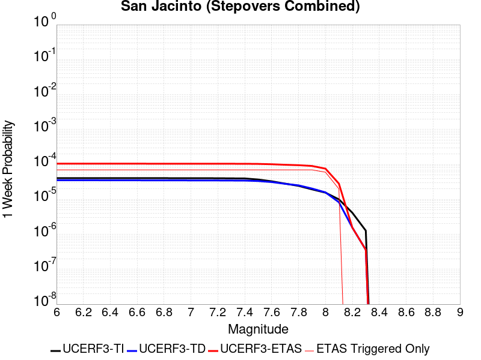 |  |  | 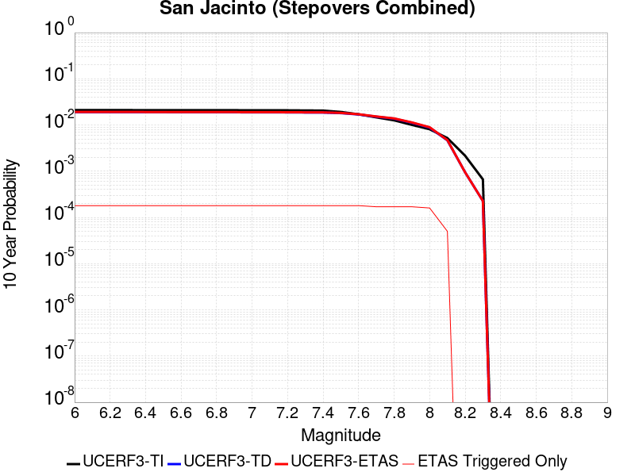 |

| Magnitude | 1 wk TI Prob | 1 wk TD Prob | 1 wk ETAS Prob | 1 wk ETAS/TD Gain | 1 wk ETAS Triggered Only | 1 mo TI Prob | 1 mo TD Prob | 1 mo ETAS Prob | 1 mo ETAS/TD Gain | 1 mo ETAS Triggered Only | 1 yr TI Prob | 1 yr TD Prob | 1 yr ETAS Prob | 1 yr ETAS/TD Gain | 1 yr ETAS Triggered Only | 10 yr TI Prob | 10 yr TD Prob | 10 yr ETAS Prob | 10 yr ETAS/TD Gain | 10 yr ETAS Triggered Only |
|-----|-----|-----|-----|-----|-----|-----|-----|-----|-----|-----|-----|-----|-----|-----|-----|-----|-----|-----|-----|-----|
| 6.0 | 4.0667746E-5 | 3.5272755E-5 | 1.1970499E-4 | 3.3936954 | 8.443521E-5 | 1.742787E-4 | 1.5116022E-4 | 2.6935164E-4 | 1.7818952 | 1.182093E-4 | 0.0021197782 | 0.0018388226 | 0.0020073825 | 1.0916673 | 1.6887042E-4 | 0.020996714 | 0.018986892 | 0.019202255 | 1.0113428 | 2.1953155E-4 |
| 6.1 | 4.0667746E-5 | 3.5272755E-5 | 1.1970499E-4 | 3.3936954 | 8.443521E-5 | 1.742787E-4 | 1.5116022E-4 | 2.6935164E-4 | 1.7818952 | 1.182093E-4 | 0.0021197782 | 0.0018388226 | 0.0020073825 | 1.0916673 | 1.6887042E-4 | 0.020996714 | 0.018986892 | 0.019202255 | 1.0113428 | 2.1953155E-4 |
| 6.2 | 4.0667746E-5 | 3.5272755E-5 | 1.1970499E-4 | 3.3936954 | 8.443521E-5 | 1.742787E-4 | 1.5116022E-4 | 2.6935164E-4 | 1.7818952 | 1.182093E-4 | 0.0021197782 | 0.0018388226 | 0.0020073825 | 1.0916673 | 1.6887042E-4 | 0.020996714 | 0.018986892 | 0.019202255 | 1.0113428 | 2.1953155E-4 |
| 6.3 | 4.0667746E-5 | 3.5272755E-5 | 1.1970499E-4 | 3.3936954 | 8.443521E-5 | 1.742787E-4 | 1.5116022E-4 | 2.6935164E-4 | 1.7818952 | 1.182093E-4 | 0.0021197782 | 0.0018388226 | 0.0020073825 | 1.0916673 | 1.6887042E-4 | 0.020996714 | 0.018986892 | 0.019202255 | 1.0113428 | 2.1953155E-4 |
| 6.4 | 4.0577226E-5 | 3.5144654E-5 | 1.195769E-4 | 3.4024205 | 8.443521E-5 | 1.738908E-4 | 1.5061127E-4 | 2.6880277E-4 | 1.7847453 | 1.182093E-4 | 0.0021150648 | 0.0018321523 | 0.0020007133 | 1.0920017 | 1.6887042E-4 | 0.020950472 | 0.018921461 | 0.019136839 | 1.0113827 | 2.1953155E-4 |
| 6.5 | 4.0577226E-5 | 3.5144654E-5 | 1.195769E-4 | 3.4024205 | 8.443521E-5 | 1.738908E-4 | 1.5061127E-4 | 2.6880277E-4 | 1.7847453 | 1.182093E-4 | 0.0021150648 | 0.0018321523 | 0.0020007133 | 1.0920017 | 1.6887042E-4 | 0.020950472 | 0.018921461 | 0.019136839 | 1.0113827 | 2.1953155E-4 |
| 6.6 | 4.053861E-5 | 3.509E-5 | 1.1952225E-4 | 3.4061627 | 8.443521E-5 | 1.7372532E-4 | 1.5037706E-4 | 2.685686E-4 | 1.7859677 | 1.182093E-4 | 0.0021130538 | 0.0018293057 | 0.0019978671 | 1.0921451 | 1.6887042E-4 | 0.020930743 | 0.018893538 | 0.019108923 | 1.0113999 | 2.1953155E-4 |
| 6.7 | 4.0516545E-5 | 3.5059067E-5 | 1.1949132E-4 | 3.4082856 | 8.443521E-5 | 1.7363077E-4 | 1.5024451E-4 | 2.6843607E-4 | 1.7866613 | 1.182093E-4 | 0.002111905 | 0.001827695 | 0.0019962569 | 1.0922264 | 1.6887042E-4 | 0.020919468 | 0.018877735 | 0.019093122 | 1.0114096 | 2.1953155E-4 |
| 6.8 | 4.049434E-5 | 3.5030633E-5 | 1.19462886E-4 | 3.410241 | 8.443521E-5 | 1.7353562E-4 | 1.5012265E-4 | 2.683142E-4 | 1.7872999 | 1.182093E-4 | 0.0021107488 | 0.0018262138 | 0.0019947758 | 1.0923014 | 1.6887042E-4 | 0.020908125 | 0.018863149 | 0.019078538 | 1.0114186 | 2.1953155E-4 |
| 6.9 | 4.046386E-5 | 3.499319E-5 | 1.1942545E-4 | 3.4128196 | 8.443521E-5 | 1.73405E-4 | 1.4996222E-4 | 2.681538E-4 | 1.7881423 | 1.182093E-4 | 0.0021091616 | 0.0018242638 | 0.0019928261 | 1.0924002 | 1.6887042E-4 | 0.020892553 | 0.01884392 | 0.019059315 | 1.0114305 | 2.1953155E-4 |
| 7.0 | 4.036382E-5 | 3.487376E-5 | 1.1930602E-4 | 3.4210832 | 8.443521E-5 | 1.7297632E-4 | 1.4945042E-4 | 2.6764206E-4 | 1.7908417 | 1.182093E-4 | 0.0021039525 | 0.0018180435 | 0.001986607 | 1.0927169 | 1.6887042E-4 | 0.02084144 | 0.018782536 | 0.018997945 | 1.0114685 | 2.1953155E-4 |
| 7.1 | 4.0343282E-5 | 3.4852223E-5 | 1.19284494E-4 | 3.4225793 | 8.443521E-5 | 1.7288832E-4 | 1.4935812E-4 | 2.6754977E-4 | 1.7913305 | 1.182093E-4 | 0.002102883 | 0.0018169218 | 0.0019854854 | 1.0927743 | 1.6887042E-4 | 0.020830948 | 0.018771412 | 0.018986823 | 1.0114754 | 2.1953155E-4 |
| 7.2 | 4.0257353E-5 | 3.4756722E-5 | 1.19189E-4 | 3.429236 | 8.443521E-5 | 1.725201E-4 | 1.489489E-4 | 2.671406E-4 | 1.793505 | 1.182093E-4 | 0.0020984085 | 0.0018119477 | 0.0019805122 | 1.0930294 | 1.6887042E-4 | 0.020787042 | 0.018722152 | 0.018937573 | 1.0115062 | 2.1953155E-4 |
| 7.3 | 3.9940667E-5 | 3.4584376E-5 | 1.1901667E-4 | 3.4413419 | 8.443521E-5 | 1.7116306E-4 | 1.4821035E-4 | 2.6640214E-4 | 1.7974596 | 1.182093E-4 | 0.0020819185 | 0.0018029709 | 0.0019715368 | 1.0934935 | 1.6887042E-4 | 0.020625217 | 0.018630784 | 0.018846225 | 1.0115638 | 2.1953155E-4 |
| 7.4 | 3.9721202E-5 | 3.4469766E-5 | 1.1890207E-4 | 3.4494596 | 8.443521E-5 | 1.7022261E-4 | 1.4771923E-4 | 2.6591105E-4 | 1.8001114 | 1.182093E-4 | 0.0020704903 | 0.0017970012 | 0.0019655682 | 1.0938046 | 1.6887042E-4 | 0.020513052 | 0.018569905 | 0.018785361 | 1.0116024 | 2.1953155E-4 |
| 7.5 | 3.7036873E-5 | 3.3537188E-5 | 1.1796957E-4 | 3.517575 | 8.443521E-5 | 1.5871979E-4 | 1.437229E-4 | 2.619152E-4 | 1.8223624 | 1.182093E-4 | 0.0019307006 | 0.0017484248 | 0.0019169999 | 1.0964154 | 1.6887042E-4 | 0.019140124 | 0.018071463 | 0.01828703 | 1.0119284 | 2.1953155E-4 |
| 7.6 | 3.2940967E-5 | 3.1317984E-5 | 1.15750554E-4 | 3.695977 | 8.443521E-5 | 1.4116794E-4 | 1.3421304E-4 | 2.524065E-4 | 1.8806404 | 1.182093E-4 | 0.0017173645 | 0.0016328214 | 0.001801416 | 1.1032536 | 1.6887042E-4 | 0.01704153 | 0.016904354 | 0.017120173 | 1.0127672 | 2.1953155E-4 |
| 7.7 | 2.8236149E-5 | 2.7883889E-5 | 1.12316746E-4 | 4.0280156 | 8.443521E-5 | 1.2100645E-4 | 1.19496915E-4 | 2.3769209E-4 | 1.9891064 | 1.182093E-4 | 0.0014722579 | 0.001453905 | 0.0016056674 | 1.1043826 | 1.5198339E-4 | 0.014625421 | 0.015115095 | 0.015314677 | 1.0132041 | 2.0264451E-4 |
| 7.8 | 2.4329287E-5 | 2.5207537E-5 | 1.0964062E-4 | 4.3495173 | 8.443521E-5 | 1.042642E-4 | 1.0802783E-4 | 2.2622437E-4 | 2.0941303 | 1.182093E-4 | 0.0012686774 | 0.0013144462 | 0.0014662298 | 1.1154734 | 1.5198339E-4 | 0.012614589 | 0.013712396 | 0.013912261 | 1.0145756 | 2.0264451E-4 |
| 7.9 | 1.9370926E-5 | 2.0421452E-5 | 1.0485494E-4 | 5.1345487 | 8.443521E-5 | 8.301561E-5 | 8.7517576E-5 | 2.0571653E-4 | 2.3505738 | 1.182093E-4 | 0.0010102465 | 0.0010650064 | 0.0012168279 | 1.1425545 | 1.5198339E-4 | 0.0100566605 | 0.011199483 | 0.011399858 | 1.0178914 | 2.0264451E-4 |
| 8.0 | 1.5583017E-5 | 1.588647E-5 | 8.3433566E-5 | 5.2518635 | 6.754817E-5 | 6.6782646E-5 | 6.808309E-5 | 1.6939845E-4 | 2.4881134 | 1.0132226E-4 | 8.127754E-4 | 8.285971E-4 | 9.635815E-4 | 1.1629071 | 1.3509634E-4 | 0.008098091 | 0.008781809 | 0.008965936 | 1.0209668 | 1.8575747E-4 |
| 8.1 | 1.0024873E-5 | 8.292404E-6 | 2.5179306E-5 | 3.0364304 | 1.6887043E-5 | 4.2963035E-5 | 3.5538393E-5 | 6.931128E-5 | 1.9503211 | 3.3774086E-5 | 5.229494E-4 | 4.3259456E-4 | 4.6635402E-4 | 1.0780395 | 3.3774086E-5 | 0.0052172043 | 0.0046534105 | 0.004703836 | 1.0108362 | 5.066113E-5 |
| 8.2 | 4.142796E-6 | 1.5610041E-6 | 1.5610041E-6 | 1.0 | 0.0 | 1.775472E-5 | 6.69E-6 | 6.69E-6 | 1.0 | 0.0 | 2.1614227E-4 | 8.144774E-5 | 8.144774E-5 | 1.0 | 0.0 | 0.0021593217 | 9.454649E-4 | 9.454649E-4 | 1.0 | 0.0 |
| 8.3 | 1.2750878E-6 | 3.612133E-7 | 3.612133E-7 | 1.0 | 0.0 | 5.4646503E-6 | 1.548056E-6 | 1.548056E-6 | 1.0 | 0.0 | 6.653009E-5 | 1.8847424E-5 | 1.8847424E-5 | 1.0 | 0.0 | 6.6510175E-4 | 2.2734253E-4 | 2.2734253E-4 | 1.0 | 0.0 |

## Pleito
*[(top)](#table-of-contents)*

| 1 Week | 1 Month | 1 Year | 10 Year |
|-----|-----|-----|-----|
|  |  |  |  |

| Magnitude | 1 wk TI Prob | 1 wk TD Prob | 1 wk ETAS Prob | 1 wk ETAS/TD Gain | 1 wk ETAS Triggered Only | 1 mo TI Prob | 1 mo TD Prob | 1 mo ETAS Prob | 1 mo ETAS/TD Gain | 1 mo ETAS Triggered Only | 1 yr TI Prob | 1 yr TD Prob | 1 yr ETAS Prob | 1 yr ETAS/TD Gain | 1 yr ETAS Triggered Only | 10 yr TI Prob | 10 yr TD Prob | 10 yr ETAS Prob | 10 yr ETAS/TD Gain | 10 yr ETAS Triggered Only |
|-----|-----|-----|-----|-----|-----|-----|-----|-----|-----|-----|-----|-----|-----|-----|-----|-----|-----|-----|-----|-----|
| 6.0 | 1.6763008E-5 | 2.4763838E-5 | 9.2310336E-5 | 3.7276263 | 6.754817E-5 | 7.183948E-5 | 1.0612683E-4 | 1.7366782E-4 | 1.6364177 | 6.754817E-5 | 8.742947E-4 | 0.0012914003 | 0.0014600527 | 1.1305965 | 1.6887042E-4 | 0.00870863 | 0.0129538905 | 0.01315391 | 1.0154408 | 2.0264451E-4 |
| 6.1 | 1.6763008E-5 | 2.4763838E-5 | 9.2310336E-5 | 3.7276263 | 6.754817E-5 | 7.183948E-5 | 1.0612683E-4 | 1.7366782E-4 | 1.6364177 | 6.754817E-5 | 8.742947E-4 | 0.0012914003 | 0.0014600527 | 1.1305965 | 1.6887042E-4 | 0.00870863 | 0.0129538905 | 0.01315391 | 1.0154408 | 2.0264451E-4 |
| 6.2 | 1.6763008E-5 | 2.4763838E-5 | 9.2310336E-5 | 3.7276263 | 6.754817E-5 | 7.183948E-5 | 1.0612683E-4 | 1.7366782E-4 | 1.6364177 | 6.754817E-5 | 8.742947E-4 | 0.0012914003 | 0.0014600527 | 1.1305965 | 1.6887042E-4 | 0.00870863 | 0.0129538905 | 0.01315391 | 1.0154408 | 2.0264451E-4 |
| 6.3 | 1.6763008E-5 | 2.4763838E-5 | 9.2310336E-5 | 3.7276263 | 6.754817E-5 | 7.183948E-5 | 1.0612683E-4 | 1.7366782E-4 | 1.6364177 | 6.754817E-5 | 8.742947E-4 | 0.0012914003 | 0.0014600527 | 1.1305965 | 1.6887042E-4 | 0.00870863 | 0.0129538905 | 0.01315391 | 1.0154408 | 2.0264451E-4 |
| 6.4 | 1.6763008E-5 | 2.4763838E-5 | 9.2310336E-5 | 3.7276263 | 6.754817E-5 | 7.183948E-5 | 1.0612683E-4 | 1.7366782E-4 | 1.6364177 | 6.754817E-5 | 8.742947E-4 | 0.0012914003 | 0.0014600527 | 1.1305965 | 1.6887042E-4 | 0.00870863 | 0.0129538905 | 0.01315391 | 1.0154408 | 2.0264451E-4 |
| 6.5 | 1.6763008E-5 | 2.4763838E-5 | 9.2310336E-5 | 3.7276263 | 6.754817E-5 | 7.183948E-5 | 1.0612683E-4 | 1.7366782E-4 | 1.6364177 | 6.754817E-5 | 8.742947E-4 | 0.0012914003 | 0.0014600527 | 1.1305965 | 1.6887042E-4 | 0.00870863 | 0.0129538905 | 0.01315391 | 1.0154408 | 2.0264451E-4 |
| 6.6 | 9.910213E-6 | 1.7214623E-5 | 3.4101377E-5 | 1.9809539 | 1.6887043E-5 | 4.247165E-5 | 7.377489E-5 | 9.066069E-5 | 1.2288827 | 1.6887043E-5 | 5.169696E-4 | 8.978429E-4 | 9.822024E-4 | 1.0939579 | 8.443521E-5 | 0.0051576863 | 0.009050702 | 0.009134373 | 1.0092447 | 8.443521E-5 |
| 6.7 | 9.910213E-6 | 1.7214623E-5 | 3.4101377E-5 | 1.9809539 | 1.6887043E-5 | 4.247165E-5 | 7.377489E-5 | 9.066069E-5 | 1.2288827 | 1.6887043E-5 | 5.169696E-4 | 8.978429E-4 | 9.822024E-4 | 1.0939579 | 8.443521E-5 | 0.0051576863 | 0.009050702 | 0.009134373 | 1.0092447 | 8.443521E-5 |
| 6.8 | 8.300162E-6 | 1.5474232E-5 | 3.2361015E-5 | 2.091284 | 1.6887043E-5 | 3.557164E-5 | 6.631646E-5 | 8.320239E-5 | 1.2546264 | 1.6887043E-5 | 4.3299864E-4 | 8.071053E-4 | 8.745989E-4 | 1.0836244 | 6.754817E-5 | 0.004321559 | 0.008150139 | 0.008217136 | 1.0082204 | 6.754817E-5 |
| 6.9 | 8.183114E-6 | 1.5345448E-5 | 3.223223E-5 | 2.1004426 | 1.6887043E-5 | 3.5070017E-5 | 6.576455E-5 | 8.2650484E-5 | 1.2567635 | 1.6887043E-5 | 4.2689382E-4 | 8.003907E-4 | 8.6788484E-4 | 1.0843264 | 6.754817E-5 | 0.0042607468 | 0.008083483 | 0.008150485 | 1.0082887 | 6.754817E-5 |
| 7.0 | 7.1748823E-6 | 1.413244E-5 | 3.1019244E-5 | 2.1948967 | 1.6887043E-5 | 3.0749135E-5 | 6.0566195E-5 | 7.745221E-5 | 1.2788028 | 1.6887043E-5 | 3.743064E-4 | 7.371445E-4 | 7.877683E-4 | 1.0686755 | 5.066113E-5 | 0.0037367654 | 0.007454939 | 0.0075052227 | 1.006745 | 5.066113E-5 |
| 7.1 | 7.1671807E-6 | 1.412281E-5 | 3.1009615E-5 | 2.1957114 | 1.6887043E-5 | 3.0716128E-5 | 6.052493E-5 | 7.741095E-5 | 1.2789928 | 1.6887043E-5 | 3.7390468E-4 | 7.366424E-4 | 7.872662E-4 | 1.0687224 | 5.066113E-5 | 0.0037327618 | 0.0074499524 | 0.007500236 | 1.0067495 | 5.066113E-5 |
| 7.2 | 7.0649667E-6 | 1.39701015E-5 | 3.0856907E-5 | 2.208782 | 1.6887043E-5 | 3.0278077E-5 | 5.9870494E-5 | 7.675652E-5 | 1.2820426 | 1.6887043E-5 | 3.6857324E-4 | 7.2868E-4 | 7.793042E-4 | 1.0694739 | 5.066113E-5 | 0.0036796255 | 0.0073707094 | 0.007420997 | 1.0068226 | 5.066113E-5 |
| 7.3 | 7.02082E-6 | 1.3913556E-5 | 3.0800365E-5 | 2.2136946 | 1.6887043E-5 | 3.008888E-5 | 5.9628168E-5 | 7.65142E-5 | 1.2831889 | 1.6887043E-5 | 3.6627054E-4 | 7.2573166E-4 | 7.76356E-4 | 1.0697563 | 5.066113E-5 | 0.0036566744 | 0.007341209 | 0.007391498 | 1.0068502 | 5.066113E-5 |
| 7.4 | 6.987146E-6 | 1.3873118E-5 | 3.0759926E-5 | 2.2172322 | 1.6887043E-5 | 2.9944567E-5 | 5.945487E-5 | 7.634091E-5 | 1.2840143 | 1.6887043E-5 | 3.6451413E-4 | 7.2362315E-4 | 7.7424763E-4 | 1.0699598 | 5.066113E-5 | 0.0036391679 | 0.007320144 | 0.0073704347 | 1.0068702 | 5.066113E-5 |
| 7.5 | 6.9494554E-6 | 1.3830024E-5 | 3.0716834E-5 | 2.2210252 | 1.6887043E-5 | 2.9783041E-5 | 5.9270187E-5 | 7.615623E-5 | 1.2848994 | 1.6887043E-5 | 3.625482E-4 | 7.2137616E-4 | 7.720007E-4 | 1.0701778 | 5.066113E-5 | 0.0036195726 | 0.0072977724 | 0.007348064 | 1.0068914 | 5.066113E-5 |
| 7.6 | 6.92694E-6 | 1.3789138E-5 | 3.0675947E-5 | 2.2246459 | 1.6887043E-5 | 2.9686547E-5 | 5.909497E-5 | 7.5981014E-5 | 1.2857442 | 1.6887043E-5 | 3.6137376E-4 | 7.1924424E-4 | 7.6986896E-4 | 1.0703859 | 5.066113E-5 | 0.0036078666 | 0.0072765257 | 0.007326818 | 1.0069116 | 5.066113E-5 |
| 7.7 | 6.395867E-6 | 1.2668219E-5 | 2.9555047E-5 | 2.3330073 | 1.6887043E-5 | 2.741057E-5 | 5.429124E-5 | 7.117736E-5 | 1.3110286 | 1.6887043E-5 | 3.336726E-4 | 6.6079566E-4 | 7.1142334E-4 | 1.0766162 | 5.066113E-5 | 0.0033317201 | 0.0066951844 | 0.0067455065 | 1.0075161 | 5.066113E-5 |
| 7.8 | 5.8664327E-6 | 1.153586E-5 | 2.8422708E-5 | 2.463857 | 1.6887043E-5 | 2.5141611E-5 | 4.9438466E-5 | 6.6324676E-5 | 1.3415601 | 1.6887043E-5 | 3.060561E-4 | 6.017473E-4 | 6.5237796E-4 | 1.0841393 | 5.066113E-5 | 0.0030563495 | 0.0061006667 | 0.0061510187 | 1.0082536 | 5.066113E-5 |
| 7.9 | 3.7167474E-6 | 7.1140853E-6 | 2.4001009E-5 | 3.3737307 | 1.6887043E-5 | 1.592882E-5 | 3.0488582E-5 | 4.737511E-5 | 1.553864 | 1.6887043E-5 | 1.9391612E-4 | 3.7113542E-4 | 4.0489697E-4 | 1.0909683 | 3.3774086E-5 | 0.0019374699 | 0.0037674906 | 0.0038011374 | 1.0089308 | 3.3774086E-5 |
| 8.0 | 1.0903841E-6 | 1.2879392E-6 | 1.2879392E-6 | 1.0 | 0.0 | 4.6730665E-6 | 5.5197274E-6 | 5.5197274E-6 | 1.0 | 0.0 | 5.68931E-5 | 6.720063E-5 | 6.720063E-5 | 1.0 | 0.0 | 5.6878536E-4 | 6.941948E-4 | 6.941948E-4 | 1.0 | 0.0 |
| 8.1 | 2.6894583E-7 | 1.1060341E-7 | 1.1060341E-7 | 1.0 | 0.0 | 1.1526245E-6 | 4.740145E-7 | 4.740145E-7 | 1.0 | 0.0 | 1.4033113E-5 | 5.7711113E-6 | 5.7711113E-6 | 1.0 | 0.0 | 1.4032227E-4 | 6.456908E-5 | 6.456908E-5 | 1.0 | 0.0 |
| 8.2 | 5.2967013E-9 | 2.4578228E-9 | 2.4578228E-9 | 1.0 | 0.0 | 2.2700148E-8 | 1.0533527E-8 | 1.0533527E-8 | 1.0 | 0.0 | 2.7637427E-7 | 1.2824569E-7 | 1.2824569E-7 | 1.0 | 0.0 | 2.7637393E-6 | 1.4592787E-6 | 1.4592787E-6 | 1.0 | 0.0 |

## San Jacinto (Anza) rev
*[(top)](#table-of-contents)*

| 1 Week | 1 Month | 1 Year | 10 Year |
|-----|-----|-----|-----|
| 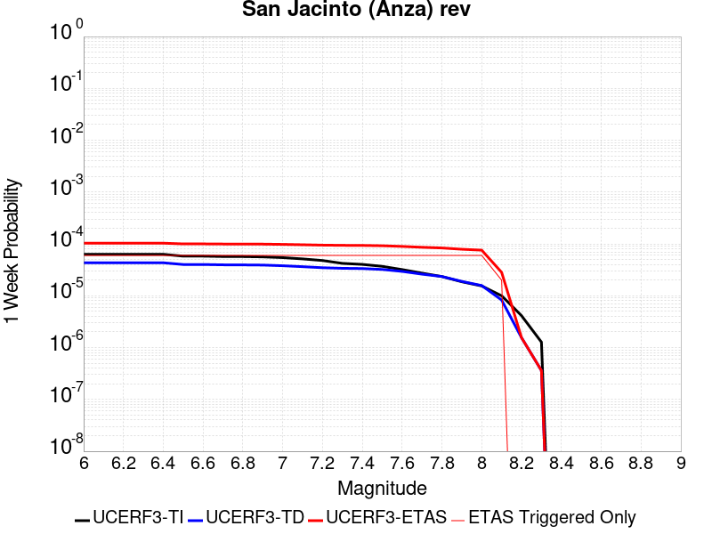 |  |  |  |

| Magnitude | 1 wk TI Prob | 1 wk TD Prob | 1 wk ETAS Prob | 1 wk ETAS/TD Gain | 1 wk ETAS Triggered Only | 1 mo TI Prob | 1 mo TD Prob | 1 mo ETAS Prob | 1 mo ETAS/TD Gain | 1 mo ETAS Triggered Only | 1 yr TI Prob | 1 yr TD Prob | 1 yr ETAS Prob | 1 yr ETAS/TD Gain | 1 yr ETAS Triggered Only | 10 yr TI Prob | 10 yr TD Prob | 10 yr ETAS Prob | 10 yr ETAS/TD Gain | 10 yr ETAS Triggered Only |
|-----|-----|-----|-----|-----|-----|-----|-----|-----|-----|-----|-----|-----|-----|-----|-----|-----|-----|-----|-----|-----|
| 6.0 | 6.3015636E-5 | 4.3302647E-5 | 1.1084789E-4 | 2.559841 | 6.754817E-5 | 2.7003905E-4 | 1.8556965E-4 | 2.8687308E-4 | 1.5459054 | 1.0132226E-4 | 0.0032827691 | 0.0022569813 | 0.0024086216 | 1.0671872 | 1.5198339E-4 | 0.032346968 | 0.023296192 | 0.023494115 | 1.0084959 | 2.0264451E-4 |
| 6.1 | 6.3015636E-5 | 4.3302647E-5 | 1.1084789E-4 | 2.559841 | 6.754817E-5 | 2.7003905E-4 | 1.8556965E-4 | 2.8687308E-4 | 1.5459054 | 1.0132226E-4 | 0.0032827691 | 0.0022569813 | 0.0024086216 | 1.0671872 | 1.5198339E-4 | 0.032346968 | 0.023296192 | 0.023494115 | 1.0084959 | 2.0264451E-4 |
| 6.2 | 6.3015636E-5 | 4.3302647E-5 | 1.1084789E-4 | 2.559841 | 6.754817E-5 | 2.7003905E-4 | 1.8556965E-4 | 2.8687308E-4 | 1.5459054 | 1.0132226E-4 | 0.0032827691 | 0.0022569813 | 0.0024086216 | 1.0671872 | 1.5198339E-4 | 0.032346968 | 0.023296192 | 0.023494115 | 1.0084959 | 2.0264451E-4 |
| 6.3 | 6.3015636E-5 | 4.3302647E-5 | 1.1084789E-4 | 2.559841 | 6.754817E-5 | 2.7003905E-4 | 1.8556965E-4 | 2.8687308E-4 | 1.5459054 | 1.0132226E-4 | 0.0032827691 | 0.0022569813 | 0.0024086216 | 1.0671872 | 1.5198339E-4 | 0.032346968 | 0.023296192 | 0.023494115 | 1.0084959 | 2.0264451E-4 |
| 6.4 | 6.3015636E-5 | 4.3302647E-5 | 1.1084789E-4 | 2.559841 | 6.754817E-5 | 2.7003905E-4 | 1.8556965E-4 | 2.8687308E-4 | 1.5459054 | 1.0132226E-4 | 0.0032827691 | 0.0022569813 | 0.0024086216 | 1.0671872 | 1.5198339E-4 | 0.032346968 | 0.023296192 | 0.023494115 | 1.0084959 | 2.0264451E-4 |
| 6.5 | 5.811017E-5 | 4.0082516E-5 | 1.0762798E-4 | 2.6851604 | 6.754817E-5 | 2.4901982E-4 | 1.7177092E-4 | 2.7307577E-4 | 1.5897672 | 1.0132226E-4 | 0.0030276014 | 0.002089311 | 0.0022409766 | 1.0725913 | 1.5198339E-4 | 0.02986684 | 0.021593736 | 0.021792006 | 1.0091817 | 2.0264451E-4 |
| 6.6 | 5.811017E-5 | 4.0082516E-5 | 1.0762798E-4 | 2.6851604 | 6.754817E-5 | 2.4901982E-4 | 1.7177092E-4 | 2.7307577E-4 | 1.5897672 | 1.0132226E-4 | 0.0030276014 | 0.002089311 | 0.0022409766 | 1.0725913 | 1.5198339E-4 | 0.02986684 | 0.021593736 | 0.021792006 | 1.0091817 | 2.0264451E-4 |
| 6.7 | 5.712442E-5 | 3.9505223E-5 | 1.0705073E-4 | 2.7097867 | 6.754817E-5 | 2.4479596E-4 | 1.6929714E-4 | 2.7060224E-4 | 1.5983864 | 1.0132226E-4 | 0.0029763177 | 0.0020592497 | 0.00221092 | 1.0736532 | 1.5198339E-4 | 0.029367693 | 0.021285562 | 0.021483893 | 1.0093176 | 2.0264451E-4 |
| 6.8 | 5.6967532E-5 | 3.9361643E-5 | 1.0690716E-4 | 2.7160237 | 6.754817E-5 | 2.4412372E-4 | 1.6868189E-4 | 2.6998704E-4 | 1.6005694 | 1.0132226E-4 | 0.0029681553 | 0.002051773 | 0.0022034445 | 1.0739222 | 1.5198339E-4 | 0.029288229 | 0.021210281 | 0.021408627 | 1.0093514 | 2.0264451E-4 |
| 6.9 | 5.6211324E-5 | 3.9066435E-5 | 1.06611966E-4 | 2.7289913 | 6.754817E-5 | 2.4088343E-4 | 1.6741687E-4 | 2.6872216E-4 | 1.605108 | 1.0132226E-4 | 0.0029288116 | 0.0020364004 | 0.0021880742 | 1.0744814 | 1.5198339E-4 | 0.028905109 | 0.021049714 | 0.021248093 | 1.0094243 | 2.0264451E-4 |
| 7.0 | 5.4383527E-5 | 3.792697E-5 | 1.0547258E-4 | 2.7809386 | 6.754817E-5 | 2.3305144E-4 | 1.6253405E-4 | 2.6383984E-4 | 1.6232896 | 1.0132226E-4 | 0.0028337094 | 0.001977061 | 0.0021287438 | 1.0767214 | 1.5198339E-4 | 0.027978465 | 0.020440677 | 0.02063918 | 1.0097111 | 2.0264451E-4 |
| 7.1 | 5.1393665E-5 | 3.6389913E-5 | 1.0393562E-4 | 2.856166 | 6.754817E-5 | 2.2023996E-4 | 1.5594746E-4 | 2.572539E-4 | 1.6496191 | 1.0132226E-4 | 0.0026781242 | 0.0018970112 | 0.0020487062 | 1.0799654 | 1.5198339E-4 | 0.026460782 | 0.019614287 | 0.019812956 | 1.0101289 | 2.0264451E-4 |
| 7.2 | 4.785222E-5 | 3.4741795E-5 | 1.0228762E-4 | 2.9442236 | 6.754817E-5 | 2.0506482E-4 | 1.4888494E-4 | 2.501921E-4 | 1.6804394 | 1.0132226E-4 | 0.0024938055 | 0.0018111705 | 0.0019628785 | 1.0837625 | 1.5198339E-4 | 0.024660049 | 0.018728992 | 0.01892784 | 1.0106171 | 2.0264451E-4 |
| 7.3 | 4.2143256E-5 | 3.383628E-5 | 1.0138216E-4 | 2.9962564 | 6.754817E-5 | 1.8060145E-4 | 1.4500458E-4 | 2.4631215E-4 | 1.6986507 | 1.0132226E-4 | 0.002196605 | 0.0017640047 | 0.00191572 | 1.0860062 | 1.5198339E-4 | 0.02175019 | 0.01823724 | 0.01843619 | 1.010909 | 2.0264451E-4 |
| 7.4 | 4.0264713E-5 | 3.347446E-5 | 1.0102037E-4 | 3.017834 | 6.754817E-5 | 1.7255165E-4 | 1.4345412E-4 | 2.4476185E-4 | 1.706203 | 1.0132226E-4 | 0.002098792 | 0.0017451581 | 0.0018968763 | 1.0869366 | 1.5198339E-4 | 0.020790804 | 0.018041821 | 0.01824081 | 1.0110292 | 2.0264451E-4 |
| 7.5 | 3.694492E-5 | 3.218847E-5 | 9.973446E-5 | 3.0984533 | 6.754817E-5 | 1.5832575E-4 | 1.379433E-4 | 2.3925157E-4 | 1.7344197 | 1.0132226E-4 | 0.0019259118 | 0.001678169 | 0.0018298973 | 1.090413 | 1.5198339E-4 | 0.01909306 | 0.01735827 | 0.017557397 | 1.0114716 | 2.0264451E-4 |
| 7.6 | 3.200565E-5 | 2.9504106E-5 | 9.705028E-5 | 3.2893822 | 6.754817E-5 | 1.3715986E-4 | 1.2644005E-4 | 2.277495E-4 | 1.8012449 | 1.0132226E-4 | 0.001668642 | 0.0015383229 | 0.0016900725 | 1.0986462 | 1.5198339E-4 | 0.01656168 | 0.0159463 | 0.016145714 | 1.0125053 | 2.0264451E-4 |
| 7.7 | 2.731642E-5 | 2.6092788E-5 | 9.3639195E-5 | 3.5887003 | 6.754817E-5 | 1.1706512E-4 | 1.1182144E-4 | 2.1313237E-4 | 1.9060062 | 1.0132226E-4 | 0.001424336 | 0.0013605768 | 0.0014954894 | 1.0991583 | 1.3509634E-4 | 0.014152412 | 0.014167004 | 0.01435013 | 1.0129262 | 1.8575747E-4 |
| 7.8 | 2.3466424E-5 | 2.3504817E-5 | 9.10514E-5 | 3.8737335 | 6.754817E-5 | 1.0056651E-4 | 1.0073105E-4 | 2.020431E-4 | 2.0057678 | 1.0132226E-4 | 0.0012237094 | 0.0012257113 | 0.0013606421 | 1.1100836 | 1.3509634E-4 | 0.012169928 | 0.012808893 | 0.012992271 | 1.0143164 | 1.8575747E-4 |
| 7.9 | 1.8611925E-5 | 1.8908117E-5 | 8.645501E-5 | 4.5723753 | 6.754817E-5 | 7.9762955E-5 | 8.1032274E-5 | 1.8234632E-4 | 2.2502925 | 1.0132226E-4 | 9.7068126E-4 | 9.861222E-4 | 0.0011210853 | 1.1368625 | 1.3509634E-4 | 0.0096645225 | 0.010393824 | 0.010577651 | 1.0176861 | 1.8575747E-4 |
| 8.0 | 1.5460775E-5 | 1.5740965E-5 | 8.328807E-5 | 5.291167 | 6.754817E-5 | 6.6258784E-5 | 6.7459536E-5 | 1.6877496E-4 | 2.5018694 | 1.0132226E-4 | 8.0640207E-4 | 8.21011E-4 | 9.5599645E-4 | 1.1644137 | 1.3509634E-4 | 0.008034821 | 0.0087028835 | 0.008887025 | 1.0211586 | 1.8575747E-4 |
| 8.1 | 9.983884E-6 | 8.269952E-6 | 2.5156854E-5 | 3.041959 | 1.6887043E-5 | 4.2787375E-5 | 3.544217E-5 | 6.921506E-5 | 1.9529012 | 3.3774086E-5 | 5.2081177E-4 | 4.314235E-4 | 4.6518302E-4 | 1.0782515 | 3.3774086E-5 | 0.0051959283 | 0.004640022 | 0.0046904483 | 1.0108676 | 5.066113E-5 |
| 8.2 | 4.1226E-6 | 1.5529788E-6 | 1.5529788E-6 | 1.0 | 0.0 | 1.7668166E-5 | 6.6556063E-6 | 6.6556063E-6 | 1.0 | 0.0 | 2.1508869E-4 | 8.102902E-5 | 8.102902E-5 | 1.0 | 0.0 | 0.0021488064 | 9.4050163E-4 | 9.4050163E-4 | 1.0 | 0.0 |
| 8.3 | 1.2750878E-6 | 3.612133E-7 | 3.612133E-7 | 1.0 | 0.0 | 5.4646503E-6 | 1.548056E-6 | 1.548056E-6 | 1.0 | 0.0 | 6.653009E-5 | 1.8847424E-5 | 1.8847424E-5 | 1.0 | 0.0 | 6.6510175E-4 | 2.2734253E-4 | 2.2734253E-4 | 1.0 | 0.0 |

## Santa Ynez (West)
*[(top)](#table-of-contents)*

| 1 Week | 1 Month | 1 Year | 10 Year |
|-----|-----|-----|-----|
| 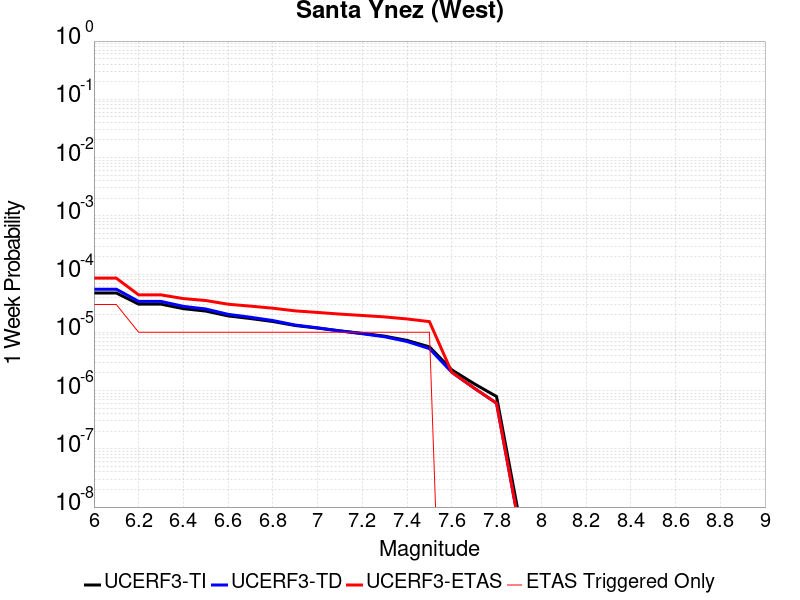 |  |  |  |

| Magnitude | 1 wk TI Prob | 1 wk TD Prob | 1 wk ETAS Prob | 1 wk ETAS/TD Gain | 1 wk ETAS Triggered Only | 1 mo TI Prob | 1 mo TD Prob | 1 mo ETAS Prob | 1 mo ETAS/TD Gain | 1 mo ETAS Triggered Only | 1 yr TI Prob | 1 yr TD Prob | 1 yr ETAS Prob | 1 yr ETAS/TD Gain | 1 yr ETAS Triggered Only | 10 yr TI Prob | 10 yr TD Prob | 10 yr ETAS Prob | 10 yr ETAS/TD Gain | 10 yr ETAS Triggered Only |
|-----|-----|-----|-----|-----|-----|-----|-----|-----|-----|-----|-----|-----|-----|-----|-----|-----|-----|-----|-----|-----|
| 6.0 | 4.7352758E-5 | 5.4972126E-5 | 1.0563047E-4 | 1.9215279 | 5.066113E-5 | 2.0292461E-4 | 2.3557522E-4 | 3.0310746E-4 | 1.2866696 | 6.754817E-5 | 0.0024678076 | 0.0028645284 | 0.0029655604 | 1.03527 | 1.0132226E-4 | 0.024405818 | 0.028304417 | 0.028468508 | 1.0057974 | 1.6887042E-4 |
| 6.1 | 4.7352758E-5 | 5.4972126E-5 | 1.0563047E-4 | 1.9215279 | 5.066113E-5 | 2.0292461E-4 | 2.3557522E-4 | 3.0310746E-4 | 1.2866696 | 6.754817E-5 | 0.0024678076 | 0.0028645284 | 0.0029487216 | 1.0293916 | 8.443521E-5 | 0.024405818 | 0.028304417 | 0.028452098 | 1.0052177 | 1.5198339E-4 |
| 6.2 | 3.0415853E-5 | 3.392511E-5 | 5.081158E-5 | 1.4977572 | 1.6887043E-5 | 1.3034715E-4 | 1.4538545E-4 | 1.6227004E-4 | 1.1161367 | 1.6887043E-5 | 0.0015858212 | 0.0017686661 | 0.0018023804 | 1.019062 | 3.3774086E-5 | 0.015745522 | 0.017549807 | 0.01764935 | 1.0056721 | 1.0132226E-4 |
| 6.3 | 3.0415853E-5 | 3.392511E-5 | 5.081158E-5 | 1.4977572 | 1.6887043E-5 | 1.3034715E-4 | 1.4538545E-4 | 1.6227004E-4 | 1.1161367 | 1.6887043E-5 | 0.0015858212 | 0.0017686661 | 0.0018023804 | 1.019062 | 3.3774086E-5 | 0.015745522 | 0.017549807 | 0.01764935 | 1.0056721 | 1.0132226E-4 |
| 6.4 | 2.5452082E-5 | 2.7912422E-5 | 4.4798995E-5 | 1.604984 | 1.6887043E-5 | 1.09075794E-4 | 1.196193E-4 | 1.3650431E-4 | 1.1411563 | 1.6887043E-5 | 0.0013271887 | 0.0014554089 | 0.0014891337 | 1.0231721 | 3.3774086E-5 | 0.013192902 | 0.014460951 | 0.014560808 | 1.0069053 | 1.0132226E-4 |
| 6.5 | 2.3143784E-5 | 2.5128256E-5 | 4.2014875E-5 | 1.6720171 | 1.6887043E-5 | 9.9183875E-5 | 1.0768817E-4 | 1.2457339E-4 | 1.1567974 | 1.6887043E-5 | 0.0012068948 | 0.0013103267 | 0.0013440566 | 1.0257416 | 3.3774086E-5 | 0.012003611 | 0.01302768 | 0.013127683 | 1.0076761 | 1.0132226E-4 |
| 6.6 | 1.9118515E-5 | 2.035434E-5 | 3.724104E-5 | 1.8296362 | 1.6887043E-5 | 8.193392E-5 | 8.7230015E-5 | 1.04115585E-4 | 1.1935753 | 1.6887043E-5 | 9.97089E-4 | 0.001061516 | 0.0010952542 | 1.0317831 | 3.3774086E-5 | 0.00992627 | 0.010565365 | 0.010648908 | 1.0079073 | 8.443521E-5 |
| 6.7 | 1.722807E-5 | 1.8146347E-5 | 3.5033085E-5 | 1.930586 | 1.6887043E-5 | 7.3832496E-5 | 7.776777E-5 | 9.46535E-5 | 1.2171302 | 1.6887043E-5 | 8.985399E-4 | 9.464169E-4 | 9.80159E-4 | 1.0356525 | 3.3774086E-5 | 0.008949154 | 0.0094245095 | 0.00950815 | 1.0088747 | 8.443521E-5 |
| 6.8 | 1.5317364E-5 | 1.5926486E-5 | 3.281326E-5 | 2.060295 | 1.6887043E-5 | 6.56442E-5 | 6.82546E-5 | 8.514049E-5 | 1.2473956 | 1.6887043E-5 | 7.98925E-4 | 8.306873E-4 | 8.644333E-4 | 1.0406243 | 3.3774086E-5 | 0.007960589 | 0.00827631 | 0.008343299 | 1.0080941 | 6.754817E-5 |
| 6.9 | 1.3071226E-5 | 1.3329624E-5 | 3.021644E-5 | 2.2668638 | 1.6887043E-5 | 5.6018336E-5 | 5.7125722E-5 | 7.40118E-5 | 1.295595 | 1.6887043E-5 | 6.8180985E-4 | 6.9528597E-4 | 7.290366E-4 | 1.048542 | 3.3774086E-5 | 0.0067972173 | 0.006931367 | 0.0069984472 | 1.0096778 | 6.754817E-5 |
| 7.0 | 1.1836986E-5 | 1.19327815E-5 | 2.8819622E-5 | 2.4151638 | 1.6887043E-5 | 5.0728955E-5 | 5.11395E-5 | 6.802568E-5 | 1.3301984 | 1.6887043E-5 | 6.1745E-4 | 6.2244723E-4 | 6.562003E-4 | 1.0542264 | 3.3774086E-5 | 0.006157372 | 0.006207231 | 0.0062743598 | 1.0108147 | 6.754817E-5 |
| 7.1 | 1.0597169E-5 | 1.0542201E-5 | 2.7429065E-5 | 2.6018348 | 1.6887043E-5 | 4.541565E-5 | 4.5180084E-5 | 6.206636E-5 | 1.373755 | 1.6887043E-5 | 5.5279525E-4 | 5.4992986E-4 | 5.8368535E-4 | 1.0613815 | 3.3774086E-5 | 0.0055142213 | 0.005485821 | 0.0055529987 | 1.0122457 | 6.754817E-5 |
| 7.2 | 9.59113E-6 | 9.459144E-6 | 2.6346026E-5 | 2.7852442 | 1.6887043E-5 | 4.11042E-5 | 4.0538565E-5 | 5.742492E-5 | 1.4165505 | 1.6887043E-5 | 5.0032866E-4 | 4.934463E-4 | 5.272037E-4 | 1.0684116 | 3.3774086E-5 | 0.004992037 | 0.0049236254 | 0.004990841 | 1.0136516 | 6.754817E-5 |
| 7.3 | 8.586084E-6 | 8.379583E-6 | 2.5266485E-5 | 3.0152435 | 1.6887043E-5 | 3.679698E-5 | 3.5912013E-5 | 5.279845E-5 | 1.470217 | 1.6887043E-5 | 4.4791115E-4 | 4.3714207E-4 | 4.7090137E-4 | 1.0772274 | 3.3774086E-5 | 0.004470094 | 0.004362933 | 0.0044301865 | 1.0154147 | 6.754817E-5 |
| 7.4 | 7.2622997E-6 | 6.9515427E-6 | 2.3838467E-5 | 3.4292343 | 1.6887043E-5 | 3.112377E-5 | 2.979199E-5 | 4.667853E-5 | 1.5668148 | 1.6887043E-5 | 3.78866E-4 | 3.626581E-4 | 3.79539E-4 | 1.0465478 | 1.6887043E-5 | 0.0037822074 | 0.0036207628 | 0.0036712405 | 1.0139412 | 5.066113E-5 |
| 7.5 | 5.627296E-6 | 5.251588E-6 | 2.2138542E-5 | 4.21559 | 1.6887043E-5 | 2.411676E-5 | 2.2506614E-5 | 3.939328E-5 | 1.7502978 | 1.6887043E-5 | 2.9358198E-4 | 2.739843E-4 | 2.908667E-4 | 1.0616182 | 1.6887043E-5 | 0.0029319443 | 0.002736537 | 0.0027870594 | 1.0184622 | 5.066113E-5 |
| 7.6 | 2.265244E-6 | 2.0608625E-6 | 2.0608625E-6 | 1.0 | 0.0 | 9.708152E-6 | 8.832238E-6 | 8.832238E-6 | 1.0 | 0.0 | 1.18190335E-4 | 1.0752728E-4 | 1.0752728E-4 | 1.0 | 0.0 | 0.001181275 | 0.0010747612 | 0.0010916301 | 1.0156955 | 1.6887043E-5 |
| 7.7 | 1.3099874E-6 | 1.1016252E-6 | 1.1016252E-6 | 1.0 | 0.0 | 5.61422E-6 | 4.7212425E-6 | 4.7212425E-6 | 1.0 | 0.0 | 6.8350986E-5 | 5.7479636E-5 | 5.7479636E-5 | 1.0 | 0.0 | 6.832996E-4 | 5.7465007E-4 | 5.9152744E-4 | 1.0293697 | 1.6887043E-5 |
| 7.8 | 7.903951E-7 | 6.0711415E-7 | 6.0711415E-7 | 1.0 | 0.0 | 3.3874032E-6 | 2.6019152E-6 | 2.6019152E-6 | 1.0 | 0.0 | 4.1240855E-5 | 3.167787E-5 | 3.167787E-5 | 1.0 | 0.0 | 4.12332E-4 | 3.167349E-4 | 3.167349E-4 | 1.0 | 0.0 |
| 7.9 | 7.0753297E-9 | 5.0899476E-9 | 5.0899476E-9 | 1.0 | 0.0 | 3.032284E-8 | 2.181406E-8 | 2.181406E-8 | 1.0 | 0.0 | 3.6918053E-7 | 2.6558615E-7 | 2.6558615E-7 | 1.0 | 0.0 | 3.691799E-6 | 2.6558594E-6 | 2.6558594E-6 | 1.0 | 0.0 |

## Lost Hills
*[(top)](#table-of-contents)*

| 1 Week | 1 Month | 1 Year | 10 Year |
|-----|-----|-----|-----|
|  |  |  |  |

| Magnitude | 1 wk TI Prob | 1 wk TD Prob | 1 wk ETAS Prob | 1 wk ETAS/TD Gain | 1 wk ETAS Triggered Only | 1 mo TI Prob | 1 mo TD Prob | 1 mo ETAS Prob | 1 mo ETAS/TD Gain | 1 mo ETAS Triggered Only | 1 yr TI Prob | 1 yr TD Prob | 1 yr ETAS Prob | 1 yr ETAS/TD Gain | 1 yr ETAS Triggered Only | 10 yr TI Prob | 10 yr TD Prob | 10 yr ETAS Prob | 10 yr ETAS/TD Gain | 10 yr ETAS Triggered Only |
|-----|-----|-----|-----|-----|-----|-----|-----|-----|-----|-----|-----|-----|-----|-----|-----|-----|-----|-----|-----|-----|
| 6.0 | 2.233523E-5 | 2.5106583E-5 | 4.19932E-5 | 1.6725973 | 1.6887043E-5 | 9.571891E-5 | 1.0759615E-4 | 2.089075E-4 | 1.941589 | 1.0132226E-4 | 0.0011647546 | 0.001309364 | 0.0014442835 | 1.103042 | 1.3509634E-4 | 0.011586686 | 0.013033091 | 0.0132164275 | 1.014067 | 1.8575747E-4 |
| 6.1 | 2.233523E-5 | 2.5106583E-5 | 4.19932E-5 | 1.6725973 | 1.6887043E-5 | 9.571891E-5 | 1.0759615E-4 | 2.089075E-4 | 1.941589 | 1.0132226E-4 | 0.0011647546 | 0.001309364 | 0.0014442835 | 1.103042 | 1.3509634E-4 | 0.011586686 | 0.013033091 | 0.0132164275 | 1.014067 | 1.8575747E-4 |
| 6.2 | 2.233523E-5 | 2.5106583E-5 | 4.19932E-5 | 1.6725973 | 1.6887043E-5 | 9.571891E-5 | 1.0759615E-4 | 2.089075E-4 | 1.941589 | 1.0132226E-4 | 0.0011647546 | 0.001309364 | 0.0014442835 | 1.103042 | 1.3509634E-4 | 0.011586686 | 0.013033091 | 0.0132164275 | 1.014067 | 1.8575747E-4 |
| 6.3 | 2.233523E-5 | 2.5106583E-5 | 4.19932E-5 | 1.6725973 | 1.6887043E-5 | 9.571891E-5 | 1.0759615E-4 | 2.089075E-4 | 1.941589 | 1.0132226E-4 | 0.0011647546 | 0.001309364 | 0.0014442835 | 1.103042 | 1.3509634E-4 | 0.011586686 | 0.013033091 | 0.0132164275 | 1.014067 | 1.8575747E-4 |
| 6.4 | 1.2288092E-5 | 1.3781108E-5 | 3.0667918E-5 | 2.2253594 | 1.6887043E-5 | 5.2662188E-5 | 5.906108E-5 | 1.2660526E-4 | 2.1436327 | 6.754817E-5 | 6.409735E-4 | 7.189252E-4 | 8.2017464E-4 | 1.1408345 | 1.0132226E-4 | 0.006391279 | 0.0071752006 | 0.007309328 | 1.0186931 | 1.3509634E-4 |
| 6.5 | 1.2288092E-5 | 1.3781108E-5 | 3.0667918E-5 | 2.2253594 | 1.6887043E-5 | 5.2662188E-5 | 5.906108E-5 | 1.2660526E-4 | 2.1436327 | 6.754817E-5 | 6.409735E-4 | 7.189252E-4 | 8.2017464E-4 | 1.1408345 | 1.0132226E-4 | 0.006391279 | 0.0071752006 | 0.007309328 | 1.0186931 | 1.3509634E-4 |
| 6.6 | 8.58281E-6 | 9.63377E-6 | 2.6520649E-5 | 2.752884 | 1.6887043E-5 | 3.6782953E-5 | 4.12874E-5 | 1.08832784E-4 | 2.6359804 | 6.754817E-5 | 4.4774043E-4 | 5.026414E-4 | 6.039127E-4 | 1.2014782 | 1.0132226E-4 | 0.0044683935 | 0.005023205 | 0.0051408205 | 1.0234145 | 1.182093E-4 |
| 6.7 | 7.205685E-6 | 8.088302E-6 | 2.4975208E-5 | 3.0878184 | 1.6887043E-5 | 3.088114E-5 | 3.466415E-5 | 6.843707E-5 | 1.9742894 | 3.3774086E-5 | 3.7591302E-4 | 4.2203604E-4 | 4.895557E-4 | 1.1599855 | 6.754817E-5 | 0.0037527776 | 0.0042203604 | 0.0043044393 | 1.0199223 | 8.443521E-5 |

## Tin Mountain
*[(top)](#table-of-contents)*

| 1 Week | 1 Month | 1 Year | 10 Year |
|-----|-----|-----|-----|
|  |  |  |  |

| Magnitude | 1 wk TI Prob | 1 wk TD Prob | 1 wk ETAS Prob | 1 wk ETAS/TD Gain | 1 wk ETAS Triggered Only | 1 mo TI Prob | 1 mo TD Prob | 1 mo ETAS Prob | 1 mo ETAS/TD Gain | 1 mo ETAS Triggered Only | 1 yr TI Prob | 1 yr TD Prob | 1 yr ETAS Prob | 1 yr ETAS/TD Gain | 1 yr ETAS Triggered Only | 10 yr TI Prob | 10 yr TD Prob | 10 yr ETAS Prob | 10 yr ETAS/TD Gain | 10 yr ETAS Triggered Only |
|-----|-----|-----|-----|-----|-----|-----|-----|-----|-----|-----|-----|-----|-----|-----|-----|-----|-----|-----|-----|-----|
| 6.0 | 4.083776E-6 | 4.1815365E-6 | 8.86164E-5 | 21.192305 | 8.443521E-5 | 1.750178E-5 | 1.792077E-5 | 1.3612794E-4 | 7.5960994 | 1.182093E-4 | 2.1306332E-4 | 2.1816725E-4 | 3.5323412E-4 | 1.6190978 | 1.3509634E-4 | 0.0021285915 | 0.0021798965 | 0.0023483986 | 1.0772983 | 1.6887042E-4 |
| 6.1 | 4.083776E-6 | 4.1815365E-6 | 8.86164E-5 | 21.192305 | 8.443521E-5 | 1.750178E-5 | 1.792077E-5 | 1.3612794E-4 | 7.5960994 | 1.182093E-4 | 2.1306332E-4 | 2.1816725E-4 | 3.5323412E-4 | 1.6190978 | 1.3509634E-4 | 0.0021285915 | 0.0021798965 | 0.0023483986 | 1.0772983 | 1.6887042E-4 |
| 6.2 | 4.083776E-6 | 4.1815365E-6 | 8.86164E-5 | 21.192305 | 8.443521E-5 | 1.750178E-5 | 1.792077E-5 | 1.3612794E-4 | 7.5960994 | 1.182093E-4 | 2.1306332E-4 | 2.1816725E-4 | 3.5323412E-4 | 1.6190978 | 1.3509634E-4 | 0.0021285915 | 0.0021798965 | 0.0023483986 | 1.0772983 | 1.6887042E-4 |
| 6.3 | 4.083776E-6 | 4.1815365E-6 | 8.86164E-5 | 21.192305 | 8.443521E-5 | 1.750178E-5 | 1.792077E-5 | 1.3612794E-4 | 7.5960994 | 1.182093E-4 | 2.1306332E-4 | 2.1816725E-4 | 3.5323412E-4 | 1.6190978 | 1.3509634E-4 | 0.0021285915 | 0.0021798965 | 0.0023483986 | 1.0772983 | 1.6887042E-4 |
| 6.4 | 4.083776E-6 | 4.1815365E-6 | 8.86164E-5 | 21.192305 | 8.443521E-5 | 1.750178E-5 | 1.792077E-5 | 1.3612794E-4 | 7.5960994 | 1.182093E-4 | 2.1306332E-4 | 2.1816725E-4 | 3.5323412E-4 | 1.6190978 | 1.3509634E-4 | 0.0021285915 | 0.0021798965 | 0.0023483986 | 1.0772983 | 1.6887042E-4 |
| 6.5 | 2.3143427E-6 | 2.3731573E-6 | 1.926016E-5 | 8.115838 | 1.6887043E-5 | 9.9185745E-6 | 1.0170638E-5 | 2.705751E-5 | 2.660355 | 1.6887043E-5 | 1.2075195E-4 | 1.2382126E-4 | 1.5759116E-4 | 1.2727311 | 3.3774086E-5 | 0.0012068636 | 0.0012375986 | 0.001288197 | 1.0408844 | 5.066113E-5 |
| 6.6 | 2.3143427E-6 | 2.3731573E-6 | 1.926016E-5 | 8.115838 | 1.6887043E-5 | 9.9185745E-6 | 1.0170638E-5 | 2.705751E-5 | 2.660355 | 1.6887043E-5 | 1.2075195E-4 | 1.2382126E-4 | 1.5759116E-4 | 1.2727311 | 3.3774086E-5 | 0.0012068636 | 0.0012375986 | 0.001288197 | 1.0408844 | 5.066113E-5 |
| 6.7 | 1.7029532E-6 | 1.7497915E-6 | 1.7497915E-6 | 1.0 | 0.0 | 7.2983503E-6 | 7.499088E-6 | 7.499088E-6 | 1.0 | 0.0 | 8.885379E-5 | 9.1298105E-5 | 9.1298105E-5 | 1.0 | 0.0 | 8.881827E-4 | 9.1265864E-4 | 9.1265864E-4 | 1.0 | 0.0 |
| 6.8 | 1.2914646E-6 | 1.3299378E-6 | 1.3299378E-6 | 1.0 | 0.0 | 5.534837E-6 | 5.6997237E-6 | 5.6997237E-6 | 1.0 | 0.0 | 6.738455E-5 | 6.939237E-5 | 6.939237E-5 | 1.0 | 0.0 | 6.736412E-4 | 6.9375033E-4 | 6.9375033E-4 | 1.0 | 0.0 |
| 6.9 | 5.8708974E-7 | 6.1169936E-7 | 6.1169936E-7 | 1.0 | 0.0 | 2.5160964E-6 | 2.6215664E-6 | 2.6215664E-6 | 1.0 | 0.0 | 3.0633044E-5 | 3.1917145E-5 | 3.1917145E-5 | 1.0 | 0.0 | 3.0628822E-4 | 3.191297E-4 | 3.191297E-4 | 1.0 | 0.0 |
| 7.0 | 4.6248786E-7 | 4.832015E-7 | 4.832015E-7 | 1.0 | 0.0 | 1.9820893E-6 | 2.0708624E-6 | 2.0708624E-6 | 1.0 | 0.0 | 2.413167E-5 | 2.5212494E-5 | 2.5212494E-5 | 1.0 | 0.0 | 2.412905E-4 | 2.5210003E-4 | 2.5210003E-4 | 1.0 | 0.0 |
| 7.1 | 3.804606E-7 | 3.987147E-7 | 3.987147E-7 | 1.0 | 0.0 | 1.6305444E-6 | 1.7087764E-6 | 1.7087764E-6 | 1.0 | 0.0 | 1.9851697E-5 | 2.0804187E-5 | 2.0804187E-5 | 1.0 | 0.0 | 1.9849923E-4 | 2.0802575E-4 | 2.0802575E-4 | 1.0 | 0.0 |
| 7.2 | 3.5864858E-7 | 3.7616863E-7 | 3.7616863E-7 | 1.0 | 0.0 | 1.5370645E-6 | 1.6121504E-6 | 1.6121504E-6 | 1.0 | 0.0 | 1.87136E-5 | 1.9627789E-5 | 1.9627789E-5 | 1.0 | 0.0 | 1.8712023E-4 | 1.9626386E-4 | 1.9626386E-4 | 1.0 | 0.0 |
| 7.3 | 3.342063E-7 | 3.506347E-7 | 3.506347E-7 | 1.0 | 0.0 | 1.4323119E-6 | 1.5027196E-6 | 1.5027196E-6 | 1.0 | 0.0 | 1.7438259E-5 | 1.829549E-5 | 1.829549E-5 | 1.0 | 0.0 | 1.743689E-4 | 1.8294314E-4 | 1.8294314E-4 | 1.0 | 0.0 |
| 7.4 | 2.971242E-7 | 3.1165817E-7 | 3.1165817E-7 | 1.0 | 0.0 | 1.2733886E-6 | 1.3356774E-6 | 1.3356774E-6 | 1.0 | 0.0 | 1.5503398E-5 | 1.6261785E-5 | 1.6261785E-5 | 1.0 | 0.0 | 1.5502315E-4 | 1.6260923E-4 | 1.6260923E-4 | 1.0 | 0.0 |
| 7.5 | 1.4326713E-7 | 1.5012525E-7 | 1.5012525E-7 | 1.0 | 0.0 | 6.140018E-7 | 6.433939E-7 | 6.433939E-7 | 1.0 | 0.0 | 7.4754466E-6 | 7.8333205E-6 | 7.8333205E-6 | 1.0 | 0.0 | 7.475195E-5 | 7.833321E-5 | 7.833321E-5 | 1.0 | 0.0 |

## San Andreas (Creeping Section) 2011 CFM
*[(top)](#table-of-contents)*

| 1 Week | 1 Month | 1 Year | 10 Year |
|-----|-----|-----|-----|
|  |  |  |  |

| Magnitude | 1 wk TI Prob | 1 wk TD Prob | 1 wk ETAS Prob | 1 wk ETAS/TD Gain | 1 wk ETAS Triggered Only | 1 mo TI Prob | 1 mo TD Prob | 1 mo ETAS Prob | 1 mo ETAS/TD Gain | 1 mo ETAS Triggered Only | 1 yr TI Prob | 1 yr TD Prob | 1 yr ETAS Prob | 1 yr ETAS/TD Gain | 1 yr ETAS Triggered Only | 10 yr TI Prob | 10 yr TD Prob | 10 yr ETAS Prob | 10 yr ETAS/TD Gain | 10 yr ETAS Triggered Only |
|-----|-----|-----|-----|-----|-----|-----|-----|-----|-----|-----|-----|-----|-----|-----|-----|-----|-----|-----|-----|-----|
| 6.0 | 5.986481E-4 | 0.001228691 | 0.0012792898 | 1.0411811 | 5.066113E-5 | 0.0025631124 | 0.005246795 | 0.005313989 | 1.0128067 | 6.754817E-5 | 0.030762846 | 0.061203245 | 0.061345927 | 1.0023313 | 1.5198339E-4 | 0.26835477 | 0.425928 | 0.42601526 | 1.0002048 | 1.5198339E-4 |
| 6.1 | 5.015945E-4 | 0.0010230356 | 0.0010736448 | 1.0494697 | 5.066113E-5 | 0.00214792 | 0.004369436 | 0.004436689 | 1.0153917 | 6.754817E-5 | 0.025839351 | 0.051246606 | 0.05135876 | 1.0021884 | 1.182093E-4 | 0.23032776 | 0.37284943 | 0.37293416 | 1.0002272 | 1.3509634E-4 |
| 6.2 | 4.073338E-4 | 8.1157376E-4 | 8.6219376E-4 | 1.0623727 | 5.066113E-5 | 0.0017445484 | 0.0034683137 | 0.0035356276 | 1.0194082 | 6.754817E-5 | 0.021034058 | 0.04093177 | 0.04104514 | 1.0027697 | 1.182093E-4 | 0.19150782 | 0.31302592 | 0.31311873 | 1.0002965 | 1.3509634E-4 |
| 6.3 | 3.464099E-4 | 6.7455834E-4 | 7.2518527E-4 | 1.075052 | 5.066113E-5 | 0.0014837692 | 0.0028832308 | 0.0029505843 | 1.0233604 | 6.754817E-5 | 0.017915873 | 0.034187846 | 0.034285706 | 1.0028623 | 1.0132226E-4 | 0.16538359 | 0.27130842 | 0.27138224 | 1.0002722 | 1.0132226E-4 |
| 6.4 | 2.935057E-4 | 5.5516965E-4 | 6.0580263E-4 | 1.0912027 | 5.066113E-5 | 0.0012572751 | 0.0023727308 | 0.0024401187 | 1.028401 | 6.754817E-5 | 0.015200248 | 0.02826279 | 0.02836125 | 1.0034837 | 1.0132226E-4 | 0.14201577 | 0.23297668 | 0.23305438 | 1.0003335 | 1.0132226E-4 |
| 6.5 | 2.3409708E-4 | 4.2132285E-4 | 4.7196264E-4 | 1.1201923 | 5.066113E-5 | 0.0010028875 | 0.0018017791 | 0.0018692056 | 1.0374222 | 6.754817E-5 | 0.012141965 | 0.021586355 | 0.021685489 | 1.0045925 | 1.0132226E-4 | 0.11499573 | 0.1868149 | 0.18689731 | 1.0004411 | 1.0132226E-4 |
| 6.6 | 1.5842178E-4 | 2.5068692E-4 | 3.0133536E-4 | 1.2020385 | 5.066113E-5 | 6.7877385E-4 | 0.0010739256 | 0.0011414012 | 1.0628308 | 6.754817E-5 | 0.0082328 | 0.012995283 | 0.013095289 | 1.0076956 | 1.0132226E-4 | 0.07934396 | 0.12313759 | 0.12322644 | 1.0007216 | 1.0132226E-4 |
| 6.7 | 1.5616413E-4 | 2.4605254E-4 | 2.967012E-4 | 1.2058449 | 5.066113E-5 | 6.691031E-4 | 0.0010540807 | 0.0011215577 | 1.064015 | 6.754817E-5 | 0.0081159435 | 0.012757154 | 0.012857184 | 1.0078411 | 1.0132226E-4 | 0.0782586 | 0.12116472 | 0.121253766 | 1.0007349 | 1.0132226E-4 |
| 6.8 | 1.5538467E-4 | 2.442914E-4 | 2.9494017E-4 | 1.2073293 | 5.066113E-5 | 6.6576427E-4 | 0.001046539 | 0.0011140165 | 1.0644768 | 6.754817E-5 | 0.008075596 | 0.012666538 | 0.012766577 | 1.0078979 | 1.0132226E-4 | 0.07788358 | 0.12039561 | 0.12048473 | 1.0007403 | 1.0132226E-4 |
| 6.9 | 1.5153569E-4 | 2.3538464E-4 | 2.8603384E-4 | 1.2151763 | 5.066113E-5 | 6.49277E-4 | 0.0010084033 | 0.0010758834 | 1.0669178 | 6.754817E-5 | 0.007876333 | 0.012208726 | 0.012308812 | 1.0081979 | 1.0132226E-4 | 0.07602952 | 0.11646574 | 0.116555266 | 1.0007687 | 1.0132226E-4 |
| 7.0 | 1.4588932E-4 | 2.2395732E-4 | 2.746071E-4 | 1.2261581 | 5.066113E-5 | 6.250901E-4 | 9.59466E-4 | 0.0010269494 | 1.0703343 | 6.754817E-5 | 0.0075839474 | 0.011619428 | 0.011719572 | 1.0086187 | 1.0132226E-4 | 0.073302895 | 0.11131206 | 0.11140211 | 1.000809 | 1.0132226E-4 |
| 7.1 | 1.1565079E-4 | 1.6281323E-4 | 2.134661E-4 | 1.3111104 | 5.066113E-5 | 4.955521E-4 | 6.9758523E-4 | 7.6508627E-4 | 1.0967638 | 6.754817E-5 | 0.006016669 | 0.008460228 | 0.008560693 | 1.011875 | 1.0132226E-4 | 0.058563538 | 0.08366478 | 0.08375763 | 1.0011097 | 1.0132226E-4 |
| 7.2 | 1.0393792E-4 | 1.4615392E-4 | 1.9680764E-4 | 1.3465779 | 5.066113E-5 | 4.4537216E-4 | 6.262243E-4 | 6.937302E-4 | 1.1077982 | 6.754817E-5 | 0.005408933 | 0.0075977976 | 0.00769835 | 1.0132344 | 1.0132226E-4 | 0.052791595 | 0.07561503 | 0.075708695 | 1.0012387 | 1.0132226E-4 |
| 7.3 | 9.332884E-5 | 1.2780601E-4 | 1.7846066E-4 | 1.3963401 | 5.066113E-5 | 3.999194E-4 | 5.4762565E-4 | 6.151368E-4 | 1.1232798 | 6.754817E-5 | 0.0048581534 | 0.0066470946 | 0.006747743 | 1.0151417 | 1.0132226E-4 | 0.047533102 | 0.06647954 | 0.06657413 | 1.0014228 | 1.0132226E-4 |
| 7.4 | 8.670252E-5 | 1.1702972E-4 | 1.6768492E-4 | 1.4328405 | 5.066113E-5 | 3.715293E-4 | 5.014601E-4 | 5.689744E-4 | 1.1346354 | 6.754817E-5 | 0.004513991 | 0.0060883067 | 0.006189012 | 1.0165408 | 1.0132226E-4 | 0.044233937 | 0.061148684 | 0.06124381 | 1.0015557 | 1.0132226E-4 |
| 7.5 | 7.3036405E-5 | 9.005699E-5 | 1.4071354E-4 | 1.5624946 | 5.066113E-5 | 3.129756E-4 | 3.859015E-4 | 4.534236E-4 | 1.1749724 | 6.754817E-5 | 0.0038038217 | 0.0046882504 | 0.0047890977 | 1.0215106 | 1.0132226E-4 | 0.03739367 | 0.047875606 | 0.04797208 | 1.002015 | 1.0132226E-4 |
| 7.6 | 6.3935775E-5 | 8.280209E-5 | 1.3345902E-4 | 1.6117833 | 5.066113E-5 | 2.7398168E-4 | 3.5481792E-4 | 4.2234213E-4 | 1.1903067 | 6.754817E-5 | 0.0033306254 | 0.00431137 | 0.0044122557 | 1.0233998 | 1.0132226E-4 | 0.032811474 | 0.043990135 | 0.044087 | 1.0022019 | 1.0132226E-4 |
| 7.7 | 5.5050095E-5 | 6.661729E-5 | 1.1727505E-4 | 1.7604295 | 5.066113E-5 | 2.3590765E-4 | 2.8547147E-4 | 3.5300036E-4 | 1.2365521 | 6.754817E-5 | 0.0028683927 | 0.0034700802 | 0.0035542224 | 1.0242479 | 8.443521E-5 | 0.0283165 | 0.03579509 | 0.0358765 | 1.0022744 | 8.443521E-5 |
| 7.8 | 5.027131E-5 | 6.1627725E-5 | 7.851372E-5 | 1.274 | 1.6887043E-5 | 2.1543067E-4 | 2.640921E-4 | 2.9785724E-4 | 1.1278538 | 3.3774086E-5 | 0.0026197135 | 0.003210584 | 0.0032610823 | 1.0157287 | 5.066113E-5 | 0.025890453 | 0.03312572 | 0.0331747 | 1.0014787 | 5.066113E-5 |
| 7.9 | 3.7271806E-5 | 5.0224386E-5 | 6.711058E-5 | 1.336215 | 1.6887043E-5 | 1.5972654E-4 | 2.1522962E-4 | 2.4899642E-4 | 1.1568874 | 3.3774086E-5 | 0.0019429359 | 0.0026172737 | 0.0026678022 | 1.0193058 | 5.066113E-5 | 0.019260362 | 0.027066687 | 0.027115978 | 1.001821 | 5.066113E-5 |
| 8.0 | 2.7310243E-5 | 3.1428404E-5 | 3.1428404E-5 | 1.0 | 0.0 | 1.17038646E-4 | 1.3468621E-4 | 1.5157099E-4 | 1.1253637 | 1.6887043E-5 | 0.0014240141 | 0.0016385721 | 0.0016554315 | 1.0102891 | 1.6887043E-5 | 0.014149235 | 0.01721387 | 0.017230466 | 1.0009642 | 1.6887043E-5 |
| 8.1 | 1.7940547E-5 | 1.7400796E-5 | 1.7400796E-5 | 1.0 | 0.0 | 7.688579E-5 | 7.457271E-5 | 7.457271E-5 | 1.0 | 0.0 | 9.3568244E-4 | 9.075451E-4 | 9.075451E-4 | 1.0 | 0.0 | 0.009317525 | 0.009799073 | 0.009799073 | 1.0 | 0.0 |
| 8.2 | 8.643924E-6 | 5.4748625E-6 | 5.4748625E-6 | 1.0 | 0.0 | 3.704486E-5 | 2.3463486E-5 | 2.3463486E-5 | 1.0 | 0.0 | 4.5092785E-4 | 2.8563058E-4 | 2.8563058E-4 | 1.0 | 0.0 | 0.0045001395 | 0.0032487072 | 0.0032487072 | 1.0 | 0.0 |
| 8.3 | 1.983087E-6 | 7.6599065E-7 | 7.6599065E-7 | 1.0 | 0.0 | 8.498917E-6 | 3.282813E-6 | 3.282813E-6 | 1.0 | 0.0 | 1.034694E-4 | 3.9967534E-5 | 3.9967534E-5 | 1.0 | 0.0 | 0.0010342124 | 4.719687E-4 | 4.719687E-4 | 1.0 | 0.0 |

## Santa Ynez (East)
*[(top)](#table-of-contents)*

| 1 Week | 1 Month | 1 Year | 10 Year |
|-----|-----|-----|-----|
|  |  | 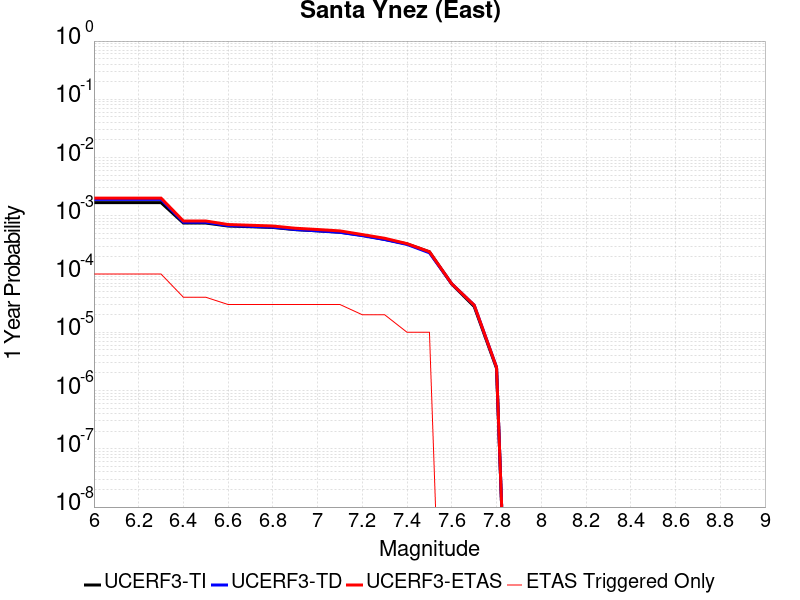 |  |

| Magnitude | 1 wk TI Prob | 1 wk TD Prob | 1 wk ETAS Prob | 1 wk ETAS/TD Gain | 1 wk ETAS Triggered Only | 1 mo TI Prob | 1 mo TD Prob | 1 mo ETAS Prob | 1 mo ETAS/TD Gain | 1 mo ETAS Triggered Only | 1 yr TI Prob | 1 yr TD Prob | 1 yr ETAS Prob | 1 yr ETAS/TD Gain | 1 yr ETAS Triggered Only | 10 yr TI Prob | 10 yr TD Prob | 10 yr ETAS Prob | 10 yr ETAS/TD Gain | 10 yr ETAS Triggered Only |
|-----|-----|-----|-----|-----|-----|-----|-----|-----|-----|-----|-----|-----|-----|-----|-----|-----|-----|-----|-----|-----|
| 6.0 | 3.2269712E-5 | 3.67505E-5 | 7.052335E-5 | 1.9189764 | 3.3774086E-5 | 1.3829143E-4 | 1.5749598E-4 | 2.2503351E-4 | 1.4288207 | 6.754817E-5 | 0.0016823979 | 0.0019164166 | 0.0020343994 | 1.0615642 | 1.182093E-4 | 0.016697178 | 0.019056441 | 0.01920553 | 1.0078235 | 1.5198339E-4 |
| 6.1 | 3.2269712E-5 | 3.67505E-5 | 7.052335E-5 | 1.9189764 | 3.3774086E-5 | 1.3829143E-4 | 1.5749598E-4 | 2.2503351E-4 | 1.4288207 | 6.754817E-5 | 0.0016823979 | 0.0019164166 | 0.0020343994 | 1.0615642 | 1.182093E-4 | 0.016697178 | 0.019056441 | 0.01920553 | 1.0078235 | 1.5198339E-4 |
| 6.2 | 3.2269712E-5 | 3.67505E-5 | 7.052335E-5 | 1.9189764 | 3.3774086E-5 | 1.3829143E-4 | 1.5749598E-4 | 2.2503351E-4 | 1.4288207 | 6.754817E-5 | 0.0016823979 | 0.0019164166 | 0.0020343994 | 1.0615642 | 1.182093E-4 | 0.016697178 | 0.019056441 | 0.01920553 | 1.0078235 | 1.5198339E-4 |
| 6.3 | 3.2269712E-5 | 3.67505E-5 | 7.052335E-5 | 1.9189764 | 3.3774086E-5 | 1.3829143E-4 | 1.5749598E-4 | 2.2503351E-4 | 1.4288207 | 6.754817E-5 | 0.0016823979 | 0.0019164166 | 0.0020343994 | 1.0615642 | 1.182093E-4 | 0.016697178 | 0.019056441 | 0.01920553 | 1.0078235 | 1.5198339E-4 |
| 6.4 | 1.4404779E-5 | 1.4849382E-5 | 3.1736174E-5 | 2.1372051 | 1.6887043E-5 | 6.1733306E-5 | 6.363868E-5 | 9.741062E-5 | 1.5306824 | 3.3774086E-5 | 7.513438E-4 | 7.745306E-4 | 8.4202643E-4 | 1.0871443 | 6.754817E-5 | 0.0074880854 | 0.007718862 | 0.007819402 | 1.0130253 | 1.0132226E-4 |
| 6.5 | 1.4404779E-5 | 1.4849382E-5 | 3.1736174E-5 | 2.1372051 | 1.6887043E-5 | 6.1733306E-5 | 6.363868E-5 | 9.741062E-5 | 1.5306824 | 3.3774086E-5 | 7.513438E-4 | 7.745306E-4 | 8.4202643E-4 | 1.0871443 | 6.754817E-5 | 0.0074880854 | 0.007718862 | 0.007819402 | 1.0130253 | 1.0132226E-4 |
| 6.6 | 1.280208E-5 | 1.3011947E-5 | 2.989877E-5 | 2.2977936 | 1.6887043E-5 | 5.4864904E-5 | 5.5764307E-5 | 8.953651E-5 | 1.605624 | 3.3774086E-5 | 6.6777546E-4 | 6.787207E-4 | 7.2934746E-4 | 1.0745914 | 5.066113E-5 | 0.006657724 | 0.0067666885 | 0.0068337796 | 1.0099149 | 6.754817E-5 |
| 6.7 | 1.2457027E-5 | 1.2628468E-5 | 2.9515297E-5 | 2.3372033 | 1.6887043E-5 | 5.3386164E-5 | 5.412089E-5 | 8.7893146E-5 | 1.6240152 | 3.3774086E-5 | 6.497827E-4 | 6.587243E-4 | 7.093521E-4 | 1.0768573 | 5.066113E-5 | 0.00647886 | 0.006567915 | 0.0066350196 | 1.0102171 | 6.754817E-5 |
| 6.8 | 1.2095134E-5 | 1.2230915E-5 | 2.9117751E-5 | 2.3806684 | 1.6887043E-5 | 5.1835254E-5 | 5.241716E-5 | 8.618947E-5 | 1.6442988 | 3.3774086E-5 | 6.309115E-4 | 6.379937E-4 | 6.886225E-4 | 1.0793563 | 5.066113E-5 | 0.0062912325 | 0.006361809 | 0.0064289276 | 1.0105503 | 6.754817E-5 |
| 6.9 | 1.1104036E-5 | 1.1157347E-5 | 2.8044202E-5 | 2.5135188 | 1.6887043E-5 | 4.758786E-5 | 4.781633E-5 | 8.1588805E-5 | 1.7062957 | 3.3774086E-5 | 5.7922816E-4 | 5.820096E-4 | 6.3264125E-4 | 1.0869945 | 5.066113E-5 | 0.005777207 | 0.0058049993 | 0.005872155 | 1.0115687 | 6.754817E-5 |
| 7.0 | 1.0577444E-5 | 1.058168E-5 | 2.7468544E-5 | 2.5958586 | 1.6887043E-5 | 4.5331115E-5 | 4.5349276E-5 | 7.912183E-5 | 1.7447209 | 3.3774086E-5 | 5.5176654E-4 | 5.519888E-4 | 6.0262193E-4 | 1.0917286 | 5.066113E-5 | 0.0055039856 | 0.0055063153 | 0.0055734916 | 1.0121999 | 6.754817E-5 |
| 7.1 | 1.0021775E-5 | 9.980988E-6 | 2.6867861E-5 | 2.691904 | 1.6887043E-5 | 4.294976E-5 | 4.2774966E-5 | 7.654761E-5 | 1.7895422 | 3.3774086E-5 | 5.2278786E-4 | 5.2066194E-4 | 5.712967E-4 | 1.0972507 | 5.066113E-5 | 0.0052155964 | 0.0051945536 | 0.005261751 | 1.0129361 | 6.754817E-5 |
| 7.2 | 8.874109E-6 | 8.748793E-6 | 2.5635689E-5 | 2.930197 | 1.6887043E-5 | 3.8031343E-5 | 3.7494297E-5 | 5.4380707E-5 | 1.4503727 | 1.6887043E-5 | 4.629332E-4 | 4.5639853E-4 | 4.901572E-4 | 1.0739676 | 3.3774086E-5 | 0.0046197 | 0.0045547304 | 0.0046051606 | 1.011072 | 5.066113E-5 |
| 7.3 | 7.5504267E-6 | 7.5051175E-6 | 2.4392033E-5 | 3.2500534 | 1.6887043E-5 | 3.235857E-5 | 3.21644E-5 | 4.9050897E-5 | 1.5250059 | 1.6887043E-5 | 3.9389438E-4 | 3.915322E-4 | 4.2529308E-4 | 1.0862275 | 3.3774086E-5 | 0.0039319694 | 0.003908531 | 0.003958994 | 1.012911 | 5.066113E-5 |
| 7.4 | 6.309394E-6 | 6.1831556E-6 | 2.3070093E-5 | 3.7311196 | 1.6887043E-5 | 2.703998E-5 | 2.6498974E-5 | 4.338557E-5 | 1.6372546 | 1.6887043E-5 | 3.2916202E-4 | 3.225782E-4 | 3.394598E-4 | 1.0523334 | 1.6887043E-5 | 0.003286749 | 0.003221197 | 0.0032548623 | 1.0104512 | 3.3774086E-5 |
| 7.5 | 4.6103073E-6 | 4.4408903E-6 | 2.1327858E-5 | 4.8026085 | 1.6887043E-5 | 1.975831E-5 | 1.9032252E-5 | 3.5918973E-5 | 1.8872687 | 1.6887043E-5 | 2.4053088E-4 | 2.3169373E-4 | 2.4857686E-4 | 1.0728683 | 1.6887043E-5 | 0.002402707 | 0.002314591 | 0.002348287 | 1.0145581 | 3.3774086E-5 |
| 7.6 | 1.2858658E-6 | 1.3008173E-6 | 1.3008173E-6 | 1.0 | 0.0 | 5.5108417E-6 | 5.5749197E-6 | 5.5749197E-6 | 1.0 | 0.0 | 6.7092435E-5 | 6.78726E-5 | 6.78726E-5 | 1.0 | 0.0 | 6.707218E-4 | 6.785256E-4 | 6.785256E-4 | 1.0 | 0.0 |
| 7.7 | 5.3302307E-7 | 5.612138E-7 | 5.612138E-7 | 1.0 | 0.0 | 2.2843826E-6 | 2.4052001E-6 | 2.4052001E-6 | 1.0 | 0.0 | 2.7812002E-5 | 2.9282954E-5 | 2.9282954E-5 | 1.0 | 0.0 | 2.7808524E-4 | 2.9279452E-4 | 2.9279452E-4 | 1.0 | 0.0 |
| 7.8 | 4.613933E-8 | 4.80301E-8 | 4.80301E-8 | 1.0 | 0.0 | 1.9773998E-7 | 2.0584326E-7 | 2.0584326E-7 | 1.0 | 0.0 | 2.4074816E-6 | 2.5061388E-6 | 2.5061388E-6 | 1.0 | 0.0 | 2.4074554E-5 | 2.5061116E-5 | 2.5061116E-5 | 1.0 | 0.0 |

## Mission Creek
*[(top)](#table-of-contents)*

| 1 Week | 1 Month | 1 Year | 10 Year |
|-----|-----|-----|-----|
|  |  |  |  |

| Magnitude | 1 wk TI Prob | 1 wk TD Prob | 1 wk ETAS Prob | 1 wk ETAS/TD Gain | 1 wk ETAS Triggered Only | 1 mo TI Prob | 1 mo TD Prob | 1 mo ETAS Prob | 1 mo ETAS/TD Gain | 1 mo ETAS Triggered Only | 1 yr TI Prob | 1 yr TD Prob | 1 yr ETAS Prob | 1 yr ETAS/TD Gain | 1 yr ETAS Triggered Only | 10 yr TI Prob | 10 yr TD Prob | 10 yr ETAS Prob | 10 yr ETAS/TD Gain | 10 yr ETAS Triggered Only |
|-----|-----|-----|-----|-----|-----|-----|-----|-----|-----|-----|-----|-----|-----|-----|-----|-----|-----|-----|-----|-----|
| 6.0 | 1.1549387E-5 | 1.632237E-5 | 8.386944E-5 | 5.1383123 | 6.754817E-5 | 4.9496433E-5 | 6.9951224E-5 | 1.5438053E-4 | 2.206974 | 8.443521E-5 | 6.0245243E-4 | 8.513384E-4 | 9.69447E-4 | 1.1387329 | 1.182093E-4 | 0.006008218 | 0.008509998 | 0.008660688 | 1.0177075 | 1.5198339E-4 |
| 6.1 | 1.1549387E-5 | 1.632237E-5 | 8.386944E-5 | 5.1383123 | 6.754817E-5 | 4.9496433E-5 | 6.9951224E-5 | 1.5438053E-4 | 2.206974 | 8.443521E-5 | 6.0245243E-4 | 8.513384E-4 | 9.69447E-4 | 1.1387329 | 1.182093E-4 | 0.006008218 | 0.008509998 | 0.008660688 | 1.0177075 | 1.5198339E-4 |
| 6.2 | 1.1549387E-5 | 1.632237E-5 | 8.386944E-5 | 5.1383123 | 6.754817E-5 | 4.9496433E-5 | 6.9951224E-5 | 1.5438053E-4 | 2.206974 | 8.443521E-5 | 6.0245243E-4 | 8.513384E-4 | 9.69447E-4 | 1.1387329 | 1.182093E-4 | 0.006008218 | 0.008509998 | 0.008660688 | 1.0177075 | 1.5198339E-4 |
| 6.3 | 1.1549387E-5 | 1.632237E-5 | 8.386944E-5 | 5.1383123 | 6.754817E-5 | 4.9496433E-5 | 6.9951224E-5 | 1.5438053E-4 | 2.206974 | 8.443521E-5 | 6.0245243E-4 | 8.513384E-4 | 9.69447E-4 | 1.1387329 | 1.182093E-4 | 0.006008218 | 0.008509998 | 0.008660688 | 1.0177075 | 1.5198339E-4 |
| 6.4 | 1.1549387E-5 | 1.632237E-5 | 8.386944E-5 | 5.1383123 | 6.754817E-5 | 4.9496433E-5 | 6.9951224E-5 | 1.5438053E-4 | 2.206974 | 8.443521E-5 | 6.0245243E-4 | 8.513384E-4 | 9.69447E-4 | 1.1387329 | 1.182093E-4 | 0.006008218 | 0.008509998 | 0.008660688 | 1.0177075 | 1.5198339E-4 |
| 6.5 | 1.1549387E-5 | 1.632237E-5 | 8.386944E-5 | 5.1383123 | 6.754817E-5 | 4.9496433E-5 | 6.9951224E-5 | 1.5438053E-4 | 2.206974 | 8.443521E-5 | 6.0245243E-4 | 8.513384E-4 | 9.69447E-4 | 1.1387329 | 1.182093E-4 | 0.006008218 | 0.008509998 | 0.008660688 | 1.0177075 | 1.5198339E-4 |
| 6.6 | 9.202681E-6 | 1.3845646E-5 | 8.139288E-5 | 5.87859 | 6.754817E-5 | 3.9439463E-5 | 5.9337188E-5 | 1.437674E-4 | 2.4228885 | 8.443521E-5 | 4.800697E-4 | 7.221998E-4 | 8.4032374E-4 | 1.1635612 | 1.182093E-4 | 0.004790339 | 0.0072271815 | 0.0073780664 | 1.0208775 | 1.5198339E-4 |
| 6.7 | 9.019164E-6 | 1.3651316E-5 | 8.119857E-5 | 5.9480395 | 6.754817E-5 | 3.8652986E-5 | 5.8504378E-5 | 1.4293464E-4 | 2.4431446 | 8.443521E-5 | 4.7049852E-4 | 7.12067E-4 | 8.301922E-4 | 1.1658905 | 1.182093E-4 | 0.004695036 | 0.007126506 | 0.0072774063 | 1.0211746 | 1.5198339E-4 |
| 6.8 | 8.673558E-6 | 1.3273427E-5 | 8.0820704E-5 | 6.0889096 | 6.754817E-5 | 3.717186E-5 | 5.6884925E-5 | 1.4131534E-4 | 2.4842317 | 8.443521E-5 | 4.524734E-4 | 6.923627E-4 | 8.1049016E-4 | 1.170615 | 1.182093E-4 | 0.0045155324 | 0.006930694 | 0.007081624 | 1.021777 | 1.5198339E-4 |
| 6.9 | 7.002255E-6 | 1.1477657E-5 | 7.902505E-5 | 6.885121 | 6.754817E-5 | 3.000932E-5 | 4.9189068E-5 | 1.3362012E-4 | 2.7164598 | 8.443521E-5 | 3.653022E-4 | 5.9871917E-4 | 7.168577E-4 | 1.1973188 | 1.182093E-4 | 0.0036470229 | 0.005999517 | 0.006150589 | 1.0251806 | 1.5198339E-4 |
| 7.0 | 5.84644E-6 | 9.67498E-6 | 7.7222496E-5 | 7.98167 | 6.754817E-5 | 2.5055931E-5 | 4.1463565E-5 | 1.2589528E-4 | 3.0362868 | 8.443521E-5 | 3.0501327E-4 | 5.047066E-4 | 6.228562E-4 | 1.2340957 | 1.182093E-4 | 0.0030459496 | 0.0050638523 | 0.005215066 | 1.0298615 | 1.5198339E-4 |
| 7.1 | 5.54703E-6 | 9.329456E-6 | 7.6877E-5 | 8.240244 | 6.754817E-5 | 2.377277E-5 | 3.9982795E-5 | 1.2441463E-4 | 3.111704 | 8.443521E-5 | 2.8939504E-4 | 4.8668624E-4 | 6.04838E-4 | 1.2427678 | 1.182093E-4 | 0.0028901845 | 0.004884446 | 0.0050356872 | 1.0309638 | 1.5198339E-4 |
| 7.2 | 4.384709E-6 | 7.68157E-6 | 7.5229225E-5 | 9.793468 | 6.754817E-5 | 1.8791474E-5 | 3.2920623E-5 | 1.17353055E-4 | 3.5647278 | 8.443521E-5 | 2.2876218E-4 | 4.0073853E-4 | 5.1890046E-4 | 1.2948604 | 1.182093E-4 | 0.0022852682 | 0.004028366 | 0.004179737 | 1.0375763 | 1.5198339E-4 |
| 7.3 | 3.7888456E-6 | 6.915452E-6 | 7.4463154E-5 | 10.767649 | 6.754817E-5 | 1.623781E-5 | 2.9637333E-5 | 1.1407004E-4 | 3.8488634 | 8.443521E-5 | 1.9767738E-4 | 3.6077813E-4 | 4.789448E-4 | 1.3275328 | 1.182093E-4 | 0.0019750162 | 0.0036301152 | 0.0037815468 | 1.0417154 | 1.5198339E-4 |
| 7.4 | 2.1982462E-6 | 5.0237763E-6 | 7.257161E-5 | 14.445628 | 6.754817E-5 | 9.421021E-6 | 2.1530293E-5 | 1.0596369E-4 | 4.921609 | 8.443521E-5 | 1.1469489E-4 | 2.621E-4 | 3.802783E-4 | 1.4508902 | 1.182093E-4 | 0.0011463572 | 0.0026458844 | 0.0027974658 | 1.0572895 | 1.5198339E-4 |
| 7.5 | 2.051923E-6 | 4.615016E-6 | 7.2162875E-5 | 15.636538 | 6.754817E-5 | 8.793926E-6 | 1.9778492E-5 | 1.04212035E-4 | 5.2689576 | 8.443521E-5 | 1.0706078E-4 | 2.4077666E-4 | 3.589575E-4 | 1.4908317 | 1.182093E-4 | 0.0010700922 | 0.0024335422 | 0.0025851557 | 1.0623016 | 1.5198339E-4 |
| 7.6 | 1.8733427E-6 | 4.1233748E-6 | 7.167127E-5 | 17.3817 | 6.754817E-5 | 8.028587E-6 | 1.7671488E-5 | 1.0210521E-4 | 5.777963 | 8.443521E-5 | 9.774366E-5 | 2.151292E-4 | 3.3331307E-4 | 1.5493623 | 1.182093E-4 | 9.770069E-4 | 0.0021780801 | 0.0023297325 | 1.0696266 | 1.5198339E-4 |
| 7.7 | 1.8411953E-6 | 4.0430496E-6 | 7.159095E-5 | 17.707165 | 6.754817E-5 | 7.890813E-6 | 1.732724E-5 | 1.0176099E-4 | 5.8728905 | 8.443521E-5 | 9.606641E-5 | 2.1093882E-4 | 3.2912317E-4 | 1.5602779 | 1.182093E-4 | 9.6024893E-4 | 0.0021363653 | 0.002288024 | 1.0709891 | 1.5198339E-4 |
| 7.8 | 1.7194251E-6 | 3.7104276E-6 | 7.125835E-5 | 19.20489 | 6.754817E-5 | 7.368944E-6 | 1.5901736E-5 | 1.0033561E-4 | 6.3097267 | 8.443521E-5 | 8.97132E-5 | 1.9358651E-4 | 3.1177292E-4 | 1.6105095 | 1.182093E-4 | 8.967699E-4 | 0.0019623525 | 0.0021140375 | 1.0772976 | 1.5198339E-4 |
| 7.9 | 1.4035052E-6 | 2.9500632E-6 | 5.3611042E-5 | 18.172846 | 5.066113E-5 | 6.0150082E-6 | 1.2643067E-5 | 8.019038E-5 | 6.342637 | 6.754817E-5 | 7.3230265E-5 | 1.5391852E-4 | 2.3834074E-4 | 1.5484864 | 8.443521E-5 | 7.3206134E-4 | 0.0015631086 | 0.0016811332 | 1.0755063 | 1.182093E-4 |
| 8.0 | 3.9318823E-7 | 5.528522E-7 | 5.528522E-7 | 1.0 | 0.0 | 1.6850913E-6 | 2.3693647E-6 | 1.9256368E-5 | 8.127229 | 1.6887043E-5 | 2.0515794E-5 | 2.8846638E-5 | 6.261975E-5 | 2.1707816 | 3.3774086E-5 | 2.0513899E-4 | 2.9899E-4 | 3.49636E-4 | 1.1693902 | 5.066113E-5 |
| 8.1 | 1.596793E-7 | 1.1380002E-7 | 1.1380002E-7 | 1.0 | 0.0 | 6.8433974E-7 | 4.877143E-7 | 4.877143E-7 | 1.0 | 0.0 | 8.331805E-6 | 5.937906E-6 | 5.937906E-6 | 1.0 | 0.0 | 8.331492E-5 | 6.549966E-5 | 6.549966E-5 | 1.0 | 0.0 |
| 8.2 | 4.9003038E-8 | 2.5444924E-8 | 2.5444924E-8 | 1.0 | 0.0 | 2.10013E-7 | 1.0904967E-7 | 1.0904967E-7 | 1.0 | 0.0 | 2.5569052E-6 | 1.327679E-6 | 1.327679E-6 | 1.0 | 0.0 | 2.556876E-5 | 1.495635E-5 | 1.495635E-5 | 1.0 | 0.0 |

## San Andreas (North Branch Mill Creek)
*[(top)](#table-of-contents)*

| 1 Week | 1 Month | 1 Year | 10 Year |
|-----|-----|-----|-----|
|  |  |  |  |

| Magnitude | 1 wk TI Prob | 1 wk TD Prob | 1 wk ETAS Prob | 1 wk ETAS/TD Gain | 1 wk ETAS Triggered Only | 1 mo TI Prob | 1 mo TD Prob | 1 mo ETAS Prob | 1 mo ETAS/TD Gain | 1 mo ETAS Triggered Only | 1 yr TI Prob | 1 yr TD Prob | 1 yr ETAS Prob | 1 yr ETAS/TD Gain | 1 yr ETAS Triggered Only | 10 yr TI Prob | 10 yr TD Prob | 10 yr ETAS Prob | 10 yr ETAS/TD Gain | 10 yr ETAS Triggered Only |
|-----|-----|-----|-----|-----|-----|-----|-----|-----|-----|-----|-----|-----|-----|-----|-----|-----|-----|-----|-----|-----|
| 6.0 | 1.3461156E-5 | 2.3499893E-5 | 4.0386538E-5 | 1.718584 | 1.6887043E-5 | 5.7689394E-5 | 1.00709956E-4 | 1.175953E-4 | 1.1676631 | 1.6887043E-5 | 7.02142E-4 | 0.0012254574 | 0.0013266555 | 1.0825799 | 1.0132226E-4 | 0.0069992766 | 0.01222957 | 0.012363014 | 1.0109116 | 1.3509634E-4 |
| 6.1 | 1.3461156E-5 | 2.3499893E-5 | 4.0386538E-5 | 1.718584 | 1.6887043E-5 | 5.7689394E-5 | 1.00709956E-4 | 1.175953E-4 | 1.1676631 | 1.6887043E-5 | 7.02142E-4 | 0.0012254574 | 0.0013266555 | 1.0825799 | 1.0132226E-4 | 0.0069992766 | 0.01222957 | 0.012363014 | 1.0109116 | 1.3509634E-4 |
| 6.2 | 1.3461156E-5 | 2.3499893E-5 | 4.0386538E-5 | 1.718584 | 1.6887043E-5 | 5.7689394E-5 | 1.00709956E-4 | 1.175953E-4 | 1.1676631 | 1.6887043E-5 | 7.02142E-4 | 0.0012254574 | 0.0013266555 | 1.0825799 | 1.0132226E-4 | 0.0069992766 | 0.01222957 | 0.012363014 | 1.0109116 | 1.3509634E-4 |
| 6.3 | 1.3461156E-5 | 2.3499893E-5 | 4.0386538E-5 | 1.718584 | 1.6887043E-5 | 5.7689394E-5 | 1.00709956E-4 | 1.175953E-4 | 1.1676631 | 1.6887043E-5 | 7.02142E-4 | 0.0012254574 | 0.0013266555 | 1.0825799 | 1.0132226E-4 | 0.0069992766 | 0.01222957 | 0.012363014 | 1.0109116 | 1.3509634E-4 |
| 6.4 | 1.3461156E-5 | 2.3499893E-5 | 4.0386538E-5 | 1.718584 | 1.6887043E-5 | 5.7689394E-5 | 1.00709956E-4 | 1.175953E-4 | 1.1676631 | 1.6887043E-5 | 7.02142E-4 | 0.0012254574 | 0.0013266555 | 1.0825799 | 1.0132226E-4 | 0.0069992766 | 0.01222957 | 0.012363014 | 1.0109116 | 1.3509634E-4 |
| 6.5 | 1.3450706E-5 | 2.3488852E-5 | 4.03755E-5 | 1.7189217 | 1.6887043E-5 | 5.764461E-5 | 1.0066265E-4 | 1.1754799E-4 | 1.1677419 | 1.6887043E-5 | 7.0159714E-4 | 0.001224882 | 0.0013260802 | 1.0826187 | 1.0132226E-4 | 0.006993862 | 0.01222388 | 0.012357324 | 1.0109167 | 1.3509634E-4 |
| 6.6 | 1.3074523E-5 | 2.3103135E-5 | 3.9989787E-5 | 1.7309247 | 1.6887043E-5 | 5.6032466E-5 | 9.9009696E-5 | 1.1589507E-4 | 1.1705426 | 1.6887043E-5 | 6.8198174E-4 | 0.0012047797 | 0.0013059799 | 1.0839989 | 1.0132226E-4 | 0.006798926 | 0.012025044 | 0.012158517 | 1.0110995 | 1.3509634E-4 |
| 6.7 | 1.3050216E-5 | 2.3078432E-5 | 3.9965085E-5 | 1.7317071 | 1.6887043E-5 | 5.59283E-5 | 9.890384E-5 | 1.15789204E-4 | 1.1707251 | 1.6887043E-5 | 6.8071426E-4 | 0.0012034923 | 0.0013046926 | 1.0840889 | 1.0132226E-4 | 0.0067863287 | 0.012012309 | 0.012145783 | 1.0111114 | 1.3509634E-4 |
| 6.8 | 1.29049395E-5 | 2.292684E-5 | 3.9813498E-5 | 1.7365452 | 1.6887043E-5 | 5.530571E-5 | 9.825421E-5 | 1.1513959E-4 | 1.171854 | 1.6887043E-5 | 6.73139E-4 | 0.0011955918 | 0.0012967929 | 1.0846452 | 1.0132226E-4 | 0.0067110364 | 0.011934154 | 0.012067638 | 1.011185 | 1.3509634E-4 |
| 6.9 | 1.2867369E-5 | 2.2886245E-5 | 3.97729E-5 | 1.7378517 | 1.6887043E-5 | 5.51447E-5 | 9.8080236E-5 | 1.14965624E-4 | 1.172159 | 1.6887043E-5 | 6.711799E-4 | 0.0011934759 | 0.0012946773 | 1.0847955 | 1.0132226E-4 | 0.006691564 | 0.011913223 | 0.012046711 | 1.011205 | 1.3509634E-4 |
| 7.0 | 1.2495996E-5 | 2.2286325E-5 | 3.9172992E-5 | 1.7577143 | 1.6887043E-5 | 5.3553173E-5 | 9.550934E-5 | 1.1239477E-4 | 1.1767935 | 1.6887043E-5 | 6.518148E-4 | 0.0011622087 | 0.0012634132 | 1.0870794 | 1.0132226E-4 | 0.0064990623 | 0.0116038285 | 0.011737357 | 1.0115073 | 1.3509634E-4 |
| 7.1 | 1.2452067E-5 | 2.2231397E-5 | 3.9118066E-5 | 1.7595863 | 1.6887043E-5 | 5.3364907E-5 | 9.527396E-5 | 1.1215939E-4 | 1.1772304 | 1.6887043E-5 | 6.4952404E-4 | 0.0011593461 | 0.0012605508 | 1.0872947 | 1.0132226E-4 | 0.0064762887 | 0.0115755 | 0.011709033 | 1.0115358 | 1.3509634E-4 |
| 7.2 | 1.2002777E-5 | 2.1609963E-5 | 3.849664E-5 | 1.7814301 | 1.6887043E-5 | 5.143946E-5 | 9.2610855E-5 | 1.0949634E-4 | 1.1823272 | 1.6887043E-5 | 6.2609545E-4 | 0.0011269567 | 0.0012281646 | 1.0898066 | 1.0132226E-4 | 0.006243344 | 0.011254923 | 0.011388498 | 1.0118682 | 1.3509634E-4 |
| 7.3 | 1.1923425E-5 | 2.1479793E-5 | 3.8366474E-5 | 1.7861658 | 1.6887043E-5 | 5.109939E-5 | 9.205302E-5 | 1.0893851E-4 | 1.1834322 | 1.6887043E-5 | 6.219575E-4 | 0.001120172 | 0.0012213808 | 1.0903511 | 1.0132226E-4 | 0.0062021962 | 0.011187789 | 0.011321374 | 1.0119402 | 1.3509634E-4 |
| 7.4 | 1.16105175E-5 | 2.0853771E-5 | 3.774046E-5 | 1.8097668 | 1.6887043E-5 | 4.975841E-5 | 8.937026E-5 | 1.0625579E-4 | 1.1889391 | 1.6887043E-5 | 6.0564023E-4 | 0.0010875424 | 0.0011887545 | 1.0930649 | 1.0132226E-4 | 0.006039923 | 0.010865397 | 0.010999025 | 1.0122986 | 1.3509634E-4 |
| 7.5 | 1.1037265E-5 | 1.9553907E-5 | 3.644062E-5 | 1.8635979 | 1.6887043E-5 | 4.7301706E-5 | 8.379978E-5 | 1.0068541E-4 | 1.2014997 | 1.6887043E-5 | 5.757461E-4 | 0.0010197869 | 0.0011210059 | 1.099255 | 1.0132226E-4 | 0.005742567 | 0.010194898 | 0.010328617 | 1.0131162 | 1.3509634E-4 |
| 7.6 | 1.0720915E-5 | 1.899582E-5 | 3.5882542E-5 | 1.8889705 | 1.6887043E-5 | 4.5945973E-5 | 8.140812E-5 | 9.829379E-5 | 1.20742 | 1.6887043E-5 | 5.592486E-4 | 9.906954E-4 | 0.0010919173 | 1.1021725 | 1.0132226E-4 | 0.005578433 | 0.009906623 | 0.01004038 | 1.0135019 | 1.3509634E-4 |
| 7.7 | 9.276279E-6 | 1.6441649E-5 | 3.3328415E-5 | 2.0270724 | 1.6887043E-5 | 3.9754876E-5 | 7.0462316E-5 | 8.734817E-5 | 1.2396437 | 1.6887043E-5 | 4.839081E-4 | 8.575427E-4 | 9.587781E-4 | 1.1180528 | 1.0132226E-4 | 0.0048285574 | 0.008586041 | 0.008719978 | 1.0155994 | 1.3509634E-4 |
| 7.8 | 5.8346777E-6 | 1.1155013E-5 | 2.8041868E-5 | 2.5138354 | 1.6887043E-5 | 2.5005522E-5 | 4.7806327E-5 | 6.469256E-5 | 1.3532218 | 1.6887043E-5 | 3.043997E-4 | 5.818867E-4 | 6.8314996E-4 | 1.1740258 | 1.0132226E-4 | 0.0030398308 | 0.0058469265 | 0.005981233 | 1.0229704 | 1.3509634E-4 |
| 7.9 | 4.690204E-6 | 8.509093E-6 | 2.5395992E-5 | 2.9845707 | 1.6887043E-5 | 2.0100719E-5 | 3.6467034E-5 | 5.3353462E-5 | 1.46306 | 1.6887043E-5 | 2.4469878E-4 | 4.4389578E-4 | 5.2829355E-4 | 1.1901296 | 8.443521E-5 | 0.002444295 | 0.0044707474 | 0.004588428 | 1.0263224 | 1.182093E-4 |
| 8.0 | 2.9570454E-6 | 4.846947E-6 | 4.846947E-6 | 1.0 | 0.0 | 1.267299E-5 | 2.0772464E-5 | 2.0772464E-5 | 1.0 | 0.0 | 1.5428272E-4 | 2.5287544E-4 | 2.697582E-4 | 1.0667632 | 1.6887043E-5 | 0.0015417566 | 0.002549644 | 0.0025664882 | 1.0066065 | 1.6887043E-5 |
| 8.1 | 1.6376824E-6 | 2.1968929E-6 | 2.1968929E-6 | 1.0 | 0.0 | 7.01862E-6 | 9.41522E-6 | 9.41522E-6 | 1.0 | 0.0 | 8.544835E-5 | 1.14624294E-4 | 1.14624294E-4 | 1.0 | 0.0 | 8.54155E-4 | 0.0011606582 | 0.0011606582 | 1.0 | 0.0 |
| 8.2 | 6.9631557E-7 | 4.5360213E-7 | 4.5360213E-7 | 1.0 | 0.0 | 2.984206E-6 | 1.9440076E-6 | 1.9440076E-6 | 1.0 | 0.0 | 3.63321E-5 | 2.3668037E-5 | 2.3668037E-5 | 1.0 | 0.0 | 3.6326164E-4 | 2.451564E-4 | 2.451564E-4 | 1.0 | 0.0 |
| 8.3 | 1.7876137E-7 | 8.360375E-8 | 8.360375E-8 | 1.0 | 0.0 | 7.661199E-7 | 3.5830175E-7 | 3.5830175E-7 | 1.0 | 0.0 | 9.32747E-6 | 4.3623154E-6 | 4.3623154E-6 | 1.0 | 0.0 | 9.3270784E-5 | 4.5817014E-5 | 4.5817014E-5 | 1.0 | 0.0 |

## Santa Rosa Island
*[(top)](#table-of-contents)*

| 1 Week | 1 Month | 1 Year | 10 Year |
|-----|-----|-----|-----|
|  |  |  | 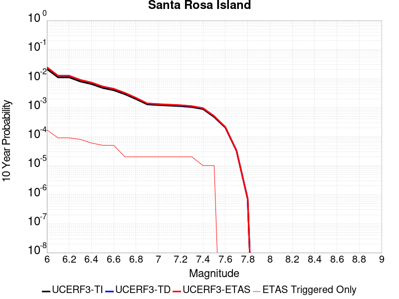 |

| Magnitude | 1 wk TI Prob | 1 wk TD Prob | 1 wk ETAS Prob | 1 wk ETAS/TD Gain | 1 wk ETAS Triggered Only | 1 mo TI Prob | 1 mo TD Prob | 1 mo ETAS Prob | 1 mo ETAS/TD Gain | 1 mo ETAS Triggered Only | 1 yr TI Prob | 1 yr TD Prob | 1 yr ETAS Prob | 1 yr ETAS/TD Gain | 1 yr ETAS Triggered Only | 10 yr TI Prob | 10 yr TD Prob | 10 yr ETAS Prob | 10 yr ETAS/TD Gain | 10 yr ETAS Triggered Only |
|-----|-----|-----|-----|-----|-----|-----|-----|-----|-----|-----|-----|-----|-----|-----|-----|-----|-----|-----|-----|-----|
| 6.0 | 4.1143165E-5 | 4.7091133E-5 | 6.397738E-5 | 1.3585865 | 1.6887043E-5 | 1.7631594E-4 | 2.0180465E-4 | 2.693392E-4 | 1.334653 | 6.754817E-5 | 0.002144533 | 0.0024544 | 0.002538628 | 1.0343171 | 8.443521E-5 | 0.021239553 | 0.024293551 | 0.024425365 | 1.0054259 | 1.3509634E-4 |
| 6.1 | 2.1061249E-5 | 2.3864959E-5 | 4.0751598E-5 | 1.7075914 | 1.6887043E-5 | 9.0259375E-5 | 1.0227455E-4 | 1.3604519E-4 | 1.3301958 | 3.3774086E-5 | 0.0010983539 | 0.0012445104 | 0.0012951085 | 1.040657 | 5.066113E-5 | 0.01092941 | 0.012378449 | 0.012461838 | 1.0067368 | 8.443521E-5 |
| 6.2 | 2.1061249E-5 | 2.3864959E-5 | 4.0751598E-5 | 1.7075914 | 1.6887043E-5 | 9.0259375E-5 | 1.0227455E-4 | 1.3604519E-4 | 1.3301958 | 3.3774086E-5 | 0.0010983539 | 0.0012445104 | 0.0012951085 | 1.040657 | 5.066113E-5 | 0.01092941 | 0.012378449 | 0.012461838 | 1.0067368 | 8.443521E-5 |
| 6.3 | 1.5158236E-5 | 1.7074419E-5 | 3.3961172E-5 | 1.989009 | 1.6887043E-5 | 6.496225E-5 | 7.3174095E-5 | 1.06945714E-4 | 1.4615241 | 3.3774086E-5 | 7.906284E-4 | 8.905424E-4 | 9.4115845E-4 | 1.0568373 | 5.066113E-5 | 0.007878214 | 0.008870989 | 0.008937938 | 1.0075469 | 6.754817E-5 |
| 6.4 | 1.2341918E-5 | 1.3852917E-5 | 1.3852917E-5 | 1.0 | 0.0 | 5.2892858E-5 | 5.9368336E-5 | 7.625438E-5 | 1.2844284 | 1.6887043E-5 | 6.437803E-4 | 7.225779E-4 | 7.563276E-4 | 1.0467073 | 3.3774086E-5 | 0.006419184 | 0.007203121 | 0.007236652 | 1.004655 | 3.3774086E-5 |
| 6.5 | 9.061158E-6 | 1.0117031E-5 | 1.0117031E-5 | 1.0 | 0.0 | 3.883296E-5 | 4.3358013E-5 | 4.3358013E-5 | 1.0 | 0.0 | 4.726887E-4 | 5.277613E-4 | 5.446394E-4 | 1.0319806 | 1.6887043E-5 | 0.004716845 | 0.0052656173 | 0.0052824155 | 1.0031902 | 1.6887043E-5 |
| 6.6 | 7.5461685E-6 | 8.400733E-6 | 8.400733E-6 | 1.0 | 0.0 | 3.2340322E-5 | 3.600267E-5 | 3.600267E-5 | 1.0 | 0.0 | 3.936723E-4 | 4.3824865E-4 | 4.551283E-4 | 1.0385162 | 1.6887043E-5 | 0.003929756 | 0.0043742736 | 0.0043910868 | 1.0038437 | 1.6887043E-5 |
| 6.7 | 5.5023775E-6 | 6.087381E-6 | 6.087381E-6 | 1.0 | 0.0 | 2.3581404E-5 | 2.6088532E-5 | 2.6088532E-5 | 1.0 | 0.0 | 2.8706578E-4 | 3.1758484E-4 | 3.1758484E-4 | 1.0 | 0.0 | 0.0028669522 | 0.0031716314 | 0.0031716314 | 1.0 | 0.0 |
| 6.8 | 3.7351679E-6 | 4.0831405E-6 | 4.0831405E-6 | 1.0 | 0.0 | 1.6007763E-5 | 1.749907E-5 | 1.749907E-5 | 1.0 | 0.0 | 1.948771E-4 | 2.1303284E-4 | 2.1303284E-4 | 1.0 | 0.0 | 0.0019470629 | 0.0021285315 | 0.0021285315 | 1.0 | 0.0 |
| 6.9 | 2.456366E-6 | 2.6292705E-6 | 2.6292705E-6 | 1.0 | 0.0 | 1.0527241E-5 | 1.1268254E-5 | 1.1268254E-5 | 1.0 | 0.0 | 1.2816161E-4 | 1.3718237E-4 | 1.3718237E-4 | 1.0 | 0.0 | 0.0012808773 | 0.0013709799 | 0.0013709799 | 1.0 | 0.0 |
| 7.0 | 2.3245157E-6 | 2.4827782E-6 | 2.4827782E-6 | 1.0 | 0.0 | 9.962172E-6 | 1.0640435E-5 | 1.0640435E-5 | 1.0 | 0.0 | 1.2128269E-4 | 1.2953962E-4 | 1.2953962E-4 | 1.0 | 0.0 | 0.0012121652 | 0.0012946434 | 0.0012946434 | 1.0 | 0.0 |
| 7.1 | 2.2248344E-6 | 2.37325E-6 | 2.37325E-6 | 1.0 | 0.0 | 9.53497E-6 | 1.0171032E-5 | 1.0171032E-5 | 1.0 | 0.0 | 1.1608207E-4 | 1.2382529E-4 | 1.2382529E-4 | 1.0 | 0.0 | 0.0011602144 | 0.001237565 | 0.001237565 | 1.0 | 0.0 |
| 7.2 | 2.1350402E-6 | 2.276154E-6 | 2.276154E-6 | 1.0 | 0.0 | 9.150141E-6 | 9.754909E-6 | 9.754909E-6 | 1.0 | 0.0 | 1.1139726E-4 | 1.1875956E-4 | 1.1875956E-4 | 1.0 | 0.0 | 0.0011134144 | 0.0011869629 | 0.0011869629 | 1.0 | 0.0 |
| 7.3 | 1.9793572E-6 | 2.108719E-6 | 2.108719E-6 | 1.0 | 0.0 | 8.482932E-6 | 9.037336E-6 | 9.037336E-6 | 1.0 | 0.0 | 1.032748E-4 | 1.10024026E-4 | 1.10024026E-4 | 1.0 | 0.0 | 0.0010322682 | 0.0010996973 | 0.0010996973 | 1.0 | 0.0 |
| 7.4 | 1.6951194E-6 | 1.8045733E-6 | 1.8045733E-6 | 1.0 | 0.0 | 7.264777E-6 | 7.733863E-6 | 7.733863E-6 | 1.0 | 0.0 | 8.844508E-5 | 9.415573E-5 | 9.415573E-5 | 1.0 | 0.0 | 8.840988E-4 | 9.4116E-4 | 9.4116E-4 | 1.0 | 0.0 |
| 7.5 | 8.987207E-7 | 9.5122147E-7 | 9.5122147E-7 | 1.0 | 0.0 | 3.8516546E-6 | 4.076657E-6 | 4.076657E-6 | 1.0 | 0.0 | 4.6892885E-5 | 4.963218E-5 | 4.963218E-5 | 1.0 | 0.0 | 4.688299E-4 | 4.9621216E-4 | 4.9621216E-4 | 1.0 | 0.0 |
| 7.6 | 3.8783037E-7 | 4.052932E-7 | 4.052932E-7 | 1.0 | 0.0 | 1.6621291E-6 | 1.7369698E-6 | 1.7369698E-6 | 1.0 | 0.0 | 2.0236233E-5 | 2.1147409E-5 | 2.1147409E-5 | 1.0 | 0.0 | 2.023439E-4 | 2.1145462E-4 | 2.1145462E-4 | 1.0 | 0.0 |
| 7.7 | 6.181804E-8 | 6.339035E-8 | 6.339035E-8 | 1.0 | 0.0 | 2.6493444E-7 | 2.7167292E-7 | 2.7167292E-7 | 1.0 | 0.0 | 3.225572E-6 | 3.3076128E-6 | 3.3076128E-6 | 1.0 | 0.0 | 3.225525E-5 | 3.307564E-5 | 3.307564E-5 | 1.0 | 0.0 |
| 7.8 | 1.3704449E-9 | 1.3964153E-9 | 1.3964153E-9 | 1.0 | 0.0 | 5.873335E-9 | 5.984637E-9 | 5.984637E-9 | 1.0 | 0.0 | 7.1507856E-8 | 7.286295E-8 | 7.286295E-8 | 1.0 | 0.0 | 7.1507833E-7 | 7.286294E-7 | 7.286294E-7 | 1.0 | 0.0 |

## Cleghorn Lake
*[(top)](#table-of-contents)*

| 1 Week | 1 Month | 1 Year | 10 Year |
|-----|-----|-----|-----|
|  |  |  |  |

| Magnitude | 1 wk TI Prob | 1 wk TD Prob | 1 wk ETAS Prob | 1 wk ETAS/TD Gain | 1 wk ETAS Triggered Only | 1 mo TI Prob | 1 mo TD Prob | 1 mo ETAS Prob | 1 mo ETAS/TD Gain | 1 mo ETAS Triggered Only | 1 yr TI Prob | 1 yr TD Prob | 1 yr ETAS Prob | 1 yr ETAS/TD Gain | 1 yr ETAS Triggered Only | 10 yr TI Prob | 10 yr TD Prob | 10 yr ETAS Prob | 10 yr ETAS/TD Gain | 10 yr ETAS Triggered Only |
|-----|-----|-----|-----|-----|-----|-----|-----|-----|-----|-----|-----|-----|-----|-----|-----|-----|-----|-----|-----|-----|
| 6.0 | 1.5467183E-5 | 1.6794203E-5 | 5.0567724E-5 | 3.0110223 | 3.3774086E-5 | 6.6286244E-5 | 7.197348E-5 | 1.2263097E-4 | 1.7038354 | 5.066113E-5 | 8.067362E-4 | 8.759797E-4 | 9.434687E-4 | 1.077044 | 6.754817E-5 | 0.008038137 | 0.008730696 | 0.008864612 | 1.0153387 | 1.3509634E-4 |
| 6.1 | 1.5467183E-5 | 1.6794203E-5 | 5.0567724E-5 | 3.0110223 | 3.3774086E-5 | 6.6286244E-5 | 7.197348E-5 | 1.2263097E-4 | 1.7038354 | 5.066113E-5 | 8.067362E-4 | 8.759797E-4 | 9.434687E-4 | 1.077044 | 6.754817E-5 | 0.008038137 | 0.008730696 | 0.008864612 | 1.0153387 | 1.3509634E-4 |
| 6.2 | 1.2624631E-5 | 1.3681544E-5 | 4.7455167E-5 | 3.4685533 | 3.3774086E-5 | 5.410444E-5 | 5.863415E-5 | 1.09292305E-4 | 1.8639702 | 5.066113E-5 | 6.585225E-4 | 7.1368564E-4 | 7.811856E-4 | 1.0945795 | 6.754817E-5 | 0.0065657445 | 0.0071187317 | 0.0072528664 | 1.0188425 | 1.3509634E-4 |
| 6.3 | 1.2624631E-5 | 1.3681544E-5 | 4.7455167E-5 | 3.4685533 | 3.3774086E-5 | 5.410444E-5 | 5.863415E-5 | 1.09292305E-4 | 1.8639702 | 5.066113E-5 | 6.585225E-4 | 7.1368564E-4 | 7.811856E-4 | 1.0945795 | 6.754817E-5 | 0.0065657445 | 0.0071187317 | 0.0072528664 | 1.0188425 | 1.3509634E-4 |
| 6.4 | 9.417684E-6 | 1.0170118E-5 | 2.7056989E-5 | 2.66044 | 1.6887043E-5 | 4.036088E-5 | 4.3585722E-5 | 6.047203E-5 | 1.3874274 | 1.6887043E-5 | 4.912829E-4 | 5.3056807E-4 | 5.4744614E-4 | 1.0318114 | 1.6887043E-5 | 0.004901982 | 0.005297049 | 0.005364239 | 1.0126845 | 6.754817E-5 |
| 6.5 | 9.368219E-6 | 1.0117545E-5 | 2.7004417E-5 | 2.6690683 | 1.6887043E-5 | 4.014889E-5 | 4.3360415E-5 | 6.0246726E-5 | 1.3894407 | 1.6887043E-5 | 4.8870314E-4 | 5.2782625E-4 | 5.447044E-4 | 1.0319767 | 1.6887043E-5 | 0.004876298 | 0.0052697617 | 0.005336954 | 1.0127505 | 6.754817E-5 |
| 6.6 | 7.803798E-6 | 8.441831E-6 | 2.532873E-5 | 3.0003836 | 1.6887043E-5 | 3.3444423E-5 | 3.6179E-5 | 5.3065432E-5 | 1.4667468 | 1.6887043E-5 | 4.0710976E-4 | 4.4043022E-4 | 4.5730983E-4 | 1.0383253 | 1.6887043E-5 | 0.0040636472 | 0.0043994905 | 0.0044499286 | 1.0114646 | 5.066113E-5 |
| 6.7 | 2.3108669E-6 | 2.4438336E-6 | 1.9330835E-5 | 7.910045 | 1.6887043E-5 | 9.903678E-6 | 1.0473532E-5 | 2.7360398E-5 | 2.6123374 | 1.6887043E-5 | 1.205706E-4 | 1.2750797E-4 | 1.4439286E-4 | 1.1324222 | 1.6887043E-5 | 0.001205052 | 0.0012743667 | 0.0012912323 | 1.0132344 | 1.6887043E-5 |
| 6.8 | 2.0882828E-6 | 2.2062823E-6 | 2.2062823E-6 | 1.0 | 0.0 | 8.949753E-6 | 9.455462E-6 | 9.455462E-6 | 1.0 | 0.0 | 1.08957785E-4 | 1.1511434E-4 | 1.1511434E-4 | 1.0 | 0.0 | 0.0010890438 | 0.0011505639 | 0.0011505639 | 1.0 | 0.0 |
| 6.9 | 1.876935E-6 | 1.981051E-6 | 1.981051E-6 | 1.0 | 0.0 | 8.043982E-6 | 8.490192E-6 | 8.490192E-6 | 1.0 | 0.0 | 9.7931086E-5 | 1.03363345E-4 | 1.03363345E-4 | 1.0 | 0.0 | 9.788794E-4 | 0.0010331686 | 0.0010331686 | 1.0 | 0.0 |
| 7.0 | 1.5357559E-6 | 1.6202807E-6 | 1.6202807E-6 | 1.0 | 0.0 | 6.5817944E-6 | 6.9440425E-6 | 6.9440425E-6 | 1.0 | 0.0 | 8.01304E-5 | 8.454057E-5 | 8.454057E-5 | 1.0 | 0.0 | 8.010151E-4 | 8.450965E-4 | 8.450965E-4 | 1.0 | 0.0 |
| 7.1 | 1.0905424E-6 | 1.1497619E-6 | 1.1497619E-6 | 1.0 | 0.0 | 4.6737446E-6 | 4.9275427E-6 | 4.9275427E-6 | 1.0 | 0.0 | 5.6901354E-5 | 5.999128E-5 | 5.999128E-5 | 1.0 | 0.0 | 5.6886784E-4 | 5.997606E-4 | 5.997606E-4 | 1.0 | 0.0 |
| 7.2 | 6.06668E-7 | 6.387277E-7 | 6.387277E-7 | 1.0 | 0.0 | 2.600003E-6 | 2.7374022E-6 | 2.7374022E-6 | 1.0 | 0.0 | 3.1654577E-5 | 3.3327433E-5 | 3.3327433E-5 | 1.0 | 0.0 | 3.1650066E-4 | 3.3323118E-4 | 3.3323118E-4 | 1.0 | 0.0 |

## Cleghorn Pass
*[(top)](#table-of-contents)*

| 1 Week | 1 Month | 1 Year | 10 Year |
|-----|-----|-----|-----|
|  | 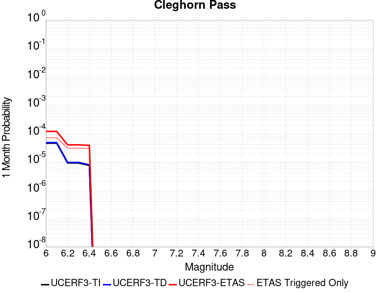 |  |  |

| Magnitude | 1 wk TI Prob | 1 wk TD Prob | 1 wk ETAS Prob | 1 wk ETAS/TD Gain | 1 wk ETAS Triggered Only | 1 mo TI Prob | 1 mo TD Prob | 1 mo ETAS Prob | 1 mo ETAS/TD Gain | 1 mo ETAS Triggered Only | 1 yr TI Prob | 1 yr TD Prob | 1 yr ETAS Prob | 1 yr ETAS/TD Gain | 1 yr ETAS Triggered Only | 10 yr TI Prob | 10 yr TD Prob | 10 yr ETAS Prob | 10 yr ETAS/TD Gain | 10 yr ETAS Triggered Only |
|-----|-----|-----|-----|-----|-----|-----|-----|-----|-----|-----|-----|-----|-----|-----|-----|-----|-----|-----|-----|-----|
| 6.0 | 1.0522846E-5 | 1.1040642E-5 | 1.1040642E-5 | 1.0 | 0.0 | 4.509713E-5 | 4.7316473E-5 | 8.108896E-5 | 1.7137575 | 3.3774086E-5 | 5.4891926E-4 | 5.759784E-4 | 6.097331E-4 | 1.058604 | 3.3774086E-5 | 0.0054756533 | 0.005750022 | 0.0058507617 | 1.0175198 | 1.0132226E-4 |
| 6.1 | 1.0522846E-5 | 1.1040642E-5 | 1.1040642E-5 | 1.0 | 0.0 | 4.509713E-5 | 4.7316473E-5 | 8.108896E-5 | 1.7137575 | 3.3774086E-5 | 5.4891926E-4 | 5.759784E-4 | 6.097331E-4 | 1.058604 | 3.3774086E-5 | 0.0054756533 | 0.005750022 | 0.0058507617 | 1.0175198 | 1.0132226E-4 |
| 6.2 | 2.1045846E-6 | 2.2082024E-6 | 2.2082024E-6 | 1.0 | 0.0 | 9.019617E-6 | 9.463714E-6 | 4.323748E-5 | 4.568764 | 3.3774086E-5 | 1.098083E-4 | 1.1521882E-4 | 1.4898901E-4 | 1.2930962 | 3.3774086E-5 | 0.0010975406 | 0.0011520023 | 0.0012026051 | 1.0439259 | 5.066113E-5 |
| 6.3 | 2.1045846E-6 | 2.2082024E-6 | 2.2082024E-6 | 1.0 | 0.0 | 9.019617E-6 | 9.463714E-6 | 4.323748E-5 | 4.568764 | 3.3774086E-5 | 1.098083E-4 | 1.1521882E-4 | 1.4898901E-4 | 1.2930962 | 3.3774086E-5 | 0.0010975406 | 0.0011520023 | 0.0012026051 | 1.0439259 | 5.066113E-5 |
| 6.4 | 1.7259927E-6 | 1.810877E-6 | 1.810877E-6 | 1.0 | 0.0 | 7.3970905E-6 | 7.760902E-6 | 4.1534724E-5 | 5.351791 | 3.3774086E-5 | 9.005586E-5 | 9.4488976E-5 | 1.2825987E-4 | 1.3574057 | 3.3774086E-5 | 9.001937E-4 | 9.448898E-4 | 9.95503E-4 | 1.0535653 | 5.066113E-5 |

## Kern Canyon (Lake Isabella) 2011
*[(top)](#table-of-contents)*

| 1 Week | 1 Month | 1 Year | 10 Year |
|-----|-----|-----|-----|
|  | 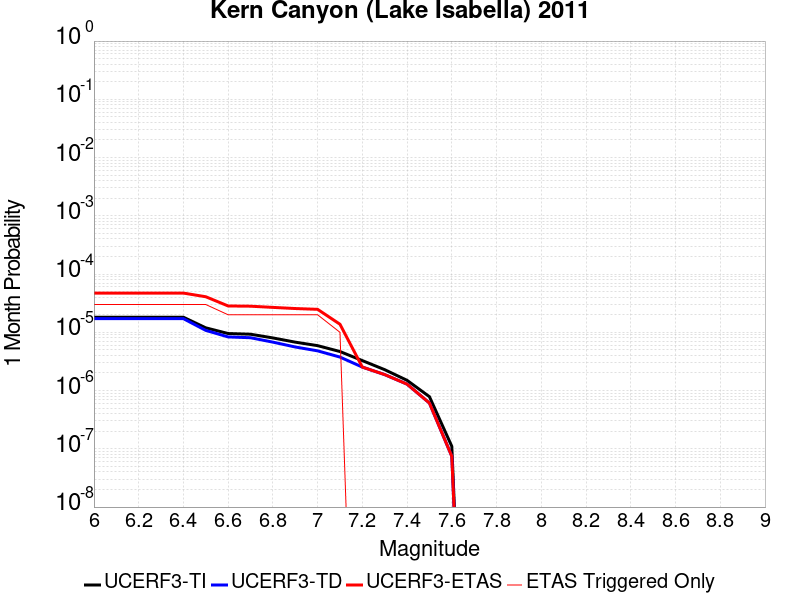 |  |  |

| Magnitude | 1 wk TI Prob | 1 wk TD Prob | 1 wk ETAS Prob | 1 wk ETAS/TD Gain | 1 wk ETAS Triggered Only | 1 mo TI Prob | 1 mo TD Prob | 1 mo ETAS Prob | 1 mo ETAS/TD Gain | 1 mo ETAS Triggered Only | 1 yr TI Prob | 1 yr TD Prob | 1 yr ETAS Prob | 1 yr ETAS/TD Gain | 1 yr ETAS Triggered Only | 10 yr TI Prob | 10 yr TD Prob | 10 yr ETAS Prob | 10 yr ETAS/TD Gain | 10 yr ETAS Triggered Only |
|-----|-----|-----|-----|-----|-----|-----|-----|-----|-----|-----|-----|-----|-----|-----|-----|-----|-----|-----|-----|-----|
| 6.0 | 4.2387383E-6 | 4.001639E-6 | 5.4662563E-5 | 13.660045 | 5.066113E-5 | 1.8165894E-5 | 1.7149778E-5 | 6.781003E-5 | 3.9539893 | 5.066113E-5 | 2.2114732E-4 | 2.087804E-4 | 3.100815E-4 | 1.4852041 | 1.0132226E-4 | 0.0022092736 | 0.0020860266 | 0.0022039893 | 1.056549 | 1.182093E-4 |
| 6.1 | 4.2387383E-6 | 4.001639E-6 | 5.4662563E-5 | 13.660045 | 5.066113E-5 | 1.8165894E-5 | 1.7149778E-5 | 6.781003E-5 | 3.9539893 | 5.066113E-5 | 2.2114732E-4 | 2.087804E-4 | 3.100815E-4 | 1.4852041 | 1.0132226E-4 | 0.0022092736 | 0.0020860266 | 0.0022039893 | 1.056549 | 1.182093E-4 |
| 6.2 | 4.2387383E-6 | 4.001639E-6 | 5.4662563E-5 | 13.660045 | 5.066113E-5 | 1.8165894E-5 | 1.7149778E-5 | 6.781003E-5 | 3.9539893 | 5.066113E-5 | 2.2114732E-4 | 2.087804E-4 | 3.100815E-4 | 1.4852041 | 1.0132226E-4 | 0.0022092736 | 0.0020860266 | 0.0022039893 | 1.056549 | 1.182093E-4 |
| 6.3 | 4.2387383E-6 | 4.001639E-6 | 5.4662563E-5 | 13.660045 | 5.066113E-5 | 1.8165894E-5 | 1.7149778E-5 | 6.781003E-5 | 3.9539893 | 5.066113E-5 | 2.2114732E-4 | 2.087804E-4 | 3.100815E-4 | 1.4852041 | 1.0132226E-4 | 0.0022092736 | 0.0020860266 | 0.0022039893 | 1.056549 | 1.182093E-4 |
| 6.4 | 4.2387383E-6 | 4.001639E-6 | 5.4662563E-5 | 13.660045 | 5.066113E-5 | 1.8165894E-5 | 1.7149778E-5 | 6.781003E-5 | 3.9539893 | 5.066113E-5 | 2.2114732E-4 | 2.087804E-4 | 3.100815E-4 | 1.4852041 | 1.0132226E-4 | 0.0022092736 | 0.0020860266 | 0.0022039893 | 1.056549 | 1.182093E-4 |
| 6.5 | 2.7857532E-6 | 2.517867E-6 | 5.317887E-5 | 21.120604 | 5.066113E-5 | 1.1938888E-5 | 1.0790815E-5 | 6.14514E-5 | 5.694787 | 5.066113E-5 | 1.4534626E-4 | 1.3137059E-4 | 2.157947E-4 | 1.642641 | 8.443521E-5 | 0.0014525123 | 0.001312962 | 0.0013972863 | 1.0642245 | 8.443521E-5 |
| 6.6 | 2.2233348E-6 | 1.9441236E-6 | 3.571814E-5 | 18.372362 | 3.3774086E-5 | 9.528543E-6 | 8.331932E-6 | 4.2105738E-5 | 5.053538 | 3.3774086E-5 | 1.1600384E-4 | 1.01436635E-4 | 1.5209263E-4 | 1.4993855 | 5.066113E-5 | 0.001159433 | 0.001013912 | 0.0010645217 | 1.0499153 | 5.066113E-5 |
| 6.7 | 2.1635126E-6 | 1.8835036E-6 | 3.5657526E-5 | 18.931488 | 3.3774086E-5 | 9.272164E-6 | 8.072134E-6 | 4.1845946E-5 | 5.1840005 | 3.3774086E-5 | 1.1288274E-4 | 9.827388E-5 | 1.4893002E-4 | 1.515459 | 5.066113E-5 | 0.0011282542 | 9.823124E-4 | 0.0010329237 | 1.0515227 | 5.066113E-5 |
| 6.8 | 1.8685711E-6 | 1.5831425E-6 | 3.5357174E-5 | 22.333538 | 3.3774086E-5 | 8.008137E-6 | 6.784879E-6 | 4.0558734E-5 | 5.9778123 | 3.3774086E-5 | 9.74947E-5 | 8.260282E-5 | 1.3325976E-4 | 1.6132592 | 5.066113E-5 | 9.745194E-4 | 8.2572614E-4 | 8.763454E-4 | 1.0613028 | 5.066113E-5 |
| 6.9 | 1.5815071E-6 | 1.3064928E-6 | 3.5080535E-5 | 26.85092 | 3.3774086E-5 | 6.77787E-6 | 5.599243E-6 | 3.937314E-5 | 7.031868 | 3.3774086E-5 | 8.251744E-5 | 6.816868E-5 | 1.18826356E-4 | 1.7431225 | 5.066113E-5 | 8.248681E-4 | 6.8148033E-4 | 7.32107E-4 | 1.0742892 | 5.066113E-5 |
| 7.0 | 1.3772564E-6 | 1.1210718E-6 | 3.4895118E-5 | 31.12657 | 3.3774086E-5 | 5.9025137E-6 | 4.8045845E-6 | 3.8578506E-5 | 8.02952 | 3.3774086E-5 | 7.186073E-5 | 5.8494268E-5 | 1.0915243E-4 | 1.8660364 | 5.066113E-5 | 7.18375E-4 | 5.847908E-4 | 6.3542224E-4 | 1.0865805 | 5.066113E-5 |
| 7.1 | 1.0916998E-6 | 8.763777E-7 | 1.7763405E-5 | 20.269121 | 1.6887043E-5 | 4.678705E-6 | 3.7558991E-6 | 2.0642878E-5 | 5.4961214 | 1.6887043E-5 | 5.6961744E-5 | 4.5727127E-5 | 7.949967E-5 | 1.7385669 | 3.3774086E-5 | 5.6947145E-4 | 4.571785E-4 | 4.9093715E-4 | 1.0738413 | 3.3774086E-5 |
| 7.2 | 7.6277024E-7 | 5.901454E-7 | 5.901454E-7 | 1.0 | 0.0 | 3.2690114E-6 | 2.5291922E-6 | 2.5291922E-6 | 1.0 | 0.0 | 3.9799485E-5 | 3.0792486E-5 | 4.767901E-5 | 1.5483975 | 1.6887043E-5 | 3.9792358E-4 | 3.0788282E-4 | 3.2476467E-4 | 1.0548321 | 1.6887043E-5 |
| 7.3 | 5.3265916E-7 | 4.3824414E-7 | 4.3824414E-7 | 1.0 | 0.0 | 2.282823E-6 | 1.878188E-6 | 1.878188E-6 | 1.0 | 0.0 | 2.7793016E-5 | 2.2866701E-5 | 3.975336E-5 | 1.7384824 | 1.6887043E-5 | 2.778954E-4 | 2.2864387E-4 | 2.4552704E-4 | 1.0738405 | 1.6887043E-5 |
| 7.4 | 3.4946007E-7 | 3.006571E-7 | 3.006571E-7 | 1.0 | 0.0 | 1.497685E-6 | 1.2885298E-6 | 1.2885298E-6 | 1.0 | 0.0 | 1.8234163E-5 | 1.568774E-5 | 3.2574517E-5 | 2.0764315 | 1.6887043E-5 | 1.8232666E-4 | 1.5686655E-4 | 1.7375093E-4 | 1.1076354 | 1.6887043E-5 |
| 7.5 | 1.8317026E-7 | 1.4244812E-7 | 1.4244812E-7 | 1.0 | 0.0 | 7.850152E-7 | 6.104918E-7 | 6.104918E-7 | 1.0 | 0.0 | 9.557518E-6 | 7.432713E-6 | 7.432713E-6 | 1.0 | 0.0 | 9.5571064E-5 | 7.432472E-5 | 7.432472E-5 | 1.0 | 0.0 |
| 7.6 | 2.572245E-8 | 1.7352555E-8 | 1.7352555E-8 | 1.0 | 0.0 | 1.10239064E-7 | 7.436809E-8 | 7.436809E-8 | 1.0 | 0.0 | 1.3421597E-6 | 9.054312E-7 | 9.054312E-7 | 1.0 | 0.0 | 1.3421517E-5 | 9.05428E-6 | 9.05428E-6 | 1.0 | 0.0 |

## San Jacinto (Coyote Creek)
*[(top)](#table-of-contents)*

| 1 Week | 1 Month | 1 Year | 10 Year |
|-----|-----|-----|-----|
|  |  |  |  |

| Magnitude | 1 wk TI Prob | 1 wk TD Prob | 1 wk ETAS Prob | 1 wk ETAS/TD Gain | 1 wk ETAS Triggered Only | 1 mo TI Prob | 1 mo TD Prob | 1 mo ETAS Prob | 1 mo ETAS/TD Gain | 1 mo ETAS Triggered Only | 1 yr TI Prob | 1 yr TD Prob | 1 yr ETAS Prob | 1 yr ETAS/TD Gain | 1 yr ETAS Triggered Only | 10 yr TI Prob | 10 yr TD Prob | 10 yr ETAS Prob | 10 yr ETAS/TD Gain | 10 yr ETAS Triggered Only |
|-----|-----|-----|-----|-----|-----|-----|-----|-----|-----|-----|-----|-----|-----|-----|-----|-----|-----|-----|-----|-----|
| 6.0 | 2.7374346E-5 | 2.4145214E-5 | 5.7918485E-5 | 2.3987563 | 3.3774086E-5 | 1.1731335E-4 | 1.034754E-4 | 1.5413128E-4 | 1.4895452 | 5.066113E-5 | 0.0014273542 | 0.0012590875 | 0.0013265506 | 1.053581 | 6.754817E-5 | 0.01418221 | 0.012928318 | 0.013044999 | 1.0090252 | 1.182093E-4 |
| 6.1 | 2.7374346E-5 | 2.4145214E-5 | 5.7918485E-5 | 2.3987563 | 3.3774086E-5 | 1.1731335E-4 | 1.034754E-4 | 1.5413128E-4 | 1.4895452 | 5.066113E-5 | 0.0014273542 | 0.0012590875 | 0.0013265506 | 1.053581 | 6.754817E-5 | 0.01418221 | 0.012928318 | 0.013044999 | 1.0090252 | 1.182093E-4 |
| 6.2 | 2.7374346E-5 | 2.4145214E-5 | 5.7918485E-5 | 2.3987563 | 3.3774086E-5 | 1.1731335E-4 | 1.034754E-4 | 1.5413128E-4 | 1.4895452 | 5.066113E-5 | 0.0014273542 | 0.0012590875 | 0.0013265506 | 1.053581 | 6.754817E-5 | 0.01418221 | 0.012928318 | 0.013044999 | 1.0090252 | 1.182093E-4 |
| 6.3 | 2.7374346E-5 | 2.4145214E-5 | 5.7918485E-5 | 2.3987563 | 3.3774086E-5 | 1.1731335E-4 | 1.034754E-4 | 1.5413128E-4 | 1.4895452 | 5.066113E-5 | 0.0014273542 | 0.0012590875 | 0.0013265506 | 1.053581 | 6.754817E-5 | 0.01418221 | 0.012928318 | 0.013044999 | 1.0090252 | 1.182093E-4 |
| 6.4 | 2.7374346E-5 | 2.4145214E-5 | 5.7918485E-5 | 2.3987563 | 3.3774086E-5 | 1.1731335E-4 | 1.034754E-4 | 1.5413128E-4 | 1.4895452 | 5.066113E-5 | 0.0014273542 | 0.0012590875 | 0.0013265506 | 1.053581 | 6.754817E-5 | 0.01418221 | 0.012928318 | 0.013044999 | 1.0090252 | 1.182093E-4 |
| 6.5 | 2.7282445E-5 | 2.4031293E-5 | 5.7804566E-5 | 2.4053874 | 3.3774086E-5 | 1.16919524E-4 | 1.029872E-4 | 1.5364311E-4 | 1.4918661 | 5.066113E-5 | 0.0014225657 | 0.0012531505 | 0.0013206141 | 1.0538352 | 6.754817E-5 | 0.014134934 | 0.012869646 | 0.012986334 | 1.0090669 | 1.182093E-4 |
| 6.6 | 2.7282445E-5 | 2.4031293E-5 | 5.7804566E-5 | 2.4053874 | 3.3774086E-5 | 1.16919524E-4 | 1.029872E-4 | 1.5364311E-4 | 1.4918661 | 5.066113E-5 | 0.0014225657 | 0.0012531505 | 0.0013206141 | 1.0538352 | 6.754817E-5 | 0.014134934 | 0.012869646 | 0.012986334 | 1.0090669 | 1.182093E-4 |
| 6.7 | 2.7216198E-5 | 2.3956412E-5 | 5.772969E-5 | 2.4097803 | 3.3774086E-5 | 1.1663563E-4 | 1.02666316E-4 | 1.5332224E-4 | 1.4934036 | 5.066113E-5 | 0.0014191137 | 0.0012492483 | 0.0013167121 | 1.0540035 | 6.754817E-5 | 0.014100855 | 0.0128310565 | 0.012947749 | 1.0090946 | 1.182093E-4 |
| 6.8 | 2.7078617E-5 | 2.387363E-5 | 5.764691E-5 | 2.4146688 | 3.3774086E-5 | 1.1604605E-4 | 1.0231156E-4 | 1.529675E-4 | 1.4951146 | 5.066113E-5 | 0.001411945 | 0.0012449342 | 0.0013123982 | 1.0541909 | 6.754817E-5 | 0.014030075 | 0.012788199 | 0.012904896 | 1.0091255 | 1.182093E-4 |
| 6.9 | 2.6982952E-5 | 2.3793142E-5 | 5.7566423E-5 | 2.4194546 | 3.3774086E-5 | 1.15636096E-4 | 1.0196664E-4 | 1.526226E-4 | 1.4967896 | 5.066113E-5 | 0.0014069602 | 0.0012407395 | 0.0013082038 | 1.0543743 | 6.754817E-5 | 0.013980856 | 0.012746515 | 0.012863217 | 1.0091556 | 1.182093E-4 |
| 7.0 | 2.6449972E-5 | 2.3370165E-5 | 5.714346E-5 | 2.4451458 | 3.3774086E-5 | 1.1335209E-4 | 1.00154015E-4 | 1.5081007E-4 | 1.5057815 | 5.066113E-5 | 0.001379188 | 0.0012186957 | 0.0012861615 | 1.055359 | 6.754817E-5 | 0.0137065975 | 0.0125278765 | 0.012644606 | 1.0093175 | 1.182093E-4 |
| 7.1 | 2.6257849E-5 | 2.3196202E-5 | 5.6969504E-5 | 2.455984 | 3.3774086E-5 | 1.1252879E-4 | 9.940852E-5 | 1.500646E-4 | 1.509575 | 5.066113E-5 | 0.0013691769 | 0.0012096294 | 0.0012770958 | 1.0557745 | 6.754817E-5 | 0.013607717 | 0.012437741 | 0.012554481 | 1.0093858 | 1.182093E-4 |
| 7.2 | 2.5270041E-5 | 2.2390966E-5 | 5.6164296E-5 | 2.508346 | 3.3774086E-5 | 1.0829568E-4 | 9.595777E-5 | 1.4661404E-4 | 1.5279016 | 5.066113E-5 | 0.0013177024 | 0.0011676621 | 0.0012351314 | 1.0577816 | 6.754817E-5 | 0.013099162 | 0.012018777 | 0.012118882 | 1.008329 | 1.0132226E-4 |
| 7.3 | 2.339701E-5 | 2.1122814E-5 | 5.4896187E-5 | 2.5989048 | 3.3774086E-5 | 1.0026905E-4 | 9.0523215E-5 | 1.4117976E-4 | 1.5595973 | 5.066113E-5 | 0.001220092 | 0.0011015651 | 0.0011690388 | 1.0612526 | 6.754817E-5 | 0.012134149 | 0.011357696 | 0.011457867 | 1.0088197 | 1.0132226E-4 |
| 7.4 | 2.296333E-5 | 2.0853171E-5 | 5.462655E-5 | 2.6195803 | 3.3774086E-5 | 9.841056E-5 | 8.936768E-5 | 1.4002428E-4 | 1.5668336 | 5.066113E-5 | 0.0011974899 | 0.0010875105 | 0.0011549852 | 1.0620451 | 6.754817E-5 | 0.011910575 | 0.01121681 | 0.011316995 | 1.0089318 | 1.0132226E-4 |
| 7.5 | 2.2188895E-5 | 2.0376096E-5 | 5.4149492E-5 | 2.657501 | 3.3774086E-5 | 9.50918E-5 | 8.732321E-5 | 1.3797992E-4 | 1.5801058 | 5.066113E-5 | 0.0011571277 | 0.0010626436 | 0.00113012 | 1.0634986 | 6.754817E-5 | 0.011511209 | 0.010966429 | 0.01106664 | 1.009138 | 1.0132226E-4 |
| 7.6 | 2.0013189E-5 | 1.8962366E-5 | 5.273581E-5 | 2.7810776 | 3.3774086E-5 | 8.5767984E-5 | 8.1264756E-5 | 1.3192177E-4 | 1.6233577 | 5.066113E-5 | 0.001043725 | 9.889511E-4 | 0.0010564325 | 1.0682353 | 6.754817E-5 | 0.010388365 | 0.010224434 | 0.010324719 | 1.0098085 | 1.0132226E-4 |
| 7.7 | 1.7230794E-5 | 1.674371E-5 | 5.051723E-5 | 3.017087 | 3.3774086E-5 | 7.384417E-5 | 7.175679E-5 | 1.2241428E-4 | 1.705961 | 5.066113E-5 | 8.986819E-4 | 8.7328954E-4 | 9.407787E-4 | 1.0772816 | 6.754817E-5 | 0.008950562 | 0.009062956 | 0.00916336 | 1.0110785 | 1.0132226E-4 |
| 7.8 | 1.4478809E-5 | 1.4990978E-5 | 4.8764556E-5 | 3.252927 | 3.3774086E-5 | 6.205057E-5 | 6.424547E-5 | 1.1490334E-4 | 1.788505 | 5.066113E-5 | 7.552038E-4 | 7.819085E-4 | 8.494039E-4 | 1.0863212 | 6.754817E-5 | 0.0075264242 | 0.008141387 | 0.008241884 | 1.012344 | 1.0132226E-4 |
| 7.9 | 1.1114467E-5 | 1.1645102E-5 | 4.5418794E-5 | 3.9002488 | 3.3774086E-5 | 4.7632562E-5 | 4.990663E-5 | 1.0056523E-4 | 2.0150676 | 5.066113E-5 | 5.797721E-4 | 6.074444E-4 | 6.7495153E-4 | 1.111133 | 6.754817E-5 | 0.0057826187 | 0.0063803247 | 0.0064810007 | 1.0157791 | 1.0132226E-4 |
| 8.0 | 9.327402E-6 | 9.899186E-6 | 4.367294E-5 | 4.4117703 | 3.3774086E-5 | 3.9973966E-5 | 4.2424395E-5 | 9.308338E-5 | 2.1941001 | 5.066113E-5 | 4.8657437E-4 | 5.1639514E-4 | 5.8390846E-4 | 1.1307396 | 6.754817E-5 | 0.0048551033 | 0.0054499684 | 0.0055507384 | 1.0184901 | 1.0132226E-4 |
| 8.1 | 7.0235833E-6 | 6.827495E-6 | 2.3714423E-5 | 3.4733708 | 1.6887043E-5 | 3.0100724E-5 | 2.9260367E-5 | 6.303346E-5 | 2.1542268 | 3.3774086E-5 | 3.664147E-4 | 3.5618723E-4 | 3.899493E-4 | 1.0947874 | 3.3774086E-5 | 0.003658111 | 0.0037876023 | 0.0038380716 | 1.0133249 | 5.066113E-5 |
| 8.2 | 2.0358202E-6 | 8.994527E-7 | 8.994527E-7 | 1.0 | 0.0 | 8.724915E-6 | 3.854792E-6 | 3.854792E-6 | 1.0 | 0.0 | 1.06220665E-4 | 4.69311E-5 | 4.69311E-5 | 1.0 | 0.0 | 0.001061699 | 5.3254166E-4 | 5.3254166E-4 | 1.0 | 0.0 |
| 8.3 | 2.0051264E-7 | 6.617272E-8 | 6.617272E-8 | 1.0 | 0.0 | 8.5933965E-7 | 2.8359733E-7 | 2.8359733E-7 | 1.0 | 0.0 | 1.046241E-5 | 3.4527925E-6 | 3.4527925E-6 | 1.0 | 0.0 | 1.0461917E-4 | 4.01389E-5 | 4.01389E-5 | 1.0 | 0.0 |

## Elysian Park (Upper)
*[(top)](#table-of-contents)*

| 1 Week | 1 Month | 1 Year | 10 Year |
|-----|-----|-----|-----|
|  |  | 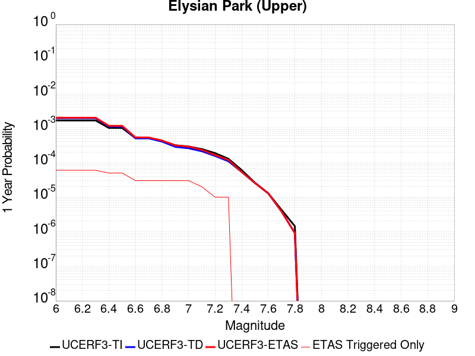 |  |

| Magnitude | 1 wk TI Prob | 1 wk TD Prob | 1 wk ETAS Prob | 1 wk ETAS/TD Gain | 1 wk ETAS Triggered Only | 1 mo TI Prob | 1 mo TD Prob | 1 mo ETAS Prob | 1 mo ETAS/TD Gain | 1 mo ETAS Triggered Only | 1 yr TI Prob | 1 yr TD Prob | 1 yr ETAS Prob | 1 yr ETAS/TD Gain | 1 yr ETAS Triggered Only | 10 yr TI Prob | 10 yr TD Prob | 10 yr ETAS Prob | 10 yr ETAS/TD Gain | 10 yr ETAS Triggered Only |
|-----|-----|-----|-----|-----|-----|-----|-----|-----|-----|-----|-----|-----|-----|-----|-----|-----|-----|-----|-----|-----|
| 6.0 | 3.1876025E-5 | 3.7035516E-5 | 7.0808346E-5 | 1.911904 | 3.3774086E-5 | 1.3660437E-4 | 1.587167E-4 | 2.4313852E-4 | 1.5319024 | 8.443521E-5 | 0.0016618895 | 0.0019311075 | 0.002032234 | 1.0523671 | 1.0132226E-4 | 0.016495159 | 0.019189782 | 0.019289162 | 1.0051787 | 1.0132226E-4 |
| 6.1 | 3.1876025E-5 | 3.7035516E-5 | 7.0808346E-5 | 1.911904 | 3.3774086E-5 | 1.3660437E-4 | 1.587167E-4 | 2.4313852E-4 | 1.5319024 | 8.443521E-5 | 0.0016618895 | 0.0019311075 | 0.002032234 | 1.0523671 | 1.0132226E-4 | 0.016495159 | 0.019189782 | 0.019289162 | 1.0051787 | 1.0132226E-4 |
| 6.2 | 3.1876025E-5 | 3.7035516E-5 | 7.0808346E-5 | 1.911904 | 3.3774086E-5 | 1.3660437E-4 | 1.587167E-4 | 2.4313852E-4 | 1.5319024 | 8.443521E-5 | 0.0016618895 | 0.0019311075 | 0.002032234 | 1.0523671 | 1.0132226E-4 | 0.016495159 | 0.019189782 | 0.019289162 | 1.0051787 | 1.0132226E-4 |
| 6.3 | 3.1876025E-5 | 3.7035516E-5 | 7.0808346E-5 | 1.911904 | 3.3774086E-5 | 1.3660437E-4 | 1.587167E-4 | 2.4313852E-4 | 1.5319024 | 8.443521E-5 | 0.0016618895 | 0.0019311075 | 0.002032234 | 1.0523671 | 1.0132226E-4 | 0.016495159 | 0.019189782 | 0.019289162 | 1.0051787 | 1.0132226E-4 |
| 6.4 | 1.9273462E-5 | 2.1202266E-5 | 3.808895E-5 | 1.7964566 | 1.6887043E-5 | 8.259794E-5 | 9.086466E-5 | 1.5840669E-4 | 1.7433256 | 6.754817E-5 | 0.001005166 | 0.0011058892 | 0.0011902311 | 1.076266 | 8.443521E-5 | 0.010006315 | 0.011020724 | 0.011104228 | 1.0075771 | 8.443521E-5 |
| 6.5 | 1.9273462E-5 | 2.1202266E-5 | 3.808895E-5 | 1.7964566 | 1.6887043E-5 | 8.259794E-5 | 9.086466E-5 | 1.5840669E-4 | 1.7433256 | 6.754817E-5 | 0.001005166 | 0.0011058892 | 0.0011902311 | 1.076266 | 8.443521E-5 | 0.010006315 | 0.011020724 | 0.011104228 | 1.0075771 | 8.443521E-5 |
| 6.6 | 9.813258E-6 | 9.665599E-6 | 2.6552478E-5 | 2.7471116 | 1.6887043E-5 | 4.205614E-5 | 4.1423376E-5 | 7.519606E-5 | 1.815305 | 3.3774086E-5 | 5.119132E-4 | 5.0422014E-4 | 5.5485574E-4 | 1.1004236 | 5.066113E-5 | 0.005107356 | 0.0050314846 | 0.005081891 | 1.0100181 | 5.066113E-5 |
| 6.7 | 9.801478E-6 | 9.653168E-6 | 2.6540047E-5 | 2.7493615 | 1.6887043E-5 | 4.2005657E-5 | 4.1370105E-5 | 7.5142794E-5 | 1.8163549 | 3.3774086E-5 | 5.112989E-4 | 5.035719E-4 | 5.542075E-4 | 1.1005529 | 5.066113E-5 | 0.0051012407 | 0.0050250315 | 0.005075438 | 1.0100311 | 5.066113E-5 |
| 6.8 | 8.102489E-6 | 7.773004E-6 | 2.4659916E-5 | 3.1725078 | 1.6887043E-5 | 3.4724493E-5 | 3.3312477E-5 | 6.7085435E-5 | 2.013823 | 3.3774086E-5 | 4.2268867E-4 | 4.055089E-4 | 4.561495E-4 | 1.1248815 | 5.066113E-5 | 0.004218856 | 0.0040481836 | 0.0040986394 | 1.0124639 | 5.066113E-5 |
| 6.9 | 6.08275E-6 | 5.4814514E-6 | 2.2368402E-5 | 4.0807443 | 1.6887043E-5 | 2.6068668E-5 | 2.3491726E-5 | 5.7265017E-5 | 2.4376674 | 3.3774086E-5 | 3.173398E-4 | 2.85975E-4 | 3.3662166E-4 | 1.1771016 | 5.066113E-5 | 0.0031688702 | 0.0028561477 | 0.002906664 | 1.017687 | 5.066113E-5 |
| 7.0 | 5.5995934E-6 | 4.98278E-6 | 2.1869739E-5 | 4.3890634 | 1.6887043E-5 | 2.3998036E-5 | 2.13546E-5 | 5.5127963E-5 | 2.58155 | 3.3774086E-5 | 2.9213692E-4 | 2.599619E-4 | 3.1060987E-4 | 1.1948284 | 5.066113E-5 | 0.0029175316 | 0.0025966454 | 0.002647175 | 1.0194596 | 5.066113E-5 |
| 7.1 | 4.709881E-6 | 4.0874015E-6 | 2.0974376E-5 | 5.1314692 | 1.6887043E-5 | 2.0185047E-5 | 1.7517319E-5 | 5.1290812E-5 | 2.928006 | 3.3774086E-5 | 2.4572524E-4 | 2.132529E-4 | 2.4701978E-4 | 1.158342 | 3.3774086E-5 | 0.002454537 | 0.002130524 | 0.0021642263 | 1.0158187 | 3.3774086E-5 |
| 7.2 | 3.6063436E-6 | 2.9779544E-6 | 1.9864947E-5 | 6.6706686 | 1.6887043E-5 | 1.5455667E-5 | 1.27626E-5 | 2.9649427E-5 | 2.3231494 | 1.6887043E-5 | 1.881565E-4 | 1.5537368E-4 | 1.7225811E-4 | 1.1086698 | 1.6887043E-5 | 0.0018799726 | 0.0015526618 | 0.0015695227 | 1.0108593 | 1.6887043E-5 |
| 7.3 | 2.471135E-6 | 2.0954615E-6 | 1.898247E-5 | 9.058848 | 1.6887043E-5 | 1.0590536E-5 | 8.980519E-6 | 2.586741E-5 | 2.8803914 | 1.6887043E-5 | 1.2893214E-4 | 1.093324E-4 | 1.2621761E-4 | 1.1544391 | 1.6887043E-5 | 0.0012885736 | 0.0010927934 | 0.001109662 | 1.0154362 | 1.6887043E-5 |
| 7.4 | 1.163943E-6 | 1.0275091E-6 | 1.0275091E-6 | 1.0 | 0.0 | 4.988318E-6 | 4.4036033E-6 | 4.4036033E-6 | 1.0 | 0.0 | 6.0731076E-5 | 5.3612584E-5 | 5.3612584E-5 | 1.0 | 0.0 | 6.071448E-4 | 5.359995E-4 | 5.359995E-4 | 1.0 | 0.0 |
| 7.5 | 4.99459E-7 | 4.917604E-7 | 4.917604E-7 | 1.0 | 0.0 | 2.140537E-6 | 2.1075427E-6 | 2.1075427E-6 | 1.0 | 0.0 | 2.6060725E-5 | 2.5659048E-5 | 2.5659048E-5 | 1.0 | 0.0 | 2.605767E-4 | 2.5656243E-4 | 2.5656243E-4 | 1.0 | 0.0 |
| 7.6 | 2.4667852E-7 | 2.4778336E-7 | 2.4778336E-7 | 1.0 | 0.0 | 1.0571932E-6 | 1.0619283E-6 | 1.0619283E-6 | 1.0 | 0.0 | 1.2871251E-5 | 1.2928905E-5 | 1.2928905E-5 | 1.0 | 0.0 | 1.2870505E-4 | 1.2928189E-4 | 1.2928189E-4 | 1.0 | 0.0 |
| 7.7 | 8.2312795E-8 | 7.3864456E-8 | 7.3864456E-8 | 1.0 | 0.0 | 3.527691E-7 | 3.165619E-7 | 3.165619E-7 | 1.0 | 0.0 | 4.294955E-6 | 3.8541357E-6 | 3.8541357E-6 | 1.0 | 0.0 | 4.2948723E-5 | 3.8540802E-5 | 3.8540802E-5 | 1.0 | 0.0 |
| 7.8 | 2.7819295E-8 | 1.7566023E-8 | 1.7566023E-8 | 1.0 | 0.0 | 1.1922555E-7 | 7.5282955E-8 | 7.5282955E-8 | 1.0 | 0.0 | 1.45157E-6 | 9.165697E-7 | 9.165697E-7 | 1.0 | 0.0 | 1.45156055E-5 | 9.165675E-6 | 9.165675E-6 | 1.0 | 0.0 |

## Deep Springs
*[(top)](#table-of-contents)*

| 1 Week | 1 Month | 1 Year | 10 Year |
|-----|-----|-----|-----|
|  |  | 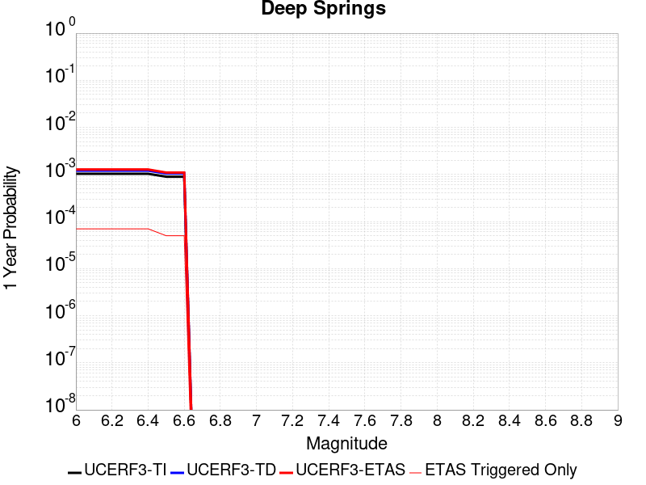 |  |

| Magnitude | 1 wk TI Prob | 1 wk TD Prob | 1 wk ETAS Prob | 1 wk ETAS/TD Gain | 1 wk ETAS Triggered Only | 1 mo TI Prob | 1 mo TD Prob | 1 mo ETAS Prob | 1 mo ETAS/TD Gain | 1 mo ETAS Triggered Only | 1 yr TI Prob | 1 yr TD Prob | 1 yr ETAS Prob | 1 yr ETAS/TD Gain | 1 yr ETAS Triggered Only | 10 yr TI Prob | 10 yr TD Prob | 10 yr ETAS Prob | 10 yr ETAS/TD Gain | 10 yr ETAS Triggered Only |
|-----|-----|-----|-----|-----|-----|-----|-----|-----|-----|-----|-----|-----|-----|-----|-----|-----|-----|-----|-----|-----|
| 6.0 | 1.9810619E-5 | 2.311252E-5 | 5.6885823E-5 | 2.4612558 | 3.3774086E-5 | 8.489989E-5 | 9.905276E-5 | 1.4970887E-4 | 1.5114053 | 5.066113E-5 | 0.001033166 | 0.0012058079 | 0.0012901414 | 1.0699394 | 8.443521E-5 | 0.010283757 | 0.012042425 | 0.012159211 | 1.0096979 | 1.182093E-4 |
| 6.1 | 1.9810619E-5 | 2.311252E-5 | 5.6885823E-5 | 2.4612558 | 3.3774086E-5 | 8.489989E-5 | 9.905276E-5 | 1.4970887E-4 | 1.5114053 | 5.066113E-5 | 0.001033166 | 0.0012058079 | 0.0012901414 | 1.0699394 | 8.443521E-5 | 0.010283757 | 0.012042425 | 0.012159211 | 1.0096979 | 1.182093E-4 |
| 6.2 | 1.9810619E-5 | 2.311252E-5 | 5.6885823E-5 | 2.4612558 | 3.3774086E-5 | 8.489989E-5 | 9.905276E-5 | 1.4970887E-4 | 1.5114053 | 5.066113E-5 | 0.001033166 | 0.0012058079 | 0.0012901414 | 1.0699394 | 8.443521E-5 | 0.010283757 | 0.012042425 | 0.012159211 | 1.0096979 | 1.182093E-4 |
| 6.3 | 1.9810619E-5 | 2.311252E-5 | 5.6885823E-5 | 2.4612558 | 3.3774086E-5 | 8.489989E-5 | 9.905276E-5 | 1.4970887E-4 | 1.5114053 | 5.066113E-5 | 0.001033166 | 0.0012058079 | 0.0012901414 | 1.0699394 | 8.443521E-5 | 0.010283757 | 0.012042425 | 0.012159211 | 1.0096979 | 1.182093E-4 |
| 6.4 | 1.9810619E-5 | 2.311252E-5 | 5.6885823E-5 | 2.4612558 | 3.3774086E-5 | 8.489989E-5 | 9.905276E-5 | 1.4970887E-4 | 1.5114053 | 5.066113E-5 | 0.001033166 | 0.0012058079 | 0.0012901414 | 1.0699394 | 8.443521E-5 | 0.010283757 | 0.012042425 | 0.012159211 | 1.0096979 | 1.182093E-4 |
| 6.5 | 1.7190405E-5 | 2.0050555E-5 | 3.693726E-5 | 1.8422062 | 1.6887043E-5 | 7.367108E-5 | 8.593095E-5 | 1.0281654E-4 | 1.1965019 | 1.6887043E-5 | 8.9657627E-4 | 0.0010462094 | 0.0010968174 | 1.0483729 | 5.066113E-5 | 0.008929676 | 0.010462056 | 0.010528898 | 1.0063889 | 6.754817E-5 |
| 6.6 | 1.7190405E-5 | 2.0050555E-5 | 3.693726E-5 | 1.8422062 | 1.6887043E-5 | 7.367108E-5 | 8.593095E-5 | 1.0281654E-4 | 1.1965019 | 1.6887043E-5 | 8.9657627E-4 | 0.0010462094 | 0.0010968174 | 1.0483729 | 5.066113E-5 | 0.008929676 | 0.010462056 | 0.010528898 | 1.0063889 | 6.754817E-5 |

## Dry Mountain
*[(top)](#table-of-contents)*

| 1 Week | 1 Month | 1 Year | 10 Year |
|-----|-----|-----|-----|
|  |  |  |  |

| Magnitude | 1 wk TI Prob | 1 wk TD Prob | 1 wk ETAS Prob | 1 wk ETAS/TD Gain | 1 wk ETAS Triggered Only | 1 mo TI Prob | 1 mo TD Prob | 1 mo ETAS Prob | 1 mo ETAS/TD Gain | 1 mo ETAS Triggered Only | 1 yr TI Prob | 1 yr TD Prob | 1 yr ETAS Prob | 1 yr ETAS/TD Gain | 1 yr ETAS Triggered Only | 10 yr TI Prob | 10 yr TD Prob | 10 yr ETAS Prob | 10 yr ETAS/TD Gain | 10 yr ETAS Triggered Only |
|-----|-----|-----|-----|-----|-----|-----|-----|-----|-----|-----|-----|-----|-----|-----|-----|-----|-----|-----|-----|-----|
| 6.0 | 6.222801E-6 | 6.439381E-6 | 4.021325E-5 | 6.244893 | 3.3774086E-5 | 2.6668875E-5 | 2.7597147E-5 | 6.13703E-5 | 2.2237916 | 3.3774086E-5 | 3.2464517E-4 | 3.3595937E-4 | 4.203662E-4 | 1.2512412 | 8.443521E-5 | 0.0032417132 | 0.0033560768 | 0.0034738893 | 1.0351043 | 1.182093E-4 |
| 6.1 | 6.222801E-6 | 6.439381E-6 | 4.021325E-5 | 6.244893 | 3.3774086E-5 | 2.6668875E-5 | 2.7597147E-5 | 6.13703E-5 | 2.2237916 | 3.3774086E-5 | 3.2464517E-4 | 3.3595937E-4 | 4.203662E-4 | 1.2512412 | 8.443521E-5 | 0.0032417132 | 0.0033560768 | 0.0034738893 | 1.0351043 | 1.182093E-4 |
| 6.2 | 6.222801E-6 | 6.439381E-6 | 4.021325E-5 | 6.244893 | 3.3774086E-5 | 2.6668875E-5 | 2.7597147E-5 | 6.13703E-5 | 2.2237916 | 3.3774086E-5 | 3.2464517E-4 | 3.3595937E-4 | 4.203662E-4 | 1.2512412 | 8.443521E-5 | 0.0032417132 | 0.0033560768 | 0.0034738893 | 1.0351043 | 1.182093E-4 |
| 6.3 | 6.222801E-6 | 6.439381E-6 | 4.021325E-5 | 6.244893 | 3.3774086E-5 | 2.6668875E-5 | 2.7597147E-5 | 6.13703E-5 | 2.2237916 | 3.3774086E-5 | 3.2464517E-4 | 3.3595937E-4 | 4.203662E-4 | 1.2512412 | 8.443521E-5 | 0.0032417132 | 0.0033560768 | 0.0034738893 | 1.0351043 | 1.182093E-4 |
| 6.4 | 6.222801E-6 | 6.439381E-6 | 4.021325E-5 | 6.244893 | 3.3774086E-5 | 2.6668875E-5 | 2.7597147E-5 | 6.13703E-5 | 2.2237916 | 3.3774086E-5 | 3.2464517E-4 | 3.3595937E-4 | 4.203662E-4 | 1.2512412 | 8.443521E-5 | 0.0032417132 | 0.0033560768 | 0.0034738893 | 1.0351043 | 1.182093E-4 |
| 6.5 | 2.8528623E-6 | 2.9521684E-6 | 1.983916E-5 | 6.7201996 | 1.6887043E-5 | 1.22264955E-5 | 1.2652138E-5 | 2.9538967E-5 | 2.3347015 | 1.6887043E-5 | 1.4884741E-4 | 1.540376E-4 | 2.0469092E-4 | 1.3288374 | 5.066113E-5 | 0.0014874774 | 0.0015401616 | 0.0016244667 | 1.0547379 | 8.443521E-5 |
| 6.6 | 2.8528623E-6 | 2.9521684E-6 | 1.983916E-5 | 6.7201996 | 1.6887043E-5 | 1.22264955E-5 | 1.2652138E-5 | 2.9538967E-5 | 2.3347015 | 1.6887043E-5 | 1.4884741E-4 | 1.540376E-4 | 2.0469092E-4 | 1.3288374 | 5.066113E-5 | 0.0014874774 | 0.0015401616 | 0.0016244667 | 1.0547379 | 8.443521E-5 |
| 6.7 | 2.541E-6 | 2.6293578E-6 | 1.9516356E-5 | 7.42248 | 1.6887043E-5 | 1.0889954E-5 | 1.1268677E-5 | 2.815553E-5 | 2.4985657 | 1.6887043E-5 | 1.3257713E-4 | 1.3719614E-4 | 1.8785031E-4 | 1.3692099 | 5.066113E-5 | 0.0013249806 | 0.0013719613 | 0.0014394169 | 1.0491672 | 6.754817E-5 |

## Ortigalita (North)
*[(top)](#table-of-contents)*

| 1 Week | 1 Month | 1 Year | 10 Year |
|-----|-----|-----|-----|
|  |  |  |  |

| Magnitude | 1 wk TI Prob | 1 wk TD Prob | 1 wk ETAS Prob | 1 wk ETAS/TD Gain | 1 wk ETAS Triggered Only | 1 mo TI Prob | 1 mo TD Prob | 1 mo ETAS Prob | 1 mo ETAS/TD Gain | 1 mo ETAS Triggered Only | 1 yr TI Prob | 1 yr TD Prob | 1 yr ETAS Prob | 1 yr ETAS/TD Gain | 1 yr ETAS Triggered Only | 10 yr TI Prob | 10 yr TD Prob | 10 yr ETAS Prob | 10 yr ETAS/TD Gain | 10 yr ETAS Triggered Only |
|-----|-----|-----|-----|-----|-----|-----|-----|-----|-----|-----|-----|-----|-----|-----|-----|-----|-----|-----|-----|-----|
| 6.0 | 7.711876E-5 | 1.05064966E-4 | 1.2195024E-4 | 1.1607126 | 1.6887043E-5 | 3.3046713E-4 | 4.502116E-4 | 4.8397048E-4 | 1.0749844 | 3.3774086E-5 | 0.004016016 | 0.0054681194 | 0.0055185035 | 1.0092142 | 5.066113E-5 | 0.039442103 | 0.053454787 | 0.053550694 | 1.0017941 | 1.0132226E-4 |
| 6.1 | 4.607858E-5 | 6.0239203E-5 | 7.712523E-5 | 1.2803162 | 1.6887043E-5 | 1.9746469E-4 | 2.5814527E-4 | 2.9191063E-4 | 1.1307999 | 3.3774086E-5 | 0.0024014818 | 0.0031387596 | 0.0031892618 | 1.0160898 | 5.066113E-5 | 0.023756953 | 0.030975068 | 0.031040525 | 1.0021132 | 6.754817E-5 |
| 6.2 | 4.607858E-5 | 6.0239203E-5 | 7.712523E-5 | 1.2803162 | 1.6887043E-5 | 1.9746469E-4 | 2.5814527E-4 | 2.9191063E-4 | 1.1307999 | 3.3774086E-5 | 0.0024014818 | 0.0031387596 | 0.0031892618 | 1.0160898 | 5.066113E-5 | 0.023756953 | 0.030975068 | 0.031040525 | 1.0021132 | 6.754817E-5 |
| 6.3 | 3.327423E-5 | 4.2475127E-5 | 5.9361453E-5 | 1.397558 | 1.6887043E-5 | 1.4259605E-4 | 1.8202531E-4 | 2.1579325E-4 | 1.1855123 | 3.3774086E-5 | 0.0017347244 | 0.002214197 | 0.002264746 | 1.0228295 | 5.066113E-5 | 0.017212452 | 0.021945644 | 0.02201171 | 1.0030104 | 6.754817E-5 |
| 6.4 | 2.7732503E-5 | 3.4998593E-5 | 5.1885047E-5 | 1.4824895 | 1.6887043E-5 | 1.1884817E-4 | 1.4998685E-4 | 1.8375588E-4 | 1.2251465 | 3.3774086E-5 | 0.001446016 | 0.0018248095 | 0.0018753782 | 1.0277117 | 5.066113E-5 | 0.014366428 | 0.018121224 | 0.018187547 | 1.0036601 | 6.754817E-5 |
| 6.5 | 2.7689714E-5 | 3.4948407E-5 | 5.183486E-5 | 1.4831823 | 1.6887043E-5 | 1.186648E-4 | 1.497718E-4 | 1.8354082E-4 | 1.2254698 | 3.3774086E-5 | 0.0014437864 | 0.0018221956 | 0.0018727644 | 1.0277516 | 5.066113E-5 | 0.014344421 | 0.01809551 | 0.018161835 | 1.0036653 | 6.754817E-5 |
| 6.6 | 2.2976905E-5 | 2.8718265E-5 | 2.8718265E-5 | 1.0 | 0.0 | 9.846873E-5 | 1.230739E-4 | 1.3995887E-4 | 1.1371937 | 1.6887043E-5 | 0.0011981975 | 0.0014976363 | 0.0015144981 | 1.011259 | 1.6887043E-5 | 0.011917574 | 0.014898697 | 0.014931968 | 1.0022331 | 3.3774086E-5 |
| 6.7 | 1.9871539E-5 | 2.4904411E-5 | 2.4904411E-5 | 1.0 | 0.0 | 8.516096E-5 | 1.0673023E-4 | 1.2361548E-4 | 1.1582048 | 1.6887043E-5 | 0.0010363415 | 0.0012989145 | 0.0013157798 | 1.012984 | 1.6887043E-5 | 0.010315218 | 0.012936919 | 0.012970257 | 1.002577 | 3.3774086E-5 |
| 6.8 | 6.5640475E-6 | 7.6054926E-6 | 7.6054926E-6 | 1.0 | 0.0 | 2.813133E-5 | 3.2594577E-5 | 4.9481067E-5 | 1.5180768 | 1.6887043E-5 | 3.424451E-4 | 3.9676955E-4 | 4.1364992E-4 | 1.0425445 | 1.6887043E-5 | 0.0034191788 | 0.003960899 | 0.003977719 | 1.0042466 | 1.6887043E-5 |
| 6.9 | 5.6219683E-6 | 6.5018376E-6 | 6.5018376E-6 | 1.0 | 0.0 | 2.4093928E-5 | 2.7864735E-5 | 2.7864735E-5 | 1.0 | 0.0 | 2.933041E-4 | 3.3920293E-4 | 3.3920293E-4 | 1.0 | 0.0 | 0.0029291727 | 0.003387109 | 0.003387109 | 1.0 | 0.0 |
| 7.0 | 3.875591E-6 | 4.4847548E-6 | 4.4847548E-6 | 1.0 | 0.0 | 1.6609569E-5 | 1.9220248E-5 | 1.9220248E-5 | 1.0 | 0.0 | 2.0220275E-4 | 2.339835E-4 | 2.339835E-4 | 1.0 | 0.0 | 0.0020201886 | 0.0023375798 | 0.0023375798 | 1.0 | 0.0 |
| 7.1 | 1.6017933E-6 | 1.8570418E-6 | 1.8570418E-6 | 1.0 | 0.0 | 6.8648105E-6 | 7.958732E-6 | 7.958732E-6 | 1.0 | 0.0 | 8.357586E-5 | 9.689432E-5 | 9.689432E-5 | 1.0 | 0.0 | 8.3544437E-4 | 9.686254E-4 | 9.686254E-4 | 1.0 | 0.0 |

## Great Valley 09 (Laguna Seca)
*[(top)](#table-of-contents)*

| 1 Week | 1 Month | 1 Year | 10 Year |
|-----|-----|-----|-----|
|  |  | 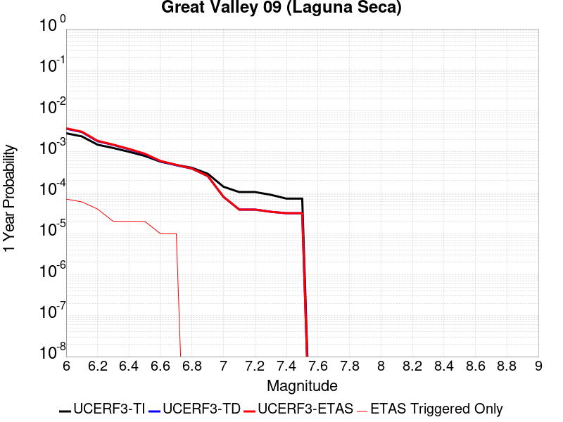 |  |

| Magnitude | 1 wk TI Prob | 1 wk TD Prob | 1 wk ETAS Prob | 1 wk ETAS/TD Gain | 1 wk ETAS Triggered Only | 1 mo TI Prob | 1 mo TD Prob | 1 mo ETAS Prob | 1 mo ETAS/TD Gain | 1 mo ETAS Triggered Only | 1 yr TI Prob | 1 yr TD Prob | 1 yr ETAS Prob | 1 yr ETAS/TD Gain | 1 yr ETAS Triggered Only | 10 yr TI Prob | 10 yr TD Prob | 10 yr ETAS Prob | 10 yr ETAS/TD Gain | 10 yr ETAS Triggered Only |
|-----|-----|-----|-----|-----|-----|-----|-----|-----|-----|-----|-----|-----|-----|-----|-----|-----|-----|-----|-----|-----|
| 6.0 | 5.4353277E-5 | 7.05022E-5 | 8.7388056E-5 | 1.2395082 | 1.6887043E-5 | 2.3292181E-4 | 3.0211566E-4 | 3.189976E-4 | 1.0558791 | 1.6887043E-5 | 0.0028321352 | 0.0036721937 | 0.0037226689 | 1.0137452 | 5.066113E-5 | 0.02796312 | 0.03611547 | 0.036213133 | 1.0027041 | 1.0132226E-4 |
| 6.1 | 4.5578287E-5 | 5.822118E-5 | 7.5107244E-5 | 1.2900329 | 1.6887043E-5 | 1.953209E-4 | 2.4949326E-4 | 2.663761E-4 | 1.0676684 | 1.6887043E-5 | 0.0023754383 | 0.003033432 | 0.0030839394 | 1.0166503 | 5.066113E-5 | 0.023502063 | 0.029919548 | 0.030001456 | 1.0027376 | 8.443521E-5 |
| 6.2 | 2.8536782E-5 | 3.4737273E-5 | 5.162373E-5 | 1.4861192 | 1.6887043E-5 | 1.2229476E-4 | 1.4886224E-4 | 1.6574677E-4 | 1.1134238 | 1.6887043E-5 | 0.0014879217 | 0.001810813 | 0.0018445259 | 1.0186175 | 3.3774086E-5 | 0.014779986 | 0.017958116 | 0.018007869 | 1.0027704 | 5.066113E-5 |
| 6.3 | 2.3698774E-5 | 2.8213295E-5 | 2.8213295E-5 | 1.0 | 0.0 | 1.01562226E-4 | 1.20905075E-4 | 1.20905075E-4 | 1.0 | 0.0 | 0.0012358186 | 0.0014710218 | 0.001487884 | 1.0114629 | 1.6887043E-5 | 0.012289686 | 0.014611342 | 0.014627982 | 1.0011388 | 1.6887043E-5 |
| 6.4 | 1.9191197E-5 | 2.2123184E-5 | 2.2123184E-5 | 1.0 | 0.0 | 8.2245395E-5 | 9.4806666E-5 | 9.4806666E-5 | 1.0 | 0.0 | 0.0010008777 | 0.0011536429 | 0.0011705104 | 1.0146211 | 1.6887043E-5 | 0.009963818 | 0.011476948 | 0.011493641 | 1.0014545 | 1.6887043E-5 |
| 6.5 | 1.5203241E-5 | 1.6802203E-5 | 1.6802203E-5 | 1.0 | 0.0 | 6.5155116E-5 | 7.200386E-5 | 7.200386E-5 | 1.0 | 0.0 | 7.9297484E-4 | 8.7626575E-4 | 8.93138E-4 | 1.0192547 | 1.6887043E-5 | 0.007901512 | 0.0087295165 | 0.008746256 | 1.0019176 | 1.6887043E-5 |
| 6.6 | 1.0984925E-5 | 1.1242595E-5 | 1.1242595E-5 | 1.0 | 0.0 | 4.70774E-5 | 4.8181686E-5 | 4.8181686E-5 | 1.0 | 0.0 | 5.730166E-4 | 5.8645656E-4 | 6.033337E-4 | 1.0287782 | 1.6887043E-5 | 0.005715413 | 0.0058494853 | 0.005866274 | 1.0028701 | 1.6887043E-5 |
| 6.7 | 9.134616E-6 | 9.019894E-6 | 9.019894E-6 | 1.0 | 0.0 | 3.9147766E-5 | 3.865613E-5 | 3.865613E-5 | 1.0 | 0.0 | 4.7651984E-4 | 4.7053912E-4 | 4.874182E-4 | 1.0358719 | 1.6887043E-5 | 0.004754993 | 0.0046956735 | 0.004712481 | 1.0035794 | 1.6887043E-5 |
| 6.8 | 7.785589E-6 | 7.4519444E-6 | 7.4519444E-6 | 1.0 | 0.0 | 3.3366385E-5 | 3.1936524E-5 | 3.1936524E-5 | 1.0 | 0.0 | 4.0616E-4 | 3.8875983E-4 | 3.8875983E-4 | 1.0 | 0.0 | 0.0040541845 | 0.0038810016 | 0.0038810016 | 1.0 | 0.0 |
| 6.9 | 5.579095E-6 | 4.898492E-6 | 4.898492E-6 | 1.0 | 0.0 | 2.3910188E-5 | 2.0993377E-5 | 2.0993377E-5 | 1.0 | 0.0 | 2.9106764E-4 | 2.5556577E-4 | 2.5556577E-4 | 1.0 | 0.0 | 0.002906867 | 0.002552856 | 0.002552856 | 1.0 | 0.0 |
| 7.0 | 2.6816688E-6 | 1.5216126E-6 | 1.5216126E-6 | 1.0 | 0.0 | 1.1492816E-5 | 6.521181E-6 | 6.521181E-6 | 1.0 | 0.0 | 1.3991605E-4 | 7.939258E-5 | 7.939258E-5 | 1.0 | 0.0 | 0.0013982799 | 7.9365086E-4 | 7.9365086E-4 | 1.0 | 0.0 |
| 7.1 | 1.9951021E-6 | 7.453827E-7 | 7.453827E-7 | 1.0 | 0.0 | 8.55041E-6 | 3.1944935E-6 | 3.1944935E-6 | 1.0 | 0.0 | 1.0409627E-4 | 3.8892307E-5 | 3.8892307E-5 | 1.0 | 0.0 | 0.0010404752 | 3.8885913E-4 | 3.8885913E-4 | 1.0 | 0.0 |
| 7.2 | 1.9951021E-6 | 7.453827E-7 | 7.453827E-7 | 1.0 | 0.0 | 8.55041E-6 | 3.1944935E-6 | 3.1944935E-6 | 1.0 | 0.0 | 1.0409627E-4 | 3.8892307E-5 | 3.8892307E-5 | 1.0 | 0.0 | 0.0010404752 | 3.8885913E-4 | 3.8885913E-4 | 1.0 | 0.0 |
| 7.3 | 1.7087556E-6 | 6.578881E-7 | 6.578881E-7 | 1.0 | 0.0 | 7.3232177E-6 | 2.8195177E-6 | 2.8195177E-6 | 1.0 | 0.0 | 8.915652E-5 | 3.4327128E-5 | 3.4327128E-5 | 1.0 | 0.0 | 8.9120766E-4 | 3.432223E-4 | 3.432223E-4 | 1.0 | 0.0 |
| 7.4 | 1.3804846E-6 | 6.073852E-7 | 6.073852E-7 | 1.0 | 0.0 | 5.916349E-6 | 2.6030768E-6 | 2.6030768E-6 | 1.0 | 0.0 | 7.2029165E-5 | 3.169204E-5 | 3.169204E-5 | 1.0 | 0.0 | 7.200583E-4 | 3.1687922E-4 | 3.1687922E-4 | 1.0 | 0.0 |
| 7.5 | 1.3804846E-6 | 6.073852E-7 | 6.073852E-7 | 1.0 | 0.0 | 5.916349E-6 | 2.6030768E-6 | 2.6030768E-6 | 1.0 | 0.0 | 7.2029165E-5 | 3.169204E-5 | 3.169204E-5 | 1.0 | 0.0 | 7.200583E-4 | 3.1687922E-4 | 3.1687922E-4 | 1.0 | 0.0 |

## San Jacinto (Borrego)
*[(top)](#table-of-contents)*

| 1 Week | 1 Month | 1 Year | 10 Year |
|-----|-----|-----|-----|
|  |  |  |  |

| Magnitude | 1 wk TI Prob | 1 wk TD Prob | 1 wk ETAS Prob | 1 wk ETAS/TD Gain | 1 wk ETAS Triggered Only | 1 mo TI Prob | 1 mo TD Prob | 1 mo ETAS Prob | 1 mo ETAS/TD Gain | 1 mo ETAS Triggered Only | 1 yr TI Prob | 1 yr TD Prob | 1 yr ETAS Prob | 1 yr ETAS/TD Gain | 1 yr ETAS Triggered Only | 10 yr TI Prob | 10 yr TD Prob | 10 yr ETAS Prob | 10 yr ETAS/TD Gain | 10 yr ETAS Triggered Only |
|-----|-----|-----|-----|-----|-----|-----|-----|-----|-----|-----|-----|-----|-----|-----|-----|-----|-----|-----|-----|-----|
| 6.0 | 3.543992E-5 | 2.7926513E-5 | 4.4813085E-5 | 1.6046789 | 1.6887043E-5 | 1.5187653E-4 | 1.1967963E-4 | 1.5344967E-4 | 1.2821703 | 3.3774086E-5 | 0.0018475284 | 0.0014561379 | 0.0015067252 | 1.0347408 | 5.066113E-5 | 0.018322436 | 0.014869647 | 0.0149694625 | 1.0067127 | 1.0132226E-4 |
| 6.1 | 3.542281E-5 | 2.7926513E-5 | 4.4813085E-5 | 1.6046789 | 1.6887043E-5 | 1.5180321E-4 | 1.1967963E-4 | 1.5344967E-4 | 1.2821703 | 3.3774086E-5 | 0.0018466372 | 0.0014561379 | 0.0015067252 | 1.0347408 | 5.066113E-5 | 0.018313672 | 0.014869647 | 0.0149694625 | 1.0067127 | 1.0132226E-4 |
| 6.2 | 3.4688688E-5 | 2.7926511E-5 | 4.481308E-5 | 1.6046789 | 1.6887043E-5 | 1.4865733E-4 | 1.1967963E-4 | 1.5344967E-4 | 1.2821703 | 3.3774086E-5 | 0.0018084005 | 0.0014561379 | 0.0015067252 | 1.0347408 | 5.066113E-5 | 0.017937548 | 0.014869647 | 0.0149694625 | 1.0067127 | 1.0132226E-4 |
| 6.3 | 3.2087122E-5 | 2.7771865E-5 | 4.4658438E-5 | 1.608046 | 1.6887043E-5 | 1.3750899E-4 | 1.1901691E-4 | 1.5278698E-4 | 1.2837417 | 3.3774086E-5 | 0.0016728862 | 0.00144808 | 0.0014986678 | 1.0349344 | 5.066113E-5 | 0.016603488 | 0.014790683 | 0.014890507 | 1.006749 | 1.0132226E-4 |
| 6.4 | 3.1828724E-5 | 2.7738852E-5 | 4.4625423E-5 | 1.6087698 | 1.6887043E-5 | 1.364017E-4 | 1.1887544E-4 | 1.5264552E-4 | 1.2840794 | 3.3774086E-5 | 0.0016594254 | 0.0014463598 | 0.0014969477 | 1.034976 | 5.066113E-5 | 0.016470885 | 0.014773762 | 0.014873587 | 1.0067569 | 1.0132226E-4 |
| 6.5 | 3.1563577E-5 | 2.747857E-5 | 4.4365148E-5 | 1.6145363 | 1.6887043E-5 | 1.3526545E-4 | 1.1776006E-4 | 1.5153016E-4 | 1.2867705 | 3.3774086E-5 | 0.0016456128 | 0.0014327979 | 0.0014833865 | 1.0353075 | 5.066113E-5 | 0.0163348 | 0.014640348 | 0.014740187 | 1.0068195 | 1.0132226E-4 |
| 6.6 | 3.1467625E-5 | 2.7322796E-5 | 4.4209377E-5 | 1.6180401 | 1.6887043E-5 | 1.3485427E-4 | 1.1709251E-4 | 1.5086264E-4 | 1.2884055 | 3.3774086E-5 | 0.0016406142 | 0.0014246812 | 0.0014752701 | 1.035509 | 5.066113E-5 | 0.016285548 | 0.014560594 | 0.014660441 | 1.0068574 | 1.0132226E-4 |
| 6.7 | 3.1223695E-5 | 2.6940816E-5 | 4.3827404E-5 | 1.6268032 | 1.6887043E-5 | 1.3380898E-4 | 1.15455594E-4 | 1.4922577E-4 | 1.292495 | 3.3774086E-5 | 0.0016279068 | 0.0014047775 | 0.0014553675 | 1.0360128 | 5.066113E-5 | 0.01616033 | 0.014364966 | 0.014464833 | 1.006952 | 1.0132226E-4 |
| 6.8 | 3.1015585E-5 | 2.6761822E-5 | 4.364841E-5 | 1.6309955 | 1.6887043E-5 | 1.3291716E-4 | 1.1468855E-4 | 1.4845876E-4 | 1.2944515 | 3.3774086E-5 | 0.001617065 | 0.0013954508 | 0.0014460413 | 1.0362538 | 5.066113E-5 | 0.016053487 | 0.014272246 | 0.0143721225 | 1.006998 | 1.0132226E-4 |
| 6.9 | 2.6641965E-5 | 2.2184247E-5 | 3.9070914E-5 | 1.7612009 | 1.6887043E-5 | 1.1417485E-4 | 9.50719E-5 | 1.2884277E-4 | 1.355214 | 3.3774086E-5 | 0.0013891924 | 0.0011568897 | 0.0012074922 | 1.0437402 | 5.066113E-5 | 0.0138054015 | 0.011882438 | 0.011982557 | 1.0084257 | 1.0132226E-4 |
| 7.0 | 2.3854353E-5 | 2.0479023E-5 | 3.736572E-5 | 1.8245851 | 1.6887043E-5 | 1.02228936E-4 | 8.77643E-5 | 1.2153543E-4 | 1.3847934 | 3.3774086E-5 | 0.0012439266 | 0.0010680092 | 0.0011186162 | 1.0473845 | 5.066113E-5 | 0.012369866 | 0.0109828 | 0.01108301 | 1.0091242 | 1.0132226E-4 |
| 7.1 | 2.3672901E-5 | 2.031551E-5 | 3.720221E-5 | 1.8312219 | 1.6887043E-5 | 1.0145135E-4 | 8.7063585E-5 | 1.2083473E-4 | 1.3878906 | 3.3774086E-5 | 0.0012344702 | 0.0010594862 | 0.0011100937 | 1.0477661 | 5.066113E-5 | 0.0122763505 | 0.010897976 | 0.010998194 | 1.009196 | 1.0132226E-4 |
| 7.2 | 2.2717244E-5 | 1.9542893E-5 | 3.6429607E-5 | 1.8640846 | 1.6887043E-5 | 9.735599E-5 | 8.375258E-5 | 1.17523836E-4 | 1.4032265 | 3.3774086E-5 | 0.0011846646 | 0.001019213 | 0.0010698225 | 1.0496554 | 5.066113E-5 | 0.01178369 | 0.010495341 | 0.01057889 | 1.0079606 | 8.443521E-5 |
| 7.3 | 2.1016205E-5 | 1.8384526E-5 | 3.5271256E-5 | 1.9185296 | 1.6887043E-5 | 9.006634E-5 | 7.878846E-5 | 1.1255988E-4 | 1.4286342 | 3.3774086E-5 | 0.001096006 | 9.5882936E-4 | 0.0010094419 | 1.0527858 | 5.066113E-5 | 0.010906163 | 0.009890967 | 0.009974567 | 1.0084522 | 8.443521E-5 |
| 7.4 | 2.0683625E-5 | 1.8187047E-5 | 3.5073783E-5 | 1.9285034 | 1.6887043E-5 | 8.86411E-5 | 7.794217E-5 | 1.1171362E-4 | 1.4332886 | 3.3774086E-5 | 0.001078671 | 9.485349E-4 | 9.991479E-4 | 1.0533593 | 5.066113E-5 | 0.010734501 | 0.009787692 | 0.009871301 | 1.0085422 | 8.443521E-5 |
| 7.5 | 1.9993966E-5 | 1.7782075E-5 | 3.4668818E-5 | 1.9496498 | 1.6887043E-5 | 8.568561E-5 | 7.620667E-5 | 1.0997819E-4 | 1.4431568 | 3.3774086E-5 | 0.001042723 | 9.2742336E-4 | 9.780375E-4 | 1.054575 | 5.066113E-5 | 0.010378438 | 0.009574614 | 0.009658242 | 1.0087342 | 8.443521E-5 |
| 7.6 | 1.788966E-5 | 1.6435291E-5 | 3.3322056E-5 | 2.0274699 | 1.6887043E-5 | 7.666772E-5 | 7.043507E-5 | 1.04206774E-4 | 1.4794729 | 3.3774086E-5 | 9.3302975E-4 | 8.572113E-4 | 9.0782903E-4 | 1.0590492 | 5.066113E-5 | 0.00929122 | 0.008866487 | 0.008950173 | 1.0094385 | 8.443521E-5 |
| 7.7 | 1.5125781E-5 | 1.4237377E-5 | 3.112418E-5 | 2.1860893 | 1.6887043E-5 | 6.4823165E-5 | 6.1015908E-5 | 9.478793E-5 | 1.5534954 | 3.3774086E-5 | 7.889362E-4 | 7.426163E-4 | 7.932398E-4 | 1.0681691 | 5.066113E-5 | 0.007861412 | 0.0077142045 | 0.007797988 | 1.010861 | 8.443521E-5 |
| 7.8 | 1.250089E-5 | 1.26304985E-5 | 2.9517329E-5 | 2.3369884 | 1.6887043E-5 | 5.3574146E-5 | 5.412959E-5 | 8.790185E-5 | 1.623915 | 3.3774086E-5 | 6.5207E-4 | 6.588291E-4 | 7.0945686E-4 | 1.076845 | 5.066113E-5 | 0.006501599 | 0.0068677636 | 0.006951619 | 1.01221 | 8.443521E-5 |
| 7.9 | 9.561E-6 | 9.754616E-6 | 2.6641494E-5 | 2.7311678 | 1.6887043E-5 | 4.0975072E-5 | 4.1804833E-5 | 7.55775E-5 | 1.8078653 | 3.3774086E-5 | 4.987573E-4 | 5.088555E-4 | 5.594909E-4 | 1.0995083 | 5.066113E-5 | 0.0049763937 | 0.0053523467 | 0.0054363296 | 1.0156909 | 8.443521E-5 |
| 8.0 | 8.01699E-6 | 8.293488E-6 | 2.518039E-5 | 3.0361643 | 1.6887043E-5 | 3.4358076E-5 | 3.554304E-5 | 6.931592E-5 | 1.950197 | 3.3774086E-5 | 4.1822926E-4 | 4.3265108E-4 | 4.832903E-4 | 1.117044 | 5.066113E-5 | 0.0041744304 | 0.004573375 | 0.004657424 | 1.0183779 | 8.443521E-5 |
| 8.1 | 6.541947E-6 | 6.4622354E-6 | 2.3349168E-5 | 3.613172 | 1.6887043E-5 | 2.8036617E-5 | 2.7695003E-5 | 6.1468156E-5 | 2.2194672 | 3.3774086E-5 | 3.4129233E-4 | 3.37135E-4 | 3.708977E-4 | 1.1001459 | 3.3774086E-5 | 0.0034076865 | 0.0035806994 | 0.0036311792 | 1.0140977 | 5.066113E-5 |
| 8.2 | 1.7968189E-6 | 7.9713476E-7 | 7.9713476E-7 | 1.0 | 0.0 | 7.70063E-6 | 3.4162877E-6 | 3.4162877E-6 | 1.0 | 0.0 | 9.3751136E-5 | 4.159253E-5 | 4.159253E-5 | 1.0 | 0.0 | 9.371159E-4 | 4.712058E-4 | 4.712058E-4 | 1.0 | 0.0 |
| 8.3 | 1.5167889E-7 | 4.897714E-8 | 4.897714E-8 | 1.0 | 0.0 | 6.500522E-7 | 2.09902E-7 | 2.09902E-7 | 1.0 | 0.0 | 7.9143565E-6 | 2.5555544E-6 | 2.5555544E-6 | 1.0 | 0.0 | 7.914075E-5 | 2.969505E-5 | 2.969505E-5 | 1.0 | 0.0 |

## Pine Mtn
*[(top)](#table-of-contents)*

| 1 Week | 1 Month | 1 Year | 10 Year |
|-----|-----|-----|-----|
|  |  |  |  |

| Magnitude | 1 wk TI Prob | 1 wk TD Prob | 1 wk ETAS Prob | 1 wk ETAS/TD Gain | 1 wk ETAS Triggered Only | 1 mo TI Prob | 1 mo TD Prob | 1 mo ETAS Prob | 1 mo ETAS/TD Gain | 1 mo ETAS Triggered Only | 1 yr TI Prob | 1 yr TD Prob | 1 yr ETAS Prob | 1 yr ETAS/TD Gain | 1 yr ETAS Triggered Only | 10 yr TI Prob | 10 yr TD Prob | 10 yr ETAS Prob | 10 yr ETAS/TD Gain | 10 yr ETAS Triggered Only |
|-----|-----|-----|-----|-----|-----|-----|-----|-----|-----|-----|-----|-----|-----|-----|-----|-----|-----|-----|-----|-----|
| 6.0 | 6.894797E-6 | 7.225461E-6 | 2.4112382E-5 | 3.3371408 | 1.6887043E-5 | 2.9548795E-5 | 3.096591E-5 | 6.473895E-5 | 2.0906522 | 3.3774086E-5 | 3.596972E-4 | 3.7694772E-4 | 4.4447044E-4 | 1.1791302 | 6.754817E-5 | 0.0035911554 | 0.003763381 | 0.0038643219 | 1.0268219 | 1.0132226E-4 |
| 6.1 | 6.894797E-6 | 7.225461E-6 | 2.4112382E-5 | 3.3371408 | 1.6887043E-5 | 2.9548795E-5 | 3.096591E-5 | 6.473895E-5 | 2.0906522 | 3.3774086E-5 | 3.596972E-4 | 3.7694772E-4 | 4.4447044E-4 | 1.1791302 | 6.754817E-5 | 0.0035911554 | 0.003763381 | 0.0038643219 | 1.0268219 | 1.0132226E-4 |
| 6.2 | 6.894797E-6 | 7.225461E-6 | 2.4112382E-5 | 3.3371408 | 1.6887043E-5 | 2.9548795E-5 | 3.096591E-5 | 6.473895E-5 | 2.0906522 | 3.3774086E-5 | 3.596972E-4 | 3.7694772E-4 | 4.4447044E-4 | 1.1791302 | 6.754817E-5 | 0.0035911554 | 0.003763381 | 0.0038643219 | 1.0268219 | 1.0132226E-4 |
| 6.3 | 6.894797E-6 | 7.225461E-6 | 2.4112382E-5 | 3.3371408 | 1.6887043E-5 | 2.9548795E-5 | 3.096591E-5 | 6.473895E-5 | 2.0906522 | 3.3774086E-5 | 3.596972E-4 | 3.7694772E-4 | 4.4447044E-4 | 1.1791302 | 6.754817E-5 | 0.0035911554 | 0.003763381 | 0.0038643219 | 1.0268219 | 1.0132226E-4 |
| 6.4 | 6.894797E-6 | 7.225461E-6 | 2.4112382E-5 | 3.3371408 | 1.6887043E-5 | 2.9548795E-5 | 3.096591E-5 | 6.473895E-5 | 2.0906522 | 3.3774086E-5 | 3.596972E-4 | 3.7694772E-4 | 4.4447044E-4 | 1.1791302 | 6.754817E-5 | 0.0035911554 | 0.003763381 | 0.0038643219 | 1.0268219 | 1.0132226E-4 |
| 6.5 | 6.894797E-6 | 7.225461E-6 | 2.4112382E-5 | 3.3371408 | 1.6887043E-5 | 2.9548795E-5 | 3.096591E-5 | 6.473895E-5 | 2.0906522 | 3.3774086E-5 | 3.596972E-4 | 3.7694772E-4 | 4.4447044E-4 | 1.1791302 | 6.754817E-5 | 0.0035911554 | 0.003763381 | 0.0038643219 | 1.0268219 | 1.0132226E-4 |
| 6.6 | 6.894797E-6 | 7.225461E-6 | 2.4112382E-5 | 3.3371408 | 1.6887043E-5 | 2.9548795E-5 | 3.096591E-5 | 6.473895E-5 | 2.0906522 | 3.3774086E-5 | 3.596972E-4 | 3.7694772E-4 | 4.4447044E-4 | 1.1791302 | 6.754817E-5 | 0.0035911554 | 0.003763381 | 0.0038643219 | 1.0268219 | 1.0132226E-4 |
| 6.7 | 6.0867933E-6 | 6.3971133E-6 | 2.3284048E-5 | 3.6397743 | 1.6887043E-5 | 2.6085996E-5 | 2.7415923E-5 | 6.118909E-5 | 2.2318811 | 3.3774086E-5 | 3.1755073E-4 | 3.3373994E-4 | 4.0126557E-4 | 1.2023301 | 6.754817E-5 | 0.0031709734 | 0.0033326065 | 0.003433591 | 1.0303019 | 1.0132226E-4 |
| 6.8 | 5.6530425E-6 | 5.9505956E-6 | 2.2837537E-5 | 3.8378575 | 1.6887043E-5 | 2.42271E-5 | 2.5502315E-5 | 5.927554E-5 | 2.3243198 | 3.3774086E-5 | 2.94925E-4 | 3.104485E-4 | 3.779757E-4 | 1.217515 | 6.754817E-5 | 0.002945339 | 0.0031003528 | 0.003201361 | 1.0325795 | 1.0132226E-4 |
| 6.9 | 4.6015225E-6 | 4.863834E-6 | 2.1750795E-5 | 4.4719443 | 1.6887043E-5 | 1.9720663E-5 | 2.0844845E-5 | 5.4618227E-5 | 2.620227 | 3.3774086E-5 | 2.4007261E-4 | 2.5375787E-4 | 3.212889E-4 | 1.2661239 | 6.754817E-5 | 0.0023981342 | 0.0025348254 | 0.0026358909 | 1.0398707 | 1.0132226E-4 |
| 7.0 | 4.4875965E-6 | 4.747473E-6 | 2.1634436E-5 | 4.557042 | 1.6887043E-5 | 1.9232413E-5 | 2.0346162E-5 | 5.4119562E-5 | 2.6599395 | 3.3774086E-5 | 2.3412947E-4 | 2.4768783E-4 | 3.1521925E-4 | 1.2726474 | 6.754817E-5 | 0.0023388295 | 0.0024742614 | 0.002575333 | 1.0408492 | 1.0132226E-4 |
| 7.1 | 3.203907E-6 | 3.4294096E-6 | 2.0316395E-5 | 5.9241667 | 1.6887043E-5 | 1.3730958E-5 | 1.4697391E-5 | 4.8470978E-5 | 3.297931 | 3.3774086E-5 | 1.6716159E-4 | 1.789267E-4 | 2.2957877E-4 | 1.2830883 | 5.066113E-5 | 0.0016703589 | 0.0017878925 | 0.00185532 | 1.0377133 | 6.754817E-5 |
| 7.2 | 2.2060601E-6 | 2.3784817E-6 | 1.9265484E-5 | 8.099909 | 1.6887043E-5 | 9.4545085E-6 | 1.0193455E-5 | 2.7080325E-5 | 2.6566386 | 1.6887043E-5 | 1.15102564E-4 | 1.240987E-4 | 1.5786859E-4 | 1.2721212 | 3.3774086E-5 | 0.0011504296 | 0.0012403389 | 0.0012909372 | 1.0407939 | 5.066113E-5 |
| 7.3 | 1.3765207E-6 | 1.5216481E-6 | 1.8408666E-5 | 12.097847 | 1.6887043E-5 | 5.899361E-6 | 6.521333E-6 | 2.3408265E-5 | 3.589491 | 1.6887043E-5 | 7.182235E-5 | 7.939443E-5 | 1.13165836E-4 | 1.4253623 | 3.3774086E-5 | 7.1799144E-4 | 7.936697E-4 | 8.4429065E-4 | 1.0637808 | 5.066113E-5 |
| 7.4 | 1.1245983E-6 | 1.2587075E-6 | 1.2587075E-6 | 1.0 | 0.0 | 4.819698E-6 | 5.39445E-6 | 5.39445E-6 | 1.0 | 0.0 | 5.8678244E-5 | 6.567554E-5 | 6.567554E-5 | 1.0 | 0.0 | 5.866275E-4 | 6.5656955E-4 | 6.734455E-4 | 1.0257032 | 1.6887043E-5 |
| 7.5 | 8.031682E-7 | 9.276951E-7 | 9.276951E-7 | 1.0 | 0.0 | 3.4421448E-6 | 3.9758306E-6 | 3.9758306E-6 | 1.0 | 0.0 | 4.1907308E-5 | 4.840473E-5 | 4.840473E-5 | 1.0 | 0.0 | 4.1899405E-4 | 4.8394862E-4 | 4.8394862E-4 | 1.0 | 0.0 |
| 7.6 | 4.8953444E-7 | 6.003009E-7 | 6.003009E-7 | 1.0 | 0.0 | 2.098003E-6 | 2.5727159E-6 | 2.5727159E-6 | 1.0 | 0.0 | 2.5542888E-5 | 3.1322415E-5 | 3.1322415E-5 | 1.0 | 0.0 | 2.5539953E-4 | 3.1318486E-4 | 3.1318486E-4 | 1.0 | 0.0 |
| 7.7 | 6.634529E-8 | 6.788826E-8 | 6.788826E-8 | 1.0 | 0.0 | 2.843369E-7 | 2.9094966E-7 | 2.9094966E-7 | 1.0 | 0.0 | 3.4617963E-6 | 3.5423066E-6 | 3.5423066E-6 | 1.0 | 0.0 | 3.4617424E-5 | 3.542255E-5 | 3.542255E-5 | 1.0 | 0.0 |
| 7.8 | 9.235578E-9 | 9.488566E-9 | 9.488566E-9 | 1.0 | 0.0 | 3.9581046E-8 | 4.0665284E-8 | 4.0665284E-8 | 1.0 | 0.0 | 4.818991E-7 | 4.950997E-7 | 4.950997E-7 | 1.0 | 0.0 | 4.8189804E-6 | 4.950988E-6 | 4.950988E-6 | 1.0 | 0.0 |

## Red Mountain
*[(top)](#table-of-contents)*

| 1 Week | 1 Month | 1 Year | 10 Year |
|-----|-----|-----|-----|
|  |  |  |  |

| Magnitude | 1 wk TI Prob | 1 wk TD Prob | 1 wk ETAS Prob | 1 wk ETAS/TD Gain | 1 wk ETAS Triggered Only | 1 mo TI Prob | 1 mo TD Prob | 1 mo ETAS Prob | 1 mo ETAS/TD Gain | 1 mo ETAS Triggered Only | 1 yr TI Prob | 1 yr TD Prob | 1 yr ETAS Prob | 1 yr ETAS/TD Gain | 1 yr ETAS Triggered Only | 10 yr TI Prob | 10 yr TD Prob | 10 yr ETAS Prob | 10 yr ETAS/TD Gain | 10 yr ETAS Triggered Only |
|-----|-----|-----|-----|-----|-----|-----|-----|-----|-----|-----|-----|-----|-----|-----|-----|-----|-----|-----|-----|-----|
| 6.0 | 4.1810763E-5 | 4.7589947E-5 | 4.7589947E-5 | 1.0 | 0.0 | 1.7917668E-4 | 2.039419E-4 | 2.208255E-4 | 1.0827863 | 1.6887043E-5 | 0.0021792934 | 0.0024803306 | 0.002514021 | 1.013583 | 3.3774086E-5 | 0.021580452 | 0.024544092 | 0.024642928 | 1.0040269 | 1.0132226E-4 |
| 6.1 | 4.1810763E-5 | 4.7589947E-5 | 4.7589947E-5 | 1.0 | 0.0 | 1.7917668E-4 | 2.039419E-4 | 2.208255E-4 | 1.0827863 | 1.6887043E-5 | 0.0021792934 | 0.0024803306 | 0.002514021 | 1.013583 | 3.3774086E-5 | 0.021580452 | 0.024544092 | 0.024642928 | 1.0040269 | 1.0132226E-4 |
| 6.2 | 4.1810763E-5 | 4.7589947E-5 | 4.7589947E-5 | 1.0 | 0.0 | 1.7917668E-4 | 2.039419E-4 | 2.208255E-4 | 1.0827863 | 1.6887043E-5 | 0.0021792934 | 0.0024803306 | 0.002514021 | 1.013583 | 3.3774086E-5 | 0.021580452 | 0.024544092 | 0.024642928 | 1.0040269 | 1.0132226E-4 |
| 6.3 | 4.1810763E-5 | 4.7589947E-5 | 4.7589947E-5 | 1.0 | 0.0 | 1.7917668E-4 | 2.039419E-4 | 2.208255E-4 | 1.0827863 | 1.6887043E-5 | 0.0021792934 | 0.0024803306 | 0.002514021 | 1.013583 | 3.3774086E-5 | 0.021580452 | 0.024544092 | 0.024642928 | 1.0040269 | 1.0132226E-4 |
| 6.4 | 4.1810763E-5 | 4.7589947E-5 | 4.7589947E-5 | 1.0 | 0.0 | 1.7917668E-4 | 2.039419E-4 | 2.208255E-4 | 1.0827863 | 1.6887043E-5 | 0.0021792934 | 0.0024803306 | 0.002514021 | 1.013583 | 3.3774086E-5 | 0.021580452 | 0.024544092 | 0.024642928 | 1.0040269 | 1.0132226E-4 |
| 6.5 | 3.154503E-5 | 3.5359728E-5 | 3.5359728E-5 | 1.0 | 0.0 | 1.3518598E-4 | 1.5153342E-4 | 1.6841789E-4 | 1.1114242 | 1.6887043E-5 | 0.0016446467 | 0.0018434501 | 0.0018771619 | 1.0182873 | 3.3774086E-5 | 0.01632528 | 0.018291233 | 0.018390702 | 1.0054381 | 1.0132226E-4 |
| 6.6 | 3.1535834E-5 | 3.534911E-5 | 3.534911E-5 | 1.0 | 0.0 | 1.3514658E-4 | 1.5148791E-4 | 1.683724E-4 | 1.1114576 | 1.6887043E-5 | 0.0016441676 | 0.001842897 | 0.0018766089 | 1.0182929 | 3.3774086E-5 | 0.01632056 | 0.018285794 | 0.018385265 | 1.0054398 | 1.0132226E-4 |
| 6.7 | 2.8267326E-5 | 3.146934E-5 | 3.146934E-5 | 1.0 | 0.0 | 1.2114006E-4 | 1.348621E-4 | 1.5174688E-4 | 1.1252003 | 1.6887043E-5 | 0.0014738824 | 0.0016407946 | 0.0016745132 | 1.0205503 | 3.3774086E-5 | 0.014641452 | 0.016295563 | 0.016395235 | 1.0061165 | 1.0132226E-4 |
| 6.8 | 2.8212884E-5 | 3.1407224E-5 | 3.1407224E-5 | 1.0 | 0.0 | 1.20906756E-4 | 1.3459593E-4 | 1.514807E-4 | 1.1254479 | 1.6887043E-5 | 0.0014710457 | 0.0016375587 | 0.0016712775 | 1.0205909 | 3.3774086E-5 | 0.014613459 | 0.01626368 | 0.016363354 | 1.0061287 | 1.0132226E-4 |
| 6.9 | 2.4227871E-5 | 2.6706979E-5 | 2.6706979E-5 | 1.0 | 0.0 | 1.03829596E-4 | 1.14453884E-4 | 1.31339E-4 | 1.1475276 | 1.6887043E-5 | 0.0012633923 | 0.0013926612 | 0.0014263883 | 1.0242177 | 3.3774086E-5 | 0.012562336 | 0.013847026 | 0.013946945 | 1.007216 | 1.0132226E-4 |
| 7.0 | 2.348524E-5 | 2.5835763E-5 | 2.5835763E-5 | 1.0 | 0.0 | 1.0064714E-4 | 1.1072042E-4 | 1.276056E-4 | 1.1525028 | 1.6887043E-5 | 0.0012246901 | 0.0013472632 | 0.0013809918 | 1.0250349 | 3.3774086E-5 | 0.012179627 | 0.01339859 | 0.013498554 | 1.0074608 | 1.0132226E-4 |
| 7.1 | 2.2311642E-5 | 2.4462828E-5 | 2.4462828E-5 | 1.0 | 0.0 | 9.561782E-5 | 1.048369E-4 | 1.2172218E-4 | 1.1610622 | 1.6887043E-5 | 0.0011635252 | 0.0012757168 | 0.0013094478 | 1.0264409 | 3.3774086E-5 | 0.01157452 | 0.012691451 | 0.012791487 | 1.0078822 | 1.0132226E-4 |
| 7.2 | 1.6533986E-5 | 1.7670347E-5 | 1.7670347E-5 | 1.0 | 0.0 | 7.085802E-5 | 7.572822E-5 | 7.572822E-5 | 1.0 | 0.0 | 8.623549E-4 | 9.216645E-4 | 9.3853596E-4 | 1.0183054 | 1.6887043E-5 | 0.008590161 | 0.009184699 | 0.009251626 | 1.0072869 | 6.754817E-5 |
| 7.3 | 1.4703092E-5 | 1.555952E-5 | 1.555952E-5 | 1.0 | 0.0 | 6.301173E-5 | 6.66823E-5 | 6.66823E-5 | 1.0 | 0.0 | 7.668978E-4 | 8.1161625E-4 | 8.284896E-4 | 1.0207897 | 1.6887043E-5 | 0.0076425658 | 0.008092596 | 0.008159597 | 1.0082793 | 6.754817E-5 |
| 7.4 | 6.1331984E-6 | 5.528872E-6 | 5.528872E-6 | 1.0 | 0.0 | 2.6284872E-5 | 2.3694953E-5 | 2.3694953E-5 | 1.0 | 0.0 | 3.199713E-4 | 2.8844838E-4 | 2.8844838E-4 | 1.0 | 0.0 | 0.0031951098 | 0.0028807942 | 0.002914471 | 1.0116901 | 3.3774086E-5 |
| 7.5 | 5.954766E-6 | 5.3385015E-6 | 5.3385015E-6 | 1.0 | 0.0 | 2.5520176E-5 | 2.2879094E-5 | 2.2879094E-5 | 1.0 | 0.0 | 3.1066386E-4 | 2.785179E-4 | 2.785179E-4 | 1.0 | 0.0 | 0.003102299 | 0.0027817423 | 0.0028154224 | 1.0121076 | 3.3774086E-5 |
| 7.6 | 4.9726646E-6 | 4.315295E-6 | 4.315295E-6 | 1.0 | 0.0 | 2.1311245E-5 | 1.8493993E-5 | 1.8493993E-5 | 1.0 | 0.0 | 2.5943352E-4 | 2.2514143E-4 | 2.2514143E-4 | 1.0 | 0.0 | 0.0025913084 | 0.002249168 | 0.002249168 | 1.0 | 0.0 |
| 7.7 | 3.3613894E-6 | 2.8526642E-6 | 2.8526642E-6 | 1.0 | 0.0 | 1.4405875E-5 | 1.2225649E-5 | 1.2225649E-5 | 1.0 | 0.0 | 1.7537741E-4 | 1.4883737E-4 | 1.4883737E-4 | 1.0 | 0.0 | 0.0017523908 | 0.0014874031 | 0.0014874031 | 1.0 | 0.0 |
| 7.8 | 1.1828961E-6 | 1.0122756E-6 | 1.0122756E-6 | 1.0 | 0.0 | 5.069545E-6 | 4.338317E-6 | 4.338317E-6 | 1.0 | 0.0 | 6.171996E-5 | 5.281776E-5 | 5.281776E-5 | 1.0 | 0.0 | 6.170282E-4 | 5.2805495E-4 | 5.2805495E-4 | 1.0 | 0.0 |
| 7.9 | 2.2967266E-7 | 1.8618952E-7 | 1.8618952E-7 | 1.0 | 0.0 | 9.843111E-7 | 7.9795484E-7 | 7.9795484E-7 | 1.0 | 0.0 | 1.19839215E-5 | 9.7150605E-6 | 9.7150605E-6 | 1.0 | 0.0 | 1.1983275E-4 | 9.714664E-5 | 9.714664E-5 | 1.0 | 0.0 |

## Pinto Mtn
*[(top)](#table-of-contents)*

| 1 Week | 1 Month | 1 Year | 10 Year |
|-----|-----|-----|-----|
| 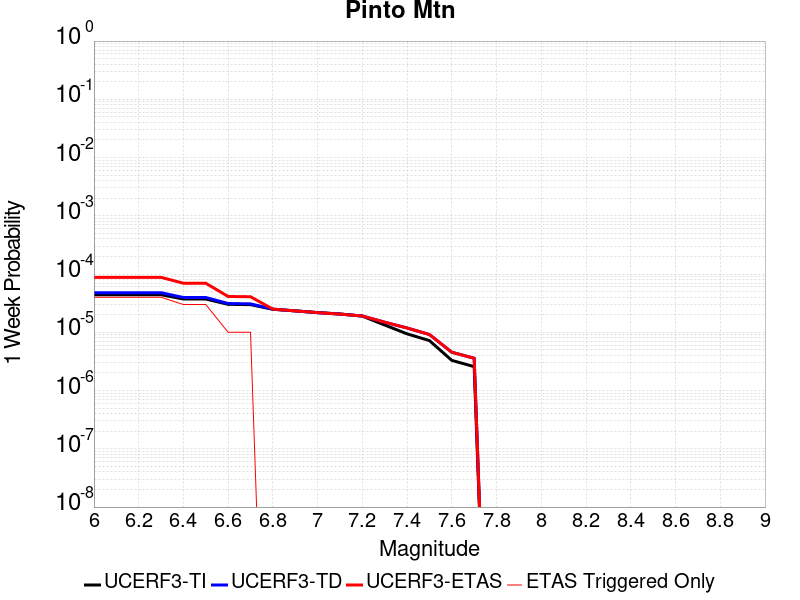 |  |  |  |

| Magnitude | 1 wk TI Prob | 1 wk TD Prob | 1 wk ETAS Prob | 1 wk ETAS/TD Gain | 1 wk ETAS Triggered Only | 1 mo TI Prob | 1 mo TD Prob | 1 mo ETAS Prob | 1 mo ETAS/TD Gain | 1 mo ETAS Triggered Only | 1 yr TI Prob | 1 yr TD Prob | 1 yr ETAS Prob | 1 yr ETAS/TD Gain | 1 yr ETAS Triggered Only | 10 yr TI Prob | 10 yr TD Prob | 10 yr ETAS Prob | 10 yr ETAS/TD Gain | 10 yr ETAS Triggered Only |
|-----|-----|-----|-----|-----|-----|-----|-----|-----|-----|-----|-----|-----|-----|-----|-----|-----|-----|-----|-----|-----|
| 6.0 | 4.4194956E-5 | 4.785362E-5 | 6.4739856E-5 | 1.3528727 | 1.6887043E-5 | 1.893932E-4 | 2.0507174E-4 | 2.2195533E-4 | 1.0823301 | 1.6887043E-5 | 0.0023034236 | 0.0024940541 | 0.002527744 | 1.0135081 | 3.3774086E-5 | 0.022796938 | 0.024678145 | 0.024776967 | 1.0040045 | 1.0132226E-4 |
| 6.1 | 4.4194956E-5 | 4.785362E-5 | 6.4739856E-5 | 1.3528727 | 1.6887043E-5 | 1.893932E-4 | 2.0507174E-4 | 2.2195533E-4 | 1.0823301 | 1.6887043E-5 | 0.0023034236 | 0.0024940541 | 0.002527744 | 1.0135081 | 3.3774086E-5 | 0.022796938 | 0.024678145 | 0.024776967 | 1.0040045 | 1.0132226E-4 |
| 6.2 | 4.4194956E-5 | 4.785362E-5 | 6.4739856E-5 | 1.3528727 | 1.6887043E-5 | 1.893932E-4 | 2.0507174E-4 | 2.2195533E-4 | 1.0823301 | 1.6887043E-5 | 0.0023034236 | 0.0024940541 | 0.002527744 | 1.0135081 | 3.3774086E-5 | 0.022796938 | 0.024678145 | 0.024776967 | 1.0040045 | 1.0132226E-4 |
| 6.3 | 4.4194956E-5 | 4.785362E-5 | 6.4739856E-5 | 1.3528727 | 1.6887043E-5 | 1.893932E-4 | 2.0507174E-4 | 2.2195533E-4 | 1.0823301 | 1.6887043E-5 | 0.0023034236 | 0.0024940541 | 0.002527744 | 1.0135081 | 3.3774086E-5 | 0.022796938 | 0.024678145 | 0.024776967 | 1.0040045 | 1.0132226E-4 |
| 6.4 | 3.729929E-5 | 3.9603186E-5 | 5.648956E-5 | 1.4263893 | 1.6887043E-5 | 1.5984432E-4 | 1.6971743E-4 | 1.866016E-4 | 1.0994841 | 1.6887043E-5 | 0.0019443673 | 0.002064445 | 0.002081297 | 1.0081631 | 1.6887043E-5 | 0.019274427 | 0.02046269 | 0.020545397 | 1.0040419 | 8.443521E-5 |
| 6.5 | 3.729929E-5 | 3.9603186E-5 | 5.648956E-5 | 1.4263893 | 1.6887043E-5 | 1.5984432E-4 | 1.6971743E-4 | 1.866016E-4 | 1.0994841 | 1.6887043E-5 | 0.0019443673 | 0.002064445 | 0.002081297 | 1.0081631 | 1.6887043E-5 | 0.019274427 | 0.02046269 | 0.020545397 | 1.0040419 | 8.443521E-5 |
| 6.6 | 3.0204548E-5 | 3.1205298E-5 | 3.1205298E-5 | 1.0 | 0.0 | 1.2944164E-4 | 1.3373033E-4 | 1.3373033E-4 | 1.0 | 0.0 | 0.0015748127 | 0.0016269855 | 0.0016269855 | 1.0 | 0.0 | 0.015636992 | 0.01615461 | 0.016221065 | 1.0041138 | 6.754817E-5 |
| 6.7 | 2.9857754E-5 | 3.081468E-5 | 3.081468E-5 | 1.0 | 0.0 | 1.2795553E-4 | 1.3205643E-4 | 1.3205643E-4 | 1.0 | 0.0 | 0.0015567453 | 0.001606636 | 0.001606636 | 1.0 | 0.0 | 0.015458848 | 0.01595405 | 0.01602052 | 1.0041664 | 6.754817E-5 |
| 6.8 | 2.4819734E-5 | 2.5009364E-5 | 2.5009364E-5 | 1.0 | 0.0 | 1.0636595E-4 | 1.07178705E-4 | 1.07178705E-4 | 1.0 | 0.0 | 0.0012942362 | 0.0013041412 | 0.0013041412 | 1.0 | 0.0 | 0.012867244 | 0.0129672475 | 0.013033919 | 1.0051416 | 6.754817E-5 |
| 6.9 | 2.331124E-5 | 2.3337643E-5 | 2.3337643E-5 | 1.0 | 0.0 | 9.990149E-5 | 1.00014746E-4 | 1.00014746E-4 | 1.0 | 0.0 | 0.001215622 | 0.0012170197 | 0.0012170197 | 1.0 | 0.0 | 0.012089936 | 0.012105742 | 0.012172472 | 1.0055124 | 6.754817E-5 |
| 7.0 | 2.1818534E-5 | 2.1760772E-5 | 2.1760772E-5 | 1.0 | 0.0 | 9.3504656E-5 | 9.325723E-5 | 9.325723E-5 | 1.0 | 0.0 | 0.0011378246 | 0.0011348352 | 0.0011348352 | 1.0 | 0.0 | 0.011320163 | 0.011292503 | 0.011359289 | 1.0059141 | 6.754817E-5 |
| 7.1 | 2.066081E-5 | 2.0540418E-5 | 2.0540418E-5 | 1.0 | 0.0 | 8.854332E-5 | 8.8027504E-5 | 8.8027504E-5 | 1.0 | 0.0 | 0.0010774818 | 0.0010712275 | 0.0010712275 | 1.0 | 0.0 | 0.010722724 | 0.010662688 | 0.010729516 | 1.0062674 | 6.754817E-5 |
| 7.2 | 1.8990233E-5 | 1.9053701E-5 | 1.9053701E-5 | 1.0 | 0.0 | 8.138417E-5 | 8.1656275E-5 | 8.1656275E-5 | 1.0 | 0.0 | 9.904018E-4 | 9.937311E-4 | 9.937311E-4 | 1.0 | 0.0 | 0.009859995 | 0.009894874 | 0.009961753 | 1.006759 | 6.754817E-5 |
| 7.3 | 1.3335872E-5 | 1.4906372E-5 | 1.4906372E-5 | 1.0 | 0.0 | 5.7152483E-5 | 6.388296E-5 | 6.388296E-5 | 1.0 | 0.0 | 6.956093E-4 | 7.775102E-4 | 7.775102E-4 | 1.0 | 0.0 | 0.006934359 | 0.0077491994 | 0.007816224 | 1.0086492 | 6.754817E-5 |
| 7.4 | 9.414066E-6 | 1.186061E-5 | 1.186061E-5 | 1.0 | 0.0 | 4.0345374E-5 | 5.0830247E-5 | 5.0830247E-5 | 1.0 | 0.0 | 4.910942E-4 | 6.1869196E-4 | 6.1869196E-4 | 1.0 | 0.0 | 0.0049001034 | 0.006170644 | 0.0062209927 | 1.0081594 | 5.066113E-5 |
| 7.5 | 7.2101157E-6 | 9.157893E-6 | 9.157893E-6 | 1.0 | 0.0 | 3.090013E-5 | 3.924757E-5 | 3.924757E-5 | 1.0 | 0.0 | 3.7614413E-4 | 4.7774217E-4 | 4.7774217E-4 | 1.0 | 0.0 | 0.0037550807 | 0.004767927 | 0.0048183464 | 1.0105747 | 5.066113E-5 |
| 7.6 | 3.296375E-6 | 4.5453176E-6 | 4.5453176E-6 | 1.0 | 0.0 | 1.4127245E-5 | 1.9479796E-5 | 1.9479796E-5 | 1.0 | 0.0 | 1.7198564E-4 | 2.3714209E-4 | 2.3714209E-4 | 1.0 | 0.0 | 0.0017185259 | 0.0023690276 | 0.0023858747 | 1.0071114 | 1.6887043E-5 |
| 7.7 | 2.5741092E-6 | 3.584251E-6 | 3.584251E-6 | 1.0 | 0.0 | 1.103185E-5 | 1.5360993E-5 | 1.5360993E-5 | 1.0 | 0.0 | 1.3430449E-4 | 1.8700535E-4 | 1.8700535E-4 | 1.0 | 0.0 | 0.0013422335 | 0.0018686098 | 0.0018686098 | 1.0 | 0.0 |

## Pisgah-Bullion Mtn-Mesquite Lk
*[(top)](#table-of-contents)*

| 1 Week | 1 Month | 1 Year | 10 Year |
|-----|-----|-----|-----|
|  |  |  |  |

| Magnitude | 1 wk TI Prob | 1 wk TD Prob | 1 wk ETAS Prob | 1 wk ETAS/TD Gain | 1 wk ETAS Triggered Only | 1 mo TI Prob | 1 mo TD Prob | 1 mo ETAS Prob | 1 mo ETAS/TD Gain | 1 mo ETAS Triggered Only | 1 yr TI Prob | 1 yr TD Prob | 1 yr ETAS Prob | 1 yr ETAS/TD Gain | 1 yr ETAS Triggered Only | 10 yr TI Prob | 10 yr TD Prob | 10 yr ETAS Prob | 10 yr ETAS/TD Gain | 10 yr ETAS Triggered Only |
|-----|-----|-----|-----|-----|-----|-----|-----|-----|-----|-----|-----|-----|-----|-----|-----|-----|-----|-----|-----|-----|
| 6.0 | 3.0240792E-5 | 2.4091114E-5 | 5.7864385E-5 | 2.4018974 | 3.3774086E-5 | 1.2959696E-4 | 1.03244114E-4 | 1.3701471E-4 | 1.3270947 | 3.3774086E-5 | 0.0015767008 | 0.0012563728 | 0.001323836 | 1.0536969 | 6.754817E-5 | 0.015655609 | 0.012502721 | 0.012602776 | 1.0080026 | 1.0132226E-4 |
| 6.1 | 3.0240792E-5 | 2.4091114E-5 | 5.7864385E-5 | 2.4018974 | 3.3774086E-5 | 1.2959696E-4 | 1.03244114E-4 | 1.3701471E-4 | 1.3270947 | 3.3774086E-5 | 0.0015767008 | 0.0012563728 | 0.001323836 | 1.0536969 | 6.754817E-5 | 0.015655609 | 0.012502721 | 0.012602776 | 1.0080026 | 1.0132226E-4 |
| 6.2 | 3.0240792E-5 | 2.4091114E-5 | 5.7864385E-5 | 2.4018974 | 3.3774086E-5 | 1.2959696E-4 | 1.03244114E-4 | 1.3701471E-4 | 1.3270947 | 3.3774086E-5 | 0.0015767008 | 0.0012563728 | 0.001323836 | 1.0536969 | 6.754817E-5 | 0.015655609 | 0.012502721 | 0.012602776 | 1.0080026 | 1.0132226E-4 |
| 6.3 | 2.0498217E-5 | 1.36380695E-5 | 3.0524883E-5 | 2.2382114 | 1.6887043E-5 | 8.784654E-5 | 5.844765E-5 | 7.533371E-5 | 1.2889091 | 1.6887043E-5 | 0.0010690069 | 7.1138405E-4 | 7.451341E-4 | 1.0474428 | 3.3774086E-5 | 0.01063879 | 0.0070926943 | 0.0071429964 | 1.007092 | 5.066113E-5 |
| 6.4 | 2.0498217E-5 | 1.36380695E-5 | 3.0524883E-5 | 2.2382114 | 1.6887043E-5 | 8.784654E-5 | 5.844765E-5 | 7.533371E-5 | 1.2889091 | 1.6887043E-5 | 0.0010690069 | 7.1138405E-4 | 7.451341E-4 | 1.0474428 | 3.3774086E-5 | 0.01063879 | 0.0070926943 | 0.0071429964 | 1.007092 | 5.066113E-5 |
| 6.5 | 1.7316182E-5 | 1.0477042E-5 | 2.7363909E-5 | 2.6117969 | 1.6887043E-5 | 7.42101E-5 | 4.4900895E-5 | 6.178718E-5 | 1.376079 | 1.6887043E-5 | 9.0313336E-4 | 5.465413E-4 | 5.802969E-4 | 1.0617622 | 3.3774086E-5 | 0.008994718 | 0.0054529672 | 0.005503352 | 1.0092399 | 5.066113E-5 |
| 6.6 | 1.5251077E-5 | 8.414273E-6 | 2.5301173E-5 | 3.0069351 | 1.6887043E-5 | 6.536012E-5 | 3.6060712E-5 | 5.2947144E-5 | 1.4682779 | 1.6887043E-5 | 7.9546886E-4 | 4.3895794E-4 | 4.7271722E-4 | 1.0769078 | 3.3774086E-5 | 0.007926274 | 0.0043816264 | 0.0044320654 | 1.0115116 | 5.066113E-5 |
| 6.7 | 1.2997425E-5 | 6.4114965E-6 | 2.3298431E-5 | 3.6338522 | 1.6887043E-5 | 5.570206E-5 | 2.7477578E-5 | 4.436416E-5 | 1.6145585 | 1.6887043E-5 | 6.7796157E-4 | 3.3449283E-4 | 3.513742E-4 | 1.0504687 | 1.6887043E-5 | 0.0067589693 | 0.0033403537 | 0.003374015 | 1.0100771 | 3.3774086E-5 |
| 6.8 | 1.035386E-5 | 4.3332193E-6 | 2.1220189E-5 | 4.897095 | 1.6887043E-5 | 4.437293E-5 | 1.8570812E-5 | 3.5457542E-5 | 1.9093156 | 1.6887043E-5 | 5.401065E-4 | 2.2607706E-4 | 2.4296029E-4 | 1.074679 | 1.6887043E-5 | 0.0053879567 | 0.0022585576 | 0.0022922554 | 1.0149201 | 3.3774086E-5 |
| 6.9 | 8.816252E-6 | 3.580638E-6 | 2.046762E-5 | 5.7161937 | 1.6887043E-5 | 3.778339E-5 | 1.5345504E-5 | 3.223229E-5 | 2.1004386 | 1.6887043E-5 | 4.5991567E-4 | 1.8681608E-4 | 2.0369996E-4 | 1.0903771 | 1.6887043E-5 | 0.00458965 | 0.0018666488 | 0.0019003598 | 1.0180596 | 3.3774086E-5 |
| 7.0 | 6.8232207E-6 | 2.5675843E-6 | 2.5675843E-6 | 1.0 | 0.0 | 2.9242048E-5 | 1.1003888E-5 | 1.1003888E-5 | 1.0 | 0.0 | 3.5596377E-4 | 1.3396442E-4 | 1.3396442E-4 | 1.0 | 0.0 | 0.0035539411 | 0.0013388677 | 0.0013557321 | 1.012596 | 1.6887043E-5 |
| 7.1 | 5.837013E-6 | 2.22738E-6 | 2.22738E-6 | 1.0 | 0.0 | 2.501553E-5 | 9.545881E-6 | 9.545881E-6 | 1.0 | 0.0 | 3.045215E-4 | 1.16215204E-4 | 1.16215204E-4 | 1.0 | 0.0 | 0.0030410455 | 0.0011615733 | 0.0011784408 | 1.0145212 | 1.6887043E-5 |
| 7.2 | 4.278052E-6 | 1.6275711E-6 | 1.6275711E-6 | 1.0 | 0.0 | 1.833438E-5 | 6.9752873E-6 | 6.9752873E-6 | 1.0 | 0.0 | 2.231982E-4 | 8.492105E-5 | 8.492105E-5 | 1.0 | 0.0 | 0.0022297418 | 8.489092E-4 | 8.657819E-4 | 1.0198758 | 1.6887043E-5 |
| 7.3 | 1.8803692E-6 | 8.344926E-7 | 8.344926E-7 | 1.0 | 0.0 | 8.0587E-6 | 3.5763926E-6 | 3.5763926E-6 | 1.0 | 0.0 | 9.811026E-5 | 4.354186E-5 | 4.354186E-5 | 1.0 | 0.0 | 9.806695E-4 | 4.3534773E-4 | 4.5222742E-4 | 1.038773 | 1.6887043E-5 |

## Oak Ridge (Onshore)
*[(top)](#table-of-contents)*

| 1 Week | 1 Month | 1 Year | 10 Year |
|-----|-----|-----|-----|
|  | 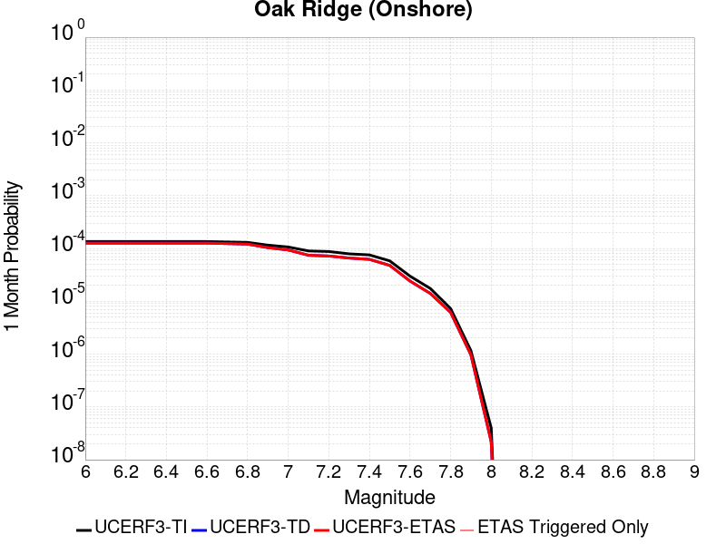 |  |  |

| Magnitude | 1 wk TI Prob | 1 wk TD Prob | 1 wk ETAS Prob | 1 wk ETAS/TD Gain | 1 wk ETAS Triggered Only | 1 mo TI Prob | 1 mo TD Prob | 1 mo ETAS Prob | 1 mo ETAS/TD Gain | 1 mo ETAS Triggered Only | 1 yr TI Prob | 1 yr TD Prob | 1 yr ETAS Prob | 1 yr ETAS/TD Gain | 1 yr ETAS Triggered Only | 10 yr TI Prob | 10 yr TD Prob | 10 yr ETAS Prob | 10 yr ETAS/TD Gain | 10 yr ETAS Triggered Only |
|-----|-----|-----|-----|-----|-----|-----|-----|-----|-----|-----|-----|-----|-----|-----|-----|-----|-----|-----|-----|-----|
| 6.0 | 3.155064E-5 | 2.9525974E-5 | 2.9525974E-5 | 1.0 | 0.0 | 1.3521002E-4 | 1.2653397E-4 | 1.2653397E-4 | 1.0 | 0.0 | 0.001644939 | 0.0015395004 | 0.0015732226 | 1.0219046 | 3.3774086E-5 | 0.01632816 | 0.015292859 | 0.015359374 | 1.0043495 | 6.754817E-5 |
| 6.1 | 3.155064E-5 | 2.9525974E-5 | 2.9525974E-5 | 1.0 | 0.0 | 1.3521002E-4 | 1.2653397E-4 | 1.2653397E-4 | 1.0 | 0.0 | 0.001644939 | 0.0015395004 | 0.0015732226 | 1.0219046 | 3.3774086E-5 | 0.01632816 | 0.015292859 | 0.015359374 | 1.0043495 | 6.754817E-5 |
| 6.2 | 3.155064E-5 | 2.9525974E-5 | 2.9525974E-5 | 1.0 | 0.0 | 1.3521002E-4 | 1.2653397E-4 | 1.2653397E-4 | 1.0 | 0.0 | 0.001644939 | 0.0015395004 | 0.0015732226 | 1.0219046 | 3.3774086E-5 | 0.01632816 | 0.015292859 | 0.015359374 | 1.0043495 | 6.754817E-5 |
| 6.3 | 3.155064E-5 | 2.9525974E-5 | 2.9525974E-5 | 1.0 | 0.0 | 1.3521002E-4 | 1.2653397E-4 | 1.2653397E-4 | 1.0 | 0.0 | 0.001644939 | 0.0015395004 | 0.0015732226 | 1.0219046 | 3.3774086E-5 | 0.01632816 | 0.015292859 | 0.015359374 | 1.0043495 | 6.754817E-5 |
| 6.4 | 3.155064E-5 | 2.9525974E-5 | 2.9525974E-5 | 1.0 | 0.0 | 1.3521002E-4 | 1.2653397E-4 | 1.2653397E-4 | 1.0 | 0.0 | 0.001644939 | 0.0015395004 | 0.0015732226 | 1.0219046 | 3.3774086E-5 | 0.01632816 | 0.015292859 | 0.015359374 | 1.0043495 | 6.754817E-5 |
| 6.5 | 3.155064E-5 | 2.9525974E-5 | 2.9525974E-5 | 1.0 | 0.0 | 1.3521002E-4 | 1.2653397E-4 | 1.2653397E-4 | 1.0 | 0.0 | 0.001644939 | 0.0015395004 | 0.0015732226 | 1.0219046 | 3.3774086E-5 | 0.01632816 | 0.015292859 | 0.015359374 | 1.0043495 | 6.754817E-5 |
| 6.6 | 3.155064E-5 | 2.9525974E-5 | 2.9525974E-5 | 1.0 | 0.0 | 1.3521002E-4 | 1.2653397E-4 | 1.2653397E-4 | 1.0 | 0.0 | 0.001644939 | 0.0015395004 | 0.0015732226 | 1.0219046 | 3.3774086E-5 | 0.01632816 | 0.015292859 | 0.015359374 | 1.0043495 | 6.754817E-5 |
| 6.7 | 3.098897E-5 | 2.8864175E-5 | 2.8864175E-5 | 1.0 | 0.0 | 1.328031E-4 | 1.2369796E-4 | 1.2369796E-4 | 1.0 | 0.0 | 0.0016156785 | 0.0015050198 | 0.0015387431 | 1.0224072 | 3.3774086E-5 | 0.016039822 | 0.014952714 | 0.015019252 | 1.00445 | 6.754817E-5 |
| 6.8 | 3.0449872E-5 | 2.8239372E-5 | 2.8239372E-5 | 1.0 | 0.0 | 1.3049292E-4 | 1.2102048E-4 | 1.2102048E-4 | 1.0 | 0.0 | 0.0015875935 | 0.0014724657 | 0.0014893279 | 1.0114516 | 1.6887043E-5 | 0.015762992 | 0.014631462 | 0.014681382 | 1.0034118 | 5.066113E-5 |
| 6.9 | 2.697928E-5 | 2.4219773E-5 | 2.4219773E-5 | 1.0 | 0.0 | 1.15620365E-4 | 1.0379502E-4 | 1.0379502E-4 | 1.0 | 0.0 | 0.0014067689 | 0.0012629933 | 0.0012629933 | 1.0 | 0.0 | 0.0139789665 | 0.01256087 | 0.012594219 | 1.002655 | 3.3774086E-5 |
| 7.0 | 2.4893961E-5 | 2.1862043E-5 | 2.1862043E-5 | 1.0 | 0.0 | 1.0668404E-4 | 9.3691204E-5 | 9.3691204E-5 | 1.0 | 0.0 | 0.0012981043 | 0.0011401111 | 0.0011401111 | 1.0 | 0.0 | 0.012905477 | 0.011344905 | 0.011378297 | 1.0029433 | 3.3774086E-5 |
| 7.1 | 2.0945363E-5 | 1.7354487E-5 | 1.7354487E-5 | 1.0 | 0.0 | 8.976275E-5 | 7.437428E-5 | 7.437428E-5 | 1.0 | 0.0 | 0.0010923136 | 9.051354E-4 | 9.051354E-4 | 1.0 | 0.0 | 0.0108696 | 0.009015423 | 0.009048892 | 1.0037125 | 3.3774086E-5 |
| 7.2 | 2.0439404E-5 | 1.6809423E-5 | 1.6809423E-5 | 1.0 | 0.0 | 8.7594504E-5 | 7.203843E-5 | 7.203843E-5 | 1.0 | 0.0 | 0.0010659413 | 8.767196E-4 | 8.767196E-4 | 1.0 | 0.0 | 0.010608427 | 0.008733526 | 0.008767005 | 1.0038334 | 3.3774086E-5 |
| 7.3 | 1.8463334E-5 | 1.5381811E-5 | 1.5381811E-5 | 1.0 | 0.0 | 7.912617E-5 | 6.59204E-5 | 6.59204E-5 | 1.0 | 0.0 | 9.6293533E-4 | 8.0228975E-4 | 8.0228975E-4 | 1.0 | 0.0 | 0.009587734 | 0.007994797 | 0.008028301 | 1.0041907 | 3.3774086E-5 |
| 7.4 | 1.763139E-5 | 1.451684E-5 | 1.451684E-5 | 1.0 | 0.0 | 7.556091E-5 | 6.221356E-5 | 6.221356E-5 | 1.0 | 0.0 | 9.1956573E-4 | 7.571909E-4 | 7.571909E-4 | 1.0 | 0.0 | 0.009157699 | 0.007546914 | 0.007580433 | 1.0044415 | 3.3774086E-5 |
| 7.5 | 1.3594944E-5 | 1.1163356E-5 | 1.1163356E-5 | 1.0 | 0.0 | 5.8262744E-5 | 4.784209E-5 | 4.784209E-5 | 1.0 | 0.0 | 7.0911803E-4 | 5.8232434E-4 | 5.8232434E-4 | 1.0 | 0.0 | 0.007068595 | 0.0058082556 | 0.0058418335 | 1.005781 | 3.3774086E-5 |
| 7.6 | 6.9889534E-6 | 5.6367144E-6 | 5.6367144E-6 | 1.0 | 0.0 | 2.9952313E-5 | 2.4157125E-5 | 2.4157125E-5 | 1.0 | 0.0 | 3.646084E-4 | 2.9407372E-4 | 2.9407372E-4 | 1.0 | 0.0 | 0.0036401073 | 0.0029368899 | 0.0029368899 | 1.0 | 0.0 |
| 7.7 | 4.0824193E-6 | 3.2832586E-6 | 3.2832586E-6 | 1.0 | 0.0 | 1.7495966E-5 | 1.4071033E-5 | 1.4071033E-5 | 1.0 | 0.0 | 2.1299256E-4 | 1.713015E-4 | 1.713015E-4 | 1.0 | 0.0 | 0.0021278851 | 0.0017117079 | 0.0017117079 | 1.0 | 0.0 |
| 7.8 | 1.7023609E-6 | 1.4370495E-6 | 1.4370495E-6 | 1.0 | 0.0 | 7.295812E-6 | 6.1587693E-6 | 6.1587693E-6 | 1.0 | 0.0 | 8.882289E-5 | 7.498047E-5 | 7.498047E-5 | 1.0 | 0.0 | 8.8787393E-4 | 7.495545E-4 | 7.495545E-4 | 1.0 | 0.0 |
| 7.9 | 2.721225E-7 | 2.2616497E-7 | 2.2616497E-7 | 1.0 | 0.0 | 1.1662388E-6 | 9.692781E-7 | 9.692781E-7 | 1.0 | 0.0 | 1.4198865E-5 | 1.1800899E-5 | 1.1800899E-5 | 1.0 | 0.0 | 1.4197957E-4 | 1.1800301E-4 | 1.1800301E-4 | 1.0 | 0.0 |
| 8.0 | 9.364255E-9 | 5.1206666E-9 | 5.1206666E-9 | 1.0 | 0.0 | 4.0132523E-8 | 2.1945715E-8 | 2.1945715E-8 | 1.0 | 0.0 | 4.8861335E-7 | 2.6718905E-7 | 2.6718905E-7 | 1.0 | 0.0 | 4.8861225E-6 | 2.6718876E-6 | 2.6718876E-6 | 1.0 | 0.0 |

## Imperial
*[(top)](#table-of-contents)*

| 1 Week | 1 Month | 1 Year | 10 Year |
|-----|-----|-----|-----|
|  |  |  |  |

| Magnitude | 1 wk TI Prob | 1 wk TD Prob | 1 wk ETAS Prob | 1 wk ETAS/TD Gain | 1 wk ETAS Triggered Only | 1 mo TI Prob | 1 mo TD Prob | 1 mo ETAS Prob | 1 mo ETAS/TD Gain | 1 mo ETAS Triggered Only | 1 yr TI Prob | 1 yr TD Prob | 1 yr ETAS Prob | 1 yr ETAS/TD Gain | 1 yr ETAS Triggered Only | 10 yr TI Prob | 10 yr TD Prob | 10 yr ETAS Prob | 10 yr ETAS/TD Gain | 10 yr ETAS Triggered Only |
|-----|-----|-----|-----|-----|-----|-----|-----|-----|-----|-----|-----|-----|-----|-----|-----|-----|-----|-----|-----|-----|
| 6.0 | 2.7496446E-4 | 5.0552754E-4 | 5.22406E-4 | 1.0333879 | 1.6887043E-5 | 0.0011778869 | 0.002164787 | 0.0022153384 | 1.0233517 | 5.066113E-5 | 0.0142467655 | 0.026038699 | 0.026104487 | 1.0025266 | 6.754817E-5 | 0.13367249 | 0.2280438 | 0.22810897 | 1.0002859 | 8.443521E-5 |
| 6.1 | 2.5356023E-4 | 4.8656776E-4 | 5.034466E-4 | 1.0346895 | 1.6887043E-5 | 0.001086234 | 0.0020836622 | 0.0021342179 | 1.0242628 | 5.066113E-5 | 0.013144928 | 0.025071215 | 0.025137069 | 1.0026267 | 6.754817E-5 | 0.123940155 | 0.21947981 | 0.2195457 | 1.0003003 | 8.443521E-5 |
| 6.2 | 2.4820742E-4 | 4.7752203E-4 | 4.94401E-4 | 1.035347 | 1.6887043E-5 | 0.0010633124 | 0.0020449557 | 0.0020955133 | 1.024723 | 5.066113E-5 | 0.01286919 | 0.024611235 | 0.02467712 | 1.0026771 | 6.754817E-5 | 0.12148927 | 0.21598552 | 0.21605173 | 1.0003065 | 8.443521E-5 |
| 6.3 | 2.3205351E-4 | 4.5890483E-4 | 4.7578412E-4 | 1.0367817 | 1.6887043E-5 | 9.94136E-4 | 0.0019652895 | 0.002015851 | 1.0257273 | 5.066113E-5 | 0.012036599 | 0.02366133 | 0.023727281 | 1.0027872 | 6.754817E-5 | 0.11405133 | 0.20793462 | 0.2080015 | 1.0003216 | 8.443521E-5 |
| 6.4 | 2.0304754E-4 | 3.987652E-4 | 4.156455E-4 | 1.0423315 | 1.6887043E-5 | 8.6991355E-4 | 0.0017078889 | 0.0017584636 | 1.0296123 | 5.066113E-5 | 0.010539869 | 0.020595672 | 0.020661827 | 1.0032122 | 6.754817E-5 | 0.100537635 | 0.1850669 | 0.1851357 | 1.0003718 | 8.443521E-5 |
| 6.5 | 1.854992E-4 | 3.6988858E-4 | 3.867694E-4 | 1.0456375 | 1.6887043E-5 | 7.9475436E-4 | 0.0015842861 | 0.0016348669 | 1.0319266 | 5.066113E-5 | 0.009633281 | 0.01911948 | 0.019185739 | 1.0034654 | 6.754817E-5 | 0.0922623 | 0.173298 | 0.17336781 | 1.0004028 | 8.443521E-5 |
| 6.6 | 1.6586106E-4 | 3.403506E-4 | 3.572319E-4 | 1.0495998 | 1.6887043E-5 | 7.106394E-4 | 0.0014578402 | 0.0015084276 | 1.0347002 | 5.066113E-5 | 0.008617763 | 0.01760642 | 0.017672779 | 1.003769 | 6.754817E-5 | 0.08291132 | 0.16077545 | 0.16084631 | 1.0004407 | 8.443521E-5 |
| 6.7 | 1.4224656E-4 | 3.076692E-4 | 3.2455102E-4 | 1.0548701 | 1.6887043E-5 | 6.094856E-4 | 0.001317924 | 0.0013685185 | 1.0383894 | 5.066113E-5 | 0.0073952693 | 0.015929576 | 0.015996048 | 1.0041729 | 6.754817E-5 | 0.07153955 | 0.14648417 | 0.14655623 | 1.000492 | 8.443521E-5 |
| 6.8 | 1.2317259E-4 | 2.779122E-4 | 2.9479453E-4 | 1.060747 | 1.6887043E-5 | 5.2777573E-4 | 0.0011905148 | 0.0012411155 | 1.0425034 | 5.066113E-5 | 0.0064067547 | 0.0143995695 | 0.014466145 | 1.0046234 | 6.754817E-5 | 0.06225166 | 0.13293684 | 0.13301004 | 1.0005507 | 8.443521E-5 |
| 6.9 | 9.859898E-5 | 2.5014306E-4 | 2.6702587E-4 | 1.0674926 | 1.6887043E-5 | 4.2249862E-4 | 0.0010716055 | 0.0011222123 | 1.0472252 | 5.066113E-5 | 0.0051317946 | 0.012969712 | 0.013036384 | 1.0051405 | 6.754817E-5 | 0.05014893 | 0.11940631 | 0.11948067 | 1.0006227 | 8.443521E-5 |
| 7.0 | 7.3191884E-5 | 2.1266776E-4 | 2.2955121E-4 | 1.0793889 | 1.6887043E-5 | 3.136418E-4 | 9.1111806E-4 | 9.6173305E-4 | 1.0555526 | 5.066113E-5 | 0.003811904 | 0.011037128 | 0.01110393 | 1.0060525 | 6.754817E-5 | 0.037471764 | 0.10206493 | 0.10214075 | 1.0007428 | 8.443521E-5 |
| 7.1 | 7.1760296E-5 | 2.0968143E-4 | 2.2656492E-4 | 1.0805198 | 1.6887043E-5 | 3.0750787E-4 | 8.983284E-4 | 9.4894395E-4 | 1.0563443 | 5.066113E-5 | 0.003737482 | 0.010882978 | 0.010949791 | 1.0061393 | 6.754817E-5 | 0.03675245 | 0.10070146 | 0.10077739 | 1.000754 | 8.443521E-5 |
| 7.2 | 6.46614E-5 | 1.9136685E-4 | 2.0825067E-4 | 1.0882275 | 1.6887043E-5 | 2.7709085E-4 | 8.1988896E-4 | 8.7050855E-4 | 1.0617396 | 5.066113E-5 | 0.0033683628 | 0.0099370815 | 0.010003959 | 1.0067301 | 6.754817E-5 | 0.033177625 | 0.09250898 | 0.0925856 | 1.0008283 | 8.443521E-5 |
| 7.3 | 6.088115E-5 | 1.78084E-4 | 1.9496803E-4 | 1.0948094 | 1.6887043E-5 | 2.6089314E-4 | 7.6299673E-4 | 8.136192E-4 | 1.0663469 | 5.066113E-5 | 0.0031717476 | 0.009250494 | 0.009317417 | 1.0072346 | 6.754817E-5 | 0.031268585 | 0.08655989 | 0.08663702 | 1.000891 | 8.443521E-5 |
| 7.4 | 4.199346E-5 | 1.1510366E-4 | 1.1510366E-4 | 1.0 | 0.0 | 1.7995955E-4 | 4.9320905E-4 | 5.2696647E-4 | 1.0684445 | 3.3774086E-5 | 0.0021888057 | 0.0059884563 | 0.006022028 | 1.005606 | 3.3774086E-5 | 0.02167372 | 0.057439793 | 0.05747163 | 1.0005542 | 3.3774086E-5 |
| 7.5 | 3.130448E-5 | 8.33328E-5 | 8.33328E-5 | 1.0 | 0.0 | 1.3415517E-4 | 3.57092E-4 | 3.9085402E-4 | 1.0945472 | 3.3774086E-5 | 0.0016321153 | 0.004338988 | 0.004372616 | 1.00775 | 3.3774086E-5 | 0.016201803 | 0.04213201 | 0.04216436 | 1.0007678 | 3.3774086E-5 |
| 7.6 | 2.3074248E-5 | 6.0844646E-5 | 6.0844646E-5 | 1.0 | 0.0 | 9.888588E-5 | 2.6073685E-4 | 2.9450213E-4 | 1.1294994 | 3.3774086E-5 | 0.0012032706 | 0.0031698733 | 0.0032035403 | 1.010621 | 3.3774086E-5 | 0.011967761 | 0.031026395 | 0.031059122 | 1.0010548 | 3.3774086E-5 |
| 7.7 | 1.45864815E-5 | 4.0124698E-5 | 4.0124698E-5 | 1.0 | 0.0 | 6.2511994E-5 | 1.7195169E-4 | 1.8883582E-4 | 1.0981911 | 1.6887043E-5 | 7.608177E-4 | 0.0020915072 | 0.0021083588 | 1.0080572 | 1.6887043E-5 | 0.007582182 | 0.020627763 | 0.020644302 | 1.0008018 | 1.6887043E-5 |
| 7.8 | 1.0352979E-5 | 3.0960902E-5 | 3.0960902E-5 | 1.0 | 0.0 | 4.4369157E-5 | 1.3268284E-4 | 1.4956764E-4 | 1.1272569 | 1.6887043E-5 | 5.400606E-4 | 0.0016142189 | 0.0016310788 | 1.0104445 | 1.6887043E-5 | 0.0053875 | 0.016016833 | 0.01603345 | 1.0010375 | 1.6887043E-5 |
| 7.9 | 8.137906E-6 | 2.2149103E-5 | 2.2149103E-5 | 1.0 | 0.0 | 3.4876273E-5 | 9.492128E-5 | 1.11806716E-4 | 1.1778889 | 1.6887043E-5 | 4.2453592E-4 | 0.0011550548 | 0.0011719223 | 1.0146033 | 1.6887043E-5 | 0.004237258 | 0.011617903 | 0.011634594 | 1.0014366 | 1.6887043E-5 |
| 8.0 | 6.93792E-6 | 1.8008766E-5 | 1.8008766E-5 | 1.0 | 0.0 | 2.9733603E-5 | 7.717814E-5 | 9.4063886E-5 | 1.2187891 | 1.6887043E-5 | 3.6194647E-4 | 9.3923963E-4 | 9.561108E-4 | 1.0179626 | 1.6887043E-5 | 0.0036135751 | 0.00950155 | 0.009518277 | 1.0017604 | 1.6887043E-5 |
| 8.1 | 3.4286315E-6 | 6.379872E-6 | 6.379872E-6 | 1.0 | 0.0 | 1.4694053E-5 | 2.7342023E-5 | 2.7342023E-5 | 1.0 | 0.0 | 1.7888541E-4 | 3.328384E-4 | 3.328384E-4 | 1.0 | 0.0 | 0.0017874148 | 0.003486031 | 0.003486031 | 1.0 | 0.0 |
| 8.2 | 1.4906886E-6 | 1.9366646E-6 | 1.9366646E-6 | 1.0 | 0.0 | 6.3886496E-6 | 8.299965E-6 | 8.299965E-6 | 1.0 | 0.0 | 7.7779034E-5 | 1.0104742E-4 | 1.0104742E-4 | 1.0 | 0.0 | 7.775182E-4 | 0.0011075331 | 0.0011075331 | 1.0 | 0.0 |
| 8.3 | 2.5758007E-8 | 1.4500102E-8 | 1.4500102E-8 | 1.0 | 0.0 | 1.10391454E-7 | 6.214329E-8 | 6.214329E-8 | 1.0 | 0.0 | 1.3440151E-6 | 7.565946E-7 | 7.565946E-7 | 1.0 | 0.0 | 1.344007E-5 | 7.887763E-6 | 7.887763E-6 | 1.0 | 0.0 |

## Green Valley 2011 CFM
*[(top)](#table-of-contents)*

| 1 Week | 1 Month | 1 Year | 10 Year |
|-----|-----|-----|-----|
|  |  |  |  |

| Magnitude | 1 wk TI Prob | 1 wk TD Prob | 1 wk ETAS Prob | 1 wk ETAS/TD Gain | 1 wk ETAS Triggered Only | 1 mo TI Prob | 1 mo TD Prob | 1 mo ETAS Prob | 1 mo ETAS/TD Gain | 1 mo ETAS Triggered Only | 1 yr TI Prob | 1 yr TD Prob | 1 yr ETAS Prob | 1 yr ETAS/TD Gain | 1 yr ETAS Triggered Only | 10 yr TI Prob | 10 yr TD Prob | 10 yr ETAS Prob | 10 yr ETAS/TD Gain | 10 yr ETAS Triggered Only |
|-----|-----|-----|-----|-----|-----|-----|-----|-----|-----|-----|-----|-----|-----|-----|-----|-----|-----|-----|-----|-----|
| 6.0 | 9.9629346E-5 | 1.7305532E-4 | 2.0682356E-4 | 1.1951298 | 3.3774086E-5 | 4.2691303E-4 | 7.4143766E-4 | 7.751867E-4 | 1.0455184 | 3.3774086E-5 | 0.0051852856 | 0.008986705 | 0.009036911 | 1.0055866 | 5.066113E-5 | 0.050659515 | 0.085522056 | 0.08559927 | 1.0009029 | 8.443521E-5 |
| 6.1 | 9.88615E-5 | 1.7152846E-4 | 2.0529675E-4 | 1.196867 | 3.3774086E-5 | 4.2362334E-4 | 7.348976E-4 | 7.686469E-4 | 1.0459237 | 3.3774086E-5 | 0.0051454236 | 0.0089077335 | 0.008957943 | 1.0056367 | 5.066113E-5 | 0.050279044 | 0.084809676 | 0.08488695 | 1.0009111 | 8.443521E-5 |
| 6.2 | 9.696895E-5 | 1.6791887E-4 | 2.0168729E-4 | 1.2010995 | 3.3774086E-5 | 4.15515E-4 | 7.194366E-4 | 7.531864E-4 | 1.0469114 | 3.3774086E-5 | 0.0050471667 | 0.008721114 | 0.008771333 | 1.0057584 | 5.066113E-5 | 0.04934063 | 0.0831186 | 0.08319602 | 1.0009314 | 8.443521E-5 |
| 6.3 | 9.275224E-5 | 1.5971228E-4 | 1.9348096E-4 | 1.2114346 | 3.3774086E-5 | 3.9744904E-4 | 6.842841E-4 | 7.1803504E-4 | 1.0493231 | 3.3774086E-5 | 0.0048282105 | 0.008296439 | 0.00834668 | 1.0060557 | 5.066113E-5 | 0.047246475 | 0.07925707 | 0.07933481 | 1.0009809 | 8.443521E-5 |
| 6.4 | 8.391499E-5 | 1.4367796E-4 | 1.7744719E-4 | 1.2350342 | 3.3774086E-5 | 3.595861E-4 | 6.156248E-4 | 6.493781E-4 | 1.0548277 | 3.3774086E-5 | 0.004369175 | 0.0074670846 | 0.007517367 | 1.0067339 | 5.066113E-5 | 0.04284265 | 0.071630865 | 0.07170925 | 1.0010943 | 8.443521E-5 |
| 6.5 | 5.9519385E-5 | 9.9340905E-5 | 1.1622627E-4 | 1.169974 | 1.6887043E-5 | 2.5505814E-4 | 4.2568138E-4 | 4.4256126E-4 | 1.0396538 | 1.6887043E-5 | 0.0031009112 | 0.005168295 | 0.005201895 | 1.0065011 | 3.3774086E-5 | 0.030579966 | 0.050145864 | 0.050193984 | 1.0009596 | 5.066113E-5 |
| 6.6 | 4.5361558E-5 | 7.402609E-5 | 9.091188E-5 | 1.228106 | 1.6887043E-5 | 1.9439218E-4 | 3.1721895E-4 | 3.3410065E-4 | 1.0532178 | 1.6887043E-5 | 0.0023641558 | 0.0038539418 | 0.0038875856 | 1.0087297 | 3.3774086E-5 | 0.023391623 | 0.037665963 | 0.037714716 | 1.0012944 | 5.066113E-5 |
| 6.7 | 3.8808106E-5 | 6.2651976E-5 | 7.953796E-5 | 1.2695204 | 1.6887043E-5 | 1.6630985E-4 | 2.6848342E-4 | 2.8536594E-4 | 1.062881 | 1.6887043E-5 | 0.0020229418 | 0.0032626586 | 0.0032963224 | 1.0103179 | 3.3774086E-5 | 0.020046256 | 0.032005914 | 0.032038607 | 1.0010215 | 3.3774086E-5 |
| 6.8 | 2.2284667E-5 | 3.1285235E-5 | 3.1285235E-5 | 1.0 | 0.0 | 9.550222E-5 | 1.3407279E-4 | 1.3407279E-4 | 1.0 | 0.0 | 0.0011621192 | 0.0016311078 | 0.0016479673 | 1.0103363 | 1.6887043E-5 | 0.011560607 | 0.016165998 | 0.016182613 | 1.0010277 | 1.6887043E-5 |
| 6.9 | 1.8050168E-5 | 2.4448054E-5 | 2.4448054E-5 | 1.0 | 0.0 | 7.735557E-5 | 1.047732E-4 | 1.047732E-4 | 1.0 | 0.0 | 9.4139716E-4 | 0.0012748708 | 0.0012917364 | 1.0132293 | 1.6887043E-5 | 0.009374191 | 0.012667833 | 0.012684505 | 1.0013162 | 1.6887043E-5 |
| 7.0 | 1.4763166E-5 | 1.9582854E-5 | 1.9582854E-5 | 1.0 | 0.0 | 6.326917E-5 | 8.3923835E-5 | 8.3923835E-5 | 1.0 | 0.0 | 7.7002996E-4 | 0.0010212966 | 0.0010381665 | 1.016518 | 1.6887043E-5 | 0.007673672 | 0.010165343 | 0.010182058 | 1.0016444 | 1.6887043E-5 |
| 7.1 | 1.2399713E-5 | 1.6303715E-5 | 1.6303715E-5 | 1.0 | 0.0 | 5.3140546E-5 | 6.98712E-5 | 6.98712E-5 | 1.0 | 0.0 | 6.467941E-4 | 8.503518E-4 | 8.6722453E-4 | 1.019842 | 1.6887043E-5 | 0.006449148 | 0.008471259 | 0.008488003 | 1.0019766 | 1.6887043E-5 |
| 7.2 | 1.0584195E-5 | 1.3921742E-5 | 1.3921742E-5 | 1.0 | 0.0 | 4.5360044E-5 | 5.9663253E-5 | 5.9663253E-5 | 1.0 | 0.0 | 5.521186E-4 | 7.261596E-4 | 7.261596E-4 | 1.0 | 0.0 | 0.0055074887 | 0.007238285 | 0.007238285 | 1.0 | 0.0 |
| 7.3 | 7.998173E-6 | 1.054402E-5 | 1.054402E-5 | 1.0 | 0.0 | 3.4277433E-5 | 4.518788E-5 | 4.518788E-5 | 1.0 | 0.0 | 4.1724785E-4 | 5.500247E-4 | 5.500247E-4 | 1.0 | 0.0 | 0.004164653 | 0.0054868995 | 0.0054868995 | 1.0 | 0.0 |
| 7.4 | 6.7571127E-6 | 8.932697E-6 | 8.932697E-6 | 1.0 | 0.0 | 2.8958733E-5 | 3.828243E-5 | 3.828243E-5 | 1.0 | 0.0 | 3.5251552E-4 | 4.6598984E-4 | 4.6598984E-4 | 1.0 | 0.0 | 0.0035195686 | 0.0046503306 | 0.0046503306 | 1.0 | 0.0 |
| 7.5 | 5.69878E-6 | 7.516314E-6 | 7.516314E-6 | 1.0 | 0.0 | 2.4423114E-5 | 3.221238E-5 | 3.221238E-5 | 1.0 | 0.0 | 2.9731085E-4 | 3.9211605E-4 | 3.9211605E-4 | 1.0 | 0.0 | 0.002969134 | 0.0039143935 | 0.0039143935 | 1.0 | 0.0 |
| 7.6 | 4.503664E-6 | 5.9356807E-6 | 5.9356807E-6 | 1.0 | 0.0 | 1.9301275E-5 | 2.5438389E-5 | 2.5438389E-5 | 1.0 | 0.0 | 2.3496768E-4 | 3.096692E-4 | 3.096692E-4 | 1.0 | 0.0 | 0.002347194 | 0.003092502 | 0.003092502 | 1.0 | 0.0 |
| 7.7 | 1.0873546E-6 | 1.4106979E-6 | 1.4106979E-6 | 1.0 | 0.0 | 4.6600826E-6 | 6.045834E-6 | 6.045834E-6 | 1.0 | 0.0 | 5.6735033E-5 | 7.360557E-5 | 7.360557E-5 | 1.0 | 0.0 | 5.672055E-4 | 7.35814E-4 | 7.35814E-4 | 1.0 | 0.0 |
| 7.8 | 4.9373917E-8 | 6.1777136E-8 | 6.1777136E-8 | 1.0 | 0.0 | 2.1160248E-7 | 2.6475914E-7 | 2.6475914E-7 | 1.0 | 0.0 | 2.5762572E-6 | 3.223439E-6 | 3.223439E-6 | 1.0 | 0.0 | 2.5762274E-5 | 3.2232296E-5 | 3.2232296E-5 | 1.0 | 0.0 |

## San Jacinto (Clark) rev
*[(top)](#table-of-contents)*

| 1 Week | 1 Month | 1 Year | 10 Year |
|-----|-----|-----|-----|
|  |  |  |  |

| Magnitude | 1 wk TI Prob | 1 wk TD Prob | 1 wk ETAS Prob | 1 wk ETAS/TD Gain | 1 wk ETAS Triggered Only | 1 mo TI Prob | 1 mo TD Prob | 1 mo ETAS Prob | 1 mo ETAS/TD Gain | 1 mo ETAS Triggered Only | 1 yr TI Prob | 1 yr TD Prob | 1 yr ETAS Prob | 1 yr ETAS/TD Gain | 1 yr ETAS Triggered Only | 10 yr TI Prob | 10 yr TD Prob | 10 yr ETAS Prob | 10 yr ETAS/TD Gain | 10 yr ETAS Triggered Only |
|-----|-----|-----|-----|-----|-----|-----|-----|-----|-----|-----|-----|-----|-----|-----|-----|-----|-----|-----|-----|-----|
| 6.0 | 4.482615E-5 | 2.1154196E-5 | 5.4927565E-5 | 2.596533 | 3.3774086E-5 | 1.9209793E-4 | 9.065773E-5 | 1.4131427E-4 | 1.5587668 | 5.066113E-5 | 0.0023362834 | 0.0011032083 | 0.0011706819 | 1.0611613 | 6.754817E-5 | 0.02311874 | 0.011503847 | 0.011587311 | 1.0072553 | 8.443521E-5 |
| 6.1 | 4.482615E-5 | 2.1154196E-5 | 5.4927565E-5 | 2.596533 | 3.3774086E-5 | 1.9209793E-4 | 9.065773E-5 | 1.4131427E-4 | 1.5587668 | 5.066113E-5 | 0.0023362834 | 0.0011032083 | 0.0011706819 | 1.0611613 | 6.754817E-5 | 0.02311874 | 0.011503847 | 0.011587311 | 1.0072553 | 8.443521E-5 |
| 6.2 | 4.482615E-5 | 2.1154196E-5 | 5.4927565E-5 | 2.596533 | 3.3774086E-5 | 1.9209793E-4 | 9.065773E-5 | 1.4131427E-4 | 1.5587668 | 5.066113E-5 | 0.0023362834 | 0.0011032083 | 0.0011706819 | 1.0611613 | 6.754817E-5 | 0.02311874 | 0.011503847 | 0.011587311 | 1.0072553 | 8.443521E-5 |
| 6.3 | 4.482615E-5 | 2.1154196E-5 | 5.4927565E-5 | 2.596533 | 3.3774086E-5 | 1.9209793E-4 | 9.065773E-5 | 1.4131427E-4 | 1.5587668 | 5.066113E-5 | 0.0023362834 | 0.0011032083 | 0.0011706819 | 1.0611613 | 6.754817E-5 | 0.02311874 | 0.011503847 | 0.011587311 | 1.0072553 | 8.443521E-5 |
| 6.4 | 4.482615E-5 | 2.1154196E-5 | 5.4927565E-5 | 2.596533 | 3.3774086E-5 | 1.9209793E-4 | 9.065773E-5 | 1.4131427E-4 | 1.5587668 | 5.066113E-5 | 0.0023362834 | 0.0011032083 | 0.0011706819 | 1.0611613 | 6.754817E-5 | 0.02311874 | 0.011503847 | 0.011587311 | 1.0072553 | 8.443521E-5 |
| 6.5 | 3.7294863E-5 | 1.7356087E-5 | 5.1129588E-5 | 2.9459167 | 3.3774086E-5 | 1.5982533E-4 | 7.438113E-5 | 1.250385E-4 | 1.6810511 | 5.066113E-5 | 0.0019441366 | 9.052186E-4 | 9.727056E-4 | 1.0745533 | 6.754817E-5 | 0.01927216 | 0.0094941035 | 0.009577737 | 1.008809 | 8.443521E-5 |
| 6.6 | 3.7294863E-5 | 1.7356087E-5 | 5.1129588E-5 | 2.9459167 | 3.3774086E-5 | 1.5982533E-4 | 7.438113E-5 | 1.250385E-4 | 1.6810511 | 5.066113E-5 | 0.0019441366 | 9.052186E-4 | 9.727056E-4 | 1.0745533 | 6.754817E-5 | 0.01927216 | 0.0094941035 | 0.009577737 | 1.008809 | 8.443521E-5 |
| 6.7 | 3.6039248E-5 | 1.6604314E-5 | 5.0377836E-5 | 3.0340211 | 3.3774086E-5 | 1.5444479E-4 | 7.1159426E-5 | 1.2181695E-4 | 1.7118877 | 5.066113E-5 | 0.0018787434 | 8.6602574E-4 | 9.3351543E-4 | 1.0779303 | 6.754817E-5 | 0.01862939 | 0.009096047 | 0.009179714 | 1.0091982 | 8.443521E-5 |
| 6.8 | 3.5031844E-5 | 1.6232942E-5 | 5.0006478E-5 | 3.0805557 | 3.3774086E-5 | 1.5012783E-4 | 6.956792E-5 | 1.2022552E-4 | 1.7281748 | 5.066113E-5 | 0.0018262739 | 8.4666436E-4 | 9.1415533E-4 | 1.079714 | 6.754817E-5 | 0.01811338 | 0.008895969 | 0.008979653 | 1.0094069 | 8.443521E-5 |
| 6.9 | 3.435112E-5 | 1.6063195E-5 | 4.9836737E-5 | 3.1025422 | 3.3774086E-5 | 1.4721078E-4 | 6.884047E-5 | 1.1949811E-4 | 1.7358701 | 5.066113E-5 | 0.0017908178 | 8.3781447E-4 | 9.053061E-4 | 1.0805568 | 6.754817E-5 | 0.017764548 | 0.008804181 | 0.008887872 | 1.0095059 | 8.443521E-5 |
| 7.0 | 2.8959772E-5 | 1.4336745E-5 | 4.8110345E-5 | 3.355737 | 3.3774086E-5 | 1.241074E-4 | 6.144176E-5 | 1.1209978E-4 | 1.8244883 | 5.066113E-5 | 0.0015099603 | 7.477995E-4 | 8.152971E-4 | 1.0902617 | 6.754817E-5 | 0.014997416 | 0.007868037 | 0.007951807 | 1.0106469 | 8.443521E-5 |
| 7.1 | 2.6002877E-5 | 1.2829002E-5 | 4.6602654E-5 | 3.6326017 | 3.3774086E-5 | 1.11436144E-4 | 5.498029E-5 | 1.0563863E-4 | 1.921391 | 5.066113E-5 | 0.0013558907 | 6.691816E-4 | 7.3668454E-4 | 1.100874 | 6.754817E-5 | 0.013476475 | 0.0070465137 | 0.007130354 | 1.0118982 | 8.443521E-5 |
| 7.2 | 2.2544838E-5 | 1.1262543E-5 | 4.503625E-5 | 3.9987636 | 3.3774086E-5 | 9.661716E-5 | 4.8267157E-5 | 9.892584E-5 | 2.0495477 | 5.066113E-5 | 0.001175679 | 5.874956E-4 | 6.550041E-4 | 1.1149089 | 6.754817E-5 | 0.011694785 | 0.0061927503 | 0.0062766625 | 1.01355 | 8.443521E-5 |
| 7.3 | 1.75334E-5 | 1.0811715E-5 | 4.4585435E-5 | 4.123808 | 3.3774086E-5 | 7.514098E-5 | 4.6335106E-5 | 9.6993885E-5 | 2.0933132 | 5.066113E-5 | 9.144575E-4 | 5.6398526E-4 | 6.314953E-4 | 1.1197019 | 6.754817E-5 | 0.009107036 | 0.0059337732 | 0.0060177078 | 1.0141451 | 8.443521E-5 |
| 7.4 | 1.5924552E-5 | 1.0611516E-5 | 4.4385244E-5 | 4.1827426 | 3.3774086E-5 | 6.82463E-5 | 4.547714E-5 | 9.613596E-5 | 2.1139405 | 5.066113E-5 | 8.305819E-4 | 5.535449E-4 | 6.2105566E-4 | 1.1219608 | 6.754817E-5 | 0.008274844 | 0.0058210334 | 0.005904977 | 1.0144207 | 8.443521E-5 |
| 7.5 | 1.3428931E-5 | 9.8519E-6 | 4.3625652E-5 | 4.428146 | 3.3774086E-5 | 5.7551293E-5 | 4.2221753E-5 | 9.288074E-5 | 2.1998315 | 5.066113E-5 | 7.004617E-4 | 5.1392964E-4 | 5.8144314E-4 | 1.1313671 | 6.754817E-5 | 0.006982579 | 0.0054066023 | 0.005490581 | 1.0155326 | 8.443521E-5 |
| 7.6 | 1.0688787E-5 | 8.614839E-6 | 4.2388634E-5 | 4.9204206 | 3.3774086E-5 | 4.5808283E-5 | 3.692022E-5 | 8.757948E-5 | 2.3721275 | 5.066113E-5 | 5.5757316E-4 | 4.4941145E-4 | 5.1692926E-4 | 1.1502361 | 6.754817E-5 | 0.005561762 | 0.0047416524 | 0.004825687 | 1.0177227 | 8.443521E-5 |
| 7.7 | 8.81236E-6 | 7.4680274E-6 | 4.124186E-5 | 5.522457 | 3.3774086E-5 | 3.776671E-5 | 3.2005442E-5 | 8.266495E-5 | 2.5828404 | 5.066113E-5 | 4.597127E-4 | 3.8959677E-4 | 4.4023816E-4 | 1.1299841 | 5.066113E-5 | 0.0045876284 | 0.0041346536 | 0.0042019226 | 1.0162696 | 6.754817E-5 |
| 7.8 | 7.780431E-6 | 6.696579E-6 | 4.0470437E-5 | 6.0434494 | 3.3774086E-5 | 3.3344273E-5 | 2.8699309E-5 | 7.9358986E-5 | 2.765188 | 5.066113E-5 | 4.0589093E-4 | 3.4935825E-4 | 4.0000168E-4 | 1.1449614 | 5.066113E-5 | 0.0040515037 | 0.0037227906 | 0.0037900873 | 1.0180769 | 6.754817E-5 |
| 7.9 | 6.5437994E-6 | 5.780382E-6 | 3.955427E-5 | 6.842848 | 3.3774086E-5 | 2.8044553E-5 | 2.477283E-5 | 7.5432705E-5 | 3.0449772 | 5.066113E-5 | 3.4138895E-4 | 3.0156763E-4 | 3.5221348E-4 | 1.1679419 | 5.066113E-5 | 0.0034086495 | 0.0032344845 | 0.0033018142 | 1.0208162 | 6.754817E-5 |
| 8.0 | 5.4488164E-6 | 4.8133406E-6 | 3.8587263E-5 | 8.016732 | 3.3774086E-5 | 2.3351862E-5 | 2.062844E-5 | 7.128852E-5 | 3.4558368 | 5.066113E-5 | 2.8427184E-4 | 2.5112246E-4 | 3.0177087E-4 | 1.201688 | 5.066113E-5 | 0.0028390845 | 0.002710839 | 0.0027782042 | 1.0248502 | 6.754817E-5 |
| 8.1 | 2.8397242E-6 | 1.3670389E-6 | 1.3670389E-6 | 1.0 | 0.0 | 1.217019E-5 | 5.858725E-6 | 5.858725E-6 | 1.0 | 0.0 | 1.4816198E-4 | 7.132765E-5 | 7.132765E-5 | 1.0 | 0.0 | 0.0014806325 | 8.115382E-4 | 8.115382E-4 | 1.0 | 0.0 |
| 8.2 | 2.030244E-6 | 6.318974E-7 | 6.318974E-7 | 1.0 | 0.0 | 8.701017E-6 | 2.708129E-6 | 2.708129E-6 | 1.0 | 0.0 | 1.05929736E-4 | 3.2970976E-5 | 3.2970976E-5 | 1.0 | 0.0 | 0.0010587925 | 3.9486602E-4 | 3.9486602E-4 | 1.0 | 0.0 |
| 8.3 | 1.0659804E-6 | 2.9250086E-7 | 2.9250086E-7 | 1.0 | 0.0 | 4.568479E-6 | 1.2535745E-6 | 1.2535745E-6 | 1.0 | 0.0 | 5.5619817E-5 | 1.5262167E-5 | 1.5262167E-5 | 1.0 | 0.0 | 5.5605895E-4 | 1.8566217E-4 | 1.8566217E-4 | 1.0 | 0.0 |

## San Cayetano
*[(top)](#table-of-contents)*

| 1 Week | 1 Month | 1 Year | 10 Year |
|-----|-----|-----|-----|
| 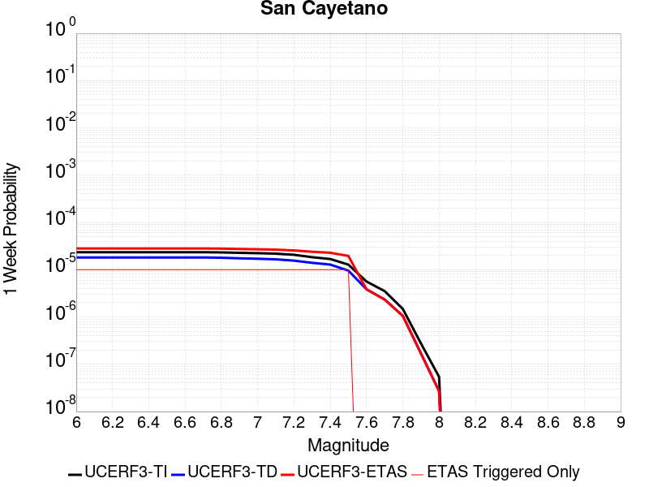 |  |  |  |

| Magnitude | 1 wk TI Prob | 1 wk TD Prob | 1 wk ETAS Prob | 1 wk ETAS/TD Gain | 1 wk ETAS Triggered Only | 1 mo TI Prob | 1 mo TD Prob | 1 mo ETAS Prob | 1 mo ETAS/TD Gain | 1 mo ETAS Triggered Only | 1 yr TI Prob | 1 yr TD Prob | 1 yr ETAS Prob | 1 yr ETAS/TD Gain | 1 yr ETAS Triggered Only | 10 yr TI Prob | 10 yr TD Prob | 10 yr ETAS Prob | 10 yr ETAS/TD Gain | 10 yr ETAS Triggered Only |
|-----|-----|-----|-----|-----|-----|-----|-----|-----|-----|-----|-----|-----|-----|-----|-----|-----|-----|-----|-----|-----|
| 6.0 | 2.3476267E-5 | 1.816928E-5 | 3.5056015E-5 | 1.9294114 | 1.6887043E-5 | 1.0060869E-4 | 7.786603E-5 | 1.1163749E-4 | 1.4337122 | 3.3774086E-5 | 0.0012242225 | 9.476103E-4 | 9.982234E-4 | 1.0534114 | 5.066113E-5 | 0.012175002 | 0.009436584 | 0.009520222 | 1.0088632 | 8.443521E-5 |
| 6.1 | 2.3476267E-5 | 1.816928E-5 | 3.5056015E-5 | 1.9294114 | 1.6887043E-5 | 1.0060869E-4 | 7.786603E-5 | 1.1163749E-4 | 1.4337122 | 3.3774086E-5 | 0.0012242225 | 9.476103E-4 | 9.982234E-4 | 1.0534114 | 5.066113E-5 | 0.012175002 | 0.009436584 | 0.009520222 | 1.0088632 | 8.443521E-5 |
| 6.2 | 2.3476267E-5 | 1.816928E-5 | 3.5056015E-5 | 1.9294114 | 1.6887043E-5 | 1.0060869E-4 | 7.786603E-5 | 1.1163749E-4 | 1.4337122 | 3.3774086E-5 | 0.0012242225 | 9.476103E-4 | 9.982234E-4 | 1.0534114 | 5.066113E-5 | 0.012175002 | 0.009436584 | 0.009520222 | 1.0088632 | 8.443521E-5 |
| 6.3 | 2.3476267E-5 | 1.816928E-5 | 3.5056015E-5 | 1.9294114 | 1.6887043E-5 | 1.0060869E-4 | 7.786603E-5 | 1.1163749E-4 | 1.4337122 | 3.3774086E-5 | 0.0012242225 | 9.476103E-4 | 9.982234E-4 | 1.0534114 | 5.066113E-5 | 0.012175002 | 0.009436584 | 0.009520222 | 1.0088632 | 8.443521E-5 |
| 6.4 | 2.3476267E-5 | 1.816928E-5 | 3.5056015E-5 | 1.9294114 | 1.6887043E-5 | 1.0060869E-4 | 7.786603E-5 | 1.1163749E-4 | 1.4337122 | 3.3774086E-5 | 0.0012242225 | 9.476103E-4 | 9.982234E-4 | 1.0534114 | 5.066113E-5 | 0.012175002 | 0.009436584 | 0.009520222 | 1.0088632 | 8.443521E-5 |
| 6.5 | 2.3476267E-5 | 1.816928E-5 | 3.5056015E-5 | 1.9294114 | 1.6887043E-5 | 1.0060869E-4 | 7.786603E-5 | 1.1163749E-4 | 1.4337122 | 3.3774086E-5 | 0.0012242225 | 9.476103E-4 | 9.982234E-4 | 1.0534114 | 5.066113E-5 | 0.012175002 | 0.009436584 | 0.009520222 | 1.0088632 | 8.443521E-5 |
| 6.6 | 2.3476267E-5 | 1.816928E-5 | 3.5056015E-5 | 1.9294114 | 1.6887043E-5 | 1.0060869E-4 | 7.786603E-5 | 1.1163749E-4 | 1.4337122 | 3.3774086E-5 | 0.0012242225 | 9.476103E-4 | 9.982234E-4 | 1.0534114 | 5.066113E-5 | 0.012175002 | 0.009436584 | 0.009520222 | 1.0088632 | 8.443521E-5 |
| 6.7 | 2.3476267E-5 | 1.816928E-5 | 3.5056015E-5 | 1.9294114 | 1.6887043E-5 | 1.0060869E-4 | 7.786603E-5 | 1.1163749E-4 | 1.4337122 | 3.3774086E-5 | 0.0012242225 | 9.476103E-4 | 9.982234E-4 | 1.0534114 | 5.066113E-5 | 0.012175002 | 0.009436584 | 0.009520222 | 1.0088632 | 8.443521E-5 |
| 6.8 | 2.3241924E-5 | 1.7936987E-5 | 3.4823726E-5 | 1.941448 | 1.6887043E-5 | 9.960445E-5 | 7.687056E-5 | 1.10642046E-4 | 1.4393293 | 3.3774086E-5 | 0.0012120095 | 9.3550084E-4 | 9.861145E-4 | 1.0541034 | 5.066113E-5 | 0.012054204 | 0.009316482 | 0.00940013 | 1.0089786 | 8.443521E-5 |
| 6.9 | 2.2761007E-5 | 1.7432423E-5 | 3.431917E-5 | 1.9686977 | 1.6887043E-5 | 9.7543525E-5 | 7.470827E-5 | 1.0847983E-4 | 1.4520458 | 3.3774086E-5 | 0.0011869454 | 9.09197E-4 | 9.598121E-4 | 1.05567 | 5.066113E-5 | 0.011806256 | 0.009055603 | 0.009139273 | 1.0092397 | 8.443521E-5 |
| 7.0 | 2.240283E-5 | 1.7066168E-5 | 3.395292E-5 | 1.9894872 | 1.6887043E-5 | 9.600859E-5 | 7.313869E-5 | 1.0691031E-4 | 1.4617476 | 3.3774086E-5 | 0.0011682777 | 8.9010317E-4 | 9.407192E-4 | 1.0568653 | 5.066113E-5 | 0.011621549 | 0.008866196 | 0.008949881 | 1.0094389 | 8.443521E-5 |
| 7.1 | 2.1871154E-5 | 1.6586018E-5 | 3.347278E-5 | 2.0181324 | 1.6887043E-5 | 9.373015E-5 | 7.108101E-5 | 1.048527E-4 | 1.4751154 | 3.3774086E-5 | 0.0011405671 | 8.6507114E-4 | 9.156884E-4 | 1.0585123 | 5.066113E-5 | 0.011347309 | 0.008617838 | 0.008701546 | 1.0097133 | 8.443521E-5 |
| 7.2 | 2.0714133E-5 | 1.5564561E-5 | 3.2451342E-5 | 2.0849507 | 1.6887043E-5 | 8.8771834E-5 | 6.670357E-5 | 8.358949E-5 | 1.2531486 | 1.6887043E-5 | 0.0010802611 | 8.1181666E-4 | 8.4556337E-4 | 1.0415694 | 3.3774086E-5 | 0.010750249 | 0.008089285 | 0.0081562875 | 1.0082828 | 6.754817E-5 |
| 7.3 | 1.8408395E-5 | 1.3996864E-5 | 3.088367E-5 | 2.2064707 | 1.6887043E-5 | 7.8890735E-5 | 5.99852E-5 | 7.687123E-5 | 1.2815033 | 1.6887043E-5 | 9.600714E-4 | 7.300781E-4 | 7.638275E-4 | 1.0462271 | 3.3774086E-5 | 0.009559342 | 0.0072775153 | 0.007344572 | 1.0092142 | 6.754817E-5 |
| 7.4 | 1.6856795E-5 | 1.28500815E-5 | 2.9736906E-5 | 2.3141415 | 1.6887043E-5 | 7.2241404E-5 | 5.5070628E-5 | 7.195674E-5 | 1.3066264 | 1.6887043E-5 | 8.7918417E-4 | 6.7028153E-4 | 7.0403295E-4 | 1.0503541 | 3.3774086E-5 | 0.00875714 | 0.0066832784 | 0.006750375 | 1.0100394 | 6.754817E-5 |
| 7.5 | 1.2822778E-5 | 9.577542E-6 | 2.6464422E-5 | 2.7631748 | 1.6887043E-5 | 5.495361E-5 | 4.1045972E-5 | 5.793232E-5 | 1.4114009 | 1.6887043E-5 | 6.688548E-4 | 4.996217E-4 | 5.333789E-4 | 1.0675656 | 3.3774086E-5 | 0.006668452 | 0.0049851555 | 0.0050523668 | 1.0134823 | 6.754817E-5 |
| 7.6 | 5.6272684E-6 | 3.854903E-6 | 3.854903E-6 | 1.0 | 0.0 | 2.4116642E-5 | 1.652091E-5 | 1.652091E-5 | 1.0 | 0.0 | 2.9358055E-4 | 2.0112359E-4 | 2.1800725E-4 | 1.0839466 | 1.6887043E-5 | 0.0029319301 | 0.0020094267 | 0.0020262797 | 1.008387 | 1.6887043E-5 |
| 7.7 | 3.5261346E-6 | 2.3407013E-6 | 2.3407013E-6 | 1.0 | 0.0 | 1.5111918E-5 | 1.0031539E-5 | 1.0031539E-5 | 1.0 | 0.0 | 1.8397206E-4 | 1.2212721E-4 | 1.3901219E-4 | 1.1382573 | 1.6887043E-5 | 0.0018381984 | 0.0012206084 | 0.0012374747 | 1.013818 | 1.6887043E-5 |
| 7.8 | 1.4826929E-6 | 1.056428E-6 | 1.056428E-6 | 1.0 | 0.0 | 6.354383E-6 | 4.5275406E-6 | 4.5275406E-6 | 1.0 | 0.0 | 7.736187E-5 | 5.5121433E-5 | 5.5121433E-5 | 1.0 | 0.0 | 7.733494E-4 | 5.5107963E-4 | 5.5107963E-4 | 1.0 | 0.0 |
| 7.9 | 2.7568166E-7 | 1.6978244E-7 | 1.6978244E-7 | 1.0 | 0.0 | 1.1814923E-6 | 7.2763885E-7 | 7.2763885E-7 | 1.0 | 0.0 | 1.4384574E-5 | 8.858967E-6 | 8.858967E-6 | 1.0 | 0.0 | 1.4383643E-4 | 8.8586174E-5 | 8.8586174E-5 | 1.0 | 0.0 |
| 8.0 | 5.407832E-8 | 2.6887697E-8 | 2.6887697E-8 | 1.0 | 0.0 | 2.3176422E-7 | 1.15232986E-7 | 1.15232986E-7 | 1.0 | 0.0 | 2.8217257E-6 | 1.4029607E-6 | 1.4029607E-6 | 1.0 | 0.0 | 2.8216898E-5 | 1.4029522E-5 | 1.4029522E-5 | 1.0 | 0.0 |

## San Jacinto (Lytle Creek connector)
*[(top)](#table-of-contents)*

| 1 Week | 1 Month | 1 Year | 10 Year |
|-----|-----|-----|-----|
|  |  |  |  |

| Magnitude | 1 wk TI Prob | 1 wk TD Prob | 1 wk ETAS Prob | 1 wk ETAS/TD Gain | 1 wk ETAS Triggered Only | 1 mo TI Prob | 1 mo TD Prob | 1 mo ETAS Prob | 1 mo ETAS/TD Gain | 1 mo ETAS Triggered Only | 1 yr TI Prob | 1 yr TD Prob | 1 yr ETAS Prob | 1 yr ETAS/TD Gain | 1 yr ETAS Triggered Only | 10 yr TI Prob | 10 yr TD Prob | 10 yr ETAS Prob | 10 yr ETAS/TD Gain | 10 yr ETAS Triggered Only |
|-----|-----|-----|-----|-----|-----|-----|-----|-----|-----|-----|-----|-----|-----|-----|-----|-----|-----|-----|-----|-----|
| 6.0 | 6.693995E-6 | 6.660216E-6 | 7.4207936E-5 | 11.141972 | 6.754817E-5 | 2.8688235E-5 | 2.854347E-5 | 9.6089716E-5 | 3.366434 | 6.754817E-5 | 3.492233E-4 | 3.4746144E-4 | 4.1498613E-4 | 1.1943372 | 6.754817E-5 | 0.00348675 | 0.0035493854 | 0.0036335208 | 1.0237043 | 8.443521E-5 |
| 6.1 | 6.693995E-6 | 6.660216E-6 | 7.4207936E-5 | 11.141972 | 6.754817E-5 | 2.8688235E-5 | 2.854347E-5 | 9.6089716E-5 | 3.366434 | 6.754817E-5 | 3.492233E-4 | 3.4746144E-4 | 4.1498613E-4 | 1.1943372 | 6.754817E-5 | 0.00348675 | 0.0035493854 | 0.0036335208 | 1.0237043 | 8.443521E-5 |
| 6.2 | 6.693995E-6 | 6.660216E-6 | 7.4207936E-5 | 11.141972 | 6.754817E-5 | 2.8688235E-5 | 2.854347E-5 | 9.6089716E-5 | 3.366434 | 6.754817E-5 | 3.492233E-4 | 3.4746144E-4 | 4.1498613E-4 | 1.1943372 | 6.754817E-5 | 0.00348675 | 0.0035493854 | 0.0036335208 | 1.0237043 | 8.443521E-5 |
| 6.3 | 6.693995E-6 | 6.660216E-6 | 7.4207936E-5 | 11.141972 | 6.754817E-5 | 2.8688235E-5 | 2.854347E-5 | 9.6089716E-5 | 3.366434 | 6.754817E-5 | 3.492233E-4 | 3.4746144E-4 | 4.1498613E-4 | 1.1943372 | 6.754817E-5 | 0.00348675 | 0.0035493854 | 0.0036335208 | 1.0237043 | 8.443521E-5 |
| 6.4 | 6.693995E-6 | 6.660216E-6 | 7.4207936E-5 | 11.141972 | 6.754817E-5 | 2.8688235E-5 | 2.854347E-5 | 9.6089716E-5 | 3.366434 | 6.754817E-5 | 3.492233E-4 | 3.4746144E-4 | 4.1498613E-4 | 1.1943372 | 6.754817E-5 | 0.00348675 | 0.0035493854 | 0.0036335208 | 1.0237043 | 8.443521E-5 |
| 6.5 | 6.6561875E-6 | 6.6204343E-6 | 7.416816E-5 | 11.202914 | 6.754817E-5 | 2.8526205E-5 | 2.837298E-5 | 9.591923E-5 | 3.380654 | 6.754817E-5 | 3.472512E-4 | 3.4538636E-4 | 4.129112E-4 | 1.1955053 | 6.754817E-5 | 0.0034670907 | 0.003528701 | 0.003612838 | 1.0238436 | 8.443521E-5 |
| 6.6 | 6.6561875E-6 | 6.6204343E-6 | 7.416816E-5 | 11.202914 | 6.754817E-5 | 2.8526205E-5 | 2.837298E-5 | 9.591923E-5 | 3.380654 | 6.754817E-5 | 3.472512E-4 | 3.4538636E-4 | 4.129112E-4 | 1.1955053 | 6.754817E-5 | 0.0034670907 | 0.003528701 | 0.003612838 | 1.0238436 | 8.443521E-5 |
| 6.7 | 6.5802237E-6 | 6.539611E-6 | 7.408734E-5 | 11.329013 | 6.754817E-5 | 2.8200653E-5 | 2.8026603E-5 | 9.557288E-5 | 3.410077 | 6.754817E-5 | 3.4328885E-4 | 3.4117055E-4 | 4.0869566E-4 | 1.1979219 | 6.754817E-5 | 0.0034275902 | 0.0034866752 | 0.003570816 | 1.0241321 | 8.443521E-5 |
| 6.8 | 6.575632E-6 | 6.5341005E-6 | 7.408183E-5 | 11.337724 | 6.754817E-5 | 2.8180975E-5 | 2.8002989E-5 | 9.5549265E-5 | 3.4121096 | 6.754817E-5 | 3.4304935E-4 | 3.4088313E-4 | 4.0840826E-4 | 1.1980889 | 6.754817E-5 | 0.0034252026 | 0.00348381 | 0.003567951 | 1.024152 | 8.443521E-5 |
| 6.9 | 6.570433E-6 | 6.525495E-6 | 7.407322E-5 | 11.351357 | 6.754817E-5 | 2.8158694E-5 | 2.7966107E-5 | 9.551239E-5 | 3.4152908 | 6.754817E-5 | 3.4277816E-4 | 3.4043423E-4 | 4.079594E-4 | 1.1983502 | 6.754817E-5 | 0.0034224992 | 0.0034793352 | 0.0035634767 | 1.0241832 | 8.443521E-5 |
| 7.0 | 6.5643826E-6 | 6.515616E-6 | 7.406335E-5 | 11.367052 | 6.754817E-5 | 2.8132765E-5 | 2.792377E-5 | 9.547005E-5 | 3.418953 | 6.754817E-5 | 3.424626E-4 | 3.3991894E-4 | 4.0744414E-4 | 1.198651 | 6.754817E-5 | 0.0034193532 | 0.0034741985 | 0.0035583402 | 1.024219 | 8.443521E-5 |
| 7.1 | 6.557402E-6 | 6.5043278E-6 | 7.4052055E-5 | 11.385044 | 6.754817E-5 | 2.8102848E-5 | 2.7875392E-5 | 9.542168E-5 | 3.423151 | 6.754817E-5 | 3.4209844E-4 | 3.3933012E-4 | 4.0685537E-4 | 1.1989957 | 6.754817E-5 | 0.0034157229 | 0.0034683298 | 0.0035524722 | 1.0242602 | 8.443521E-5 |
| 7.2 | 6.546394E-6 | 6.4862943E-6 | 7.4034026E-5 | 11.413917 | 6.754817E-5 | 2.8055672E-5 | 2.7798109E-5 | 9.53444E-5 | 3.429888 | 6.754817E-5 | 3.4152428E-4 | 3.3838948E-4 | 4.059148E-4 | 1.1995491 | 6.754817E-5 | 0.0034099987 | 0.0034589572 | 0.0035431003 | 1.0243262 | 8.443521E-5 |
| 7.3 | 6.5364216E-6 | 6.4670803E-6 | 7.401482E-5 | 11.444858 | 6.754817E-5 | 2.8012933E-5 | 2.7715765E-5 | 9.526206E-5 | 3.4371076 | 6.754817E-5 | 3.4100408E-4 | 3.3738726E-4 | 4.0491263E-4 | 1.200142 | 6.754817E-5 | 0.003404813 | 0.0034489788 | 0.0035331228 | 1.0243968 | 8.443521E-5 |
| 7.4 | 6.5269523E-6 | 6.4481674E-6 | 7.39959E-5 | 11.475493 | 6.754817E-5 | 2.7972354E-5 | 2.7634711E-5 | 9.5181014E-5 | 3.4442558 | 6.754817E-5 | 3.4051016E-4 | 3.3640073E-4 | 4.0392618E-4 | 1.2007291 | 6.754817E-5 | 0.0033998888 | 0.003439161 | 0.0035233058 | 1.0244666 | 8.443521E-5 |
| 7.5 | 6.5111835E-6 | 6.424442E-6 | 7.397218E-5 | 11.514179 | 6.754817E-5 | 2.7904773E-5 | 2.7533031E-5 | 9.507934E-5 | 3.4532826 | 6.754817E-5 | 3.3968766E-4 | 3.3516317E-4 | 4.0268872E-4 | 1.2014706 | 6.754817E-5 | 0.0033916887 | 0.003426834 | 0.00351098 | 1.024555 | 8.443521E-5 |
| 7.6 | 6.4768806E-6 | 6.383551E-6 | 7.393129E-5 | 11.581531 | 6.754817E-5 | 2.7757764E-5 | 2.735779E-5 | 9.490411E-5 | 3.4689977 | 6.754817E-5 | 3.3789838E-4 | 3.3303024E-4 | 4.0055593E-4 | 1.2027614 | 6.754817E-5 | 0.0033738504 | 0.0034055663 | 0.0034897139 | 1.0247089 | 8.443521E-5 |
| 7.7 | 6.1655364E-6 | 6.1760365E-6 | 7.3723786E-5 | 11.937072 | 6.754817E-5 | 2.642346E-5 | 2.646846E-5 | 9.401484E-5 | 3.5519574 | 6.754817E-5 | 3.2165812E-4 | 3.2220592E-4 | 3.897323E-4 | 1.2095753 | 6.754817E-5 | 0.0032119295 | 0.0032971818 | 0.0033813384 | 1.0255239 | 8.443521E-5 |
| 7.8 | 5.5043524E-6 | 5.737097E-6 | 7.328488E-5 | 12.773861 | 6.754817E-5 | 2.3589868E-5 | 2.4587327E-5 | 9.2133836E-5 | 3.7472084 | 6.754817E-5 | 2.871688E-4 | 2.9930964E-4 | 3.668376E-4 | 1.2256124 | 6.754817E-5 | 0.0028679797 | 0.0030672832 | 0.0031514596 | 1.0274433 | 8.443521E-5 |
| 7.9 | 3.889249E-6 | 4.076761E-6 | 5.4737684E-5 | 13.426758 | 5.066113E-5 | 1.6668104E-5 | 1.7471715E-5 | 6.813196E-5 | 3.8995574 | 5.066113E-5 | 2.0291525E-4 | 2.1269741E-4 | 2.6334776E-4 | 1.2381333 | 5.066113E-5 | 0.0020273007 | 0.0021943315 | 0.0022617313 | 1.0307155 | 6.754817E-5 |
| 8.0 | 2.668535E-6 | 2.5315155E-6 | 3.6305515E-5 | 14.341415 | 3.3774086E-5 | 1.1436528E-5 | 1.0849307E-5 | 4.4623026E-5 | 4.112984 | 3.3774086E-5 | 1.3923083E-4 | 1.3208234E-4 | 1.6585196E-4 | 1.255671 | 3.3774086E-5 | 0.0013914363 | 0.0013757964 | 0.0014263878 | 1.0367725 | 5.066113E-5 |
| 8.1 | 1.5911459E-6 | 1.218661E-6 | 1.218661E-6 | 1.0 | 0.0 | 6.8191785E-6 | 5.2228224E-6 | 5.2228224E-6 | 1.0 | 0.0 | 8.3020335E-5 | 6.3586034E-5 | 6.3586034E-5 | 1.0 | 0.0 | 8.298933E-4 | 6.6932244E-4 | 6.861982E-4 | 1.0252131 | 1.6887043E-5 |
| 8.2 | 6.1294963E-7 | 2.1812275E-7 | 2.1812275E-7 | 1.0 | 0.0 | 2.6269242E-6 | 9.3481145E-7 | 9.3481145E-7 | 1.0 | 0.0 | 3.1982334E-5 | 1.138127E-5 | 1.138127E-5 | 1.0 | 0.0 | 3.1977732E-4 | 1.2784546E-4 | 1.2784546E-4 | 1.0 | 0.0 |
| 8.3 | 1.762871E-7 | 4.7546838E-8 | 4.7546838E-8 | 1.0 | 0.0 | 7.5551594E-7 | 2.0377215E-7 | 2.0377215E-7 | 1.0 | 0.0 | 9.1983675E-6 | 2.480923E-6 | 2.480923E-6 | 1.0 | 0.0 | 9.197987E-5 | 2.868753E-5 | 2.868753E-5 | 1.0 | 0.0 |

## Brawley (Seismic Zone) alt 1
*[(top)](#table-of-contents)*

| 1 Week | 1 Month | 1 Year | 10 Year |
|-----|-----|-----|-----|
|  |  |  |  |

| Magnitude | 1 wk TI Prob | 1 wk TD Prob | 1 wk ETAS Prob | 1 wk ETAS/TD Gain | 1 wk ETAS Triggered Only | 1 mo TI Prob | 1 mo TD Prob | 1 mo ETAS Prob | 1 mo ETAS/TD Gain | 1 mo ETAS Triggered Only | 1 yr TI Prob | 1 yr TD Prob | 1 yr ETAS Prob | 1 yr ETAS/TD Gain | 1 yr ETAS Triggered Only | 10 yr TI Prob | 10 yr TD Prob | 10 yr ETAS Prob | 10 yr ETAS/TD Gain | 10 yr ETAS Triggered Only |
|-----|-----|-----|-----|-----|-----|-----|-----|-----|-----|-----|-----|-----|-----|-----|-----|-----|-----|-----|-----|-----|
| 6.0 | 2.2521618E-4 | 4.7632487E-4 | 4.932039E-4 | 1.0354359 | 1.6887043E-5 | 9.6485513E-4 | 0.0020398323 | 0.00209039 | 1.0247853 | 5.066113E-5 | 0.011683988 | 0.024546238 | 0.024612127 | 1.0026844 | 6.754817E-5 | 0.11088423 | 0.21350002 | 0.21356644 | 1.000311 | 8.443521E-5 |
| 6.1 | 2.2521618E-4 | 4.7632487E-4 | 4.932039E-4 | 1.0354359 | 1.6887043E-5 | 9.6485513E-4 | 0.0020398323 | 0.00209039 | 1.0247853 | 5.066113E-5 | 0.011683988 | 0.024546238 | 0.024612127 | 1.0026844 | 6.754817E-5 | 0.11088423 | 0.21350002 | 0.21356644 | 1.000311 | 8.443521E-5 |
| 6.2 | 2.198148E-4 | 4.6717093E-4 | 4.8405008E-4 | 1.0361305 | 1.6887043E-5 | 9.417233E-4 | 0.0020006616 | 0.0020512212 | 1.0252715 | 5.066113E-5 | 0.011405343 | 0.024080504 | 0.024146425 | 1.0027375 | 6.754817E-5 | 0.10837428 | 0.20993657 | 0.21000329 | 1.0003178 | 8.443521E-5 |
| 6.3 | 2.1704129E-4 | 4.615278E-4 | 4.7840702E-4 | 1.0365726 | 1.6887043E-5 | 9.298453E-4 | 0.0019765133 | 0.0020270743 | 1.0255809 | 5.066113E-5 | 0.011262234 | 0.02379366 | 0.023859601 | 1.0027714 | 6.754817E-5 | 0.107082725 | 0.20782755 | 0.20789443 | 1.0003219 | 8.443521E-5 |
| 6.4 | 1.876142E-4 | 4.00449E-4 | 4.1732928E-4 | 1.0421534 | 1.6887043E-5 | 8.038131E-4 | 0.0017150956 | 0.0017656698 | 1.0294877 | 5.066113E-5 | 0.00974259 | 0.020680401 | 0.020746553 | 1.0031987 | 6.754817E-5 | 0.093263686 | 0.18457815 | 0.18464701 | 1.000373 | 8.443521E-5 |
| 6.5 | 1.7390939E-4 | 3.7477075E-4 | 3.9165147E-4 | 1.0450428 | 1.6887043E-5 | 7.45113E-4 | 0.0016051838 | 0.0016557637 | 1.0315102 | 5.066113E-5 | 0.009034078 | 0.019368723 | 0.019434962 | 1.00342 | 6.754817E-5 | 0.086755216 | 0.17440031 | 0.17447002 | 1.0003997 | 8.443521E-5 |
| 6.6 | 1.591791E-4 | 3.4891962E-4 | 3.6580078E-4 | 1.0483812 | 1.6887043E-5 | 6.8201777E-4 | 0.0014945229 | 0.0015451083 | 1.0338472 | 5.066113E-5 | 0.008271996 | 0.018045569 | 0.0181119 | 1.0036757 | 6.754817E-5 | 0.07970774 | 0.16380852 | 0.16387913 | 1.0004311 | 8.443521E-5 |
| 6.7 | 1.4268003E-4 | 3.20582E-4 | 3.3746363E-4 | 1.0526593 | 1.6887043E-5 | 6.1134255E-4 | 0.0013732077 | 0.0014237992 | 1.0368419 | 5.066113E-5 | 0.007417723 | 0.016592601 | 0.016659029 | 1.0040034 | 6.754817E-5 | 0.07174956 | 0.15193306 | 0.15200467 | 1.0004714 | 8.443521E-5 |
| 6.8 | 1.239713E-4 | 2.9053655E-4 | 3.074187E-4 | 1.0581068 | 1.6887043E-5 | 5.3119735E-4 | 0.0012445687 | 0.0012951668 | 1.0406551 | 5.066113E-5 | 0.0064481674 | 0.015048777 | 0.015115309 | 1.0044211 | 6.754817E-5 | 0.06264243 | 0.13837762 | 0.13845038 | 1.0005257 | 8.443521E-5 |
| 6.9 | 1.0180238E-4 | 2.625439E-4 | 2.7942652E-4 | 1.064304 | 1.6887043E-5 | 4.3622297E-4 | 0.0011247073 | 0.0011753114 | 1.0449932 | 5.066113E-5 | 0.005298089 | 0.013608336 | 0.013674965 | 1.0048962 | 6.754817E-5 | 0.05173543 | 0.124961674 | 0.12503555 | 1.0005913 | 8.443521E-5 |
| 7.0 | 7.6619996E-5 | 2.23993E-4 | 2.4087627E-4 | 1.075374 | 1.6887043E-5 | 3.283301E-4 | 9.5962E-4 | 0.0010102325 | 1.0527422 | 5.066113E-5 | 0.0039900932 | 0.011621496 | 0.0116882585 | 1.0057448 | 6.754817E-5 | 0.039192066 | 0.107266866 | 0.10734224 | 1.0007027 | 8.443521E-5 |
| 7.1 | 7.5127435E-5 | 2.2082464E-4 | 2.3770795E-4 | 1.0764557 | 1.6887043E-5 | 3.2193496E-4 | 9.4605127E-4 | 9.966644E-4 | 1.0534995 | 5.066113E-5 | 0.0039125155 | 0.011458045 | 0.011524819 | 1.0058277 | 6.754817E-5 | 0.038443442 | 0.10583085 | 0.105906345 | 1.0007133 | 8.443521E-5 |
| 7.2 | 6.788582E-5 | 2.0210193E-4 | 2.1898557E-4 | 1.0835402 | 1.6887043E-5 | 2.9090676E-4 | 8.6586666E-4 | 9.164839E-4 | 1.0584584 | 5.066113E-5 | 0.0035360386 | 0.0104916105 | 0.01055845 | 1.0063708 | 6.754817E-5 | 0.034803 | 0.09750131 | 0.09757751 | 1.0007815 | 8.443521E-5 |
| 7.3 | 6.399602E-5 | 1.8841137E-4 | 2.0529523E-4 | 1.0896116 | 1.6887043E-5 | 2.7423984E-4 | 8.072303E-4 | 8.5785054E-4 | 1.0627085 | 5.066113E-5 | 0.0033337586 | 0.009784332 | 0.009851218 | 1.0068362 | 6.754817E-5 | 0.03284188 | 0.09139617 | 0.09147289 | 1.0008394 | 8.443521E-5 |
| 7.4 | 4.506759E-5 | 1.2529209E-4 | 1.2529209E-4 | 1.0 | 0.0 | 1.9313251E-4 | 5.368565E-4 | 5.7061244E-4 | 1.062877 | 3.3774086E-5 | 0.0023488526 | 0.0065168133 | 0.0065503675 | 1.0051489 | 3.3774086E-5 | 0.023241805 | 0.062363707 | 0.06239537 | 1.0005078 | 3.3774086E-5 |
| 7.5 | 3.43289E-5 | 9.33541E-5 | 9.33541E-5 | 1.0 | 0.0 | 1.4711556E-4 | 4.00028E-4 | 4.3378855E-4 | 1.0843955 | 3.3774086E-5 | 0.0017896603 | 0.0048595266 | 0.0048931367 | 1.0069163 | 3.3774086E-5 | 0.01775316 | 0.04705519 | 0.047087375 | 1.000684 | 3.3774086E-5 |
| 7.6 | 2.5980507E-5 | 7.053101E-5 | 7.053101E-5 | 1.0 | 0.0 | 1.1134028E-4 | 3.0224086E-4 | 3.3600474E-4 | 1.1117119 | 3.3774086E-5 | 0.001354725 | 0.003673598 | 0.0037072478 | 1.0091599 | 3.3774086E-5 | 0.013464959 | 0.035840835 | 0.0358734 | 1.0009086 | 3.3774086E-5 |
| 7.7 | 1.7292105E-5 | 4.9407296E-5 | 4.9407296E-5 | 1.0 | 0.0 | 7.4106916E-5 | 2.117284E-4 | 2.2861187E-4 | 1.0797411 | 1.6887043E-5 | 9.018782E-4 | 0.0025747516 | 0.0025915953 | 1.0065418 | 1.6887043E-5 | 0.008982267 | 0.025290398 | 0.025306858 | 1.0006509 | 1.6887043E-5 |
| 7.8 | 1.2927471E-5 | 3.9693266E-5 | 3.9693266E-5 | 1.0 | 0.0 | 5.5402274E-5 | 1.7010293E-4 | 1.869871E-4 | 1.0992585 | 1.6887043E-5 | 6.743139E-4 | 0.0020690386 | 0.0020858906 | 1.0081449 | 1.6887043E-5 | 0.0067227143 | 0.020431727 | 0.02044827 | 1.0008097 | 1.6887043E-5 |
| 7.9 | 1.0200774E-5 | 2.874569E-5 | 2.874569E-5 | 1.0 | 0.0 | 4.371687E-5 | 1.2319001E-4 | 1.4007496E-4 | 1.1370643 | 1.6887043E-5 | 5.321229E-4 | 0.0014988075 | 0.0015156692 | 1.0112501 | 1.6887043E-5 | 0.005308505 | 0.014991644 | 0.015008277 | 1.0011096 | 1.6887043E-5 |
| 8.0 | 8.650396E-6 | 2.3277367E-5 | 2.3277367E-5 | 1.0 | 0.0 | 3.70726E-5 | 9.975634E-5 | 1.166417E-4 | 1.169266 | 1.6887043E-5 | 4.5126543E-4 | 0.0012138576 | 0.0012307242 | 1.013895 | 1.6887043E-5 | 0.0045035016 | 0.012211097 | 0.012227777 | 1.001366 | 1.6887043E-5 |
| 8.1 | 3.9368224E-6 | 7.3279825E-6 | 7.3279825E-6 | 1.0 | 0.0 | 1.6871985E-5 | 3.140526E-5 | 3.140526E-5 | 1.0 | 0.0 | 2.0539707E-4 | 3.8229208E-4 | 3.8229208E-4 | 1.0 | 0.0 | 0.0020520731 | 0.004001185 | 0.004001185 | 1.0 | 0.0 |
| 8.2 | 1.7101195E-6 | 2.217876E-6 | 2.217876E-6 | 1.0 | 0.0 | 7.329063E-6 | 9.505149E-6 | 9.505149E-6 | 1.0 | 0.0 | 8.922769E-5 | 1.1571907E-4 | 1.1571907E-4 | 1.0 | 0.0 | 8.9191867E-4 | 0.0012666774 | 0.0012666774 | 1.0 | 0.0 |
| 8.3 | 3.0346666E-8 | 1.721586E-8 | 1.721586E-8 | 1.0 | 0.0 | 1.3005713E-7 | 7.378226E-8 | 7.378226E-8 | 1.0 | 0.0 | 1.5834444E-6 | 8.9829894E-7 | 8.9829894E-7 | 1.0 | 0.0 | 1.5834332E-5 | 9.367729E-6 | 9.367729E-6 | 1.0 | 0.0 |

## Oceanic - West Huasna
*[(top)](#table-of-contents)*

| 1 Week | 1 Month | 1 Year | 10 Year |
|-----|-----|-----|-----|
|  | 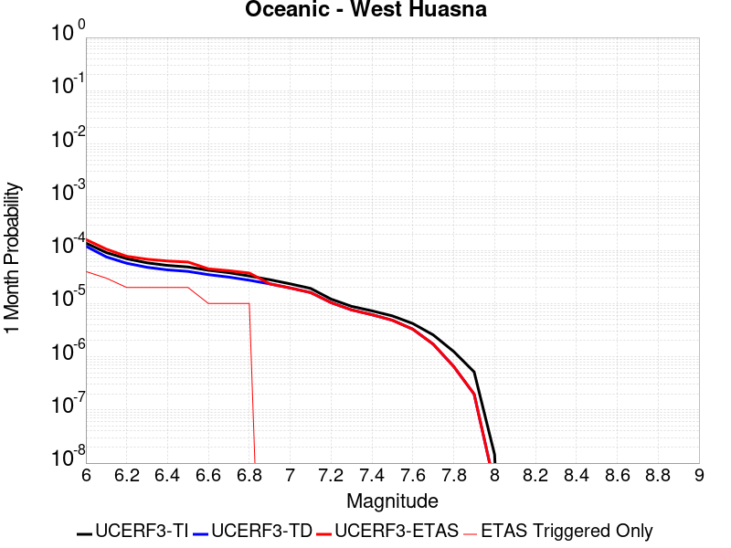 |  |  |

| Magnitude | 1 wk TI Prob | 1 wk TD Prob | 1 wk ETAS Prob | 1 wk ETAS/TD Gain | 1 wk ETAS Triggered Only | 1 mo TI Prob | 1 mo TD Prob | 1 mo ETAS Prob | 1 mo ETAS/TD Gain | 1 mo ETAS Triggered Only | 1 yr TI Prob | 1 yr TD Prob | 1 yr ETAS Prob | 1 yr ETAS/TD Gain | 1 yr ETAS Triggered Only | 10 yr TI Prob | 10 yr TD Prob | 10 yr ETAS Prob | 10 yr ETAS/TD Gain | 10 yr ETAS Triggered Only |
|-----|-----|-----|-----|-----|-----|-----|-----|-----|-----|-----|-----|-----|-----|-----|-----|-----|-----|-----|-----|-----|
| 6.0 | 3.195567E-5 | 2.7926868E-5 | 6.170001E-5 | 2.2093422 | 3.3774086E-5 | 1.3694567E-4 | 1.1968133E-4 | 1.5345137E-4 | 1.2821664 | 3.3774086E-5 | 0.0016660384 | 0.0014561893 | 0.0015067768 | 1.0347395 | 5.066113E-5 | 0.016536033 | 0.014471028 | 0.014537598 | 1.0046003 | 6.754817E-5 |
| 6.1 | 2.1156782E-5 | 1.7573486E-5 | 5.134698E-5 | 2.9218435 | 3.3774086E-5 | 9.066878E-5 | 7.531282E-5 | 1.0908436E-4 | 1.448417 | 3.3774086E-5 | 0.0011033333 | 9.165572E-4 | 9.671719E-4 | 1.0552226 | 5.066113E-5 | 0.010978713 | 0.009128777 | 0.00919571 | 1.007332 | 6.754817E-5 |
| 6.2 | 1.6195117E-5 | 1.3327152E-5 | 3.021397E-5 | 2.2670987 | 1.6887043E-5 | 6.9405796E-5 | 5.7115132E-5 | 7.400121E-5 | 1.2956498 | 1.6887043E-5 | 8.44688E-4 | 6.9515745E-4 | 7.120328E-4 | 1.0242755 | 1.6887043E-5 | 0.008414844 | 0.006930123 | 0.0069636633 | 1.0048398 | 3.3774086E-5 |
| 6.3 | 1.3559345E-5 | 1.1179142E-5 | 2.8065997E-5 | 2.510568 | 1.6887043E-5 | 5.811018E-5 | 4.7909736E-5 | 6.479597E-5 | 1.3524593 | 1.6887043E-5 | 7.072618E-4 | 5.831459E-4 | 6.000231E-4 | 1.0289416 | 1.6887043E-5 | 0.0070501505 | 0.0058162753 | 0.0058498527 | 1.0057731 | 3.3774086E-5 |
| 6.4 | 1.2120619E-5 | 1.0000977E-5 | 2.6887852E-5 | 2.6885223 | 1.6887043E-5 | 5.1944477E-5 | 4.2860633E-5 | 5.974695E-5 | 1.393982 | 1.6887043E-5 | 6.322405E-4 | 5.2170374E-4 | 5.38582E-4 | 1.0323521 | 1.6887043E-5 | 0.006304447 | 0.0052048573 | 0.0052384557 | 1.0064552 | 3.3774086E-5 |
| 6.5 | 1.13511915E-5 | 9.3674735E-6 | 2.6254358E-5 | 2.8027148 | 1.6887043E-5 | 4.8647056E-5 | 4.01457E-5 | 5.7032063E-5 | 1.420627 | 1.6887043E-5 | 5.9211696E-4 | 4.886647E-4 | 5.055435E-4 | 1.0345407 | 1.6887043E-5 | 0.0059054173 | 0.0048759608 | 0.0049095703 | 1.0068929 | 3.3774086E-5 |
| 6.6 | 9.850605E-6 | 8.135418E-6 | 2.5022324E-5 | 3.0757267 | 1.6887043E-5 | 4.2216197E-5 | 3.4865614E-5 | 5.1752068E-5 | 1.4843297 | 1.6887043E-5 | 5.1386096E-4 | 4.2440637E-4 | 4.4128625E-4 | 1.0397729 | 1.6887043E-5 | 0.0051267436 | 0.004235991 | 0.004269622 | 1.0079393 | 3.3774086E-5 |
| 6.7 | 8.8558645E-6 | 7.318433E-6 | 2.4205352E-5 | 3.30745 | 1.6887043E-5 | 3.7953152E-5 | 3.1364336E-5 | 4.8250848E-5 | 1.5383985 | 1.6887043E-5 | 4.6198163E-4 | 3.8179406E-4 | 3.9867466E-4 | 1.0442139 | 1.6887043E-5 | 0.004610224 | 0.0038114067 | 0.003845052 | 1.0088276 | 3.3774086E-5 |
| 6.8 | 7.67136E-6 | 6.391756E-6 | 2.3278692E-5 | 3.6419866 | 1.6887043E-5 | 3.2876844E-5 | 2.7392953E-5 | 4.427953E-5 | 1.6164571 | 1.6887043E-5 | 4.0020206E-4 | 3.3345833E-4 | 3.5033975E-4 | 1.0506252 | 1.6887043E-5 | 0.003994821 | 0.0033296007 | 0.0033632624 | 1.0101098 | 3.3774086E-5 |
| 6.9 | 6.534529E-6 | 5.4583297E-6 | 5.4583297E-6 | 1.0 | 0.0 | 2.8004823E-5 | 2.3392633E-5 | 2.3392633E-5 | 1.0 | 0.0 | 3.4090536E-4 | 2.847682E-4 | 2.847682E-4 | 1.0 | 0.0 | 0.0034038287 | 0.0028440498 | 0.0028608888 | 1.0059208 | 1.6887043E-5 |
| 7.0 | 5.460525E-6 | 4.5699517E-6 | 4.5699517E-6 | 1.0 | 0.0 | 2.3402039E-5 | 1.958536E-5 | 1.958536E-5 | 1.0 | 0.0 | 2.8488258E-4 | 2.3842578E-4 | 2.3842578E-4 | 1.0 | 0.0 | 0.0028451765 | 0.0023817138 | 0.0023817138 | 1.0 | 0.0 |
| 7.1 | 4.4825083E-6 | 3.7524428E-6 | 3.7524428E-6 | 1.0 | 0.0 | 1.9210609E-5 | 1.60818E-5 | 1.60818E-5 | 1.0 | 0.0 | 2.3386406E-4 | 1.9577841E-4 | 1.9577841E-4 | 1.0 | 0.0 | 0.002336181 | 0.0019560715 | 0.0019560715 | 1.0 | 0.0 |
| 7.2 | 2.821708E-6 | 2.4249334E-6 | 2.4249334E-6 | 1.0 | 0.0 | 1.2092979E-5 | 1.039253E-5 | 1.039253E-5 | 1.0 | 0.0 | 1.4722206E-4 | 1.2652173E-4 | 1.2652173E-4 | 1.0 | 0.0 | 0.0014712457 | 0.0012644994 | 0.0012644994 | 1.0 | 0.0 |
| 7.3 | 2.0644757E-6 | 1.7687412E-6 | 1.7687412E-6 | 1.0 | 0.0 | 8.847723E-6 | 7.5802973E-6 | 7.5802973E-6 | 1.0 | 0.0 | 1.0771569E-4 | 9.228622E-5 | 9.228622E-5 | 1.0 | 0.0 | 0.001076635 | 9.2248066E-4 | 9.2248066E-4 | 1.0 | 0.0 |
| 7.4 | 1.6980367E-6 | 1.4379892E-6 | 1.4379892E-6 | 1.0 | 0.0 | 7.27728E-6 | 6.162796E-6 | 6.162796E-6 | 1.0 | 0.0 | 8.8597284E-5 | 7.5029464E-5 | 7.5029464E-5 | 1.0 | 0.0 | 8.8561967E-4 | 7.500429E-4 | 7.500429E-4 | 1.0 | 0.0 |
| 7.5 | 1.3637683E-6 | 1.1302635E-6 | 1.1302635E-6 | 1.0 | 0.0 | 5.844708E-6 | 4.8439774E-6 | 4.8439774E-6 | 1.0 | 0.0 | 7.1156996E-5 | 5.897383E-5 | 5.897383E-5 | 1.0 | 0.0 | 7.1134215E-4 | 5.895833E-4 | 5.895833E-4 | 1.0 | 0.0 |
| 7.6 | 9.802994E-7 | 7.677247E-7 | 7.677247E-7 | 1.0 | 0.0 | 4.2012766E-6 | 3.2902446E-6 | 3.2902446E-6 | 1.0 | 0.0 | 5.1149345E-5 | 4.0057992E-5 | 4.0057992E-5 | 1.0 | 0.0 | 5.113757E-4 | 4.0050913E-4 | 4.0050913E-4 | 1.0 | 0.0 |
| 7.7 | 5.986191E-7 | 4.0050548E-7 | 4.0050548E-7 | 1.0 | 0.0 | 2.5655079E-6 | 1.7164509E-6 | 1.7164509E-6 | 1.0 | 0.0 | 3.1234613E-5 | 2.089759E-5 | 2.089759E-5 | 1.0 | 0.0 | 3.123022E-4 | 2.089576E-4 | 2.089576E-4 | 1.0 | 0.0 |
| 7.8 | 2.9189815E-7 | 1.5285792E-7 | 1.5285792E-7 | 1.0 | 0.0 | 1.2509914E-6 | 6.5510517E-7 | 6.5510517E-7 | 1.0 | 0.0 | 1.5230714E-5 | 7.9758765E-6 | 7.9758765E-6 | 1.0 | 0.0 | 1.522967E-4 | 7.9757214E-5 | 7.9757214E-5 | 1.0 | 0.0 |
| 7.9 | 1.2057845E-7 | 4.621248E-8 | 4.621248E-8 | 1.0 | 0.0 | 5.1676466E-7 | 1.9805347E-7 | 1.9805347E-7 | 1.0 | 0.0 | 6.2915915E-6 | 2.4112983E-6 | 2.4112983E-6 | 1.0 | 0.0 | 6.2914136E-5 | 2.4114026E-5 | 2.4114026E-5 | 1.0 | 0.0 |
| 8.0 | 3.3806387E-9 | 9.011393E-10 | 9.011393E-10 | 1.0 | 0.0 | 1.4488451E-8 | 3.8620254E-9 | 3.8620254E-9 | 1.0 | 0.0 | 1.7639688E-7 | 4.702016E-8 | 4.702016E-8 | 1.0 | 0.0 | 1.7639674E-6 | 4.7129527E-7 | 4.7129527E-7 | 1.0 | 0.0 |

## San Diego Trough north alt1
*[(top)](#table-of-contents)*

| 1 Week | 1 Month | 1 Year | 10 Year |
|-----|-----|-----|-----|
|  |  |  | 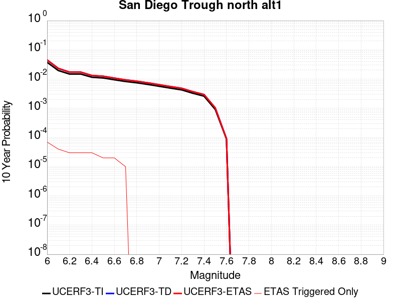 |

| Magnitude | 1 wk TI Prob | 1 wk TD Prob | 1 wk ETAS Prob | 1 wk ETAS/TD Gain | 1 wk ETAS Triggered Only | 1 mo TI Prob | 1 mo TD Prob | 1 mo ETAS Prob | 1 mo ETAS/TD Gain | 1 mo ETAS Triggered Only | 1 yr TI Prob | 1 yr TD Prob | 1 yr ETAS Prob | 1 yr ETAS/TD Gain | 1 yr ETAS Triggered Only | 10 yr TI Prob | 10 yr TD Prob | 10 yr ETAS Prob | 10 yr ETAS/TD Gain | 10 yr ETAS Triggered Only |
|-----|-----|-----|-----|-----|-----|-----|-----|-----|-----|-----|-----|-----|-----|-----|-----|-----|-----|-----|-----|-----|
| 6.0 | 7.329252E-5 | 8.821093E-5 | 1.2198203E-4 | 1.3828449 | 3.3774086E-5 | 3.14073E-4 | 3.7799572E-4 | 4.1175704E-4 | 1.0893167 | 3.3774086E-5 | 0.0038171355 | 0.004593027 | 0.0046434556 | 1.0109793 | 5.066113E-5 | 0.03752231 | 0.045044992 | 0.045109496 | 1.0014321 | 6.754817E-5 |
| 6.1 | 3.7940346E-5 | 4.4885E-5 | 7.865757E-5 | 1.7524244 | 3.3774086E-5 | 1.6259136E-4 | 1.9235066E-4 | 2.2611825E-4 | 1.1755522 | 3.3774086E-5 | 0.0019777524 | 0.0023394432 | 0.0023731382 | 1.014403 | 3.3774086E-5 | 0.019602431 | 0.023156688 | 0.023206174 | 1.0021371 | 5.066113E-5 |
| 6.2 | 2.8645263E-5 | 3.329678E-5 | 5.0183262E-5 | 1.5071505 | 1.6887043E-5 | 1.2275964E-4 | 1.4269284E-4 | 1.5957747E-4 | 1.1183286 | 1.6887043E-5 | 0.0014935739 | 0.0017359189 | 0.0017527767 | 1.0097111 | 1.6887043E-5 | 0.0148357535 | 0.017226247 | 0.01725944 | 1.0019269 | 3.3774086E-5 |
| 6.3 | 2.8645263E-5 | 3.329678E-5 | 5.0183262E-5 | 1.5071505 | 1.6887043E-5 | 1.2275964E-4 | 1.4269284E-4 | 1.5957747E-4 | 1.1183286 | 1.6887043E-5 | 0.0014935739 | 0.0017359189 | 0.0017527767 | 1.0097111 | 1.6887043E-5 | 0.0148357535 | 0.017226247 | 0.01725944 | 1.0019269 | 3.3774086E-5 |
| 6.4 | 2.2204576E-5 | 2.5448318E-5 | 4.233493E-5 | 1.663565 | 1.6887043E-5 | 9.5159E-5 | 1.0905972E-4 | 1.2594492E-4 | 1.1548253 | 1.6887043E-5 | 0.001157945 | 0.0013270034 | 0.001343868 | 1.0127088 | 1.6887043E-5 | 0.011519298 | 0.013191955 | 0.0132252835 | 1.0025264 | 3.3774086E-5 |
| 6.5 | 2.1004838E-5 | 2.4024694E-5 | 4.091133E-5 | 1.7028867 | 1.6887043E-5 | 9.0017624E-5 | 1.0295896E-4 | 1.1984427E-4 | 1.1640003 | 1.6887043E-5 | 0.0010954136 | 0.0012528138 | 0.0012696797 | 1.0134624 | 1.6887043E-5 | 0.010900296 | 0.012458589 | 0.012475265 | 1.0013386 | 1.6887043E-5 |
| 6.6 | 1.820557E-5 | 2.0704787E-5 | 3.759148E-5 | 1.8155937 | 1.6887043E-5 | 7.802154E-5 | 8.873181E-5 | 1.0561736E-4 | 1.1902987 | 1.6887043E-5 | 9.4949827E-4 | 0.0010797799 | 0.0010966487 | 1.0156225 | 1.6887043E-5 | 0.009454516 | 0.010746004 | 0.01076271 | 1.0015546 | 1.6887043E-5 |
| 6.7 | 1.5884485E-5 | 1.7983646E-5 | 1.7983646E-5 | 1.0 | 0.0 | 6.807459E-5 | 7.707051E-5 | 7.707051E-5 | 1.0 | 0.0 | 8.284929E-4 | 9.3793223E-4 | 9.3793223E-4 | 1.0 | 0.0 | 0.008254109 | 0.009340104 | 0.009340104 | 1.0 | 0.0 |
| 6.8 | 1.4331171E-5 | 1.6201066E-5 | 1.6201066E-5 | 1.0 | 0.0 | 6.141786E-5 | 6.94313E-5 | 6.94313E-5 | 1.0 | 0.0 | 7.4750587E-4 | 8.450002E-4 | 8.450002E-4 | 1.0 | 0.0 | 0.0074499645 | 0.008418139 | 0.008418139 | 1.0 | 0.0 |
| 6.9 | 1.2574203E-5 | 1.4205835E-5 | 1.4205835E-5 | 1.0 | 0.0 | 5.3888325E-5 | 6.0880735E-5 | 6.0880735E-5 | 1.0 | 0.0 | 6.558929E-4 | 7.409723E-4 | 7.409723E-4 | 1.0 | 0.0 | 0.0065396037 | 0.007385203 | 0.007385203 | 1.0 | 0.0 |
| 7.0 | 1.0883844E-5 | 1.2289262E-5 | 1.2289262E-5 | 1.0 | 0.0 | 4.664421E-5 | 5.2667205E-5 | 5.2667205E-5 | 1.0 | 0.0 | 5.677453E-4 | 6.4103556E-4 | 6.4103556E-4 | 1.0 | 0.0 | 0.00566297 | 0.006391993 | 0.006391993 | 1.0 | 0.0 |
| 7.1 | 9.393088E-6 | 1.060702E-5 | 1.060702E-5 | 1.0 | 0.0 | 4.025547E-5 | 4.545787E-5 | 4.545787E-5 | 1.0 | 0.0 | 4.900001E-4 | 5.533098E-4 | 5.533098E-4 | 1.0 | 0.0 | 0.0048892107 | 0.005519418 | 0.005519418 | 1.0 | 0.0 |
| 7.2 | 8.190791E-6 | 9.258625E-6 | 9.258625E-6 | 1.0 | 0.0 | 3.510292E-5 | 3.9679224E-5 | 3.9679224E-5 | 1.0 | 0.0 | 4.2729423E-4 | 4.8298817E-4 | 4.8298817E-4 | 1.0 | 0.0 | 0.0042647356 | 0.004819465 | 0.004819465 | 1.0 | 0.0 |
| 7.3 | 6.268162E-6 | 7.089716E-6 | 7.089716E-6 | 1.0 | 0.0 | 2.6863276E-5 | 3.0384144E-5 | 3.0384144E-5 | 1.0 | 0.0 | 3.2701128E-4 | 3.6986457E-4 | 3.6986457E-4 | 1.0 | 0.0 | 0.003265305 | 0.003692536 | 0.003692536 | 1.0 | 0.0 |
| 7.4 | 4.985186E-6 | 5.6426816E-6 | 5.6426816E-6 | 1.0 | 0.0 | 2.1364907E-5 | 2.4182698E-5 | 2.4182698E-5 | 1.0 | 0.0 | 2.600867E-4 | 2.9438498E-4 | 2.9438498E-4 | 1.0 | 0.0 | 0.002597825 | 0.0029399914 | 0.0029399914 | 1.0 | 0.0 |
| 7.5 | 1.7489613E-6 | 1.969678E-6 | 1.969678E-6 | 1.0 | 0.0 | 7.495527E-6 | 8.4414505E-6 | 8.4414505E-6 | 1.0 | 0.0 | 9.125422E-5 | 1.02770035E-4 | 1.02770035E-4 | 1.0 | 0.0 | 9.1216754E-4 | 0.0010272472 | 0.0010272472 | 1.0 | 0.0 |
| 7.6 | 1.6988751E-7 | 1.7533823E-7 | 1.7533823E-7 | 1.0 | 0.0 | 7.2808916E-7 | 7.5144936E-7 | 7.5144936E-7 | 1.0 | 0.0 | 8.864449E-6 | 9.14886E-6 | 9.14886E-6 | 1.0 | 0.0 | 8.8640954E-5 | 9.1485024E-5 | 9.1485024E-5 | 1.0 | 0.0 |

## Whittier alt 1
*[(top)](#table-of-contents)*

| 1 Week | 1 Month | 1 Year | 10 Year |
|-----|-----|-----|-----|
|  |  | 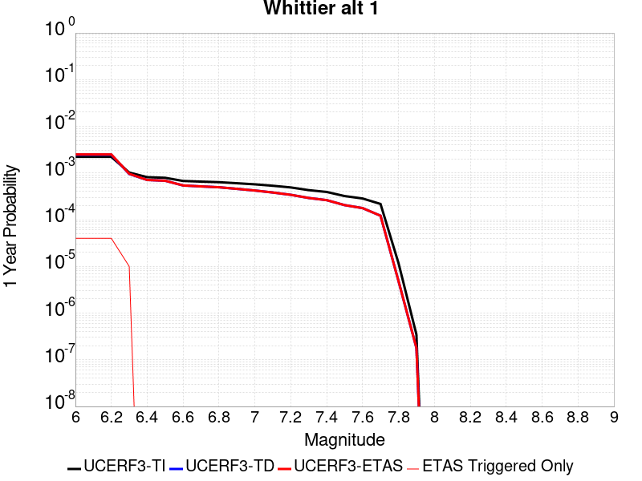 |  |

| Magnitude | 1 wk TI Prob | 1 wk TD Prob | 1 wk ETAS Prob | 1 wk ETAS/TD Gain | 1 wk ETAS Triggered Only | 1 mo TI Prob | 1 mo TD Prob | 1 mo ETAS Prob | 1 mo ETAS/TD Gain | 1 mo ETAS Triggered Only | 1 yr TI Prob | 1 yr TD Prob | 1 yr ETAS Prob | 1 yr ETAS/TD Gain | 1 yr ETAS Triggered Only | 10 yr TI Prob | 10 yr TD Prob | 10 yr ETAS Prob | 10 yr ETAS/TD Gain | 10 yr ETAS Triggered Only |
|-----|-----|-----|-----|-----|-----|-----|-----|-----|-----|-----|-----|-----|-----|-----|-----|-----|-----|-----|-----|-----|
| 6.0 | 4.2554693E-5 | 4.725218E-5 | 8.102467E-5 | 1.7147287 | 3.3774086E-5 | 1.8236451E-4 | 2.0249544E-4 | 2.3626268E-4 | 1.1667556 | 3.3774086E-5 | 0.002218027 | 0.0024629154 | 0.0024966062 | 1.0136793 | 3.3774086E-5 | 0.02196019 | 0.024390234 | 0.024456136 | 1.0027019 | 6.754817E-5 |
| 6.1 | 4.2554693E-5 | 4.725218E-5 | 8.102467E-5 | 1.7147287 | 3.3774086E-5 | 1.8236451E-4 | 2.0249544E-4 | 2.3626268E-4 | 1.1667556 | 3.3774086E-5 | 0.002218027 | 0.0024629154 | 0.0024966062 | 1.0136793 | 3.3774086E-5 | 0.02196019 | 0.024390234 | 0.024456136 | 1.0027019 | 6.754817E-5 |
| 6.2 | 4.2554693E-5 | 4.725218E-5 | 8.102467E-5 | 1.7147287 | 3.3774086E-5 | 1.8236451E-4 | 2.0249544E-4 | 2.3626268E-4 | 1.1667556 | 3.3774086E-5 | 0.002218027 | 0.0024629154 | 0.0024966062 | 1.0136793 | 3.3774086E-5 | 0.02196019 | 0.024390234 | 0.024456136 | 1.0027019 | 6.754817E-5 |
| 6.3 | 1.9617712E-5 | 1.8268593E-5 | 1.8268593E-5 | 1.0 | 0.0 | 8.40732E-5 | 7.829172E-5 | 7.829172E-5 | 1.0 | 0.0 | 0.0010231105 | 9.52804E-4 | 9.52804E-4 | 1.0 | 0.0 | 0.01018413 | 0.009490474 | 0.009490474 | 1.0 | 0.0 |
| 6.4 | 1.5611336E-5 | 1.3604271E-5 | 1.3604271E-5 | 1.0 | 0.0 | 6.690401E-5 | 5.8302747E-5 | 5.8302747E-5 | 1.0 | 0.0 | 8.142519E-4 | 7.0961076E-4 | 7.0961076E-4 | 1.0 | 0.0 | 0.008112748 | 0.0070754145 | 0.0070754145 | 1.0 | 0.0 |
| 6.5 | 1.5150166E-5 | 1.3100925E-5 | 1.3100925E-5 | 1.0 | 0.0 | 6.492767E-5 | 5.6145647E-5 | 5.6145647E-5 | 1.0 | 0.0 | 7.9020765E-4 | 6.8336475E-4 | 6.8336475E-4 | 1.0 | 0.0 | 0.007874036 | 0.0068145846 | 0.0068145846 | 1.0 | 0.0 |
| 6.6 | 1.295588E-5 | 1.0380725E-5 | 1.0380725E-5 | 1.0 | 0.0 | 5.552402E-5 | 4.4488075E-5 | 4.4488075E-5 | 1.0 | 0.0 | 6.7579525E-4 | 5.4150965E-4 | 5.4150965E-4 | 1.0 | 0.0 | 0.006737438 | 0.0054033357 | 0.0054033357 | 1.0 | 0.0 |
| 6.7 | 1.2542085E-5 | 9.899369E-6 | 9.899369E-6 | 1.0 | 0.0 | 5.3750682E-5 | 4.242519E-5 | 4.242519E-5 | 1.0 | 0.0 | 6.542181E-4 | 5.164061E-4 | 5.164061E-4 | 1.0 | 0.0 | 0.006522954 | 0.0051534795 | 0.0051534795 | 1.0 | 0.0 |
| 6.8 | 1.2195878E-5 | 9.495415E-6 | 9.495415E-6 | 1.0 | 0.0 | 5.2267E-5 | 4.069401E-5 | 4.069401E-5 | 1.0 | 0.0 | 6.36165E-4 | 4.9533875E-4 | 4.9533875E-4 | 1.0 | 0.0 | 0.0063434686 | 0.004943688 | 0.004943688 | 1.0 | 0.0 |
| 6.9 | 1.1580298E-5 | 8.772933E-6 | 8.772933E-6 | 1.0 | 0.0 | 4.9628903E-5 | 3.7597754E-5 | 3.7597754E-5 | 1.0 | 0.0 | 6.040644E-4 | 4.5765814E-4 | 4.5765814E-4 | 1.0 | 0.0 | 0.00602425 | 0.0045684157 | 0.0045684157 | 1.0 | 0.0 |
| 7.0 | 1.0964795E-5 | 8.083994E-6 | 8.083994E-6 | 1.0 | 0.0 | 4.6991136E-5 | 3.4645236E-5 | 3.4645236E-5 | 1.0 | 0.0 | 5.7196687E-4 | 4.2172565E-4 | 4.2172565E-4 | 1.0 | 0.0 | 0.0057049696 | 0.004210462 | 0.004210462 | 1.0 | 0.0 |
| 7.1 | 1.0230601E-5 | 7.3266697E-6 | 7.3266697E-6 | 1.0 | 0.0 | 4.3844695E-5 | 3.1399642E-5 | 3.1399642E-5 | 1.0 | 0.0 | 5.336784E-4 | 3.8222488E-4 | 3.8222488E-4 | 1.0 | 0.0 | 0.005323986 | 0.0038168381 | 0.0038168381 | 1.0 | 0.0 |
| 7.2 | 9.40865E-6 | 6.543289E-6 | 6.543289E-6 | 1.0 | 0.0 | 4.032216E-5 | 2.8042374E-5 | 2.8042374E-5 | 1.0 | 0.0 | 4.908117E-4 | 3.4136363E-4 | 3.4136363E-4 | 1.0 | 0.0 | 0.0048972913 | 0.003409485 | 0.003409485 | 1.0 | 0.0 |
| 7.3 | 8.237384E-6 | 5.5977525E-6 | 5.5977525E-6 | 1.0 | 0.0 | 3.5302593E-5 | 2.3990153E-5 | 2.3990153E-5 | 1.0 | 0.0 | 4.2972428E-4 | 2.92042E-4 | 2.92042E-4 | 1.0 | 0.0 | 0.0042889426 | 0.002916903 | 0.002916903 | 1.0 | 0.0 |
| 7.4 | 7.5316966E-6 | 5.027819E-6 | 5.027819E-6 | 1.0 | 0.0 | 3.2278298E-5 | 2.1547625E-5 | 2.1547625E-5 | 1.0 | 0.0 | 3.9291743E-4 | 2.6231175E-4 | 2.6231175E-4 | 1.0 | 0.0 | 0.0039222343 | 0.0026201333 | 0.0026201333 | 1.0 | 0.0 |
| 7.5 | 6.149649E-6 | 3.933841E-6 | 3.933841E-6 | 1.0 | 0.0 | 2.6355372E-5 | 1.6859214E-5 | 1.6859214E-5 | 1.0 | 0.0 | 3.208294E-4 | 2.052425E-4 | 2.052425E-4 | 1.0 | 0.0 | 0.003203666 | 0.0020506186 | 0.0020506186 | 1.0 | 0.0 |
| 7.6 | 5.457711E-6 | 3.3953788E-6 | 3.3953788E-6 | 1.0 | 0.0 | 2.338998E-5 | 1.4551547E-5 | 1.4551547E-5 | 1.0 | 0.0 | 2.8473578E-4 | 1.771515E-4 | 1.771515E-4 | 1.0 | 0.0 | 0.0028437122 | 0.0017701836 | 0.0017701836 | 1.0 | 0.0 |
| 7.7 | 4.1676276E-6 | 2.3331952E-6 | 2.3331952E-6 | 1.0 | 0.0 | 1.7861139E-5 | 9.999374E-6 | 9.999374E-6 | 1.0 | 0.0 | 2.1743766E-4 | 1.2173632E-4 | 1.2173632E-4 | 1.0 | 0.0 | 0.0021722503 | 0.0012167693 | 0.0012167693 | 1.0 | 0.0 |
| 7.8 | 2.2692414E-7 | 9.3854695E-8 | 9.3854695E-8 | 1.0 | 0.0 | 9.725317E-7 | 4.0223435E-7 | 4.0223435E-7 | 1.0 | 0.0 | 1.1840509E-5 | 4.8971956E-6 | 4.8971956E-6 | 1.0 | 0.0 | 1.1839878E-4 | 4.8971204E-5 | 4.8971204E-5 | 1.0 | 0.0 |
| 7.9 | 6.676829E-9 | 3.439853E-9 | 3.439853E-9 | 1.0 | 0.0 | 2.861498E-8 | 1.4742227E-8 | 1.4742227E-8 | 1.0 | 0.0 | 3.4838732E-7 | 1.7948659E-7 | 1.7948659E-7 | 1.0 | 0.0 | 3.4838679E-6 | 1.7948646E-6 | 1.7948646E-6 | 1.0 | 0.0 |

## San Pedro Basin
*[(top)](#table-of-contents)*

| 1 Week | 1 Month | 1 Year | 10 Year |
|-----|-----|-----|-----|
|  |  |  |  |

| Magnitude | 1 wk TI Prob | 1 wk TD Prob | 1 wk ETAS Prob | 1 wk ETAS/TD Gain | 1 wk ETAS Triggered Only | 1 mo TI Prob | 1 mo TD Prob | 1 mo ETAS Prob | 1 mo ETAS/TD Gain | 1 mo ETAS Triggered Only | 1 yr TI Prob | 1 yr TD Prob | 1 yr ETAS Prob | 1 yr ETAS/TD Gain | 1 yr ETAS Triggered Only | 10 yr TI Prob | 10 yr TD Prob | 10 yr ETAS Prob | 10 yr ETAS/TD Gain | 10 yr ETAS Triggered Only |
|-----|-----|-----|-----|-----|-----|-----|-----|-----|-----|-----|-----|-----|-----|-----|-----|-----|-----|-----|-----|-----|
| 6.0 | 5.3449043E-5 | 6.336954E-5 | 1.3091342E-4 | 2.0658731 | 6.754817E-5 | 2.2904722E-4 | 2.715589E-4 | 3.3908876E-4 | 1.2486746 | 6.754817E-5 | 0.0027850836 | 0.0033018254 | 0.0033691505 | 1.0203903 | 6.754817E-5 | 0.027504366 | 0.03258945 | 0.0326548 | 1.0020051 | 6.754817E-5 |
| 6.1 | 5.3449043E-5 | 6.336954E-5 | 1.3091342E-4 | 2.0658731 | 6.754817E-5 | 2.2904722E-4 | 2.715589E-4 | 3.3908876E-4 | 1.2486746 | 6.754817E-5 | 0.0027850836 | 0.0033018254 | 0.0033691505 | 1.0203903 | 6.754817E-5 | 0.027504366 | 0.03258945 | 0.0326548 | 1.0020051 | 6.754817E-5 |
| 6.2 | 2.3189454E-5 | 2.6642796E-5 | 2.6642796E-5 | 1.0 | 0.0 | 9.9379584E-5 | 1.14178685E-4 | 1.14178685E-4 | 1.0 | 0.0 | 0.0012092749 | 0.0013892864 | 0.0013892864 | 1.0 | 0.0 | 0.012027155 | 0.013810883 | 0.013810883 | 1.0 | 0.0 |
| 6.3 | 2.3189454E-5 | 2.6642796E-5 | 2.6642796E-5 | 1.0 | 0.0 | 9.9379584E-5 | 1.14178685E-4 | 1.14178685E-4 | 1.0 | 0.0 | 0.0012092749 | 0.0013892864 | 0.0013892864 | 1.0 | 0.0 | 0.012027155 | 0.013810883 | 0.013810883 | 1.0 | 0.0 |
| 6.4 | 1.966056E-5 | 2.2463413E-5 | 2.2463413E-5 | 1.0 | 0.0 | 8.425682E-5 | 9.626844E-5 | 9.626844E-5 | 1.0 | 0.0 | 0.001025344 | 0.0011714783 | 0.0011714783 | 1.0 | 0.0 | 0.010206259 | 0.011657117 | 0.011657117 | 1.0 | 0.0 |
| 6.5 | 1.7342953E-5 | 1.9745148E-5 | 1.9745148E-5 | 1.0 | 0.0 | 7.4324824E-5 | 8.4619525E-5 | 8.4619525E-5 | 1.0 | 0.0 | 9.04529E-4 | 0.0010297928 | 0.0010297928 | 1.0 | 0.0 | 0.009008561 | 0.010253931 | 0.010253931 | 1.0 | 0.0 |
| 6.6 | 1.439804E-5 | 1.6322716E-5 | 1.6322716E-5 | 1.0 | 0.0 | 6.170443E-5 | 6.99528E-5 | 6.99528E-5 | 1.0 | 0.0 | 7.509924E-4 | 8.513747E-4 | 8.513747E-4 | 1.0 | 0.0 | 0.0074845953 | 0.008484332 | 0.008484332 | 1.0 | 0.0 |
| 6.7 | 1.2634884E-5 | 1.4285297E-5 | 1.4285297E-5 | 1.0 | 0.0 | 5.414838E-5 | 6.1221435E-5 | 6.1221435E-5 | 1.0 | 0.0 | 6.590571E-4 | 7.4514654E-4 | 7.4514654E-4 | 1.0 | 0.0 | 0.006571059 | 0.007429501 | 0.007429501 | 1.0 | 0.0 |
| 6.8 | 1.146091E-5 | 1.2933192E-5 | 1.2933192E-5 | 1.0 | 0.0 | 4.911726E-5 | 5.5426954E-5 | 5.5426954E-5 | 1.0 | 0.0 | 5.9783855E-4 | 6.7464396E-4 | 6.7464396E-4 | 1.0 | 0.0 | 0.0059623276 | 0.006728899 | 0.006728899 | 1.0 | 0.0 |
| 6.9 | 9.109035E-6 | 1.0235011E-5 | 1.0235011E-5 | 1.0 | 0.0 | 3.9038136E-5 | 4.3863754E-5 | 4.3863754E-5 | 1.0 | 0.0 | 4.7518566E-4 | 5.3393835E-4 | 5.3393835E-4 | 1.0 | 0.0 | 0.0047417083 | 0.005329309 | 0.005329309 | 1.0 | 0.0 |
| 7.0 | 5.9351028E-6 | 6.583964E-6 | 6.583964E-6 | 1.0 | 0.0 | 2.5435906E-5 | 2.8216817E-5 | 2.8216817E-5 | 1.0 | 0.0 | 3.0963816E-4 | 3.435092E-4 | 3.435092E-4 | 1.0 | 0.0 | 0.0030920706 | 0.0034320992 | 0.0034320992 | 1.0 | 0.0 |
| 7.1 | 2.1557585E-6 | 2.209648E-6 | 2.209648E-6 | 1.0 | 0.0 | 9.238933E-6 | 9.469887E-6 | 9.469887E-6 | 1.0 | 0.0 | 1.1247819E-4 | 1.1528993E-4 | 1.1528993E-4 | 1.0 | 0.0 | 0.0011242128 | 0.0011523166 | 0.0011523166 | 1.0 | 0.0 |
| 7.2 | 2.1251979E-6 | 2.1779945E-6 | 2.1779945E-6 | 1.0 | 0.0 | 9.107958E-6 | 9.334229E-6 | 9.334229E-6 | 1.0 | 0.0 | 1.1088375E-4 | 1.1363847E-4 | 1.1363847E-4 | 1.0 | 0.0 | 0.0011082845 | 0.0011358189 | 0.0011358189 | 1.0 | 0.0 |
| 7.3 | 1.7145798E-6 | 1.7442874E-6 | 1.7442874E-6 | 1.0 | 0.0 | 7.3481783E-6 | 7.4754967E-6 | 7.4754967E-6 | 1.0 | 0.0 | 8.94604E-5 | 9.1010465E-5 | 9.1010465E-5 | 1.0 | 0.0 | 8.9424395E-4 | 9.0974104E-4 | 9.0974104E-4 | 1.0 | 0.0 |
| 7.4 | 1.4467993E-6 | 1.4641868E-6 | 1.4641868E-6 | 1.0 | 0.0 | 6.200554E-6 | 6.2750714E-6 | 6.2750714E-6 | 1.0 | 0.0 | 7.548913E-5 | 7.639639E-5 | 7.639639E-5 | 1.0 | 0.0 | 7.546349E-4 | 7.6370855E-4 | 7.6370855E-4 | 1.0 | 0.0 |
| 7.5 | 1.2803735E-6 | 1.2931497E-6 | 1.2931497E-6 | 1.0 | 0.0 | 5.487303E-6 | 5.5420587E-6 | 5.5420587E-6 | 1.0 | 0.0 | 6.680587E-5 | 6.7472545E-5 | 6.7472545E-5 | 1.0 | 0.0 | 6.678579E-4 | 6.7452766E-4 | 6.7452766E-4 | 1.0 | 0.0 |
| 7.6 | 6.755009E-7 | 6.769465E-7 | 6.769465E-7 | 1.0 | 0.0 | 2.8950008E-6 | 2.9011965E-6 | 2.9011965E-6 | 1.0 | 0.0 | 3.5246063E-5 | 3.5321555E-5 | 3.5321555E-5 | 1.0 | 0.0 | 3.5240475E-4 | 3.5316512E-4 | 3.5316512E-4 | 1.0 | 0.0 |
| 7.7 | 6.211885E-8 | 4.569953E-8 | 4.569953E-8 | 1.0 | 0.0 | 2.6622362E-7 | 1.9585512E-7 | 1.9585512E-7 | 1.0 | 0.0 | 3.2412677E-6 | 2.3845337E-6 | 2.3845337E-6 | 1.0 | 0.0 | 3.2412205E-5 | 2.3845101E-5 | 2.3845101E-5 | 1.0 | 0.0 |
| 7.8 | 2.6580573E-9 | 1.5138163E-9 | 1.5138163E-9 | 1.0 | 0.0 | 1.1391674E-8 | 6.487784E-9 | 6.487784E-9 | 1.0 | 0.0 | 1.3869362E-7 | 7.898877E-8 | 7.898877E-8 | 1.0 | 0.0 | 1.3869354E-6 | 7.898877E-7 | 7.898877E-7 | 1.0 | 0.0 |

## Santa Ynez River
*[(top)](#table-of-contents)*

| 1 Week | 1 Month | 1 Year | 10 Year |
|-----|-----|-----|-----|
|  |  |  |  |

| Magnitude | 1 wk TI Prob | 1 wk TD Prob | 1 wk ETAS Prob | 1 wk ETAS/TD Gain | 1 wk ETAS Triggered Only | 1 mo TI Prob | 1 mo TD Prob | 1 mo ETAS Prob | 1 mo ETAS/TD Gain | 1 mo ETAS Triggered Only | 1 yr TI Prob | 1 yr TD Prob | 1 yr ETAS Prob | 1 yr ETAS/TD Gain | 1 yr ETAS Triggered Only | 10 yr TI Prob | 10 yr TD Prob | 10 yr ETAS Prob | 10 yr ETAS/TD Gain | 10 yr ETAS Triggered Only |
|-----|-----|-----|-----|-----|-----|-----|-----|-----|-----|-----|-----|-----|-----|-----|-----|-----|-----|-----|-----|-----|
| 6.0 | 1.6396456E-5 | 1.7209435E-5 | 3.409619E-5 | 1.9812496 | 1.6887043E-5 | 7.026863E-5 | 7.375284E-5 | 9.0638634E-5 | 1.2289511 | 1.6887043E-5 | 8.551848E-4 | 8.976064E-4 | 9.313502E-4 | 1.037593 | 3.3774086E-5 | 0.0085190125 | 0.008943358 | 0.008993566 | 1.005614 | 5.066113E-5 |
| 6.1 | 1.6396456E-5 | 1.7209435E-5 | 3.409619E-5 | 1.9812496 | 1.6887043E-5 | 7.026863E-5 | 7.375284E-5 | 9.0638634E-5 | 1.2289511 | 1.6887043E-5 | 8.551848E-4 | 8.976064E-4 | 9.313502E-4 | 1.037593 | 3.3774086E-5 | 0.0085190125 | 0.008943358 | 0.008993566 | 1.005614 | 5.066113E-5 |
| 6.2 | 1.6396456E-5 | 1.7209435E-5 | 3.409619E-5 | 1.9812496 | 1.6887043E-5 | 7.026863E-5 | 7.375284E-5 | 9.0638634E-5 | 1.2289511 | 1.6887043E-5 | 8.551848E-4 | 8.976064E-4 | 9.313502E-4 | 1.037593 | 3.3774086E-5 | 0.0085190125 | 0.008943358 | 0.008993566 | 1.005614 | 5.066113E-5 |
| 6.3 | 9.736976E-6 | 1.012233E-5 | 1.012233E-5 | 1.0 | 0.0 | 4.172923E-5 | 4.338072E-5 | 4.338072E-5 | 1.0 | 0.0 | 5.0793495E-4 | 5.280373E-4 | 5.4491544E-4 | 1.031964 | 1.6887043E-5 | 0.005067755 | 0.005268332 | 0.005301928 | 1.006377 | 3.3774086E-5 |
| 6.4 | 9.736976E-6 | 1.012233E-5 | 1.012233E-5 | 1.0 | 0.0 | 4.172923E-5 | 4.338072E-5 | 4.338072E-5 | 1.0 | 0.0 | 5.0793495E-4 | 5.280373E-4 | 5.4491544E-4 | 1.031964 | 1.6887043E-5 | 0.005067755 | 0.005268332 | 0.005301928 | 1.006377 | 3.3774086E-5 |
| 6.5 | 7.081964E-6 | 7.3298966E-6 | 7.3298966E-6 | 1.0 | 0.0 | 3.035092E-5 | 3.1413474E-5 | 3.1413474E-5 | 1.0 | 0.0 | 3.694598E-4 | 3.8239348E-4 | 3.9927408E-4 | 1.0441445 | 1.6887043E-5 | 0.0036884616 | 0.0038175168 | 0.003851162 | 1.0088134 | 3.3774086E-5 |
| 6.6 | 5.873247E-6 | 6.059743E-6 | 6.059743E-6 | 1.0 | 0.0 | 2.5170815E-5 | 2.5970074E-5 | 2.5970074E-5 | 1.0 | 0.0 | 3.064116E-4 | 3.1614062E-4 | 3.1614062E-4 | 1.0 | 0.0 | 0.0030598943 | 0.0031569963 | 0.0031569963 | 1.0 | 0.0 |
| 6.7 | 4.973277E-6 | 5.115901E-6 | 5.115901E-6 | 1.0 | 0.0 | 2.1313872E-5 | 2.1925109E-5 | 2.1925109E-5 | 1.0 | 0.0 | 2.5946548E-4 | 2.66906E-4 | 2.66906E-4 | 1.0 | 0.0 | 0.0025916274 | 0.0026659032 | 0.0026659032 | 1.0 | 0.0 |
| 6.8 | 4.396492E-6 | 4.5109778E-6 | 4.5109778E-6 | 1.0 | 0.0 | 1.884197E-5 | 1.9332621E-5 | 1.9332621E-5 | 1.0 | 0.0 | 2.2937685E-4 | 2.3534958E-4 | 2.3534958E-4 | 1.0 | 0.0 | 0.0022914023 | 0.0023510386 | 0.0023510386 | 1.0 | 0.0 |
| 6.9 | 3.5255632E-6 | 3.6013332E-6 | 3.6013332E-6 | 1.0 | 0.0 | 1.5109469E-5 | 1.5434196E-5 | 1.5434196E-5 | 1.0 | 0.0 | 1.8394225E-4 | 1.8789528E-4 | 1.8789528E-4 | 1.0 | 0.0 | 0.0018379007 | 0.0018773803 | 0.0018773803 | 1.0 | 0.0 |
| 7.0 | 3.211603E-6 | 3.273654E-6 | 3.273654E-6 | 1.0 | 0.0 | 1.376394E-5 | 1.4029872E-5 | 1.4029872E-5 | 1.0 | 0.0 | 1.6756308E-4 | 1.7080043E-4 | 1.7080043E-4 | 1.0 | 0.0 | 0.0016743679 | 0.0017067058 | 0.0017067058 | 1.0 | 0.0 |
| 7.1 | 2.5094619E-6 | 2.5409204E-6 | 2.5409204E-6 | 1.0 | 0.0 | 1.0754793E-5 | 1.0889614E-5 | 1.0889614E-5 | 1.0 | 0.0 | 1.3093173E-4 | 1.3257304E-4 | 1.3257304E-4 | 1.0 | 0.0 | 0.0013085462 | 0.0013249456 | 0.0013249456 | 1.0 | 0.0 |
| 7.2 | 2.0515774E-6 | 2.0619375E-6 | 2.0619375E-6 | 1.0 | 0.0 | 8.792445E-6 | 8.836846E-6 | 8.836846E-6 | 1.0 | 0.0 | 1.0704277E-4 | 1.0758333E-4 | 1.0758333E-4 | 1.0 | 0.0 | 0.0010699122 | 0.0010753168 | 0.0010753168 | 1.0 | 0.0 |
| 7.3 | 1.6845745E-6 | 1.6773907E-6 | 1.6773907E-6 | 1.0 | 0.0 | 7.219585E-6 | 7.1887976E-6 | 7.1887976E-6 | 1.0 | 0.0 | 8.78949E-5 | 8.752012E-5 | 8.752012E-5 | 1.0 | 0.0 | 8.7860145E-4 | 8.7485946E-4 | 8.7485946E-4 | 1.0 | 0.0 |
| 7.4 | 1.3600285E-6 | 1.3333357E-6 | 1.3333357E-6 | 1.0 | 0.0 | 5.82868E-6 | 5.714284E-6 | 5.714284E-6 | 1.0 | 0.0 | 7.096187E-5 | 6.956921E-5 | 6.956921E-5 | 1.0 | 0.0 | 7.0939213E-4 | 6.954765E-4 | 6.954765E-4 | 1.0 | 0.0 |
| 7.5 | 9.735342E-7 | 9.290103E-7 | 9.290103E-7 | 1.0 | 0.0 | 4.172283E-6 | 3.9814668E-6 | 3.9814668E-6 | 1.0 | 0.0 | 5.079636E-5 | 4.8473295E-5 | 4.8473295E-5 | 1.0 | 0.0 | 5.0784746E-4 | 4.8462892E-4 | 4.8462892E-4 | 1.0 | 0.0 |
| 7.6 | 5.067187E-7 | 4.77857E-7 | 4.77857E-7 | 1.0 | 0.0 | 2.1716498E-6 | 2.047957E-6 | 2.047957E-6 | 1.0 | 0.0 | 2.6439517E-5 | 2.4933597E-5 | 2.4933597E-5 | 1.0 | 0.0 | 2.643637E-4 | 2.4930874E-4 | 2.4930874E-4 | 1.0 | 0.0 |
| 7.7 | 2.769089E-7 | 2.5759124E-7 | 2.5759124E-7 | 1.0 | 0.0 | 1.1867519E-6 | 1.1039621E-6 | 1.1039621E-6 | 1.0 | 0.0 | 1.4448608E-5 | 1.34406555E-5 | 1.34406555E-5 | 1.0 | 0.0 | 1.444767E-4 | 1.3439846E-4 | 1.3439846E-4 | 1.0 | 0.0 |
| 7.8 | 1.7044663E-7 | 1.5449015E-7 | 1.5449015E-7 | 1.0 | 0.0 | 7.3048534E-7 | 6.621005E-7 | 6.621005E-7 | 1.0 | 0.0 | 8.893623E-6 | 8.061043E-6 | 8.061043E-6 | 1.0 | 0.0 | 8.893267E-5 | 8.060753E-5 | 8.060753E-5 | 1.0 | 0.0 |
| 7.9 | 4.8344287E-8 | 4.0910923E-8 | 4.0910923E-8 | 1.0 | 0.0 | 2.0718979E-7 | 1.7533252E-7 | 1.7533252E-7 | 1.0 | 0.0 | 2.5225327E-6 | 2.1346711E-6 | 2.1346711E-6 | 1.0 | 0.0 | 2.5225041E-5 | 2.1346512E-5 | 2.1346512E-5 | 1.0 | 0.0 |

## Concord 2011 CFM
*[(top)](#table-of-contents)*

| 1 Week | 1 Month | 1 Year | 10 Year |
|-----|-----|-----|-----|
|  |  |  |  |

| Magnitude | 1 wk TI Prob | 1 wk TD Prob | 1 wk ETAS Prob | 1 wk ETAS/TD Gain | 1 wk ETAS Triggered Only | 1 mo TI Prob | 1 mo TD Prob | 1 mo ETAS Prob | 1 mo ETAS/TD Gain | 1 mo ETAS Triggered Only | 1 yr TI Prob | 1 yr TD Prob | 1 yr ETAS Prob | 1 yr ETAS/TD Gain | 1 yr ETAS Triggered Only | 10 yr TI Prob | 10 yr TD Prob | 10 yr ETAS Prob | 10 yr ETAS/TD Gain | 10 yr ETAS Triggered Only |
|-----|-----|-----|-----|-----|-----|-----|-----|-----|-----|-----|-----|-----|-----|-----|-----|-----|-----|-----|-----|-----|
| 6.0 | 5.7865112E-5 | 9.759152E-5 | 1.1447691E-4 | 1.1730211 | 1.6887043E-5 | 2.4796976E-4 | 4.1818706E-4 | 4.3506705E-4 | 1.0403646 | 1.6887043E-5 | 0.0030148525 | 0.005079467 | 0.0051130694 | 1.0066154 | 3.3774086E-5 | 0.029742775 | 0.049248982 | 0.049313203 | 1.001304 | 6.754817E-5 |
| 6.1 | 5.7865112E-5 | 9.759152E-5 | 1.1447691E-4 | 1.1730211 | 1.6887043E-5 | 2.4796976E-4 | 4.1818706E-4 | 4.3506705E-4 | 1.0403646 | 1.6887043E-5 | 0.0030148525 | 0.005079467 | 0.0051130694 | 1.0066154 | 3.3774086E-5 | 0.029742775 | 0.049248982 | 0.049313203 | 1.001304 | 6.754817E-5 |
| 6.2 | 5.6789337E-5 | 9.5795076E-5 | 1.126805E-4 | 1.1762661 | 1.6887043E-5 | 2.4336016E-4 | 4.104905E-4 | 4.273706E-4 | 1.0411218 | 1.6887043E-5 | 0.0029588845 | 0.0049861916 | 0.005019797 | 1.0067397 | 3.3774086E-5 | 0.029197963 | 0.04836556 | 0.04842984 | 1.0013291 | 6.754817E-5 |
| 6.3 | 5.203322E-5 | 8.803056E-5 | 1.04916115E-4 | 1.1918147 | 1.6887043E-5 | 2.2298045E-4 | 3.7722368E-4 | 3.9410434E-4 | 1.0447497 | 1.6887043E-5 | 0.0027114071 | 0.0045838105 | 0.00461743 | 1.0073344 | 3.3774086E-5 | 0.026785625 | 0.04453672 | 0.044601258 | 1.0014491 | 6.754817E-5 |
| 6.4 | 4.7120942E-5 | 7.897404E-5 | 9.5859745E-5 | 1.2138134 | 1.6887043E-5 | 2.0193127E-4 | 3.3842045E-4 | 3.5530177E-4 | 1.0498827 | 1.6887043E-5 | 0.0024557412 | 0.00411323 | 0.0041468646 | 1.0081773 | 3.3774086E-5 | 0.024287801 | 0.040065527 | 0.04013037 | 1.0016184 | 6.754817E-5 |
| 6.5 | 2.9598437E-5 | 4.667486E-5 | 4.667486E-5 | 1.0 | 0.0 | 1.2684427E-4 | 2.0002096E-4 | 2.0002096E-4 | 1.0 | 0.0 | 0.001543235 | 0.0024327459 | 0.0024495916 | 1.0069246 | 1.6887043E-5 | 0.015325619 | 0.023909973 | 0.02394294 | 1.0013788 | 3.3774086E-5 |
| 6.6 | 2.0443718E-5 | 2.998433E-5 | 2.998433E-5 | 1.0 | 0.0 | 8.7613E-5 | 1.2849816E-4 | 1.2849816E-4 | 1.0 | 0.0 | 0.0010661662 | 0.0015633785 | 0.0015802392 | 1.0107847 | 1.6887043E-5 | 0.010610655 | 0.015466996 | 0.0155002475 | 1.0021498 | 3.3774086E-5 |
| 6.7 | 1.798539E-5 | 2.5557381E-5 | 2.5557381E-5 | 1.0 | 0.0 | 7.7077966E-5 | 1.0952716E-4 | 1.0952716E-4 | 1.0 | 0.0 | 9.380202E-4 | 0.001332699 | 0.0013495635 | 1.0126544 | 1.6887043E-5 | 0.009340706 | 0.013217433 | 0.013234097 | 1.0012608 | 1.6887043E-5 |
| 6.8 | 1.613555E-5 | 2.1959211E-5 | 2.1959211E-5 | 1.0 | 0.0 | 6.915052E-5 | 9.4107585E-5 | 9.4107585E-5 | 1.0 | 0.0 | 8.4158237E-4 | 0.0011451716 | 0.0011620392 | 1.0147294 | 1.6887043E-5 | 0.008384023 | 0.0113782035 | 0.011394898 | 1.0014672 | 1.6887043E-5 |
| 6.9 | 1.2916435E-5 | 1.7081054E-5 | 1.7081054E-5 | 1.0 | 0.0 | 5.5354973E-5 | 7.32025E-5 | 7.32025E-5 | 1.0 | 0.0 | 6.7373837E-4 | 8.908818E-4 | 9.077538E-4 | 1.0189385 | 1.6887043E-5 | 0.006716994 | 0.008867139 | 0.008883876 | 1.0018876 | 1.6887043E-5 |
| 7.0 | 9.81129E-6 | 1.2630829E-5 | 1.2630829E-5 | 1.0 | 0.0 | 4.2047708E-5 | 5.413101E-5 | 5.413101E-5 | 1.0 | 0.0 | 5.118106E-4 | 6.588474E-4 | 6.757233E-4 | 1.0256143 | 1.6887043E-5 | 0.005106334 | 0.006569153 | 0.006585929 | 1.0025538 | 1.6887043E-5 |
| 7.1 | 8.0889195E-6 | 1.0418261E-5 | 1.0418261E-5 | 1.0 | 0.0 | 3.4666336E-5 | 4.4648932E-5 | 4.4648932E-5 | 1.0 | 0.0 | 4.219809E-4 | 5.434662E-4 | 5.603441E-4 | 1.0310559 | 1.6887043E-5 | 0.004211805 | 0.0054215975 | 0.005438393 | 1.0030979 | 1.6887043E-5 |
| 7.2 | 6.267438E-6 | 8.115699E-6 | 8.115699E-6 | 1.0 | 0.0 | 2.6860173E-5 | 3.4781104E-5 | 3.4781104E-5 | 1.0 | 0.0 | 3.2697353E-4 | 4.233784E-4 | 4.233784E-4 | 1.0 | 0.0 | 0.0032649285 | 0.004225969 | 0.004225969 | 1.0 | 0.0 |
| 7.3 | 3.6761196E-6 | 4.8401653E-6 | 4.8401653E-6 | 1.0 | 0.0 | 1.5754704E-5 | 2.0743402E-5 | 2.0743402E-5 | 1.0 | 0.0 | 1.9179663E-4 | 2.5252186E-4 | 2.5252186E-4 | 1.0 | 0.0 | 0.0019163118 | 0.002522487 | 0.002522487 | 1.0 | 0.0 |
| 7.4 | 2.8044356E-6 | 3.7096036E-6 | 3.7096036E-6 | 1.0 | 0.0 | 1.2018954E-5 | 1.5898204E-5 | 1.5898204E-5 | 1.0 | 0.0 | 1.4632095E-4 | 1.9354356E-4 | 1.9354356E-4 | 1.0 | 0.0 | 0.0014622464 | 0.0019338481 | 0.0019338481 | 1.0 | 0.0 |
| 7.5 | 2.4578699E-6 | 3.2447442E-6 | 3.2447442E-6 | 1.0 | 0.0 | 1.0533685E-5 | 1.3905973E-5 | 1.3905973E-5 | 1.0 | 0.0 | 1.2824008E-4 | 1.6929218E-4 | 1.6929218E-4 | 1.0 | 0.0 | 0.0012816609 | 0.001691713 | 0.001691713 | 1.0 | 0.0 |
| 7.6 | 1.7713267E-6 | 2.3351192E-6 | 2.3351192E-6 | 1.0 | 0.0 | 7.591378E-6 | 1.0007616E-5 | 1.0007616E-5 | 1.0 | 0.0 | 9.2421105E-5 | 1.21836E-4 | 1.21836E-4 | 1.0 | 0.0 | 9.2382677E-4 | 0.0012177454 | 0.0012177454 | 1.0 | 0.0 |
| 7.7 | 5.1912366E-7 | 6.8290143E-7 | 6.8290143E-7 | 1.0 | 0.0 | 2.2248137E-6 | 2.9267171E-6 | 2.9267171E-6 | 1.0 | 0.0 | 2.708677E-5 | 3.5632213E-5 | 3.5632213E-5 | 1.0 | 0.0 | 2.708347E-4 | 3.5627294E-4 | 3.5627294E-4 | 1.0 | 0.0 |

## San Gabriel
*[(top)](#table-of-contents)*

| 1 Week | 1 Month | 1 Year | 10 Year |
|-----|-----|-----|-----|
|  |  |  | 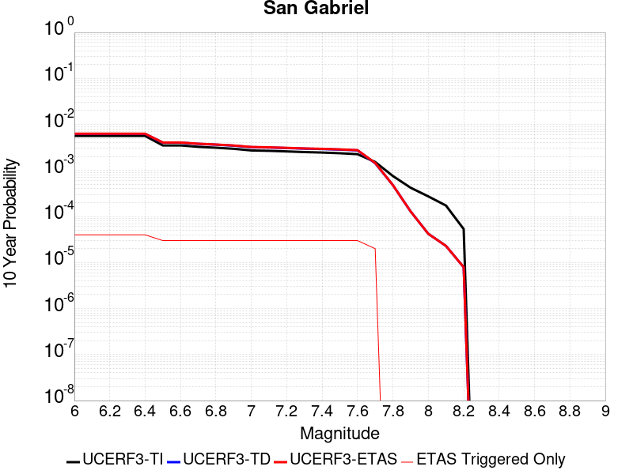 |

| Magnitude | 1 wk TI Prob | 1 wk TD Prob | 1 wk ETAS Prob | 1 wk ETAS/TD Gain | 1 wk ETAS Triggered Only | 1 mo TI Prob | 1 mo TD Prob | 1 mo ETAS Prob | 1 mo ETAS/TD Gain | 1 mo ETAS Triggered Only | 1 yr TI Prob | 1 yr TD Prob | 1 yr ETAS Prob | 1 yr ETAS/TD Gain | 1 yr ETAS Triggered Only | 10 yr TI Prob | 10 yr TD Prob | 10 yr ETAS Prob | 10 yr ETAS/TD Gain | 10 yr ETAS Triggered Only |
|-----|-----|-----|-----|-----|-----|-----|-----|-----|-----|-----|-----|-----|-----|-----|-----|-----|-----|-----|-----|-----|
| 6.0 | 1.083775E-5 | 1.19851875E-5 | 2.8872028E-5 | 2.4089758 | 1.6887043E-5 | 4.6446676E-5 | 5.1364143E-5 | 6.8250316E-5 | 1.3287542 | 1.6887043E-5 | 5.653415E-4 | 6.251903E-4 | 6.7581976E-4 | 1.0809824 | 5.066113E-5 | 0.0056390543 | 0.006246409 | 0.0063135354 | 1.0107464 | 6.754817E-5 |
| 6.1 | 1.083775E-5 | 1.19851875E-5 | 2.8872028E-5 | 2.4089758 | 1.6887043E-5 | 4.6446676E-5 | 5.1364143E-5 | 6.8250316E-5 | 1.3287542 | 1.6887043E-5 | 5.653415E-4 | 6.251903E-4 | 6.7581976E-4 | 1.0809824 | 5.066113E-5 | 0.0056390543 | 0.006246409 | 0.0063135354 | 1.0107464 | 6.754817E-5 |
| 6.2 | 1.083775E-5 | 1.19851875E-5 | 2.8872028E-5 | 2.4089758 | 1.6887043E-5 | 4.6446676E-5 | 5.1364143E-5 | 6.8250316E-5 | 1.3287542 | 1.6887043E-5 | 5.653415E-4 | 6.251903E-4 | 6.7581976E-4 | 1.0809824 | 5.066113E-5 | 0.0056390543 | 0.006246409 | 0.0063135354 | 1.0107464 | 6.754817E-5 |
| 6.3 | 1.083775E-5 | 1.19851875E-5 | 2.8872028E-5 | 2.4089758 | 1.6887043E-5 | 4.6446676E-5 | 5.1364143E-5 | 6.8250316E-5 | 1.3287542 | 1.6887043E-5 | 5.653415E-4 | 6.251903E-4 | 6.7581976E-4 | 1.0809824 | 5.066113E-5 | 0.0056390543 | 0.006246409 | 0.0063135354 | 1.0107464 | 6.754817E-5 |
| 6.4 | 1.083775E-5 | 1.19851875E-5 | 2.8872028E-5 | 2.4089758 | 1.6887043E-5 | 4.6446676E-5 | 5.1364143E-5 | 6.8250316E-5 | 1.3287542 | 1.6887043E-5 | 5.653415E-4 | 6.251903E-4 | 6.7581976E-4 | 1.0809824 | 5.066113E-5 | 0.0056390543 | 0.006246409 | 0.0063135354 | 1.0107464 | 6.754817E-5 |
| 6.5 | 6.7317824E-6 | 7.716944E-6 | 2.4603856E-5 | 3.1882899 | 1.6887043E-5 | 2.8850178E-5 | 3.3072207E-5 | 4.995869E-5 | 1.5105944 | 1.6887043E-5 | 3.511943E-4 | 4.0258077E-4 | 4.3634127E-4 | 1.0838602 | 3.3774086E-5 | 0.003506398 | 0.0040296097 | 0.0040800665 | 1.0125215 | 5.066113E-5 |
| 6.6 | 6.7317824E-6 | 7.716944E-6 | 2.4603856E-5 | 3.1882899 | 1.6887043E-5 | 2.8850178E-5 | 3.3072207E-5 | 4.995869E-5 | 1.5105944 | 1.6887043E-5 | 3.511943E-4 | 4.0258077E-4 | 4.3634127E-4 | 1.0838602 | 3.3774086E-5 | 0.003506398 | 0.0040296097 | 0.0040800665 | 1.0125215 | 5.066113E-5 |
| 6.7 | 6.274881E-6 | 7.2458647E-6 | 2.4132785E-5 | 3.3305597 | 1.6887043E-5 | 2.6892068E-5 | 3.1053343E-5 | 4.793986E-5 | 1.5437907 | 1.6887043E-5 | 3.2736175E-4 | 3.780098E-4 | 4.1177112E-4 | 1.0893134 | 3.3774086E-5 | 0.0032687993 | 0.0037847564 | 0.0038352257 | 1.0133349 | 5.066113E-5 |
| 6.8 | 5.996209E-6 | 6.958585E-6 | 2.384551E-5 | 3.4267757 | 1.6887043E-5 | 2.5697784E-5 | 2.9822171E-5 | 4.6708712E-5 | 1.5662411 | 1.6887043E-5 | 3.128256E-4 | 3.6302538E-4 | 3.967872E-4 | 1.0930012 | 3.3774086E-5 | 0.003123856 | 0.0036354093 | 0.0036858863 | 1.0138848 | 5.066113E-5 |
| 6.9 | 5.686331E-6 | 6.6236316E-6 | 2.3510562E-5 | 3.5494974 | 1.6887043E-5 | 2.4369761E-5 | 2.8386688E-5 | 4.5273253E-5 | 1.5948762 | 1.6887043E-5 | 2.9666146E-4 | 3.4555403E-4 | 3.7931645E-4 | 1.0977051 | 3.3774086E-5 | 0.0029626573 | 0.0034612515 | 0.0035117373 | 1.014586 | 5.066113E-5 |
| 7.0 | 5.2329838E-6 | 6.147514E-6 | 2.3034452E-5 | 3.746954 | 1.6887043E-5 | 2.242688E-5 | 2.6346226E-5 | 4.3232823E-5 | 1.6409494 | 1.6887043E-5 | 2.7301308E-4 | 3.2071886E-4 | 3.5448212E-4 | 1.1052737 | 3.3774086E-5 | 0.002726779 | 0.0032136322 | 0.0032641303 | 1.0157138 | 5.066113E-5 |
| 7.1 | 5.135671E-6 | 6.03764E-6 | 2.292458E-5 | 3.796944 | 1.6887043E-5 | 2.2009834E-5 | 2.5875348E-5 | 4.2761952E-5 | 1.6526136 | 1.6887043E-5 | 2.6793676E-4 | 3.1498758E-4 | 3.4875103E-4 | 1.1071898 | 3.3774086E-5 | 0.0026761394 | 0.0031564834 | 0.0032069846 | 1.0159992 | 5.066113E-5 |
| 7.2 | 4.989062E-6 | 5.87102E-6 | 2.2757964E-5 | 3.8763218 | 1.6887043E-5 | 2.1381518E-5 | 2.5161276E-5 | 4.2047894E-5 | 1.6711352 | 1.6887043E-5 | 2.6028889E-4 | 3.0629625E-4 | 3.4005998E-4 | 1.1102324 | 3.3774086E-5 | 0.0025998424 | 0.003069813 | 0.0031203185 | 1.0164523 | 5.066113E-5 |
| 7.3 | 4.8219395E-6 | 5.702574E-6 | 2.258952E-5 | 3.9612849 | 1.6887043E-5 | 2.0665291E-5 | 2.443938E-5 | 4.132601E-5 | 1.6909598 | 1.6887043E-5 | 2.5157086E-4 | 2.9750957E-4 | 3.312736E-4 | 1.1134889 | 3.3774086E-5 | 0.0025128627 | 0.0029821852 | 0.0030326953 | 1.0169373 | 5.066113E-5 |
| 7.4 | 4.7118383E-6 | 5.5911332E-6 | 2.2478082E-5 | 4.020309 | 1.6887043E-5 | 2.0193436E-5 | 2.3961782E-5 | 4.084842E-5 | 1.7047321 | 1.6887043E-5 | 2.4582737E-4 | 2.916964E-4 | 3.2546063E-4 | 1.1157513 | 3.3774086E-5 | 0.002455556 | 0.0029242067 | 0.0029747197 | 1.017274 | 5.066113E-5 |
| 7.5 | 4.5506545E-6 | 5.4365014E-6 | 2.2323453E-5 | 4.1062164 | 1.6887043E-5 | 1.9502659E-5 | 2.3299088E-5 | 4.0185736E-5 | 1.7247772 | 1.6887043E-5 | 2.37419E-4 | 2.8363022E-4 | 3.1739473E-4 | 1.1190441 | 3.3774086E-5 | 0.002371655 | 0.002843753 | 0.00289427 | 1.0177642 | 5.066113E-5 |
| 7.6 | 4.343636E-6 | 5.2293817E-6 | 2.2116335E-5 | 4.2292447 | 1.6887043E-5 | 1.861545E-5 | 2.2411448E-5 | 3.9298113E-5 | 1.7534839 | 1.6887043E-5 | 2.2661954E-4 | 2.7282597E-4 | 3.0659084E-4 | 1.1237597 | 3.3774086E-5 | 0.0022638857 | 0.0027359722 | 0.0027864948 | 1.018466 | 5.066113E-5 |
| 7.7 | 2.936235E-6 | 2.7440458E-6 | 1.9631041E-5 | 7.1540504 | 1.6887043E-5 | 1.2583803E-5 | 1.1760143E-5 | 2.8646988E-5 | 2.4359386 | 1.6887043E-5 | 1.5319703E-4 | 1.4317037E-4 | 1.7693962E-4 | 1.2358676 | 3.3774086E-5 | 0.0015309147 | 0.0014380751 | 0.0014718005 | 1.0234518 | 3.3774086E-5 |
| 7.8 | 1.4541639E-6 | 9.1237047E-7 | 9.1237047E-7 | 1.0 | 0.0 | 6.232116E-6 | 3.9101533E-6 | 3.9101533E-6 | 1.0 | 0.0 | 7.587337E-5 | 4.7605077E-5 | 4.7605077E-5 | 1.0 | 0.0 | 7.584747E-4 | 4.8085177E-4 | 4.8085177E-4 | 1.0 | 0.0 |
| 7.9 | 8.098958E-7 | 2.41753E-7 | 2.41753E-7 | 1.0 | 0.0 | 3.4709774E-6 | 1.0360839E-6 | 1.0360839E-6 | 1.0 | 0.0 | 4.225833E-5 | 1.2614248E-5 | 1.2614248E-5 | 1.0 | 0.0 | 4.2250296E-4 | 1.2921814E-4 | 1.2921814E-4 | 1.0 | 0.0 |
| 8.0 | 5.2473234E-7 | 7.6792055E-8 | 7.6792055E-8 | 1.0 | 0.0 | 2.248851E-6 | 3.2910876E-7 | 3.2910876E-7 | 1.0 | 0.0 | 2.7379416E-5 | 4.0068917E-6 | 4.0068917E-6 | 1.0 | 0.0 | 2.7376044E-4 | 4.21918E-5 | 4.21918E-5 | 1.0 | 0.0 |
| 8.1 | 3.3162388E-7 | 4.1496126E-8 | 4.1496126E-8 | 1.0 | 0.0 | 1.4212444E-6 | 1.7784053E-7 | 1.7784053E-7 | 1.0 | 0.0 | 1.7303513E-5 | 2.1652063E-6 | 2.1652063E-6 | 1.0 | 0.0 | 1.7302166E-4 | 2.2965523E-5 | 2.2965523E-5 | 1.0 | 0.0 |
| 8.2 | 1.0235345E-7 | 1.4043474E-8 | 1.4043474E-8 | 1.0 | 0.0 | 4.3865757E-7 | 6.0186316E-8 | 6.0186316E-8 | 1.0 | 0.0 | 5.340643E-6 | 7.327681E-7 | 7.327681E-7 | 1.0 | 0.0 | 5.3405143E-5 | 7.9273705E-6 | 7.9273705E-6 | 1.0 | 0.0 |

## Hunting Creek - Berryessa 2011 CFM
*[(top)](#table-of-contents)*

| 1 Week | 1 Month | 1 Year | 10 Year |
|-----|-----|-----|-----|
| 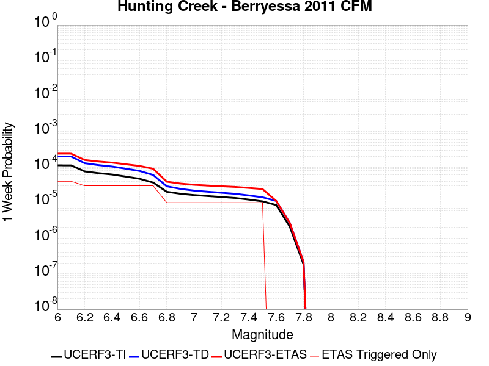 |  |  |  |

| Magnitude | 1 wk TI Prob | 1 wk TD Prob | 1 wk ETAS Prob | 1 wk ETAS/TD Gain | 1 wk ETAS Triggered Only | 1 mo TI Prob | 1 mo TD Prob | 1 mo ETAS Prob | 1 mo ETAS/TD Gain | 1 mo ETAS Triggered Only | 1 yr TI Prob | 1 yr TD Prob | 1 yr ETAS Prob | 1 yr ETAS/TD Gain | 1 yr ETAS Triggered Only | 10 yr TI Prob | 10 yr TD Prob | 10 yr ETAS Prob | 10 yr ETAS/TD Gain | 10 yr ETAS Triggered Only |
|-----|-----|-----|-----|-----|-----|-----|-----|-----|-----|-----|-----|-----|-----|-----|-----|-----|-----|-----|-----|-----|
| 6.0 | 1.1270982E-4 | 2.0012174E-4 | 2.3388906E-4 | 1.168734 | 3.3774086E-5 | 4.8295266E-4 | 8.5739547E-4 | 8.911406E-4 | 1.0393577 | 3.3774086E-5 | 0.0058641075 | 0.010386313 | 0.010419737 | 1.003218 | 3.3774086E-5 | 0.057117578 | 0.09803703 | 0.09808272 | 1.0004661 | 5.066113E-5 |
| 6.1 | 1.1239393E-4 | 1.9960315E-4 | 2.3337049E-4 | 1.1691724 | 3.3774086E-5 | 4.8159933E-4 | 8.551744E-4 | 8.889196E-4 | 1.0394601 | 3.3774086E-5 | 0.0058477195 | 0.010359551 | 0.010392975 | 1.0032264 | 3.3774086E-5 | 0.056962132 | 0.09779551 | 0.09784121 | 1.0004674 | 5.066113E-5 |
| 6.2 | 7.596265E-5 | 1.2940196E-4 | 1.4628682E-4 | 1.1304837 | 1.6887043E-5 | 3.2551357E-4 | 5.5444165E-4 | 5.713193E-4 | 1.0304408 | 1.6887043E-5 | 0.0039559277 | 0.0067210156 | 0.006737789 | 1.0024956 | 1.6887043E-5 | 0.038862433 | 0.0645915 | 0.06462309 | 1.0004891 | 3.3774086E-5 |
| 6.3 | 6.78794E-5 | 1.145119E-4 | 1.3139701E-4 | 1.1474528 | 1.6887043E-5 | 2.9087928E-4 | 4.906513E-4 | 5.0753E-4 | 1.0344007 | 1.6887043E-5 | 0.003535705 | 0.005952679 | 0.0059694657 | 1.00282 | 1.6887043E-5 | 0.034799766 | 0.057465393 | 0.057497226 | 1.000554 | 3.3774086E-5 |
| 6.4 | 6.2165134E-5 | 1.0436625E-4 | 1.21251534E-4 | 1.1617887 | 1.6887043E-5 | 2.6639478E-4 | 4.4721062E-4 | 4.6409012E-4 | 1.0377439 | 1.6887043E-5 | 0.0032385332 | 0.005427573 | 0.0054443683 | 1.0030944 | 1.6887043E-5 | 0.03191742 | 0.052550517 | 0.052582517 | 1.0006089 | 3.3774086E-5 |
| 6.5 | 5.4368087E-5 | 9.071415E-5 | 1.0759966E-4 | 1.1861398 | 1.6887043E-5 | 2.3298527E-4 | 3.8872007E-4 | 4.0560056E-4 | 1.0434258 | 1.6887043E-5 | 0.0028329059 | 0.0047198683 | 0.004736676 | 1.003561 | 1.6887043E-5 | 0.027970633 | 0.045880128 | 0.04591235 | 1.0007024 | 3.3774086E-5 |
| 6.6 | 4.729947E-5 | 7.847572E-5 | 9.5361436E-5 | 1.2151712 | 1.6887043E-5 | 2.0269625E-4 | 3.362842E-4 | 3.5316558E-4 | 1.0501997 | 1.6887043E-5 | 0.002465034 | 0.0040849647 | 0.004101783 | 1.004117 | 1.6887043E-5 | 0.02437869 | 0.03985155 | 0.03988398 | 1.0008137 | 3.3774086E-5 |
| 6.7 | 3.6875328E-5 | 6.0451803E-5 | 7.733783E-5 | 1.2793304 | 1.6887043E-5 | 1.5802756E-4 | 2.59056E-4 | 2.7593866E-4 | 1.0651699 | 1.6887043E-5 | 0.0019222875 | 0.0031482063 | 0.0031650402 | 1.0053471 | 1.6887043E-5 | 0.019057442 | 0.03089237 | 0.030908737 | 1.0005298 | 1.6887043E-5 |
| 6.8 | 2.0292036E-5 | 2.8976308E-5 | 2.8976308E-5 | 1.0 | 0.0 | 8.6962966E-5 | 1.2417832E-4 | 1.2417832E-4 | 1.0 | 0.0 | 0.0010582599 | 0.0015108072 | 0.0015108072 | 1.0 | 0.0 | 0.010532344 | 0.014978523 | 0.014978523 | 1.0 | 0.0 |
| 6.9 | 1.7871042E-5 | 2.4472254E-5 | 2.4472254E-5 | 1.0 | 0.0 | 7.658793E-5 | 1.048769E-4 | 1.048769E-4 | 1.0 | 0.0 | 9.320591E-4 | 0.0012761299 | 0.0012761299 | 1.0 | 0.0 | 0.009281595 | 0.012679775 | 0.012679775 | 1.0 | 0.0 |
| 7.0 | 1.6415532E-5 | 2.1906277E-5 | 2.1906277E-5 | 1.0 | 0.0 | 7.035038E-5 | 9.3880684E-5 | 9.3880684E-5 | 1.0 | 0.0 | 8.561793E-4 | 0.0011424015 | 0.0011424015 | 1.0 | 0.0 | 0.008528882 | 0.01136452 | 0.01136452 | 1.0 | 0.0 |
| 7.1 | 1.5409885E-5 | 2.0346342E-5 | 2.0346342E-5 | 1.0 | 0.0 | 6.6040695E-5 | 8.7195716E-5 | 8.7195716E-5 | 1.0 | 0.0 | 8.0374884E-4 | 0.0010610938 | 0.0010610938 | 1.0 | 0.0 | 0.00800848 | 0.010560595 | 0.010560595 | 1.0 | 0.0 |
| 7.2 | 1.4497423E-5 | 1.9054964E-5 | 1.9054964E-5 | 1.0 | 0.0 | 6.213033E-5 | 8.166159E-5 | 8.166159E-5 | 1.0 | 0.0 | 7.5617427E-4 | 9.937795E-4 | 9.937795E-4 | 1.0 | 0.0 | 0.0075360634 | 0.009893929 | 0.009893929 | 1.0 | 0.0 |
| 7.3 | 1.3615175E-5 | 1.7826127E-5 | 1.7826127E-5 | 1.0 | 0.0 | 5.8349444E-5 | 7.639547E-5 | 7.639547E-5 | 1.0 | 0.0 | 7.101729E-4 | 9.297209E-4 | 9.297209E-4 | 1.0 | 0.0 | 0.0070790765 | 0.009258823 | 0.009258823 | 1.0 | 0.0 |
| 7.4 | 1.2252825E-5 | 1.602625E-5 | 1.602625E-5 | 1.0 | 0.0 | 5.251105E-5 | 6.868213E-5 | 6.868213E-5 | 1.0 | 0.0 | 6.391345E-4 | 8.35887E-4 | 8.35887E-4 | 1.0 | 0.0 | 0.0063729943 | 0.008327872 | 0.008327872 | 1.0 | 0.0 |
| 7.5 | 1.0913301E-5 | 1.4241117E-5 | 1.4241117E-5 | 1.0 | 0.0 | 4.6770452E-5 | 6.1031948E-5 | 6.1031948E-5 | 1.0 | 0.0 | 5.6928146E-4 | 7.4281334E-4 | 7.4281334E-4 | 1.0 | 0.0 | 0.0056782532 | 0.0074036797 | 0.0074036797 | 1.0 | 0.0 |
| 7.6 | 8.623192E-6 | 1.12346415E-5 | 1.12346415E-5 | 1.0 | 0.0 | 3.6956015E-5 | 4.814759E-5 | 4.814759E-5 | 1.0 | 0.0 | 4.4984656E-4 | 5.8604183E-4 | 5.8604183E-4 | 1.0 | 0.0 | 0.00448937 | 0.0058452785 | 0.0058452785 | 1.0 | 0.0 |
| 7.7 | 2.0993634E-6 | 2.662584E-6 | 2.662584E-6 | 1.0 | 0.0 | 8.997241E-6 | 1.1411025E-5 | 1.1411025E-5 | 1.0 | 0.0 | 1.09535904E-4 | 1.3892044E-4 | 1.3892044E-4 | 1.0 | 0.0 | 0.0010948193 | 0.0013883426 | 0.0013883426 | 1.0 | 0.0 |
| 7.8 | 1.8428308E-7 | 2.167437E-7 | 2.167437E-7 | 1.0 | 0.0 | 7.897844E-7 | 9.289013E-7 | 9.289013E-7 | 1.0 | 0.0 | 9.615583E-6 | 1.1309318E-5 | 1.1309318E-5 | 1.0 | 0.0 | 9.615166E-5 | 1.13086026E-4 | 1.13086026E-4 | 1.0 | 0.0 |

## Simi-Santa Rosa
*[(top)](#table-of-contents)*

| 1 Week | 1 Month | 1 Year | 10 Year |
|-----|-----|-----|-----|
|  |  |  | 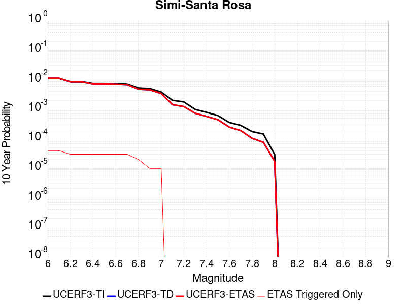 |

| Magnitude | 1 wk TI Prob | 1 wk TD Prob | 1 wk ETAS Prob | 1 wk ETAS/TD Gain | 1 wk ETAS Triggered Only | 1 mo TI Prob | 1 mo TD Prob | 1 mo ETAS Prob | 1 mo ETAS/TD Gain | 1 mo ETAS Triggered Only | 1 yr TI Prob | 1 yr TD Prob | 1 yr ETAS Prob | 1 yr ETAS/TD Gain | 1 yr ETAS Triggered Only | 10 yr TI Prob | 10 yr TD Prob | 10 yr ETAS Prob | 10 yr ETAS/TD Gain | 10 yr ETAS Triggered Only |
|-----|-----|-----|-----|-----|-----|-----|-----|-----|-----|-----|-----|-----|-----|-----|-----|-----|-----|-----|-----|-----|
| 6.0 | 2.198912E-5 | 2.2275442E-5 | 3.9162107E-5 | 1.7580844 | 1.6887043E-5 | 9.4235686E-5 | 9.5462936E-5 | 1.1234837E-4 | 1.1768794 | 1.6887043E-5 | 0.0011467156 | 0.0011616853 | 0.0012122877 | 1.0435593 | 5.066113E-5 | 0.011408163 | 0.011560575 | 0.011627343 | 1.0057755 | 6.754817E-5 |
| 6.1 | 2.198912E-5 | 2.2275442E-5 | 3.9162107E-5 | 1.7580844 | 1.6887043E-5 | 9.4235686E-5 | 9.5462936E-5 | 1.1234837E-4 | 1.1768794 | 1.6887043E-5 | 0.0011467156 | 0.0011616853 | 0.0012122877 | 1.0435593 | 5.066113E-5 | 0.011408163 | 0.011560575 | 0.011627343 | 1.0057755 | 6.754817E-5 |
| 6.2 | 1.69983E-5 | 1.6668559E-5 | 1.6668559E-5 | 1.0 | 0.0 | 7.284782E-5 | 7.143489E-5 | 7.143489E-5 | 1.0 | 0.0 | 8.865613E-4 | 8.6940196E-4 | 9.031467E-4 | 1.0388137 | 3.3774086E-5 | 0.008830327 | 0.008662928 | 0.008713149 | 1.0057974 | 5.066113E-5 |
| 6.3 | 1.69983E-5 | 1.6668559E-5 | 1.6668559E-5 | 1.0 | 0.0 | 7.284782E-5 | 7.143489E-5 | 7.143489E-5 | 1.0 | 0.0 | 8.865613E-4 | 8.6940196E-4 | 9.031467E-4 | 1.0388137 | 3.3774086E-5 | 0.008830327 | 0.008662928 | 0.008713149 | 1.0057974 | 5.066113E-5 |
| 6.4 | 1.4666188E-5 | 1.4052543E-5 | 1.4052543E-5 | 1.0 | 0.0 | 6.285358E-5 | 6.0223934E-5 | 6.0223934E-5 | 1.0 | 0.0 | 7.6497364E-4 | 7.3300465E-4 | 7.66754E-4 | 1.0460424 | 3.3774086E-5 | 0.0076234564 | 0.007308344 | 0.007358635 | 1.0068812 | 5.066113E-5 |
| 6.5 | 1.4666188E-5 | 1.4052543E-5 | 1.4052543E-5 | 1.0 | 0.0 | 6.285358E-5 | 6.0223934E-5 | 6.0223934E-5 | 1.0 | 0.0 | 7.6497364E-4 | 7.3300465E-4 | 7.66754E-4 | 1.0460424 | 3.3774086E-5 | 0.0076234564 | 0.007308344 | 0.007358635 | 1.0068812 | 5.066113E-5 |
| 6.6 | 1.4377586E-5 | 1.3729583E-5 | 1.3729583E-5 | 1.0 | 0.0 | 6.1616774E-5 | 5.883988E-5 | 5.883988E-5 | 1.0 | 0.0 | 7.4992597E-4 | 7.1616494E-4 | 7.4991485E-4 | 1.0471258 | 3.3774086E-5 | 0.007474003 | 0.0071410383 | 0.0071913376 | 1.0070437 | 5.066113E-5 |
| 6.7 | 1.3881404E-5 | 1.320755E-5 | 1.320755E-5 | 1.0 | 0.0 | 5.9490372E-5 | 5.66027E-5 | 5.66027E-5 | 1.0 | 0.0 | 7.240546E-4 | 6.8894465E-4 | 7.226955E-4 | 1.0489892 | 3.3774086E-5 | 0.007217 | 0.006870538 | 0.0069208513 | 1.007323 | 5.066113E-5 |
| 6.8 | 1.0176516E-5 | 9.154151E-6 | 9.154151E-6 | 1.0 | 0.0 | 4.3612912E-5 | 3.9231574E-5 | 3.9231574E-5 | 1.0 | 0.0 | 5.308578E-4 | 4.7755634E-4 | 4.944353E-4 | 1.0353445 | 1.6887043E-5 | 0.0052959146 | 0.004766934 | 0.0048005474 | 1.0070513 | 3.3774086E-5 |
| 6.9 | 9.699797E-6 | 8.774719E-6 | 8.774719E-6 | 1.0 | 0.0 | 4.15699E-5 | 3.7605492E-5 | 3.7605492E-5 | 1.0 | 0.0 | 5.05996E-4 | 4.577671E-4 | 4.577671E-4 | 1.0 | 0.0 | 0.005048454 | 0.0045698597 | 0.0045866696 | 1.0036784 | 1.6887043E-5 |
| 7.0 | 7.4049476E-6 | 6.559333E-6 | 6.559333E-6 | 1.0 | 0.0 | 3.1735104E-5 | 2.8111197E-5 | 2.8111197E-5 | 1.0 | 0.0 | 3.8630638E-4 | 3.422127E-4 | 3.422127E-4 | 1.0 | 0.0 | 0.0038563553 | 0.0034180996 | 0.003434929 | 1.0049236 | 1.6887043E-5 |
| 7.1 | 3.873439E-6 | 2.7595095E-6 | 2.7595095E-6 | 1.0 | 0.0 | 1.6600346E-5 | 1.1826417E-5 | 1.1826417E-5 | 1.0 | 0.0 | 2.0209046E-4 | 1.4397735E-4 | 1.4397735E-4 | 1.0 | 0.0 | 0.0020190678 | 0.0014388643 | 0.0014388643 | 1.0 | 0.0 |
| 7.2 | 3.417706E-6 | 2.3676484E-6 | 2.3676484E-6 | 1.0 | 0.0 | 1.4647229E-5 | 1.0147027E-5 | 1.0147027E-5 | 1.0 | 0.0 | 1.7831543E-4 | 1.2353327E-4 | 1.2353327E-4 | 1.0 | 0.0 | 0.0017817242 | 0.0012346683 | 0.0012346683 | 1.0 | 0.0 |
| 7.3 | 1.90225E-6 | 1.4073753E-6 | 1.4073753E-6 | 1.0 | 0.0 | 8.152474E-6 | 6.0315947E-6 | 6.0315947E-6 | 1.0 | 0.0 | 9.9251854E-5 | 7.343221E-5 | 7.343221E-5 | 1.0 | 0.0 | 9.920754E-4 | 7.340817E-4 | 7.340817E-4 | 1.0 | 0.0 |
| 7.4 | 1.5170556E-6 | 1.1024773E-6 | 1.1024773E-6 | 1.0 | 0.0 | 6.5016507E-6 | 4.724894E-6 | 4.724894E-6 | 1.0 | 0.0 | 7.915472E-5 | 5.7524077E-5 | 5.7524077E-5 | 1.0 | 0.0 | 7.9126534E-4 | 5.7509297E-4 | 5.7509297E-4 | 1.0 | 0.0 |
| 7.5 | 1.178732E-6 | 8.535102E-7 | 8.535102E-7 | 1.0 | 0.0 | 5.0516987E-6 | 3.6578958E-6 | 3.6578958E-6 | 1.0 | 0.0 | 6.1502695E-5 | 4.453398E-5 | 4.453398E-5 | 1.0 | 0.0 | 6.148568E-4 | 4.452515E-4 | 4.452515E-4 | 1.0 | 0.0 |
| 7.6 | 6.8722386E-7 | 4.793198E-7 | 4.793198E-7 | 1.0 | 0.0 | 2.9452417E-6 | 2.054226E-6 | 2.054226E-6 | 1.0 | 0.0 | 3.5857727E-5 | 2.5009915E-5 | 2.5009915E-5 | 1.0 | 0.0 | 3.5851944E-4 | 2.5007114E-4 | 2.5007114E-4 | 1.0 | 0.0 |
| 7.7 | 5.5126515E-7 | 3.6731157E-7 | 3.6731157E-7 | 1.0 | 0.0 | 2.3625628E-6 | 1.5741915E-6 | 1.5741915E-6 | 1.0 | 0.0 | 2.8763823E-5 | 1.9165615E-5 | 1.9165615E-5 | 1.0 | 0.0 | 2.87601E-4 | 1.9163972E-4 | 1.9163972E-4 | 1.0 | 0.0 |
| 7.8 | 3.3860243E-7 | 2.0075942E-7 | 2.0075942E-7 | 1.0 | 0.0 | 1.4511525E-6 | 8.6039717E-7 | 8.6039717E-7 | 1.0 | 0.0 | 1.7667637E-5 | 1.0475286E-5 | 1.0475286E-5 | 1.0 | 0.0 | 1.7666233E-4 | 1.04747975E-4 | 1.04747975E-4 | 1.0 | 0.0 |
| 7.9 | 2.7955386E-7 | 1.4649108E-7 | 1.4649108E-7 | 1.0 | 0.0 | 1.1980875E-6 | 6.278188E-7 | 6.278188E-7 | 1.0 | 0.0 | 1.4586617E-5 | 7.643667E-6 | 7.643667E-6 | 1.0 | 0.0 | 1.458566E-4 | 7.643409E-5 | 7.643409E-5 | 1.0 | 0.0 |
| 8.0 | 5.6259015E-8 | 3.3355324E-8 | 3.3355324E-8 | 1.0 | 0.0 | 2.4111003E-7 | 1.4295138E-7 | 1.4295138E-7 | 1.0 | 0.0 | 2.9355108E-6 | 1.7404317E-6 | 1.7404317E-6 | 1.0 | 0.0 | 2.935472E-5 | 1.7404194E-5 | 1.7404194E-5 | 1.0 | 0.0 |

## Rose Canyon
*[(top)](#table-of-contents)*

| 1 Week | 1 Month | 1 Year | 10 Year |
|-----|-----|-----|-----|
|  |  |  |  |

| Magnitude | 1 wk TI Prob | 1 wk TD Prob | 1 wk ETAS Prob | 1 wk ETAS/TD Gain | 1 wk ETAS Triggered Only | 1 mo TI Prob | 1 mo TD Prob | 1 mo ETAS Prob | 1 mo ETAS/TD Gain | 1 mo ETAS Triggered Only | 1 yr TI Prob | 1 yr TD Prob | 1 yr ETAS Prob | 1 yr ETAS/TD Gain | 1 yr ETAS Triggered Only | 10 yr TI Prob | 10 yr TD Prob | 10 yr ETAS Prob | 10 yr ETAS/TD Gain | 10 yr ETAS Triggered Only |
|-----|-----|-----|-----|-----|-----|-----|-----|-----|-----|-----|-----|-----|-----|-----|-----|-----|-----|-----|-----|-----|
| 6.0 | 4.5923203E-5 | 4.9714225E-5 | 6.660043E-5 | 1.3396654 | 1.6887043E-5 | 1.9679888E-4 | 2.1304491E-4 | 2.2992837E-4 | 1.0792483 | 1.6887043E-5 | 0.0023933933 | 0.0025909345 | 0.002624621 | 1.0130017 | 3.3774086E-5 | 0.023677798 | 0.02563999 | 0.025705807 | 1.0025669 | 6.754817E-5 |
| 6.1 | 4.5923203E-5 | 4.9714225E-5 | 4.9714225E-5 | 1.0 | 0.0 | 1.9679888E-4 | 2.1304491E-4 | 2.1304491E-4 | 1.0 | 0.0 | 0.0023933933 | 0.0025909345 | 0.0026077777 | 1.0065008 | 1.6887043E-5 | 0.023677798 | 0.02563999 | 0.025689352 | 1.0019252 | 5.066113E-5 |
| 6.2 | 2.8844734E-5 | 2.9668723E-5 | 2.9668723E-5 | 1.0 | 0.0 | 1.2361443E-4 | 1.2714567E-4 | 1.2714567E-4 | 1.0 | 0.0 | 0.0015039665 | 0.0015468939 | 0.0015468939 | 1.0 | 0.0 | 0.0149382865 | 0.015374276 | 0.015390904 | 1.0010815 | 1.6887043E-5 |
| 6.3 | 2.3171577E-5 | 2.3161238E-5 | 2.3161238E-5 | 1.0 | 0.0 | 9.9302975E-5 | 9.9258745E-5 | 9.9258745E-5 | 1.0 | 0.0 | 0.0012083431 | 0.0012078186 | 0.0012078186 | 1.0 | 0.0 | 0.012017938 | 0.012022437 | 0.01203912 | 1.0013877 | 1.6887043E-5 |
| 6.4 | 2.0066604E-5 | 1.9667024E-5 | 1.9667024E-5 | 1.0 | 0.0 | 8.599689E-5 | 8.4284584E-5 | 8.4284584E-5 | 1.0 | 0.0 | 0.0010465092 | 0.0010256917 | 0.0010256917 | 1.0 | 0.0 | 0.010415946 | 0.010217559 | 0.010234273 | 1.0016359 | 1.6887043E-5 |
| 6.5 | 1.776989E-5 | 1.7113807E-5 | 1.7113807E-5 | 1.0 | 0.0 | 7.615444E-5 | 7.334287E-5 | 7.334287E-5 | 1.0 | 0.0 | 9.267859E-4 | 8.925905E-4 | 8.925905E-4 | 1.0 | 0.0 | 0.009229303 | 0.008896211 | 0.008896211 | 1.0 | 0.0 |
| 6.6 | 1.5227364E-5 | 1.433926E-5 | 1.433926E-5 | 1.0 | 0.0 | 6.52585E-5 | 6.1452556E-5 | 6.1452556E-5 | 1.0 | 0.0 | 7.942326E-4 | 7.479332E-4 | 7.479332E-4 | 1.0 | 0.0 | 0.007914 | 0.007458359 | 0.007458359 | 1.0 | 0.0 |
| 6.7 | 1.2703898E-5 | 1.1673274E-5 | 1.1673274E-5 | 1.0 | 0.0 | 5.4444143E-5 | 5.0027378E-5 | 5.0027378E-5 | 1.0 | 0.0 | 6.626558E-4 | 6.089174E-4 | 6.089174E-4 | 1.0 | 0.0 | 0.006606833 | 0.0060750856 | 0.0060750856 | 1.0 | 0.0 |
| 6.8 | 1.1554917E-5 | 1.0609337E-5 | 1.0609337E-5 | 1.0 | 0.0 | 4.9520135E-5 | 4.546782E-5 | 4.546782E-5 | 1.0 | 0.0 | 6.0274085E-4 | 5.5343413E-4 | 5.5343413E-4 | 1.0 | 0.0 | 0.0060110865 | 0.0055225673 | 0.0055225673 | 1.0 | 0.0 |
| 6.9 | 8.732078E-6 | 7.881357E-6 | 7.881357E-6 | 1.0 | 0.0 | 3.7422655E-5 | 3.3776825E-5 | 3.3776825E-5 | 1.0 | 0.0 | 4.5552556E-4 | 4.111582E-4 | 4.111582E-4 | 1.0 | 0.0 | 0.0045459294 | 0.0041048084 | 0.0041048084 | 1.0 | 0.0 |
| 7.0 | 5.9337494E-6 | 5.1074853E-6 | 5.1074853E-6 | 1.0 | 0.0 | 2.5430107E-5 | 2.188904E-5 | 2.188904E-5 | 1.0 | 0.0 | 3.0956755E-4 | 2.664666E-4 | 2.664666E-4 | 1.0 | 0.0 | 0.0030913667 | 0.0026614866 | 0.0026614866 | 1.0 | 0.0 |
| 7.1 | 5.013409E-6 | 4.1773833E-6 | 4.1773833E-6 | 1.0 | 0.0 | 2.1485863E-5 | 1.7902948E-5 | 1.7902948E-5 | 1.0 | 0.0 | 2.6155898E-4 | 2.179467E-4 | 2.179467E-4 | 1.0 | 0.0 | 0.0026125133 | 0.0021773411 | 0.0021773411 | 1.0 | 0.0 |
| 7.2 | 4.120763E-6 | 3.2821383E-6 | 3.2821383E-6 | 1.0 | 0.0 | 1.7660293E-5 | 1.4066231E-5 | 1.4066231E-5 | 1.0 | 0.0 | 2.1499286E-4 | 1.7124301E-4 | 1.7124301E-4 | 1.0 | 0.0 | 0.0021478499 | 0.00171112 | 0.00171112 | 1.0 | 0.0 |
| 7.3 | 3.2081239E-6 | 2.4405372E-6 | 2.4405372E-6 | 1.0 | 0.0 | 1.374903E-5 | 1.0459404E-5 | 1.0459404E-5 | 1.0 | 0.0 | 1.6738157E-4 | 1.2733586E-4 | 1.2733586E-4 | 1.0 | 0.0 | 0.0016725556 | 0.001272636 | 0.001272636 | 1.0 | 0.0 |
| 7.4 | 2.4194755E-6 | 1.7680634E-6 | 1.7680634E-6 | 1.0 | 0.0 | 1.0369139E-5 | 7.577393E-6 | 7.577393E-6 | 1.0 | 0.0 | 1.2623696E-4 | 9.2250906E-5 | 9.2250906E-5 | 1.0 | 0.0 | 0.0012616527 | 9.2213147E-4 | 9.2213147E-4 | 1.0 | 0.0 |
| 7.5 | 1.3842889E-6 | 9.3786275E-7 | 9.3786275E-7 | 1.0 | 0.0 | 5.9326535E-6 | 4.019406E-6 | 4.019406E-6 | 1.0 | 0.0 | 7.222766E-5 | 4.8935202E-5 | 4.8935202E-5 | 1.0 | 0.0 | 7.220419E-4 | 4.892478E-4 | 4.892478E-4 | 1.0 | 0.0 |
| 7.6 | 1.0021575E-6 | 6.411463E-7 | 6.411463E-7 | 1.0 | 0.0 | 4.2949537E-6 | 2.7477672E-6 | 2.7477672E-6 | 1.0 | 0.0 | 5.2289808E-5 | 3.3453573E-5 | 3.3453573E-5 | 1.0 | 0.0 | 5.2277505E-4 | 3.344875E-4 | 3.344875E-4 | 1.0 | 0.0 |
| 7.7 | 8.7620116E-8 | 6.4492404E-8 | 6.4492404E-8 | 1.0 | 0.0 | 3.7551473E-7 | 2.76396E-7 | 2.76396E-7 | 1.0 | 0.0 | 4.5718825E-6 | 3.3651165E-6 | 3.3651165E-6 | 1.0 | 0.0 | 4.5717883E-5 | 3.3650686E-5 | 3.3650686E-5 | 1.0 | 0.0 |

## Big Pine (Central)
*[(top)](#table-of-contents)*

| 1 Week | 1 Month | 1 Year | 10 Year |
|-----|-----|-----|-----|
|  |  |  |  |

| Magnitude | 1 wk TI Prob | 1 wk TD Prob | 1 wk ETAS Prob | 1 wk ETAS/TD Gain | 1 wk ETAS Triggered Only | 1 mo TI Prob | 1 mo TD Prob | 1 mo ETAS Prob | 1 mo ETAS/TD Gain | 1 mo ETAS Triggered Only | 1 yr TI Prob | 1 yr TD Prob | 1 yr ETAS Prob | 1 yr ETAS/TD Gain | 1 yr ETAS Triggered Only | 10 yr TI Prob | 10 yr TD Prob | 10 yr ETAS Prob | 10 yr ETAS/TD Gain | 10 yr ETAS Triggered Only |
|-----|-----|-----|-----|-----|-----|-----|-----|-----|-----|-----|-----|-----|-----|-----|-----|-----|-----|-----|-----|-----|
| 6.0 | 1.2706755E-5 | 1.4250529E-5 | 3.113733E-5 | 2.1849947 | 1.6887043E-5 | 5.4456385E-5 | 6.107247E-5 | 7.795848E-5 | 1.2764914 | 1.6887043E-5 | 6.628048E-4 | 7.433402E-4 | 7.9396367E-4 | 1.0681027 | 5.066113E-5 | 0.006608314 | 0.0074135666 | 0.0074806144 | 1.0090439 | 6.754817E-5 |
| 6.1 | 8.342579E-6 | 9.510762E-6 | 2.6397644E-5 | 2.7755551 | 1.6887043E-5 | 3.5753423E-5 | 4.0759893E-5 | 5.7646248E-5 | 1.4142885 | 1.6887043E-5 | 4.3521097E-4 | 4.961604E-4 | 5.299178E-4 | 1.0680372 | 3.3774086E-5 | 0.0043435963 | 0.0049540824 | 0.004987689 | 1.0067836 | 3.3774086E-5 |
| 6.2 | 6.923899E-6 | 7.967147E-6 | 2.4854055E-5 | 3.1195676 | 1.6887043E-5 | 2.9673516E-5 | 3.4144578E-5 | 5.1031046E-5 | 1.4945577 | 1.6887043E-5 | 3.6121515E-4 | 4.156502E-4 | 4.4941023E-4 | 1.0812223 | 3.3774086E-5 | 0.003606286 | 0.0041520367 | 0.0041856705 | 1.0081005 | 3.3774086E-5 |
| 6.3 | 2.728396E-6 | 3.4242908E-6 | 3.4242908E-6 | 1.0 | 0.0 | 1.1693074E-5 | 1.4675454E-5 | 1.4675454E-5 | 1.0 | 0.0 | 1.4235388E-4 | 1.7865987E-4 | 1.7865987E-4 | 1.0 | 0.0 | 0.0014226272 | 0.0017866704 | 0.0017866704 | 1.0 | 0.0 |
| 6.4 | 2.7136944E-6 | 3.408584E-6 | 3.408584E-6 | 1.0 | 0.0 | 1.1630066E-5 | 1.4608141E-5 | 1.4608141E-5 | 1.0 | 0.0 | 1.4158686E-4 | 1.7784047E-4 | 1.7784047E-4 | 1.0 | 0.0 | 0.0014149669 | 0.0017784894 | 0.0017784894 | 1.0 | 0.0 |
| 6.5 | 2.6971882E-6 | 3.3909291E-6 | 3.3909291E-6 | 1.0 | 0.0 | 1.1559327E-5 | 1.45324775E-5 | 1.45324775E-5 | 1.0 | 0.0 | 1.4072572E-4 | 1.7691942E-4 | 1.7691942E-4 | 1.0 | 0.0 | 0.0014063664 | 0.0017692937 | 0.0017692937 | 1.0 | 0.0 |
| 6.6 | 2.669092E-6 | 3.3609497E-6 | 3.3609497E-6 | 1.0 | 0.0 | 1.1438916E-5 | 1.4403995E-5 | 1.4403995E-5 | 1.0 | 0.0 | 1.3925991E-4 | 1.753554E-4 | 1.753554E-4 | 1.0 | 0.0 | 0.0013917267 | 0.0017536782 | 0.0017536782 | 1.0 | 0.0 |
| 6.7 | 2.6408059E-6 | 3.3309752E-6 | 3.3309752E-6 | 1.0 | 0.0 | 1.1317691E-5 | 1.4275535E-5 | 1.4275535E-5 | 1.0 | 0.0 | 1.3778417E-4 | 1.7379165E-4 | 1.7379165E-4 | 1.0 | 0.0 | 0.0013769877 | 0.0017380653 | 0.0017380653 | 1.0 | 0.0 |
| 6.8 | 2.1786943E-6 | 2.8544325E-6 | 2.8544325E-6 | 1.0 | 0.0 | 9.337228E-6 | 1.2233229E-5 | 1.2233229E-5 | 1.0 | 0.0 | 1.1367482E-4 | 1.4893012E-4 | 1.4893012E-4 | 1.0 | 0.0 | 0.0011361669 | 0.0014897975 | 0.0014897975 | 1.0 | 0.0 |
| 6.9 | 1.4411696E-6 | 2.068499E-6 | 2.068499E-6 | 1.0 | 0.0 | 6.1764263E-6 | 8.864968E-6 | 8.864968E-6 | 1.0 | 0.0 | 7.51954E-5 | 1.079259E-4 | 1.079259E-4 | 1.0 | 0.0 | 7.5169955E-4 | 0.0010801847 | 0.0010801847 | 1.0 | 0.0 |
| 7.0 | 1.0073411E-6 | 1.554261E-6 | 1.554261E-6 | 1.0 | 0.0 | 4.317169E-6 | 6.6611024E-6 | 6.6611024E-6 | 1.0 | 0.0 | 5.2560266E-5 | 8.1096056E-5 | 8.1096056E-5 | 1.0 | 0.0 | 5.2547833E-4 | 8.1210316E-4 | 8.1210316E-4 | 1.0 | 0.0 |
| 7.1 | 8.947104E-7 | 1.4302494E-6 | 1.4302494E-6 | 1.0 | 0.0 | 3.834468E-6 | 6.129627E-6 | 6.129627E-6 | 1.0 | 0.0 | 4.6683643E-5 | 7.46258E-5 | 7.46258E-5 | 1.0 | 0.0 | 4.6673836E-4 | 7.474457E-4 | 7.474457E-4 | 1.0 | 0.0 |
| 7.2 | 5.215166E-7 | 1.0111678E-6 | 1.0111678E-6 | 1.0 | 0.0 | 2.2350691E-6 | 4.3335694E-6 | 4.3335694E-6 | 1.0 | 0.0 | 2.7211627E-5 | 5.2759973E-5 | 5.2759973E-5 | 1.0 | 0.0 | 2.7208295E-4 | 5.2890263E-4 | 5.2890263E-4 | 1.0 | 0.0 |
| 7.3 | 4.4024807E-7 | 9.219589E-7 | 9.219589E-7 | 1.0 | 0.0 | 1.8867761E-6 | 3.9512465E-6 | 3.9512465E-6 | 1.0 | 0.0 | 2.2971257E-5 | 4.810541E-5 | 4.810541E-5 | 1.0 | 0.0 | 2.2968883E-4 | 4.8237795E-4 | 4.8237795E-4 | 1.0 | 0.0 |
| 7.4 | 3.6130905E-7 | 8.358523E-7 | 8.358523E-7 | 1.0 | 0.0 | 1.5484665E-6 | 3.5822195E-6 | 3.5822195E-6 | 1.0 | 0.0 | 1.8852415E-5 | 4.3612687E-5 | 4.3612687E-5 | 1.0 | 0.0 | 1.8850817E-4 | 4.374597E-4 | 4.374597E-4 | 1.0 | 0.0 |
| 7.5 | 3.408184E-7 | 8.108147E-7 | 8.108147E-7 | 1.0 | 0.0 | 1.4606494E-6 | 3.4749157E-6 | 3.4749157E-6 | 1.0 | 0.0 | 1.7783263E-5 | 4.2306317E-5 | 4.2306317E-5 | 1.0 | 0.0 | 1.778184E-4 | 4.2437963E-4 | 4.2437963E-4 | 1.0 | 0.0 |
| 7.6 | 3.1428627E-7 | 7.7316E-7 | 7.7316E-7 | 1.0 | 0.0 | 1.3469405E-6 | 3.3135389E-6 | 3.3135389E-6 | 1.0 | 0.0 | 1.6398877E-5 | 4.0341627E-5 | 4.0341627E-5 | 1.0 | 0.0 | 1.6397667E-4 | 4.0471106E-4 | 4.0471106E-4 | 1.0 | 0.0 |
| 7.7 | 1.7972785E-7 | 5.077752E-7 | 5.077752E-7 | 1.0 | 0.0 | 7.70262E-7 | 2.1761778E-6 | 2.1761778E-6 | 1.0 | 0.0 | 9.377899E-6 | 2.6494654E-5 | 2.6494654E-5 | 1.0 | 0.0 | 9.377503E-5 | 2.662899E-4 | 2.662899E-4 | 1.0 | 0.0 |
| 7.8 | 4.9230927E-8 | 1.198079E-7 | 1.198079E-7 | 1.0 | 0.0 | 2.1098968E-7 | 5.134623E-7 | 5.134623E-7 | 1.0 | 0.0 | 2.5687964E-6 | 6.2513873E-6 | 6.2513873E-6 | 1.0 | 0.0 | 2.5687666E-5 | 6.295415E-5 | 6.295415E-5 | 1.0 | 0.0 |
| 7.9 | 3.6805972E-9 | 4.105293E-9 | 4.105293E-9 | 1.0 | 0.0 | 1.5773987E-8 | 1.7594115E-8 | 1.7594115E-8 | 1.0 | 0.0 | 1.9204828E-7 | 2.1420831E-7 | 2.1420831E-7 | 1.0 | 0.0 | 1.920481E-6 | 2.1900614E-6 | 2.1900614E-6 | 1.0 | 0.0 |

## Camp Rock 2011
*[(top)](#table-of-contents)*

| 1 Week | 1 Month | 1 Year | 10 Year |
|-----|-----|-----|-----|
|  |  |  |  |

| Magnitude | 1 wk TI Prob | 1 wk TD Prob | 1 wk ETAS Prob | 1 wk ETAS/TD Gain | 1 wk ETAS Triggered Only | 1 mo TI Prob | 1 mo TD Prob | 1 mo ETAS Prob | 1 mo ETAS/TD Gain | 1 mo ETAS Triggered Only | 1 yr TI Prob | 1 yr TD Prob | 1 yr ETAS Prob | 1 yr ETAS/TD Gain | 1 yr ETAS Triggered Only | 10 yr TI Prob | 10 yr TD Prob | 10 yr ETAS Prob | 10 yr ETAS/TD Gain | 10 yr ETAS Triggered Only |
|-----|-----|-----|-----|-----|-----|-----|-----|-----|-----|-----|-----|-----|-----|-----|-----|-----|-----|-----|-----|-----|
| 6.0 | 1.6710783E-5 | 4.25026E-6 | 4.25026E-6 | 1.0 | 0.0 | 7.161568E-5 | 1.8215276E-5 | 1.8215276E-5 | 1.0 | 0.0 | 8.7157206E-4 | 2.2174895E-4 | 2.3863224E-4 | 1.076137 | 1.6887043E-5 | 0.008681616 | 0.0022153298 | 0.0022658785 | 1.0228177 | 5.066113E-5 |
| 6.1 | 1.6710783E-5 | 4.25026E-6 | 4.25026E-6 | 1.0 | 0.0 | 7.161568E-5 | 1.8215276E-5 | 1.8215276E-5 | 1.0 | 0.0 | 8.7157206E-4 | 2.2174895E-4 | 2.3863224E-4 | 1.076137 | 1.6887043E-5 | 0.008681616 | 0.0022153298 | 0.0022658785 | 1.0228177 | 5.066113E-5 |
| 6.2 | 1.6710783E-5 | 4.25026E-6 | 4.25026E-6 | 1.0 | 0.0 | 7.161568E-5 | 1.8215276E-5 | 1.8215276E-5 | 1.0 | 0.0 | 8.7157206E-4 | 2.2174895E-4 | 2.3863224E-4 | 1.076137 | 1.6887043E-5 | 0.008681616 | 0.0022153298 | 0.0022658785 | 1.0228177 | 5.066113E-5 |
| 6.3 | 1.6710783E-5 | 4.25026E-6 | 4.25026E-6 | 1.0 | 0.0 | 7.161568E-5 | 1.8215276E-5 | 1.8215276E-5 | 1.0 | 0.0 | 8.7157206E-4 | 2.2174895E-4 | 2.3863224E-4 | 1.076137 | 1.6887043E-5 | 0.008681616 | 0.0022153298 | 0.0022658785 | 1.0228177 | 5.066113E-5 |
| 6.4 | 7.982846E-6 | 3.6820884E-6 | 3.6820884E-6 | 1.0 | 0.0 | 3.421175E-5 | 1.5780286E-5 | 1.5780286E-5 | 1.0 | 0.0 | 4.1644843E-4 | 1.9210839E-4 | 2.0899219E-4 | 1.0878868 | 1.6887043E-5 | 0.0041566887 | 0.001919458 | 0.001970022 | 1.0263427 | 5.066113E-5 |
| 6.5 | 7.982846E-6 | 3.6820884E-6 | 3.6820884E-6 | 1.0 | 0.0 | 3.421175E-5 | 1.5780286E-5 | 1.5780286E-5 | 1.0 | 0.0 | 4.1644843E-4 | 1.9210839E-4 | 2.0899219E-4 | 1.0878868 | 1.6887043E-5 | 0.0041566887 | 0.001919458 | 0.001970022 | 1.0263427 | 5.066113E-5 |
| 6.6 | 7.048869E-6 | 3.4243571E-6 | 3.4243571E-6 | 1.0 | 0.0 | 3.0209088E-5 | 1.4675736E-5 | 1.4675736E-5 | 1.0 | 0.0 | 3.677336E-4 | 1.7866275E-4 | 1.9554677E-4 | 1.0945022 | 1.6887043E-5 | 0.0036712566 | 0.0017852228 | 0.0018357935 | 1.0283273 | 5.066113E-5 |
| 6.7 | 6.987307E-6 | 3.3623348E-6 | 3.3623348E-6 | 1.0 | 0.0 | 2.9945259E-5 | 1.4409929E-5 | 1.4409929E-5 | 1.0 | 0.0 | 3.6452254E-4 | 1.7542706E-4 | 1.9231114E-4 | 1.0962455 | 1.6887043E-5 | 0.0036392517 | 0.001752917 | 0.0018034893 | 1.0288504 | 5.066113E-5 |
| 6.8 | 6.3737602E-6 | 3.1179077E-6 | 3.1179077E-6 | 1.0 | 0.0 | 2.731583E-5 | 1.3362394E-5 | 1.3362394E-5 | 1.0 | 0.0 | 3.3251947E-4 | 1.626753E-4 | 1.7955959E-4 | 1.1037914 | 1.6887043E-5 | 0.0033202237 | 0.0016255907 | 0.0016761696 | 1.0311141 | 5.066113E-5 |
| 6.9 | 6.112211E-6 | 2.9331156E-6 | 2.9331156E-6 | 1.0 | 0.0 | 2.6194928E-5 | 1.2570436E-5 | 1.2570436E-5 | 1.0 | 0.0 | 3.1887658E-4 | 1.5303459E-4 | 1.6991905E-4 | 1.1103309 | 1.6887043E-5 | 0.003184194 | 0.0015293199 | 0.0015799035 | 1.0330759 | 5.066113E-5 |
| 7.0 | 5.5140117E-6 | 2.641923E-6 | 2.641923E-6 | 1.0 | 0.0 | 2.3631264E-5 | 1.132248E-5 | 1.132248E-5 | 1.0 | 0.0 | 2.8767265E-4 | 1.3784273E-4 | 1.5472743E-4 | 1.1224927 | 1.6887043E-5 | 0.0028730053 | 0.0013775975 | 0.0014281888 | 1.0367243 | 5.066113E-5 |
| 7.1 | 4.8151105E-6 | 2.1342705E-6 | 2.1342705E-6 | 1.0 | 0.0 | 2.0636026E-5 | 9.146843E-6 | 9.146843E-6 | 1.0 | 0.0 | 2.5121463E-4 | 1.1135734E-4 | 1.282425E-4 | 1.1516304 | 1.6887043E-5 | 0.0025093083 | 0.0011130372 | 0.001163642 | 1.0454655 | 5.066113E-5 |
| 7.2 | 3.818335E-6 | 1.2937425E-6 | 1.2937425E-6 | 1.0 | 0.0 | 1.6364189E-5 | 5.5445994E-6 | 5.5445994E-6 | 1.0 | 0.0 | 1.9921579E-4 | 6.750349E-5 | 6.750349E-5 | 1.0 | 0.0 | 0.0019903728 | 6.748381E-4 | 7.0858933E-4 | 1.0500139 | 3.3774086E-5 |
| 7.3 | 2.7166698E-6 | 7.3835776E-7 | 7.3835776E-7 | 1.0 | 0.0 | 1.1642818E-5 | 3.1643867E-6 | 3.1643867E-6 | 1.0 | 0.0 | 1.4174209E-4 | 3.8525748E-5 | 3.8525748E-5 | 1.0 | 0.0 | 0.0014165172 | 3.851927E-4 | 4.0207323E-4 | 1.0438236 | 1.6887043E-5 |
| 7.4 | 2.0893426E-6 | 5.4618386E-7 | 5.4618386E-7 | 1.0 | 0.0 | 8.954295E-6 | 2.3407858E-6 | 2.3407858E-6 | 1.0 | 0.0 | 1.0901308E-4 | 2.84987E-5 | 2.84987E-5 | 1.0 | 0.0 | 0.0010895962 | 2.84951E-4 | 3.0183324E-4 | 1.0592461 | 1.6887043E-5 |
| 7.5 | 1.1681728E-6 | 3.6030585E-7 | 3.6030585E-7 | 1.0 | 0.0 | 5.0064455E-6 | 1.544167E-6 | 1.544167E-6 | 1.0 | 0.0 | 6.0951766E-5 | 1.8800076E-5 | 1.8800076E-5 | 1.0 | 0.0 | 6.093505E-4 | 1.8798532E-4 | 2.048692E-4 | 1.0898148 | 1.6887043E-5 |
| 7.6 | 1.3154387E-7 | 7.1197384E-8 | 7.1197384E-8 | 1.0 | 0.0 | 5.6375933E-7 | 3.051316E-7 | 3.051316E-7 | 1.0 | 0.0 | 6.863748E-6 | 3.7149728E-6 | 3.7149728E-6 | 1.0 | 0.0 | 6.863536E-5 | 3.7149264E-5 | 3.7149264E-5 | 1.0 | 0.0 |

## Owens Valley Keough Hot Springs
*[(top)](#table-of-contents)*

| 1 Week | 1 Month | 1 Year | 10 Year |
|-----|-----|-----|-----|
|  |  |  |  |

| Magnitude | 1 wk TI Prob | 1 wk TD Prob | 1 wk ETAS Prob | 1 wk ETAS/TD Gain | 1 wk ETAS Triggered Only | 1 mo TI Prob | 1 mo TD Prob | 1 mo ETAS Prob | 1 mo ETAS/TD Gain | 1 mo ETAS Triggered Only | 1 yr TI Prob | 1 yr TD Prob | 1 yr ETAS Prob | 1 yr ETAS/TD Gain | 1 yr ETAS Triggered Only | 10 yr TI Prob | 10 yr TD Prob | 10 yr ETAS Prob | 10 yr ETAS/TD Gain | 10 yr ETAS Triggered Only |
|-----|-----|-----|-----|-----|-----|-----|-----|-----|-----|-----|-----|-----|-----|-----|-----|-----|-----|-----|-----|-----|
| 6.0 | 1.5708529E-5 | 4.950656E-6 | 2.1837615E-5 | 4.411055 | 1.6887043E-5 | 6.7320536E-5 | 2.1216953E-5 | 3.8103637E-5 | 1.7959052 | 1.6887043E-5 | 8.193192E-4 | 2.582909E-4 | 2.9205627E-4 | 1.1307261 | 3.3774086E-5 | 0.008163051 | 0.0025805652 | 0.0026310955 | 1.0195811 | 5.066113E-5 |
| 6.1 | 1.5708529E-5 | 4.950656E-6 | 2.1837615E-5 | 4.411055 | 1.6887043E-5 | 6.7320536E-5 | 2.1216953E-5 | 3.8103637E-5 | 1.7959052 | 1.6887043E-5 | 8.193192E-4 | 2.582909E-4 | 2.9205627E-4 | 1.1307261 | 3.3774086E-5 | 0.008163051 | 0.0025805652 | 0.0026310955 | 1.0195811 | 5.066113E-5 |
| 6.2 | 1.5708529E-5 | 4.950656E-6 | 2.1837615E-5 | 4.411055 | 1.6887043E-5 | 6.7320536E-5 | 2.1216953E-5 | 3.8103637E-5 | 1.7959052 | 1.6887043E-5 | 8.193192E-4 | 2.582909E-4 | 2.9205627E-4 | 1.1307261 | 3.3774086E-5 | 0.008163051 | 0.0025805652 | 0.0026310955 | 1.0195811 | 5.066113E-5 |
| 6.3 | 1.5708529E-5 | 4.950656E-6 | 2.1837615E-5 | 4.411055 | 1.6887043E-5 | 6.7320536E-5 | 2.1216953E-5 | 3.8103637E-5 | 1.7959052 | 1.6887043E-5 | 8.193192E-4 | 2.582909E-4 | 2.9205627E-4 | 1.1307261 | 3.3774086E-5 | 0.008163051 | 0.0025805652 | 0.0026310955 | 1.0195811 | 5.066113E-5 |
| 6.4 | 1.4622509E-5 | 3.7265204E-6 | 2.0613501E-5 | 5.5315676 | 1.6887043E-5 | 6.266639E-5 | 1.5970723E-5 | 3.2857497E-5 | 2.057358 | 1.6887043E-5 | 7.626962E-4 | 1.944295E-4 | 2.2819702E-4 | 1.1736748 | 3.3774086E-5 | 0.007600839 | 0.0019430731 | 0.0019936357 | 1.0260221 | 5.066113E-5 |
| 6.5 | 1.3335527E-5 | 2.2777172E-6 | 1.9164721E-5 | 8.414004 | 1.6887043E-5 | 5.7151006E-5 | 9.761612E-6 | 2.664849E-5 | 2.729927 | 1.6887043E-5 | 6.955913E-4 | 1.18841825E-4 | 1.526119E-4 | 1.2841598 | 3.3774086E-5 | 0.0069341804 | 0.0011880046 | 0.0012386056 | 1.0425932 | 5.066113E-5 |
| 6.6 | 1.3332855E-5 | 2.2748663E-6 | 1.9161871E-5 | 8.423295 | 1.6887043E-5 | 5.7139558E-5 | 9.749395E-6 | 2.6636273E-5 | 2.732095 | 1.6887043E-5 | 6.9545204E-4 | 1.186931E-4 | 1.5246317E-4 | 1.284516 | 3.3774086E-5 | 0.0069327964 | 0.0011865189 | 0.0012371199 | 1.0426466 | 5.066113E-5 |
| 6.7 | 1.3318214E-5 | 2.2640966E-6 | 1.91511E-5 | 8.458606 | 1.6887043E-5 | 5.707681E-5 | 9.703239E-6 | 2.6590118E-5 | 2.7403343 | 1.6887043E-5 | 6.946886E-4 | 1.1813121E-4 | 1.519013E-4 | 1.2858694 | 3.3774086E-5 | 0.0069252094 | 0.001180906 | 0.0012315073 | 1.0428495 | 5.066113E-5 |
| 6.8 | 1.2441338E-5 | 1.6777863E-6 | 1.85648E-5 | 11.065057 | 1.6887043E-5 | 5.331893E-5 | 7.1904947E-6 | 2.4077415E-5 | 3.3485062 | 1.6887043E-5 | 6.489646E-4 | 8.7541055E-5 | 1.2131218E-4 | 1.3857747 | 3.3774086E-5 | 0.0064707273 | 8.752499E-4 | 9.2586665E-4 | 1.0578313 | 5.066113E-5 |
| 6.9 | 1.1130476E-5 | 1.0303868E-6 | 1.7917411E-5 | 17.389015 | 1.6887043E-5 | 4.7701167E-5 | 4.415936E-6 | 2.1302903E-5 | 4.824097 | 1.6887043E-5 | 5.806069E-4 | 5.3762706E-5 | 8.753497E-5 | 1.6281728 | 3.3774086E-5 | 0.0057909233 | 5.37651E-4 | 5.8828486E-4 | 1.0941762 | 5.066113E-5 |
| 7.0 | 1.0986073E-5 | 9.579413E-7 | 1.7844968E-5 | 18.628456 | 1.6887043E-5 | 4.7082318E-5 | 4.1054564E-6 | 2.099243E-5 | 5.1133 | 1.6887043E-5 | 5.730765E-4 | 4.99828E-5 | 8.375519E-5 | 1.6756804 | 3.3774086E-5 | 0.0057160086 | 4.9986853E-4 | 5.505043E-4 | 1.1012982 | 5.066113E-5 |
| 7.1 | 1.0451338E-5 | 8.0002656E-7 | 1.7687056E-5 | 22.108086 | 1.6887043E-5 | 4.4790682E-5 | 3.4286807E-6 | 2.0315665E-5 | 5.9252133 | 1.6887043E-5 | 5.451901E-4 | 4.1743395E-5 | 7.5516065E-5 | 1.8090544 | 3.3774086E-5 | 0.005438545 | 4.1750458E-4 | 4.6814454E-4 | 1.121292 | 5.066113E-5 |
| 7.2 | 9.989061E-6 | 6.544956E-7 | 1.7541528E-5 | 26.801598 | 1.6887043E-5 | 4.280956E-5 | 2.804978E-6 | 1.9691974E-5 | 7.020366 | 1.6887043E-5 | 5.2108173E-4 | 3.4150078E-5 | 6.792301E-5 | 1.9889562 | 3.3774086E-5 | 0.0051986156 | 3.415851E-4 | 3.9222892E-4 | 1.1482612 | 5.066113E-5 |
| 7.3 | 9.465365E-6 | 5.4600474E-7 | 1.7433038E-5 | 31.928364 | 1.6887043E-5 | 4.056522E-5 | 2.3400182E-6 | 1.9227022E-5 | 8.216612 | 1.6887043E-5 | 4.937696E-4 | 2.8489352E-5 | 6.226247E-5 | 2.1854649 | 3.3774086E-5 | 0.0049267393 | 2.8498896E-4 | 3.3563565E-4 | 1.1777146 | 5.066113E-5 |
| 7.4 | 6.3824805E-6 | 4.016335E-7 | 1.7288668E-5 | 43.045883 | 1.6887043E-5 | 2.73532E-5 | 1.7212853E-6 | 1.8608298E-5 | 10.810699 | 1.6887043E-5 | 3.3297433E-4 | 2.095645E-5 | 5.4729826E-5 | 2.6115983 | 3.3774086E-5 | 0.0033247585 | 2.0963654E-4 | 2.6028702E-4 | 1.2416111 | 5.066113E-5 |
| 7.5 | 1.6192645E-6 | 2.516124E-7 | 1.7138651E-5 | 68.11529 | 1.6887043E-5 | 6.9396865E-6 | 1.0783383E-6 | 1.7965363E-5 | 16.660229 | 1.6887043E-5 | 8.448741E-5 | 1.31286915E-5 | 4.6902333E-5 | 3.5725062 | 3.3774086E-5 | 8.4455294E-4 | 1.3127929E-4 | 1.8193376E-4 | 1.3858528 | 5.066113E-5 |
| 7.6 | 5.7062545E-7 | 1.07924045E-7 | 1.6994965E-5 | 157.47154 | 1.6887043E-5 | 2.4455355E-6 | 4.6253152E-7 | 1.7349566E-5 | 37.510017 | 1.6887043E-5 | 2.9773988E-5 | 5.6313074E-6 | 3.9405204E-5 | 6.997523 | 3.3774086E-5 | 2.977E-4 | 5.6311732E-5 | 1.0697001E-4 | 1.8996043 | 5.066113E-5 |
| 7.7 | 2.5988817E-7 | 4.5457977E-8 | 1.69325E-5 | 372.48688 | 1.6887043E-5 | 1.113806E-6 | 1.9481989E-7 | 1.7081858E-5 | 87.68026 | 1.6887043E-5 | 1.3560503E-5 | 2.3719301E-6 | 1.9258932E-5 | 8.119519 | 1.6887043E-5 | 1.3559677E-4 | 2.371909E-5 | 5.7492376E-5 | 2.423886 | 3.3774086E-5 |

## Newport-Inglewood alt 1
*[(top)](#table-of-contents)*

| 1 Week | 1 Month | 1 Year | 10 Year |
|-----|-----|-----|-----|
|  |  | 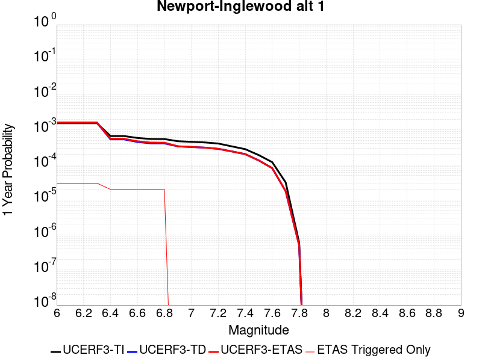 |  |

| Magnitude | 1 wk TI Prob | 1 wk TD Prob | 1 wk ETAS Prob | 1 wk ETAS/TD Gain | 1 wk ETAS Triggered Only | 1 mo TI Prob | 1 mo TD Prob | 1 mo ETAS Prob | 1 mo ETAS/TD Gain | 1 mo ETAS Triggered Only | 1 yr TI Prob | 1 yr TD Prob | 1 yr ETAS Prob | 1 yr ETAS/TD Gain | 1 yr ETAS Triggered Only | 10 yr TI Prob | 10 yr TD Prob | 10 yr ETAS Prob | 10 yr ETAS/TD Gain | 10 yr ETAS Triggered Only |
|-----|-----|-----|-----|-----|-----|-----|-----|-----|-----|-----|-----|-----|-----|-----|-----|-----|-----|-----|-----|-----|
| 6.0 | 2.9668912E-5 | 3.0404817E-5 | 3.0404817E-5 | 1.0 | 0.0 | 1.2714628E-4 | 1.303026E-4 | 1.4718744E-4 | 1.1295818 | 1.6887043E-5 | 0.0015469068 | 0.0015857625 | 0.001619483 | 1.0212646 | 3.3774086E-5 | 0.015361829 | 0.015792042 | 0.015841903 | 1.0031574 | 5.066113E-5 |
| 6.1 | 2.9668912E-5 | 3.0404817E-5 | 3.0404817E-5 | 1.0 | 0.0 | 1.2714628E-4 | 1.303026E-4 | 1.4718744E-4 | 1.1295818 | 1.6887043E-5 | 0.0015469068 | 0.0015857625 | 0.001619483 | 1.0212646 | 3.3774086E-5 | 0.015361829 | 0.015792042 | 0.015841903 | 1.0031574 | 5.066113E-5 |
| 6.2 | 2.9668912E-5 | 3.0404817E-5 | 3.0404817E-5 | 1.0 | 0.0 | 1.2714628E-4 | 1.303026E-4 | 1.4718744E-4 | 1.1295818 | 1.6887043E-5 | 0.0015469068 | 0.0015857625 | 0.001619483 | 1.0212646 | 3.3774086E-5 | 0.015361829 | 0.015792042 | 0.015841903 | 1.0031574 | 5.066113E-5 |
| 6.3 | 2.9668912E-5 | 3.0404817E-5 | 3.0404817E-5 | 1.0 | 0.0 | 1.2714628E-4 | 1.303026E-4 | 1.4718744E-4 | 1.1295818 | 1.6887043E-5 | 0.0015469068 | 0.0015857625 | 0.001619483 | 1.0212646 | 3.3774086E-5 | 0.015361829 | 0.015792042 | 0.015841903 | 1.0031574 | 5.066113E-5 |
| 6.4 | 1.275942E-5 | 1.0272503E-5 | 1.0272503E-5 | 1.0 | 0.0 | 5.4682085E-5 | 4.402429E-5 | 6.0910592E-5 | 1.3835678 | 1.6887043E-5 | 6.65551E-4 | 5.358681E-4 | 5.6962407E-4 | 1.062993 | 3.3774086E-5 | 0.0066356123 | 0.005346184 | 0.005379778 | 1.0062836 | 3.3774086E-5 |
| 6.5 | 1.275942E-5 | 1.0272503E-5 | 1.0272503E-5 | 1.0 | 0.0 | 5.4682085E-5 | 4.402429E-5 | 6.0910592E-5 | 1.3835678 | 1.6887043E-5 | 6.65551E-4 | 5.358681E-4 | 5.6962407E-4 | 1.062993 | 3.3774086E-5 | 0.0066356123 | 0.005346184 | 0.005379778 | 1.0062836 | 3.3774086E-5 |
| 6.6 | 1.1255358E-5 | 8.661884E-6 | 8.661884E-6 | 1.0 | 0.0 | 4.8236358E-5 | 3.712184E-5 | 5.4008255E-5 | 1.4548917 | 1.6887043E-5 | 5.871194E-4 | 4.518664E-4 | 4.856252E-4 | 1.0747098 | 3.3774086E-5 | 0.005855706 | 0.004509653 | 0.004543275 | 1.0074555 | 3.3774086E-5 |
| 6.7 | 1.0504745E-5 | 7.8997955E-6 | 7.8997955E-6 | 1.0 | 0.0 | 4.5019555E-5 | 3.3855835E-5 | 5.0742306E-5 | 1.4987758 | 1.6887043E-5 | 5.4797524E-4 | 4.1211807E-4 | 4.4587822E-4 | 1.0819187 | 3.3774086E-5 | 0.0054662596 | 0.004113668 | 0.0041473033 | 1.0081764 | 3.3774086E-5 |
| 6.8 | 1.0476007E-5 | 7.881176E-6 | 7.881176E-6 | 1.0 | 0.0 | 4.4896402E-5 | 3.3776043E-5 | 5.0662515E-5 | 1.4999541 | 1.6887043E-5 | 5.464766E-4 | 4.1114696E-4 | 4.4490714E-4 | 1.0821122 | 3.3774086E-5 | 0.005451347 | 0.0041039926 | 0.0041376282 | 1.0081958 | 3.3774086E-5 |
| 6.9 | 9.076797E-6 | 6.4896312E-6 | 6.4896312E-6 | 1.0 | 0.0 | 3.889998E-5 | 2.781241E-5 | 2.781241E-5 | 1.0 | 0.0 | 4.7350433E-4 | 3.385638E-4 | 3.385638E-4 | 1.0 | 0.0 | 0.004724967 | 0.0033805177 | 0.0033805177 | 1.0 | 0.0 |
| 7.0 | 8.73795E-6 | 6.2120125E-6 | 6.2120125E-6 | 1.0 | 0.0 | 3.7447822E-5 | 2.6622642E-5 | 2.6622642E-5 | 1.0 | 0.0 | 4.5583185E-4 | 3.2408274E-4 | 3.2408274E-4 | 1.0 | 0.0 | 0.0045489795 | 0.0032361327 | 0.0032361327 | 1.0 | 0.0 |
| 7.1 | 8.391299E-6 | 5.95579E-6 | 5.95579E-6 | 1.0 | 0.0 | 3.5962214E-5 | 2.5524565E-5 | 2.5524565E-5 | 1.0 | 0.0 | 4.37752E-4 | 3.1071753E-4 | 3.1071753E-4 | 1.0 | 0.0 | 0.004368907 | 0.0031028606 | 0.0031028606 | 1.0 | 0.0 |
| 7.2 | 7.796882E-6 | 5.4965344E-6 | 5.4965344E-6 | 1.0 | 0.0 | 3.341478E-5 | 2.3556364E-5 | 2.3556364E-5 | 1.0 | 0.0 | 4.06749E-4 | 2.867612E-4 | 2.867612E-4 | 1.0 | 0.0 | 0.0040600533 | 0.0028639357 | 0.0028639357 | 1.0 | 0.0 |
| 7.3 | 6.4738833E-6 | 4.6478162E-6 | 4.6478162E-6 | 1.0 | 0.0 | 2.774492E-5 | 1.9919062E-5 | 1.9919062E-5 | 1.0 | 0.0 | 3.3774204E-4 | 2.4248775E-4 | 2.4248775E-4 | 1.0 | 0.0 | 0.0033722918 | 0.0024222482 | 0.0024222482 | 1.0 | 0.0 |
| 7.4 | 5.382145E-6 | 3.8857597E-6 | 3.8857597E-6 | 1.0 | 0.0 | 2.3066134E-5 | 1.665315E-5 | 1.665315E-5 | 1.0 | 0.0 | 2.8079396E-4 | 2.0273338E-4 | 2.0273338E-4 | 1.0 | 0.0 | 0.0028043943 | 0.0020254988 | 0.0020254988 | 1.0 | 0.0 |
| 7.5 | 3.648244E-6 | 2.5737843E-6 | 2.5737843E-6 | 1.0 | 0.0 | 1.5635238E-5 | 1.1030458E-5 | 1.1030458E-5 | 1.0 | 0.0 | 1.9034238E-4 | 1.3428765E-4 | 1.3428765E-4 | 1.0 | 0.0 | 0.0019017943 | 0.0013420755 | 0.0013420755 | 1.0 | 0.0 |
| 7.6 | 2.2906888E-6 | 1.5479842E-6 | 1.5479842E-6 | 1.0 | 0.0 | 9.817201E-6 | 6.634202E-6 | 6.634202E-6 | 1.0 | 0.0 | 1.1951787E-4 | 8.076848E-5 | 8.076848E-5 | 1.0 | 0.0 | 0.0011945361 | 8.07398E-4 | 8.07398E-4 | 1.0 | 0.0 |
| 7.7 | 6.0479874E-7 | 3.397512E-7 | 3.397512E-7 | 1.0 | 0.0 | 2.5919921E-6 | 1.4560758E-6 | 1.4560758E-6 | 1.0 | 0.0 | 3.1557047E-5 | 1.7727592E-5 | 1.7727592E-5 | 1.0 | 0.0 | 3.1552566E-4 | 1.7726317E-4 | 1.7726317E-4 | 1.0 | 0.0 |
| 7.8 | 1.16056995E-8 | 9.782373E-9 | 9.782373E-9 | 1.0 | 0.0 | 4.9738713E-8 | 4.1924455E-8 | 4.1924455E-8 | 1.0 | 0.0 | 6.0556863E-7 | 5.1043025E-7 | 5.1043025E-7 | 1.0 | 0.0 | 6.05567E-6 | 5.1043025E-6 | 5.1043025E-6 | 1.0 | 0.0 |

## San Jacinto (Superstition Mtn)
*[(top)](#table-of-contents)*

| 1 Week | 1 Month | 1 Year | 10 Year |
|-----|-----|-----|-----|
|  |  |  |  |

| Magnitude | 1 wk TI Prob | 1 wk TD Prob | 1 wk ETAS Prob | 1 wk ETAS/TD Gain | 1 wk ETAS Triggered Only | 1 mo TI Prob | 1 mo TD Prob | 1 mo ETAS Prob | 1 mo ETAS/TD Gain | 1 mo ETAS Triggered Only | 1 yr TI Prob | 1 yr TD Prob | 1 yr ETAS Prob | 1 yr ETAS/TD Gain | 1 yr ETAS Triggered Only | 10 yr TI Prob | 10 yr TD Prob | 10 yr ETAS Prob | 10 yr ETAS/TD Gain | 10 yr ETAS Triggered Only |
|-----|-----|-----|-----|-----|-----|-----|-----|-----|-----|-----|-----|-----|-----|-----|-----|-----|-----|-----|-----|-----|
| 6.0 | 6.4193904E-5 | 9.599367E-5 | 9.599367E-5 | 1.0 | 0.0 | 2.7508775E-4 | 4.1134638E-4 | 4.2822646E-4 | 1.0410362 | 1.6887043E-5 | 0.0033440501 | 0.0049980893 | 0.0050316947 | 1.0067236 | 3.3774086E-5 | 0.03294174 | 0.048823986 | 0.048872173 | 1.0009869 | 5.066113E-5 |
| 6.1 | 6.4193904E-5 | 9.599367E-5 | 9.599367E-5 | 1.0 | 0.0 | 2.7508775E-4 | 4.1134638E-4 | 4.2822646E-4 | 1.0410362 | 1.6887043E-5 | 0.0033440501 | 0.0049980893 | 0.0050316947 | 1.0067236 | 3.3774086E-5 | 0.03294174 | 0.048823986 | 0.048872173 | 1.0009869 | 5.066113E-5 |
| 6.2 | 5.7023593E-5 | 8.3144434E-5 | 8.3144434E-5 | 1.0 | 0.0 | 2.4436394E-4 | 3.5629404E-4 | 3.7317505E-4 | 1.0473795 | 1.6887043E-5 | 0.002971072 | 0.0043308944 | 0.0043477085 | 1.0038823 | 1.6887043E-5 | 0.029316625 | 0.04250403 | 0.042536367 | 1.0007608 | 3.3774086E-5 |
| 6.3 | 5.6940098E-5 | 8.298979E-5 | 8.298979E-5 | 1.0 | 0.0 | 2.4400617E-4 | 3.5563146E-4 | 3.725125E-4 | 1.0474678 | 1.6887043E-5 | 0.002966728 | 0.00432286 | 0.004339674 | 1.0038896 | 1.6887043E-5 | 0.029274331 | 0.042427283 | 0.042459622 | 1.0007622 | 3.3774086E-5 |
| 6.4 | 5.4171585E-5 | 7.7483564E-5 | 7.7483564E-5 | 1.0 | 0.0 | 2.3214328E-4 | 3.3203943E-4 | 3.4892088E-4 | 1.0508417 | 1.6887043E-5 | 0.0028226813 | 0.0040367353 | 0.004053554 | 1.0041665 | 1.6887043E-5 | 0.02787096 | 0.03971653 | 0.039748963 | 1.0008166 | 3.3774086E-5 |
| 6.5 | 4.375144E-5 | 5.642133E-5 | 5.642133E-5 | 1.0 | 0.0 | 1.874927E-4 | 2.4178992E-4 | 2.5867287E-4 | 1.0698249 | 1.6887043E-5 | 0.0022803338 | 0.002940994 | 0.0029578314 | 1.005725 | 1.6887043E-5 | 0.022570757 | 0.029236801 | 0.02926959 | 1.0011214 | 3.3774086E-5 |
| 6.6 | 2.772192E-5 | 2.5488358E-5 | 2.5488358E-5 | 1.0 | 0.0 | 1.1880282E-4 | 1.09231354E-4 | 1.2611655E-4 | 1.154582 | 1.6887043E-5 | 0.0014454646 | 0.0013290998 | 0.0013459644 | 1.0126888 | 1.6887043E-5 | 0.014360986 | 0.01354049 | 0.013573807 | 1.0024605 | 3.3774086E-5 |
| 6.7 | 2.7124124E-5 | 2.4699386E-5 | 2.4699386E-5 | 1.0 | 0.0 | 1.1624106E-4 | 1.05850326E-4 | 1.2273558E-4 | 1.1595201 | 1.6887043E-5 | 0.0014143161 | 0.001287985 | 0.0013048503 | 1.0130943 | 1.6887043E-5 | 0.014053487 | 0.013133943 | 0.013167274 | 1.0025377 | 3.3774086E-5 |
| 6.8 | 2.5475807E-5 | 2.216446E-5 | 2.216446E-5 | 1.0 | 0.0 | 1.0917746E-4 | 9.4987154E-5 | 1.1187259E-4 | 1.1777655 | 1.6887043E-5 | 0.001328425 | 0.001155867 | 0.0011727345 | 1.014593 | 1.6887043E-5 | 0.0132051185 | 0.011822182 | 0.011855557 | 1.0028231 | 3.3774086E-5 |
| 6.9 | 2.1162023E-5 | 1.7626244E-5 | 1.7626244E-5 | 1.0 | 0.0 | 9.069123E-5 | 7.5538876E-5 | 9.242464E-5 | 1.2235374 | 1.6887043E-5 | 0.0011036064 | 9.193016E-4 | 9.361731E-4 | 1.0183525 | 1.6887043E-5 | 0.010981417 | 0.00944688 | 0.009480335 | 1.0035414 | 3.3774086E-5 |
| 7.0 | 1.8754288E-5 | 1.6161559E-5 | 1.6161559E-5 | 1.0 | 0.0 | 8.037304E-5 | 6.9261994E-5 | 8.614787E-5 | 1.2437971 | 1.6887043E-5 | 9.781026E-4 | 8.4294105E-4 | 8.598138E-4 | 1.0200166 | 1.6887043E-5 | 0.009738087 | 0.008670042 | 0.008703523 | 1.0038617 | 3.3774086E-5 |
| 7.1 | 1.8678527E-5 | 1.6086702E-5 | 1.6086702E-5 | 1.0 | 0.0 | 8.0048376E-5 | 6.89412E-5 | 8.582708E-5 | 1.2449316 | 1.6887043E-5 | 9.7415317E-4 | 8.3903834E-4 | 8.559112E-4 | 1.0201098 | 1.6887043E-5 | 0.009698939 | 0.008630998 | 0.00866448 | 1.0038793 | 3.3774086E-5 |
| 7.2 | 1.7804578E-5 | 1.5381282E-5 | 1.5381282E-5 | 1.0 | 0.0 | 7.6303106E-5 | 6.5918124E-5 | 8.280405E-5 | 1.2561653 | 1.6887043E-5 | 9.285943E-4 | 8.022599E-4 | 8.1913336E-4 | 1.0210325 | 1.6887043E-5 | 0.009247236 | 0.008262311 | 0.008279059 | 1.002027 | 1.6887043E-5 |
| 7.3 | 1.6583685E-5 | 1.4530388E-5 | 1.4530388E-5 | 1.0 | 0.0 | 7.1070994E-5 | 6.227162E-5 | 7.915761E-5 | 1.2711667 | 1.6887043E-5 | 8.649459E-4 | 7.5789524E-4 | 7.7476946E-4 | 1.0222646 | 1.6887043E-5 | 0.00861587 | 0.007817623 | 0.007834379 | 1.0021433 | 1.6887043E-5 |
| 7.4 | 1.6387552E-5 | 1.4395274E-5 | 1.4395274E-5 | 1.0 | 0.0 | 7.023047E-5 | 6.169258E-5 | 7.857858E-5 | 1.273712 | 1.6887043E-5 | 8.5472054E-4 | 7.5085036E-4 | 7.677247E-4 | 1.0224737 | 1.6887043E-5 | 0.008514405 | 0.0077470057 | 0.007763762 | 1.0021629 | 1.6887043E-5 |
| 7.5 | 1.5790754E-5 | 1.4035962E-5 | 1.4035962E-5 | 1.0 | 0.0 | 6.767291E-5 | 6.0152746E-5 | 7.703877E-5 | 1.2807192 | 1.6887043E-5 | 8.236062E-4 | 7.321156E-4 | 7.489902E-4 | 1.0230492 | 1.6887043E-5 | 0.008205604 | 0.007557569 | 0.0075743287 | 1.0022175 | 1.6887043E-5 |
| 7.6 | 1.4248672E-5 | 1.3054932E-5 | 1.3054932E-5 | 1.0 | 0.0 | 6.106431E-5 | 5.594852E-5 | 7.283462E-5 | 1.3018149 | 1.6887043E-5 | 7.432043E-4 | 6.8096205E-4 | 6.978376E-4 | 1.024782 | 1.6887043E-5 | 0.007407237 | 0.0070401574 | 0.0070569254 | 1.0023818 | 1.6887043E-5 |
| 7.7 | 1.15449975E-5 | 1.090368E-5 | 1.090368E-5 | 1.0 | 0.0 | 4.947762E-5 | 4.6729223E-5 | 6.361548E-5 | 1.3613639 | 1.6887043E-5 | 6.022235E-4 | 5.687805E-4 | 5.85658E-4 | 1.029673 | 1.6887043E-5 | 0.006005941 | 0.0059101824 | 0.0059269695 | 1.0028404 | 1.6887043E-5 |
| 7.8 | 9.1391985E-6 | 9.514299E-6 | 9.514299E-6 | 1.0 | 0.0 | 3.9167408E-5 | 4.0774932E-5 | 5.7661287E-5 | 1.4141357 | 1.6887043E-5 | 4.767588E-4 | 4.963223E-4 | 5.13201E-4 | 1.0340074 | 1.6887043E-5 | 0.0047573727 | 0.0051766867 | 0.0051934863 | 1.0032452 | 1.6887043E-5 |
| 7.9 | 6.973017E-6 | 7.3821784E-6 | 7.3821784E-6 | 1.0 | 0.0 | 2.9884017E-5 | 3.1637526E-5 | 4.8524034E-5 | 1.5337493 | 1.6887043E-5 | 3.6377716E-4 | 3.8511935E-4 | 4.019999E-4 | 1.043832 | 1.6887043E-5 | 0.0036318225 | 0.0040517948 | 0.004068613 | 1.0041509 | 1.6887043E-5 |
| 8.0 | 5.7638235E-6 | 6.259972E-6 | 6.259972E-6 | 1.0 | 0.0 | 2.4701867E-5 | 2.6828178E-5 | 4.371477E-5 | 1.6294348 | 1.6887043E-5 | 3.0070372E-4 | 3.2658462E-4 | 3.4346615E-4 | 1.0516912 | 1.6887043E-5 | 0.0030029714 | 0.0034534496 | 0.003470278 | 1.004873 | 1.6887043E-5 |
| 8.1 | 5.1124434E-6 | 5.4956718E-6 | 5.4956718E-6 | 1.0 | 0.0 | 2.1910288E-5 | 2.355267E-5 | 4.0439314E-5 | 1.7169738 | 1.6887043E-5 | 2.6672508E-4 | 2.867165E-4 | 3.035987E-4 | 1.0588812 | 1.6887043E-5 | 0.0026640517 | 0.003040336 | 0.0030571718 | 1.0055374 | 1.6887043E-5 |
| 8.2 | 1.1075938E-6 | 5.336568E-7 | 5.336568E-7 | 1.0 | 0.0 | 4.7468216E-6 | 2.2870988E-6 | 2.2870988E-6 | 1.0 | 0.0 | 5.779102E-5 | 2.7845093E-5 | 2.7845093E-5 | 1.0 | 0.0 | 5.777599E-4 | 3.1346595E-4 | 3.1346595E-4 | 1.0 | 0.0 |
| 8.3 | 1.3584393E-8 | 4.473836E-9 | 4.473836E-9 | 1.0 | 0.0 | 5.8218827E-8 | 1.9173582E-8 | 1.9173582E-8 | 1.0 | 0.0 | 7.0881396E-7 | 2.3343837E-7 | 2.3343837E-7 | 1.0 | 0.0 | 7.0881174E-6 | 2.6163038E-6 | 2.6163038E-6 | 1.0 | 0.0 |

## Mono Lake 2011 CFM
*[(top)](#table-of-contents)*

| 1 Week | 1 Month | 1 Year | 10 Year |
|-----|-----|-----|-----|
|  |  |  |  |

| Magnitude | 1 wk TI Prob | 1 wk TD Prob | 1 wk ETAS Prob | 1 wk ETAS/TD Gain | 1 wk ETAS Triggered Only | 1 mo TI Prob | 1 mo TD Prob | 1 mo ETAS Prob | 1 mo ETAS/TD Gain | 1 mo ETAS Triggered Only | 1 yr TI Prob | 1 yr TD Prob | 1 yr ETAS Prob | 1 yr ETAS/TD Gain | 1 yr ETAS Triggered Only | 10 yr TI Prob | 10 yr TD Prob | 10 yr ETAS Prob | 10 yr ETAS/TD Gain | 10 yr ETAS Triggered Only |
|-----|-----|-----|-----|-----|-----|-----|-----|-----|-----|-----|-----|-----|-----|-----|-----|-----|-----|-----|-----|-----|
| 6.0 | 2.0341662E-5 | 2.3828166E-5 | 4.0714807E-5 | 1.708684 | 1.6887043E-5 | 8.717564E-5 | 1.0211971E-4 | 1.3589035E-4 | 1.3306966 | 3.3774086E-5 | 0.0010608466 | 0.0012431298 | 0.0012768619 | 1.0271348 | 3.3774086E-5 | 0.010557966 | 0.012413835 | 0.012463868 | 1.0040303 | 5.066113E-5 |
| 6.1 | 2.0341662E-5 | 2.3828166E-5 | 4.0714807E-5 | 1.708684 | 1.6887043E-5 | 8.717564E-5 | 1.0211971E-4 | 1.3589035E-4 | 1.3306966 | 3.3774086E-5 | 0.0010608466 | 0.0012431298 | 0.0012768619 | 1.0271348 | 3.3774086E-5 | 0.010557966 | 0.012413835 | 0.012463868 | 1.0040303 | 5.066113E-5 |
| 6.2 | 2.0341662E-5 | 2.3828166E-5 | 4.0714807E-5 | 1.708684 | 1.6887043E-5 | 8.717564E-5 | 1.0211971E-4 | 1.3589035E-4 | 1.3306966 | 3.3774086E-5 | 0.0010608466 | 0.0012431298 | 0.0012768619 | 1.0271348 | 3.3774086E-5 | 0.010557966 | 0.012413835 | 0.012463868 | 1.0040303 | 5.066113E-5 |
| 6.3 | 2.0341662E-5 | 2.3828166E-5 | 4.0714807E-5 | 1.708684 | 1.6887043E-5 | 8.717564E-5 | 1.0211971E-4 | 1.3589035E-4 | 1.3306966 | 3.3774086E-5 | 0.0010608466 | 0.0012431298 | 0.0012768619 | 1.0271348 | 3.3774086E-5 | 0.010557966 | 0.012413835 | 0.012463868 | 1.0040303 | 5.066113E-5 |
| 6.4 | 1.749821E-5 | 2.0490985E-5 | 3.7377682E-5 | 1.8241037 | 1.6887043E-5 | 7.499018E-5 | 8.781851E-5 | 1.21589626E-4 | 1.3845558 | 3.3774086E-5 | 9.1262296E-4 | 0.0010691903 | 0.0011029283 | 1.0315547 | 3.3774086E-5 | 0.009088841 | 0.010691865 | 0.0107419845 | 1.0046877 | 5.066113E-5 |
| 6.5 | 1.749821E-5 | 2.0490985E-5 | 3.7377682E-5 | 1.8241037 | 1.6887043E-5 | 7.499018E-5 | 8.781851E-5 | 1.21589626E-4 | 1.3845558 | 3.3774086E-5 | 9.1262296E-4 | 0.0010691903 | 0.0011029283 | 1.0315547 | 3.3774086E-5 | 0.009088841 | 0.010691865 | 0.0107419845 | 1.0046877 | 5.066113E-5 |

## Bullion Mountains
*[(top)](#table-of-contents)*

| 1 Week | 1 Month | 1 Year | 10 Year |
|-----|-----|-----|-----|
|  | 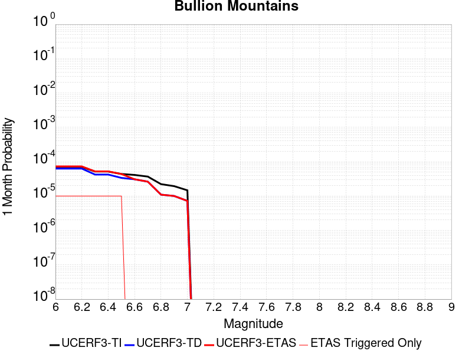 |  |  |

| Magnitude | 1 wk TI Prob | 1 wk TD Prob | 1 wk ETAS Prob | 1 wk ETAS/TD Gain | 1 wk ETAS Triggered Only | 1 mo TI Prob | 1 mo TD Prob | 1 mo ETAS Prob | 1 mo ETAS/TD Gain | 1 mo ETAS Triggered Only | 1 yr TI Prob | 1 yr TD Prob | 1 yr ETAS Prob | 1 yr ETAS/TD Gain | 1 yr ETAS Triggered Only | 10 yr TI Prob | 10 yr TD Prob | 10 yr ETAS Prob | 10 yr ETAS/TD Gain | 10 yr ETAS Triggered Only |
|-----|-----|-----|-----|-----|-----|-----|-----|-----|-----|-----|-----|-----|-----|-----|-----|-----|-----|-----|-----|-----|
| 6.0 | 1.6420427E-5 | 1.4692089E-5 | 1.4692089E-5 | 1.0 | 0.0 | 7.037136E-5 | 6.296479E-5 | 6.296479E-5 | 1.0 | 0.0 | 8.5643446E-4 | 7.663651E-4 | 7.663651E-4 | 1.0 | 0.0 | 0.008531413 | 0.007641016 | 0.00769129 | 1.0065795 | 5.066113E-5 |
| 6.1 | 1.6420427E-5 | 1.4692089E-5 | 1.4692089E-5 | 1.0 | 0.0 | 7.037136E-5 | 6.296479E-5 | 6.296479E-5 | 1.0 | 0.0 | 8.5643446E-4 | 7.663651E-4 | 7.663651E-4 | 1.0 | 0.0 | 0.008531413 | 0.007641016 | 0.00769129 | 1.0065795 | 5.066113E-5 |
| 6.2 | 1.6420427E-5 | 1.4692089E-5 | 1.4692089E-5 | 1.0 | 0.0 | 7.037136E-5 | 6.296479E-5 | 6.296479E-5 | 1.0 | 0.0 | 8.5643446E-4 | 7.663651E-4 | 7.663651E-4 | 1.0 | 0.0 | 0.008531413 | 0.007641016 | 0.00769129 | 1.0065795 | 5.066113E-5 |
| 6.3 | 1.2046778E-5 | 9.862335E-6 | 9.862335E-6 | 1.0 | 0.0 | 5.1628023E-5 | 4.2266598E-5 | 4.2266598E-5 | 1.0 | 0.0 | 6.283899E-4 | 5.144975E-4 | 5.144975E-4 | 1.0 | 0.0 | 0.0062661595 | 0.005135345 | 0.0051689455 | 1.006543 | 3.3774086E-5 |
| 6.4 | 1.2046778E-5 | 9.862335E-6 | 9.862335E-6 | 1.0 | 0.0 | 5.1628023E-5 | 4.2266598E-5 | 4.2266598E-5 | 1.0 | 0.0 | 6.283899E-4 | 5.144975E-4 | 5.144975E-4 | 1.0 | 0.0 | 0.0062661595 | 0.005135345 | 0.0051689455 | 1.006543 | 3.3774086E-5 |
| 6.5 | 1.0244343E-5 | 7.879458E-6 | 7.879458E-6 | 1.0 | 0.0 | 4.390359E-5 | 3.3768785E-5 | 3.3768785E-5 | 1.0 | 0.0 | 5.343951E-4 | 4.110781E-4 | 4.110781E-4 | 1.0 | 0.0 | 0.005331118 | 0.004105208 | 0.0041388436 | 1.0081934 | 3.3774086E-5 |
| 6.6 | 9.605408E-6 | 7.1774966E-6 | 7.1774966E-6 | 1.0 | 0.0 | 4.1165385E-5 | 3.076045E-5 | 3.076045E-5 | 1.0 | 0.0 | 5.010733E-4 | 3.744645E-4 | 3.744645E-4 | 1.0 | 0.0 | 0.00499945 | 0.003740332 | 0.0037739798 | 1.0089959 | 3.3774086E-5 |
| 6.7 | 8.60418E-6 | 6.1240044E-6 | 6.1240044E-6 | 1.0 | 0.0 | 3.687454E-5 | 2.624558E-5 | 2.624558E-5 | 1.0 | 0.0 | 4.48855E-4 | 3.1951256E-4 | 3.1951256E-4 | 1.0 | 0.0 | 0.004479495 | 0.0031924439 | 0.00322611 | 1.0105456 | 3.3774086E-5 |
| 6.8 | 5.187994E-6 | 2.5631666E-6 | 2.5631666E-6 | 1.0 | 0.0 | 2.223407E-5 | 1.0984976E-5 | 1.0984976E-5 | 1.0 | 0.0 | 2.7066618E-4 | 1.3373788E-4 | 1.3373788E-4 | 1.0 | 0.0 | 0.0027033675 | 0.0013369655 | 0.0013706944 | 1.025228 | 3.3774086E-5 |
| 6.9 | 4.5302368E-6 | 2.3443165E-6 | 2.3443165E-6 | 1.0 | 0.0 | 1.9415156E-5 | 1.0047055E-5 | 1.0047055E-5 | 1.0 | 0.0 | 2.3635388E-4 | 1.2232E-4 | 1.2232E-4 | 1.0 | 0.0 | 0.0023610266 | 0.0012229157 | 0.0012566486 | 1.0275838 | 3.3774086E-5 |
| 7.0 | 3.431668E-6 | 1.6882402E-6 | 1.6882402E-6 | 1.0 | 0.0 | 1.4707065E-5 | 7.235315E-6 | 7.235315E-6 | 1.0 | 0.0 | 1.7904381E-4 | 8.808996E-5 | 8.808996E-5 | 1.0 | 0.0 | 0.0017889962 | 8.808996E-4 | 8.977718E-4 | 1.0191534 | 1.6887043E-5 |

## Ventura-Pitas Point
*[(top)](#table-of-contents)*

| 1 Week | 1 Month | 1 Year | 10 Year |
|-----|-----|-----|-----|
|  |  |  |  |

| Magnitude | 1 wk TI Prob | 1 wk TD Prob | 1 wk ETAS Prob | 1 wk ETAS/TD Gain | 1 wk ETAS Triggered Only | 1 mo TI Prob | 1 mo TD Prob | 1 mo ETAS Prob | 1 mo ETAS/TD Gain | 1 mo ETAS Triggered Only | 1 yr TI Prob | 1 yr TD Prob | 1 yr ETAS Prob | 1 yr ETAS/TD Gain | 1 yr ETAS Triggered Only | 10 yr TI Prob | 10 yr TD Prob | 10 yr ETAS Prob | 10 yr ETAS/TD Gain | 10 yr ETAS Triggered Only |
|-----|-----|-----|-----|-----|-----|-----|-----|-----|-----|-----|-----|-----|-----|-----|-----|-----|-----|-----|-----|-----|
| 6.0 | 3.3179622E-5 | 3.3735185E-5 | 5.0621657E-5 | 1.5005597 | 1.6887043E-5 | 1.4219063E-4 | 1.445728E-4 | 1.78342E-4 | 1.2335793 | 3.3774086E-5 | 0.0017297962 | 0.0017590096 | 0.0018095816 | 1.0287503 | 5.066113E-5 | 0.017163932 | 0.0174764 | 0.017526176 | 1.0028481 | 5.066113E-5 |
| 6.1 | 3.3179622E-5 | 3.3735185E-5 | 5.0621657E-5 | 1.5005597 | 1.6887043E-5 | 1.4219063E-4 | 1.445728E-4 | 1.78342E-4 | 1.2335793 | 3.3774086E-5 | 0.0017297962 | 0.0017590096 | 0.0018095816 | 1.0287503 | 5.066113E-5 | 0.017163932 | 0.0174764 | 0.017526176 | 1.0028481 | 5.066113E-5 |
| 6.2 | 3.3179622E-5 | 3.3735185E-5 | 5.0621657E-5 | 1.5005597 | 1.6887043E-5 | 1.4219063E-4 | 1.445728E-4 | 1.78342E-4 | 1.2335793 | 3.3774086E-5 | 0.0017297962 | 0.0017590096 | 0.0018095816 | 1.0287503 | 5.066113E-5 | 0.017163932 | 0.0174764 | 0.017526176 | 1.0028481 | 5.066113E-5 |
| 6.3 | 3.3179622E-5 | 3.3735185E-5 | 5.0621657E-5 | 1.5005597 | 1.6887043E-5 | 1.4219063E-4 | 1.445728E-4 | 1.78342E-4 | 1.2335793 | 3.3774086E-5 | 0.0017297962 | 0.0017590096 | 0.0018095816 | 1.0287503 | 5.066113E-5 | 0.017163932 | 0.0174764 | 0.017526176 | 1.0028481 | 5.066113E-5 |
| 6.4 | 1.8754668E-5 | 1.701961E-5 | 1.701961E-5 | 1.0 | 0.0 | 8.037467E-5 | 7.293928E-5 | 7.293928E-5 | 1.0 | 0.0 | 9.781223E-4 | 8.8769704E-4 | 9.0456905E-4 | 1.0190065 | 1.6887043E-5 | 0.009738282 | 0.008843848 | 0.008860585 | 1.0018926 | 1.6887043E-5 |
| 6.5 | 1.8754668E-5 | 1.701961E-5 | 1.701961E-5 | 1.0 | 0.0 | 8.037467E-5 | 7.293928E-5 | 7.293928E-5 | 1.0 | 0.0 | 9.781223E-4 | 8.8769704E-4 | 9.0456905E-4 | 1.0190065 | 1.6887043E-5 | 0.009738282 | 0.008843848 | 0.008860585 | 1.0018926 | 1.6887043E-5 |
| 6.6 | 1.4361558E-5 | 1.2122275E-5 | 1.2122275E-5 | 1.0 | 0.0 | 6.154808E-5 | 5.1951585E-5 | 5.1951585E-5 | 1.0 | 0.0 | 7.490902E-4 | 6.3232926E-4 | 6.4920564E-4 | 1.0266892 | 1.6887043E-5 | 0.0074657016 | 0.0063055577 | 0.0063223382 | 1.0026612 | 1.6887043E-5 |
| 6.7 | 1.4361558E-5 | 1.2122275E-5 | 1.2122275E-5 | 1.0 | 0.0 | 6.154808E-5 | 5.1951585E-5 | 5.1951585E-5 | 1.0 | 0.0 | 7.490902E-4 | 6.3232926E-4 | 6.4920564E-4 | 1.0266892 | 1.6887043E-5 | 0.0074657016 | 0.0063055577 | 0.0063223382 | 1.0026612 | 1.6887043E-5 |
| 6.8 | 1.3663846E-5 | 1.13444175E-5 | 1.13444175E-5 | 1.0 | 0.0 | 5.8558027E-5 | 4.861804E-5 | 4.861804E-5 | 1.0 | 0.0 | 7.127108E-4 | 5.917658E-4 | 6.086428E-4 | 1.0285199 | 1.6887043E-5 | 0.007104293 | 0.005902116 | 0.0059189033 | 1.0028443 | 1.6887043E-5 |
| 6.9 | 1.3644157E-5 | 1.1322519E-5 | 1.1322519E-5 | 1.0 | 0.0 | 5.8473648E-5 | 4.8524187E-5 | 4.8524187E-5 | 1.0 | 0.0 | 7.116841E-4 | 5.9062376E-4 | 6.0750084E-4 | 1.028575 | 1.6887043E-5 | 0.007094092 | 0.0058907564 | 0.005907544 | 1.0028498 | 1.6887043E-5 |
| 7.0 | 1.3568845E-5 | 1.1242086E-5 | 1.1242086E-5 | 1.0 | 0.0 | 5.8150898E-5 | 4.817949E-5 | 4.817949E-5 | 1.0 | 0.0 | 7.077572E-4 | 5.864293E-4 | 6.0330646E-4 | 1.0287795 | 1.6887043E-5 | 0.007055073 | 0.0058490336 | 0.0058658216 | 1.0028703 | 1.6887043E-5 |
| 7.1 | 1.306572E-5 | 1.072054E-5 | 1.072054E-5 | 1.0 | 0.0 | 5.599474E-5 | 4.5944373E-5 | 4.5944373E-5 | 1.0 | 0.0 | 6.815227E-4 | 5.5923103E-4 | 5.7610864E-4 | 1.03018 | 1.6887043E-5 | 0.0067943637 | 0.0055784425 | 0.005595235 | 1.0030103 | 1.6887043E-5 |
| 7.2 | 1.232604E-5 | 9.995143E-6 | 9.995143E-6 | 1.0 | 0.0 | 5.2824813E-5 | 4.2835632E-5 | 4.2835632E-5 | 1.0 | 0.0 | 6.429523E-4 | 5.214008E-4 | 5.3827907E-4 | 1.0323709 | 1.6887043E-5 | 0.0064109527 | 0.005201967 | 0.005218766 | 1.0032294 | 1.6887043E-5 |
| 7.3 | 1.0917261E-5 | 8.84384E-6 | 8.84384E-6 | 1.0 | 0.0 | 4.678742E-5 | 3.790163E-5 | 3.790163E-5 | 1.0 | 0.0 | 5.69488E-4 | 4.6135622E-4 | 4.7823545E-4 | 1.0365862 | 1.6887043E-5 | 0.0056803077 | 0.00460415 | 0.0046209595 | 1.0036509 | 1.6887043E-5 |
| 7.4 | 1.039959E-5 | 8.423562E-6 | 8.423562E-6 | 1.0 | 0.0 | 4.456891E-5 | 3.610049E-5 | 3.610049E-5 | 1.0 | 0.0 | 5.424914E-4 | 4.3943635E-4 | 4.5631596E-4 | 1.038412 | 1.6887043E-5 | 0.0054116896 | 0.004385836 | 0.0044026487 | 1.0038334 | 1.6887043E-5 |
| 7.5 | 9.015877E-6 | 7.2975445E-6 | 7.2975445E-6 | 1.0 | 0.0 | 3.86389E-5 | 3.1274823E-5 | 3.1274823E-5 | 1.0 | 0.0 | 4.7032707E-4 | 3.8070587E-4 | 3.9758647E-4 | 1.0443403 | 1.6887043E-5 | 0.004693329 | 0.0038006818 | 0.0038175047 | 1.0044262 | 1.6887043E-5 |
| 7.6 | 4.900162E-6 | 3.8741155E-6 | 3.8741155E-6 | 1.0 | 0.0 | 2.1000526E-5 | 1.6603248E-5 | 1.6603248E-5 | 1.0 | 0.0 | 2.556514E-4 | 2.0212591E-4 | 2.1900954E-4 | 1.0835303 | 1.6887043E-5 | 0.0025535747 | 0.0020194345 | 0.0020362874 | 1.0083454 | 1.6887043E-5 |
| 7.7 | 3.8850626E-6 | 3.1267302E-6 | 3.1267302E-6 | 1.0 | 0.0 | 1.6650163E-5 | 1.3400205E-5 | 1.3400205E-5 | 1.0 | 0.0 | 2.0269687E-4 | 1.6313537E-4 | 1.8001965E-4 | 1.1034986 | 1.6887043E-5 | 0.002025121 | 0.0016301654 | 0.0016470249 | 1.0103422 | 1.6887043E-5 |
| 7.8 | 2.4654719E-6 | 2.029875E-6 | 2.029875E-6 | 1.0 | 0.0 | 1.0566265E-5 | 8.699436E-6 | 8.699436E-6 | 1.0 | 0.0 | 1.2863669E-4 | 1.0591053E-4 | 1.0591053E-4 | 1.0 | 0.0 | 0.0012856225 | 0.0010586053 | 0.0010586053 | 1.0 | 0.0 |
| 7.9 | 4.095894E-7 | 3.2764765E-7 | 3.2764765E-7 | 1.0 | 0.0 | 1.7553821E-6 | 1.4042034E-6 | 1.4042034E-6 | 1.0 | 0.0 | 2.1371567E-5 | 1.7096047E-5 | 1.7096047E-5 | 1.0 | 0.0 | 2.1369511E-4 | 1.7094762E-4 | 1.7094762E-4 | 1.0 | 0.0 |
| 8.0 | 7.791402E-9 | 5.683497E-9 | 5.683497E-9 | 1.0 | 0.0 | 3.3391725E-8 | 2.4357844E-8 | 2.4357844E-8 | 1.0 | 0.0 | 4.0654416E-7 | 2.9655675E-7 | 2.9655675E-7 | 1.0 | 0.0 | 4.065434E-6 | 2.9655655E-6 | 2.9655655E-6 | 1.0 | 0.0 |

## Earthquake Valley (So Extension)
*[(top)](#table-of-contents)*

| 1 Week | 1 Month | 1 Year | 10 Year |
|-----|-----|-----|-----|
|  | 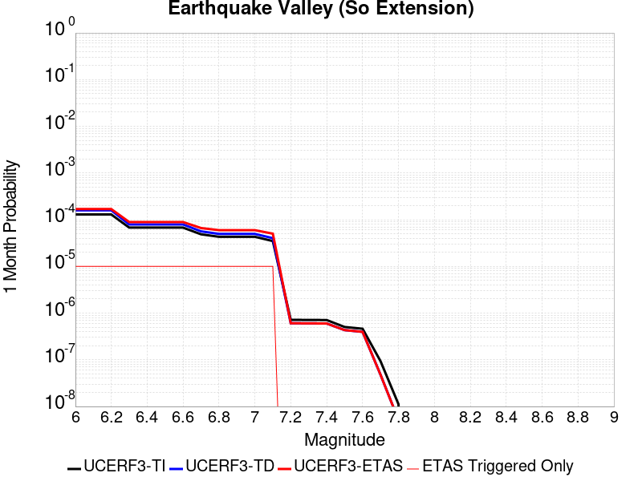 |  | 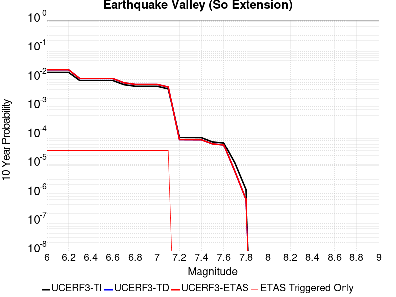 |

| Magnitude | 1 wk TI Prob | 1 wk TD Prob | 1 wk ETAS Prob | 1 wk ETAS/TD Gain | 1 wk ETAS Triggered Only | 1 mo TI Prob | 1 mo TD Prob | 1 mo ETAS Prob | 1 mo ETAS/TD Gain | 1 mo ETAS Triggered Only | 1 yr TI Prob | 1 yr TD Prob | 1 yr ETAS Prob | 1 yr ETAS/TD Gain | 1 yr ETAS Triggered Only | 10 yr TI Prob | 10 yr TD Prob | 10 yr ETAS Prob | 10 yr ETAS/TD Gain | 10 yr ETAS Triggered Only |
|-----|-----|-----|-----|-----|-----|-----|-----|-----|-----|-----|-----|-----|-----|-----|-----|-----|-----|-----|-----|-----|
| 6.0 | 3.0194888E-5 | 3.7072114E-5 | 3.7072114E-5 | 1.0 | 0.0 | 1.2940024E-4 | 1.5887388E-4 | 1.7575824E-4 | 1.1062752 | 1.6887043E-5 | 0.0015743093 | 0.0019331174 | 0.0019668262 | 1.0174376 | 3.3774086E-5 | 0.01563203 | 0.019213019 | 0.019246144 | 1.0017241 | 3.3774086E-5 |
| 6.1 | 3.0194888E-5 | 3.7072114E-5 | 3.7072114E-5 | 1.0 | 0.0 | 1.2940024E-4 | 1.5887388E-4 | 1.7575824E-4 | 1.1062752 | 1.6887043E-5 | 0.0015743093 | 0.0019331174 | 0.0019668262 | 1.0174376 | 3.3774086E-5 | 0.01563203 | 0.019213019 | 0.019246144 | 1.0017241 | 3.3774086E-5 |
| 6.2 | 3.0194888E-5 | 3.7072114E-5 | 3.7072114E-5 | 1.0 | 0.0 | 1.2940024E-4 | 1.5887388E-4 | 1.7575824E-4 | 1.1062752 | 1.6887043E-5 | 0.0015743093 | 0.0019331174 | 0.0019668262 | 1.0174376 | 3.3774086E-5 | 0.01563203 | 0.019213019 | 0.019246144 | 1.0017241 | 3.3774086E-5 |
| 6.3 | 1.5795305E-5 | 1.844658E-5 | 1.844658E-5 | 1.0 | 0.0 | 6.769241E-5 | 7.9055004E-5 | 9.594071E-5 | 1.2135944 | 1.6887043E-5 | 8.238434E-4 | 9.6218096E-4 | 9.959226E-4 | 1.0350678 | 3.3774086E-5 | 0.008207959 | 0.009591061 | 0.009624511 | 1.0034876 | 3.3774086E-5 |
| 6.4 | 1.5795305E-5 | 1.844658E-5 | 1.844658E-5 | 1.0 | 0.0 | 6.769241E-5 | 7.9055004E-5 | 9.594071E-5 | 1.2135944 | 1.6887043E-5 | 8.238434E-4 | 9.6218096E-4 | 9.959226E-4 | 1.0350678 | 3.3774086E-5 | 0.008207959 | 0.009591061 | 0.009624511 | 1.0034876 | 3.3774086E-5 |
| 6.5 | 1.5795305E-5 | 1.844658E-5 | 1.844658E-5 | 1.0 | 0.0 | 6.769241E-5 | 7.9055004E-5 | 9.594071E-5 | 1.2135944 | 1.6887043E-5 | 8.238434E-4 | 9.6218096E-4 | 9.959226E-4 | 1.0350678 | 3.3774086E-5 | 0.008207959 | 0.009591061 | 0.009624511 | 1.0034876 | 3.3774086E-5 |
| 6.6 | 1.5795305E-5 | 1.844658E-5 | 1.844658E-5 | 1.0 | 0.0 | 6.769241E-5 | 7.9055004E-5 | 9.594071E-5 | 1.2135944 | 1.6887043E-5 | 8.238434E-4 | 9.6218096E-4 | 9.959226E-4 | 1.0350678 | 3.3774086E-5 | 0.008207959 | 0.009591061 | 0.009624511 | 1.0034876 | 3.3774086E-5 |
| 6.7 | 1.1363076E-5 | 1.3138294E-5 | 1.3138294E-5 | 1.0 | 0.0 | 4.8697988E-5 | 5.6306188E-5 | 7.319228E-5 | 1.2998977 | 1.6887043E-5 | 5.927367E-4 | 6.8538834E-4 | 7.191393E-4 | 1.0492436 | 3.3774086E-5 | 0.0059115817 | 0.0068402183 | 0.0068737613 | 1.0049038 | 3.3774086E-5 |
| 6.8 | 1.0049611E-5 | 1.1594334E-5 | 1.1594334E-5 | 1.0 | 0.0 | 4.306905E-5 | 4.9689468E-5 | 6.6575674E-5 | 1.3398347 | 1.6887043E-5 | 5.242395E-4 | 6.048745E-4 | 6.3862815E-4 | 1.0558027 | 3.3774086E-5 | 0.0052300454 | 0.006039458 | 0.0060730283 | 1.0055585 | 3.3774086E-5 |
| 6.9 | 1.0049611E-5 | 1.1594334E-5 | 1.1594334E-5 | 1.0 | 0.0 | 4.306905E-5 | 4.9689468E-5 | 6.6575674E-5 | 1.3398347 | 1.6887043E-5 | 5.242395E-4 | 6.048745E-4 | 6.3862815E-4 | 1.0558027 | 3.3774086E-5 | 0.0052300454 | 0.006039458 | 0.0060730283 | 1.0055585 | 3.3774086E-5 |
| 7.0 | 1.0049611E-5 | 1.1594334E-5 | 1.1594334E-5 | 1.0 | 0.0 | 4.306905E-5 | 4.9689468E-5 | 6.6575674E-5 | 1.3398347 | 1.6887043E-5 | 5.242395E-4 | 6.048745E-4 | 6.3862815E-4 | 1.0558027 | 3.3774086E-5 | 0.0052300454 | 0.006039458 | 0.0060730283 | 1.0055585 | 3.3774086E-5 |
| 7.1 | 8.140254E-6 | 9.383458E-6 | 9.383458E-6 | 1.0 | 0.0 | 3.4886336E-5 | 4.0214578E-5 | 5.710094E-5 | 1.4199065 | 1.6887043E-5 | 4.2465836E-4 | 4.8956956E-4 | 5.233271E-4 | 1.0689535 | 3.3774086E-5 | 0.0042384774 | 0.0048914864 | 0.0049250955 | 1.0068709 | 3.3774086E-5 |
| 7.2 | 1.673835E-7 | 1.4154125E-7 | 1.4154125E-7 | 1.0 | 0.0 | 7.173577E-7 | 6.066052E-7 | 6.066052E-7 | 1.0 | 0.0 | 8.733795E-6 | 7.385397E-6 | 7.385397E-6 | 1.0 | 0.0 | 8.733451E-5 | 7.385187E-5 | 7.385187E-5 | 1.0 | 0.0 |
| 7.3 | 1.6632116E-7 | 1.4052354E-7 | 1.4052354E-7 | 1.0 | 0.0 | 7.1280476E-7 | 6.0224363E-7 | 6.0224363E-7 | 1.0 | 0.0 | 8.678364E-6 | 7.332295E-6 | 7.332295E-6 | 1.0 | 0.0 | 8.6780245E-5 | 7.332089E-5 | 7.332089E-5 | 1.0 | 0.0 |
| 7.4 | 1.6569169E-7 | 1.3996983E-7 | 1.3996983E-7 | 1.0 | 0.0 | 7.1010703E-7 | 5.9987053E-7 | 5.9987053E-7 | 1.0 | 0.0 | 8.645519E-6 | 7.303403E-6 | 7.303403E-6 | 1.0 | 0.0 | 8.645182E-5 | 7.303199E-5 | 7.303199E-5 | 1.0 | 0.0 |
| 7.5 | 1.1764555E-7 | 1.0095917E-7 | 1.0095917E-7 | 1.0 | 0.0 | 5.041951E-7 | 4.326821E-7 | 4.326821E-7 | 1.0 | 0.0 | 6.138558E-6 | 5.267894E-6 | 5.267894E-6 | 1.0 | 0.0 | 6.1383886E-5 | 5.2677904E-5 | 5.2677904E-5 | 1.0 | 0.0 |
| 7.6 | 1.07927605E-7 | 9.260736E-8 | 9.260736E-8 | 1.0 | 0.0 | 4.6254678E-7 | 3.9688865E-7 | 3.9688865E-7 | 1.0 | 0.0 | 5.6314925E-6 | 4.832111E-6 | 4.832111E-6 | 1.0 | 0.0 | 5.63135E-5 | 4.8320264E-5 | 4.8320264E-5 | 1.0 | 0.0 |
| 7.7 | 2.1826905E-8 | 1.1180516E-8 | 1.1180516E-8 | 1.0 | 0.0 | 9.3543875E-8 | 4.7916494E-8 | 4.7916494E-8 | 1.0 | 0.0 | 1.1388961E-6 | 5.833832E-7 | 5.833832E-7 | 1.0 | 0.0 | 1.1388902E-5 | 5.8338223E-6 | 5.8338223E-6 | 1.0 | 0.0 |
| 7.8 | 2.6169649E-9 | 1.1969472E-9 | 1.1969472E-9 | 1.0 | 0.0 | 1.1215564E-8 | 5.1297735E-9 | 5.1297735E-9 | 1.0 | 0.0 | 1.3654947E-7 | 6.2454994E-8 | 6.2454994E-8 | 1.0 | 0.0 | 1.365494E-6 | 6.245499E-7 | 6.245499E-7 | 1.0 | 0.0 |

## Palos Verdes
*[(top)](#table-of-contents)*

| 1 Week | 1 Month | 1 Year | 10 Year |
|-----|-----|-----|-----|
|  |  |  |  |

| Magnitude | 1 wk TI Prob | 1 wk TD Prob | 1 wk ETAS Prob | 1 wk ETAS/TD Gain | 1 wk ETAS Triggered Only | 1 mo TI Prob | 1 mo TD Prob | 1 mo ETAS Prob | 1 mo ETAS/TD Gain | 1 mo ETAS Triggered Only | 1 yr TI Prob | 1 yr TD Prob | 1 yr ETAS Prob | 1 yr ETAS/TD Gain | 1 yr ETAS Triggered Only | 10 yr TI Prob | 10 yr TD Prob | 10 yr ETAS Prob | 10 yr ETAS/TD Gain | 10 yr ETAS Triggered Only |
|-----|-----|-----|-----|-----|-----|-----|-----|-----|-----|-----|-----|-----|-----|-----|-----|-----|-----|-----|-----|-----|
| 6.0 | 6.126063E-5 | 7.622612E-5 | 7.622612E-5 | 1.0 | 0.0 | 2.6251914E-4 | 3.2664582E-4 | 3.2664582E-4 | 1.0 | 0.0 | 0.0031914865 | 0.003970174 | 0.0039869943 | 1.0042366 | 1.6887043E-5 | 0.031460393 | 0.039048895 | 0.03909758 | 1.0012467 | 5.066113E-5 |
| 6.1 | 6.126063E-5 | 7.622612E-5 | 7.622612E-5 | 1.0 | 0.0 | 2.6251914E-4 | 3.2664582E-4 | 3.2664582E-4 | 1.0 | 0.0 | 0.0031914865 | 0.003970174 | 0.0039869943 | 1.0042366 | 1.6887043E-5 | 0.031460393 | 0.039048895 | 0.03909758 | 1.0012467 | 5.066113E-5 |
| 6.2 | 6.126063E-5 | 7.622612E-5 | 7.622612E-5 | 1.0 | 0.0 | 2.6251914E-4 | 3.2664582E-4 | 3.2664582E-4 | 1.0 | 0.0 | 0.0031914865 | 0.003970174 | 0.0039869943 | 1.0042366 | 1.6887043E-5 | 0.031460393 | 0.039048895 | 0.03909758 | 1.0012467 | 5.066113E-5 |
| 6.3 | 4.0838047E-5 | 4.9749437E-5 | 4.9749437E-5 | 1.0 | 0.0 | 1.7500846E-4 | 2.1319572E-4 | 2.1319572E-4 | 1.0 | 0.0 | 0.0021286458 | 0.0025927818 | 0.0025927818 | 1.0 | 0.0 | 0.021083709 | 0.025646681 | 0.025663136 | 1.0006416 | 1.6887043E-5 |
| 6.4 | 4.0838047E-5 | 4.9749437E-5 | 4.9749437E-5 | 1.0 | 0.0 | 1.7500846E-4 | 2.1319572E-4 | 2.1319572E-4 | 1.0 | 0.0 | 0.0021286458 | 0.0025927818 | 0.0025927818 | 1.0 | 0.0 | 0.021083709 | 0.025646681 | 0.025663136 | 1.0006416 | 1.6887043E-5 |
| 6.5 | 3.0512005E-5 | 3.656162E-5 | 3.656162E-5 | 1.0 | 0.0 | 1.3075917E-4 | 1.5668393E-4 | 1.5668393E-4 | 1.0 | 0.0 | 0.0015908304 | 0.0019060767 | 0.0019060767 | 1.0 | 0.0 | 0.015794903 | 0.018909154 | 0.01892572 | 1.0008762 | 1.6887043E-5 |
| 6.6 | 2.9255087E-5 | 3.515442E-5 | 3.515442E-5 | 1.0 | 0.0 | 1.2537291E-4 | 1.5065377E-4 | 1.5065377E-4 | 1.0 | 0.0 | 0.0015253464 | 0.0018327828 | 0.0018327828 | 1.0 | 0.0 | 0.015149189 | 0.018188225 | 0.018204805 | 1.0009116 | 1.6887043E-5 |
| 6.7 | 2.287198E-5 | 2.7248278E-5 | 2.7248278E-5 | 1.0 | 0.0 | 9.801909E-5 | 1.16773626E-4 | 1.16773626E-4 | 1.0 | 0.0 | 0.001192729 | 0.0014208833 | 0.0014208833 | 1.0 | 0.0 | 0.011863477 | 0.014127217 | 0.014127217 | 1.0 | 0.0 |
| 6.8 | 2.1325764E-5 | 2.5431877E-5 | 2.5431877E-5 | 1.0 | 0.0 | 9.139293E-5 | 1.0898971E-4 | 1.0898971E-4 | 1.0 | 0.0 | 0.001112141 | 0.0013262323 | 0.0013262323 | 1.0 | 0.0 | 0.011065915 | 0.013192211 | 0.013192211 | 1.0 | 0.0 |
| 6.9 | 1.9009392E-5 | 2.2613547E-5 | 2.2613547E-5 | 1.0 | 0.0 | 8.1466285E-5 | 9.6912096E-5 | 9.6912096E-5 | 1.0 | 0.0 | 9.914007E-4 | 0.0011793535 | 0.0011793535 | 1.0 | 0.0 | 0.009869894 | 0.011739632 | 0.011739632 | 1.0 | 0.0 |
| 7.0 | 1.7098473E-5 | 2.0319356E-5 | 2.0319356E-5 | 1.0 | 0.0 | 7.3277115E-5 | 8.708052E-5 | 8.708052E-5 | 1.0 | 0.0 | 8.917837E-4 | 0.001059775 | 0.001059775 | 1.0 | 0.0 | 0.008882134 | 0.010555646 | 0.010555646 | 1.0 | 0.0 |
| 7.1 | 1.5982785E-5 | 1.899476E-5 | 1.899476E-5 | 1.0 | 0.0 | 6.849585E-5 | 8.1404054E-5 | 8.1404054E-5 | 1.0 | 0.0 | 8.336179E-4 | 9.907284E-4 | 9.907284E-4 | 1.0 | 0.0 | 0.008304977 | 0.009871479 | 0.009871479 | 1.0 | 0.0 |
| 7.2 | 1.4468002E-5 | 1.7197237E-5 | 1.7197237E-5 | 1.0 | 0.0 | 6.200425E-5 | 7.370083E-5 | 7.370083E-5 | 1.0 | 0.0 | 7.546402E-4 | 8.970222E-4 | 8.970222E-4 | 1.0 | 0.0 | 0.007520827 | 0.008942284 | 0.008942284 | 1.0 | 0.0 |
| 7.3 | 5.288233E-6 | 6.2036747E-6 | 6.2036747E-6 | 1.0 | 0.0 | 2.2663658E-5 | 2.6587102E-5 | 2.6587102E-5 | 1.0 | 0.0 | 2.7589512E-4 | 3.236848E-4 | 3.236848E-4 | 1.0 | 0.0 | 0.0027555283 | 0.0032355562 | 0.0032355562 | 1.0 | 0.0 |
| 7.4 | 8.279556E-7 | 8.408347E-7 | 8.408347E-7 | 1.0 | 0.0 | 3.5483763E-6 | 3.6035726E-6 | 3.6035726E-6 | 1.0 | 0.0 | 4.3200624E-5 | 4.3872686E-5 | 4.3872686E-5 | 1.0 | 0.0 | 4.3192226E-4 | 4.3864746E-4 | 4.3864746E-4 | 1.0 | 0.0 |
| 7.5 | 6.559831E-7 | 6.667229E-7 | 6.667229E-7 | 1.0 | 0.0 | 2.8113532E-6 | 2.857381E-6 | 2.857381E-6 | 1.0 | 0.0 | 3.4227687E-5 | 3.4788125E-5 | 3.4788125E-5 | 1.0 | 0.0 | 3.4222414E-4 | 3.4783344E-4 | 3.4783344E-4 | 1.0 | 0.0 |
| 7.6 | 3.5018968E-7 | 3.5620027E-7 | 3.5620027E-7 | 1.0 | 0.0 | 1.500812E-6 | 1.526572E-6 | 1.526572E-6 | 1.0 | 0.0 | 1.8272232E-5 | 1.8585903E-5 | 1.8585903E-5 | 1.0 | 0.0 | 1.8270731E-4 | 1.8584808E-4 | 1.8584808E-4 | 1.0 | 0.0 |
| 7.7 | 1.1986104E-7 | 1.2198376E-7 | 1.2198376E-7 | 1.0 | 0.0 | 5.1369005E-7 | 5.2278745E-7 | 5.2278745E-7 | 1.0 | 0.0 | 6.2541585E-6 | 6.364919E-6 | 6.364919E-6 | 1.0 | 0.0 | 6.2539824E-5 | 6.364741E-5 | 6.364741E-5 | 1.0 | 0.0 |
| 7.8 | 3.0445005E-8 | 3.1027582E-8 | 3.1027582E-8 | 1.0 | 0.0 | 1.3047858E-7 | 1.3297536E-7 | 1.3297536E-7 | 1.0 | 0.0 | 1.5885756E-6 | 1.6189739E-6 | 1.6189739E-6 | 1.0 | 0.0 | 1.5885644E-5 | 1.6189642E-5 | 1.6189642E-5 | 1.0 | 0.0 |

## Raymond
*[(top)](#table-of-contents)*

| 1 Week | 1 Month | 1 Year | 10 Year |
|-----|-----|-----|-----|
|  | 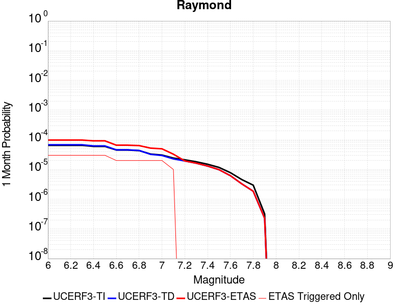 |  |  |

| Magnitude | 1 wk TI Prob | 1 wk TD Prob | 1 wk ETAS Prob | 1 wk ETAS/TD Gain | 1 wk ETAS Triggered Only | 1 mo TI Prob | 1 mo TD Prob | 1 mo ETAS Prob | 1 mo ETAS/TD Gain | 1 mo ETAS Triggered Only | 1 yr TI Prob | 1 yr TD Prob | 1 yr ETAS Prob | 1 yr ETAS/TD Gain | 1 yr ETAS Triggered Only | 10 yr TI Prob | 10 yr TD Prob | 10 yr ETAS Prob | 10 yr ETAS/TD Gain | 10 yr ETAS Triggered Only |
|-----|-----|-----|-----|-----|-----|-----|-----|-----|-----|-----|-----|-----|-----|-----|-----|-----|-----|-----|-----|-----|
| 6.0 | 1.5157413E-5 | 1.5810128E-5 | 3.2696902E-5 | 2.0680985 | 1.6887043E-5 | 6.4958724E-5 | 6.7756075E-5 | 1.0152787E-4 | 1.498432 | 3.3774086E-5 | 7.905855E-4 | 8.2464307E-4 | 8.7526237E-4 | 1.0613834 | 5.066113E-5 | 0.007877788 | 0.008218348 | 0.008268593 | 1.0061138 | 5.066113E-5 |
| 6.1 | 1.5157413E-5 | 1.5810128E-5 | 3.2696902E-5 | 2.0680985 | 1.6887043E-5 | 6.4958724E-5 | 6.7756075E-5 | 1.0152787E-4 | 1.498432 | 3.3774086E-5 | 7.905855E-4 | 8.2464307E-4 | 8.7526237E-4 | 1.0613834 | 5.066113E-5 | 0.007877788 | 0.008218348 | 0.008268593 | 1.0061138 | 5.066113E-5 |
| 6.2 | 1.5157413E-5 | 1.5810128E-5 | 3.2696902E-5 | 2.0680985 | 1.6887043E-5 | 6.4958724E-5 | 6.7756075E-5 | 1.0152787E-4 | 1.498432 | 3.3774086E-5 | 7.905855E-4 | 8.2464307E-4 | 8.7526237E-4 | 1.0613834 | 5.066113E-5 | 0.007877788 | 0.008218348 | 0.008268593 | 1.0061138 | 5.066113E-5 |
| 6.3 | 1.5157413E-5 | 1.5810128E-5 | 3.2696902E-5 | 2.0680985 | 1.6887043E-5 | 6.4958724E-5 | 6.7756075E-5 | 1.0152787E-4 | 1.498432 | 3.3774086E-5 | 7.905855E-4 | 8.2464307E-4 | 8.7526237E-4 | 1.0613834 | 5.066113E-5 | 0.007877788 | 0.008218348 | 0.008268593 | 1.0061138 | 5.066113E-5 |
| 6.4 | 1.3941944E-5 | 1.445469E-5 | 3.134149E-5 | 2.1682572 | 1.6887043E-5 | 5.9749822E-5 | 6.1947336E-5 | 9.5719326E-5 | 1.5451727 | 3.3774086E-5 | 7.2721124E-4 | 7.5397117E-4 | 8.045941E-4 | 1.0671418 | 5.066113E-5 | 0.007248361 | 0.0075164647 | 0.007566745 | 1.0066893 | 5.066113E-5 |
| 6.5 | 1.3941944E-5 | 1.445469E-5 | 3.134149E-5 | 2.1682572 | 1.6887043E-5 | 5.9749822E-5 | 6.1947336E-5 | 9.5719326E-5 | 1.5451727 | 3.3774086E-5 | 7.2721124E-4 | 7.5397117E-4 | 8.045941E-4 | 1.0671418 | 5.066113E-5 | 0.007248361 | 0.0075164647 | 0.007566745 | 1.0066893 | 5.066113E-5 |
| 6.6 | 1.0542609E-5 | 1.0671113E-5 | 2.7557975E-5 | 2.5824838 | 1.6887043E-5 | 4.5181827E-5 | 4.573257E-5 | 7.950511E-5 | 1.738479 | 3.3774086E-5 | 5.499499E-4 | 5.5665727E-4 | 6.072902E-4 | 1.0909588 | 5.066113E-5 | 0.005485909 | 0.00555319 | 0.00560357 | 1.0090722 | 5.066113E-5 |
| 6.7 | 1.0542609E-5 | 1.0671113E-5 | 2.7557975E-5 | 2.5824838 | 1.6887043E-5 | 4.5181827E-5 | 4.573257E-5 | 7.950511E-5 | 1.738479 | 3.3774086E-5 | 5.499499E-4 | 5.5665727E-4 | 6.072902E-4 | 1.0909588 | 5.066113E-5 | 0.005485909 | 0.00555319 | 0.00560357 | 1.0090722 | 5.066113E-5 |
| 6.8 | 1.0079132E-5 | 1.0176646E-5 | 2.7063517E-5 | 2.659375 | 1.6887043E-5 | 4.3195567E-5 | 4.3613498E-5 | 7.738611E-5 | 1.7743615 | 3.3774086E-5 | 5.257791E-4 | 5.3087034E-4 | 5.8150454E-4 | 1.0953797 | 5.066113E-5 | 0.0052453685 | 0.005296571 | 0.005346964 | 1.0095142 | 5.066113E-5 |
| 6.9 | 7.721598E-6 | 7.5489047E-6 | 2.443582E-5 | 3.2370021 | 1.6887043E-5 | 3.3092143E-5 | 3.2352054E-5 | 6.6125045E-5 | 2.0439212 | 3.3774086E-5 | 4.0282236E-4 | 3.9381627E-4 | 4.4445746E-4 | 1.1285908 | 5.066113E-5 | 0.0040209293 | 0.0039313175 | 0.00398178 | 1.0128359 | 5.066113E-5 |
| 7.0 | 7.137566E-6 | 6.9113057E-6 | 2.3798231E-5 | 3.443377 | 1.6887043E-5 | 3.058921E-5 | 2.961955E-5 | 6.339263E-5 | 2.1402295 | 3.3774086E-5 | 3.7236E-4 | 3.6055944E-4 | 4.112023E-4 | 1.1404563 | 5.066113E-5 | 0.0037173668 | 0.0035998628 | 0.0036503414 | 1.0140225 | 5.066113E-5 |
| 7.1 | 5.654976E-6 | 5.29954E-6 | 5.29954E-6 | 1.0 | 0.0 | 2.4235387E-5 | 2.2712118E-5 | 3.9598777E-5 | 1.7435087 | 1.6887043E-5 | 2.9502588E-4 | 2.7648517E-4 | 2.9336754E-4 | 1.0610607 | 1.6887043E-5 | 0.0029463451 | 0.002761443 | 0.0027782833 | 1.0060984 | 1.6887043E-5 |
| 7.2 | 4.9358455E-6 | 4.5266574E-6 | 4.5266574E-6 | 1.0 | 0.0 | 2.1153453E-5 | 1.9399817E-5 | 1.9399817E-5 | 1.0 | 0.0 | 2.5751285E-4 | 2.3616731E-4 | 2.3616731E-4 | 1.0 | 0.0 | 0.0025721465 | 0.0023591854 | 0.0023591854 | 1.0 | 0.0 |
| 7.3 | 4.2368597E-6 | 3.8056164E-6 | 3.8056164E-6 | 1.0 | 0.0 | 1.8157843E-5 | 1.6309683E-5 | 1.6309683E-5 | 1.0 | 0.0 | 2.2104931E-4 | 1.9855241E-4 | 1.9855241E-4 | 1.0 | 0.0 | 0.0022082955 | 0.0019837688 | 0.0019837688 | 1.0 | 0.0 |
| 7.4 | 3.4999923E-6 | 3.043744E-6 | 3.043744E-6 | 1.0 | 0.0 | 1.49998805E-5 | 1.3044552E-5 | 1.3044552E-5 | 1.0 | 0.0 | 1.8260824E-4 | 1.5880594E-4 | 1.5880594E-4 | 1.0 | 0.0 | 0.0018245826 | 0.0015869403 | 0.0015869403 | 1.0 | 0.0 |
| 7.5 | 2.738017E-6 | 2.3020468E-6 | 2.3020468E-6 | 1.0 | 0.0 | 1.1734306E-5 | 9.865878E-6 | 9.865878E-6 | 1.0 | 0.0 | 1.428558E-4 | 1.2011051E-4 | 1.2011051E-4 | 1.0 | 0.0 | 0.0014276401 | 0.0012004703 | 0.0012004703 | 1.0 | 0.0 |
| 7.6 | 1.8186392E-6 | 1.442312E-6 | 1.442312E-6 | 1.0 | 0.0 | 7.794145E-6 | 6.181323E-6 | 6.181323E-6 | 1.0 | 0.0 | 9.488958E-5 | 7.5255055E-5 | 7.5255055E-5 | 1.0 | 0.0 | 9.4849075E-4 | 7.523072E-4 | 7.523072E-4 | 1.0 | 0.0 |
| 7.7 | 1.0660348E-6 | 7.6438056E-7 | 7.6438056E-7 | 1.0 | 0.0 | 4.5687125E-6 | 3.2759126E-6 | 3.2759126E-6 | 1.0 | 0.0 | 5.5622655E-5 | 3.9883522E-5 | 3.9883522E-5 | 1.0 | 0.0 | 5.5608735E-4 | 3.9877277E-4 | 3.9877277E-4 | 1.0 | 0.0 |
| 7.8 | 6.913602E-7 | 4.3204133E-7 | 4.3204133E-7 | 1.0 | 0.0 | 2.962969E-6 | 1.8516045E-6 | 1.8516045E-6 | 1.0 | 0.0 | 3.607355E-5 | 2.2543056E-5 | 2.2543056E-5 | 1.0 | 0.0 | 3.6067693E-4 | 2.2541556E-4 | 2.2541556E-4 | 1.0 | 0.0 |
| 7.9 | 7.425201E-8 | 5.3222113E-8 | 5.3222113E-8 | 1.0 | 0.0 | 3.1822285E-7 | 2.2809476E-7 | 2.2809476E-7 | 1.0 | 0.0 | 3.874356E-6 | 2.7770516E-6 | 2.7770516E-6 | 1.0 | 0.0 | 3.8742884E-5 | 2.7770298E-5 | 2.7770298E-5 | 1.0 | 0.0 |

## Great Valley 07 (Orestimba)
*[(top)](#table-of-contents)*

| 1 Week | 1 Month | 1 Year | 10 Year |
|-----|-----|-----|-----|
|  |  |  |  |

| Magnitude | 1 wk TI Prob | 1 wk TD Prob | 1 wk ETAS Prob | 1 wk ETAS/TD Gain | 1 wk ETAS Triggered Only | 1 mo TI Prob | 1 mo TD Prob | 1 mo ETAS Prob | 1 mo ETAS/TD Gain | 1 mo ETAS Triggered Only | 1 yr TI Prob | 1 yr TD Prob | 1 yr ETAS Prob | 1 yr ETAS/TD Gain | 1 yr ETAS Triggered Only | 10 yr TI Prob | 10 yr TD Prob | 10 yr ETAS Prob | 10 yr ETAS/TD Gain | 10 yr ETAS Triggered Only |
|-----|-----|-----|-----|-----|-----|-----|-----|-----|-----|-----|-----|-----|-----|-----|-----|-----|-----|-----|-----|-----|
| 6.0 | 2.9687902E-5 | 3.27575E-5 | 3.27575E-5 | 1.0 | 0.0 | 1.2722766E-4 | 1.4038214E-4 | 1.4038214E-4 | 1.0 | 0.0 | 0.0015478961 | 0.0017078844 | 0.0017247426 | 1.0098708 | 1.6887043E-5 | 0.015371585 | 0.016955135 | 0.016988337 | 1.0019583 | 3.3774086E-5 |
| 6.1 | 2.9687902E-5 | 3.27575E-5 | 3.27575E-5 | 1.0 | 0.0 | 1.2722766E-4 | 1.4038214E-4 | 1.4038214E-4 | 1.0 | 0.0 | 0.0015478961 | 0.0017078844 | 0.0017247426 | 1.0098708 | 1.6887043E-5 | 0.015371585 | 0.016955135 | 0.016988337 | 1.0019583 | 3.3774086E-5 |
| 6.2 | 1.9231524E-5 | 2.1159167E-5 | 2.1159167E-5 | 1.0 | 0.0 | 8.2418206E-5 | 9.067912E-5 | 9.067912E-5 | 1.0 | 0.0 | 0.0010029797 | 0.0011034822 | 0.0011203507 | 1.0152866 | 1.6887043E-5 | 0.00998465 | 0.01098244 | 0.010999142 | 1.0015208 | 1.6887043E-5 |
| 6.3 | 1.324766E-5 | 1.4548534E-5 | 1.4548534E-5 | 1.0 | 0.0 | 5.6774446E-5 | 6.234942E-5 | 6.234942E-5 | 1.0 | 0.0 | 6.910097E-4 | 7.5884897E-4 | 7.757232E-4 | 1.0222366 | 1.6887043E-5 | 0.006888649 | 0.0075635235 | 0.007580283 | 1.0022159 | 1.6887043E-5 |
| 6.4 | 7.818645E-6 | 8.57284E-6 | 8.57284E-6 | 1.0 | 0.0 | 3.3508048E-5 | 3.6740246E-5 | 3.6740246E-5 | 1.0 | 0.0 | 4.078841E-4 | 4.4722404E-4 | 4.6410353E-4 | 1.0377429 | 1.6887043E-5 | 0.004071363 | 0.0044635804 | 0.004480392 | 1.0037664 | 1.6887043E-5 |
| 6.5 | 5.3076565E-6 | 5.8178007E-6 | 5.8178007E-6 | 1.0 | 0.0 | 2.27469E-5 | 2.4933206E-5 | 2.4933206E-5 | 1.0 | 0.0 | 2.7690834E-4 | 3.035216E-4 | 3.035216E-4 | 1.0 | 0.0 | 0.0027656353 | 0.00303128 | 0.00303128 | 1.0 | 0.0 |
| 6.6 | 3.6003578E-6 | 3.9484953E-6 | 3.9484953E-6 | 1.0 | 0.0 | 1.5430012E-5 | 1.6922022E-5 | 1.6922022E-5 | 1.0 | 0.0 | 1.8784421E-4 | 2.0600771E-4 | 2.0600771E-4 | 1.0 | 0.0 | 0.0018768552 | 0.0020583214 | 0.0020583214 | 1.0 | 0.0 |
| 6.7 | 2.5361826E-6 | 2.7834678E-6 | 2.7834678E-6 | 1.0 | 0.0 | 1.0869308E-5 | 1.1929101E-5 | 1.1929101E-5 | 1.0 | 0.0 | 1.3232579E-4 | 1.4522845E-4 | 1.4522845E-4 | 1.0 | 0.0 | 0.0013224703 | 0.0014514653 | 0.0014514653 | 1.0 | 0.0 |
| 6.8 | 1.2115831E-6 | 1.3313797E-6 | 1.3313797E-6 | 1.0 | 0.0 | 5.1924885E-6 | 5.7059065E-6 | 5.7059065E-6 | 1.0 | 0.0 | 6.3216714E-5 | 6.9468166E-5 | 6.9468166E-5 | 1.0 | 0.0 | 6.3198735E-4 | 6.945596E-4 | 6.945596E-4 | 1.0 | 0.0 |

## Ortigalita (South)
*[(top)](#table-of-contents)*

| 1 Week | 1 Month | 1 Year | 10 Year |
|-----|-----|-----|-----|
|  |  |  |  |

| Magnitude | 1 wk TI Prob | 1 wk TD Prob | 1 wk ETAS Prob | 1 wk ETAS/TD Gain | 1 wk ETAS Triggered Only | 1 mo TI Prob | 1 mo TD Prob | 1 mo ETAS Prob | 1 mo ETAS/TD Gain | 1 mo ETAS Triggered Only | 1 yr TI Prob | 1 yr TD Prob | 1 yr ETAS Prob | 1 yr ETAS/TD Gain | 1 yr ETAS Triggered Only | 10 yr TI Prob | 10 yr TD Prob | 10 yr ETAS Prob | 10 yr ETAS/TD Gain | 10 yr ETAS Triggered Only |
|-----|-----|-----|-----|-----|-----|-----|-----|-----|-----|-----|-----|-----|-----|-----|-----|-----|-----|-----|-----|-----|
| 6.0 | 3.72394E-5 | 4.325562E-5 | 6.014193E-5 | 1.3903842 | 1.6887043E-5 | 1.5958765E-4 | 1.8536893E-4 | 2.1913675E-4 | 1.1821655 | 3.3774086E-5 | 0.0019412481 | 0.0022546875 | 0.0022883853 | 1.0149457 | 3.3774086E-5 | 0.019243775 | 0.022334497 | 0.022367517 | 1.0014784 | 3.3774086E-5 |
| 6.1 | 2.7299884E-5 | 3.149204E-5 | 3.149204E-5 | 1.0 | 0.0 | 1.16994255E-4 | 1.3495922E-4 | 1.51844E-4 | 1.1251101 | 1.6887043E-5 | 0.0014234743 | 0.0016419457 | 0.0016588051 | 1.0102679 | 1.6887043E-5 | 0.014143906 | 0.01630407 | 0.016320681 | 1.0010189 | 1.6887043E-5 |
| 6.2 | 2.7299884E-5 | 3.149204E-5 | 3.149204E-5 | 1.0 | 0.0 | 1.16994255E-4 | 1.3495922E-4 | 1.51844E-4 | 1.1251101 | 1.6887043E-5 | 0.0014234743 | 0.0016419457 | 0.0016588051 | 1.0102679 | 1.6887043E-5 | 0.014143906 | 0.01630407 | 0.016320681 | 1.0010189 | 1.6887043E-5 |
| 6.3 | 2.0546433E-5 | 2.363145E-5 | 2.363145E-5 | 1.0 | 0.0 | 8.805317E-5 | 1.0127382E-4 | 1.1815915E-4 | 1.1667295 | 1.6887043E-5 | 0.00107152 | 0.0012323303 | 0.0012491965 | 1.0136864 | 1.6887043E-5 | 0.010663681 | 0.01225703 | 0.01227371 | 1.0013609 | 1.6887043E-5 |
| 6.4 | 2.0546433E-5 | 2.363145E-5 | 2.363145E-5 | 1.0 | 0.0 | 8.805317E-5 | 1.0127382E-4 | 1.1815915E-4 | 1.1667295 | 1.6887043E-5 | 0.00107152 | 0.0012323303 | 0.0012491965 | 1.0136864 | 1.6887043E-5 | 0.010663681 | 0.01225703 | 0.01227371 | 1.0013609 | 1.6887043E-5 |
| 6.5 | 1.7779594E-5 | 2.0446974E-5 | 2.0446974E-5 | 1.0 | 0.0 | 7.619603E-5 | 8.762702E-5 | 1.0451258E-4 | 1.1926981 | 1.6887043E-5 | 9.272918E-4 | 0.0010663504 | 0.0010832194 | 1.0158194 | 1.6887043E-5 | 0.009234319 | 0.010613803 | 0.010630511 | 1.0015742 | 1.6887043E-5 |
| 6.6 | 1.6272212E-5 | 1.8714967E-5 | 1.8714967E-5 | 1.0 | 0.0 | 6.973618E-5 | 8.0204605E-5 | 9.709029E-5 | 1.2105327 | 1.6887043E-5 | 8.487073E-4 | 9.760658E-4 | 9.929364E-4 | 1.0172843 | 1.6887043E-5 | 0.008454733 | 0.009719091 | 0.009735813 | 1.0017207 | 1.6887043E-5 |
| 6.7 | 1.3051484E-5 | 1.5038758E-5 | 1.5038758E-5 | 1.0 | 0.0 | 5.593373E-5 | 6.445028E-5 | 8.1336235E-5 | 1.2619997 | 1.6887043E-5 | 6.807804E-4 | 7.844092E-4 | 8.0128293E-4 | 1.0215114 | 1.6887043E-5 | 0.006786986 | 0.007817388 | 0.007834143 | 1.0021433 | 1.6887043E-5 |
| 6.8 | 1.04277415E-5 | 1.1987235E-5 | 1.1987235E-5 | 1.0 | 0.0 | 4.4689557E-5 | 5.1372896E-5 | 6.825907E-5 | 1.3286982 | 1.6887043E-5 | 5.439595E-4 | 6.2529295E-4 | 6.4216944E-4 | 1.0269897 | 1.6887043E-5 | 0.0054262993 | 0.00623609 | 0.0062528714 | 1.002691 | 1.6887043E-5 |
| 6.9 | 7.639968E-6 | 8.791503E-6 | 8.791503E-6 | 1.0 | 0.0 | 3.274231E-5 | 3.767736E-5 | 3.767736E-5 | 1.0 | 0.0 | 3.9856473E-4 | 4.586312E-4 | 4.586312E-4 | 1.0 | 0.0 | 0.003978506 | 0.004577433 | 0.004577433 | 1.0 | 0.0 |
| 7.0 | 3.919831E-6 | 4.5334014E-6 | 4.5334014E-6 | 1.0 | 0.0 | 1.679917E-5 | 1.942873E-5 | 1.942873E-5 | 1.0 | 0.0 | 2.045107E-4 | 2.3652123E-4 | 2.3652123E-4 | 1.0 | 0.0 | 0.0020432258 | 0.0023629034 | 0.0023629034 | 1.0 | 0.0 |
| 7.1 | 1.6017933E-6 | 1.8570418E-6 | 1.8570418E-6 | 1.0 | 0.0 | 6.8648105E-6 | 7.958732E-6 | 7.958732E-6 | 1.0 | 0.0 | 8.357586E-5 | 9.689432E-5 | 9.689432E-5 | 1.0 | 0.0 | 8.3544437E-4 | 9.686254E-4 | 9.686254E-4 | 1.0 | 0.0 |

## Laguna Salada
*[(top)](#table-of-contents)*

| 1 Week | 1 Month | 1 Year | 10 Year |
|-----|-----|-----|-----|
|  |  |  | 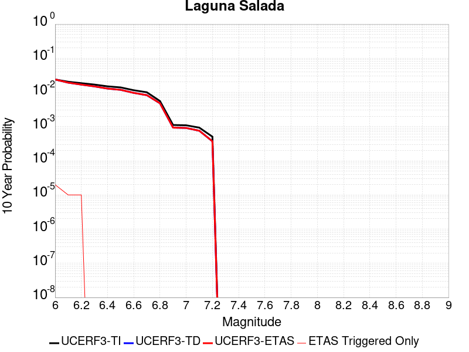 |

| Magnitude | 1 wk TI Prob | 1 wk TD Prob | 1 wk ETAS Prob | 1 wk ETAS/TD Gain | 1 wk ETAS Triggered Only | 1 mo TI Prob | 1 mo TD Prob | 1 mo ETAS Prob | 1 mo ETAS/TD Gain | 1 mo ETAS Triggered Only | 1 yr TI Prob | 1 yr TD Prob | 1 yr ETAS Prob | 1 yr ETAS/TD Gain | 1 yr ETAS Triggered Only | 10 yr TI Prob | 10 yr TD Prob | 10 yr ETAS Prob | 10 yr ETAS/TD Gain | 10 yr ETAS Triggered Only |
|-----|-----|-----|-----|-----|-----|-----|-----|-----|-----|-----|-----|-----|-----|-----|-----|-----|-----|-----|-----|-----|
| 6.0 | 4.6465593E-5 | 4.634639E-5 | 6.323265E-5 | 1.364349 | 1.6887043E-5 | 1.9912305E-4 | 1.9861311E-4 | 2.154968E-4 | 1.0850079 | 1.6887043E-5 | 0.0024216278 | 0.002415429 | 0.0024322753 | 1.0069745 | 1.6887043E-5 | 0.02395408 | 0.023975259 | 0.024008224 | 1.001375 | 3.3774086E-5 |
| 6.1 | 3.982297E-5 | 3.7246125E-5 | 3.7246125E-5 | 1.0 | 0.0 | 1.706587E-4 | 1.5961716E-4 | 1.5961716E-4 | 1.0 | 0.0 | 0.0020757897 | 0.0019417295 | 0.0019417295 | 1.0 | 0.0 | 0.020565065 | 0.019331863 | 0.019348424 | 1.0008566 | 1.6887043E-5 |
| 6.2 | 3.6067784E-5 | 3.2602693E-5 | 3.2602693E-5 | 1.0 | 0.0 | 1.5456705E-4 | 1.3971896E-4 | 1.3971896E-4 | 1.0 | 0.0 | 0.0018802295 | 0.0016998611 | 0.0016998611 | 1.0 | 0.0 | 0.018644003 | 0.016949628 | 0.016966227 | 1.0009794 | 1.6887043E-5 |
| 6.3 | 3.2859112E-5 | 2.8849448E-5 | 2.8849448E-5 | 1.0 | 0.0 | 1.4081717E-4 | 1.2363521E-4 | 1.2363521E-4 | 1.0 | 0.0 | 0.0017131006 | 0.0015043203 | 0.0015043203 | 1.0 | 0.0 | 0.016999546 | 0.015018767 | 0.015018767 | 1.0 | 0.0 |
| 6.4 | 2.9132116E-5 | 2.4852965E-5 | 2.4852965E-5 | 1.0 | 0.0 | 1.2484594E-4 | 1.0650887E-4 | 1.0650887E-4 | 1.0 | 0.0 | 0.0015189396 | 0.001296065 | 0.001296065 | 1.0 | 0.0 | 0.015085992 | 0.012956262 | 0.012956262 | 1.0 | 0.0 |
| 6.5 | 2.7075037E-5 | 2.2825836E-5 | 2.2825836E-5 | 1.0 | 0.0 | 1.1603071E-4 | 9.7821845E-5 | 9.7821845E-5 | 1.0 | 0.0 | 0.0014117584 | 0.0011904186 | 0.0011904186 | 1.0 | 0.0 | 0.014028233 | 0.011907749 | 0.011907749 | 1.0 | 0.0 |
| 6.6 | 2.2367465E-5 | 1.8573526E-5 | 1.8573526E-5 | 1.0 | 0.0 | 9.5857045E-5 | 7.959886E-5 | 7.959886E-5 | 1.0 | 0.0 | 0.0011664346 | 9.6876756E-4 | 9.6876756E-4 | 1.0 | 0.0 | 0.011603311 | 0.009702191 | 0.009702191 | 1.0 | 0.0 |
| 6.7 | 1.9458053E-5 | 1.5914242E-5 | 1.5914242E-5 | 1.0 | 0.0 | 8.338899E-5 | 6.8202564E-5 | 6.8202564E-5 | 1.0 | 0.0 | 0.001014788 | 8.3013024E-4 | 8.3013024E-4 | 1.0 | 0.0 | 0.010101665 | 0.0083209425 | 0.0083209425 | 1.0 | 0.0 |
| 6.8 | 1.0767866E-5 | 9.18435E-6 | 9.18435E-6 | 1.0 | 0.0 | 4.614718E-5 | 3.9361294E-5 | 3.9361294E-5 | 1.0 | 0.0 | 5.6169706E-4 | 4.7918706E-4 | 4.7918706E-4 | 1.0 | 0.0 | 0.0056027942 | 0.0048096925 | 0.0048096925 | 1.0 | 0.0 |
| 6.9 | 2.1384765E-6 | 1.7913675E-6 | 1.7913675E-6 | 1.0 | 0.0 | 9.164866E-6 | 7.677269E-6 | 7.677269E-6 | 1.0 | 0.0 | 1.1157654E-4 | 9.346713E-5 | 9.346713E-5 | 1.0 | 0.0 | 0.0011152053 | 9.343165E-4 | 9.343165E-4 | 1.0 | 0.0 |
| 7.0 | 2.0952946E-6 | 1.7493046E-6 | 1.7493046E-6 | 1.0 | 0.0 | 8.979802E-6 | 7.4970003E-6 | 7.4970003E-6 | 1.0 | 0.0 | 1.0932361E-4 | 9.1272545E-5 | 9.1272545E-5 | 1.0 | 0.0 | 0.0010926984 | 9.123888E-4 | 9.123888E-4 | 1.0 | 0.0 |
| 7.1 | 1.7887576E-6 | 1.4500254E-6 | 1.4500254E-6 | 1.0 | 0.0 | 7.666081E-6 | 6.2143813E-6 | 6.2143813E-6 | 1.0 | 0.0 | 9.333054E-5 | 7.565777E-5 | 7.565777E-5 | 1.0 | 0.0 | 9.329135E-4 | 7.563506E-4 | 7.563506E-4 | 1.0 | 0.0 |
| 7.2 | 9.723109E-7 | 7.135619E-7 | 7.135619E-7 | 1.0 | 0.0 | 4.16704E-6 | 3.0581198E-6 | 3.0581198E-6 | 1.0 | 0.0 | 5.073253E-5 | 3.7232137E-5 | 3.7232137E-5 | 1.0 | 0.0 | 5.072095E-4 | 3.7227524E-4 | 3.7227524E-4 | 1.0 | 0.0 |

## Los Alamos extension
*[(top)](#table-of-contents)*

| 1 Week | 1 Month | 1 Year | 10 Year |
|-----|-----|-----|-----|
|  |  | 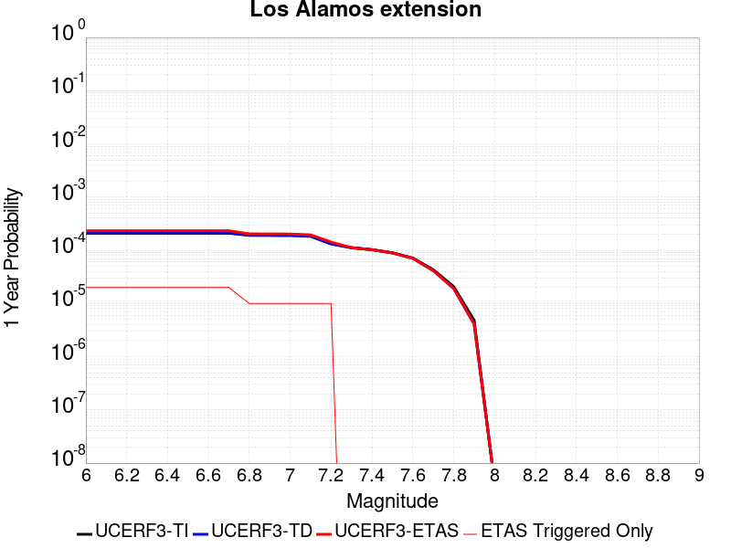 |  |

| Magnitude | 1 wk TI Prob | 1 wk TD Prob | 1 wk ETAS Prob | 1 wk ETAS/TD Gain | 1 wk ETAS Triggered Only | 1 mo TI Prob | 1 mo TD Prob | 1 mo ETAS Prob | 1 mo ETAS/TD Gain | 1 mo ETAS Triggered Only | 1 yr TI Prob | 1 yr TD Prob | 1 yr ETAS Prob | 1 yr ETAS/TD Gain | 1 yr ETAS Triggered Only | 10 yr TI Prob | 10 yr TD Prob | 10 yr ETAS Prob | 10 yr ETAS/TD Gain | 10 yr ETAS Triggered Only |
|-----|-----|-----|-----|-----|-----|-----|-----|-----|-----|-----|-----|-----|-----|-----|-----|-----|-----|-----|-----|-----|
| 6.0 | 4.0146506E-6 | 4.0861596E-6 | 4.0861596E-6 | 1.0 | 0.0 | 1.7205533E-5 | 1.7512002E-5 | 1.7512002E-5 | 1.0 | 0.0 | 2.0945723E-4 | 2.1318886E-4 | 2.300723E-4 | 1.0791948 | 1.6887043E-5 | 0.0020925992 | 0.0021299527 | 0.002163655 | 1.015823 | 3.3774086E-5 |
| 6.1 | 4.0146506E-6 | 4.0861596E-6 | 4.0861596E-6 | 1.0 | 0.0 | 1.7205533E-5 | 1.7512002E-5 | 1.7512002E-5 | 1.0 | 0.0 | 2.0945723E-4 | 2.1318886E-4 | 2.300723E-4 | 1.0791948 | 1.6887043E-5 | 0.0020925992 | 0.0021299527 | 0.002163655 | 1.015823 | 3.3774086E-5 |
| 6.2 | 4.0146506E-6 | 4.0861596E-6 | 4.0861596E-6 | 1.0 | 0.0 | 1.7205533E-5 | 1.7512002E-5 | 1.7512002E-5 | 1.0 | 0.0 | 2.0945723E-4 | 2.1318886E-4 | 2.300723E-4 | 1.0791948 | 1.6887043E-5 | 0.0020925992 | 0.0021299527 | 0.002163655 | 1.015823 | 3.3774086E-5 |
| 6.3 | 4.0146506E-6 | 4.0861596E-6 | 4.0861596E-6 | 1.0 | 0.0 | 1.7205533E-5 | 1.7512002E-5 | 1.7512002E-5 | 1.0 | 0.0 | 2.0945723E-4 | 2.1318886E-4 | 2.300723E-4 | 1.0791948 | 1.6887043E-5 | 0.0020925992 | 0.0021299527 | 0.002163655 | 1.015823 | 3.3774086E-5 |
| 6.4 | 4.0146506E-6 | 4.0861596E-6 | 4.0861596E-6 | 1.0 | 0.0 | 1.7205533E-5 | 1.7512002E-5 | 1.7512002E-5 | 1.0 | 0.0 | 2.0945723E-4 | 2.1318886E-4 | 2.300723E-4 | 1.0791948 | 1.6887043E-5 | 0.0020925992 | 0.0021299527 | 0.002163655 | 1.015823 | 3.3774086E-5 |
| 6.5 | 4.0146506E-6 | 4.0861596E-6 | 4.0861596E-6 | 1.0 | 0.0 | 1.7205533E-5 | 1.7512002E-5 | 1.7512002E-5 | 1.0 | 0.0 | 2.0945723E-4 | 2.1318886E-4 | 2.300723E-4 | 1.0791948 | 1.6887043E-5 | 0.0020925992 | 0.0021299527 | 0.002163655 | 1.015823 | 3.3774086E-5 |
| 6.6 | 4.0146506E-6 | 4.0861596E-6 | 4.0861596E-6 | 1.0 | 0.0 | 1.7205533E-5 | 1.7512002E-5 | 1.7512002E-5 | 1.0 | 0.0 | 2.0945723E-4 | 2.1318886E-4 | 2.300723E-4 | 1.0791948 | 1.6887043E-5 | 0.0020925992 | 0.0021299527 | 0.002163655 | 1.015823 | 3.3774086E-5 |
| 6.7 | 4.0146506E-6 | 4.0861596E-6 | 4.0861596E-6 | 1.0 | 0.0 | 1.7205533E-5 | 1.7512002E-5 | 1.7512002E-5 | 1.0 | 0.0 | 2.0945723E-4 | 2.1318886E-4 | 2.300723E-4 | 1.0791948 | 1.6887043E-5 | 0.0020925992 | 0.0021299527 | 0.002163655 | 1.015823 | 3.3774086E-5 |
| 6.8 | 3.6584688E-6 | 3.7188588E-6 | 3.7188588E-6 | 1.0 | 0.0 | 1.5679057E-5 | 1.5937874E-5 | 1.5937874E-5 | 1.0 | 0.0 | 1.9087581E-4 | 1.9402728E-4 | 2.1091105E-4 | 1.0870175 | 1.6887043E-5 | 0.0019071194 | 0.0019386712 | 0.0019723799 | 1.0173875 | 3.3774086E-5 |
| 6.9 | 3.644631E-6 | 3.7045688E-6 | 3.7045688E-6 | 1.0 | 0.0 | 1.5619753E-5 | 1.5876632E-5 | 1.5876632E-5 | 1.0 | 0.0 | 1.901539E-4 | 1.9328178E-4 | 2.1016557E-4 | 1.0873532 | 1.6887043E-5 | 0.0018999127 | 0.0019312293 | 0.0019649381 | 1.0174546 | 3.3774086E-5 |
| 7.0 | 3.6318522E-6 | 3.6913295E-6 | 3.6913295E-6 | 1.0 | 0.0 | 1.5564989E-5 | 1.5819893E-5 | 1.5819893E-5 | 1.0 | 0.0 | 1.8948725E-4 | 1.925911E-4 | 2.0947489E-4 | 1.0876665 | 1.6887043E-5 | 0.0018932576 | 0.0019243343 | 0.0019580435 | 1.0175173 | 3.3774086E-5 |
| 7.1 | 3.5001724E-6 | 3.5554E-6 | 3.5554E-6 | 1.0 | 0.0 | 1.5000653E-5 | 1.5237345E-5 | 1.5237345E-5 | 1.0 | 0.0 | 1.8261763E-4 | 1.854998E-4 | 2.0238372E-4 | 1.0910184 | 1.6887043E-5 | 0.0018246764 | 0.0018535402 | 0.0018872517 | 1.0181876 | 3.3774086E-5 |
| 7.2 | 2.5204702E-6 | 2.5436943E-6 | 2.5436943E-6 | 1.0 | 0.0 | 1.080197E-5 | 1.0901502E-5 | 1.0901502E-5 | 1.0 | 0.0 | 1.3150605E-4 | 1.3271775E-4 | 1.4960255E-4 | 1.1272234 | 1.6887043E-5 | 0.0013142825 | 0.0013263905 | 0.0013601198 | 1.0254294 | 3.3774086E-5 |
| 7.3 | 2.1399692E-6 | 2.1501316E-6 | 2.1501316E-6 | 1.0 | 0.0 | 9.1712645E-6 | 9.2148175E-6 | 9.2148175E-6 | 1.0 | 0.0 | 1.1165442E-4 | 1.1218466E-4 | 1.1218466E-4 | 1.0 | 0.0 | 0.0011159834 | 0.0011212835 | 0.0011381516 | 1.0150436 | 1.6887043E-5 |
| 7.4 | 1.9660122E-6 | 1.9702363E-6 | 1.9702363E-6 | 1.0 | 0.0 | 8.42574E-6 | 8.4438425E-6 | 8.4438425E-6 | 1.0 | 0.0 | 1.0257855E-4 | 1.0279897E-4 | 1.0279897E-4 | 1.0 | 0.0 | 0.0010253121 | 0.0010275173 | 0.001044387 | 1.0164179 | 1.6887043E-5 |
| 7.5 | 1.7204633E-6 | 1.7150983E-6 | 1.7150983E-6 | 1.0 | 0.0 | 7.373393E-6 | 7.3504007E-6 | 7.3504007E-6 | 1.0 | 0.0 | 8.976737E-5 | 8.948748E-5 | 8.948748E-5 | 1.0 | 0.0 | 8.9731114E-4 | 8.9451746E-4 | 9.1138936E-4 | 1.0188615 | 1.6887043E-5 |
| 7.6 | 1.3717638E-6 | 1.3535827E-6 | 1.3535827E-6 | 1.0 | 0.0 | 5.878974E-6 | 5.8010555E-6 | 5.8010555E-6 | 1.0 | 0.0 | 7.157416E-5 | 7.062559E-5 | 7.062559E-5 | 1.0 | 0.0 | 7.1551115E-4 | 7.060341E-4 | 7.229092E-4 | 1.0239012 | 1.6887043E-5 |
| 7.7 | 8.272564E-7 | 7.957636E-7 | 7.957636E-7 | 1.0 | 0.0 | 3.5453797E-6 | 3.410411E-6 | 3.410411E-6 | 1.0 | 0.0 | 4.3164142E-5 | 4.1520965E-5 | 4.1520965E-5 | 1.0 | 0.0 | 4.315576E-4 | 4.1513226E-4 | 4.3201228E-4 | 1.0406618 | 1.6887043E-5 |
| 7.8 | 3.9708277E-7 | 3.6719027E-7 | 3.6719027E-7 | 1.0 | 0.0 | 1.7017821E-6 | 1.5736716E-6 | 1.5736716E-6 | 1.0 | 0.0 | 2.0719E-5 | 1.9159284E-5 | 1.9159284E-5 | 1.0 | 0.0 | 2.071707E-4 | 1.9157639E-4 | 1.9157639E-4 | 1.0 | 0.0 |
| 7.9 | 9.292528E-8 | 7.889087E-8 | 7.889087E-8 | 1.0 | 0.0 | 3.9825116E-7 | 3.381037E-7 | 3.381037E-7 | 1.0 | 0.0 | 4.848697E-6 | 4.116405E-6 | 4.116405E-6 | 1.0 | 0.0 | 4.8485912E-5 | 4.1163294E-5 | 4.1163294E-5 | 1.0 | 0.0 |
| 8.0 | 7.880441E-11 | 8.2353124E-11 | 8.2353124E-11 | 1.0 | 0.0 | 3.3773329E-10 | 3.52942E-10 | 3.52942E-10 | 1.0 | 0.0 | 4.1119033E-9 | 4.2970694E-9 | 4.2970694E-9 | 1.0 | 0.0 | 4.1119034E-8 | 4.2970694E-8 | 4.2970694E-8 | 1.0 | 0.0 |

## Pitas Point (Lower West)
*[(top)](#table-of-contents)*

| 1 Week | 1 Month | 1 Year | 10 Year |
|-----|-----|-----|-----|
|  |  |  |  |

| Magnitude | 1 wk TI Prob | 1 wk TD Prob | 1 wk ETAS Prob | 1 wk ETAS/TD Gain | 1 wk ETAS Triggered Only | 1 mo TI Prob | 1 mo TD Prob | 1 mo ETAS Prob | 1 mo ETAS/TD Gain | 1 mo ETAS Triggered Only | 1 yr TI Prob | 1 yr TD Prob | 1 yr ETAS Prob | 1 yr ETAS/TD Gain | 1 yr ETAS Triggered Only | 10 yr TI Prob | 10 yr TD Prob | 10 yr ETAS Prob | 10 yr ETAS/TD Gain | 10 yr ETAS Triggered Only |
|-----|-----|-----|-----|-----|-----|-----|-----|-----|-----|-----|-----|-----|-----|-----|-----|-----|-----|-----|-----|-----|
| 6.0 | 8.151497E-6 | 7.855762E-6 | 7.855762E-6 | 1.0 | 0.0 | 3.493452E-5 | 3.3667122E-5 | 3.3667122E-5 | 1.0 | 0.0 | 4.252448E-4 | 4.0982084E-4 | 4.0982084E-4 | 1.0 | 0.0 | 0.0042443196 | 0.0040907315 | 0.0041243676 | 1.0082225 | 3.3774086E-5 |
| 6.1 | 8.151497E-6 | 7.855762E-6 | 7.855762E-6 | 1.0 | 0.0 | 3.493452E-5 | 3.3667122E-5 | 3.3667122E-5 | 1.0 | 0.0 | 4.252448E-4 | 4.0982084E-4 | 4.0982084E-4 | 1.0 | 0.0 | 0.0042443196 | 0.0040907315 | 0.0041243676 | 1.0082225 | 3.3774086E-5 |
| 6.2 | 8.151497E-6 | 7.855762E-6 | 7.855762E-6 | 1.0 | 0.0 | 3.493452E-5 | 3.3667122E-5 | 3.3667122E-5 | 1.0 | 0.0 | 4.252448E-4 | 4.0982084E-4 | 4.0982084E-4 | 1.0 | 0.0 | 0.0042443196 | 0.0040907315 | 0.0041243676 | 1.0082225 | 3.3774086E-5 |
| 6.3 | 8.151497E-6 | 7.855762E-6 | 7.855762E-6 | 1.0 | 0.0 | 3.493452E-5 | 3.3667122E-5 | 3.3667122E-5 | 1.0 | 0.0 | 4.252448E-4 | 4.0982084E-4 | 4.0982084E-4 | 1.0 | 0.0 | 0.0042443196 | 0.0040907315 | 0.0041243676 | 1.0082225 | 3.3774086E-5 |
| 6.4 | 8.151497E-6 | 7.855762E-6 | 7.855762E-6 | 1.0 | 0.0 | 3.493452E-5 | 3.3667122E-5 | 3.3667122E-5 | 1.0 | 0.0 | 4.252448E-4 | 4.0982084E-4 | 4.0982084E-4 | 1.0 | 0.0 | 0.0042443196 | 0.0040907315 | 0.0041243676 | 1.0082225 | 3.3774086E-5 |
| 6.5 | 8.151497E-6 | 7.855762E-6 | 7.855762E-6 | 1.0 | 0.0 | 3.493452E-5 | 3.3667122E-5 | 3.3667122E-5 | 1.0 | 0.0 | 4.252448E-4 | 4.0982084E-4 | 4.0982084E-4 | 1.0 | 0.0 | 0.0042443196 | 0.0040907315 | 0.0041243676 | 1.0082225 | 3.3774086E-5 |
| 6.6 | 8.151497E-6 | 7.855762E-6 | 7.855762E-6 | 1.0 | 0.0 | 3.493452E-5 | 3.3667122E-5 | 3.3667122E-5 | 1.0 | 0.0 | 4.252448E-4 | 4.0982084E-4 | 4.0982084E-4 | 1.0 | 0.0 | 0.0042443196 | 0.0040907315 | 0.0041243676 | 1.0082225 | 3.3774086E-5 |
| 6.7 | 8.151497E-6 | 7.855762E-6 | 7.855762E-6 | 1.0 | 0.0 | 3.493452E-5 | 3.3667122E-5 | 3.3667122E-5 | 1.0 | 0.0 | 4.252448E-4 | 4.0982084E-4 | 4.0982084E-4 | 1.0 | 0.0 | 0.0042443196 | 0.0040907315 | 0.0041243676 | 1.0082225 | 3.3774086E-5 |
| 6.8 | 8.151497E-6 | 7.855762E-6 | 7.855762E-6 | 1.0 | 0.0 | 3.493452E-5 | 3.3667122E-5 | 3.3667122E-5 | 1.0 | 0.0 | 4.252448E-4 | 4.0982084E-4 | 4.0982084E-4 | 1.0 | 0.0 | 0.0042443196 | 0.0040907315 | 0.0041243676 | 1.0082225 | 3.3774086E-5 |
| 6.9 | 8.151497E-6 | 7.855762E-6 | 7.855762E-6 | 1.0 | 0.0 | 3.493452E-5 | 3.3667122E-5 | 3.3667122E-5 | 1.0 | 0.0 | 4.252448E-4 | 4.0982084E-4 | 4.0982084E-4 | 1.0 | 0.0 | 0.0042443196 | 0.0040907315 | 0.0041243676 | 1.0082225 | 3.3774086E-5 |
| 7.0 | 8.103535E-6 | 7.805192E-6 | 7.805192E-6 | 1.0 | 0.0 | 3.4728975E-5 | 3.3450397E-5 | 3.3450397E-5 | 1.0 | 0.0 | 4.2274324E-4 | 4.0718322E-4 | 4.0718322E-4 | 1.0 | 0.0 | 0.0042193993 | 0.004064452 | 0.004098089 | 1.0082759 | 3.3774086E-5 |
| 7.1 | 7.853298E-6 | 7.540883E-6 | 7.540883E-6 | 1.0 | 0.0 | 3.3656554E-5 | 3.2317676E-5 | 3.2317676E-5 | 1.0 | 0.0 | 4.096915E-4 | 3.9339735E-4 | 3.9339735E-4 | 1.0 | 0.0 | 0.00408937 | 0.0039270855 | 0.003960727 | 1.0085665 | 3.3774086E-5 |
| 7.2 | 7.771102E-6 | 7.453165E-6 | 7.453165E-6 | 1.0 | 0.0 | 3.33043E-5 | 3.194175E-5 | 3.194175E-5 | 1.0 | 0.0 | 4.0540437E-4 | 3.8882208E-4 | 3.8882208E-4 | 1.0 | 0.0 | 0.0040466557 | 0.0038814936 | 0.0039151367 | 1.0086676 | 3.3774086E-5 |
| 7.3 | 7.3945344E-6 | 7.0492697E-6 | 7.0492697E-6 | 1.0 | 0.0 | 3.1690477E-5 | 3.021081E-5 | 3.021081E-5 | 1.0 | 0.0 | 3.8576324E-4 | 3.6775516E-4 | 3.6775516E-4 | 1.0 | 0.0 | 0.0038509427 | 0.0036715334 | 0.0037051835 | 1.0091652 | 3.3774086E-5 |
| 7.4 | 6.964645E-6 | 6.5901186E-6 | 6.5901186E-6 | 1.0 | 0.0 | 2.9848137E-5 | 2.8243063E-5 | 2.8243063E-5 | 1.0 | 0.0 | 3.6334046E-4 | 3.4380553E-4 | 3.4380553E-4 | 1.0 | 0.0 | 0.0036274698 | 0.0034327896 | 0.0034664478 | 1.0098048 | 3.3774086E-5 |
| 7.5 | 6.6525035E-6 | 6.259157E-6 | 6.259157E-6 | 1.0 | 0.0 | 2.851042E-5 | 2.6824686E-5 | 2.6824686E-5 | 1.0 | 0.0 | 3.4705905E-4 | 3.265421E-4 | 3.265421E-4 | 1.0 | 0.0 | 0.0034651754 | 0.0032606742 | 0.0032943382 | 1.0103242 | 3.3774086E-5 |
| 7.6 | 5.613338E-6 | 5.151386E-6 | 5.151386E-6 | 1.0 | 0.0 | 2.405694E-5 | 2.2077185E-5 | 2.2077185E-5 | 1.0 | 0.0 | 2.928539E-4 | 2.6875688E-4 | 2.6875688E-4 | 1.0 | 0.0 | 0.0029246826 | 0.0026843501 | 0.0026843501 | 1.0 | 0.0 |
| 7.7 | 4.494704E-6 | 3.996911E-6 | 3.996911E-6 | 1.0 | 0.0 | 1.9262876E-5 | 1.7129507E-5 | 1.7129507E-5 | 1.0 | 0.0 | 2.3450027E-4 | 2.0853203E-4 | 2.0853203E-4 | 1.0 | 0.0 | 0.0023425296 | 0.0020833875 | 0.0020833875 | 1.0 | 0.0 |
| 7.8 | 2.6075882E-6 | 2.1836374E-6 | 2.1836374E-6 | 1.0 | 0.0 | 1.117533E-5 | 9.358413E-6 | 9.358413E-6 | 1.0 | 0.0 | 1.3605114E-4 | 1.1393277E-4 | 1.1393277E-4 | 1.0 | 0.0 | 0.0013596788 | 0.0011387484 | 0.0011387484 | 1.0 | 0.0 |
| 7.9 | 4.045984E-7 | 3.242375E-7 | 3.242375E-7 | 1.0 | 0.0 | 1.733992E-6 | 1.3895885E-6 | 1.3895885E-6 | 1.0 | 0.0 | 2.1111147E-5 | 1.6918111E-5 | 1.6918111E-5 | 1.0 | 0.0 | 2.1109142E-4 | 1.6916855E-4 | 1.6916855E-4 | 1.0 | 0.0 |
| 8.0 | 7.791402E-9 | 5.683497E-9 | 5.683497E-9 | 1.0 | 0.0 | 3.3391725E-8 | 2.4357844E-8 | 2.4357844E-8 | 1.0 | 0.0 | 4.0654416E-7 | 2.9655675E-7 | 2.9655675E-7 | 1.0 | 0.0 | 4.065434E-6 | 2.9655655E-6 | 2.9655655E-6 | 1.0 | 0.0 |

## Big Pine (East)
*[(top)](#table-of-contents)*

| 1 Week | 1 Month | 1 Year | 10 Year |
|-----|-----|-----|-----|
| 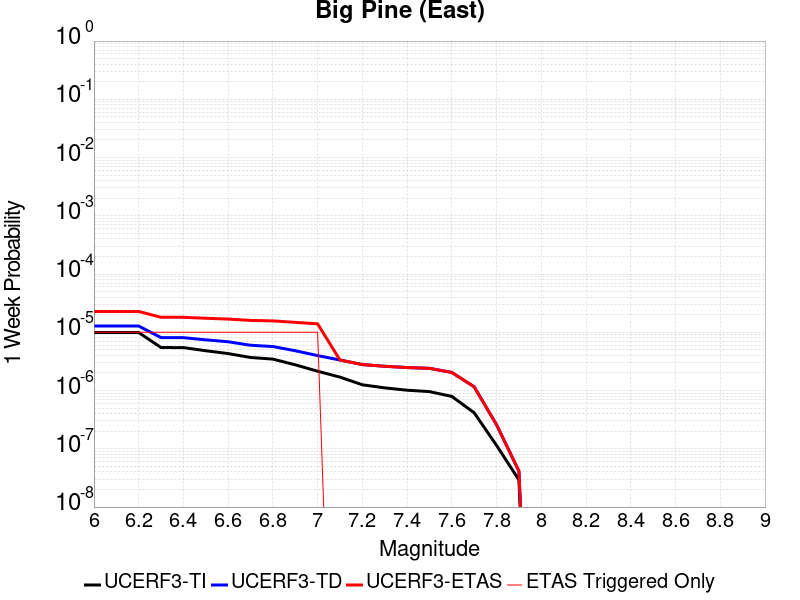 | 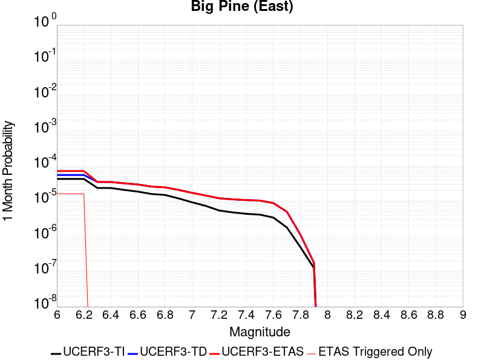 | 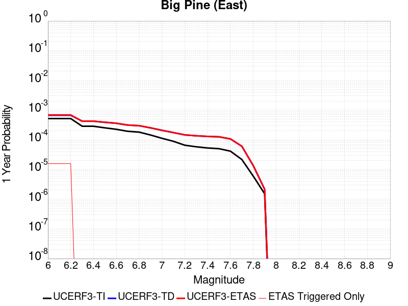 | 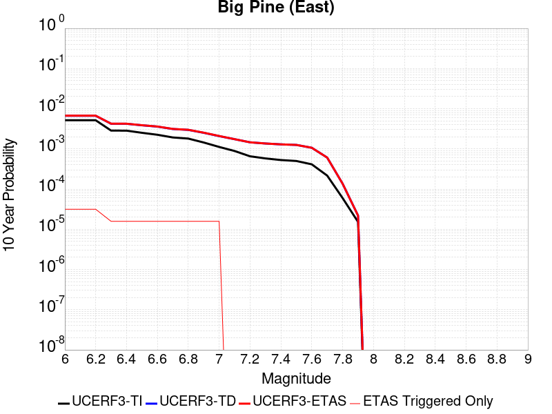 |

| Magnitude | 1 wk TI Prob | 1 wk TD Prob | 1 wk ETAS Prob | 1 wk ETAS/TD Gain | 1 wk ETAS Triggered Only | 1 mo TI Prob | 1 mo TD Prob | 1 mo ETAS Prob | 1 mo ETAS/TD Gain | 1 mo ETAS Triggered Only | 1 yr TI Prob | 1 yr TD Prob | 1 yr ETAS Prob | 1 yr ETAS/TD Gain | 1 yr ETAS Triggered Only | 10 yr TI Prob | 10 yr TD Prob | 10 yr ETAS Prob | 10 yr ETAS/TD Gain | 10 yr ETAS Triggered Only |
|-----|-----|-----|-----|-----|-----|-----|-----|-----|-----|-----|-----|-----|-----|-----|-----|-----|-----|-----|-----|-----|
| 6.0 | 9.916913E-6 | 1.2816984E-5 | 1.2816984E-5 | 1.0 | 0.0 | 4.250036E-5 | 5.49289E-5 | 7.181502E-5 | 1.3074176 | 1.6887043E-5 | 5.173191E-4 | 6.685763E-4 | 6.85452E-4 | 1.0252414 | 1.6887043E-5 | 0.0051611643 | 0.006670441 | 0.00670399 | 1.0050294 | 3.3774086E-5 |
| 6.1 | 9.916913E-6 | 1.2816984E-5 | 1.2816984E-5 | 1.0 | 0.0 | 4.250036E-5 | 5.49289E-5 | 7.181502E-5 | 1.3074176 | 1.6887043E-5 | 5.173191E-4 | 6.685763E-4 | 6.85452E-4 | 1.0252414 | 1.6887043E-5 | 0.0051611643 | 0.006670441 | 0.00670399 | 1.0050294 | 3.3774086E-5 |
| 6.2 | 9.916913E-6 | 1.2816984E-5 | 1.2816984E-5 | 1.0 | 0.0 | 4.250036E-5 | 5.49289E-5 | 7.181502E-5 | 1.3074176 | 1.6887043E-5 | 5.173191E-4 | 6.685763E-4 | 6.85452E-4 | 1.0252414 | 1.6887043E-5 | 0.0051611643 | 0.006670441 | 0.00670399 | 1.0050294 | 3.3774086E-5 |
| 6.3 | 5.479711E-6 | 8.112951E-6 | 8.112951E-6 | 1.0 | 0.0 | 2.3484265E-5 | 3.4769346E-5 | 3.4769346E-5 | 1.0 | 0.0 | 2.858834E-4 | 4.2323777E-4 | 4.2323777E-4 | 1.0 | 0.0 | 0.0028551589 | 0.004227244 | 0.0042440593 | 1.0039779 | 1.6887043E-5 |
| 6.4 | 5.465009E-6 | 8.097245E-6 | 8.097245E-6 | 1.0 | 0.0 | 2.3421257E-5 | 3.4702036E-5 | 3.4702036E-5 | 1.0 | 0.0 | 2.851165E-4 | 4.2241855E-4 | 4.2241855E-4 | 1.0 | 0.0 | 0.0028475097 | 0.0042190826 | 0.0042358986 | 1.0039856 | 1.6887043E-5 |
| 6.5 | 4.826767E-6 | 7.422301E-6 | 7.422301E-6 | 1.0 | 0.0 | 2.068598E-5 | 3.180949E-5 | 3.180949E-5 | 1.0 | 0.0 | 2.518227E-4 | 3.872145E-4 | 3.872145E-4 | 1.0 | 0.0 | 0.0025153751 | 0.003868283 | 0.0038851046 | 1.0043486 | 1.6887043E-5 |
| 6.6 | 4.3146847E-6 | 6.8822374E-6 | 6.8822374E-6 | 1.0 | 0.0 | 1.8491375E-5 | 2.9494982E-5 | 2.9494982E-5 | 1.0 | 0.0 | 2.2510924E-4 | 3.590447E-4 | 3.590447E-4 | 1.0 | 0.0 | 0.0022488134 | 0.0035874986 | 0.003604325 | 1.0046903 | 1.6887043E-5 |
| 6.7 | 3.6968106E-6 | 5.9954727E-6 | 5.9954727E-6 | 1.0 | 0.0 | 1.5843378E-5 | 2.5694639E-5 | 2.5694639E-5 | 1.0 | 0.0 | 1.9287605E-4 | 3.1278885E-4 | 3.1278885E-4 | 1.0 | 0.0 | 0.0019270873 | 0.0031262483 | 0.0031430824 | 1.0053848 | 1.6887043E-5 |
| 6.8 | 3.4671132E-6 | 5.702177E-6 | 5.702177E-6 | 1.0 | 0.0 | 1.4858972E-5 | 2.4437682E-5 | 2.4437682E-5 | 1.0 | 0.0 | 1.8089297E-4 | 2.974896E-4 | 2.974896E-4 | 1.0 | 0.0 | 0.0018074579 | 0.002973667 | 0.002990504 | 1.005662 | 1.6887043E-5 |
| 6.9 | 2.7686972E-6 | 4.825223E-6 | 4.825223E-6 | 1.0 | 0.0 | 1.1865792E-5 | 2.0679368E-5 | 2.0679368E-5 | 1.0 | 0.0 | 1.4445644E-4 | 2.5174298E-4 | 2.5174298E-4 | 1.0 | 0.0 | 0.0014436257 | 0.0025172636 | 0.0025341082 | 1.0066916 | 1.6887043E-5 |
| 7.0 | 2.1472624E-6 | 3.9850406E-6 | 3.9850406E-6 | 1.0 | 0.0 | 9.20252E-6 | 1.7078637E-5 | 1.7078637E-5 | 1.0 | 0.0 | 1.12034926E-4 | 2.079131E-4 | 2.079131E-4 | 1.0 | 0.0 | 0.0011197845 | 0.0020798394 | 0.0020966912 | 1.0081025 | 1.6887043E-5 |
| 7.1 | 1.7018335E-6 | 3.344876E-6 | 3.344876E-6 | 1.0 | 0.0 | 7.293552E-6 | 1.4335106E-5 | 1.4335106E-5 | 1.0 | 0.0 | 8.879537E-5 | 1.7451629E-4 | 1.7451629E-4 | 1.0 | 0.0 | 8.87599E-4 | 0.0017464145 | 0.0017464145 | 1.0 | 0.0 |
| 7.2 | 1.25603E-6 | 2.794484E-6 | 2.794484E-6 | 1.0 | 0.0 | 5.3829745E-6 | 1.1976307E-5 | 1.1976307E-5 | 1.0 | 0.0 | 6.553574E-5 | 1.4580201E-4 | 1.4580201E-4 | 1.0 | 0.0 | 6.551642E-4 | 0.001459661 | 0.001459661 | 1.0 | 0.0 |
| 7.3 | 1.112297E-6 | 2.610332E-6 | 2.610332E-6 | 1.0 | 0.0 | 4.7669787E-6 | 1.118709E-5 | 1.118709E-5 | 1.0 | 0.0 | 5.803642E-5 | 1.3619453E-4 | 1.3619453E-4 | 1.0 | 0.0 | 5.802127E-4 | 0.0013635408 | 0.0013635408 | 1.0 | 0.0 |
| 7.4 | 1.0137181E-6 | 2.4834917E-6 | 2.4834917E-6 | 1.0 | 0.0 | 4.3444993E-6 | 1.0643494E-5 | 1.0643494E-5 | 1.0 | 0.0 | 5.2892992E-5 | 1.2957705E-4 | 1.2957705E-4 | 1.0 | 0.0 | 5.288041E-4 | 0.0012972289 | 0.0012972289 | 1.0 | 0.0 |
| 7.5 | 9.598608E-7 | 2.4071483E-6 | 2.4071483E-6 | 1.0 | 0.0 | 4.1136827E-6 | 1.031631E-5 | 1.031631E-5 | 1.0 | 0.0 | 5.0082934E-5 | 1.2559404E-4 | 1.2559404E-4 | 1.0 | 0.0 | 5.007165E-4 | 0.0012572526 | 0.0012572526 | 1.0 | 0.0 |
| 7.6 | 7.929459E-7 | 2.0448588E-6 | 2.0448588E-6 | 1.0 | 0.0 | 3.3983351E-6 | 8.763653E-6 | 8.763653E-6 | 1.0 | 0.0 | 4.1373947E-5 | 1.06692416E-4 | 1.06692416E-4 | 1.0 | 0.0 | 4.1366243E-4 | 0.0010685222 | 0.0010685222 | 1.0 | 0.0 |
| 7.7 | 4.155788E-7 | 1.1605589E-6 | 1.1605589E-6 | 1.0 | 0.0 | 1.7810507E-6 | 4.9738146E-6 | 4.9738146E-6 | 1.0 | 0.0 | 2.1684076E-5 | 6.0554554E-5 | 6.0554554E-5 | 1.0 | 0.0 | 2.1681961E-4 | 6.0857297E-4 | 6.0857297E-4 | 1.0 | 0.0 |
| 7.8 | 1.14666925E-7 | 2.592015E-7 | 2.592015E-7 | 1.0 | 0.0 | 4.914296E-7 | 1.1108631E-6 | 1.1108631E-6 | 1.0 | 0.0 | 5.9831386E-6 | 1.3524678E-5 | 1.3524678E-5 | 1.0 | 0.0 | 5.9829777E-5 | 1.3634123E-4 | 1.3634123E-4 | 1.0 | 0.0 |
| 7.9 | 2.9231824E-8 | 4.1463963E-8 | 4.1463963E-8 | 1.0 | 0.0 | 1.2527924E-7 | 1.7770269E-7 | 1.7770269E-7 | 1.0 | 0.0 | 1.5252737E-6 | 2.1635283E-6 | 2.1635283E-6 | 1.0 | 0.0 | 1.5252632E-5 | 2.1967755E-5 | 2.1967755E-5 | 1.0 | 0.0 |

## Great Valley 06 (Midland) 2011 CFM alt1
*[(top)](#table-of-contents)*

| 1 Week | 1 Month | 1 Year | 10 Year |
|-----|-----|-----|-----|
|  |  |  |  |

| Magnitude | 1 wk TI Prob | 1 wk TD Prob | 1 wk ETAS Prob | 1 wk ETAS/TD Gain | 1 wk ETAS Triggered Only | 1 mo TI Prob | 1 mo TD Prob | 1 mo ETAS Prob | 1 mo ETAS/TD Gain | 1 mo ETAS Triggered Only | 1 yr TI Prob | 1 yr TD Prob | 1 yr ETAS Prob | 1 yr ETAS/TD Gain | 1 yr ETAS Triggered Only | 10 yr TI Prob | 10 yr TD Prob | 10 yr ETAS Prob | 10 yr ETAS/TD Gain | 10 yr ETAS Triggered Only |
|-----|-----|-----|-----|-----|-----|-----|-----|-----|-----|-----|-----|-----|-----|-----|-----|-----|-----|-----|-----|-----|
| 6.0 | 1.2712525E-5 | 1.3210576E-5 | 3.0097395E-5 | 2.2782803 | 1.6887043E-5 | 5.4481112E-5 | 5.6615667E-5 | 7.350175E-5 | 1.2982582 | 1.6887043E-5 | 6.6310563E-4 | 6.8910315E-4 | 7.0597854E-4 | 1.0244889 | 1.6887043E-5 | 0.0066113044 | 0.006872179 | 0.006905721 | 1.0048808 | 3.3774086E-5 |
| 6.1 | 1.2712525E-5 | 1.3210576E-5 | 3.0097395E-5 | 2.2782803 | 1.6887043E-5 | 5.4481112E-5 | 5.6615667E-5 | 7.350175E-5 | 1.2982582 | 1.6887043E-5 | 6.6310563E-4 | 6.8910315E-4 | 7.0597854E-4 | 1.0244889 | 1.6887043E-5 | 0.0066113044 | 0.006872179 | 0.006905721 | 1.0048808 | 3.3774086E-5 |
| 6.2 | 1.2712525E-5 | 1.3210576E-5 | 3.0097395E-5 | 2.2782803 | 1.6887043E-5 | 5.4481112E-5 | 5.6615667E-5 | 7.350175E-5 | 1.2982582 | 1.6887043E-5 | 6.6310563E-4 | 6.8910315E-4 | 7.0597854E-4 | 1.0244889 | 1.6887043E-5 | 0.0066113044 | 0.006872179 | 0.006905721 | 1.0048808 | 3.3774086E-5 |
| 6.3 | 1.2712525E-5 | 1.3210576E-5 | 3.0097395E-5 | 2.2782803 | 1.6887043E-5 | 5.4481112E-5 | 5.6615667E-5 | 7.350175E-5 | 1.2982582 | 1.6887043E-5 | 6.6310563E-4 | 6.8910315E-4 | 7.0597854E-4 | 1.0244889 | 1.6887043E-5 | 0.0066113044 | 0.006872179 | 0.006905721 | 1.0048808 | 3.3774086E-5 |
| 6.4 | 1.2712525E-5 | 1.3210576E-5 | 3.0097395E-5 | 2.2782803 | 1.6887043E-5 | 5.4481112E-5 | 5.6615667E-5 | 7.350175E-5 | 1.2982582 | 1.6887043E-5 | 6.6310563E-4 | 6.8910315E-4 | 7.0597854E-4 | 1.0244889 | 1.6887043E-5 | 0.0066113044 | 0.006872179 | 0.006905721 | 1.0048808 | 3.3774086E-5 |
| 6.5 | 1.2712525E-5 | 1.3210576E-5 | 3.0097395E-5 | 2.2782803 | 1.6887043E-5 | 5.4481112E-5 | 5.6615667E-5 | 7.350175E-5 | 1.2982582 | 1.6887043E-5 | 6.6310563E-4 | 6.8910315E-4 | 7.0597854E-4 | 1.0244889 | 1.6887043E-5 | 0.0066113044 | 0.006872179 | 0.006905721 | 1.0048808 | 3.3774086E-5 |
| 6.6 | 5.7574384E-6 | 5.9706463E-6 | 2.2857588E-5 | 3.8283272 | 1.6887043E-5 | 2.4674504E-5 | 2.5588255E-5 | 4.2474865E-5 | 1.659936 | 1.6887043E-5 | 3.0037065E-4 | 3.1149638E-4 | 3.2837817E-4 | 1.0541958 | 1.6887043E-5 | 0.0029996498 | 0.0031109843 | 0.0031446533 | 1.0108227 | 3.3774086E-5 |
| 6.7 | 5.7574384E-6 | 5.9706463E-6 | 2.2857588E-5 | 3.8283272 | 1.6887043E-5 | 2.4674504E-5 | 2.5588255E-5 | 4.2474865E-5 | 1.659936 | 1.6887043E-5 | 3.0037065E-4 | 3.1149638E-4 | 3.2837817E-4 | 1.0541958 | 1.6887043E-5 | 0.0029996498 | 0.0031109843 | 0.0031446533 | 1.0108227 | 3.3774086E-5 |
| 6.8 | 3.3474828E-6 | 3.4693849E-6 | 2.0356369E-5 | 5.867429 | 1.6887043E-5 | 1.4346277E-5 | 1.4868716E-5 | 3.1755506E-5 | 2.1357262 | 1.6887043E-5 | 1.7465191E-4 | 1.8101306E-4 | 1.9789705E-4 | 1.093275 | 1.6887043E-5 | 0.0017451472 | 0.0018088033 | 0.0018425162 | 1.0186383 | 3.3774086E-5 |
| 6.9 | 2.035106E-6 | 2.1090357E-6 | 1.8996043E-5 | 9.006981 | 1.6887043E-5 | 8.721853E-6 | 9.038697E-6 | 2.5925587E-5 | 2.868288 | 1.6887043E-5 | 1.0618339E-4 | 1.10041314E-4 | 1.2692649E-4 | 1.153444 | 1.6887043E-5 | 0.0010613267 | 0.0010999405 | 0.0011336774 | 1.0306716 | 3.3774086E-5 |
| 7.0 | 1.2424716E-6 | 1.2878762E-6 | 1.8174896E-5 | 14.112302 | 1.6887043E-5 | 5.3248673E-6 | 5.51946E-6 | 2.240641E-5 | 4.0595293 | 1.6887043E-5 | 6.482833E-5 | 6.7197805E-5 | 8.408372E-5 | 1.2512866 | 1.6887043E-5 | 6.480942E-4 | 6.718192E-4 | 6.886949E-4 | 1.0251194 | 1.6887043E-5 |
| 7.1 | 6.6904556E-7 | 6.939035E-7 | 6.939035E-7 | 1.0 | 0.0 | 2.867335E-6 | 2.97387E-6 | 2.97387E-6 | 1.0 | 0.0 | 3.4909244E-5 | 3.6206526E-5 | 3.6206526E-5 | 1.0 | 0.0 | 3.490376E-4 | 3.6203177E-4 | 3.6203177E-4 | 1.0 | 0.0 |
| 7.2 | 3.948168E-7 | 4.095705E-7 | 4.095705E-7 | 1.0 | 0.0 | 1.6920709E-6 | 1.7553022E-6 | 1.7553022E-6 | 1.0 | 0.0 | 2.0600768E-5 | 2.1370803E-5 | 2.1370803E-5 | 1.0 | 0.0 | 2.0598859E-4 | 2.1370803E-4 | 2.1370803E-4 | 1.0 | 0.0 |

## Calaveras (No) 2011 CFM
*[(top)](#table-of-contents)*

| 1 Week | 1 Month | 1 Year | 10 Year |
|-----|-----|-----|-----|
|  |  |  |  |

| Magnitude | 1 wk TI Prob | 1 wk TD Prob | 1 wk ETAS Prob | 1 wk ETAS/TD Gain | 1 wk ETAS Triggered Only | 1 mo TI Prob | 1 mo TD Prob | 1 mo ETAS Prob | 1 mo ETAS/TD Gain | 1 mo ETAS Triggered Only | 1 yr TI Prob | 1 yr TD Prob | 1 yr ETAS Prob | 1 yr ETAS/TD Gain | 1 yr ETAS Triggered Only | 10 yr TI Prob | 10 yr TD Prob | 10 yr ETAS Prob | 10 yr ETAS/TD Gain | 10 yr ETAS Triggered Only |
|-----|-----|-----|-----|-----|-----|-----|-----|-----|-----|-----|-----|-----|-----|-----|-----|-----|-----|-----|-----|-----|
| 6.0 | 4.8694856E-5 | 6.747121E-5 | 6.747121E-5 | 1.0 | 0.0 | 2.0867554E-4 | 2.8913133E-4 | 2.8913133E-4 | 1.0 | 0.0 | 0.0025376645 | 0.003514627 | 0.0035482824 | 1.0095758 | 3.3774086E-5 | 0.02508881 | 0.034771245 | 0.03480384 | 1.0009376 | 3.3774086E-5 |
| 6.1 | 4.8694856E-5 | 6.747121E-5 | 6.747121E-5 | 1.0 | 0.0 | 2.0867554E-4 | 2.8913133E-4 | 2.8913133E-4 | 1.0 | 0.0 | 0.0025376645 | 0.003514627 | 0.0035482824 | 1.0095758 | 3.3774086E-5 | 0.02508881 | 0.034771245 | 0.03480384 | 1.0009376 | 3.3774086E-5 |
| 6.2 | 4.7541962E-5 | 6.580218E-5 | 6.580218E-5 | 1.0 | 0.0 | 2.0373536E-4 | 2.8197994E-4 | 2.8197994E-4 | 1.0 | 0.0 | 0.0024776561 | 0.003427859 | 0.0034446882 | 1.0049095 | 1.6887043E-5 | 0.024502134 | 0.033932675 | 0.033948988 | 1.0004808 | 1.6887043E-5 |
| 6.3 | 4.6717287E-5 | 6.4635555E-5 | 6.4635555E-5 | 1.0 | 0.0 | 2.0020158E-4 | 2.7698115E-4 | 2.7698115E-4 | 1.0 | 0.0 | 0.0024347296 | 0.0033672103 | 0.0033840404 | 1.0049982 | 1.6887043E-5 | 0.024082264 | 0.033345193 | 0.033361517 | 1.0004896 | 1.6887043E-5 |
| 6.4 | 4.6276386E-5 | 6.399742E-5 | 6.399742E-5 | 1.0 | 0.0 | 1.983123E-4 | 2.7424688E-4 | 2.7424688E-4 | 1.0 | 0.0 | 0.0024117786 | 0.0033340224 | 0.0033508532 | 1.0050482 | 1.6887043E-5 | 0.02385771 | 0.033024073 | 0.0330404 | 1.0004945 | 1.6887043E-5 |
| 6.5 | 4.5720994E-5 | 6.319881E-5 | 6.319881E-5 | 1.0 | 0.0 | 1.9593239E-4 | 2.70825E-4 | 2.70825E-4 | 1.0 | 0.0 | 0.002382867 | 0.0032924965 | 0.0033093279 | 1.005112 | 1.6887043E-5 | 0.023574775 | 0.032622032 | 0.032638367 | 1.0005008 | 1.6887043E-5 |
| 6.6 | 4.549134E-5 | 6.28519E-5 | 6.28519E-5 | 1.0 | 0.0 | 1.949483E-4 | 2.6933852E-4 | 2.6933852E-4 | 1.0 | 0.0 | 0.0023709119 | 0.0032744533 | 0.0032912851 | 1.0051403 | 1.6887043E-5 | 0.023457756 | 0.032447387 | 0.032463726 | 1.0005035 | 1.6887043E-5 |
| 6.7 | 3.701047E-5 | 5.0359427E-5 | 5.0359427E-5 | 1.0 | 0.0 | 1.5860666E-4 | 2.1580851E-4 | 2.1580851E-4 | 1.0 | 0.0 | 0.0019293258 | 0.002624346 | 0.0026411887 | 1.0064179 | 1.6887043E-5 | 0.019126613 | 0.026125323 | 0.02614177 | 1.0006295 | 1.6887043E-5 |
| 6.8 | 3.5523568E-5 | 4.8341022E-5 | 4.8341022E-5 | 1.0 | 0.0 | 1.5223498E-4 | 2.071596E-4 | 2.071596E-4 | 1.0 | 0.0 | 0.0018518851 | 0.0025192937 | 0.0025361383 | 1.0066862 | 1.6887043E-5 | 0.018365284 | 0.025097553 | 0.025114015 | 1.000656 | 1.6887043E-5 |
| 6.9 | 3.2946147E-5 | 4.466269E-5 | 4.466269E-5 | 1.0 | 0.0 | 1.4119013E-4 | 1.9139773E-4 | 1.9139773E-4 | 1.0 | 0.0 | 0.0017176344 | 0.0023278191 | 0.0023278191 | 1.0 | 0.0 | 0.017044188 | 0.023219598 | 0.023219598 | 1.0 | 0.0 |
| 7.0 | 2.7682381E-5 | 3.702223E-5 | 3.702223E-5 | 1.0 | 0.0 | 1.1863338E-4 | 1.5865723E-4 | 1.5865723E-4 | 1.0 | 0.0 | 0.0014434044 | 0.0019299705 | 0.0019299705 | 1.0 | 0.0 | 0.01434065 | 0.01931092 | 0.01931092 | 1.0 | 0.0 |
| 7.1 | 2.471967E-5 | 3.328669E-5 | 3.328669E-5 | 1.0 | 0.0 | 1.05937135E-4 | 1.4264962E-4 | 1.4264962E-4 | 1.0 | 0.0 | 0.0012890215 | 0.0017354045 | 0.0017354045 | 1.0 | 0.0 | 0.0128157 | 0.017385952 | 0.017385952 | 1.0 | 0.0 |
| 7.2 | 1.9748062E-5 | 2.6774684E-5 | 2.6774684E-5 | 1.0 | 0.0 | 8.463181E-5 | 1.1474373E-4 | 1.1474373E-4 | 1.0 | 0.0 | 0.0010299052 | 0.0013961331 | 0.0013961331 | 1.0 | 0.0 | 0.01025145 | 0.014030739 | 0.014030739 | 1.0 | 0.0 |
| 7.3 | 1.1603734E-5 | 1.5783844E-5 | 1.5783844E-5 | 1.0 | 0.0 | 4.9729337E-5 | 6.764337E-5 | 6.764337E-5 | 1.0 | 0.0 | 6.052865E-4 | 8.232611E-4 | 8.232611E-4 | 1.0 | 0.0 | 0.0060364045 | 0.008308666 | 0.008308666 | 1.0 | 0.0 |
| 7.4 | 4.885381E-6 | 6.0349853E-6 | 6.0349853E-6 | 1.0 | 0.0 | 2.0937177E-5 | 2.5863968E-5 | 2.5863968E-5 | 1.0 | 0.0 | 2.5488032E-4 | 3.148485E-4 | 3.148485E-4 | 1.0 | 0.0 | 0.0025458818 | 0.0032010598 | 0.0032010598 | 1.0 | 0.0 |
| 7.5 | 3.0571264E-6 | 4.155299E-6 | 4.155299E-6 | 1.0 | 0.0 | 1.3101904E-5 | 1.7808303E-5 | 1.7808303E-5 | 1.0 | 0.0 | 1.5950401E-4 | 2.1679462E-4 | 2.1679462E-4 | 1.0 | 0.0 | 0.0015938957 | 0.002221121 | 0.002221121 | 1.0 | 0.0 |
| 7.6 | 1.764948E-6 | 2.7955498E-6 | 2.7955498E-6 | 1.0 | 0.0 | 7.564041E-6 | 1.1980874E-5 | 1.1980874E-5 | 1.0 | 0.0 | 9.208831E-5 | 1.4585744E-4 | 1.4585744E-4 | 1.0 | 0.0 | 9.205016E-4 | 0.0015123509 | 0.0015123509 | 1.0 | 0.0 |
| 7.7 | 1.3173734E-6 | 2.058471E-6 | 2.058471E-6 | 1.0 | 0.0 | 5.645874E-6 | 8.8219895E-6 | 8.8219895E-6 | 1.0 | 0.0 | 6.873634E-5 | 1.0740245E-4 | 1.0740245E-4 | 1.0 | 0.0 | 6.8715087E-4 | 0.0011261401 | 0.0011261401 | 1.0 | 0.0 |
| 7.8 | 9.4429885E-7 | 1.5489635E-6 | 1.5489635E-6 | 1.0 | 0.0 | 4.0469886E-6 | 6.638398E-6 | 6.638398E-6 | 1.0 | 0.0 | 4.9270973E-5 | 8.081952E-5 | 8.081952E-5 | 1.0 | 0.0 | 4.926005E-4 | 8.5014524E-4 | 8.5014524E-4 | 1.0 | 0.0 |
| 7.9 | 6.388233E-7 | 1.1148749E-6 | 1.1148749E-6 | 1.0 | 0.0 | 2.7378112E-6 | 4.7780263E-6 | 4.7780263E-6 | 1.0 | 0.0 | 3.3332344E-5 | 5.817093E-5 | 5.817093E-5 | 1.0 | 0.0 | 3.3327343E-4 | 6.0963054E-4 | 6.0963054E-4 | 1.0 | 0.0 |
| 8.0 | 3.087986E-7 | 5.7543696E-7 | 5.7543696E-7 | 1.0 | 0.0 | 1.323422E-6 | 2.466156E-6 | 2.466156E-6 | 1.0 | 0.0 | 1.6112543E-5 | 3.002504E-5 | 3.002504E-5 | 1.0 | 0.0 | 1.6111376E-4 | 3.110302E-4 | 3.110302E-4 | 1.0 | 0.0 |
| 8.1 | 1.6725647E-7 | 2.7410047E-7 | 2.7410047E-7 | 1.0 | 0.0 | 7.168133E-7 | 1.1747159E-6 | 1.1747159E-6 | 1.0 | 0.0 | 8.7271665E-6 | 1.4302073E-5 | 1.4302073E-5 | 1.0 | 0.0 | 8.726824E-5 | 1.48486E-4 | 1.48486E-4 | 1.0 | 0.0 |

## Elsinore (Stepovers Combined)
*[(top)](#table-of-contents)*

| 1 Week | 1 Month | 1 Year | 10 Year |
|-----|-----|-----|-----|
|  |  |  |  |

| Magnitude | 1 wk TI Prob | 1 wk TD Prob | 1 wk ETAS Prob | 1 wk ETAS/TD Gain | 1 wk ETAS Triggered Only | 1 mo TI Prob | 1 mo TD Prob | 1 mo ETAS Prob | 1 mo ETAS/TD Gain | 1 mo ETAS Triggered Only | 1 yr TI Prob | 1 yr TD Prob | 1 yr ETAS Prob | 1 yr ETAS/TD Gain | 1 yr ETAS Triggered Only | 10 yr TI Prob | 10 yr TD Prob | 10 yr ETAS Prob | 10 yr ETAS/TD Gain | 10 yr ETAS Triggered Only |
|-----|-----|-----|-----|-----|-----|-----|-----|-----|-----|-----|-----|-----|-----|-----|-----|-----|-----|-----|-----|-----|
| 6.0 | 2.144392E-5 | 1.9760193E-5 | 3.6646903E-5 | 1.8545822 | 1.6887043E-5 | 9.189928E-5 | 8.468392E-5 | 1.1845514E-4 | 1.3987916 | 3.3774086E-5 | 0.0011182994 | 0.0010305607 | 0.0010643 | 1.0327388 | 3.3774086E-5 | 0.011126885 | 0.010264917 | 0.010298345 | 1.0032564 | 3.3774086E-5 |
| 6.1 | 2.144392E-5 | 1.9760193E-5 | 3.6646903E-5 | 1.8545822 | 1.6887043E-5 | 9.189928E-5 | 8.468392E-5 | 1.1845514E-4 | 1.3987916 | 3.3774086E-5 | 0.0011182994 | 0.0010305607 | 0.0010643 | 1.0327388 | 3.3774086E-5 | 0.011126885 | 0.010264917 | 0.010298345 | 1.0032564 | 3.3774086E-5 |
| 6.2 | 2.144392E-5 | 1.9760193E-5 | 3.6646903E-5 | 1.8545822 | 1.6887043E-5 | 9.189928E-5 | 8.468392E-5 | 1.1845514E-4 | 1.3987916 | 3.3774086E-5 | 0.0011182994 | 0.0010305607 | 0.0010643 | 1.0327388 | 3.3774086E-5 | 0.011126885 | 0.010264917 | 0.010298345 | 1.0032564 | 3.3774086E-5 |
| 6.3 | 1.9751555E-5 | 1.7741453E-5 | 3.4628196E-5 | 1.9518242 | 1.6887043E-5 | 8.4646774E-5 | 7.603267E-5 | 9.291843E-5 | 1.2220856 | 1.6887043E-5 | 0.0010300872 | 9.253213E-4 | 9.4219274E-4 | 1.0182331 | 1.6887043E-5 | 0.010253254 | 0.009221276 | 0.0092380075 | 1.0018145 | 1.6887043E-5 |
| 6.4 | 1.9751555E-5 | 1.7741453E-5 | 3.4628196E-5 | 1.9518242 | 1.6887043E-5 | 8.4646774E-5 | 7.603267E-5 | 9.291843E-5 | 1.2220856 | 1.6887043E-5 | 0.0010300872 | 9.253213E-4 | 9.4219274E-4 | 1.0182331 | 1.6887043E-5 | 0.010253254 | 0.009221276 | 0.0092380075 | 1.0018145 | 1.6887043E-5 |
| 6.5 | 1.9751555E-5 | 1.7741453E-5 | 3.4628196E-5 | 1.9518242 | 1.6887043E-5 | 8.4646774E-5 | 7.603267E-5 | 9.291843E-5 | 1.2220856 | 1.6887043E-5 | 0.0010300872 | 9.253213E-4 | 9.4219274E-4 | 1.0182331 | 1.6887043E-5 | 0.010253254 | 0.009221276 | 0.0092380075 | 1.0018145 | 1.6887043E-5 |
| 6.6 | 1.9188685E-5 | 1.7003393E-5 | 3.389015E-5 | 1.9931403 | 1.6887043E-5 | 8.2234634E-5 | 7.286974E-5 | 8.975555E-5 | 1.2317259 | 1.6887043E-5 | 0.0010007467 | 8.868442E-4 | 9.037162E-4 | 1.0190248 | 1.6887043E-5 | 0.00996252 | 0.0088398475 | 0.008856585 | 1.0018934 | 1.6887043E-5 |
| 6.7 | 1.7608272E-5 | 1.4732616E-5 | 3.161941E-5 | 2.1462183 | 1.6887043E-5 | 7.546184E-5 | 6.3138315E-5 | 8.0024285E-5 | 1.2674443 | 1.6887043E-5 | 9.183606E-4 | 7.684476E-4 | 7.8532164E-4 | 1.0219586 | 1.6887043E-5 | 0.009145746 | 0.00766491 | 0.007681668 | 1.0021863 | 1.6887043E-5 |
| 6.8 | 1.697165E-5 | 1.3783365E-5 | 3.0670173E-5 | 2.2251587 | 1.6887043E-5 | 7.273361E-5 | 5.9070277E-5 | 7.595632E-5 | 1.2858636 | 1.6887043E-5 | 8.8517193E-4 | 7.18952E-4 | 7.3582685E-4 | 1.0234715 | 1.6887043E-5 | 0.008816543 | 0.007172675 | 0.007189441 | 1.0023375 | 1.6887043E-5 |
| 6.9 | 1.600365E-5 | 1.2846671E-5 | 2.9733497E-5 | 2.3144903 | 1.6887043E-5 | 6.858527E-5 | 5.5056043E-5 | 7.194216E-5 | 1.3067077 | 1.6887043E-5 | 8.347058E-4 | 6.7010894E-4 | 6.869847E-4 | 1.0251836 | 1.6887043E-5 | 0.008315775 | 0.0066867657 | 0.00670354 | 1.0025085 | 1.6887043E-5 |
| 7.0 | 1.3314581E-5 | 1.0447548E-5 | 2.7334414E-5 | 2.6163473 | 1.6887043E-5 | 5.7061243E-5 | 4.4774453E-5 | 6.166074E-5 | 1.3771411 | 1.6887043E-5 | 6.944992E-4 | 5.449953E-4 | 5.6187314E-4 | 1.0309688 | 1.6887043E-5 | 0.006923327 | 0.0054405155 | 0.0054573105 | 1.003087 | 1.6887043E-5 |
| 7.1 | 1.2865345E-5 | 9.937536E-6 | 2.6824411E-5 | 2.699302 | 1.6887043E-5 | 5.5136024E-5 | 4.258876E-5 | 5.947508E-5 | 1.3964972 | 1.6887043E-5 | 6.710743E-4 | 5.183973E-4 | 5.352756E-4 | 1.0325586 | 1.6887043E-5 | 0.0066905143 | 0.0051752133 | 0.005192013 | 1.0032462 | 1.6887043E-5 |
| 7.2 | 1.1650051E-5 | 8.633809E-6 | 8.633809E-6 | 1.0 | 0.0 | 4.9927836E-5 | 3.7001522E-5 | 3.7001522E-5 | 1.0 | 0.0 | 6.0770183E-4 | 4.504022E-4 | 4.504022E-4 | 1.0 | 0.0 | 0.0060604266 | 0.0044963174 | 0.0044963174 | 1.0 | 0.0 |
| 7.3 | 1.0008533E-5 | 7.2010425E-6 | 7.2010425E-6 | 1.0 | 0.0 | 4.2893007E-5 | 3.0861254E-5 | 3.0861254E-5 | 1.0 | 0.0 | 5.220972E-4 | 3.7567242E-4 | 3.7567242E-4 | 1.0 | 0.0 | 0.005208723 | 0.003750761 | 0.003750761 | 1.0 | 0.0 |
| 7.4 | 9.116759E-6 | 6.410068E-6 | 6.410068E-6 | 1.0 | 0.0 | 3.907124E-5 | 2.747144E-5 | 2.747144E-5 | 1.0 | 0.0 | 4.7558855E-4 | 3.3441483E-4 | 3.3441483E-4 | 1.0 | 0.0 | 0.00474572 | 0.0033392678 | 0.0033392678 | 1.0 | 0.0 |
| 7.5 | 7.870524E-6 | 5.3825365E-6 | 5.3825365E-6 | 1.0 | 0.0 | 3.3730383E-5 | 2.3067816E-5 | 2.3067816E-5 | 1.0 | 0.0 | 4.1059E-4 | 2.8081573E-4 | 2.8081573E-4 | 1.0 | 0.0 | 0.0040983222 | 0.0028047354 | 0.0028047354 | 1.0 | 0.0 |
| 7.6 | 6.9774537E-6 | 4.6776067E-6 | 4.6776067E-6 | 1.0 | 0.0 | 2.990303E-5 | 2.0046738E-5 | 2.0046738E-5 | 1.0 | 0.0 | 3.640086E-4 | 2.4404288E-4 | 2.4404288E-4 | 1.0 | 0.0 | 0.003634129 | 0.0024378651 | 0.0024378651 | 1.0 | 0.0 |
| 7.7 | 4.1616954E-6 | 2.32834E-6 | 2.32834E-6 | 1.0 | 0.0 | 1.7835715E-5 | 9.978567E-6 | 9.978567E-6 | 1.0 | 0.0 | 2.171282E-4 | 1.2148302E-4 | 1.2148302E-4 | 1.0 | 0.0 | 0.0021691616 | 0.0012142392 | 0.0012142392 | 1.0 | 0.0 |
| 7.8 | 2.2692414E-7 | 9.3854695E-8 | 9.3854695E-8 | 1.0 | 0.0 | 9.725317E-7 | 4.0223435E-7 | 4.0223435E-7 | 1.0 | 0.0 | 1.1840509E-5 | 4.8971956E-6 | 4.8971956E-6 | 1.0 | 0.0 | 1.1839878E-4 | 4.8971204E-5 | 4.8971204E-5 | 1.0 | 0.0 |
| 7.9 | 6.676829E-9 | 3.439853E-9 | 3.439853E-9 | 1.0 | 0.0 | 2.861498E-8 | 1.4742227E-8 | 1.4742227E-8 | 1.0 | 0.0 | 3.4838732E-7 | 1.7948659E-7 | 1.7948659E-7 | 1.0 | 0.0 | 3.4838679E-6 | 1.7948646E-6 | 1.7948646E-6 | 1.0 | 0.0 |

## Earthquake Valley
*[(top)](#table-of-contents)*

| 1 Week | 1 Month | 1 Year | 10 Year |
|-----|-----|-----|-----|
|  |  |  |  |

| Magnitude | 1 wk TI Prob | 1 wk TD Prob | 1 wk ETAS Prob | 1 wk ETAS/TD Gain | 1 wk ETAS Triggered Only | 1 mo TI Prob | 1 mo TD Prob | 1 mo ETAS Prob | 1 mo ETAS/TD Gain | 1 mo ETAS Triggered Only | 1 yr TI Prob | 1 yr TD Prob | 1 yr ETAS Prob | 1 yr ETAS/TD Gain | 1 yr ETAS Triggered Only | 10 yr TI Prob | 10 yr TD Prob | 10 yr ETAS Prob | 10 yr ETAS/TD Gain | 10 yr ETAS Triggered Only |
|-----|-----|-----|-----|-----|-----|-----|-----|-----|-----|-----|-----|-----|-----|-----|-----|-----|-----|-----|-----|-----|
| 6.0 | 1.9416384E-5 | 2.258408E-5 | 2.258408E-5 | 1.0 | 0.0 | 8.321042E-5 | 9.6785996E-5 | 1.13671405E-4 | 1.1744612 | 1.6887043E-5 | 0.001012616 | 0.0011778527 | 0.001211587 | 1.0286405 | 3.3774086E-5 | 0.010080142 | 0.011727943 | 0.011761321 | 1.002846 | 3.3774086E-5 |
| 6.1 | 1.9416384E-5 | 2.258408E-5 | 2.258408E-5 | 1.0 | 0.0 | 8.321042E-5 | 9.6785996E-5 | 1.13671405E-4 | 1.1744612 | 1.6887043E-5 | 0.001012616 | 0.0011778527 | 0.001211587 | 1.0286405 | 3.3774086E-5 | 0.010080142 | 0.011727943 | 0.011761321 | 1.002846 | 3.3774086E-5 |
| 6.2 | 1.9416384E-5 | 2.258408E-5 | 2.258408E-5 | 1.0 | 0.0 | 8.321042E-5 | 9.6785996E-5 | 1.13671405E-4 | 1.1744612 | 1.6887043E-5 | 0.001012616 | 0.0011778527 | 0.001211587 | 1.0286405 | 3.3774086E-5 | 0.010080142 | 0.011727943 | 0.011761321 | 1.002846 | 3.3774086E-5 |
| 6.3 | 1.9416384E-5 | 2.258408E-5 | 2.258408E-5 | 1.0 | 0.0 | 8.321042E-5 | 9.6785996E-5 | 1.13671405E-4 | 1.1744612 | 1.6887043E-5 | 0.001012616 | 0.0011778527 | 0.001211587 | 1.0286405 | 3.3774086E-5 | 0.010080142 | 0.011727943 | 0.011761321 | 1.002846 | 3.3774086E-5 |
| 6.4 | 1.9416384E-5 | 2.258408E-5 | 2.258408E-5 | 1.0 | 0.0 | 8.321042E-5 | 9.6785996E-5 | 1.13671405E-4 | 1.1744612 | 1.6887043E-5 | 0.001012616 | 0.0011778527 | 0.001211587 | 1.0286405 | 3.3774086E-5 | 0.010080142 | 0.011727943 | 0.011761321 | 1.002846 | 3.3774086E-5 |
| 6.5 | 1.9389157E-5 | 2.255267E-5 | 2.255267E-5 | 1.0 | 0.0 | 8.309374E-5 | 9.665139E-5 | 1.135368E-4 | 1.1747043 | 1.6887043E-5 | 0.0010111968 | 0.0011762156 | 0.00120995 | 1.0286804 | 3.3774086E-5 | 0.010066078 | 0.011711745 | 0.011745123 | 1.00285 | 3.3774086E-5 |
| 6.6 | 1.9389157E-5 | 2.255267E-5 | 2.255267E-5 | 1.0 | 0.0 | 8.309374E-5 | 9.665139E-5 | 1.135368E-4 | 1.1747043 | 1.6887043E-5 | 0.0010111968 | 0.0011762156 | 0.00120995 | 1.0286804 | 3.3774086E-5 | 0.010066078 | 0.011711745 | 0.011745123 | 1.00285 | 3.3774086E-5 |
| 6.7 | 1.4925434E-5 | 1.7208227E-5 | 1.7208227E-5 | 1.0 | 0.0 | 6.396457E-5 | 7.374794E-5 | 9.063374E-5 | 1.2289664 | 1.6887043E-5 | 7.7849044E-4 | 8.9759636E-4 | 9.313401E-4 | 1.0375935 | 3.3774086E-5 | 0.007757689 | 0.008948085 | 0.008981557 | 1.0037407 | 3.3774086E-5 |
| 6.8 | 1.3570335E-5 | 1.5616843E-5 | 1.5616843E-5 | 1.0 | 0.0 | 5.8157282E-5 | 6.692807E-5 | 8.381399E-5 | 1.2522994 | 1.6887043E-5 | 7.0783484E-4 | 8.1462675E-4 | 8.4837334E-4 | 1.0414258 | 3.3774086E-5 | 0.0070558446 | 0.008124476 | 0.008157976 | 1.0041233 | 3.3774086E-5 |
| 6.9 | 1.3570335E-5 | 1.5616843E-5 | 1.5616843E-5 | 1.0 | 0.0 | 5.8157282E-5 | 6.692807E-5 | 8.381399E-5 | 1.2522994 | 1.6887043E-5 | 7.0783484E-4 | 8.1462675E-4 | 8.4837334E-4 | 1.0414258 | 3.3774086E-5 | 0.0070558446 | 0.008124476 | 0.008157976 | 1.0041233 | 3.3774086E-5 |
| 7.0 | 1.3433392E-5 | 1.5460388E-5 | 1.5460388E-5 | 1.0 | 0.0 | 5.757041E-5 | 6.6257584E-5 | 8.31435E-5 | 1.2548527 | 1.6887043E-5 | 7.0069433E-4 | 8.064695E-4 | 8.402164E-4 | 1.0418452 | 3.3774086E-5 | 0.006984891 | 0.008043497 | 0.008076999 | 1.0041652 | 3.3774086E-5 |
| 7.1 | 8.181609E-6 | 9.416851E-6 | 9.416851E-6 | 1.0 | 0.0 | 3.5063567E-5 | 4.0357685E-5 | 5.7244048E-5 | 1.4184175 | 1.6887043E-5 | 4.268153E-4 | 4.9131113E-4 | 5.250686E-4 | 1.068709 | 3.3774086E-5 | 0.0042599645 | 0.0049088253 | 0.004942434 | 1.0068465 | 3.3774086E-5 |
| 7.2 | 2.0663983E-7 | 1.726294E-7 | 1.726294E-7 | 1.0 | 0.0 | 8.855989E-7 | 7.398401E-7 | 7.398401E-7 | 1.0 | 0.0 | 1.0782113E-5 | 9.00752E-6 | 9.00752E-6 | 1.0 | 0.0 | 1.07815904E-4 | 9.00719E-5 | 9.00719E-5 | 1.0 | 0.0 |
| 7.3 | 2.0462376E-7 | 1.7078433E-7 | 1.7078433E-7 | 1.0 | 0.0 | 8.7695867E-7 | 7.319327E-7 | 7.319327E-7 | 1.0 | 0.0 | 1.0676919E-5 | 8.911247E-6 | 8.911247E-6 | 1.0 | 0.0 | 1.0676406E-4 | 8.910926E-5 | 8.910926E-5 | 1.0 | 0.0 |
| 7.4 | 2.0171088E-7 | 1.6860913E-7 | 1.6860913E-7 | 1.0 | 0.0 | 8.644749E-7 | 7.2261037E-7 | 7.2261037E-7 | 1.0 | 0.0 | 1.0524931E-5 | 8.79775E-6 | 8.79775E-6 | 1.0 | 0.0 | 1.05244326E-4 | 8.7974375E-5 | 8.7974375E-5 | 1.0 | 0.0 |
| 7.5 | 1.4847944E-7 | 1.2559275E-7 | 1.2559275E-7 | 1.0 | 0.0 | 6.363403E-7 | 5.3825454E-7 | 5.3825454E-7 | 1.0 | 0.0 | 7.747416E-6 | 6.5532317E-6 | 6.5532317E-6 | 1.0 | 0.0 | 7.747146E-5 | 6.55306E-5 | 6.55306E-5 | 1.0 | 0.0 |
| 7.6 | 1.3185847E-7 | 1.1123213E-7 | 1.1123213E-7 | 1.0 | 0.0 | 5.6510765E-7 | 4.7670906E-7 | 4.7670906E-7 | 1.0 | 0.0 | 6.8801637E-6 | 5.8039195E-6 | 5.8039195E-6 | 1.0 | 0.0 | 6.8799505E-5 | 5.803789E-5 | 5.803789E-5 | 1.0 | 0.0 |
| 7.7 | 2.8609954E-8 | 1.4170958E-8 | 1.4170958E-8 | 1.0 | 0.0 | 1.2261408E-7 | 6.0732674E-8 | 6.0732674E-8 | 1.0 | 0.0 | 1.4928254E-6 | 7.394201E-7 | 7.394201E-7 | 1.0 | 0.0 | 1.4928154E-5 | 7.394182E-6 | 7.394182E-6 | 1.0 | 0.0 |
| 7.8 | 6.527266E-9 | 2.923417E-9 | 2.923417E-9 | 1.0 | 0.0 | 2.7973995E-8 | 1.2528931E-8 | 1.2528931E-8 | 1.0 | 0.0 | 3.4058334E-7 | 1.5253973E-7 | 1.5253973E-7 | 1.0 | 0.0 | 3.4058282E-6 | 1.5253964E-6 | 1.5253964E-6 | 1.0 | 0.0 |
| 7.9 | 1.2898267E-9 | 7.127684E-10 | 7.127684E-10 | 1.0 | 0.0 | 5.527829E-9 | 3.0547218E-9 | 3.0547218E-9 | 1.0 | 0.0 | 6.7301315E-8 | 3.719124E-8 | 3.719124E-8 | 1.0 | 0.0 | 6.7301295E-7 | 3.719124E-7 | 3.719124E-7 | 1.0 | 0.0 |

## Cleghorn
*[(top)](#table-of-contents)*

| 1 Week | 1 Month | 1 Year | 10 Year |
|-----|-----|-----|-----|
|  |  |  |  |

| Magnitude | 1 wk TI Prob | 1 wk TD Prob | 1 wk ETAS Prob | 1 wk ETAS/TD Gain | 1 wk ETAS Triggered Only | 1 mo TI Prob | 1 mo TD Prob | 1 mo ETAS Prob | 1 mo ETAS/TD Gain | 1 mo ETAS Triggered Only | 1 yr TI Prob | 1 yr TD Prob | 1 yr ETAS Prob | 1 yr ETAS/TD Gain | 1 yr ETAS Triggered Only | 10 yr TI Prob | 10 yr TD Prob | 10 yr ETAS Prob | 10 yr ETAS/TD Gain | 10 yr ETAS Triggered Only |
|-----|-----|-----|-----|-----|-----|-----|-----|-----|-----|-----|-----|-----|-----|-----|-----|-----|-----|-----|-----|-----|
| 6.0 | 7.9267165E-6 | 9.831582E-6 | 9.831582E-6 | 1.0 | 0.0 | 3.39712E-5 | 4.2134732E-5 | 4.2134732E-5 | 1.0 | 0.0 | 4.1352084E-4 | 5.128803E-4 | 5.2975863E-4 | 1.032909 | 1.6887043E-5 | 0.004127522 | 0.0051320773 | 0.005165678 | 1.0065472 | 3.3774086E-5 |
| 6.1 | 7.9267165E-6 | 9.831582E-6 | 9.831582E-6 | 1.0 | 0.0 | 3.39712E-5 | 4.2134732E-5 | 4.2134732E-5 | 1.0 | 0.0 | 4.1352084E-4 | 5.128803E-4 | 5.2975863E-4 | 1.032909 | 1.6887043E-5 | 0.004127522 | 0.0051320773 | 0.005165678 | 1.0065472 | 3.3774086E-5 |
| 6.2 | 7.9267165E-6 | 9.831582E-6 | 9.831582E-6 | 1.0 | 0.0 | 3.39712E-5 | 4.2134732E-5 | 4.2134732E-5 | 1.0 | 0.0 | 4.1352084E-4 | 5.128803E-4 | 5.2975863E-4 | 1.032909 | 1.6887043E-5 | 0.004127522 | 0.0051320773 | 0.005165678 | 1.0065472 | 3.3774086E-5 |
| 6.3 | 7.9267165E-6 | 9.831582E-6 | 9.831582E-6 | 1.0 | 0.0 | 3.39712E-5 | 4.2134732E-5 | 4.2134732E-5 | 1.0 | 0.0 | 4.1352084E-4 | 5.128803E-4 | 5.2975863E-4 | 1.032909 | 1.6887043E-5 | 0.004127522 | 0.0051320773 | 0.005165678 | 1.0065472 | 3.3774086E-5 |
| 6.4 | 4.3445207E-6 | 6.0914435E-6 | 6.0914435E-6 | 1.0 | 0.0 | 1.8619241E-5 | 2.610593E-5 | 2.610593E-5 | 1.0 | 0.0 | 2.2666567E-4 | 3.1779436E-4 | 3.3467603E-4 | 1.0531213 | 1.6887043E-5 | 0.0022643462 | 0.0031875873 | 0.0032212536 | 1.0105617 | 3.3774086E-5 |
| 6.5 | 4.3445207E-6 | 6.0914435E-6 | 6.0914435E-6 | 1.0 | 0.0 | 1.8619241E-5 | 2.610593E-5 | 2.610593E-5 | 1.0 | 0.0 | 2.2666567E-4 | 3.1779436E-4 | 3.3467603E-4 | 1.0531213 | 1.6887043E-5 | 0.0022643462 | 0.0031875873 | 0.0032212536 | 1.0105617 | 3.3774086E-5 |
| 6.6 | 4.040109E-6 | 5.773851E-6 | 5.773851E-6 | 1.0 | 0.0 | 1.7314638E-5 | 2.4744846E-5 | 2.4744846E-5 | 1.0 | 0.0 | 2.1078532E-4 | 3.012278E-4 | 3.1810976E-4 | 1.0560439 | 1.6887043E-5 | 0.002105855 | 0.003022377 | 0.003056049 | 1.011141 | 3.3774086E-5 |
| 6.7 | 3.3632055E-6 | 5.067348E-6 | 5.067348E-6 | 1.0 | 0.0 | 1.4413658E-5 | 2.1717027E-5 | 2.1717027E-5 | 1.0 | 0.0 | 1.7547216E-4 | 2.6437303E-4 | 2.812556E-4 | 1.0638589 | 1.6887043E-5 | 0.0017533366 | 0.0026547113 | 0.0026883956 | 1.0126885 | 3.3774086E-5 |
| 6.8 | 3.2902772E-6 | 4.9892556E-6 | 4.9892556E-6 | 1.0 | 0.0 | 1.4101111E-5 | 2.1382351E-5 | 2.1382351E-5 | 1.0 | 0.0 | 1.716675E-4 | 2.6029933E-4 | 2.7718197E-4 | 1.0648586 | 1.6887043E-5 | 0.0017153495 | 0.0026140702 | 0.002647756 | 1.0128863 | 3.3774086E-5 |
| 6.9 | 3.031547E-6 | 4.6910186E-6 | 4.6910186E-6 | 1.0 | 0.0 | 1.299228E-5 | 2.0104211E-5 | 2.0104211E-5 | 1.0 | 0.0 | 1.5816953E-4 | 2.4474156E-4 | 2.6162446E-4 | 1.0689826 | 1.6887043E-5 | 0.00158057 | 0.0024588439 | 0.0024756894 | 1.006851 | 1.6887043E-5 |
| 7.0 | 2.8259715E-6 | 4.3705895E-6 | 4.3705895E-6 | 1.0 | 0.0 | 1.211125E-5 | 1.8730963E-5 | 1.8730963E-5 | 1.0 | 0.0 | 1.4744449E-4 | 2.2802586E-4 | 2.4490905E-4 | 1.0740407 | 1.6887043E-5 | 0.001473467 | 0.0022920412 | 0.0023088895 | 1.0073508 | 1.6887043E-5 |
| 7.1 | 2.5962665E-6 | 4.0658106E-6 | 4.0658106E-6 | 1.0 | 0.0 | 1.1126809E-5 | 1.7424789E-5 | 1.7424789E-5 | 1.0 | 0.0 | 1.3546048E-4 | 2.1212637E-4 | 2.2900982E-4 | 1.0795915 | 1.6887043E-5 | 0.0013537793 | 0.002133366 | 0.002150217 | 1.0078988 | 1.6887043E-5 |
| 7.2 | 2.3247253E-6 | 3.6763672E-6 | 3.6763672E-6 | 1.0 | 0.0 | 9.96307E-6 | 1.5755764E-5 | 1.5755764E-5 | 1.0 | 0.0 | 1.21293626E-4 | 1.9180974E-4 | 2.0869354E-4 | 1.0880237 | 1.6887043E-5 | 0.0012122744 | 0.0019305905 | 0.0019474449 | 1.0087302 | 1.6887043E-5 |
| 7.3 | 2.056928E-6 | 3.2350938E-6 | 3.2350938E-6 | 1.0 | 0.0 | 8.815376E-6 | 1.3864615E-5 | 1.3864615E-5 | 1.0 | 0.0 | 1.0732192E-4 | 1.6878877E-4 | 1.8567297E-4 | 1.1000315 | 1.6887043E-5 | 0.001072701 | 0.0017008206 | 0.001717679 | 1.0099119 | 1.6887043E-5 |
| 7.4 | 1.8055999E-6 | 2.8255042E-6 | 2.8255042E-6 | 1.0 | 0.0 | 7.738263E-6 | 1.2109249E-5 | 1.2109249E-5 | 1.0 | 0.0 | 9.4209274E-5 | 1.4742027E-4 | 1.4742027E-4 | 1.0 | 0.0 | 9.4169343E-4 | 0.0014875771 | 0.0014875771 | 1.0 | 0.0 |
| 7.5 | 1.4683443E-6 | 2.4247483E-6 | 2.4247483E-6 | 1.0 | 0.0 | 6.292889E-6 | 1.0391738E-5 | 1.0391738E-5 | 1.0 | 0.0 | 7.661323E-5 | 1.2651215E-4 | 1.2651215E-4 | 1.0 | 0.0 | 7.658682E-4 | 0.0012787961 | 0.0012787961 | 1.0 | 0.0 |
| 7.6 | 9.804088E-7 | 1.900266E-6 | 1.900266E-6 | 1.0 | 0.0 | 4.201745E-6 | 8.143972E-6 | 8.143972E-6 | 1.0 | 0.0 | 5.1155046E-5 | 9.91484E-5 | 9.91484E-5 | 1.0 | 0.0 | 5.114327E-4 | 0.001005471 | 0.001005471 | 1.0 | 0.0 |
| 7.7 | 7.3434086E-7 | 1.6284146E-6 | 1.6284146E-6 | 1.0 | 0.0 | 3.1471714E-6 | 6.978901E-6 | 6.978901E-6 | 1.0 | 0.0 | 3.831614E-5 | 8.4964835E-5 | 8.4964835E-5 | 1.0 | 0.0 | 3.8309532E-4 | 8.6378685E-4 | 8.6378685E-4 | 1.0 | 0.0 |
| 7.8 | 6.434184E-7 | 1.5220047E-6 | 1.5220047E-6 | 1.0 | 0.0 | 2.7575045E-6 | 6.5228614E-6 | 6.5228614E-6 | 1.0 | 0.0 | 3.35721E-5 | 7.941297E-5 | 7.941297E-5 | 1.0 | 0.0 | 3.3567028E-4 | 8.079678E-4 | 8.079678E-4 | 1.0 | 0.0 |
| 7.9 | 3.4943926E-7 | 7.574459E-7 | 7.574459E-7 | 1.0 | 0.0 | 1.497596E-6 | 3.2461926E-6 | 3.2461926E-6 | 1.0 | 0.0 | 1.8233079E-5 | 3.952169E-5 | 3.952169E-5 | 1.0 | 0.0 | 1.8231584E-4 | 4.040099E-4 | 4.040099E-4 | 1.0 | 0.0 |
| 8.0 | 6.717524E-8 | 5.838828E-8 | 5.838828E-8 | 1.0 | 0.0 | 2.8789387E-7 | 2.5023547E-7 | 2.5023547E-7 | 1.0 | 0.0 | 3.505102E-6 | 3.0466126E-6 | 3.0466126E-6 | 1.0 | 0.0 | 3.5050467E-5 | 3.273506E-5 | 3.273506E-5 | 1.0 | 0.0 |
| 8.1 | 3.1984914E-8 | 1.2956093E-8 | 1.2956093E-8 | 1.0 | 0.0 | 1.370782E-7 | 5.552611E-8 | 5.552611E-8 | 1.0 | 0.0 | 1.6689258E-6 | 6.760302E-7 | 6.760302E-7 | 1.0 | 0.0 | 1.6689133E-5 | 7.74454E-6 | 7.74454E-6 | 1.0 | 0.0 |
| 8.2 | 1.21887656E-8 | 3.6495305E-9 | 3.6495305E-9 | 1.0 | 0.0 | 5.2237567E-8 | 1.5640845E-8 | 1.5640845E-8 | 1.0 | 0.0 | 6.359922E-7 | 1.9042727E-7 | 1.9042727E-7 | 1.0 | 0.0 | 6.3599036E-6 | 2.2470974E-6 | 2.2470974E-6 | 1.0 | 0.0 |

## San Gregorio (North) 2011 CFM
*[(top)](#table-of-contents)*

| 1 Week | 1 Month | 1 Year | 10 Year |
|-----|-----|-----|-----|
|  |  |  |  |

| Magnitude | 1 wk TI Prob | 1 wk TD Prob | 1 wk ETAS Prob | 1 wk ETAS/TD Gain | 1 wk ETAS Triggered Only | 1 mo TI Prob | 1 mo TD Prob | 1 mo ETAS Prob | 1 mo ETAS/TD Gain | 1 mo ETAS Triggered Only | 1 yr TI Prob | 1 yr TD Prob | 1 yr ETAS Prob | 1 yr ETAS/TD Gain | 1 yr ETAS Triggered Only | 10 yr TI Prob | 10 yr TD Prob | 10 yr ETAS Prob | 10 yr ETAS/TD Gain | 10 yr ETAS Triggered Only |
|-----|-----|-----|-----|-----|-----|-----|-----|-----|-----|-----|-----|-----|-----|-----|-----|-----|-----|-----|-----|-----|
| 6.0 | 5.0283932E-5 | 4.3057815E-5 | 5.994413E-5 | 1.3921777 | 1.6887043E-5 | 2.1548476E-4 | 1.8452053E-4 | 2.0140446E-4 | 1.0915016 | 1.6887043E-5 | 0.0026203706 | 0.002244237 | 0.0022610861 | 1.0075077 | 1.6887043E-5 | 0.02589687 | 0.022293162 | 0.022326183 | 1.0014812 | 3.3774086E-5 |
| 6.1 | 5.0283932E-5 | 4.3057815E-5 | 5.994413E-5 | 1.3921777 | 1.6887043E-5 | 2.1548476E-4 | 1.8452053E-4 | 2.0140446E-4 | 1.0915016 | 1.6887043E-5 | 0.0026203706 | 0.002244237 | 0.0022610861 | 1.0075077 | 1.6887043E-5 | 0.02589687 | 0.022293162 | 0.022326183 | 1.0014812 | 3.3774086E-5 |
| 6.2 | 4.2998647E-5 | 3.4441564E-5 | 5.1328025E-5 | 1.4902931 | 1.6887043E-5 | 1.842669E-4 | 1.475984E-4 | 1.6448295E-4 | 1.1143953 | 1.6887043E-5 | 0.0022411412 | 0.00179554 | 0.0018123967 | 1.0093881 | 1.6887043E-5 | 0.022186736 | 0.017886506 | 0.017903091 | 1.0009272 | 1.6887043E-5 |
| 6.3 | 4.2998647E-5 | 3.4441564E-5 | 5.1328025E-5 | 1.4902931 | 1.6887043E-5 | 1.842669E-4 | 1.475984E-4 | 1.6448295E-4 | 1.1143953 | 1.6887043E-5 | 0.0022411412 | 0.00179554 | 0.0018123967 | 1.0093881 | 1.6887043E-5 | 0.022186736 | 0.017886506 | 0.017903091 | 1.0009272 | 1.6887043E-5 |
| 6.4 | 4.1101295E-5 | 3.2326872E-5 | 4.921337E-5 | 1.5223671 | 1.6887043E-5 | 1.7613651E-4 | 1.3853642E-4 | 1.5542112E-4 | 1.1218792 | 1.6887043E-5 | 0.0021423528 | 0.0016853869 | 0.0017022454 | 1.0100029 | 1.6887043E-5 | 0.02121817 | 0.016801886 | 0.016818488 | 1.0009881 | 1.6887043E-5 |
| 6.5 | 4.1032585E-5 | 3.2244905E-5 | 4.9131402E-5 | 1.5236951 | 1.6887043E-5 | 1.7584208E-4 | 1.3818518E-4 | 1.550699E-4 | 1.122189 | 1.6887043E-5 | 0.0021387753 | 0.0016811171 | 0.0016979758 | 1.0100282 | 1.6887043E-5 | 0.021183075 | 0.016759839 | 0.016776443 | 1.0009907 | 1.6887043E-5 |
| 6.6 | 4.011629E-5 | 3.1266558E-5 | 4.815307E-5 | 1.5400823 | 1.6887043E-5 | 1.7191563E-4 | 1.339927E-4 | 1.5087747E-4 | 1.1260127 | 1.6887043E-5 | 0.0020910634 | 0.0016301516 | 0.0016470111 | 1.0103422 | 1.6887043E-5 | 0.020714961 | 0.01625741 | 0.016274024 | 1.0010219 | 1.6887043E-5 |
| 6.7 | 3.8583938E-5 | 2.9453593E-5 | 4.6340137E-5 | 1.5733272 | 1.6887043E-5 | 1.6534925E-4 | 1.2622366E-4 | 1.4310857E-4 | 1.1337698 | 1.6887043E-5 | 0.0020112682 | 0.0015357039 | 0.001552565 | 1.0109794 | 1.6887043E-5 | 0.019931622 | 0.015325955 | 0.015342583 | 1.0010849 | 1.6887043E-5 |
| 6.8 | 3.44341E-5 | 2.4450854E-5 | 4.1337484E-5 | 1.6906356 | 1.6887043E-5 | 1.4756636E-4 | 1.0478523E-4 | 1.216705E-4 | 1.1611418 | 1.6887043E-5 | 0.0017951399 | 0.0012750238 | 0.0012918893 | 1.0132276 | 1.6887043E-5 | 0.017807078 | 0.012751131 | 0.012767804 | 1.0013075 | 1.6887043E-5 |
| 6.9 | 3.221199E-5 | 2.1778029E-5 | 3.8664704E-5 | 1.7753996 | 1.6887043E-5 | 1.3804408E-4 | 9.333112E-5 | 1.10216584E-4 | 1.18092 | 1.6887043E-5 | 0.0016793909 | 0.0011357224 | 0.0011525902 | 1.014852 | 1.6887043E-5 | 0.01666756 | 0.011372583 | 0.011389278 | 1.0014681 | 1.6887043E-5 |
| 7.0 | 2.9186718E-5 | 1.8146875E-5 | 3.503361E-5 | 1.9305589 | 1.6887043E-5 | 1.2507994E-4 | 7.7770026E-5 | 9.4655756E-5 | 1.2171239 | 1.6887043E-5 | 0.0015217843 | 9.464431E-4 | 9.6331415E-4 | 1.0178257 | 1.6887043E-5 | 0.015114053 | 0.009496798 | 0.009513525 | 1.0017613 | 1.6887043E-5 |
| 7.1 | 2.6840138E-5 | 1.5284508E-5 | 1.5284508E-5 | 1.0 | 0.0 | 1.1502409E-4 | 6.55034E-5 | 6.55034E-5 | 1.0 | 0.0 | 0.0013995186 | 7.9721404E-4 | 7.9721404E-4 | 1.0 | 0.0 | 0.013907375 | 0.008015723 | 0.008015723 | 1.0 | 0.0 |
| 7.2 | 2.453002E-5 | 1.2606672E-5 | 1.2606672E-5 | 1.0 | 0.0 | 1.05124425E-4 | 5.4027478E-5 | 5.4027478E-5 | 1.0 | 0.0 | 0.0012791384 | 6.575866E-4 | 6.575866E-4 | 1.0 | 0.0 | 0.012718005 | 0.00662763 | 0.00662763 | 1.0 | 0.0 |
| 7.3 | 2.3330727E-5 | 1.1488677E-5 | 1.1488677E-5 | 1.0 | 0.0 | 9.9985E-5 | 4.923626E-5 | 4.923626E-5 | 1.0 | 0.0 | 0.0012166376 | 5.9928704E-4 | 5.9928704E-4 | 1.0 | 0.0 | 0.012099981 | 0.006046564 | 0.006046564 | 1.0 | 0.0 |
| 7.4 | 2.2136466E-5 | 1.0368981E-5 | 1.0368981E-5 | 1.0 | 0.0 | 9.486712E-5 | 4.4437733E-5 | 4.4437733E-5 | 1.0 | 0.0 | 0.0011543952 | 5.4089533E-4 | 5.4089533E-4 | 1.0 | 0.0 | 0.011484168 | 0.005464249 | 0.005464249 | 1.0 | 0.0 |
| 7.5 | 2.0994974E-5 | 9.427217E-6 | 9.427217E-6 | 1.0 | 0.0 | 8.997535E-5 | 4.0401734E-5 | 4.0401734E-5 | 1.0 | 0.0 | 0.0010948994 | 4.9178035E-4 | 4.9178035E-4 | 1.0 | 0.0 | 0.010895205 | 0.004973358 | 0.004973358 | 1.0 | 0.0 |
| 7.6 | 1.7091823E-5 | 6.893766E-6 | 6.893766E-6 | 1.0 | 0.0 | 7.3248615E-5 | 2.9544377E-5 | 2.9544377E-5 | 1.0 | 0.0 | 8.9143694E-4 | 3.596435E-4 | 3.596435E-4 | 1.0 | 0.0 | 0.008878695 | 0.0036482841 | 0.0036482841 | 1.0 | 0.0 |
| 7.7 | 1.2772179E-5 | 4.0208706E-6 | 4.0208706E-6 | 1.0 | 0.0 | 5.473676E-5 | 1.7232189E-5 | 1.7232189E-5 | 1.0 | 0.0 | 6.6621625E-4 | 2.0978172E-4 | 2.0978172E-4 | 1.0 | 0.0 | 0.006642225 | 0.002136922 | 0.002136922 | 1.0 | 0.0 |
| 7.8 | 7.041923E-6 | 1.940626E-6 | 1.940626E-6 | 1.0 | 0.0 | 3.017932E-5 | 8.316942E-6 | 8.316942E-6 | 1.0 | 0.0 | 3.6737128E-4 | 1.0125406E-4 | 1.0125406E-4 | 1.0 | 0.0 | 0.0036676454 | 0.0010379003 | 0.0010379003 | 1.0 | 0.0 |
| 7.9 | 2.946768E-6 | 1.0033551E-6 | 1.0033551E-6 | 1.0 | 0.0 | 1.2628945E-5 | 4.300086E-6 | 4.300086E-6 | 1.0 | 0.0 | 1.5374656E-4 | 5.235229E-5 | 5.235229E-5 | 1.0 | 0.0 | 0.0015364023 | 5.3400313E-4 | 5.3400313E-4 | 1.0 | 0.0 |
| 8.0 | 1.1433375E-6 | 5.18146E-7 | 5.18146E-7 | 1.0 | 0.0 | 4.9000087E-6 | 2.2206239E-6 | 2.2206239E-6 | 1.0 | 0.0 | 5.965597E-5 | 2.703576E-5 | 2.703576E-5 | 1.0 | 0.0 | 5.963996E-4 | 2.7398416E-4 | 2.7398416E-4 | 1.0 | 0.0 |
| 8.1 | 2.6675295E-7 | 1.62899E-7 | 1.62899E-7 | 1.0 | 0.0 | 1.1432264E-6 | 6.9813836E-7 | 6.9813836E-7 | 1.0 | 0.0 | 1.3918692E-5 | 8.499802E-6 | 8.499802E-6 | 1.0 | 0.0 | 1.391782E-4 | 8.63795E-5 | 8.63795E-5 | 1.0 | 0.0 |
| 8.2 | 1.2704569E-8 | 9.431393E-9 | 9.431393E-9 | 1.0 | 0.0 | 5.444815E-8 | 4.042026E-8 | 4.042026E-8 | 1.0 | 0.0 | 6.629061E-7 | 4.9211656E-7 | 4.9211656E-7 | 1.0 | 0.0 | 6.629041E-6 | 5.1121438E-6 | 5.1121438E-6 | 1.0 | 0.0 |

## Johnson Valley (No) 2011 rev
*[(top)](#table-of-contents)*

| 1 Week | 1 Month | 1 Year | 10 Year |
|-----|-----|-----|-----|
|  |  |  |  |

| Magnitude | 1 wk TI Prob | 1 wk TD Prob | 1 wk ETAS Prob | 1 wk ETAS/TD Gain | 1 wk ETAS Triggered Only | 1 mo TI Prob | 1 mo TD Prob | 1 mo ETAS Prob | 1 mo ETAS/TD Gain | 1 mo ETAS Triggered Only | 1 yr TI Prob | 1 yr TD Prob | 1 yr ETAS Prob | 1 yr ETAS/TD Gain | 1 yr ETAS Triggered Only | 10 yr TI Prob | 10 yr TD Prob | 10 yr ETAS Prob | 10 yr ETAS/TD Gain | 10 yr ETAS Triggered Only |
|-----|-----|-----|-----|-----|-----|-----|-----|-----|-----|-----|-----|-----|-----|-----|-----|-----|-----|-----|-----|-----|
| 6.0 | 2.577707E-5 | 1.2900938E-5 | 1.2900938E-5 | 1.0 | 0.0 | 1.1046848E-4 | 5.5288787E-5 | 7.2174895E-5 | 1.3054166 | 1.6887043E-5 | 0.0013441239 | 6.7297276E-4 | 6.8984844E-4 | 1.0250763 | 1.6887043E-5 | 0.013360229 | 0.006713257 | 0.0067468043 | 1.0049971 | 3.3774086E-5 |
| 6.1 | 2.577707E-5 | 1.2900938E-5 | 1.2900938E-5 | 1.0 | 0.0 | 1.1046848E-4 | 5.5288787E-5 | 7.2174895E-5 | 1.3054166 | 1.6887043E-5 | 0.0013441239 | 6.7297276E-4 | 6.8984844E-4 | 1.0250763 | 1.6887043E-5 | 0.013360229 | 0.006713257 | 0.0067468043 | 1.0049971 | 3.3774086E-5 |
| 6.2 | 2.577707E-5 | 1.2900938E-5 | 1.2900938E-5 | 1.0 | 0.0 | 1.1046848E-4 | 5.5288787E-5 | 7.2174895E-5 | 1.3054166 | 1.6887043E-5 | 0.0013441239 | 6.7297276E-4 | 6.8984844E-4 | 1.0250763 | 1.6887043E-5 | 0.013360229 | 0.006713257 | 0.0067468043 | 1.0049971 | 3.3774086E-5 |
| 6.3 | 2.577707E-5 | 1.2900938E-5 | 1.2900938E-5 | 1.0 | 0.0 | 1.1046848E-4 | 5.5288787E-5 | 7.2174895E-5 | 1.3054166 | 1.6887043E-5 | 0.0013441239 | 6.7297276E-4 | 6.8984844E-4 | 1.0250763 | 1.6887043E-5 | 0.013360229 | 0.006713257 | 0.0067468043 | 1.0049971 | 3.3774086E-5 |
| 6.4 | 1.5296591E-5 | 7.536742E-6 | 7.536742E-6 | 1.0 | 0.0 | 6.555518E-5 | 3.2300028E-5 | 4.9186525E-5 | 1.5228013 | 1.6887043E-5 | 7.97842E-4 | 3.9320064E-4 | 4.1008103E-4 | 1.0429307 | 1.6887043E-5 | 0.007949836 | 0.0039268904 | 0.0039437115 | 1.0042834 | 1.6887043E-5 |
| 6.5 | 1.5296591E-5 | 7.536742E-6 | 7.536742E-6 | 1.0 | 0.0 | 6.555518E-5 | 3.2300028E-5 | 4.9186525E-5 | 1.5228013 | 1.6887043E-5 | 7.97842E-4 | 3.9320064E-4 | 4.1008103E-4 | 1.0429307 | 1.6887043E-5 | 0.007949836 | 0.0039268904 | 0.0039437115 | 1.0042834 | 1.6887043E-5 |
| 6.6 | 1.3289383E-5 | 5.9917306E-6 | 5.9917306E-6 | 1.0 | 0.0 | 5.6953253E-5 | 2.5678688E-5 | 2.5678688E-5 | 1.0 | 0.0 | 6.9318525E-4 | 3.1261015E-4 | 3.1261015E-4 | 1.0 | 0.0 | 0.0069102696 | 0.0031233684 | 0.0031233684 | 1.0 | 0.0 |
| 6.7 | 1.3289383E-5 | 5.9917306E-6 | 5.9917306E-6 | 1.0 | 0.0 | 5.6953253E-5 | 2.5678688E-5 | 2.5678688E-5 | 1.0 | 0.0 | 6.9318525E-4 | 3.1261015E-4 | 3.1261015E-4 | 1.0 | 0.0 | 0.0069102696 | 0.0031233684 | 0.0031233684 | 1.0 | 0.0 |
| 6.8 | 8.330789E-6 | 2.9211888E-6 | 2.9211888E-6 | 1.0 | 0.0 | 3.570289E-5 | 1.2519352E-5 | 1.2519352E-5 | 1.0 | 0.0 | 4.34596E-4 | 1.5241816E-4 | 1.5241816E-4 | 1.0 | 0.0 | 0.0043374705 | 0.0015236961 | 0.0015236961 | 1.0 | 0.0 |
| 6.9 | 7.2359003E-6 | 2.3013247E-6 | 2.3013247E-6 | 1.0 | 0.0 | 3.1010633E-5 | 9.8628125E-6 | 9.8628125E-6 | 1.0 | 0.0 | 3.7748902E-4 | 1.2007845E-4 | 1.2007845E-4 | 1.0 | 0.0 | 0.0037684843 | 0.0012006586 | 0.0012006586 | 1.0 | 0.0 |
| 7.0 | 6.5149957E-6 | 2.088482E-6 | 2.088482E-6 | 1.0 | 0.0 | 2.792111E-5 | 8.950637E-6 | 8.950637E-6 | 1.0 | 0.0 | 3.398865E-4 | 1.0897385E-4 | 1.0897385E-4 | 1.0 | 0.0 | 0.003393671 | 0.0010897239 | 0.0010897239 | 1.0 | 0.0 |
| 7.1 | 1.1662233E-6 | 2.8802024E-8 | 2.8802024E-8 | 1.0 | 0.0 | 4.9980904E-6 | 1.2343725E-7 | 1.2343725E-7 | 1.0 | 0.0 | 6.0850052E-5 | 1.5028476E-6 | 1.5028476E-6 | 1.0 | 0.0 | 6.083339E-4 | 1.50283895E-5 | 1.50283895E-5 | 1.0 | 0.0 |
| 7.2 | 5.413881E-7 | 2.8802024E-8 | 2.8802024E-8 | 1.0 | 0.0 | 2.3202326E-6 | 1.2343725E-7 | 1.2343725E-7 | 1.0 | 0.0 | 2.8248465E-5 | 1.5028476E-6 | 1.5028476E-6 | 1.0 | 0.0 | 2.8244875E-4 | 1.50283895E-5 | 1.50283895E-5 | 1.0 | 0.0 |
| 7.3 | 5.076821E-7 | 2.8802024E-8 | 2.8802024E-8 | 1.0 | 0.0 | 2.1757785E-6 | 1.2343723E-7 | 1.2343723E-7 | 1.0 | 0.0 | 2.648978E-5 | 1.5028475E-6 | 1.5028475E-6 | 1.0 | 0.0 | 2.6486625E-4 | 1.50283895E-5 | 1.50283895E-5 | 1.0 | 0.0 |
| 7.4 | 4.7568687E-7 | 2.8783948E-8 | 2.8783948E-8 | 1.0 | 0.0 | 2.0386565E-6 | 1.2335977E-7 | 1.2335977E-7 | 1.0 | 0.0 | 2.482036E-5 | 1.5019043E-6 | 1.5019043E-6 | 1.0 | 0.0 | 2.4817587E-4 | 1.5018958E-5 | 1.5018958E-5 | 1.0 | 0.0 |
| 7.5 | 3.435626E-7 | 2.5357679E-8 | 2.5357679E-8 | 1.0 | 0.0 | 1.4724103E-6 | 1.0867576E-7 | 1.0867576E-7 | 1.0 | 0.0 | 1.7926448E-5 | 1.3231268E-6 | 1.3231268E-6 | 1.0 | 0.0 | 1.7925001E-4 | 1.3231205E-5 | 1.3231205E-5 | 1.0 | 0.0 |

## Earthquake Valley (No  Extension)
*[(top)](#table-of-contents)*

| 1 Week | 1 Month | 1 Year | 10 Year |
|-----|-----|-----|-----|
|  |  |  |  |

| Magnitude | 1 wk TI Prob | 1 wk TD Prob | 1 wk ETAS Prob | 1 wk ETAS/TD Gain | 1 wk ETAS Triggered Only | 1 mo TI Prob | 1 mo TD Prob | 1 mo ETAS Prob | 1 mo ETAS/TD Gain | 1 mo ETAS Triggered Only | 1 yr TI Prob | 1 yr TD Prob | 1 yr ETAS Prob | 1 yr ETAS/TD Gain | 1 yr ETAS Triggered Only | 10 yr TI Prob | 10 yr TD Prob | 10 yr ETAS Prob | 10 yr ETAS/TD Gain | 10 yr ETAS Triggered Only |
|-----|-----|-----|-----|-----|-----|-----|-----|-----|-----|-----|-----|-----|-----|-----|-----|-----|-----|-----|-----|-----|
| 6.0 | 2.1859703E-5 | 2.5198362E-5 | 2.5198362E-5 | 1.0 | 0.0 | 9.3681076E-5 | 1.07989326E-4 | 1.2487454E-4 | 1.15636 | 1.6887043E-5 | 0.0011399703 | 0.001314122 | 0.0013478517 | 1.0256671 | 3.3774086E-5 | 0.011341401 | 0.013077871 | 0.013111204 | 1.0025488 | 3.3774086E-5 |
| 6.1 | 2.1859703E-5 | 2.5198362E-5 | 2.5198362E-5 | 1.0 | 0.0 | 9.3681076E-5 | 1.07989326E-4 | 1.2487454E-4 | 1.15636 | 1.6887043E-5 | 0.0011399703 | 0.001314122 | 0.0013478517 | 1.0256671 | 3.3774086E-5 | 0.011341401 | 0.013077871 | 0.013111204 | 1.0025488 | 3.3774086E-5 |
| 6.2 | 2.1859703E-5 | 2.5198362E-5 | 2.5198362E-5 | 1.0 | 0.0 | 9.3681076E-5 | 1.07989326E-4 | 1.2487454E-4 | 1.15636 | 1.6887043E-5 | 0.0011399703 | 0.001314122 | 0.0013478517 | 1.0256671 | 3.3774086E-5 | 0.011341401 | 0.013077871 | 0.013111204 | 1.0025488 | 3.3774086E-5 |
| 6.3 | 2.1859703E-5 | 2.5198362E-5 | 2.5198362E-5 | 1.0 | 0.0 | 9.3681076E-5 | 1.07989326E-4 | 1.2487454E-4 | 1.15636 | 1.6887043E-5 | 0.0011399703 | 0.001314122 | 0.0013478517 | 1.0256671 | 3.3774086E-5 | 0.011341401 | 0.013077871 | 0.013111204 | 1.0025488 | 3.3774086E-5 |
| 6.4 | 2.1859703E-5 | 2.5198362E-5 | 2.5198362E-5 | 1.0 | 0.0 | 9.3681076E-5 | 1.07989326E-4 | 1.2487454E-4 | 1.15636 | 1.6887043E-5 | 0.0011399703 | 0.001314122 | 0.0013478517 | 1.0256671 | 3.3774086E-5 | 0.011341401 | 0.013077871 | 0.013111204 | 1.0025488 | 3.3774086E-5 |
| 6.5 | 2.1859703E-5 | 2.5198362E-5 | 2.5198362E-5 | 1.0 | 0.0 | 9.3681076E-5 | 1.07989326E-4 | 1.2487454E-4 | 1.15636 | 1.6887043E-5 | 0.0011399703 | 0.001314122 | 0.0013478517 | 1.0256671 | 3.3774086E-5 | 0.011341401 | 0.013077871 | 0.013111204 | 1.0025488 | 3.3774086E-5 |
| 6.6 | 1.597E-5 | 1.8356275E-5 | 1.8356275E-5 | 1.0 | 0.0 | 6.8441055E-5 | 7.866787E-5 | 9.555359E-5 | 1.2146456 | 1.6887043E-5 | 8.329513E-4 | 9.574478E-4 | 9.911895E-4 | 1.0352414 | 3.3774086E-5 | 0.008298361 | 0.009541836 | 0.009575288 | 1.0035058 | 3.3774086E-5 |
| 6.7 | 1.597E-5 | 1.8356275E-5 | 1.8356275E-5 | 1.0 | 0.0 | 6.8441055E-5 | 7.866787E-5 | 9.555359E-5 | 1.2146456 | 1.6887043E-5 | 8.329513E-4 | 9.574478E-4 | 9.911895E-4 | 1.0352414 | 3.3774086E-5 | 0.008298361 | 0.009541836 | 0.009575288 | 1.0035058 | 3.3774086E-5 |
| 6.8 | 1.5315149E-5 | 1.7602091E-5 | 1.7602091E-5 | 1.0 | 0.0 | 6.5634704E-5 | 7.543584E-5 | 9.2321614E-5 | 1.2238427 | 1.6887043E-5 | 7.988095E-4 | 9.181311E-4 | 9.518742E-4 | 1.0367519 | 3.3774086E-5 | 0.007959441 | 0.009151919 | 0.009185384 | 1.0036566 | 3.3774086E-5 |
| 6.9 | 1.3634728E-5 | 1.5675821E-5 | 1.5675821E-5 | 1.0 | 0.0 | 5.8433237E-5 | 6.718082E-5 | 8.4066734E-5 | 1.2513502 | 1.6887043E-5 | 7.1119244E-4 | 8.177017E-4 | 8.5144816E-4 | 1.0412699 | 3.3774086E-5 | 0.007089207 | 0.008155 | 0.008188499 | 1.0041077 | 3.3774086E-5 |
| 7.0 | 1.3496271E-5 | 1.5517853E-5 | 1.5517853E-5 | 1.0 | 0.0 | 5.783988E-5 | 6.650385E-5 | 8.338977E-5 | 1.2539089 | 1.6887043E-5 | 7.03973E-4 | 8.094657E-4 | 8.432125E-4 | 1.0416901 | 3.3774086E-5 | 0.007017471 | 0.0080732405 | 0.008106742 | 1.0041497 | 3.3774086E-5 |
| 7.1 | 8.242798E-6 | 9.4726E-6 | 9.4726E-6 | 1.0 | 0.0 | 3.53258E-5 | 4.0596606E-5 | 5.748296E-5 | 1.415955 | 1.6887043E-5 | 4.300067E-4 | 4.9421866E-4 | 5.27976E-4 | 1.0683045 | 3.3774086E-5 | 0.004291756 | 0.0049377717 | 0.004971379 | 1.0068061 | 3.3774086E-5 |
| 7.2 | 2.6506527E-7 | 2.2560312E-7 | 2.2560312E-7 | 1.0 | 0.0 | 1.1359936E-6 | 9.668702E-7 | 9.668702E-7 | 1.0 | 0.0 | 1.3830633E-5 | 1.17715845E-5 | 1.17715845E-5 | 1.0 | 0.0 | 1.3829772E-4 | 1.1771003E-4 | 1.1771003E-4 | 1.0 | 0.0 |
| 7.3 | 2.5810488E-7 | 2.1955442E-7 | 2.1955442E-7 | 1.0 | 0.0 | 1.1061633E-6 | 9.409472E-7 | 9.409472E-7 | 1.0 | 0.0 | 1.3467455E-5 | 1.1455976E-5 | 1.1455976E-5 | 1.0 | 0.0 | 1.3466639E-4 | 1.1455427E-4 | 1.1455427E-4 | 1.0 | 0.0 |
| 7.4 | 2.2676066E-7 | 1.9110601E-7 | 1.9110601E-7 | 1.0 | 0.0 | 9.71831E-7 | 8.190255E-7 | 8.190255E-7 | 1.0 | 0.0 | 1.1831979E-5 | 9.9715935E-6 | 9.9715935E-6 | 1.0 | 0.0 | 1.1831349E-4 | 9.9711855E-5 | 9.9711855E-5 | 1.0 | 0.0 |
| 7.5 | 1.5553917E-7 | 1.3112096E-7 | 1.3112096E-7 | 1.0 | 0.0 | 6.6659624E-7 | 5.619469E-7 | 5.619469E-7 | 1.0 | 0.0 | 8.115779E-6 | 6.8416834E-6 | 6.8416834E-6 | 1.0 | 0.0 | 8.115482E-5 | 6.841495E-5 | 6.841495E-5 | 1.0 | 0.0 |
| 7.6 | 1.3448629E-7 | 1.1288419E-7 | 1.1288419E-7 | 1.0 | 0.0 | 5.7636964E-7 | 4.837893E-7 | 4.837893E-7 | 1.0 | 0.0 | 7.017278E-6 | 5.890121E-6 | 5.890121E-6 | 1.0 | 0.0 | 7.0170565E-5 | 5.889986E-5 | 5.889986E-5 | 1.0 | 0.0 |
| 7.7 | 2.9719402E-8 | 1.458206E-8 | 1.458206E-8 | 1.0 | 0.0 | 1.2736886E-7 | 6.249454E-8 | 6.249454E-8 | 1.0 | 0.0 | 1.5507147E-6 | 7.608708E-7 | 7.608708E-7 | 1.0 | 0.0 | 1.550704E-5 | 7.6086876E-6 | 7.6086876E-6 | 1.0 | 0.0 |
| 7.8 | 7.4390196E-9 | 3.2502152E-9 | 3.2502152E-9 | 1.0 | 0.0 | 3.1881513E-8 | 1.3929493E-8 | 1.3929493E-8 | 1.0 | 0.0 | 3.8815733E-7 | 1.6959156E-7 | 1.6959156E-7 | 1.0 | 0.0 | 3.8815665E-6 | 1.6959145E-6 | 1.6959145E-6 | 1.0 | 0.0 |
| 7.9 | 1.5373532E-9 | 8.440161E-10 | 8.440161E-10 | 1.0 | 0.0 | 6.5886567E-9 | 3.6172119E-9 | 3.6172119E-9 | 1.0 | 0.0 | 8.021689E-8 | 4.4039556E-8 | 4.4039556E-8 | 1.0 | 0.0 | 8.0216864E-7 | 4.4039552E-7 | 4.4039552E-7 | 1.0 | 0.0 |

## White Wolf
*[(top)](#table-of-contents)*

| 1 Week | 1 Month | 1 Year | 10 Year |
|-----|-----|-----|-----|
|  |  | 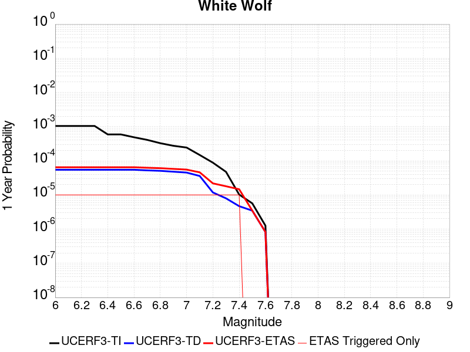 |  |

| Magnitude | 1 wk TI Prob | 1 wk TD Prob | 1 wk ETAS Prob | 1 wk ETAS/TD Gain | 1 wk ETAS Triggered Only | 1 mo TI Prob | 1 mo TD Prob | 1 mo ETAS Prob | 1 mo ETAS/TD Gain | 1 mo ETAS Triggered Only | 1 yr TI Prob | 1 yr TD Prob | 1 yr ETAS Prob | 1 yr ETAS/TD Gain | 1 yr ETAS Triggered Only | 10 yr TI Prob | 10 yr TD Prob | 10 yr ETAS Prob | 10 yr ETAS/TD Gain | 10 yr ETAS Triggered Only |
|-----|-----|-----|-----|-----|-----|-----|-----|-----|-----|-----|-----|-----|-----|-----|-----|-----|-----|-----|-----|-----|
| 6.0 | 2.0037822E-5 | 1.0469162E-6 | 1.0469162E-6 | 1.0 | 0.0 | 8.587355E-5 | 4.486776E-6 | 4.486776E-6 | 1.0 | 0.0 | 0.001045009 | 5.4625183E-5 | 7.15113E-5 | 1.309127 | 1.6887043E-5 | 0.010401085 | 5.461226E-4 | 5.798783E-4 | 1.0618097 | 3.3774086E-5 |
| 6.1 | 2.0037822E-5 | 1.0469162E-6 | 1.0469162E-6 | 1.0 | 0.0 | 8.587355E-5 | 4.486776E-6 | 4.486776E-6 | 1.0 | 0.0 | 0.001045009 | 5.4625183E-5 | 7.15113E-5 | 1.309127 | 1.6887043E-5 | 0.010401085 | 5.461226E-4 | 5.798783E-4 | 1.0618097 | 3.3774086E-5 |
| 6.2 | 2.0037822E-5 | 1.0469162E-6 | 1.0469162E-6 | 1.0 | 0.0 | 8.587355E-5 | 4.486776E-6 | 4.486776E-6 | 1.0 | 0.0 | 0.001045009 | 5.4625183E-5 | 7.15113E-5 | 1.309127 | 1.6887043E-5 | 0.010401085 | 5.461226E-4 | 5.798783E-4 | 1.0618097 | 3.3774086E-5 |
| 6.3 | 2.0037822E-5 | 1.0469162E-6 | 1.0469162E-6 | 1.0 | 0.0 | 8.587355E-5 | 4.486776E-6 | 4.486776E-6 | 1.0 | 0.0 | 0.001045009 | 5.4625183E-5 | 7.15113E-5 | 1.309127 | 1.6887043E-5 | 0.010401085 | 5.461226E-4 | 5.798783E-4 | 1.0618097 | 3.3774086E-5 |
| 6.4 | 1.132487E-5 | 1.0469162E-6 | 1.0469162E-6 | 1.0 | 0.0 | 4.8534253E-5 | 4.486776E-6 | 4.486776E-6 | 1.0 | 0.0 | 5.907443E-4 | 5.4625183E-5 | 7.15113E-5 | 1.309127 | 1.6887043E-5 | 0.005891764 | 5.461226E-4 | 5.798783E-4 | 1.0618097 | 3.3774086E-5 |
| 6.5 | 1.132487E-5 | 1.0469162E-6 | 1.0469162E-6 | 1.0 | 0.0 | 4.8534253E-5 | 4.486776E-6 | 4.486776E-6 | 1.0 | 0.0 | 5.907443E-4 | 5.4625183E-5 | 7.15113E-5 | 1.309127 | 1.6887043E-5 | 0.005891764 | 5.461226E-4 | 5.798783E-4 | 1.0618097 | 3.3774086E-5 |
| 6.6 | 9.347473E-6 | 1.0469162E-6 | 1.0469162E-6 | 1.0 | 0.0 | 4.0059982E-5 | 4.486776E-6 | 4.486776E-6 | 1.0 | 0.0 | 4.8762115E-4 | 5.4625183E-5 | 7.15113E-5 | 1.309127 | 1.6887043E-5 | 0.0048655253 | 5.461226E-4 | 5.798783E-4 | 1.0618097 | 3.3774086E-5 |
| 6.7 | 7.842647E-6 | 1.0048342E-6 | 1.0048342E-6 | 1.0 | 0.0 | 3.361091E-5 | 4.3064256E-6 | 4.3064256E-6 | 1.0 | 0.0 | 4.0913603E-4 | 5.2429517E-5 | 6.9315676E-5 | 1.3220735 | 1.6887043E-5 | 0.004083836 | 5.2417646E-4 | 5.579328E-4 | 1.0643989 | 3.3774086E-5 |
| 6.8 | 6.26597E-6 | 9.734822E-7 | 9.734822E-7 | 1.0 | 0.0 | 2.685388E-5 | 4.17206E-6 | 4.17206E-6 | 1.0 | 0.0 | 3.2689696E-4 | 5.0793697E-5 | 6.767988E-5 | 1.3324465 | 1.6887043E-5 | 0.003264165 | 5.078258E-4 | 5.415827E-4 | 1.0664735 | 3.3774086E-5 |
| 6.9 | 5.258436E-6 | 9.183254E-7 | 9.183254E-7 | 1.0 | 0.0 | 2.2535958E-5 | 3.9356746E-6 | 3.9356746E-6 | 1.0 | 0.0 | 2.7434074E-4 | 4.7915833E-5 | 6.4802065E-5 | 1.3524145 | 1.6887043E-5 | 0.0027400232 | 4.790598E-4 | 5.128177E-4 | 1.070467 | 3.3774086E-5 |
| 7.0 | 4.675028E-6 | 8.6611794E-7 | 8.6611794E-7 | 1.0 | 0.0 | 2.003568E-5 | 3.7119291E-6 | 3.7119291E-6 | 1.0 | 0.0 | 2.4390711E-4 | 4.5191846E-5 | 6.207813E-5 | 1.3736577 | 1.6887043E-5 | 0.0024363957 | 4.518313E-4 | 4.855901E-4 | 1.0747155 | 3.3774086E-5 |
| 7.1 | 2.8270078E-6 | 6.8741696E-7 | 6.8741696E-7 | 1.0 | 0.0 | 1.2115692E-5 | 2.9460696E-6 | 2.9460696E-6 | 1.0 | 0.0 | 1.4749856E-4 | 3.5867848E-5 | 5.2754287E-5 | 1.4707959 | 1.6887043E-5 | 0.001474007 | 3.586247E-4 | 3.9238666E-4 | 1.0941429 | 3.3774086E-5 |
| 7.2 | 1.6881406E-6 | 2.2706382E-7 | 2.2706382E-7 | 1.0 | 0.0 | 7.2348685E-6 | 9.731303E-7 | 9.731303E-7 | 1.0 | 0.0 | 8.808096E-5 | 1.1847799E-5 | 2.8734641E-5 | 2.4253147 | 1.6887043E-5 | 8.8046055E-4 | 1.1847183E-4 | 1.3535687E-4 | 1.1425236 | 1.6887043E-5 |
| 7.3 | 9.086107E-7 | 1.5266386E-7 | 1.5266386E-7 | 1.0 | 0.0 | 3.8940398E-6 | 6.5427355E-7 | 6.5427355E-7 | 1.0 | 0.0 | 4.7408903E-5 | 7.965752E-6 | 2.485266E-5 | 3.1199389 | 1.6887043E-5 | 4.739879E-4 | 7.965475E-5 | 9.654045E-5 | 1.2119861 | 1.6887043E-5 |
| 7.4 | 1.9717383E-7 | 9.003913E-8 | 9.003913E-8 | 1.0 | 0.0 | 8.450304E-7 | 3.8588192E-7 | 3.8588192E-7 | 1.0 | 0.0 | 1.0288197E-5 | 4.6981027E-6 | 2.1585065E-5 | 4.594422 | 1.6887043E-5 | 1.028772E-4 | 4.6980065E-5 | 6.386631E-5 | 1.3594344 | 1.6887043E-5 |
| 7.5 | 1.086975E-7 | 6.6597195E-8 | 6.6597195E-8 | 1.0 | 0.0 | 4.6584634E-7 | 2.8541652E-7 | 2.8541652E-7 | 1.0 | 0.0 | 5.6716644E-6 | 3.474941E-6 | 3.474941E-6 | 1.0 | 0.0 | 5.6715195E-5 | 3.474889E-5 | 3.474889E-5 | 1.0 | 0.0 |
| 7.6 | 2.4217808E-8 | 1.5820765E-8 | 1.5820765E-8 | 1.0 | 0.0 | 1.03790605E-7 | 6.780328E-8 | 6.780328E-8 | 1.0 | 0.0 | 1.2636499E-6 | 8.255046E-7 | 8.255046E-7 | 1.0 | 0.0 | 1.2636427E-5 | 8.2550205E-6 | 8.2550205E-6 | 1.0 | 0.0 |

## San Juan
*[(top)](#table-of-contents)*

| 1 Week | 1 Month | 1 Year | 10 Year |
|-----|-----|-----|-----|
|  |  |  |  |

| Magnitude | 1 wk TI Prob | 1 wk TD Prob | 1 wk ETAS Prob | 1 wk ETAS/TD Gain | 1 wk ETAS Triggered Only | 1 mo TI Prob | 1 mo TD Prob | 1 mo ETAS Prob | 1 mo ETAS/TD Gain | 1 mo ETAS Triggered Only | 1 yr TI Prob | 1 yr TD Prob | 1 yr ETAS Prob | 1 yr ETAS/TD Gain | 1 yr ETAS Triggered Only | 10 yr TI Prob | 10 yr TD Prob | 10 yr ETAS Prob | 10 yr ETAS/TD Gain | 10 yr ETAS Triggered Only |
|-----|-----|-----|-----|-----|-----|-----|-----|-----|-----|-----|-----|-----|-----|-----|-----|-----|-----|-----|-----|-----|
| 6.0 | 8.682808E-6 | 8.7491635E-6 | 8.7491635E-6 | 1.0 | 0.0 | 3.72115E-5 | 3.74959E-5 | 5.438231E-5 | 1.4503535 | 1.6887043E-5 | 4.5295584E-4 | 4.564218E-4 | 4.7330116E-4 | 1.0369818 | 1.6887043E-5 | 0.004520337 | 0.004555385 | 0.0045890054 | 1.0073804 | 3.3774086E-5 |
| 6.1 | 8.682808E-6 | 8.7491635E-6 | 8.7491635E-6 | 1.0 | 0.0 | 3.72115E-5 | 3.74959E-5 | 5.438231E-5 | 1.4503535 | 1.6887043E-5 | 4.5295584E-4 | 4.564218E-4 | 4.7330116E-4 | 1.0369818 | 1.6887043E-5 | 0.004520337 | 0.004555385 | 0.0045890054 | 1.0073804 | 3.3774086E-5 |
| 6.2 | 8.682808E-6 | 8.7491635E-6 | 8.7491635E-6 | 1.0 | 0.0 | 3.72115E-5 | 3.74959E-5 | 5.438231E-5 | 1.4503535 | 1.6887043E-5 | 4.5295584E-4 | 4.564218E-4 | 4.7330116E-4 | 1.0369818 | 1.6887043E-5 | 0.004520337 | 0.004555385 | 0.0045890054 | 1.0073804 | 3.3774086E-5 |
| 6.3 | 6.3054235E-6 | 6.2825848E-6 | 6.2825848E-6 | 1.0 | 0.0 | 2.7022963E-5 | 2.6925094E-5 | 4.381168E-5 | 1.6271691 | 1.6887043E-5 | 3.2895492E-4 | 3.2776513E-4 | 3.4464663E-4 | 1.0515049 | 1.6887043E-5 | 0.003284684 | 0.003273017 | 0.0032898486 | 1.0051426 | 1.6887043E-5 |
| 6.4 | 6.1490473E-6 | 6.1144656E-6 | 6.1144656E-6 | 1.0 | 0.0 | 2.6352795E-5 | 2.6204598E-5 | 4.3091197E-5 | 1.6444136 | 1.6887043E-5 | 3.2079802E-4 | 3.1899565E-4 | 3.358773E-4 | 1.0529213 | 1.6887043E-5 | 0.0032033534 | 0.0031855737 | 0.0032024072 | 1.0052842 | 1.6887043E-5 |
| 6.5 | 5.204848E-6 | 5.137233E-6 | 5.137233E-6 | 1.0 | 0.0 | 2.23063E-5 | 2.2016533E-5 | 3.8903203E-5 | 1.7669995 | 1.6887043E-5 | 2.7154534E-4 | 2.6801927E-4 | 2.849018E-4 | 1.06299 | 1.6887043E-5 | 0.0027121378 | 0.0026771144 | 0.0026939563 | 1.006291 | 1.6887043E-5 |
| 6.6 | 4.5179986E-6 | 4.4150297E-6 | 4.4150297E-6 | 1.0 | 0.0 | 1.9362706E-5 | 1.8921424E-5 | 3.5808145E-5 | 1.8924657 | 1.6887043E-5 | 2.3571544E-4 | 2.3034477E-4 | 2.4722793E-4 | 1.0732951 | 1.6887043E-5 | 0.0023546559 | 0.0023011973 | 0.0023180454 | 1.0073215 | 1.6887043E-5 |
| 6.7 | 3.9442616E-6 | 3.819828E-6 | 3.819828E-6 | 1.0 | 0.0 | 1.6903869E-5 | 1.6370592E-5 | 3.3257358E-5 | 2.0315306 | 1.6887043E-5 | 2.0578515E-4 | 1.992944E-4 | 2.1617809E-4 | 1.0847173 | 1.6887043E-5 | 0.002055947 | 0.0019912818 | 0.0020081352 | 1.0084636 | 1.6887043E-5 |
| 6.8 | 3.4536245E-6 | 3.3163353E-6 | 3.3163353E-6 | 1.0 | 0.0 | 1.4801163E-5 | 1.4212792E-5 | 3.1099593E-5 | 2.188141 | 1.6887043E-5 | 1.8018926E-4 | 1.7302761E-4 | 1.8991173E-4 | 1.0975806 | 1.6887043E-5 | 0.0018004322 | 0.0017290477 | 0.0017459056 | 1.0097498 | 1.6887043E-5 |
| 6.9 | 3.059865E-6 | 2.9120315E-6 | 2.9120315E-6 | 1.0 | 0.0 | 1.3113641E-5 | 1.2480078E-5 | 1.2480078E-5 | 1.0 | 0.0 | 1.596469E-4 | 1.5193493E-4 | 1.5193493E-4 | 1.0 | 0.0 | 0.0015953224 | 0.0015184252 | 0.0015184252 | 1.0 | 0.0 |
| 7.0 | 2.6504351E-6 | 2.4920002E-6 | 2.4920002E-6 | 1.0 | 0.0 | 1.1358958E-5 | 1.0679961E-5 | 1.0679961E-5 | 1.0 | 0.0 | 1.3828653E-4 | 1.300213E-4 | 1.300213E-4 | 1.0 | 0.0 | 0.0013820052 | 0.0012995641 | 0.0012995641 | 1.0 | 0.0 |
| 7.1 | 2.2039317E-6 | 2.0338296E-6 | 2.0338296E-6 | 1.0 | 0.0 | 9.445387E-6 | 8.716386E-6 | 8.716386E-6 | 1.0 | 0.0 | 1.1499152E-4 | 1.0611736E-4 | 1.0611736E-4 | 1.0 | 0.0 | 0.0011493203 | 0.0010607769 | 0.0010607769 | 1.0 | 0.0 |
| 7.2 | 1.0786707E-6 | 8.7701903E-7 | 8.7701903E-7 | 1.0 | 0.0 | 4.622866E-6 | 3.7586476E-6 | 3.7586476E-6 | 1.0 | 0.0 | 5.628194E-5 | 4.5760586E-5 | 4.5760586E-5 | 1.0 | 0.0 | 5.6267687E-4 | 4.5757066E-4 | 4.5757066E-4 | 1.0 | 0.0 |
| 7.3 | 6.846433E-7 | 4.868805E-7 | 4.868805E-7 | 1.0 | 0.0 | 2.9341822E-6 | 2.086629E-6 | 2.086629E-6 | 1.0 | 0.0 | 3.5723086E-5 | 2.5404412E-5 | 2.5404412E-5 | 1.0 | 0.0 | 3.571734E-4 | 2.540486E-4 | 2.540486E-4 | 1.0 | 0.0 |
| 7.4 | 5.23043E-7 | 3.2628162E-7 | 3.2628162E-7 | 1.0 | 0.0 | 2.2416111E-6 | 1.398349E-6 | 1.398349E-6 | 1.0 | 0.0 | 2.7291273E-5 | 1.7024766E-5 | 1.7024766E-5 | 1.0 | 0.0 | 2.7287923E-4 | 1.7026656E-4 | 1.7026656E-4 | 1.0 | 0.0 |
| 7.5 | 4.648444E-7 | 2.7234944E-7 | 2.7234944E-7 | 1.0 | 0.0 | 1.9921886E-6 | 1.1672114E-6 | 1.1672114E-6 | 1.0 | 0.0 | 2.4254627E-5 | 1.42107065E-5 | 1.42107065E-5 | 1.0 | 0.0 | 2.425198E-4 | 1.421276E-4 | 1.421276E-4 | 1.0 | 0.0 |
| 7.6 | 3.9906567E-7 | 2.2083314E-7 | 2.2083314E-7 | 1.0 | 0.0 | 1.7102802E-6 | 9.464274E-7 | 9.464274E-7 | 1.0 | 0.0 | 2.0822463E-5 | 1.1522693E-5 | 1.1522693E-5 | 1.0 | 0.0 | 2.0820512E-4 | 1.15245566E-4 | 1.15245566E-4 | 1.0 | 0.0 |
| 7.7 | 1.8784601E-7 | 5.3666906E-8 | 5.3666906E-8 | 1.0 | 0.0 | 8.0505407E-7 | 2.30001E-7 | 2.30001E-7 | 1.0 | 0.0 | 9.80149E-6 | 2.8002585E-6 | 2.8002585E-6 | 1.0 | 0.0 | 9.801057E-5 | 2.8011282E-5 | 2.8011282E-5 | 1.0 | 0.0 |
| 7.8 | 1.00154914E-7 | 1.2415832E-8 | 1.2415832E-8 | 1.0 | 0.0 | 4.2923529E-7 | 5.3210716E-8 | 5.3210716E-8 | 1.0 | 0.0 | 5.225927E-6 | 6.4784024E-7 | 6.4784024E-7 | 1.0 | 0.0 | 5.225804E-5 | 6.484273E-6 | 6.484273E-6 | 1.0 | 0.0 |
| 7.9 | 6.171429E-8 | 4.2966155E-9 | 4.2966155E-9 | 1.0 | 0.0 | 2.6448978E-7 | 1.8414067E-8 | 1.8414067E-8 | 1.0 | 0.0 | 3.2201583E-6 | 2.2419121E-7 | 2.2419121E-7 | 1.0 | 0.0 | 3.2201115E-5 | 2.2472002E-6 | 2.2472002E-6 | 1.0 | 0.0 |
| 8.0 | 1.3974572E-8 | 3.3788217E-10 | 3.3788217E-10 | 1.0 | 0.0 | 5.989102E-8 | 1.448067E-9 | 1.448067E-9 | 1.0 | 0.0 | 7.2917294E-7 | 1.763022E-8 | 1.763022E-8 | 1.0 | 0.0 | 7.2917055E-6 | 1.8060365E-7 | 1.8060365E-7 | 1.0 | 0.0 |
| 8.1 | 1.8403477E-9 | 1.1302803E-10 | 1.1302803E-10 | 1.0 | 0.0 | 7.887204E-9 | 4.844063E-10 | 4.844063E-10 | 1.0 | 0.0 | 9.602671E-8 | 5.8976446E-9 | 5.8976446E-9 | 1.0 | 0.0 | 9.602667E-7 | 6.021993E-8 | 6.021993E-8 | 1.0 | 0.0 |

## Santa Cruz Island
*[(top)](#table-of-contents)*

| 1 Week | 1 Month | 1 Year | 10 Year |
|-----|-----|-----|-----|
|  |  |  |  |

| Magnitude | 1 wk TI Prob | 1 wk TD Prob | 1 wk ETAS Prob | 1 wk ETAS/TD Gain | 1 wk ETAS Triggered Only | 1 mo TI Prob | 1 mo TD Prob | 1 mo ETAS Prob | 1 mo ETAS/TD Gain | 1 mo ETAS Triggered Only | 1 yr TI Prob | 1 yr TD Prob | 1 yr ETAS Prob | 1 yr ETAS/TD Gain | 1 yr ETAS Triggered Only | 10 yr TI Prob | 10 yr TD Prob | 10 yr ETAS Prob | 10 yr ETAS/TD Gain | 10 yr ETAS Triggered Only |
|-----|-----|-----|-----|-----|-----|-----|-----|-----|-----|-----|-----|-----|-----|-----|-----|-----|-----|-----|-----|-----|
| 6.0 | 2.9164563E-5 | 3.1599742E-5 | 3.1599742E-5 | 1.0 | 0.0 | 1.2498499E-4 | 1.3542121E-4 | 1.3542121E-4 | 1.0 | 0.0 | 0.0015206301 | 0.0016476426 | 0.0016645017 | 1.0102323 | 1.6887043E-5 | 0.015102667 | 0.016368 | 0.01640122 | 1.0020297 | 3.3774086E-5 |
| 6.1 | 2.9164563E-5 | 3.1599742E-5 | 3.1599742E-5 | 1.0 | 0.0 | 1.2498499E-4 | 1.3542121E-4 | 1.3542121E-4 | 1.0 | 0.0 | 0.0015206301 | 0.0016476426 | 0.0016645017 | 1.0102323 | 1.6887043E-5 | 0.015102667 | 0.016368 | 0.01640122 | 1.0020297 | 3.3774086E-5 |
| 6.2 | 2.9164563E-5 | 3.1599742E-5 | 3.1599742E-5 | 1.0 | 0.0 | 1.2498499E-4 | 1.3542121E-4 | 1.3542121E-4 | 1.0 | 0.0 | 0.0015206301 | 0.0016476426 | 0.0016645017 | 1.0102323 | 1.6887043E-5 | 0.015102667 | 0.016368 | 0.01640122 | 1.0020297 | 3.3774086E-5 |
| 6.3 | 1.6635553E-5 | 1.780436E-5 | 1.780436E-5 | 1.0 | 0.0 | 7.1293274E-5 | 7.630226E-5 | 7.630226E-5 | 1.0 | 0.0 | 8.6765E-4 | 9.2860236E-4 | 9.4547373E-4 | 1.0181686 | 1.6887043E-5 | 0.008642701 | 0.009249094 | 0.009265824 | 1.0018089 | 1.6887043E-5 |
| 6.4 | 1.6635553E-5 | 1.780436E-5 | 1.780436E-5 | 1.0 | 0.0 | 7.1293274E-5 | 7.630226E-5 | 7.630226E-5 | 1.0 | 0.0 | 8.6765E-4 | 9.2860236E-4 | 9.4547373E-4 | 1.0181686 | 1.6887043E-5 | 0.008642701 | 0.009249094 | 0.009265824 | 1.0018089 | 1.6887043E-5 |
| 6.5 | 1.2238748E-5 | 1.3042995E-5 | 1.3042995E-5 | 1.0 | 0.0 | 5.2450723E-5 | 5.5897377E-5 | 5.5897377E-5 | 1.0 | 0.0 | 6.3840044E-4 | 6.8034173E-4 | 6.972173E-4 | 1.0248045 | 1.6887043E-5 | 0.0063656955 | 0.0067829876 | 0.0067997603 | 1.0024728 | 1.6887043E-5 |
| 6.6 | 1.0489767E-5 | 1.1156636E-5 | 1.1156636E-5 | 1.0 | 0.0 | 4.495537E-5 | 4.781329E-5 | 4.781329E-5 | 1.0 | 0.0 | 5.4719415E-4 | 5.819735E-4 | 5.988508E-4 | 1.0289999 | 1.6887043E-5 | 0.005458487 | 0.0058047357 | 0.0058215247 | 1.0028923 | 1.6887043E-5 |
| 6.7 | 8.699222E-6 | 9.236782E-6 | 9.236782E-6 | 1.0 | 0.0 | 3.7281847E-5 | 3.958561E-5 | 3.958561E-5 | 1.0 | 0.0 | 4.5381195E-4 | 4.8184878E-4 | 4.8184878E-4 | 1.0 | 0.0 | 0.0045288634 | 0.004808108 | 0.004808108 | 1.0 | 0.0 |
| 6.8 | 8.307732E-6 | 8.8169045E-6 | 8.8169045E-6 | 1.0 | 0.0 | 3.560408E-5 | 3.7786187E-5 | 3.7786187E-5 | 1.0 | 0.0 | 4.3339343E-4 | 4.5995016E-4 | 4.5995016E-4 | 1.0 | 0.0 | 0.004325492 | 0.0045900354 | 0.0045900354 | 1.0 | 0.0 |
| 6.9 | 8.073121E-6 | 8.564939E-6 | 8.564939E-6 | 1.0 | 0.0 | 3.459863E-5 | 3.6706366E-5 | 3.6706366E-5 | 1.0 | 0.0 | 4.2115687E-4 | 4.468088E-4 | 4.468088E-4 | 1.0 | 0.0 | 0.004203596 | 0.004459156 | 0.004459156 | 1.0 | 0.0 |
| 7.0 | 7.617019E-6 | 8.074664E-6 | 8.074664E-6 | 1.0 | 0.0 | 3.264396E-5 | 3.4605247E-5 | 3.4605247E-5 | 1.0 | 0.0 | 3.9736772E-4 | 4.212378E-4 | 4.212378E-4 | 1.0 | 0.0 | 0.003966579 | 0.0042044413 | 0.0042044413 | 1.0 | 0.0 |
| 7.1 | 7.1224836E-6 | 7.545788E-6 | 7.545788E-6 | 1.0 | 0.0 | 3.052457E-5 | 3.2338692E-5 | 3.2338692E-5 | 1.0 | 0.0 | 3.715733E-4 | 3.936528E-4 | 3.936528E-4 | 1.0 | 0.0 | 0.003709526 | 0.003929598 | 0.003929598 | 1.0 | 0.0 |
| 7.2 | 6.441115E-6 | 6.8273835E-6 | 6.8273835E-6 | 1.0 | 0.0 | 2.7604487E-5 | 2.9259887E-5 | 2.9259887E-5 | 1.0 | 0.0 | 3.360328E-4 | 3.5618112E-4 | 3.5618112E-4 | 1.0 | 0.0 | 0.0033552512 | 0.003556131 | 0.003556131 | 1.0 | 0.0 |
| 7.3 | 5.494274E-6 | 5.8199944E-6 | 5.8199944E-6 | 1.0 | 0.0 | 2.3546674E-5 | 2.4942596E-5 | 2.4942596E-5 | 1.0 | 0.0 | 2.8664304E-4 | 3.0363398E-4 | 3.0363398E-4 | 1.0 | 0.0 | 0.002862736 | 0.0030322142 | 0.0030322142 | 1.0 | 0.0 |
| 7.4 | 4.0802624E-6 | 4.312256E-6 | 4.312256E-6 | 1.0 | 0.0 | 1.7486722E-5 | 1.8480967E-5 | 1.8480967E-5 | 1.0 | 0.0 | 2.1288003E-4 | 2.2498262E-4 | 2.2498262E-4 | 1.0 | 0.0 | 0.0021267622 | 0.0022475575 | 0.0022475575 | 1.0 | 0.0 |
| 7.5 | 2.3584746E-6 | 2.4753094E-6 | 2.4753094E-6 | 1.0 | 0.0 | 1.0107709E-5 | 1.0608426E-5 | 1.0608426E-5 | 1.0 | 0.0 | 1.2305441E-4 | 1.2915E-4 | 1.2915E-4 | 1.0 | 0.0 | 0.0012298629 | 0.0012907543 | 0.0012907543 | 1.0 | 0.0 |
| 7.6 | 9.4981914E-7 | 9.86093E-7 | 9.86093E-7 | 1.0 | 0.0 | 4.0706473E-6 | 4.2261063E-6 | 4.2261063E-6 | 1.0 | 0.0 | 4.9559E-5 | 5.145164E-5 | 5.145164E-5 | 1.0 | 0.0 | 4.954795E-4 | 5.1439856E-4 | 5.1439856E-4 | 1.0 | 0.0 |
| 7.7 | 2.6013532E-7 | 2.6416603E-7 | 2.6416603E-7 | 1.0 | 0.0 | 1.1148652E-6 | 1.1321397E-6 | 1.1321397E-6 | 1.0 | 0.0 | 1.3573399E-5 | 1.3783714E-5 | 1.3783714E-5 | 1.0 | 0.0 | 1.357257E-4 | 1.3782867E-4 | 1.3782867E-4 | 1.0 | 0.0 |
| 7.8 | 4.1522263E-8 | 3.965679E-8 | 3.965679E-8 | 1.0 | 0.0 | 1.7795254E-7 | 1.6995766E-7 | 1.6995766E-7 | 1.0 | 0.0 | 2.16657E-6 | 2.0692328E-6 | 2.0692328E-6 | 1.0 | 0.0 | 2.1665488E-5 | 2.0692156E-5 | 2.0692156E-5 | 1.0 | 0.0 |
| 7.9 | 7.7242046E-10 | 5.9468175E-10 | 5.9468175E-10 | 1.0 | 0.0 | 3.3103735E-9 | 2.5486364E-9 | 2.5486364E-9 | 1.0 | 0.0 | 4.0303796E-8 | 3.1029646E-8 | 3.1029646E-8 | 1.0 | 0.0 | 4.030379E-7 | 3.1029643E-7 | 3.1029643E-7 | 1.0 | 0.0 |

## Hollywood
*[(top)](#table-of-contents)*

| 1 Week | 1 Month | 1 Year | 10 Year |
|-----|-----|-----|-----|
| 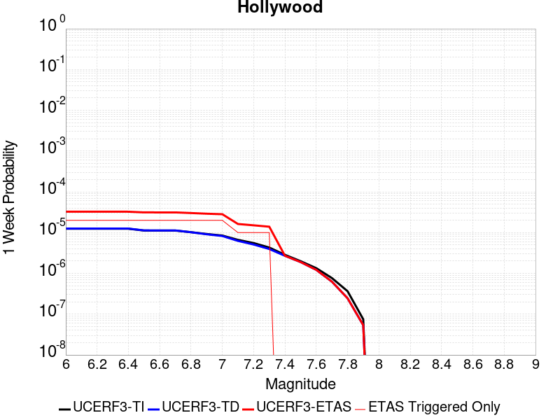 |  |  |  |

| Magnitude | 1 wk TI Prob | 1 wk TD Prob | 1 wk ETAS Prob | 1 wk ETAS/TD Gain | 1 wk ETAS Triggered Only | 1 mo TI Prob | 1 mo TD Prob | 1 mo ETAS Prob | 1 mo ETAS/TD Gain | 1 mo ETAS Triggered Only | 1 yr TI Prob | 1 yr TD Prob | 1 yr ETAS Prob | 1 yr ETAS/TD Gain | 1 yr ETAS Triggered Only | 10 yr TI Prob | 10 yr TD Prob | 10 yr ETAS Prob | 10 yr ETAS/TD Gain | 10 yr ETAS Triggered Only |
|-----|-----|-----|-----|-----|-----|-----|-----|-----|-----|-----|-----|-----|-----|-----|-----|-----|-----|-----|-----|-----|
| 6.0 | 1.24487615E-5 | 1.2593226E-5 | 4.6366884E-5 | 3.681891 | 3.3774086E-5 | 5.3350745E-5 | 5.3969878E-5 | 8.774214E-5 | 1.6257614 | 3.3774086E-5 | 6.4935174E-4 | 6.568898E-4 | 6.906417E-4 | 1.0513813 | 3.3774086E-5 | 0.0064745755 | 0.006549969 | 0.0065835216 | 1.0051225 | 3.3774086E-5 |
| 6.1 | 1.24487615E-5 | 1.2593226E-5 | 4.6366884E-5 | 3.681891 | 3.3774086E-5 | 5.3350745E-5 | 5.3969878E-5 | 8.774214E-5 | 1.6257614 | 3.3774086E-5 | 6.4935174E-4 | 6.568898E-4 | 6.906417E-4 | 1.0513813 | 3.3774086E-5 | 0.0064745755 | 0.006549969 | 0.0065835216 | 1.0051225 | 3.3774086E-5 |
| 6.2 | 1.24487615E-5 | 1.2593226E-5 | 4.6366884E-5 | 3.681891 | 3.3774086E-5 | 5.3350745E-5 | 5.3969878E-5 | 8.774214E-5 | 1.6257614 | 3.3774086E-5 | 6.4935174E-4 | 6.568898E-4 | 6.906417E-4 | 1.0513813 | 3.3774086E-5 | 0.0064745755 | 0.006549969 | 0.0065835216 | 1.0051225 | 3.3774086E-5 |
| 6.3 | 1.24487615E-5 | 1.2593226E-5 | 4.6366884E-5 | 3.681891 | 3.3774086E-5 | 5.3350745E-5 | 5.3969878E-5 | 8.774214E-5 | 1.6257614 | 3.3774086E-5 | 6.4935174E-4 | 6.568898E-4 | 6.906417E-4 | 1.0513813 | 3.3774086E-5 | 0.0064745755 | 0.006549969 | 0.0065835216 | 1.0051225 | 3.3774086E-5 |
| 6.4 | 1.2431024E-5 | 1.2573839E-5 | 4.63475E-5 | 3.686026 | 3.3774086E-5 | 5.327473E-5 | 5.3886797E-5 | 8.7659064E-5 | 1.6267262 | 3.3774086E-5 | 6.4842677E-4 | 6.558789E-4 | 6.896308E-4 | 1.0514606 | 3.3774086E-5 | 0.0064653796 | 0.0065399194 | 0.0065734726 | 1.0051305 | 3.3774086E-5 |
| 6.5 | 1.1242222E-5 | 1.13178E-5 | 4.5091503E-5 | 3.9841225 | 3.3774086E-5 | 4.8180063E-5 | 4.850397E-5 | 8.227642E-5 | 1.6962821 | 3.3774086E-5 | 5.864344E-4 | 5.9037853E-4 | 6.241327E-4 | 1.0571737 | 3.3774086E-5 | 0.0058488925 | 0.005888388 | 0.005921963 | 1.0057019 | 3.3774086E-5 |
| 6.6 | 1.1234066E-5 | 1.13089145E-5 | 4.5082616E-5 | 3.9864674 | 3.3774086E-5 | 4.8145106E-5 | 4.846589E-5 | 8.223834E-5 | 1.6968292 | 3.3774086E-5 | 5.86009E-4 | 5.8991514E-4 | 6.236693E-4 | 1.0572187 | 3.3774086E-5 | 0.005844661 | 0.0058837784 | 0.005917354 | 1.0057064 | 3.3774086E-5 |
| 6.7 | 1.12294E-5 | 1.1303658E-5 | 4.5077362E-5 | 3.9878561 | 3.3774086E-5 | 4.812511E-5 | 4.8443362E-5 | 8.221581E-5 | 1.6971533 | 3.3774086E-5 | 5.857657E-4 | 5.89641E-4 | 6.233952E-4 | 1.0572453 | 3.3774086E-5 | 0.0058422405 | 0.005881052 | 0.005914627 | 1.005709 | 3.3774086E-5 |
| 6.8 | 1.0252819E-5 | 1.0218445E-5 | 4.3992186E-5 | 4.3051744 | 3.3774086E-5 | 4.3939912E-5 | 4.379261E-5 | 7.7565215E-5 | 1.7711942 | 3.3774086E-5 | 5.3483713E-4 | 5.330467E-4 | 5.668028E-4 | 1.0633267 | 3.3774086E-5 | 0.005335517 | 0.005317908 | 0.005351502 | 1.0063173 | 3.3774086E-5 |
| 6.9 | 9.252289E-6 | 9.110306E-6 | 4.2884083E-5 | 4.707206 | 3.3774086E-5 | 3.9652066E-5 | 3.9043593E-5 | 7.281636E-5 | 1.8650014 | 3.3774086E-5 | 4.8265693E-4 | 4.752537E-4 | 5.0901173E-4 | 1.0710316 | 3.3774086E-5 | 0.0048161 | 0.004742547 | 0.0047761607 | 1.0070877 | 3.3774086E-5 |
| 7.0 | 8.474604E-6 | 8.258257E-6 | 4.2032065E-5 | 5.0897017 | 3.3774086E-5 | 3.6319227E-5 | 3.539206E-5 | 6.916495E-5 | 1.9542506 | 3.3774086E-5 | 4.4209688E-4 | 4.3081454E-4 | 4.6457408E-4 | 1.0783621 | 3.3774086E-5 | 0.004412184 | 0.004299944 | 0.004333573 | 1.0078207 | 3.3774086E-5 |
| 7.1 | 6.643643E-6 | 6.2683675E-6 | 2.3155304E-5 | 3.6939929 | 1.6887043E-5 | 2.8472443E-5 | 2.6864158E-5 | 4.3750748E-5 | 1.6285918 | 1.6887043E-5 | 3.4659685E-4 | 3.2702246E-4 | 3.43904E-4 | 1.0516219 | 1.6887043E-5 | 0.0034605677 | 0.0032654584 | 0.0032822902 | 1.0051545 | 1.6887043E-5 |
| 7.2 | 5.549002E-6 | 5.108709E-6 | 2.1995666E-5 | 4.3055234 | 1.6887043E-5 | 2.378122E-5 | 2.1894284E-5 | 3.8780956E-5 | 1.7712822 | 1.6887043E-5 | 2.8949787E-4 | 2.6653046E-4 | 2.8341298E-4 | 1.0633419 | 1.6887043E-5 | 0.0028912104 | 0.0026621243 | 0.0026789664 | 1.0063266 | 1.6887043E-5 |
| 7.3 | 4.3059727E-6 | 3.9598885E-6 | 2.0846865E-5 | 5.264508 | 1.6887043E-5 | 1.8454039E-5 | 1.6970842E-5 | 3.38576E-5 | 1.9950453 | 1.6887043E-5 | 2.2465475E-4 | 2.066005E-4 | 2.2348405E-4 | 1.0817208 | 1.6887043E-5 | 0.0022442779 | 0.0020640944 | 0.0020809465 | 1.0081644 | 1.6887043E-5 |
| 7.4 | 2.8550733E-6 | 2.7012966E-6 | 2.7012966E-6 | 1.0 | 0.0 | 1.2235971E-5 | 1.1576934E-5 | 1.1576934E-5 | 1.0 | 0.0 | 1.4896276E-4 | 1.409401E-4 | 1.409401E-4 | 1.0 | 0.0 | 0.0014886294 | 0.0014085122 | 0.0014085122 | 1.0 | 0.0 |
| 7.5 | 1.9927045E-6 | 1.8976367E-6 | 1.8976367E-6 | 1.0 | 0.0 | 8.540134E-6 | 8.132703E-6 | 8.132703E-6 | 1.0 | 0.0 | 1.0397117E-4 | 9.90112E-5 | 9.90112E-5 | 1.0 | 0.0 | 0.0010392254 | 9.896745E-4 | 9.896745E-4 | 1.0 | 0.0 |
| 7.6 | 1.345084E-6 | 1.2216007E-6 | 1.2216007E-6 | 1.0 | 0.0 | 5.764633E-6 | 5.235421E-6 | 5.235421E-6 | 1.0 | 0.0 | 7.018215E-5 | 6.3739404E-5 | 6.3739404E-5 | 1.0 | 0.0 | 7.0159987E-4 | 6.3721323E-4 | 6.3721323E-4 | 1.0 | 0.0 |
| 7.7 | 7.6835164E-7 | 6.277697E-7 | 6.277697E-7 | 1.0 | 0.0 | 3.2929315E-6 | 2.6904388E-6 | 2.6904388E-6 | 1.0 | 0.0 | 4.00907E-5 | 3.2755615E-5 | 3.2755615E-5 | 1.0 | 0.0 | 4.0083472E-4 | 3.2750933E-4 | 3.2750933E-4 | 1.0 | 0.0 |
| 7.8 | 3.6562128E-7 | 2.453479E-7 | 2.453479E-7 | 1.0 | 0.0 | 1.5669474E-6 | 1.0514907E-6 | 1.0514907E-6 | 1.0 | 0.0 | 1.9077417E-5 | 1.2801827E-5 | 1.2801827E-5 | 1.0 | 0.0 | 1.907578E-4 | 1.2801126E-4 | 1.2801126E-4 | 1.0 | 0.0 |
| 7.9 | 7.5024424E-8 | 5.3816795E-8 | 5.3816795E-8 | 1.0 | 0.0 | 3.215332E-7 | 2.306434E-7 | 2.306434E-7 | 1.0 | 0.0 | 3.91466E-6 | 2.808081E-6 | 2.808081E-6 | 1.0 | 0.0 | 3.9145907E-5 | 2.8080585E-5 | 2.8080585E-5 | 1.0 | 0.0 |

## Santa Monica alt 1
*[(top)](#table-of-contents)*

| 1 Week | 1 Month | 1 Year | 10 Year |
|-----|-----|-----|-----|
|  |  |  |  |

| Magnitude | 1 wk TI Prob | 1 wk TD Prob | 1 wk ETAS Prob | 1 wk ETAS/TD Gain | 1 wk ETAS Triggered Only | 1 mo TI Prob | 1 mo TD Prob | 1 mo ETAS Prob | 1 mo ETAS/TD Gain | 1 mo ETAS Triggered Only | 1 yr TI Prob | 1 yr TD Prob | 1 yr ETAS Prob | 1 yr ETAS/TD Gain | 1 yr ETAS Triggered Only | 10 yr TI Prob | 10 yr TD Prob | 10 yr ETAS Prob | 10 yr ETAS/TD Gain | 10 yr ETAS Triggered Only |
|-----|-----|-----|-----|-----|-----|-----|-----|-----|-----|-----|-----|-----|-----|-----|-----|-----|-----|-----|-----|-----|
| 6.0 | 1.1066008E-5 | 1.148031E-5 | 4.5254008E-5 | 3.9418802 | 3.3774086E-5 | 4.742488E-5 | 4.920048E-5 | 8.29729E-5 | 1.6864247 | 3.3774086E-5 | 5.7724497E-4 | 5.9886515E-4 | 6.32619E-4 | 1.056363 | 3.3774086E-5 | 0.005757478 | 0.0059739 | 0.0060074725 | 1.0056199 | 3.3774086E-5 |
| 6.1 | 1.1066008E-5 | 1.148031E-5 | 4.5254008E-5 | 3.9418802 | 3.3774086E-5 | 4.742488E-5 | 4.920048E-5 | 8.29729E-5 | 1.6864247 | 3.3774086E-5 | 5.7724497E-4 | 5.9886515E-4 | 6.32619E-4 | 1.056363 | 3.3774086E-5 | 0.005757478 | 0.0059739 | 0.0060074725 | 1.0056199 | 3.3774086E-5 |
| 6.2 | 1.1066008E-5 | 1.148031E-5 | 4.5254008E-5 | 3.9418802 | 3.3774086E-5 | 4.742488E-5 | 4.920048E-5 | 8.29729E-5 | 1.6864247 | 3.3774086E-5 | 5.7724497E-4 | 5.9886515E-4 | 6.32619E-4 | 1.056363 | 3.3774086E-5 | 0.005757478 | 0.0059739 | 0.0060074725 | 1.0056199 | 3.3774086E-5 |
| 6.3 | 1.1066008E-5 | 1.148031E-5 | 4.5254008E-5 | 3.9418802 | 3.3774086E-5 | 4.742488E-5 | 4.920048E-5 | 8.29729E-5 | 1.6864247 | 3.3774086E-5 | 5.7724497E-4 | 5.9886515E-4 | 6.32619E-4 | 1.056363 | 3.3774086E-5 | 0.005757478 | 0.0059739 | 0.0060074725 | 1.0056199 | 3.3774086E-5 |
| 6.4 | 1.1066008E-5 | 1.148031E-5 | 4.5254008E-5 | 3.9418802 | 3.3774086E-5 | 4.742488E-5 | 4.920048E-5 | 8.29729E-5 | 1.6864247 | 3.3774086E-5 | 5.7724497E-4 | 5.9886515E-4 | 6.32619E-4 | 1.056363 | 3.3774086E-5 | 0.005757478 | 0.0059739 | 0.0060074725 | 1.0056199 | 3.3774086E-5 |
| 6.5 | 8.183544E-6 | 8.335432E-6 | 4.2109234E-5 | 5.0518365 | 3.3774086E-5 | 3.5071862E-5 | 3.57228E-5 | 6.9495676E-5 | 1.9454153 | 3.3774086E-5 | 4.2691626E-4 | 4.3483984E-4 | 4.6859926E-4 | 1.0776364 | 3.3774086E-5 | 0.0042609703 | 0.0043400554 | 0.004373683 | 1.0077481 | 3.3774086E-5 |
| 6.6 | 8.1543285E-6 | 8.303646E-6 | 4.2077452E-5 | 5.0673466 | 3.3774086E-5 | 3.4946657E-5 | 3.5586578E-5 | 6.935946E-5 | 1.9490343 | 3.3774086E-5 | 4.2539247E-4 | 4.3318202E-4 | 4.6694148E-4 | 1.0779337 | 3.3774086E-5 | 0.0042457907 | 0.004323542 | 0.00435717 | 1.0077779 | 3.3774086E-5 |
| 6.7 | 8.110878E-6 | 8.257042E-6 | 4.203085E-5 | 5.090303 | 3.3774086E-5 | 3.4760444E-5 | 3.5386853E-5 | 6.9159745E-5 | 1.9543909 | 3.3774086E-5 | 4.231262E-4 | 4.3075136E-4 | 4.645109E-4 | 1.0783736 | 3.3774086E-5 | 0.0042232145 | 0.0042993296 | 0.0043329583 | 1.0078219 | 3.3774086E-5 |
| 6.8 | 7.644036E-6 | 7.75106E-6 | 4.1524883E-5 | 5.3573165 | 3.3774086E-5 | 3.275974E-5 | 3.3218414E-5 | 6.699138E-5 | 2.016694 | 3.3774086E-5 | 3.9877684E-4 | 4.0436056E-4 | 4.38121E-4 | 1.0834908 | 3.3774086E-5 | 0.00398062 | 0.0040363944 | 0.004070032 | 1.0083336 | 3.3774086E-5 |
| 6.9 | 7.3698293E-6 | 7.455719E-6 | 4.1229552E-5 | 5.529923 | 3.3774086E-5 | 3.15846E-5 | 3.19527E-5 | 6.5725704E-5 | 2.056969 | 3.3774086E-5 | 3.8447464E-4 | 3.8895605E-4 | 4.2271698E-4 | 1.0867989 | 3.3774086E-5 | 0.0038381014 | 0.0038828964 | 0.0039165393 | 1.0086644 | 3.3774086E-5 |
| 7.0 | 7.209872E-6 | 7.2856255E-6 | 4.1059466E-5 | 5.6356816 | 3.3774086E-5 | 3.0899086E-5 | 3.1223743E-5 | 6.499678E-5 | 2.0816457 | 3.3774086E-5 | 3.7613141E-4 | 3.8008415E-4 | 4.138454E-4 | 1.0888257 | 3.3774086E-5 | 0.0037549543 | 0.0037944836 | 0.0038281295 | 1.008867 | 3.3774086E-5 |
| 7.1 | 5.603456E-6 | 5.5238925E-6 | 2.241084E-5 | 4.057074 | 1.6887043E-5 | 2.4014591E-5 | 2.3673612E-5 | 4.0560255E-5 | 1.7133108 | 1.6887043E-5 | 2.923384E-4 | 2.881885E-4 | 3.050707E-4 | 1.0585803 | 1.6887043E-5 | 0.0029195412 | 0.0028781896 | 0.0028950279 | 1.0058503 | 1.6887043E-5 |
| 7.2 | 4.7483613E-6 | 4.5911324E-6 | 2.1478098E-5 | 4.6781697 | 1.6887043E-5 | 2.0349962E-5 | 1.9676136E-5 | 3.6562844E-5 | 1.8582331 | 1.6887043E-5 | 2.4773262E-4 | 2.3953074E-4 | 2.5641374E-4 | 1.0704837 | 1.6887043E-5 | 0.0024745662 | 0.0023927398 | 0.0024095865 | 1.0070407 | 1.6887043E-5 |
| 7.3 | 3.829015E-6 | 3.6342253E-6 | 2.0521207E-5 | 5.646652 | 1.6887043E-5 | 1.6409962E-5 | 1.5575159E-5 | 3.246194E-5 | 2.0842123 | 1.6887043E-5 | 1.9977297E-4 | 1.8961114E-4 | 2.0649498E-4 | 1.0890446 | 1.6887043E-5 | 0.0019959346 | 0.0018945024 | 0.0019113575 | 1.0088968 | 1.6887043E-5 |
| 7.4 | 2.610755E-6 | 2.4995716E-6 | 2.4995716E-6 | 1.0 | 0.0 | 1.1188902E-5 | 1.0712406E-5 | 1.0712406E-5 | 1.0 | 0.0 | 1.3621636E-4 | 1.3041578E-4 | 1.3041578E-4 | 1.0 | 0.0 | 0.001361329 | 0.0013033969 | 0.0013033969 | 1.0 | 0.0 |
| 7.5 | 1.792146E-6 | 1.7584184E-6 | 1.7584184E-6 | 1.0 | 0.0 | 7.680603E-6 | 7.536057E-6 | 7.536057E-6 | 1.0 | 0.0 | 9.3507326E-5 | 9.1747665E-5 | 9.1747665E-5 | 1.0 | 0.0 | 9.3467993E-4 | 9.1710105E-4 | 9.1710105E-4 | 1.0 | 0.0 |
| 7.6 | 1.1473018E-6 | 1.1029152E-6 | 1.1029152E-6 | 1.0 | 0.0 | 4.9169985E-6 | 4.726771E-6 | 4.726771E-6 | 1.0 | 0.0 | 5.986281E-5 | 5.7546935E-5 | 5.7546935E-5 | 1.0 | 0.0 | 5.984669E-4 | 5.7532196E-4 | 5.7532196E-4 | 1.0 | 0.0 |
| 7.7 | 5.330919E-7 | 4.7452556E-7 | 4.7452556E-7 | 1.0 | 0.0 | 2.2846775E-6 | 2.0336795E-6 | 2.0336795E-6 | 1.0 | 0.0 | 2.7815593E-5 | 2.4759778E-5 | 2.4759778E-5 | 1.0 | 0.0 | 2.7812112E-4 | 2.4757133E-4 | 2.4757133E-4 | 1.0 | 0.0 |
| 7.8 | 1.1668574E-7 | 8.2966224E-8 | 8.2966224E-8 | 1.0 | 0.0 | 5.000816E-7 | 3.5556948E-7 | 3.5556948E-7 | 1.0 | 0.0 | 6.0884768E-6 | 4.32905E-6 | 4.32905E-6 | 1.0 | 0.0 | 6.08831E-5 | 4.3289692E-5 | 4.3289692E-5 | 1.0 | 0.0 |
| 7.9 | 8.007447E-10 | 6.1608785E-10 | 6.1608785E-10 | 1.0 | 0.0 | 3.4317629E-9 | 2.6403764E-9 | 2.6403764E-9 | 1.0 | 0.0 | 4.1781714E-8 | 3.2146584E-8 | 3.2146584E-8 | 1.0 | 0.0 | 4.1781706E-7 | 3.214658E-7 | 3.214658E-7 | 1.0 | 0.0 |

## Sheephole
*[(top)](#table-of-contents)*

| 1 Week | 1 Month | 1 Year | 10 Year |
|-----|-----|-----|-----|
|  |  |  | 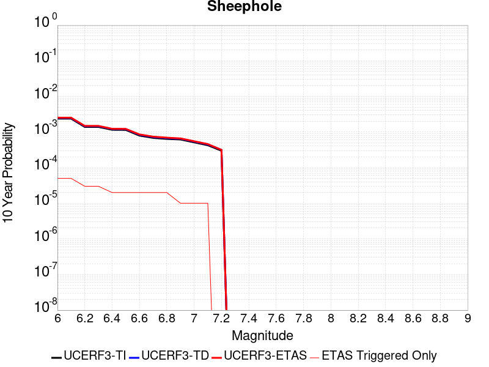 |

| Magnitude | 1 wk TI Prob | 1 wk TD Prob | 1 wk ETAS Prob | 1 wk ETAS/TD Gain | 1 wk ETAS Triggered Only | 1 mo TI Prob | 1 mo TD Prob | 1 mo ETAS Prob | 1 mo ETAS/TD Gain | 1 mo ETAS Triggered Only | 1 yr TI Prob | 1 yr TD Prob | 1 yr ETAS Prob | 1 yr ETAS/TD Gain | 1 yr ETAS Triggered Only | 10 yr TI Prob | 10 yr TD Prob | 10 yr ETAS Prob | 10 yr ETAS/TD Gain | 10 yr ETAS Triggered Only |
|-----|-----|-----|-----|-----|-----|-----|-----|-----|-----|-----|-----|-----|-----|-----|-----|-----|-----|-----|-----|-----|
| 6.0 | 4.5579695E-6 | 4.7412627E-6 | 2.1628224E-5 | 4.561702 | 1.6887043E-5 | 1.9534009E-5 | 2.031957E-5 | 3.7206268E-5 | 1.831056 | 1.6887043E-5 | 2.3780059E-4 | 2.473682E-4 | 2.6425108E-4 | 1.06825 | 1.6887043E-5 | 0.0023754628 | 0.002471473 | 0.0025051637 | 1.0136318 | 3.3774086E-5 |
| 6.1 | 4.5579695E-6 | 4.7412627E-6 | 2.1628224E-5 | 4.561702 | 1.6887043E-5 | 1.9534009E-5 | 2.031957E-5 | 3.7206268E-5 | 1.831056 | 1.6887043E-5 | 2.3780059E-4 | 2.473682E-4 | 2.6425108E-4 | 1.06825 | 1.6887043E-5 | 0.0023754628 | 0.002471473 | 0.0025051637 | 1.0136318 | 3.3774086E-5 |
| 6.2 | 2.6677674E-6 | 2.7873941E-6 | 2.7873941E-6 | 1.0 | 0.0 | 1.1433239E-5 | 1.1945926E-5 | 1.1945926E-5 | 1.0 | 0.0 | 1.3919079E-4 | 1.4543302E-4 | 1.4543302E-4 | 1.0 | 0.0 | 0.0013910364 | 0.0014534844 | 0.0014703469 | 1.0116014 | 1.6887043E-5 |
| 6.3 | 2.6677674E-6 | 2.7873941E-6 | 2.7873941E-6 | 1.0 | 0.0 | 1.1433239E-5 | 1.1945926E-5 | 1.1945926E-5 | 1.0 | 0.0 | 1.3919079E-4 | 1.4543302E-4 | 1.4543302E-4 | 1.0 | 0.0 | 0.0013910364 | 0.0014534844 | 0.0014703469 | 1.0116014 | 1.6887043E-5 |
| 6.4 | 2.2159759E-6 | 2.3228788E-6 | 2.3228788E-6 | 1.0 | 0.0 | 9.497005E-6 | 9.955161E-6 | 9.955161E-6 | 1.0 | 0.0 | 1.156199E-4 | 1.2119815E-4 | 1.2119815E-4 | 1.0 | 0.0 | 0.0011555976 | 0.0012113999 | 0.0012113999 | 1.0 | 0.0 |
| 6.5 | 2.1986082E-6 | 2.304759E-6 | 2.304759E-6 | 1.0 | 0.0 | 9.4225725E-6 | 9.877506E-6 | 9.877506E-6 | 1.0 | 0.0 | 1.1471378E-4 | 1.2025281E-4 | 1.2025281E-4 | 1.0 | 0.0 | 0.0011465458 | 0.0012019566 | 0.0012019566 | 1.0 | 0.0 |
| 6.6 | 1.5232331E-6 | 1.6018919E-6 | 1.6018919E-6 | 1.0 | 0.0 | 6.5281256E-6 | 6.865234E-6 | 6.865234E-6 | 1.0 | 0.0 | 7.947703E-5 | 8.35812E-5 | 8.35812E-5 | 1.0 | 0.0 | 7.9448614E-4 | 8.3551643E-4 | 8.3551643E-4 | 1.0 | 0.0 |
| 6.7 | 1.3137362E-6 | 1.382819E-6 | 1.382819E-6 | 1.0 | 0.0 | 5.6302856E-6 | 5.926355E-6 | 5.926355E-6 | 1.0 | 0.0 | 6.854657E-5 | 7.215112E-5 | 7.215112E-5 | 1.0 | 0.0 | 6.8525434E-4 | 7.212908E-4 | 7.212908E-4 | 1.0 | 0.0 |
| 6.8 | 1.2275751E-6 | 1.2922847E-6 | 1.2922847E-6 | 1.0 | 0.0 | 5.2610258E-6 | 5.5383516E-6 | 5.5383516E-6 | 1.0 | 0.0 | 6.4051106E-5 | 6.7427485E-5 | 6.7427485E-5 | 1.0 | 0.0 | 6.4032647E-4 | 6.740836E-4 | 6.740836E-4 | 1.0 | 0.0 |
| 6.9 | 1.1837088E-6 | 1.246102E-6 | 1.246102E-6 | 1.0 | 0.0 | 5.0730278E-6 | 5.340427E-6 | 5.340427E-6 | 1.0 | 0.0 | 6.176237E-5 | 6.501789E-5 | 6.501789E-5 | 1.0 | 0.0 | 6.17452E-4 | 6.5000186E-4 | 6.5000186E-4 | 1.0 | 0.0 |
| 7.0 | 9.849371E-7 | 1.0366288E-6 | 1.0366288E-6 | 1.0 | 0.0 | 4.2211523E-6 | 4.442688E-6 | 4.442688E-6 | 1.0 | 0.0 | 5.1391315E-5 | 5.4088487E-5 | 5.4088487E-5 | 1.0 | 0.0 | 5.137943E-4 | 5.407633E-4 | 5.407633E-4 | 1.0 | 0.0 |
| 7.1 | 8.1643645E-7 | 8.591669E-7 | 8.591669E-7 | 1.0 | 0.0 | 3.4990085E-6 | 3.682139E-6 | 3.682139E-6 | 1.0 | 0.0 | 4.2599597E-5 | 4.482921E-5 | 4.482921E-5 | 1.0 | 0.0 | 4.259143E-4 | 4.4821028E-4 | 4.4821028E-4 | 1.0 | 0.0 |
| 7.2 | 5.7295756E-7 | 6.029502E-7 | 6.029502E-7 | 1.0 | 0.0 | 2.45553E-6 | 2.58407E-6 | 2.58407E-6 | 1.0 | 0.0 | 2.9895667E-5 | 3.1460666E-5 | 3.1460666E-5 | 1.0 | 0.0 | 2.9891645E-4 | 3.145688E-4 | 3.145688E-4 | 1.0 | 0.0 |

## Puente Hills
*[(top)](#table-of-contents)*

| 1 Week | 1 Month | 1 Year | 10 Year |
|-----|-----|-----|-----|
| 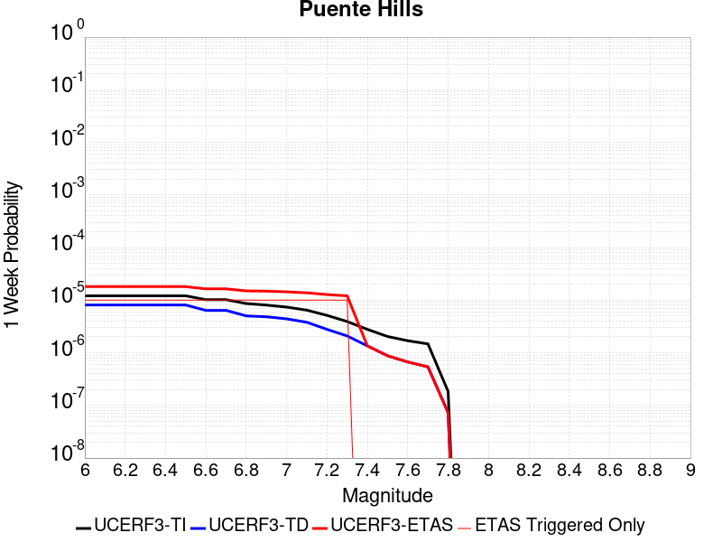 |  |  |  |

| Magnitude | 1 wk TI Prob | 1 wk TD Prob | 1 wk ETAS Prob | 1 wk ETAS/TD Gain | 1 wk ETAS Triggered Only | 1 mo TI Prob | 1 mo TD Prob | 1 mo ETAS Prob | 1 mo ETAS/TD Gain | 1 mo ETAS Triggered Only | 1 yr TI Prob | 1 yr TD Prob | 1 yr ETAS Prob | 1 yr ETAS/TD Gain | 1 yr ETAS Triggered Only | 10 yr TI Prob | 10 yr TD Prob | 10 yr ETAS Prob | 10 yr ETAS/TD Gain | 10 yr ETAS Triggered Only |
|-----|-----|-----|-----|-----|-----|-----|-----|-----|-----|-----|-----|-----|-----|-----|-----|-----|-----|-----|-----|-----|
| 6.0 | 1.2101656E-5 | 8.098625E-6 | 2.4985531E-5 | 3.0851572 | 1.6887043E-5 | 5.1863204E-5 | 3.4707962E-5 | 6.848088E-5 | 1.9730595 | 3.3774086E-5 | 6.312516E-4 | 4.2249315E-4 | 4.5625295E-4 | 1.0799062 | 3.3774086E-5 | 0.0062946146 | 0.0042174594 | 0.0042510913 | 1.0079744 | 3.3774086E-5 |
| 6.1 | 1.2101656E-5 | 8.098625E-6 | 2.4985531E-5 | 3.0851572 | 1.6887043E-5 | 5.1863204E-5 | 3.4707962E-5 | 6.848088E-5 | 1.9730595 | 3.3774086E-5 | 6.312516E-4 | 4.2249315E-4 | 4.5625295E-4 | 1.0799062 | 3.3774086E-5 | 0.0062946146 | 0.0042174594 | 0.0042510913 | 1.0079744 | 3.3774086E-5 |
| 6.2 | 1.2101656E-5 | 8.098625E-6 | 2.4985531E-5 | 3.0851572 | 1.6887043E-5 | 5.1863204E-5 | 3.4707962E-5 | 6.848088E-5 | 1.9730595 | 3.3774086E-5 | 6.312516E-4 | 4.2249315E-4 | 4.5625295E-4 | 1.0799062 | 3.3774086E-5 | 0.0062946146 | 0.0042174594 | 0.0042510913 | 1.0079744 | 3.3774086E-5 |
| 6.3 | 1.2101656E-5 | 8.098625E-6 | 2.4985531E-5 | 3.0851572 | 1.6887043E-5 | 5.1863204E-5 | 3.4707962E-5 | 6.848088E-5 | 1.9730595 | 3.3774086E-5 | 6.312516E-4 | 4.2249315E-4 | 4.5625295E-4 | 1.0799062 | 3.3774086E-5 | 0.0062946146 | 0.0042174594 | 0.0042510913 | 1.0079744 | 3.3774086E-5 |
| 6.4 | 1.2101656E-5 | 8.098625E-6 | 2.4985531E-5 | 3.0851572 | 1.6887043E-5 | 5.1863204E-5 | 3.4707962E-5 | 6.848088E-5 | 1.9730595 | 3.3774086E-5 | 6.312516E-4 | 4.2249315E-4 | 4.5625295E-4 | 1.0799062 | 3.3774086E-5 | 0.0062946146 | 0.0042174594 | 0.0042510913 | 1.0079744 | 3.3774086E-5 |
| 6.5 | 1.2101656E-5 | 8.098625E-6 | 2.4985531E-5 | 3.0851572 | 1.6887043E-5 | 5.1863204E-5 | 3.4707962E-5 | 6.848088E-5 | 1.9730595 | 3.3774086E-5 | 6.312516E-4 | 4.2249315E-4 | 4.5625295E-4 | 1.0799062 | 3.3774086E-5 | 0.0062946146 | 0.0042174594 | 0.0042510913 | 1.0079744 | 3.3774086E-5 |
| 6.6 | 1.0222488E-5 | 6.3991847E-6 | 2.3286118E-5 | 3.6389198 | 1.6887043E-5 | 4.3809923E-5 | 2.7424803E-5 | 6.119796E-5 | 2.2314823 | 3.3774086E-5 | 5.332553E-4 | 3.3384826E-4 | 3.676111E-4 | 1.1011322 | 3.3774086E-5 | 0.0053197746 | 0.0033337125 | 0.003367374 | 1.0100973 | 3.3774086E-5 |
| 6.7 | 1.0222488E-5 | 6.3991847E-6 | 2.3286118E-5 | 3.6389198 | 1.6887043E-5 | 4.3809923E-5 | 2.7424803E-5 | 6.119796E-5 | 2.2314823 | 3.3774086E-5 | 5.332553E-4 | 3.3384826E-4 | 3.676111E-4 | 1.1011322 | 3.3774086E-5 | 0.0053197746 | 0.0033337125 | 0.003367374 | 1.0100973 | 3.3774086E-5 |
| 6.8 | 8.6367845E-6 | 5.0282533E-6 | 2.1915212E-5 | 4.358414 | 1.6887043E-5 | 3.7014266E-5 | 2.1549482E-5 | 3.843616E-5 | 1.7836235 | 1.6887043E-5 | 4.505555E-4 | 2.623339E-4 | 2.7921653E-4 | 1.0643555 | 1.6887043E-5 | 0.004496431 | 0.0026202986 | 0.0026371414 | 1.0064278 | 1.6887043E-5 |
| 6.9 | 8.066481E-6 | 4.836117E-6 | 2.1723077E-5 | 4.491843 | 1.6887043E-5 | 3.4570177E-5 | 2.0726053E-5 | 3.7612746E-5 | 1.8147568 | 1.6887043E-5 | 4.2081063E-4 | 2.52311E-4 | 2.6919378E-4 | 1.0669125 | 1.6887043E-5 | 0.0042001465 | 0.0025202993 | 0.0025371439 | 1.0066835 | 1.6887043E-5 |
| 7.0 | 7.393828E-6 | 4.417296E-6 | 2.1304264E-5 | 4.8229194 | 1.6887043E-5 | 3.168745E-5 | 1.8931134E-5 | 3.581786E-5 | 1.892008 | 1.6887043E-5 | 3.857264E-4 | 2.3046264E-4 | 2.473458E-4 | 1.0732577 | 1.6887043E-5 | 0.0038505755 | 0.0023022818 | 0.00231913 | 1.007318 | 1.6887043E-5 |
| 7.1 | 6.4660953E-6 | 3.8044495E-6 | 2.0691428E-5 | 5.438744 | 1.6887043E-5 | 2.7711543E-5 | 1.6304684E-5 | 3.3191453E-5 | 2.0357003 | 1.6887043E-5 | 3.373358E-4 | 1.984918E-4 | 2.1537549E-4 | 1.0850599 | 1.6887043E-5 | 0.0033682417 | 0.001983181 | 0.0020000346 | 1.0084982 | 1.6887043E-5 |
| 7.2 | 5.143232E-6 | 2.7865456E-6 | 1.9673542E-5 | 7.06019 | 1.6887043E-5 | 2.2042237E-5 | 1.1942284E-5 | 2.8829125E-5 | 2.414038 | 1.6887043E-5 | 2.6833118E-4 | 1.453877E-4 | 1.6227229E-4 | 1.1161349 | 1.6887043E-5 | 0.002680074 | 0.0014529356 | 0.001469798 | 1.0116059 | 1.6887043E-5 |
| 7.3 | 3.928255E-6 | 2.0913774E-6 | 1.8978384E-5 | 9.074587 | 1.6887043E-5 | 1.683527E-5 | 8.963015E-6 | 2.5849906E-5 | 2.8840637 | 1.6887043E-5 | 2.0495013E-4 | 1.0911931E-4 | 1.2600451E-4 | 1.1547407 | 1.6887043E-5 | 0.002047612 | 0.001090664 | 0.0011075326 | 1.0154663 | 1.6887043E-5 |
| 7.4 | 2.7894434E-6 | 1.3546753E-6 | 1.3546753E-6 | 1.0 | 0.0 | 1.1954703E-5 | 5.8057385E-6 | 5.8057385E-6 | 1.0 | 0.0 | 1.4553878E-4 | 7.068262E-5 | 7.068262E-5 | 1.0 | 0.0 | 0.001454435 | 7.066058E-4 | 7.066058E-4 | 1.0 | 0.0 |
| 7.5 | 2.041735E-6 | 8.787305E-7 | 8.787305E-7 | 1.0 | 0.0 | 8.750263E-6 | 3.7659825E-6 | 3.7659825E-6 | 1.0 | 0.0 | 1.06529245E-4 | 4.5849905E-5 | 4.5849905E-5 | 1.0 | 0.0 | 0.0010647819 | 4.5840783E-4 | 4.5840783E-4 | 1.0 | 0.0 |
| 7.6 | 1.6959062E-6 | 6.6986263E-7 | 6.6986263E-7 | 1.0 | 0.0 | 7.268149E-6 | 2.8708366E-6 | 2.8708366E-6 | 1.0 | 0.0 | 8.848612E-5 | 3.4951907E-5 | 3.4951907E-5 | 1.0 | 0.0 | 8.84509E-4 | 3.4946698E-4 | 3.4946698E-4 | 1.0 | 0.0 |
| 7.7 | 1.4767965E-6 | 5.407607E-7 | 5.407607E-7 | 1.0 | 0.0 | 6.3291122E-6 | 2.317544E-6 | 2.317544E-6 | 1.0 | 0.0 | 7.705422E-5 | 2.8215758E-5 | 2.8215758E-5 | 1.0 | 0.0 | 7.702751E-4 | 2.8212433E-4 | 2.8212433E-4 | 1.0 | 0.0 |
| 7.8 | 1.8432911E-7 | 7.28201E-8 | 7.28201E-8 | 1.0 | 0.0 | 7.8998164E-7 | 3.1208612E-7 | 3.1208612E-7 | 1.0 | 0.0 | 9.617985E-6 | 3.7996451E-6 | 3.7996451E-6 | 1.0 | 0.0 | 9.617568E-5 | 3.7996128E-5 | 3.7996128E-5 | 1.0 | 0.0 |

## Coronado Bank alt1
*[(top)](#table-of-contents)*

| 1 Week | 1 Month | 1 Year | 10 Year |
|-----|-----|-----|-----|
|  |  |  | 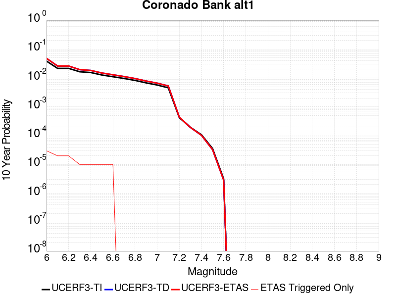 |

| Magnitude | 1 wk TI Prob | 1 wk TD Prob | 1 wk ETAS Prob | 1 wk ETAS/TD Gain | 1 wk ETAS Triggered Only | 1 mo TI Prob | 1 mo TD Prob | 1 mo ETAS Prob | 1 mo ETAS/TD Gain | 1 mo ETAS Triggered Only | 1 yr TI Prob | 1 yr TD Prob | 1 yr ETAS Prob | 1 yr ETAS/TD Gain | 1 yr ETAS Triggered Only | 10 yr TI Prob | 10 yr TD Prob | 10 yr ETAS Prob | 10 yr ETAS/TD Gain | 10 yr ETAS Triggered Only |
|-----|-----|-----|-----|-----|-----|-----|-----|-----|-----|-----|-----|-----|-----|-----|-----|-----|-----|-----|-----|-----|
| 6.0 | 7.533492E-5 | 9.394913E-5 | 1.1083459E-4 | 1.1797298 | 1.6887043E-5 | 3.22824E-4 | 4.0258127E-4 | 4.194615E-4 | 1.0419301 | 1.6887043E-5 | 0.0039233007 | 0.0048909658 | 0.00490777 | 1.0034359 | 1.6887043E-5 | 0.03854755 | 0.04790356 | 0.047935717 | 1.0006713 | 3.3774086E-5 |
| 6.1 | 4.1807285E-5 | 5.049283E-5 | 6.737902E-5 | 1.3344275 | 1.6887043E-5 | 1.7916178E-4 | 2.1638049E-4 | 2.3326387E-4 | 1.0780264 | 1.6887043E-5 | 0.0021791123 | 0.0026313474 | 0.0026481901 | 1.0064007 | 1.6887043E-5 | 0.021578677 | 0.026011046 | 0.026043942 | 1.0012647 | 3.3774086E-5 |
| 6.2 | 4.1807285E-5 | 5.049283E-5 | 6.737902E-5 | 1.3344275 | 1.6887043E-5 | 1.7916178E-4 | 2.1638049E-4 | 2.3326387E-4 | 1.0780264 | 1.6887043E-5 | 0.0021791123 | 0.0026313474 | 0.0026481901 | 1.0064007 | 1.6887043E-5 | 0.021578677 | 0.026011046 | 0.026043942 | 1.0012647 | 3.3774086E-5 |
| 6.3 | 3.1793104E-5 | 3.7711117E-5 | 3.7711117E-5 | 1.0 | 0.0 | 1.3624904E-4 | 1.6160926E-4 | 1.6160926E-4 | 1.0 | 0.0 | 0.0016575698 | 0.001965848 | 0.001965848 | 1.0 | 0.0 | 0.016452603 | 0.019488465 | 0.019505022 | 1.0008496 | 1.6887043E-5 |
| 6.4 | 2.9878007E-5 | 3.5335794E-5 | 3.5335794E-5 | 1.0 | 0.0 | 1.2804232E-4 | 1.5143053E-4 | 1.5143053E-4 | 1.0 | 0.0 | 0.0015578003 | 0.0018421387 | 0.0018421387 | 1.0 | 0.0 | 0.015469253 | 0.01827244 | 0.01828902 | 1.0009073 | 1.6887043E-5 |
| 6.5 | 2.4512565E-5 | 2.8764043E-5 | 2.8764043E-5 | 1.0 | 0.0 | 1.0504962E-4 | 1.2326881E-4 | 1.2326881E-4 | 1.0 | 0.0 | 0.0012782287 | 0.0014997921 | 0.0014997921 | 1.0 | 0.0 | 0.012709012 | 0.014899683 | 0.0149163185 | 1.0011165 | 1.6887043E-5 |
| 6.6 | 2.1317413E-5 | 2.490667E-5 | 2.490667E-5 | 1.0 | 0.0 | 9.135714E-5 | 1.0673863E-4 | 1.0673863E-4 | 1.0 | 0.0 | 0.0011117056 | 0.0012987906 | 0.0012987906 | 1.0 | 0.0 | 0.011061605 | 0.012914404 | 0.012931074 | 1.0012907 | 1.6887043E-5 |
| 6.7 | 1.8585655E-5 | 2.163488E-5 | 2.163488E-5 | 1.0 | 0.0 | 7.9650374E-5 | 9.271773E-5 | 9.271773E-5 | 1.0 | 0.0 | 9.6931186E-4 | 0.0011282742 | 0.0011282742 | 1.0 | 0.0 | 0.0096509475 | 0.011227623 | 0.011227623 | 1.0 | 0.0 |
| 6.8 | 1.5862879E-5 | 1.8419474E-5 | 1.8419474E-5 | 1.0 | 0.0 | 6.798199E-5 | 7.893833E-5 | 7.893833E-5 | 1.0 | 0.0 | 8.273665E-4 | 9.6066965E-4 | 9.6066965E-4 | 1.0 | 0.0 | 0.008242928 | 0.00956715 | 0.00956715 | 1.0 | 0.0 |
| 6.9 | 1.3021509E-5 | 1.5095265E-5 | 1.5095265E-5 | 1.0 | 0.0 | 5.5805274E-5 | 6.469249E-5 | 6.469249E-5 | 1.0 | 0.0 | 6.792174E-4 | 7.8736455E-4 | 7.8736455E-4 | 1.0 | 0.0 | 0.006771452 | 0.007847573 | 0.007847573 | 1.0 | 0.0 |
| 7.0 | 1.0974371E-5 | 1.2720104E-5 | 1.2720104E-5 | 1.0 | 0.0 | 4.7032172E-5 | 5.451369E-5 | 5.451369E-5 | 1.0 | 0.0 | 5.7246623E-4 | 6.6351966E-4 | 6.6351966E-4 | 1.0 | 0.0 | 0.0057099373 | 0.006617135 | 0.006617135 | 1.0 | 0.0 |
| 7.1 | 8.766221E-6 | 1.01638325E-5 | 1.01638325E-5 | 1.0 | 0.0 | 3.7568978E-5 | 4.355865E-5 | 4.355865E-5 | 1.0 | 0.0 | 4.573063E-4 | 5.3021475E-4 | 5.3021475E-4 | 1.0 | 0.0 | 0.0045636636 | 0.0052911965 | 0.0052911965 | 1.0 | 0.0 |
| 7.2 | 8.026024E-7 | 8.331765E-7 | 8.331765E-7 | 1.0 | 0.0 | 3.43972E-6 | 3.5707515E-6 | 3.5707515E-6 | 1.0 | 0.0 | 4.1877785E-5 | 4.3473043E-5 | 4.3473043E-5 | 1.0 | 0.0 | 4.1869894E-4 | 4.3464647E-4 | 4.3464647E-4 | 1.0 | 0.0 |
| 7.3 | 3.7293114E-7 | 3.7000953E-7 | 3.7000953E-7 | 1.0 | 0.0 | 1.5982754E-6 | 1.5857541E-6 | 1.5857541E-6 | 1.0 | 0.0 | 1.9458828E-5 | 1.9306386E-5 | 1.9306386E-5 | 1.0 | 0.0 | 1.9457124E-4 | 1.9304715E-4 | 1.9304715E-4 | 1.0 | 0.0 |
| 7.4 | 2.0557036E-7 | 1.9674363E-7 | 1.9674363E-7 | 1.0 | 0.0 | 8.810155E-7 | 8.431867E-7 | 8.431867E-7 | 1.0 | 0.0 | 1.0726311E-5 | 1.026575E-5 | 1.026575E-5 | 1.0 | 0.0 | 1.0725793E-4 | 1.0265279E-4 | 1.0265279E-4 | 1.0 | 0.0 |
| 7.5 | 6.845446E-8 | 6.279369E-8 | 6.279369E-8 | 1.0 | 0.0 | 2.9337625E-7 | 2.691158E-7 | 2.691158E-7 | 1.0 | 0.0 | 3.5718497E-6 | 3.2764797E-6 | 3.2764797E-6 | 1.0 | 0.0 | 3.5717923E-5 | 3.2764325E-5 | 3.2764325E-5 | 1.0 | 0.0 |
| 7.6 | 6.0975145E-9 | 5.53185E-9 | 5.53185E-9 | 1.0 | 0.0 | 2.6132206E-8 | 2.370793E-8 | 2.370793E-8 | 1.0 | 0.0 | 3.1815955E-7 | 2.88644E-7 | 2.88644E-7 | 1.0 | 0.0 | 3.181591E-6 | 2.8864374E-6 | 2.8864374E-6 | 1.0 | 0.0 |

## Great Valley 04b Gordon Valley
*[(top)](#table-of-contents)*

| 1 Week | 1 Month | 1 Year | 10 Year |
|-----|-----|-----|-----|
|  |  |  | 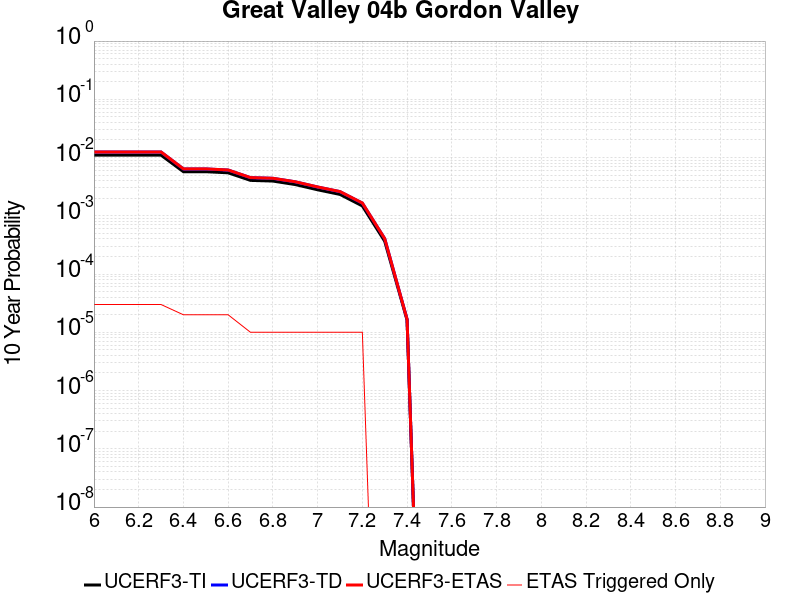 |

| Magnitude | 1 wk TI Prob | 1 wk TD Prob | 1 wk ETAS Prob | 1 wk ETAS/TD Gain | 1 wk ETAS Triggered Only | 1 mo TI Prob | 1 mo TD Prob | 1 mo ETAS Prob | 1 mo ETAS/TD Gain | 1 mo ETAS Triggered Only | 1 yr TI Prob | 1 yr TD Prob | 1 yr ETAS Prob | 1 yr ETAS/TD Gain | 1 yr ETAS Triggered Only | 10 yr TI Prob | 10 yr TD Prob | 10 yr ETAS Prob | 10 yr ETAS/TD Gain | 10 yr ETAS Triggered Only |
|-----|-----|-----|-----|-----|-----|-----|-----|-----|-----|-----|-----|-----|-----|-----|-----|-----|-----|-----|-----|-----|
| 6.0 | 2.1181217E-5 | 2.3981953E-5 | 5.7755227E-5 | 2.4082787 | 3.3774086E-5 | 9.077348E-5 | 1.0277669E-4 | 1.365473E-4 | 1.3285824 | 3.3774086E-5 | 0.0011046068 | 0.0012507546 | 0.0012844865 | 1.0269692 | 3.3774086E-5 | 0.010991322 | 0.012453599 | 0.012486952 | 1.0026783 | 3.3774086E-5 |
| 6.1 | 2.1181217E-5 | 2.3981953E-5 | 5.7755227E-5 | 2.4082787 | 3.3774086E-5 | 9.077348E-5 | 1.0277669E-4 | 1.365473E-4 | 1.3285824 | 3.3774086E-5 | 0.0011046068 | 0.0012507546 | 0.0012844865 | 1.0269692 | 3.3774086E-5 | 0.010991322 | 0.012453599 | 0.012486952 | 1.0026783 | 3.3774086E-5 |
| 6.2 | 2.1181217E-5 | 2.3981953E-5 | 5.7755227E-5 | 2.4082787 | 3.3774086E-5 | 9.077348E-5 | 1.0277669E-4 | 1.365473E-4 | 1.3285824 | 3.3774086E-5 | 0.0011046068 | 0.0012507546 | 0.0012844865 | 1.0269692 | 3.3774086E-5 | 0.010991322 | 0.012453599 | 0.012486952 | 1.0026783 | 3.3774086E-5 |
| 6.3 | 2.1181217E-5 | 2.3981953E-5 | 5.7755227E-5 | 2.4082787 | 3.3774086E-5 | 9.077348E-5 | 1.0277669E-4 | 1.365473E-4 | 1.3285824 | 3.3774086E-5 | 0.0011046068 | 0.0012507546 | 0.0012844865 | 1.0269692 | 3.3774086E-5 | 0.010991322 | 0.012453599 | 0.012486952 | 1.0026783 | 3.3774086E-5 |
| 6.4 | 1.0988268E-5 | 1.2254499E-5 | 2.9141334E-5 | 2.3780112 | 1.6887043E-5 | 4.7091726E-5 | 5.2518313E-5 | 6.9404465E-5 | 1.3215289 | 1.6887043E-5 | 5.731909E-4 | 6.392388E-4 | 6.5611507E-4 | 1.0264006 | 1.6887043E-5 | 0.005717147 | 0.0063755875 | 0.0063923667 | 1.0026318 | 1.6887043E-5 |
| 6.5 | 1.0988268E-5 | 1.2254499E-5 | 2.9141334E-5 | 2.3780112 | 1.6887043E-5 | 4.7091726E-5 | 5.2518313E-5 | 6.9404465E-5 | 1.3215289 | 1.6887043E-5 | 5.731909E-4 | 6.392388E-4 | 6.5611507E-4 | 1.0264006 | 1.6887043E-5 | 0.005717147 | 0.0063755875 | 0.0063923667 | 1.0026318 | 1.6887043E-5 |
| 6.6 | 1.0517822E-5 | 1.1724062E-5 | 2.8610906E-5 | 2.440358 | 1.6887043E-5 | 4.5075605E-5 | 5.02451E-5 | 6.7131296E-5 | 1.3360765 | 1.6887043E-5 | 5.4865726E-4 | 6.11578E-4 | 6.284547E-4 | 1.0275954 | 1.6887043E-5 | 0.0054730466 | 0.0061005033 | 0.006117287 | 1.0027512 | 1.6887043E-5 |
| 6.7 | 7.789219E-6 | 8.6776445E-6 | 8.6776445E-6 | 1.0 | 0.0 | 3.3381937E-5 | 3.7189402E-5 | 3.7189402E-5 | 1.0 | 0.0 | 4.063493E-4 | 4.526921E-4 | 4.526921E-4 | 1.0 | 0.0 | 0.004056071 | 0.0045182165 | 0.0045182165 | 1.0 | 0.0 |
| 6.8 | 7.5850853E-6 | 8.452389E-6 | 8.452389E-6 | 1.0 | 0.0 | 3.2507105E-5 | 3.622405E-5 | 3.622405E-5 | 1.0 | 0.0 | 3.957021E-4 | 4.409437E-4 | 4.409437E-4 | 1.0 | 0.0 | 0.0039499826 | 0.0044012 | 0.0044012 | 1.0 | 0.0 |
| 6.9 | 6.604105E-6 | 7.3585493E-6 | 7.3585493E-6 | 1.0 | 0.0 | 2.8303E-5 | 3.153628E-5 | 3.153628E-5 | 1.0 | 0.0 | 3.4453452E-4 | 3.8389044E-4 | 3.8389044E-4 | 1.0 | 0.0 | 0.0034400085 | 0.0038326595 | 0.0038326595 | 1.0 | 0.0 |
| 7.0 | 5.3701115E-6 | 5.9884183E-6 | 5.9884183E-6 | 1.0 | 0.0 | 2.301456E-5 | 2.5664414E-5 | 2.5664414E-5 | 1.0 | 0.0 | 2.8016625E-4 | 3.1242234E-4 | 3.1242234E-4 | 1.0 | 0.0 | 0.0027981328 | 0.00312012 | 0.00312012 | 1.0 | 0.0 |
| 7.1 | 4.4685607E-6 | 4.986478E-6 | 4.986478E-6 | 1.0 | 0.0 | 1.9150835E-5 | 2.1370459E-5 | 2.1370459E-5 | 1.0 | 0.0 | 2.3313647E-4 | 2.6015675E-4 | 2.6015675E-4 | 1.0 | 0.0 | 0.0023289204 | 0.0025987667 | 0.0025987667 | 1.0 | 0.0 |
| 7.2 | 2.833378E-6 | 3.164419E-6 | 3.164419E-6 | 1.0 | 0.0 | 1.2142991E-5 | 1.3561736E-5 | 1.3561736E-5 | 1.0 | 0.0 | 1.4783088E-4 | 1.6510337E-4 | 1.6510337E-4 | 1.0 | 0.0 | 0.0014773258 | 0.0016499789 | 0.0016499789 | 1.0 | 0.0 |
| 7.3 | 7.0087293E-7 | 7.7728157E-7 | 7.7728157E-7 | 1.0 | 0.0 | 3.0037377E-6 | 3.3312049E-6 | 3.3312049E-6 | 1.0 | 0.0 | 3.656989E-5 | 4.0557123E-5 | 4.0557123E-5 | 1.0 | 0.0 | 3.6563876E-4 | 4.055422E-4 | 4.055422E-4 | 1.0 | 0.0 |
| 7.4 | 3.112171E-8 | 3.2068368E-8 | 3.2068368E-8 | 1.0 | 0.0 | 1.3337875E-7 | 1.3743585E-7 | 1.3743585E-7 | 1.0 | 0.0 | 1.6238852E-6 | 1.6732803E-6 | 1.6732803E-6 | 1.0 | 0.0 | 1.6238733E-5 | 1.6732685E-5 | 1.6732685E-5 | 1.0 | 0.0 |

## Santa Cruz Catalina Ridge alt1
*[(top)](#table-of-contents)*

| 1 Week | 1 Month | 1 Year | 10 Year |
|-----|-----|-----|-----|
|  |  |  |  |

| Magnitude | 1 wk TI Prob | 1 wk TD Prob | 1 wk ETAS Prob | 1 wk ETAS/TD Gain | 1 wk ETAS Triggered Only | 1 mo TI Prob | 1 mo TD Prob | 1 mo ETAS Prob | 1 mo ETAS/TD Gain | 1 mo ETAS Triggered Only | 1 yr TI Prob | 1 yr TD Prob | 1 yr ETAS Prob | 1 yr ETAS/TD Gain | 1 yr ETAS Triggered Only | 10 yr TI Prob | 10 yr TD Prob | 10 yr ETAS Prob | 10 yr ETAS/TD Gain | 10 yr ETAS Triggered Only |
|-----|-----|-----|-----|-----|-----|-----|-----|-----|-----|-----|-----|-----|-----|-----|-----|-----|-----|-----|-----|-----|
| 6.0 | 3.2833184E-5 | 3.65584E-5 | 5.3444823E-5 | 1.4619027 | 1.6887043E-5 | 1.4070606E-4 | 1.5667039E-4 | 1.7355477E-4 | 1.1077702 | 1.6887043E-5 | 0.00171175 | 0.0019059596 | 0.0019228144 | 1.0088432 | 1.6887043E-5 | 0.016986247 | 0.018913029 | 0.018946165 | 1.001752 | 3.3774086E-5 |
| 6.1 | 1.9835548E-5 | 2.1659505E-5 | 3.8546183E-5 | 1.7796428 | 1.6887043E-5 | 8.500672E-5 | 9.282326E-5 | 1.0970874E-4 | 1.1819099 | 1.6887043E-5 | 0.0010344655 | 0.0011295575 | 0.0011464255 | 1.0149332 | 1.6887043E-5 | 0.010296632 | 0.011240295 | 0.01127369 | 1.0029709 | 3.3774086E-5 |
| 6.2 | 1.9835548E-5 | 2.1659505E-5 | 3.8546183E-5 | 1.7796428 | 1.6887043E-5 | 8.500672E-5 | 9.282326E-5 | 1.0970874E-4 | 1.1819099 | 1.6887043E-5 | 0.0010344655 | 0.0011295575 | 0.0011464255 | 1.0149332 | 1.6887043E-5 | 0.010296632 | 0.011240295 | 0.01127369 | 1.0029709 | 3.3774086E-5 |
| 6.3 | 1.5728183E-5 | 1.703395E-5 | 3.3920704E-5 | 1.9913588 | 1.6887043E-5 | 6.7404755E-5 | 7.300063E-5 | 8.988644E-5 | 1.2313105 | 1.6887043E-5 | 8.2034385E-4 | 8.884264E-4 | 9.0529845E-4 | 1.0189909 | 1.6887043E-5 | 0.008173222 | 0.008849427 | 0.008882902 | 1.0037827 | 3.3774086E-5 |
| 6.4 | 1.5728183E-5 | 1.703395E-5 | 3.3920704E-5 | 1.9913588 | 1.6887043E-5 | 6.7404755E-5 | 7.300063E-5 | 8.988644E-5 | 1.2313105 | 1.6887043E-5 | 8.2034385E-4 | 8.884264E-4 | 9.0529845E-4 | 1.0189909 | 1.6887043E-5 | 0.008173222 | 0.008849427 | 0.008882902 | 1.0037827 | 3.3774086E-5 |
| 6.5 | 1.3707734E-5 | 1.4794522E-5 | 3.1681313E-5 | 2.141422 | 1.6887043E-5 | 5.8746107E-5 | 6.3403575E-5 | 8.0289545E-5 | 1.2663252 | 1.6887043E-5 | 7.1499916E-4 | 7.716686E-4 | 7.885426E-4 | 1.0218669 | 1.6887043E-5 | 0.0071270303 | 0.0076902895 | 0.007723804 | 1.004358 | 3.3774086E-5 |
| 6.6 | 1.2539813E-5 | 1.3510219E-5 | 3.0397034E-5 | 2.249929 | 1.6887043E-5 | 5.3740947E-5 | 5.789967E-5 | 7.4785734E-5 | 1.2916435 | 1.6887043E-5 | 6.540996E-4 | 7.0470315E-4 | 7.215783E-4 | 1.0239464 | 1.6887043E-5 | 0.0065217763 | 0.0070249885 | 0.0070585255 | 1.004774 | 3.3774086E-5 |
| 6.7 | 1.1504083E-5 | 1.2377375E-5 | 2.9264209E-5 | 2.3643308 | 1.6887043E-5 | 4.930228E-5 | 5.3044827E-5 | 6.9930975E-5 | 1.3183373 | 1.6887043E-5 | 6.0008996E-4 | 6.456314E-4 | 6.6250755E-4 | 1.026139 | 1.6887043E-5 | 0.005984721 | 0.006437786 | 0.0064713424 | 1.0052124 | 3.3774086E-5 |
| 6.8 | 1.012739E-5 | 1.0877071E-5 | 2.776393E-5 | 2.5525188 | 1.6887043E-5 | 4.340238E-5 | 4.6615194E-5 | 6.350145E-5 | 1.3622478 | 1.6887043E-5 | 5.282958E-4 | 5.673937E-4 | 5.8427115E-4 | 1.0297456 | 1.6887043E-5 | 0.0052704164 | 0.0056596193 | 0.005676411 | 1.0029669 | 1.6887043E-5 |
| 6.9 | 8.9607865E-6 | 9.609117E-6 | 2.6495998E-5 | 2.757381 | 1.6887043E-5 | 3.8402806E-5 | 4.1181287E-5 | 5.8067635E-5 | 1.4100491 | 1.6887043E-5 | 4.6745385E-4 | 5.012679E-4 | 5.181465E-4 | 1.0336717 | 1.6887043E-5 | 0.0046647177 | 0.005001492 | 0.0050182943 | 1.0033596 | 1.6887043E-5 |
| 7.0 | 8.046829E-6 | 8.619746E-6 | 2.5506642E-5 | 2.9590945 | 1.6887043E-5 | 3.4485955E-5 | 3.694125E-5 | 5.382767E-5 | 1.4571155 | 1.6887043E-5 | 4.1978562E-4 | 4.496677E-4 | 4.6654715E-4 | 1.0375376 | 1.6887043E-5 | 0.004189935 | 0.0044876686 | 0.00450448 | 1.0037462 | 1.6887043E-5 |
| 7.1 | 7.136131E-6 | 7.637656E-6 | 7.637656E-6 | 1.0 | 0.0 | 3.0583058E-5 | 3.2732405E-5 | 3.2732405E-5 | 1.0 | 0.0 | 3.7228514E-4 | 3.9844486E-4 | 3.9844486E-4 | 1.0 | 0.0 | 0.0037166206 | 0.003977381 | 0.003977381 | 1.0 | 0.0 |
| 7.2 | 6.362014E-6 | 6.8049585E-6 | 6.8049585E-6 | 1.0 | 0.0 | 2.726549E-5 | 2.9163786E-5 | 2.9163786E-5 | 1.0 | 0.0 | 3.3190678E-4 | 3.550119E-4 | 3.550119E-4 | 1.0 | 0.0 | 0.0033141149 | 0.003544516 | 0.003544516 | 1.0 | 0.0 |
| 7.3 | 5.004101E-6 | 5.351715E-6 | 5.351715E-6 | 1.0 | 0.0 | 2.1445969E-5 | 2.2935723E-5 | 2.2935723E-5 | 1.0 | 0.0 | 2.6107338E-4 | 2.792072E-4 | 2.792072E-4 | 1.0 | 0.0 | 0.002607669 | 0.0027886187 | 0.0027886187 | 1.0 | 0.0 |
| 7.4 | 3.4901443E-6 | 3.7320526E-6 | 3.7320526E-6 | 1.0 | 0.0 | 1.4957676E-5 | 1.5994416E-5 | 1.5994416E-5 | 1.0 | 0.0 | 1.8209449E-4 | 1.9471499E-4 | 1.9471499E-4 | 1.0 | 0.0 | 0.0018194534 | 0.0019454823 | 0.0019454823 | 1.0 | 0.0 |
| 7.5 | 1.1215045E-6 | 1.189387E-6 | 1.189387E-6 | 1.0 | 0.0 | 4.806439E-6 | 5.097363E-6 | 5.097363E-6 | 1.0 | 0.0 | 5.851682E-5 | 6.205866E-5 | 6.205866E-5 | 1.0 | 0.0 | 5.850142E-4 | 6.2041637E-4 | 6.2041637E-4 | 1.0 | 0.0 |
| 7.6 | 2.8599047E-7 | 2.9951994E-7 | 2.9951994E-7 | 1.0 | 0.0 | 1.2256729E-6 | 1.2836562E-6 | 1.2836562E-6 | 1.0 | 0.0 | 1.4922465E-5 | 1.5628404E-5 | 1.5628404E-5 | 1.0 | 0.0 | 1.4921463E-4 | 1.5627318E-4 | 1.5627318E-4 | 1.0 | 0.0 |
| 7.7 | 2.0781519E-7 | 2.1744323E-7 | 2.1744323E-7 | 1.0 | 0.0 | 8.906362E-7 | 9.3189925E-7 | 9.3189925E-7 | 1.0 | 0.0 | 1.08434415E-5 | 1.13458145E-5 | 1.13458145E-5 | 1.0 | 0.0 | 1.0842913E-4 | 1.1345245E-4 | 1.1345245E-4 | 1.0 | 0.0 |
| 7.8 | 3.614776E-8 | 3.764102E-8 | 3.764102E-8 | 1.0 | 0.0 | 1.5491896E-7 | 1.6131864E-7 | 1.6131864E-7 | 1.0 | 0.0 | 1.8861368E-6 | 1.9640527E-6 | 1.9640527E-6 | 1.0 | 0.0 | 1.8861208E-5 | 1.9640367E-5 | 1.9640367E-5 | 1.0 | 0.0 |

## Hosgri
*[(top)](#table-of-contents)*

| 1 Week | 1 Month | 1 Year | 10 Year |
|-----|-----|-----|-----|
|  |  |  |  |

| Magnitude | 1 wk TI Prob | 1 wk TD Prob | 1 wk ETAS Prob | 1 wk ETAS/TD Gain | 1 wk ETAS Triggered Only | 1 mo TI Prob | 1 mo TD Prob | 1 mo ETAS Prob | 1 mo ETAS/TD Gain | 1 mo ETAS Triggered Only | 1 yr TI Prob | 1 yr TD Prob | 1 yr ETAS Prob | 1 yr ETAS/TD Gain | 1 yr ETAS Triggered Only | 10 yr TI Prob | 10 yr TD Prob | 10 yr ETAS Prob | 10 yr ETAS/TD Gain | 10 yr ETAS Triggered Only |
|-----|-----|-----|-----|-----|-----|-----|-----|-----|-----|-----|-----|-----|-----|-----|-----|-----|-----|-----|-----|-----|
| 6.0 | 2.883978E-5 | 2.9128416E-5 | 2.9128416E-5 | 1.0 | 0.0 | 1.235932E-4 | 1.2483024E-4 | 1.2483024E-4 | 1.0 | 0.0 | 0.0015037085 | 0.001518776 | 0.001518776 | 1.0 | 0.0 | 0.01493574 | 0.01508774 | 0.015121005 | 1.0022048 | 3.3774086E-5 |
| 6.1 | 2.883978E-5 | 2.9128416E-5 | 2.9128416E-5 | 1.0 | 0.0 | 1.235932E-4 | 1.2483024E-4 | 1.2483024E-4 | 1.0 | 0.0 | 0.0015037085 | 0.001518776 | 0.001518776 | 1.0 | 0.0 | 0.01493574 | 0.01508774 | 0.015121005 | 1.0022048 | 3.3774086E-5 |
| 6.2 | 2.883978E-5 | 2.9128416E-5 | 2.9128416E-5 | 1.0 | 0.0 | 1.235932E-4 | 1.2483024E-4 | 1.2483024E-4 | 1.0 | 0.0 | 0.0015037085 | 0.001518776 | 0.001518776 | 1.0 | 0.0 | 0.01493574 | 0.01508774 | 0.015121005 | 1.0022048 | 3.3774086E-5 |
| 6.3 | 2.2914428E-5 | 2.2641969E-5 | 2.2641969E-5 | 1.0 | 0.0 | 9.8200995E-5 | 9.703343E-5 | 9.703343E-5 | 1.0 | 0.0 | 0.0011949413 | 0.0011807467 | 0.0011807467 | 1.0 | 0.0 | 0.011885363 | 0.011746133 | 0.01177951 | 1.0028416 | 3.3774086E-5 |
| 6.4 | 2.0195741E-5 | 1.969656E-5 | 1.969656E-5 | 1.0 | 0.0 | 8.65503E-5 | 8.4411105E-5 | 8.4411105E-5 | 1.0 | 0.0 | 0.0010532405 | 0.0010272227 | 0.0010272227 | 1.0 | 0.0 | 0.010482626 | 0.010225792 | 0.010259221 | 1.0032691 | 3.3774086E-5 |
| 6.5 | 1.9924333E-5 | 1.940898E-5 | 1.940898E-5 | 1.0 | 0.0 | 8.53872E-5 | 8.3178704E-5 | 8.3178704E-5 | 1.0 | 0.0 | 0.0010390934 | 0.0010122322 | 0.0010122322 | 1.0 | 0.0 | 0.010342481 | 0.010077253 | 0.0101106865 | 1.0033177 | 3.3774086E-5 |
| 6.6 | 1.809694E-5 | 1.74583E-5 | 1.74583E-5 | 1.0 | 0.0 | 7.7556004E-5 | 7.4819145E-5 | 7.4819145E-5 | 1.0 | 0.0 | 9.438353E-4 | 9.105437E-4 | 9.105437E-4 | 1.0 | 0.0 | 0.009398366 | 0.009069073 | 0.009102541 | 1.0036904 | 3.3774086E-5 |
| 6.7 | 1.675989E-5 | 1.6042764E-5 | 1.6042764E-5 | 1.0 | 0.0 | 7.182612E-5 | 6.87529E-5 | 6.87529E-5 | 1.0 | 0.0 | 8.7413215E-4 | 8.3674624E-4 | 8.3674624E-4 | 1.0 | 0.0 | 0.008707017 | 0.0083368635 | 0.008370356 | 1.0040174 | 3.3774086E-5 |
| 6.8 | 1.5401129E-5 | 1.4614083E-5 | 1.4614083E-5 | 1.0 | 0.0 | 6.6003166E-5 | 6.2630286E-5 | 6.2630286E-5 | 1.0 | 0.0 | 8.032922E-4 | 7.622578E-4 | 7.622578E-4 | 1.0 | 0.0 | 0.008003947 | 0.007597296 | 0.007630814 | 1.0044118 | 3.3774086E-5 |
| 6.9 | 1.356559E-5 | 1.2689968E-5 | 1.2689968E-5 | 1.0 | 0.0 | 5.8136946E-5 | 5.4384444E-5 | 5.4384444E-5 | 1.0 | 0.0 | 7.0758746E-4 | 6.619299E-4 | 6.619299E-4 | 1.0 | 0.0 | 0.007053386 | 0.006600388 | 0.006633939 | 1.0050832 | 3.3774086E-5 |
| 7.0 | 1.2030819E-5 | 1.1095962E-5 | 1.1095962E-5 | 1.0 | 0.0 | 5.155963E-5 | 4.7553254E-5 | 4.7553254E-5 | 1.0 | 0.0 | 6.275577E-4 | 5.7880714E-4 | 5.7880714E-4 | 1.0 | 0.0 | 0.006257884 | 0.005773757 | 0.005807336 | 1.0058159 | 3.3774086E-5 |
| 7.1 | 1.0972698E-5 | 1.0022179E-5 | 1.0022179E-5 | 1.0 | 0.0 | 4.7025E-5 | 4.2951488E-5 | 4.2951488E-5 | 1.0 | 0.0 | 5.72379E-4 | 5.22809E-4 | 5.22809E-4 | 1.0 | 0.0 | 0.0057090693 | 0.005216542 | 0.005233341 | 1.0032203 | 1.6887043E-5 |
| 7.2 | 9.961926E-6 | 9.034746E-6 | 9.034746E-6 | 1.0 | 0.0 | 4.2693267E-5 | 3.8719765E-5 | 3.8719765E-5 | 1.0 | 0.0 | 5.1966653E-4 | 4.713112E-4 | 4.713112E-4 | 1.0 | 0.0 | 0.00518453 | 0.0047038626 | 0.00472067 | 1.0035732 | 1.6887043E-5 |
| 7.3 | 8.700929E-6 | 7.8281E-6 | 7.8281E-6 | 1.0 | 0.0 | 3.7289166E-5 | 3.354857E-5 | 3.354857E-5 | 1.0 | 0.0 | 4.53901E-4 | 4.0837732E-4 | 4.0837732E-4 | 1.0 | 0.0 | 0.00452975 | 0.004077008 | 0.0040938263 | 1.0041251 | 1.6887043E-5 |
| 7.4 | 7.866285E-6 | 6.998739E-6 | 6.998739E-6 | 1.0 | 0.0 | 3.3712215E-5 | 2.9994251E-5 | 2.9994251E-5 | 1.0 | 0.0 | 4.103689E-4 | 3.6511885E-4 | 3.6511885E-4 | 1.0 | 0.0 | 0.004096119 | 0.0036459267 | 0.003662752 | 1.0046148 | 1.6887043E-5 |
| 7.5 | 6.8381305E-6 | 5.9596955E-6 | 5.9596955E-6 | 1.0 | 0.0 | 2.9305946E-5 | 2.5541302E-5 | 2.5541302E-5 | 1.0 | 0.0 | 3.5674145E-4 | 3.10921E-4 | 3.10921E-4 | 1.0 | 0.0 | 0.0035616932 | 0.0031055948 | 0.0031224294 | 1.0054207 | 1.6887043E-5 |
| 7.6 | 5.503376E-6 | 4.5952443E-6 | 4.5952443E-6 | 1.0 | 0.0 | 2.3585684E-5 | 1.9693754E-5 | 1.9693754E-5 | 1.0 | 0.0 | 2.8711787E-4 | 2.397451E-4 | 2.397451E-4 | 1.0 | 0.0 | 0.002867472 | 0.0023955975 | 0.002412444 | 1.0070323 | 1.6887043E-5 |
| 7.7 | 3.6144982E-6 | 2.6522112E-6 | 2.6522112E-6 | 1.0 | 0.0 | 1.5490614E-5 | 1.1366569E-5 | 1.1366569E-5 | 1.0 | 0.0 | 1.8858191E-4 | 1.383792E-4 | 1.383792E-4 | 1.0 | 0.0 | 0.0018842196 | 0.0013836613 | 0.001400525 | 1.0121877 | 1.6887043E-5 |
| 7.8 | 1.9853494E-6 | 1.1361129E-6 | 1.1361129E-6 | 1.0 | 0.0 | 8.508612E-6 | 4.8690463E-6 | 4.8690463E-6 | 1.0 | 0.0 | 1.0358743E-4 | 5.9279027E-5 | 5.9279027E-5 | 1.0 | 0.0 | 0.0010353916 | 5.9336185E-4 | 5.9336185E-4 | 1.0 | 0.0 |
| 7.9 | 1.1818757E-6 | 5.2951856E-7 | 5.2951856E-7 | 1.0 | 0.0 | 5.0651715E-6 | 2.2693632E-6 | 2.2693632E-6 | 1.0 | 0.0 | 6.1666724E-5 | 2.7629147E-5 | 2.7629147E-5 | 1.0 | 0.0 | 6.1649614E-4 | 2.7694515E-4 | 2.7694515E-4 | 1.0 | 0.0 |
| 8.0 | 6.962958E-7 | 2.7139782E-7 | 2.7139782E-7 | 1.0 | 0.0 | 2.9841215E-6 | 1.163133E-6 | 1.163133E-6 | 1.0 | 0.0 | 3.6331072E-5 | 1.4161053E-5 | 1.4161053E-5 | 1.0 | 0.0 | 3.6325134E-4 | 1.4217179E-4 | 1.4217179E-4 | 1.0 | 0.0 |
| 8.1 | 1.5033264E-7 | 6.527624E-8 | 6.527624E-8 | 1.0 | 0.0 | 6.442826E-7 | 2.7975528E-7 | 2.7975528E-7 | 1.0 | 0.0 | 7.844113E-6 | 3.4060151E-6 | 3.4060151E-6 | 1.0 | 0.0 | 7.843835E-5 | 3.407693E-5 | 3.407693E-5 | 1.0 | 0.0 |

## Northridge
*[(top)](#table-of-contents)*

| 1 Week | 1 Month | 1 Year | 10 Year |
|-----|-----|-----|-----|
|  |  |  |  |

| Magnitude | 1 wk TI Prob | 1 wk TD Prob | 1 wk ETAS Prob | 1 wk ETAS/TD Gain | 1 wk ETAS Triggered Only | 1 mo TI Prob | 1 mo TD Prob | 1 mo ETAS Prob | 1 mo ETAS/TD Gain | 1 mo ETAS Triggered Only | 1 yr TI Prob | 1 yr TD Prob | 1 yr ETAS Prob | 1 yr ETAS/TD Gain | 1 yr ETAS Triggered Only | 10 yr TI Prob | 10 yr TD Prob | 10 yr ETAS Prob | 10 yr ETAS/TD Gain | 10 yr ETAS Triggered Only |
|-----|-----|-----|-----|-----|-----|-----|-----|-----|-----|-----|-----|-----|-----|-----|-----|-----|-----|-----|-----|-----|
| 6.0 | 1.8340852E-5 | 7.5880193E-6 | 7.5880193E-6 | 1.0 | 0.0 | 7.860128E-5 | 3.251969E-5 | 3.251969E-5 | 1.0 | 0.0 | 9.565505E-4 | 3.958575E-4 | 3.958575E-4 | 1.0 | 0.0 | 0.009524435 | 0.003951746 | 0.0039853863 | 1.0085129 | 3.3774086E-5 |
| 6.1 | 1.8340852E-5 | 7.5880193E-6 | 7.5880193E-6 | 1.0 | 0.0 | 7.860128E-5 | 3.251969E-5 | 3.251969E-5 | 1.0 | 0.0 | 9.565505E-4 | 3.958575E-4 | 3.958575E-4 | 1.0 | 0.0 | 0.009524435 | 0.003951746 | 0.0039853863 | 1.0085129 | 3.3774086E-5 |
| 6.2 | 1.8340852E-5 | 7.5880193E-6 | 7.5880193E-6 | 1.0 | 0.0 | 7.860128E-5 | 3.251969E-5 | 3.251969E-5 | 1.0 | 0.0 | 9.565505E-4 | 3.958575E-4 | 3.958575E-4 | 1.0 | 0.0 | 0.009524435 | 0.003951746 | 0.0039853863 | 1.0085129 | 3.3774086E-5 |
| 6.3 | 1.8340852E-5 | 7.5880193E-6 | 7.5880193E-6 | 1.0 | 0.0 | 7.860128E-5 | 3.251969E-5 | 3.251969E-5 | 1.0 | 0.0 | 9.565505E-4 | 3.958575E-4 | 3.958575E-4 | 1.0 | 0.0 | 0.009524435 | 0.003951746 | 0.0039853863 | 1.0085129 | 3.3774086E-5 |
| 6.4 | 1.7361892E-5 | 7.5880193E-6 | 7.5880193E-6 | 1.0 | 0.0 | 7.440598E-5 | 3.251969E-5 | 3.251969E-5 | 1.0 | 0.0 | 9.055163E-4 | 3.958575E-4 | 3.958575E-4 | 1.0 | 0.0 | 0.009018354 | 0.003951746 | 0.0039853863 | 1.0085129 | 3.3774086E-5 |
| 6.5 | 1.7361892E-5 | 7.5880193E-6 | 7.5880193E-6 | 1.0 | 0.0 | 7.440598E-5 | 3.251969E-5 | 3.251969E-5 | 1.0 | 0.0 | 9.055163E-4 | 3.958575E-4 | 3.958575E-4 | 1.0 | 0.0 | 0.009018354 | 0.003951746 | 0.0039853863 | 1.0085129 | 3.3774086E-5 |
| 6.6 | 1.5458201E-5 | 7.5880193E-6 | 7.5880193E-6 | 1.0 | 0.0 | 6.624775E-5 | 3.251969E-5 | 3.251969E-5 | 1.0 | 0.0 | 8.0626784E-4 | 3.958575E-4 | 3.958575E-4 | 1.0 | 0.0 | 0.008033488 | 0.003951746 | 0.0039853863 | 1.0085129 | 3.3774086E-5 |
| 6.7 | 1.2538368E-5 | 6.381603E-6 | 6.381603E-6 | 1.0 | 0.0 | 5.3734755E-5 | 2.7349442E-5 | 2.7349442E-5 | 1.0 | 0.0 | 6.5402425E-4 | 3.3292902E-4 | 3.3292902E-4 | 1.0 | 0.0 | 0.0065210275 | 0.0033243506 | 0.0033580123 | 1.0101259 | 3.3774086E-5 |
| 6.8 | 1.1438097E-5 | 6.3502566E-6 | 6.3502566E-6 | 1.0 | 0.0 | 4.9019498E-5 | 2.7215105E-5 | 2.7215105E-5 | 1.0 | 0.0 | 5.9664896E-4 | 3.3129397E-4 | 3.3129397E-4 | 1.0 | 0.0 | 0.005950495 | 0.0033080487 | 0.003341711 | 1.010176 | 3.3774086E-5 |
| 6.9 | 1.1204891E-5 | 6.2867084E-6 | 6.2867084E-6 | 1.0 | 0.0 | 4.8020076E-5 | 2.694276E-5 | 2.694276E-5 | 1.0 | 0.0 | 5.8448757E-4 | 3.2797916E-4 | 3.2797916E-4 | 1.0 | 0.0 | 0.0058295266 | 0.0032749989 | 0.0033086624 | 1.0102789 | 3.3774086E-5 |
| 7.0 | 1.061046E-5 | 6.115359E-6 | 6.115359E-6 | 1.0 | 0.0 | 4.5472607E-5 | 2.6208421E-5 | 2.6208421E-5 | 1.0 | 0.0 | 5.534883E-4 | 3.1904122E-4 | 3.1904122E-4 | 1.0 | 0.0 | 0.0055211177 | 0.0031858785 | 0.0032195451 | 1.0105674 | 3.3774086E-5 |
| 7.1 | 1.0266979E-5 | 6.004274E-6 | 6.004274E-6 | 1.0 | 0.0 | 4.40006E-5 | 2.5732352E-5 | 2.5732352E-5 | 1.0 | 0.0 | 5.355756E-4 | 3.1324677E-4 | 3.1324677E-4 | 1.0 | 0.0 | 0.0053428668 | 0.003128098 | 0.0031617666 | 1.0107633 | 3.3774086E-5 |
| 7.2 | 9.91273E-6 | 5.819984E-6 | 5.819984E-6 | 1.0 | 0.0 | 4.248244E-5 | 2.4942554E-5 | 2.4942554E-5 | 1.0 | 0.0 | 5.171009E-4 | 3.036337E-4 | 3.036337E-4 | 1.0 | 0.0 | 0.0051589934 | 0.0030322333 | 0.003065905 | 1.0111046 | 3.3774086E-5 |
| 7.3 | 8.4959265E-6 | 5.193062E-6 | 5.193062E-6 | 1.0 | 0.0 | 3.6410605E-5 | 2.225579E-5 | 2.225579E-5 | 1.0 | 0.0 | 4.4320893E-4 | 2.709308E-4 | 2.709308E-4 | 1.0 | 0.0 | 0.00442326 | 0.0027060313 | 0.0027397142 | 1.0124472 | 3.3774086E-5 |
| 7.4 | 8.0847185E-6 | 4.9819355E-6 | 4.9819355E-6 | 1.0 | 0.0 | 3.4648332E-5 | 2.135098E-5 | 2.135098E-5 | 1.0 | 0.0 | 4.2176177E-4 | 2.599174E-4 | 2.599174E-4 | 1.0 | 0.0 | 0.0042096223 | 0.00259616 | 0.0026298463 | 1.0129755 | 3.3774086E-5 |
| 7.5 | 6.8220684E-6 | 4.2533075E-6 | 4.2533075E-6 | 1.0 | 0.0 | 2.9237108E-5 | 1.8228335E-5 | 1.8228335E-5 | 1.0 | 0.0 | 3.5590364E-4 | 2.2190758E-4 | 2.2190758E-4 | 1.0 | 0.0 | 0.0035533418 | 0.002216881 | 0.0022505801 | 1.0152012 | 3.3774086E-5 |
| 7.6 | 4.4224143E-6 | 2.8999582E-6 | 2.8999582E-6 | 1.0 | 0.0 | 1.8953066E-5 | 1.2428334E-5 | 1.2428334E-5 | 1.0 | 0.0 | 2.3072914E-4 | 1.5130457E-4 | 1.5130457E-4 | 1.0 | 0.0 | 0.0023048974 | 0.0015120271 | 0.0015120271 | 1.0 | 0.0 |
| 7.7 | 2.5297056E-6 | 1.6045905E-6 | 1.6045905E-6 | 1.0 | 0.0 | 1.0841551E-5 | 6.8767986E-6 | 6.8767986E-6 | 1.0 | 0.0 | 1.319879E-4 | 8.3721854E-5 | 8.3721854E-5 | 1.0 | 0.0 | 0.0013190953 | 8.369078E-4 | 8.369078E-4 | 1.0 | 0.0 |
| 7.8 | 1.2508156E-6 | 8.780076E-7 | 8.780076E-7 | 1.0 | 0.0 | 5.3606273E-6 | 3.7628845E-6 | 3.7628845E-6 | 1.0 | 0.0 | 6.526368E-5 | 4.581217E-5 | 4.581217E-5 | 1.0 | 0.0 | 6.524452E-4 | 4.5802852E-4 | 4.5802852E-4 | 1.0 | 0.0 |
| 7.9 | 2.262199E-7 | 1.4664671E-7 | 1.4664671E-7 | 1.0 | 0.0 | 9.695135E-7 | 6.284858E-7 | 6.284858E-7 | 1.0 | 0.0 | 1.1803763E-5 | 7.651788E-6 | 7.651788E-6 | 1.0 | 0.0 | 1.1803136E-4 | 7.651533E-5 | 7.651533E-5 | 1.0 | 0.0 |
| 8.0 | 2.865362E-9 | 1.2753101E-9 | 1.2753101E-9 | 1.0 | 0.0 | 1.2280123E-8 | 5.4656146E-9 | 5.4656146E-9 | 1.0 | 0.0 | 1.4951048E-7 | 6.654386E-8 | 6.654386E-8 | 1.0 | 0.0 | 1.4951038E-6 | 6.654386E-7 | 6.654386E-7 | 1.0 | 0.0 |

## Chino alt 1
*[(top)](#table-of-contents)*

| 1 Week | 1 Month | 1 Year | 10 Year |
|-----|-----|-----|-----|
|  |  |  | 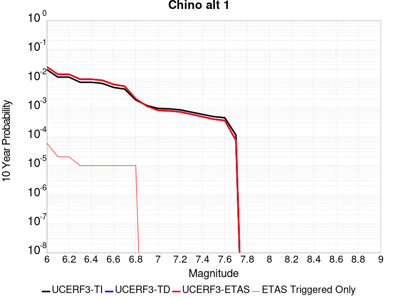 |

| Magnitude | 1 wk TI Prob | 1 wk TD Prob | 1 wk ETAS Prob | 1 wk ETAS/TD Gain | 1 wk ETAS Triggered Only | 1 mo TI Prob | 1 mo TD Prob | 1 mo ETAS Prob | 1 mo ETAS/TD Gain | 1 mo ETAS Triggered Only | 1 yr TI Prob | 1 yr TD Prob | 1 yr ETAS Prob | 1 yr ETAS/TD Gain | 1 yr ETAS Triggered Only | 10 yr TI Prob | 10 yr TD Prob | 10 yr ETAS Prob | 10 yr ETAS/TD Gain | 10 yr ETAS Triggered Only |
|-----|-----|-----|-----|-----|-----|-----|-----|-----|-----|-----|-----|-----|-----|-----|-----|-----|-----|-----|-----|-----|
| 6.0 | 3.939946E-5 | 4.8948554E-5 | 4.8948554E-5 | 1.0 | 0.0 | 1.6884391E-4 | 2.097656E-4 | 2.2664909E-4 | 1.0804875 | 1.6887043E-5 | 0.0020537362 | 0.0025513945 | 0.0025850825 | 1.0132037 | 3.3774086E-5 | 0.020348595 | 0.025277847 | 0.025310768 | 1.0013024 | 3.3774086E-5 |
| 6.1 | 2.1505624E-5 | 2.6879026E-5 | 2.6879026E-5 | 1.0 | 0.0 | 9.2163704E-5 | 1.1519137E-4 | 1.1519137E-4 | 1.0 | 0.0 | 0.0011215154 | 0.001401664 | 0.0014185273 | 1.012031 | 1.6887043E-5 | 0.011158722 | 0.013945141 | 0.013961793 | 1.0011941 | 1.6887043E-5 |
| 6.2 | 2.1505624E-5 | 2.6879026E-5 | 2.6879026E-5 | 1.0 | 0.0 | 9.2163704E-5 | 1.1519137E-4 | 1.1519137E-4 | 1.0 | 0.0 | 0.0011215154 | 0.001401664 | 0.0014185273 | 1.012031 | 1.6887043E-5 | 0.011158722 | 0.013945141 | 0.013961793 | 1.0011941 | 1.6887043E-5 |
| 6.3 | 1.4290785E-5 | 1.8165128E-5 | 1.8165128E-5 | 1.0 | 0.0 | 6.1244784E-5 | 7.784848E-5 | 7.784848E-5 | 1.0 | 0.0 | 7.454001E-4 | 9.4743853E-4 | 9.6430955E-4 | 1.017807 | 1.6887043E-5 | 0.007429048 | 0.0094444575 | 0.009461185 | 1.0017711 | 1.6887043E-5 |
| 6.4 | 1.4290785E-5 | 1.8165128E-5 | 1.8165128E-5 | 1.0 | 0.0 | 6.1244784E-5 | 7.784848E-5 | 7.784848E-5 | 1.0 | 0.0 | 7.454001E-4 | 9.4743853E-4 | 9.6430955E-4 | 1.017807 | 1.6887043E-5 | 0.007429048 | 0.0094444575 | 0.009461185 | 1.0017711 | 1.6887043E-5 |
| 6.5 | 1.3017944E-5 | 1.6652088E-5 | 1.6652088E-5 | 1.0 | 0.0 | 5.5789995E-5 | 7.136439E-5 | 7.136439E-5 | 1.0 | 0.0 | 6.790315E-4 | 8.685589E-4 | 8.8543125E-4 | 1.0194257 | 1.6887043E-5 | 0.0067696036 | 0.008661949 | 0.00867869 | 1.0019326 | 1.6887043E-5 |
| 6.6 | 9.470016E-6 | 1.2039424E-5 | 1.2039424E-5 | 1.0 | 0.0 | 4.058515E-5 | 5.1596704E-5 | 5.1596704E-5 | 1.0 | 0.0 | 4.940122E-4 | 6.280428E-4 | 6.4491923E-4 | 1.0268714 | 1.6887043E-5 | 0.004929154 | 0.0062718987 | 0.00628868 | 1.0026757 | 1.6887043E-5 |
| 6.7 | 8.314155E-6 | 1.0407736E-5 | 1.0407736E-5 | 1.0 | 0.0 | 3.5631605E-5 | 4.4604003E-5 | 4.4604003E-5 | 1.0 | 0.0 | 4.3372845E-4 | 5.429507E-4 | 5.5982854E-4 | 1.0310855 | 1.6887043E-5 | 0.004328829 | 0.005425775 | 0.0054425704 | 1.0030955 | 1.6887043E-5 |
| 6.8 | 3.4856364E-6 | 3.8133708E-6 | 3.8133708E-6 | 1.0 | 0.0 | 1.4938357E-5 | 1.6342927E-5 | 1.6342927E-5 | 1.0 | 0.0 | 1.8185932E-4 | 1.9895904E-4 | 2.1584272E-4 | 1.0848601 | 1.6887043E-5 | 0.0018171056 | 0.0019894864 | 0.0020063398 | 1.0084713 | 1.6887043E-5 |
| 6.9 | 2.2645952E-6 | 2.1529022E-6 | 2.1529022E-6 | 1.0 | 0.0 | 9.705372E-6 | 9.226692E-6 | 9.226692E-6 | 1.0 | 0.0 | 1.18156495E-4 | 1.123294E-4 | 1.123294E-4 | 1.0 | 0.0 | 0.0011809369 | 0.0011233423 | 0.0011233423 | 1.0 | 0.0 |
| 7.0 | 1.7864003E-6 | 1.5430785E-6 | 1.5430785E-6 | 1.0 | 0.0 | 7.655979E-6 | 6.613177E-6 | 6.613177E-6 | 1.0 | 0.0 | 9.3207556E-5 | 8.051251E-5 | 8.051251E-5 | 1.0 | 0.0 | 9.316847E-4 | 8.0528046E-4 | 8.0528046E-4 | 1.0 | 0.0 |
| 7.1 | 1.7315456E-6 | 1.4733511E-6 | 1.4733511E-6 | 1.0 | 0.0 | 7.420889E-6 | 6.3143466E-6 | 6.3143466E-6 | 1.0 | 0.0 | 9.034557E-5 | 7.6874516E-5 | 7.6874516E-5 | 1.0 | 0.0 | 9.0308854E-4 | 7.6891703E-4 | 7.6891703E-4 | 1.0 | 0.0 |
| 7.2 | 1.6008337E-6 | 1.3574215E-6 | 1.3574215E-6 | 1.0 | 0.0 | 6.860698E-6 | 5.817508E-6 | 5.817508E-6 | 1.0 | 0.0 | 8.352579E-5 | 7.082591E-5 | 7.082591E-5 | 1.0 | 0.0 | 8.34944E-4 | 7.0845755E-4 | 7.0845755E-4 | 1.0 | 0.0 |
| 7.3 | 1.3320939E-6 | 1.121782E-6 | 1.121782E-6 | 1.0 | 0.0 | 5.7089615E-6 | 4.807629E-6 | 4.807629E-6 | 1.0 | 0.0 | 6.9504385E-5 | 5.8531357E-5 | 5.8531357E-5 | 1.0 | 0.0 | 6.9482654E-4 | 5.8530393E-4 | 5.8530393E-4 | 1.0 | 0.0 |
| 7.4 | 1.114294E-6 | 9.237111E-7 | 9.237111E-7 | 1.0 | 0.0 | 4.775537E-6 | 3.958756E-6 | 3.958756E-6 | 1.0 | 0.0 | 5.8140613E-5 | 4.8196827E-5 | 4.8196827E-5 | 1.0 | 0.0 | 5.81254E-4 | 4.8188053E-4 | 4.8188053E-4 | 1.0 | 0.0 |
| 7.5 | 9.354081E-7 | 7.6234323E-7 | 7.6234323E-7 | 1.0 | 0.0 | 4.0088858E-6 | 3.2671815E-6 | 3.2671815E-6 | 1.0 | 0.0 | 4.8807087E-5 | 3.9777242E-5 | 3.9777242E-5 | 1.0 | 0.0 | 4.879637E-4 | 3.977046E-4 | 3.977046E-4 | 1.0 | 0.0 |
| 7.6 | 8.521771E-7 | 6.88071E-7 | 6.88071E-7 | 1.0 | 0.0 | 3.6521824E-6 | 2.9488726E-6 | 2.9488726E-6 | 1.0 | 0.0 | 4.4464414E-5 | 3.5901965E-5 | 3.5901965E-5 | 1.0 | 0.0 | 4.4455516E-4 | 3.589648E-4 | 3.589648E-4 | 1.0 | 0.0 |
| 7.7 | 2.1803626E-7 | 1.418649E-7 | 1.418649E-7 | 1.0 | 0.0 | 9.344408E-7 | 6.079923E-7 | 6.079923E-7 | 1.0 | 0.0 | 1.1376757E-5 | 7.4022914E-6 | 7.4022914E-6 | 1.0 | 0.0 | 1.13761744E-4 | 7.402141E-5 | 7.402141E-5 | 1.0 | 0.0 |

## Hat Creek-McArthur-Mayfield
*[(top)](#table-of-contents)*

| 1 Week | 1 Month | 1 Year | 10 Year |
|-----|-----|-----|-----|
|  |  |  |  |

| Magnitude | 1 wk TI Prob | 1 wk TD Prob | 1 wk ETAS Prob | 1 wk ETAS/TD Gain | 1 wk ETAS Triggered Only | 1 mo TI Prob | 1 mo TD Prob | 1 mo ETAS Prob | 1 mo ETAS/TD Gain | 1 mo ETAS Triggered Only | 1 yr TI Prob | 1 yr TD Prob | 1 yr ETAS Prob | 1 yr ETAS/TD Gain | 1 yr ETAS Triggered Only | 10 yr TI Prob | 10 yr TD Prob | 10 yr ETAS Prob | 10 yr ETAS/TD Gain | 10 yr ETAS Triggered Only |
|-----|-----|-----|-----|-----|-----|-----|-----|-----|-----|-----|-----|-----|-----|-----|-----|-----|-----|-----|-----|-----|
| 6.0 | 3.967457E-5 | 4.315831E-5 | 4.315831E-5 | 1.0 | 0.0 | 1.7002279E-4 | 1.8495171E-4 | 2.0183563E-4 | 1.0912882 | 1.6887043E-5 | 0.002068062 | 0.002249576 | 0.002266425 | 1.0074899 | 1.6887043E-5 | 0.02048922 | 0.022280399 | 0.02231342 | 1.0014821 | 3.3774086E-5 |
| 6.1 | 2.5044013E-5 | 2.7071164E-5 | 2.7071164E-5 | 1.0 | 0.0 | 1.0732707E-4 | 1.1601429E-4 | 1.1601429E-4 | 1.0 | 0.0 | 0.0013059238 | 0.0014115906 | 0.0014115906 | 1.0 | 0.0 | 0.01298276 | 0.01402966 | 0.01404631 | 1.0011867 | 1.6887043E-5 |
| 6.2 | 2.5044013E-5 | 2.7071164E-5 | 2.7071164E-5 | 1.0 | 0.0 | 1.0732707E-4 | 1.1601429E-4 | 1.1601429E-4 | 1.0 | 0.0 | 0.0013059238 | 0.0014115906 | 0.0014115906 | 1.0 | 0.0 | 0.01298276 | 0.01402966 | 0.01404631 | 1.0011867 | 1.6887043E-5 |
| 6.3 | 1.6624012E-5 | 1.7891072E-5 | 1.7891072E-5 | 1.0 | 0.0 | 7.124382E-5 | 7.6673816E-5 | 7.6673816E-5 | 1.0 | 0.0 | 8.670483E-4 | 9.331125E-4 | 9.331125E-4 | 1.0 | 0.0 | 0.008636732 | 0.009292879 | 0.009309609 | 1.0018003 | 1.6887043E-5 |
| 6.4 | 1.6624012E-5 | 1.7891072E-5 | 1.7891072E-5 | 1.0 | 0.0 | 7.124382E-5 | 7.6673816E-5 | 7.6673816E-5 | 1.0 | 0.0 | 8.670483E-4 | 9.331125E-4 | 9.331125E-4 | 1.0 | 0.0 | 0.008636732 | 0.009292879 | 0.009309609 | 1.0018003 | 1.6887043E-5 |
| 6.5 | 1.3394842E-5 | 1.4392137E-5 | 1.4392137E-5 | 1.0 | 0.0 | 5.7405203E-5 | 6.167916E-5 | 6.167916E-5 | 1.0 | 0.0 | 6.986842E-4 | 7.506906E-4 | 7.506906E-4 | 1.0 | 0.0 | 0.006964916 | 0.0074821403 | 0.0074821403 | 1.0 | 0.0 |
| 6.6 | 1.1137514E-5 | 1.1954546E-5 | 1.1954546E-5 | 1.0 | 0.0 | 4.7731326E-5 | 5.1232782E-5 | 5.1232782E-5 | 1.0 | 0.0 | 5.809739E-4 | 6.2358467E-4 | 6.2358467E-4 | 1.0 | 0.0 | 0.005794574 | 0.00621877 | 0.00621877 | 1.0 | 0.0 |
| 6.7 | 7.0200663E-6 | 7.5242897E-6 | 7.5242897E-6 | 1.0 | 0.0 | 3.008565E-5 | 3.2246568E-5 | 3.2246568E-5 | 1.0 | 0.0 | 3.6623122E-4 | 3.925328E-4 | 3.925328E-4 | 1.0 | 0.0 | 0.0036562826 | 0.0039185574 | 0.0039185574 | 1.0 | 0.0 |
| 6.8 | 5.940172E-6 | 6.3654766E-6 | 6.3654766E-6 | 1.0 | 0.0 | 2.545763E-5 | 2.7280335E-5 | 2.7280335E-5 | 1.0 | 0.0 | 3.0990256E-4 | 3.3208873E-4 | 3.3208873E-4 | 1.0 | 0.0 | 0.0030947074 | 0.0033160534 | 0.0033160534 | 1.0 | 0.0 |
| 6.9 | 4.129831E-6 | 4.423547E-6 | 4.423547E-6 | 1.0 | 0.0 | 1.7699154E-5 | 1.8957926E-5 | 1.8957926E-5 | 1.0 | 0.0 | 2.154659E-4 | 2.3078908E-4 | 2.3078908E-4 | 1.0 | 0.0 | 0.002152571 | 0.0023055724 | 0.0023055724 | 1.0 | 0.0 |
| 7.0 | 2.6512955E-6 | 2.8374002E-6 | 2.8374002E-6 | 1.0 | 0.0 | 1.1362646E-5 | 1.2160232E-5 | 1.2160232E-5 | 1.0 | 0.0 | 1.3833142E-4 | 1.480412E-4 | 1.480412E-4 | 1.0 | 0.0 | 0.0013824535 | 0.0014794683 | 0.0014794683 | 1.0 | 0.0 |
| 7.1 | 1.2992575E-6 | 1.3909317E-6 | 1.3909317E-6 | 1.0 | 0.0 | 5.568235E-6 | 5.961124E-6 | 5.961124E-6 | 1.0 | 0.0 | 6.779115E-5 | 7.257448E-5 | 7.257448E-5 | 1.0 | 0.0 | 6.7770475E-4 | 7.2552945E-4 | 7.2552945E-4 | 1.0 | 0.0 |
| 7.2 | 4.968191E-7 | 5.3271475E-7 | 5.3271475E-7 | 1.0 | 0.0 | 2.1292228E-6 | 2.283062E-6 | 2.283062E-6 | 1.0 | 0.0 | 2.592298E-5 | 2.7796052E-5 | 2.7796052E-5 | 1.0 | 0.0 | 2.5919956E-4 | 2.7793812E-4 | 2.7793812E-4 | 1.0 | 0.0 |

## Cucamonga
*[(top)](#table-of-contents)*

| 1 Week | 1 Month | 1 Year | 10 Year |
|-----|-----|-----|-----|
|  |  |  |  |

| Magnitude | 1 wk TI Prob | 1 wk TD Prob | 1 wk ETAS Prob | 1 wk ETAS/TD Gain | 1 wk ETAS Triggered Only | 1 mo TI Prob | 1 mo TD Prob | 1 mo ETAS Prob | 1 mo ETAS/TD Gain | 1 mo ETAS Triggered Only | 1 yr TI Prob | 1 yr TD Prob | 1 yr ETAS Prob | 1 yr ETAS/TD Gain | 1 yr ETAS Triggered Only | 10 yr TI Prob | 10 yr TD Prob | 10 yr ETAS Prob | 10 yr ETAS/TD Gain | 10 yr ETAS Triggered Only |
|-----|-----|-----|-----|-----|-----|-----|-----|-----|-----|-----|-----|-----|-----|-----|-----|-----|-----|-----|-----|-----|
| 6.0 | 1.1848348E-5 | 1.1737008E-5 | 1.1737008E-5 | 1.0 | 0.0 | 5.0777642E-5 | 5.030051E-5 | 5.030051E-5 | 1.0 | 0.0 | 6.180424E-4 | 6.1223935E-4 | 6.29116E-4 | 1.0275655 | 1.6887043E-5 | 0.0061632637 | 0.0061067017 | 0.00614027 | 1.0054969 | 3.3774086E-5 |
| 6.1 | 1.1848348E-5 | 1.1737008E-5 | 1.1737008E-5 | 1.0 | 0.0 | 5.0777642E-5 | 5.030051E-5 | 5.030051E-5 | 1.0 | 0.0 | 6.180424E-4 | 6.1223935E-4 | 6.29116E-4 | 1.0275655 | 1.6887043E-5 | 0.0061632637 | 0.0061067017 | 0.00614027 | 1.0054969 | 3.3774086E-5 |
| 6.2 | 1.1848348E-5 | 1.1737008E-5 | 1.1737008E-5 | 1.0 | 0.0 | 5.0777642E-5 | 5.030051E-5 | 5.030051E-5 | 1.0 | 0.0 | 6.180424E-4 | 6.1223935E-4 | 6.29116E-4 | 1.0275655 | 1.6887043E-5 | 0.0061632637 | 0.0061067017 | 0.00614027 | 1.0054969 | 3.3774086E-5 |
| 6.3 | 1.1848348E-5 | 1.1737008E-5 | 1.1737008E-5 | 1.0 | 0.0 | 5.0777642E-5 | 5.030051E-5 | 5.030051E-5 | 1.0 | 0.0 | 6.180424E-4 | 6.1223935E-4 | 6.29116E-4 | 1.0275655 | 1.6887043E-5 | 0.0061632637 | 0.0061067017 | 0.00614027 | 1.0054969 | 3.3774086E-5 |
| 6.4 | 1.1848348E-5 | 1.1737008E-5 | 1.1737008E-5 | 1.0 | 0.0 | 5.0777642E-5 | 5.030051E-5 | 5.030051E-5 | 1.0 | 0.0 | 6.180424E-4 | 6.1223935E-4 | 6.29116E-4 | 1.0275655 | 1.6887043E-5 | 0.0061632637 | 0.0061067017 | 0.00614027 | 1.0054969 | 3.3774086E-5 |
| 6.5 | 1.16988695E-5 | 1.15760395E-5 | 1.15760395E-5 | 1.0 | 0.0 | 5.013705E-5 | 4.9610666E-5 | 4.9610666E-5 | 1.0 | 0.0 | 6.102476E-4 | 6.0384517E-4 | 6.20722E-4 | 1.027949 | 1.6887043E-5 | 0.006085745 | 0.006023216 | 0.006056787 | 1.0055735 | 3.3774086E-5 |
| 6.6 | 1.16988695E-5 | 1.15760395E-5 | 1.15760395E-5 | 1.0 | 0.0 | 5.013705E-5 | 4.9610666E-5 | 4.9610666E-5 | 1.0 | 0.0 | 6.102476E-4 | 6.0384517E-4 | 6.20722E-4 | 1.027949 | 1.6887043E-5 | 0.006085745 | 0.006023216 | 0.006056787 | 1.0055735 | 3.3774086E-5 |
| 6.7 | 1.1397107E-5 | 1.11149475E-5 | 1.11149475E-5 | 1.0 | 0.0 | 4.884383E-5 | 4.7634636E-5 | 4.7634636E-5 | 1.0 | 0.0 | 5.9451134E-4 | 5.797998E-4 | 5.797998E-4 | 1.0 | 0.0 | 0.005929234 | 0.0057840226 | 0.005800812 | 1.0029027 | 1.6887043E-5 |
| 6.8 | 1.058387E-5 | 9.784992E-6 | 9.784992E-6 | 1.0 | 0.0 | 4.5358654E-5 | 4.193501E-5 | 4.193501E-5 | 1.0 | 0.0 | 5.521017E-4 | 5.1044027E-4 | 5.1044027E-4 | 1.0 | 0.0 | 0.00550732 | 0.0050936877 | 0.0051104887 | 1.0032984 | 1.6887043E-5 |
| 6.9 | 9.690046E-6 | 8.57948E-6 | 8.57948E-6 | 1.0 | 0.0 | 4.1528107E-5 | 3.6768684E-5 | 3.6768684E-5 | 1.0 | 0.0 | 5.054874E-4 | 4.475672E-4 | 4.475672E-4 | 1.0 | 0.0 | 0.005043391 | 0.004467594 | 0.004467594 | 1.0 | 0.0 |
| 7.0 | 9.381461E-6 | 8.187101E-6 | 8.187101E-6 | 1.0 | 0.0 | 4.020564E-5 | 3.5087105E-5 | 3.5087105E-5 | 1.0 | 0.0 | 4.893937E-4 | 4.2710215E-4 | 4.2710215E-4 | 1.0 | 0.0 | 0.0048831734 | 0.0042637475 | 0.0042637475 | 1.0 | 0.0 |
| 7.1 | 8.946492E-6 | 7.781886E-6 | 7.781886E-6 | 1.0 | 0.0 | 3.8341543E-5 | 3.3350516E-5 | 3.3350516E-5 | 1.0 | 0.0 | 4.667083E-4 | 4.0596718E-4 | 4.0596718E-4 | 1.0 | 0.0 | 0.0046572937 | 0.004053192 | 0.004053192 | 1.0 | 0.0 |
| 7.2 | 8.251016E-6 | 6.9752796E-6 | 6.9752796E-6 | 1.0 | 0.0 | 3.5361016E-5 | 2.9893714E-5 | 2.9893714E-5 | 1.0 | 0.0 | 4.3043532E-4 | 3.6389544E-4 | 3.6389544E-4 | 1.0 | 0.0 | 0.0042960253 | 0.0036339292 | 0.0036339292 | 1.0 | 0.0 |
| 7.3 | 7.717881E-6 | 6.4863502E-6 | 6.4863502E-6 | 1.0 | 0.0 | 3.3076216E-5 | 2.7798349E-5 | 2.7798349E-5 | 1.0 | 0.0 | 4.026285E-4 | 3.3839257E-4 | 3.3839257E-4 | 1.0 | 0.0 | 0.004018998 | 0.00337971 | 0.00337971 | 1.0 | 0.0 |
| 7.4 | 7.275623E-6 | 6.031997E-6 | 6.031997E-6 | 1.0 | 0.0 | 3.118087E-5 | 2.585116E-5 | 2.585116E-5 | 1.0 | 0.0 | 3.7956095E-4 | 3.1469265E-4 | 3.1469265E-4 | 1.0 | 0.0 | 0.0037891332 | 0.0031434062 | 0.0031434062 | 1.0 | 0.0 |
| 7.5 | 6.5109502E-6 | 5.1006014E-6 | 5.1006014E-6 | 1.0 | 0.0 | 2.7903774E-5 | 2.1859538E-5 | 2.1859538E-5 | 1.0 | 0.0 | 3.3967546E-4 | 2.661075E-4 | 2.661075E-4 | 1.0 | 0.0 | 0.0033915674 | 0.002658813 | 0.002658813 | 1.0 | 0.0 |
| 7.6 | 5.4495326E-6 | 3.90857E-6 | 3.90857E-6 | 1.0 | 0.0 | 2.335493E-5 | 1.6750908E-5 | 1.6750908E-5 | 1.0 | 0.0 | 2.8430918E-4 | 2.0392328E-4 | 2.0392328E-4 | 1.0 | 0.0 | 0.0028394572 | 0.002038282 | 0.002038282 | 1.0 | 0.0 |
| 7.7 | 4.7997164E-6 | 3.2002547E-6 | 3.2002547E-6 | 1.0 | 0.0 | 2.057005E-5 | 1.3715306E-5 | 1.3715306E-5 | 1.0 | 0.0 | 2.504116E-4 | 1.6697108E-4 | 1.6697108E-4 | 1.0 | 0.0 | 0.002501296 | 0.0016693877 | 0.0016693877 | 1.0 | 0.0 |
| 7.8 | 3.3941733E-6 | 2.0641899E-6 | 2.0641899E-6 | 1.0 | 0.0 | 1.4546376E-5 | 8.846498E-6 | 8.846498E-6 | 1.0 | 0.0 | 1.7708774E-4 | 1.07700806E-4 | 1.07700806E-4 | 1.0 | 0.0 | 0.0017694668 | 0.001076723 | 0.001076723 | 1.0 | 0.0 |
| 7.9 | 9.750552E-7 | 5.155946E-7 | 5.155946E-7 | 1.0 | 0.0 | 4.178801E-6 | 2.2096892E-6 | 2.2096892E-6 | 1.0 | 0.0 | 5.0875715E-5 | 2.690264E-5 | 2.690264E-5 | 1.0 | 0.0 | 5.086407E-4 | 2.6899425E-4 | 2.6899425E-4 | 1.0 | 0.0 |
| 8.0 | 1.133857E-7 | 6.053707E-8 | 6.053707E-8 | 1.0 | 0.0 | 4.8593864E-7 | 2.5944456E-7 | 2.5944456E-7 | 1.0 | 0.0 | 5.9162867E-6 | 3.158733E-6 | 3.158733E-6 | 1.0 | 0.0 | 5.916129E-5 | 3.1586897E-5 | 3.1586897E-5 | 1.0 | 0.0 |

## Hector Mine
*[(top)](#table-of-contents)*

| 1 Week | 1 Month | 1 Year | 10 Year |
|-----|-----|-----|-----|
|  |  |  |  |

| Magnitude | 1 wk TI Prob | 1 wk TD Prob | 1 wk ETAS Prob | 1 wk ETAS/TD Gain | 1 wk ETAS Triggered Only | 1 mo TI Prob | 1 mo TD Prob | 1 mo ETAS Prob | 1 mo ETAS/TD Gain | 1 mo ETAS Triggered Only | 1 yr TI Prob | 1 yr TD Prob | 1 yr ETAS Prob | 1 yr ETAS/TD Gain | 1 yr ETAS Triggered Only | 10 yr TI Prob | 10 yr TD Prob | 10 yr ETAS Prob | 10 yr ETAS/TD Gain | 10 yr ETAS Triggered Only |
|-----|-----|-----|-----|-----|-----|-----|-----|-----|-----|-----|-----|-----|-----|-----|-----|-----|-----|-----|-----|-----|
| 6.0 | 1.8760093E-5 | 2.7963818E-6 | 2.7963818E-6 | 1.0 | 0.0 | 8.039792E-5 | 1.1984461E-5 | 1.1984461E-5 | 1.0 | 0.0 | 9.78405E-4 | 1.4590504E-4 | 1.4590504E-4 | 1.0 | 0.0 | 0.009741086 | 0.0014584847 | 0.0014922095 | 1.0231231 | 3.3774086E-5 |
| 6.1 | 1.8760093E-5 | 2.7963818E-6 | 2.7963818E-6 | 1.0 | 0.0 | 8.039792E-5 | 1.1984461E-5 | 1.1984461E-5 | 1.0 | 0.0 | 9.78405E-4 | 1.4590504E-4 | 1.4590504E-4 | 1.0 | 0.0 | 0.009741086 | 0.0014584847 | 0.0014922095 | 1.0231231 | 3.3774086E-5 |
| 6.2 | 1.8760093E-5 | 2.7963818E-6 | 2.7963818E-6 | 1.0 | 0.0 | 8.039792E-5 | 1.1984461E-5 | 1.1984461E-5 | 1.0 | 0.0 | 9.78405E-4 | 1.4590504E-4 | 1.4590504E-4 | 1.0 | 0.0 | 0.009741086 | 0.0014584847 | 0.0014922095 | 1.0231231 | 3.3774086E-5 |
| 6.3 | 1.8760093E-5 | 2.7963818E-6 | 2.7963818E-6 | 1.0 | 0.0 | 8.039792E-5 | 1.1984461E-5 | 1.1984461E-5 | 1.0 | 0.0 | 9.78405E-4 | 1.4590504E-4 | 1.4590504E-4 | 1.0 | 0.0 | 0.009741086 | 0.0014584847 | 0.0014922095 | 1.0231231 | 3.3774086E-5 |
| 6.4 | 1.0888055E-5 | 2.7963818E-6 | 2.7963818E-6 | 1.0 | 0.0 | 4.666226E-5 | 1.1984461E-5 | 1.1984461E-5 | 1.0 | 0.0 | 5.679649E-4 | 1.4590504E-4 | 1.4590504E-4 | 1.0 | 0.0 | 0.0056651547 | 0.0014584847 | 0.0014922095 | 1.0231231 | 3.3774086E-5 |
| 6.5 | 1.0888055E-5 | 2.7963818E-6 | 2.7963818E-6 | 1.0 | 0.0 | 4.666226E-5 | 1.1984461E-5 | 1.1984461E-5 | 1.0 | 0.0 | 5.679649E-4 | 1.4590504E-4 | 1.4590504E-4 | 1.0 | 0.0 | 0.0056651547 | 0.0014584847 | 0.0014922095 | 1.0231231 | 3.3774086E-5 |
| 6.6 | 1.0730738E-5 | 2.7963818E-6 | 2.7963818E-6 | 1.0 | 0.0 | 4.5988065E-5 | 1.1984461E-5 | 1.1984461E-5 | 1.0 | 0.0 | 5.5976084E-4 | 1.4590504E-4 | 1.4590504E-4 | 1.0 | 0.0 | 0.0055835294 | 0.0014584847 | 0.0014922095 | 1.0231231 | 3.3774086E-5 |
| 6.7 | 7.881326E-6 | 2.7710626E-6 | 2.7710626E-6 | 1.0 | 0.0 | 3.3776672E-5 | 1.1875951E-5 | 1.1875951E-5 | 1.0 | 0.0 | 4.111534E-4 | 1.445841E-4 | 1.445841E-4 | 1.0 | 0.0 | 0.0041039353 | 0.0014452925 | 0.0014790177 | 1.0233346 | 3.3774086E-5 |
| 6.8 | 7.5683483E-6 | 2.7328138E-6 | 2.7328138E-6 | 1.0 | 0.0 | 3.2435375E-5 | 1.1712029E-5 | 1.1712029E-5 | 1.0 | 0.0 | 3.9482914E-4 | 1.4258861E-4 | 1.4258861E-4 | 1.0 | 0.0 | 0.0039412836 | 0.0014253634 | 0.0014590892 | 1.0236613 | 3.3774086E-5 |
| 6.9 | 6.473048E-6 | 2.5138945E-6 | 2.5138945E-6 | 1.0 | 0.0 | 2.7741338E-5 | 1.07738115E-5 | 1.07738115E-5 | 1.0 | 0.0 | 3.3769844E-4 | 1.3116724E-4 | 1.3116724E-4 | 1.0 | 0.0 | 0.0033718573 | 0.0013112876 | 0.0013450175 | 1.0257226 | 3.3774086E-5 |
| 7.0 | 4.9959954E-6 | 1.8565124E-6 | 1.8565124E-6 | 1.0 | 0.0 | 2.1411232E-5 | 7.956478E-6 | 7.956478E-6 | 1.0 | 0.0 | 2.6065056E-4 | 9.686937E-5 | 9.686937E-5 | 1.0 | 0.0 | 0.0026034506 | 9.6862105E-4 | 9.854918E-4 | 1.0174172 | 1.6887043E-5 |
| 7.1 | 1.2997541E-6 | 1.5602147E-7 | 1.5602147E-7 | 1.0 | 0.0 | 5.5703626E-6 | 6.686633E-7 | 6.686633E-7 | 1.0 | 0.0 | 6.7817055E-5 | 8.140949E-6 | 8.140949E-6 | 1.0 | 0.0 | 6.779636E-4 | 8.1406906E-5 | 8.1406906E-5 | 1.0 | 0.0 |
| 7.2 | 8.392699E-7 | 9.727592E-8 | 9.727592E-8 | 1.0 | 0.0 | 3.596866E-6 | 4.1689677E-7 | 4.1689677E-7 | 1.0 | 0.0 | 4.3790962E-5 | 5.0757085E-6 | 5.0757085E-6 | 1.0 | 0.0 | 4.3782333E-4 | 5.0756116E-5 | 5.0756116E-5 | 1.0 | 0.0 |
| 7.3 | 3.13015E-7 | 4.829262E-8 | 4.829262E-8 | 1.0 | 0.0 | 1.3414921E-6 | 2.0696835E-7 | 2.0696835E-7 | 1.0 | 0.0 | 1.6332544E-5 | 2.5198376E-6 | 2.5198376E-6 | 1.0 | 0.0 | 1.6331344E-4 | 2.5198176E-5 | 2.5198176E-5 | 1.0 | 0.0 |

## Los Alamos 2011 CFM
*[(top)](#table-of-contents)*

| 1 Week | 1 Month | 1 Year | 10 Year |
|-----|-----|-----|-----|
|  |  | 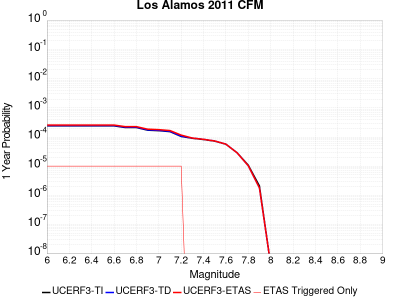 |  |

| Magnitude | 1 wk TI Prob | 1 wk TD Prob | 1 wk ETAS Prob | 1 wk ETAS/TD Gain | 1 wk ETAS Triggered Only | 1 mo TI Prob | 1 mo TD Prob | 1 mo ETAS Prob | 1 mo ETAS/TD Gain | 1 mo ETAS Triggered Only | 1 yr TI Prob | 1 yr TD Prob | 1 yr ETAS Prob | 1 yr ETAS/TD Gain | 1 yr ETAS Triggered Only | 10 yr TI Prob | 10 yr TD Prob | 10 yr ETAS Prob | 10 yr ETAS/TD Gain | 10 yr ETAS Triggered Only |
|-----|-----|-----|-----|-----|-----|-----|-----|-----|-----|-----|-----|-----|-----|-----|-----|-----|-----|-----|-----|-----|
| 6.0 | 4.6284417E-6 | 4.751731E-6 | 4.751731E-6 | 1.0 | 0.0 | 1.9836029E-5 | 2.0364414E-5 | 2.0364414E-5 | 1.0 | 0.0 | 2.4147688E-4 | 2.4791027E-4 | 2.6479314E-4 | 1.0681007 | 1.6887043E-5 | 0.0024121467 | 0.0024765113 | 0.002510202 | 1.013604 | 3.3774086E-5 |
| 6.1 | 4.6284417E-6 | 4.751731E-6 | 4.751731E-6 | 1.0 | 0.0 | 1.9836029E-5 | 2.0364414E-5 | 2.0364414E-5 | 1.0 | 0.0 | 2.4147688E-4 | 2.4791027E-4 | 2.6479314E-4 | 1.0681007 | 1.6887043E-5 | 0.0024121467 | 0.0024765113 | 0.002510202 | 1.013604 | 3.3774086E-5 |
| 6.2 | 4.6284417E-6 | 4.751731E-6 | 4.751731E-6 | 1.0 | 0.0 | 1.9836029E-5 | 2.0364414E-5 | 2.0364414E-5 | 1.0 | 0.0 | 2.4147688E-4 | 2.4791027E-4 | 2.6479314E-4 | 1.0681007 | 1.6887043E-5 | 0.0024121467 | 0.0024765113 | 0.002510202 | 1.013604 | 3.3774086E-5 |
| 6.3 | 4.6284417E-6 | 4.751731E-6 | 4.751731E-6 | 1.0 | 0.0 | 1.9836029E-5 | 2.0364414E-5 | 2.0364414E-5 | 1.0 | 0.0 | 2.4147688E-4 | 2.4791027E-4 | 2.6479314E-4 | 1.0681007 | 1.6887043E-5 | 0.0024121467 | 0.0024765113 | 0.002510202 | 1.013604 | 3.3774086E-5 |
| 6.4 | 4.6284417E-6 | 4.751731E-6 | 4.751731E-6 | 1.0 | 0.0 | 1.9836029E-5 | 2.0364414E-5 | 2.0364414E-5 | 1.0 | 0.0 | 2.4147688E-4 | 2.4791027E-4 | 2.6479314E-4 | 1.0681007 | 1.6887043E-5 | 0.0024121467 | 0.0024765113 | 0.002510202 | 1.013604 | 3.3774086E-5 |
| 6.5 | 4.6284417E-6 | 4.751731E-6 | 4.751731E-6 | 1.0 | 0.0 | 1.9836029E-5 | 2.0364414E-5 | 2.0364414E-5 | 1.0 | 0.0 | 2.4147688E-4 | 2.4791027E-4 | 2.6479314E-4 | 1.0681007 | 1.6887043E-5 | 0.0024121467 | 0.0024765113 | 0.002510202 | 1.013604 | 3.3774086E-5 |
| 6.6 | 4.6284417E-6 | 4.751731E-6 | 4.751731E-6 | 1.0 | 0.0 | 1.9836029E-5 | 2.0364414E-5 | 2.0364414E-5 | 1.0 | 0.0 | 2.4147688E-4 | 2.4791027E-4 | 2.6479314E-4 | 1.0681007 | 1.6887043E-5 | 0.0024121467 | 0.0024765113 | 0.002510202 | 1.013604 | 3.3774086E-5 |
| 6.7 | 4.062321E-6 | 4.166349E-6 | 4.166349E-6 | 1.0 | 0.0 | 1.7409831E-5 | 1.7855667E-5 | 1.7855667E-5 | 1.0 | 0.0 | 2.1194408E-4 | 2.1737257E-4 | 2.3425595E-4 | 1.0776702 | 1.6887043E-5 | 0.0021174205 | 0.0021717492 | 0.0022054499 | 1.0155178 | 3.3774086E-5 |
| 6.8 | 4.062321E-6 | 4.166349E-6 | 4.166349E-6 | 1.0 | 0.0 | 1.7409831E-5 | 1.7855667E-5 | 1.7855667E-5 | 1.0 | 0.0 | 2.1194408E-4 | 2.1737257E-4 | 2.3425595E-4 | 1.0776702 | 1.6887043E-5 | 0.0021174205 | 0.0021717492 | 0.0022054499 | 1.0155178 | 3.3774086E-5 |
| 6.9 | 3.2936077E-6 | 3.372958E-6 | 3.372958E-6 | 1.0 | 0.0 | 1.4115385E-5 | 1.4455459E-5 | 1.4455459E-5 | 1.0 | 0.0 | 1.7184127E-4 | 1.7598194E-4 | 1.92866E-4 | 1.095942 | 1.6887043E-5 | 0.0017170844 | 0.0017585184 | 0.0017922331 | 1.0191722 | 3.3774086E-5 |
| 7.0 | 3.1687898E-6 | 3.2448156E-6 | 3.2448156E-6 | 1.0 | 0.0 | 1.3580457E-5 | 1.3906283E-5 | 1.3906283E-5 | 1.0 | 0.0 | 1.6532952E-4 | 1.6929678E-4 | 1.8618096E-4 | 1.0997313 | 1.6887043E-5 | 0.0016520657 | 0.0016917696 | 0.0017254866 | 1.01993 | 3.3774086E-5 |
| 7.1 | 2.9379228E-6 | 3.0073259E-6 | 3.0073259E-6 | 1.0 | 0.0 | 1.25910365E-5 | 1.288848E-5 | 1.288848E-5 | 1.0 | 0.0 | 1.5328509E-4 | 1.5690686E-4 | 1.7379125E-4 | 1.1076077 | 1.6887043E-5 | 0.001531794 | 0.0015680499 | 0.001601771 | 1.0215051 | 3.3774086E-5 |
| 7.2 | 2.0020686E-6 | 2.0416298E-6 | 2.0416298E-6 | 1.0 | 0.0 | 8.580266E-6 | 8.749813E-6 | 8.749813E-6 | 1.0 | 0.0 | 1.0445973E-4 | 1.0652381E-4 | 1.2340905E-4 | 1.1585114 | 1.6887043E-5 | 0.0010441064 | 0.001064732 | 0.0010984701 | 1.031687 | 3.3774086E-5 |
| 7.3 | 1.7364243E-6 | 1.7678802E-6 | 1.7678802E-6 | 1.0 | 0.0 | 7.441797E-6 | 7.576608E-6 | 7.576608E-6 | 1.0 | 0.0 | 9.0600115E-5 | 9.2241324E-5 | 9.2241324E-5 | 1.0 | 0.0 | 9.0563187E-4 | 9.2203356E-4 | 9.38905E-4 | 1.0182981 | 1.6887043E-5 |
| 7.4 | 1.5718434E-6 | 1.5983177E-6 | 1.5983177E-6 | 1.0 | 0.0 | 6.7364545E-6 | 6.849915E-6 | 6.849915E-6 | 1.0 | 0.0 | 8.201325E-5 | 8.339455E-5 | 8.339455E-5 | 1.0 | 0.0 | 8.198299E-4 | 8.3363557E-4 | 8.505086E-4 | 1.0202402 | 1.6887043E-5 |
| 7.5 | 1.3841119E-6 | 1.4042793E-6 | 1.4042793E-6 | 1.0 | 0.0 | 5.9318945E-6 | 6.0183256E-6 | 6.0183256E-6 | 1.0 | 0.0 | 7.221842E-5 | 7.327068E-5 | 7.327068E-5 | 1.0 | 0.0 | 7.2194956E-4 | 7.324681E-4 | 7.493428E-4 | 1.0230381 | 1.6887043E-5 |
| 7.6 | 1.0843726E-6 | 1.093442E-6 | 1.093442E-6 | 1.0 | 0.0 | 4.647303E-6 | 4.6861724E-6 | 4.6861724E-6 | 1.0 | 0.0 | 5.6579443E-5 | 5.705268E-5 | 5.705268E-5 | 1.0 | 0.0 | 5.656504E-4 | 5.703829E-4 | 5.872603E-4 | 1.0295897 | 1.6887043E-5 |
| 7.7 | 5.544814E-7 | 5.5018705E-7 | 5.5018705E-7 | 1.0 | 0.0 | 2.3763469E-6 | 2.3579425E-6 | 2.3579425E-6 | 1.0 | 0.0 | 2.8931638E-5 | 2.8707573E-5 | 2.8707573E-5 | 1.0 | 0.0 | 2.8927872E-4 | 2.870388E-4 | 3.03921E-4 | 1.058815 | 1.6887043E-5 |
| 7.8 | 2.0707465E-7 | 1.977846E-7 | 1.977846E-7 | 1.0 | 0.0 | 8.874625E-7 | 8.4764804E-7 | 8.4764804E-7 | 1.0 | 0.0 | 1.08048025E-5 | 1.0320066E-5 | 1.0320066E-5 | 1.0 | 0.0 | 1.0804277E-4 | 1.0319592E-4 | 1.0319592E-4 | 1.0 | 0.0 |
| 7.9 | 3.9821284E-8 | 3.433109E-8 | 3.433109E-8 | 1.0 | 0.0 | 1.7066264E-7 | 1.4713324E-7 | 1.4713324E-7 | 1.0 | 0.0 | 2.0778157E-6 | 1.7913457E-6 | 1.7913457E-6 | 1.0 | 0.0 | 2.0777963E-5 | 1.7913319E-5 | 1.7913319E-5 | 1.0 | 0.0 |
| 8.0 | 7.880441E-11 | 8.2353124E-11 | 8.2353124E-11 | 1.0 | 0.0 | 3.3773329E-10 | 3.52942E-10 | 3.52942E-10 | 1.0 | 0.0 | 4.1119033E-9 | 4.2970694E-9 | 4.2970694E-9 | 1.0 | 0.0 | 4.1119034E-8 | 4.2970694E-8 | 4.2970694E-8 | 1.0 | 0.0 |

## Elsinore (Temecula) rev
*[(top)](#table-of-contents)*

| 1 Week | 1 Month | 1 Year | 10 Year |
|-----|-----|-----|-----|
|  |  |  |  |

| Magnitude | 1 wk TI Prob | 1 wk TD Prob | 1 wk ETAS Prob | 1 wk ETAS/TD Gain | 1 wk ETAS Triggered Only | 1 mo TI Prob | 1 mo TD Prob | 1 mo ETAS Prob | 1 mo ETAS/TD Gain | 1 mo ETAS Triggered Only | 1 yr TI Prob | 1 yr TD Prob | 1 yr ETAS Prob | 1 yr ETAS/TD Gain | 1 yr ETAS Triggered Only | 10 yr TI Prob | 10 yr TD Prob | 10 yr ETAS Prob | 10 yr ETAS/TD Gain | 10 yr ETAS Triggered Only |
|-----|-----|-----|-----|-----|-----|-----|-----|-----|-----|-----|-----|-----|-----|-----|-----|-----|-----|-----|-----|-----|
| 6.0 | 2.9514995E-5 | 2.2517117E-5 | 3.9403778E-5 | 1.7499478 | 1.6887043E-5 | 1.264867E-4 | 9.649849E-5 | 1.3026931E-4 | 1.3499622 | 3.3774086E-5 | 0.0015388876 | 0.0011742581 | 0.0012079924 | 1.0287282 | 3.3774086E-5 | 0.015282745 | 0.011696897 | 0.011730277 | 1.0028536 | 3.3774086E-5 |
| 6.1 | 2.9514995E-5 | 2.2517117E-5 | 3.9403778E-5 | 1.7499478 | 1.6887043E-5 | 1.264867E-4 | 9.649849E-5 | 1.3026931E-4 | 1.3499622 | 3.3774086E-5 | 0.0015388876 | 0.0011742581 | 0.0012079924 | 1.0287282 | 3.3774086E-5 | 0.015282745 | 0.011696897 | 0.011730277 | 1.0028536 | 3.3774086E-5 |
| 6.2 | 2.9514995E-5 | 2.2517117E-5 | 3.9403778E-5 | 1.7499478 | 1.6887043E-5 | 1.264867E-4 | 9.649849E-5 | 1.3026931E-4 | 1.3499622 | 3.3774086E-5 | 0.0015388876 | 0.0011742581 | 0.0012079924 | 1.0287282 | 3.3774086E-5 | 0.015282745 | 0.011696897 | 0.011730277 | 1.0028536 | 3.3774086E-5 |
| 6.3 | 2.3223649E-5 | 1.8406454E-5 | 3.5293186E-5 | 1.9174354 | 1.6887043E-5 | 9.952613E-5 | 7.888251E-5 | 9.576823E-5 | 1.2140615 | 1.6887043E-5 | 0.001211057 | 9.599888E-4 | 9.768596E-4 | 1.017574 | 1.6887043E-5 | 0.012044783 | 0.009569948 | 0.009586673 | 1.0017477 | 1.6887043E-5 |
| 6.4 | 2.3223649E-5 | 1.8406454E-5 | 3.5293186E-5 | 1.9174354 | 1.6887043E-5 | 9.952613E-5 | 7.888251E-5 | 9.576823E-5 | 1.2140615 | 1.6887043E-5 | 0.001211057 | 9.599888E-4 | 9.768596E-4 | 1.017574 | 1.6887043E-5 | 0.012044783 | 0.009569948 | 0.009586673 | 1.0017477 | 1.6887043E-5 |
| 6.5 | 1.8338875E-5 | 1.4750118E-5 | 3.163691E-5 | 2.1448581 | 1.6887043E-5 | 7.8592806E-5 | 6.321331E-5 | 8.0099286E-5 | 1.2671269 | 1.6887043E-5 | 9.5644733E-4 | 7.69359E-4 | 7.8623305E-4 | 1.0219326 | 1.6887043E-5 | 0.009523412 | 0.0076739118 | 0.007690669 | 1.0021837 | 1.6887043E-5 |
| 6.6 | 1.8223333E-5 | 1.4612673E-5 | 3.149947E-5 | 2.1556268 | 1.6887043E-5 | 7.809766E-5 | 6.262429E-5 | 7.9510275E-5 | 1.2696395 | 1.6887043E-5 | 9.504242E-4 | 7.6219277E-4 | 7.7906693E-4 | 1.022139 | 1.6887043E-5 | 0.009463696 | 0.0076027405 | 0.007619499 | 1.0022043 | 1.6887043E-5 |
| 6.7 | 1.7512752E-5 | 1.402721E-5 | 3.0914016E-5 | 2.2038605 | 1.6887043E-5 | 7.505249E-5 | 6.011528E-5 | 7.700131E-5 | 1.2808942 | 1.6887043E-5 | 9.13381E-4 | 7.3166634E-4 | 7.48541E-4 | 1.0230634 | 1.6887043E-5 | 0.00909636 | 0.00729892 | 0.0073156836 | 1.0022968 | 1.6887043E-5 |
| 6.8 | 1.7417142E-5 | 1.3951195E-5 | 3.0838E-5 | 2.2104201 | 1.6887043E-5 | 7.4642754E-5 | 5.9789512E-5 | 7.667555E-5 | 1.2824247 | 1.6887043E-5 | 9.083966E-4 | 7.277028E-4 | 7.4457756E-4 | 1.0231891 | 1.6887043E-5 | 0.009046922 | 0.0072594886 | 0.007276253 | 1.0023093 | 1.6887043E-5 |
| 6.9 | 1.6402591E-5 | 1.2988613E-5 | 2.9875437E-5 | 2.3001251 | 1.6887043E-5 | 7.0294926E-5 | 5.5664343E-5 | 7.255044E-5 | 1.3033558 | 1.6887043E-5 | 8.5550465E-4 | 6.775103E-4 | 6.943859E-4 | 1.0249083 | 1.6887043E-5 | 0.008522186 | 0.006760169 | 0.0067769415 | 1.0024811 | 1.6887043E-5 |
| 7.0 | 1.3912486E-5 | 1.0878233E-5 | 2.7765092E-5 | 2.5523531 | 1.6887043E-5 | 5.9623577E-5 | 4.6620182E-5 | 6.3506435E-5 | 1.3622091 | 1.6887043E-5 | 7.2567526E-4 | 5.674556E-4 | 5.843331E-4 | 1.0297424 | 1.6887043E-5 | 0.0072331014 | 0.005663986 | 0.005680777 | 1.0029646 | 1.6887043E-5 |
| 7.1 | 1.3405147E-5 | 1.03274215E-5 | 2.721429E-5 | 2.6351485 | 1.6887043E-5 | 5.7449364E-5 | 4.425964E-5 | 6.114593E-5 | 1.381528 | 1.6887043E-5 | 6.9922156E-4 | 5.3873047E-4 | 5.556084E-4 | 1.0313292 | 1.6887043E-5 | 0.0069702556 | 0.005377577 | 0.005394373 | 1.0031234 | 1.6887043E-5 |
| 7.2 | 1.21402E-5 | 8.996737E-6 | 8.996737E-6 | 1.0 | 0.0 | 5.202839E-5 | 3.8556886E-5 | 3.8556886E-5 | 1.0 | 0.0 | 6.332616E-4 | 4.6933076E-4 | 4.6933076E-4 | 1.0 | 0.0 | 0.0063146 | 0.004684821 | 0.004684821 | 1.0 | 0.0 |
| 7.3 | 1.05047775E-5 | 7.571771E-6 | 7.571771E-6 | 1.0 | 0.0 | 4.5019697E-5 | 3.245005E-5 | 3.245005E-5 | 1.0 | 0.0 | 5.4797693E-4 | 3.950092E-4 | 3.950092E-4 | 1.0 | 0.0 | 0.005466277 | 0.00394346 | 0.00394346 | 1.0 | 0.0 |
| 7.4 | 9.624483E-6 | 6.7868696E-6 | 6.7868696E-6 | 1.0 | 0.0 | 4.124713E-5 | 2.9086266E-5 | 2.9086266E-5 | 1.0 | 0.0 | 5.0206814E-4 | 3.5406914E-4 | 3.5406914E-4 | 1.0 | 0.0 | 0.005009353 | 0.003535204 | 0.003535204 | 1.0 | 0.0 |
| 7.5 | 8.215151E-6 | 5.635538E-6 | 5.635538E-6 | 1.0 | 0.0 | 3.5207315E-5 | 2.4152088E-5 | 2.4152088E-5 | 1.0 | 0.0 | 4.2856473E-4 | 2.9401327E-4 | 2.9401327E-4 | 1.0 | 0.0 | 0.004277392 | 0.002936371 | 0.002936371 | 1.0 | 0.0 |
| 7.6 | 6.975058E-6 | 4.676045E-6 | 4.676045E-6 | 1.0 | 0.0 | 2.9892764E-5 | 2.0040046E-5 | 2.0040046E-5 | 1.0 | 0.0 | 3.6388362E-4 | 2.439614E-4 | 2.439614E-4 | 1.0 | 0.0 | 0.0036328835 | 0.002437052 | 0.002437052 | 1.0 | 0.0 |
| 7.7 | 4.159604E-6 | 2.3269924E-6 | 2.3269924E-6 | 1.0 | 0.0 | 1.7826753E-5 | 9.97279E-6 | 9.97279E-6 | 1.0 | 0.0 | 2.1701909E-4 | 1.21412704E-4 | 1.21412704E-4 | 1.0 | 0.0 | 0.0021680726 | 0.0012135367 | 0.0012135367 | 1.0 | 0.0 |
| 7.8 | 2.2692414E-7 | 9.3854695E-8 | 9.3854695E-8 | 1.0 | 0.0 | 9.725317E-7 | 4.0223435E-7 | 4.0223435E-7 | 1.0 | 0.0 | 1.1840509E-5 | 4.8971956E-6 | 4.8971956E-6 | 1.0 | 0.0 | 1.1839878E-4 | 4.8971204E-5 | 4.8971204E-5 | 1.0 | 0.0 |
| 7.9 | 6.676829E-9 | 3.439853E-9 | 3.439853E-9 | 1.0 | 0.0 | 2.861498E-8 | 1.4742227E-8 | 1.4742227E-8 | 1.0 | 0.0 | 3.4838732E-7 | 1.7948659E-7 | 1.7948659E-7 | 1.0 | 0.0 | 3.4838679E-6 | 1.7948646E-6 | 1.7948646E-6 | 1.0 | 0.0 |

## San Gorgonio Pass
*[(top)](#table-of-contents)*

| 1 Week | 1 Month | 1 Year | 10 Year |
|-----|-----|-----|-----|
|  |  |  | 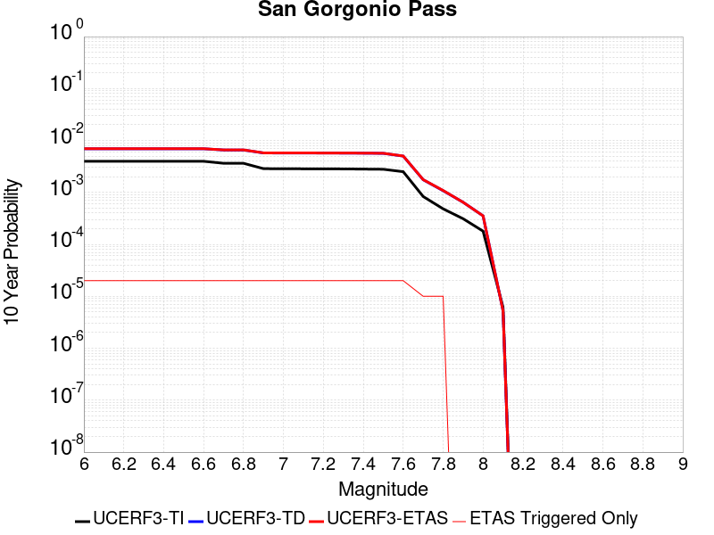 |

| Magnitude | 1 wk TI Prob | 1 wk TD Prob | 1 wk ETAS Prob | 1 wk ETAS/TD Gain | 1 wk ETAS Triggered Only | 1 mo TI Prob | 1 mo TD Prob | 1 mo ETAS Prob | 1 mo ETAS/TD Gain | 1 mo ETAS Triggered Only | 1 yr TI Prob | 1 yr TD Prob | 1 yr ETAS Prob | 1 yr ETAS/TD Gain | 1 yr ETAS Triggered Only | 10 yr TI Prob | 10 yr TD Prob | 10 yr ETAS Prob | 10 yr ETAS/TD Gain | 10 yr ETAS Triggered Only |
|-----|-----|-----|-----|-----|-----|-----|-----|-----|-----|-----|-----|-----|-----|-----|-----|-----|-----|-----|-----|-----|
| 6.0 | 7.644328E-6 | 1.3314231E-5 | 1.3314231E-5 | 1.0 | 0.0 | 3.2760996E-5 | 5.705979E-5 | 7.394587E-5 | 1.2959366 | 1.6887043E-5 | 3.987921E-4 | 6.944901E-4 | 7.2824076E-4 | 1.0485977 | 3.3774086E-5 | 0.003980772 | 0.0069299806 | 0.006963521 | 1.0048399 | 3.3774086E-5 |
| 6.1 | 7.644328E-6 | 1.3314231E-5 | 1.3314231E-5 | 1.0 | 0.0 | 3.2760996E-5 | 5.705979E-5 | 7.394587E-5 | 1.2959366 | 1.6887043E-5 | 3.987921E-4 | 6.944901E-4 | 7.2824076E-4 | 1.0485977 | 3.3774086E-5 | 0.003980772 | 0.0069299806 | 0.006963521 | 1.0048399 | 3.3774086E-5 |
| 6.2 | 7.644328E-6 | 1.3314231E-5 | 1.3314231E-5 | 1.0 | 0.0 | 3.2760996E-5 | 5.705979E-5 | 7.394587E-5 | 1.2959366 | 1.6887043E-5 | 3.987921E-4 | 6.944901E-4 | 7.2824076E-4 | 1.0485977 | 3.3774086E-5 | 0.003980772 | 0.0069299806 | 0.006963521 | 1.0048399 | 3.3774086E-5 |
| 6.3 | 7.644328E-6 | 1.3314231E-5 | 1.3314231E-5 | 1.0 | 0.0 | 3.2760996E-5 | 5.705979E-5 | 7.394587E-5 | 1.2959366 | 1.6887043E-5 | 3.987921E-4 | 6.944901E-4 | 7.2824076E-4 | 1.0485977 | 3.3774086E-5 | 0.003980772 | 0.0069299806 | 0.006963521 | 1.0048399 | 3.3774086E-5 |
| 6.4 | 7.644328E-6 | 1.3314231E-5 | 1.3314231E-5 | 1.0 | 0.0 | 3.2760996E-5 | 5.705979E-5 | 7.394587E-5 | 1.2959366 | 1.6887043E-5 | 3.987921E-4 | 6.944901E-4 | 7.2824076E-4 | 1.0485977 | 3.3774086E-5 | 0.003980772 | 0.0069299806 | 0.006963521 | 1.0048399 | 3.3774086E-5 |
| 6.5 | 7.644328E-6 | 1.3314231E-5 | 1.3314231E-5 | 1.0 | 0.0 | 3.2760996E-5 | 5.705979E-5 | 7.394587E-5 | 1.2959366 | 1.6887043E-5 | 3.987921E-4 | 6.944901E-4 | 7.2824076E-4 | 1.0485977 | 3.3774086E-5 | 0.003980772 | 0.0069299806 | 0.006963521 | 1.0048399 | 3.3774086E-5 |
| 6.6 | 7.644328E-6 | 1.3314231E-5 | 1.3314231E-5 | 1.0 | 0.0 | 3.2760996E-5 | 5.705979E-5 | 7.394587E-5 | 1.2959366 | 1.6887043E-5 | 3.987921E-4 | 6.944901E-4 | 7.2824076E-4 | 1.0485977 | 3.3774086E-5 | 0.003980772 | 0.0069299806 | 0.006963521 | 1.0048399 | 3.3774086E-5 |
| 6.7 | 6.987586E-6 | 1.2618505E-5 | 1.2618505E-5 | 1.0 | 0.0 | 2.9946454E-5 | 5.4078235E-5 | 7.0964365E-5 | 1.3122537 | 1.6887043E-5 | 3.645371E-4 | 6.582117E-4 | 6.919636E-4 | 1.0512781 | 3.3774086E-5 | 0.0036393967 | 0.0065693567 | 0.006602909 | 1.0051074 | 3.3774086E-5 |
| 6.8 | 6.987586E-6 | 1.2618505E-5 | 1.2618505E-5 | 1.0 | 0.0 | 2.9946454E-5 | 5.4078235E-5 | 7.0964365E-5 | 1.3122537 | 1.6887043E-5 | 3.645371E-4 | 6.582117E-4 | 6.919636E-4 | 1.0512781 | 3.3774086E-5 | 0.0036393967 | 0.0065693567 | 0.006602909 | 1.0051074 | 3.3774086E-5 |
| 6.9 | 5.504702E-6 | 1.1049368E-5 | 1.1049368E-5 | 1.0 | 0.0 | 2.3591367E-5 | 4.7353606E-5 | 6.423985E-5 | 1.3565989 | 1.6887043E-5 | 2.8718702E-4 | 5.7638274E-4 | 6.101373E-4 | 1.0585629 | 3.3774086E-5 | 0.0028681618 | 0.005755309 | 0.005788889 | 1.0058346 | 3.3774086E-5 |
| 7.0 | 5.4825764E-6 | 1.102571E-5 | 1.102571E-5 | 1.0 | 0.0 | 2.3496545E-5 | 4.7252215E-5 | 6.413846E-5 | 1.357364 | 1.6887043E-5 | 2.8603288E-4 | 5.751489E-4 | 6.089036E-4 | 1.0586885 | 3.3774086E-5 | 0.00285665 | 0.005743035 | 0.005776615 | 1.0058471 | 3.3774086E-5 |
| 7.1 | 5.4692787E-6 | 1.101142E-5 | 1.101142E-5 | 1.0 | 0.0 | 2.3439556E-5 | 4.7190973E-5 | 6.407722E-5 | 1.3578279 | 1.6887043E-5 | 2.8533922E-4 | 5.744037E-4 | 6.0815836E-4 | 1.0587647 | 3.3774086E-5 | 0.0028497311 | 0.0057356213 | 0.0057692016 | 1.0058547 | 3.3774086E-5 |
| 7.2 | 5.453661E-6 | 1.0994446E-5 | 1.0994446E-5 | 1.0 | 0.0 | 2.3372622E-5 | 4.7118232E-5 | 6.400448E-5 | 1.3583803 | 1.6887043E-5 | 2.8452452E-4 | 5.7351857E-4 | 6.0727325E-4 | 1.0588555 | 3.3774086E-5 | 0.002841605 | 0.0057268157 | 0.0057603964 | 1.0058638 | 3.3774086E-5 |
| 7.3 | 5.4422303E-6 | 1.0981369E-5 | 1.0981369E-5 | 1.0 | 0.0 | 2.3323635E-5 | 4.706219E-5 | 6.3948435E-5 | 1.3588071 | 1.6887043E-5 | 2.8392827E-4 | 5.728366E-4 | 6.0659135E-4 | 1.0589256 | 3.3774086E-5 | 0.0028356577 | 0.005720031 | 0.005753612 | 1.0058707 | 3.3774086E-5 |
| 7.4 | 5.398595E-6 | 1.0928734E-5 | 1.0928734E-5 | 1.0 | 0.0 | 2.313663E-5 | 4.683662E-5 | 6.372287E-5 | 1.3605353 | 1.6887043E-5 | 2.8165206E-4 | 5.700917E-4 | 6.0384657E-4 | 1.0592095 | 3.3774086E-5 | 0.0028129534 | 0.005692723 | 0.0057263053 | 1.0058991 | 3.3774086E-5 |
| 7.5 | 5.3578788E-6 | 1.0855281E-5 | 1.0855281E-5 | 1.0 | 0.0 | 2.2962136E-5 | 4.6521833E-5 | 6.3408086E-5 | 1.3629749 | 1.6887043E-5 | 2.7952815E-4 | 5.662612E-4 | 6.0001615E-4 | 1.0596102 | 3.3774086E-5 | 0.002791768 | 0.0056546377 | 0.0056882207 | 1.005939 | 3.3774086E-5 |
| 7.6 | 4.8091474E-6 | 9.60368E-6 | 9.60368E-6 | 1.0 | 0.0 | 2.0610469E-5 | 4.1158008E-5 | 5.8044352E-5 | 1.410281 | 1.6887043E-5 | 2.5090357E-4 | 5.0098833E-4 | 5.347455E-4 | 1.0673811 | 3.3774086E-5 | 0.0025062046 | 0.0050053033 | 0.005038908 | 1.0067139 | 3.3774086E-5 |
| 7.7 | 1.5991155E-6 | 3.352866E-6 | 3.352866E-6 | 1.0 | 0.0 | 6.853334E-6 | 1.4369349E-5 | 1.4369349E-5 | 1.0 | 0.0 | 8.343615E-5 | 1.7493303E-4 | 1.9181712E-4 | 1.0965174 | 1.6887043E-5 | 8.340483E-4 | 0.0017534072 | 0.0017702646 | 1.0096141 | 1.6887043E-5 |
| 7.8 | 9.258398E-7 | 2.0579948E-6 | 2.0579948E-6 | 1.0 | 0.0 | 3.967879E-6 | 8.819949E-6 | 8.819949E-6 | 1.0 | 0.0 | 4.8307855E-5 | 1.073776E-4 | 1.2426282E-4 | 1.157251 | 1.6887043E-5 | 4.8297356E-4 | 0.001078687 | 0.0010955558 | 1.0156384 | 1.6887043E-5 |
| 7.9 | 5.975575E-7 | 1.2291794E-6 | 1.2291794E-6 | 1.0 | 0.0 | 2.5609581E-6 | 5.2679006E-6 | 5.2679006E-6 | 1.0 | 0.0 | 3.117922E-5 | 6.4134816E-5 | 6.4134816E-5 | 1.0 | 0.0 | 3.1174847E-4 | 6.463092E-4 | 6.463092E-4 | 1.0 | 0.0 |
| 8.0 | 3.4413725E-7 | 6.7148494E-7 | 6.7148494E-7 | 1.0 | 0.0 | 1.4748731E-6 | 2.8777895E-6 | 2.8777895E-6 | 1.0 | 0.0 | 1.7956432E-5 | 3.503653E-5 | 3.503653E-5 | 1.0 | 0.0 | 1.7954981E-4 | 3.5373896E-4 | 3.5373896E-4 | 1.0 | 0.0 |
| 8.1 | 1.1787731E-8 | 9.634385E-9 | 9.634385E-9 | 1.0 | 0.0 | 5.0518846E-8 | 4.129022E-8 | 4.129022E-8 | 1.0 | 0.0 | 6.1506677E-7 | 5.027083E-7 | 5.027083E-7 | 1.0 | 0.0 | 6.1506507E-6 | 5.2424944E-6 | 5.2424944E-6 | 1.0 | 0.0 |

## San Luis Range 2011 CFM
*[(top)](#table-of-contents)*

| 1 Week | 1 Month | 1 Year | 10 Year |
|-----|-----|-----|-----|
|  |  |  |  |

| Magnitude | 1 wk TI Prob | 1 wk TD Prob | 1 wk ETAS Prob | 1 wk ETAS/TD Gain | 1 wk ETAS Triggered Only | 1 mo TI Prob | 1 mo TD Prob | 1 mo ETAS Prob | 1 mo ETAS/TD Gain | 1 mo ETAS Triggered Only | 1 yr TI Prob | 1 yr TD Prob | 1 yr ETAS Prob | 1 yr ETAS/TD Gain | 1 yr ETAS Triggered Only | 10 yr TI Prob | 10 yr TD Prob | 10 yr ETAS Prob | 10 yr ETAS/TD Gain | 10 yr ETAS Triggered Only |
|-----|-----|-----|-----|-----|-----|-----|-----|-----|-----|-----|-----|-----|-----|-----|-----|-----|-----|-----|-----|-----|
| 6.0 | 8.8368415E-6 | 8.965454E-6 | 2.5852345E-5 | 2.8835511 | 1.6887043E-5 | 3.787163E-5 | 3.842285E-5 | 5.5309247E-5 | 1.4394883 | 1.6887043E-5 | 4.609895E-4 | 4.677057E-4 | 4.8458483E-4 | 1.0360893 | 1.6887043E-5 | 0.0046003438 | 0.0046679964 | 0.0046848045 | 1.0036007 | 1.6887043E-5 |
| 6.1 | 8.8368415E-6 | 8.965454E-6 | 2.5852345E-5 | 2.8835511 | 1.6887043E-5 | 3.787163E-5 | 3.842285E-5 | 5.5309247E-5 | 1.4394883 | 1.6887043E-5 | 4.609895E-4 | 4.677057E-4 | 4.8458483E-4 | 1.0360893 | 1.6887043E-5 | 0.0046003438 | 0.0046679964 | 0.0046848045 | 1.0036007 | 1.6887043E-5 |
| 6.2 | 8.8368415E-6 | 8.965454E-6 | 2.5852345E-5 | 2.8835511 | 1.6887043E-5 | 3.787163E-5 | 3.842285E-5 | 5.5309247E-5 | 1.4394883 | 1.6887043E-5 | 4.609895E-4 | 4.677057E-4 | 4.8458483E-4 | 1.0360893 | 1.6887043E-5 | 0.0046003438 | 0.0046679964 | 0.0046848045 | 1.0036007 | 1.6887043E-5 |
| 6.3 | 8.8368415E-6 | 8.965454E-6 | 2.5852345E-5 | 2.8835511 | 1.6887043E-5 | 3.787163E-5 | 3.842285E-5 | 5.5309247E-5 | 1.4394883 | 1.6887043E-5 | 4.609895E-4 | 4.677057E-4 | 4.8458483E-4 | 1.0360893 | 1.6887043E-5 | 0.0046003438 | 0.0046679964 | 0.0046848045 | 1.0036007 | 1.6887043E-5 |
| 6.4 | 3.9094193E-6 | 3.9412025E-6 | 2.0828178E-5 | 5.2847266 | 1.6887043E-5 | 1.6754546E-5 | 1.689076E-5 | 3.377752E-5 | 1.999763 | 1.6887043E-5 | 2.039675E-4 | 2.056259E-4 | 2.2250946E-4 | 1.0821081 | 1.6887043E-5 | 0.0020378039 | 0.0020543851 | 0.0020712374 | 1.0082031 | 1.6887043E-5 |
| 6.5 | 3.9094193E-6 | 3.9412025E-6 | 2.0828178E-5 | 5.2847266 | 1.6887043E-5 | 1.6754546E-5 | 1.689076E-5 | 3.377752E-5 | 1.999763 | 1.6887043E-5 | 2.039675E-4 | 2.056259E-4 | 2.2250946E-4 | 1.0821081 | 1.6887043E-5 | 0.0020378039 | 0.0020543851 | 0.0020712374 | 1.0082031 | 1.6887043E-5 |
| 6.6 | 3.0587726E-6 | 3.0753883E-6 | 1.996238E-5 | 6.491011 | 1.6887043E-5 | 1.3108959E-5 | 1.318017E-5 | 3.0066989E-5 | 2.2812293 | 1.6887043E-5 | 1.595899E-4 | 1.6045687E-4 | 1.773412E-4 | 1.1052266 | 1.6887043E-5 | 0.0015947534 | 0.0016034221 | 0.0016202821 | 1.010515 | 1.6887043E-5 |
| 6.7 | 2.6160574E-6 | 2.6251273E-6 | 1.9512125E-5 | 7.4328303 | 1.6887043E-5 | 1.1211626E-5 | 1.1250498E-5 | 2.813735E-5 | 2.5009873 | 1.6887043E-5 | 1.3649299E-4 | 1.3696625E-4 | 1.5385098E-4 | 1.1232766 | 1.6887043E-5 | 0.0013640919 | 0.0013688246 | 0.0013856885 | 1.01232 | 1.6887043E-5 |
| 6.8 | 2.5110312E-6 | 2.51814E-6 | 1.940514E-5 | 7.70614 | 1.6887043E-5 | 1.0761518E-5 | 1.0791985E-5 | 2.7678845E-5 | 2.5647595 | 1.6887043E-5 | 1.310136E-4 | 1.3138456E-4 | 1.4826938E-4 | 1.1285145 | 1.6887043E-5 | 0.0013093639 | 0.0013130746 | 0.0013299395 | 1.0128438 | 1.6887043E-5 |
| 6.9 | 1.8564405E-6 | 1.852487E-6 | 1.852487E-6 | 1.0 | 0.0 | 7.95615E-6 | 7.939206E-6 | 7.939206E-6 | 1.0 | 0.0 | 9.686181E-5 | 9.665557E-5 | 9.665557E-5 | 1.0 | 0.0 | 9.68196E-4 | 9.661373E-4 | 9.661373E-4 | 1.0 | 0.0 |
| 7.0 | 1.546127E-6 | 1.5369537E-6 | 1.5369537E-6 | 1.0 | 0.0 | 6.626242E-6 | 6.586928E-6 | 6.586928E-6 | 1.0 | 0.0 | 8.06715E-5 | 8.0192905E-5 | 8.0192905E-5 | 1.0 | 0.0 | 8.0642226E-4 | 8.016404E-4 | 8.016404E-4 | 1.0 | 0.0 |
| 7.1 | 1.3368208E-6 | 1.3235326E-6 | 1.3235326E-6 | 1.0 | 0.0 | 5.7292195E-6 | 5.67227E-6 | 5.67227E-6 | 1.0 | 0.0 | 6.975101E-5 | 6.905771E-5 | 6.905771E-5 | 1.0 | 0.0 | 6.972912E-4 | 6.9036294E-4 | 6.9036294E-4 | 1.0 | 0.0 |
| 7.2 | 1.0623363E-6 | 1.0454368E-6 | 1.0454368E-6 | 1.0 | 0.0 | 4.5528623E-6 | 4.4804356E-6 | 4.4804356E-6 | 1.0 | 0.0 | 5.5429686E-5 | 5.4547938E-5 | 5.4547938E-5 | 1.0 | 0.0 | 5.5415864E-4 | 5.4534577E-4 | 5.4534577E-4 | 1.0 | 0.0 |
| 7.3 | 7.831679E-7 | 7.7273904E-7 | 7.7273904E-7 | 1.0 | 0.0 | 3.3564295E-6 | 3.3117344E-6 | 3.3117344E-6 | 1.0 | 0.0 | 4.086376E-5 | 4.0319625E-5 | 4.0319625E-5 | 1.0 | 0.0 | 4.0856248E-4 | 4.031232E-4 | 4.031232E-4 | 1.0 | 0.0 |
| 7.4 | 5.9558846E-7 | 5.910636E-7 | 5.910636E-7 | 1.0 | 0.0 | 2.5525194E-6 | 2.5331274E-6 | 2.5331274E-6 | 1.0 | 0.0 | 3.107648E-5 | 3.084039E-5 | 3.084039E-5 | 1.0 | 0.0 | 3.1072134E-4 | 3.083612E-4 | 3.083612E-4 | 1.0 | 0.0 |
| 7.5 | 4.1616502E-7 | 4.119631E-7 | 4.119631E-7 | 1.0 | 0.0 | 1.7835631E-6 | 1.7655549E-6 | 1.7655549E-6 | 1.0 | 0.0 | 2.1714664E-5 | 2.149542E-5 | 2.149542E-5 | 1.0 | 0.0 | 2.1712543E-4 | 2.1493346E-4 | 2.1493346E-4 | 1.0 | 0.0 |
| 7.6 | 2.3816014E-7 | 2.3376548E-7 | 2.3376548E-7 | 1.0 | 0.0 | 1.0206859E-6 | 1.0018516E-6 | 1.0018516E-6 | 1.0 | 0.0 | 1.242678E-5 | 1.2197475E-5 | 1.2197475E-5 | 1.0 | 0.0 | 1.2426086E-4 | 1.2196808E-4 | 1.2196808E-4 | 1.0 | 0.0 |
| 7.7 | 9.918777E-8 | 9.3867584E-8 | 9.3867584E-8 | 1.0 | 0.0 | 4.2509038E-7 | 4.0228957E-7 | 4.0228957E-7 | 1.0 | 0.0 | 5.1754632E-6 | 4.8978645E-6 | 4.8978645E-6 | 1.0 | 0.0 | 5.1753424E-5 | 4.897757E-5 | 4.897757E-5 | 1.0 | 0.0 |
| 7.8 | 3.4982556E-8 | 2.968655E-8 | 2.968655E-8 | 1.0 | 0.0 | 1.4992524E-7 | 1.2722806E-7 | 1.2722806E-7 | 1.0 | 0.0 | 1.8253382E-6 | 1.5490006E-6 | 1.5490006E-6 | 1.0 | 0.0 | 1.8253233E-5 | 1.5489897E-5 | 1.5489897E-5 | 1.0 | 0.0 |
| 7.9 | 1.6624908E-8 | 1.1477036E-8 | 1.1477036E-8 | 1.0 | 0.0 | 7.12496E-8 | 4.91873E-8 | 4.91873E-8 | 1.0 | 0.0 | 8.6746354E-7 | 5.988552E-7 | 5.988552E-7 | 1.0 | 0.0 | 8.674601E-6 | 5.988536E-6 | 5.988536E-6 | 1.0 | 0.0 |
| 8.0 | 6.3352315E-9 | 3.0888412E-9 | 3.0888412E-9 | 1.0 | 0.0 | 2.715099E-8 | 1.3237893E-8 | 1.3237893E-8 | 1.0 | 0.0 | 3.3056327E-7 | 1.6117131E-7 | 1.6117131E-7 | 1.0 | 0.0 | 3.3056278E-6 | 1.611712E-6 | 1.611712E-6 | 1.0 | 0.0 |

## Casmalia 2011 CFM
*[(top)](#table-of-contents)*

| 1 Week | 1 Month | 1 Year | 10 Year |
|-----|-----|-----|-----|
|  |  | 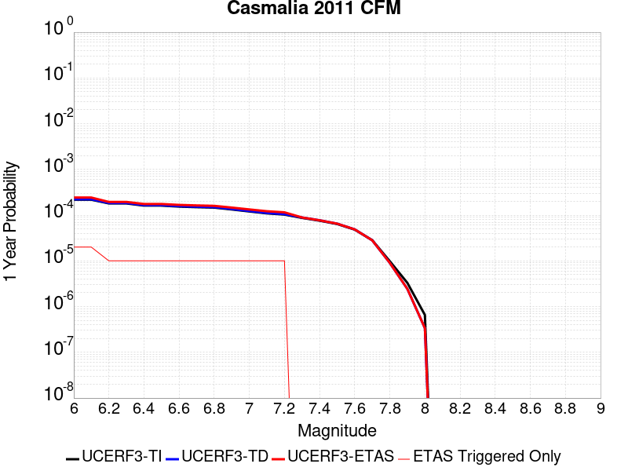 |  |

| Magnitude | 1 wk TI Prob | 1 wk TD Prob | 1 wk ETAS Prob | 1 wk ETAS/TD Gain | 1 wk ETAS Triggered Only | 1 mo TI Prob | 1 mo TD Prob | 1 mo ETAS Prob | 1 mo ETAS/TD Gain | 1 mo ETAS Triggered Only | 1 yr TI Prob | 1 yr TD Prob | 1 yr ETAS Prob | 1 yr ETAS/TD Gain | 1 yr ETAS Triggered Only | 10 yr TI Prob | 10 yr TD Prob | 10 yr ETAS Prob | 10 yr ETAS/TD Gain | 10 yr ETAS Triggered Only |
|-----|-----|-----|-----|-----|-----|-----|-----|-----|-----|-----|-----|-----|-----|-----|-----|-----|-----|-----|-----|-----|
| 6.0 | 4.1704893E-6 | 4.262483E-6 | 4.262483E-6 | 1.0 | 0.0 | 1.7873403E-5 | 1.8267656E-5 | 1.8267656E-5 | 1.0 | 0.0 | 2.1758694E-4 | 2.2238622E-4 | 2.392695E-4 | 1.0759188 | 1.6887043E-5 | 0.0021737402 | 0.0022216577 | 0.0022553569 | 1.0151684 | 3.3774086E-5 |
| 6.1 | 4.1704893E-6 | 4.262483E-6 | 4.262483E-6 | 1.0 | 0.0 | 1.7873403E-5 | 1.8267656E-5 | 1.8267656E-5 | 1.0 | 0.0 | 2.1758694E-4 | 2.2238622E-4 | 2.392695E-4 | 1.0759188 | 1.6887043E-5 | 0.0021737402 | 0.0022216577 | 0.0022553569 | 1.0151684 | 3.3774086E-5 |
| 6.2 | 3.457312E-6 | 3.5370217E-6 | 3.5370217E-6 | 1.0 | 0.0 | 1.4816967E-5 | 1.5158577E-5 | 1.5158577E-5 | 1.0 | 0.0 | 1.8038164E-4 | 1.8454014E-4 | 2.0142406E-4 | 1.0914919 | 1.6887043E-5 | 0.001802353 | 0.0018438784 | 0.0018775902 | 1.0182831 | 3.3774086E-5 |
| 6.3 | 3.457312E-6 | 3.5370217E-6 | 3.5370217E-6 | 1.0 | 0.0 | 1.4816967E-5 | 1.5158577E-5 | 1.5158577E-5 | 1.0 | 0.0 | 1.8038164E-4 | 1.8454014E-4 | 2.0142406E-4 | 1.0914919 | 1.6887043E-5 | 0.001802353 | 0.0018438784 | 0.0018775902 | 1.0182831 | 3.3774086E-5 |
| 6.4 | 3.0957337E-6 | 3.1692257E-6 | 3.1692257E-6 | 1.0 | 0.0 | 1.3267363E-5 | 1.3582326E-5 | 1.3582326E-5 | 1.0 | 0.0 | 1.6151817E-4 | 1.6535232E-4 | 1.8223657E-4 | 1.1021107 | 1.6887043E-5 | 0.0016140083 | 0.0016522991 | 0.0016860174 | 1.0204068 | 3.3774086E-5 |
| 6.5 | 3.0957337E-6 | 3.1692257E-6 | 3.1692257E-6 | 1.0 | 0.0 | 1.3267363E-5 | 1.3582326E-5 | 1.3582326E-5 | 1.0 | 0.0 | 1.6151817E-4 | 1.6535232E-4 | 1.8223657E-4 | 1.1021107 | 1.6887043E-5 | 0.0016140083 | 0.0016522991 | 0.0016860174 | 1.0204068 | 3.3774086E-5 |
| 6.6 | 2.9459152E-6 | 3.0165752E-6 | 3.0165752E-6 | 1.0 | 0.0 | 1.262529E-5 | 1.2928115E-5 | 1.2928115E-5 | 1.0 | 0.0 | 1.5370206E-4 | 1.5738848E-4 | 1.7427288E-4 | 1.1072783 | 1.6887043E-5 | 0.0015359579 | 0.0015727758 | 0.0016064967 | 1.0214404 | 3.3774086E-5 |
| 6.7 | 2.8634809E-6 | 2.9324726E-6 | 2.9324726E-6 | 1.0 | 0.0 | 1.2272003E-5 | 1.256768E-5 | 1.256768E-5 | 1.0 | 0.0 | 1.4940138E-4 | 1.530008E-4 | 1.6988526E-4 | 1.1103554 | 1.6887043E-5 | 0.0014930099 | 0.0015289601 | 0.0015626826 | 1.0220559 | 3.3774086E-5 |
| 6.8 | 2.7999822E-6 | 2.8675968E-6 | 2.8675968E-6 | 1.0 | 0.0 | 1.1999869E-5 | 1.2289643E-5 | 1.2289643E-5 | 1.0 | 0.0 | 1.460886E-4 | 1.4961617E-4 | 1.6650069E-4 | 1.1128522 | 1.6887043E-5 | 0.001459926 | 0.0014951597 | 0.0015288834 | 1.0225552 | 3.3774086E-5 |
| 6.9 | 2.551052E-6 | 2.6119649E-6 | 2.6119649E-6 | 1.0 | 0.0 | 1.0933034E-5 | 1.1194087E-5 | 1.1194087E-5 | 1.0 | 0.0 | 1.3310155E-4 | 1.3627953E-4 | 1.5316426E-4 | 1.1238979 | 1.6887043E-5 | 0.0013302186 | 0.0013619636 | 0.0013956917 | 1.0247643 | 3.3774086E-5 |
| 7.0 | 2.3081875E-6 | 2.3624088E-6 | 2.3624088E-6 | 1.0 | 0.0 | 9.892195E-6 | 1.01245705E-5 | 1.01245705E-5 | 1.0 | 0.0 | 1.20430814E-4 | 1.232597E-4 | 1.4014466E-4 | 1.1369869 | 1.6887043E-5 | 0.0012036557 | 0.0012319161 | 0.0012656486 | 1.0273821 | 3.3774086E-5 |
| 7.1 | 2.093245E-6 | 2.1417243E-6 | 2.1417243E-6 | 1.0 | 0.0 | 8.971019E-6 | 9.178786E-6 | 9.178786E-6 | 1.0 | 0.0 | 1.09216686E-4 | 1.1174601E-4 | 1.2863116E-4 | 1.151103 | 1.6887043E-5 | 0.0010916302 | 0.0011169002 | 0.0011506366 | 1.0302054 | 3.3774086E-5 |
| 7.2 | 1.9714576E-6 | 2.0165091E-6 | 2.0165091E-6 | 1.0 | 0.0 | 8.449076E-6 | 8.642153E-6 | 8.642153E-6 | 1.0 | 0.0 | 1.0286264E-4 | 1.05213156E-4 | 1.2209841E-4 | 1.1604862 | 1.6887043E-5 | 0.0010281504 | 0.0010516352 | 0.0010853738 | 1.032082 | 3.3774086E-5 |
| 7.3 | 1.6689512E-6 | 1.7047131E-6 | 1.7047131E-6 | 1.0 | 0.0 | 7.1526288E-6 | 7.3058927E-6 | 7.3058927E-6 | 1.0 | 0.0 | 8.7079774E-5 | 8.894562E-5 | 8.894562E-5 | 1.0 | 0.0 | 8.7045657E-4 | 8.89101E-4 | 9.05973E-4 | 1.0189764 | 1.6887043E-5 |
| 7.4 | 1.4490954E-6 | 1.4778908E-6 | 1.4778908E-6 | 1.0 | 0.0 | 6.210394E-6 | 6.333802E-6 | 6.333802E-6 | 1.0 | 0.0 | 7.560892E-5 | 7.711132E-5 | 7.711132E-5 | 1.0 | 0.0 | 7.55832E-4 | 7.7084627E-4 | 7.8772026E-4 | 1.0218903 | 1.6887043E-5 |
| 7.5 | 1.226873E-6 | 1.2481701E-6 | 1.2481701E-6 | 1.0 | 0.0 | 5.2580162E-6 | 5.3492895E-6 | 5.3492895E-6 | 1.0 | 0.0 | 6.401447E-5 | 6.5125656E-5 | 6.5125656E-5 | 1.0 | 0.0 | 6.399603E-4 | 6.5106625E-4 | 6.679423E-4 | 1.0259206 | 1.6887043E-5 |
| 7.6 | 9.2561345E-7 | 9.361923E-7 | 9.361923E-7 | 1.0 | 0.0 | 3.966909E-6 | 4.012247E-6 | 4.012247E-6 | 1.0 | 0.0 | 4.8296046E-5 | 4.884801E-5 | 4.884801E-5 | 1.0 | 0.0 | 4.828555E-4 | 4.8837316E-4 | 5.052519E-4 | 1.0345613 | 1.6887043E-5 |
| 7.7 | 5.4367933E-7 | 5.392888E-7 | 5.392888E-7 | 1.0 | 0.0 | 2.3300522E-6 | 2.3112357E-6 | 2.3112357E-6 | 1.0 | 0.0 | 2.8368017E-5 | 2.8138933E-5 | 2.8138933E-5 | 1.0 | 0.0 | 2.8364395E-4 | 2.8135383E-4 | 2.9823612E-4 | 1.0600038 | 1.6887043E-5 |
| 7.8 | 1.8825742E-7 | 1.7342276E-7 | 1.7342276E-7 | 1.0 | 0.0 | 8.068173E-7 | 7.4324015E-7 | 7.4324015E-7 | 1.0 | 0.0 | 9.822956E-6 | 9.048912E-6 | 9.048912E-6 | 1.0 | 0.0 | 9.822522E-5 | 9.048546E-5 | 9.048546E-5 | 1.0 | 0.0 |
| 7.9 | 6.342771E-8 | 4.6790706E-8 | 4.6790706E-8 | 1.0 | 0.0 | 2.7183304E-7 | 2.0053157E-7 | 2.0053157E-7 | 1.0 | 0.0 | 3.3095623E-6 | 2.4414692E-6 | 2.4414692E-6 | 1.0 | 0.0 | 3.309513E-5 | 2.4414428E-5 | 2.4414428E-5 | 1.0 | 0.0 |
| 8.0 | 1.2574819E-8 | 6.4733463E-9 | 6.4733463E-9 | 1.0 | 0.0 | 5.3892084E-8 | 2.7742912E-8 | 2.7742912E-8 | 1.0 | 0.0 | 6.561359E-7 | 3.377699E-7 | 3.377699E-7 | 1.0 | 0.0 | 6.56134E-6 | 3.377694E-6 | 3.377694E-6 | 1.0 | 0.0 |

## Honey Lake 2011 CFM
*[(top)](#table-of-contents)*

| 1 Week | 1 Month | 1 Year | 10 Year |
|-----|-----|-----|-----|
|  | 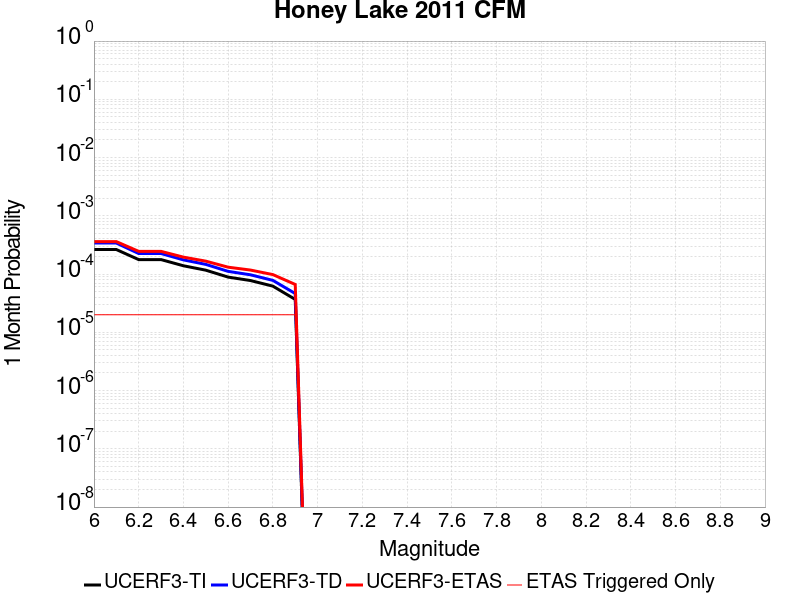 |  | 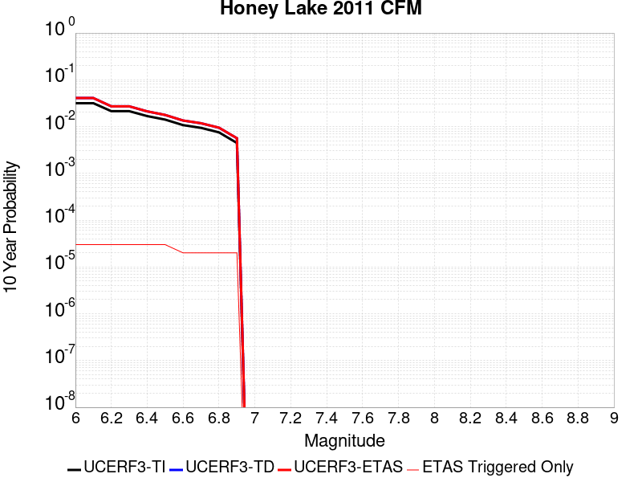 |

| Magnitude | 1 wk TI Prob | 1 wk TD Prob | 1 wk ETAS Prob | 1 wk ETAS/TD Gain | 1 wk ETAS Triggered Only | 1 mo TI Prob | 1 mo TD Prob | 1 mo ETAS Prob | 1 mo ETAS/TD Gain | 1 mo ETAS Triggered Only | 1 yr TI Prob | 1 yr TD Prob | 1 yr ETAS Prob | 1 yr ETAS/TD Gain | 1 yr ETAS Triggered Only | 10 yr TI Prob | 10 yr TD Prob | 10 yr ETAS Prob | 10 yr ETAS/TD Gain | 10 yr ETAS Triggered Only |
|-----|-----|-----|-----|-----|-----|-----|-----|-----|-----|-----|-----|-----|-----|-----|-----|-----|-----|-----|-----|-----|
| 6.0 | 6.155506E-5 | 7.954667E-5 | 9.643236E-5 | 1.2122741 | 1.6887043E-5 | 2.6378073E-4 | 3.40873E-4 | 3.577543E-4 | 1.0495237 | 1.6887043E-5 | 0.0032068014 | 0.0041427943 | 0.0041596116 | 1.0040593 | 1.6887043E-5 | 0.03160919 | 0.040702924 | 0.040735323 | 1.000796 | 3.3774086E-5 |
| 6.1 | 6.155506E-5 | 7.954667E-5 | 9.643236E-5 | 1.2122741 | 1.6887043E-5 | 2.6378073E-4 | 3.40873E-4 | 3.577543E-4 | 1.0495237 | 1.6887043E-5 | 0.0032068014 | 0.0041427943 | 0.0041596116 | 1.0040593 | 1.6887043E-5 | 0.03160919 | 0.040702924 | 0.040735323 | 1.000796 | 3.3774086E-5 |
| 6.2 | 4.1335024E-5 | 5.257629E-5 | 6.946245E-5 | 1.3211743 | 1.6887043E-5 | 1.7713808E-4 | 2.253086E-4 | 2.4219185E-4 | 1.0749339 | 1.6887043E-5 | 0.0021545228 | 0.0027398595 | 0.0027567002 | 1.0061466 | 1.6887043E-5 | 0.021337535 | 0.027076708 | 0.027109569 | 1.0012136 | 3.3774086E-5 |
| 6.3 | 4.1335024E-5 | 5.257629E-5 | 6.946245E-5 | 1.3211743 | 1.6887043E-5 | 1.7713808E-4 | 2.253086E-4 | 2.4219185E-4 | 1.0749339 | 1.6887043E-5 | 0.0021545228 | 0.0027398595 | 0.0027567002 | 1.0061466 | 1.6887043E-5 | 0.021337535 | 0.027076708 | 0.027109569 | 1.0012136 | 3.3774086E-5 |
| 6.4 | 3.2393702E-5 | 4.0887444E-5 | 5.7773796E-5 | 1.412996 | 1.6887043E-5 | 1.3882275E-4 | 1.7522085E-4 | 1.9210493E-4 | 1.0963589 | 1.6887043E-5 | 0.0016888566 | 0.002131335 | 0.0021481859 | 1.0079063 | 1.6887043E-5 | 0.016760793 | 0.02111982 | 0.021152882 | 1.0015653 | 3.3774086E-5 |
| 6.5 | 2.7205504E-5 | 3.4211684E-5 | 5.109815E-5 | 1.4935876 | 1.6887043E-5 | 1.1658981E-4 | 1.4661385E-4 | 1.6349842E-4 | 1.1151636 | 1.6887043E-5 | 0.0014185566 | 0.0017836588 | 0.0018005157 | 1.0094508 | 1.6887043E-5 | 0.014095354 | 0.017702932 | 0.017736107 | 1.0018741 | 3.3774086E-5 |
| 6.6 | 2.069265E-5 | 2.5955307E-5 | 4.284191E-5 | 1.6506032 | 1.6887043E-5 | 8.867977E-5 | 1.1123277E-4 | 1.2811794E-4 | 1.1518003 | 1.6887043E-5 | 0.0010791414 | 0.0013535038 | 0.001370368 | 1.0124596 | 1.6887043E-5 | 0.010739161 | 0.013461002 | 0.013477663 | 1.0012376 | 1.6887043E-5 |
| 6.7 | 1.8060919E-5 | 2.2656828E-5 | 3.9543487E-5 | 1.7453232 | 1.6887043E-5 | 7.7401644E-5 | 9.709754E-5 | 1.1398294E-4 | 1.1739014 | 1.6887043E-5 | 9.419576E-4 | 0.0011816026 | 0.0011984698 | 1.0142747 | 1.6887043E-5 | 0.009379748 | 0.011761238 | 0.011777926 | 1.001419 | 1.6887043E-5 |
| 6.8 | 1.4474663E-5 | 1.818127E-5 | 3.5068006E-5 | 1.9287984 | 1.6887043E-5 | 6.203279E-5 | 7.791784E-5 | 9.480357E-5 | 1.216712 | 1.6887043E-5 | 7.5498753E-4 | 9.483136E-4 | 9.6518465E-4 | 1.0177906 | 1.6887043E-5 | 0.007524277 | 0.009450192 | 0.009466919 | 1.00177 | 1.6887043E-5 |
| 6.9 | 8.564552E-6 | 1.0802308E-5 | 2.7689168E-5 | 2.5632641 | 1.6887043E-5 | 3.6704707E-5 | 4.6295158E-5 | 6.318142E-5 | 1.3647522 | 1.6887043E-5 | 4.4678818E-4 | 5.635644E-4 | 5.8044196E-4 | 1.0299479 | 1.6887043E-5 | 0.0044589094 | 0.0056278477 | 0.00564464 | 1.0029837 | 1.6887043E-5 |

## Newport-Inglewood (Offshore)
*[(top)](#table-of-contents)*

| 1 Week | 1 Month | 1 Year | 10 Year |
|-----|-----|-----|-----|
|  | 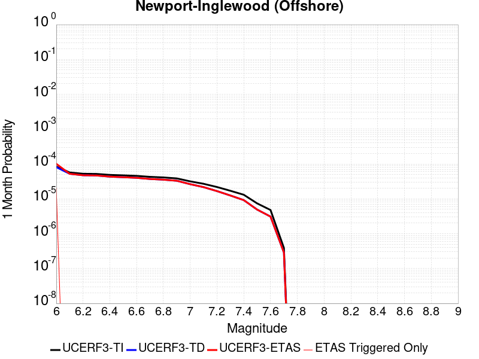 |  | 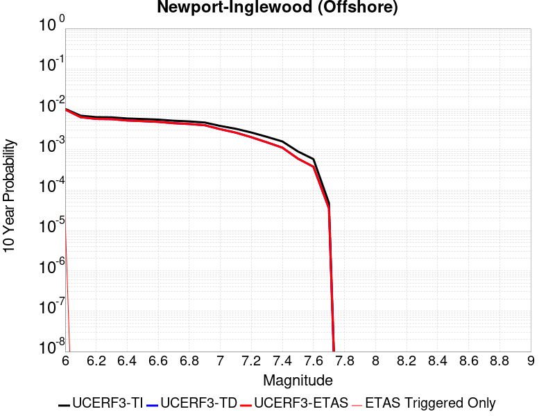 |

| Magnitude | 1 wk TI Prob | 1 wk TD Prob | 1 wk ETAS Prob | 1 wk ETAS/TD Gain | 1 wk ETAS Triggered Only | 1 mo TI Prob | 1 mo TD Prob | 1 mo ETAS Prob | 1 mo ETAS/TD Gain | 1 mo ETAS Triggered Only | 1 yr TI Prob | 1 yr TD Prob | 1 yr ETAS Prob | 1 yr ETAS/TD Gain | 1 yr ETAS Triggered Only | 10 yr TI Prob | 10 yr TD Prob | 10 yr ETAS Prob | 10 yr ETAS/TD Gain | 10 yr ETAS Triggered Only |
|-----|-----|-----|-----|-----|-----|-----|-----|-----|-----|-----|-----|-----|-----|-----|-----|-----|-----|-----|-----|-----|
| 6.0 | 1.9626508E-5 | 1.8965357E-5 | 3.5852077E-5 | 1.8903984 | 1.6887043E-5 | 8.411089E-5 | 8.1277634E-5 | 9.8163306E-5 | 1.207753 | 1.6887043E-5 | 0.001023569 | 9.891186E-4 | 0.0010059889 | 1.017056 | 1.6887043E-5 | 0.010188672 | 0.009848503 | 0.009865224 | 1.0016978 | 1.6887043E-5 |
| 6.1 | 1.331886E-5 | 1.2218092E-5 | 1.2218092E-5 | 1.0 | 0.0 | 5.707958E-5 | 5.2362207E-5 | 5.2362207E-5 | 1.0 | 0.0 | 6.947222E-4 | 6.3732493E-4 | 6.3732493E-4 | 1.0 | 0.0 | 0.006925544 | 0.006355149 | 0.006355149 | 1.0 | 0.0 |
| 6.2 | 1.2250852E-5 | 1.1076029E-5 | 1.1076029E-5 | 1.0 | 0.0 | 5.2502597E-5 | 4.7467838E-5 | 4.7467838E-5 | 1.0 | 0.0 | 6.3903164E-4 | 5.777687E-4 | 5.777687E-4 | 1.0 | 0.0 | 0.006371971 | 0.0057627866 | 0.0057627866 | 1.0 | 0.0 |
| 6.3 | 1.2106258E-5 | 1.0918891E-5 | 1.0918891E-5 | 1.0 | 0.0 | 5.1882926E-5 | 4.6794412E-5 | 4.6794412E-5 | 1.0 | 0.0 | 6.3149154E-4 | 5.69574E-4 | 5.69574E-4 | 1.0 | 0.0 | 0.0062970007 | 0.005681259 | 0.005681259 | 1.0 | 0.0 |
| 6.4 | 1.1348758E-5 | 1.0109362E-5 | 1.0109362E-5 | 1.0 | 0.0 | 4.8636626E-5 | 4.3325123E-5 | 4.3325123E-5 | 1.0 | 0.0 | 5.919901E-4 | 5.273565E-4 | 5.273565E-4 | 1.0 | 0.0 | 0.005904155 | 0.0052611465 | 0.0052611465 | 1.0 | 0.0 |
| 6.5 | 1.100837E-5 | 9.7433895E-6 | 9.7433895E-6 | 1.0 | 0.0 | 4.7177873E-5 | 4.1756717E-5 | 4.1756717E-5 | 1.0 | 0.0 | 5.7423924E-4 | 5.082702E-4 | 5.082702E-4 | 1.0 | 0.0 | 0.005727576 | 0.0050711688 | 0.0050711688 | 1.0 | 0.0 |
| 6.6 | 1.0634696E-5 | 9.345544E-6 | 9.345544E-6 | 1.0 | 0.0 | 4.557647E-5 | 4.0051716E-5 | 4.0051716E-5 | 1.0 | 0.0 | 5.5475225E-4 | 4.8752132E-4 | 4.8752132E-4 | 1.0 | 0.0 | 0.0055336943 | 0.0048646047 | 0.0048646047 | 1.0 | 0.0 |
| 6.7 | 9.9780855E-6 | 8.667911E-6 | 8.667911E-6 | 1.0 | 0.0 | 4.276252E-5 | 3.7147664E-5 | 3.7147664E-5 | 1.0 | 0.0 | 5.205093E-4 | 4.5217964E-4 | 4.5217964E-4 | 1.0 | 0.0 | 0.0051929182 | 0.004512675 | 0.004512675 | 1.0 | 0.0 |
| 6.8 | 9.59546E-6 | 8.27295E-6 | 8.27295E-6 | 1.0 | 0.0 | 4.1122752E-5 | 3.5455025E-5 | 3.5455025E-5 | 1.0 | 0.0 | 5.0055445E-4 | 4.315801E-4 | 4.315801E-4 | 1.0 | 0.0 | 0.004994285 | 0.004307495 | 0.004307495 | 1.0 | 0.0 |
| 6.9 | 9.000614E-6 | 7.70684E-6 | 7.70684E-6 | 1.0 | 0.0 | 3.857349E-5 | 3.30289E-5 | 3.30289E-5 | 1.0 | 0.0 | 4.6953102E-4 | 4.0205332E-4 | 4.0205332E-4 | 1.0 | 0.0 | 0.004685402 | 0.0040133307 | 0.0040133307 | 1.0 | 0.0 |
| 7.0 | 7.4070194E-6 | 6.148904E-6 | 6.148904E-6 | 1.0 | 0.0 | 3.1743984E-5 | 2.635218E-5 | 2.635218E-5 | 1.0 | 0.0 | 3.8641447E-4 | 3.207907E-4 | 3.207907E-4 | 1.0 | 0.0 | 0.0038574322 | 0.0032032963 | 0.0032032963 | 1.0 | 0.0 |
| 7.1 | 6.299615E-6 | 5.0565927E-6 | 5.0565927E-6 | 1.0 | 0.0 | 2.699807E-5 | 2.1670932E-5 | 2.1670932E-5 | 1.0 | 0.0 | 3.2865192E-4 | 2.638118E-4 | 2.638118E-4 | 1.0 | 0.0 | 0.003281663 | 0.002635001 | 0.002635001 | 1.0 | 0.0 |
| 7.2 | 5.096653E-6 | 3.892769E-6 | 3.892769E-6 | 1.0 | 0.0 | 2.1842614E-5 | 1.668319E-5 | 1.668319E-5 | 1.0 | 0.0 | 2.6590136E-4 | 2.0309901E-4 | 2.0309901E-4 | 1.0 | 0.0 | 0.0026558342 | 0.0020291451 | 0.0020291451 | 1.0 | 0.0 |
| 7.3 | 3.9753018E-6 | 2.9099103E-6 | 2.9099103E-6 | 1.0 | 0.0 | 1.7036897E-5 | 1.2470985E-5 | 1.2470985E-5 | 1.0 | 0.0 | 2.0740448E-4 | 1.5182374E-4 | 1.5182374E-4 | 1.0 | 0.0 | 0.00207211 | 0.0015172083 | 0.0015172083 | 1.0 | 0.0 |
| 7.4 | 3.0568392E-6 | 2.1449955E-6 | 2.1449955E-6 | 1.0 | 0.0 | 1.3100675E-5 | 9.192806E-6 | 9.192806E-6 | 1.0 | 0.0 | 1.5948903E-4 | 1.1191672E-4 | 1.1191672E-4 | 1.0 | 0.0 | 0.0015937461 | 0.0011186098 | 0.0011186098 | 1.0 | 0.0 |
| 7.5 | 1.7279019E-6 | 1.1469883E-6 | 1.1469883E-6 | 1.0 | 0.0 | 7.405273E-6 | 4.915655E-6 | 4.915655E-6 | 1.0 | 0.0 | 9.015547E-5 | 5.9846494E-5 | 5.9846494E-5 | 1.0 | 0.0 | 9.01189E-4 | 5.9830764E-4 | 5.9830764E-4 | 1.0 | 0.0 |
| 7.6 | 1.1156416E-6 | 7.223012E-7 | 7.223012E-7 | 1.0 | 0.0 | 4.7813123E-6 | 3.095573E-6 | 3.095573E-6 | 1.0 | 0.0 | 5.821092E-5 | 3.7687976E-5 | 3.7687976E-5 | 1.0 | 0.0 | 5.8195676E-4 | 3.7681818E-4 | 3.7681818E-4 | 1.0 | 0.0 |
| 7.7 | 9.117973E-8 | 6.734145E-8 | 6.734145E-8 | 1.0 | 0.0 | 3.907702E-7 | 2.886062E-7 | 2.886062E-7 | 1.0 | 0.0 | 4.757617E-6 | 3.513775E-6 | 3.513775E-6 | 1.0 | 0.0 | 4.7575148E-5 | 3.5137225E-5 | 3.5137225E-5 | 1.0 | 0.0 |

## Robinson Creek
*[(top)](#table-of-contents)*

| 1 Week | 1 Month | 1 Year | 10 Year |
|-----|-----|-----|-----|
|  |  |  |  |

| Magnitude | 1 wk TI Prob | 1 wk TD Prob | 1 wk ETAS Prob | 1 wk ETAS/TD Gain | 1 wk ETAS Triggered Only | 1 mo TI Prob | 1 mo TD Prob | 1 mo ETAS Prob | 1 mo ETAS/TD Gain | 1 mo ETAS Triggered Only | 1 yr TI Prob | 1 yr TD Prob | 1 yr ETAS Prob | 1 yr ETAS/TD Gain | 1 yr ETAS Triggered Only | 10 yr TI Prob | 10 yr TD Prob | 10 yr ETAS Prob | 10 yr ETAS/TD Gain | 10 yr ETAS Triggered Only |
|-----|-----|-----|-----|-----|-----|-----|-----|-----|-----|-----|-----|-----|-----|-----|-----|-----|-----|-----|-----|-----|
| 6.0 | 1.3705327E-5 | 1.5285013E-5 | 1.5285013E-5 | 1.0 | 0.0 | 5.8735794E-5 | 6.55072E-5 | 6.55072E-5 | 1.0 | 0.0 | 7.1487366E-4 | 7.9755014E-4 | 7.9755014E-4 | 1.0 | 0.0 | 0.0071257832 | 0.007975501 | 0.007992254 | 1.0021005 | 1.6887043E-5 |
| 6.1 | 1.3705327E-5 | 1.5285013E-5 | 1.5285013E-5 | 1.0 | 0.0 | 5.8735794E-5 | 6.55072E-5 | 6.55072E-5 | 1.0 | 0.0 | 7.1487366E-4 | 7.9755014E-4 | 7.9755014E-4 | 1.0 | 0.0 | 0.0071257832 | 0.007975501 | 0.007992254 | 1.0021005 | 1.6887043E-5 |
| 6.2 | 1.3705327E-5 | 1.5285013E-5 | 1.5285013E-5 | 1.0 | 0.0 | 5.8735794E-5 | 6.55072E-5 | 6.55072E-5 | 1.0 | 0.0 | 7.1487366E-4 | 7.9755014E-4 | 7.9755014E-4 | 1.0 | 0.0 | 0.0071257832 | 0.007975501 | 0.007992254 | 1.0021005 | 1.6887043E-5 |
| 6.3 | 1.3705327E-5 | 1.5285013E-5 | 1.5285013E-5 | 1.0 | 0.0 | 5.8735794E-5 | 6.55072E-5 | 6.55072E-5 | 1.0 | 0.0 | 7.1487366E-4 | 7.9755014E-4 | 7.9755014E-4 | 1.0 | 0.0 | 0.0071257832 | 0.007975501 | 0.007992254 | 1.0021005 | 1.6887043E-5 |
| 6.4 | 1.3705327E-5 | 1.5285013E-5 | 1.5285013E-5 | 1.0 | 0.0 | 5.8735794E-5 | 6.55072E-5 | 6.55072E-5 | 1.0 | 0.0 | 7.1487366E-4 | 7.9755014E-4 | 7.9755014E-4 | 1.0 | 0.0 | 0.0071257832 | 0.007975501 | 0.007992254 | 1.0021005 | 1.6887043E-5 |

## Fontana (Seismicity)
*[(top)](#table-of-contents)*

| 1 Week | 1 Month | 1 Year | 10 Year |
|-----|-----|-----|-----|
|  |  | 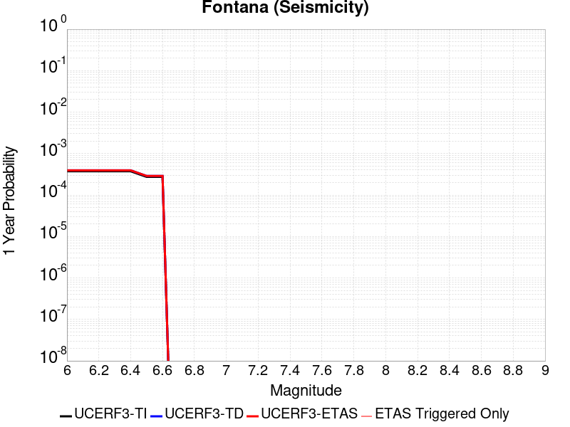 | 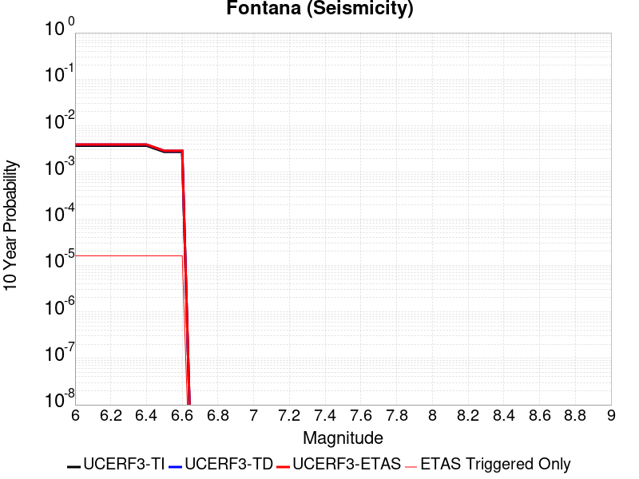 |

| Magnitude | 1 wk TI Prob | 1 wk TD Prob | 1 wk ETAS Prob | 1 wk ETAS/TD Gain | 1 wk ETAS Triggered Only | 1 mo TI Prob | 1 mo TD Prob | 1 mo ETAS Prob | 1 mo ETAS/TD Gain | 1 mo ETAS Triggered Only | 1 yr TI Prob | 1 yr TD Prob | 1 yr ETAS Prob | 1 yr ETAS/TD Gain | 1 yr ETAS Triggered Only | 10 yr TI Prob | 10 yr TD Prob | 10 yr ETAS Prob | 10 yr ETAS/TD Gain | 10 yr ETAS Triggered Only |
|-----|-----|-----|-----|-----|-----|-----|-----|-----|-----|-----|-----|-----|-----|-----|-----|-----|-----|-----|-----|-----|
| 6.0 | 7.1789214E-6 | 7.5520006E-6 | 7.5520006E-6 | 1.0 | 0.0 | 3.076644E-5 | 3.2365548E-5 | 3.2365548E-5 | 1.0 | 0.0 | 3.7451705E-4 | 3.9402005E-4 | 3.9402005E-4 | 1.0 | 0.0 | 0.003738865 | 0.003937214 | 0.0039540348 | 1.0042722 | 1.6887043E-5 |
| 6.1 | 7.1789214E-6 | 7.5520006E-6 | 7.5520006E-6 | 1.0 | 0.0 | 3.076644E-5 | 3.2365548E-5 | 3.2365548E-5 | 1.0 | 0.0 | 3.7451705E-4 | 3.9402005E-4 | 3.9402005E-4 | 1.0 | 0.0 | 0.003738865 | 0.003937214 | 0.0039540348 | 1.0042722 | 1.6887043E-5 |
| 6.2 | 7.1789214E-6 | 7.5520006E-6 | 7.5520006E-6 | 1.0 | 0.0 | 3.076644E-5 | 3.2365548E-5 | 3.2365548E-5 | 1.0 | 0.0 | 3.7451705E-4 | 3.9402005E-4 | 3.9402005E-4 | 1.0 | 0.0 | 0.003738865 | 0.003937214 | 0.0039540348 | 1.0042722 | 1.6887043E-5 |
| 6.3 | 7.1789214E-6 | 7.5520006E-6 | 7.5520006E-6 | 1.0 | 0.0 | 3.076644E-5 | 3.2365548E-5 | 3.2365548E-5 | 1.0 | 0.0 | 3.7451705E-4 | 3.9402005E-4 | 3.9402005E-4 | 1.0 | 0.0 | 0.003738865 | 0.003937214 | 0.0039540348 | 1.0042722 | 1.6887043E-5 |
| 6.4 | 7.1789214E-6 | 7.5520006E-6 | 7.5520006E-6 | 1.0 | 0.0 | 3.076644E-5 | 3.2365548E-5 | 3.2365548E-5 | 1.0 | 0.0 | 3.7451705E-4 | 3.9402005E-4 | 3.9402005E-4 | 1.0 | 0.0 | 0.003738865 | 0.003937214 | 0.0039540348 | 1.0042722 | 1.6887043E-5 |
| 6.5 | 5.2611317E-6 | 5.532726E-6 | 5.532726E-6 | 1.0 | 0.0 | 2.2547512E-5 | 2.3711682E-5 | 2.3711682E-5 | 1.0 | 0.0 | 2.744814E-4 | 2.8868974E-4 | 2.8868974E-4 | 1.0 | 0.0 | 0.002741426 | 0.0028868972 | 0.0029037355 | 1.0058327 | 1.6887043E-5 |
| 6.6 | 5.2611317E-6 | 5.532726E-6 | 5.532726E-6 | 1.0 | 0.0 | 2.2547512E-5 | 2.3711682E-5 | 2.3711682E-5 | 1.0 | 0.0 | 2.744814E-4 | 2.8868974E-4 | 2.8868974E-4 | 1.0 | 0.0 | 0.002741426 | 0.0028868972 | 0.0029037355 | 1.0058327 | 1.6887043E-5 |

## Great Valley 11
*[(top)](#table-of-contents)*

| 1 Week | 1 Month | 1 Year | 10 Year |
|-----|-----|-----|-----|
|  |  |  |  |

| Magnitude | 1 wk TI Prob | 1 wk TD Prob | 1 wk ETAS Prob | 1 wk ETAS/TD Gain | 1 wk ETAS Triggered Only | 1 mo TI Prob | 1 mo TD Prob | 1 mo ETAS Prob | 1 mo ETAS/TD Gain | 1 mo ETAS Triggered Only | 1 yr TI Prob | 1 yr TD Prob | 1 yr ETAS Prob | 1 yr ETAS/TD Gain | 1 yr ETAS Triggered Only | 10 yr TI Prob | 10 yr TD Prob | 10 yr ETAS Prob | 10 yr ETAS/TD Gain | 10 yr ETAS Triggered Only |
|-----|-----|-----|-----|-----|-----|-----|-----|-----|-----|-----|-----|-----|-----|-----|-----|-----|-----|-----|-----|-----|
| 6.0 | 2.8099583E-5 | 2.9832152E-5 | 2.9832152E-5 | 1.0 | 0.0 | 1.20421224E-4 | 1.278462E-4 | 1.278462E-4 | 1.0 | 0.0 | 0.0014651422 | 0.0015554909 | 0.0015723517 | 1.0108395 | 1.6887043E-5 | 0.0145552 | 0.01545356 | 0.015470186 | 1.0010759 | 1.6887043E-5 |
| 6.1 | 2.483194E-5 | 2.590715E-5 | 2.590715E-5 | 1.0 | 0.0 | 1.0641825E-4 | 1.11026246E-4 | 1.11026246E-4 | 1.0 | 0.0 | 0.0012948721 | 0.0013509706 | 0.0013678347 | 1.012483 | 1.6887043E-5 | 0.012873529 | 0.013433994 | 0.013450653 | 1.0012401 | 1.6887043E-5 |
| 6.2 | 2.483194E-5 | 2.590715E-5 | 2.590715E-5 | 1.0 | 0.0 | 1.0641825E-4 | 1.11026246E-4 | 1.11026246E-4 | 1.0 | 0.0 | 0.0012948721 | 0.0013509706 | 0.0013678347 | 1.012483 | 1.6887043E-5 | 0.012873529 | 0.013433994 | 0.013450653 | 1.0012401 | 1.6887043E-5 |
| 6.3 | 2.0257901E-5 | 2.0398922E-5 | 2.0398922E-5 | 1.0 | 0.0 | 8.681669E-5 | 8.742122E-5 | 8.742122E-5 | 1.0 | 0.0 | 0.0010564806 | 0.0010638756 | 0.0010807447 | 1.0158563 | 1.6887043E-5 | 0.01051472 | 0.010592012 | 0.01060872 | 1.0015774 | 1.6887043E-5 |
| 6.4 | 1.8054898E-5 | 1.7780874E-5 | 1.7780874E-5 | 1.0 | 0.0 | 7.737584E-5 | 7.62017E-5 | 7.62017E-5 | 1.0 | 0.0 | 9.416436E-4 | 9.2739856E-4 | 9.4427E-4 | 1.0181922 | 1.6887043E-5 | 0.009376635 | 0.009239036 | 0.009255767 | 1.0018109 | 1.6887043E-5 |
| 6.5 | 1.34804895E-5 | 1.2321055E-5 | 1.2321055E-5 | 1.0 | 0.0 | 5.777225E-5 | 5.2803476E-5 | 5.2803476E-5 | 1.0 | 0.0 | 7.031501E-4 | 6.4269686E-4 | 6.59573E-4 | 1.0262583 | 1.6887043E-5 | 0.007009294 | 0.0064088185 | 0.0064255972 | 1.0026181 | 1.6887043E-5 |
| 6.6 | 1.294883E-5 | 1.1732312E-5 | 1.1732312E-5 | 1.0 | 0.0 | 5.5493805E-5 | 5.028039E-5 | 5.028039E-5 | 1.0 | 0.0 | 6.754276E-4 | 6.1199587E-4 | 6.288726E-4 | 1.0275764 | 1.6887043E-5 | 0.006733784 | 0.0061035305 | 0.0061203144 | 1.0027499 | 1.6887043E-5 |
| 6.7 | 1.1272237E-5 | 9.811886E-6 | 9.811886E-6 | 1.0 | 0.0 | 4.8308695E-5 | 4.2050277E-5 | 4.2050277E-5 | 1.0 | 0.0 | 5.879996E-4 | 5.118446E-4 | 5.28723E-4 | 1.0329757 | 1.6887043E-5 | 0.005864462 | 0.0051069413 | 0.005123742 | 1.0032898 | 1.6887043E-5 |
| 6.8 | 9.8337505E-6 | 8.19377E-6 | 8.19377E-6 | 1.0 | 0.0 | 4.2143965E-5 | 3.5115696E-5 | 3.5115696E-5 | 1.0 | 0.0 | 5.1298196E-4 | 4.2745177E-4 | 4.2745177E-4 | 1.0 | 0.0 | 0.005117994 | 0.0042665056 | 0.0042665056 | 1.0 | 0.0 |
| 6.9 | 7.4224813E-6 | 5.4131347E-6 | 5.4131347E-6 | 1.0 | 0.0 | 3.1810247E-5 | 2.319895E-5 | 2.319895E-5 | 1.0 | 0.0 | 3.872209E-4 | 2.8241202E-4 | 2.8241202E-4 | 1.0 | 0.0 | 0.0038654688 | 0.0028206722 | 0.0028206722 | 1.0 | 0.0 |
| 7.0 | 4.4628923E-6 | 2.0110795E-6 | 2.0110795E-6 | 1.0 | 0.0 | 1.912654E-5 | 8.618884E-6 | 8.618884E-6 | 1.0 | 0.0 | 2.3284076E-4 | 1.04929975E-4 | 1.04929975E-4 | 1.0 | 0.0 | 0.0023259693 | 0.0010488159 | 0.0010488159 | 1.0 | 0.0 |
| 7.1 | 3.5546527E-6 | 1.1855836E-6 | 1.1855836E-6 | 1.0 | 0.0 | 1.5234136E-5 | 5.081063E-6 | 5.081063E-6 | 1.0 | 0.0 | 1.8545982E-4 | 6.186026E-5 | 6.186026E-5 | 1.0 | 0.0 | 0.0018530512 | 6.1843713E-4 | 6.1843713E-4 | 1.0 | 0.0 |
| 7.2 | 3.2039936E-6 | 1.1254128E-6 | 1.1254128E-6 | 1.0 | 0.0 | 1.3731329E-5 | 4.823189E-6 | 4.823189E-6 | 1.0 | 0.0 | 1.671661E-4 | 5.8720816E-5 | 5.8720816E-5 | 1.0 | 0.0 | 0.0016704041 | 5.870597E-4 | 5.870597E-4 | 1.0 | 0.0 |
| 7.3 | 2.8120473E-6 | 1.0305612E-6 | 1.0305612E-6 | 1.0 | 0.0 | 1.2051575E-5 | 4.4166836E-6 | 4.4166836E-6 | 1.0 | 0.0 | 1.4671806E-4 | 5.3771862E-5 | 5.3771862E-5 | 1.0 | 0.0 | 0.0014662122 | 5.3759513E-4 | 5.3759513E-4 | 1.0 | 0.0 |
| 7.4 | 2.4837766E-6 | 9.800582E-7 | 9.800582E-7 | 1.0 | 0.0 | 1.0644713E-5 | 4.200243E-6 | 4.200243E-6 | 1.0 | 0.0 | 1.2959167E-4 | 5.1136827E-5 | 5.1136827E-5 | 1.0 | 0.0 | 0.0012951613 | 5.112572E-4 | 5.112572E-4 | 1.0 | 0.0 |
| 7.5 | 1.5002679E-6 | 6.546144E-7 | 6.546144E-7 | 1.0 | 0.0 | 6.4297037E-6 | 2.8054874E-6 | 2.8054874E-6 | 1.0 | 0.0 | 7.827883E-5 | 3.4156317E-5 | 3.4156317E-5 | 1.0 | 0.0 | 7.825126E-4 | 3.4151482E-4 | 3.4151482E-4 | 1.0 | 0.0 |

## Fish Slough 2011 CFM
*[(top)](#table-of-contents)*

| 1 Week | 1 Month | 1 Year | 10 Year |
|-----|-----|-----|-----|
| 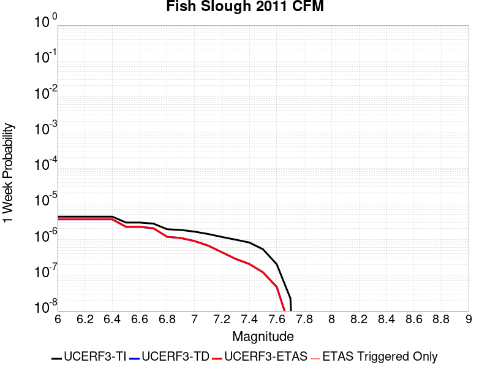 | 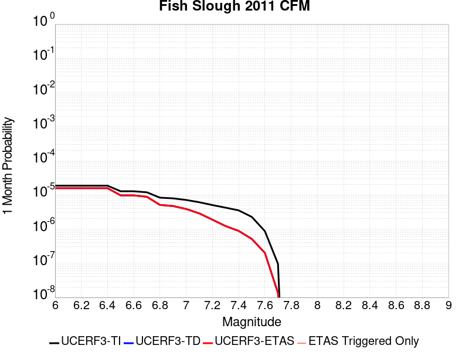 | 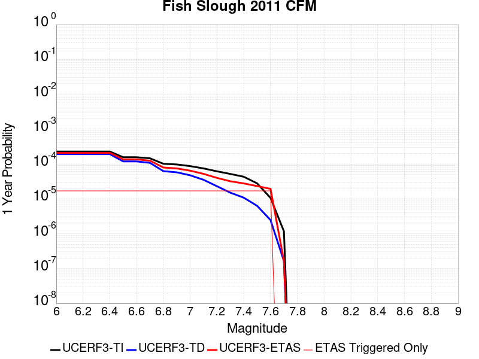 | 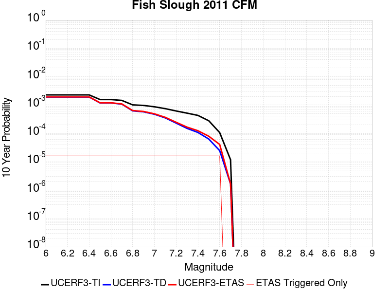 |

| Magnitude | 1 wk TI Prob | 1 wk TD Prob | 1 wk ETAS Prob | 1 wk ETAS/TD Gain | 1 wk ETAS Triggered Only | 1 mo TI Prob | 1 mo TD Prob | 1 mo ETAS Prob | 1 mo ETAS/TD Gain | 1 mo ETAS Triggered Only | 1 yr TI Prob | 1 yr TD Prob | 1 yr ETAS Prob | 1 yr ETAS/TD Gain | 1 yr ETAS Triggered Only | 10 yr TI Prob | 10 yr TD Prob | 10 yr ETAS Prob | 10 yr ETAS/TD Gain | 10 yr ETAS Triggered Only |
|-----|-----|-----|-----|-----|-----|-----|-----|-----|-----|-----|-----|-----|-----|-----|-----|-----|-----|-----|-----|-----|
| 6.0 | 4.3629925E-6 | 3.6772697E-6 | 3.6772697E-6 | 1.0 | 0.0 | 1.8698405E-5 | 1.5759644E-5 | 1.5759644E-5 | 1.0 | 0.0 | 2.276293E-4 | 1.918589E-4 | 2.087427E-4 | 1.0880011 | 1.6887043E-5 | 0.0022739628 | 0.0019171416 | 0.0019339962 | 1.0087916 | 1.6887043E-5 |
| 6.1 | 4.3629925E-6 | 3.6772697E-6 | 3.6772697E-6 | 1.0 | 0.0 | 1.8698405E-5 | 1.5759644E-5 | 1.5759644E-5 | 1.0 | 0.0 | 2.276293E-4 | 1.918589E-4 | 2.087427E-4 | 1.0880011 | 1.6887043E-5 | 0.0022739628 | 0.0019171416 | 0.0019339962 | 1.0087916 | 1.6887043E-5 |
| 6.2 | 4.3629925E-6 | 3.6772697E-6 | 3.6772697E-6 | 1.0 | 0.0 | 1.8698405E-5 | 1.5759644E-5 | 1.5759644E-5 | 1.0 | 0.0 | 2.276293E-4 | 1.918589E-4 | 2.087427E-4 | 1.0880011 | 1.6887043E-5 | 0.0022739628 | 0.0019171416 | 0.0019339962 | 1.0087916 | 1.6887043E-5 |
| 6.3 | 4.3629925E-6 | 3.6772697E-6 | 3.6772697E-6 | 1.0 | 0.0 | 1.8698405E-5 | 1.5759644E-5 | 1.5759644E-5 | 1.0 | 0.0 | 2.276293E-4 | 1.918589E-4 | 2.087427E-4 | 1.0880011 | 1.6887043E-5 | 0.0022739628 | 0.0019171416 | 0.0019339962 | 1.0087916 | 1.6887043E-5 |
| 6.4 | 4.3629925E-6 | 3.6772697E-6 | 3.6772697E-6 | 1.0 | 0.0 | 1.8698405E-5 | 1.5759644E-5 | 1.5759644E-5 | 1.0 | 0.0 | 2.276293E-4 | 1.918589E-4 | 2.087427E-4 | 1.0880011 | 1.6887043E-5 | 0.0022739628 | 0.0019171416 | 0.0019339962 | 1.0087916 | 1.6887043E-5 |
| 6.5 | 2.991715E-6 | 2.2703898E-6 | 2.2703898E-6 | 1.0 | 0.0 | 1.2821573E-5 | 9.730211E-6 | 9.730211E-6 | 1.0 | 0.0 | 1.5609147E-4 | 1.1845979E-4 | 1.3534483E-4 | 1.1425382 | 1.6887043E-5 | 0.0015598187 | 0.0011840566 | 0.0012009237 | 1.0142452 | 1.6887043E-5 |
| 6.6 | 2.991715E-6 | 2.2703898E-6 | 2.2703898E-6 | 1.0 | 0.0 | 1.2821573E-5 | 9.730211E-6 | 9.730211E-6 | 1.0 | 0.0 | 1.5609147E-4 | 1.1845979E-4 | 1.3534483E-4 | 1.1425382 | 1.6887043E-5 | 0.0015598187 | 0.0011840566 | 0.0012009237 | 1.0142452 | 1.6887043E-5 |
| 6.7 | 2.7890346E-6 | 2.0621853E-6 | 2.0621853E-6 | 1.0 | 0.0 | 1.1952951E-5 | 8.837912E-6 | 8.837912E-6 | 1.0 | 0.0 | 1.4551746E-4 | 1.0759717E-4 | 1.244824E-4 | 1.15693 | 1.6887043E-5 | 0.0014542221 | 0.0010755389 | 0.0010924079 | 1.0156841 | 1.6887043E-5 |
| 6.8 | 1.9416723E-6 | 1.192555E-6 | 1.192555E-6 | 1.0 | 0.0 | 8.321425E-6 | 5.1109405E-6 | 5.1109405E-6 | 1.0 | 0.0 | 1.01308644E-4 | 6.222397E-5 | 7.910996E-5 | 1.2713745 | 1.6887043E-5 | 0.0010126247 | 6.220695E-4 | 6.38946E-4 | 1.0271297 | 1.6887043E-5 |
| 6.9 | 1.8567416E-6 | 1.1046966E-6 | 1.1046966E-6 | 1.0 | 0.0 | 7.957439E-6 | 4.7344056E-6 | 4.7344056E-6 | 1.0 | 0.0 | 9.687752E-5 | 5.7639903E-5 | 7.4525975E-5 | 1.292958 | 1.6887043E-5 | 9.6835295E-4 | 5.762534E-4 | 5.931307E-4 | 1.029288 | 1.6887043E-5 |
| 7.0 | 1.6634067E-6 | 9.073966E-7 | 9.073966E-7 | 1.0 | 0.0 | 7.1288664E-6 | 3.888837E-6 | 3.888837E-6 | 1.0 | 0.0 | 8.679049E-5 | 4.734559E-5 | 6.4231834E-5 | 1.3566593 | 1.6887043E-5 | 8.6756604E-4 | 4.733579E-4 | 4.9023697E-4 | 1.0356581 | 1.6887043E-5 |
| 7.1 | 1.4281054E-6 | 6.7366227E-7 | 6.7366227E-7 | 1.0 | 0.0 | 6.1204373E-6 | 2.8871211E-6 | 2.8871211E-6 | 1.0 | 0.0 | 7.451377E-5 | 3.515015E-5 | 5.2036597E-5 | 1.480409 | 1.6887043E-5 | 7.44888E-4 | 3.5144767E-4 | 3.683288E-4 | 1.0480331 | 1.6887043E-5 |
| 7.2 | 1.1810387E-6 | 4.408355E-7 | 4.408355E-7 | 1.0 | 0.0 | 5.0615845E-6 | 1.8892936E-6 | 1.8892936E-6 | 1.0 | 0.0 | 6.1623046E-5 | 2.3001916E-5 | 3.988857E-5 | 1.7341412 | 1.6887043E-5 | 6.160596E-4 | 2.2999625E-4 | 2.468794E-4 | 1.0734062 | 1.6887043E-5 |
| 7.3 | 9.918052E-7 | 2.8733467E-7 | 2.8733467E-7 | 1.0 | 0.0 | 4.2505867E-6 | 1.2314338E-6 | 1.2314338E-6 | 1.0 | 0.0 | 5.1749663E-5 | 1.4992604E-5 | 3.1879394E-5 | 2.1263413 | 1.6887043E-5 | 5.173762E-4 | 1.4991604E-4 | 1.6680054E-4 | 1.1126264 | 1.6887043E-5 |
| 7.4 | 8.25252E-7 | 2.0694807E-7 | 2.0694807E-7 | 1.0 | 0.0 | 3.5367896E-6 | 8.8692E-7 | 8.8692E-7 | 1.0 | 0.0 | 4.3059565E-5 | 1.0798199E-5 | 2.7685059E-5 | 2.563859 | 1.6887043E-5 | 4.305122E-4 | 1.07976804E-4 | 1.2486202E-4 | 1.1563781 | 1.6887043E-5 |
| 7.5 | 5.3248567E-7 | 1.2072739E-7 | 1.2072739E-7 | 1.0 | 0.0 | 2.2820795E-6 | 5.17403E-7 | 5.17403E-7 | 1.0 | 0.0 | 2.7783964E-5 | 6.299364E-6 | 2.31863E-5 | 3.6807365 | 1.6887043E-5 | 2.778049E-4 | 6.2991894E-5 | 7.987787E-5 | 1.2680659 | 1.6887043E-5 |
| 7.6 | 2.037542E-7 | 4.7129152E-8 | 4.7129152E-8 | 1.0 | 0.0 | 8.73232E-7 | 2.0198206E-7 | 2.0198206E-7 | 1.0 | 0.0 | 1.0631547E-5 | 2.459129E-6 | 1.9346131E-5 | 7.867066 | 1.6887043E-5 | 1.0631039E-4 | 2.459104E-5 | 4.1477666E-5 | 1.6866984 | 1.6887043E-5 |
| 7.7 | 2.2501226E-8 | 3.1514258E-9 | 3.1514258E-9 | 1.0 | 0.0 | 9.6433816E-8 | 1.350611E-8 | 1.350611E-8 | 1.0 | 0.0 | 1.1740811E-6 | 1.6443688E-7 | 1.6443688E-7 | 1.0 | 0.0 | 1.1740749E-5 | 1.6443678E-6 | 1.6443678E-6 | 1.0 | 0.0 |

## Great Valley 08 (Quinto)
*[(top)](#table-of-contents)*

| 1 Week | 1 Month | 1 Year | 10 Year |
|-----|-----|-----|-----|
|  |  | 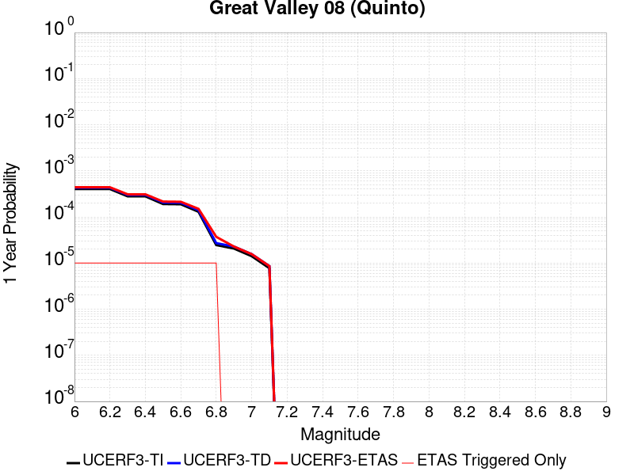 | 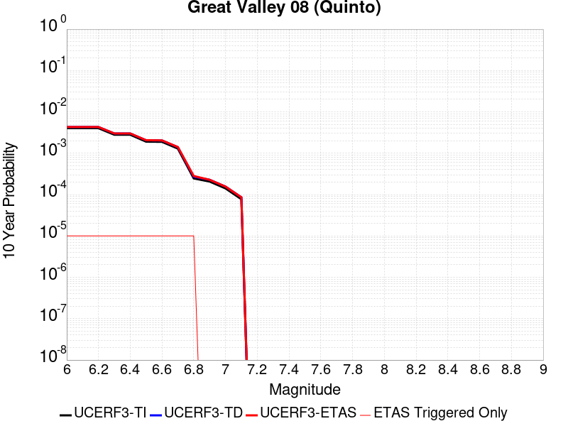 |

| Magnitude | 1 wk TI Prob | 1 wk TD Prob | 1 wk ETAS Prob | 1 wk ETAS/TD Gain | 1 wk ETAS Triggered Only | 1 mo TI Prob | 1 mo TD Prob | 1 mo ETAS Prob | 1 mo ETAS/TD Gain | 1 mo ETAS Triggered Only | 1 yr TI Prob | 1 yr TD Prob | 1 yr ETAS Prob | 1 yr ETAS/TD Gain | 1 yr ETAS Triggered Only | 10 yr TI Prob | 10 yr TD Prob | 10 yr ETAS Prob | 10 yr ETAS/TD Gain | 10 yr ETAS Triggered Only |
|-----|-----|-----|-----|-----|-----|-----|-----|-----|-----|-----|-----|-----|-----|-----|-----|-----|-----|-----|-----|-----|
| 6.0 | 7.737697E-6 | 8.253038E-6 | 8.253038E-6 | 1.0 | 0.0 | 3.3161137E-5 | 3.536979E-5 | 5.2256237E-5 | 1.4774257 | 1.6887043E-5 | 4.0366207E-4 | 4.3056096E-4 | 4.4744072E-4 | 1.0392041 | 1.6887043E-5 | 0.004029296 | 0.0042991205 | 0.004315935 | 1.0039111 | 1.6887043E-5 |
| 6.1 | 7.737697E-6 | 8.253038E-6 | 8.253038E-6 | 1.0 | 0.0 | 3.3161137E-5 | 3.536979E-5 | 5.2256237E-5 | 1.4774257 | 1.6887043E-5 | 4.0366207E-4 | 4.3056096E-4 | 4.4744072E-4 | 1.0392041 | 1.6887043E-5 | 0.004029296 | 0.0042991205 | 0.004315935 | 1.0039111 | 1.6887043E-5 |
| 6.2 | 7.737697E-6 | 8.253038E-6 | 8.253038E-6 | 1.0 | 0.0 | 3.3161137E-5 | 3.536979E-5 | 5.2256237E-5 | 1.4774257 | 1.6887043E-5 | 4.0366207E-4 | 4.3056096E-4 | 4.4744072E-4 | 1.0392041 | 1.6887043E-5 | 0.004029296 | 0.0042991205 | 0.004315935 | 1.0039111 | 1.6887043E-5 |
| 6.3 | 5.374012E-6 | 5.7505736E-6 | 5.7505736E-6 | 1.0 | 0.0 | 2.3031276E-5 | 2.4645145E-5 | 4.153177E-5 | 1.6851908 | 1.6887043E-5 | 2.803697E-4 | 3.0002446E-4 | 3.1690646E-4 | 1.0562687 | 1.6887043E-5 | 0.0028001624 | 0.0029972875 | 0.003014124 | 1.0056173 | 1.6887043E-5 |
| 6.4 | 5.374012E-6 | 5.7505736E-6 | 5.7505736E-6 | 1.0 | 0.0 | 2.3031276E-5 | 2.4645145E-5 | 4.153177E-5 | 1.6851908 | 1.6887043E-5 | 2.803697E-4 | 3.0002446E-4 | 3.1690646E-4 | 1.0562687 | 1.6887043E-5 | 0.0028001624 | 0.0029972875 | 0.003014124 | 1.0056173 | 1.6887043E-5 |
| 6.5 | 3.65427E-6 | 3.941324E-6 | 3.941324E-6 | 1.0 | 0.0 | 1.5661062E-5 | 1.689132E-5 | 3.3778077E-5 | 1.99973 | 1.6887043E-5 | 1.9065675E-4 | 2.0563944E-4 | 2.2252301E-4 | 1.0821028 | 1.6887043E-5 | 0.0019049325 | 0.0020551833 | 0.0020720356 | 1.0081999 | 1.6887043E-5 |
| 6.6 | 3.6143538E-6 | 3.8985104E-6 | 3.8985104E-6 | 1.0 | 0.0 | 1.5489995E-5 | 1.6707834E-5 | 3.3594595E-5 | 2.010709 | 1.6887043E-5 | 1.8857437E-4 | 2.0340596E-4 | 2.2028956E-4 | 1.0830045 | 1.6887043E-5 | 0.0018841444 | 0.0020328893 | 0.002049742 | 1.00829 | 1.6887043E-5 |
| 6.7 | 2.4821015E-6 | 2.6857067E-6 | 2.6857067E-6 | 1.0 | 0.0 | 1.0637535E-5 | 1.1510153E-5 | 2.8397002E-5 | 2.4671264 | 1.6887043E-5 | 1.2950429E-4 | 1.4013276E-4 | 1.5701744E-4 | 1.1204906 | 1.6887043E-5 | 0.0012942884 | 0.0014009989 | 0.0014178623 | 1.0120367 | 1.6887043E-5 |
| 6.8 | 4.7110538E-7 | 5.193021E-7 | 5.193021E-7 | 1.0 | 0.0 | 2.0190216E-6 | 2.2255786E-6 | 1.9112584E-5 | 8.587692 | 1.6887043E-5 | 2.458131E-5 | 2.70961E-5 | 4.3982687E-5 | 1.6232109 | 1.6887043E-5 | 2.457859E-4 | 2.7092977E-4 | 2.8781226E-4 | 1.0623131 | 1.6887043E-5 |
| 6.9 | 3.958685E-7 | 4.3703452E-7 | 4.3703452E-7 | 1.0 | 0.0 | 1.6965782E-6 | 1.8730038E-6 | 1.8730038E-6 | 1.0 | 0.0 | 2.0655643E-5 | 2.28036E-5 | 2.28036E-5 | 1.0 | 0.0 | 2.0653724E-4 | 2.2801422E-4 | 2.2801422E-4 | 1.0 | 0.0 |
| 7.0 | 2.70294E-7 | 2.9920008E-7 | 2.9920008E-7 | 1.0 | 0.0 | 1.1584025E-6 | 1.2822856E-6 | 1.2822856E-6 | 1.0 | 0.0 | 1.4103458E-5 | 1.5611728E-5 | 1.5611728E-5 | 1.0 | 0.0 | 1.4102564E-4 | 1.5610759E-4 | 1.5610759E-4 | 1.0 | 0.0 |
| 7.1 | 1.4828602E-7 | 1.6469107E-7 | 1.6469107E-7 | 1.0 | 0.0 | 6.3551136E-7 | 7.058187E-7 | 7.058187E-7 | 1.0 | 0.0 | 7.737323E-6 | 8.593317E-6 | 8.593317E-6 | 1.0 | 0.0 | 7.737054E-5 | 8.593065E-5 | 8.593065E-5 | 1.0 | 0.0 |

## Big Pine (West)
*[(top)](#table-of-contents)*

| 1 Week | 1 Month | 1 Year | 10 Year |
|-----|-----|-----|-----|
|  |  |  |  |

| Magnitude | 1 wk TI Prob | 1 wk TD Prob | 1 wk ETAS Prob | 1 wk ETAS/TD Gain | 1 wk ETAS Triggered Only | 1 mo TI Prob | 1 mo TD Prob | 1 mo ETAS Prob | 1 mo ETAS/TD Gain | 1 mo ETAS Triggered Only | 1 yr TI Prob | 1 yr TD Prob | 1 yr ETAS Prob | 1 yr ETAS/TD Gain | 1 yr ETAS Triggered Only | 10 yr TI Prob | 10 yr TD Prob | 10 yr ETAS Prob | 10 yr ETAS/TD Gain | 10 yr ETAS Triggered Only |
|-----|-----|-----|-----|-----|-----|-----|-----|-----|-----|-----|-----|-----|-----|-----|-----|-----|-----|-----|-----|-----|
| 6.0 | 6.8306974E-7 | 6.8818304E-7 | 1.7575214E-5 | 25.538576 | 1.6887043E-5 | 2.9274386E-6 | 2.949353E-6 | 1.9836345E-5 | 6.7256603 | 1.6887043E-5 | 3.564098E-5 | 3.5907877E-5 | 5.2794312E-5 | 1.4702711 | 1.6887043E-5 | 3.5635266E-4 | 3.5903015E-4 | 3.7591113E-4 | 1.0470183 | 1.6887043E-5 |
| 6.1 | 6.8306974E-7 | 6.8818304E-7 | 1.7575214E-5 | 25.538576 | 1.6887043E-5 | 2.9274386E-6 | 2.949353E-6 | 1.9836345E-5 | 6.7256603 | 1.6887043E-5 | 3.564098E-5 | 3.5907877E-5 | 5.2794312E-5 | 1.4702711 | 1.6887043E-5 | 3.5635266E-4 | 3.5903015E-4 | 3.7591113E-4 | 1.0470183 | 1.6887043E-5 |
| 6.2 | 6.8306974E-7 | 6.8818304E-7 | 1.7575214E-5 | 25.538576 | 1.6887043E-5 | 2.9274386E-6 | 2.949353E-6 | 1.9836345E-5 | 6.7256603 | 1.6887043E-5 | 3.564098E-5 | 3.5907877E-5 | 5.2794312E-5 | 1.4702711 | 1.6887043E-5 | 3.5635266E-4 | 3.5903015E-4 | 3.7591113E-4 | 1.0470183 | 1.6887043E-5 |
| 6.3 | 4.227652E-7 | 4.2665604E-7 | 1.7313692E-5 | 40.579975 | 1.6887043E-5 | 1.8118495E-6 | 1.8285248E-6 | 1.8715536E-5 | 10.23532 | 1.6887043E-5 | 2.2059045E-5 | 2.226208E-5 | 3.9148745E-5 | 1.7585394 | 1.6887043E-5 | 2.2056856E-4 | 2.2260031E-4 | 2.394836E-4 | 1.0758457 | 1.6887043E-5 |
| 6.4 | 4.227652E-7 | 4.2665604E-7 | 1.7313692E-5 | 40.579975 | 1.6887043E-5 | 1.8118495E-6 | 1.8285248E-6 | 1.8715536E-5 | 10.23532 | 1.6887043E-5 | 2.2059045E-5 | 2.226208E-5 | 3.9148745E-5 | 1.7585394 | 1.6887043E-5 | 2.2056856E-4 | 2.2260031E-4 | 2.394836E-4 | 1.0758457 | 1.6887043E-5 |
| 6.5 | 3.1538403E-7 | 3.1884528E-7 | 1.7205883E-5 | 53.963108 | 1.6887043E-5 | 1.3516451E-6 | 1.3664791E-6 | 1.8253499E-5 | 13.358052 | 1.6887043E-5 | 1.6456155E-5 | 1.6636759E-5 | 3.352352E-5 | 2.015027 | 1.6887043E-5 | 1.6454936E-4 | 1.6635554E-4 | 1.8323977E-4 | 1.1014949 | 1.6887043E-5 |
| 6.6 | 3.1538403E-7 | 3.1884528E-7 | 1.7205883E-5 | 53.963108 | 1.6887043E-5 | 1.3516451E-6 | 1.3664791E-6 | 1.8253499E-5 | 13.358052 | 1.6887043E-5 | 1.6456155E-5 | 1.6636759E-5 | 3.352352E-5 | 2.015027 | 1.6887043E-5 | 1.6454936E-4 | 1.6635554E-4 | 1.8323977E-4 | 1.1014949 | 1.6887043E-5 |
| 6.7 | 3.1538403E-7 | 3.1884528E-7 | 1.7205883E-5 | 53.963108 | 1.6887043E-5 | 1.3516451E-6 | 1.3664791E-6 | 1.8253499E-5 | 13.358052 | 1.6887043E-5 | 1.6456155E-5 | 1.6636759E-5 | 3.352352E-5 | 2.015027 | 1.6887043E-5 | 1.6454936E-4 | 1.6635554E-4 | 1.8323977E-4 | 1.1014949 | 1.6887043E-5 |
| 6.8 | 3.1538403E-7 | 3.1884528E-7 | 1.7205883E-5 | 53.963108 | 1.6887043E-5 | 1.3516451E-6 | 1.3664791E-6 | 1.8253499E-5 | 13.358052 | 1.6887043E-5 | 1.6456155E-5 | 1.6636759E-5 | 3.352352E-5 | 2.015027 | 1.6887043E-5 | 1.6454936E-4 | 1.6635554E-4 | 1.8323977E-4 | 1.1014949 | 1.6887043E-5 |
| 6.9 | 3.0402092E-7 | 3.0739798E-7 | 1.7194436E-5 | 55.93542 | 1.6887043E-5 | 1.3029462E-6 | 1.3174192E-6 | 1.8204439E-5 | 13.818258 | 1.6887043E-5 | 1.5863254E-5 | 1.6039465E-5 | 3.2926237E-5 | 2.0528264 | 1.6887043E-5 | 1.5862122E-4 | 1.6038347E-4 | 1.7726781E-4 | 1.1052748 | 1.6887043E-5 |
| 7.0 | 2.3673063E-7 | 2.3944315E-7 | 1.7126482E-5 | 71.5263 | 1.6887043E-5 | 1.0145594E-6 | 1.0261845E-6 | 1.791321E-5 | 17.45613 | 1.6887043E-5 | 1.235219E-5 | 1.2493728E-5 | 2.9380559E-5 | 2.3516247 | 1.6887043E-5 | 1.2351504E-4 | 1.2493054E-4 | 1.4181546E-4 | 1.1351546 | 1.6887043E-5 |
| 7.1 | 1.632138E-7 | 1.6514511E-7 | 1.7052185E-5 | 103.25576 | 1.6887043E-5 | 6.9948754E-7 | 7.0776457E-7 | 1.7594795E-5 | 24.85967 | 1.6887043E-5 | 8.516227E-6 | 8.617002E-6 | 2.55039E-5 | 2.9597185 | 1.6887043E-5 | 8.5159016E-5 | 8.616685E-5 | 1.03052436E-4 | 1.1959639 | 1.6887043E-5 |
| 7.2 | 1.1523723E-7 | 1.1657165E-7 | 1.7003613E-5 | 145.86404 | 1.6887043E-5 | 4.9387376E-7 | 4.9959266E-7 | 1.7386626E-5 | 34.801605 | 1.6887043E-5 | 6.0128964E-6 | 6.082525E-6 | 2.2969465E-5 | 3.7763042 | 1.6887043E-5 | 6.0127335E-5 | 6.0823695E-5 | 7.770971E-5 | 1.2776223 | 1.6887043E-5 |
| 7.3 | 7.777805E-8 | 7.862446E-8 | 1.6965665E-5 | 215.78102 | 1.6887043E-5 | 3.3333444E-7 | 3.3696193E-7 | 1.7223998E-5 | 51.115562 | 1.6887043E-5 | 4.0583395E-6 | 4.102504E-6 | 2.0989477E-5 | 5.1162596 | 1.6887043E-5 | 4.0582654E-5 | 4.102434E-5 | 5.7910693E-5 | 1.4116178 | 1.6887043E-5 |
| 7.4 | 4.609946E-8 | 4.6522135E-8 | 4.6522135E-8 | 1.0 | 0.0 | 1.975691E-7 | 1.9938055E-7 | 1.9938055E-7 | 1.0 | 0.0 | 2.4054011E-6 | 2.4274557E-6 | 2.4274557E-6 | 1.0 | 0.0 | 2.405375E-5 | 2.427431E-5 | 2.427431E-5 | 1.0 | 0.0 |
| 7.5 | 2.3439137E-8 | 2.3608283E-8 | 2.3608283E-8 | 1.0 | 0.0 | 1.00453434E-7 | 1.0117836E-7 | 1.0117836E-7 | 1.0 | 0.0 | 1.2230199E-6 | 1.2318458E-6 | 1.2318458E-6 | 1.0 | 0.0 | 1.2230132E-5 | 1.2318393E-5 | 1.2318393E-5 | 1.0 | 0.0 |
| 7.6 | 1.6699769E-8 | 1.6817072E-8 | 1.6817072E-8 | 1.0 | 0.0 | 7.157044E-8 | 7.207316E-8 | 7.207316E-8 | 1.0 | 0.0 | 8.713697E-7 | 8.7749044E-7 | 8.7749044E-7 | 1.0 | 0.0 | 8.713663E-6 | 8.774871E-6 | 8.774871E-6 | 1.0 | 0.0 |
| 7.7 | 7.4061512E-9 | 7.4541635E-9 | 7.4541635E-9 | 1.0 | 0.0 | 3.1740647E-8 | 3.1946417E-8 | 3.1946417E-8 | 1.0 | 0.0 | 3.864423E-7 | 3.8894754E-7 | 3.8894754E-7 | 1.0 | 0.0 | 3.8644166E-6 | 3.8894696E-6 | 3.8894696E-6 | 1.0 | 0.0 |
| 7.8 | 1.2189427E-9 | 1.2270763E-9 | 1.2270763E-9 | 1.0 | 0.0 | 5.2240403E-9 | 5.258898E-9 | 5.258898E-9 | 1.0 | 0.0 | 6.3602684E-8 | 6.4027084E-8 | 6.4027084E-8 | 1.0 | 0.0 | 6.360267E-7 | 6.4027074E-7 | 6.4027074E-7 | 1.0 | 0.0 |

## Greenville (No) 2011 CFM
*[(top)](#table-of-contents)*

| 1 Week | 1 Month | 1 Year | 10 Year |
|-----|-----|-----|-----|
| 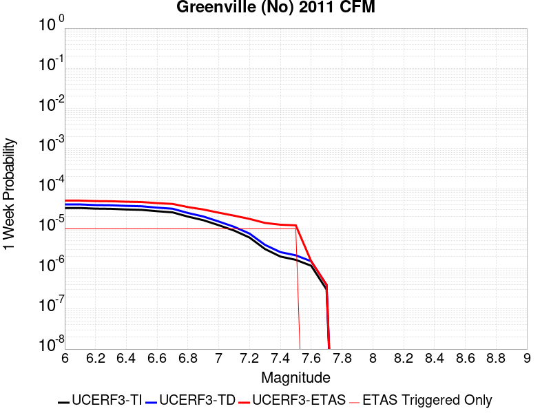 | 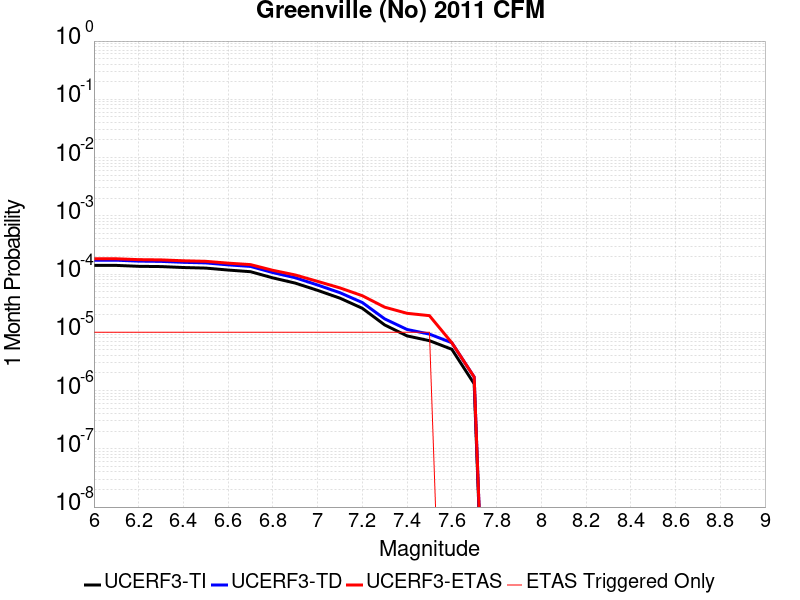 | 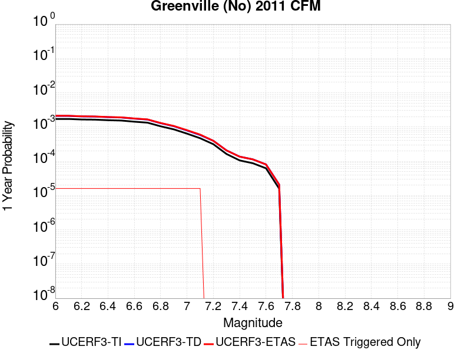 | 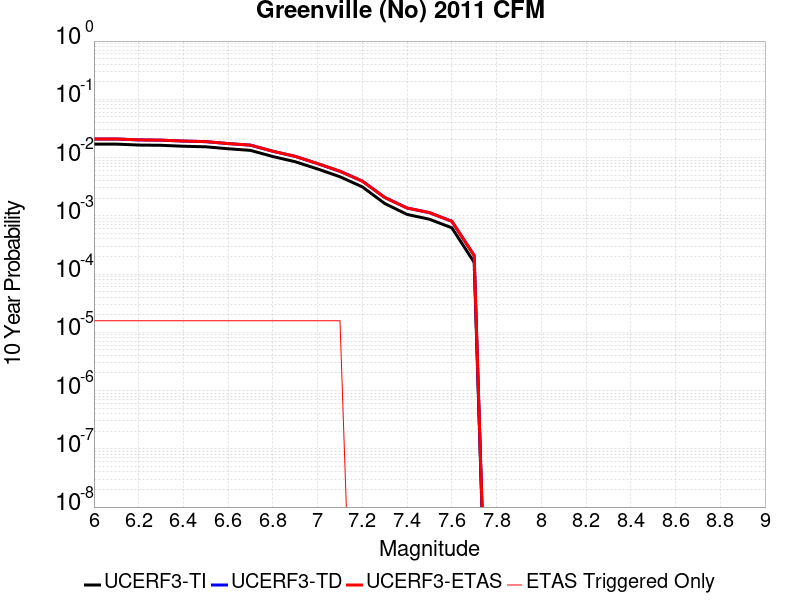 |

| Magnitude | 1 wk TI Prob | 1 wk TD Prob | 1 wk ETAS Prob | 1 wk ETAS/TD Gain | 1 wk ETAS Triggered Only | 1 mo TI Prob | 1 mo TD Prob | 1 mo ETAS Prob | 1 mo ETAS/TD Gain | 1 mo ETAS Triggered Only | 1 yr TI Prob | 1 yr TD Prob | 1 yr ETAS Prob | 1 yr ETAS/TD Gain | 1 yr ETAS Triggered Only | 10 yr TI Prob | 10 yr TD Prob | 10 yr ETAS Prob | 10 yr ETAS/TD Gain | 10 yr ETAS Triggered Only |
|-----|-----|-----|-----|-----|-----|-----|-----|-----|-----|-----|-----|-----|-----|-----|-----|-----|-----|-----|-----|-----|
| 6.0 | 3.286654E-5 | 4.036648E-5 | 4.036648E-5 | 1.0 | 0.0 | 1.4084899E-4 | 1.7298796E-4 | 1.7298796E-4 | 1.0 | 0.0 | 0.0017134876 | 0.002104132 | 0.0021209836 | 1.0080087 | 1.6887043E-5 | 0.017003356 | 0.020846982 | 0.020863516 | 1.0007932 | 1.6887043E-5 |
| 6.1 | 3.286654E-5 | 4.036648E-5 | 4.036648E-5 | 1.0 | 0.0 | 1.4084899E-4 | 1.7298796E-4 | 1.7298796E-4 | 1.0 | 0.0 | 0.0017134876 | 0.002104132 | 0.0021209836 | 1.0080087 | 1.6887043E-5 | 0.017003356 | 0.020846982 | 0.020863516 | 1.0007932 | 1.6887043E-5 |
| 6.2 | 3.1697953E-5 | 3.8929385E-5 | 3.8929385E-5 | 1.0 | 0.0 | 1.358413E-4 | 1.6682976E-4 | 1.6682976E-4 | 1.0 | 0.0 | 0.0016526132 | 0.002029298 | 0.0020461509 | 1.0083047 | 1.6887043E-5 | 0.01640377 | 0.020112377 | 0.020128924 | 1.0008228 | 1.6887043E-5 |
| 6.3 | 3.1363317E-5 | 3.851826E-5 | 3.851826E-5 | 1.0 | 0.0 | 1.344073E-4 | 1.6506804E-4 | 1.6506804E-4 | 1.0 | 0.0 | 0.0016351803 | 0.0020078886 | 0.0020247418 | 1.0083934 | 1.6887043E-5 | 0.016232004 | 0.019902144 | 0.019918695 | 1.0008316 | 1.6887043E-5 |
| 6.4 | 3.0228604E-5 | 3.7125395E-5 | 3.7125395E-5 | 1.0 | 0.0 | 1.2954473E-4 | 1.5909935E-4 | 1.5909935E-4 | 1.0 | 0.0 | 0.0015760659 | 0.0019353506 | 0.0019522049 | 1.0087087 | 1.6887043E-5 | 0.015649348 | 0.019189484 | 0.019206047 | 1.0008631 | 1.6887043E-5 |
| 6.5 | 2.9537814E-5 | 3.6280853E-5 | 3.6280853E-5 | 1.0 | 0.0 | 1.2658449E-4 | 1.554803E-4 | 1.554803E-4 | 1.0 | 0.0 | 0.0015400766 | 0.0018913659 | 0.0019082209 | 1.0089116 | 1.6887043E-5 | 0.01529447 | 0.018757146 | 0.018773716 | 1.0008835 | 1.6887043E-5 |
| 6.6 | 2.7345395E-5 | 3.3590182E-5 | 3.3590182E-5 | 1.0 | 0.0 | 1.1718928E-4 | 1.4395016E-4 | 1.4395016E-4 | 1.0 | 0.0 | 0.0014258457 | 0.0017512152 | 0.0017680727 | 1.0096262 | 1.6887043E-5 | 0.014167317 | 0.01737797 | 0.017394563 | 1.0009549 | 1.6887043E-5 |
| 6.7 | 2.5615784E-5 | 3.1567088E-5 | 3.1567088E-5 | 1.0 | 0.0 | 1.09777306E-4 | 1.3528067E-4 | 1.3528067E-4 | 1.0 | 0.0 | 0.0013357193 | 0.0016458282 | 0.0016626875 | 1.0102437 | 1.6887043E-5 | 0.013277191 | 0.016340064 | 0.016356675 | 1.0010166 | 1.6887043E-5 |
| 6.8 | 2.0059057E-5 | 2.4712073E-5 | 2.4712073E-5 | 1.0 | 0.0 | 8.596455E-5 | 1.0590468E-4 | 1.0590468E-4 | 1.0 | 0.0 | 0.0010461159 | 0.001288643 | 0.0013055083 | 1.0130876 | 1.6887043E-5 | 0.0104120495 | 0.012813724 | 0.012830394 | 1.001301 | 1.6887043E-5 |
| 6.9 | 1.6321746E-5 | 2.018467E-5 | 2.018467E-5 | 1.0 | 0.0 | 6.9948466E-5 | 8.650293E-5 | 8.650293E-5 | 1.0 | 0.0 | 8.5128983E-4 | 0.0010526767 | 0.0010695459 | 1.0160251 | 1.6887043E-5 | 0.008480361 | 0.010478431 | 0.010495141 | 1.0015947 | 1.6887043E-5 |
| 7.0 | 1.22527645E-5 | 1.5135633E-5 | 1.5135633E-5 | 1.0 | 0.0 | 5.2510793E-5 | 6.486541E-5 | 6.486541E-5 | 1.0 | 0.0 | 6.3913135E-4 | 7.894544E-4 | 8.063281E-4 | 1.0213739 | 1.6887043E-5 | 0.0063729626 | 0.007867137 | 0.0078838905 | 1.0021297 | 1.6887043E-5 |
| 7.1 | 8.996482E-6 | 1.1164954E-5 | 1.1164954E-5 | 1.0 | 0.0 | 3.8555783E-5 | 4.7848935E-5 | 4.7848935E-5 | 1.0 | 0.0 | 4.6931554E-4 | 5.824063E-4 | 5.992835E-4 | 1.0289785 | 1.6887043E-5 | 0.004683256 | 0.0058090906 | 0.0058258795 | 1.0028901 | 1.6887043E-5 |
| 7.2 | 6.0273087E-6 | 7.569474E-6 | 7.569474E-6 | 1.0 | 0.0 | 2.5831067E-5 | 3.2440203E-5 | 3.2440203E-5 | 1.0 | 0.0 | 3.1444785E-4 | 3.9488857E-4 | 3.9488857E-4 | 1.0 | 0.0 | 0.0031400328 | 0.003942066 | 0.003942066 | 1.0 | 0.0 |
| 7.3 | 3.1209995E-6 | 3.9663746E-6 | 3.9663746E-6 | 1.0 | 0.0 | 1.3375643E-5 | 1.699864E-5 | 1.699864E-5 | 1.0 | 0.0 | 1.6283628E-4 | 2.0693893E-4 | 2.0693893E-4 | 1.0 | 0.0 | 0.0016271701 | 0.0020675526 | 0.0020675526 | 1.0 | 0.0 |
| 7.4 | 2.0254208E-6 | 2.6096043E-6 | 2.6096043E-6 | 1.0 | 0.0 | 8.680347E-6 | 1.1183971E-5 | 1.1183971E-5 | 1.0 | 0.0 | 1.0567809E-4 | 1.361564E-4 | 1.361564E-4 | 1.0 | 0.0 | 0.0010562785 | 0.0013607866 | 0.0013607866 | 1.0 | 0.0 |
| 7.5 | 1.6763418E-6 | 2.173353E-6 | 2.173353E-6 | 1.0 | 0.0 | 7.184302E-6 | 9.314337E-6 | 9.314337E-6 | 1.0 | 0.0 | 8.746537E-5 | 1.1339621E-4 | 1.1339621E-4 | 1.0 | 0.0 | 8.743095E-4 | 0.0011334305 | 0.0011334305 | 1.0 | 0.0 |
| 7.6 | 1.1935462E-6 | 1.5458467E-6 | 1.5458467E-6 | 1.0 | 0.0 | 5.115188E-6 | 6.6250404E-6 | 6.6250404E-6 | 1.0 | 0.0 | 6.2275634E-5 | 8.065693E-5 | 8.065693E-5 | 1.0 | 0.0 | 6.2258187E-4 | 8.0630725E-4 | 8.0630725E-4 | 1.0 | 0.0 |
| 7.7 | 3.0464201E-7 | 3.9846822E-7 | 3.9846822E-7 | 1.0 | 0.0 | 1.3056081E-6 | 1.7077199E-6 | 1.7077199E-6 | 1.0 | 0.0 | 1.589566E-5 | 2.0791296E-5 | 2.0791296E-5 | 1.0 | 0.0 | 1.5894524E-4 | 2.0789822E-4 | 2.0789822E-4 | 1.0 | 0.0 |

## Holser alt 1
*[(top)](#table-of-contents)*

| 1 Week | 1 Month | 1 Year | 10 Year |
|-----|-----|-----|-----|
|  |  |  |  |

| Magnitude | 1 wk TI Prob | 1 wk TD Prob | 1 wk ETAS Prob | 1 wk ETAS/TD Gain | 1 wk ETAS Triggered Only | 1 mo TI Prob | 1 mo TD Prob | 1 mo ETAS Prob | 1 mo ETAS/TD Gain | 1 mo ETAS Triggered Only | 1 yr TI Prob | 1 yr TD Prob | 1 yr ETAS Prob | 1 yr ETAS/TD Gain | 1 yr ETAS Triggered Only | 10 yr TI Prob | 10 yr TD Prob | 10 yr ETAS Prob | 10 yr ETAS/TD Gain | 10 yr ETAS Triggered Only |
|-----|-----|-----|-----|-----|-----|-----|-----|-----|-----|-----|-----|-----|-----|-----|-----|-----|-----|-----|-----|-----|
| 6.0 | 6.2746653E-6 | 5.789965E-6 | 5.789965E-6 | 1.0 | 0.0 | 2.6891146E-5 | 2.4813964E-5 | 2.4813964E-5 | 1.0 | 0.0 | 3.273505E-4 | 3.020797E-4 | 3.1896163E-4 | 1.0558857 | 1.6887043E-5 | 0.0032686873 | 0.0030178234 | 0.0030346594 | 1.0055789 | 1.6887043E-5 |
| 6.1 | 6.2746653E-6 | 5.789965E-6 | 5.789965E-6 | 1.0 | 0.0 | 2.6891146E-5 | 2.4813964E-5 | 2.4813964E-5 | 1.0 | 0.0 | 3.273505E-4 | 3.020797E-4 | 3.1896163E-4 | 1.0558857 | 1.6887043E-5 | 0.0032686873 | 0.0030178234 | 0.0030346594 | 1.0055789 | 1.6887043E-5 |
| 6.2 | 6.2746653E-6 | 5.789965E-6 | 5.789965E-6 | 1.0 | 0.0 | 2.6891146E-5 | 2.4813964E-5 | 2.4813964E-5 | 1.0 | 0.0 | 3.273505E-4 | 3.020797E-4 | 3.1896163E-4 | 1.0558857 | 1.6887043E-5 | 0.0032686873 | 0.0030178234 | 0.0030346594 | 1.0055789 | 1.6887043E-5 |
| 6.3 | 6.2746653E-6 | 5.789965E-6 | 5.789965E-6 | 1.0 | 0.0 | 2.6891146E-5 | 2.4813964E-5 | 2.4813964E-5 | 1.0 | 0.0 | 3.273505E-4 | 3.020797E-4 | 3.1896163E-4 | 1.0558857 | 1.6887043E-5 | 0.0032686873 | 0.0030178234 | 0.0030346594 | 1.0055789 | 1.6887043E-5 |
| 6.4 | 6.2746653E-6 | 5.789965E-6 | 5.789965E-6 | 1.0 | 0.0 | 2.6891146E-5 | 2.4813964E-5 | 2.4813964E-5 | 1.0 | 0.0 | 3.273505E-4 | 3.020797E-4 | 3.1896163E-4 | 1.0558857 | 1.6887043E-5 | 0.0032686873 | 0.0030178234 | 0.0030346594 | 1.0055789 | 1.6887043E-5 |
| 6.5 | 6.2746653E-6 | 5.789965E-6 | 5.789965E-6 | 1.0 | 0.0 | 2.6891146E-5 | 2.4813964E-5 | 2.4813964E-5 | 1.0 | 0.0 | 3.273505E-4 | 3.020797E-4 | 3.1896163E-4 | 1.0558857 | 1.6887043E-5 | 0.0032686873 | 0.0030178234 | 0.0030346594 | 1.0055789 | 1.6887043E-5 |
| 6.6 | 3.375825E-6 | 2.7711897E-6 | 2.7711897E-6 | 1.0 | 0.0 | 1.4467741E-5 | 1.1876474E-5 | 1.1876474E-5 | 1.0 | 0.0 | 1.761305E-4 | 1.4458665E-4 | 1.6147125E-4 | 1.1167784 | 1.6887043E-5 | 0.0017599097 | 0.0014449427 | 0.0014618053 | 1.0116701 | 1.6887043E-5 |
| 6.7 | 3.375825E-6 | 2.7711897E-6 | 2.7711897E-6 | 1.0 | 0.0 | 1.4467741E-5 | 1.1876474E-5 | 1.1876474E-5 | 1.0 | 0.0 | 1.761305E-4 | 1.4458665E-4 | 1.6147125E-4 | 1.1167784 | 1.6887043E-5 | 0.0017599097 | 0.0014449427 | 0.0014618053 | 1.0116701 | 1.6887043E-5 |
| 6.8 | 3.366533E-6 | 2.7615893E-6 | 2.7615893E-6 | 1.0 | 0.0 | 1.4427919E-5 | 1.183533E-5 | 1.183533E-5 | 1.0 | 0.0 | 1.7564575E-4 | 1.4408577E-4 | 1.6097039E-4 | 1.1171844 | 1.6887043E-5 | 0.0017550698 | 0.0014399405 | 0.0014568033 | 1.0117108 | 1.6887043E-5 |
| 6.9 | 3.253174E-6 | 2.6438113E-6 | 2.6438113E-6 | 1.0 | 0.0 | 1.39421E-5 | 1.1330571E-5 | 1.1330571E-5 | 1.0 | 0.0 | 1.6973184E-4 | 1.3794114E-4 | 1.5482584E-4 | 1.1224052 | 1.6887043E-5 | 0.0016960226 | 0.001378571 | 0.0013954348 | 1.0122328 | 1.6887043E-5 |
| 7.0 | 2.9336593E-6 | 2.311799E-6 | 2.311799E-6 | 1.0 | 0.0 | 1.2572766E-5 | 9.907673E-6 | 9.907673E-6 | 1.0 | 0.0 | 1.5306266E-4 | 1.2061927E-4 | 1.3750428E-4 | 1.1399859 | 1.6887043E-5 | 0.0015295728 | 0.0012055405 | 0.0012224072 | 1.013991 | 1.6887043E-5 |
| 7.1 | 2.9087812E-6 | 2.2876513E-6 | 2.2876513E-6 | 1.0 | 0.0 | 1.2466146E-5 | 9.804184E-6 | 9.804184E-6 | 1.0 | 0.0 | 1.5176475E-4 | 1.19359414E-4 | 1.3624445E-4 | 1.1414638 | 1.6887043E-5 | 0.0015166114 | 0.0011929555 | 0.0012098225 | 1.0141387 | 1.6887043E-5 |
| 7.2 | 2.8674524E-6 | 2.2475429E-6 | 2.2475429E-6 | 1.0 | 0.0 | 1.2289024E-5 | 9.63229E-6 | 9.63229E-6 | 1.0 | 0.0 | 1.4960859E-4 | 1.1726685E-4 | 1.3415191E-4 | 1.1439884 | 1.6887043E-5 | 0.0014950791 | 0.001172052 | 0.0011889193 | 1.0143912 | 1.6887043E-5 |
| 7.3 | 2.8057775E-6 | 2.1954324E-6 | 2.1954324E-6 | 1.0 | 0.0 | 1.2024705E-5 | 9.408962E-6 | 9.408962E-6 | 1.0 | 0.0 | 1.4639096E-4 | 1.14548115E-4 | 1.3143322E-4 | 1.1474062 | 1.6887043E-5 | 0.0014629456 | 0.001144893 | 0.0011617607 | 1.014733 | 1.6887043E-5 |
| 7.4 | 2.683666E-6 | 2.1092305E-6 | 2.1092305E-6 | 1.0 | 0.0 | 1.1501375E-5 | 9.039529E-6 | 9.039529E-6 | 1.0 | 0.0 | 1.4002025E-4 | 1.1005072E-4 | 1.269359E-4 | 1.1534309 | 1.6887043E-5 | 0.0013993206 | 0.0010999644 | 0.0011168328 | 1.0153354 | 1.6887043E-5 |
| 7.5 | 2.434495E-6 | 1.9195363E-6 | 1.9195363E-6 | 1.0 | 0.0 | 1.0433508E-5 | 8.226558E-6 | 8.226558E-6 | 1.0 | 0.0 | 1.2702055E-4 | 1.0015376E-4 | 1.1703911E-4 | 1.1685942 | 1.6887043E-5 | 0.0012694797 | 0.0010010883 | 0.0010179584 | 1.0168518 | 1.6887043E-5 |
| 7.6 | 1.9914562E-6 | 1.5731459E-6 | 1.5731459E-6 | 1.0 | 0.0 | 8.534785E-6 | 6.742037E-6 | 6.742037E-6 | 1.0 | 0.0 | 1.03906044E-4 | 8.208122E-5 | 9.896688E-5 | 1.2057189 | 1.6887043E-5 | 0.0010385747 | 8.205106E-4 | 8.373838E-4 | 1.0205642 | 1.6887043E-5 |
| 7.7 | 1.5229501E-6 | 1.1896061E-6 | 1.1896061E-6 | 1.0 | 0.0 | 6.526913E-6 | 5.098302E-6 | 5.098302E-6 | 1.0 | 0.0 | 7.946226E-5 | 6.2070074E-5 | 7.8956065E-5 | 1.2720473 | 1.6887043E-5 | 7.943385E-4 | 6.2052865E-4 | 6.374052E-4 | 1.0271971 | 1.6887043E-5 |
| 7.8 | 6.3489426E-7 | 4.687806E-7 | 4.687806E-7 | 1.0 | 0.0 | 2.7209726E-6 | 2.009058E-6 | 2.009058E-6 | 1.0 | 0.0 | 3.312734E-5 | 2.4460009E-5 | 2.4460009E-5 | 1.0 | 0.0 | 3.31224E-4 | 2.4457334E-4 | 2.4457334E-4 | 1.0 | 0.0 |
| 7.9 | 1.5459432E-7 | 1.0193758E-7 | 1.0193758E-7 | 1.0 | 0.0 | 6.6254694E-7 | 4.3687527E-7 | 4.3687527E-7 | 1.0 | 0.0 | 8.066479E-6 | 5.3189433E-6 | 5.3189433E-6 | 1.0 | 0.0 | 8.066186E-5 | 5.3188178E-5 | 5.3188178E-5 | 1.0 | 0.0 |
| 8.0 | 1.8307812E-8 | 9.690293E-9 | 9.690293E-9 | 1.0 | 0.0 | 7.846205E-8 | 4.152983E-8 | 4.152983E-8 | 1.0 | 0.0 | 9.55275E-7 | 5.0562556E-7 | 5.0562556E-7 | 1.0 | 0.0 | 9.552709E-6 | 5.0562444E-6 | 5.0562444E-6 | 1.0 | 0.0 |

## San Andreas (Offshore) 2011 CFM
*[(top)](#table-of-contents)*

| 1 Week | 1 Month | 1 Year | 10 Year |
|-----|-----|-----|-----|
|  |  | 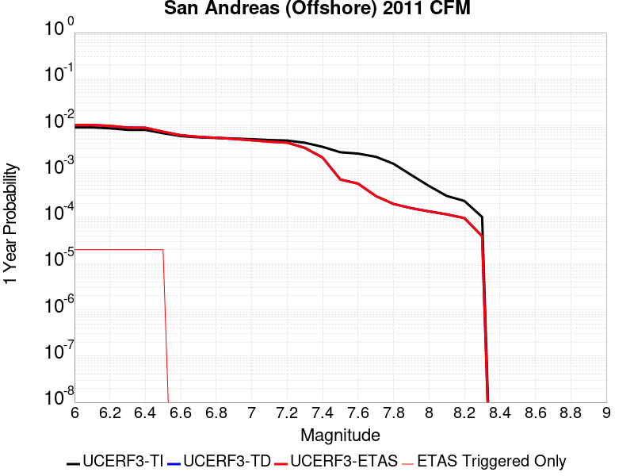 |  |

| Magnitude | 1 wk TI Prob | 1 wk TD Prob | 1 wk ETAS Prob | 1 wk ETAS/TD Gain | 1 wk ETAS Triggered Only | 1 mo TI Prob | 1 mo TD Prob | 1 mo ETAS Prob | 1 mo ETAS/TD Gain | 1 mo ETAS Triggered Only | 1 yr TI Prob | 1 yr TD Prob | 1 yr ETAS Prob | 1 yr ETAS/TD Gain | 1 yr ETAS Triggered Only | 10 yr TI Prob | 10 yr TD Prob | 10 yr ETAS Prob | 10 yr ETAS/TD Gain | 10 yr ETAS Triggered Only |
|-----|-----|-----|-----|-----|-----|-----|-----|-----|-----|-----|-----|-----|-----|-----|-----|-----|-----|-----|-----|-----|
| 6.0 | 1.7072787E-4 | 1.9226041E-4 | 1.9226041E-4 | 1.0 | 0.0 | 7.3148566E-4 | 8.237154E-4 | 8.237154E-4 | 1.0 | 0.0 | 0.008869528 | 0.0099831335 | 0.009999853 | 1.0016747 | 1.6887043E-5 | 0.085237645 | 0.09682738 | 0.09684263 | 1.0001575 | 1.6887043E-5 |
| 6.1 | 1.7072787E-4 | 1.9226041E-4 | 1.9226041E-4 | 1.0 | 0.0 | 7.3148566E-4 | 8.237154E-4 | 8.237154E-4 | 1.0 | 0.0 | 0.008869528 | 0.0099831335 | 0.009999853 | 1.0016747 | 1.6887043E-5 | 0.085237645 | 0.09682738 | 0.09684263 | 1.0001575 | 1.6887043E-5 |
| 6.2 | 1.6312556E-4 | 1.8407789E-4 | 1.8407789E-4 | 1.0 | 0.0 | 6.989222E-4 | 7.8866904E-4 | 7.8866904E-4 | 1.0 | 0.0 | 0.008476226 | 0.009560268 | 0.009576994 | 1.0017495 | 1.6887043E-5 | 0.08160117 | 0.09284818 | 0.0928635 | 1.000165 | 1.6887043E-5 |
| 6.3 | 1.5103363E-4 | 1.6880741E-4 | 1.6880741E-4 | 1.0 | 0.0 | 6.471264E-4 | 7.232619E-4 | 7.232619E-4 | 1.0 | 0.0 | 0.007850339 | 0.008770605 | 0.008787343 | 1.0019085 | 1.6887043E-5 | 0.075787395 | 0.085489064 | 0.08550451 | 1.0001806 | 1.6887043E-5 |
| 6.4 | 1.5047993E-4 | 1.676667E-4 | 1.676667E-4 | 1.0 | 0.0 | 6.4475456E-4 | 7.1837584E-4 | 7.1837584E-4 | 1.0 | 0.0 | 0.007821669 | 0.008711592 | 0.008728332 | 1.0019215 | 1.6887043E-5 | 0.0755203 | 0.08496926 | 0.08498471 | 1.0001819 | 1.6887043E-5 |
| 6.5 | 1.2760791E-4 | 1.3735025E-4 | 1.3735025E-4 | 1.0 | 0.0 | 5.467764E-4 | 5.885125E-4 | 5.885125E-4 | 1.0 | 0.0 | 0.0066367025 | 0.0071418737 | 0.00715864 | 1.0023476 | 1.6887043E-5 | 0.064419635 | 0.07025001 | 0.07026571 | 1.0002235 | 1.6887043E-5 |
| 6.6 | 1.1063525E-4 | 1.15566356E-4 | 1.15566356E-4 | 1.0 | 0.0 | 4.740649E-4 | 4.9519143E-4 | 4.9519143E-4 | 1.0 | 0.0 | 0.0057564764 | 0.006012491 | 0.006012491 | 1.0 | 0.0 | 0.05609626 | 0.05948894 | 0.05948894 | 1.0 | 0.0 |
| 6.7 | 1.0391049E-4 | 1.0645922E-4 | 1.0645922E-4 | 1.0 | 0.0 | 4.4525467E-4 | 4.5617504E-4 | 4.5617504E-4 | 1.0 | 0.0 | 0.0054075094 | 0.005539975 | 0.005539975 | 1.0 | 0.0 | 0.052778035 | 0.05498876 | 0.05498876 | 1.0 | 0.0 |
| 6.8 | 1.0096706E-4 | 1.01582686E-4 | 1.01582686E-4 | 1.0 | 0.0 | 4.3264418E-4 | 4.3528268E-4 | 4.3528268E-4 | 1.0 | 0.0 | 0.0052547283 | 0.005286866 | 0.005286866 | 1.0 | 0.0 | 0.051321987 | 0.052687574 | 0.052687574 | 1.0 | 0.0 |
| 6.9 | 9.800265E-5 | 9.588748E-5 | 9.588748E-5 | 1.0 | 0.0 | 4.1994374E-4 | 4.1088252E-4 | 4.1088252E-4 | 1.0 | 0.0 | 0.0051008356 | 0.0049911886 | 0.0049911886 | 1.0 | 0.0 | 0.049853306 | 0.05001504 | 0.05001504 | 1.0 | 0.0 |
| 7.0 | 9.4642375E-5 | 9.002143E-5 | 9.002143E-5 | 1.0 | 0.0 | 4.0554712E-4 | 3.8574997E-4 | 3.8574997E-4 | 1.0 | 0.0 | 0.004926363 | 0.0046865544 | 0.0046865544 | 1.0 | 0.0 | 0.048185747 | 0.047196057 | 0.047196057 | 1.0 | 0.0 |
| 7.1 | 9.0996844E-5 | 8.354169E-5 | 8.354169E-5 | 1.0 | 0.0 | 3.8992817E-4 | 3.5798753E-4 | 3.5798753E-4 | 1.0 | 0.0 | 0.004737046 | 0.004349944 | 0.004349944 | 1.0 | 0.0 | 0.04637333 | 0.044047635 | 0.044047635 | 1.0 | 0.0 |
| 7.2 | 8.848287E-5 | 7.9818135E-5 | 7.9818135E-5 | 1.0 | 0.0 | 3.791572E-4 | 3.4203375E-4 | 3.4203375E-4 | 1.0 | 0.0 | 0.004606472 | 0.0041564633 | 0.0041564633 | 1.0 | 0.0 | 0.045121472 | 0.042191572 | 0.042191572 | 1.0 | 0.0 |
| 7.3 | 7.9280784E-5 | 6.1276216E-5 | 6.1276216E-5 | 1.0 | 0.0 | 3.3973053E-4 | 2.625865E-4 | 2.625865E-4 | 1.0 | 0.0 | 0.004128377 | 0.0031924061 | 0.0031924061 | 1.0 | 0.0 | 0.040525194 | 0.032904375 | 0.032904375 | 1.0 | 0.0 |
| 7.4 | 6.468038E-5 | 3.7933212E-5 | 3.7933212E-5 | 1.0 | 0.0 | 2.771722E-4 | 1.625611E-4 | 1.625611E-4 | 1.0 | 0.0 | 0.0033693502 | 0.0019774425 | 0.0019774425 | 1.0 | 0.0 | 0.0331872 | 0.02082181 | 0.02082181 | 1.0 | 0.0 |
| 7.5 | 4.930574E-5 | 1.2703362E-5 | 1.2703362E-5 | 1.0 | 0.0 | 2.1129321E-4 | 5.444185E-5 | 5.444185E-5 | 1.0 | 0.0 | 0.0025694598 | 6.6262955E-4 | 6.6262955E-4 | 1.0 | 0.0 | 0.02539953 | 0.007481418 | 0.007481418 | 1.0 | 0.0 |
| 7.6 | 4.612566E-5 | 1.0336213E-5 | 1.0336213E-5 | 1.0 | 0.0 | 1.9766642E-4 | 4.429731E-5 | 4.429731E-5 | 1.0 | 0.0 | 0.0024039324 | 5.391877E-4 | 5.391877E-4 | 1.0 | 0.0 | 0.023780935 | 0.006172099 | 0.006172099 | 1.0 | 0.0 |
| 7.7 | 3.9435414E-5 | 5.574925E-6 | 5.574925E-6 | 1.0 | 0.0 | 1.6899795E-4 | 2.3892318E-5 | 2.3892318E-5 | 1.0 | 0.0 | 0.0020556084 | 2.9085035E-4 | 2.9085035E-4 | 1.0 | 0.0 | 0.020366974 | 0.0035420412 | 0.0035420412 | 1.0 | 0.0 |
| 7.8 | 2.7787428E-5 | 3.7553348E-6 | 3.7553348E-6 | 1.0 | 0.0 | 1.1908354E-4 | 1.6094193E-5 | 1.6094193E-5 | 1.0 | 0.0 | 0.0014488777 | 1.9592921E-4 | 1.9592921E-4 | 1.0 | 0.0 | 0.014394675 | 0.0023877125 | 0.0023877125 | 1.0 | 0.0 |
| 7.9 | 1.590671E-5 | 3.04085E-6 | 3.04085E-6 | 1.0 | 0.0 | 6.816983E-5 | 1.303215E-5 | 1.303215E-5 | 1.0 | 0.0 | 8.2965166E-4 | 1.586549E-4 | 1.586549E-4 | 1.0 | 0.0 | 0.008265611 | 0.001904262 | 0.001904262 | 1.0 | 0.0 |
| 8.0 | 9.193638E-6 | 2.5920847E-6 | 2.5920847E-6 | 1.0 | 0.0 | 3.940071E-5 | 1.1108887E-5 | 1.1108887E-5 | 1.0 | 0.0 | 4.7959806E-4 | 1.3524233E-4 | 1.3524233E-4 | 1.0 | 0.0 | 0.0047856434 | 0.0016115032 | 0.0016115032 | 1.0 | 0.0 |
| 8.1 | 5.601576E-6 | 2.2343472E-6 | 2.2343472E-6 | 1.0 | 0.0 | 2.4006533E-5 | 9.575739E-6 | 9.575739E-6 | 1.0 | 0.0 | 2.9224035E-4 | 1.16578405E-4 | 1.16578405E-4 | 1.0 | 0.0 | 0.0029185633 | 0.0014020674 | 0.0014020674 | 1.0 | 0.0 |
| 8.2 | 4.3508785E-6 | 1.857566E-6 | 1.857566E-6 | 1.0 | 0.0 | 1.864649E-5 | 7.960973E-6 | 7.960973E-6 | 1.0 | 0.0 | 2.2699735E-4 | 9.692056E-5 | 9.692056E-5 | 1.0 | 0.0 | 0.0022676561 | 0.0011594221 | 0.0011594221 | 1.0 | 0.0 |
| 8.3 | 1.9573292E-6 | 7.514906E-7 | 7.514906E-7 | 1.0 | 0.0 | 8.388526E-6 | 3.22067E-6 | 3.22067E-6 | 1.0 | 0.0 | 1.0212552E-4 | 3.921097E-5 | 3.921097E-5 | 1.0 | 0.0 | 0.001020786 | 4.640846E-4 | 4.640846E-4 | 1.0 | 0.0 |

## Greenville (So) 2011 CFM
*[(top)](#table-of-contents)*

| 1 Week | 1 Month | 1 Year | 10 Year |
|-----|-----|-----|-----|
| 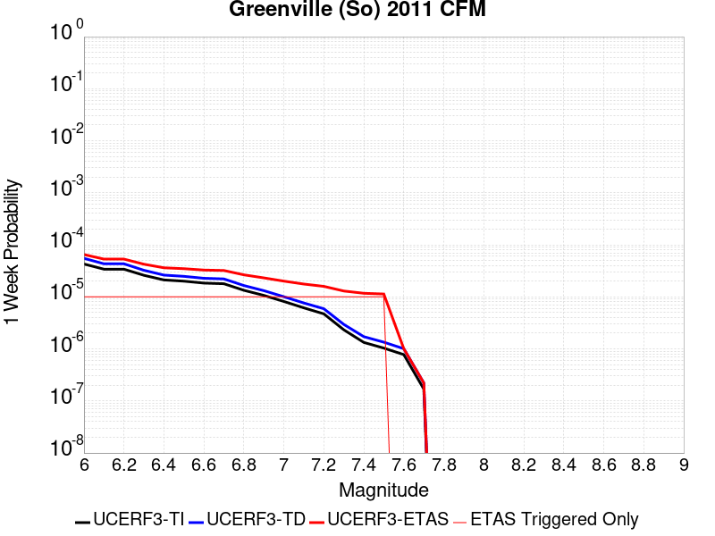 | 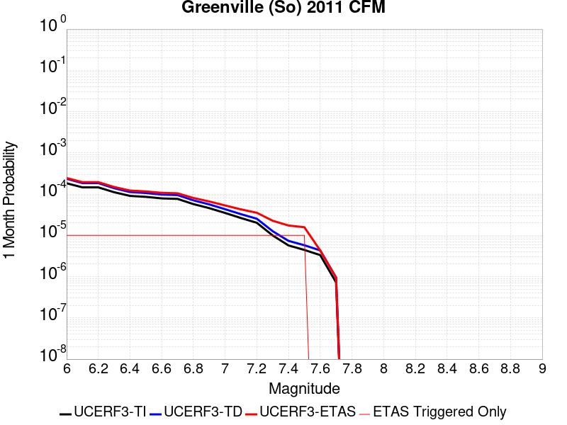 | 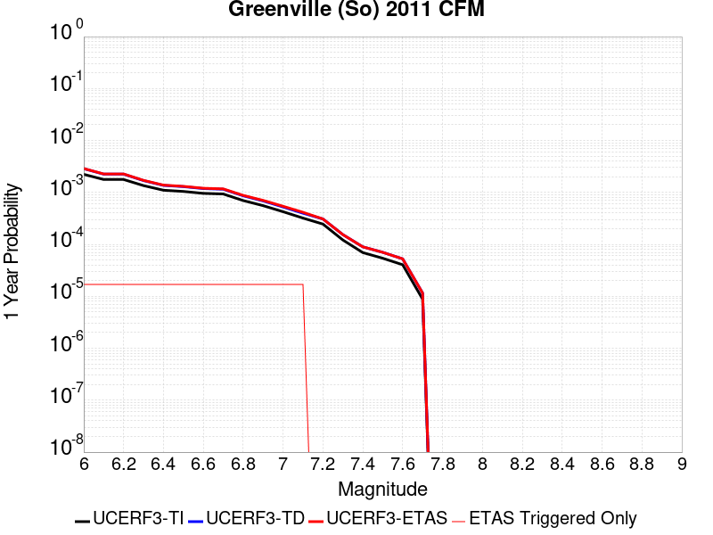 | 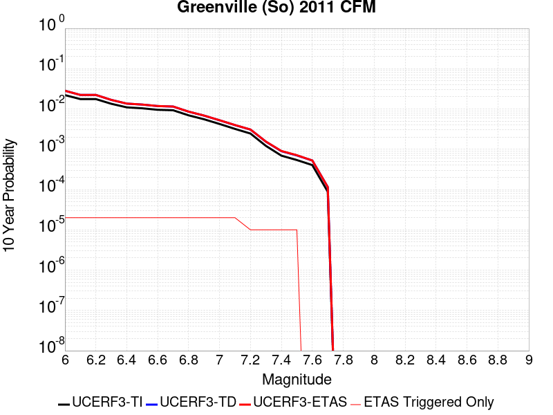 |

| Magnitude | 1 wk TI Prob | 1 wk TD Prob | 1 wk ETAS Prob | 1 wk ETAS/TD Gain | 1 wk ETAS Triggered Only | 1 mo TI Prob | 1 mo TD Prob | 1 mo ETAS Prob | 1 mo ETAS/TD Gain | 1 mo ETAS Triggered Only | 1 yr TI Prob | 1 yr TD Prob | 1 yr ETAS Prob | 1 yr ETAS/TD Gain | 1 yr ETAS Triggered Only | 10 yr TI Prob | 10 yr TD Prob | 10 yr ETAS Prob | 10 yr ETAS/TD Gain | 10 yr ETAS Triggered Only |
|-----|-----|-----|-----|-----|-----|-----|-----|-----|-----|-----|-----|-----|-----|-----|-----|-----|-----|-----|-----|-----|
| 6.0 | 4.279693E-5 | 5.5040087E-5 | 5.5040087E-5 | 1.0 | 0.0 | 1.8340252E-4 | 2.3586681E-4 | 2.3586681E-4 | 1.0 | 0.0 | 0.0022306389 | 0.0028682416 | 0.0028850802 | 1.0058707 | 1.6887043E-5 | 0.022083808 | 0.028338138 | 0.028354546 | 1.000579 | 1.6887043E-5 |
| 6.1 | 3.4037297E-5 | 4.3192387E-5 | 4.3192387E-5 | 1.0 | 0.0 | 1.4586597E-4 | 1.8509831E-4 | 1.8509831E-4 | 1.0 | 0.0 | 0.0017744715 | 0.0022514379 | 0.002268287 | 1.0074837 | 1.6887043E-5 | 0.01760369 | 0.022302566 | 0.022319077 | 1.0007403 | 1.6887043E-5 |
| 6.2 | 3.4037297E-5 | 4.3192387E-5 | 4.3192387E-5 | 1.0 | 0.0 | 1.4586597E-4 | 1.8509831E-4 | 1.8509831E-4 | 1.0 | 0.0 | 0.0017744715 | 0.0022514379 | 0.002268287 | 1.0074837 | 1.6887043E-5 | 0.01760369 | 0.022302566 | 0.022319077 | 1.0007403 | 1.6887043E-5 |
| 6.3 | 2.5956324E-5 | 3.2428903E-5 | 3.2428903E-5 | 1.0 | 0.0 | 1.11236644E-4 | 1.3897405E-4 | 1.3897405E-4 | 1.0 | 0.0 | 0.0013534647 | 0.0016907708 | 0.0017076293 | 1.0099709 | 1.6887043E-5 | 0.013452509 | 0.016785882 | 0.016802486 | 1.0009892 | 1.6887043E-5 |
| 6.4 | 2.1145053E-5 | 2.6197677E-5 | 2.6197677E-5 | 1.0 | 0.0 | 9.061851E-5 | 1.1227112E-4 | 1.1227112E-4 | 1.0 | 0.0 | 0.0011027219 | 0.0013660751 | 0.0013829392 | 1.0123448 | 1.6887043E-5 | 0.01097266 | 0.01358018 | 0.013596837 | 1.0012267 | 1.6887043E-5 |
| 6.5 | 2.0030959E-5 | 2.479578E-5 | 2.479578E-5 | 1.0 | 0.0 | 8.584414E-5 | 1.06263484E-4 | 1.06263484E-4 | 1.0 | 0.0 | 0.0010446513 | 0.0012930221 | 0.0013098873 | 1.0130433 | 1.6887043E-5 | 0.010397541 | 0.012858339 | 0.012875008 | 1.0012964 | 1.6887043E-5 |
| 6.6 | 1.8395405E-5 | 2.2754466E-5 | 2.2754466E-5 | 1.0 | 0.0 | 7.8835066E-5 | 9.751565E-5 | 9.751565E-5 | 1.0 | 0.0 | 9.5939427E-4 | 0.0011866348 | 0.0012035018 | 1.0142142 | 1.6887043E-5 | 0.009552629 | 0.011806041 | 0.011822728 | 1.0014135 | 1.6887043E-5 |
| 6.7 | 1.7883482E-5 | 2.212551E-5 | 2.212551E-5 | 1.0 | 0.0 | 7.664124E-5 | 9.482033E-5 | 9.482033E-5 | 1.0 | 0.0 | 9.3270757E-4 | 0.0011538545 | 0.0011707221 | 1.0146184 | 1.6887043E-5 | 0.009288026 | 0.011481688 | 0.011498381 | 1.0014539 | 1.6887043E-5 |
| 6.8 | 1.3373564E-5 | 1.6505966E-5 | 1.6505966E-5 | 1.0 | 0.0 | 5.7314013E-5 | 7.073802E-5 | 7.073802E-5 | 1.0 | 0.0 | 6.975747E-4 | 8.609098E-4 | 8.7778235E-4 | 1.0195985 | 1.6887043E-5 | 0.0069538904 | 0.008577357 | 0.008594099 | 1.0019519 | 1.6887043E-5 |
| 6.9 | 1.06692905E-5 | 1.3152582E-5 | 1.3152582E-5 | 1.0 | 0.0 | 4.5724726E-5 | 5.6367055E-5 | 5.6367055E-5 | 1.0 | 0.0 | 5.5655633E-4 | 6.86064E-4 | 7.0293946E-4 | 1.0245975 | 1.6887043E-5 | 0.005551645 | 0.006840693 | 0.0068574646 | 1.0024518 | 1.6887043E-5 |
| 7.0 | 8.157512E-6 | 1.0062639E-5 | 1.0062639E-5 | 1.0 | 0.0 | 3.4960296E-5 | 4.3124903E-5 | 4.3124903E-5 | 1.0 | 0.0 | 4.2555845E-4 | 5.2492286E-4 | 5.4180104E-4 | 1.0321536 | 1.6887043E-5 | 0.004247444 | 0.0052373074 | 0.0052541057 | 1.0032074 | 1.6887043E-5 |
| 7.1 | 6.1467113E-6 | 7.6274314E-6 | 7.6274314E-6 | 1.0 | 0.0 | 2.6342783E-5 | 3.268859E-5 | 3.268859E-5 | 1.0 | 0.0 | 3.206762E-4 | 3.9791173E-4 | 4.1479204E-4 | 1.0424223 | 1.6887043E-5 | 0.0032021382 | 0.0039721807 | 0.003989001 | 1.0042344 | 1.6887043E-5 |
| 7.2 | 4.713467E-6 | 5.9141557E-6 | 5.9141557E-6 | 1.0 | 0.0 | 2.0200418E-5 | 2.5346139E-5 | 2.5346139E-5 | 1.0 | 0.0 | 2.4591232E-4 | 3.0854615E-4 | 3.0854615E-4 | 1.0 | 0.0 | 0.0024564038 | 0.0030813308 | 0.0030813308 | 1.0 | 0.0 |
| 7.3 | 2.3266216E-6 | 2.954009E-6 | 2.954009E-6 | 1.0 | 0.0 | 9.971197E-6 | 1.2659978E-5 | 1.2659978E-5 | 1.0 | 0.0 | 1.2139256E-4 | 1.5412449E-4 | 1.5412449E-4 | 1.0 | 0.0 | 0.0012132627 | 0.0015402455 | 0.0015402455 | 1.0 | 0.0 |
| 7.4 | 1.3314E-6 | 1.7179472E-6 | 1.7179472E-6 | 1.0 | 0.0 | 5.7059874E-6 | 7.36261E-6 | 7.36261E-6 | 1.0 | 0.0 | 6.946818E-5 | 8.963614E-5 | 8.963614E-5 | 1.0 | 0.0 | 6.9446466E-4 | 8.9603866E-4 | 8.9603866E-4 | 1.0 | 0.0 |
| 7.5 | 1.0362941E-6 | 1.3468821E-6 | 1.3468821E-6 | 1.0 | 0.0 | 4.4412527E-6 | 5.772339E-6 | 5.772339E-6 | 1.0 | 0.0 | 5.407091E-5 | 7.027601E-5 | 7.027601E-5 | 1.0 | 0.0 | 5.405776E-4 | 7.025681E-4 | 7.025681E-4 | 1.0 | 0.0 |
| 7.6 | 7.764784E-7 | 1.0088593E-6 | 1.0088593E-6 | 1.0 | 0.0 | 3.3277602E-6 | 4.323676E-6 | 4.323676E-6 | 1.0 | 0.0 | 4.0514726E-5 | 5.263952E-5 | 5.263952E-5 | 1.0 | 0.0 | 4.050734E-4 | 5.262919E-4 | 5.262919E-4 | 1.0 | 0.0 |
| 7.7 | 1.6927763E-7 | 2.2139248E-7 | 2.2139248E-7 | 1.0 | 0.0 | 7.2547533E-7 | 9.4882455E-7 | 9.4882455E-7 | 1.0 | 0.0 | 8.832627E-6 | 1.15518815E-5 | 1.15518815E-5 | 1.0 | 0.0 | 8.8322755E-5 | 1.15515526E-4 | 1.15515526E-4 | 1.0 | 0.0 |

## Swain Ravine - Spenceville
*[(top)](#table-of-contents)*

| 1 Week | 1 Month | 1 Year | 10 Year |
|-----|-----|-----|-----|
| 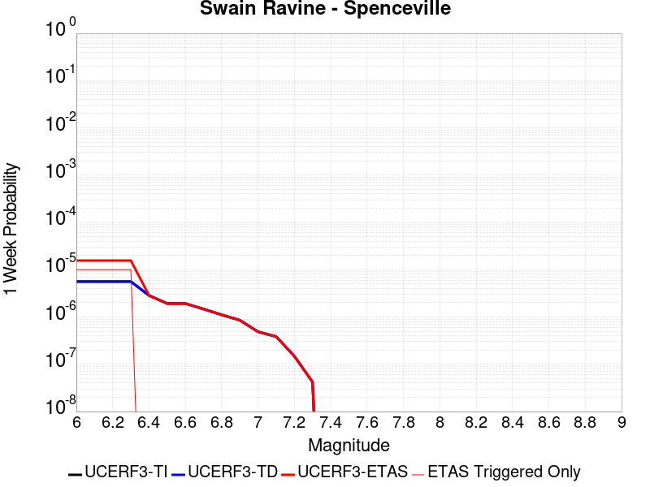 |  |  |  |

| Magnitude | 1 wk TI Prob | 1 wk TD Prob | 1 wk ETAS Prob | 1 wk ETAS/TD Gain | 1 wk ETAS Triggered Only | 1 mo TI Prob | 1 mo TD Prob | 1 mo ETAS Prob | 1 mo ETAS/TD Gain | 1 mo ETAS Triggered Only | 1 yr TI Prob | 1 yr TD Prob | 1 yr ETAS Prob | 1 yr ETAS/TD Gain | 1 yr ETAS Triggered Only | 10 yr TI Prob | 10 yr TD Prob | 10 yr ETAS Prob | 10 yr ETAS/TD Gain | 10 yr ETAS Triggered Only |
|-----|-----|-----|-----|-----|-----|-----|-----|-----|-----|-----|-----|-----|-----|-----|-----|-----|-----|-----|-----|-----|
| 6.0 | 5.596169E-6 | 5.663794E-6 | 2.2550741E-5 | 3.9815607 | 1.6887043E-5 | 2.398336E-5 | 2.4273193E-5 | 4.1159827E-5 | 1.6956906 | 1.6887043E-5 | 2.9195828E-4 | 2.9548878E-4 | 3.1237083E-4 | 1.0571326 | 1.6887043E-5 | 0.00291575 | 0.002951228 | 0.0029680652 | 1.0057051 | 1.6887043E-5 |
| 6.1 | 5.596169E-6 | 5.663794E-6 | 2.2550741E-5 | 3.9815607 | 1.6887043E-5 | 2.398336E-5 | 2.4273193E-5 | 4.1159827E-5 | 1.6956906 | 1.6887043E-5 | 2.9195828E-4 | 2.9548878E-4 | 3.1237083E-4 | 1.0571326 | 1.6887043E-5 | 0.00291575 | 0.002951228 | 0.0029680652 | 1.0057051 | 1.6887043E-5 |
| 6.2 | 5.596169E-6 | 5.663794E-6 | 2.2550741E-5 | 3.9815607 | 1.6887043E-5 | 2.398336E-5 | 2.4273193E-5 | 4.1159827E-5 | 1.6956906 | 1.6887043E-5 | 2.9195828E-4 | 2.9548878E-4 | 3.1237083E-4 | 1.0571326 | 1.6887043E-5 | 0.00291575 | 0.002951228 | 0.0029680652 | 1.0057051 | 1.6887043E-5 |
| 6.3 | 5.596169E-6 | 5.663794E-6 | 2.2550741E-5 | 3.9815607 | 1.6887043E-5 | 2.398336E-5 | 2.4273193E-5 | 4.1159827E-5 | 1.6956906 | 1.6887043E-5 | 2.9195828E-4 | 2.9548878E-4 | 3.1237083E-4 | 1.0571326 | 1.6887043E-5 | 0.00291575 | 0.002951228 | 0.0029680652 | 1.0057051 | 1.6887043E-5 |
| 6.4 | 2.8426775E-6 | 2.874144E-6 | 2.874144E-6 | 1.0 | 0.0 | 1.2182847E-5 | 1.2317704E-5 | 1.2317704E-5 | 1.0 | 0.0 | 1.4831607E-4 | 1.4995811E-4 | 1.4995811E-4 | 1.0 | 0.0 | 0.0014821711 | 0.0014986077 | 0.0014986077 | 1.0 | 0.0 |
| 6.5 | 1.9210793E-6 | 1.9414147E-6 | 1.9414147E-6 | 1.0 | 0.0 | 8.233172E-6 | 8.320323E-6 | 8.320323E-6 | 1.0 | 0.0 | 1.0023425E-4 | 1.0129536E-4 | 1.0129536E-4 | 1.0 | 0.0 | 0.0010018905 | 0.0010125053 | 0.0010125053 | 1.0 | 0.0 |
| 6.6 | 1.9210793E-6 | 1.9414147E-6 | 1.9414147E-6 | 1.0 | 0.0 | 8.233172E-6 | 8.320323E-6 | 8.320323E-6 | 1.0 | 0.0 | 1.0023425E-4 | 1.0129536E-4 | 1.0129536E-4 | 1.0 | 0.0 | 0.0010018905 | 0.0010125053 | 0.0010125053 | 1.0 | 0.0 |
| 6.7 | 1.4667394E-6 | 1.4818934E-6 | 1.4818934E-6 | 1.0 | 0.0 | 6.286011E-6 | 6.3509565E-6 | 6.3509565E-6 | 1.0 | 0.0 | 7.65295E-5 | 7.732023E-5 | 7.732023E-5 | 1.0 | 0.0 | 7.6503144E-4 | 7.72941E-4 | 7.72941E-4 | 1.0 | 0.0 |
| 6.8 | 1.1076943E-6 | 1.1189535E-6 | 1.1189535E-6 | 1.0 | 0.0 | 4.747252E-6 | 4.7955064E-6 | 4.7955064E-6 | 1.0 | 0.0 | 5.7796264E-5 | 5.838377E-5 | 5.838377E-5 | 1.0 | 0.0 | 5.778124E-4 | 5.836887E-4 | 5.836887E-4 | 1.0 | 0.0 |
| 6.9 | 8.514296E-7 | 8.600095E-7 | 8.600095E-7 | 1.0 | 0.0 | 3.648979E-6 | 3.6857498E-6 | 3.6857498E-6 | 1.0 | 0.0 | 4.442541E-5 | 4.4873108E-5 | 4.4873108E-5 | 1.0 | 0.0 | 4.441653E-4 | 4.4864335E-4 | 4.4864335E-4 | 1.0 | 0.0 |
| 7.0 | 4.8544706E-7 | 4.9033E-7 | 4.9033E-7 | 1.0 | 0.0 | 2.0804857E-6 | 2.1014127E-6 | 2.1014127E-6 | 1.0 | 0.0 | 2.532962E-5 | 2.5584413E-5 | 2.5584413E-5 | 1.0 | 0.0 | 2.5326732E-4 | 2.5581598E-4 | 2.5581598E-4 | 1.0 | 0.0 |
| 7.1 | 3.829186E-7 | 3.8678783E-7 | 3.8678783E-7 | 1.0 | 0.0 | 1.6410787E-6 | 1.6576612E-6 | 1.6576612E-6 | 1.0 | 0.0 | 1.997995E-5 | 2.0181848E-5 | 2.0181848E-5 | 1.0 | 0.0 | 1.9978154E-4 | 2.0180122E-4 | 2.0180122E-4 | 1.0 | 0.0 |
| 7.2 | 1.4726595E-7 | 1.4879437E-7 | 1.4879437E-7 | 1.0 | 0.0 | 6.3113964E-7 | 6.3769005E-7 | 6.3769005E-7 | 1.0 | 0.0 | 7.684098E-6 | 7.763854E-6 | 7.763854E-6 | 1.0 | 0.0 | 7.6838325E-5 | 7.763636E-5 | 7.763636E-5 | 1.0 | 0.0 |
| 7.3 | 4.1880604E-8 | 4.2324306E-8 | 4.2324306E-8 | 1.0 | 0.0 | 1.7948828E-7 | 1.8138988E-7 | 1.8138988E-7 | 1.0 | 0.0 | 2.1852677E-6 | 2.2084218E-6 | 2.2084218E-6 | 1.0 | 0.0 | 2.1852462E-5 | 2.2084218E-5 | 2.2084218E-5 | 1.0 | 0.0 |

## Malibu Coast (Extension) alt 1
*[(top)](#table-of-contents)*

| 1 Week | 1 Month | 1 Year | 10 Year |
|-----|-----|-----|-----|
|  |  |  |  |

| Magnitude | 1 wk TI Prob | 1 wk TD Prob | 1 wk ETAS Prob | 1 wk ETAS/TD Gain | 1 wk ETAS Triggered Only | 1 mo TI Prob | 1 mo TD Prob | 1 mo ETAS Prob | 1 mo ETAS/TD Gain | 1 mo ETAS Triggered Only | 1 yr TI Prob | 1 yr TD Prob | 1 yr ETAS Prob | 1 yr ETAS/TD Gain | 1 yr ETAS Triggered Only | 10 yr TI Prob | 10 yr TD Prob | 10 yr ETAS Prob | 10 yr ETAS/TD Gain | 10 yr ETAS Triggered Only |
|-----|-----|-----|-----|-----|-----|-----|-----|-----|-----|-----|-----|-----|-----|-----|-----|-----|-----|-----|-----|-----|
| 6.0 | 8.930738E-6 | 9.329276E-6 | 2.6216161E-5 | 2.810096 | 1.6887043E-5 | 3.827403E-5 | 3.998201E-5 | 5.6868375E-5 | 1.4223492 | 1.6887043E-5 | 4.6588664E-4 | 4.8667393E-4 | 5.035528E-4 | 1.034682 | 1.6887043E-5 | 0.0046491115 | 0.004856264 | 0.004873069 | 1.0034605 | 1.6887043E-5 |
| 6.1 | 7.199952E-6 | 7.5302964E-6 | 2.4417212E-5 | 3.2425299 | 1.6887043E-5 | 3.0856572E-5 | 3.2272303E-5 | 4.91588E-5 | 1.5232505 | 1.6887043E-5 | 3.75614E-4 | 3.9284505E-4 | 4.0972547E-4 | 1.0429696 | 1.6887043E-5 | 0.0037497976 | 0.003921572 | 0.003938393 | 1.0042893 | 1.6887043E-5 |
| 6.2 | 6.3721413E-6 | 6.6667917E-6 | 2.355372E-5 | 3.5329921 | 1.6887043E-5 | 2.7308892E-5 | 2.8571652E-5 | 4.545821E-5 | 1.591025 | 1.6887043E-5 | 3.3243504E-4 | 3.4780471E-4 | 3.6468587E-4 | 1.0485363 | 1.6887043E-5 | 0.0033193815 | 0.0034726437 | 0.0034894722 | 1.004846 | 1.6887043E-5 |
| 6.3 | 6.016345E-6 | 6.295158E-6 | 2.3182094E-5 | 3.6825278 | 1.6887043E-5 | 2.578408E-5 | 2.6978973E-5 | 4.386556E-5 | 1.6259166 | 1.6887043E-5 | 3.1387596E-4 | 3.2841982E-4 | 3.453013E-4 | 1.0514022 | 1.6887043E-5 | 0.00313433 | 0.0032793807 | 0.0032962123 | 1.0051326 | 1.6887043E-5 |
| 6.4 | 5.8104883E-6 | 6.0795446E-6 | 2.2966484E-5 | 3.7776654 | 1.6887043E-5 | 2.4901856E-5 | 2.6054933E-5 | 4.2941534E-5 | 1.6481154 | 1.6887043E-5 | 3.031379E-4 | 3.1717293E-4 | 3.3405464E-4 | 1.0532255 | 1.6887043E-5 | 0.0030272473 | 0.0031672374 | 0.0031840708 | 1.005315 | 1.6887043E-5 |
| 6.5 | 5.476925E-6 | 5.7275133E-6 | 2.2614458E-5 | 3.9483905 | 1.6887043E-5 | 2.3472323E-5 | 2.4546256E-5 | 4.1432882E-5 | 1.6879513 | 1.6887043E-5 | 2.8573806E-4 | 2.9880996E-4 | 3.1569196E-4 | 1.0564975 | 1.6887043E-5 | 0.0028537093 | 0.002984114 | 0.0030009504 | 1.005642 | 1.6887043E-5 |
| 6.6 | 5.222387E-6 | 5.45858E-6 | 2.234553E-5 | 4.0936527 | 1.6887043E-5 | 2.2381464E-5 | 2.3393704E-5 | 4.0280353E-5 | 1.7218457 | 1.6887043E-5 | 2.7246025E-4 | 2.8478142E-4 | 3.0166365E-4 | 1.0592813 | 1.6887043E-5 | 0.0027212645 | 0.0028441956 | 0.0028610346 | 1.0059205 | 1.6887043E-5 |
| 6.7 | 5.0337076E-6 | 5.259103E-6 | 2.2146058E-5 | 4.210995 | 1.6887043E-5 | 2.1572854E-5 | 2.253882E-5 | 3.9425482E-5 | 1.7492256 | 1.6887043E-5 | 2.6261783E-4 | 2.7437587E-4 | 2.9125827E-4 | 1.0615302 | 1.6887043E-5 | 0.002623077 | 0.002740401 | 0.002757242 | 1.0061454 | 1.6887043E-5 |
| 6.8 | 4.5675624E-6 | 4.7587164E-6 | 2.164568E-5 | 4.548638 | 1.6887043E-5 | 1.9575122E-5 | 2.039434E-5 | 3.728104E-5 | 1.828009 | 1.6887043E-5 | 2.3830103E-4 | 2.48273E-4 | 2.6515583E-4 | 1.0680012 | 1.6887043E-5 | 0.0023804565 | 0.002479976 | 0.002496821 | 1.0067924 | 1.6887043E-5 |
| 6.9 | 4.2802412E-6 | 4.4520207E-6 | 2.1338989E-5 | 4.793102 | 1.6887043E-5 | 1.8343762E-5 | 1.907995E-5 | 3.596667E-5 | 1.8850505 | 1.6887043E-5 | 2.2331243E-4 | 2.3227377E-4 | 2.491569E-4 | 1.0726863 | 1.6887043E-5 | 0.0022308815 | 0.0023203269 | 0.0023371747 | 1.007261 | 1.6887043E-5 |
| 7.0 | 3.9794063E-6 | 4.130099E-6 | 2.1017071E-5 | 5.0887575 | 1.6887043E-5 | 1.7054486E-5 | 1.7700306E-5 | 3.458705E-5 | 1.9540368 | 1.6887043E-5 | 2.0761859E-4 | 2.1548003E-4 | 2.3236344E-4 | 1.0783526 | 1.6887043E-5 | 0.0020742472 | 0.0021527244 | 0.002169575 | 1.0078276 | 1.6887043E-5 |
| 7.1 | 3.7730424E-6 | 3.911217E-6 | 2.0798194E-5 | 5.317576 | 1.6887043E-5 | 1.6170083E-5 | 1.6762251E-5 | 3.3649012E-5 | 2.007428 | 1.6887043E-5 | 1.9685295E-4 | 2.0406142E-4 | 2.2094502E-4 | 1.0827378 | 1.6887043E-5 | 0.0019667868 | 0.0020387534 | 0.0020556059 | 1.0082661 | 1.6887043E-5 |
| 7.2 | 3.424985E-6 | 3.541337E-6 | 2.042832E-5 | 5.768533 | 1.6887043E-5 | 1.4678424E-5 | 1.5177071E-5 | 3.2063857E-5 | 2.112651 | 1.6887043E-5 | 1.7869516E-4 | 1.8476529E-4 | 2.016492E-4 | 1.0913804 | 1.6887043E-5 | 0.0017855153 | 0.0018461287 | 0.0018629846 | 1.0091304 | 1.6887043E-5 |
| 7.3 | 2.6966375E-6 | 2.7596534E-6 | 1.964665E-5 | 7.1192455 | 1.6887043E-5 | 1.15569665E-5 | 1.1827032E-5 | 2.8713876E-5 | 2.4278173 | 1.6887043E-5 | 1.4069698E-4 | 1.4398464E-4 | 1.6086925E-4 | 1.1172668 | 1.6887043E-5 | 0.0014060794 | 0.0014389176 | 0.0014557804 | 1.011719 | 1.6887043E-5 |
| 7.4 | 2.215957E-6 | 2.249378E-6 | 2.249378E-6 | 1.0 | 0.0 | 9.496924E-6 | 9.640156E-6 | 9.640156E-6 | 1.0 | 0.0 | 1.1561892E-4 | 1.17362615E-4 | 1.17362615E-4 | 1.0 | 0.0 | 0.0011555878 | 0.0011730101 | 0.0011730101 | 1.0 | 0.0 |
| 7.5 | 1.2040218E-6 | 1.2219067E-6 | 1.2219067E-6 | 1.0 | 0.0 | 5.160083E-6 | 5.2367322E-6 | 5.2367322E-6 | 1.0 | 0.0 | 6.2822204E-5 | 6.375537E-5 | 6.375537E-5 | 1.0 | 0.0 | 6.280445E-4 | 6.3737266E-4 | 6.3737266E-4 | 1.0 | 0.0 |
| 7.6 | 6.6157446E-7 | 6.678975E-7 | 6.678975E-7 | 1.0 | 0.0 | 2.835316E-6 | 2.8624147E-6 | 2.8624147E-6 | 1.0 | 0.0 | 3.4519428E-5 | 3.484936E-5 | 3.484936E-5 | 1.0 | 0.0 | 3.4514067E-4 | 3.4844046E-4 | 3.4844046E-4 | 1.0 | 0.0 |
| 7.7 | 2.6012302E-7 | 2.4357593E-7 | 2.4357593E-7 | 1.0 | 0.0 | 1.1148124E-6 | 1.0438964E-6 | 1.0438964E-6 | 1.0 | 0.0 | 1.3572758E-5 | 1.2709375E-5 | 1.2709375E-5 | 1.0 | 0.0 | 1.3571928E-4 | 1.2708755E-4 | 1.2708755E-4 | 1.0 | 0.0 |
| 7.8 | 2.8323132E-8 | 2.0266649E-8 | 2.0266649E-8 | 1.0 | 0.0 | 1.2138484E-7 | 8.685707E-8 | 8.685707E-8 | 1.0 | 0.0 | 1.4778595E-6 | 1.0574844E-6 | 1.0574844E-6 | 1.0 | 0.0 | 1.4778497E-5 | 1.0574801E-5 | 1.0574801E-5 | 1.0 | 0.0 |

## San Clemente
*[(top)](#table-of-contents)*

| 1 Week | 1 Month | 1 Year | 10 Year |
|-----|-----|-----|-----|
| 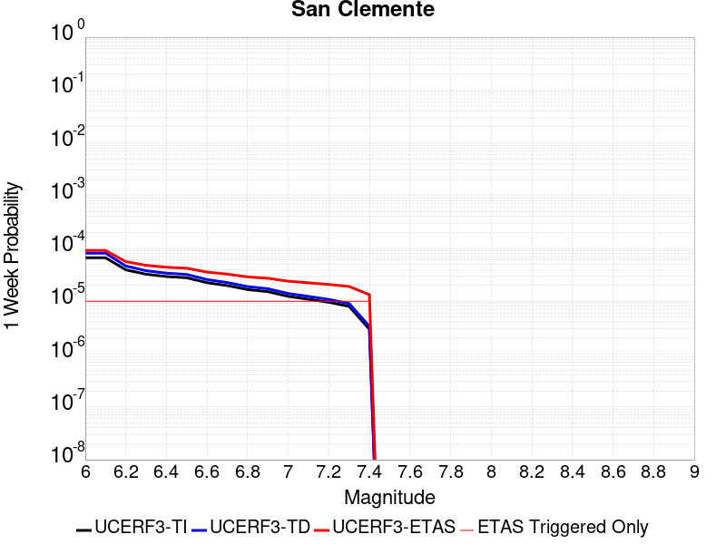 | 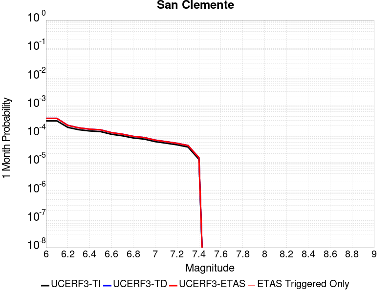 | 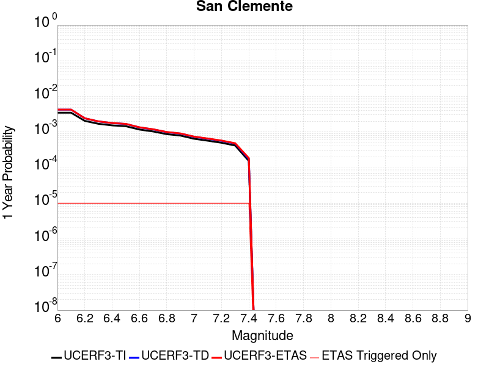 | 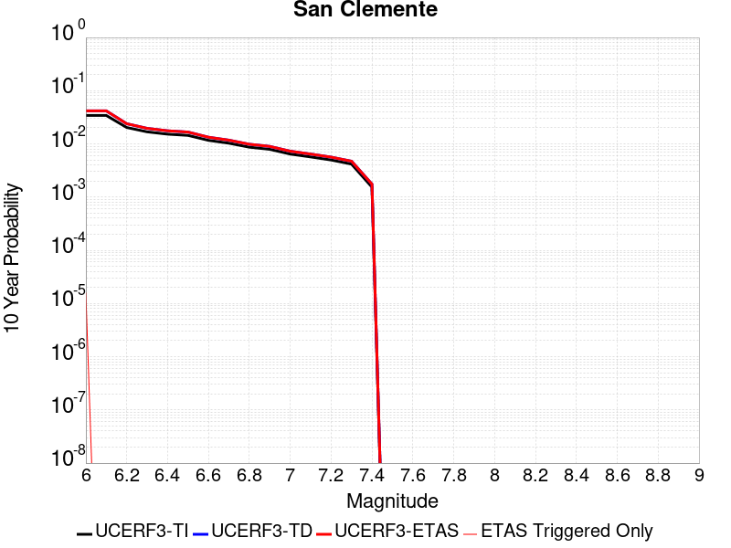 |

| Magnitude | 1 wk TI Prob | 1 wk TD Prob | 1 wk ETAS Prob | 1 wk ETAS/TD Gain | 1 wk ETAS Triggered Only | 1 mo TI Prob | 1 mo TD Prob | 1 mo ETAS Prob | 1 mo ETAS/TD Gain | 1 mo ETAS Triggered Only | 1 yr TI Prob | 1 yr TD Prob | 1 yr ETAS Prob | 1 yr ETAS/TD Gain | 1 yr ETAS Triggered Only | 10 yr TI Prob | 10 yr TD Prob | 10 yr ETAS Prob | 10 yr ETAS/TD Gain | 10 yr ETAS Triggered Only |
|-----|-----|-----|-----|-----|-----|-----|-----|-----|-----|-----|-----|-----|-----|-----|-----|-----|-----|-----|-----|-----|
| 6.0 | 6.681379E-5 | 8.163422E-5 | 8.163422E-5 | 1.0 | 0.0 | 2.8631336E-4 | 3.498173E-4 | 3.498173E-4 | 1.0 | 0.0 | 0.003480294 | 0.0042512873 | 0.0042512873 | 1.0 | 0.0 | 0.03426291 | 0.041755714 | 0.041771896 | 1.0003875 | 1.6887043E-5 |
| 6.1 | 6.681379E-5 | 8.163422E-5 | 8.163422E-5 | 1.0 | 0.0 | 2.8631336E-4 | 3.498173E-4 | 3.498173E-4 | 1.0 | 0.0 | 0.003480294 | 0.0042512873 | 0.0042512873 | 1.0 | 0.0 | 0.03426291 | 0.041755714 | 0.041755714 | 1.0 | 0.0 |
| 6.2 | 3.9400576E-5 | 4.6451984E-5 | 4.6451984E-5 | 1.0 | 0.0 | 1.6884868E-4 | 1.9906509E-4 | 1.9906509E-4 | 1.0 | 0.0 | 0.0020537945 | 0.002420985 | 0.002420985 | 1.0 | 0.0 | 0.020349167 | 0.02395286 | 0.02395286 | 1.0 | 0.0 |
| 6.3 | 3.2590255E-5 | 3.7929087E-5 | 3.7929087E-5 | 1.0 | 0.0 | 1.3966505E-4 | 1.6254328E-4 | 1.6254328E-4 | 1.0 | 0.0 | 0.0016990956 | 0.0019771985 | 0.0019771985 | 1.0 | 0.0 | 0.01686163 | 0.019599866 | 0.019599866 | 1.0 | 0.0 |
| 6.4 | 2.9454652E-5 | 3.4097775E-5 | 3.4097775E-5 | 1.0 | 0.0 | 1.2622811E-4 | 1.4612528E-4 | 1.4612528E-4 | 1.0 | 0.0 | 0.0015357438 | 0.0017776482 | 0.0017776482 | 1.0 | 0.0 | 0.015251739 | 0.017637458 | 0.017637458 | 1.0 | 0.0 |
| 6.5 | 2.790836E-5 | 3.2247463E-5 | 3.2247463E-5 | 1.0 | 0.0 | 1.1960178E-4 | 1.3819622E-4 | 1.3819622E-4 | 1.0 | 0.0 | 0.001455179 | 0.0016812651 | 0.0016812651 | 1.0 | 0.0 | 0.014456868 | 0.016688475 | 0.016688475 | 1.0 | 0.0 |
| 6.6 | 2.2492153E-5 | 2.5762707E-5 | 2.5762707E-5 | 1.0 | 0.0 | 9.639138E-5 | 1.1040701E-4 | 1.1040701E-4 | 1.0 | 0.0 | 0.0011729331 | 0.0013433908 | 0.0013433908 | 1.0 | 0.0 | 0.011667615 | 0.013354415 | 0.013354415 | 1.0 | 0.0 |
| 6.7 | 1.9862755E-5 | 2.2666423E-5 | 2.2666423E-5 | 1.0 | 0.0 | 8.512331E-5 | 9.713826E-5 | 9.713826E-5 | 1.0 | 0.0 | 0.0010358836 | 0.0011820279 | 0.0011820279 | 1.0 | 0.0 | 0.010310682 | 0.011758701 | 0.011758701 | 1.0 | 0.0 |
| 6.8 | 1.6697575E-5 | 1.897771E-5 | 1.897771E-5 | 1.0 | 0.0 | 7.155907E-5 | 8.133056E-5 | 8.133056E-5 | 1.0 | 0.0 | 8.7088346E-4 | 9.897591E-4 | 9.897591E-4 | 1.0 | 0.0 | 0.008674784 | 0.0098545365 | 0.0098545365 | 1.0 | 0.0 |
| 6.9 | 1.5218415E-5 | 1.72694E-5 | 1.72694E-5 | 1.0 | 0.0 | 6.522015E-5 | 7.4009666E-5 | 7.4009666E-5 | 1.0 | 0.0 | 7.93766E-4 | 9.00704E-4 | 9.00704E-4 | 1.0 | 0.0 | 0.007909367 | 0.008971481 | 0.008971481 | 1.0 | 0.0 |
| 7.0 | 1.2392958E-5 | 1.4033016E-5 | 1.4033016E-5 | 1.0 | 0.0 | 5.3111595E-5 | 6.014015E-5 | 6.014015E-5 | 1.0 | 0.0 | 6.4644177E-4 | 7.319679E-4 | 7.319679E-4 | 1.0 | 0.0 | 0.0064456454 | 0.0072963564 | 0.0072963564 | 1.0 | 0.0 |
| 7.1 | 1.0934128E-5 | 1.2375138E-5 | 1.2375138E-5 | 1.0 | 0.0 | 4.6859706E-5 | 5.303527E-5 | 5.303527E-5 | 1.0 | 0.0 | 5.7036756E-4 | 6.455204E-4 | 6.455204E-4 | 1.0 | 0.0 | 0.0056890585 | 0.0064371997 | 0.0064371997 | 1.0 | 0.0 |
| 7.2 | 9.5798805E-6 | 1.0844935E-5 | 1.0844935E-5 | 1.0 | 0.0 | 4.1055984E-5 | 4.6477508E-5 | 4.6477508E-5 | 1.0 | 0.0 | 4.9974193E-4 | 5.657239E-4 | 5.657239E-4 | 1.0 | 0.0 | 0.0049861963 | 0.0056435615 | 0.0056435615 | 1.0 | 0.0 |
| 7.3 | 8.0167365E-6 | 9.083918E-6 | 9.083918E-6 | 1.0 | 0.0 | 3.4356988E-5 | 3.8930535E-5 | 3.8930535E-5 | 1.0 | 0.0 | 4.1821605E-4 | 4.7388324E-4 | 4.7388324E-4 | 1.0 | 0.0 | 0.0041742986 | 0.0047294297 | 0.0047294297 | 1.0 | 0.0 |
| 7.4 | 2.9581017E-6 | 3.3623792E-6 | 3.3623792E-6 | 1.0 | 0.0 | 1.2677518E-5 | 1.4410146E-5 | 1.4410146E-5 | 1.0 | 0.0 | 1.5433785E-4 | 1.7543444E-4 | 1.7543444E-4 | 1.0 | 0.0 | 0.001542307 | 0.0017534546 | 0.0017534546 | 1.0 | 0.0 |

## Rinconada 2011 CFM
*[(top)](#table-of-contents)*

| 1 Week | 1 Month | 1 Year | 10 Year |
|-----|-----|-----|-----|
|  |  |  |  |

| Magnitude | 1 wk TI Prob | 1 wk TD Prob | 1 wk ETAS Prob | 1 wk ETAS/TD Gain | 1 wk ETAS Triggered Only | 1 mo TI Prob | 1 mo TD Prob | 1 mo ETAS Prob | 1 mo ETAS/TD Gain | 1 mo ETAS Triggered Only | 1 yr TI Prob | 1 yr TD Prob | 1 yr ETAS Prob | 1 yr ETAS/TD Gain | 1 yr ETAS Triggered Only | 10 yr TI Prob | 10 yr TD Prob | 10 yr ETAS Prob | 10 yr ETAS/TD Gain | 10 yr ETAS Triggered Only |
|-----|-----|-----|-----|-----|-----|-----|-----|-----|-----|-----|-----|-----|-----|-----|-----|-----|-----|-----|-----|-----|
| 6.0 | 1.5752368E-5 | 1.6274716E-5 | 3.3161483E-5 | 2.0376074 | 1.6887043E-5 | 6.75084E-5 | 6.974694E-5 | 8.66328E-5 | 1.2421019 | 1.6887043E-5 | 8.2160486E-4 | 8.488412E-4 | 8.657139E-4 | 1.0198773 | 1.6887043E-5 | 0.008185739 | 0.00845637 | 0.008473114 | 1.0019801 | 1.6887043E-5 |
| 6.1 | 1.0966133E-5 | 1.1323029E-5 | 1.1323029E-5 | 1.0 | 0.0 | 4.6996865E-5 | 4.852637E-5 | 4.852637E-5 | 1.0 | 0.0 | 5.720366E-4 | 5.906491E-4 | 5.906491E-4 | 1.0 | 0.0 | 0.0057056635 | 0.0058908886 | 0.0058908886 | 1.0 | 0.0 |
| 6.2 | 1.0966133E-5 | 1.1323029E-5 | 1.1323029E-5 | 1.0 | 0.0 | 4.6996865E-5 | 4.852637E-5 | 4.852637E-5 | 1.0 | 0.0 | 5.720366E-4 | 5.906491E-4 | 5.906491E-4 | 1.0 | 0.0 | 0.0057056635 | 0.0058908886 | 0.0058908886 | 1.0 | 0.0 |
| 6.3 | 8.926149E-6 | 9.212771E-6 | 9.212771E-6 | 1.0 | 0.0 | 3.8254362E-5 | 3.948271E-5 | 3.948271E-5 | 1.0 | 0.0 | 4.6564735E-4 | 4.805963E-4 | 4.805963E-4 | 1.0 | 0.0 | 0.0046467283 | 0.0047956146 | 0.0047956146 | 1.0 | 0.0 |
| 6.4 | 7.676955E-6 | 7.920191E-6 | 7.920191E-6 | 1.0 | 0.0 | 3.290082E-5 | 3.3943234E-5 | 3.3943234E-5 | 1.0 | 0.0 | 4.0049385E-4 | 4.1318068E-4 | 4.1318068E-4 | 1.0 | 0.0 | 0.0039977287 | 0.004124151 | 0.004124151 | 1.0 | 0.0 |
| 6.5 | 6.1671026E-6 | 6.3589546E-6 | 6.3589546E-6 | 1.0 | 0.0 | 2.6430173E-5 | 2.725238E-5 | 2.725238E-5 | 1.0 | 0.0 | 3.2173982E-4 | 3.317473E-4 | 3.317473E-4 | 1.0 | 0.0 | 0.003212744 | 0.0033125326 | 0.0033125326 | 1.0 | 0.0 |
| 6.6 | 5.553456E-6 | 5.7248126E-6 | 5.7248126E-6 | 1.0 | 0.0 | 2.3800309E-5 | 2.453468E-5 | 2.453468E-5 | 1.0 | 0.0 | 2.897302E-4 | 2.9866883E-4 | 2.9866883E-4 | 1.0 | 0.0 | 0.0028935277 | 0.002982683 | 0.002982683 | 1.0 | 0.0 |
| 6.7 | 4.787857E-6 | 4.9333094E-6 | 4.9333094E-6 | 1.0 | 0.0 | 2.0519226E-5 | 2.1142583E-5 | 2.1142583E-5 | 1.0 | 0.0 | 2.4979294E-4 | 2.573806E-4 | 2.573806E-4 | 1.0 | 0.0 | 0.0024951235 | 0.0025708308 | 0.0025708308 | 1.0 | 0.0 |
| 6.8 | 3.9955166E-6 | 4.1134763E-6 | 4.1134763E-6 | 1.0 | 0.0 | 1.7123532E-5 | 1.7629065E-5 | 1.7629065E-5 | 1.0 | 0.0 | 2.0845905E-4 | 2.1461274E-4 | 2.1461274E-4 | 1.0 | 0.0 | 0.002082636 | 0.0021440585 | 0.0021440585 | 1.0 | 0.0 |
| 6.9 | 3.4250072E-6 | 3.5224464E-6 | 3.5224464E-6 | 1.0 | 0.0 | 1.46785205E-5 | 1.5096111E-5 | 1.5096111E-5 | 1.0 | 0.0 | 1.7869633E-4 | 1.8377967E-4 | 1.8377967E-4 | 1.0 | 0.0 | 0.001785527 | 0.0018362794 | 0.0018362794 | 1.0 | 0.0 |
| 7.0 | 2.7712713E-6 | 2.8467E-6 | 2.8467E-6 | 1.0 | 0.0 | 1.1876823E-5 | 1.2200086E-5 | 1.2200086E-5 | 1.0 | 0.0 | 1.4459073E-4 | 1.4852593E-4 | 1.4852593E-4 | 1.0 | 0.0 | 0.0014449668 | 0.0014842682 | 0.0014842682 | 1.0 | 0.0 |
| 7.1 | 2.227358E-6 | 2.2856984E-6 | 2.2856984E-6 | 1.0 | 0.0 | 9.545785E-6 | 9.795814E-6 | 9.795814E-6 | 1.0 | 0.0 | 1.16213734E-4 | 1.19257515E-4 | 1.19257515E-4 | 1.0 | 0.0 | 0.0011615298 | 0.0011919362 | 0.0011919362 | 1.0 | 0.0 |
| 7.2 | 1.581796E-6 | 1.6209011E-6 | 1.6209011E-6 | 1.0 | 0.0 | 6.779108E-6 | 6.9467005E-6 | 6.9467005E-6 | 1.0 | 0.0 | 8.253252E-5 | 8.457281E-5 | 8.457281E-5 | 1.0 | 0.0 | 8.250187E-4 | 8.454067E-4 | 8.454067E-4 | 1.0 | 0.0 |
| 7.3 | 1.0306567E-6 | 1.0546477E-6 | 1.0546477E-6 | 1.0 | 0.0 | 4.4170924E-6 | 4.519911E-6 | 4.519911E-6 | 1.0 | 0.0 | 5.3776774E-5 | 5.5028526E-5 | 5.5028526E-5 | 1.0 | 0.0 | 5.376376E-4 | 5.5014924E-4 | 5.5014924E-4 | 1.0 | 0.0 |
| 7.4 | 6.535541E-7 | 6.682742E-7 | 6.682742E-7 | 1.0 | 0.0 | 2.800943E-6 | 2.864029E-6 | 2.864029E-6 | 1.0 | 0.0 | 3.4100947E-5 | 3.4868997E-5 | 3.4868997E-5 | 1.0 | 0.0 | 3.4095717E-4 | 3.4863537E-4 | 3.4863537E-4 | 1.0 | 0.0 |
| 7.5 | 3.2656962E-7 | 3.3316687E-7 | 3.3316687E-7 | 1.0 | 0.0 | 1.3995833E-6 | 1.4278572E-6 | 1.4278572E-6 | 1.0 | 0.0 | 1.7039794E-5 | 1.7384024E-5 | 1.7384024E-5 | 1.0 | 0.0 | 1.7038487E-4 | 1.7382667E-4 | 1.7382667E-4 | 1.0 | 0.0 |
| 7.6 | 9.754343E-8 | 9.82099E-8 | 9.82099E-8 | 1.0 | 0.0 | 4.180432E-7 | 4.208995E-7 | 4.208995E-7 | 1.0 | 0.0 | 5.089664E-6 | 5.1244397E-6 | 5.1244397E-6 | 1.0 | 0.0 | 5.0895473E-5 | 5.1243223E-5 | 5.1243223E-5 | 1.0 | 0.0 |
| 7.7 | 6.0001453E-9 | 5.8490435E-9 | 5.8490435E-9 | 1.0 | 0.0 | 2.5714908E-8 | 2.506733E-8 | 2.506733E-8 | 1.0 | 0.0 | 3.1307894E-7 | 3.051947E-7 | 3.051947E-7 | 1.0 | 0.0 | 3.1307852E-6 | 3.051943E-6 | 3.051943E-6 | 1.0 | 0.0 |
| 7.8 | 7.400003E-11 | 7.4654505E-11 | 7.4654505E-11 | 1.0 | 0.0 | 3.171432E-10 | 3.1994773E-10 | 3.1994773E-10 | 1.0 | 0.0 | 3.861218E-9 | 3.895363E-9 | 3.895363E-9 | 1.0 | 0.0 | 3.861218E-8 | 3.895363E-8 | 3.895363E-8 | 1.0 | 0.0 |

## Pittville 2011 CFM
*[(top)](#table-of-contents)*

| 1 Week | 1 Month | 1 Year | 10 Year |
|-----|-----|-----|-----|
|  |  |  | 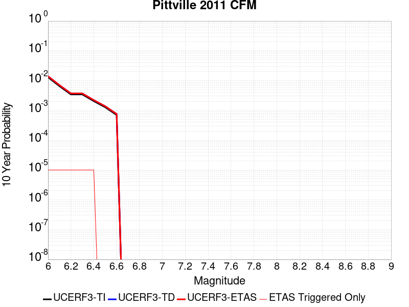 |

| Magnitude | 1 wk TI Prob | 1 wk TD Prob | 1 wk ETAS Prob | 1 wk ETAS/TD Gain | 1 wk ETAS Triggered Only | 1 mo TI Prob | 1 mo TD Prob | 1 mo ETAS Prob | 1 mo ETAS/TD Gain | 1 mo ETAS Triggered Only | 1 yr TI Prob | 1 yr TD Prob | 1 yr ETAS Prob | 1 yr ETAS/TD Gain | 1 yr ETAS Triggered Only | 10 yr TI Prob | 10 yr TD Prob | 10 yr ETAS Prob | 10 yr ETAS/TD Gain | 10 yr ETAS Triggered Only |
|-----|-----|-----|-----|-----|-----|-----|-----|-----|-----|-----|-----|-----|-----|-----|-----|-----|-----|-----|-----|-----|
| 6.0 | 2.5031832E-5 | 2.7056969E-5 | 2.7056969E-5 | 1.0 | 0.0 | 1.0727487E-4 | 1.1595384E-4 | 1.1595384E-4 | 1.0 | 0.0 | 0.001305289 | 0.0014109211 | 0.0014277843 | 1.0119519 | 1.6887043E-5 | 0.012976485 | 0.014029415 | 0.0140460655 | 1.0011868 | 1.6887043E-5 |
| 6.1 | 1.2540113E-5 | 1.3513067E-5 | 1.3513067E-5 | 1.0 | 0.0 | 5.3742235E-5 | 5.7911984E-5 | 5.7911984E-5 | 1.0 | 0.0 | 6.541153E-4 | 7.048728E-4 | 7.217479E-4 | 1.0239407 | 1.6887043E-5 | 0.0065219323 | 0.0070286044 | 0.0070453724 | 1.0023857 | 1.6887043E-5 |
| 6.2 | 6.603218E-6 | 7.107189E-6 | 7.107189E-6 | 1.0 | 0.0 | 2.8299199E-5 | 3.0459063E-5 | 3.0459063E-5 | 1.0 | 0.0 | 3.4448825E-4 | 3.7078248E-4 | 3.8766325E-4 | 1.0455275 | 1.6887043E-5 | 0.0034395473 | 0.0037022792 | 0.0037191038 | 1.0045444 | 1.6887043E-5 |
| 6.3 | 6.603218E-6 | 7.107189E-6 | 7.107189E-6 | 1.0 | 0.0 | 2.8299199E-5 | 3.0459063E-5 | 3.0459063E-5 | 1.0 | 0.0 | 3.4448825E-4 | 3.7078248E-4 | 3.8766325E-4 | 1.0455275 | 1.6887043E-5 | 0.0034395473 | 0.0037022792 | 0.0037191038 | 1.0045444 | 1.6887043E-5 |
| 6.4 | 3.9389015E-6 | 4.239175E-6 | 4.239175E-6 | 1.0 | 0.0 | 1.6880897E-5 | 1.8167784E-5 | 1.8167784E-5 | 1.0 | 0.0 | 2.0550552E-4 | 2.2117342E-4 | 2.3805673E-4 | 1.0763352 | 1.6887043E-5 | 0.0020531558 | 0.002209838 | 0.0022266877 | 1.0076249 | 1.6887043E-5 |
| 6.5 | 2.4533072E-6 | 2.6412686E-6 | 2.6412686E-6 | 1.0 | 0.0 | 1.0514132E-5 | 1.1319685E-5 | 1.1319685E-5 | 1.0 | 0.0 | 1.2800204E-4 | 1.3781038E-4 | 1.3781038E-4 | 1.0 | 0.0 | 0.0012792832 | 0.0013774394 | 0.0013774394 | 1.0 | 0.0 |
| 6.6 | 1.3482367E-6 | 1.452993E-6 | 1.452993E-6 | 1.0 | 0.0 | 5.778144E-6 | 6.2271047E-6 | 6.2271047E-6 | 1.0 | 0.0 | 7.0346636E-5 | 7.58135E-5 | 7.58135E-5 | 1.0 | 0.0 | 7.032437E-4 | 7.5798744E-4 | 7.5798744E-4 | 1.0 | 0.0 |

## Los Osos 2011
*[(top)](#table-of-contents)*

| 1 Week | 1 Month | 1 Year | 10 Year |
|-----|-----|-----|-----|
|  | 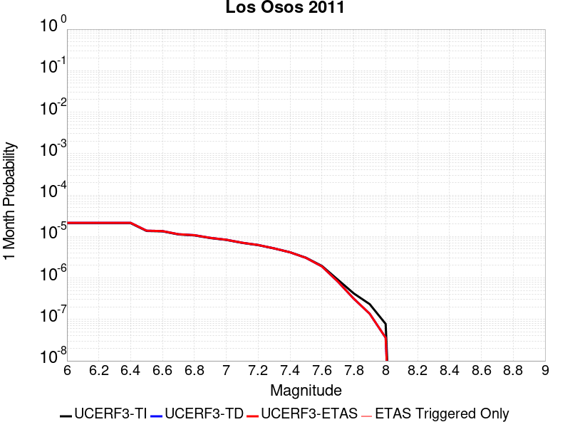 |  | 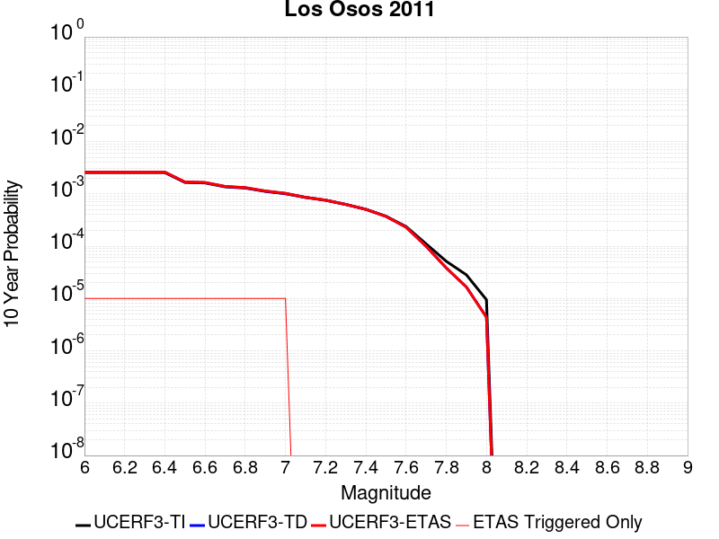 |

| Magnitude | 1 wk TI Prob | 1 wk TD Prob | 1 wk ETAS Prob | 1 wk ETAS/TD Gain | 1 wk ETAS Triggered Only | 1 mo TI Prob | 1 mo TD Prob | 1 mo ETAS Prob | 1 mo ETAS/TD Gain | 1 mo ETAS Triggered Only | 1 yr TI Prob | 1 yr TD Prob | 1 yr ETAS Prob | 1 yr ETAS/TD Gain | 1 yr ETAS Triggered Only | 10 yr TI Prob | 10 yr TD Prob | 10 yr ETAS Prob | 10 yr ETAS/TD Gain | 10 yr ETAS Triggered Only |
|-----|-----|-----|-----|-----|-----|-----|-----|-----|-----|-----|-----|-----|-----|-----|-----|-----|-----|-----|-----|-----|
| 6.0 | 4.8871775E-6 | 4.9814835E-6 | 4.9814835E-6 | 1.0 | 0.0 | 2.0944879E-5 | 2.1349055E-5 | 2.1349055E-5 | 1.0 | 0.0 | 2.5497406E-4 | 2.5989654E-4 | 2.5989654E-4 | 1.0 | 0.0 | 0.002546817 | 0.0025962002 | 0.0026130434 | 1.0064876 | 1.6887043E-5 |
| 6.1 | 4.8871775E-6 | 4.9814835E-6 | 4.9814835E-6 | 1.0 | 0.0 | 2.0944879E-5 | 2.1349055E-5 | 2.1349055E-5 | 1.0 | 0.0 | 2.5497406E-4 | 2.5989654E-4 | 2.5989654E-4 | 1.0 | 0.0 | 0.002546817 | 0.0025962002 | 0.0026130434 | 1.0064876 | 1.6887043E-5 |
| 6.2 | 4.8871775E-6 | 4.9814835E-6 | 4.9814835E-6 | 1.0 | 0.0 | 2.0944879E-5 | 2.1349055E-5 | 2.1349055E-5 | 1.0 | 0.0 | 2.5497406E-4 | 2.5989654E-4 | 2.5989654E-4 | 1.0 | 0.0 | 0.002546817 | 0.0025962002 | 0.0026130434 | 1.0064876 | 1.6887043E-5 |
| 6.3 | 4.8871775E-6 | 4.9814835E-6 | 4.9814835E-6 | 1.0 | 0.0 | 2.0944879E-5 | 2.1349055E-5 | 2.1349055E-5 | 1.0 | 0.0 | 2.5497406E-4 | 2.5989654E-4 | 2.5989654E-4 | 1.0 | 0.0 | 0.002546817 | 0.0025962002 | 0.0026130434 | 1.0064876 | 1.6887043E-5 |
| 6.4 | 4.8871775E-6 | 4.9814835E-6 | 4.9814835E-6 | 1.0 | 0.0 | 2.0944879E-5 | 2.1349055E-5 | 2.1349055E-5 | 1.0 | 0.0 | 2.5497406E-4 | 2.5989654E-4 | 2.5989654E-4 | 1.0 | 0.0 | 0.002546817 | 0.0025962002 | 0.0026130434 | 1.0064876 | 1.6887043E-5 |
| 6.5 | 3.1724062E-6 | 3.223395E-6 | 3.223395E-6 | 1.0 | 0.0 | 1.3595956E-5 | 1.3814477E-5 | 1.3814477E-5 | 1.0 | 0.0 | 1.6551818E-4 | 1.681784E-4 | 1.681784E-4 | 1.0 | 0.0 | 0.0016539496 | 0.0016805249 | 0.0016973835 | 1.0100318 | 1.6887043E-5 |
| 6.6 | 3.1022591E-6 | 3.1511045E-6 | 3.1511045E-6 | 1.0 | 0.0 | 1.3295328E-5 | 1.3504664E-5 | 1.3504664E-5 | 1.0 | 0.0 | 1.618586E-4 | 1.64407E-4 | 1.64407E-4 | 1.0 | 0.0 | 0.0016174077 | 0.0016428665 | 0.0016597259 | 1.0102621 | 1.6887043E-5 |
| 6.7 | 2.611518E-6 | 2.6491832E-6 | 2.6491832E-6 | 1.0 | 0.0 | 1.1192172E-5 | 1.1353593E-5 | 1.1353593E-5 | 1.0 | 0.0 | 1.3625617E-4 | 1.3822126E-4 | 1.3822126E-4 | 1.0 | 0.0 | 0.0013617266 | 0.0013813575 | 0.0013982212 | 1.0122081 | 1.6887043E-5 |
| 6.8 | 2.4780884E-6 | 2.5121592E-6 | 2.5121592E-6 | 1.0 | 0.0 | 1.0620336E-5 | 1.0766353E-5 | 1.0766353E-5 | 1.0 | 0.0 | 1.2929492E-4 | 1.3107249E-4 | 1.3107249E-4 | 1.0 | 0.0 | 0.0012921972 | 0.001309956 | 0.0013268209 | 1.0128744 | 1.6887043E-5 |
| 6.9 | 2.1376322E-6 | 2.1635055E-6 | 2.1635055E-6 | 1.0 | 0.0 | 9.161248E-6 | 9.272134E-6 | 9.272134E-6 | 1.0 | 0.0 | 1.1153249E-4 | 1.128824E-4 | 1.128824E-4 | 1.0 | 0.0 | 0.0011147653 | 0.0011282525 | 0.0011451205 | 1.0149505 | 1.6887043E-5 |
| 7.0 | 1.9282882E-6 | 1.9494585E-6 | 1.9494585E-6 | 1.0 | 0.0 | 8.264066E-6 | 8.354796E-6 | 8.354796E-6 | 1.0 | 0.0 | 1.0061036E-4 | 1.017149E-4 | 1.017149E-4 | 1.0 | 0.0 | 0.0010056482 | 0.0010166848 | 0.0010335547 | 1.016593 | 1.6887043E-5 |
| 7.1 | 1.6353226E-6 | 1.6501118E-6 | 1.6501118E-6 | 1.0 | 0.0 | 7.0085066E-6 | 7.0718884E-6 | 7.0718884E-6 | 1.0 | 0.0 | 8.532523E-5 | 8.609685E-5 | 8.609685E-5 | 1.0 | 0.0 | 8.529247E-4 | 8.6063566E-4 | 8.6063566E-4 | 1.0 | 0.0 |
| 7.2 | 1.4446276E-6 | 1.4553341E-6 | 1.4553341E-6 | 1.0 | 0.0 | 6.191247E-6 | 6.237131E-6 | 6.237131E-6 | 1.0 | 0.0 | 7.537582E-5 | 7.593443E-5 | 7.593443E-5 | 1.0 | 0.0 | 7.535026E-4 | 7.590854E-4 | 7.590854E-4 | 1.0 | 0.0 |
| 7.3 | 1.2014582E-6 | 1.2069073E-6 | 1.2069073E-6 | 1.0 | 0.0 | 5.149096E-6 | 5.1724496E-6 | 5.1724496E-6 | 1.0 | 0.0 | 6.268844E-5 | 6.297276E-5 | 6.297276E-5 | 1.0 | 0.0 | 6.267076E-4 | 6.295495E-4 | 6.295495E-4 | 1.0 | 0.0 |
| 7.4 | 9.707733E-7 | 9.709773E-7 | 9.709773E-7 | 1.0 | 0.0 | 4.16045E-6 | 4.161325E-6 | 4.161325E-6 | 1.0 | 0.0 | 5.0652303E-5 | 5.066295E-5 | 5.066295E-5 | 1.0 | 0.0 | 5.064076E-4 | 5.065143E-4 | 5.065143E-4 | 1.0 | 0.0 |
| 7.5 | 7.174908E-7 | 7.1149134E-7 | 7.1149134E-7 | 1.0 | 0.0 | 3.074957E-6 | 3.0492452E-6 | 3.0492452E-6 | 1.0 | 0.0 | 3.743696E-5 | 3.712393E-5 | 3.712393E-5 | 1.0 | 0.0 | 3.7430652E-4 | 3.7117745E-4 | 3.7117745E-4 | 1.0 | 0.0 |
| 7.6 | 4.5535776E-7 | 4.420792E-7 | 4.420792E-7 | 1.0 | 0.0 | 1.9515319E-6 | 1.8946238E-6 | 1.8946238E-6 | 1.0 | 0.0 | 2.3759641E-5 | 2.3066801E-5 | 2.3066801E-5 | 1.0 | 0.0 | 2.37571E-4 | 2.3064416E-4 | 2.3064416E-4 | 1.0 | 0.0 |
| 7.7 | 2.1173553E-7 | 1.9060796E-7 | 1.9060796E-7 | 1.0 | 0.0 | 9.0743765E-7 | 8.1689103E-7 | 8.1689103E-7 | 1.0 | 0.0 | 1.1047998E-5 | 9.945603E-6 | 9.945603E-6 | 1.0 | 0.0 | 1.1047449E-4 | 9.945161E-5 | 9.945161E-5 | 1.0 | 0.0 |
| 7.8 | 9.873608E-8 | 7.3675665E-8 | 7.3675665E-8 | 1.0 | 0.0 | 4.2315455E-7 | 3.157528E-7 | 3.157528E-7 | 1.0 | 0.0 | 5.1518946E-6 | 3.8442836E-6 | 3.8442836E-6 | 1.0 | 0.0 | 5.1517753E-5 | 3.8442176E-5 | 3.8442176E-5 | 1.0 | 0.0 |
| 7.9 | 5.4399106E-8 | 3.1880155E-8 | 3.1880155E-8 | 1.0 | 0.0 | 2.33139E-7 | 1.3662923E-7 | 1.3662923E-7 | 1.0 | 0.0 | 2.8384638E-6 | 1.6634596E-6 | 1.6634596E-6 | 1.0 | 0.0 | 2.8384275E-5 | 1.6634473E-5 | 1.6634473E-5 | 1.0 | 0.0 |
| 8.0 | 1.817203E-8 | 8.420727E-9 | 8.420727E-9 | 1.0 | 0.0 | 7.7880124E-8 | 3.608883E-8 | 3.608883E-8 | 1.0 | 0.0 | 9.481901E-7 | 4.393814E-7 | 4.393814E-7 | 1.0 | 0.0 | 9.481861E-6 | 4.3938057E-6 | 4.3938057E-6 | 1.0 | 0.0 |

## Breckenridge 2011
*[(top)](#table-of-contents)*

| 1 Week | 1 Month | 1 Year | 10 Year |
|-----|-----|-----|-----|
| 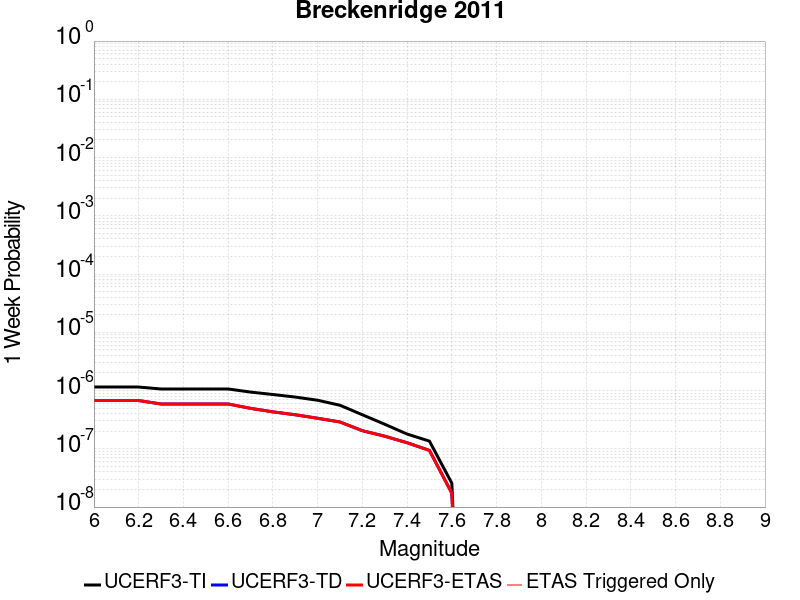 |  | 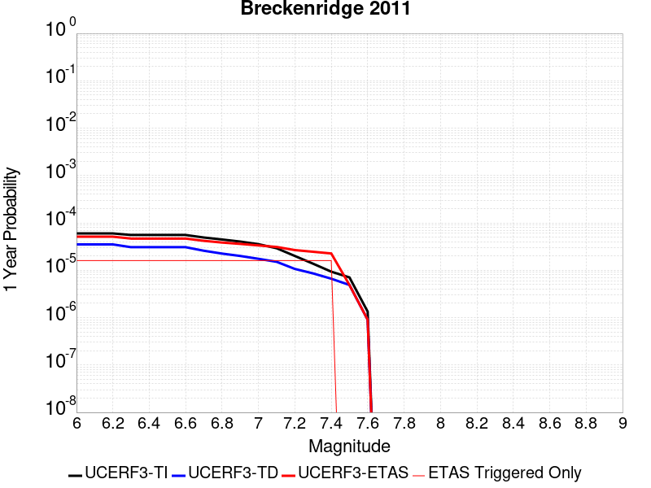 |  |

| Magnitude | 1 wk TI Prob | 1 wk TD Prob | 1 wk ETAS Prob | 1 wk ETAS/TD Gain | 1 wk ETAS Triggered Only | 1 mo TI Prob | 1 mo TD Prob | 1 mo ETAS Prob | 1 mo ETAS/TD Gain | 1 mo ETAS Triggered Only | 1 yr TI Prob | 1 yr TD Prob | 1 yr ETAS Prob | 1 yr ETAS/TD Gain | 1 yr ETAS Triggered Only | 10 yr TI Prob | 10 yr TD Prob | 10 yr ETAS Prob | 10 yr ETAS/TD Gain | 10 yr ETAS Triggered Only |
|-----|-----|-----|-----|-----|-----|-----|-----|-----|-----|-----|-----|-----|-----|-----|-----|-----|-----|-----|-----|-----|
| 6.0 | 1.1490393E-6 | 6.7380773E-7 | 6.7380773E-7 | 1.0 | 0.0 | 4.924445E-6 | 2.8877444E-6 | 2.8877444E-6 | 1.0 | 0.0 | 5.995347E-5 | 3.515774E-5 | 5.204419E-5 | 1.4803053 | 1.6887043E-5 | 5.9937296E-4 | 3.5152383E-4 | 3.6840496E-4 | 1.0480226 | 1.6887043E-5 |
| 6.1 | 1.1490393E-6 | 6.7380773E-7 | 6.7380773E-7 | 1.0 | 0.0 | 4.924445E-6 | 2.8877444E-6 | 2.8877444E-6 | 1.0 | 0.0 | 5.995347E-5 | 3.515774E-5 | 5.204419E-5 | 1.4803053 | 1.6887043E-5 | 5.9937296E-4 | 3.5152383E-4 | 3.6840496E-4 | 1.0480226 | 1.6887043E-5 |
| 6.2 | 1.1490393E-6 | 6.7380773E-7 | 6.7380773E-7 | 1.0 | 0.0 | 4.924445E-6 | 2.8877444E-6 | 2.8877444E-6 | 1.0 | 0.0 | 5.995347E-5 | 3.515774E-5 | 5.204419E-5 | 1.4803053 | 1.6887043E-5 | 5.9937296E-4 | 3.5152383E-4 | 3.6840496E-4 | 1.0480226 | 1.6887043E-5 |
| 6.3 | 1.064617E-6 | 5.886475E-7 | 5.886475E-7 | 1.0 | 0.0 | 4.5626366E-6 | 2.5227728E-6 | 2.5227728E-6 | 1.0 | 0.0 | 5.5548684E-5 | 3.0714335E-5 | 4.760086E-5 | 1.5497929 | 1.6887043E-5 | 5.55348E-4 | 3.0710208E-4 | 3.2398393E-4 | 1.0549715 | 1.6887043E-5 |
| 6.4 | 1.064617E-6 | 5.886475E-7 | 5.886475E-7 | 1.0 | 0.0 | 4.5626366E-6 | 2.5227728E-6 | 2.5227728E-6 | 1.0 | 0.0 | 5.5548684E-5 | 3.0714335E-5 | 4.760086E-5 | 1.5497929 | 1.6887043E-5 | 5.55348E-4 | 3.0710208E-4 | 3.2398393E-4 | 1.0549715 | 1.6887043E-5 |
| 6.5 | 1.064617E-6 | 5.886475E-7 | 5.886475E-7 | 1.0 | 0.0 | 4.5626366E-6 | 2.5227728E-6 | 2.5227728E-6 | 1.0 | 0.0 | 5.5548684E-5 | 3.0714335E-5 | 4.760086E-5 | 1.5497929 | 1.6887043E-5 | 5.55348E-4 | 3.0710208E-4 | 3.2398393E-4 | 1.0549715 | 1.6887043E-5 |
| 6.6 | 1.064617E-6 | 5.886475E-7 | 5.886475E-7 | 1.0 | 0.0 | 4.5626366E-6 | 2.5227728E-6 | 2.5227728E-6 | 1.0 | 0.0 | 5.5548684E-5 | 3.0714335E-5 | 4.760086E-5 | 1.5497929 | 1.6887043E-5 | 5.55348E-4 | 3.0710208E-4 | 3.2398393E-4 | 1.0549715 | 1.6887043E-5 |
| 6.7 | 9.4219524E-7 | 4.954078E-7 | 4.954078E-7 | 1.0 | 0.0 | 4.037973E-6 | 2.1231745E-6 | 2.1231745E-6 | 1.0 | 0.0 | 4.916122E-5 | 2.5849351E-5 | 4.2735956E-5 | 1.65327 | 1.6887043E-5 | 4.9150345E-4 | 2.5846408E-4 | 2.7534677E-4 | 1.0653193 | 1.6887043E-5 |
| 6.8 | 8.556422E-7 | 4.311975E-7 | 4.311975E-7 | 1.0 | 0.0 | 3.667033E-6 | 1.847988E-6 | 1.847988E-6 | 1.0 | 0.0 | 4.464521E-5 | 2.2499025E-5 | 3.9385686E-5 | 1.7505509 | 1.6887043E-5 | 4.4636242E-4 | 2.2496787E-4 | 2.4185111E-4 | 1.0750474 | 1.6887043E-5 |
| 6.9 | 7.7357794E-7 | 3.8420345E-7 | 3.8420345E-7 | 1.0 | 0.0 | 3.3153299E-6 | 1.6465851E-6 | 1.6465851E-6 | 1.0 | 0.0 | 4.0363393E-5 | 2.0046993E-5 | 3.6933696E-5 | 1.842356 | 1.6887043E-5 | 4.035606E-4 | 2.0045215E-4 | 2.1733581E-4 | 1.0842279 | 1.6887043E-5 |
| 7.0 | 6.8172454E-7 | 3.3471417E-7 | 3.3471417E-7 | 1.0 | 0.0 | 2.9216735E-6 | 1.4344886E-6 | 1.4344886E-6 | 1.0 | 0.0 | 3.5570793E-5 | 1.7464761E-5 | 3.435151E-5 | 1.966904 | 1.6887043E-5 | 3.55651E-4 | 1.746341E-4 | 1.915182E-4 | 1.0966827 | 1.6887043E-5 |
| 7.1 | 5.5936397E-7 | 2.890966E-7 | 2.890966E-7 | 1.0 | 0.0 | 2.397272E-6 | 1.2389849E-6 | 1.2389849E-6 | 1.0 | 0.0 | 2.9186394E-5 | 1.5084538E-5 | 3.1971325E-5 | 2.1194766 | 1.6887043E-5 | 2.9182562E-4 | 1.5083532E-4 | 1.6771982E-4 | 1.1119399 | 1.6887043E-5 |
| 7.2 | 3.8420822E-7 | 2.0468339E-7 | 2.0468339E-7 | 1.0 | 0.0 | 1.6466057E-6 | 8.7721423E-7 | 8.7721423E-7 | 1.0 | 0.0 | 2.004724E-5 | 1.0680032E-5 | 2.7566894E-5 | 2.5811622 | 1.6887043E-5 | 2.004543E-4 | 1.0679527E-4 | 1.2368051E-4 | 1.1581085 | 1.6887043E-5 |
| 7.3 | 2.6405158E-7 | 1.647323E-7 | 1.647323E-7 | 1.0 | 0.0 | 1.1316491E-6 | 7.059954E-7 | 7.059954E-7 | 1.0 | 0.0 | 1.37777415E-5 | 8.595461E-6 | 2.5482357E-5 | 2.96463 | 1.6887043E-5 | 1.3776887E-4 | 8.5951346E-5 | 1.0283694E-4 | 1.1964552 | 1.6887043E-5 |
| 7.4 | 1.792114E-7 | 1.2725314E-7 | 1.2725314E-7 | 1.0 | 0.0 | 7.6804866E-7 | 5.4537054E-7 | 5.4537054E-7 | 1.0 | 0.0 | 9.3509525E-6 | 6.6398666E-6 | 2.3526796E-5 | 3.5432637 | 1.6887043E-5 | 9.350559E-5 | 6.639673E-5 | 8.328265E-5 | 1.2543186 | 1.6887043E-5 |
| 7.5 | 1.3548703E-7 | 9.3854034E-8 | 9.3854034E-8 | 1.0 | 0.0 | 5.8065854E-7 | 4.022315E-7 | 4.022315E-7 | 1.0 | 0.0 | 7.0694946E-6 | 4.897158E-6 | 4.897158E-6 | 1.0 | 0.0 | 7.0692695E-5 | 4.8970534E-5 | 4.8970534E-5 | 1.0 | 0.0 |
| 7.6 | 2.572245E-8 | 1.7352555E-8 | 1.7352555E-8 | 1.0 | 0.0 | 1.10239064E-7 | 7.436809E-8 | 7.436809E-8 | 1.0 | 0.0 | 1.3421597E-6 | 9.054312E-7 | 9.054312E-7 | 1.0 | 0.0 | 1.3421517E-5 | 9.05428E-6 | 9.05428E-6 | 1.0 | 0.0 |

## Mount Diablo Thrust South
*[(top)](#table-of-contents)*

| 1 Week | 1 Month | 1 Year | 10 Year |
|-----|-----|-----|-----|
|  |  |  | 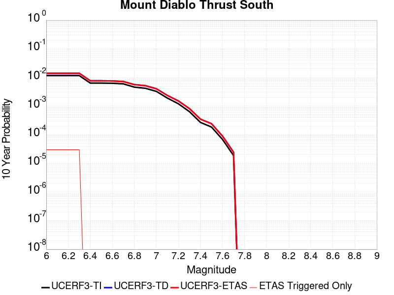 |

| Magnitude | 1 wk TI Prob | 1 wk TD Prob | 1 wk ETAS Prob | 1 wk ETAS/TD Gain | 1 wk ETAS Triggered Only | 1 mo TI Prob | 1 mo TD Prob | 1 mo ETAS Prob | 1 mo ETAS/TD Gain | 1 mo ETAS Triggered Only | 1 yr TI Prob | 1 yr TD Prob | 1 yr ETAS Prob | 1 yr ETAS/TD Gain | 1 yr ETAS Triggered Only | 10 yr TI Prob | 10 yr TD Prob | 10 yr ETAS Prob | 10 yr ETAS/TD Gain | 10 yr ETAS Triggered Only |
|-----|-----|-----|-----|-----|-----|-----|-----|-----|-----|-----|-----|-----|-----|-----|-----|-----|-----|-----|-----|-----|
| 6.0 | 2.2377444E-5 | 2.695623E-5 | 2.695623E-5 | 1.0 | 0.0 | 9.5899806E-5 | 1.1552271E-4 | 1.1552271E-4 | 1.0 | 0.0 | 0.0011669548 | 0.0014057803 | 0.0014226437 | 1.0119957 | 1.6887043E-5 | 0.011608457 | 0.013988447 | 0.0140050985 | 1.0011903 | 1.6887043E-5 |
| 6.1 | 2.2377444E-5 | 2.695623E-5 | 2.695623E-5 | 1.0 | 0.0 | 9.5899806E-5 | 1.1552271E-4 | 1.1552271E-4 | 1.0 | 0.0 | 0.0011669548 | 0.0014057803 | 0.0014226437 | 1.0119957 | 1.6887043E-5 | 0.011608457 | 0.013988447 | 0.0140050985 | 1.0011903 | 1.6887043E-5 |
| 6.2 | 2.2377444E-5 | 2.695623E-5 | 2.695623E-5 | 1.0 | 0.0 | 9.5899806E-5 | 1.1552271E-4 | 1.1552271E-4 | 1.0 | 0.0 | 0.0011669548 | 0.0014057803 | 0.0014226437 | 1.0119957 | 1.6887043E-5 | 0.011608457 | 0.013988447 | 0.0140050985 | 1.0011903 | 1.6887043E-5 |
| 6.3 | 2.2377444E-5 | 2.695623E-5 | 2.695623E-5 | 1.0 | 0.0 | 9.5899806E-5 | 1.1552271E-4 | 1.1552271E-4 | 1.0 | 0.0 | 0.0011669548 | 0.0014057803 | 0.0014226437 | 1.0119957 | 1.6887043E-5 | 0.011608457 | 0.013988447 | 0.0140050985 | 1.0011903 | 1.6887043E-5 |
| 6.4 | 1.2228463E-5 | 1.4747655E-5 | 1.4747655E-5 | 1.0 | 0.0 | 5.2406645E-5 | 6.320278E-5 | 6.320278E-5 | 1.0 | 0.0 | 6.378641E-4 | 7.6923496E-4 | 7.6923496E-4 | 1.0 | 0.0 | 0.0063603627 | 0.0076671084 | 0.0076671084 | 1.0 | 0.0 |
| 6.5 | 1.2228463E-5 | 1.4747655E-5 | 1.4747655E-5 | 1.0 | 0.0 | 5.2406645E-5 | 6.320278E-5 | 6.320278E-5 | 1.0 | 0.0 | 6.378641E-4 | 7.6923496E-4 | 7.6923496E-4 | 1.0 | 0.0 | 0.0063603627 | 0.0076671084 | 0.0076671084 | 1.0 | 0.0 |
| 6.6 | 1.2068118E-5 | 1.4552453E-5 | 1.4552453E-5 | 1.0 | 0.0 | 5.1719482E-5 | 6.2366234E-5 | 6.2366234E-5 | 1.0 | 0.0 | 6.2950276E-4 | 7.590571E-4 | 7.590571E-4 | 1.0 | 0.0 | 0.006277225 | 0.0075660287 | 0.0075660287 | 1.0 | 0.0 |
| 6.7 | 1.1499428E-5 | 1.3875117E-5 | 1.3875117E-5 | 1.0 | 0.0 | 4.9282335E-5 | 5.94635E-5 | 5.94635E-5 | 1.0 | 0.0 | 5.9984723E-4 | 7.237403E-4 | 7.237403E-4 | 1.0 | 0.0 | 0.0059823063 | 0.0072152023 | 0.0072152023 | 1.0 | 0.0 |
| 6.8 | 8.82118E-6 | 1.0830408E-5 | 1.0830408E-5 | 1.0 | 0.0 | 3.780451E-5 | 4.641524E-5 | 4.641524E-5 | 1.0 | 0.0 | 4.601727E-4 | 5.6496455E-4 | 5.6496455E-4 | 1.0 | 0.0 | 0.0045922096 | 0.005635934 | 0.005635934 | 1.0 | 0.0 |
| 6.9 | 8.047112E-6 | 9.9393765E-6 | 9.9393765E-6 | 1.0 | 0.0 | 3.4487166E-5 | 4.259666E-5 | 4.259666E-5 | 1.0 | 0.0 | 4.1980037E-4 | 5.1849615E-4 | 5.1849615E-4 | 1.0 | 0.0 | 0.004190082 | 0.0051734787 | 0.0051734787 | 1.0 | 0.0 |
| 7.0 | 6.2574763E-6 | 7.748453E-6 | 7.748453E-6 | 1.0 | 0.0 | 2.681748E-5 | 3.3207252E-5 | 3.3207252E-5 | 1.0 | 0.0 | 3.264539E-4 | 4.0422694E-4 | 4.0422694E-4 | 1.0 | 0.0 | 0.0032597475 | 0.004035359 | 0.004035359 | 1.0 | 0.0 |
| 7.1 | 3.6485903E-6 | 4.512883E-6 | 4.512883E-6 | 1.0 | 0.0 | 1.5636722E-5 | 1.9340787E-5 | 1.9340787E-5 | 1.0 | 0.0 | 1.9036046E-4 | 2.3544904E-4 | 2.3544904E-4 | 1.0 | 0.0 | 0.0019019748 | 0.0023520947 | 0.0023520947 | 1.0 | 0.0 |
| 7.2 | 2.3034274E-6 | 2.9054847E-6 | 2.9054847E-6 | 1.0 | 0.0 | 9.871795E-6 | 1.2452019E-5 | 1.2452019E-5 | 1.0 | 0.0 | 1.2018247E-4 | 1.5159303E-4 | 1.5159303E-4 | 1.0 | 0.0 | 0.0012011749 | 0.0015149695 | 0.0015149695 | 1.0 | 0.0 |
| 7.3 | 1.224035E-6 | 1.567953E-6 | 1.567953E-6 | 1.0 | 0.0 | 5.245854E-6 | 6.7197816E-6 | 6.7197816E-6 | 1.0 | 0.0 | 6.38664E-5 | 8.181038E-5 | 8.181038E-5 | 1.0 | 0.0 | 6.384805E-4 | 8.1784575E-4 | 8.1784575E-4 | 1.0 | 0.0 |
| 7.4 | 5.1601154E-7 | 6.72323E-7 | 6.72323E-7 | 1.0 | 0.0 | 2.2114762E-6 | 2.8813813E-6 | 2.8813813E-6 | 1.0 | 0.0 | 2.6924388E-5 | 3.508027E-5 | 3.508027E-5 | 1.0 | 0.0 | 2.6921128E-4 | 3.507647E-4 | 3.507647E-4 | 1.0 | 0.0 |
| 7.5 | 3.552894E-7 | 4.6652323E-7 | 4.6652323E-7 | 1.0 | 0.0 | 1.5226678E-6 | 1.9993838E-6 | 1.9993838E-6 | 1.0 | 0.0 | 1.8538323E-5 | 2.434224E-5 | 2.434224E-5 | 1.0 | 0.0 | 1.8536777E-4 | 2.4340794E-4 | 2.4340794E-4 | 1.0 | 0.0 |
| 7.6 | 1.3124082E-7 | 1.7191535E-7 | 1.7191535E-7 | 1.0 | 0.0 | 5.6246057E-7 | 7.367799E-7 | 7.367799E-7 | 1.0 | 0.0 | 6.8479358E-6 | 8.970267E-6 | 8.970267E-6 | 1.0 | 0.0 | 6.8477246E-5 | 8.9703215E-5 | 8.9703215E-5 | 1.0 | 0.0 |
| 7.7 | 3.6193022E-8 | 4.733273E-8 | 4.733273E-8 | 1.0 | 0.0 | 1.5511293E-7 | 2.0285455E-7 | 2.0285455E-7 | 1.0 | 0.0 | 1.8884983E-6 | 2.4697524E-6 | 2.4697524E-6 | 1.0 | 0.0 | 1.8884823E-5 | 2.4697838E-5 | 2.4697838E-5 | 1.0 | 0.0 |

## Rocky Ledge 2011 CFM
*[(top)](#table-of-contents)*

| 1 Week | 1 Month | 1 Year | 10 Year |
|-----|-----|-----|-----|
|  |  |  |  |

| Magnitude | 1 wk TI Prob | 1 wk TD Prob | 1 wk ETAS Prob | 1 wk ETAS/TD Gain | 1 wk ETAS Triggered Only | 1 mo TI Prob | 1 mo TD Prob | 1 mo ETAS Prob | 1 mo ETAS/TD Gain | 1 mo ETAS Triggered Only | 1 yr TI Prob | 1 yr TD Prob | 1 yr ETAS Prob | 1 yr ETAS/TD Gain | 1 yr ETAS Triggered Only | 10 yr TI Prob | 10 yr TD Prob | 10 yr ETAS Prob | 10 yr ETAS/TD Gain | 10 yr ETAS Triggered Only |
|-----|-----|-----|-----|-----|-----|-----|-----|-----|-----|-----|-----|-----|-----|-----|-----|-----|-----|-----|-----|-----|
| 6.0 | 8.7550525E-6 | 9.486605E-6 | 9.486605E-6 | 1.0 | 0.0 | 3.7521113E-5 | 4.0656712E-5 | 4.0656712E-5 | 1.0 | 0.0 | 4.567238E-4 | 4.949655E-4 | 5.1184424E-4 | 1.0341008 | 1.6887043E-5 | 0.0045578624 | 0.0049467194 | 0.004963523 | 1.0033969 | 1.6887043E-5 |
| 6.1 | 8.7550525E-6 | 9.486605E-6 | 9.486605E-6 | 1.0 | 0.0 | 3.7521113E-5 | 4.0656712E-5 | 4.0656712E-5 | 1.0 | 0.0 | 4.567238E-4 | 4.949655E-4 | 4.949655E-4 | 1.0 | 0.0 | 0.0045578624 | 0.0049467194 | 0.0049467194 | 1.0 | 0.0 |
| 6.2 | 7.442295E-6 | 8.06304E-6 | 8.06304E-6 | 1.0 | 0.0 | 3.189516E-5 | 3.4555887E-5 | 3.4555887E-5 | 1.0 | 0.0 | 3.8825438E-4 | 4.2071793E-4 | 4.2071793E-4 | 1.0 | 0.0 | 0.0038757676 | 0.004207179 | 0.004207179 | 1.0 | 0.0 |

## Calaveras (Central) 2011 CFM
*[(top)](#table-of-contents)*

| 1 Week | 1 Month | 1 Year | 10 Year |
|-----|-----|-----|-----|
|  |  |  |  |

| Magnitude | 1 wk TI Prob | 1 wk TD Prob | 1 wk ETAS Prob | 1 wk ETAS/TD Gain | 1 wk ETAS Triggered Only | 1 mo TI Prob | 1 mo TD Prob | 1 mo ETAS Prob | 1 mo ETAS/TD Gain | 1 mo ETAS Triggered Only | 1 yr TI Prob | 1 yr TD Prob | 1 yr ETAS Prob | 1 yr ETAS/TD Gain | 1 yr ETAS Triggered Only | 10 yr TI Prob | 10 yr TD Prob | 10 yr ETAS Prob | 10 yr ETAS/TD Gain | 10 yr ETAS Triggered Only |
|-----|-----|-----|-----|-----|-----|-----|-----|-----|-----|-----|-----|-----|-----|-----|-----|-----|-----|-----|-----|-----|
| 6.0 | 1.5010907E-4 | 2.481574E-4 | 2.481574E-4 | 1.0 | 0.0 | 6.4316596E-4 | 0.0010621005 | 0.0010621005 | 1.0 | 0.0 | 0.0078024664 | 0.012850073 | 0.012866744 | 1.0012972 | 1.6887043E-5 | 0.07534136 | 0.120401435 | 0.12041628 | 1.0001234 | 1.6887043E-5 |
| 6.1 | 1.4521465E-4 | 2.397987E-4 | 2.397987E-4 | 1.0 | 0.0 | 6.222001E-4 | 0.0010263061 | 0.0010263061 | 1.0 | 0.0 | 0.0075490056 | 0.012419341 | 0.012436018 | 1.0013429 | 1.6887043E-5 | 0.07297657 | 0.11667323 | 0.11668815 | 1.0001278 | 1.6887043E-5 |
| 6.2 | 1.429998E-4 | 2.3911126E-4 | 2.3911126E-4 | 1.0 | 0.0 | 6.127123E-4 | 0.0010233623 | 0.0010233623 | 1.0 | 0.0 | 0.007434286 | 0.01238394 | 0.012400618 | 1.0013467 | 1.6887043E-5 | 0.07190444 | 0.1163272 | 0.11634212 | 1.0001283 | 1.6887043E-5 |
| 6.3 | 1.3536277E-4 | 2.3242626E-4 | 2.3242626E-4 | 1.0 | 0.0 | 5.799972E-4 | 9.947343E-4 | 9.947343E-4 | 1.0 | 0.0 | 0.0070386264 | 0.012040132 | 0.012056815 | 1.0013857 | 1.6887043E-5 | 0.0681982 | 0.11323977 | 0.11325475 | 1.0001322 | 1.6887043E-5 |
| 6.4 | 1.2993296E-4 | 2.2666177E-4 | 2.2666177E-4 | 1.0 | 0.0 | 5.5673666E-4 | 9.700479E-4 | 9.700479E-4 | 1.0 | 0.0 | 0.006757223 | 0.011742937 | 0.011759627 | 1.0014212 | 1.6887043E-5 | 0.06555412 | 0.11051771 | 0.11053273 | 1.0001359 | 1.6887043E-5 |
| 6.5 | 1.0498927E-4 | 1.7981697E-4 | 1.7981697E-4 | 1.0 | 0.0 | 4.498764E-4 | 7.704157E-4 | 7.704157E-4 | 1.0 | 0.0 | 0.005463498 | 0.00933924 | 0.00935597 | 1.0017912 | 1.6887043E-5 | 0.053311124 | 0.089199215 | 0.08921459 | 1.0001724 | 1.6887043E-5 |
| 6.6 | 1.0157505E-4 | 1.7469203E-4 | 1.7469203E-4 | 1.0 | 0.0 | 4.35249E-4 | 7.484645E-4 | 7.484645E-4 | 1.0 | 0.0 | 0.0052862884 | 0.009074297 | 0.009091031 | 1.001844 | 1.6887043E-5 | 0.05162293 | 0.08677671 | 0.086792134 | 1.0001777 | 1.6887043E-5 |
| 6.7 | 9.660386E-5 | 1.6728524E-4 | 1.6728524E-4 | 1.0 | 0.0 | 4.1395082E-4 | 7.1673887E-4 | 7.1673887E-4 | 1.0 | 0.0 | 0.0050282106 | 0.008691208 | 0.008707949 | 1.0019261 | 1.6887043E-5 | 0.049159497 | 0.083266065 | 0.08328155 | 1.000186 | 1.6887043E-5 |
| 6.8 | 9.089927E-5 | 1.5643016E-4 | 1.5643016E-4 | 1.0 | 0.0 | 3.8951015E-4 | 6.702439E-4 | 6.702439E-4 | 1.0 | 0.0 | 0.0047319788 | 0.008129478 | 0.008146228 | 1.0020604 | 1.6887043E-5 | 0.046324775 | 0.078159414 | 0.078174986 | 1.0001992 | 1.6887043E-5 |
| 6.9 | 7.353187E-5 | 1.2295354E-4 | 1.2295354E-4 | 1.0 | 0.0 | 3.150985E-4 | 5.2683795E-4 | 5.2683795E-4 | 1.0 | 0.0 | 0.0038295772 | 0.006395508 | 0.006395508 | 1.0 | 0.0 | 0.037642512 | 0.062187865 | 0.062187865 | 1.0 | 0.0 |
| 7.0 | 5.746064E-5 | 9.3887444E-5 | 9.3887444E-5 | 1.0 | 0.0 | 2.4623662E-4 | 4.0231308E-4 | 4.0231308E-4 | 1.0 | 0.0 | 0.0029938098 | 0.004887232 | 0.004887232 | 1.0 | 0.0 | 0.02953797 | 0.04798685 | 0.04798685 | 1.0 | 0.0 |
| 7.1 | 4.9557195E-5 | 8.052461E-5 | 8.052461E-5 | 1.0 | 0.0 | 2.123707E-4 | 3.4506017E-4 | 3.4506017E-4 | 1.0 | 0.0 | 0.0025825473 | 0.0041930773 | 0.0041930773 | 1.0 | 0.0 | 0.0255274 | 0.041373078 | 0.041373078 | 1.0 | 0.0 |
| 7.2 | 3.687595E-5 | 5.9524526E-5 | 5.9524526E-5 | 1.0 | 0.0 | 1.5803022E-4 | 2.5508032E-4 | 2.5508032E-4 | 1.0 | 0.0 | 0.0019223199 | 0.0031012094 | 0.0031012094 | 1.0 | 0.0 | 0.01905776 | 0.030883716 | 0.030883716 | 1.0 | 0.0 |
| 7.3 | 2.5846984E-5 | 4.247213E-5 | 4.247213E-5 | 1.0 | 0.0 | 1.1076809E-4 | 1.8201082E-4 | 1.8201082E-4 | 1.0 | 0.0 | 0.0013477671 | 0.002213747 | 0.002213747 | 1.0 | 0.0 | 0.013396223 | 0.02217554 | 0.02217554 | 1.0 | 0.0 |
| 7.4 | 1.7747854E-5 | 2.9936204E-5 | 2.9936204E-5 | 1.0 | 0.0 | 7.6060016E-5 | 1.2829172E-4 | 1.2829172E-4 | 1.0 | 0.0 | 9.2563726E-4 | 0.0015608355 | 0.0015608355 | 1.0 | 0.0 | 0.009217911 | 0.015709236 | 0.015709236 | 1.0 | 0.0 |
| 7.5 | 1.4883479E-5 | 2.6243379E-5 | 2.6243379E-5 | 1.0 | 0.0 | 6.378478E-5 | 1.1246678E-4 | 1.1246678E-4 | 1.0 | 0.0 | 7.76303E-4 | 0.0013684258 | 0.0013684258 | 1.0 | 0.0 | 0.0077359667 | 0.013802425 | 0.013802425 | 1.0 | 0.0 |
| 7.6 | 8.166975E-6 | 1.4963478E-5 | 1.4963478E-5 | 1.0 | 0.0 | 3.5000852E-5 | 6.412763E-5 | 6.412763E-5 | 1.0 | 0.0 | 4.2605202E-4 | 7.804755E-4 | 7.804755E-4 | 1.0 | 0.0 | 0.004252361 | 0.00793984 | 0.00793984 | 1.0 | 0.0 |
| 7.7 | 3.3858064E-6 | 6.253914E-6 | 6.253914E-6 | 1.0 | 0.0 | 1.4510518E-5 | 2.6802214E-5 | 2.6802214E-5 | 1.0 | 0.0 | 1.7665124E-4 | 3.2626814E-4 | 3.2626814E-4 | 1.0 | 0.0 | 0.0017651088 | 0.0033882293 | 0.0033882293 | 1.0 | 0.0 |
| 7.8 | 2.7721615E-6 | 5.3663807E-6 | 5.3663807E-6 | 1.0 | 0.0 | 1.1880637E-5 | 2.2998573E-5 | 2.2998573E-5 | 1.0 | 0.0 | 1.4463716E-4 | 2.799717E-4 | 2.799717E-4 | 1.0 | 0.0 | 0.0014454306 | 0.0029074624 | 0.0029074624 | 1.0 | 0.0 |
| 7.9 | 1.9736292E-6 | 4.1284193E-6 | 4.1284193E-6 | 1.0 | 0.0 | 8.4583835E-6 | 1.7693106E-5 | 1.7693106E-5 | 1.0 | 0.0 | 1.0297595E-4 | 2.1539231E-4 | 2.1539231E-4 | 1.0 | 0.0 | 0.0010292825 | 0.0022236116 | 0.0022236116 | 1.0 | 0.0 |
| 8.0 | 1.1767289E-6 | 2.5544743E-6 | 2.5544743E-6 | 1.0 | 0.0 | 5.0431145E-6 | 1.0947701E-5 | 1.0947701E-5 | 1.0 | 0.0 | 6.139818E-5 | 1.3328013E-4 | 1.3328013E-4 | 1.0 | 0.0 | 6.1381224E-4 | 0.0013660848 | 0.0013660848 | 1.0 | 0.0 |
| 8.1 | 7.5112825E-7 | 1.5409794E-6 | 1.5409794E-6 | 1.0 | 0.0 | 3.2191172E-6 | 6.6041807E-6 | 6.6041807E-6 | 1.0 | 0.0 | 3.9192048E-5 | 8.0402955E-5 | 8.0402955E-5 | 1.0 | 0.0 | 3.9185135E-4 | 8.235564E-4 | 8.235564E-4 | 1.0 | 0.0 |

## Superstition Hills
*[(top)](#table-of-contents)*

| 1 Week | 1 Month | 1 Year | 10 Year |
|-----|-----|-----|-----|
|  |  |  | 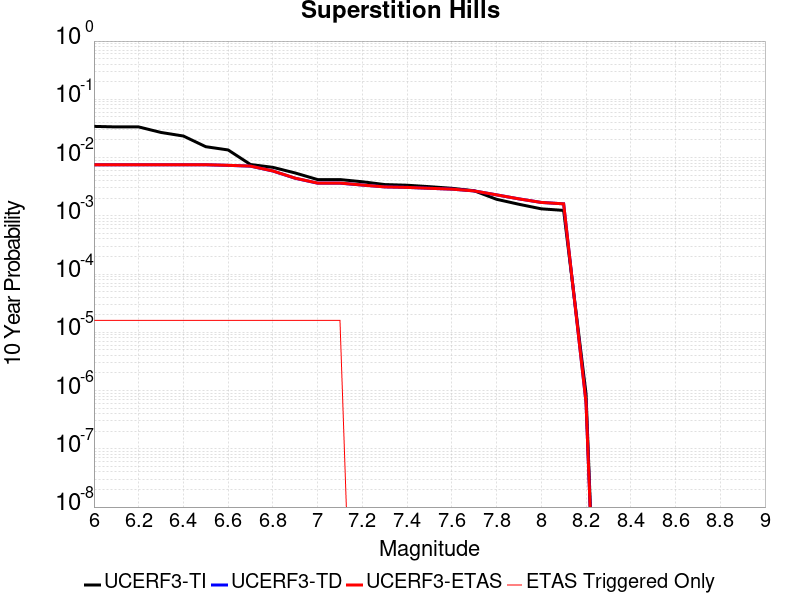 |

| Magnitude | 1 wk TI Prob | 1 wk TD Prob | 1 wk ETAS Prob | 1 wk ETAS/TD Gain | 1 wk ETAS Triggered Only | 1 mo TI Prob | 1 mo TD Prob | 1 mo ETAS Prob | 1 mo ETAS/TD Gain | 1 mo ETAS Triggered Only | 1 yr TI Prob | 1 yr TD Prob | 1 yr ETAS Prob | 1 yr ETAS/TD Gain | 1 yr ETAS Triggered Only | 10 yr TI Prob | 10 yr TD Prob | 10 yr ETAS Prob | 10 yr ETAS/TD Gain | 10 yr ETAS Triggered Only |
|-----|-----|-----|-----|-----|-----|-----|-----|-----|-----|-----|-----|-----|-----|-----|-----|-----|-----|-----|-----|-----|
| 6.0 | 6.6865185E-5 | 1.41376995E-5 | 1.41376995E-5 | 1.0 | 0.0 | 2.8653358E-4 | 6.0588824E-5 | 6.0588824E-5 | 1.0 | 0.0 | 0.0034829667 | 7.374355E-4 | 7.374355E-4 | 1.0 | 0.0 | 0.03428881 | 0.0075204074 | 0.0075371675 | 1.0022286 | 1.6887043E-5 |
| 6.1 | 6.544851E-5 | 1.41376995E-5 | 1.41376995E-5 | 1.0 | 0.0 | 2.8046346E-4 | 6.0588824E-5 | 6.0588824E-5 | 1.0 | 0.0 | 0.0034092965 | 7.374355E-4 | 7.374355E-4 | 1.0 | 0.0 | 0.033574644 | 0.007520407 | 0.007537167 | 1.0022286 | 1.6887043E-5 |
| 6.2 | 6.544851E-5 | 1.41376995E-5 | 1.41376995E-5 | 1.0 | 0.0 | 2.8046346E-4 | 6.0588824E-5 | 6.0588824E-5 | 1.0 | 0.0 | 0.0034092965 | 7.374355E-4 | 7.374355E-4 | 1.0 | 0.0 | 0.033574644 | 0.007520407 | 0.007537167 | 1.0022286 | 1.6887043E-5 |
| 6.3 | 5.2402065E-5 | 1.4137698E-5 | 1.4137698E-5 | 1.0 | 0.0 | 2.2456095E-4 | 6.058882E-5 | 6.058882E-5 | 1.0 | 0.0 | 0.0027306017 | 7.374354E-4 | 7.374354E-4 | 1.0 | 0.0 | 0.02697292 | 0.007520402 | 0.0075371615 | 1.0022286 | 1.6887043E-5 |
| 6.4 | 4.542238E-5 | 1.4137698E-5 | 1.4137698E-5 | 1.0 | 0.0 | 1.9465282E-4 | 6.0588816E-5 | 6.0588816E-5 | 1.0 | 0.0 | 0.0023673223 | 7.3743536E-4 | 7.3743536E-4 | 1.0 | 0.0 | 0.023422617 | 0.0075203986 | 0.0075371587 | 1.0022286 | 1.6887043E-5 |
| 6.5 | 2.9672969E-5 | 1.4137696E-5 | 1.4137696E-5 | 1.0 | 0.0 | 1.2716366E-4 | 6.058881E-5 | 6.058881E-5 | 1.0 | 0.0 | 0.0015471181 | 7.374353E-4 | 7.374353E-4 | 1.0 | 0.0 | 0.015363912 | 0.007520392 | 0.007537152 | 1.0022286 | 1.6887043E-5 |
| 6.6 | 2.6056105E-5 | 1.3803458E-5 | 1.3803458E-5 | 1.0 | 0.0 | 1.1166424E-4 | 5.9156428E-5 | 5.9156428E-5 | 1.0 | 0.0 | 0.0013586642 | 7.200076E-4 | 7.200076E-4 | 1.0 | 0.0 | 0.013503874 | 0.0073448285 | 0.007361592 | 1.0022823 | 1.6887043E-5 |
| 6.7 | 1.4611248E-5 | 1.3383359E-5 | 1.3383359E-5 | 1.0 | 0.0 | 6.261813E-5 | 5.7356083E-5 | 5.7356083E-5 | 1.0 | 0.0 | 7.6210906E-4 | 6.981025E-4 | 6.981025E-4 | 1.0 | 0.0 | 0.0075950073 | 0.00712602 | 0.0071427864 | 1.0023528 | 1.6887043E-5 |
| 6.8 | 1.30607E-5 | 1.09787925E-5 | 1.09787925E-5 | 1.0 | 0.0 | 5.597323E-5 | 4.705117E-5 | 4.705117E-5 | 1.0 | 0.0 | 6.8126095E-4 | 5.7270617E-4 | 5.7270617E-4 | 1.0 | 0.0 | 0.006791762 | 0.00587438 | 0.005891168 | 1.0028578 | 1.6887043E-5 |
| 6.9 | 1.0443096E-5 | 8.195349E-6 | 8.195349E-6 | 1.0 | 0.0 | 4.4755358E-5 | 3.5122466E-5 | 3.5122466E-5 | 1.0 | 0.0 | 5.447602E-4 | 4.2753448E-4 | 4.2753448E-4 | 1.0 | 0.0 | 0.005434267 | 0.0044094524 | 0.004426265 | 1.0038129 | 1.6887043E-5 |
| 7.0 | 8.045912E-6 | 6.739692E-6 | 6.739692E-6 | 1.0 | 0.0 | 3.4482026E-5 | 2.888408E-5 | 2.888408E-5 | 1.0 | 0.0 | 4.197378E-4 | 3.5160795E-4 | 3.5160795E-4 | 1.0 | 0.0 | 0.0041894587 | 0.0036334093 | 0.003650235 | 1.0046308 | 1.6887043E-5 |
| 7.1 | 8.045912E-6 | 6.739692E-6 | 6.739692E-6 | 1.0 | 0.0 | 3.4482026E-5 | 2.888408E-5 | 2.888408E-5 | 1.0 | 0.0 | 4.197378E-4 | 3.5160795E-4 | 3.5160795E-4 | 1.0 | 0.0 | 0.0041894587 | 0.0036334093 | 0.003650235 | 1.0046308 | 1.6887043E-5 |
| 7.2 | 7.375506E-6 | 6.2466297E-6 | 6.2466297E-6 | 1.0 | 0.0 | 3.1608928E-5 | 2.6771E-5 | 2.6771E-5 | 1.0 | 0.0 | 3.8477074E-4 | 3.2588904E-4 | 3.2588904E-4 | 1.0 | 0.0 | 0.003841052 | 0.003373887 | 0.003373887 | 1.0 | 0.0 |
| 7.3 | 6.6063913E-6 | 5.7990574E-6 | 5.7990574E-6 | 1.0 | 0.0 | 2.8312797E-5 | 2.485287E-5 | 2.485287E-5 | 1.0 | 0.0 | 3.446538E-4 | 3.025424E-4 | 3.025424E-4 | 1.0 | 0.0 | 0.0034411973 | 0.003138153 | 0.003138153 | 1.0 | 0.0 |
| 7.4 | 6.4313126E-6 | 5.680481E-6 | 5.680481E-6 | 1.0 | 0.0 | 2.7562477E-5 | 2.4344696E-5 | 2.4344696E-5 | 1.0 | 0.0 | 3.355215E-4 | 2.9635706E-4 | 2.9635706E-4 | 1.0 | 0.0 | 0.0033501536 | 0.0030759154 | 0.0030759154 | 1.0 | 0.0 |
| 7.5 | 6.0742927E-6 | 5.4763104E-6 | 5.4763104E-6 | 1.0 | 0.0 | 2.6032423E-5 | 2.3469694E-5 | 2.3469694E-5 | 1.0 | 0.0 | 3.1689866E-4 | 2.8570674E-4 | 2.8570674E-4 | 1.0 | 0.0 | 0.0031644711 | 0.002967756 | 0.002967756 | 1.0 | 0.0 |
| 7.6 | 5.6987187E-6 | 5.294521E-6 | 5.294521E-6 | 1.0 | 0.0 | 2.4422852E-5 | 2.269061E-5 | 2.269061E-5 | 1.0 | 0.0 | 2.9730765E-4 | 2.7622381E-4 | 2.7622381E-4 | 1.0 | 0.0 | 0.002969102 | 0.0028710118 | 0.0028710118 | 1.0 | 0.0 |
| 7.7 | 5.1658035E-6 | 4.925535E-6 | 4.925535E-6 | 1.0 | 0.0 | 2.2138971E-5 | 2.1109268E-5 | 2.1109268E-5 | 1.0 | 0.0 | 2.6950863E-4 | 2.5697565E-4 | 2.5697565E-4 | 1.0 | 0.0 | 0.00269182 | 0.0026760625 | 0.0026760625 | 1.0 | 0.0 |
| 7.8 | 3.6864697E-6 | 4.1964995E-6 | 4.1964995E-6 | 1.0 | 0.0 | 1.579906E-5 | 1.7984876E-5 | 1.7984876E-5 | 1.0 | 0.0 | 1.9233658E-4 | 2.1894433E-4 | 2.1894433E-4 | 1.0 | 0.0 | 0.0019217018 | 0.0022892624 | 0.0022892624 | 1.0 | 0.0 |
| 7.9 | 3.0265903E-6 | 3.5637288E-6 | 3.5637288E-6 | 1.0 | 0.0 | 1.2971037E-5 | 1.5273037E-5 | 1.5273037E-5 | 1.0 | 0.0 | 1.5791094E-4 | 1.859338E-4 | 1.859338E-4 | 1.0 | 0.0 | 0.0015779877 | 0.0019534735 | 0.0019534735 | 1.0 | 0.0 |
| 8.0 | 2.5271493E-6 | 3.0867361E-6 | 3.0867361E-6 | 1.0 | 0.0 | 1.0830595E-5 | 1.3228804E-5 | 1.3228804E-5 | 1.0 | 0.0 | 1.3185451E-4 | 1.610492E-4 | 1.610492E-4 | 1.0 | 0.0 | 0.0013177631 | 0.0016973554 | 0.0016973554 | 1.0 | 0.0 |
| 8.1 | 2.3749135E-6 | 2.917377E-6 | 2.917377E-6 | 1.0 | 0.0 | 1.0178161E-5 | 1.25029865E-5 | 1.25029865E-5 | 1.0 | 0.0 | 1.2391206E-4 | 1.5221364E-4 | 1.5221364E-4 | 1.0 | 0.0 | 0.0012384299 | 0.001604949 | 0.001604949 | 1.0 | 0.0 |
| 8.2 | 1.7186406E-9 | 1.1440594E-9 | 1.1440594E-9 | 1.0 | 0.0 | 7.3656024E-9 | 4.9031117E-9 | 4.9031117E-9 | 1.0 | 0.0 | 8.9676206E-8 | 5.969538E-8 | 5.969538E-8 | 1.0 | 0.0 | 8.9676166E-7 | 6.389059E-7 | 6.389059E-7 | 1.0 | 0.0 |

## Elysian Park (Lower CFM)
*[(top)](#table-of-contents)*

| 1 Week | 1 Month | 1 Year | 10 Year |
|-----|-----|-----|-----|
| 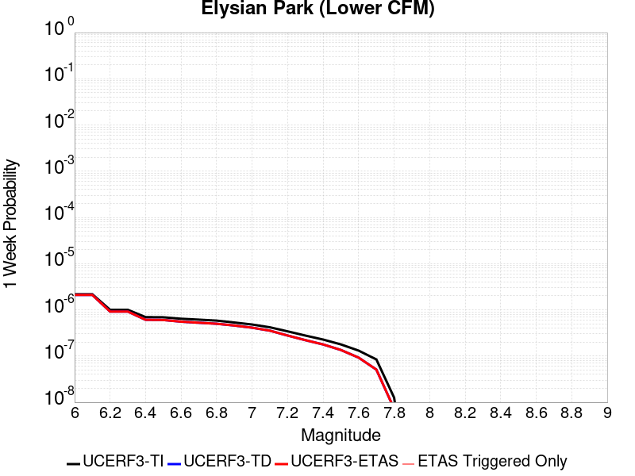 | 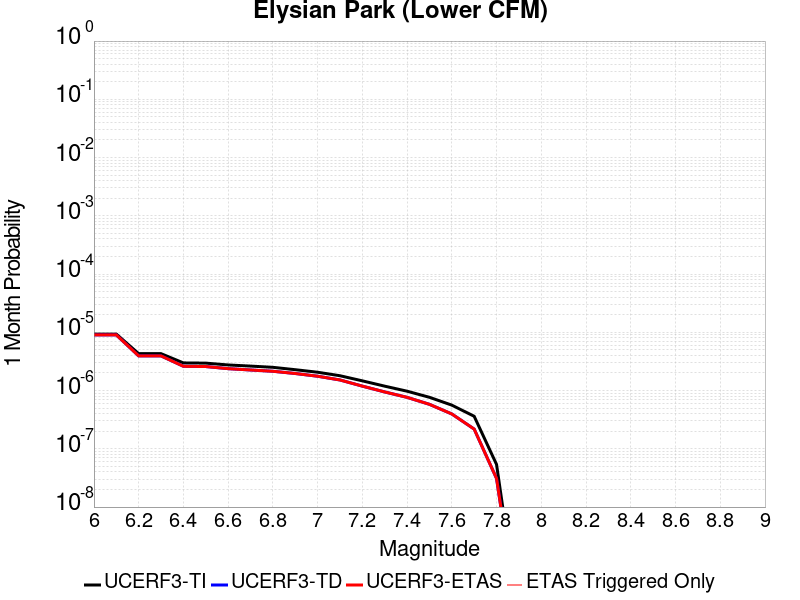 |  | 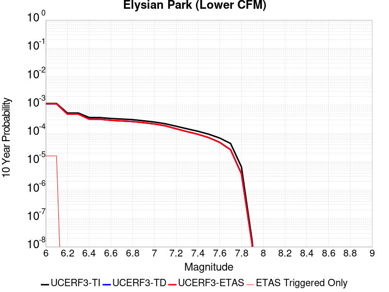 |

| Magnitude | 1 wk TI Prob | 1 wk TD Prob | 1 wk ETAS Prob | 1 wk ETAS/TD Gain | 1 wk ETAS Triggered Only | 1 mo TI Prob | 1 mo TD Prob | 1 mo ETAS Prob | 1 mo ETAS/TD Gain | 1 mo ETAS Triggered Only | 1 yr TI Prob | 1 yr TD Prob | 1 yr ETAS Prob | 1 yr ETAS/TD Gain | 1 yr ETAS Triggered Only | 10 yr TI Prob | 10 yr TD Prob | 10 yr ETAS Prob | 10 yr ETAS/TD Gain | 10 yr ETAS Triggered Only |
|-----|-----|-----|-----|-----|-----|-----|-----|-----|-----|-----|-----|-----|-----|-----|-----|-----|-----|-----|-----|-----|
| 6.0 | 2.1766498E-6 | 2.10379E-6 | 2.10379E-6 | 1.0 | 0.0 | 9.328466E-6 | 9.016219E-6 | 9.016219E-6 | 1.0 | 0.0 | 1.1356815E-4 | 1.09768385E-4 | 1.09768385E-4 | 1.0 | 0.0 | 0.0011351013 | 0.0010972836 | 0.0011141521 | 1.015373 | 1.6887043E-5 |
| 6.1 | 2.1766498E-6 | 2.10379E-6 | 2.10379E-6 | 1.0 | 0.0 | 9.328466E-6 | 9.016219E-6 | 9.016219E-6 | 1.0 | 0.0 | 1.1356815E-4 | 1.09768385E-4 | 1.09768385E-4 | 1.0 | 0.0 | 0.0011351013 | 0.0010972836 | 0.0011141521 | 1.015373 | 1.6887043E-5 |
| 6.2 | 1.0031182E-6 | 9.1862177E-7 | 9.1862177E-7 | 1.0 | 0.0 | 4.299071E-6 | 3.9369447E-6 | 3.9369447E-6 | 1.0 | 0.0 | 5.2339932E-5 | 4.793135E-5 | 4.793135E-5 | 1.0 | 0.0 | 5.2327604E-4 | 4.7921992E-4 | 4.7921992E-4 | 1.0 | 0.0 |
| 6.3 | 1.0031182E-6 | 9.1862177E-7 | 9.1862177E-7 | 1.0 | 0.0 | 4.299071E-6 | 3.9369447E-6 | 3.9369447E-6 | 1.0 | 0.0 | 5.2339932E-5 | 4.793135E-5 | 4.793135E-5 | 1.0 | 0.0 | 5.2327604E-4 | 4.7921992E-4 | 4.7921992E-4 | 1.0 | 0.0 |
| 6.4 | 6.9606244E-7 | 6.091946E-7 | 6.091946E-7 | 1.0 | 0.0 | 2.9831212E-6 | 2.6108314E-6 | 2.6108314E-6 | 1.0 | 0.0 | 3.6318896E-5 | 3.178641E-5 | 3.178641E-5 | 1.0 | 0.0 | 3.6312963E-4 | 3.178189E-4 | 3.178189E-4 | 1.0 | 0.0 |
| 6.5 | 6.901879E-7 | 6.03263E-7 | 6.03263E-7 | 1.0 | 0.0 | 2.9579448E-6 | 2.5854101E-6 | 2.5854101E-6 | 1.0 | 0.0 | 3.6012385E-5 | 3.1476917E-5 | 3.1476917E-5 | 1.0 | 0.0 | 3.600655E-4 | 3.147248E-4 | 3.147248E-4 | 1.0 | 0.0 |
| 6.6 | 6.4198554E-7 | 5.5466126E-7 | 5.5466126E-7 | 1.0 | 0.0 | 2.7513638E-6 | 2.3771174E-6 | 2.3771174E-6 | 1.0 | 0.0 | 3.3497337E-5 | 2.8941022E-5 | 2.8941022E-5 | 1.0 | 0.0 | 3.349229E-4 | 2.893727E-4 | 2.893727E-4 | 1.0 | 0.0 |
| 6.7 | 6.138733E-7 | 5.26342E-7 | 5.26342E-7 | 1.0 | 0.0 | 2.6308828E-6 | 2.2557495E-6 | 2.2557495E-6 | 1.0 | 0.0 | 3.203053E-5 | 2.7463404E-5 | 2.7463404E-5 | 1.0 | 0.0 | 3.2025913E-4 | 2.7460023E-4 | 2.7460023E-4 | 1.0 | 0.0 |
| 6.8 | 5.84778E-7 | 5.00294E-7 | 5.00294E-7 | 1.0 | 0.0 | 2.506189E-6 | 2.1441151E-6 | 2.1441151E-6 | 1.0 | 0.0 | 3.0512423E-5 | 2.6104291E-5 | 2.6104291E-5 | 1.0 | 0.0 | 3.0508233E-4 | 2.6101235E-4 | 2.6101235E-4 | 1.0 | 0.0 |
| 6.9 | 5.322785E-7 | 4.5800772E-7 | 4.5800772E-7 | 1.0 | 0.0 | 2.2811914E-6 | 1.9628887E-6 | 1.9628887E-6 | 1.0 | 0.0 | 2.7773152E-5 | 2.3897908E-5 | 2.3897908E-5 | 1.0 | 0.0 | 2.7769682E-4 | 2.389535E-4 | 2.389535E-4 | 1.0 | 0.0 |
| 7.0 | 4.8147206E-7 | 4.1124116E-7 | 4.1124116E-7 | 1.0 | 0.0 | 2.06345E-6 | 1.7624608E-6 | 1.7624608E-6 | 1.0 | 0.0 | 2.5122214E-5 | 2.145775E-5 | 2.145775E-5 | 1.0 | 0.0 | 2.5119373E-4 | 2.1455686E-4 | 2.1455686E-4 | 1.0 | 0.0 |
| 7.1 | 4.1932955E-7 | 3.5455713E-7 | 3.5455713E-7 | 1.0 | 0.0 | 1.7971255E-6 | 1.5195296E-6 | 1.5195296E-6 | 1.0 | 0.0 | 2.1879783E-5 | 1.8500115E-5 | 1.8500115E-5 | 1.0 | 0.0 | 2.1877629E-4 | 1.8498581E-4 | 1.8498581E-4 | 1.0 | 0.0 |
| 7.2 | 3.426051E-7 | 2.7810324E-7 | 2.7810324E-7 | 1.0 | 0.0 | 1.4683067E-6 | 1.1918704E-6 | 1.1918704E-6 | 1.0 | 0.0 | 1.7876488E-5 | 1.4510925E-5 | 1.4510925E-5 | 1.0 | 0.0 | 1.787505E-4 | 1.4509981E-4 | 1.4509981E-4 | 1.0 | 0.0 |
| 7.3 | 2.7771645E-7 | 2.209654E-7 | 2.209654E-7 | 1.0 | 0.0 | 1.1902127E-6 | 9.469942E-7 | 9.469942E-7 | 1.0 | 0.0 | 1.4490744E-5 | 1.1529593E-5 | 1.1529593E-5 | 1.0 | 0.0 | 1.4489799E-4 | 1.1528997E-4 | 1.1528997E-4 | 1.0 | 0.0 |
| 7.4 | 2.2756493E-7 | 1.7839815E-7 | 1.7839815E-7 | 1.0 | 0.0 | 9.752779E-7 | 7.6456325E-7 | 7.6456325E-7 | 1.0 | 0.0 | 1.1873944E-5 | 9.308518E-6 | 9.308518E-6 | 1.0 | 0.0 | 1.18733085E-4 | 9.30813E-5 | 9.30813E-5 | 1.0 | 0.0 |
| 7.5 | 1.7874558E-7 | 1.3542729E-7 | 1.3542729E-7 | 1.0 | 0.0 | 7.660522E-7 | 5.804025E-7 | 5.804025E-7 | 1.0 | 0.0 | 9.326646E-6 | 7.0663777E-6 | 7.0663777E-6 | 1.0 | 0.0 | 9.326255E-5 | 7.066155E-5 | 7.066155E-5 | 1.0 | 0.0 |
| 7.6 | 1.3124549E-7 | 9.250854E-8 | 9.250854E-8 | 1.0 | 0.0 | 5.624805E-7 | 3.964651E-7 | 3.964651E-7 | 1.0 | 0.0 | 6.8481786E-6 | 4.826952E-6 | 4.826952E-6 | 1.0 | 0.0 | 6.8479676E-5 | 4.8268485E-5 | 4.8268485E-5 | 1.0 | 0.0 |
| 7.7 | 8.439993E-8 | 5.090022E-8 | 5.090022E-8 | 1.0 | 0.0 | 3.6171392E-7 | 2.1814377E-7 | 2.1814377E-7 | 1.0 | 0.0 | 4.403858E-6 | 2.6558973E-6 | 2.6558973E-6 | 1.0 | 0.0 | 4.4037708E-5 | 2.655867E-5 | 2.655867E-5 | 1.0 | 0.0 |
| 7.8 | 1.2591407E-8 | 7.227629E-9 | 7.227629E-9 | 1.0 | 0.0 | 5.3963173E-8 | 3.0975556E-8 | 3.0975556E-8 | 1.0 | 0.0 | 6.570014E-7 | 3.7712732E-7 | 3.7712732E-7 | 1.0 | 0.0 | 6.5699946E-6 | 3.771267E-6 | 3.771267E-6 | 1.0 | 0.0 |
| 7.9 | 2.8324232E-11 | 2.1406099E-11 | 2.1406099E-11 | 1.0 | 0.0 | 1.2138957E-10 | 9.174017E-11 | 9.174017E-11 | 1.0 | 0.0 | 1.4779177E-9 | 1.1169362E-9 | 1.1169362E-9 | 1.0 | 0.0 | 1.4779177E-8 | 1.1169361E-8 | 1.1169361E-8 | 1.0 | 0.0 |

## Sierra Madre
*[(top)](#table-of-contents)*

| 1 Week | 1 Month | 1 Year | 10 Year |
|-----|-----|-----|-----|
| 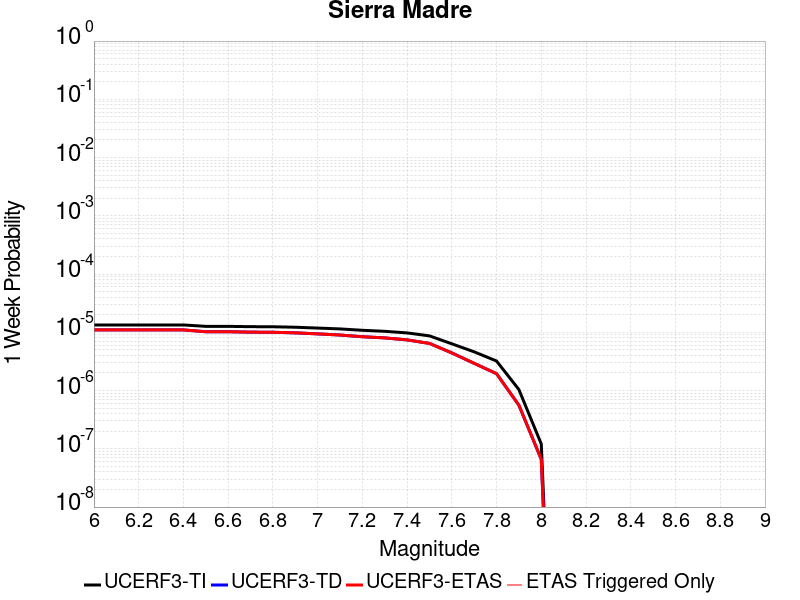 |  | 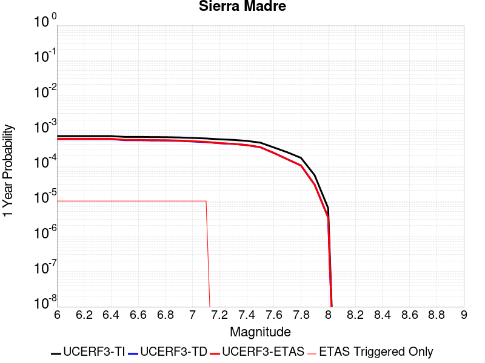 | 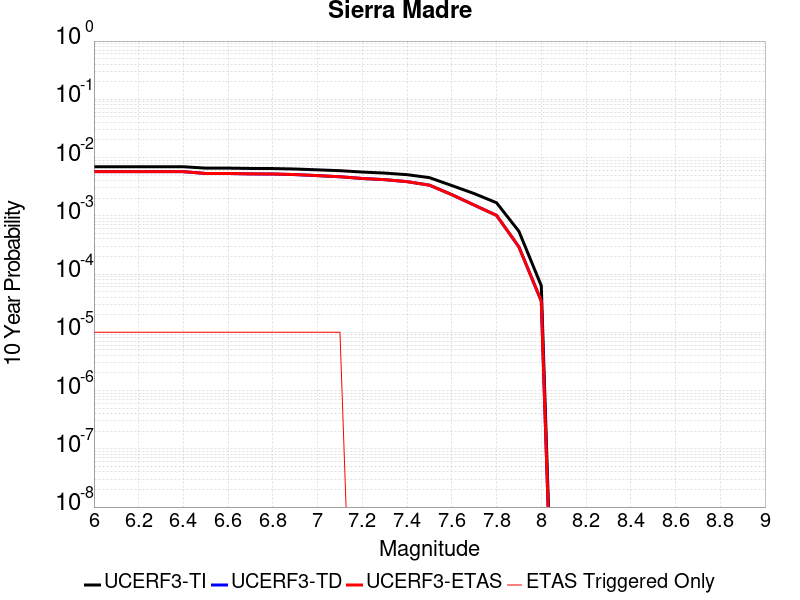 |

| Magnitude | 1 wk TI Prob | 1 wk TD Prob | 1 wk ETAS Prob | 1 wk ETAS/TD Gain | 1 wk ETAS Triggered Only | 1 mo TI Prob | 1 mo TD Prob | 1 mo ETAS Prob | 1 mo ETAS/TD Gain | 1 mo ETAS Triggered Only | 1 yr TI Prob | 1 yr TD Prob | 1 yr ETAS Prob | 1 yr ETAS/TD Gain | 1 yr ETAS Triggered Only | 10 yr TI Prob | 10 yr TD Prob | 10 yr ETAS Prob | 10 yr ETAS/TD Gain | 10 yr ETAS Triggered Only |
|-----|-----|-----|-----|-----|-----|-----|-----|-----|-----|-----|-----|-----|-----|-----|-----|-----|-----|-----|-----|-----|
| 6.0 | 1.3379373E-5 | 1.10007395E-5 | 1.10007395E-5 | 1.0 | 0.0 | 5.7338908E-5 | 4.7145186E-5 | 6.403143E-5 | 1.3581754 | 1.6887043E-5 | 6.978776E-4 | 5.738429E-4 | 5.907203E-4 | 1.0294111 | 1.6887043E-5 | 0.0069569005 | 0.0057239756 | 0.005740766 | 1.0029334 | 1.6887043E-5 |
| 6.1 | 1.3379373E-5 | 1.10007395E-5 | 1.10007395E-5 | 1.0 | 0.0 | 5.7338908E-5 | 4.7145186E-5 | 6.403143E-5 | 1.3581754 | 1.6887043E-5 | 6.978776E-4 | 5.738429E-4 | 5.907203E-4 | 1.0294111 | 1.6887043E-5 | 0.0069569005 | 0.0057239756 | 0.005740766 | 1.0029334 | 1.6887043E-5 |
| 6.2 | 1.3379373E-5 | 1.10007395E-5 | 1.10007395E-5 | 1.0 | 0.0 | 5.7338908E-5 | 4.7145186E-5 | 6.403143E-5 | 1.3581754 | 1.6887043E-5 | 6.978776E-4 | 5.738429E-4 | 5.907203E-4 | 1.0294111 | 1.6887043E-5 | 0.0069569005 | 0.0057239756 | 0.005740766 | 1.0029334 | 1.6887043E-5 |
| 6.3 | 1.3379373E-5 | 1.10007395E-5 | 1.10007395E-5 | 1.0 | 0.0 | 5.7338908E-5 | 4.7145186E-5 | 6.403143E-5 | 1.3581754 | 1.6887043E-5 | 6.978776E-4 | 5.738429E-4 | 5.907203E-4 | 1.0294111 | 1.6887043E-5 | 0.0069569005 | 0.0057239756 | 0.005740766 | 1.0029334 | 1.6887043E-5 |
| 6.4 | 1.3379373E-5 | 1.10007395E-5 | 1.10007395E-5 | 1.0 | 0.0 | 5.7338908E-5 | 4.7145186E-5 | 6.403143E-5 | 1.3581754 | 1.6887043E-5 | 6.978776E-4 | 5.738429E-4 | 5.907203E-4 | 1.0294111 | 1.6887043E-5 | 0.0069569005 | 0.0057239756 | 0.005740766 | 1.0029334 | 1.6887043E-5 |
| 6.5 | 1.26563245E-5 | 1.0230196E-5 | 1.0230196E-5 | 1.0 | 0.0 | 5.4240263E-5 | 4.3842967E-5 | 6.0729268E-5 | 1.3851542 | 1.6887043E-5 | 6.601751E-4 | 5.336584E-4 | 5.505365E-4 | 1.031627 | 1.6887043E-5 | 0.006582173 | 0.0053240913 | 0.005340888 | 1.0031549 | 1.6887043E-5 |
| 6.6 | 1.26563245E-5 | 1.0230196E-5 | 1.0230196E-5 | 1.0 | 0.0 | 5.4240263E-5 | 4.3842967E-5 | 6.0729268E-5 | 1.3851542 | 1.6887043E-5 | 6.601751E-4 | 5.336584E-4 | 5.505365E-4 | 1.031627 | 1.6887043E-5 | 0.006582173 | 0.0053240913 | 0.005340888 | 1.0031549 | 1.6887043E-5 |
| 6.7 | 1.2502474E-5 | 1.006634E-5 | 1.006634E-5 | 1.0 | 0.0 | 5.3580934E-5 | 4.314075E-5 | 6.0027065E-5 | 1.3914237 | 1.6887043E-5 | 6.521526E-4 | 5.251131E-4 | 5.4199126E-4 | 1.0321419 | 1.6887043E-5 | 0.0065024206 | 0.0052390425 | 0.0052558407 | 1.0032064 | 1.6887043E-5 |
| 6.8 | 1.2454966E-5 | 1.0018625E-5 | 1.0018625E-5 | 1.0 | 0.0 | 5.3377335E-5 | 4.2936266E-5 | 5.9822585E-5 | 1.393288 | 1.6887043E-5 | 6.4967526E-4 | 5.226247E-4 | 5.3950294E-4 | 1.0322951 | 1.6887043E-5 | 0.006477792 | 0.0052142753 | 0.005231074 | 1.0032218 | 1.6887043E-5 |
| 6.9 | 1.2225574E-5 | 9.792602E-6 | 9.792602E-6 | 1.0 | 0.0 | 5.2394265E-5 | 4.1967625E-5 | 5.885396E-5 | 1.4023657 | 1.6887043E-5 | 6.3771347E-4 | 5.108371E-4 | 5.2771554E-4 | 1.0330406 | 1.6887043E-5 | 0.006358865 | 0.0050969445 | 0.0051137456 | 1.0032963 | 1.6887043E-5 |
| 7.0 | 1.182946E-5 | 9.399144E-6 | 9.399144E-6 | 1.0 | 0.0 | 5.06967E-5 | 4.0281426E-5 | 5.716779E-5 | 1.4192096 | 1.6887043E-5 | 6.1705755E-4 | 4.9031706E-4 | 5.0719583E-4 | 1.0344242 | 1.6887043E-5 | 0.006153469 | 0.004892664 | 0.0049094683 | 1.0034347 | 1.6887043E-5 |
| 7.1 | 1.14369095E-5 | 8.986159E-6 | 8.986159E-6 | 1.0 | 0.0 | 4.9014405E-5 | 3.8511545E-5 | 5.539794E-5 | 1.4384761 | 1.6887043E-5 | 5.9658696E-4 | 4.687782E-4 | 4.856573E-4 | 1.0360067 | 1.6887043E-5 | 0.005949879 | 0.004678199 | 0.004695007 | 1.0035928 | 1.6887043E-5 |
| 7.2 | 1.0836419E-5 | 8.3995565E-6 | 8.3995565E-6 | 1.0 | 0.0 | 4.644097E-5 | 3.5997607E-5 | 3.5997607E-5 | 1.0 | 0.0 | 5.652721E-4 | 4.3818366E-4 | 4.3818366E-4 | 1.0 | 0.0 | 0.0056383642 | 0.004373494 | 0.004373494 | 1.0 | 0.0 |
| 7.3 | 1.0403439E-5 | 8.02082E-6 | 8.02082E-6 | 1.0 | 0.0 | 4.4585406E-5 | 3.4374494E-5 | 3.4374494E-5 | 1.0 | 0.0 | 5.426921E-4 | 4.1843E-4 | 4.1843E-4 | 1.0 | 0.0 | 0.005413687 | 0.004176717 | 0.004176717 | 1.0 | 0.0 |
| 7.4 | 9.768864E-6 | 7.414448E-6 | 7.414448E-6 | 1.0 | 0.0 | 4.186589E-5 | 3.1775824E-5 | 3.1775824E-5 | 1.0 | 0.0 | 5.09598E-4 | 3.868029E-4 | 3.868029E-4 | 1.0 | 0.0 | 0.0050843097 | 0.0038615882 | 0.0038615882 | 1.0 | 0.0 |
| 7.5 | 8.687089E-6 | 6.4501564E-6 | 6.4501564E-6 | 1.0 | 0.0 | 3.722985E-5 | 2.764324E-5 | 2.764324E-5 | 1.0 | 0.0 | 4.5317915E-4 | 3.3650533E-4 | 3.3650533E-4 | 1.0 | 0.0 | 0.004522561 | 0.0033602451 | 0.0033602451 | 1.0 | 0.0 |
| 7.6 | 6.3506063E-6 | 4.4303215E-6 | 4.4303215E-6 | 1.0 | 0.0 | 2.72166E-5 | 1.8986955E-5 | 1.8986955E-5 | 1.0 | 0.0 | 3.3131172E-4 | 2.3114192E-4 | 2.3114192E-4 | 1.0 | 0.0 | 0.003308182 | 0.0023092402 | 0.0023092402 | 1.0 | 0.0 |
| 7.7 | 4.62223E-6 | 2.932967E-6 | 2.932967E-6 | 1.0 | 0.0 | 1.9809406E-5 | 1.2569798E-5 | 1.2569798E-5 | 1.0 | 0.0 | 2.4115283E-4 | 1.5302657E-4 | 1.5302657E-4 | 1.0 | 0.0 | 0.0024089129 | 0.001529413 | 0.001529413 | 1.0 | 0.0 |
| 7.8 | 3.2145008E-6 | 1.9494332E-6 | 1.9494332E-6 | 1.0 | 0.0 | 1.3776359E-5 | 8.3546865E-6 | 8.3546865E-6 | 1.0 | 0.0 | 1.6771426E-4 | 1.0171358E-4 | 1.0171358E-4 | 1.0 | 0.0 | 0.0016758774 | 0.0010168145 | 0.0010168145 | 1.0 | 0.0 |
| 7.9 | 1.0391769E-6 | 5.6026335E-7 | 5.6026335E-7 | 1.0 | 0.0 | 4.4536077E-6 | 2.4011265E-6 | 2.4011265E-6 | 1.0 | 0.0 | 5.4221324E-5 | 2.9233326E-5 | 2.9233326E-5 | 1.0 | 0.0 | 5.4208096E-4 | 2.9229524E-4 | 2.9229524E-4 | 1.0 | 0.0 |
| 8.0 | 1.210983E-7 | 6.613821E-8 | 6.613821E-8 | 1.0 | 0.0 | 5.1899264E-7 | 2.8344945E-7 | 2.8344945E-7 | 1.0 | 0.0 | 6.3187167E-6 | 3.4509917E-6 | 3.4509917E-6 | 1.0 | 0.0 | 6.318537E-5 | 3.45094E-5 | 3.45094E-5 | 1.0 | 0.0 |

## Great Valley 05 Pittsburg - Kirby Hills alt1
*[(top)](#table-of-contents)*

| 1 Week | 1 Month | 1 Year | 10 Year |
|-----|-----|-----|-----|
|  | 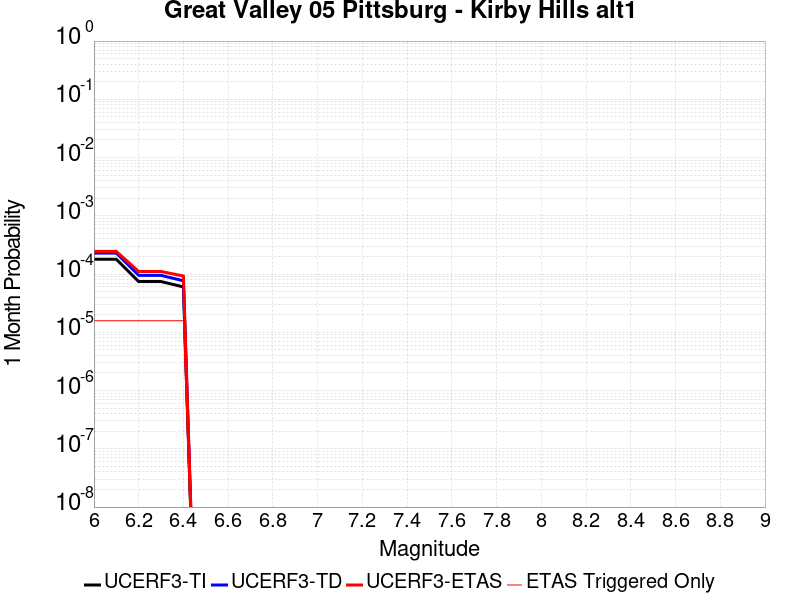 | 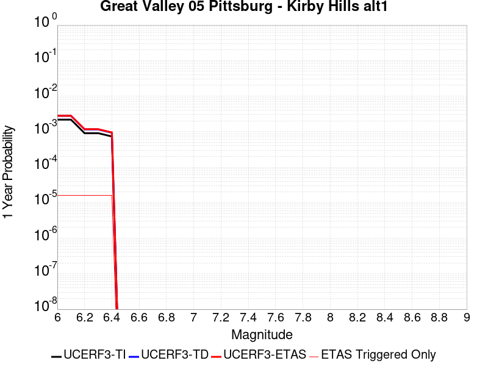 | 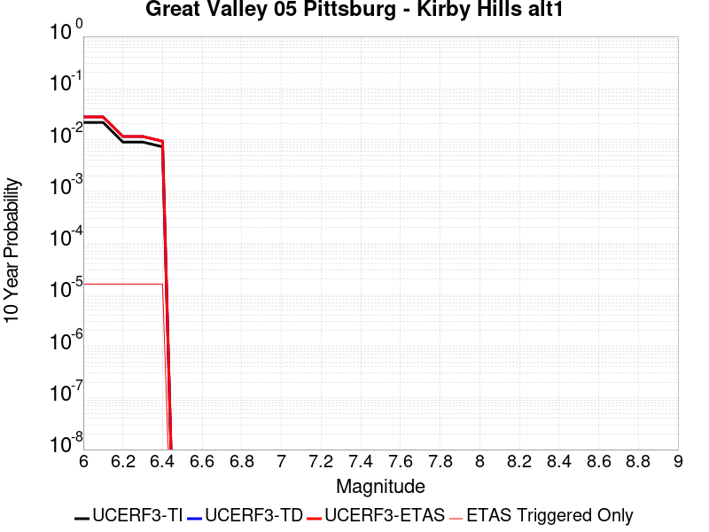 |

| Magnitude | 1 wk TI Prob | 1 wk TD Prob | 1 wk ETAS Prob | 1 wk ETAS/TD Gain | 1 wk ETAS Triggered Only | 1 mo TI Prob | 1 mo TD Prob | 1 mo ETAS Prob | 1 mo ETAS/TD Gain | 1 mo ETAS Triggered Only | 1 yr TI Prob | 1 yr TD Prob | 1 yr ETAS Prob | 1 yr ETAS/TD Gain | 1 yr ETAS Triggered Only | 10 yr TI Prob | 10 yr TD Prob | 10 yr ETAS Prob | 10 yr ETAS/TD Gain | 10 yr ETAS Triggered Only |
|-----|-----|-----|-----|-----|-----|-----|-----|-----|-----|-----|-----|-----|-----|-----|-----|-----|-----|-----|-----|-----|
| 6.0 | 4.187212E-5 | 5.3442072E-5 | 7.032821E-5 | 1.3159709 | 1.6887043E-5 | 1.794396E-4 | 2.290231E-4 | 2.4590627E-4 | 1.0737182 | 1.6887043E-5 | 0.002182488 | 0.0027857882 | 0.002802628 | 1.006045 | 1.6887043E-5 | 0.021611776 | 0.02760304 | 0.02761946 | 1.0005949 | 1.6887043E-5 |
| 6.1 | 4.187212E-5 | 5.3442072E-5 | 7.032821E-5 | 1.3159709 | 1.6887043E-5 | 1.794396E-4 | 2.290231E-4 | 2.4590627E-4 | 1.0737182 | 1.6887043E-5 | 0.002182488 | 0.0027857882 | 0.002802628 | 1.006045 | 1.6887043E-5 | 0.021611776 | 0.02760304 | 0.02761946 | 1.0005949 | 1.6887043E-5 |
| 6.2 | 1.7353306E-5 | 2.2154374E-5 | 3.9041042E-5 | 1.7622273 | 1.6887043E-5 | 7.436919E-5 | 9.494618E-5 | 1.1183162E-4 | 1.1778423 | 1.6887043E-5 | 9.050688E-4 | 0.0011557543 | 0.0011726219 | 1.0145944 | 1.6887043E-5 | 0.009013915 | 0.011535114 | 0.011551806 | 1.0014471 | 1.6887043E-5 |
| 6.3 | 1.7353306E-5 | 2.2154374E-5 | 3.9041042E-5 | 1.7622273 | 1.6887043E-5 | 7.436919E-5 | 9.494618E-5 | 1.1183162E-4 | 1.1778423 | 1.6887043E-5 | 9.050688E-4 | 0.0011557543 | 0.0011726219 | 1.0145944 | 1.6887043E-5 | 0.009013915 | 0.011535114 | 0.011551806 | 1.0014471 | 1.6887043E-5 |
| 6.4 | 1.4028824E-5 | 1.7900597E-5 | 3.4787336E-5 | 1.9433619 | 1.6887043E-5 | 6.0122147E-5 | 7.671684E-5 | 9.360258E-5 | 1.2201048 | 1.6887043E-5 | 7.3174125E-4 | 9.340275E-4 | 9.508988E-4 | 1.018063 | 1.6887043E-5 | 0.0072933645 | 0.009338138 | 0.009354867 | 1.0017915 | 1.6887043E-5 |

## La Panza 2011
*[(top)](#table-of-contents)*

| 1 Week | 1 Month | 1 Year | 10 Year |
|-----|-----|-----|-----|
| 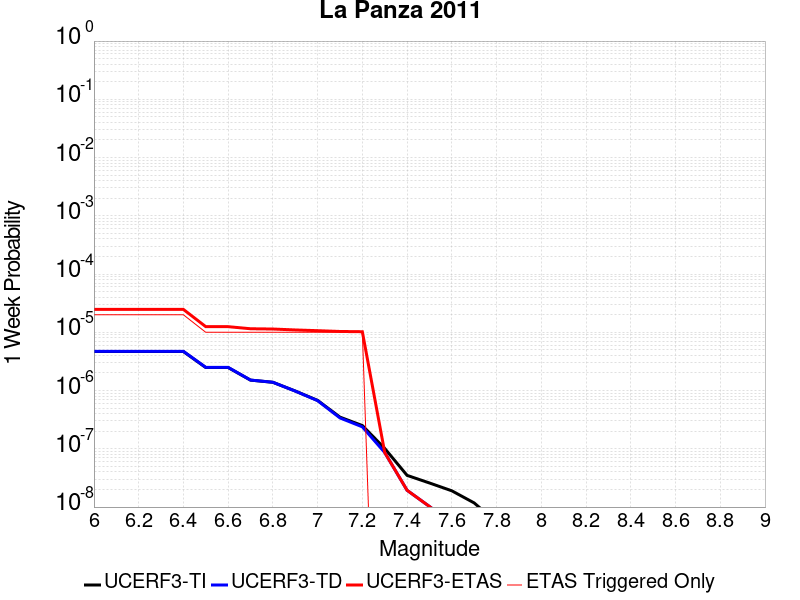 | 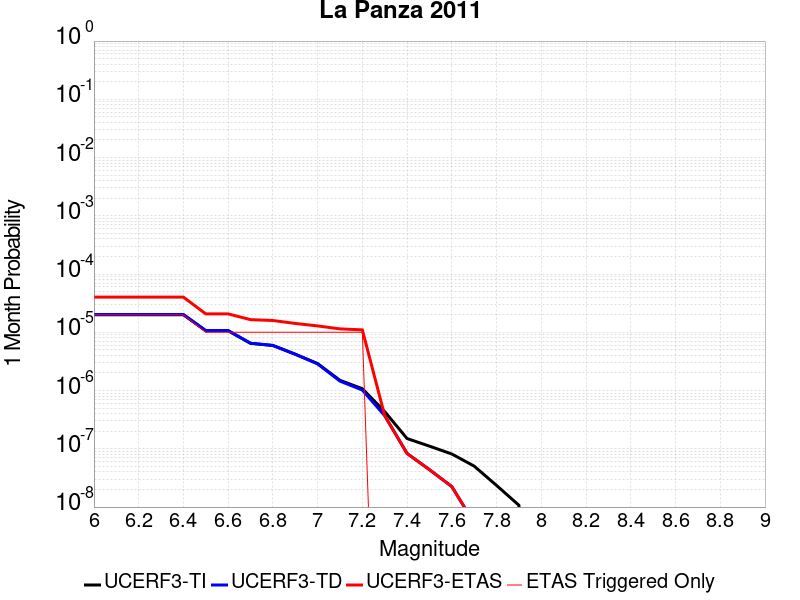 | 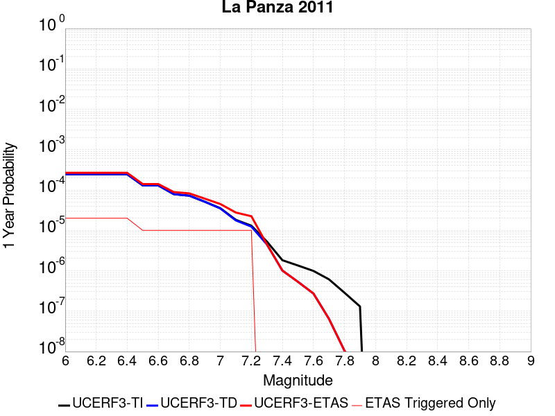 | 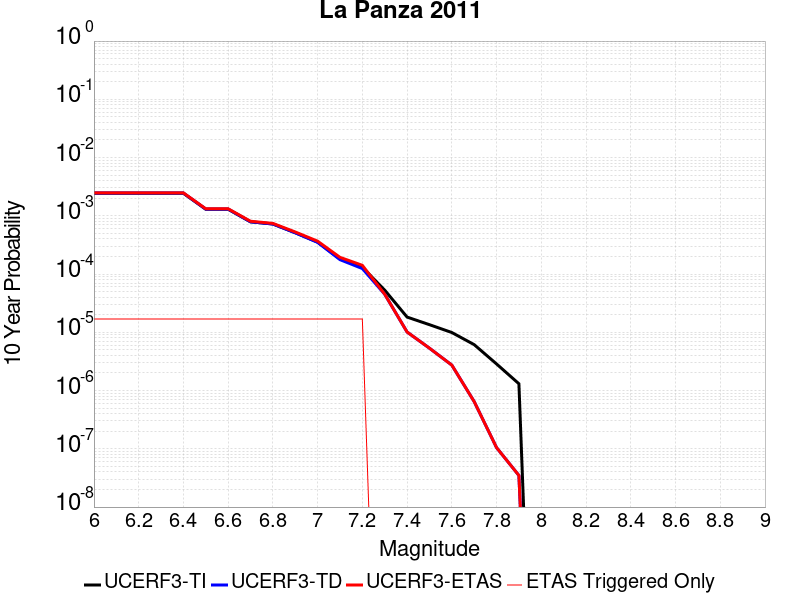 |

| Magnitude | 1 wk TI Prob | 1 wk TD Prob | 1 wk ETAS Prob | 1 wk ETAS/TD Gain | 1 wk ETAS Triggered Only | 1 mo TI Prob | 1 mo TD Prob | 1 mo ETAS Prob | 1 mo ETAS/TD Gain | 1 mo ETAS Triggered Only | 1 yr TI Prob | 1 yr TD Prob | 1 yr ETAS Prob | 1 yr ETAS/TD Gain | 1 yr ETAS Triggered Only | 10 yr TI Prob | 10 yr TD Prob | 10 yr ETAS Prob | 10 yr ETAS/TD Gain | 10 yr ETAS Triggered Only |
|-----|-----|-----|-----|-----|-----|-----|-----|-----|-----|-----|-----|-----|-----|-----|-----|-----|-----|-----|-----|-----|
| 6.0 | 4.6754544E-6 | 4.717587E-6 | 2.160455E-5 | 4.5795765 | 1.6887043E-5 | 2.0037509E-5 | 2.0218084E-5 | 3.7104786E-5 | 1.8352276 | 1.6887043E-5 | 2.4392935E-4 | 2.4612935E-4 | 2.6301222E-4 | 1.0685935 | 1.6887043E-5 | 0.0024366176 | 0.002458762 | 0.0024756074 | 1.0068512 | 1.6887043E-5 |
| 6.1 | 4.6754544E-6 | 4.717587E-6 | 2.160455E-5 | 4.5795765 | 1.6887043E-5 | 2.0037509E-5 | 2.0218084E-5 | 3.7104786E-5 | 1.8352276 | 1.6887043E-5 | 2.4392935E-4 | 2.4612935E-4 | 2.6301222E-4 | 1.0685935 | 1.6887043E-5 | 0.0024366176 | 0.002458762 | 0.0024756074 | 1.0068512 | 1.6887043E-5 |
| 6.2 | 4.6754544E-6 | 4.717587E-6 | 2.160455E-5 | 4.5795765 | 1.6887043E-5 | 2.0037509E-5 | 2.0218084E-5 | 3.7104786E-5 | 1.8352276 | 1.6887043E-5 | 2.4392935E-4 | 2.4612935E-4 | 2.6301222E-4 | 1.0685935 | 1.6887043E-5 | 0.0024366176 | 0.002458762 | 0.0024756074 | 1.0068512 | 1.6887043E-5 |
| 6.3 | 4.6754544E-6 | 4.717587E-6 | 2.160455E-5 | 4.5795765 | 1.6887043E-5 | 2.0037509E-5 | 2.0218084E-5 | 3.7104786E-5 | 1.8352276 | 1.6887043E-5 | 2.4392935E-4 | 2.4612935E-4 | 2.6301222E-4 | 1.0685935 | 1.6887043E-5 | 0.0024366176 | 0.002458762 | 0.0024756074 | 1.0068512 | 1.6887043E-5 |
| 6.4 | 4.6754544E-6 | 4.717587E-6 | 2.160455E-5 | 4.5795765 | 1.6887043E-5 | 2.0037509E-5 | 2.0218084E-5 | 3.7104786E-5 | 1.8352276 | 1.6887043E-5 | 2.4392935E-4 | 2.4612935E-4 | 2.6301222E-4 | 1.0685935 | 1.6887043E-5 | 0.0024366176 | 0.002458762 | 0.0024756074 | 1.0068512 | 1.6887043E-5 |
| 6.5 | 2.485343E-6 | 2.5005988E-6 | 1.9387599E-5 | 7.7531824 | 1.6887043E-5 | 1.0651426E-5 | 1.0716811E-5 | 2.7603672E-5 | 2.5757358 | 1.6887043E-5 | 1.296734E-4 | 1.3046975E-4 | 1.4735459E-4 | 1.1294158 | 1.6887043E-5 | 0.0012959775 | 0.0013039699 | 0.0013208349 | 1.0129336 | 1.6887043E-5 |
| 6.6 | 2.485343E-6 | 2.5005988E-6 | 1.9387599E-5 | 7.7531824 | 1.6887043E-5 | 1.0651426E-5 | 1.0716811E-5 | 2.7603672E-5 | 2.5757358 | 1.6887043E-5 | 1.296734E-4 | 1.3046975E-4 | 1.4735459E-4 | 1.1294158 | 1.6887043E-5 | 0.0012959775 | 0.0013039699 | 0.0013208349 | 1.0129336 | 1.6887043E-5 |
| 6.7 | 1.5108508E-6 | 1.5146375E-6 | 1.8401655E-5 | 12.149214 | 1.6887043E-5 | 6.4750584E-6 | 6.491288E-6 | 2.3378221E-5 | 3.6014764 | 1.6887043E-5 | 7.8830984E-5 | 7.902867E-5 | 9.591438E-5 | 1.2136656 | 1.6887043E-5 | 7.880303E-4 | 7.900165E-4 | 8.068902E-4 | 1.0213587 | 1.6887043E-5 |
| 6.8 | 1.3865837E-6 | 1.3885102E-6 | 1.8275528E-5 | 13.16197 | 1.6887043E-5 | 5.942488E-6 | 5.9507447E-6 | 2.2837687E-5 | 3.8377862 | 1.6887043E-5 | 7.234739E-5 | 7.244801E-5 | 8.933383E-5 | 1.233075 | 1.6887043E-5 | 7.232384E-4 | 7.242537E-4 | 7.411285E-4 | 1.0232996 | 1.6887043E-5 |
| 6.9 | 9.826583E-7 | 9.796287E-7 | 1.7866654E-5 | 18.238192 | 1.6887043E-5 | 4.2113857E-6 | 4.198402E-6 | 2.1085374E-5 | 5.022238 | 1.6887043E-5 | 5.1272415E-5 | 5.11144E-5 | 6.8000576E-5 | 1.3303605 | 1.6887043E-5 | 5.126059E-4 | 5.110318E-4 | 5.279102E-4 | 1.0330281 | 1.6887043E-5 |
| 7.0 | 6.7797646E-7 | 6.7102144E-7 | 1.7558054E-5 | 26.166157 | 1.6887043E-5 | 2.9056102E-6 | 2.8758034E-6 | 1.9762798E-5 | 6.8720965 | 1.6887043E-5 | 3.537523E-5 | 3.5012374E-5 | 5.1898824E-5 | 1.4822996 | 1.6887043E-5 | 3.5369597E-4 | 3.5007167E-4 | 3.669528E-4 | 1.048222 | 1.6887043E-5 |
| 7.1 | 3.4979826E-7 | 3.387388E-7 | 1.7225775E-5 | 50.85268 | 1.6887043E-5 | 1.4991346E-6 | 1.4517369E-6 | 1.8338755E-5 | 12.632285 | 1.6887043E-5 | 1.825181E-5 | 1.7674765E-5 | 3.456151E-5 | 1.9554154 | 1.6887043E-5 | 1.825031E-4 | 1.7673477E-4 | 1.9361883E-4 | 1.0955334 | 1.6887043E-5 |
| 7.2 | 2.5088332E-7 | 2.3831899E-7 | 1.7125358E-5 | 71.85897 | 1.6887043E-5 | 1.0752137E-6 | 1.0213668E-6 | 1.7908393E-5 | 17.533752 | 1.6887043E-5 | 1.3090649E-5 | 1.2435077E-5 | 2.9321911E-5 | 2.3579998 | 1.6887043E-5 | 1.3089878E-4 | 1.2434467E-4 | 1.4122961E-4 | 1.1357914 | 1.6887043E-5 |
| 7.3 | 1.0159086E-7 | 8.64462E-8 | 8.64462E-8 | 1.0 | 0.0 | 4.3538932E-7 | 3.7048366E-7 | 3.7048366E-7 | 1.0 | 0.0 | 5.300852E-6 | 4.5106294E-6 | 4.5106294E-6 | 1.0 | 0.0 | 5.3007258E-5 | 4.5105422E-5 | 4.5105422E-5 | 1.0 | 0.0 |
| 7.4 | 3.5006252E-8 | 1.9404325E-8 | 1.9404325E-8 | 1.0 | 0.0 | 1.5002678E-7 | 8.3161396E-8 | 8.3161396E-8 | 1.0 | 0.0 | 1.8265745E-6 | 1.0124895E-6 | 1.0124895E-6 | 1.0 | 0.0 | 1.8265595E-5 | 1.01248515E-5 | 1.01248515E-5 | 1.0 | 0.0 |
| 7.5 | 2.592274E-8 | 1.0239094E-8 | 1.0239094E-8 | 1.0 | 0.0 | 1.1109746E-7 | 4.388183E-8 | 4.388183E-8 | 1.0 | 0.0 | 1.3526106E-6 | 5.342612E-7 | 5.342612E-7 | 1.0 | 0.0 | 1.3526024E-5 | 5.3425997E-6 | 5.3425997E-6 | 1.0 | 0.0 |
| 7.6 | 1.9016717E-8 | 5.244801E-9 | 5.244801E-9 | 1.0 | 0.0 | 8.150022E-8 | 2.247772E-8 | 2.247772E-8 | 1.0 | 0.0 | 9.922647E-7 | 2.736662E-7 | 2.736662E-7 | 1.0 | 0.0 | 9.922603E-6 | 2.7366589E-6 | 2.7366589E-6 | 1.0 | 0.0 |
| 7.7 | 1.17738495E-8 | 1.2398075E-9 | 1.2398075E-9 | 1.0 | 0.0 | 5.0459356E-8 | 5.3134603E-9 | 5.3134603E-9 | 1.0 | 0.0 | 6.1434247E-7 | 6.469138E-8 | 6.469138E-8 | 1.0 | 0.0 | 6.143408E-6 | 6.469136E-7 | 6.469136E-7 | 1.0 | 0.0 |
| 7.8 | 5.489079E-9 | 2.0111768E-10 | 2.0111768E-10 | 1.0 | 0.0 | 2.3524624E-8 | 8.6193275E-10 | 8.6193275E-10 | 1.0 | 0.0 | 2.8641225E-7 | 1.04940305E-8 | 1.04940305E-8 | 1.0 | 0.0 | 2.8641189E-6 | 1.04940305E-7 | 1.04940305E-7 | 1.0 | 0.0 |
| 7.9 | 2.5081048E-9 | 6.683887E-11 | 6.683887E-11 | 1.0 | 0.0 | 1.0749021E-8 | 2.8645197E-10 | 2.8645197E-10 | 1.0 | 0.0 | 1.3086932E-7 | 3.487552E-9 | 3.487552E-9 | 1.0 | 0.0 | 1.3086925E-6 | 3.487552E-8 | 3.487552E-8 | 1.0 | 0.0 |

## Clamshell-Sawpit
*[(top)](#table-of-contents)*

| 1 Week | 1 Month | 1 Year | 10 Year |
|-----|-----|-----|-----|
|  | 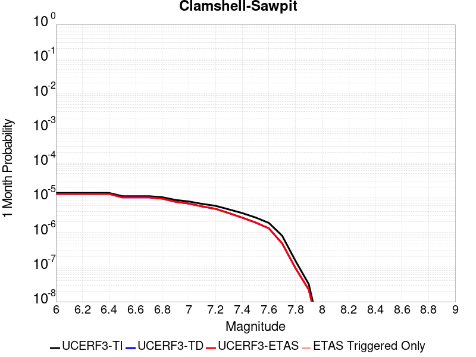 | 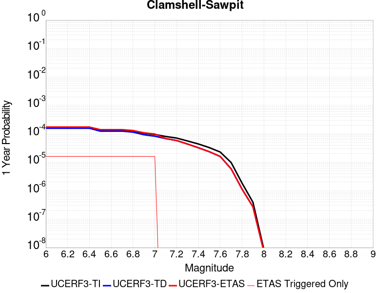 | 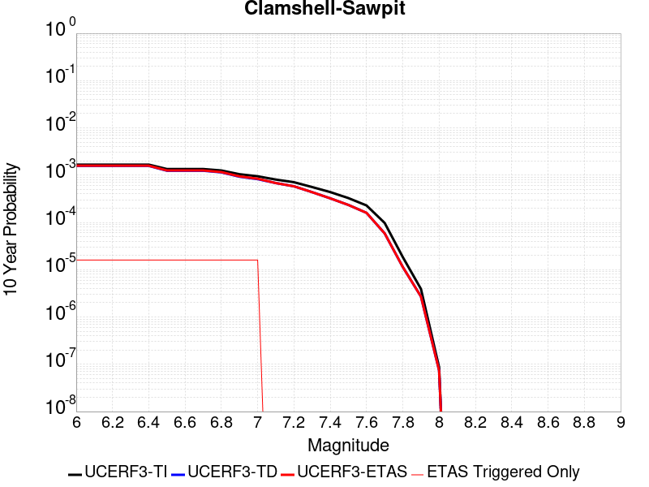 |

| Magnitude | 1 wk TI Prob | 1 wk TD Prob | 1 wk ETAS Prob | 1 wk ETAS/TD Gain | 1 wk ETAS Triggered Only | 1 mo TI Prob | 1 mo TD Prob | 1 mo ETAS Prob | 1 mo ETAS/TD Gain | 1 mo ETAS Triggered Only | 1 yr TI Prob | 1 yr TD Prob | 1 yr ETAS Prob | 1 yr ETAS/TD Gain | 1 yr ETAS Triggered Only | 10 yr TI Prob | 10 yr TD Prob | 10 yr ETAS Prob | 10 yr ETAS/TD Gain | 10 yr ETAS Triggered Only |
|-----|-----|-----|-----|-----|-----|-----|-----|-----|-----|-----|-----|-----|-----|-----|-----|-----|-----|-----|-----|-----|
| 6.0 | 3.202998E-6 | 3.0127644E-6 | 3.0127644E-6 | 1.0 | 0.0 | 1.3727062E-5 | 1.2911788E-5 | 1.2911788E-5 | 1.0 | 0.0 | 1.6711417E-4 | 1.5719049E-4 | 1.7407487E-4 | 1.1074135 | 1.6887043E-5 | 0.0016698855 | 0.0015708724 | 0.0015877328 | 1.0107332 | 1.6887043E-5 |
| 6.1 | 3.202998E-6 | 3.0127644E-6 | 3.0127644E-6 | 1.0 | 0.0 | 1.3727062E-5 | 1.2911788E-5 | 1.2911788E-5 | 1.0 | 0.0 | 1.6711417E-4 | 1.5719049E-4 | 1.7407487E-4 | 1.1074135 | 1.6887043E-5 | 0.0016698855 | 0.0015708724 | 0.0015877328 | 1.0107332 | 1.6887043E-5 |
| 6.2 | 3.202998E-6 | 3.0127644E-6 | 3.0127644E-6 | 1.0 | 0.0 | 1.3727062E-5 | 1.2911788E-5 | 1.2911788E-5 | 1.0 | 0.0 | 1.6711417E-4 | 1.5719049E-4 | 1.7407487E-4 | 1.1074135 | 1.6887043E-5 | 0.0016698855 | 0.0015708724 | 0.0015877328 | 1.0107332 | 1.6887043E-5 |
| 6.3 | 3.202998E-6 | 3.0127644E-6 | 3.0127644E-6 | 1.0 | 0.0 | 1.3727062E-5 | 1.2911788E-5 | 1.2911788E-5 | 1.0 | 0.0 | 1.6711417E-4 | 1.5719049E-4 | 1.7407487E-4 | 1.1074135 | 1.6887043E-5 | 0.0016698855 | 0.0015708724 | 0.0015877328 | 1.0107332 | 1.6887043E-5 |
| 6.4 | 3.202998E-6 | 3.0127644E-6 | 3.0127644E-6 | 1.0 | 0.0 | 1.3727062E-5 | 1.2911788E-5 | 1.2911788E-5 | 1.0 | 0.0 | 1.6711417E-4 | 1.5719049E-4 | 1.7407487E-4 | 1.1074135 | 1.6887043E-5 | 0.0016698855 | 0.0015708724 | 0.0015877328 | 1.0107332 | 1.6887043E-5 |
| 6.5 | 2.5862723E-6 | 2.380775E-6 | 2.380775E-6 | 1.0 | 0.0 | 1.1083977E-5 | 1.0203283E-5 | 1.0203283E-5 | 1.0 | 0.0 | 1.3493907E-4 | 1.2421819E-4 | 1.4110314E-4 | 1.1359297 | 1.6887043E-5 | 0.0013485716 | 0.0012415178 | 0.001258384 | 1.0135851 | 1.6887043E-5 |
| 6.6 | 2.5862723E-6 | 2.380775E-6 | 2.380775E-6 | 1.0 | 0.0 | 1.1083977E-5 | 1.0203283E-5 | 1.0203283E-5 | 1.0 | 0.0 | 1.3493907E-4 | 1.2421819E-4 | 1.4110314E-4 | 1.1359297 | 1.6887043E-5 | 0.0013485716 | 0.0012415178 | 0.001258384 | 1.0135851 | 1.6887043E-5 |
| 6.7 | 2.5862723E-6 | 2.380775E-6 | 2.380775E-6 | 1.0 | 0.0 | 1.1083977E-5 | 1.0203283E-5 | 1.0203283E-5 | 1.0 | 0.0 | 1.3493907E-4 | 1.2421819E-4 | 1.4110314E-4 | 1.1359297 | 1.6887043E-5 | 0.0013485716 | 0.0012415178 | 0.001258384 | 1.0135851 | 1.6887043E-5 |
| 6.8 | 2.4098806E-6 | 2.1977307E-6 | 2.1977307E-6 | 1.0 | 0.0 | 1.0328019E-5 | 9.4188135E-6 | 9.4188135E-6 | 1.0 | 0.0 | 1.2573638E-4 | 1.1466829E-4 | 1.315534E-4 | 1.1472517 | 1.6887043E-5 | 0.0012566525 | 0.0011461178 | 0.0011629855 | 1.0147172 | 1.6887043E-5 |
| 6.9 | 2.0073985E-6 | 1.7784248E-6 | 1.7784248E-6 | 1.0 | 0.0 | 8.603109E-6 | 7.621799E-6 | 7.621799E-6 | 1.0 | 0.0 | 1.0473781E-4 | 9.279157E-5 | 1.0967704E-4 | 1.1819721 | 1.6887043E-5 | 0.0010468846 | 9.275401E-4 | 9.444115E-4 | 1.0181894 | 1.6887043E-5 |
| 7.0 | 1.8166766E-6 | 1.5807095E-6 | 1.5807095E-6 | 1.0 | 0.0 | 7.785734E-6 | 6.7744522E-6 | 6.7744522E-6 | 1.0 | 0.0 | 9.478718E-5 | 8.247593E-5 | 9.936159E-5 | 1.2047342 | 1.6887043E-5 | 9.4746763E-4 | 8.244633E-4 | 8.4133644E-4 | 1.0204656 | 1.6887043E-5 |
| 7.1 | 1.5471421E-6 | 1.3052961E-6 | 1.3052961E-6 | 1.0 | 0.0 | 6.6305925E-6 | 5.5941146E-6 | 5.5941146E-6 | 1.0 | 0.0 | 8.072447E-5 | 6.8106274E-5 | 6.8106274E-5 | 1.0 | 0.0 | 8.0695155E-4 | 6.808595E-4 | 6.808595E-4 | 1.0 | 0.0 |
| 7.2 | 1.3608037E-6 | 1.1153443E-6 | 1.1153443E-6 | 1.0 | 0.0 | 5.8320024E-6 | 4.7800386E-6 | 4.7800386E-6 | 1.0 | 0.0 | 7.1002316E-5 | 5.8195463E-5 | 5.8195463E-5 | 1.0 | 0.0 | 7.097964E-4 | 5.818069E-4 | 5.818069E-4 | 1.0 | 0.0 |
| 7.3 | 1.0749634E-6 | 8.384254E-7 | 8.384254E-7 | 1.0 | 0.0 | 4.6069777E-6 | 3.593247E-6 | 3.593247E-6 | 1.0 | 0.0 | 5.608851E-5 | 4.374693E-5 | 4.374693E-5 | 1.0 | 0.0 | 5.6074356E-4 | 4.37386E-4 | 4.37386E-4 | 1.0 | 0.0 |
| 7.4 | 8.416856E-7 | 6.200048E-7 | 6.200048E-7 | 1.0 | 0.0 | 3.607219E-6 | 2.6571608E-6 | 2.6571608E-6 | 1.0 | 0.0 | 4.3917007E-5 | 3.2350472E-5 | 3.2350472E-5 | 1.0 | 0.0 | 4.390833E-4 | 3.2345962E-4 | 3.2345962E-4 | 1.0 | 0.0 |
| 7.5 | 6.2779594E-7 | 4.496886E-7 | 4.496886E-7 | 1.0 | 0.0 | 2.6905511E-6 | 1.9272356E-6 | 1.9272356E-6 | 1.0 | 0.0 | 3.275697E-5 | 2.346386E-5 | 2.346386E-5 | 1.0 | 0.0 | 3.275214E-4 | 2.346157E-4 | 2.346157E-4 | 1.0 | 0.0 |
| 7.6 | 4.3822078E-7 | 3.0595405E-7 | 3.0595405E-7 | 1.0 | 0.0 | 1.8780877E-6 | 1.311231E-6 | 1.311231E-6 | 1.0 | 0.0 | 2.2865479E-5 | 1.5964137E-5 | 1.5964137E-5 | 1.0 | 0.0 | 2.2863125E-4 | 1.5963144E-4 | 1.5963144E-4 | 1.0 | 0.0 |
| 7.7 | 1.8704569E-7 | 1.12379205E-7 | 1.12379205E-7 | 1.0 | 0.0 | 8.0162414E-7 | 4.816251E-7 | 4.816251E-7 | 1.0 | 0.0 | 9.75973E-6 | 5.86377E-6 | 5.86377E-6 | 1.0 | 0.0 | 9.7593016E-5 | 5.863622E-5 | 5.863622E-5 | 1.0 | 0.0 |
| 7.8 | 3.5378733E-8 | 2.1838144E-8 | 2.1838144E-8 | 1.0 | 0.0 | 1.5162313E-7 | 9.359204E-8 | 9.359204E-8 | 1.0 | 0.0 | 1.84601E-6 | 1.1394826E-6 | 1.1394826E-6 | 1.0 | 0.0 | 1.8459947E-5 | 1.139477E-5 | 1.139477E-5 | 1.0 | 0.0 |
| 7.9 | 7.504945E-9 | 5.1920326E-9 | 5.1920326E-9 | 1.0 | 0.0 | 3.2164053E-8 | 2.225157E-8 | 2.225157E-8 | 1.0 | 0.0 | 3.9159727E-7 | 2.7091284E-7 | 2.7091284E-7 | 1.0 | 0.0 | 3.915966E-6 | 2.7091257E-6 | 2.7091257E-6 | 1.0 | 0.0 |
| 8.0 | 1.6554036E-10 | 1.4180768E-10 | 1.4180768E-10 | 1.0 | 0.0 | 7.0945894E-10 | 6.077475E-10 | 6.077475E-10 | 1.0 | 0.0 | 8.637662E-9 | 7.3993256E-9 | 7.3993256E-9 | 1.0 | 0.0 | 8.6376616E-8 | 7.3993256E-8 | 7.3993256E-8 | 1.0 | 0.0 |

## Lions Head 2011 CFM
*[(top)](#table-of-contents)*

| 1 Week | 1 Month | 1 Year | 10 Year |
|-----|-----|-----|-----|
|  |  |  |  |

| Magnitude | 1 wk TI Prob | 1 wk TD Prob | 1 wk ETAS Prob | 1 wk ETAS/TD Gain | 1 wk ETAS Triggered Only | 1 mo TI Prob | 1 mo TD Prob | 1 mo ETAS Prob | 1 mo ETAS/TD Gain | 1 mo ETAS Triggered Only | 1 yr TI Prob | 1 yr TD Prob | 1 yr ETAS Prob | 1 yr ETAS/TD Gain | 1 yr ETAS Triggered Only | 10 yr TI Prob | 10 yr TD Prob | 10 yr ETAS Prob | 10 yr ETAS/TD Gain | 10 yr ETAS Triggered Only |
|-----|-----|-----|-----|-----|-----|-----|-----|-----|-----|-----|-----|-----|-----|-----|-----|-----|-----|-----|-----|-----|
| 6.0 | 8.889363E-7 | 8.891425E-7 | 8.891425E-7 | 1.0 | 0.0 | 3.8097214E-6 | 3.8106054E-6 | 3.8106054E-6 | 1.0 | 0.0 | 4.638237E-5 | 4.6393197E-5 | 6.3279454E-5 | 1.3639814 | 1.6887043E-5 | 4.637269E-4 | 4.638414E-4 | 4.807206E-4 | 1.0363901 | 1.6887043E-5 |
| 6.1 | 8.889363E-7 | 8.891425E-7 | 8.891425E-7 | 1.0 | 0.0 | 3.8097214E-6 | 3.8106054E-6 | 3.8106054E-6 | 1.0 | 0.0 | 4.638237E-5 | 4.6393197E-5 | 6.3279454E-5 | 1.3639814 | 1.6887043E-5 | 4.637269E-4 | 4.638414E-4 | 4.807206E-4 | 1.0363901 | 1.6887043E-5 |
| 6.2 | 5.7435483E-7 | 5.736071E-7 | 5.736071E-7 | 1.0 | 0.0 | 2.4615185E-6 | 2.458314E-6 | 2.458314E-6 | 1.0 | 0.0 | 2.9968574E-5 | 2.9929575E-5 | 2.9929575E-5 | 1.0 | 0.0 | 2.9964533E-4 | 2.992569E-4 | 2.992569E-4 | 1.0 | 0.0 |
| 6.3 | 5.7435483E-7 | 5.736071E-7 | 5.736071E-7 | 1.0 | 0.0 | 2.4615185E-6 | 2.458314E-6 | 2.458314E-6 | 1.0 | 0.0 | 2.9968574E-5 | 2.9929575E-5 | 2.9929575E-5 | 1.0 | 0.0 | 2.9964533E-4 | 2.992569E-4 | 2.992569E-4 | 1.0 | 0.0 |
| 6.4 | 4.1835764E-7 | 4.171541E-7 | 4.171541E-7 | 1.0 | 0.0 | 1.7929601E-6 | 1.787802E-6 | 1.787802E-6 | 1.0 | 0.0 | 2.1829072E-5 | 2.1766275E-5 | 2.1766275E-5 | 1.0 | 0.0 | 2.1826927E-4 | 2.1764166E-4 | 2.1764166E-4 | 1.0 | 0.0 |
| 6.5 | 4.1835764E-7 | 4.171541E-7 | 4.171541E-7 | 1.0 | 0.0 | 1.7929601E-6 | 1.787802E-6 | 1.787802E-6 | 1.0 | 0.0 | 2.1829072E-5 | 2.1766275E-5 | 2.1766275E-5 | 1.0 | 0.0 | 2.1826927E-4 | 2.1764166E-4 | 2.1764166E-4 | 1.0 | 0.0 |
| 6.6 | 3.6896213E-7 | 3.6761884E-7 | 3.6761884E-7 | 1.0 | 0.0 | 1.5812653E-6 | 1.5755083E-6 | 1.5755083E-6 | 1.0 | 0.0 | 1.9251736E-5 | 1.9181647E-5 | 1.9181647E-5 | 1.0 | 0.0 | 1.9250068E-4 | 1.9180003E-4 | 1.9180003E-4 | 1.0 | 0.0 |
| 6.7 | 3.3283942E-7 | 3.3139824E-7 | 3.3139824E-7 | 1.0 | 0.0 | 1.4264539E-6 | 1.4202773E-6 | 1.4202773E-6 | 1.0 | 0.0 | 1.7366938E-5 | 1.7291739E-5 | 1.7291739E-5 | 1.0 | 0.0 | 1.736558E-4 | 1.7290401E-4 | 1.7290401E-4 | 1.0 | 0.0 |
| 6.8 | 2.9684807E-7 | 2.953145E-7 | 2.953145E-7 | 1.0 | 0.0 | 1.2722054E-6 | 1.2656328E-6 | 1.2656328E-6 | 1.0 | 0.0 | 1.5488991E-5 | 1.5408972E-5 | 1.5408972E-5 | 1.0 | 0.0 | 1.5487912E-4 | 1.5407907E-4 | 1.5407907E-4 | 1.0 | 0.0 |
| 6.9 | 2.8254823E-7 | 2.8096647E-7 | 2.8096647E-7 | 1.0 | 0.0 | 1.2109203E-6 | 1.2041414E-6 | 1.2041414E-6 | 1.0 | 0.0 | 1.4742856E-5 | 1.4660324E-5 | 1.4660324E-5 | 1.0 | 0.0 | 1.4741877E-4 | 1.465936E-4 | 1.465936E-4 | 1.0 | 0.0 |
| 7.0 | 2.5794475E-7 | 2.5627148E-7 | 2.5627148E-7 | 1.0 | 0.0 | 1.105477E-6 | 1.0983058E-6 | 1.0983058E-6 | 1.0 | 0.0 | 1.34591E-5 | 1.3371792E-5 | 1.3371792E-5 | 1.0 | 0.0 | 1.3458285E-4 | 1.337099E-4 | 1.337099E-4 | 1.0 | 0.0 |
| 7.1 | 2.2678832E-7 | 2.2496131E-7 | 2.2496131E-7 | 1.0 | 0.0 | 9.719496E-7 | 9.641195E-7 | 9.641195E-7 | 1.0 | 0.0 | 1.1833421E-5 | 1.1738091E-5 | 1.1738091E-5 | 1.0 | 0.0 | 1.1832791E-4 | 1.1737474E-4 | 1.1737474E-4 | 1.0 | 0.0 |
| 7.2 | 1.968546E-7 | 1.9487938E-7 | 1.9487938E-7 | 1.0 | 0.0 | 8.436623E-7 | 8.35197E-7 | 8.35197E-7 | 1.0 | 0.0 | 1.027154E-5 | 1.0168476E-5 | 1.0168476E-5 | 1.0 | 0.0 | 1.0271065E-4 | 1.0168012E-4 | 1.0168012E-4 | 1.0 | 0.0 |
| 7.3 | 1.6101195E-7 | 1.5880458E-7 | 1.5880458E-7 | 1.0 | 0.0 | 6.90051E-7 | 6.8059086E-7 | 6.8059086E-7 | 1.0 | 0.0 | 8.401339E-6 | 8.2861625E-6 | 8.2861625E-6 | 1.0 | 0.0 | 8.4010215E-5 | 8.285854E-5 | 8.285854E-5 | 1.0 | 0.0 |
| 7.4 | 1.304744E-7 | 1.2803389E-7 | 1.2803389E-7 | 1.0 | 0.0 | 5.591759E-7 | 5.487165E-7 | 5.487165E-7 | 1.0 | 0.0 | 6.807945E-6 | 6.680603E-6 | 6.680603E-6 | 1.0 | 0.0 | 6.807737E-5 | 6.680403E-5 | 6.680403E-5 | 1.0 | 0.0 |
| 7.5 | 9.410614E-8 | 9.132599E-8 | 9.132599E-8 | 1.0 | 0.0 | 4.0331196E-7 | 3.91397E-7 | 3.91397E-7 | 1.0 | 0.0 | 4.910312E-6 | 4.7652484E-6 | 4.7652484E-6 | 1.0 | 0.0 | 4.9102036E-5 | 4.765146E-5 | 4.765146E-5 | 1.0 | 0.0 |
| 7.6 | 6.6360826E-8 | 6.327055E-8 | 6.327055E-8 | 1.0 | 0.0 | 2.844035E-7 | 2.7115945E-7 | 2.7115945E-7 | 1.0 | 0.0 | 3.462607E-6 | 3.3013614E-6 | 3.3013614E-6 | 1.0 | 0.0 | 3.4625533E-5 | 3.3013126E-5 | 3.3013126E-5 | 1.0 | 0.0 |
| 7.7 | 3.9100893E-8 | 3.5617894E-8 | 3.5617894E-8 | 1.0 | 0.0 | 1.6757524E-7 | 1.5264811E-7 | 1.5264811E-7 | 1.0 | 0.0 | 2.0402267E-6 | 1.8584891E-6 | 1.8584891E-6 | 1.0 | 0.0 | 2.040208E-5 | 1.8584737E-5 | 1.8584737E-5 | 1.0 | 0.0 |
| 7.8 | 1.9858547E-8 | 1.6059074E-8 | 1.6059074E-8 | 1.0 | 0.0 | 8.5108056E-8 | 6.882461E-8 | 6.882461E-8 | 1.0 | 0.0 | 1.0361902E-6 | 8.3793924E-7 | 8.3793924E-7 | 1.0 | 0.0 | 1.0361853E-5 | 8.379361E-6 | 8.379361E-6 | 1.0 | 0.0 |
| 7.9 | 9.717722E-9 | 6.4448784E-9 | 6.4448784E-9 | 1.0 | 0.0 | 4.1647375E-8 | 2.762091E-8 | 2.762091E-8 | 1.0 | 0.0 | 5.070567E-7 | 3.3628453E-7 | 3.3628453E-7 | 1.0 | 0.0 | 5.0705553E-6 | 3.3628403E-6 | 3.3628403E-6 | 1.0 | 0.0 |
| 8.0 | 3.8397716E-9 | 1.908926E-9 | 1.908926E-9 | 1.0 | 0.0 | 1.6456164E-8 | 8.18111E-9 | 8.18111E-9 | 1.0 | 0.0 | 2.0035378E-7 | 9.9605E-8 | 9.9605E-8 | 1.0 | 0.0 | 2.0035359E-6 | 9.960496E-7 | 9.960496E-7 | 1.0 | 0.0 |

## Hayward (So) extension 2011 CFM
*[(top)](#table-of-contents)*

| 1 Week | 1 Month | 1 Year | 10 Year |
|-----|-----|-----|-----|
|  |  |  |  |

| Magnitude | 1 wk TI Prob | 1 wk TD Prob | 1 wk ETAS Prob | 1 wk ETAS/TD Gain | 1 wk ETAS Triggered Only | 1 mo TI Prob | 1 mo TD Prob | 1 mo ETAS Prob | 1 mo ETAS/TD Gain | 1 mo ETAS Triggered Only | 1 yr TI Prob | 1 yr TD Prob | 1 yr ETAS Prob | 1 yr ETAS/TD Gain | 1 yr ETAS Triggered Only | 10 yr TI Prob | 10 yr TD Prob | 10 yr ETAS Prob | 10 yr ETAS/TD Gain | 10 yr ETAS Triggered Only |
|-----|-----|-----|-----|-----|-----|-----|-----|-----|-----|-----|-----|-----|-----|-----|-----|-----|-----|-----|-----|-----|
| 6.0 | 1.1721256E-4 | 2.3697627E-4 | 2.3697627E-4 | 1.0 | 0.0 | 5.022428E-4 | 0.0010129517 | 0.0010129517 | 1.0 | 0.0 | 0.0060976758 | 0.012248711 | 0.012265392 | 1.0013618 | 1.6887043E-5 | 0.0593305 | 0.112843215 | 0.1128582 | 1.0001328 | 1.6887043E-5 |
| 6.1 | 6.99169E-5 | 1.3822885E-4 | 1.3822885E-4 | 1.0 | 0.0 | 2.9960944E-4 | 5.9128006E-4 | 5.9128006E-4 | 1.0 | 0.0 | 0.0036416445 | 0.0071720886 | 0.0071888543 | 1.0023377 | 1.6887043E-5 | 0.035825435 | 0.067803554 | 0.0678193 | 1.0002322 | 1.6887043E-5 |
| 6.2 | 6.99169E-5 | 1.3822885E-4 | 1.3822885E-4 | 1.0 | 0.0 | 2.9960944E-4 | 5.9128006E-4 | 5.9128006E-4 | 1.0 | 0.0 | 0.0036416445 | 0.0071720886 | 0.0071888543 | 1.0023377 | 1.6887043E-5 | 0.035825435 | 0.067803554 | 0.0678193 | 1.0002322 | 1.6887043E-5 |
| 6.3 | 6.970908E-5 | 1.379104E-4 | 1.379104E-4 | 1.0 | 0.0 | 2.9871898E-4 | 5.899159E-4 | 5.899159E-4 | 1.0 | 0.0 | 0.0036308395 | 0.007155625 | 0.0071723913 | 1.002343 | 1.6887043E-5 | 0.035720866 | 0.067652516 | 0.06766826 | 1.0002327 | 1.6887043E-5 |
| 6.4 | 6.9517155E-5 | 1.375792E-4 | 1.375792E-4 | 1.0 | 0.0 | 2.9789665E-4 | 5.884971E-4 | 5.884971E-4 | 1.0 | 0.0 | 0.0036208609 | 0.0071385372 | 0.007155304 | 1.0023488 | 1.6887043E-5 | 0.03562429 | 0.06749655 | 0.0675123 | 1.0002333 | 1.6887043E-5 |
| 6.5 | 4.786248E-5 | 9.41498E-5 | 9.41498E-5 | 1.0 | 0.0 | 2.0510878E-4 | 4.034394E-4 | 4.034394E-4 | 1.0 | 0.0 | 0.0024943394 | 0.004901227 | 0.0049180314 | 1.0034286 | 1.6887043E-5 | 0.02466527 | 0.046901822 | 0.046917915 | 1.0003432 | 1.6887043E-5 |
| 6.6 | 4.4662214E-5 | 8.881654E-5 | 8.881654E-5 | 1.0 | 0.0 | 1.9139545E-4 | 3.805894E-4 | 3.805894E-4 | 1.0 | 0.0 | 0.0023277493 | 0.0046242937 | 0.0046411026 | 1.0036349 | 1.6887043E-5 | 0.02303517 | 0.044293344 | 0.044309482 | 1.0003644 | 1.6887043E-5 |
| 6.7 | 3.884542E-5 | 7.8648096E-5 | 7.8648096E-5 | 1.0 | 0.0 | 1.6646975E-4 | 3.370222E-4 | 3.370222E-4 | 1.0 | 0.0 | 0.002024885 | 0.0040959697 | 0.0041127875 | 1.0041059 | 1.6887043E-5 | 0.020065336 | 0.039333146 | 0.03934937 | 1.0004125 | 1.6887043E-5 |
| 6.8 | 3.4221863E-5 | 6.855653E-5 | 6.855653E-5 | 1.0 | 0.0 | 1.4665688E-4 | 2.93783E-4 | 2.93783E-4 | 1.0 | 0.0 | 0.0017840851 | 0.0035713627 | 0.0035881894 | 1.0047116 | 1.6887043E-5 | 0.017698295 | 0.034421004 | 0.03443731 | 1.0004737 | 1.6887043E-5 |
| 6.9 | 1.6927712E-5 | 3.0061563E-5 | 3.0061563E-5 | 1.0 | 0.0 | 7.2545314E-5 | 1.2882923E-4 | 1.2882923E-4 | 1.0 | 0.0 | 8.828813E-4 | 0.0015674243 | 0.0015674243 | 1.0 | 0.0 | 0.008793819 | 0.01546327 | 0.01546327 | 1.0 | 0.0 |
| 7.0 | 1.2509653E-5 | 2.2462571E-5 | 2.2462571E-5 | 1.0 | 0.0 | 5.3611697E-5 | 9.6264856E-5 | 9.6264856E-5 | 1.0 | 0.0 | 6.525269E-4 | 0.0011714385 | 0.0011714385 | 1.0 | 0.0 | 0.0065061417 | 0.01158231 | 0.01158231 | 1.0 | 0.0 |
| 7.1 | 8.751583E-6 | 1.4925648E-5 | 1.4925648E-5 | 1.0 | 0.0 | 3.750624E-5 | 6.3965526E-5 | 6.3965526E-5 | 1.0 | 0.0 | 4.5654282E-4 | 7.785079E-4 | 7.785079E-4 | 1.0 | 0.0 | 0.0045560603 | 0.007763496 | 0.007763496 | 1.0 | 0.0 |
| 7.2 | 6.354379E-6 | 1.1498636E-5 | 1.1498636E-5 | 1.0 | 0.0 | 2.7232769E-5 | 4.9278966E-5 | 4.9278966E-5 | 1.0 | 0.0 | 3.3150852E-4 | 5.99811E-4 | 5.99811E-4 | 1.0 | 0.0 | 0.0033101442 | 0.0060003046 | 0.0060003046 | 1.0 | 0.0 |
| 7.3 | 4.645554E-6 | 8.818172E-6 | 8.818172E-6 | 1.0 | 0.0 | 1.9909365E-5 | 3.779164E-5 | 3.779164E-5 | 1.0 | 0.0 | 2.4236954E-4 | 4.6002E-4 | 4.6002E-4 | 1.0 | 0.0 | 0.0024210536 | 0.004610708 | 0.004610708 | 1.0 | 0.0 |
| 7.4 | 4.23437E-6 | 7.992532E-6 | 7.992532E-6 | 1.0 | 0.0 | 1.8147173E-5 | 3.425328E-5 | 3.425328E-5 | 1.0 | 0.0 | 2.2091944E-4 | 4.1695772E-4 | 4.1695772E-4 | 1.0 | 0.0 | 0.0022069993 | 0.004181972 | 0.004181972 | 1.0 | 0.0 |
| 7.5 | 2.2187417E-6 | 3.9522306E-6 | 3.9522306E-6 | 1.0 | 0.0 | 9.508858E-6 | 1.6938036E-5 | 1.6938036E-5 | 1.0 | 0.0 | 1.157642E-4 | 2.0620368E-4 | 2.0620368E-4 | 1.0 | 0.0 | 0.0011570391 | 0.0020734754 | 0.0020734754 | 1.0 | 0.0 |
| 7.6 | 2.7952495E-8 | 3.878529E-8 | 3.878529E-8 | 1.0 | 0.0 | 1.1979641E-7 | 1.6622266E-7 | 1.6622266E-7 | 1.0 | 0.0 | 1.4585203E-6 | 2.0237592E-6 | 2.0237592E-6 | 1.0 | 0.0 | 1.4585107E-5 | 2.0328182E-5 | 2.0328182E-5 | 1.0 | 0.0 |
| 7.7 | 1.7192724E-8 | 2.3436517E-8 | 2.3436517E-8 | 1.0 | 0.0 | 7.36831E-8 | 1.0044221E-7 | 1.0044221E-7 | 1.0 | 0.0 | 8.9709135E-7 | 1.2228833E-6 | 1.2228833E-6 | 1.0 | 0.0 | 8.970877E-6 | 1.2296933E-5 | 1.2296933E-5 | 1.0 | 0.0 |

## Great Valley 10 (Panoche)
*[(top)](#table-of-contents)*

| 1 Week | 1 Month | 1 Year | 10 Year |
|-----|-----|-----|-----|
| 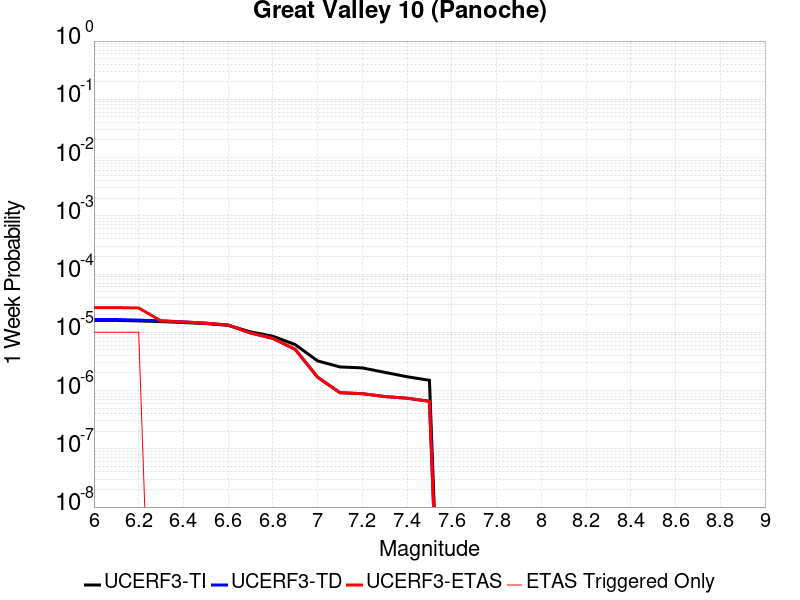 |  |  |  |

| Magnitude | 1 wk TI Prob | 1 wk TD Prob | 1 wk ETAS Prob | 1 wk ETAS/TD Gain | 1 wk ETAS Triggered Only | 1 mo TI Prob | 1 mo TD Prob | 1 mo ETAS Prob | 1 mo ETAS/TD Gain | 1 mo ETAS Triggered Only | 1 yr TI Prob | 1 yr TD Prob | 1 yr ETAS Prob | 1 yr ETAS/TD Gain | 1 yr ETAS Triggered Only | 10 yr TI Prob | 10 yr TD Prob | 10 yr ETAS Prob | 10 yr ETAS/TD Gain | 10 yr ETAS Triggered Only |
|-----|-----|-----|-----|-----|-----|-----|-----|-----|-----|-----|-----|-----|-----|-----|-----|-----|-----|-----|-----|-----|
| 6.0 | 1.6014626E-5 | 1.6575399E-5 | 1.6575399E-5 | 1.0 | 0.0 | 6.863231E-5 | 7.103552E-5 | 7.103552E-5 | 1.0 | 0.0 | 8.35278E-4 | 8.645185E-4 | 8.8139094E-4 | 1.0195166 | 1.6887043E-5 | 0.008321454 | 0.008612172 | 0.008628913 | 1.001944 | 1.6887043E-5 |
| 6.1 | 1.6014626E-5 | 1.6575399E-5 | 1.6575399E-5 | 1.0 | 0.0 | 6.863231E-5 | 7.103552E-5 | 7.103552E-5 | 1.0 | 0.0 | 8.35278E-4 | 8.645185E-4 | 8.8139094E-4 | 1.0195166 | 1.6887043E-5 | 0.008321454 | 0.008612172 | 0.008628913 | 1.001944 | 1.6887043E-5 |
| 6.2 | 1.56782E-5 | 1.6198446E-5 | 1.6198446E-5 | 1.0 | 0.0 | 6.719056E-5 | 6.94201E-5 | 6.94201E-5 | 1.0 | 0.0 | 8.17738E-4 | 8.4486604E-4 | 8.617388E-4 | 1.0199709 | 1.6887043E-5 | 0.008147354 | 0.008417147 | 0.008433892 | 1.0019894 | 1.6887043E-5 |
| 6.3 | 1.5263338E-5 | 1.5723514E-5 | 1.5723514E-5 | 1.0 | 0.0 | 6.541267E-5 | 6.738478E-5 | 6.738478E-5 | 1.0 | 0.0 | 7.961082E-4 | 8.201049E-4 | 8.3697814E-4 | 1.0205745 | 1.6887043E-5 | 0.007932622 | 0.008171377 | 0.008188126 | 1.0020497 | 1.6887043E-5 |
| 6.4 | 1.4720723E-5 | 1.5099376E-5 | 1.5099376E-5 | 1.0 | 0.0 | 6.308728E-5 | 6.471004E-5 | 6.471004E-5 | 1.0 | 0.0 | 7.67817E-4 | 7.8756385E-4 | 8.0443756E-4 | 1.0214252 | 1.6887043E-5 | 0.007651695 | 0.007848303 | 0.007865057 | 1.0021348 | 1.6887043E-5 |
| 6.5 | 1.408264E-5 | 1.4355969E-5 | 1.4355969E-5 | 1.0 | 0.0 | 6.0352773E-5 | 6.1524166E-5 | 6.1524166E-5 | 1.0 | 0.0 | 7.3454727E-4 | 7.488031E-4 | 7.656775E-4 | 1.0225352 | 1.6887043E-5 | 0.0073212404 | 0.0074633555 | 0.0074801166 | 1.0022458 | 1.6887043E-5 |
| 6.6 | 1.3197086E-5 | 1.3321889E-5 | 1.3321889E-5 | 1.0 | 0.0 | 5.6557717E-5 | 5.709259E-5 | 5.709259E-5 | 1.0 | 0.0 | 6.8837265E-4 | 6.9488434E-4 | 7.1175967E-4 | 1.0242851 | 1.6887043E-5 | 0.006862442 | 0.0069276537 | 0.0069444235 | 1.0024208 | 1.6887043E-5 |
| 6.7 | 1.017583E-5 | 9.745382E-6 | 9.745382E-6 | 1.0 | 0.0 | 4.360997E-5 | 4.176527E-5 | 4.176527E-5 | 1.0 | 0.0 | 5.30822E-4 | 5.0837593E-4 | 5.252544E-4 | 1.0332007 | 1.6887043E-5 | 0.0052955584 | 0.005072382 | 0.0050891833 | 1.0033123 | 1.6887043E-5 |
| 6.8 | 8.557912E-6 | 7.872707E-6 | 7.872707E-6 | 1.0 | 0.0 | 3.667625E-5 | 3.373975E-5 | 3.373975E-5 | 1.0 | 0.0 | 4.4644187E-4 | 4.1070607E-4 | 4.1070607E-4 | 1.0 | 0.0 | 0.0044554602 | 0.004099677 | 0.004099677 | 1.0 | 0.0 |
| 6.9 | 6.14664E-6 | 5.092071E-6 | 5.092071E-6 | 1.0 | 0.0 | 2.6342475E-5 | 2.1822989E-5 | 2.1822989E-5 | 1.0 | 0.0 | 3.2067244E-4 | 2.6566387E-4 | 2.6566387E-4 | 1.0 | 0.0 | 0.003202101 | 0.002653601 | 0.002653601 | 1.0 | 0.0 |
| 7.0 | 3.2310581E-6 | 1.6951219E-6 | 1.6951219E-6 | 1.0 | 0.0 | 1.3847319E-5 | 7.264788E-6 | 7.264788E-6 | 1.0 | 0.0 | 1.6857806E-4 | 8.8445304E-5 | 8.8445304E-5 | 1.0 | 0.0 | 0.0016845023 | 8.841104E-4 | 8.841104E-4 | 1.0 | 0.0 |
| 7.1 | 2.544492E-6 | 9.1889206E-7 | 9.1889206E-7 | 1.0 | 0.0 | 1.090492E-5 | 3.938103E-6 | 3.938103E-6 | 1.0 | 0.0 | 1.327593E-4 | 4.79454E-5 | 4.79454E-5 | 1.0 | 0.0 | 0.0013268003 | 4.793553E-4 | 4.793553E-4 | 1.0 | 0.0 |
| 7.2 | 2.4479045E-6 | 8.841304E-7 | 8.841304E-7 | 1.0 | 0.0 | 1.0490977E-5 | 3.789125E-6 | 3.789125E-6 | 1.0 | 0.0 | 1.2772017E-4 | 4.6131667E-5 | 4.6131667E-5 | 1.0 | 0.0 | 0.0012764678 | 4.6122566E-4 | 4.6122566E-4 | 1.0 | 0.0 |
| 7.3 | 2.0559578E-6 | 7.892787E-7 | 7.892787E-7 | 1.0 | 0.0 | 8.811218E-6 | 3.3826188E-6 | 3.3826188E-6 | 1.0 | 0.0 | 1.072713E-4 | 4.1182655E-5 | 4.1182655E-5 | 1.0 | 0.0 | 0.0010721954 | 4.1175485E-4 | 4.1175485E-4 | 1.0 | 0.0 |
| 7.4 | 1.727687E-6 | 7.387757E-7 | 7.387757E-7 | 1.0 | 0.0 | 7.404352E-6 | 3.1661782E-6 | 3.1661782E-6 | 1.0 | 0.0 | 9.0144255E-5 | 3.8547583E-5 | 3.8547583E-5 | 1.0 | 0.0 | 9.0107694E-4 | 3.854136E-4 | 3.854136E-4 | 1.0 | 0.0 |
| 7.5 | 1.5002679E-6 | 6.546144E-7 | 6.546144E-7 | 1.0 | 0.0 | 6.4297037E-6 | 2.8054874E-6 | 2.8054874E-6 | 1.0 | 0.0 | 7.827883E-5 | 3.4156317E-5 | 3.4156317E-5 | 1.0 | 0.0 | 7.825126E-4 | 3.4151482E-4 | 3.4151482E-4 | 1.0 | 0.0 |

## Redondo Canyon alt 1
*[(top)](#table-of-contents)*

| 1 Week | 1 Month | 1 Year | 10 Year |
|-----|-----|-----|-----|
| 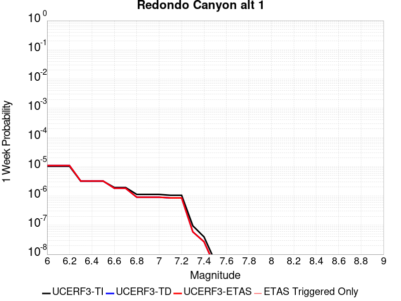 | 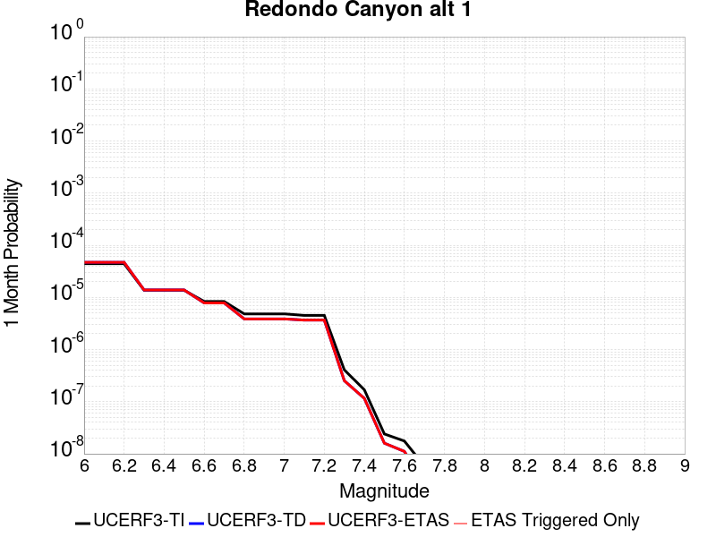 | 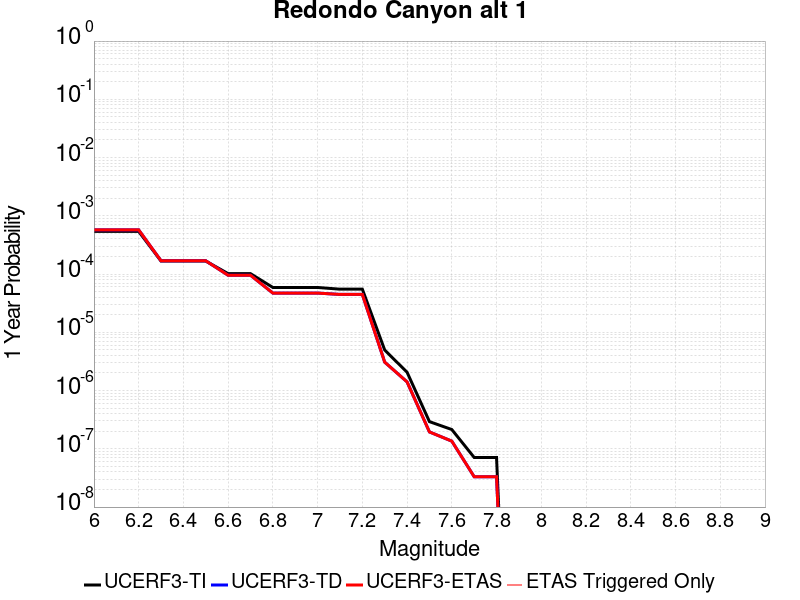 |  |

| Magnitude | 1 wk TI Prob | 1 wk TD Prob | 1 wk ETAS Prob | 1 wk ETAS/TD Gain | 1 wk ETAS Triggered Only | 1 mo TI Prob | 1 mo TD Prob | 1 mo ETAS Prob | 1 mo ETAS/TD Gain | 1 mo ETAS Triggered Only | 1 yr TI Prob | 1 yr TD Prob | 1 yr ETAS Prob | 1 yr ETAS/TD Gain | 1 yr ETAS Triggered Only | 10 yr TI Prob | 10 yr TD Prob | 10 yr ETAS Prob | 10 yr ETAS/TD Gain | 10 yr ETAS Triggered Only |
|-----|-----|-----|-----|-----|-----|-----|-----|-----|-----|-----|-----|-----|-----|-----|-----|-----|-----|-----|-----|-----|
| 6.0 | 1.0346246E-5 | 1.09813445E-5 | 1.09813445E-5 | 1.0 | 0.0 | 4.43403E-5 | 4.7062502E-5 | 4.7062502E-5 | 1.0 | 0.0 | 5.3970946E-4 | 5.729142E-4 | 5.729142E-4 | 1.0 | 0.0 | 0.0053840056 | 0.005722111 | 0.0057389014 | 1.0029343 | 1.6887043E-5 |
| 6.1 | 1.0346246E-5 | 1.09813445E-5 | 1.09813445E-5 | 1.0 | 0.0 | 4.43403E-5 | 4.7062502E-5 | 4.7062502E-5 | 1.0 | 0.0 | 5.3970946E-4 | 5.729142E-4 | 5.729142E-4 | 1.0 | 0.0 | 0.0053840056 | 0.005722111 | 0.0057389014 | 1.0029343 | 1.6887043E-5 |
| 6.2 | 1.0346246E-5 | 1.09813445E-5 | 1.09813445E-5 | 1.0 | 0.0 | 4.43403E-5 | 4.7062502E-5 | 4.7062502E-5 | 1.0 | 0.0 | 5.3970946E-4 | 5.729142E-4 | 5.729142E-4 | 1.0 | 0.0 | 0.0053840056 | 0.005722111 | 0.0057389014 | 1.0029343 | 1.6887043E-5 |
| 6.3 | 3.2052794E-6 | 3.2361174E-6 | 3.2361174E-6 | 1.0 | 0.0 | 1.373684E-5 | 1.3869023E-5 | 1.3869023E-5 | 1.0 | 0.0 | 1.6723319E-4 | 1.6884625E-4 | 1.6884625E-4 | 1.0 | 0.0 | 0.001671074 | 0.0016875692 | 0.0016875692 | 1.0 | 0.0 |
| 6.4 | 3.2052794E-6 | 3.2361174E-6 | 3.2361174E-6 | 1.0 | 0.0 | 1.373684E-5 | 1.3869023E-5 | 1.3869023E-5 | 1.0 | 0.0 | 1.6723319E-4 | 1.6884625E-4 | 1.6884625E-4 | 1.0 | 0.0 | 0.001671074 | 0.0016875692 | 0.0016875692 | 1.0 | 0.0 |
| 6.5 | 3.2052794E-6 | 3.2361174E-6 | 3.2361174E-6 | 1.0 | 0.0 | 1.373684E-5 | 1.3869023E-5 | 1.3869023E-5 | 1.0 | 0.0 | 1.6723319E-4 | 1.6884625E-4 | 1.6884625E-4 | 1.0 | 0.0 | 0.001671074 | 0.0016875692 | 0.0016875692 | 1.0 | 0.0 |
| 6.6 | 1.948328E-6 | 1.8288681E-6 | 1.8288681E-6 | 1.0 | 0.0 | 8.349951E-6 | 7.837991E-6 | 7.837991E-6 | 1.0 | 0.0 | 1.016559E-4 | 9.542486E-5 | 9.542486E-5 | 1.0 | 0.0 | 0.0010160941 | 9.539858E-4 | 9.539858E-4 | 1.0 | 0.0 |
| 6.7 | 1.948328E-6 | 1.8288681E-6 | 1.8288681E-6 | 1.0 | 0.0 | 8.349951E-6 | 7.837991E-6 | 7.837991E-6 | 1.0 | 0.0 | 1.016559E-4 | 9.542486E-5 | 9.542486E-5 | 1.0 | 0.0 | 0.0010160941 | 9.539858E-4 | 9.539858E-4 | 1.0 | 0.0 |
| 6.8 | 1.1278219E-6 | 9.033076E-7 | 9.033076E-7 | 1.0 | 0.0 | 4.8335132E-6 | 3.871315E-6 | 3.871315E-6 | 1.0 | 0.0 | 5.8846435E-5 | 4.7132668E-5 | 4.7132668E-5 | 1.0 | 0.0 | 5.8830855E-4 | 4.7126875E-4 | 4.7126875E-4 | 1.0 | 0.0 |
| 6.9 | 1.1278219E-6 | 9.033076E-7 | 9.033076E-7 | 1.0 | 0.0 | 4.8335132E-6 | 3.871315E-6 | 3.871315E-6 | 1.0 | 0.0 | 5.8846435E-5 | 4.7132668E-5 | 4.7132668E-5 | 1.0 | 0.0 | 5.8830855E-4 | 4.7126875E-4 | 4.7126875E-4 | 1.0 | 0.0 |
| 7.0 | 1.1278219E-6 | 9.033076E-7 | 9.033076E-7 | 1.0 | 0.0 | 4.8335132E-6 | 3.871315E-6 | 3.871315E-6 | 1.0 | 0.0 | 5.8846435E-5 | 4.7132668E-5 | 4.7132668E-5 | 1.0 | 0.0 | 5.8830855E-4 | 4.7126875E-4 | 4.7126875E-4 | 1.0 | 0.0 |
| 7.1 | 1.0545139E-6 | 8.5692716E-7 | 8.5692716E-7 | 1.0 | 0.0 | 4.5193374E-6 | 3.6725423E-6 | 3.6725423E-6 | 1.0 | 0.0 | 5.5021545E-5 | 4.471271E-5 | 4.471271E-5 | 1.0 | 0.0 | 5.500792E-4 | 4.470789E-4 | 4.470789E-4 | 1.0 | 0.0 |
| 7.2 | 1.0545139E-6 | 8.5692716E-7 | 8.5692716E-7 | 1.0 | 0.0 | 4.5193374E-6 | 3.6725423E-6 | 3.6725423E-6 | 1.0 | 0.0 | 5.5021545E-5 | 4.471271E-5 | 4.471271E-5 | 1.0 | 0.0 | 5.500792E-4 | 4.470789E-4 | 4.470789E-4 | 1.0 | 0.0 |
| 7.3 | 9.505161E-8 | 5.8957607E-8 | 5.8957607E-8 | 1.0 | 0.0 | 4.0736398E-7 | 2.5267545E-7 | 2.5267545E-7 | 1.0 | 0.0 | 4.959645E-6 | 3.0763204E-6 | 3.0763204E-6 | 1.0 | 0.0 | 4.9595343E-5 | 3.0762894E-5 | 3.0762894E-5 | 1.0 | 0.0 |
| 7.4 | 3.9520785E-8 | 2.6987191E-8 | 2.6987191E-8 | 1.0 | 0.0 | 1.6937479E-7 | 1.1565938E-7 | 1.1565938E-7 | 1.0 | 0.0 | 2.062136E-6 | 1.4081523E-6 | 1.4081523E-6 | 1.0 | 0.0 | 2.062117E-5 | 1.4081461E-5 | 1.4081461E-5 | 1.0 | 0.0 |
| 7.5 | 5.6133214E-9 | 3.7368215E-9 | 3.7368215E-9 | 1.0 | 0.0 | 2.4057092E-8 | 1.601495E-8 | 1.601495E-8 | 1.0 | 0.0 | 2.9289507E-7 | 1.9498201E-7 | 1.9498201E-7 | 1.0 | 0.0 | 2.9289467E-6 | 1.9498186E-6 | 1.9498186E-6 | 1.0 | 0.0 |
| 7.6 | 4.1064334E-9 | 2.5957634E-9 | 2.5957634E-9 | 1.0 | 0.0 | 1.7599E-8 | 1.11247E-8 | 1.11247E-8 | 1.0 | 0.0 | 2.142678E-7 | 1.3544322E-7 | 1.3544322E-7 | 1.0 | 0.0 | 2.1426758E-6 | 1.3544316E-6 | 1.3544316E-6 | 1.0 | 0.0 |
| 7.7 | 1.361975E-9 | 6.360824E-10 | 6.360824E-10 | 1.0 | 0.0 | 5.8370353E-9 | 2.7260674E-9 | 2.7260674E-9 | 1.0 | 0.0 | 7.1065905E-8 | 3.318987E-8 | 3.318987E-8 | 1.0 | 0.0 | 7.106588E-7 | 3.318987E-7 | 3.318987E-7 | 1.0 | 0.0 |
| 7.8 | 1.361975E-9 | 6.360824E-10 | 6.360824E-10 | 1.0 | 0.0 | 5.8370353E-9 | 2.7260674E-9 | 2.7260674E-9 | 1.0 | 0.0 | 7.1065905E-8 | 3.318987E-8 | 3.318987E-8 | 1.0 | 0.0 | 7.106588E-7 | 3.318987E-7 | 3.318987E-7 | 1.0 | 0.0 |

## Gillem - Big Crack 2011 CFM
*[(top)](#table-of-contents)*

| 1 Week | 1 Month | 1 Year | 10 Year |
|-----|-----|-----|-----|
|  |  |  |  |

| Magnitude | 1 wk TI Prob | 1 wk TD Prob | 1 wk ETAS Prob | 1 wk ETAS/TD Gain | 1 wk ETAS Triggered Only | 1 mo TI Prob | 1 mo TD Prob | 1 mo ETAS Prob | 1 mo ETAS/TD Gain | 1 mo ETAS Triggered Only | 1 yr TI Prob | 1 yr TD Prob | 1 yr ETAS Prob | 1 yr ETAS/TD Gain | 1 yr ETAS Triggered Only | 10 yr TI Prob | 10 yr TD Prob | 10 yr ETAS Prob | 10 yr ETAS/TD Gain | 10 yr ETAS Triggered Only |
|-----|-----|-----|-----|-----|-----|-----|-----|-----|-----|-----|-----|-----|-----|-----|-----|-----|-----|-----|-----|-----|
| 6.0 | 2.196852E-5 | 2.3604485E-5 | 4.049113E-5 | 1.7153997 | 1.6887043E-5 | 9.4147406E-5 | 1.01158665E-4 | 1.18043994E-4 | 1.1669194 | 1.6887043E-5 | 0.0011456419 | 0.0012309998 | 0.0012478661 | 1.0137013 | 1.6887043E-5 | 0.011397537 | 0.012250669 | 0.012267349 | 1.0013616 | 1.6887043E-5 |
| 6.1 | 9.992795E-6 | 1.071189E-5 | 2.7598751E-5 | 2.5764596 | 1.6887043E-5 | 4.2825563E-5 | 4.5907396E-5 | 6.279366E-5 | 1.3678333 | 1.6887043E-5 | 5.2127644E-4 | 5.587975E-4 | 5.756751E-4 | 1.0302035 | 1.6887043E-5 | 0.0052005537 | 0.0055757347 | 0.0055925273 | 1.0030118 | 1.6887043E-5 |
| 6.2 | 9.992795E-6 | 1.071189E-5 | 2.7598751E-5 | 2.5764596 | 1.6887043E-5 | 4.2825563E-5 | 4.5907396E-5 | 6.279366E-5 | 1.3678333 | 1.6887043E-5 | 5.2127644E-4 | 5.587975E-4 | 5.756751E-4 | 1.0302035 | 1.6887043E-5 | 0.0052005537 | 0.0055757347 | 0.0055925273 | 1.0030118 | 1.6887043E-5 |
| 6.3 | 4.6127884E-6 | 4.942657E-6 | 4.942657E-6 | 1.0 | 0.0 | 1.9768944E-5 | 2.1182668E-5 | 2.1182668E-5 | 1.0 | 0.0 | 2.406603E-4 | 2.5787292E-4 | 2.5787292E-4 | 1.0 | 0.0 | 0.0024039985 | 0.0025761751 | 0.0025761751 | 1.0 | 0.0 |
| 6.4 | 4.6127884E-6 | 4.942657E-6 | 4.942657E-6 | 1.0 | 0.0 | 1.9768944E-5 | 2.1182668E-5 | 2.1182668E-5 | 1.0 | 0.0 | 2.406603E-4 | 2.5787292E-4 | 2.5787292E-4 | 1.0 | 0.0 | 0.0024039985 | 0.0025761751 | 0.0025761751 | 1.0 | 0.0 |
| 6.5 | 2.716712E-6 | 2.9111113E-6 | 2.9111113E-6 | 1.0 | 0.0 | 1.1643E-5 | 1.24761455E-5 | 1.24761455E-5 | 1.0 | 0.0 | 1.417443E-4 | 1.5188892E-4 | 1.5188892E-4 | 1.0 | 0.0 | 0.0014165393 | 0.001518089 | 0.001518089 | 1.0 | 0.0 |
| 6.6 | 1.3818255E-6 | 1.4820689E-6 | 1.4820689E-6 | 1.0 | 0.0 | 5.922096E-6 | 6.3517155E-6 | 6.3517155E-6 | 1.0 | 0.0 | 7.209913E-5 | 7.7330624E-5 | 7.7330624E-5 | 1.0 | 0.0 | 7.2075747E-4 | 7.7315804E-4 | 7.7315804E-4 | 1.0 | 0.0 |

## Calaveras (So) - Paicines extension 2011 CFM
*[(top)](#table-of-contents)*

| 1 Week | 1 Month | 1 Year | 10 Year |
|-----|-----|-----|-----|
|  |  |  |  |

| Magnitude | 1 wk TI Prob | 1 wk TD Prob | 1 wk ETAS Prob | 1 wk ETAS/TD Gain | 1 wk ETAS Triggered Only | 1 mo TI Prob | 1 mo TD Prob | 1 mo ETAS Prob | 1 mo ETAS/TD Gain | 1 mo ETAS Triggered Only | 1 yr TI Prob | 1 yr TD Prob | 1 yr ETAS Prob | 1 yr ETAS/TD Gain | 1 yr ETAS Triggered Only | 10 yr TI Prob | 10 yr TD Prob | 10 yr ETAS Prob | 10 yr ETAS/TD Gain | 10 yr ETAS Triggered Only |
|-----|-----|-----|-----|-----|-----|-----|-----|-----|-----|-----|-----|-----|-----|-----|-----|-----|-----|-----|-----|-----|
| 6.0 | 1.5183659E-4 | 3.0533716E-4 | 3.0533716E-4 | 1.0 | 0.0 | 6.5056595E-4 | 0.0013069661 | 0.0013069661 | 1.0 | 0.0 | 0.007891912 | 0.01569571 | 0.015712332 | 1.001059 | 1.6887043E-5 | 0.076174594 | 0.13848671 | 0.13850127 | 1.000105 | 1.6887043E-5 |
| 6.1 | 1.5024997E-4 | 3.0227835E-4 | 3.0227835E-4 | 1.0 | 0.0 | 6.437695E-4 | 0.00129387 | 0.00129387 | 1.0 | 0.0 | 0.0078097614 | 0.015539104 | 0.015555729 | 1.0010699 | 1.6887043E-5 | 0.075409345 | 0.13715632 | 0.1371709 | 1.0001062 | 1.6887043E-5 |
| 6.2 | 1.2743923E-4 | 2.5306802E-4 | 2.5306802E-4 | 1.0 | 0.0 | 5.460538E-4 | 0.0010841049 | 0.0010841049 | 1.0 | 0.0 | 0.0066279583 | 0.013046704 | 0.013046704 | 1.0 | 0.0 | 0.064337276 | 0.11725405 | 0.11725405 | 1.0 | 0.0 |
| 6.3 | 1.1525114E-4 | 2.2595265E-4 | 2.2595265E-4 | 1.0 | 0.0 | 4.9383997E-4 | 9.6799526E-4 | 9.6799526E-4 | 1.0 | 0.0 | 0.0059959386 | 0.011667927 | 0.011667927 | 1.0 | 0.0 | 0.058367174 | 0.10637007 | 0.10637007 | 1.0 | 0.0 |
| 6.4 | 1.07200925E-4 | 2.0836305E-4 | 2.0836305E-4 | 1.0 | 0.0 | 4.5935164E-4 | 8.926636E-4 | 8.926636E-4 | 1.0 | 0.0 | 0.0055782744 | 0.010772766 | 0.010772766 | 1.0 | 0.0 | 0.0544031 | 0.09919256 | 0.09919256 | 1.0 | 0.0 |
| 6.5 | 9.69631E-5 | 1.8729115E-4 | 1.8729115E-4 | 1.0 | 0.0 | 4.1548995E-4 | 8.024135E-4 | 8.024135E-4 | 1.0 | 0.0 | 0.0050468626 | 0.009694662 | 0.009694662 | 1.0 | 0.0 | 0.04933773 | 0.090084255 | 0.090084255 | 1.0 | 0.0 |
| 6.6 | 8.0552316E-5 | 1.5070537E-4 | 1.5070537E-4 | 1.0 | 0.0 | 3.4517853E-4 | 6.456994E-4 | 6.456994E-4 | 1.0 | 0.0 | 0.0041944524 | 0.007826256 | 0.007826256 | 1.0 | 0.0 | 0.04116161 | 0.074854024 | 0.074854024 | 1.0 | 0.0 |
| 6.7 | 7.815757E-5 | 1.4610609E-4 | 1.4610609E-4 | 1.0 | 0.0 | 3.34918E-4 | 6.260017E-4 | 6.260017E-4 | 1.0 | 0.0 | 0.004070005 | 0.0075890915 | 0.0075890915 | 1.0 | 0.0 | 0.039962657 | 0.072703585 | 0.072703585 | 1.0 | 0.0 |
| 6.8 | 6.965264E-5 | 1.2721405E-4 | 1.2721405E-4 | 1.0 | 0.0 | 2.9847719E-4 | 5.450839E-4 | 5.450839E-4 | 1.0 | 0.0 | 0.0036279052 | 0.00661342 | 0.00661342 | 1.0 | 0.0 | 0.03569247 | 0.06379891 | 0.06379891 | 1.0 | 0.0 |
| 6.9 | 5.8000453E-5 | 1.01435086E-4 | 1.01435086E-4 | 1.0 | 0.0 | 2.4854968E-4 | 4.3464993E-4 | 4.3464993E-4 | 1.0 | 0.0 | 0.0030218933 | 0.0052791284 | 0.0052791284 | 1.0 | 0.0 | 0.029811295 | 0.051501602 | 0.051501602 | 1.0 | 0.0 |
| 7.0 | 4.9865852E-5 | 8.567692E-5 | 8.567692E-5 | 1.0 | 0.0 | 2.1369329E-4 | 3.671356E-4 | 3.671356E-4 | 1.0 | 0.0 | 0.0025986114 | 0.0044608037 | 0.0044608037 | 1.0 | 0.0 | 0.025684336 | 0.043781694 | 0.043781694 | 1.0 | 0.0 |
| 7.1 | 4.283875E-5 | 7.112159E-5 | 7.112159E-5 | 1.0 | 0.0 | 1.8358172E-4 | 3.047715E-4 | 3.047715E-4 | 1.0 | 0.0 | 0.0022328163 | 0.003704336 | 0.003704336 | 1.0 | 0.0 | 0.022105146 | 0.03673583 | 0.03673583 | 1.0 | 0.0 |
| 7.2 | 3.450115E-5 | 5.5776054E-5 | 5.5776054E-5 | 1.0 | 0.0 | 1.478537E-4 | 2.390185E-4 | 2.390185E-4 | 1.0 | 0.0 | 0.0017986323 | 0.0029061958 | 0.0029061958 | 1.0 | 0.0 | 0.017841442 | 0.029079199 | 0.029079199 | 1.0 | 0.0 |
| 7.3 | 2.5709045E-5 | 4.0588155E-5 | 4.0588155E-5 | 1.0 | 0.0 | 1.1017697E-4 | 1.7393773E-4 | 1.7393773E-4 | 1.0 | 0.0 | 0.0013405791 | 0.002115652 | 0.002115652 | 1.0 | 0.0 | 0.013325208 | 0.021297242 | 0.021297242 | 1.0 | 0.0 |
| 7.4 | 1.8003093E-5 | 2.8509934E-5 | 2.8509934E-5 | 1.0 | 0.0 | 7.715383E-5 | 1.2217973E-4 | 1.2217973E-4 | 1.0 | 0.0 | 9.3894306E-4 | 0.0014865254 | 0.0014865254 | 1.0 | 0.0 | 0.009349857 | 0.015052196 | 0.015052196 | 1.0 | 0.0 |
| 7.5 | 1.5595824E-5 | 2.5822499E-5 | 2.5822499E-5 | 1.0 | 0.0 | 6.683753E-5 | 1.1066317E-4 | 1.1066317E-4 | 1.0 | 0.0 | 8.134431E-4 | 0.0013464936 | 0.0013464936 | 1.0 | 0.0 | 0.008104719 | 0.01365213 | 0.01365213 | 1.0 | 0.0 |
| 7.6 | 1.1110309E-5 | 1.9222098E-5 | 1.9222098E-5 | 1.0 | 0.0 | 4.761474E-5 | 8.2377825E-5 | 8.2377825E-5 | 1.0 | 0.0 | 5.795553E-4 | 0.0010024898 | 0.0010024898 | 1.0 | 0.0 | 0.0057804612 | 0.010203943 | 0.010203943 | 1.0 | 0.0 |
| 7.7 | 6.2140443E-6 | 1.0437076E-5 | 1.0437076E-5 | 1.0 | 0.0 | 2.6631347E-5 | 4.4729557E-5 | 4.4729557E-5 | 1.0 | 0.0 | 3.241884E-4 | 5.444464E-4 | 5.444464E-4 | 1.0 | 0.0 | 0.0032371588 | 0.005619835 | 0.005619835 | 1.0 | 0.0 |
| 7.8 | 5.305533E-6 | 9.433038E-6 | 9.433038E-6 | 1.0 | 0.0 | 2.27378E-5 | 4.042668E-5 | 4.042668E-5 | 1.0 | 0.0 | 2.7679754E-4 | 4.920837E-4 | 4.920837E-4 | 1.0 | 0.0 | 0.0027645302 | 0.005074324 | 0.005074324 | 1.0 | 0.0 |
| 7.9 | 3.363505E-6 | 7.3848937E-6 | 7.3848937E-6 | 1.0 | 0.0 | 1.4414942E-5 | 3.164916E-5 | 3.164916E-5 | 1.0 | 0.0 | 1.7548777E-4 | 3.8526047E-4 | 3.8526047E-4 | 1.0 | 0.0 | 0.0017534926 | 0.003948527 | 0.003948527 | 1.0 | 0.0 |
| 8.0 | 2.0271132E-6 | 4.413104E-6 | 4.413104E-6 | 1.0 | 0.0 | 8.687599E-6 | 1.8913164E-5 | 1.8913164E-5 | 1.0 | 0.0 | 1.05766376E-4 | 2.302435E-4 | 2.302435E-4 | 1.0 | 0.0 | 0.0010571606 | 0.002351099 | 0.002351099 | 1.0 | 0.0 |
| 8.1 | 1.2206116E-6 | 2.3751331E-6 | 2.3751331E-6 | 1.0 | 0.0 | 5.2311816E-6 | 1.0179103E-5 | 1.0179103E-5 | 1.0 | 0.0 | 6.3687774E-5 | 1.2392356E-4 | 1.2392356E-4 | 1.0 | 0.0 | 6.366953E-4 | 0.0012705477 | 0.0012705477 | 1.0 | 0.0 |

## Round Valley
*[(top)](#table-of-contents)*

| 1 Week | 1 Month | 1 Year | 10 Year |
|-----|-----|-----|-----|
|  |  |  |  |

| Magnitude | 1 wk TI Prob | 1 wk TD Prob | 1 wk ETAS Prob | 1 wk ETAS/TD Gain | 1 wk ETAS Triggered Only | 1 mo TI Prob | 1 mo TD Prob | 1 mo ETAS Prob | 1 mo ETAS/TD Gain | 1 mo ETAS Triggered Only | 1 yr TI Prob | 1 yr TD Prob | 1 yr ETAS Prob | 1 yr ETAS/TD Gain | 1 yr ETAS Triggered Only | 10 yr TI Prob | 10 yr TD Prob | 10 yr ETAS Prob | 10 yr ETAS/TD Gain | 10 yr ETAS Triggered Only |
|-----|-----|-----|-----|-----|-----|-----|-----|-----|-----|-----|-----|-----|-----|-----|-----|-----|-----|-----|-----|-----|
| 6.0 | 1.588152E-5 | 1.3670716E-5 | 1.3670716E-5 | 1.0 | 0.0 | 6.806188E-5 | 5.8587688E-5 | 7.547374E-5 | 1.2882185 | 1.6887043E-5 | 8.283384E-4 | 7.13111E-4 | 7.2998606E-4 | 1.0236639 | 1.6887043E-5 | 0.008252576 | 0.0071121147 | 0.0071288818 | 1.0023575 | 1.6887043E-5 |
| 6.1 | 1.588152E-5 | 1.3670716E-5 | 1.3670716E-5 | 1.0 | 0.0 | 6.806188E-5 | 5.8587688E-5 | 7.547374E-5 | 1.2882185 | 1.6887043E-5 | 8.283384E-4 | 7.13111E-4 | 7.2998606E-4 | 1.0236639 | 1.6887043E-5 | 0.008252576 | 0.0071121147 | 0.0071288818 | 1.0023575 | 1.6887043E-5 |
| 6.2 | 1.588152E-5 | 1.3670716E-5 | 1.3670716E-5 | 1.0 | 0.0 | 6.806188E-5 | 5.8587688E-5 | 7.547374E-5 | 1.2882185 | 1.6887043E-5 | 8.283384E-4 | 7.13111E-4 | 7.2998606E-4 | 1.0236639 | 1.6887043E-5 | 0.008252576 | 0.0071121147 | 0.0071288818 | 1.0023575 | 1.6887043E-5 |
| 6.3 | 1.588152E-5 | 1.3670716E-5 | 1.3670716E-5 | 1.0 | 0.0 | 6.806188E-5 | 5.8587688E-5 | 7.547374E-5 | 1.2882185 | 1.6887043E-5 | 8.283384E-4 | 7.13111E-4 | 7.2998606E-4 | 1.0236639 | 1.6887043E-5 | 0.008252576 | 0.0071121147 | 0.0071288818 | 1.0023575 | 1.6887043E-5 |
| 6.4 | 1.588152E-5 | 1.3670716E-5 | 1.3670716E-5 | 1.0 | 0.0 | 6.806188E-5 | 5.8587688E-5 | 7.547374E-5 | 1.2882185 | 1.6887043E-5 | 8.283384E-4 | 7.13111E-4 | 7.2998606E-4 | 1.0236639 | 1.6887043E-5 | 0.008252576 | 0.0071121147 | 0.0071288818 | 1.0023575 | 1.6887043E-5 |
| 6.5 | 1.0646776E-5 | 7.953037E-6 | 7.953037E-6 | 1.0 | 0.0 | 4.5628243E-5 | 3.408405E-5 | 5.0970517E-5 | 1.4954361 | 1.6887043E-5 | 5.553823E-4 | 4.1490266E-4 | 4.3178268E-4 | 1.0406843 | 1.6887043E-5 | 0.005539963 | 0.0041421093 | 0.004158926 | 1.00406 | 1.6887043E-5 |
| 6.6 | 8.632956E-6 | 5.768742E-6 | 5.768742E-6 | 1.0 | 0.0 | 3.6997862E-5 | 2.4722967E-5 | 2.4722967E-5 | 1.0 | 0.0 | 4.5035584E-4 | 3.009644E-4 | 3.009644E-4 | 1.0 | 0.0 | 0.0044944426 | 0.003005946 | 0.003005946 | 1.0 | 0.0 |
| 6.7 | 8.632956E-6 | 5.768742E-6 | 5.768742E-6 | 1.0 | 0.0 | 3.6997862E-5 | 2.4722967E-5 | 2.4722967E-5 | 1.0 | 0.0 | 4.5035584E-4 | 3.009644E-4 | 3.009644E-4 | 1.0 | 0.0 | 0.0044944426 | 0.003005946 | 0.003005946 | 1.0 | 0.0 |
| 6.8 | 7.143895E-6 | 4.2018346E-6 | 4.2018346E-6 | 1.0 | 0.0 | 3.0616335E-5 | 1.8007748E-5 | 1.8007748E-5 | 1.0 | 0.0 | 3.726901E-4 | 2.1922393E-4 | 2.1922393E-4 | 1.0 | 0.0 | 0.0037206567 | 0.0021902416 | 0.0021902416 | 1.0 | 0.0 |
| 6.9 | 6.5120694E-6 | 3.6644687E-6 | 3.6644687E-6 | 1.0 | 0.0 | 2.790857E-5 | 1.570478E-5 | 1.570478E-5 | 1.0 | 0.0 | 3.3973387E-4 | 1.9119044E-4 | 1.9119044E-4 | 1.0 | 0.0 | 0.0033921495 | 0.0019104085 | 0.0019104085 | 1.0 | 0.0 |
| 7.0 | 5.0614435E-6 | 2.6836676E-6 | 2.6836676E-6 | 1.0 | 0.0 | 2.169172E-5 | 1.1501388E-5 | 1.1501388E-5 | 1.0 | 0.0 | 2.6406467E-4 | 1.4002144E-4 | 1.4002144E-4 | 1.0 | 0.0 | 0.0026375111 | 0.0013994334 | 0.0013994334 | 1.0 | 0.0 |
| 7.1 | 4.41728E-6 | 2.3575074E-6 | 2.3575074E-6 | 1.0 | 0.0 | 1.8931061E-5 | 1.0103569E-5 | 1.0103569E-5 | 1.0 | 0.0 | 2.304613E-4 | 1.23005E-4 | 1.23005E-4 | 1.0 | 0.0 | 0.0023022245 | 0.0012294657 | 0.0012294657 | 1.0 | 0.0 |
| 7.2 | 2.535495E-6 | 1.1208391E-6 | 1.1208391E-6 | 1.0 | 0.0 | 1.0866362E-5 | 4.8035904E-6 | 4.8035904E-6 | 1.0 | 0.0 | 1.3228992E-4 | 5.8482667E-5 | 5.8482667E-5 | 1.0 | 0.0 | 0.0013221119 | 5.84724E-4 | 5.84724E-4 | 1.0 | 0.0 |
| 7.3 | 7.900015E-7 | 4.0889498E-7 | 4.0889498E-7 | 1.0 | 0.0 | 3.3857161E-6 | 1.752407E-6 | 1.752407E-6 | 1.0 | 0.0 | 4.1220315E-5 | 2.1335554E-5 | 2.1335554E-5 | 1.0 | 0.0 | 4.121267E-4 | 2.1335555E-4 | 2.1335555E-4 | 1.0 | 0.0 |

## San Luis Range - Pecho 2011 CFM
*[(top)](#table-of-contents)*

| 1 Week | 1 Month | 1 Year | 10 Year |
|-----|-----|-----|-----|
|  | 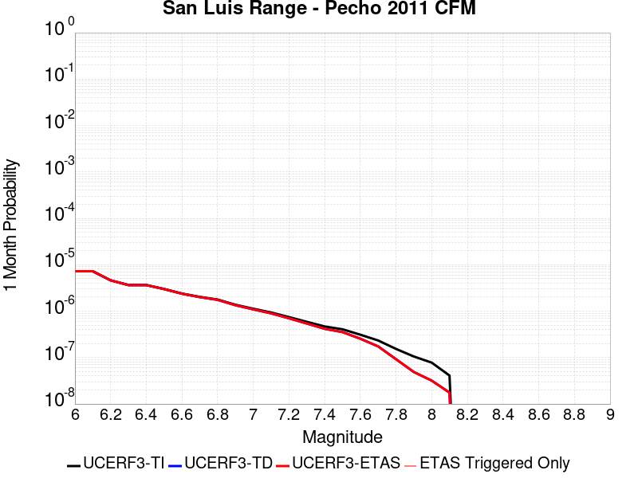 | 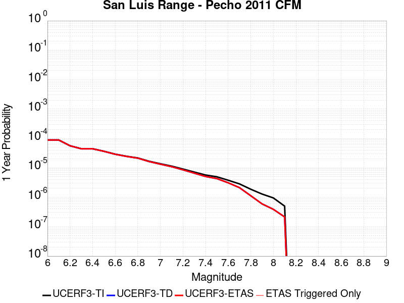 | 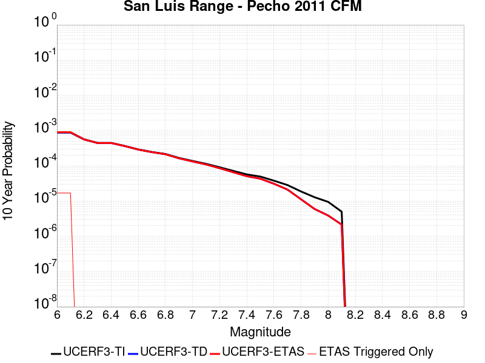 |

| Magnitude | 1 wk TI Prob | 1 wk TD Prob | 1 wk ETAS Prob | 1 wk ETAS/TD Gain | 1 wk ETAS Triggered Only | 1 mo TI Prob | 1 mo TD Prob | 1 mo ETAS Prob | 1 mo ETAS/TD Gain | 1 mo ETAS Triggered Only | 1 yr TI Prob | 1 yr TD Prob | 1 yr ETAS Prob | 1 yr ETAS/TD Gain | 1 yr ETAS Triggered Only | 10 yr TI Prob | 10 yr TD Prob | 10 yr ETAS Prob | 10 yr ETAS/TD Gain | 10 yr ETAS Triggered Only |
|-----|-----|-----|-----|-----|-----|-----|-----|-----|-----|-----|-----|-----|-----|-----|-----|-----|-----|-----|-----|-----|
| 6.0 | 1.687423E-6 | 1.6921945E-6 | 1.6921945E-6 | 1.0 | 0.0 | 7.231793E-6 | 7.252243E-6 | 7.252243E-6 | 1.0 | 0.0 | 8.804352E-5 | 8.829273E-5 | 8.829273E-5 | 1.0 | 0.0 | 8.8008645E-4 | 8.826004E-4 | 8.994725E-4 | 1.0191164 | 1.6887043E-5 |
| 6.1 | 1.687423E-6 | 1.6921945E-6 | 1.6921945E-6 | 1.0 | 0.0 | 7.231793E-6 | 7.252243E-6 | 7.252243E-6 | 1.0 | 0.0 | 8.804352E-5 | 8.829273E-5 | 8.829273E-5 | 1.0 | 0.0 | 8.8008645E-4 | 8.826004E-4 | 8.994725E-4 | 1.0191164 | 1.6887043E-5 |
| 6.2 | 1.0765672E-6 | 1.0770541E-6 | 1.0770541E-6 | 1.0 | 0.0 | 4.613851E-6 | 4.6159385E-6 | 4.6159385E-6 | 1.0 | 0.0 | 5.617219E-5 | 5.6197663E-5 | 5.6197663E-5 | 1.0 | 0.0 | 5.6157995E-4 | 5.618408E-4 | 5.618408E-4 | 1.0 | 0.0 |
| 6.3 | 8.523104E-7 | 8.513022E-7 | 8.513022E-7 | 1.0 | 0.0 | 3.6527538E-6 | 3.6484332E-6 | 3.6484332E-6 | 1.0 | 0.0 | 4.447137E-5 | 4.44188E-5 | 4.44188E-5 | 1.0 | 0.0 | 4.4462472E-4 | 4.4410242E-4 | 4.4410242E-4 | 1.0 | 0.0 |
| 6.4 | 8.523104E-7 | 8.513022E-7 | 8.513022E-7 | 1.0 | 0.0 | 3.6527538E-6 | 3.6484332E-6 | 3.6484332E-6 | 1.0 | 0.0 | 4.447137E-5 | 4.44188E-5 | 4.44188E-5 | 1.0 | 0.0 | 4.4462472E-4 | 4.4410242E-4 | 4.4410242E-4 | 1.0 | 0.0 |
| 6.5 | 7.0029404E-7 | 6.976439E-7 | 6.976439E-7 | 1.0 | 0.0 | 3.0012568E-6 | 2.989899E-6 | 2.989899E-6 | 1.0 | 0.0 | 3.6539688E-5 | 3.640143E-5 | 3.640143E-5 | 1.0 | 0.0 | 3.653368E-4 | 3.6395635E-4 | 3.6395635E-4 | 1.0 | 0.0 |
| 6.6 | 5.583906E-7 | 5.54283E-7 | 5.54283E-7 | 1.0 | 0.0 | 2.3931002E-6 | 2.3754965E-6 | 2.3754965E-6 | 1.0 | 0.0 | 2.9135606E-5 | 2.8921293E-5 | 2.8921293E-5 | 1.0 | 0.0 | 2.9131788E-4 | 2.8917604E-4 | 2.8917604E-4 | 1.0 | 0.0 |
| 6.7 | 4.73441E-7 | 4.6830664E-7 | 4.6830664E-7 | 1.0 | 0.0 | 2.0290313E-6 | 2.007027E-6 | 2.007027E-6 | 1.0 | 0.0 | 2.4703175E-5 | 2.4435283E-5 | 2.4435283E-5 | 1.0 | 0.0 | 2.470043E-4 | 2.4432642E-4 | 2.4432642E-4 | 1.0 | 0.0 |
| 6.8 | 4.1466086E-7 | 4.0877956E-7 | 4.0877956E-7 | 1.0 | 0.0 | 1.7771167E-6 | 1.7519112E-6 | 1.7519112E-6 | 1.0 | 0.0 | 2.1636182E-5 | 2.1329313E-5 | 2.1329313E-5 | 1.0 | 0.0 | 2.1634075E-4 | 2.13273E-4 | 2.13273E-4 | 1.0 | 0.0 |
| 6.9 | 3.2056641E-7 | 3.1329304E-7 | 3.1329304E-7 | 1.0 | 0.0 | 1.3738553E-6 | 1.3426838E-6 | 1.3426838E-6 | 1.0 | 0.0 | 1.6726559E-5 | 1.6347054E-5 | 1.6347054E-5 | 1.0 | 0.0 | 1.67253E-4 | 1.6345867E-4 | 1.6345867E-4 | 1.0 | 0.0 |
| 7.0 | 2.6315942E-7 | 2.548968E-7 | 2.548968E-7 | 1.0 | 0.0 | 1.1278256E-6 | 1.0924143E-6 | 1.0924143E-6 | 1.0 | 0.0 | 1.3731191E-5 | 1.3300064E-5 | 1.3300064E-5 | 1.0 | 0.0 | 1.3730342E-4 | 1.3299276E-4 | 1.3299276E-4 | 1.0 | 0.0 |
| 7.1 | 2.1832436E-7 | 2.0917318E-7 | 2.0917318E-7 | 1.0 | 0.0 | 9.356755E-7 | 8.964562E-7 | 8.964562E-7 | 1.0 | 0.0 | 1.13917895E-5 | 1.0914299E-5 | 1.0914299E-5 | 1.0 | 0.0 | 1.1391206E-4 | 1.0913769E-4 | 1.0913769E-4 | 1.0 | 0.0 |
| 7.2 | 1.7393015E-7 | 1.6376598E-7 | 1.6376598E-7 | 1.0 | 0.0 | 7.454147E-7 | 7.0185393E-7 | 7.0185393E-7 | 1.0 | 0.0 | 9.075386E-6 | 8.545038E-6 | 8.545038E-6 | 1.0 | 0.0 | 9.075015E-5 | 8.544713E-5 | 8.544713E-5 | 1.0 | 0.0 |
| 7.3 | 1.3744894E-7 | 1.2638625E-7 | 1.2638625E-7 | 1.0 | 0.0 | 5.890667E-7 | 5.4165525E-7 | 5.4165525E-7 | 1.0 | 0.0 | 7.1718637E-6 | 6.5946324E-6 | 6.5946324E-6 | 1.0 | 0.0 | 7.171632E-5 | 6.594438E-5 | 6.594438E-5 | 1.0 | 0.0 |
| 7.4 | 1.0915278E-7 | 9.72754E-8 | 9.72754E-8 | 1.0 | 0.0 | 4.6779755E-7 | 4.1689447E-7 | 4.1689447E-7 | 1.0 | 0.0 | 5.6954204E-6 | 5.0756785E-6 | 5.0756785E-6 | 1.0 | 0.0 | 5.6952744E-5 | 5.0755632E-5 | 5.0755632E-5 | 1.0 | 0.0 |
| 7.5 | 9.490291E-8 | 8.257137E-8 | 8.257137E-8 | 1.0 | 0.0 | 4.0672668E-7 | 3.5387725E-7 | 3.5387725E-7 | 1.0 | 0.0 | 4.9518862E-6 | 4.308447E-6 | 4.308447E-6 | 1.0 | 0.0 | 4.951776E-5 | 4.308364E-5 | 4.308364E-5 | 1.0 | 0.0 |
| 7.6 | 7.256678E-8 | 5.9425346E-8 | 5.9425346E-8 | 1.0 | 0.0 | 3.1100043E-7 | 2.5468003E-7 | 2.5468003E-7 | 1.0 | 0.0 | 3.7864236E-6 | 3.1007248E-6 | 3.1007248E-6 | 1.0 | 0.0 | 3.7863592E-5 | 3.100682E-5 | 3.100682E-5 | 1.0 | 0.0 |
| 7.7 | 5.446273E-8 | 4.0579426E-8 | 4.0579426E-8 | 1.0 | 0.0 | 2.3341168E-7 | 1.739118E-7 | 1.739118E-7 | 1.0 | 0.0 | 2.8417835E-6 | 2.1173742E-6 | 2.1173742E-6 | 1.0 | 0.0 | 2.8417471E-5 | 2.117354E-5 | 2.117354E-5 | 1.0 | 0.0 |
| 7.8 | 3.5850867E-8 | 2.1520547E-8 | 2.1520547E-8 | 1.0 | 0.0 | 1.5364655E-7 | 9.2230906E-8 | 9.2230906E-8 | 1.0 | 0.0 | 1.8706452E-6 | 1.1229107E-6 | 1.1229107E-6 | 1.0 | 0.0 | 1.8706294E-5 | 1.1229051E-5 | 1.1229051E-5 | 1.0 | 0.0 |
| 7.9 | 2.45879E-8 | 1.1394765E-8 | 1.1394765E-8 | 1.0 | 0.0 | 1.0537671E-7 | 4.88347E-8 | 4.88347E-8 | 1.0 | 0.0 | 1.2829606E-6 | 5.945623E-7 | 5.945623E-7 | 1.0 | 0.0 | 1.2829532E-5 | 5.9456074E-6 | 5.9456074E-6 | 1.0 | 0.0 |
| 8.0 | 1.8151761E-8 | 7.4411712E-9 | 7.4411712E-9 | 1.0 | 0.0 | 7.779326E-8 | 3.1890732E-8 | 3.1890732E-8 | 1.0 | 0.0 | 9.4713255E-7 | 3.882696E-7 | 3.882696E-7 | 1.0 | 0.0 | 9.471285E-6 | 3.8826893E-6 | 3.8826893E-6 | 1.0 | 0.0 |
| 8.1 | 9.559205E-9 | 4.1004897E-9 | 4.1004897E-9 | 1.0 | 0.0 | 4.096802E-8 | 1.7573525E-8 | 1.7573525E-8 | 1.0 | 0.0 | 4.9878554E-7 | 2.1395765E-7 | 2.1395765E-7 | 1.0 | 0.0 | 4.987844E-6 | 2.1395745E-6 | 2.1395745E-6 | 1.0 | 0.0 |

## West Napa 2011 CFM
*[(top)](#table-of-contents)*

| 1 Week | 1 Month | 1 Year | 10 Year |
|-----|-----|-----|-----|
| 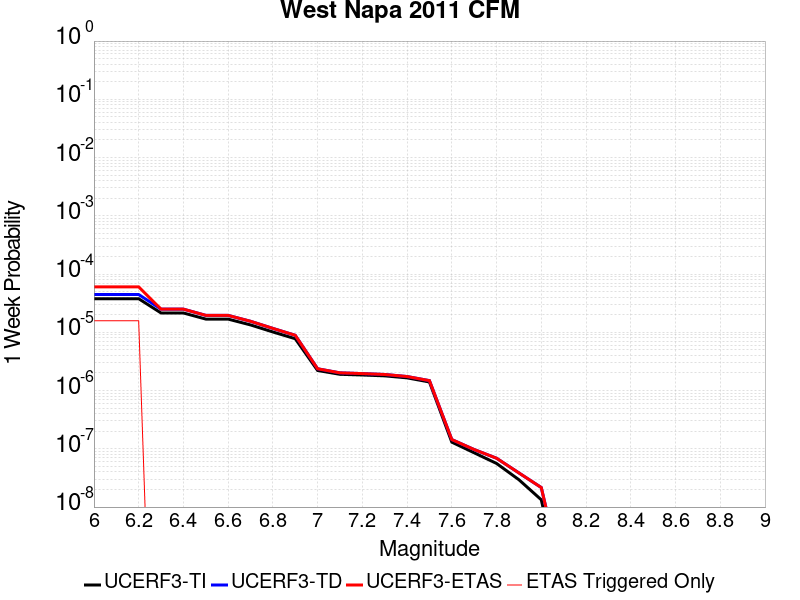 | 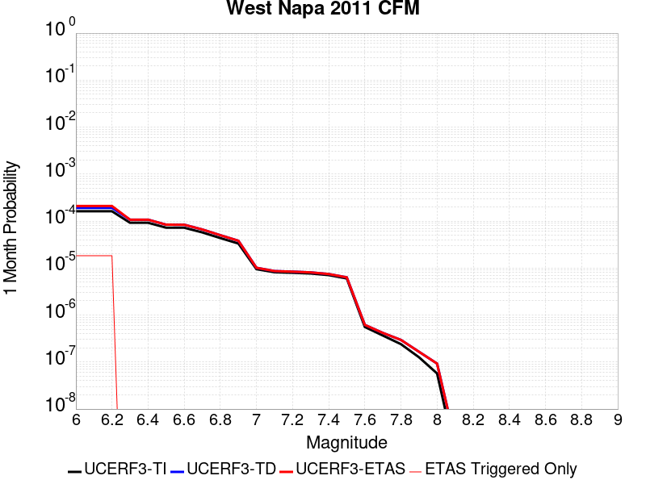 | 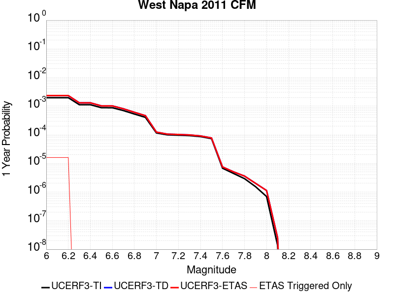 |  |

| Magnitude | 1 wk TI Prob | 1 wk TD Prob | 1 wk ETAS Prob | 1 wk ETAS/TD Gain | 1 wk ETAS Triggered Only | 1 mo TI Prob | 1 mo TD Prob | 1 mo ETAS Prob | 1 mo ETAS/TD Gain | 1 mo ETAS Triggered Only | 1 yr TI Prob | 1 yr TD Prob | 1 yr ETAS Prob | 1 yr ETAS/TD Gain | 1 yr ETAS Triggered Only | 10 yr TI Prob | 10 yr TD Prob | 10 yr ETAS Prob | 10 yr ETAS/TD Gain | 10 yr ETAS Triggered Only |
|-----|-----|-----|-----|-----|-----|-----|-----|-----|-----|-----|-----|-----|-----|-----|-----|-----|-----|-----|-----|-----|
| 6.0 | 3.773104E-5 | 4.452845E-5 | 6.1414736E-5 | 1.3792248 | 1.6887043E-5 | 1.6169442E-4 | 1.9082405E-4 | 2.0770787E-4 | 1.0884784 | 1.6887043E-5 | 0.001966852 | 0.0023211248 | 0.0023379726 | 1.0072585 | 1.6887043E-5 | 0.019495348 | 0.023002245 | 0.023018744 | 1.0007173 | 1.6887043E-5 |
| 6.1 | 3.773104E-5 | 4.452845E-5 | 6.1414736E-5 | 1.3792248 | 1.6887043E-5 | 1.6169442E-4 | 1.9082405E-4 | 2.0770787E-4 | 1.0884784 | 1.6887043E-5 | 0.001966852 | 0.0023211248 | 0.0023379726 | 1.0072585 | 1.6887043E-5 | 0.019495348 | 0.023002245 | 0.023018744 | 1.0007173 | 1.6887043E-5 |
| 6.2 | 3.773104E-5 | 4.452845E-5 | 6.1414736E-5 | 1.3792248 | 1.6887043E-5 | 1.6169442E-4 | 1.9082405E-4 | 2.0770787E-4 | 1.0884784 | 1.6887043E-5 | 0.001966852 | 0.0023211248 | 0.0023379726 | 1.0072585 | 1.6887043E-5 | 0.019495348 | 0.023002245 | 0.023018744 | 1.0007173 | 1.6887043E-5 |
| 6.3 | 2.147964E-5 | 2.4987039E-5 | 2.4987039E-5 | 1.0 | 0.0 | 9.2052345E-5 | 1.0708343E-4 | 1.0708343E-4 | 1.0 | 0.0 | 0.001120161 | 0.0013030528 | 0.0013030528 | 1.0 | 0.0 | 0.011145315 | 0.0129647385 | 0.0129647385 | 1.0 | 0.0 |
| 6.4 | 2.147964E-5 | 2.4987039E-5 | 2.4987039E-5 | 1.0 | 0.0 | 9.2052345E-5 | 1.0708343E-4 | 1.0708343E-4 | 1.0 | 0.0 | 0.001120161 | 0.0013030528 | 0.0013030528 | 1.0 | 0.0 | 0.011145315 | 0.0129647385 | 0.0129647385 | 1.0 | 0.0 |
| 6.5 | 1.688201E-5 | 1.9547346E-5 | 1.9547346E-5 | 1.0 | 0.0 | 7.234947E-5 | 8.377206E-5 | 8.377206E-5 | 1.0 | 0.0 | 8.804988E-4 | 0.0010195201 | 0.0010195201 | 1.0 | 0.0 | 0.008770182 | 0.010157098 | 0.010157098 | 1.0 | 0.0 |
| 6.6 | 1.6846381E-5 | 1.9507039E-5 | 1.9507039E-5 | 1.0 | 0.0 | 7.219678E-5 | 8.359933E-5 | 8.359933E-5 | 1.0 | 0.0 | 8.7864127E-4 | 0.001017419 | 0.001017419 | 1.0 | 0.0 | 0.008751754 | 0.010136279 | 0.010136279 | 1.0 | 0.0 |
| 6.7 | 1.3396501E-5 | 1.5467655E-5 | 1.5467655E-5 | 1.0 | 0.0 | 5.7412315E-5 | 6.628862E-5 | 6.628862E-5 | 1.0 | 0.0 | 6.9877075E-4 | 8.0682867E-4 | 8.0682867E-4 | 1.0 | 0.0 | 0.0069657755 | 0.008046719 | 0.008046719 | 1.0 | 0.0 |
| 6.8 | 1.0139058E-5 | 1.1672149E-5 | 1.1672149E-5 | 1.0 | 0.0 | 4.3452383E-5 | 5.0022853E-5 | 5.0022853E-5 | 1.0 | 0.0 | 5.289043E-4 | 6.0891354E-4 | 6.0891354E-4 | 1.0 | 0.0 | 0.005276473 | 0.006079373 | 0.006079373 | 1.0 | 0.0 |
| 6.9 | 7.761281E-6 | 8.890694E-6 | 8.890694E-6 | 1.0 | 0.0 | 3.326221E-5 | 3.8102706E-5 | 3.8102706E-5 | 1.0 | 0.0 | 4.0489217E-4 | 4.6385307E-4 | 4.6385307E-4 | 1.0 | 0.0 | 0.0040415525 | 0.004635363 | 0.004635363 | 1.0 | 0.0 |
| 7.0 | 2.2109202E-6 | 2.3666025E-6 | 2.3666025E-6 | 1.0 | 0.0 | 9.475338E-6 | 1.0142544E-5 | 1.0142544E-5 | 1.0 | 0.0 | 1.1535613E-4 | 1.2347854E-4 | 1.2347854E-4 | 1.0 | 0.0 | 0.0011529627 | 0.0012355851 | 0.0012355851 | 1.0 | 0.0 |
| 7.1 | 1.9008926E-6 | 2.0132914E-6 | 2.0132914E-6 | 1.0 | 0.0 | 8.146657E-6 | 8.6283635E-6 | 8.6283635E-6 | 1.0 | 0.0 | 9.918104E-5 | 1.05045285E-4 | 1.05045285E-4 | 1.0 | 0.0 | 9.913679E-4 | 0.001051437 | 0.001051437 | 1.0 | 0.0 |
| 7.2 | 1.8495944E-6 | 1.9560982E-6 | 1.9560982E-6 | 1.0 | 0.0 | 7.926808E-6 | 8.383251E-6 | 8.383251E-6 | 1.0 | 0.0 | 9.650462E-5 | 1.0206133E-4 | 1.0206133E-4 | 1.0 | 0.0 | 9.6462725E-4 | 0.0010216252 | 0.0010216252 | 1.0 | 0.0 |
| 7.3 | 1.7883189E-6 | 1.8880608E-6 | 1.8880608E-6 | 1.0 | 0.0 | 7.664201E-6 | 8.091664E-6 | 8.091664E-6 | 1.0 | 0.0 | 9.330765E-5 | 9.8511584E-5 | 9.8511584E-5 | 1.0 | 0.0 | 9.3268487E-4 | 9.861597E-4 | 9.861597E-4 | 1.0 | 0.0 |
| 7.4 | 1.6520572E-6 | 1.741484E-6 | 1.741484E-6 | 1.0 | 0.0 | 7.0802257E-6 | 7.463482E-6 | 7.463482E-6 | 1.0 | 0.0 | 8.6198335E-5 | 9.086413E-5 | 9.086413E-5 | 1.0 | 0.0 | 8.616491E-4 | 9.0974604E-4 | 9.0974604E-4 | 1.0 | 0.0 |
| 7.5 | 1.4040345E-6 | 1.4800074E-6 | 1.4800074E-6 | 1.0 | 0.0 | 6.0172765E-6 | 6.3428733E-6 | 6.3428733E-6 | 1.0 | 0.0 | 7.325788E-5 | 7.7221775E-5 | 7.7221775E-5 | 1.0 | 0.0 | 7.3233736E-4 | 7.7339396E-4 | 7.7339396E-4 | 1.0 | 0.0 |
| 7.6 | 1.3013842E-7 | 1.4415936E-7 | 1.4415936E-7 | 1.0 | 0.0 | 5.57736E-7 | 6.1782566E-7 | 6.1782566E-7 | 1.0 | 0.0 | 6.790414E-6 | 7.5220014E-6 | 7.5220014E-6 | 1.0 | 0.0 | 6.790207E-5 | 7.614869E-5 | 7.614869E-5 | 1.0 | 0.0 |
| 7.7 | 8.541512E-8 | 9.716316E-8 | 9.716316E-8 | 1.0 | 0.0 | 3.6606474E-7 | 4.1641349E-7 | 4.1641349E-7 | 1.0 | 0.0 | 4.456829E-6 | 5.0698222E-6 | 5.0698222E-6 | 1.0 | 0.0 | 4.4567398E-5 | 5.160297E-5 | 5.160297E-5 | 1.0 | 0.0 |
| 7.8 | 5.6074793E-8 | 6.89534E-8 | 6.89534E-8 | 1.0 | 0.0 | 2.403205E-7 | 2.9551452E-7 | 2.9551452E-7 | 1.0 | 0.0 | 2.9258983E-6 | 3.5978833E-6 | 3.5978833E-6 | 1.0 | 0.0 | 2.9258597E-5 | 3.681433E-5 | 3.681433E-5 | 1.0 | 0.0 |
| 7.9 | 2.9475839E-8 | 3.8566046E-8 | 3.8566046E-8 | 1.0 | 0.0 | 1.2632502E-7 | 1.6528305E-7 | 1.6528305E-7 | 1.0 | 0.0 | 1.538006E-6 | 2.0123193E-6 | 2.0123193E-6 | 1.0 | 0.0 | 1.5379954E-5 | 2.0665891E-5 | 2.0665891E-5 | 1.0 | 0.0 |
| 8.0 | 1.3337122E-8 | 2.163124E-8 | 2.163124E-8 | 1.0 | 0.0 | 5.7159088E-8 | 9.270532E-8 | 9.270532E-8 | 1.0 | 0.0 | 6.959117E-7 | 1.1286867E-6 | 1.1286867E-6 | 1.0 | 0.0 | 6.959095E-6 | 1.1645628E-5 | 1.1645628E-5 | 1.0 | 0.0 |
| 8.1 | 2.6589986E-10 | 4.8615456E-10 | 4.8615456E-10 | 1.0 | 0.0 | 1.1395708E-9 | 2.0835205E-9 | 2.0835205E-9 | 1.0 | 0.0 | 1.3874274E-8 | 2.536686E-8 | 2.536686E-8 | 1.0 | 0.0 | 1.3874273E-7 | 2.6035906E-7 | 2.6035906E-7 | 1.0 | 0.0 |

## Mount Diablo Thrust North CFM
*[(top)](#table-of-contents)*

| 1 Week | 1 Month | 1 Year | 10 Year |
|-----|-----|-----|-----|
| 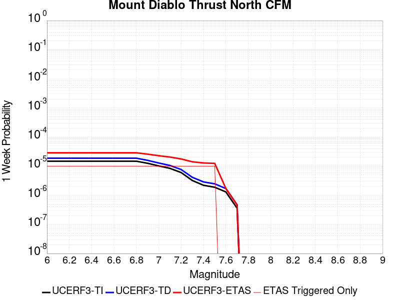 | 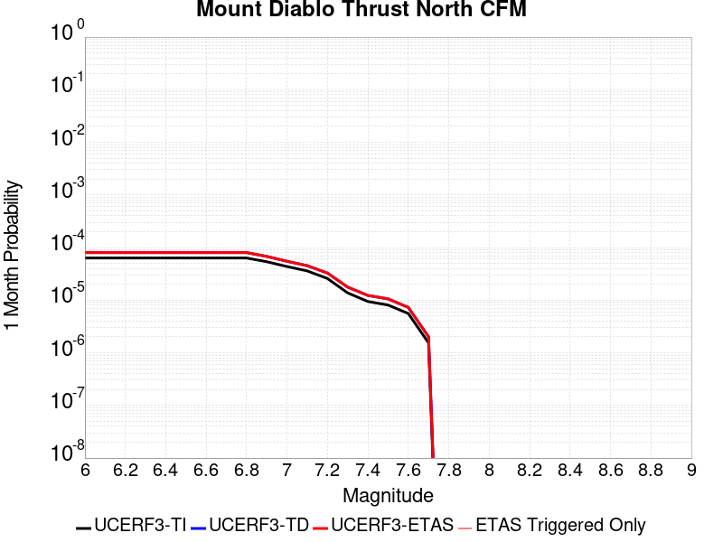 | 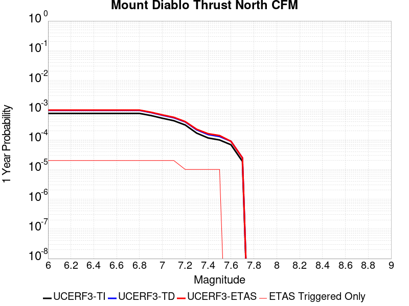 | 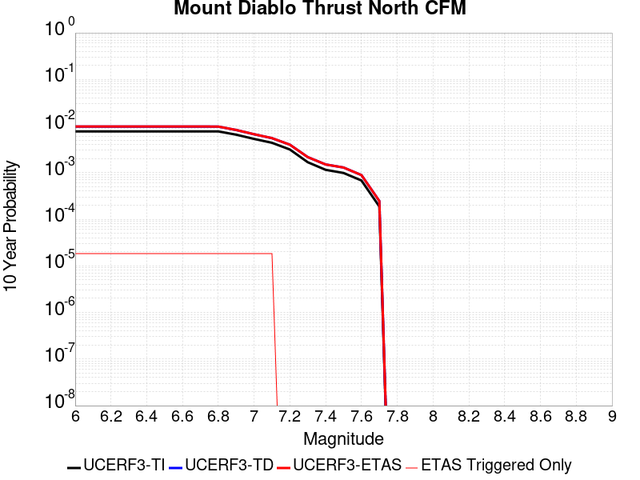 |

| Magnitude | 1 wk TI Prob | 1 wk TD Prob | 1 wk ETAS Prob | 1 wk ETAS/TD Gain | 1 wk ETAS Triggered Only | 1 mo TI Prob | 1 mo TD Prob | 1 mo ETAS Prob | 1 mo ETAS/TD Gain | 1 mo ETAS Triggered Only | 1 yr TI Prob | 1 yr TD Prob | 1 yr ETAS Prob | 1 yr ETAS/TD Gain | 1 yr ETAS Triggered Only | 10 yr TI Prob | 10 yr TD Prob | 10 yr ETAS Prob | 10 yr ETAS/TD Gain | 10 yr ETAS Triggered Only |
|-----|-----|-----|-----|-----|-----|-----|-----|-----|-----|-----|-----|-----|-----|-----|-----|-----|-----|-----|-----|-----|
| 6.0 | 1.479628E-5 | 1.876973E-5 | 1.876973E-5 | 1.0 | 0.0 | 6.341109E-5 | 8.043928E-5 | 8.043928E-5 | 1.0 | 0.0 | 7.717565E-4 | 9.789177E-4 | 9.957883E-4 | 1.0172338 | 1.6887043E-5 | 0.007690818 | 0.009747355 | 0.009764078 | 1.0017155 | 1.6887043E-5 |
| 6.1 | 1.479628E-5 | 1.876973E-5 | 1.876973E-5 | 1.0 | 0.0 | 6.341109E-5 | 8.043928E-5 | 8.043928E-5 | 1.0 | 0.0 | 7.717565E-4 | 9.789177E-4 | 9.957883E-4 | 1.0172338 | 1.6887043E-5 | 0.007690818 | 0.009747355 | 0.009764078 | 1.0017155 | 1.6887043E-5 |
| 6.2 | 1.479628E-5 | 1.876973E-5 | 1.876973E-5 | 1.0 | 0.0 | 6.341109E-5 | 8.043928E-5 | 8.043928E-5 | 1.0 | 0.0 | 7.717565E-4 | 9.789177E-4 | 9.957883E-4 | 1.0172338 | 1.6887043E-5 | 0.007690818 | 0.009747355 | 0.009764078 | 1.0017155 | 1.6887043E-5 |
| 6.3 | 1.479628E-5 | 1.876973E-5 | 1.876973E-5 | 1.0 | 0.0 | 6.341109E-5 | 8.043928E-5 | 8.043928E-5 | 1.0 | 0.0 | 7.717565E-4 | 9.789177E-4 | 9.957883E-4 | 1.0172338 | 1.6887043E-5 | 0.007690818 | 0.009747355 | 0.009764078 | 1.0017155 | 1.6887043E-5 |
| 6.4 | 1.479628E-5 | 1.876973E-5 | 1.876973E-5 | 1.0 | 0.0 | 6.341109E-5 | 8.043928E-5 | 8.043928E-5 | 1.0 | 0.0 | 7.717565E-4 | 9.789177E-4 | 9.957883E-4 | 1.0172338 | 1.6887043E-5 | 0.007690818 | 0.009747355 | 0.009764078 | 1.0017155 | 1.6887043E-5 |
| 6.5 | 1.479628E-5 | 1.876973E-5 | 1.876973E-5 | 1.0 | 0.0 | 6.341109E-5 | 8.043928E-5 | 8.043928E-5 | 1.0 | 0.0 | 7.717565E-4 | 9.789177E-4 | 9.957883E-4 | 1.0172338 | 1.6887043E-5 | 0.007690818 | 0.009747355 | 0.009764078 | 1.0017155 | 1.6887043E-5 |
| 6.6 | 1.479016E-5 | 1.8762841E-5 | 1.8762841E-5 | 1.0 | 0.0 | 6.338486E-5 | 8.040976E-5 | 8.040976E-5 | 1.0 | 0.0 | 7.714374E-4 | 9.785586E-4 | 9.954291E-4 | 1.0172402 | 1.6887043E-5 | 0.007687649 | 0.009743797 | 0.009760519 | 1.0017163 | 1.6887043E-5 |
| 6.7 | 1.479016E-5 | 1.8762841E-5 | 1.8762841E-5 | 1.0 | 0.0 | 6.338486E-5 | 8.040976E-5 | 8.040976E-5 | 1.0 | 0.0 | 7.714374E-4 | 9.785586E-4 | 9.954291E-4 | 1.0172402 | 1.6887043E-5 | 0.007687649 | 0.009743797 | 0.009760519 | 1.0017163 | 1.6887043E-5 |
| 6.8 | 1.4771667E-5 | 1.8741612E-5 | 1.8741612E-5 | 1.0 | 0.0 | 6.330561E-5 | 8.031878E-5 | 8.031878E-5 | 1.0 | 0.0 | 7.704732E-4 | 9.774519E-4 | 9.943225E-4 | 1.0172597 | 1.6887043E-5 | 0.007678074 | 0.009732827 | 0.009749549 | 1.0017182 | 1.6887043E-5 |
| 6.9 | 1.2548234E-5 | 1.5822025E-5 | 1.5822025E-5 | 1.0 | 0.0 | 5.3777036E-5 | 6.780694E-5 | 6.780694E-5 | 1.0 | 0.0 | 6.545387E-4 | 8.2524033E-4 | 8.4211346E-4 | 1.0204463 | 1.6887043E-5 | 0.006526142 | 0.008222396 | 0.0082391435 | 1.0020369 | 1.6887043E-5 |
| 7.0 | 1.01754185E-5 | 1.2808985E-5 | 1.2808985E-5 | 1.0 | 0.0 | 4.360821E-5 | 5.4894506E-5 | 5.4894506E-5 | 1.0 | 0.0 | 5.308006E-4 | 6.6813733E-4 | 6.850131E-4 | 1.025258 | 1.6887043E-5 | 0.005295345 | 0.006661672 | 0.0066784467 | 1.002518 | 1.6887043E-5 |
| 7.1 | 8.398341E-6 | 1.0554712E-5 | 1.0554712E-5 | 1.0 | 0.0 | 3.5992394E-5 | 4.5233704E-5 | 4.5233704E-5 | 1.0 | 0.0 | 4.3811928E-4 | 5.5058225E-4 | 5.6746E-4 | 1.0306543 | 1.6887043E-5 | 0.0043725655 | 0.0054924674 | 0.0055092615 | 1.0030577 | 1.6887043E-5 |
| 7.2 | 6.024759E-6 | 7.648385E-6 | 7.648385E-6 | 1.0 | 0.0 | 2.582014E-5 | 3.2778386E-5 | 3.2778386E-5 | 1.0 | 0.0 | 3.1431485E-4 | 3.9900444E-4 | 3.9900444E-4 | 1.0 | 0.0 | 0.0031387066 | 0.0039830892 | 0.0039830892 | 1.0 | 0.0 |
| 7.3 | 3.2099704E-6 | 4.1355897E-6 | 4.1355897E-6 | 1.0 | 0.0 | 1.3756943E-5 | 1.7723836E-5 | 1.7723836E-5 | 1.0 | 0.0 | 1.674779E-4 | 2.1576651E-4 | 2.1576651E-4 | 1.0 | 0.0 | 0.0016735174 | 0.0021556707 | 0.0021556707 | 1.0 | 0.0 |
| 7.4 | 2.2041513E-6 | 2.8734273E-6 | 2.8734273E-6 | 1.0 | 0.0 | 9.4463285E-6 | 1.2314631E-5 | 1.2314631E-5 | 1.0 | 0.0 | 1.1500298E-4 | 1.499204E-4 | 1.499204E-4 | 1.0 | 0.0 | 0.0011494348 | 0.0014982593 | 0.0014982593 | 1.0 | 0.0 |
| 7.5 | 1.8869501E-6 | 2.4696565E-6 | 2.4696565E-6 | 1.0 | 0.0 | 8.086904E-6 | 1.0584199E-5 | 1.0584199E-5 | 1.0 | 0.0 | 9.845361E-5 | 1.2885507E-4 | 1.2885507E-4 | 1.0 | 0.0 | 9.841E-4 | 0.0012878602 | 0.0012878602 | 1.0 | 0.0 |
| 7.6 | 1.3012458E-6 | 1.7005032E-6 | 1.7005032E-6 | 1.0 | 0.0 | 5.576756E-6 | 7.287851E-6 | 7.287851E-6 | 1.0 | 0.0 | 6.7894885E-5 | 8.8726025E-5 | 8.8726025E-5 | 1.0 | 0.0 | 6.787415E-4 | 8.869415E-4 | 8.869415E-4 | 1.0 | 0.0 |
| 7.7 | 3.603383E-7 | 4.716468E-7 | 4.716468E-7 | 1.0 | 0.0 | 1.5443061E-6 | 2.021342E-6 | 2.021342E-6 | 1.0 | 0.0 | 1.8801764E-5 | 2.4609568E-5 | 2.4609568E-5 | 1.0 | 0.0 | 1.8800174E-4 | 2.46074E-4 | 2.46074E-4 | 1.0 | 0.0 |

## Oceanside alt1
*[(top)](#table-of-contents)*

| 1 Week | 1 Month | 1 Year | 10 Year |
|-----|-----|-----|-----|
|  |  | 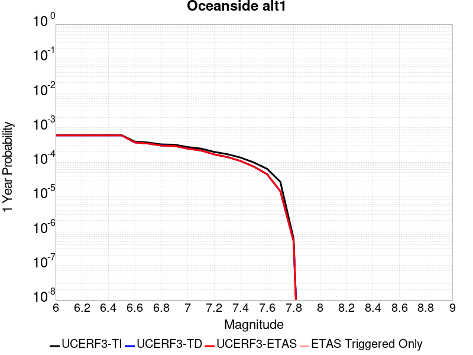 | 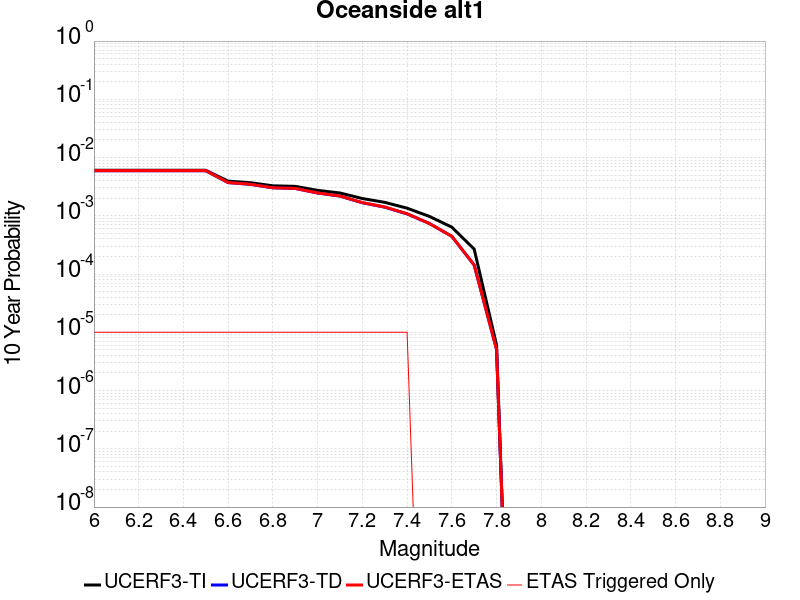 |

| Magnitude | 1 wk TI Prob | 1 wk TD Prob | 1 wk ETAS Prob | 1 wk ETAS/TD Gain | 1 wk ETAS Triggered Only | 1 mo TI Prob | 1 mo TD Prob | 1 mo ETAS Prob | 1 mo ETAS/TD Gain | 1 mo ETAS Triggered Only | 1 yr TI Prob | 1 yr TD Prob | 1 yr ETAS Prob | 1 yr ETAS/TD Gain | 1 yr ETAS Triggered Only | 10 yr TI Prob | 10 yr TD Prob | 10 yr ETAS Prob | 10 yr ETAS/TD Gain | 10 yr ETAS Triggered Only |
|-----|-----|-----|-----|-----|-----|-----|-----|-----|-----|-----|-----|-----|-----|-----|-----|-----|-----|-----|-----|-----|
| 6.0 | 1.1617542E-5 | 1.1423493E-5 | 1.1423493E-5 | 1.0 | 0.0 | 4.9788516E-5 | 4.8956997E-5 | 4.8956997E-5 | 1.0 | 0.0 | 6.060066E-4 | 5.9590454E-4 | 5.9590454E-4 | 1.0 | 0.0 | 0.0060435664 | 0.005944664 | 0.0059614507 | 1.0028238 | 1.6887043E-5 |
| 6.1 | 1.1617542E-5 | 1.1423493E-5 | 1.1423493E-5 | 1.0 | 0.0 | 4.9788516E-5 | 4.8956997E-5 | 4.8956997E-5 | 1.0 | 0.0 | 6.060066E-4 | 5.9590454E-4 | 5.9590454E-4 | 1.0 | 0.0 | 0.0060435664 | 0.005944664 | 0.0059614507 | 1.0028238 | 1.6887043E-5 |
| 6.2 | 1.1617542E-5 | 1.1423493E-5 | 1.1423493E-5 | 1.0 | 0.0 | 4.9788516E-5 | 4.8956997E-5 | 4.8956997E-5 | 1.0 | 0.0 | 6.060066E-4 | 5.9590454E-4 | 5.9590454E-4 | 1.0 | 0.0 | 0.0060435664 | 0.005944664 | 0.0059614507 | 1.0028238 | 1.6887043E-5 |
| 6.3 | 1.1617542E-5 | 1.1423493E-5 | 1.1423493E-5 | 1.0 | 0.0 | 4.9788516E-5 | 4.8956997E-5 | 4.8956997E-5 | 1.0 | 0.0 | 6.060066E-4 | 5.9590454E-4 | 5.9590454E-4 | 1.0 | 0.0 | 0.0060435664 | 0.005944664 | 0.0059614507 | 1.0028238 | 1.6887043E-5 |
| 6.4 | 1.1617542E-5 | 1.1423493E-5 | 1.1423493E-5 | 1.0 | 0.0 | 4.9788516E-5 | 4.8956997E-5 | 4.8956997E-5 | 1.0 | 0.0 | 6.060066E-4 | 5.9590454E-4 | 5.9590454E-4 | 1.0 | 0.0 | 0.0060435664 | 0.005944664 | 0.0059614507 | 1.0028238 | 1.6887043E-5 |
| 6.5 | 1.1617542E-5 | 1.1423493E-5 | 1.1423493E-5 | 1.0 | 0.0 | 4.9788516E-5 | 4.8956997E-5 | 4.8956997E-5 | 1.0 | 0.0 | 6.060066E-4 | 5.9590454E-4 | 5.9590454E-4 | 1.0 | 0.0 | 0.0060435664 | 0.005944664 | 0.0059614507 | 1.0028238 | 1.6887043E-5 |
| 6.6 | 7.561768E-6 | 7.1336153E-6 | 7.1336153E-6 | 1.0 | 0.0 | 3.2407173E-5 | 3.0572286E-5 | 3.0572286E-5 | 1.0 | 0.0 | 3.9448592E-4 | 3.7215507E-4 | 3.7215507E-4 | 1.0 | 0.0 | 0.0039378637 | 0.00371543 | 0.0037322543 | 1.0045282 | 1.6887043E-5 |
| 6.7 | 7.1042605E-6 | 6.6556854E-6 | 6.6556854E-6 | 1.0 | 0.0 | 3.0446476E-5 | 2.8524059E-5 | 2.8524059E-5 | 1.0 | 0.0 | 3.706228E-4 | 3.472259E-4 | 3.472259E-4 | 1.0 | 0.0 | 0.0037000529 | 0.003466917 | 0.0034837455 | 1.0048541 | 1.6887043E-5 |
| 6.8 | 6.285554E-6 | 5.799706E-6 | 5.799706E-6 | 1.0 | 0.0 | 2.693781E-5 | 2.4855648E-5 | 2.4855648E-5 | 1.0 | 0.0 | 3.2791847E-4 | 3.0257605E-4 | 3.0257605E-4 | 1.0 | 0.0 | 0.0032743502 | 0.0030216982 | 0.0030385342 | 1.0055717 | 1.6887043E-5 |
| 6.9 | 6.148883E-6 | 5.6565445E-6 | 5.6565445E-6 | 1.0 | 0.0 | 2.635209E-5 | 2.424211E-5 | 2.424211E-5 | 1.0 | 0.0 | 3.2078946E-4 | 2.9510827E-4 | 2.9510827E-4 | 1.0 | 0.0 | 0.003203268 | 0.0029472208 | 0.0029640582 | 1.005713 | 1.6887043E-5 |
| 7.0 | 5.253857E-6 | 4.722404E-6 | 4.722404E-6 | 1.0 | 0.0 | 2.2516335E-5 | 2.0238718E-5 | 2.0238718E-5 | 1.0 | 0.0 | 2.7410188E-4 | 2.4637886E-4 | 2.4637886E-4 | 1.0 | 0.0 | 0.0027376404 | 0.0024610884 | 0.002477934 | 1.0068448 | 1.6887043E-5 |
| 7.1 | 4.730754E-6 | 4.17851E-6 | 4.17851E-6 | 1.0 | 0.0 | 2.0274503E-5 | 1.7907778E-5 | 1.7907778E-5 | 1.0 | 0.0 | 2.468141E-4 | 2.1800565E-4 | 2.1800565E-4 | 1.0 | 0.0 | 0.0024654015 | 0.0021779444 | 0.0021947946 | 1.0077368 | 1.6887043E-5 |
| 7.2 | 3.7998386E-6 | 3.214026E-6 | 3.214026E-6 | 1.0 | 0.0 | 1.6284921E-5 | 1.37743245E-5 | 1.37743245E-5 | 1.0 | 0.0 | 1.9825088E-4 | 1.6768962E-4 | 1.6768962E-4 | 1.0 | 0.0 | 0.001980741 | 0.001675643 | 0.0016925018 | 1.010061 | 1.6887043E-5 |
| 7.3 | 3.2656465E-6 | 2.698376E-6 | 2.698376E-6 | 1.0 | 0.0 | 1.3995553E-5 | 1.1564418E-5 | 1.1564418E-5 | 1.0 | 0.0 | 1.7038253E-4 | 1.407878E-4 | 1.407878E-4 | 1.0 | 0.0 | 0.0017025196 | 0.0014069972 | 0.0014238604 | 1.0119853 | 1.6887043E-5 |
| 7.4 | 2.593703E-6 | 2.0680277E-6 | 2.0680277E-6 | 1.0 | 0.0 | 1.1115822E-5 | 8.862946E-6 | 8.862946E-6 | 1.0 | 0.0 | 1.3532673E-4 | 1.0790111E-4 | 1.0790111E-4 | 1.0 | 0.0 | 0.0013524436 | 0.0010784961 | 0.0010953649 | 1.0156411 | 1.6887043E-5 |
| 7.5 | 1.8715585E-6 | 1.4137177E-6 | 1.4137177E-6 | 1.0 | 0.0 | 8.020941E-6 | 6.0587763E-6 | 6.0587763E-6 | 1.0 | 0.0 | 9.7650576E-5 | 7.376316E-5 | 7.376316E-5 | 1.0 | 0.0 | 9.7607676E-4 | 7.3739287E-4 | 7.3739287E-4 | 1.0 | 0.0 |
| 7.6 | 1.2246786E-6 | 8.5268175E-7 | 8.5268175E-7 | 1.0 | 0.0 | 5.248612E-6 | 3.6543456E-6 | 3.6543456E-6 | 1.0 | 0.0 | 6.389998E-5 | 4.4490793E-5 | 4.4490793E-5 | 1.0 | 0.0 | 6.3881604E-4 | 4.4482335E-4 | 4.4482335E-4 | 1.0 | 0.0 |
| 7.7 | 5.140719E-7 | 2.734703E-7 | 2.734703E-7 | 1.0 | 0.0 | 2.2031636E-6 | 1.1720151E-6 | 1.1720151E-6 | 1.0 | 0.0 | 2.6823185E-5 | 1.4269205E-5 | 1.4269205E-5 | 1.0 | 0.0 | 2.6819948E-4 | 1.4268424E-4 | 1.4268424E-4 | 1.0 | 0.0 |
| 7.8 | 1.16056995E-8 | 9.782373E-9 | 9.782373E-9 | 1.0 | 0.0 | 4.9738713E-8 | 4.1924455E-8 | 4.1924455E-8 | 1.0 | 0.0 | 6.0556863E-7 | 5.1043025E-7 | 5.1043025E-7 | 1.0 | 0.0 | 6.05567E-6 | 5.1043025E-6 | 5.1043025E-6 | 1.0 | 0.0 |

## San Joaquin Hills
*[(top)](#table-of-contents)*

| 1 Week | 1 Month | 1 Year | 10 Year |
|-----|-----|-----|-----|
| 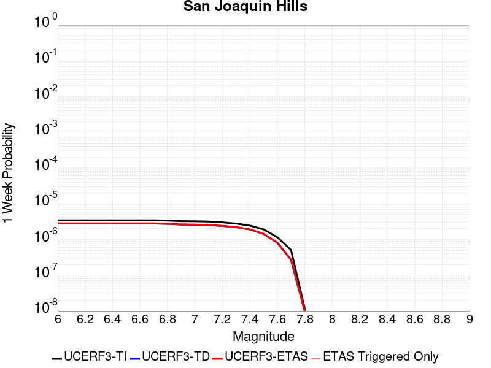 | 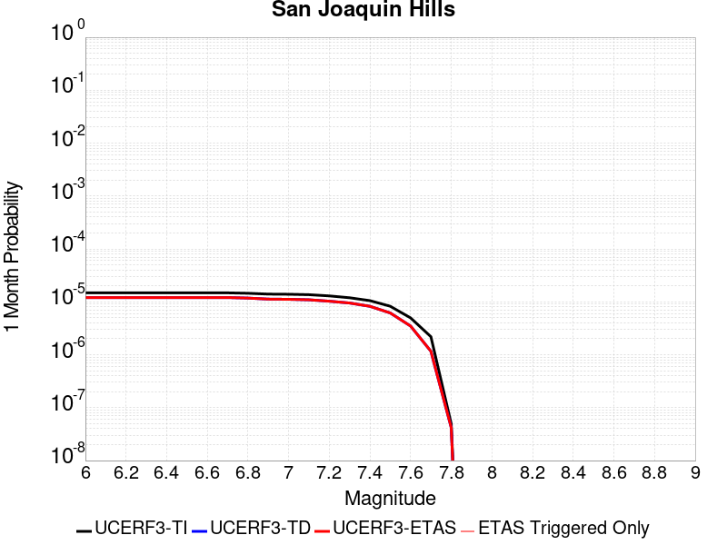 | 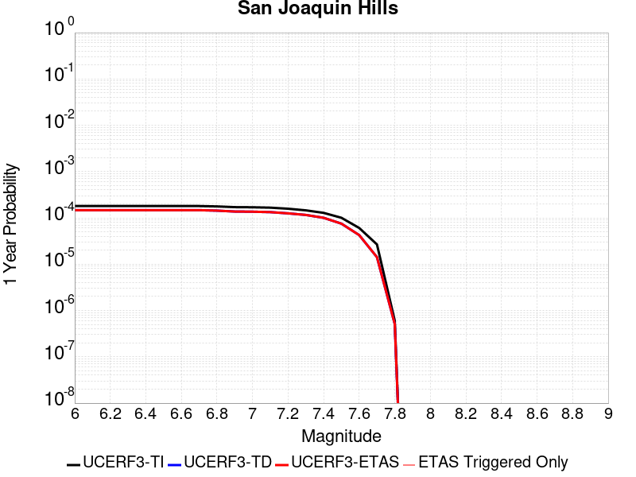 | 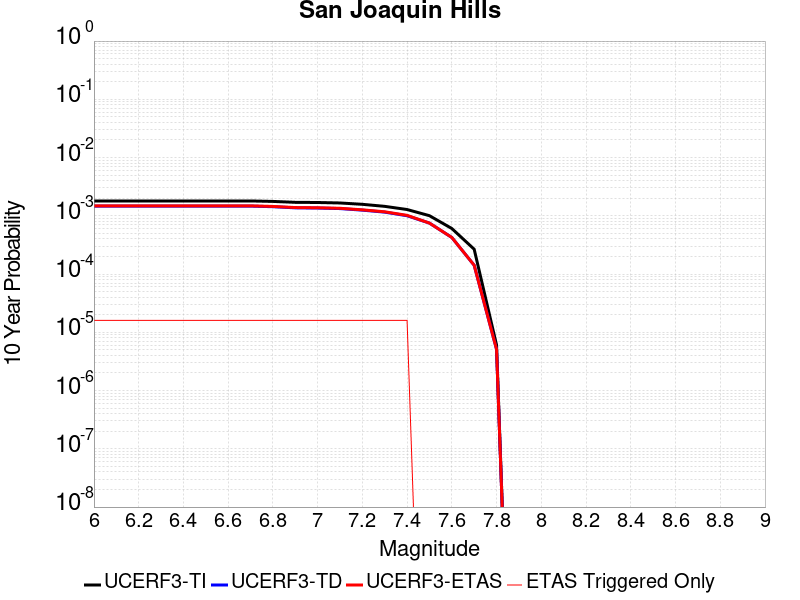 |

| Magnitude | 1 wk TI Prob | 1 wk TD Prob | 1 wk ETAS Prob | 1 wk ETAS/TD Gain | 1 wk ETAS Triggered Only | 1 mo TI Prob | 1 mo TD Prob | 1 mo ETAS Prob | 1 mo ETAS/TD Gain | 1 mo ETAS Triggered Only | 1 yr TI Prob | 1 yr TD Prob | 1 yr ETAS Prob | 1 yr ETAS/TD Gain | 1 yr ETAS Triggered Only | 10 yr TI Prob | 10 yr TD Prob | 10 yr ETAS Prob | 10 yr ETAS/TD Gain | 10 yr ETAS Triggered Only |
|-----|-----|-----|-----|-----|-----|-----|-----|-----|-----|-----|-----|-----|-----|-----|-----|-----|-----|-----|-----|-----|
| 6.0 | 3.4525704E-6 | 2.8139818E-6 | 2.8139818E-6 | 1.0 | 0.0 | 1.4796647E-5 | 1.2059867E-5 | 1.2059867E-5 | 1.0 | 0.0 | 1.8013427E-4 | 1.4681912E-4 | 1.4681912E-4 | 1.0 | 0.0 | 0.0017998833 | 0.0014672345 | 0.0014840967 | 1.0114925 | 1.6887043E-5 |
| 6.1 | 3.4525704E-6 | 2.8139818E-6 | 2.8139818E-6 | 1.0 | 0.0 | 1.4796647E-5 | 1.2059867E-5 | 1.2059867E-5 | 1.0 | 0.0 | 1.8013427E-4 | 1.4681912E-4 | 1.4681912E-4 | 1.0 | 0.0 | 0.0017998833 | 0.0014672345 | 0.0014840967 | 1.0114925 | 1.6887043E-5 |
| 6.2 | 3.4525704E-6 | 2.8139818E-6 | 2.8139818E-6 | 1.0 | 0.0 | 1.4796647E-5 | 1.2059867E-5 | 1.2059867E-5 | 1.0 | 0.0 | 1.8013427E-4 | 1.4681912E-4 | 1.4681912E-4 | 1.0 | 0.0 | 0.0017998833 | 0.0014672345 | 0.0014840967 | 1.0114925 | 1.6887043E-5 |
| 6.3 | 3.4525704E-6 | 2.8139818E-6 | 2.8139818E-6 | 1.0 | 0.0 | 1.4796647E-5 | 1.2059867E-5 | 1.2059867E-5 | 1.0 | 0.0 | 1.8013427E-4 | 1.4681912E-4 | 1.4681912E-4 | 1.0 | 0.0 | 0.0017998833 | 0.0014672345 | 0.0014840967 | 1.0114925 | 1.6887043E-5 |
| 6.4 | 3.4525704E-6 | 2.8139818E-6 | 2.8139818E-6 | 1.0 | 0.0 | 1.4796647E-5 | 1.2059867E-5 | 1.2059867E-5 | 1.0 | 0.0 | 1.8013427E-4 | 1.4681912E-4 | 1.4681912E-4 | 1.0 | 0.0 | 0.0017998833 | 0.0014672345 | 0.0014840967 | 1.0114925 | 1.6887043E-5 |
| 6.5 | 3.4525704E-6 | 2.8139818E-6 | 2.8139818E-6 | 1.0 | 0.0 | 1.4796647E-5 | 1.2059867E-5 | 1.2059867E-5 | 1.0 | 0.0 | 1.8013427E-4 | 1.4681912E-4 | 1.4681912E-4 | 1.0 | 0.0 | 0.0017998833 | 0.0014672345 | 0.0014840967 | 1.0114925 | 1.6887043E-5 |
| 6.6 | 3.4525704E-6 | 2.8139818E-6 | 2.8139818E-6 | 1.0 | 0.0 | 1.4796647E-5 | 1.2059867E-5 | 1.2059867E-5 | 1.0 | 0.0 | 1.8013427E-4 | 1.4681912E-4 | 1.4681912E-4 | 1.0 | 0.0 | 0.0017998833 | 0.0014672345 | 0.0014840967 | 1.0114925 | 1.6887043E-5 |
| 6.7 | 3.4525704E-6 | 2.8139818E-6 | 2.8139818E-6 | 1.0 | 0.0 | 1.4796647E-5 | 1.2059867E-5 | 1.2059867E-5 | 1.0 | 0.0 | 1.8013427E-4 | 1.4681912E-4 | 1.4681912E-4 | 1.0 | 0.0 | 0.0017998833 | 0.0014672345 | 0.0014840967 | 1.0114925 | 1.6887043E-5 |
| 6.8 | 3.388654E-6 | 2.7484202E-6 | 2.7484202E-6 | 1.0 | 0.0 | 1.4522722E-5 | 1.1778891E-5 | 1.1778891E-5 | 1.0 | 0.0 | 1.767998E-4 | 1.4339869E-4 | 1.4339869E-4 | 1.0 | 0.0 | 0.001766592 | 0.0014330745 | 0.0014499372 | 1.0117669 | 1.6887043E-5 |
| 6.9 | 3.2694352E-6 | 2.6283346E-6 | 2.6283346E-6 | 1.0 | 0.0 | 1.401179E-5 | 1.1264243E-5 | 1.1264243E-5 | 1.0 | 0.0 | 1.7058018E-4 | 1.3713364E-4 | 1.3713364E-4 | 1.0 | 0.0 | 0.0017044931 | 0.0013705015 | 0.0013873654 | 1.0123049 | 1.6887043E-5 |
| 7.0 | 3.246912E-6 | 2.6069915E-6 | 2.6069915E-6 | 1.0 | 0.0 | 1.39152635E-5 | 1.1172774E-5 | 1.1172774E-5 | 1.0 | 0.0 | 1.6940516E-4 | 1.3602014E-4 | 1.3602014E-4 | 1.0 | 0.0 | 0.0016927607 | 0.0013593802 | 0.0013762442 | 1.0124058 | 1.6887043E-5 |
| 7.1 | 3.1864927E-6 | 2.5523198E-6 | 2.5523198E-6 | 1.0 | 0.0 | 1.3656326E-5 | 1.0938467E-5 | 1.0938467E-5 | 1.0 | 0.0 | 1.6625308E-4 | 1.3316782E-4 | 1.3316782E-4 | 1.0 | 0.0 | 0.0016612876 | 0.0013308912 | 0.0013477558 | 1.0126716 | 1.6887043E-5 |
| 7.2 | 3.0220644E-6 | 2.3991677E-6 | 2.3991677E-6 | 1.0 | 0.0 | 1.295164E-5 | 1.0282108E-5 | 1.0282108E-5 | 1.0 | 0.0 | 1.576748E-4 | 1.2517757E-4 | 1.2517757E-4 | 1.0 | 0.0 | 0.0015756298 | 0.0012510809 | 0.0012679469 | 1.013481 | 1.6887043E-5 |
| 7.3 | 2.787619E-6 | 2.2173858E-6 | 2.2173858E-6 | 1.0 | 0.0 | 1.1946884E-5 | 9.503048E-6 | 9.503048E-6 | 1.0 | 0.0 | 1.454436E-4 | 1.1569356E-4 | 1.1569356E-4 | 1.0 | 0.0 | 0.0014534845 | 0.0011563431 | 0.0011732107 | 1.0145869 | 1.6887043E-5 |
| 7.4 | 2.4593792E-6 | 1.9226306E-6 | 1.9226306E-6 | 1.0 | 0.0 | 1.0540153E-5 | 8.23982E-6 | 8.23982E-6 | 1.0 | 0.0 | 1.2831882E-4 | 1.0031529E-4 | 1.0031529E-4 | 1.0 | 0.0 | 0.0012824474 | 0.0010027088 | 0.0010195789 | 1.0168245 | 1.6887043E-5 |
| 7.5 | 1.926764E-6 | 1.4383021E-6 | 1.4383021E-6 | 1.0 | 0.0 | 8.257534E-6 | 6.1641376E-6 | 6.1641376E-6 | 1.0 | 0.0 | 1.00530844E-4 | 7.504586E-5 | 7.504586E-5 | 1.0 | 0.0 | 0.0010048538 | 7.502115E-4 | 7.502115E-4 | 1.0 | 0.0 |
| 7.6 | 1.1609359E-6 | 8.14558E-7 | 8.14558E-7 | 1.0 | 0.0 | 4.97543E-6 | 3.4909585E-6 | 3.4909585E-6 | 1.0 | 0.0 | 6.0574173E-5 | 4.2501633E-5 | 4.2501633E-5 | 1.0 | 0.0 | 6.055767E-4 | 4.249394E-4 | 4.249394E-4 | 1.0 | 0.0 |
| 7.7 | 5.1168536E-7 | 2.7155914E-7 | 2.7155914E-7 | 1.0 | 0.0 | 2.1929354E-6 | 1.1638244E-6 | 1.1638244E-6 | 1.0 | 0.0 | 2.669866E-5 | 1.41694845E-5 | 1.41694845E-5 | 1.0 | 0.0 | 2.6695454E-4 | 1.4168715E-4 | 1.4168715E-4 | 1.0 | 0.0 |
| 7.8 | 1.16056995E-8 | 9.782373E-9 | 9.782373E-9 | 1.0 | 0.0 | 4.9738713E-8 | 4.1924455E-8 | 4.1924455E-8 | 1.0 | 0.0 | 6.0556863E-7 | 5.1043025E-7 | 5.1043025E-7 | 1.0 | 0.0 | 6.05567E-6 | 5.1043025E-6 | 5.1043025E-6 | 1.0 | 0.0 |

## Shoreline
*[(top)](#table-of-contents)*

| 1 Week | 1 Month | 1 Year | 10 Year |
|-----|-----|-----|-----|
|  |  |  | 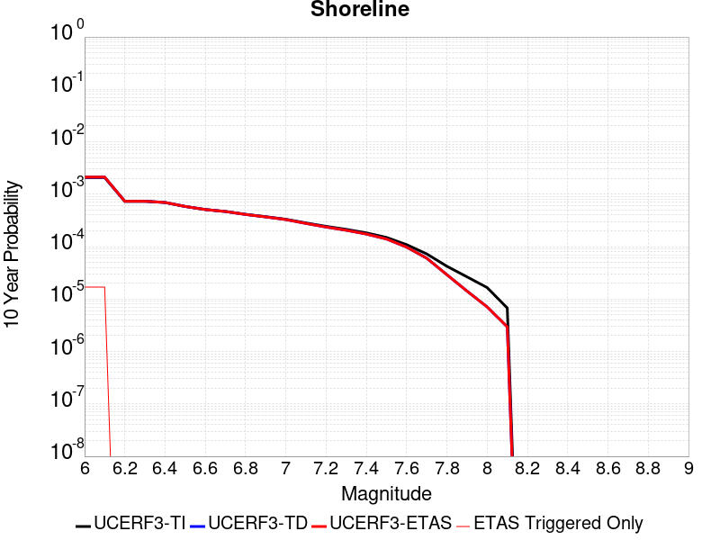 |

| Magnitude | 1 wk TI Prob | 1 wk TD Prob | 1 wk ETAS Prob | 1 wk ETAS/TD Gain | 1 wk ETAS Triggered Only | 1 mo TI Prob | 1 mo TD Prob | 1 mo ETAS Prob | 1 mo ETAS/TD Gain | 1 mo ETAS Triggered Only | 1 yr TI Prob | 1 yr TD Prob | 1 yr ETAS Prob | 1 yr ETAS/TD Gain | 1 yr ETAS Triggered Only | 10 yr TI Prob | 10 yr TD Prob | 10 yr ETAS Prob | 10 yr ETAS/TD Gain | 10 yr ETAS Triggered Only |
|-----|-----|-----|-----|-----|-----|-----|-----|-----|-----|-----|-----|-----|-----|-----|-----|-----|-----|-----|-----|-----|
| 6.0 | 3.9888673E-6 | 4.047929E-6 | 4.047929E-6 | 1.0 | 0.0 | 1.7095033E-5 | 1.7348184E-5 | 1.7348184E-5 | 1.0 | 0.0 | 2.0811215E-4 | 2.1119925E-4 | 2.1119925E-4 | 1.0 | 0.0 | 0.0020791737 | 0.002110534 | 0.0021273855 | 1.0079844 | 1.6887043E-5 |
| 6.1 | 3.9888673E-6 | 4.047929E-6 | 4.047929E-6 | 1.0 | 0.0 | 1.7095033E-5 | 1.7348184E-5 | 1.7348184E-5 | 1.0 | 0.0 | 2.0811215E-4 | 2.1119925E-4 | 2.1119925E-4 | 1.0 | 0.0 | 0.0020791737 | 0.002110534 | 0.0021273855 | 1.0079844 | 1.6887043E-5 |
| 6.2 | 1.4039653E-6 | 1.4100891E-6 | 1.4100891E-6 | 1.0 | 0.0 | 6.0169805E-6 | 6.0432253E-6 | 6.0432253E-6 | 1.0 | 0.0 | 7.325427E-5 | 7.357384E-5 | 7.357384E-5 | 1.0 | 0.0 | 7.3230127E-4 | 7.355009E-4 | 7.355009E-4 | 1.0 | 0.0 |
| 6.3 | 1.4039653E-6 | 1.4100891E-6 | 1.4100891E-6 | 1.0 | 0.0 | 6.0169805E-6 | 6.0432253E-6 | 6.0432253E-6 | 1.0 | 0.0 | 7.325427E-5 | 7.357384E-5 | 7.357384E-5 | 1.0 | 0.0 | 7.3230127E-4 | 7.355009E-4 | 7.355009E-4 | 1.0 | 0.0 |
| 6.4 | 1.3314152E-6 | 1.3361605E-6 | 1.3361605E-6 | 1.0 | 0.0 | 5.7060524E-6 | 5.7263896E-6 | 5.7263896E-6 | 1.0 | 0.0 | 6.946897E-5 | 6.971662E-5 | 6.971662E-5 | 1.0 | 0.0 | 6.9447263E-4 | 6.9695286E-4 | 6.9695286E-4 | 1.0 | 0.0 |
| 6.5 | 1.1187026E-6 | 1.120364E-6 | 1.120364E-6 | 1.0 | 0.0 | 4.794431E-6 | 4.8015513E-6 | 4.8015513E-6 | 1.0 | 0.0 | 5.8370628E-5 | 5.8457343E-5 | 5.8457343E-5 | 1.0 | 0.0 | 5.83553E-4 | 5.844222E-4 | 5.844222E-4 | 1.0 | 0.0 |
| 6.6 | 9.793089E-7 | 9.784919E-7 | 9.784919E-7 | 1.0 | 0.0 | 4.1970316E-6 | 4.1935305E-6 | 4.1935305E-6 | 1.0 | 0.0 | 5.1097657E-5 | 5.105505E-5 | 5.105505E-5 | 1.0 | 0.0 | 5.108591E-4 | 5.1043445E-4 | 5.1043445E-4 | 1.0 | 0.0 |
| 6.7 | 8.995986E-7 | 8.9728E-7 | 8.9728E-7 | 1.0 | 0.0 | 3.8554167E-6 | 3.84548E-6 | 3.84548E-6 | 1.0 | 0.0 | 4.693869E-5 | 4.6817724E-5 | 4.6817724E-5 | 1.0 | 0.0 | 4.6928777E-4 | 4.6807955E-4 | 4.6807955E-4 | 1.0 | 0.0 |
| 6.8 | 7.931612E-7 | 7.8804027E-7 | 7.8804027E-7 | 1.0 | 0.0 | 3.3992578E-6 | 3.377311E-6 | 3.377311E-6 | 1.0 | 0.0 | 4.1385178E-5 | 4.1117994E-5 | 4.1117994E-5 | 1.0 | 0.0 | 4.1377472E-4 | 4.1110438E-4 | 4.1110438E-4 | 1.0 | 0.0 |
| 6.9 | 7.1465956E-7 | 7.078006E-7 | 7.078006E-7 | 1.0 | 0.0 | 3.062823E-6 | 3.0334277E-6 | 3.0334277E-6 | 1.0 | 0.0 | 3.7289232E-5 | 3.6931357E-5 | 3.6931357E-5 | 1.0 | 0.0 | 3.7282976E-4 | 3.6925258E-4 | 3.6925258E-4 | 1.0 | 0.0 |
| 7.0 | 6.389046E-7 | 6.299458E-7 | 6.299458E-7 | 1.0 | 0.0 | 2.7381598E-6 | 2.699765E-6 | 2.699765E-6 | 1.0 | 0.0 | 3.3336586E-5 | 3.2869146E-5 | 3.2869146E-5 | 1.0 | 0.0 | 3.3331584E-4 | 3.2864307E-4 | 3.2864307E-4 | 1.0 | 0.0 |
| 7.1 | 5.4300875E-7 | 5.3111313E-7 | 5.3111313E-7 | 1.0 | 0.0 | 2.3271782E-6 | 2.276197E-6 | 2.276197E-6 | 1.0 | 0.0 | 2.8333026E-5 | 2.7712347E-5 | 2.7712347E-5 | 1.0 | 0.0 | 2.8329415E-4 | 2.77089E-4 | 2.77089E-4 | 1.0 | 0.0 |
| 7.2 | 4.6768855E-7 | 4.5348952E-7 | 4.5348952E-7 | 1.0 | 0.0 | 2.0043778E-6 | 1.9435251E-6 | 1.9435251E-6 | 1.0 | 0.0 | 2.4403027E-5 | 2.3662162E-5 | 2.3662162E-5 | 1.0 | 0.0 | 2.4400349E-4 | 2.3659648E-4 | 2.3659648E-4 | 1.0 | 0.0 |
| 7.3 | 4.0966103E-7 | 3.9385662E-7 | 3.9385662E-7 | 1.0 | 0.0 | 1.7556889E-6 | 1.6879559E-6 | 1.6879559E-6 | 1.0 | 0.0 | 2.1375303E-5 | 2.055067E-5 | 2.055067E-5 | 1.0 | 0.0 | 2.1373246E-4 | 2.0548773E-4 | 2.0548773E-4 | 1.0 | 0.0 |
| 7.4 | 3.5105785E-7 | 3.3363975E-7 | 3.3363975E-7 | 1.0 | 0.0 | 1.5045327E-6 | 1.4298838E-6 | 1.4298838E-6 | 1.0 | 0.0 | 1.8317533E-5 | 1.7408696E-5 | 1.7408696E-5 | 1.0 | 0.0 | 1.8316023E-4 | 1.7407336E-4 | 1.7407336E-4 | 1.0 | 0.0 |
| 7.5 | 2.8737534E-7 | 2.6820038E-7 | 2.6820038E-7 | 1.0 | 0.0 | 1.2316079E-6 | 1.1494297E-6 | 1.1494297E-6 | 1.0 | 0.0 | 1.4994724E-5 | 1.3994217E-5 | 1.3994217E-5 | 1.0 | 0.0 | 1.4993713E-4 | 1.3993339E-4 | 1.3993339E-4 | 1.0 | 0.0 |
| 7.6 | 2.0924051E-7 | 1.8778988E-7 | 1.8778988E-7 | 1.0 | 0.0 | 8.967448E-7 | 8.048135E-7 | 8.048135E-7 | 1.0 | 0.0 | 1.0917813E-5 | 9.79856E-6 | 9.79856E-6 | 1.0 | 0.0 | 1.0917276E-4 | 9.798129E-5 | 9.798129E-5 | 1.0 | 0.0 |
| 7.7 | 1.392265E-7 | 1.15433906E-7 | 1.15433906E-7 | 1.0 | 0.0 | 5.9668486E-7 | 4.9471663E-7 | 4.9471663E-7 | 1.0 | 0.0 | 7.2646135E-6 | 6.023158E-6 | 6.023158E-6 | 1.0 | 0.0 | 7.2643765E-5 | 6.0229955E-5 | 6.0229955E-5 | 1.0 | 0.0 |
| 7.8 | 8.1080074E-8 | 5.586722E-8 | 5.586722E-8 | 1.0 | 0.0 | 3.4748598E-7 | 2.394309E-7 | 2.394309E-7 | 1.0 | 0.0 | 4.2306337E-6 | 2.9150672E-6 | 2.9150672E-6 | 1.0 | 0.0 | 4.230553E-5 | 2.9150291E-5 | 2.9150291E-5 | 1.0 | 0.0 |
| 7.9 | 5.0859036E-8 | 2.7244445E-8 | 2.7244445E-8 | 1.0 | 0.0 | 2.1796728E-7 | 1.16761896E-7 | 1.16761896E-7 | 1.0 | 0.0 | 2.6537484E-6 | 1.4215751E-6 | 1.4215751E-6 | 1.0 | 0.0 | 2.6537167E-5 | 1.4215661E-5 | 1.4215661E-5 | 1.0 | 0.0 |
| 8.0 | 3.1760536E-8 | 1.3577206E-8 | 1.3577206E-8 | 1.0 | 0.0 | 1.3611657E-7 | 5.8188025E-8 | 5.8188025E-8 | 1.0 | 0.0 | 1.6572179E-6 | 7.0843896E-7 | 7.0843896E-7 | 1.0 | 0.0 | 1.6572056E-5 | 7.084367E-6 | 7.084367E-6 | 1.0 | 0.0 |
| 8.1 | 1.2947896E-8 | 5.6628693E-9 | 5.6628693E-9 | 1.0 | 0.0 | 5.5490982E-8 | 2.426944E-8 | 2.426944E-8 | 1.0 | 0.0 | 6.756025E-7 | 2.954804E-7 | 2.954804E-7 | 1.0 | 0.0 | 6.7560045E-6 | 2.9548003E-6 | 2.9548003E-6 | 1.0 | 0.0 |

## Hayward (So) 2011 CFM
*[(top)](#table-of-contents)*

| 1 Week | 1 Month | 1 Year | 10 Year |
|-----|-----|-----|-----|
|  |  | 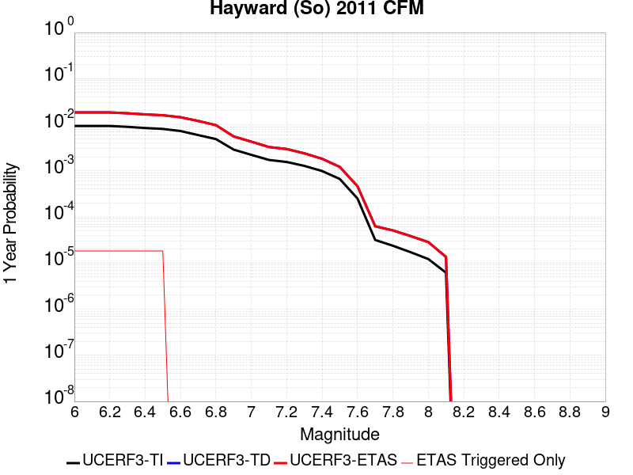 | 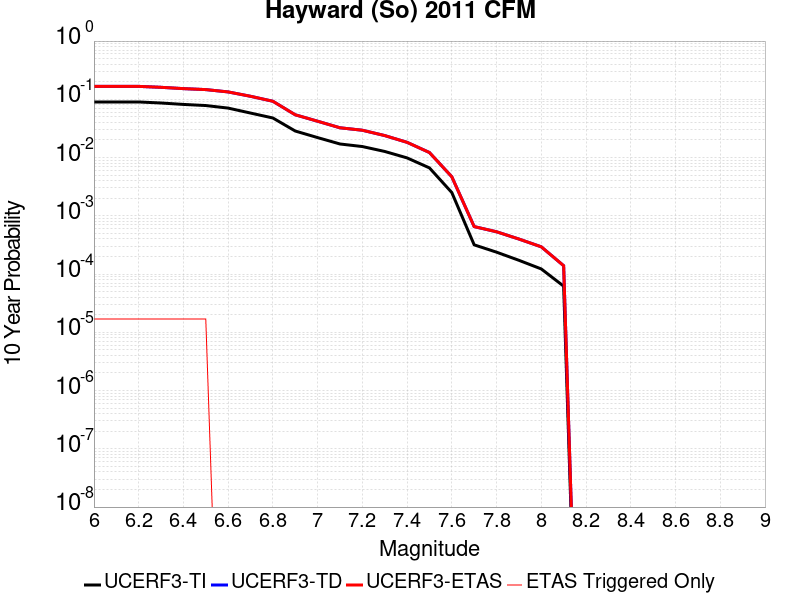 |

| Magnitude | 1 wk TI Prob | 1 wk TD Prob | 1 wk ETAS Prob | 1 wk ETAS/TD Gain | 1 wk ETAS Triggered Only | 1 mo TI Prob | 1 mo TD Prob | 1 mo ETAS Prob | 1 mo ETAS/TD Gain | 1 mo ETAS Triggered Only | 1 yr TI Prob | 1 yr TD Prob | 1 yr ETAS Prob | 1 yr ETAS/TD Gain | 1 yr ETAS Triggered Only | 10 yr TI Prob | 10 yr TD Prob | 10 yr ETAS Prob | 10 yr ETAS/TD Gain | 10 yr ETAS Triggered Only |
|-----|-----|-----|-----|-----|-----|-----|-----|-----|-----|-----|-----|-----|-----|-----|-----|-----|-----|-----|-----|-----|
| 6.0 | 1.8091932E-4 | 3.570541E-4 | 3.570541E-4 | 1.0 | 0.0 | 7.751381E-4 | 0.0015293444 | 0.0015293444 | 1.0 | 0.0 | 0.00939654 | 0.018463207 | 0.018479783 | 1.0008978 | 1.6887043E-5 | 0.090090066 | 0.16673161 | 0.16674568 | 1.0000844 | 1.6887043E-5 |
| 6.1 | 1.8091932E-4 | 3.570541E-4 | 3.570541E-4 | 1.0 | 0.0 | 7.751381E-4 | 0.0015293444 | 0.0015293444 | 1.0 | 0.0 | 0.00939654 | 0.018463207 | 0.018479783 | 1.0008978 | 1.6887043E-5 | 0.090090066 | 0.16673161 | 0.16674568 | 1.0000844 | 1.6887043E-5 |
| 6.2 | 1.8091932E-4 | 3.570541E-4 | 3.570541E-4 | 1.0 | 0.0 | 7.751381E-4 | 0.0015293444 | 0.0015293444 | 1.0 | 0.0 | 0.00939654 | 0.018463207 | 0.018479783 | 1.0008978 | 1.6887043E-5 | 0.090090066 | 0.16673161 | 0.16674568 | 1.0000844 | 1.6887043E-5 |
| 6.3 | 1.7322872E-4 | 3.426234E-4 | 3.426234E-4 | 1.0 | 0.0 | 7.4219756E-4 | 0.0014675693 | 0.0014675693 | 1.0 | 0.0 | 0.0089988755 | 0.017723544 | 0.017740132 | 1.0009359 | 1.6887043E-5 | 0.08643075 | 0.16066726 | 0.16068143 | 1.0000882 | 1.6887043E-5 |
| 6.4 | 1.6334097E-4 | 3.234411E-4 | 3.234411E-4 | 1.0 | 0.0 | 6.998449E-4 | 0.0013854484 | 0.0013854484 | 1.0 | 0.0 | 0.008487372 | 0.016739385 | 0.016755989 | 1.000992 | 1.6887043E-5 | 0.081704415 | 0.15255594 | 0.15257025 | 1.0000938 | 1.6887043E-5 |
| 6.5 | 1.5600289E-4 | 3.1018828E-4 | 3.1018828E-4 | 1.0 | 0.0 | 6.684125E-4 | 0.0013287093 | 0.0013287093 | 1.0 | 0.0 | 0.008107598 | 0.016058935 | 0.01607555 | 1.0010347 | 1.6887043E-5 | 0.078181036 | 0.14683272 | 0.14684711 | 1.0000981 | 1.6887043E-5 |
| 6.6 | 1.4046066E-4 | 2.8032906E-4 | 2.8032906E-4 | 1.0 | 0.0 | 6.018354E-4 | 0.0012008639 | 0.0012008639 | 1.0 | 0.0 | 0.0073027555 | 0.014524006 | 0.014524006 | 1.0 | 0.0 | 0.07067384 | 0.13391982 | 0.13391982 | 1.0 | 0.0 |
| 6.7 | 1.14696966E-4 | 2.3271477E-4 | 2.3271477E-4 | 1.0 | 0.0 | 4.914658E-4 | 9.969729E-4 | 9.969729E-4 | 1.0 | 0.0 | 0.0059671924 | 0.012071652 | 0.012071652 | 1.0 | 0.0 | 0.058094822 | 0.11274672 | 0.11274672 | 1.0 | 0.0 |
| 6.8 | 9.3874296E-5 | 1.8861453E-4 | 1.8861453E-4 | 1.0 | 0.0 | 4.0225635E-4 | 8.0810126E-4 | 8.0810126E-4 | 1.0 | 0.0 | 0.0048864787 | 0.009794984 | 0.009794984 | 1.0 | 0.0 | 0.047804173 | 0.09259856 | 0.09259856 | 1.0 | 0.0 |
| 6.9 | 5.551852E-5 | 1.072948E-4 | 1.072948E-4 | 1.0 | 0.0 | 2.3791482E-4 | 4.5975443E-4 | 4.5975443E-4 | 1.0 | 0.0 | 0.0028927654 | 0.0055832625 | 0.0055832625 | 1.0 | 0.0 | 0.028553981 | 0.054245494 | 0.054245494 | 1.0 | 0.0 |
| 7.0 | 4.2662363E-5 | 8.2464416E-5 | 8.2464416E-5 | 1.0 | 0.0 | 1.8282588E-4 | 3.5337146E-4 | 3.5337146E-4 | 1.0 | 0.0 | 0.0022236328 | 0.0042938837 | 0.0042938837 | 1.0 | 0.0 | 0.022015138 | 0.042064495 | 0.042064495 | 1.0 | 0.0 |
| 7.1 | 3.305886E-5 | 6.3019055E-5 | 6.3019055E-5 | 1.0 | 0.0 | 1.4167312E-4 | 2.700538E-4 | 2.700538E-4 | 1.0 | 0.0 | 0.0017235056 | 0.0032829668 | 0.0032829668 | 1.0 | 0.0 | 0.017101998 | 0.032452874 | 0.032452874 | 1.0 | 0.0 |
| 7.2 | 2.9856887E-5 | 5.7013647E-5 | 5.7013647E-5 | 1.0 | 0.0 | 1.2795182E-4 | 2.4432142E-4 | 2.4432142E-4 | 1.0 | 0.0 | 0.0015567001 | 0.0029705726 | 0.0029705726 | 1.0 | 0.0 | 0.015458403 | 0.029453589 | 0.029453589 | 1.0 | 0.0 |
| 7.3 | 2.4559737E-5 | 4.599088E-5 | 4.599088E-5 | 1.0 | 0.0 | 1.0525176E-4 | 1.9708896E-4 | 1.9708896E-4 | 1.0 | 0.0 | 0.0012806869 | 0.0023969305 | 0.0023969305 | 1.0 | 0.0 | 0.012733313 | 0.023857482 | 0.023857482 | 1.0 | 0.0 |
| 7.4 | 1.9002231E-5 | 3.5049303E-5 | 3.5049303E-5 | 1.0 | 0.0 | 8.143559E-5 | 1.502027E-4 | 1.502027E-4 | 1.0 | 0.0 | 9.910273E-4 | 0.0018271938 | 0.0018271938 | 1.0 | 0.0 | 0.009866194 | 0.018258283 | 0.018258283 | 1.0 | 0.0 |
| 7.5 | 1.2783333E-5 | 2.3330069E-5 | 2.3330069E-5 | 1.0 | 0.0 | 5.4784563E-5 | 9.998221E-5 | 9.998221E-5 | 1.0 | 0.0 | 6.667979E-4 | 0.0012166094 | 0.0012166094 | 1.0 | 0.0 | 0.006648007 | 0.012209582 | 0.012209582 | 1.0 | 0.0 |
| 7.6 | 4.8149627E-6 | 8.887544E-6 | 8.887544E-6 | 1.0 | 0.0 | 2.063539E-5 | 3.8088925E-5 | 3.8088925E-5 | 1.0 | 0.0 | 2.5120692E-4 | 4.636352E-4 | 4.636352E-4 | 1.0 | 0.0 | 0.0025092314 | 0.0046812436 | 0.0046812436 | 1.0 | 0.0 |
| 7.7 | 6.0838227E-7 | 1.2056693E-6 | 1.2056693E-6 | 1.0 | 0.0 | 2.6073499E-6 | 5.1671436E-6 | 5.1671436E-6 | 1.0 | 0.0 | 3.174402E-5 | 6.290816E-5 | 6.290816E-5 | 1.0 | 0.0 | 3.1739488E-4 | 6.5293367E-4 | 6.5293367E-4 | 1.0 | 0.0 |
| 7.8 | 4.5542808E-7 | 9.792182E-7 | 9.792182E-7 | 1.0 | 0.0 | 1.9518332E-6 | 4.1966427E-6 | 4.1966427E-6 | 1.0 | 0.0 | 2.376331E-5 | 5.1092928E-5 | 5.1092928E-5 | 1.0 | 0.0 | 2.3760769E-4 | 5.321372E-4 | 5.321372E-4 | 1.0 | 0.0 |
| 7.9 | 3.3016747E-7 | 7.386335E-7 | 7.386335E-7 | 1.0 | 0.0 | 1.4150027E-6 | 3.1655684E-6 | 3.1655684E-6 | 1.0 | 0.0 | 1.7227521E-5 | 3.8540114E-5 | 3.8540114E-5 | 1.0 | 0.0 | 1.7226185E-4 | 3.9930744E-4 | 3.9930744E-4 | 1.0 | 0.0 |
| 8.0 | 2.347038E-7 | 5.4714894E-7 | 5.4714894E-7 | 1.0 | 0.0 | 1.0058731E-6 | 2.344922E-6 | 2.344922E-6 | 1.0 | 0.0 | 1.2246436E-5 | 2.8549053E-5 | 2.8549053E-5 | 1.0 | 0.0 | 1.2245761E-4 | 2.9355253E-4 | 2.9355253E-4 | 1.0 | 0.0 |
| 8.1 | 1.18822804E-7 | 2.6058973E-7 | 2.6058973E-7 | 1.0 | 0.0 | 5.092405E-7 | 1.1168127E-6 | 1.1168127E-6 | 1.0 | 0.0 | 6.1999854E-6 | 1.359711E-5 | 1.359711E-5 | 1.0 | 0.0 | 6.199812E-5 | 1.3917852E-4 | 1.3917852E-4 | 1.0 | 0.0 |

## Malibu Coast alt 1
*[(top)](#table-of-contents)*

| 1 Week | 1 Month | 1 Year | 10 Year |
|-----|-----|-----|-----|
|  | 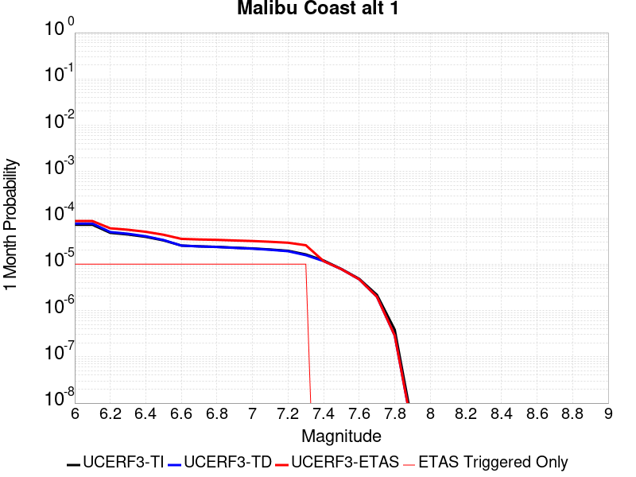 | 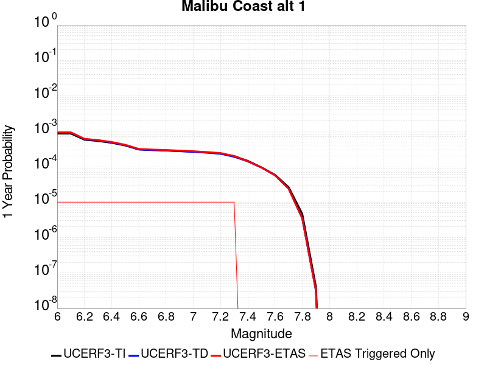 |  |

| Magnitude | 1 wk TI Prob | 1 wk TD Prob | 1 wk ETAS Prob | 1 wk ETAS/TD Gain | 1 wk ETAS Triggered Only | 1 mo TI Prob | 1 mo TD Prob | 1 mo ETAS Prob | 1 mo ETAS/TD Gain | 1 mo ETAS Triggered Only | 1 yr TI Prob | 1 yr TD Prob | 1 yr ETAS Prob | 1 yr ETAS/TD Gain | 1 yr ETAS Triggered Only | 10 yr TI Prob | 10 yr TD Prob | 10 yr ETAS Prob | 10 yr ETAS/TD Gain | 10 yr ETAS Triggered Only |
|-----|-----|-----|-----|-----|-----|-----|-----|-----|-----|-----|-----|-----|-----|-----|-----|-----|-----|-----|-----|-----|
| 6.0 | 1.6572556E-5 | 1.7598066E-5 | 3.4484812E-5 | 1.9595796 | 1.6887043E-5 | 7.102331E-5 | 7.541821E-5 | 9.230398E-5 | 1.2238951 | 1.6887043E-5 | 8.6436566E-4 | 9.178488E-4 | 9.3472033E-4 | 1.0183816 | 1.6887043E-5 | 0.0086101135 | 0.009142512 | 0.0091592455 | 1.0018302 | 1.6887043E-5 |
| 6.1 | 1.6572556E-5 | 1.7598066E-5 | 3.4484812E-5 | 1.9595796 | 1.6887043E-5 | 7.102331E-5 | 7.541821E-5 | 9.230398E-5 | 1.2238951 | 1.6887043E-5 | 8.6436566E-4 | 9.178488E-4 | 9.3472033E-4 | 1.0183816 | 1.6887043E-5 | 0.0086101135 | 0.009142512 | 0.0091592455 | 1.0018302 | 1.6887043E-5 |
| 6.2 | 1.1085717E-5 | 1.1557147E-5 | 2.8443994E-5 | 2.4611607 | 1.6887043E-5 | 4.750935E-5 | 4.952971E-5 | 6.6415916E-5 | 1.3409308 | 1.6887043E-5 | 5.782728E-4 | 6.028609E-4 | 6.197378E-4 | 1.0279946 | 1.6887043E-5 | 0.0057677035 | 0.0060126255 | 0.006029411 | 1.0027918 | 1.6887043E-5 |
| 6.3 | 1.0208568E-5 | 1.0592237E-5 | 2.7479102E-5 | 2.5942678 | 1.6887043E-5 | 4.375027E-5 | 4.539453E-5 | 6.228081E-5 | 1.3719893 | 1.6887043E-5 | 5.325294E-4 | 5.5254117E-4 | 5.694189E-4 | 1.0305456 | 1.6887043E-5 | 0.0053125503 | 0.0055119814 | 0.0055287755 | 1.0030468 | 1.6887043E-5 |
| 6.4 | 9.0682315E-6 | 9.342637E-6 | 2.6229522E-5 | 2.8075073 | 1.6887043E-5 | 3.8863272E-5 | 4.003927E-5 | 5.6925637E-5 | 1.4217451 | 1.6887043E-5 | 4.730576E-4 | 4.8737114E-4 | 5.0424994E-4 | 1.0346323 | 1.6887043E-5 | 0.0047205184 | 0.004863236 | 0.0048800413 | 1.0034555 | 1.6887043E-5 |
| 6.5 | 7.605796E-6 | 7.748587E-6 | 2.46355E-5 | 3.1793535 | 1.6887043E-5 | 3.259586E-5 | 3.3207816E-5 | 5.00943E-5 | 1.5085093 | 1.6887043E-5 | 3.9678233E-4 | 4.0423148E-4 | 4.211117E-4 | 1.0417588 | 1.6887043E-5 | 0.0039607463 | 0.0040351 | 0.0040519186 | 1.0041682 | 1.6887043E-5 |
| 6.6 | 5.889873E-6 | 5.8795385E-6 | 2.2766482E-5 | 3.8721545 | 1.6887043E-5 | 2.5242069E-5 | 2.519778E-5 | 4.2084397E-5 | 1.6701629 | 1.6887043E-5 | 3.0727885E-4 | 3.0673988E-4 | 3.2362173E-4 | 1.0550364 | 1.6887043E-5 | 0.003068543 | 0.0030631777 | 0.003080013 | 1.005496 | 1.6887043E-5 |
| 6.7 | 5.66586E-6 | 5.641641E-6 | 2.252859E-5 | 3.9932685 | 1.6887043E-5 | 2.428203E-5 | 2.417824E-5 | 4.106487E-5 | 1.6984228 | 1.6887043E-5 | 2.955936E-4 | 2.9433038E-4 | 3.1121247E-4 | 1.0573575 | 1.6887043E-5 | 0.0029520073 | 0.0029394177 | 0.002956255 | 1.0057281 | 1.6887043E-5 |
| 6.8 | 5.521556E-6 | 5.489427E-6 | 2.2376376E-5 | 4.076268 | 1.6887043E-5 | 2.3663597E-5 | 2.3525903E-5 | 4.041255E-5 | 1.7177894 | 1.6887043E-5 | 2.880662E-4 | 2.8639034E-4 | 3.0327254E-4 | 1.0589483 | 1.6887043E-5 | 0.0028769306 | 0.002860224 | 0.002877063 | 1.0058873 | 1.6887043E-5 |
| 6.9 | 5.29752E-6 | 5.2499317E-6 | 2.2136885E-5 | 4.2166047 | 1.6887043E-5 | 2.270346E-5 | 2.2499513E-5 | 3.9386177E-5 | 1.7505345 | 1.6887043E-5 | 2.7637955E-4 | 2.7389723E-4 | 2.9077963E-4 | 1.0616378 | 1.6887043E-5 | 0.0027603607 | 0.0027356069 | 0.0027524477 | 1.0061562 | 1.6887043E-5 |
| 7.0 | 5.106743E-6 | 5.0476788E-6 | 2.1934637E-5 | 4.34549 | 1.6887043E-5 | 2.1885859E-5 | 2.163273E-5 | 3.8519407E-5 | 1.7806078 | 1.6887043E-5 | 2.6642776E-4 | 2.6334674E-4 | 2.8022932E-4 | 1.0641079 | 1.6887043E-5 | 0.0026610855 | 0.0026303562 | 0.0026471987 | 1.0064032 | 1.6887043E-5 |
| 7.1 | 4.8469647E-6 | 4.770373E-6 | 2.1657335E-5 | 4.5399666 | 1.6887043E-5 | 2.0772539E-5 | 2.0444295E-5 | 3.7330992E-5 | 1.8259858 | 1.6887043E-5 | 2.528763E-4 | 2.4888094E-4 | 2.6576378E-4 | 1.067835 | 1.6887043E-5 | 0.0025258875 | 0.00248603 | 0.0025028752 | 1.0067759 | 1.6887043E-5 |
| 7.2 | 4.545514E-6 | 4.4481935E-6 | 2.1335161E-5 | 4.7963653 | 1.6887043E-5 | 1.9480629E-5 | 1.9063547E-5 | 3.595027E-5 | 1.885812 | 1.6887043E-5 | 2.3715083E-4 | 2.3207403E-4 | 2.4895716E-4 | 1.0727489 | 1.6887043E-5 | 0.0023689792 | 0.0023183243 | 0.0023351721 | 1.0072672 | 1.6887043E-5 |
| 7.3 | 3.794097E-6 | 3.6519348E-6 | 2.0538915E-5 | 5.624119 | 1.6887043E-5 | 1.6260314E-5 | 1.5651056E-5 | 3.2537835E-5 | 2.0789547 | 1.6887043E-5 | 1.9795135E-4 | 1.9053498E-4 | 2.0741881E-4 | 1.0886127 | 1.6887043E-5 | 0.001977751 | 0.0019037209 | 0.0019205757 | 1.0088537 | 1.6887043E-5 |
| 7.4 | 2.808217E-6 | 2.719077E-6 | 2.719077E-6 | 1.0 | 0.0 | 1.203516E-5 | 1.1653135E-5 | 1.1653135E-5 | 1.0 | 0.0 | 1.4651821E-4 | 1.418677E-4 | 1.418677E-4 | 1.0 | 0.0 | 0.0014642165 | 0.001417774 | 0.001417774 | 1.0 | 0.0 |
| 7.5 | 1.83809E-6 | 1.8190691E-6 | 1.8190691E-6 | 1.0 | 0.0 | 7.877505E-6 | 7.795988E-6 | 7.795988E-6 | 1.0 | 0.0 | 9.59044E-5 | 9.491203E-5 | 9.491203E-5 | 1.0 | 0.0 | 9.5863023E-4 | 9.48717E-4 | 9.48717E-4 | 1.0 | 0.0 |
| 7.6 | 1.1292672E-6 | 1.1001447E-6 | 1.1001447E-6 | 1.0 | 0.0 | 4.839708E-6 | 4.714897E-6 | 4.714897E-6 | 1.0 | 0.0 | 5.8921847E-5 | 5.7402376E-5 | 5.7402376E-5 | 1.0 | 0.0 | 5.890623E-4 | 5.738771E-4 | 5.738771E-4 | 1.0 | 0.0 |
| 7.7 | 5.065272E-7 | 4.609151E-7 | 4.609151E-7 | 1.0 | 0.0 | 2.170829E-6 | 1.975349E-6 | 1.975349E-6 | 1.0 | 0.0 | 2.6429525E-5 | 2.404962E-5 | 2.404962E-5 | 1.0 | 0.0 | 2.642638E-4 | 2.4047129E-4 | 2.4047129E-4 | 1.0 | 0.0 |
| 7.8 | 8.952991E-8 | 6.707874E-8 | 6.707874E-8 | 1.0 | 0.0 | 3.8369956E-7 | 2.8748025E-7 | 2.8748025E-7 | 1.0 | 0.0 | 4.671532E-6 | 3.5000667E-6 | 3.5000667E-6 | 1.0 | 0.0 | 4.671434E-5 | 3.5000136E-5 | 3.5000136E-5 | 1.0 | 0.0 |
| 7.9 | 8.007447E-10 | 6.1608785E-10 | 6.1608785E-10 | 1.0 | 0.0 | 3.4317629E-9 | 2.6403764E-9 | 2.6403764E-9 | 1.0 | 0.0 | 4.1781714E-8 | 3.2146584E-8 | 3.2146584E-8 | 1.0 | 0.0 | 4.1781706E-7 | 3.214658E-7 | 3.214658E-7 | 1.0 | 0.0 |

## San Gabriel (Extension)
*[(top)](#table-of-contents)*

| 1 Week | 1 Month | 1 Year | 10 Year |
|-----|-----|-----|-----|
|  |  | 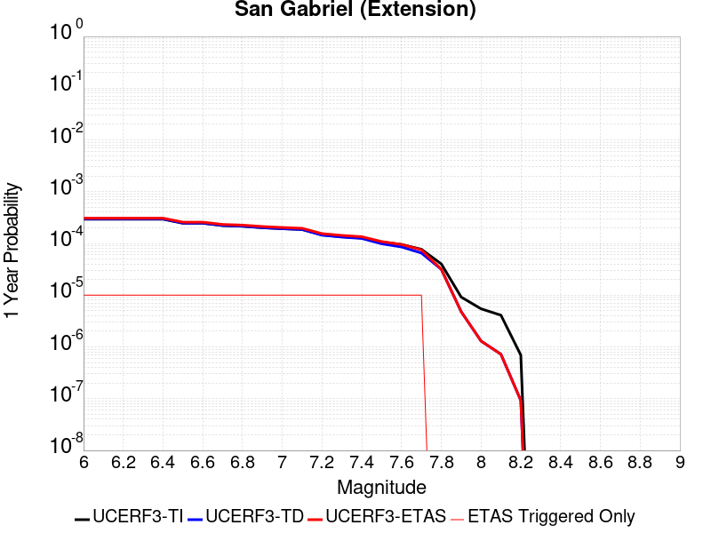 |  |

| Magnitude | 1 wk TI Prob | 1 wk TD Prob | 1 wk ETAS Prob | 1 wk ETAS/TD Gain | 1 wk ETAS Triggered Only | 1 mo TI Prob | 1 mo TD Prob | 1 mo ETAS Prob | 1 mo ETAS/TD Gain | 1 mo ETAS Triggered Only | 1 yr TI Prob | 1 yr TD Prob | 1 yr ETAS Prob | 1 yr ETAS/TD Gain | 1 yr ETAS Triggered Only | 10 yr TI Prob | 10 yr TD Prob | 10 yr ETAS Prob | 10 yr ETAS/TD Gain | 10 yr ETAS Triggered Only |
|-----|-----|-----|-----|-----|-----|-----|-----|-----|-----|-----|-----|-----|-----|-----|-----|-----|-----|-----|-----|-----|
| 6.0 | 5.6486106E-6 | 5.7168304E-6 | 5.7168304E-6 | 1.0 | 0.0 | 2.4208108E-5 | 2.450048E-5 | 2.450048E-5 | 1.0 | 0.0 | 2.9469383E-4 | 2.9825376E-4 | 3.1513578E-4 | 1.0566028 | 1.6887043E-5 | 0.0029430336 | 0.0029786653 | 0.002995502 | 1.0056524 | 1.6887043E-5 |
| 6.1 | 5.6486106E-6 | 5.7168304E-6 | 5.7168304E-6 | 1.0 | 0.0 | 2.4208108E-5 | 2.450048E-5 | 2.450048E-5 | 1.0 | 0.0 | 2.9469383E-4 | 2.9825376E-4 | 3.1513578E-4 | 1.0566028 | 1.6887043E-5 | 0.0029430336 | 0.0029786653 | 0.002995502 | 1.0056524 | 1.6887043E-5 |
| 6.2 | 5.6486106E-6 | 5.7168304E-6 | 5.7168304E-6 | 1.0 | 0.0 | 2.4208108E-5 | 2.450048E-5 | 2.450048E-5 | 1.0 | 0.0 | 2.9469383E-4 | 2.9825376E-4 | 3.1513578E-4 | 1.0566028 | 1.6887043E-5 | 0.0029430336 | 0.0029786653 | 0.002995502 | 1.0056524 | 1.6887043E-5 |
| 6.3 | 5.6486106E-6 | 5.7168304E-6 | 5.7168304E-6 | 1.0 | 0.0 | 2.4208108E-5 | 2.450048E-5 | 2.450048E-5 | 1.0 | 0.0 | 2.9469383E-4 | 2.9825376E-4 | 3.1513578E-4 | 1.0566028 | 1.6887043E-5 | 0.0029430336 | 0.0029786653 | 0.002995502 | 1.0056524 | 1.6887043E-5 |
| 6.4 | 5.6486106E-6 | 5.7168304E-6 | 5.7168304E-6 | 1.0 | 0.0 | 2.4208108E-5 | 2.450048E-5 | 2.450048E-5 | 1.0 | 0.0 | 2.9469383E-4 | 2.9825376E-4 | 3.1513578E-4 | 1.0566028 | 1.6887043E-5 | 0.0029430336 | 0.0029786653 | 0.002995502 | 1.0056524 | 1.6887043E-5 |
| 6.5 | 4.7134554E-6 | 4.7542544E-6 | 4.7542544E-6 | 1.0 | 0.0 | 2.0200367E-5 | 2.0375222E-5 | 2.0375222E-5 | 1.0 | 0.0 | 2.459117E-4 | 2.4804095E-4 | 2.649238E-4 | 1.0680648 | 1.6887043E-5 | 0.0024563975 | 0.002477729 | 0.0024945743 | 1.0067986 | 1.6887043E-5 |
| 6.6 | 4.7134554E-6 | 4.7542544E-6 | 4.7542544E-6 | 1.0 | 0.0 | 2.0200367E-5 | 2.0375222E-5 | 2.0375222E-5 | 1.0 | 0.0 | 2.459117E-4 | 2.4804095E-4 | 2.649238E-4 | 1.0680648 | 1.6887043E-5 | 0.0024563975 | 0.002477729 | 0.0024945743 | 1.0067986 | 1.6887043E-5 |
| 6.7 | 4.2468837E-6 | 4.2740717E-6 | 4.2740717E-6 | 1.0 | 0.0 | 1.8200803E-5 | 1.8317325E-5 | 1.8317325E-5 | 1.0 | 0.0 | 2.2157225E-4 | 2.2299135E-4 | 2.3987463E-4 | 1.0757127 | 1.6887043E-5 | 0.0022135144 | 0.0022277518 | 0.0022446013 | 1.0075635 | 1.6887043E-5 |
| 6.8 | 4.1180615E-6 | 4.1414614E-6 | 4.1414614E-6 | 1.0 | 0.0 | 1.7648716E-5 | 1.7749004E-5 | 1.7749004E-5 | 1.0 | 0.0 | 2.1485193E-4 | 2.160734E-4 | 2.329568E-4 | 1.0781373 | 1.6887043E-5 | 0.0021464431 | 0.0021587082 | 0.0021755588 | 1.0078058 | 1.6887043E-5 |
| 6.9 | 3.863861E-6 | 3.8797766E-6 | 3.8797766E-6 | 1.0 | 0.0 | 1.65593E-5 | 1.6627511E-5 | 1.6627511E-5 | 1.0 | 0.0 | 2.0159081E-4 | 2.0242184E-4 | 2.1930547E-4 | 1.0834081 | 1.6887043E-5 | 0.0020140803 | 0.002022446 | 0.0020392989 | 1.008333 | 1.6887043E-5 |
| 7.0 | 3.6947372E-6 | 3.705676E-6 | 3.705676E-6 | 1.0 | 0.0 | 1.5834492E-5 | 1.5881375E-5 | 1.5881375E-5 | 1.0 | 0.0 | 1.9276788E-4 | 1.9333926E-4 | 2.1022304E-4 | 1.0873272 | 1.6887043E-5 | 0.0019260074 | 0.0019317807 | 0.0019486352 | 1.0087248 | 1.6887043E-5 |
| 7.1 | 3.5686835E-6 | 3.5728963E-6 | 3.5728963E-6 | 1.0 | 0.0 | 1.5294268E-5 | 1.5312327E-5 | 1.5312327E-5 | 1.0 | 0.0 | 1.861918E-4 | 1.8641229E-4 | 2.032962E-4 | 1.0905728 | 1.6887043E-5 | 0.0018603588 | 0.0018626289 | 0.0018794845 | 1.0090493 | 1.6887043E-5 |
| 7.2 | 2.8023446E-6 | 2.7767885E-6 | 2.7767885E-6 | 1.0 | 0.0 | 1.2009994E-5 | 1.1900468E-5 | 1.1900468E-5 | 1.0 | 0.0 | 1.4621185E-4 | 1.4487868E-4 | 1.6176328E-4 | 1.116543 | 1.6887043E-5 | 0.001461157 | 0.0014478569 | 0.0014647195 | 1.0116466 | 1.6887043E-5 |
| 7.3 | 2.5843012E-6 | 2.5459642E-6 | 2.5459642E-6 | 1.0 | 0.0 | 1.1075529E-5 | 1.0911231E-5 | 1.0911231E-5 | 1.0 | 0.0 | 1.3483623E-4 | 1.3283623E-4 | 1.4972103E-4 | 1.1271099 | 1.6887043E-5 | 0.0013475444 | 0.0013275818 | 0.0013444464 | 1.0127033 | 1.6887043E-5 |
| 7.4 | 2.4464468E-6 | 2.396665E-6 | 2.396665E-6 | 1.0 | 0.0 | 1.04847295E-5 | 1.0271382E-5 | 1.0271382E-5 | 1.0 | 0.0 | 1.276441E-4 | 1.25047E-4 | 1.4193193E-4 | 1.1350287 | 1.6887043E-5 | 0.0012757082 | 0.0012497796 | 0.0012666456 | 1.0134951 | 1.6887043E-5 |
| 7.5 | 2.0420266E-6 | 1.8910426E-6 | 1.8910426E-6 | 1.0 | 0.0 | 8.751514E-6 | 8.104444E-6 | 8.104444E-6 | 1.0 | 0.0 | 1.0654447E-4 | 9.8667166E-5 | 1.15552546E-4 | 1.1711347 | 1.6887043E-5 | 0.001064934 | 9.862408E-4 | 0.0010031111 | 1.0171057 | 1.6887043E-5 |
| 7.6 | 1.8326596E-6 | 1.6398341E-6 | 1.6398341E-6 | 1.0 | 0.0 | 7.854232E-6 | 7.0278415E-6 | 7.0278415E-6 | 1.0 | 0.0 | 9.562107E-5 | 8.5560634E-5 | 1.0244623E-4 | 1.1973524 | 1.6887043E-5 | 9.5579936E-4 | 8.5528276E-4 | 8.7215536E-4 | 1.0197275 | 1.6887043E-5 |
| 7.7 | 1.4786998E-6 | 1.2523838E-6 | 1.2523838E-6 | 1.0 | 0.0 | 6.3372695E-6 | 5.367348E-6 | 5.367348E-6 | 1.0 | 0.0 | 7.715353E-5 | 6.534551E-5 | 8.2231454E-5 | 1.2584101 | 1.6887043E-5 | 7.7126746E-4 | 6.532707E-4 | 6.701467E-4 | 1.0258331 | 1.6887043E-5 |
| 7.8 | 7.6975533E-7 | 6.0693884E-7 | 6.0693884E-7 | 1.0 | 0.0 | 3.2989474E-6 | 2.601164E-6 | 2.601164E-6 | 1.0 | 0.0 | 4.0163945E-5 | 3.166871E-5 | 3.166871E-5 | 1.0 | 0.0 | 4.0156685E-4 | 3.1664805E-4 | 3.1664805E-4 | 1.0 | 0.0 |
| 7.9 | 1.7645915E-7 | 9.213256E-8 | 9.213256E-8 | 1.0 | 0.0 | 7.562533E-7 | 3.9485377E-7 | 3.9485377E-7 | 1.0 | 0.0 | 9.207345E-6 | 4.807334E-6 | 4.807334E-6 | 1.0 | 0.0 | 9.206964E-5 | 4.807699E-5 | 4.807699E-5 | 1.0 | 0.0 |
| 8.0 | 1.0463461E-7 | 2.4949307E-8 | 2.4949307E-8 | 1.0 | 0.0 | 4.4843398E-7 | 1.0692559E-7 | 1.0692559E-7 | 1.0 | 0.0 | 5.45967E-6 | 1.3018183E-6 | 1.3018183E-6 | 1.0 | 0.0 | 5.459536E-5 | 1.3022789E-5 | 1.3022789E-5 | 1.0 | 0.0 |
| 8.1 | 7.875717E-8 | 1.3866874E-8 | 1.3866874E-8 | 1.0 | 0.0 | 3.3753068E-7 | 5.942946E-8 | 5.942946E-8 | 1.0 | 0.0 | 4.109428E-6 | 7.235534E-7 | 7.235534E-7 | 1.0 | 0.0 | 4.109352E-5 | 7.2401926E-6 | 7.2401926E-6 | 1.0 | 0.0 |
| 8.2 | 1.33163E-8 | 1.7733891E-9 | 1.7733891E-9 | 1.0 | 0.0 | 5.7069855E-8 | 7.600239E-9 | 7.600239E-9 | 1.0 | 0.0 | 6.9482525E-7 | 9.25329E-8 | 9.25329E-8 | 1.0 | 0.0 | 6.9482307E-6 | 9.272953E-7 | 9.272953E-7 | 1.0 | 0.0 |

## Goose Lake 2011 CFM
*[(top)](#table-of-contents)*

| 1 Week | 1 Month | 1 Year | 10 Year |
|-----|-----|-----|-----|
|  |  |  |  |

| Magnitude | 1 wk TI Prob | 1 wk TD Prob | 1 wk ETAS Prob | 1 wk ETAS/TD Gain | 1 wk ETAS Triggered Only | 1 mo TI Prob | 1 mo TD Prob | 1 mo ETAS Prob | 1 mo ETAS/TD Gain | 1 mo ETAS Triggered Only | 1 yr TI Prob | 1 yr TD Prob | 1 yr ETAS Prob | 1 yr ETAS/TD Gain | 1 yr ETAS Triggered Only | 10 yr TI Prob | 10 yr TD Prob | 10 yr ETAS Prob | 10 yr ETAS/TD Gain | 10 yr ETAS Triggered Only |
|-----|-----|-----|-----|-----|-----|-----|-----|-----|-----|-----|-----|-----|-----|-----|-----|-----|-----|-----|-----|-----|
| 6.0 | 3.780968E-6 | 3.8230223E-6 | 3.8230223E-6 | 1.0 | 0.0 | 1.6204049E-5 | 1.6384285E-5 | 1.6384285E-5 | 1.0 | 0.0 | 1.9726643E-4 | 1.994615E-4 | 1.994615E-4 | 1.0 | 0.0 | 0.001970914 | 0.001992933 | 0.0020097864 | 1.0084566 | 1.6887043E-5 |
| 6.1 | 2.2035124E-6 | 2.229801E-6 | 2.229801E-6 | 1.0 | 0.0 | 9.443591E-6 | 9.556257E-6 | 9.556257E-6 | 1.0 | 0.0 | 1.1496965E-4 | 1.163414E-4 | 1.163414E-4 | 1.0 | 0.0 | 0.0011491019 | 0.0011628233 | 0.0011628233 | 1.0 | 0.0 |
| 6.2 | 1.5624689E-6 | 1.5826923E-6 | 1.5826923E-6 | 1.0 | 0.0 | 6.6962784E-6 | 6.7829496E-6 | 6.7829496E-6 | 1.0 | 0.0 | 8.152414E-5 | 8.2579325E-5 | 8.2579325E-5 | 1.0 | 0.0 | 8.1494235E-4 | 8.2549086E-4 | 8.2549086E-4 | 1.0 | 0.0 |
| 6.3 | 1.5624689E-6 | 1.5826923E-6 | 1.5826923E-6 | 1.0 | 0.0 | 6.6962784E-6 | 6.7829496E-6 | 6.7829496E-6 | 1.0 | 0.0 | 8.152414E-5 | 8.2579325E-5 | 8.2579325E-5 | 1.0 | 0.0 | 8.1494235E-4 | 8.2549086E-4 | 8.2549086E-4 | 1.0 | 0.0 |
| 6.4 | 1.256464E-6 | 1.2738695E-6 | 1.2738695E-6 | 1.0 | 0.0 | 5.3848344E-6 | 5.4594293E-6 | 5.4594293E-6 | 1.0 | 0.0 | 6.5558386E-5 | 6.646655E-5 | 6.646655E-5 | 1.0 | 0.0 | 6.553905E-4 | 6.644687E-4 | 6.644687E-4 | 1.0 | 0.0 |
| 6.5 | 1.0910911E-6 | 1.1069404E-6 | 1.1069404E-6 | 1.0 | 0.0 | 4.6760965E-6 | 4.7440217E-6 | 4.7440217E-6 | 1.0 | 0.0 | 5.692999E-5 | 5.7756948E-5 | 5.7756948E-5 | 1.0 | 0.0 | 5.6915404E-4 | 5.7742064E-4 | 5.7742064E-4 | 1.0 | 0.0 |
| 6.6 | 9.546601E-7 | 9.691246E-7 | 9.691246E-7 | 1.0 | 0.0 | 4.091394E-6 | 4.1533845E-6 | 4.1533845E-6 | 1.0 | 0.0 | 4.9811584E-5 | 5.056629E-5 | 5.056629E-5 | 1.0 | 0.0 | 4.980042E-4 | 5.055487E-4 | 5.055487E-4 | 1.0 | 0.0 |
| 6.7 | 7.790316E-7 | 7.9159634E-7 | 7.9159634E-7 | 1.0 | 0.0 | 3.3387028E-6 | 3.3925514E-6 | 3.3925514E-6 | 1.0 | 0.0 | 4.0647945E-5 | 4.1303538E-5 | 4.1303538E-5 | 1.0 | 0.0 | 4.0640513E-4 | 4.129592E-4 | 4.129592E-4 | 1.0 | 0.0 |
| 6.8 | 6.3714384E-7 | 6.4787395E-7 | 6.4787395E-7 | 1.0 | 0.0 | 2.7306137E-6 | 2.7765998E-6 | 2.7765998E-6 | 1.0 | 0.0 | 3.3244716E-5 | 3.3804583E-5 | 3.3804583E-5 | 1.0 | 0.0 | 3.323974E-4 | 3.379949E-4 | 3.379949E-4 | 1.0 | 0.0 |
| 6.9 | 4.92586E-7 | 5.0139147E-7 | 5.0139147E-7 | 1.0 | 0.0 | 2.1110811E-6 | 2.1488188E-6 | 2.1488188E-6 | 1.0 | 0.0 | 2.5702111E-5 | 2.616156E-5 | 2.616156E-5 | 1.0 | 0.0 | 2.569914E-4 | 2.6158517E-4 | 2.6158517E-4 | 1.0 | 0.0 |
| 7.0 | 3.130245E-7 | 3.190354E-7 | 3.190354E-7 | 1.0 | 0.0 | 1.3415328E-6 | 1.3672939E-6 | 1.3672939E-6 | 1.0 | 0.0 | 1.6333039E-5 | 1.6646678E-5 | 1.6646678E-5 | 1.0 | 0.0 | 1.6331839E-4 | 1.6645451E-4 | 1.6645451E-4 | 1.0 | 0.0 |
| 7.1 | 1.7680084E-7 | 1.8023923E-7 | 1.8023923E-7 | 1.0 | 0.0 | 7.5771766E-7 | 7.724536E-7 | 7.724536E-7 | 1.0 | 0.0 | 9.225173E-6 | 9.404583E-6 | 9.404583E-6 | 1.0 | 0.0 | 9.22479E-5 | 9.4041956E-5 | 9.4041956E-5 | 1.0 | 0.0 |
| 7.2 | 4.8641045E-8 | 4.9402068E-8 | 4.9402068E-8 | 1.0 | 0.0 | 2.084616E-7 | 2.1172312E-7 | 2.1172312E-7 | 1.0 | 0.0 | 2.538017E-6 | 2.577726E-6 | 2.577726E-6 | 1.0 | 0.0 | 2.537988E-5 | 2.5776973E-5 | 2.5776973E-5 | 1.0 | 0.0 |
| 7.3 | 5.3911844E-9 | 5.4758145E-9 | 5.4758145E-9 | 1.0 | 0.0 | 2.3105075E-8 | 2.3467775E-8 | 2.3467775E-8 | 1.0 | 0.0 | 2.8130427E-7 | 2.8572015E-7 | 2.8572015E-7 | 1.0 | 0.0 | 2.8130391E-6 | 2.8571992E-6 | 2.8571992E-6 | 1.0 | 0.0 |

## Pitas Point (Lower)-Montalvo
*[(top)](#table-of-contents)*

| 1 Week | 1 Month | 1 Year | 10 Year |
|-----|-----|-----|-----|
|  | 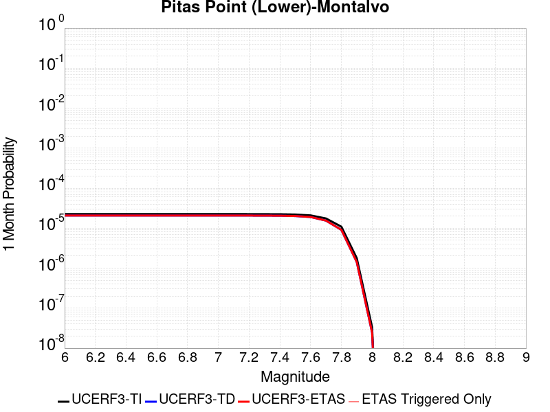 |  |  |

| Magnitude | 1 wk TI Prob | 1 wk TD Prob | 1 wk ETAS Prob | 1 wk ETAS/TD Gain | 1 wk ETAS Triggered Only | 1 mo TI Prob | 1 mo TD Prob | 1 mo ETAS Prob | 1 mo ETAS/TD Gain | 1 mo ETAS Triggered Only | 1 yr TI Prob | 1 yr TD Prob | 1 yr ETAS Prob | 1 yr ETAS/TD Gain | 1 yr ETAS Triggered Only | 10 yr TI Prob | 10 yr TD Prob | 10 yr ETAS Prob | 10 yr ETAS/TD Gain | 10 yr ETAS Triggered Only |
|-----|-----|-----|-----|-----|-----|-----|-----|-----|-----|-----|-----|-----|-----|-----|-----|-----|-----|-----|-----|-----|
| 6.0 | 5.2543637E-6 | 4.8378706E-6 | 4.8378706E-6 | 1.0 | 0.0 | 2.2518509E-5 | 2.0733567E-5 | 2.0733567E-5 | 1.0 | 0.0 | 2.7412834E-4 | 2.5240227E-4 | 2.5240227E-4 | 1.0 | 0.0 | 0.0027379042 | 0.0025211885 | 0.0025380328 | 1.0066812 | 1.6887043E-5 |
| 6.1 | 5.2543637E-6 | 4.8378706E-6 | 4.8378706E-6 | 1.0 | 0.0 | 2.2518509E-5 | 2.0733567E-5 | 2.0733567E-5 | 1.0 | 0.0 | 2.7412834E-4 | 2.5240227E-4 | 2.5240227E-4 | 1.0 | 0.0 | 0.0027379042 | 0.0025211885 | 0.0025380328 | 1.0066812 | 1.6887043E-5 |
| 6.2 | 5.2543637E-6 | 4.8378706E-6 | 4.8378706E-6 | 1.0 | 0.0 | 2.2518509E-5 | 2.0733567E-5 | 2.0733567E-5 | 1.0 | 0.0 | 2.7412834E-4 | 2.5240227E-4 | 2.5240227E-4 | 1.0 | 0.0 | 0.0027379042 | 0.0025211885 | 0.0025380328 | 1.0066812 | 1.6887043E-5 |
| 6.3 | 5.2543637E-6 | 4.8378706E-6 | 4.8378706E-6 | 1.0 | 0.0 | 2.2518509E-5 | 2.0733567E-5 | 2.0733567E-5 | 1.0 | 0.0 | 2.7412834E-4 | 2.5240227E-4 | 2.5240227E-4 | 1.0 | 0.0 | 0.0027379042 | 0.0025211885 | 0.0025380328 | 1.0066812 | 1.6887043E-5 |
| 6.4 | 5.2543637E-6 | 4.8378706E-6 | 4.8378706E-6 | 1.0 | 0.0 | 2.2518509E-5 | 2.0733567E-5 | 2.0733567E-5 | 1.0 | 0.0 | 2.7412834E-4 | 2.5240227E-4 | 2.5240227E-4 | 1.0 | 0.0 | 0.0027379042 | 0.0025211885 | 0.0025380328 | 1.0066812 | 1.6887043E-5 |
| 6.5 | 5.2543637E-6 | 4.8378706E-6 | 4.8378706E-6 | 1.0 | 0.0 | 2.2518509E-5 | 2.0733567E-5 | 2.0733567E-5 | 1.0 | 0.0 | 2.7412834E-4 | 2.5240227E-4 | 2.5240227E-4 | 1.0 | 0.0 | 0.0027379042 | 0.0025211885 | 0.0025380328 | 1.0066812 | 1.6887043E-5 |
| 6.6 | 5.2543637E-6 | 4.8378706E-6 | 4.8378706E-6 | 1.0 | 0.0 | 2.2518509E-5 | 2.0733567E-5 | 2.0733567E-5 | 1.0 | 0.0 | 2.7412834E-4 | 2.5240227E-4 | 2.5240227E-4 | 1.0 | 0.0 | 0.0027379042 | 0.0025211885 | 0.0025380328 | 1.0066812 | 1.6887043E-5 |
| 6.7 | 5.2543637E-6 | 4.8378706E-6 | 4.8378706E-6 | 1.0 | 0.0 | 2.2518509E-5 | 2.0733567E-5 | 2.0733567E-5 | 1.0 | 0.0 | 2.7412834E-4 | 2.5240227E-4 | 2.5240227E-4 | 1.0 | 0.0 | 0.0027379042 | 0.0025211885 | 0.0025380328 | 1.0066812 | 1.6887043E-5 |
| 6.8 | 5.2543637E-6 | 4.8378706E-6 | 4.8378706E-6 | 1.0 | 0.0 | 2.2518509E-5 | 2.0733567E-5 | 2.0733567E-5 | 1.0 | 0.0 | 2.7412834E-4 | 2.5240227E-4 | 2.5240227E-4 | 1.0 | 0.0 | 0.0027379042 | 0.0025211885 | 0.0025380328 | 1.0066812 | 1.6887043E-5 |
| 6.9 | 5.2543637E-6 | 4.8378706E-6 | 4.8378706E-6 | 1.0 | 0.0 | 2.2518509E-5 | 2.0733567E-5 | 2.0733567E-5 | 1.0 | 0.0 | 2.7412834E-4 | 2.5240227E-4 | 2.5240227E-4 | 1.0 | 0.0 | 0.0027379042 | 0.0025211885 | 0.0025380328 | 1.0066812 | 1.6887043E-5 |
| 7.0 | 5.2543637E-6 | 4.8378706E-6 | 4.8378706E-6 | 1.0 | 0.0 | 2.2518509E-5 | 2.0733567E-5 | 2.0733567E-5 | 1.0 | 0.0 | 2.7412834E-4 | 2.5240227E-4 | 2.5240227E-4 | 1.0 | 0.0 | 0.0027379042 | 0.0025211885 | 0.0025380328 | 1.0066812 | 1.6887043E-5 |
| 7.1 | 5.2543637E-6 | 4.8378706E-6 | 4.8378706E-6 | 1.0 | 0.0 | 2.2518509E-5 | 2.0733567E-5 | 2.0733567E-5 | 1.0 | 0.0 | 2.7412834E-4 | 2.5240227E-4 | 2.5240227E-4 | 1.0 | 0.0 | 0.0027379042 | 0.0025211885 | 0.0025380328 | 1.0066812 | 1.6887043E-5 |
| 7.2 | 5.2458695E-6 | 4.8290244E-6 | 4.8290244E-6 | 1.0 | 0.0 | 2.2482105E-5 | 2.0695656E-5 | 2.0695656E-5 | 1.0 | 0.0 | 2.7368523E-4 | 2.519408E-4 | 2.519408E-4 | 1.0 | 0.0 | 0.0027334841 | 0.0025165842 | 0.0025334286 | 1.0066934 | 1.6887043E-5 |
| 7.3 | 5.22665E-6 | 4.8089414E-6 | 4.8089414E-6 | 1.0 | 0.0 | 2.2399736E-5 | 2.0609588E-5 | 2.0609588E-5 | 1.0 | 0.0 | 2.7268266E-4 | 2.5089315E-4 | 2.5089315E-4 | 1.0 | 0.0 | 0.002723483 | 0.0025061315 | 0.0025229764 | 1.0067214 | 1.6887043E-5 |
| 7.4 | 5.210642E-6 | 4.792154E-6 | 4.792154E-6 | 1.0 | 0.0 | 2.233113E-5 | 2.0537642E-5 | 2.0537642E-5 | 1.0 | 0.0 | 2.718476E-4 | 2.5001742E-4 | 2.5001742E-4 | 1.0 | 0.0 | 0.002715153 | 0.0024973939 | 0.0025142387 | 1.006745 | 1.6887043E-5 |
| 7.5 | 5.1226016E-6 | 4.7000403E-6 | 4.7000403E-6 | 1.0 | 0.0 | 2.1953823E-5 | 2.0142877E-5 | 2.0142877E-5 | 1.0 | 0.0 | 2.67255E-4 | 2.4521223E-4 | 2.4521223E-4 | 1.0 | 0.0 | 0.0026693381 | 0.0024494485 | 0.002466294 | 1.0068773 | 1.6887043E-5 |
| 7.6 | 4.8796987E-6 | 4.4449403E-6 | 4.4449403E-6 | 1.0 | 0.0 | 2.0912828E-5 | 1.9049607E-5 | 1.9049607E-5 | 1.0 | 0.0 | 2.5458392E-4 | 2.3190459E-4 | 2.3190459E-4 | 1.0 | 0.0 | 0.0025429246 | 0.0023166565 | 0.0023166565 | 1.0 | 0.0 |
| 7.7 | 4.0834398E-6 | 3.6091124E-6 | 3.6091124E-6 | 1.0 | 0.0 | 1.7500339E-5 | 1.5467534E-5 | 1.5467534E-5 | 1.0 | 0.0 | 2.1304579E-4 | 1.8830119E-4 | 1.8830119E-4 | 1.0 | 0.0 | 0.0021284167 | 0.00188144 | 0.00188144 | 1.0 | 0.0 |
| 7.8 | 2.5445438E-6 | 2.121228E-6 | 2.121228E-6 | 1.0 | 0.0 | 1.0905142E-5 | 9.090945E-6 | 9.090945E-6 | 1.0 | 0.0 | 1.3276201E-4 | 1.1067669E-4 | 1.1067669E-4 | 1.0 | 0.0 | 0.0013268272 | 0.0011062203 | 0.0011062203 | 1.0 | 0.0 |
| 7.9 | 4.1677114E-7 | 3.3293693E-7 | 3.3293693E-7 | 1.0 | 0.0 | 1.7861609E-6 | 1.4268718E-6 | 1.4268718E-6 | 1.0 | 0.0 | 2.1746291E-5 | 1.737203E-5 | 1.737203E-5 | 1.0 | 0.0 | 2.1744163E-4 | 1.7370703E-4 | 1.7370703E-4 | 1.0 | 0.0 |
| 8.0 | 7.791402E-9 | 5.683497E-9 | 5.683497E-9 | 1.0 | 0.0 | 3.3391725E-8 | 2.4357844E-8 | 2.4357844E-8 | 1.0 | 0.0 | 4.0654416E-7 | 2.9655675E-7 | 2.9655675E-7 | 1.0 | 0.0 | 4.065434E-6 | 2.9655655E-6 | 2.9655655E-6 | 1.0 | 0.0 |

## Likely 2011 CFM
*[(top)](#table-of-contents)*

| 1 Week | 1 Month | 1 Year | 10 Year |
|-----|-----|-----|-----|
|  |  |  |  |

| Magnitude | 1 wk TI Prob | 1 wk TD Prob | 1 wk ETAS Prob | 1 wk ETAS/TD Gain | 1 wk ETAS Triggered Only | 1 mo TI Prob | 1 mo TD Prob | 1 mo ETAS Prob | 1 mo ETAS/TD Gain | 1 mo ETAS Triggered Only | 1 yr TI Prob | 1 yr TD Prob | 1 yr ETAS Prob | 1 yr ETAS/TD Gain | 1 yr ETAS Triggered Only | 10 yr TI Prob | 10 yr TD Prob | 10 yr ETAS Prob | 10 yr ETAS/TD Gain | 10 yr ETAS Triggered Only |
|-----|-----|-----|-----|-----|-----|-----|-----|-----|-----|-----|-----|-----|-----|-----|-----|-----|-----|-----|-----|-----|
| 6.0 | 2.5315949E-5 | 2.7104748E-5 | 2.7104748E-5 | 1.0 | 0.0 | 1.0849241E-4 | 1.16158284E-4 | 1.16158284E-4 | 1.0 | 0.0 | 0.0013200947 | 0.0014133542 | 0.0014302174 | 1.0119313 | 1.6887043E-5 | 0.013122803 | 0.01404831 | 0.01406496 | 1.0011852 | 1.6887043E-5 |
| 6.1 | 2.5315949E-5 | 2.7104748E-5 | 2.7104748E-5 | 1.0 | 0.0 | 1.0849241E-4 | 1.16158284E-4 | 1.16158284E-4 | 1.0 | 0.0 | 0.0013200947 | 0.0014133542 | 0.0014302174 | 1.0119313 | 1.6887043E-5 | 0.013122803 | 0.01404831 | 0.01406496 | 1.0011852 | 1.6887043E-5 |
| 6.2 | 1.6375941E-5 | 1.7465842E-5 | 1.7465842E-5 | 1.0 | 0.0 | 7.0180715E-5 | 7.485153E-5 | 7.485153E-5 | 1.0 | 0.0 | 8.5411523E-4 | 9.109487E-4 | 9.278203E-4 | 1.018521 | 1.6887043E-5 | 0.008508399 | 0.009073433 | 0.009090167 | 1.0018443 | 1.6887043E-5 |
| 6.3 | 1.1945543E-5 | 1.2712587E-5 | 1.2712587E-5 | 1.0 | 0.0 | 5.119418E-5 | 5.4481407E-5 | 5.4481407E-5 | 1.0 | 0.0 | 6.2311086E-4 | 6.631146E-4 | 6.7999045E-4 | 1.0254494 | 1.6887043E-5 | 0.0062136655 | 0.0066119144 | 0.00662869 | 1.0025371 | 1.6887043E-5 |
| 6.4 | 9.192729E-6 | 9.768488E-6 | 9.768488E-6 | 1.0 | 0.0 | 3.939681E-5 | 4.1864292E-5 | 4.1864292E-5 | 1.0 | 0.0 | 4.7955062E-4 | 5.0958124E-4 | 5.264597E-4 | 1.0331222 | 1.6887043E-5 | 0.004785171 | 0.0050844094 | 0.0051012104 | 1.0033045 | 1.6887043E-5 |
| 6.5 | 7.67906E-6 | 8.152622E-6 | 8.152622E-6 | 1.0 | 0.0 | 3.2909844E-5 | 3.4939352E-5 | 3.4939352E-5 | 1.0 | 0.0 | 4.006037E-4 | 4.2530545E-4 | 4.4218532E-4 | 1.0396888 | 1.6887043E-5 | 0.0039988225 | 0.004245108 | 0.0042619235 | 1.0039611 | 1.6887043E-5 |
| 6.6 | 6.4884057E-6 | 6.8847507E-6 | 6.8847507E-6 | 1.0 | 0.0 | 2.7807157E-5 | 2.9505749E-5 | 2.9505749E-5 | 1.0 | 0.0 | 3.3849955E-4 | 3.591747E-4 | 3.760557E-4 | 1.0469993 | 1.6887043E-5 | 0.003379844 | 0.0035860867 | 0.003602913 | 1.0046922 | 1.6887043E-5 |
| 6.7 | 4.6060636E-6 | 4.884041E-6 | 4.884041E-6 | 1.0 | 0.0 | 1.9740122E-5 | 2.0931442E-5 | 2.0931442E-5 | 1.0 | 0.0 | 2.403095E-4 | 2.5481134E-4 | 2.7169407E-4 | 1.0662558 | 1.6887043E-5 | 0.002400498 | 0.0025452746 | 0.0025621187 | 1.0066178 | 1.6887043E-5 |
| 6.8 | 3.2795615E-6 | 3.4773732E-6 | 3.4773732E-6 | 1.0 | 0.0 | 1.4055187E-5 | 1.4902946E-5 | 1.4902946E-5 | 1.0 | 0.0 | 1.7110848E-4 | 1.8142881E-4 | 1.8142881E-4 | 1.0 | 0.0 | 0.0017097679 | 0.0018128622 | 0.0018128622 | 1.0 | 0.0 |
| 6.9 | 2.3289967E-6 | 2.4705569E-6 | 2.4705569E-6 | 1.0 | 0.0 | 9.981376E-6 | 1.058806E-5 | 1.058806E-5 | 1.0 | 0.0 | 1.2151648E-4 | 1.2890245E-4 | 1.2890245E-4 | 1.0 | 0.0 | 0.0012145005 | 0.0012883197 | 0.0012883197 | 1.0 | 0.0 |
| 7.0 | 1.211292E-6 | 1.2863958E-6 | 1.2863958E-6 | 1.0 | 0.0 | 5.1912407E-6 | 5.5131145E-6 | 5.5131145E-6 | 1.0 | 0.0 | 6.320152E-5 | 6.712041E-5 | 6.712041E-5 | 1.0 | 0.0 | 6.3183554E-4 | 6.710312E-4 | 6.710312E-4 | 1.0 | 0.0 |

## Ozena
*[(top)](#table-of-contents)*

| 1 Week | 1 Month | 1 Year | 10 Year |
|-----|-----|-----|-----|
|  |  |  |  |

| Magnitude | 1 wk TI Prob | 1 wk TD Prob | 1 wk ETAS Prob | 1 wk ETAS/TD Gain | 1 wk ETAS Triggered Only | 1 mo TI Prob | 1 mo TD Prob | 1 mo ETAS Prob | 1 mo ETAS/TD Gain | 1 mo ETAS Triggered Only | 1 yr TI Prob | 1 yr TD Prob | 1 yr ETAS Prob | 1 yr ETAS/TD Gain | 1 yr ETAS Triggered Only | 10 yr TI Prob | 10 yr TD Prob | 10 yr ETAS Prob | 10 yr ETAS/TD Gain | 10 yr ETAS Triggered Only |
|-----|-----|-----|-----|-----|-----|-----|-----|-----|-----|-----|-----|-----|-----|-----|-----|-----|-----|-----|-----|-----|
| 6.0 | 1.4377547E-6 | 1.4513782E-6 | 1.4513782E-6 | 1.0 | 0.0 | 6.161791E-6 | 6.2201793E-6 | 6.2201793E-6 | 1.0 | 0.0 | 7.5017226E-5 | 7.572832E-5 | 7.572832E-5 | 1.0 | 0.0 | 7.4991904E-4 | 7.570518E-4 | 7.7392603E-4 | 1.0222894 | 1.6887043E-5 |
| 6.1 | 1.4377547E-6 | 1.4513782E-6 | 1.4513782E-6 | 1.0 | 0.0 | 6.161791E-6 | 6.2201793E-6 | 6.2201793E-6 | 1.0 | 0.0 | 7.5017226E-5 | 7.572832E-5 | 7.572832E-5 | 1.0 | 0.0 | 7.4991904E-4 | 7.570518E-4 | 7.7392603E-4 | 1.0222894 | 1.6887043E-5 |
| 6.2 | 1.4377547E-6 | 1.4513782E-6 | 1.4513782E-6 | 1.0 | 0.0 | 6.161791E-6 | 6.2201793E-6 | 6.2201793E-6 | 1.0 | 0.0 | 7.5017226E-5 | 7.572832E-5 | 7.572832E-5 | 1.0 | 0.0 | 7.4991904E-4 | 7.570518E-4 | 7.7392603E-4 | 1.0222894 | 1.6887043E-5 |
| 6.3 | 1.4377547E-6 | 1.4513782E-6 | 1.4513782E-6 | 1.0 | 0.0 | 6.161791E-6 | 6.2201793E-6 | 6.2201793E-6 | 1.0 | 0.0 | 7.5017226E-5 | 7.572832E-5 | 7.572832E-5 | 1.0 | 0.0 | 7.4991904E-4 | 7.570518E-4 | 7.7392603E-4 | 1.0222894 | 1.6887043E-5 |
| 6.4 | 1.4377547E-6 | 1.4513782E-6 | 1.4513782E-6 | 1.0 | 0.0 | 6.161791E-6 | 6.2201793E-6 | 6.2201793E-6 | 1.0 | 0.0 | 7.5017226E-5 | 7.572832E-5 | 7.572832E-5 | 1.0 | 0.0 | 7.4991904E-4 | 7.570518E-4 | 7.7392603E-4 | 1.0222894 | 1.6887043E-5 |
| 6.5 | 1.4377547E-6 | 1.4513782E-6 | 1.4513782E-6 | 1.0 | 0.0 | 6.161791E-6 | 6.2201793E-6 | 6.2201793E-6 | 1.0 | 0.0 | 7.5017226E-5 | 7.572832E-5 | 7.572832E-5 | 1.0 | 0.0 | 7.4991904E-4 | 7.570518E-4 | 7.7392603E-4 | 1.0222894 | 1.6887043E-5 |
| 6.6 | 1.4377547E-6 | 1.4513782E-6 | 1.4513782E-6 | 1.0 | 0.0 | 6.161791E-6 | 6.2201793E-6 | 6.2201793E-6 | 1.0 | 0.0 | 7.5017226E-5 | 7.572832E-5 | 7.572832E-5 | 1.0 | 0.0 | 7.4991904E-4 | 7.570518E-4 | 7.7392603E-4 | 1.0222894 | 1.6887043E-5 |
| 6.7 | 1.4377547E-6 | 1.4513782E-6 | 1.4513782E-6 | 1.0 | 0.0 | 6.161791E-6 | 6.2201793E-6 | 6.2201793E-6 | 1.0 | 0.0 | 7.5017226E-5 | 7.572832E-5 | 7.572832E-5 | 1.0 | 0.0 | 7.4991904E-4 | 7.570518E-4 | 7.7392603E-4 | 1.0222894 | 1.6887043E-5 |
| 6.8 | 9.223257E-7 | 9.317624E-7 | 9.317624E-7 | 1.0 | 0.0 | 3.9528186E-6 | 3.9932615E-6 | 3.9932615E-6 | 1.0 | 0.0 | 4.81245E-5 | 4.8616912E-5 | 4.8616912E-5 | 1.0 | 0.0 | 4.811408E-4 | 4.860668E-4 | 5.029456E-4 | 1.0347253 | 1.6887043E-5 |
| 6.9 | 9.141515E-7 | 9.235371E-7 | 9.235371E-7 | 1.0 | 0.0 | 3.917786E-6 | 3.9580104E-6 | 3.9580104E-6 | 1.0 | 0.0 | 4.7698002E-5 | 4.818775E-5 | 4.818775E-5 | 1.0 | 0.0 | 4.7687767E-4 | 4.8177704E-4 | 4.9865595E-4 | 1.0350347 | 1.6887043E-5 |
| 7.0 | 8.767648E-7 | 8.8585773E-7 | 8.8585773E-7 | 1.0 | 0.0 | 3.757558E-6 | 3.7965276E-6 | 3.7965276E-6 | 1.0 | 0.0 | 4.5747307E-5 | 4.6221783E-5 | 4.6221783E-5 | 1.0 | 0.0 | 4.5737892E-4 | 4.6212564E-4 | 4.7900487E-4 | 1.0365252 | 1.6887043E-5 |
| 7.1 | 8.199402E-7 | 8.2853984E-7 | 8.2853984E-7 | 1.0 | 0.0 | 3.5140247E-6 | 3.5508804E-6 | 3.5508804E-6 | 1.0 | 0.0 | 4.2782412E-5 | 4.323115E-5 | 4.323115E-5 | 1.0 | 0.0 | 4.2774176E-4 | 4.322311E-4 | 4.4911087E-4 | 1.0390526 | 1.6887043E-5 |
| 7.2 | 7.38705E-7 | 7.464262E-7 | 7.464262E-7 | 1.0 | 0.0 | 3.1658747E-6 | 3.198966E-6 | 3.198966E-6 | 1.0 | 0.0 | 3.8543843E-5 | 3.894675E-5 | 3.894675E-5 | 1.0 | 0.0 | 3.853716E-4 | 3.8940276E-4 | 4.0628322E-4 | 1.0433496 | 1.6887043E-5 |
| 7.3 | 6.490017E-7 | 6.557802E-7 | 6.557802E-7 | 1.0 | 0.0 | 2.7814328E-6 | 2.8104837E-6 | 2.8104837E-6 | 1.0 | 0.0 | 3.386342E-5 | 3.4217133E-5 | 3.4217133E-5 | 1.0 | 0.0 | 3.3858258E-4 | 3.4212202E-4 | 3.590033E-4 | 1.0493429 | 1.6887043E-5 |
| 7.4 | 5.346736E-7 | 5.4022604E-7 | 5.4022604E-7 | 1.0 | 0.0 | 2.291456E-6 | 2.3152527E-6 | 2.3152527E-6 | 1.0 | 0.0 | 2.789812E-5 | 2.8187867E-5 | 2.8187867E-5 | 1.0 | 0.0 | 2.789462E-4 | 2.8184598E-4 | 2.9872824E-4 | 1.059899 | 1.6887043E-5 |
| 7.5 | 2.939325E-7 | 2.9666057E-7 | 2.9666057E-7 | 1.0 | 0.0 | 1.25971E-6 | 1.271402E-6 | 1.271402E-6 | 1.0 | 0.0 | 1.5336862E-5 | 1.5479225E-5 | 1.5479225E-5 | 1.0 | 0.0 | 1.5335804E-4 | 1.5478309E-4 | 1.5478309E-4 | 1.0 | 0.0 |
| 7.6 | 1.4151905E-7 | 1.4253266E-7 | 1.4253266E-7 | 1.0 | 0.0 | 6.065101E-7 | 6.108541E-7 | 6.108541E-7 | 1.0 | 0.0 | 7.3842357E-6 | 7.4371237E-6 | 7.4371237E-6 | 1.0 | 0.0 | 7.38399E-5 | 7.436883E-5 | 7.436883E-5 | 1.0 | 0.0 |
| 7.7 | 4.4957577E-8 | 4.5252243E-8 | 4.5252243E-8 | 1.0 | 0.0 | 1.9267533E-7 | 1.9393818E-7 | 1.9393818E-7 | 1.0 | 0.0 | 2.3458194E-6 | 2.3611947E-6 | 2.3611947E-6 | 1.0 | 0.0 | 2.3457947E-5 | 2.3611707E-5 | 2.3611707E-5 | 1.0 | 0.0 |
| 7.8 | 5.9993255E-9 | 6.0412972E-9 | 6.0412972E-9 | 1.0 | 0.0 | 2.5711394E-8 | 2.5891273E-8 | 2.5891273E-8 | 1.0 | 0.0 | 3.1303617E-7 | 3.1522623E-7 | 3.1522623E-7 | 1.0 | 0.0 | 3.1303573E-6 | 3.1522588E-6 | 3.1522588E-6 | 1.0 | 0.0 |

## Great Valley 03a Dunnigan Hills
*[(top)](#table-of-contents)*

| 1 Week | 1 Month | 1 Year | 10 Year |
|-----|-----|-----|-----|
|  |  |  | 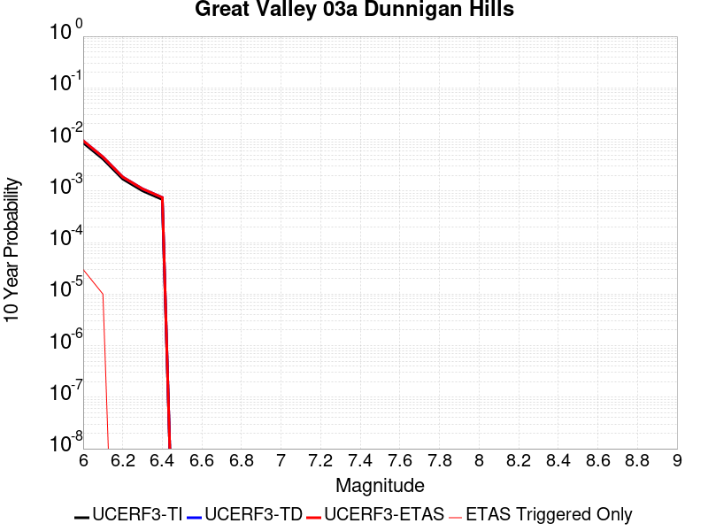 |

| Magnitude | 1 wk TI Prob | 1 wk TD Prob | 1 wk ETAS Prob | 1 wk ETAS/TD Gain | 1 wk ETAS Triggered Only | 1 mo TI Prob | 1 mo TD Prob | 1 mo ETAS Prob | 1 mo ETAS/TD Gain | 1 mo ETAS Triggered Only | 1 yr TI Prob | 1 yr TD Prob | 1 yr ETAS Prob | 1 yr ETAS/TD Gain | 1 yr ETAS Triggered Only | 10 yr TI Prob | 10 yr TD Prob | 10 yr ETAS Prob | 10 yr ETAS/TD Gain | 10 yr ETAS Triggered Only |
|-----|-----|-----|-----|-----|-----|-----|-----|-----|-----|-----|-----|-----|-----|-----|-----|-----|-----|-----|-----|-----|
| 6.0 | 1.6591328E-5 | 1.8107954E-5 | 3.499469E-5 | 1.932559 | 1.6887043E-5 | 7.110376E-5 | 7.7603596E-5 | 9.448933E-5 | 1.2175895 | 1.6887043E-5 | 8.6534437E-4 | 9.444834E-4 | 9.6135447E-4 | 1.0178628 | 1.6887043E-5 | 0.008619824 | 0.009411525 | 0.009428253 | 1.0017774 | 1.6887043E-5 |
| 6.1 | 8.041125E-6 | 8.769726E-6 | 8.769726E-6 | 1.0 | 0.0 | 3.4461507E-5 | 3.7584115E-5 | 3.7584115E-5 | 1.0 | 0.0 | 4.194881E-4 | 4.5751085E-4 | 4.5751085E-4 | 1.0 | 0.0 | 0.004186971 | 0.004567687 | 0.004567687 | 1.0 | 0.0 |
| 6.2 | 3.2807004E-6 | 3.5795688E-6 | 3.5795688E-6 | 1.0 | 0.0 | 1.4060069E-5 | 1.5340942E-5 | 1.5340942E-5 | 1.0 | 0.0 | 1.7116789E-4 | 1.8676413E-4 | 1.8676413E-4 | 1.0 | 0.0 | 0.0017103611 | 0.0018664796 | 0.0018664796 | 1.0 | 0.0 |
| 6.3 | 1.9339366E-6 | 2.1103806E-6 | 2.1103806E-6 | 1.0 | 0.0 | 8.288273E-6 | 9.044474E-6 | 9.044474E-6 | 1.0 | 0.0 | 1.00905054E-4 | 1.1011375E-4 | 1.1011375E-4 | 1.0 | 0.0 | 0.0010085925 | 0.0011008718 | 0.0011008718 | 1.0 | 0.0 |
| 6.4 | 1.3142635E-6 | 1.4339867E-6 | 1.4339867E-6 | 1.0 | 0.0 | 5.6325457E-6 | 6.145657E-6 | 6.145657E-6 | 1.0 | 0.0 | 6.857408E-5 | 7.482337E-5 | 7.482337E-5 | 1.0 | 0.0 | 6.8552926E-4 | 7.4823375E-4 | 7.4823375E-4 | 1.0 | 0.0 |

## Surprise Valley 2011 CFM
*[(top)](#table-of-contents)*

| 1 Week | 1 Month | 1 Year | 10 Year |
|-----|-----|-----|-----|
| 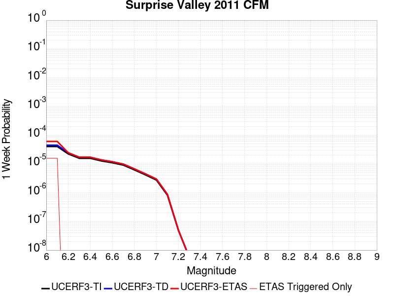 | 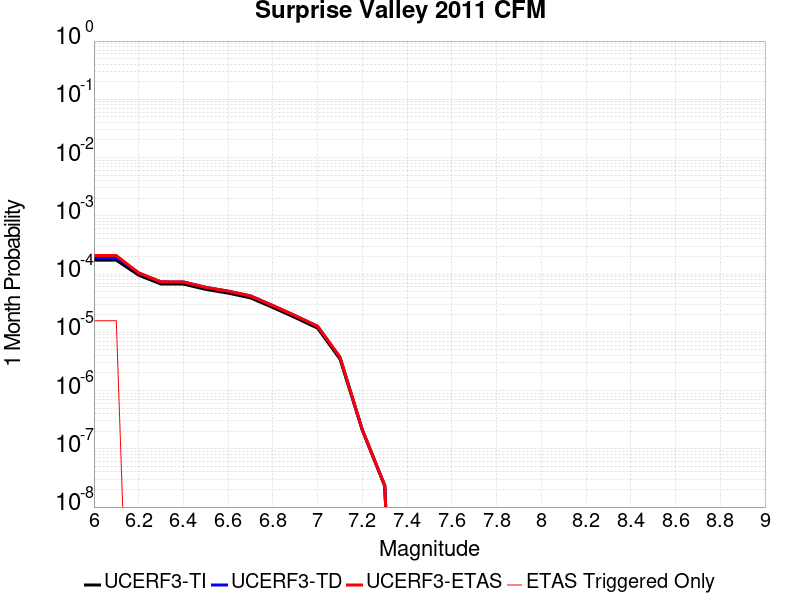 | 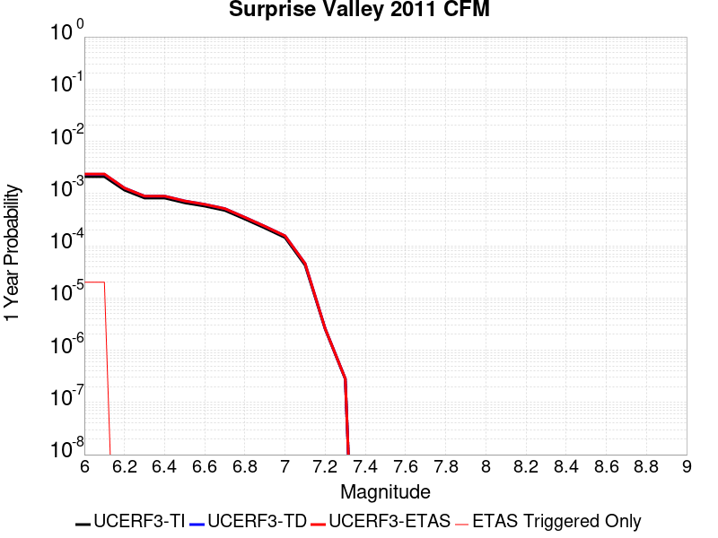 | 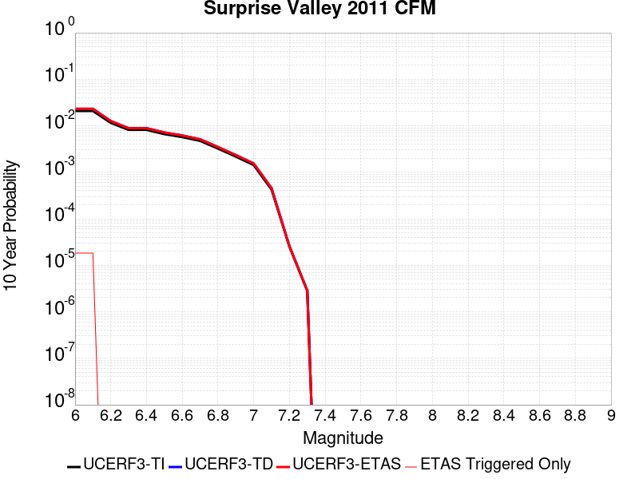 |

| Magnitude | 1 wk TI Prob | 1 wk TD Prob | 1 wk ETAS Prob | 1 wk ETAS/TD Gain | 1 wk ETAS Triggered Only | 1 mo TI Prob | 1 mo TD Prob | 1 mo ETAS Prob | 1 mo ETAS/TD Gain | 1 mo ETAS Triggered Only | 1 yr TI Prob | 1 yr TD Prob | 1 yr ETAS Prob | 1 yr ETAS/TD Gain | 1 yr ETAS Triggered Only | 10 yr TI Prob | 10 yr TD Prob | 10 yr ETAS Prob | 10 yr ETAS/TD Gain | 10 yr ETAS Triggered Only |
|-----|-----|-----|-----|-----|-----|-----|-----|-----|-----|-----|-----|-----|-----|-----|-----|-----|-----|-----|-----|-----|
| 6.0 | 4.0396248E-5 | 4.485131E-5 | 6.173759E-5 | 1.3764948 | 1.6887043E-5 | 1.7311527E-4 | 1.9220692E-4 | 2.0909072E-4 | 1.0878417 | 1.6887043E-5 | 0.002105641 | 0.0023378176 | 0.0023546652 | 1.0072066 | 1.6887043E-5 | 0.020858008 | 0.023153966 | 0.023170462 | 1.0007124 | 1.6887043E-5 |
| 6.1 | 4.0396248E-5 | 4.485131E-5 | 6.173759E-5 | 1.3764948 | 1.6887043E-5 | 1.7311527E-4 | 1.9220692E-4 | 2.0909072E-4 | 1.0878417 | 1.6887043E-5 | 0.002105641 | 0.0023378176 | 0.0023546652 | 1.0072066 | 1.6887043E-5 | 0.020858008 | 0.023153966 | 0.023170462 | 1.0007124 | 1.6887043E-5 |
| 6.2 | 2.2295266E-5 | 2.440125E-5 | 2.440125E-5 | 1.0 | 0.0 | 9.554764E-5 | 1.0457276E-4 | 1.0457276E-4 | 1.0 | 0.0 | 0.0011626717 | 0.0012724606 | 0.0012724606 | 1.0 | 0.0 | 0.011566074 | 0.012654981 | 0.012654981 | 1.0 | 0.0 |
| 6.3 | 1.572643E-5 | 1.7096807E-5 | 1.7096807E-5 | 1.0 | 0.0 | 6.7397246E-5 | 7.327003E-5 | 7.327003E-5 | 1.0 | 0.0 | 8.202525E-4 | 8.91708E-4 | 8.91708E-4 | 1.0 | 0.0 | 0.008172315 | 0.008882407 | 0.008882407 | 1.0 | 0.0 |
| 6.4 | 1.5714395E-5 | 1.7084629E-5 | 1.7084629E-5 | 1.0 | 0.0 | 6.734567E-5 | 7.3217845E-5 | 7.3217845E-5 | 1.0 | 0.0 | 8.1962504E-4 | 8.9107314E-4 | 8.9107314E-4 | 1.0 | 0.0 | 0.008166086 | 0.008876109 | 0.008876109 | 1.0 | 0.0 |
| 6.5 | 1.2733495E-5 | 1.38016E-5 | 1.38016E-5 | 1.0 | 0.0 | 5.457098E-5 | 5.9148413E-5 | 5.9148413E-5 | 1.0 | 0.0 | 6.641992E-4 | 7.1990065E-4 | 7.1990065E-4 | 1.0 | 0.0 | 0.0066221743 | 0.0071763797 | 0.0071763797 | 1.0 | 0.0 |
| 6.6 | 1.0983784E-5 | 1.1886554E-5 | 1.1886554E-5 | 1.0 | 0.0 | 4.7072506E-5 | 5.094141E-5 | 5.094141E-5 | 1.0 | 0.0 | 5.7295704E-4 | 6.200405E-4 | 6.200405E-4 | 1.0 | 0.0 | 0.0057148207 | 0.0061836545 | 0.0061836545 | 1.0 | 0.0 |
| 6.7 | 9.104806E-6 | 9.839491E-6 | 9.839491E-6 | 1.0 | 0.0 | 3.902001E-5 | 4.2168587E-5 | 4.2168587E-5 | 1.0 | 0.0 | 4.7496508E-4 | 5.132855E-4 | 5.132855E-4 | 1.0 | 0.0 | 0.004739512 | 0.005121397 | 0.005121397 | 1.0 | 0.0 |
| 6.8 | 6.2162403E-6 | 6.7041337E-6 | 6.7041337E-6 | 1.0 | 0.0 | 2.6640759E-5 | 2.8731698E-5 | 2.8731698E-5 | 1.0 | 0.0 | 3.2430296E-4 | 3.497545E-4 | 3.497545E-4 | 1.0 | 0.0 | 0.003238301 | 0.0034922638 | 0.0034922638 | 1.0 | 0.0 |
| 6.9 | 4.1792696E-6 | 4.50323E-6 | 4.50323E-6 | 1.0 | 0.0 | 1.7911032E-5 | 1.9299423E-5 | 1.9299423E-5 | 1.0 | 0.0 | 2.1804498E-4 | 2.3494668E-4 | 2.3494668E-4 | 1.0 | 0.0 | 0.0021783116 | 0.0023471361 | 0.0023471361 | 1.0 | 0.0 |
| 7.0 | 2.7478413E-6 | 2.9622424E-6 | 2.9622424E-6 | 1.0 | 0.0 | 1.177641E-5 | 1.269527E-5 | 1.269527E-5 | 1.0 | 0.0 | 1.4336836E-4 | 1.545552E-4 | 1.545552E-4 | 1.0 | 0.0 | 0.001432759 | 0.0015445995 | 0.0015445995 | 1.0 | 0.0 |
| 7.1 | 8.128648E-7 | 8.724922E-7 | 8.724922E-7 | 1.0 | 0.0 | 3.4837017E-6 | 3.7392501E-6 | 3.7392501E-6 | 1.0 | 0.0 | 4.2413245E-5 | 4.552502E-5 | 4.552502E-5 | 1.0 | 0.0 | 4.2405148E-4 | 4.5521575E-4 | 4.5521575E-4 | 1.0 | 0.0 |
| 7.2 | 4.8641045E-8 | 4.9402068E-8 | 4.9402068E-8 | 1.0 | 0.0 | 2.084616E-7 | 2.1172312E-7 | 2.1172312E-7 | 1.0 | 0.0 | 2.538017E-6 | 2.577726E-6 | 2.577726E-6 | 1.0 | 0.0 | 2.537988E-5 | 2.5776973E-5 | 2.5776973E-5 | 1.0 | 0.0 |
| 7.3 | 5.3911844E-9 | 5.4758145E-9 | 5.4758145E-9 | 1.0 | 0.0 | 2.3105075E-8 | 2.3467775E-8 | 2.3467775E-8 | 1.0 | 0.0 | 2.8130427E-7 | 2.8572015E-7 | 2.8572015E-7 | 1.0 | 0.0 | 2.8130391E-6 | 2.8571992E-6 | 2.8571992E-6 | 1.0 | 0.0 |

## North Frontal  (East)
*[(top)](#table-of-contents)*

| 1 Week | 1 Month | 1 Year | 10 Year |
|-----|-----|-----|-----|
|  |  |  |  |

| Magnitude | 1 wk TI Prob | 1 wk TD Prob | 1 wk ETAS Prob | 1 wk ETAS/TD Gain | 1 wk ETAS Triggered Only | 1 mo TI Prob | 1 mo TD Prob | 1 mo ETAS Prob | 1 mo ETAS/TD Gain | 1 mo ETAS Triggered Only | 1 yr TI Prob | 1 yr TD Prob | 1 yr ETAS Prob | 1 yr ETAS/TD Gain | 1 yr ETAS Triggered Only | 10 yr TI Prob | 10 yr TD Prob | 10 yr ETAS Prob | 10 yr ETAS/TD Gain | 10 yr ETAS Triggered Only |
|-----|-----|-----|-----|-----|-----|-----|-----|-----|-----|-----|-----|-----|-----|-----|-----|-----|-----|-----|-----|-----|
| 6.0 | 7.135738E-6 | 7.4771765E-6 | 7.4771765E-6 | 1.0 | 0.0 | 3.0581377E-5 | 3.204476E-5 | 3.204476E-5 | 1.0 | 0.0 | 3.7226462E-4 | 3.9009505E-4 | 3.9009505E-4 | 1.0 | 0.0 | 0.0037164164 | 0.0038960609 | 0.003912882 | 1.0043175 | 1.6887043E-5 |
| 6.1 | 7.135738E-6 | 7.4771765E-6 | 7.4771765E-6 | 1.0 | 0.0 | 3.0581377E-5 | 3.204476E-5 | 3.204476E-5 | 1.0 | 0.0 | 3.7226462E-4 | 3.9009505E-4 | 3.9009505E-4 | 1.0 | 0.0 | 0.0037164164 | 0.0038960609 | 0.003912882 | 1.0043175 | 1.6887043E-5 |
| 6.2 | 7.135738E-6 | 7.4771765E-6 | 7.4771765E-6 | 1.0 | 0.0 | 3.0581377E-5 | 3.204476E-5 | 3.204476E-5 | 1.0 | 0.0 | 3.7226462E-4 | 3.9009505E-4 | 3.9009505E-4 | 1.0 | 0.0 | 0.0037164164 | 0.0038960609 | 0.003912882 | 1.0043175 | 1.6887043E-5 |
| 6.3 | 7.135738E-6 | 7.4771765E-6 | 7.4771765E-6 | 1.0 | 0.0 | 3.0581377E-5 | 3.204476E-5 | 3.204476E-5 | 1.0 | 0.0 | 3.7226462E-4 | 3.9009505E-4 | 3.9009505E-4 | 1.0 | 0.0 | 0.0037164164 | 0.0038960609 | 0.003912882 | 1.0043175 | 1.6887043E-5 |
| 6.4 | 7.135738E-6 | 7.4771765E-6 | 7.4771765E-6 | 1.0 | 0.0 | 3.0581377E-5 | 3.204476E-5 | 3.204476E-5 | 1.0 | 0.0 | 3.7226462E-4 | 3.9009505E-4 | 3.9009505E-4 | 1.0 | 0.0 | 0.0037164164 | 0.0038960609 | 0.003912882 | 1.0043175 | 1.6887043E-5 |
| 6.5 | 7.135738E-6 | 7.4771765E-6 | 7.4771765E-6 | 1.0 | 0.0 | 3.0581377E-5 | 3.204476E-5 | 3.204476E-5 | 1.0 | 0.0 | 3.7226462E-4 | 3.9009505E-4 | 3.9009505E-4 | 1.0 | 0.0 | 0.0037164164 | 0.0038960609 | 0.003912882 | 1.0043175 | 1.6887043E-5 |
| 6.6 | 7.135738E-6 | 7.4771765E-6 | 7.4771765E-6 | 1.0 | 0.0 | 3.0581377E-5 | 3.204476E-5 | 3.204476E-5 | 1.0 | 0.0 | 3.7226462E-4 | 3.9009505E-4 | 3.9009505E-4 | 1.0 | 0.0 | 0.0037164164 | 0.0038960609 | 0.003912882 | 1.0043175 | 1.6887043E-5 |
| 6.7 | 7.135738E-6 | 7.4771765E-6 | 7.4771765E-6 | 1.0 | 0.0 | 3.0581377E-5 | 3.204476E-5 | 3.204476E-5 | 1.0 | 0.0 | 3.7226462E-4 | 3.9009505E-4 | 3.9009505E-4 | 1.0 | 0.0 | 0.0037164164 | 0.0038960609 | 0.003912882 | 1.0043175 | 1.6887043E-5 |
| 6.8 | 5.959142E-6 | 6.236683E-6 | 6.236683E-6 | 1.0 | 0.0 | 2.553893E-5 | 2.6728469E-5 | 2.6728469E-5 | 1.0 | 0.0 | 3.108921E-4 | 3.253886E-4 | 3.253886E-4 | 1.0 | 0.0 | 0.0031045752 | 0.0032508948 | 0.0032677269 | 1.0051777 | 1.6887043E-5 |
| 6.9 | 2.2946929E-6 | 2.3824605E-6 | 2.3824605E-6 | 1.0 | 0.0 | 9.834361E-6 | 1.0210508E-5 | 1.0210508E-5 | 1.0 | 0.0 | 1.1972676E-4 | 1.2430632E-4 | 1.2430632E-4 | 1.0 | 0.0 | 0.0011966228 | 0.0012424142 | 0.0012424142 | 1.0 | 0.0 |
| 7.0 | 2.2468673E-6 | 2.3321538E-6 | 2.3321538E-6 | 1.0 | 0.0 | 9.629396E-6 | 9.994909E-6 | 9.994909E-6 | 1.0 | 0.0 | 1.1723159E-4 | 1.21681696E-4 | 1.21681696E-4 | 1.0 | 0.0 | 0.0011716976 | 0.0012161969 | 0.0012161969 | 1.0 | 0.0 |
| 7.1 | 1.9921076E-6 | 2.0646032E-6 | 2.0646032E-6 | 1.0 | 0.0 | 8.537577E-6 | 8.848272E-6 | 8.848272E-6 | 1.0 | 0.0 | 1.0394004E-4 | 1.0772282E-4 | 1.0772282E-4 | 1.0 | 0.0 | 0.0010389143 | 0.0010767487 | 0.0010767487 | 1.0 | 0.0 |
| 7.2 | 1.4524545E-6 | 1.5045148E-6 | 1.5045148E-6 | 1.0 | 0.0 | 6.2247905E-6 | 6.447906E-6 | 6.447906E-6 | 1.0 | 0.0 | 7.5784184E-5 | 7.850068E-5 | 7.850068E-5 | 1.0 | 0.0 | 7.575835E-4 | 7.8475394E-4 | 7.8475394E-4 | 1.0 | 0.0 |
| 7.3 | 8.9802575E-7 | 9.3087283E-7 | 9.3087283E-7 | 1.0 | 0.0 | 3.848676E-6 | 3.9894494E-6 | 3.9894494E-6 | 1.0 | 0.0 | 4.685662E-5 | 4.857058E-5 | 4.857058E-5 | 1.0 | 0.0 | 4.6846745E-4 | 4.8561094E-4 | 4.8561094E-4 | 1.0 | 0.0 |
| 7.4 | 7.776139E-7 | 8.0604747E-7 | 8.0604747E-7 | 1.0 | 0.0 | 3.3326266E-6 | 3.4544853E-6 | 3.4544853E-6 | 1.0 | 0.0 | 4.0573974E-5 | 4.2057654E-5 | 4.2057654E-5 | 1.0 | 0.0 | 4.0566566E-4 | 4.205077E-4 | 4.205077E-4 | 1.0 | 0.0 |
| 7.5 | 5.244417E-7 | 5.441219E-7 | 5.441219E-7 | 1.0 | 0.0 | 2.2476054E-6 | 2.3319494E-6 | 2.3319494E-6 | 1.0 | 0.0 | 2.7364253E-5 | 2.839118E-5 | 2.839118E-5 | 1.0 | 0.0 | 2.7360884E-4 | 2.8388205E-4 | 2.8388205E-4 | 1.0 | 0.0 |
| 7.6 | 1.5489647E-7 | 1.6089504E-7 | 1.6089504E-7 | 1.0 | 0.0 | 6.6384183E-7 | 6.895501E-7 | 6.895501E-7 | 1.0 | 0.0 | 8.082245E-6 | 8.395261E-6 | 8.395261E-6 | 1.0 | 0.0 | 8.08195E-5 | 8.395143E-5 | 8.395143E-5 | 1.0 | 0.0 |

## Hartley Springs 2011 CFM
*[(top)](#table-of-contents)*

| 1 Week | 1 Month | 1 Year | 10 Year |
|-----|-----|-----|-----|
|  |  |  |  |

| Magnitude | 1 wk TI Prob | 1 wk TD Prob | 1 wk ETAS Prob | 1 wk ETAS/TD Gain | 1 wk ETAS Triggered Only | 1 mo TI Prob | 1 mo TD Prob | 1 mo ETAS Prob | 1 mo ETAS/TD Gain | 1 mo ETAS Triggered Only | 1 yr TI Prob | 1 yr TD Prob | 1 yr ETAS Prob | 1 yr ETAS/TD Gain | 1 yr ETAS Triggered Only | 10 yr TI Prob | 10 yr TD Prob | 10 yr ETAS Prob | 10 yr ETAS/TD Gain | 10 yr ETAS Triggered Only |
|-----|-----|-----|-----|-----|-----|-----|-----|-----|-----|-----|-----|-----|-----|-----|-----|-----|-----|-----|-----|-----|
| 6.0 | 1.4352418E-5 | 1.4434182E-5 | 1.4434182E-5 | 1.0 | 0.0 | 6.1508916E-5 | 6.1860235E-5 | 6.1860235E-5 | 1.0 | 0.0 | 7.486137E-4 | 7.5305253E-4 | 7.5305253E-4 | 1.0 | 0.0 | 0.007460968 | 0.0075211283 | 0.0075378884 | 1.0022284 | 1.6887043E-5 |
| 6.1 | 1.4352418E-5 | 1.4434182E-5 | 1.4434182E-5 | 1.0 | 0.0 | 6.1508916E-5 | 6.1860235E-5 | 6.1860235E-5 | 1.0 | 0.0 | 7.486137E-4 | 7.5305253E-4 | 7.5305253E-4 | 1.0 | 0.0 | 0.007460968 | 0.0075211283 | 0.0075378884 | 1.0022284 | 1.6887043E-5 |
| 6.2 | 1.4352418E-5 | 1.4434182E-5 | 1.4434182E-5 | 1.0 | 0.0 | 6.1508916E-5 | 6.1860235E-5 | 6.1860235E-5 | 1.0 | 0.0 | 7.486137E-4 | 7.5305253E-4 | 7.5305253E-4 | 1.0 | 0.0 | 0.007460968 | 0.0075211283 | 0.0075378884 | 1.0022284 | 1.6887043E-5 |
| 6.3 | 1.4352418E-5 | 1.4434182E-5 | 1.4434182E-5 | 1.0 | 0.0 | 6.1508916E-5 | 6.1860235E-5 | 6.1860235E-5 | 1.0 | 0.0 | 7.486137E-4 | 7.5305253E-4 | 7.5305253E-4 | 1.0 | 0.0 | 0.007460968 | 0.0075211283 | 0.0075378884 | 1.0022284 | 1.6887043E-5 |
| 6.4 | 1.4352418E-5 | 1.4434182E-5 | 1.4434182E-5 | 1.0 | 0.0 | 6.1508916E-5 | 6.1860235E-5 | 6.1860235E-5 | 1.0 | 0.0 | 7.486137E-4 | 7.5305253E-4 | 7.5305253E-4 | 1.0 | 0.0 | 0.007460968 | 0.0075211283 | 0.0075378884 | 1.0022284 | 1.6887043E-5 |
| 6.5 | 1.2279858E-5 | 1.2133106E-5 | 1.2133106E-5 | 1.0 | 0.0 | 5.26269E-5 | 5.1998883E-5 | 5.1998883E-5 | 1.0 | 0.0 | 6.4054417E-4 | 6.3306064E-4 | 6.3306064E-4 | 1.0 | 0.0 | 0.0063870098 | 0.006328085 | 0.006328085 | 1.0 | 0.0 |
| 6.6 | 1.2279858E-5 | 1.2133106E-5 | 1.2133106E-5 | 1.0 | 0.0 | 5.26269E-5 | 5.1998883E-5 | 5.1998883E-5 | 1.0 | 0.0 | 6.4054417E-4 | 6.3306064E-4 | 6.3306064E-4 | 1.0 | 0.0 | 0.0063870098 | 0.006328085 | 0.006328085 | 1.0 | 0.0 |
| 6.7 | 2.1282601E-6 | 8.8948315E-7 | 8.8948315E-7 | 1.0 | 0.0 | 9.121083E-6 | 3.8120663E-6 | 3.8120663E-6 | 1.0 | 0.0 | 1.11043526E-4 | 4.641118E-5 | 4.641118E-5 | 1.0 | 0.0 | 0.0011098806 | 4.6404017E-4 | 4.6404017E-4 | 1.0 | 0.0 |
| 6.8 | 2.00516E-6 | 8.517597E-7 | 8.517597E-7 | 1.0 | 0.0 | 8.593515E-6 | 3.650395E-6 | 3.650395E-6 | 1.0 | 0.0 | 1.04621024E-4 | 4.444291E-5 | 4.444291E-5 | 1.0 | 0.0 | 0.0010457177 | 4.4436535E-4 | 4.4436535E-4 | 1.0 | 0.0 |
| 6.9 | 2.00516E-6 | 8.517597E-7 | 8.517597E-7 | 1.0 | 0.0 | 8.593515E-6 | 3.650395E-6 | 3.650395E-6 | 1.0 | 0.0 | 1.04621024E-4 | 4.444291E-5 | 4.444291E-5 | 1.0 | 0.0 | 0.0010457177 | 4.4436535E-4 | 4.4436535E-4 | 1.0 | 0.0 |
| 7.0 | 1.8366732E-6 | 8.237307E-7 | 8.237307E-7 | 1.0 | 0.0 | 7.871433E-6 | 3.5302712E-6 | 3.5302712E-6 | 1.0 | 0.0 | 9.583048E-5 | 4.298046E-5 | 4.298046E-5 | 1.0 | 0.0 | 9.5789164E-4 | 4.2974652E-4 | 4.2974652E-4 | 1.0 | 0.0 |
| 7.1 | 1.5097997E-6 | 7.1902616E-7 | 7.1902616E-7 | 1.0 | 0.0 | 6.470554E-6 | 3.0815384E-6 | 3.0815384E-6 | 1.0 | 0.0 | 7.877615E-5 | 3.7517326E-5 | 3.7517326E-5 | 1.0 | 0.0 | 7.874823E-4 | 3.7513362E-4 | 3.7513362E-4 | 1.0 | 0.0 |
| 7.2 | 1.3490993E-6 | 6.405254E-7 | 6.405254E-7 | 1.0 | 0.0 | 5.7818415E-6 | 2.7451074E-6 | 2.7451074E-6 | 1.0 | 0.0 | 7.0391645E-5 | 3.3421402E-5 | 3.3421402E-5 | 1.0 | 0.0 | 7.0369354E-4 | 3.341867E-4 | 3.341867E-4 | 1.0 | 0.0 |
| 7.3 | 7.900015E-7 | 4.0889498E-7 | 4.0889498E-7 | 1.0 | 0.0 | 3.3857161E-6 | 1.752407E-6 | 1.752407E-6 | 1.0 | 0.0 | 4.1220315E-5 | 2.1335554E-5 | 2.1335554E-5 | 1.0 | 0.0 | 4.121267E-4 | 2.1335555E-4 | 2.1335555E-4 | 1.0 | 0.0 |

## Channel Islands Thrust
*[(top)](#table-of-contents)*

| 1 Week | 1 Month | 1 Year | 10 Year |
|-----|-----|-----|-----|
|  |  |  |  |

| Magnitude | 1 wk TI Prob | 1 wk TD Prob | 1 wk ETAS Prob | 1 wk ETAS/TD Gain | 1 wk ETAS Triggered Only | 1 mo TI Prob | 1 mo TD Prob | 1 mo ETAS Prob | 1 mo ETAS/TD Gain | 1 mo ETAS Triggered Only | 1 yr TI Prob | 1 yr TD Prob | 1 yr ETAS Prob | 1 yr ETAS/TD Gain | 1 yr ETAS Triggered Only | 10 yr TI Prob | 10 yr TD Prob | 10 yr ETAS Prob | 10 yr ETAS/TD Gain | 10 yr ETAS Triggered Only |
|-----|-----|-----|-----|-----|-----|-----|-----|-----|-----|-----|-----|-----|-----|-----|-----|-----|-----|-----|-----|-----|
| 6.0 | 2.2156251E-5 | 2.4092022E-5 | 2.4092022E-5 | 1.0 | 0.0 | 9.495191E-5 | 1.03248036E-4 | 1.03248036E-4 | 1.0 | 0.0 | 0.0011554264 | 0.0012564264 | 0.0012564264 | 1.0 | 0.0 | 0.011494373 | 0.0125038205 | 0.012520497 | 1.0013337 | 1.6887043E-5 |
| 6.1 | 2.2156251E-5 | 2.4092022E-5 | 2.4092022E-5 | 1.0 | 0.0 | 9.495191E-5 | 1.03248036E-4 | 1.03248036E-4 | 1.0 | 0.0 | 0.0011554264 | 0.0012564264 | 0.0012564264 | 1.0 | 0.0 | 0.011494373 | 0.0125038205 | 0.012520497 | 1.0013337 | 1.6887043E-5 |
| 6.2 | 2.2156251E-5 | 2.4092022E-5 | 2.4092022E-5 | 1.0 | 0.0 | 9.495191E-5 | 1.03248036E-4 | 1.03248036E-4 | 1.0 | 0.0 | 0.0011554264 | 0.0012564264 | 0.0012564264 | 1.0 | 0.0 | 0.011494373 | 0.0125038205 | 0.012520497 | 1.0013337 | 1.6887043E-5 |
| 6.3 | 2.2156251E-5 | 2.4092022E-5 | 2.4092022E-5 | 1.0 | 0.0 | 9.495191E-5 | 1.03248036E-4 | 1.03248036E-4 | 1.0 | 0.0 | 0.0011554264 | 0.0012564264 | 0.0012564264 | 1.0 | 0.0 | 0.011494373 | 0.0125038205 | 0.012520497 | 1.0013337 | 1.6887043E-5 |
| 6.4 | 2.2156251E-5 | 2.4092022E-5 | 2.4092022E-5 | 1.0 | 0.0 | 9.495191E-5 | 1.03248036E-4 | 1.03248036E-4 | 1.0 | 0.0 | 0.0011554264 | 0.0012564264 | 0.0012564264 | 1.0 | 0.0 | 0.011494373 | 0.0125038205 | 0.012520497 | 1.0013337 | 1.6887043E-5 |
| 6.5 | 2.2156251E-5 | 2.4092022E-5 | 2.4092022E-5 | 1.0 | 0.0 | 9.495191E-5 | 1.03248036E-4 | 1.03248036E-4 | 1.0 | 0.0 | 0.0011554264 | 0.0012564264 | 0.0012564264 | 1.0 | 0.0 | 0.011494373 | 0.0125038205 | 0.012520497 | 1.0013337 | 1.6887043E-5 |
| 6.6 | 2.2156251E-5 | 2.4092022E-5 | 2.4092022E-5 | 1.0 | 0.0 | 9.495191E-5 | 1.03248036E-4 | 1.03248036E-4 | 1.0 | 0.0 | 0.0011554264 | 0.0012564264 | 0.0012564264 | 1.0 | 0.0 | 0.011494373 | 0.0125038205 | 0.012520497 | 1.0013337 | 1.6887043E-5 |
| 6.7 | 1.0601296E-5 | 1.1379544E-5 | 1.1379544E-5 | 1.0 | 0.0 | 4.5433335E-5 | 4.876859E-5 | 4.876859E-5 | 1.0 | 0.0 | 5.5301044E-4 | 5.936007E-4 | 5.936007E-4 | 1.0 | 0.0 | 0.005516363 | 0.005920653 | 0.005920653 | 1.0 | 0.0 |
| 6.8 | 1.0246747E-5 | 1.0996669E-5 | 1.0996669E-5 | 1.0 | 0.0 | 4.391389E-5 | 4.7127756E-5 | 4.7127756E-5 | 1.0 | 0.0 | 5.345204E-4 | 5.7363417E-4 | 5.7363417E-4 | 1.0 | 0.0 | 0.0053323656 | 0.005722025 | 0.005722025 | 1.0 | 0.0 |
| 6.9 | 9.049551E-6 | 9.699645E-6 | 9.699645E-6 | 1.0 | 0.0 | 3.878322E-5 | 4.1569267E-5 | 4.1569267E-5 | 1.0 | 0.0 | 4.7208337E-4 | 5.059924E-4 | 5.059924E-4 | 1.0 | 0.0 | 0.0047108172 | 0.0050488203 | 0.0050488203 | 1.0 | 0.0 |
| 7.0 | 8.6542195E-6 | 9.274603E-6 | 9.274603E-6 | 1.0 | 0.0 | 3.7088983E-5 | 3.9747716E-5 | 3.9747716E-5 | 1.0 | 0.0 | 4.5146482E-4 | 4.8382508E-4 | 4.8382508E-4 | 1.0 | 0.0 | 0.004505487 | 0.004828129 | 0.004828129 | 1.0 | 0.0 |
| 7.1 | 8.391028E-6 | 8.992924E-6 | 8.992924E-6 | 1.0 | 0.0 | 3.5961057E-5 | 3.854056E-5 | 3.854056E-5 | 1.0 | 0.0 | 4.3773788E-4 | 4.6913436E-4 | 4.6913436E-4 | 1.0 | 0.0 | 0.004368766 | 0.0046818503 | 0.0046818503 | 1.0 | 0.0 |
| 7.2 | 5.965188E-6 | 6.3716952E-6 | 6.3716952E-6 | 1.0 | 0.0 | 2.556484E-5 | 2.7306982E-5 | 2.7306982E-5 | 1.0 | 0.0 | 3.1120746E-4 | 3.3241234E-4 | 3.3241234E-4 | 1.0 | 0.0 | 0.00310772 | 0.0033192092 | 0.0033192092 | 1.0 | 0.0 |
| 7.3 | 4.877518E-6 | 5.2060063E-6 | 5.2060063E-6 | 1.0 | 0.0 | 2.0903482E-5 | 2.2311267E-5 | 2.2311267E-5 | 1.0 | 0.0 | 2.5447016E-4 | 2.716063E-4 | 2.716063E-4 | 1.0 | 0.0 | 0.0025417898 | 0.0027127895 | 0.0027127895 | 1.0 | 0.0 |
| 7.4 | 3.8829853E-6 | 4.141863E-6 | 4.141863E-6 | 1.0 | 0.0 | 1.664126E-5 | 1.7750723E-5 | 1.7750723E-5 | 1.0 | 0.0 | 2.0258849E-4 | 2.1609402E-4 | 2.1609402E-4 | 1.0 | 0.0 | 0.002024039 | 0.0021588807 | 0.0021588807 | 1.0 | 0.0 |
| 7.5 | 1.3489616E-6 | 1.4277903E-6 | 1.4277903E-6 | 1.0 | 0.0 | 5.7812517E-6 | 6.119087E-6 | 6.119087E-6 | 1.0 | 0.0 | 7.038446E-5 | 7.449738E-5 | 7.449738E-5 | 1.0 | 0.0 | 7.036218E-4 | 7.44728E-4 | 7.44728E-4 | 1.0 | 0.0 |
| 7.6 | 6.058192E-7 | 6.353778E-7 | 6.353778E-7 | 1.0 | 0.0 | 2.5963652E-6 | 2.7230449E-6 | 2.7230449E-6 | 1.0 | 0.0 | 3.161029E-5 | 3.3152584E-5 | 3.3152584E-5 | 1.0 | 0.0 | 3.1605794E-4 | 3.31478E-4 | 3.31478E-4 | 1.0 | 0.0 |
| 7.7 | 2.2170494E-7 | 2.2607902E-7 | 2.2607902E-7 | 1.0 | 0.0 | 9.5016367E-7 | 9.689098E-7 | 9.689098E-7 | 1.0 | 0.0 | 1.1568181E-5 | 1.1796425E-5 | 1.1796425E-5 | 1.0 | 0.0 | 1.1567579E-4 | 1.1795909E-4 | 1.1795909E-4 | 1.0 | 0.0 |
| 7.8 | 2.1613102E-8 | 1.5466682E-8 | 1.5466682E-8 | 1.0 | 0.0 | 9.262757E-8 | 6.628578E-8 | 6.628578E-8 | 1.0 | 0.0 | 1.1277401E-6 | 8.070291E-7 | 8.070291E-7 | 1.0 | 0.0 | 1.1277344E-5 | 8.070269E-6 | 8.070269E-6 | 1.0 | 0.0 |

## Hunting Creek - Bartlett Springs connector 2011
*[(top)](#table-of-contents)*

| 1 Week | 1 Month | 1 Year | 10 Year |
|-----|-----|-----|-----|
|  |  | 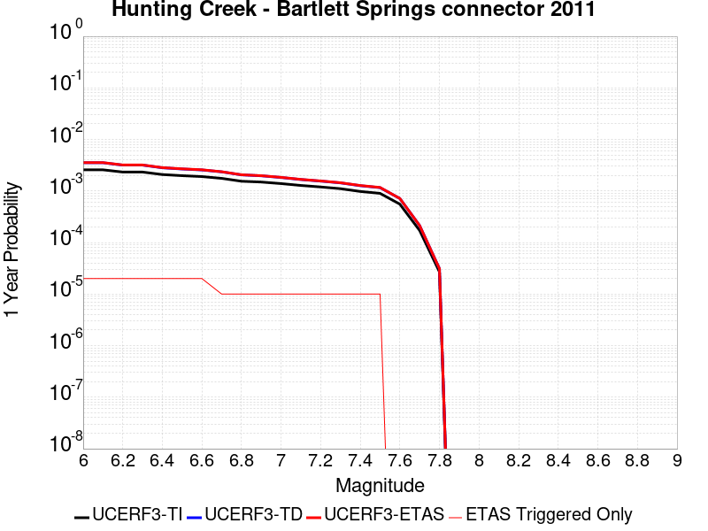 | 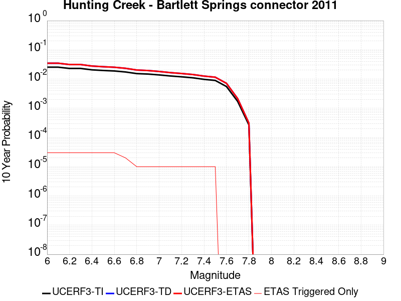 |

| Magnitude | 1 wk TI Prob | 1 wk TD Prob | 1 wk ETAS Prob | 1 wk ETAS/TD Gain | 1 wk ETAS Triggered Only | 1 mo TI Prob | 1 mo TD Prob | 1 mo ETAS Prob | 1 mo ETAS/TD Gain | 1 mo ETAS Triggered Only | 1 yr TI Prob | 1 yr TD Prob | 1 yr ETAS Prob | 1 yr ETAS/TD Gain | 1 yr ETAS Triggered Only | 10 yr TI Prob | 10 yr TD Prob | 10 yr ETAS Prob | 10 yr ETAS/TD Gain | 10 yr ETAS Triggered Only |
|-----|-----|-----|-----|-----|-----|-----|-----|-----|-----|-----|-----|-----|-----|-----|-----|-----|-----|-----|-----|-----|
| 6.0 | 4.940016E-5 | 6.786822E-5 | 6.786822E-5 | 1.0 | 0.0 | 2.1169778E-4 | 2.9083234E-4 | 2.9083234E-4 | 1.0 | 0.0 | 0.002574374 | 0.003535177 | 0.003535177 | 1.0 | 0.0 | 0.025447546 | 0.034773834 | 0.034790136 | 1.0004687 | 1.6887043E-5 |
| 6.1 | 4.940016E-5 | 6.786822E-5 | 6.786822E-5 | 1.0 | 0.0 | 2.1169778E-4 | 2.9083234E-4 | 2.9083234E-4 | 1.0 | 0.0 | 0.002574374 | 0.003535177 | 0.003535177 | 1.0 | 0.0 | 0.025447546 | 0.034773834 | 0.034790136 | 1.0004687 | 1.6887043E-5 |
| 6.2 | 4.472471E-5 | 6.1002804E-5 | 6.1002804E-5 | 1.0 | 0.0 | 1.9166325E-4 | 2.6141506E-4 | 2.6141506E-4 | 1.0 | 0.0 | 0.0023310026 | 0.003178107 | 0.003178107 | 1.0 | 0.0 | 0.02306703 | 0.031316914 | 0.03133327 | 1.0005224 | 1.6887043E-5 |
| 6.3 | 4.472471E-5 | 6.1002804E-5 | 6.1002804E-5 | 1.0 | 0.0 | 1.9166325E-4 | 2.6141506E-4 | 2.6141506E-4 | 1.0 | 0.0 | 0.0023310026 | 0.003178107 | 0.003178107 | 1.0 | 0.0 | 0.02306703 | 0.031316914 | 0.03133327 | 1.0005224 | 1.6887043E-5 |
| 6.4 | 4.0001003E-5 | 5.4103755E-5 | 5.4103755E-5 | 1.0 | 0.0 | 1.714216E-4 | 2.31853E-4 | 2.31853E-4 | 1.0 | 0.0 | 0.0020850603 | 0.0028191248 | 0.0028191248 | 1.0 | 0.0 | 0.02065605 | 0.027828315 | 0.027844733 | 1.00059 | 1.6887043E-5 |
| 6.5 | 3.8033053E-5 | 5.1266547E-5 | 5.1266547E-5 | 1.0 | 0.0 | 1.6298861E-4 | 2.1969559E-4 | 2.1969559E-4 | 1.0 | 0.0 | 0.0019825802 | 0.0026714746 | 0.0026714746 | 1.0 | 0.0 | 0.019649856 | 0.026390454 | 0.026406895 | 1.000623 | 1.6887043E-5 |
| 6.6 | 3.653754E-5 | 4.913017E-5 | 4.913017E-5 | 1.0 | 0.0 | 1.5658008E-4 | 2.1054115E-4 | 2.1054115E-4 | 1.0 | 0.0 | 0.0019046954 | 0.0025602852 | 0.0025602852 | 1.0 | 0.0 | 0.018884527 | 0.025306415 | 0.025322873 | 1.0006504 | 1.6887043E-5 |
| 6.7 | 3.372024E-5 | 4.514011E-5 | 4.514011E-5 | 1.0 | 0.0 | 1.4450731E-4 | 1.9344354E-4 | 1.9344354E-4 | 1.0 | 0.0 | 0.0017579567 | 0.002352639 | 0.002352639 | 1.0 | 0.0 | 0.017441148 | 0.023278099 | 0.023294592 | 1.0007086 | 1.6887043E-5 |
| 6.8 | 2.9650024E-5 | 3.9411374E-5 | 3.9411374E-5 | 1.0 | 0.0 | 1.2706534E-4 | 1.6889503E-4 | 1.6889503E-4 | 1.0 | 0.0 | 0.0015459227 | 0.0020543463 | 0.0020543463 | 1.0 | 0.0 | 0.015352124 | 0.020351216 | 0.020351216 | 1.0 | 0.0 |
| 6.9 | 2.860775E-5 | 3.7812544E-5 | 3.7812544E-5 | 1.0 | 0.0 | 1.2259888E-4 | 1.6204377E-4 | 1.6204377E-4 | 1.0 | 0.0 | 0.0014916194 | 0.001971107 | 0.001971107 | 1.0 | 0.0 | 0.014816469 | 0.01953584 | 0.01953584 | 1.0 | 0.0 |
| 7.0 | 2.6696067E-5 | 3.506726E-5 | 3.506726E-5 | 1.0 | 0.0 | 1.144067E-4 | 1.5027967E-4 | 1.5027967E-4 | 1.0 | 0.0 | 0.0013920115 | 0.0018281302 | 0.0018281302 | 1.0 | 0.0 | 0.013833242 | 0.018131364 | 0.018131364 | 1.0 | 0.0 |
| 7.1 | 2.456087E-5 | 3.2013093E-5 | 3.2013093E-5 | 1.0 | 0.0 | 1.0525662E-4 | 1.371918E-4 | 1.371918E-4 | 1.0 | 0.0 | 0.001280746 | 0.0016690396 | 0.0016690396 | 1.0 | 0.0 | 0.012733897 | 0.016566366 | 0.016566366 | 1.0 | 0.0 |
| 7.2 | 2.295761E-5 | 2.9822932E-5 | 2.9822932E-5 | 1.0 | 0.0 | 9.8386045E-5 | 1.2780636E-4 | 1.2780636E-4 | 1.0 | 0.0 | 0.0011971919 | 0.001554941 | 0.001554941 | 1.0 | 0.0 | 0.011907627 | 0.015442089 | 0.015442089 | 1.0 | 0.0 |
| 7.3 | 2.1256936E-5 | 2.7541912E-5 | 2.7541912E-5 | 1.0 | 0.0 | 9.109797E-5 | 1.1803147E-4 | 1.1803147E-4 | 1.0 | 0.0 | 0.0011085535 | 0.0014360948 | 0.0014360948 | 1.0 | 0.0 | 0.011030397 | 0.014269472 | 0.014269472 | 1.0 | 0.0 |
| 7.4 | 1.8784336E-5 | 2.4306766E-5 | 2.4306766E-5 | 1.0 | 0.0 | 8.050181E-5 | 1.0416774E-4 | 1.0416774E-4 | 1.0 | 0.0 | 9.796688E-4 | 0.001267512 | 0.001267512 | 1.0 | 0.0 | 0.009753612 | 0.012603902 | 0.012603902 | 1.0 | 0.0 |
| 7.5 | 1.7248298E-5 | 2.2268887E-5 | 2.2268887E-5 | 1.0 | 0.0 | 7.391918E-5 | 9.543464E-5 | 9.543464E-5 | 1.0 | 0.0 | 8.9959445E-4 | 0.0011613049 | 0.0011613049 | 1.0 | 0.0 | 0.008959615 | 0.01155334 | 0.01155334 | 1.0 | 0.0 |
| 7.6 | 1.0653709E-5 | 1.3722118E-5 | 1.3722118E-5 | 1.0 | 0.0 | 4.5657955E-5 | 5.8807767E-5 | 5.8807767E-5 | 1.0 | 0.0 | 5.557438E-4 | 7.157521E-4 | 7.157521E-4 | 1.0 | 0.0 | 0.0055435603 | 0.0071348166 | 0.0071348166 | 1.0 | 0.0 |
| 7.7 | 3.286316E-6 | 4.0903437E-6 | 4.0903437E-6 | 1.0 | 0.0 | 1.4084137E-5 | 1.7529928E-5 | 1.7529928E-5 | 1.0 | 0.0 | 1.7146087E-4 | 2.1340612E-4 | 2.1340612E-4 | 1.0 | 0.0 | 0.0017132863 | 0.0021320276 | 0.0021320276 | 1.0 | 0.0 |
| 7.8 | 5.1855085E-7 | 5.9720696E-7 | 5.9720696E-7 | 1.0 | 0.0 | 2.222359E-6 | 2.5594559E-6 | 2.5594559E-6 | 1.0 | 0.0 | 2.7056883E-5 | 3.116094E-5 | 3.116094E-5 | 1.0 | 0.0 | 2.705359E-4 | 3.1156495E-4 | 3.1156495E-4 | 1.0 | 0.0 |

## Blue Cut
*[(top)](#table-of-contents)*

| 1 Week | 1 Month | 1 Year | 10 Year |
|-----|-----|-----|-----|
|  |  | 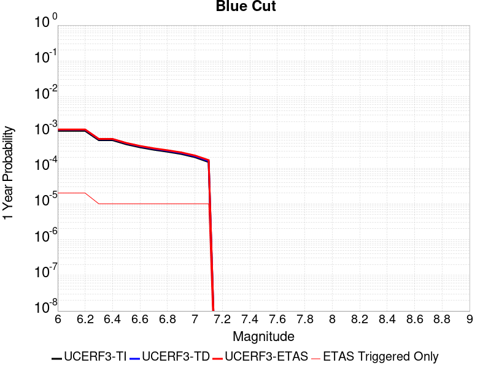 |  |

| Magnitude | 1 wk TI Prob | 1 wk TD Prob | 1 wk ETAS Prob | 1 wk ETAS/TD Gain | 1 wk ETAS Triggered Only | 1 mo TI Prob | 1 mo TD Prob | 1 mo ETAS Prob | 1 mo ETAS/TD Gain | 1 mo ETAS Triggered Only | 1 yr TI Prob | 1 yr TD Prob | 1 yr ETAS Prob | 1 yr ETAS/TD Gain | 1 yr ETAS Triggered Only | 10 yr TI Prob | 10 yr TD Prob | 10 yr ETAS Prob | 10 yr ETAS/TD Gain | 10 yr ETAS Triggered Only |
|-----|-----|-----|-----|-----|-----|-----|-----|-----|-----|-----|-----|-----|-----|-----|-----|-----|-----|-----|-----|-----|
| 6.0 | 2.1227985E-5 | 2.2719574E-5 | 3.9606235E-5 | 1.7432648 | 1.6887043E-5 | 9.097391E-5 | 9.73663E-5 | 1.142517E-4 | 1.1734214 | 1.6887043E-5 | 0.0011070445 | 0.0011848481 | 0.0012017151 | 1.0142356 | 1.6887043E-5 | 0.011015458 | 0.011791152 | 0.011807839 | 1.0014153 | 1.6887043E-5 |
| 6.1 | 2.1227985E-5 | 2.2719574E-5 | 3.9606235E-5 | 1.7432648 | 1.6887043E-5 | 9.097391E-5 | 9.73663E-5 | 1.142517E-4 | 1.1734214 | 1.6887043E-5 | 0.0011070445 | 0.0011848481 | 0.0012017151 | 1.0142356 | 1.6887043E-5 | 0.011015458 | 0.011791152 | 0.011807839 | 1.0014153 | 1.6887043E-5 |
| 6.2 | 2.1227985E-5 | 2.2719574E-5 | 3.9606235E-5 | 1.7432648 | 1.6887043E-5 | 9.097391E-5 | 9.73663E-5 | 1.142517E-4 | 1.1734214 | 1.6887043E-5 | 0.0011070445 | 0.0011848481 | 0.0012017151 | 1.0142356 | 1.6887043E-5 | 0.011015458 | 0.011791152 | 0.011807839 | 1.0014153 | 1.6887043E-5 |
| 6.3 | 1.1613981E-5 | 1.2353542E-5 | 1.2353542E-5 | 1.0 | 0.0 | 4.9773254E-5 | 5.2942745E-5 | 5.2942745E-5 | 1.0 | 0.0 | 6.0582085E-4 | 6.443998E-4 | 6.443998E-4 | 1.0 | 0.0 | 0.0060417196 | 0.0064265593 | 0.0064265593 | 1.0 | 0.0 |
| 6.4 | 1.1613981E-5 | 1.2353542E-5 | 1.2353542E-5 | 1.0 | 0.0 | 4.9773254E-5 | 5.2942745E-5 | 5.2942745E-5 | 1.0 | 0.0 | 6.0582085E-4 | 6.443998E-4 | 6.443998E-4 | 1.0 | 0.0 | 0.0060417196 | 0.0064265593 | 0.0064265593 | 1.0 | 0.0 |
| 6.5 | 8.931326E-6 | 9.4816E-6 | 9.4816E-6 | 1.0 | 0.0 | 3.8276554E-5 | 4.0634844E-5 | 4.0634844E-5 | 1.0 | 0.0 | 4.6591737E-4 | 4.946261E-4 | 4.946261E-4 | 1.0 | 0.0 | 0.0046494175 | 0.004936161 | 0.004936161 | 1.0 | 0.0 |
| 6.6 | 7.345353E-6 | 7.79028E-6 | 7.79028E-6 | 1.0 | 0.0 | 3.1479703E-5 | 3.338653E-5 | 3.338653E-5 | 1.0 | 0.0 | 3.83198E-4 | 4.064132E-4 | 4.064132E-4 | 1.0 | 0.0 | 0.0038253788 | 0.0040574907 | 0.0040574907 | 1.0 | 0.0 |
| 6.7 | 6.2775666E-6 | 6.655149E-6 | 6.655149E-6 | 1.0 | 0.0 | 2.690358E-5 | 2.8521798E-5 | 2.8521798E-5 | 1.0 | 0.0 | 3.2750185E-4 | 3.472051E-4 | 3.472051E-4 | 1.0 | 0.0 | 0.0032701963 | 0.003467367 | 0.003467367 | 1.0 | 0.0 |
| 6.8 | 5.5234095E-6 | 5.8551113E-6 | 5.8551113E-6 | 1.0 | 0.0 | 2.367154E-5 | 2.5093133E-5 | 2.5093133E-5 | 1.0 | 0.0 | 2.8816288E-4 | 3.0547334E-4 | 3.0547334E-4 | 1.0 | 0.0 | 0.002877895 | 0.0030512505 | 0.0030512505 | 1.0 | 0.0 |
| 6.9 | 4.7780054E-6 | 5.0654203E-6 | 5.0654203E-6 | 1.0 | 0.0 | 2.0477004E-5 | 2.1708804E-5 | 2.1708804E-5 | 1.0 | 0.0 | 2.4927902E-4 | 2.642797E-4 | 2.642797E-4 | 1.0 | 0.0 | 0.0024899957 | 0.002640346 | 0.002640346 | 1.0 | 0.0 |
| 7.0 | 3.883171E-6 | 4.118487E-6 | 4.118487E-6 | 1.0 | 0.0 | 1.6642054E-5 | 1.7650578E-5 | 1.7650578E-5 | 1.0 | 0.0 | 2.0259817E-4 | 2.1488148E-4 | 2.1488148E-4 | 1.0 | 0.0 | 0.0020241356 | 0.0021474129 | 0.0021474129 | 1.0 | 0.0 |
| 7.1 | 2.8358215E-6 | 3.0097158E-6 | 3.0097158E-6 | 1.0 | 0.0 | 1.2153464E-5 | 1.2898756E-5 | 1.2898756E-5 | 1.0 | 0.0 | 1.4795837E-4 | 1.5703762E-4 | 1.5703762E-4 | 1.0 | 0.0 | 0.001478599 | 0.0015699116 | 0.0015699116 | 1.0 | 0.0 |

## Emerson-Copper Mtn 2011
*[(top)](#table-of-contents)*

| 1 Week | 1 Month | 1 Year | 10 Year |
|-----|-----|-----|-----|
|  |  |  |  |

| Magnitude | 1 wk TI Prob | 1 wk TD Prob | 1 wk ETAS Prob | 1 wk ETAS/TD Gain | 1 wk ETAS Triggered Only | 1 mo TI Prob | 1 mo TD Prob | 1 mo ETAS Prob | 1 mo ETAS/TD Gain | 1 mo ETAS Triggered Only | 1 yr TI Prob | 1 yr TD Prob | 1 yr ETAS Prob | 1 yr ETAS/TD Gain | 1 yr ETAS Triggered Only | 10 yr TI Prob | 10 yr TD Prob | 10 yr ETAS Prob | 10 yr ETAS/TD Gain | 10 yr ETAS Triggered Only |
|-----|-----|-----|-----|-----|-----|-----|-----|-----|-----|-----|-----|-----|-----|-----|-----|-----|-----|-----|-----|-----|
| 6.0 | 2.1364202E-5 | 9.968114E-6 | 9.968114E-6 | 1.0 | 0.0 | 9.1557646E-5 | 4.2719836E-5 | 4.2719836E-5 | 1.0 | 0.0 | 0.0011141442 | 5.199986E-4 | 5.199986E-4 | 1.0 | 0.0 | 0.011085749 | 0.005188688 | 0.0052054874 | 1.0032377 | 1.6887043E-5 |
| 6.1 | 2.1364202E-5 | 9.968114E-6 | 9.968114E-6 | 1.0 | 0.0 | 9.1557646E-5 | 4.2719836E-5 | 4.2719836E-5 | 1.0 | 0.0 | 0.0011141442 | 5.199986E-4 | 5.199986E-4 | 1.0 | 0.0 | 0.011085749 | 0.005188688 | 0.0052054874 | 1.0032377 | 1.6887043E-5 |
| 6.2 | 2.1364202E-5 | 9.968114E-6 | 9.968114E-6 | 1.0 | 0.0 | 9.1557646E-5 | 4.2719836E-5 | 4.2719836E-5 | 1.0 | 0.0 | 0.0011141442 | 5.199986E-4 | 5.199986E-4 | 1.0 | 0.0 | 0.011085749 | 0.005188688 | 0.0052054874 | 1.0032377 | 1.6887043E-5 |
| 6.3 | 1.7751237E-5 | 8.089227E-6 | 8.089227E-6 | 1.0 | 0.0 | 7.607452E-5 | 3.466769E-5 | 3.466769E-5 | 1.0 | 0.0 | 9.258136E-4 | 4.2200365E-4 | 4.2200365E-4 | 1.0 | 0.0 | 0.00921966 | 0.0042126453 | 0.0042294613 | 1.0039917 | 1.6887043E-5 |
| 6.4 | 1.7751237E-5 | 8.089227E-6 | 8.089227E-6 | 1.0 | 0.0 | 7.607452E-5 | 3.466769E-5 | 3.466769E-5 | 1.0 | 0.0 | 9.258136E-4 | 4.2200365E-4 | 4.2200365E-4 | 1.0 | 0.0 | 0.00921966 | 0.0042126453 | 0.0042294613 | 1.0039917 | 1.6887043E-5 |
| 6.5 | 1.5886664E-5 | 6.603819E-6 | 6.603819E-6 | 1.0 | 0.0 | 6.808392E-5 | 2.8301802E-5 | 2.8301802E-5 | 1.0 | 0.0 | 8.286065E-4 | 3.4452465E-4 | 3.4452465E-4 | 1.0 | 0.0 | 0.008255237 | 0.0034403696 | 0.0034571984 | 1.0048916 | 1.6887043E-5 |
| 6.6 | 1.5886664E-5 | 6.603819E-6 | 6.603819E-6 | 1.0 | 0.0 | 6.808392E-5 | 2.8301802E-5 | 2.8301802E-5 | 1.0 | 0.0 | 8.286065E-4 | 3.4452465E-4 | 3.4452465E-4 | 1.0 | 0.0 | 0.008255237 | 0.0034403696 | 0.0034571984 | 1.0048916 | 1.6887043E-5 |
| 6.7 | 1.428471E-5 | 5.470403E-6 | 5.470403E-6 | 1.0 | 0.0 | 6.121875E-5 | 2.3444394E-5 | 2.3444394E-5 | 1.0 | 0.0 | 7.450834E-4 | 2.8540206E-4 | 2.8540206E-4 | 1.0 | 0.0 | 0.007425902 | 0.0028507432 | 0.002867582 | 1.0059068 | 1.6887043E-5 |
| 6.8 | 1.3490684E-5 | 5.073699E-6 | 5.073699E-6 | 1.0 | 0.0 | 5.7815934E-5 | 2.1744265E-5 | 2.1744265E-5 | 1.0 | 0.0 | 7.0368167E-4 | 2.6470813E-4 | 2.6470813E-4 | 1.0 | 0.0 | 0.007014576 | 0.002644309 | 0.0026611513 | 1.0063694 | 1.6887043E-5 |
| 6.9 | 1.2235421E-5 | 4.289677E-6 | 4.289677E-6 | 1.0 | 0.0 | 5.2436466E-5 | 1.838422E-5 | 1.838422E-5 | 1.0 | 0.0 | 6.38227E-4 | 2.238085E-4 | 2.238085E-4 | 1.0 | 0.0 | 0.0063639707 | 0.0022361854 | 0.0022530346 | 1.0075349 | 1.6887043E-5 |
| 7.0 | 1.1009851E-5 | 3.7189886E-6 | 3.7189886E-6 | 1.0 | 0.0 | 4.7184225E-5 | 1.5938444E-5 | 1.5938444E-5 | 1.0 | 0.0 | 5.743165E-4 | 1.9403672E-4 | 1.9403672E-4 | 1.0 | 0.0 | 0.005728345 | 0.0019390108 | 0.0019558652 | 1.0086923 | 1.6887043E-5 |
| 7.1 | 9.726373E-6 | 3.2117953E-6 | 3.2117953E-6 | 1.0 | 0.0 | 4.168379E-5 | 1.3764783E-5 | 1.3764783E-5 | 1.0 | 0.0 | 5.07382E-4 | 1.6757673E-4 | 1.6757673E-4 | 1.0 | 0.0 | 0.0050622504 | 0.0016748349 | 0.0016916936 | 1.0100659 | 1.6887043E-5 |
| 7.2 | 3.9335127E-6 | 1.1524792E-6 | 1.1524792E-6 | 1.0 | 0.0 | 1.6857803E-5 | 4.9391874E-6 | 4.9391874E-6 | 1.0 | 0.0 | 2.0522442E-4 | 6.0133007E-5 | 6.0133007E-5 | 1.0 | 0.0 | 0.00205035 | 6.011733E-4 | 6.180502E-4 | 1.0280733 | 1.6887043E-5 |
| 7.3 | 2.661632E-6 | 6.911505E-7 | 6.911505E-7 | 1.0 | 0.0 | 1.14069435E-5 | 2.9620703E-6 | 2.9620703E-6 | 1.0 | 0.0 | 1.3887069E-4 | 3.6062618E-5 | 3.6062618E-5 | 1.0 | 0.0 | 0.0013878393 | 3.605687E-4 | 3.7744964E-4 | 1.0468175 | 1.6887043E-5 |
| 7.4 | 2.0893426E-6 | 5.4618386E-7 | 5.4618386E-7 | 1.0 | 0.0 | 8.954295E-6 | 2.3407858E-6 | 2.3407858E-6 | 1.0 | 0.0 | 1.0901308E-4 | 2.84987E-5 | 2.84987E-5 | 1.0 | 0.0 | 0.0010895962 | 2.84951E-4 | 3.0183324E-4 | 1.0592461 | 1.6887043E-5 |
| 7.5 | 1.1681728E-6 | 3.6030585E-7 | 3.6030585E-7 | 1.0 | 0.0 | 5.0064455E-6 | 1.544167E-6 | 1.544167E-6 | 1.0 | 0.0 | 6.0951766E-5 | 1.8800076E-5 | 1.8800076E-5 | 1.0 | 0.0 | 6.093505E-4 | 1.8798532E-4 | 2.048692E-4 | 1.0898148 | 1.6887043E-5 |
| 7.6 | 1.3154387E-7 | 7.1197384E-8 | 7.1197384E-8 | 1.0 | 0.0 | 5.6375933E-7 | 3.051316E-7 | 3.051316E-7 | 1.0 | 0.0 | 6.863748E-6 | 3.7149728E-6 | 3.7149728E-6 | 1.0 | 0.0 | 6.863536E-5 | 3.7149264E-5 | 3.7149264E-5 | 1.0 | 0.0 |

## Carson Range (Genoa)
*[(top)](#table-of-contents)*

| 1 Week | 1 Month | 1 Year | 10 Year |
|-----|-----|-----|-----|
|  |  |  |  |

| Magnitude | 1 wk TI Prob | 1 wk TD Prob | 1 wk ETAS Prob | 1 wk ETAS/TD Gain | 1 wk ETAS Triggered Only | 1 mo TI Prob | 1 mo TD Prob | 1 mo ETAS Prob | 1 mo ETAS/TD Gain | 1 mo ETAS Triggered Only | 1 yr TI Prob | 1 yr TD Prob | 1 yr ETAS Prob | 1 yr ETAS/TD Gain | 1 yr ETAS Triggered Only | 10 yr TI Prob | 10 yr TD Prob | 10 yr ETAS Prob | 10 yr ETAS/TD Gain | 10 yr ETAS Triggered Only |
|-----|-----|-----|-----|-----|-----|-----|-----|-----|-----|-----|-----|-----|-----|-----|-----|-----|-----|-----|-----|-----|
| 6.0 | 4.1268457E-5 | 5.0146893E-5 | 5.0146893E-5 | 1.0 | 0.0 | 1.7685282E-4 | 2.148998E-4 | 2.148998E-4 | 1.0 | 0.0 | 0.0021510567 | 0.0026136558 | 0.0026304985 | 1.0064442 | 1.6887043E-5 | 0.02130354 | 0.025868816 | 0.025885267 | 1.0006359 | 1.6887043E-5 |
| 6.1 | 4.1268457E-5 | 5.0146893E-5 | 5.0146893E-5 | 1.0 | 0.0 | 1.7685282E-4 | 2.148998E-4 | 2.148998E-4 | 1.0 | 0.0 | 0.0021510567 | 0.0026136558 | 0.0026304985 | 1.0064442 | 1.6887043E-5 | 0.02130354 | 0.025868816 | 0.025885267 | 1.0006359 | 1.6887043E-5 |
| 6.2 | 4.1268457E-5 | 5.0146893E-5 | 5.0146893E-5 | 1.0 | 0.0 | 1.7685282E-4 | 2.148998E-4 | 2.148998E-4 | 1.0 | 0.0 | 0.0021510567 | 0.0026136558 | 0.0026304985 | 1.0064442 | 1.6887043E-5 | 0.02130354 | 0.025868816 | 0.025885267 | 1.0006359 | 1.6887043E-5 |
| 6.3 | 4.1268457E-5 | 5.0146893E-5 | 5.0146893E-5 | 1.0 | 0.0 | 1.7685282E-4 | 2.148998E-4 | 2.148998E-4 | 1.0 | 0.0 | 0.0021510567 | 0.0026136558 | 0.0026304985 | 1.0064442 | 1.6887043E-5 | 0.02130354 | 0.025868816 | 0.025885267 | 1.0006359 | 1.6887043E-5 |
| 6.4 | 4.1268457E-5 | 5.0146893E-5 | 5.0146893E-5 | 1.0 | 0.0 | 1.7685282E-4 | 2.148998E-4 | 2.148998E-4 | 1.0 | 0.0 | 0.0021510567 | 0.0026136558 | 0.0026304985 | 1.0064442 | 1.6887043E-5 | 0.02130354 | 0.025868816 | 0.025885267 | 1.0006359 | 1.6887043E-5 |
| 6.5 | 2.5677185E-5 | 3.0978295E-5 | 3.0978295E-5 | 1.0 | 0.0 | 1.1004044E-4 | 1.3275839E-4 | 1.3275839E-4 | 1.0 | 0.0 | 0.0013389189 | 0.0016153135 | 0.0016321732 | 1.0104375 | 1.6887043E-5 | 0.0133088045 | 0.016053649 | 0.016070265 | 1.001035 | 1.6887043E-5 |
| 6.6 | 2.5677185E-5 | 3.0978295E-5 | 3.0978295E-5 | 1.0 | 0.0 | 1.1004044E-4 | 1.3275839E-4 | 1.3275839E-4 | 1.0 | 0.0 | 0.0013389189 | 0.0016153135 | 0.0016321732 | 1.0104375 | 1.6887043E-5 | 0.0133088045 | 0.016053649 | 0.016070265 | 1.001035 | 1.6887043E-5 |
| 6.7 | 1.9969408E-5 | 2.406347E-5 | 2.406347E-5 | 1.0 | 0.0 | 8.558037E-5 | 1.0312595E-4 | 1.0312595E-4 | 1.0 | 0.0 | 0.0010414429 | 0.0012549888 | 0.0012549888 | 1.0 | 0.0 | 0.010365757 | 0.012494174 | 0.012494174 | 1.0 | 0.0 |
| 6.8 | 1.4783156E-5 | 1.7817569E-5 | 1.7817569E-5 | 1.0 | 0.0 | 6.335485E-5 | 7.635951E-5 | 7.635951E-5 | 1.0 | 0.0 | 7.710722E-4 | 9.294106E-4 | 9.294106E-4 | 1.0 | 0.0 | 0.0076840227 | 0.009268024 | 0.009268024 | 1.0 | 0.0 |
| 6.9 | 1.06660555E-5 | 1.2877026E-5 | 1.2877026E-5 | 1.0 | 0.0 | 4.5710865E-5 | 5.5186738E-5 | 5.5186738E-5 | 1.0 | 0.0 | 5.5638765E-4 | 6.718066E-4 | 6.718066E-4 | 1.0 | 0.0 | 0.005549967 | 0.006709056 | 0.006709056 | 1.0 | 0.0 |
| 7.0 | 7.664838E-6 | 9.258307E-6 | 9.258307E-6 | 1.0 | 0.0 | 3.2848893E-5 | 3.9678456E-5 | 3.9678456E-5 | 1.0 | 0.0 | 3.998619E-4 | 4.830852E-4 | 4.830852E-4 | 1.0 | 0.0 | 0.0039914316 | 0.00483085 | 0.00483085 | 1.0 | 0.0 |

