# Parent Section Magnitude-Probability Distributions

Only fault sections with at least one triggered aftershock are plotted. Sections are sorted by total supraseismogenic trigger rate (decreasing)

## Table Of Contents

* [Little Lake](#little-lake)
* [Tank Canyon](#tank-canyon)
* [Garlock (Central)](#garlock-central)
* [Airport Lake](#airport-lake)
* [Owl Lake](#owl-lake)
* [Panamint Valley](#panamint-valley)
* [Garlock (East)](#garlock-east)
* [Ash Hill](#ash-hill)
* [Hunter Mountain-Saline Valley](#hunter-mountain-saline-valley)
* [Blackwater](#blackwater)
* [So Sierra Nevada](#so-sierra-nevada)
* [Garlock (West)](#garlock-west)
* [McLean Lake](#mclean-lake)
* [Gravel Hills-Harper Lk](#gravel-hills-harper-lk)
* [Goldstone Lake](#goldstone-lake)
* [Coyote Canyon](#coyote-canyon)
* [San Andreas (Mojave S)](#san-andreas-mojave-s)
* [Nelson Lake](#nelson-lake)
* [Death Valley (So)](#death-valley-so)
* [San Andreas (Mojave N)](#san-andreas-mojave-n)
* [Lenwood-Lockhart-Old Woman Springs](#lenwood-lockhart-old-woman-springs)
* [Towne Pass](#towne-pass)
* [Sierra Nevada  (No Extension)](#sierra-nevada--no-extension)
* [Bicycle Lake](#bicycle-lake)
* [San Andreas (San Bernardino N)](#san-andreas-san-bernardino-n)
* [Paradise](#paradise)
* [Garlic Springs](#garlic-springs)
* [Helendale-So Lockhart](#helendale-so-lockhart)
* [Owens Valley](#owens-valley)
* [Coyote Lake](#coyote-lake)
* [San Andreas (Parkfield)](#san-andreas-parkfield)
* [San Andreas (San Bernardino S)](#san-andreas-san-bernardino-s)
* [Death Valley (Black Mtns Frontal)](#death-valley-black-mtns-frontal)
* [San Andreas (Big Bend)](#san-andreas-big-bend)
* [Independence rev 2011](#independence-rev-2011)
* [Kern Canyon (North Kern) 2011](#kern-canyon-north-kern-2011)
* [San Andreas (Carrizo) rev](#san-andreas-carrizo-rev)
* [Red Pass](#red-pass)
* [Lake Isabella (Seismicity)](#lake-isabella-seismicity)
* [San Andreas (Cholame) rev](#san-andreas-cholame-rev)
* [San Andreas (San Gorgonio Pass-Garnet HIll)](#san-andreas-san-gorgonio-pass-garnet-hill)
* [Scodie Lineament](#scodie-lineament)
* [Calico-Hidalgo](#calico-hidalgo)
* [Manix-Afton Hills](#manix-afton-hills)
* [Ludlow](#ludlow)
* [White Wolf (Extension)](#white-wolf-extension)
* [Cady](#cady)
* [Baker](#baker)
* [San Andreas (Coachella) rev](#san-andreas-coachella-rev)
* [Mission Ridge-Arroyo Parida-Santa Ana](#mission-ridge-arroyo-parida-santa-ana)
* [San Jacinto (San Bernardino)](#san-jacinto-san-bernardino)
* [Elsinore (Glen Ivy) rev](#elsinore-glen-ivy-rev)
* [White Mountains](#white-mountains)
* [Kern Canyon (South Kern) 2011](#kern-canyon-south-kern-2011)
* [Death Valley (No)](#death-valley-no)
* [Pleito](#pleito)
* [San Jacinto (San Jacinto Valley) rev](#san-jacinto-san-jacinto-valley-rev)
* [San Jacinto (Stepovers Combined)](#san-jacinto-stepovers-combined)
* [San Andreas (Creeping Section) 2011 CFM](#san-andreas-creeping-section-2011-cfm)
* [Santa Ynez (West)](#santa-ynez-west)
* [San Jacinto (Anza) rev](#san-jacinto-anza-rev)
* [Death Valley (Fish Lake Valley)](#death-valley-fish-lake-valley)
* [Tin Mountain](#tin-mountain)
* [Santa Ynez (East)](#santa-ynez-east)
* [Lost Hills](#lost-hills)
* [San Andreas (North Branch Mill Creek)](#san-andreas-north-branch-mill-creek)
* [Mission Creek](#mission-creek)
* [Kern Canyon (Lake Isabella) 2011](#kern-canyon-lake-isabella-2011)
* [Ortigalita (North)](#ortigalita-north)
* [Santa Rosa Island](#santa-rosa-island)
* [Deep Springs](#deep-springs)
* [Cleghorn Lake](#cleghorn-lake)
* [Dry Mountain](#dry-mountain)
* [Elysian Park (Upper)](#elysian-park-upper)
* [Pisgah-Bullion Mtn-Mesquite Lk](#pisgah-bullion-mtn-mesquite-lk)
* [Pine Mtn](#pine-mtn)
* [Great Valley 09 (Laguna Seca)](#great-valley-09-laguna-seca)
* [Cleghorn Pass](#cleghorn-pass)
* [Pinto Mtn](#pinto-mtn)
* [San Jacinto (Coyote Creek)](#san-jacinto-coyote-creek)
* [San Jacinto (Lytle Creek connector)](#san-jacinto-lytle-creek-connector)
* [San Jacinto (Borrego)](#san-jacinto-borrego)
* [Imperial](#imperial)
* [Brawley (Seismic Zone) alt 1](#brawley-seismic-zone-alt-1)
* [Red Mountain](#red-mountain)
* [Hunting Creek - Berryessa 2011 CFM](#hunting-creek---berryessa-2011-cfm)
* [Santa Ynez River](#santa-ynez-river)
* [Oceanic - West Huasna](#oceanic---west-huasna)
* [San Gabriel](#san-gabriel)
* [Rose Canyon](#rose-canyon)
* [Simi-Santa Rosa](#simi-santa-rosa)
* [Oak Ridge (Onshore)](#oak-ridge-onshore)
* [San Pedro Basin](#san-pedro-basin)
* [Green Valley 2011 CFM](#green-valley-2011-cfm)
* [Whittier alt 1](#whittier-alt-1)
* [Big Pine (Central)](#big-pine-central)
* [San Jacinto (Clark) rev](#san-jacinto-clark-rev)
* [San Cayetano](#san-cayetano)
* [Newport-Inglewood alt 1](#newport-inglewood-alt-1)
* [Concord 2011 CFM](#concord-2011-cfm)
* [Owens Valley Keough Hot Springs](#owens-valley-keough-hot-springs)
* [Great Valley 07 (Orestimba)](#great-valley-07-orestimba)
* [Camp Rock 2011](#camp-rock-2011)
* [Raymond](#raymond)
* [Ventura-Pitas Point](#ventura-pitas-point)
* [Sheephole](#sheephole)
* [Casmalia 2011 CFM](#casmalia-2011-cfm)
* [Earthquake Valley (So Extension)](#earthquake-valley-so-extension)
* [Cleghorn](#cleghorn)
* [Laguna Salada](#laguna-salada)
* [Bullion Mountains](#bullion-mountains)
* [Johnson Valley (No) 2011 rev](#johnson-valley-no-2011-rev)
* [Hollywood](#hollywood)
* [Coronado Bank alt1](#coronado-bank-alt1)
* [Great Valley 04b Gordon Valley](#great-valley-04b-gordon-valley)
* [San Diego Trough north alt1](#san-diego-trough-north-alt1)
* [Santa Cruz Island](#santa-cruz-island)
* [San Juan](#san-juan)
* [Elsinore (Stepovers Combined)](#elsinore-stepovers-combined)
* [Ortigalita (South)](#ortigalita-south)
* [Puente Hills](#puente-hills)
* [Los Alamos 2011 CFM](#los-alamos-2011-cfm)
* [Elsinore (Temecula) rev](#elsinore-temecula-rev)
* [Hosgri](#hosgri)
* [San Luis Range 2011 CFM](#san-luis-range-2011-cfm)
* [Hat Creek-McArthur-Mayfield](#hat-creek-mcarthur-mayfield)
* [Santa Monica alt 1](#santa-monica-alt-1)
* [San Jacinto (Superstition Mtn)](#san-jacinto-superstition-mtn)
* [White Wolf](#white-wolf)
* [Cucamonga](#cucamonga)
* [San Gorgonio Pass](#san-gorgonio-pass)
* [Chino alt 1](#chino-alt-1)
* [Big Pine (East)](#big-pine-east)
* [Palos Verdes](#palos-verdes)
* [Los Alamos extension](#los-alamos-extension)
* [San Gregorio (North) 2011 CFM](#san-gregorio-north-2011-cfm)
* [Great Valley 06 (Midland) 2011 CFM alt1](#great-valley-06-midland-2011-cfm-alt1)
* [Calaveras (No) 2011 CFM](#calaveras-no-2011-cfm)
* [Santa Cruz Catalina Ridge alt1](#santa-cruz-catalina-ridge-alt1)
* [Pittville 2011 CFM](#pittville-2011-cfm)
* [Mount Diablo Thrust North CFM](#mount-diablo-thrust-north-cfm)
* [Rinconada 2011 CFM](#rinconada-2011-cfm)
* [Round Valley](#round-valley)
* [Surprise Valley 2011 CFM](#surprise-valley-2011-cfm)
* [Great Valley 08 (Quinto)](#great-valley-08-quinto)
* [West Napa 2011 CFM](#west-napa-2011-cfm)
* [Northridge](#northridge)
* [Hayward (So) extension 2011 CFM](#hayward-so-extension-2011-cfm)
* [Elysian Park (Lower CFM)](#elysian-park-lower-cfm)
* [Newport-Inglewood (Offshore)](#newport-inglewood-offshore)
* [Mount Diablo Thrust South](#mount-diablo-thrust-south)
* [Big Pine (West)](#big-pine-west)
* [Sierra Madre](#sierra-madre)
* [Calaveras (Central) 2011 CFM](#calaveras-central-2011-cfm)
* [Pitas Point (Lower West)](#pitas-point-lower-west)
* [Gillem - Big Crack 2011 CFM](#gillem---big-crack-2011-cfm)
* [Pitas Point (Lower)-Montalvo](#pitas-point-lower-montalvo)
* [Great Valley 03a Dunnigan Hills](#great-valley-03a-dunnigan-hills)
* [Earthquake Valley](#earthquake-valley)
* [Goose Lake 2011 CFM](#goose-lake-2011-cfm)
* [Great Valley 11](#great-valley-11)
* [Holser alt 1](#holser-alt-1)
* [Channel Islands Thrust](#channel-islands-thrust)
* [Ozena](#ozena)
* [Hunting Creek - Bartlett Springs connector 2011](#hunting-creek---bartlett-springs-connector-2011)
* [Hayward (So) 2011 CFM](#hayward-so-2011-cfm)
* [Lions Head 2011 CFM](#lions-head-2011-cfm)
* [Fish Slough 2011 CFM](#fish-slough-2011-cfm)
* [Earthquake Valley (No  Extension)](#earthquake-valley-no--extension)
* [La Panza 2011](#la-panza-2011)
* [Shoreline](#shoreline)
* [Emerson-Copper Mtn 2011](#emerson-copper-mtn-2011)
* [Greenville (No) 2011 CFM](#greenville-no-2011-cfm)
* [Mono Lake 2011 CFM](#mono-lake-2011-cfm)
* [Honey Lake 2011 CFM](#honey-lake-2011-cfm)
* [Great Valley 10 (Panoche)](#great-valley-10-panoche)
* [Superstition Hills](#superstition-hills)
* [Clamshell-Sawpit](#clamshell-sawpit)
* [Breckenridge 2011](#breckenridge-2011)
* [Likely 2011 CFM](#likely-2011-cfm)
* [Greenville (So) 2011 CFM](#greenville-so-2011-cfm)
* [Robinson Creek](#robinson-creek)
* [San Andreas (Offshore) 2011 CFM](#san-andreas-offshore-2011-cfm)
* [Malibu Coast (Extension) alt 1](#malibu-coast-extension-alt-1)
* [Hartley Springs 2011 CFM](#hartley-springs-2011-cfm)
* [North Frontal  (East)](#north-frontal--east)
* [Swain Ravine - Spenceville](#swain-ravine---spenceville)
* [Carson Range (Genoa)](#carson-range-genoa)
* [Rocky Ledge 2011 CFM](#rocky-ledge-2011-cfm)
* [San Gabriel (Extension)](#san-gabriel-extension)
* [San Luis Range - Pecho 2011 CFM](#san-luis-range---pecho-2011-cfm)
* [Blue Cut](#blue-cut)
* [Hector Mine](#hector-mine)
* [Calaveras (So) - Paicines extension 2011 CFM](#calaveras-so---paicines-extension-2011-cfm)
* [Los Osos 2011](#los-osos-2011)
* [Malibu Coast alt 1](#malibu-coast-alt-1)

## Little Lake
*[(top)](#table-of-contents)*

| 1 Week | 1 Month | 1 Year | 10 Year |
|-----|-----|-----|-----|
|  |  |  |  |

| Magnitude | 1 wk TI Prob | 1 wk TD Prob | 1 wk ETAS Prob | 1 wk ETAS/TD Gain | 1 wk ETAS Triggered Only | 1 mo TI Prob | 1 mo TD Prob | 1 mo ETAS Prob | 1 mo ETAS/TD Gain | 1 mo ETAS Triggered Only | 1 yr TI Prob | 1 yr TD Prob | 1 yr ETAS Prob | 1 yr ETAS/TD Gain | 1 yr ETAS Triggered Only | 10 yr TI Prob | 10 yr TD Prob | 10 yr ETAS Prob | 10 yr ETAS/TD Gain | 10 yr ETAS Triggered Only |
|-----|-----|-----|-----|-----|-----|-----|-----|-----|-----|-----|-----|-----|-----|-----|-----|-----|-----|-----|-----|-----|
| 6.0 | 2.8424427E-5 | 3.120572E-5 | 0.04789709 | 1534.8817 | 0.047867376 | 1.2181328E-4 | 1.337327E-4 | 0.05758154 | 430.57187 | 0.05745549 | 0.0014820677 | 0.0016271127 | 0.07656308 | 47.054565 | 0.075058095 | 0.014722223 | 0.016165402 | 0.105564 | 6.530243 | 0.090867504 |
| 6.1 | 2.8424427E-5 | 3.120572E-5 | 0.04789709 | 1534.8817 | 0.047867376 | 1.2181328E-4 | 1.337327E-4 | 0.05758154 | 430.57187 | 0.05745549 | 0.0014820677 | 0.0016271127 | 0.07656308 | 47.054565 | 0.075058095 | 0.014722223 | 0.016165402 | 0.105564 | 6.530243 | 0.090867504 |
| 6.2 | 2.8424427E-5 | 3.120572E-5 | 0.04789709 | 1534.8817 | 0.047867376 | 1.2181328E-4 | 1.337327E-4 | 0.05758154 | 430.57187 | 0.05745549 | 0.0014820677 | 0.0016271127 | 0.07656308 | 47.054565 | 0.075058095 | 0.014722223 | 0.016165402 | 0.105564 | 6.530243 | 0.090867504 |
| 6.3 | 1.48860645E-5 | 1.6081389E-5 | 0.02808465 | 1746.4069 | 0.02806902 | 6.379586E-5 | 6.8918576E-5 | 0.0336433 | 488.1601 | 0.033576697 | 7.7643775E-4 | 8.3878887E-4 | 0.045046065 | 53.703697 | 0.044244386 | 0.007737305 | 0.008359048 | 0.06119721 | 7.3210745 | 0.053283565 |
| 6.4 | 1.48860645E-5 | 1.6081389E-5 | 0.02808465 | 1746.4069 | 0.02806902 | 6.379586E-5 | 6.8918576E-5 | 0.0336433 | 488.1601 | 0.033576697 | 7.7643775E-4 | 8.3878887E-4 | 0.045046065 | 53.703697 | 0.044244386 | 0.007737305 | 0.008359048 | 0.06119721 | 7.3210745 | 0.053283565 |
| 6.5 | 1.2797581E-5 | 1.3765565E-5 | 0.023672659 | 1719.7013 | 0.02365922 | 5.4845623E-5 | 5.899409E-5 | 0.02869356 | 486.38025 | 0.028636256 | 6.675408E-4 | 7.18042E-4 | 0.03860412 | 53.763042 | 0.037913304 | 0.006655392 | 0.00715977 | 0.052413564 | 7.320565 | 0.045580138 |
| 6.6 | 9.661896E-6 | 1.0289038E-5 | 0.017374843 | 1688.6752 | 0.017364733 | 4.1407468E-5 | 4.409522E-5 | 0.02115897 | 479.84726 | 0.021115808 | 5.040193E-4 | 5.367433E-4 | 0.028499257 | 53.096622 | 0.02797753 | 0.005028777 | 0.0053560743 | 0.03904413 | 7.2896914 | 0.033869464 |
| 6.7 | 7.767871E-6 | 8.199687E-6 | 0.014188977 | 1730.4292 | 0.014180893 | 3.329045E-5 | 3.5141118E-5 | 0.017069912 | 485.75327 | 0.01703537 | 4.0523586E-4 | 4.2777284E-4 | 0.023217237 | 54.274685 | 0.022799216 | 0.004044977 | 0.004270846 | 0.03198313 | 7.488711 | 0.027831146 |
| 6.8 | 6.4235196E-6 | 6.7357446E-6 | 0.011259885 | 1671.6615 | 0.011253225 | 2.752908E-5 | 2.8867229E-5 | 0.01351405 | 468.14502 | 0.013485572 | 3.35115E-4 | 3.5141467E-4 | 0.018405123 | 52.37437 | 0.018060055 | 0.003346101 | 0.00350985 | 0.025590865 | 7.2911563 | 0.022158789 |
| 6.9 | 3.1283696E-6 | 3.1121804E-6 | 0.005931622 | 1905.9377 | 0.0059285285 | 1.3407229E-5 | 1.3337856E-5 | 0.0070762434 | 530.53827 | 0.0070629995 | 1.6322079E-4 | 1.6237781E-4 | 0.009639164 | 59.362576 | 0.009478326 | 0.0016310095 | 0.00162274 | 0.013223069 | 8.148606 | 0.011619183 |
| 7.0 | 2.290603E-6 | 2.2286815E-6 | 0.0035520187 | 1593.7758 | 0.0035497977 | 9.816834E-6 | 9.551463E-6 | 0.0042729275 | 447.35843 | 0.004263417 | 1.19513395E-4 | 1.162839E-4 | 0.0059526437 | 51.19061 | 0.0058370386 | 0.0011944914 | 0.0011623327 | 0.008308507 | 7.148131 | 0.0071544894 |
| 7.1 | 1.293693E-6 | 1.1776827E-6 | 0.0016662871 | 1414.8861 | 0.0016651114 | 5.5443866E-6 | 5.0472063E-6 | 0.0019812132 | 392.53665 | 0.0019761762 | 6.750081E-5 | 6.14487E-5 | 0.0028791563 | 46.854633 | 0.0028178808 | 6.7480316E-4 | 6.143856E-4 | 0.004033996 | 6.565902 | 0.0034217124 |
| 7.2 | 4.715842E-7 | 3.0917857E-7 | 4.2116136E-4 | 1362.1946 | 4.2085233E-4 | 2.0210737E-6 | 1.3250503E-6 | 4.587726E-4 | 346.23032 | 4.5744816E-4 | 2.4606294E-5 | 1.6132375E-5 | 5.467637E-4 | 33.892326 | 5.306399E-4 | 2.460357E-4 | 1.6131258E-4 | 8.3822664E-4 | 5.196288 | 6.770233E-4 |
| 7.3 | 3.9430947E-7 | 2.3097488E-7 | 3.478915E-4 | 1506.1876 | 3.4766062E-4 | 1.6898966E-6 | 9.89892E-7 | 3.8524598E-4 | 389.17984 | 3.8425648E-4 | 2.0574296E-5 | 1.2051869E-5 | 4.5119683E-4 | 37.437916 | 4.3915023E-4 | 2.0572392E-4 | 1.20512224E-4 | 7.0597534E-4 | 5.8581223 | 5.855337E-4 |
| 7.4 | 3.547123E-7 | 1.9679135E-7 | 2.7466565E-4 | 1395.7201 | 2.744689E-4 | 1.5201948E-6 | 8.4339126E-7 | 3.1190788E-4 | 369.82584 | 3.1106477E-4 | 1.8508214E-5 | 1.0268241E-5 | 3.7622303E-4 | 36.63948 | 3.6595855E-4 | 1.8506673E-4 | 1.02677724E-4 | 5.6007894E-4 | 5.4547267 | 4.5744816E-4 |
| 7.5 | 2.6354266E-7 | 1.4423138E-7 | 2.014214E-4 | 1396.5157 | 2.012772E-4 | 1.129468E-6 | 6.181344E-7 | 2.3849103E-4 | 385.82394 | 2.3787304E-4 | 1.3751187E-5 | 7.5257603E-6 | 2.6369482E-4 | 35.03896 | 2.5617098E-4 | 1.3750336E-4 | 7.5255106E-5 | 4.04593E-4 | 5.3762865 | 3.293627E-4 |
| 7.6 | 1.269913E-7 | 7.572556E-8 | 9.156535E-5 | 1209.1736 | 9.148964E-5 | 5.4424834E-7 | 3.245381E-7 | 1.10112065E-4 | 339.28857 | 1.0978756E-4 | 6.6262032E-6 | 3.9512443E-6 | 1.3203622E-4 | 33.416367 | 1.2808549E-4 | 6.626006E-5 | 3.9511775E-5 | 2.2248381E-4 | 5.6308227 | 1.8297927E-4 |

## Tank Canyon
*[(top)](#table-of-contents)*

| 1 Week | 1 Month | 1 Year | 10 Year |
|-----|-----|-----|-----|
|  |  |  |  |

| Magnitude | 1 wk TI Prob | 1 wk TD Prob | 1 wk ETAS Prob | 1 wk ETAS/TD Gain | 1 wk ETAS Triggered Only | 1 mo TI Prob | 1 mo TD Prob | 1 mo ETAS Prob | 1 mo ETAS/TD Gain | 1 mo ETAS Triggered Only | 1 yr TI Prob | 1 yr TD Prob | 1 yr ETAS Prob | 1 yr ETAS/TD Gain | 1 yr ETAS Triggered Only | 10 yr TI Prob | 10 yr TD Prob | 10 yr ETAS Prob | 10 yr ETAS/TD Gain | 10 yr ETAS Triggered Only |
|-----|-----|-----|-----|-----|-----|-----|-----|-----|-----|-----|-----|-----|-----|-----|-----|-----|-----|-----|-----|-----|
| 6.0 | 4.8284557E-5 | 5.7964822E-5 | 0.024100047 | 415.7702 | 0.024043476 | 2.0691741E-4 | 2.4840087E-4 | 0.03312161 | 133.33934 | 0.032881375 | 0.0025163088 | 0.0030207601 | 0.052950904 | 17.529 | 0.050081424 | 0.02488006 | 0.029863637 | 0.09749679 | 3.2647328 | 0.069715105 |
| 6.1 | 1.7796336E-5 | 2.0873314E-5 | 0.008144983 | 390.21033 | 0.00812428 | 7.626778E-5 | 8.945422E-5 | 0.011359969 | 126.99199 | 0.011271523 | 9.281647E-4 | 0.0010885983 | 0.018635485 | 17.118792 | 0.01756601 | 0.009242975 | 0.010836744 | 0.03559705 | 3.284847 | 0.025031565 |
| 6.2 | 1.7796336E-5 | 2.0873314E-5 | 0.008144983 | 390.21033 | 0.00812428 | 7.626778E-5 | 8.945422E-5 | 0.011359969 | 126.99199 | 0.011271523 | 9.281647E-4 | 0.0010885983 | 0.018635485 | 17.118792 | 0.01756601 | 0.009242975 | 0.010836744 | 0.03559705 | 3.284847 | 0.025031565 |
| 6.3 | 1.3515912E-5 | 1.5759564E-5 | 0.0057429206 | 364.40857 | 0.005727251 | 5.792405E-5 | 6.753938E-5 | 0.008154677 | 120.739586 | 0.0080876835 | 7.049971E-4 | 8.2200574E-4 | 0.013546894 | 16.480291 | 0.0127353575 | 0.007027647 | 0.0081922645 | 0.026322141 | 3.2130482 | 0.018279629 |
| 6.4 | 1.0870146E-5 | 1.2618021E-5 | 0.0043125767 | 341.77917 | 0.0043000127 | 4.658551E-5 | 5.4076212E-5 | 0.0061286595 | 113.33374 | 0.006074912 | 5.67031E-4 | 6.581969E-4 | 0.010294857 | 15.640999 | 0.009643007 | 0.005655863 | 0.0065644905 | 0.02043416 | 3.1128325 | 0.013961318 |
| 6.5 | 7.964826E-6 | 9.196094E-6 | 0.0027721575 | 301.44946 | 0.002762987 | 3.4134522E-5 | 3.9411298E-5 | 0.003918419 | 99.42375 | 0.0038791604 | 4.1550855E-4 | 4.7973756E-4 | 0.0066614696 | 13.885654 | 0.0061846995 | 0.0041473247 | 0.004788321 | 0.013693163 | 2.8597002 | 0.008947686 |
| 6.6 | 6.6317E-6 | 7.6122988E-6 | 0.0021484534 | 282.2345 | 0.0021408575 | 2.8421264E-5 | 3.2623782E-5 | 0.0030333858 | 92.98082 | 0.00300086 | 3.4597394E-4 | 3.9713128E-4 | 0.0052258656 | 13.159038 | 0.004830653 | 0.0034543579 | 0.003965368 | 0.01072698 | 2.7051663 | 0.006788531 |
| 6.7 | 4.793663E-6 | 5.4307857E-6 | 0.0011398961 | 209.89525 | 0.0011344715 | 2.0544108E-5 | 2.3274613E-5 | 0.0016517522 | 70.96798 | 0.0016285155 | 2.500958E-4 | 2.8333595E-4 | 0.002899198 | 10.232369 | 0.0026166036 | 0.0024981452 | 0.0028304397 | 0.0065526515 | 2.315065 | 0.003732777 |
| 6.8 | 4.382823E-6 | 4.9692567E-6 | 9.930524E-4 | 199.83922 | 9.880881E-4 | 1.8783392E-5 | 2.1296666E-5 | 0.0014850997 | 69.7339 | 0.0014638342 | 2.286638E-4 | 2.5926033E-4 | 0.0026739605 | 10.313806 | 0.0024153264 | 0.0022842865 | 0.002590253 | 0.0059848516 | 2.3105278 | 0.0034034145 |
| 6.9 | 2.729601E-6 | 3.0735416E-6 | 3.8732882E-4 | 126.020355 | 3.8425648E-4 | 1.1698237E-5 | 1.3172262E-5 | 5.621028E-4 | 42.67322 | 5.489378E-4 | 1.4241673E-4 | 1.6036171E-4 | 0.0011482913 | 7.1606326 | 9.880881E-4 | 0.001423255 | 0.0016026258 | 0.0029910395 | 1.8663368 | 0.0013906425 |
| 7.0 | 1.8987357E-6 | 2.126939E-6 | 1.8510582E-4 | 87.029205 | 1.8297927E-4 | 8.137413E-6 | 9.115425E-6 | 3.018796E-4 | 33.117443 | 2.9276684E-4 | 9.90685E-5 | 1.1097535E-4 | 5.5007683E-4 | 4.956748 | 4.3915023E-4 | 9.902435E-4 | 0.0011092679 | 0.0017307074 | 1.5602248 | 6.2212953E-4 |
| 7.1 | 1.4928986E-6 | 1.6641272E-6 | 1.480473E-4 | 88.96393 | 1.4638342E-4 | 6.398121E-6 | 7.1319573E-6 | 1.9010992E-4 | 26.656065 | 1.8297927E-4 | 7.789434E-5 | 8.682871E-5 | 3.4297744E-4 | 3.9500465 | 2.5617098E-4 | 7.786704E-4 | 8.6800574E-4 | 0.0012336466 | 1.4212425 | 3.6595855E-4 |
| 7.2 | 1.069082E-6 | 1.1828573E-6 | 5.6076573E-5 | 47.407726 | 5.489378E-5 | 4.581772E-6 | 5.0693816E-6 | 5.9962884E-5 | 11.828442 | 5.489378E-5 | 5.5781646E-5 | 6.171851E-5 | 1.5320249E-4 | 2.482278 | 9.148964E-5 | 5.576765E-4 | 6.170659E-4 | 7.267857E-4 | 1.1778089 | 1.0978756E-4 |
| 7.3 | 8.776551E-7 | 9.770005E-7 | 1.927491E-5 | 19.728659 | 1.8297927E-5 | 3.7613736E-6 | 4.1871413E-6 | 2.2484992E-5 | 5.3700104 | 1.8297927E-5 | 4.579376E-5 | 5.097777E-5 | 8.757176E-5 | 1.7178421 | 3.6595855E-5 | 4.5784327E-4 | 5.097118E-4 | 5.645776E-4 | 1.1076409 | 5.489378E-5 |
| 7.4 | 7.55721E-7 | 8.510244E-7 | 1.9148936E-5 | 22.501041 | 1.8297927E-5 | 3.2388E-6 | 3.6472454E-6 | 2.1945105E-5 | 6.0168986 | 1.8297927E-5 | 3.9431678E-5 | 4.4404827E-5 | 6.270194E-5 | 1.4120524 | 1.8297927E-5 | 3.942468E-4 | 4.440104E-4 | 4.8058998E-4 | 1.0823846 | 3.6595855E-5 |
| 7.5 | 5.587665E-7 | 6.305619E-7 | 1.8928476E-5 | 30.018429 | 1.8297927E-5 | 2.3947114E-6 | 2.702408E-6 | 2.1000285E-5 | 7.7709527 | 1.8297927E-5 | 2.915522E-5 | 3.290182E-5 | 5.1199142E-5 | 1.556119 | 1.8297927E-5 | 2.9151395E-4 | 3.290182E-4 | 3.65602E-4 | 1.1111908 | 3.6595855E-5 |

## Garlock (Central)
*[(top)](#table-of-contents)*

| 1 Week | 1 Month | 1 Year | 10 Year |
|-----|-----|-----|-----|
|  |  |  |  |

| Magnitude | 1 wk TI Prob | 1 wk TD Prob | 1 wk ETAS Prob | 1 wk ETAS/TD Gain | 1 wk ETAS Triggered Only | 1 mo TI Prob | 1 mo TD Prob | 1 mo ETAS Prob | 1 mo ETAS/TD Gain | 1 mo ETAS Triggered Only | 1 yr TI Prob | 1 yr TD Prob | 1 yr ETAS Prob | 1 yr ETAS/TD Gain | 1 yr ETAS Triggered Only | 10 yr TI Prob | 10 yr TD Prob | 10 yr ETAS Prob | 10 yr ETAS/TD Gain | 10 yr ETAS Triggered Only |
|-----|-----|-----|-----|-----|-----|-----|-----|-----|-----|-----|-----|-----|-----|-----|-----|-----|-----|-----|-----|-----|
| 6.0 | 5.5131142E-5 | 7.024681E-5 | 0.031668548 | 450.81827 | 0.03160052 | 2.3625491E-4 | 3.010234E-4 | 0.040068742 | 133.1084 | 0.039779693 | 0.0028726095 | 0.0036588663 | 0.05875288 | 16.057673 | 0.055296335 | 0.028357591 | 0.036079824 | 0.10506103 | 2.911905 | 0.07156319 |
| 6.1 | 5.5131142E-5 | 7.024681E-5 | 0.031668548 | 450.81827 | 0.03160052 | 2.3625491E-4 | 3.010234E-4 | 0.040068742 | 133.1084 | 0.039779693 | 0.0028726095 | 0.0036588663 | 0.05875288 | 16.057673 | 0.055296335 | 0.028357591 | 0.036079824 | 0.10506103 | 2.911905 | 0.07156319 |
| 6.2 | 4.216245E-5 | 5.1661493E-5 | 0.019190304 | 371.46243 | 0.01913963 | 1.806837E-4 | 2.2138779E-4 | 0.024515655 | 110.73626 | 0.024299648 | 0.0021976046 | 0.0026920962 | 0.036944844 | 13.723449 | 0.03434521 | 0.021759989 | 0.026689773 | 0.07108901 | 2.6635296 | 0.04561673 |
| 6.3 | 4.216245E-5 | 5.1661493E-5 | 0.019190304 | 371.46243 | 0.01913963 | 1.806837E-4 | 2.2138779E-4 | 0.024515655 | 110.73626 | 0.024299648 | 0.0021976046 | 0.0026920962 | 0.036944844 | 13.723449 | 0.03434521 | 0.021759989 | 0.026689773 | 0.07108901 | 2.6635296 | 0.04561673 |
| 6.4 | 3.6858168E-5 | 4.411054E-5 | 0.014791589 | 335.33002 | 0.014748129 | 1.5795401E-4 | 1.8903162E-4 | 0.018995745 | 100.48978 | 0.018810268 | 0.0019213937 | 0.002299056 | 0.029409006 | 12.791775 | 0.027172422 | 0.019048655 | 0.02284894 | 0.05839406 | 2.5556571 | 0.03637628 |
| 6.5 | 3.39199E-5 | 4.0018083E-5 | 0.013506753 | 337.51624 | 0.013467275 | 1.453629E-4 | 1.7149492E-4 | 0.017313711 | 100.95758 | 0.017145157 | 0.0017683565 | 0.002085973 | 0.026791425 | 12.843611 | 0.024757095 | 0.017543508 | 0.020759864 | 0.05301238 | 2.5535996 | 0.032936268 |
| 6.6 | 3.3571985E-5 | 3.9472274E-5 | 0.013487917 | 341.70615 | 0.013448976 | 1.4387199E-4 | 1.6915603E-4 | 0.017274823 | 102.123604 | 0.017108561 | 0.0017502342 | 0.0020575512 | 0.026690666 | 12.9720545 | 0.024683904 | 0.017365133 | 0.020481179 | 0.052653257 | 2.570812 | 0.03284478 |
| 6.7 | 3.2580007E-5 | 3.8088703E-5 | 0.012681475 | 332.94583 | 0.012643867 | 1.3962112E-4 | 1.632272E-4 | 0.016335955 | 100.08108 | 0.016175367 | 0.0016985617 | 0.0019855013 | 0.025469914 | 12.827951 | 0.023531133 | 0.016856372 | 0.019773813 | 0.050570108 | 2.5574281 | 0.03141754 |
| 6.8 | 3.2185937E-5 | 3.7515918E-5 | 0.012424747 | 331.186 | 0.012387697 | 1.3793244E-4 | 1.6077272E-4 | 0.01604082 | 99.77327 | 0.0158826 | 0.0016780337 | 0.001955672 | 0.025075544 | 12.821958 | 0.023165176 | 0.016654192 | 0.019480614 | 0.049855527 | 2.559238 | 0.030978391 |
| 6.9 | 3.165394E-5 | 3.6720503E-5 | 0.012204395 | 332.35913 | 0.0121681215 | 1.3565269E-4 | 1.5736422E-4 | 0.01568986 | 99.70411 | 0.01553494 | 0.0016503202 | 0.001914247 | 0.024487192 | 12.792074 | 0.022616237 | 0.01638118 | 0.019073246 | 0.04872487 | 2.5546186 | 0.030228175 |
| 7.0 | 3.0903822E-5 | 3.5625766E-5 | 0.011782477 | 330.72906 | 0.011747269 | 1.3243823E-4 | 1.5267303E-4 | 0.015227863 | 99.74167 | 0.015077491 | 0.0016112428 | 0.0018572307 | 0.023719171 | 12.771257 | 0.021902619 | 0.015996104 | 0.018512413 | 0.04731895 | 2.556066 | 0.029349875 |
| 7.1 | 3.0069863E-5 | 3.4392073E-5 | 0.011268932 | 327.66077 | 0.011234927 | 1.2886449E-4 | 1.4738638E-4 | 0.014637209 | 99.31181 | 0.014491958 | 0.0015677959 | 0.0017929734 | 0.022779595 | 12.7049265 | 0.021024318 | 0.01556781 | 0.017880075 | 0.045555044 | 2.5478106 | 0.028178807 |
| 7.2 | 2.7957109E-5 | 3.128145E-5 | 0.009289742 | 296.97287 | 0.009258751 | 1.1981068E-4 | 1.340566E-4 | 0.012117592 | 90.39162 | 0.011985142 | 0.0014577188 | 0.0016309366 | 0.019259637 | 11.808943 | 0.0176575 | 0.014481937 | 0.016283695 | 0.039683655 | 2.437018 | 0.023787305 |
| 7.3 | 2.4519275E-5 | 2.6714795E-5 | 0.006796767 | 254.41959 | 0.006770233 | 1.0507837E-4 | 1.1448703E-4 | 0.008676937 | 75.78969 | 0.00856343 | 0.0012785783 | 0.001393003 | 0.013964441 | 10.024701 | 0.012588974 | 0.012712469 | 0.013928054 | 0.030726153 | 2.2060623 | 0.01703537 |
| 7.4 | 2.3225532E-5 | 2.51994E-5 | 0.006136553 | 243.5198 | 0.006111508 | 9.95342E-5 | 1.0799304E-4 | 0.0078105885 | 72.32492 | 0.007703427 | 0.0012111551 | 0.0013140367 | 0.01271694 | 9.677766 | 0.011417907 | 0.012045753 | 0.013145725 | 0.02845839 | 2.1648397 | 0.015516642 |
| 7.5 | 2.097765E-5 | 2.2483688E-5 | 0.004724945 | 210.14992 | 0.004702567 | 8.9901114E-5 | 9.635517E-5 | 0.006024312 | 62.521942 | 0.0059285285 | 0.0010939965 | 0.0011725046 | 0.010000041 | 8.528786 | 0.008837898 | 0.010886264 | 0.011740365 | 0.023747545 | 2.0227263 | 0.012149824 |
| 7.6 | 1.511254E-5 | 1.5991332E-5 | 0.002778934 | 173.77751 | 0.002762987 | 6.476642E-5 | 6.853253E-5 | 0.0034168237 | 49.856964 | 0.0033485207 | 7.882459E-4 | 8.3407195E-4 | 0.005788674 | 6.9402575 | 0.004958738 | 0.007854558 | 0.008383559 | 0.014915587 | 1.7791475 | 0.006587254 |
| 7.7 | 9.934069E-6 | 1.0678794E-5 | 8.523744E-4 | 79.81936 | 8.4170466E-4 | 4.2573887E-5 | 4.5765457E-5 | 0.0010886996 | 23.788675 | 0.0010429819 | 5.182138E-4 | 5.570524E-4 | 0.0021297976 | 3.8233345 | 0.0015736218 | 0.00517007 | 0.005627684 | 0.0075927386 | 1.3491765 | 0.0019761762 |
| 7.8 | 6.7562896E-6 | 8.428449E-6 | 5.939572E-4 | 70.47052 | 5.855337E-4 | 2.8955206E-5 | 3.6121426E-5 | 7.497148E-4 | 20.755405 | 7.1361917E-4 | 3.5247262E-4 | 4.3968976E-4 | 0.0015736624 | 3.579029 | 0.0011344715 | 0.0035191406 | 0.004446654 | 0.0059039793 | 1.3277352 | 0.0014638342 |
| 7.9 | 3.975453E-6 | 5.37103E-6 | 3.3473194E-4 | 62.32174 | 3.293627E-4 | 1.7037546E-5 | 2.3018498E-5 | 4.4386112E-4 | 19.2828 | 4.2085233E-4 | 2.0741238E-4 | 2.8021427E-4 | 9.7534066E-4 | 3.4806957 | 6.9532124E-4 | 0.002072189 | 0.0028336283 | 0.0037459321 | 1.321956 | 9.148963E-4 |
| 8.0 | 1.6729537E-6 | 2.0775144E-6 | 1.4846062E-4 | 71.46069 | 1.4638342E-4 | 7.169782E-6 | 8.903603E-6 | 1.9188125E-4 | 21.550966 | 1.8297927E-4 | 8.7288594E-5 | 1.0839601E-4 | 3.8283516E-4 | 3.5318198 | 2.744689E-4 | 8.7254314E-4 | 0.0010969337 | 0.0014624909 | 1.3332536 | 3.6595855E-4 |
| 8.1 | 3.6733252E-7 | 3.1489964E-7 | 1.861282E-5 | 59.10715 | 1.8297927E-5 | 1.5742813E-6 | 1.3495693E-6 | 1.9647472E-5 | 14.558327 | 1.8297927E-5 | 1.9166706E-5 | 1.6430899E-5 | 3.4728524E-5 | 2.1136107 | 1.8297927E-5 | 1.9165053E-4 | 1.6638759E-4 | 2.0297735E-4 | 1.2199068 | 3.6595855E-5 |

## Airport Lake
*[(top)](#table-of-contents)*

| 1 Week | 1 Month | 1 Year | 10 Year |
|-----|-----|-----|-----|
|  |  |  |  |

| Magnitude | 1 wk TI Prob | 1 wk TD Prob | 1 wk ETAS Prob | 1 wk ETAS/TD Gain | 1 wk ETAS Triggered Only | 1 mo TI Prob | 1 mo TD Prob | 1 mo ETAS Prob | 1 mo ETAS/TD Gain | 1 mo ETAS Triggered Only | 1 yr TI Prob | 1 yr TD Prob | 1 yr ETAS Prob | 1 yr ETAS/TD Gain | 1 yr ETAS Triggered Only | 10 yr TI Prob | 10 yr TD Prob | 10 yr ETAS Prob | 10 yr ETAS/TD Gain | 10 yr ETAS Triggered Only |
|-----|-----|-----|-----|-----|-----|-----|-----|-----|-----|-----|-----|-----|-----|-----|-----|-----|-----|-----|-----|-----|
| 6.0 | 1.2387061E-5 | 1.3103157E-5 | 0.020543108 | 1567.7983 | 0.020530274 | 5.3086325E-5 | 5.615534E-5 | 0.025013126 | 445.4274 | 0.024958372 | 6.461343E-4 | 6.8350515E-4 | 0.033505835 | 49.0206 | 0.03284478 | 0.0064425888 | 0.0068168393 | 0.046616133 | 6.838379 | 0.04007246 |
| 6.1 | 1.2387061E-5 | 1.3103157E-5 | 0.020543108 | 1567.7983 | 0.020530274 | 5.3086325E-5 | 5.615534E-5 | 0.025013126 | 445.4274 | 0.024958372 | 6.461343E-4 | 6.8350515E-4 | 0.033505835 | 49.0206 | 0.03284478 | 0.0064425888 | 0.0068168393 | 0.046616133 | 6.838379 | 0.04007246 |
| 6.2 | 1.2387061E-5 | 1.3103157E-5 | 0.020543108 | 1567.7983 | 0.020530274 | 5.3086325E-5 | 5.615534E-5 | 0.025013126 | 445.4274 | 0.024958372 | 6.461343E-4 | 6.8350515E-4 | 0.033505835 | 49.0206 | 0.03284478 | 0.0064425888 | 0.0068168393 | 0.046616133 | 6.838379 | 0.04007246 |
| 6.3 | 1.2387061E-5 | 1.3103157E-5 | 0.020543108 | 1567.7983 | 0.020530274 | 5.3086325E-5 | 5.615534E-5 | 0.025013126 | 445.4274 | 0.024958372 | 6.461343E-4 | 6.8350515E-4 | 0.033505835 | 49.0206 | 0.03284478 | 0.0064425888 | 0.0068168393 | 0.046616133 | 6.838379 | 0.04007246 |
| 6.4 | 1.2387061E-5 | 1.3103157E-5 | 0.020543108 | 1567.7983 | 0.020530274 | 5.3086325E-5 | 5.615534E-5 | 0.025013126 | 445.4274 | 0.024958372 | 6.461343E-4 | 6.8350515E-4 | 0.033505835 | 49.0206 | 0.03284478 | 0.0064425888 | 0.0068168393 | 0.046616133 | 6.838379 | 0.04007246 |
| 6.5 | 6.9922594E-6 | 7.384925E-6 | 0.015395828 | 2084.7642 | 0.015388557 | 2.996648E-5 | 3.1649324E-5 | 0.018603457 | 587.7995 | 0.018572396 | 3.6478083E-4 | 3.8526783E-4 | 0.024803588 | 64.38012 | 0.024427732 | 0.003641826 | 0.0038465366 | 0.033393383 | 8.681416 | 0.02966094 |
| 6.6 | 6.9922594E-6 | 7.384925E-6 | 0.015395828 | 2084.7642 | 0.015388557 | 2.996648E-5 | 3.1649324E-5 | 0.018603457 | 587.7995 | 0.018572396 | 3.6478083E-4 | 3.8526783E-4 | 0.024803588 | 64.38012 | 0.024427732 | 0.003641826 | 0.0038465366 | 0.033393383 | 8.681416 | 0.02966094 |
| 6.7 | 5.477277E-6 | 5.7860684E-6 | 0.013052132 | 2255.7861 | 0.013046422 | 2.3473833E-5 | 2.4797222E-5 | 0.015833814 | 638.53174 | 0.01580941 | 2.8575645E-4 | 3.0186825E-4 | 0.02124667 | 70.38392 | 0.020951126 | 0.0028538927 | 0.003014966 | 0.028281188 | 9.380268 | 0.025342628 |
| 6.8 | 3.9950432E-6 | 4.2190873E-6 | 0.009500803 | 2251.8623 | 0.009496624 | 1.7121502E-5 | 1.8081691E-5 | 0.011563865 | 639.5344 | 0.0115459915 | 2.0843433E-4 | 2.2012512E-4 | 0.015806528 | 71.807014 | 0.015589833 | 0.0020823893 | 0.0021993418 | 0.02096824 | 9.533871 | 0.018810268 |
| 6.9 | 2.95695E-6 | 3.1230243E-6 | 0.006883122 | 2203.9924 | 0.0068800207 | 1.2672582E-5 | 1.3384334E-5 | 0.008357127 | 624.3962 | 0.008343855 | 1.5427776E-4 | 1.6294434E-4 | 0.01157899 | 71.06101 | 0.011417907 | 0.001541707 | 0.0016284712 | 0.015366104 | 9.435908 | 0.013760041 |
| 7.0 | 1.456072E-6 | 1.540812E-6 | 0.0027096297 | 1758.5726 | 0.0027080933 | 6.2402937E-6 | 6.603469E-6 | 0.003355102 | 508.08173 | 0.0033485207 | 7.597293E-5 | 8.039528E-5 | 0.004837474 | 60.17112 | 0.004757461 | 7.594696E-4 | 8.0376083E-4 | 0.006636108 | 8.256322 | 0.0058370386 |
| 7.1 | 6.995192E-7 | 7.4089746E-7 | 0.0011718073 | 1581.6053 | 0.0011710674 | 2.997936E-6 | 3.1752747E-6 | 0.001430409 | 450.48355 | 0.0014272383 | 3.649926E-5 | 3.865897E-5 | 0.0021794336 | 56.375885 | 0.0021408575 | 3.6493264E-4 | 3.865897E-4 | 0.002947309 | 7.623869 | 0.0025617098 |

## Owl Lake
*[(top)](#table-of-contents)*

| 1 Week | 1 Month | 1 Year | 10 Year |
|-----|-----|-----|-----|
|  |  |  |  |

| Magnitude | 1 wk TI Prob | 1 wk TD Prob | 1 wk ETAS Prob | 1 wk ETAS/TD Gain | 1 wk ETAS Triggered Only | 1 mo TI Prob | 1 mo TD Prob | 1 mo ETAS Prob | 1 mo ETAS/TD Gain | 1 mo ETAS Triggered Only | 1 yr TI Prob | 1 yr TD Prob | 1 yr ETAS Prob | 1 yr ETAS/TD Gain | 1 yr ETAS Triggered Only | 10 yr TI Prob | 10 yr TD Prob | 10 yr ETAS Prob | 10 yr ETAS/TD Gain | 10 yr ETAS Triggered Only |
|-----|-----|-----|-----|-----|-----|-----|-----|-----|-----|-----|-----|-----|-----|-----|-----|-----|-----|-----|-----|-----|
| 6.0 | 5.0320643E-5 | 6.635816E-5 | 0.008427956 | 127.00708 | 0.008362153 | 2.1564208E-4 | 2.843674E-4 | 0.011552685 | 40.625916 | 0.011271523 | 0.0026222812 | 0.0034577388 | 0.020744193 | 5.9993525 | 0.017346434 | 0.02591553 | 0.034140717 | 0.05741635 | 1.6817559 | 0.02409837 |
| 6.1 | 5.0320643E-5 | 6.635816E-5 | 0.008427956 | 127.00708 | 0.008362153 | 2.1564208E-4 | 2.843674E-4 | 0.011552685 | 40.625916 | 0.011271523 | 0.0026222812 | 0.0034577388 | 0.020744193 | 5.9993525 | 0.017346434 | 0.02591553 | 0.034140717 | 0.05741635 | 1.6817559 | 0.02409837 |
| 6.2 | 2.4125871E-5 | 3.0981035E-5 | 0.006398462 | 206.52835 | 0.0063676788 | 1.0339249E-4 | 1.3277028E-4 | 0.008658472 | 65.213936 | 0.008526834 | 0.0012580766 | 0.001615439 | 0.0145494435 | 9.006495 | 0.012954933 | 0.012509781 | 0.016070465 | 0.03362424 | 2.0923004 | 0.017840479 |
| 6.3 | 1.7433485E-5 | 2.2355514E-5 | 0.0055665034 | 248.99913 | 0.005544272 | 7.471279E-5 | 9.580672E-5 | 0.00739598 | 77.196884 | 0.007300873 | 9.0924866E-4 | 0.0011659743 | 0.012278142 | 10.530371 | 0.01112514 | 0.009055373 | 0.011628896 | 0.02669382 | 2.2954733 | 0.015242173 |
| 6.4 | 1.7433485E-5 | 2.2355514E-5 | 0.0055665034 | 248.99913 | 0.005544272 | 7.471279E-5 | 9.580672E-5 | 0.00739598 | 77.196884 | 0.007300873 | 9.0924866E-4 | 0.0011659743 | 0.012278142 | 10.530371 | 0.01112514 | 0.009055373 | 0.011628896 | 0.02669382 | 2.2954733 | 0.015242173 |
| 6.5 | 1.5182742E-5 | 1.9429144E-5 | 0.0053623198 | 275.99362 | 0.005342995 | 6.506727E-5 | 8.326596E-5 | 0.0071090846 | 85.378044 | 0.0070264037 | 7.919061E-4 | 0.0010134429 | 0.011670323 | 11.515521 | 0.010667691 | 0.0078909 | 0.010118429 | 0.024481863 | 2.4195323 | 0.014510256 |
| 6.6 | 6.7271576E-6 | 8.547361E-6 | 0.0042902254 | 501.9357 | 0.004281715 | 2.8830356E-5 | 3.6631063E-5 | 0.0057087806 | 155.84534 | 0.0056723575 | 3.5095305E-4 | 4.458976E-4 | 0.0086214235 | 19.334986 | 0.008179173 | 0.0035039932 | 0.004467813 | 0.015142491 | 3.3892405 | 0.010722585 |
| 6.7 | 6.682835E-6 | 8.479807E-6 | 0.004253563 | 501.6108 | 0.004245119 | 2.8640408E-5 | 3.6341557E-5 | 0.0056718984 | 156.07198 | 0.0056357617 | 3.4864116E-4 | 4.4237426E-4 | 0.008563059 | 19.357048 | 0.00812428 | 0.003480947 | 0.0044327388 | 0.015053143 | 3.3959012 | 0.010667691 |
| 6.8 | 6.5774975E-6 | 8.32628E-6 | 0.00425341 | 510.84155 | 0.004245119 | 2.8188972E-5 | 3.5683603E-5 | 0.005652947 | 158.41861 | 0.0056174635 | 3.4314668E-4 | 4.343669E-4 | 0.008536828 | 19.653494 | 0.008105981 | 0.0034261728 | 0.004352885 | 0.014937704 | 3.4316792 | 0.010631096 |
| 6.9 | 6.363419E-6 | 7.999454E-6 | 0.0042530843 | 531.6718 | 0.004245119 | 2.727151E-5 | 3.428296E-5 | 0.005651554 | 164.85023 | 0.0056174635 | 3.3198006E-4 | 4.1732067E-4 | 0.00851992 | 20.415762 | 0.008105981 | 0.0033148455 | 0.0041828766 | 0.014733061 | 3.5222318 | 0.010594499 |
| 7.0 | 6.1342453E-6 | 7.6316555E-6 | 0.004216123 | 552.4519 | 0.0042085233 | 2.6289357E-5 | 3.2706717E-5 | 0.0056133918 | 171.62811 | 0.0055808676 | 3.2002592E-4 | 3.9813702E-4 | 0.0083911475 | 21.076029 | 0.007996194 | 0.0031956544 | 0.003991571 | 0.0143979825 | 3.607097 | 0.010448116 |
| 7.1 | 5.842926E-6 | 7.142211E-6 | 0.0039960616 | 559.49927 | 0.003988948 | 2.504087E-5 | 3.0609146E-5 | 0.005355143 | 174.95236 | 0.0053246967 | 3.0482994E-4 | 3.7260808E-4 | 0.007945127 | 21.323015 | 0.0075753415 | 0.0030441214 | 0.0037370329 | 0.013617448 | 3.6439195 | 0.009917476 |
| 7.2 | 4.77173E-6 | 5.358483E-6 | 0.002420672 | 451.74573 | 0.0024153264 | 2.045011E-5 | 2.2964748E-5 | 0.003426301 | 149.19827 | 0.0034034145 | 2.4895166E-4 | 2.79564E-4 | 0.0052917944 | 18.92874 | 0.005013632 | 0.0024867293 | 0.002808645 | 0.009377398 | 3.338762 | 0.006587254 |
| 7.3 | 3.0494948E-6 | 2.710463E-6 | 8.0781704E-4 | 298.03656 | 8.051088E-4 | 1.3069198E-5 | 1.1616219E-5 | 0.0010728836 | 92.36083 | 0.0010612798 | 1.5910587E-4 | 1.4141845E-4 | 0.0017148176 | 12.125841 | 0.0015736218 | 0.0015899199 | 0.0014232415 | 0.0034331486 | 2.412204 | 0.002012772 |
| 7.4 | 2.7263884E-6 | 2.3056762E-6 | 5.87838E-4 | 254.95253 | 5.855337E-4 | 1.1684469E-5 | 9.881433E-6 | 7.60089E-4 | 76.92093 | 7.50215E-4 | 1.4224913E-4 | 1.20299905E-4 | 0.0013095221 | 10.885479 | 0.0011893653 | 0.0014215811 | 0.0012112238 | 0.0026732848 | 2.2070942 | 0.0014638342 |
| 7.5 | 2.6090431E-6 | 2.1656133E-6 | 4.9620855E-4 | 229.13074 | 4.9404404E-4 | 1.1181565E-5 | 9.281167E-6 | 5.399161E-4 | 58.1733 | 5.306399E-4 | 1.3612706E-4 | 1.1299244E-4 | 0.0010094895 | 8.934134 | 8.965984E-4 | 0.001360437 | 0.0011379806 | 0.002252884 | 1.9797208 | 0.0011161736 |
| 7.6 | 2.3008756E-6 | 1.8727933E-6 | 4.0442642E-4 | 215.94824 | 4.025544E-4 | 9.860858E-6 | 8.0262325E-6 | 4.2887518E-4 | 53.43418 | 4.2085233E-4 | 1.20049335E-4 | 9.7715085E-5 | 7.197838E-4 | 7.366148 | 6.2212953E-4 | 0.001199845 | 9.849932E-4 | 0.001771029 | 1.7980114 | 7.868109E-4 |
| 7.7 | 1.7184348E-6 | 1.3419171E-6 | 1.6602303E-4 | 123.72079 | 1.6468135E-4 | 7.3646997E-6 | 5.7510606E-6 | 1.7043145E-4 | 29.634787 | 1.6468135E-4 | 8.966153E-5 | 7.0016955E-5 | 3.8105994E-4 | 5.442395 | 3.1106477E-4 | 8.962536E-4 | 7.078345E-4 | 0.001091819 | 1.5424777 | 3.8425648E-4 |
| 7.8 | 8.4612907E-7 | 8.4058576E-7 | 7.403223E-5 | 88.07219 | 7.319171E-5 | 3.6262625E-6 | 3.6025056E-6 | 7.679395E-5 | 21.316816 | 7.319171E-5 | 4.4148852E-5 | 4.3859643E-5 | 2.0853376E-4 | 4.7545705 | 1.6468135E-4 | 4.414008E-4 | 4.4398365E-4 | 6.634613E-4 | 1.4943372 | 2.1957511E-4 |
| 7.9 | 2.716738E-7 | 3.768106E-7 | 1.8674731E-5 | 49.559998 | 1.8297927E-5 | 1.1643157E-6 | 1.6149015E-6 | 1.9912799E-5 | 12.330658 | 1.8297927E-5 | 1.4175452E-5 | 1.966126E-5 | 7.455396E-5 | 3.7919219 | 5.489378E-5 | 1.4174548E-4 | 1.9836679E-4 | 2.7154398E-4 | 1.3688984 | 7.319171E-5 |
| 8.0 | 2.1995428E-8 | 3.384878E-8 | 3.384878E-8 | 1.0 | 0.0 | 9.426611E-8 | 1.4506621E-7 | 1.4506621E-7 | 1.0 | 0.0 | 1.1476893E-6 | 1.7661803E-6 | 2.0064075E-5 | 11.360151 | 1.8297927E-5 | 1.14768345E-5 | 1.7963059E-5 | 3.6260655E-5 | 2.0186238 | 1.8297927E-5 |

## Panamint Valley
*[(top)](#table-of-contents)*

| 1 Week | 1 Month | 1 Year | 10 Year |
|-----|-----|-----|-----|
|  | 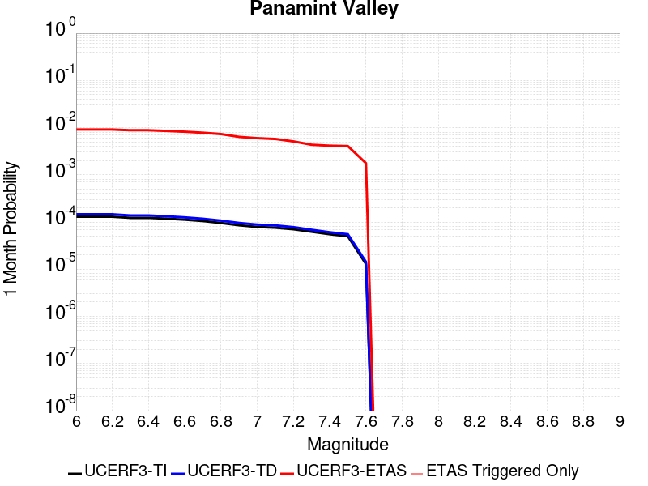 |  |  |

| Magnitude | 1 wk TI Prob | 1 wk TD Prob | 1 wk ETAS Prob | 1 wk ETAS/TD Gain | 1 wk ETAS Triggered Only | 1 mo TI Prob | 1 mo TD Prob | 1 mo ETAS Prob | 1 mo ETAS/TD Gain | 1 mo ETAS Triggered Only | 1 yr TI Prob | 1 yr TD Prob | 1 yr ETAS Prob | 1 yr ETAS/TD Gain | 1 yr ETAS Triggered Only | 10 yr TI Prob | 10 yr TD Prob | 10 yr ETAS Prob | 10 yr ETAS/TD Gain | 10 yr ETAS Triggered Only |
|-----|-----|-----|-----|-----|-----|-----|-----|-----|-----|-----|-----|-----|-----|-----|-----|-----|-----|-----|-----|-----|
| 6.0 | 3.0211835E-5 | 3.3984514E-5 | 0.006730798 | 198.05487 | 0.0066970414 | 1.2947287E-4 | 1.4563995E-4 | 0.009183499 | 63.056187 | 0.009039176 | 0.0015751923 | 0.0017717537 | 0.015890991 | 8.969074 | 0.014144298 | 0.015640736 | 0.017583137 | 0.037285045 | 2.1205 | 0.020054528 |
| 6.1 | 3.0211835E-5 | 3.3984514E-5 | 0.006730798 | 198.05487 | 0.0066970414 | 1.2947287E-4 | 1.4563995E-4 | 0.009183499 | 63.056187 | 0.009039176 | 0.0015751923 | 0.0017717537 | 0.015890991 | 8.969074 | 0.014144298 | 0.015640736 | 0.017583137 | 0.037285045 | 2.1205 | 0.020054528 |
| 6.2 | 3.0211835E-5 | 3.3984514E-5 | 0.006730798 | 198.05487 | 0.0066970414 | 1.2947287E-4 | 1.4563995E-4 | 0.009183499 | 63.056187 | 0.009039176 | 0.0015751923 | 0.0017717537 | 0.015890991 | 8.969074 | 0.014144298 | 0.015640736 | 0.017583137 | 0.037285045 | 2.1205 | 0.020054528 |
| 6.3 | 2.8573924E-5 | 3.210268E-5 | 0.006527658 | 203.33687 | 0.006495764 | 1.2245393E-4 | 1.3757581E-4 | 0.0088827815 | 64.566444 | 0.008746409 | 0.001489857 | 0.0016737265 | 0.01511846 | 9.032814 | 0.013467275 | 0.01479908 | 0.016617801 | 0.03518746 | 2.117456 | 0.018883461 |
| 6.4 | 2.8573924E-5 | 3.210268E-5 | 0.006527658 | 203.33687 | 0.006495764 | 1.2245393E-4 | 1.3757581E-4 | 0.0088827815 | 64.566444 | 0.008746409 | 0.001489857 | 0.0016737265 | 0.01511846 | 9.032814 | 0.013467275 | 0.01479908 | 0.016617801 | 0.03518746 | 2.117456 | 0.018883461 |
| 6.5 | 2.7468774E-5 | 3.0828433E-5 | 0.0062519317 | 202.79758 | 0.0062212953 | 1.1771801E-4 | 1.3211532E-4 | 0.008529754 | 64.56294 | 0.008398748 | 0.0014322745 | 0.0016073446 | 0.014486648 | 9.012783 | 0.012900039 | 0.014230782 | 0.015963677 | 0.033735424 | 2.1132617 | 0.018060055 |
| 6.6 | 2.6135967E-5 | 2.925248E-5 | 0.0061039864 | 208.6656 | 0.006074912 | 1.1200648E-4 | 1.253619E-4 | 0.008266918 | 65.94443 | 0.0081425775 | 0.0013628257 | 0.0015252391 | 0.014058472 | 9.217225 | 0.012552378 | 0.013544982 | 0.015154043 | 0.0324899 | 2.1439755 | 0.017602606 |
| 6.7 | 2.4498746E-5 | 2.7341335E-5 | 0.005809328 | 212.4742 | 0.005782145 | 1.04990395E-4 | 1.1717203E-4 | 0.007874584 | 67.20532 | 0.007758321 | 0.0012775084 | 0.0014256609 | 0.013357173 | 9.369109 | 0.011948546 | 0.012701893 | 0.014171274 | 0.030658575 | 2.163431 | 0.016724305 |
| 6.8 | 2.2244329E-5 | 2.4935423E-5 | 0.0054409867 | 218.2031 | 0.0054161865 | 9.532935E-5 | 1.0686185E-4 | 0.0073886584 | 69.14215 | 0.0072825747 | 0.0011600169 | 0.0013002884 | 0.01235614 | 9.502615 | 0.011070246 | 0.011539802 | 0.0129325185 | 0.028158186 | 2.1773164 | 0.015425152 |
| 6.9 | 1.9902658E-5 | 2.2290267E-5 | 0.0047247526 | 211.96483 | 0.004702567 | 8.529431E-5 | 9.552632E-5 | 0.006407708 | 67.077934 | 0.0063127847 | 0.0010379635 | 0.0011624309 | 0.010739399 | 9.238742 | 0.009588114 | 0.010331288 | 0.011568608 | 0.024789654 | 2.142838 | 0.013375784 |
| 7.0 | 1.8353881E-5 | 2.0566185E-5 | 0.004430276 | 215.41553 | 0.0044098003 | 7.865712E-5 | 8.813792E-5 | 0.0060161436 | 68.25829 | 0.0059285285 | 9.5722964E-4 | 0.0010725686 | 0.009900988 | 9.2311 | 0.008837898 | 0.009531168 | 0.010678849 | 0.022916157 | 2.1459389 | 0.012369399 |
| 7.1 | 1.7667631E-5 | 1.9772613E-5 | 0.004337998 | 219.39427 | 0.004318311 | 7.571623E-5 | 8.473711E-5 | 0.0058480958 | 69.01457 | 0.005763847 | 9.2145515E-4 | 0.0010312037 | 0.009585802 | 9.295742 | 0.00856343 | 0.009176437 | 0.010269073 | 0.022094918 | 2.1515982 | 0.011948546 |
| 7.2 | 1.6381597E-5 | 1.8158249E-5 | 0.0038972483 | 214.62686 | 0.0038791604 | 7.020495E-5 | 7.781885E-5 | 0.0052191364 | 67.067764 | 0.0051417174 | 8.544101E-4 | 9.4704994E-4 | 0.00858834 | 9.068519 | 0.007648533 | 0.008511325 | 0.009434792 | 0.020019962 | 2.1219292 | 0.01068599 |
| 7.3 | 1.4520491E-5 | 1.5966476E-5 | 0.0032729455 | 204.9886 | 0.003257031 | 6.222919E-5 | 6.842605E-5 | 0.004404738 | 64.37224 | 0.0043366086 | 7.57377E-4 | 8.327849E-4 | 0.007176878 | 8.617925 | 0.0063493806 | 0.0075480095 | 0.00829975 | 0.017028004 | 2.0516286 | 0.008801303 |
| 7.4 | 1.2852287E-5 | 1.4145411E-5 | 0.003124749 | 220.90196 | 0.0031106477 | 5.5080065E-5 | 6.062187E-5 | 0.0042139995 | 69.512856 | 0.0041536293 | 6.7039346E-4 | 7.378371E-4 | 0.006735129 | 9.128205 | 0.00600172 | 0.0066837464 | 0.0073567946 | 0.015693756 | 2.1332328 | 0.008398748 |
| 7.5 | 1.1637851E-5 | 1.2836797E-5 | 0.0030502537 | 237.61795 | 0.003037456 | 4.987555E-5 | 5.5013777E-5 | 0.00411693 | 74.83453 | 0.00406214 | 6.070656E-4 | 6.6960254E-4 | 0.0065393043 | 9.765948 | 0.0058736345 | 0.006054099 | 0.0066787465 | 0.014821469 | 2.2191992 | 0.0081974715 |
| 7.6 | 3.0068115E-6 | 3.3330316E-6 | 0.0014305665 | 429.20883 | 0.0014272383 | 1.2886271E-5 | 1.4284384E-5 | 0.0017342649 | 121.40985 | 0.0017200052 | 1.5687906E-4 | 1.7390578E-4 | 0.0026436963 | 15.201889 | 0.0024702202 | 0.0015676835 | 0.0017391363 | 0.005173164 | 2.9745593 | 0.0034400104 |

## Garlock (East)
*[(top)](#table-of-contents)*

| 1 Week | 1 Month | 1 Year | 10 Year |
|-----|-----|-----|-----|
|  |  |  |  |

| Magnitude | 1 wk TI Prob | 1 wk TD Prob | 1 wk ETAS Prob | 1 wk ETAS/TD Gain | 1 wk ETAS Triggered Only | 1 mo TI Prob | 1 mo TD Prob | 1 mo ETAS Prob | 1 mo ETAS/TD Gain | 1 mo ETAS Triggered Only | 1 yr TI Prob | 1 yr TD Prob | 1 yr ETAS Prob | 1 yr ETAS/TD Gain | 1 yr ETAS Triggered Only | 10 yr TI Prob | 10 yr TD Prob | 10 yr ETAS Prob | 10 yr ETAS/TD Gain | 10 yr ETAS Triggered Only |
|-----|-----|-----|-----|-----|-----|-----|-----|-----|-----|-----|-----|-----|-----|-----|-----|-----|-----|-----|-----|-----|
| 6.0 | 4.5092507E-5 | 6.290325E-5 | 0.0053323745 | 84.77105 | 0.005269803 | 1.9323928E-4 | 2.6956003E-4 | 0.007239191 | 26.855581 | 0.00697151 | 0.0023501497 | 0.0032774 | 0.014676123 | 4.4779773 | 0.011436204 | 0.023254504 | 0.032351844 | 0.04809244 | 1.4865439 | 0.016266856 |
| 6.1 | 4.5092507E-5 | 6.290325E-5 | 0.0053323745 | 84.77105 | 0.005269803 | 1.9323928E-4 | 2.6956003E-4 | 0.007239191 | 26.855581 | 0.00697151 | 0.0023501497 | 0.0032774 | 0.014676123 | 4.4779773 | 0.011436204 | 0.023254504 | 0.032351844 | 0.04809244 | 1.4865439 | 0.016266856 |
| 6.2 | 2.6674514E-5 | 3.4509674E-5 | 0.00402332 | 116.58528 | 0.003988948 | 1.1431433E-4 | 1.4789042E-4 | 0.0052339616 | 35.390812 | 0.005086824 | 0.0013908884 | 0.0017991117 | 0.00974439 | 5.4162226 | 0.007959598 | 0.01382215 | 0.017890299 | 0.028780466 | 1.6087191 | 0.011088544 |
| 6.3 | 2.6674514E-5 | 3.4509674E-5 | 0.00402332 | 116.58528 | 0.003988948 | 1.1431433E-4 | 1.4789042E-4 | 0.0052339616 | 35.390812 | 0.005086824 | 0.0013908884 | 0.0017991117 | 0.00974439 | 5.4162226 | 0.007959598 | 0.01382215 | 0.017890299 | 0.028780466 | 1.6087191 | 0.011088544 |
| 6.4 | 2.5312667E-5 | 3.233893E-5 | 0.0039845635 | 123.212585 | 0.0039523523 | 1.0847834E-4 | 1.3858822E-4 | 0.00513323 | 37.03944 | 0.004995334 | 0.0013199237 | 0.0016860351 | 0.0094495425 | 5.604594 | 0.007776619 | 0.013121112 | 0.016778335 | 0.027482932 | 1.6380011 | 0.010887266 |
| 6.5 | 2.5312667E-5 | 3.233893E-5 | 0.0039845635 | 123.212585 | 0.0039523523 | 1.0847834E-4 | 1.3858822E-4 | 0.00513323 | 37.03944 | 0.004995334 | 0.0013199237 | 0.0016860351 | 0.0094495425 | 5.604594 | 0.007776619 | 0.013121112 | 0.016778335 | 0.027482932 | 1.6380011 | 0.010887266 |
| 6.6 | 2.246556E-5 | 2.8133776E-5 | 0.0037425084 | 133.02545 | 0.003714479 | 9.627742E-5 | 1.20567885E-4 | 0.0047310893 | 39.240047 | 0.0046110777 | 0.0011715472 | 0.0014669491 | 0.008629214 | 5.8824224 | 0.007172787 | 0.011653901 | 0.01461866 | 0.02448131 | 1.6746615 | 0.010008966 |
| 6.7 | 2.2241198E-5 | 2.7803519E-5 | 0.0037421794 | 134.59373 | 0.003714479 | 9.531594E-5 | 1.1915263E-4 | 0.0047296807 | 39.694305 | 0.0046110777 | 0.0011598538 | 0.0014497414 | 0.00861213 | 5.9404593 | 0.007172787 | 0.011538187 | 0.014448853 | 0.024295168 | 1.6814599 | 0.009990668 |
| 6.8 | 1.9528685E-5 | 2.389819E-5 | 0.0036468012 | 152.59737 | 0.0036229894 | 8.369167E-5 | 1.0241691E-4 | 0.00458495 | 44.76751 | 0.004482992 | 0.0010184698 | 0.0012462323 | 0.008099403 | 6.4991126 | 0.0068617226 | 0.010138147 | 0.012436427 | 0.021724595 | 1.7468518 | 0.009405134 |
| 6.9 | 1.3318621E-5 | 1.5198884E-5 | 0.003491752 | 229.7374 | 0.0034766062 | 5.7078556E-5 | 6.513648E-5 | 0.0043282756 | 66.44933 | 0.004263417 | 6.9470983E-4 | 7.927538E-4 | 0.0071736677 | 9.049048 | 0.0063859764 | 0.0069254204 | 0.007939888 | 0.016326409 | 2.0562518 | 0.008453642 |
| 7.0 | 1.1760853E-5 | 1.31077895E-5 | 0.0033981798 | 259.2489 | 0.0033851166 | 5.0402683E-5 | 5.6175057E-5 | 0.004209571 | 74.93666 | 0.0041536293 | 6.134799E-4 | 6.8372174E-4 | 0.0068641924 | 10.0394535 | 0.0061846995 | 0.0061178906 | 0.00685652 | 0.014943268 | 2.1794245 | 0.0081425775 |
| 7.1 | 1.0064758E-5 | 1.0902931E-5 | 0.0032130051 | 294.6919 | 0.0032021373 | 4.3133965E-5 | 4.672603E-5 | 0.0039622993 | 84.79855 | 0.0039157565 | 5.2502943E-4 | 5.687444E-4 | 0.006347601 | 11.160727 | 0.005782145 | 0.005237907 | 0.0057129986 | 0.013299642 | 2.327962 | 0.0076302355 |
| 7.2 | 9.768808E-6 | 1.0498807E-5 | 0.0031394113 | 299.02554 | 0.0031289456 | 4.186565E-5 | 4.499413E-5 | 0.0038324946 | 85.17766 | 0.0037876708 | 5.095951E-4 | 5.4766936E-4 | 0.0061620562 | 11.251417 | 0.0056174635 | 0.0050842804 | 0.0055032647 | 0.012854945 | 2.3358762 | 0.007392362 |
| 7.3 | 9.344516E-6 | 9.944468E-6 | 0.0028643927 | 288.03882 | 0.0028544767 | 4.004731E-5 | 4.261847E-5 | 0.0034824822 | 81.71298 | 0.0034400104 | 4.8746695E-4 | 5.1875977E-4 | 0.00565781 | 10.906416 | 0.0051417174 | 0.0048639905 | 0.0052149445 | 0.012004479 | 2.3019378 | 0.0068251267 |
| 7.4 | 9.023491E-6 | 9.490661E-6 | 0.0025528783 | 268.98846 | 0.002543412 | 3.867153E-5 | 4.0673647E-5 | 0.0030963032 | 76.125534 | 0.003055754 | 4.7072413E-4 | 4.950925E-4 | 0.005103887 | 10.308957 | 0.0046110777 | 0.004697283 | 0.0049783974 | 0.011095894 | 2.2288082 | 0.0061481036 |
| 7.5 | 7.081253E-6 | 7.087672E-6 | 0.0012696356 | 179.13297 | 0.001262557 | 3.0347876E-5 | 3.0375388E-5 | 0.0015673545 | 51.59949 | 0.0015370259 | 3.6942272E-4 | 3.6975832E-4 | 0.002711027 | 7.3318887 | 0.0023421347 | 0.003688092 | 0.0037243143 | 0.006859836 | 1.8419058 | 0.0031472435 |
| 7.6 | 6.116396E-6 | 5.959245E-6 | 7.744676E-4 | 129.9607 | 7.6851295E-4 | 2.6212863E-5 | 2.5539372E-5 | 9.953047E-4 | 38.971386 | 9.697901E-4 | 3.1909486E-4 | 3.1089774E-4 | 0.0018291535 | 5.883457 | 0.001518728 | 0.0031863707 | 0.0031357552 | 0.0050510126 | 1.6107804 | 0.0019212823 |
| 7.7 | 4.797145E-6 | 4.757281E-6 | 5.3539465E-4 | 112.54215 | 5.306399E-4 | 2.055903E-5 | 2.0388188E-5 | 6.791001E-4 | 33.308506 | 6.587254E-4 | 2.5027743E-4 | 2.4819805E-4 | 0.0011811607 | 4.7589445 | 9.3319424E-4 | 0.0024999576 | 0.0025093474 | 0.003695728 | 1.4727845 | 0.0011893653 |
| 7.8 | 3.4028885E-6 | 3.978462E-6 | 3.6993553E-4 | 92.984566 | 3.6595855E-4 | 1.4583726E-5 | 1.7050439E-5 | 4.561932E-4 | 26.75551 | 4.3915023E-4 | 1.775424E-4 | 2.0756939E-4 | 8.6615805E-4 | 4.17286 | 6.587254E-4 | 0.0017740062 | 0.0021012232 | 0.002977678 | 1.4171165 | 8.7830046E-4 |
| 7.9 | 2.5928412E-6 | 3.3724489E-6 | 2.7784042E-4 | 82.38536 | 2.744689E-4 | 1.1112129E-5 | 1.4453272E-5 | 3.6210887E-4 | 25.053762 | 3.4766062E-4 | 1.3528178E-4 | 1.7595445E-4 | 7.4309035E-4 | 4.2231975 | 5.6723575E-4 | 0.0013519945 | 0.0017812408 | 0.002493589 | 1.3999168 | 7.1361917E-4 |
| 8.0 | 1.3743648E-6 | 1.6734747E-6 | 1.4805664E-4 | 88.472595 | 1.4638342E-4 | 5.8901214E-6 | 7.1720146E-6 | 1.9014996E-4 | 26.51277 | 1.8297927E-4 | 7.1709874E-5 | 8.731581E-5 | 3.4346443E-4 | 3.933588 | 2.5617098E-4 | 7.1686733E-4 | 8.837234E-4 | 0.0012310768 | 1.3930566 | 3.4766062E-4 |
| 8.1 | 3.6733252E-7 | 3.1489964E-7 | 1.861282E-5 | 59.10715 | 1.8297927E-5 | 1.5742813E-6 | 1.3495693E-6 | 1.9647472E-5 | 14.558327 | 1.8297927E-5 | 1.9166706E-5 | 1.6430899E-5 | 3.4728524E-5 | 2.1136107 | 1.8297927E-5 | 1.9165053E-4 | 1.6638759E-4 | 2.0297735E-4 | 1.2199068 | 3.6595855E-5 |

## Ash Hill
*[(top)](#table-of-contents)*

| 1 Week | 1 Month | 1 Year | 10 Year |
|-----|-----|-----|-----|
|  |  |  |  |

| Magnitude | 1 wk TI Prob | 1 wk TD Prob | 1 wk ETAS Prob | 1 wk ETAS/TD Gain | 1 wk ETAS Triggered Only | 1 mo TI Prob | 1 mo TD Prob | 1 mo ETAS Prob | 1 mo ETAS/TD Gain | 1 mo ETAS Triggered Only | 1 yr TI Prob | 1 yr TD Prob | 1 yr ETAS Prob | 1 yr ETAS/TD Gain | 1 yr ETAS Triggered Only | 10 yr TI Prob | 10 yr TD Prob | 10 yr ETAS Prob | 10 yr ETAS/TD Gain | 10 yr ETAS Triggered Only |
|-----|-----|-----|-----|-----|-----|-----|-----|-----|-----|-----|-----|-----|-----|-----|-----|-----|-----|-----|-----|-----|
| 6.0 | 2.1545662E-5 | 2.3194447E-5 | 0.0024384647 | 105.1314 | 0.0024153264 | 9.2335285E-5 | 9.940143E-5 | 0.0035024774 | 35.235683 | 0.0034034145 | 0.0011236023 | 0.0012096206 | 0.0073137353 | 6.0463057 | 0.006111508 | 0.011179381 | 0.012038348 | 0.021095252 | 1.7523376 | 0.009167261 |
| 6.1 | 2.1545662E-5 | 2.3194447E-5 | 0.0024384647 | 105.1314 | 0.0024153264 | 9.2335285E-5 | 9.940143E-5 | 0.0035024774 | 35.235683 | 0.0034034145 | 0.0011236023 | 0.0012096206 | 0.0073137353 | 6.0463057 | 0.006111508 | 0.011179381 | 0.012038348 | 0.021095252 | 1.7523376 | 0.009167261 |
| 6.2 | 2.1545662E-5 | 2.3194447E-5 | 0.0024384647 | 105.1314 | 0.0024153264 | 9.2335285E-5 | 9.940143E-5 | 0.0035024774 | 35.235683 | 0.0034034145 | 0.0011236023 | 0.0012096206 | 0.0073137353 | 6.0463057 | 0.006111508 | 0.011179381 | 0.012038348 | 0.021095252 | 1.7523376 | 0.009167261 |
| 6.3 | 1.0025529E-5 | 1.0746934E-5 | 0.0011452062 | 106.561195 | 0.0011344715 | 4.2965847E-5 | 4.605755E-5 | 0.0014549331 | 31.589457 | 0.0014089404 | 5.229836E-4 | 5.6061964E-4 | 0.0031574685 | 5.632105 | 0.0025983057 | 0.005217545 | 0.0055933665 | 0.009341656 | 1.6701312 | 0.0037693728 |
| 6.4 | 1.0025529E-5 | 1.0746934E-5 | 0.0011452062 | 106.561195 | 0.0011344715 | 4.2965847E-5 | 4.605755E-5 | 0.0014549331 | 31.589457 | 0.0014089404 | 5.229836E-4 | 5.6061964E-4 | 0.0031574685 | 5.632105 | 0.0025983057 | 0.005217545 | 0.0055933665 | 0.009341656 | 1.6701312 | 0.0037693728 |
| 6.5 | 6.9617327E-6 | 7.456634E-6 | 7.57666E-4 | 101.60966 | 7.50215E-4 | 2.9835655E-5 | 3.195666E-5 | 9.834184E-4 | 30.773504 | 9.5149217E-4 | 3.6318856E-4 | 3.8901155E-4 | 0.0021083476 | 5.419756 | 0.0017200052 | 0.0036259557 | 0.0038841602 | 0.006454147 | 1.6616582 | 0.0025800078 |
| 6.6 | 4.9919777E-6 | 5.3466883E-6 | 6.274729E-4 | 117.35729 | 6.2212953E-4 | 2.1394015E-5 | 2.2914215E-5 | 7.914095E-4 | 34.53793 | 7.6851295E-4 | 2.60441E-4 | 2.7895154E-4 | 0.0016326205 | 5.8527026 | 0.0013540466 | 0.0026013597 | 0.0027866727 | 0.004739095 | 1.7006285 | 0.0019578782 |
| 6.7 | 3.6630722E-6 | 3.924624E-6 | 5.345624E-4 | 136.2073 | 5.306399E-4 | 1.5698786E-5 | 1.681974E-5 | 6.75534E-4 | 40.163166 | 6.587254E-4 | 1.9111596E-4 | 2.0476682E-4 | 0.001339006 | 6.5391746 | 0.0011344715 | 0.0019095168 | 0.0020463446 | 0.0035802252 | 1.7495711 | 0.0015370259 |
| 6.8 | 2.5599613E-6 | 2.744925E-6 | 3.1380882E-4 | 114.32327 | 3.1106477E-4 | 1.0971216E-5 | 1.1763939E-5 | 4.143136E-4 | 35.21895 | 4.025544E-4 | 1.3356637E-4 | 1.4322149E-4 | 8.567384E-4 | 5.981912 | 7.1361917E-4 | 0.0013348613 | 0.0014317769 | 0.002363635 | 1.6508403 | 9.3319424E-4 |
| 6.9 | 1.7684905E-6 | 1.8968707E-6 | 2.5806736E-4 | 136.049 | 2.5617098E-4 | 7.579223E-6 | 8.129446E-6 | 3.1919166E-4 | 39.263645 | 3.1106477E-4 | 9.2273134E-5 | 9.8976E-5 | 6.478595E-4 | 6.545622 | 5.489378E-4 | 9.223483E-4 | 9.8976E-4 | 0.001684393 | 1.7018197 | 6.9532124E-4 |

## Hunter Mountain-Saline Valley
*[(top)](#table-of-contents)*

| 1 Week | 1 Month | 1 Year | 10 Year |
|-----|-----|-----|-----|
|  |  |  |  |

| Magnitude | 1 wk TI Prob | 1 wk TD Prob | 1 wk ETAS Prob | 1 wk ETAS/TD Gain | 1 wk ETAS Triggered Only | 1 mo TI Prob | 1 mo TD Prob | 1 mo ETAS Prob | 1 mo ETAS/TD Gain | 1 mo ETAS Triggered Only | 1 yr TI Prob | 1 yr TD Prob | 1 yr ETAS Prob | 1 yr ETAS/TD Gain | 1 yr ETAS Triggered Only | 10 yr TI Prob | 10 yr TD Prob | 10 yr ETAS Prob | 10 yr ETAS/TD Gain | 10 yr ETAS Triggered Only |
|-----|-----|-----|-----|-----|-----|-----|-----|-----|-----|-----|-----|-----|-----|-----|-----|-----|-----|-----|-----|-----|
| 6.0 | 4.5103672E-5 | 5.4570177E-5 | 0.0036041744 | 66.04659 | 0.0035497977 | 1.9328714E-4 | 2.3385242E-4 | 0.0049536135 | 21.182648 | 0.0047208653 | 0.002350731 | 0.0028435152 | 0.009630988 | 3.3870008 | 0.006806829 | 0.023260195 | 0.028091887 | 0.03726838 | 1.3266599 | 0.009441731 |
| 6.1 | 4.5103672E-5 | 5.4570177E-5 | 0.0036041744 | 66.04659 | 0.0035497977 | 1.9328714E-4 | 2.3385242E-4 | 0.0049536135 | 21.182648 | 0.0047208653 | 0.002350731 | 0.0028435152 | 0.009630988 | 3.3870008 | 0.006806829 | 0.023260195 | 0.028091887 | 0.03726838 | 1.3266599 | 0.009441731 |
| 6.2 | 3.9363465E-5 | 4.706337E-5 | 0.0035235058 | 74.86726 | 0.0034766062 | 1.6868966E-4 | 2.0168544E-4 | 0.0048484216 | 24.039522 | 0.0046476736 | 0.002051862 | 0.0024528175 | 0.009133432 | 3.7236493 | 0.0066970414 | 0.020330196 | 0.024273481 | 0.033325344 | 1.3729116 | 0.0092770485 |
| 6.3 | 3.9363465E-5 | 4.706337E-5 | 0.0035235058 | 74.86726 | 0.0034766062 | 1.6868966E-4 | 2.0168544E-4 | 0.0048484216 | 24.039522 | 0.0046476736 | 0.002051862 | 0.0024528175 | 0.009133432 | 3.7236493 | 0.0066970414 | 0.020330196 | 0.024273481 | 0.033325344 | 1.3729116 | 0.0092770485 |
| 6.4 | 3.2311684E-5 | 3.795099E-5 | 0.0034412362 | 90.6758 | 0.0034034145 | 1.384713E-4 | 1.6263737E-4 | 0.0046997853 | 28.897327 | 0.004537886 | 0.0016845843 | 0.0019783843 | 0.008497821 | 4.2953334 | 0.00653236 | 0.016718714 | 0.019616475 | 0.028532151 | 1.4544994 | 0.00909407 |
| 6.5 | 3.2311684E-5 | 3.795099E-5 | 0.0034412362 | 90.6758 | 0.0034034145 | 1.384713E-4 | 1.6263737E-4 | 0.0046997853 | 28.897327 | 0.004537886 | 0.0016845843 | 0.0019783843 | 0.008497821 | 4.2953334 | 0.00653236 | 0.016718714 | 0.019616475 | 0.028532151 | 1.4544994 | 0.00909407 |
| 6.6 | 2.9305844E-5 | 3.418183E-5 | 0.00343748 | 100.56453 | 0.0034034145 | 1.2559042E-4 | 1.4648569E-4 | 0.004683707 | 31.973818 | 0.004537886 | 0.0015279909 | 0.001782067 | 0.00828452 | 4.6488266 | 0.006514062 | 0.015175272 | 0.01768569 | 0.026600951 | 1.5040945 | 0.009075772 |
| 6.7 | 2.7826512E-5 | 3.2344276E-5 | 0.0034173513 | 105.65552 | 0.0033851166 | 1.19251024E-4 | 1.386113E-4 | 0.0046575726 | 33.60168 | 0.004519588 | 0.0014509142 | 0.0016863465 | 0.008171156 | 4.845479 | 0.006495764 | 0.014414776 | 0.016743187 | 0.02564901 | 1.5319073 | 0.009057473 |
| 6.8 | 2.3389874E-5 | 2.6866714E-5 | 0.0033387025 | 124.269104 | 0.0033119249 | 1.0023846E-4 | 1.15138246E-4 | 0.0045610224 | 39.613445 | 0.004446396 | 0.00121972 | 0.001400954 | 0.0077962563 | 5.5649624 | 0.0064042746 | 0.01213047 | 0.013927434 | 0.022714416 | 1.6309117 | 0.00891109 |
| 6.9 | 2.069209E-5 | 2.3570032E-5 | 0.0032988216 | 139.95831 | 0.003275329 | 8.867737E-5 | 1.01010715E-4 | 0.0044920696 | 44.47122 | 0.0043915026 | 0.0010791123 | 0.0012291478 | 0.0075524487 | 6.1444592 | 0.006331083 | 0.010738871 | 0.012228523 | 0.020976422 | 1.7153683 | 0.008856197 |
| 7.0 | 1.7462342E-5 | 1.9633546E-5 | 0.003258303 | 165.95592 | 0.0032387332 | 7.483646E-5 | 8.414118E-5 | 0.004383792 | 52.100433 | 0.0043000127 | 9.1075303E-4 | 0.0010239601 | 0.007220606 | 7.0516477 | 0.006202997 | 0.009070295 | 0.0101960525 | 0.01881706 | 1.8455241 | 0.0087098135 |
| 7.1 | 1.4807709E-5 | 1.6441749E-5 | 0.0032185263 | 195.75328 | 0.0032021373 | 6.3460066E-5 | 7.046283E-5 | 0.0043335794 | 61.501637 | 0.004263417 | 7.723524E-4 | 8.575638E-4 | 0.007018677 | 8.184437 | 0.0061664013 | 0.007696735 | 0.008545532 | 0.017072065 | 1.9977769 | 0.008600025 |
| 7.2 | 1.4180048E-5 | 1.5698337E-5 | 0.0031628923 | 201.47946 | 0.0031472435 | 6.077022E-5 | 6.727694E-5 | 0.004275517 | 63.551003 | 0.0042085233 | 7.396263E-4 | 8.188051E-4 | 0.0069253086 | 8.457823 | 0.006111508 | 0.0073716943 | 0.008160833 | 0.01663623 | 2.0385454 | 0.008545131 |
| 7.3 | 1.3730402E-5 | 1.5172075E-5 | 0.0031623677 | 208.43343 | 0.0031472435 | 5.8843252E-5 | 6.502165E-5 | 0.004273271 | 65.72074 | 0.0042085233 | 7.161811E-4 | 7.9136714E-4 | 0.006898038 | 8.716609 | 0.006111508 | 0.007138774 | 0.007888422 | 0.016347993 | 2.0724032 | 0.008526834 |
| 7.4 | 1.2810095E-5 | 1.4109277E-5 | 0.003124713 | 221.46513 | 0.0031106477 | 5.489925E-5 | 6.0467017E-5 | 0.0042138454 | 69.688324 | 0.0041536293 | 6.681934E-4 | 7.359531E-4 | 0.006733256 | 9.149029 | 0.00600172 | 0.006661878 | 0.007338053 | 0.01567517 | 2.1361485 | 0.008398748 |
| 7.5 | 1.1595659E-5 | 1.2800664E-5 | 0.0030502176 | 238.28589 | 0.003037456 | 4.9694736E-5 | 5.4858923E-5 | 0.004116776 | 75.04296 | 0.00406214 | 6.0486543E-4 | 6.6771836E-4 | 0.006537431 | 9.790701 | 0.0058736345 | 0.006032217 | 0.0066599925 | 0.0148028685 | 2.2226555 | 0.0081974715 |
| 7.6 | 2.997694E-6 | 3.3251579E-6 | 0.0014305587 | 430.22278 | 0.0014272383 | 1.28471975E-5 | 1.425064E-5 | 0.0017342312 | 121.69498 | 0.0017200052 | 1.564034E-4 | 1.73495E-4 | 0.0026432865 | 15.235519 | 0.0024702202 | 0.0015629337 | 0.001735031 | 0.0051690727 | 2.9792395 | 0.0034400104 |

## Blackwater
*[(top)](#table-of-contents)*

| 1 Week | 1 Month | 1 Year | 10 Year |
|-----|-----|-----|-----|
| 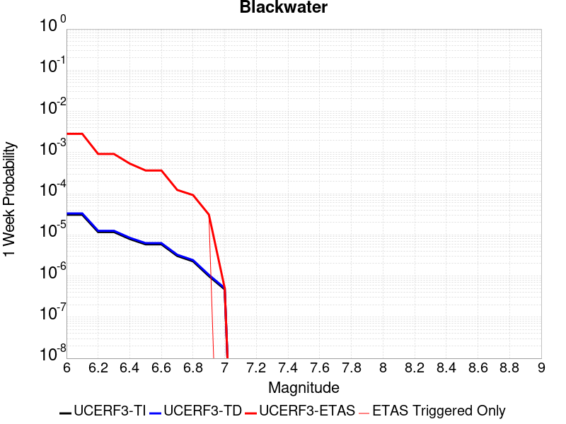 |  |  | 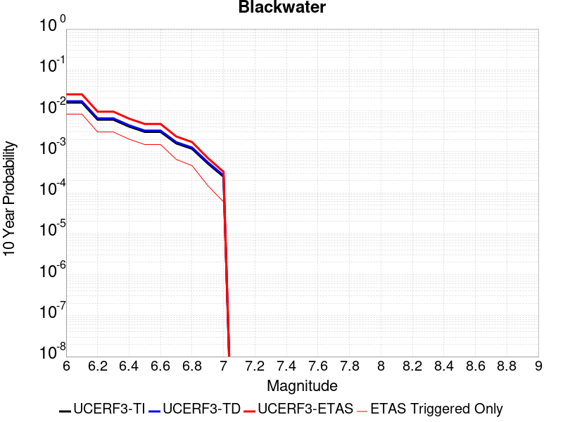 |

| Magnitude | 1 wk TI Prob | 1 wk TD Prob | 1 wk ETAS Prob | 1 wk ETAS/TD Gain | 1 wk ETAS Triggered Only | 1 mo TI Prob | 1 mo TD Prob | 1 mo ETAS Prob | 1 mo ETAS/TD Gain | 1 mo ETAS Triggered Only | 1 yr TI Prob | 1 yr TD Prob | 1 yr ETAS Prob | 1 yr ETAS/TD Gain | 1 yr ETAS Triggered Only | 10 yr TI Prob | 10 yr TD Prob | 10 yr ETAS Prob | 10 yr ETAS/TD Gain | 10 yr ETAS Triggered Only |
|-----|-----|-----|-----|-----|-----|-----|-----|-----|-----|-----|-----|-----|-----|-----|-----|-----|-----|-----|-----|-----|
| 6.0 | 3.0708583E-5 | 3.3095846E-5 | 0.0027045046 | 81.71735 | 0.0026714974 | 1.3160157E-4 | 1.4183241E-4 | 0.00387408 | 27.314491 | 0.003732777 | 0.0016010714 | 0.0017255784 | 0.0072785495 | 4.2180347 | 0.00556257 | 0.015895851 | 0.017135633 | 0.025174651 | 1.4691404 | 0.008179173 |
| 6.1 | 3.0708583E-5 | 3.3095846E-5 | 0.0027045046 | 81.71735 | 0.0026714974 | 1.3160157E-4 | 1.4183241E-4 | 0.00387408 | 27.314491 | 0.003732777 | 0.0016010714 | 0.0017255784 | 0.0072785495 | 4.2180347 | 0.00556257 | 0.015895851 | 0.017135633 | 0.025174651 | 1.4691404 | 0.008179173 |
| 6.2 | 1.1707779E-5 | 1.2545122E-5 | 8.908346E-4 | 71.01044 | 8.7830046E-4 | 5.017523E-5 | 5.3763757E-5 | 0.0014077375 | 26.183765 | 0.0013540466 | 6.107122E-4 | 6.5438676E-4 | 0.0027024134 | 4.1296887 | 0.0020493679 | 0.006090366 | 0.0065255696 | 0.009525026 | 1.4596467 | 0.003019158 |
| 6.3 | 1.1707779E-5 | 1.2545122E-5 | 8.908346E-4 | 71.01044 | 8.7830046E-4 | 5.017523E-5 | 5.3763757E-5 | 0.0014077375 | 26.183765 | 0.0013540466 | 6.107122E-4 | 6.5438676E-4 | 0.0027024134 | 4.1296887 | 0.0020493679 | 0.006090366 | 0.0065255696 | 0.009525026 | 1.4596467 | 0.003019158 |
| 6.4 | 7.929244E-6 | 8.480098E-6 | 5.208177E-4 | 61.416473 | 5.1234197E-4 | 3.3982033E-5 | 3.6342793E-5 | 9.329086E-4 | 25.6697 | 8.965984E-4 | 4.136527E-4 | 4.423877E-4 | 0.0017409658 | 3.9353845 | 0.0012991528 | 0.0041288356 | 0.0044154758 | 0.006437578 | 1.4579579 | 0.00203107 |
| 6.5 | 5.8832115E-6 | 6.285991E-6 | 3.7224224E-4 | 59.217747 | 3.6595855E-4 | 2.521352E-5 | 2.6939697E-5 | 7.5883704E-4 | 28.167988 | 7.319171E-4 | 3.0693135E-4 | 3.27944E-4 | 0.0013705838 | 4.1793227 | 0.0010429819 | 0.0030650778 | 0.0032748538 | 0.004843322 | 1.478943 | 0.0015736218 |
| 6.6 | 5.8832115E-6 | 6.285991E-6 | 3.7224224E-4 | 59.217747 | 3.6595855E-4 | 2.521352E-5 | 2.6939697E-5 | 7.5883704E-4 | 28.167988 | 7.319171E-4 | 3.0693135E-4 | 3.27944E-4 | 0.0013705838 | 4.1793227 | 0.0010429819 | 0.0030650778 | 0.0032748538 | 0.004843322 | 1.478943 | 0.0015736218 |
| 6.7 | 3.0715053E-6 | 3.2814662E-6 | 1.13068665E-4 | 34.456753 | 1.0978756E-4 | 1.3163528E-5 | 1.4063357E-5 | 2.7023072E-4 | 19.215237 | 2.5617098E-4 | 1.6025416E-4 | 1.7120909E-4 | 5.3710496E-4 | 3.1371288 | 3.6595855E-4 | 0.0016013865 | 0.0017108864 | 0.002313685 | 1.3523312 | 6.038316E-4 |
| 6.8 | 2.2722281E-6 | 2.4287538E-6 | 7.5620286E-5 | 31.135427 | 7.319171E-5 | 9.738084E-6 | 1.0408908E-5 | 2.11684E-4 | 20.336813 | 2.012772E-4 | 1.1855473E-4 | 1.26722E-4 | 3.828605E-4 | 3.0212631 | 2.5617098E-4 | 0.001184915 | 0.0012665876 | 0.0017051816 | 1.3462801 | 4.3915023E-4 |
| 6.9 | 9.952399E-7 | 1.0653489E-6 | 3.7661164E-5 | 35.351013 | 3.6595855E-5 | 4.265307E-6 | 4.5657757E-6 | 5.9459304E-5 | 13.022826 | 5.489378E-5 | 5.1928873E-5 | 5.5587418E-5 | 1.2877506E-4 | 2.3166225 | 7.319171E-5 | 5.191674E-4 | 5.557858E-4 | 7.2037557E-4 | 1.296139 | 1.6468135E-4 |
| 7.0 | 4.7385504E-7 | 5.0755597E-7 | 5.0755597E-7 | 1.0 | 0.0 | 2.0308057E-6 | 2.1752398E-6 | 2.1752398E-6 | 1.0 | 0.0 | 2.4724779E-5 | 2.6483543E-5 | 2.6483543E-5 | 1.0 | 0.0 | 2.4722028E-4 | 2.6483546E-4 | 3.197147E-4 | 1.2072202 | 5.489378E-5 |

## So Sierra Nevada
*[(top)](#table-of-contents)*

| 1 Week | 1 Month | 1 Year | 10 Year |
|-----|-----|-----|-----|
|  |  |  |  |

| Magnitude | 1 wk TI Prob | 1 wk TD Prob | 1 wk ETAS Prob | 1 wk ETAS/TD Gain | 1 wk ETAS Triggered Only | 1 mo TI Prob | 1 mo TD Prob | 1 mo ETAS Prob | 1 mo ETAS/TD Gain | 1 mo ETAS Triggered Only | 1 yr TI Prob | 1 yr TD Prob | 1 yr ETAS Prob | 1 yr ETAS/TD Gain | 1 yr ETAS Triggered Only | 10 yr TI Prob | 10 yr TD Prob | 10 yr ETAS Prob | 10 yr ETAS/TD Gain | 10 yr ETAS Triggered Only |
|-----|-----|-----|-----|-----|-----|-----|-----|-----|-----|-----|-----|-----|-----|-----|-----|-----|-----|-----|-----|-----|
| 6.0 | 1.15488665E-5 | 1.1079643E-5 | 0.0029204178 | 263.5841 | 0.0029093705 | 4.9494203E-5 | 4.748339E-5 | 0.0036703008 | 77.296524 | 0.0036229894 | 6.024253E-4 | 5.7796965E-4 | 0.005698428 | 9.859389 | 0.0051234197 | 0.006007948 | 0.005765934 | 0.012478937 | 2.1642525 | 0.006751935 |
| 6.1 | 1.15488665E-5 | 1.1079643E-5 | 0.0029204178 | 263.5841 | 0.0029093705 | 4.9494203E-5 | 4.748339E-5 | 0.0036703008 | 77.296524 | 0.0036229894 | 6.024253E-4 | 5.7796965E-4 | 0.005698428 | 9.859389 | 0.0051234197 | 0.006007948 | 0.005765934 | 0.012478937 | 2.1642525 | 0.006751935 |
| 6.2 | 1.15488665E-5 | 1.1079643E-5 | 0.0029204178 | 263.5841 | 0.0029093705 | 4.9494203E-5 | 4.748339E-5 | 0.0036703008 | 77.296524 | 0.0036229894 | 6.024253E-4 | 5.7796965E-4 | 0.005698428 | 9.859389 | 0.0051234197 | 0.006007948 | 0.005765934 | 0.012478937 | 2.1642525 | 0.006751935 |
| 6.3 | 1.15488665E-5 | 1.1079643E-5 | 0.0029204178 | 263.5841 | 0.0029093705 | 4.9494203E-5 | 4.748339E-5 | 0.0036703008 | 77.296524 | 0.0036229894 | 6.024253E-4 | 5.7796965E-4 | 0.005698428 | 9.859389 | 0.0051234197 | 0.006007948 | 0.005765934 | 0.012478937 | 2.1642525 | 0.006751935 |
| 6.4 | 1.15488665E-5 | 1.1079643E-5 | 0.0029204178 | 263.5841 | 0.0029093705 | 4.9494203E-5 | 4.748339E-5 | 0.0036703008 | 77.296524 | 0.0036229894 | 6.024253E-4 | 5.7796965E-4 | 0.005698428 | 9.859389 | 0.0051234197 | 0.006007948 | 0.005765934 | 0.012478937 | 2.1642525 | 0.006751935 |
| 6.5 | 1.15488665E-5 | 1.1079643E-5 | 0.0029204178 | 263.5841 | 0.0029093705 | 4.9494203E-5 | 4.748339E-5 | 0.0036703008 | 77.296524 | 0.0036229894 | 6.024253E-4 | 5.7796965E-4 | 0.005698428 | 9.859389 | 0.0051234197 | 0.006007948 | 0.005765934 | 0.012478937 | 2.1642525 | 0.006751935 |
| 6.6 | 7.587044E-6 | 6.935635E-6 | 0.002532032 | 365.0757 | 0.002525114 | 3.2515498E-5 | 2.9723828E-5 | 0.0029938999 | 100.7239 | 0.0029642642 | 3.9580427E-4 | 3.6183043E-4 | 0.00427617 | 11.81816 | 0.0039157565 | 0.003951 | 0.0036127048 | 0.008535297 | 2.362578 | 0.0049404404 |
| 6.7 | 7.587044E-6 | 6.935635E-6 | 0.002532032 | 365.0757 | 0.002525114 | 3.2515498E-5 | 2.9723828E-5 | 0.0029938999 | 100.7239 | 0.0029642642 | 3.9580427E-4 | 3.6183043E-4 | 0.00427617 | 11.81816 | 0.0039157565 | 0.003951 | 0.0036127048 | 0.008535297 | 2.362578 | 0.0049404404 |
| 6.8 | 5.9026956E-6 | 5.1793927E-6 | 0.0022009192 | 424.9377 | 0.0021957513 | 2.5297022E-5 | 2.2197215E-5 | 0.002547255 | 114.755615 | 0.002525114 | 3.0794772E-4 | 2.7021873E-4 | 0.0035080765 | 12.982359 | 0.0032387332 | 0.0030752132 | 0.002699018 | 0.006786691 | 2.5145037 | 0.0040987357 |
| 6.9 | 5.0118915E-6 | 4.2524252E-6 | 0.001998718 | 470.01837 | 0.001994474 | 2.1479358E-5 | 1.8224557E-5 | 0.0022688285 | 124.492935 | 0.002250645 | 2.614798E-4 | 2.2186211E-4 | 0.003130587 | 14.110507 | 0.0029093705 | 0.0026117235 | 0.0022164788 | 0.0058496953 | 2.639184 | 0.0036412873 |
| 7.0 | 4.4924795E-6 | 3.7139177E-6 | 0.0017786062 | 478.90298 | 0.0017748988 | 1.925334E-5 | 1.5916696E-5 | 0.0020469544 | 128.60422 | 0.00203107 | 2.3438422E-4 | 1.9376918E-4 | 0.0028098656 | 14.501097 | 0.0026166036 | 0.0023413717 | 0.0019360651 | 0.0051137405 | 2.641306 | 0.0031838394 |
| 7.1 | 3.9118436E-6 | 3.1119775E-6 | 0.0013205586 | 424.34708 | 0.0013174508 | 1.6764936E-5 | 1.3336982E-5 | 0.0015503423 | 116.243866 | 0.0015370259 | 2.0409399E-4 | 1.6236622E-4 | 0.0021931063 | 13.507158 | 0.00203107 | 0.0020390663 | 0.001622532 | 0.0041070124 | 2.5312366 | 0.0024885181 |
| 7.2 | 3.4200818E-6 | 2.6054543E-6 | 0.0011919676 | 457.48935 | 0.0011893653 | 1.4657411E-5 | 1.11661875E-5 | 0.0013834954 | 123.90042 | 0.0013723446 | 1.7843937E-4 | 1.3594035E-4 | 0.0018374162 | 13.516341 | 0.0017017073 | 0.0017829615 | 0.0013586218 | 0.0034600245 | 2.5467165 | 0.0021042617 |
| 7.3 | 2.6593618E-6 | 1.8284203E-6 | 8.435315E-4 | 461.34442 | 8.4170466E-4 | 1.13972155E-5 | 7.836065E-6 | 9.959163E-4 | 127.09394 | 9.880881E-4 | 1.3875226E-4 | 9.540021E-5 | 0.0013212444 | 13.849491 | 0.0012259611 | 0.0013866565 | 9.5362146E-4 | 0.0024891815 | 2.6102407 | 0.0015370259 |
| 7.4 | 2.2577992E-6 | 1.436438E-6 | 6.2356505E-4 | 434.1051 | 6.2212953E-4 | 9.676246E-6 | 6.15615E-6 | 7.380687E-4 | 119.89129 | 7.319171E-4 | 1.1780193E-4 | 7.49488E-5 | 0.0010080731 | 13.450157 | 9.3319424E-4 | 0.001177395 | 7.492603E-4 | 0.0018463134 | 2.4641814 | 0.0010978756 |
| 7.5 | 1.489319E-6 | 7.353936E-7 | 3.6669365E-4 | 498.6359 | 3.6595855E-4 | 6.3827797E-6 | 3.1516831E-6 | 4.057048E-4 | 128.7264 | 4.025544E-4 | 7.770758E-5 | 3.8371072E-5 | 5.689906E-4 | 14.828634 | 5.306399E-4 | 7.7680405E-4 | 3.836449E-4 | 0.0010421175 | 2.7163599 | 6.587254E-4 |
| 7.6 | 1.0680322E-6 | 4.6596554E-7 | 1.8344515E-4 | 393.68823 | 1.8297927E-4 | 4.577273E-6 | 1.9969937E-6 | 2.0327378E-4 | 101.7899 | 2.012772E-4 | 5.5726876E-5 | 2.4313129E-5 | 3.1707285E-4 | 13.041219 | 2.9276684E-4 | 5.5712904E-4 | 2.4310495E-4 | 6.27268E-4 | 2.5802355 | 3.8425648E-4 |
| 7.7 | 5.509146E-7 | 1.5580486E-7 | 5.5049575E-5 | 353.32388 | 5.489378E-5 | 2.3610605E-6 | 6.677349E-7 | 5.556148E-5 | 83.208885 | 5.489378E-5 | 2.8745531E-5 | 8.129644E-6 | 8.132076E-5 | 10.002992 | 7.319171E-5 | 2.8741814E-4 | 8.1293576E-5 | 1.7277578E-4 | 2.1253312 | 9.148964E-5 |

## Garlock (West)
*[(top)](#table-of-contents)*

| 1 Week | 1 Month | 1 Year | 10 Year |
|-----|-----|-----|-----|
|  |  |  |  |

| Magnitude | 1 wk TI Prob | 1 wk TD Prob | 1 wk ETAS Prob | 1 wk ETAS/TD Gain | 1 wk ETAS Triggered Only | 1 mo TI Prob | 1 mo TD Prob | 1 mo ETAS Prob | 1 mo ETAS/TD Gain | 1 mo ETAS Triggered Only | 1 yr TI Prob | 1 yr TD Prob | 1 yr ETAS Prob | 1 yr ETAS/TD Gain | 1 yr ETAS Triggered Only | 10 yr TI Prob | 10 yr TD Prob | 10 yr ETAS Prob | 10 yr ETAS/TD Gain | 10 yr ETAS Triggered Only |
|-----|-----|-----|-----|-----|-----|-----|-----|-----|-----|-----|-----|-----|-----|-----|-----|-----|-----|-----|-----|-----|
| 6.0 | 2.5181727E-5 | 2.51973E-5 | 0.0022757857 | 90.31863 | 0.002250645 | 1.0791722E-4 | 1.0798398E-4 | 0.0029804483 | 27.600838 | 0.0028727746 | 0.0013131002 | 0.0013139155 | 0.0057361955 | 4.3657265 | 0.0044280984 | 0.013053683 | 0.013141977 | 0.018920362 | 1.4396893 | 0.005855337 |
| 6.1 | 2.5077732E-5 | 2.5098372E-5 | 0.002275687 | 90.6707 | 0.002250645 | 1.0747157E-4 | 1.0756004E-4 | 0.0029800255 | 27.705694 | 0.0028727746 | 0.001307681 | 0.0013087603 | 0.005731063 | 4.3790016 | 0.0044280984 | 0.013000126 | 0.013091032 | 0.018869717 | 1.441423 | 0.005855337 |
| 6.2 | 2.494612E-5 | 2.498005E-5 | 0.002275569 | 91.09544 | 0.002250645 | 1.0690756E-4 | 1.0705298E-4 | 0.00297952 | 27.8322 | 0.0028727746 | 0.0013008224 | 0.0013025942 | 0.0057249246 | 4.3950176 | 0.0044280984 | 0.012932341 | 0.013030097 | 0.018809138 | 1.4435148 | 0.005855337 |
| 6.3 | 2.4733758E-5 | 2.479942E-5 | 0.0022753887 | 91.751686 | 0.002250645 | 1.0599751E-4 | 1.06278916E-4 | 0.0029787482 | 28.027649 | 0.0028727746 | 0.0012897556 | 0.0012931811 | 0.005715553 | 4.419762 | 0.0044280984 | 0.012822957 | 0.012937066 | 0.018716652 | 1.4467462 | 0.005855337 |
| 6.4 | 2.3237335E-5 | 2.317873E-5 | 0.0022737717 | 98.09733 | 0.002250645 | 9.958477E-5 | 9.933365E-5 | 0.0029718229 | 29.917583 | 0.0028727746 | 0.0012117702 | 0.001208719 | 0.0055949134 | 4.6287956 | 0.0043915026 | 0.012051838 | 0.012101916 | 0.017850239 | 1.4749928 | 0.005818741 |
| 6.5 | 2.2732203E-5 | 2.2993298E-5 | 0.0022735866 | 98.8804 | 0.002250645 | 9.742009E-5 | 9.8539E-5 | 0.0029710305 | 30.150808 | 0.0028727746 | 0.0011854442 | 0.0011990548 | 0.0055852914 | 4.6580787 | 0.0043915026 | 0.011791403 | 0.012006322 | 0.017755201 | 1.478821 | 0.005818741 |
| 6.6 | 2.1319436E-5 | 2.17735E-5 | 0.0022723696 | 104.364 | 0.002250645 | 9.136581E-5 | 9.331167E-5 | 0.0029658182 | 31.784 | 0.0028727746 | 0.001111811 | 0.0011354799 | 0.005521996 | 4.8631387 | 0.0043915026 | 0.011062649 | 0.011377227 | 0.017129766 | 1.5056188 | 0.005818741 |
| 6.7 | 1.970802E-5 | 2.0393396E-5 | 0.0022709926 | 111.359215 | 0.002250645 | 8.446021E-5 | 8.739735E-5 | 0.0029599208 | 33.867397 | 0.0028727746 | 0.001027818 | 0.001063545 | 0.005450377 | 5.124726 | 0.0043915026 | 0.010230771 | 0.010664964 | 0.016421648 | 1.5397753 | 0.005818741 |
| 6.8 | 1.8744462E-5 | 1.9901045E-5 | 0.0022522036 | 113.17012 | 0.0022323471 | 8.033094E-5 | 8.5287415E-5 | 0.0029395206 | 34.466053 | 0.0028544767 | 9.775903E-4 | 0.0010378812 | 0.005406547 | 5.209215 | 0.0043732044 | 0.009733009 | 0.01041075 | 0.016150806 | 1.5513585 | 0.005800443 |
| 6.9 | 1.7559682E-5 | 1.8953415E-5 | 0.0022329607 | 117.8131 | 0.0022140492 | 7.5253614E-5 | 8.12264E-5 | 0.0029171747 | 35.91412 | 0.0028361788 | 9.158276E-4 | 9.884841E-4 | 0.0052842465 | 5.345808 | 0.0043000127 | 0.0091206245 | 0.009921231 | 0.015573544 | 1.569719 | 0.0057089534 |
| 7.0 | 1.6794445E-5 | 1.8216237E-5 | 0.0021956298 | 120.53147 | 0.0021774534 | 7.197421E-5 | 7.8067256E-5 | 0.002859135 | 36.623997 | 0.002781285 | 8.759337E-4 | 9.5005584E-4 | 0.0051728613 | 5.444797 | 0.004226821 | 0.008724891 | 0.009540141 | 0.015122136 | 1.5851063 | 0.0056357617 |
| 7.1 | 1.6337795E-5 | 1.7717046E-5 | 0.0021768343 | 122.86666 | 0.0021591554 | 7.0017246E-5 | 7.5927994E-5 | 0.0028387052 | 37.386806 | 0.002762987 | 8.521265E-4 | 9.240326E-4 | 0.0051286668 | 5.5503097 | 0.0042085233 | 0.008488664 | 0.009281996 | 0.014811062 | 1.5956764 | 0.0055808676 |
| 7.2 | 1.5780008E-5 | 1.7165687E-5 | 0.002176284 | 126.78107 | 0.0021591554 | 6.762685E-5 | 7.356516E-5 | 0.002836349 | 38.5556 | 0.002762987 | 8.2304585E-4 | 8.9528906E-4 | 0.0051000444 | 5.6965337 | 0.0042085233 | 0.008200042 | 0.008996838 | 0.014527496 | 1.6147335 | 0.0055808676 |
| 7.3 | 1.5058865E-5 | 1.6618762E-5 | 0.0021757383 | 130.9206 | 0.0021591554 | 6.45364E-5 | 7.122133E-5 | 0.0028340116 | 39.791615 | 0.002762987 | 7.854473E-4 | 8.667759E-4 | 0.005035087 | 5.808984 | 0.0041719275 | 0.00782677 | 0.008713539 | 0.0142095 | 1.6307383 | 0.005544272 |
| 7.4 | 1.4887923E-5 | 1.6454731E-5 | 0.002102384 | 127.76775 | 0.0020859637 | 6.380382E-5 | 7.051838E-5 | 0.0027418274 | 38.88103 | 0.0026714974 | 7.7653467E-4 | 8.582243E-4 | 0.004916878 | 5.7291293 | 0.00406214 | 0.0077382675 | 0.008628399 | 0.013997852 | 1.6223 | 0.0054161865 |
| 7.5 | 1.4509299E-5 | 1.6046748E-5 | 0.0019555958 | 121.86867 | 0.0019395802 | 6.218123E-5 | 6.876997E-5 | 0.0024107436 | 35.055176 | 0.0023421347 | 7.567935E-4 | 8.36954E-4 | 0.004475194 | 5.347001 | 0.0036412873 | 0.0075422134 | 0.008416704 | 0.013242987 | 1.5734171 | 0.0048672487 |
| 7.6 | 1.2756717E-5 | 1.4050848E-5 | 0.0013497807 | 96.064 | 0.0013357487 | 5.4670498E-5 | 6.0216535E-5 | 0.0016886339 | 28.042696 | 0.0016285155 | 6.6541E-4 | 7.328904E-4 | 0.0032195847 | 4.3929963 | 0.0024885181 | 0.006634211 | 0.0073816874 | 0.010505699 | 1.423211 | 0.0031472435 |
| 7.7 | 1.0328985E-5 | 1.1460557E-5 | 8.5315556E-4 | 74.442764 | 8.4170466E-4 | 4.4266326E-5 | 4.911575E-5 | 0.0010920464 | 22.234138 | 0.0010429819 | 5.388092E-4 | 5.978206E-4 | 0.0021705015 | 3.6306906 | 0.0015736218 | 0.0053750467 | 0.006038511 | 0.008002754 | 1.3252859 | 0.0019761762 |
| 7.8 | 7.0306583E-6 | 8.899601E-6 | 5.9442804E-4 | 66.79266 | 5.855337E-4 | 3.0131043E-5 | 3.814059E-5 | 7.517325E-4 | 19.709515 | 7.1361917E-4 | 3.667837E-4 | 4.642629E-4 | 0.0015982076 | 3.4424624 | 0.0011344715 | 0.003661789 | 0.0046952725 | 0.0061522336 | 1.3103038 | 0.0014638342 |
| 7.9 | 4.060633E-6 | 5.4653938E-6 | 3.3482627E-4 | 61.262974 | 3.293627E-4 | 1.7402595E-5 | 2.3422906E-5 | 4.4426537E-4 | 18.967133 | 4.2085233E-4 | 2.11856E-4 | 2.851367E-4 | 9.802596E-4 | 3.4378588 | 6.9532124E-4 | 0.0021165414 | 0.002884201 | 0.0037964587 | 1.3162948 | 9.148963E-4 |
| 8.0 | 1.6729537E-6 | 2.0775144E-6 | 1.4846062E-4 | 71.46069 | 1.4638342E-4 | 7.169782E-6 | 8.903603E-6 | 1.9188125E-4 | 21.550966 | 1.8297927E-4 | 8.7288594E-5 | 1.0839601E-4 | 3.8283516E-4 | 3.5318198 | 2.744689E-4 | 8.7254314E-4 | 0.0010969337 | 0.0014624909 | 1.3332536 | 3.6595855E-4 |
| 8.1 | 3.6733252E-7 | 3.1489964E-7 | 1.861282E-5 | 59.10715 | 1.8297927E-5 | 1.5742813E-6 | 1.3495693E-6 | 1.9647472E-5 | 14.558327 | 1.8297927E-5 | 1.9166706E-5 | 1.6430899E-5 | 3.4728524E-5 | 2.1136107 | 1.8297927E-5 | 1.9165053E-4 | 1.6638759E-4 | 2.0297735E-4 | 1.2199068 | 3.6595855E-5 |

## McLean Lake
*[(top)](#table-of-contents)*

| 1 Week | 1 Month | 1 Year | 10 Year |
|-----|-----|-----|-----|
|  |  |  |  |

| Magnitude | 1 wk TI Prob | 1 wk TD Prob | 1 wk ETAS Prob | 1 wk ETAS/TD Gain | 1 wk ETAS Triggered Only | 1 mo TI Prob | 1 mo TD Prob | 1 mo ETAS Prob | 1 mo ETAS/TD Gain | 1 mo ETAS Triggered Only | 1 yr TI Prob | 1 yr TD Prob | 1 yr ETAS Prob | 1 yr ETAS/TD Gain | 1 yr ETAS Triggered Only | 10 yr TI Prob | 10 yr TD Prob | 10 yr ETAS Prob | 10 yr ETAS/TD Gain | 10 yr ETAS Triggered Only |
|-----|-----|-----|-----|-----|-----|-----|-----|-----|-----|-----|-----|-----|-----|-----|-----|-----|-----|-----|-----|-----|
| 6.0 | 1.7360222E-5 | 1.8501627E-5 | 0.001024869 | 55.39345 | 0.001006386 | 7.439883E-5 | 7.9290556E-5 | 0.0015796016 | 19.921686 | 0.00150043 | 9.0542925E-4 | 9.6498354E-4 | 0.0038715464 | 4.0120335 | 0.0029093705 | 0.009017491 | 0.0096127745 | 0.014252015 | 1.482612 | 0.0046842694 |
| 6.1 | 9.062689E-6 | 9.592193E-6 | 5.5852474E-4 | 58.22701 | 5.489378E-4 | 3.8839516E-5 | 4.1108804E-5 | 8.8277884E-4 | 21.474205 | 8.4170466E-4 | 4.727685E-4 | 5.003936E-4 | 0.002073228 | 4.143194 | 0.0015736218 | 0.0047176396 | 0.004993552 | 0.0076699154 | 1.5359639 | 0.0026897953 |
| 6.2 | 9.062689E-6 | 9.592193E-6 | 5.5852474E-4 | 58.22701 | 5.489378E-4 | 3.8839516E-5 | 4.1108804E-5 | 8.8277884E-4 | 21.474205 | 8.4170466E-4 | 4.727685E-4 | 5.003936E-4 | 0.002073228 | 4.143194 | 0.0015736218 | 0.0047176396 | 0.004993552 | 0.0076699154 | 1.5359639 | 0.0026897953 |
| 6.3 | 7.2575485E-6 | 7.66771E-6 | 4.8341017E-4 | 63.044926 | 4.7574608E-4 | 3.110341E-5 | 3.2861237E-5 | 6.36673E-4 | 19.37459 | 6.038316E-4 | 3.786182E-4 | 4.0001926E-4 | 0.0015706181 | 3.9263563 | 0.0011710674 | 0.0037797375 | 0.0039936965 | 0.0060713296 | 1.520228 | 0.0020859637 |
| 6.4 | 7.2575485E-6 | 7.66771E-6 | 4.8341017E-4 | 63.044926 | 4.7574608E-4 | 3.110341E-5 | 3.2861237E-5 | 6.36673E-4 | 19.37459 | 6.038316E-4 | 3.786182E-4 | 4.0001926E-4 | 0.0015706181 | 3.9263563 | 0.0011710674 | 0.0037797375 | 0.0039936965 | 0.0060713296 | 1.520228 | 0.0020859637 |
| 6.5 | 6.06582E-6 | 6.4038773E-6 | 4.089557E-4 | 63.86064 | 4.025544E-4 | 2.5996113E-5 | 2.7444936E-5 | 5.3977285E-4 | 19.667484 | 5.1234197E-4 | 3.164567E-4 | 3.3409733E-4 | 0.0013401471 | 4.0112476 | 0.001006386 | 0.0031600643 | 0.0033365893 | 0.0051420396 | 1.5411066 | 0.0018114947 |
| 6.6 | 5.598744E-6 | 5.910262E-6 | 3.9016447E-4 | 66.01475 | 3.8425648E-4 | 2.3994397E-5 | 2.5329486E-5 | 5.19361E-4 | 20.504206 | 4.9404404E-4 | 2.9209262E-4 | 3.0834923E-4 | 0.0012229634 | 3.9661634 | 9.148963E-4 | 0.0029170897 | 0.003079843 | 0.004703343 | 1.5271372 | 0.0016285155 |
| 6.7 | 5.246996E-6 | 5.539162E-6 | 3.5319786E-4 | 63.763767 | 3.4766062E-4 | 2.2486933E-5 | 2.3739085E-5 | 4.994739E-4 | 21.040148 | 4.7574608E-4 | 2.73744E-4 | 2.8899137E-4 | 0.0011670381 | 4.0383143 | 8.7830046E-4 | 0.0027340704 | 0.0028867796 | 0.004419368 | 1.5308992 | 0.0015370259 |
| 6.8 | 4.02324E-6 | 4.2469046E-6 | 2.4211894E-4 | 57.01069 | 2.3787304E-4 | 1.7242342E-5 | 1.8200926E-5 | 3.1096244E-4 | 17.084978 | 2.9276684E-4 | 2.099053E-4 | 2.2157968E-4 | 8.435713E-4 | 3.8070788 | 6.2212953E-4 | 0.0020970714 | 0.002214172 | 0.0033643888 | 1.5194795 | 0.0011527694 |
| 6.9 | 6.835972E-7 | 7.1399285E-7 | 5.5607736E-5 | 77.88277 | 5.489378E-5 | 2.9296991E-6 | 3.0599674E-6 | 7.6251454E-5 | 24.91904 | 7.319171E-5 | 3.56685E-5 | 3.7254784E-5 | 1.4703826E-4 | 3.9468286 | 1.0978756E-4 | 3.5662777E-4 | 3.7251666E-4 | 5.0055445E-4 | 1.3437102 | 1.2808549E-4 |

## Gravel Hills-Harper Lk
*[(top)](#table-of-contents)*

| 1 Week | 1 Month | 1 Year | 10 Year |
|-----|-----|-----|-----|
|  |  |  |  |

| Magnitude | 1 wk TI Prob | 1 wk TD Prob | 1 wk ETAS Prob | 1 wk ETAS/TD Gain | 1 wk ETAS Triggered Only | 1 mo TI Prob | 1 mo TD Prob | 1 mo ETAS Prob | 1 mo ETAS/TD Gain | 1 mo ETAS Triggered Only | 1 yr TI Prob | 1 yr TD Prob | 1 yr ETAS Prob | 1 yr ETAS/TD Gain | 1 yr ETAS Triggered Only | 10 yr TI Prob | 10 yr TD Prob | 10 yr ETAS Prob | 10 yr ETAS/TD Gain | 10 yr ETAS Triggered Only |
|-----|-----|-----|-----|-----|-----|-----|-----|-----|-----|-----|-----|-----|-----|-----|-----|-----|-----|-----|-----|-----|
| 6.0 | 3.0679566E-5 | 3.1464646E-5 | 0.0014952527 | 47.521675 | 0.0014638342 | 1.3147724E-4 | 1.3484273E-4 | 0.0020741615 | 15.382077 | 0.0019395802 | 0.0015995599 | 0.0016406906 | 0.0047827703 | 2.9150958 | 0.0031472435 | 0.015880952 | 0.01630734 | 0.020753223 | 1.2726309 | 0.004519588 |
| 6.1 | 3.0679566E-5 | 3.1464646E-5 | 0.0014952527 | 47.521675 | 0.0014638342 | 1.3147724E-4 | 1.3484273E-4 | 0.0020741615 | 15.382077 | 0.0019395802 | 0.0015995599 | 0.0016406906 | 0.0047827703 | 2.9150958 | 0.0031472435 | 0.015880952 | 0.01630734 | 0.020753223 | 1.2726309 | 0.004519588 |
| 6.2 | 1.514536E-5 | 1.3635206E-5 | 4.7107713E-4 | 34.548588 | 4.5744816E-4 | 6.490707E-5 | 5.843536E-5 | 6.6223164E-4 | 11.332722 | 6.038316E-4 | 7.8995706E-4 | 7.1123015E-4 | 0.0016437607 | 2.3111517 | 9.3319424E-4 | 0.007871548 | 0.0070907404 | 0.008562363 | 1.2075415 | 0.0014821321 |
| 6.3 | 1.514536E-5 | 1.3635206E-5 | 4.7107713E-4 | 34.548588 | 4.5744816E-4 | 6.490707E-5 | 5.843536E-5 | 6.6223164E-4 | 11.332722 | 6.038316E-4 | 7.8995706E-4 | 7.1123015E-4 | 0.0016437607 | 2.3111517 | 9.3319424E-4 | 0.007871548 | 0.0070907404 | 0.008562363 | 1.2075415 | 0.0014821321 |
| 6.4 | 1.2532521E-5 | 1.06896905E-5 | 2.8515566E-4 | 26.675764 | 2.744689E-4 | 5.37097E-5 | 4.581219E-5 | 4.1175395E-4 | 8.987869 | 3.6595855E-4 | 6.537194E-4 | 5.576265E-4 | 0.0010879704 | 1.9510739 | 5.306399E-4 | 0.0065179965 | 0.005562863 | 0.0064362776 | 1.1570082 | 8.7830046E-4 |
| 6.5 | 1.1094058E-5 | 9.083664E-6 | 1.737635E-4 | 19.129232 | 1.6468135E-4 | 4.7545094E-5 | 3.892943E-5 | 2.2190157E-4 | 5.7000985 | 1.8297927E-4 | 5.787078E-4 | 4.7386673E-4 | 7.482056E-4 | 1.5789367 | 2.744689E-4 | 0.0057720304 | 0.0047289706 | 0.0052753123 | 1.1155308 | 5.489378E-4 |
| 6.6 | 9.688328E-6 | 7.5316952E-6 | 1.1731843E-4 | 15.576631 | 1.0978756E-4 | 4.1520743E-5 | 3.227831E-5 | 1.4206233E-4 | 4.4011703 | 1.0978756E-4 | 5.053978E-4 | 3.9292008E-4 | 5.575367E-4 | 1.418957 | 1.6468135E-4 | 0.0050424994 | 0.0039225104 | 0.00430526 | 1.0975776 | 3.8425648E-4 |
| 6.7 | 8.974824E-6 | 6.749413E-6 | 9.823843E-5 | 14.555107 | 9.148964E-5 | 3.8462964E-5 | 2.8925748E-5 | 1.2041273E-4 | 4.162822 | 9.148964E-5 | 4.6818596E-4 | 3.5211627E-4 | 4.9844815E-4 | 1.4155782 | 1.4638342E-4 | 0.004672008 | 0.0035158044 | 0.003807542 | 1.0829788 | 2.9276684E-4 |
| 6.8 | 7.4780046E-6 | 5.1161933E-6 | 6.0009694E-5 | 11.729364 | 5.489378E-5 | 3.20482E-5 | 2.1926366E-5 | 7.681894E-5 | 3.5034964 | 5.489378E-5 | 3.9011694E-4 | 2.669222E-4 | 3.5838742E-4 | 1.3426661 | 9.148964E-5 | 0.0038943281 | 0.0026661542 | 0.0028121474 | 1.054758 | 1.4638342E-4 |
| 6.9 | 6.3409307E-6 | 3.9074966E-6 | 2.2205351E-5 | 5.6827564 | 1.8297927E-5 | 2.7175134E-5 | 1.6746313E-5 | 3.5043933E-5 | 2.0926359 | 1.8297927E-5 | 3.3080703E-4 | 2.0386827E-4 | 2.5875086E-4 | 1.2692062 | 5.489378E-5 | 0.0033031502 | 0.0020369107 | 0.0021282139 | 1.0448244 | 9.148964E-5 |
| 7.0 | 5.1239335E-6 | 2.6058565E-6 | 2.6058565E-6 | 1.0 | 0.0 | 2.195953E-5 | 1.116791E-5 | 1.116791E-5 | 1.0 | 0.0 | 2.6732447E-4 | 1.3596108E-4 | 1.5425652E-4 | 1.1345638 | 1.8297927E-5 | 0.0026700313 | 0.0013588042 | 0.0014136233 | 1.0403438 | 5.489378E-5 |
| 7.1 | 4.438899E-6 | 2.0984728E-6 | 2.0984728E-6 | 1.0 | 0.0 | 1.9023713E-5 | 8.993425E-6 | 8.993425E-6 | 1.0 | 0.0 | 2.315891E-4 | 1.0948967E-4 | 1.2778559E-4 | 1.1671019 | 1.8297927E-5 | 0.002313479 | 0.0010943791 | 0.0011492128 | 1.0501049 | 5.489378E-5 |
| 7.2 | 3.50367E-6 | 1.2615716E-6 | 1.2615716E-6 | 1.0 | 0.0 | 1.5015643E-5 | 5.4067245E-6 | 5.4067245E-6 | 1.0 | 0.0 | 1.8280011E-4 | 6.582497E-5 | 6.582497E-5 | 1.0 | 0.0 | 0.0018264982 | 6.580629E-4 | 6.946347E-4 | 1.0555749 | 3.6595855E-5 |
| 7.3 | 2.561638E-6 | 7.1191585E-7 | 7.1191585E-7 | 1.0 | 0.0 | 1.0978401E-5 | 3.0510646E-6 | 3.0510646E-6 | 1.0 | 0.0 | 1.3365384E-4 | 3.71461E-5 | 3.71461E-5 | 1.0 | 0.0 | 0.0013357349 | 3.7140088E-4 | 3.8969202E-4 | 1.049249 | 1.8297927E-5 |
| 7.4 | 2.0368864E-6 | 5.304837E-7 | 5.304837E-7 | 1.0 | 0.0 | 8.729483E-6 | 2.2734996E-6 | 2.2734996E-6 | 1.0 | 0.0 | 1.06276275E-4 | 2.7679513E-5 | 2.7679513E-5 | 1.0 | 0.0 | 0.0010622547 | 2.767612E-4 | 2.9505405E-4 | 1.0660962 | 1.8297927E-5 |
| 7.5 | 1.1681728E-6 | 3.6030585E-7 | 3.6030585E-7 | 1.0 | 0.0 | 5.0064455E-6 | 1.544167E-6 | 1.544167E-6 | 1.0 | 0.0 | 6.0951766E-5 | 1.8800076E-5 | 1.8800076E-5 | 1.0 | 0.0 | 6.093505E-4 | 1.8798532E-4 | 2.0627982E-4 | 1.0973186 | 1.8297927E-5 |
| 7.6 | 1.3154387E-7 | 7.1197384E-8 | 7.1197384E-8 | 1.0 | 0.0 | 5.6375933E-7 | 3.051316E-7 | 3.051316E-7 | 1.0 | 0.0 | 6.863748E-6 | 3.7149728E-6 | 3.7149728E-6 | 1.0 | 0.0 | 6.863536E-5 | 3.7149264E-5 | 3.7149264E-5 | 1.0 | 0.0 |

## Goldstone Lake
*[(top)](#table-of-contents)*

| 1 Week | 1 Month | 1 Year | 10 Year |
|-----|-----|-----|-----|
|  |  |  |  |

| Magnitude | 1 wk TI Prob | 1 wk TD Prob | 1 wk ETAS Prob | 1 wk ETAS/TD Gain | 1 wk ETAS Triggered Only | 1 mo TI Prob | 1 mo TD Prob | 1 mo ETAS Prob | 1 mo ETAS/TD Gain | 1 mo ETAS Triggered Only | 1 yr TI Prob | 1 yr TD Prob | 1 yr ETAS Prob | 1 yr ETAS/TD Gain | 1 yr ETAS Triggered Only | 10 yr TI Prob | 10 yr TD Prob | 10 yr ETAS Prob | 10 yr ETAS/TD Gain | 10 yr ETAS Triggered Only |
|-----|-----|-----|-----|-----|-----|-----|-----|-----|-----|-----|-----|-----|-----|-----|-----|-----|-----|-----|-----|-----|
| 6.0 | 2.671352E-5 | 3.037609E-5 | 7.4397353E-4 | 24.492079 | 7.1361917E-4 | 1.1448149E-4 | 1.3017785E-4 | 0.0013559794 | 10.41636 | 0.0012259611 | 0.001392921 | 0.0015839594 | 0.00399546 | 2.522451 | 0.0024153264 | 0.013842222 | 0.015746197 | 0.019348158 | 1.2287512 | 0.0036595853 |
| 6.1 | 2.671352E-5 | 3.037609E-5 | 7.4397353E-4 | 24.492079 | 7.1361917E-4 | 1.1448149E-4 | 1.3017785E-4 | 0.0013559794 | 10.41636 | 0.0012259611 | 0.001392921 | 0.0015839594 | 0.00399546 | 2.522451 | 0.0024153264 | 0.013842222 | 0.015746197 | 0.019348158 | 1.2287512 | 0.0036595853 |
| 6.2 | 1.4197047E-5 | 1.6096245E-5 | 3.0885835E-4 | 19.188225 | 2.9276684E-4 | 6.0843064E-5 | 6.8982634E-5 | 6.3617923E-4 | 9.22231 | 5.6723575E-4 | 7.4051257E-4 | 8.3963864E-4 | 0.0021011354 | 2.5024283 | 0.001262557 | 0.007380498 | 0.0083743585 | 0.010370275 | 1.2383366 | 0.002012772 |
| 6.3 | 1.4197047E-5 | 1.6096245E-5 | 3.0885835E-4 | 19.188225 | 2.9276684E-4 | 6.0843064E-5 | 6.8982634E-5 | 6.3617923E-4 | 9.22231 | 5.6723575E-4 | 7.4051257E-4 | 8.3963864E-4 | 0.0021011354 | 2.5024283 | 0.001262557 | 0.007380498 | 0.0083743585 | 0.010370275 | 1.2383366 | 0.002012772 |
| 6.4 | 1.3238931E-5 | 1.500846E-5 | 2.8947325E-4 | 19.287338 | 2.744689E-4 | 5.6737044E-5 | 6.4320935E-5 | 5.949267E-4 | 9.249348 | 5.306399E-4 | 6.9055456E-4 | 7.82924E-4 | 0.0018982237 | 2.4245312 | 0.0011161736 | 0.006884126 | 0.0078112837 | 0.009626783 | 1.2324202 | 0.0018297926 |
| 6.5 | 1.3238931E-5 | 1.500846E-5 | 2.8947325E-4 | 19.287338 | 2.744689E-4 | 5.6737044E-5 | 6.4320935E-5 | 5.949267E-4 | 9.249348 | 5.306399E-4 | 6.9055456E-4 | 7.82924E-4 | 0.0018982237 | 2.4245312 | 0.0011161736 | 0.006884126 | 0.0078112837 | 0.009626783 | 1.2324202 | 0.0018297926 |
| 6.6 | 1.1328278E-5 | 1.2855166E-5 | 2.5072516E-4 | 19.503845 | 2.3787304E-4 | 4.8548856E-5 | 5.5092944E-5 | 4.94219E-4 | 8.970641 | 4.3915023E-4 | 5.90922E-4 | 6.7064585E-4 | 0.0016397856 | 2.4450843 | 9.697901E-4 | 0.0058935313 | 0.0066956086 | 0.008258694 | 1.2334493 | 0.0015736218 |
| 6.7 | 8.651175E-6 | 9.824565E-6 | 2.1109979E-4 | 21.486935 | 2.012772E-4 | 3.707594E-5 | 4.2105108E-5 | 4.0804825E-4 | 9.691181 | 3.6595855E-4 | 4.5130608E-4 | 5.1259965E-4 | 0.001225853 | 2.3914433 | 7.1361917E-4 | 0.0045039062 | 0.005123051 | 0.006269915 | 1.2238634 | 0.0011527694 |
| 6.8 | 1.0215377E-6 | 1.1754702E-6 | 1.9473375E-5 | 16.566456 | 1.8297927E-5 | 4.378012E-6 | 5.0377203E-6 | 2.3335555E-5 | 4.6321654 | 1.8297927E-5 | 5.3300988E-5 | 6.1332634E-5 | 7.962944E-5 | 1.2983209 | 1.8297927E-5 | 5.3288206E-4 | 6.1316835E-4 | 6.680285E-4 | 1.0894699 | 5.489378E-5 |
| 6.9 | 7.9360774E-7 | 9.2833966E-7 | 9.2833966E-7 | 1.0 | 0.0 | 3.4011714E-6 | 3.9785928E-6 | 3.9785928E-6 | 1.0 | 0.0 | 4.1408475E-5 | 4.843836E-5 | 4.843836E-5 | 1.0 | 0.0 | 4.140076E-4 | 4.8428503E-4 | 5.2086316E-4 | 1.0755302 | 3.6595855E-5 |
| 7.0 | 7.4382757E-7 | 8.7473285E-7 | 8.7473285E-7 | 1.0 | 0.0 | 3.1878285E-6 | 3.74885E-6 | 3.74885E-6 | 1.0 | 0.0 | 3.8811122E-5 | 4.564136E-5 | 4.564136E-5 | 1.0 | 0.0 | 3.8804344E-4 | 4.5632652E-4 | 4.929057E-4 | 1.08016 | 3.6595855E-5 |
| 7.1 | 6.4709513E-7 | 7.7113E-7 | 7.7113E-7 | 1.0 | 0.0 | 2.773262E-6 | 3.3048389E-6 | 3.3048389E-6 | 1.0 | 0.0 | 3.376394E-5 | 4.0235733E-5 | 4.0235733E-5 | 1.0 | 0.0 | 3.375881E-4 | 4.0229043E-4 | 4.3887156E-4 | 1.0909321 | 3.6595855E-5 |
| 7.2 | 6.356704E-7 | 7.5883594E-7 | 7.5883594E-7 | 1.0 | 0.0 | 2.7242988E-6 | 3.2521505E-6 | 3.2521505E-6 | 1.0 | 0.0 | 3.3167835E-5 | 3.959427E-5 | 3.959427E-5 | 1.0 | 0.0 | 3.3162883E-4 | 3.958781E-4 | 4.3245946E-4 | 1.0924057 | 3.6595855E-5 |
| 7.3 | 5.7695723E-7 | 6.8965653E-7 | 6.8965653E-7 | 1.0 | 0.0 | 2.4726714E-6 | 2.9556677E-6 | 2.9556677E-6 | 1.0 | 0.0 | 3.0104358E-5 | 3.5984718E-5 | 3.5984718E-5 | 1.0 | 0.0 | 3.0100282E-4 | 3.5979465E-4 | 3.9637735E-4 | 1.1016766 | 3.6595855E-5 |
| 7.4 | 5.209647E-7 | 6.193514E-7 | 6.193514E-7 | 1.0 | 0.0 | 2.232704E-6 | 2.6543607E-6 | 2.6543607E-6 | 1.0 | 0.0 | 2.718283E-5 | 3.2316417E-5 | 3.2316417E-5 | 1.0 | 0.0 | 2.7179506E-4 | 3.2312275E-4 | 3.5970678E-4 | 1.1132202 | 3.6595855E-5 |
| 7.5 | 4.512955E-7 | 5.348885E-7 | 5.348885E-7 | 1.0 | 0.0 | 1.934122E-6 | 2.2923775E-6 | 2.2923775E-6 | 1.0 | 0.0 | 2.3547682E-5 | 2.7909393E-5 | 2.7909393E-5 | 1.0 | 0.0 | 2.3545188E-4 | 2.7906417E-4 | 2.97357E-4 | 1.0655506 | 1.8297927E-5 |
| 7.6 | 2.21172E-7 | 2.603961E-7 | 2.603961E-7 | 1.0 | 0.0 | 9.478797E-7 | 1.1159829E-6 | 1.1159829E-6 | 1.0 | 0.0 | 1.1540374E-5 | 1.3587036E-5 | 1.3587036E-5 | 1.0 | 0.0 | 1.1539775E-4 | 1.3586486E-4 | 1.541603E-4 | 1.134659 | 1.8297927E-5 |

## Coyote Canyon
*[(top)](#table-of-contents)*

| 1 Week | 1 Month | 1 Year | 10 Year |
|-----|-----|-----|-----|
|  |  |  |  |

| Magnitude | 1 wk TI Prob | 1 wk TD Prob | 1 wk ETAS Prob | 1 wk ETAS/TD Gain | 1 wk ETAS Triggered Only | 1 mo TI Prob | 1 mo TD Prob | 1 mo ETAS Prob | 1 mo ETAS/TD Gain | 1 mo ETAS Triggered Only | 1 yr TI Prob | 1 yr TD Prob | 1 yr ETAS Prob | 1 yr ETAS/TD Gain | 1 yr ETAS Triggered Only | 10 yr TI Prob | 10 yr TD Prob | 10 yr ETAS Prob | 10 yr ETAS/TD Gain | 10 yr ETAS Triggered Only |
|-----|-----|-----|-----|-----|-----|-----|-----|-----|-----|-----|-----|-----|-----|-----|-----|-----|-----|-----|-----|-----|
| 6.0 | 3.5090034E-5 | 4.0364324E-5 | 4.97794E-4 | 12.332525 | 4.5744816E-4 | 1.503772E-4 | 1.7297994E-4 | 8.681809E-4 | 5.0189686 | 6.9532124E-4 | 0.0018293047 | 0.0021042528 | 0.0037476008 | 1.7809652 | 0.0016468135 | 0.018143194 | 0.020869201 | 0.023682024 | 1.1347834 | 0.0028727746 |
| 6.1 | 3.5090034E-5 | 4.0364324E-5 | 4.97794E-4 | 12.332525 | 4.5744816E-4 | 1.503772E-4 | 1.7297994E-4 | 8.681809E-4 | 5.0189686 | 6.9532124E-4 | 0.0018293047 | 0.0021042528 | 0.0037476008 | 1.7809652 | 0.0016468135 | 0.018143194 | 0.020869201 | 0.023682024 | 1.1347834 | 0.0028727746 |
| 6.2 | 1.841879E-5 | 2.1059794E-5 | 2.406303E-4 | 11.426052 | 2.1957511E-4 | 7.8935285E-5 | 9.0253714E-5 | 3.6469783E-4 | 4.0408072 | 2.744689E-4 | 9.606133E-4 | 0.001098387 | 0.001939167 | 1.765468 | 8.4170466E-4 | 0.0095647145 | 0.010939667 | 0.012550367 | 1.1472348 | 0.0016285155 |
| 6.3 | 1.841879E-5 | 2.1059794E-5 | 2.406303E-4 | 11.426052 | 2.1957511E-4 | 7.8935285E-5 | 9.0253714E-5 | 3.6469783E-4 | 4.0408072 | 2.744689E-4 | 9.606133E-4 | 0.001098387 | 0.001939167 | 1.765468 | 8.4170466E-4 | 0.0095647145 | 0.010939667 | 0.012550367 | 1.1472348 | 0.0016285155 |
| 6.4 | 1.712201E-5 | 1.9565212E-5 | 2.025409E-4 | 10.352094 | 1.8297927E-4 | 7.337798E-5 | 8.3848776E-5 | 3.217019E-4 | 3.8366914 | 2.3787304E-4 | 8.930107E-4 | 0.0010204813 | 0.00178821 | 1.7523202 | 7.6851295E-4 | 0.008894307 | 0.010167871 | 0.011689268 | 1.1496279 | 0.0015370259 |
| 6.5 | 1.4744935E-5 | 1.6836972E-5 | 1.9981316E-4 | 11.867524 | 1.8297927E-4 | 6.3191044E-5 | 7.215698E-5 | 3.1001287E-4 | 4.2963667 | 2.3787304E-4 | 7.6907943E-4 | 8.7825063E-4 | 0.0015912431 | 1.8118325 | 7.1361917E-4 | 0.007664232 | 0.008756994 | 0.010153596 | 1.1594841 | 0.0014089404 |
| 6.6 | 1.2017839E-5 | 1.37240895E-5 | 1.05212464E-4 | 7.666262 | 9.148964E-5 | 5.150401E-5 | 5.88167E-5 | 2.051915E-4 | 3.4886606 | 1.4638342E-4 | 6.268809E-4 | 7.159466E-4 | 0.001301061 | 1.8172599 | 5.855337E-4 | 0.0062511545 | 0.0071450938 | 0.008344128 | 1.1678122 | 0.0012076632 |
| 6.7 | 1.00956095E-5 | 1.1533517E-5 | 1.03022096E-4 | 8.932409 | 9.148964E-5 | 4.326618E-5 | 4.942891E-5 | 1.9580509E-4 | 3.9613476 | 1.4638342E-4 | 5.266384E-4 | 6.017178E-4 | 0.0011320384 | 1.8813443 | 5.306399E-4 | 0.005253921 | 0.0060094125 | 0.007137066 | 1.1876479 | 0.0011344715 |

## San Andreas (Mojave S)
*[(top)](#table-of-contents)*

| 1 Week | 1 Month | 1 Year | 10 Year |
|-----|-----|-----|-----|
| 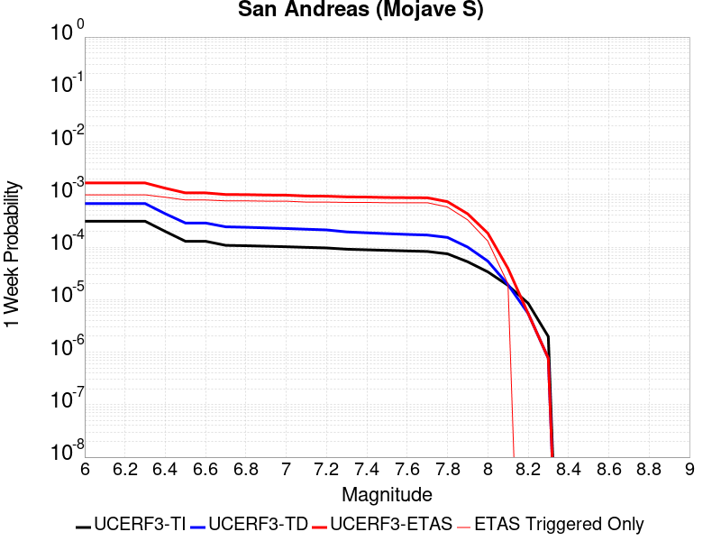 |  |  |  |

| Magnitude | 1 wk TI Prob | 1 wk TD Prob | 1 wk ETAS Prob | 1 wk ETAS/TD Gain | 1 wk ETAS Triggered Only | 1 mo TI Prob | 1 mo TD Prob | 1 mo ETAS Prob | 1 mo ETAS/TD Gain | 1 mo ETAS Triggered Only | 1 yr TI Prob | 1 yr TD Prob | 1 yr ETAS Prob | 1 yr ETAS/TD Gain | 1 yr ETAS Triggered Only | 10 yr TI Prob | 10 yr TD Prob | 10 yr ETAS Prob | 10 yr ETAS/TD Gain | 10 yr ETAS Triggered Only |
|-----|-----|-----|-----|-----|-----|-----|-----|-----|-----|-----|-----|-----|-----|-----|-----|-----|-----|-----|-----|-----|
| 6.0 | 3.1064058E-4 | 6.7460834E-4 | 0.0017351721 | 2.5721178 | 0.0010612798 | 0.0013306376 | 0.0028881032 | 0.004219994 | 1.4611646 | 0.0013357487 | 0.016080605 | 0.03462235 | 0.036795072 | 1.0627549 | 0.002250645 | 0.1496549 | 0.28660452 | 0.28862783 | 1.0070596 | 0.0028361788 |
| 6.1 | 3.1064058E-4 | 6.7460834E-4 | 0.0017351721 | 2.5721178 | 0.0010612798 | 0.0013306376 | 0.0028881032 | 0.004219994 | 1.4611646 | 0.0013357487 | 0.016080605 | 0.03462235 | 0.036795072 | 1.0627549 | 0.002250645 | 0.1496549 | 0.28660452 | 0.28862783 | 1.0070596 | 0.0028361788 |
| 6.2 | 3.1064058E-4 | 6.7460834E-4 | 0.0017351721 | 2.5721178 | 0.0010612798 | 0.0013306376 | 0.0028881032 | 0.004219994 | 1.4611646 | 0.0013357487 | 0.016080605 | 0.03462235 | 0.036795072 | 1.0627549 | 0.002250645 | 0.1496549 | 0.28660452 | 0.28862783 | 1.0070596 | 0.0028361788 |
| 6.3 | 3.1064058E-4 | 6.7460834E-4 | 0.0017351721 | 2.5721178 | 0.0010612798 | 0.0013306376 | 0.0028881032 | 0.004219994 | 1.4611646 | 0.0013357487 | 0.016080605 | 0.03462235 | 0.036795072 | 1.0627549 | 0.002250645 | 0.1496549 | 0.28660452 | 0.28862783 | 1.0070596 | 0.0028361788 |
| 6.4 | 1.9872203E-4 | 4.3179357E-4 | 0.0013828749 | 3.2026298 | 9.5149217E-4 | 8.5138786E-4 | 0.0018492596 | 0.0030546896 | 1.6518446 | 0.0012076632 | 0.010316478 | 0.02228844 | 0.02418479 | 1.0850822 | 0.0019395802 | 0.098504856 | 0.19699748 | 0.19901046 | 1.0102183 | 0.002506816 |
| 6.5 | 1.291105E-4 | 2.875267E-4 | 0.0011289893 | 3.926555 | 8.4170466E-4 | 5.5321335E-4 | 0.0012316781 | 0.002309926 | 1.87543 | 0.0010795777 | 0.006714592 | 0.0148934 | 0.016605813 | 1.1149781 | 0.0017383031 | 0.065152965 | 0.13803436 | 0.13997434 | 1.0140543 | 0.002250645 |
| 6.6 | 1.291105E-4 | 2.875267E-4 | 0.0011289893 | 3.926555 | 8.4170466E-4 | 5.5321335E-4 | 0.0012316781 | 0.002309926 | 1.87543 | 0.0010795777 | 0.006714592 | 0.0148934 | 0.016605813 | 1.1149781 | 0.0017383031 | 0.065152965 | 0.13803436 | 0.13997434 | 1.0140543 | 0.002250645 |
| 6.7 | 1.08001186E-4 | 2.4333889E-4 | 0.0010482518 | 4.3077855 | 8.051088E-4 | 4.6278012E-4 | 0.0010424647 | 0.0020660805 | 1.9819188 | 0.0010246839 | 0.0056198016 | 0.012618446 | 0.014208345 | 1.125998 | 0.0016102176 | 0.054797906 | 0.119176775 | 0.1209819 | 1.0151466 | 0.0020493679 |
| 6.8 | 1.0624356E-4 | 2.3851555E-4 | 0.0010434323 | 4.374693 | 8.051088E-4 | 4.5525006E-4 | 0.0010218095 | 0.0020454465 | 2.0017884 | 0.0010246839 | 0.0055285925 | 0.012369843 | 0.013960143 | 1.1285626 | 0.0016102176 | 0.053930566 | 0.11712591 | 0.11893525 | 1.0154477 | 0.0020493679 |
| 6.9 | 1.0393785E-4 | 2.3221898E-4 | 0.0010371408 | 4.466219 | 8.051088E-4 | 4.4537184E-4 | 9.948451E-4 | 0.0020185097 | 2.0289688 | 0.0010246839 | 0.0054089287 | 0.012045221 | 0.013617965 | 1.13057 | 0.0015919197 | 0.05279156 | 0.11442335 | 0.116222024 | 1.0157194 | 0.00203107 |
| 7.0 | 1.0155622E-4 | 2.2591476E-4 | 0.0010308416 | 4.5629673 | 8.051088E-4 | 4.3516833E-4 | 9.6784724E-4 | 0.0019915395 | 2.0577002 | 0.0010246839 | 0.005285311 | 0.0117200995 | 0.013293362 | 1.1342362 | 0.0015919197 | 0.05161361 | 0.111683756 | 0.11347173 | 1.0160093 | 0.002012772 |
| 7.1 | 9.885595E-5 | 2.1879886E-4 | 9.871436E-4 | 4.511649 | 7.6851295E-4 | 4.2359953E-4 | 9.3737274E-4 | 0.0019245346 | 2.0531156 | 9.880881E-4 | 0.0051451353 | 0.011352993 | 0.012890659 | 1.1354415 | 0.0015553238 | 0.05027629 | 0.1085682 | 0.11031352 | 1.0160757 | 0.0019578782 |
| 7.2 | 9.6411415E-5 | 2.124288E-4 | 9.807785E-4 | 4.616975 | 7.6851295E-4 | 4.1312634E-4 | 9.1009185E-4 | 0.0018972806 | 2.0847135 | 9.880881E-4 | 0.005018219 | 0.011024255 | 0.012562433 | 1.1395266 | 0.0015553238 | 0.049064007 | 0.105758004 | 0.107508816 | 1.016555 | 0.0019578782 |
| 7.3 | 9.1180635E-5 | 1.9471257E-4 | 9.6307584E-4 | 4.9461412 | 7.6851295E-4 | 3.907156E-4 | 8.342157E-4 | 0.0018214794 | 2.1834633 | 9.880881E-4 | 0.004746591 | 0.01010939 | 0.01164899 | 1.1522942 | 0.0015553238 | 0.046464786 | 0.09795115 | 0.09971725 | 1.0180304 | 0.0019578782 |
| 7.4 | 8.887388E-5 | 1.8719878E-4 | 9.5556787E-4 | 5.1045623 | 7.6851295E-4 | 3.8083247E-4 | 8.020339E-4 | 0.0017893295 | 2.23099 | 9.880881E-4 | 0.0046267817 | 0.00972114 | 0.011243224 | 1.1565746 | 0.0015370259 | 0.045316286 | 0.09458615 | 0.09634227 | 1.0185664 | 0.0019395802 |
| 7.5 | 8.6750515E-5 | 1.8051457E-4 | 9.488888E-4 | 5.256577 | 7.6851295E-4 | 3.7173493E-4 | 7.7340455E-4 | 0.0017607284 | 2.2765944 | 9.880881E-4 | 0.004516484 | 0.009375632 | 0.010898247 | 1.1624013 | 0.0015370259 | 0.04425787 | 0.091549896 | 0.093311906 | 1.0192465 | 0.0019395802 |
| 7.6 | 8.453092E-5 | 1.7439072E-4 | 9.4276964E-4 | 5.406077 | 7.6851295E-4 | 3.6222505E-4 | 7.471748E-4 | 0.0017345246 | 2.3214443 | 9.880881E-4 | 0.0044011753 | 0.009058985 | 0.010582087 | 1.1681316 | 0.0015370259 | 0.04315024 | 0.08870898 | 0.090476505 | 1.019925 | 0.0019395802 |
| 7.7 | 8.259102E-5 | 1.6961215E-4 | 9.3799474E-4 | 5.530233 | 7.6851295E-4 | 3.539135E-4 | 7.2670676E-4 | 0.0016957921 | 2.3335302 | 9.697901E-4 | 0.004300386 | 0.008811831 | 0.010317176 | 1.1708323 | 0.001518728 | 0.042181134 | 0.08645982 | 0.088198274 | 1.020107 | 0.0019029843 |
| 7.8 | 7.444844E-5 | 1.5283503E-4 | 8.4805E-4 | 5.5487933 | 6.9532124E-4 | 3.1902574E-4 | 6.548429E-4 | 0.0015325682 | 2.3403602 | 8.7830046E-4 | 0.0038772223 | 0.007943616 | 0.009323211 | 1.1736735 | 0.0013906425 | 0.03810269 | 0.078290746 | 0.07987609 | 1.0202495 | 0.0017200052 |
| 7.9 | 5.2586525E-5 | 1.00064186E-4 | 5.208744E-4 | 5.205403 | 4.2085233E-4 | 2.2535135E-4 | 4.2877605E-4 | 9.774785E-4 | 2.2796948 | 5.489378E-4 | 0.0027402006 | 0.005207864 | 0.006045185 | 1.1607802 | 8.4170466E-4 | 0.027066574 | 0.052200034 | 0.053205915 | 1.0192697 | 0.0010612798 |
| 8.0 | 3.379877E-5 | 5.4074168E-5 | 2.3704354E-4 | 4.3836746 | 1.8297927E-4 | 1.4484383E-4 | 2.3172585E-4 | 4.8783747E-4 | 2.1052353 | 2.5617098E-4 | 0.0017620471 | 0.002817614 | 0.003164295 | 1.1230407 | 3.4766062E-4 | 0.017481409 | 0.028834904 | 0.02926139 | 1.0147907 | 4.3915023E-4 |
| 8.1 | 1.8668277E-5 | 1.9309397E-5 | 3.760697E-5 | 1.9475994 | 1.8297927E-5 | 8.000444E-5 | 8.275194E-5 | 1.1934476E-4 | 1.442199 | 3.6595855E-5 | 9.736188E-4 | 0.0010070398 | 0.0010435987 | 1.0363034 | 3.6595855E-5 | 0.009693642 | 0.010798888 | 0.010853189 | 1.0050284 | 5.489378E-5 |
| 8.2 | 8.541571E-6 | 5.460819E-6 | 5.460819E-6 | 1.0 | 0.0 | 3.660622E-5 | 2.3403301E-5 | 2.3403301E-5 | 1.0 | 0.0 | 4.455896E-4 | 2.84898E-4 | 2.84898E-4 | 1.0 | 0.0 | 0.0044469717 | 0.0032408056 | 0.0032408056 | 1.0 | 0.0 |
| 8.3 | 1.983087E-6 | 7.6599065E-7 | 7.6599065E-7 | 1.0 | 0.0 | 8.498917E-6 | 3.282813E-6 | 3.282813E-6 | 1.0 | 0.0 | 1.034694E-4 | 3.9967534E-5 | 3.9967534E-5 | 1.0 | 0.0 | 0.0010342124 | 4.719687E-4 | 4.719687E-4 | 1.0 | 0.0 |

## Nelson Lake
*[(top)](#table-of-contents)*

| 1 Week | 1 Month | 1 Year | 10 Year |
|-----|-----|-----|-----|
|  |  |  |  |

| Magnitude | 1 wk TI Prob | 1 wk TD Prob | 1 wk ETAS Prob | 1 wk ETAS/TD Gain | 1 wk ETAS Triggered Only | 1 mo TI Prob | 1 mo TD Prob | 1 mo ETAS Prob | 1 mo ETAS/TD Gain | 1 mo ETAS Triggered Only | 1 yr TI Prob | 1 yr TD Prob | 1 yr ETAS Prob | 1 yr ETAS/TD Gain | 1 yr ETAS Triggered Only | 10 yr TI Prob | 10 yr TD Prob | 10 yr ETAS Prob | 10 yr ETAS/TD Gain | 10 yr ETAS Triggered Only |
|-----|-----|-----|-----|-----|-----|-----|-----|-----|-----|-----|-----|-----|-----|-----|-----|-----|-----|-----|-----|-----|
| 6.0 | 9.913453E-6 | 1.0192255E-5 | 5.774222E-4 | 56.653034 | 5.6723575E-4 | 4.2485535E-5 | 4.3680422E-5 | 8.670512E-4 | 19.84988 | 8.2340674E-4 | 5.1713863E-4 | 5.316897E-4 | 0.0020496103 | 3.8548992 | 0.001518728 | 0.0051593683 | 0.005305204 | 0.0076895156 | 1.4494288 | 0.0023970285 |
| 6.1 | 9.913453E-6 | 1.0192255E-5 | 5.774222E-4 | 56.653034 | 5.6723575E-4 | 4.2485535E-5 | 4.3680422E-5 | 8.670512E-4 | 19.84988 | 8.2340674E-4 | 5.1713863E-4 | 5.316897E-4 | 0.0020496103 | 3.8548992 | 0.001518728 | 0.0051593683 | 0.005305204 | 0.0076895156 | 1.4494288 | 0.0023970285 |
| 6.2 | 4.5596407E-6 | 4.696313E-6 | 2.9746178E-4 | 63.339424 | 2.9276684E-4 | 1.954117E-5 | 2.0126909E-5 | 3.677805E-4 | 18.273077 | 3.4766062E-4 | 2.3788778E-4 | 2.4501883E-4 | 8.4870245E-4 | 3.4638257 | 6.038316E-4 | 0.0023763329 | 0.0024476128 | 0.0034697887 | 1.4176216 | 0.0010246839 |
| 6.3 | 4.5596407E-6 | 4.696313E-6 | 2.9746178E-4 | 63.339424 | 2.9276684E-4 | 1.954117E-5 | 2.0126909E-5 | 3.677805E-4 | 18.273077 | 3.4766062E-4 | 2.3788778E-4 | 2.4501883E-4 | 8.4870245E-4 | 3.4638257 | 6.038316E-4 | 0.0023763329 | 0.0024476128 | 0.0034697887 | 1.4176216 | 0.0010246839 |
| 6.4 | 3.4025713E-6 | 3.5098972E-6 | 2.2308425E-4 | 63.558628 | 2.1957511E-4 | 1.4582367E-5 | 1.5042335E-5 | 2.7120946E-4 | 18.029745 | 2.5617098E-4 | 1.7752586E-4 | 1.8312587E-4 | 6.221957E-4 | 3.3976395 | 4.3915023E-4 | 0.001773841 | 0.0018298327 | 0.0026152038 | 1.4292037 | 7.868109E-4 |
| 6.5 | 2.8352947E-6 | 2.927856E-6 | 2.2250233E-4 | 75.99497 | 2.1957511E-4 | 1.2151207E-5 | 1.2547898E-5 | 2.6871567E-4 | 21.415192 | 2.5617098E-4 | 1.479309E-4 | 1.5276071E-4 | 5.552536E-4 | 3.6347933 | 4.025544E-4 | 0.0014783246 | 0.0015266308 | 0.0022574305 | 1.478701 | 7.319171E-4 |
| 6.6 | 2.251518E-6 | 2.3290677E-6 | 2.036058E-4 | 87.41944 | 2.012772E-4 | 9.649328E-6 | 9.981683E-6 | 2.2955461E-4 | 22.997585 | 2.1957511E-4 | 1.1747423E-4 | 1.2152085E-4 | 4.508435E-4 | 3.7100096 | 3.293627E-4 | 0.0011741214 | 0.0012146058 | 0.0017811524 | 1.466445 | 5.6723575E-4 |
| 6.7 | 1.8911853E-6 | 1.9591396E-6 | 1.11746485E-4 | 57.03855 | 1.0978756E-4 | 8.105055E-6 | 8.39629E-6 | 1.5477848E-4 | 18.434153 | 1.4638342E-4 | 9.867457E-5 | 1.0222061E-4 | 3.4006935E-4 | 3.3268178 | 2.3787304E-4 | 9.863076E-4 | 0.0010217935 | 0.0014239365 | 1.3935659 | 4.025544E-4 |
| 6.8 | 1.4874814E-6 | 1.5438305E-6 | 1.11331225E-4 | 72.11363 | 1.0978756E-4 | 6.374905E-6 | 6.6164025E-6 | 1.5299885E-4 | 23.124174 | 1.4638342E-4 | 7.76117E-5 | 8.055224E-5 | 3.1840612E-4 | 3.9527903 | 2.3787304E-4 | 7.75846E-4 | 8.0528157E-4 | 0.0011892286 | 1.476786 | 3.8425648E-4 |
| 6.9 | 6.835972E-7 | 7.1399285E-7 | 5.5607736E-5 | 77.88277 | 5.489378E-5 | 2.9296991E-6 | 3.0599674E-6 | 7.6251454E-5 | 24.91904 | 7.319171E-5 | 3.56685E-5 | 3.7254784E-5 | 1.4703826E-4 | 3.9468286 | 1.0978756E-4 | 3.5662777E-4 | 3.7251666E-4 | 5.0055445E-4 | 1.3437102 | 1.2808549E-4 |

## Death Valley (So)
*[(top)](#table-of-contents)*

| 1 Week | 1 Month | 1 Year | 10 Year |
|-----|-----|-----|-----|
|  |  |  |  |

| Magnitude | 1 wk TI Prob | 1 wk TD Prob | 1 wk ETAS Prob | 1 wk ETAS/TD Gain | 1 wk ETAS Triggered Only | 1 mo TI Prob | 1 mo TD Prob | 1 mo ETAS Prob | 1 mo ETAS/TD Gain | 1 mo ETAS Triggered Only | 1 yr TI Prob | 1 yr TD Prob | 1 yr ETAS Prob | 1 yr ETAS/TD Gain | 1 yr ETAS Triggered Only | 10 yr TI Prob | 10 yr TD Prob | 10 yr ETAS Prob | 10 yr ETAS/TD Gain | 10 yr ETAS Triggered Only |
|-----|-----|-----|-----|-----|-----|-----|-----|-----|-----|-----|-----|-----|-----|-----|-----|-----|-----|-----|-----|-----|
| 6.0 | 2.0684236E-5 | 2.5617775E-5 | 6.4773136E-4 | 25.284449 | 6.2212953E-4 | 8.864371E-5 | 1.0978594E-4 | 9.879901E-4 | 8.99924 | 8.7830046E-4 | 0.0010787029 | 0.0013358411 | 0.0029256342 | 2.1901064 | 0.0015919197 | 0.010734817 | 0.013281397 | 0.015845193 | 1.1930367 | 0.0025983057 |
| 6.1 | 2.0684236E-5 | 2.5617775E-5 | 6.4773136E-4 | 25.284449 | 6.2212953E-4 | 8.864371E-5 | 1.0978594E-4 | 9.879901E-4 | 8.99924 | 8.7830046E-4 | 0.0010787029 | 0.0013358411 | 0.0029256342 | 2.1901064 | 0.0015919197 | 0.010734817 | 0.013281397 | 0.015845193 | 1.1930367 | 0.0025983057 |
| 6.2 | 2.0684236E-5 | 2.5617775E-5 | 6.4773136E-4 | 25.284449 | 6.2212953E-4 | 8.864371E-5 | 1.0978594E-4 | 9.879901E-4 | 8.99924 | 8.7830046E-4 | 0.0010787029 | 0.0013358411 | 0.0029256342 | 2.1901064 | 0.0015919197 | 0.010734817 | 0.013281397 | 0.015845193 | 1.1930367 | 0.0025983057 |
| 6.3 | 2.0240292E-5 | 2.511786E-5 | 6.289343E-4 | 25.039326 | 6.038316E-4 | 8.6741224E-5 | 1.07643624E-4 | 9.6755364E-4 | 8.988489 | 8.600026E-4 | 0.0010555626 | 0.00130979 | 0.0028813507 | 2.199857 | 0.0015736218 | 0.010505628 | 0.013023956 | 0.015498123 | 1.1899705 | 0.002506816 |
| 6.4 | 2.0240292E-5 | 2.511786E-5 | 6.289343E-4 | 25.039326 | 6.038316E-4 | 8.6741224E-5 | 1.07643624E-4 | 9.6755364E-4 | 8.988489 | 8.600026E-4 | 0.0010555626 | 0.00130979 | 0.0028813507 | 2.199857 | 0.0015736218 | 0.010505628 | 0.013023956 | 0.015498123 | 1.1899705 | 0.002506816 |
| 6.5 | 1.9962767E-5 | 2.4807114E-5 | 6.286237E-4 | 25.340462 | 6.038316E-4 | 8.55519E-5 | 1.0631196E-4 | 9.662231E-4 | 9.088564 | 8.600026E-4 | 0.0010410968 | 0.0012935963 | 0.0028286339 | 2.1866434 | 0.0015370259 | 0.010362327 | 0.012863902 | 0.015248158 | 1.1853447 | 0.0024153264 |
| 6.6 | 1.8937297E-5 | 2.3310964E-5 | 5.7223596E-4 | 24.547932 | 5.489378E-4 | 8.115732E-5 | 9.990039E-5 | 8.8663265E-4 | 8.875167 | 7.868109E-4 | 9.876423E-4 | 0.0012156231 | 0.0025862993 | 2.1275504 | 0.0013723446 | 0.009832645 | 0.012092789 | 0.014280064 | 1.1808743 | 0.0022140492 |
| 6.7 | 1.8621096E-5 | 2.2911607E-5 | 5.535393E-4 | 24.159779 | 5.306399E-4 | 7.980225E-5 | 9.818898E-5 | 8.483303E-4 | 8.6397705 | 7.50215E-4 | 9.711593E-4 | 0.0011948098 | 0.0024924104 | 2.086031 | 0.0012991528 | 0.009669261 | 0.011886904 | 0.013984233 | 1.1764402 | 0.0021225596 |
| 6.8 | 1.7830353E-5 | 2.1805688E-5 | 5.341365E-4 | 24.495281 | 5.1234197E-4 | 7.641356E-5 | 9.344968E-5 | 7.8870595E-4 | 8.439899 | 6.9532124E-4 | 9.29938E-4 | 0.00113717 | 0.00234346 | 2.0607822 | 0.0012076632 | 0.009260561 | 0.011316354 | 0.013252077 | 1.1710553 | 0.0019578782 |
| 6.9 | 1.3135183E-5 | 1.5303925E-5 | 4.1785216E-4 | 27.303595 | 4.025544E-4 | 5.6292425E-5 | 6.558664E-5 | 6.1448844E-4 | 9.36911 | 5.489378E-4 | 6.8514474E-4 | 7.982312E-4 | 0.0017123973 | 2.1452396 | 9.148963E-4 | 0.006830362 | 0.007954649 | 0.009243467 | 1.1620208 | 0.0012991528 |
| 7.0 | 1.1507512E-5 | 1.3154199E-5 | 2.8761948E-4 | 21.865223 | 2.744689E-4 | 4.9316975E-5 | 5.6373956E-5 | 4.4060877E-4 | 7.815821 | 3.8425648E-4 | 6.002687E-4 | 6.8614254E-4 | 0.0013261306 | 1.9327333 | 6.4042746E-4 | 0.0059864987 | 0.0068409415 | 0.0077314065 | 1.130167 | 8.965984E-4 |
| 7.1 | 9.715903E-6 | 1.0865278E-5 | 8.405619E-5 | 7.736221 | 7.319171E-5 | 4.1638916E-5 | 4.656467E-5 | 1.746442E-4 | 3.750573 | 1.2808549E-4 | 5.068359E-4 | 5.667817E-4 | 7.862323E-4 | 1.3871874 | 2.1957511E-4 | 0.0050568148 | 0.0056538144 | 0.0059995097 | 1.0611436 | 3.4766062E-4 |
| 7.2 | 9.233269E-6 | 1.02863105E-5 | 6.517953E-5 | 6.336531 | 5.489378E-5 | 3.9570554E-5 | 4.4083466E-5 | 1.1727195E-4 | 2.6602252 | 7.319171E-5 | 4.81665E-4 | 5.3658825E-4 | 6.463169E-4 | 1.2044932 | 1.0978756E-4 | 0.0048062233 | 0.0053533576 | 0.0055171573 | 1.0305976 | 1.6468135E-4 |
| 7.3 | 8.8041315E-6 | 9.808164E-6 | 6.470141E-5 | 6.5966887 | 5.489378E-5 | 3.7731446E-5 | 4.2034335E-5 | 1.1522297E-4 | 2.741163 | 7.319171E-5 | 4.592835E-4 | 5.1165203E-4 | 5.848063E-4 | 1.1429765 | 7.319171E-5 | 0.0045833546 | 0.005105167 | 0.0052325986 | 1.0249614 | 1.2808549E-4 |
| 7.4 | 8.708749E-6 | 9.707175E-6 | 6.460042E-5 | 6.654915 | 5.489378E-5 | 3.7322676E-5 | 4.160154E-5 | 1.147902E-4 | 2.7592778 | 7.319171E-5 | 4.5430884E-4 | 5.0638523E-4 | 5.7953986E-4 | 1.1444644 | 7.319171E-5 | 0.004533812 | 0.0050527398 | 0.0051801777 | 1.0252216 | 1.2808549E-4 |
| 7.5 | 8.612678E-6 | 9.604817E-6 | 6.449807E-5 | 6.7151794 | 5.489378E-5 | 3.6910955E-5 | 4.1162875E-5 | 1.1435157E-4 | 2.7780268 | 7.319171E-5 | 4.492982E-4 | 5.01047E-4 | 5.7420204E-4 | 1.1460043 | 7.319171E-5 | 0.004483909 | 0.0049995985 | 0.005127044 | 1.0254911 | 1.2808549E-4 |
| 7.6 | 8.319024E-6 | 9.283916E-6 | 2.7581673E-5 | 2.9709094 | 1.8297927E-5 | 3.5652476E-5 | 3.978763E-5 | 7.638203E-5 | 1.9197431 | 3.6595855E-5 | 4.3398244E-4 | 4.8431093E-4 | 5.2088907E-4 | 1.0755261 | 3.6595855E-5 | 0.0043313587 | 0.0048329784 | 0.004924026 | 1.0188388 | 9.148964E-5 |
| 7.7 | 7.4718328E-6 | 8.34517E-6 | 8.34517E-6 | 1.0 | 0.0 | 3.2021748E-5 | 3.5764548E-5 | 5.406182E-5 | 1.5116037 | 1.8297927E-5 | 3.8979502E-4 | 4.353504E-4 | 4.5364036E-4 | 1.0420121 | 1.8297927E-5 | 0.00389112 | 0.0043453807 | 0.0044182544 | 1.0167704 | 7.319171E-5 |
| 7.8 | 3.4586725E-7 | 3.6482615E-7 | 3.6482615E-7 | 1.0 | 0.0 | 1.4822873E-6 | 1.5635396E-6 | 1.5635396E-6 | 1.0 | 0.0 | 1.80467E-5 | 1.9035933E-5 | 1.9035933E-5 | 1.0 | 0.0 | 1.8045233E-4 | 1.9034347E-4 | 1.9034347E-4 | 1.0 | 0.0 |
| 7.9 | 2.5591178E-9 | 2.6696718E-9 | 2.6696718E-9 | 1.0 | 0.0 | 1.0967647E-8 | 1.14414505E-8 | 1.14414505E-8 | 1.0 | 0.0 | 1.335311E-7 | 1.3929966E-7 | 1.3929966E-7 | 1.0 | 0.0 | 1.3353102E-6 | 1.3929966E-6 | 1.3929966E-6 | 1.0 | 0.0 |

## San Andreas (Mojave N)
*[(top)](#table-of-contents)*

| 1 Week | 1 Month | 1 Year | 10 Year |
|-----|-----|-----|-----|
|  |  | 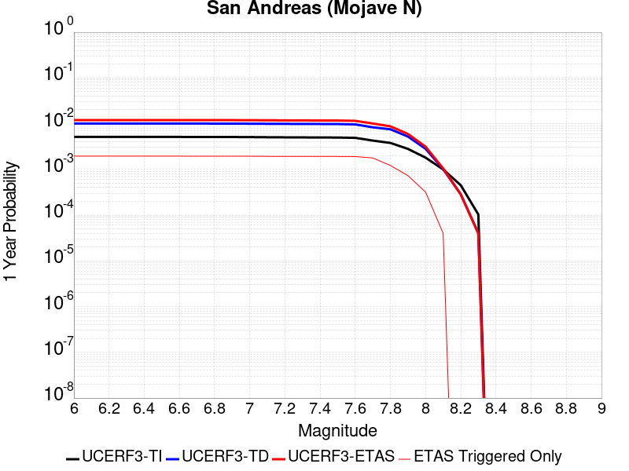 |  |

| Magnitude | 1 wk TI Prob | 1 wk TD Prob | 1 wk ETAS Prob | 1 wk ETAS/TD Gain | 1 wk ETAS Triggered Only | 1 mo TI Prob | 1 mo TD Prob | 1 mo ETAS Prob | 1 mo ETAS/TD Gain | 1 mo ETAS Triggered Only | 1 yr TI Prob | 1 yr TD Prob | 1 yr ETAS Prob | 1 yr ETAS/TD Gain | 1 yr ETAS Triggered Only | 10 yr TI Prob | 10 yr TD Prob | 10 yr ETAS Prob | 10 yr ETAS/TD Gain | 10 yr ETAS Triggered Only |
|-----|-----|-----|-----|-----|-----|-----|-----|-----|-----|-----|-----|-----|-----|-----|-----|-----|-----|-----|-----|-----|
| 6.0 | 9.877682E-5 | 1.9400702E-4 | 0.0012184922 | 6.28066 | 0.0010246839 | 4.2326056E-4 | 8.311939E-4 | 0.0021475495 | 2.5836926 | 0.0013174508 | 0.0051410277 | 0.010072956 | 0.012011113 | 1.1924119 | 0.0019578782 | 0.05023708 | 0.09831428 | 0.10052514 | 1.0224878 | 0.0024519223 |
| 6.1 | 9.877682E-5 | 1.9400702E-4 | 0.0012184922 | 6.28066 | 0.0010246839 | 4.2326056E-4 | 8.311939E-4 | 0.0021475495 | 2.5836926 | 0.0013174508 | 0.0051410277 | 0.010072956 | 0.012011113 | 1.1924119 | 0.0019578782 | 0.05023708 | 0.09831428 | 0.10052514 | 1.0224878 | 0.0024519223 |
| 6.2 | 9.877682E-5 | 1.9400702E-4 | 0.0012184922 | 6.28066 | 0.0010246839 | 4.2326056E-4 | 8.311939E-4 | 0.0021475495 | 2.5836926 | 0.0013174508 | 0.0051410277 | 0.010072956 | 0.012011113 | 1.1924119 | 0.0019578782 | 0.05023708 | 0.09831428 | 0.10052514 | 1.0224878 | 0.0024519223 |
| 6.3 | 9.877682E-5 | 1.9400702E-4 | 0.0012184922 | 6.28066 | 0.0010246839 | 4.2326056E-4 | 8.311939E-4 | 0.0021475495 | 2.5836926 | 0.0013174508 | 0.0051410277 | 0.010072956 | 0.012011113 | 1.1924119 | 0.0019578782 | 0.05023708 | 0.09831428 | 0.10052514 | 1.0224878 | 0.0024519223 |
| 6.4 | 9.877682E-5 | 1.9400702E-4 | 0.0012184922 | 6.28066 | 0.0010246839 | 4.2326056E-4 | 8.311939E-4 | 0.0021475495 | 2.5836926 | 0.0013174508 | 0.0051410277 | 0.010072956 | 0.012011113 | 1.1924119 | 0.0019578782 | 0.05023708 | 0.09831428 | 0.10052514 | 1.0224878 | 0.0024519223 |
| 6.5 | 9.861474E-5 | 1.9374468E-4 | 0.0012182301 | 6.2878118 | 0.0010246839 | 4.2256617E-4 | 8.300703E-4 | 0.0021464275 | 2.585838 | 0.0013174508 | 0.0051326132 | 0.010059402 | 0.011997586 | 1.1926738 | 0.0019578782 | 0.050156746 | 0.098192066 | 0.100403234 | 1.0225188 | 0.0024519223 |
| 6.6 | 9.861474E-5 | 1.9374468E-4 | 0.0012182301 | 6.2878118 | 0.0010246839 | 4.2256617E-4 | 8.300703E-4 | 0.0021464275 | 2.585838 | 0.0013174508 | 0.0051326132 | 0.010059402 | 0.011997586 | 1.1926738 | 0.0019578782 | 0.050156746 | 0.098192066 | 0.100403234 | 1.0225188 | 0.0024519223 |
| 6.7 | 9.8552715E-5 | 1.9364421E-4 | 0.0012181296 | 6.2905555 | 0.0010246839 | 4.223004E-4 | 8.2964E-4 | 0.0021459977 | 2.5866613 | 0.0013174508 | 0.0051293927 | 0.010054212 | 0.011992405 | 1.1927743 | 0.0019578782 | 0.050125998 | 0.098145254 | 0.100356534 | 1.0225307 | 0.0024519223 |
| 6.8 | 9.8464974E-5 | 1.9349584E-4 | 0.0012179815 | 6.2946134 | 0.0010246839 | 4.219245E-4 | 8.290045E-4 | 0.002145363 | 2.5878787 | 0.0013174508 | 0.0051248376 | 0.010046546 | 0.011984755 | 1.1929228 | 0.0019578782 | 0.05008251 | 0.09807528 | 0.10028673 | 1.0225484 | 0.0024519223 |
| 6.9 | 9.825824E-5 | 1.9317595E-4 | 0.0012176619 | 6.303383 | 0.0010246839 | 4.2103877E-4 | 8.276344E-4 | 0.0021439947 | 2.5905094 | 0.0013174508 | 0.0051141046 | 0.010030019 | 0.01196826 | 1.193244 | 0.0019578782 | 0.049980022 | 0.09792438 | 0.1001362 | 1.0225871 | 0.0024519223 |
| 7.0 | 9.781462E-5 | 1.924896E-4 | 0.0012169763 | 6.322296 | 0.0010246839 | 4.1913814E-4 | 8.246948E-4 | 0.0021410591 | 2.5961835 | 0.0013174508 | 0.005091073 | 0.009994558 | 0.0119328685 | 1.1939366 | 0.0019578782 | 0.04976007 | 0.09760077 | 0.09981339 | 1.02267 | 0.0024519223 |
| 7.1 | 9.7121134E-5 | 1.9150671E-4 | 0.0012159944 | 6.3496175 | 0.0010246839 | 4.1616702E-4 | 8.204851E-4 | 0.002136855 | 2.60438 | 0.0013174508 | 0.005055068 | 0.009943774 | 0.011882184 | 1.194937 | 0.0019578782 | 0.04941613 | 0.09713728 | 0.09933451 | 1.0226198 | 0.0024336244 |
| 7.2 | 9.663819E-5 | 1.9081456E-4 | 0.001215303 | 6.369026 | 0.0010246839 | 4.1409794E-4 | 8.175206E-4 | 0.0021338942 | 2.6102026 | 0.0013174508 | 0.0050299936 | 0.00990801 | 0.01184649 | 1.1956477 | 0.0019578782 | 0.049176537 | 0.09681055 | 0.09900857 | 1.0227044 | 0.0024336244 |
| 7.3 | 9.6277574E-5 | 1.9033969E-4 | 0.0012148286 | 6.3824234 | 0.0010246839 | 4.125529E-4 | 8.154867E-4 | 0.002131863 | 2.6142218 | 0.0013174508 | 0.0050112694 | 0.009883473 | 0.011822 | 1.1961383 | 0.0019578782 | 0.04899759 | 0.09658401 | 0.098782584 | 1.0227634 | 0.0024336244 |
| 7.4 | 9.593308E-5 | 1.897375E-4 | 0.0012142269 | 6.3995094 | 0.0010246839 | 4.1107697E-4 | 8.129075E-4 | 0.0021292872 | 2.6193476 | 0.0013174508 | 0.0049933824 | 0.009852355 | 0.011790944 | 1.196764 | 0.0019578782 | 0.04882661 | 0.09630218 | 0.098501444 | 1.022837 | 0.0024336244 |
| 7.5 | 9.561707E-5 | 1.8919831E-4 | 0.0012136884 | 6.4149003 | 0.0010246839 | 4.0972308E-4 | 8.1059814E-4 | 0.002126981 | 2.6239648 | 0.0013174508 | 0.0049769743 | 0.009824493 | 0.011763136 | 1.1973275 | 0.0019578782 | 0.048669744 | 0.09604836 | 0.09824824 | 1.0229039 | 0.0024336244 |
| 7.6 | 9.418194E-5 | 1.8572104E-4 | 0.0012102147 | 6.516303 | 0.0010246839 | 4.0357444E-4 | 7.957047E-4 | 0.0021121071 | 2.6543856 | 0.0013174508 | 0.004902454 | 0.009644784 | 0.011583779 | 1.2010407 | 0.0019578782 | 0.047957025 | 0.094430685 | 0.0966345 | 1.023338 | 0.0024336244 |
| 7.7 | 8.202141E-5 | 1.6021315E-4 | 0.0011481429 | 7.166346 | 9.880881E-4 | 3.51473E-4 | 6.8644714E-4 | 0.0019298521 | 2.811363 | 0.0012442591 | 0.00427079 | 0.008325525 | 0.010158229 | 1.2201308 | 0.0018480906 | 0.04189639 | 0.08223219 | 0.08429776 | 1.0251187 | 0.002250645 |
| 7.8 | 7.2859846E-5 | 1.4516473E-4 | 8.40385E-4 | 5.789182 | 6.9532124E-4 | 3.1221908E-4 | 6.219862E-4 | 0.0014997404 | 2.4112117 | 8.7830046E-4 | 0.003794643 | 0.0075464295 | 0.008908418 | 1.1804812 | 0.0013723446 | 0.037304975 | 0.07472468 | 0.07629923 | 1.0210713 | 0.0017017073 |
| 7.9 | 5.3874453E-5 | 1.0045676E-4 | 5.212668E-4 | 5.1889668 | 4.2085233E-4 | 2.3087008E-4 | 4.3045796E-4 | 9.791595E-4 | 2.2746925 | 5.489378E-4 | 0.0028072202 | 0.0052282433 | 0.006065547 | 1.1601502 | 8.4170466E-4 | 0.02772022 | 0.05242443 | 0.053430073 | 1.0191827 | 0.0010612798 |
| 8.0 | 3.468538E-5 | 5.4260272E-5 | 2.3722961E-4 | 4.3720684 | 1.8297927E-4 | 1.4864317E-4 | 2.325233E-4 | 4.886347E-4 | 2.101444 | 2.5617098E-4 | 0.0018082283 | 0.002827298 | 0.0031739755 | 1.1226181 | 3.4766062E-4 | 0.017935853 | 0.028947512 | 0.02937395 | 1.0147314 | 4.3915023E-4 |
| 8.1 | 1.9152367E-5 | 1.940263E-5 | 3.7700203E-5 | 1.943046 | 1.8297927E-5 | 8.207899E-5 | 8.3151484E-5 | 1.1974429E-4 | 1.4400741 | 3.6595855E-5 | 9.988535E-4 | 0.0010118998 | 0.0010484586 | 1.0361289 | 3.6595855E-5 | 0.009943757 | 0.01085625 | 0.010910548 | 1.0050015 | 5.489378E-5 |
| 8.2 | 8.643924E-6 | 5.4748625E-6 | 5.4748625E-6 | 1.0 | 0.0 | 3.704486E-5 | 2.3463486E-5 | 2.3463486E-5 | 1.0 | 0.0 | 4.5092785E-4 | 2.8563058E-4 | 2.8563058E-4 | 1.0 | 0.0 | 0.0045001395 | 0.0032487072 | 0.0032487072 | 1.0 | 0.0 |
| 8.3 | 1.983087E-6 | 7.6599065E-7 | 7.6599065E-7 | 1.0 | 0.0 | 8.498917E-6 | 3.282813E-6 | 3.282813E-6 | 1.0 | 0.0 | 1.034694E-4 | 3.9967534E-5 | 3.9967534E-5 | 1.0 | 0.0 | 0.0010342124 | 4.719687E-4 | 4.719687E-4 | 1.0 | 0.0 |

## Lenwood-Lockhart-Old Woman Springs
*[(top)](#table-of-contents)*

| 1 Week | 1 Month | 1 Year | 10 Year |
|-----|-----|-----|-----|
|  |  |  |  |

| Magnitude | 1 wk TI Prob | 1 wk TD Prob | 1 wk ETAS Prob | 1 wk ETAS/TD Gain | 1 wk ETAS Triggered Only | 1 mo TI Prob | 1 mo TD Prob | 1 mo ETAS Prob | 1 mo ETAS/TD Gain | 1 mo ETAS Triggered Only | 1 yr TI Prob | 1 yr TD Prob | 1 yr ETAS Prob | 1 yr ETAS/TD Gain | 1 yr ETAS Triggered Only | 10 yr TI Prob | 10 yr TD Prob | 10 yr ETAS Prob | 10 yr ETAS/TD Gain | 10 yr ETAS Triggered Only |
|-----|-----|-----|-----|-----|-----|-----|-----|-----|-----|-----|-----|-----|-----|-----|-----|-----|-----|-----|-----|-----|
| 6.0 | 3.744542E-5 | 4.396252E-5 | 6.843618E-4 | 15.566937 | 6.4042746E-4 | 1.604705E-4 | 1.8839816E-4 | 0.0010848277 | 5.758165 | 8.965984E-4 | 0.0019519776 | 0.0022915069 | 0.0036972186 | 1.6134443 | 0.0014089404 | 0.019349206 | 0.022696787 | 0.02489635 | 1.0969107 | 0.002250645 |
| 6.1 | 3.744542E-5 | 4.396252E-5 | 6.843618E-4 | 15.566937 | 6.4042746E-4 | 1.604705E-4 | 1.8839816E-4 | 0.0010848277 | 5.758165 | 8.965984E-4 | 0.0019519776 | 0.0022915069 | 0.0036972186 | 1.6134443 | 0.0014089404 | 0.019349206 | 0.022696787 | 0.02489635 | 1.0969107 | 0.002250645 |
| 6.2 | 3.744542E-5 | 4.396252E-5 | 6.843618E-4 | 15.566937 | 6.4042746E-4 | 1.604705E-4 | 1.8839816E-4 | 0.0010848277 | 5.758165 | 8.965984E-4 | 0.0019519776 | 0.0022915069 | 0.0036972186 | 1.6134443 | 0.0014089404 | 0.019349206 | 0.022696787 | 0.02489635 | 1.0969107 | 0.002250645 |
| 6.3 | 2.1079984E-5 | 2.5353434E-5 | 2.44923E-4 | 9.660348 | 2.1957511E-4 | 9.0339665E-5 | 1.0865316E-4 | 4.928679E-4 | 4.5361576 | 3.8425648E-4 | 0.0010993304 | 0.0013220694 | 0.0018702815 | 1.4146621 | 5.489378E-4 | 0.010939079 | 0.0131442575 | 0.013956841 | 1.0618204 | 8.2340674E-4 |
| 6.4 | 2.1079984E-5 | 2.5353434E-5 | 2.44923E-4 | 9.660348 | 2.1957511E-4 | 9.0339665E-5 | 1.0865316E-4 | 4.928679E-4 | 4.5361576 | 3.8425648E-4 | 0.0010993304 | 0.0013220694 | 0.0018702815 | 1.4146621 | 5.489378E-4 | 0.010939079 | 0.0131442575 | 0.013956841 | 1.0618204 | 8.2340674E-4 |
| 6.5 | 1.7397282E-5 | 2.066241E-5 | 1.670428E-4 | 8.084381 | 1.4638342E-4 | 7.455765E-5 | 8.8550245E-5 | 3.8129115E-4 | 4.3059297 | 2.9276684E-4 | 9.073613E-4 | 0.0010775778 | 0.0015162549 | 1.4070954 | 4.3915023E-4 | 0.009036654 | 0.010724821 | 0.01135838 | 1.059074 | 6.4042746E-4 |
| 6.6 | 1.52050325E-5 | 1.7679693E-5 | 1.4576291E-4 | 8.244652 | 1.2808549E-4 | 6.51628E-5 | 7.576796E-5 | 3.13623E-4 | 4.139256 | 2.3787304E-4 | 7.9306826E-4 | 9.220924E-4 | 0.0012694325 | 1.3766868 | 3.4766062E-4 | 0.007902439 | 0.009183526 | 0.009691163 | 1.0552769 | 5.1234197E-4 |
| 6.7 | 1.332523E-5 | 1.5264002E-5 | 1.2504989E-4 | 8.192471 | 1.0978756E-4 | 5.7106878E-5 | 6.5415545E-5 | 2.6667956E-4 | 4.0767 | 2.012772E-4 | 6.950544E-4 | 7.961491E-4 | 0.0010703995 | 1.3444711 | 2.744689E-4 | 0.006928845 | 0.007933599 | 0.008314807 | 1.0480498 | 3.8425648E-4 |
| 6.8 | 1.1525329E-5 | 1.3030979E-5 | 6.792405E-5 | 5.212505 | 5.489378E-5 | 4.9393333E-5 | 5.584588E-5 | 1.8392422E-4 | 3.2934248 | 1.2808549E-4 | 6.011979E-4 | 6.797157E-4 | 8.808561E-4 | 1.2959183 | 2.012772E-4 | 0.00599574 | 0.006776819 | 0.007067602 | 1.0429084 | 2.9276684E-4 |
| 6.9 | 1.0253909E-5 | 1.15144385E-5 | 2.9812156E-5 | 2.5891106 | 1.8297927E-5 | 4.3944583E-5 | 4.9346683E-5 | 1.2253478E-4 | 2.4831412 | 7.319171E-5 | 5.3489394E-4 | 6.0063385E-4 | 7.469293E-4 | 1.2435685 | 1.4638342E-4 | 0.0053360825 | 0.0059904843 | 0.006208744 | 1.0364344 | 2.1957511E-4 |
| 7.0 | 8.104563E-6 | 8.991279E-6 | 2.7289041E-5 | 3.0350566 | 1.8297927E-5 | 3.4733377E-5 | 3.8533497E-5 | 1.1172239E-4 | 2.8993576 | 7.319171E-5 | 4.2279682E-4 | 4.6904673E-4 | 5.970722E-4 | 1.272948 | 1.2808549E-4 | 0.0042199334 | 0.0046808156 | 0.0048629385 | 1.0389084 | 1.8297927E-4 |
| 7.1 | 6.7986157E-6 | 7.515816E-6 | 7.515816E-6 | 1.0 | 0.0 | 2.91366E-5 | 3.2210253E-5 | 6.8804926E-5 | 2.136119 | 3.6595855E-5 | 3.5468035E-4 | 3.920914E-4 | 4.6525442E-4 | 1.1865969 | 7.319171E-5 | 0.003541148 | 0.003914213 | 0.0040235706 | 1.0279386 | 1.0978756E-4 |
| 7.2 | 5.6893327E-6 | 6.2800136E-6 | 6.2800136E-6 | 1.0 | 0.0 | 2.4382627E-5 | 2.6914078E-5 | 4.5211513E-5 | 1.6798462 | 1.8297927E-5 | 2.9681803E-4 | 3.2763163E-4 | 3.8250742E-4 | 1.1674924 | 5.489378E-5 | 0.002964219 | 0.0032716845 | 0.003362875 | 1.0278726 | 9.148964E-5 |
| 7.3 | 4.253348E-6 | 4.7069107E-6 | 4.7069107E-6 | 1.0 | 0.0 | 1.8228506E-5 | 2.0172329E-5 | 3.8469887E-5 | 1.9070623 | 1.8297927E-5 | 2.2190946E-4 | 2.4557224E-4 | 3.0045255E-4 | 1.2234793 | 5.489378E-5 | 0.00221688 | 0.0024531898 | 0.002544455 | 1.0372027 | 9.148964E-5 |
| 7.4 | 2.5448119E-6 | 2.852045E-6 | 2.852045E-6 | 1.0 | 0.0 | 1.0906291E-5 | 1.2223002E-5 | 1.2223002E-5 | 1.0 | 0.0 | 1.3277601E-4 | 1.4880655E-4 | 1.6710174E-4 | 1.1229463 | 1.8297927E-5 | 0.001326967 | 0.0014872311 | 0.0015055019 | 1.012285 | 1.8297927E-5 |
| 7.5 | 4.3706837E-8 | 4.562909E-8 | 4.562909E-8 | 1.0 | 0.0 | 1.8731501E-7 | 1.9555324E-7 | 1.9555324E-7 | 1.0 | 0.0 | 2.2805577E-6 | 2.3808586E-6 | 2.3808586E-6 | 1.0 | 0.0 | 2.2805343E-5 | 2.3808387E-5 | 2.3808387E-5 | 1.0 | 0.0 |

## Towne Pass
*[(top)](#table-of-contents)*

| 1 Week | 1 Month | 1 Year | 10 Year |
|-----|-----|-----|-----|
|  |  |  |  |

| Magnitude | 1 wk TI Prob | 1 wk TD Prob | 1 wk ETAS Prob | 1 wk ETAS/TD Gain | 1 wk ETAS Triggered Only | 1 mo TI Prob | 1 mo TD Prob | 1 mo ETAS Prob | 1 mo ETAS/TD Gain | 1 mo ETAS Triggered Only | 1 yr TI Prob | 1 yr TD Prob | 1 yr ETAS Prob | 1 yr ETAS/TD Gain | 1 yr ETAS Triggered Only | 10 yr TI Prob | 10 yr TD Prob | 10 yr ETAS Prob | 10 yr ETAS/TD Gain | 10 yr ETAS Triggered Only |
|-----|-----|-----|-----|-----|-----|-----|-----|-----|-----|-----|-----|-----|-----|-----|-----|-----|-----|-----|-----|-----|
| 6.0 | 3.849728E-6 | 3.8945414E-6 | 4.0644736E-4 | 104.36334 | 4.025544E-4 | 1.649873E-5 | 1.669081E-5 | 5.839171E-4 | 34.98435 | 5.6723575E-4 | 2.0085352E-4 | 2.0319603E-4 | 0.0013557312 | 6.6720357 | 0.0011527694 | 0.0020067208 | 0.0020305314 | 0.004313128 | 2.1241374 | 0.002287241 |
| 6.1 | 3.849728E-6 | 3.8945414E-6 | 4.0644736E-4 | 104.36334 | 4.025544E-4 | 1.649873E-5 | 1.669081E-5 | 5.839171E-4 | 34.98435 | 5.6723575E-4 | 2.0085352E-4 | 2.0319603E-4 | 0.0013557312 | 6.6720357 | 0.0011527694 | 0.0020067208 | 0.0020305314 | 0.004313128 | 2.1241374 | 0.002287241 |
| 6.2 | 3.849728E-6 | 3.8945414E-6 | 4.0644736E-4 | 104.36334 | 4.025544E-4 | 1.649873E-5 | 1.669081E-5 | 5.839171E-4 | 34.98435 | 5.6723575E-4 | 2.0085352E-4 | 2.0319603E-4 | 0.0013557312 | 6.6720357 | 0.0011527694 | 0.0020067208 | 0.0020305314 | 0.004313128 | 2.1241374 | 0.002287241 |
| 6.3 | 3.849728E-6 | 3.8945414E-6 | 4.0644736E-4 | 104.36334 | 4.025544E-4 | 1.649873E-5 | 1.669081E-5 | 5.839171E-4 | 34.98435 | 5.6723575E-4 | 2.0085352E-4 | 2.0319603E-4 | 0.0013557312 | 6.6720357 | 0.0011527694 | 0.0020067208 | 0.0020305314 | 0.004313128 | 2.1241374 | 0.002287241 |
| 6.4 | 3.849728E-6 | 3.8945414E-6 | 4.0644736E-4 | 104.36334 | 4.025544E-4 | 1.649873E-5 | 1.669081E-5 | 5.839171E-4 | 34.98435 | 5.6723575E-4 | 2.0085352E-4 | 2.0319603E-4 | 0.0013557312 | 6.6720357 | 0.0011527694 | 0.0020067208 | 0.0020305314 | 0.004313128 | 2.1241374 | 0.002287241 |
| 6.5 | 1.1953545E-6 | 1.203052E-6 | 1.475863E-4 | 122.67657 | 1.4638342E-4 | 5.1229376E-6 | 5.1559277E-6 | 1.8813425E-4 | 36.488922 | 1.8297927E-4 | 6.236998E-5 | 6.277173E-5 | 3.372234E-4 | 5.3722177 | 2.744689E-4 | 6.235248E-4 | 6.275517E-4 | 0.0011395721 | 1.8159015 | 5.1234197E-4 |
| 6.6 | 1.1953545E-6 | 1.203052E-6 | 1.475863E-4 | 122.67657 | 1.4638342E-4 | 5.1229376E-6 | 5.1559277E-6 | 1.8813425E-4 | 36.488922 | 1.8297927E-4 | 6.236998E-5 | 6.277173E-5 | 3.372234E-4 | 5.3722177 | 2.744689E-4 | 6.235248E-4 | 6.275517E-4 | 0.0011395721 | 1.8159015 | 5.1234197E-4 |
| 6.7 | 8.375951E-7 | 8.4106705E-7 | 5.5734803E-5 | 66.26678 | 5.489378E-5 | 3.5896885E-6 | 3.6045683E-6 | 7.6796015E-5 | 21.30519 | 7.319171E-5 | 4.370358E-5 | 4.3884793E-5 | 1.5366754E-4 | 3.5016124 | 1.0978756E-4 | 4.3694986E-4 | 4.38767E-4 | 7.1311544E-4 | 1.6252714 | 2.744689E-4 |
| 6.8 | 6.38041E-7 | 6.392156E-7 | 6.392156E-7 | 1.0 | 0.0 | 2.7344586E-6 | 2.7394929E-6 | 2.103737E-5 | 7.679293 | 1.8297927E-5 | 3.3291526E-5 | 3.3352855E-5 | 8.824481E-5 | 2.6457946 | 5.489378E-5 | 3.3286537E-4 | 3.334823E-4 | 4.798169E-4 | 1.4388077 | 1.4638342E-4 |
| 6.9 | 5.3460053E-7 | 5.345333E-7 | 5.345333E-7 | 1.0 | 0.0 | 2.2911431E-6 | 2.2908553E-6 | 2.058874E-5 | 8.98736 | 1.8297927E-5 | 2.789431E-5 | 2.789084E-5 | 8.278309E-5 | 2.9681103 | 5.489378E-5 | 2.789081E-4 | 2.7887672E-4 | 4.0692647E-4 | 1.4591627 | 1.2808549E-4 |
| 7.0 | 3.557783E-7 | 3.5324226E-7 | 3.5324226E-7 | 1.0 | 0.0 | 1.5247632E-6 | 1.5138945E-6 | 1.5138945E-6 | 1.0 | 0.0 | 1.8563835E-5 | 1.843152E-5 | 3.672911E-5 | 1.9927337 | 1.8297927E-5 | 1.8562283E-4 | 1.8430075E-4 | 2.391844E-4 | 1.297794 | 5.489378E-5 |
| 7.1 | 3.037942E-7 | 3.0002218E-7 | 3.0002218E-7 | 1.0 | 0.0 | 1.3019744E-6 | 1.2858087E-6 | 1.2858087E-6 | 1.0 | 0.0 | 1.5851423E-5 | 1.5654618E-5 | 3.3952256E-5 | 2.1688335 | 1.8297927E-5 | 1.5850292E-4 | 1.5653588E-4 | 2.1142108E-4 | 1.3506237 | 5.489378E-5 |
| 7.2 | 2.0808248E-7 | 2.0217689E-7 | 2.0217689E-7 | 1.0 | 0.0 | 8.917818E-7 | 8.6647213E-7 | 8.6647213E-7 | 1.0 | 0.0 | 1.0857389E-5 | 1.0549252E-5 | 1.0549252E-5 | 1.0 | 0.0 | 1.0856859E-4 | 1.0548797E-4 | 1.2378398E-4 | 1.1734415 | 1.8297927E-5 |
| 7.3 | 1.1162073E-7 | 1.0636894E-7 | 1.0636894E-7 | 1.0 | 0.0 | 4.7837443E-7 | 4.558668E-7 | 4.558668E-7 | 1.0 | 0.0 | 5.8241935E-6 | 5.550166E-6 | 5.550166E-6 | 1.0 | 0.0 | 5.8240406E-5 | 5.5500474E-5 | 5.5500474E-5 | 1.0 | 0.0 |

## Sierra Nevada  (No Extension)
*[(top)](#table-of-contents)*

| 1 Week | 1 Month | 1 Year | 10 Year |
|-----|-----|-----|-----|
|  |  | 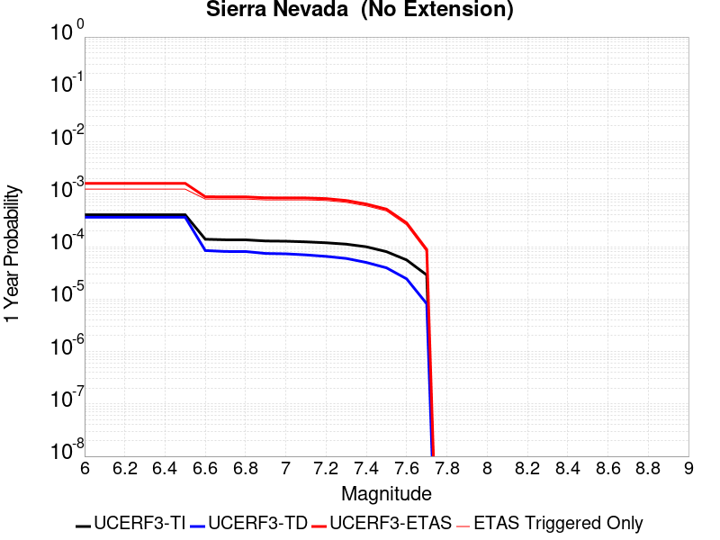 |  |

| Magnitude | 1 wk TI Prob | 1 wk TD Prob | 1 wk ETAS Prob | 1 wk ETAS/TD Gain | 1 wk ETAS Triggered Only | 1 mo TI Prob | 1 mo TD Prob | 1 mo ETAS Prob | 1 mo ETAS/TD Gain | 1 mo ETAS Triggered Only | 1 yr TI Prob | 1 yr TD Prob | 1 yr ETAS Prob | 1 yr ETAS/TD Gain | 1 yr ETAS Triggered Only | 10 yr TI Prob | 10 yr TD Prob | 10 yr ETAS Prob | 10 yr ETAS/TD Gain | 10 yr ETAS Triggered Only |
|-----|-----|-----|-----|-----|-----|-----|-----|-----|-----|-----|-----|-----|-----|-----|-----|-----|-----|-----|-----|-----|
| 6.0 | 7.7690465E-6 | 6.976322E-6 | 8.1207947E-4 | 116.405106 | 8.051088E-4 | 3.329549E-5 | 2.9898381E-5 | 8.898752E-4 | 29.763325 | 8.600026E-4 | 4.0529718E-4 | 3.6398784E-4 | 0.001607794 | 4.417164 | 0.0012442591 | 0.004045588 | 0.0036374326 | 0.005278256 | 1.4510938 | 0.0016468135 |
| 6.1 | 7.7690465E-6 | 6.976322E-6 | 8.1207947E-4 | 116.405106 | 8.051088E-4 | 3.329549E-5 | 2.9898381E-5 | 8.898752E-4 | 29.763325 | 8.600026E-4 | 4.0529718E-4 | 3.6398784E-4 | 0.001607794 | 4.417164 | 0.0012442591 | 0.004045588 | 0.0036374326 | 0.005278256 | 1.4510938 | 0.0016468135 |
| 6.2 | 7.7690465E-6 | 6.976322E-6 | 8.1207947E-4 | 116.405106 | 8.051088E-4 | 3.329549E-5 | 2.9898381E-5 | 8.898752E-4 | 29.763325 | 8.600026E-4 | 4.0529718E-4 | 3.6398784E-4 | 0.001607794 | 4.417164 | 0.0012442591 | 0.004045588 | 0.0036374326 | 0.005278256 | 1.4510938 | 0.0016468135 |
| 6.3 | 7.7690465E-6 | 6.976322E-6 | 8.1207947E-4 | 116.405106 | 8.051088E-4 | 3.329549E-5 | 2.9898381E-5 | 8.898752E-4 | 29.763325 | 8.600026E-4 | 4.0529718E-4 | 3.6398784E-4 | 0.001607794 | 4.417164 | 0.0012442591 | 0.004045588 | 0.0036374326 | 0.005278256 | 1.4510938 | 0.0016468135 |
| 6.4 | 7.7690465E-6 | 6.976322E-6 | 8.1207947E-4 | 116.405106 | 8.051088E-4 | 3.329549E-5 | 2.9898381E-5 | 8.898752E-4 | 29.763325 | 8.600026E-4 | 4.0529718E-4 | 3.6398784E-4 | 0.001607794 | 4.417164 | 0.0012442591 | 0.004045588 | 0.0036374326 | 0.005278256 | 1.4510938 | 0.0016468135 |
| 6.5 | 7.7690465E-6 | 6.976322E-6 | 8.1207947E-4 | 116.405106 | 8.051088E-4 | 3.329549E-5 | 2.9898381E-5 | 8.898752E-4 | 29.763325 | 8.600026E-4 | 4.0529718E-4 | 3.6398784E-4 | 0.001607794 | 4.417164 | 0.0012442591 | 0.004045588 | 0.0036374326 | 0.005278256 | 1.4510938 | 0.0016468135 |
| 6.6 | 2.653E-6 | 1.614854E-6 | 6.054455E-4 | 374.92273 | 6.038316E-4 | 1.136995E-5 | 6.9207845E-6 | 6.473438E-4 | 93.53619 | 6.4042746E-4 | 1.3842035E-4 | 8.425733E-5 | 9.624838E-4 | 11.423146 | 8.7830046E-4 | 0.0013833415 | 8.422573E-4 | 0.0019757731 | 2.3458073 | 0.0011344715 |
| 6.7 | 2.5902466E-6 | 1.5501876E-6 | 6.0538086E-4 | 390.52103 | 6.038316E-4 | 1.11010095E-5 | 6.643644E-6 | 6.470668E-4 | 97.39637 | 6.4042746E-4 | 1.351464E-4 | 8.0883394E-5 | 9.5911283E-4 | 11.85797 | 8.7830046E-4 | 0.0013506424 | 8.0854254E-4 | 0.0019420967 | 2.4019723 | 0.0011344715 |
| 6.8 | 2.5853892E-6 | 1.5469877E-6 | 6.0537766E-4 | 391.32672 | 6.038316E-4 | 1.1080193E-5 | 6.629931E-6 | 6.470531E-4 | 97.59576 | 6.4042746E-4 | 1.34893E-4 | 8.071645E-5 | 9.5894607E-4 | 11.880429 | 8.7830046E-4 | 0.0013481114 | 8.068743E-4 | 0.0019404304 | 2.4048731 | 0.0011344715 |
| 6.9 | 2.458257E-6 | 1.4220619E-6 | 5.68657E-4 | 399.882 | 5.6723575E-4 | 1.0535345E-5 | 6.094537E-6 | 6.0992246E-4 | 100.07691 | 6.038316E-4 | 1.2826028E-4 | 7.4198484E-5 | 8.975441E-4 | 12.096529 | 8.2340674E-4 | 0.0012818627 | 7.4173906E-4 | 0.0018022317 | 2.429738 | 0.0010612798 |
| 7.0 | 2.4341468E-6 | 1.3990258E-6 | 5.6863396E-4 | 406.44995 | 5.6723575E-4 | 1.0432016E-5 | 5.9958115E-6 | 6.098238E-4 | 101.7083 | 6.038316E-4 | 1.270024E-4 | 7.2996576E-5 | 8.963432E-4 | 12.279249 | 8.2340674E-4 | 0.0012692984 | 7.297279E-4 | 0.0017902332 | 2.4532888 | 0.0010612798 |
| 7.1 | 2.3652476E-6 | 1.3339754E-6 | 5.6856894E-4 | 426.22147 | 5.6723575E-4 | 1.0136736E-5 | 5.717025E-6 | 6.0954515E-4 | 106.619286 | 6.038316E-4 | 1.2340778E-4 | 6.9602575E-5 | 8.9295197E-4 | 12.829295 | 8.2340674E-4 | 0.0012333926 | 6.9580943E-4 | 0.0017563507 | 2.5241835 | 0.0010612798 |
| 7.2 | 2.272158E-6 | 1.2502821E-6 | 5.684853E-4 | 454.6856 | 5.6723575E-4 | 9.737784E-6 | 5.3583412E-6 | 6.091867E-4 | 113.68942 | 6.038316E-4 | 1.1855107E-4 | 6.5235865E-5 | 8.8858884E-4 | 13.621171 | 8.2340674E-4 | 0.0011848784 | 6.5216864E-4 | 0.0016944703 | 2.5982087 | 0.0010429819 |
| 7.3 | 2.1382127E-6 | 1.1419703E-6 | 5.3178123E-4 | 465.66995 | 5.306399E-4 | 9.163737E-6 | 4.8941492E-6 | 5.721271E-4 | 116.900215 | 5.6723575E-4 | 1.1156279E-4 | 5.958465E-5 | 8.2805176E-4 | 13.897066 | 7.6851295E-4 | 0.001115068 | 5.956879E-4 | 0.0015649004 | 2.6270473 | 9.697901E-4 |
| 7.4 | 1.9048055E-6 | 9.575242E-7 | 4.4010734E-4 | 459.6305 | 4.3915023E-4 | 8.163426E-6 | 4.1036687E-6 | 4.798478E-4 | 116.93142 | 4.7574608E-4 | 9.9385186E-5 | 4.996103E-5 | 6.903565E-4 | 13.817899 | 6.4042746E-4 | 9.934074E-4 | 4.994987E-4 | 0.0012859165 | 2.5744143 | 7.868109E-4 |
| 7.5 | 1.5373403E-6 | 7.560042E-7 | 3.6671426E-4 | 485.06906 | 3.6595855E-4 | 6.5885843E-6 | 3.2400142E-6 | 4.057931E-4 | 125.24424 | 4.025544E-4 | 8.021306E-5 | 3.9446462E-5 | 5.700654E-4 | 14.451623 | 5.306399E-4 | 8.0184115E-4 | 3.943951E-4 | 0.0010528606 | 2.6695583 | 6.587254E-4 |
| 7.6 | 1.0680322E-6 | 4.6596554E-7 | 1.8344515E-4 | 393.68823 | 1.8297927E-4 | 4.577273E-6 | 1.9969937E-6 | 2.0327378E-4 | 101.7899 | 2.012772E-4 | 5.5726876E-5 | 2.4313129E-5 | 3.1707285E-4 | 13.041219 | 2.9276684E-4 | 5.5712904E-4 | 2.4310495E-4 | 6.27268E-4 | 2.5802355 | 3.8425648E-4 |
| 7.7 | 5.509146E-7 | 1.5580486E-7 | 5.5049575E-5 | 353.32388 | 5.489378E-5 | 2.3610605E-6 | 6.677349E-7 | 5.556148E-5 | 83.208885 | 5.489378E-5 | 2.8745531E-5 | 8.129644E-6 | 8.132076E-5 | 10.002992 | 7.319171E-5 | 2.8741814E-4 | 8.1293576E-5 | 1.7277578E-4 | 2.1253312 | 9.148964E-5 |

## Bicycle Lake
*[(top)](#table-of-contents)*

| 1 Week | 1 Month | 1 Year | 10 Year |
|-----|-----|-----|-----|
| 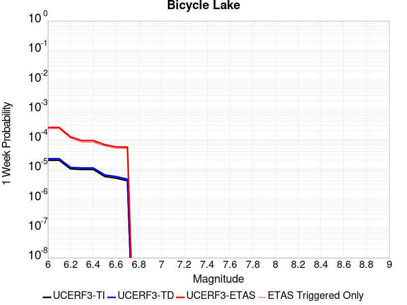 |  |  |  |

| Magnitude | 1 wk TI Prob | 1 wk TD Prob | 1 wk ETAS Prob | 1 wk ETAS/TD Gain | 1 wk ETAS Triggered Only | 1 mo TI Prob | 1 mo TD Prob | 1 mo ETAS Prob | 1 mo ETAS/TD Gain | 1 mo ETAS Triggered Only | 1 yr TI Prob | 1 yr TD Prob | 1 yr ETAS Prob | 1 yr ETAS/TD Gain | 1 yr ETAS Triggered Only | 10 yr TI Prob | 10 yr TD Prob | 10 yr ETAS Prob | 10 yr ETAS/TD Gain | 10 yr ETAS Triggered Only |
|-----|-----|-----|-----|-----|-----|-----|-----|-----|-----|-----|-----|-----|-----|-----|-----|-----|-----|-----|-----|-----|
| 6.0 | 1.9621975E-5 | 2.2097078E-5 | 2.782624E-4 | 12.592724 | 2.5617098E-4 | 8.4091465E-5 | 9.4699084E-5 | 4.240306E-4 | 4.477663 | 3.293627E-4 | 0.0010233327 | 0.0011524865 | 0.002011498 | 1.7453549 | 8.600026E-4 | 0.01018633 | 0.011478408 | 0.012997791 | 1.1323688 | 0.0015370259 |
| 6.1 | 1.9621975E-5 | 2.2097078E-5 | 2.782624E-4 | 12.592724 | 2.5617098E-4 | 8.4091465E-5 | 9.4699084E-5 | 4.240306E-4 | 4.477663 | 3.293627E-4 | 0.0010233327 | 0.0011524865 | 0.002011498 | 1.7453549 | 8.600026E-4 | 0.01018633 | 0.011478408 | 0.012997791 | 1.1323688 | 0.0015370259 |
| 6.2 | 9.9971285E-6 | 1.1255639E-5 | 1.576374E-4 | 14.005194 | 1.4638342E-4 | 4.2844134E-5 | 4.8237856E-5 | 2.1291125E-4 | 4.4137793 | 1.6468135E-4 | 5.2150246E-4 | 5.871896E-4 | 0.0010809436 | 1.8408765 | 4.9404404E-4 | 0.0052028033 | 0.005861487 | 0.0067528295 | 1.1520678 | 8.965984E-4 |
| 6.3 | 9.589428E-6 | 1.0798346E-5 | 1.3888245E-4 | 12.861456 | 1.2808549E-4 | 4.10969E-5 | 4.62781E-5 | 1.9265474E-4 | 4.1629786 | 1.4638342E-4 | 5.002399E-4 | 5.6334207E-4 | 0.0010388201 | 1.8440309 | 4.7574608E-4 | 0.0049911533 | 0.0056242296 | 0.006443005 | 1.14558 | 8.2340674E-4 |
| 6.4 | 9.589428E-6 | 1.0798346E-5 | 1.3888245E-4 | 12.861456 | 1.2808549E-4 | 4.10969E-5 | 4.62781E-5 | 1.9265474E-4 | 4.1629786 | 1.4638342E-4 | 5.002399E-4 | 5.6334207E-4 | 0.0010388201 | 1.8440309 | 4.7574608E-4 | 0.0049911533 | 0.0056242296 | 0.006443005 | 1.14558 | 8.2340674E-4 |
| 6.5 | 5.557707E-6 | 6.2856016E-6 | 9.777466E-5 | 15.555339 | 9.148964E-5 | 2.3818526E-5 | 2.6938165E-5 | 1.3672277E-4 | 5.07543 | 1.0978756E-4 | 2.8995197E-4 | 3.2794967E-4 | 5.8403664E-4 | 1.7808727 | 2.5617098E-4 | 0.0028957394 | 0.0032772934 | 0.0038061943 | 1.1613834 | 5.306399E-4 |
| 6.6 | 4.8742945E-6 | 5.5132896E-6 | 7.8704594E-5 | 14.275433 | 7.319171E-5 | 2.0889667E-5 | 2.3628318E-5 | 1.1511579E-4 | 4.8719416 | 9.148964E-5 | 2.54302E-4 | 2.87663E-4 | 5.254676E-4 | 1.8266778 | 2.3787304E-4 | 0.002540112 | 0.0028754752 | 0.0033680985 | 1.171319 | 4.9404404E-4 |
| 6.7 | 3.991108E-6 | 4.5159104E-6 | 7.7707286E-5 | 17.207447 | 7.319171E-5 | 1.7104636E-5 | 1.9353902E-5 | 1.10841764E-4 | 5.727102 | 9.148964E-5 | 2.0822904E-4 | 2.3563375E-4 | 4.185699E-4 | 1.776358 | 1.8297927E-4 | 0.0020803404 | 0.0023563374 | 0.0027579432 | 1.1704365 | 4.025544E-4 |

## San Andreas (San Bernardino N)
*[(top)](#table-of-contents)*

| 1 Week | 1 Month | 1 Year | 10 Year |
|-----|-----|-----|-----|
|  |  |  |  |

| Magnitude | 1 wk TI Prob | 1 wk TD Prob | 1 wk ETAS Prob | 1 wk ETAS/TD Gain | 1 wk ETAS Triggered Only | 1 mo TI Prob | 1 mo TD Prob | 1 mo ETAS Prob | 1 mo ETAS/TD Gain | 1 mo ETAS Triggered Only | 1 yr TI Prob | 1 yr TD Prob | 1 yr ETAS Prob | 1 yr ETAS/TD Gain | 1 yr ETAS Triggered Only | 10 yr TI Prob | 10 yr TD Prob | 10 yr ETAS Prob | 10 yr ETAS/TD Gain | 10 yr ETAS Triggered Only |
|-----|-----|-----|-----|-----|-----|-----|-----|-----|-----|-----|-----|-----|-----|-----|-----|-----|-----|-----|-----|-----|
| 6.0 | 1.4273766E-4 | 3.1606483E-4 | 8.6482917E-4 | 2.7362397 | 5.489378E-4 | 6.115894E-4 | 0.0013538664 | 0.0020665193 | 1.5263835 | 7.1361917E-4 | 0.0074207084 | 0.016360244 | 0.01753015 | 1.0715091 | 0.0011893653 | 0.07177748 | 0.15026689 | 0.15154184 | 1.0084847 | 0.00150043 |
| 6.1 | 1.4273766E-4 | 3.1606483E-4 | 8.6482917E-4 | 2.7362397 | 5.489378E-4 | 6.115894E-4 | 0.0013538664 | 0.0020665193 | 1.5263835 | 7.1361917E-4 | 0.0074207084 | 0.016360244 | 0.01753015 | 1.0715091 | 0.0011893653 | 0.07177748 | 0.15026689 | 0.15154184 | 1.0084847 | 0.00150043 |
| 6.2 | 1.4273766E-4 | 3.1606483E-4 | 8.6482917E-4 | 2.7362397 | 5.489378E-4 | 6.115894E-4 | 0.0013538664 | 0.0020665193 | 1.5263835 | 7.1361917E-4 | 0.0074207084 | 0.016360244 | 0.01753015 | 1.0715091 | 0.0011893653 | 0.07177748 | 0.15026689 | 0.15154184 | 1.0084847 | 0.00150043 |
| 6.3 | 1.3730655E-4 | 3.0511338E-4 | 8.538837E-4 | 2.7985783 | 5.489378E-4 | 5.883239E-4 | 0.0013069791 | 0.0020196657 | 1.5452929 | 7.1361917E-4 | 0.0071393442 | 0.015797773 | 0.016968349 | 1.0740975 | 0.0011893653 | 0.06914291 | 0.14556676 | 0.14684878 | 1.0088071 | 0.00150043 |
| 6.4 | 1.3730655E-4 | 3.0511338E-4 | 8.538837E-4 | 2.7985783 | 5.489378E-4 | 5.883239E-4 | 0.0013069791 | 0.0020196657 | 1.5452929 | 7.1361917E-4 | 0.0071393442 | 0.015797773 | 0.016968349 | 1.0740975 | 0.0011893653 | 0.06914291 | 0.14556676 | 0.14684878 | 1.0088071 | 0.00150043 |
| 6.5 | 1.2942807E-4 | 2.8925808E-4 | 8.380371E-4 | 2.897195 | 5.489378E-4 | 5.545738E-4 | 0.0012390936 | 0.0019518286 | 1.5752066 | 7.1361917E-4 | 0.0067310524 | 0.01498286 | 0.016154405 | 1.0781924 | 0.0011893653 | 0.06530788 | 0.13870941 | 0.14000173 | 1.0093167 | 0.00150043 |
| 6.6 | 1.1125901E-4 | 2.536472E-4 | 8.0244575E-4 | 3.1636295 | 5.489378E-4 | 4.767372E-4 | 0.0010866089 | 0.0017994526 | 1.656026 | 7.1361917E-4 | 0.005788839 | 0.013149847 | 0.014305515 | 1.0878845 | 0.0011710674 | 0.056403454 | 0.122999296 | 0.124283075 | 1.0104374 | 0.0014638342 |
| 6.7 | 1.02209575E-4 | 2.3499702E-4 | 7.838058E-4 | 3.3353863 | 5.489378E-4 | 4.3796748E-4 | 0.0010067427 | 0.0017196435 | 1.7081261 | 7.1361917E-4 | 0.0053192247 | 0.012188629 | 0.013327348 | 1.0934247 | 0.0011527694 | 0.051936906 | 0.114790924 | 0.11603813 | 1.010865 | 0.0014089404 |
| 6.8 | 9.610582E-5 | 2.2025521E-4 | 7.690721E-4 | 3.491732 | 5.489378E-4 | 4.1181705E-4 | 9.436101E-4 | 0.0016565559 | 1.7555512 | 7.1361917E-4 | 0.0050023515 | 0.011428202 | 0.012567797 | 1.0997179 | 0.0011527694 | 0.048912346 | 0.1081929 | 0.1094494 | 1.0116135 | 0.0014089404 |
| 6.9 | 9.3877505E-5 | 2.1481077E-4 | 7.6363067E-4 | 3.5548992 | 5.489378E-4 | 4.0227012E-4 | 9.2029345E-4 | 0.0016332559 | 1.7747121 | 7.1361917E-4 | 0.0048866454 | 0.011147255 | 0.012287174 | 1.1022601 | 0.0011527694 | 0.04780577 | 0.10578323 | 0.107043125 | 1.0119102 | 0.0014089404 |
| 7.0 | 9.1019785E-5 | 2.0808022E-4 | 7.569038E-4 | 3.6375575 | 5.489378E-4 | 3.900265E-4 | 8.914682E-4 | 0.0016044512 | 1.799785 | 7.1361917E-4 | 0.0047382377 | 0.010799837 | 0.011940157 | 1.1055868 | 0.0011527694 | 0.046384744 | 0.102753714 | 0.10401788 | 1.0123029 | 0.0014089404 |
| 7.1 | 8.771155E-5 | 1.9982594E-4 | 7.303598E-4 | 3.6549797 | 5.306399E-4 | 3.758525E-4 | 8.5611636E-4 | 0.0015508423 | 1.8114854 | 6.9532124E-4 | 0.0045664064 | 0.0103736 | 0.011496303 | 1.1082269 | 0.0011344715 | 0.044737056 | 0.09906527 | 0.10030166 | 1.0124806 | 0.0013723446 |
| 7.2 | 8.0830236E-5 | 1.8388197E-4 | 7.144243E-4 | 3.8852327 | 5.306399E-4 | 3.4636928E-4 | 7.8782777E-4 | 0.0014826012 | 1.8818849 | 6.9532124E-4 | 0.0042088944 | 0.009549725 | 0.010673362 | 1.1176618 | 0.0011344715 | 0.041300658 | 0.09179615 | 0.09304252 | 1.0135776 | 0.0013723446 |
| 7.3 | 7.7668235E-5 | 1.7331762E-4 | 7.0386555E-4 | 4.061131 | 5.306399E-4 | 3.328214E-4 | 7.425784E-4 | 0.0014373834 | 1.9356654 | 6.9532124E-4 | 0.0040445733 | 0.009003494 | 0.010127751 | 1.124869 | 0.0011344715 | 0.03971748 | 0.08706327 | 0.08831613 | 1.0143902 | 0.0013723446 |
| 7.4 | 7.520177E-5 | 1.6551897E-4 | 6.96071E-4 | 4.205385 | 5.306399E-4 | 3.2225347E-4 | 7.0917426E-4 | 0.0014040024 | 1.9797707 | 6.9532124E-4 | 0.0039163795 | 0.008600081 | 0.0097066555 | 1.1286702 | 0.0011161736 | 0.038480744 | 0.08351955 | 0.08476051 | 1.0148582 | 0.0013540466 |
| 7.5 | 7.274697E-5 | 1.5839566E-4 | 6.8895146E-4 | 4.3495603 | 5.306399E-4 | 3.1173544E-4 | 6.78662E-4 | 0.0013735113 | 2.0238519 | 6.9532124E-4 | 0.003788775 | 0.008231463 | 0.009338449 | 1.1344823 | 0.0011161736 | 0.03724827 | 0.08023631 | 0.08148171 | 1.0155216 | 0.0013540466 |
| 7.6 | 7.1185845E-5 | 1.540943E-4 | 6.846524E-4 | 4.443074 | 5.306399E-4 | 3.0504653E-4 | 6.6023704E-4 | 0.0013550993 | 2.0524435 | 6.9532124E-4 | 0.0037076178 | 0.008008812 | 0.009116045 | 1.138252 | 0.0011161736 | 0.036463667 | 0.07822598 | 0.0794741 | 1.0159553 | 0.0013540466 |
| 7.7 | 6.709961E-5 | 1.4318313E-4 | 6.7374704E-4 | 4.7054915 | 5.306399E-4 | 2.8753807E-4 | 6.1349774E-4 | 0.0013083924 | 2.1326768 | 6.9532124E-4 | 0.003495157 | 0.0074437927 | 0.008551657 | 1.1488308 | 0.0011161736 | 0.034406938 | 0.07305469 | 0.07429286 | 1.0169485 | 0.0013357487 |
| 7.8 | 6.300812E-5 | 1.3202413E-4 | 6.625939E-4 | 5.018734 | 5.306399E-4 | 2.7000686E-4 | 5.65695E-4 | 0.0012606229 | 2.2284498 | 6.9532124E-4 | 0.0032823787 | 0.006865616 | 0.007974126 | 1.1614583 | 0.0011161736 | 0.032343175 | 0.06771354 | 0.06895884 | 1.0183908 | 0.0013357487 |
| 7.9 | 4.983037E-5 | 9.723488E-5 | 5.1804626E-4 | 5.327782 | 4.2085233E-4 | 2.1354125E-4 | 4.1665437E-4 | 9.6536346E-4 | 2.3169408 | 5.489378E-4 | 0.0025967648 | 0.0050609782 | 0.005898423 | 1.165471 | 8.4170466E-4 | 0.025666296 | 0.05064886 | 0.051656388 | 1.0198925 | 0.0010612798 |
| 8.0 | 3.2211527E-5 | 5.3304586E-5 | 2.362741E-4 | 4.4325285 | 1.8297927E-4 | 1.380421E-4 | 2.2842824E-4 | 4.8454068E-4 | 2.1211944 | 2.5617098E-4 | 0.0016793669 | 0.0027775685 | 0.0031242636 | 1.1248196 | 3.4766062E-4 | 0.016667323 | 0.028361378 | 0.028788075 | 1.0150449 | 4.3915023E-4 |
| 8.1 | 1.743376E-5 | 1.8824427E-5 | 3.712201E-5 | 1.9720128 | 1.8297927E-5 | 7.471398E-5 | 8.067362E-5 | 1.1726652E-4 | 1.453592 | 3.6595855E-5 | 9.0926304E-4 | 9.817594E-4 | 0.0010183193 | 1.0372392 | 3.6595855E-5 | 0.009055517 | 0.010484105 | 0.010538423 | 1.005181 | 5.489378E-5 |
| 8.2 | 7.831616E-6 | 5.1551065E-6 | 5.1551065E-6 | 1.0 | 0.0 | 3.3563636E-5 | 2.2093127E-5 | 2.2093127E-5 | 1.0 | 0.0 | 4.0856065E-4 | 2.6895068E-4 | 2.6895068E-4 | 1.0 | 0.0 | 0.004078103 | 0.0030418145 | 0.0030418145 | 1.0 | 0.0 |
| 8.3 | 1.983087E-6 | 7.6599065E-7 | 7.6599065E-7 | 1.0 | 0.0 | 8.498917E-6 | 3.282813E-6 | 3.282813E-6 | 1.0 | 0.0 | 1.034694E-4 | 3.9967534E-5 | 3.9967534E-5 | 1.0 | 0.0 | 0.0010342124 | 4.719687E-4 | 4.719687E-4 | 1.0 | 0.0 |

## Paradise
*[(top)](#table-of-contents)*

| 1 Week | 1 Month | 1 Year | 10 Year |
|-----|-----|-----|-----|
|  |  | 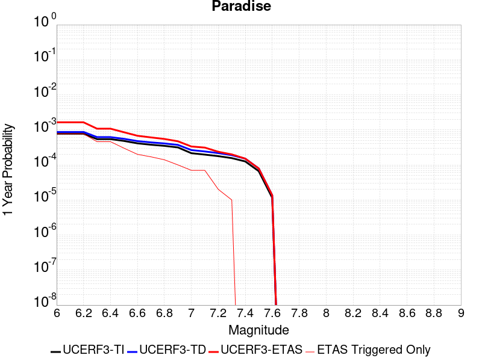 |  |

| Magnitude | 1 wk TI Prob | 1 wk TD Prob | 1 wk ETAS Prob | 1 wk ETAS/TD Gain | 1 wk ETAS Triggered Only | 1 mo TI Prob | 1 mo TD Prob | 1 mo ETAS Prob | 1 mo ETAS/TD Gain | 1 mo ETAS Triggered Only | 1 yr TI Prob | 1 yr TD Prob | 1 yr ETAS Prob | 1 yr ETAS/TD Gain | 1 yr ETAS Triggered Only | 10 yr TI Prob | 10 yr TD Prob | 10 yr ETAS Prob | 10 yr ETAS/TD Gain | 10 yr ETAS Triggered Only |
|-----|-----|-----|-----|-----|-----|-----|-----|-----|-----|-----|-----|-----|-----|-----|-----|-----|-----|-----|-----|-----|
| 6.0 | 1.4851273E-5 | 1.6694692E-5 | 2.5456378E-4 | 15.248186 | 2.3787304E-4 | 6.364676E-5 | 7.154685E-5 | 4.7407244E-4 | 6.6260424 | 4.025544E-4 | 7.7462377E-4 | 8.707584E-4 | 0.0016751661 | 1.9238013 | 8.051088E-4 | 0.0077192914 | 0.008675844 | 0.009927448 | 1.144263 | 0.001262557 |
| 6.1 | 1.4851273E-5 | 1.6694692E-5 | 2.5456378E-4 | 15.248186 | 2.3787304E-4 | 6.364676E-5 | 7.154685E-5 | 4.7407244E-4 | 6.6260424 | 4.025544E-4 | 7.7462377E-4 | 8.707584E-4 | 0.0016751661 | 1.9238013 | 8.051088E-4 | 0.0077192914 | 0.008675844 | 0.009927448 | 1.144263 | 0.001262557 |
| 6.2 | 1.4851273E-5 | 1.6694692E-5 | 2.5456378E-4 | 15.248186 | 2.3787304E-4 | 6.364676E-5 | 7.154685E-5 | 4.7407244E-4 | 6.6260424 | 4.025544E-4 | 7.7462377E-4 | 8.707584E-4 | 0.0016751661 | 1.9238013 | 8.051088E-4 | 0.0077192914 | 0.008675844 | 0.009927448 | 1.144263 | 0.001262557 |
| 6.3 | 1.0426831E-5 | 1.188862E-5 | 1.582703E-4 | 13.312756 | 1.4638342E-4 | 4.4685654E-5 | 5.0950268E-5 | 2.888112E-4 | 5.6684923 | 2.3787304E-4 | 5.43912E-4 | 6.201489E-4 | 0.0010773134 | 1.737185 | 4.5744816E-4 | 0.0054258266 | 0.0061847917 | 0.006912182 | 1.1176095 | 7.319171E-4 |
| 6.4 | 1.0426831E-5 | 1.188862E-5 | 1.582703E-4 | 13.312756 | 1.4638342E-4 | 4.4685654E-5 | 5.0950268E-5 | 2.888112E-4 | 5.6684923 | 2.3787304E-4 | 5.43912E-4 | 6.201489E-4 | 0.0010773134 | 1.737185 | 4.5744816E-4 | 0.0054258266 | 0.0061847917 | 0.006912182 | 1.1176095 | 7.319171E-4 |
| 6.5 | 9.25027E-6 | 1.06199595E-5 | 1.2040635E-4 | 11.337741 | 1.0978756E-4 | 3.964341E-5 | 4.551335E-5 | 2.2848429E-4 | 5.02016 | 1.8297927E-4 | 4.8255164E-4 | 5.53989E-4 | 8.4659364E-4 | 1.5281777 | 2.9276684E-4 | 0.0048150513 | 0.0055265795 | 0.005999696 | 1.0856075 | 4.7574608E-4 |
| 6.6 | 7.904275E-6 | 9.159525E-6 | 1.0064832E-4 | 10.988378 | 9.148964E-5 | 3.3875025E-5 | 3.9254537E-5 | 1.4903779E-4 | 3.7967021 | 1.0978756E-4 | 4.1235037E-4 | 4.7782314E-4 | 6.60715E-4 | 1.3827605 | 1.8297927E-4 | 0.0041158604 | 0.0047683544 | 0.0050415145 | 1.057286 | 2.744689E-4 |
| 6.7 | 7.2061953E-6 | 8.407248E-6 | 9.989611E-5 | 11.882141 | 9.148964E-5 | 3.088333E-5 | 3.6030586E-5 | 1.4581419E-4 | 4.0469556 | 1.0978756E-4 | 3.7593965E-4 | 4.3858777E-4 | 6.031969E-4 | 1.3753163 | 1.6468135E-4 | 0.003753043 | 0.004377591 | 0.0046144226 | 1.0541009 | 2.3787304E-4 |
| 6.8 | 6.6948724E-6 | 7.842166E-6 | 9.933108E-5 | 12.666282 | 9.148964E-5 | 2.8691995E-5 | 3.360887E-5 | 1.4339274E-4 | 4.266515 | 1.0978756E-4 | 3.4926904E-4 | 4.0911473E-4 | 5.737287E-4 | 1.4023663 | 1.6468135E-4 | 0.003487206 | 0.0040839734 | 0.004320875 | 1.0580076 | 2.3787304E-4 |
| 6.9 | 6.0421025E-6 | 7.130621E-6 | 8.0321806E-5 | 11.26435 | 7.319171E-5 | 2.5894467E-5 | 3.0559466E-5 | 1.03748935E-4 | 3.3949854 | 7.319171E-5 | 3.1521954E-4 | 3.7200135E-4 | 5.000392E-4 | 1.3441864 | 1.2808549E-4 | 0.0031477278 | 0.0037141247 | 0.0039146543 | 1.0539911 | 2.012772E-4 |
| 7.0 | 4.134091E-6 | 5.0803087E-6 | 5.9973812E-5 | 11.80515 | 5.489378E-5 | 1.7717413E-5 | 2.177258E-5 | 7.6665165E-5 | 3.5211797 | 5.489378E-5 | 2.1568815E-4 | 2.6505045E-4 | 3.5651584E-4 | 1.3450867 | 9.148964E-5 | 0.0021547892 | 0.0026474963 | 0.0027752428 | 1.0482517 | 1.2808549E-4 |
| 7.1 | 3.7674888E-6 | 4.6318696E-6 | 5.9525395E-5 | 12.851268 | 5.489378E-5 | 1.6146281E-5 | 1.9850726E-5 | 7.474342E-5 | 3.7652736 | 5.489378E-5 | 1.9656324E-4 | 2.4165731E-4 | 3.3312483E-4 | 1.3785009 | 9.148964E-5 | 0.0019638946 | 0.002414096 | 0.0025418722 | 1.0529293 | 1.2808549E-4 |
| 7.2 | 3.4065345E-6 | 4.156723E-6 | 4.0752424E-5 | 9.803979 | 3.6595855E-5 | 1.4599351E-5 | 1.7814415E-5 | 5.4409615E-5 | 3.0542467 | 3.6595855E-5 | 1.777326E-4 | 2.1687041E-4 | 2.5345833E-4 | 1.1687087 | 3.6595855E-5 | 0.0017759053 | 0.002166736 | 0.002239769 | 1.0337065 | 7.319171E-5 |
| 7.3 | 2.9934936E-6 | 3.6293168E-6 | 2.1927177E-5 | 6.041682 | 1.8297927E-5 | 1.2829195E-5 | 1.555413E-5 | 3.385177E-5 | 2.1763847 | 1.8297927E-5 | 1.5618425E-4 | 1.8935655E-4 | 2.0765101E-4 | 1.0966139 | 1.8297927E-5 | 0.0015607453 | 0.0018920974 | 0.0019468874 | 1.0289572 | 5.489378E-5 |
| 7.4 | 2.4049796E-6 | 2.8889842E-6 | 2.8889842E-6 | 1.0 | 0.0 | 1.0307015E-5 | 1.238131E-5 | 1.238131E-5 | 1.0 | 0.0 | 1.2548068E-4 | 1.5073347E-4 | 1.5073347E-4 | 1.0 | 0.0 | 0.0012540985 | 0.0015064536 | 0.0015429944 | 1.0242561 | 3.6595855E-5 |
| 7.5 | 1.2710091E-6 | 1.5134682E-6 | 1.5134682E-6 | 1.0 | 0.0 | 5.44717E-6 | 6.4862834E-6 | 6.4862834E-6 | 1.0 | 0.0 | 6.631728E-5 | 7.8968886E-5 | 7.8968886E-5 | 1.0 | 0.0 | 6.6297496E-4 | 7.8953087E-4 | 8.0781436E-4 | 1.0231574 | 1.8297927E-5 |
| 7.6 | 2.21172E-7 | 2.603961E-7 | 2.603961E-7 | 1.0 | 0.0 | 9.478797E-7 | 1.1159829E-6 | 1.1159829E-6 | 1.0 | 0.0 | 1.1540374E-5 | 1.3587036E-5 | 1.3587036E-5 | 1.0 | 0.0 | 1.1539775E-4 | 1.3586486E-4 | 1.541603E-4 | 1.134659 | 1.8297927E-5 |

## Garlic Springs
*[(top)](#table-of-contents)*

| 1 Week | 1 Month | 1 Year | 10 Year |
|-----|-----|-----|-----|
|  |  |  |  |

| Magnitude | 1 wk TI Prob | 1 wk TD Prob | 1 wk ETAS Prob | 1 wk ETAS/TD Gain | 1 wk ETAS Triggered Only | 1 mo TI Prob | 1 mo TD Prob | 1 mo ETAS Prob | 1 mo ETAS/TD Gain | 1 mo ETAS Triggered Only | 1 yr TI Prob | 1 yr TD Prob | 1 yr ETAS Prob | 1 yr ETAS/TD Gain | 1 yr ETAS Triggered Only | 10 yr TI Prob | 10 yr TD Prob | 10 yr ETAS Prob | 10 yr ETAS/TD Gain | 10 yr ETAS Triggered Only |
|-----|-----|-----|-----|-----|-----|-----|-----|-----|-----|-----|-----|-----|-----|-----|-----|-----|-----|-----|-----|-----|
| 6.0 | 1.6760017E-5 | 1.8776833E-5 | 2.2005025E-4 | 11.719242 | 2.012772E-4 | 7.182667E-5 | 8.0470316E-5 | 3.9151005E-4 | 4.8652725 | 3.1106477E-4 | 8.7413884E-4 | 9.794032E-4 | 0.0016192034 | 1.6532552 | 6.4042746E-4 | 0.008707083 | 0.009762413 | 0.01086769 | 1.1132176 | 0.0011161736 |
| 6.1 | 9.852767E-6 | 1.09735865E-5 | 8.4164494E-5 | 7.669734 | 7.319171E-5 | 4.222546E-5 | 4.702921E-5 | 1.9340574E-4 | 4.1124597 | 1.4638342E-4 | 5.139737E-4 | 5.7250116E-4 | 9.016753E-4 | 1.5749755 | 3.293627E-4 | 0.005127866 | 0.005717221 | 0.006299407 | 1.1018302 | 5.855337E-4 |
| 6.2 | 9.852767E-6 | 1.09735865E-5 | 8.4164494E-5 | 7.669734 | 7.319171E-5 | 4.222546E-5 | 4.702921E-5 | 1.9340574E-4 | 4.1124597 | 1.4638342E-4 | 5.139737E-4 | 5.7250116E-4 | 9.016753E-4 | 1.5749755 | 3.293627E-4 | 0.005127866 | 0.005717221 | 0.006299407 | 1.1018302 | 5.855337E-4 |
| 6.3 | 4.3167724E-6 | 4.7780286E-6 | 4.1373707E-5 | 8.659159 | 3.6595855E-5 | 1.8500323E-5 | 2.0477235E-5 | 7.536989E-5 | 3.6806674 | 5.489378E-5 | 2.2521814E-4 | 2.4930484E-4 | 4.5053186E-4 | 1.8071525 | 2.012772E-4 | 0.0022499003 | 0.00249251 | 0.0027662946 | 1.109843 | 2.744689E-4 |
| 6.4 | 4.3167724E-6 | 4.7780286E-6 | 4.1373707E-5 | 8.659159 | 3.6595855E-5 | 1.8500323E-5 | 2.0477235E-5 | 7.536989E-5 | 3.6806674 | 5.489378E-5 | 2.2521814E-4 | 2.4930484E-4 | 4.5053186E-4 | 1.8071525 | 2.012772E-4 | 0.0022499003 | 0.00249251 | 0.0027662946 | 1.109843 | 2.744689E-4 |
| 6.5 | 4.3167724E-6 | 4.7780286E-6 | 4.1373707E-5 | 8.659159 | 3.6595855E-5 | 1.8500323E-5 | 2.0477235E-5 | 7.536989E-5 | 3.6806674 | 5.489378E-5 | 2.2521814E-4 | 2.4930484E-4 | 4.5053186E-4 | 1.8071525 | 2.012772E-4 | 0.0022499003 | 0.00249251 | 0.0027662946 | 1.109843 | 2.744689E-4 |
| 6.6 | 4.301311E-6 | 4.760897E-6 | 4.1356576E-5 | 8.686719 | 3.6595855E-5 | 1.8434059E-5 | 2.0403815E-5 | 7.529648E-5 | 3.6903136 | 5.489378E-5 | 2.2441156E-4 | 2.4841115E-4 | 4.4963835E-4 | 1.810057 | 2.012772E-4 | 0.0022418506 | 0.002483593 | 0.0027573803 | 1.1102383 | 2.744689E-4 |
| 6.7 | 3.8599724E-6 | 4.27106E-6 | 4.086676E-5 | 9.568295 | 3.6595855E-5 | 1.6542634E-5 | 1.8304541E-5 | 7.319732E-5 | 3.9988608 | 5.489378E-5 | 2.0138794E-4 | 2.228578E-4 | 3.692086E-4 | 1.6567004 | 1.4638342E-4 | 0.0020120554 | 0.002228578 | 0.0024476638 | 1.0983075 | 2.1957511E-4 |

## Helendale-So Lockhart
*[(top)](#table-of-contents)*

| 1 Week | 1 Month | 1 Year | 10 Year |
|-----|-----|-----|-----|
|  | 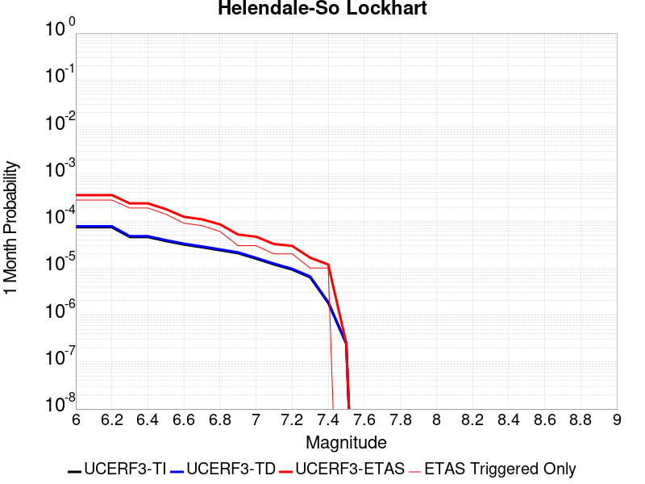 |  |  |

| Magnitude | 1 wk TI Prob | 1 wk TD Prob | 1 wk ETAS Prob | 1 wk ETAS/TD Gain | 1 wk ETAS Triggered Only | 1 mo TI Prob | 1 mo TD Prob | 1 mo ETAS Prob | 1 mo ETAS/TD Gain | 1 mo ETAS Triggered Only | 1 yr TI Prob | 1 yr TD Prob | 1 yr ETAS Prob | 1 yr ETAS/TD Gain | 1 yr ETAS Triggered Only | 10 yr TI Prob | 10 yr TD Prob | 10 yr ETAS Prob | 10 yr ETAS/TD Gain | 10 yr ETAS Triggered Only |
|-----|-----|-----|-----|-----|-----|-----|-----|-----|-----|-----|-----|-----|-----|-----|-----|-----|-----|-----|-----|-----|
| 6.0 | 1.7296055E-5 | 1.8103729E-5 | 2.3767487E-4 | 13.128504 | 2.1957511E-4 | 7.412385E-5 | 7.7585224E-5 | 3.8862583E-4 | 5.009019 | 3.1106477E-4 | 9.0208417E-4 | 9.4421144E-4 | 0.0014195084 | 1.5033797 | 4.7574608E-4 | 0.008984311 | 0.009404116 | 0.010201653 | 1.0848073 | 8.051088E-4 |
| 6.1 | 1.7296055E-5 | 1.8103729E-5 | 2.3767487E-4 | 13.128504 | 2.1957511E-4 | 7.412385E-5 | 7.7585224E-5 | 3.8862583E-4 | 5.009019 | 3.1106477E-4 | 9.0208417E-4 | 9.4421144E-4 | 0.0014195084 | 1.5033797 | 4.7574608E-4 | 0.008984311 | 0.009404116 | 0.010201653 | 1.0848073 | 8.051088E-4 |
| 6.2 | 1.7296055E-5 | 1.8103729E-5 | 2.3767487E-4 | 13.128504 | 2.1957511E-4 | 7.412385E-5 | 7.7585224E-5 | 3.8862583E-4 | 5.009019 | 3.1106477E-4 | 9.0208417E-4 | 9.4421144E-4 | 0.0014195084 | 1.5033797 | 4.7574608E-4 | 0.008984311 | 0.009404116 | 0.010201653 | 1.0848073 | 8.051088E-4 |
| 6.3 | 1.0669118E-5 | 1.1135425E-5 | 1.575172E-4 | 14.145596 | 1.4638342E-4 | 4.5723988E-5 | 4.772239E-5 | 2.6728705E-4 | 5.6008725 | 2.1957511E-4 | 5.5654737E-4 | 5.80868E-4 | 8.734648E-4 | 1.5037234 | 2.9276684E-4 | 0.0055515557 | 0.0057937936 | 0.006284975 | 1.0847772 | 4.9404404E-4 |
| 6.4 | 1.0669118E-5 | 1.1135425E-5 | 1.575172E-4 | 14.145596 | 1.4638342E-4 | 4.5723988E-5 | 4.772239E-5 | 2.6728705E-4 | 5.6008725 | 2.1957511E-4 | 5.5654737E-4 | 5.80868E-4 | 8.734648E-4 | 1.5037234 | 2.9276684E-4 | 0.0055515557 | 0.0057937936 | 0.006284975 | 1.0847772 | 4.9404404E-4 |
| 6.5 | 8.790038E-6 | 9.170197E-6 | 1.1895675E-4 | 12.972104 | 1.0978756E-4 | 3.767105E-5 | 3.930026E-5 | 2.0397513E-4 | 5.1901727 | 1.6468135E-4 | 4.585485E-4 | 4.7837716E-4 | 6.978472E-4 | 1.4587804 | 2.1957511E-4 | 0.0045760344 | 0.004773638 | 0.00513785 | 1.0762964 | 3.6595855E-4 |
| 6.6 | 7.396949E-6 | 7.715537E-6 | 8.090668E-5 | 10.486202 | 7.319171E-5 | 3.1700827E-5 | 3.3066175E-5 | 1.428501E-4 | 4.320128 | 1.0978756E-4 | 3.858892E-4 | 4.025073E-4 | 5.488318E-4 | 1.3635325 | 1.4638342E-4 | 0.003852198 | 0.00401789 | 0.0042548073 | 1.0589656 | 2.3787304E-4 |
| 6.7 | 6.4600285E-6 | 6.738031E-6 | 6.163144E-5 | 9.146803 | 5.489378E-5 | 2.7685543E-5 | 2.887696E-5 | 1.20363955E-4 | 4.1681657 | 9.148964E-5 | 3.3701936E-4 | 3.5152107E-4 | 4.795615E-4 | 1.364247 | 1.2808549E-4 | 0.0033650869 | 0.003509732 | 0.0037285364 | 1.0623422 | 2.1957511E-4 |
| 6.8 | 5.600104E-6 | 5.836009E-6 | 4.243165E-5 | 7.270662 | 3.6595855E-5 | 2.4000226E-5 | 2.5011232E-5 | 9.820111E-5 | 3.9262803 | 7.319171E-5 | 2.9216358E-4 | 3.044698E-4 | 4.1422393E-4 | 1.3604763 | 1.0978756E-4 | 0.0029177975 | 0.003040588 | 0.0032047688 | 1.0539963 | 1.6468135E-4 |
| 6.9 | 4.839122E-6 | 5.0395092E-6 | 2.3337343E-5 | 4.630876 | 1.8297927E-5 | 2.0738931E-5 | 2.159772E-5 | 5.8192785E-5 | 2.6943946 | 3.6595855E-5 | 2.5246723E-4 | 2.6292098E-4 | 3.3609345E-4 | 1.2783059 | 7.319171E-5 | 0.002521806 | 0.002626147 | 0.002753896 | 1.048645 | 1.2808549E-4 |
| 7.0 | 3.6937633E-6 | 3.845208E-6 | 2.2143064E-5 | 5.758613 | 1.8297927E-5 | 1.5830317E-5 | 1.647936E-5 | 5.307461E-5 | 3.2206717 | 3.6595855E-5 | 1.9271708E-4 | 2.0061806E-4 | 2.7379507E-4 | 1.3647579 | 7.319171E-5 | 0.0019255003 | 0.002004401 | 0.0021322297 | 1.063774 | 1.2808549E-4 |
| 7.1 | 2.7858857E-6 | 2.8978538E-6 | 2.1195727E-5 | 7.314285 | 1.8297927E-5 | 1.1939455E-5 | 1.2419316E-5 | 3.0717016E-5 | 2.473326 | 1.8297927E-5 | 1.4535317E-4 | 1.511949E-4 | 2.0608037E-4 | 1.3630115 | 5.489378E-5 | 0.0014525814 | 0.0015109418 | 0.0015840229 | 1.048368 | 7.319171E-5 |
| 7.2 | 2.1672065E-6 | 2.2540128E-6 | 2.0551899E-5 | 9.117915 | 1.8297927E-5 | 9.2879945E-6 | 9.66002E-6 | 2.795777E-5 | 2.8941731 | 1.8297927E-5 | 1.1307546E-4 | 1.1760458E-4 | 1.724919E-4 | 1.4667108 | 5.489378E-5 | 0.0011301794 | 0.0011754417 | 0.0012485473 | 1.0621942 | 7.319171E-5 |
| 7.3 | 1.4823496E-6 | 1.5422102E-6 | 1.5422102E-6 | 1.0 | 0.0 | 6.3529114E-6 | 6.6094562E-6 | 6.6094562E-6 | 1.0 | 0.0 | 7.734395E-5 | 8.046731E-5 | 1.17060226E-4 | 1.454755 | 3.6595855E-5 | 7.731704E-4 | 8.0439687E-4 | 8.5924653E-4 | 1.0681872 | 5.489378E-5 |
| 7.4 | 4.2321457E-7 | 4.4108765E-7 | 4.4108765E-7 | 1.0 | 0.0 | 1.8137755E-6 | 1.8903745E-6 | 1.8903745E-6 | 1.0 | 0.0 | 2.2082493E-5 | 2.3015113E-5 | 2.3015113E-5 | 1.0 | 0.0 | 2.2080299E-4 | 2.3013182E-4 | 2.3013182E-4 | 1.0 | 0.0 |
| 7.5 | 5.6942316E-8 | 5.9415648E-8 | 5.9415648E-8 | 1.0 | 0.0 | 2.440385E-7 | 2.5463845E-7 | 2.5463845E-7 | 1.0 | 0.0 | 2.9711643E-6 | 3.1002196E-6 | 3.1002196E-6 | 1.0 | 0.0 | 2.9711247E-5 | 3.1001844E-5 | 3.1001844E-5 | 1.0 | 0.0 |

## Owens Valley
*[(top)](#table-of-contents)*

| 1 Week | 1 Month | 1 Year | 10 Year |
|-----|-----|-----|-----|
|  |  | 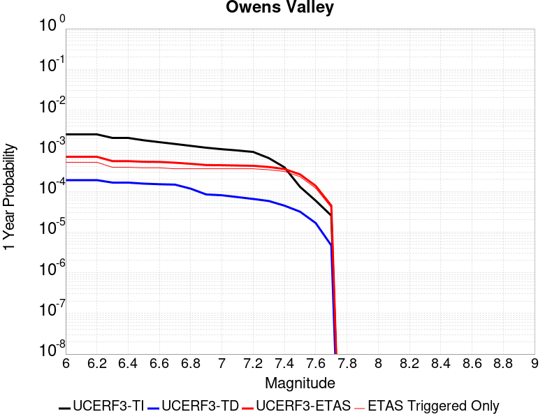 |  |

| Magnitude | 1 wk TI Prob | 1 wk TD Prob | 1 wk ETAS Prob | 1 wk ETAS/TD Gain | 1 wk ETAS Triggered Only | 1 mo TI Prob | 1 mo TD Prob | 1 mo ETAS Prob | 1 mo ETAS/TD Gain | 1 mo ETAS Triggered Only | 1 yr TI Prob | 1 yr TD Prob | 1 yr ETAS Prob | 1 yr ETAS/TD Gain | 1 yr ETAS Triggered Only | 10 yr TI Prob | 10 yr TD Prob | 10 yr ETAS Prob | 10 yr ETAS/TD Gain | 10 yr ETAS Triggered Only |
|-----|-----|-----|-----|-----|-----|-----|-----|-----|-----|-----|-----|-----|-----|-----|-----|-----|-----|-----|-----|-----|
| 6.0 | 4.83821E-5 | 3.626567E-6 | 3.146902E-4 | 86.77358 | 3.1106477E-4 | 2.0733538E-4 | 1.5542342E-5 | 3.2660225E-4 | 21.013708 | 3.1106477E-4 | 0.002521386 | 1.8921259E-4 | 7.3804654E-4 | 3.9006207 | 5.489378E-4 | 0.024929691 | 0.001925011 | 0.00272857 | 1.4174309 | 8.051088E-4 |
| 6.1 | 4.83821E-5 | 3.626567E-6 | 3.146902E-4 | 86.77358 | 3.1106477E-4 | 2.0733538E-4 | 1.5542342E-5 | 3.2660225E-4 | 21.013708 | 3.1106477E-4 | 0.002521386 | 1.8921259E-4 | 7.3804654E-4 | 3.9006207 | 5.489378E-4 | 0.024929691 | 0.001925011 | 0.00272857 | 1.4174309 | 8.051088E-4 |
| 6.2 | 4.83821E-5 | 3.626567E-6 | 3.146902E-4 | 86.77358 | 3.1106477E-4 | 2.0733538E-4 | 1.5542342E-5 | 3.2660225E-4 | 21.013708 | 3.1106477E-4 | 0.002521386 | 1.8921259E-4 | 7.3804654E-4 | 3.9006207 | 5.489378E-4 | 0.024929691 | 0.001925011 | 0.00272857 | 1.4174309 | 8.051088E-4 |
| 6.3 | 3.953008E-5 | 3.1553948E-6 | 3.1421916E-4 | 99.581566 | 3.1106477E-4 | 1.6940363E-4 | 1.3523055E-5 | 3.245836E-4 | 24.00224 | 3.1106477E-4 | 0.002060538 | 1.6463149E-4 | 6.402993E-4 | 3.889288 | 4.7574608E-4 | 0.020415364 | 0.0016592 | 0.0023351 | 1.407365 | 6.770233E-4 |
| 6.4 | 3.953008E-5 | 3.1553948E-6 | 3.1421916E-4 | 99.581566 | 3.1106477E-4 | 1.6940363E-4 | 1.3523055E-5 | 3.245836E-4 | 24.00224 | 3.1106477E-4 | 0.002060538 | 1.6463149E-4 | 6.402993E-4 | 3.889288 | 4.7574608E-4 | 0.020415364 | 0.0016592 | 0.0023351 | 1.407365 | 6.770233E-4 |
| 6.5 | 3.457342E-5 | 2.9715961E-6 | 3.1403542E-4 | 105.67904 | 3.1106477E-4 | 1.4816338E-4 | 1.2735354E-5 | 3.2379615E-4 | 25.424982 | 3.1106477E-4 | 0.0018023965 | 1.550426E-4 | 6.1241986E-4 | 3.95001 | 4.5744816E-4 | 0.017878477 | 0.001555719 | 0.0022134194 | 1.4227631 | 6.587254E-4 |
| 6.6 | 3.1127765E-5 | 2.8744932E-6 | 3.1393836E-4 | 109.215195 | 3.1106477E-4 | 1.3339789E-4 | 1.2319203E-5 | 3.2338014E-4 | 26.250086 | 3.1106477E-4 | 0.0016229092 | 1.4997667E-4 | 6.073562E-4 | 4.0496716 | 4.5744816E-4 | 0.016111081 | 0.0015012559 | 0.0021407218 | 1.425954 | 6.4042746E-4 |
| 6.7 | 2.806885E-5 | 2.8104134E-6 | 2.955764E-4 | 105.17187 | 2.9276684E-4 | 1.2028952E-4 | 1.20445775E-5 | 3.0480788E-4 | 25.306648 | 2.9276684E-4 | 0.001463541 | 1.4663354E-4 | 5.6742417E-4 | 3.869675 | 4.2085233E-4 | 0.014539397 | 0.0014657511 | 0.0020504266 | 1.3988913 | 5.855337E-4 |
| 6.8 | 2.524524E-5 | 2.2353688E-6 | 2.9500155E-4 | 131.96997 | 2.9276684E-4 | 1.0818939E-4 | 9.580118E-6 | 3.0234415E-4 | 31.559542 | 2.9276684E-4 | 0.0013164099 | 1.16632E-4 | 5.3743523E-4 | 4.607957 | 4.2085233E-4 | 0.01308639 | 0.0011659812 | 0.0017508321 | 1.5015955 | 5.855337E-4 |
| 6.9 | 2.2704568E-5 | 1.6081682E-6 | 2.9437453E-4 | 183.04959 | 2.9276684E-4 | 9.730166E-5 | 6.8921313E-6 | 2.9965694E-4 | 43.478123 | 2.9276684E-4 | 0.0011840039 | 8.390849E-5 | 5.047255E-4 | 6.01519 | 4.2085233E-4 | 0.011777153 | 8.3897985E-4 | 0.0014057397 | 1.6755345 | 5.6723575E-4 |
| 7.0 | 2.0871712E-5 | 1.5395453E-6 | 2.9430594E-4 | 191.16418 | 2.9276684E-4 | 8.944713E-5 | 6.598035E-6 | 2.9936293E-4 | 45.37153 | 2.9276684E-4 | 0.0010884746 | 8.032813E-5 | 5.0114666E-4 | 6.2387443 | 4.2085233E-4 | 0.010831586 | 8.0316263E-4 | 0.0013699428 | 1.7056854 | 5.6723575E-4 |
| 7.1 | 1.944928E-5 | 1.3864178E-6 | 2.9415285E-4 | 212.16754 | 2.9276684E-4 | 8.335139E-5 | 5.941777E-6 | 2.9870687E-4 | 50.272312 | 2.9276684E-4 | 0.0010143308 | 7.233874E-5 | 4.931606E-4 | 6.817379 | 4.2085233E-4 | 0.010097133 | 7.2330976E-4 | 0.0012901352 | 1.7836552 | 5.6723575E-4 |
| 7.2 | 1.7876306E-5 | 1.2489141E-6 | 2.9401536E-4 | 235.41681 | 2.9276684E-4 | 7.6610486E-5 | 5.352478E-6 | 2.9811775E-4 | 55.697144 | 2.9276684E-4 | 9.3233347E-4 | 6.516448E-5 | 4.8598938E-4 | 7.4578876 | 4.2085233E-4 | 0.009284316 | 6.5159105E-4 | 0.0012184571 | 1.8699722 | 5.6723575E-4 |
| 7.3 | 1.2618672E-5 | 1.1115209E-6 | 2.9387802E-4 | 264.39273 | 2.9276684E-4 | 5.40789E-5 | 4.763652E-6 | 2.975291E-4 | 62.458187 | 2.9276684E-4 | 6.582117E-4 | 5.799593E-5 | 4.6052696E-4 | 7.9406776 | 4.025544E-4 | 0.0065626553 | 5.7994033E-4 | 0.0011285598 | 1.945993 | 5.489378E-4 |
| 7.4 | 7.4874442E-6 | 8.5486437E-7 | 2.7532355E-4 | 322.06693 | 2.744689E-4 | 3.208865E-5 | 3.6636993E-6 | 2.781316E-4 | 75.915504 | 2.744689E-4 | 3.906093E-4 | 4.4604632E-5 | 4.1054684E-4 | 9.20413 | 3.6595855E-4 | 0.003899234 | 4.4604883E-4 | 9.0329297E-4 | 2.0250988 | 4.5744816E-4 |
| 7.5 | 2.4734156E-6 | 6.068616E-7 | 2.0188393E-4 | 332.66882 | 2.012772E-4 | 1.060031E-5 | 2.6008327E-6 | 2.038775E-4 | 78.38932 | 2.012772E-4 | 1.2905113E-4 | 3.166468E-5 | 2.8782754E-4 | 9.089861 | 2.5617098E-4 | 0.0012897621 | 3.1660203E-4 | 6.4586045E-4 | 2.0399756 | 3.293627E-4 |
| 7.6 | 1.1328841E-6 | 3.196531E-7 | 1.10107176E-4 | 344.45834 | 1.0978756E-4 | 4.8552088E-6 | 1.3699412E-6 | 1.1115735E-4 | 81.140236 | 1.0978756E-4 | 5.9110564E-5 | 1.6678909E-5 | 1.4476226E-4 | 8.67936 | 1.2808549E-4 | 5.9094845E-4 | 1.6677675E-4 | 3.3143064E-4 | 1.9872712 | 1.6468135E-4 |
| 7.7 | 4.8613185E-7 | 8.964689E-8 | 3.66855E-5 | 409.2222 | 3.6595855E-5 | 2.0834207E-6 | 3.8420092E-7 | 3.698004E-5 | 96.25183 | 3.6595855E-5 | 2.536535E-5 | 4.6776368E-6 | 4.127332E-5 | 8.823541 | 3.6595855E-5 | 2.5362454E-4 | 4.677545E-5 | 1.01666665E-4 | 2.1735048 | 5.489378E-5 |

## Coyote Lake
*[(top)](#table-of-contents)*

| 1 Week | 1 Month | 1 Year | 10 Year |
|-----|-----|-----|-----|
|  |  |  |  |

| Magnitude | 1 wk TI Prob | 1 wk TD Prob | 1 wk ETAS Prob | 1 wk ETAS/TD Gain | 1 wk ETAS Triggered Only | 1 mo TI Prob | 1 mo TD Prob | 1 mo ETAS Prob | 1 mo ETAS/TD Gain | 1 mo ETAS Triggered Only | 1 yr TI Prob | 1 yr TD Prob | 1 yr ETAS Prob | 1 yr ETAS/TD Gain | 1 yr ETAS Triggered Only | 10 yr TI Prob | 10 yr TD Prob | 10 yr ETAS Prob | 10 yr ETAS/TD Gain | 10 yr ETAS Triggered Only |
|-----|-----|-----|-----|-----|-----|-----|-----|-----|-----|-----|-----|-----|-----|-----|-----|-----|-----|-----|-----|-----|
| 6.0 | 1.980352E-5 | 2.1706745E-5 | 1.3149192E-4 | 6.057653 | 1.0978756E-4 | 8.486947E-5 | 9.302599E-5 | 2.9428446E-4 | 3.1634648 | 2.012772E-4 | 0.0010327959 | 0.0011320751 | 0.0016255598 | 1.4359117 | 4.9404404E-4 | 0.010280091 | 0.011270258 | 0.0120662935 | 1.0706315 | 8.051088E-4 |
| 6.1 | 1.980352E-5 | 2.1706745E-5 | 1.3149192E-4 | 6.057653 | 1.0978756E-4 | 8.486947E-5 | 9.302599E-5 | 2.9428446E-4 | 3.1634648 | 2.012772E-4 | 0.0010327959 | 0.0011320751 | 0.0016255598 | 1.4359117 | 4.9404404E-4 | 0.010280091 | 0.011270258 | 0.0120662935 | 1.0706315 | 8.051088E-4 |
| 6.2 | 1.980352E-5 | 2.1706745E-5 | 1.3149192E-4 | 6.057653 | 1.0978756E-4 | 8.486947E-5 | 9.302599E-5 | 2.9428446E-4 | 3.1634648 | 2.012772E-4 | 0.0010327959 | 0.0011320751 | 0.0016255598 | 1.4359117 | 4.9404404E-4 | 0.010280091 | 0.011270258 | 0.0120662935 | 1.0706315 | 8.051088E-4 |
| 6.3 | 1.5344787E-5 | 1.682067E-5 | 1.2660638E-4 | 7.526834 | 1.0978756E-4 | 6.576172E-5 | 7.2086936E-5 | 2.367564E-4 | 3.2843177 | 1.6468135E-4 | 8.003548E-4 | 8.773662E-4 | 0.0012795675 | 1.4584188 | 4.025544E-4 | 0.007974784 | 0.00874507 | 0.009398034 | 1.0746666 | 6.587254E-4 |
| 6.4 | 1.5344787E-5 | 1.682067E-5 | 1.2660638E-4 | 7.526834 | 1.0978756E-4 | 6.576172E-5 | 7.2086936E-5 | 2.367564E-4 | 3.2843177 | 1.6468135E-4 | 8.003548E-4 | 8.773662E-4 | 0.0012795675 | 1.4584188 | 4.025544E-4 | 0.007974784 | 0.00874507 | 0.009398034 | 1.0746666 | 6.587254E-4 |
| 6.5 | 1.4189697E-5 | 1.5557987E-5 | 1.2534384E-4 | 8.056559 | 1.0978756E-4 | 6.081157E-5 | 6.6675726E-5 | 2.1304938E-4 | 3.1953065 | 1.4638342E-4 | 7.401293E-4 | 8.115349E-4 | 0.0011771964 | 1.4505802 | 3.6595855E-4 | 0.0073766913 | 0.008091656 | 0.008690601 | 1.0740201 | 6.038316E-4 |
| 6.6 | 1.3469301E-5 | 1.4771577E-5 | 1.2455751E-4 | 8.432242 | 1.0978756E-4 | 5.7724297E-5 | 6.330556E-5 | 2.0967971E-4 | 3.3121846 | 1.4638342E-4 | 7.025667E-4 | 7.7053264E-4 | 0.0011362092 | 1.4745764 | 3.6595855E-4 | 0.0070034964 | 0.0076845144 | 0.008265548 | 1.075611 | 5.855337E-4 |
| 6.7 | 1.3027966E-5 | 1.4281745E-5 | 1.2406774E-4 | 8.687156 | 1.0978756E-4 | 5.5832945E-5 | 6.120638E-5 | 2.0758083E-4 | 3.3914902 | 1.4638342E-4 | 6.7955407E-4 | 7.4499263E-4 | 0.0010558256 | 1.4172297 | 3.1106477E-4 | 0.006774798 | 0.0074308286 | 0.007957526 | 1.0708799 | 5.306399E-4 |
| 6.8 | 5.695434E-6 | 6.2244176E-6 | 6.1117855E-5 | 9.819048 | 5.489378E-5 | 2.4408775E-5 | 2.6675973E-5 | 8.156829E-5 | 3.0577438 | 5.489378E-5 | 2.971363E-4 | 3.2476155E-4 | 4.1622148E-4 | 1.2816218 | 9.148964E-5 | 0.0029673933 | 0.0032458105 | 0.0034464344 | 1.0618101 | 2.012772E-4 |
| 6.9 | 4.385688E-6 | 4.7930553E-6 | 4.1388732E-5 | 8.635146 | 3.6595855E-5 | 1.879567E-5 | 2.0541665E-5 | 5.7136767E-5 | 2.781506 | 3.6595855E-5 | 2.2881327E-4 | 2.5009477E-4 | 3.2326818E-4 | 1.2925826 | 7.319171E-5 | 0.002285778 | 0.0025009478 | 0.0026652173 | 1.0656829 | 1.6468135E-4 |

## San Andreas (Parkfield)
*[(top)](#table-of-contents)*

| 1 Week | 1 Month | 1 Year | 10 Year |
|-----|-----|-----|-----|
|  |  |  |  |

| Magnitude | 1 wk TI Prob | 1 wk TD Prob | 1 wk ETAS Prob | 1 wk ETAS/TD Gain | 1 wk ETAS Triggered Only | 1 mo TI Prob | 1 mo TD Prob | 1 mo ETAS Prob | 1 mo ETAS/TD Gain | 1 mo ETAS Triggered Only | 1 yr TI Prob | 1 yr TD Prob | 1 yr ETAS Prob | 1 yr ETAS/TD Gain | 1 yr ETAS Triggered Only | 10 yr TI Prob | 10 yr TD Prob | 10 yr ETAS Prob | 10 yr ETAS/TD Gain | 10 yr ETAS Triggered Only |
|-----|-----|-----|-----|-----|-----|-----|-----|-----|-----|-----|-----|-----|-----|-----|-----|-----|-----|-----|-----|-----|
| 6.0 | 5.556969E-4 | 7.7782426E-4 | 0.0011069308 | 1.4231117 | 3.293627E-4 | 0.0023793848 | 0.0033298214 | 0.0037675095 | 1.1314449 | 4.3915023E-4 | 0.028586963 | 0.040191233 | 0.040753234 | 1.0139831 | 5.855337E-4 | 0.25176284 | 0.33716413 | 0.33763716 | 1.0014029 | 7.1361917E-4 |
| 6.1 | 1.925858E-4 | 3.0276453E-4 | 4.4910362E-4 | 1.4833429 | 1.4638342E-4 | 8.2510663E-4 | 0.0012970108 | 0.0015163011 | 1.1690736 | 2.1957511E-4 | 0.0099994885 | 0.015778083 | 0.01606623 | 1.0182625 | 2.9276684E-4 | 0.095613256 | 0.1497237 | 0.14998817 | 1.0017666 | 3.1106477E-4 |
| 6.2 | 9.4306815E-5 | 1.8242796E-4 | 3.2878466E-4 | 1.8022712 | 1.4638342E-4 | 4.0410945E-4 | 7.816011E-4 | 9.644373E-4 | 1.2339252 | 1.8297927E-4 | 0.0049089384 | 0.009474681 | 0.009728424 | 1.0267812 | 2.5617098E-4 | 0.048019063 | 0.09185409 | 0.09210335 | 1.0027137 | 2.744689E-4 |
| 6.3 | 9.283051E-5 | 1.7939322E-4 | 3.2575036E-4 | 1.8158456 | 1.4638342E-4 | 3.9778434E-4 | 7.686027E-4 | 9.5144135E-4 | 1.2378844 | 1.8297927E-4 | 0.0048322747 | 0.009317789 | 0.009571573 | 1.0272365 | 2.5617098E-4 | 0.047285385 | 0.09050704 | 0.09075666 | 1.0027581 | 2.744689E-4 |
| 6.4 | 9.138826E-5 | 1.770153E-4 | 3.233728E-4 | 1.826807 | 1.4638342E-4 | 3.916052E-4 | 7.5841765E-4 | 9.4125816E-4 | 1.2410816 | 1.8297927E-4 | 0.0047573745 | 0.00919484 | 0.009448655 | 1.0276041 | 2.5617098E-4 | 0.046568092 | 0.08940927 | 0.0896592 | 1.0027953 | 2.744689E-4 |
| 6.5 | 9.000255E-5 | 1.7459576E-4 | 3.209536E-4 | 1.838267 | 1.4638342E-4 | 3.8566816E-4 | 7.480541E-4 | 9.308965E-4 | 1.244424 | 1.8297927E-4 | 0.0046854047 | 0.009069731 | 0.009323579 | 1.0279884 | 2.5617098E-4 | 0.045878403 | 0.088295065 | 0.0885453 | 1.0028341 | 2.744689E-4 |
| 6.6 | 8.8109264E-5 | 1.7140752E-4 | 3.1776584E-4 | 1.8538617 | 1.4638342E-4 | 3.7755648E-4 | 7.3439797E-4 | 9.172429E-4 | 1.2489725 | 1.8297927E-4 | 0.0045870654 | 0.008904854 | 0.009158744 | 1.0285114 | 2.5617098E-4 | 0.04493529 | 0.0868267 | 0.087077335 | 1.0028867 | 2.744689E-4 |
| 6.7 | 8.738073E-5 | 1.7007832E-4 | 3.1643684E-4 | 1.860536 | 1.4638342E-4 | 3.7443507E-4 | 7.287046E-4 | 9.1155054E-4 | 1.2509191 | 1.8297927E-4 | 0.0045492216 | 0.008836143 | 0.00909005 | 1.028735 | 2.5617098E-4 | 0.04457213 | 0.08622707 | 0.08647787 | 1.0029086 | 2.744689E-4 |
| 6.8 | 8.710195E-5 | 1.6953335E-4 | 3.1589193E-4 | 1.8633027 | 1.4638342E-4 | 3.7324068E-4 | 7.263703E-4 | 9.0921664E-4 | 1.2517262 | 1.8297927E-4 | 0.0045347405 | 0.008807961 | 0.009061876 | 1.0288279 | 2.5617098E-4 | 0.04443313 | 0.08597467 | 0.08622554 | 1.002918 | 2.744689E-4 |
| 6.9 | 8.6801556E-5 | 1.689429E-4 | 3.153016E-4 | 1.8663204 | 1.4638342E-4 | 3.7195362E-4 | 7.2384125E-4 | 9.0668804E-4 | 1.2526063 | 1.8297927E-4 | 0.0045191357 | 0.008777418 | 0.0090313405 | 1.0289291 | 2.5617098E-4 | 0.044283327 | 0.085700735 | 0.08595168 | 1.0029281 | 2.744689E-4 |
| 7.0 | 8.5571606E-5 | 1.6647128E-4 | 3.1283032E-4 | 1.879185 | 1.4638342E-4 | 3.6668387E-4 | 7.132544E-4 | 8.9610316E-4 | 1.2563584 | 1.8297927E-4 | 0.004455241 | 0.008649553 | 0.008903509 | 1.0293605 | 2.5617098E-4 | 0.043669727 | 0.08454914 | 0.0848004 | 1.0029718 | 2.744689E-4 |
| 7.1 | 7.82589E-5 | 1.5128135E-4 | 2.9764263E-4 | 1.9674773 | 1.4638342E-4 | 3.3535215E-4 | 6.481883E-4 | 8.3104894E-4 | 1.2821105 | 1.8297927E-4 | 0.0040752706 | 0.007863307 | 0.008117463 | 1.0323218 | 2.5617098E-4 | 0.040013418 | 0.07746111 | 0.07771432 | 1.0032688 | 2.744689E-4 |
| 7.2 | 7.690929E-5 | 1.4865391E-4 | 2.9501558E-4 | 1.9845799 | 1.4638342E-4 | 3.2956956E-4 | 6.369334E-4 | 8.197961E-4 | 1.2870986 | 1.8297927E-4 | 0.004005129 | 0.007727258 | 0.007981449 | 1.0328954 | 2.5617098E-4 | 0.0393371 | 0.07623427 | 0.07648782 | 1.0033258 | 2.744689E-4 |
| 7.3 | 7.5543794E-5 | 1.4561978E-4 | 2.9198188E-4 | 2.0050976 | 1.4638342E-4 | 3.2371894E-4 | 6.2393624E-4 | 8.068013E-4 | 1.293083 | 1.8297927E-4 | 0.003934157 | 0.007570127 | 0.0078243585 | 1.0335835 | 2.5617098E-4 | 0.038652334 | 0.074797355 | 0.07505129 | 1.0033951 | 2.744689E-4 |
| 7.4 | 7.4214564E-5 | 1.4262961E-4 | 2.8899216E-4 | 2.0261722 | 1.4638342E-4 | 3.1802364E-4 | 6.111273E-4 | 7.9399475E-4 | 1.2992297 | 1.8297927E-4 | 0.003865065 | 0.00741525 | 0.0076695215 | 1.0342903 | 2.5617098E-4 | 0.03798529 | 0.07337123 | 0.073625565 | 1.0034664 | 2.744689E-4 |
| 7.5 | 6.149578E-5 | 1.11907226E-4 | 2.5827426E-4 | 2.307932 | 1.4638342E-4 | 2.6352672E-4 | 4.7951436E-4 | 6.6240586E-4 | 1.3814099 | 1.8297927E-4 | 0.0032037178 | 0.0058224914 | 0.0060589793 | 1.0406163 | 2.3787304E-4 | 0.03157923 | 0.058557566 | 0.058798734 | 1.0041186 | 2.5617098E-4 |
| 7.6 | 6.0643448E-5 | 1.10193796E-4 | 2.565611E-4 | 2.3282716 | 1.4638342E-4 | 2.598746E-4 | 4.7217376E-4 | 6.5506663E-4 | 1.3873423 | 1.8297927E-4 | 0.0031593828 | 0.0057335934 | 0.0059701027 | 1.0412498 | 2.3787304E-4 | 0.031148417 | 0.057718582 | 0.057959966 | 1.0041821 | 2.5617098E-4 |
| 7.7 | 5.1652263E-5 | 9.174698E-5 | 2.3811696E-4 | 2.5953658 | 1.4638342E-4 | 2.2134806E-4 | 3.931421E-4 | 5.7604944E-4 | 1.4652448 | 1.8297927E-4 | 0.002691582 | 0.0047760103 | 0.0049945368 | 1.045755 | 2.1957511E-4 | 0.026592141 | 0.04853623 | 0.048745144 | 1.0043044 | 2.1957511E-4 |
| 7.8 | 4.8090482E-5 | 8.559635E-5 | 1.9537452E-4 | 2.2825098 | 1.0978756E-4 | 2.060858E-4 | 3.6678996E-4 | 5.131197E-4 | 1.3989469 | 1.4638342E-4 | 0.0025062072 | 0.0044565317 | 0.0046386956 | 1.0408757 | 1.8297927E-4 | 0.024781305 | 0.04530245 | 0.04547714 | 1.0038561 | 1.8297927E-4 |
| 7.9 | 3.970278E-5 | 6.750426E-5 | 1.5898772E-4 | 2.355225 | 9.148964E-5 | 1.7014367E-4 | 2.892719E-4 | 4.1732035E-4 | 1.4426577 | 1.2808549E-4 | 0.002069531 | 0.0035162016 | 0.0036620703 | 1.0414847 | 1.4638342E-4 | 0.020503636 | 0.035881363 | 0.03602249 | 1.0039333 | 1.4638342E-4 |
| 8.0 | 2.8982335E-5 | 4.069796E-5 | 7.729232E-5 | 1.8991696 | 3.6595855E-5 | 1.2420409E-4 | 1.7440817E-4 | 2.475871E-4 | 1.4195844 | 7.319171E-5 | 0.0015111357 | 0.0021213528 | 0.0021943892 | 1.0344292 | 7.319171E-5 | 0.015009012 | 0.022010697 | 0.022082277 | 1.003252 | 7.319171E-5 |
| 8.1 | 1.8836186E-5 | 1.8681134E-5 | 1.8681134E-5 | 1.0 | 0.0 | 8.0724014E-5 | 8.005955E-5 | 9.835602E-5 | 1.2285357 | 1.8297927E-5 | 9.823717E-4 | 9.742898E-4 | 9.925698E-4 | 1.0187625 | 1.8297927E-5 | 0.009780403 | 0.010488115 | 0.010506222 | 1.0017264 | 1.8297927E-5 |
| 8.2 | 8.643924E-6 | 5.4748625E-6 | 5.4748625E-6 | 1.0 | 0.0 | 3.704486E-5 | 2.3463486E-5 | 2.3463486E-5 | 1.0 | 0.0 | 4.5092785E-4 | 2.8563058E-4 | 2.8563058E-4 | 1.0 | 0.0 | 0.0045001395 | 0.0032487072 | 0.0032487072 | 1.0 | 0.0 |
| 8.3 | 1.983087E-6 | 7.6599065E-7 | 7.6599065E-7 | 1.0 | 0.0 | 8.498917E-6 | 3.282813E-6 | 3.282813E-6 | 1.0 | 0.0 | 1.034694E-4 | 3.9967534E-5 | 3.9967534E-5 | 1.0 | 0.0 | 0.0010342124 | 4.719687E-4 | 4.719687E-4 | 1.0 | 0.0 |

## San Andreas (San Bernardino S)
*[(top)](#table-of-contents)*

| 1 Week | 1 Month | 1 Year | 10 Year |
|-----|-----|-----|-----|
|  |  |  |  |

| Magnitude | 1 wk TI Prob | 1 wk TD Prob | 1 wk ETAS Prob | 1 wk ETAS/TD Gain | 1 wk ETAS Triggered Only | 1 mo TI Prob | 1 mo TD Prob | 1 mo ETAS Prob | 1 mo ETAS/TD Gain | 1 mo ETAS Triggered Only | 1 yr TI Prob | 1 yr TD Prob | 1 yr ETAS Prob | 1 yr ETAS/TD Gain | 1 yr ETAS Triggered Only | 10 yr TI Prob | 10 yr TD Prob | 10 yr ETAS Prob | 10 yr ETAS/TD Gain | 10 yr ETAS Triggered Only |
|-----|-----|-----|-----|-----|-----|-----|-----|-----|-----|-----|-----|-----|-----|-----|-----|-----|-----|-----|-----|-----|
| 6.0 | 1.2336002E-4 | 3.0004102E-4 | 5.9272E-4 | 1.9754633 | 2.9276684E-4 | 5.2857865E-4 | 0.0012852824 | 0.0016873195 | 1.3128005 | 4.025544E-4 | 0.006416472 | 0.015540994 | 0.016045373 | 1.0324547 | 5.1234197E-4 | 0.06234337 | 0.14283717 | 0.1434018 | 1.003953 | 6.587254E-4 |
| 6.1 | 1.2336002E-4 | 3.0004102E-4 | 5.9272E-4 | 1.9754633 | 2.9276684E-4 | 5.2857865E-4 | 0.0012852824 | 0.0016873195 | 1.3128005 | 4.025544E-4 | 0.006416472 | 0.015540994 | 0.016045373 | 1.0324547 | 5.1234197E-4 | 0.06234337 | 0.14283717 | 0.1434018 | 1.003953 | 6.587254E-4 |
| 6.2 | 1.2336002E-4 | 3.0004102E-4 | 5.9272E-4 | 1.9754633 | 2.9276684E-4 | 5.2857865E-4 | 0.0012852824 | 0.0016873195 | 1.3128005 | 4.025544E-4 | 0.006416472 | 0.015540994 | 0.016045373 | 1.0324547 | 5.1234197E-4 | 0.06234337 | 0.14283717 | 0.1434018 | 1.003953 | 6.587254E-4 |
| 6.3 | 1.1712257E-4 | 2.8792414E-4 | 5.62314E-4 | 1.9529936 | 2.744689E-4 | 5.018573E-4 | 0.0012334028 | 0.0016171853 | 1.3111575 | 3.8425648E-4 | 0.006093008 | 0.014918125 | 0.015404799 | 1.0326229 | 4.9404404E-4 | 0.059286322 | 0.13754563 | 0.13811375 | 1.0041304 | 6.587254E-4 |
| 6.4 | 1.1712257E-4 | 2.8792414E-4 | 5.62314E-4 | 1.9529936 | 2.744689E-4 | 5.018573E-4 | 0.0012334028 | 0.0016171853 | 1.3111575 | 3.8425648E-4 | 0.006093008 | 0.014918125 | 0.015404799 | 1.0326229 | 4.9404404E-4 | 0.059286322 | 0.13754563 | 0.13811375 | 1.0041304 | 6.587254E-4 |
| 6.5 | 1.0689076E-4 | 2.680528E-4 | 5.241551E-4 | 1.9554174 | 2.5617098E-4 | 4.5802278E-4 | 0.0011483167 | 0.001513855 | 1.3183254 | 3.6595855E-4 | 0.0055621783 | 0.01389575 | 0.014364885 | 1.033761 | 4.7574608E-4 | 0.05425003 | 0.12879294 | 0.12933496 | 1.0042083 | 6.2212953E-4 |
| 6.6 | 9.7648895E-5 | 2.50501E-4 | 5.066078E-4 | 2.0223784 | 2.5617098E-4 | 4.1842813E-4 | 0.0010731576 | 0.0014387234 | 1.340645 | 3.6595855E-4 | 0.005082469 | 0.012991785 | 0.01346135 | 1.0361433 | 4.7574608E-4 | 0.049677886 | 0.12095292 | 0.1214998 | 1.0045215 | 6.2212953E-4 |
| 6.7 | 8.757013E-5 | 2.3120902E-4 | 4.8732077E-4 | 2.1077065 | 2.5617098E-4 | 3.7524657E-4 | 9.905418E-4 | 0.001337858 | 1.3506325 | 3.4766062E-4 | 0.00455906 | 0.011997245 | 0.012449205 | 1.037672 | 4.5744816E-4 | 0.04466656 | 0.11226123 | 0.112797275 | 1.0047749 | 6.038316E-4 |
| 6.8 | 8.562978E-5 | 2.2680782E-4 | 4.829207E-4 | 2.1292064 | 2.5617098E-4 | 3.6693315E-4 | 9.7169366E-4 | 0.0013190164 | 1.3574406 | 3.4766062E-4 | 0.004458263 | 0.011770263 | 0.012222327 | 1.0384073 | 4.5744816E-4 | 0.043698758 | 0.11027153 | 0.110808775 | 1.0048721 | 6.038316E-4 |
| 6.9 | 6.124075E-5 | 1.7065753E-4 | 4.2678477E-4 | 2.5008261 | 2.5617098E-4 | 2.6243398E-4 | 7.311852E-4 | 0.0010785916 | 1.4751278 | 3.4766062E-4 | 0.0031904527 | 0.008866051 | 0.009319443 | 1.051138 | 4.5744816E-4 | 0.031450346 | 0.08418263 | 0.08470211 | 1.0061709 | 5.6723575E-4 |
| 7.0 | 5.8598747E-5 | 1.649477E-4 | 4.2107643E-4 | 2.5527873 | 2.5617098E-4 | 2.5111332E-4 | 7.06728E-4 | 0.001054143 | 1.4915822 | 3.4766062E-4 | 0.0030530186 | 0.008570663 | 0.009024191 | 1.0529163 | 4.5744816E-4 | 0.03011414 | 0.081500374 | 0.08202138 | 1.0063927 | 5.6723575E-4 |
| 7.1 | 5.613814E-5 | 1.5913323E-4 | 4.1526344E-4 | 2.609533 | 2.5617098E-4 | 2.4056983E-4 | 6.818221E-4 | 0.0010292457 | 1.5095516 | 3.4766062E-4 | 0.0029250039 | 0.008269769 | 0.008723434 | 1.0548582 | 4.5744816E-4 | 0.028868021 | 0.07879931 | 0.07932185 | 1.0066313 | 5.6723575E-4 |
| 7.2 | 4.991222E-5 | 1.4519796E-4 | 4.0133172E-4 | 2.7640316 | 2.5617098E-4 | 2.1389198E-4 | 6.2212895E-4 | 9.695733E-4 | 1.5584763 | 3.4766062E-4 | 0.002601025 | 0.007548217 | 0.008002212 | 1.060146 | 4.5744816E-4 | 0.025707912 | 0.07225321 | 0.07276248 | 1.0070485 | 5.489378E-4 |
| 7.3 | 4.7410045E-5 | 1.3714004E-4 | 3.9327587E-4 | 2.8676956 | 2.5617098E-4 | 2.0317009E-4 | 5.8761094E-4 | 9.3506725E-4 | 1.5913033 | 3.4766062E-4 | 0.0024707897 | 0.0071307817 | 0.0075849677 | 1.0636938 | 4.5744816E-4 | 0.024434982 | 0.06853558 | 0.0690469 | 1.0074606 | 5.489378E-4 |
| 7.4 | 4.5556746E-5 | 1.3121912E-4 | 3.8735647E-4 | 2.951982 | 2.5617098E-4 | 1.952286E-4 | 5.622468E-4 | 9.097119E-4 | 1.6179941 | 3.4766062E-4 | 0.002374317 | 0.0068239477 | 0.0072782743 | 1.0665783 | 4.5744816E-4 | 0.023491086 | 0.065788016 | 0.06630084 | 1.0077951 | 5.489378E-4 |
| 7.5 | 4.3084514E-5 | 1.2357246E-4 | 3.797118E-4 | 3.0727863 | 2.5617098E-4 | 1.8463485E-4 | 5.2948913E-4 | 8.7696564E-4 | 1.6562487 | 3.4766062E-4 | 0.0022456115 | 0.0064275465 | 0.0068820547 | 1.0707124 | 4.5744816E-4 | 0.022230545 | 0.062188786 | 0.06270359 | 1.008278 | 5.489378E-4 |
| 7.6 | 3.408608E-5 | 9.83552E-5 | 3.5450098E-4 | 3.6042933 | 2.5617098E-4 | 1.4607502E-4 | 4.214543E-4 | 7.6896837E-4 | 1.8245595 | 3.4766062E-4 | 0.0017770125 | 0.0051191594 | 0.0055742655 | 1.0889026 | 4.5744816E-4 | 0.017628696 | 0.050020292 | 0.050541773 | 1.0104253 | 5.489378E-4 |
| 7.7 | 2.8315713E-5 | 8.248679E-5 | 3.3863663E-4 | 4.105344 | 2.5617098E-4 | 1.2134742E-4 | 3.5346695E-4 | 7.010047E-4 | 1.9832255 | 3.4766062E-4 | 0.0014764034 | 0.0042949775 | 0.004750461 | 1.1060503 | 4.5744816E-4 | 0.01466633 | 0.0422714 | 0.042797137 | 1.0124371 | 5.489378E-4 |
| 7.8 | 2.6222975E-5 | 7.463088E-5 | 3.3078273E-4 | 4.4322505 | 2.5617098E-4 | 1.1237934E-4 | 3.1980744E-4 | 6.673569E-4 | 2.086746 | 3.4766062E-4 | 0.0013673597 | 0.0038867102 | 0.0043423804 | 1.117238 | 4.5744816E-4 | 0.013589768 | 0.03843674 | 0.03896458 | 1.0137327 | 5.489378E-4 |
| 7.9 | 2.1469694E-5 | 5.787864E-5 | 2.5914417E-4 | 4.4773717 | 2.012772E-4 | 9.200973E-5 | 2.4802773E-4 | 5.224286E-4 | 2.106331 | 2.744689E-4 | 0.0011196428 | 0.0030155594 | 0.0033621716 | 1.1149412 | 3.4766062E-4 | 0.011140184 | 0.030152109 | 0.030578017 | 1.0141253 | 4.3915023E-4 |
| 8.0 | 1.2420249E-5 | 3.131896E-5 | 1.4110308E-4 | 4.505357 | 1.0978756E-4 | 5.322855E-5 | 1.342172E-4 | 2.9887646E-4 | 2.2268116 | 1.6468135E-4 | 6.478649E-4 | 0.0016328706 | 0.0018520872 | 1.1342523 | 2.1957511E-4 | 0.0064597935 | 0.016522504 | 0.016774442 | 1.0152482 | 2.5617098E-4 |
| 8.1 | 4.9197724E-6 | 7.822348E-6 | 7.822348E-6 | 1.0 | 0.0 | 2.1084568E-5 | 3.352392E-5 | 3.352392E-5 | 1.0 | 0.0 | 2.566744E-4 | 4.0807744E-4 | 4.0807744E-4 | 1.0 | 0.0 | 0.002563781 | 0.0043843705 | 0.0043843705 | 1.0 | 0.0 |
| 8.2 | 2.5634774E-6 | 2.9067196E-6 | 2.9067196E-6 | 1.0 | 0.0 | 1.0986286E-5 | 1.2457311E-5 | 1.2457311E-5 | 1.0 | 0.0 | 1.3374983E-4 | 1.5165724E-4 | 1.5165724E-4 | 1.0 | 0.0 | 0.0013366934 | 0.0017049741 | 0.0017049741 | 1.0 | 0.0 |
| 8.3 | 5.2850464E-7 | 3.2088764E-7 | 3.2088764E-7 | 1.0 | 0.0 | 2.2650179E-6 | 1.375232E-6 | 1.375232E-6 | 1.0 | 0.0 | 2.7576245E-5 | 1.6743334E-5 | 1.6743334E-5 | 1.0 | 0.0 | 2.7572823E-4 | 1.9870348E-4 | 1.9870348E-4 | 1.0 | 0.0 |

## Death Valley (Black Mtns Frontal)
*[(top)](#table-of-contents)*

| 1 Week | 1 Month | 1 Year | 10 Year |
|-----|-----|-----|-----|
|  |  |  |  |

| Magnitude | 1 wk TI Prob | 1 wk TD Prob | 1 wk ETAS Prob | 1 wk ETAS/TD Gain | 1 wk ETAS Triggered Only | 1 mo TI Prob | 1 mo TD Prob | 1 mo ETAS Prob | 1 mo ETAS/TD Gain | 1 mo ETAS Triggered Only | 1 yr TI Prob | 1 yr TD Prob | 1 yr ETAS Prob | 1 yr ETAS/TD Gain | 1 yr ETAS Triggered Only | 10 yr TI Prob | 10 yr TD Prob | 10 yr ETAS Prob | 10 yr ETAS/TD Gain | 10 yr ETAS Triggered Only |
|-----|-----|-----|-----|-----|-----|-----|-----|-----|-----|-----|-----|-----|-----|-----|-----|-----|-----|-----|-----|-----|
| 6.0 | 1.6707214E-5 | 1.867027E-5 | 2.7483646E-4 | 14.720541 | 2.5617098E-4 | 7.160038E-5 | 8.001302E-5 | 3.7275642E-4 | 4.6586967 | 2.9276684E-4 | 8.71386E-4 | 9.737309E-4 | 0.0014124535 | 1.4505584 | 4.3915023E-4 | 0.00867977 | 0.009695496 | 0.010347836 | 1.0672827 | 6.587254E-4 |
| 6.1 | 1.6707214E-5 | 1.867027E-5 | 2.7483646E-4 | 14.720541 | 2.5617098E-4 | 7.160038E-5 | 8.001302E-5 | 3.7275642E-4 | 4.6586967 | 2.9276684E-4 | 8.71386E-4 | 9.737309E-4 | 0.0014124535 | 1.4505584 | 4.3915023E-4 | 0.00867977 | 0.009695496 | 0.010347836 | 1.0672827 | 6.587254E-4 |
| 6.2 | 1.6707214E-5 | 1.867027E-5 | 2.7483646E-4 | 14.720541 | 2.5617098E-4 | 7.160038E-5 | 8.001302E-5 | 3.7275642E-4 | 4.6586967 | 2.9276684E-4 | 8.71386E-4 | 9.737309E-4 | 0.0014124535 | 1.4505584 | 4.3915023E-4 | 0.00867977 | 0.009695496 | 0.010347836 | 1.0672827 | 6.587254E-4 |
| 6.3 | 1.6707214E-5 | 1.867027E-5 | 2.7483646E-4 | 14.720541 | 2.5617098E-4 | 7.160038E-5 | 8.001302E-5 | 3.7275642E-4 | 4.6586967 | 2.9276684E-4 | 8.71386E-4 | 9.737309E-4 | 0.0014124535 | 1.4505584 | 4.3915023E-4 | 0.00867977 | 0.009695496 | 0.010347836 | 1.0672827 | 6.587254E-4 |
| 6.4 | 1.5515609E-5 | 1.7338214E-5 | 2.0031432E-4 | 11.553342 | 1.8297927E-4 | 6.649377E-5 | 7.4304546E-5 | 2.755668E-4 | 3.7086127 | 2.012772E-4 | 8.0926094E-4 | 9.042885E-4 | 0.001215072 | 1.3436773 | 3.1106477E-4 | 0.008063202 | 0.009006773 | 0.009478234 | 1.0523452 | 4.7574608E-4 |
| 6.5 | 1.5515609E-5 | 1.7338214E-5 | 2.0031432E-4 | 11.553342 | 1.8297927E-4 | 6.649377E-5 | 7.4304546E-5 | 2.755668E-4 | 3.7086127 | 2.012772E-4 | 8.0926094E-4 | 9.042885E-4 | 0.001215072 | 1.3436773 | 3.1106477E-4 | 0.008063202 | 0.009006773 | 0.009478234 | 1.0523452 | 4.7574608E-4 |
| 6.6 | 1.5041828E-5 | 1.6809145E-5 | 1.631901E-4 | 9.708412 | 1.4638342E-4 | 6.4463384E-5 | 7.203723E-5 | 2.3670672E-4 | 3.285894 | 1.6468135E-4 | 7.8455906E-4 | 8.767063E-4 | 0.0011509346 | 1.3127937 | 2.744689E-4 | 0.00781795 | 0.008733132 | 0.009168448 | 1.0498464 | 4.3915023E-4 |
| 6.7 | 1.4634985E-5 | 1.6356016E-5 | 1.6273704E-4 | 9.949675 | 1.4638342E-4 | 6.271985E-5 | 7.009536E-5 | 2.3476516E-4 | 3.3492253 | 1.6468135E-4 | 7.6334673E-4 | 8.5308263E-4 | 0.0011273174 | 1.3214633 | 2.744689E-4 | 0.007607299 | 0.008498715 | 0.0089159915 | 1.0490986 | 4.2085233E-4 |
| 6.8 | 1.4209158E-5 | 1.5882048E-5 | 1.6226314E-4 | 10.216764 | 1.4638342E-4 | 6.089497E-5 | 6.8064175E-5 | 2.3273431E-4 | 3.4193363 | 1.6468135E-4 | 7.4114406E-4 | 8.2837185E-4 | 0.0011026134 | 1.3310609 | 2.744689E-4 | 0.007386771 | 0.008253456 | 0.008652688 | 1.0483714 | 4.025544E-4 |
| 6.9 | 1.3780098E-5 | 1.5404594E-5 | 1.4348811E-4 | 9.314631 | 1.2808549E-4 | 5.9056227E-5 | 6.6018045E-5 | 2.123918E-4 | 3.2171779 | 1.4638342E-4 | 7.1877235E-4 | 8.0347876E-4 | 0.0010228774 | 1.273061 | 2.1957511E-4 | 0.0071645193 | 0.008006332 | 0.008333058 | 1.0408084 | 3.293627E-4 |
| 7.0 | 1.3585064E-5 | 1.5188155E-5 | 1.2497405E-4 | 8.228389 | 1.0978756E-4 | 5.8220405E-5 | 6.50905E-5 | 1.9316765E-4 | 2.967678 | 1.2808549E-4 | 7.086029E-4 | 7.9219416E-4 | 9.750285E-4 | 1.2307948 | 1.8297927E-4 | 0.007063476 | 0.007894293 | 0.00818475 | 1.0367931 | 2.9276684E-4 |
| 7.1 | 1.3398601E-5 | 1.49813395E-5 | 1.06469604E-4 | 7.106815 | 9.148964E-5 | 5.742131E-5 | 6.420419E-5 | 1.739847E-4 | 2.709865 | 1.0978756E-4 | 6.9888023E-4 | 7.8141113E-4 | 9.093965E-4 | 1.1637875 | 1.2808549E-4 | 0.0069668638 | 0.007787224 | 0.008023244 | 1.0303087 | 2.3787304E-4 |
| 7.2 | 1.3126312E-5 | 1.4679561E-5 | 1.0616785E-4 | 7.232359 | 9.148964E-5 | 5.6254412E-5 | 6.291092E-5 | 1.7269157E-4 | 2.7450175 | 1.0978756E-4 | 6.846822E-4 | 7.6567667E-4 | 8.753802E-4 | 1.1432766 | 1.0978756E-4 | 0.006825765 | 0.00763097 | 0.007830711 | 1.026175 | 2.012772E-4 |
| 7.3 | 1.2922429E-5 | 1.4453788E-5 | 1.059421E-4 | 7.329712 | 9.148964E-5 | 5.5380664E-5 | 6.194336E-5 | 1.7172412E-4 | 2.7722764 | 1.0978756E-4 | 6.74051E-4 | 7.53905E-4 | 8.636097E-4 | 1.1455154 | 1.0978756E-4 | 0.006720101 | 0.007514055 | 0.0077138194 | 1.0265855 | 2.012772E-4 |
| 7.4 | 1.2768878E-5 | 1.4283772E-5 | 1.057721E-4 | 7.405054 | 9.148964E-5 | 5.4722615E-5 | 6.1214756E-5 | 1.709956E-4 | 2.7933722 | 1.0978756E-4 | 6.660441E-4 | 7.4504025E-4 | 8.5474603E-4 | 1.1472481 | 1.0978756E-4 | 0.0066405144 | 0.0074260035 | 0.007625786 | 1.0269032 | 2.012772E-4 |
| 7.5 | 1.2521929E-5 | 1.40120155E-5 | 1.0550037E-4 | 7.5292788 | 9.148964E-5 | 5.366431E-5 | 6.005014E-5 | 1.6983111E-4 | 2.828155 | 1.0978756E-4 | 6.531671E-4 | 7.3087064E-4 | 8.40578E-4 | 1.150105 | 1.0978756E-4 | 0.006512506 | 0.0072852457 | 0.0074850568 | 1.0274268 | 2.012772E-4 |
| 7.6 | 1.1301089E-5 | 1.2648149E-5 | 4.924354E-5 | 3.8933396 | 3.6595855E-5 | 4.8432343E-5 | 5.4205255E-5 | 1.0909606E-4 | 2.0126474 | 5.489378E-5 | 5.895042E-4 | 6.5975444E-4 | 7.14612E-4 | 1.0831485 | 5.489378E-5 | 0.0058794282 | 0.00657851 | 0.0067239306 | 1.0221053 | 1.4638342E-4 |
| 7.7 | 9.189108E-6 | 1.0283358E-5 | 2.8581097E-5 | 2.7793543 | 1.8297927E-5 | 3.93813E-5 | 4.407082E-5 | 8.0665064E-5 | 1.8303508 | 3.6595855E-5 | 4.7936183E-4 | 5.3643517E-4 | 5.730114E-4 | 1.0681839 | 3.6595855E-5 | 0.004783291 | 0.005351914 | 0.005461114 | 1.0204039 | 1.0978756E-4 |
| 7.8 | 3.4586725E-7 | 3.6482615E-7 | 3.6482615E-7 | 1.0 | 0.0 | 1.4822873E-6 | 1.5635396E-6 | 1.5635396E-6 | 1.0 | 0.0 | 1.80467E-5 | 1.9035933E-5 | 1.9035933E-5 | 1.0 | 0.0 | 1.8045233E-4 | 1.9034347E-4 | 1.9034347E-4 | 1.0 | 0.0 |
| 7.9 | 2.5591178E-9 | 2.6696718E-9 | 2.6696718E-9 | 1.0 | 0.0 | 1.0967647E-8 | 1.14414505E-8 | 1.14414505E-8 | 1.0 | 0.0 | 1.335311E-7 | 1.3929966E-7 | 1.3929966E-7 | 1.0 | 0.0 | 1.3353102E-6 | 1.3929966E-6 | 1.3929966E-6 | 1.0 | 0.0 |

## San Andreas (Big Bend)
*[(top)](#table-of-contents)*

| 1 Week | 1 Month | 1 Year | 10 Year |
|-----|-----|-----|-----|
|  | 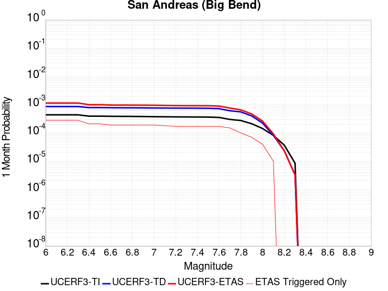 | 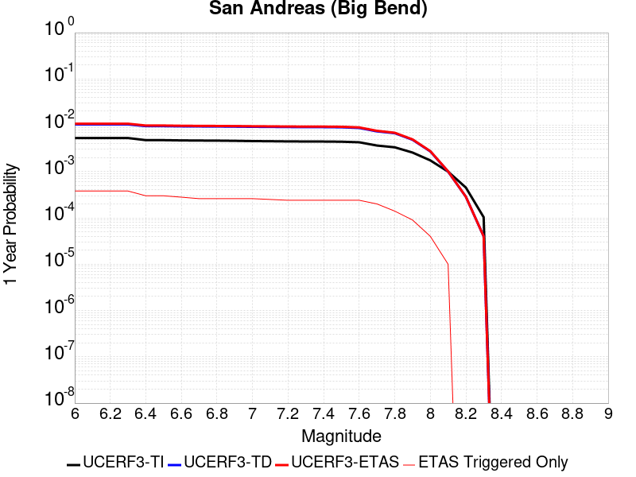 |  |

| Magnitude | 1 wk TI Prob | 1 wk TD Prob | 1 wk ETAS Prob | 1 wk ETAS/TD Gain | 1 wk ETAS Triggered Only | 1 mo TI Prob | 1 mo TD Prob | 1 mo ETAS Prob | 1 mo ETAS/TD Gain | 1 mo ETAS Triggered Only | 1 yr TI Prob | 1 yr TD Prob | 1 yr ETAS Prob | 1 yr ETAS/TD Gain | 1 yr ETAS Triggered Only | 10 yr TI Prob | 10 yr TD Prob | 10 yr ETAS Prob | 10 yr ETAS/TD Gain | 10 yr ETAS Triggered Only |
|-----|-----|-----|-----|-----|-----|-----|-----|-----|-----|-----|-----|-----|-----|-----|-----|-----|-----|-----|-----|-----|
| 6.0 | 1.0179969E-4 | 2.0072258E-4 | 4.0195938E-4 | 2.0025618 | 2.012772E-4 | 4.362114E-4 | 8.599571E-4 | 0.0011707543 | 1.3614101 | 3.1106477E-4 | 0.0052979486 | 0.010419999 | 0.0108183585 | 1.0382303 | 4.025544E-4 | 0.051734097 | 0.10144902 | 0.10192583 | 1.0047 | 5.306399E-4 |
| 6.1 | 1.0179969E-4 | 2.0072258E-4 | 4.0195938E-4 | 2.0025618 | 2.012772E-4 | 4.362114E-4 | 8.599571E-4 | 0.0011707543 | 1.3614101 | 3.1106477E-4 | 0.0052979486 | 0.010419999 | 0.0108183585 | 1.0382303 | 4.025544E-4 | 0.051734097 | 0.10144902 | 0.10192583 | 1.0047 | 5.306399E-4 |
| 6.2 | 1.0179969E-4 | 2.0072258E-4 | 4.0195938E-4 | 2.0025618 | 2.012772E-4 | 4.362114E-4 | 8.599571E-4 | 0.0011707543 | 1.3614101 | 3.1106477E-4 | 0.0052979486 | 0.010419999 | 0.0108183585 | 1.0382303 | 4.025544E-4 | 0.051734097 | 0.10144902 | 0.10192583 | 1.0047 | 5.306399E-4 |
| 6.3 | 1.0179969E-4 | 2.0072258E-4 | 4.0195938E-4 | 2.0025618 | 2.012772E-4 | 4.362114E-4 | 8.599571E-4 | 0.0011707543 | 1.3614101 | 3.1106477E-4 | 0.0052979486 | 0.010419999 | 0.0108183585 | 1.0382303 | 4.025544E-4 | 0.051734097 | 0.10144902 | 0.10192583 | 1.0047 | 5.306399E-4 |
| 6.4 | 9.1639464E-5 | 1.8429532E-4 | 3.489463E-4 | 1.8934084 | 1.6468135E-4 | 3.9268145E-4 | 7.895982E-4 | 0.001045567 | 1.3241758 | 2.5617098E-4 | 0.0047704205 | 0.009571102 | 0.009897312 | 1.0340829 | 3.293627E-4 | 0.046693064 | 0.09377527 | 0.094140075 | 1.0038902 | 4.025544E-4 |
| 6.5 | 9.1639464E-5 | 1.8429532E-4 | 3.489463E-4 | 1.8934084 | 1.6468135E-4 | 3.9268145E-4 | 7.895982E-4 | 0.001045567 | 1.3241758 | 2.5617098E-4 | 0.0047704205 | 0.009571102 | 0.009897312 | 1.0340829 | 3.293627E-4 | 0.046693064 | 0.09377527 | 0.094140075 | 1.0038902 | 4.025544E-4 |
| 6.6 | 9.042622E-5 | 1.823659E-4 | 3.287226E-4 | 1.8025444 | 1.4638342E-4 | 3.8748336E-4 | 7.8133424E-4 | 0.0010007378 | 1.2808063 | 2.1957511E-4 | 0.0047074095 | 0.009471365 | 0.00976136 | 1.030618 | 2.9276684E-4 | 0.046089325 | 0.092869274 | 0.09320125 | 1.0035746 | 3.6595855E-4 |
| 6.7 | 8.9836685E-5 | 1.8150927E-4 | 3.2786612E-4 | 1.8063327 | 1.4638342E-4 | 3.8495753E-4 | 7.776651E-4 | 9.970695E-4 | 1.2821321 | 2.1957511E-4 | 0.00467679 | 0.00942708 | 0.009717087 | 1.0307631 | 2.9276684E-4 | 0.045795817 | 0.09246355 | 0.09279567 | 1.0035919 | 3.6595855E-4 |
| 6.8 | 8.9471854E-5 | 1.8097709E-4 | 3.27334E-4 | 1.8087041 | 1.4638342E-4 | 3.8339442E-4 | 7.7538576E-4 | 9.947906E-4 | 1.2829622 | 2.1957511E-4 | 0.004657841 | 0.009399569 | 0.009689583 | 1.0308541 | 2.9276684E-4 | 0.04561414 | 0.092210755 | 0.09254297 | 1.0036027 | 3.6595855E-4 |
| 6.9 | 8.858234E-5 | 1.7979681E-4 | 3.261539E-4 | 1.8140138 | 1.4638342E-4 | 3.7958333E-4 | 7.703304E-4 | 9.897364E-4 | 1.2848206 | 2.1957511E-4 | 0.004611638 | 0.009338548 | 0.009628582 | 1.0310576 | 2.9276684E-4 | 0.04517103 | 0.09165087 | 0.09198329 | 1.0036271 | 3.6595855E-4 |
| 7.0 | 8.7433385E-5 | 1.7818481E-4 | 3.2454214E-4 | 1.8213794 | 1.4638342E-4 | 3.746607E-4 | 7.634259E-4 | 9.828334E-4 | 1.2873986 | 2.1957511E-4 | 0.004551957 | 0.009255203 | 0.00954526 | 1.0313399 | 2.9276684E-4 | 0.044598386 | 0.09088532 | 0.09121802 | 1.0036607 | 3.6595855E-4 |
| 7.1 | 8.684964E-5 | 1.7730435E-4 | 3.236618E-4 | 1.8254589 | 1.4638342E-4 | 3.7215967E-4 | 7.596547E-4 | 9.79063E-4 | 1.2888263 | 2.1957511E-4 | 0.0045216335 | 0.009209678 | 0.009499748 | 1.0314963 | 2.9276684E-4 | 0.04430731 | 0.09046686 | 0.09078307 | 1.0034953 | 3.4766062E-4 |
| 7.2 | 8.606521E-5 | 1.762105E-4 | 3.225681E-4 | 1.8305839 | 1.4638342E-4 | 3.6879873E-4 | 7.549695E-4 | 9.7437884E-4 | 1.2906202 | 2.1957511E-4 | 0.0044808835 | 0.0091531165 | 0.009443203 | 1.0316927 | 2.9276684E-4 | 0.043916024 | 0.089947365 | 0.09026376 | 1.0035175 | 3.4766062E-4 |
| 7.3 | 8.568266E-5 | 1.7563057E-4 | 3.2198828E-4 | 1.833327 | 1.4638342E-4 | 3.6715972E-4 | 7.524855E-4 | 9.7189535E-4 | 1.2915802 | 2.1957511E-4 | 0.0044610105 | 0.009123127 | 0.009413223 | 1.0317979 | 2.9276684E-4 | 0.043725148 | 0.08966853 | 0.08998501 | 1.0035295 | 3.4766062E-4 |
| 7.4 | 8.5432206E-5 | 1.7525644E-4 | 3.216142E-4 | 1.8351063 | 1.4638342E-4 | 3.6608664E-4 | 7.50883E-4 | 9.7029324E-4 | 1.292203 | 2.1957511E-4 | 0.004447999 | 0.009103781 | 0.009393882 | 1.0318661 | 2.9276684E-4 | 0.043600157 | 0.08948871 | 0.08980526 | 1.0035373 | 3.4766062E-4 |
| 7.5 | 8.4791965E-5 | 1.7394972E-4 | 3.2030768E-4 | 1.8413807 | 1.4638342E-4 | 3.633435E-4 | 7.4528606E-4 | 9.646975E-4 | 1.294399 | 2.1957511E-4 | 0.0044147377 | 0.009036204 | 0.009326326 | 1.0321065 | 2.9276684E-4 | 0.043280575 | 0.088866346 | 0.08918311 | 1.0035645 | 3.4766062E-4 |
| 7.6 | 8.241105E-5 | 1.6840403E-4 | 3.147628E-4 | 1.869093 | 1.4638342E-4 | 3.531424E-4 | 7.215321E-4 | 9.4094884E-4 | 1.3040982 | 2.1957511E-4 | 0.0042910352 | 0.008749358 | 0.009039564 | 1.0331688 | 2.9276684E-4 | 0.042091176 | 0.086243294 | 0.08656097 | 1.0036834 | 3.4766062E-4 |
| 7.7 | 7.00432E-5 | 1.42045E-4 | 2.8840764E-4 | 2.0303962 | 1.4638342E-4 | 3.001506E-4 | 6.0862233E-4 | 8.09777E-4 | 1.3305082 | 2.012772E-4 | 0.0036482112 | 0.0073848404 | 0.0076391194 | 1.0344326 | 2.5617098E-4 | 0.035888977 | 0.07351733 | 0.07375467 | 1.0032283 | 2.5617098E-4 |
| 7.8 | 6.415362E-5 | 1.2968935E-4 | 2.3946266E-4 | 1.8464329 | 1.0978756E-4 | 2.749151E-4 | 5.556931E-4 | 7.202829E-4 | 1.2961884 | 1.6468135E-4 | 0.0033419547 | 0.0067446055 | 0.0069627 | 1.0323361 | 2.1957511E-4 | 0.03292141 | 0.06725231 | 0.06745712 | 1.0030453 | 2.1957511E-4 |
| 7.9 | 4.939911E-5 | 9.3411545E-5 | 1.8489263E-4 | 1.9793339 | 9.148964E-5 | 2.116933E-4 | 4.0027377E-4 | 5.28308E-4 | 1.3198667 | 1.2808549E-4 | 0.0025743195 | 0.004862453 | 0.0050081243 | 1.0299585 | 1.4638342E-4 | 0.025447013 | 0.048914436 | 0.04905366 | 1.0028462 | 1.4638342E-4 |
| 8.0 | 3.344983E-5 | 5.222685E-5 | 8.8820794E-5 | 1.700673 | 3.6595855E-5 | 1.4334853E-4 | 2.2381016E-4 | 2.969855E-4 | 1.3269527 | 7.319171E-5 | 0.0017438711 | 0.0027214854 | 0.002794478 | 1.0268208 | 7.319171E-5 | 0.017302496 | 0.027922187 | 0.027993336 | 1.0025481 | 7.319171E-5 |
| 8.1 | 1.9104898E-5 | 1.9173063E-5 | 1.9173063E-5 | 1.0 | 0.0 | 8.1875565E-5 | 8.216769E-5 | 1.00464116E-4 | 1.2226717 | 1.8297927E-5 | 9.963791E-4 | 9.999331E-4 | 0.0010182128 | 1.0182809 | 1.8297927E-5 | 0.009919235 | 0.010749801 | 0.010767902 | 1.0016838 | 1.8297927E-5 |
| 8.2 | 8.643924E-6 | 5.4748625E-6 | 5.4748625E-6 | 1.0 | 0.0 | 3.704486E-5 | 2.3463486E-5 | 2.3463486E-5 | 1.0 | 0.0 | 4.5092785E-4 | 2.8563058E-4 | 2.8563058E-4 | 1.0 | 0.0 | 0.0045001395 | 0.0032487072 | 0.0032487072 | 1.0 | 0.0 |
| 8.3 | 1.983087E-6 | 7.6599065E-7 | 7.6599065E-7 | 1.0 | 0.0 | 8.498917E-6 | 3.282813E-6 | 3.282813E-6 | 1.0 | 0.0 | 1.034694E-4 | 3.9967534E-5 | 3.9967534E-5 | 1.0 | 0.0 | 0.0010342124 | 4.719687E-4 | 4.719687E-4 | 1.0 | 0.0 |

## Independence rev 2011
*[(top)](#table-of-contents)*

| 1 Week | 1 Month | 1 Year | 10 Year |
|-----|-----|-----|-----|
|  |  |  |  |

| Magnitude | 1 wk TI Prob | 1 wk TD Prob | 1 wk ETAS Prob | 1 wk ETAS/TD Gain | 1 wk ETAS Triggered Only | 1 mo TI Prob | 1 mo TD Prob | 1 mo ETAS Prob | 1 mo ETAS/TD Gain | 1 mo ETAS Triggered Only | 1 yr TI Prob | 1 yr TD Prob | 1 yr ETAS Prob | 1 yr ETAS/TD Gain | 1 yr ETAS Triggered Only | 10 yr TI Prob | 10 yr TD Prob | 10 yr ETAS Prob | 10 yr ETAS/TD Gain | 10 yr ETAS Triggered Only |
|-----|-----|-----|-----|-----|-----|-----|-----|-----|-----|-----|-----|-----|-----|-----|-----|-----|-----|-----|-----|-----|
| 6.0 | 4.422171E-6 | 4.326227E-6 | 2.0560256E-4 | 47.52468 | 2.012772E-4 | 1.8952025E-5 | 1.8540857E-5 | 2.564095E-4 | 13.82943 | 2.3787304E-4 | 2.3071647E-4 | 2.2571455E-4 | 5.732967E-4 | 2.5399191 | 3.4766062E-4 | 0.0023047708 | 0.0022551466 | 0.0027480763 | 1.21858 | 4.9404404E-4 |
| 6.1 | 4.422171E-6 | 4.326227E-6 | 2.0560256E-4 | 47.52468 | 2.012772E-4 | 1.8952025E-5 | 1.8540857E-5 | 2.564095E-4 | 13.82943 | 2.3787304E-4 | 2.3071647E-4 | 2.2571455E-4 | 5.732967E-4 | 2.5399191 | 3.4766062E-4 | 0.0023047708 | 0.0022551466 | 0.0027480763 | 1.21858 | 4.9404404E-4 |
| 6.2 | 4.422171E-6 | 4.326227E-6 | 2.0560256E-4 | 47.52468 | 2.012772E-4 | 1.8952025E-5 | 1.8540857E-5 | 2.564095E-4 | 13.82943 | 2.3787304E-4 | 2.3071647E-4 | 2.2571455E-4 | 5.732967E-4 | 2.5399191 | 3.4766062E-4 | 0.0023047708 | 0.0022551466 | 0.0027480763 | 1.21858 | 4.9404404E-4 |
| 6.3 | 4.422171E-6 | 4.326227E-6 | 2.0560256E-4 | 47.52468 | 2.012772E-4 | 1.8952025E-5 | 1.8540857E-5 | 2.564095E-4 | 13.82943 | 2.3787304E-4 | 2.3071647E-4 | 2.2571455E-4 | 5.732967E-4 | 2.5399191 | 3.4766062E-4 | 0.0023047708 | 0.0022551466 | 0.0027480763 | 1.21858 | 4.9404404E-4 |
| 6.4 | 4.422171E-6 | 4.326227E-6 | 2.0560256E-4 | 47.52468 | 2.012772E-4 | 1.8952025E-5 | 1.8540857E-5 | 2.564095E-4 | 13.82943 | 2.3787304E-4 | 2.3071647E-4 | 2.2571455E-4 | 5.732967E-4 | 2.5399191 | 3.4766062E-4 | 0.0023047708 | 0.0022551466 | 0.0027480763 | 1.21858 | 4.9404404E-4 |
| 6.5 | 4.422171E-6 | 4.326227E-6 | 2.0560256E-4 | 47.52468 | 2.012772E-4 | 1.8952025E-5 | 1.8540857E-5 | 2.564095E-4 | 13.82943 | 2.3787304E-4 | 2.3071647E-4 | 2.2571455E-4 | 5.732967E-4 | 2.5399191 | 3.4766062E-4 | 0.0023047708 | 0.0022551466 | 0.0027480763 | 1.21858 | 4.9404404E-4 |
| 6.6 | 2.663744E-6 | 2.5319862E-6 | 2.0380867E-4 | 80.4936 | 2.012772E-4 | 1.1415996E-5 | 1.0851327E-5 | 2.487218E-4 | 22.920864 | 2.3787304E-4 | 1.3898089E-4 | 1.3210738E-4 | 4.7972208E-4 | 3.631304 | 3.4766062E-4 | 0.0013889399 | 0.0013203367 | 0.0017771809 | 1.3460058 | 4.5744816E-4 |
| 6.7 | 2.663744E-6 | 2.5319862E-6 | 2.0380867E-4 | 80.4936 | 2.012772E-4 | 1.1415996E-5 | 1.0851327E-5 | 2.487218E-4 | 22.920864 | 2.3787304E-4 | 1.3898089E-4 | 1.3210738E-4 | 4.7972208E-4 | 3.631304 | 3.4766062E-4 | 0.0013889399 | 0.0013203367 | 0.0017771809 | 1.3460058 | 4.5744816E-4 |
| 6.8 | 1.9716529E-6 | 1.8322585E-6 | 2.0310908E-4 | 110.85177 | 2.012772E-4 | 8.449913E-6 | 7.852514E-6 | 2.457237E-4 | 31.292362 | 2.3787304E-4 | 1.0287284E-4 | 9.5600284E-5 | 4.4322765E-4 | 4.6362586 | 3.4766062E-4 | 0.0010282523 | 9.556045E-4 | 0.0014126155 | 1.4782429 | 4.5744816E-4 |
| 6.9 | 1.8788617E-6 | 1.7429993E-6 | 1.8472195E-4 | 105.97936 | 1.8297927E-4 | 8.0522395E-6 | 7.4699765E-6 | 2.2704346E-4 | 30.394135 | 2.1957511E-4 | 9.80316E-5 | 9.0943286E-5 | 4.2027602E-4 | 4.621298 | 3.293627E-4 | 9.798837E-4 | 9.0907275E-4 | 0.0013478238 | 1.4826357 | 4.3915023E-4 |
| 7.0 | 1.5045488E-6 | 1.3849503E-6 | 1.8436396E-4 | 133.11954 | 1.8297927E-4 | 6.44805E-6 | 5.9354884E-6 | 2.2550931E-4 | 37.993385 | 2.1957511E-4 | 7.8502184E-5 | 7.226223E-5 | 4.016011E-4 | 5.5575523 | 3.293627E-4 | 7.8474457E-4 | 7.2239246E-4 | 0.0011612255 | 1.6074717 | 4.3915023E-4 |
| 7.1 | 1.272341E-6 | 1.1625096E-6 | 1.8414157E-4 | 158.40002 | 1.8297927E-4 | 5.4528787E-6 | 4.982175E-6 | 2.245562E-4 | 45.071922 | 2.1957511E-4 | 6.6386776E-5 | 6.0656326E-5 | 3.8999904E-4 | 6.4296513 | 3.293627E-4 | 6.636695E-4 | 6.064009E-4 | 0.0010452848 | 1.7237521 | 4.3915023E-4 |
| 7.2 | 1.0416892E-6 | 9.4098806E-7 | 1.8392008E-4 | 195.45422 | 1.8297927E-4 | 4.464375E-6 | 4.0328E-6 | 2.2360704E-4 | 55.447098 | 2.1957511E-4 | 5.4352407E-5 | 4.909825E-5 | 3.7844476E-4 | 7.707907 | 3.293627E-4 | 5.4339116E-4 | 4.9087586E-4 | 9.115216E-4 | 1.856929 | 4.2085233E-4 |
| 7.3 | 7.9450155E-7 | 7.235002E-7 | 1.6540472E-4 | 228.61739 | 1.6468135E-4 | 3.4050022E-6 | 3.1007114E-6 | 2.0437728E-4 | 65.91303 | 2.012772E-4 | 4.1455114E-5 | 3.775052E-5 | 3.4880353E-4 | 9.239701 | 3.1106477E-4 | 4.144738E-4 | 3.7744216E-4 | 7.615536E-4 | 2.0176697 | 3.8425648E-4 |
| 7.4 | 5.3893444E-7 | 5.019512E-7 | 1.2858737E-4 | 256.17505 | 1.2808549E-4 | 2.309717E-6 | 2.1512178E-6 | 1.6683221E-4 | 77.55245 | 1.6468135E-4 | 2.8120441E-5 | 2.6190766E-5 | 2.640576E-4 | 10.0820875 | 2.3787304E-4 | 2.8116882E-4 | 2.6187726E-4 | 5.5456744E-4 | 2.1176617 | 2.9276684E-4 |
| 7.5 | 3.8852085E-7 | 3.682554E-7 | 1.284537E-4 | 348.81686 | 1.2808549E-4 | 1.6650882E-6 | 1.5782365E-6 | 1.6625931E-4 | 105.345 | 1.6468135E-4 | 2.027226E-5 | 1.9214862E-5 | 2.5708333E-4 | 13.379401 | 2.3787304E-4 | 2.0270412E-4 | 1.9213221E-4 | 4.848428E-4 | 2.5234852 | 2.9276684E-4 |
| 7.6 | 2.414929E-7 | 2.345755E-7 | 7.3426265E-5 | 313.0176 | 7.319171E-5 | 1.0349692E-6 | 1.0053232E-6 | 9.249487E-5 | 92.005104 | 9.148964E-5 | 1.2600677E-5 | 1.2239742E-5 | 1.7691907E-4 | 14.454476 | 1.6468135E-4 | 1.2599962E-4 | 1.223908E-4 | 3.4193904E-4 | 2.7938297 | 2.1957511E-4 |
| 7.7 | 6.8298014E-8 | 6.85897E-8 | 1.8366516E-5 | 267.77368 | 1.8297927E-5 | 2.9270575E-7 | 2.9395582E-7 | 1.8591878E-5 | 63.247185 | 1.8297927E-5 | 3.5636867E-6 | 3.5789067E-6 | 4.017463E-5 | 11.225392 | 3.6595855E-5 | 3.5636294E-5 | 3.5788536E-5 | 7.238308E-5 | 2.0225213 | 3.6595855E-5 |

## Kern Canyon (North Kern) 2011
*[(top)](#table-of-contents)*

| 1 Week | 1 Month | 1 Year | 10 Year |
|-----|-----|-----|-----|
|  |  |  |  |

| Magnitude | 1 wk TI Prob | 1 wk TD Prob | 1 wk ETAS Prob | 1 wk ETAS/TD Gain | 1 wk ETAS Triggered Only | 1 mo TI Prob | 1 mo TD Prob | 1 mo ETAS Prob | 1 mo ETAS/TD Gain | 1 mo ETAS Triggered Only | 1 yr TI Prob | 1 yr TD Prob | 1 yr ETAS Prob | 1 yr ETAS/TD Gain | 1 yr ETAS Triggered Only | 10 yr TI Prob | 10 yr TD Prob | 10 yr ETAS Prob | 10 yr ETAS/TD Gain | 10 yr ETAS Triggered Only |
|-----|-----|-----|-----|-----|-----|-----|-----|-----|-----|-----|-----|-----|-----|-----|-----|-----|-----|-----|-----|-----|
| 6.0 | 6.6264497E-6 | 6.75733E-6 | 1.3484195E-4 | 19.954916 | 1.2808549E-4 | 2.8398761E-5 | 2.895971E-5 | 1.9363628E-4 | 6.686403 | 1.6468135E-4 | 3.4570007E-4 | 3.5253543E-4 | 6.2690757E-4 | 1.7782825 | 2.744689E-4 | 0.0034516277 | 0.0035205502 | 0.003939921 | 1.1191208 | 4.2085233E-4 |
| 6.1 | 6.6264497E-6 | 6.75733E-6 | 1.3484195E-4 | 19.954916 | 1.2808549E-4 | 2.8398761E-5 | 2.895971E-5 | 1.9363628E-4 | 6.686403 | 1.6468135E-4 | 3.4570007E-4 | 3.5253543E-4 | 6.2690757E-4 | 1.7782825 | 2.744689E-4 | 0.0034516277 | 0.0035205502 | 0.003939921 | 1.1191208 | 4.2085233E-4 |
| 6.2 | 6.6264497E-6 | 6.75733E-6 | 1.3484195E-4 | 19.954916 | 1.2808549E-4 | 2.8398761E-5 | 2.895971E-5 | 1.9363628E-4 | 6.686403 | 1.6468135E-4 | 3.4570007E-4 | 3.5253543E-4 | 6.2690757E-4 | 1.7782825 | 2.744689E-4 | 0.0034516277 | 0.0035205502 | 0.003939921 | 1.1191208 | 4.2085233E-4 |
| 6.3 | 6.6264497E-6 | 6.75733E-6 | 1.3484195E-4 | 19.954916 | 1.2808549E-4 | 2.8398761E-5 | 2.895971E-5 | 1.9363628E-4 | 6.686403 | 1.6468135E-4 | 3.4570007E-4 | 3.5253543E-4 | 6.2690757E-4 | 1.7782825 | 2.744689E-4 | 0.0034516277 | 0.0035205502 | 0.003939921 | 1.1191208 | 4.2085233E-4 |
| 6.4 | 6.6264497E-6 | 6.75733E-6 | 1.3484195E-4 | 19.954916 | 1.2808549E-4 | 2.8398761E-5 | 2.895971E-5 | 1.9363628E-4 | 6.686403 | 1.6468135E-4 | 3.4570007E-4 | 3.5253543E-4 | 6.2690757E-4 | 1.7782825 | 2.744689E-4 | 0.0034516277 | 0.0035205502 | 0.003939921 | 1.1191208 | 4.2085233E-4 |
| 6.5 | 3.2162225E-6 | 3.2570915E-6 | 3.9852825E-5 | 12.23571 | 3.6595855E-5 | 1.3783738E-5 | 1.3958893E-5 | 6.885191E-5 | 4.932476 | 5.489378E-5 | 1.6780409E-4 | 1.6993708E-4 | 3.1629563E-4 | 1.8612514 | 1.4638342E-4 | 0.0016767744 | 0.001698151 | 0.0019356201 | 1.1398398 | 2.3787304E-4 |
| 6.6 | 3.2162225E-6 | 3.2570915E-6 | 3.9852825E-5 | 12.23571 | 3.6595855E-5 | 1.3783738E-5 | 1.3958893E-5 | 6.885191E-5 | 4.932476 | 5.489378E-5 | 1.6780409E-4 | 1.6993708E-4 | 3.1629563E-4 | 1.8612514 | 1.4638342E-4 | 0.0016767744 | 0.001698151 | 0.0019356201 | 1.1398398 | 2.3787304E-4 |
| 6.7 | 2.1908265E-6 | 2.2071222E-6 | 3.8802897E-5 | 17.580765 | 3.6595855E-5 | 9.389223E-6 | 9.459061E-6 | 6.435232E-5 | 6.803246 | 5.489378E-5 | 1.1430779E-4 | 1.1515819E-4 | 2.6152475E-4 | 2.2710044 | 1.4638342E-4 | 0.0011424901 | 0.0011510046 | 0.0013520501 | 1.1746696 | 2.012772E-4 |
| 6.8 | 1.7303895E-6 | 1.7365529E-6 | 3.8332342E-5 | 22.073812 | 3.6595855E-5 | 7.415934E-6 | 7.4423488E-6 | 6.233572E-5 | 8.375813 | 5.489378E-5 | 9.028525E-5 | 9.0606925E-5 | 2.1868081E-4 | 2.413511 | 1.2808549E-4 | 9.024858E-4 | 9.057096E-4 | 0.0010885231 | 1.2018456 | 1.8297927E-4 |
| 6.9 | 1.3700314E-6 | 1.3688622E-6 | 3.7964666E-5 | 27.734468 | 3.6595855E-5 | 5.87155E-6 | 5.8665396E-6 | 6.0759998E-5 | 10.357042 | 5.489378E-5 | 7.148377E-5 | 7.142282E-5 | 1.6290593E-4 | 2.2808664 | 9.148964E-5 | 7.146078E-4 | 7.140032E-4 | 8.419973E-4 | 1.1792625 | 1.2808549E-4 |
| 7.0 | 1.1467797E-6 | 1.1413804E-6 | 1.1413804E-6 | 1.0 | 0.0 | 4.9147607E-6 | 4.8916213E-6 | 4.8916213E-6 | 1.0 | 0.0 | 5.983557E-5 | 5.9553895E-5 | 7.785073E-5 | 1.3072315 | 1.8297927E-5 | 5.981946E-4 | 5.953825E-4 | 6.3195656E-4 | 1.0614295 | 3.6595855E-5 |
| 7.1 | 9.3952065E-7 | 9.3026904E-7 | 9.3026904E-7 | 1.0 | 0.0 | 4.026511E-6 | 3.9868614E-6 | 3.9868614E-6 | 1.0 | 0.0 | 4.9021666E-5 | 4.8538972E-5 | 6.683601E-5 | 1.3769556 | 1.8297927E-5 | 4.901085E-4 | 4.8528548E-4 | 5.218636E-4 | 1.0753744 | 3.6595855E-5 |
| 7.2 | 6.858055E-7 | 6.7193E-7 | 6.7193E-7 | 1.0 | 0.0 | 2.939163E-6 | 2.879697E-6 | 2.879697E-6 | 1.0 | 0.0 | 3.5783723E-5 | 3.5059755E-5 | 5.3357042E-5 | 1.5218885 | 1.8297927E-5 | 3.5777962E-4 | 3.5054312E-4 | 3.6883465E-4 | 1.0521805 | 1.8297927E-5 |
| 7.3 | 5.1101983E-7 | 4.9393E-7 | 4.9393E-7 | 1.0 | 0.0 | 2.1900833E-6 | 2.116841E-6 | 2.116841E-6 | 1.0 | 0.0 | 2.6663936E-5 | 2.5772239E-5 | 4.4069693E-5 | 1.7099676 | 1.8297927E-5 | 2.6660739E-4 | 2.57693E-4 | 2.759862E-4 | 1.0709884 | 1.8297927E-5 |
| 7.4 | 3.4999414E-7 | 3.2995905E-7 | 3.2995905E-7 | 1.0 | 0.0 | 1.499974E-6 | 1.4141094E-6 | 1.4141094E-6 | 1.0 | 0.0 | 1.8262032E-5 | 1.721665E-5 | 3.5514262E-5 | 2.0627859 | 1.8297927E-5 | 1.826053E-4 | 1.7215339E-4 | 1.9044818E-4 | 1.1062702 | 1.8297927E-5 |
| 7.5 | 1.7021522E-7 | 1.4750044E-7 | 1.4750044E-7 | 1.0 | 0.0 | 7.2949354E-7 | 6.321446E-7 | 6.321446E-7 | 1.0 | 0.0 | 8.881548E-6 | 7.696334E-6 | 7.696334E-6 | 1.0 | 0.0 | 8.8811925E-5 | 7.696076E-5 | 7.696076E-5 | 1.0 | 0.0 |
| 7.6 | 2.572245E-8 | 1.7352555E-8 | 1.7352555E-8 | 1.0 | 0.0 | 1.10239064E-7 | 7.436809E-8 | 7.436809E-8 | 1.0 | 0.0 | 1.3421597E-6 | 9.054312E-7 | 9.054312E-7 | 1.0 | 0.0 | 1.3421517E-5 | 9.05428E-6 | 9.05428E-6 | 1.0 | 0.0 |

## San Andreas (Carrizo) rev
*[(top)](#table-of-contents)*

| 1 Week | 1 Month | 1 Year | 10 Year |
|-----|-----|-----|-----|
|  | 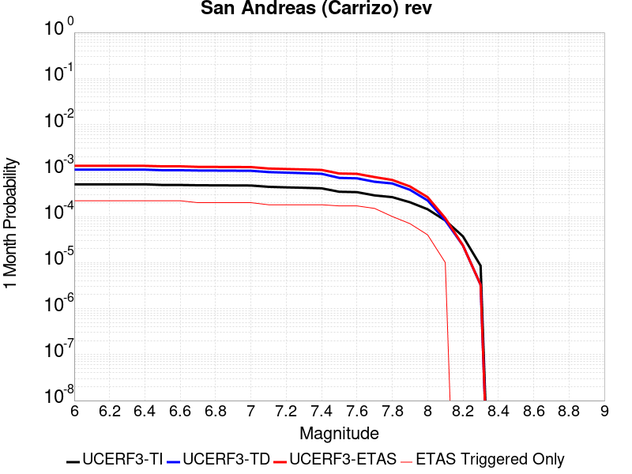 |  |  |

| Magnitude | 1 wk TI Prob | 1 wk TD Prob | 1 wk ETAS Prob | 1 wk ETAS/TD Gain | 1 wk ETAS Triggered Only | 1 mo TI Prob | 1 mo TD Prob | 1 mo ETAS Prob | 1 mo ETAS/TD Gain | 1 mo ETAS Triggered Only | 1 yr TI Prob | 1 yr TD Prob | 1 yr ETAS Prob | 1 yr ETAS/TD Gain | 1 yr ETAS Triggered Only | 10 yr TI Prob | 10 yr TD Prob | 10 yr ETAS Prob | 10 yr ETAS/TD Gain | 10 yr ETAS Triggered Only |
|-----|-----|-----|-----|-----|-----|-----|-----|-----|-----|-----|-----|-----|-----|-----|-----|-----|-----|-----|-----|-----|
| 6.0 | 1.1674632E-4 | 2.432302E-4 | 3.8957802E-4 | 1.6016843 | 1.4638342E-4 | 5.002454E-4 | 0.0010420004 | 0.0012796256 | 1.2280471 | 2.3787304E-4 | 0.006073493 | 0.012613042 | 0.0129563175 | 1.027216 | 3.4766062E-4 | 0.0591016 | 0.12061418 | 0.12098427 | 1.0030684 | 4.2085233E-4 |
| 6.1 | 1.1674632E-4 | 2.432302E-4 | 3.8957802E-4 | 1.6016843 | 1.4638342E-4 | 5.002454E-4 | 0.0010420004 | 0.0012796256 | 1.2280471 | 2.3787304E-4 | 0.006073493 | 0.012613042 | 0.0129563175 | 1.027216 | 3.4766062E-4 | 0.0591016 | 0.12061418 | 0.12098427 | 1.0030684 | 4.2085233E-4 |
| 6.2 | 1.1674632E-4 | 2.432302E-4 | 3.8957802E-4 | 1.6016843 | 1.4638342E-4 | 5.002454E-4 | 0.0010420004 | 0.0012796256 | 1.2280471 | 2.3787304E-4 | 0.006073493 | 0.012613042 | 0.0129563175 | 1.027216 | 3.4766062E-4 | 0.0591016 | 0.12061418 | 0.12098427 | 1.0030684 | 4.2085233E-4 |
| 6.3 | 1.1674632E-4 | 2.432302E-4 | 3.8957802E-4 | 1.6016843 | 1.4638342E-4 | 5.002454E-4 | 0.0010420004 | 0.0012796256 | 1.2280471 | 2.3787304E-4 | 0.006073493 | 0.012613042 | 0.0129563175 | 1.027216 | 3.4766062E-4 | 0.0591016 | 0.12061418 | 0.12098427 | 1.0030684 | 4.2085233E-4 |
| 6.4 | 1.1674632E-4 | 2.432302E-4 | 3.8957802E-4 | 1.6016843 | 1.4638342E-4 | 5.002454E-4 | 0.0010420004 | 0.0012796256 | 1.2280471 | 2.3787304E-4 | 0.006073493 | 0.012613042 | 0.0129563175 | 1.027216 | 3.4766062E-4 | 0.0591016 | 0.12061418 | 0.12098427 | 1.0030684 | 4.2085233E-4 |
| 6.5 | 1.13136164E-4 | 2.3643032E-4 | 3.8277914E-4 | 1.6189934 | 1.4638342E-4 | 4.847792E-4 | 0.0010128808 | 0.001250513 | 1.2346101 | 2.3787304E-4 | 0.0058862255 | 0.012262545 | 0.012587868 | 1.0265299 | 3.293627E-4 | 0.057327334 | 0.117585555 | 0.11794077 | 1.003021 | 4.025544E-4 |
| 6.6 | 1.13136164E-4 | 2.3643032E-4 | 3.8277914E-4 | 1.6189934 | 1.4638342E-4 | 4.847792E-4 | 0.0010128808 | 0.001250513 | 1.2346101 | 2.3787304E-4 | 0.0058862255 | 0.012262545 | 0.012587868 | 1.0265299 | 3.293627E-4 | 0.057327334 | 0.117585555 | 0.11794077 | 1.003021 | 4.025544E-4 |
| 6.7 | 1.1149675E-4 | 2.3334254E-4 | 3.796918E-4 | 1.6271863 | 1.4638342E-4 | 4.777557E-4 | 9.996577E-4 | 0.0012372929 | 1.2377167 | 2.3787304E-4 | 0.0058011734 | 0.012103349 | 0.012428725 | 1.0268831 | 3.293627E-4 | 0.05652051 | 0.1162071 | 0.11656287 | 1.0030615 | 4.025544E-4 |
| 6.8 | 1.1103589E-4 | 2.3236412E-4 | 3.7871354E-4 | 1.6298279 | 1.4638342E-4 | 4.7578133E-4 | 9.954676E-4 | 0.0012331039 | 1.2387182 | 2.3787304E-4 | 0.005777263 | 0.012052901 | 0.012378294 | 1.0269971 | 3.293627E-4 | 0.056293584 | 0.1157674 | 0.11612335 | 1.0030748 | 4.025544E-4 |
| 6.9 | 1.1053259E-4 | 2.3128795E-4 | 3.776375E-4 | 1.6327591 | 1.4638342E-4 | 4.7362508E-4 | 9.90859E-4 | 0.0012284964 | 1.2398297 | 2.3787304E-4 | 0.0057511497 | 0.01199741 | 0.012322822 | 1.0271235 | 3.293627E-4 | 0.05604569 | 0.11528359 | 0.11563974 | 1.0030893 | 4.025544E-4 |
| 7.0 | 1.1005377E-4 | 2.3029637E-4 | 3.766461E-4 | 1.6354842 | 1.4638342E-4 | 4.7157376E-4 | 9.866126E-4 | 0.001224251 | 1.2408628 | 2.3787304E-4 | 0.0057263062 | 0.011946279 | 0.012271707 | 1.027241 | 3.293627E-4 | 0.055809796 | 0.11483591 | 0.115192235 | 1.0031029 | 4.025544E-4 |
| 7.1 | 1.0308142E-4 | 2.1539345E-4 | 3.6174533E-4 | 1.679463 | 1.4638342E-4 | 4.417027E-4 | 9.227892E-4 | 0.0011421617 | 1.2377276 | 2.1957511E-4 | 0.0053644776 | 0.011177397 | 0.011484985 | 1.0275187 | 3.1106477E-4 | 0.052368138 | 0.108092256 | 0.10841866 | 1.0030197 | 3.6595855E-4 |
| 7.2 | 1.0027479E-4 | 2.094724E-4 | 3.5582515E-4 | 1.6986731 | 1.4638342E-4 | 4.296783E-4 | 8.9743105E-4 | 0.0011168091 | 1.2444512 | 2.1957511E-4 | 0.0052187922 | 0.010871782 | 0.011179465 | 1.028301 | 3.1106477E-4 | 0.050979212 | 0.10539625 | 0.105723634 | 1.0031062 | 3.6595855E-4 |
| 7.3 | 9.816942E-5 | 2.0422463E-4 | 3.5057816E-4 | 1.7166301 | 1.4638342E-4 | 4.2065824E-4 | 8.7495585E-4 | 0.0010943388 | 1.2507361 | 2.1957511E-4 | 0.005109493 | 0.010600842 | 0.010908609 | 1.0290323 | 3.1106477E-4 | 0.049935985 | 0.102979995 | 0.10330827 | 1.0031878 | 3.6595855E-4 |
| 7.4 | 9.5634205E-5 | 1.9791997E-4 | 3.4427442E-4 | 1.7394627 | 1.4638342E-4 | 4.0979648E-4 | 8.479536E-4 | 0.0010673426 | 1.2587276 | 2.1957511E-4 | 0.0049778637 | 0.010275229 | 0.010583097 | 1.0299622 | 3.1106477E-4 | 0.048678253 | 0.10006632 | 0.10037919 | 1.0031266 | 3.4766062E-4 |
| 7.5 | 8.052417E-5 | 1.611261E-4 | 3.0748593E-4 | 1.9083558 | 1.4638342E-4 | 3.4505792E-4 | 6.903579E-4 | 9.097814E-4 | 1.3178403 | 2.1957511E-4 | 0.0041929903 | 0.008372796 | 0.008663111 | 1.0346737 | 2.9276684E-4 | 0.04114753 | 0.08281049 | 0.08311258 | 1.0036479 | 3.293627E-4 |
| 7.6 | 7.897024E-5 | 1.5765853E-4 | 3.0401887E-4 | 1.9283376 | 1.4638342E-4 | 3.384E-4 | 6.755046E-4 | 8.9493144E-4 | 1.3248339 | 2.1957511E-4 | 0.0041122385 | 0.008193332 | 0.0084837 | 1.0354396 | 2.9276684E-4 | 0.040369697 | 0.08115171 | 0.08145434 | 1.0037292 | 3.293627E-4 |
| 7.7 | 6.707427E-5 | 1.3276102E-4 | 2.79125E-4 | 2.102462 | 1.4638342E-4 | 2.8742946E-4 | 5.688518E-4 | 7.700145E-4 | 1.3536294 | 2.012772E-4 | 0.003493839 | 0.00690381 | 0.0071582124 | 1.0368496 | 2.5617098E-4 | 0.034394164 | 0.069048055 | 0.06928654 | 1.0034539 | 2.5617098E-4 |
| 7.8 | 6.147705E-5 | 1.2197486E-4 | 2.3174903E-4 | 1.8999738 | 1.0978756E-4 | 2.6344648E-4 | 5.226447E-4 | 6.8724E-4 | 1.3149277 | 1.6468135E-4 | 0.0032027436 | 0.006344659 | 0.006562841 | 1.0343883 | 2.1957511E-4 | 0.031569764 | 0.06351457 | 0.0637202 | 1.0032375 | 2.1957511E-4 |
| 7.9 | 4.7636717E-5 | 8.87977E-5 | 1.8027921E-4 | 2.0302238 | 9.148964E-5 | 2.0414138E-4 | 3.8050607E-4 | 5.085428E-4 | 1.3364906 | 1.2808549E-4 | 0.0024825884 | 0.0046228287 | 0.0047685355 | 1.0315189 | 1.4638342E-4 | 0.024550365 | 0.046628095 | 0.046767652 | 1.002993 | 1.4638342E-4 |
| 8.0 | 3.3554235E-5 | 5.2136907E-5 | 8.8730856E-5 | 1.7018818 | 3.6595855E-5 | 1.4379594E-4 | 2.2342477E-4 | 2.9660013E-4 | 1.3275168 | 7.319171E-5 | 0.0017493097 | 0.002716805 | 0.002789798 | 1.0268672 | 7.319171E-5 | 0.017356034 | 0.027880952 | 0.027952103 | 1.0025519 | 7.319171E-5 |
| 8.1 | 1.9175432E-5 | 1.9184976E-5 | 1.9184976E-5 | 1.0 | 0.0 | 8.217783E-5 | 8.2218736E-5 | 1.0051516E-4 | 1.2225335 | 1.8297927E-5 | 0.0010000558 | 0.0010005541 | 0.0010188337 | 1.0182695 | 1.8297927E-5 | 0.009955673 | 0.0107580265 | 0.010776128 | 1.0016825 | 1.8297927E-5 |
| 8.2 | 8.643924E-6 | 5.4748625E-6 | 5.4748625E-6 | 1.0 | 0.0 | 3.704486E-5 | 2.3463486E-5 | 2.3463486E-5 | 1.0 | 0.0 | 4.5092785E-4 | 2.8563058E-4 | 2.8563058E-4 | 1.0 | 0.0 | 0.0045001395 | 0.0032487072 | 0.0032487072 | 1.0 | 0.0 |
| 8.3 | 1.983087E-6 | 7.6599065E-7 | 7.6599065E-7 | 1.0 | 0.0 | 8.498917E-6 | 3.282813E-6 | 3.282813E-6 | 1.0 | 0.0 | 1.034694E-4 | 3.9967534E-5 | 3.9967534E-5 | 1.0 | 0.0 | 0.0010342124 | 4.719687E-4 | 4.719687E-4 | 1.0 | 0.0 |

## Red Pass
*[(top)](#table-of-contents)*

| 1 Week | 1 Month | 1 Year | 10 Year |
|-----|-----|-----|-----|
|  |  |  |  |

| Magnitude | 1 wk TI Prob | 1 wk TD Prob | 1 wk ETAS Prob | 1 wk ETAS/TD Gain | 1 wk ETAS Triggered Only | 1 mo TI Prob | 1 mo TD Prob | 1 mo ETAS Prob | 1 mo ETAS/TD Gain | 1 mo ETAS Triggered Only | 1 yr TI Prob | 1 yr TD Prob | 1 yr ETAS Prob | 1 yr ETAS/TD Gain | 1 yr ETAS Triggered Only | 10 yr TI Prob | 10 yr TD Prob | 10 yr ETAS Prob | 10 yr ETAS/TD Gain | 10 yr ETAS Triggered Only |
|-----|-----|-----|-----|-----|-----|-----|-----|-----|-----|-----|-----|-----|-----|-----|-----|-----|-----|-----|-----|-----|
| 6.0 | 8.258278E-6 | 8.551265E-6 | 1.5493343E-4 | 18.118189 | 1.4638342E-4 | 3.539214E-5 | 3.6647863E-5 | 2.3791769E-4 | 6.491993 | 2.012772E-4 | 4.308141E-4 | 4.4611428E-4 | 7.387505E-4 | 1.655967 | 2.9276684E-4 | 0.0042997985 | 0.004453945 | 0.004872923 | 1.0940689 | 4.2085233E-4 |
| 6.1 | 3.649988E-6 | 3.7753161E-6 | 7.6966746E-5 | 20.386835 | 7.319171E-5 | 1.5642712E-5 | 1.6179853E-5 | 1.07668006E-4 | 6.654449 | 9.148964E-5 | 1.9043336E-4 | 1.9697666E-4 | 3.2503693E-4 | 1.6501291 | 1.2808549E-4 | 0.0019027026 | 0.001968488 | 0.0021511072 | 1.0927713 | 1.8297927E-4 |
| 6.2 | 3.649988E-6 | 3.7753161E-6 | 7.6966746E-5 | 20.386835 | 7.319171E-5 | 1.5642712E-5 | 1.6179853E-5 | 1.07668006E-4 | 6.654449 | 9.148964E-5 | 1.9043336E-4 | 1.9697666E-4 | 3.2503693E-4 | 1.6501291 | 1.2808549E-4 | 0.0019027026 | 0.001968488 | 0.0021511072 | 1.0927713 | 1.8297927E-4 |
| 6.3 | 1.3924937E-6 | 1.4411166E-6 | 1.9739016E-5 | 13.697029 | 1.8297927E-5 | 5.9678164E-6 | 6.1762075E-6 | 2.4474022E-5 | 3.9626293 | 1.8297927E-5 | 7.265574E-5 | 7.519415E-5 | 9.34907E-5 | 1.2433242 | 1.8297927E-5 | 7.263199E-4 | 7.518258E-4 | 7.883941E-4 | 1.0486394 | 3.6595855E-5 |
| 6.4 | 1.3924937E-6 | 1.4411166E-6 | 1.9739016E-5 | 13.697029 | 1.8297927E-5 | 5.9678164E-6 | 6.1762075E-6 | 2.4474022E-5 | 3.9626293 | 1.8297927E-5 | 7.265574E-5 | 7.519415E-5 | 9.34907E-5 | 1.2433242 | 1.8297927E-5 | 7.263199E-4 | 7.518258E-4 | 7.883941E-4 | 1.0486394 | 3.6595855E-5 |
| 6.5 | 9.876812E-7 | 1.0221912E-6 | 1.93201E-5 | 18.900671 | 1.8297927E-5 | 4.2329125E-6 | 4.3808195E-6 | 2.2678667E-5 | 5.1768093 | 1.8297927E-5 | 5.153449E-5 | 5.3336476E-5 | 7.1633425E-5 | 1.3430476 | 1.8297927E-5 | 5.1522546E-4 | 5.333648E-4 | 5.699411E-4 | 1.0685766 | 3.6595855E-5 |

## Lake Isabella (Seismicity)
*[(top)](#table-of-contents)*

| 1 Week | 1 Month | 1 Year | 10 Year |
|-----|-----|-----|-----|
|  |  |  |  |

| Magnitude | 1 wk TI Prob | 1 wk TD Prob | 1 wk ETAS Prob | 1 wk ETAS/TD Gain | 1 wk ETAS Triggered Only | 1 mo TI Prob | 1 mo TD Prob | 1 mo ETAS Prob | 1 mo ETAS/TD Gain | 1 mo ETAS Triggered Only | 1 yr TI Prob | 1 yr TD Prob | 1 yr ETAS Prob | 1 yr ETAS/TD Gain | 1 yr ETAS Triggered Only | 10 yr TI Prob | 10 yr TD Prob | 10 yr ETAS Prob | 10 yr ETAS/TD Gain | 10 yr ETAS Triggered Only |
|-----|-----|-----|-----|-----|-----|-----|-----|-----|-----|-----|-----|-----|-----|-----|-----|-----|-----|-----|-----|-----|
| 6.0 | 9.431637E-6 | 9.741651E-6 | 1.744214E-4 | 17.904703 | 1.6468135E-4 | 4.0420677E-5 | 4.1749343E-5 | 2.4301813E-4 | 5.8208857 | 2.012772E-4 | 4.920106E-4 | 5.0819275E-4 | 8.008108E-4 | 1.5758013 | 2.9276684E-4 | 0.004909227 | 0.005071599 | 0.0054721115 | 1.0789717 | 4.025544E-4 |
| 6.1 | 9.431637E-6 | 9.741651E-6 | 1.744214E-4 | 17.904703 | 1.6468135E-4 | 4.0420677E-5 | 4.1749343E-5 | 2.4301813E-4 | 5.8208857 | 2.012772E-4 | 4.920106E-4 | 5.0819275E-4 | 8.008108E-4 | 1.5758013 | 2.9276684E-4 | 0.004909227 | 0.005071599 | 0.0054721115 | 1.0789717 | 4.025544E-4 |
| 6.2 | 9.431637E-6 | 9.741651E-6 | 1.744214E-4 | 17.904703 | 1.6468135E-4 | 4.0420677E-5 | 4.1749343E-5 | 2.4301813E-4 | 5.8208857 | 2.012772E-4 | 4.920106E-4 | 5.0819275E-4 | 8.008108E-4 | 1.5758013 | 2.9276684E-4 | 0.004909227 | 0.005071599 | 0.0054721115 | 1.0789717 | 4.025544E-4 |
| 6.3 | 9.431637E-6 | 9.741651E-6 | 1.744214E-4 | 17.904703 | 1.6468135E-4 | 4.0420677E-5 | 4.1749343E-5 | 2.4301813E-4 | 5.8208857 | 2.012772E-4 | 4.920106E-4 | 5.0819275E-4 | 8.008108E-4 | 1.5758013 | 2.9276684E-4 | 0.004909227 | 0.005071599 | 0.0054721115 | 1.0789717 | 4.025544E-4 |
| 6.4 | 5.144063E-6 | 5.3000763E-6 | 9.678923E-5 | 18.261856 | 9.148964E-5 | 2.2045799E-5 | 2.2714434E-5 | 1.5079702E-4 | 6.6388187 | 1.2808549E-4 | 2.6837454E-4 | 2.765166E-4 | 4.5944526E-4 | 1.6615468 | 1.8297927E-4 | 0.0026805066 | 0.0027620657 | 0.0029810343 | 1.0792772 | 2.1957511E-4 |
| 6.5 | 5.144063E-6 | 5.3000763E-6 | 9.678923E-5 | 18.261856 | 9.148964E-5 | 2.2045799E-5 | 2.2714434E-5 | 1.5079702E-4 | 6.6388187 | 1.2808549E-4 | 2.6837454E-4 | 2.765166E-4 | 4.5944526E-4 | 1.6615468 | 1.8297927E-4 | 0.0026805066 | 0.0027620657 | 0.0029810343 | 1.0792772 | 2.1957511E-4 |
| 6.6 | 3.4009804E-6 | 3.498786E-6 | 7.669024E-5 | 21.919098 | 7.319171E-5 | 1.4575549E-5 | 1.4994721E-5 | 1.06482985E-4 | 7.101365 | 9.148964E-5 | 1.7744285E-4 | 1.8254704E-4 | 2.9231457E-4 | 1.6013108 | 1.0978756E-4 | 0.0017730123 | 0.0018241286 | 0.0019519804 | 1.0700892 | 1.2808549E-4 |
| 6.7 | 3.3880428E-6 | 3.4856528E-6 | 7.6677105E-5 | 21.99792 | 7.319171E-5 | 1.4520103E-5 | 1.4938435E-5 | 1.06426705E-4 | 7.124354 | 9.148964E-5 | 1.767679E-4 | 1.8186188E-4 | 2.9162946E-4 | 1.6035768 | 1.0978756E-4 | 0.0017662736 | 0.0018172882 | 0.0019451409 | 1.0703536 | 1.2808549E-4 |
| 6.8 | 2.6582E-6 | 2.7337003E-6 | 7.592521E-5 | 27.773787 | 7.319171E-5 | 1.1392236E-5 | 1.1715813E-5 | 1.0320437E-4 | 8.808981 | 9.148964E-5 | 1.3869164E-4 | 1.4263204E-4 | 2.3410862E-4 | 1.6413467 | 9.148964E-5 | 0.0013860512 | 0.0014255369 | 0.001535168 | 1.0769051 | 1.0978756E-4 |
| 6.9 | 2.406011E-6 | 2.4743288E-6 | 7.5665856E-5 | 30.580355 | 7.319171E-5 | 1.0311434E-5 | 1.0604231E-5 | 1.020929E-4 | 9.6275625 | 9.148964E-5 | 1.2553448E-4 | 1.2910018E-4 | 2.20578E-4 | 1.7085801 | 9.148964E-5 | 0.0012546359 | 0.0012903814 | 0.0014000273 | 1.0849717 | 1.0978756E-4 |
| 7.0 | 1.6953097E-6 | 1.7429371E-6 | 3.8338727E-5 | 21.99662 | 3.6595855E-5 | 7.265593E-6 | 7.469715E-6 | 4.4065295E-5 | 5.8991933 | 3.6595855E-5 | 8.8455E-5 | 9.094104E-5 | 1.2753357E-4 | 1.4023764 | 3.6595855E-5 | 8.84198E-4 | 9.09141E-4 | 9.639848E-4 | 1.0603249 | 5.489378E-5 |
| 7.1 | 3.5013824E-7 | 3.5714822E-7 | 1.8655068E-5 | 52.233406 | 1.8297927E-5 | 1.5005916E-6 | 1.5306344E-6 | 1.9828532E-5 | 12.954454 | 1.8297927E-5 | 1.826955E-5 | 1.8635317E-5 | 3.6932903E-5 | 1.9818769 | 1.8297927E-5 | 1.8268047E-4 | 1.863378E-4 | 2.046323E-4 | 1.0981793 | 1.8297927E-5 |
| 7.2 | 2.2321095E-7 | 2.2750574E-7 | 2.2750574E-7 | 1.0 | 0.0 | 9.56618E-7 | 9.750242E-7 | 9.750242E-7 | 1.0 | 0.0 | 1.1646762E-5 | 1.1870856E-5 | 1.1870856E-5 | 1.0 | 0.0 | 1.1646151E-4 | 1.1870232E-4 | 1.1870232E-4 | 1.0 | 0.0 |
| 7.3 | 1.5760406E-7 | 1.6060922E-7 | 1.6060922E-7 | 1.0 | 0.0 | 6.7544585E-7 | 6.8832503E-7 | 6.8832503E-7 | 1.0 | 0.0 | 8.223522E-6 | 8.380326E-6 | 8.380326E-6 | 1.0 | 0.0 | 8.2232174E-5 | 8.3800165E-5 | 8.3800165E-5 | 1.0 | 0.0 |
| 7.4 | 1.1216497E-7 | 1.1431706E-7 | 1.1431706E-7 | 1.0 | 0.0 | 4.8070694E-7 | 4.899302E-7 | 4.899302E-7 | 1.0 | 0.0 | 5.852591E-6 | 5.964884E-6 | 5.964884E-6 | 1.0 | 0.0 | 5.8524372E-5 | 5.9647282E-5 | 5.9647282E-5 | 1.0 | 0.0 |
| 7.5 | 4.885185E-8 | 4.9787737E-8 | 4.9787737E-8 | 1.0 | 0.0 | 2.0936506E-7 | 2.13376E-7 | 2.13376E-7 | 1.0 | 0.0 | 2.5490165E-6 | 2.59785E-6 | 2.59785E-6 | 1.0 | 0.0 | 2.5489873E-5 | 2.5978214E-5 | 2.5978214E-5 | 1.0 | 0.0 |
| 7.6 | 1.504641E-9 | 1.5317903E-9 | 1.5317903E-9 | 1.0 | 0.0 | 6.4484613E-9 | 6.5648154E-9 | 6.5648154E-9 | 1.0 | 0.0 | 7.851001E-8 | 7.992663E-8 | 7.992663E-8 | 1.0 | 0.0 | 7.8509987E-7 | 7.992663E-7 | 7.992663E-7 | 1.0 | 0.0 |

## San Andreas (Cholame) rev
*[(top)](#table-of-contents)*

| 1 Week | 1 Month | 1 Year | 10 Year |
|-----|-----|-----|-----|
|  |  |  |  |

| Magnitude | 1 wk TI Prob | 1 wk TD Prob | 1 wk ETAS Prob | 1 wk ETAS/TD Gain | 1 wk ETAS Triggered Only | 1 mo TI Prob | 1 mo TD Prob | 1 mo ETAS Prob | 1 mo ETAS/TD Gain | 1 mo ETAS Triggered Only | 1 yr TI Prob | 1 yr TD Prob | 1 yr ETAS Prob | 1 yr ETAS/TD Gain | 1 yr ETAS Triggered Only | 10 yr TI Prob | 10 yr TD Prob | 10 yr ETAS Prob | 10 yr ETAS/TD Gain | 10 yr ETAS Triggered Only |
|-----|-----|-----|-----|-----|-----|-----|-----|-----|-----|-----|-----|-----|-----|-----|-----|-----|-----|-----|-----|-----|
| 6.0 | 1.2302514E-4 | 2.5204287E-4 | 4.166827E-4 | 1.6532216 | 1.6468135E-4 | 5.27144E-4 | 0.0010797381 | 0.0013173544 | 1.2200683 | 2.3787304E-4 | 0.0063991086 | 0.0130670825 | 0.013392141 | 1.0248761 | 3.293627E-4 | 0.06217949 | 0.12439073 | 0.12472719 | 1.0027049 | 3.8425648E-4 |
| 6.1 | 1.2302514E-4 | 2.5204287E-4 | 4.166827E-4 | 1.6532216 | 1.6468135E-4 | 5.27144E-4 | 0.0010797381 | 0.0013173544 | 1.2200683 | 2.3787304E-4 | 0.0063991086 | 0.0130670825 | 0.013392141 | 1.0248761 | 3.293627E-4 | 0.06217949 | 0.12439073 | 0.12472719 | 1.0027049 | 3.8425648E-4 |
| 6.2 | 1.2203569E-4 | 2.5021084E-4 | 4.1485098E-4 | 1.6580056 | 1.6468135E-4 | 5.2290526E-4 | 0.0010718931 | 0.0013095111 | 1.2216808 | 2.3787304E-4 | 0.006347804 | 0.01297271 | 0.0132978 | 1.0250596 | 3.293627E-4 | 0.061695136 | 0.12357691 | 0.123913676 | 1.0027252 | 3.8425648E-4 |
| 6.3 | 1.2142645E-4 | 2.4907055E-4 | 4.137109E-4 | 1.6610188 | 1.6468135E-4 | 5.202953E-4 | 0.0010670102 | 0.0013046295 | 1.2226963 | 2.3787304E-4 | 0.006316212 | 0.012913967 | 0.013239076 | 1.025175 | 3.293627E-4 | 0.06139677 | 0.12307103 | 0.123408 | 1.002738 | 3.8425648E-4 |
| 6.4 | 1.1865206E-4 | 2.44126E-4 | 3.904737E-4 | 1.599476 | 1.4638342E-4 | 5.0840975E-4 | 0.0010458364 | 0.0012651818 | 1.2097322 | 2.1957511E-4 | 0.006172335 | 0.012659196 | 0.012966323 | 1.0242611 | 3.1106477E-4 | 0.060036868 | 0.1208638 | 0.12118553 | 1.002662 | 3.6595855E-4 |
| 6.5 | 1.17443946E-4 | 2.4205919E-4 | 3.8840718E-4 | 1.6045959 | 1.4638342E-4 | 5.032341E-4 | 0.0010369857 | 0.0012563331 | 1.211524 | 2.1957511E-4 | 0.006109677 | 0.012552682 | 0.012859843 | 1.0244697 | 3.1106477E-4 | 0.059444077 | 0.11993805 | 0.12026012 | 1.0026853 | 3.6595855E-4 |
| 6.6 | 1.13579066E-4 | 2.3514954E-4 | 3.8149854E-4 | 1.6223656 | 1.4638342E-4 | 4.866766E-4 | 0.001007396 | 0.00122675 | 1.2177435 | 2.1957511E-4 | 0.0059092017 | 0.012196515 | 0.012485711 | 1.0237113 | 2.9276684E-4 | 0.057545185 | 0.11685214 | 0.11715918 | 1.0026276 | 3.4766062E-4 |
| 6.7 | 1.1271412E-4 | 2.3359268E-4 | 3.7994192E-4 | 1.6265146 | 1.4638342E-4 | 4.829711E-4 | 0.0010007289 | 0.0012018047 | 1.2009293 | 2.012772E-4 | 0.005864331 | 0.012116249 | 0.012387392 | 1.0223784 | 2.744689E-4 | 0.057119697 | 0.116155714 | 0.116446815 | 1.0025061 | 3.293627E-4 |
| 6.8 | 1.1217975E-4 | 2.3247694E-4 | 3.7882634E-4 | 1.6295221 | 1.4638342E-4 | 4.8068175E-4 | 9.959509E-4 | 0.0011970276 | 1.2018943 | 2.012772E-4 | 0.005836608 | 0.012058721 | 0.01232988 | 1.0224866 | 2.744689E-4 | 0.056856725 | 0.11565396 | 0.115945235 | 1.0025184 | 3.293627E-4 |
| 6.9 | 1.1146753E-4 | 2.3096445E-4 | 3.7731405E-4 | 1.6336455 | 1.4638342E-4 | 4.7763053E-4 | 9.894737E-4 | 0.0011905517 | 1.2032171 | 2.012772E-4 | 0.0057996577 | 0.011980731 | 0.012251912 | 1.0226347 | 2.744689E-4 | 0.056506127 | 0.11497439 | 0.11526588 | 1.0025353 | 3.293627E-4 |
| 7.0 | 1.0965793E-4 | 2.2719789E-4 | 3.7354804E-4 | 1.6441528 | 1.4638342E-4 | 4.698779E-4 | 9.733434E-4 | 0.0011744247 | 1.2065883 | 2.012772E-4 | 0.005705768 | 0.011786487 | 0.012057721 | 1.0230123 | 2.744689E-4 | 0.055614736 | 0.11327597 | 0.113568015 | 1.0025783 | 3.293627E-4 |
| 7.1 | 9.927982E-5 | 2.0538924E-4 | 3.5174258E-4 | 1.7125658 | 1.4638342E-4 | 4.2541555E-4 | 8.7994366E-4 | 0.0010810437 | 1.2285374 | 2.012772E-4 | 0.0051671406 | 0.010660981 | 0.010932524 | 1.0254707 | 2.744689E-4 | 0.05048634 | 0.1033706 | 0.10366592 | 1.0028569 | 3.293627E-4 |
| 7.2 | 9.696786E-5 | 2.0043184E-4 | 3.467859E-4 | 1.7301937 | 1.4638342E-4 | 4.1551032E-4 | 8.5871184E-4 | 0.0010598162 | 1.2341931 | 2.012772E-4 | 0.00504711 | 0.010404981 | 0.0106765935 | 1.0261041 | 2.744689E-4 | 0.04934009 | 0.1011086 | 0.10140466 | 1.0029281 | 3.293627E-4 |
| 7.3 | 9.4727984E-5 | 1.9472468E-4 | 3.410796E-4 | 1.7515992 | 1.4638342E-4 | 4.0591392E-4 | 8.3426846E-4 | 0.0010353777 | 1.2410606 | 2.012772E-4 | 0.0049308087 | 0.010110183 | 0.0103818765 | 1.0268734 | 2.744689E-4 | 0.048228268 | 0.09847952 | 0.098776445 | 1.0030152 | 3.293627E-4 |
| 7.4 | 9.220358E-5 | 1.8843076E-4 | 3.347866E-4 | 1.7767088 | 1.4638342E-4 | 3.9509835E-4 | 8.073114E-4 | 0.0010084261 | 1.2491167 | 2.012772E-4 | 0.004799717 | 0.009784967 | 0.01005675 | 1.0277756 | 2.744689E-4 | 0.046973653 | 0.095557496 | 0.09583884 | 1.0029442 | 3.1106477E-4 |
| 7.5 | 7.71631E-5 | 1.5177966E-4 | 2.9814086E-4 | 1.9643004 | 1.4638342E-4 | 3.306571E-4 | 6.503223E-4 | 8.514686E-4 | 1.3093024 | 2.012772E-4 | 0.0040183207 | 0.007889002 | 0.008143151 | 1.0322157 | 2.5617098E-4 | 0.03946433 | 0.07828531 | 0.07855515 | 1.0034469 | 2.9276684E-4 |
| 7.6 | 7.5634416E-5 | 1.483744E-4 | 2.947361E-4 | 1.9864349 | 1.4638342E-4 | 3.241072E-4 | 6.3573546E-4 | 8.368847E-4 | 1.316404 | 2.012772E-4 | 0.0039388672 | 0.0077126776 | 0.007966873 | 1.0329581 | 2.5617098E-4 | 0.038697794 | 0.07664872 | 0.07691905 | 1.0035268 | 2.9276684E-4 |
| 7.7 | 6.3783E-5 | 1.235872E-4 | 2.6995252E-4 | 2.184308 | 1.4638342E-4 | 2.7332708E-4 | 5.29552E-4 | 7.3072256E-4 | 1.3798883 | 2.012772E-4 | 0.0033226798 | 0.0064282627 | 0.0066646067 | 1.0367664 | 2.3787304E-4 | 0.032734364 | 0.06454029 | 0.064762816 | 1.0034478 | 2.3787304E-4 |
| 7.8 | 5.863422E-5 | 1.1416107E-4 | 2.239361E-4 | 1.9615802 | 1.0978756E-4 | 2.512653E-4 | 4.8917E-4 | 6.537708E-4 | 1.3364899 | 1.6468135E-4 | 0.003054864 | 0.0059394026 | 0.0061394842 | 1.0336872 | 2.012772E-4 | 0.030132094 | 0.059659187 | 0.059848454 | 1.0031725 | 2.012772E-4 |
| 7.9 | 4.595283E-5 | 8.426331E-5 | 1.7574524E-4 | 2.0856674 | 9.148964E-5 | 1.9692584E-4 | 3.610785E-4 | 4.8911775E-4 | 1.3546022 | 1.2808549E-4 | 0.0023949358 | 0.0043872762 | 0.0045330175 | 1.0332191 | 1.4638342E-4 | 0.023692891 | 0.044362005 | 0.044501897 | 1.0031533 | 1.4638342E-4 |
| 8.0 | 3.2950178E-5 | 5.0772942E-5 | 8.736694E-5 | 1.7207382 | 3.6595855E-5 | 1.412074E-4 | 2.1758018E-4 | 2.9075597E-4 | 1.3363163 | 7.319171E-5 | 0.0017178444 | 0.0026458222 | 0.0027188205 | 1.0275899 | 7.319171E-5 | 0.017046256 | 0.027180137 | 0.027251339 | 1.0026196 | 7.319171E-5 |
| 8.1 | 1.9177472E-5 | 1.9185145E-5 | 1.9185145E-5 | 1.0 | 0.0 | 8.218658E-5 | 8.221946E-5 | 1.00515885E-4 | 1.2225316 | 1.8297927E-5 | 0.0010001622 | 0.0010005629 | 0.0010188426 | 1.0182693 | 1.8297927E-5 | 0.009956728 | 0.010758142 | 0.010776243 | 1.0016825 | 1.8297927E-5 |
| 8.2 | 8.643924E-6 | 5.4748625E-6 | 5.4748625E-6 | 1.0 | 0.0 | 3.704486E-5 | 2.3463486E-5 | 2.3463486E-5 | 1.0 | 0.0 | 4.5092785E-4 | 2.8563058E-4 | 2.8563058E-4 | 1.0 | 0.0 | 0.0045001395 | 0.0032487072 | 0.0032487072 | 1.0 | 0.0 |
| 8.3 | 1.983087E-6 | 7.6599065E-7 | 7.6599065E-7 | 1.0 | 0.0 | 8.498917E-6 | 3.282813E-6 | 3.282813E-6 | 1.0 | 0.0 | 1.034694E-4 | 3.9967534E-5 | 3.9967534E-5 | 1.0 | 0.0 | 0.0010342124 | 4.719687E-4 | 4.719687E-4 | 1.0 | 0.0 |

## San Andreas (San Gorgonio Pass-Garnet HIll)
*[(top)](#table-of-contents)*

| 1 Week | 1 Month | 1 Year | 10 Year |
|-----|-----|-----|-----|
|  |  |  |  |

| Magnitude | 1 wk TI Prob | 1 wk TD Prob | 1 wk ETAS Prob | 1 wk ETAS/TD Gain | 1 wk ETAS Triggered Only | 1 mo TI Prob | 1 mo TD Prob | 1 mo ETAS Prob | 1 mo ETAS/TD Gain | 1 mo ETAS Triggered Only | 1 yr TI Prob | 1 yr TD Prob | 1 yr ETAS Prob | 1 yr ETAS/TD Gain | 1 yr ETAS Triggered Only | 10 yr TI Prob | 10 yr TD Prob | 10 yr ETAS Prob | 10 yr ETAS/TD Gain | 10 yr ETAS Triggered Only |
|-----|-----|-----|-----|-----|-----|-----|-----|-----|-----|-----|-----|-----|-----|-----|-----|-----|-----|-----|-----|-----|
| 6.0 | 8.31567E-5 | 2.3382473E-4 | 3.801739E-4 | 1.6258926 | 1.4638342E-4 | 3.5633717E-4 | 0.0010017233 | 0.0012027989 | 1.2007296 | 2.012772E-4 | 0.004329778 | 0.012127888 | 0.012435181 | 1.0253377 | 3.1106477E-4 | 0.042463828 | 0.11257892 | 0.11291991 | 1.003029 | 3.8425648E-4 |
| 6.1 | 8.31567E-5 | 2.3382473E-4 | 3.801739E-4 | 1.6258926 | 1.4638342E-4 | 3.5633717E-4 | 0.0010017233 | 0.0012027989 | 1.2007296 | 2.012772E-4 | 0.004329778 | 0.012127888 | 0.012435181 | 1.0253377 | 3.1106477E-4 | 0.042463828 | 0.11257892 | 0.11291991 | 1.003029 | 3.8425648E-4 |
| 6.2 | 8.31567E-5 | 2.3382473E-4 | 3.801739E-4 | 1.6258926 | 1.4638342E-4 | 3.5633717E-4 | 0.0010017233 | 0.0012027989 | 1.2007296 | 2.012772E-4 | 0.004329778 | 0.012127888 | 0.012435181 | 1.0253377 | 3.1106477E-4 | 0.042463828 | 0.11257892 | 0.11291991 | 1.003029 | 3.8425648E-4 |
| 6.3 | 8.31567E-5 | 2.3382473E-4 | 3.801739E-4 | 1.6258926 | 1.4638342E-4 | 3.5633717E-4 | 0.0010017233 | 0.0012027989 | 1.2007296 | 2.012772E-4 | 0.004329778 | 0.012127888 | 0.012435181 | 1.0253377 | 3.1106477E-4 | 0.042463828 | 0.11257892 | 0.11291991 | 1.003029 | 3.8425648E-4 |
| 6.4 | 8.059055E-5 | 2.2940808E-4 | 3.7575793E-4 | 1.6379454 | 1.4638342E-4 | 3.4534236E-4 | 9.828096E-4 | 0.0011838889 | 1.2045965 | 2.012772E-4 | 0.0041964394 | 0.011900152 | 0.012207515 | 1.0258285 | 3.1106477E-4 | 0.041180745 | 0.11056015 | 0.11090192 | 1.0030913 | 3.8425648E-4 |
| 6.5 | 8.059055E-5 | 2.2940808E-4 | 3.7575793E-4 | 1.6379454 | 1.4638342E-4 | 3.4534236E-4 | 9.828096E-4 | 0.0011838889 | 1.2045965 | 2.012772E-4 | 0.0041964394 | 0.011900152 | 0.012207515 | 1.0258285 | 3.1106477E-4 | 0.041180745 | 0.11056015 | 0.11090192 | 1.0030913 | 3.8425648E-4 |
| 6.6 | 7.619237E-5 | 2.218517E-4 | 3.6820263E-4 | 1.6596792 | 1.4638342E-4 | 3.2649786E-4 | 9.5044886E-4 | 0.0011515347 | 1.2115694 | 2.012772E-4 | 0.0039678677 | 0.01151087 | 0.011818354 | 1.0267125 | 3.1106477E-4 | 0.03897764 | 0.10709683 | 0.107423596 | 1.0030512 | 3.6595855E-4 |
| 6.7 | 7.440636E-5 | 2.1860997E-4 | 3.649614E-4 | 1.6694636 | 1.4638342E-4 | 3.188454E-4 | 9.3656575E-4 | 0.0011376544 | 1.2147086 | 2.012772E-4 | 0.0038750346 | 0.011343609 | 0.011651144 | 1.0271109 | 3.1106477E-4 | 0.038081564 | 0.105605274 | 0.105932586 | 1.0030994 | 3.6595855E-4 |
| 6.8 | 7.3735864E-5 | 2.1708169E-4 | 3.6343333E-4 | 1.6741778 | 1.4638342E-4 | 3.1597257E-4 | 9.3002064E-4 | 0.0011311106 | 1.216221 | 2.012772E-4 | 0.0038401815 | 0.011264749 | 0.01157231 | 1.027303 | 3.1106477E-4 | 0.03774495 | 0.10490683 | 0.10523439 | 1.0031224 | 3.6595855E-4 |
| 6.9 | 7.27575E-5 | 2.1477141E-4 | 3.6112338E-4 | 1.6814313 | 1.4638342E-4 | 3.117806E-4 | 9.201265E-4 | 0.0011212184 | 1.2185482 | 2.012772E-4 | 0.003789323 | 0.011145527 | 0.011453124 | 1.0275983 | 3.1106477E-4 | 0.037253562 | 0.103854746 | 0.1041827 | 1.0031579 | 3.6595855E-4 |
| 7.0 | 7.102591E-5 | 2.1061185E-4 | 3.5696442E-4 | 1.6948924 | 1.4638342E-4 | 3.0436125E-4 | 9.023122E-4 | 0.0011034078 | 1.222867 | 2.012772E-4 | 0.003699303 | 0.010930831 | 0.011238496 | 1.0281465 | 3.1106477E-4 | 0.03638325 | 0.10195695 | 0.102285594 | 1.0032234 | 3.6595855E-4 |
| 7.1 | 7.028513E-5 | 2.0896831E-4 | 3.5532113E-4 | 1.700359 | 1.4638342E-4 | 3.0118722E-4 | 8.9527335E-4 | 0.0010963703 | 1.2246208 | 2.012772E-4 | 0.0036607897 | 0.010845989 | 0.01115368 | 1.0283691 | 3.1106477E-4 | 0.036010686 | 0.101199985 | 0.10152891 | 1.0032502 | 3.6595855E-4 |
| 7.2 | 6.8498244E-5 | 2.0504706E-4 | 3.5140046E-4 | 1.7137551 | 1.4638342E-4 | 2.9353087E-4 | 8.784794E-4 | 0.0010795798 | 1.2289187 | 2.012772E-4 | 0.003567883 | 0.010643536 | 0.01095129 | 1.0289147 | 3.1106477E-4 | 0.035111405 | 0.09939202 | 0.09970512 | 1.0031502 | 3.4766062E-4 |
| 7.3 | 6.622592E-5 | 1.9732013E-4 | 3.4367465E-4 | 1.7417111 | 1.4638342E-4 | 2.8379448E-4 | 8.453858E-4 | 0.0010464928 | 1.2378879 | 2.012772E-4 | 0.0034497243 | 0.0102444785 | 0.010552357 | 1.030053 | 3.1106477E-4 | 0.033966612 | 0.095888525 | 0.09620285 | 1.003278 | 3.4766062E-4 |
| 7.4 | 5.1050705E-5 | 1.4689034E-4 | 2.74957E-4 | 1.8718523 | 1.2808549E-4 | 2.1877038E-4 | 6.29379E-4 | 8.122431E-4 | 1.2905469 | 1.8297927E-4 | 0.002660276 | 0.0076359594 | 0.007908333 | 1.0356698 | 2.744689E-4 | 0.02628654 | 0.07286301 | 0.07313445 | 1.0037253 | 2.9276684E-4 |
| 7.5 | 3.9302922E-5 | 1.1129847E-4 | 2.393697E-4 | 2.1507008 | 1.2808549E-4 | 1.6843023E-4 | 4.7690657E-4 | 6.5979856E-4 | 1.3834965 | 1.8297927E-4 | 0.0020487092 | 0.005790949 | 0.0060638282 | 1.0471218 | 2.744689E-4 | 0.020299247 | 0.05600951 | 0.05628588 | 1.0049343 | 2.9276684E-4 |
| 7.6 | 2.9851626E-5 | 8.4949745E-5 | 2.1302435E-4 | 2.5076516 | 1.2808549E-4 | 1.2792926E-4 | 3.6401965E-4 | 5.4693234E-4 | 1.5024801 | 1.8297927E-4 | 0.0015564259 | 0.0044229585 | 0.004696213 | 1.061781 | 2.744689E-4 | 0.0154556995 | 0.04319374 | 0.04347386 | 1.0064852 | 2.9276684E-4 |
| 7.7 | 2.1135214E-5 | 6.3529005E-5 | 1.9160635E-4 | 3.0160453 | 1.2808549E-4 | 9.0576345E-5 | 2.7223877E-4 | 4.3687527E-4 | 1.6047504 | 1.6468135E-4 | 0.0011022091 | 0.0033094748 | 0.003564798 | 1.0771492 | 2.5617098E-4 | 0.010967582 | 0.032582592 | 0.03284812 | 1.0081493 | 2.744689E-4 |
| 7.8 | 1.883379E-5 | 5.564028E-5 | 1.8371864E-4 | 3.3019 | 1.2808549E-4 | 8.0713755E-5 | 2.3843657E-4 | 4.0307865E-4 | 1.6905068 | 1.6468135E-4 | 9.822468E-4 | 0.0028991038 | 0.0031545323 | 1.0881059 | 2.5617098E-4 | 0.0097791655 | 0.028695205 | 0.028961798 | 1.0092905 | 2.744689E-4 |
| 7.9 | 1.5156185E-5 | 4.1658426E-5 | 1.6973857E-4 | 4.0745316 | 1.2808549E-4 | 6.495346E-5 | 1.785239E-4 | 3.4317584E-4 | 1.9222964 | 1.6468135E-4 | 7.9052144E-4 | 0.0021713632 | 0.0023904615 | 1.1009036 | 2.1957511E-4 | 0.007877152 | 0.021759422 | 0.02199212 | 1.010694 | 2.3787304E-4 |
| 8.0 | 1.1405907E-5 | 2.9974231E-5 | 1.397585E-4 | 4.662622 | 1.0978756E-4 | 4.8881542E-5 | 1.2845467E-4 | 2.748193E-4 | 2.1394262 | 1.4638342E-4 | 5.9497025E-4 | 0.0015628147 | 0.0017455079 | 1.1169002 | 1.8297927E-4 | 0.005933798 | 0.015772851 | 0.015970953 | 1.0125598 | 2.012772E-4 |
| 8.1 | 4.3511436E-6 | 7.369219E-6 | 7.369219E-6 | 1.0 | 0.0 | 1.8647626E-5 | 3.1581985E-5 | 3.1581985E-5 | 1.0 | 0.0 | 2.2701119E-4 | 3.8444297E-4 | 3.8444297E-4 | 1.0 | 0.0 | 0.0022677942 | 0.0041163345 | 0.0041163345 | 1.0 | 0.0 |
| 8.2 | 2.3042528E-6 | 2.7329415E-6 | 2.7329415E-6 | 1.0 | 0.0 | 9.875332E-6 | 1.1712554E-5 | 1.1712554E-5 | 1.0 | 0.0 | 1.2022553E-4 | 1.4259106E-4 | 1.4259106E-4 | 1.0 | 0.0 | 0.0012016051 | 0.0015979785 | 0.0015979785 | 1.0 | 0.0 |
| 8.3 | 5.202968E-7 | 3.1598344E-7 | 3.1598344E-7 | 1.0 | 0.0 | 2.2298414E-6 | 1.3542141E-6 | 1.3542141E-6 | 1.0 | 0.0 | 2.714798E-5 | 1.6487444E-5 | 1.6487444E-5 | 1.0 | 0.0 | 2.7144665E-4 | 1.9563142E-4 | 1.9563142E-4 | 1.0 | 0.0 |

## Scodie Lineament
*[(top)](#table-of-contents)*

| 1 Week | 1 Month | 1 Year | 10 Year |
|-----|-----|-----|-----|
|  |  |  |  |

| Magnitude | 1 wk TI Prob | 1 wk TD Prob | 1 wk ETAS Prob | 1 wk ETAS/TD Gain | 1 wk ETAS Triggered Only | 1 mo TI Prob | 1 mo TD Prob | 1 mo ETAS Prob | 1 mo ETAS/TD Gain | 1 mo ETAS Triggered Only | 1 yr TI Prob | 1 yr TD Prob | 1 yr ETAS Prob | 1 yr ETAS/TD Gain | 1 yr ETAS Triggered Only | 10 yr TI Prob | 10 yr TD Prob | 10 yr ETAS Prob | 10 yr ETAS/TD Gain | 10 yr ETAS Triggered Only |
|-----|-----|-----|-----|-----|-----|-----|-----|-----|-----|-----|-----|-----|-----|-----|-----|-----|-----|-----|-----|-----|
| 6.0 | 3.2919327E-6 | 3.0133422E-6 | 3.9609087E-5 | 13.144569 | 3.6595855E-5 | 1.4108206E-5 | 1.2914278E-5 | 8.610504E-5 | 6.66743 | 7.319171E-5 | 1.7175387E-4 | 1.5722317E-4 | 3.4017366E-4 | 2.1636357 | 1.8297927E-4 | 0.0017162118 | 0.0015714309 | 0.001900276 | 1.2092648 | 3.293627E-4 |
| 6.1 | 1.8663811E-6 | 1.5490499E-6 | 1.5490499E-6 | 1.0 | 0.0 | 7.998751E-6 | 6.6387715E-6 | 6.6387715E-6 | 1.0 | 0.0 | 9.738045E-5 | 8.082454E-5 | 1.1741744E-4 | 1.4527448 | 3.6595855E-5 | 9.7337784E-4 | 8.080003E-4 | 8.628497E-4 | 1.0678829 | 5.489378E-5 |
| 6.2 | 1.8663811E-6 | 1.5490499E-6 | 1.5490499E-6 | 1.0 | 0.0 | 7.998751E-6 | 6.6387715E-6 | 6.6387715E-6 | 1.0 | 0.0 | 9.738045E-5 | 8.082454E-5 | 1.1741744E-4 | 1.4527448 | 3.6595855E-5 | 9.7337784E-4 | 8.080003E-4 | 8.628497E-4 | 1.0678829 | 5.489378E-5 |
| 6.3 | 1.8663811E-6 | 1.5490499E-6 | 1.5490499E-6 | 1.0 | 0.0 | 7.998751E-6 | 6.6387715E-6 | 6.6387715E-6 | 1.0 | 0.0 | 9.738045E-5 | 8.082454E-5 | 1.1741744E-4 | 1.4527448 | 3.6595855E-5 | 9.7337784E-4 | 8.080003E-4 | 8.628497E-4 | 1.0678829 | 5.489378E-5 |
| 6.4 | 1.8663811E-6 | 1.5490499E-6 | 1.5490499E-6 | 1.0 | 0.0 | 7.998751E-6 | 6.6387715E-6 | 6.6387715E-6 | 1.0 | 0.0 | 9.738045E-5 | 8.082454E-5 | 1.1741744E-4 | 1.4527448 | 3.6595855E-5 | 9.7337784E-4 | 8.080003E-4 | 8.628497E-4 | 1.0678829 | 5.489378E-5 |
| 6.5 | 1.8106311E-6 | 1.4909839E-6 | 1.4909839E-6 | 1.0 | 0.0 | 7.759824E-6 | 6.3899183E-6 | 6.3899183E-6 | 1.0 | 0.0 | 9.447177E-5 | 7.7794975E-5 | 9.609148E-5 | 1.2351887 | 1.8297927E-5 | 9.4431615E-4 | 7.7772606E-4 | 8.1429345E-4 | 1.0470183 | 3.6595855E-5 |
| 6.6 | 1.2414679E-6 | 8.997558E-7 | 8.997558E-7 | 1.0 | 0.0 | 5.320566E-6 | 3.856091E-6 | 3.856091E-6 | 1.0 | 0.0 | 6.477596E-5 | 4.6946985E-5 | 4.6946985E-5 | 1.0 | 0.0 | 6.475708E-4 | 4.693793E-4 | 4.8766864E-4 | 1.038965 | 1.8297927E-5 |
| 6.7 | 1.1062215E-6 | 7.594311E-7 | 7.594311E-7 | 1.0 | 0.0 | 4.7409408E-6 | 3.2547011E-6 | 3.2547011E-6 | 1.0 | 0.0 | 5.7719422E-5 | 3.9625334E-5 | 3.9625334E-5 | 1.0 | 0.0 | 5.770443E-4 | 3.961897E-4 | 4.1448037E-4 | 1.0461664 | 1.8297927E-5 |
| 6.8 | 1.0006736E-6 | 6.500397E-7 | 6.500397E-7 | 1.0 | 0.0 | 4.288594E-6 | 2.7858816E-6 | 2.7858816E-6 | 1.0 | 0.0 | 5.221238E-5 | 3.3917644E-5 | 3.3917644E-5 | 1.0 | 0.0 | 5.220012E-4 | 3.3913075E-4 | 3.3913075E-4 | 1.0 | 0.0 |
| 6.9 | 9.167364E-7 | 5.631625E-7 | 5.631625E-7 | 1.0 | 0.0 | 3.9288643E-6 | 2.4135516E-6 | 2.4135516E-6 | 1.0 | 0.0 | 4.7832873E-5 | 2.9384651E-5 | 2.9384651E-5 | 1.0 | 0.0 | 4.782258E-4 | 2.9381333E-4 | 2.9381333E-4 | 1.0 | 0.0 |
| 7.0 | 7.6987664E-7 | 4.113383E-7 | 4.113383E-7 | 1.0 | 0.0 | 3.2994672E-6 | 1.7628774E-6 | 1.7628774E-6 | 1.0 | 0.0 | 4.0170275E-5 | 2.1462862E-5 | 2.1462862E-5 | 1.0 | 0.0 | 4.0163012E-4 | 2.1461173E-4 | 2.1461173E-4 | 1.0 | 0.0 |
| 7.1 | 7.1038727E-7 | 3.5211494E-7 | 3.5211494E-7 | 1.0 | 0.0 | 3.0445133E-6 | 1.5090633E-6 | 1.5090633E-6 | 1.0 | 0.0 | 3.706632E-5 | 1.8372726E-5 | 1.8372726E-5 | 1.0 | 0.0 | 3.7060137E-4 | 1.8371557E-4 | 1.8371557E-4 | 1.0 | 0.0 |
| 7.2 | 2.0799602E-7 | 3.1186854E-8 | 3.1186854E-8 | 1.0 | 0.0 | 8.914113E-7 | 1.3365793E-7 | 1.3365793E-7 | 1.0 | 0.0 | 1.0852878E-5 | 1.6272843E-6 | 1.6272843E-6 | 1.0 | 0.0 | 1.08523476E-4 | 1.627273E-5 | 1.627273E-5 | 1.0 | 0.0 |
| 7.3 | 1.5048182E-7 | 1.5945696E-8 | 1.5945696E-8 | 1.0 | 0.0 | 6.449219E-7 | 6.83387E-8 | 6.83387E-8 | 1.0 | 0.0 | 7.851896E-6 | 8.320234E-7 | 8.320234E-7 | 1.0 | 0.0 | 7.851618E-5 | 8.320206E-6 | 8.320206E-6 | 1.0 | 0.0 |
| 7.4 | 5.9334678E-8 | 4.8683537E-9 | 4.8683537E-9 | 1.0 | 0.0 | 2.5429145E-7 | 2.0864372E-8 | 2.0864372E-8 | 1.0 | 0.0 | 3.095994E-6 | 2.5402372E-7 | 2.5402372E-7 | 1.0 | 0.0 | 3.095951E-5 | 2.5402353E-6 | 2.5402353E-6 | 1.0 | 0.0 |

## Calico-Hidalgo
*[(top)](#table-of-contents)*

| 1 Week | 1 Month | 1 Year | 10 Year |
|-----|-----|-----|-----|
|  |  | 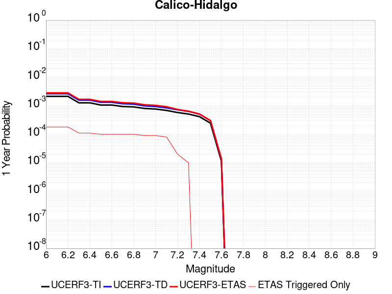 |  |

| Magnitude | 1 wk TI Prob | 1 wk TD Prob | 1 wk ETAS Prob | 1 wk ETAS/TD Gain | 1 wk ETAS Triggered Only | 1 mo TI Prob | 1 mo TD Prob | 1 mo ETAS Prob | 1 mo ETAS/TD Gain | 1 mo ETAS Triggered Only | 1 yr TI Prob | 1 yr TD Prob | 1 yr ETAS Prob | 1 yr ETAS/TD Gain | 1 yr ETAS Triggered Only | 10 yr TI Prob | 10 yr TD Prob | 10 yr ETAS Prob | 10 yr ETAS/TD Gain | 10 yr ETAS Triggered Only |
|-----|-----|-----|-----|-----|-----|-----|-----|-----|-----|-----|-----|-----|-----|-----|-----|-----|-----|-----|-----|-----|
| 6.0 | 4.0906612E-5 | 5.0703686E-5 | 1.9707967E-4 | 3.8868904 | 1.4638342E-4 | 1.7530227E-4 | 2.172857E-4 | 3.6363731E-4 | 1.6735446 | 1.4638342E-4 | 0.0021322158 | 0.002642648 | 0.0028251437 | 1.069058 | 1.8297927E-4 | 0.02111873 | 0.026152607 | 0.026402079 | 1.009539 | 2.5617098E-4 |
| 6.1 | 4.0906612E-5 | 5.0703686E-5 | 1.9707967E-4 | 3.8868904 | 1.4638342E-4 | 1.7530227E-4 | 2.172857E-4 | 3.6363731E-4 | 1.6735446 | 1.4638342E-4 | 0.0021322158 | 0.002642648 | 0.0028251437 | 1.069058 | 1.8297927E-4 | 0.02111873 | 0.026152607 | 0.026402079 | 1.009539 | 2.5617098E-4 |
| 6.2 | 4.0906612E-5 | 5.0703686E-5 | 1.9707967E-4 | 3.8868904 | 1.4638342E-4 | 1.7530227E-4 | 2.172857E-4 | 3.6363731E-4 | 1.6735446 | 1.4638342E-4 | 0.0021322158 | 0.002642648 | 0.0028251437 | 1.069058 | 1.8297927E-4 | 0.02111873 | 0.026152607 | 0.026402079 | 1.009539 | 2.5617098E-4 |
| 6.3 | 2.4242801E-5 | 3.0090669E-5 | 1.3987493E-4 | 4.6484485 | 1.0978756E-4 | 1.0389358E-4 | 1.2895382E-4 | 2.3872723E-4 | 1.8512614 | 1.0978756E-4 | 0.0012641704 | 0.0015689151 | 0.0016967996 | 1.0815115 | 1.2808549E-4 | 0.01257003 | 0.01558206 | 0.015780201 | 1.0127159 | 2.012772E-4 |
| 6.4 | 2.4242801E-5 | 3.0090669E-5 | 1.3987493E-4 | 4.6484485 | 1.0978756E-4 | 1.0389358E-4 | 1.2895382E-4 | 2.3872723E-4 | 1.8512614 | 1.0978756E-4 | 0.0012641704 | 0.0015689151 | 0.0016967996 | 1.0815115 | 1.2808549E-4 | 0.01257003 | 0.01558206 | 0.015780201 | 1.0127159 | 2.012772E-4 |
| 6.5 | 2.0286952E-5 | 2.5315738E-5 | 1.1680306E-4 | 4.6138515 | 9.148964E-5 | 8.694118E-5 | 1.0849161E-4 | 1.9997131E-4 | 1.8431962 | 9.148964E-5 | 0.0010579949 | 0.001320102 | 0.0014480185 | 1.0968989 | 1.2808549E-4 | 0.010529719 | 0.013124538 | 0.013323173 | 1.0151347 | 2.012772E-4 |
| 6.6 | 2.0269223E-5 | 2.5296687E-5 | 1.1678401E-4 | 4.6165733 | 9.148964E-5 | 8.6865206E-5 | 1.08409964E-4 | 1.9988968E-4 | 1.8438312 | 9.148964E-5 | 0.0010570707 | 0.0013191093 | 0.0014470258 | 1.0969719 | 1.2808549E-4 | 0.010520565 | 0.013114728 | 0.013313365 | 1.0151461 | 2.012772E-4 |
| 6.7 | 1.799852E-5 | 2.25406E-5 | 1.14028175E-4 | 5.05879 | 9.148964E-5 | 7.713423E-5 | 9.659908E-5 | 1.8807988E-4 | 1.9470152 | 9.148964E-5 | 9.3870464E-4 | 0.0011754738 | 0.0013034088 | 1.1088369 | 1.2808549E-4 | 0.009347493 | 0.011694173 | 0.011893097 | 1.0170105 | 2.012772E-4 |
| 6.8 | 1.7458793E-5 | 2.184212E-5 | 1.13329756E-4 | 5.1885877 | 9.148964E-5 | 7.4821255E-5 | 9.3605806E-5 | 1.8508687E-4 | 1.9773012 | 9.148964E-5 | 9.10568E-4 | 0.0011390693 | 0.001267009 | 1.1123194 | 1.2808549E-4 | 0.009068459 | 0.011333893 | 0.01153289 | 1.0175576 | 2.012772E-4 |
| 6.9 | 1.542884E-5 | 1.9025927E-5 | 1.1051382E-4 | 5.8085904 | 9.148964E-5 | 6.612192E-5 | 8.153721E-5 | 1.7301939E-4 | 2.1219683 | 9.148964E-5 | 8.04737E-4 | 9.922766E-4 | 0.001120235 | 1.1289544 | 1.2808549E-4 | 0.008018291 | 0.009879857 | 0.010079146 | 1.0201712 | 2.012772E-4 |
| 7.0 | 1.468253E-5 | 1.8030598E-5 | 1.0951858E-4 | 6.0740404 | 9.148964E-5 | 6.292361E-5 | 7.7271776E-5 | 1.6875434E-4 | 2.1839066 | 9.148964E-5 | 7.658257E-4 | 9.4039086E-4 | 0.0010683559 | 1.1360765 | 1.2808549E-4 | 0.0076319184 | 0.009365481 | 0.0095467465 | 1.0193547 | 1.8297927E-4 |
| 7.1 | 1.3139281E-5 | 1.6200942E-5 | 8.939146E-5 | 5.5176706 | 7.319171E-5 | 5.6309986E-5 | 6.943083E-5 | 1.4261746E-4 | 2.054094 | 7.319171E-5 | 6.853584E-4 | 8.4500515E-4 | 9.5469994E-4 | 1.1298156 | 1.0978756E-4 | 0.0068324856 | 0.0084192185 | 0.008582514 | 1.0193955 | 1.6468135E-4 |
| 7.2 | 1.1127404E-5 | 1.3866597E-5 | 5.0461942E-5 | 3.6391006 | 3.6595855E-5 | 4.7688E-5 | 5.942698E-5 | 9.602066E-5 | 1.6157755 | 3.6595855E-5 | 5.8044674E-4 | 7.232942E-4 | 7.598636E-4 | 1.0505595 | 3.6595855E-5 | 0.0057893298 | 0.0072105085 | 0.0073013385 | 1.0125968 | 9.148964E-5 |
| 7.3 | 9.808154E-6 | 1.2176215E-5 | 3.0473919E-5 | 2.5027416 | 1.8297927E-5 | 4.2034266E-5 | 5.2182797E-5 | 7.0479764E-5 | 1.3506323 | 1.8297927E-5 | 5.11647E-4 | 6.3515105E-4 | 6.5343734E-4 | 1.0287905 | 1.8297927E-5 | 0.0051047057 | 0.006334433 | 0.0064071612 | 1.0114814 | 7.319171E-5 |
| 7.4 | 7.942452E-6 | 9.792144E-6 | 9.792144E-6 | 1.0 | 0.0 | 3.4038632E-5 | 4.1965708E-5 | 4.1965708E-5 | 1.0 | 0.0 | 4.1434157E-4 | 5.1082217E-4 | 5.1082217E-4 | 1.0 | 0.0 | 0.0041356985 | 0.005097421 | 0.005152035 | 1.010714 | 5.489378E-5 |
| 7.5 | 4.7121216E-6 | 5.772836E-6 | 5.772836E-6 | 1.0 | 0.0 | 2.019465E-5 | 2.4740535E-5 | 2.4740535E-5 | 1.0 | 0.0 | 2.4584212E-4 | 3.0118204E-4 | 3.0118204E-4 | 1.0 | 0.0 | 0.0024557032 | 0.0030084911 | 0.0030449769 | 1.0121276 | 3.6595855E-5 |
| 7.6 | 2.21172E-7 | 2.603961E-7 | 2.603961E-7 | 1.0 | 0.0 | 9.478797E-7 | 1.1159829E-6 | 1.1159829E-6 | 1.0 | 0.0 | 1.1540374E-5 | 1.3587036E-5 | 1.3587036E-5 | 1.0 | 0.0 | 1.1539775E-4 | 1.3586486E-4 | 1.541603E-4 | 1.134659 | 1.8297927E-5 |

## Manix-Afton Hills
*[(top)](#table-of-contents)*

| 1 Week | 1 Month | 1 Year | 10 Year |
|-----|-----|-----|-----|
| 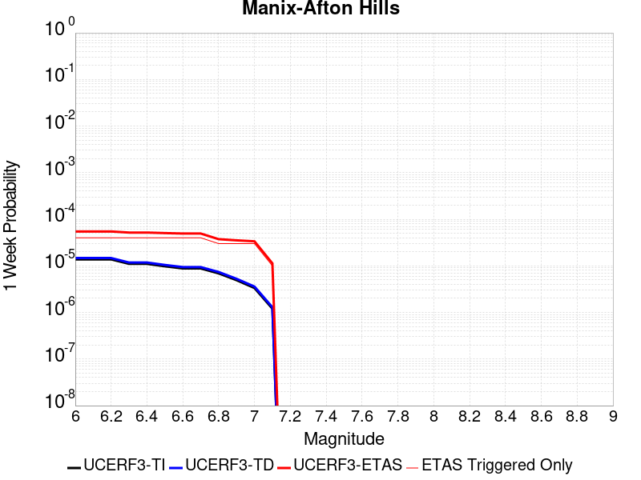 |  |  | 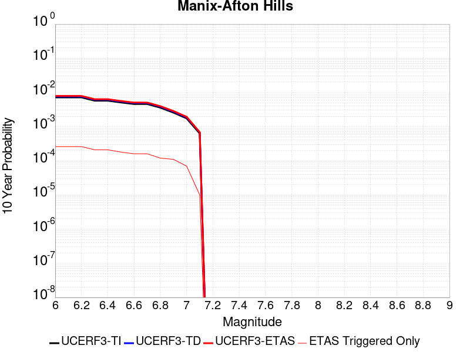 |

| Magnitude | 1 wk TI Prob | 1 wk TD Prob | 1 wk ETAS Prob | 1 wk ETAS/TD Gain | 1 wk ETAS Triggered Only | 1 mo TI Prob | 1 mo TD Prob | 1 mo ETAS Prob | 1 mo ETAS/TD Gain | 1 mo ETAS Triggered Only | 1 yr TI Prob | 1 yr TD Prob | 1 yr ETAS Prob | 1 yr ETAS/TD Gain | 1 yr ETAS Triggered Only | 10 yr TI Prob | 10 yr TD Prob | 10 yr ETAS Prob | 10 yr ETAS/TD Gain | 10 yr ETAS Triggered Only |
|-----|-----|-----|-----|-----|-----|-----|-----|-----|-----|-----|-----|-----|-----|-----|-----|-----|-----|-----|-----|-----|
| 6.0 | 1.3783202E-5 | 1.47110895E-5 | 8.790172E-5 | 5.975201 | 7.319171E-5 | 5.906953E-5 | 6.30461E-5 | 1.5452997E-4 | 2.451063 | 9.148964E-5 | 7.189342E-4 | 7.6733343E-4 | 9.684562E-4 | 1.2621061 | 2.012772E-4 | 0.0071661277 | 0.007648596 | 0.007957282 | 1.0403584 | 3.1106477E-4 |
| 6.1 | 1.3783202E-5 | 1.47110895E-5 | 8.790172E-5 | 5.975201 | 7.319171E-5 | 5.906953E-5 | 6.30461E-5 | 1.5452997E-4 | 2.451063 | 9.148964E-5 | 7.189342E-4 | 7.6733343E-4 | 9.684562E-4 | 1.2621061 | 2.012772E-4 | 0.0071661277 | 0.007648596 | 0.007957282 | 1.0403584 | 3.1106477E-4 |
| 6.2 | 1.3783202E-5 | 1.47110895E-5 | 8.790172E-5 | 5.975201 | 7.319171E-5 | 5.906953E-5 | 6.30461E-5 | 1.5452997E-4 | 2.451063 | 9.148964E-5 | 7.189342E-4 | 7.6733343E-4 | 9.684562E-4 | 1.2621061 | 2.012772E-4 | 0.0071661277 | 0.007648596 | 0.007957282 | 1.0403584 | 3.1106477E-4 |
| 6.3 | 1.10494875E-5 | 1.1793136E-5 | 8.498398E-5 | 7.2062244 | 7.319171E-5 | 4.7354086E-5 | 5.054109E-5 | 1.420261E-4 | 2.8101115 | 9.148964E-5 | 5.763835E-4 | 6.151744E-4 | 7.980411E-4 | 1.2972599 | 1.8297927E-4 | 0.005748908 | 0.0061357557 | 0.0063903546 | 1.0414944 | 2.5617098E-4 |
| 6.4 | 1.10494875E-5 | 1.1793136E-5 | 8.498398E-5 | 7.2062244 | 7.319171E-5 | 4.7354086E-5 | 5.054109E-5 | 1.420261E-4 | 2.8101115 | 9.148964E-5 | 5.763835E-4 | 6.151744E-4 | 7.980411E-4 | 1.2972599 | 1.8297927E-4 | 0.005748908 | 0.0061357557 | 0.0063903546 | 1.0414944 | 2.5617098E-4 |
| 6.5 | 9.788949E-6 | 1.045432E-5 | 8.364526E-5 | 8.001024 | 7.319171E-5 | 4.1951964E-5 | 4.480351E-5 | 1.17991935E-4 | 2.6335423 | 7.319171E-5 | 5.1064545E-4 | 5.453555E-4 | 7.09947E-4 | 1.301806 | 1.6468135E-4 | 0.0050947363 | 0.0054410985 | 0.005659479 | 1.0401354 | 2.1957511E-4 |
| 6.6 | 8.810006E-6 | 9.4136285E-6 | 8.2604645E-5 | 8.775006 | 7.319171E-5 | 3.775662E-5 | 4.0343548E-5 | 1.13532304E-4 | 2.814138 | 7.319171E-5 | 4.5958988E-4 | 4.9108086E-4 | 6.373924E-4 | 1.2979378 | 1.4638342E-4 | 0.0045864056 | 0.004900839 | 0.0050829216 | 1.0371534 | 1.8297927E-4 |
| 6.7 | 8.80128E-6 | 9.404108E-6 | 8.259513E-5 | 8.782877 | 7.319171E-5 | 3.7719226E-5 | 4.0302748E-5 | 1.1349151E-4 | 2.8159745 | 7.319171E-5 | 4.591348E-4 | 4.9058435E-4 | 6.3689594E-4 | 1.2982395 | 1.4638342E-4 | 0.004581874 | 0.0048958957 | 0.0050779795 | 1.037191 | 1.8297927E-4 |
| 6.8 | 6.8994877E-6 | 7.380076E-6 | 6.227345E-5 | 8.43805 | 5.489378E-5 | 2.9568899E-5 | 3.162856E-5 | 8.65206E-5 | 2.7355216 | 5.489378E-5 | 3.5994186E-4 | 3.8501783E-4 | 4.7647225E-4 | 1.237533 | 9.148964E-5 | 0.003593594 | 0.0038443129 | 0.003971906 | 1.0331901 | 1.2808549E-4 |
| 6.9 | 4.9328037E-6 | 5.2709615E-6 | 6.0164453E-5 | 11.414322 | 5.489378E-5 | 2.1140417E-5 | 2.2589675E-5 | 7.748221E-5 | 3.4299839 | 5.489378E-5 | 2.5735417E-4 | 2.7500073E-4 | 3.664652E-4 | 1.3325973 | 9.148964E-5 | 0.0025705635 | 0.0027472095 | 0.002874943 | 1.0464958 | 1.2808549E-4 |
| 7.0 | 3.347973E-6 | 3.59003E-6 | 5.8483613E-5 | 16.290564 | 5.489378E-5 | 1.4348378E-5 | 1.5385775E-5 | 7.0278715E-5 | 4.567772 | 5.489378E-5 | 1.746775E-4 | 1.8730981E-4 | 2.604878E-4 | 1.3906789 | 7.319171E-5 | 0.0017454025 | 0.0018719219 | 0.0019632403 | 1.0487832 | 9.148964E-5 |
| 7.1 | 1.2073567E-6 | 1.293482E-6 | 1.9591385E-5 | 15.146236 | 1.8297927E-5 | 5.1743755E-6 | 5.543492E-6 | 2.3841318E-5 | 4.300776 | 1.8297927E-5 | 6.29962E-5 | 6.749156E-5 | 8.578825E-5 | 1.271096 | 1.8297927E-5 | 6.297835E-4 | 6.7487074E-4 | 6.931563E-4 | 1.027095 | 1.8297927E-5 |

## Ludlow
*[(top)](#table-of-contents)*

| 1 Week | 1 Month | 1 Year | 10 Year |
|-----|-----|-----|-----|
|  |  |  |  |

| Magnitude | 1 wk TI Prob | 1 wk TD Prob | 1 wk ETAS Prob | 1 wk ETAS/TD Gain | 1 wk ETAS Triggered Only | 1 mo TI Prob | 1 mo TD Prob | 1 mo ETAS Prob | 1 mo ETAS/TD Gain | 1 mo ETAS Triggered Only | 1 yr TI Prob | 1 yr TD Prob | 1 yr ETAS Prob | 1 yr ETAS/TD Gain | 1 yr ETAS Triggered Only | 10 yr TI Prob | 10 yr TD Prob | 10 yr ETAS Prob | 10 yr ETAS/TD Gain | 10 yr ETAS Triggered Only |
|-----|-----|-----|-----|-----|-----|-----|-----|-----|-----|-----|-----|-----|-----|-----|-----|-----|-----|-----|-----|-----|
| 6.0 | 2.2407607E-5 | 2.3657254E-5 | 1.5173972E-4 | 6.4140882 | 1.2808549E-4 | 9.602906E-5 | 1.0138454E-4 | 2.8434527E-4 | 2.8046215 | 1.8297927E-4 | 0.0011685267 | 0.001233702 | 0.0014895569 | 1.2073879 | 2.5617098E-4 | 0.011624013 | 0.012273042 | 0.012562215 | 1.0235617 | 2.9276684E-4 |
| 6.1 | 2.2407607E-5 | 2.3657254E-5 | 1.5173972E-4 | 6.4140882 | 1.2808549E-4 | 9.602906E-5 | 1.0138454E-4 | 2.8434527E-4 | 2.8046215 | 1.8297927E-4 | 0.0011685267 | 0.001233702 | 0.0014895569 | 1.2073879 | 2.5617098E-4 | 0.011624013 | 0.012273042 | 0.012562215 | 1.0235617 | 2.9276684E-4 |
| 6.2 | 1.0781252E-5 | 1.1365663E-5 | 1.0285426E-4 | 9.049561 | 9.148964E-5 | 4.620455E-5 | 4.8709102E-5 | 1.4019427E-4 | 2.8781948 | 9.148964E-5 | 5.623952E-4 | 5.9287593E-4 | 7.3917257E-4 | 1.2467575 | 1.4638342E-4 | 0.00560974 | 0.0059133614 | 0.006058879 | 1.0246083 | 1.4638342E-4 |
| 6.3 | 1.0781252E-5 | 1.1365663E-5 | 1.0285426E-4 | 9.049561 | 9.148964E-5 | 4.620455E-5 | 4.8709102E-5 | 1.4019427E-4 | 2.8781948 | 9.148964E-5 | 5.623952E-4 | 5.9287593E-4 | 7.3917257E-4 | 1.2467575 | 1.4638342E-4 | 0.00560974 | 0.0059133614 | 0.006058879 | 1.0246083 | 1.4638342E-4 |
| 6.4 | 7.814439E-6 | 8.237729E-6 | 8.1428836E-5 | 9.884865 | 7.319171E-5 | 3.3490025E-5 | 3.530408E-5 | 1.0849321E-4 | 3.0731065 | 7.319171E-5 | 4.0766477E-4 | 4.2974384E-4 | 5.5777427E-4 | 1.2979227 | 1.2808549E-4 | 0.0040691774 | 0.0042892746 | 0.004416811 | 1.0297338 | 1.2808549E-4 |
| 6.5 | 6.4986366E-6 | 6.85092E-6 | 6.174432E-5 | 9.01256 | 5.489378E-5 | 2.7851002E-5 | 2.9360759E-5 | 8.4252926E-5 | 2.869576 | 5.489378E-5 | 3.390332E-4 | 3.5740953E-4 | 4.6715786E-4 | 1.307066 | 1.0978756E-4 | 0.003385164 | 0.0035684432 | 0.0036778392 | 1.0306565 | 1.0978756E-4 |
| 6.6 | 5.582177E-6 | 5.8860055E-6 | 4.2481643E-5 | 7.2173977 | 3.6595855E-5 | 2.3923398E-5 | 2.5225498E-5 | 6.182043E-5 | 2.450712 | 3.6595855E-5 | 2.9122844E-4 | 3.0707786E-4 | 3.802471E-4 | 1.2382758 | 7.319171E-5 | 0.0029084706 | 0.003066609 | 0.0031395762 | 1.0237942 | 7.319171E-5 |
| 6.7 | 4.6858763E-6 | 4.940427E-6 | 4.15361E-5 | 8.407391 | 3.6595855E-5 | 2.0082172E-5 | 2.1173091E-5 | 5.776817E-5 | 2.7283769 | 3.6595855E-5 | 2.4447302E-4 | 2.5775246E-4 | 3.3092528E-4 | 1.2838881 | 7.319171E-5 | 0.0024420423 | 0.0025745912 | 0.0026475945 | 1.0283552 | 7.319171E-5 |
| 6.8 | 3.5584908E-6 | 3.7520183E-6 | 3.7520183E-6 | 1.0 | 0.0 | 1.5250586E-5 | 1.6079981E-5 | 1.6079981E-5 | 1.0 | 0.0 | 1.8566006E-4 | 1.957566E-4 | 2.1405095E-4 | 1.0934546 | 1.8297927E-5 | 0.0018550502 | 0.0019558826 | 0.001974145 | 1.0093371 | 1.8297927E-5 |
| 6.9 | 2.532834E-6 | 2.6710034E-6 | 2.6710034E-6 | 1.0 | 0.0 | 1.0854958E-5 | 1.1447109E-5 | 1.1447109E-5 | 1.0 | 0.0 | 1.3215111E-4 | 1.3935992E-4 | 1.3935992E-4 | 1.0 | 0.0 | 0.0013207254 | 0.0013927529 | 0.0013927529 | 1.0 | 0.0 |
| 7.0 | 1.7083285E-6 | 1.8019439E-6 | 1.8019439E-6 | 1.0 | 0.0 | 7.3213873E-6 | 7.722595E-6 | 7.722595E-6 | 1.0 | 0.0 | 8.913424E-5 | 9.40187E-5 | 9.40187E-5 | 1.0 | 0.0 | 8.9098496E-4 | 9.3980576E-4 | 9.3980576E-4 | 1.0 | 0.0 |
| 7.1 | 1.0905424E-6 | 1.1497619E-6 | 1.1497619E-6 | 1.0 | 0.0 | 4.6737446E-6 | 4.9275427E-6 | 4.9275427E-6 | 1.0 | 0.0 | 5.6901354E-5 | 5.999128E-5 | 5.999128E-5 | 1.0 | 0.0 | 5.6886784E-4 | 5.997606E-4 | 5.997606E-4 | 1.0 | 0.0 |
| 7.2 | 6.06668E-7 | 6.387277E-7 | 6.387277E-7 | 1.0 | 0.0 | 2.600003E-6 | 2.7374022E-6 | 2.7374022E-6 | 1.0 | 0.0 | 3.1654577E-5 | 3.3327433E-5 | 3.3327433E-5 | 1.0 | 0.0 | 3.1650066E-4 | 3.3323118E-4 | 3.3323118E-4 | 1.0 | 0.0 |

## White Wolf (Extension)
*[(top)](#table-of-contents)*

| 1 Week | 1 Month | 1 Year | 10 Year |
|-----|-----|-----|-----|
|  | 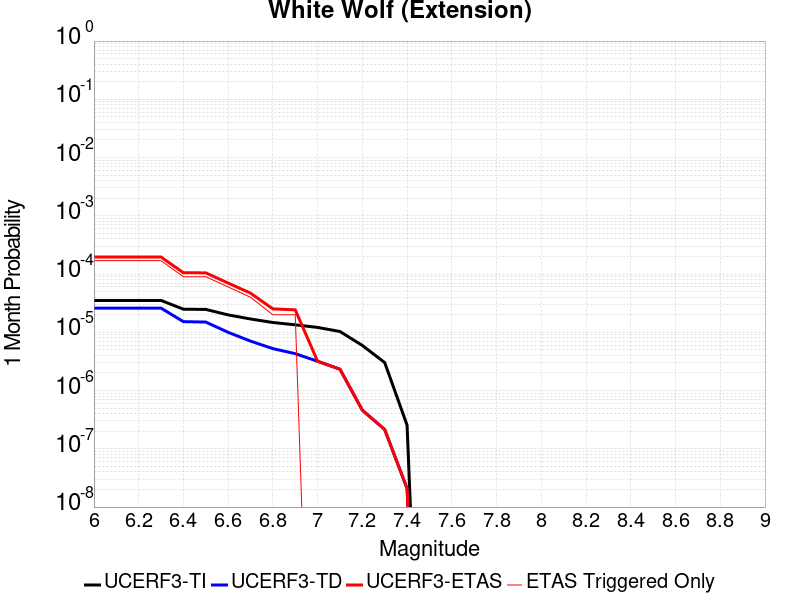 |  |  |

| Magnitude | 1 wk TI Prob | 1 wk TD Prob | 1 wk ETAS Prob | 1 wk ETAS/TD Gain | 1 wk ETAS Triggered Only | 1 mo TI Prob | 1 mo TD Prob | 1 mo ETAS Prob | 1 mo ETAS/TD Gain | 1 mo ETAS Triggered Only | 1 yr TI Prob | 1 yr TD Prob | 1 yr ETAS Prob | 1 yr ETAS/TD Gain | 1 yr ETAS Triggered Only | 10 yr TI Prob | 10 yr TD Prob | 10 yr ETAS Prob | 10 yr ETAS/TD Gain | 10 yr ETAS Triggered Only |
|-----|-----|-----|-----|-----|-----|-----|-----|-----|-----|-----|-----|-----|-----|-----|-----|-----|-----|-----|-----|-----|
| 6.0 | 8.222555E-6 | 6.0666657E-6 | 6.0960112E-5 | 10.048372 | 5.489378E-5 | 3.5239045E-5 | 2.5999774E-5 | 1.5408194E-4 | 5.9262795 | 1.2808549E-4 | 4.289509E-4 | 3.1650788E-4 | 5.360135E-4 | 1.6935234 | 2.1957511E-4 | 0.0042812387 | 0.003161223 | 0.0034713044 | 1.0980891 | 3.1106477E-4 |
| 6.1 | 8.222555E-6 | 6.0666657E-6 | 6.0960112E-5 | 10.048372 | 5.489378E-5 | 3.5239045E-5 | 2.5999774E-5 | 1.5408194E-4 | 5.9262795 | 1.2808549E-4 | 4.289509E-4 | 3.1650788E-4 | 5.360135E-4 | 1.6935234 | 2.1957511E-4 | 0.0042812387 | 0.003161223 | 0.0034713044 | 1.0980891 | 3.1106477E-4 |
| 6.2 | 8.222555E-6 | 6.0666657E-6 | 6.0960112E-5 | 10.048372 | 5.489378E-5 | 3.5239045E-5 | 2.5999774E-5 | 1.5408194E-4 | 5.9262795 | 1.2808549E-4 | 4.289509E-4 | 3.1650788E-4 | 5.360135E-4 | 1.6935234 | 2.1957511E-4 | 0.0042812387 | 0.003161223 | 0.0034713044 | 1.0980891 | 3.1106477E-4 |
| 6.3 | 8.222555E-6 | 6.0666657E-6 | 6.0960112E-5 | 10.048372 | 5.489378E-5 | 3.5239045E-5 | 2.5999774E-5 | 1.5408194E-4 | 5.9262795 | 1.2808549E-4 | 4.289509E-4 | 3.1650788E-4 | 5.360135E-4 | 1.6935234 | 2.1957511E-4 | 0.0042812387 | 0.003161223 | 0.0034713044 | 1.0980891 | 3.1106477E-4 |
| 6.4 | 5.821773E-6 | 3.5571766E-6 | 5.845076E-5 | 16.431786 | 5.489378E-5 | 2.4950215E-5 | 1.5244959E-5 | 1.067332E-4 | 7.0012126 | 9.148964E-5 | 3.0372653E-4 | 1.8559267E-4 | 3.136544E-4 | 1.690015 | 1.2808549E-4 | 0.0030331176 | 0.001854485 | 0.002037125 | 1.0984855 | 1.8297927E-4 |
| 6.5 | 5.766023E-6 | 3.4991106E-6 | 5.83927E-5 | 16.687868 | 5.489378E-5 | 2.4711293E-5 | 1.4996108E-5 | 1.0648437E-4 | 7.1008005 | 9.148964E-5 | 3.0081844E-4 | 1.8256342E-4 | 2.9233095E-4 | 1.601257 | 1.0978756E-4 | 0.0030041158 | 0.0018242426 | 0.0019886235 | 1.0901091 | 1.6468135E-4 |
| 6.6 | 4.643576E-6 | 2.332624E-6 | 3.8928392E-5 | 16.68867 | 3.6595855E-5 | 1.9900888E-5 | 9.996925E-6 | 8.31879E-5 | 8.321349 | 7.319171E-5 | 2.4226638E-4 | 1.2170619E-4 | 1.9488898E-4 | 1.6013072 | 7.319171E-5 | 0.0024200242 | 0.0012164378 | 0.0013260918 | 1.0901436 | 1.0978756E-4 |
| 6.7 | 3.9529173E-6 | 1.6483477E-6 | 1.9946245E-5 | 12.10075 | 1.8297927E-5 | 1.6940963E-5 | 7.0643296E-6 | 6.1957726E-5 | 8.770503 | 5.489378E-5 | 2.0623671E-4 | 8.6005006E-5 | 1.4089406E-4 | 1.6382077 | 5.489378E-5 | 0.002060454 | 8.597357E-4 | 9.511467E-4 | 1.1063246 | 9.148964E-5 |
| 6.8 | 3.4377522E-6 | 1.2245237E-6 | 1.2245237E-6 | 1.0 | 0.0 | 1.473314E-5 | 5.2479486E-6 | 2.354578E-5 | 4.4866633 | 1.8297927E-5 | 1.7936122E-4 | 6.3891996E-5 | 8.218875E-5 | 1.2863702 | 1.8297927E-5 | 0.0017921652 | 6.387454E-4 | 6.7531783E-4 | 1.0572567 | 3.6595855E-5 |
| 6.9 | 3.1367306E-6 | 1.0033783E-6 | 1.0033783E-6 | 1.0 | 0.0 | 1.3443062E-5 | 4.3001864E-6 | 2.2598035E-5 | 5.2551293 | 1.8297927E-5 | 1.63657E-4 | 5.235359E-5 | 7.065056E-5 | 1.3494884 | 1.8297927E-5 | 0.0016353652 | 5.2342017E-4 | 5.599969E-4 | 1.0698801 | 3.6595855E-5 |
| 7.0 | 2.8298145E-6 | 7.4286646E-7 | 7.4286646E-7 | 1.0 | 0.0 | 1.2127721E-5 | 3.1837099E-6 | 3.1837099E-6 | 1.0 | 0.0 | 1.47645E-4 | 3.8761027E-5 | 3.8761027E-5 | 1.0 | 0.0 | 0.0014754693 | 3.8754768E-4 | 4.058385E-4 | 1.0471964 | 1.8297927E-5 |
| 7.1 | 2.4091064E-6 | 5.4227525E-7 | 5.4227525E-7 | 1.0 | 0.0 | 1.03247E-5 | 2.3240348E-6 | 2.3240348E-6 | 1.0 | 0.0 | 1.2569598E-4 | 2.8294799E-5 | 2.8294799E-5 | 1.0 | 0.0 | 0.001256249 | 2.8291598E-4 | 3.0120875E-4 | 1.0646579 | 1.8297927E-5 |
| 7.2 | 1.3875518E-6 | 1.0743063E-7 | 1.0743063E-7 | 1.0 | 0.0 | 5.9466374E-6 | 4.6041689E-7 | 4.6041689E-7 | 1.0 | 0.0 | 7.23979E-5 | 5.6055624E-6 | 5.6055624E-6 | 1.0 | 0.0 | 7.2374323E-4 | 5.6054323E-5 | 5.6054323E-5 | 1.0 | 0.0 |
| 7.3 | 7.056077E-7 | 5.002034E-8 | 5.002034E-8 | 1.0 | 0.0 | 3.0240296E-6 | 2.1437286E-7 | 2.1437286E-7 | 1.0 | 0.0 | 3.681694E-5 | 2.609987E-6 | 2.609987E-6 | 1.0 | 0.0 | 3.681084E-4 | 2.609961E-5 | 2.609961E-5 | 1.0 | 0.0 |
| 7.4 | 5.9334678E-8 | 4.8683537E-9 | 4.8683537E-9 | 1.0 | 0.0 | 2.5429145E-7 | 2.0864372E-8 | 2.0864372E-8 | 1.0 | 0.0 | 3.095994E-6 | 2.5402372E-7 | 2.5402372E-7 | 1.0 | 0.0 | 3.095951E-5 | 2.5402353E-6 | 2.5402353E-6 | 1.0 | 0.0 |

## Cady
*[(top)](#table-of-contents)*

| 1 Week | 1 Month | 1 Year | 10 Year |
|-----|-----|-----|-----|
|  |  |  |  |

| Magnitude | 1 wk TI Prob | 1 wk TD Prob | 1 wk ETAS Prob | 1 wk ETAS/TD Gain | 1 wk ETAS Triggered Only | 1 mo TI Prob | 1 mo TD Prob | 1 mo ETAS Prob | 1 mo ETAS/TD Gain | 1 mo ETAS Triggered Only | 1 yr TI Prob | 1 yr TD Prob | 1 yr ETAS Prob | 1 yr ETAS/TD Gain | 1 yr ETAS Triggered Only | 10 yr TI Prob | 10 yr TD Prob | 10 yr ETAS Prob | 10 yr ETAS/TD Gain | 10 yr ETAS Triggered Only |
|-----|-----|-----|-----|-----|-----|-----|-----|-----|-----|-----|-----|-----|-----|-----|-----|-----|-----|-----|-----|-----|
| 6.0 | 1.9892565E-5 | 2.1858728E-5 | 7.675131E-5 | 3.511243 | 5.489378E-5 | 8.525106E-5 | 9.3677416E-5 | 1.6686227E-4 | 1.7812433 | 7.319171E-5 | 0.0010374374 | 0.0011400167 | 0.0013045103 | 1.1442906 | 1.6468135E-4 | 0.010326075 | 0.011350701 | 0.011603964 | 1.0223125 | 2.5617098E-4 |
| 6.1 | 1.9892565E-5 | 2.1858728E-5 | 7.675131E-5 | 3.511243 | 5.489378E-5 | 8.525106E-5 | 9.3677416E-5 | 1.6686227E-4 | 1.7812433 | 7.319171E-5 | 0.0010374374 | 0.0011400167 | 0.0013045103 | 1.1442906 | 1.6468135E-4 | 0.010326075 | 0.011350701 | 0.011603964 | 1.0223125 | 2.5617098E-4 |
| 6.2 | 1.9892565E-5 | 2.1858728E-5 | 7.675131E-5 | 3.511243 | 5.489378E-5 | 8.525106E-5 | 9.3677416E-5 | 1.6686227E-4 | 1.7812433 | 7.319171E-5 | 0.0010374374 | 0.0011400167 | 0.0013045103 | 1.1442906 | 1.6468135E-4 | 0.010326075 | 0.011350701 | 0.011603964 | 1.0223125 | 2.5617098E-4 |
| 6.3 | 1.1117327E-5 | 1.2176583E-5 | 4.877199E-5 | 4.005392 | 3.6595855E-5 | 4.764482E-5 | 5.2184492E-5 | 8.877843E-5 | 1.7012417 | 3.6595855E-5 | 5.7992124E-4 | 6.351925E-4 | 7.449103E-4 | 1.1727316 | 1.0978756E-4 | 0.0057841022 | 0.0063368753 | 0.006555059 | 1.0344309 | 2.1957511E-4 |
| 6.4 | 1.1117327E-5 | 1.2176583E-5 | 4.877199E-5 | 4.005392 | 3.6595855E-5 | 4.764482E-5 | 5.2184492E-5 | 8.877843E-5 | 1.7012417 | 3.6595855E-5 | 5.7992124E-4 | 6.351925E-4 | 7.449103E-4 | 1.1727316 | 1.0978756E-4 | 0.0057841022 | 0.0063368753 | 0.006555059 | 1.0344309 | 2.1957511E-4 |
| 6.5 | 6.103093E-6 | 6.672021E-6 | 2.4969826E-5 | 3.7424684 | 1.8297927E-5 | 2.615585E-5 | 2.8594131E-5 | 4.6891535E-5 | 1.6399007 | 1.8297927E-5 | 3.1840094E-4 | 3.480905E-4 | 3.8467362E-4 | 1.1050966 | 3.6595855E-5 | 0.0031794512 | 0.0034766865 | 0.0035313896 | 1.0157342 | 5.489378E-5 |
| 6.6 | 5.817237E-6 | 6.3656585E-6 | 2.4663468E-5 | 3.874457 | 1.8297927E-5 | 2.4930776E-5 | 2.728118E-5 | 4.5578607E-5 | 1.6706978 | 1.8297927E-5 | 3.034899E-4 | 3.3211018E-4 | 3.6869387E-4 | 1.1101553 | 3.6595855E-5 | 0.0030307577 | 0.0033173605 | 0.0033720722 | 1.0164925 | 5.489378E-5 |
| 6.7 | 4.8846314E-6 | 5.3405684E-6 | 2.3638397E-5 | 4.426195 | 1.8297927E-5 | 2.0933967E-5 | 2.2888014E-5 | 4.118552E-5 | 1.7994362 | 1.8297927E-5 | 2.5484123E-4 | 2.7863772E-4 | 3.1522338E-4 | 1.1313019 | 3.6595855E-5 | 0.0025454918 | 0.0027840391 | 0.0028387802 | 1.0196624 | 5.489378E-5 |
| 6.8 | 1.7788773E-6 | 1.9399079E-6 | 2.02378E-5 | 10.43235 | 1.8297927E-5 | 7.6237375E-6 | 8.313874E-6 | 2.6611648E-5 | 3.2008724 | 1.8297927E-5 | 9.281505E-5 | 1.01218284E-4 | 1.1951436E-4 | 1.1807586 | 1.8297927E-5 | 9.2776294E-4 | 0.0010118765 | 0.0010484353 | 1.0361297 | 3.6595855E-5 |
| 6.9 | 7.5455404E-7 | 8.297092E-7 | 1.9127621E-5 | 23.053404 | 1.8297927E-5 | 3.233799E-6 | 3.5558937E-6 | 2.1853755E-5 | 6.1457844 | 1.8297927E-5 | 3.937079E-5 | 4.3292483E-5 | 6.158961E-5 | 1.42264 | 1.8297927E-5 | 3.9363815E-4 | 4.3287344E-4 | 4.6945343E-4 | 1.0845051 | 3.6595855E-5 |
| 7.0 | 6.8578805E-7 | 7.541816E-7 | 1.9052095E-5 | 25.261946 | 1.8297927E-5 | 2.9390883E-6 | 3.2322048E-6 | 2.1530073E-5 | 6.6611104 | 1.8297927E-5 | 3.578281E-5 | 3.9351715E-5 | 5.764892E-5 | 1.4649659 | 1.8297927E-5 | 3.577705E-4 | 3.9347992E-4 | 4.1177066E-4 | 1.0464845 | 1.8297927E-5 |

## Baker
*[(top)](#table-of-contents)*

| 1 Week | 1 Month | 1 Year | 10 Year |
|-----|-----|-----|-----|
|  |  |  |  |

| Magnitude | 1 wk TI Prob | 1 wk TD Prob | 1 wk ETAS Prob | 1 wk ETAS/TD Gain | 1 wk ETAS Triggered Only | 1 mo TI Prob | 1 mo TD Prob | 1 mo ETAS Prob | 1 mo ETAS/TD Gain | 1 mo ETAS Triggered Only | 1 yr TI Prob | 1 yr TD Prob | 1 yr ETAS Prob | 1 yr ETAS/TD Gain | 1 yr ETAS Triggered Only | 10 yr TI Prob | 10 yr TD Prob | 10 yr ETAS Prob | 10 yr ETAS/TD Gain | 10 yr ETAS Triggered Only |
|-----|-----|-----|-----|-----|-----|-----|-----|-----|-----|-----|-----|-----|-----|-----|-----|-----|-----|-----|-----|-----|
| 6.0 | 5.695525E-6 | 5.8348373E-6 | 1.15621755E-4 | 19.815763 | 1.0978756E-4 | 2.4409164E-5 | 2.5006228E-5 | 1.8968346E-4 | 7.5854483 | 1.6468135E-4 | 2.9714106E-4 | 3.044123E-4 | 5.422129E-4 | 1.7811794 | 2.3787304E-4 | 0.0029674405 | 0.0030403486 | 0.0033322254 | 1.096001 | 2.9276684E-4 |
| 6.1 | 5.695525E-6 | 5.8348373E-6 | 1.15621755E-4 | 19.815763 | 1.0978756E-4 | 2.4409164E-5 | 2.5006228E-5 | 1.8968346E-4 | 7.5854483 | 1.6468135E-4 | 2.9714106E-4 | 3.044123E-4 | 5.422129E-4 | 1.7811794 | 2.3787304E-4 | 0.0029674405 | 0.0030403486 | 0.0033322254 | 1.096001 | 2.9276684E-4 |
| 6.2 | 5.695525E-6 | 5.8348373E-6 | 1.15621755E-4 | 19.815763 | 1.0978756E-4 | 2.4409164E-5 | 2.5006228E-5 | 1.8968346E-4 | 7.5854483 | 1.6468135E-4 | 2.9714106E-4 | 3.044123E-4 | 5.422129E-4 | 1.7811794 | 2.3787304E-4 | 0.0029674405 | 0.0030403486 | 0.0033322254 | 1.096001 | 2.9276684E-4 |
| 6.3 | 3.2995713E-6 | 3.383667E-6 | 5.8277263E-5 | 17.223108 | 5.489378E-5 | 1.4140943E-5 | 1.4501353E-5 | 1.0598966E-4 | 7.30895 | 9.148964E-5 | 1.7215237E-4 | 1.7654014E-4 | 3.0460302E-4 | 1.7254038 | 1.2808549E-4 | 0.0017201907 | 0.001764046 | 0.0019284368 | 1.0931896 | 1.6468135E-4 |
| 6.4 | 3.2995713E-6 | 3.383667E-6 | 5.8277263E-5 | 17.223108 | 5.489378E-5 | 1.4140943E-5 | 1.4501353E-5 | 1.0598966E-4 | 7.30895 | 9.148964E-5 | 1.7215237E-4 | 1.7654014E-4 | 3.0460302E-4 | 1.7254038 | 1.2808549E-4 | 0.0017201907 | 0.001764046 | 0.0019284368 | 1.0931896 | 1.6468135E-4 |
| 6.5 | 2.782202E-6 | 2.8558404E-6 | 5.7749465E-5 | 20.22153 | 5.489378E-5 | 1.1923668E-5 | 1.223926E-5 | 8.5430074E-5 | 6.980003 | 7.319171E-5 | 1.4516099E-4 | 1.4900314E-4 | 2.5877435E-4 | 1.736704 | 1.0978756E-4 | 0.001450662 | 0.0014890651 | 0.0016352305 | 1.0981592 | 1.4638342E-4 |
| 6.6 | 2.3163404E-6 | 2.38092E-6 | 3.8976686E-5 | 16.370432 | 3.6595855E-5 | 9.927136E-6 | 1.0203904E-5 | 6.509713E-5 | 6.379629 | 5.489378E-5 | 1.20856166E-4 | 1.2422565E-4 | 1.9740827E-4 | 1.5891104 | 7.319171E-5 | 0.0012079047 | 0.0012415823 | 0.0013512336 | 1.0883157 | 1.0978756E-4 |
| 6.7 | 2.037056E-6 | 2.0965003E-6 | 3.8692277E-5 | 18.45565 | 3.6595855E-5 | 8.7302105E-6 | 8.984972E-6 | 6.387826E-5 | 7.1094556 | 5.489378E-5 | 1.0628513E-4 | 1.093867E-4 | 1.8257041E-4 | 1.6690365 | 7.319171E-5 | 0.0010623431 | 0.0010933448 | 0.0011847344 | 1.0835872 | 9.148964E-5 |
| 6.8 | 1.8356744E-6 | 1.8915287E-6 | 3.8487313E-5 | 20.3472 | 3.6595855E-5 | 7.867153E-6 | 8.106527E-6 | 6.299986E-5 | 7.7714987 | 5.489378E-5 | 9.577837E-5 | 9.869264E-5 | 1.53581E-4 | 1.5561546 | 5.489378E-5 | 9.57371E-4 | 9.86502E-4 | 0.0010596216 | 1.0741199 | 7.319171E-5 |
| 6.9 | 1.6310546E-6 | 1.6832072E-6 | 3.8279E-5 | 22.741703 | 3.6595855E-5 | 6.9902153E-6 | 7.213726E-6 | 6.210711E-5 | 8.609574 | 5.489378E-5 | 8.510255E-5 | 8.782368E-5 | 1.4271264E-4 | 1.6249903 | 5.489378E-5 | 8.5069967E-4 | 8.7790104E-4 | 9.510285E-4 | 1.0832981 | 7.319171E-5 |
| 7.0 | 1.2058036E-6 | 1.2508665E-6 | 1.954877E-5 | 15.628182 | 1.8297927E-5 | 5.1677193E-6 | 5.3608455E-6 | 4.1956504E-5 | 7.826471 | 3.6595855E-5 | 6.291517E-5 | 6.5266366E-5 | 1.0185983E-4 | 1.5606787 | 3.6595855E-5 | 6.289736E-4 | 6.524743E-4 | 6.890463E-4 | 1.0560513 | 3.6595855E-5 |
| 7.1 | 1.052382E-6 | 1.0951609E-6 | 1.0951609E-6 | 1.0 | 0.0 | 4.5102006E-6 | 4.693538E-6 | 4.693538E-6 | 1.0 | 0.0 | 5.491031E-5 | 5.7142337E-5 | 5.7142337E-5 | 1.0 | 0.0 | 5.4896745E-4 | 5.7127734E-4 | 5.7127734E-4 | 1.0 | 0.0 |
| 7.2 | 1.0067454E-6 | 1.0487711E-6 | 1.0487711E-6 | 1.0 | 0.0 | 4.3146156E-6 | 4.4947255E-6 | 4.4947255E-6 | 1.0 | 0.0 | 5.252918E-5 | 5.4721917E-5 | 5.4721917E-5 | 1.0 | 0.0 | 5.251676E-4 | 5.470853E-4 | 5.470853E-4 | 1.0 | 0.0 |
| 7.3 | 9.3596316E-7 | 9.767723E-7 | 9.767723E-7 | 1.0 | 0.0 | 4.0112645E-6 | 4.1861604E-6 | 4.1861604E-6 | 1.0 | 0.0 | 4.8836053E-5 | 5.096532E-5 | 5.096532E-5 | 1.0 | 0.0 | 4.8825322E-4 | 5.095371E-4 | 5.095371E-4 | 1.0 | 0.0 |
| 7.4 | 8.8117395E-7 | 9.2076635E-7 | 9.2076635E-7 | 1.0 | 0.0 | 3.7764542E-6 | 3.9461356E-6 | 3.9461356E-6 | 1.0 | 0.0 | 4.5977362E-5 | 4.8043148E-5 | 4.8043148E-5 | 1.0 | 0.0 | 4.596785E-4 | 4.8032837E-4 | 4.8032837E-4 | 1.0 | 0.0 |
| 7.5 | 8.292386E-7 | 8.6745956E-7 | 8.6745956E-7 | 1.0 | 0.0 | 3.5538749E-6 | 3.7176785E-6 | 3.7176785E-6 | 1.0 | 0.0 | 4.326757E-5 | 4.5261804E-5 | 4.5261804E-5 | 1.0 | 0.0 | 4.3259145E-4 | 4.5252658E-4 | 4.5252658E-4 | 1.0 | 0.0 |
| 7.6 | 7.553842E-7 | 7.9144706E-7 | 7.9144706E-7 | 1.0 | 0.0 | 3.2373566E-6 | 3.3919116E-6 | 3.3919116E-6 | 1.0 | 0.0 | 3.9414106E-5 | 4.129575E-5 | 4.129575E-5 | 1.0 | 0.0 | 3.9407116E-4 | 4.1288146E-4 | 4.1288146E-4 | 1.0 | 0.0 |
| 7.7 | 6.5285366E-7 | 6.852797E-7 | 6.852797E-7 | 1.0 | 0.0 | 2.797941E-6 | 2.9369096E-6 | 2.9369096E-6 | 1.0 | 0.0 | 3.40644E-5 | 3.5756293E-5 | 3.5756293E-5 | 1.0 | 0.0 | 3.405918E-4 | 3.5750607E-4 | 3.5750607E-4 | 1.0 | 0.0 |
| 7.8 | 3.4586725E-7 | 3.6482615E-7 | 3.6482615E-7 | 1.0 | 0.0 | 1.4822873E-6 | 1.5635396E-6 | 1.5635396E-6 | 1.0 | 0.0 | 1.80467E-5 | 1.9035933E-5 | 1.9035933E-5 | 1.0 | 0.0 | 1.8045233E-4 | 1.9034347E-4 | 1.9034347E-4 | 1.0 | 0.0 |
| 7.9 | 2.5591178E-9 | 2.6696718E-9 | 2.6696718E-9 | 1.0 | 0.0 | 1.0967647E-8 | 1.14414505E-8 | 1.14414505E-8 | 1.0 | 0.0 | 1.335311E-7 | 1.3929966E-7 | 1.3929966E-7 | 1.0 | 0.0 | 1.3353102E-6 | 1.3929966E-6 | 1.3929966E-6 | 1.0 | 0.0 |

## San Andreas (Coachella) rev
*[(top)](#table-of-contents)*

| 1 Week | 1 Month | 1 Year | 10 Year |
|-----|-----|-----|-----|
|  |  |  |  |

| Magnitude | 1 wk TI Prob | 1 wk TD Prob | 1 wk ETAS Prob | 1 wk ETAS/TD Gain | 1 wk ETAS Triggered Only | 1 mo TI Prob | 1 mo TD Prob | 1 mo ETAS Prob | 1 mo ETAS/TD Gain | 1 mo ETAS Triggered Only | 1 yr TI Prob | 1 yr TD Prob | 1 yr ETAS Prob | 1 yr ETAS/TD Gain | 1 yr ETAS Triggered Only | 10 yr TI Prob | 10 yr TD Prob | 10 yr ETAS Prob | 10 yr ETAS/TD Gain | 10 yr ETAS Triggered Only |
|-----|-----|-----|-----|-----|-----|-----|-----|-----|-----|-----|-----|-----|-----|-----|-----|-----|-----|-----|-----|-----|
| 6.0 | 1.1925945E-4 | 3.2729402E-4 | 4.187537E-4 | 1.279442 | 9.148964E-5 | 5.110118E-4 | 0.0014019393 | 0.0015481175 | 1.1042686 | 1.4638342E-4 | 0.0062038354 | 0.016936364 | 0.01715222 | 1.0127451 | 2.1957511E-4 | 0.060334753 | 0.15265316 | 0.15288572 | 1.0015235 | 2.744689E-4 |
| 6.1 | 1.1925945E-4 | 3.2729402E-4 | 4.187537E-4 | 1.279442 | 9.148964E-5 | 5.110118E-4 | 0.0014019393 | 0.0015481175 | 1.1042686 | 1.4638342E-4 | 0.0062038354 | 0.016936364 | 0.01715222 | 1.0127451 | 2.1957511E-4 | 0.060334753 | 0.15265316 | 0.15288572 | 1.0015235 | 2.744689E-4 |
| 6.2 | 1.07432395E-4 | 3.0230157E-4 | 3.9376353E-4 | 1.3025521 | 9.148964E-5 | 4.603433E-4 | 0.0012949388 | 0.0014411327 | 1.1128963 | 1.4638342E-4 | 0.005590286 | 0.015653009 | 0.015869146 | 1.0138081 | 2.1957511E-4 | 0.05451731 | 0.14182423 | 0.14205977 | 1.0016608 | 2.744689E-4 |
| 6.3 | 1.0718766E-4 | 3.0175463E-4 | 3.9321664E-4 | 1.3031007 | 9.148964E-5 | 4.592948E-4 | 0.0012925972 | 0.0014387913 | 1.1131011 | 1.4638342E-4 | 0.005577586 | 0.015624908 | 0.015841052 | 1.0138333 | 2.1957511E-4 | 0.054396555 | 0.14159249 | 0.1418281 | 1.0016639 | 2.744689E-4 |
| 6.4 | 1.0355944E-4 | 2.9383553E-4 | 3.8529828E-4 | 1.3112719 | 9.148964E-5 | 4.4375064E-4 | 0.0012586913 | 0.0014048904 | 1.1161517 | 1.4638342E-4 | 0.0053892885 | 0.015217941 | 0.015434176 | 1.0142092 | 2.1957511E-4 | 0.052604496 | 0.13815255 | 0.13838911 | 1.0017122 | 2.744689E-4 |
| 6.5 | 1.0227914E-4 | 2.9102986E-4 | 3.8249287E-4 | 1.3142736 | 9.148964E-5 | 4.382655E-4 | 0.0012466786 | 0.0013928795 | 1.1172724 | 1.4638342E-4 | 0.0053228354 | 0.01507372 | 0.015289986 | 1.0143472 | 2.1957511E-4 | 0.051971316 | 0.13693172 | 0.1371686 | 1.00173 | 2.744689E-4 |
| 6.6 | 1.0116757E-4 | 2.8868738E-4 | 3.801506E-4 | 1.3168244 | 9.148964E-5 | 4.3350324E-4 | 0.0012366489 | 0.0013828513 | 1.1182246 | 1.4638342E-4 | 0.0052651367 | 0.01495329 | 0.015169582 | 1.0144645 | 2.1957511E-4 | 0.051421247 | 0.1359099 | 0.13613126 | 1.0016286 | 2.5617098E-4 |
| 6.7 | 1.0050676E-4 | 2.8727303E-4 | 3.7873635E-4 | 1.3183848 | 9.148964E-5 | 4.3067214E-4 | 0.0012305931 | 0.0013767964 | 1.1188072 | 1.4638342E-4 | 0.005230834 | 0.014880571 | 0.015096878 | 1.0145363 | 2.1957511E-4 | 0.051094085 | 0.13529462 | 0.13551614 | 1.0016372 | 2.5617098E-4 |
| 6.8 | 9.976819E-5 | 2.853096E-4 | 3.7677313E-4 | 1.3205764 | 9.148964E-5 | 4.2750788E-4 | 0.0012221863 | 0.0013683909 | 1.1196253 | 1.4638342E-4 | 0.0051924936 | 0.0147796115 | 0.014995941 | 1.014637 | 2.1957511E-4 | 0.050728295 | 0.13444631 | 0.13466804 | 1.0016493 | 2.5617098E-4 |
| 6.9 | 9.77719E-5 | 2.8027873E-4 | 3.7174273E-4 | 1.3263322 | 9.148964E-5 | 4.1895514E-4 | 0.0012006456 | 0.0013468532 | 1.1217742 | 1.4638342E-4 | 0.0050888555 | 0.014520878 | 0.014737264 | 1.0149018 | 2.1957511E-4 | 0.049738888 | 0.1322748 | 0.1324971 | 1.0016805 | 2.5617098E-4 |
| 7.0 | 8.500761E-5 | 2.4762485E-4 | 3.3909184E-4 | 1.3693773 | 9.148964E-5 | 3.6426744E-4 | 0.001060821 | 0.0012070491 | 1.1378443 | 1.4638342E-4 | 0.0044259406 | 0.012839786 | 0.013056542 | 1.0168816 | 2.1957511E-4 | 0.04338823 | 0.11813272 | 0.11835863 | 1.0019124 | 2.5617098E-4 |
| 7.1 | 8.319876E-5 | 2.4365232E-4 | 3.3511966E-4 | 1.375401 | 9.148964E-5 | 3.5651738E-4 | 0.0010438096 | 0.0011900401 | 1.1400932 | 1.4638342E-4 | 0.004331963 | 0.012635092 | 0.012851893 | 1.0171586 | 2.1957511E-4 | 0.042484846 | 0.116353 | 0.11657937 | 1.0019455 | 2.5617098E-4 |
| 7.2 | 7.563917E-5 | 2.2413683E-4 | 3.1560595E-4 | 1.408095 | 9.148964E-5 | 3.2412758E-4 | 9.602359E-4 | 0.0011064787 | 1.1522989 | 1.4638342E-4 | 0.0039391145 | 0.011628893 | 0.011845916 | 1.0186623 | 2.1957511E-4 | 0.03870018 | 0.10775925 | 0.10798781 | 1.0021211 | 2.5617098E-4 |
| 7.3 | 7.082985E-5 | 2.0729867E-4 | 2.9876933E-4 | 1.4412507 | 9.148964E-5 | 3.0352117E-4 | 8.881233E-4 | 0.0010343767 | 1.1646769 | 1.4638342E-4 | 0.0036891096 | 0.010759917 | 0.010977129 | 1.0201871 | 2.1957511E-4 | 0.03628465 | 0.100282 | 0.10051248 | 1.0022984 | 2.5617098E-4 |
| 7.4 | 5.146215E-5 | 1.4273795E-4 | 2.1591921E-4 | 1.5126966 | 7.319171E-5 | 2.2053342E-4 | 6.115915E-4 | 7.3959865E-4 | 1.2093017 | 1.2808549E-4 | 0.0026816884 | 0.0074208933 | 0.0076025147 | 1.0244744 | 1.8297927E-4 | 0.02649557 | 0.070849575 | 0.07103659 | 1.0026397 | 2.012772E-4 |
| 7.5 | 4.0285166E-5 | 1.09416E-4 | 1.825997E-4 | 1.6688573 | 7.319171E-5 | 1.7263928E-4 | 4.6884175E-4 | 5.968672E-4 | 1.2730675 | 1.2808549E-4 | 0.002099857 | 0.0056932783 | 0.005875216 | 1.0319566 | 1.8297927E-4 | 0.020801254 | 0.055011146 | 0.05520135 | 1.0034575 | 2.012772E-4 |
| 7.6 | 3.1168736E-5 | 8.4389096E-5 | 1.5757463E-4 | 1.8672392 | 7.319171E-5 | 1.3357346E-4 | 3.6161754E-4 | 4.896567E-4 | 1.3540734 | 1.2808549E-4 | 0.0016250437 | 0.0043938323 | 0.004576008 | 1.0414616 | 1.8297927E-4 | 0.016132116 | 0.04281005 | 0.04300271 | 1.0045004 | 2.012772E-4 |
| 7.7 | 2.2100989E-5 | 6.238755E-5 | 1.355747E-4 | 2.1731048 | 7.319171E-5 | 9.4715084E-5 | 2.6734784E-4 | 3.7710607E-4 | 1.4105445 | 1.0978756E-4 | 0.001152546 | 0.0032501083 | 0.0034142544 | 1.0505048 | 1.6468135E-4 | 0.011465867 | 0.0319002 | 0.032077342 | 1.005553 | 1.8297927E-4 |
| 7.8 | 1.7484861E-5 | 5.179572E-5 | 1.2498364E-4 | 2.4130108 | 7.319171E-5 | 7.493296E-5 | 2.2196278E-4 | 3.3172598E-4 | 1.4945117 | 1.0978756E-4 | 9.1192697E-4 | 0.0026990508 | 0.0028632877 | 1.0608499 | 1.6468135E-4 | 0.009081938 | 0.026640115 | 0.026818221 | 1.0066856 | 1.8297927E-4 |
| 7.9 | 1.3967285E-5 | 3.822255E-5 | 1.11411464E-4 | 2.9148097 | 7.319171E-5 | 5.985842E-5 | 1.6380067E-4 | 2.7357024E-4 | 1.6701412 | 1.0978756E-4 | 7.2853256E-4 | 0.00199245 | 0.0021202804 | 1.0641574 | 1.2808549E-4 | 0.0072614877 | 0.019909438 | 0.020052906 | 1.0072061 | 1.4638342E-4 |
| 8.0 | 1.1887396E-5 | 3.106521E-5 | 1.0425464E-4 | 3.3559935 | 7.319171E-5 | 5.094499E-5 | 1.3312983E-4 | 2.4290277E-4 | 1.8245556 | 1.0978756E-4 | 6.200787E-4 | 0.0016196516 | 0.0017475296 | 1.078954 | 1.2808549E-4 | 0.006183513 | 0.016279267 | 0.016423268 | 1.0088457 | 1.4638342E-4 |
| 8.1 | 5.100864E-6 | 8.973418E-6 | 8.973418E-6 | 1.0 | 0.0 | 2.1860664E-5 | 3.8456936E-5 | 3.8456936E-5 | 1.0 | 0.0 | 2.6612106E-4 | 4.6811273E-4 | 4.6811273E-4 | 1.0 | 0.0 | 0.002658026 | 0.004917731 | 0.004917731 | 1.0 | 0.0 |
| 8.2 | 2.3004484E-6 | 2.7864487E-6 | 2.7864487E-6 | 1.0 | 0.0 | 9.859027E-6 | 1.1941868E-5 | 1.1941868E-5 | 1.0 | 0.0 | 1.2002704E-4 | 1.4538258E-4 | 1.4538258E-4 | 1.0 | 0.0 | 0.0011996223 | 0.0015973912 | 0.0015973912 | 1.0 | 0.0 |
| 8.3 | 1.0424446E-7 | 5.8161504E-8 | 5.8161504E-8 | 1.0 | 0.0 | 4.4676187E-7 | 2.4926356E-7 | 2.4926356E-7 | 1.0 | 0.0 | 5.439312E-6 | 3.03478E-6 | 3.03478E-6 | 1.0 | 0.0 | 5.4391792E-5 | 3.190716E-5 | 3.190716E-5 | 1.0 | 0.0 |

## Mission Ridge-Arroyo Parida-Santa Ana
*[(top)](#table-of-contents)*

| 1 Week | 1 Month | 1 Year | 10 Year |
|-----|-----|-----|-----|
|  |  |  |  |

| Magnitude | 1 wk TI Prob | 1 wk TD Prob | 1 wk ETAS Prob | 1 wk ETAS/TD Gain | 1 wk ETAS Triggered Only | 1 mo TI Prob | 1 mo TD Prob | 1 mo ETAS Prob | 1 mo ETAS/TD Gain | 1 mo ETAS Triggered Only | 1 yr TI Prob | 1 yr TD Prob | 1 yr ETAS Prob | 1 yr ETAS/TD Gain | 1 yr ETAS Triggered Only | 10 yr TI Prob | 10 yr TD Prob | 10 yr ETAS Prob | 10 yr ETAS/TD Gain | 10 yr ETAS Triggered Only |
|-----|-----|-----|-----|-----|-----|-----|-----|-----|-----|-----|-----|-----|-----|-----|-----|-----|-----|-----|-----|-----|
| 6.0 | 4.169034E-5 | 4.7138263E-5 | 6.543533E-5 | 1.3881574 | 1.8297927E-5 | 1.7866064E-4 | 2.0201034E-4 | 2.5689302E-4 | 1.2716826 | 5.489378E-5 | 0.0021730233 | 0.00245745 | 0.0025487149 | 1.037138 | 9.148964E-5 | 0.021518968 | 0.024384614 | 0.024598835 | 1.0087851 | 2.1957511E-4 |
| 6.1 | 1.73813E-5 | 1.6854226E-5 | 1.6854226E-5 | 1.0 | 0.0 | 7.4489166E-5 | 7.223046E-5 | 1.0882367E-4 | 1.5066174 | 3.6595855E-5 | 9.065282E-4 | 8.790618E-4 | 9.156255E-4 | 1.041594 | 3.6595855E-5 | 0.009028391 | 0.008756988 | 0.008847676 | 1.0103561 | 9.148964E-5 |
| 6.2 | 1.4622182E-5 | 1.367329E-5 | 1.367329E-5 | 1.0 | 0.0 | 6.2664985E-5 | 5.8598518E-5 | 9.519223E-5 | 1.6244818 | 3.6595855E-5 | 7.6267915E-4 | 7.132073E-4 | 7.497771E-4 | 1.051275 | 3.6595855E-5 | 0.007600669 | 0.007109627 | 0.0071822987 | 1.0102215 | 7.319171E-5 |
| 6.3 | 1.3552434E-5 | 1.2482201E-5 | 1.2482201E-5 | 1.0 | 0.0 | 5.8080568E-5 | 5.3494066E-5 | 9.008796E-5 | 1.6840739 | 3.6595855E-5 | 7.069015E-4 | 6.510988E-4 | 6.8767084E-4 | 1.0561697 | 3.6595855E-5 | 0.00704657 | 0.006492275 | 0.006546812 | 1.0084003 | 5.489378E-5 |
| 6.4 | 1.30977305E-5 | 1.1979156E-5 | 1.1979156E-5 | 1.0 | 0.0 | 5.613192E-5 | 5.1338247E-5 | 8.793222E-5 | 1.7128015 | 3.6595855E-5 | 6.831918E-4 | 6.248669E-4 | 6.614399E-4 | 1.0585293 | 3.6595855E-5 | 0.006810953 | 0.0062314444 | 0.006285996 | 1.0087543 | 5.489378E-5 |
| 6.5 | 1.225205E-5 | 1.1048803E-5 | 1.1048803E-5 | 1.0 | 0.0 | 5.2507727E-5 | 4.7351168E-5 | 8.394529E-5 | 1.772824 | 3.6595855E-5 | 6.3909404E-4 | 5.7635066E-4 | 6.1292545E-4 | 1.0634592 | 3.6595855E-5 | 0.006372592 | 0.005748869 | 0.005803447 | 1.0094937 | 5.489378E-5 |
| 6.6 | 1.1352241E-5 | 1.0063535E-5 | 1.0063535E-5 | 1.0 | 0.0 | 4.8651553E-5 | 4.3128734E-5 | 7.972301E-5 | 1.8484894 | 3.6595855E-5 | 5.921717E-4 | 5.2496797E-4 | 5.6154456E-4 | 1.069674 | 3.6595855E-5 | 0.0059059616 | 0.0052375244 | 0.0052921306 | 1.0104259 | 5.489378E-5 |
| 6.7 | 1.0864116E-5 | 9.517027E-6 | 9.517027E-6 | 1.0 | 0.0 | 4.6559664E-5 | 4.0786632E-5 | 7.7380995E-5 | 1.8972145 | 3.6595855E-5 | 5.667165E-4 | 4.964661E-4 | 5.330438E-4 | 1.0736761 | 3.6595855E-5 | 0.005652734 | 0.004953804 | 0.0050084256 | 1.0110263 | 5.489378E-5 |
| 6.8 | 1.0666365E-5 | 9.299779E-6 | 9.299779E-6 | 1.0 | 0.0 | 4.571219E-5 | 3.9855597E-5 | 7.644999E-5 | 1.9181746 | 3.6595855E-5 | 5.564038E-4 | 4.8513585E-4 | 5.217139E-4 | 1.0753976 | 3.6595855E-5 | 0.005550127 | 0.0048410003 | 0.004895628 | 1.0112845 | 5.489378E-5 |
| 6.9 | 1.0038665E-5 | 8.592046E-6 | 8.592046E-6 | 1.0 | 0.0 | 4.302214E-5 | 3.682254E-5 | 7.3417046E-5 | 1.9938072 | 3.6595855E-5 | 5.236687E-4 | 4.4822405E-4 | 4.848035E-4 | 1.0816097 | 3.6595855E-5 | 0.005224364 | 0.004473411 | 0.004528059 | 1.0122162 | 5.489378E-5 |
| 7.0 | 9.5379955E-6 | 8.025073E-6 | 8.025073E-6 | 1.0 | 0.0 | 4.0876483E-5 | 3.4392728E-5 | 7.098732E-5 | 2.0640213 | 3.6595855E-5 | 4.975576E-4 | 4.1865272E-4 | 4.5523324E-4 | 1.0873768 | 3.6595855E-5 | 0.00496445 | 0.0041788397 | 0.004233504 | 1.0130812 | 5.489378E-5 |
| 7.1 | 9.207389E-6 | 7.652375E-6 | 7.652375E-6 | 1.0 | 0.0 | 3.945964E-5 | 3.279549E-5 | 6.9390146E-5 | 2.115844 | 3.6595855E-5 | 4.803152E-4 | 3.9921363E-4 | 4.3579488E-4 | 1.0916332 | 3.6595855E-5 | 0.004792784 | 0.003985161 | 0.004039836 | 1.0137197 | 5.489378E-5 |
| 7.2 | 7.638091E-6 | 5.9311183E-6 | 5.9311183E-6 | 1.0 | 0.0 | 3.2734264E-5 | 2.541883E-5 | 2.541883E-5 | 1.0 | 0.0 | 3.984668E-4 | 3.0943064E-4 | 3.0943064E-4 | 1.0 | 0.0 | 0.0039775306 | 0.0030900547 | 0.003108296 | 1.0059032 | 1.8297927E-5 |
| 7.3 | 7.2500147E-6 | 5.5961527E-6 | 5.5961527E-6 | 1.0 | 0.0 | 3.1071122E-5 | 2.3983293E-5 | 2.3983293E-5 | 1.0 | 0.0 | 3.7822526E-4 | 2.9195778E-4 | 2.9195778E-4 | 1.0 | 0.0 | 0.0037758215 | 0.0029157975 | 0.0029340421 | 1.0062572 | 1.8297927E-5 |
| 7.4 | 6.3899715E-6 | 4.9184964E-6 | 4.9184964E-6 | 1.0 | 0.0 | 2.7385306E-5 | 2.10791E-5 | 2.10791E-5 | 1.0 | 0.0 | 3.3336508E-4 | 2.5660804E-4 | 2.5660804E-4 | 1.0 | 0.0 | 0.0033286542 | 0.0025631618 | 0.0025814127 | 1.0071205 | 1.8297927E-5 |
| 7.5 | 5.379025E-6 | 4.0838527E-6 | 4.0838527E-6 | 1.0 | 0.0 | 2.305276E-5 | 1.7502109E-5 | 1.7502109E-5 | 1.0 | 0.0 | 2.806312E-4 | 2.1306744E-4 | 2.1306744E-4 | 1.0 | 0.0 | 0.0028027708 | 0.002128643 | 0.002146902 | 1.0085777 | 1.8297927E-5 |
| 7.6 | 4.1270696E-6 | 3.0883439E-6 | 3.0883439E-6 | 1.0 | 0.0 | 1.768732E-5 | 1.3235693E-5 | 1.3235693E-5 | 1.0 | 0.0 | 2.1532185E-4 | 1.6113273E-4 | 1.6113273E-4 | 1.0 | 0.0 | 0.0021511333 | 0.001610167 | 0.001610167 | 1.0 | 0.0 |
| 7.7 | 2.5406805E-6 | 1.8282013E-6 | 1.8282013E-6 | 1.0 | 0.0 | 1.0888585E-5 | 7.835125E-6 | 7.835125E-6 | 1.0 | 0.0 | 1.3256045E-4 | 9.538854E-5 | 9.538854E-5 | 1.0 | 0.0 | 0.0013248142 | 9.534821E-4 | 9.534821E-4 | 1.0 | 0.0 |
| 7.8 | 4.8608285E-7 | 3.5098864E-7 | 3.5098864E-7 | 1.0 | 0.0 | 2.0832106E-6 | 1.5042363E-6 | 1.5042363E-6 | 1.0 | 0.0 | 2.5362791E-5 | 1.8313924E-5 | 1.8313924E-5 | 1.0 | 0.0 | 2.5359896E-4 | 1.8312426E-4 | 1.8312426E-4 | 1.0 | 0.0 |
| 7.9 | 2.0472514E-8 | 1.2688783E-8 | 1.2688783E-8 | 1.0 | 0.0 | 8.7739345E-8 | 5.43805E-8 | 5.43805E-8 | 1.0 | 0.0 | 1.068226E-6 | 6.6208236E-7 | 6.6208236E-7 | 1.0 | 0.0 | 1.0682209E-5 | 6.620805E-6 | 6.620805E-6 | 1.0 | 0.0 |
| 8.0 | 4.443582E-9 | 2.0321211E-9 | 2.0321211E-9 | 1.0 | 0.0 | 1.9043922E-8 | 8.70909E-9 | 8.70909E-9 | 1.0 | 0.0 | 2.3185973E-7 | 1.0603316E-7 | 1.0603316E-7 | 1.0 | 0.0 | 2.3185949E-6 | 1.0603312E-6 | 1.0603312E-6 | 1.0 | 0.0 |

## San Jacinto (San Bernardino)
*[(top)](#table-of-contents)*

| 1 Week | 1 Month | 1 Year | 10 Year |
|-----|-----|-----|-----|
|  |  |  |  |

| Magnitude | 1 wk TI Prob | 1 wk TD Prob | 1 wk ETAS Prob | 1 wk ETAS/TD Gain | 1 wk ETAS Triggered Only | 1 mo TI Prob | 1 mo TD Prob | 1 mo ETAS Prob | 1 mo ETAS/TD Gain | 1 mo ETAS Triggered Only | 1 yr TI Prob | 1 yr TD Prob | 1 yr ETAS Prob | 1 yr ETAS/TD Gain | 1 yr ETAS Triggered Only | 10 yr TI Prob | 10 yr TD Prob | 10 yr ETAS Prob | 10 yr ETAS/TD Gain | 10 yr ETAS Triggered Only |
|-----|-----|-----|-----|-----|-----|-----|-----|-----|-----|-----|-----|-----|-----|-----|-----|-----|-----|-----|-----|-----|
| 6.0 | 3.409352E-5 | 3.5986508E-5 | 1.6406739E-4 | 4.559136 | 1.2808549E-4 | 1.461069E-4 | 1.542188E-4 | 3.0057965E-4 | 1.9490467 | 1.4638342E-4 | 0.0017774 | 0.0018759987 | 0.0020768982 | 1.1070894 | 2.012772E-4 | 0.01763251 | 0.019349935 | 0.01960115 | 1.0129827 | 2.5617098E-4 |
| 6.1 | 3.409352E-5 | 3.5986508E-5 | 1.6406739E-4 | 4.559136 | 1.2808549E-4 | 1.461069E-4 | 1.542188E-4 | 3.0057965E-4 | 1.9490467 | 1.4638342E-4 | 0.0017774 | 0.0018759987 | 0.0020768982 | 1.1070894 | 2.012772E-4 | 0.01763251 | 0.019349935 | 0.01960115 | 1.0129827 | 2.5617098E-4 |
| 6.2 | 3.409352E-5 | 3.5986508E-5 | 1.6406739E-4 | 4.559136 | 1.2808549E-4 | 1.461069E-4 | 1.542188E-4 | 3.0057965E-4 | 1.9490467 | 1.4638342E-4 | 0.0017774 | 0.0018759987 | 0.0020768982 | 1.1070894 | 2.012772E-4 | 0.01763251 | 0.019349935 | 0.01960115 | 1.0129827 | 2.5617098E-4 |
| 6.3 | 3.409352E-5 | 3.5986508E-5 | 1.6406739E-4 | 4.559136 | 1.2808549E-4 | 1.461069E-4 | 1.542188E-4 | 3.0057965E-4 | 1.9490467 | 1.4638342E-4 | 0.0017774 | 0.0018759987 | 0.0020768982 | 1.1070894 | 2.012772E-4 | 0.01763251 | 0.019349935 | 0.01960115 | 1.0129827 | 2.5617098E-4 |
| 6.4 | 3.400795E-5 | 3.5879173E-5 | 1.6396007E-4 | 4.5697837 | 1.2808549E-4 | 1.4574021E-4 | 1.5375883E-4 | 3.0011975E-4 | 1.9518862 | 1.4638342E-4 | 0.0017729428 | 0.0018704084 | 0.0020713091 | 1.1074101 | 2.012772E-4 | 0.017588645 | 0.019295016 | 0.019546244 | 1.0130204 | 2.5617098E-4 |
| 6.5 | 3.341482E-5 | 3.5139812E-5 | 1.632208E-4 | 4.644897 | 1.2808549E-4 | 1.4319851E-4 | 1.5059051E-4 | 2.9695188E-4 | 1.9719163 | 1.4638342E-4 | 0.0017420477 | 0.0018318989 | 0.0020328076 | 1.1096722 | 2.012772E-4 | 0.017284546 | 0.018916558 | 0.019167883 | 1.013286 | 2.5617098E-4 |
| 6.6 | 3.3364955E-5 | 3.5077028E-5 | 1.6315802E-4 | 4.6514206 | 1.2808549E-4 | 1.4298483E-4 | 1.5032147E-4 | 2.9668288E-4 | 1.973656 | 1.4638342E-4 | 0.0017394501 | 0.001828629 | 0.0020295382 | 1.1098688 | 2.012772E-4 | 0.017258976 | 0.018884424 | 0.019135756 | 1.013309 | 2.5617098E-4 |
| 6.7 | 3.335922E-5 | 3.5066805E-5 | 1.631478E-4 | 4.652486 | 1.2808549E-4 | 1.4296026E-4 | 1.5027766E-4 | 2.9663907E-4 | 1.97394 | 1.4638342E-4 | 0.0017391514 | 0.0018280965 | 0.0020290057 | 1.1099008 | 2.012772E-4 | 0.017256035 | 0.018879214 | 0.01913055 | 1.0133128 | 2.5617098E-4 |
| 6.8 | 3.327683E-5 | 3.496087E-5 | 1.6304188E-4 | 4.663553 | 1.2808549E-4 | 1.4260718E-4 | 1.498237E-4 | 2.9618517E-4 | 1.9768914 | 1.4638342E-4 | 0.0017348597 | 0.0018225788 | 0.0020234892 | 1.1102341 | 2.012772E-4 | 0.017213784 | 0.018824987 | 0.019076334 | 1.0133519 | 2.5617098E-4 |
| 6.9 | 3.3235785E-5 | 3.4901823E-5 | 1.6298285E-4 | 4.669751 | 1.2808549E-4 | 1.4243131E-4 | 1.4957068E-4 | 2.959322E-4 | 1.9785442 | 1.4638342E-4 | 0.0017327217 | 0.0018195034 | 0.0020204145 | 1.1104208 | 2.012772E-4 | 0.017192734 | 0.018794855 | 0.019046212 | 1.0133737 | 2.5617098E-4 |
| 7.0 | 3.3197095E-5 | 3.4841752E-5 | 1.6292278E-4 | 4.676079 | 1.2808549E-4 | 1.422655E-4 | 1.4931326E-4 | 2.9567484E-4 | 1.9802314 | 1.4638342E-4 | 0.0017307063 | 0.0018163746 | 0.0020172861 | 1.1106113 | 2.012772E-4 | 0.017172894 | 0.018764233 | 0.019015597 | 1.0133959 | 2.5617098E-4 |
| 7.1 | 3.3129716E-5 | 3.4721965E-5 | 1.62803E-4 | 4.688761 | 1.2808549E-4 | 1.4197677E-4 | 1.4879994E-4 | 2.9516156E-4 | 1.9836135 | 1.4638342E-4 | 0.0017271966 | 0.0018101353 | 0.0020110481 | 1.1109933 | 2.012772E-4 | 0.017138338 | 0.018703312 | 0.018954692 | 1.0134404 | 2.5617098E-4 |
| 7.2 | 3.3034008E-5 | 3.458941E-5 | 1.6267048E-4 | 4.702898 | 1.2808549E-4 | 1.4156665E-4 | 1.4823192E-4 | 2.9459363E-4 | 1.9873832 | 1.4638342E-4 | 0.0017222111 | 0.0018032312 | 0.0020041454 | 1.111419 | 2.012772E-4 | 0.017089253 | 0.018635705 | 0.018887103 | 1.0134901 | 2.5617098E-4 |
| 7.3 | 3.2956614E-5 | 3.445717E-5 | 1.6253824E-4 | 4.7171097 | 1.2808549E-4 | 1.4123498E-4 | 1.4766524E-4 | 2.9402704E-4 | 1.991173 | 1.4638342E-4 | 0.0017181796 | 0.0017963431 | 0.0019972587 | 1.111847 | 2.012772E-4 | 0.017049557 | 0.018568452 | 0.018819867 | 1.0135399 | 2.5617098E-4 |
| 7.4 | 3.2915937E-5 | 3.4378863E-5 | 1.6245995E-4 | 4.7255764 | 1.2808549E-4 | 1.4106068E-4 | 1.4732967E-4 | 2.9369153E-4 | 1.9934309 | 1.4638342E-4 | 0.0017160608 | 0.0017922645 | 0.001993181 | 1.112102 | 2.012772E-4 | 0.017028693 | 0.018528719 | 0.018780142 | 1.0135695 | 2.5617098E-4 |
| 7.5 | 3.281791E-5 | 3.4243778E-5 | 1.6232488E-4 | 4.7402735 | 1.2808549E-4 | 1.406406E-4 | 1.4675081E-4 | 2.9311274E-4 | 1.9973501 | 1.4638342E-4 | 0.0017109542 | 0.0017852283 | 0.0019861462 | 1.1125447 | 2.012772E-4 | 0.016978411 | 0.018459605 | 0.018711047 | 1.0136212 | 2.5617098E-4 |
| 7.6 | 3.2521442E-5 | 3.396873E-5 | 1.6204987E-4 | 4.7705603 | 1.2808549E-4 | 1.3937015E-4 | 1.4557215E-4 | 2.9193427E-4 | 2.0054264 | 1.4638342E-4 | 0.0016955109 | 0.0017709016 | 0.0019718225 | 1.1134567 | 2.012772E-4 | 0.016826328 | 0.018317232 | 0.018568711 | 1.0137291 | 2.5617098E-4 |
| 7.7 | 3.0287873E-5 | 3.245276E-5 | 1.605341E-4 | 4.9467006 | 1.2808549E-4 | 1.297987E-4 | 1.3907586E-4 | 2.854389E-4 | 2.0523973 | 1.4638342E-4 | 0.0015791537 | 0.0016919347 | 0.0018746043 | 1.107965 | 1.8297927E-4 | 0.01567979 | 0.01752809 | 0.017761795 | 1.0133331 | 2.3787304E-4 |
| 7.8 | 2.6316151E-5 | 2.9663592E-5 | 1.5774528E-4 | 5.3178077 | 1.2808549E-4 | 1.1277862E-4 | 1.2712348E-4 | 2.734883E-4 | 2.1513593 | 1.4638342E-4 | 0.0013722149 | 0.0015466306 | 0.0017293269 | 1.1181253 | 1.8297927E-4 | 0.013637724 | 0.016069634 | 0.016303685 | 1.0145648 | 2.3787304E-4 |
| 7.9 | 2.0761147E-5 | 2.34181E-5 | 1.332031E-4 | 5.68804 | 1.0978756E-4 | 8.897331E-5 | 1.0035944E-4 | 2.2843207E-4 | 2.2761395 | 1.2808549E-4 | 0.0010827117 | 0.0012211921 | 0.0013856723 | 1.1346883 | 1.6468135E-4 | 0.010774517 | 0.012793174 | 0.01300994 | 1.0169439 | 2.1957511E-4 |
| 8.0 | 1.5738568E-5 | 1.6033575E-5 | 8.922411E-5 | 5.5648293 | 7.319171E-5 | 6.744926E-5 | 6.871352E-5 | 1.6019687E-4 | 2.3313735 | 9.148964E-5 | 8.2088535E-4 | 8.3626667E-4 | 9.459624E-4 | 1.1311731 | 1.0978756E-4 | 0.008178596 | 0.008865921 | 0.009029142 | 1.01841 | 1.6468135E-4 |
| 8.1 | 1.0105832E-5 | 8.3304985E-6 | 2.6628273E-5 | 3.1964803 | 1.8297927E-5 | 4.3309992E-5 | 3.570165E-5 | 7.22962E-5 | 2.0250099 | 3.6595855E-5 | 5.2717153E-4 | 4.345814E-4 | 4.7116136E-4 | 1.0841728 | 3.6595855E-5 | 0.005259227 | 0.004677232 | 0.004731869 | 1.0116814 | 5.489378E-5 |
| 8.2 | 4.189207E-6 | 1.5784357E-6 | 1.5784357E-6 | 1.0 | 0.0 | 1.7953622E-5 | 6.7647065E-6 | 6.7647065E-6 | 1.0 | 0.0 | 2.1856341E-4 | 8.235722E-5 | 8.235722E-5 | 1.0 | 0.0 | 0.0021834858 | 9.565867E-4 | 9.565867E-4 | 1.0 | 0.0 |
| 8.3 | 1.2758221E-6 | 3.6149942E-7 | 3.6149942E-7 | 1.0 | 0.0 | 5.4677976E-6 | 1.5492824E-6 | 1.5492824E-6 | 1.0 | 0.0 | 6.65684E-5 | 1.8862354E-5 | 1.8862354E-5 | 1.0 | 0.0 | 6.6548464E-4 | 2.2751294E-4 | 2.2751294E-4 | 1.0 | 0.0 |

## Elsinore (Glen Ivy) rev
*[(top)](#table-of-contents)*

| 1 Week | 1 Month | 1 Year | 10 Year |
|-----|-----|-----|-----|
| 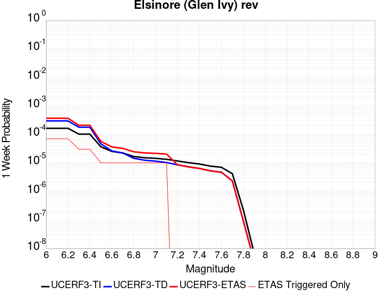 |  |  |  |

| Magnitude | 1 wk TI Prob | 1 wk TD Prob | 1 wk ETAS Prob | 1 wk ETAS/TD Gain | 1 wk ETAS Triggered Only | 1 mo TI Prob | 1 mo TD Prob | 1 mo ETAS Prob | 1 mo ETAS/TD Gain | 1 mo ETAS Triggered Only | 1 yr TI Prob | 1 yr TD Prob | 1 yr ETAS Prob | 1 yr ETAS/TD Gain | 1 yr ETAS Triggered Only | 10 yr TI Prob | 10 yr TD Prob | 10 yr ETAS Prob | 10 yr ETAS/TD Gain | 10 yr ETAS Triggered Only |
|-----|-----|-----|-----|-----|-----|-----|-----|-----|-----|-----|-----|-----|-----|-----|-----|-----|-----|-----|-----|-----|
| 6.0 | 1.6204086E-4 | 2.9360707E-4 | 4.0336238E-4 | 1.3738171 | 1.0978756E-4 | 6.94276E-4 | 0.0012578638 | 0.0014040632 | 1.1162282 | 1.4638342E-4 | 0.008420097 | 0.015234485 | 0.015432696 | 1.0130106 | 2.012772E-4 | 0.081081145 | 0.13969168 | 0.13989632 | 1.001465 | 2.3787304E-4 |
| 6.1 | 1.6204086E-4 | 2.9360707E-4 | 4.0336238E-4 | 1.3738171 | 1.0978756E-4 | 6.94276E-4 | 0.0012578638 | 0.0014040632 | 1.1162282 | 1.4638342E-4 | 0.008420097 | 0.015234485 | 0.015432696 | 1.0130106 | 2.012772E-4 | 0.081081145 | 0.13969168 | 0.13989632 | 1.001465 | 2.3787304E-4 |
| 6.2 | 1.6204086E-4 | 2.9360707E-4 | 4.0336238E-4 | 1.3738171 | 1.0978756E-4 | 6.94276E-4 | 0.0012578638 | 0.0014040632 | 1.1162282 | 1.4638342E-4 | 0.008420097 | 0.015234485 | 0.015432696 | 1.0130106 | 2.012772E-4 | 0.081081145 | 0.13969168 | 0.13989632 | 1.001465 | 2.3787304E-4 |
| 6.3 | 1.0111737E-4 | 1.7703383E-4 | 2.3191789E-4 | 1.3100202 | 5.489378E-5 | 4.332882E-4 | 7.5861247E-4 | 8.5003267E-4 | 1.1205097 | 9.148964E-5 | 0.005262531 | 0.009217682 | 0.009362716 | 1.0157343 | 1.4638342E-4 | 0.0513964 | 0.0870191 | 0.08716945 | 1.0017278 | 1.6468135E-4 |
| 6.4 | 1.0111737E-4 | 1.7703383E-4 | 2.3191789E-4 | 1.3100202 | 5.489378E-5 | 4.332882E-4 | 7.5861247E-4 | 8.5003267E-4 | 1.1205097 | 9.148964E-5 | 0.005262531 | 0.009217682 | 0.009362716 | 1.0157343 | 1.4638342E-4 | 0.0513964 | 0.0870191 | 0.08716945 | 1.0017278 | 1.6468135E-4 |
| 6.5 | 3.6624708E-5 | 4.6391084E-5 | 6.468816E-5 | 1.3944094 | 1.8297927E-5 | 1.569536E-4 | 1.9880582E-4 | 2.353944E-4 | 1.1840417 | 3.6595855E-5 | 0.001909235 | 0.0024181372 | 0.0024728982 | 1.022646 | 5.489378E-5 | 0.01892915 | 0.023739954 | 0.023793545 | 1.0022573 | 5.489378E-5 |
| 6.6 | 2.5051324E-5 | 2.614772E-5 | 4.444517E-5 | 1.6997722 | 1.8297927E-5 | 1.073584E-4 | 1.12057096E-4 | 1.3035297E-4 | 1.1632729 | 1.8297927E-5 | 0.0013063047 | 0.0013634858 | 0.0014000317 | 1.0268034 | 3.6595855E-5 | 0.012986525 | 0.013564618 | 0.013600717 | 1.0026613 | 3.6595855E-5 |
| 6.7 | 2.2189772E-5 | 2.2072849E-5 | 4.037037E-5 | 1.8289607 | 1.8297927E-5 | 9.509556E-5 | 9.4594696E-5 | 1.1289089E-4 | 1.1934167 | 1.8297927E-5 | 0.0011571734 | 0.0011511183 | 0.001187672 | 1.031755 | 3.6595855E-5 | 0.011511663 | 0.011465415 | 0.011501592 | 1.0031552 | 3.6595855E-5 |
| 6.8 | 1.6654378E-5 | 1.4437705E-5 | 3.2735366E-5 | 2.2673526 | 1.8297927E-5 | 7.137396E-5 | 6.187444E-5 | 8.017124E-5 | 1.2957084 | 1.8297927E-5 | 8.686314E-4 | 7.530661E-4 | 7.896344E-4 | 1.0485592 | 3.6595855E-5 | 0.008652439 | 0.00751048 | 0.007546801 | 1.0048361 | 3.6595855E-5 |
| 6.9 | 1.5042909E-5 | 1.2332022E-5 | 3.0629722E-5 | 2.483755 | 1.8297927E-5 | 6.446802E-5 | 5.285047E-5 | 7.1147435E-5 | 1.3462024 | 1.8297927E-5 | 7.8461546E-4 | 6.4326765E-4 | 6.615538E-4 | 1.028427 | 1.8297927E-5 | 0.007818509 | 0.00641828 | 0.0064364607 | 1.0028327 | 1.8297927E-5 |
| 7.0 | 1.4361385E-5 | 1.1451324E-5 | 2.974904E-5 | 2.5978692 | 1.8297927E-5 | 6.154734E-5 | 4.9076196E-5 | 6.737323E-5 | 1.372829 | 1.8297927E-5 | 7.490812E-4 | 5.973418E-4 | 6.156288E-4 | 1.0306139 | 1.8297927E-5 | 0.007465612 | 0.0059613534 | 0.005979542 | 1.0030512 | 1.8297927E-5 |
| 7.1 | 1.3265571E-5 | 1.0244926E-5 | 2.8542665E-5 | 2.7860296 | 1.8297927E-5 | 5.6851208E-5 | 4.39061E-5 | 6.2203224E-5 | 1.416733 | 1.8297927E-5 | 6.919436E-4 | 5.344282E-4 | 5.527164E-4 | 1.03422 | 1.8297927E-5 | 0.006897931 | 0.0053347866 | 0.005352987 | 1.0034117 | 1.8297927E-5 |
| 7.2 | 1.1596403E-5 | 8.505067E-6 | 8.505067E-6 | 1.0 | 0.0 | 4.9697923E-5 | 3.6449786E-5 | 3.6449786E-5 | 1.0 | 0.0 | 6.049042E-4 | 4.436875E-4 | 4.436875E-4 | 1.0 | 0.0 | 0.006032603 | 0.0044294316 | 0.0044294316 | 1.0 | 0.0 |
| 7.3 | 1.0150827E-5 | 7.2387597E-6 | 7.2387597E-6 | 1.0 | 0.0 | 4.3502816E-5 | 3.1022897E-5 | 3.1022897E-5 | 1.0 | 0.0 | 5.2951806E-4 | 3.7763975E-4 | 3.7763975E-4 | 1.0 | 0.0 | 0.005282581 | 0.0037703665 | 0.0037703665 | 1.0 | 0.0 |
| 7.4 | 9.080705E-6 | 6.352519E-6 | 6.352519E-6 | 1.0 | 0.0 | 3.8916725E-5 | 2.7224805E-5 | 2.7224805E-5 | 1.0 | 0.0 | 4.7370812E-4 | 3.3141294E-4 | 3.3141294E-4 | 1.0 | 0.0 | 0.004726996 | 0.0033093381 | 0.0033093381 | 1.0 | 0.0 |
| 7.5 | 7.671649E-6 | 5.2256332E-6 | 5.2256332E-6 | 1.0 | 0.0 | 3.287808E-5 | 2.2395385E-5 | 2.2395385E-5 | 1.0 | 0.0 | 4.0021708E-4 | 2.7263095E-4 | 2.7263095E-4 | 1.0 | 0.0 | 0.0039949706 | 0.00272309 | 0.00272309 | 1.0 | 0.0 |
| 7.6 | 6.990086E-6 | 4.687545E-6 | 4.687545E-6 | 1.0 | 0.0 | 2.9957167E-5 | 2.008933E-5 | 2.008933E-5 | 1.0 | 0.0 | 3.6466747E-4 | 2.445613E-4 | 2.445613E-4 | 1.0 | 0.0 | 0.0036406964 | 0.002443038 | 0.002443038 | 1.0 | 0.0 |
| 7.7 | 4.163505E-6 | 2.3295343E-6 | 2.3295343E-6 | 1.0 | 0.0 | 1.7843471E-5 | 9.983683E-6 | 9.983683E-6 | 1.0 | 0.0 | 2.172226E-4 | 1.21545316E-4 | 1.21545316E-4 | 1.0 | 0.0 | 0.0021701038 | 0.0012148614 | 0.0012148614 | 1.0 | 0.0 |
| 7.8 | 2.2692414E-7 | 9.3854695E-8 | 9.3854695E-8 | 1.0 | 0.0 | 9.725317E-7 | 4.0223435E-7 | 4.0223435E-7 | 1.0 | 0.0 | 1.1840509E-5 | 4.8971956E-6 | 4.8971956E-6 | 1.0 | 0.0 | 1.1839878E-4 | 4.8971204E-5 | 4.8971204E-5 | 1.0 | 0.0 |
| 7.9 | 6.676829E-9 | 3.439853E-9 | 3.439853E-9 | 1.0 | 0.0 | 2.861498E-8 | 1.4742227E-8 | 1.4742227E-8 | 1.0 | 0.0 | 3.4838732E-7 | 1.7948659E-7 | 1.7948659E-7 | 1.0 | 0.0 | 3.4838679E-6 | 1.7948646E-6 | 1.7948646E-6 | 1.0 | 0.0 |

## White Mountains
*[(top)](#table-of-contents)*

| 1 Week | 1 Month | 1 Year | 10 Year |
|-----|-----|-----|-----|
| 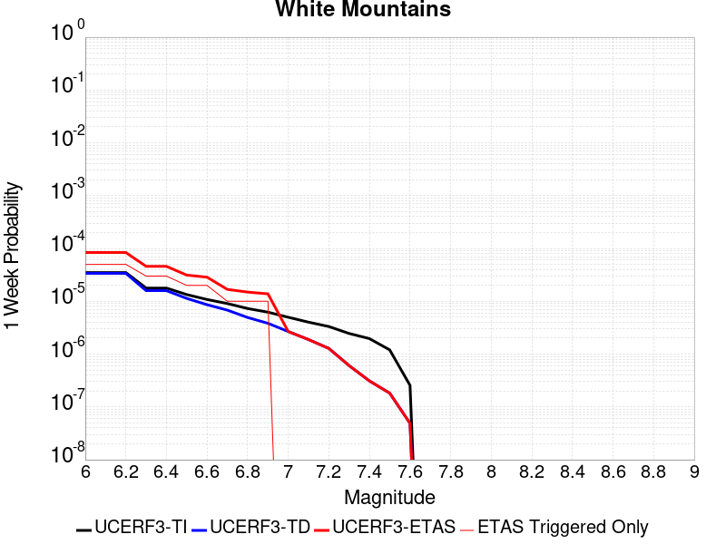 |  | 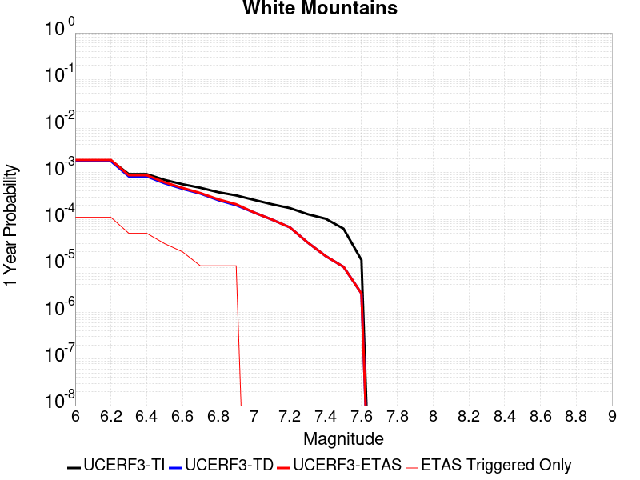 |  |

| Magnitude | 1 wk TI Prob | 1 wk TD Prob | 1 wk ETAS Prob | 1 wk ETAS/TD Gain | 1 wk ETAS Triggered Only | 1 mo TI Prob | 1 mo TD Prob | 1 mo ETAS Prob | 1 mo ETAS/TD Gain | 1 mo ETAS Triggered Only | 1 yr TI Prob | 1 yr TD Prob | 1 yr ETAS Prob | 1 yr ETAS/TD Gain | 1 yr ETAS Triggered Only | 10 yr TI Prob | 10 yr TD Prob | 10 yr ETAS Prob | 10 yr ETAS/TD Gain | 10 yr ETAS Triggered Only |
|-----|-----|-----|-----|-----|-----|-----|-----|-----|-----|-----|-----|-----|-----|-----|-----|-----|-----|-----|-----|-----|
| 6.0 | 3.503579E-5 | 3.378405E-5 | 1.0697328E-4 | 3.1663842 | 7.319171E-5 | 1.5014476E-4 | 1.4478143E-4 | 2.1796254E-4 | 1.5054592 | 7.319171E-5 | 0.0018264796 | 0.0017614096 | 0.0018892694 | 1.0725895 | 1.2808549E-4 | 0.018115403 | 0.017486818 | 0.017720532 | 1.0133651 | 2.3787304E-4 |
| 6.1 | 3.503579E-5 | 3.378405E-5 | 1.0697328E-4 | 3.1663842 | 7.319171E-5 | 1.5014476E-4 | 1.4478143E-4 | 2.1796254E-4 | 1.5054592 | 7.319171E-5 | 0.0018264796 | 0.0017614096 | 0.0018892694 | 1.0725895 | 1.2808549E-4 | 0.018115403 | 0.017486818 | 0.017720532 | 1.0133651 | 2.3787304E-4 |
| 6.2 | 3.503579E-5 | 3.378405E-5 | 1.0697328E-4 | 3.1663842 | 7.319171E-5 | 1.5014476E-4 | 1.4478143E-4 | 2.1796254E-4 | 1.5054592 | 7.319171E-5 | 0.0018264796 | 0.0017614096 | 0.0018892694 | 1.0725895 | 1.2808549E-4 | 0.018115403 | 0.017486818 | 0.017720532 | 1.0133651 | 2.3787304E-4 |
| 6.3 | 1.7818425E-5 | 1.5916074E-5 | 5.2511346E-5 | 3.299265 | 3.6595855E-5 | 7.636245E-5 | 6.821004E-5 | 1.048034E-4 | 1.5364805 | 3.6595855E-5 | 9.293162E-4 | 8.301551E-4 | 8.6672057E-4 | 1.0440465 | 3.6595855E-5 | 0.009254395 | 0.008271999 | 0.008362732 | 1.0109687 | 9.148964E-5 |
| 6.4 | 1.7818425E-5 | 1.5916074E-5 | 5.2511346E-5 | 3.299265 | 3.6595855E-5 | 7.636245E-5 | 6.821004E-5 | 1.048034E-4 | 1.5364805 | 3.6595855E-5 | 9.293162E-4 | 8.301551E-4 | 8.6672057E-4 | 1.0440465 | 3.6595855E-5 | 0.009254395 | 0.008271999 | 0.008362732 | 1.0109687 | 9.148964E-5 |
| 6.5 | 1.3397557E-5 | 1.13362685E-5 | 2.9633988E-5 | 2.6140866 | 1.8297927E-5 | 5.741684E-5 | 4.858314E-5 | 6.688018E-5 | 1.3766129 | 1.8297927E-5 | 6.988258E-4 | 5.913462E-4 | 6.096333E-4 | 1.0309246 | 1.8297927E-5 | 0.006966323 | 0.005898432 | 0.005953002 | 1.0092516 | 5.489378E-5 |
| 6.6 | 1.0818695E-5 | 8.625366E-6 | 2.6923135E-5 | 3.1213903 | 1.8297927E-5 | 4.6365014E-5 | 3.6965357E-5 | 5.5262608E-5 | 1.4949838 | 1.8297927E-5 | 5.6434784E-4 | 4.4996463E-4 | 4.6825432E-4 | 1.0406469 | 1.8297927E-5 | 0.005629168 | 0.004490972 | 0.0045274035 | 1.0081122 | 3.6595855E-5 |
| 6.7 | 9.067908E-6 | 6.802442E-6 | 6.802442E-6 | 1.0 | 0.0 | 3.8861883E-5 | 2.9153016E-5 | 2.9153016E-5 | 1.0 | 0.0 | 4.7304068E-4 | 3.5488335E-4 | 3.5488335E-4 | 1.0 | 0.0 | 0.00472035 | 0.0035434833 | 0.0035434833 | 1.0 | 0.0 |
| 6.8 | 7.295947E-6 | 4.936391E-6 | 4.936391E-6 | 1.0 | 0.0 | 3.126797E-5 | 2.1155796E-5 | 2.1155796E-5 | 1.0 | 0.0 | 3.8062103E-4 | 2.575425E-4 | 2.575425E-4 | 1.0 | 0.0 | 0.0037996976 | 0.0025725532 | 0.0025725532 | 1.0 | 0.0 |
| 6.9 | 6.2243444E-6 | 3.832213E-6 | 3.832213E-6 | 1.0 | 0.0 | 2.6675489E-5 | 1.642367E-5 | 1.642367E-5 | 1.0 | 0.0 | 3.2472567E-4 | 1.9994036E-4 | 1.9994036E-4 | 1.0 | 0.0 | 0.0032425157 | 0.0019976576 | 0.0019976576 | 1.0 | 0.0 |
| 7.0 | 4.9878413E-6 | 2.6795342E-6 | 2.6795342E-6 | 1.0 | 0.0 | 2.1376287E-5 | 1.14836685E-5 | 1.14836685E-5 | 1.0 | 0.0 | 2.602252E-4 | 1.3980496E-4 | 1.3980496E-4 | 1.0 | 0.0 | 0.002599207 | 0.0013971963 | 0.0013971963 | 1.0 | 0.0 |
| 7.1 | 4.0252844E-6 | 1.8857575E-6 | 1.8857575E-6 | 1.0 | 0.0 | 1.7251105E-5 | 8.081794E-6 | 8.081794E-6 | 1.0 | 0.0 | 2.1001195E-4 | 9.8391516E-5 | 9.8391516E-5 | 1.0 | 0.0 | 0.0020981359 | 9.834924E-4 | 9.834924E-4 | 1.0 | 0.0 |
| 7.2 | 3.3284066E-6 | 1.281964E-6 | 1.281964E-6 | 1.0 | 0.0 | 1.4264522E-5 | 5.494121E-6 | 5.494121E-6 | 1.0 | 0.0 | 1.736567E-4 | 6.688897E-5 | 6.688897E-5 | 1.0 | 0.0 | 0.0017352107 | 6.6869846E-4 | 6.6869846E-4 | 1.0 | 0.0 |
| 7.3 | 2.458226E-6 | 6.05722E-7 | 6.05722E-7 | 1.0 | 0.0 | 1.0535211E-5 | 2.5959491E-6 | 2.5959491E-6 | 1.0 | 0.0 | 1.2825865E-4 | 3.1605257E-5 | 3.1605257E-5 | 1.0 | 0.0 | 0.0012818464 | 3.160114E-4 | 3.160114E-4 | 1.0 | 0.0 |
| 7.4 | 1.965953E-6 | 3.1089303E-7 | 3.1089303E-7 | 1.0 | 0.0 | 8.425486E-6 | 1.332398E-6 | 1.332398E-6 | 1.0 | 0.0 | 1.0257547E-4 | 1.6221828E-5 | 1.6221828E-5 | 1.0 | 0.0 | 0.0010252813 | 1.6220656E-4 | 1.6220656E-4 | 1.0 | 0.0 |
| 7.5 | 1.2014192E-6 | 1.8244253E-7 | 1.8244253E-7 | 1.0 | 0.0 | 5.148929E-6 | 7.8189635E-7 | 7.8189635E-7 | 1.0 | 0.0 | 6.2686406E-5 | 9.519547E-6 | 9.519547E-6 | 1.0 | 0.0 | 6.266873E-4 | 9.519148E-5 | 9.519148E-5 | 1.0 | 0.0 |
| 7.6 | 2.5612175E-7 | 4.8946475E-8 | 4.8946475E-8 | 1.0 | 0.0 | 1.0976642E-6 | 2.0977059E-7 | 2.0977059E-7 | 1.0 | 0.0 | 1.3363979E-5 | 2.5539543E-6 | 2.5539543E-6 | 1.0 | 0.0 | 1.3363175E-4 | 2.5539286E-5 | 2.5539286E-5 | 1.0 | 0.0 |

## Kern Canyon (South Kern) 2011
*[(top)](#table-of-contents)*

| 1 Week | 1 Month | 1 Year | 10 Year |
|-----|-----|-----|-----|
|  |  | 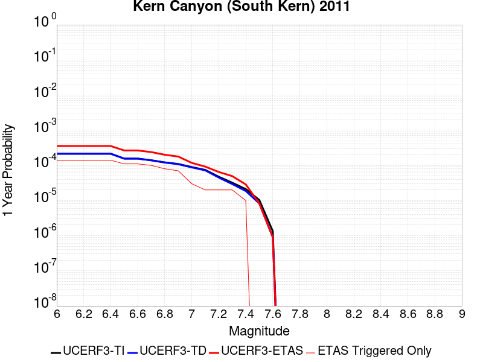 |  |

| Magnitude | 1 wk TI Prob | 1 wk TD Prob | 1 wk ETAS Prob | 1 wk ETAS/TD Gain | 1 wk ETAS Triggered Only | 1 mo TI Prob | 1 mo TD Prob | 1 mo ETAS Prob | 1 mo ETAS/TD Gain | 1 mo ETAS Triggered Only | 1 yr TI Prob | 1 yr TD Prob | 1 yr ETAS Prob | 1 yr ETAS/TD Gain | 1 yr ETAS Triggered Only | 10 yr TI Prob | 10 yr TD Prob | 10 yr ETAS Prob | 10 yr ETAS/TD Gain | 10 yr ETAS Triggered Only |
|-----|-----|-----|-----|-----|-----|-----|-----|-----|-----|-----|-----|-----|-----|-----|-----|-----|-----|-----|-----|-----|
| 6.0 | 4.105075E-6 | 4.1137264E-6 | 7.7305136E-5 | 18.791996 | 7.319171E-5 | 1.7593058E-5 | 1.763014E-5 | 1.2741577E-4 | 7.227155 | 1.0978756E-4 | 2.1417443E-4 | 2.1462646E-4 | 3.7927245E-4 | 1.7671281 | 1.6468135E-4 | 0.0021396813 | 0.0021442557 | 0.0023816186 | 1.1106972 | 2.3787304E-4 |
| 6.1 | 4.105075E-6 | 4.1137264E-6 | 7.7305136E-5 | 18.791996 | 7.319171E-5 | 1.7593058E-5 | 1.763014E-5 | 1.2741577E-4 | 7.227155 | 1.0978756E-4 | 2.1417443E-4 | 2.1462646E-4 | 3.7927245E-4 | 1.7671281 | 1.6468135E-4 | 0.0021396813 | 0.0021442557 | 0.0023816186 | 1.1106972 | 2.3787304E-4 |
| 6.2 | 4.105075E-6 | 4.1137264E-6 | 7.7305136E-5 | 18.791996 | 7.319171E-5 | 1.7593058E-5 | 1.763014E-5 | 1.2741577E-4 | 7.227155 | 1.0978756E-4 | 2.1417443E-4 | 2.1462646E-4 | 3.7927245E-4 | 1.7671281 | 1.6468135E-4 | 0.0021396813 | 0.0021442557 | 0.0023816186 | 1.1106972 | 2.3787304E-4 |
| 6.3 | 4.105075E-6 | 4.1137264E-6 | 7.7305136E-5 | 18.791996 | 7.319171E-5 | 1.7593058E-5 | 1.763014E-5 | 1.2741577E-4 | 7.227155 | 1.0978756E-4 | 2.1417443E-4 | 2.1462646E-4 | 3.7927245E-4 | 1.7671281 | 1.6468135E-4 | 0.0021396813 | 0.0021442557 | 0.0023816186 | 1.1106972 | 2.3787304E-4 |
| 6.4 | 4.105075E-6 | 4.1137264E-6 | 7.7305136E-5 | 18.791996 | 7.319171E-5 | 1.7593058E-5 | 1.763014E-5 | 1.2741577E-4 | 7.227155 | 1.0978756E-4 | 2.1417443E-4 | 2.1462646E-4 | 3.7927245E-4 | 1.7671281 | 1.6468135E-4 | 0.0021396813 | 0.0021442557 | 0.0023816186 | 1.1106972 | 2.3787304E-4 |
| 6.5 | 2.9849807E-6 | 2.9731548E-6 | 7.6164644E-5 | 25.61745 | 7.319171E-5 | 1.2792712E-5 | 1.274203E-5 | 1.2252819E-4 | 9.616065 | 1.0978756E-4 | 1.5574014E-4 | 1.5512333E-4 | 3.0148402E-4 | 1.943512 | 1.4638342E-4 | 0.0015563103 | 0.0015501656 | 0.0017511308 | 1.129641 | 2.012772E-4 |
| 6.6 | 2.9849807E-6 | 2.9731548E-6 | 7.6164644E-5 | 25.61745 | 7.319171E-5 | 1.2792712E-5 | 1.274203E-5 | 1.2252819E-4 | 9.616065 | 1.0978756E-4 | 1.5574014E-4 | 1.5512333E-4 | 3.0148402E-4 | 1.943512 | 1.4638342E-4 | 0.0015563103 | 0.0015501656 | 0.0017511308 | 1.129641 | 2.012772E-4 |
| 6.7 | 2.6756725E-6 | 2.6582206E-6 | 7.584973E-5 | 28.534023 | 7.319171E-5 | 1.1467117E-5 | 1.1392325E-5 | 1.2117864E-4 | 10.636866 | 1.0978756E-4 | 1.396032E-4 | 1.3869285E-4 | 2.8505595E-4 | 2.055304 | 1.4638342E-4 | 0.0013951553 | 0.0013860738 | 0.001587072 | 1.1450126 | 2.012772E-4 |
| 6.8 | 2.3283721E-6 | 2.3047787E-6 | 5.719843E-5 | 24.81732 | 5.489378E-5 | 9.9787E-6 | 9.877586E-6 | 8.306857E-5 | 8.409804 | 7.319171E-5 | 1.214839E-4 | 1.20253055E-4 | 2.300274E-4 | 1.9128613 | 1.0978756E-4 | 0.001214175 | 0.0012018873 | 0.0013663707 | 1.1368543 | 1.6468135E-4 |
| 6.9 | 2.0972677E-6 | 2.0696411E-6 | 5.696331E-5 | 27.523277 | 5.489378E-5 | 8.988259E-6 | 8.869861E-6 | 8.206092E-5 | 9.251658 | 7.319171E-5 | 1.0942656E-4 | 1.0798526E-4 | 1.9946501E-4 | 1.8471504 | 9.148964E-5 | 0.0010937268 | 0.0010793337 | 0.0012072809 | 1.1185428 | 1.2808549E-4 |
| 7.0 | 1.7132242E-6 | 1.6787036E-6 | 1.99766E-5 | 11.900017 | 1.8297927E-5 | 7.3423685E-6 | 7.194424E-6 | 2.549222E-5 | 3.54333 | 1.8297927E-5 | 8.938967E-5 | 8.758863E-5 | 1.2418129E-4 | 1.4177785 | 3.6595855E-5 | 8.935372E-4 | 8.7554497E-4 | 9.3039067E-4 | 1.0626419 | 5.489378E-5 |
| 7.1 | 1.4215541E-6 | 1.3815752E-6 | 1.3815752E-6 | 1.0 | 0.0 | 6.0923603E-6 | 5.9210233E-6 | 5.9210233E-6 | 1.0 | 0.0 | 7.417196E-5 | 7.20861E-5 | 9.038271E-5 | 1.253816 | 1.8297927E-5 | 7.414721E-4 | 7.206299E-4 | 7.5719936E-4 | 1.0507466 | 3.6595855E-5 |
| 7.2 | 9.097853E-7 | 8.6037755E-7 | 8.6037755E-7 | 1.0 | 0.0 | 3.899074E-6 | 3.6873273E-6 | 3.6873273E-6 | 1.0 | 0.0 | 4.7470192E-5 | 4.4892295E-5 | 6.31894E-5 | 1.4075779 | 1.8297927E-5 | 4.7460053E-4 | 4.4883334E-4 | 4.6712306E-4 | 1.0407494 | 1.8297927E-5 |
| 7.3 | 6.144169E-7 | 5.628206E-7 | 5.628206E-7 | 1.0 | 0.0 | 2.6332125E-6 | 2.4120861E-6 | 2.4120861E-6 | 1.0 | 0.0 | 3.205889E-5 | 2.9366758E-5 | 4.7664147E-5 | 1.6230646 | 1.8297927E-5 | 3.2054266E-4 | 2.936293E-4 | 3.1192185E-4 | 1.0622982 | 1.8297927E-5 |
| 7.4 | 4.049844E-7 | 3.5728314E-7 | 3.5728314E-7 | 1.0 | 0.0 | 1.7356463E-6 | 1.5312125E-6 | 1.5312125E-6 | 1.0 | 0.0 | 2.1131287E-5 | 1.8642357E-5 | 3.6939942E-5 | 1.9815061 | 1.8297927E-5 | 2.1129279E-4 | 1.8640817E-4 | 2.0470268E-4 | 1.0981423 | 1.8297927E-5 |
| 7.5 | 1.9871162E-7 | 1.583044E-7 | 1.583044E-7 | 1.0 | 0.0 | 8.5162094E-7 | 6.7844724E-7 | 6.7844724E-7 | 1.0 | 0.0 | 1.0368436E-5 | 8.260065E-6 | 8.260065E-6 | 1.0 | 0.0 | 1.0367952E-4 | 8.259767E-5 | 8.259767E-5 | 1.0 | 0.0 |
| 7.6 | 2.572245E-8 | 1.7352555E-8 | 1.7352555E-8 | 1.0 | 0.0 | 1.10239064E-7 | 7.436809E-8 | 7.436809E-8 | 1.0 | 0.0 | 1.3421597E-6 | 9.054312E-7 | 9.054312E-7 | 1.0 | 0.0 | 1.3421517E-5 | 9.05428E-6 | 9.05428E-6 | 1.0 | 0.0 |

## Death Valley (No)
*[(top)](#table-of-contents)*

| 1 Week | 1 Month | 1 Year | 10 Year |
|-----|-----|-----|-----|
|  |  |  | 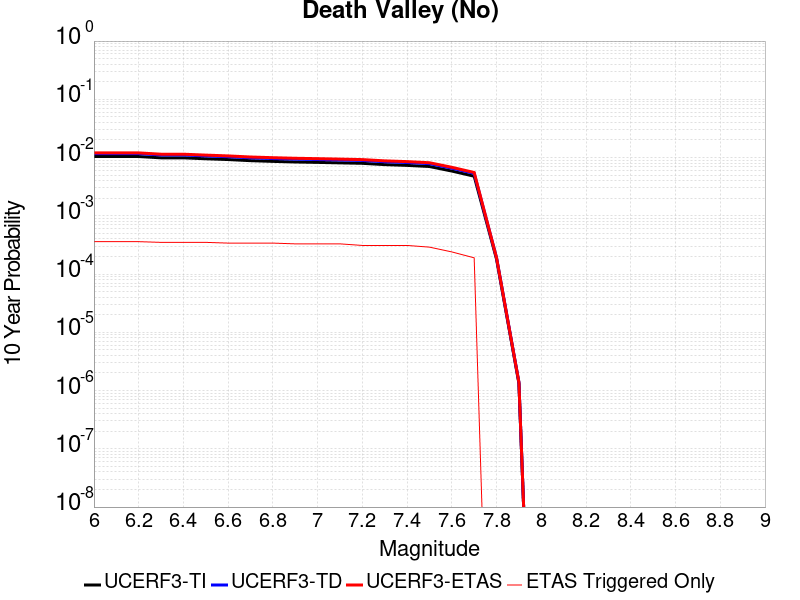 |

| Magnitude | 1 wk TI Prob | 1 wk TD Prob | 1 wk ETAS Prob | 1 wk ETAS/TD Gain | 1 wk ETAS Triggered Only | 1 mo TI Prob | 1 mo TD Prob | 1 mo ETAS Prob | 1 mo ETAS/TD Gain | 1 mo ETAS Triggered Only | 1 yr TI Prob | 1 yr TD Prob | 1 yr ETAS Prob | 1 yr ETAS/TD Gain | 1 yr ETAS Triggered Only | 10 yr TI Prob | 10 yr TD Prob | 10 yr ETAS Prob | 10 yr ETAS/TD Gain | 10 yr ETAS Triggered Only |
|-----|-----|-----|-----|-----|-----|-----|-----|-----|-----|-----|-----|-----|-----|-----|-----|-----|-----|-----|-----|-----|
| 6.0 | 2.0074807E-5 | 2.2500084E-5 | 1.3228517E-4 | 5.879319 | 1.0978756E-4 | 8.603206E-5 | 9.642541E-5 | 2.2449854E-4 | 2.3282094 | 1.2808549E-4 | 0.001046937 | 0.0011733545 | 0.0013012897 | 1.1090337 | 1.2808549E-4 | 0.010420183 | 0.011672506 | 0.011889518 | 1.0185918 | 2.1957511E-4 |
| 6.1 | 2.0074807E-5 | 2.2500084E-5 | 1.3228517E-4 | 5.879319 | 1.0978756E-4 | 8.603206E-5 | 9.642541E-5 | 2.2449854E-4 | 2.3282094 | 1.2808549E-4 | 0.001046937 | 0.0011733545 | 0.0013012897 | 1.1090337 | 1.2808549E-4 | 0.010420183 | 0.011672506 | 0.011889518 | 1.0185918 | 2.1957511E-4 |
| 6.2 | 2.0074807E-5 | 2.2500084E-5 | 1.3228517E-4 | 5.879319 | 1.0978756E-4 | 8.603206E-5 | 9.642541E-5 | 2.2449854E-4 | 2.3282094 | 1.2808549E-4 | 0.001046937 | 0.0011733545 | 0.0013012897 | 1.1090337 | 1.2808549E-4 | 0.010420183 | 0.011672506 | 0.011889518 | 1.0185918 | 2.1957511E-4 |
| 6.3 | 1.9050609E-5 | 2.1336948E-5 | 1.3112217E-4 | 6.1453104 | 1.0978756E-4 | 8.164292E-5 | 9.1440896E-5 | 2.1951467E-4 | 2.400618 | 1.2808549E-4 | 9.935491E-4 | 0.001112731 | 0.001240674 | 1.114981 | 1.2808549E-4 | 0.009891188 | 0.011072419 | 0.011289563 | 1.0196112 | 2.1957511E-4 |
| 6.4 | 1.9050609E-5 | 2.1336948E-5 | 1.3112217E-4 | 6.1453104 | 1.0978756E-4 | 8.164292E-5 | 9.1440896E-5 | 2.1951467E-4 | 2.400618 | 1.2808549E-4 | 9.935491E-4 | 0.001112731 | 0.001240674 | 1.114981 | 1.2808549E-4 | 0.009891188 | 0.011072419 | 0.011289563 | 1.0196112 | 2.1957511E-4 |
| 6.5 | 1.8367004E-5 | 2.0561009E-5 | 1.303463E-4 | 6.3394904 | 1.0978756E-4 | 7.8713354E-5 | 8.811567E-5 | 2.1618987E-4 | 2.453478 | 1.2808549E-4 | 9.5791375E-4 | 0.0010722869 | 0.001200235 | 1.1193227 | 1.2808549E-4 | 0.009537951 | 0.0106719155 | 0.010889147 | 1.0203555 | 2.1957511E-4 |
| 6.6 | 1.779439E-5 | 1.9910927E-5 | 1.296963E-4 | 6.513825 | 1.0978756E-4 | 7.625944E-5 | 8.53298E-5 | 2.1340435E-4 | 2.500936 | 1.2808549E-4 | 9.280632E-4 | 0.0010384015 | 0.0011663539 | 1.1232207 | 1.2808549E-4 | 0.009241969 | 0.010336253 | 0.010553558 | 1.0210236 | 2.1957511E-4 |
| 6.7 | 1.7025437E-5 | 1.9043426E-5 | 1.2882889E-4 | 6.7650065 | 1.0978756E-4 | 7.296412E-5 | 8.161216E-5 | 2.0968719E-4 | 2.569313 | 1.2808549E-4 | 8.87976E-4 | 9.931813E-4 | 0.0011211396 | 1.1288368 | 1.2808549E-4 | 0.008844362 | 0.009888145 | 0.010105549 | 1.0219864 | 2.1957511E-4 |
| 6.8 | 1.6545107E-5 | 1.8512545E-5 | 1.2829808E-4 | 6.930331 | 1.0978756E-4 | 7.090568E-5 | 7.93371E-5 | 2.0741243E-4 | 2.6143181 | 1.2808549E-4 | 8.629347E-4 | 9.655073E-4 | 0.0010934691 | 1.1325333 | 1.2808549E-4 | 0.008595915 | 0.009613829 | 0.009831293 | 1.02262 | 2.1957511E-4 |
| 6.9 | 1.615478E-5 | 1.8087594E-5 | 1.2787317E-4 | 7.0696616 | 1.0978756E-4 | 6.9232934E-5 | 7.751599E-5 | 2.0559155E-4 | 2.652247 | 1.2808549E-4 | 8.4258494E-4 | 9.433546E-4 | 0.0010713193 | 1.1356485 | 1.2808549E-4 | 0.008393973 | 0.009394196 | 0.009611708 | 1.0231539 | 2.1957511E-4 |
| 7.0 | 1.5894311E-5 | 1.780555E-5 | 1.2759115E-4 | 7.165808 | 1.0978756E-4 | 6.81167E-5 | 7.6307304E-5 | 2.0438302E-4 | 2.67842 | 1.2808549E-4 | 8.2900526E-4 | 9.286515E-4 | 0.001056618 | 1.1377982 | 1.2808549E-4 | 0.008259195 | 0.009248397 | 0.009465942 | 1.0235224 | 2.1957511E-4 |
| 7.1 | 1.5602263E-5 | 1.7483504E-5 | 1.2726914E-4 | 7.2793846 | 1.0978756E-4 | 6.6865134E-5 | 7.492718E-5 | 2.0300307E-4 | 2.7093382 | 1.2808549E-4 | 8.137789E-4 | 9.118627E-4 | 0.0010398314 | 1.1403377 | 1.2808549E-4 | 0.008108052 | 0.009081894 | 0.009299475 | 1.0239576 | 2.1957511E-4 |
| 7.2 | 1.5323829E-5 | 1.717063E-5 | 1.269563E-4 | 7.393806 | 1.0978756E-4 | 6.56719E-5 | 7.358637E-5 | 2.0166243E-4 | 2.7404861 | 1.2808549E-4 | 7.99262E-4 | 8.9555193E-4 | 0.0010235227 | 1.1428959 | 1.2808549E-4 | 0.007963934 | 0.008920107 | 0.009137723 | 1.0243962 | 2.1957511E-4 |
| 7.3 | 1.4556212E-5 | 1.6302456E-5 | 1.2608823E-4 | 7.734309 | 1.0978756E-4 | 6.238227E-5 | 6.9865826E-5 | 1.9794237E-4 | 2.8331785 | 1.2808549E-4 | 7.592395E-4 | 8.5029035E-4 | 9.782669E-4 | 1.1505092 | 1.2808549E-4 | 0.0075665074 | 0.008471014 | 0.008688729 | 1.0257012 | 2.1957511E-4 |
| 7.4 | 1.411725E-5 | 1.580796E-5 | 1.2559378E-4 | 7.944971 | 1.0978756E-4 | 6.0501097E-5 | 6.7746674E-5 | 1.9582348E-4 | 2.8905253 | 1.2808549E-4 | 7.363519E-4 | 8.245094E-4 | 9.524893E-4 | 1.1552194 | 1.2808549E-4 | 0.0073391674 | 0.008215138 | 0.00843291 | 1.0265086 | 2.1957511E-4 |
| 7.5 | 1.3503312E-5 | 1.5126289E-5 | 1.0661454E-4 | 7.0482945 | 9.148964E-5 | 5.7870053E-5 | 6.482538E-5 | 1.7460583E-4 | 2.6934795 | 1.0978756E-4 | 7.043401E-4 | 7.8896893E-4 | 8.986699E-4 | 1.1390435 | 1.0978756E-4 | 0.007021119 | 0.007862304 | 0.0080619985 | 1.025399 | 2.012772E-4 |
| 7.6 | 1.1279839E-5 | 1.2626327E-5 | 4.922172E-5 | 3.8983402 | 3.6595855E-5 | 4.834127E-5 | 5.4111737E-5 | 1.0900255E-4 | 2.0143974 | 5.489378E-5 | 5.88396E-4 | 6.5861654E-4 | 7.134742E-4 | 1.0832922 | 5.489378E-5 | 0.005868405 | 0.006567199 | 0.0067126206 | 1.0221437 | 1.4638342E-4 |
| 7.7 | 9.189108E-6 | 1.0283358E-5 | 2.8581097E-5 | 2.7793543 | 1.8297927E-5 | 3.93813E-5 | 4.407082E-5 | 8.0665064E-5 | 1.8303508 | 3.6595855E-5 | 4.7936183E-4 | 5.3643517E-4 | 5.730114E-4 | 1.0681839 | 3.6595855E-5 | 0.004783291 | 0.005351914 | 0.005461114 | 1.0204039 | 1.0978756E-4 |
| 7.8 | 3.4586725E-7 | 3.6482615E-7 | 3.6482615E-7 | 1.0 | 0.0 | 1.4822873E-6 | 1.5635396E-6 | 1.5635396E-6 | 1.0 | 0.0 | 1.80467E-5 | 1.9035933E-5 | 1.9035933E-5 | 1.0 | 0.0 | 1.8045233E-4 | 1.9034347E-4 | 1.9034347E-4 | 1.0 | 0.0 |
| 7.9 | 2.5591178E-9 | 2.6696718E-9 | 2.6696718E-9 | 1.0 | 0.0 | 1.0967647E-8 | 1.14414505E-8 | 1.14414505E-8 | 1.0 | 0.0 | 1.335311E-7 | 1.3929966E-7 | 1.3929966E-7 | 1.0 | 0.0 | 1.3353102E-6 | 1.3929966E-6 | 1.3929966E-6 | 1.0 | 0.0 |

## Pleito
*[(top)](#table-of-contents)*

| 1 Week | 1 Month | 1 Year | 10 Year |
|-----|-----|-----|-----|
| 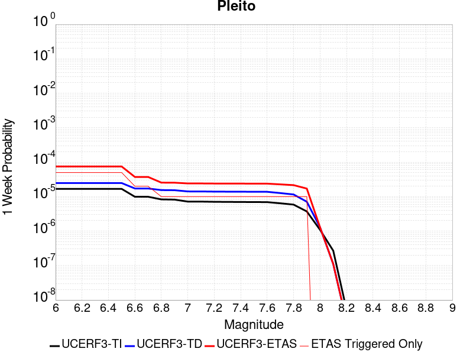 |  |  |  |

| Magnitude | 1 wk TI Prob | 1 wk TD Prob | 1 wk ETAS Prob | 1 wk ETAS/TD Gain | 1 wk ETAS Triggered Only | 1 mo TI Prob | 1 mo TD Prob | 1 mo ETAS Prob | 1 mo ETAS/TD Gain | 1 mo ETAS Triggered Only | 1 yr TI Prob | 1 yr TD Prob | 1 yr ETAS Prob | 1 yr ETAS/TD Gain | 1 yr ETAS Triggered Only | 10 yr TI Prob | 10 yr TD Prob | 10 yr ETAS Prob | 10 yr ETAS/TD Gain | 10 yr ETAS Triggered Only |
|-----|-----|-----|-----|-----|-----|-----|-----|-----|-----|-----|-----|-----|-----|-----|-----|-----|-----|-----|-----|-----|
| 6.0 | 1.6763008E-5 | 2.4763838E-5 | 9.7953736E-5 | 3.955515 | 7.319171E-5 | 7.183948E-5 | 1.0612683E-4 | 1.7931077E-4 | 1.6895895 | 7.319171E-5 | 8.742947E-4 | 0.0012914003 | 0.0014741432 | 1.1415076 | 1.8297927E-4 | 0.00870863 | 0.0129538905 | 0.013170621 | 1.0167309 | 2.1957511E-4 |
| 6.1 | 1.6763008E-5 | 2.4763838E-5 | 9.7953736E-5 | 3.955515 | 7.319171E-5 | 7.183948E-5 | 1.0612683E-4 | 1.7931077E-4 | 1.6895895 | 7.319171E-5 | 8.742947E-4 | 0.0012914003 | 0.0014741432 | 1.1415076 | 1.8297927E-4 | 0.00870863 | 0.0129538905 | 0.013170621 | 1.0167309 | 2.1957511E-4 |
| 6.2 | 1.6763008E-5 | 2.4763838E-5 | 9.7953736E-5 | 3.955515 | 7.319171E-5 | 7.183948E-5 | 1.0612683E-4 | 1.7931077E-4 | 1.6895895 | 7.319171E-5 | 8.742947E-4 | 0.0012914003 | 0.0014741432 | 1.1415076 | 1.8297927E-4 | 0.00870863 | 0.0129538905 | 0.013170621 | 1.0167309 | 2.1957511E-4 |
| 6.3 | 1.6763008E-5 | 2.4763838E-5 | 9.7953736E-5 | 3.955515 | 7.319171E-5 | 7.183948E-5 | 1.0612683E-4 | 1.7931077E-4 | 1.6895895 | 7.319171E-5 | 8.742947E-4 | 0.0012914003 | 0.0014741432 | 1.1415076 | 1.8297927E-4 | 0.00870863 | 0.0129538905 | 0.013170621 | 1.0167309 | 2.1957511E-4 |
| 6.4 | 1.6763008E-5 | 2.4763838E-5 | 9.7953736E-5 | 3.955515 | 7.319171E-5 | 7.183948E-5 | 1.0612683E-4 | 1.7931077E-4 | 1.6895895 | 7.319171E-5 | 8.742947E-4 | 0.0012914003 | 0.0014741432 | 1.1415076 | 1.8297927E-4 | 0.00870863 | 0.0129538905 | 0.013170621 | 1.0167309 | 2.1957511E-4 |
| 6.5 | 1.6763008E-5 | 2.4763838E-5 | 9.7953736E-5 | 3.955515 | 7.319171E-5 | 7.183948E-5 | 1.0612683E-4 | 1.7931077E-4 | 1.6895895 | 7.319171E-5 | 8.742947E-4 | 0.0012914003 | 0.0014741432 | 1.1415076 | 1.8297927E-4 | 0.00870863 | 0.0129538905 | 0.013170621 | 1.0167309 | 2.1957511E-4 |
| 6.6 | 9.910213E-6 | 1.7214623E-5 | 3.5512236E-5 | 2.062911 | 1.8297927E-5 | 4.247165E-5 | 7.377489E-5 | 9.207147E-5 | 1.2480055 | 1.8297927E-5 | 5.169696E-4 | 8.978429E-4 | 9.892504E-4 | 1.1018078 | 9.148964E-5 | 0.0051576863 | 0.009050702 | 0.009141363 | 1.010017 | 9.148964E-5 |
| 6.7 | 9.910213E-6 | 1.7214623E-5 | 3.5512236E-5 | 2.062911 | 1.8297927E-5 | 4.247165E-5 | 7.377489E-5 | 9.207147E-5 | 1.2480055 | 1.8297927E-5 | 5.169696E-4 | 8.978429E-4 | 9.892504E-4 | 1.1018078 | 9.148964E-5 | 0.0051576863 | 0.009050702 | 0.009141363 | 1.010017 | 9.148964E-5 |
| 6.8 | 8.300162E-6 | 1.5474232E-5 | 3.3771877E-5 | 2.1824589 | 1.8297927E-5 | 3.557164E-5 | 6.631646E-5 | 8.461317E-5 | 1.2759 | 1.8297927E-5 | 4.3299864E-4 | 8.071053E-4 | 8.802379E-4 | 1.090611 | 7.319171E-5 | 0.004321559 | 0.008150139 | 0.008222734 | 1.0089072 | 7.319171E-5 |
| 6.9 | 8.183114E-6 | 1.5345448E-5 | 3.3643093E-5 | 2.1923826 | 1.8297927E-5 | 3.5070017E-5 | 6.576455E-5 | 8.406128E-5 | 1.2782155 | 1.8297927E-5 | 4.2689382E-4 | 8.003907E-4 | 8.735239E-4 | 1.0913718 | 7.319171E-5 | 0.0042607468 | 0.008083483 | 0.0081560835 | 1.0089812 | 7.319171E-5 |
| 7.0 | 7.1748823E-6 | 1.413244E-5 | 3.2430107E-5 | 2.2947283 | 1.8297927E-5 | 3.0749135E-5 | 6.0566195E-5 | 7.886301E-5 | 1.3020962 | 1.8297927E-5 | 3.743064E-4 | 7.371445E-4 | 7.9199777E-4 | 1.0744133 | 5.489378E-5 | 0.0037367654 | 0.007454939 | 0.007509424 | 1.0073085 | 5.489378E-5 |
| 7.1 | 7.1671807E-6 | 1.412281E-5 | 3.2420478E-5 | 2.295611 | 1.8297927E-5 | 3.0716128E-5 | 6.052493E-5 | 7.882175E-5 | 1.3023022 | 1.8297927E-5 | 3.7390468E-4 | 7.366424E-4 | 7.914957E-4 | 1.074464 | 5.489378E-5 | 0.0037327618 | 0.0074499524 | 0.007504437 | 1.0073135 | 5.489378E-5 |
| 7.2 | 7.0649667E-6 | 1.39701015E-5 | 3.2267773E-5 | 2.3097737 | 1.8297927E-5 | 3.0278077E-5 | 5.9870494E-5 | 7.816732E-5 | 1.3056068 | 1.8297927E-5 | 3.6857324E-4 | 7.2868E-4 | 7.835338E-4 | 1.0752783 | 5.489378E-5 | 0.0036796255 | 0.0073707094 | 0.007425199 | 1.0073926 | 5.489378E-5 |
| 7.3 | 7.02082E-6 | 1.3913556E-5 | 3.221123E-5 | 2.3150966 | 1.8297927E-5 | 3.008888E-5 | 5.9628168E-5 | 7.7925004E-5 | 1.3068489 | 1.8297927E-5 | 3.6627054E-4 | 7.2573166E-4 | 7.805856E-4 | 1.0755843 | 5.489378E-5 | 0.0036566744 | 0.007341209 | 0.0073956996 | 1.0074226 | 5.489378E-5 |
| 7.4 | 6.987146E-6 | 1.3873118E-5 | 3.2170792E-5 | 2.3189301 | 1.8297927E-5 | 2.9944567E-5 | 5.945487E-5 | 7.7751705E-5 | 1.3077433 | 1.8297927E-5 | 3.6451413E-4 | 7.2362315E-4 | 7.784772E-4 | 1.0758047 | 5.489378E-5 | 0.0036391679 | 0.007320144 | 0.0073746364 | 1.0074441 | 5.489378E-5 |
| 7.5 | 6.9494554E-6 | 1.3830024E-5 | 3.2127697E-5 | 2.32304 | 1.8297927E-5 | 2.9783041E-5 | 5.9270187E-5 | 7.756703E-5 | 1.3087022 | 1.8297927E-5 | 3.625482E-4 | 7.2137616E-4 | 7.762303E-4 | 1.076041 | 5.489378E-5 | 0.0036195726 | 0.0072977724 | 0.007352266 | 1.0074672 | 5.489378E-5 |
| 7.6 | 6.92694E-6 | 1.3789138E-5 | 3.2086813E-5 | 2.326963 | 1.8297927E-5 | 2.9686547E-5 | 5.909497E-5 | 7.7391815E-5 | 1.3096176 | 1.8297927E-5 | 3.6137376E-4 | 7.1924424E-4 | 7.7409856E-4 | 1.0762665 | 5.489378E-5 | 0.0036078666 | 0.0072765257 | 0.00733102 | 1.0074891 | 5.489378E-5 |
| 7.7 | 6.395867E-6 | 1.2668219E-5 | 3.0965915E-5 | 2.444378 | 1.8297927E-5 | 2.741057E-5 | 5.429124E-5 | 7.258817E-5 | 1.3370144 | 1.8297927E-5 | 3.336726E-4 | 6.6079566E-4 | 7.156532E-4 | 1.0830173 | 5.489378E-5 | 0.0033317201 | 0.0066951844 | 0.0067497105 | 1.0081441 | 5.489378E-5 |
| 7.8 | 5.8664327E-6 | 1.153586E-5 | 2.9833576E-5 | 2.5861597 | 1.8297927E-5 | 2.5141611E-5 | 4.9438466E-5 | 6.7735484E-5 | 1.3700969 | 1.8297927E-5 | 3.060561E-4 | 6.017473E-4 | 6.56608E-4 | 1.0911691 | 5.489378E-5 | 0.0030563495 | 0.0061006667 | 0.0061552254 | 1.0089431 | 5.489378E-5 |
| 7.9 | 3.7167474E-6 | 7.1140853E-6 | 2.5411882E-5 | 3.572052 | 1.8297927E-5 | 1.592882E-5 | 3.0488582E-5 | 4.878595E-5 | 1.6001384 | 1.8297927E-5 | 1.9391612E-4 | 3.7113542E-4 | 4.0771769E-4 | 1.0985686 | 3.6595855E-5 | 0.0019374699 | 0.0037674906 | 0.0038039486 | 1.0096769 | 3.6595855E-5 |
| 8.0 | 1.0903841E-6 | 1.2879392E-6 | 1.2879392E-6 | 1.0 | 0.0 | 4.6730665E-6 | 5.5197274E-6 | 5.5197274E-6 | 1.0 | 0.0 | 5.68931E-5 | 6.720063E-5 | 6.720063E-5 | 1.0 | 0.0 | 5.6878536E-4 | 6.941948E-4 | 6.941948E-4 | 1.0 | 0.0 |
| 8.1 | 2.6894583E-7 | 1.1060341E-7 | 1.1060341E-7 | 1.0 | 0.0 | 1.1526245E-6 | 4.740145E-7 | 4.740145E-7 | 1.0 | 0.0 | 1.4033113E-5 | 5.7711113E-6 | 5.7711113E-6 | 1.0 | 0.0 | 1.4032227E-4 | 6.456908E-5 | 6.456908E-5 | 1.0 | 0.0 |
| 8.2 | 5.2967013E-9 | 2.4578228E-9 | 2.4578228E-9 | 1.0 | 0.0 | 2.2700148E-8 | 1.0533527E-8 | 1.0533527E-8 | 1.0 | 0.0 | 2.7637427E-7 | 1.2824569E-7 | 1.2824569E-7 | 1.0 | 0.0 | 2.7637393E-6 | 1.4592787E-6 | 1.4592787E-6 | 1.0 | 0.0 |

## San Jacinto (San Jacinto Valley) rev
*[(top)](#table-of-contents)*

| 1 Week | 1 Month | 1 Year | 10 Year |
|-----|-----|-----|-----|
|  |  |  | 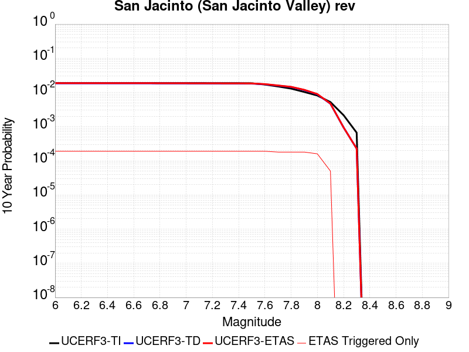 |

| Magnitude | 1 wk TI Prob | 1 wk TD Prob | 1 wk ETAS Prob | 1 wk ETAS/TD Gain | 1 wk ETAS Triggered Only | 1 mo TI Prob | 1 mo TD Prob | 1 mo ETAS Prob | 1 mo ETAS/TD Gain | 1 mo ETAS Triggered Only | 1 yr TI Prob | 1 yr TD Prob | 1 yr ETAS Prob | 1 yr ETAS/TD Gain | 1 yr ETAS Triggered Only | 10 yr TI Prob | 10 yr TD Prob | 10 yr ETAS Prob | 10 yr ETAS/TD Gain | 10 yr ETAS Triggered Only |
|-----|-----|-----|-----|-----|-----|-----|-----|-----|-----|-----|-----|-----|-----|-----|-----|-----|-----|-----|-----|-----|
| 6.0 | 3.652694E-5 | 3.4402394E-5 | 1.2588888E-4 | 3.659306 | 9.148964E-5 | 1.5653463E-4 | 1.474305E-4 | 2.5720187E-4 | 1.7445635 | 1.0978756E-4 | 0.0019041431 | 0.00179349 | 0.0019396109 | 1.0814729 | 1.4638342E-4 | 0.018879099 | 0.018526595 | 0.018724144 | 1.0106629 | 2.012772E-4 |
| 6.1 | 3.652694E-5 | 3.4402394E-5 | 1.2588888E-4 | 3.659306 | 9.148964E-5 | 1.5653463E-4 | 1.474305E-4 | 2.5720187E-4 | 1.7445635 | 1.0978756E-4 | 0.0019041431 | 0.00179349 | 0.0019396109 | 1.0814729 | 1.4638342E-4 | 0.018879099 | 0.018526595 | 0.018724144 | 1.0106629 | 2.012772E-4 |
| 6.2 | 3.652694E-5 | 3.4402394E-5 | 1.2588888E-4 | 3.659306 | 9.148964E-5 | 1.5653463E-4 | 1.474305E-4 | 2.5720187E-4 | 1.7445635 | 1.0978756E-4 | 0.0019041431 | 0.00179349 | 0.0019396109 | 1.0814729 | 1.4638342E-4 | 0.018879099 | 0.018526595 | 0.018724144 | 1.0106629 | 2.012772E-4 |
| 6.3 | 3.652694E-5 | 3.4402394E-5 | 1.2588888E-4 | 3.659306 | 9.148964E-5 | 1.5653463E-4 | 1.474305E-4 | 2.5720187E-4 | 1.7445635 | 1.0978756E-4 | 0.0019041431 | 0.00179349 | 0.0019396109 | 1.0814729 | 1.4638342E-4 | 0.018879099 | 0.018526595 | 0.018724144 | 1.0106629 | 2.012772E-4 |
| 6.4 | 3.646941E-5 | 3.432397E-5 | 1.2581046E-4 | 3.6653821 | 9.148964E-5 | 1.5628811E-4 | 1.4709444E-4 | 2.5686587E-4 | 1.7462648 | 1.0978756E-4 | 0.0019011468 | 0.0017894056 | 0.0019355271 | 1.0816592 | 1.4638342E-4 | 0.018849645 | 0.018486476 | 0.018684031 | 1.0106865 | 2.012772E-4 |
| 6.5 | 3.646941E-5 | 3.432397E-5 | 1.2581046E-4 | 3.6653821 | 9.148964E-5 | 1.5628811E-4 | 1.4709444E-4 | 2.5686587E-4 | 1.7462648 | 1.0978756E-4 | 0.0019011468 | 0.0017894056 | 0.0019355271 | 1.0816592 | 1.4638342E-4 | 0.018849645 | 0.018486476 | 0.018684031 | 1.0106865 | 2.012772E-4 |
| 6.6 | 3.6442503E-5 | 3.4287354E-5 | 1.2577385E-4 | 3.6682286 | 9.148964E-5 | 1.561728E-4 | 1.4693754E-4 | 2.5670897E-4 | 1.7470618 | 1.0978756E-4 | 0.0018997455 | 0.0017874985 | 0.0019336202 | 1.0817465 | 1.4638342E-4 | 0.018835869 | 0.018467745 | 0.018665304 | 1.0106976 | 2.012772E-4 |
| 6.7 | 3.6432113E-5 | 3.4272925E-5 | 1.2575943E-4 | 3.6693518 | 9.148964E-5 | 1.5612828E-4 | 1.4687571E-4 | 2.5664715E-4 | 1.7473763 | 1.0978756E-4 | 0.0018992044 | 0.0017867472 | 0.0019328691 | 1.0817809 | 1.4638342E-4 | 0.018830549 | 0.018460369 | 0.01865793 | 1.0107019 | 2.012772E-4 |
| 6.8 | 3.6409598E-5 | 3.424198E-5 | 1.2572849E-4 | 3.6717641 | 9.148964E-5 | 1.560318E-4 | 1.4674311E-4 | 2.5651456E-4 | 1.7480519 | 1.0978756E-4 | 0.0018980318 | 0.0017851355 | 0.0019312575 | 1.0818549 | 1.4638342E-4 | 0.018819023 | 0.018444523 | 0.018642088 | 1.0107113 | 2.012772E-4 |
| 6.9 | 3.638078E-5 | 3.4202407E-5 | 1.2568891E-4 | 3.674856 | 9.148964E-5 | 1.5590832E-4 | 1.4657351E-4 | 2.56345E-4 | 1.7489175 | 1.0978756E-4 | 0.0018965311 | 0.001783074 | 0.0019291964 | 1.0819497 | 1.4638342E-4 | 0.018804269 | 0.018424258 | 0.018621827 | 1.0107234 | 2.012772E-4 |
| 7.0 | 3.6294874E-5 | 3.408442E-5 | 1.2557094E-4 | 3.6841154 | 9.148964E-5 | 1.5554018E-4 | 1.4606792E-4 | 2.5583943E-4 | 1.7515101 | 1.0978756E-4 | 0.0018920569 | 0.001776929 | 0.0019230522 | 1.0822337 | 1.4638342E-4 | 0.018760284 | 0.018363839 | 0.018561421 | 1.0107592 | 2.012772E-4 |
| 7.1 | 3.6260717E-5 | 3.4040702E-5 | 1.2552722E-4 | 3.6875627 | 9.148964E-5 | 1.5539382E-4 | 1.4588058E-4 | 2.5565212E-4 | 1.7524754 | 1.0978756E-4 | 0.001890278 | 0.0017746518 | 0.0019207755 | 1.0823393 | 1.4638342E-4 | 0.018742796 | 0.018341439 | 0.018539025 | 1.0107726 | 2.012772E-4 |
| 7.2 | 3.6210204E-5 | 3.397492E-5 | 1.2546145E-4 | 3.6927664 | 9.148964E-5 | 1.5517735E-4 | 1.455987E-4 | 2.5537028E-4 | 1.7539325 | 1.0978756E-4 | 0.001887647 | 0.0017712255 | 0.0019173496 | 1.0824989 | 1.4638342E-4 | 0.01871693 | 0.01830772 | 0.01850531 | 1.0107929 | 2.012772E-4 |
| 7.3 | 3.6119454E-5 | 3.386321E-5 | 1.2534975E-4 | 3.7016501 | 9.148964E-5 | 1.5478847E-4 | 1.4511998E-4 | 2.548916E-4 | 1.7564199 | 1.0978756E-4 | 0.0018829206 | 0.0017654065 | 0.0019115314 | 1.0827713 | 1.4638342E-4 | 0.018670462 | 0.018250274 | 0.018447876 | 1.0108274 | 2.012772E-4 |
| 7.4 | 3.607848E-5 | 3.381071E-5 | 1.2529724E-4 | 3.705845 | 9.148964E-5 | 1.5461289E-4 | 1.44895E-4 | 2.5466667E-4 | 1.7575945 | 1.0978756E-4 | 0.0018807866 | 0.0017626719 | 0.0019087973 | 1.0828999 | 1.4638342E-4 | 0.018649481 | 0.018223269 | 0.018420877 | 1.0108438 | 2.012772E-4 |
| 7.5 | 3.5856774E-5 | 3.3620483E-5 | 1.2510704E-4 | 3.7211554 | 9.148964E-5 | 1.5366284E-4 | 1.4407984E-4 | 2.5385158E-4 | 1.7618814 | 1.0978756E-4 | 0.0018692396 | 0.0017527633 | 0.0018988901 | 1.0833694 | 1.4638342E-4 | 0.018535944 | 0.018124366 | 0.018321997 | 1.0109041 | 2.012772E-4 |
| 7.6 | 3.286655E-5 | 3.2143445E-5 | 1.2363015E-4 | 3.8462005 | 9.148964E-5 | 1.4084904E-4 | 1.3775036E-4 | 2.475228E-4 | 1.796894 | 1.0978756E-4 | 0.001713488 | 0.0016758227 | 0.0018219607 | 1.0872039 | 1.4638342E-4 | 0.017003361 | 0.017344031 | 0.017541816 | 1.0114037 | 2.012772E-4 |
| 7.7 | 2.8882527E-5 | 2.9236293E-5 | 1.20723256E-4 | 4.1292257 | 9.148964E-5 | 1.237764E-4 | 1.2529238E-4 | 2.350662E-4 | 1.8761411 | 1.0978756E-4 | 0.0015059357 | 0.0015243685 | 0.0016522588 | 1.0838972 | 1.2808549E-4 | 0.014957713 | 0.015830461 | 0.016010543 | 1.0113757 | 1.8297927E-4 |
| 7.8 | 2.4950225E-5 | 2.6527203E-5 | 1.1801441E-4 | 4.4488072 | 9.148964E-5 | 1.0692515E-4 | 1.1368306E-4 | 2.2345815E-4 | 1.9656239 | 1.0978756E-4 | 0.0013010362 | 0.0013832134 | 0.0015111218 | 1.0924718 | 1.2808549E-4 | 0.012934455 | 0.014411755 | 0.014592097 | 1.0125135 | 1.8297927E-4 |
| 7.9 | 1.9881603E-5 | 2.1507445E-5 | 1.1299511E-4 | 5.253767 | 9.148964E-5 | 8.520408E-5 | 9.217151E-5 | 2.0194896E-4 | 2.1910126 | 1.0978756E-4 | 0.001036866 | 0.0011216112 | 0.001249553 | 1.1140697 | 1.2808549E-4 | 0.010320415 | 0.011777027 | 0.011957851 | 1.015354 | 1.8297927E-4 |
| 8.0 | 1.563292E-5 | 1.5937347E-5 | 8.912789E-5 | 5.592392 | 7.319171E-5 | 6.6996516E-5 | 6.8301124E-5 | 1.5978451E-4 | 2.3394125 | 9.148964E-5 | 8.153773E-4 | 8.3124964E-4 | 9.4094593E-4 | 1.1319655 | 1.0978756E-4 | 0.00812392 | 0.008810506 | 0.008973736 | 1.0185268 | 1.6468135E-4 |
| 8.1 | 1.0045313E-5 | 8.301802E-6 | 2.6599577E-5 | 3.2040725 | 1.8297927E-5 | 4.305063E-5 | 3.5578672E-5 | 7.217322E-5 | 2.028553 | 3.6595855E-5 | 5.2401534E-4 | 4.3308473E-4 | 4.6966475E-4 | 1.0844638 | 3.6595855E-5 | 0.0052278144 | 0.0046591135 | 0.004713752 | 1.0117271 | 5.489378E-5 |
| 8.2 | 4.1554413E-6 | 1.5655598E-6 | 1.5655598E-6 | 1.0 | 0.0 | 1.7808914E-5 | 6.709525E-6 | 6.709525E-6 | 1.0 | 0.0 | 2.1680194E-4 | 8.168544E-5 | 8.168544E-5 | 1.0 | 0.0 | 0.0021659054 | 9.482903E-4 | 9.482903E-4 | 1.0 | 0.0 |
| 8.3 | 1.2758221E-6 | 3.6149942E-7 | 3.6149942E-7 | 1.0 | 0.0 | 5.4677976E-6 | 1.5492824E-6 | 1.5492824E-6 | 1.0 | 0.0 | 6.65684E-5 | 1.8862354E-5 | 1.8862354E-5 | 1.0 | 0.0 | 6.6548464E-4 | 2.2751294E-4 | 2.2751294E-4 | 1.0 | 0.0 |

## San Jacinto (Stepovers Combined)
*[(top)](#table-of-contents)*

| 1 Week | 1 Month | 1 Year | 10 Year |
|-----|-----|-----|-----|
|  | 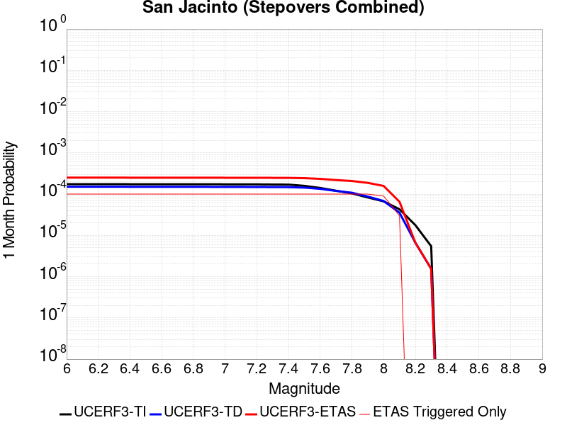 |  |  |

| Magnitude | 1 wk TI Prob | 1 wk TD Prob | 1 wk ETAS Prob | 1 wk ETAS/TD Gain | 1 wk ETAS Triggered Only | 1 mo TI Prob | 1 mo TD Prob | 1 mo ETAS Prob | 1 mo ETAS/TD Gain | 1 mo ETAS Triggered Only | 1 yr TI Prob | 1 yr TD Prob | 1 yr ETAS Prob | 1 yr ETAS/TD Gain | 1 yr ETAS Triggered Only | 10 yr TI Prob | 10 yr TD Prob | 10 yr ETAS Prob | 10 yr ETAS/TD Gain | 10 yr ETAS Triggered Only |
|-----|-----|-----|-----|-----|-----|-----|-----|-----|-----|-----|-----|-----|-----|-----|-----|-----|-----|-----|-----|-----|
| 6.0 | 4.0667746E-5 | 3.5272755E-5 | 1.2675916E-4 | 3.5936847 | 9.148964E-5 | 1.742787E-4 | 1.5116022E-4 | 2.6093118E-4 | 1.7261895 | 1.0978756E-4 | 0.0021197782 | 0.0018388226 | 0.001984937 | 1.0794607 | 1.4638342E-4 | 0.020996714 | 0.018986892 | 0.019184347 | 1.0103996 | 2.012772E-4 |
| 6.1 | 4.0667746E-5 | 3.5272755E-5 | 1.2675916E-4 | 3.5936847 | 9.148964E-5 | 1.742787E-4 | 1.5116022E-4 | 2.6093118E-4 | 1.7261895 | 1.0978756E-4 | 0.0021197782 | 0.0018388226 | 0.001984937 | 1.0794607 | 1.4638342E-4 | 0.020996714 | 0.018986892 | 0.019184347 | 1.0103996 | 2.012772E-4 |
| 6.2 | 4.0667746E-5 | 3.5272755E-5 | 1.2675916E-4 | 3.5936847 | 9.148964E-5 | 1.742787E-4 | 1.5116022E-4 | 2.6093118E-4 | 1.7261895 | 1.0978756E-4 | 0.0021197782 | 0.0018388226 | 0.001984937 | 1.0794607 | 1.4638342E-4 | 0.020996714 | 0.018986892 | 0.019184347 | 1.0103996 | 2.012772E-4 |
| 6.3 | 4.0667746E-5 | 3.5272755E-5 | 1.2675916E-4 | 3.5936847 | 9.148964E-5 | 1.742787E-4 | 1.5116022E-4 | 2.6093118E-4 | 1.7261895 | 1.0978756E-4 | 0.0021197782 | 0.0018388226 | 0.001984937 | 1.0794607 | 1.4638342E-4 | 0.020996714 | 0.018986892 | 0.019184347 | 1.0103996 | 2.012772E-4 |
| 6.4 | 4.0577226E-5 | 3.5144654E-5 | 1.2663107E-4 | 3.603139 | 9.148964E-5 | 1.738908E-4 | 1.5061127E-4 | 2.603823E-4 | 1.7288368 | 1.0978756E-4 | 0.0021150648 | 0.0018321523 | 0.0019782674 | 1.0797505 | 1.4638342E-4 | 0.020950472 | 0.018921461 | 0.01911893 | 1.0104362 | 2.012772E-4 |
| 6.5 | 4.0577226E-5 | 3.5144654E-5 | 1.2663107E-4 | 3.603139 | 9.148964E-5 | 1.738908E-4 | 1.5061127E-4 | 2.603823E-4 | 1.7288368 | 1.0978756E-4 | 0.0021150648 | 0.0018321523 | 0.0019782674 | 1.0797505 | 1.4638342E-4 | 0.020950472 | 0.018921461 | 0.01911893 | 1.0104362 | 2.012772E-4 |
| 6.6 | 4.053861E-5 | 3.509E-5 | 1.2657643E-4 | 3.6071935 | 9.148964E-5 | 1.7372532E-4 | 1.5037706E-4 | 2.601481E-4 | 1.729972 | 1.0978756E-4 | 0.0021130538 | 0.0018293057 | 0.0019754213 | 1.0798749 | 1.4638342E-4 | 0.020930743 | 0.018893538 | 0.019091014 | 1.0104519 | 2.012772E-4 |
| 6.7 | 4.0516545E-5 | 3.5059067E-5 | 1.2654549E-4 | 3.609494 | 9.148964E-5 | 1.7363077E-4 | 1.5024451E-4 | 2.6001557E-4 | 1.7306161 | 1.0978756E-4 | 0.002111905 | 0.001827695 | 0.0019738108 | 1.0799454 | 1.4638342E-4 | 0.020919468 | 0.018877735 | 0.019075213 | 1.0104609 | 2.012772E-4 |
| 6.8 | 4.049434E-5 | 3.5030633E-5 | 1.2651706E-4 | 3.6116123 | 9.148964E-5 | 1.7353562E-4 | 1.5012265E-4 | 2.5989374E-4 | 1.7312093 | 1.0978756E-4 | 0.0021107488 | 0.0018262138 | 0.0019723298 | 1.0800104 | 1.4638342E-4 | 0.020908125 | 0.018863149 | 0.019060628 | 1.0104691 | 2.012772E-4 |
| 6.9 | 4.046386E-5 | 3.499319E-5 | 1.2647963E-4 | 3.6144066 | 9.148964E-5 | 1.73405E-4 | 1.4996222E-4 | 2.5973332E-4 | 1.7319916 | 1.0978756E-4 | 0.0021091616 | 0.0018242638 | 0.00197038 | 1.0800961 | 1.4638342E-4 | 0.020892553 | 0.01884392 | 0.019041406 | 1.01048 | 2.012772E-4 |
| 7.0 | 4.036382E-5 | 3.487376E-5 | 1.263602E-4 | 3.6233606 | 9.148964E-5 | 1.7297632E-4 | 1.4945042E-4 | 2.5922156E-4 | 1.7344987 | 1.0978756E-4 | 0.0021039525 | 0.0018180435 | 0.001964161 | 1.0803707 | 1.4638342E-4 | 0.02084144 | 0.018782536 | 0.018980032 | 1.0105149 | 2.012772E-4 |
| 7.1 | 4.0343282E-5 | 3.4852223E-5 | 1.2633867E-4 | 3.6249819 | 9.148964E-5 | 1.7288832E-4 | 1.4935812E-4 | 2.591293E-4 | 1.7349527 | 1.0978756E-4 | 0.002102883 | 0.0018169218 | 0.0019630392 | 1.0804204 | 1.4638342E-4 | 0.020830948 | 0.018771412 | 0.018968912 | 1.0105213 | 2.012772E-4 |
| 7.2 | 4.0257353E-5 | 3.4756722E-5 | 1.2624318E-4 | 3.6321945 | 9.148964E-5 | 1.725201E-4 | 1.489489E-4 | 2.587201E-4 | 1.7369723 | 1.0978756E-4 | 0.0020984085 | 0.0018119477 | 0.001958066 | 1.0806415 | 1.4638342E-4 | 0.020787042 | 0.018722152 | 0.018919662 | 1.0105494 | 2.012772E-4 |
| 7.3 | 3.9940667E-5 | 3.4584376E-5 | 1.2607085E-4 | 3.645312 | 9.148964E-5 | 1.7116306E-4 | 1.4821035E-4 | 2.5798165E-4 | 1.7406452 | 1.0978756E-4 | 0.0020819185 | 0.0018029709 | 0.0019490904 | 1.0810437 | 1.4638342E-4 | 0.020625217 | 0.018630784 | 0.018828312 | 1.0106022 | 2.012772E-4 |
| 7.4 | 3.9721202E-5 | 3.4469766E-5 | 1.2595624E-4 | 3.654108 | 9.148964E-5 | 1.7022261E-4 | 1.4771923E-4 | 2.5749058E-4 | 1.743108 | 1.0978756E-4 | 0.0020704903 | 0.0017970012 | 0.0019431215 | 1.0813135 | 1.4638342E-4 | 0.020513052 | 0.018569905 | 0.018767446 | 1.0106376 | 2.012772E-4 |
| 7.5 | 3.7036873E-5 | 3.3537188E-5 | 1.2502375E-4 | 3.727914 | 9.148964E-5 | 1.5871979E-4 | 1.437229E-4 | 2.5349468E-4 | 1.7637738 | 1.0978756E-4 | 0.0019307006 | 0.0017484248 | 0.0018945523 | 1.0835767 | 1.4638342E-4 | 0.019140124 | 0.018071463 | 0.018269103 | 1.0109366 | 2.012772E-4 |
| 7.6 | 3.2940967E-5 | 3.1317984E-5 | 1.2280475E-4 | 3.9212213 | 9.148964E-5 | 1.4116794E-4 | 1.3421304E-4 | 2.4398587E-4 | 1.8178998 | 1.0978756E-4 | 0.0017173645 | 0.0016328214 | 0.0017789657 | 1.0895042 | 1.4638342E-4 | 0.01704153 | 0.016904354 | 0.017102228 | 1.0117055 | 2.012772E-4 |
| 7.7 | 2.8236149E-5 | 2.7883889E-5 | 1.19370976E-4 | 4.2810016 | 9.148964E-5 | 1.2100645E-4 | 1.19496915E-4 | 2.2927136E-4 | 1.9186382 | 1.0978756E-4 | 0.0014722579 | 0.001453905 | 0.0015818044 | 1.0879694 | 1.2808549E-4 | 0.014625421 | 0.015115095 | 0.015295309 | 1.0119227 | 1.8297927E-4 |
| 7.8 | 2.4329287E-5 | 2.5207537E-5 | 1.16694864E-4 | 4.629364 | 9.148964E-5 | 1.042642E-4 | 1.0802783E-4 | 2.1780354E-4 | 2.0161798 | 1.0978756E-4 | 0.0012686774 | 0.0013144462 | 0.0014423633 | 1.0973164 | 1.2808549E-4 | 0.012614589 | 0.013712396 | 0.013892866 | 1.0131611 | 1.8297927E-4 |
| 7.9 | 1.9370926E-5 | 2.0421452E-5 | 1.1190922E-4 | 5.4799833 | 9.148964E-5 | 8.301561E-5 | 8.7517576E-5 | 1.9729552E-4 | 2.2543533 | 1.0978756E-4 | 0.0010102465 | 0.0010650064 | 0.0011929554 | 1.1201392 | 1.2808549E-4 | 0.0100566605 | 0.011199483 | 0.011380413 | 1.0161552 | 1.8297927E-4 |
| 8.0 | 1.5583017E-5 | 1.588647E-5 | 8.907701E-5 | 5.6070995 | 7.319171E-5 | 6.6782646E-5 | 6.808309E-5 | 1.595665E-4 | 2.3437023 | 9.148964E-5 | 8.127754E-4 | 8.285971E-4 | 9.382937E-4 | 1.1323884 | 1.0978756E-4 | 0.008098091 | 0.008781809 | 0.008945045 | 1.0185878 | 1.6468135E-4 |
| 8.1 | 1.0024873E-5 | 8.292404E-6 | 2.659018E-5 | 3.2065706 | 1.8297927E-5 | 4.2963035E-5 | 3.5538393E-5 | 7.213295E-5 | 2.0297189 | 3.6595855E-5 | 5.229494E-4 | 4.3259456E-4 | 4.6917459E-4 | 1.0845596 | 3.6595855E-5 | 0.0052172043 | 0.0046534105 | 0.004708049 | 1.0117415 | 5.489378E-5 |
| 8.2 | 4.142796E-6 | 1.5610041E-6 | 1.5610041E-6 | 1.0 | 0.0 | 1.775472E-5 | 6.69E-6 | 6.69E-6 | 1.0 | 0.0 | 2.1614227E-4 | 8.144774E-5 | 8.144774E-5 | 1.0 | 0.0 | 0.0021593217 | 9.454649E-4 | 9.454649E-4 | 1.0 | 0.0 |
| 8.3 | 1.2750878E-6 | 3.612133E-7 | 3.612133E-7 | 1.0 | 0.0 | 5.4646503E-6 | 1.548056E-6 | 1.548056E-6 | 1.0 | 0.0 | 6.653009E-5 | 1.8847424E-5 | 1.8847424E-5 | 1.0 | 0.0 | 6.6510175E-4 | 2.2734253E-4 | 2.2734253E-4 | 1.0 | 0.0 |

## San Andreas (Creeping Section) 2011 CFM
*[(top)](#table-of-contents)*

| 1 Week | 1 Month | 1 Year | 10 Year |
|-----|-----|-----|-----|
| 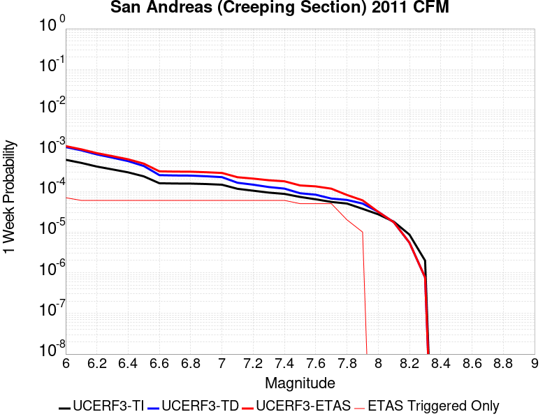 |  | 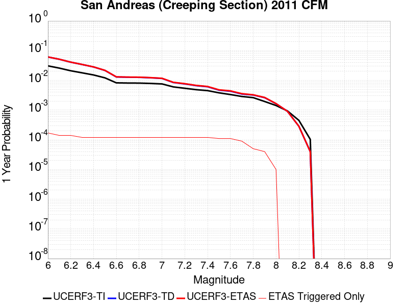 | 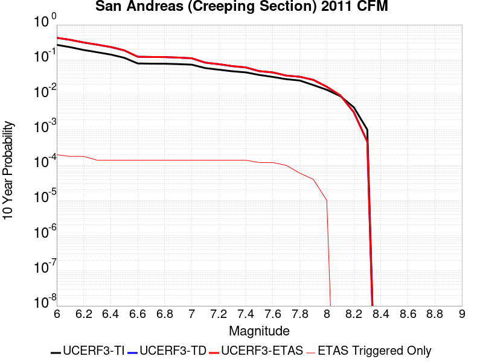 |

| Magnitude | 1 wk TI Prob | 1 wk TD Prob | 1 wk ETAS Prob | 1 wk ETAS/TD Gain | 1 wk ETAS Triggered Only | 1 mo TI Prob | 1 mo TD Prob | 1 mo ETAS Prob | 1 mo ETAS/TD Gain | 1 mo ETAS Triggered Only | 1 yr TI Prob | 1 yr TD Prob | 1 yr ETAS Prob | 1 yr ETAS/TD Gain | 1 yr ETAS Triggered Only | 10 yr TI Prob | 10 yr TD Prob | 10 yr ETAS Prob | 10 yr ETAS/TD Gain | 10 yr ETAS Triggered Only |
|-----|-----|-----|-----|-----|-----|-----|-----|-----|-----|-----|-----|-----|-----|-----|-----|-----|-----|-----|-----|-----|
| 6.0 | 5.986481E-4 | 0.001228691 | 0.0012835173 | 1.0446217 | 5.489378E-5 | 0.0025631124 | 0.005246795 | 0.005319603 | 1.0138766 | 7.319171E-5 | 0.030762846 | 0.061203245 | 0.06135785 | 1.002526 | 1.6468135E-4 | 0.26835477 | 0.425928 | 0.42602253 | 1.000222 | 1.6468135E-4 |
| 6.1 | 5.015945E-4 | 0.0010230356 | 0.0010778732 | 1.0536028 | 5.489378E-5 | 0.00214792 | 0.004369436 | 0.0044423076 | 1.0166776 | 7.319171E-5 | 0.025839351 | 0.051246606 | 0.05136813 | 1.0023713 | 1.2808549E-4 | 0.23032776 | 0.37284943 | 0.37294126 | 1.0002462 | 1.4638342E-4 |
| 6.2 | 4.073338E-4 | 8.1157376E-4 | 8.6642295E-4 | 1.0675838 | 5.489378E-5 | 0.0017445484 | 0.0034683137 | 0.0035412514 | 1.0210298 | 7.319171E-5 | 0.021034058 | 0.04093177 | 0.04105461 | 1.0030012 | 1.2808549E-4 | 0.19150782 | 0.31302592 | 0.31312647 | 1.0003213 | 1.4638342E-4 |
| 6.3 | 3.464099E-4 | 6.7455834E-4 | 7.294151E-4 | 1.0813224 | 5.489378E-5 | 0.0014837692 | 0.0028832308 | 0.0029562116 | 1.0253121 | 7.319171E-5 | 0.017915873 | 0.034187846 | 0.03429388 | 1.0031015 | 1.0978756E-4 | 0.16538359 | 0.27130842 | 0.2713884 | 1.0002949 | 1.0978756E-4 |
| 6.4 | 2.935057E-4 | 5.5516965E-4 | 6.1003293E-4 | 1.0988226 | 5.489378E-5 | 0.0012572751 | 0.0023727308 | 0.002445749 | 1.0307739 | 7.319171E-5 | 0.015200248 | 0.02826279 | 0.028369475 | 1.0037748 | 1.0978756E-4 | 0.14201577 | 0.23297668 | 0.23306088 | 1.0003614 | 1.0978756E-4 |
| 6.5 | 2.3409708E-4 | 4.2132285E-4 | 4.761935E-4 | 1.1302342 | 5.489378E-5 | 0.0010028875 | 0.0018017791 | 0.0018748391 | 1.0405487 | 7.319171E-5 | 0.012141965 | 0.021586355 | 0.021693772 | 1.0049762 | 1.0978756E-4 | 0.11499573 | 0.1868149 | 0.18690419 | 1.0004779 | 1.0978756E-4 |
| 6.6 | 1.5842178E-4 | 2.5068692E-4 | 3.0556694E-4 | 1.2189186 | 5.489378E-5 | 6.7877385E-4 | 0.0010739256 | 0.0011470388 | 1.0680802 | 7.319171E-5 | 0.0082328 | 0.012995283 | 0.013103644 | 1.0083385 | 1.0978756E-4 | 0.07934396 | 0.12313759 | 0.12323386 | 1.0007818 | 1.0978756E-4 |
| 6.7 | 1.5616413E-4 | 2.4605254E-4 | 3.0093282E-4 | 1.2230428 | 5.489378E-5 | 6.691031E-4 | 0.0010540807 | 0.0011271952 | 1.0693634 | 7.319171E-5 | 0.0081159435 | 0.012757154 | 0.012865541 | 1.0084962 | 1.0978756E-4 | 0.0782586 | 0.12116472 | 0.1212612 | 1.0007963 | 1.0978756E-4 |
| 6.8 | 1.5538467E-4 | 2.442914E-4 | 2.9917178E-4 | 1.2246512 | 5.489378E-5 | 6.6576427E-4 | 0.001046539 | 0.0011196542 | 1.0698637 | 7.319171E-5 | 0.008075596 | 0.012666538 | 0.012774935 | 1.0085578 | 1.0978756E-4 | 0.07788358 | 0.12039561 | 0.120492175 | 1.0008022 | 1.0978756E-4 |
| 6.9 | 1.5153569E-4 | 2.3538464E-4 | 2.9026548E-4 | 1.2331539 | 5.489378E-5 | 6.49277E-4 | 0.0010084033 | 0.0010815212 | 1.0725086 | 7.319171E-5 | 0.007876333 | 0.012208726 | 0.012317173 | 1.0088828 | 1.0978756E-4 | 0.07602952 | 0.11646574 | 0.11656275 | 1.0008329 | 1.0978756E-4 |
| 7.0 | 1.4588932E-4 | 2.2395732E-4 | 2.788388E-4 | 1.2450533 | 5.489378E-5 | 6.250901E-4 | 9.59466E-4 | 0.0010325875 | 1.0762106 | 7.319171E-5 | 0.0075839474 | 0.011619428 | 0.011727939 | 1.0093389 | 1.0978756E-4 | 0.073302895 | 0.11131206 | 0.11140963 | 1.0008765 | 1.0978756E-4 |
| 7.1 | 1.1565079E-4 | 1.6281323E-4 | 2.1769806E-4 | 1.3371031 | 5.489378E-5 | 4.955521E-4 | 6.9758523E-4 | 7.707259E-4 | 1.1048484 | 7.319171E-5 | 0.006016669 | 0.008460228 | 0.008569087 | 1.0128671 | 1.0978756E-4 | 0.058563538 | 0.08366478 | 0.08376539 | 1.0012025 | 1.0978756E-4 |
| 7.2 | 1.0393792E-4 | 1.4615392E-4 | 2.0103967E-4 | 1.3755339 | 5.489378E-5 | 4.4537216E-4 | 6.262243E-4 | 6.993702E-4 | 1.1168046 | 7.319171E-5 | 0.005408933 | 0.0075977976 | 0.007706751 | 1.0143402 | 1.0978756E-4 | 0.052791595 | 0.07561503 | 0.075716525 | 1.0013422 | 1.0978756E-4 |
| 7.3 | 9.332884E-5 | 1.2780601E-4 | 1.8269276E-4 | 1.4294537 | 5.489378E-5 | 3.999194E-4 | 5.4762565E-4 | 6.207773E-4 | 1.1335796 | 7.319171E-5 | 0.0048581534 | 0.0066470946 | 0.006756152 | 1.0164069 | 1.0978756E-4 | 0.047533102 | 0.06647954 | 0.06658203 | 1.0015416 | 1.0978756E-4 |
| 7.4 | 8.670252E-5 | 1.1702972E-4 | 1.7191707E-4 | 1.4690036 | 5.489378E-5 | 3.715293E-4 | 5.014601E-4 | 5.746151E-4 | 1.145884 | 7.319171E-5 | 0.004513991 | 0.0060883067 | 0.006197426 | 1.0179228 | 1.0978756E-4 | 0.044233937 | 0.061148684 | 0.061251756 | 1.0016856 | 1.0978756E-4 |
| 7.5 | 7.3036405E-5 | 9.005699E-5 | 1.4494582E-4 | 1.60949 | 5.489378E-5 | 3.129756E-4 | 3.859015E-4 | 4.5906496E-4 | 1.189591 | 7.319171E-5 | 0.0038038217 | 0.0046882504 | 0.0047975234 | 1.0233078 | 1.0978756E-4 | 0.03739367 | 0.047875606 | 0.047980137 | 1.0021834 | 1.0978756E-4 |
| 7.6 | 6.3935775E-5 | 8.280209E-5 | 1.3769133E-4 | 1.6628968 | 5.489378E-5 | 2.7398168E-4 | 3.5481792E-4 | 4.2798364E-4 | 1.2062064 | 7.319171E-5 | 0.0033306254 | 0.00431137 | 0.004420684 | 1.0253549 | 1.0978756E-4 | 0.032811474 | 0.043990135 | 0.04409509 | 1.002386 | 1.0978756E-4 |
| 7.7 | 5.5050095E-5 | 6.661729E-5 | 1.21507415E-4 | 1.8239621 | 5.489378E-5 | 2.3590765E-4 | 2.8547147E-4 | 3.5864228E-4 | 1.2563157 | 7.319171E-5 | 0.0028683927 | 0.0034700802 | 0.0035612523 | 1.0262738 | 9.148964E-5 | 0.0283165 | 0.03579509 | 0.035883304 | 1.0024644 | 9.148964E-5 |
| 7.8 | 5.027131E-5 | 6.1627725E-5 | 7.9924524E-5 | 1.2968924 | 1.8297927E-5 | 2.1543067E-4 | 2.640921E-4 | 3.0067828E-4 | 1.1385357 | 3.6595855E-5 | 0.0026197135 | 0.003210584 | 0.0032653015 | 1.0170429 | 5.489378E-5 | 0.025890453 | 0.03312572 | 0.033178795 | 1.0016023 | 5.489378E-5 |
| 7.9 | 3.7271806E-5 | 5.0224386E-5 | 6.8521396E-5 | 1.3643053 | 1.8297927E-5 | 1.5972654E-4 | 2.1522962E-4 | 2.518176E-4 | 1.1699951 | 3.6595855E-5 | 0.0019429359 | 0.0026172737 | 0.0026720238 | 1.0209187 | 5.489378E-5 | 0.019260362 | 0.027066687 | 0.027120095 | 1.0019732 | 5.489378E-5 |
| 8.0 | 2.7310243E-5 | 3.1428404E-5 | 3.1428404E-5 | 1.0 | 0.0 | 1.17038646E-4 | 1.3468621E-4 | 1.5298168E-4 | 1.1358377 | 1.8297927E-5 | 0.0014240141 | 0.0016385721 | 0.00165684 | 1.0111487 | 1.8297927E-5 | 0.014149235 | 0.01721387 | 0.017231852 | 1.0010446 | 1.8297927E-5 |
| 8.1 | 1.7940547E-5 | 1.7400796E-5 | 1.7400796E-5 | 1.0 | 0.0 | 7.688579E-5 | 7.457271E-5 | 7.457271E-5 | 1.0 | 0.0 | 9.3568244E-4 | 9.075451E-4 | 9.075451E-4 | 1.0 | 0.0 | 0.009317525 | 0.009799073 | 0.009799073 | 1.0 | 0.0 |
| 8.2 | 8.643924E-6 | 5.4748625E-6 | 5.4748625E-6 | 1.0 | 0.0 | 3.704486E-5 | 2.3463486E-5 | 2.3463486E-5 | 1.0 | 0.0 | 4.5092785E-4 | 2.8563058E-4 | 2.8563058E-4 | 1.0 | 0.0 | 0.0045001395 | 0.0032487072 | 0.0032487072 | 1.0 | 0.0 |
| 8.3 | 1.983087E-6 | 7.6599065E-7 | 7.6599065E-7 | 1.0 | 0.0 | 8.498917E-6 | 3.282813E-6 | 3.282813E-6 | 1.0 | 0.0 | 1.034694E-4 | 3.9967534E-5 | 3.9967534E-5 | 1.0 | 0.0 | 0.0010342124 | 4.719687E-4 | 4.719687E-4 | 1.0 | 0.0 |

## Santa Ynez (West)
*[(top)](#table-of-contents)*

| 1 Week | 1 Month | 1 Year | 10 Year |
|-----|-----|-----|-----|
|  |  |  |  |

| Magnitude | 1 wk TI Prob | 1 wk TD Prob | 1 wk ETAS Prob | 1 wk ETAS/TD Gain | 1 wk ETAS Triggered Only | 1 mo TI Prob | 1 mo TD Prob | 1 mo ETAS Prob | 1 mo ETAS/TD Gain | 1 mo ETAS Triggered Only | 1 yr TI Prob | 1 yr TD Prob | 1 yr ETAS Prob | 1 yr ETAS/TD Gain | 1 yr ETAS Triggered Only | 10 yr TI Prob | 10 yr TD Prob | 10 yr ETAS Prob | 10 yr ETAS/TD Gain | 10 yr ETAS Triggered Only |
|-----|-----|-----|-----|-----|-----|-----|-----|-----|-----|-----|-----|-----|-----|-----|-----|-----|-----|-----|-----|-----|
| 6.0 | 4.7352758E-5 | 5.4972126E-5 | 1.09862885E-4 | 1.9985199 | 5.489378E-5 | 2.0292461E-4 | 2.3557522E-4 | 3.0874967E-4 | 1.3106204 | 7.319171E-5 | 0.0024678076 | 0.0028645284 | 0.0029740015 | 1.0382168 | 1.0978756E-4 | 0.024405818 | 0.028304417 | 0.028464437 | 1.0056535 | 1.6468135E-4 |
| 6.1 | 4.7352758E-5 | 5.4972126E-5 | 1.09862885E-4 | 1.9985199 | 5.489378E-5 | 2.0292461E-4 | 2.3557522E-4 | 3.0874967E-4 | 1.3106204 | 7.319171E-5 | 0.0024678076 | 0.0028645284 | 0.002955756 | 1.0318474 | 9.148964E-5 | 0.024405818 | 0.028304417 | 0.028446658 | 1.0050254 | 1.4638342E-4 |
| 6.2 | 3.0415853E-5 | 3.392511E-5 | 5.2222418E-5 | 1.5393441 | 1.8297927E-5 | 1.3034715E-4 | 1.4538545E-4 | 1.6368071E-4 | 1.1258397 | 1.8297927E-5 | 0.0015858212 | 0.0017686661 | 0.0018051972 | 1.0206547 | 3.6595855E-5 | 0.015745522 | 0.017549807 | 0.017639691 | 1.0051217 | 9.148964E-5 |
| 6.3 | 3.0415853E-5 | 3.392511E-5 | 5.2222418E-5 | 1.5393441 | 1.8297927E-5 | 1.3034715E-4 | 1.4538545E-4 | 1.6368071E-4 | 1.1258397 | 1.8297927E-5 | 0.0015858212 | 0.0017686661 | 0.0018051972 | 1.0206547 | 3.6595855E-5 | 0.015745522 | 0.017549807 | 0.017639691 | 1.0051217 | 9.148964E-5 |
| 6.4 | 2.5452082E-5 | 2.7912422E-5 | 4.620984E-5 | 1.6555295 | 1.8297927E-5 | 1.09075794E-4 | 1.196193E-4 | 1.3791503E-4 | 1.1529497 | 1.8297927E-5 | 0.0013271887 | 0.0014554089 | 0.0014919514 | 1.0251081 | 3.6595855E-5 | 0.013192902 | 0.014460951 | 0.014551118 | 1.0062351 | 9.148964E-5 |
| 6.5 | 2.3143784E-5 | 2.5128256E-5 | 4.3425724E-5 | 1.728163 | 1.8297927E-5 | 9.9183875E-5 | 1.0768817E-4 | 1.2598412E-4 | 1.1698976 | 1.8297927E-5 | 0.0012068948 | 0.0013103267 | 0.0013468746 | 1.0278922 | 3.6595855E-5 | 0.012003611 | 0.01302768 | 0.013117977 | 1.0069312 | 9.148964E-5 |
| 6.6 | 1.9118515E-5 | 2.035434E-5 | 3.8651895E-5 | 1.898951 | 1.8297927E-5 | 8.193392E-5 | 8.7230015E-5 | 1.0552634E-4 | 1.2097481 | 1.8297927E-5 | 9.97089E-4 | 0.001061516 | 0.001098073 | 1.0344385 | 3.6595855E-5 | 0.00992627 | 0.010565365 | 0.010637783 | 1.0068543 | 7.319171E-5 |
| 6.7 | 1.722807E-5 | 1.8146347E-5 | 3.644394E-5 | 2.0083349 | 1.8297927E-5 | 7.3832496E-5 | 7.776777E-5 | 9.606428E-5 | 1.235271 | 1.8297927E-5 | 8.985399E-4 | 9.464169E-4 | 9.829781E-4 | 1.0386312 | 3.6595855E-5 | 0.008949154 | 0.0094245095 | 0.009497012 | 1.0076929 | 7.319171E-5 |
| 6.8 | 1.5317364E-5 | 1.5926486E-5 | 3.4224122E-5 | 2.148881 | 1.8297927E-5 | 6.56442E-5 | 6.82546E-5 | 8.6551285E-5 | 1.2680651 | 1.8297927E-5 | 7.98925E-4 | 8.306873E-4 | 8.672527E-4 | 1.0440183 | 3.6595855E-5 | 0.007960589 | 0.00827631 | 0.008330749 | 1.0065777 | 5.489378E-5 |
| 6.9 | 1.3071226E-5 | 1.3329624E-5 | 3.1627307E-5 | 2.372708 | 1.8297927E-5 | 5.6018336E-5 | 5.7125722E-5 | 7.5422606E-5 | 1.3202915 | 1.8297927E-5 | 6.8180985E-4 | 6.9528597E-4 | 7.318564E-4 | 1.0525976 | 3.6595855E-5 | 0.0067972173 | 0.006931367 | 0.0069858804 | 1.0078647 | 5.489378E-5 |
| 7.0 | 1.1836986E-5 | 1.19327815E-5 | 3.023049E-5 | 2.5333984 | 1.8297927E-5 | 5.0728955E-5 | 5.11395E-5 | 6.943649E-5 | 1.3577859 | 1.8297927E-5 | 6.1745E-4 | 6.2244723E-4 | 6.5902027E-4 | 1.058757 | 3.6595855E-5 | 0.006157372 | 0.006207231 | 0.006261784 | 1.0087886 | 5.489378E-5 |
| 7.1 | 1.0597169E-5 | 1.0542201E-5 | 2.8839935E-5 | 2.7356653 | 1.8297927E-5 | 4.541565E-5 | 4.5180084E-5 | 6.3477186E-5 | 1.4049815 | 1.8297927E-5 | 5.5279525E-4 | 5.4992986E-4 | 5.865056E-4 | 1.0665098 | 3.6595855E-5 | 0.0055142213 | 0.005485821 | 0.005540414 | 1.0099516 | 5.489378E-5 |
| 7.2 | 9.59113E-6 | 9.459144E-6 | 2.7756898E-5 | 2.9343984 | 1.8297927E-5 | 4.11042E-5 | 4.0538565E-5 | 5.883575E-5 | 1.4513526 | 1.8297927E-5 | 5.0032866E-4 | 4.934463E-4 | 5.300241E-4 | 1.0741272 | 3.6595855E-5 | 0.004992037 | 0.0049236254 | 0.004978249 | 1.0110942 | 5.489378E-5 |
| 7.3 | 8.586084E-6 | 8.379583E-6 | 2.6677357E-5 | 3.1836138 | 1.8297927E-5 | 3.679698E-5 | 3.5912013E-5 | 5.4209282E-5 | 1.5095028 | 1.8297927E-5 | 4.4791115E-4 | 4.3714207E-4 | 4.737219E-4 | 1.0836796 | 3.6595855E-5 | 0.004470094 | 0.004362933 | 0.004417587 | 1.012527 | 5.489378E-5 |
| 7.4 | 7.2622997E-6 | 6.9515427E-6 | 2.5249343E-5 | 3.6321926 | 1.8297927E-5 | 3.112377E-5 | 2.979199E-5 | 4.8089372E-5 | 1.6141711 | 1.8297927E-5 | 3.78866E-4 | 3.626581E-4 | 3.8094938E-4 | 1.0504367 | 1.8297927E-5 | 0.0037822074 | 0.0036207628 | 0.0036572262 | 1.0100707 | 3.6595855E-5 |
| 7.5 | 5.627296E-6 | 5.251588E-6 | 2.3549419E-5 | 4.484247 | 1.8297927E-5 | 2.411676E-5 | 2.2506614E-5 | 4.080413E-5 | 1.8129839 | 1.8297927E-5 | 2.9358198E-4 | 2.739843E-4 | 2.922772E-4 | 1.0667663 | 1.8297927E-5 | 0.0029319443 | 0.002736537 | 0.0027730328 | 1.0133364 | 3.6595855E-5 |
| 7.6 | 2.265244E-6 | 2.0608625E-6 | 2.0608625E-6 | 1.0 | 0.0 | 9.708152E-6 | 8.832238E-6 | 8.832238E-6 | 1.0 | 0.0 | 1.18190335E-4 | 1.0752728E-4 | 1.0752728E-4 | 1.0 | 0.0 | 0.001181275 | 0.0010747612 | 0.0010930394 | 1.0170068 | 1.8297927E-5 |
| 7.7 | 1.3099874E-6 | 1.1016252E-6 | 1.1016252E-6 | 1.0 | 0.0 | 5.61422E-6 | 4.7212425E-6 | 4.7212425E-6 | 1.0 | 0.0 | 6.8350986E-5 | 5.7479636E-5 | 5.7479636E-5 | 1.0 | 0.0 | 6.832996E-4 | 5.7465007E-4 | 5.9293746E-4 | 1.0318235 | 1.8297927E-5 |
| 7.8 | 7.903951E-7 | 6.0711415E-7 | 6.0711415E-7 | 1.0 | 0.0 | 3.3874032E-6 | 2.6019152E-6 | 2.6019152E-6 | 1.0 | 0.0 | 4.1240855E-5 | 3.167787E-5 | 3.167787E-5 | 1.0 | 0.0 | 4.12332E-4 | 3.167349E-4 | 3.167349E-4 | 1.0 | 0.0 |
| 7.9 | 7.0753297E-9 | 5.0899476E-9 | 5.0899476E-9 | 1.0 | 0.0 | 3.032284E-8 | 2.181406E-8 | 2.181406E-8 | 1.0 | 0.0 | 3.6918053E-7 | 2.6558615E-7 | 2.6558615E-7 | 1.0 | 0.0 | 3.691799E-6 | 2.6558594E-6 | 2.6558594E-6 | 1.0 | 0.0 |

## San Jacinto (Anza) rev
*[(top)](#table-of-contents)*

| 1 Week | 1 Month | 1 Year | 10 Year |
|-----|-----|-----|-----|
|  |  |  |  |

| Magnitude | 1 wk TI Prob | 1 wk TD Prob | 1 wk ETAS Prob | 1 wk ETAS/TD Gain | 1 wk ETAS Triggered Only | 1 mo TI Prob | 1 mo TD Prob | 1 mo ETAS Prob | 1 mo ETAS/TD Gain | 1 mo ETAS Triggered Only | 1 yr TI Prob | 1 yr TD Prob | 1 yr ETAS Prob | 1 yr ETAS/TD Gain | 1 yr ETAS Triggered Only | 10 yr TI Prob | 10 yr TD Prob | 10 yr ETAS Prob | 10 yr ETAS/TD Gain | 10 yr ETAS Triggered Only |
|-----|-----|-----|-----|-----|-----|-----|-----|-----|-----|-----|-----|-----|-----|-----|-----|-----|-----|-----|-----|-----|
| 6.0 | 6.3015636E-5 | 4.3302647E-5 | 1.1649119E-4 | 2.6901631 | 7.319171E-5 | 2.7003905E-4 | 1.8556965E-4 | 2.770423E-4 | 1.492929 | 9.148964E-5 | 0.0032827691 | 0.0022569813 | 0.0023847776 | 1.0566227 | 1.2808549E-4 | 0.032346968 | 0.023296192 | 0.02347491 | 1.0076715 | 1.8297927E-4 |
| 6.1 | 6.3015636E-5 | 4.3302647E-5 | 1.1649119E-4 | 2.6901631 | 7.319171E-5 | 2.7003905E-4 | 1.8556965E-4 | 2.770423E-4 | 1.492929 | 9.148964E-5 | 0.0032827691 | 0.0022569813 | 0.0023847776 | 1.0566227 | 1.2808549E-4 | 0.032346968 | 0.023296192 | 0.02347491 | 1.0076715 | 1.8297927E-4 |
| 6.2 | 6.3015636E-5 | 4.3302647E-5 | 1.1649119E-4 | 2.6901631 | 7.319171E-5 | 2.7003905E-4 | 1.8556965E-4 | 2.770423E-4 | 1.492929 | 9.148964E-5 | 0.0032827691 | 0.0022569813 | 0.0023847776 | 1.0566227 | 1.2808549E-4 | 0.032346968 | 0.023296192 | 0.02347491 | 1.0076715 | 1.8297927E-4 |
| 6.3 | 6.3015636E-5 | 4.3302647E-5 | 1.1649119E-4 | 2.6901631 | 7.319171E-5 | 2.7003905E-4 | 1.8556965E-4 | 2.770423E-4 | 1.492929 | 9.148964E-5 | 0.0032827691 | 0.0022569813 | 0.0023847776 | 1.0566227 | 1.2808549E-4 | 0.032346968 | 0.023296192 | 0.02347491 | 1.0076715 | 1.8297927E-4 |
| 6.4 | 6.3015636E-5 | 4.3302647E-5 | 1.1649119E-4 | 2.6901631 | 7.319171E-5 | 2.7003905E-4 | 1.8556965E-4 | 2.770423E-4 | 1.492929 | 9.148964E-5 | 0.0032827691 | 0.0022569813 | 0.0023847776 | 1.0566227 | 1.2808549E-4 | 0.032346968 | 0.023296192 | 0.02347491 | 1.0076715 | 1.8297927E-4 |
| 6.5 | 5.811017E-5 | 4.0082516E-5 | 1.13271286E-4 | 2.8259528 | 7.319171E-5 | 2.4901982E-4 | 1.7177092E-4 | 2.6324484E-4 | 1.5325344 | 9.148964E-5 | 0.0030276014 | 0.002089311 | 0.0022171286 | 1.061177 | 1.2808549E-4 | 0.02986684 | 0.021593736 | 0.021772765 | 1.0082908 | 1.8297927E-4 |
| 6.6 | 5.811017E-5 | 4.0082516E-5 | 1.13271286E-4 | 2.8259528 | 7.319171E-5 | 2.4901982E-4 | 1.7177092E-4 | 2.6324484E-4 | 1.5325344 | 9.148964E-5 | 0.0030276014 | 0.002089311 | 0.0022171286 | 1.061177 | 1.2808549E-4 | 0.02986684 | 0.021593736 | 0.021772765 | 1.0082908 | 1.8297927E-4 |
| 6.7 | 5.712442E-5 | 3.9505223E-5 | 1.1269404E-4 | 2.8526363 | 7.319171E-5 | 2.4479596E-4 | 1.6929714E-4 | 2.6077128E-4 | 1.5403172 | 9.148964E-5 | 0.0029763177 | 0.0020592497 | 0.0021870714 | 1.062072 | 1.2808549E-4 | 0.029367693 | 0.021285562 | 0.021464646 | 1.0084134 | 1.8297927E-4 |
| 6.8 | 5.6967532E-5 | 3.9361643E-5 | 1.1255047E-4 | 2.8593946 | 7.319171E-5 | 2.4412372E-4 | 1.6868189E-4 | 2.6015608E-4 | 1.5422882 | 9.148964E-5 | 0.0029681553 | 0.002051773 | 0.0021795956 | 1.0622987 | 1.2808549E-4 | 0.029288229 | 0.021210281 | 0.02138938 | 1.008444 | 1.8297927E-4 |
| 6.9 | 5.6211324E-5 | 3.9066435E-5 | 1.12255286E-4 | 2.8734457 | 7.319171E-5 | 2.4088343E-4 | 1.6741687E-4 | 2.5889117E-4 | 1.5463865 | 9.148964E-5 | 0.0029288116 | 0.0020364004 | 0.002164225 | 1.0627699 | 1.2808549E-4 | 0.028905109 | 0.021049714 | 0.02122884 | 1.0085098 | 1.8297927E-4 |
| 7.0 | 5.4383527E-5 | 3.792697E-5 | 1.111159E-4 | 2.9297333 | 7.319171E-5 | 2.3305144E-4 | 1.6253405E-4 | 2.5400883E-4 | 1.5628036 | 9.148964E-5 | 0.0028337094 | 0.001977061 | 0.002104893 | 1.0646577 | 1.2808549E-4 | 0.027978465 | 0.020440677 | 0.020619916 | 1.0087688 | 1.8297927E-4 |
| 7.1 | 5.1393665E-5 | 3.6389913E-5 | 1.09578956E-4 | 3.0112455 | 7.319171E-5 | 2.2023996E-4 | 1.5594746E-4 | 2.4742284E-4 | 1.5865781 | 9.148964E-5 | 0.0026781242 | 0.0018970112 | 0.0020248536 | 1.0673915 | 1.2808549E-4 | 0.026460782 | 0.019614287 | 0.019793676 | 1.0091459 | 1.8297927E-4 |
| 7.2 | 4.785222E-5 | 3.4741795E-5 | 1.0793096E-4 | 3.1066604 | 7.319171E-5 | 2.0506482E-4 | 1.4888494E-4 | 2.4036095E-4 | 1.6144074 | 9.148964E-5 | 0.0024938055 | 0.0018111705 | 0.001939024 | 1.0705917 | 1.2808549E-4 | 0.024660049 | 0.018728992 | 0.018908544 | 1.0095868 | 1.8297927E-4 |
| 7.3 | 4.2143256E-5 | 3.383628E-5 | 1.0702551E-4 | 3.1630402 | 7.319171E-5 | 1.8060145E-4 | 1.4500458E-4 | 2.3648095E-4 | 1.6308515 | 9.148964E-5 | 0.002196605 | 0.0017640047 | 0.0018918642 | 1.0724826 | 1.2808549E-4 | 0.02175019 | 0.01823724 | 0.018416883 | 1.0098503 | 1.8297927E-4 |
| 7.4 | 4.0264713E-5 | 3.347446E-5 | 1.0666372E-4 | 3.1864207 | 7.319171E-5 | 1.7255165E-4 | 1.4345412E-4 | 2.3493063E-4 | 1.6376709 | 9.148964E-5 | 0.002098792 | 0.0017451581 | 0.0018730201 | 1.0732667 | 1.2808549E-4 | 0.020790804 | 0.018041821 | 0.0182215 | 1.009959 | 1.8297927E-4 |
| 7.5 | 3.694492E-5 | 3.218847E-5 | 1.0537782E-4 | 3.2737756 | 7.319171E-5 | 1.5832575E-4 | 1.379433E-4 | 2.2942032E-4 | 1.6631494 | 9.148964E-5 | 0.0019259118 | 0.001678169 | 0.0018060395 | 1.0761964 | 1.2808549E-4 | 0.01909306 | 0.01735827 | 0.017538074 | 1.0103583 | 1.8297927E-4 |
| 7.6 | 3.200565E-5 | 2.9504106E-5 | 1.0269365E-4 | 3.4806564 | 7.319171E-5 | 1.3715986E-4 | 1.2644005E-4 | 2.1791812E-4 | 1.7234896 | 9.148964E-5 | 0.001668642 | 0.0015383229 | 0.0016662113 | 1.083135 | 1.2808549E-4 | 0.01656168 | 0.0159463 | 0.016126363 | 1.0112917 | 1.8297927E-4 |
| 7.7 | 2.731642E-5 | 2.6092788E-5 | 9.928259E-5 | 3.804982 | 7.319171E-5 | 1.1706512E-4 | 1.1182144E-4 | 2.0330085E-4 | 1.8180846 | 9.148964E-5 | 0.001424336 | 0.0013605768 | 0.001470215 | 1.0805821 | 1.0978756E-4 | 0.014152412 | 0.014167004 | 0.014329353 | 1.0114596 | 1.6468135E-4 |
| 7.8 | 2.3466424E-5 | 2.3504817E-5 | 9.669481E-5 | 4.113829 | 7.319171E-5 | 1.0056651E-4 | 1.0073105E-4 | 1.9221146E-4 | 1.9081651 | 9.148964E-5 | 0.0012237094 | 0.0012257113 | 0.0013353643 | 1.0894607 | 1.0978756E-4 | 0.012169928 | 0.012808893 | 0.012971465 | 1.0126921 | 1.6468135E-4 |
| 7.9 | 1.8611925E-5 | 1.8908117E-5 | 9.209844E-5 | 4.8708415 | 7.319171E-5 | 7.9762955E-5 | 8.1032274E-5 | 1.725145E-4 | 2.1289604 | 9.148964E-5 | 9.7068126E-4 | 9.861222E-4 | 0.0010958015 | 1.1112229 | 1.0978756E-4 | 0.0096645225 | 0.010393824 | 0.010556794 | 1.0156795 | 1.6468135E-4 |
| 8.0 | 1.5460775E-5 | 1.5740965E-5 | 8.893152E-5 | 5.649687 | 7.319171E-5 | 6.6258784E-5 | 6.7459536E-5 | 1.58943E-4 | 2.3561234 | 9.148964E-5 | 8.0640207E-4 | 8.21011E-4 | 9.307085E-4 | 1.1336126 | 1.0978756E-4 | 0.008034821 | 0.0087028835 | 0.008866131 | 1.0187579 | 1.6468135E-4 |
| 8.1 | 9.983884E-6 | 8.269952E-6 | 2.6567728E-5 | 3.2125614 | 1.8297927E-5 | 4.2787375E-5 | 3.544217E-5 | 7.203673E-5 | 2.0325146 | 3.6595855E-5 | 5.2081177E-4 | 4.314235E-4 | 4.680036E-4 | 1.0847893 | 3.6595855E-5 | 0.0051959283 | 0.004640022 | 0.004694661 | 1.0117756 | 5.489378E-5 |
| 8.2 | 4.1226E-6 | 1.5529788E-6 | 1.5529788E-6 | 1.0 | 0.0 | 1.7668166E-5 | 6.6556063E-6 | 6.6556063E-6 | 1.0 | 0.0 | 2.1508869E-4 | 8.102902E-5 | 8.102902E-5 | 1.0 | 0.0 | 0.0021488064 | 9.4050163E-4 | 9.4050163E-4 | 1.0 | 0.0 |
| 8.3 | 1.2750878E-6 | 3.612133E-7 | 3.612133E-7 | 1.0 | 0.0 | 5.4646503E-6 | 1.548056E-6 | 1.548056E-6 | 1.0 | 0.0 | 6.653009E-5 | 1.8847424E-5 | 1.8847424E-5 | 1.0 | 0.0 | 6.6510175E-4 | 2.2734253E-4 | 2.2734253E-4 | 1.0 | 0.0 |

## Death Valley (Fish Lake Valley)
*[(top)](#table-of-contents)*

| 1 Week | 1 Month | 1 Year | 10 Year |
|-----|-----|-----|-----|
| 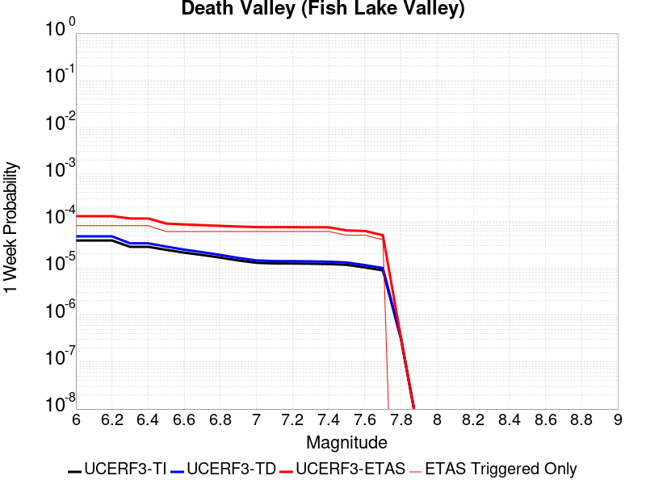 |  | 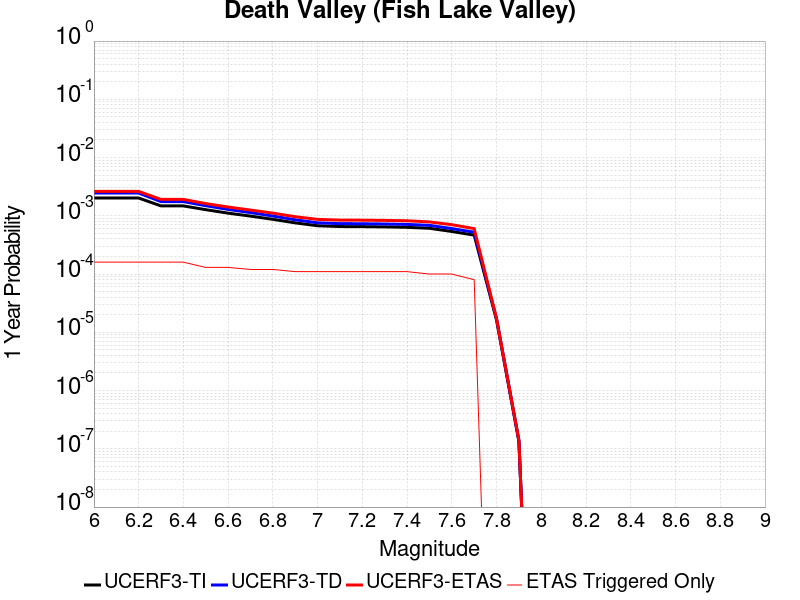 |  |

| Magnitude | 1 wk TI Prob | 1 wk TD Prob | 1 wk ETAS Prob | 1 wk ETAS/TD Gain | 1 wk ETAS Triggered Only | 1 mo TI Prob | 1 mo TD Prob | 1 mo ETAS Prob | 1 mo ETAS/TD Gain | 1 mo ETAS Triggered Only | 1 yr TI Prob | 1 yr TD Prob | 1 yr ETAS Prob | 1 yr ETAS/TD Gain | 1 yr ETAS Triggered Only | 10 yr TI Prob | 10 yr TD Prob | 10 yr ETAS Prob | 10 yr ETAS/TD Gain | 10 yr ETAS Triggered Only |
|-----|-----|-----|-----|-----|-----|-----|-----|-----|-----|-----|-----|-----|-----|-----|-----|-----|-----|-----|-----|-----|
| 6.0 | 3.872328E-5 | 4.7267473E-5 | 1.2045572E-4 | 2.5483851 | 7.319171E-5 | 1.6594635E-4 | 2.0256084E-4 | 2.9403195E-4 | 1.4515735 | 9.148964E-5 | 0.0020185246 | 0.002463534 | 0.0025547983 | 1.0370461 | 9.148964E-5 | 0.02000288 | 0.024388181 | 0.024566697 | 1.0073198 | 1.8297927E-4 |
| 6.1 | 3.872328E-5 | 4.7267473E-5 | 1.2045572E-4 | 2.5483851 | 7.319171E-5 | 1.6594635E-4 | 2.0256084E-4 | 2.9403195E-4 | 1.4515735 | 9.148964E-5 | 0.0020185246 | 0.002463534 | 0.0025547983 | 1.0370461 | 9.148964E-5 | 0.02000288 | 0.024388181 | 0.024566697 | 1.0073198 | 1.8297927E-4 |
| 6.2 | 3.872328E-5 | 4.7267473E-5 | 1.2045572E-4 | 2.5483851 | 7.319171E-5 | 1.6594635E-4 | 2.0256084E-4 | 2.9403195E-4 | 1.4515735 | 9.148964E-5 | 0.0020185246 | 0.002463534 | 0.0025547983 | 1.0370461 | 9.148964E-5 | 0.02000288 | 0.024388181 | 0.024566697 | 1.0073198 | 1.8297927E-4 |
| 6.3 | 2.8356371E-5 | 3.3609853E-5 | 1.06799096E-4 | 3.177613 | 7.319171E-5 | 1.2152165E-4 | 1.4403471E-4 | 2.3551116E-4 | 1.6351001 | 9.148964E-5 | 0.0014785219 | 0.0017522911 | 0.0018436204 | 1.05212 | 9.148964E-5 | 0.014687235 | 0.017391782 | 0.01757158 | 1.0103381 | 1.8297927E-4 |
| 6.4 | 2.8356371E-5 | 3.3609853E-5 | 1.06799096E-4 | 3.177613 | 7.319171E-5 | 1.2152165E-4 | 1.4403471E-4 | 2.3551116E-4 | 1.6351001 | 9.148964E-5 | 0.0014785219 | 0.0017522911 | 0.0018436204 | 1.05212 | 9.148964E-5 | 0.014687235 | 0.017391782 | 0.01757158 | 1.0103381 | 1.8297927E-4 |
| 6.5 | 2.4448687E-5 | 2.8607552E-5 | 6.520236E-5 | 2.2792008 | 3.6595855E-5 | 1.0477588E-4 | 1.2259831E-4 | 1.7748537E-4 | 1.4476982 | 5.489378E-5 | 0.0012748998 | 0.0014916632 | 0.001546475 | 1.0367455 | 5.489378E-5 | 0.012676105 | 0.014821377 | 0.01496559 | 1.0097301 | 1.4638342E-4 |
| 6.6 | 2.1298161E-5 | 2.4660083E-5 | 6.1255036E-5 | 2.4839752 | 3.6595855E-5 | 9.127464E-5 | 1.0568198E-4 | 1.6056997E-4 | 1.5193694 | 5.489378E-5 | 0.0011107022 | 0.0012859525 | 0.0013407758 | 1.0426323 | 5.489378E-5 | 0.011051672 | 0.012788526 | 0.012933037 | 1.0113001 | 1.4638342E-4 |
| 6.7 | 1.8959729E-5 | 2.1781025E-5 | 5.837608E-5 | 2.6801348 | 3.6595855E-5 | 8.125345E-5 | 9.334405E-5 | 1.4823272E-4 | 1.5880252 | 5.489378E-5 | 9.888117E-4 | 0.001135897 | 0.0011907284 | 1.0482715 | 5.489378E-5 | 0.009844234 | 0.01130357 | 0.011448299 | 1.0128038 | 1.4638342E-4 |
| 6.8 | 1.6691629E-5 | 1.9018353E-5 | 5.561351E-5 | 2.9242024 | 3.6595855E-5 | 7.153359E-5 | 8.150477E-5 | 1.3639408E-4 | 1.673449 | 5.489378E-5 | 8.7057345E-4 | 9.918857E-4 | 0.001046725 | 1.055288 | 5.489378E-5 | 0.008671708 | 0.009876343 | 0.010021281 | 1.0146753 | 1.4638342E-4 |
| 6.9 | 1.450505E-5 | 1.638954E-5 | 5.2984793E-5 | 3.232842 | 3.6595855E-5 | 6.216302E-5 | 7.0239046E-5 | 1.2512897E-4 | 1.7814732 | 5.489378E-5 | 7.5657194E-4 | 8.5483363E-4 | 9.096805E-4 | 1.0641608 | 5.489378E-5 | 0.007540013 | 0.008516385 | 0.0086615225 | 1.017042 | 1.4638342E-4 |
| 7.0 | 1.2940855E-5 | 1.4537972E-5 | 5.1133295E-5 | 3.5172234 | 3.6595855E-5 | 5.545963E-5 | 6.230414E-5 | 1.171945E-4 | 1.8810066 | 5.489378E-5 | 6.750118E-4 | 7.5829466E-4 | 8.131468E-4 | 1.0723362 | 5.489378E-5 | 0.006729651 | 0.0075576897 | 0.007702967 | 1.0192224 | 1.4638342E-4 |
| 7.1 | 1.2544658E-5 | 1.4078208E-5 | 5.0673545E-5 | 3.5994318 | 3.6595855E-5 | 5.3761712E-5 | 6.0333812E-5 | 1.15224284E-4 | 1.9097795 | 5.489378E-5 | 6.5435225E-4 | 7.343222E-4 | 7.891757E-4 | 1.0746994 | 5.489378E-5 | 0.006524288 | 0.007319551 | 0.007464863 | 1.0198525 | 1.4638342E-4 |
| 7.2 | 1.2489416E-5 | 1.4015674E-5 | 5.0611015E-5 | 3.6110296 | 3.6595855E-5 | 5.3524967E-5 | 6.0065824E-5 | 1.1495631E-4 | 1.9138389 | 5.489378E-5 | 6.514716E-4 | 7.310616E-4 | 7.859153E-4 | 1.0750328 | 5.489378E-5 | 0.006495651 | 0.0072871596 | 0.007432476 | 1.0199414 | 1.4638342E-4 |
| 7.3 | 1.2368307E-5 | 1.3879812E-5 | 5.047516E-5 | 3.6365879 | 3.6595855E-5 | 5.3005948E-5 | 5.9483587E-5 | 1.143741E-4 | 1.9227842 | 5.489378E-5 | 6.451563E-4 | 7.2397763E-4 | 7.7883166E-4 | 1.0757676 | 5.489378E-5 | 0.0064328653 | 0.007216782 | 0.0073621087 | 1.0201373 | 1.4638342E-4 |
| 7.4 | 1.2161707E-5 | 1.36478675E-5 | 5.0243223E-5 | 3.6813972 | 3.6595855E-5 | 5.212056E-5 | 5.8489582E-5 | 1.1338015E-4 | 1.9384675 | 5.489378E-5 | 6.3438306E-4 | 7.118836E-4 | 7.667383E-4 | 1.0770557 | 5.489378E-5 | 0.006325751 | 0.0070966207 | 0.0072419653 | 1.0204809 | 1.4638342E-4 |
| 7.5 | 1.1707948E-5 | 1.3145515E-5 | 3.14432E-5 | 2.3919337 | 1.8297927E-5 | 5.0175953E-5 | 5.6336736E-5 | 9.293053E-5 | 1.6495547 | 3.6595855E-5 | 6.10721E-4 | 6.856895E-4 | 7.222603E-4 | 1.0533342 | 3.6595855E-5 | 0.0060904534 | 0.006836321 | 0.006963531 | 1.018608 | 1.2808549E-4 |
| 7.6 | 1.0319538E-5 | 1.1579622E-5 | 2.9877338E-5 | 2.5801651 | 1.8297927E-5 | 4.4225842E-5 | 4.9626036E-5 | 8.6220076E-5 | 1.7373959 | 3.6595855E-5 | 5.383166E-4 | 6.040347E-4 | 6.406084E-4 | 1.0605491 | 3.6595855E-5 | 0.0053701443 | 0.0060244603 | 0.0061517744 | 1.0211328 | 1.2808549E-4 |
| 7.7 | 8.937764E-6 | 1.0022779E-5 | 2.8320523E-5 | 2.8256156 | 1.8297927E-5 | 3.830414E-5 | 4.295409E-5 | 7.954837E-5 | 1.8519394 | 3.6595855E-5 | 4.6625308E-4 | 5.228456E-4 | 5.594223E-4 | 1.069957 | 3.6595855E-5 | 0.0046527605 | 0.005216664 | 0.005325879 | 1.0209358 | 1.0978756E-4 |
| 7.8 | 3.108007E-7 | 3.284654E-7 | 3.284654E-7 | 1.0 | 0.0 | 1.3320023E-6 | 1.407708E-6 | 1.407708E-6 | 1.0 | 0.0 | 1.6217007E-5 | 1.7138715E-5 | 1.7138715E-5 | 1.0 | 0.0 | 1.6215823E-4 | 1.7137431E-4 | 1.7137431E-4 | 1.0 | 0.0 |
| 7.9 | 2.5591178E-9 | 2.6696718E-9 | 2.6696718E-9 | 1.0 | 0.0 | 1.0967647E-8 | 1.14414505E-8 | 1.14414505E-8 | 1.0 | 0.0 | 1.335311E-7 | 1.3929966E-7 | 1.3929966E-7 | 1.0 | 0.0 | 1.3353102E-6 | 1.3929966E-6 | 1.3929966E-6 | 1.0 | 0.0 |

## Tin Mountain
*[(top)](#table-of-contents)*

| 1 Week | 1 Month | 1 Year | 10 Year |
|-----|-----|-----|-----|
|  |  |  |  |

| Magnitude | 1 wk TI Prob | 1 wk TD Prob | 1 wk ETAS Prob | 1 wk ETAS/TD Gain | 1 wk ETAS Triggered Only | 1 mo TI Prob | 1 mo TD Prob | 1 mo ETAS Prob | 1 mo ETAS/TD Gain | 1 mo ETAS Triggered Only | 1 yr TI Prob | 1 yr TD Prob | 1 yr ETAS Prob | 1 yr ETAS/TD Gain | 1 yr ETAS Triggered Only | 10 yr TI Prob | 10 yr TD Prob | 10 yr ETAS Prob | 10 yr ETAS/TD Gain | 10 yr ETAS Triggered Only |
|-----|-----|-----|-----|-----|-----|-----|-----|-----|-----|-----|-----|-----|-----|-----|-----|-----|-----|-----|-----|-----|
| 6.0 | 4.083776E-6 | 4.1815365E-6 | 7.737294E-5 | 18.50347 | 7.319171E-5 | 1.750178E-5 | 1.792077E-5 | 1.2770636E-4 | 7.1261654 | 1.0978756E-4 | 2.1306332E-4 | 2.1816725E-4 | 3.4622478E-4 | 1.5869696 | 1.2808549E-4 | 0.0021285915 | 0.0021798965 | 0.0023442188 | 1.0753808 | 1.6468135E-4 |
| 6.1 | 4.083776E-6 | 4.1815365E-6 | 7.737294E-5 | 18.50347 | 7.319171E-5 | 1.750178E-5 | 1.792077E-5 | 1.2770636E-4 | 7.1261654 | 1.0978756E-4 | 2.1306332E-4 | 2.1816725E-4 | 3.4622478E-4 | 1.5869696 | 1.2808549E-4 | 0.0021285915 | 0.0021798965 | 0.0023442188 | 1.0753808 | 1.6468135E-4 |
| 6.2 | 4.083776E-6 | 4.1815365E-6 | 7.737294E-5 | 18.50347 | 7.319171E-5 | 1.750178E-5 | 1.792077E-5 | 1.2770636E-4 | 7.1261654 | 1.0978756E-4 | 2.1306332E-4 | 2.1816725E-4 | 3.4622478E-4 | 1.5869696 | 1.2808549E-4 | 0.0021285915 | 0.0021798965 | 0.0023442188 | 1.0753808 | 1.6468135E-4 |
| 6.3 | 4.083776E-6 | 4.1815365E-6 | 7.737294E-5 | 18.50347 | 7.319171E-5 | 1.750178E-5 | 1.792077E-5 | 1.2770636E-4 | 7.1261654 | 1.0978756E-4 | 2.1306332E-4 | 2.1816725E-4 | 3.4622478E-4 | 1.5869696 | 1.2808549E-4 | 0.0021285915 | 0.0021798965 | 0.0023442188 | 1.0753808 | 1.6468135E-4 |
| 6.4 | 4.083776E-6 | 4.1815365E-6 | 7.737294E-5 | 18.50347 | 7.319171E-5 | 1.750178E-5 | 1.792077E-5 | 1.2770636E-4 | 7.1261654 | 1.0978756E-4 | 2.1306332E-4 | 2.1816725E-4 | 3.4622478E-4 | 1.5869696 | 1.2808549E-4 | 0.0021285915 | 0.0021798965 | 0.0023442188 | 1.0753808 | 1.6468135E-4 |
| 6.5 | 2.3143427E-6 | 2.3731573E-6 | 2.0671041E-5 | 8.710355 | 1.8297927E-5 | 9.9185745E-6 | 1.0170638E-5 | 2.846838E-5 | 2.799075 | 1.8297927E-5 | 1.2075195E-4 | 1.2382126E-4 | 1.6041259E-4 | 1.2955173 | 3.6595855E-5 | 0.0012068636 | 0.0012375986 | 0.0012924245 | 1.0443002 | 5.489378E-5 |
| 6.6 | 2.3143427E-6 | 2.3731573E-6 | 2.0671041E-5 | 8.710355 | 1.8297927E-5 | 9.9185745E-6 | 1.0170638E-5 | 2.846838E-5 | 2.799075 | 1.8297927E-5 | 1.2075195E-4 | 1.2382126E-4 | 1.6041259E-4 | 1.2955173 | 3.6595855E-5 | 0.0012068636 | 0.0012375986 | 0.0012924245 | 1.0443002 | 5.489378E-5 |
| 6.7 | 1.7029532E-6 | 1.7497915E-6 | 1.7497915E-6 | 1.0 | 0.0 | 7.2983503E-6 | 7.499088E-6 | 7.499088E-6 | 1.0 | 0.0 | 8.885379E-5 | 9.1298105E-5 | 9.1298105E-5 | 1.0 | 0.0 | 8.881827E-4 | 9.1265864E-4 | 9.1265864E-4 | 1.0 | 0.0 |
| 6.8 | 1.2914646E-6 | 1.3299378E-6 | 1.3299378E-6 | 1.0 | 0.0 | 5.534837E-6 | 5.6997237E-6 | 5.6997237E-6 | 1.0 | 0.0 | 6.738455E-5 | 6.939237E-5 | 6.939237E-5 | 1.0 | 0.0 | 6.736412E-4 | 6.9375033E-4 | 6.9375033E-4 | 1.0 | 0.0 |
| 6.9 | 5.8708974E-7 | 6.1169936E-7 | 6.1169936E-7 | 1.0 | 0.0 | 2.5160964E-6 | 2.6215664E-6 | 2.6215664E-6 | 1.0 | 0.0 | 3.0633044E-5 | 3.1917145E-5 | 3.1917145E-5 | 1.0 | 0.0 | 3.0628822E-4 | 3.191297E-4 | 3.191297E-4 | 1.0 | 0.0 |
| 7.0 | 4.6248786E-7 | 4.832015E-7 | 4.832015E-7 | 1.0 | 0.0 | 1.9820893E-6 | 2.0708624E-6 | 2.0708624E-6 | 1.0 | 0.0 | 2.413167E-5 | 2.5212494E-5 | 2.5212494E-5 | 1.0 | 0.0 | 2.412905E-4 | 2.5210003E-4 | 2.5210003E-4 | 1.0 | 0.0 |
| 7.1 | 3.804606E-7 | 3.987147E-7 | 3.987147E-7 | 1.0 | 0.0 | 1.6305444E-6 | 1.7087764E-6 | 1.7087764E-6 | 1.0 | 0.0 | 1.9851697E-5 | 2.0804187E-5 | 2.0804187E-5 | 1.0 | 0.0 | 1.9849923E-4 | 2.0802575E-4 | 2.0802575E-4 | 1.0 | 0.0 |
| 7.2 | 3.5864858E-7 | 3.7616863E-7 | 3.7616863E-7 | 1.0 | 0.0 | 1.5370645E-6 | 1.6121504E-6 | 1.6121504E-6 | 1.0 | 0.0 | 1.87136E-5 | 1.9627789E-5 | 1.9627789E-5 | 1.0 | 0.0 | 1.8712023E-4 | 1.9626386E-4 | 1.9626386E-4 | 1.0 | 0.0 |
| 7.3 | 3.342063E-7 | 3.506347E-7 | 3.506347E-7 | 1.0 | 0.0 | 1.4323119E-6 | 1.5027196E-6 | 1.5027196E-6 | 1.0 | 0.0 | 1.7438259E-5 | 1.829549E-5 | 1.829549E-5 | 1.0 | 0.0 | 1.743689E-4 | 1.8294314E-4 | 1.8294314E-4 | 1.0 | 0.0 |
| 7.4 | 2.971242E-7 | 3.1165817E-7 | 3.1165817E-7 | 1.0 | 0.0 | 1.2733886E-6 | 1.3356774E-6 | 1.3356774E-6 | 1.0 | 0.0 | 1.5503398E-5 | 1.6261785E-5 | 1.6261785E-5 | 1.0 | 0.0 | 1.5502315E-4 | 1.6260923E-4 | 1.6260923E-4 | 1.0 | 0.0 |
| 7.5 | 1.4326713E-7 | 1.5012525E-7 | 1.5012525E-7 | 1.0 | 0.0 | 6.140018E-7 | 6.433939E-7 | 6.433939E-7 | 1.0 | 0.0 | 7.4754466E-6 | 7.8333205E-6 | 7.8333205E-6 | 1.0 | 0.0 | 7.475195E-5 | 7.833321E-5 | 7.833321E-5 | 1.0 | 0.0 |

## Santa Ynez (East)
*[(top)](#table-of-contents)*

| 1 Week | 1 Month | 1 Year | 10 Year |
|-----|-----|-----|-----|
|  |  |  |  |

| Magnitude | 1 wk TI Prob | 1 wk TD Prob | 1 wk ETAS Prob | 1 wk ETAS/TD Gain | 1 wk ETAS Triggered Only | 1 mo TI Prob | 1 mo TD Prob | 1 mo ETAS Prob | 1 mo ETAS/TD Gain | 1 mo ETAS Triggered Only | 1 yr TI Prob | 1 yr TD Prob | 1 yr ETAS Prob | 1 yr ETAS/TD Gain | 1 yr ETAS Triggered Only | 10 yr TI Prob | 10 yr TD Prob | 10 yr ETAS Prob | 10 yr ETAS/TD Gain | 10 yr ETAS Triggered Only |
|-----|-----|-----|-----|-----|-----|-----|-----|-----|-----|-----|-----|-----|-----|-----|-----|-----|-----|-----|-----|-----|
| 6.0 | 3.2269712E-5 | 3.67505E-5 | 7.3345014E-5 | 1.9957553 | 3.6595855E-5 | 1.3829143E-4 | 1.5749598E-4 | 2.3067615E-4 | 1.4646479 | 7.319171E-5 | 0.0016823979 | 0.0019164166 | 0.0020442565 | 1.0667078 | 1.2808549E-4 | 0.016697178 | 0.019056441 | 0.019200034 | 1.0075352 | 1.4638342E-4 |
| 6.1 | 3.2269712E-5 | 3.67505E-5 | 7.3345014E-5 | 1.9957553 | 3.6595855E-5 | 1.3829143E-4 | 1.5749598E-4 | 2.3067615E-4 | 1.4646479 | 7.319171E-5 | 0.0016823979 | 0.0019164166 | 0.0020442565 | 1.0667078 | 1.2808549E-4 | 0.016697178 | 0.019056441 | 0.019200034 | 1.0075352 | 1.4638342E-4 |
| 6.2 | 3.2269712E-5 | 3.67505E-5 | 7.3345014E-5 | 1.9957553 | 3.6595855E-5 | 1.3829143E-4 | 1.5749598E-4 | 2.3067615E-4 | 1.4646479 | 7.319171E-5 | 0.0016823979 | 0.0019164166 | 0.0020442565 | 1.0667078 | 1.2808549E-4 | 0.016697178 | 0.019056441 | 0.019200034 | 1.0075352 | 1.4638342E-4 |
| 6.3 | 3.2269712E-5 | 3.67505E-5 | 7.3345014E-5 | 1.9957553 | 3.6595855E-5 | 1.3829143E-4 | 1.5749598E-4 | 2.3067615E-4 | 1.4646479 | 7.319171E-5 | 0.0016823979 | 0.0019164166 | 0.0020442565 | 1.0667078 | 1.2808549E-4 | 0.016697178 | 0.019056441 | 0.019200034 | 1.0075352 | 1.4638342E-4 |
| 6.4 | 1.4404779E-5 | 1.4849382E-5 | 3.3147036E-5 | 2.2322166 | 1.8297927E-5 | 6.1733306E-5 | 6.363868E-5 | 1.0023221E-4 | 1.5750201 | 3.6595855E-5 | 7.513438E-4 | 7.745306E-4 | 8.476656E-4 | 1.094425 | 7.319171E-5 | 0.0074880854 | 0.007718862 | 0.0078096455 | 1.0117612 | 9.148964E-5 |
| 6.5 | 1.4404779E-5 | 1.4849382E-5 | 3.3147036E-5 | 2.2322166 | 1.8297927E-5 | 6.1733306E-5 | 6.363868E-5 | 1.0023221E-4 | 1.5750201 | 3.6595855E-5 | 7.513438E-4 | 7.745306E-4 | 8.476656E-4 | 1.094425 | 7.319171E-5 | 0.0074880854 | 0.007718862 | 0.0078096455 | 1.0117612 | 9.148964E-5 |
| 6.6 | 1.280208E-5 | 1.3011947E-5 | 3.1309635E-5 | 2.406222 | 1.8297927E-5 | 5.4864904E-5 | 5.5764307E-5 | 9.235812E-5 | 1.6562228 | 3.6595855E-5 | 6.6777546E-4 | 6.787207E-4 | 7.3357724E-4 | 1.0808234 | 5.489378E-5 | 0.006657724 | 0.0067666885 | 0.006821211 | 1.0080575 | 5.489378E-5 |
| 6.7 | 1.2457027E-5 | 1.2628468E-5 | 3.0926163E-5 | 2.4489245 | 1.8297927E-5 | 5.3386164E-5 | 5.412089E-5 | 9.071476E-5 | 1.6761506 | 3.6595855E-5 | 6.497827E-4 | 6.587243E-4 | 7.135819E-4 | 1.0832785 | 5.489378E-5 | 0.00647886 | 0.006567915 | 0.006622448 | 1.0083029 | 5.489378E-5 |
| 6.8 | 1.2095134E-5 | 1.2230915E-5 | 3.0528616E-5 | 2.4960208 | 1.8297927E-5 | 5.1835254E-5 | 5.241716E-5 | 8.90111E-5 | 1.6981289 | 3.6595855E-5 | 6.309115E-4 | 6.379937E-4 | 6.928524E-4 | 1.0859864 | 5.489378E-5 | 0.0062912325 | 0.006361809 | 0.0064163534 | 1.0085738 | 5.489378E-5 |
| 6.9 | 1.1104036E-5 | 1.1157347E-5 | 2.945507E-5 | 2.6399708 | 1.8297927E-5 | 4.758786E-5 | 4.781633E-5 | 8.4410436E-5 | 1.7653055 | 3.6595855E-5 | 5.7922816E-4 | 5.820096E-4 | 6.3687144E-4 | 1.0942627 | 5.489378E-5 | 0.005777207 | 0.0058049993 | 0.0058595743 | 1.0094014 | 5.489378E-5 |
| 7.0 | 1.0577444E-5 | 1.058168E-5 | 2.8879413E-5 | 2.7291899 | 1.8297927E-5 | 4.5331115E-5 | 4.5349276E-5 | 8.194347E-5 | 1.806941 | 3.6595855E-5 | 5.5176654E-4 | 5.519888E-4 | 6.0685223E-4 | 1.0993924 | 5.489378E-5 | 0.0055039856 | 0.0055063153 | 0.005560907 | 1.0099144 | 5.489378E-5 |
| 7.1 | 1.0021775E-5 | 9.980988E-6 | 2.8278731E-5 | 2.8332598 | 1.8297927E-5 | 4.294976E-5 | 4.2774966E-5 | 7.936925E-5 | 1.8555071 | 3.6595855E-5 | 5.2278786E-4 | 5.2066194E-4 | 5.7552714E-4 | 1.1053759 | 5.489378E-5 | 0.0052155964 | 0.0051945536 | 0.005249162 | 1.0105127 | 5.489378E-5 |
| 7.2 | 8.874109E-6 | 8.748793E-6 | 2.704656E-5 | 3.0914617 | 1.8297927E-5 | 3.8031343E-5 | 3.7494297E-5 | 5.5791537E-5 | 1.4880006 | 1.8297927E-5 | 4.629332E-4 | 4.5639853E-4 | 4.929777E-4 | 1.0801474 | 3.6595855E-5 | 0.0046197 | 0.0045547304 | 0.0045911595 | 1.0079981 | 3.6595855E-5 |
| 7.3 | 7.5504267E-6 | 7.5051175E-6 | 2.5802907E-5 | 3.4380417 | 1.8297927E-5 | 3.235857E-5 | 3.21644E-5 | 5.046174E-5 | 1.5688692 | 1.8297927E-5 | 3.9389438E-4 | 3.915322E-4 | 4.2811374E-4 | 1.0934317 | 3.6595855E-5 | 0.0039319694 | 0.003908531 | 0.0039449837 | 1.0093265 | 3.6595855E-5 |
| 7.4 | 6.309394E-6 | 6.1831556E-6 | 2.4480969E-5 | 3.9593003 | 1.8297927E-5 | 2.703998E-5 | 2.6498974E-5 | 4.4796416E-5 | 1.6904962 | 1.8297927E-5 | 3.2916202E-4 | 3.225782E-4 | 3.4087023E-4 | 1.0567057 | 1.8297927E-5 | 0.003286749 | 0.003221197 | 0.003239436 | 1.0056622 | 1.8297927E-5 |
| 7.5 | 4.6103073E-6 | 4.4408903E-6 | 2.2738735E-5 | 5.1203103 | 1.8297927E-5 | 1.975831E-5 | 1.9032252E-5 | 3.732983E-5 | 1.9613985 | 1.8297927E-5 | 2.4053088E-4 | 2.3169373E-4 | 2.499874E-4 | 1.0789564 | 1.8297927E-5 | 0.002402707 | 0.002314591 | 0.0023328466 | 1.0078871 | 1.8297927E-5 |
| 7.6 | 1.2858658E-6 | 1.3008173E-6 | 1.3008173E-6 | 1.0 | 0.0 | 5.5108417E-6 | 5.5749197E-6 | 5.5749197E-6 | 1.0 | 0.0 | 6.7092435E-5 | 6.78726E-5 | 6.78726E-5 | 1.0 | 0.0 | 6.707218E-4 | 6.785256E-4 | 6.785256E-4 | 1.0 | 0.0 |
| 7.7 | 5.3302307E-7 | 5.612138E-7 | 5.612138E-7 | 1.0 | 0.0 | 2.2843826E-6 | 2.4052001E-6 | 2.4052001E-6 | 1.0 | 0.0 | 2.7812002E-5 | 2.9282954E-5 | 2.9282954E-5 | 1.0 | 0.0 | 2.7808524E-4 | 2.9279452E-4 | 2.9279452E-4 | 1.0 | 0.0 |
| 7.8 | 4.613933E-8 | 4.80301E-8 | 4.80301E-8 | 1.0 | 0.0 | 1.9773998E-7 | 2.0584326E-7 | 2.0584326E-7 | 1.0 | 0.0 | 2.4074816E-6 | 2.5061388E-6 | 2.5061388E-6 | 1.0 | 0.0 | 2.4074554E-5 | 2.5061116E-5 | 2.5061116E-5 | 1.0 | 0.0 |

## Lost Hills
*[(top)](#table-of-contents)*

| 1 Week | 1 Month | 1 Year | 10 Year |
|-----|-----|-----|-----|
|  |  |  |  |

| Magnitude | 1 wk TI Prob | 1 wk TD Prob | 1 wk ETAS Prob | 1 wk ETAS/TD Gain | 1 wk ETAS Triggered Only | 1 mo TI Prob | 1 mo TD Prob | 1 mo ETAS Prob | 1 mo ETAS/TD Gain | 1 mo ETAS Triggered Only | 1 yr TI Prob | 1 yr TD Prob | 1 yr ETAS Prob | 1 yr ETAS/TD Gain | 1 yr ETAS Triggered Only | 10 yr TI Prob | 10 yr TD Prob | 10 yr ETAS Prob | 10 yr ETAS/TD Gain | 10 yr ETAS Triggered Only |
|-----|-----|-----|-----|-----|-----|-----|-----|-----|-----|-----|-----|-----|-----|-----|-----|-----|-----|-----|-----|-----|
| 6.0 | 2.233523E-5 | 2.5106583E-5 | 4.340405E-5 | 1.7287916 | 1.8297927E-5 | 9.571891E-5 | 1.0759615E-4 | 1.8077999E-4 | 1.6801715 | 7.319171E-5 | 0.0011647546 | 0.001309364 | 0.0014190078 | 1.0837382 | 1.0978756E-4 | 0.011586686 | 0.013033091 | 0.0131956255 | 1.012471 | 1.6468135E-4 |
| 6.1 | 2.233523E-5 | 2.5106583E-5 | 4.340405E-5 | 1.7287916 | 1.8297927E-5 | 9.571891E-5 | 1.0759615E-4 | 1.8077999E-4 | 1.6801715 | 7.319171E-5 | 0.0011647546 | 0.001309364 | 0.0014190078 | 1.0837382 | 1.0978756E-4 | 0.011586686 | 0.013033091 | 0.0131956255 | 1.012471 | 1.6468135E-4 |
| 6.2 | 2.233523E-5 | 2.5106583E-5 | 4.340405E-5 | 1.7287916 | 1.8297927E-5 | 9.571891E-5 | 1.0759615E-4 | 1.8077999E-4 | 1.6801715 | 7.319171E-5 | 0.0011647546 | 0.001309364 | 0.0014190078 | 1.0837382 | 1.0978756E-4 | 0.011586686 | 0.013033091 | 0.0131956255 | 1.012471 | 1.6468135E-4 |
| 6.3 | 2.233523E-5 | 2.5106583E-5 | 4.340405E-5 | 1.7287916 | 1.8297927E-5 | 9.571891E-5 | 1.0759615E-4 | 1.8077999E-4 | 1.6801715 | 7.319171E-5 | 0.0011647546 | 0.001309364 | 0.0014190078 | 1.0837382 | 1.0978756E-4 | 0.011586686 | 0.013033091 | 0.0131956255 | 1.012471 | 1.6468135E-4 |
| 6.4 | 1.2288092E-5 | 1.3781108E-5 | 3.207878E-5 | 2.3277361 | 1.8297927E-5 | 5.2662188E-5 | 5.906108E-5 | 1.1395162E-4 | 1.9293859 | 5.489378E-5 | 6.409735E-4 | 7.189252E-4 | 8.1034907E-4 | 1.1271675 | 9.148964E-5 | 0.006391279 | 0.0071752006 | 0.007302367 | 1.0177231 | 1.2808549E-4 |
| 6.5 | 1.2288092E-5 | 1.3781108E-5 | 3.207878E-5 | 2.3277361 | 1.8297927E-5 | 5.2662188E-5 | 5.906108E-5 | 1.1395162E-4 | 1.9293859 | 5.489378E-5 | 6.409735E-4 | 7.189252E-4 | 8.1034907E-4 | 1.1271675 | 9.148964E-5 | 0.006391279 | 0.0071752006 | 0.007302367 | 1.0177231 | 1.2808549E-4 |
| 6.6 | 8.58281E-6 | 9.63377E-6 | 2.793152E-5 | 2.8993344 | 1.8297927E-5 | 3.6782953E-5 | 4.12874E-5 | 9.617891E-5 | 2.3294978 | 5.489378E-5 | 4.4774043E-4 | 5.026414E-4 | 5.94085E-4 | 1.1819263 | 9.148964E-5 | 0.0044683935 | 0.005023205 | 0.0051324414 | 1.0217463 | 1.0978756E-4 |
| 6.7 | 7.205685E-6 | 8.088302E-6 | 2.638608E-5 | 3.2622523 | 1.8297927E-5 | 3.088114E-5 | 3.466415E-5 | 7.1258735E-5 | 2.0556896 | 3.6595855E-5 | 3.7591302E-4 | 4.2203604E-4 | 4.9519684E-4 | 1.1733521 | 7.319171E-5 | 0.0037527776 | 0.0042203604 | 0.004311464 | 1.0215867 | 9.148964E-5 |

## San Andreas (North Branch Mill Creek)
*[(top)](#table-of-contents)*

| 1 Week | 1 Month | 1 Year | 10 Year |
|-----|-----|-----|-----|
|  |  |  | 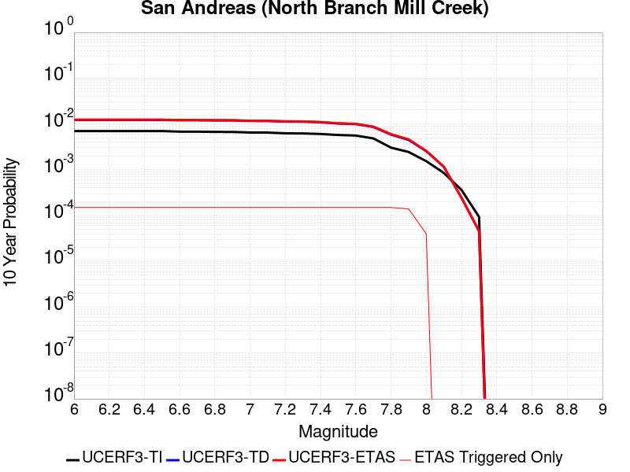 |

| Magnitude | 1 wk TI Prob | 1 wk TD Prob | 1 wk ETAS Prob | 1 wk ETAS/TD Gain | 1 wk ETAS Triggered Only | 1 mo TI Prob | 1 mo TD Prob | 1 mo ETAS Prob | 1 mo ETAS/TD Gain | 1 mo ETAS Triggered Only | 1 yr TI Prob | 1 yr TD Prob | 1 yr ETAS Prob | 1 yr ETAS/TD Gain | 1 yr ETAS Triggered Only | 10 yr TI Prob | 10 yr TD Prob | 10 yr ETAS Prob | 10 yr ETAS/TD Gain | 10 yr ETAS Triggered Only |
|-----|-----|-----|-----|-----|-----|-----|-----|-----|-----|-----|-----|-----|-----|-----|-----|-----|-----|-----|-----|-----|
| 6.0 | 1.3461156E-5 | 2.3499893E-5 | 4.179739E-5 | 1.7786205 | 1.8297927E-5 | 5.7689394E-5 | 1.00709956E-4 | 1.1900604E-4 | 1.181671 | 1.8297927E-5 | 7.02142E-4 | 0.0012254574 | 0.0013351104 | 1.0894792 | 1.0978756E-4 | 0.0069992766 | 0.01222957 | 0.012374163 | 1.0118233 | 1.4638342E-4 |
| 6.1 | 1.3461156E-5 | 2.3499893E-5 | 4.179739E-5 | 1.7786205 | 1.8297927E-5 | 5.7689394E-5 | 1.00709956E-4 | 1.1900604E-4 | 1.181671 | 1.8297927E-5 | 7.02142E-4 | 0.0012254574 | 0.0013351104 | 1.0894792 | 1.0978756E-4 | 0.0069992766 | 0.01222957 | 0.012374163 | 1.0118233 | 1.4638342E-4 |
| 6.2 | 1.3461156E-5 | 2.3499893E-5 | 4.179739E-5 | 1.7786205 | 1.8297927E-5 | 5.7689394E-5 | 1.00709956E-4 | 1.1900604E-4 | 1.181671 | 1.8297927E-5 | 7.02142E-4 | 0.0012254574 | 0.0013351104 | 1.0894792 | 1.0978756E-4 | 0.0069992766 | 0.01222957 | 0.012374163 | 1.0118233 | 1.4638342E-4 |
| 6.3 | 1.3461156E-5 | 2.3499893E-5 | 4.179739E-5 | 1.7786205 | 1.8297927E-5 | 5.7689394E-5 | 1.00709956E-4 | 1.1900604E-4 | 1.181671 | 1.8297927E-5 | 7.02142E-4 | 0.0012254574 | 0.0013351104 | 1.0894792 | 1.0978756E-4 | 0.0069992766 | 0.01222957 | 0.012374163 | 1.0118233 | 1.4638342E-4 |
| 6.4 | 1.3461156E-5 | 2.3499893E-5 | 4.179739E-5 | 1.7786205 | 1.8297927E-5 | 5.7689394E-5 | 1.00709956E-4 | 1.1900604E-4 | 1.181671 | 1.8297927E-5 | 7.02142E-4 | 0.0012254574 | 0.0013351104 | 1.0894792 | 1.0978756E-4 | 0.0069992766 | 0.01222957 | 0.012374163 | 1.0118233 | 1.4638342E-4 |
| 6.5 | 1.3450706E-5 | 2.3488852E-5 | 4.178635E-5 | 1.7789865 | 1.8297927E-5 | 5.764461E-5 | 1.0066265E-4 | 1.18958735E-4 | 1.1817565 | 1.8297927E-5 | 7.0159714E-4 | 0.001224882 | 0.0013345351 | 1.0895213 | 1.0978756E-4 | 0.006993862 | 0.01222388 | 0.012368473 | 1.0118288 | 1.4638342E-4 |
| 6.6 | 1.3074523E-5 | 2.3103135E-5 | 4.140064E-5 | 1.7919922 | 1.8297927E-5 | 5.6032466E-5 | 9.9009696E-5 | 1.1730581E-4 | 1.1847911 | 1.8297927E-5 | 6.8198174E-4 | 0.0012047797 | 0.001314435 | 1.0910169 | 1.0978756E-4 | 0.006798926 | 0.012025044 | 0.0121696675 | 1.0120268 | 1.4638342E-4 |
| 6.7 | 1.3050216E-5 | 2.3078432E-5 | 4.1375937E-5 | 1.79284 | 1.8297927E-5 | 5.59283E-5 | 9.890384E-5 | 1.17199954E-4 | 1.184989 | 1.8297927E-5 | 6.8071426E-4 | 0.0012034923 | 0.0013131477 | 1.0911144 | 1.0978756E-4 | 0.0067863287 | 0.012012309 | 0.0121569345 | 1.0120398 | 1.4638342E-4 |
| 6.8 | 1.29049395E-5 | 2.292684E-5 | 4.122435E-5 | 1.7980824 | 1.8297927E-5 | 5.530571E-5 | 9.825421E-5 | 1.16550334E-4 | 1.1862122 | 1.8297927E-5 | 6.73139E-4 | 0.0011955918 | 0.001305248 | 1.0917171 | 1.0978756E-4 | 0.0067110364 | 0.011934154 | 0.012078791 | 1.0121195 | 1.4638342E-4 |
| 6.9 | 1.2867369E-5 | 2.2886245E-5 | 4.1183754E-5 | 1.7994981 | 1.8297927E-5 | 5.51447E-5 | 9.8080236E-5 | 1.16376366E-4 | 1.1865425 | 1.8297927E-5 | 6.711799E-4 | 0.0011934759 | 0.0013031325 | 1.09188 | 1.0978756E-4 | 0.006691564 | 0.011913223 | 0.012057863 | 1.0121411 | 1.4638342E-4 |
| 7.0 | 1.2495996E-5 | 2.2286325E-5 | 4.0583844E-5 | 1.82102 | 1.8297927E-5 | 5.3553173E-5 | 9.550934E-5 | 1.1380552E-4 | 1.1915643 | 1.8297927E-5 | 6.518148E-4 | 0.0011622087 | 0.0012718687 | 1.0943547 | 1.0978756E-4 | 0.0064990623 | 0.0116038285 | 0.011748513 | 1.0124687 | 1.4638342E-4 |
| 7.1 | 1.2452067E-5 | 2.2231397E-5 | 4.0528917E-5 | 1.8230486 | 1.8297927E-5 | 5.3364907E-5 | 9.527396E-5 | 1.1357014E-4 | 1.1920376 | 1.8297927E-5 | 6.4952404E-4 | 0.0011593461 | 0.0012690063 | 1.094588 | 1.0978756E-4 | 0.0064762887 | 0.0115755 | 0.011720189 | 1.0124996 | 1.4638342E-4 |
| 7.2 | 1.2002777E-5 | 2.1609963E-5 | 3.9907496E-5 | 1.8467174 | 1.8297927E-5 | 5.143946E-5 | 9.2610855E-5 | 1.1090709E-4 | 1.1975603 | 1.8297927E-5 | 6.2609545E-4 | 0.0011269567 | 0.0012366205 | 1.0973097 | 1.0978756E-4 | 0.006243344 | 0.011254923 | 0.011399658 | 1.0128598 | 1.4638342E-4 |
| 7.3 | 1.1923425E-5 | 2.1479793E-5 | 3.9777326E-5 | 1.8518487 | 1.8297927E-5 | 5.109939E-5 | 9.205302E-5 | 1.1034926E-4 | 1.1987576 | 1.8297927E-5 | 6.219575E-4 | 0.001120172 | 0.0012298366 | 1.0978998 | 1.0978756E-4 | 0.0062021962 | 0.011187789 | 0.011332534 | 1.0129378 | 1.4638342E-4 |
| 7.4 | 1.16105175E-5 | 2.0853771E-5 | 3.9151317E-5 | 1.8774214 | 1.8297927E-5 | 4.975841E-5 | 8.937026E-5 | 1.0766655E-4 | 1.2047246 | 1.8297927E-5 | 6.0564023E-4 | 0.0010875424 | 0.0011972105 | 1.1008403 | 1.0978756E-4 | 0.006039923 | 0.010865397 | 0.01101019 | 1.013326 | 1.4638342E-4 |
| 7.5 | 1.1037265E-5 | 1.9553907E-5 | 3.7851478E-5 | 1.93575 | 1.8297927E-5 | 4.7301706E-5 | 8.379978E-5 | 1.0209617E-4 | 1.2183347 | 1.8297927E-5 | 5.757461E-4 | 0.0010197869 | 0.0011294626 | 1.1075475 | 1.0978756E-4 | 0.005742567 | 0.010194898 | 0.010339788 | 1.0142121 | 1.4638342E-4 |
| 7.6 | 1.0720915E-5 | 1.899582E-5 | 3.7293397E-5 | 1.9632424 | 1.8297927E-5 | 4.5945973E-5 | 8.140812E-5 | 9.9704564E-5 | 1.2247496 | 1.8297927E-5 | 5.592486E-4 | 9.906954E-4 | 0.0011003742 | 1.110709 | 1.0978756E-4 | 0.005578433 | 0.009906623 | 0.010051555 | 1.01463 | 1.4638342E-4 |
| 7.7 | 9.276279E-6 | 1.6441649E-5 | 3.4739274E-5 | 2.1128826 | 1.8297927E-5 | 3.9754876E-5 | 7.0462316E-5 | 8.8758956E-5 | 1.2596656 | 1.8297927E-5 | 4.839081E-4 | 8.575427E-4 | 9.672361E-4 | 1.127916 | 1.0978756E-4 | 0.0048285574 | 0.008586041 | 0.008731168 | 1.0169026 | 1.4638342E-4 |
| 7.8 | 5.8346777E-6 | 1.1155013E-5 | 2.9452736E-5 | 2.6403139 | 1.8297927E-5 | 2.5005522E-5 | 4.7806327E-5 | 6.610338E-5 | 1.3827329 | 1.8297927E-5 | 3.043997E-4 | 5.818867E-4 | 6.916104E-4 | 1.1885654 | 1.0978756E-4 | 0.0030398308 | 0.0058469265 | 0.005992454 | 1.0248896 | 1.4638342E-4 |
| 7.9 | 4.690204E-6 | 8.509093E-6 | 2.6806865E-5 | 3.1503785 | 1.8297927E-5 | 2.0100719E-5 | 3.6467034E-5 | 5.4764292E-5 | 1.501748 | 1.8297927E-5 | 2.4469878E-4 | 4.4389578E-4 | 5.353448E-4 | 1.2060146 | 9.148964E-5 | 0.002444295 | 0.0044707474 | 0.00459826 | 1.0285215 | 1.2808549E-4 |
| 8.0 | 2.9570454E-6 | 4.846947E-6 | 4.846947E-6 | 1.0 | 0.0 | 1.267299E-5 | 2.0772464E-5 | 2.0772464E-5 | 1.0 | 0.0 | 1.5428272E-4 | 2.5287544E-4 | 2.7116874E-4 | 1.0723412 | 1.8297927E-5 | 0.0015417566 | 0.002549644 | 0.0025678955 | 1.0071584 | 1.8297927E-5 |
| 8.1 | 1.6376824E-6 | 2.1968929E-6 | 2.1968929E-6 | 1.0 | 0.0 | 7.01862E-6 | 9.41522E-6 | 9.41522E-6 | 1.0 | 0.0 | 8.544835E-5 | 1.14624294E-4 | 1.14624294E-4 | 1.0 | 0.0 | 8.54155E-4 | 0.0011606582 | 0.0011606582 | 1.0 | 0.0 |
| 8.2 | 6.9631557E-7 | 4.5360213E-7 | 4.5360213E-7 | 1.0 | 0.0 | 2.984206E-6 | 1.9440076E-6 | 1.9440076E-6 | 1.0 | 0.0 | 3.63321E-5 | 2.3668037E-5 | 2.3668037E-5 | 1.0 | 0.0 | 3.6326164E-4 | 2.451564E-4 | 2.451564E-4 | 1.0 | 0.0 |
| 8.3 | 1.7876137E-7 | 8.360375E-8 | 8.360375E-8 | 1.0 | 0.0 | 7.661199E-7 | 3.5830175E-7 | 3.5830175E-7 | 1.0 | 0.0 | 9.32747E-6 | 4.3623154E-6 | 4.3623154E-6 | 1.0 | 0.0 | 9.3270784E-5 | 4.5817014E-5 | 4.5817014E-5 | 1.0 | 0.0 |

## Mission Creek
*[(top)](#table-of-contents)*

| 1 Week | 1 Month | 1 Year | 10 Year |
|-----|-----|-----|-----|
|  | 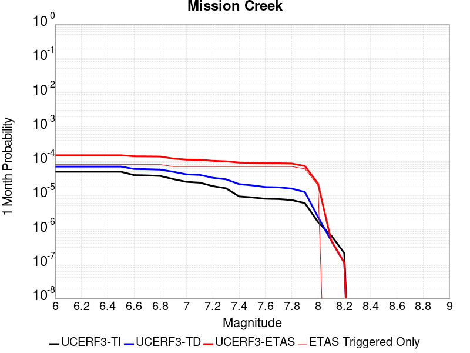 |  |  |

| Magnitude | 1 wk TI Prob | 1 wk TD Prob | 1 wk ETAS Prob | 1 wk ETAS/TD Gain | 1 wk ETAS Triggered Only | 1 mo TI Prob | 1 mo TD Prob | 1 mo ETAS Prob | 1 mo ETAS/TD Gain | 1 mo ETAS Triggered Only | 1 yr TI Prob | 1 yr TD Prob | 1 yr ETAS Prob | 1 yr ETAS/TD Gain | 1 yr ETAS Triggered Only | 10 yr TI Prob | 10 yr TD Prob | 10 yr ETAS Prob | 10 yr ETAS/TD Gain | 10 yr ETAS Triggered Only |
|-----|-----|-----|-----|-----|-----|-----|-----|-----|-----|-----|-----|-----|-----|-----|-----|-----|-----|-----|-----|-----|
| 6.0 | 1.1549387E-5 | 1.632237E-5 | 7.1215254E-5 | 4.363046 | 5.489378E-5 | 4.9496433E-5 | 6.9951224E-5 | 1.431378E-4 | 2.0462518 | 7.319171E-5 | 6.0245243E-4 | 8.513384E-4 | 9.6103246E-4 | 1.128849 | 1.0978756E-4 | 0.006008218 | 0.008509998 | 0.0086551355 | 1.0170549 | 1.4638342E-4 |
| 6.1 | 1.1549387E-5 | 1.632237E-5 | 7.1215254E-5 | 4.363046 | 5.489378E-5 | 4.9496433E-5 | 6.9951224E-5 | 1.431378E-4 | 2.0462518 | 7.319171E-5 | 6.0245243E-4 | 8.513384E-4 | 9.6103246E-4 | 1.128849 | 1.0978756E-4 | 0.006008218 | 0.008509998 | 0.0086551355 | 1.0170549 | 1.4638342E-4 |
| 6.2 | 1.1549387E-5 | 1.632237E-5 | 7.1215254E-5 | 4.363046 | 5.489378E-5 | 4.9496433E-5 | 6.9951224E-5 | 1.431378E-4 | 2.0462518 | 7.319171E-5 | 6.0245243E-4 | 8.513384E-4 | 9.6103246E-4 | 1.128849 | 1.0978756E-4 | 0.006008218 | 0.008509998 | 0.0086551355 | 1.0170549 | 1.4638342E-4 |
| 6.3 | 1.1549387E-5 | 1.632237E-5 | 7.1215254E-5 | 4.363046 | 5.489378E-5 | 4.9496433E-5 | 6.9951224E-5 | 1.431378E-4 | 2.0462518 | 7.319171E-5 | 6.0245243E-4 | 8.513384E-4 | 9.6103246E-4 | 1.128849 | 1.0978756E-4 | 0.006008218 | 0.008509998 | 0.0086551355 | 1.0170549 | 1.4638342E-4 |
| 6.4 | 1.1549387E-5 | 1.632237E-5 | 7.1215254E-5 | 4.363046 | 5.489378E-5 | 4.9496433E-5 | 6.9951224E-5 | 1.431378E-4 | 2.0462518 | 7.319171E-5 | 6.0245243E-4 | 8.513384E-4 | 9.6103246E-4 | 1.128849 | 1.0978756E-4 | 0.006008218 | 0.008509998 | 0.0086551355 | 1.0170549 | 1.4638342E-4 |
| 6.5 | 1.1549387E-5 | 1.632237E-5 | 7.1215254E-5 | 4.363046 | 5.489378E-5 | 4.9496433E-5 | 6.9951224E-5 | 1.431378E-4 | 2.0462518 | 7.319171E-5 | 6.0245243E-4 | 8.513384E-4 | 9.6103246E-4 | 1.128849 | 1.0978756E-4 | 0.006008218 | 0.008509998 | 0.0086551355 | 1.0170549 | 1.4638342E-4 |
| 6.6 | 9.202681E-6 | 1.3845646E-5 | 6.8738664E-5 | 4.964641 | 5.489378E-5 | 3.9439463E-5 | 5.9337188E-5 | 1.3252455E-4 | 2.233415 | 7.319171E-5 | 4.800697E-4 | 7.221998E-4 | 8.319081E-4 | 1.1519085 | 1.0978756E-4 | 0.004790339 | 0.0072271815 | 0.007372507 | 1.0201082 | 1.4638342E-4 |
| 6.7 | 9.019164E-6 | 1.3651316E-5 | 6.8544345E-5 | 5.02108 | 5.489378E-5 | 3.8652986E-5 | 5.8504378E-5 | 1.316918E-4 | 2.2509735 | 7.319171E-5 | 4.7049852E-4 | 7.12067E-4 | 8.217764E-4 | 1.1540717 | 1.0978756E-4 | 0.004695036 | 0.007126506 | 0.007271846 | 1.0203943 | 1.4638342E-4 |
| 6.8 | 8.673558E-6 | 1.3273427E-5 | 6.816648E-5 | 5.13556 | 5.489378E-5 | 3.717186E-5 | 5.6884925E-5 | 1.3007247E-4 | 2.2865894 | 7.319171E-5 | 4.524734E-4 | 6.923627E-4 | 8.0207427E-4 | 1.1584597 | 1.0978756E-4 | 0.0045155324 | 0.006930694 | 0.007076063 | 1.0209746 | 1.4638342E-4 |
| 6.9 | 7.002255E-6 | 1.1477657E-5 | 6.6370805E-5 | 5.7826095 | 5.489378E-5 | 3.000932E-5 | 4.9189068E-5 | 1.2237717E-4 | 2.4878938 | 7.319171E-5 | 3.653022E-4 | 5.9871917E-4 | 7.08441E-4 | 1.1832609 | 1.0978756E-4 | 0.0036470229 | 0.005999517 | 0.0061450223 | 1.0242528 | 1.4638342E-4 |
| 7.0 | 5.84644E-6 | 9.67498E-6 | 6.456823E-5 | 6.6737328 | 5.489378E-5 | 2.5055931E-5 | 4.1463565E-5 | 1.1465224E-4 | 2.7651322 | 7.319171E-5 | 3.0501327E-4 | 5.047066E-4 | 6.1443873E-4 | 1.2174177 | 1.0978756E-4 | 0.0030459496 | 0.0050638523 | 0.0052094944 | 1.0287611 | 1.4638342E-4 |
| 7.1 | 5.54703E-6 | 9.329456E-6 | 6.4222724E-5 | 6.883866 | 5.489378E-5 | 2.377277E-5 | 3.9982795E-5 | 1.13171576E-4 | 2.8305068 | 7.319171E-5 | 2.8939504E-4 | 4.8668624E-4 | 5.964204E-4 | 1.225472 | 1.0978756E-4 | 0.0028901845 | 0.004884446 | 0.0050301147 | 1.029823 | 1.4638342E-4 |
| 7.2 | 4.384709E-6 | 7.68157E-6 | 6.257493E-5 | 8.1461115 | 5.489378E-5 | 1.8791474E-5 | 3.2920623E-5 | 1.0610992E-4 | 3.223205 | 7.319171E-5 | 2.2876218E-4 | 4.0073853E-4 | 5.1048206E-4 | 1.2738533 | 1.0978756E-4 | 0.0022852682 | 0.004028366 | 0.0041741594 | 1.0361918 | 1.4638342E-4 |
| 7.3 | 3.7888456E-6 | 6.915452E-6 | 6.180885E-5 | 8.937789 | 5.489378E-5 | 1.623781E-5 | 2.9637333E-5 | 1.02826874E-4 | 3.4695048 | 7.319171E-5 | 1.9767738E-4 | 3.6077813E-4 | 4.7052608E-4 | 1.3041979 | 1.0978756E-4 | 0.0019750162 | 0.0036301152 | 0.003775967 | 1.0401783 | 1.4638342E-4 |
| 7.4 | 2.1982462E-6 | 5.0237763E-6 | 5.991728E-5 | 11.926741 | 5.489378E-5 | 9.421021E-6 | 2.1530293E-5 | 9.4720424E-5 | 4.399402 | 7.319171E-5 | 1.1469489E-4 | 2.621E-4 | 3.7185877E-4 | 1.4187669 | 1.0978756E-4 | 0.0011463572 | 0.0026458844 | 0.0027918806 | 1.0551785 | 1.4638342E-4 |
| 7.5 | 2.051923E-6 | 4.615016E-6 | 5.9508544E-5 | 12.894547 | 5.489378E-5 | 8.793926E-6 | 1.9778492E-5 | 9.296875E-5 | 4.7004976 | 7.319171E-5 | 1.0706078E-4 | 2.4077666E-4 | 3.505378E-4 | 1.4558628 | 1.0978756E-4 | 0.0010700922 | 0.0024335422 | 0.0025795694 | 1.060006 | 1.4638342E-4 |
| 7.6 | 1.8733427E-6 | 4.1233748E-6 | 5.901693E-5 | 14.312773 | 5.489378E-5 | 8.028587E-6 | 1.7671488E-5 | 9.0861904E-5 | 5.141723 | 7.319171E-5 | 9.774366E-5 | 2.151292E-4 | 3.2489316E-4 | 1.5102234 | 1.0978756E-4 | 9.770069E-4 | 0.0021780801 | 0.0023241448 | 1.0670612 | 1.4638342E-4 |
| 7.7 | 1.8411953E-6 | 4.0430496E-6 | 5.893661E-5 | 14.577266 | 5.489378E-5 | 7.890813E-6 | 1.732724E-5 | 9.051768E-5 | 5.22401 | 7.319171E-5 | 9.606641E-5 | 2.1093882E-4 | 3.2070323E-4 | 1.5203613 | 1.0978756E-4 | 9.6024893E-4 | 0.0021363653 | 0.002282436 | 1.0683734 | 1.4638342E-4 |
| 7.8 | 1.7194251E-6 | 3.7104276E-6 | 5.8604004E-5 | 15.794408 | 5.489378E-5 | 7.368944E-6 | 1.5901736E-5 | 8.909228E-5 | 5.6026764 | 7.319171E-5 | 8.97132E-5 | 1.9358651E-4 | 3.033528E-4 | 1.5670142 | 1.0978756E-4 | 8.967699E-4 | 0.0019623525 | 0.0021084487 | 1.0744495 | 1.4638342E-4 |
| 7.9 | 1.4035052E-6 | 2.9500632E-6 | 3.954581E-5 | 13.405072 | 3.6595855E-5 | 6.0150082E-6 | 1.2643067E-5 | 6.753615E-5 | 5.341754 | 5.489378E-5 | 7.3230265E-5 | 1.5391852E-4 | 2.2709896E-4 | 1.4754492 | 7.319171E-5 | 7.3206134E-4 | 0.0015631086 | 0.0016727246 | 1.0701269 | 1.0978756E-4 |
| 8.0 | 3.9318823E-7 | 5.528522E-7 | 5.528522E-7 | 1.0 | 0.0 | 1.6850913E-6 | 2.3693647E-6 | 2.0667248E-5 | 8.722696 | 1.8297927E-5 | 2.0515794E-5 | 2.8846638E-5 | 6.544143E-5 | 2.2685983 | 3.6595855E-5 | 2.0513899E-4 | 2.9899E-4 | 3.5386736E-4 | 1.1835425 | 5.489378E-5 |
| 8.1 | 1.596793E-7 | 1.1380002E-7 | 1.1380002E-7 | 1.0 | 0.0 | 6.8433974E-7 | 4.877143E-7 | 4.877143E-7 | 1.0 | 0.0 | 8.331805E-6 | 5.937906E-6 | 5.937906E-6 | 1.0 | 0.0 | 8.331492E-5 | 6.549966E-5 | 6.549966E-5 | 1.0 | 0.0 |
| 8.2 | 4.9003038E-8 | 2.5444924E-8 | 2.5444924E-8 | 1.0 | 0.0 | 2.10013E-7 | 1.0904967E-7 | 1.0904967E-7 | 1.0 | 0.0 | 2.5569052E-6 | 1.327679E-6 | 1.327679E-6 | 1.0 | 0.0 | 2.556876E-5 | 1.495635E-5 | 1.495635E-5 | 1.0 | 0.0 |

## Kern Canyon (Lake Isabella) 2011
*[(top)](#table-of-contents)*

| 1 Week | 1 Month | 1 Year | 10 Year |
|-----|-----|-----|-----|
|  |  |  |  |

| Magnitude | 1 wk TI Prob | 1 wk TD Prob | 1 wk ETAS Prob | 1 wk ETAS/TD Gain | 1 wk ETAS Triggered Only | 1 mo TI Prob | 1 mo TD Prob | 1 mo ETAS Prob | 1 mo ETAS/TD Gain | 1 mo ETAS Triggered Only | 1 yr TI Prob | 1 yr TD Prob | 1 yr ETAS Prob | 1 yr ETAS/TD Gain | 1 yr ETAS Triggered Only | 10 yr TI Prob | 10 yr TD Prob | 10 yr ETAS Prob | 10 yr ETAS/TD Gain | 10 yr ETAS Triggered Only |
|-----|-----|-----|-----|-----|-----|-----|-----|-----|-----|-----|-----|-----|-----|-----|-----|-----|-----|-----|-----|-----|
| 6.0 | 4.2387383E-6 | 4.001639E-6 | 5.88952E-5 | 14.717771 | 5.489378E-5 | 1.8165894E-5 | 1.7149778E-5 | 7.204262E-5 | 4.20079 | 5.489378E-5 | 2.2114732E-4 | 2.087804E-4 | 3.1854503E-4 | 1.525742 | 1.0978756E-4 | 0.0022092736 | 0.0020860266 | 0.0022138448 | 1.0612736 | 1.2808549E-4 |
| 6.1 | 4.2387383E-6 | 4.001639E-6 | 5.88952E-5 | 14.717771 | 5.489378E-5 | 1.8165894E-5 | 1.7149778E-5 | 7.204262E-5 | 4.20079 | 5.489378E-5 | 2.2114732E-4 | 2.087804E-4 | 3.1854503E-4 | 1.525742 | 1.0978756E-4 | 0.0022092736 | 0.0020860266 | 0.0022138448 | 1.0612736 | 1.2808549E-4 |
| 6.2 | 4.2387383E-6 | 4.001639E-6 | 5.88952E-5 | 14.717771 | 5.489378E-5 | 1.8165894E-5 | 1.7149778E-5 | 7.204262E-5 | 4.20079 | 5.489378E-5 | 2.2114732E-4 | 2.087804E-4 | 3.1854503E-4 | 1.525742 | 1.0978756E-4 | 0.0022092736 | 0.0020860266 | 0.0022138448 | 1.0612736 | 1.2808549E-4 |
| 6.3 | 4.2387383E-6 | 4.001639E-6 | 5.88952E-5 | 14.717771 | 5.489378E-5 | 1.8165894E-5 | 1.7149778E-5 | 7.204262E-5 | 4.20079 | 5.489378E-5 | 2.2114732E-4 | 2.087804E-4 | 3.1854503E-4 | 1.525742 | 1.0978756E-4 | 0.0022092736 | 0.0020860266 | 0.0022138448 | 1.0612736 | 1.2808549E-4 |
| 6.4 | 4.2387383E-6 | 4.001639E-6 | 5.88952E-5 | 14.717771 | 5.489378E-5 | 1.8165894E-5 | 1.7149778E-5 | 7.204262E-5 | 4.20079 | 5.489378E-5 | 2.2114732E-4 | 2.087804E-4 | 3.1854503E-4 | 1.525742 | 1.0978756E-4 | 0.0022092736 | 0.0020860266 | 0.0022138448 | 1.0612736 | 1.2808549E-4 |
| 6.5 | 2.7857532E-6 | 2.517867E-6 | 5.7411507E-5 | 22.801645 | 5.489378E-5 | 1.1938888E-5 | 1.0790815E-5 | 6.5684006E-5 | 6.087029 | 5.489378E-5 | 1.4534626E-4 | 1.3137059E-4 | 2.228482E-4 | 1.6963326 | 9.148964E-5 | 0.0014525123 | 0.001312962 | 0.0014043315 | 1.0695903 | 9.148964E-5 |
| 6.6 | 2.2233348E-6 | 1.9441236E-6 | 3.8539907E-5 | 19.823795 | 3.6595855E-5 | 9.528543E-6 | 8.331932E-6 | 4.492748E-5 | 5.3922043 | 3.6595855E-5 | 1.1600384E-4 | 1.01436635E-4 | 1.5632485E-4 | 1.5411084 | 5.489378E-5 | 0.001159433 | 0.001013912 | 0.0010687502 | 1.0540857 | 5.489378E-5 |
| 6.7 | 2.1635126E-6 | 1.8835036E-6 | 3.8479287E-5 | 20.429634 | 3.6595855E-5 | 9.272164E-6 | 8.072134E-6 | 4.4667693E-5 | 5.533567 | 3.6595855E-5 | 1.1288274E-4 | 9.827388E-5 | 1.5316227E-4 | 1.5585247 | 5.489378E-5 | 0.0011282542 | 9.823124E-4 | 0.0010371523 | 1.0558273 | 5.489378E-5 |
| 6.8 | 1.8685711E-6 | 1.5831425E-6 | 3.817894E-5 | 24.11592 | 3.6595855E-5 | 8.008137E-6 | 6.784879E-6 | 4.3380485E-5 | 6.3937006 | 3.6595855E-5 | 9.74947E-5 | 8.260282E-5 | 1.3749207E-4 | 1.6644961 | 5.489378E-5 | 9.745194E-4 | 8.2572614E-4 | 8.805746E-4 | 1.0664245 | 5.489378E-5 |
| 6.9 | 1.5815071E-6 | 1.3064928E-6 | 3.79023E-5 | 29.010721 | 3.6595855E-5 | 6.77787E-6 | 5.599243E-6 | 4.2194893E-5 | 7.5358205 | 3.6595855E-5 | 8.251744E-5 | 6.816868E-5 | 1.2305872E-4 | 1.805209 | 5.489378E-5 | 8.248681E-4 | 6.8148033E-4 | 7.3633675E-4 | 1.080496 | 5.489378E-5 |
| 7.0 | 1.3772564E-6 | 1.1210718E-6 | 3.7716884E-5 | 33.643593 | 3.6595855E-5 | 5.9025137E-6 | 4.8045845E-6 | 4.1400264E-5 | 8.616824 | 3.6595855E-5 | 7.186073E-5 | 5.8494268E-5 | 1.13384835E-4 | 1.9383923 | 5.489378E-5 | 7.18375E-4 | 5.847908E-4 | 6.396524E-4 | 1.0938143 | 5.489378E-5 |
| 7.1 | 1.0916998E-6 | 8.763777E-7 | 1.917429E-5 | 21.879023 | 1.8297927E-5 | 4.678705E-6 | 3.7558991E-6 | 2.2053757E-5 | 5.871765 | 1.8297927E-5 | 5.6961744E-5 | 4.5727127E-5 | 8.2321305E-5 | 1.800273 | 3.6595855E-5 | 5.6947145E-4 | 4.571785E-4 | 4.9375766E-4 | 1.0800105 | 3.6595855E-5 |
| 7.2 | 7.6277024E-7 | 5.901454E-7 | 5.901454E-7 | 1.0 | 0.0 | 3.2690114E-6 | 2.5291922E-6 | 2.5291922E-6 | 1.0 | 0.0 | 3.9799485E-5 | 3.0792486E-5 | 4.908985E-5 | 1.5942152 | 1.8297927E-5 | 3.9792358E-4 | 3.0788282E-4 | 3.261751E-4 | 1.0594132 | 1.8297927E-5 |
| 7.3 | 5.3265916E-7 | 4.3824414E-7 | 4.3824414E-7 | 1.0 | 0.0 | 2.282823E-6 | 1.878188E-6 | 1.878188E-6 | 1.0 | 0.0 | 2.7793016E-5 | 2.2866701E-5 | 4.116421E-5 | 1.8001814 | 1.8297927E-5 | 2.778954E-4 | 2.2864387E-4 | 2.4693762E-4 | 1.0800098 | 1.8297927E-5 |
| 7.4 | 3.4946007E-7 | 3.006571E-7 | 3.006571E-7 | 1.0 | 0.0 | 1.497685E-6 | 1.2885298E-6 | 1.2885298E-6 | 1.0 | 0.0 | 1.8234163E-5 | 1.568774E-5 | 3.398538E-5 | 2.1663656 | 1.8297927E-5 | 1.8232666E-4 | 1.5686655E-4 | 1.751616E-4 | 1.1166282 | 1.8297927E-5 |
| 7.5 | 1.8317026E-7 | 1.4244812E-7 | 1.4244812E-7 | 1.0 | 0.0 | 7.850152E-7 | 6.104918E-7 | 6.104918E-7 | 1.0 | 0.0 | 9.557518E-6 | 7.432713E-6 | 7.432713E-6 | 1.0 | 0.0 | 9.5571064E-5 | 7.432472E-5 | 7.432472E-5 | 1.0 | 0.0 |
| 7.6 | 2.572245E-8 | 1.7352555E-8 | 1.7352555E-8 | 1.0 | 0.0 | 1.10239064E-7 | 7.436809E-8 | 7.436809E-8 | 1.0 | 0.0 | 1.3421597E-6 | 9.054312E-7 | 9.054312E-7 | 1.0 | 0.0 | 1.3421517E-5 | 9.05428E-6 | 9.05428E-6 | 1.0 | 0.0 |

## Ortigalita (North)
*[(top)](#table-of-contents)*

| 1 Week | 1 Month | 1 Year | 10 Year |
|-----|-----|-----|-----|
|  |  |  |  |

| Magnitude | 1 wk TI Prob | 1 wk TD Prob | 1 wk ETAS Prob | 1 wk ETAS/TD Gain | 1 wk ETAS Triggered Only | 1 mo TI Prob | 1 mo TD Prob | 1 mo ETAS Prob | 1 mo ETAS/TD Gain | 1 mo ETAS Triggered Only | 1 yr TI Prob | 1 yr TD Prob | 1 yr ETAS Prob | 1 yr ETAS/TD Gain | 1 yr ETAS Triggered Only | 10 yr TI Prob | 10 yr TD Prob | 10 yr ETAS Prob | 10 yr ETAS/TD Gain | 10 yr ETAS Triggered Only |
|-----|-----|-----|-----|-----|-----|-----|-----|-----|-----|-----|-----|-----|-----|-----|-----|-----|-----|-----|-----|-----|
| 6.0 | 7.711876E-5 | 1.05064966E-4 | 1.2336097E-4 | 1.1741399 | 1.8297927E-5 | 3.3046713E-4 | 4.502116E-4 | 4.8679096E-4 | 1.0812494 | 3.6595855E-5 | 0.004016016 | 0.0054681194 | 0.005522713 | 1.009984 | 5.489378E-5 | 0.039442103 | 0.053454787 | 0.053558707 | 1.0019441 | 1.0978756E-4 |
| 6.1 | 4.607858E-5 | 6.0239203E-5 | 7.8536024E-5 | 1.3037362 | 1.8297927E-5 | 1.9746469E-4 | 2.5814527E-4 | 2.9473167E-4 | 1.1417279 | 3.6595855E-5 | 0.0024014818 | 0.0031387596 | 0.0031934811 | 1.0174341 | 5.489378E-5 | 0.023756953 | 0.030975068 | 0.031045994 | 1.0022898 | 7.319171E-5 |
| 6.2 | 4.607858E-5 | 6.0239203E-5 | 7.8536024E-5 | 1.3037362 | 1.8297927E-5 | 1.9746469E-4 | 2.5814527E-4 | 2.9473167E-4 | 1.1417279 | 3.6595855E-5 | 0.0024014818 | 0.0031387596 | 0.0031934811 | 1.0174341 | 5.489378E-5 | 0.023756953 | 0.030975068 | 0.031045994 | 1.0022898 | 7.319171E-5 |
| 6.3 | 3.327423E-5 | 4.2475127E-5 | 6.0772276E-5 | 1.4307733 | 1.8297927E-5 | 1.4259605E-4 | 1.8202531E-4 | 2.186145E-4 | 1.2010115 | 3.6595855E-5 | 0.0017347244 | 0.002214197 | 0.0022689693 | 1.0247369 | 5.489378E-5 | 0.017212452 | 0.021945644 | 0.02201723 | 1.0032619 | 7.319171E-5 |
| 6.4 | 2.7732503E-5 | 3.4998593E-5 | 5.329588E-5 | 1.5228006 | 1.8297927E-5 | 1.1884817E-4 | 1.4998685E-4 | 1.8657722E-4 | 1.2439572 | 3.6595855E-5 | 0.001446016 | 0.0018248095 | 0.0018796031 | 1.030027 | 5.489378E-5 | 0.014366428 | 0.018121224 | 0.018193088 | 1.0039659 | 7.319171E-5 |
| 6.5 | 2.7689714E-5 | 3.4948407E-5 | 5.3245694E-5 | 1.5235513 | 1.8297927E-5 | 1.186648E-4 | 1.497718E-4 | 1.8636217E-4 | 1.2443075 | 3.6595855E-5 | 0.0014437864 | 0.0018221956 | 0.0018769893 | 1.0300702 | 5.489378E-5 | 0.014344421 | 0.01809551 | 0.018167377 | 1.0039716 | 7.319171E-5 |
| 6.6 | 2.2976905E-5 | 2.8718265E-5 | 2.8718265E-5 | 1.0 | 0.0 | 9.846873E-5 | 1.230739E-4 | 1.4136957E-4 | 1.148656 | 1.8297927E-5 | 0.0011981975 | 0.0014976363 | 0.0015159069 | 1.0121995 | 1.8297927E-5 | 0.011917574 | 0.014898697 | 0.0149347475 | 1.0024197 | 3.6595855E-5 |
| 6.7 | 1.9871539E-5 | 2.4904411E-5 | 2.4904411E-5 | 1.0 | 0.0 | 8.516096E-5 | 1.0673023E-4 | 1.250262E-4 | 1.1714226 | 1.8297927E-5 | 0.0010363415 | 0.0012989145 | 0.0013171887 | 1.0140688 | 1.8297927E-5 | 0.010315218 | 0.012936919 | 0.012973041 | 1.0027922 | 3.6595855E-5 |
| 6.8 | 6.5640475E-6 | 7.6054926E-6 | 7.6054926E-6 | 1.0 | 0.0 | 2.813133E-5 | 3.2594577E-5 | 5.0891907E-5 | 1.5613612 | 1.8297927E-5 | 3.424451E-4 | 3.9676955E-4 | 4.1506023E-4 | 1.046099 | 1.8297927E-5 | 0.0034191788 | 0.003960899 | 0.003979124 | 1.0046014 | 1.8297927E-5 |
| 6.9 | 5.6219683E-6 | 6.5018376E-6 | 6.5018376E-6 | 1.0 | 0.0 | 2.4093928E-5 | 2.7864735E-5 | 2.7864735E-5 | 1.0 | 0.0 | 2.933041E-4 | 3.3920293E-4 | 3.3920293E-4 | 1.0 | 0.0 | 0.0029291727 | 0.003387109 | 0.003387109 | 1.0 | 0.0 |
| 7.0 | 3.875591E-6 | 4.4847548E-6 | 4.4847548E-6 | 1.0 | 0.0 | 1.6609569E-5 | 1.9220248E-5 | 1.9220248E-5 | 1.0 | 0.0 | 2.0220275E-4 | 2.339835E-4 | 2.339835E-4 | 1.0 | 0.0 | 0.0020201886 | 0.0023375798 | 0.0023375798 | 1.0 | 0.0 |
| 7.1 | 1.6017933E-6 | 1.8570418E-6 | 1.8570418E-6 | 1.0 | 0.0 | 6.8648105E-6 | 7.958732E-6 | 7.958732E-6 | 1.0 | 0.0 | 8.357586E-5 | 9.689432E-5 | 9.689432E-5 | 1.0 | 0.0 | 8.3544437E-4 | 9.686254E-4 | 9.686254E-4 | 1.0 | 0.0 |

## Santa Rosa Island
*[(top)](#table-of-contents)*

| 1 Week | 1 Month | 1 Year | 10 Year |
|-----|-----|-----|-----|
|  |  |  |  |

| Magnitude | 1 wk TI Prob | 1 wk TD Prob | 1 wk ETAS Prob | 1 wk ETAS/TD Gain | 1 wk ETAS Triggered Only | 1 mo TI Prob | 1 mo TD Prob | 1 mo ETAS Prob | 1 mo ETAS/TD Gain | 1 mo ETAS Triggered Only | 1 yr TI Prob | 1 yr TD Prob | 1 yr ETAS Prob | 1 yr ETAS/TD Gain | 1 yr ETAS Triggered Only | 10 yr TI Prob | 10 yr TD Prob | 10 yr ETAS Prob | 10 yr ETAS/TD Gain | 10 yr ETAS Triggered Only |
|-----|-----|-----|-----|-----|-----|-----|-----|-----|-----|-----|-----|-----|-----|-----|-----|-----|-----|-----|-----|-----|
| 6.0 | 4.1143165E-5 | 4.7091133E-5 | 6.53882E-5 | 1.3885459 | 1.8297927E-5 | 1.7631594E-4 | 2.0180465E-4 | 2.7498158E-4 | 1.3626127 | 7.319171E-5 | 0.002144533 | 0.0024544 | 0.002545665 | 1.0371842 | 9.148964E-5 | 0.021239553 | 0.024293551 | 0.024418525 | 1.0051444 | 1.2808549E-4 |
| 6.1 | 2.1061249E-5 | 2.3864959E-5 | 4.216245E-5 | 1.7667094 | 1.8297927E-5 | 9.0259375E-5 | 1.0227455E-4 | 1.3886666E-4 | 1.3577832 | 3.6595855E-5 | 0.0010983539 | 0.0012445104 | 0.0012993359 | 1.0440538 | 5.489378E-5 | 0.01092941 | 0.012378449 | 0.012450734 | 1.0058396 | 7.319171E-5 |
| 6.2 | 2.1061249E-5 | 2.3864959E-5 | 4.216245E-5 | 1.7667094 | 1.8297927E-5 | 9.0259375E-5 | 1.0227455E-4 | 1.3886666E-4 | 1.3577832 | 3.6595855E-5 | 0.0010983539 | 0.0012445104 | 0.0012993359 | 1.0440538 | 5.489378E-5 | 0.01092941 | 0.012378449 | 0.012450734 | 1.0058396 | 7.319171E-5 |
| 6.3 | 1.5158236E-5 | 1.7074419E-5 | 3.5372035E-5 | 2.071639 | 1.8297927E-5 | 6.496225E-5 | 7.3174095E-5 | 1.0976727E-4 | 1.5000837 | 3.6595855E-5 | 7.906284E-4 | 8.905424E-4 | 9.4538735E-4 | 1.0615859 | 5.489378E-5 | 0.007878214 | 0.008870989 | 0.008943532 | 1.0081775 | 7.319171E-5 |
| 6.4 | 1.2341918E-5 | 1.3852917E-5 | 1.3852917E-5 | 1.0 | 0.0 | 5.2892858E-5 | 5.9368336E-5 | 7.766518E-5 | 1.3081919 | 1.8297927E-5 | 6.437803E-4 | 7.225779E-4 | 7.5914734E-4 | 1.0506096 | 3.6595855E-5 | 0.006419184 | 0.007203121 | 0.0072394535 | 1.005044 | 3.6595855E-5 |
| 6.5 | 9.061158E-6 | 1.0117031E-5 | 1.0117031E-5 | 1.0 | 0.0 | 3.883296E-5 | 4.3358013E-5 | 4.3358013E-5 | 1.0 | 0.0 | 4.726887E-4 | 5.277613E-4 | 5.4604956E-4 | 1.0346526 | 1.8297927E-5 | 0.004716845 | 0.0052656173 | 0.005283819 | 1.0034567 | 1.8297927E-5 |
| 6.6 | 7.5461685E-6 | 8.400733E-6 | 8.400733E-6 | 1.0 | 0.0 | 3.2340322E-5 | 3.600267E-5 | 3.600267E-5 | 1.0 | 0.0 | 3.936723E-4 | 4.3824865E-4 | 4.5653858E-4 | 1.0417341 | 1.8297927E-5 | 0.003929756 | 0.0043742736 | 0.0043924917 | 1.0041648 | 1.8297927E-5 |
| 6.7 | 5.5023775E-6 | 6.087381E-6 | 6.087381E-6 | 1.0 | 0.0 | 2.3581404E-5 | 2.6088532E-5 | 2.6088532E-5 | 1.0 | 0.0 | 2.8706578E-4 | 3.1758484E-4 | 3.1758484E-4 | 1.0 | 0.0 | 0.0028669522 | 0.0031716314 | 0.0031716314 | 1.0 | 0.0 |
| 6.8 | 3.7351679E-6 | 4.0831405E-6 | 4.0831405E-6 | 1.0 | 0.0 | 1.6007763E-5 | 1.749907E-5 | 1.749907E-5 | 1.0 | 0.0 | 1.948771E-4 | 2.1303284E-4 | 2.1303284E-4 | 1.0 | 0.0 | 0.0019470629 | 0.0021285315 | 0.0021285315 | 1.0 | 0.0 |
| 6.9 | 2.456366E-6 | 2.6292705E-6 | 2.6292705E-6 | 1.0 | 0.0 | 1.0527241E-5 | 1.1268254E-5 | 1.1268254E-5 | 1.0 | 0.0 | 1.2816161E-4 | 1.3718237E-4 | 1.3718237E-4 | 1.0 | 0.0 | 0.0012808773 | 0.0013709799 | 0.0013709799 | 1.0 | 0.0 |
| 7.0 | 2.3245157E-6 | 2.4827782E-6 | 2.4827782E-6 | 1.0 | 0.0 | 9.962172E-6 | 1.0640435E-5 | 1.0640435E-5 | 1.0 | 0.0 | 1.2128269E-4 | 1.2953962E-4 | 1.2953962E-4 | 1.0 | 0.0 | 0.0012121652 | 0.0012946434 | 0.0012946434 | 1.0 | 0.0 |
| 7.1 | 2.2248344E-6 | 2.37325E-6 | 2.37325E-6 | 1.0 | 0.0 | 9.53497E-6 | 1.0171032E-5 | 1.0171032E-5 | 1.0 | 0.0 | 1.1608207E-4 | 1.2382529E-4 | 1.2382529E-4 | 1.0 | 0.0 | 0.0011602144 | 0.001237565 | 0.001237565 | 1.0 | 0.0 |
| 7.2 | 2.1350402E-6 | 2.276154E-6 | 2.276154E-6 | 1.0 | 0.0 | 9.150141E-6 | 9.754909E-6 | 9.754909E-6 | 1.0 | 0.0 | 1.1139726E-4 | 1.1875956E-4 | 1.1875956E-4 | 1.0 | 0.0 | 0.0011134144 | 0.0011869629 | 0.0011869629 | 1.0 | 0.0 |
| 7.3 | 1.9793572E-6 | 2.108719E-6 | 2.108719E-6 | 1.0 | 0.0 | 8.482932E-6 | 9.037336E-6 | 9.037336E-6 | 1.0 | 0.0 | 1.032748E-4 | 1.10024026E-4 | 1.10024026E-4 | 1.0 | 0.0 | 0.0010322682 | 0.0010996973 | 0.0010996973 | 1.0 | 0.0 |
| 7.4 | 1.6951194E-6 | 1.8045733E-6 | 1.8045733E-6 | 1.0 | 0.0 | 7.264777E-6 | 7.733863E-6 | 7.733863E-6 | 1.0 | 0.0 | 8.844508E-5 | 9.415573E-5 | 9.415573E-5 | 1.0 | 0.0 | 8.840988E-4 | 9.4116E-4 | 9.4116E-4 | 1.0 | 0.0 |
| 7.5 | 8.987207E-7 | 9.5122147E-7 | 9.5122147E-7 | 1.0 | 0.0 | 3.8516546E-6 | 4.076657E-6 | 4.076657E-6 | 1.0 | 0.0 | 4.6892885E-5 | 4.963218E-5 | 4.963218E-5 | 1.0 | 0.0 | 4.688299E-4 | 4.9621216E-4 | 4.9621216E-4 | 1.0 | 0.0 |
| 7.6 | 3.8783037E-7 | 4.052932E-7 | 4.052932E-7 | 1.0 | 0.0 | 1.6621291E-6 | 1.7369698E-6 | 1.7369698E-6 | 1.0 | 0.0 | 2.0236233E-5 | 2.1147409E-5 | 2.1147409E-5 | 1.0 | 0.0 | 2.023439E-4 | 2.1145462E-4 | 2.1145462E-4 | 1.0 | 0.0 |
| 7.7 | 6.181804E-8 | 6.339035E-8 | 6.339035E-8 | 1.0 | 0.0 | 2.6493444E-7 | 2.7167292E-7 | 2.7167292E-7 | 1.0 | 0.0 | 3.225572E-6 | 3.3076128E-6 | 3.3076128E-6 | 1.0 | 0.0 | 3.225525E-5 | 3.307564E-5 | 3.307564E-5 | 1.0 | 0.0 |
| 7.8 | 1.3704449E-9 | 1.3964153E-9 | 1.3964153E-9 | 1.0 | 0.0 | 5.873335E-9 | 5.984637E-9 | 5.984637E-9 | 1.0 | 0.0 | 7.1507856E-8 | 7.286295E-8 | 7.286295E-8 | 1.0 | 0.0 | 7.1507833E-7 | 7.286294E-7 | 7.286294E-7 | 1.0 | 0.0 |

## Deep Springs
*[(top)](#table-of-contents)*

| 1 Week | 1 Month | 1 Year | 10 Year |
|-----|-----|-----|-----|
|  |  |  |  |

| Magnitude | 1 wk TI Prob | 1 wk TD Prob | 1 wk ETAS Prob | 1 wk ETAS/TD Gain | 1 wk ETAS Triggered Only | 1 mo TI Prob | 1 mo TD Prob | 1 mo ETAS Prob | 1 mo ETAS/TD Gain | 1 mo ETAS Triggered Only | 1 yr TI Prob | 1 yr TD Prob | 1 yr ETAS Prob | 1 yr ETAS/TD Gain | 1 yr ETAS Triggered Only | 10 yr TI Prob | 10 yr TD Prob | 10 yr ETAS Prob | 10 yr ETAS/TD Gain | 10 yr ETAS Triggered Only |
|-----|-----|-----|-----|-----|-----|-----|-----|-----|-----|-----|-----|-----|-----|-----|-----|-----|-----|-----|-----|-----|
| 6.0 | 1.9810619E-5 | 2.311252E-5 | 5.9707527E-5 | 2.5833414 | 3.6595855E-5 | 8.489989E-5 | 9.905276E-5 | 1.539411E-4 | 1.5541323 | 5.489378E-5 | 0.001033166 | 0.0012058079 | 0.0012971873 | 1.0757827 | 9.148964E-5 | 0.010283757 | 0.012042425 | 0.012168968 | 1.0105081 | 1.2808549E-4 |
| 6.1 | 1.9810619E-5 | 2.311252E-5 | 5.9707527E-5 | 2.5833414 | 3.6595855E-5 | 8.489989E-5 | 9.905276E-5 | 1.539411E-4 | 1.5541323 | 5.489378E-5 | 0.001033166 | 0.0012058079 | 0.0012971873 | 1.0757827 | 9.148964E-5 | 0.010283757 | 0.012042425 | 0.012168968 | 1.0105081 | 1.2808549E-4 |
| 6.2 | 1.9810619E-5 | 2.311252E-5 | 5.9707527E-5 | 2.5833414 | 3.6595855E-5 | 8.489989E-5 | 9.905276E-5 | 1.539411E-4 | 1.5541323 | 5.489378E-5 | 0.001033166 | 0.0012058079 | 0.0012971873 | 1.0757827 | 9.148964E-5 | 0.010283757 | 0.012042425 | 0.012168968 | 1.0105081 | 1.2808549E-4 |
| 6.3 | 1.9810619E-5 | 2.311252E-5 | 5.9707527E-5 | 2.5833414 | 3.6595855E-5 | 8.489989E-5 | 9.905276E-5 | 1.539411E-4 | 1.5541323 | 5.489378E-5 | 0.001033166 | 0.0012058079 | 0.0012971873 | 1.0757827 | 9.148964E-5 | 0.010283757 | 0.012042425 | 0.012168968 | 1.0105081 | 1.2808549E-4 |
| 6.4 | 1.9810619E-5 | 2.311252E-5 | 5.9707527E-5 | 2.5833414 | 3.6595855E-5 | 8.489989E-5 | 9.905276E-5 | 1.539411E-4 | 1.5541323 | 5.489378E-5 | 0.001033166 | 0.0012058079 | 0.0012971873 | 1.0757827 | 9.148964E-5 | 0.010283757 | 0.012042425 | 0.012168968 | 1.0105081 | 1.2808549E-4 |
| 6.5 | 1.7190405E-5 | 2.0050555E-5 | 3.8348117E-5 | 1.9125712 | 1.8297927E-5 | 7.367108E-5 | 8.593095E-5 | 1.0422731E-4 | 1.2129192 | 1.8297927E-5 | 8.9657627E-4 | 0.0010462094 | 0.0011010458 | 1.0524143 | 5.489378E-5 | 0.008929676 | 0.010462056 | 0.010534482 | 1.0069227 | 7.319171E-5 |
| 6.6 | 1.7190405E-5 | 2.0050555E-5 | 3.8348117E-5 | 1.9125712 | 1.8297927E-5 | 7.367108E-5 | 8.593095E-5 | 1.0422731E-4 | 1.2129192 | 1.8297927E-5 | 8.9657627E-4 | 0.0010462094 | 0.0011010458 | 1.0524143 | 5.489378E-5 | 0.008929676 | 0.010462056 | 0.010534482 | 1.0069227 | 7.319171E-5 |

## Cleghorn Lake
*[(top)](#table-of-contents)*

| 1 Week | 1 Month | 1 Year | 10 Year |
|-----|-----|-----|-----|
|  |  |  | 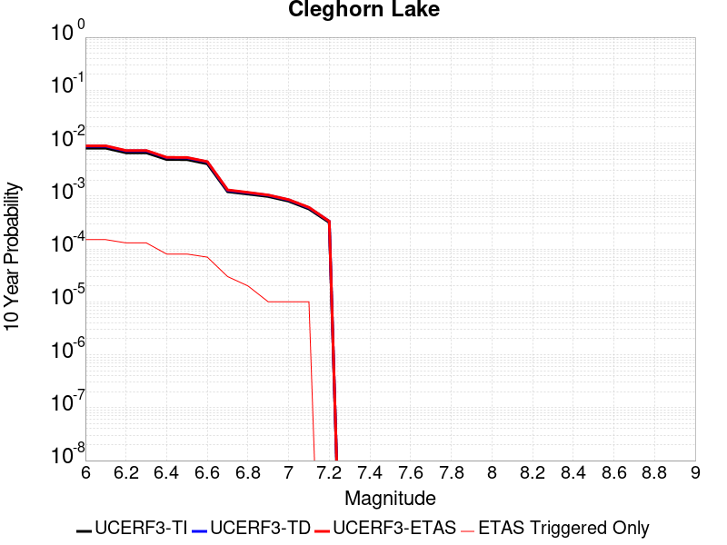 |

| Magnitude | 1 wk TI Prob | 1 wk TD Prob | 1 wk ETAS Prob | 1 wk ETAS/TD Gain | 1 wk ETAS Triggered Only | 1 mo TI Prob | 1 mo TD Prob | 1 mo ETAS Prob | 1 mo ETAS/TD Gain | 1 mo ETAS Triggered Only | 1 yr TI Prob | 1 yr TD Prob | 1 yr ETAS Prob | 1 yr ETAS/TD Gain | 1 yr ETAS Triggered Only | 10 yr TI Prob | 10 yr TD Prob | 10 yr ETAS Prob | 10 yr ETAS/TD Gain | 10 yr ETAS Triggered Only |
|-----|-----|-----|-----|-----|-----|-----|-----|-----|-----|-----|-----|-----|-----|-----|-----|-----|-----|-----|-----|-----|
| 6.0 | 1.5467183E-5 | 1.6794203E-5 | 5.338944E-5 | 3.17904 | 3.6595855E-5 | 6.6286244E-5 | 7.197348E-5 | 1.268633E-4 | 1.7626396 | 5.489378E-5 | 8.067362E-4 | 8.759797E-4 | 9.4910734E-4 | 1.083481 | 7.319171E-5 | 0.008038137 | 0.008730696 | 0.008857663 | 1.0145426 | 1.2808549E-4 |
| 6.1 | 1.5467183E-5 | 1.6794203E-5 | 5.338944E-5 | 3.17904 | 3.6595855E-5 | 6.6286244E-5 | 7.197348E-5 | 1.268633E-4 | 1.7626396 | 5.489378E-5 | 8.067362E-4 | 8.759797E-4 | 9.4910734E-4 | 1.083481 | 7.319171E-5 | 0.008038137 | 0.008730696 | 0.008857663 | 1.0145426 | 1.2808549E-4 |
| 6.2 | 1.2624631E-5 | 1.3681544E-5 | 5.0276896E-5 | 3.6747968 | 3.6595855E-5 | 5.410444E-5 | 5.863415E-5 | 1.1352471E-4 | 1.9361535 | 5.489378E-5 | 6.585225E-4 | 7.1368564E-4 | 7.868251E-4 | 1.1024814 | 7.319171E-5 | 0.0065657445 | 0.0071187317 | 0.007245905 | 1.0178647 | 1.2808549E-4 |
| 6.3 | 1.2624631E-5 | 1.3681544E-5 | 5.0276896E-5 | 3.6747968 | 3.6595855E-5 | 5.410444E-5 | 5.863415E-5 | 1.1352471E-4 | 1.9361535 | 5.489378E-5 | 6.585225E-4 | 7.1368564E-4 | 7.868251E-4 | 1.1024814 | 7.319171E-5 | 0.0065657445 | 0.0071187317 | 0.007245905 | 1.0178647 | 1.2808549E-4 |
| 6.4 | 9.417684E-6 | 1.0170118E-5 | 2.8467859E-5 | 2.7991672 | 1.8297927E-5 | 4.036088E-5 | 4.3585722E-5 | 6.188285E-5 | 1.4197963 | 1.8297927E-5 | 4.912829E-4 | 5.3056807E-4 | 5.488563E-4 | 1.0344691 | 1.8297927E-5 | 0.004901982 | 0.005297049 | 0.005351652 | 1.0103081 | 5.489378E-5 |
| 6.5 | 9.368219E-6 | 1.0117545E-5 | 2.8415287E-5 | 2.808516 | 1.8297927E-5 | 4.014889E-5 | 4.3360415E-5 | 6.165755E-5 | 1.4219779 | 1.8297927E-5 | 4.8870314E-4 | 5.2782625E-4 | 5.461145E-4 | 1.0346483 | 1.8297927E-5 | 0.004876298 | 0.0052697617 | 0.005324366 | 1.0103619 | 5.489378E-5 |
| 6.6 | 7.803798E-6 | 8.441831E-6 | 2.6739603E-5 | 3.1675122 | 1.8297927E-5 | 3.3444423E-5 | 3.6179E-5 | 5.4476262E-5 | 1.5057427 | 1.8297927E-5 | 4.0710976E-4 | 4.4043022E-4 | 4.5872008E-4 | 1.0415273 | 1.8297927E-5 | 0.0040636472 | 0.0043994905 | 0.004454143 | 1.0124224 | 5.489378E-5 |
| 6.7 | 2.3108669E-6 | 2.4438336E-6 | 2.0741716E-5 | 8.487369 | 1.8297927E-5 | 9.903678E-6 | 1.0473532E-5 | 2.8771266E-5 | 2.7470453 | 1.8297927E-5 | 1.205706E-4 | 1.2750797E-4 | 1.4580357E-4 | 1.1434859 | 1.8297927E-5 | 0.001205052 | 0.0012743667 | 0.0012926414 | 1.0143402 | 1.8297927E-5 |
| 6.8 | 2.0882828E-6 | 2.2062823E-6 | 2.2062823E-6 | 1.0 | 0.0 | 8.949753E-6 | 9.455462E-6 | 9.455462E-6 | 1.0 | 0.0 | 1.08957785E-4 | 1.1511434E-4 | 1.1511434E-4 | 1.0 | 0.0 | 0.0010890438 | 0.0011505639 | 0.0011505639 | 1.0 | 0.0 |
| 6.9 | 1.876935E-6 | 1.981051E-6 | 1.981051E-6 | 1.0 | 0.0 | 8.043982E-6 | 8.490192E-6 | 8.490192E-6 | 1.0 | 0.0 | 9.7931086E-5 | 1.03363345E-4 | 1.03363345E-4 | 1.0 | 0.0 | 9.788794E-4 | 0.0010331686 | 0.0010331686 | 1.0 | 0.0 |
| 7.0 | 1.5357559E-6 | 1.6202807E-6 | 1.6202807E-6 | 1.0 | 0.0 | 6.5817944E-6 | 6.9440425E-6 | 6.9440425E-6 | 1.0 | 0.0 | 8.01304E-5 | 8.454057E-5 | 8.454057E-5 | 1.0 | 0.0 | 8.010151E-4 | 8.450965E-4 | 8.450965E-4 | 1.0 | 0.0 |
| 7.1 | 1.0905424E-6 | 1.1497619E-6 | 1.1497619E-6 | 1.0 | 0.0 | 4.6737446E-6 | 4.9275427E-6 | 4.9275427E-6 | 1.0 | 0.0 | 5.6901354E-5 | 5.999128E-5 | 5.999128E-5 | 1.0 | 0.0 | 5.6886784E-4 | 5.997606E-4 | 5.997606E-4 | 1.0 | 0.0 |
| 7.2 | 6.06668E-7 | 6.387277E-7 | 6.387277E-7 | 1.0 | 0.0 | 2.600003E-6 | 2.7374022E-6 | 2.7374022E-6 | 1.0 | 0.0 | 3.1654577E-5 | 3.3327433E-5 | 3.3327433E-5 | 1.0 | 0.0 | 3.1650066E-4 | 3.3323118E-4 | 3.3323118E-4 | 1.0 | 0.0 |

## Dry Mountain
*[(top)](#table-of-contents)*

| 1 Week | 1 Month | 1 Year | 10 Year |
|-----|-----|-----|-----|
|  |  |  |  |

| Magnitude | 1 wk TI Prob | 1 wk TD Prob | 1 wk ETAS Prob | 1 wk ETAS/TD Gain | 1 wk ETAS Triggered Only | 1 mo TI Prob | 1 mo TD Prob | 1 mo ETAS Prob | 1 mo ETAS/TD Gain | 1 mo ETAS Triggered Only | 1 yr TI Prob | 1 yr TD Prob | 1 yr ETAS Prob | 1 yr ETAS/TD Gain | 1 yr ETAS Triggered Only | 10 yr TI Prob | 10 yr TD Prob | 10 yr ETAS Prob | 10 yr ETAS/TD Gain | 10 yr ETAS Triggered Only |
|-----|-----|-----|-----|-----|-----|-----|-----|-----|-----|-----|-----|-----|-----|-----|-----|-----|-----|-----|-----|-----|
| 6.0 | 6.222801E-6 | 6.439381E-6 | 4.3035E-5 | 6.6830955 | 3.6595855E-5 | 2.6668875E-5 | 2.7597147E-5 | 6.419199E-5 | 2.3260372 | 3.6595855E-5 | 3.2464517E-4 | 3.3595937E-4 | 4.2741827E-4 | 1.272232 | 9.148964E-5 | 0.0032417132 | 0.0033560768 | 0.0034837325 | 1.0380372 | 1.2808549E-4 |
| 6.1 | 6.222801E-6 | 6.439381E-6 | 4.3035E-5 | 6.6830955 | 3.6595855E-5 | 2.6668875E-5 | 2.7597147E-5 | 6.419199E-5 | 2.3260372 | 3.6595855E-5 | 3.2464517E-4 | 3.3595937E-4 | 4.2741827E-4 | 1.272232 | 9.148964E-5 | 0.0032417132 | 0.0033560768 | 0.0034837325 | 1.0380372 | 1.2808549E-4 |
| 6.2 | 6.222801E-6 | 6.439381E-6 | 4.3035E-5 | 6.6830955 | 3.6595855E-5 | 2.6668875E-5 | 2.7597147E-5 | 6.419199E-5 | 2.3260372 | 3.6595855E-5 | 3.2464517E-4 | 3.3595937E-4 | 4.2741827E-4 | 1.272232 | 9.148964E-5 | 0.0032417132 | 0.0033560768 | 0.0034837325 | 1.0380372 | 1.2808549E-4 |
| 6.3 | 6.222801E-6 | 6.439381E-6 | 4.3035E-5 | 6.6830955 | 3.6595855E-5 | 2.6668875E-5 | 2.7597147E-5 | 6.419199E-5 | 2.3260372 | 3.6595855E-5 | 3.2464517E-4 | 3.3595937E-4 | 4.2741827E-4 | 1.272232 | 9.148964E-5 | 0.0032417132 | 0.0033560768 | 0.0034837325 | 1.0380372 | 1.2808549E-4 |
| 6.4 | 6.222801E-6 | 6.439381E-6 | 4.3035E-5 | 6.6830955 | 3.6595855E-5 | 2.6668875E-5 | 2.7597147E-5 | 6.419199E-5 | 2.3260372 | 3.6595855E-5 | 3.2464517E-4 | 3.3595937E-4 | 4.2741827E-4 | 1.272232 | 9.148964E-5 | 0.0032417132 | 0.0033560768 | 0.0034837325 | 1.0380372 | 1.2808549E-4 |
| 6.5 | 2.8528623E-6 | 2.9521684E-6 | 2.1250042E-5 | 7.198113 | 1.8297927E-5 | 1.22264955E-5 | 1.2652138E-5 | 3.0949832E-5 | 2.4462137 | 1.8297927E-5 | 1.4884741E-4 | 1.540376E-4 | 2.0892292E-4 | 1.3563112 | 5.489378E-5 | 0.0014874774 | 0.0015401616 | 0.0016315103 | 1.0593112 | 9.148964E-5 |
| 6.6 | 2.8528623E-6 | 2.9521684E-6 | 2.1250042E-5 | 7.198113 | 1.8297927E-5 | 1.22264955E-5 | 1.2652138E-5 | 3.0949832E-5 | 2.4462137 | 1.8297927E-5 | 1.4884741E-4 | 1.540376E-4 | 2.0892292E-4 | 1.3563112 | 5.489378E-5 | 0.0014874774 | 0.0015401616 | 0.0016315103 | 1.0593112 | 9.148964E-5 |
| 6.7 | 2.541E-6 | 2.6293578E-6 | 2.0927237E-5 | 7.9590673 | 1.8297927E-5 | 1.0889954E-5 | 1.1268677E-5 | 2.9566398E-5 | 2.6237683 | 1.8297927E-5 | 1.3257713E-4 | 1.3719614E-4 | 1.9208239E-4 | 1.4000568 | 5.489378E-5 | 0.0013249806 | 0.0013719613 | 0.0014450527 | 1.053275 | 7.319171E-5 |

## Elysian Park (Upper)
*[(top)](#table-of-contents)*

| 1 Week | 1 Month | 1 Year | 10 Year |
|-----|-----|-----|-----|
|  |  |  |  |

| Magnitude | 1 wk TI Prob | 1 wk TD Prob | 1 wk ETAS Prob | 1 wk ETAS/TD Gain | 1 wk ETAS Triggered Only | 1 mo TI Prob | 1 mo TD Prob | 1 mo ETAS Prob | 1 mo ETAS/TD Gain | 1 mo ETAS Triggered Only | 1 yr TI Prob | 1 yr TD Prob | 1 yr ETAS Prob | 1 yr ETAS/TD Gain | 1 yr ETAS Triggered Only | 10 yr TI Prob | 10 yr TD Prob | 10 yr ETAS Prob | 10 yr ETAS/TD Gain | 10 yr ETAS Triggered Only |
|-----|-----|-----|-----|-----|-----|-----|-----|-----|-----|-----|-----|-----|-----|-----|-----|-----|-----|-----|-----|-----|
| 6.0 | 3.1876025E-5 | 3.7035516E-5 | 7.363001E-5 | 1.9880921 | 3.6595855E-5 | 1.3660437E-4 | 1.587167E-4 | 2.5019184E-4 | 1.576342 | 9.148964E-5 | 0.0016618895 | 0.0019311075 | 0.002040683 | 1.0567423 | 1.0978756E-4 | 0.016495159 | 0.019189782 | 0.019297464 | 1.0056113 | 1.0978756E-4 |
| 6.1 | 3.1876025E-5 | 3.7035516E-5 | 7.363001E-5 | 1.9880921 | 3.6595855E-5 | 1.3660437E-4 | 1.587167E-4 | 2.5019184E-4 | 1.576342 | 9.148964E-5 | 0.0016618895 | 0.0019311075 | 0.002040683 | 1.0567423 | 1.0978756E-4 | 0.016495159 | 0.019189782 | 0.019297464 | 1.0056113 | 1.0978756E-4 |
| 6.2 | 3.1876025E-5 | 3.7035516E-5 | 7.363001E-5 | 1.9880921 | 3.6595855E-5 | 1.3660437E-4 | 1.587167E-4 | 2.5019184E-4 | 1.576342 | 9.148964E-5 | 0.0016618895 | 0.0019311075 | 0.002040683 | 1.0567423 | 1.0978756E-4 | 0.016495159 | 0.019189782 | 0.019297464 | 1.0056113 | 1.0978756E-4 |
| 6.3 | 3.1876025E-5 | 3.7035516E-5 | 7.363001E-5 | 1.9880921 | 3.6595855E-5 | 1.3660437E-4 | 1.587167E-4 | 2.5019184E-4 | 1.576342 | 9.148964E-5 | 0.0016618895 | 0.0019311075 | 0.002040683 | 1.0567423 | 1.0978756E-4 | 0.016495159 | 0.019189782 | 0.019297464 | 1.0056113 | 1.0978756E-4 |
| 6.4 | 1.9273462E-5 | 2.1202266E-5 | 3.9499806E-5 | 1.8629992 | 1.8297927E-5 | 8.259794E-5 | 9.086466E-5 | 1.6404972E-4 | 1.8054292 | 7.319171E-5 | 0.001005166 | 0.0011058892 | 0.0011972777 | 1.082638 | 9.148964E-5 | 0.010006315 | 0.011020724 | 0.011111205 | 1.0082101 | 9.148964E-5 |
| 6.5 | 1.9273462E-5 | 2.1202266E-5 | 3.9499806E-5 | 1.8629992 | 1.8297927E-5 | 8.259794E-5 | 9.086466E-5 | 1.6404972E-4 | 1.8054292 | 7.319171E-5 | 0.001005166 | 0.0011058892 | 0.0011972777 | 1.082638 | 9.148964E-5 | 0.010006315 | 0.011020724 | 0.011111205 | 1.0082101 | 9.148964E-5 |
| 6.6 | 9.813258E-6 | 9.665599E-6 | 2.7963348E-5 | 2.89308 | 1.8297927E-5 | 4.205614E-5 | 4.1423376E-5 | 7.8017714E-5 | 1.8834224 | 3.6595855E-5 | 5.119132E-4 | 5.0422014E-4 | 5.590863E-4 | 1.1088138 | 5.489378E-5 | 0.005107356 | 0.0050314846 | 0.0050861025 | 1.0108552 | 5.489378E-5 |
| 6.7 | 9.801478E-6 | 9.653168E-6 | 2.7950919E-5 | 2.8955176 | 1.8297927E-5 | 4.2005657E-5 | 4.1370105E-5 | 7.796445E-5 | 1.88456 | 3.6595855E-5 | 5.112989E-4 | 5.035719E-4 | 5.58438E-4 | 1.108954 | 5.489378E-5 | 0.0051012407 | 0.0050250315 | 0.0050796494 | 1.0108691 | 5.489378E-5 |
| 6.8 | 8.102489E-6 | 7.773004E-6 | 2.607079E-5 | 3.354017 | 1.8297927E-5 | 3.4724493E-5 | 3.3312477E-5 | 6.990711E-5 | 2.0985265 | 3.6595855E-5 | 4.2268867E-4 | 4.055089E-4 | 4.6038043E-4 | 1.1353152 | 5.489378E-5 | 0.004218856 | 0.0040481836 | 0.004102855 | 1.0135052 | 5.489378E-5 |
| 6.9 | 6.08275E-6 | 5.4814514E-6 | 2.3779277E-5 | 4.3381352 | 1.8297927E-5 | 2.6068668E-5 | 2.3491726E-5 | 6.008672E-5 | 2.5577822 | 3.6595855E-5 | 3.173398E-4 | 2.85975E-4 | 3.408531E-4 | 1.1918982 | 5.489378E-5 | 0.0031688702 | 0.0028561477 | 0.0029108846 | 1.0191647 | 5.489378E-5 |
| 7.0 | 5.5995934E-6 | 4.98278E-6 | 2.3280616E-5 | 4.672214 | 1.8297927E-5 | 2.3998036E-5 | 2.13546E-5 | 5.7949674E-5 | 2.7136858 | 3.6595855E-5 | 2.9213692E-4 | 2.599619E-4 | 3.1484143E-4 | 1.211106 | 5.489378E-5 | 0.0029175316 | 0.0025966454 | 0.0026513967 | 1.0210854 | 5.489378E-5 |
| 7.1 | 4.709881E-6 | 4.0874015E-6 | 2.2385253E-5 | 5.476647 | 1.8297927E-5 | 2.0185047E-5 | 1.7517319E-5 | 5.411253E-5 | 3.0890875 | 3.6595855E-5 | 2.4572524E-4 | 2.132529E-4 | 2.4984096E-4 | 1.1715711 | 3.6595855E-5 | 0.002454537 | 0.002130524 | 0.0021670419 | 1.0171404 | 3.6595855E-5 |
| 7.2 | 3.6063436E-6 | 2.9779544E-6 | 2.1275826E-5 | 7.1444435 | 1.8297927E-5 | 1.5455667E-5 | 1.27626E-5 | 3.106029E-5 | 2.4336963 | 1.8297927E-5 | 1.881565E-4 | 1.5537368E-4 | 1.7366877E-4 | 1.117749 | 1.8297927E-5 | 0.0018799726 | 0.0015526618 | 0.0015709313 | 1.0117666 | 1.8297927E-5 |
| 7.3 | 2.471135E-6 | 2.0954615E-6 | 2.039335E-5 | 9.732152 | 1.8297927E-5 | 1.0590536E-5 | 8.980519E-6 | 2.7278282E-5 | 3.037495 | 1.8297927E-5 | 1.2893214E-4 | 1.093324E-4 | 1.2762833E-4 | 1.1673422 | 1.8297927E-5 | 0.0012885736 | 0.0010927934 | 0.0011110713 | 1.0167259 | 1.8297927E-5 |
| 7.4 | 1.163943E-6 | 1.0275091E-6 | 1.0275091E-6 | 1.0 | 0.0 | 4.988318E-6 | 4.4036033E-6 | 4.4036033E-6 | 1.0 | 0.0 | 6.0731076E-5 | 5.3612584E-5 | 5.3612584E-5 | 1.0 | 0.0 | 6.071448E-4 | 5.359995E-4 | 5.359995E-4 | 1.0 | 0.0 |
| 7.5 | 4.99459E-7 | 4.917604E-7 | 4.917604E-7 | 1.0 | 0.0 | 2.140537E-6 | 2.1075427E-6 | 2.1075427E-6 | 1.0 | 0.0 | 2.6060725E-5 | 2.5659048E-5 | 2.5659048E-5 | 1.0 | 0.0 | 2.605767E-4 | 2.5656243E-4 | 2.5656243E-4 | 1.0 | 0.0 |
| 7.6 | 2.4667852E-7 | 2.4778336E-7 | 2.4778336E-7 | 1.0 | 0.0 | 1.0571932E-6 | 1.0619283E-6 | 1.0619283E-6 | 1.0 | 0.0 | 1.2871251E-5 | 1.2928905E-5 | 1.2928905E-5 | 1.0 | 0.0 | 1.2870505E-4 | 1.2928189E-4 | 1.2928189E-4 | 1.0 | 0.0 |
| 7.7 | 8.2312795E-8 | 7.3864456E-8 | 7.3864456E-8 | 1.0 | 0.0 | 3.527691E-7 | 3.165619E-7 | 3.165619E-7 | 1.0 | 0.0 | 4.294955E-6 | 3.8541357E-6 | 3.8541357E-6 | 1.0 | 0.0 | 4.2948723E-5 | 3.8540802E-5 | 3.8540802E-5 | 1.0 | 0.0 |
| 7.8 | 2.7819295E-8 | 1.7566023E-8 | 1.7566023E-8 | 1.0 | 0.0 | 1.1922555E-7 | 7.5282955E-8 | 7.5282955E-8 | 1.0 | 0.0 | 1.45157E-6 | 9.165697E-7 | 9.165697E-7 | 1.0 | 0.0 | 1.45156055E-5 | 9.165675E-6 | 9.165675E-6 | 1.0 | 0.0 |

## Pisgah-Bullion Mtn-Mesquite Lk
*[(top)](#table-of-contents)*

| 1 Week | 1 Month | 1 Year | 10 Year |
|-----|-----|-----|-----|
|  |  |  |  |

| Magnitude | 1 wk TI Prob | 1 wk TD Prob | 1 wk ETAS Prob | 1 wk ETAS/TD Gain | 1 wk ETAS Triggered Only | 1 mo TI Prob | 1 mo TD Prob | 1 mo ETAS Prob | 1 mo ETAS/TD Gain | 1 mo ETAS Triggered Only | 1 yr TI Prob | 1 yr TD Prob | 1 yr ETAS Prob | 1 yr ETAS/TD Gain | 1 yr ETAS Triggered Only | 10 yr TI Prob | 10 yr TD Prob | 10 yr ETAS Prob | 10 yr ETAS/TD Gain | 10 yr ETAS Triggered Only |
|-----|-----|-----|-----|-----|-----|-----|-----|-----|-----|-----|-----|-----|-----|-----|-----|-----|-----|-----|-----|-----|
| 6.0 | 3.0240792E-5 | 2.4091114E-5 | 6.0686085E-5 | 2.5190237 | 3.6595855E-5 | 1.2959696E-4 | 1.03244114E-4 | 1.398362E-4 | 1.3544229 | 3.6595855E-5 | 0.0015767008 | 0.0012563728 | 0.0013294725 | 1.0581832 | 7.319171E-5 | 0.015655609 | 0.012502721 | 0.012611136 | 1.0086713 | 1.0978756E-4 |
| 6.1 | 3.0240792E-5 | 2.4091114E-5 | 6.0686085E-5 | 2.5190237 | 3.6595855E-5 | 1.2959696E-4 | 1.03244114E-4 | 1.398362E-4 | 1.3544229 | 3.6595855E-5 | 0.0015767008 | 0.0012563728 | 0.0013294725 | 1.0581832 | 7.319171E-5 | 0.015655609 | 0.012502721 | 0.012611136 | 1.0086713 | 1.0978756E-4 |
| 6.2 | 3.0240792E-5 | 2.4091114E-5 | 6.0686085E-5 | 2.5190237 | 3.6595855E-5 | 1.2959696E-4 | 1.03244114E-4 | 1.398362E-4 | 1.3544229 | 3.6595855E-5 | 0.0015767008 | 0.0012563728 | 0.0013294725 | 1.0581832 | 7.319171E-5 | 0.015655609 | 0.012502721 | 0.012611136 | 1.0086713 | 1.0978756E-4 |
| 6.3 | 2.0498217E-5 | 1.36380695E-5 | 3.1935746E-5 | 2.341662 | 1.8297927E-5 | 8.784654E-5 | 5.844765E-5 | 7.674451E-5 | 1.3130469 | 1.8297927E-5 | 0.0010690069 | 7.1138405E-4 | 7.4795383E-4 | 1.0514066 | 3.6595855E-5 | 0.01063879 | 0.0070926943 | 0.007147199 | 1.0076846 | 5.489378E-5 |
| 6.4 | 2.0498217E-5 | 1.36380695E-5 | 3.1935746E-5 | 2.341662 | 1.8297927E-5 | 8.784654E-5 | 5.844765E-5 | 7.674451E-5 | 1.3130469 | 1.8297927E-5 | 0.0010690069 | 7.1138405E-4 | 7.4795383E-4 | 1.0514066 | 3.6595855E-5 | 0.01063879 | 0.0070926943 | 0.007147199 | 1.0076846 | 5.489378E-5 |
| 6.5 | 1.7316182E-5 | 1.0477042E-5 | 2.8774777E-5 | 2.74646 | 1.8297927E-5 | 7.42101E-5 | 4.4900895E-5 | 6.3198E-5 | 1.4074998 | 1.8297927E-5 | 9.0313336E-4 | 5.465413E-4 | 5.8311713E-4 | 1.0669224 | 3.6595855E-5 | 0.008994718 | 0.0054529672 | 0.0055075614 | 1.0100119 | 5.489378E-5 |
| 6.6 | 1.5251077E-5 | 8.414273E-6 | 2.6712045E-5 | 3.1746113 | 1.8297927E-5 | 6.536012E-5 | 3.6060712E-5 | 5.4357977E-5 | 1.5074017 | 1.8297927E-5 | 7.9546886E-4 | 4.3895794E-4 | 4.7553773E-4 | 1.0833333 | 3.6595855E-5 | 0.007926274 | 0.0043816264 | 0.0044362796 | 1.0124732 | 5.489378E-5 |
| 6.7 | 1.2997425E-5 | 6.4114965E-6 | 2.4709307E-5 | 3.8539062 | 1.8297927E-5 | 5.570206E-5 | 2.7477578E-5 | 4.5775003E-5 | 1.6659038 | 1.8297927E-5 | 6.7796157E-4 | 3.3449283E-4 | 3.527846E-4 | 1.0546852 | 1.8297927E-5 | 0.0067589693 | 0.0033403537 | 0.0033768273 | 1.0109191 | 3.6595855E-5 |
| 6.8 | 1.035386E-5 | 4.3332193E-6 | 2.2631068E-5 | 5.222691 | 1.8297927E-5 | 4.437293E-5 | 1.8570812E-5 | 3.68684E-5 | 1.9852873 | 1.8297927E-5 | 5.401065E-4 | 2.2607706E-4 | 2.4437087E-4 | 1.0809184 | 1.8297927E-5 | 0.0053879567 | 0.0022585576 | 0.0022950708 | 1.0161666 | 3.6595855E-5 |
| 6.9 | 8.816252E-6 | 3.580638E-6 | 2.1878499E-5 | 6.1102242 | 1.8297927E-5 | 3.778339E-5 | 1.5345504E-5 | 3.364315E-5 | 2.1923783 | 1.8297927E-5 | 4.5991567E-4 | 1.8681608E-4 | 2.0511058E-4 | 1.0979279 | 1.8297927E-5 | 0.00458965 | 0.0018666488 | 0.0019031763 | 1.0195686 | 3.6595855E-5 |
| 7.0 | 6.8232207E-6 | 2.5675843E-6 | 2.5675843E-6 | 1.0 | 0.0 | 2.9242048E-5 | 1.1003888E-5 | 1.1003888E-5 | 1.0 | 0.0 | 3.5596377E-4 | 1.3396442E-4 | 1.3396442E-4 | 1.0 | 0.0 | 0.0035539411 | 0.0013388677 | 0.0013571411 | 1.0136484 | 1.8297927E-5 |
| 7.1 | 5.837013E-6 | 2.22738E-6 | 2.22738E-6 | 1.0 | 0.0 | 2.501553E-5 | 9.545881E-6 | 9.545881E-6 | 1.0 | 0.0 | 3.045215E-4 | 1.16215204E-4 | 1.16215204E-4 | 1.0 | 0.0 | 0.0030410455 | 0.0011615733 | 0.00117985 | 1.0157344 | 1.8297927E-5 |
| 7.2 | 4.278052E-6 | 1.6275711E-6 | 1.6275711E-6 | 1.0 | 0.0 | 1.833438E-5 | 6.9752873E-6 | 6.9752873E-6 | 1.0 | 0.0 | 2.231982E-4 | 8.492105E-5 | 8.492105E-5 | 1.0 | 0.0 | 0.0022297418 | 8.489092E-4 | 8.671916E-4 | 1.0215364 | 1.8297927E-5 |
| 7.3 | 1.8803692E-6 | 8.344926E-7 | 8.344926E-7 | 1.0 | 0.0 | 8.0587E-6 | 3.5763926E-6 | 3.5763926E-6 | 1.0 | 0.0 | 9.811026E-5 | 4.354186E-5 | 4.354186E-5 | 1.0 | 0.0 | 9.806695E-4 | 4.3534773E-4 | 4.536377E-4 | 1.0420123 | 1.8297927E-5 |

## Pine Mtn
*[(top)](#table-of-contents)*

| 1 Week | 1 Month | 1 Year | 10 Year |
|-----|-----|-----|-----|
|  |  |  |  |

| Magnitude | 1 wk TI Prob | 1 wk TD Prob | 1 wk ETAS Prob | 1 wk ETAS/TD Gain | 1 wk ETAS Triggered Only | 1 mo TI Prob | 1 mo TD Prob | 1 mo ETAS Prob | 1 mo ETAS/TD Gain | 1 mo ETAS Triggered Only | 1 yr TI Prob | 1 yr TD Prob | 1 yr ETAS Prob | 1 yr ETAS/TD Gain | 1 yr ETAS Triggered Only | 10 yr TI Prob | 10 yr TD Prob | 10 yr ETAS Prob | 10 yr ETAS/TD Gain | 10 yr ETAS Triggered Only |
|-----|-----|-----|-----|-----|-----|-----|-----|-----|-----|-----|-----|-----|-----|-----|-----|-----|-----|-----|-----|-----|
| 6.0 | 6.894797E-6 | 7.225461E-6 | 2.5523255E-5 | 3.5324051 | 1.8297927E-5 | 2.9548795E-5 | 3.096591E-5 | 6.7560635E-5 | 2.1817744 | 3.6595855E-5 | 3.596972E-4 | 3.7694772E-4 | 4.5011184E-4 | 1.1940962 | 7.319171E-5 | 0.0035911554 | 0.003763381 | 0.0038727554 | 1.0290627 | 1.0978756E-4 |
| 6.1 | 6.894797E-6 | 7.225461E-6 | 2.5523255E-5 | 3.5324051 | 1.8297927E-5 | 2.9548795E-5 | 3.096591E-5 | 6.7560635E-5 | 2.1817744 | 3.6595855E-5 | 3.596972E-4 | 3.7694772E-4 | 4.5011184E-4 | 1.1940962 | 7.319171E-5 | 0.0035911554 | 0.003763381 | 0.0038727554 | 1.0290627 | 1.0978756E-4 |
| 6.2 | 6.894797E-6 | 7.225461E-6 | 2.5523255E-5 | 3.5324051 | 1.8297927E-5 | 2.9548795E-5 | 3.096591E-5 | 6.7560635E-5 | 2.1817744 | 3.6595855E-5 | 3.596972E-4 | 3.7694772E-4 | 4.5011184E-4 | 1.1940962 | 7.319171E-5 | 0.0035911554 | 0.003763381 | 0.0038727554 | 1.0290627 | 1.0978756E-4 |
| 6.3 | 6.894797E-6 | 7.225461E-6 | 2.5523255E-5 | 3.5324051 | 1.8297927E-5 | 2.9548795E-5 | 3.096591E-5 | 6.7560635E-5 | 2.1817744 | 3.6595855E-5 | 3.596972E-4 | 3.7694772E-4 | 4.5011184E-4 | 1.1940962 | 7.319171E-5 | 0.0035911554 | 0.003763381 | 0.0038727554 | 1.0290627 | 1.0978756E-4 |
| 6.4 | 6.894797E-6 | 7.225461E-6 | 2.5523255E-5 | 3.5324051 | 1.8297927E-5 | 2.9548795E-5 | 3.096591E-5 | 6.7560635E-5 | 2.1817744 | 3.6595855E-5 | 3.596972E-4 | 3.7694772E-4 | 4.5011184E-4 | 1.1940962 | 7.319171E-5 | 0.0035911554 | 0.003763381 | 0.0038727554 | 1.0290627 | 1.0978756E-4 |
| 6.5 | 6.894797E-6 | 7.225461E-6 | 2.5523255E-5 | 3.5324051 | 1.8297927E-5 | 2.9548795E-5 | 3.096591E-5 | 6.7560635E-5 | 2.1817744 | 3.6595855E-5 | 3.596972E-4 | 3.7694772E-4 | 4.5011184E-4 | 1.1940962 | 7.319171E-5 | 0.0035911554 | 0.003763381 | 0.0038727554 | 1.0290627 | 1.0978756E-4 |
| 6.6 | 6.894797E-6 | 7.225461E-6 | 2.5523255E-5 | 3.5324051 | 1.8297927E-5 | 2.9548795E-5 | 3.096591E-5 | 6.7560635E-5 | 2.1817744 | 3.6595855E-5 | 3.596972E-4 | 3.7694772E-4 | 4.5011184E-4 | 1.1940962 | 7.319171E-5 | 0.0035911554 | 0.003763381 | 0.0038727554 | 1.0290627 | 1.0978756E-4 |
| 6.7 | 6.0867933E-6 | 6.3971133E-6 | 2.4694922E-5 | 3.860323 | 1.8297927E-5 | 2.6085996E-5 | 2.7415923E-5 | 6.4010776E-5 | 2.3348029 | 3.6595855E-5 | 3.1755073E-4 | 3.3373994E-4 | 4.0690723E-4 | 1.2192345 | 7.319171E-5 | 0.0031709734 | 0.0033326065 | 0.003442028 | 1.0328337 | 1.0978756E-4 |
| 6.8 | 5.6530425E-6 | 5.9505956E-6 | 2.4248413E-5 | 4.074956 | 1.8297927E-5 | 2.42271E-5 | 2.5502315E-5 | 6.2097235E-5 | 2.4349647 | 3.6595855E-5 | 2.94925E-4 | 3.104485E-4 | 3.8361747E-4 | 1.235688 | 7.319171E-5 | 0.002945339 | 0.0031003528 | 0.0032098 | 1.0353016 | 1.0978756E-4 |
| 6.9 | 4.6015225E-6 | 4.863834E-6 | 2.3161672E-5 | 4.762019 | 1.8297927E-5 | 1.9720663E-5 | 2.0844845E-5 | 5.7439935E-5 | 2.7555943 | 3.6595855E-5 | 2.4007261E-4 | 2.5375787E-4 | 3.26931E-4 | 1.2883581 | 7.319171E-5 | 0.0023981342 | 0.0025348254 | 0.0026443347 | 1.0432019 | 1.0978756E-4 |
| 7.0 | 4.4875965E-6 | 4.747473E-6 | 2.3045313E-5 | 4.854227 | 1.8297927E-5 | 1.9232413E-5 | 2.0346162E-5 | 5.6941273E-5 | 2.7986245 | 3.6595855E-5 | 2.3412947E-4 | 2.4768783E-4 | 3.208614E-4 | 1.2954266 | 7.319171E-5 | 0.0023388295 | 0.0024742614 | 0.0025837773 | 1.044262 | 1.0978756E-4 |
| 7.1 | 3.203907E-6 | 3.4294096E-6 | 2.1727274E-5 | 6.3355727 | 1.8297927E-5 | 1.3730958E-5 | 1.4697391E-5 | 5.1292707E-5 | 3.4899192 | 3.6595855E-5 | 1.6716159E-4 | 1.789267E-4 | 2.3381066E-4 | 1.3067399 | 5.489378E-5 | 0.0016703589 | 0.0017878925 | 0.0018609534 | 1.0408642 | 7.319171E-5 |
| 7.2 | 2.2060601E-6 | 2.3784817E-6 | 2.0676365E-5 | 8.693094 | 1.8297927E-5 | 9.4545085E-6 | 1.0193455E-5 | 2.8491195E-5 | 2.795048 | 1.8297927E-5 | 1.15102564E-4 | 1.240987E-4 | 1.6069002E-4 | 1.2948565 | 3.6595855E-5 | 0.0011504296 | 0.0012403389 | 0.0012951646 | 1.0442022 | 5.489378E-5 |
| 7.3 | 1.3765207E-6 | 1.5216481E-6 | 1.9819547E-5 | 13.025053 | 1.8297927E-5 | 5.899361E-6 | 6.521333E-6 | 2.481914E-5 | 3.8058386 | 1.8297927E-5 | 7.182235E-5 | 7.939443E-5 | 1.1598738E-4 | 1.4609007 | 3.6595855E-5 | 7.1799144E-4 | 7.936697E-4 | 8.4851997E-4 | 1.0691096 | 5.489378E-5 |
| 7.4 | 1.1245983E-6 | 1.2587075E-6 | 1.2587075E-6 | 1.0 | 0.0 | 4.819698E-6 | 5.39445E-6 | 5.39445E-6 | 1.0 | 0.0 | 5.8678244E-5 | 6.567554E-5 | 6.567554E-5 | 1.0 | 0.0 | 5.866275E-4 | 6.5656955E-4 | 6.748555E-4 | 1.0278506 | 1.8297927E-5 |
| 7.5 | 8.031682E-7 | 9.276951E-7 | 9.276951E-7 | 1.0 | 0.0 | 3.4421448E-6 | 3.9758306E-6 | 3.9758306E-6 | 1.0 | 0.0 | 4.1907308E-5 | 4.840473E-5 | 4.840473E-5 | 1.0 | 0.0 | 4.1899405E-4 | 4.8394862E-4 | 4.8394862E-4 | 1.0 | 0.0 |
| 7.6 | 4.8953444E-7 | 6.003009E-7 | 6.003009E-7 | 1.0 | 0.0 | 2.098003E-6 | 2.5727159E-6 | 2.5727159E-6 | 1.0 | 0.0 | 2.5542888E-5 | 3.1322415E-5 | 3.1322415E-5 | 1.0 | 0.0 | 2.5539953E-4 | 3.1318486E-4 | 3.1318486E-4 | 1.0 | 0.0 |
| 7.7 | 6.634529E-8 | 6.788826E-8 | 6.788826E-8 | 1.0 | 0.0 | 2.843369E-7 | 2.9094966E-7 | 2.9094966E-7 | 1.0 | 0.0 | 3.4617963E-6 | 3.5423066E-6 | 3.5423066E-6 | 1.0 | 0.0 | 3.4617424E-5 | 3.542255E-5 | 3.542255E-5 | 1.0 | 0.0 |
| 7.8 | 9.235578E-9 | 9.488566E-9 | 9.488566E-9 | 1.0 | 0.0 | 3.9581046E-8 | 4.0665284E-8 | 4.0665284E-8 | 1.0 | 0.0 | 4.818991E-7 | 4.950997E-7 | 4.950997E-7 | 1.0 | 0.0 | 4.8189804E-6 | 4.950988E-6 | 4.950988E-6 | 1.0 | 0.0 |

## Great Valley 09 (Laguna Seca)
*[(top)](#table-of-contents)*

| 1 Week | 1 Month | 1 Year | 10 Year |
|-----|-----|-----|-----|
|  |  |  |  |

| Magnitude | 1 wk TI Prob | 1 wk TD Prob | 1 wk ETAS Prob | 1 wk ETAS/TD Gain | 1 wk ETAS Triggered Only | 1 mo TI Prob | 1 mo TD Prob | 1 mo ETAS Prob | 1 mo ETAS/TD Gain | 1 mo ETAS Triggered Only | 1 yr TI Prob | 1 yr TD Prob | 1 yr ETAS Prob | 1 yr ETAS/TD Gain | 1 yr ETAS Triggered Only | 10 yr TI Prob | 10 yr TD Prob | 10 yr ETAS Prob | 10 yr ETAS/TD Gain | 10 yr ETAS Triggered Only |
|-----|-----|-----|-----|-----|-----|-----|-----|-----|-----|-----|-----|-----|-----|-----|-----|-----|-----|-----|-----|-----|
| 6.0 | 5.4353277E-5 | 7.05022E-5 | 8.8798835E-5 | 1.2595186 | 1.8297927E-5 | 2.3292181E-4 | 3.0211566E-4 | 3.2040806E-4 | 1.0605477 | 1.8297927E-5 | 0.0028321352 | 0.0036721937 | 0.0037268861 | 1.0148937 | 5.489378E-5 | 0.02796312 | 0.03611547 | 0.036221292 | 1.0029302 | 1.0978756E-4 |
| 6.1 | 4.5578287E-5 | 5.822118E-5 | 7.6518045E-5 | 1.3142647 | 1.8297927E-5 | 1.953209E-4 | 2.4949326E-4 | 2.677866E-4 | 1.073322 | 1.8297927E-5 | 0.0023754383 | 0.003033432 | 0.0030881593 | 1.0180414 | 5.489378E-5 | 0.023502063 | 0.029919548 | 0.0300083 | 1.0029664 | 9.148964E-5 |
| 6.2 | 2.8536782E-5 | 3.4737273E-5 | 5.3034564E-5 | 1.5267336 | 1.8297927E-5 | 1.2229476E-4 | 1.4886224E-4 | 1.6715744E-4 | 1.1229002 | 1.8297927E-5 | 0.0014879217 | 0.001810813 | 0.0018473426 | 1.0201731 | 3.6595855E-5 | 0.014779986 | 0.017958116 | 0.018012024 | 1.0030019 | 5.489378E-5 |
| 6.3 | 2.3698774E-5 | 2.8213295E-5 | 2.8213295E-5 | 1.0 | 0.0 | 1.01562226E-4 | 1.20905075E-4 | 1.20905075E-4 | 1.0 | 0.0 | 0.0012358186 | 0.0014710218 | 0.0014892928 | 1.0124207 | 1.8297927E-5 | 0.012289686 | 0.014611342 | 0.014629372 | 1.001234 | 1.8297927E-5 |
| 6.4 | 1.9191197E-5 | 2.2123184E-5 | 2.2123184E-5 | 1.0 | 0.0 | 8.2245395E-5 | 9.4806666E-5 | 9.4806666E-5 | 1.0 | 0.0 | 0.0010008777 | 0.0011536429 | 0.0011719196 | 1.0158427 | 1.8297927E-5 | 0.009963818 | 0.011476948 | 0.011495036 | 1.0015761 | 1.8297927E-5 |
| 6.5 | 1.5203241E-5 | 1.6802203E-5 | 1.6802203E-5 | 1.0 | 0.0 | 6.5155116E-5 | 7.200386E-5 | 7.200386E-5 | 1.0 | 0.0 | 7.9297484E-4 | 8.7626575E-4 | 8.945477E-4 | 1.0208634 | 1.8297927E-5 | 0.007901512 | 0.0087295165 | 0.008747655 | 1.0020778 | 1.8297927E-5 |
| 6.6 | 1.0984925E-5 | 1.1242595E-5 | 1.1242595E-5 | 1.0 | 0.0 | 4.70774E-5 | 4.8181686E-5 | 4.8181686E-5 | 1.0 | 0.0 | 5.730166E-4 | 5.8645656E-4 | 6.047437E-4 | 1.0311825 | 1.8297927E-5 | 0.005715413 | 0.0058494853 | 0.0058676763 | 1.0031098 | 1.8297927E-5 |
| 6.7 | 9.134616E-6 | 9.019894E-6 | 9.019894E-6 | 1.0 | 0.0 | 3.9147766E-5 | 3.865613E-5 | 3.865613E-5 | 1.0 | 0.0 | 4.7651984E-4 | 4.7053912E-4 | 4.8882846E-4 | 1.0388689 | 1.8297927E-5 | 0.004754993 | 0.0046956735 | 0.0047138855 | 1.0038785 | 1.8297927E-5 |
| 6.8 | 7.785589E-6 | 7.4519444E-6 | 7.4519444E-6 | 1.0 | 0.0 | 3.3366385E-5 | 3.1936524E-5 | 3.1936524E-5 | 1.0 | 0.0 | 4.0616E-4 | 3.8875983E-4 | 3.8875983E-4 | 1.0 | 0.0 | 0.0040541845 | 0.0038810016 | 0.0038810016 | 1.0 | 0.0 |
| 6.9 | 5.579095E-6 | 4.898492E-6 | 4.898492E-6 | 1.0 | 0.0 | 2.3910188E-5 | 2.0993377E-5 | 2.0993377E-5 | 1.0 | 0.0 | 2.9106764E-4 | 2.5556577E-4 | 2.5556577E-4 | 1.0 | 0.0 | 0.002906867 | 0.002552856 | 0.002552856 | 1.0 | 0.0 |
| 7.0 | 2.6816688E-6 | 1.5216126E-6 | 1.5216126E-6 | 1.0 | 0.0 | 1.1492816E-5 | 6.521181E-6 | 6.521181E-6 | 1.0 | 0.0 | 1.3991605E-4 | 7.939258E-5 | 7.939258E-5 | 1.0 | 0.0 | 0.0013982799 | 7.9365086E-4 | 7.9365086E-4 | 1.0 | 0.0 |
| 7.1 | 1.9951021E-6 | 7.453827E-7 | 7.453827E-7 | 1.0 | 0.0 | 8.55041E-6 | 3.1944935E-6 | 3.1944935E-6 | 1.0 | 0.0 | 1.0409627E-4 | 3.8892307E-5 | 3.8892307E-5 | 1.0 | 0.0 | 0.0010404752 | 3.8885913E-4 | 3.8885913E-4 | 1.0 | 0.0 |
| 7.2 | 1.9951021E-6 | 7.453827E-7 | 7.453827E-7 | 1.0 | 0.0 | 8.55041E-6 | 3.1944935E-6 | 3.1944935E-6 | 1.0 | 0.0 | 1.0409627E-4 | 3.8892307E-5 | 3.8892307E-5 | 1.0 | 0.0 | 0.0010404752 | 3.8885913E-4 | 3.8885913E-4 | 1.0 | 0.0 |
| 7.3 | 1.7087556E-6 | 6.578881E-7 | 6.578881E-7 | 1.0 | 0.0 | 7.3232177E-6 | 2.8195177E-6 | 2.8195177E-6 | 1.0 | 0.0 | 8.915652E-5 | 3.4327128E-5 | 3.4327128E-5 | 1.0 | 0.0 | 8.9120766E-4 | 3.432223E-4 | 3.432223E-4 | 1.0 | 0.0 |
| 7.4 | 1.3804846E-6 | 6.073852E-7 | 6.073852E-7 | 1.0 | 0.0 | 5.916349E-6 | 2.6030768E-6 | 2.6030768E-6 | 1.0 | 0.0 | 7.2029165E-5 | 3.169204E-5 | 3.169204E-5 | 1.0 | 0.0 | 7.200583E-4 | 3.1687922E-4 | 3.1687922E-4 | 1.0 | 0.0 |
| 7.5 | 1.3804846E-6 | 6.073852E-7 | 6.073852E-7 | 1.0 | 0.0 | 5.916349E-6 | 2.6030768E-6 | 2.6030768E-6 | 1.0 | 0.0 | 7.2029165E-5 | 3.169204E-5 | 3.169204E-5 | 1.0 | 0.0 | 7.200583E-4 | 3.1687922E-4 | 3.1687922E-4 | 1.0 | 0.0 |

## Cleghorn Pass
*[(top)](#table-of-contents)*

| 1 Week | 1 Month | 1 Year | 10 Year |
|-----|-----|-----|-----|
|  |  |  |  |

| Magnitude | 1 wk TI Prob | 1 wk TD Prob | 1 wk ETAS Prob | 1 wk ETAS/TD Gain | 1 wk ETAS Triggered Only | 1 mo TI Prob | 1 mo TD Prob | 1 mo ETAS Prob | 1 mo ETAS/TD Gain | 1 mo ETAS Triggered Only | 1 yr TI Prob | 1 yr TD Prob | 1 yr ETAS Prob | 1 yr ETAS/TD Gain | 1 yr ETAS Triggered Only | 10 yr TI Prob | 10 yr TD Prob | 10 yr ETAS Prob | 10 yr ETAS/TD Gain | 10 yr ETAS Triggered Only |
|-----|-----|-----|-----|-----|-----|-----|-----|-----|-----|-----|-----|-----|-----|-----|-----|-----|-----|-----|-----|-----|
| 6.0 | 1.0522846E-5 | 1.1040642E-5 | 1.1040642E-5 | 1.0 | 0.0 | 4.509713E-5 | 4.7316473E-5 | 8.39106E-5 | 1.7733908 | 3.6595855E-5 | 5.4891926E-4 | 5.759784E-4 | 6.125532E-4 | 1.0635003 | 3.6595855E-5 | 0.0054756533 | 0.005750022 | 0.0058409856 | 1.0158197 | 9.148964E-5 |
| 6.1 | 1.0522846E-5 | 1.1040642E-5 | 1.1040642E-5 | 1.0 | 0.0 | 4.509713E-5 | 4.7316473E-5 | 8.39106E-5 | 1.7733908 | 3.6595855E-5 | 5.4891926E-4 | 5.759784E-4 | 6.125532E-4 | 1.0635003 | 3.6595855E-5 | 0.0054756533 | 0.005750022 | 0.0058409856 | 1.0158197 | 9.148964E-5 |
| 6.2 | 2.1045846E-6 | 2.2082024E-6 | 2.2082024E-6 | 1.0 | 0.0 | 9.019617E-6 | 9.463714E-6 | 4.605922E-5 | 4.8669286 | 3.6595855E-5 | 1.098083E-4 | 1.1521882E-4 | 1.5181045E-4 | 1.3175838 | 3.6595855E-5 | 0.0010975406 | 0.0011520023 | 0.0012068328 | 1.0475959 | 5.489378E-5 |
| 6.3 | 2.1045846E-6 | 2.2082024E-6 | 2.2082024E-6 | 1.0 | 0.0 | 9.019617E-6 | 9.463714E-6 | 4.605922E-5 | 4.8669286 | 3.6595855E-5 | 1.098083E-4 | 1.1521882E-4 | 1.5181045E-4 | 1.3175838 | 3.6595855E-5 | 0.0010975406 | 0.0011520023 | 0.0012068328 | 1.0475959 | 5.489378E-5 |
| 6.4 | 1.7259927E-6 | 1.810877E-6 | 1.810877E-6 | 1.0 | 0.0 | 7.3970905E-6 | 7.760902E-6 | 4.435647E-5 | 5.715376 | 3.6595855E-5 | 9.005586E-5 | 9.4488976E-5 | 1.3108138E-4 | 1.3872663 | 3.6595855E-5 | 9.001937E-4 | 9.448898E-4 | 9.997317E-4 | 1.0580405 | 5.489378E-5 |

## Pinto Mtn
*[(top)](#table-of-contents)*

| 1 Week | 1 Month | 1 Year | 10 Year |
|-----|-----|-----|-----|
|  |  |  |  |

| Magnitude | 1 wk TI Prob | 1 wk TD Prob | 1 wk ETAS Prob | 1 wk ETAS/TD Gain | 1 wk ETAS Triggered Only | 1 mo TI Prob | 1 mo TD Prob | 1 mo ETAS Prob | 1 mo ETAS/TD Gain | 1 mo ETAS Triggered Only | 1 yr TI Prob | 1 yr TD Prob | 1 yr ETAS Prob | 1 yr ETAS/TD Gain | 1 yr ETAS Triggered Only | 10 yr TI Prob | 10 yr TD Prob | 10 yr ETAS Prob | 10 yr ETAS/TD Gain | 10 yr ETAS Triggered Only |
|-----|-----|-----|-----|-----|-----|-----|-----|-----|-----|-----|-----|-----|-----|-----|-----|-----|-----|-----|-----|-----|
| 6.0 | 4.4194956E-5 | 4.785362E-5 | 6.615067E-5 | 1.3823546 | 1.8297927E-5 | 1.893932E-4 | 2.0507174E-4 | 2.2336592E-4 | 1.0892086 | 1.8297927E-5 | 0.0023034236 | 0.0024940541 | 0.0025305587 | 1.0146366 | 3.6595855E-5 | 0.022796938 | 0.024678145 | 0.024785222 | 1.004339 | 1.0978756E-4 |
| 6.1 | 4.4194956E-5 | 4.785362E-5 | 6.615067E-5 | 1.3823546 | 1.8297927E-5 | 1.893932E-4 | 2.0507174E-4 | 2.2336592E-4 | 1.0892086 | 1.8297927E-5 | 0.0023034236 | 0.0024940541 | 0.0025305587 | 1.0146366 | 3.6595855E-5 | 0.022796938 | 0.024678145 | 0.024785222 | 1.004339 | 1.0978756E-4 |
| 6.2 | 4.4194956E-5 | 4.785362E-5 | 6.615067E-5 | 1.3823546 | 1.8297927E-5 | 1.893932E-4 | 2.0507174E-4 | 2.2336592E-4 | 1.0892086 | 1.8297927E-5 | 0.0023034236 | 0.0024940541 | 0.0025305587 | 1.0146366 | 3.6595855E-5 | 0.022796938 | 0.024678145 | 0.024785222 | 1.004339 | 1.0978756E-4 |
| 6.3 | 4.4194956E-5 | 4.785362E-5 | 6.615067E-5 | 1.3823546 | 1.8297927E-5 | 1.893932E-4 | 2.0507174E-4 | 2.2336592E-4 | 1.0892086 | 1.8297927E-5 | 0.0023034236 | 0.0024940541 | 0.0025305587 | 1.0146366 | 3.6595855E-5 | 0.022796938 | 0.024678145 | 0.024785222 | 1.004339 | 1.0978756E-4 |
| 6.4 | 3.729929E-5 | 3.9603186E-5 | 5.7900386E-5 | 1.4620134 | 1.8297927E-5 | 1.5984432E-4 | 1.6971743E-4 | 1.8801224E-4 | 1.1077958 | 1.8297927E-5 | 0.0019443673 | 0.002064445 | 0.002082705 | 1.0088451 | 1.8297927E-5 | 0.019274427 | 0.02046269 | 0.020552307 | 1.0043795 | 9.148964E-5 |
| 6.5 | 3.729929E-5 | 3.9603186E-5 | 5.7900386E-5 | 1.4620134 | 1.8297927E-5 | 1.5984432E-4 | 1.6971743E-4 | 1.8801224E-4 | 1.1077958 | 1.8297927E-5 | 0.0019443673 | 0.002064445 | 0.002082705 | 1.0088451 | 1.8297927E-5 | 0.019274427 | 0.02046269 | 0.020552307 | 1.0043795 | 9.148964E-5 |
| 6.6 | 3.0204548E-5 | 3.1205298E-5 | 3.1205298E-5 | 1.0 | 0.0 | 1.2944164E-4 | 1.3373033E-4 | 1.3373033E-4 | 1.0 | 0.0 | 0.0015748127 | 0.0016269855 | 0.0016269855 | 1.0 | 0.0 | 0.015636992 | 0.01615461 | 0.016226618 | 1.0044575 | 7.319171E-5 |
| 6.7 | 2.9857754E-5 | 3.081468E-5 | 3.081468E-5 | 1.0 | 0.0 | 1.2795553E-4 | 1.3205643E-4 | 1.3205643E-4 | 1.0 | 0.0 | 0.0015567453 | 0.001606636 | 0.001606636 | 1.0 | 0.0 | 0.015458848 | 0.01595405 | 0.016026072 | 1.0045145 | 7.319171E-5 |
| 6.8 | 2.4819734E-5 | 2.5009364E-5 | 2.5009364E-5 | 1.0 | 0.0 | 1.0636595E-4 | 1.07178705E-4 | 1.07178705E-4 | 1.0 | 0.0 | 0.0012942362 | 0.0013041412 | 0.0013041412 | 1.0 | 0.0 | 0.012867244 | 0.0129672475 | 0.01303949 | 1.0055711 | 7.319171E-5 |
| 6.9 | 2.331124E-5 | 2.3337643E-5 | 2.3337643E-5 | 1.0 | 0.0 | 9.990149E-5 | 1.00014746E-4 | 1.00014746E-4 | 1.0 | 0.0 | 0.001215622 | 0.0012170197 | 0.0012170197 | 1.0 | 0.0 | 0.012089936 | 0.012105742 | 0.012178047 | 1.0059729 | 7.319171E-5 |
| 7.0 | 2.1818534E-5 | 2.1760772E-5 | 2.1760772E-5 | 1.0 | 0.0 | 9.3504656E-5 | 9.325723E-5 | 9.325723E-5 | 1.0 | 0.0 | 0.0011378246 | 0.0011348352 | 0.0011348352 | 1.0 | 0.0 | 0.011320163 | 0.011292503 | 0.011364869 | 1.0064082 | 7.319171E-5 |
| 7.1 | 2.066081E-5 | 2.0540418E-5 | 2.0540418E-5 | 1.0 | 0.0 | 8.854332E-5 | 8.8027504E-5 | 8.8027504E-5 | 1.0 | 0.0 | 0.0010774818 | 0.0010712275 | 0.0010712275 | 1.0 | 0.0 | 0.010722724 | 0.010662688 | 0.010735099 | 1.0067911 | 7.319171E-5 |
| 7.2 | 1.8990233E-5 | 1.9053701E-5 | 1.9053701E-5 | 1.0 | 0.0 | 8.138417E-5 | 8.1656275E-5 | 8.1656275E-5 | 1.0 | 0.0 | 9.904018E-4 | 9.937311E-4 | 9.937311E-4 | 1.0 | 0.0 | 0.009859995 | 0.009894874 | 0.009967341 | 1.0073237 | 7.319171E-5 |
| 7.3 | 1.3335872E-5 | 1.4906372E-5 | 1.4906372E-5 | 1.0 | 0.0 | 5.7152483E-5 | 6.388296E-5 | 6.388296E-5 | 1.0 | 0.0 | 6.956093E-4 | 7.775102E-4 | 7.775102E-4 | 1.0 | 0.0 | 0.006934359 | 0.0077491994 | 0.0078218235 | 1.0093719 | 7.319171E-5 |
| 7.4 | 9.414066E-6 | 1.186061E-5 | 1.186061E-5 | 1.0 | 0.0 | 4.0345374E-5 | 5.0830247E-5 | 5.0830247E-5 | 1.0 | 0.0 | 4.910942E-4 | 6.1869196E-4 | 6.1869196E-4 | 1.0 | 0.0 | 0.0049001034 | 0.006170644 | 0.006225199 | 1.008841 | 5.489378E-5 |
| 7.5 | 7.2101157E-6 | 9.157893E-6 | 9.157893E-6 | 1.0 | 0.0 | 3.090013E-5 | 3.924757E-5 | 3.924757E-5 | 1.0 | 0.0 | 3.7614413E-4 | 4.7774217E-4 | 4.7774217E-4 | 1.0 | 0.0 | 0.0037550807 | 0.004767927 | 0.0048225587 | 1.0114583 | 5.489378E-5 |
| 7.6 | 3.296375E-6 | 4.5453176E-6 | 4.5453176E-6 | 1.0 | 0.0 | 1.4127245E-5 | 1.9479796E-5 | 1.9479796E-5 | 1.0 | 0.0 | 1.7198564E-4 | 2.3714209E-4 | 2.3714209E-4 | 1.0 | 0.0 | 0.0017185259 | 0.0023690276 | 0.0023872822 | 1.0077056 | 1.8297927E-5 |
| 7.7 | 2.5741092E-6 | 3.584251E-6 | 3.584251E-6 | 1.0 | 0.0 | 1.103185E-5 | 1.5360993E-5 | 1.5360993E-5 | 1.0 | 0.0 | 1.3430449E-4 | 1.8700535E-4 | 1.8700535E-4 | 1.0 | 0.0 | 0.0013422335 | 0.0018686098 | 0.0018686098 | 1.0 | 0.0 |

## San Jacinto (Coyote Creek)
*[(top)](#table-of-contents)*

| 1 Week | 1 Month | 1 Year | 10 Year |
|-----|-----|-----|-----|
|  |  | 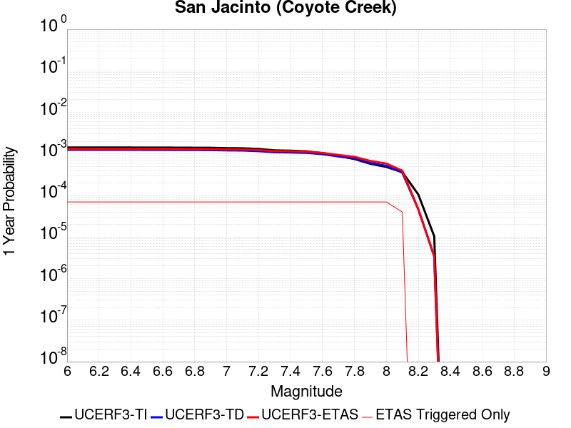 |  |

| Magnitude | 1 wk TI Prob | 1 wk TD Prob | 1 wk ETAS Prob | 1 wk ETAS/TD Gain | 1 wk ETAS Triggered Only | 1 mo TI Prob | 1 mo TD Prob | 1 mo ETAS Prob | 1 mo ETAS/TD Gain | 1 mo ETAS Triggered Only | 1 yr TI Prob | 1 yr TD Prob | 1 yr ETAS Prob | 1 yr ETAS/TD Gain | 1 yr ETAS Triggered Only | 10 yr TI Prob | 10 yr TD Prob | 10 yr ETAS Prob | 10 yr ETAS/TD Gain | 10 yr ETAS Triggered Only |
|-----|-----|-----|-----|-----|-----|-----|-----|-----|-----|-----|-----|-----|-----|-----|-----|-----|-----|-----|-----|-----|
| 6.0 | 2.7374346E-5 | 2.4145214E-5 | 6.0740185E-5 | 2.51562 | 3.6595855E-5 | 1.1731335E-4 | 1.034754E-4 | 1.583635E-4 | 1.5304459 | 5.489378E-5 | 0.0014273542 | 0.0012590875 | 0.0013139121 | 1.0435432 | 5.489378E-5 | 0.01418221 | 0.012928318 | 0.013036686 | 1.0083822 | 1.0978756E-4 |
| 6.1 | 2.7374346E-5 | 2.4145214E-5 | 6.0740185E-5 | 2.51562 | 3.6595855E-5 | 1.1731335E-4 | 1.034754E-4 | 1.583635E-4 | 1.5304459 | 5.489378E-5 | 0.0014273542 | 0.0012590875 | 0.0013139121 | 1.0435432 | 5.489378E-5 | 0.01418221 | 0.012928318 | 0.013036686 | 1.0083822 | 1.0978756E-4 |
| 6.2 | 2.7374346E-5 | 2.4145214E-5 | 6.0740185E-5 | 2.51562 | 3.6595855E-5 | 1.1731335E-4 | 1.034754E-4 | 1.583635E-4 | 1.5304459 | 5.489378E-5 | 0.0014273542 | 0.0012590875 | 0.0013139121 | 1.0435432 | 5.489378E-5 | 0.01418221 | 0.012928318 | 0.013036686 | 1.0083822 | 1.0978756E-4 |
| 6.3 | 2.7374346E-5 | 2.4145214E-5 | 6.0740185E-5 | 2.51562 | 3.6595855E-5 | 1.1731335E-4 | 1.034754E-4 | 1.583635E-4 | 1.5304459 | 5.489378E-5 | 0.0014273542 | 0.0012590875 | 0.0013139121 | 1.0435432 | 5.489378E-5 | 0.01418221 | 0.012928318 | 0.013036686 | 1.0083822 | 1.0978756E-4 |
| 6.4 | 2.7374346E-5 | 2.4145214E-5 | 6.0740185E-5 | 2.51562 | 3.6595855E-5 | 1.1731335E-4 | 1.034754E-4 | 1.583635E-4 | 1.5304459 | 5.489378E-5 | 0.0014273542 | 0.0012590875 | 0.0013139121 | 1.0435432 | 5.489378E-5 | 0.01418221 | 0.012928318 | 0.013036686 | 1.0083822 | 1.0978756E-4 |
| 6.5 | 2.7282445E-5 | 2.4031293E-5 | 6.0626266E-5 | 2.5228052 | 3.6595855E-5 | 1.16919524E-4 | 1.029872E-4 | 1.5787533E-4 | 1.5329607 | 5.489378E-5 | 0.0014225657 | 0.0012531505 | 0.0013079755 | 1.0437497 | 5.489378E-5 | 0.014134934 | 0.012869646 | 0.01297802 | 1.008421 | 1.0978756E-4 |
| 6.6 | 2.7282445E-5 | 2.4031293E-5 | 6.0626266E-5 | 2.5228052 | 3.6595855E-5 | 1.16919524E-4 | 1.029872E-4 | 1.5787533E-4 | 1.5329607 | 5.489378E-5 | 0.0014225657 | 0.0012531505 | 0.0013079755 | 1.0437497 | 5.489378E-5 | 0.014134934 | 0.012869646 | 0.01297802 | 1.008421 | 1.0978756E-4 |
| 6.7 | 2.7216198E-5 | 2.3956412E-5 | 6.055139E-5 | 2.527565 | 3.6595855E-5 | 1.1663563E-4 | 1.02666316E-4 | 1.5755446E-4 | 1.5346266 | 5.489378E-5 | 0.0014191137 | 0.0012492483 | 0.0013040735 | 1.0438865 | 5.489378E-5 | 0.014100855 | 0.0128310565 | 0.012939435 | 1.0084466 | 1.0978756E-4 |
| 6.8 | 2.7078617E-5 | 2.387363E-5 | 6.046861E-5 | 2.532862 | 3.6595855E-5 | 1.1604605E-4 | 1.0231156E-4 | 1.5719973E-4 | 1.5364805 | 5.489378E-5 | 0.001411945 | 0.0012449342 | 0.0012997596 | 1.0440388 | 5.489378E-5 | 0.014030075 | 0.012788199 | 0.0128965825 | 1.0084753 | 1.0978756E-4 |
| 6.9 | 2.6982952E-5 | 2.3793142E-5 | 6.0388124E-5 | 2.5380476 | 3.6595855E-5 | 1.15636096E-4 | 1.0196664E-4 | 1.5685482E-4 | 1.5382955 | 5.489378E-5 | 0.0014069602 | 0.0012407395 | 0.0012955652 | 1.0441879 | 5.489378E-5 | 0.013980856 | 0.012746515 | 0.012854903 | 1.0085033 | 1.0978756E-4 |
| 7.0 | 2.6449972E-5 | 2.3370165E-5 | 5.996516E-5 | 2.5658853 | 3.6595855E-5 | 1.1335209E-4 | 1.00154015E-4 | 1.550423E-4 | 1.5480387 | 5.489378E-5 | 0.001379188 | 0.0012186957 | 0.0012735225 | 1.0449882 | 5.489378E-5 | 0.0137065975 | 0.0125278765 | 0.012636289 | 1.0086536 | 1.0978756E-4 |
| 7.1 | 2.6257849E-5 | 2.3196202E-5 | 5.9791208E-5 | 2.577629 | 3.6595855E-5 | 1.1252879E-4 | 9.940852E-5 | 1.5429684E-4 | 1.552149 | 5.489378E-5 | 0.0013691769 | 0.0012096294 | 0.0012644567 | 1.0453258 | 5.489378E-5 | 0.013607717 | 0.012437741 | 0.012546163 | 1.0087172 | 1.0978756E-4 |
| 7.2 | 2.5270041E-5 | 2.2390966E-5 | 5.8986E-5 | 2.634366 | 3.6595855E-5 | 1.0829568E-4 | 9.595777E-5 | 1.5084627E-4 | 1.572007 | 5.489378E-5 | 0.0013177024 | 0.0011676621 | 0.0012224917 | 1.0469568 | 5.489378E-5 | 0.013099162 | 0.012018777 | 0.012109168 | 1.0075207 | 9.148964E-5 |
| 7.3 | 2.339701E-5 | 2.1122814E-5 | 5.7717894E-5 | 2.7324908 | 3.6595855E-5 | 1.0026905E-4 | 9.0523215E-5 | 1.4541204E-4 | 1.6063507 | 5.489378E-5 | 0.001220092 | 0.0011015651 | 0.0011563983 | 1.0497776 | 5.489378E-5 | 0.012134149 | 0.011357696 | 0.011448147 | 1.0079638 | 9.148964E-5 |
| 7.4 | 2.296333E-5 | 2.0853171E-5 | 5.7448262E-5 | 2.7548933 | 3.6595855E-5 | 9.841056E-5 | 8.936768E-5 | 1.4425656E-4 | 1.6141915 | 5.489378E-5 | 0.0011974899 | 0.0010875105 | 0.0011423446 | 1.0504217 | 5.489378E-5 | 0.011910575 | 0.01121681 | 0.011307273 | 1.008065 | 9.148964E-5 |
| 7.5 | 2.2188895E-5 | 2.0376096E-5 | 5.6971203E-5 | 2.7959824 | 3.6595855E-5 | 9.50918E-5 | 8.732321E-5 | 1.422122E-4 | 1.6285727 | 5.489378E-5 | 0.0011571277 | 0.0010626436 | 0.001117479 | 1.0516028 | 5.489378E-5 | 0.011511209 | 0.010966429 | 0.011056915 | 1.0082512 | 9.148964E-5 |
| 7.6 | 2.0013189E-5 | 1.8962366E-5 | 5.5557524E-5 | 2.9298837 | 3.6595855E-5 | 8.5767984E-5 | 8.1264756E-5 | 1.3615408E-4 | 1.6754382 | 5.489378E-5 | 0.001043725 | 9.889511E-4 | 0.0010437906 | 1.0554522 | 5.489378E-5 | 0.010388365 | 0.010224434 | 0.010314988 | 1.0088567 | 9.148964E-5 |
| 7.7 | 1.7230794E-5 | 1.674371E-5 | 5.333895E-5 | 3.1856112 | 3.6595855E-5 | 7.384417E-5 | 7.175679E-5 | 1.2664663E-4 | 1.7649429 | 5.489378E-5 | 8.986819E-4 | 8.7328954E-4 | 9.2813536E-4 | 1.0628037 | 5.489378E-5 | 0.008950562 | 0.009062956 | 0.009153617 | 1.0100034 | 9.148964E-5 |
| 7.8 | 1.4478809E-5 | 1.4990978E-5 | 5.1586285E-5 | 3.4411552 | 3.6595855E-5 | 6.205057E-5 | 6.424547E-5 | 1.1913572E-4 | 1.8543832 | 5.489378E-5 | 7.552038E-4 | 7.819085E-4 | 8.367594E-4 | 1.07015 | 5.489378E-5 | 0.0075264242 | 0.008141387 | 0.008232132 | 1.0111461 | 9.148964E-5 |
| 7.9 | 1.1114467E-5 | 1.1645102E-5 | 4.824053E-5 | 4.1425595 | 3.6595855E-5 | 4.7632562E-5 | 4.990663E-5 | 1.0479767E-4 | 2.0998747 | 5.489378E-5 | 5.797721E-4 | 6.074444E-4 | 6.623048E-4 | 1.0903136 | 5.489378E-5 | 0.0057826187 | 0.0063803247 | 0.0064712306 | 1.0142479 | 9.148964E-5 |
| 8.0 | 9.327402E-6 | 9.899186E-6 | 4.649468E-5 | 4.6968184 | 3.6595855E-5 | 3.9973966E-5 | 4.2424395E-5 | 9.7315846E-5 | 2.2938652 | 5.489378E-5 | 4.8657437E-4 | 5.1639514E-4 | 5.712606E-4 | 1.106247 | 5.489378E-5 | 0.0048551033 | 0.0054499684 | 0.0055409595 | 1.0166957 | 9.148964E-5 |
| 8.1 | 7.0235833E-6 | 6.827495E-6 | 2.5125297E-5 | 3.680017 | 1.8297927E-5 | 3.0100724E-5 | 2.9260367E-5 | 6.585515E-5 | 2.2506604 | 3.6595855E-5 | 3.664147E-4 | 3.5618723E-4 | 3.9277007E-4 | 1.1027067 | 3.6595855E-5 | 0.003658111 | 0.0037876023 | 0.0038422882 | 1.0144382 | 5.489378E-5 |
| 8.2 | 2.0358202E-6 | 8.994527E-7 | 8.994527E-7 | 1.0 | 0.0 | 8.724915E-6 | 3.854792E-6 | 3.854792E-6 | 1.0 | 0.0 | 1.06220665E-4 | 4.69311E-5 | 4.69311E-5 | 1.0 | 0.0 | 0.001061699 | 5.3254166E-4 | 5.3254166E-4 | 1.0 | 0.0 |
| 8.3 | 2.0051264E-7 | 6.617272E-8 | 6.617272E-8 | 1.0 | 0.0 | 8.5933965E-7 | 2.8359733E-7 | 2.8359733E-7 | 1.0 | 0.0 | 1.046241E-5 | 3.4527925E-6 | 3.4527925E-6 | 1.0 | 0.0 | 1.0461917E-4 | 4.01389E-5 | 4.01389E-5 | 1.0 | 0.0 |

## San Jacinto (Lytle Creek connector)
*[(top)](#table-of-contents)*

| 1 Week | 1 Month | 1 Year | 10 Year |
|-----|-----|-----|-----|
|  |  | 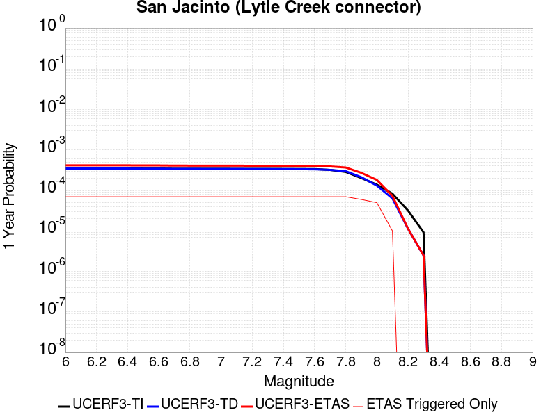 |  |

| Magnitude | 1 wk TI Prob | 1 wk TD Prob | 1 wk ETAS Prob | 1 wk ETAS/TD Gain | 1 wk ETAS Triggered Only | 1 mo TI Prob | 1 mo TD Prob | 1 mo ETAS Prob | 1 mo ETAS/TD Gain | 1 mo ETAS Triggered Only | 1 yr TI Prob | 1 yr TD Prob | 1 yr ETAS Prob | 1 yr ETAS/TD Gain | 1 yr ETAS Triggered Only | 10 yr TI Prob | 10 yr TD Prob | 10 yr ETAS Prob | 10 yr ETAS/TD Gain | 10 yr ETAS Triggered Only |
|-----|-----|-----|-----|-----|-----|-----|-----|-----|-----|-----|-----|-----|-----|-----|-----|-----|-----|-----|-----|-----|
| 6.0 | 6.693995E-6 | 6.660216E-6 | 7.985144E-5 | 11.989316 | 7.319171E-5 | 2.8688235E-5 | 2.854347E-5 | 1.0173309E-4 | 3.5641456 | 7.319171E-5 | 3.492233E-4 | 3.4746144E-4 | 4.206277E-4 | 1.2105738 | 7.319171E-5 | 0.00348675 | 0.0035493854 | 0.0036405502 | 1.0256847 | 9.148964E-5 |
| 6.1 | 6.693995E-6 | 6.660216E-6 | 7.985144E-5 | 11.989316 | 7.319171E-5 | 2.8688235E-5 | 2.854347E-5 | 1.0173309E-4 | 3.5641456 | 7.319171E-5 | 3.492233E-4 | 3.4746144E-4 | 4.206277E-4 | 1.2105738 | 7.319171E-5 | 0.00348675 | 0.0035493854 | 0.0036405502 | 1.0256847 | 9.148964E-5 |
| 6.2 | 6.693995E-6 | 6.660216E-6 | 7.985144E-5 | 11.989316 | 7.319171E-5 | 2.8688235E-5 | 2.854347E-5 | 1.0173309E-4 | 3.5641456 | 7.319171E-5 | 3.492233E-4 | 3.4746144E-4 | 4.206277E-4 | 1.2105738 | 7.319171E-5 | 0.00348675 | 0.0035493854 | 0.0036405502 | 1.0256847 | 9.148964E-5 |
| 6.3 | 6.693995E-6 | 6.660216E-6 | 7.985144E-5 | 11.989316 | 7.319171E-5 | 2.8688235E-5 | 2.854347E-5 | 1.0173309E-4 | 3.5641456 | 7.319171E-5 | 3.492233E-4 | 3.4746144E-4 | 4.206277E-4 | 1.2105738 | 7.319171E-5 | 0.00348675 | 0.0035493854 | 0.0036405502 | 1.0256847 | 9.148964E-5 |
| 6.4 | 6.693995E-6 | 6.660216E-6 | 7.985144E-5 | 11.989316 | 7.319171E-5 | 2.8688235E-5 | 2.854347E-5 | 1.0173309E-4 | 3.5641456 | 7.319171E-5 | 3.492233E-4 | 3.4746144E-4 | 4.206277E-4 | 1.2105738 | 7.319171E-5 | 0.00348675 | 0.0035493854 | 0.0036405502 | 1.0256847 | 9.148964E-5 |
| 6.5 | 6.6561875E-6 | 6.6204343E-6 | 7.981166E-5 | 12.055351 | 7.319171E-5 | 2.8526205E-5 | 2.837298E-5 | 1.0156261E-4 | 3.5795538 | 7.319171E-5 | 3.472512E-4 | 3.4538636E-4 | 4.185528E-4 | 1.2118393 | 7.319171E-5 | 0.0034670907 | 0.003528701 | 0.0036198676 | 1.0258358 | 9.148964E-5 |
| 6.6 | 6.6561875E-6 | 6.6204343E-6 | 7.981166E-5 | 12.055351 | 7.319171E-5 | 2.8526205E-5 | 2.837298E-5 | 1.0156261E-4 | 3.5795538 | 7.319171E-5 | 3.472512E-4 | 3.4538636E-4 | 4.185528E-4 | 1.2118393 | 7.319171E-5 | 0.0034670907 | 0.003528701 | 0.0036198676 | 1.0258358 | 9.148964E-5 |
| 6.7 | 6.5802237E-6 | 6.539611E-6 | 7.973084E-5 | 12.191985 | 7.319171E-5 | 2.8200653E-5 | 2.8026603E-5 | 1.0121626E-4 | 3.6114352 | 7.319171E-5 | 3.4328885E-4 | 3.4117055E-4 | 4.143373E-4 | 1.214458 | 7.319171E-5 | 0.0034275902 | 0.0034866752 | 0.0035778459 | 1.0261483 | 9.148964E-5 |
| 6.8 | 6.575632E-6 | 6.5341005E-6 | 7.972533E-5 | 12.201424 | 7.319171E-5 | 2.8180975E-5 | 2.8002989E-5 | 1.0119264E-4 | 3.6136374 | 7.319171E-5 | 3.4304935E-4 | 3.4088313E-4 | 4.1404986E-4 | 1.2146388 | 7.319171E-5 | 0.0034252026 | 0.00348381 | 0.003574981 | 1.0261699 | 9.148964E-5 |
| 6.9 | 6.570433E-6 | 6.525495E-6 | 7.971672E-5 | 12.216196 | 7.319171E-5 | 2.8158694E-5 | 2.7966107E-5 | 1.0115577E-4 | 3.6170843 | 7.319171E-5 | 3.4277816E-4 | 3.4043423E-4 | 4.1360102E-4 | 1.214922 | 7.319171E-5 | 0.0034224992 | 0.0034793352 | 0.0035705066 | 1.0262036 | 9.148964E-5 |
| 7.0 | 6.5643826E-6 | 6.515616E-6 | 7.970685E-5 | 12.233202 | 7.319171E-5 | 2.8132765E-5 | 2.792377E-5 | 1.0111343E-4 | 3.6210525 | 7.319171E-5 | 3.424626E-4 | 3.3991894E-4 | 4.1308577E-4 | 1.2152479 | 7.319171E-5 | 0.0034193532 | 0.0034741985 | 0.00356537 | 1.0262425 | 9.148964E-5 |
| 7.1 | 6.557402E-6 | 6.5043278E-6 | 7.969556E-5 | 12.252697 | 7.319171E-5 | 2.8102848E-5 | 2.7875392E-5 | 1.0106506E-4 | 3.6256013 | 7.319171E-5 | 3.4209844E-4 | 3.3933012E-4 | 4.12497E-4 | 1.2156215 | 7.319171E-5 | 0.0034157229 | 0.0034683298 | 0.003559502 | 1.0262871 | 9.148964E-5 |
| 7.2 | 6.546394E-6 | 6.4862943E-6 | 7.967753E-5 | 12.283982 | 7.319171E-5 | 2.8055672E-5 | 2.7798109E-5 | 1.0098778E-4 | 3.6329012 | 7.319171E-5 | 3.4152428E-4 | 3.3838948E-4 | 4.1155642E-4 | 1.2162211 | 7.319171E-5 | 0.0034099987 | 0.0034589572 | 0.0035501302 | 1.0263586 | 9.148964E-5 |
| 7.3 | 6.5364216E-6 | 6.4670803E-6 | 7.965831E-5 | 12.317508 | 7.319171E-5 | 2.8012933E-5 | 2.7715765E-5 | 1.0090545E-4 | 3.6407237 | 7.319171E-5 | 3.4100408E-4 | 3.3738726E-4 | 4.1055426E-4 | 1.2168636 | 7.319171E-5 | 0.003404813 | 0.0034489788 | 0.003540153 | 1.0264351 | 9.148964E-5 |
| 7.4 | 6.5269523E-6 | 6.4481674E-6 | 7.96394E-5 | 12.350703 | 7.319171E-5 | 2.7972354E-5 | 2.7634711E-5 | 1.0082439E-4 | 3.6484692 | 7.319171E-5 | 3.4051016E-4 | 3.3640073E-4 | 4.0956782E-4 | 1.2174997 | 7.319171E-5 | 0.0033998888 | 0.003439161 | 0.0035303358 | 1.0265108 | 9.148964E-5 |
| 7.5 | 6.5111835E-6 | 6.424442E-6 | 7.961568E-5 | 12.392622 | 7.319171E-5 | 2.7904773E-5 | 2.7533031E-5 | 1.00722726E-4 | 3.6582503 | 7.319171E-5 | 3.3968766E-4 | 3.3516317E-4 | 4.0833035E-4 | 1.2183032 | 7.319171E-5 | 0.0033916887 | 0.003426834 | 0.0035180103 | 1.0266066 | 9.148964E-5 |
| 7.6 | 6.4768806E-6 | 6.383551E-6 | 7.957479E-5 | 12.465599 | 7.319171E-5 | 2.7757764E-5 | 2.735779E-5 | 1.0054749E-4 | 3.6752784 | 7.319171E-5 | 3.3789838E-4 | 3.3303024E-4 | 4.061976E-4 | 1.2197018 | 7.319171E-5 | 0.0033738504 | 0.0034055663 | 0.0034967442 | 1.0267732 | 9.148964E-5 |
| 7.7 | 6.1655364E-6 | 6.1760365E-6 | 7.9367295E-5 | 12.850845 | 7.319171E-5 | 2.642346E-5 | 2.646846E-5 | 9.965823E-5 | 3.7651691 | 7.319171E-5 | 3.2165812E-4 | 3.2220592E-4 | 3.9537402E-4 | 1.227085 | 7.319171E-5 | 0.0032119295 | 0.0032971818 | 0.0033883697 | 1.0276563 | 9.148964E-5 |
| 7.8 | 5.5043524E-6 | 5.737097E-6 | 7.892839E-5 | 13.757547 | 7.319171E-5 | 2.3589868E-5 | 2.4587327E-5 | 9.7777236E-5 | 3.976733 | 7.319171E-5 | 2.871688E-4 | 2.9930964E-4 | 3.7247944E-4 | 1.2444619 | 7.319171E-5 | 0.0028679797 | 0.0030672832 | 0.0031584923 | 1.029736 | 9.148964E-5 |
| 7.9 | 3.889249E-6 | 4.076761E-6 | 5.897032E-5 | 14.464993 | 5.489378E-5 | 1.6668104E-5 | 1.7471715E-5 | 7.2364535E-5 | 4.1418104 | 5.489378E-5 | 2.0291525E-4 | 2.1269741E-4 | 2.675795E-4 | 1.258029 | 5.489378E-5 | 0.0020273007 | 0.0021943315 | 0.0022673625 | 1.0332817 | 7.319171E-5 |
| 8.0 | 2.668535E-6 | 2.5315155E-6 | 3.9127277E-5 | 15.456069 | 3.6595855E-5 | 1.1436528E-5 | 1.0849307E-5 | 4.7444762E-5 | 4.373069 | 3.6595855E-5 | 1.3923083E-4 | 1.3208234E-4 | 1.6867334E-4 | 1.2770319 | 3.6595855E-5 | 0.0013914363 | 0.0013757964 | 0.0014306146 | 1.0398448 | 5.489378E-5 |
| 8.1 | 1.5911459E-6 | 1.218661E-6 | 1.218661E-6 | 1.0 | 0.0 | 6.8191785E-6 | 5.2228224E-6 | 5.2228224E-6 | 1.0 | 0.0 | 8.3020335E-5 | 6.3586034E-5 | 6.3586034E-5 | 1.0 | 0.0 | 8.298933E-4 | 6.6932244E-4 | 6.8760815E-4 | 1.0273197 | 1.8297927E-5 |
| 8.2 | 6.1294963E-7 | 2.1812275E-7 | 2.1812275E-7 | 1.0 | 0.0 | 2.6269242E-6 | 9.3481145E-7 | 9.3481145E-7 | 1.0 | 0.0 | 3.1982334E-5 | 1.138127E-5 | 1.138127E-5 | 1.0 | 0.0 | 3.1977732E-4 | 1.2784546E-4 | 1.2784546E-4 | 1.0 | 0.0 |
| 8.3 | 1.762871E-7 | 4.7546838E-8 | 4.7546838E-8 | 1.0 | 0.0 | 7.5551594E-7 | 2.0377215E-7 | 2.0377215E-7 | 1.0 | 0.0 | 9.1983675E-6 | 2.480923E-6 | 2.480923E-6 | 1.0 | 0.0 | 9.197987E-5 | 2.868753E-5 | 2.868753E-5 | 1.0 | 0.0 |

## San Jacinto (Borrego)
*[(top)](#table-of-contents)*

| 1 Week | 1 Month | 1 Year | 10 Year |
|-----|-----|-----|-----|
| 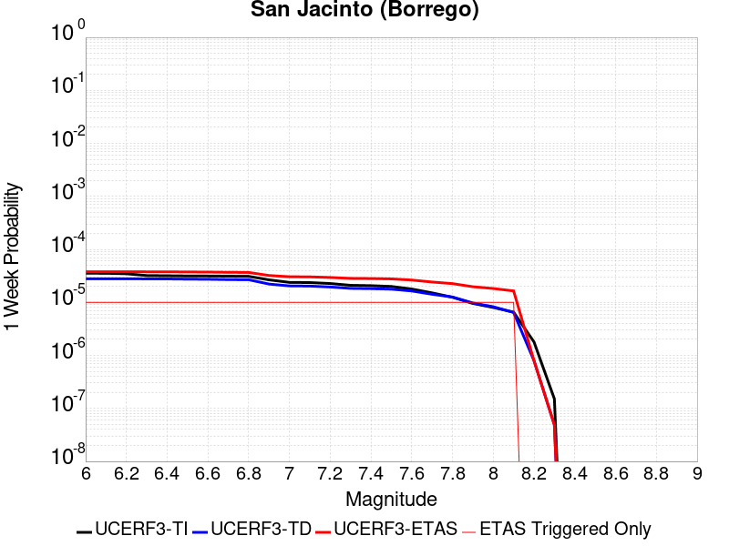 |  |  |  |

| Magnitude | 1 wk TI Prob | 1 wk TD Prob | 1 wk ETAS Prob | 1 wk ETAS/TD Gain | 1 wk ETAS Triggered Only | 1 mo TI Prob | 1 mo TD Prob | 1 mo ETAS Prob | 1 mo ETAS/TD Gain | 1 mo ETAS Triggered Only | 1 yr TI Prob | 1 yr TD Prob | 1 yr ETAS Prob | 1 yr ETAS/TD Gain | 1 yr ETAS Triggered Only | 10 yr TI Prob | 10 yr TD Prob | 10 yr ETAS Prob | 10 yr ETAS/TD Gain | 10 yr ETAS Triggered Only |
|-----|-----|-----|-----|-----|-----|-----|-----|-----|-----|-----|-----|-----|-----|-----|-----|-----|-----|-----|-----|-----|
| 6.0 | 3.543992E-5 | 2.7926513E-5 | 4.622393E-5 | 1.6551987 | 1.8297927E-5 | 1.5187653E-4 | 1.1967963E-4 | 1.5627111E-4 | 1.3057452 | 3.6595855E-5 | 0.0018475284 | 0.0014561379 | 0.0014926804 | 1.0250956 | 3.6595855E-5 | 0.018322436 | 0.014869647 | 0.014959777 | 1.0060613 | 9.148964E-5 |
| 6.1 | 3.542281E-5 | 2.7926513E-5 | 4.622393E-5 | 1.6551987 | 1.8297927E-5 | 1.5180321E-4 | 1.1967963E-4 | 1.5627111E-4 | 1.3057452 | 3.6595855E-5 | 0.0018466372 | 0.0014561379 | 0.0014926804 | 1.0250956 | 3.6595855E-5 | 0.018313672 | 0.014869647 | 0.014959777 | 1.0060613 | 9.148964E-5 |
| 6.2 | 3.4688688E-5 | 2.7926511E-5 | 4.622393E-5 | 1.6551988 | 1.8297927E-5 | 1.4865733E-4 | 1.1967963E-4 | 1.562711E-4 | 1.3057452 | 3.6595855E-5 | 0.0018084005 | 0.0014561379 | 0.0014926804 | 1.0250956 | 3.6595855E-5 | 0.017937548 | 0.014869647 | 0.014959776 | 1.0060613 | 9.148964E-5 |
| 6.3 | 3.2087122E-5 | 2.7771865E-5 | 4.6069283E-5 | 1.6588473 | 1.8297927E-5 | 1.3750899E-4 | 1.1901691E-4 | 1.5560842E-4 | 1.3074479 | 3.6595855E-5 | 0.0016728862 | 0.00144808 | 0.0014846228 | 1.0252354 | 3.6595855E-5 | 0.016603488 | 0.014790683 | 0.014880819 | 1.0060941 | 9.148964E-5 |
| 6.4 | 3.1828724E-5 | 2.7738852E-5 | 4.603627E-5 | 1.6596315 | 1.8297927E-5 | 1.364017E-4 | 1.1887544E-4 | 1.5546694E-4 | 1.3078138 | 3.6595855E-5 | 0.0016594254 | 0.0014463598 | 0.0014829028 | 1.0252655 | 3.6595855E-5 | 0.016470885 | 0.014773762 | 0.0148639 | 1.0061013 | 9.148964E-5 |
| 6.5 | 3.1563577E-5 | 2.747857E-5 | 4.5775996E-5 | 1.6658797 | 1.8297927E-5 | 1.3526545E-4 | 1.1776006E-4 | 1.543516E-4 | 1.3107296 | 3.6595855E-5 | 0.0016456128 | 0.0014327979 | 0.0014693413 | 1.025505 | 3.6595855E-5 | 0.0163348 | 0.014640348 | 0.014730498 | 1.0061576 | 9.148964E-5 |
| 6.6 | 3.1467625E-5 | 2.7322796E-5 | 4.562022E-5 | 1.6696762 | 1.8297927E-5 | 1.3485427E-4 | 1.1709251E-4 | 1.5368407E-4 | 1.3125013 | 3.6595855E-5 | 0.0016406142 | 0.0014246812 | 0.0014612249 | 1.0256505 | 3.6595855E-5 | 0.016285548 | 0.014560594 | 0.014650752 | 1.0061918 | 9.148964E-5 |
| 6.7 | 3.1223695E-5 | 2.6940816E-5 | 4.523825E-5 | 1.6791716 | 1.8297927E-5 | 1.3380898E-4 | 1.15455594E-4 | 1.5204723E-4 | 1.3169324 | 3.6595855E-5 | 0.0016279068 | 0.0014047775 | 0.001441322 | 1.0260144 | 3.6595855E-5 | 0.01616033 | 0.014364966 | 0.0144551415 | 1.0062774 | 9.148964E-5 |
| 6.8 | 3.1015585E-5 | 2.6761822E-5 | 4.505926E-5 | 1.6837142 | 1.8297927E-5 | 1.3291716E-4 | 1.1468855E-4 | 1.5128021E-4 | 1.3190523 | 3.6595855E-5 | 0.001617065 | 0.0013954508 | 0.0014319955 | 1.0261885 | 3.6595855E-5 | 0.016053487 | 0.014272246 | 0.01436243 | 1.0063188 | 9.148964E-5 |
| 6.9 | 2.6641965E-5 | 2.2184247E-5 | 4.048177E-5 | 1.824798 | 1.8297927E-5 | 1.1417485E-4 | 9.50719E-5 | 1.3166427E-4 | 1.3848916 | 3.6595855E-5 | 0.0013891924 | 0.0011568897 | 0.0011934432 | 1.0315964 | 3.6595855E-5 | 0.0138054015 | 0.011882438 | 0.011972841 | 1.007608 | 9.148964E-5 |
| 7.0 | 2.3854353E-5 | 2.0479023E-5 | 3.8776576E-5 | 1.8934778 | 1.8297927E-5 | 1.02228936E-4 | 8.77643E-5 | 1.2435694E-4 | 1.4169422 | 3.6595855E-5 | 0.0012439266 | 0.0010680092 | 0.0011045659 | 1.0342289 | 3.6595855E-5 | 0.012369866 | 0.0109828 | 0.011073286 | 1.0082388 | 9.148964E-5 |
| 7.1 | 2.3672901E-5 | 2.031551E-5 | 3.8613067E-5 | 1.9006692 | 1.8297927E-5 | 1.0145135E-4 | 8.7063585E-5 | 1.2365625E-4 | 1.4202982 | 3.6595855E-5 | 0.0012344702 | 0.0010594862 | 0.0010960433 | 1.0345045 | 3.6595855E-5 | 0.0122763505 | 0.010897976 | 0.010988468 | 1.0083036 | 9.148964E-5 |
| 7.2 | 2.2717244E-5 | 1.9542893E-5 | 3.7840462E-5 | 1.9362774 | 1.8297927E-5 | 9.735599E-5 | 8.375258E-5 | 1.20345365E-4 | 1.4369154 | 3.6595855E-5 | 0.0011846646 | 0.001019213 | 0.0010557715 | 1.0358694 | 3.6595855E-5 | 0.01178369 | 0.010495341 | 0.010567765 | 1.0069005 | 7.319171E-5 |
| 7.3 | 2.1016205E-5 | 1.8384526E-5 | 3.6682115E-5 | 1.9952713 | 1.8297927E-5 | 9.006634E-5 | 7.878846E-5 | 1.1538142E-4 | 1.4644458 | 3.6595855E-5 | 0.001096006 | 9.5882936E-4 | 9.953901E-4 | 1.0381306 | 3.6595855E-5 | 0.010906163 | 0.009890967 | 0.009963434 | 1.0073266 | 7.319171E-5 |
| 7.4 | 2.0683625E-5 | 1.8187047E-5 | 3.6484642E-5 | 2.0060782 | 1.8297927E-5 | 8.86411E-5 | 7.794217E-5 | 1.1453517E-4 | 1.4694891 | 3.6595855E-5 | 0.001078671 | 9.485349E-4 | 9.85096E-4 | 1.0385449 | 3.6595855E-5 | 0.010734501 | 0.009787692 | 0.009860167 | 1.0074047 | 7.319171E-5 |
| 7.5 | 1.9993966E-5 | 1.7782075E-5 | 3.6079677E-5 | 2.0289915 | 1.8297927E-5 | 8.568561E-5 | 7.620667E-5 | 1.1279974E-4 | 1.4801819 | 3.6595855E-5 | 0.001042723 | 9.2742336E-4 | 9.639852E-4 | 1.0394231 | 3.6595855E-5 | 0.010378438 | 0.009574614 | 0.009647106 | 1.0075711 | 7.319171E-5 |
| 7.6 | 1.788966E-5 | 1.6435291E-5 | 3.4732915E-5 | 2.1133132 | 1.8297927E-5 | 7.666772E-5 | 7.043507E-5 | 1.0702835E-4 | 1.5195321 | 3.6595855E-5 | 9.3302975E-4 | 8.572113E-4 | 8.937758E-4 | 1.0426551 | 3.6595855E-5 | 0.00929122 | 0.008866487 | 0.00893903 | 1.0081817 | 7.319171E-5 |
| 7.7 | 1.5125781E-5 | 1.4237377E-5 | 3.2535045E-5 | 2.285185 | 1.8297927E-5 | 6.4823165E-5 | 6.1015908E-5 | 9.760953E-5 | 1.599739 | 3.6595855E-5 | 7.889362E-4 | 7.426163E-4 | 7.79185E-4 | 1.049243 | 3.6595855E-5 | 0.007861412 | 0.0077142045 | 0.0077868314 | 1.0094147 | 7.319171E-5 |
| 7.8 | 1.250089E-5 | 1.26304985E-5 | 3.0928193E-5 | 2.4486916 | 1.8297927E-5 | 5.3574146E-5 | 5.412959E-5 | 9.072346E-5 | 1.676042 | 3.6595855E-5 | 6.5207E-4 | 6.588291E-4 | 6.954008E-4 | 1.0555102 | 3.6595855E-5 | 0.006501599 | 0.0068677636 | 0.006940453 | 1.0105841 | 7.319171E-5 |
| 7.9 | 9.561E-6 | 9.754616E-6 | 2.8052365E-5 | 2.875804 | 1.8297927E-5 | 4.0975072E-5 | 4.1804833E-5 | 7.8399156E-5 | 1.8753611 | 3.6595855E-5 | 4.987573E-4 | 5.088555E-4 | 5.454328E-4 | 1.0718814 | 3.6595855E-5 | 0.0049763937 | 0.0053523467 | 0.0054251463 | 1.0136015 | 7.319171E-5 |
| 8.0 | 8.01699E-6 | 8.293488E-6 | 2.6591262E-5 | 3.2062824 | 1.8297927E-5 | 3.4358076E-5 | 3.554304E-5 | 7.213759E-5 | 2.0295844 | 3.6595855E-5 | 4.1822926E-4 | 4.3265108E-4 | 4.692311E-4 | 1.0845486 | 3.6595855E-5 | 0.0041744304 | 0.004573375 | 0.004646232 | 1.0159307 | 7.319171E-5 |
| 8.1 | 6.541947E-6 | 6.4622354E-6 | 2.4760044E-5 | 3.8314984 | 1.8297927E-5 | 2.8036617E-5 | 2.7695003E-5 | 6.4289845E-5 | 2.3213518 | 3.6595855E-5 | 3.4129233E-4 | 3.37135E-4 | 3.737185E-4 | 1.108513 | 3.6595855E-5 | 0.0034076865 | 0.0035806994 | 0.0036353967 | 1.0152756 | 5.489378E-5 |
| 8.2 | 1.7968189E-6 | 7.9713476E-7 | 7.9713476E-7 | 1.0 | 0.0 | 7.70063E-6 | 3.4162877E-6 | 3.4162877E-6 | 1.0 | 0.0 | 9.3751136E-5 | 4.159253E-5 | 4.159253E-5 | 1.0 | 0.0 | 9.371159E-4 | 4.712058E-4 | 4.712058E-4 | 1.0 | 0.0 |
| 8.3 | 1.5167889E-7 | 4.897714E-8 | 4.897714E-8 | 1.0 | 0.0 | 6.500522E-7 | 2.09902E-7 | 2.09902E-7 | 1.0 | 0.0 | 7.9143565E-6 | 2.5555544E-6 | 2.5555544E-6 | 1.0 | 0.0 | 7.914075E-5 | 2.969505E-5 | 2.969505E-5 | 1.0 | 0.0 |

## Imperial
*[(top)](#table-of-contents)*

| 1 Week | 1 Month | 1 Year | 10 Year |
|-----|-----|-----|-----|
|  |  |  |  |

| Magnitude | 1 wk TI Prob | 1 wk TD Prob | 1 wk ETAS Prob | 1 wk ETAS/TD Gain | 1 wk ETAS Triggered Only | 1 mo TI Prob | 1 mo TD Prob | 1 mo ETAS Prob | 1 mo ETAS/TD Gain | 1 mo ETAS Triggered Only | 1 yr TI Prob | 1 yr TD Prob | 1 yr ETAS Prob | 1 yr ETAS/TD Gain | 1 yr ETAS Triggered Only | 10 yr TI Prob | 10 yr TD Prob | 10 yr ETAS Prob | 10 yr ETAS/TD Gain | 10 yr ETAS Triggered Only |
|-----|-----|-----|-----|-----|-----|-----|-----|-----|-----|-----|-----|-----|-----|-----|-----|-----|-----|-----|-----|-----|
| 6.0 | 2.7496446E-4 | 5.0552754E-4 | 5.238162E-4 | 1.0361774 | 1.8297927E-5 | 0.0011778869 | 0.002164787 | 0.002219562 | 1.0253026 | 5.489378E-5 | 0.0142467655 | 0.026038699 | 0.026109984 | 1.0027376 | 7.319171E-5 | 0.13367249 | 0.2280438 | 0.22811441 | 1.0003097 | 9.148964E-5 |
| 6.1 | 2.5356023E-4 | 4.8656776E-4 | 5.048568E-4 | 1.0375879 | 1.8297927E-5 | 0.001086234 | 0.0020836622 | 0.0021384417 | 1.0262899 | 5.489378E-5 | 0.013144928 | 0.025071215 | 0.025142571 | 1.0028461 | 7.319171E-5 | 0.123940155 | 0.21947981 | 0.21955122 | 1.0003253 | 9.148964E-5 |
| 6.2 | 2.4820742E-4 | 4.7752203E-4 | 4.958112E-4 | 1.0383002 | 1.8297927E-5 | 0.0010633124 | 0.0020449557 | 0.0020997373 | 1.0267886 | 5.489378E-5 | 0.01286919 | 0.024611235 | 0.024682626 | 1.0029007 | 7.319171E-5 | 0.12148927 | 0.21598552 | 0.21605726 | 1.0003321 | 9.148964E-5 |
| 6.3 | 2.3205351E-4 | 4.5890483E-4 | 4.7719435E-4 | 1.0398548 | 1.8297927E-5 | 9.94136E-4 | 0.0019652895 | 0.0020200752 | 1.0278767 | 5.489378E-5 | 0.012036599 | 0.02366133 | 0.02373279 | 1.0030202 | 7.319171E-5 | 0.11405133 | 0.20793462 | 0.20800708 | 1.0003484 | 9.148964E-5 |
| 6.4 | 2.0304754E-4 | 3.987652E-4 | 4.1705582E-4 | 1.0458682 | 1.8297927E-5 | 8.6991355E-4 | 0.0017078889 | 0.001762689 | 1.0320864 | 5.489378E-5 | 0.010539869 | 0.020595672 | 0.020667356 | 1.0034806 | 7.319171E-5 | 0.100537635 | 0.1850669 | 0.18514146 | 1.0004029 | 9.148964E-5 |
| 6.5 | 1.854992E-4 | 3.6988858E-4 | 3.8817976E-4 | 1.0494504 | 1.8297927E-5 | 7.9475436E-4 | 0.0015842861 | 0.0016390929 | 1.034594 | 5.489378E-5 | 0.009633281 | 0.01911948 | 0.019191274 | 1.003755 | 7.319171E-5 | 0.0922623 | 0.173298 | 0.17337364 | 1.0004364 | 9.148964E-5 |
| 6.6 | 1.6586106E-4 | 3.403506E-4 | 3.586423E-4 | 1.0537437 | 1.8297927E-5 | 7.106394E-4 | 0.0014578402 | 0.001512654 | 1.0375993 | 5.489378E-5 | 0.008617763 | 0.01760642 | 0.017678322 | 1.0040839 | 7.319171E-5 | 0.08291132 | 0.16077545 | 0.16085222 | 1.0004776 | 9.148964E-5 |
| 6.7 | 1.4224656E-4 | 3.076692E-4 | 3.2596148E-4 | 1.0594544 | 1.8297927E-5 | 6.094856E-4 | 0.001317924 | 0.0013727455 | 1.0415968 | 5.489378E-5 | 0.0073952693 | 0.015929576 | 0.016001603 | 1.0045215 | 7.319171E-5 | 0.07153955 | 0.14648417 | 0.14656225 | 1.0005331 | 9.148964E-5 |
| 6.8 | 1.2317259E-4 | 2.779122E-4 | 2.9620502E-4 | 1.0658224 | 1.8297927E-5 | 5.2777573E-4 | 0.0011905148 | 0.0012453431 | 1.0460544 | 5.489378E-5 | 0.0064067547 | 0.0143995695 | 0.014471708 | 1.0050098 | 7.319171E-5 | 0.06225166 | 0.13293684 | 0.13301615 | 1.0005968 | 9.148964E-5 |
| 6.9 | 9.859898E-5 | 2.5014306E-4 | 2.6843642E-4 | 1.0731316 | 1.8297927E-5 | 4.2249862E-4 | 0.0010716055 | 0.0011264405 | 1.0511708 | 5.489378E-5 | 0.0051317946 | 0.012969712 | 0.0130419545 | 1.00557 | 7.319171E-5 | 0.05014893 | 0.11940631 | 0.119486876 | 1.0006747 | 9.148964E-5 |
| 7.0 | 7.3191884E-5 | 2.1266776E-4 | 2.309618E-4 | 1.0860217 | 1.8297927E-5 | 3.136418E-4 | 9.1111806E-4 | 9.6596184E-4 | 1.0601939 | 5.489378E-5 | 0.003811904 | 0.011037128 | 0.011109511 | 1.0065582 | 7.319171E-5 | 0.037471764 | 0.10206493 | 0.10214708 | 1.0008049 | 9.148964E-5 |
| 7.1 | 7.1760296E-5 | 2.0968143E-4 | 2.2797551E-4 | 1.087247 | 1.8297927E-5 | 3.0750787E-4 | 8.983284E-4 | 9.531728E-4 | 1.0610517 | 5.489378E-5 | 0.003737482 | 0.010882978 | 0.010955374 | 1.0066521 | 7.319171E-5 | 0.03675245 | 0.10070146 | 0.100783736 | 1.0008171 | 9.148964E-5 |
| 7.2 | 6.46614E-5 | 1.9136685E-4 | 2.0966129E-4 | 1.0955987 | 1.8297927E-5 | 2.7709085E-4 | 8.1988896E-4 | 8.747377E-4 | 1.0668979 | 5.489378E-5 | 0.0033683628 | 0.0099370815 | 0.010009546 | 1.0072923 | 7.319171E-5 | 0.033177625 | 0.09250898 | 0.092592 | 1.0008975 | 9.148964E-5 |
| 7.3 | 6.088115E-5 | 1.78084E-4 | 1.9637866E-4 | 1.1027305 | 1.8297927E-5 | 2.6089314E-4 | 7.6299673E-4 | 8.178486E-4 | 1.0718901 | 5.489378E-5 | 0.0031717476 | 0.009250494 | 0.009323008 | 1.007839 | 7.319171E-5 | 0.031268585 | 0.08655989 | 0.086643465 | 1.0009655 | 9.148964E-5 |
| 7.4 | 4.199346E-5 | 1.1510366E-4 | 1.1510366E-4 | 1.0 | 0.0 | 1.7995955E-4 | 4.9320905E-4 | 5.2978686E-4 | 1.0741628 | 3.6595855E-5 | 0.0021888057 | 0.0059884563 | 0.006024833 | 1.0060744 | 3.6595855E-5 | 0.02167372 | 0.057439793 | 0.05747429 | 1.0006006 | 3.6595855E-5 |
| 7.5 | 3.130448E-5 | 8.33328E-5 | 8.33328E-5 | 1.0 | 0.0 | 1.3415517E-4 | 3.57092E-4 | 3.936748E-4 | 1.1024464 | 3.6595855E-5 | 0.0016321153 | 0.004338988 | 0.004375425 | 1.0083976 | 3.6595855E-5 | 0.016201803 | 0.04213201 | 0.04216706 | 1.000832 | 3.6595855E-5 |
| 7.6 | 2.3074248E-5 | 6.0844646E-5 | 6.0844646E-5 | 1.0 | 0.0 | 9.888588E-5 | 2.6073685E-4 | 2.9732316E-4 | 1.1403189 | 3.6595855E-5 | 0.0012032706 | 0.0031698733 | 0.0032063532 | 1.0115083 | 3.6595855E-5 | 0.011967761 | 0.031026395 | 0.031061856 | 1.0011429 | 3.6595855E-5 |
| 7.7 | 1.45864815E-5 | 4.0124698E-5 | 4.0124698E-5 | 1.0 | 0.0 | 6.2511994E-5 | 1.7195169E-4 | 1.9024647E-4 | 1.1063949 | 1.8297927E-5 | 7.608177E-4 | 0.0020915072 | 0.0021097667 | 1.0087304 | 1.8297927E-5 | 0.007582182 | 0.020627763 | 0.020645684 | 1.0008688 | 1.8297927E-5 |
| 7.8 | 1.0352979E-5 | 3.0960902E-5 | 3.0960902E-5 | 1.0 | 0.0 | 4.4369157E-5 | 1.3268284E-4 | 1.5097833E-4 | 1.1378889 | 1.8297927E-5 | 5.400606E-4 | 0.0016142189 | 0.0016324873 | 1.0113171 | 1.8297927E-5 | 0.0053875 | 0.016016833 | 0.016034838 | 1.0011241 | 1.8297927E-5 |
| 7.9 | 8.137906E-6 | 2.2149103E-5 | 2.2149103E-5 | 1.0 | 0.0 | 3.4876273E-5 | 9.492128E-5 | 1.13217466E-4 | 1.1927512 | 1.8297927E-5 | 4.2453592E-4 | 0.0011550548 | 0.0011733316 | 1.0158234 | 1.8297927E-5 | 0.004237258 | 0.011617903 | 0.011635988 | 1.0015566 | 1.8297927E-5 |
| 8.0 | 6.93792E-6 | 1.8008766E-5 | 1.8008766E-5 | 1.0 | 0.0 | 2.9733603E-5 | 7.717814E-5 | 9.547466E-5 | 1.2370687 | 1.8297927E-5 | 3.6194647E-4 | 9.3923963E-4 | 9.5752033E-4 | 1.0194633 | 1.8297927E-5 | 0.0036135751 | 0.00950155 | 0.009519675 | 1.0019075 | 1.8297927E-5 |
| 8.1 | 3.4286315E-6 | 6.379872E-6 | 6.379872E-6 | 1.0 | 0.0 | 1.4694053E-5 | 2.7342023E-5 | 2.7342023E-5 | 1.0 | 0.0 | 1.7888541E-4 | 3.328384E-4 | 3.328384E-4 | 1.0 | 0.0 | 0.0017874148 | 0.003486031 | 0.003486031 | 1.0 | 0.0 |
| 8.2 | 1.4906886E-6 | 1.9366646E-6 | 1.9366646E-6 | 1.0 | 0.0 | 6.3886496E-6 | 8.299965E-6 | 8.299965E-6 | 1.0 | 0.0 | 7.7779034E-5 | 1.0104742E-4 | 1.0104742E-4 | 1.0 | 0.0 | 7.775182E-4 | 0.0011075331 | 0.0011075331 | 1.0 | 0.0 |
| 8.3 | 2.5758007E-8 | 1.4500102E-8 | 1.4500102E-8 | 1.0 | 0.0 | 1.10391454E-7 | 6.214329E-8 | 6.214329E-8 | 1.0 | 0.0 | 1.3440151E-6 | 7.565946E-7 | 7.565946E-7 | 1.0 | 0.0 | 1.344007E-5 | 7.887763E-6 | 7.887763E-6 | 1.0 | 0.0 |

## Brawley (Seismic Zone) alt 1
*[(top)](#table-of-contents)*

| 1 Week | 1 Month | 1 Year | 10 Year |
|-----|-----|-----|-----|
|  |  |  |  |

| Magnitude | 1 wk TI Prob | 1 wk TD Prob | 1 wk ETAS Prob | 1 wk ETAS/TD Gain | 1 wk ETAS Triggered Only | 1 mo TI Prob | 1 mo TD Prob | 1 mo ETAS Prob | 1 mo ETAS/TD Gain | 1 mo ETAS Triggered Only | 1 yr TI Prob | 1 yr TD Prob | 1 yr ETAS Prob | 1 yr ETAS/TD Gain | 1 yr ETAS Triggered Only | 10 yr TI Prob | 10 yr TD Prob | 10 yr ETAS Prob | 10 yr ETAS/TD Gain | 10 yr ETAS Triggered Only |
|-----|-----|-----|-----|-----|-----|-----|-----|-----|-----|-----|-----|-----|-----|-----|-----|-----|-----|-----|-----|-----|
| 6.0 | 2.2521618E-4 | 4.7632487E-4 | 4.9461407E-4 | 1.0383965 | 1.8297927E-5 | 9.6485513E-4 | 0.0020398323 | 0.002094614 | 1.0268561 | 5.489378E-5 | 0.011683988 | 0.024546238 | 0.024617631 | 1.0029086 | 7.319171E-5 | 0.11088423 | 0.21350002 | 0.21357198 | 1.000337 | 9.148964E-5 |
| 6.1 | 2.2521618E-4 | 4.7632487E-4 | 4.9461407E-4 | 1.0383965 | 1.8297927E-5 | 9.6485513E-4 | 0.0020398323 | 0.002094614 | 1.0268561 | 5.489378E-5 | 0.011683988 | 0.024546238 | 0.024617631 | 1.0029086 | 7.319171E-5 | 0.11088423 | 0.21350002 | 0.21357198 | 1.000337 | 9.148964E-5 |
| 6.2 | 2.198148E-4 | 4.6717093E-4 | 4.854603E-4 | 1.0391492 | 1.8297927E-5 | 9.417233E-4 | 0.0020006616 | 0.0020554455 | 1.027383 | 5.489378E-5 | 0.011405343 | 0.024080504 | 0.024151932 | 1.0029663 | 7.319171E-5 | 0.10837428 | 0.20993657 | 0.21000886 | 1.0003443 | 9.148964E-5 |
| 6.3 | 2.1704129E-4 | 4.615278E-4 | 4.7981724E-4 | 1.0396281 | 1.8297927E-5 | 9.298453E-4 | 0.0019765133 | 0.0020312986 | 1.0277182 | 5.489378E-5 | 0.011262234 | 0.02379366 | 0.023865111 | 1.0030029 | 7.319171E-5 | 0.107082725 | 0.20782755 | 0.20790002 | 1.0003487 | 9.148964E-5 |
| 6.4 | 1.876142E-4 | 4.00449E-4 | 4.1873963E-4 | 1.0456753 | 1.8297927E-5 | 8.038131E-4 | 0.0017150956 | 0.0017698952 | 1.0319513 | 5.489378E-5 | 0.00974259 | 0.020680401 | 0.02075208 | 1.003466 | 7.319171E-5 | 0.093263686 | 0.18457815 | 0.18465276 | 1.0004042 | 9.148964E-5 |
| 6.5 | 1.7390939E-4 | 3.7477075E-4 | 3.930618E-4 | 1.0488061 | 1.8297927E-5 | 7.45113E-4 | 0.0016051838 | 0.0016599896 | 1.034143 | 5.489378E-5 | 0.009034078 | 0.019368723 | 0.019440498 | 1.0037056 | 7.319171E-5 | 0.086755216 | 0.17440031 | 0.17447585 | 1.0004331 | 9.148964E-5 |
| 6.6 | 1.591791E-4 | 3.4891962E-4 | 3.6721115E-4 | 1.0524234 | 1.8297927E-5 | 6.8201777E-4 | 0.0014945229 | 0.0015493346 | 1.0366751 | 5.489378E-5 | 0.008271996 | 0.018045569 | 0.01811744 | 1.0039828 | 7.319171E-5 | 0.07970774 | 0.16380852 | 0.16388503 | 1.0004671 | 9.148964E-5 |
| 6.7 | 1.4268003E-4 | 3.20582E-4 | 3.3887406E-4 | 1.0570589 | 1.8297927E-5 | 6.1134255E-4 | 0.0013732077 | 0.001428026 | 1.03992 | 5.489378E-5 | 0.007417723 | 0.016592601 | 0.01666458 | 1.0043379 | 7.319171E-5 | 0.07174956 | 0.15193306 | 0.15201065 | 1.0005107 | 9.148964E-5 |
| 6.8 | 1.239713E-4 | 2.9053655E-4 | 3.0882919E-4 | 1.0629615 | 1.8297927E-5 | 5.3119735E-4 | 0.0012445687 | 0.0012993942 | 1.0440518 | 5.489378E-5 | 0.0064481674 | 0.015048777 | 0.015120868 | 1.0047904 | 7.319171E-5 | 0.06264243 | 0.13837762 | 0.13845645 | 1.0005697 | 9.148964E-5 |
| 6.9 | 1.0180238E-4 | 2.625439E-4 | 2.8083703E-4 | 1.0696764 | 1.8297927E-5 | 4.3622297E-4 | 0.0011247073 | 0.0011795392 | 1.0487523 | 5.489378E-5 | 0.005298089 | 0.013608336 | 0.013680532 | 1.0053053 | 7.319171E-5 | 0.05173543 | 0.124961674 | 0.12504172 | 1.0006406 | 9.148964E-5 |
| 7.0 | 7.6619996E-5 | 2.23993E-4 | 2.4228683E-4 | 1.0816715 | 1.8297927E-5 | 3.283301E-4 | 9.5962E-4 | 0.0010144612 | 1.0571488 | 5.489378E-5 | 0.0039900932 | 0.011621496 | 0.011693836 | 1.0062248 | 7.319171E-5 | 0.039192066 | 0.107266866 | 0.10734854 | 1.0007614 | 9.148964E-5 |
| 7.1 | 7.5127435E-5 | 2.2082464E-4 | 2.3911853E-4 | 1.0828435 | 1.8297927E-5 | 3.2193496E-4 | 9.4605127E-4 | 0.0010008931 | 1.0579692 | 5.489378E-5 | 0.0039125155 | 0.011458045 | 0.011530397 | 1.0063146 | 7.319171E-5 | 0.038443442 | 0.10583085 | 0.105912656 | 1.000773 | 9.148964E-5 |
| 7.2 | 6.788582E-5 | 2.0210193E-4 | 2.2039616E-4 | 1.0905198 | 1.8297927E-5 | 2.9090676E-4 | 8.6586666E-4 | 9.2071295E-4 | 1.0633426 | 5.489378E-5 | 0.0035360386 | 0.0104916105 | 0.010564035 | 1.006903 | 7.319171E-5 | 0.034803 | 0.09750131 | 0.09758388 | 1.0008469 | 9.148964E-5 |
| 7.3 | 6.399602E-5 | 1.8841137E-4 | 2.0670585E-4 | 1.0970986 | 1.8297927E-5 | 2.7423984E-4 | 8.072303E-4 | 8.620798E-4 | 1.0679477 | 5.489378E-5 | 0.0033337586 | 0.009784332 | 0.009856807 | 1.0074073 | 7.319171E-5 | 0.03284188 | 0.09139617 | 0.091479294 | 1.0009096 | 9.148964E-5 |
| 7.4 | 4.506759E-5 | 1.2529209E-4 | 1.2529209E-4 | 1.0 | 0.0 | 1.9313251E-4 | 5.368565E-4 | 5.7343266E-4 | 1.0681304 | 3.6595855E-5 | 0.0023488526 | 0.0065168133 | 0.0065531707 | 1.005579 | 3.6595855E-5 | 0.023241805 | 0.062363707 | 0.06239802 | 1.0005503 | 3.6595855E-5 |
| 7.5 | 3.43289E-5 | 9.33541E-5 | 9.33541E-5 | 1.0 | 0.0 | 1.4711556E-4 | 4.00028E-4 | 4.3660917E-4 | 1.0914466 | 3.6595855E-5 | 0.0017896603 | 0.0048595266 | 0.0048959446 | 1.0074941 | 3.6595855E-5 | 0.01775316 | 0.04705519 | 0.047090065 | 1.0007411 | 3.6595855E-5 |
| 7.6 | 2.5980507E-5 | 7.053101E-5 | 7.053101E-5 | 1.0 | 0.0 | 1.1134028E-4 | 3.0224086E-4 | 3.3882566E-4 | 1.1210451 | 3.6595855E-5 | 0.001354725 | 0.003673598 | 0.0037100592 | 1.0099252 | 3.6595855E-5 | 0.013464959 | 0.035840835 | 0.035876118 | 1.0009844 | 3.6595855E-5 |
| 7.7 | 1.7292105E-5 | 4.9407296E-5 | 4.9407296E-5 | 1.0 | 0.0 | 7.4106916E-5 | 2.117284E-4 | 2.3002246E-4 | 1.0864034 | 1.8297927E-5 | 9.018782E-4 | 0.0025747516 | 0.0025930025 | 1.0070884 | 1.8297927E-5 | 0.008982267 | 0.025290398 | 0.025308233 | 1.0007052 | 1.8297927E-5 |
| 7.8 | 1.2927471E-5 | 3.9693266E-5 | 3.9693266E-5 | 1.0 | 0.0 | 5.5402274E-5 | 1.7010293E-4 | 1.8839774E-4 | 1.1075515 | 1.8297927E-5 | 6.743139E-4 | 0.0020690386 | 0.0020872985 | 1.0088254 | 1.8297927E-5 | 0.0067227143 | 0.020431727 | 0.020449651 | 1.0008773 | 1.8297927E-5 |
| 7.9 | 1.0200774E-5 | 2.874569E-5 | 2.874569E-5 | 1.0 | 0.0 | 4.371687E-5 | 1.2319001E-4 | 1.4148568E-4 | 1.1485159 | 1.8297927E-5 | 5.321229E-4 | 0.0014988075 | 0.001517078 | 1.01219 | 1.8297927E-5 | 0.005308505 | 0.014991644 | 0.015009668 | 1.0012022 | 1.8297927E-5 |
| 8.0 | 8.650396E-6 | 2.3277367E-5 | 2.3277367E-5 | 1.0 | 0.0 | 3.70726E-5 | 9.975634E-5 | 1.1805244E-4 | 1.1834079 | 1.8297927E-5 | 4.5126543E-4 | 0.0012138576 | 0.0012321332 | 1.0150559 | 1.8297927E-5 | 0.0045035016 | 0.012211097 | 0.012229172 | 1.0014802 | 1.8297927E-5 |
| 8.1 | 3.9368224E-6 | 7.3279825E-6 | 7.3279825E-6 | 1.0 | 0.0 | 1.6871985E-5 | 3.140526E-5 | 3.140526E-5 | 1.0 | 0.0 | 2.0539707E-4 | 3.8229208E-4 | 3.8229208E-4 | 1.0 | 0.0 | 0.0020520731 | 0.004001185 | 0.004001185 | 1.0 | 0.0 |
| 8.2 | 1.7101195E-6 | 2.217876E-6 | 2.217876E-6 | 1.0 | 0.0 | 7.329063E-6 | 9.505149E-6 | 9.505149E-6 | 1.0 | 0.0 | 8.922769E-5 | 1.1571907E-4 | 1.1571907E-4 | 1.0 | 0.0 | 8.9191867E-4 | 0.0012666774 | 0.0012666774 | 1.0 | 0.0 |
| 8.3 | 3.0346666E-8 | 1.721586E-8 | 1.721586E-8 | 1.0 | 0.0 | 1.3005713E-7 | 7.378226E-8 | 7.378226E-8 | 1.0 | 0.0 | 1.5834444E-6 | 8.9829894E-7 | 8.9829894E-7 | 1.0 | 0.0 | 1.5834332E-5 | 9.367729E-6 | 9.367729E-6 | 1.0 | 0.0 |

## Red Mountain
*[(top)](#table-of-contents)*

| 1 Week | 1 Month | 1 Year | 10 Year |
|-----|-----|-----|-----|
|  |  |  |  |

| Magnitude | 1 wk TI Prob | 1 wk TD Prob | 1 wk ETAS Prob | 1 wk ETAS/TD Gain | 1 wk ETAS Triggered Only | 1 mo TI Prob | 1 mo TD Prob | 1 mo ETAS Prob | 1 mo ETAS/TD Gain | 1 mo ETAS Triggered Only | 1 yr TI Prob | 1 yr TD Prob | 1 yr ETAS Prob | 1 yr ETAS/TD Gain | 1 yr ETAS Triggered Only | 10 yr TI Prob | 10 yr TD Prob | 10 yr ETAS Prob | 10 yr ETAS/TD Gain | 10 yr ETAS Triggered Only |
|-----|-----|-----|-----|-----|-----|-----|-----|-----|-----|-----|-----|-----|-----|-----|-----|-----|-----|-----|-----|-----|
| 6.0 | 4.1810763E-5 | 4.7589947E-5 | 4.7589947E-5 | 1.0 | 0.0 | 1.7917668E-4 | 2.039419E-4 | 2.2223609E-4 | 1.089703 | 1.8297927E-5 | 0.0021792934 | 0.0024803306 | 0.0025168357 | 1.0147178 | 3.6595855E-5 | 0.021580452 | 0.024544092 | 0.024633335 | 1.0036361 | 9.148964E-5 |
| 6.1 | 4.1810763E-5 | 4.7589947E-5 | 4.7589947E-5 | 1.0 | 0.0 | 1.7917668E-4 | 2.039419E-4 | 2.2223609E-4 | 1.089703 | 1.8297927E-5 | 0.0021792934 | 0.0024803306 | 0.0025168357 | 1.0147178 | 3.6595855E-5 | 0.021580452 | 0.024544092 | 0.024633335 | 1.0036361 | 9.148964E-5 |
| 6.2 | 4.1810763E-5 | 4.7589947E-5 | 4.7589947E-5 | 1.0 | 0.0 | 1.7917668E-4 | 2.039419E-4 | 2.2223609E-4 | 1.089703 | 1.8297927E-5 | 0.0021792934 | 0.0024803306 | 0.0025168357 | 1.0147178 | 3.6595855E-5 | 0.021580452 | 0.024544092 | 0.024633335 | 1.0036361 | 9.148964E-5 |
| 6.3 | 4.1810763E-5 | 4.7589947E-5 | 4.7589947E-5 | 1.0 | 0.0 | 1.7917668E-4 | 2.039419E-4 | 2.2223609E-4 | 1.089703 | 1.8297927E-5 | 0.0021792934 | 0.0024803306 | 0.0025168357 | 1.0147178 | 3.6595855E-5 | 0.021580452 | 0.024544092 | 0.024633335 | 1.0036361 | 9.148964E-5 |
| 6.4 | 4.1810763E-5 | 4.7589947E-5 | 4.7589947E-5 | 1.0 | 0.0 | 1.7917668E-4 | 2.039419E-4 | 2.2223609E-4 | 1.089703 | 1.8297927E-5 | 0.0021792934 | 0.0024803306 | 0.0025168357 | 1.0147178 | 3.6595855E-5 | 0.021580452 | 0.024544092 | 0.024633335 | 1.0036361 | 9.148964E-5 |
| 6.5 | 3.154503E-5 | 3.5359728E-5 | 3.5359728E-5 | 1.0 | 0.0 | 1.3518598E-4 | 1.5153342E-4 | 1.6982856E-4 | 1.1207335 | 1.8297927E-5 | 0.0016446467 | 0.0018434501 | 0.0018799786 | 1.0198152 | 3.6595855E-5 | 0.01632528 | 0.018291233 | 0.01838105 | 1.0049103 | 9.148964E-5 |
| 6.6 | 3.1535834E-5 | 3.534911E-5 | 3.534911E-5 | 1.0 | 0.0 | 1.3514658E-4 | 1.5148791E-4 | 1.6978306E-4 | 1.1207697 | 1.8297927E-5 | 0.0016441676 | 0.001842897 | 0.0018794255 | 1.0198212 | 3.6595855E-5 | 0.01632056 | 0.018285794 | 0.018375611 | 1.0049118 | 9.148964E-5 |
| 6.7 | 2.8267326E-5 | 3.146934E-5 | 3.146934E-5 | 1.0 | 0.0 | 1.2114006E-4 | 1.348621E-4 | 1.5315757E-4 | 1.1356605 | 1.8297927E-5 | 0.0014738824 | 0.0016407946 | 0.0016773304 | 1.0222671 | 3.6595855E-5 | 0.014641452 | 0.016295563 | 0.016385563 | 1.0055228 | 9.148964E-5 |
| 6.8 | 2.8212884E-5 | 3.1407224E-5 | 3.1407224E-5 | 1.0 | 0.0 | 1.20906756E-4 | 1.3459593E-4 | 1.5289139E-4 | 1.1359288 | 1.8297927E-5 | 0.0014710457 | 0.0016375587 | 0.0016740947 | 1.0223112 | 3.6595855E-5 | 0.014613459 | 0.01626368 | 0.016353682 | 1.0055339 | 9.148964E-5 |
| 6.9 | 2.4227871E-5 | 2.6706979E-5 | 2.6706979E-5 | 1.0 | 0.0 | 1.03829596E-4 | 1.14453884E-4 | 1.3274972E-4 | 1.1598533 | 1.8297927E-5 | 0.0012633923 | 0.0013926612 | 0.0014292061 | 1.0262411 | 3.6595855E-5 | 0.012562336 | 0.013847026 | 0.013937249 | 1.0065156 | 9.148964E-5 |
| 7.0 | 2.348524E-5 | 2.5835763E-5 | 2.5835763E-5 | 1.0 | 0.0 | 1.0064714E-4 | 1.1072042E-4 | 1.2901632E-4 | 1.1652441 | 1.8297927E-5 | 0.0012246901 | 0.0013472632 | 0.0013838097 | 1.0271266 | 3.6595855E-5 | 0.012179627 | 0.01339859 | 0.013488853 | 1.0067368 | 9.148964E-5 |
| 7.1 | 2.2311642E-5 | 2.4462828E-5 | 2.4462828E-5 | 1.0 | 0.0 | 9.561782E-5 | 1.048369E-4 | 1.2313291E-4 | 1.1745188 | 1.8297927E-5 | 0.0011635252 | 0.0012757168 | 0.001312266 | 1.0286499 | 3.6595855E-5 | 0.01157452 | 0.012691451 | 0.01278178 | 1.0071173 | 9.148964E-5 |
| 7.2 | 1.6533986E-5 | 1.7670347E-5 | 1.7670347E-5 | 1.0 | 0.0 | 7.085802E-5 | 7.572822E-5 | 7.572822E-5 | 1.0 | 0.0 | 8.623549E-4 | 9.216645E-4 | 9.399456E-4 | 1.0198349 | 1.8297927E-5 | 0.008590161 | 0.009184699 | 0.009239089 | 1.0059217 | 5.489378E-5 |
| 7.3 | 1.4703092E-5 | 1.555952E-5 | 1.555952E-5 | 1.0 | 0.0 | 6.301173E-5 | 6.66823E-5 | 6.66823E-5 | 1.0 | 0.0 | 7.668978E-4 | 8.1161625E-4 | 8.2989933E-4 | 1.0225267 | 1.8297927E-5 | 0.0076425658 | 0.008092596 | 0.008147045 | 1.0067283 | 5.489378E-5 |
| 7.4 | 6.1331984E-6 | 5.528872E-6 | 5.528872E-6 | 1.0 | 0.0 | 2.6284872E-5 | 2.3694953E-5 | 2.3694953E-5 | 1.0 | 0.0 | 3.199713E-4 | 2.8844838E-4 | 2.8844838E-4 | 1.0 | 0.0 | 0.0031951098 | 0.0028807942 | 0.0028990395 | 1.0063334 | 1.8297927E-5 |
| 7.5 | 5.954766E-6 | 5.3385015E-6 | 5.3385015E-6 | 1.0 | 0.0 | 2.5520176E-5 | 2.2879094E-5 | 2.2879094E-5 | 1.0 | 0.0 | 3.1066386E-4 | 2.785179E-4 | 2.785179E-4 | 1.0 | 0.0 | 0.003102299 | 0.0027817423 | 0.0027999894 | 1.0065596 | 1.8297927E-5 |
| 7.6 | 4.9726646E-6 | 4.315295E-6 | 4.315295E-6 | 1.0 | 0.0 | 2.1311245E-5 | 1.8493993E-5 | 1.8493993E-5 | 1.0 | 0.0 | 2.5943352E-4 | 2.2514143E-4 | 2.2514143E-4 | 1.0 | 0.0 | 0.0025913084 | 0.002249168 | 0.002249168 | 1.0 | 0.0 |
| 7.7 | 3.3613894E-6 | 2.8526642E-6 | 2.8526642E-6 | 1.0 | 0.0 | 1.4405875E-5 | 1.2225649E-5 | 1.2225649E-5 | 1.0 | 0.0 | 1.7537741E-4 | 1.4883737E-4 | 1.4883737E-4 | 1.0 | 0.0 | 0.0017523908 | 0.0014874031 | 0.0014874031 | 1.0 | 0.0 |
| 7.8 | 1.1828961E-6 | 1.0122756E-6 | 1.0122756E-6 | 1.0 | 0.0 | 5.069545E-6 | 4.338317E-6 | 4.338317E-6 | 1.0 | 0.0 | 6.171996E-5 | 5.281776E-5 | 5.281776E-5 | 1.0 | 0.0 | 6.170282E-4 | 5.2805495E-4 | 5.2805495E-4 | 1.0 | 0.0 |
| 7.9 | 2.2967266E-7 | 1.8618952E-7 | 1.8618952E-7 | 1.0 | 0.0 | 9.843111E-7 | 7.9795484E-7 | 7.9795484E-7 | 1.0 | 0.0 | 1.19839215E-5 | 9.7150605E-6 | 9.7150605E-6 | 1.0 | 0.0 | 1.1983275E-4 | 9.714664E-5 | 9.714664E-5 | 1.0 | 0.0 |

## Hunting Creek - Berryessa 2011 CFM
*[(top)](#table-of-contents)*

| 1 Week | 1 Month | 1 Year | 10 Year |
|-----|-----|-----|-----|
|  |  |  |  |

| Magnitude | 1 wk TI Prob | 1 wk TD Prob | 1 wk ETAS Prob | 1 wk ETAS/TD Gain | 1 wk ETAS Triggered Only | 1 mo TI Prob | 1 mo TD Prob | 1 mo ETAS Prob | 1 mo ETAS/TD Gain | 1 mo ETAS Triggered Only | 1 yr TI Prob | 1 yr TD Prob | 1 yr ETAS Prob | 1 yr ETAS/TD Gain | 1 yr ETAS Triggered Only | 10 yr TI Prob | 10 yr TD Prob | 10 yr ETAS Prob | 10 yr ETAS/TD Gain | 10 yr ETAS Triggered Only |
|-----|-----|-----|-----|-----|-----|-----|-----|-----|-----|-----|-----|-----|-----|-----|-----|-----|-----|-----|-----|-----|
| 6.0 | 1.1270982E-4 | 2.0012174E-4 | 2.3671027E-4 | 1.1828314 | 3.6595855E-5 | 4.8295266E-4 | 8.5739547E-4 | 8.9395995E-4 | 1.0426459 | 3.6595855E-5 | 0.0058641075 | 0.010386313 | 0.010422529 | 1.0034869 | 3.6595855E-5 | 0.057117578 | 0.09803703 | 0.098086536 | 1.0005051 | 5.489378E-5 |
| 6.1 | 1.1239393E-4 | 1.9960315E-4 | 2.3619168E-4 | 1.1833065 | 3.6595855E-5 | 4.8159933E-4 | 8.551744E-4 | 8.917389E-4 | 1.0427568 | 3.6595855E-5 | 0.0058477195 | 0.010359551 | 0.010395768 | 1.0034959 | 3.6595855E-5 | 0.056962132 | 0.09779551 | 0.09784503 | 1.0005064 | 5.489378E-5 |
| 6.2 | 7.596265E-5 | 1.2940196E-4 | 1.4769752E-4 | 1.1413854 | 1.8297927E-5 | 3.2551357E-4 | 5.5444165E-4 | 5.7272945E-4 | 1.0329841 | 1.8297927E-5 | 0.0039559277 | 0.0067210156 | 0.006739191 | 1.0027041 | 1.8297927E-5 | 0.038862433 | 0.0645915 | 0.06462573 | 1.00053 | 3.6595855E-5 |
| 6.3 | 6.78794E-5 | 1.145119E-4 | 1.3280773E-4 | 1.1597723 | 1.8297927E-5 | 2.9087928E-4 | 4.906513E-4 | 5.089402E-4 | 1.0372748 | 1.8297927E-5 | 0.003535705 | 0.005952679 | 0.005970868 | 1.0030556 | 1.8297927E-5 | 0.034799766 | 0.057465393 | 0.057499886 | 1.0006002 | 3.6595855E-5 |
| 6.4 | 6.2165134E-5 | 1.0436625E-4 | 1.2266227E-4 | 1.1753058 | 1.8297927E-5 | 2.6639478E-4 | 4.4721062E-4 | 4.6550037E-4 | 1.0408974 | 1.8297927E-5 | 0.0032385332 | 0.005427573 | 0.0054457714 | 1.003353 | 1.8297927E-5 | 0.03191742 | 0.052550517 | 0.05258519 | 1.0006598 | 3.6595855E-5 |
| 6.5 | 5.4368087E-5 | 9.071415E-5 | 1.0901041E-4 | 1.2016914 | 1.8297927E-5 | 2.3298527E-4 | 3.8872007E-4 | 4.070109E-4 | 1.0470539 | 1.8297927E-5 | 0.0028329059 | 0.0047198683 | 0.00473808 | 1.0038584 | 1.8297927E-5 | 0.027970633 | 0.045880128 | 0.045915045 | 1.000761 | 3.6595855E-5 |
| 6.6 | 4.729947E-5 | 7.847572E-5 | 9.6772215E-5 | 1.2331485 | 1.8297927E-5 | 2.0269625E-4 | 3.362842E-4 | 3.5457598E-4 | 1.0543938 | 1.8297927E-5 | 0.002465034 | 0.0040849647 | 0.004103188 | 1.004461 | 1.8297927E-5 | 0.02437869 | 0.03985155 | 0.039886687 | 1.0008817 | 3.6595855E-5 |
| 6.7 | 3.6875328E-5 | 6.0451803E-5 | 7.874862E-5 | 1.3026679 | 1.8297927E-5 | 1.5802756E-4 | 2.59056E-4 | 2.7734917E-4 | 1.0706148 | 1.8297927E-5 | 0.0019222875 | 0.0031482063 | 0.0031664467 | 1.0057939 | 1.8297927E-5 | 0.019057442 | 0.03089237 | 0.030910105 | 1.000574 | 1.8297927E-5 |
| 6.8 | 2.0292036E-5 | 2.8976308E-5 | 2.8976308E-5 | 1.0 | 0.0 | 8.6962966E-5 | 1.2417832E-4 | 1.2417832E-4 | 1.0 | 0.0 | 0.0010582599 | 0.0015108072 | 0.0015108072 | 1.0 | 0.0 | 0.010532344 | 0.014978523 | 0.014978523 | 1.0 | 0.0 |
| 6.9 | 1.7871042E-5 | 2.4472254E-5 | 2.4472254E-5 | 1.0 | 0.0 | 7.658793E-5 | 1.048769E-4 | 1.048769E-4 | 1.0 | 0.0 | 9.320591E-4 | 0.0012761299 | 0.0012761299 | 1.0 | 0.0 | 0.009281595 | 0.012679775 | 0.012679775 | 1.0 | 0.0 |
| 7.0 | 1.6415532E-5 | 2.1906277E-5 | 2.1906277E-5 | 1.0 | 0.0 | 7.035038E-5 | 9.3880684E-5 | 9.3880684E-5 | 1.0 | 0.0 | 8.561793E-4 | 0.0011424015 | 0.0011424015 | 1.0 | 0.0 | 0.008528882 | 0.01136452 | 0.01136452 | 1.0 | 0.0 |
| 7.1 | 1.5409885E-5 | 2.0346342E-5 | 2.0346342E-5 | 1.0 | 0.0 | 6.6040695E-5 | 8.7195716E-5 | 8.7195716E-5 | 1.0 | 0.0 | 8.0374884E-4 | 0.0010610938 | 0.0010610938 | 1.0 | 0.0 | 0.00800848 | 0.010560595 | 0.010560595 | 1.0 | 0.0 |
| 7.2 | 1.4497423E-5 | 1.9054964E-5 | 1.9054964E-5 | 1.0 | 0.0 | 6.213033E-5 | 8.166159E-5 | 8.166159E-5 | 1.0 | 0.0 | 7.5617427E-4 | 9.937795E-4 | 9.937795E-4 | 1.0 | 0.0 | 0.0075360634 | 0.009893929 | 0.009893929 | 1.0 | 0.0 |
| 7.3 | 1.3615175E-5 | 1.7826127E-5 | 1.7826127E-5 | 1.0 | 0.0 | 5.8349444E-5 | 7.639547E-5 | 7.639547E-5 | 1.0 | 0.0 | 7.101729E-4 | 9.297209E-4 | 9.297209E-4 | 1.0 | 0.0 | 0.0070790765 | 0.009258823 | 0.009258823 | 1.0 | 0.0 |
| 7.4 | 1.2252825E-5 | 1.602625E-5 | 1.602625E-5 | 1.0 | 0.0 | 5.251105E-5 | 6.868213E-5 | 6.868213E-5 | 1.0 | 0.0 | 6.391345E-4 | 8.35887E-4 | 8.35887E-4 | 1.0 | 0.0 | 0.0063729943 | 0.008327872 | 0.008327872 | 1.0 | 0.0 |
| 7.5 | 1.0913301E-5 | 1.4241117E-5 | 1.4241117E-5 | 1.0 | 0.0 | 4.6770452E-5 | 6.1031948E-5 | 6.1031948E-5 | 1.0 | 0.0 | 5.6928146E-4 | 7.4281334E-4 | 7.4281334E-4 | 1.0 | 0.0 | 0.0056782532 | 0.0074036797 | 0.0074036797 | 1.0 | 0.0 |
| 7.6 | 8.623192E-6 | 1.12346415E-5 | 1.12346415E-5 | 1.0 | 0.0 | 3.6956015E-5 | 4.814759E-5 | 4.814759E-5 | 1.0 | 0.0 | 4.4984656E-4 | 5.8604183E-4 | 5.8604183E-4 | 1.0 | 0.0 | 0.00448937 | 0.0058452785 | 0.0058452785 | 1.0 | 0.0 |
| 7.7 | 2.0993634E-6 | 2.662584E-6 | 2.662584E-6 | 1.0 | 0.0 | 8.997241E-6 | 1.1411025E-5 | 1.1411025E-5 | 1.0 | 0.0 | 1.09535904E-4 | 1.3892044E-4 | 1.3892044E-4 | 1.0 | 0.0 | 0.0010948193 | 0.0013883426 | 0.0013883426 | 1.0 | 0.0 |
| 7.8 | 1.8428308E-7 | 2.167437E-7 | 2.167437E-7 | 1.0 | 0.0 | 7.897844E-7 | 9.289013E-7 | 9.289013E-7 | 1.0 | 0.0 | 9.615583E-6 | 1.1309318E-5 | 1.1309318E-5 | 1.0 | 0.0 | 9.615166E-5 | 1.13086026E-4 | 1.13086026E-4 | 1.0 | 0.0 |

## Santa Ynez River
*[(top)](#table-of-contents)*

| 1 Week | 1 Month | 1 Year | 10 Year |
|-----|-----|-----|-----|
|  |  |  |  |

| Magnitude | 1 wk TI Prob | 1 wk TD Prob | 1 wk ETAS Prob | 1 wk ETAS/TD Gain | 1 wk ETAS Triggered Only | 1 mo TI Prob | 1 mo TD Prob | 1 mo ETAS Prob | 1 mo ETAS/TD Gain | 1 mo ETAS Triggered Only | 1 yr TI Prob | 1 yr TD Prob | 1 yr ETAS Prob | 1 yr ETAS/TD Gain | 1 yr ETAS Triggered Only | 10 yr TI Prob | 10 yr TD Prob | 10 yr ETAS Prob | 10 yr ETAS/TD Gain | 10 yr ETAS Triggered Only |
|-----|-----|-----|-----|-----|-----|-----|-----|-----|-----|-----|-----|-----|-----|-----|-----|-----|-----|-----|-----|-----|
| 6.0 | 1.6396456E-5 | 1.7209435E-5 | 3.5507048E-5 | 2.0632315 | 1.8297927E-5 | 7.026863E-5 | 7.375284E-5 | 9.204941E-5 | 1.2480797 | 1.8297927E-5 | 8.551848E-4 | 8.976064E-4 | 9.3416945E-4 | 1.0407339 | 3.6595855E-5 | 0.0085190125 | 0.008943358 | 0.008997761 | 1.006083 | 5.489378E-5 |
| 6.1 | 1.6396456E-5 | 1.7209435E-5 | 3.5507048E-5 | 2.0632315 | 1.8297927E-5 | 7.026863E-5 | 7.375284E-5 | 9.204941E-5 | 1.2480797 | 1.8297927E-5 | 8.551848E-4 | 8.976064E-4 | 9.3416945E-4 | 1.0407339 | 3.6595855E-5 | 0.0085190125 | 0.008943358 | 0.008997761 | 1.006083 | 5.489378E-5 |
| 6.2 | 1.6396456E-5 | 1.7209435E-5 | 3.5507048E-5 | 2.0632315 | 1.8297927E-5 | 7.026863E-5 | 7.375284E-5 | 9.204941E-5 | 1.2480797 | 1.8297927E-5 | 8.551848E-4 | 8.976064E-4 | 9.3416945E-4 | 1.0407339 | 3.6595855E-5 | 0.0085190125 | 0.008943358 | 0.008997761 | 1.006083 | 5.489378E-5 |
| 6.3 | 9.736976E-6 | 1.012233E-5 | 1.012233E-5 | 1.0 | 0.0 | 4.172923E-5 | 4.338072E-5 | 4.338072E-5 | 1.0 | 0.0 | 5.0793495E-4 | 5.280373E-4 | 5.463256E-4 | 1.0346345 | 1.8297927E-5 | 0.005067755 | 0.005268332 | 0.005304735 | 1.0069097 | 3.6595855E-5 |
| 6.4 | 9.736976E-6 | 1.012233E-5 | 1.012233E-5 | 1.0 | 0.0 | 4.172923E-5 | 4.338072E-5 | 4.338072E-5 | 1.0 | 0.0 | 5.0793495E-4 | 5.280373E-4 | 5.463256E-4 | 1.0346345 | 1.8297927E-5 | 0.005067755 | 0.005268332 | 0.005304735 | 1.0069097 | 3.6595855E-5 |
| 6.5 | 7.081964E-6 | 7.3298966E-6 | 7.3298966E-6 | 1.0 | 0.0 | 3.035092E-5 | 3.1413474E-5 | 3.1413474E-5 | 1.0 | 0.0 | 3.694598E-4 | 3.8239348E-4 | 4.0068442E-4 | 1.0478327 | 1.8297927E-5 | 0.0036884616 | 0.0038175168 | 0.003853973 | 1.0095497 | 3.6595855E-5 |
| 6.6 | 5.873247E-6 | 6.059743E-6 | 6.059743E-6 | 1.0 | 0.0 | 2.5170815E-5 | 2.5970074E-5 | 2.5970074E-5 | 1.0 | 0.0 | 3.064116E-4 | 3.1614062E-4 | 3.1614062E-4 | 1.0 | 0.0 | 0.0030598943 | 0.0031569963 | 0.0031569963 | 1.0 | 0.0 |
| 6.7 | 4.973277E-6 | 5.115901E-6 | 5.115901E-6 | 1.0 | 0.0 | 2.1313872E-5 | 2.1925109E-5 | 2.1925109E-5 | 1.0 | 0.0 | 2.5946548E-4 | 2.66906E-4 | 2.66906E-4 | 1.0 | 0.0 | 0.0025916274 | 0.0026659032 | 0.0026659032 | 1.0 | 0.0 |
| 6.8 | 4.396492E-6 | 4.5109778E-6 | 4.5109778E-6 | 1.0 | 0.0 | 1.884197E-5 | 1.9332621E-5 | 1.9332621E-5 | 1.0 | 0.0 | 2.2937685E-4 | 2.3534958E-4 | 2.3534958E-4 | 1.0 | 0.0 | 0.0022914023 | 0.0023510386 | 0.0023510386 | 1.0 | 0.0 |
| 6.9 | 3.5255632E-6 | 3.6013332E-6 | 3.6013332E-6 | 1.0 | 0.0 | 1.5109469E-5 | 1.5434196E-5 | 1.5434196E-5 | 1.0 | 0.0 | 1.8394225E-4 | 1.8789528E-4 | 1.8789528E-4 | 1.0 | 0.0 | 0.0018379007 | 0.0018773803 | 0.0018773803 | 1.0 | 0.0 |
| 7.0 | 3.211603E-6 | 3.273654E-6 | 3.273654E-6 | 1.0 | 0.0 | 1.376394E-5 | 1.4029872E-5 | 1.4029872E-5 | 1.0 | 0.0 | 1.6756308E-4 | 1.7080043E-4 | 1.7080043E-4 | 1.0 | 0.0 | 0.0016743679 | 0.0017067058 | 0.0017067058 | 1.0 | 0.0 |
| 7.1 | 2.5094619E-6 | 2.5409204E-6 | 2.5409204E-6 | 1.0 | 0.0 | 1.0754793E-5 | 1.0889614E-5 | 1.0889614E-5 | 1.0 | 0.0 | 1.3093173E-4 | 1.3257304E-4 | 1.3257304E-4 | 1.0 | 0.0 | 0.0013085462 | 0.0013249456 | 0.0013249456 | 1.0 | 0.0 |
| 7.2 | 2.0515774E-6 | 2.0619375E-6 | 2.0619375E-6 | 1.0 | 0.0 | 8.792445E-6 | 8.836846E-6 | 8.836846E-6 | 1.0 | 0.0 | 1.0704277E-4 | 1.0758333E-4 | 1.0758333E-4 | 1.0 | 0.0 | 0.0010699122 | 0.0010753168 | 0.0010753168 | 1.0 | 0.0 |
| 7.3 | 1.6845745E-6 | 1.6773907E-6 | 1.6773907E-6 | 1.0 | 0.0 | 7.219585E-6 | 7.1887976E-6 | 7.1887976E-6 | 1.0 | 0.0 | 8.78949E-5 | 8.752012E-5 | 8.752012E-5 | 1.0 | 0.0 | 8.7860145E-4 | 8.7485946E-4 | 8.7485946E-4 | 1.0 | 0.0 |
| 7.4 | 1.3600285E-6 | 1.3333357E-6 | 1.3333357E-6 | 1.0 | 0.0 | 5.82868E-6 | 5.714284E-6 | 5.714284E-6 | 1.0 | 0.0 | 7.096187E-5 | 6.956921E-5 | 6.956921E-5 | 1.0 | 0.0 | 7.0939213E-4 | 6.954765E-4 | 6.954765E-4 | 1.0 | 0.0 |
| 7.5 | 9.735342E-7 | 9.290103E-7 | 9.290103E-7 | 1.0 | 0.0 | 4.172283E-6 | 3.9814668E-6 | 3.9814668E-6 | 1.0 | 0.0 | 5.079636E-5 | 4.8473295E-5 | 4.8473295E-5 | 1.0 | 0.0 | 5.0784746E-4 | 4.8462892E-4 | 4.8462892E-4 | 1.0 | 0.0 |
| 7.6 | 5.067187E-7 | 4.77857E-7 | 4.77857E-7 | 1.0 | 0.0 | 2.1716498E-6 | 2.047957E-6 | 2.047957E-6 | 1.0 | 0.0 | 2.6439517E-5 | 2.4933597E-5 | 2.4933597E-5 | 1.0 | 0.0 | 2.643637E-4 | 2.4930874E-4 | 2.4930874E-4 | 1.0 | 0.0 |
| 7.7 | 2.769089E-7 | 2.5759124E-7 | 2.5759124E-7 | 1.0 | 0.0 | 1.1867519E-6 | 1.1039621E-6 | 1.1039621E-6 | 1.0 | 0.0 | 1.4448608E-5 | 1.34406555E-5 | 1.34406555E-5 | 1.0 | 0.0 | 1.444767E-4 | 1.3439846E-4 | 1.3439846E-4 | 1.0 | 0.0 |
| 7.8 | 1.7044663E-7 | 1.5449015E-7 | 1.5449015E-7 | 1.0 | 0.0 | 7.3048534E-7 | 6.621005E-7 | 6.621005E-7 | 1.0 | 0.0 | 8.893623E-6 | 8.061043E-6 | 8.061043E-6 | 1.0 | 0.0 | 8.893267E-5 | 8.060753E-5 | 8.060753E-5 | 1.0 | 0.0 |
| 7.9 | 4.8344287E-8 | 4.0910923E-8 | 4.0910923E-8 | 1.0 | 0.0 | 2.0718979E-7 | 1.7533252E-7 | 1.7533252E-7 | 1.0 | 0.0 | 2.5225327E-6 | 2.1346711E-6 | 2.1346711E-6 | 1.0 | 0.0 | 2.5225041E-5 | 2.1346512E-5 | 2.1346512E-5 | 1.0 | 0.0 |

## Oceanic - West Huasna
*[(top)](#table-of-contents)*

| 1 Week | 1 Month | 1 Year | 10 Year |
|-----|-----|-----|-----|
|  |  |  |  |

| Magnitude | 1 wk TI Prob | 1 wk TD Prob | 1 wk ETAS Prob | 1 wk ETAS/TD Gain | 1 wk ETAS Triggered Only | 1 mo TI Prob | 1 mo TD Prob | 1 mo ETAS Prob | 1 mo ETAS/TD Gain | 1 mo ETAS Triggered Only | 1 yr TI Prob | 1 yr TD Prob | 1 yr ETAS Prob | 1 yr ETAS/TD Gain | 1 yr ETAS Triggered Only | 10 yr TI Prob | 10 yr TD Prob | 10 yr ETAS Prob | 10 yr ETAS/TD Gain | 10 yr ETAS Triggered Only |
|-----|-----|-----|-----|-----|-----|-----|-----|-----|-----|-----|-----|-----|-----|-----|-----|-----|-----|-----|-----|-----|
| 6.0 | 3.195567E-5 | 2.7926868E-5 | 6.45217E-5 | 2.3103807 | 3.6595855E-5 | 1.3694567E-4 | 1.1968133E-4 | 1.562728E-4 | 1.3057408 | 3.6595855E-5 | 0.0016660384 | 0.0014561893 | 0.0015110032 | 1.037642 | 5.489378E-5 | 0.016536033 | 0.014471028 | 0.01454316 | 1.0049846 | 7.319171E-5 |
| 6.1 | 2.1156782E-5 | 1.7573486E-5 | 5.4168697E-5 | 3.0824103 | 3.6595855E-5 | 9.066878E-5 | 7.531282E-5 | 1.11905916E-4 | 1.4858814 | 3.6595855E-5 | 0.0011033333 | 9.165572E-4 | 9.714007E-4 | 1.0598364 | 5.489378E-5 | 0.010978713 | 0.009128777 | 0.009201301 | 1.0079445 | 7.319171E-5 |
| 6.2 | 1.6195117E-5 | 1.3327152E-5 | 3.1624837E-5 | 2.3729627 | 1.8297927E-5 | 6.9405796E-5 | 5.7115132E-5 | 7.541201E-5 | 1.3203509 | 1.8297927E-5 | 8.44688E-4 | 6.9515745E-4 | 7.134427E-4 | 1.0263036 | 1.8297927E-5 | 0.008414844 | 0.006930123 | 0.0069664656 | 1.0052441 | 3.6595855E-5 |
| 6.3 | 1.3559345E-5 | 1.1179142E-5 | 2.9476865E-5 | 2.6367733 | 1.8297927E-5 | 5.811018E-5 | 4.7909736E-5 | 6.620679E-5 | 1.3819067 | 1.8297927E-5 | 7.072618E-4 | 5.831459E-4 | 6.0143316E-4 | 1.0313597 | 1.8297927E-5 | 0.0070501505 | 0.0058162753 | 0.0058526583 | 1.0062554 | 3.6595855E-5 |
| 6.4 | 1.2120619E-5 | 1.0000977E-5 | 2.8298722E-5 | 2.8295956 | 1.8297927E-5 | 5.1944477E-5 | 4.2860633E-5 | 6.115777E-5 | 1.4268986 | 1.8297927E-5 | 6.322405E-4 | 5.2170374E-4 | 5.399921E-4 | 1.0350552 | 1.8297927E-5 | 0.006304447 | 0.0052048573 | 0.0052412627 | 1.0069945 | 3.6595855E-5 |
| 6.5 | 1.13511915E-5 | 9.3674735E-6 | 2.7665228E-5 | 2.9533288 | 1.8297927E-5 | 4.8647056E-5 | 4.01457E-5 | 5.8442893E-5 | 1.4557697 | 1.8297927E-5 | 5.9211696E-4 | 4.886647E-4 | 5.069537E-4 | 1.0374265 | 1.8297927E-5 | 0.0059054173 | 0.0048759608 | 0.0049123783 | 1.0074688 | 3.6595855E-5 |
| 6.6 | 9.850605E-6 | 8.135418E-6 | 2.6433196E-5 | 3.2491503 | 1.8297927E-5 | 4.2216197E-5 | 3.4865614E-5 | 5.31629E-5 | 1.5247947 | 1.8297927E-5 | 5.1386096E-4 | 4.2440637E-4 | 4.4269653E-4 | 1.0430958 | 1.8297927E-5 | 0.0051267436 | 0.004235991 | 0.0042724316 | 1.0086026 | 3.6595855E-5 |
| 6.7 | 8.8558645E-6 | 7.318433E-6 | 2.5616226E-5 | 3.500234 | 1.8297927E-5 | 3.7953152E-5 | 3.1364336E-5 | 4.966169E-5 | 1.5833808 | 1.8297927E-5 | 4.6198163E-4 | 3.8179406E-4 | 4.00085E-4 | 1.0479078 | 1.8297927E-5 | 0.004610224 | 0.0038114067 | 0.003847863 | 1.0095651 | 3.6595855E-5 |
| 6.8 | 7.67136E-6 | 6.391756E-6 | 2.4689565E-5 | 3.8627203 | 1.8297927E-5 | 3.2876844E-5 | 2.7392953E-5 | 4.569038E-5 | 1.667961 | 1.8297927E-5 | 4.0020206E-4 | 3.3345833E-4 | 3.5175015E-4 | 1.0548549 | 1.8297927E-5 | 0.003994821 | 0.0033296007 | 0.0033660748 | 1.0109545 | 3.6595855E-5 |
| 6.9 | 6.534529E-6 | 5.4583297E-6 | 5.4583297E-6 | 1.0 | 0.0 | 2.8004823E-5 | 2.3392633E-5 | 2.3392633E-5 | 1.0 | 0.0 | 3.4090536E-4 | 2.847682E-4 | 2.847682E-4 | 1.0 | 0.0 | 0.0034038287 | 0.0028440498 | 0.0028622956 | 1.0064155 | 1.8297927E-5 |
| 7.0 | 5.460525E-6 | 4.5699517E-6 | 4.5699517E-6 | 1.0 | 0.0 | 2.3402039E-5 | 1.958536E-5 | 1.958536E-5 | 1.0 | 0.0 | 2.8488258E-4 | 2.3842578E-4 | 2.3842578E-4 | 1.0 | 0.0 | 0.0028451765 | 0.0023817138 | 0.0023817138 | 1.0 | 0.0 |
| 7.1 | 4.4825083E-6 | 3.7524428E-6 | 3.7524428E-6 | 1.0 | 0.0 | 1.9210609E-5 | 1.60818E-5 | 1.60818E-5 | 1.0 | 0.0 | 2.3386406E-4 | 1.9577841E-4 | 1.9577841E-4 | 1.0 | 0.0 | 0.002336181 | 0.0019560715 | 0.0019560715 | 1.0 | 0.0 |
| 7.2 | 2.821708E-6 | 2.4249334E-6 | 2.4249334E-6 | 1.0 | 0.0 | 1.2092979E-5 | 1.039253E-5 | 1.039253E-5 | 1.0 | 0.0 | 1.4722206E-4 | 1.2652173E-4 | 1.2652173E-4 | 1.0 | 0.0 | 0.0014712457 | 0.0012644994 | 0.0012644994 | 1.0 | 0.0 |
| 7.3 | 2.0644757E-6 | 1.7687412E-6 | 1.7687412E-6 | 1.0 | 0.0 | 8.847723E-6 | 7.5802973E-6 | 7.5802973E-6 | 1.0 | 0.0 | 1.0771569E-4 | 9.228622E-5 | 9.228622E-5 | 1.0 | 0.0 | 0.001076635 | 9.2248066E-4 | 9.2248066E-4 | 1.0 | 0.0 |
| 7.4 | 1.6980367E-6 | 1.4379892E-6 | 1.4379892E-6 | 1.0 | 0.0 | 7.27728E-6 | 6.162796E-6 | 6.162796E-6 | 1.0 | 0.0 | 8.8597284E-5 | 7.5029464E-5 | 7.5029464E-5 | 1.0 | 0.0 | 8.8561967E-4 | 7.500429E-4 | 7.500429E-4 | 1.0 | 0.0 |
| 7.5 | 1.3637683E-6 | 1.1302635E-6 | 1.1302635E-6 | 1.0 | 0.0 | 5.844708E-6 | 4.8439774E-6 | 4.8439774E-6 | 1.0 | 0.0 | 7.1156996E-5 | 5.897383E-5 | 5.897383E-5 | 1.0 | 0.0 | 7.1134215E-4 | 5.895833E-4 | 5.895833E-4 | 1.0 | 0.0 |
| 7.6 | 9.802994E-7 | 7.677247E-7 | 7.677247E-7 | 1.0 | 0.0 | 4.2012766E-6 | 3.2902446E-6 | 3.2902446E-6 | 1.0 | 0.0 | 5.1149345E-5 | 4.0057992E-5 | 4.0057992E-5 | 1.0 | 0.0 | 5.113757E-4 | 4.0050913E-4 | 4.0050913E-4 | 1.0 | 0.0 |
| 7.7 | 5.986191E-7 | 4.0050548E-7 | 4.0050548E-7 | 1.0 | 0.0 | 2.5655079E-6 | 1.7164509E-6 | 1.7164509E-6 | 1.0 | 0.0 | 3.1234613E-5 | 2.089759E-5 | 2.089759E-5 | 1.0 | 0.0 | 3.123022E-4 | 2.089576E-4 | 2.089576E-4 | 1.0 | 0.0 |
| 7.8 | 2.9189815E-7 | 1.5285792E-7 | 1.5285792E-7 | 1.0 | 0.0 | 1.2509914E-6 | 6.5510517E-7 | 6.5510517E-7 | 1.0 | 0.0 | 1.5230714E-5 | 7.9758765E-6 | 7.9758765E-6 | 1.0 | 0.0 | 1.522967E-4 | 7.9757214E-5 | 7.9757214E-5 | 1.0 | 0.0 |
| 7.9 | 1.2057845E-7 | 4.621248E-8 | 4.621248E-8 | 1.0 | 0.0 | 5.1676466E-7 | 1.9805347E-7 | 1.9805347E-7 | 1.0 | 0.0 | 6.2915915E-6 | 2.4112983E-6 | 2.4112983E-6 | 1.0 | 0.0 | 6.2914136E-5 | 2.4114026E-5 | 2.4114026E-5 | 1.0 | 0.0 |
| 8.0 | 3.3806387E-9 | 9.011393E-10 | 9.011393E-10 | 1.0 | 0.0 | 1.4488451E-8 | 3.8620254E-9 | 3.8620254E-9 | 1.0 | 0.0 | 1.7639688E-7 | 4.702016E-8 | 4.702016E-8 | 1.0 | 0.0 | 1.7639674E-6 | 4.7129527E-7 | 4.7129527E-7 | 1.0 | 0.0 |

## San Gabriel
*[(top)](#table-of-contents)*

| 1 Week | 1 Month | 1 Year | 10 Year |
|-----|-----|-----|-----|
|  |  |  |  |

| Magnitude | 1 wk TI Prob | 1 wk TD Prob | 1 wk ETAS Prob | 1 wk ETAS/TD Gain | 1 wk ETAS Triggered Only | 1 mo TI Prob | 1 mo TD Prob | 1 mo ETAS Prob | 1 mo ETAS/TD Gain | 1 mo ETAS Triggered Only | 1 yr TI Prob | 1 yr TD Prob | 1 yr ETAS Prob | 1 yr ETAS/TD Gain | 1 yr ETAS Triggered Only | 10 yr TI Prob | 10 yr TD Prob | 10 yr ETAS Prob | 10 yr ETAS/TD Gain | 10 yr ETAS Triggered Only |
|-----|-----|-----|-----|-----|-----|-----|-----|-----|-----|-----|-----|-----|-----|-----|-----|-----|-----|-----|-----|-----|
| 6.0 | 1.083775E-5 | 1.19851875E-5 | 3.0282896E-5 | 2.5266936 | 1.8297927E-5 | 4.6446676E-5 | 5.1364143E-5 | 6.966113E-5 | 1.356221 | 1.8297927E-5 | 5.653415E-4 | 6.251903E-4 | 6.8004976E-4 | 1.0877484 | 5.489378E-5 | 0.0056390543 | 0.006246409 | 0.006319144 | 1.0116442 | 7.319171E-5 |
| 6.1 | 1.083775E-5 | 1.19851875E-5 | 3.0282896E-5 | 2.5266936 | 1.8297927E-5 | 4.6446676E-5 | 5.1364143E-5 | 6.966113E-5 | 1.356221 | 1.8297927E-5 | 5.653415E-4 | 6.251903E-4 | 6.8004976E-4 | 1.0877484 | 5.489378E-5 | 0.0056390543 | 0.006246409 | 0.006319144 | 1.0116442 | 7.319171E-5 |
| 6.2 | 1.083775E-5 | 1.19851875E-5 | 3.0282896E-5 | 2.5266936 | 1.8297927E-5 | 4.6446676E-5 | 5.1364143E-5 | 6.966113E-5 | 1.356221 | 1.8297927E-5 | 5.653415E-4 | 6.251903E-4 | 6.8004976E-4 | 1.0877484 | 5.489378E-5 | 0.0056390543 | 0.006246409 | 0.006319144 | 1.0116442 | 7.319171E-5 |
| 6.3 | 1.083775E-5 | 1.19851875E-5 | 3.0282896E-5 | 2.5266936 | 1.8297927E-5 | 4.6446676E-5 | 5.1364143E-5 | 6.966113E-5 | 1.356221 | 1.8297927E-5 | 5.653415E-4 | 6.251903E-4 | 6.8004976E-4 | 1.0877484 | 5.489378E-5 | 0.0056390543 | 0.006246409 | 0.006319144 | 1.0116442 | 7.319171E-5 |
| 6.4 | 1.083775E-5 | 1.19851875E-5 | 3.0282896E-5 | 2.5266936 | 1.8297927E-5 | 4.6446676E-5 | 5.1364143E-5 | 6.966113E-5 | 1.356221 | 1.8297927E-5 | 5.653415E-4 | 6.251903E-4 | 6.8004976E-4 | 1.0877484 | 5.489378E-5 | 0.0056390543 | 0.006246409 | 0.006319144 | 1.0116442 | 7.319171E-5 |
| 6.5 | 6.7317824E-6 | 7.716944E-6 | 2.601473E-5 | 3.3711178 | 1.8297927E-5 | 2.8850178E-5 | 3.3072207E-5 | 5.1369527E-5 | 1.5532538 | 1.8297927E-5 | 3.511943E-4 | 4.0258077E-4 | 4.391619E-4 | 1.0908666 | 3.6595855E-5 | 0.003506398 | 0.0040296097 | 0.004084282 | 1.0135677 | 5.489378E-5 |
| 6.6 | 6.7317824E-6 | 7.716944E-6 | 2.601473E-5 | 3.3711178 | 1.8297927E-5 | 2.8850178E-5 | 3.3072207E-5 | 5.1369527E-5 | 1.5532538 | 1.8297927E-5 | 3.511943E-4 | 4.0258077E-4 | 4.391619E-4 | 1.0908666 | 3.6595855E-5 | 0.003506398 | 0.0040296097 | 0.004084282 | 1.0135677 | 5.489378E-5 |
| 6.7 | 6.274881E-6 | 7.2458647E-6 | 2.5543659E-5 | 3.525274 | 1.8297927E-5 | 2.6892068E-5 | 3.1053343E-5 | 4.93507E-5 | 1.5892235 | 1.8297927E-5 | 3.2736175E-4 | 3.780098E-4 | 4.1459184E-4 | 1.0967753 | 3.6595855E-5 | 0.0032687993 | 0.0037847564 | 0.0038394425 | 1.014449 | 5.489378E-5 |
| 6.8 | 5.996209E-6 | 6.958585E-6 | 2.5256384E-5 | 3.6295288 | 1.8297927E-5 | 2.5697784E-5 | 2.9822171E-5 | 4.8119553E-5 | 1.6135496 | 1.8297927E-5 | 3.128256E-4 | 3.6302538E-4 | 3.9960793E-4 | 1.1007714 | 3.6595855E-5 | 0.003123856 | 0.0036354093 | 0.0036901035 | 1.0150448 | 5.489378E-5 |
| 6.9 | 5.686331E-6 | 6.6236316E-6 | 2.4921437E-5 | 3.7625036 | 1.8297927E-5 | 2.4369761E-5 | 2.8386688E-5 | 4.6684097E-5 | 1.644577 | 1.8297927E-5 | 2.9666146E-4 | 3.4555403E-4 | 3.8213725E-4 | 1.1058682 | 3.6595855E-5 | 0.0029626573 | 0.0034612515 | 0.0035159553 | 1.0158046 | 5.489378E-5 |
| 7.0 | 5.2329838E-6 | 6.147514E-6 | 2.4445328E-5 | 3.9764576 | 1.8297927E-5 | 2.242688E-5 | 2.6346226E-5 | 4.464367E-5 | 1.6944996 | 1.8297927E-5 | 2.7301308E-4 | 3.2071886E-4 | 3.5730298E-4 | 1.1140691 | 3.6595855E-5 | 0.002726779 | 0.0032136322 | 0.0032683495 | 1.0170267 | 5.489378E-5 |
| 7.1 | 5.135671E-6 | 6.03764E-6 | 2.4335457E-5 | 4.030624 | 1.8297927E-5 | 2.2009834E-5 | 2.5875348E-5 | 4.41728E-5 | 1.7071384 | 1.8297927E-5 | 2.6793676E-4 | 3.1498758E-4 | 3.515719E-4 | 1.1161453 | 3.6595855E-5 | 0.0026761394 | 0.0031564834 | 0.003211204 | 1.0173359 | 5.489378E-5 |
| 7.2 | 4.989062E-6 | 5.87102E-6 | 2.416884E-5 | 4.116634 | 1.8297927E-5 | 2.1381518E-5 | 2.5161276E-5 | 4.3458742E-5 | 1.7272074 | 1.8297927E-5 | 2.6028889E-4 | 3.0629625E-4 | 3.4288087E-4 | 1.119442 | 3.6595855E-5 | 0.0025998424 | 0.003069813 | 0.003124538 | 1.0178269 | 5.489378E-5 |
| 7.3 | 4.8219395E-6 | 5.702574E-6 | 2.4000397E-5 | 4.2086954 | 1.8297927E-5 | 2.0665291E-5 | 2.443938E-5 | 4.2736858E-5 | 1.7486885 | 1.8297927E-5 | 2.5157086E-4 | 2.9750957E-4 | 3.3409454E-4 | 1.1229707 | 3.6595855E-5 | 0.0025128627 | 0.0029821852 | 0.0030369153 | 1.0183524 | 5.489378E-5 |
| 7.4 | 4.7118383E-6 | 5.5911332E-6 | 2.3888957E-5 | 4.2726507 | 1.8297927E-5 | 2.0193436E-5 | 2.3961782E-5 | 4.225927E-5 | 1.7636113 | 1.8297927E-5 | 2.4582737E-4 | 2.916964E-4 | 3.2828157E-4 | 1.1254221 | 3.6595855E-5 | 0.002455556 | 0.0029242067 | 0.00297894 | 1.0187173 | 5.489378E-5 |
| 7.5 | 4.5506545E-6 | 5.4365014E-6 | 2.3734328E-5 | 4.365736 | 1.8297927E-5 | 1.9502659E-5 | 2.3299088E-5 | 4.1596588E-5 | 1.7853312 | 1.8297927E-5 | 2.37419E-4 | 2.8363022E-4 | 3.2021568E-4 | 1.12899 | 3.6595855E-5 | 0.002371655 | 0.002843753 | 0.0028984905 | 1.0192484 | 5.489378E-5 |
| 7.6 | 4.343636E-6 | 5.2293817E-6 | 2.3527213E-5 | 4.499043 | 1.8297927E-5 | 1.861545E-5 | 2.2411448E-5 | 4.0708965E-5 | 1.8164362 | 1.8297927E-5 | 2.2661954E-4 | 2.7282597E-4 | 3.0941181E-4 | 1.1340997 | 3.6595855E-5 | 0.0022638857 | 0.0027359722 | 0.0027907158 | 1.0200088 | 5.489378E-5 |
| 7.7 | 2.936235E-6 | 2.7440458E-6 | 2.1041922E-5 | 7.668211 | 1.8297927E-5 | 1.2583803E-5 | 1.1760143E-5 | 3.0057856E-5 | 2.555909 | 1.8297927E-5 | 1.5319703E-4 | 1.4317037E-4 | 1.7976099E-4 | 1.2555739 | 3.6595855E-5 | 0.0015309147 | 0.0014380751 | 0.0014746182 | 1.0254112 | 3.6595855E-5 |
| 7.8 | 1.4541639E-6 | 9.1237047E-7 | 9.1237047E-7 | 1.0 | 0.0 | 6.232116E-6 | 3.9101533E-6 | 3.9101533E-6 | 1.0 | 0.0 | 7.587337E-5 | 4.7605077E-5 | 4.7605077E-5 | 1.0 | 0.0 | 7.584747E-4 | 4.8085177E-4 | 4.8085177E-4 | 1.0 | 0.0 |
| 7.9 | 8.098958E-7 | 2.41753E-7 | 2.41753E-7 | 1.0 | 0.0 | 3.4709774E-6 | 1.0360839E-6 | 1.0360839E-6 | 1.0 | 0.0 | 4.225833E-5 | 1.2614248E-5 | 1.2614248E-5 | 1.0 | 0.0 | 4.2250296E-4 | 1.2921814E-4 | 1.2921814E-4 | 1.0 | 0.0 |
| 8.0 | 5.2473234E-7 | 7.6792055E-8 | 7.6792055E-8 | 1.0 | 0.0 | 2.248851E-6 | 3.2910876E-7 | 3.2910876E-7 | 1.0 | 0.0 | 2.7379416E-5 | 4.0068917E-6 | 4.0068917E-6 | 1.0 | 0.0 | 2.7376044E-4 | 4.21918E-5 | 4.21918E-5 | 1.0 | 0.0 |
| 8.1 | 3.3162388E-7 | 4.1496126E-8 | 4.1496126E-8 | 1.0 | 0.0 | 1.4212444E-6 | 1.7784053E-7 | 1.7784053E-7 | 1.0 | 0.0 | 1.7303513E-5 | 2.1652063E-6 | 2.1652063E-6 | 1.0 | 0.0 | 1.7302166E-4 | 2.2965523E-5 | 2.2965523E-5 | 1.0 | 0.0 |
| 8.2 | 1.0235345E-7 | 1.4043474E-8 | 1.4043474E-8 | 1.0 | 0.0 | 4.3865757E-7 | 6.0186316E-8 | 6.0186316E-8 | 1.0 | 0.0 | 5.340643E-6 | 7.327681E-7 | 7.327681E-7 | 1.0 | 0.0 | 5.3405143E-5 | 7.9273705E-6 | 7.9273705E-6 | 1.0 | 0.0 |

## Rose Canyon
*[(top)](#table-of-contents)*

| 1 Week | 1 Month | 1 Year | 10 Year |
|-----|-----|-----|-----|
|  |  |  |  |

| Magnitude | 1 wk TI Prob | 1 wk TD Prob | 1 wk ETAS Prob | 1 wk ETAS/TD Gain | 1 wk ETAS Triggered Only | 1 mo TI Prob | 1 mo TD Prob | 1 mo ETAS Prob | 1 mo ETAS/TD Gain | 1 mo ETAS Triggered Only | 1 yr TI Prob | 1 yr TD Prob | 1 yr ETAS Prob | 1 yr ETAS/TD Gain | 1 yr ETAS Triggered Only | 10 yr TI Prob | 10 yr TD Prob | 10 yr ETAS Prob | 10 yr ETAS/TD Gain | 10 yr ETAS Triggered Only |
|-----|-----|-----|-----|-----|-----|-----|-----|-----|-----|-----|-----|-----|-----|-----|-----|-----|-----|-----|-----|-----|
| 6.0 | 4.5923203E-5 | 4.9714225E-5 | 6.801124E-5 | 1.3680439 | 1.8297927E-5 | 1.9679888E-4 | 2.1304491E-4 | 2.3133894E-4 | 1.0858693 | 1.8297927E-5 | 0.0023933933 | 0.0025909345 | 0.0026274354 | 1.014088 | 3.6595855E-5 | 0.023677798 | 0.02563999 | 0.025711305 | 1.0027814 | 7.319171E-5 |
| 6.1 | 4.5923203E-5 | 4.9714225E-5 | 4.9714225E-5 | 1.0 | 0.0 | 1.9679888E-4 | 2.1304491E-4 | 2.1304491E-4 | 1.0 | 0.0 | 0.0023933933 | 0.0025909345 | 0.002609185 | 1.007044 | 1.8297927E-5 | 0.023677798 | 0.02563999 | 0.025693476 | 1.002086 | 5.489378E-5 |
| 6.2 | 2.8844734E-5 | 2.9668723E-5 | 2.9668723E-5 | 1.0 | 0.0 | 1.2361443E-4 | 1.2714567E-4 | 1.2714567E-4 | 1.0 | 0.0 | 0.0015039665 | 0.0015468939 | 0.0015468939 | 1.0 | 0.0 | 0.0149382865 | 0.015374276 | 0.015392293 | 1.0011718 | 1.8297927E-5 |
| 6.3 | 2.3171577E-5 | 2.3161238E-5 | 2.3161238E-5 | 1.0 | 0.0 | 9.9302975E-5 | 9.9258745E-5 | 9.9258745E-5 | 1.0 | 0.0 | 0.0012083431 | 0.0012078186 | 0.0012078186 | 1.0 | 0.0 | 0.012017938 | 0.012022437 | 0.0120405145 | 1.0015037 | 1.8297927E-5 |
| 6.4 | 2.0066604E-5 | 1.9667024E-5 | 1.9667024E-5 | 1.0 | 0.0 | 8.599689E-5 | 8.4284584E-5 | 8.4284584E-5 | 1.0 | 0.0 | 0.0010465092 | 0.0010256917 | 0.0010256917 | 1.0 | 0.0 | 0.010415946 | 0.010217559 | 0.010235669 | 1.0017725 | 1.8297927E-5 |
| 6.5 | 1.776989E-5 | 1.7113807E-5 | 1.7113807E-5 | 1.0 | 0.0 | 7.615444E-5 | 7.334287E-5 | 7.334287E-5 | 1.0 | 0.0 | 9.267859E-4 | 8.925905E-4 | 8.925905E-4 | 1.0 | 0.0 | 0.009229303 | 0.008896211 | 0.008896211 | 1.0 | 0.0 |
| 6.6 | 1.5227364E-5 | 1.433926E-5 | 1.433926E-5 | 1.0 | 0.0 | 6.52585E-5 | 6.1452556E-5 | 6.1452556E-5 | 1.0 | 0.0 | 7.942326E-4 | 7.479332E-4 | 7.479332E-4 | 1.0 | 0.0 | 0.007914 | 0.007458359 | 0.007458359 | 1.0 | 0.0 |
| 6.7 | 1.2703898E-5 | 1.1673274E-5 | 1.1673274E-5 | 1.0 | 0.0 | 5.4444143E-5 | 5.0027378E-5 | 5.0027378E-5 | 1.0 | 0.0 | 6.626558E-4 | 6.089174E-4 | 6.089174E-4 | 1.0 | 0.0 | 0.006606833 | 0.0060750856 | 0.0060750856 | 1.0 | 0.0 |
| 6.8 | 1.1554917E-5 | 1.0609337E-5 | 1.0609337E-5 | 1.0 | 0.0 | 4.9520135E-5 | 4.546782E-5 | 4.546782E-5 | 1.0 | 0.0 | 6.0274085E-4 | 5.5343413E-4 | 5.5343413E-4 | 1.0 | 0.0 | 0.0060110865 | 0.0055225673 | 0.0055225673 | 1.0 | 0.0 |
| 6.9 | 8.732078E-6 | 7.881357E-6 | 7.881357E-6 | 1.0 | 0.0 | 3.7422655E-5 | 3.3776825E-5 | 3.3776825E-5 | 1.0 | 0.0 | 4.5552556E-4 | 4.111582E-4 | 4.111582E-4 | 1.0 | 0.0 | 0.0045459294 | 0.0041048084 | 0.0041048084 | 1.0 | 0.0 |
| 7.0 | 5.9337494E-6 | 5.1074853E-6 | 5.1074853E-6 | 1.0 | 0.0 | 2.5430107E-5 | 2.188904E-5 | 2.188904E-5 | 1.0 | 0.0 | 3.0956755E-4 | 2.664666E-4 | 2.664666E-4 | 1.0 | 0.0 | 0.0030913667 | 0.0026614866 | 0.0026614866 | 1.0 | 0.0 |
| 7.1 | 5.013409E-6 | 4.1773833E-6 | 4.1773833E-6 | 1.0 | 0.0 | 2.1485863E-5 | 1.7902948E-5 | 1.7902948E-5 | 1.0 | 0.0 | 2.6155898E-4 | 2.179467E-4 | 2.179467E-4 | 1.0 | 0.0 | 0.0026125133 | 0.0021773411 | 0.0021773411 | 1.0 | 0.0 |
| 7.2 | 4.120763E-6 | 3.2821383E-6 | 3.2821383E-6 | 1.0 | 0.0 | 1.7660293E-5 | 1.4066231E-5 | 1.4066231E-5 | 1.0 | 0.0 | 2.1499286E-4 | 1.7124301E-4 | 1.7124301E-4 | 1.0 | 0.0 | 0.0021478499 | 0.00171112 | 0.00171112 | 1.0 | 0.0 |
| 7.3 | 3.2081239E-6 | 2.4405372E-6 | 2.4405372E-6 | 1.0 | 0.0 | 1.374903E-5 | 1.0459404E-5 | 1.0459404E-5 | 1.0 | 0.0 | 1.6738157E-4 | 1.2733586E-4 | 1.2733586E-4 | 1.0 | 0.0 | 0.0016725556 | 0.001272636 | 0.001272636 | 1.0 | 0.0 |
| 7.4 | 2.4194755E-6 | 1.7680634E-6 | 1.7680634E-6 | 1.0 | 0.0 | 1.0369139E-5 | 7.577393E-6 | 7.577393E-6 | 1.0 | 0.0 | 1.2623696E-4 | 9.2250906E-5 | 9.2250906E-5 | 1.0 | 0.0 | 0.0012616527 | 9.2213147E-4 | 9.2213147E-4 | 1.0 | 0.0 |
| 7.5 | 1.3842889E-6 | 9.3786275E-7 | 9.3786275E-7 | 1.0 | 0.0 | 5.9326535E-6 | 4.019406E-6 | 4.019406E-6 | 1.0 | 0.0 | 7.222766E-5 | 4.8935202E-5 | 4.8935202E-5 | 1.0 | 0.0 | 7.220419E-4 | 4.892478E-4 | 4.892478E-4 | 1.0 | 0.0 |
| 7.6 | 1.0021575E-6 | 6.411463E-7 | 6.411463E-7 | 1.0 | 0.0 | 4.2949537E-6 | 2.7477672E-6 | 2.7477672E-6 | 1.0 | 0.0 | 5.2289808E-5 | 3.3453573E-5 | 3.3453573E-5 | 1.0 | 0.0 | 5.2277505E-4 | 3.344875E-4 | 3.344875E-4 | 1.0 | 0.0 |
| 7.7 | 8.7620116E-8 | 6.4492404E-8 | 6.4492404E-8 | 1.0 | 0.0 | 3.7551473E-7 | 2.76396E-7 | 2.76396E-7 | 1.0 | 0.0 | 4.5718825E-6 | 3.3651165E-6 | 3.3651165E-6 | 1.0 | 0.0 | 4.5717883E-5 | 3.3650686E-5 | 3.3650686E-5 | 1.0 | 0.0 |

## Simi-Santa Rosa
*[(top)](#table-of-contents)*

| 1 Week | 1 Month | 1 Year | 10 Year |
|-----|-----|-----|-----|
|  |  |  |  |

| Magnitude | 1 wk TI Prob | 1 wk TD Prob | 1 wk ETAS Prob | 1 wk ETAS/TD Gain | 1 wk ETAS Triggered Only | 1 mo TI Prob | 1 mo TD Prob | 1 mo ETAS Prob | 1 mo ETAS/TD Gain | 1 mo ETAS Triggered Only | 1 yr TI Prob | 1 yr TD Prob | 1 yr ETAS Prob | 1 yr ETAS/TD Gain | 1 yr ETAS Triggered Only | 10 yr TI Prob | 10 yr TD Prob | 10 yr ETAS Prob | 10 yr ETAS/TD Gain | 10 yr ETAS Triggered Only |
|-----|-----|-----|-----|-----|-----|-----|-----|-----|-----|-----|-----|-----|-----|-----|-----|-----|-----|-----|-----|-----|
| 6.0 | 2.198912E-5 | 2.2275442E-5 | 4.0572962E-5 | 1.8214211 | 1.8297927E-5 | 9.4235686E-5 | 9.5462936E-5 | 1.1375912E-4 | 1.1916574 | 1.8297927E-5 | 0.0011467156 | 0.0011616853 | 0.0012165154 | 1.0471987 | 5.489378E-5 | 0.011408163 | 0.011560575 | 0.01163292 | 1.006258 | 7.319171E-5 |
| 6.1 | 2.198912E-5 | 2.2275442E-5 | 4.0572962E-5 | 1.8214211 | 1.8297927E-5 | 9.4235686E-5 | 9.5462936E-5 | 1.1375912E-4 | 1.1916574 | 1.8297927E-5 | 0.0011467156 | 0.0011616853 | 0.0012165154 | 1.0471987 | 5.489378E-5 | 0.011408163 | 0.011560575 | 0.01163292 | 1.006258 | 7.319171E-5 |
| 6.2 | 1.69983E-5 | 1.6668559E-5 | 1.6668559E-5 | 1.0 | 0.0 | 7.284782E-5 | 7.143489E-5 | 7.143489E-5 | 1.0 | 0.0 | 8.865613E-4 | 8.6940196E-4 | 9.05966E-4 | 1.0420566 | 3.6595855E-5 | 0.008830327 | 0.008662928 | 0.008717346 | 1.0062817 | 5.489378E-5 |
| 6.3 | 1.69983E-5 | 1.6668559E-5 | 1.6668559E-5 | 1.0 | 0.0 | 7.284782E-5 | 7.143489E-5 | 7.143489E-5 | 1.0 | 0.0 | 8.865613E-4 | 8.6940196E-4 | 9.05966E-4 | 1.0420566 | 3.6595855E-5 | 0.008830327 | 0.008662928 | 0.008717346 | 1.0062817 | 5.489378E-5 |
| 6.4 | 1.4666188E-5 | 1.4052543E-5 | 1.4052543E-5 | 1.0 | 0.0 | 6.285358E-5 | 6.0223934E-5 | 6.0223934E-5 | 1.0 | 0.0 | 7.6497364E-4 | 7.3300465E-4 | 7.695737E-4 | 1.0498892 | 3.6595855E-5 | 0.0076234564 | 0.007308344 | 0.0073628365 | 1.0074562 | 5.489378E-5 |
| 6.5 | 1.4666188E-5 | 1.4052543E-5 | 1.4052543E-5 | 1.0 | 0.0 | 6.285358E-5 | 6.0223934E-5 | 6.0223934E-5 | 1.0 | 0.0 | 7.6497364E-4 | 7.3300465E-4 | 7.695737E-4 | 1.0498892 | 3.6595855E-5 | 0.0076234564 | 0.007308344 | 0.0073628365 | 1.0074562 | 5.489378E-5 |
| 6.6 | 1.4377586E-5 | 1.3729583E-5 | 1.3729583E-5 | 1.0 | 0.0 | 6.1616774E-5 | 5.883988E-5 | 5.883988E-5 | 1.0 | 0.0 | 7.4992597E-4 | 7.1616494E-4 | 7.527346E-4 | 1.0510632 | 3.6595855E-5 | 0.007474003 | 0.0071410383 | 0.0071955402 | 1.0076321 | 5.489378E-5 |
| 6.7 | 1.3881404E-5 | 1.320755E-5 | 1.320755E-5 | 1.0 | 0.0 | 5.9490372E-5 | 5.66027E-5 | 5.66027E-5 | 1.0 | 0.0 | 7.240546E-4 | 6.8894465E-4 | 7.255153E-4 | 1.0530821 | 3.6595855E-5 | 0.007217 | 0.006870538 | 0.006925055 | 1.0079348 | 5.489378E-5 |
| 6.8 | 1.0176516E-5 | 9.154151E-6 | 9.154151E-6 | 1.0 | 0.0 | 4.3612912E-5 | 3.9231574E-5 | 3.9231574E-5 | 1.0 | 0.0 | 5.308578E-4 | 4.7755634E-4 | 4.958455E-4 | 1.0382974 | 1.8297927E-5 | 0.0052959146 | 0.004766934 | 0.004803356 | 1.0076405 | 3.6595855E-5 |
| 6.9 | 9.699797E-6 | 8.774719E-6 | 8.774719E-6 | 1.0 | 0.0 | 4.15699E-5 | 3.7605492E-5 | 3.7605492E-5 | 1.0 | 0.0 | 5.05996E-4 | 4.577671E-4 | 4.577671E-4 | 1.0 | 0.0 | 0.005048454 | 0.0045698597 | 0.004588074 | 1.0039858 | 1.8297927E-5 |
| 7.0 | 7.4049476E-6 | 6.559333E-6 | 6.559333E-6 | 1.0 | 0.0 | 3.1735104E-5 | 2.8111197E-5 | 2.8111197E-5 | 1.0 | 0.0 | 3.8630638E-4 | 3.422127E-4 | 3.422127E-4 | 1.0 | 0.0 | 0.0038563553 | 0.0034180996 | 0.0034363351 | 1.005335 | 1.8297927E-5 |
| 7.1 | 3.873439E-6 | 2.7595095E-6 | 2.7595095E-6 | 1.0 | 0.0 | 1.6600346E-5 | 1.1826417E-5 | 1.1826417E-5 | 1.0 | 0.0 | 2.0209046E-4 | 1.4397735E-4 | 1.4397735E-4 | 1.0 | 0.0 | 0.0020190678 | 0.0014388643 | 0.0014388643 | 1.0 | 0.0 |
| 7.2 | 3.417706E-6 | 2.3676484E-6 | 2.3676484E-6 | 1.0 | 0.0 | 1.4647229E-5 | 1.0147027E-5 | 1.0147027E-5 | 1.0 | 0.0 | 1.7831543E-4 | 1.2353327E-4 | 1.2353327E-4 | 1.0 | 0.0 | 0.0017817242 | 0.0012346683 | 0.0012346683 | 1.0 | 0.0 |
| 7.3 | 1.90225E-6 | 1.4073753E-6 | 1.4073753E-6 | 1.0 | 0.0 | 8.152474E-6 | 6.0315947E-6 | 6.0315947E-6 | 1.0 | 0.0 | 9.9251854E-5 | 7.343221E-5 | 7.343221E-5 | 1.0 | 0.0 | 9.920754E-4 | 7.340817E-4 | 7.340817E-4 | 1.0 | 0.0 |
| 7.4 | 1.5170556E-6 | 1.1024773E-6 | 1.1024773E-6 | 1.0 | 0.0 | 6.5016507E-6 | 4.724894E-6 | 4.724894E-6 | 1.0 | 0.0 | 7.915472E-5 | 5.7524077E-5 | 5.7524077E-5 | 1.0 | 0.0 | 7.9126534E-4 | 5.7509297E-4 | 5.7509297E-4 | 1.0 | 0.0 |
| 7.5 | 1.178732E-6 | 8.535102E-7 | 8.535102E-7 | 1.0 | 0.0 | 5.0516987E-6 | 3.6578958E-6 | 3.6578958E-6 | 1.0 | 0.0 | 6.1502695E-5 | 4.453398E-5 | 4.453398E-5 | 1.0 | 0.0 | 6.148568E-4 | 4.452515E-4 | 4.452515E-4 | 1.0 | 0.0 |
| 7.6 | 6.8722386E-7 | 4.793198E-7 | 4.793198E-7 | 1.0 | 0.0 | 2.9452417E-6 | 2.054226E-6 | 2.054226E-6 | 1.0 | 0.0 | 3.5857727E-5 | 2.5009915E-5 | 2.5009915E-5 | 1.0 | 0.0 | 3.5851944E-4 | 2.5007114E-4 | 2.5007114E-4 | 1.0 | 0.0 |
| 7.7 | 5.5126515E-7 | 3.6731157E-7 | 3.6731157E-7 | 1.0 | 0.0 | 2.3625628E-6 | 1.5741915E-6 | 1.5741915E-6 | 1.0 | 0.0 | 2.8763823E-5 | 1.9165615E-5 | 1.9165615E-5 | 1.0 | 0.0 | 2.87601E-4 | 1.9163972E-4 | 1.9163972E-4 | 1.0 | 0.0 |
| 7.8 | 3.3860243E-7 | 2.0075942E-7 | 2.0075942E-7 | 1.0 | 0.0 | 1.4511525E-6 | 8.6039717E-7 | 8.6039717E-7 | 1.0 | 0.0 | 1.7667637E-5 | 1.0475286E-5 | 1.0475286E-5 | 1.0 | 0.0 | 1.7666233E-4 | 1.04747975E-4 | 1.04747975E-4 | 1.0 | 0.0 |
| 7.9 | 2.7955386E-7 | 1.4649108E-7 | 1.4649108E-7 | 1.0 | 0.0 | 1.1980875E-6 | 6.278188E-7 | 6.278188E-7 | 1.0 | 0.0 | 1.4586617E-5 | 7.643667E-6 | 7.643667E-6 | 1.0 | 0.0 | 1.458566E-4 | 7.643409E-5 | 7.643409E-5 | 1.0 | 0.0 |
| 8.0 | 5.6259015E-8 | 3.3355324E-8 | 3.3355324E-8 | 1.0 | 0.0 | 2.4111003E-7 | 1.4295138E-7 | 1.4295138E-7 | 1.0 | 0.0 | 2.9355108E-6 | 1.7404317E-6 | 1.7404317E-6 | 1.0 | 0.0 | 2.935472E-5 | 1.7404194E-5 | 1.7404194E-5 | 1.0 | 0.0 |

## Oak Ridge (Onshore)
*[(top)](#table-of-contents)*

| 1 Week | 1 Month | 1 Year | 10 Year |
|-----|-----|-----|-----|
|  |  |  | 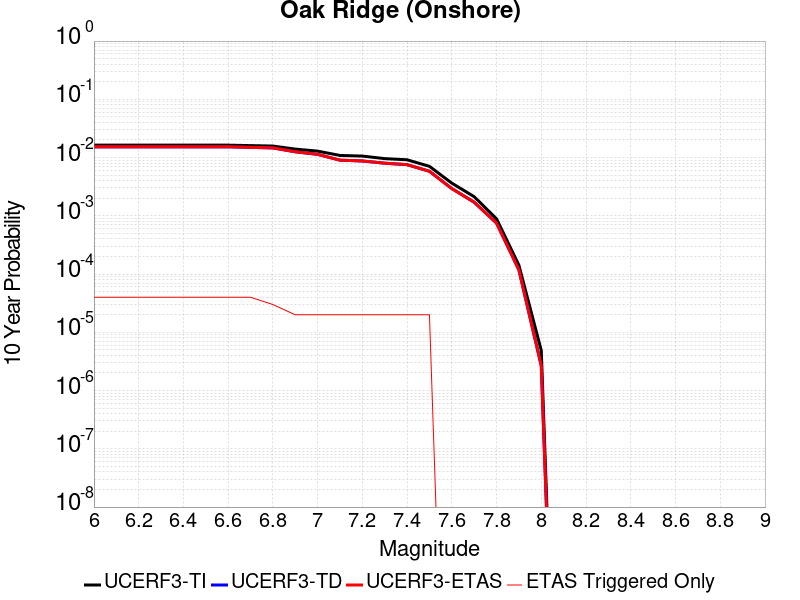 |

| Magnitude | 1 wk TI Prob | 1 wk TD Prob | 1 wk ETAS Prob | 1 wk ETAS/TD Gain | 1 wk ETAS Triggered Only | 1 mo TI Prob | 1 mo TD Prob | 1 mo ETAS Prob | 1 mo ETAS/TD Gain | 1 mo ETAS Triggered Only | 1 yr TI Prob | 1 yr TD Prob | 1 yr ETAS Prob | 1 yr ETAS/TD Gain | 1 yr ETAS Triggered Only | 10 yr TI Prob | 10 yr TD Prob | 10 yr ETAS Prob | 10 yr ETAS/TD Gain | 10 yr ETAS Triggered Only |
|-----|-----|-----|-----|-----|-----|-----|-----|-----|-----|-----|-----|-----|-----|-----|-----|-----|-----|-----|-----|-----|
| 6.0 | 3.155064E-5 | 2.9525974E-5 | 2.9525974E-5 | 1.0 | 0.0 | 1.3521002E-4 | 1.2653397E-4 | 1.2653397E-4 | 1.0 | 0.0 | 0.001644939 | 0.0015395004 | 0.0015760399 | 1.0237347 | 3.6595855E-5 | 0.01632816 | 0.015292859 | 0.015346914 | 1.0035346 | 5.489378E-5 |
| 6.1 | 3.155064E-5 | 2.9525974E-5 | 2.9525974E-5 | 1.0 | 0.0 | 1.3521002E-4 | 1.2653397E-4 | 1.2653397E-4 | 1.0 | 0.0 | 0.001644939 | 0.0015395004 | 0.0015760399 | 1.0237347 | 3.6595855E-5 | 0.01632816 | 0.015292859 | 0.015346914 | 1.0035346 | 5.489378E-5 |
| 6.2 | 3.155064E-5 | 2.9525974E-5 | 2.9525974E-5 | 1.0 | 0.0 | 1.3521002E-4 | 1.2653397E-4 | 1.2653397E-4 | 1.0 | 0.0 | 0.001644939 | 0.0015395004 | 0.0015760399 | 1.0237347 | 3.6595855E-5 | 0.01632816 | 0.015292859 | 0.015346914 | 1.0035346 | 5.489378E-5 |
| 6.3 | 3.155064E-5 | 2.9525974E-5 | 2.9525974E-5 | 1.0 | 0.0 | 1.3521002E-4 | 1.2653397E-4 | 1.2653397E-4 | 1.0 | 0.0 | 0.001644939 | 0.0015395004 | 0.0015760399 | 1.0237347 | 3.6595855E-5 | 0.01632816 | 0.015292859 | 0.015346914 | 1.0035346 | 5.489378E-5 |
| 6.4 | 3.155064E-5 | 2.9525974E-5 | 2.9525974E-5 | 1.0 | 0.0 | 1.3521002E-4 | 1.2653397E-4 | 1.2653397E-4 | 1.0 | 0.0 | 0.001644939 | 0.0015395004 | 0.0015760399 | 1.0237347 | 3.6595855E-5 | 0.01632816 | 0.015292859 | 0.015346914 | 1.0035346 | 5.489378E-5 |
| 6.5 | 3.155064E-5 | 2.9525974E-5 | 2.9525974E-5 | 1.0 | 0.0 | 1.3521002E-4 | 1.2653397E-4 | 1.2653397E-4 | 1.0 | 0.0 | 0.001644939 | 0.0015395004 | 0.0015760399 | 1.0237347 | 3.6595855E-5 | 0.01632816 | 0.015292859 | 0.015346914 | 1.0035346 | 5.489378E-5 |
| 6.6 | 3.155064E-5 | 2.9525974E-5 | 2.9525974E-5 | 1.0 | 0.0 | 1.3521002E-4 | 1.2653397E-4 | 1.2653397E-4 | 1.0 | 0.0 | 0.001644939 | 0.0015395004 | 0.0015760399 | 1.0237347 | 3.6595855E-5 | 0.01632816 | 0.015292859 | 0.015346914 | 1.0035346 | 5.489378E-5 |
| 6.7 | 3.098897E-5 | 2.8864175E-5 | 2.8864175E-5 | 1.0 | 0.0 | 1.328031E-4 | 1.2369796E-4 | 1.2369796E-4 | 1.0 | 0.0 | 0.0016156785 | 0.0015050198 | 0.0015415606 | 1.0242792 | 3.6595855E-5 | 0.016039822 | 0.014952714 | 0.015006787 | 1.0036162 | 5.489378E-5 |
| 6.8 | 3.0449872E-5 | 2.8239372E-5 | 2.8239372E-5 | 1.0 | 0.0 | 1.3049292E-4 | 1.2102048E-4 | 1.2102048E-4 | 1.0 | 0.0 | 0.0015875935 | 0.0014724657 | 0.0014907366 | 1.0124084 | 1.8297927E-5 | 0.015762992 | 0.014631462 | 0.014667522 | 1.0024645 | 3.6595855E-5 |
| 6.9 | 2.697928E-5 | 2.4219773E-5 | 2.4219773E-5 | 1.0 | 0.0 | 1.15620365E-4 | 1.0379502E-4 | 1.0379502E-4 | 1.0 | 0.0 | 0.0014067689 | 0.0012629933 | 0.0012629933 | 1.0 | 0.0 | 0.0139789665 | 0.01256087 | 0.012578938 | 1.0014385 | 1.8297927E-5 |
| 7.0 | 2.4893961E-5 | 2.1862043E-5 | 2.1862043E-5 | 1.0 | 0.0 | 1.0668404E-4 | 9.3691204E-5 | 9.3691204E-5 | 1.0 | 0.0 | 0.0012981043 | 0.0011401111 | 0.0011401111 | 1.0 | 0.0 | 0.012905477 | 0.011344905 | 0.011362996 | 1.0015945 | 1.8297927E-5 |
| 7.1 | 2.0945363E-5 | 1.7354487E-5 | 1.7354487E-5 | 1.0 | 0.0 | 8.976275E-5 | 7.437428E-5 | 7.437428E-5 | 1.0 | 0.0 | 0.0010923136 | 9.051354E-4 | 9.051354E-4 | 1.0 | 0.0 | 0.0108696 | 0.009015423 | 0.009033556 | 1.0020113 | 1.8297927E-5 |
| 7.2 | 2.0439404E-5 | 1.6809423E-5 | 1.6809423E-5 | 1.0 | 0.0 | 8.7594504E-5 | 7.203843E-5 | 7.203843E-5 | 1.0 | 0.0 | 0.0010659413 | 8.767196E-4 | 8.767196E-4 | 1.0 | 0.0 | 0.010608427 | 0.008733526 | 0.008751664 | 1.0020769 | 1.8297927E-5 |
| 7.3 | 1.8463334E-5 | 1.5381811E-5 | 1.5381811E-5 | 1.0 | 0.0 | 7.912617E-5 | 6.59204E-5 | 6.59204E-5 | 1.0 | 0.0 | 9.6293533E-4 | 8.0228975E-4 | 8.0228975E-4 | 1.0 | 0.0 | 0.009587734 | 0.007994797 | 0.008012949 | 1.0022705 | 1.8297927E-5 |
| 7.4 | 1.763139E-5 | 1.451684E-5 | 1.451684E-5 | 1.0 | 0.0 | 7.556091E-5 | 6.221356E-5 | 6.221356E-5 | 1.0 | 0.0 | 9.1956573E-4 | 7.571909E-4 | 7.571909E-4 | 1.0 | 0.0 | 0.009157699 | 0.007546914 | 0.0075650737 | 1.0024062 | 1.8297927E-5 |
| 7.5 | 1.3594944E-5 | 1.1163356E-5 | 1.1163356E-5 | 1.0 | 0.0 | 5.8262744E-5 | 4.784209E-5 | 4.784209E-5 | 1.0 | 0.0 | 7.0911803E-4 | 5.8232434E-4 | 5.8232434E-4 | 1.0 | 0.0 | 0.007068595 | 0.0058082556 | 0.005826447 | 1.003132 | 1.8297927E-5 |
| 7.6 | 6.9889534E-6 | 5.6367144E-6 | 5.6367144E-6 | 1.0 | 0.0 | 2.9952313E-5 | 2.4157125E-5 | 2.4157125E-5 | 1.0 | 0.0 | 3.646084E-4 | 2.9407372E-4 | 2.9407372E-4 | 1.0 | 0.0 | 0.0036401073 | 0.0029368899 | 0.0029368899 | 1.0 | 0.0 |
| 7.7 | 4.0824193E-6 | 3.2832586E-6 | 3.2832586E-6 | 1.0 | 0.0 | 1.7495966E-5 | 1.4071033E-5 | 1.4071033E-5 | 1.0 | 0.0 | 2.1299256E-4 | 1.713015E-4 | 1.713015E-4 | 1.0 | 0.0 | 0.0021278851 | 0.0017117079 | 0.0017117079 | 1.0 | 0.0 |
| 7.8 | 1.7023609E-6 | 1.4370495E-6 | 1.4370495E-6 | 1.0 | 0.0 | 7.295812E-6 | 6.1587693E-6 | 6.1587693E-6 | 1.0 | 0.0 | 8.882289E-5 | 7.498047E-5 | 7.498047E-5 | 1.0 | 0.0 | 8.8787393E-4 | 7.495545E-4 | 7.495545E-4 | 1.0 | 0.0 |
| 7.9 | 2.721225E-7 | 2.2616497E-7 | 2.2616497E-7 | 1.0 | 0.0 | 1.1662388E-6 | 9.692781E-7 | 9.692781E-7 | 1.0 | 0.0 | 1.4198865E-5 | 1.1800899E-5 | 1.1800899E-5 | 1.0 | 0.0 | 1.4197957E-4 | 1.1800301E-4 | 1.1800301E-4 | 1.0 | 0.0 |
| 8.0 | 9.364255E-9 | 5.1206666E-9 | 5.1206666E-9 | 1.0 | 0.0 | 4.0132523E-8 | 2.1945715E-8 | 2.1945715E-8 | 1.0 | 0.0 | 4.8861335E-7 | 2.6718905E-7 | 2.6718905E-7 | 1.0 | 0.0 | 4.8861225E-6 | 2.6718876E-6 | 2.6718876E-6 | 1.0 | 0.0 |

## San Pedro Basin
*[(top)](#table-of-contents)*

| 1 Week | 1 Month | 1 Year | 10 Year |
|-----|-----|-----|-----|
|  |  |  |  |

| Magnitude | 1 wk TI Prob | 1 wk TD Prob | 1 wk ETAS Prob | 1 wk ETAS/TD Gain | 1 wk ETAS Triggered Only | 1 mo TI Prob | 1 mo TD Prob | 1 mo ETAS Prob | 1 mo ETAS/TD Gain | 1 mo ETAS Triggered Only | 1 yr TI Prob | 1 yr TD Prob | 1 yr ETAS Prob | 1 yr ETAS/TD Gain | 1 yr ETAS Triggered Only | 10 yr TI Prob | 10 yr TD Prob | 10 yr ETAS Prob | 10 yr ETAS/TD Gain | 10 yr ETAS Triggered Only |
|-----|-----|-----|-----|-----|-----|-----|-----|-----|-----|-----|-----|-----|-----|-----|-----|-----|-----|-----|-----|-----|
| 6.0 | 5.3449043E-5 | 6.336954E-5 | 1.365566E-4 | 2.154925 | 7.319171E-5 | 2.2904722E-4 | 2.715589E-4 | 3.4473074E-4 | 1.269451 | 7.319171E-5 | 0.0027850836 | 0.0033018254 | 0.0033747754 | 1.0220939 | 7.319171E-5 | 0.027504366 | 0.03258945 | 0.032660257 | 1.0021727 | 7.319171E-5 |
| 6.1 | 5.3449043E-5 | 6.336954E-5 | 1.365566E-4 | 2.154925 | 7.319171E-5 | 2.2904722E-4 | 2.715589E-4 | 3.4473074E-4 | 1.269451 | 7.319171E-5 | 0.0027850836 | 0.0033018254 | 0.0033747754 | 1.0220939 | 7.319171E-5 | 0.027504366 | 0.03258945 | 0.032660257 | 1.0021727 | 7.319171E-5 |
| 6.2 | 2.3189454E-5 | 2.6642796E-5 | 2.6642796E-5 | 1.0 | 0.0 | 9.9379584E-5 | 1.14178685E-4 | 1.14178685E-4 | 1.0 | 0.0 | 0.0012092749 | 0.0013892864 | 0.0013892864 | 1.0 | 0.0 | 0.012027155 | 0.013810883 | 0.013810883 | 1.0 | 0.0 |
| 6.3 | 2.3189454E-5 | 2.6642796E-5 | 2.6642796E-5 | 1.0 | 0.0 | 9.9379584E-5 | 1.14178685E-4 | 1.14178685E-4 | 1.0 | 0.0 | 0.0012092749 | 0.0013892864 | 0.0013892864 | 1.0 | 0.0 | 0.012027155 | 0.013810883 | 0.013810883 | 1.0 | 0.0 |
| 6.4 | 1.966056E-5 | 2.2463413E-5 | 2.2463413E-5 | 1.0 | 0.0 | 8.425682E-5 | 9.626844E-5 | 9.626844E-5 | 1.0 | 0.0 | 0.001025344 | 0.0011714783 | 0.0011714783 | 1.0 | 0.0 | 0.010206259 | 0.011657117 | 0.011657117 | 1.0 | 0.0 |
| 6.5 | 1.7342953E-5 | 1.9745148E-5 | 1.9745148E-5 | 1.0 | 0.0 | 7.4324824E-5 | 8.4619525E-5 | 8.4619525E-5 | 1.0 | 0.0 | 9.04529E-4 | 0.0010297928 | 0.0010297928 | 1.0 | 0.0 | 0.009008561 | 0.010253931 | 0.010253931 | 1.0 | 0.0 |
| 6.6 | 1.439804E-5 | 1.6322716E-5 | 1.6322716E-5 | 1.0 | 0.0 | 6.170443E-5 | 6.99528E-5 | 6.99528E-5 | 1.0 | 0.0 | 7.509924E-4 | 8.513747E-4 | 8.513747E-4 | 1.0 | 0.0 | 0.0074845953 | 0.008484332 | 0.008484332 | 1.0 | 0.0 |
| 6.7 | 1.2634884E-5 | 1.4285297E-5 | 1.4285297E-5 | 1.0 | 0.0 | 5.414838E-5 | 6.1221435E-5 | 6.1221435E-5 | 1.0 | 0.0 | 6.590571E-4 | 7.4514654E-4 | 7.4514654E-4 | 1.0 | 0.0 | 0.006571059 | 0.007429501 | 0.007429501 | 1.0 | 0.0 |
| 6.8 | 1.146091E-5 | 1.2933192E-5 | 1.2933192E-5 | 1.0 | 0.0 | 4.911726E-5 | 5.5426954E-5 | 5.5426954E-5 | 1.0 | 0.0 | 5.9783855E-4 | 6.7464396E-4 | 6.7464396E-4 | 1.0 | 0.0 | 0.0059623276 | 0.006728899 | 0.006728899 | 1.0 | 0.0 |
| 6.9 | 9.109035E-6 | 1.0235011E-5 | 1.0235011E-5 | 1.0 | 0.0 | 3.9038136E-5 | 4.3863754E-5 | 4.3863754E-5 | 1.0 | 0.0 | 4.7518566E-4 | 5.3393835E-4 | 5.3393835E-4 | 1.0 | 0.0 | 0.0047417083 | 0.005329309 | 0.005329309 | 1.0 | 0.0 |
| 7.0 | 5.9351028E-6 | 6.583964E-6 | 6.583964E-6 | 1.0 | 0.0 | 2.5435906E-5 | 2.8216817E-5 | 2.8216817E-5 | 1.0 | 0.0 | 3.0963816E-4 | 3.435092E-4 | 3.435092E-4 | 1.0 | 0.0 | 0.0030920706 | 0.0034320992 | 0.0034320992 | 1.0 | 0.0 |
| 7.1 | 2.1557585E-6 | 2.209648E-6 | 2.209648E-6 | 1.0 | 0.0 | 9.238933E-6 | 9.469887E-6 | 9.469887E-6 | 1.0 | 0.0 | 1.1247819E-4 | 1.1528993E-4 | 1.1528993E-4 | 1.0 | 0.0 | 0.0011242128 | 0.0011523166 | 0.0011523166 | 1.0 | 0.0 |
| 7.2 | 2.1251979E-6 | 2.1779945E-6 | 2.1779945E-6 | 1.0 | 0.0 | 9.107958E-6 | 9.334229E-6 | 9.334229E-6 | 1.0 | 0.0 | 1.1088375E-4 | 1.1363847E-4 | 1.1363847E-4 | 1.0 | 0.0 | 0.0011082845 | 0.0011358189 | 0.0011358189 | 1.0 | 0.0 |
| 7.3 | 1.7145798E-6 | 1.7442874E-6 | 1.7442874E-6 | 1.0 | 0.0 | 7.3481783E-6 | 7.4754967E-6 | 7.4754967E-6 | 1.0 | 0.0 | 8.94604E-5 | 9.1010465E-5 | 9.1010465E-5 | 1.0 | 0.0 | 8.9424395E-4 | 9.0974104E-4 | 9.0974104E-4 | 1.0 | 0.0 |
| 7.4 | 1.4467993E-6 | 1.4641868E-6 | 1.4641868E-6 | 1.0 | 0.0 | 6.200554E-6 | 6.2750714E-6 | 6.2750714E-6 | 1.0 | 0.0 | 7.548913E-5 | 7.639639E-5 | 7.639639E-5 | 1.0 | 0.0 | 7.546349E-4 | 7.6370855E-4 | 7.6370855E-4 | 1.0 | 0.0 |
| 7.5 | 1.2803735E-6 | 1.2931497E-6 | 1.2931497E-6 | 1.0 | 0.0 | 5.487303E-6 | 5.5420587E-6 | 5.5420587E-6 | 1.0 | 0.0 | 6.680587E-5 | 6.7472545E-5 | 6.7472545E-5 | 1.0 | 0.0 | 6.678579E-4 | 6.7452766E-4 | 6.7452766E-4 | 1.0 | 0.0 |
| 7.6 | 6.755009E-7 | 6.769465E-7 | 6.769465E-7 | 1.0 | 0.0 | 2.8950008E-6 | 2.9011965E-6 | 2.9011965E-6 | 1.0 | 0.0 | 3.5246063E-5 | 3.5321555E-5 | 3.5321555E-5 | 1.0 | 0.0 | 3.5240475E-4 | 3.5316512E-4 | 3.5316512E-4 | 1.0 | 0.0 |
| 7.7 | 6.211885E-8 | 4.569953E-8 | 4.569953E-8 | 1.0 | 0.0 | 2.6622362E-7 | 1.9585512E-7 | 1.9585512E-7 | 1.0 | 0.0 | 3.2412677E-6 | 2.3845337E-6 | 2.3845337E-6 | 1.0 | 0.0 | 3.2412205E-5 | 2.3845101E-5 | 2.3845101E-5 | 1.0 | 0.0 |
| 7.8 | 2.6580573E-9 | 1.5138163E-9 | 1.5138163E-9 | 1.0 | 0.0 | 1.1391674E-8 | 6.487784E-9 | 6.487784E-9 | 1.0 | 0.0 | 1.3869362E-7 | 7.898877E-8 | 7.898877E-8 | 1.0 | 0.0 | 1.3869354E-6 | 7.898877E-7 | 7.898877E-7 | 1.0 | 0.0 |

## Green Valley 2011 CFM
*[(top)](#table-of-contents)*

| 1 Week | 1 Month | 1 Year | 10 Year |
|-----|-----|-----|-----|
| 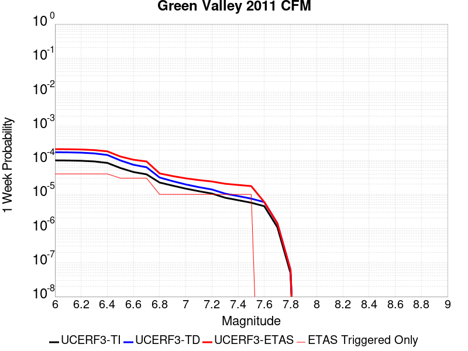 |  | 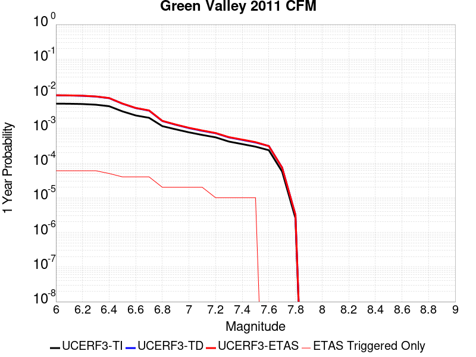 |  |

| Magnitude | 1 wk TI Prob | 1 wk TD Prob | 1 wk ETAS Prob | 1 wk ETAS/TD Gain | 1 wk ETAS Triggered Only | 1 mo TI Prob | 1 mo TD Prob | 1 mo ETAS Prob | 1 mo ETAS/TD Gain | 1 mo ETAS Triggered Only | 1 yr TI Prob | 1 yr TD Prob | 1 yr ETAS Prob | 1 yr ETAS/TD Gain | 1 yr ETAS Triggered Only | 10 yr TI Prob | 10 yr TD Prob | 10 yr ETAS Prob | 10 yr ETAS/TD Gain | 10 yr ETAS Triggered Only |
|-----|-----|-----|-----|-----|-----|-----|-----|-----|-----|-----|-----|-----|-----|-----|-----|-----|-----|-----|-----|-----|
| 6.0 | 9.9629346E-5 | 1.7305532E-4 | 1.9135009E-4 | 1.1057162 | 1.8297927E-5 | 4.2691303E-4 | 7.4143766E-4 | 7.59722E-4 | 1.0246607 | 1.8297927E-5 | 0.0051852856 | 0.008986705 | 0.009022972 | 1.0040356 | 3.6595855E-5 | 0.050659515 | 0.085522056 | 0.08558899 | 1.0007826 | 7.319171E-5 |
| 6.1 | 9.88615E-5 | 1.7152846E-4 | 1.8982324E-4 | 1.1066575 | 1.8297927E-5 | 4.2362334E-4 | 7.348976E-4 | 7.531821E-4 | 1.0248803 | 1.8297927E-5 | 0.0051454236 | 0.0089077335 | 0.008944003 | 1.0040717 | 3.6595855E-5 | 0.050279044 | 0.084809676 | 0.084876664 | 1.0007898 | 7.319171E-5 |
| 6.2 | 9.696895E-5 | 1.6791887E-4 | 1.8621373E-4 | 1.1089505 | 1.8297927E-5 | 4.15515E-4 | 7.194366E-4 | 7.377214E-4 | 1.0254154 | 1.8297927E-5 | 0.0050471667 | 0.008721114 | 0.008757391 | 1.0041597 | 3.6595855E-5 | 0.04934063 | 0.0831186 | 0.08318571 | 1.0008074 | 7.319171E-5 |
| 6.3 | 9.275224E-5 | 1.5971228E-4 | 1.7800728E-4 | 1.1145498 | 1.8297927E-5 | 3.9744904E-4 | 6.842841E-4 | 7.025695E-4 | 1.026722 | 1.8297927E-5 | 0.0048282105 | 0.008296439 | 0.008332731 | 1.0043744 | 3.6595855E-5 | 0.047246475 | 0.07925707 | 0.07932446 | 1.0008503 | 7.319171E-5 |
| 6.4 | 8.391499E-5 | 1.4367796E-4 | 1.6197326E-4 | 1.1273354 | 1.8297927E-5 | 3.595861E-4 | 6.156248E-4 | 6.3391146E-4 | 1.0297042 | 1.8297927E-5 | 0.004369175 | 0.0074670846 | 0.007503407 | 1.0048643 | 3.6595855E-5 | 0.04284265 | 0.071630865 | 0.071698815 | 1.0009485 | 7.319171E-5 |
| 6.5 | 5.9519385E-5 | 9.9340905E-5 | 1.1763701E-4 | 1.184175 | 1.8297927E-5 | 2.5505814E-4 | 4.2568138E-4 | 4.4397154E-4 | 1.0429667 | 1.8297927E-5 | 0.0031009112 | 0.005168295 | 0.005204702 | 1.0070442 | 3.6595855E-5 | 0.030579966 | 0.050145864 | 0.050198004 | 1.0010397 | 5.489378E-5 |
| 6.6 | 4.5361558E-5 | 7.402609E-5 | 9.232266E-5 | 1.2471639 | 1.8297927E-5 | 1.9439218E-4 | 3.1721895E-4 | 3.3551108E-4 | 1.057664 | 1.8297927E-5 | 0.0023641558 | 0.0038539418 | 0.0038903966 | 1.0094591 | 3.6595855E-5 | 0.023391623 | 0.037665963 | 0.037718788 | 1.0014025 | 5.489378E-5 |
| 6.7 | 3.8808106E-5 | 6.2651976E-5 | 8.0948754E-5 | 1.2920383 | 1.8297927E-5 | 1.6630985E-4 | 2.6848342E-4 | 2.8677643E-4 | 1.0681347 | 1.8297927E-5 | 0.0020229418 | 0.0032626586 | 0.003299135 | 1.0111799 | 3.6595855E-5 | 0.020046256 | 0.032005914 | 0.032041337 | 1.0011069 | 3.6595855E-5 |
| 6.8 | 2.2284667E-5 | 3.1285235E-5 | 3.1285235E-5 | 1.0 | 0.0 | 9.550222E-5 | 1.3407279E-4 | 1.3407279E-4 | 1.0 | 0.0 | 0.0011621192 | 0.0016311078 | 0.0016493759 | 1.0111998 | 1.8297927E-5 | 0.011560607 | 0.016165998 | 0.016184 | 1.0011135 | 1.8297927E-5 |
| 6.9 | 1.8050168E-5 | 2.4448054E-5 | 2.4448054E-5 | 1.0 | 0.0 | 7.735557E-5 | 1.047732E-4 | 1.047732E-4 | 1.0 | 0.0 | 9.4139716E-4 | 0.0012748708 | 0.0012931455 | 1.0143344 | 1.8297927E-5 | 0.009374191 | 0.012667833 | 0.012685899 | 1.0014261 | 1.8297927E-5 |
| 7.0 | 1.4763166E-5 | 1.9582854E-5 | 1.9582854E-5 | 1.0 | 0.0 | 6.326917E-5 | 8.3923835E-5 | 8.3923835E-5 | 1.0 | 0.0 | 7.7002996E-4 | 0.0010212966 | 0.0010395759 | 1.0178981 | 1.8297927E-5 | 0.007673672 | 0.010165343 | 0.010183455 | 1.0017817 | 1.8297927E-5 |
| 7.1 | 1.2399713E-5 | 1.6303715E-5 | 1.6303715E-5 | 1.0 | 0.0 | 5.3140546E-5 | 6.98712E-5 | 6.98712E-5 | 1.0 | 0.0 | 6.467941E-4 | 8.503518E-4 | 8.686342E-4 | 1.0214998 | 1.8297927E-5 | 0.006449148 | 0.008471259 | 0.008489402 | 1.0021417 | 1.8297927E-5 |
| 7.2 | 1.0584195E-5 | 1.3921742E-5 | 1.3921742E-5 | 1.0 | 0.0 | 4.5360044E-5 | 5.9663253E-5 | 5.9663253E-5 | 1.0 | 0.0 | 5.521186E-4 | 7.261596E-4 | 7.261596E-4 | 1.0 | 0.0 | 0.0055074887 | 0.007238285 | 0.007238285 | 1.0 | 0.0 |
| 7.3 | 7.998173E-6 | 1.054402E-5 | 1.054402E-5 | 1.0 | 0.0 | 3.4277433E-5 | 4.518788E-5 | 4.518788E-5 | 1.0 | 0.0 | 4.1724785E-4 | 5.500247E-4 | 5.500247E-4 | 1.0 | 0.0 | 0.004164653 | 0.0054868995 | 0.0054868995 | 1.0 | 0.0 |
| 7.4 | 6.7571127E-6 | 8.932697E-6 | 8.932697E-6 | 1.0 | 0.0 | 2.8958733E-5 | 3.828243E-5 | 3.828243E-5 | 1.0 | 0.0 | 3.5251552E-4 | 4.6598984E-4 | 4.6598984E-4 | 1.0 | 0.0 | 0.0035195686 | 0.0046503306 | 0.0046503306 | 1.0 | 0.0 |
| 7.5 | 5.69878E-6 | 7.516314E-6 | 7.516314E-6 | 1.0 | 0.0 | 2.4423114E-5 | 3.221238E-5 | 3.221238E-5 | 1.0 | 0.0 | 2.9731085E-4 | 3.9211605E-4 | 3.9211605E-4 | 1.0 | 0.0 | 0.002969134 | 0.0039143935 | 0.0039143935 | 1.0 | 0.0 |
| 7.6 | 4.503664E-6 | 5.9356807E-6 | 5.9356807E-6 | 1.0 | 0.0 | 1.9301275E-5 | 2.5438389E-5 | 2.5438389E-5 | 1.0 | 0.0 | 2.3496768E-4 | 3.096692E-4 | 3.096692E-4 | 1.0 | 0.0 | 0.002347194 | 0.003092502 | 0.003092502 | 1.0 | 0.0 |
| 7.7 | 1.0873546E-6 | 1.4106979E-6 | 1.4106979E-6 | 1.0 | 0.0 | 4.6600826E-6 | 6.045834E-6 | 6.045834E-6 | 1.0 | 0.0 | 5.6735033E-5 | 7.360557E-5 | 7.360557E-5 | 1.0 | 0.0 | 5.672055E-4 | 7.35814E-4 | 7.35814E-4 | 1.0 | 0.0 |
| 7.8 | 4.9373917E-8 | 6.1777136E-8 | 6.1777136E-8 | 1.0 | 0.0 | 2.1160248E-7 | 2.6475914E-7 | 2.6475914E-7 | 1.0 | 0.0 | 2.5762572E-6 | 3.223439E-6 | 3.223439E-6 | 1.0 | 0.0 | 2.5762274E-5 | 3.2232296E-5 | 3.2232296E-5 | 1.0 | 0.0 |

## Whittier alt 1
*[(top)](#table-of-contents)*

| 1 Week | 1 Month | 1 Year | 10 Year |
|-----|-----|-----|-----|
|  |  |  |  |

| Magnitude | 1 wk TI Prob | 1 wk TD Prob | 1 wk ETAS Prob | 1 wk ETAS/TD Gain | 1 wk ETAS Triggered Only | 1 mo TI Prob | 1 mo TD Prob | 1 mo ETAS Prob | 1 mo ETAS/TD Gain | 1 mo ETAS Triggered Only | 1 yr TI Prob | 1 yr TD Prob | 1 yr ETAS Prob | 1 yr ETAS/TD Gain | 1 yr ETAS Triggered Only | 10 yr TI Prob | 10 yr TD Prob | 10 yr ETAS Prob | 10 yr ETAS/TD Gain | 10 yr ETAS Triggered Only |
|-----|-----|-----|-----|-----|-----|-----|-----|-----|-----|-----|-----|-----|-----|-----|-----|-----|-----|-----|-----|-----|
| 6.0 | 4.2554693E-5 | 4.725218E-5 | 8.38463E-5 | 1.7744431 | 3.6595855E-5 | 1.8236451E-4 | 2.0249544E-4 | 2.3908388E-4 | 1.1806878 | 3.6595855E-5 | 0.002218027 | 0.0024629154 | 0.0024994211 | 1.0148221 | 3.6595855E-5 | 0.02196019 | 0.024390234 | 0.024461642 | 1.0029277 | 7.319171E-5 |
| 6.1 | 4.2554693E-5 | 4.725218E-5 | 8.38463E-5 | 1.7744431 | 3.6595855E-5 | 1.8236451E-4 | 2.0249544E-4 | 2.3908388E-4 | 1.1806878 | 3.6595855E-5 | 0.002218027 | 0.0024629154 | 0.0024994211 | 1.0148221 | 3.6595855E-5 | 0.02196019 | 0.024390234 | 0.024461642 | 1.0029277 | 7.319171E-5 |
| 6.2 | 4.2554693E-5 | 4.725218E-5 | 8.38463E-5 | 1.7744431 | 3.6595855E-5 | 1.8236451E-4 | 2.0249544E-4 | 2.3908388E-4 | 1.1806878 | 3.6595855E-5 | 0.002218027 | 0.0024629154 | 0.0024994211 | 1.0148221 | 3.6595855E-5 | 0.02196019 | 0.024390234 | 0.024461642 | 1.0029277 | 7.319171E-5 |
| 6.3 | 1.9617712E-5 | 1.8268593E-5 | 1.8268593E-5 | 1.0 | 0.0 | 8.40732E-5 | 7.829172E-5 | 7.829172E-5 | 1.0 | 0.0 | 0.0010231105 | 9.52804E-4 | 9.52804E-4 | 1.0 | 0.0 | 0.01018413 | 0.009490474 | 0.009490474 | 1.0 | 0.0 |
| 6.4 | 1.5611336E-5 | 1.3604271E-5 | 1.3604271E-5 | 1.0 | 0.0 | 6.690401E-5 | 5.8302747E-5 | 5.8302747E-5 | 1.0 | 0.0 | 8.142519E-4 | 7.0961076E-4 | 7.0961076E-4 | 1.0 | 0.0 | 0.008112748 | 0.0070754145 | 0.0070754145 | 1.0 | 0.0 |
| 6.5 | 1.5150166E-5 | 1.3100925E-5 | 1.3100925E-5 | 1.0 | 0.0 | 6.492767E-5 | 5.6145647E-5 | 5.6145647E-5 | 1.0 | 0.0 | 7.9020765E-4 | 6.8336475E-4 | 6.8336475E-4 | 1.0 | 0.0 | 0.007874036 | 0.0068145846 | 0.0068145846 | 1.0 | 0.0 |
| 6.6 | 1.295588E-5 | 1.0380725E-5 | 1.0380725E-5 | 1.0 | 0.0 | 5.552402E-5 | 4.4488075E-5 | 4.4488075E-5 | 1.0 | 0.0 | 6.7579525E-4 | 5.4150965E-4 | 5.4150965E-4 | 1.0 | 0.0 | 0.006737438 | 0.0054033357 | 0.0054033357 | 1.0 | 0.0 |
| 6.7 | 1.2542085E-5 | 9.899369E-6 | 9.899369E-6 | 1.0 | 0.0 | 5.3750682E-5 | 4.242519E-5 | 4.242519E-5 | 1.0 | 0.0 | 6.542181E-4 | 5.164061E-4 | 5.164061E-4 | 1.0 | 0.0 | 0.006522954 | 0.0051534795 | 0.0051534795 | 1.0 | 0.0 |
| 6.8 | 1.2195878E-5 | 9.495415E-6 | 9.495415E-6 | 1.0 | 0.0 | 5.2267E-5 | 4.069401E-5 | 4.069401E-5 | 1.0 | 0.0 | 6.36165E-4 | 4.9533875E-4 | 4.9533875E-4 | 1.0 | 0.0 | 0.0063434686 | 0.004943688 | 0.004943688 | 1.0 | 0.0 |
| 6.9 | 1.1580298E-5 | 8.772933E-6 | 8.772933E-6 | 1.0 | 0.0 | 4.9628903E-5 | 3.7597754E-5 | 3.7597754E-5 | 1.0 | 0.0 | 6.040644E-4 | 4.5765814E-4 | 4.5765814E-4 | 1.0 | 0.0 | 0.00602425 | 0.0045684157 | 0.0045684157 | 1.0 | 0.0 |
| 7.0 | 1.0964795E-5 | 8.083994E-6 | 8.083994E-6 | 1.0 | 0.0 | 4.6991136E-5 | 3.4645236E-5 | 3.4645236E-5 | 1.0 | 0.0 | 5.7196687E-4 | 4.2172565E-4 | 4.2172565E-4 | 1.0 | 0.0 | 0.0057049696 | 0.004210462 | 0.004210462 | 1.0 | 0.0 |
| 7.1 | 1.0230601E-5 | 7.3266697E-6 | 7.3266697E-6 | 1.0 | 0.0 | 4.3844695E-5 | 3.1399642E-5 | 3.1399642E-5 | 1.0 | 0.0 | 5.336784E-4 | 3.8222488E-4 | 3.8222488E-4 | 1.0 | 0.0 | 0.005323986 | 0.0038168381 | 0.0038168381 | 1.0 | 0.0 |
| 7.2 | 9.40865E-6 | 6.543289E-6 | 6.543289E-6 | 1.0 | 0.0 | 4.032216E-5 | 2.8042374E-5 | 2.8042374E-5 | 1.0 | 0.0 | 4.908117E-4 | 3.4136363E-4 | 3.4136363E-4 | 1.0 | 0.0 | 0.0048972913 | 0.003409485 | 0.003409485 | 1.0 | 0.0 |
| 7.3 | 8.237384E-6 | 5.5977525E-6 | 5.5977525E-6 | 1.0 | 0.0 | 3.5302593E-5 | 2.3990153E-5 | 2.3990153E-5 | 1.0 | 0.0 | 4.2972428E-4 | 2.92042E-4 | 2.92042E-4 | 1.0 | 0.0 | 0.0042889426 | 0.002916903 | 0.002916903 | 1.0 | 0.0 |
| 7.4 | 7.5316966E-6 | 5.027819E-6 | 5.027819E-6 | 1.0 | 0.0 | 3.2278298E-5 | 2.1547625E-5 | 2.1547625E-5 | 1.0 | 0.0 | 3.9291743E-4 | 2.6231175E-4 | 2.6231175E-4 | 1.0 | 0.0 | 0.0039222343 | 0.0026201333 | 0.0026201333 | 1.0 | 0.0 |
| 7.5 | 6.149649E-6 | 3.933841E-6 | 3.933841E-6 | 1.0 | 0.0 | 2.6355372E-5 | 1.6859214E-5 | 1.6859214E-5 | 1.0 | 0.0 | 3.208294E-4 | 2.052425E-4 | 2.052425E-4 | 1.0 | 0.0 | 0.003203666 | 0.0020506186 | 0.0020506186 | 1.0 | 0.0 |
| 7.6 | 5.457711E-6 | 3.3953788E-6 | 3.3953788E-6 | 1.0 | 0.0 | 2.338998E-5 | 1.4551547E-5 | 1.4551547E-5 | 1.0 | 0.0 | 2.8473578E-4 | 1.771515E-4 | 1.771515E-4 | 1.0 | 0.0 | 0.0028437122 | 0.0017701836 | 0.0017701836 | 1.0 | 0.0 |
| 7.7 | 4.1676276E-6 | 2.3331952E-6 | 2.3331952E-6 | 1.0 | 0.0 | 1.7861139E-5 | 9.999374E-6 | 9.999374E-6 | 1.0 | 0.0 | 2.1743766E-4 | 1.2173632E-4 | 1.2173632E-4 | 1.0 | 0.0 | 0.0021722503 | 0.0012167693 | 0.0012167693 | 1.0 | 0.0 |
| 7.8 | 2.2692414E-7 | 9.3854695E-8 | 9.3854695E-8 | 1.0 | 0.0 | 9.725317E-7 | 4.0223435E-7 | 4.0223435E-7 | 1.0 | 0.0 | 1.1840509E-5 | 4.8971956E-6 | 4.8971956E-6 | 1.0 | 0.0 | 1.1839878E-4 | 4.8971204E-5 | 4.8971204E-5 | 1.0 | 0.0 |
| 7.9 | 6.676829E-9 | 3.439853E-9 | 3.439853E-9 | 1.0 | 0.0 | 2.861498E-8 | 1.4742227E-8 | 1.4742227E-8 | 1.0 | 0.0 | 3.4838732E-7 | 1.7948659E-7 | 1.7948659E-7 | 1.0 | 0.0 | 3.4838679E-6 | 1.7948646E-6 | 1.7948646E-6 | 1.0 | 0.0 |

## Big Pine (Central)
*[(top)](#table-of-contents)*

| 1 Week | 1 Month | 1 Year | 10 Year |
|-----|-----|-----|-----|
|  |  |  |  |

| Magnitude | 1 wk TI Prob | 1 wk TD Prob | 1 wk ETAS Prob | 1 wk ETAS/TD Gain | 1 wk ETAS Triggered Only | 1 mo TI Prob | 1 mo TD Prob | 1 mo ETAS Prob | 1 mo ETAS/TD Gain | 1 mo ETAS Triggered Only | 1 yr TI Prob | 1 yr TD Prob | 1 yr ETAS Prob | 1 yr ETAS/TD Gain | 1 yr ETAS Triggered Only | 10 yr TI Prob | 10 yr TD Prob | 10 yr ETAS Prob | 10 yr ETAS/TD Gain | 10 yr ETAS Triggered Only |
|-----|-----|-----|-----|-----|-----|-----|-----|-----|-----|-----|-----|-----|-----|-----|-----|-----|-----|-----|-----|-----|
| 6.0 | 1.2706755E-5 | 1.4250529E-5 | 3.2548196E-5 | 2.2839992 | 1.8297927E-5 | 5.4456385E-5 | 6.107247E-5 | 7.936928E-5 | 1.2995918 | 1.8297927E-5 | 6.628048E-4 | 7.433402E-4 | 7.9819316E-4 | 1.0737926 | 5.489378E-5 | 0.006608314 | 0.0074135666 | 0.007486216 | 1.0097995 | 7.319171E-5 |
| 6.1 | 8.342579E-6 | 9.510762E-6 | 2.7808514E-5 | 2.9239 | 1.8297927E-5 | 3.5753423E-5 | 4.0759893E-5 | 5.9057074E-5 | 1.4489017 | 1.8297927E-5 | 4.3521097E-4 | 4.961604E-4 | 5.327381E-4 | 1.0737215 | 3.6595855E-5 | 0.0043435963 | 0.0049540824 | 0.004990497 | 1.0073504 | 3.6595855E-5 |
| 6.2 | 6.923899E-6 | 7.967147E-6 | 2.6264928E-5 | 3.296654 | 1.8297927E-5 | 2.9673516E-5 | 3.4144578E-5 | 5.244188E-5 | 1.5358772 | 1.8297927E-5 | 3.6121515E-4 | 4.156502E-4 | 4.5223083E-4 | 1.0880083 | 3.6595855E-5 | 0.003606286 | 0.0041520367 | 0.004188481 | 1.0087774 | 3.6595855E-5 |
| 6.3 | 2.728396E-6 | 3.4242908E-6 | 3.4242908E-6 | 1.0 | 0.0 | 1.1693074E-5 | 1.4675454E-5 | 1.4675454E-5 | 1.0 | 0.0 | 1.4235388E-4 | 1.7865987E-4 | 1.7865987E-4 | 1.0 | 0.0 | 0.0014226272 | 0.0017866704 | 0.0017866704 | 1.0 | 0.0 |
| 6.4 | 2.7136944E-6 | 3.408584E-6 | 3.408584E-6 | 1.0 | 0.0 | 1.1630066E-5 | 1.4608141E-5 | 1.4608141E-5 | 1.0 | 0.0 | 1.4158686E-4 | 1.7784047E-4 | 1.7784047E-4 | 1.0 | 0.0 | 0.0014149669 | 0.0017784894 | 0.0017784894 | 1.0 | 0.0 |
| 6.5 | 2.6971882E-6 | 3.3909291E-6 | 3.3909291E-6 | 1.0 | 0.0 | 1.1559327E-5 | 1.45324775E-5 | 1.45324775E-5 | 1.0 | 0.0 | 1.4072572E-4 | 1.7691942E-4 | 1.7691942E-4 | 1.0 | 0.0 | 0.0014063664 | 0.0017692937 | 0.0017692937 | 1.0 | 0.0 |
| 6.6 | 2.669092E-6 | 3.3609497E-6 | 3.3609497E-6 | 1.0 | 0.0 | 1.1438916E-5 | 1.4403995E-5 | 1.4403995E-5 | 1.0 | 0.0 | 1.3925991E-4 | 1.753554E-4 | 1.753554E-4 | 1.0 | 0.0 | 0.0013917267 | 0.0017536782 | 0.0017536782 | 1.0 | 0.0 |
| 6.7 | 2.6408059E-6 | 3.3309752E-6 | 3.3309752E-6 | 1.0 | 0.0 | 1.1317691E-5 | 1.4275535E-5 | 1.4275535E-5 | 1.0 | 0.0 | 1.3778417E-4 | 1.7379165E-4 | 1.7379165E-4 | 1.0 | 0.0 | 0.0013769877 | 0.0017380653 | 0.0017380653 | 1.0 | 0.0 |
| 6.8 | 2.1786943E-6 | 2.8544325E-6 | 2.8544325E-6 | 1.0 | 0.0 | 9.337228E-6 | 1.2233229E-5 | 1.2233229E-5 | 1.0 | 0.0 | 1.1367482E-4 | 1.4893012E-4 | 1.4893012E-4 | 1.0 | 0.0 | 0.0011361669 | 0.0014897975 | 0.0014897975 | 1.0 | 0.0 |
| 6.9 | 1.4411696E-6 | 2.068499E-6 | 2.068499E-6 | 1.0 | 0.0 | 6.1764263E-6 | 8.864968E-6 | 8.864968E-6 | 1.0 | 0.0 | 7.51954E-5 | 1.079259E-4 | 1.079259E-4 | 1.0 | 0.0 | 7.5169955E-4 | 0.0010801847 | 0.0010801847 | 1.0 | 0.0 |
| 7.0 | 1.0073411E-6 | 1.554261E-6 | 1.554261E-6 | 1.0 | 0.0 | 4.317169E-6 | 6.6611024E-6 | 6.6611024E-6 | 1.0 | 0.0 | 5.2560266E-5 | 8.1096056E-5 | 8.1096056E-5 | 1.0 | 0.0 | 5.2547833E-4 | 8.1210316E-4 | 8.1210316E-4 | 1.0 | 0.0 |
| 7.1 | 8.947104E-7 | 1.4302494E-6 | 1.4302494E-6 | 1.0 | 0.0 | 3.834468E-6 | 6.129627E-6 | 6.129627E-6 | 1.0 | 0.0 | 4.6683643E-5 | 7.46258E-5 | 7.46258E-5 | 1.0 | 0.0 | 4.6673836E-4 | 7.474457E-4 | 7.474457E-4 | 1.0 | 0.0 |
| 7.2 | 5.215166E-7 | 1.0111678E-6 | 1.0111678E-6 | 1.0 | 0.0 | 2.2350691E-6 | 4.3335694E-6 | 4.3335694E-6 | 1.0 | 0.0 | 2.7211627E-5 | 5.2759973E-5 | 5.2759973E-5 | 1.0 | 0.0 | 2.7208295E-4 | 5.2890263E-4 | 5.2890263E-4 | 1.0 | 0.0 |
| 7.3 | 4.4024807E-7 | 9.219589E-7 | 9.219589E-7 | 1.0 | 0.0 | 1.8867761E-6 | 3.9512465E-6 | 3.9512465E-6 | 1.0 | 0.0 | 2.2971257E-5 | 4.810541E-5 | 4.810541E-5 | 1.0 | 0.0 | 2.2968883E-4 | 4.8237795E-4 | 4.8237795E-4 | 1.0 | 0.0 |
| 7.4 | 3.6130905E-7 | 8.358523E-7 | 8.358523E-7 | 1.0 | 0.0 | 1.5484665E-6 | 3.5822195E-6 | 3.5822195E-6 | 1.0 | 0.0 | 1.8852415E-5 | 4.3612687E-5 | 4.3612687E-5 | 1.0 | 0.0 | 1.8850817E-4 | 4.374597E-4 | 4.374597E-4 | 1.0 | 0.0 |
| 7.5 | 3.408184E-7 | 8.108147E-7 | 8.108147E-7 | 1.0 | 0.0 | 1.4606494E-6 | 3.4749157E-6 | 3.4749157E-6 | 1.0 | 0.0 | 1.7783263E-5 | 4.2306317E-5 | 4.2306317E-5 | 1.0 | 0.0 | 1.778184E-4 | 4.2437963E-4 | 4.2437963E-4 | 1.0 | 0.0 |
| 7.6 | 3.1428627E-7 | 7.7316E-7 | 7.7316E-7 | 1.0 | 0.0 | 1.3469405E-6 | 3.3135389E-6 | 3.3135389E-6 | 1.0 | 0.0 | 1.6398877E-5 | 4.0341627E-5 | 4.0341627E-5 | 1.0 | 0.0 | 1.6397667E-4 | 4.0471106E-4 | 4.0471106E-4 | 1.0 | 0.0 |
| 7.7 | 1.7972785E-7 | 5.077752E-7 | 5.077752E-7 | 1.0 | 0.0 | 7.70262E-7 | 2.1761778E-6 | 2.1761778E-6 | 1.0 | 0.0 | 9.377899E-6 | 2.6494654E-5 | 2.6494654E-5 | 1.0 | 0.0 | 9.377503E-5 | 2.662899E-4 | 2.662899E-4 | 1.0 | 0.0 |
| 7.8 | 4.9230927E-8 | 1.198079E-7 | 1.198079E-7 | 1.0 | 0.0 | 2.1098968E-7 | 5.134623E-7 | 5.134623E-7 | 1.0 | 0.0 | 2.5687964E-6 | 6.2513873E-6 | 6.2513873E-6 | 1.0 | 0.0 | 2.5687666E-5 | 6.295415E-5 | 6.295415E-5 | 1.0 | 0.0 |
| 7.9 | 3.6805972E-9 | 4.105293E-9 | 4.105293E-9 | 1.0 | 0.0 | 1.5773987E-8 | 1.7594115E-8 | 1.7594115E-8 | 1.0 | 0.0 | 1.9204828E-7 | 2.1420831E-7 | 2.1420831E-7 | 1.0 | 0.0 | 1.920481E-6 | 2.1900614E-6 | 2.1900614E-6 | 1.0 | 0.0 |

## San Jacinto (Clark) rev
*[(top)](#table-of-contents)*

| 1 Week | 1 Month | 1 Year | 10 Year |
|-----|-----|-----|-----|
|  |  |  |  |

| Magnitude | 1 wk TI Prob | 1 wk TD Prob | 1 wk ETAS Prob | 1 wk ETAS/TD Gain | 1 wk ETAS Triggered Only | 1 mo TI Prob | 1 mo TD Prob | 1 mo ETAS Prob | 1 mo ETAS/TD Gain | 1 mo ETAS Triggered Only | 1 yr TI Prob | 1 yr TD Prob | 1 yr ETAS Prob | 1 yr ETAS/TD Gain | 1 yr ETAS Triggered Only | 10 yr TI Prob | 10 yr TD Prob | 10 yr ETAS Prob | 10 yr ETAS/TD Gain | 10 yr ETAS Triggered Only |
|-----|-----|-----|-----|-----|-----|-----|-----|-----|-----|-----|-----|-----|-----|-----|-----|-----|-----|-----|-----|-----|
| 6.0 | 4.482615E-5 | 2.1154196E-5 | 5.7749276E-5 | 2.7299206 | 3.6595855E-5 | 1.9209793E-4 | 9.065773E-5 | 1.2725027E-4 | 1.403634 | 3.6595855E-5 | 0.0023362834 | 0.0011032083 | 0.0011580415 | 1.0497034 | 5.489378E-5 | 0.02311874 | 0.011503847 | 0.011576197 | 1.0062891 | 7.319171E-5 |
| 6.1 | 4.482615E-5 | 2.1154196E-5 | 5.7749276E-5 | 2.7299206 | 3.6595855E-5 | 1.9209793E-4 | 9.065773E-5 | 1.2725027E-4 | 1.403634 | 3.6595855E-5 | 0.0023362834 | 0.0011032083 | 0.0011580415 | 1.0497034 | 5.489378E-5 | 0.02311874 | 0.011503847 | 0.011576197 | 1.0062891 | 7.319171E-5 |
| 6.2 | 4.482615E-5 | 2.1154196E-5 | 5.7749276E-5 | 2.7299206 | 3.6595855E-5 | 1.9209793E-4 | 9.065773E-5 | 1.2725027E-4 | 1.403634 | 3.6595855E-5 | 0.0023362834 | 0.0011032083 | 0.0011580415 | 1.0497034 | 5.489378E-5 | 0.02311874 | 0.011503847 | 0.011576197 | 1.0062891 | 7.319171E-5 |
| 6.3 | 4.482615E-5 | 2.1154196E-5 | 5.7749276E-5 | 2.7299206 | 3.6595855E-5 | 1.9209793E-4 | 9.065773E-5 | 1.2725027E-4 | 1.403634 | 3.6595855E-5 | 0.0023362834 | 0.0011032083 | 0.0011580415 | 1.0497034 | 5.489378E-5 | 0.02311874 | 0.011503847 | 0.011576197 | 1.0062891 | 7.319171E-5 |
| 6.4 | 4.482615E-5 | 2.1154196E-5 | 5.7749276E-5 | 2.7299206 | 3.6595855E-5 | 1.9209793E-4 | 9.065773E-5 | 1.2725027E-4 | 1.403634 | 3.6595855E-5 | 0.0023362834 | 0.0011032083 | 0.0011580415 | 1.0497034 | 5.489378E-5 | 0.02311874 | 0.011503847 | 0.011576197 | 1.0062891 | 7.319171E-5 |
| 6.5 | 3.7294863E-5 | 1.7356087E-5 | 5.3951306E-5 | 3.1084948 | 3.6595855E-5 | 1.5982533E-4 | 7.438113E-5 | 1.10974266E-4 | 1.4919679 | 3.6595855E-5 | 0.0019441366 | 9.052186E-4 | 9.6006267E-4 | 1.0605866 | 5.489378E-5 | 0.01927216 | 0.0094941035 | 0.0095666 | 1.007636 | 7.319171E-5 |
| 6.6 | 3.7294863E-5 | 1.7356087E-5 | 5.3951306E-5 | 3.1084948 | 3.6595855E-5 | 1.5982533E-4 | 7.438113E-5 | 1.10974266E-4 | 1.4919679 | 3.6595855E-5 | 0.0019441366 | 9.052186E-4 | 9.6006267E-4 | 1.0605866 | 5.489378E-5 | 0.01927216 | 0.0094941035 | 0.0095666 | 1.007636 | 7.319171E-5 |
| 6.7 | 3.6039248E-5 | 1.6604314E-5 | 5.3199557E-5 | 3.2039602 | 3.6595855E-5 | 1.5444479E-4 | 7.1159426E-5 | 1.07752676E-4 | 1.5142432 | 3.6595855E-5 | 0.0018787434 | 8.6602574E-4 | 9.2087203E-4 | 1.063331 | 5.489378E-5 | 0.01862939 | 0.009096047 | 0.009168573 | 1.0079733 | 7.319171E-5 |
| 6.8 | 3.5031844E-5 | 1.6232942E-5 | 5.28282E-5 | 3.2543826 | 3.6595855E-5 | 1.5012783E-4 | 6.956792E-5 | 1.0616123E-4 | 1.5260084 | 3.6595855E-5 | 0.0018262739 | 8.4666436E-4 | 9.0151164E-4 | 1.0647805 | 5.489378E-5 | 0.01811338 | 0.008895969 | 0.00896851 | 1.0081543 | 7.319171E-5 |
| 6.9 | 3.435112E-5 | 1.6063195E-5 | 5.265846E-5 | 3.2782059 | 3.6595855E-5 | 1.4721078E-4 | 6.884047E-5 | 1.05433806E-4 | 1.5315672 | 3.6595855E-5 | 0.0017908178 | 8.3781447E-4 | 8.9266227E-4 | 1.0654653 | 5.489378E-5 | 0.017764548 | 0.008804181 | 0.008876728 | 1.0082401 | 7.319171E-5 |
| 7.0 | 2.8959772E-5 | 1.4336745E-5 | 5.0932074E-5 | 3.5525548 | 3.6595855E-5 | 1.241074E-4 | 6.144176E-5 | 9.8035365E-5 | 1.595582 | 3.6595855E-5 | 0.0015099603 | 7.477995E-4 | 8.026522E-4 | 1.0733522 | 5.489378E-5 | 0.014997416 | 0.007868037 | 0.007940652 | 1.0092292 | 7.319171E-5 |
| 7.1 | 2.6002877E-5 | 1.2829002E-5 | 4.9424387E-5 | 3.8525512 | 3.6595855E-5 | 1.11436144E-4 | 5.498029E-5 | 9.157413E-5 | 1.6655811 | 3.6595855E-5 | 0.0013558907 | 6.691816E-4 | 7.2403863E-4 | 1.0819763 | 5.489378E-5 | 0.013476475 | 0.0070465137 | 0.00711919 | 1.0103137 | 7.319171E-5 |
| 7.2 | 2.2544838E-5 | 1.1262543E-5 | 4.7857986E-5 | 4.2493052 | 3.6595855E-5 | 9.661716E-5 | 4.8267157E-5 | 8.486125E-5 | 1.758157 | 3.6595855E-5 | 0.001175679 | 5.874956E-4 | 6.4235716E-4 | 1.093382 | 5.489378E-5 | 0.011694785 | 0.0061927503 | 0.0062654885 | 1.0117457 | 7.319171E-5 |
| 7.3 | 1.75334E-5 | 1.0811715E-5 | 4.740717E-5 | 4.384797 | 3.6595855E-5 | 7.514098E-5 | 4.6335106E-5 | 8.292926E-5 | 1.7897718 | 3.6595855E-5 | 9.144575E-4 | 5.6398526E-4 | 6.188481E-4 | 1.097277 | 5.489378E-5 | 0.009107036 | 0.0059337732 | 0.006006531 | 1.0122616 | 7.319171E-5 |
| 7.4 | 1.5924552E-5 | 1.0611516E-5 | 4.720698E-5 | 4.4486556 | 3.6595855E-5 | 6.82463E-5 | 4.547714E-5 | 8.207133E-5 | 1.8046721 | 3.6595855E-5 | 8.305819E-4 | 5.535449E-4 | 6.084083E-4 | 1.0991129 | 5.489378E-5 | 0.008274844 | 0.0058210334 | 0.005893799 | 1.0125005 | 7.319171E-5 |
| 7.5 | 1.3428931E-5 | 9.8519E-6 | 4.6447392E-5 | 4.714562 | 3.6595855E-5 | 5.7551293E-5 | 4.2221753E-5 | 7.881606E-5 | 1.866717 | 3.6595855E-5 | 7.004617E-4 | 5.1392964E-4 | 5.6879525E-4 | 1.1067569 | 5.489378E-5 | 0.006982579 | 0.0054066023 | 0.0054793986 | 1.0134643 | 7.319171E-5 |
| 7.6 | 1.0688787E-5 | 8.614839E-6 | 4.5210378E-5 | 5.247965 | 3.6595855E-5 | 4.5808283E-5 | 3.692022E-5 | 7.3514726E-5 | 1.9911778 | 3.6595855E-5 | 5.5757316E-4 | 4.4941145E-4 | 5.0428056E-4 | 1.122091 | 5.489378E-5 | 0.005561762 | 0.0047416524 | 0.0048144967 | 1.0153627 | 7.319171E-5 |
| 7.7 | 8.81236E-6 | 7.4680274E-6 | 4.4063607E-5 | 5.9003005 | 3.6595855E-5 | 3.776671E-5 | 3.2005442E-5 | 6.860012E-5 | 2.1433895 | 3.6595855E-5 | 4.597127E-4 | 3.8959677E-4 | 4.2617836E-4 | 1.093896 | 3.6595855E-5 | 0.0045876284 | 0.0041346536 | 0.0041893204 | 1.0132216 | 5.489378E-5 |
| 7.8 | 7.780431E-6 | 6.696579E-6 | 4.3292188E-5 | 6.4648213 | 3.6595855E-5 | 3.3344273E-5 | 2.8699309E-5 | 6.5294116E-5 | 2.275111 | 3.6595855E-5 | 4.0589093E-4 | 3.4935825E-4 | 3.8594133E-4 | 1.1047151 | 3.6595855E-5 | 0.0040515037 | 0.0037227906 | 0.00377748 | 1.0146904 | 5.489378E-5 |
| 7.9 | 6.5437994E-6 | 5.780382E-6 | 4.2376025E-5 | 7.331008 | 3.6595855E-5 | 2.8044553E-5 | 2.477283E-5 | 6.136778E-5 | 2.477221 | 3.6595855E-5 | 3.4138895E-4 | 3.0156763E-4 | 3.3815246E-4 | 1.1213155 | 3.6595855E-5 | 0.0034086495 | 0.0032344845 | 0.0032892008 | 1.0169165 | 5.489378E-5 |
| 8.0 | 5.4488164E-6 | 4.8133406E-6 | 4.1409017E-5 | 8.602968 | 3.6595855E-5 | 2.3351862E-5 | 2.062844E-5 | 5.722354E-5 | 2.7740119 | 3.6595855E-5 | 2.8427184E-4 | 2.5112246E-4 | 2.8770915E-4 | 1.1456925 | 3.6595855E-5 | 0.0028390845 | 0.002710839 | 0.002765584 | 1.0201949 | 5.489378E-5 |
| 8.1 | 2.8397242E-6 | 1.3670389E-6 | 1.3670389E-6 | 1.0 | 0.0 | 1.217019E-5 | 5.858725E-6 | 5.858725E-6 | 1.0 | 0.0 | 1.4816198E-4 | 7.132765E-5 | 7.132765E-5 | 1.0 | 0.0 | 0.0014806325 | 8.115382E-4 | 8.115382E-4 | 1.0 | 0.0 |
| 8.2 | 2.030244E-6 | 6.318974E-7 | 6.318974E-7 | 1.0 | 0.0 | 8.701017E-6 | 2.708129E-6 | 2.708129E-6 | 1.0 | 0.0 | 1.05929736E-4 | 3.2970976E-5 | 3.2970976E-5 | 1.0 | 0.0 | 0.0010587925 | 3.9486602E-4 | 3.9486602E-4 | 1.0 | 0.0 |
| 8.3 | 1.0659804E-6 | 2.9250086E-7 | 2.9250086E-7 | 1.0 | 0.0 | 4.568479E-6 | 1.2535745E-6 | 1.2535745E-6 | 1.0 | 0.0 | 5.5619817E-5 | 1.5262167E-5 | 1.5262167E-5 | 1.0 | 0.0 | 5.5605895E-4 | 1.8566217E-4 | 1.8566217E-4 | 1.0 | 0.0 |

## San Cayetano
*[(top)](#table-of-contents)*

| 1 Week | 1 Month | 1 Year | 10 Year |
|-----|-----|-----|-----|
|  |  |  | 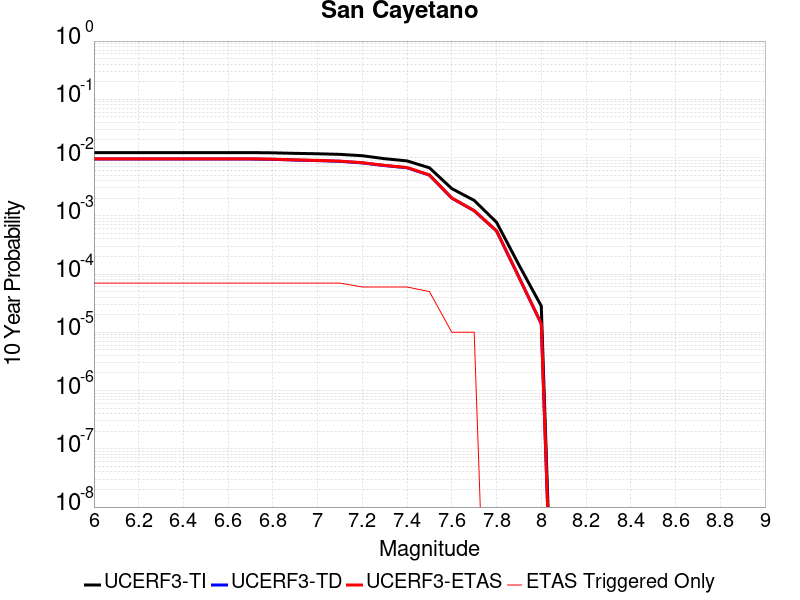 |

| Magnitude | 1 wk TI Prob | 1 wk TD Prob | 1 wk ETAS Prob | 1 wk ETAS/TD Gain | 1 wk ETAS Triggered Only | 1 mo TI Prob | 1 mo TD Prob | 1 mo ETAS Prob | 1 mo ETAS/TD Gain | 1 mo ETAS Triggered Only | 1 yr TI Prob | 1 yr TD Prob | 1 yr ETAS Prob | 1 yr ETAS/TD Gain | 1 yr ETAS Triggered Only | 10 yr TI Prob | 10 yr TD Prob | 10 yr ETAS Prob | 10 yr ETAS/TD Gain | 10 yr ETAS Triggered Only |
|-----|-----|-----|-----|-----|-----|-----|-----|-----|-----|-----|-----|-----|-----|-----|-----|-----|-----|-----|-----|-----|
| 6.0 | 2.3476267E-5 | 1.816928E-5 | 3.6466874E-5 | 2.0070622 | 1.8297927E-5 | 1.0060869E-4 | 7.786603E-5 | 1.14459035E-4 | 1.4699482 | 3.6595855E-5 | 0.0012242225 | 9.476103E-4 | 0.0010024521 | 1.0578737 | 5.489378E-5 | 0.012175002 | 0.009436584 | 0.009509086 | 1.0076829 | 7.319171E-5 |
| 6.1 | 2.3476267E-5 | 1.816928E-5 | 3.6466874E-5 | 2.0070622 | 1.8297927E-5 | 1.0060869E-4 | 7.786603E-5 | 1.14459035E-4 | 1.4699482 | 3.6595855E-5 | 0.0012242225 | 9.476103E-4 | 0.0010024521 | 1.0578737 | 5.489378E-5 | 0.012175002 | 0.009436584 | 0.009509086 | 1.0076829 | 7.319171E-5 |
| 6.2 | 2.3476267E-5 | 1.816928E-5 | 3.6466874E-5 | 2.0070622 | 1.8297927E-5 | 1.0060869E-4 | 7.786603E-5 | 1.14459035E-4 | 1.4699482 | 3.6595855E-5 | 0.0012242225 | 9.476103E-4 | 0.0010024521 | 1.0578737 | 5.489378E-5 | 0.012175002 | 0.009436584 | 0.009509086 | 1.0076829 | 7.319171E-5 |
| 6.3 | 2.3476267E-5 | 1.816928E-5 | 3.6466874E-5 | 2.0070622 | 1.8297927E-5 | 1.0060869E-4 | 7.786603E-5 | 1.14459035E-4 | 1.4699482 | 3.6595855E-5 | 0.0012242225 | 9.476103E-4 | 0.0010024521 | 1.0578737 | 5.489378E-5 | 0.012175002 | 0.009436584 | 0.009509086 | 1.0076829 | 7.319171E-5 |
| 6.4 | 2.3476267E-5 | 1.816928E-5 | 3.6466874E-5 | 2.0070622 | 1.8297927E-5 | 1.0060869E-4 | 7.786603E-5 | 1.14459035E-4 | 1.4699482 | 3.6595855E-5 | 0.0012242225 | 9.476103E-4 | 0.0010024521 | 1.0578737 | 5.489378E-5 | 0.012175002 | 0.009436584 | 0.009509086 | 1.0076829 | 7.319171E-5 |
| 6.5 | 2.3476267E-5 | 1.816928E-5 | 3.6466874E-5 | 2.0070622 | 1.8297927E-5 | 1.0060869E-4 | 7.786603E-5 | 1.14459035E-4 | 1.4699482 | 3.6595855E-5 | 0.0012242225 | 9.476103E-4 | 0.0010024521 | 1.0578737 | 5.489378E-5 | 0.012175002 | 0.009436584 | 0.009509086 | 1.0076829 | 7.319171E-5 |
| 6.6 | 2.3476267E-5 | 1.816928E-5 | 3.6466874E-5 | 2.0070622 | 1.8297927E-5 | 1.0060869E-4 | 7.786603E-5 | 1.14459035E-4 | 1.4699482 | 3.6595855E-5 | 0.0012242225 | 9.476103E-4 | 0.0010024521 | 1.0578737 | 5.489378E-5 | 0.012175002 | 0.009436584 | 0.009509086 | 1.0076829 | 7.319171E-5 |
| 6.7 | 2.3476267E-5 | 1.816928E-5 | 3.6466874E-5 | 2.0070622 | 1.8297927E-5 | 1.0060869E-4 | 7.786603E-5 | 1.14459035E-4 | 1.4699482 | 3.6595855E-5 | 0.0012242225 | 9.476103E-4 | 0.0010024521 | 1.0578737 | 5.489378E-5 | 0.012175002 | 0.009436584 | 0.009509086 | 1.0076829 | 7.319171E-5 |
| 6.8 | 2.3241924E-5 | 1.7936987E-5 | 3.6234585E-5 | 2.0201044 | 1.8297927E-5 | 9.960445E-5 | 7.687056E-5 | 1.134636E-4 | 1.4760345 | 3.6595855E-5 | 0.0012120095 | 9.3550084E-4 | 9.903433E-4 | 1.0586236 | 5.489378E-5 | 0.012054204 | 0.009316482 | 0.009388992 | 1.0077829 | 7.319171E-5 |
| 6.9 | 2.2761007E-5 | 1.7432423E-5 | 3.573003E-5 | 2.0496309 | 1.8297927E-5 | 9.7543525E-5 | 7.470827E-5 | 1.11301386E-4 | 1.4898136 | 3.6595855E-5 | 0.0011869454 | 9.09197E-4 | 9.6404087E-4 | 1.0603212 | 5.489378E-5 | 0.011806256 | 0.009055603 | 0.009128132 | 1.0080093 | 7.319171E-5 |
| 7.0 | 2.240283E-5 | 1.7066168E-5 | 3.5363784E-5 | 2.0721571 | 1.8297927E-5 | 9.600859E-5 | 7.313869E-5 | 1.0973187E-4 | 1.5003258 | 3.6595855E-5 | 0.0011682777 | 8.9010317E-4 | 9.449481E-4 | 1.0616163 | 5.489378E-5 | 0.011621549 | 0.008866196 | 0.008938738 | 1.0081819 | 7.319171E-5 |
| 7.1 | 2.1871154E-5 | 1.6586018E-5 | 3.488364E-5 | 2.1031957 | 1.8297927E-5 | 9.373015E-5 | 7.108101E-5 | 1.0767427E-4 | 1.5148104 | 3.6595855E-5 | 0.0011405671 | 8.6507114E-4 | 9.199174E-4 | 1.0634009 | 5.489378E-5 | 0.011347309 | 0.008617838 | 0.008690399 | 1.0084199 | 7.319171E-5 |
| 7.2 | 2.0714133E-5 | 1.5564561E-5 | 3.38622E-5 | 2.1755965 | 1.8297927E-5 | 8.8771834E-5 | 6.670357E-5 | 8.5000276E-5 | 1.2742988 | 1.8297927E-5 | 0.0010802611 | 8.1181666E-4 | 8.483828E-4 | 1.0450424 | 3.6595855E-5 | 0.010750249 | 0.008089285 | 0.008143735 | 1.006731 | 5.489378E-5 |
| 7.3 | 1.8408395E-5 | 1.3996864E-5 | 3.2294534E-5 | 2.3072693 | 1.8297927E-5 | 7.8890735E-5 | 5.99852E-5 | 7.828203E-5 | 1.3050224 | 1.8297927E-5 | 9.600714E-4 | 7.300781E-4 | 7.666472E-4 | 1.0500894 | 3.6595855E-5 | 0.009559342 | 0.0072775153 | 0.0073320097 | 1.007488 | 5.489378E-5 |
| 7.4 | 1.6856795E-5 | 1.28500815E-5 | 3.1147774E-5 | 2.423936 | 1.8297927E-5 | 7.2241404E-5 | 5.5070628E-5 | 7.336755E-5 | 1.3322446 | 1.8297927E-5 | 8.7918417E-4 | 6.7028153E-4 | 7.068528E-4 | 1.0545611 | 3.6595855E-5 | 0.00875714 | 0.0066832784 | 0.0067378054 | 1.0081587 | 5.489378E-5 |
| 7.5 | 1.2822778E-5 | 9.577542E-6 | 2.7875294E-5 | 2.910485 | 1.8297927E-5 | 5.495361E-5 | 4.1045972E-5 | 5.9343147E-5 | 1.4457728 | 1.8297927E-5 | 6.688548E-4 | 4.996217E-4 | 5.3619925E-4 | 1.0732105 | 3.6595855E-5 | 0.006668452 | 0.0049851555 | 0.0050397757 | 1.0109565 | 5.489378E-5 |
| 7.6 | 5.6272684E-6 | 3.854903E-6 | 3.854903E-6 | 1.0 | 0.0 | 2.4116642E-5 | 1.652091E-5 | 1.652091E-5 | 1.0 | 0.0 | 2.9358055E-4 | 2.0112359E-4 | 2.1941784E-4 | 1.0909603 | 1.8297927E-5 | 0.0029319301 | 0.0020094267 | 0.0020276878 | 1.0090878 | 1.8297927E-5 |
| 7.7 | 3.5261346E-6 | 2.3407013E-6 | 2.3407013E-6 | 1.0 | 0.0 | 1.5111918E-5 | 1.0031539E-5 | 1.0031539E-5 | 1.0 | 0.0 | 1.8397206E-4 | 1.2212721E-4 | 1.4042291E-4 | 1.1498085 | 1.8297927E-5 | 0.0018381984 | 0.0012206084 | 0.0012388839 | 1.0149726 | 1.8297927E-5 |
| 7.8 | 1.4826929E-6 | 1.056428E-6 | 1.056428E-6 | 1.0 | 0.0 | 6.354383E-6 | 4.5275406E-6 | 4.5275406E-6 | 1.0 | 0.0 | 7.736187E-5 | 5.5121433E-5 | 5.5121433E-5 | 1.0 | 0.0 | 7.733494E-4 | 5.5107963E-4 | 5.5107963E-4 | 1.0 | 0.0 |
| 7.9 | 2.7568166E-7 | 1.6978244E-7 | 1.6978244E-7 | 1.0 | 0.0 | 1.1814923E-6 | 7.2763885E-7 | 7.2763885E-7 | 1.0 | 0.0 | 1.4384574E-5 | 8.858967E-6 | 8.858967E-6 | 1.0 | 0.0 | 1.4383643E-4 | 8.8586174E-5 | 8.8586174E-5 | 1.0 | 0.0 |
| 8.0 | 5.407832E-8 | 2.6887697E-8 | 2.6887697E-8 | 1.0 | 0.0 | 2.3176422E-7 | 1.15232986E-7 | 1.15232986E-7 | 1.0 | 0.0 | 2.8217257E-6 | 1.4029607E-6 | 1.4029607E-6 | 1.0 | 0.0 | 2.8216898E-5 | 1.4029522E-5 | 1.4029522E-5 | 1.0 | 0.0 |

## Newport-Inglewood alt 1
*[(top)](#table-of-contents)*

| 1 Week | 1 Month | 1 Year | 10 Year |
|-----|-----|-----|-----|
|  |  |  |  |

| Magnitude | 1 wk TI Prob | 1 wk TD Prob | 1 wk ETAS Prob | 1 wk ETAS/TD Gain | 1 wk ETAS Triggered Only | 1 mo TI Prob | 1 mo TD Prob | 1 mo ETAS Prob | 1 mo ETAS/TD Gain | 1 mo ETAS Triggered Only | 1 yr TI Prob | 1 yr TD Prob | 1 yr ETAS Prob | 1 yr ETAS/TD Gain | 1 yr ETAS Triggered Only | 10 yr TI Prob | 10 yr TD Prob | 10 yr ETAS Prob | 10 yr ETAS/TD Gain | 10 yr ETAS Triggered Only |
|-----|-----|-----|-----|-----|-----|-----|-----|-----|-----|-----|-----|-----|-----|-----|-----|-----|-----|-----|-----|-----|
| 6.0 | 2.9668912E-5 | 3.0404817E-5 | 3.0404817E-5 | 1.0 | 0.0 | 1.2714628E-4 | 1.303026E-4 | 1.4859813E-4 | 1.1404082 | 1.8297927E-5 | 0.0015469068 | 0.0015857625 | 0.0016223004 | 1.0230411 | 3.6595855E-5 | 0.015361829 | 0.015792042 | 0.01584607 | 1.0034212 | 5.489378E-5 |
| 6.1 | 2.9668912E-5 | 3.0404817E-5 | 3.0404817E-5 | 1.0 | 0.0 | 1.2714628E-4 | 1.303026E-4 | 1.4859813E-4 | 1.1404082 | 1.8297927E-5 | 0.0015469068 | 0.0015857625 | 0.0016223004 | 1.0230411 | 3.6595855E-5 | 0.015361829 | 0.015792042 | 0.01584607 | 1.0034212 | 5.489378E-5 |
| 6.2 | 2.9668912E-5 | 3.0404817E-5 | 3.0404817E-5 | 1.0 | 0.0 | 1.2714628E-4 | 1.303026E-4 | 1.4859813E-4 | 1.1404082 | 1.8297927E-5 | 0.0015469068 | 0.0015857625 | 0.0016223004 | 1.0230411 | 3.6595855E-5 | 0.015361829 | 0.015792042 | 0.01584607 | 1.0034212 | 5.489378E-5 |
| 6.3 | 2.9668912E-5 | 3.0404817E-5 | 3.0404817E-5 | 1.0 | 0.0 | 1.2714628E-4 | 1.303026E-4 | 1.4859813E-4 | 1.1404082 | 1.8297927E-5 | 0.0015469068 | 0.0015857625 | 0.0016223004 | 1.0230411 | 3.6595855E-5 | 0.015361829 | 0.015792042 | 0.01584607 | 1.0034212 | 5.489378E-5 |
| 6.4 | 1.275942E-5 | 1.0272503E-5 | 1.0272503E-5 | 1.0 | 0.0 | 5.4682085E-5 | 4.402429E-5 | 6.2321415E-5 | 1.4156142 | 1.8297927E-5 | 6.65551E-4 | 5.358681E-4 | 5.7244435E-4 | 1.068256 | 3.6595855E-5 | 0.0066356123 | 0.005346184 | 0.0053825844 | 1.0068086 | 3.6595855E-5 |
| 6.5 | 1.275942E-5 | 1.0272503E-5 | 1.0272503E-5 | 1.0 | 0.0 | 5.4682085E-5 | 4.402429E-5 | 6.2321415E-5 | 1.4156142 | 1.8297927E-5 | 6.65551E-4 | 5.358681E-4 | 5.7244435E-4 | 1.068256 | 3.6595855E-5 | 0.0066356123 | 0.005346184 | 0.0053825844 | 1.0068086 | 3.6595855E-5 |
| 6.6 | 1.1255358E-5 | 8.661884E-6 | 8.661884E-6 | 1.0 | 0.0 | 4.8236358E-5 | 3.712184E-5 | 5.541909E-5 | 1.4928972 | 1.8297927E-5 | 5.871194E-4 | 4.518664E-4 | 4.884457E-4 | 1.0809516 | 3.6595855E-5 | 0.005855706 | 0.004509653 | 0.004546084 | 1.0080785 | 3.6595855E-5 |
| 6.7 | 1.0504745E-5 | 7.8997955E-6 | 7.8997955E-6 | 1.0 | 0.0 | 4.5019555E-5 | 3.3855835E-5 | 5.215314E-5 | 1.5404477 | 1.8297927E-5 | 5.4797524E-4 | 4.1211807E-4 | 4.4869885E-4 | 1.0887629 | 3.6595855E-5 | 0.0054662596 | 0.004113668 | 0.004150113 | 1.0088595 | 3.6595855E-5 |
| 6.8 | 1.0476007E-5 | 7.881176E-6 | 7.881176E-6 | 1.0 | 0.0 | 4.4896402E-5 | 3.3776043E-5 | 5.207335E-5 | 1.5417244 | 1.8297927E-5 | 5.464766E-4 | 4.1114696E-4 | 4.4772777E-4 | 1.0889726 | 3.6595855E-5 | 0.005451347 | 0.0041039926 | 0.0041404385 | 1.0088805 | 3.6595855E-5 |
| 6.9 | 9.076797E-6 | 6.4896312E-6 | 6.4896312E-6 | 1.0 | 0.0 | 3.889998E-5 | 2.781241E-5 | 2.781241E-5 | 1.0 | 0.0 | 4.7350433E-4 | 3.385638E-4 | 3.385638E-4 | 1.0 | 0.0 | 0.004724967 | 0.0033805177 | 0.0033805177 | 1.0 | 0.0 |
| 7.0 | 8.73795E-6 | 6.2120125E-6 | 6.2120125E-6 | 1.0 | 0.0 | 3.7447822E-5 | 2.6622642E-5 | 2.6622642E-5 | 1.0 | 0.0 | 4.5583185E-4 | 3.2408274E-4 | 3.2408274E-4 | 1.0 | 0.0 | 0.0045489795 | 0.0032361327 | 0.0032361327 | 1.0 | 0.0 |
| 7.1 | 8.391299E-6 | 5.95579E-6 | 5.95579E-6 | 1.0 | 0.0 | 3.5962214E-5 | 2.5524565E-5 | 2.5524565E-5 | 1.0 | 0.0 | 4.37752E-4 | 3.1071753E-4 | 3.1071753E-4 | 1.0 | 0.0 | 0.004368907 | 0.0031028606 | 0.0031028606 | 1.0 | 0.0 |
| 7.2 | 7.796882E-6 | 5.4965344E-6 | 5.4965344E-6 | 1.0 | 0.0 | 3.341478E-5 | 2.3556364E-5 | 2.3556364E-5 | 1.0 | 0.0 | 4.06749E-4 | 2.867612E-4 | 2.867612E-4 | 1.0 | 0.0 | 0.0040600533 | 0.0028639357 | 0.0028639357 | 1.0 | 0.0 |
| 7.3 | 6.4738833E-6 | 4.6478162E-6 | 4.6478162E-6 | 1.0 | 0.0 | 2.774492E-5 | 1.9919062E-5 | 1.9919062E-5 | 1.0 | 0.0 | 3.3774204E-4 | 2.4248775E-4 | 2.4248775E-4 | 1.0 | 0.0 | 0.0033722918 | 0.0024222482 | 0.0024222482 | 1.0 | 0.0 |
| 7.4 | 5.382145E-6 | 3.8857597E-6 | 3.8857597E-6 | 1.0 | 0.0 | 2.3066134E-5 | 1.665315E-5 | 1.665315E-5 | 1.0 | 0.0 | 2.8079396E-4 | 2.0273338E-4 | 2.0273338E-4 | 1.0 | 0.0 | 0.0028043943 | 0.0020254988 | 0.0020254988 | 1.0 | 0.0 |
| 7.5 | 3.648244E-6 | 2.5737843E-6 | 2.5737843E-6 | 1.0 | 0.0 | 1.5635238E-5 | 1.1030458E-5 | 1.1030458E-5 | 1.0 | 0.0 | 1.9034238E-4 | 1.3428765E-4 | 1.3428765E-4 | 1.0 | 0.0 | 0.0019017943 | 0.0013420755 | 0.0013420755 | 1.0 | 0.0 |
| 7.6 | 2.2906888E-6 | 1.5479842E-6 | 1.5479842E-6 | 1.0 | 0.0 | 9.817201E-6 | 6.634202E-6 | 6.634202E-6 | 1.0 | 0.0 | 1.1951787E-4 | 8.076848E-5 | 8.076848E-5 | 1.0 | 0.0 | 0.0011945361 | 8.07398E-4 | 8.07398E-4 | 1.0 | 0.0 |
| 7.7 | 6.0479874E-7 | 3.397512E-7 | 3.397512E-7 | 1.0 | 0.0 | 2.5919921E-6 | 1.4560758E-6 | 1.4560758E-6 | 1.0 | 0.0 | 3.1557047E-5 | 1.7727592E-5 | 1.7727592E-5 | 1.0 | 0.0 | 3.1552566E-4 | 1.7726317E-4 | 1.7726317E-4 | 1.0 | 0.0 |
| 7.8 | 1.16056995E-8 | 9.782373E-9 | 9.782373E-9 | 1.0 | 0.0 | 4.9738713E-8 | 4.1924455E-8 | 4.1924455E-8 | 1.0 | 0.0 | 6.0556863E-7 | 5.1043025E-7 | 5.1043025E-7 | 1.0 | 0.0 | 6.05567E-6 | 5.1043025E-6 | 5.1043025E-6 | 1.0 | 0.0 |

## Concord 2011 CFM
*[(top)](#table-of-contents)*

| 1 Week | 1 Month | 1 Year | 10 Year |
|-----|-----|-----|-----|
| 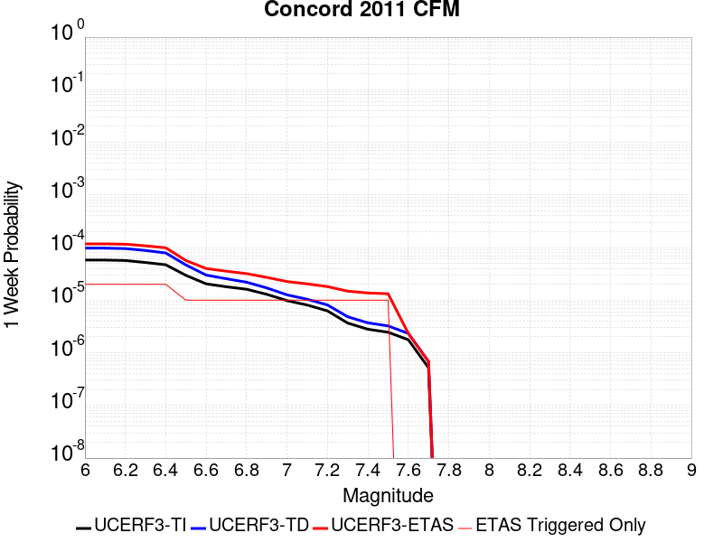 |  |  |  |

| Magnitude | 1 wk TI Prob | 1 wk TD Prob | 1 wk ETAS Prob | 1 wk ETAS/TD Gain | 1 wk ETAS Triggered Only | 1 mo TI Prob | 1 mo TD Prob | 1 mo ETAS Prob | 1 mo ETAS/TD Gain | 1 mo ETAS Triggered Only | 1 yr TI Prob | 1 yr TD Prob | 1 yr ETAS Prob | 1 yr ETAS/TD Gain | 1 yr ETAS Triggered Only | 10 yr TI Prob | 10 yr TD Prob | 10 yr ETAS Prob | 10 yr ETAS/TD Gain | 10 yr ETAS Triggered Only |
|-----|-----|-----|-----|-----|-----|-----|-----|-----|-----|-----|-----|-----|-----|-----|-----|-----|-----|-----|-----|-----|
| 6.0 | 5.7865112E-5 | 9.759152E-5 | 9.759152E-5 | 1.0 | 0.0 | 2.4796976E-4 | 4.1818706E-4 | 4.1818706E-4 | 1.0 | 0.0 | 0.0030148525 | 0.005079467 | 0.005097672 | 1.003584 | 1.8297927E-5 | 0.029742775 | 0.049248982 | 0.04930117 | 1.0010598 | 5.489378E-5 |
| 6.1 | 5.7865112E-5 | 9.759152E-5 | 9.759152E-5 | 1.0 | 0.0 | 2.4796976E-4 | 4.1818706E-4 | 4.1818706E-4 | 1.0 | 0.0 | 0.0030148525 | 0.005079467 | 0.005097672 | 1.003584 | 1.8297927E-5 | 0.029742775 | 0.049248982 | 0.04930117 | 1.0010598 | 5.489378E-5 |
| 6.2 | 5.6789337E-5 | 9.5795076E-5 | 9.5795076E-5 | 1.0 | 0.0 | 2.4336016E-4 | 4.104905E-4 | 4.104905E-4 | 1.0 | 0.0 | 0.0029588845 | 0.0049861916 | 0.005004398 | 1.0036514 | 1.8297927E-5 | 0.029197963 | 0.04836556 | 0.0484178 | 1.00108 | 5.489378E-5 |
| 6.3 | 5.203322E-5 | 8.803056E-5 | 8.803056E-5 | 1.0 | 0.0 | 2.2298045E-4 | 3.7722368E-4 | 3.7722368E-4 | 1.0 | 0.0 | 0.0027114071 | 0.0045838105 | 0.0046020243 | 1.0039736 | 1.8297927E-5 | 0.026785625 | 0.04453672 | 0.04458917 | 1.0011777 | 5.489378E-5 |
| 6.4 | 4.7120942E-5 | 7.897404E-5 | 7.897404E-5 | 1.0 | 0.0 | 2.0193127E-4 | 3.3842045E-4 | 3.3842045E-4 | 1.0 | 0.0 | 0.0024557412 | 0.00411323 | 0.004131452 | 1.0044303 | 1.8297927E-5 | 0.024287801 | 0.040065527 | 0.04011822 | 1.0013152 | 5.489378E-5 |
| 6.5 | 2.9598437E-5 | 4.667486E-5 | 4.667486E-5 | 1.0 | 0.0 | 1.2684427E-4 | 2.0002096E-4 | 2.0002096E-4 | 1.0 | 0.0 | 0.001543235 | 0.0024327459 | 0.002450999 | 1.0075033 | 1.8297927E-5 | 0.015325619 | 0.023909973 | 0.023945695 | 1.0014939 | 3.6595855E-5 |
| 6.6 | 2.0443718E-5 | 2.998433E-5 | 2.998433E-5 | 1.0 | 0.0 | 8.7613E-5 | 1.2849816E-4 | 1.2849816E-4 | 1.0 | 0.0 | 0.0010661662 | 0.0015633785 | 0.0015816478 | 1.0116858 | 1.8297927E-5 | 0.010610655 | 0.015466996 | 0.015503026 | 1.0023295 | 3.6595855E-5 |
| 6.7 | 1.798539E-5 | 2.5557381E-5 | 2.5557381E-5 | 1.0 | 0.0 | 7.7077966E-5 | 1.0952716E-4 | 1.0952716E-4 | 1.0 | 0.0 | 9.380202E-4 | 0.001332699 | 0.0013509725 | 1.0137117 | 1.8297927E-5 | 0.009340706 | 0.013217433 | 0.013235489 | 1.0013661 | 1.8297927E-5 |
| 6.8 | 1.613555E-5 | 2.1959211E-5 | 2.1959211E-5 | 1.0 | 0.0 | 6.915052E-5 | 9.4107585E-5 | 9.4107585E-5 | 1.0 | 0.0 | 8.4158237E-4 | 0.0011451716 | 0.0011634486 | 1.01596 | 1.8297927E-5 | 0.008384023 | 0.0113782035 | 0.0113962935 | 1.0015899 | 1.8297927E-5 |
| 6.9 | 1.2916435E-5 | 1.7081054E-5 | 1.7081054E-5 | 1.0 | 0.0 | 5.5354973E-5 | 7.32025E-5 | 7.32025E-5 | 1.0 | 0.0 | 6.7373837E-4 | 8.908818E-4 | 9.0916344E-4 | 1.0205208 | 1.8297927E-5 | 0.006716994 | 0.008867139 | 0.008885275 | 1.0020453 | 1.8297927E-5 |
| 7.0 | 9.81129E-6 | 1.2630829E-5 | 1.2630829E-5 | 1.0 | 0.0 | 4.2047708E-5 | 5.413101E-5 | 5.413101E-5 | 1.0 | 0.0 | 5.118106E-4 | 6.588474E-4 | 6.7713327E-4 | 1.0277543 | 1.8297927E-5 | 0.005106334 | 0.006569153 | 0.0065873307 | 1.0027671 | 1.8297927E-5 |
| 7.1 | 8.0889195E-6 | 1.0418261E-5 | 1.0418261E-5 | 1.0 | 0.0 | 3.4666336E-5 | 4.4648932E-5 | 4.4648932E-5 | 1.0 | 0.0 | 4.219809E-4 | 5.434662E-4 | 5.6175416E-4 | 1.0336506 | 1.8297927E-5 | 0.004211805 | 0.0054215975 | 0.0054397965 | 1.0033567 | 1.8297927E-5 |
| 7.2 | 6.267438E-6 | 8.115699E-6 | 8.115699E-6 | 1.0 | 0.0 | 2.6860173E-5 | 3.4781104E-5 | 3.4781104E-5 | 1.0 | 0.0 | 3.2697353E-4 | 4.233784E-4 | 4.233784E-4 | 1.0 | 0.0 | 0.0032649285 | 0.004225969 | 0.004225969 | 1.0 | 0.0 |
| 7.3 | 3.6761196E-6 | 4.8401653E-6 | 4.8401653E-6 | 1.0 | 0.0 | 1.5754704E-5 | 2.0743402E-5 | 2.0743402E-5 | 1.0 | 0.0 | 1.9179663E-4 | 2.5252186E-4 | 2.5252186E-4 | 1.0 | 0.0 | 0.0019163118 | 0.002522487 | 0.002522487 | 1.0 | 0.0 |
| 7.4 | 2.8044356E-6 | 3.7096036E-6 | 3.7096036E-6 | 1.0 | 0.0 | 1.2018954E-5 | 1.5898204E-5 | 1.5898204E-5 | 1.0 | 0.0 | 1.4632095E-4 | 1.9354356E-4 | 1.9354356E-4 | 1.0 | 0.0 | 0.0014622464 | 0.0019338481 | 0.0019338481 | 1.0 | 0.0 |
| 7.5 | 2.4578699E-6 | 3.2447442E-6 | 3.2447442E-6 | 1.0 | 0.0 | 1.0533685E-5 | 1.3905973E-5 | 1.3905973E-5 | 1.0 | 0.0 | 1.2824008E-4 | 1.6929218E-4 | 1.6929218E-4 | 1.0 | 0.0 | 0.0012816609 | 0.001691713 | 0.001691713 | 1.0 | 0.0 |
| 7.6 | 1.7713267E-6 | 2.3351192E-6 | 2.3351192E-6 | 1.0 | 0.0 | 7.591378E-6 | 1.0007616E-5 | 1.0007616E-5 | 1.0 | 0.0 | 9.2421105E-5 | 1.21836E-4 | 1.21836E-4 | 1.0 | 0.0 | 9.2382677E-4 | 0.0012177454 | 0.0012177454 | 1.0 | 0.0 |
| 7.7 | 5.1912366E-7 | 6.8290143E-7 | 6.8290143E-7 | 1.0 | 0.0 | 2.2248137E-6 | 2.9267171E-6 | 2.9267171E-6 | 1.0 | 0.0 | 2.708677E-5 | 3.5632213E-5 | 3.5632213E-5 | 1.0 | 0.0 | 2.708347E-4 | 3.5627294E-4 | 3.5627294E-4 | 1.0 | 0.0 |

## Owens Valley Keough Hot Springs
*[(top)](#table-of-contents)*

| 1 Week | 1 Month | 1 Year | 10 Year |
|-----|-----|-----|-----|
|  |  |  |  |

| Magnitude | 1 wk TI Prob | 1 wk TD Prob | 1 wk ETAS Prob | 1 wk ETAS/TD Gain | 1 wk ETAS Triggered Only | 1 mo TI Prob | 1 mo TD Prob | 1 mo ETAS Prob | 1 mo ETAS/TD Gain | 1 mo ETAS Triggered Only | 1 yr TI Prob | 1 yr TD Prob | 1 yr ETAS Prob | 1 yr ETAS/TD Gain | 1 yr ETAS Triggered Only | 10 yr TI Prob | 10 yr TD Prob | 10 yr ETAS Prob | 10 yr ETAS/TD Gain | 10 yr ETAS Triggered Only |
|-----|-----|-----|-----|-----|-----|-----|-----|-----|-----|-----|-----|-----|-----|-----|-----|-----|-----|-----|-----|-----|
| 6.0 | 1.5708529E-5 | 4.950656E-6 | 2.3248493E-5 | 4.696043 | 1.8297927E-5 | 6.7320536E-5 | 2.1216953E-5 | 3.9514493E-5 | 1.8624018 | 1.8297927E-5 | 8.193192E-4 | 2.582909E-4 | 2.948773E-4 | 1.141648 | 3.6595855E-5 | 0.008163051 | 0.0025805652 | 0.0026353172 | 1.0212171 | 5.489378E-5 |
| 6.1 | 1.5708529E-5 | 4.950656E-6 | 2.3248493E-5 | 4.696043 | 1.8297927E-5 | 6.7320536E-5 | 2.1216953E-5 | 3.9514493E-5 | 1.8624018 | 1.8297927E-5 | 8.193192E-4 | 2.582909E-4 | 2.948773E-4 | 1.141648 | 3.6595855E-5 | 0.008163051 | 0.0025805652 | 0.0026353172 | 1.0212171 | 5.489378E-5 |
| 6.2 | 1.5708529E-5 | 4.950656E-6 | 2.3248493E-5 | 4.696043 | 1.8297927E-5 | 6.7320536E-5 | 2.1216953E-5 | 3.9514493E-5 | 1.8624018 | 1.8297927E-5 | 8.193192E-4 | 2.582909E-4 | 2.948773E-4 | 1.141648 | 3.6595855E-5 | 0.008163051 | 0.0025805652 | 0.0026353172 | 1.0212171 | 5.489378E-5 |
| 6.3 | 1.5708529E-5 | 4.950656E-6 | 2.3248493E-5 | 4.696043 | 1.8297927E-5 | 6.7320536E-5 | 2.1216953E-5 | 3.9514493E-5 | 1.8624018 | 1.8297927E-5 | 8.193192E-4 | 2.582909E-4 | 2.948773E-4 | 1.141648 | 3.6595855E-5 | 0.008163051 | 0.0025805652 | 0.0026353172 | 1.0212171 | 5.489378E-5 |
| 6.4 | 1.4622509E-5 | 3.7265204E-6 | 2.2024378E-5 | 5.9101725 | 1.8297927E-5 | 6.266639E-5 | 1.5970723E-5 | 3.4268356E-5 | 2.1456985 | 1.8297927E-5 | 7.626962E-4 | 1.944295E-4 | 2.3101825E-4 | 1.1881851 | 3.6595855E-5 | 0.007600839 | 0.0019430731 | 0.0019978601 | 1.0281961 | 5.489378E-5 |
| 6.5 | 1.3335527E-5 | 2.2777172E-6 | 2.0575602E-5 | 9.033432 | 1.8297927E-5 | 5.7151006E-5 | 9.761612E-6 | 2.805936E-5 | 2.8744597 | 1.8297927E-5 | 6.955913E-4 | 1.18841825E-4 | 1.5543333E-4 | 1.3079009 | 3.6595855E-5 | 0.0069341804 | 0.0011880046 | 0.0012428332 | 1.0461518 | 5.489378E-5 |
| 6.6 | 1.3332855E-5 | 2.2748663E-6 | 2.0572752E-5 | 9.043499 | 1.8297927E-5 | 5.7139558E-5 | 9.749395E-6 | 2.8047143E-5 | 2.8768086 | 1.8297927E-5 | 6.9545204E-4 | 1.186931E-4 | 1.5528461E-4 | 1.3082868 | 3.6595855E-5 | 0.0069327964 | 0.0011865189 | 0.0012413475 | 1.0462097 | 5.489378E-5 |
| 6.7 | 1.3318214E-5 | 2.2640966E-6 | 2.0561982E-5 | 9.08176 | 1.8297927E-5 | 5.707681E-5 | 9.703239E-6 | 2.8000988E-5 | 2.8857362 | 1.8297927E-5 | 6.946886E-4 | 1.1813121E-4 | 1.5472274E-4 | 1.3097533 | 3.6595855E-5 | 0.0069252094 | 0.001180906 | 0.001235735 | 1.0464295 | 5.489378E-5 |
| 6.8 | 1.2441338E-5 | 1.6777863E-6 | 1.9975683E-5 | 11.905975 | 1.8297927E-5 | 5.331893E-5 | 7.1904947E-6 | 2.5488289E-5 | 3.54472 | 1.8297927E-5 | 6.489646E-4 | 8.7541055E-5 | 1.241337E-4 | 1.4180056 | 3.6595855E-5 | 0.0064707273 | 8.752499E-4 | 9.300956E-4 | 1.062663 | 5.489378E-5 |
| 6.9 | 1.1130476E-5 | 1.0303868E-6 | 1.9328294E-5 | 18.758291 | 1.8297927E-5 | 4.7701167E-5 | 4.415936E-6 | 2.2713783E-5 | 5.1435943 | 1.8297927E-5 | 5.806069E-4 | 5.3762706E-5 | 9.0356596E-5 | 1.6806556 | 3.6595855E-5 | 0.0057909233 | 5.37651E-4 | 5.925153E-4 | 1.1020443 | 5.489378E-5 |
| 7.0 | 1.0986073E-5 | 9.579413E-7 | 1.9255851E-5 | 20.101284 | 1.8297927E-5 | 4.7082318E-5 | 4.1054564E-6 | 2.2403308E-5 | 5.4569592 | 1.8297927E-5 | 5.730765E-4 | 4.99828E-5 | 8.657682E-5 | 1.7321324 | 3.6595855E-5 | 0.0057160086 | 4.9986853E-4 | 5.5473484E-4 | 1.1097616 | 5.489378E-5 |
| 7.1 | 1.0451338E-5 | 8.0002656E-7 | 1.9097939E-5 | 23.871632 | 1.8297927E-5 | 4.4790682E-5 | 3.4286807E-6 | 2.1726544E-5 | 6.336707 | 1.8297927E-5 | 5.451901E-4 | 4.1743395E-5 | 7.833772E-5 | 1.8766495 | 3.6595855E-5 | 0.005438545 | 4.1750458E-4 | 4.7237542E-4 | 1.1314257 | 5.489378E-5 |
| 7.2 | 9.989061E-6 | 6.544956E-7 | 1.895241E-5 | 28.957277 | 1.8297927E-5 | 4.280956E-5 | 2.804978E-6 | 2.1102853E-5 | 7.523358 | 1.8297927E-5 | 5.2108173E-4 | 3.4150078E-5 | 7.074468E-5 | 2.0715818 | 3.6595855E-5 | 0.0051986156 | 3.415851E-4 | 3.9646012E-4 | 1.1606482 | 5.489378E-5 |
| 7.3 | 9.465365E-6 | 5.4600474E-7 | 1.884392E-5 | 34.51238 | 1.8297927E-5 | 4.056522E-5 | 2.3400182E-6 | 2.0637903E-5 | 8.819548 | 1.8297927E-5 | 4.937696E-4 | 2.8489352E-5 | 6.508416E-5 | 2.2845085 | 3.6595855E-5 | 0.0049267393 | 2.8498896E-4 | 3.3986708E-4 | 1.1925623 | 5.489378E-5 |
| 7.4 | 6.3824805E-6 | 4.016335E-7 | 1.8699553E-5 | 46.558746 | 1.8297927E-5 | 2.73532E-5 | 1.7212853E-6 | 2.001918E-5 | 11.630367 | 1.8297927E-5 | 3.3297433E-4 | 2.095645E-5 | 5.7551537E-5 | 2.7462447 | 3.6595855E-5 | 0.0033247585 | 2.0963654E-4 | 2.645188E-4 | 1.2617973 | 5.489378E-5 |
| 7.5 | 1.6192645E-6 | 2.516124E-7 | 1.8549536E-5 | 73.722664 | 1.8297927E-5 | 6.9396865E-6 | 1.0783383E-6 | 1.9376246E-5 | 17.968615 | 1.8297927E-5 | 8.448741E-5 | 1.31286915E-5 | 4.9724065E-5 | 3.7874348 | 3.6595855E-5 | 8.4455294E-4 | 1.3127929E-4 | 1.8616587E-4 | 1.4180901 | 5.489378E-5 |
| 7.6 | 5.7062545E-7 | 1.07924045E-7 | 1.8405848E-5 | 170.54448 | 1.8297927E-5 | 2.4455355E-6 | 4.6253152E-7 | 1.876045E-5 | 40.56037 | 1.8297927E-5 | 2.9773988E-5 | 5.6313074E-6 | 4.2226955E-5 | 7.4986057 | 3.6595855E-5 | 2.977E-4 | 5.6311732E-5 | 1.1120242E-4 | 1.9747647 | 5.489378E-5 |
| 7.7 | 2.5988817E-7 | 4.5457977E-8 | 1.8343384E-5 | 403.524 | 1.8297927E-5 | 1.113806E-6 | 1.9481989E-7 | 1.8492743E-5 | 94.92226 | 1.8297927E-5 | 1.3560503E-5 | 2.3719301E-6 | 2.0669813E-5 | 8.714344 | 1.8297927E-5 | 1.3559677E-4 | 2.371909E-5 | 6.0314076E-5 | 2.5428493 | 3.6595855E-5 |

## Great Valley 07 (Orestimba)
*[(top)](#table-of-contents)*

| 1 Week | 1 Month | 1 Year | 10 Year |
|-----|-----|-----|-----|
|  |  |  |  |

| Magnitude | 1 wk TI Prob | 1 wk TD Prob | 1 wk ETAS Prob | 1 wk ETAS/TD Gain | 1 wk ETAS Triggered Only | 1 mo TI Prob | 1 mo TD Prob | 1 mo ETAS Prob | 1 mo ETAS/TD Gain | 1 mo ETAS Triggered Only | 1 yr TI Prob | 1 yr TD Prob | 1 yr ETAS Prob | 1 yr ETAS/TD Gain | 1 yr ETAS Triggered Only | 10 yr TI Prob | 10 yr TD Prob | 10 yr ETAS Prob | 10 yr ETAS/TD Gain | 10 yr ETAS Triggered Only |
|-----|-----|-----|-----|-----|-----|-----|-----|-----|-----|-----|-----|-----|-----|-----|-----|-----|-----|-----|-----|-----|
| 6.0 | 2.9687902E-5 | 3.27575E-5 | 3.27575E-5 | 1.0 | 0.0 | 1.2722766E-4 | 1.4038214E-4 | 1.4038214E-4 | 1.0 | 0.0 | 0.0015478961 | 0.0017078844 | 0.0017261511 | 1.0106955 | 1.8297927E-5 | 0.015371585 | 0.016955135 | 0.01699111 | 1.0021218 | 3.6595855E-5 |
| 6.1 | 2.9687902E-5 | 3.27575E-5 | 3.27575E-5 | 1.0 | 0.0 | 1.2722766E-4 | 1.4038214E-4 | 1.4038214E-4 | 1.0 | 0.0 | 0.0015478961 | 0.0017078844 | 0.0017261511 | 1.0106955 | 1.8297927E-5 | 0.015371585 | 0.016955135 | 0.01699111 | 1.0021218 | 3.6595855E-5 |
| 6.2 | 1.9231524E-5 | 2.1159167E-5 | 2.1159167E-5 | 1.0 | 0.0 | 8.2418206E-5 | 9.067912E-5 | 9.067912E-5 | 1.0 | 0.0 | 0.0010029797 | 0.0011034822 | 0.00112176 | 1.0165637 | 1.8297927E-5 | 0.00998465 | 0.01098244 | 0.011000537 | 1.0016478 | 1.8297927E-5 |
| 6.3 | 1.324766E-5 | 1.4548534E-5 | 1.4548534E-5 | 1.0 | 0.0 | 5.6774446E-5 | 6.234942E-5 | 6.234942E-5 | 1.0 | 0.0 | 6.910097E-4 | 7.5884897E-4 | 7.77133E-4 | 1.0240945 | 1.8297927E-5 | 0.006888649 | 0.0075635235 | 0.0075816833 | 1.002401 | 1.8297927E-5 |
| 6.4 | 7.818645E-6 | 8.57284E-6 | 8.57284E-6 | 1.0 | 0.0 | 3.3508048E-5 | 3.6740246E-5 | 3.6740246E-5 | 1.0 | 0.0 | 4.078841E-4 | 4.4722404E-4 | 4.655138E-4 | 1.0408962 | 1.8297927E-5 | 0.004071363 | 0.0044635804 | 0.0044817966 | 1.0040811 | 1.8297927E-5 |
| 6.5 | 5.3076565E-6 | 5.8178007E-6 | 5.8178007E-6 | 1.0 | 0.0 | 2.27469E-5 | 2.4933206E-5 | 2.4933206E-5 | 1.0 | 0.0 | 2.7690834E-4 | 3.035216E-4 | 3.035216E-4 | 1.0 | 0.0 | 0.0027656353 | 0.00303128 | 0.00303128 | 1.0 | 0.0 |
| 6.6 | 3.6003578E-6 | 3.9484953E-6 | 3.9484953E-6 | 1.0 | 0.0 | 1.5430012E-5 | 1.6922022E-5 | 1.6922022E-5 | 1.0 | 0.0 | 1.8784421E-4 | 2.0600771E-4 | 2.0600771E-4 | 1.0 | 0.0 | 0.0018768552 | 0.0020583214 | 0.0020583214 | 1.0 | 0.0 |
| 6.7 | 2.5361826E-6 | 2.7834678E-6 | 2.7834678E-6 | 1.0 | 0.0 | 1.0869308E-5 | 1.1929101E-5 | 1.1929101E-5 | 1.0 | 0.0 | 1.3232579E-4 | 1.4522845E-4 | 1.4522845E-4 | 1.0 | 0.0 | 0.0013224703 | 0.0014514653 | 0.0014514653 | 1.0 | 0.0 |
| 6.8 | 1.2115831E-6 | 1.3313797E-6 | 1.3313797E-6 | 1.0 | 0.0 | 5.1924885E-6 | 5.7059065E-6 | 5.7059065E-6 | 1.0 | 0.0 | 6.3216714E-5 | 6.9468166E-5 | 6.9468166E-5 | 1.0 | 0.0 | 6.3198735E-4 | 6.945596E-4 | 6.945596E-4 | 1.0 | 0.0 |

## Camp Rock 2011
*[(top)](#table-of-contents)*

| 1 Week | 1 Month | 1 Year | 10 Year |
|-----|-----|-----|-----|
|  |  |  |  |

| Magnitude | 1 wk TI Prob | 1 wk TD Prob | 1 wk ETAS Prob | 1 wk ETAS/TD Gain | 1 wk ETAS Triggered Only | 1 mo TI Prob | 1 mo TD Prob | 1 mo ETAS Prob | 1 mo ETAS/TD Gain | 1 mo ETAS Triggered Only | 1 yr TI Prob | 1 yr TD Prob | 1 yr ETAS Prob | 1 yr ETAS/TD Gain | 1 yr ETAS Triggered Only | 10 yr TI Prob | 10 yr TD Prob | 10 yr ETAS Prob | 10 yr ETAS/TD Gain | 10 yr ETAS Triggered Only |
|-----|-----|-----|-----|-----|-----|-----|-----|-----|-----|-----|-----|-----|-----|-----|-----|-----|-----|-----|-----|-----|
| 6.0 | 1.6710783E-5 | 4.25026E-6 | 4.25026E-6 | 1.0 | 0.0 | 7.161568E-5 | 1.8215276E-5 | 1.8215276E-5 | 1.0 | 0.0 | 8.7157206E-4 | 2.2174895E-4 | 2.4004282E-4 | 1.0824981 | 1.8297927E-5 | 0.008681616 | 0.0022153298 | 0.0022701018 | 1.0247241 | 5.489378E-5 |
| 6.1 | 1.6710783E-5 | 4.25026E-6 | 4.25026E-6 | 1.0 | 0.0 | 7.161568E-5 | 1.8215276E-5 | 1.8215276E-5 | 1.0 | 0.0 | 8.7157206E-4 | 2.2174895E-4 | 2.4004282E-4 | 1.0824981 | 1.8297927E-5 | 0.008681616 | 0.0022153298 | 0.0022701018 | 1.0247241 | 5.489378E-5 |
| 6.2 | 1.6710783E-5 | 4.25026E-6 | 4.25026E-6 | 1.0 | 0.0 | 7.161568E-5 | 1.8215276E-5 | 1.8215276E-5 | 1.0 | 0.0 | 8.7157206E-4 | 2.2174895E-4 | 2.4004282E-4 | 1.0824981 | 1.8297927E-5 | 0.008681616 | 0.0022153298 | 0.0022701018 | 1.0247241 | 5.489378E-5 |
| 6.3 | 1.6710783E-5 | 4.25026E-6 | 4.25026E-6 | 1.0 | 0.0 | 7.161568E-5 | 1.8215276E-5 | 1.8215276E-5 | 1.0 | 0.0 | 8.7157206E-4 | 2.2174895E-4 | 2.4004282E-4 | 1.0824981 | 1.8297927E-5 | 0.008681616 | 0.0022153298 | 0.0022701018 | 1.0247241 | 5.489378E-5 |
| 6.4 | 7.982846E-6 | 3.6820884E-6 | 3.6820884E-6 | 1.0 | 0.0 | 3.421175E-5 | 1.5780286E-5 | 1.5780286E-5 | 1.0 | 0.0 | 4.1644843E-4 | 1.9210839E-4 | 2.104028E-4 | 1.0952296 | 1.8297927E-5 | 0.0041566887 | 0.001919458 | 0.0019742465 | 1.0285437 | 5.489378E-5 |
| 6.5 | 7.982846E-6 | 3.6820884E-6 | 3.6820884E-6 | 1.0 | 0.0 | 3.421175E-5 | 1.5780286E-5 | 1.5780286E-5 | 1.0 | 0.0 | 4.1644843E-4 | 1.9210839E-4 | 2.104028E-4 | 1.0952296 | 1.8297927E-5 | 0.0041566887 | 0.001919458 | 0.0019742465 | 1.0285437 | 5.489378E-5 |
| 6.6 | 7.048869E-6 | 3.4243571E-6 | 3.4243571E-6 | 1.0 | 0.0 | 3.0209088E-5 | 1.4675736E-5 | 1.4675736E-5 | 1.0 | 0.0 | 3.677336E-4 | 1.7866275E-4 | 1.9695741E-4 | 1.1023977 | 1.8297927E-5 | 0.0036712566 | 0.0017852228 | 0.0018400186 | 1.0306941 | 5.489378E-5 |
| 6.7 | 6.987307E-6 | 3.3623348E-6 | 3.3623348E-6 | 1.0 | 0.0 | 2.9945259E-5 | 1.4409929E-5 | 1.4409929E-5 | 1.0 | 0.0 | 3.6452254E-4 | 1.7542706E-4 | 1.9372177E-4 | 1.1042868 | 1.8297927E-5 | 0.0036392517 | 0.001752917 | 0.0018077145 | 1.0312607 | 5.489378E-5 |
| 6.8 | 6.3737602E-6 | 3.1179077E-6 | 3.1179077E-6 | 1.0 | 0.0 | 2.731583E-5 | 1.3362394E-5 | 1.3362394E-5 | 1.0 | 0.0 | 3.3251947E-4 | 1.626753E-4 | 1.8097025E-4 | 1.112463 | 1.8297927E-5 | 0.0033202237 | 0.0016255907 | 0.0016803953 | 1.0337136 | 5.489378E-5 |
| 6.9 | 6.112211E-6 | 2.9331156E-6 | 2.9331156E-6 | 1.0 | 0.0 | 2.6194928E-5 | 1.2570436E-5 | 1.2570436E-5 | 1.0 | 0.0 | 3.1887658E-4 | 1.5303459E-4 | 1.7132972E-4 | 1.1195489 | 1.8297927E-5 | 0.003184194 | 0.0015293199 | 0.0015841296 | 1.0358393 | 5.489378E-5 |
| 7.0 | 5.5140117E-6 | 2.641923E-6 | 2.641923E-6 | 1.0 | 0.0 | 2.3631264E-5 | 1.132248E-5 | 1.132248E-5 | 1.0 | 0.0 | 2.8767265E-4 | 1.3784273E-4 | 1.5613812E-4 | 1.1327267 | 1.8297927E-5 | 0.0028730053 | 0.0013775975 | 0.0014324157 | 1.0397925 | 5.489378E-5 |
| 7.1 | 4.8151105E-6 | 2.1342705E-6 | 2.1342705E-6 | 1.0 | 0.0 | 2.0636026E-5 | 9.146843E-6 | 9.146843E-6 | 1.0 | 0.0 | 2.5121463E-4 | 1.1135734E-4 | 1.2965323E-4 | 1.1642989 | 1.8297927E-5 | 0.0025093083 | 0.0011130372 | 0.0011678699 | 1.049264 | 5.489378E-5 |
| 7.2 | 3.818335E-6 | 1.2937425E-6 | 1.2937425E-6 | 1.0 | 0.0 | 1.6364189E-5 | 5.5445994E-6 | 5.5445994E-6 | 1.0 | 0.0 | 1.9921579E-4 | 6.750349E-5 | 6.750349E-5 | 1.0 | 0.0 | 0.0019903728 | 6.748381E-4 | 7.114092E-4 | 1.0541925 | 3.6595855E-5 |
| 7.3 | 2.7166698E-6 | 7.3835776E-7 | 7.3835776E-7 | 1.0 | 0.0 | 1.1642818E-5 | 3.1643867E-6 | 3.1643867E-6 | 1.0 | 0.0 | 1.4174209E-4 | 3.8525748E-5 | 3.8525748E-5 | 1.0 | 0.0 | 0.0014165172 | 3.851927E-4 | 4.0348357E-4 | 1.047485 | 1.8297927E-5 |
| 7.4 | 2.0893426E-6 | 5.4618386E-7 | 5.4618386E-7 | 1.0 | 0.0 | 8.954295E-6 | 2.3407858E-6 | 2.3407858E-6 | 1.0 | 0.0 | 1.0901308E-4 | 2.84987E-5 | 2.84987E-5 | 1.0 | 0.0 | 0.0010895962 | 2.84951E-4 | 3.0324372E-4 | 1.064196 | 1.8297927E-5 |
| 7.5 | 1.1681728E-6 | 3.6030585E-7 | 3.6030585E-7 | 1.0 | 0.0 | 5.0064455E-6 | 1.544167E-6 | 1.544167E-6 | 1.0 | 0.0 | 6.0951766E-5 | 1.8800076E-5 | 1.8800076E-5 | 1.0 | 0.0 | 6.093505E-4 | 1.8798532E-4 | 2.0627982E-4 | 1.0973186 | 1.8297927E-5 |
| 7.6 | 1.3154387E-7 | 7.1197384E-8 | 7.1197384E-8 | 1.0 | 0.0 | 5.6375933E-7 | 3.051316E-7 | 3.051316E-7 | 1.0 | 0.0 | 6.863748E-6 | 3.7149728E-6 | 3.7149728E-6 | 1.0 | 0.0 | 6.863536E-5 | 3.7149264E-5 | 3.7149264E-5 | 1.0 | 0.0 |

## Raymond
*[(top)](#table-of-contents)*

| 1 Week | 1 Month | 1 Year | 10 Year |
|-----|-----|-----|-----|
|  |  |  |  |

| Magnitude | 1 wk TI Prob | 1 wk TD Prob | 1 wk ETAS Prob | 1 wk ETAS/TD Gain | 1 wk ETAS Triggered Only | 1 mo TI Prob | 1 mo TD Prob | 1 mo ETAS Prob | 1 mo ETAS/TD Gain | 1 mo ETAS Triggered Only | 1 yr TI Prob | 1 yr TD Prob | 1 yr ETAS Prob | 1 yr ETAS/TD Gain | 1 yr ETAS Triggered Only | 10 yr TI Prob | 10 yr TD Prob | 10 yr ETAS Prob | 10 yr ETAS/TD Gain | 10 yr ETAS Triggered Only |
|-----|-----|-----|-----|-----|-----|-----|-----|-----|-----|-----|-----|-----|-----|-----|-----|-----|-----|-----|-----|-----|
| 6.0 | 1.5157413E-5 | 1.5810128E-5 | 3.4107765E-5 | 2.1573365 | 1.8297927E-5 | 6.4958724E-5 | 6.7756075E-5 | 1.0434945E-4 | 1.5400752 | 3.6595855E-5 | 7.905855E-4 | 8.2464307E-4 | 8.7949156E-4 | 1.0665119 | 5.489378E-5 | 0.007877788 | 0.008218348 | 0.00827279 | 1.0066246 | 5.489378E-5 |
| 6.1 | 1.5157413E-5 | 1.5810128E-5 | 3.4107765E-5 | 2.1573365 | 1.8297927E-5 | 6.4958724E-5 | 6.7756075E-5 | 1.0434945E-4 | 1.5400752 | 3.6595855E-5 | 7.905855E-4 | 8.2464307E-4 | 8.7949156E-4 | 1.0665119 | 5.489378E-5 | 0.007877788 | 0.008218348 | 0.00827279 | 1.0066246 | 5.489378E-5 |
| 6.2 | 1.5157413E-5 | 1.5810128E-5 | 3.4107765E-5 | 2.1573365 | 1.8297927E-5 | 6.4958724E-5 | 6.7756075E-5 | 1.0434945E-4 | 1.5400752 | 3.6595855E-5 | 7.905855E-4 | 8.2464307E-4 | 8.7949156E-4 | 1.0665119 | 5.489378E-5 | 0.007877788 | 0.008218348 | 0.00827279 | 1.0066246 | 5.489378E-5 |
| 6.3 | 1.5157413E-5 | 1.5810128E-5 | 3.4107765E-5 | 2.1573365 | 1.8297927E-5 | 6.4958724E-5 | 6.7756075E-5 | 1.0434945E-4 | 1.5400752 | 3.6595855E-5 | 7.905855E-4 | 8.2464307E-4 | 8.7949156E-4 | 1.0665119 | 5.489378E-5 | 0.007877788 | 0.008218348 | 0.00827279 | 1.0066246 | 5.489378E-5 |
| 6.4 | 1.3941944E-5 | 1.445469E-5 | 3.2752352E-5 | 2.2658634 | 1.8297927E-5 | 5.9749822E-5 | 6.1947336E-5 | 9.854092E-5 | 1.5907209 | 3.6595855E-5 | 7.2721124E-4 | 7.5397117E-4 | 8.088235E-4 | 1.0727513 | 5.489378E-5 | 0.007248361 | 0.0075164647 | 0.007570946 | 1.0072483 | 5.489378E-5 |
| 6.5 | 1.3941944E-5 | 1.445469E-5 | 3.2752352E-5 | 2.2658634 | 1.8297927E-5 | 5.9749822E-5 | 6.1947336E-5 | 9.854092E-5 | 1.5907209 | 3.6595855E-5 | 7.2721124E-4 | 7.5397117E-4 | 8.088235E-4 | 1.0727513 | 5.489378E-5 | 0.007248361 | 0.0075164647 | 0.007570946 | 1.0072483 | 5.489378E-5 |
| 6.6 | 1.0542609E-5 | 1.0671113E-5 | 2.8968845E-5 | 2.7146976 | 1.8297927E-5 | 4.5181827E-5 | 4.573257E-5 | 8.232675E-5 | 1.8001777 | 3.6595855E-5 | 5.499499E-4 | 5.5665727E-4 | 6.115205E-4 | 1.0985583 | 5.489378E-5 | 0.005485909 | 0.00555319 | 0.005607779 | 1.0098302 | 5.489378E-5 |
| 6.7 | 1.0542609E-5 | 1.0671113E-5 | 2.8968845E-5 | 2.7146976 | 1.8297927E-5 | 4.5181827E-5 | 4.573257E-5 | 8.232675E-5 | 1.8001777 | 3.6595855E-5 | 5.499499E-4 | 5.5665727E-4 | 6.115205E-4 | 1.0985583 | 5.489378E-5 | 0.005485909 | 0.00555319 | 0.005607779 | 1.0098302 | 5.489378E-5 |
| 6.8 | 1.0079132E-5 | 1.0176646E-5 | 2.8474387E-5 | 2.798013 | 1.8297927E-5 | 4.3195567E-5 | 4.3613498E-5 | 8.0207756E-5 | 1.839058 | 3.6595855E-5 | 5.257791E-4 | 5.3087034E-4 | 5.8573496E-4 | 1.1033485 | 5.489378E-5 | 0.0052453685 | 0.005296571 | 0.005351174 | 1.0103091 | 5.489378E-5 |
| 6.9 | 7.721598E-6 | 7.5489047E-6 | 2.5846693E-5 | 3.4239 | 1.8297927E-5 | 3.3092143E-5 | 3.2352054E-5 | 6.894673E-5 | 2.131139 | 3.6595855E-5 | 4.0282236E-4 | 3.9381627E-4 | 4.4868846E-4 | 1.1393344 | 5.489378E-5 | 0.0040209293 | 0.0039313175 | 0.0039859954 | 1.0139083 | 5.489378E-5 |
| 7.0 | 7.137566E-6 | 6.9113057E-6 | 2.5209107E-5 | 3.6475172 | 1.8297927E-5 | 3.058921E-5 | 2.961955E-5 | 6.621432E-5 | 2.2354937 | 3.6595855E-5 | 3.7236E-4 | 3.6055944E-4 | 4.1543343E-4 | 1.1521913 | 5.489378E-5 | 0.0037173668 | 0.0035998628 | 0.003654559 | 1.0151939 | 5.489378E-5 |
| 7.1 | 5.654976E-6 | 5.29954E-6 | 5.29954E-6 | 1.0 | 0.0 | 2.4235387E-5 | 2.2712118E-5 | 4.100963E-5 | 1.8056277 | 1.8297927E-5 | 2.9502588E-4 | 2.7648517E-4 | 2.9477803E-4 | 1.0661622 | 1.8297927E-5 | 0.0029463451 | 0.002761443 | 0.0027796903 | 1.0066079 | 1.8297927E-5 |
| 7.2 | 4.9358455E-6 | 4.5266574E-6 | 4.5266574E-6 | 1.0 | 0.0 | 2.1153453E-5 | 1.9399817E-5 | 1.9399817E-5 | 1.0 | 0.0 | 2.5751285E-4 | 2.3616731E-4 | 2.3616731E-4 | 1.0 | 0.0 | 0.0025721465 | 0.0023591854 | 0.0023591854 | 1.0 | 0.0 |
| 7.3 | 4.2368597E-6 | 3.8056164E-6 | 3.8056164E-6 | 1.0 | 0.0 | 1.8157843E-5 | 1.6309683E-5 | 1.6309683E-5 | 1.0 | 0.0 | 2.2104931E-4 | 1.9855241E-4 | 1.9855241E-4 | 1.0 | 0.0 | 0.0022082955 | 0.0019837688 | 0.0019837688 | 1.0 | 0.0 |
| 7.4 | 3.4999923E-6 | 3.043744E-6 | 3.043744E-6 | 1.0 | 0.0 | 1.49998805E-5 | 1.3044552E-5 | 1.3044552E-5 | 1.0 | 0.0 | 1.8260824E-4 | 1.5880594E-4 | 1.5880594E-4 | 1.0 | 0.0 | 0.0018245826 | 0.0015869403 | 0.0015869403 | 1.0 | 0.0 |
| 7.5 | 2.738017E-6 | 2.3020468E-6 | 2.3020468E-6 | 1.0 | 0.0 | 1.1734306E-5 | 9.865878E-6 | 9.865878E-6 | 1.0 | 0.0 | 1.428558E-4 | 1.2011051E-4 | 1.2011051E-4 | 1.0 | 0.0 | 0.0014276401 | 0.0012004703 | 0.0012004703 | 1.0 | 0.0 |
| 7.6 | 1.8186392E-6 | 1.442312E-6 | 1.442312E-6 | 1.0 | 0.0 | 7.794145E-6 | 6.181323E-6 | 6.181323E-6 | 1.0 | 0.0 | 9.488958E-5 | 7.5255055E-5 | 7.5255055E-5 | 1.0 | 0.0 | 9.4849075E-4 | 7.523072E-4 | 7.523072E-4 | 1.0 | 0.0 |
| 7.7 | 1.0660348E-6 | 7.6438056E-7 | 7.6438056E-7 | 1.0 | 0.0 | 4.5687125E-6 | 3.2759126E-6 | 3.2759126E-6 | 1.0 | 0.0 | 5.5622655E-5 | 3.9883522E-5 | 3.9883522E-5 | 1.0 | 0.0 | 5.5608735E-4 | 3.9877277E-4 | 3.9877277E-4 | 1.0 | 0.0 |
| 7.8 | 6.913602E-7 | 4.3204133E-7 | 4.3204133E-7 | 1.0 | 0.0 | 2.962969E-6 | 1.8516045E-6 | 1.8516045E-6 | 1.0 | 0.0 | 3.607355E-5 | 2.2543056E-5 | 2.2543056E-5 | 1.0 | 0.0 | 3.6067693E-4 | 2.2541556E-4 | 2.2541556E-4 | 1.0 | 0.0 |
| 7.9 | 7.425201E-8 | 5.3222113E-8 | 5.3222113E-8 | 1.0 | 0.0 | 3.1822285E-7 | 2.2809476E-7 | 2.2809476E-7 | 1.0 | 0.0 | 3.874356E-6 | 2.7770516E-6 | 2.7770516E-6 | 1.0 | 0.0 | 3.8742884E-5 | 2.7770298E-5 | 2.7770298E-5 | 1.0 | 0.0 |

## Ventura-Pitas Point
*[(top)](#table-of-contents)*

| 1 Week | 1 Month | 1 Year | 10 Year |
|-----|-----|-----|-----|
|  |  | 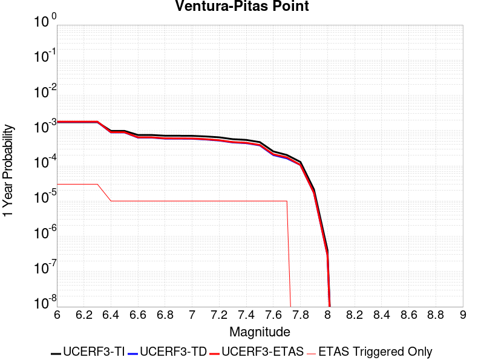 |  |

| Magnitude | 1 wk TI Prob | 1 wk TD Prob | 1 wk ETAS Prob | 1 wk ETAS/TD Gain | 1 wk ETAS Triggered Only | 1 mo TI Prob | 1 mo TD Prob | 1 mo ETAS Prob | 1 mo ETAS/TD Gain | 1 mo ETAS Triggered Only | 1 yr TI Prob | 1 yr TD Prob | 1 yr ETAS Prob | 1 yr ETAS/TD Gain | 1 yr ETAS Triggered Only | 10 yr TI Prob | 10 yr TD Prob | 10 yr ETAS Prob | 10 yr ETAS/TD Gain | 10 yr ETAS Triggered Only |
|-----|-----|-----|-----|-----|-----|-----|-----|-----|-----|-----|-----|-----|-----|-----|-----|-----|-----|-----|-----|-----|
| 6.0 | 3.3179622E-5 | 3.3735185E-5 | 5.2032494E-5 | 1.5423806 | 1.8297927E-5 | 1.4219063E-4 | 1.445728E-4 | 1.8116336E-4 | 1.2530944 | 3.6595855E-5 | 0.0017297962 | 0.0017590096 | 0.0018138068 | 1.0311524 | 5.489378E-5 | 0.017163932 | 0.0174764 | 0.017530335 | 1.0030861 | 5.489378E-5 |
| 6.1 | 3.3179622E-5 | 3.3735185E-5 | 5.2032494E-5 | 1.5423806 | 1.8297927E-5 | 1.4219063E-4 | 1.445728E-4 | 1.8116336E-4 | 1.2530944 | 3.6595855E-5 | 0.0017297962 | 0.0017590096 | 0.0018138068 | 1.0311524 | 5.489378E-5 | 0.017163932 | 0.0174764 | 0.017530335 | 1.0030861 | 5.489378E-5 |
| 6.2 | 3.3179622E-5 | 3.3735185E-5 | 5.2032494E-5 | 1.5423806 | 1.8297927E-5 | 1.4219063E-4 | 1.445728E-4 | 1.8116336E-4 | 1.2530944 | 3.6595855E-5 | 0.0017297962 | 0.0017590096 | 0.0018138068 | 1.0311524 | 5.489378E-5 | 0.017163932 | 0.0174764 | 0.017530335 | 1.0030861 | 5.489378E-5 |
| 6.3 | 3.3179622E-5 | 3.3735185E-5 | 5.2032494E-5 | 1.5423806 | 1.8297927E-5 | 1.4219063E-4 | 1.445728E-4 | 1.8116336E-4 | 1.2530944 | 3.6595855E-5 | 0.0017297962 | 0.0017590096 | 0.0018138068 | 1.0311524 | 5.489378E-5 | 0.017163932 | 0.0174764 | 0.017530335 | 1.0030861 | 5.489378E-5 |
| 6.4 | 1.8754668E-5 | 1.701961E-5 | 1.701961E-5 | 1.0 | 0.0 | 8.037467E-5 | 7.293928E-5 | 7.293928E-5 | 1.0 | 0.0 | 9.781223E-4 | 8.8769704E-4 | 9.059787E-4 | 1.0205945 | 1.8297927E-5 | 0.009738282 | 0.008843848 | 0.008861984 | 1.0020508 | 1.8297927E-5 |
| 6.5 | 1.8754668E-5 | 1.701961E-5 | 1.701961E-5 | 1.0 | 0.0 | 8.037467E-5 | 7.293928E-5 | 7.293928E-5 | 1.0 | 0.0 | 9.781223E-4 | 8.8769704E-4 | 9.059787E-4 | 1.0205945 | 1.8297927E-5 | 0.009738282 | 0.008843848 | 0.008861984 | 1.0020508 | 1.8297927E-5 |
| 6.6 | 1.4361558E-5 | 1.2122275E-5 | 1.2122275E-5 | 1.0 | 0.0 | 6.154808E-5 | 5.1951585E-5 | 5.1951585E-5 | 1.0 | 0.0 | 7.490902E-4 | 6.3232926E-4 | 6.506156E-4 | 1.0289191 | 1.8297927E-5 | 0.0074657016 | 0.0063055577 | 0.00632374 | 1.0028836 | 1.8297927E-5 |
| 6.7 | 1.4361558E-5 | 1.2122275E-5 | 1.2122275E-5 | 1.0 | 0.0 | 6.154808E-5 | 5.1951585E-5 | 5.1951585E-5 | 1.0 | 0.0 | 7.490902E-4 | 6.3232926E-4 | 6.506156E-4 | 1.0289191 | 1.8297927E-5 | 0.0074657016 | 0.0063055577 | 0.00632374 | 1.0028836 | 1.8297927E-5 |
| 6.8 | 1.3663846E-5 | 1.13444175E-5 | 1.13444175E-5 | 1.0 | 0.0 | 5.8558027E-5 | 4.861804E-5 | 4.861804E-5 | 1.0 | 0.0 | 7.127108E-4 | 5.917658E-4 | 6.100529E-4 | 1.0309026 | 1.8297927E-5 | 0.007104293 | 0.005902116 | 0.005920306 | 1.0030819 | 1.8297927E-5 |
| 6.9 | 1.3644157E-5 | 1.1322519E-5 | 1.1322519E-5 | 1.0 | 0.0 | 5.8473648E-5 | 4.8524187E-5 | 4.8524187E-5 | 1.0 | 0.0 | 7.116841E-4 | 5.9062376E-4 | 6.089109E-4 | 1.0309623 | 1.8297927E-5 | 0.007094092 | 0.0058907564 | 0.0059089465 | 1.0030879 | 1.8297927E-5 |
| 7.0 | 1.3568845E-5 | 1.1242086E-5 | 1.1242086E-5 | 1.0 | 0.0 | 5.8150898E-5 | 4.817949E-5 | 4.817949E-5 | 1.0 | 0.0 | 7.077572E-4 | 5.864293E-4 | 6.0471654E-4 | 1.031184 | 1.8297927E-5 | 0.007055073 | 0.0058490336 | 0.005867224 | 1.00311 | 1.8297927E-5 |
| 7.1 | 1.306572E-5 | 1.072054E-5 | 1.072054E-5 | 1.0 | 0.0 | 5.599474E-5 | 4.5944373E-5 | 4.5944373E-5 | 1.0 | 0.0 | 6.815227E-4 | 5.5923103E-4 | 5.775187E-4 | 1.0327015 | 1.8297927E-5 | 0.0067943637 | 0.0055784425 | 0.005596638 | 1.0032618 | 1.8297927E-5 |
| 7.2 | 1.232604E-5 | 9.995143E-6 | 9.995143E-6 | 1.0 | 0.0 | 5.2824813E-5 | 4.2835632E-5 | 4.2835632E-5 | 1.0 | 0.0 | 6.429523E-4 | 5.214008E-4 | 5.396892E-4 | 1.0350754 | 1.8297927E-5 | 0.0064109527 | 0.005201967 | 0.0052201697 | 1.0034992 | 1.8297927E-5 |
| 7.3 | 1.0917261E-5 | 8.84384E-6 | 8.84384E-6 | 1.0 | 0.0 | 4.678742E-5 | 3.790163E-5 | 3.790163E-5 | 1.0 | 0.0 | 5.69488E-4 | 4.6135622E-4 | 4.796457E-4 | 1.0396429 | 1.8297927E-5 | 0.0056803077 | 0.00460415 | 0.004622364 | 1.003956 | 1.8297927E-5 |
| 7.4 | 1.039959E-5 | 8.423562E-6 | 8.423562E-6 | 1.0 | 0.0 | 4.456891E-5 | 3.610049E-5 | 3.610049E-5 | 1.0 | 0.0 | 5.424914E-4 | 4.3943635E-4 | 4.5772624E-4 | 1.0416212 | 1.8297927E-5 | 0.0054116896 | 0.004385836 | 0.0044040536 | 1.0041537 | 1.8297927E-5 |
| 7.5 | 9.015877E-6 | 7.2975445E-6 | 7.2975445E-6 | 1.0 | 0.0 | 3.86389E-5 | 3.1274823E-5 | 3.1274823E-5 | 1.0 | 0.0 | 4.7032707E-4 | 3.8070587E-4 | 3.989968E-4 | 1.0480449 | 1.8297927E-5 | 0.004693329 | 0.0038006818 | 0.00381891 | 1.004796 | 1.8297927E-5 |
| 7.6 | 4.900162E-6 | 3.8741155E-6 | 3.8741155E-6 | 1.0 | 0.0 | 2.1000526E-5 | 1.6603248E-5 | 1.6603248E-5 | 1.0 | 0.0 | 2.556514E-4 | 2.0212591E-4 | 2.2042014E-4 | 1.090509 | 1.8297927E-5 | 0.0025535747 | 0.0020194345 | 0.0020376954 | 1.0090426 | 1.8297927E-5 |
| 7.7 | 3.8850626E-6 | 3.1267302E-6 | 3.1267302E-6 | 1.0 | 0.0 | 1.6650163E-5 | 1.3400205E-5 | 1.3400205E-5 | 1.0 | 0.0 | 2.0269687E-4 | 1.6313537E-4 | 1.8143031E-4 | 1.1121458 | 1.8297927E-5 | 0.002025121 | 0.0016301654 | 0.0016484335 | 1.0112063 | 1.8297927E-5 |
| 7.8 | 2.4654719E-6 | 2.029875E-6 | 2.029875E-6 | 1.0 | 0.0 | 1.0566265E-5 | 8.699436E-6 | 8.699436E-6 | 1.0 | 0.0 | 1.2863669E-4 | 1.0591053E-4 | 1.0591053E-4 | 1.0 | 0.0 | 0.0012856225 | 0.0010586053 | 0.0010586053 | 1.0 | 0.0 |
| 7.9 | 4.095894E-7 | 3.2764765E-7 | 3.2764765E-7 | 1.0 | 0.0 | 1.7553821E-6 | 1.4042034E-6 | 1.4042034E-6 | 1.0 | 0.0 | 2.1371567E-5 | 1.7096047E-5 | 1.7096047E-5 | 1.0 | 0.0 | 2.1369511E-4 | 1.7094762E-4 | 1.7094762E-4 | 1.0 | 0.0 |
| 8.0 | 7.791402E-9 | 5.683497E-9 | 5.683497E-9 | 1.0 | 0.0 | 3.3391725E-8 | 2.4357844E-8 | 2.4357844E-8 | 1.0 | 0.0 | 4.0654416E-7 | 2.9655675E-7 | 2.9655675E-7 | 1.0 | 0.0 | 4.065434E-6 | 2.9655655E-6 | 2.9655655E-6 | 1.0 | 0.0 |

## Sheephole
*[(top)](#table-of-contents)*

| 1 Week | 1 Month | 1 Year | 10 Year |
|-----|-----|-----|-----|
| 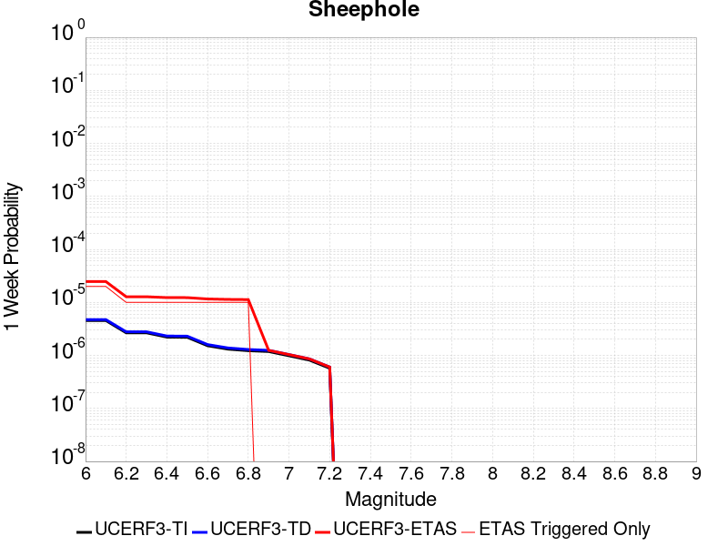 |  | 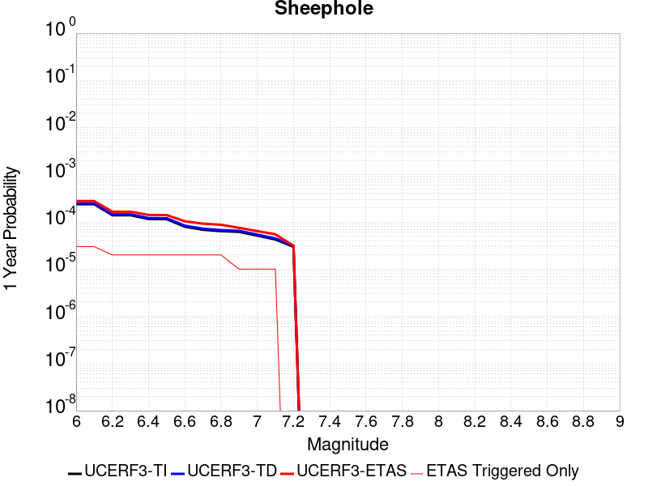 |  |

| Magnitude | 1 wk TI Prob | 1 wk TD Prob | 1 wk ETAS Prob | 1 wk ETAS/TD Gain | 1 wk ETAS Triggered Only | 1 mo TI Prob | 1 mo TD Prob | 1 mo ETAS Prob | 1 mo ETAS/TD Gain | 1 mo ETAS Triggered Only | 1 yr TI Prob | 1 yr TD Prob | 1 yr ETAS Prob | 1 yr ETAS/TD Gain | 1 yr ETAS Triggered Only | 10 yr TI Prob | 10 yr TD Prob | 10 yr ETAS Prob | 10 yr ETAS/TD Gain | 10 yr ETAS Triggered Only |
|-----|-----|-----|-----|-----|-----|-----|-----|-----|-----|-----|-----|-----|-----|-----|-----|-----|-----|-----|-----|-----|
| 6.0 | 4.5579695E-6 | 4.7412627E-6 | 2.3039103E-5 | 4.859276 | 1.8297927E-5 | 1.9534009E-5 | 2.031957E-5 | 3.8617123E-5 | 1.9004893 | 1.8297927E-5 | 2.3780059E-4 | 2.473682E-4 | 2.6566163E-4 | 1.0739521 | 1.8297927E-5 | 0.0023754628 | 0.002471473 | 0.0025079786 | 1.0147707 | 3.6595855E-5 |
| 6.1 | 4.5579695E-6 | 4.7412627E-6 | 2.3039103E-5 | 4.859276 | 1.8297927E-5 | 1.9534009E-5 | 2.031957E-5 | 3.8617123E-5 | 1.9004893 | 1.8297927E-5 | 2.3780059E-4 | 2.473682E-4 | 2.6566163E-4 | 1.0739521 | 1.8297927E-5 | 0.0023754628 | 0.002471473 | 0.0025079786 | 1.0147707 | 3.6595855E-5 |
| 6.2 | 2.6677674E-6 | 2.7873941E-6 | 2.7873941E-6 | 1.0 | 0.0 | 1.1433239E-5 | 1.1945926E-5 | 1.1945926E-5 | 1.0 | 0.0 | 1.3919079E-4 | 1.4543302E-4 | 1.4543302E-4 | 1.0 | 0.0 | 0.0013910364 | 0.0014534844 | 0.0014717557 | 1.0125707 | 1.8297927E-5 |
| 6.3 | 2.6677674E-6 | 2.7873941E-6 | 2.7873941E-6 | 1.0 | 0.0 | 1.1433239E-5 | 1.1945926E-5 | 1.1945926E-5 | 1.0 | 0.0 | 1.3919079E-4 | 1.4543302E-4 | 1.4543302E-4 | 1.0 | 0.0 | 0.0013910364 | 0.0014534844 | 0.0014717557 | 1.0125707 | 1.8297927E-5 |
| 6.4 | 2.2159759E-6 | 2.3228788E-6 | 2.3228788E-6 | 1.0 | 0.0 | 9.497005E-6 | 9.955161E-6 | 9.955161E-6 | 1.0 | 0.0 | 1.156199E-4 | 1.2119815E-4 | 1.2119815E-4 | 1.0 | 0.0 | 0.0011555976 | 0.0012113999 | 0.0012113999 | 1.0 | 0.0 |
| 6.5 | 2.1986082E-6 | 2.304759E-6 | 2.304759E-6 | 1.0 | 0.0 | 9.4225725E-6 | 9.877506E-6 | 9.877506E-6 | 1.0 | 0.0 | 1.1471378E-4 | 1.2025281E-4 | 1.2025281E-4 | 1.0 | 0.0 | 0.0011465458 | 0.0012019566 | 0.0012019566 | 1.0 | 0.0 |
| 6.6 | 1.5232331E-6 | 1.6018919E-6 | 1.6018919E-6 | 1.0 | 0.0 | 6.5281256E-6 | 6.865234E-6 | 6.865234E-6 | 1.0 | 0.0 | 7.947703E-5 | 8.35812E-5 | 8.35812E-5 | 1.0 | 0.0 | 7.9448614E-4 | 8.3551643E-4 | 8.3551643E-4 | 1.0 | 0.0 |
| 6.7 | 1.3137362E-6 | 1.382819E-6 | 1.382819E-6 | 1.0 | 0.0 | 5.6302856E-6 | 5.926355E-6 | 5.926355E-6 | 1.0 | 0.0 | 6.854657E-5 | 7.215112E-5 | 7.215112E-5 | 1.0 | 0.0 | 6.8525434E-4 | 7.212908E-4 | 7.212908E-4 | 1.0 | 0.0 |
| 6.8 | 1.2275751E-6 | 1.2922847E-6 | 1.2922847E-6 | 1.0 | 0.0 | 5.2610258E-6 | 5.5383516E-6 | 5.5383516E-6 | 1.0 | 0.0 | 6.4051106E-5 | 6.7427485E-5 | 6.7427485E-5 | 1.0 | 0.0 | 6.4032647E-4 | 6.740836E-4 | 6.740836E-4 | 1.0 | 0.0 |
| 6.9 | 1.1837088E-6 | 1.246102E-6 | 1.246102E-6 | 1.0 | 0.0 | 5.0730278E-6 | 5.340427E-6 | 5.340427E-6 | 1.0 | 0.0 | 6.176237E-5 | 6.501789E-5 | 6.501789E-5 | 1.0 | 0.0 | 6.17452E-4 | 6.5000186E-4 | 6.5000186E-4 | 1.0 | 0.0 |
| 7.0 | 9.849371E-7 | 1.0366288E-6 | 1.0366288E-6 | 1.0 | 0.0 | 4.2211523E-6 | 4.442688E-6 | 4.442688E-6 | 1.0 | 0.0 | 5.1391315E-5 | 5.4088487E-5 | 5.4088487E-5 | 1.0 | 0.0 | 5.137943E-4 | 5.407633E-4 | 5.407633E-4 | 1.0 | 0.0 |
| 7.1 | 8.1643645E-7 | 8.591669E-7 | 8.591669E-7 | 1.0 | 0.0 | 3.4990085E-6 | 3.682139E-6 | 3.682139E-6 | 1.0 | 0.0 | 4.2599597E-5 | 4.482921E-5 | 4.482921E-5 | 1.0 | 0.0 | 4.259143E-4 | 4.4821028E-4 | 4.4821028E-4 | 1.0 | 0.0 |
| 7.2 | 5.7295756E-7 | 6.029502E-7 | 6.029502E-7 | 1.0 | 0.0 | 2.45553E-6 | 2.58407E-6 | 2.58407E-6 | 1.0 | 0.0 | 2.9895667E-5 | 3.1460666E-5 | 3.1460666E-5 | 1.0 | 0.0 | 2.9891645E-4 | 3.145688E-4 | 3.145688E-4 | 1.0 | 0.0 |

## Casmalia 2011 CFM
*[(top)](#table-of-contents)*

| 1 Week | 1 Month | 1 Year | 10 Year |
|-----|-----|-----|-----|
|  |  |  |  |

| Magnitude | 1 wk TI Prob | 1 wk TD Prob | 1 wk ETAS Prob | 1 wk ETAS/TD Gain | 1 wk ETAS Triggered Only | 1 mo TI Prob | 1 mo TD Prob | 1 mo ETAS Prob | 1 mo ETAS/TD Gain | 1 mo ETAS Triggered Only | 1 yr TI Prob | 1 yr TD Prob | 1 yr ETAS Prob | 1 yr ETAS/TD Gain | 1 yr ETAS Triggered Only | 10 yr TI Prob | 10 yr TD Prob | 10 yr ETAS Prob | 10 yr ETAS/TD Gain | 10 yr ETAS Triggered Only |
|-----|-----|-----|-----|-----|-----|-----|-----|-----|-----|-----|-----|-----|-----|-----|-----|-----|-----|-----|-----|-----|
| 6.0 | 4.1704893E-6 | 4.262483E-6 | 4.262483E-6 | 1.0 | 0.0 | 1.7873403E-5 | 1.8267656E-5 | 1.8267656E-5 | 1.0 | 0.0 | 2.1758694E-4 | 2.2238622E-4 | 2.4068008E-4 | 1.0822617 | 1.8297927E-5 | 0.0021737402 | 0.0022216577 | 0.0022581723 | 1.0164357 | 3.6595855E-5 |
| 6.1 | 4.1704893E-6 | 4.262483E-6 | 4.262483E-6 | 1.0 | 0.0 | 1.7873403E-5 | 1.8267656E-5 | 1.8267656E-5 | 1.0 | 0.0 | 2.1758694E-4 | 2.2238622E-4 | 2.4068008E-4 | 1.0822617 | 1.8297927E-5 | 0.0021737402 | 0.0022216577 | 0.0022581723 | 1.0164357 | 3.6595855E-5 |
| 6.2 | 3.457312E-6 | 3.5370217E-6 | 3.5370217E-6 | 1.0 | 0.0 | 1.4816967E-5 | 1.5158577E-5 | 1.5158577E-5 | 1.0 | 0.0 | 1.8038164E-4 | 1.8454014E-4 | 2.0283468E-4 | 1.0991359 | 1.8297927E-5 | 0.001802353 | 0.0018438784 | 0.0018804068 | 1.0198107 | 3.6595855E-5 |
| 6.3 | 3.457312E-6 | 3.5370217E-6 | 3.5370217E-6 | 1.0 | 0.0 | 1.4816967E-5 | 1.5158577E-5 | 1.5158577E-5 | 1.0 | 0.0 | 1.8038164E-4 | 1.8454014E-4 | 2.0283468E-4 | 1.0991359 | 1.8297927E-5 | 0.001802353 | 0.0018438784 | 0.0018804068 | 1.0198107 | 3.6595855E-5 |
| 6.4 | 3.0957337E-6 | 3.1692257E-6 | 3.1692257E-6 | 1.0 | 0.0 | 1.3267363E-5 | 1.3582326E-5 | 1.3582326E-5 | 1.0 | 0.0 | 1.6151817E-4 | 1.6535232E-4 | 1.8364722E-4 | 1.110642 | 1.8297927E-5 | 0.0016140083 | 0.0016522991 | 0.0016888344 | 1.0221119 | 3.6595855E-5 |
| 6.5 | 3.0957337E-6 | 3.1692257E-6 | 3.1692257E-6 | 1.0 | 0.0 | 1.3267363E-5 | 1.3582326E-5 | 1.3582326E-5 | 1.0 | 0.0 | 1.6151817E-4 | 1.6535232E-4 | 1.8364722E-4 | 1.110642 | 1.8297927E-5 | 0.0016140083 | 0.0016522991 | 0.0016888344 | 1.0221119 | 3.6595855E-5 |
| 6.6 | 2.9459152E-6 | 3.0165752E-6 | 3.0165752E-6 | 1.0 | 0.0 | 1.262529E-5 | 1.2928115E-5 | 1.2928115E-5 | 1.0 | 0.0 | 1.5370206E-4 | 1.5738848E-4 | 1.7568353E-4 | 1.1162413 | 1.8297927E-5 | 0.0015359579 | 0.0015727758 | 0.0016093141 | 1.0232317 | 3.6595855E-5 |
| 6.7 | 2.8634809E-6 | 2.9324726E-6 | 2.9324726E-6 | 1.0 | 0.0 | 1.2272003E-5 | 1.256768E-5 | 1.256768E-5 | 1.0 | 0.0 | 1.4940138E-4 | 1.530008E-4 | 1.7129593E-4 | 1.1195754 | 1.8297927E-5 | 0.0014930099 | 0.0015289601 | 0.0015654999 | 1.0238985 | 3.6595855E-5 |
| 6.8 | 2.7999822E-6 | 2.8675968E-6 | 2.8675968E-6 | 1.0 | 0.0 | 1.1999869E-5 | 1.2289643E-5 | 1.2289643E-5 | 1.0 | 0.0 | 1.460886E-4 | 1.4961617E-4 | 1.6791136E-4 | 1.1222808 | 1.8297927E-5 | 0.001459926 | 0.0014951597 | 0.0015317008 | 1.0244396 | 3.6595855E-5 |
| 6.9 | 2.551052E-6 | 2.6119649E-6 | 2.6119649E-6 | 1.0 | 0.0 | 1.0933034E-5 | 1.1194087E-5 | 1.1194087E-5 | 1.0 | 0.0 | 1.3310155E-4 | 1.3627953E-4 | 1.5457495E-4 | 1.1342493 | 1.8297927E-5 | 0.0013302186 | 0.0013619636 | 0.0013985096 | 1.0268333 | 3.6595855E-5 |
| 7.0 | 2.3081875E-6 | 2.3624088E-6 | 2.3624088E-6 | 1.0 | 0.0 | 9.892195E-6 | 1.01245705E-5 | 1.01245705E-5 | 1.0 | 0.0 | 1.20430814E-4 | 1.232597E-4 | 1.4155537E-4 | 1.1484319 | 1.8297927E-5 | 0.0012036557 | 0.0012319161 | 0.0012684669 | 1.0296699 | 3.6595855E-5 |
| 7.1 | 2.093245E-6 | 2.1417243E-6 | 2.1417243E-6 | 1.0 | 0.0 | 8.971019E-6 | 9.178786E-6 | 9.178786E-6 | 1.0 | 0.0 | 1.09216686E-4 | 1.1174601E-4 | 1.300419E-4 | 1.1637274 | 1.8297927E-5 | 0.0010916302 | 0.0011169002 | 0.0011534552 | 1.0327289 | 3.6595855E-5 |
| 7.2 | 1.9714576E-6 | 2.0165091E-6 | 2.0165091E-6 | 1.0 | 0.0 | 8.449076E-6 | 8.642153E-6 | 8.642153E-6 | 1.0 | 0.0 | 1.0286264E-4 | 1.05213156E-4 | 1.2350915E-4 | 1.1738946 | 1.8297927E-5 | 0.0010281504 | 0.0010516352 | 0.0010881927 | 1.0347624 | 3.6595855E-5 |
| 7.3 | 1.6689512E-6 | 1.7047131E-6 | 1.7047131E-6 | 1.0 | 0.0 | 7.1526288E-6 | 7.3058927E-6 | 7.3058927E-6 | 1.0 | 0.0 | 8.7079774E-5 | 8.894562E-5 | 8.894562E-5 | 1.0 | 0.0 | 8.7045657E-4 | 8.89101E-4 | 9.0738264E-4 | 1.0205619 | 1.8297927E-5 |
| 7.4 | 1.4490954E-6 | 1.4778908E-6 | 1.4778908E-6 | 1.0 | 0.0 | 6.210394E-6 | 6.333802E-6 | 6.333802E-6 | 1.0 | 0.0 | 7.560892E-5 | 7.711132E-5 | 7.711132E-5 | 1.0 | 0.0 | 7.55832E-4 | 7.7084627E-4 | 7.8913005E-4 | 1.0237192 | 1.8297927E-5 |
| 7.5 | 1.226873E-6 | 1.2481701E-6 | 1.2481701E-6 | 1.0 | 0.0 | 5.2580162E-6 | 5.3492895E-6 | 5.3492895E-6 | 1.0 | 0.0 | 6.401447E-5 | 6.5125656E-5 | 6.5125656E-5 | 1.0 | 0.0 | 6.399603E-4 | 6.5106625E-4 | 6.6935224E-4 | 1.0280863 | 1.8297927E-5 |
| 7.6 | 9.2561345E-7 | 9.361923E-7 | 9.361923E-7 | 1.0 | 0.0 | 3.966909E-6 | 4.012247E-6 | 4.012247E-6 | 1.0 | 0.0 | 4.8296046E-5 | 4.884801E-5 | 4.884801E-5 | 1.0 | 0.0 | 4.828555E-4 | 4.8837316E-4 | 5.066621E-4 | 1.0374488 | 1.8297927E-5 |
| 7.7 | 5.4367933E-7 | 5.392888E-7 | 5.392888E-7 | 1.0 | 0.0 | 2.3300522E-6 | 2.3112357E-6 | 2.3112357E-6 | 1.0 | 0.0 | 2.8368017E-5 | 2.8138933E-5 | 2.8138933E-5 | 1.0 | 0.0 | 2.8364395E-4 | 2.8135383E-4 | 2.996466E-4 | 1.065017 | 1.8297927E-5 |
| 7.8 | 1.8825742E-7 | 1.7342276E-7 | 1.7342276E-7 | 1.0 | 0.0 | 8.068173E-7 | 7.4324015E-7 | 7.4324015E-7 | 1.0 | 0.0 | 9.822956E-6 | 9.048912E-6 | 9.048912E-6 | 1.0 | 0.0 | 9.822522E-5 | 9.048546E-5 | 9.048546E-5 | 1.0 | 0.0 |
| 7.9 | 6.342771E-8 | 4.6790706E-8 | 4.6790706E-8 | 1.0 | 0.0 | 2.7183304E-7 | 2.0053157E-7 | 2.0053157E-7 | 1.0 | 0.0 | 3.3095623E-6 | 2.4414692E-6 | 2.4414692E-6 | 1.0 | 0.0 | 3.309513E-5 | 2.4414428E-5 | 2.4414428E-5 | 1.0 | 0.0 |
| 8.0 | 1.2574819E-8 | 6.4733463E-9 | 6.4733463E-9 | 1.0 | 0.0 | 5.3892084E-8 | 2.7742912E-8 | 2.7742912E-8 | 1.0 | 0.0 | 6.561359E-7 | 3.377699E-7 | 3.377699E-7 | 1.0 | 0.0 | 6.56134E-6 | 3.377694E-6 | 3.377694E-6 | 1.0 | 0.0 |

## Earthquake Valley (So Extension)
*[(top)](#table-of-contents)*

| 1 Week | 1 Month | 1 Year | 10 Year |
|-----|-----|-----|-----|
|  |  |  |  |

| Magnitude | 1 wk TI Prob | 1 wk TD Prob | 1 wk ETAS Prob | 1 wk ETAS/TD Gain | 1 wk ETAS Triggered Only | 1 mo TI Prob | 1 mo TD Prob | 1 mo ETAS Prob | 1 mo ETAS/TD Gain | 1 mo ETAS Triggered Only | 1 yr TI Prob | 1 yr TD Prob | 1 yr ETAS Prob | 1 yr ETAS/TD Gain | 1 yr ETAS Triggered Only | 10 yr TI Prob | 10 yr TD Prob | 10 yr ETAS Prob | 10 yr ETAS/TD Gain | 10 yr ETAS Triggered Only |
|-----|-----|-----|-----|-----|-----|-----|-----|-----|-----|-----|-----|-----|-----|-----|-----|-----|-----|-----|-----|-----|
| 6.0 | 3.0194888E-5 | 3.7072114E-5 | 3.7072114E-5 | 1.0 | 0.0 | 1.2940024E-4 | 1.5887388E-4 | 1.5887388E-4 | 1.0 | 0.0 | 0.0015743093 | 0.0019331174 | 0.0019513799 | 1.0094472 | 1.8297927E-5 | 0.01563203 | 0.019213019 | 0.019230964 | 1.0009341 | 1.8297927E-5 |
| 6.1 | 3.0194888E-5 | 3.7072114E-5 | 3.7072114E-5 | 1.0 | 0.0 | 1.2940024E-4 | 1.5887388E-4 | 1.5887388E-4 | 1.0 | 0.0 | 0.0015743093 | 0.0019331174 | 0.0019513799 | 1.0094472 | 1.8297927E-5 | 0.01563203 | 0.019213019 | 0.019230964 | 1.0009341 | 1.8297927E-5 |
| 6.2 | 3.0194888E-5 | 3.7072114E-5 | 3.7072114E-5 | 1.0 | 0.0 | 1.2940024E-4 | 1.5887388E-4 | 1.5887388E-4 | 1.0 | 0.0 | 0.0015743093 | 0.0019331174 | 0.0019513799 | 1.0094472 | 1.8297927E-5 | 0.01563203 | 0.019213019 | 0.019230964 | 1.0009341 | 1.8297927E-5 |
| 6.3 | 1.5795305E-5 | 1.844658E-5 | 1.844658E-5 | 1.0 | 0.0 | 6.769241E-5 | 7.9055004E-5 | 7.9055004E-5 | 1.0 | 0.0 | 8.238434E-4 | 9.6218096E-4 | 9.804612E-4 | 1.0189989 | 1.8297927E-5 | 0.008207959 | 0.009591061 | 0.009609183 | 1.0018895 | 1.8297927E-5 |
| 6.4 | 1.5795305E-5 | 1.844658E-5 | 1.844658E-5 | 1.0 | 0.0 | 6.769241E-5 | 7.9055004E-5 | 7.9055004E-5 | 1.0 | 0.0 | 8.238434E-4 | 9.6218096E-4 | 9.804612E-4 | 1.0189989 | 1.8297927E-5 | 0.008207959 | 0.009591061 | 0.009609183 | 1.0018895 | 1.8297927E-5 |
| 6.5 | 1.5795305E-5 | 1.844658E-5 | 1.844658E-5 | 1.0 | 0.0 | 6.769241E-5 | 7.9055004E-5 | 7.9055004E-5 | 1.0 | 0.0 | 8.238434E-4 | 9.6218096E-4 | 9.804612E-4 | 1.0189989 | 1.8297927E-5 | 0.008207959 | 0.009591061 | 0.009609183 | 1.0018895 | 1.8297927E-5 |
| 6.6 | 1.5795305E-5 | 1.844658E-5 | 1.844658E-5 | 1.0 | 0.0 | 6.769241E-5 | 7.9055004E-5 | 7.9055004E-5 | 1.0 | 0.0 | 8.238434E-4 | 9.6218096E-4 | 9.804612E-4 | 1.0189989 | 1.8297927E-5 | 0.008207959 | 0.009591061 | 0.009609183 | 1.0018895 | 1.8297927E-5 |
| 6.7 | 1.1363076E-5 | 1.3138294E-5 | 1.3138294E-5 | 1.0 | 0.0 | 4.8697988E-5 | 5.6306188E-5 | 5.6306188E-5 | 1.0 | 0.0 | 5.927367E-4 | 6.8538834E-4 | 7.0367375E-4 | 1.0266789 | 1.8297927E-5 | 0.0059115817 | 0.0068402183 | 0.006858391 | 1.0026567 | 1.8297927E-5 |
| 6.8 | 1.0049611E-5 | 1.1594334E-5 | 1.1594334E-5 | 1.0 | 0.0 | 4.306905E-5 | 4.9689468E-5 | 4.9689468E-5 | 1.0 | 0.0 | 5.242395E-4 | 6.048745E-4 | 6.231614E-4 | 1.0302324 | 1.8297927E-5 | 0.0052300454 | 0.006039458 | 0.0060576457 | 1.0030115 | 1.8297927E-5 |
| 6.9 | 1.0049611E-5 | 1.1594334E-5 | 1.1594334E-5 | 1.0 | 0.0 | 4.306905E-5 | 4.9689468E-5 | 4.9689468E-5 | 1.0 | 0.0 | 5.242395E-4 | 6.048745E-4 | 6.231614E-4 | 1.0302324 | 1.8297927E-5 | 0.0052300454 | 0.006039458 | 0.0060576457 | 1.0030115 | 1.8297927E-5 |
| 7.0 | 1.0049611E-5 | 1.1594334E-5 | 1.1594334E-5 | 1.0 | 0.0 | 4.306905E-5 | 4.9689468E-5 | 4.9689468E-5 | 1.0 | 0.0 | 5.242395E-4 | 6.048745E-4 | 6.231614E-4 | 1.0302324 | 1.8297927E-5 | 0.0052300454 | 0.006039458 | 0.0060576457 | 1.0030115 | 1.8297927E-5 |
| 7.1 | 8.140254E-6 | 9.383458E-6 | 9.383458E-6 | 1.0 | 0.0 | 3.4886336E-5 | 4.0214578E-5 | 4.0214578E-5 | 1.0 | 0.0 | 4.2465836E-4 | 4.8956956E-4 | 5.078585E-4 | 1.0373572 | 1.8297927E-5 | 0.0042384774 | 0.0048914864 | 0.004909695 | 1.0037224 | 1.8297927E-5 |
| 7.2 | 1.673835E-7 | 1.4154125E-7 | 1.4154125E-7 | 1.0 | 0.0 | 7.173577E-7 | 6.066052E-7 | 6.066052E-7 | 1.0 | 0.0 | 8.733795E-6 | 7.385397E-6 | 7.385397E-6 | 1.0 | 0.0 | 8.733451E-5 | 7.385187E-5 | 7.385187E-5 | 1.0 | 0.0 |
| 7.3 | 1.6632116E-7 | 1.4052354E-7 | 1.4052354E-7 | 1.0 | 0.0 | 7.1280476E-7 | 6.0224363E-7 | 6.0224363E-7 | 1.0 | 0.0 | 8.678364E-6 | 7.332295E-6 | 7.332295E-6 | 1.0 | 0.0 | 8.6780245E-5 | 7.332089E-5 | 7.332089E-5 | 1.0 | 0.0 |
| 7.4 | 1.6569169E-7 | 1.3996983E-7 | 1.3996983E-7 | 1.0 | 0.0 | 7.1010703E-7 | 5.9987053E-7 | 5.9987053E-7 | 1.0 | 0.0 | 8.645519E-6 | 7.303403E-6 | 7.303403E-6 | 1.0 | 0.0 | 8.645182E-5 | 7.303199E-5 | 7.303199E-5 | 1.0 | 0.0 |
| 7.5 | 1.1764555E-7 | 1.0095917E-7 | 1.0095917E-7 | 1.0 | 0.0 | 5.041951E-7 | 4.326821E-7 | 4.326821E-7 | 1.0 | 0.0 | 6.138558E-6 | 5.267894E-6 | 5.267894E-6 | 1.0 | 0.0 | 6.1383886E-5 | 5.2677904E-5 | 5.2677904E-5 | 1.0 | 0.0 |
| 7.6 | 1.07927605E-7 | 9.260736E-8 | 9.260736E-8 | 1.0 | 0.0 | 4.6254678E-7 | 3.9688865E-7 | 3.9688865E-7 | 1.0 | 0.0 | 5.6314925E-6 | 4.832111E-6 | 4.832111E-6 | 1.0 | 0.0 | 5.63135E-5 | 4.8320264E-5 | 4.8320264E-5 | 1.0 | 0.0 |
| 7.7 | 2.1826905E-8 | 1.1180516E-8 | 1.1180516E-8 | 1.0 | 0.0 | 9.3543875E-8 | 4.7916494E-8 | 4.7916494E-8 | 1.0 | 0.0 | 1.1388961E-6 | 5.833832E-7 | 5.833832E-7 | 1.0 | 0.0 | 1.1388902E-5 | 5.8338223E-6 | 5.8338223E-6 | 1.0 | 0.0 |
| 7.8 | 2.6169649E-9 | 1.1969472E-9 | 1.1969472E-9 | 1.0 | 0.0 | 1.1215564E-8 | 5.1297735E-9 | 5.1297735E-9 | 1.0 | 0.0 | 1.3654947E-7 | 6.2454994E-8 | 6.2454994E-8 | 1.0 | 0.0 | 1.365494E-6 | 6.245499E-7 | 6.245499E-7 | 1.0 | 0.0 |

## Cleghorn
*[(top)](#table-of-contents)*

| 1 Week | 1 Month | 1 Year | 10 Year |
|-----|-----|-----|-----|
|  |  |  |  |

| Magnitude | 1 wk TI Prob | 1 wk TD Prob | 1 wk ETAS Prob | 1 wk ETAS/TD Gain | 1 wk ETAS Triggered Only | 1 mo TI Prob | 1 mo TD Prob | 1 mo ETAS Prob | 1 mo ETAS/TD Gain | 1 mo ETAS Triggered Only | 1 yr TI Prob | 1 yr TD Prob | 1 yr ETAS Prob | 1 yr ETAS/TD Gain | 1 yr ETAS Triggered Only | 10 yr TI Prob | 10 yr TD Prob | 10 yr ETAS Prob | 10 yr ETAS/TD Gain | 10 yr ETAS Triggered Only |
|-----|-----|-----|-----|-----|-----|-----|-----|-----|-----|-----|-----|-----|-----|-----|-----|-----|-----|-----|-----|-----|
| 6.0 | 7.9267165E-6 | 9.831582E-6 | 9.831582E-6 | 1.0 | 0.0 | 3.39712E-5 | 4.2134732E-5 | 4.2134732E-5 | 1.0 | 0.0 | 4.1352084E-4 | 5.128803E-4 | 5.311688E-4 | 1.0356585 | 1.8297927E-5 | 0.004127522 | 0.0051320773 | 0.005168485 | 1.0070943 | 3.6595855E-5 |
| 6.1 | 7.9267165E-6 | 9.831582E-6 | 9.831582E-6 | 1.0 | 0.0 | 3.39712E-5 | 4.2134732E-5 | 4.2134732E-5 | 1.0 | 0.0 | 4.1352084E-4 | 5.128803E-4 | 5.311688E-4 | 1.0356585 | 1.8297927E-5 | 0.004127522 | 0.0051320773 | 0.005168485 | 1.0070943 | 3.6595855E-5 |
| 6.2 | 7.9267165E-6 | 9.831582E-6 | 9.831582E-6 | 1.0 | 0.0 | 3.39712E-5 | 4.2134732E-5 | 4.2134732E-5 | 1.0 | 0.0 | 4.1352084E-4 | 5.128803E-4 | 5.311688E-4 | 1.0356585 | 1.8297927E-5 | 0.004127522 | 0.0051320773 | 0.005168485 | 1.0070943 | 3.6595855E-5 |
| 6.3 | 7.9267165E-6 | 9.831582E-6 | 9.831582E-6 | 1.0 | 0.0 | 3.39712E-5 | 4.2134732E-5 | 4.2134732E-5 | 1.0 | 0.0 | 4.1352084E-4 | 5.128803E-4 | 5.311688E-4 | 1.0356585 | 1.8297927E-5 | 0.004127522 | 0.0051320773 | 0.005168485 | 1.0070943 | 3.6595855E-5 |
| 6.4 | 4.3445207E-6 | 6.0914435E-6 | 6.0914435E-6 | 1.0 | 0.0 | 1.8619241E-5 | 2.610593E-5 | 2.610593E-5 | 1.0 | 0.0 | 2.2666567E-4 | 3.1779436E-4 | 3.3608646E-4 | 1.0575596 | 1.8297927E-5 | 0.0022643462 | 0.0031875873 | 0.0032240665 | 1.0114441 | 3.6595855E-5 |
| 6.5 | 4.3445207E-6 | 6.0914435E-6 | 6.0914435E-6 | 1.0 | 0.0 | 1.8619241E-5 | 2.610593E-5 | 2.610593E-5 | 1.0 | 0.0 | 2.2666567E-4 | 3.1779436E-4 | 3.3608646E-4 | 1.0575596 | 1.8297927E-5 | 0.0022643462 | 0.0031875873 | 0.0032240665 | 1.0114441 | 3.6595855E-5 |
| 6.6 | 4.040109E-6 | 5.773851E-6 | 5.773851E-6 | 1.0 | 0.0 | 1.7314638E-5 | 2.4744846E-5 | 2.4744846E-5 | 1.0 | 0.0 | 2.1078532E-4 | 3.012278E-4 | 3.1952022E-4 | 1.0607262 | 1.8297927E-5 | 0.002105855 | 0.003022377 | 0.0030588622 | 1.0120717 | 3.6595855E-5 |
| 6.7 | 3.3632055E-6 | 5.067348E-6 | 5.067348E-6 | 1.0 | 0.0 | 1.4413658E-5 | 2.1717027E-5 | 2.1717027E-5 | 1.0 | 0.0 | 1.7547216E-4 | 2.6437303E-4 | 2.8266612E-4 | 1.0691942 | 1.8297927E-5 | 0.0017533366 | 0.0026547113 | 0.0026912098 | 1.0137486 | 3.6595855E-5 |
| 6.8 | 3.2902772E-6 | 4.9892556E-6 | 4.9892556E-6 | 1.0 | 0.0 | 1.4101111E-5 | 2.1382351E-5 | 2.1382351E-5 | 1.0 | 0.0 | 1.716675E-4 | 2.6029933E-4 | 2.785925E-4 | 1.0702775 | 1.8297927E-5 | 0.0017153495 | 0.0026140702 | 0.0026505704 | 1.013963 | 3.6595855E-5 |
| 6.9 | 3.031547E-6 | 4.6910186E-6 | 4.6910186E-6 | 1.0 | 0.0 | 1.299228E-5 | 2.0104211E-5 | 2.0104211E-5 | 1.0 | 0.0 | 1.5816953E-4 | 2.4474156E-4 | 2.63035E-4 | 1.074746 | 1.8297927E-5 | 0.00158057 | 0.0024588439 | 0.0024770966 | 1.0074234 | 1.8297927E-5 |
| 7.0 | 2.8259715E-6 | 4.3705895E-6 | 4.3705895E-6 | 1.0 | 0.0 | 1.211125E-5 | 1.8730963E-5 | 1.8730963E-5 | 1.0 | 0.0 | 1.4744449E-4 | 2.2802586E-4 | 2.463196E-4 | 1.0802267 | 1.8297927E-5 | 0.001473467 | 0.0022920412 | 0.002310297 | 1.007965 | 1.8297927E-5 |
| 7.1 | 2.5962665E-6 | 4.0658106E-6 | 4.0658106E-6 | 1.0 | 0.0 | 1.1126809E-5 | 1.7424789E-5 | 1.7424789E-5 | 1.0 | 0.0 | 1.3546048E-4 | 2.1212637E-4 | 2.3042041E-4 | 1.0862412 | 1.8297927E-5 | 0.0013537793 | 0.002133366 | 0.0021516248 | 1.0085588 | 1.8297927E-5 |
| 7.2 | 2.3247253E-6 | 3.6763672E-6 | 3.6763672E-6 | 1.0 | 0.0 | 9.96307E-6 | 1.5755764E-5 | 1.5755764E-5 | 1.0 | 0.0 | 1.21293626E-4 | 1.9180974E-4 | 2.1010416E-4 | 1.0953779 | 1.8297927E-5 | 0.0012122744 | 0.0019305905 | 0.001948853 | 1.0094596 | 1.8297927E-5 |
| 7.3 | 2.056928E-6 | 3.2350938E-6 | 3.2350938E-6 | 1.0 | 0.0 | 8.815376E-6 | 1.3864615E-5 | 1.3864615E-5 | 1.0 | 0.0 | 1.0732192E-4 | 1.6878877E-4 | 1.870836E-4 | 1.1083889 | 1.8297927E-5 | 0.001072701 | 0.0017008206 | 0.0017190875 | 1.01074 | 1.8297927E-5 |
| 7.4 | 1.8055999E-6 | 2.8255042E-6 | 2.8255042E-6 | 1.0 | 0.0 | 7.738263E-6 | 1.2109249E-5 | 1.2109249E-5 | 1.0 | 0.0 | 9.4209274E-5 | 1.4742027E-4 | 1.4742027E-4 | 1.0 | 0.0 | 9.4169343E-4 | 0.0014875771 | 0.0014875771 | 1.0 | 0.0 |
| 7.5 | 1.4683443E-6 | 2.4247483E-6 | 2.4247483E-6 | 1.0 | 0.0 | 6.292889E-6 | 1.0391738E-5 | 1.0391738E-5 | 1.0 | 0.0 | 7.661323E-5 | 1.2651215E-4 | 1.2651215E-4 | 1.0 | 0.0 | 7.658682E-4 | 0.0012787961 | 0.0012787961 | 1.0 | 0.0 |
| 7.6 | 9.804088E-7 | 1.900266E-6 | 1.900266E-6 | 1.0 | 0.0 | 4.201745E-6 | 8.143972E-6 | 8.143972E-6 | 1.0 | 0.0 | 5.1155046E-5 | 9.91484E-5 | 9.91484E-5 | 1.0 | 0.0 | 5.114327E-4 | 0.001005471 | 0.001005471 | 1.0 | 0.0 |
| 7.7 | 7.3434086E-7 | 1.6284146E-6 | 1.6284146E-6 | 1.0 | 0.0 | 3.1471714E-6 | 6.978901E-6 | 6.978901E-6 | 1.0 | 0.0 | 3.831614E-5 | 8.4964835E-5 | 8.4964835E-5 | 1.0 | 0.0 | 3.8309532E-4 | 8.6378685E-4 | 8.6378685E-4 | 1.0 | 0.0 |
| 7.8 | 6.434184E-7 | 1.5220047E-6 | 1.5220047E-6 | 1.0 | 0.0 | 2.7575045E-6 | 6.5228614E-6 | 6.5228614E-6 | 1.0 | 0.0 | 3.35721E-5 | 7.941297E-5 | 7.941297E-5 | 1.0 | 0.0 | 3.3567028E-4 | 8.079678E-4 | 8.079678E-4 | 1.0 | 0.0 |
| 7.9 | 3.4943926E-7 | 7.574459E-7 | 7.574459E-7 | 1.0 | 0.0 | 1.497596E-6 | 3.2461926E-6 | 3.2461926E-6 | 1.0 | 0.0 | 1.8233079E-5 | 3.952169E-5 | 3.952169E-5 | 1.0 | 0.0 | 1.8231584E-4 | 4.040099E-4 | 4.040099E-4 | 1.0 | 0.0 |
| 8.0 | 6.717524E-8 | 5.838828E-8 | 5.838828E-8 | 1.0 | 0.0 | 2.8789387E-7 | 2.5023547E-7 | 2.5023547E-7 | 1.0 | 0.0 | 3.505102E-6 | 3.0466126E-6 | 3.0466126E-6 | 1.0 | 0.0 | 3.5050467E-5 | 3.273506E-5 | 3.273506E-5 | 1.0 | 0.0 |
| 8.1 | 3.1984914E-8 | 1.2956093E-8 | 1.2956093E-8 | 1.0 | 0.0 | 1.370782E-7 | 5.552611E-8 | 5.552611E-8 | 1.0 | 0.0 | 1.6689258E-6 | 6.760302E-7 | 6.760302E-7 | 1.0 | 0.0 | 1.6689133E-5 | 7.74454E-6 | 7.74454E-6 | 1.0 | 0.0 |
| 8.2 | 1.21887656E-8 | 3.6495305E-9 | 3.6495305E-9 | 1.0 | 0.0 | 5.2237567E-8 | 1.5640845E-8 | 1.5640845E-8 | 1.0 | 0.0 | 6.359922E-7 | 1.9042727E-7 | 1.9042727E-7 | 1.0 | 0.0 | 6.3599036E-6 | 2.2470974E-6 | 2.2470974E-6 | 1.0 | 0.0 |

## Laguna Salada
*[(top)](#table-of-contents)*

| 1 Week | 1 Month | 1 Year | 10 Year |
|-----|-----|-----|-----|
|  |  |  |  |

| Magnitude | 1 wk TI Prob | 1 wk TD Prob | 1 wk ETAS Prob | 1 wk ETAS/TD Gain | 1 wk ETAS Triggered Only | 1 mo TI Prob | 1 mo TD Prob | 1 mo ETAS Prob | 1 mo ETAS/TD Gain | 1 mo ETAS Triggered Only | 1 yr TI Prob | 1 yr TD Prob | 1 yr ETAS Prob | 1 yr ETAS/TD Gain | 1 yr ETAS Triggered Only | 10 yr TI Prob | 10 yr TD Prob | 10 yr ETAS Prob | 10 yr ETAS/TD Gain | 10 yr ETAS Triggered Only |
|-----|-----|-----|-----|-----|-----|-----|-----|-----|-----|-----|-----|-----|-----|-----|-----|-----|-----|-----|-----|-----|
| 6.0 | 4.6465593E-5 | 4.634639E-5 | 6.464347E-5 | 1.3947897 | 1.8297927E-5 | 1.9912305E-4 | 1.9861311E-4 | 2.169074E-4 | 1.0921102 | 1.8297927E-5 | 0.0024216278 | 0.002415429 | 0.0024336828 | 1.0075572 | 1.8297927E-5 | 0.02395408 | 0.023975259 | 0.024010977 | 1.0014898 | 3.6595855E-5 |
| 6.1 | 3.982297E-5 | 3.7246125E-5 | 3.7246125E-5 | 1.0 | 0.0 | 1.706587E-4 | 1.5961716E-4 | 1.5961716E-4 | 1.0 | 0.0 | 0.0020757897 | 0.0019417295 | 0.0019417295 | 1.0 | 0.0 | 0.020565065 | 0.019331863 | 0.019349808 | 1.0009282 | 1.8297927E-5 |
| 6.2 | 3.6067784E-5 | 3.2602693E-5 | 3.2602693E-5 | 1.0 | 0.0 | 1.5456705E-4 | 1.3971896E-4 | 1.3971896E-4 | 1.0 | 0.0 | 0.0018802295 | 0.0016998611 | 0.0016998611 | 1.0 | 0.0 | 0.018644003 | 0.016949628 | 0.016967615 | 1.0010612 | 1.8297927E-5 |
| 6.3 | 3.2859112E-5 | 2.8849448E-5 | 2.8849448E-5 | 1.0 | 0.0 | 1.4081717E-4 | 1.2363521E-4 | 1.2363521E-4 | 1.0 | 0.0 | 0.0017131006 | 0.0015043203 | 0.0015043203 | 1.0 | 0.0 | 0.016999546 | 0.015018767 | 0.015018767 | 1.0 | 0.0 |
| 6.4 | 2.9132116E-5 | 2.4852965E-5 | 2.4852965E-5 | 1.0 | 0.0 | 1.2484594E-4 | 1.0650887E-4 | 1.0650887E-4 | 1.0 | 0.0 | 0.0015189396 | 0.001296065 | 0.001296065 | 1.0 | 0.0 | 0.015085992 | 0.012956262 | 0.012956262 | 1.0 | 0.0 |
| 6.5 | 2.7075037E-5 | 2.2825836E-5 | 2.2825836E-5 | 1.0 | 0.0 | 1.1603071E-4 | 9.7821845E-5 | 9.7821845E-5 | 1.0 | 0.0 | 0.0014117584 | 0.0011904186 | 0.0011904186 | 1.0 | 0.0 | 0.014028233 | 0.011907749 | 0.011907749 | 1.0 | 0.0 |
| 6.6 | 2.2367465E-5 | 1.8573526E-5 | 1.8573526E-5 | 1.0 | 0.0 | 9.5857045E-5 | 7.959886E-5 | 7.959886E-5 | 1.0 | 0.0 | 0.0011664346 | 9.6876756E-4 | 9.6876756E-4 | 1.0 | 0.0 | 0.011603311 | 0.009702191 | 0.009702191 | 1.0 | 0.0 |
| 6.7 | 1.9458053E-5 | 1.5914242E-5 | 1.5914242E-5 | 1.0 | 0.0 | 8.338899E-5 | 6.8202564E-5 | 6.8202564E-5 | 1.0 | 0.0 | 0.001014788 | 8.3013024E-4 | 8.3013024E-4 | 1.0 | 0.0 | 0.010101665 | 0.0083209425 | 0.0083209425 | 1.0 | 0.0 |
| 6.8 | 1.0767866E-5 | 9.18435E-6 | 9.18435E-6 | 1.0 | 0.0 | 4.614718E-5 | 3.9361294E-5 | 3.9361294E-5 | 1.0 | 0.0 | 5.6169706E-4 | 4.7918706E-4 | 4.7918706E-4 | 1.0 | 0.0 | 0.0056027942 | 0.0048096925 | 0.0048096925 | 1.0 | 0.0 |
| 6.9 | 2.1384765E-6 | 1.7913675E-6 | 1.7913675E-6 | 1.0 | 0.0 | 9.164866E-6 | 7.677269E-6 | 7.677269E-6 | 1.0 | 0.0 | 1.1157654E-4 | 9.346713E-5 | 9.346713E-5 | 1.0 | 0.0 | 0.0011152053 | 9.343165E-4 | 9.343165E-4 | 1.0 | 0.0 |
| 7.0 | 2.0952946E-6 | 1.7493046E-6 | 1.7493046E-6 | 1.0 | 0.0 | 8.979802E-6 | 7.4970003E-6 | 7.4970003E-6 | 1.0 | 0.0 | 1.0932361E-4 | 9.1272545E-5 | 9.1272545E-5 | 1.0 | 0.0 | 0.0010926984 | 9.123888E-4 | 9.123888E-4 | 1.0 | 0.0 |
| 7.1 | 1.7887576E-6 | 1.4500254E-6 | 1.4500254E-6 | 1.0 | 0.0 | 7.666081E-6 | 6.2143813E-6 | 6.2143813E-6 | 1.0 | 0.0 | 9.333054E-5 | 7.565777E-5 | 7.565777E-5 | 1.0 | 0.0 | 9.329135E-4 | 7.563506E-4 | 7.563506E-4 | 1.0 | 0.0 |
| 7.2 | 9.723109E-7 | 7.135619E-7 | 7.135619E-7 | 1.0 | 0.0 | 4.16704E-6 | 3.0581198E-6 | 3.0581198E-6 | 1.0 | 0.0 | 5.073253E-5 | 3.7232137E-5 | 3.7232137E-5 | 1.0 | 0.0 | 5.072095E-4 | 3.7227524E-4 | 3.7227524E-4 | 1.0 | 0.0 |

## Bullion Mountains
*[(top)](#table-of-contents)*

| 1 Week | 1 Month | 1 Year | 10 Year |
|-----|-----|-----|-----|
| 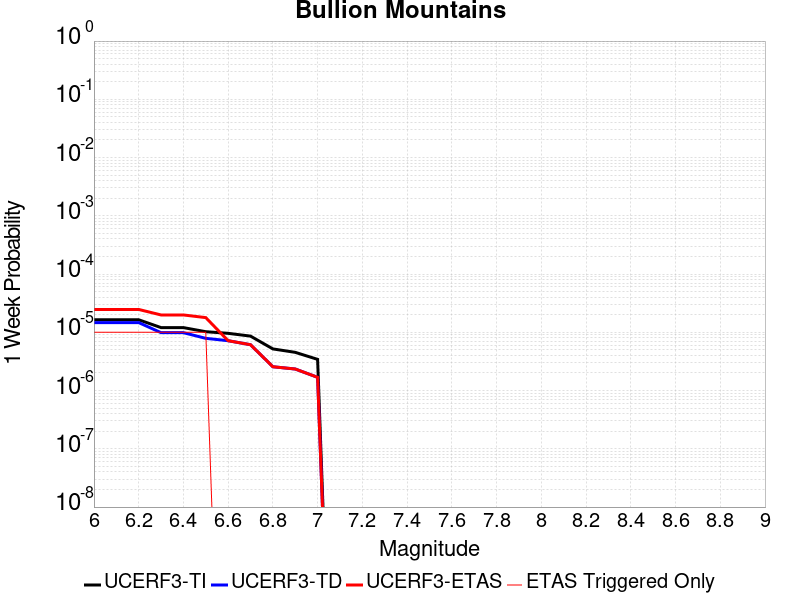 |  |  |  |

| Magnitude | 1 wk TI Prob | 1 wk TD Prob | 1 wk ETAS Prob | 1 wk ETAS/TD Gain | 1 wk ETAS Triggered Only | 1 mo TI Prob | 1 mo TD Prob | 1 mo ETAS Prob | 1 mo ETAS/TD Gain | 1 mo ETAS Triggered Only | 1 yr TI Prob | 1 yr TD Prob | 1 yr ETAS Prob | 1 yr ETAS/TD Gain | 1 yr ETAS Triggered Only | 10 yr TI Prob | 10 yr TD Prob | 10 yr ETAS Prob | 10 yr ETAS/TD Gain | 10 yr ETAS Triggered Only |
|-----|-----|-----|-----|-----|-----|-----|-----|-----|-----|-----|-----|-----|-----|-----|-----|-----|-----|-----|-----|-----|
| 6.0 | 1.6420427E-5 | 1.4692089E-5 | 1.4692089E-5 | 1.0 | 0.0 | 7.037136E-5 | 6.296479E-5 | 6.296479E-5 | 1.0 | 0.0 | 8.5643446E-4 | 7.663651E-4 | 7.663651E-4 | 1.0 | 0.0 | 0.008531413 | 0.007641016 | 0.0076773325 | 1.0047528 | 3.6595855E-5 |
| 6.1 | 1.6420427E-5 | 1.4692089E-5 | 1.4692089E-5 | 1.0 | 0.0 | 7.037136E-5 | 6.296479E-5 | 6.296479E-5 | 1.0 | 0.0 | 8.5643446E-4 | 7.663651E-4 | 7.663651E-4 | 1.0 | 0.0 | 0.008531413 | 0.007641016 | 0.0076773325 | 1.0047528 | 3.6595855E-5 |
| 6.2 | 1.6420427E-5 | 1.4692089E-5 | 1.4692089E-5 | 1.0 | 0.0 | 7.037136E-5 | 6.296479E-5 | 6.296479E-5 | 1.0 | 0.0 | 8.5643446E-4 | 7.663651E-4 | 7.663651E-4 | 1.0 | 0.0 | 0.008531413 | 0.007641016 | 0.0076773325 | 1.0047528 | 3.6595855E-5 |
| 6.3 | 1.2046778E-5 | 9.862335E-6 | 9.862335E-6 | 1.0 | 0.0 | 5.1628023E-5 | 4.2266598E-5 | 4.2266598E-5 | 1.0 | 0.0 | 6.283899E-4 | 5.144975E-4 | 5.144975E-4 | 1.0 | 0.0 | 0.0062661595 | 0.005135345 | 0.005153549 | 1.0035448 | 1.8297927E-5 |
| 6.4 | 1.2046778E-5 | 9.862335E-6 | 9.862335E-6 | 1.0 | 0.0 | 5.1628023E-5 | 4.2266598E-5 | 4.2266598E-5 | 1.0 | 0.0 | 6.283899E-4 | 5.144975E-4 | 5.144975E-4 | 1.0 | 0.0 | 0.0062661595 | 0.005135345 | 0.005153549 | 1.0035448 | 1.8297927E-5 |
| 6.5 | 1.0244343E-5 | 7.879458E-6 | 7.879458E-6 | 1.0 | 0.0 | 4.390359E-5 | 3.3768785E-5 | 3.3768785E-5 | 1.0 | 0.0 | 5.343951E-4 | 4.110781E-4 | 4.110781E-4 | 1.0 | 0.0 | 0.005331118 | 0.004105208 | 0.0041234307 | 1.004439 | 1.8297927E-5 |
| 6.6 | 9.605408E-6 | 7.1774966E-6 | 7.1774966E-6 | 1.0 | 0.0 | 4.1165385E-5 | 3.076045E-5 | 3.076045E-5 | 1.0 | 0.0 | 5.010733E-4 | 3.744645E-4 | 3.744645E-4 | 1.0 | 0.0 | 0.00499945 | 0.003740332 | 0.0037585616 | 1.0048738 | 1.8297927E-5 |
| 6.7 | 8.60418E-6 | 6.1240044E-6 | 6.1240044E-6 | 1.0 | 0.0 | 3.687454E-5 | 2.624558E-5 | 2.624558E-5 | 1.0 | 0.0 | 4.48855E-4 | 3.1951256E-4 | 3.1951256E-4 | 1.0 | 0.0 | 0.004479495 | 0.0031924439 | 0.0032106834 | 1.0057133 | 1.8297927E-5 |
| 6.8 | 5.187994E-6 | 2.5631666E-6 | 2.5631666E-6 | 1.0 | 0.0 | 2.223407E-5 | 1.0984976E-5 | 1.0984976E-5 | 1.0 | 0.0 | 2.7066618E-4 | 1.3373788E-4 | 1.3373788E-4 | 1.0 | 0.0 | 0.0027033675 | 0.0013369655 | 0.001355239 | 1.0136678 | 1.8297927E-5 |
| 6.9 | 4.5302368E-6 | 2.3443165E-6 | 2.3443165E-6 | 1.0 | 0.0 | 1.9415156E-5 | 1.0047055E-5 | 1.0047055E-5 | 1.0 | 0.0 | 2.3635388E-4 | 1.2232E-4 | 1.2232E-4 | 1.0 | 0.0 | 0.0023610266 | 0.0012229157 | 0.0012411913 | 1.0149442 | 1.8297927E-5 |
| 7.0 | 3.431668E-6 | 1.6882402E-6 | 1.6882402E-6 | 1.0 | 0.0 | 1.4707065E-5 | 7.235315E-6 | 7.235315E-6 | 1.0 | 0.0 | 1.7904381E-4 | 8.808996E-5 | 8.808996E-5 | 1.0 | 0.0 | 0.0017889962 | 8.808996E-4 | 8.991814E-4 | 1.0207536 | 1.8297927E-5 |

## Johnson Valley (No) 2011 rev
*[(top)](#table-of-contents)*

| 1 Week | 1 Month | 1 Year | 10 Year |
|-----|-----|-----|-----|
|  |  |  |  |

| Magnitude | 1 wk TI Prob | 1 wk TD Prob | 1 wk ETAS Prob | 1 wk ETAS/TD Gain | 1 wk ETAS Triggered Only | 1 mo TI Prob | 1 mo TD Prob | 1 mo ETAS Prob | 1 mo ETAS/TD Gain | 1 mo ETAS Triggered Only | 1 yr TI Prob | 1 yr TD Prob | 1 yr ETAS Prob | 1 yr ETAS/TD Gain | 1 yr ETAS Triggered Only | 10 yr TI Prob | 10 yr TD Prob | 10 yr ETAS Prob | 10 yr ETAS/TD Gain | 10 yr ETAS Triggered Only |
|-----|-----|-----|-----|-----|-----|-----|-----|-----|-----|-----|-----|-----|-----|-----|-----|-----|-----|-----|-----|-----|
| 6.0 | 2.577707E-5 | 1.2900938E-5 | 1.2900938E-5 | 1.0 | 0.0 | 1.1046848E-4 | 5.5288787E-5 | 7.35857E-5 | 1.3309336 | 1.8297927E-5 | 0.0013441239 | 6.7297276E-4 | 6.9125835E-4 | 1.0271714 | 1.8297927E-5 | 0.013360229 | 0.006713257 | 0.006749607 | 1.0054147 | 3.6595855E-5 |
| 6.1 | 2.577707E-5 | 1.2900938E-5 | 1.2900938E-5 | 1.0 | 0.0 | 1.1046848E-4 | 5.5288787E-5 | 7.35857E-5 | 1.3309336 | 1.8297927E-5 | 0.0013441239 | 6.7297276E-4 | 6.9125835E-4 | 1.0271714 | 1.8297927E-5 | 0.013360229 | 0.006713257 | 0.006749607 | 1.0054147 | 3.6595855E-5 |
| 6.2 | 2.577707E-5 | 1.2900938E-5 | 1.2900938E-5 | 1.0 | 0.0 | 1.1046848E-4 | 5.5288787E-5 | 7.35857E-5 | 1.3309336 | 1.8297927E-5 | 0.0013441239 | 6.7297276E-4 | 6.9125835E-4 | 1.0271714 | 1.8297927E-5 | 0.013360229 | 0.006713257 | 0.006749607 | 1.0054147 | 3.6595855E-5 |
| 6.3 | 2.577707E-5 | 1.2900938E-5 | 1.2900938E-5 | 1.0 | 0.0 | 1.1046848E-4 | 5.5288787E-5 | 7.35857E-5 | 1.3309336 | 1.8297927E-5 | 0.0013441239 | 6.7297276E-4 | 6.9125835E-4 | 1.0271714 | 1.8297927E-5 | 0.013360229 | 0.006713257 | 0.006749607 | 1.0054147 | 3.6595855E-5 |
| 6.4 | 1.5296591E-5 | 7.536742E-6 | 7.536742E-6 | 1.0 | 0.0 | 6.555518E-5 | 3.2300028E-5 | 5.0597366E-5 | 1.5664805 | 1.8297927E-5 | 7.97842E-4 | 3.9320064E-4 | 4.1149138E-4 | 1.0465176 | 1.8297927E-5 | 0.007949836 | 0.0039268904 | 0.003945117 | 1.0046413 | 1.8297927E-5 |
| 6.5 | 1.5296591E-5 | 7.536742E-6 | 7.536742E-6 | 1.0 | 0.0 | 6.555518E-5 | 3.2300028E-5 | 5.0597366E-5 | 1.5664805 | 1.8297927E-5 | 7.97842E-4 | 3.9320064E-4 | 4.1149138E-4 | 1.0465176 | 1.8297927E-5 | 0.007949836 | 0.0039268904 | 0.003945117 | 1.0046413 | 1.8297927E-5 |
| 6.6 | 1.3289383E-5 | 5.9917306E-6 | 5.9917306E-6 | 1.0 | 0.0 | 5.6953253E-5 | 2.5678688E-5 | 2.5678688E-5 | 1.0 | 0.0 | 6.9318525E-4 | 3.1261015E-4 | 3.1261015E-4 | 1.0 | 0.0 | 0.0069102696 | 0.0031233684 | 0.0031233684 | 1.0 | 0.0 |
| 6.7 | 1.3289383E-5 | 5.9917306E-6 | 5.9917306E-6 | 1.0 | 0.0 | 5.6953253E-5 | 2.5678688E-5 | 2.5678688E-5 | 1.0 | 0.0 | 6.9318525E-4 | 3.1261015E-4 | 3.1261015E-4 | 1.0 | 0.0 | 0.0069102696 | 0.0031233684 | 0.0031233684 | 1.0 | 0.0 |
| 6.8 | 8.330789E-6 | 2.9211888E-6 | 2.9211888E-6 | 1.0 | 0.0 | 3.570289E-5 | 1.2519352E-5 | 1.2519352E-5 | 1.0 | 0.0 | 4.34596E-4 | 1.5241816E-4 | 1.5241816E-4 | 1.0 | 0.0 | 0.0043374705 | 0.0015236961 | 0.0015236961 | 1.0 | 0.0 |
| 6.9 | 7.2359003E-6 | 2.3013247E-6 | 2.3013247E-6 | 1.0 | 0.0 | 3.1010633E-5 | 9.8628125E-6 | 9.8628125E-6 | 1.0 | 0.0 | 3.7748902E-4 | 1.2007845E-4 | 1.2007845E-4 | 1.0 | 0.0 | 0.0037684843 | 0.0012006586 | 0.0012006586 | 1.0 | 0.0 |
| 7.0 | 6.5149957E-6 | 2.088482E-6 | 2.088482E-6 | 1.0 | 0.0 | 2.792111E-5 | 8.950637E-6 | 8.950637E-6 | 1.0 | 0.0 | 3.398865E-4 | 1.0897385E-4 | 1.0897385E-4 | 1.0 | 0.0 | 0.003393671 | 0.0010897239 | 0.0010897239 | 1.0 | 0.0 |
| 7.1 | 1.1662233E-6 | 2.8802024E-8 | 2.8802024E-8 | 1.0 | 0.0 | 4.9980904E-6 | 1.2343725E-7 | 1.2343725E-7 | 1.0 | 0.0 | 6.0850052E-5 | 1.5028476E-6 | 1.5028476E-6 | 1.0 | 0.0 | 6.083339E-4 | 1.50283895E-5 | 1.50283895E-5 | 1.0 | 0.0 |
| 7.2 | 5.413881E-7 | 2.8802024E-8 | 2.8802024E-8 | 1.0 | 0.0 | 2.3202326E-6 | 1.2343725E-7 | 1.2343725E-7 | 1.0 | 0.0 | 2.8248465E-5 | 1.5028476E-6 | 1.5028476E-6 | 1.0 | 0.0 | 2.8244875E-4 | 1.50283895E-5 | 1.50283895E-5 | 1.0 | 0.0 |
| 7.3 | 5.076821E-7 | 2.8802024E-8 | 2.8802024E-8 | 1.0 | 0.0 | 2.1757785E-6 | 1.2343723E-7 | 1.2343723E-7 | 1.0 | 0.0 | 2.648978E-5 | 1.5028475E-6 | 1.5028475E-6 | 1.0 | 0.0 | 2.6486625E-4 | 1.50283895E-5 | 1.50283895E-5 | 1.0 | 0.0 |
| 7.4 | 4.7568687E-7 | 2.8783948E-8 | 2.8783948E-8 | 1.0 | 0.0 | 2.0386565E-6 | 1.2335977E-7 | 1.2335977E-7 | 1.0 | 0.0 | 2.482036E-5 | 1.5019043E-6 | 1.5019043E-6 | 1.0 | 0.0 | 2.4817587E-4 | 1.5018958E-5 | 1.5018958E-5 | 1.0 | 0.0 |
| 7.5 | 3.435626E-7 | 2.5357679E-8 | 2.5357679E-8 | 1.0 | 0.0 | 1.4724103E-6 | 1.0867576E-7 | 1.0867576E-7 | 1.0 | 0.0 | 1.7926448E-5 | 1.3231268E-6 | 1.3231268E-6 | 1.0 | 0.0 | 1.7925001E-4 | 1.3231205E-5 | 1.3231205E-5 | 1.0 | 0.0 |

## Hollywood
*[(top)](#table-of-contents)*

| 1 Week | 1 Month | 1 Year | 10 Year |
|-----|-----|-----|-----|
|  | 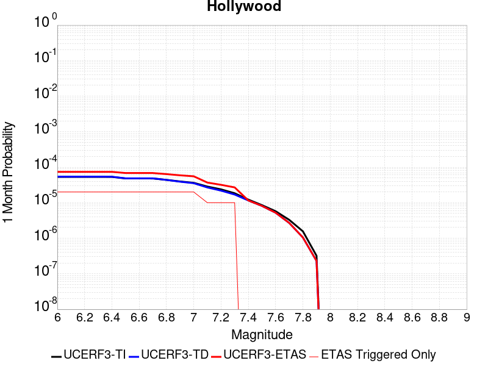 |  |  |

| Magnitude | 1 wk TI Prob | 1 wk TD Prob | 1 wk ETAS Prob | 1 wk ETAS/TD Gain | 1 wk ETAS Triggered Only | 1 mo TI Prob | 1 mo TD Prob | 1 mo ETAS Prob | 1 mo ETAS/TD Gain | 1 mo ETAS Triggered Only | 1 yr TI Prob | 1 yr TD Prob | 1 yr ETAS Prob | 1 yr ETAS/TD Gain | 1 yr ETAS Triggered Only | 10 yr TI Prob | 10 yr TD Prob | 10 yr ETAS Prob | 10 yr ETAS/TD Gain | 10 yr ETAS Triggered Only |
|-----|-----|-----|-----|-----|-----|-----|-----|-----|-----|-----|-----|-----|-----|-----|-----|-----|-----|-----|-----|-----|
| 6.0 | 1.24487615E-5 | 1.2593226E-5 | 4.918862E-5 | 3.9059587 | 3.6595855E-5 | 5.3350745E-5 | 5.3969878E-5 | 9.056376E-5 | 1.6780427 | 3.6595855E-5 | 6.4935174E-4 | 6.568898E-4 | 6.934616E-4 | 1.0556742 | 3.6595855E-5 | 0.0064745755 | 0.006549969 | 0.006586325 | 1.0055506 | 3.6595855E-5 |
| 6.1 | 1.24487615E-5 | 1.2593226E-5 | 4.918862E-5 | 3.9059587 | 3.6595855E-5 | 5.3350745E-5 | 5.3969878E-5 | 9.056376E-5 | 1.6780427 | 3.6595855E-5 | 6.4935174E-4 | 6.568898E-4 | 6.934616E-4 | 1.0556742 | 3.6595855E-5 | 0.0064745755 | 0.006549969 | 0.006586325 | 1.0055506 | 3.6595855E-5 |
| 6.2 | 1.24487615E-5 | 1.2593226E-5 | 4.918862E-5 | 3.9059587 | 3.6595855E-5 | 5.3350745E-5 | 5.3969878E-5 | 9.056376E-5 | 1.6780427 | 3.6595855E-5 | 6.4935174E-4 | 6.568898E-4 | 6.934616E-4 | 1.0556742 | 3.6595855E-5 | 0.0064745755 | 0.006549969 | 0.006586325 | 1.0055506 | 3.6595855E-5 |
| 6.3 | 1.24487615E-5 | 1.2593226E-5 | 4.918862E-5 | 3.9059587 | 3.6595855E-5 | 5.3350745E-5 | 5.3969878E-5 | 9.056376E-5 | 1.6780427 | 3.6595855E-5 | 6.4935174E-4 | 6.568898E-4 | 6.934616E-4 | 1.0556742 | 3.6595855E-5 | 0.0064745755 | 0.006549969 | 0.006586325 | 1.0055506 | 3.6595855E-5 |
| 6.4 | 1.2431024E-5 | 1.2573839E-5 | 4.9169234E-5 | 3.910439 | 3.6595855E-5 | 5.327473E-5 | 5.3886797E-5 | 9.048068E-5 | 1.6790881 | 3.6595855E-5 | 6.4842677E-4 | 6.558789E-4 | 6.9245073E-4 | 1.05576 | 3.6595855E-5 | 0.0064653796 | 0.0065399194 | 0.006576276 | 1.0055592 | 3.6595855E-5 |
| 6.5 | 1.1242222E-5 | 1.13178E-5 | 4.791324E-5 | 4.233441 | 3.6595855E-5 | 4.8180063E-5 | 4.850397E-5 | 8.509805E-5 | 1.7544553 | 3.6595855E-5 | 5.864344E-4 | 5.9037853E-4 | 6.269528E-4 | 1.0619506 | 3.6595855E-5 | 0.0058488925 | 0.005888388 | 0.0059247683 | 1.0061784 | 3.6595855E-5 |
| 6.6 | 1.1234066E-5 | 1.13089145E-5 | 4.7904356E-5 | 4.235982 | 3.6595855E-5 | 4.8145106E-5 | 4.846589E-5 | 8.505997E-5 | 1.7550482 | 3.6595855E-5 | 5.86009E-4 | 5.8991514E-4 | 6.264894E-4 | 1.0619992 | 3.6595855E-5 | 0.005844661 | 0.0058837784 | 0.005920159 | 1.0061831 | 3.6595855E-5 |
| 6.7 | 1.12294E-5 | 1.1303658E-5 | 4.78991E-5 | 4.237487 | 3.6595855E-5 | 4.812511E-5 | 4.8443362E-5 | 8.503744E-5 | 1.7553992 | 3.6595855E-5 | 5.857657E-4 | 5.89641E-4 | 6.262153E-4 | 1.062028 | 3.6595855E-5 | 0.0058422405 | 0.005881052 | 0.0059174323 | 1.0061861 | 3.6595855E-5 |
| 6.8 | 1.0252819E-5 | 1.0218445E-5 | 4.6813926E-5 | 4.581316 | 3.6595855E-5 | 4.3939912E-5 | 4.379261E-5 | 8.038686E-5 | 1.8356261 | 3.6595855E-5 | 5.3483713E-4 | 5.330467E-4 | 5.696231E-4 | 1.0686176 | 3.6595855E-5 | 0.005335517 | 0.005317908 | 0.005354309 | 1.006845 | 3.6595855E-5 |
| 6.9 | 9.252289E-6 | 9.110306E-6 | 4.5705827E-5 | 5.0169363 | 3.6595855E-5 | 3.9652066E-5 | 3.9043593E-5 | 7.563802E-5 | 1.9372709 | 3.6595855E-5 | 4.8265693E-4 | 4.752537E-4 | 5.118322E-4 | 1.0769662 | 3.6595855E-5 | 0.0048161 | 0.004742547 | 0.004778969 | 1.0076799 | 3.6595855E-5 |
| 7.0 | 8.474604E-6 | 8.258257E-6 | 4.485381E-5 | 5.4313893 | 3.6595855E-5 | 3.6319227E-5 | 3.539206E-5 | 7.1986615E-5 | 2.0339766 | 3.6595855E-5 | 4.4209688E-4 | 4.3081454E-4 | 4.6739462E-4 | 1.0849091 | 3.6595855E-5 | 0.004412184 | 0.004299944 | 0.0043363823 | 1.0084742 | 3.6595855E-5 |
| 7.1 | 6.643643E-6 | 6.2683675E-6 | 2.456618E-5 | 3.9190714 | 1.8297927E-5 | 2.8472443E-5 | 2.6864158E-5 | 4.5161592E-5 | 1.6811095 | 1.8297927E-5 | 3.4659685E-4 | 3.2702246E-4 | 3.4531442E-4 | 1.0559348 | 1.8297927E-5 | 0.0034605677 | 0.0032654584 | 0.0032836965 | 1.0055852 | 1.8297927E-5 |
| 7.2 | 5.549002E-6 | 5.108709E-6 | 2.3406543E-5 | 4.581694 | 1.8297927E-5 | 2.378122E-5 | 2.1894284E-5 | 4.019181E-5 | 1.8357216 | 1.8297927E-5 | 2.8949787E-4 | 2.6653046E-4 | 2.848235E-4 | 1.068634 | 1.8297927E-5 | 0.0028912104 | 0.0026621243 | 0.0026803736 | 1.0068551 | 1.8297927E-5 |
| 7.3 | 4.3059727E-6 | 3.9598885E-6 | 2.2257744E-5 | 5.6208 | 1.8297927E-5 | 1.8454039E-5 | 1.6970842E-5 | 3.526846E-5 | 2.0781796 | 1.8297927E-5 | 2.2465475E-4 | 2.066005E-4 | 2.2489464E-4 | 1.0885484 | 1.8297927E-5 | 0.0022442779 | 0.0020640944 | 0.0020823546 | 1.0088465 | 1.8297927E-5 |
| 7.4 | 2.8550733E-6 | 2.7012966E-6 | 2.7012966E-6 | 1.0 | 0.0 | 1.2235971E-5 | 1.1576934E-5 | 1.1576934E-5 | 1.0 | 0.0 | 1.4896276E-4 | 1.409401E-4 | 1.409401E-4 | 1.0 | 0.0 | 0.0014886294 | 0.0014085122 | 0.0014085122 | 1.0 | 0.0 |
| 7.5 | 1.9927045E-6 | 1.8976367E-6 | 1.8976367E-6 | 1.0 | 0.0 | 8.540134E-6 | 8.132703E-6 | 8.132703E-6 | 1.0 | 0.0 | 1.0397117E-4 | 9.90112E-5 | 9.90112E-5 | 1.0 | 0.0 | 0.0010392254 | 9.896745E-4 | 9.896745E-4 | 1.0 | 0.0 |
| 7.6 | 1.345084E-6 | 1.2216007E-6 | 1.2216007E-6 | 1.0 | 0.0 | 5.764633E-6 | 5.235421E-6 | 5.235421E-6 | 1.0 | 0.0 | 7.018215E-5 | 6.3739404E-5 | 6.3739404E-5 | 1.0 | 0.0 | 7.0159987E-4 | 6.3721323E-4 | 6.3721323E-4 | 1.0 | 0.0 |
| 7.7 | 7.6835164E-7 | 6.277697E-7 | 6.277697E-7 | 1.0 | 0.0 | 3.2929315E-6 | 2.6904388E-6 | 2.6904388E-6 | 1.0 | 0.0 | 4.00907E-5 | 3.2755615E-5 | 3.2755615E-5 | 1.0 | 0.0 | 4.0083472E-4 | 3.2750933E-4 | 3.2750933E-4 | 1.0 | 0.0 |
| 7.8 | 3.6562128E-7 | 2.453479E-7 | 2.453479E-7 | 1.0 | 0.0 | 1.5669474E-6 | 1.0514907E-6 | 1.0514907E-6 | 1.0 | 0.0 | 1.9077417E-5 | 1.2801827E-5 | 1.2801827E-5 | 1.0 | 0.0 | 1.907578E-4 | 1.2801126E-4 | 1.2801126E-4 | 1.0 | 0.0 |
| 7.9 | 7.5024424E-8 | 5.3816795E-8 | 5.3816795E-8 | 1.0 | 0.0 | 3.215332E-7 | 2.306434E-7 | 2.306434E-7 | 1.0 | 0.0 | 3.91466E-6 | 2.808081E-6 | 2.808081E-6 | 1.0 | 0.0 | 3.9145907E-5 | 2.8080585E-5 | 2.8080585E-5 | 1.0 | 0.0 |

## Coronado Bank alt1
*[(top)](#table-of-contents)*

| 1 Week | 1 Month | 1 Year | 10 Year |
|-----|-----|-----|-----|
|  |  |  |  |

| Magnitude | 1 wk TI Prob | 1 wk TD Prob | 1 wk ETAS Prob | 1 wk ETAS/TD Gain | 1 wk ETAS Triggered Only | 1 mo TI Prob | 1 mo TD Prob | 1 mo ETAS Prob | 1 mo ETAS/TD Gain | 1 mo ETAS Triggered Only | 1 yr TI Prob | 1 yr TD Prob | 1 yr ETAS Prob | 1 yr ETAS/TD Gain | 1 yr ETAS Triggered Only | 10 yr TI Prob | 10 yr TD Prob | 10 yr ETAS Prob | 10 yr ETAS/TD Gain | 10 yr ETAS Triggered Only |
|-----|-----|-----|-----|-----|-----|-----|-----|-----|-----|-----|-----|-----|-----|-----|-----|-----|-----|-----|-----|-----|
| 6.0 | 7.533492E-5 | 9.394913E-5 | 1.1224534E-4 | 1.1947459 | 1.8297927E-5 | 3.22824E-4 | 4.0258127E-4 | 4.2087183E-4 | 1.0454332 | 1.8297927E-5 | 0.0039233007 | 0.0048909658 | 0.004909174 | 1.0037229 | 1.8297927E-5 | 0.03854755 | 0.04790356 | 0.047938403 | 1.0007273 | 3.6595855E-5 |
| 6.1 | 4.1807285E-5 | 5.049283E-5 | 6.8789835E-5 | 1.3623683 | 1.8297927E-5 | 1.7916178E-4 | 2.1638049E-4 | 2.3467446E-4 | 1.0845454 | 1.8297927E-5 | 0.0021791123 | 0.0026313474 | 0.0026495971 | 1.0069355 | 1.8297927E-5 | 0.021578677 | 0.026011046 | 0.026046691 | 1.0013703 | 3.6595855E-5 |
| 6.2 | 4.1807285E-5 | 5.049283E-5 | 6.8789835E-5 | 1.3623683 | 1.8297927E-5 | 1.7916178E-4 | 2.1638049E-4 | 2.3467446E-4 | 1.0845454 | 1.8297927E-5 | 0.0021791123 | 0.0026313474 | 0.0026495971 | 1.0069355 | 1.8297927E-5 | 0.021578677 | 0.026011046 | 0.026046691 | 1.0013703 | 3.6595855E-5 |
| 6.3 | 3.1793104E-5 | 3.7711117E-5 | 3.7711117E-5 | 1.0 | 0.0 | 1.3624904E-4 | 1.6160926E-4 | 1.6160926E-4 | 1.0 | 0.0 | 0.0016575698 | 0.001965848 | 0.001965848 | 1.0 | 0.0 | 0.016452603 | 0.019488465 | 0.019506406 | 1.0009207 | 1.8297927E-5 |
| 6.4 | 2.9878007E-5 | 3.5335794E-5 | 3.5335794E-5 | 1.0 | 0.0 | 1.2804232E-4 | 1.5143053E-4 | 1.5143053E-4 | 1.0 | 0.0 | 0.0015578003 | 0.0018421387 | 0.0018421387 | 1.0 | 0.0 | 0.015469253 | 0.01827244 | 0.018290404 | 1.0009831 | 1.8297927E-5 |
| 6.5 | 2.4512565E-5 | 2.8764043E-5 | 2.8764043E-5 | 1.0 | 0.0 | 1.0504962E-4 | 1.2326881E-4 | 1.2326881E-4 | 1.0 | 0.0 | 0.0012782287 | 0.0014997921 | 0.0014997921 | 1.0 | 0.0 | 0.012709012 | 0.014899683 | 0.014917708 | 1.0012097 | 1.8297927E-5 |
| 6.6 | 2.1317413E-5 | 2.490667E-5 | 2.490667E-5 | 1.0 | 0.0 | 9.135714E-5 | 1.0673863E-4 | 1.0673863E-4 | 1.0 | 0.0 | 0.0011117056 | 0.0012987906 | 0.0012987906 | 1.0 | 0.0 | 0.011061605 | 0.012914404 | 0.012932466 | 1.0013986 | 1.8297927E-5 |
| 6.7 | 1.8585655E-5 | 2.163488E-5 | 2.163488E-5 | 1.0 | 0.0 | 7.9650374E-5 | 9.271773E-5 | 9.271773E-5 | 1.0 | 0.0 | 9.6931186E-4 | 0.0011282742 | 0.0011282742 | 1.0 | 0.0 | 0.0096509475 | 0.011227623 | 0.011227623 | 1.0 | 0.0 |
| 6.8 | 1.5862879E-5 | 1.8419474E-5 | 1.8419474E-5 | 1.0 | 0.0 | 6.798199E-5 | 7.893833E-5 | 7.893833E-5 | 1.0 | 0.0 | 8.273665E-4 | 9.6066965E-4 | 9.6066965E-4 | 1.0 | 0.0 | 0.008242928 | 0.00956715 | 0.00956715 | 1.0 | 0.0 |
| 6.9 | 1.3021509E-5 | 1.5095265E-5 | 1.5095265E-5 | 1.0 | 0.0 | 5.5805274E-5 | 6.469249E-5 | 6.469249E-5 | 1.0 | 0.0 | 6.792174E-4 | 7.8736455E-4 | 7.8736455E-4 | 1.0 | 0.0 | 0.006771452 | 0.007847573 | 0.007847573 | 1.0 | 0.0 |
| 7.0 | 1.0974371E-5 | 1.2720104E-5 | 1.2720104E-5 | 1.0 | 0.0 | 4.7032172E-5 | 5.451369E-5 | 5.451369E-5 | 1.0 | 0.0 | 5.7246623E-4 | 6.6351966E-4 | 6.6351966E-4 | 1.0 | 0.0 | 0.0057099373 | 0.006617135 | 0.006617135 | 1.0 | 0.0 |
| 7.1 | 8.766221E-6 | 1.01638325E-5 | 1.01638325E-5 | 1.0 | 0.0 | 3.7568978E-5 | 4.355865E-5 | 4.355865E-5 | 1.0 | 0.0 | 4.573063E-4 | 5.3021475E-4 | 5.3021475E-4 | 1.0 | 0.0 | 0.0045636636 | 0.0052911965 | 0.0052911965 | 1.0 | 0.0 |
| 7.2 | 8.026024E-7 | 8.331765E-7 | 8.331765E-7 | 1.0 | 0.0 | 3.43972E-6 | 3.5707515E-6 | 3.5707515E-6 | 1.0 | 0.0 | 4.1877785E-5 | 4.3473043E-5 | 4.3473043E-5 | 1.0 | 0.0 | 4.1869894E-4 | 4.3464647E-4 | 4.3464647E-4 | 1.0 | 0.0 |
| 7.3 | 3.7293114E-7 | 3.7000953E-7 | 3.7000953E-7 | 1.0 | 0.0 | 1.5982754E-6 | 1.5857541E-6 | 1.5857541E-6 | 1.0 | 0.0 | 1.9458828E-5 | 1.9306386E-5 | 1.9306386E-5 | 1.0 | 0.0 | 1.9457124E-4 | 1.9304715E-4 | 1.9304715E-4 | 1.0 | 0.0 |
| 7.4 | 2.0557036E-7 | 1.9674363E-7 | 1.9674363E-7 | 1.0 | 0.0 | 8.810155E-7 | 8.431867E-7 | 8.431867E-7 | 1.0 | 0.0 | 1.0726311E-5 | 1.026575E-5 | 1.026575E-5 | 1.0 | 0.0 | 1.0725793E-4 | 1.0265279E-4 | 1.0265279E-4 | 1.0 | 0.0 |
| 7.5 | 6.845446E-8 | 6.279369E-8 | 6.279369E-8 | 1.0 | 0.0 | 2.9337625E-7 | 2.691158E-7 | 2.691158E-7 | 1.0 | 0.0 | 3.5718497E-6 | 3.2764797E-6 | 3.2764797E-6 | 1.0 | 0.0 | 3.5717923E-5 | 3.2764325E-5 | 3.2764325E-5 | 1.0 | 0.0 |
| 7.6 | 6.0975145E-9 | 5.53185E-9 | 5.53185E-9 | 1.0 | 0.0 | 2.6132206E-8 | 2.370793E-8 | 2.370793E-8 | 1.0 | 0.0 | 3.1815955E-7 | 2.88644E-7 | 2.88644E-7 | 1.0 | 0.0 | 3.181591E-6 | 2.8864374E-6 | 2.8864374E-6 | 1.0 | 0.0 |

## Great Valley 04b Gordon Valley
*[(top)](#table-of-contents)*

| 1 Week | 1 Month | 1 Year | 10 Year |
|-----|-----|-----|-----|
| 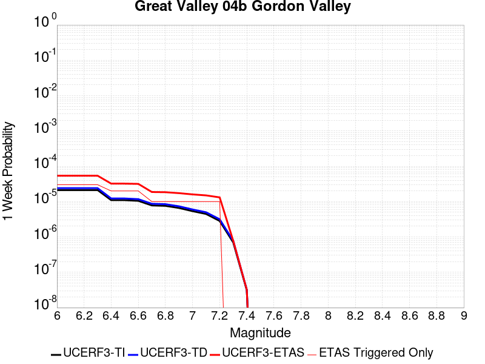 |  |  |  |

| Magnitude | 1 wk TI Prob | 1 wk TD Prob | 1 wk ETAS Prob | 1 wk ETAS/TD Gain | 1 wk ETAS Triggered Only | 1 mo TI Prob | 1 mo TD Prob | 1 mo ETAS Prob | 1 mo ETAS/TD Gain | 1 mo ETAS Triggered Only | 1 yr TI Prob | 1 yr TD Prob | 1 yr ETAS Prob | 1 yr ETAS/TD Gain | 1 yr ETAS Triggered Only | 10 yr TI Prob | 10 yr TD Prob | 10 yr ETAS Prob | 10 yr ETAS/TD Gain | 10 yr ETAS Triggered Only |
|-----|-----|-----|-----|-----|-----|-----|-----|-----|-----|-----|-----|-----|-----|-----|-----|-----|-----|-----|-----|-----|
| 6.0 | 2.1181217E-5 | 2.3981953E-5 | 6.0576927E-5 | 2.525938 | 3.6595855E-5 | 9.077348E-5 | 1.0277669E-4 | 1.3936879E-4 | 1.356035 | 3.6595855E-5 | 0.0011046068 | 0.0012507546 | 0.0012873047 | 1.0292224 | 3.6595855E-5 | 0.010991322 | 0.012453599 | 0.012489739 | 1.002902 | 3.6595855E-5 |
| 6.1 | 2.1181217E-5 | 2.3981953E-5 | 6.0576927E-5 | 2.525938 | 3.6595855E-5 | 9.077348E-5 | 1.0277669E-4 | 1.3936879E-4 | 1.356035 | 3.6595855E-5 | 0.0011046068 | 0.0012507546 | 0.0012873047 | 1.0292224 | 3.6595855E-5 | 0.010991322 | 0.012453599 | 0.012489739 | 1.002902 | 3.6595855E-5 |
| 6.2 | 2.1181217E-5 | 2.3981953E-5 | 6.0576927E-5 | 2.525938 | 3.6595855E-5 | 9.077348E-5 | 1.0277669E-4 | 1.3936879E-4 | 1.356035 | 3.6595855E-5 | 0.0011046068 | 0.0012507546 | 0.0012873047 | 1.0292224 | 3.6595855E-5 | 0.010991322 | 0.012453599 | 0.012489739 | 1.002902 | 3.6595855E-5 |
| 6.3 | 2.1181217E-5 | 2.3981953E-5 | 6.0576927E-5 | 2.525938 | 3.6595855E-5 | 9.077348E-5 | 1.0277669E-4 | 1.3936879E-4 | 1.356035 | 3.6595855E-5 | 0.0011046068 | 0.0012507546 | 0.0012873047 | 1.0292224 | 3.6595855E-5 | 0.010991322 | 0.012453599 | 0.012489739 | 1.002902 | 3.6595855E-5 |
| 6.4 | 1.0988268E-5 | 1.2254499E-5 | 3.05522E-5 | 2.4931417 | 1.8297927E-5 | 4.7091726E-5 | 5.2518313E-5 | 7.081528E-5 | 1.3483921 | 1.8297927E-5 | 5.731909E-4 | 6.392388E-4 | 6.5752503E-4 | 1.0286063 | 1.8297927E-5 | 0.005717147 | 0.0063755875 | 0.006393769 | 1.0028517 | 1.8297927E-5 |
| 6.5 | 1.0988268E-5 | 1.2254499E-5 | 3.05522E-5 | 2.4931417 | 1.8297927E-5 | 4.7091726E-5 | 5.2518313E-5 | 7.081528E-5 | 1.3483921 | 1.8297927E-5 | 5.731909E-4 | 6.392388E-4 | 6.5752503E-4 | 1.0286063 | 1.8297927E-5 | 0.005717147 | 0.0063755875 | 0.006393769 | 1.0028517 | 1.8297927E-5 |
| 6.6 | 1.0517822E-5 | 1.1724062E-5 | 3.0021774E-5 | 2.5606973 | 1.8297927E-5 | 4.5075605E-5 | 5.02451E-5 | 6.8542104E-5 | 1.364155 | 1.8297927E-5 | 5.4865726E-4 | 6.11578E-4 | 6.2986475E-4 | 1.0299009 | 1.8297927E-5 | 0.0054730466 | 0.0061005033 | 0.006118689 | 1.0029811 | 1.8297927E-5 |
| 6.7 | 7.789219E-6 | 8.6776445E-6 | 8.6776445E-6 | 1.0 | 0.0 | 3.3381937E-5 | 3.7189402E-5 | 3.7189402E-5 | 1.0 | 0.0 | 4.063493E-4 | 4.526921E-4 | 4.526921E-4 | 1.0 | 0.0 | 0.004056071 | 0.0045182165 | 0.0045182165 | 1.0 | 0.0 |
| 6.8 | 7.5850853E-6 | 8.452389E-6 | 8.452389E-6 | 1.0 | 0.0 | 3.2507105E-5 | 3.622405E-5 | 3.622405E-5 | 1.0 | 0.0 | 3.957021E-4 | 4.409437E-4 | 4.409437E-4 | 1.0 | 0.0 | 0.0039499826 | 0.0044012 | 0.0044012 | 1.0 | 0.0 |
| 6.9 | 6.604105E-6 | 7.3585493E-6 | 7.3585493E-6 | 1.0 | 0.0 | 2.8303E-5 | 3.153628E-5 | 3.153628E-5 | 1.0 | 0.0 | 3.4453452E-4 | 3.8389044E-4 | 3.8389044E-4 | 1.0 | 0.0 | 0.0034400085 | 0.0038326595 | 0.0038326595 | 1.0 | 0.0 |
| 7.0 | 5.3701115E-6 | 5.9884183E-6 | 5.9884183E-6 | 1.0 | 0.0 | 2.301456E-5 | 2.5664414E-5 | 2.5664414E-5 | 1.0 | 0.0 | 2.8016625E-4 | 3.1242234E-4 | 3.1242234E-4 | 1.0 | 0.0 | 0.0027981328 | 0.00312012 | 0.00312012 | 1.0 | 0.0 |
| 7.1 | 4.4685607E-6 | 4.986478E-6 | 4.986478E-6 | 1.0 | 0.0 | 1.9150835E-5 | 2.1370459E-5 | 2.1370459E-5 | 1.0 | 0.0 | 2.3313647E-4 | 2.6015675E-4 | 2.6015675E-4 | 1.0 | 0.0 | 0.0023289204 | 0.0025987667 | 0.0025987667 | 1.0 | 0.0 |
| 7.2 | 2.833378E-6 | 3.164419E-6 | 3.164419E-6 | 1.0 | 0.0 | 1.2142991E-5 | 1.3561736E-5 | 1.3561736E-5 | 1.0 | 0.0 | 1.4783088E-4 | 1.6510337E-4 | 1.6510337E-4 | 1.0 | 0.0 | 0.0014773258 | 0.0016499789 | 0.0016499789 | 1.0 | 0.0 |
| 7.3 | 7.0087293E-7 | 7.7728157E-7 | 7.7728157E-7 | 1.0 | 0.0 | 3.0037377E-6 | 3.3312049E-6 | 3.3312049E-6 | 1.0 | 0.0 | 3.656989E-5 | 4.0557123E-5 | 4.0557123E-5 | 1.0 | 0.0 | 3.6563876E-4 | 4.055422E-4 | 4.055422E-4 | 1.0 | 0.0 |
| 7.4 | 3.112171E-8 | 3.2068368E-8 | 3.2068368E-8 | 1.0 | 0.0 | 1.3337875E-7 | 1.3743585E-7 | 1.3743585E-7 | 1.0 | 0.0 | 1.6238852E-6 | 1.6732803E-6 | 1.6732803E-6 | 1.0 | 0.0 | 1.6238733E-5 | 1.6732685E-5 | 1.6732685E-5 | 1.0 | 0.0 |

## San Diego Trough north alt1
*[(top)](#table-of-contents)*

| 1 Week | 1 Month | 1 Year | 10 Year |
|-----|-----|-----|-----|
|  |  |  |  |

| Magnitude | 1 wk TI Prob | 1 wk TD Prob | 1 wk ETAS Prob | 1 wk ETAS/TD Gain | 1 wk ETAS Triggered Only | 1 mo TI Prob | 1 mo TD Prob | 1 mo ETAS Prob | 1 mo ETAS/TD Gain | 1 mo ETAS Triggered Only | 1 yr TI Prob | 1 yr TD Prob | 1 yr ETAS Prob | 1 yr ETAS/TD Gain | 1 yr ETAS Triggered Only | 10 yr TI Prob | 10 yr TD Prob | 10 yr ETAS Prob | 10 yr ETAS/TD Gain | 10 yr ETAS Triggered Only |
|-----|-----|-----|-----|-----|-----|-----|-----|-----|-----|-----|-----|-----|-----|-----|-----|-----|-----|-----|-----|-----|
| 6.0 | 7.329252E-5 | 8.821093E-5 | 1.0650724E-4 | 1.2074155 | 1.8297927E-5 | 3.14073E-4 | 3.7799572E-4 | 3.9628672E-4 | 1.0483894 | 1.8297927E-5 | 0.0038171355 | 0.004593027 | 0.0046112407 | 1.0039655 | 1.8297927E-5 | 0.03752231 | 0.045044992 | 0.04507994 | 1.0007758 | 3.6595855E-5 |
| 6.1 | 3.7940346E-5 | 4.4885E-5 | 6.318211E-5 | 1.407644 | 1.8297927E-5 | 1.6259136E-4 | 1.9235066E-4 | 2.1064507E-4 | 1.0951097 | 1.8297927E-5 | 0.0019777524 | 0.0023394432 | 0.0023576983 | 1.0078032 | 1.8297927E-5 | 0.019602431 | 0.023156688 | 0.023192436 | 1.0015438 | 3.6595855E-5 |
| 6.2 | 2.8645263E-5 | 3.329678E-5 | 3.329678E-5 | 1.0 | 0.0 | 1.2275964E-4 | 1.4269284E-4 | 1.4269284E-4 | 1.0 | 0.0 | 0.0014935739 | 0.0017359189 | 0.0017359189 | 1.0 | 0.0 | 0.0148357535 | 0.017226247 | 0.017244231 | 1.0010439 | 1.8297927E-5 |
| 6.3 | 2.8645263E-5 | 3.329678E-5 | 3.329678E-5 | 1.0 | 0.0 | 1.2275964E-4 | 1.4269284E-4 | 1.4269284E-4 | 1.0 | 0.0 | 0.0014935739 | 0.0017359189 | 0.0017359189 | 1.0 | 0.0 | 0.0148357535 | 0.017226247 | 0.017244231 | 1.0010439 | 1.8297927E-5 |
| 6.4 | 2.2204576E-5 | 2.5448318E-5 | 2.5448318E-5 | 1.0 | 0.0 | 9.5159E-5 | 1.0905972E-4 | 1.0905972E-4 | 1.0 | 0.0 | 0.001157945 | 0.0013270034 | 0.0013270034 | 1.0 | 0.0 | 0.011519298 | 0.013191955 | 0.013210012 | 1.0013688 | 1.8297927E-5 |
| 6.5 | 2.1004838E-5 | 2.4024694E-5 | 2.4024694E-5 | 1.0 | 0.0 | 9.0017624E-5 | 1.0295896E-4 | 1.0295896E-4 | 1.0 | 0.0 | 0.0010954136 | 0.0012528138 | 0.0012528138 | 1.0 | 0.0 | 0.010900296 | 0.012458589 | 0.012458589 | 1.0 | 0.0 |
| 6.6 | 1.820557E-5 | 2.0704787E-5 | 2.0704787E-5 | 1.0 | 0.0 | 7.802154E-5 | 8.873181E-5 | 8.873181E-5 | 1.0 | 0.0 | 9.4949827E-4 | 0.0010797799 | 0.0010797799 | 1.0 | 0.0 | 0.009454516 | 0.010746004 | 0.010746004 | 1.0 | 0.0 |
| 6.7 | 1.5884485E-5 | 1.7983646E-5 | 1.7983646E-5 | 1.0 | 0.0 | 6.807459E-5 | 7.707051E-5 | 7.707051E-5 | 1.0 | 0.0 | 8.284929E-4 | 9.3793223E-4 | 9.3793223E-4 | 1.0 | 0.0 | 0.008254109 | 0.009340104 | 0.009340104 | 1.0 | 0.0 |
| 6.8 | 1.4331171E-5 | 1.6201066E-5 | 1.6201066E-5 | 1.0 | 0.0 | 6.141786E-5 | 6.94313E-5 | 6.94313E-5 | 1.0 | 0.0 | 7.4750587E-4 | 8.450002E-4 | 8.450002E-4 | 1.0 | 0.0 | 0.0074499645 | 0.008418139 | 0.008418139 | 1.0 | 0.0 |
| 6.9 | 1.2574203E-5 | 1.4205835E-5 | 1.4205835E-5 | 1.0 | 0.0 | 5.3888325E-5 | 6.0880735E-5 | 6.0880735E-5 | 1.0 | 0.0 | 6.558929E-4 | 7.409723E-4 | 7.409723E-4 | 1.0 | 0.0 | 0.0065396037 | 0.007385203 | 0.007385203 | 1.0 | 0.0 |
| 7.0 | 1.0883844E-5 | 1.2289262E-5 | 1.2289262E-5 | 1.0 | 0.0 | 4.664421E-5 | 5.2667205E-5 | 5.2667205E-5 | 1.0 | 0.0 | 5.677453E-4 | 6.4103556E-4 | 6.4103556E-4 | 1.0 | 0.0 | 0.00566297 | 0.006391993 | 0.006391993 | 1.0 | 0.0 |
| 7.1 | 9.393088E-6 | 1.060702E-5 | 1.060702E-5 | 1.0 | 0.0 | 4.025547E-5 | 4.545787E-5 | 4.545787E-5 | 1.0 | 0.0 | 4.900001E-4 | 5.533098E-4 | 5.533098E-4 | 1.0 | 0.0 | 0.0048892107 | 0.005519418 | 0.005519418 | 1.0 | 0.0 |
| 7.2 | 8.190791E-6 | 9.258625E-6 | 9.258625E-6 | 1.0 | 0.0 | 3.510292E-5 | 3.9679224E-5 | 3.9679224E-5 | 1.0 | 0.0 | 4.2729423E-4 | 4.8298817E-4 | 4.8298817E-4 | 1.0 | 0.0 | 0.0042647356 | 0.004819465 | 0.004819465 | 1.0 | 0.0 |
| 7.3 | 6.268162E-6 | 7.089716E-6 | 7.089716E-6 | 1.0 | 0.0 | 2.6863276E-5 | 3.0384144E-5 | 3.0384144E-5 | 1.0 | 0.0 | 3.2701128E-4 | 3.6986457E-4 | 3.6986457E-4 | 1.0 | 0.0 | 0.003265305 | 0.003692536 | 0.003692536 | 1.0 | 0.0 |
| 7.4 | 4.985186E-6 | 5.6426816E-6 | 5.6426816E-6 | 1.0 | 0.0 | 2.1364907E-5 | 2.4182698E-5 | 2.4182698E-5 | 1.0 | 0.0 | 2.600867E-4 | 2.9438498E-4 | 2.9438498E-4 | 1.0 | 0.0 | 0.002597825 | 0.0029399914 | 0.0029399914 | 1.0 | 0.0 |
| 7.5 | 1.7489613E-6 | 1.969678E-6 | 1.969678E-6 | 1.0 | 0.0 | 7.495527E-6 | 8.4414505E-6 | 8.4414505E-6 | 1.0 | 0.0 | 9.125422E-5 | 1.02770035E-4 | 1.02770035E-4 | 1.0 | 0.0 | 9.1216754E-4 | 0.0010272472 | 0.0010272472 | 1.0 | 0.0 |
| 7.6 | 1.6988751E-7 | 1.7533823E-7 | 1.7533823E-7 | 1.0 | 0.0 | 7.2808916E-7 | 7.5144936E-7 | 7.5144936E-7 | 1.0 | 0.0 | 8.864449E-6 | 9.14886E-6 | 9.14886E-6 | 1.0 | 0.0 | 8.8640954E-5 | 9.1485024E-5 | 9.1485024E-5 | 1.0 | 0.0 |

## Santa Cruz Island
*[(top)](#table-of-contents)*

| 1 Week | 1 Month | 1 Year | 10 Year |
|-----|-----|-----|-----|
|  | 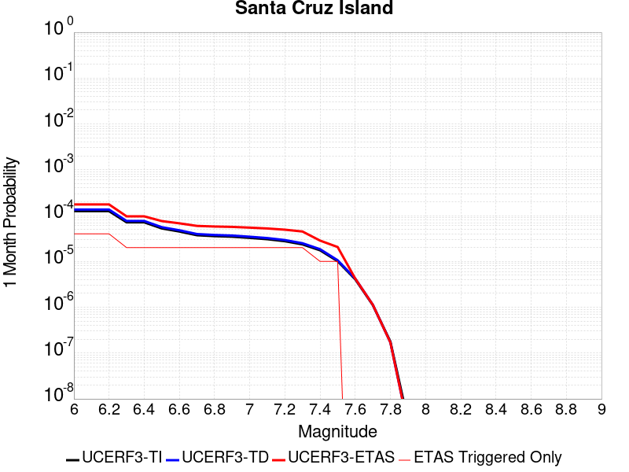 |  |  |

| Magnitude | 1 wk TI Prob | 1 wk TD Prob | 1 wk ETAS Prob | 1 wk ETAS/TD Gain | 1 wk ETAS Triggered Only | 1 mo TI Prob | 1 mo TD Prob | 1 mo ETAS Prob | 1 mo ETAS/TD Gain | 1 mo ETAS Triggered Only | 1 yr TI Prob | 1 yr TD Prob | 1 yr ETAS Prob | 1 yr ETAS/TD Gain | 1 yr ETAS Triggered Only | 10 yr TI Prob | 10 yr TD Prob | 10 yr ETAS Prob | 10 yr ETAS/TD Gain | 10 yr ETAS Triggered Only |
|-----|-----|-----|-----|-----|-----|-----|-----|-----|-----|-----|-----|-----|-----|-----|-----|-----|-----|-----|-----|-----|
| 6.0 | 2.9164563E-5 | 3.1599742E-5 | 3.1599742E-5 | 1.0 | 0.0 | 1.2498499E-4 | 1.3542121E-4 | 1.3542121E-4 | 1.0 | 0.0 | 0.0015206301 | 0.0016476426 | 0.0016659104 | 1.0110872 | 1.8297927E-5 | 0.015102667 | 0.016368 | 0.016403995 | 1.0021992 | 3.6595855E-5 |
| 6.1 | 2.9164563E-5 | 3.1599742E-5 | 3.1599742E-5 | 1.0 | 0.0 | 1.2498499E-4 | 1.3542121E-4 | 1.3542121E-4 | 1.0 | 0.0 | 0.0015206301 | 0.0016476426 | 0.0016659104 | 1.0110872 | 1.8297927E-5 | 0.015102667 | 0.016368 | 0.016403995 | 1.0021992 | 3.6595855E-5 |
| 6.2 | 2.9164563E-5 | 3.1599742E-5 | 3.1599742E-5 | 1.0 | 0.0 | 1.2498499E-4 | 1.3542121E-4 | 1.3542121E-4 | 1.0 | 0.0 | 0.0015206301 | 0.0016476426 | 0.0016659104 | 1.0110872 | 1.8297927E-5 | 0.015102667 | 0.016368 | 0.016403995 | 1.0021992 | 3.6595855E-5 |
| 6.3 | 1.6635553E-5 | 1.780436E-5 | 1.780436E-5 | 1.0 | 0.0 | 7.1293274E-5 | 7.630226E-5 | 7.630226E-5 | 1.0 | 0.0 | 8.6765E-4 | 9.2860236E-4 | 9.4688335E-4 | 1.0196865 | 1.8297927E-5 | 0.008642701 | 0.009249094 | 0.009267222 | 1.00196 | 1.8297927E-5 |
| 6.4 | 1.6635553E-5 | 1.780436E-5 | 1.780436E-5 | 1.0 | 0.0 | 7.1293274E-5 | 7.630226E-5 | 7.630226E-5 | 1.0 | 0.0 | 8.6765E-4 | 9.2860236E-4 | 9.4688335E-4 | 1.0196865 | 1.8297927E-5 | 0.008642701 | 0.009249094 | 0.009267222 | 1.00196 | 1.8297927E-5 |
| 6.5 | 1.2238748E-5 | 1.3042995E-5 | 1.3042995E-5 | 1.0 | 0.0 | 5.2450723E-5 | 5.5897377E-5 | 5.5897377E-5 | 1.0 | 0.0 | 6.3840044E-4 | 6.8034173E-4 | 6.986272E-4 | 1.0268769 | 1.8297927E-5 | 0.0063656955 | 0.0067829876 | 0.0068011614 | 1.0026793 | 1.8297927E-5 |
| 6.6 | 1.0489767E-5 | 1.1156636E-5 | 1.1156636E-5 | 1.0 | 0.0 | 4.495537E-5 | 4.781329E-5 | 4.781329E-5 | 1.0 | 0.0 | 5.4719415E-4 | 5.819735E-4 | 6.002608E-4 | 1.0314229 | 1.8297927E-5 | 0.005458487 | 0.0058047357 | 0.0058229277 | 1.0031339 | 1.8297927E-5 |
| 6.7 | 8.699222E-6 | 9.236782E-6 | 9.236782E-6 | 1.0 | 0.0 | 3.7281847E-5 | 3.958561E-5 | 3.958561E-5 | 1.0 | 0.0 | 4.5381195E-4 | 4.8184878E-4 | 4.8184878E-4 | 1.0 | 0.0 | 0.0045288634 | 0.004808108 | 0.004808108 | 1.0 | 0.0 |
| 6.8 | 8.307732E-6 | 8.8169045E-6 | 8.8169045E-6 | 1.0 | 0.0 | 3.560408E-5 | 3.7786187E-5 | 3.7786187E-5 | 1.0 | 0.0 | 4.3339343E-4 | 4.5995016E-4 | 4.5995016E-4 | 1.0 | 0.0 | 0.004325492 | 0.0045900354 | 0.0045900354 | 1.0 | 0.0 |
| 6.9 | 8.073121E-6 | 8.564939E-6 | 8.564939E-6 | 1.0 | 0.0 | 3.459863E-5 | 3.6706366E-5 | 3.6706366E-5 | 1.0 | 0.0 | 4.2115687E-4 | 4.468088E-4 | 4.468088E-4 | 1.0 | 0.0 | 0.004203596 | 0.004459156 | 0.004459156 | 1.0 | 0.0 |
| 7.0 | 7.617019E-6 | 8.074664E-6 | 8.074664E-6 | 1.0 | 0.0 | 3.264396E-5 | 3.4605247E-5 | 3.4605247E-5 | 1.0 | 0.0 | 3.9736772E-4 | 4.212378E-4 | 4.212378E-4 | 1.0 | 0.0 | 0.003966579 | 0.0042044413 | 0.0042044413 | 1.0 | 0.0 |
| 7.1 | 7.1224836E-6 | 7.545788E-6 | 7.545788E-6 | 1.0 | 0.0 | 3.052457E-5 | 3.2338692E-5 | 3.2338692E-5 | 1.0 | 0.0 | 3.715733E-4 | 3.936528E-4 | 3.936528E-4 | 1.0 | 0.0 | 0.003709526 | 0.003929598 | 0.003929598 | 1.0 | 0.0 |
| 7.2 | 6.441115E-6 | 6.8273835E-6 | 6.8273835E-6 | 1.0 | 0.0 | 2.7604487E-5 | 2.9259887E-5 | 2.9259887E-5 | 1.0 | 0.0 | 3.360328E-4 | 3.5618112E-4 | 3.5618112E-4 | 1.0 | 0.0 | 0.0033552512 | 0.003556131 | 0.003556131 | 1.0 | 0.0 |
| 7.3 | 5.494274E-6 | 5.8199944E-6 | 5.8199944E-6 | 1.0 | 0.0 | 2.3546674E-5 | 2.4942596E-5 | 2.4942596E-5 | 1.0 | 0.0 | 2.8664304E-4 | 3.0363398E-4 | 3.0363398E-4 | 1.0 | 0.0 | 0.002862736 | 0.0030322142 | 0.0030322142 | 1.0 | 0.0 |
| 7.4 | 4.0802624E-6 | 4.312256E-6 | 4.312256E-6 | 1.0 | 0.0 | 1.7486722E-5 | 1.8480967E-5 | 1.8480967E-5 | 1.0 | 0.0 | 2.1288003E-4 | 2.2498262E-4 | 2.2498262E-4 | 1.0 | 0.0 | 0.0021267622 | 0.0022475575 | 0.0022475575 | 1.0 | 0.0 |
| 7.5 | 2.3584746E-6 | 2.4753094E-6 | 2.4753094E-6 | 1.0 | 0.0 | 1.0107709E-5 | 1.0608426E-5 | 1.0608426E-5 | 1.0 | 0.0 | 1.2305441E-4 | 1.2915E-4 | 1.2915E-4 | 1.0 | 0.0 | 0.0012298629 | 0.0012907543 | 0.0012907543 | 1.0 | 0.0 |
| 7.6 | 9.4981914E-7 | 9.86093E-7 | 9.86093E-7 | 1.0 | 0.0 | 4.0706473E-6 | 4.2261063E-6 | 4.2261063E-6 | 1.0 | 0.0 | 4.9559E-5 | 5.145164E-5 | 5.145164E-5 | 1.0 | 0.0 | 4.954795E-4 | 5.1439856E-4 | 5.1439856E-4 | 1.0 | 0.0 |
| 7.7 | 2.6013532E-7 | 2.6416603E-7 | 2.6416603E-7 | 1.0 | 0.0 | 1.1148652E-6 | 1.1321397E-6 | 1.1321397E-6 | 1.0 | 0.0 | 1.3573399E-5 | 1.3783714E-5 | 1.3783714E-5 | 1.0 | 0.0 | 1.357257E-4 | 1.3782867E-4 | 1.3782867E-4 | 1.0 | 0.0 |
| 7.8 | 4.1522263E-8 | 3.965679E-8 | 3.965679E-8 | 1.0 | 0.0 | 1.7795254E-7 | 1.6995766E-7 | 1.6995766E-7 | 1.0 | 0.0 | 2.16657E-6 | 2.0692328E-6 | 2.0692328E-6 | 1.0 | 0.0 | 2.1665488E-5 | 2.0692156E-5 | 2.0692156E-5 | 1.0 | 0.0 |
| 7.9 | 7.7242046E-10 | 5.9468175E-10 | 5.9468175E-10 | 1.0 | 0.0 | 3.3103735E-9 | 2.5486364E-9 | 2.5486364E-9 | 1.0 | 0.0 | 4.0303796E-8 | 3.1029646E-8 | 3.1029646E-8 | 1.0 | 0.0 | 4.030379E-7 | 3.1029643E-7 | 3.1029643E-7 | 1.0 | 0.0 |

## San Juan
*[(top)](#table-of-contents)*

| 1 Week | 1 Month | 1 Year | 10 Year |
|-----|-----|-----|-----|
| 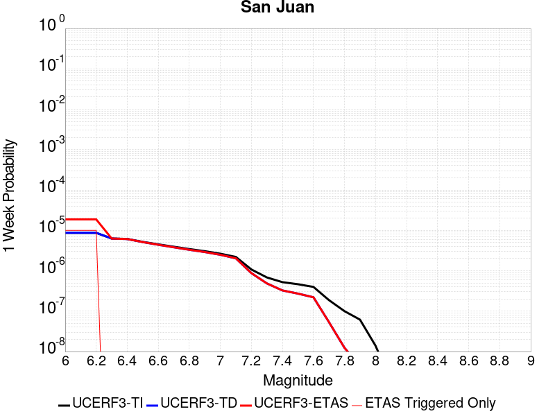 |  |  | 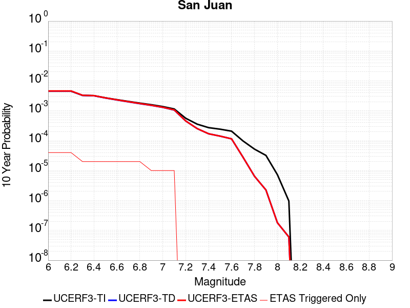 |

| Magnitude | 1 wk TI Prob | 1 wk TD Prob | 1 wk ETAS Prob | 1 wk ETAS/TD Gain | 1 wk ETAS Triggered Only | 1 mo TI Prob | 1 mo TD Prob | 1 mo ETAS Prob | 1 mo ETAS/TD Gain | 1 mo ETAS Triggered Only | 1 yr TI Prob | 1 yr TD Prob | 1 yr ETAS Prob | 1 yr ETAS/TD Gain | 1 yr ETAS Triggered Only | 10 yr TI Prob | 10 yr TD Prob | 10 yr ETAS Prob | 10 yr ETAS/TD Gain | 10 yr ETAS Triggered Only |
|-----|-----|-----|-----|-----|-----|-----|-----|-----|-----|-----|-----|-----|-----|-----|-----|-----|-----|-----|-----|-----|
| 6.0 | 8.682808E-6 | 8.7491635E-6 | 8.7491635E-6 | 1.0 | 0.0 | 3.72115E-5 | 3.74959E-5 | 5.5793145E-5 | 1.4879798 | 1.8297927E-5 | 4.5295584E-4 | 4.564218E-4 | 4.7471139E-4 | 1.0400716 | 1.8297927E-5 | 0.004520337 | 0.004555385 | 0.0045918142 | 1.0079969 | 3.6595855E-5 |
| 6.1 | 8.682808E-6 | 8.7491635E-6 | 8.7491635E-6 | 1.0 | 0.0 | 3.72115E-5 | 3.74959E-5 | 5.5793145E-5 | 1.4879798 | 1.8297927E-5 | 4.5295584E-4 | 4.564218E-4 | 4.7471139E-4 | 1.0400716 | 1.8297927E-5 | 0.004520337 | 0.004555385 | 0.0045918142 | 1.0079969 | 3.6595855E-5 |
| 6.2 | 8.682808E-6 | 8.7491635E-6 | 8.7491635E-6 | 1.0 | 0.0 | 3.72115E-5 | 3.74959E-5 | 5.5793145E-5 | 1.4879798 | 1.8297927E-5 | 4.5295584E-4 | 4.564218E-4 | 4.7471139E-4 | 1.0400716 | 1.8297927E-5 | 0.004520337 | 0.004555385 | 0.0045918142 | 1.0079969 | 3.6595855E-5 |
| 6.3 | 6.3054235E-6 | 6.2825848E-6 | 6.2825848E-6 | 1.0 | 0.0 | 2.7022963E-5 | 2.6925094E-5 | 4.522253E-5 | 1.679568 | 1.8297927E-5 | 3.2895492E-4 | 3.2776513E-4 | 3.4605703E-4 | 1.0558081 | 1.8297927E-5 | 0.003284684 | 0.003273017 | 0.0032912549 | 1.0055722 | 1.8297927E-5 |
| 6.4 | 6.1490473E-6 | 6.1144656E-6 | 6.1144656E-6 | 1.0 | 0.0 | 2.6352795E-5 | 2.6204598E-5 | 4.4502045E-5 | 1.6982533 | 1.8297927E-5 | 3.2079802E-4 | 3.1899565E-4 | 3.3728773E-4 | 1.0573428 | 1.8297927E-5 | 0.0032033534 | 0.0031855737 | 0.0032038135 | 1.0057257 | 1.8297927E-5 |
| 6.5 | 5.204848E-6 | 5.137233E-6 | 5.137233E-6 | 1.0 | 0.0 | 2.23063E-5 | 2.2016533E-5 | 4.031406E-5 | 1.831081 | 1.8297927E-5 | 2.7154534E-4 | 2.6801927E-4 | 2.863123E-4 | 1.0682527 | 1.8297927E-5 | 0.0027121378 | 0.0026771144 | 0.0026953635 | 1.0068166 | 1.8297927E-5 |
| 6.6 | 4.5179986E-6 | 4.4150297E-6 | 4.4150297E-6 | 1.0 | 0.0 | 1.9362706E-5 | 1.8921424E-5 | 3.7219004E-5 | 1.9670298 | 1.8297927E-5 | 2.3571544E-4 | 2.3034477E-4 | 2.4863848E-4 | 1.0794188 | 1.8297927E-5 | 0.0023546559 | 0.0023011973 | 0.002319453 | 1.0079331 | 1.8297927E-5 |
| 6.7 | 3.9442616E-6 | 3.819828E-6 | 3.819828E-6 | 1.0 | 0.0 | 1.6903869E-5 | 1.6370592E-5 | 3.466822E-5 | 2.1177132 | 1.8297927E-5 | 2.0578515E-4 | 1.992944E-4 | 2.1758869E-4 | 1.0917952 | 1.8297927E-5 | 0.002055947 | 0.0019912818 | 0.0020095431 | 1.0091708 | 1.8297927E-5 |
| 6.8 | 3.4536245E-6 | 3.3163353E-6 | 3.3163353E-6 | 1.0 | 0.0 | 1.4801163E-5 | 1.4212792E-5 | 3.251046E-5 | 2.2874084 | 1.8297927E-5 | 1.8018926E-4 | 1.7302761E-4 | 1.9132237E-4 | 1.1057332 | 1.8297927E-5 | 0.0018004322 | 0.0017290477 | 0.001747314 | 1.0105643 | 1.8297927E-5 |
| 6.9 | 3.059865E-6 | 2.9120315E-6 | 2.9120315E-6 | 1.0 | 0.0 | 1.3113641E-5 | 1.2480078E-5 | 1.2480078E-5 | 1.0 | 0.0 | 1.596469E-4 | 1.5193493E-4 | 1.5193493E-4 | 1.0 | 0.0 | 0.0015953224 | 0.0015184252 | 0.0015184252 | 1.0 | 0.0 |
| 7.0 | 2.6504351E-6 | 2.4920002E-6 | 2.4920002E-6 | 1.0 | 0.0 | 1.1358958E-5 | 1.0679961E-5 | 1.0679961E-5 | 1.0 | 0.0 | 1.3828653E-4 | 1.300213E-4 | 1.300213E-4 | 1.0 | 0.0 | 0.0013820052 | 0.0012995641 | 0.0012995641 | 1.0 | 0.0 |
| 7.1 | 2.2039317E-6 | 2.0338296E-6 | 2.0338296E-6 | 1.0 | 0.0 | 9.445387E-6 | 8.716386E-6 | 8.716386E-6 | 1.0 | 0.0 | 1.1499152E-4 | 1.0611736E-4 | 1.0611736E-4 | 1.0 | 0.0 | 0.0011493203 | 0.0010607769 | 0.0010607769 | 1.0 | 0.0 |
| 7.2 | 1.0786707E-6 | 8.7701903E-7 | 8.7701903E-7 | 1.0 | 0.0 | 4.622866E-6 | 3.7586476E-6 | 3.7586476E-6 | 1.0 | 0.0 | 5.628194E-5 | 4.5760586E-5 | 4.5760586E-5 | 1.0 | 0.0 | 5.6267687E-4 | 4.5757066E-4 | 4.5757066E-4 | 1.0 | 0.0 |
| 7.3 | 6.846433E-7 | 4.868805E-7 | 4.868805E-7 | 1.0 | 0.0 | 2.9341822E-6 | 2.086629E-6 | 2.086629E-6 | 1.0 | 0.0 | 3.5723086E-5 | 2.5404412E-5 | 2.5404412E-5 | 1.0 | 0.0 | 3.571734E-4 | 2.540486E-4 | 2.540486E-4 | 1.0 | 0.0 |
| 7.4 | 5.23043E-7 | 3.2628162E-7 | 3.2628162E-7 | 1.0 | 0.0 | 2.2416111E-6 | 1.398349E-6 | 1.398349E-6 | 1.0 | 0.0 | 2.7291273E-5 | 1.7024766E-5 | 1.7024766E-5 | 1.0 | 0.0 | 2.7287923E-4 | 1.7026656E-4 | 1.7026656E-4 | 1.0 | 0.0 |
| 7.5 | 4.648444E-7 | 2.7234944E-7 | 2.7234944E-7 | 1.0 | 0.0 | 1.9921886E-6 | 1.1672114E-6 | 1.1672114E-6 | 1.0 | 0.0 | 2.4254627E-5 | 1.42107065E-5 | 1.42107065E-5 | 1.0 | 0.0 | 2.425198E-4 | 1.421276E-4 | 1.421276E-4 | 1.0 | 0.0 |
| 7.6 | 3.9906567E-7 | 2.2083314E-7 | 2.2083314E-7 | 1.0 | 0.0 | 1.7102802E-6 | 9.464274E-7 | 9.464274E-7 | 1.0 | 0.0 | 2.0822463E-5 | 1.1522693E-5 | 1.1522693E-5 | 1.0 | 0.0 | 2.0820512E-4 | 1.15245566E-4 | 1.15245566E-4 | 1.0 | 0.0 |
| 7.7 | 1.8784601E-7 | 5.3666906E-8 | 5.3666906E-8 | 1.0 | 0.0 | 8.0505407E-7 | 2.30001E-7 | 2.30001E-7 | 1.0 | 0.0 | 9.80149E-6 | 2.8002585E-6 | 2.8002585E-6 | 1.0 | 0.0 | 9.801057E-5 | 2.8011282E-5 | 2.8011282E-5 | 1.0 | 0.0 |
| 7.8 | 1.00154914E-7 | 1.2415832E-8 | 1.2415832E-8 | 1.0 | 0.0 | 4.2923529E-7 | 5.3210716E-8 | 5.3210716E-8 | 1.0 | 0.0 | 5.225927E-6 | 6.4784024E-7 | 6.4784024E-7 | 1.0 | 0.0 | 5.225804E-5 | 6.484273E-6 | 6.484273E-6 | 1.0 | 0.0 |
| 7.9 | 6.171429E-8 | 4.2966155E-9 | 4.2966155E-9 | 1.0 | 0.0 | 2.6448978E-7 | 1.8414067E-8 | 1.8414067E-8 | 1.0 | 0.0 | 3.2201583E-6 | 2.2419121E-7 | 2.2419121E-7 | 1.0 | 0.0 | 3.2201115E-5 | 2.2472002E-6 | 2.2472002E-6 | 1.0 | 0.0 |
| 8.0 | 1.3974572E-8 | 3.3788217E-10 | 3.3788217E-10 | 1.0 | 0.0 | 5.989102E-8 | 1.448067E-9 | 1.448067E-9 | 1.0 | 0.0 | 7.2917294E-7 | 1.763022E-8 | 1.763022E-8 | 1.0 | 0.0 | 7.2917055E-6 | 1.8060365E-7 | 1.8060365E-7 | 1.0 | 0.0 |
| 8.1 | 1.8403477E-9 | 1.1302803E-10 | 1.1302803E-10 | 1.0 | 0.0 | 7.887204E-9 | 4.844063E-10 | 4.844063E-10 | 1.0 | 0.0 | 9.602671E-8 | 5.8976446E-9 | 5.8976446E-9 | 1.0 | 0.0 | 9.602667E-7 | 6.021993E-8 | 6.021993E-8 | 1.0 | 0.0 |

## Elsinore (Stepovers Combined)
*[(top)](#table-of-contents)*

| 1 Week | 1 Month | 1 Year | 10 Year |
|-----|-----|-----|-----|
|  |  |  |  |

| Magnitude | 1 wk TI Prob | 1 wk TD Prob | 1 wk ETAS Prob | 1 wk ETAS/TD Gain | 1 wk ETAS Triggered Only | 1 mo TI Prob | 1 mo TD Prob | 1 mo ETAS Prob | 1 mo ETAS/TD Gain | 1 mo ETAS Triggered Only | 1 yr TI Prob | 1 yr TD Prob | 1 yr ETAS Prob | 1 yr ETAS/TD Gain | 1 yr ETAS Triggered Only | 10 yr TI Prob | 10 yr TD Prob | 10 yr ETAS Prob | 10 yr ETAS/TD Gain | 10 yr ETAS Triggered Only |
|-----|-----|-----|-----|-----|-----|-----|-----|-----|-----|-----|-----|-----|-----|-----|-----|-----|-----|-----|-----|-----|
| 6.0 | 2.144392E-5 | 1.9760193E-5 | 3.805776E-5 | 1.9259812 | 1.8297927E-5 | 9.189928E-5 | 8.468392E-5 | 1.21276666E-4 | 1.4321098 | 3.6595855E-5 | 0.0011182994 | 0.0010305607 | 0.0010671188 | 1.0354741 | 3.6595855E-5 | 0.011126885 | 0.010264917 | 0.010301137 | 1.0035286 | 3.6595855E-5 |
| 6.1 | 2.144392E-5 | 1.9760193E-5 | 3.805776E-5 | 1.9259812 | 1.8297927E-5 | 9.189928E-5 | 8.468392E-5 | 1.21276666E-4 | 1.4321098 | 3.6595855E-5 | 0.0011182994 | 0.0010305607 | 0.0010671188 | 1.0354741 | 3.6595855E-5 | 0.011126885 | 0.010264917 | 0.010301137 | 1.0035286 | 3.6595855E-5 |
| 6.2 | 2.144392E-5 | 1.9760193E-5 | 3.805776E-5 | 1.9259812 | 1.8297927E-5 | 9.189928E-5 | 8.468392E-5 | 1.21276666E-4 | 1.4321098 | 3.6595855E-5 | 0.0011182994 | 0.0010305607 | 0.0010671188 | 1.0354741 | 3.6595855E-5 | 0.011126885 | 0.010264917 | 0.010301137 | 1.0035286 | 3.6595855E-5 |
| 6.3 | 1.9751555E-5 | 1.7741453E-5 | 3.6039055E-5 | 2.0313475 | 1.8297927E-5 | 8.4646774E-5 | 7.603267E-5 | 9.432921E-5 | 1.2406404 | 1.8297927E-5 | 0.0010300872 | 9.253213E-4 | 9.436023E-4 | 1.0197563 | 1.8297927E-5 | 0.010253254 | 0.009221276 | 0.009239405 | 1.001966 | 1.8297927E-5 |
| 6.4 | 1.9751555E-5 | 1.7741453E-5 | 3.6039055E-5 | 2.0313475 | 1.8297927E-5 | 8.4646774E-5 | 7.603267E-5 | 9.432921E-5 | 1.2406404 | 1.8297927E-5 | 0.0010300872 | 9.253213E-4 | 9.436023E-4 | 1.0197563 | 1.8297927E-5 | 0.010253254 | 0.009221276 | 0.009239405 | 1.001966 | 1.8297927E-5 |
| 6.5 | 1.9751555E-5 | 1.7741453E-5 | 3.6039055E-5 | 2.0313475 | 1.8297927E-5 | 8.4646774E-5 | 7.603267E-5 | 9.432921E-5 | 1.2406404 | 1.8297927E-5 | 0.0010300872 | 9.253213E-4 | 9.436023E-4 | 1.0197563 | 1.8297927E-5 | 0.010253254 | 0.009221276 | 0.009239405 | 1.001966 | 1.8297927E-5 |
| 6.6 | 1.9188685E-5 | 1.7003393E-5 | 3.5301007E-5 | 2.0761156 | 1.8297927E-5 | 8.2234634E-5 | 7.286974E-5 | 9.116633E-5 | 1.2510864 | 1.8297927E-5 | 0.0010007467 | 8.868442E-4 | 9.0512587E-4 | 1.0206144 | 1.8297927E-5 | 0.00996252 | 0.0088398475 | 0.008857983 | 1.0020516 | 1.8297927E-5 |
| 6.7 | 1.7608272E-5 | 1.4732616E-5 | 3.3030276E-5 | 2.241983 | 1.8297927E-5 | 7.546184E-5 | 6.3138315E-5 | 8.1435086E-5 | 1.2897887 | 1.8297927E-5 | 9.183606E-4 | 7.684476E-4 | 7.867315E-4 | 1.0237932 | 1.8297927E-5 | 0.009145746 | 0.00766491 | 0.0076830676 | 1.0023689 | 1.8297927E-5 |
| 6.8 | 1.697165E-5 | 1.3783365E-5 | 3.208104E-5 | 2.3275187 | 1.8297927E-5 | 7.273361E-5 | 5.9070277E-5 | 7.736712E-5 | 1.3097471 | 1.8297927E-5 | 8.8517193E-4 | 7.18952E-4 | 7.3723675E-4 | 1.0254326 | 1.8297927E-5 | 0.008816543 | 0.007172675 | 0.0071908417 | 1.0025327 | 1.8297927E-5 |
| 6.9 | 1.600365E-5 | 1.2846671E-5 | 3.1144362E-5 | 2.4243138 | 1.8297927E-5 | 6.858527E-5 | 5.5056043E-5 | 7.335297E-5 | 1.3323326 | 1.8297927E-5 | 8.347058E-4 | 6.7010894E-4 | 6.8839465E-4 | 1.0272876 | 1.8297927E-5 | 0.008315775 | 0.0066867657 | 0.0067049414 | 1.0027181 | 1.8297927E-5 |
| 7.0 | 1.3314581E-5 | 1.0447548E-5 | 2.8745284E-5 | 2.7513905 | 1.8297927E-5 | 5.7061243E-5 | 4.4774453E-5 | 6.307156E-5 | 1.4086506 | 1.8297927E-5 | 6.944992E-4 | 5.449953E-4 | 5.632833E-4 | 1.0335562 | 1.8297927E-5 | 0.006923327 | 0.0054405155 | 0.0054587135 | 1.003345 | 1.8297927E-5 |
| 7.1 | 1.2865345E-5 | 9.937536E-6 | 2.8235281E-5 | 2.841276 | 1.8297927E-5 | 5.5136024E-5 | 4.258876E-5 | 6.0885905E-5 | 1.4296238 | 1.8297927E-5 | 6.710743E-4 | 5.183973E-4 | 5.3668575E-4 | 1.0352788 | 1.8297927E-5 | 0.0066905143 | 0.0051752133 | 0.0051934165 | 1.0035174 | 1.8297927E-5 |
| 7.2 | 1.1650051E-5 | 8.633809E-6 | 8.633809E-6 | 1.0 | 0.0 | 4.9927836E-5 | 3.7001522E-5 | 3.7001522E-5 | 1.0 | 0.0 | 6.0770183E-4 | 4.504022E-4 | 4.504022E-4 | 1.0 | 0.0 | 0.0060604266 | 0.0044963174 | 0.0044963174 | 1.0 | 0.0 |
| 7.3 | 1.0008533E-5 | 7.2010425E-6 | 7.2010425E-6 | 1.0 | 0.0 | 4.2893007E-5 | 3.0861254E-5 | 3.0861254E-5 | 1.0 | 0.0 | 5.220972E-4 | 3.7567242E-4 | 3.7567242E-4 | 1.0 | 0.0 | 0.005208723 | 0.003750761 | 0.003750761 | 1.0 | 0.0 |
| 7.4 | 9.116759E-6 | 6.410068E-6 | 6.410068E-6 | 1.0 | 0.0 | 3.907124E-5 | 2.747144E-5 | 2.747144E-5 | 1.0 | 0.0 | 4.7558855E-4 | 3.3441483E-4 | 3.3441483E-4 | 1.0 | 0.0 | 0.00474572 | 0.0033392678 | 0.0033392678 | 1.0 | 0.0 |
| 7.5 | 7.870524E-6 | 5.3825365E-6 | 5.3825365E-6 | 1.0 | 0.0 | 3.3730383E-5 | 2.3067816E-5 | 2.3067816E-5 | 1.0 | 0.0 | 4.1059E-4 | 2.8081573E-4 | 2.8081573E-4 | 1.0 | 0.0 | 0.0040983222 | 0.0028047354 | 0.0028047354 | 1.0 | 0.0 |
| 7.6 | 6.9774537E-6 | 4.6776067E-6 | 4.6776067E-6 | 1.0 | 0.0 | 2.990303E-5 | 2.0046738E-5 | 2.0046738E-5 | 1.0 | 0.0 | 3.640086E-4 | 2.4404288E-4 | 2.4404288E-4 | 1.0 | 0.0 | 0.003634129 | 0.0024378651 | 0.0024378651 | 1.0 | 0.0 |
| 7.7 | 4.1616954E-6 | 2.32834E-6 | 2.32834E-6 | 1.0 | 0.0 | 1.7835715E-5 | 9.978567E-6 | 9.978567E-6 | 1.0 | 0.0 | 2.171282E-4 | 1.2148302E-4 | 1.2148302E-4 | 1.0 | 0.0 | 0.0021691616 | 0.0012142392 | 0.0012142392 | 1.0 | 0.0 |
| 7.8 | 2.2692414E-7 | 9.3854695E-8 | 9.3854695E-8 | 1.0 | 0.0 | 9.725317E-7 | 4.0223435E-7 | 4.0223435E-7 | 1.0 | 0.0 | 1.1840509E-5 | 4.8971956E-6 | 4.8971956E-6 | 1.0 | 0.0 | 1.1839878E-4 | 4.8971204E-5 | 4.8971204E-5 | 1.0 | 0.0 |
| 7.9 | 6.676829E-9 | 3.439853E-9 | 3.439853E-9 | 1.0 | 0.0 | 2.861498E-8 | 1.4742227E-8 | 1.4742227E-8 | 1.0 | 0.0 | 3.4838732E-7 | 1.7948659E-7 | 1.7948659E-7 | 1.0 | 0.0 | 3.4838679E-6 | 1.7948646E-6 | 1.7948646E-6 | 1.0 | 0.0 |

## Ortigalita (South)
*[(top)](#table-of-contents)*

| 1 Week | 1 Month | 1 Year | 10 Year |
|-----|-----|-----|-----|
|  |  | 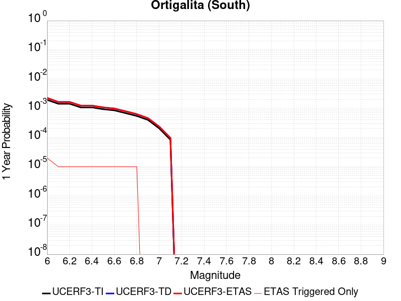 | 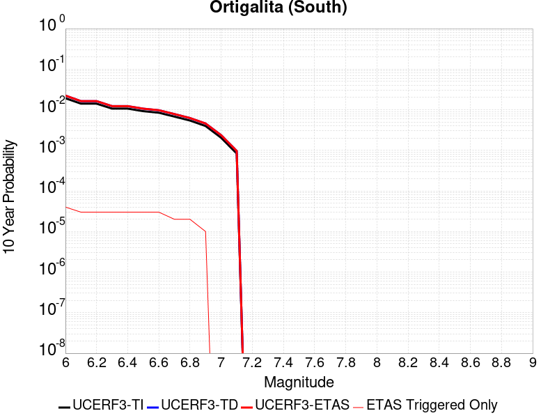 |

| Magnitude | 1 wk TI Prob | 1 wk TD Prob | 1 wk ETAS Prob | 1 wk ETAS/TD Gain | 1 wk ETAS Triggered Only | 1 mo TI Prob | 1 mo TD Prob | 1 mo ETAS Prob | 1 mo ETAS/TD Gain | 1 mo ETAS Triggered Only | 1 yr TI Prob | 1 yr TD Prob | 1 yr ETAS Prob | 1 yr ETAS/TD Gain | 1 yr ETAS Triggered Only | 10 yr TI Prob | 10 yr TD Prob | 10 yr ETAS Prob | 10 yr ETAS/TD Gain | 10 yr ETAS Triggered Only |
|-----|-----|-----|-----|-----|-----|-----|-----|-----|-----|-----|-----|-----|-----|-----|-----|-----|-----|-----|-----|-----|
| 6.0 | 3.72394E-5 | 4.325562E-5 | 6.155275E-5 | 1.4230002 | 1.8297927E-5 | 1.5958765E-4 | 1.8536893E-4 | 2.21958E-4 | 1.1973851 | 3.6595855E-5 | 0.0019412481 | 0.0022546875 | 0.0022912007 | 1.0161945 | 3.6595855E-5 | 0.019243775 | 0.022334497 | 0.022370275 | 1.0016019 | 3.6595855E-5 |
| 6.1 | 2.7299884E-5 | 3.149204E-5 | 3.149204E-5 | 1.0 | 0.0 | 1.16994255E-4 | 1.3495922E-4 | 1.5325469E-4 | 1.1355629 | 1.8297927E-5 | 0.0014234743 | 0.0016419457 | 0.0016602136 | 1.0111258 | 1.8297927E-5 | 0.014143906 | 0.01630407 | 0.01632207 | 1.001104 | 1.8297927E-5 |
| 6.2 | 2.7299884E-5 | 3.149204E-5 | 3.149204E-5 | 1.0 | 0.0 | 1.16994255E-4 | 1.3495922E-4 | 1.5325469E-4 | 1.1355629 | 1.8297927E-5 | 0.0014234743 | 0.0016419457 | 0.0016602136 | 1.0111258 | 1.8297927E-5 | 0.014143906 | 0.01630407 | 0.01632207 | 1.001104 | 1.8297927E-5 |
| 6.3 | 2.0546433E-5 | 2.363145E-5 | 2.363145E-5 | 1.0 | 0.0 | 8.805317E-5 | 1.0127382E-4 | 1.1956989E-4 | 1.1806594 | 1.8297927E-5 | 0.00107152 | 0.0012323303 | 0.0012506057 | 1.01483 | 1.8297927E-5 | 0.010663681 | 0.01225703 | 0.0122751035 | 1.0014745 | 1.8297927E-5 |
| 6.4 | 2.0546433E-5 | 2.363145E-5 | 2.363145E-5 | 1.0 | 0.0 | 8.805317E-5 | 1.0127382E-4 | 1.1956989E-4 | 1.1806594 | 1.8297927E-5 | 0.00107152 | 0.0012323303 | 0.0012506057 | 1.01483 | 1.8297927E-5 | 0.010663681 | 0.01225703 | 0.0122751035 | 1.0014745 | 1.8297927E-5 |
| 6.5 | 1.7779594E-5 | 2.0446974E-5 | 2.0446974E-5 | 1.0 | 0.0 | 7.619603E-5 | 8.762702E-5 | 1.0592335E-4 | 1.2087977 | 1.8297927E-5 | 9.272918E-4 | 0.0010663504 | 0.0010846289 | 1.0171411 | 1.8297927E-5 | 0.009234319 | 0.010613803 | 0.010631907 | 1.0017056 | 1.8297927E-5 |
| 6.6 | 1.6272212E-5 | 1.8714967E-5 | 1.8714967E-5 | 1.0 | 0.0 | 6.973618E-5 | 8.0204605E-5 | 9.850106E-5 | 1.2281224 | 1.8297927E-5 | 8.487073E-4 | 9.760658E-4 | 9.943459E-4 | 1.0187283 | 1.8297927E-5 | 0.008454733 | 0.009719091 | 0.00973721 | 1.0018644 | 1.8297927E-5 |
| 6.7 | 1.3051484E-5 | 1.5038758E-5 | 1.5038758E-5 | 1.0 | 0.0 | 5.593373E-5 | 6.445028E-5 | 8.274703E-5 | 1.2838893 | 1.8297927E-5 | 6.807804E-4 | 7.844092E-4 | 8.026927E-4 | 1.0233088 | 1.8297927E-5 | 0.006786986 | 0.007817388 | 0.007835543 | 1.0023223 | 1.8297927E-5 |
| 6.8 | 1.04277415E-5 | 1.1987235E-5 | 1.1987235E-5 | 1.0 | 0.0 | 4.4689557E-5 | 5.1372896E-5 | 6.9669884E-5 | 1.3561603 | 1.8297927E-5 | 5.439595E-4 | 6.2529295E-4 | 6.435794E-4 | 1.0292447 | 1.8297927E-5 | 0.0054262993 | 0.00623609 | 0.0062542735 | 1.0029159 | 1.8297927E-5 |
| 6.9 | 7.639968E-6 | 8.791503E-6 | 8.791503E-6 | 1.0 | 0.0 | 3.274231E-5 | 3.767736E-5 | 3.767736E-5 | 1.0 | 0.0 | 3.9856473E-4 | 4.586312E-4 | 4.586312E-4 | 1.0 | 0.0 | 0.003978506 | 0.004577433 | 0.004577433 | 1.0 | 0.0 |
| 7.0 | 3.919831E-6 | 4.5334014E-6 | 4.5334014E-6 | 1.0 | 0.0 | 1.679917E-5 | 1.942873E-5 | 1.942873E-5 | 1.0 | 0.0 | 2.045107E-4 | 2.3652123E-4 | 2.3652123E-4 | 1.0 | 0.0 | 0.0020432258 | 0.0023629034 | 0.0023629034 | 1.0 | 0.0 |
| 7.1 | 1.6017933E-6 | 1.8570418E-6 | 1.8570418E-6 | 1.0 | 0.0 | 6.8648105E-6 | 7.958732E-6 | 7.958732E-6 | 1.0 | 0.0 | 8.357586E-5 | 9.689432E-5 | 9.689432E-5 | 1.0 | 0.0 | 8.3544437E-4 | 9.686254E-4 | 9.686254E-4 | 1.0 | 0.0 |

## Puente Hills
*[(top)](#table-of-contents)*

| 1 Week | 1 Month | 1 Year | 10 Year |
|-----|-----|-----|-----|
|  |  |  | 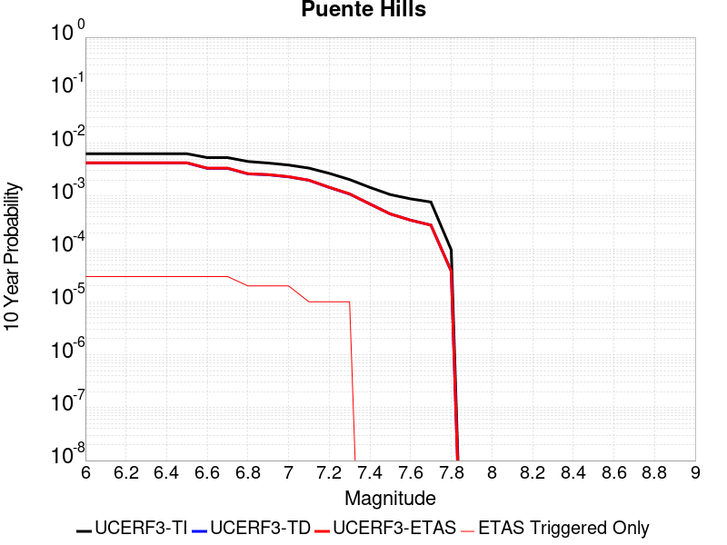 |

| Magnitude | 1 wk TI Prob | 1 wk TD Prob | 1 wk ETAS Prob | 1 wk ETAS/TD Gain | 1 wk ETAS Triggered Only | 1 mo TI Prob | 1 mo TD Prob | 1 mo ETAS Prob | 1 mo ETAS/TD Gain | 1 mo ETAS Triggered Only | 1 yr TI Prob | 1 yr TD Prob | 1 yr ETAS Prob | 1 yr ETAS/TD Gain | 1 yr ETAS Triggered Only | 10 yr TI Prob | 10 yr TD Prob | 10 yr ETAS Prob | 10 yr ETAS/TD Gain | 10 yr ETAS Triggered Only |
|-----|-----|-----|-----|-----|-----|-----|-----|-----|-----|-----|-----|-----|-----|-----|-----|-----|-----|-----|-----|-----|
| 6.0 | 1.2101656E-5 | 8.098625E-6 | 2.6396403E-5 | 3.2593687 | 1.8297927E-5 | 5.1863204E-5 | 3.4707962E-5 | 7.1302544E-5 | 2.054357 | 3.6595855E-5 | 6.312516E-4 | 4.2249315E-4 | 4.5907355E-4 | 1.0865822 | 3.6595855E-5 | 0.0062946146 | 0.0042174594 | 0.004253901 | 1.0086406 | 3.6595855E-5 |
| 6.1 | 1.2101656E-5 | 8.098625E-6 | 2.6396403E-5 | 3.2593687 | 1.8297927E-5 | 5.1863204E-5 | 3.4707962E-5 | 7.1302544E-5 | 2.054357 | 3.6595855E-5 | 6.312516E-4 | 4.2249315E-4 | 4.5907355E-4 | 1.0865822 | 3.6595855E-5 | 0.0062946146 | 0.0042174594 | 0.004253901 | 1.0086406 | 3.6595855E-5 |
| 6.2 | 1.2101656E-5 | 8.098625E-6 | 2.6396403E-5 | 3.2593687 | 1.8297927E-5 | 5.1863204E-5 | 3.4707962E-5 | 7.1302544E-5 | 2.054357 | 3.6595855E-5 | 6.312516E-4 | 4.2249315E-4 | 4.5907355E-4 | 1.0865822 | 3.6595855E-5 | 0.0062946146 | 0.0042174594 | 0.004253901 | 1.0086406 | 3.6595855E-5 |
| 6.3 | 1.2101656E-5 | 8.098625E-6 | 2.6396403E-5 | 3.2593687 | 1.8297927E-5 | 5.1863204E-5 | 3.4707962E-5 | 7.1302544E-5 | 2.054357 | 3.6595855E-5 | 6.312516E-4 | 4.2249315E-4 | 4.5907355E-4 | 1.0865822 | 3.6595855E-5 | 0.0062946146 | 0.0042174594 | 0.004253901 | 1.0086406 | 3.6595855E-5 |
| 6.4 | 1.2101656E-5 | 8.098625E-6 | 2.6396403E-5 | 3.2593687 | 1.8297927E-5 | 5.1863204E-5 | 3.4707962E-5 | 7.1302544E-5 | 2.054357 | 3.6595855E-5 | 6.312516E-4 | 4.2249315E-4 | 4.5907355E-4 | 1.0865822 | 3.6595855E-5 | 0.0062946146 | 0.0042174594 | 0.004253901 | 1.0086406 | 3.6595855E-5 |
| 6.5 | 1.2101656E-5 | 8.098625E-6 | 2.6396403E-5 | 3.2593687 | 1.8297927E-5 | 5.1863204E-5 | 3.4707962E-5 | 7.1302544E-5 | 2.054357 | 3.6595855E-5 | 6.312516E-4 | 4.2249315E-4 | 4.5907355E-4 | 1.0865822 | 3.6595855E-5 | 0.0062946146 | 0.0042174594 | 0.004253901 | 1.0086406 | 3.6595855E-5 |
| 6.6 | 1.0222488E-5 | 6.3991847E-6 | 2.4696994E-5 | 3.8593972 | 1.8297927E-5 | 4.3809923E-5 | 2.7424803E-5 | 6.401965E-5 | 2.3343706 | 3.6595855E-5 | 5.332553E-4 | 3.3384826E-4 | 3.704319E-4 | 1.1095816 | 3.6595855E-5 | 0.0053197746 | 0.0033337125 | 0.0033701863 | 1.0109409 | 3.6595855E-5 |
| 6.7 | 1.0222488E-5 | 6.3991847E-6 | 2.4696994E-5 | 3.8593972 | 1.8297927E-5 | 4.3809923E-5 | 2.7424803E-5 | 6.401965E-5 | 2.3343706 | 3.6595855E-5 | 5.332553E-4 | 3.3384826E-4 | 3.704319E-4 | 1.1095816 | 3.6595855E-5 | 0.0053197746 | 0.0033337125 | 0.0033701863 | 1.0109409 | 3.6595855E-5 |
| 6.8 | 8.6367845E-6 | 5.0282533E-6 | 2.3326089E-5 | 4.639004 | 1.8297927E-5 | 3.7014266E-5 | 2.1549482E-5 | 3.9847015E-5 | 1.8490938 | 1.8297927E-5 | 4.505555E-4 | 2.623339E-4 | 2.8062702E-4 | 1.0697322 | 1.8297927E-5 | 0.004496431 | 0.0026202986 | 0.0026385486 | 1.0069648 | 1.8297927E-5 |
| 6.9 | 8.066481E-6 | 4.836117E-6 | 2.3133955E-5 | 4.783581 | 1.8297927E-5 | 3.4570177E-5 | 2.0726053E-5 | 3.9023602E-5 | 1.8828284 | 1.8297927E-5 | 4.2081063E-4 | 2.52311E-4 | 2.7060433E-4 | 1.072503 | 1.8297927E-5 | 0.0042001465 | 0.0025202993 | 0.002538551 | 1.007242 | 1.8297927E-5 |
| 7.0 | 7.393828E-6 | 4.417296E-6 | 2.2715143E-5 | 5.1423182 | 1.8297927E-5 | 3.168745E-5 | 1.8931134E-5 | 3.7228714E-5 | 1.9665338 | 1.8297927E-5 | 3.857264E-4 | 2.3046264E-4 | 2.4875635E-4 | 1.0793782 | 1.8297927E-5 | 0.0038505755 | 0.0023022818 | 0.0023205376 | 1.0079294 | 1.8297927E-5 |
| 7.1 | 6.4660953E-6 | 3.8044495E-6 | 2.2102307E-5 | 5.8095937 | 1.8297927E-5 | 2.7711543E-5 | 1.6304684E-5 | 3.460231E-5 | 2.1222315 | 1.8297927E-5 | 3.373358E-4 | 1.984918E-4 | 2.167861E-4 | 1.0921665 | 1.8297927E-5 | 0.0033682417 | 0.001983181 | 0.0020014427 | 1.0092082 | 1.8297927E-5 |
| 7.2 | 5.143232E-6 | 2.7865456E-6 | 2.1084421E-5 | 7.566509 | 1.8297927E-5 | 2.2042237E-5 | 1.1942284E-5 | 3.0239991E-5 | 2.5321784 | 1.8297927E-5 | 2.6833118E-4 | 1.453877E-4 | 1.6368297E-4 | 1.1258378 | 1.8297927E-5 | 0.002680074 | 0.0014529356 | 0.0014712069 | 1.0125755 | 1.8297927E-5 |
| 7.3 | 3.928255E-6 | 2.0913774E-6 | 2.0389265E-5 | 9.749205 | 1.8297927E-5 | 1.683527E-5 | 8.963015E-6 | 2.7260778E-5 | 3.041474 | 1.8297927E-5 | 2.0495013E-4 | 1.0911931E-4 | 1.2741525E-4 | 1.167669 | 1.8297927E-5 | 0.002047612 | 0.001090664 | 0.001108942 | 1.0167586 | 1.8297927E-5 |
| 7.4 | 2.7894434E-6 | 1.3546753E-6 | 1.3546753E-6 | 1.0 | 0.0 | 1.1954703E-5 | 5.8057385E-6 | 5.8057385E-6 | 1.0 | 0.0 | 1.4553878E-4 | 7.068262E-5 | 7.068262E-5 | 1.0 | 0.0 | 0.001454435 | 7.066058E-4 | 7.066058E-4 | 1.0 | 0.0 |
| 7.5 | 2.041735E-6 | 8.787305E-7 | 8.787305E-7 | 1.0 | 0.0 | 8.750263E-6 | 3.7659825E-6 | 3.7659825E-6 | 1.0 | 0.0 | 1.06529245E-4 | 4.5849905E-5 | 4.5849905E-5 | 1.0 | 0.0 | 0.0010647819 | 4.5840783E-4 | 4.5840783E-4 | 1.0 | 0.0 |
| 7.6 | 1.6959062E-6 | 6.6986263E-7 | 6.6986263E-7 | 1.0 | 0.0 | 7.268149E-6 | 2.8708366E-6 | 2.8708366E-6 | 1.0 | 0.0 | 8.848612E-5 | 3.4951907E-5 | 3.4951907E-5 | 1.0 | 0.0 | 8.84509E-4 | 3.4946698E-4 | 3.4946698E-4 | 1.0 | 0.0 |
| 7.7 | 1.4767965E-6 | 5.407607E-7 | 5.407607E-7 | 1.0 | 0.0 | 6.3291122E-6 | 2.317544E-6 | 2.317544E-6 | 1.0 | 0.0 | 7.705422E-5 | 2.8215758E-5 | 2.8215758E-5 | 1.0 | 0.0 | 7.702751E-4 | 2.8212433E-4 | 2.8212433E-4 | 1.0 | 0.0 |
| 7.8 | 1.8432911E-7 | 7.28201E-8 | 7.28201E-8 | 1.0 | 0.0 | 7.8998164E-7 | 3.1208612E-7 | 3.1208612E-7 | 1.0 | 0.0 | 9.617985E-6 | 3.7996451E-6 | 3.7996451E-6 | 1.0 | 0.0 | 9.617568E-5 | 3.7996128E-5 | 3.7996128E-5 | 1.0 | 0.0 |

## Los Alamos 2011 CFM
*[(top)](#table-of-contents)*

| 1 Week | 1 Month | 1 Year | 10 Year |
|-----|-----|-----|-----|
|  |  |  | 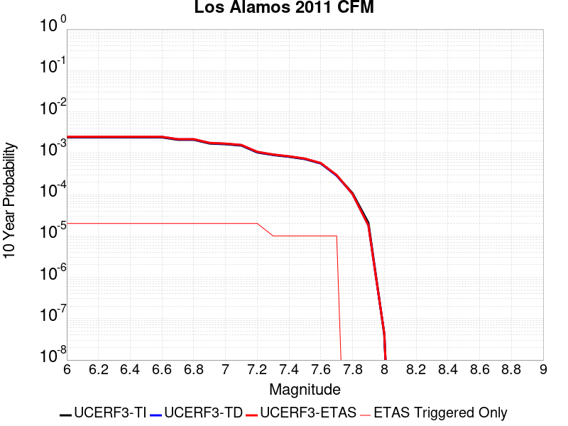 |

| Magnitude | 1 wk TI Prob | 1 wk TD Prob | 1 wk ETAS Prob | 1 wk ETAS/TD Gain | 1 wk ETAS Triggered Only | 1 mo TI Prob | 1 mo TD Prob | 1 mo ETAS Prob | 1 mo ETAS/TD Gain | 1 mo ETAS Triggered Only | 1 yr TI Prob | 1 yr TD Prob | 1 yr ETAS Prob | 1 yr ETAS/TD Gain | 1 yr ETAS Triggered Only | 10 yr TI Prob | 10 yr TD Prob | 10 yr ETAS Prob | 10 yr ETAS/TD Gain | 10 yr ETAS Triggered Only |
|-----|-----|-----|-----|-----|-----|-----|-----|-----|-----|-----|-----|-----|-----|-----|-----|-----|-----|-----|-----|-----|
| 6.0 | 4.6284417E-6 | 4.751731E-6 | 4.751731E-6 | 1.0 | 0.0 | 1.9836029E-5 | 2.0364414E-5 | 2.0364414E-5 | 1.0 | 0.0 | 2.4147688E-4 | 2.4791027E-4 | 2.662037E-4 | 1.0737903 | 1.8297927E-5 | 0.0024121467 | 0.0024765113 | 0.0025130166 | 1.0147406 | 3.6595855E-5 |
| 6.1 | 4.6284417E-6 | 4.751731E-6 | 4.751731E-6 | 1.0 | 0.0 | 1.9836029E-5 | 2.0364414E-5 | 2.0364414E-5 | 1.0 | 0.0 | 2.4147688E-4 | 2.4791027E-4 | 2.662037E-4 | 1.0737903 | 1.8297927E-5 | 0.0024121467 | 0.0024765113 | 0.0025130166 | 1.0147406 | 3.6595855E-5 |
| 6.2 | 4.6284417E-6 | 4.751731E-6 | 4.751731E-6 | 1.0 | 0.0 | 1.9836029E-5 | 2.0364414E-5 | 2.0364414E-5 | 1.0 | 0.0 | 2.4147688E-4 | 2.4791027E-4 | 2.662037E-4 | 1.0737903 | 1.8297927E-5 | 0.0024121467 | 0.0024765113 | 0.0025130166 | 1.0147406 | 3.6595855E-5 |
| 6.3 | 4.6284417E-6 | 4.751731E-6 | 4.751731E-6 | 1.0 | 0.0 | 1.9836029E-5 | 2.0364414E-5 | 2.0364414E-5 | 1.0 | 0.0 | 2.4147688E-4 | 2.4791027E-4 | 2.662037E-4 | 1.0737903 | 1.8297927E-5 | 0.0024121467 | 0.0024765113 | 0.0025130166 | 1.0147406 | 3.6595855E-5 |
| 6.4 | 4.6284417E-6 | 4.751731E-6 | 4.751731E-6 | 1.0 | 0.0 | 1.9836029E-5 | 2.0364414E-5 | 2.0364414E-5 | 1.0 | 0.0 | 2.4147688E-4 | 2.4791027E-4 | 2.662037E-4 | 1.0737903 | 1.8297927E-5 | 0.0024121467 | 0.0024765113 | 0.0025130166 | 1.0147406 | 3.6595855E-5 |
| 6.5 | 4.6284417E-6 | 4.751731E-6 | 4.751731E-6 | 1.0 | 0.0 | 1.9836029E-5 | 2.0364414E-5 | 2.0364414E-5 | 1.0 | 0.0 | 2.4147688E-4 | 2.4791027E-4 | 2.662037E-4 | 1.0737903 | 1.8297927E-5 | 0.0024121467 | 0.0024765113 | 0.0025130166 | 1.0147406 | 3.6595855E-5 |
| 6.6 | 4.6284417E-6 | 4.751731E-6 | 4.751731E-6 | 1.0 | 0.0 | 1.9836029E-5 | 2.0364414E-5 | 2.0364414E-5 | 1.0 | 0.0 | 2.4147688E-4 | 2.4791027E-4 | 2.662037E-4 | 1.0737903 | 1.8297927E-5 | 0.0024121467 | 0.0024765113 | 0.0025130166 | 1.0147406 | 3.6595855E-5 |
| 6.7 | 4.062321E-6 | 4.166349E-6 | 4.166349E-6 | 1.0 | 0.0 | 1.7409831E-5 | 1.7855667E-5 | 1.7855667E-5 | 1.0 | 0.0 | 2.1194408E-4 | 2.1737257E-4 | 2.3566652E-4 | 1.0841594 | 1.8297927E-5 | 0.0021174205 | 0.0021717492 | 0.0022082655 | 1.0168142 | 3.6595855E-5 |
| 6.8 | 4.062321E-6 | 4.166349E-6 | 4.166349E-6 | 1.0 | 0.0 | 1.7409831E-5 | 1.7855667E-5 | 1.7855667E-5 | 1.0 | 0.0 | 2.1194408E-4 | 2.1737257E-4 | 2.3566652E-4 | 1.0841594 | 1.8297927E-5 | 0.0021174205 | 0.0021717492 | 0.0022082655 | 1.0168142 | 3.6595855E-5 |
| 6.9 | 3.2936077E-6 | 3.372958E-6 | 3.372958E-6 | 1.0 | 0.0 | 1.4115385E-5 | 1.4455459E-5 | 1.4455459E-5 | 1.0 | 0.0 | 1.7184127E-4 | 1.7598194E-4 | 1.9427664E-4 | 1.1039579 | 1.8297927E-5 | 0.0017170844 | 0.0017585184 | 0.0017950499 | 1.020774 | 3.6595855E-5 |
| 7.0 | 3.1687898E-6 | 3.2448156E-6 | 3.2448156E-6 | 1.0 | 0.0 | 1.3580457E-5 | 1.3906283E-5 | 1.3906283E-5 | 1.0 | 0.0 | 1.6532952E-4 | 1.6929678E-4 | 1.875916E-4 | 1.1080637 | 1.8297927E-5 | 0.0016520657 | 0.0016917696 | 0.0017283036 | 1.0215951 | 3.6595855E-5 |
| 7.1 | 2.9379228E-6 | 3.0073259E-6 | 3.0073259E-6 | 1.0 | 0.0 | 1.25910365E-5 | 1.288848E-5 | 1.288848E-5 | 1.0 | 0.0 | 1.5328509E-4 | 1.5690686E-4 | 1.7520192E-4 | 1.1165982 | 1.8297927E-5 | 0.001531794 | 0.0015680499 | 0.0016045884 | 1.0233018 | 3.6595855E-5 |
| 7.2 | 2.0020686E-6 | 2.0416298E-6 | 2.0416298E-6 | 1.0 | 0.0 | 8.580266E-6 | 8.749813E-6 | 8.749813E-6 | 1.0 | 0.0 | 1.0445973E-4 | 1.0652381E-4 | 1.2481978E-4 | 1.1717548 | 1.8297927E-5 | 0.0010441064 | 0.001064732 | 0.0011012888 | 1.0343343 | 3.6595855E-5 |
| 7.3 | 1.7364243E-6 | 1.7678802E-6 | 1.7678802E-6 | 1.0 | 0.0 | 7.441797E-6 | 7.576608E-6 | 7.576608E-6 | 1.0 | 0.0 | 9.0600115E-5 | 9.2241324E-5 | 9.2241324E-5 | 1.0 | 0.0 | 9.0563187E-4 | 9.2203356E-4 | 9.403146E-4 | 1.0198269 | 1.8297927E-5 |
| 7.4 | 1.5718434E-6 | 1.5983177E-6 | 1.5983177E-6 | 1.0 | 0.0 | 6.7364545E-6 | 6.849915E-6 | 6.849915E-6 | 1.0 | 0.0 | 8.201325E-5 | 8.339455E-5 | 8.339455E-5 | 1.0 | 0.0 | 8.198299E-4 | 8.3363557E-4 | 8.5191824E-4 | 1.0219313 | 1.8297927E-5 |
| 7.5 | 1.3841119E-6 | 1.4042793E-6 | 1.4042793E-6 | 1.0 | 0.0 | 5.9318945E-6 | 6.0183256E-6 | 6.0183256E-6 | 1.0 | 0.0 | 7.221842E-5 | 7.327068E-5 | 7.327068E-5 | 1.0 | 0.0 | 7.2194956E-4 | 7.324681E-4 | 7.5075263E-4 | 1.0249629 | 1.8297927E-5 |
| 7.6 | 1.0843726E-6 | 1.093442E-6 | 1.093442E-6 | 1.0 | 0.0 | 4.647303E-6 | 4.6861724E-6 | 4.6861724E-6 | 1.0 | 0.0 | 5.6579443E-5 | 5.705268E-5 | 5.705268E-5 | 1.0 | 0.0 | 5.656504E-4 | 5.703829E-4 | 5.886704E-4 | 1.0320618 | 1.8297927E-5 |
| 7.7 | 5.544814E-7 | 5.5018705E-7 | 5.5018705E-7 | 1.0 | 0.0 | 2.3763469E-6 | 2.3579425E-6 | 2.3579425E-6 | 1.0 | 0.0 | 2.8931638E-5 | 2.8707573E-5 | 2.8707573E-5 | 1.0 | 0.0 | 2.8927872E-4 | 2.870388E-4 | 3.053315E-4 | 1.0637289 | 1.8297927E-5 |
| 7.8 | 2.0707465E-7 | 1.977846E-7 | 1.977846E-7 | 1.0 | 0.0 | 8.874625E-7 | 8.4764804E-7 | 8.4764804E-7 | 1.0 | 0.0 | 1.08048025E-5 | 1.0320066E-5 | 1.0320066E-5 | 1.0 | 0.0 | 1.0804277E-4 | 1.0319592E-4 | 1.0319592E-4 | 1.0 | 0.0 |
| 7.9 | 3.9821284E-8 | 3.433109E-8 | 3.433109E-8 | 1.0 | 0.0 | 1.7066264E-7 | 1.4713324E-7 | 1.4713324E-7 | 1.0 | 0.0 | 2.0778157E-6 | 1.7913457E-6 | 1.7913457E-6 | 1.0 | 0.0 | 2.0777963E-5 | 1.7913319E-5 | 1.7913319E-5 | 1.0 | 0.0 |
| 8.0 | 7.880441E-11 | 8.2353124E-11 | 8.2353124E-11 | 1.0 | 0.0 | 3.3773329E-10 | 3.52942E-10 | 3.52942E-10 | 1.0 | 0.0 | 4.1119033E-9 | 4.2970694E-9 | 4.2970694E-9 | 1.0 | 0.0 | 4.1119034E-8 | 4.2970694E-8 | 4.2970694E-8 | 1.0 | 0.0 |

## Elsinore (Temecula) rev
*[(top)](#table-of-contents)*

| 1 Week | 1 Month | 1 Year | 10 Year |
|-----|-----|-----|-----|
|  | 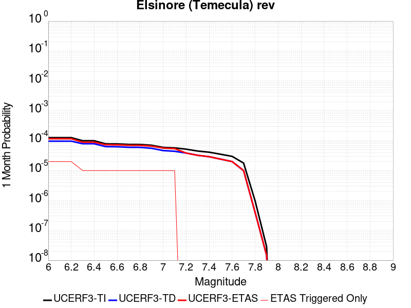 |  |  |

| Magnitude | 1 wk TI Prob | 1 wk TD Prob | 1 wk ETAS Prob | 1 wk ETAS/TD Gain | 1 wk ETAS Triggered Only | 1 mo TI Prob | 1 mo TD Prob | 1 mo ETAS Prob | 1 mo ETAS/TD Gain | 1 mo ETAS Triggered Only | 1 yr TI Prob | 1 yr TD Prob | 1 yr ETAS Prob | 1 yr ETAS/TD Gain | 1 yr ETAS Triggered Only | 10 yr TI Prob | 10 yr TD Prob | 10 yr ETAS Prob | 10 yr ETAS/TD Gain | 10 yr ETAS Triggered Only |
|-----|-----|-----|-----|-----|-----|-----|-----|-----|-----|-----|-----|-----|-----|-----|-----|-----|-----|-----|-----|-----|
| 6.0 | 2.9514995E-5 | 2.2517117E-5 | 4.081463E-5 | 1.8126047 | 1.8297927E-5 | 1.264867E-4 | 9.649849E-5 | 1.3309081E-4 | 1.379201 | 3.6595855E-5 | 0.0015388876 | 0.0011742581 | 0.0012108108 | 1.0311285 | 3.6595855E-5 | 0.015282745 | 0.011696897 | 0.011733065 | 1.003092 | 3.6595855E-5 |
| 6.1 | 2.9514995E-5 | 2.2517117E-5 | 4.081463E-5 | 1.8126047 | 1.8297927E-5 | 1.264867E-4 | 9.649849E-5 | 1.3309081E-4 | 1.379201 | 3.6595855E-5 | 0.0015388876 | 0.0011742581 | 0.0012108108 | 1.0311285 | 3.6595855E-5 | 0.015282745 | 0.011696897 | 0.011733065 | 1.003092 | 3.6595855E-5 |
| 6.2 | 2.9514995E-5 | 2.2517117E-5 | 4.081463E-5 | 1.8126047 | 1.8297927E-5 | 1.264867E-4 | 9.649849E-5 | 1.3309081E-4 | 1.379201 | 3.6595855E-5 | 0.0015388876 | 0.0011742581 | 0.0012108108 | 1.0311285 | 3.6595855E-5 | 0.015282745 | 0.011696897 | 0.011733065 | 1.003092 | 3.6595855E-5 |
| 6.3 | 2.3223649E-5 | 1.8406454E-5 | 3.6704045E-5 | 1.9940856 | 1.8297927E-5 | 9.952613E-5 | 7.888251E-5 | 9.7179E-5 | 1.231946 | 1.8297927E-5 | 0.001211057 | 9.599888E-4 | 9.782691E-4 | 1.0190423 | 1.8297927E-5 | 0.012044783 | 0.009569948 | 0.00958807 | 1.0018938 | 1.8297927E-5 |
| 6.4 | 2.3223649E-5 | 1.8406454E-5 | 3.6704045E-5 | 1.9940856 | 1.8297927E-5 | 9.952613E-5 | 7.888251E-5 | 9.7179E-5 | 1.231946 | 1.8297927E-5 | 0.001211057 | 9.599888E-4 | 9.782691E-4 | 1.0190423 | 1.8297927E-5 | 0.012044783 | 0.009569948 | 0.00958807 | 1.0018938 | 1.8297927E-5 |
| 6.5 | 1.8338875E-5 | 1.4750118E-5 | 3.3047774E-5 | 2.2405093 | 1.8297927E-5 | 7.8592806E-5 | 6.321331E-5 | 8.151008E-5 | 1.2894449 | 1.8297927E-5 | 9.5644733E-4 | 7.69359E-4 | 7.8764284E-4 | 1.0237651 | 1.8297927E-5 | 0.009523412 | 0.0076739118 | 0.0076920693 | 1.0023662 | 1.8297927E-5 |
| 6.6 | 1.8223333E-5 | 1.4612673E-5 | 3.291033E-5 | 2.2521775 | 1.8297927E-5 | 7.809766E-5 | 6.262429E-5 | 8.092107E-5 | 1.2921674 | 1.8297927E-5 | 9.504242E-4 | 7.6219277E-4 | 7.804767E-4 | 1.0239886 | 1.8297927E-5 | 0.009463696 | 0.0076027405 | 0.0076208995 | 1.0023885 | 1.8297927E-5 |
| 6.7 | 1.7512752E-5 | 1.402721E-5 | 3.232488E-5 | 2.3044412 | 1.8297927E-5 | 7.505249E-5 | 6.011528E-5 | 7.841211E-5 | 1.3043623 | 1.8297927E-5 | 9.13381E-4 | 7.3166634E-4 | 7.499509E-4 | 1.0249903 | 1.8297927E-5 | 0.00909636 | 0.00729892 | 0.0073170844 | 1.0024886 | 1.8297927E-5 |
| 6.8 | 1.7417142E-5 | 1.3951195E-5 | 3.2248867E-5 | 2.3115487 | 1.8297927E-5 | 7.4642754E-5 | 5.9789512E-5 | 7.808635E-5 | 1.3060207 | 1.8297927E-5 | 9.083966E-4 | 7.277028E-4 | 7.459874E-4 | 1.0251265 | 1.8297927E-5 | 0.009046922 | 0.0072594886 | 0.0072776536 | 1.0025022 | 1.8297927E-5 |
| 6.9 | 1.6402591E-5 | 1.2988613E-5 | 3.12863E-5 | 2.4087484 | 1.8297927E-5 | 7.0294926E-5 | 5.5664343E-5 | 7.396125E-5 | 1.3287007 | 1.8297927E-5 | 8.5550465E-4 | 6.775103E-4 | 6.957958E-4 | 1.0269893 | 1.8297927E-5 | 0.008522186 | 0.006760169 | 0.006778343 | 1.0026884 | 1.8297927E-5 |
| 7.0 | 1.3912486E-5 | 1.0878233E-5 | 2.917596E-5 | 2.6820495 | 1.8297927E-5 | 5.9623577E-5 | 4.6620182E-5 | 6.491726E-5 | 1.3924711 | 1.8297927E-5 | 7.2567526E-4 | 5.674556E-4 | 5.8574317E-4 | 1.0322273 | 1.8297927E-5 | 0.0072331014 | 0.005663986 | 0.00568218 | 1.0032123 | 1.8297927E-5 |
| 7.1 | 1.3405147E-5 | 1.03274215E-5 | 2.862516E-5 | 2.7717626 | 1.8297927E-5 | 5.7449364E-5 | 4.425964E-5 | 6.2556755E-5 | 1.4134041 | 1.8297927E-5 | 6.9922156E-4 | 5.3873047E-4 | 5.570185E-4 | 1.0339466 | 1.8297927E-5 | 0.0069702556 | 0.005377577 | 0.0053957766 | 1.0033844 | 1.8297927E-5 |
| 7.2 | 1.21402E-5 | 8.996737E-6 | 8.996737E-6 | 1.0 | 0.0 | 5.202839E-5 | 3.8556886E-5 | 3.8556886E-5 | 1.0 | 0.0 | 6.332616E-4 | 4.6933076E-4 | 4.6933076E-4 | 1.0 | 0.0 | 0.0063146 | 0.004684821 | 0.004684821 | 1.0 | 0.0 |
| 7.3 | 1.05047775E-5 | 7.571771E-6 | 7.571771E-6 | 1.0 | 0.0 | 4.5019697E-5 | 3.245005E-5 | 3.245005E-5 | 1.0 | 0.0 | 5.4797693E-4 | 3.950092E-4 | 3.950092E-4 | 1.0 | 0.0 | 0.005466277 | 0.00394346 | 0.00394346 | 1.0 | 0.0 |
| 7.4 | 9.624483E-6 | 6.7868696E-6 | 6.7868696E-6 | 1.0 | 0.0 | 4.124713E-5 | 2.9086266E-5 | 2.9086266E-5 | 1.0 | 0.0 | 5.0206814E-4 | 3.5406914E-4 | 3.5406914E-4 | 1.0 | 0.0 | 0.005009353 | 0.003535204 | 0.003535204 | 1.0 | 0.0 |
| 7.5 | 8.215151E-6 | 5.635538E-6 | 5.635538E-6 | 1.0 | 0.0 | 3.5207315E-5 | 2.4152088E-5 | 2.4152088E-5 | 1.0 | 0.0 | 4.2856473E-4 | 2.9401327E-4 | 2.9401327E-4 | 1.0 | 0.0 | 0.004277392 | 0.002936371 | 0.002936371 | 1.0 | 0.0 |
| 7.6 | 6.975058E-6 | 4.676045E-6 | 4.676045E-6 | 1.0 | 0.0 | 2.9892764E-5 | 2.0040046E-5 | 2.0040046E-5 | 1.0 | 0.0 | 3.6388362E-4 | 2.439614E-4 | 2.439614E-4 | 1.0 | 0.0 | 0.0036328835 | 0.002437052 | 0.002437052 | 1.0 | 0.0 |
| 7.7 | 4.159604E-6 | 2.3269924E-6 | 2.3269924E-6 | 1.0 | 0.0 | 1.7826753E-5 | 9.97279E-6 | 9.97279E-6 | 1.0 | 0.0 | 2.1701909E-4 | 1.21412704E-4 | 1.21412704E-4 | 1.0 | 0.0 | 0.0021680726 | 0.0012135367 | 0.0012135367 | 1.0 | 0.0 |
| 7.8 | 2.2692414E-7 | 9.3854695E-8 | 9.3854695E-8 | 1.0 | 0.0 | 9.725317E-7 | 4.0223435E-7 | 4.0223435E-7 | 1.0 | 0.0 | 1.1840509E-5 | 4.8971956E-6 | 4.8971956E-6 | 1.0 | 0.0 | 1.1839878E-4 | 4.8971204E-5 | 4.8971204E-5 | 1.0 | 0.0 |
| 7.9 | 6.676829E-9 | 3.439853E-9 | 3.439853E-9 | 1.0 | 0.0 | 2.861498E-8 | 1.4742227E-8 | 1.4742227E-8 | 1.0 | 0.0 | 3.4838732E-7 | 1.7948659E-7 | 1.7948659E-7 | 1.0 | 0.0 | 3.4838679E-6 | 1.7948646E-6 | 1.7948646E-6 | 1.0 | 0.0 |

## Hosgri
*[(top)](#table-of-contents)*

| 1 Week | 1 Month | 1 Year | 10 Year |
|-----|-----|-----|-----|
|  |  |  |  |

| Magnitude | 1 wk TI Prob | 1 wk TD Prob | 1 wk ETAS Prob | 1 wk ETAS/TD Gain | 1 wk ETAS Triggered Only | 1 mo TI Prob | 1 mo TD Prob | 1 mo ETAS Prob | 1 mo ETAS/TD Gain | 1 mo ETAS Triggered Only | 1 yr TI Prob | 1 yr TD Prob | 1 yr ETAS Prob | 1 yr ETAS/TD Gain | 1 yr ETAS Triggered Only | 10 yr TI Prob | 10 yr TD Prob | 10 yr ETAS Prob | 10 yr ETAS/TD Gain | 10 yr ETAS Triggered Only |
|-----|-----|-----|-----|-----|-----|-----|-----|-----|-----|-----|-----|-----|-----|-----|-----|-----|-----|-----|-----|-----|
| 6.0 | 2.883978E-5 | 2.9128416E-5 | 2.9128416E-5 | 1.0 | 0.0 | 1.235932E-4 | 1.2483024E-4 | 1.2483024E-4 | 1.0 | 0.0 | 0.0015037085 | 0.001518776 | 0.001518776 | 1.0 | 0.0 | 0.01493574 | 0.01508774 | 0.015123784 | 1.002389 | 3.6595855E-5 |
| 6.1 | 2.883978E-5 | 2.9128416E-5 | 2.9128416E-5 | 1.0 | 0.0 | 1.235932E-4 | 1.2483024E-4 | 1.2483024E-4 | 1.0 | 0.0 | 0.0015037085 | 0.001518776 | 0.001518776 | 1.0 | 0.0 | 0.01493574 | 0.01508774 | 0.015123784 | 1.002389 | 3.6595855E-5 |
| 6.2 | 2.883978E-5 | 2.9128416E-5 | 2.9128416E-5 | 1.0 | 0.0 | 1.235932E-4 | 1.2483024E-4 | 1.2483024E-4 | 1.0 | 0.0 | 0.0015037085 | 0.001518776 | 0.001518776 | 1.0 | 0.0 | 0.01493574 | 0.01508774 | 0.015123784 | 1.002389 | 3.6595855E-5 |
| 6.3 | 2.2914428E-5 | 2.2641969E-5 | 2.2641969E-5 | 1.0 | 0.0 | 9.8200995E-5 | 9.703343E-5 | 9.703343E-5 | 1.0 | 0.0 | 0.0011949413 | 0.0011807467 | 0.0011807467 | 1.0 | 0.0 | 0.011885363 | 0.011746133 | 0.011782299 | 1.0030789 | 3.6595855E-5 |
| 6.4 | 2.0195741E-5 | 1.969656E-5 | 1.969656E-5 | 1.0 | 0.0 | 8.65503E-5 | 8.4411105E-5 | 8.4411105E-5 | 1.0 | 0.0 | 0.0010532405 | 0.0010272227 | 0.0010272227 | 1.0 | 0.0 | 0.010482626 | 0.010225792 | 0.010262014 | 1.0035422 | 3.6595855E-5 |
| 6.5 | 1.9924333E-5 | 1.940898E-5 | 1.940898E-5 | 1.0 | 0.0 | 8.53872E-5 | 8.3178704E-5 | 8.3178704E-5 | 1.0 | 0.0 | 0.0010390934 | 0.0010122322 | 0.0010122322 | 1.0 | 0.0 | 0.010342481 | 0.010077253 | 0.0101134805 | 1.0035949 | 3.6595855E-5 |
| 6.6 | 1.809694E-5 | 1.74583E-5 | 1.74583E-5 | 1.0 | 0.0 | 7.7556004E-5 | 7.4819145E-5 | 7.4819145E-5 | 1.0 | 0.0 | 9.438353E-4 | 9.105437E-4 | 9.105437E-4 | 1.0 | 0.0 | 0.009398366 | 0.009069073 | 0.009105337 | 1.0039986 | 3.6595855E-5 |
| 6.7 | 1.675989E-5 | 1.6042764E-5 | 1.6042764E-5 | 1.0 | 0.0 | 7.182612E-5 | 6.87529E-5 | 6.87529E-5 | 1.0 | 0.0 | 8.7413215E-4 | 8.3674624E-4 | 8.3674624E-4 | 1.0 | 0.0 | 0.008707017 | 0.0083368635 | 0.008373154 | 1.004353 | 3.6595855E-5 |
| 6.8 | 1.5401129E-5 | 1.4614083E-5 | 1.4614083E-5 | 1.0 | 0.0 | 6.6003166E-5 | 6.2630286E-5 | 6.2630286E-5 | 1.0 | 0.0 | 8.032922E-4 | 7.622578E-4 | 7.622578E-4 | 1.0 | 0.0 | 0.008003947 | 0.007597296 | 0.007633614 | 1.0047804 | 3.6595855E-5 |
| 6.9 | 1.356559E-5 | 1.2689968E-5 | 1.2689968E-5 | 1.0 | 0.0 | 5.8136946E-5 | 5.4384444E-5 | 5.4384444E-5 | 1.0 | 0.0 | 7.0758746E-4 | 6.619299E-4 | 6.619299E-4 | 1.0 | 0.0 | 0.007053386 | 0.006600388 | 0.006636742 | 1.005508 | 3.6595855E-5 |
| 7.0 | 1.2030819E-5 | 1.1095962E-5 | 1.1095962E-5 | 1.0 | 0.0 | 5.155963E-5 | 4.7553254E-5 | 4.7553254E-5 | 1.0 | 0.0 | 6.275577E-4 | 5.7880714E-4 | 5.7880714E-4 | 1.0 | 0.0 | 0.006257884 | 0.005773757 | 0.0058101416 | 1.0063018 | 3.6595855E-5 |
| 7.1 | 1.0972698E-5 | 1.0022179E-5 | 1.0022179E-5 | 1.0 | 0.0 | 4.7025E-5 | 4.2951488E-5 | 4.2951488E-5 | 1.0 | 0.0 | 5.72379E-4 | 5.22809E-4 | 5.22809E-4 | 1.0 | 0.0 | 0.0057090693 | 0.005216542 | 0.005234745 | 1.0034894 | 1.8297927E-5 |
| 7.2 | 9.961926E-6 | 9.034746E-6 | 9.034746E-6 | 1.0 | 0.0 | 4.2693267E-5 | 3.8719765E-5 | 3.8719765E-5 | 1.0 | 0.0 | 5.1966653E-4 | 4.713112E-4 | 4.713112E-4 | 1.0 | 0.0 | 0.00518453 | 0.0047038626 | 0.0047220746 | 1.0038717 | 1.8297927E-5 |
| 7.3 | 8.700929E-6 | 7.8281E-6 | 7.8281E-6 | 1.0 | 0.0 | 3.7289166E-5 | 3.354857E-5 | 3.354857E-5 | 1.0 | 0.0 | 4.53901E-4 | 4.0837732E-4 | 4.0837732E-4 | 1.0 | 0.0 | 0.00452975 | 0.004077008 | 0.0040952316 | 1.0044698 | 1.8297927E-5 |
| 7.4 | 7.866285E-6 | 6.998739E-6 | 6.998739E-6 | 1.0 | 0.0 | 3.3712215E-5 | 2.9994251E-5 | 2.9994251E-5 | 1.0 | 0.0 | 4.103689E-4 | 3.6511885E-4 | 3.6511885E-4 | 1.0 | 0.0 | 0.004096119 | 0.0036459267 | 0.0036641578 | 1.0050005 | 1.8297927E-5 |
| 7.5 | 6.8381305E-6 | 5.9596955E-6 | 5.9596955E-6 | 1.0 | 0.0 | 2.9305946E-5 | 2.5541302E-5 | 2.5541302E-5 | 1.0 | 0.0 | 3.5674145E-4 | 3.10921E-4 | 3.10921E-4 | 1.0 | 0.0 | 0.0035616932 | 0.0031055948 | 0.003123836 | 1.0058737 | 1.8297927E-5 |
| 7.6 | 5.503376E-6 | 4.5952443E-6 | 4.5952443E-6 | 1.0 | 0.0 | 2.3585684E-5 | 1.9693754E-5 | 1.9693754E-5 | 1.0 | 0.0 | 2.8711787E-4 | 2.397451E-4 | 2.397451E-4 | 1.0 | 0.0 | 0.002867472 | 0.0023955975 | 0.0024138517 | 1.0076199 | 1.8297927E-5 |
| 7.7 | 3.6144982E-6 | 2.6522112E-6 | 2.6522112E-6 | 1.0 | 0.0 | 1.5490614E-5 | 1.1366569E-5 | 1.1366569E-5 | 1.0 | 0.0 | 1.8858191E-4 | 1.383792E-4 | 1.383792E-4 | 1.0 | 0.0 | 0.0018842196 | 0.0013836613 | 0.001401934 | 1.013206 | 1.8297927E-5 |
| 7.8 | 1.9853494E-6 | 1.1361129E-6 | 1.1361129E-6 | 1.0 | 0.0 | 8.508612E-6 | 4.8690463E-6 | 4.8690463E-6 | 1.0 | 0.0 | 1.0358743E-4 | 5.9279027E-5 | 5.9279027E-5 | 1.0 | 0.0 | 0.0010353916 | 5.9336185E-4 | 5.9336185E-4 | 1.0 | 0.0 |
| 7.9 | 1.1818757E-6 | 5.2951856E-7 | 5.2951856E-7 | 1.0 | 0.0 | 5.0651715E-6 | 2.2693632E-6 | 2.2693632E-6 | 1.0 | 0.0 | 6.1666724E-5 | 2.7629147E-5 | 2.7629147E-5 | 1.0 | 0.0 | 6.1649614E-4 | 2.7694515E-4 | 2.7694515E-4 | 1.0 | 0.0 |
| 8.0 | 6.962958E-7 | 2.7139782E-7 | 2.7139782E-7 | 1.0 | 0.0 | 2.9841215E-6 | 1.163133E-6 | 1.163133E-6 | 1.0 | 0.0 | 3.6331072E-5 | 1.4161053E-5 | 1.4161053E-5 | 1.0 | 0.0 | 3.6325134E-4 | 1.4217179E-4 | 1.4217179E-4 | 1.0 | 0.0 |
| 8.1 | 1.5033264E-7 | 6.527624E-8 | 6.527624E-8 | 1.0 | 0.0 | 6.442826E-7 | 2.7975528E-7 | 2.7975528E-7 | 1.0 | 0.0 | 7.844113E-6 | 3.4060151E-6 | 3.4060151E-6 | 1.0 | 0.0 | 7.843835E-5 | 3.407693E-5 | 3.407693E-5 | 1.0 | 0.0 |

## San Luis Range 2011 CFM
*[(top)](#table-of-contents)*

| 1 Week | 1 Month | 1 Year | 10 Year |
|-----|-----|-----|-----|
|  |  |  |  |

| Magnitude | 1 wk TI Prob | 1 wk TD Prob | 1 wk ETAS Prob | 1 wk ETAS/TD Gain | 1 wk ETAS Triggered Only | 1 mo TI Prob | 1 mo TD Prob | 1 mo ETAS Prob | 1 mo ETAS/TD Gain | 1 mo ETAS Triggered Only | 1 yr TI Prob | 1 yr TD Prob | 1 yr ETAS Prob | 1 yr ETAS/TD Gain | 1 yr ETAS Triggered Only | 10 yr TI Prob | 10 yr TD Prob | 10 yr ETAS Prob | 10 yr ETAS/TD Gain | 10 yr ETAS Triggered Only |
|-----|-----|-----|-----|-----|-----|-----|-----|-----|-----|-----|-----|-----|-----|-----|-----|-----|-----|-----|-----|-----|
| 6.0 | 8.8368415E-6 | 8.965454E-6 | 2.7263217E-5 | 3.0409188 | 1.8297927E-5 | 3.787163E-5 | 3.842285E-5 | 5.6720077E-5 | 1.4762068 | 1.8297927E-5 | 4.609895E-4 | 4.677057E-4 | 4.8599506E-4 | 1.0391045 | 1.8297927E-5 | 0.0046003438 | 0.0046679964 | 0.004686209 | 1.0039016 | 1.8297927E-5 |
| 6.1 | 8.8368415E-6 | 8.965454E-6 | 2.7263217E-5 | 3.0409188 | 1.8297927E-5 | 3.787163E-5 | 3.842285E-5 | 5.6720077E-5 | 1.4762068 | 1.8297927E-5 | 4.609895E-4 | 4.677057E-4 | 4.8599506E-4 | 1.0391045 | 1.8297927E-5 | 0.0046003438 | 0.0046679964 | 0.004686209 | 1.0039016 | 1.8297927E-5 |
| 6.2 | 8.8368415E-6 | 8.965454E-6 | 2.7263217E-5 | 3.0409188 | 1.8297927E-5 | 3.787163E-5 | 3.842285E-5 | 5.6720077E-5 | 1.4762068 | 1.8297927E-5 | 4.609895E-4 | 4.677057E-4 | 4.8599506E-4 | 1.0391045 | 1.8297927E-5 | 0.0046003438 | 0.0046679964 | 0.004686209 | 1.0039016 | 1.8297927E-5 |
| 6.3 | 8.8368415E-6 | 8.965454E-6 | 2.7263217E-5 | 3.0409188 | 1.8297927E-5 | 3.787163E-5 | 3.842285E-5 | 5.6720077E-5 | 1.4762068 | 1.8297927E-5 | 4.609895E-4 | 4.677057E-4 | 4.8599506E-4 | 1.0391045 | 1.8297927E-5 | 0.0046003438 | 0.0046679964 | 0.004686209 | 1.0039016 | 1.8297927E-5 |
| 6.4 | 3.9094193E-6 | 3.9412025E-6 | 2.2239057E-5 | 5.6427083 | 1.8297927E-5 | 1.6754546E-5 | 1.689076E-5 | 3.518838E-5 | 2.0832915 | 1.8297927E-5 | 2.039675E-4 | 2.056259E-4 | 2.2392005E-4 | 1.0889682 | 1.8297927E-5 | 0.0020378039 | 0.0020543851 | 0.0020726454 | 1.0088885 | 1.8297927E-5 |
| 6.5 | 3.9094193E-6 | 3.9412025E-6 | 2.2239057E-5 | 5.6427083 | 1.8297927E-5 | 1.6754546E-5 | 1.689076E-5 | 3.518838E-5 | 2.0832915 | 1.8297927E-5 | 2.039675E-4 | 2.056259E-4 | 2.2392005E-4 | 1.0889682 | 1.8297927E-5 | 0.0020378039 | 0.0020543851 | 0.0020726454 | 1.0088885 | 1.8297927E-5 |
| 6.6 | 3.0587726E-6 | 3.0753883E-6 | 2.1373258E-5 | 6.9497757 | 1.8297927E-5 | 1.3108959E-5 | 1.318017E-5 | 3.1477855E-5 | 2.388274 | 1.8297927E-5 | 1.595899E-4 | 1.6045687E-4 | 1.7875186E-4 | 1.1140181 | 1.8297927E-5 | 0.0015947534 | 0.0016034221 | 0.0016216907 | 1.0113935 | 1.8297927E-5 |
| 6.7 | 2.6160574E-6 | 2.6251273E-6 | 2.0923006E-5 | 7.9702826 | 1.8297927E-5 | 1.1211626E-5 | 1.1250498E-5 | 2.9548219E-5 | 2.6263921 | 1.8297927E-5 | 1.3649299E-4 | 1.3696625E-4 | 1.5526167E-4 | 1.1335762 | 1.8297927E-5 | 0.0013640919 | 0.0013688246 | 0.0013870974 | 1.0133493 | 1.8297927E-5 |
| 6.8 | 2.5110312E-6 | 2.51814E-6 | 2.0816022E-5 | 8.266427 | 1.8297927E-5 | 1.0761518E-5 | 1.0791985E-5 | 2.9089715E-5 | 2.6954925 | 1.8297927E-5 | 1.310136E-4 | 1.3138456E-4 | 1.4968007E-4 | 1.1392517 | 1.8297927E-5 | 0.0013093639 | 0.0013130746 | 0.0013313486 | 1.0139169 | 1.8297927E-5 |
| 6.9 | 1.8564405E-6 | 1.852487E-6 | 1.852487E-6 | 1.0 | 0.0 | 7.95615E-6 | 7.939206E-6 | 7.939206E-6 | 1.0 | 0.0 | 9.686181E-5 | 9.665557E-5 | 9.665557E-5 | 1.0 | 0.0 | 9.68196E-4 | 9.661373E-4 | 9.661373E-4 | 1.0 | 0.0 |
| 7.0 | 1.546127E-6 | 1.5369537E-6 | 1.5369537E-6 | 1.0 | 0.0 | 6.626242E-6 | 6.586928E-6 | 6.586928E-6 | 1.0 | 0.0 | 8.06715E-5 | 8.0192905E-5 | 8.0192905E-5 | 1.0 | 0.0 | 8.0642226E-4 | 8.016404E-4 | 8.016404E-4 | 1.0 | 0.0 |
| 7.1 | 1.3368208E-6 | 1.3235326E-6 | 1.3235326E-6 | 1.0 | 0.0 | 5.7292195E-6 | 5.67227E-6 | 5.67227E-6 | 1.0 | 0.0 | 6.975101E-5 | 6.905771E-5 | 6.905771E-5 | 1.0 | 0.0 | 6.972912E-4 | 6.9036294E-4 | 6.9036294E-4 | 1.0 | 0.0 |
| 7.2 | 1.0623363E-6 | 1.0454368E-6 | 1.0454368E-6 | 1.0 | 0.0 | 4.5528623E-6 | 4.4804356E-6 | 4.4804356E-6 | 1.0 | 0.0 | 5.5429686E-5 | 5.4547938E-5 | 5.4547938E-5 | 1.0 | 0.0 | 5.5415864E-4 | 5.4534577E-4 | 5.4534577E-4 | 1.0 | 0.0 |
| 7.3 | 7.831679E-7 | 7.7273904E-7 | 7.7273904E-7 | 1.0 | 0.0 | 3.3564295E-6 | 3.3117344E-6 | 3.3117344E-6 | 1.0 | 0.0 | 4.086376E-5 | 4.0319625E-5 | 4.0319625E-5 | 1.0 | 0.0 | 4.0856248E-4 | 4.031232E-4 | 4.031232E-4 | 1.0 | 0.0 |
| 7.4 | 5.9558846E-7 | 5.910636E-7 | 5.910636E-7 | 1.0 | 0.0 | 2.5525194E-6 | 2.5331274E-6 | 2.5331274E-6 | 1.0 | 0.0 | 3.107648E-5 | 3.084039E-5 | 3.084039E-5 | 1.0 | 0.0 | 3.1072134E-4 | 3.083612E-4 | 3.083612E-4 | 1.0 | 0.0 |
| 7.5 | 4.1616502E-7 | 4.119631E-7 | 4.119631E-7 | 1.0 | 0.0 | 1.7835631E-6 | 1.7655549E-6 | 1.7655549E-6 | 1.0 | 0.0 | 2.1714664E-5 | 2.149542E-5 | 2.149542E-5 | 1.0 | 0.0 | 2.1712543E-4 | 2.1493346E-4 | 2.1493346E-4 | 1.0 | 0.0 |
| 7.6 | 2.3816014E-7 | 2.3376548E-7 | 2.3376548E-7 | 1.0 | 0.0 | 1.0206859E-6 | 1.0018516E-6 | 1.0018516E-6 | 1.0 | 0.0 | 1.242678E-5 | 1.2197475E-5 | 1.2197475E-5 | 1.0 | 0.0 | 1.2426086E-4 | 1.2196808E-4 | 1.2196808E-4 | 1.0 | 0.0 |
| 7.7 | 9.918777E-8 | 9.3867584E-8 | 9.3867584E-8 | 1.0 | 0.0 | 4.2509038E-7 | 4.0228957E-7 | 4.0228957E-7 | 1.0 | 0.0 | 5.1754632E-6 | 4.8978645E-6 | 4.8978645E-6 | 1.0 | 0.0 | 5.1753424E-5 | 4.897757E-5 | 4.897757E-5 | 1.0 | 0.0 |
| 7.8 | 3.4982556E-8 | 2.968655E-8 | 2.968655E-8 | 1.0 | 0.0 | 1.4992524E-7 | 1.2722806E-7 | 1.2722806E-7 | 1.0 | 0.0 | 1.8253382E-6 | 1.5490006E-6 | 1.5490006E-6 | 1.0 | 0.0 | 1.8253233E-5 | 1.5489897E-5 | 1.5489897E-5 | 1.0 | 0.0 |
| 7.9 | 1.6624908E-8 | 1.1477036E-8 | 1.1477036E-8 | 1.0 | 0.0 | 7.12496E-8 | 4.91873E-8 | 4.91873E-8 | 1.0 | 0.0 | 8.6746354E-7 | 5.988552E-7 | 5.988552E-7 | 1.0 | 0.0 | 8.674601E-6 | 5.988536E-6 | 5.988536E-6 | 1.0 | 0.0 |
| 8.0 | 6.3352315E-9 | 3.0888412E-9 | 3.0888412E-9 | 1.0 | 0.0 | 2.715099E-8 | 1.3237893E-8 | 1.3237893E-8 | 1.0 | 0.0 | 3.3056327E-7 | 1.6117131E-7 | 1.6117131E-7 | 1.0 | 0.0 | 3.3056278E-6 | 1.611712E-6 | 1.611712E-6 | 1.0 | 0.0 |

## Hat Creek-McArthur-Mayfield
*[(top)](#table-of-contents)*

| 1 Week | 1 Month | 1 Year | 10 Year |
|-----|-----|-----|-----|
|  |  |  |  |

| Magnitude | 1 wk TI Prob | 1 wk TD Prob | 1 wk ETAS Prob | 1 wk ETAS/TD Gain | 1 wk ETAS Triggered Only | 1 mo TI Prob | 1 mo TD Prob | 1 mo ETAS Prob | 1 mo ETAS/TD Gain | 1 mo ETAS Triggered Only | 1 yr TI Prob | 1 yr TD Prob | 1 yr ETAS Prob | 1 yr ETAS/TD Gain | 1 yr ETAS Triggered Only | 10 yr TI Prob | 10 yr TD Prob | 10 yr ETAS Prob | 10 yr ETAS/TD Gain | 10 yr ETAS Triggered Only |
|-----|-----|-----|-----|-----|-----|-----|-----|-----|-----|-----|-----|-----|-----|-----|-----|-----|-----|-----|-----|-----|
| 6.0 | 3.967457E-5 | 4.315831E-5 | 4.315831E-5 | 1.0 | 0.0 | 1.7002279E-4 | 1.8495171E-4 | 2.0324627E-4 | 1.0989152 | 1.8297927E-5 | 0.002068062 | 0.002249576 | 0.0022678326 | 1.0081156 | 1.8297927E-5 | 0.02048922 | 0.022280399 | 0.022316178 | 1.0016059 | 3.6595855E-5 |
| 6.1 | 2.5044013E-5 | 2.7071164E-5 | 2.7071164E-5 | 1.0 | 0.0 | 1.0732707E-4 | 1.1601429E-4 | 1.1601429E-4 | 1.0 | 0.0 | 0.0013059238 | 0.0014115906 | 0.0014115906 | 1.0 | 0.0 | 0.01298276 | 0.01402966 | 0.014047702 | 1.0012859 | 1.8297927E-5 |
| 6.2 | 2.5044013E-5 | 2.7071164E-5 | 2.7071164E-5 | 1.0 | 0.0 | 1.0732707E-4 | 1.1601429E-4 | 1.1601429E-4 | 1.0 | 0.0 | 0.0013059238 | 0.0014115906 | 0.0014115906 | 1.0 | 0.0 | 0.01298276 | 0.01402966 | 0.014047702 | 1.0012859 | 1.8297927E-5 |
| 6.3 | 1.6624012E-5 | 1.7891072E-5 | 1.7891072E-5 | 1.0 | 0.0 | 7.124382E-5 | 7.6673816E-5 | 7.6673816E-5 | 1.0 | 0.0 | 8.670483E-4 | 9.331125E-4 | 9.331125E-4 | 1.0 | 0.0 | 0.008636732 | 0.009292879 | 0.009311007 | 1.0019507 | 1.8297927E-5 |
| 6.4 | 1.6624012E-5 | 1.7891072E-5 | 1.7891072E-5 | 1.0 | 0.0 | 7.124382E-5 | 7.6673816E-5 | 7.6673816E-5 | 1.0 | 0.0 | 8.670483E-4 | 9.331125E-4 | 9.331125E-4 | 1.0 | 0.0 | 0.008636732 | 0.009292879 | 0.009311007 | 1.0019507 | 1.8297927E-5 |
| 6.5 | 1.3394842E-5 | 1.4392137E-5 | 1.4392137E-5 | 1.0 | 0.0 | 5.7405203E-5 | 6.167916E-5 | 6.167916E-5 | 1.0 | 0.0 | 6.986842E-4 | 7.506906E-4 | 7.506906E-4 | 1.0 | 0.0 | 0.006964916 | 0.0074821403 | 0.0074821403 | 1.0 | 0.0 |
| 6.6 | 1.1137514E-5 | 1.1954546E-5 | 1.1954546E-5 | 1.0 | 0.0 | 4.7731326E-5 | 5.1232782E-5 | 5.1232782E-5 | 1.0 | 0.0 | 5.809739E-4 | 6.2358467E-4 | 6.2358467E-4 | 1.0 | 0.0 | 0.005794574 | 0.00621877 | 0.00621877 | 1.0 | 0.0 |
| 6.7 | 7.0200663E-6 | 7.5242897E-6 | 7.5242897E-6 | 1.0 | 0.0 | 3.008565E-5 | 3.2246568E-5 | 3.2246568E-5 | 1.0 | 0.0 | 3.6623122E-4 | 3.925328E-4 | 3.925328E-4 | 1.0 | 0.0 | 0.0036562826 | 0.0039185574 | 0.0039185574 | 1.0 | 0.0 |
| 6.8 | 5.940172E-6 | 6.3654766E-6 | 6.3654766E-6 | 1.0 | 0.0 | 2.545763E-5 | 2.7280335E-5 | 2.7280335E-5 | 1.0 | 0.0 | 3.0990256E-4 | 3.3208873E-4 | 3.3208873E-4 | 1.0 | 0.0 | 0.0030947074 | 0.0033160534 | 0.0033160534 | 1.0 | 0.0 |
| 6.9 | 4.129831E-6 | 4.423547E-6 | 4.423547E-6 | 1.0 | 0.0 | 1.7699154E-5 | 1.8957926E-5 | 1.8957926E-5 | 1.0 | 0.0 | 2.154659E-4 | 2.3078908E-4 | 2.3078908E-4 | 1.0 | 0.0 | 0.002152571 | 0.0023055724 | 0.0023055724 | 1.0 | 0.0 |
| 7.0 | 2.6512955E-6 | 2.8374002E-6 | 2.8374002E-6 | 1.0 | 0.0 | 1.1362646E-5 | 1.2160232E-5 | 1.2160232E-5 | 1.0 | 0.0 | 1.3833142E-4 | 1.480412E-4 | 1.480412E-4 | 1.0 | 0.0 | 0.0013824535 | 0.0014794683 | 0.0014794683 | 1.0 | 0.0 |
| 7.1 | 1.2992575E-6 | 1.3909317E-6 | 1.3909317E-6 | 1.0 | 0.0 | 5.568235E-6 | 5.961124E-6 | 5.961124E-6 | 1.0 | 0.0 | 6.779115E-5 | 7.257448E-5 | 7.257448E-5 | 1.0 | 0.0 | 6.7770475E-4 | 7.2552945E-4 | 7.2552945E-4 | 1.0 | 0.0 |
| 7.2 | 4.968191E-7 | 5.3271475E-7 | 5.3271475E-7 | 1.0 | 0.0 | 2.1292228E-6 | 2.283062E-6 | 2.283062E-6 | 1.0 | 0.0 | 2.592298E-5 | 2.7796052E-5 | 2.7796052E-5 | 1.0 | 0.0 | 2.5919956E-4 | 2.7793812E-4 | 2.7793812E-4 | 1.0 | 0.0 |

## Santa Monica alt 1
*[(top)](#table-of-contents)*

| 1 Week | 1 Month | 1 Year | 10 Year |
|-----|-----|-----|-----|
|  |  |  |  |

| Magnitude | 1 wk TI Prob | 1 wk TD Prob | 1 wk ETAS Prob | 1 wk ETAS/TD Gain | 1 wk ETAS Triggered Only | 1 mo TI Prob | 1 mo TD Prob | 1 mo ETAS Prob | 1 mo ETAS/TD Gain | 1 mo ETAS Triggered Only | 1 yr TI Prob | 1 yr TD Prob | 1 yr ETAS Prob | 1 yr ETAS/TD Gain | 1 yr ETAS Triggered Only | 10 yr TI Prob | 10 yr TD Prob | 10 yr ETAS Prob | 10 yr ETAS/TD Gain | 10 yr ETAS Triggered Only |
|-----|-----|-----|-----|-----|-----|-----|-----|-----|-----|-----|-----|-----|-----|-----|-----|-----|-----|-----|-----|-----|
| 6.0 | 1.1066008E-5 | 1.148031E-5 | 4.8075744E-5 | 4.1876693 | 3.6595855E-5 | 4.742488E-5 | 4.920048E-5 | 8.5794534E-5 | 1.7437743 | 3.6595855E-5 | 5.7724497E-4 | 5.9886515E-4 | 6.3543906E-4 | 1.0610721 | 3.6595855E-5 | 0.005757478 | 0.0059739 | 0.006010277 | 1.0060893 | 3.6595855E-5 |
| 6.1 | 1.1066008E-5 | 1.148031E-5 | 4.8075744E-5 | 4.1876693 | 3.6595855E-5 | 4.742488E-5 | 4.920048E-5 | 8.5794534E-5 | 1.7437743 | 3.6595855E-5 | 5.7724497E-4 | 5.9886515E-4 | 6.3543906E-4 | 1.0610721 | 3.6595855E-5 | 0.005757478 | 0.0059739 | 0.006010277 | 1.0060893 | 3.6595855E-5 |
| 6.2 | 1.1066008E-5 | 1.148031E-5 | 4.8075744E-5 | 4.1876693 | 3.6595855E-5 | 4.742488E-5 | 4.920048E-5 | 8.5794534E-5 | 1.7437743 | 3.6595855E-5 | 5.7724497E-4 | 5.9886515E-4 | 6.3543906E-4 | 1.0610721 | 3.6595855E-5 | 0.005757478 | 0.0059739 | 0.006010277 | 1.0060893 | 3.6595855E-5 |
| 6.3 | 1.1066008E-5 | 1.148031E-5 | 4.8075744E-5 | 4.1876693 | 3.6595855E-5 | 4.742488E-5 | 4.920048E-5 | 8.5794534E-5 | 1.7437743 | 3.6595855E-5 | 5.7724497E-4 | 5.9886515E-4 | 6.3543906E-4 | 1.0610721 | 3.6595855E-5 | 0.005757478 | 0.0059739 | 0.006010277 | 1.0060893 | 3.6595855E-5 |
| 6.4 | 1.1066008E-5 | 1.148031E-5 | 4.8075744E-5 | 4.1876693 | 3.6595855E-5 | 4.742488E-5 | 4.920048E-5 | 8.5794534E-5 | 1.7437743 | 3.6595855E-5 | 5.7724497E-4 | 5.9886515E-4 | 6.3543906E-4 | 1.0610721 | 3.6595855E-5 | 0.005757478 | 0.0059739 | 0.006010277 | 1.0060893 | 3.6595855E-5 |
| 6.5 | 8.183544E-6 | 8.335432E-6 | 4.493098E-5 | 5.3903604 | 3.6595855E-5 | 3.5071862E-5 | 3.57228E-5 | 7.231734E-5 | 2.024403 | 3.6595855E-5 | 4.2691626E-4 | 4.3483984E-4 | 4.714198E-4 | 1.0841228 | 3.6595855E-5 | 0.0042609703 | 0.0043400554 | 0.0043764925 | 1.0083956 | 3.6595855E-5 |
| 6.6 | 8.1543285E-6 | 8.303646E-6 | 4.4899196E-5 | 5.4071665 | 3.6595855E-5 | 3.4946657E-5 | 3.5586578E-5 | 7.218113E-5 | 2.0283246 | 3.6595855E-5 | 4.2539247E-4 | 4.3318202E-4 | 4.6976202E-4 | 1.0844449 | 3.6595855E-5 | 0.0042457907 | 0.004323542 | 0.0043599796 | 1.0084277 | 3.6595855E-5 |
| 6.7 | 8.110878E-6 | 8.257042E-6 | 4.4852593E-5 | 5.432041 | 3.6595855E-5 | 3.4760444E-5 | 3.5386853E-5 | 7.198141E-5 | 2.0341287 | 3.6595855E-5 | 4.231262E-4 | 4.3075136E-4 | 4.6733144E-4 | 1.0849216 | 3.6595855E-5 | 0.0042232145 | 0.0042993296 | 0.004335768 | 1.0084754 | 3.6595855E-5 |
| 6.8 | 7.644036E-6 | 7.75106E-6 | 4.434663E-5 | 5.721363 | 3.6595855E-5 | 3.275974E-5 | 3.3218414E-5 | 6.981305E-5 | 2.1016371 | 3.6595855E-5 | 3.9877684E-4 | 4.0436056E-4 | 4.4094163E-4 | 1.0904664 | 3.6595855E-5 | 0.00398062 | 0.0040363944 | 0.0040728427 | 1.0090299 | 3.6595855E-5 |
| 6.9 | 7.3698293E-6 | 7.455719E-6 | 4.40513E-5 | 5.9083905 | 3.6595855E-5 | 3.15846E-5 | 3.19527E-5 | 6.854738E-5 | 2.1452768 | 3.6595855E-5 | 3.8447464E-4 | 3.8895605E-4 | 4.2553767E-4 | 1.0940508 | 3.6595855E-5 | 0.0038381014 | 0.0038828964 | 0.00391935 | 1.0093883 | 3.6595855E-5 |
| 7.0 | 7.209872E-6 | 7.2856255E-6 | 4.3881213E-5 | 6.022985 | 3.6595855E-5 | 3.0899086E-5 | 3.1223743E-5 | 6.781845E-5 | 2.1720154 | 3.6595855E-5 | 3.7613141E-4 | 3.8008415E-4 | 4.166661E-4 | 1.096247 | 3.6595855E-5 | 0.0037549543 | 0.0037944836 | 0.0038309407 | 1.0096079 | 3.6595855E-5 |
| 7.1 | 5.603456E-6 | 5.5238925E-6 | 2.3821718E-5 | 4.3124876 | 1.8297927E-5 | 2.4014591E-5 | 2.3673612E-5 | 4.1971107E-5 | 1.7729068 | 1.8297927E-5 | 2.923384E-4 | 2.881885E-4 | 3.0648115E-4 | 1.0634747 | 1.8297927E-5 | 0.0029195412 | 0.0028781896 | 0.0028964349 | 1.0063392 | 1.8297927E-5 |
| 7.2 | 4.7483613E-6 | 4.5911324E-6 | 2.2888975E-5 | 4.9854746 | 1.8297927E-5 | 2.0349962E-5 | 1.9676136E-5 | 3.7973703E-5 | 1.929937 | 1.8297927E-5 | 2.4773262E-4 | 2.3953074E-4 | 2.578243E-4 | 1.0763724 | 1.8297927E-5 | 0.0024745662 | 0.0023927398 | 0.002410994 | 1.0076289 | 1.8297927E-5 |
| 7.3 | 3.829015E-6 | 3.6342253E-6 | 2.1932086E-5 | 6.0348725 | 1.8297927E-5 | 1.6409962E-5 | 1.5575159E-5 | 3.38728E-5 | 2.1747966 | 1.8297927E-5 | 1.9977297E-4 | 1.8961114E-4 | 2.079056E-4 | 1.0964841 | 1.8297927E-5 | 0.0019959346 | 0.0018945024 | 0.0019127657 | 1.0096401 | 1.8297927E-5 |
| 7.4 | 2.610755E-6 | 2.4995716E-6 | 2.4995716E-6 | 1.0 | 0.0 | 1.1188902E-5 | 1.0712406E-5 | 1.0712406E-5 | 1.0 | 0.0 | 1.3621636E-4 | 1.3041578E-4 | 1.3041578E-4 | 1.0 | 0.0 | 0.001361329 | 0.0013033969 | 0.0013033969 | 1.0 | 0.0 |
| 7.5 | 1.792146E-6 | 1.7584184E-6 | 1.7584184E-6 | 1.0 | 0.0 | 7.680603E-6 | 7.536057E-6 | 7.536057E-6 | 1.0 | 0.0 | 9.3507326E-5 | 9.1747665E-5 | 9.1747665E-5 | 1.0 | 0.0 | 9.3467993E-4 | 9.1710105E-4 | 9.1710105E-4 | 1.0 | 0.0 |
| 7.6 | 1.1473018E-6 | 1.1029152E-6 | 1.1029152E-6 | 1.0 | 0.0 | 4.9169985E-6 | 4.726771E-6 | 4.726771E-6 | 1.0 | 0.0 | 5.986281E-5 | 5.7546935E-5 | 5.7546935E-5 | 1.0 | 0.0 | 5.984669E-4 | 5.7532196E-4 | 5.7532196E-4 | 1.0 | 0.0 |
| 7.7 | 5.330919E-7 | 4.7452556E-7 | 4.7452556E-7 | 1.0 | 0.0 | 2.2846775E-6 | 2.0336795E-6 | 2.0336795E-6 | 1.0 | 0.0 | 2.7815593E-5 | 2.4759778E-5 | 2.4759778E-5 | 1.0 | 0.0 | 2.7812112E-4 | 2.4757133E-4 | 2.4757133E-4 | 1.0 | 0.0 |
| 7.8 | 1.1668574E-7 | 8.2966224E-8 | 8.2966224E-8 | 1.0 | 0.0 | 5.000816E-7 | 3.5556948E-7 | 3.5556948E-7 | 1.0 | 0.0 | 6.0884768E-6 | 4.32905E-6 | 4.32905E-6 | 1.0 | 0.0 | 6.08831E-5 | 4.3289692E-5 | 4.3289692E-5 | 1.0 | 0.0 |
| 7.9 | 8.007447E-10 | 6.1608785E-10 | 6.1608785E-10 | 1.0 | 0.0 | 3.4317629E-9 | 2.6403764E-9 | 2.6403764E-9 | 1.0 | 0.0 | 4.1781714E-8 | 3.2146584E-8 | 3.2146584E-8 | 1.0 | 0.0 | 4.1781706E-7 | 3.214658E-7 | 3.214658E-7 | 1.0 | 0.0 |

## San Jacinto (Superstition Mtn)
*[(top)](#table-of-contents)*

| 1 Week | 1 Month | 1 Year | 10 Year |
|-----|-----|-----|-----|
|  |  | 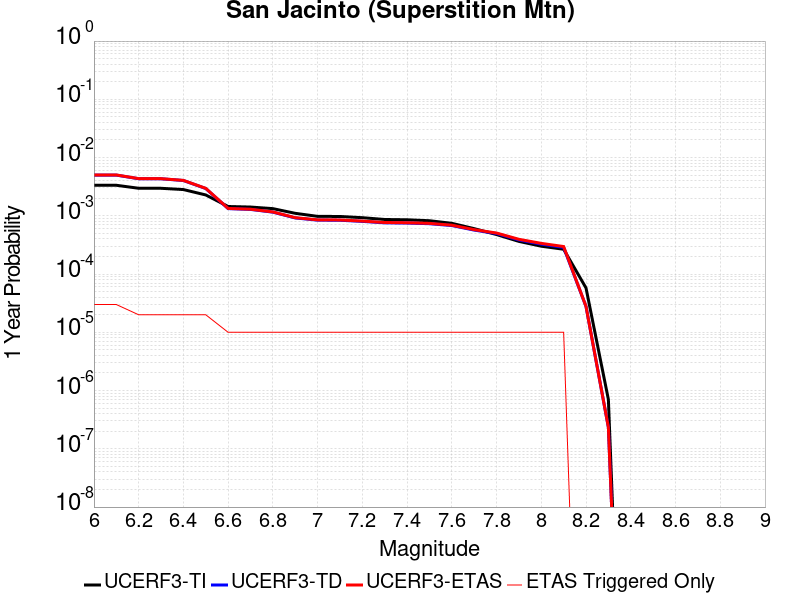 |  |

| Magnitude | 1 wk TI Prob | 1 wk TD Prob | 1 wk ETAS Prob | 1 wk ETAS/TD Gain | 1 wk ETAS Triggered Only | 1 mo TI Prob | 1 mo TD Prob | 1 mo ETAS Prob | 1 mo ETAS/TD Gain | 1 mo ETAS Triggered Only | 1 yr TI Prob | 1 yr TD Prob | 1 yr ETAS Prob | 1 yr ETAS/TD Gain | 1 yr ETAS Triggered Only | 10 yr TI Prob | 10 yr TD Prob | 10 yr ETAS Prob | 10 yr ETAS/TD Gain | 10 yr ETAS Triggered Only |
|-----|-----|-----|-----|-----|-----|-----|-----|-----|-----|-----|-----|-----|-----|-----|-----|-----|-----|-----|-----|-----|
| 6.0 | 6.4193904E-5 | 9.599367E-5 | 9.599367E-5 | 1.0 | 0.0 | 2.7508775E-4 | 4.1134638E-4 | 4.2963677E-4 | 1.0444647 | 1.8297927E-5 | 0.0033440501 | 0.0049980893 | 0.0050162957 | 1.0036427 | 1.8297927E-5 | 0.03294174 | 0.048823986 | 0.048858795 | 1.000713 | 3.6595855E-5 |
| 6.1 | 6.4193904E-5 | 9.599367E-5 | 9.599367E-5 | 1.0 | 0.0 | 2.7508775E-4 | 4.1134638E-4 | 4.2963677E-4 | 1.0444647 | 1.8297927E-5 | 0.0033440501 | 0.0049980893 | 0.0050162957 | 1.0036427 | 1.8297927E-5 | 0.03294174 | 0.048823986 | 0.048858795 | 1.000713 | 3.6595855E-5 |
| 6.2 | 5.7023593E-5 | 8.3144434E-5 | 8.3144434E-5 | 1.0 | 0.0 | 2.4436394E-4 | 3.5629404E-4 | 3.7458542E-4 | 1.051338 | 1.8297927E-5 | 0.002971072 | 0.0043308944 | 0.004349113 | 1.0042067 | 1.8297927E-5 | 0.029316625 | 0.04250403 | 0.04253907 | 1.0008245 | 3.6595855E-5 |
| 6.3 | 5.6940098E-5 | 8.298979E-5 | 8.298979E-5 | 1.0 | 0.0 | 2.4400617E-4 | 3.5563146E-4 | 3.739229E-4 | 1.0514337 | 1.8297927E-5 | 0.002966728 | 0.00432286 | 0.0043410785 | 1.0042145 | 1.8297927E-5 | 0.029274331 | 0.042427283 | 0.042462327 | 1.000826 | 3.6595855E-5 |
| 6.4 | 5.4171585E-5 | 7.7483564E-5 | 7.7483564E-5 | 1.0 | 0.0 | 2.3214328E-4 | 3.3203943E-4 | 3.5033128E-4 | 1.0550894 | 1.8297927E-5 | 0.0028226813 | 0.0040367353 | 0.004054959 | 1.0045146 | 1.8297927E-5 | 0.02787096 | 0.03971653 | 0.039751675 | 1.0008848 | 3.6595855E-5 |
| 6.5 | 4.375144E-5 | 5.642133E-5 | 5.642133E-5 | 1.0 | 0.0 | 1.874927E-4 | 2.4178992E-4 | 2.600834E-4 | 1.0756587 | 1.8297927E-5 | 0.0022803338 | 0.002940994 | 0.0029592381 | 1.0062034 | 1.8297927E-5 | 0.022570757 | 0.029236801 | 0.029272327 | 1.0012151 | 3.6595855E-5 |
| 6.6 | 2.772192E-5 | 2.5488358E-5 | 2.5488358E-5 | 1.0 | 0.0 | 1.1880282E-4 | 1.09231354E-4 | 1.2752728E-4 | 1.167497 | 1.8297927E-5 | 0.0014454646 | 0.0013290998 | 0.0013473734 | 1.0137489 | 1.8297927E-5 | 0.014360986 | 0.01354049 | 0.01357659 | 1.0026661 | 3.6595855E-5 |
| 6.7 | 2.7124124E-5 | 2.4699386E-5 | 2.4699386E-5 | 1.0 | 0.0 | 1.1624106E-4 | 1.05850326E-4 | 1.2414632E-4 | 1.1728477 | 1.8297927E-5 | 0.0014143161 | 0.001287985 | 0.0013062594 | 1.0141883 | 1.8297927E-5 | 0.014053487 | 0.013133943 | 0.013170059 | 1.0027498 | 3.6595855E-5 |
| 6.8 | 2.5475807E-5 | 2.216446E-5 | 2.216446E-5 | 1.0 | 0.0 | 1.0917746E-4 | 9.4987154E-5 | 1.1328334E-4 | 1.1926175 | 1.8297927E-5 | 0.001328425 | 0.001155867 | 0.0011741437 | 1.0158122 | 1.8297927E-5 | 0.0132051185 | 0.011822182 | 0.011858345 | 1.0030589 | 3.6595855E-5 |
| 6.9 | 2.1162023E-5 | 1.7626244E-5 | 1.7626244E-5 | 1.0 | 0.0 | 9.069123E-5 | 7.5538876E-5 | 9.383542E-5 | 1.2422136 | 1.8297927E-5 | 0.0011036064 | 9.193016E-4 | 9.375827E-4 | 1.0198859 | 1.8297927E-5 | 0.010981417 | 0.00944688 | 0.00948313 | 1.0038372 | 3.6595855E-5 |
| 7.0 | 1.8754288E-5 | 1.6161559E-5 | 1.6161559E-5 | 1.0 | 0.0 | 8.037304E-5 | 6.9261994E-5 | 8.7558656E-5 | 1.2641659 | 1.8297927E-5 | 9.781026E-4 | 8.4294105E-4 | 8.6122355E-4 | 1.0216889 | 1.8297927E-5 | 0.009738087 | 0.008670042 | 0.008706321 | 1.0041844 | 3.6595855E-5 |
| 7.1 | 1.8678527E-5 | 1.6086702E-5 | 1.6086702E-5 | 1.0 | 0.0 | 8.0048376E-5 | 6.89412E-5 | 8.7237866E-5 | 1.2653953 | 1.8297927E-5 | 9.7415317E-4 | 8.3903834E-4 | 8.573209E-4 | 1.0217899 | 1.8297927E-5 | 0.009698939 | 0.008630998 | 0.008667278 | 1.0042034 | 3.6595855E-5 |
| 7.2 | 1.7804578E-5 | 1.5381282E-5 | 1.5381282E-5 | 1.0 | 0.0 | 7.6303106E-5 | 6.5918124E-5 | 8.4214844E-5 | 1.2775674 | 1.8297927E-5 | 9.285943E-4 | 8.022599E-4 | 8.2054315E-4 | 1.0227897 | 1.8297927E-5 | 0.009247236 | 0.008262311 | 0.008280458 | 1.0021963 | 1.8297927E-5 |
| 7.3 | 1.6583685E-5 | 1.4530388E-5 | 1.4530388E-5 | 1.0 | 0.0 | 7.1070994E-5 | 6.227162E-5 | 8.05684E-5 | 1.2938223 | 1.8297927E-5 | 8.649459E-4 | 7.5789524E-4 | 7.761793E-4 | 1.0241247 | 1.8297927E-5 | 0.00861587 | 0.007817623 | 0.007835778 | 1.0023223 | 1.8297927E-5 |
| 7.4 | 1.6387552E-5 | 1.4395274E-5 | 1.4395274E-5 | 1.0 | 0.0 | 7.023047E-5 | 6.169258E-5 | 7.998938E-5 | 1.2965802 | 1.8297927E-5 | 8.5472054E-4 | 7.5085036E-4 | 7.6913455E-4 | 1.0243514 | 1.8297927E-5 | 0.008514405 | 0.0077470057 | 0.0077651623 | 1.0023437 | 1.8297927E-5 |
| 7.5 | 1.5790754E-5 | 1.4035962E-5 | 1.4035962E-5 | 1.0 | 0.0 | 6.767291E-5 | 6.0152746E-5 | 7.844957E-5 | 1.3041728 | 1.8297927E-5 | 8.236062E-4 | 7.321156E-4 | 7.504001E-4 | 1.024975 | 1.8297927E-5 | 0.008205604 | 0.007557569 | 0.007575729 | 1.0024028 | 1.8297927E-5 |
| 7.6 | 1.4248672E-5 | 1.3054932E-5 | 1.3054932E-5 | 1.0 | 0.0 | 6.106431E-5 | 5.594852E-5 | 7.424542E-5 | 1.327031 | 1.8297927E-5 | 7.432043E-4 | 6.8096205E-4 | 6.992475E-4 | 1.0268524 | 1.8297927E-5 | 0.007407237 | 0.0070401574 | 0.007058326 | 1.0025808 | 1.8297927E-5 |
| 7.7 | 1.15449975E-5 | 1.090368E-5 | 1.090368E-5 | 1.0 | 0.0 | 4.947762E-5 | 4.6729223E-5 | 6.5026295E-5 | 1.3915552 | 1.8297927E-5 | 6.022235E-4 | 5.687805E-4 | 5.870681E-4 | 1.0321522 | 1.8297927E-5 | 0.006005941 | 0.0059101824 | 0.005928372 | 1.0030777 | 1.8297927E-5 |
| 7.8 | 9.1391985E-6 | 9.514299E-6 | 9.514299E-6 | 1.0 | 0.0 | 3.9167408E-5 | 4.0774932E-5 | 5.9072114E-5 | 1.4487361 | 1.8297927E-5 | 4.767588E-4 | 4.963223E-4 | 5.1461114E-4 | 1.0368488 | 1.8297927E-5 | 0.0047573727 | 0.0051766867 | 0.00519489 | 1.0035164 | 1.8297927E-5 |
| 7.9 | 6.973017E-6 | 7.3821784E-6 | 7.3821784E-6 | 1.0 | 0.0 | 2.9884017E-5 | 3.1637526E-5 | 4.9934875E-5 | 1.5783432 | 1.8297927E-5 | 3.6377716E-4 | 3.8511935E-4 | 4.0341023E-4 | 1.047494 | 1.8297927E-5 | 0.0036318225 | 0.0040517948 | 0.0040700184 | 1.0044978 | 1.8297927E-5 |
| 8.0 | 5.7638235E-6 | 6.259972E-6 | 6.259972E-6 | 1.0 | 0.0 | 2.4701867E-5 | 2.6828178E-5 | 4.5125613E-5 | 1.682023 | 1.8297927E-5 | 3.0070372E-4 | 3.2658462E-4 | 3.4487655E-4 | 1.0560099 | 1.8297927E-5 | 0.0030029714 | 0.0034534496 | 0.0034716842 | 1.0052801 | 1.8297927E-5 |
| 8.1 | 5.1124434E-6 | 5.4956718E-6 | 5.4956718E-6 | 1.0 | 0.0 | 2.1910288E-5 | 2.355267E-5 | 4.1850166E-5 | 1.7768757 | 1.8297927E-5 | 2.6672508E-4 | 2.867165E-4 | 3.050092E-4 | 1.0638006 | 1.8297927E-5 | 0.0026640517 | 0.003040336 | 0.0030585784 | 1.006 | 1.8297927E-5 |
| 8.2 | 1.1075938E-6 | 5.336568E-7 | 5.336568E-7 | 1.0 | 0.0 | 4.7468216E-6 | 2.2870988E-6 | 2.2870988E-6 | 1.0 | 0.0 | 5.779102E-5 | 2.7845093E-5 | 2.7845093E-5 | 1.0 | 0.0 | 5.777599E-4 | 3.1346595E-4 | 3.1346595E-4 | 1.0 | 0.0 |
| 8.3 | 1.3584393E-8 | 4.473836E-9 | 4.473836E-9 | 1.0 | 0.0 | 5.8218827E-8 | 1.9173582E-8 | 1.9173582E-8 | 1.0 | 0.0 | 7.0881396E-7 | 2.3343837E-7 | 2.3343837E-7 | 1.0 | 0.0 | 7.0881174E-6 | 2.6163038E-6 | 2.6163038E-6 | 1.0 | 0.0 |

## White Wolf
*[(top)](#table-of-contents)*

| 1 Week | 1 Month | 1 Year | 10 Year |
|-----|-----|-----|-----|
|  |  |  |  |

| Magnitude | 1 wk TI Prob | 1 wk TD Prob | 1 wk ETAS Prob | 1 wk ETAS/TD Gain | 1 wk ETAS Triggered Only | 1 mo TI Prob | 1 mo TD Prob | 1 mo ETAS Prob | 1 mo ETAS/TD Gain | 1 mo ETAS Triggered Only | 1 yr TI Prob | 1 yr TD Prob | 1 yr ETAS Prob | 1 yr ETAS/TD Gain | 1 yr ETAS Triggered Only | 10 yr TI Prob | 10 yr TD Prob | 10 yr ETAS Prob | 10 yr ETAS/TD Gain | 10 yr ETAS Triggered Only |
|-----|-----|-----|-----|-----|-----|-----|-----|-----|-----|-----|-----|-----|-----|-----|-----|-----|-----|-----|-----|-----|
| 6.0 | 2.0037822E-5 | 1.0469162E-6 | 1.0469162E-6 | 1.0 | 0.0 | 8.587355E-5 | 4.486776E-6 | 4.486776E-6 | 1.0 | 0.0 | 0.001045009 | 5.4625183E-5 | 7.292211E-5 | 1.334954 | 1.8297927E-5 | 0.010401085 | 5.461226E-4 | 5.826985E-4 | 1.0669737 | 3.6595855E-5 |
| 6.1 | 2.0037822E-5 | 1.0469162E-6 | 1.0469162E-6 | 1.0 | 0.0 | 8.587355E-5 | 4.486776E-6 | 4.486776E-6 | 1.0 | 0.0 | 0.001045009 | 5.4625183E-5 | 7.292211E-5 | 1.334954 | 1.8297927E-5 | 0.010401085 | 5.461226E-4 | 5.826985E-4 | 1.0669737 | 3.6595855E-5 |
| 6.2 | 2.0037822E-5 | 1.0469162E-6 | 1.0469162E-6 | 1.0 | 0.0 | 8.587355E-5 | 4.486776E-6 | 4.486776E-6 | 1.0 | 0.0 | 0.001045009 | 5.4625183E-5 | 7.292211E-5 | 1.334954 | 1.8297927E-5 | 0.010401085 | 5.461226E-4 | 5.826985E-4 | 1.0669737 | 3.6595855E-5 |
| 6.3 | 2.0037822E-5 | 1.0469162E-6 | 1.0469162E-6 | 1.0 | 0.0 | 8.587355E-5 | 4.486776E-6 | 4.486776E-6 | 1.0 | 0.0 | 0.001045009 | 5.4625183E-5 | 7.292211E-5 | 1.334954 | 1.8297927E-5 | 0.010401085 | 5.461226E-4 | 5.826985E-4 | 1.0669737 | 3.6595855E-5 |
| 6.4 | 1.132487E-5 | 1.0469162E-6 | 1.0469162E-6 | 1.0 | 0.0 | 4.8534253E-5 | 4.486776E-6 | 4.486776E-6 | 1.0 | 0.0 | 5.907443E-4 | 5.4625183E-5 | 7.292211E-5 | 1.334954 | 1.8297927E-5 | 0.005891764 | 5.461226E-4 | 5.826985E-4 | 1.0669737 | 3.6595855E-5 |
| 6.5 | 1.132487E-5 | 1.0469162E-6 | 1.0469162E-6 | 1.0 | 0.0 | 4.8534253E-5 | 4.486776E-6 | 4.486776E-6 | 1.0 | 0.0 | 5.907443E-4 | 5.4625183E-5 | 7.292211E-5 | 1.334954 | 1.8297927E-5 | 0.005891764 | 5.461226E-4 | 5.826985E-4 | 1.0669737 | 3.6595855E-5 |
| 6.6 | 9.347473E-6 | 1.0469162E-6 | 1.0469162E-6 | 1.0 | 0.0 | 4.0059982E-5 | 4.486776E-6 | 4.486776E-6 | 1.0 | 0.0 | 4.8762115E-4 | 5.4625183E-5 | 7.292211E-5 | 1.334954 | 1.8297927E-5 | 0.0048655253 | 5.461226E-4 | 5.826985E-4 | 1.0669737 | 3.6595855E-5 |
| 6.7 | 7.842647E-6 | 1.0048342E-6 | 1.0048342E-6 | 1.0 | 0.0 | 3.361091E-5 | 4.3064256E-6 | 4.3064256E-6 | 1.0 | 0.0 | 4.0913603E-4 | 5.2429517E-5 | 7.0726484E-5 | 1.3489822 | 1.8297927E-5 | 0.004083836 | 5.2417646E-4 | 5.607531E-4 | 1.0697793 | 3.6595855E-5 |
| 6.8 | 6.26597E-6 | 9.734822E-7 | 9.734822E-7 | 1.0 | 0.0 | 2.685388E-5 | 4.17206E-6 | 4.17206E-6 | 1.0 | 0.0 | 3.2689696E-4 | 5.0793697E-5 | 6.9090696E-5 | 1.3602217 | 1.8297927E-5 | 0.003264165 | 5.078258E-4 | 5.4440304E-4 | 1.0720272 | 3.6595855E-5 |
| 6.9 | 5.258436E-6 | 9.183254E-7 | 9.183254E-7 | 1.0 | 0.0 | 2.2535958E-5 | 3.9356746E-6 | 3.9356746E-6 | 1.0 | 0.0 | 2.7434074E-4 | 4.7915833E-5 | 6.621288E-5 | 1.3818581 | 1.8297927E-5 | 0.0027400232 | 4.790598E-4 | 5.156381E-4 | 1.0763544 | 3.6595855E-5 |
| 7.0 | 4.675028E-6 | 8.6611794E-7 | 8.6611794E-7 | 1.0 | 0.0 | 2.003568E-5 | 3.7119291E-6 | 3.7119291E-6 | 1.0 | 0.0 | 2.4390711E-4 | 4.5191846E-5 | 6.3488944E-5 | 1.4048761 | 1.8297927E-5 | 0.0024363957 | 4.518313E-4 | 4.884106E-4 | 1.0809579 | 3.6595855E-5 |
| 7.1 | 2.8270078E-6 | 6.8741696E-7 | 6.8741696E-7 | 1.0 | 0.0 | 1.2115692E-5 | 2.9460696E-6 | 2.9460696E-6 | 1.0 | 0.0 | 1.4749856E-4 | 3.5867848E-5 | 5.416512E-5 | 1.5101302 | 1.8297927E-5 | 0.001474007 | 3.586247E-4 | 3.9520743E-4 | 1.1020083 | 3.6595855E-5 |
| 7.2 | 1.6881406E-6 | 2.2706382E-7 | 2.2706382E-7 | 1.0 | 0.0 | 7.2348685E-6 | 9.731303E-7 | 9.731303E-7 | 1.0 | 0.0 | 8.808096E-5 | 1.1847799E-5 | 3.014551E-5 | 2.5443974 | 1.8297927E-5 | 8.8046055E-4 | 1.1847183E-4 | 1.3676759E-4 | 1.1544313 | 1.8297927E-5 |
| 7.3 | 9.086107E-7 | 1.5266386E-7 | 1.5266386E-7 | 1.0 | 0.0 | 3.8940398E-6 | 6.5427355E-7 | 6.5427355E-7 | 1.0 | 0.0 | 4.7408903E-5 | 7.965752E-6 | 2.6263533E-5 | 3.2970564 | 1.8297927E-5 | 4.739879E-4 | 7.965475E-5 | 9.795122E-5 | 1.2296971 | 1.8297927E-5 |
| 7.4 | 1.9717383E-7 | 9.003913E-8 | 9.003913E-8 | 1.0 | 0.0 | 8.450304E-7 | 3.8588192E-7 | 3.8588192E-7 | 1.0 | 0.0 | 1.0288197E-5 | 4.6981027E-6 | 2.2995944E-5 | 4.89473 | 1.8297927E-5 | 1.028772E-4 | 4.6980065E-5 | 6.5277134E-5 | 1.3894645 | 1.8297927E-5 |
| 7.5 | 1.086975E-7 | 6.6597195E-8 | 6.6597195E-8 | 1.0 | 0.0 | 4.6584634E-7 | 2.8541652E-7 | 2.8541652E-7 | 1.0 | 0.0 | 5.6716644E-6 | 3.474941E-6 | 3.474941E-6 | 1.0 | 0.0 | 5.6715195E-5 | 3.474889E-5 | 3.474889E-5 | 1.0 | 0.0 |
| 7.6 | 2.4217808E-8 | 1.5820765E-8 | 1.5820765E-8 | 1.0 | 0.0 | 1.03790605E-7 | 6.780328E-8 | 6.780328E-8 | 1.0 | 0.0 | 1.2636499E-6 | 8.255046E-7 | 8.255046E-7 | 1.0 | 0.0 | 1.2636427E-5 | 8.2550205E-6 | 8.2550205E-6 | 1.0 | 0.0 |

## Cucamonga
*[(top)](#table-of-contents)*

| 1 Week | 1 Month | 1 Year | 10 Year |
|-----|-----|-----|-----|
|  |  |  | 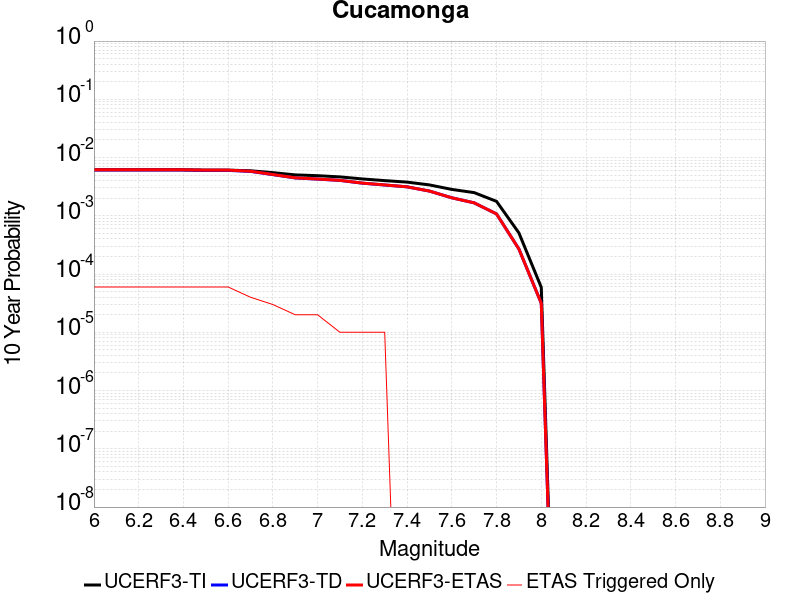 |

| Magnitude | 1 wk TI Prob | 1 wk TD Prob | 1 wk ETAS Prob | 1 wk ETAS/TD Gain | 1 wk ETAS Triggered Only | 1 mo TI Prob | 1 mo TD Prob | 1 mo ETAS Prob | 1 mo ETAS/TD Gain | 1 mo ETAS Triggered Only | 1 yr TI Prob | 1 yr TD Prob | 1 yr ETAS Prob | 1 yr ETAS/TD Gain | 1 yr ETAS Triggered Only | 10 yr TI Prob | 10 yr TD Prob | 10 yr ETAS Prob | 10 yr ETAS/TD Gain | 10 yr ETAS Triggered Only |
|-----|-----|-----|-----|-----|-----|-----|-----|-----|-----|-----|-----|-----|-----|-----|-----|-----|-----|-----|-----|-----|
| 6.0 | 1.1848348E-5 | 1.1737008E-5 | 1.1737008E-5 | 1.0 | 0.0 | 5.0777642E-5 | 5.030051E-5 | 5.030051E-5 | 1.0 | 0.0 | 6.180424E-4 | 6.1223935E-4 | 6.3052605E-4 | 1.0298686 | 1.8297927E-5 | 0.0061632637 | 0.0061067017 | 0.006143074 | 1.0059562 | 3.6595855E-5 |
| 6.1 | 1.1848348E-5 | 1.1737008E-5 | 1.1737008E-5 | 1.0 | 0.0 | 5.0777642E-5 | 5.030051E-5 | 5.030051E-5 | 1.0 | 0.0 | 6.180424E-4 | 6.1223935E-4 | 6.3052605E-4 | 1.0298686 | 1.8297927E-5 | 0.0061632637 | 0.0061067017 | 0.006143074 | 1.0059562 | 3.6595855E-5 |
| 6.2 | 1.1848348E-5 | 1.1737008E-5 | 1.1737008E-5 | 1.0 | 0.0 | 5.0777642E-5 | 5.030051E-5 | 5.030051E-5 | 1.0 | 0.0 | 6.180424E-4 | 6.1223935E-4 | 6.3052605E-4 | 1.0298686 | 1.8297927E-5 | 0.0061632637 | 0.0061067017 | 0.006143074 | 1.0059562 | 3.6595855E-5 |
| 6.3 | 1.1848348E-5 | 1.1737008E-5 | 1.1737008E-5 | 1.0 | 0.0 | 5.0777642E-5 | 5.030051E-5 | 5.030051E-5 | 1.0 | 0.0 | 6.180424E-4 | 6.1223935E-4 | 6.3052605E-4 | 1.0298686 | 1.8297927E-5 | 0.0061632637 | 0.0061067017 | 0.006143074 | 1.0059562 | 3.6595855E-5 |
| 6.4 | 1.1848348E-5 | 1.1737008E-5 | 1.1737008E-5 | 1.0 | 0.0 | 5.0777642E-5 | 5.030051E-5 | 5.030051E-5 | 1.0 | 0.0 | 6.180424E-4 | 6.1223935E-4 | 6.3052605E-4 | 1.0298686 | 1.8297927E-5 | 0.0061632637 | 0.0061067017 | 0.006143074 | 1.0059562 | 3.6595855E-5 |
| 6.5 | 1.16988695E-5 | 1.15760395E-5 | 1.15760395E-5 | 1.0 | 0.0 | 5.013705E-5 | 4.9610666E-5 | 4.9610666E-5 | 1.0 | 0.0 | 6.102476E-4 | 6.0384517E-4 | 6.2213204E-4 | 1.030284 | 1.8297927E-5 | 0.006085745 | 0.006023216 | 0.0060595917 | 1.0060393 | 3.6595855E-5 |
| 6.6 | 1.16988695E-5 | 1.15760395E-5 | 1.15760395E-5 | 1.0 | 0.0 | 5.013705E-5 | 4.9610666E-5 | 4.9610666E-5 | 1.0 | 0.0 | 6.102476E-4 | 6.0384517E-4 | 6.2213204E-4 | 1.030284 | 1.8297927E-5 | 0.006085745 | 0.006023216 | 0.0060595917 | 1.0060393 | 3.6595855E-5 |
| 6.7 | 1.1397107E-5 | 1.11149475E-5 | 1.11149475E-5 | 1.0 | 0.0 | 4.884383E-5 | 4.7634636E-5 | 4.7634636E-5 | 1.0 | 0.0 | 5.9451134E-4 | 5.797998E-4 | 5.797998E-4 | 1.0 | 0.0 | 0.005929234 | 0.0057840226 | 0.005802215 | 1.0031452 | 1.8297927E-5 |
| 6.8 | 1.058387E-5 | 9.784992E-6 | 9.784992E-6 | 1.0 | 0.0 | 4.5358654E-5 | 4.193501E-5 | 4.193501E-5 | 1.0 | 0.0 | 5.521017E-4 | 5.1044027E-4 | 5.1044027E-4 | 1.0 | 0.0 | 0.00550732 | 0.0050936877 | 0.0051118922 | 1.003574 | 1.8297927E-5 |
| 6.9 | 9.690046E-6 | 8.57948E-6 | 8.57948E-6 | 1.0 | 0.0 | 4.1528107E-5 | 3.6768684E-5 | 3.6768684E-5 | 1.0 | 0.0 | 5.054874E-4 | 4.475672E-4 | 4.475672E-4 | 1.0 | 0.0 | 0.005043391 | 0.004467594 | 0.004467594 | 1.0 | 0.0 |
| 7.0 | 9.381461E-6 | 8.187101E-6 | 8.187101E-6 | 1.0 | 0.0 | 4.020564E-5 | 3.5087105E-5 | 3.5087105E-5 | 1.0 | 0.0 | 4.893937E-4 | 4.2710215E-4 | 4.2710215E-4 | 1.0 | 0.0 | 0.0048831734 | 0.0042637475 | 0.0042637475 | 1.0 | 0.0 |
| 7.1 | 8.946492E-6 | 7.781886E-6 | 7.781886E-6 | 1.0 | 0.0 | 3.8341543E-5 | 3.3350516E-5 | 3.3350516E-5 | 1.0 | 0.0 | 4.667083E-4 | 4.0596718E-4 | 4.0596718E-4 | 1.0 | 0.0 | 0.0046572937 | 0.004053192 | 0.004053192 | 1.0 | 0.0 |
| 7.2 | 8.251016E-6 | 6.9752796E-6 | 6.9752796E-6 | 1.0 | 0.0 | 3.5361016E-5 | 2.9893714E-5 | 2.9893714E-5 | 1.0 | 0.0 | 4.3043532E-4 | 3.6389544E-4 | 3.6389544E-4 | 1.0 | 0.0 | 0.0042960253 | 0.0036339292 | 0.0036339292 | 1.0 | 0.0 |
| 7.3 | 7.717881E-6 | 6.4863502E-6 | 6.4863502E-6 | 1.0 | 0.0 | 3.3076216E-5 | 2.7798349E-5 | 2.7798349E-5 | 1.0 | 0.0 | 4.026285E-4 | 3.3839257E-4 | 3.3839257E-4 | 1.0 | 0.0 | 0.004018998 | 0.00337971 | 0.00337971 | 1.0 | 0.0 |
| 7.4 | 7.275623E-6 | 6.031997E-6 | 6.031997E-6 | 1.0 | 0.0 | 3.118087E-5 | 2.585116E-5 | 2.585116E-5 | 1.0 | 0.0 | 3.7956095E-4 | 3.1469265E-4 | 3.1469265E-4 | 1.0 | 0.0 | 0.0037891332 | 0.0031434062 | 0.0031434062 | 1.0 | 0.0 |
| 7.5 | 6.5109502E-6 | 5.1006014E-6 | 5.1006014E-6 | 1.0 | 0.0 | 2.7903774E-5 | 2.1859538E-5 | 2.1859538E-5 | 1.0 | 0.0 | 3.3967546E-4 | 2.661075E-4 | 2.661075E-4 | 1.0 | 0.0 | 0.0033915674 | 0.002658813 | 0.002658813 | 1.0 | 0.0 |
| 7.6 | 5.4495326E-6 | 3.90857E-6 | 3.90857E-6 | 1.0 | 0.0 | 2.335493E-5 | 1.6750908E-5 | 1.6750908E-5 | 1.0 | 0.0 | 2.8430918E-4 | 2.0392328E-4 | 2.0392328E-4 | 1.0 | 0.0 | 0.0028394572 | 0.002038282 | 0.002038282 | 1.0 | 0.0 |
| 7.7 | 4.7997164E-6 | 3.2002547E-6 | 3.2002547E-6 | 1.0 | 0.0 | 2.057005E-5 | 1.3715306E-5 | 1.3715306E-5 | 1.0 | 0.0 | 2.504116E-4 | 1.6697108E-4 | 1.6697108E-4 | 1.0 | 0.0 | 0.002501296 | 0.0016693877 | 0.0016693877 | 1.0 | 0.0 |
| 7.8 | 3.3941733E-6 | 2.0641899E-6 | 2.0641899E-6 | 1.0 | 0.0 | 1.4546376E-5 | 8.846498E-6 | 8.846498E-6 | 1.0 | 0.0 | 1.7708774E-4 | 1.07700806E-4 | 1.07700806E-4 | 1.0 | 0.0 | 0.0017694668 | 0.001076723 | 0.001076723 | 1.0 | 0.0 |
| 7.9 | 9.750552E-7 | 5.155946E-7 | 5.155946E-7 | 1.0 | 0.0 | 4.178801E-6 | 2.2096892E-6 | 2.2096892E-6 | 1.0 | 0.0 | 5.0875715E-5 | 2.690264E-5 | 2.690264E-5 | 1.0 | 0.0 | 5.086407E-4 | 2.6899425E-4 | 2.6899425E-4 | 1.0 | 0.0 |
| 8.0 | 1.133857E-7 | 6.053707E-8 | 6.053707E-8 | 1.0 | 0.0 | 4.8593864E-7 | 2.5944456E-7 | 2.5944456E-7 | 1.0 | 0.0 | 5.9162867E-6 | 3.158733E-6 | 3.158733E-6 | 1.0 | 0.0 | 5.916129E-5 | 3.1586897E-5 | 3.1586897E-5 | 1.0 | 0.0 |

## San Gorgonio Pass
*[(top)](#table-of-contents)*

| 1 Week | 1 Month | 1 Year | 10 Year |
|-----|-----|-----|-----|
|  |  |  |  |

| Magnitude | 1 wk TI Prob | 1 wk TD Prob | 1 wk ETAS Prob | 1 wk ETAS/TD Gain | 1 wk ETAS Triggered Only | 1 mo TI Prob | 1 mo TD Prob | 1 mo ETAS Prob | 1 mo ETAS/TD Gain | 1 mo ETAS Triggered Only | 1 yr TI Prob | 1 yr TD Prob | 1 yr ETAS Prob | 1 yr ETAS/TD Gain | 1 yr ETAS Triggered Only | 10 yr TI Prob | 10 yr TD Prob | 10 yr ETAS Prob | 10 yr ETAS/TD Gain | 10 yr ETAS Triggered Only |
|-----|-----|-----|-----|-----|-----|-----|-----|-----|-----|-----|-----|-----|-----|-----|-----|-----|-----|-----|-----|-----|
| 6.0 | 7.644328E-6 | 1.3314231E-5 | 1.3314231E-5 | 1.0 | 0.0 | 3.2760996E-5 | 5.705979E-5 | 7.535667E-5 | 1.3206615 | 1.8297927E-5 | 3.987921E-4 | 6.944901E-4 | 7.310605E-4 | 1.052658 | 3.6595855E-5 | 0.003980772 | 0.0069299806 | 0.006966323 | 1.0052443 | 3.6595855E-5 |
| 6.1 | 7.644328E-6 | 1.3314231E-5 | 1.3314231E-5 | 1.0 | 0.0 | 3.2760996E-5 | 5.705979E-5 | 7.535667E-5 | 1.3206615 | 1.8297927E-5 | 3.987921E-4 | 6.944901E-4 | 7.310605E-4 | 1.052658 | 3.6595855E-5 | 0.003980772 | 0.0069299806 | 0.006966323 | 1.0052443 | 3.6595855E-5 |
| 6.2 | 7.644328E-6 | 1.3314231E-5 | 1.3314231E-5 | 1.0 | 0.0 | 3.2760996E-5 | 5.705979E-5 | 7.535667E-5 | 1.3206615 | 1.8297927E-5 | 3.987921E-4 | 6.944901E-4 | 7.310605E-4 | 1.052658 | 3.6595855E-5 | 0.003980772 | 0.0069299806 | 0.006966323 | 1.0052443 | 3.6595855E-5 |
| 6.3 | 7.644328E-6 | 1.3314231E-5 | 1.3314231E-5 | 1.0 | 0.0 | 3.2760996E-5 | 5.705979E-5 | 7.535667E-5 | 1.3206615 | 1.8297927E-5 | 3.987921E-4 | 6.944901E-4 | 7.310605E-4 | 1.052658 | 3.6595855E-5 | 0.003980772 | 0.0069299806 | 0.006966323 | 1.0052443 | 3.6595855E-5 |
| 6.4 | 7.644328E-6 | 1.3314231E-5 | 1.3314231E-5 | 1.0 | 0.0 | 3.2760996E-5 | 5.705979E-5 | 7.535667E-5 | 1.3206615 | 1.8297927E-5 | 3.987921E-4 | 6.944901E-4 | 7.310605E-4 | 1.052658 | 3.6595855E-5 | 0.003980772 | 0.0069299806 | 0.006966323 | 1.0052443 | 3.6595855E-5 |
| 6.5 | 7.644328E-6 | 1.3314231E-5 | 1.3314231E-5 | 1.0 | 0.0 | 3.2760996E-5 | 5.705979E-5 | 7.535667E-5 | 1.3206615 | 1.8297927E-5 | 3.987921E-4 | 6.944901E-4 | 7.310605E-4 | 1.052658 | 3.6595855E-5 | 0.003980772 | 0.0069299806 | 0.006966323 | 1.0052443 | 3.6595855E-5 |
| 6.6 | 7.644328E-6 | 1.3314231E-5 | 1.3314231E-5 | 1.0 | 0.0 | 3.2760996E-5 | 5.705979E-5 | 7.535667E-5 | 1.3206615 | 1.8297927E-5 | 3.987921E-4 | 6.944901E-4 | 7.310605E-4 | 1.052658 | 3.6595855E-5 | 0.003980772 | 0.0069299806 | 0.006966323 | 1.0052443 | 3.6595855E-5 |
| 6.7 | 6.987586E-6 | 1.2618505E-5 | 1.2618505E-5 | 1.0 | 0.0 | 2.9946454E-5 | 5.4078235E-5 | 7.237517E-5 | 1.338342 | 1.8297927E-5 | 3.645371E-4 | 6.582117E-4 | 6.9478346E-4 | 1.0555623 | 3.6595855E-5 | 0.0036393967 | 0.0065693567 | 0.006605712 | 1.005534 | 3.6595855E-5 |
| 6.8 | 6.987586E-6 | 1.2618505E-5 | 1.2618505E-5 | 1.0 | 0.0 | 2.9946454E-5 | 5.4078235E-5 | 7.237517E-5 | 1.338342 | 1.8297927E-5 | 3.645371E-4 | 6.582117E-4 | 6.9478346E-4 | 1.0555623 | 3.6595855E-5 | 0.0036393967 | 0.0065693567 | 0.006605712 | 1.005534 | 3.6595855E-5 |
| 6.9 | 5.504702E-6 | 1.1049368E-5 | 1.1049368E-5 | 1.0 | 0.0 | 2.3591367E-5 | 4.7353606E-5 | 6.565067E-5 | 1.3863921 | 1.8297927E-5 | 2.8718702E-4 | 5.7638274E-4 | 6.1295746E-4 | 1.0634557 | 3.6595855E-5 | 0.0028681618 | 0.005755309 | 0.0057916944 | 1.006322 | 3.6595855E-5 |
| 7.0 | 5.4825764E-6 | 1.102571E-5 | 1.102571E-5 | 1.0 | 0.0 | 2.3496545E-5 | 4.7252215E-5 | 6.554928E-5 | 1.3872212 | 1.8297927E-5 | 2.8603288E-4 | 5.751489E-4 | 6.117237E-4 | 1.0635918 | 3.6595855E-5 | 0.00285665 | 0.005743035 | 0.0057794205 | 1.0063356 | 3.6595855E-5 |
| 7.1 | 5.4692787E-6 | 1.101142E-5 | 1.101142E-5 | 1.0 | 0.0 | 2.3439556E-5 | 4.7190973E-5 | 6.5488035E-5 | 1.3877238 | 1.8297927E-5 | 2.8533922E-4 | 5.744037E-4 | 6.109785E-4 | 1.0636744 | 3.6595855E-5 | 0.0028497311 | 0.0057356213 | 0.005772007 | 1.0063438 | 3.6595855E-5 |
| 7.2 | 5.453661E-6 | 1.0994446E-5 | 1.0994446E-5 | 1.0 | 0.0 | 2.3372622E-5 | 4.7118232E-5 | 6.54153E-5 | 1.3883224 | 1.8297927E-5 | 2.8452452E-4 | 5.7351857E-4 | 6.100934E-4 | 1.0637728 | 3.6595855E-5 | 0.002841605 | 0.0057268157 | 0.005763202 | 1.0063536 | 3.6595855E-5 |
| 7.3 | 5.4422303E-6 | 1.0981369E-5 | 1.0981369E-5 | 1.0 | 0.0 | 2.3323635E-5 | 4.706219E-5 | 6.535926E-5 | 1.3887849 | 1.8297927E-5 | 2.8392827E-4 | 5.728366E-4 | 6.094115E-4 | 1.0638487 | 3.6595855E-5 | 0.0028356577 | 0.005720031 | 0.0057564178 | 1.0063612 | 3.6595855E-5 |
| 7.4 | 5.398595E-6 | 1.0928734E-5 | 1.0928734E-5 | 1.0 | 0.0 | 2.313663E-5 | 4.683662E-5 | 6.513369E-5 | 1.3906573 | 1.8297927E-5 | 2.8165206E-4 | 5.700917E-4 | 6.066667E-4 | 1.0641563 | 3.6595855E-5 | 0.0028129534 | 0.005692723 | 0.005729111 | 1.0063919 | 3.6595855E-5 |
| 7.5 | 5.3578788E-6 | 1.0855281E-5 | 1.0855281E-5 | 1.0 | 0.0 | 2.2962136E-5 | 4.6521833E-5 | 6.481891E-5 | 1.3933009 | 1.8297927E-5 | 2.7952815E-4 | 5.662612E-4 | 6.028363E-4 | 1.0645906 | 3.6595855E-5 | 0.002791768 | 0.0056546377 | 0.005691027 | 1.0064353 | 3.6595855E-5 |
| 7.6 | 4.8091474E-6 | 9.60368E-6 | 9.60368E-6 | 1.0 | 0.0 | 2.0610469E-5 | 4.1158008E-5 | 5.945518E-5 | 1.4445593 | 1.8297927E-5 | 2.5090357E-4 | 5.0098833E-4 | 5.3756585E-4 | 1.0730107 | 3.6595855E-5 | 0.0025062046 | 0.0050053033 | 0.0050417157 | 1.0072749 | 3.6595855E-5 |
| 7.7 | 1.5991155E-6 | 3.352866E-6 | 3.352866E-6 | 1.0 | 0.0 | 6.853334E-6 | 1.4369349E-5 | 1.4369349E-5 | 1.0 | 0.0 | 8.343615E-5 | 1.7493303E-4 | 1.9322775E-4 | 1.1045814 | 1.8297927E-5 | 8.340483E-4 | 0.0017534072 | 0.0017716731 | 1.0104173 | 1.8297927E-5 |
| 7.8 | 9.258398E-7 | 2.0579948E-6 | 2.0579948E-6 | 1.0 | 0.0 | 3.967879E-6 | 8.819949E-6 | 8.819949E-6 | 1.0 | 0.0 | 4.8307855E-5 | 1.073776E-4 | 1.2567356E-4 | 1.170389 | 1.8297927E-5 | 4.8297356E-4 | 0.001078687 | 0.0010969652 | 1.0169449 | 1.8297927E-5 |
| 7.9 | 5.975575E-7 | 1.2291794E-6 | 1.2291794E-6 | 1.0 | 0.0 | 2.5609581E-6 | 5.2679006E-6 | 5.2679006E-6 | 1.0 | 0.0 | 3.117922E-5 | 6.4134816E-5 | 6.4134816E-5 | 1.0 | 0.0 | 3.1174847E-4 | 6.463092E-4 | 6.463092E-4 | 1.0 | 0.0 |
| 8.0 | 3.4413725E-7 | 6.7148494E-7 | 6.7148494E-7 | 1.0 | 0.0 | 1.4748731E-6 | 2.8777895E-6 | 2.8777895E-6 | 1.0 | 0.0 | 1.7956432E-5 | 3.503653E-5 | 3.503653E-5 | 1.0 | 0.0 | 1.7954981E-4 | 3.5373896E-4 | 3.5373896E-4 | 1.0 | 0.0 |
| 8.1 | 1.1787731E-8 | 9.634385E-9 | 9.634385E-9 | 1.0 | 0.0 | 5.0518846E-8 | 4.129022E-8 | 4.129022E-8 | 1.0 | 0.0 | 6.1506677E-7 | 5.027083E-7 | 5.027083E-7 | 1.0 | 0.0 | 6.1506507E-6 | 5.2424944E-6 | 5.2424944E-6 | 1.0 | 0.0 |

## Chino alt 1
*[(top)](#table-of-contents)*

| 1 Week | 1 Month | 1 Year | 10 Year |
|-----|-----|-----|-----|
|  | 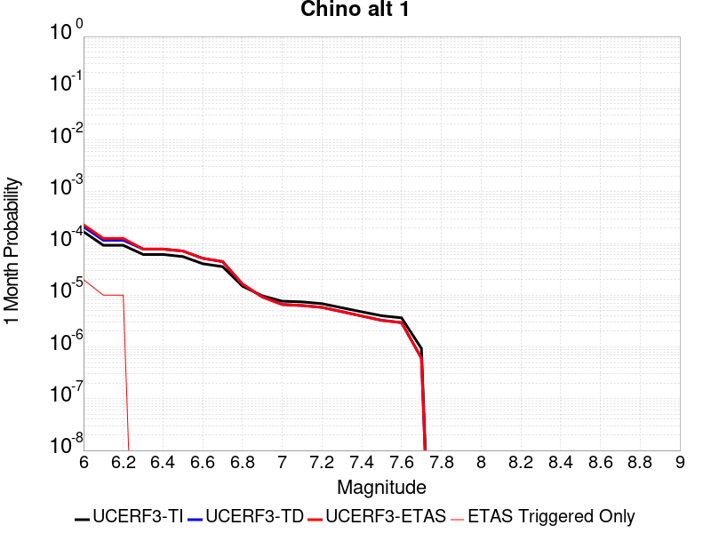 | 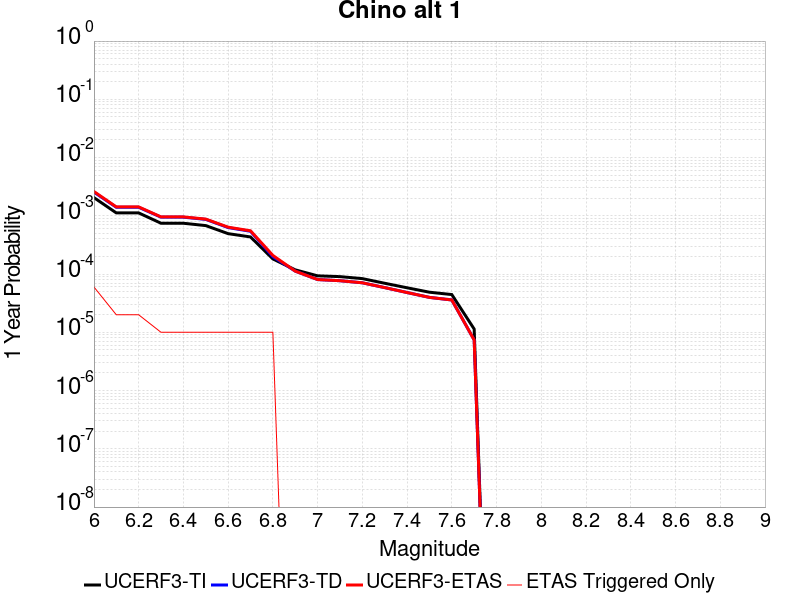 |  |

| Magnitude | 1 wk TI Prob | 1 wk TD Prob | 1 wk ETAS Prob | 1 wk ETAS/TD Gain | 1 wk ETAS Triggered Only | 1 mo TI Prob | 1 mo TD Prob | 1 mo ETAS Prob | 1 mo ETAS/TD Gain | 1 mo ETAS Triggered Only | 1 yr TI Prob | 1 yr TD Prob | 1 yr ETAS Prob | 1 yr ETAS/TD Gain | 1 yr ETAS Triggered Only | 10 yr TI Prob | 10 yr TD Prob | 10 yr ETAS Prob | 10 yr ETAS/TD Gain | 10 yr ETAS Triggered Only |
|-----|-----|-----|-----|-----|-----|-----|-----|-----|-----|-----|-----|-----|-----|-----|-----|-----|-----|-----|-----|-----|
| 6.0 | 3.939946E-5 | 4.8948554E-5 | 4.8948554E-5 | 1.0 | 0.0 | 1.6884391E-4 | 2.097656E-4 | 2.2805968E-4 | 1.0872121 | 1.8297927E-5 | 0.0020537362 | 0.0025513945 | 0.002587897 | 1.0143069 | 3.6595855E-5 | 0.020348595 | 0.025277847 | 0.025313517 | 1.0014112 | 3.6595855E-5 |
| 6.1 | 2.1505624E-5 | 2.6879026E-5 | 2.6879026E-5 | 1.0 | 0.0 | 9.2163704E-5 | 1.1519137E-4 | 1.1519137E-4 | 1.0 | 0.0 | 0.0011215154 | 0.001401664 | 0.0014199363 | 1.0130361 | 1.8297927E-5 | 0.011158722 | 0.013945141 | 0.013963184 | 1.0012939 | 1.8297927E-5 |
| 6.2 | 2.1505624E-5 | 2.6879026E-5 | 2.6879026E-5 | 1.0 | 0.0 | 9.2163704E-5 | 1.1519137E-4 | 1.1519137E-4 | 1.0 | 0.0 | 0.0011215154 | 0.001401664 | 0.0014199363 | 1.0130361 | 1.8297927E-5 | 0.011158722 | 0.013945141 | 0.013963184 | 1.0012939 | 1.8297927E-5 |
| 6.3 | 1.4290785E-5 | 1.8165128E-5 | 1.8165128E-5 | 1.0 | 0.0 | 6.1244784E-5 | 7.784848E-5 | 7.784848E-5 | 1.0 | 0.0 | 7.454001E-4 | 9.4743853E-4 | 9.657191E-4 | 1.0192947 | 1.8297927E-5 | 0.007429048 | 0.0094444575 | 0.009462583 | 1.0019192 | 1.8297927E-5 |
| 6.4 | 1.4290785E-5 | 1.8165128E-5 | 1.8165128E-5 | 1.0 | 0.0 | 6.1244784E-5 | 7.784848E-5 | 7.784848E-5 | 1.0 | 0.0 | 7.454001E-4 | 9.4743853E-4 | 9.657191E-4 | 1.0192947 | 1.8297927E-5 | 0.007429048 | 0.0094444575 | 0.009462583 | 1.0019192 | 1.8297927E-5 |
| 6.5 | 1.3017944E-5 | 1.6652088E-5 | 1.6652088E-5 | 1.0 | 0.0 | 5.5789995E-5 | 7.136439E-5 | 7.136439E-5 | 1.0 | 0.0 | 6.790315E-4 | 8.685589E-4 | 8.868409E-4 | 1.0210487 | 1.8297927E-5 | 0.0067696036 | 0.008661949 | 0.008680088 | 1.0020941 | 1.8297927E-5 |
| 6.6 | 9.470016E-6 | 1.2039424E-5 | 1.2039424E-5 | 1.0 | 0.0 | 4.058515E-5 | 5.1596704E-5 | 5.1596704E-5 | 1.0 | 0.0 | 4.940122E-4 | 6.280428E-4 | 6.463292E-4 | 1.0291165 | 1.8297927E-5 | 0.004929154 | 0.0062718987 | 0.006290082 | 1.0028992 | 1.8297927E-5 |
| 6.7 | 8.314155E-6 | 1.0407736E-5 | 1.0407736E-5 | 1.0 | 0.0 | 3.5631605E-5 | 4.4604003E-5 | 4.4604003E-5 | 1.0 | 0.0 | 4.3372845E-4 | 5.429507E-4 | 5.612387E-4 | 1.0336826 | 1.8297927E-5 | 0.004328829 | 0.005425775 | 0.005443974 | 1.0033541 | 1.8297927E-5 |
| 6.8 | 3.4856364E-6 | 3.8133708E-6 | 3.8133708E-6 | 1.0 | 0.0 | 1.4938357E-5 | 1.6342927E-5 | 1.6342927E-5 | 1.0 | 0.0 | 1.8185932E-4 | 1.9895904E-4 | 2.1725333E-4 | 1.09195 | 1.8297927E-5 | 0.0018171056 | 0.0019894864 | 0.002007748 | 1.009179 | 1.8297927E-5 |
| 6.9 | 2.2645952E-6 | 2.1529022E-6 | 2.1529022E-6 | 1.0 | 0.0 | 9.705372E-6 | 9.226692E-6 | 9.226692E-6 | 1.0 | 0.0 | 1.18156495E-4 | 1.123294E-4 | 1.123294E-4 | 1.0 | 0.0 | 0.0011809369 | 0.0011233423 | 0.0011233423 | 1.0 | 0.0 |
| 7.0 | 1.7864003E-6 | 1.5430785E-6 | 1.5430785E-6 | 1.0 | 0.0 | 7.655979E-6 | 6.613177E-6 | 6.613177E-6 | 1.0 | 0.0 | 9.3207556E-5 | 8.051251E-5 | 8.051251E-5 | 1.0 | 0.0 | 9.316847E-4 | 8.0528046E-4 | 8.0528046E-4 | 1.0 | 0.0 |
| 7.1 | 1.7315456E-6 | 1.4733511E-6 | 1.4733511E-6 | 1.0 | 0.0 | 7.420889E-6 | 6.3143466E-6 | 6.3143466E-6 | 1.0 | 0.0 | 9.034557E-5 | 7.6874516E-5 | 7.6874516E-5 | 1.0 | 0.0 | 9.0308854E-4 | 7.6891703E-4 | 7.6891703E-4 | 1.0 | 0.0 |
| 7.2 | 1.6008337E-6 | 1.3574215E-6 | 1.3574215E-6 | 1.0 | 0.0 | 6.860698E-6 | 5.817508E-6 | 5.817508E-6 | 1.0 | 0.0 | 8.352579E-5 | 7.082591E-5 | 7.082591E-5 | 1.0 | 0.0 | 8.34944E-4 | 7.0845755E-4 | 7.0845755E-4 | 1.0 | 0.0 |
| 7.3 | 1.3320939E-6 | 1.121782E-6 | 1.121782E-6 | 1.0 | 0.0 | 5.7089615E-6 | 4.807629E-6 | 4.807629E-6 | 1.0 | 0.0 | 6.9504385E-5 | 5.8531357E-5 | 5.8531357E-5 | 1.0 | 0.0 | 6.9482654E-4 | 5.8530393E-4 | 5.8530393E-4 | 1.0 | 0.0 |
| 7.4 | 1.114294E-6 | 9.237111E-7 | 9.237111E-7 | 1.0 | 0.0 | 4.775537E-6 | 3.958756E-6 | 3.958756E-6 | 1.0 | 0.0 | 5.8140613E-5 | 4.8196827E-5 | 4.8196827E-5 | 1.0 | 0.0 | 5.81254E-4 | 4.8188053E-4 | 4.8188053E-4 | 1.0 | 0.0 |
| 7.5 | 9.354081E-7 | 7.6234323E-7 | 7.6234323E-7 | 1.0 | 0.0 | 4.0088858E-6 | 3.2671815E-6 | 3.2671815E-6 | 1.0 | 0.0 | 4.8807087E-5 | 3.9777242E-5 | 3.9777242E-5 | 1.0 | 0.0 | 4.879637E-4 | 3.977046E-4 | 3.977046E-4 | 1.0 | 0.0 |
| 7.6 | 8.521771E-7 | 6.88071E-7 | 6.88071E-7 | 1.0 | 0.0 | 3.6521824E-6 | 2.9488726E-6 | 2.9488726E-6 | 1.0 | 0.0 | 4.4464414E-5 | 3.5901965E-5 | 3.5901965E-5 | 1.0 | 0.0 | 4.4455516E-4 | 3.589648E-4 | 3.589648E-4 | 1.0 | 0.0 |
| 7.7 | 2.1803626E-7 | 1.418649E-7 | 1.418649E-7 | 1.0 | 0.0 | 9.344408E-7 | 6.079923E-7 | 6.079923E-7 | 1.0 | 0.0 | 1.1376757E-5 | 7.4022914E-6 | 7.4022914E-6 | 1.0 | 0.0 | 1.13761744E-4 | 7.402141E-5 | 7.402141E-5 | 1.0 | 0.0 |

## Big Pine (East)
*[(top)](#table-of-contents)*

| 1 Week | 1 Month | 1 Year | 10 Year |
|-----|-----|-----|-----|
|  |  | 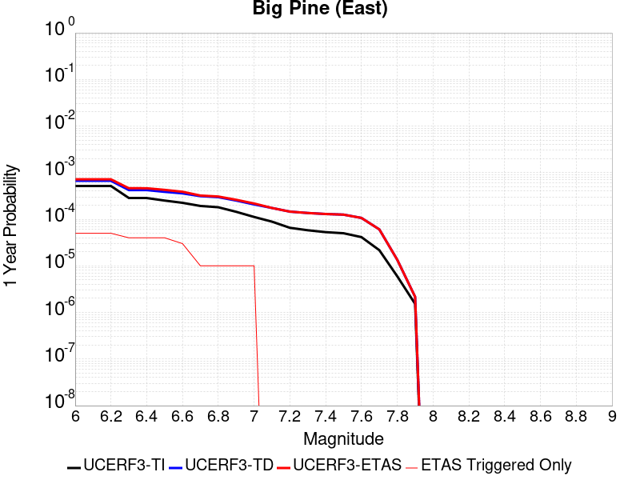 |  |

| Magnitude | 1 wk TI Prob | 1 wk TD Prob | 1 wk ETAS Prob | 1 wk ETAS/TD Gain | 1 wk ETAS Triggered Only | 1 mo TI Prob | 1 mo TD Prob | 1 mo ETAS Prob | 1 mo ETAS/TD Gain | 1 mo ETAS Triggered Only | 1 yr TI Prob | 1 yr TD Prob | 1 yr ETAS Prob | 1 yr ETAS/TD Gain | 1 yr ETAS Triggered Only | 10 yr TI Prob | 10 yr TD Prob | 10 yr ETAS Prob | 10 yr ETAS/TD Gain | 10 yr ETAS Triggered Only |
|-----|-----|-----|-----|-----|-----|-----|-----|-----|-----|-----|-----|-----|-----|-----|-----|-----|-----|-----|-----|-----|
| 6.0 | 9.916913E-6 | 1.2816984E-5 | 1.2816984E-5 | 1.0 | 0.0 | 4.250036E-5 | 5.49289E-5 | 7.322583E-5 | 1.3331019 | 1.8297927E-5 | 5.173191E-4 | 6.685763E-4 | 6.86862E-4 | 1.0273502 | 1.8297927E-5 | 0.0051611643 | 0.006670441 | 0.006706793 | 1.0054497 | 3.6595855E-5 |
| 6.1 | 9.916913E-6 | 1.2816984E-5 | 1.2816984E-5 | 1.0 | 0.0 | 4.250036E-5 | 5.49289E-5 | 7.322583E-5 | 1.3331019 | 1.8297927E-5 | 5.173191E-4 | 6.685763E-4 | 6.86862E-4 | 1.0273502 | 1.8297927E-5 | 0.0051611643 | 0.006670441 | 0.006706793 | 1.0054497 | 3.6595855E-5 |
| 6.2 | 9.916913E-6 | 1.2816984E-5 | 1.2816984E-5 | 1.0 | 0.0 | 4.250036E-5 | 5.49289E-5 | 7.322583E-5 | 1.3331019 | 1.8297927E-5 | 5.173191E-4 | 6.685763E-4 | 6.86862E-4 | 1.0273502 | 1.8297927E-5 | 0.0051611643 | 0.006670441 | 0.006706793 | 1.0054497 | 3.6595855E-5 |
| 6.3 | 5.479711E-6 | 8.112951E-6 | 8.112951E-6 | 1.0 | 0.0 | 2.3484265E-5 | 3.4769346E-5 | 3.4769346E-5 | 1.0 | 0.0 | 2.858834E-4 | 4.2323777E-4 | 4.2323777E-4 | 1.0 | 0.0 | 0.0028551589 | 0.004227244 | 0.004245464 | 1.0043103 | 1.8297927E-5 |
| 6.4 | 5.465009E-6 | 8.097245E-6 | 8.097245E-6 | 1.0 | 0.0 | 2.3421257E-5 | 3.4702036E-5 | 3.4702036E-5 | 1.0 | 0.0 | 2.851165E-4 | 4.2241855E-4 | 4.2241855E-4 | 1.0 | 0.0 | 0.0028475097 | 0.0042190826 | 0.0042373035 | 1.0043186 | 1.8297927E-5 |
| 6.5 | 4.826767E-6 | 7.422301E-6 | 7.422301E-6 | 1.0 | 0.0 | 2.068598E-5 | 3.180949E-5 | 3.180949E-5 | 1.0 | 0.0 | 2.518227E-4 | 3.872145E-4 | 3.872145E-4 | 1.0 | 0.0 | 0.0025153751 | 0.003868283 | 0.0038865102 | 1.004712 | 1.8297927E-5 |
| 6.6 | 4.3146847E-6 | 6.8822374E-6 | 6.8822374E-6 | 1.0 | 0.0 | 1.8491375E-5 | 2.9494982E-5 | 2.9494982E-5 | 1.0 | 0.0 | 2.2510924E-4 | 3.590447E-4 | 3.590447E-4 | 1.0 | 0.0 | 0.0022488134 | 0.0035874986 | 0.0036057308 | 1.0050821 | 1.8297927E-5 |
| 6.7 | 3.6968106E-6 | 5.9954727E-6 | 5.9954727E-6 | 1.0 | 0.0 | 1.5843378E-5 | 2.5694639E-5 | 2.5694639E-5 | 1.0 | 0.0 | 1.9287605E-4 | 3.1278885E-4 | 3.1278885E-4 | 1.0 | 0.0 | 0.0019270873 | 0.0031262483 | 0.003144489 | 1.0058347 | 1.8297927E-5 |
| 6.8 | 3.4671132E-6 | 5.702177E-6 | 5.702177E-6 | 1.0 | 0.0 | 1.4858972E-5 | 2.4437682E-5 | 2.4437682E-5 | 1.0 | 0.0 | 1.8089297E-4 | 2.974896E-4 | 2.974896E-4 | 1.0 | 0.0 | 0.0018074579 | 0.002973667 | 0.0029919108 | 1.006135 | 1.8297927E-5 |
| 6.9 | 2.7686972E-6 | 4.825223E-6 | 4.825223E-6 | 1.0 | 0.0 | 1.1865792E-5 | 2.0679368E-5 | 2.0679368E-5 | 1.0 | 0.0 | 1.4445644E-4 | 2.5174298E-4 | 2.5174298E-4 | 1.0 | 0.0 | 0.0014436257 | 0.0025172636 | 0.0025355157 | 1.0072507 | 1.8297927E-5 |
| 7.0 | 2.1472624E-6 | 3.9850406E-6 | 3.9850406E-6 | 1.0 | 0.0 | 9.20252E-6 | 1.7078637E-5 | 1.7078637E-5 | 1.0 | 0.0 | 1.12034926E-4 | 2.079131E-4 | 2.079131E-4 | 1.0 | 0.0 | 0.0011197845 | 0.0020798394 | 0.002098099 | 1.0087794 | 1.8297927E-5 |
| 7.1 | 1.7018335E-6 | 3.344876E-6 | 3.344876E-6 | 1.0 | 0.0 | 7.293552E-6 | 1.4335106E-5 | 1.4335106E-5 | 1.0 | 0.0 | 8.879537E-5 | 1.7451629E-4 | 1.7451629E-4 | 1.0 | 0.0 | 8.87599E-4 | 0.0017464145 | 0.0017464145 | 1.0 | 0.0 |
| 7.2 | 1.25603E-6 | 2.794484E-6 | 2.794484E-6 | 1.0 | 0.0 | 5.3829745E-6 | 1.1976307E-5 | 1.1976307E-5 | 1.0 | 0.0 | 6.553574E-5 | 1.4580201E-4 | 1.4580201E-4 | 1.0 | 0.0 | 6.551642E-4 | 0.001459661 | 0.001459661 | 1.0 | 0.0 |
| 7.3 | 1.112297E-6 | 2.610332E-6 | 2.610332E-6 | 1.0 | 0.0 | 4.7669787E-6 | 1.118709E-5 | 1.118709E-5 | 1.0 | 0.0 | 5.803642E-5 | 1.3619453E-4 | 1.3619453E-4 | 1.0 | 0.0 | 5.802127E-4 | 0.0013635408 | 0.0013635408 | 1.0 | 0.0 |
| 7.4 | 1.0137181E-6 | 2.4834917E-6 | 2.4834917E-6 | 1.0 | 0.0 | 4.3444993E-6 | 1.0643494E-5 | 1.0643494E-5 | 1.0 | 0.0 | 5.2892992E-5 | 1.2957705E-4 | 1.2957705E-4 | 1.0 | 0.0 | 5.288041E-4 | 0.0012972289 | 0.0012972289 | 1.0 | 0.0 |
| 7.5 | 9.598608E-7 | 2.4071483E-6 | 2.4071483E-6 | 1.0 | 0.0 | 4.1136827E-6 | 1.031631E-5 | 1.031631E-5 | 1.0 | 0.0 | 5.0082934E-5 | 1.2559404E-4 | 1.2559404E-4 | 1.0 | 0.0 | 5.007165E-4 | 0.0012572526 | 0.0012572526 | 1.0 | 0.0 |
| 7.6 | 7.929459E-7 | 2.0448588E-6 | 2.0448588E-6 | 1.0 | 0.0 | 3.3983351E-6 | 8.763653E-6 | 8.763653E-6 | 1.0 | 0.0 | 4.1373947E-5 | 1.06692416E-4 | 1.06692416E-4 | 1.0 | 0.0 | 4.1366243E-4 | 0.0010685222 | 0.0010685222 | 1.0 | 0.0 |
| 7.7 | 4.155788E-7 | 1.1605589E-6 | 1.1605589E-6 | 1.0 | 0.0 | 1.7810507E-6 | 4.9738146E-6 | 4.9738146E-6 | 1.0 | 0.0 | 2.1684076E-5 | 6.0554554E-5 | 6.0554554E-5 | 1.0 | 0.0 | 2.1681961E-4 | 6.0857297E-4 | 6.0857297E-4 | 1.0 | 0.0 |
| 7.8 | 1.14666925E-7 | 2.592015E-7 | 2.592015E-7 | 1.0 | 0.0 | 4.914296E-7 | 1.1108631E-6 | 1.1108631E-6 | 1.0 | 0.0 | 5.9831386E-6 | 1.3524678E-5 | 1.3524678E-5 | 1.0 | 0.0 | 5.9829777E-5 | 1.3634123E-4 | 1.3634123E-4 | 1.0 | 0.0 |
| 7.9 | 2.9231824E-8 | 4.1463963E-8 | 4.1463963E-8 | 1.0 | 0.0 | 1.2527924E-7 | 1.7770269E-7 | 1.7770269E-7 | 1.0 | 0.0 | 1.5252737E-6 | 2.1635283E-6 | 2.1635283E-6 | 1.0 | 0.0 | 1.5252632E-5 | 2.1967755E-5 | 2.1967755E-5 | 1.0 | 0.0 |

## Palos Verdes
*[(top)](#table-of-contents)*

| 1 Week | 1 Month | 1 Year | 10 Year |
|-----|-----|-----|-----|
|  |  |  | 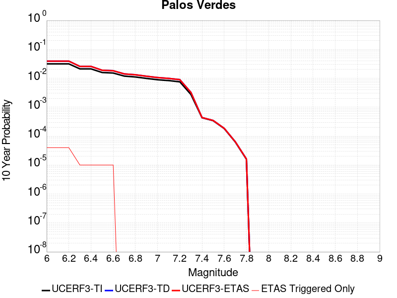 |

| Magnitude | 1 wk TI Prob | 1 wk TD Prob | 1 wk ETAS Prob | 1 wk ETAS/TD Gain | 1 wk ETAS Triggered Only | 1 mo TI Prob | 1 mo TD Prob | 1 mo ETAS Prob | 1 mo ETAS/TD Gain | 1 mo ETAS Triggered Only | 1 yr TI Prob | 1 yr TD Prob | 1 yr ETAS Prob | 1 yr ETAS/TD Gain | 1 yr ETAS Triggered Only | 10 yr TI Prob | 10 yr TD Prob | 10 yr ETAS Prob | 10 yr ETAS/TD Gain | 10 yr ETAS Triggered Only |
|-----|-----|-----|-----|-----|-----|-----|-----|-----|-----|-----|-----|-----|-----|-----|-----|-----|-----|-----|-----|-----|
| 6.0 | 6.126063E-5 | 7.622612E-5 | 7.622612E-5 | 1.0 | 0.0 | 2.6251914E-4 | 3.2664582E-4 | 3.2664582E-4 | 1.0 | 0.0 | 0.0031914865 | 0.003970174 | 0.0039883996 | 1.0045905 | 1.8297927E-5 | 0.031460393 | 0.039048895 | 0.039084062 | 1.0009006 | 3.6595855E-5 |
| 6.1 | 6.126063E-5 | 7.622612E-5 | 7.622612E-5 | 1.0 | 0.0 | 2.6251914E-4 | 3.2664582E-4 | 3.2664582E-4 | 1.0 | 0.0 | 0.0031914865 | 0.003970174 | 0.0039883996 | 1.0045905 | 1.8297927E-5 | 0.031460393 | 0.039048895 | 0.039084062 | 1.0009006 | 3.6595855E-5 |
| 6.2 | 6.126063E-5 | 7.622612E-5 | 7.622612E-5 | 1.0 | 0.0 | 2.6251914E-4 | 3.2664582E-4 | 3.2664582E-4 | 1.0 | 0.0 | 0.0031914865 | 0.003970174 | 0.0039883996 | 1.0045905 | 1.8297927E-5 | 0.031460393 | 0.039048895 | 0.039084062 | 1.0009006 | 3.6595855E-5 |
| 6.3 | 4.0838047E-5 | 4.9749437E-5 | 4.9749437E-5 | 1.0 | 0.0 | 1.7500846E-4 | 2.1319572E-4 | 2.1319572E-4 | 1.0 | 0.0 | 0.0021286458 | 0.0025927818 | 0.0025927818 | 1.0 | 0.0 | 0.021083709 | 0.025646681 | 0.025646681 | 1.0 | 0.0 |
| 6.4 | 4.0838047E-5 | 4.9749437E-5 | 4.9749437E-5 | 1.0 | 0.0 | 1.7500846E-4 | 2.1319572E-4 | 2.1319572E-4 | 1.0 | 0.0 | 0.0021286458 | 0.0025927818 | 0.0025927818 | 1.0 | 0.0 | 0.021083709 | 0.025646681 | 0.025646681 | 1.0 | 0.0 |
| 6.5 | 3.0512005E-5 | 3.656162E-5 | 3.656162E-5 | 1.0 | 0.0 | 1.3075917E-4 | 1.5668393E-4 | 1.5668393E-4 | 1.0 | 0.0 | 0.0015908304 | 0.0019060767 | 0.0019060767 | 1.0 | 0.0 | 0.015794903 | 0.018909154 | 0.018909154 | 1.0 | 0.0 |
| 6.6 | 2.9255087E-5 | 3.515442E-5 | 3.515442E-5 | 1.0 | 0.0 | 1.2537291E-4 | 1.5065377E-4 | 1.5065377E-4 | 1.0 | 0.0 | 0.0015253464 | 0.0018327828 | 0.0018327828 | 1.0 | 0.0 | 0.015149189 | 0.018188225 | 0.018188225 | 1.0 | 0.0 |
| 6.7 | 2.287198E-5 | 2.7248278E-5 | 2.7248278E-5 | 1.0 | 0.0 | 9.801909E-5 | 1.16773626E-4 | 1.16773626E-4 | 1.0 | 0.0 | 0.001192729 | 0.0014208833 | 0.0014208833 | 1.0 | 0.0 | 0.011863477 | 0.014127217 | 0.014127217 | 1.0 | 0.0 |
| 6.8 | 2.1325764E-5 | 2.5431877E-5 | 2.5431877E-5 | 1.0 | 0.0 | 9.139293E-5 | 1.0898971E-4 | 1.0898971E-4 | 1.0 | 0.0 | 0.001112141 | 0.0013262323 | 0.0013262323 | 1.0 | 0.0 | 0.011065915 | 0.013192211 | 0.013192211 | 1.0 | 0.0 |
| 6.9 | 1.9009392E-5 | 2.2613547E-5 | 2.2613547E-5 | 1.0 | 0.0 | 8.1466285E-5 | 9.6912096E-5 | 9.6912096E-5 | 1.0 | 0.0 | 9.914007E-4 | 0.0011793535 | 0.0011793535 | 1.0 | 0.0 | 0.009869894 | 0.011739632 | 0.011739632 | 1.0 | 0.0 |
| 7.0 | 1.7098473E-5 | 2.0319356E-5 | 2.0319356E-5 | 1.0 | 0.0 | 7.3277115E-5 | 8.708052E-5 | 8.708052E-5 | 1.0 | 0.0 | 8.917837E-4 | 0.001059775 | 0.001059775 | 1.0 | 0.0 | 0.008882134 | 0.010555646 | 0.010555646 | 1.0 | 0.0 |
| 7.1 | 1.5982785E-5 | 1.899476E-5 | 1.899476E-5 | 1.0 | 0.0 | 6.849585E-5 | 8.1404054E-5 | 8.1404054E-5 | 1.0 | 0.0 | 8.336179E-4 | 9.907284E-4 | 9.907284E-4 | 1.0 | 0.0 | 0.008304977 | 0.009871479 | 0.009871479 | 1.0 | 0.0 |
| 7.2 | 1.4468002E-5 | 1.7197237E-5 | 1.7197237E-5 | 1.0 | 0.0 | 6.200425E-5 | 7.370083E-5 | 7.370083E-5 | 1.0 | 0.0 | 7.546402E-4 | 8.970222E-4 | 8.970222E-4 | 1.0 | 0.0 | 0.007520827 | 0.008942284 | 0.008942284 | 1.0 | 0.0 |
| 7.3 | 5.288233E-6 | 6.2036747E-6 | 6.2036747E-6 | 1.0 | 0.0 | 2.2663658E-5 | 2.6587102E-5 | 2.6587102E-5 | 1.0 | 0.0 | 2.7589512E-4 | 3.236848E-4 | 3.236848E-4 | 1.0 | 0.0 | 0.0027555283 | 0.0032355562 | 0.0032355562 | 1.0 | 0.0 |
| 7.4 | 8.279556E-7 | 8.408347E-7 | 8.408347E-7 | 1.0 | 0.0 | 3.5483763E-6 | 3.6035726E-6 | 3.6035726E-6 | 1.0 | 0.0 | 4.3200624E-5 | 4.3872686E-5 | 4.3872686E-5 | 1.0 | 0.0 | 4.3192226E-4 | 4.3864746E-4 | 4.3864746E-4 | 1.0 | 0.0 |
| 7.5 | 6.559831E-7 | 6.667229E-7 | 6.667229E-7 | 1.0 | 0.0 | 2.8113532E-6 | 2.857381E-6 | 2.857381E-6 | 1.0 | 0.0 | 3.4227687E-5 | 3.4788125E-5 | 3.4788125E-5 | 1.0 | 0.0 | 3.4222414E-4 | 3.4783344E-4 | 3.4783344E-4 | 1.0 | 0.0 |
| 7.6 | 3.5018968E-7 | 3.5620027E-7 | 3.5620027E-7 | 1.0 | 0.0 | 1.500812E-6 | 1.526572E-6 | 1.526572E-6 | 1.0 | 0.0 | 1.8272232E-5 | 1.8585903E-5 | 1.8585903E-5 | 1.0 | 0.0 | 1.8270731E-4 | 1.8584808E-4 | 1.8584808E-4 | 1.0 | 0.0 |
| 7.7 | 1.1986104E-7 | 1.2198376E-7 | 1.2198376E-7 | 1.0 | 0.0 | 5.1369005E-7 | 5.2278745E-7 | 5.2278745E-7 | 1.0 | 0.0 | 6.2541585E-6 | 6.364919E-6 | 6.364919E-6 | 1.0 | 0.0 | 6.2539824E-5 | 6.364741E-5 | 6.364741E-5 | 1.0 | 0.0 |
| 7.8 | 3.0445005E-8 | 3.1027582E-8 | 3.1027582E-8 | 1.0 | 0.0 | 1.3047858E-7 | 1.3297536E-7 | 1.3297536E-7 | 1.0 | 0.0 | 1.5885756E-6 | 1.6189739E-6 | 1.6189739E-6 | 1.0 | 0.0 | 1.5885644E-5 | 1.6189642E-5 | 1.6189642E-5 | 1.0 | 0.0 |

## Los Alamos extension
*[(top)](#table-of-contents)*

| 1 Week | 1 Month | 1 Year | 10 Year |
|-----|-----|-----|-----|
|  | 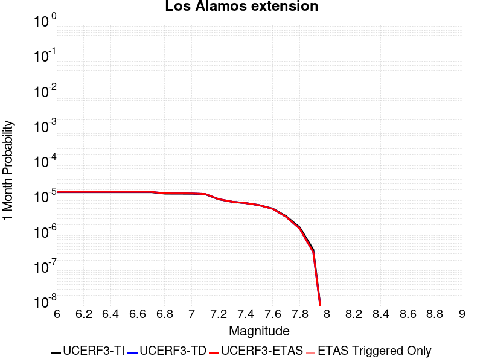 |  |  |

| Magnitude | 1 wk TI Prob | 1 wk TD Prob | 1 wk ETAS Prob | 1 wk ETAS/TD Gain | 1 wk ETAS Triggered Only | 1 mo TI Prob | 1 mo TD Prob | 1 mo ETAS Prob | 1 mo ETAS/TD Gain | 1 mo ETAS Triggered Only | 1 yr TI Prob | 1 yr TD Prob | 1 yr ETAS Prob | 1 yr ETAS/TD Gain | 1 yr ETAS Triggered Only | 10 yr TI Prob | 10 yr TD Prob | 10 yr ETAS Prob | 10 yr ETAS/TD Gain | 10 yr ETAS Triggered Only |
|-----|-----|-----|-----|-----|-----|-----|-----|-----|-----|-----|-----|-----|-----|-----|-----|-----|-----|-----|-----|-----|
| 6.0 | 4.0146506E-6 | 4.0861596E-6 | 4.0861596E-6 | 1.0 | 0.0 | 1.7205533E-5 | 1.7512002E-5 | 1.7512002E-5 | 1.0 | 0.0 | 2.0945723E-4 | 2.1318886E-4 | 2.3148289E-4 | 1.0858114 | 1.8297927E-5 | 0.0020925992 | 0.0021299527 | 0.0021664705 | 1.0171449 | 3.6595855E-5 |
| 6.1 | 4.0146506E-6 | 4.0861596E-6 | 4.0861596E-6 | 1.0 | 0.0 | 1.7205533E-5 | 1.7512002E-5 | 1.7512002E-5 | 1.0 | 0.0 | 2.0945723E-4 | 2.1318886E-4 | 2.3148289E-4 | 1.0858114 | 1.8297927E-5 | 0.0020925992 | 0.0021299527 | 0.0021664705 | 1.0171449 | 3.6595855E-5 |
| 6.2 | 4.0146506E-6 | 4.0861596E-6 | 4.0861596E-6 | 1.0 | 0.0 | 1.7205533E-5 | 1.7512002E-5 | 1.7512002E-5 | 1.0 | 0.0 | 2.0945723E-4 | 2.1318886E-4 | 2.3148289E-4 | 1.0858114 | 1.8297927E-5 | 0.0020925992 | 0.0021299527 | 0.0021664705 | 1.0171449 | 3.6595855E-5 |
| 6.3 | 4.0146506E-6 | 4.0861596E-6 | 4.0861596E-6 | 1.0 | 0.0 | 1.7205533E-5 | 1.7512002E-5 | 1.7512002E-5 | 1.0 | 0.0 | 2.0945723E-4 | 2.1318886E-4 | 2.3148289E-4 | 1.0858114 | 1.8297927E-5 | 0.0020925992 | 0.0021299527 | 0.0021664705 | 1.0171449 | 3.6595855E-5 |
| 6.4 | 4.0146506E-6 | 4.0861596E-6 | 4.0861596E-6 | 1.0 | 0.0 | 1.7205533E-5 | 1.7512002E-5 | 1.7512002E-5 | 1.0 | 0.0 | 2.0945723E-4 | 2.1318886E-4 | 2.3148289E-4 | 1.0858114 | 1.8297927E-5 | 0.0020925992 | 0.0021299527 | 0.0021664705 | 1.0171449 | 3.6595855E-5 |
| 6.5 | 4.0146506E-6 | 4.0861596E-6 | 4.0861596E-6 | 1.0 | 0.0 | 1.7205533E-5 | 1.7512002E-5 | 1.7512002E-5 | 1.0 | 0.0 | 2.0945723E-4 | 2.1318886E-4 | 2.3148289E-4 | 1.0858114 | 1.8297927E-5 | 0.0020925992 | 0.0021299527 | 0.0021664705 | 1.0171449 | 3.6595855E-5 |
| 6.6 | 4.0146506E-6 | 4.0861596E-6 | 4.0861596E-6 | 1.0 | 0.0 | 1.7205533E-5 | 1.7512002E-5 | 1.7512002E-5 | 1.0 | 0.0 | 2.0945723E-4 | 2.1318886E-4 | 2.3148289E-4 | 1.0858114 | 1.8297927E-5 | 0.0020925992 | 0.0021299527 | 0.0021664705 | 1.0171449 | 3.6595855E-5 |
| 6.7 | 4.0146506E-6 | 4.0861596E-6 | 4.0861596E-6 | 1.0 | 0.0 | 1.7205533E-5 | 1.7512002E-5 | 1.7512002E-5 | 1.0 | 0.0 | 2.0945723E-4 | 2.1318886E-4 | 2.3148289E-4 | 1.0858114 | 1.8297927E-5 | 0.0020925992 | 0.0021299527 | 0.0021664705 | 1.0171449 | 3.6595855E-5 |
| 6.8 | 3.6584688E-6 | 3.7188588E-6 | 3.7188588E-6 | 1.0 | 0.0 | 1.5679057E-5 | 1.5937874E-5 | 1.5937874E-5 | 1.0 | 0.0 | 1.9087581E-4 | 1.9402728E-4 | 2.1232165E-4 | 1.0942876 | 1.8297927E-5 | 0.0019071194 | 0.0019386712 | 0.0019751962 | 1.0188402 | 3.6595855E-5 |
| 6.9 | 3.644631E-6 | 3.7045688E-6 | 3.7045688E-6 | 1.0 | 0.0 | 1.5619753E-5 | 1.5876632E-5 | 1.5876632E-5 | 1.0 | 0.0 | 1.901539E-4 | 1.9328178E-4 | 2.1157617E-4 | 1.0946513 | 1.8297927E-5 | 0.0018999127 | 0.0019312293 | 0.0019677544 | 1.0189129 | 3.6595855E-5 |
| 7.0 | 3.6318522E-6 | 3.6913295E-6 | 3.6913295E-6 | 1.0 | 0.0 | 1.5564989E-5 | 1.5819893E-5 | 1.5819893E-5 | 1.0 | 0.0 | 1.8948725E-4 | 1.925911E-4 | 2.1088551E-4 | 1.0949908 | 1.8297927E-5 | 0.0018932576 | 0.0019243343 | 0.0019608599 | 1.0189809 | 3.6595855E-5 |
| 7.1 | 3.5001724E-6 | 3.5554E-6 | 3.5554E-6 | 1.0 | 0.0 | 1.5000653E-5 | 1.5237345E-5 | 1.5237345E-5 | 1.0 | 0.0 | 1.8261763E-4 | 1.854998E-4 | 2.0379433E-4 | 1.0986229 | 1.8297927E-5 | 0.0018246764 | 0.0018535402 | 0.0018900683 | 1.0197072 | 3.6595855E-5 |
| 7.2 | 2.5204702E-6 | 2.5436943E-6 | 2.5436943E-6 | 1.0 | 0.0 | 1.080197E-5 | 1.0901502E-5 | 1.0901502E-5 | 1.0 | 0.0 | 1.3150605E-4 | 1.3271775E-4 | 1.5101326E-4 | 1.1378527 | 1.8297927E-5 | 0.0013142825 | 0.0013263905 | 0.0013629379 | 1.0275539 | 3.6595855E-5 |
| 7.3 | 2.1399692E-6 | 2.1501316E-6 | 2.1501316E-6 | 1.0 | 0.0 | 9.1712645E-6 | 9.2148175E-6 | 9.2148175E-6 | 1.0 | 0.0 | 1.1165442E-4 | 1.1218466E-4 | 1.1218466E-4 | 1.0 | 0.0 | 0.0011159834 | 0.0011212835 | 0.001139561 | 1.0163004 | 1.8297927E-5 |
| 7.4 | 1.9660122E-6 | 1.9702363E-6 | 1.9702363E-6 | 1.0 | 0.0 | 8.42574E-6 | 8.4438425E-6 | 8.4438425E-6 | 1.0 | 0.0 | 1.0257855E-4 | 1.0279897E-4 | 1.0279897E-4 | 1.0 | 0.0 | 0.0010253121 | 0.0010275173 | 0.0010457964 | 1.0177896 | 1.8297927E-5 |
| 7.5 | 1.7204633E-6 | 1.7150983E-6 | 1.7150983E-6 | 1.0 | 0.0 | 7.373393E-6 | 7.3504007E-6 | 7.3504007E-6 | 1.0 | 0.0 | 8.976737E-5 | 8.948748E-5 | 8.948748E-5 | 1.0 | 0.0 | 8.9731114E-4 | 8.9451746E-4 | 9.1279903E-4 | 1.0204374 | 1.8297927E-5 |
| 7.6 | 1.3717638E-6 | 1.3535827E-6 | 1.3535827E-6 | 1.0 | 0.0 | 5.878974E-6 | 5.8010555E-6 | 5.8010555E-6 | 1.0 | 0.0 | 7.157416E-5 | 7.062559E-5 | 7.062559E-5 | 1.0 | 0.0 | 7.1551115E-4 | 7.060341E-4 | 7.243191E-4 | 1.0258982 | 1.8297927E-5 |
| 7.7 | 8.272564E-7 | 7.957636E-7 | 7.957636E-7 | 1.0 | 0.0 | 3.5453797E-6 | 3.410411E-6 | 3.410411E-6 | 1.0 | 0.0 | 4.3164142E-5 | 4.1520965E-5 | 4.1520965E-5 | 1.0 | 0.0 | 4.315576E-4 | 4.1513226E-4 | 4.334226E-4 | 1.044059 | 1.8297927E-5 |
| 7.8 | 3.9708277E-7 | 3.6719027E-7 | 3.6719027E-7 | 1.0 | 0.0 | 1.7017821E-6 | 1.5736716E-6 | 1.5736716E-6 | 1.0 | 0.0 | 2.0719E-5 | 1.9159284E-5 | 1.9159284E-5 | 1.0 | 0.0 | 2.071707E-4 | 1.9157639E-4 | 1.9157639E-4 | 1.0 | 0.0 |
| 7.9 | 9.292528E-8 | 7.889087E-8 | 7.889087E-8 | 1.0 | 0.0 | 3.9825116E-7 | 3.381037E-7 | 3.381037E-7 | 1.0 | 0.0 | 4.848697E-6 | 4.116405E-6 | 4.116405E-6 | 1.0 | 0.0 | 4.8485912E-5 | 4.1163294E-5 | 4.1163294E-5 | 1.0 | 0.0 |
| 8.0 | 7.880441E-11 | 8.2353124E-11 | 8.2353124E-11 | 1.0 | 0.0 | 3.3773329E-10 | 3.52942E-10 | 3.52942E-10 | 1.0 | 0.0 | 4.1119033E-9 | 4.2970694E-9 | 4.2970694E-9 | 1.0 | 0.0 | 4.1119034E-8 | 4.2970694E-8 | 4.2970694E-8 | 1.0 | 0.0 |

## San Gregorio (North) 2011 CFM
*[(top)](#table-of-contents)*

| 1 Week | 1 Month | 1 Year | 10 Year |
|-----|-----|-----|-----|
|  | 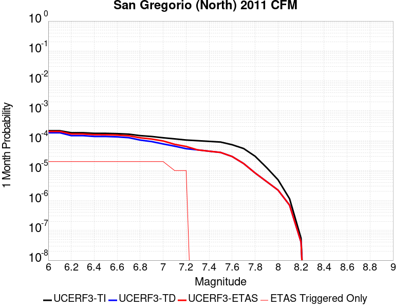 |  | 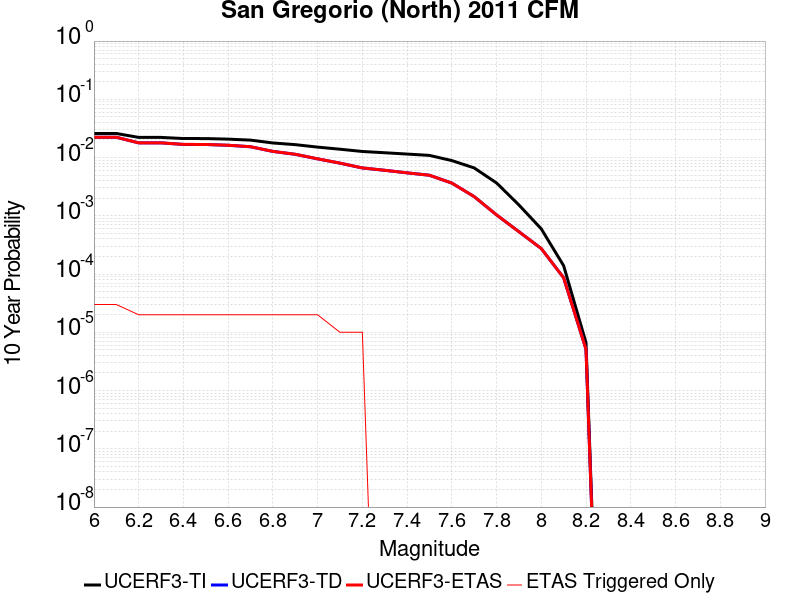 |

| Magnitude | 1 wk TI Prob | 1 wk TD Prob | 1 wk ETAS Prob | 1 wk ETAS/TD Gain | 1 wk ETAS Triggered Only | 1 mo TI Prob | 1 mo TD Prob | 1 mo ETAS Prob | 1 mo ETAS/TD Gain | 1 mo ETAS Triggered Only | 1 yr TI Prob | 1 yr TD Prob | 1 yr ETAS Prob | 1 yr ETAS/TD Gain | 1 yr ETAS Triggered Only | 10 yr TI Prob | 10 yr TD Prob | 10 yr ETAS Prob | 10 yr ETAS/TD Gain | 10 yr ETAS Triggered Only |
|-----|-----|-----|-----|-----|-----|-----|-----|-----|-----|-----|-----|-----|-----|-----|-----|-----|-----|-----|-----|-----|
| 6.0 | 5.0283932E-5 | 4.3057815E-5 | 6.135495E-5 | 1.4249436 | 1.8297927E-5 | 2.1548476E-4 | 1.8452053E-4 | 2.0281508E-4 | 1.0991464 | 1.8297927E-5 | 0.0026203706 | 0.002244237 | 0.0022624938 | 1.008135 | 1.8297927E-5 | 0.02589687 | 0.022293162 | 0.022328943 | 1.001605 | 3.6595855E-5 |
| 6.1 | 5.0283932E-5 | 4.3057815E-5 | 6.135495E-5 | 1.4249436 | 1.8297927E-5 | 2.1548476E-4 | 1.8452053E-4 | 2.0281508E-4 | 1.0991464 | 1.8297927E-5 | 0.0026203706 | 0.002244237 | 0.0022624938 | 1.008135 | 1.8297927E-5 | 0.02589687 | 0.022293162 | 0.022328943 | 1.001605 | 3.6595855E-5 |
| 6.2 | 4.2998647E-5 | 3.4441564E-5 | 5.2738862E-5 | 1.5312563 | 1.8297927E-5 | 1.842669E-4 | 1.475984E-4 | 1.6589362E-4 | 1.1239527 | 1.8297927E-5 | 0.0022411412 | 0.00179554 | 0.0018138051 | 1.0101725 | 1.8297927E-5 | 0.022186736 | 0.017886506 | 0.017904477 | 1.0010047 | 1.8297927E-5 |
| 6.3 | 4.2998647E-5 | 3.4441564E-5 | 5.2738862E-5 | 1.5312563 | 1.8297927E-5 | 1.842669E-4 | 1.475984E-4 | 1.6589362E-4 | 1.1239527 | 1.8297927E-5 | 0.0022411412 | 0.00179554 | 0.0018138051 | 1.0101725 | 1.8297927E-5 | 0.022186736 | 0.017886506 | 0.017904477 | 1.0010047 | 1.8297927E-5 |
| 6.4 | 4.1101295E-5 | 3.2326872E-5 | 5.0624207E-5 | 1.5660101 | 1.8297927E-5 | 1.7613651E-4 | 1.3853642E-4 | 1.5683181E-4 | 1.132062 | 1.8297927E-5 | 0.0021423528 | 0.0016853869 | 0.001703654 | 1.0108385 | 1.8297927E-5 | 0.02121817 | 0.016801886 | 0.016819876 | 1.0010707 | 1.8297927E-5 |
| 6.5 | 4.1032585E-5 | 3.2244905E-5 | 5.0542243E-5 | 1.567449 | 1.8297927E-5 | 1.7584208E-4 | 1.3818518E-4 | 1.5648057E-4 | 1.1323977 | 1.8297927E-5 | 0.0021387753 | 0.0016811171 | 0.0016993843 | 1.010866 | 1.8297927E-5 | 0.021183075 | 0.016759839 | 0.01677783 | 1.0010735 | 1.8297927E-5 |
| 6.6 | 4.011629E-5 | 3.1266558E-5 | 4.956391E-5 | 1.5852053 | 1.8297927E-5 | 1.7191563E-4 | 1.339927E-4 | 1.5228816E-4 | 1.1365409 | 1.8297927E-5 | 0.0020910634 | 0.0016301516 | 0.0016484197 | 1.0112064 | 1.8297927E-5 | 0.020714961 | 0.01625741 | 0.016275411 | 1.0011072 | 1.8297927E-5 |
| 6.7 | 3.8583938E-5 | 2.9453593E-5 | 4.7750982E-5 | 1.6212277 | 1.8297927E-5 | 1.6534925E-4 | 1.2622366E-4 | 1.4451928E-4 | 1.144946 | 1.8297927E-5 | 0.0020112682 | 0.0015357039 | 0.0015539738 | 1.0118967 | 1.8297927E-5 | 0.019931622 | 0.015325955 | 0.0153439725 | 1.0011756 | 1.8297927E-5 |
| 6.8 | 3.44341E-5 | 2.4450854E-5 | 4.2748336E-5 | 1.748337 | 1.8297927E-5 | 1.4756636E-4 | 1.0478523E-4 | 1.2308123E-4 | 1.1746049 | 1.8297927E-5 | 0.0017951399 | 0.0012750238 | 0.0012932984 | 1.0143328 | 1.8297927E-5 | 0.017807078 | 0.012751131 | 0.012769196 | 1.0014167 | 1.8297927E-5 |
| 6.9 | 3.221199E-5 | 2.1778029E-5 | 4.007556E-5 | 1.8401829 | 1.8297927E-5 | 1.3804408E-4 | 9.333112E-5 | 1.1162734E-4 | 1.1960356 | 1.8297927E-5 | 0.0016793909 | 0.0011357224 | 0.0011539995 | 1.016093 | 1.8297927E-5 | 0.01666756 | 0.011372583 | 0.011390673 | 1.0015906 | 1.8297927E-5 |
| 7.0 | 2.9186718E-5 | 1.8146875E-5 | 3.6444468E-5 | 2.0083055 | 1.8297927E-5 | 1.2507994E-4 | 7.7770026E-5 | 9.606653E-5 | 1.2352642 | 1.8297927E-5 | 0.0015217843 | 9.464431E-4 | 9.647237E-4 | 1.0193151 | 1.8297927E-5 | 0.015114053 | 0.009496798 | 0.009514922 | 1.0019084 | 1.8297927E-5 |
| 7.1 | 2.6840138E-5 | 1.5284508E-5 | 1.5284508E-5 | 1.0 | 0.0 | 1.1502409E-4 | 6.55034E-5 | 6.55034E-5 | 1.0 | 0.0 | 0.0013995186 | 7.9721404E-4 | 7.9721404E-4 | 1.0 | 0.0 | 0.013907375 | 0.008015723 | 0.008015723 | 1.0 | 0.0 |
| 7.2 | 2.453002E-5 | 1.2606672E-5 | 1.2606672E-5 | 1.0 | 0.0 | 1.05124425E-4 | 5.4027478E-5 | 5.4027478E-5 | 1.0 | 0.0 | 0.0012791384 | 6.575866E-4 | 6.575866E-4 | 1.0 | 0.0 | 0.012718005 | 0.00662763 | 0.00662763 | 1.0 | 0.0 |
| 7.3 | 2.3330727E-5 | 1.1488677E-5 | 1.1488677E-5 | 1.0 | 0.0 | 9.9985E-5 | 4.923626E-5 | 4.923626E-5 | 1.0 | 0.0 | 0.0012166376 | 5.9928704E-4 | 5.9928704E-4 | 1.0 | 0.0 | 0.012099981 | 0.006046564 | 0.006046564 | 1.0 | 0.0 |
| 7.4 | 2.2136466E-5 | 1.0368981E-5 | 1.0368981E-5 | 1.0 | 0.0 | 9.486712E-5 | 4.4437733E-5 | 4.4437733E-5 | 1.0 | 0.0 | 0.0011543952 | 5.4089533E-4 | 5.4089533E-4 | 1.0 | 0.0 | 0.011484168 | 0.005464249 | 0.005464249 | 1.0 | 0.0 |
| 7.5 | 2.0994974E-5 | 9.427217E-6 | 9.427217E-6 | 1.0 | 0.0 | 8.997535E-5 | 4.0401734E-5 | 4.0401734E-5 | 1.0 | 0.0 | 0.0010948994 | 4.9178035E-4 | 4.9178035E-4 | 1.0 | 0.0 | 0.010895205 | 0.004973358 | 0.004973358 | 1.0 | 0.0 |
| 7.6 | 1.7091823E-5 | 6.893766E-6 | 6.893766E-6 | 1.0 | 0.0 | 7.3248615E-5 | 2.9544377E-5 | 2.9544377E-5 | 1.0 | 0.0 | 8.9143694E-4 | 3.596435E-4 | 3.596435E-4 | 1.0 | 0.0 | 0.008878695 | 0.0036482841 | 0.0036482841 | 1.0 | 0.0 |
| 7.7 | 1.2772179E-5 | 4.0208706E-6 | 4.0208706E-6 | 1.0 | 0.0 | 5.473676E-5 | 1.7232189E-5 | 1.7232189E-5 | 1.0 | 0.0 | 6.6621625E-4 | 2.0978172E-4 | 2.0978172E-4 | 1.0 | 0.0 | 0.006642225 | 0.002136922 | 0.002136922 | 1.0 | 0.0 |
| 7.8 | 7.041923E-6 | 1.940626E-6 | 1.940626E-6 | 1.0 | 0.0 | 3.017932E-5 | 8.316942E-6 | 8.316942E-6 | 1.0 | 0.0 | 3.6737128E-4 | 1.0125406E-4 | 1.0125406E-4 | 1.0 | 0.0 | 0.0036676454 | 0.0010379003 | 0.0010379003 | 1.0 | 0.0 |
| 7.9 | 2.946768E-6 | 1.0033551E-6 | 1.0033551E-6 | 1.0 | 0.0 | 1.2628945E-5 | 4.300086E-6 | 4.300086E-6 | 1.0 | 0.0 | 1.5374656E-4 | 5.235229E-5 | 5.235229E-5 | 1.0 | 0.0 | 0.0015364023 | 5.3400313E-4 | 5.3400313E-4 | 1.0 | 0.0 |
| 8.0 | 1.1433375E-6 | 5.18146E-7 | 5.18146E-7 | 1.0 | 0.0 | 4.9000087E-6 | 2.2206239E-6 | 2.2206239E-6 | 1.0 | 0.0 | 5.965597E-5 | 2.703576E-5 | 2.703576E-5 | 1.0 | 0.0 | 5.963996E-4 | 2.7398416E-4 | 2.7398416E-4 | 1.0 | 0.0 |
| 8.1 | 2.6675295E-7 | 1.62899E-7 | 1.62899E-7 | 1.0 | 0.0 | 1.1432264E-6 | 6.9813836E-7 | 6.9813836E-7 | 1.0 | 0.0 | 1.3918692E-5 | 8.499802E-6 | 8.499802E-6 | 1.0 | 0.0 | 1.391782E-4 | 8.63795E-5 | 8.63795E-5 | 1.0 | 0.0 |
| 8.2 | 1.2704569E-8 | 9.431393E-9 | 9.431393E-9 | 1.0 | 0.0 | 5.444815E-8 | 4.042026E-8 | 4.042026E-8 | 1.0 | 0.0 | 6.629061E-7 | 4.9211656E-7 | 4.9211656E-7 | 1.0 | 0.0 | 6.629041E-6 | 5.1121438E-6 | 5.1121438E-6 | 1.0 | 0.0 |

## Great Valley 06 (Midland) 2011 CFM alt1
*[(top)](#table-of-contents)*

| 1 Week | 1 Month | 1 Year | 10 Year |
|-----|-----|-----|-----|
|  |  |  |  |

| Magnitude | 1 wk TI Prob | 1 wk TD Prob | 1 wk ETAS Prob | 1 wk ETAS/TD Gain | 1 wk ETAS Triggered Only | 1 mo TI Prob | 1 mo TD Prob | 1 mo ETAS Prob | 1 mo ETAS/TD Gain | 1 mo ETAS Triggered Only | 1 yr TI Prob | 1 yr TD Prob | 1 yr ETAS Prob | 1 yr ETAS/TD Gain | 1 yr ETAS Triggered Only | 10 yr TI Prob | 10 yr TD Prob | 10 yr ETAS Prob | 10 yr ETAS/TD Gain | 10 yr ETAS Triggered Only |
|-----|-----|-----|-----|-----|-----|-----|-----|-----|-----|-----|-----|-----|-----|-----|-----|-----|-----|-----|-----|-----|
| 6.0 | 1.2712525E-5 | 1.3210576E-5 | 3.150826E-5 | 2.3850784 | 1.8297927E-5 | 5.4481112E-5 | 5.6615667E-5 | 7.491256E-5 | 1.3231772 | 1.8297927E-5 | 6.6310563E-4 | 6.8910315E-4 | 7.0738845E-4 | 1.0265349 | 1.8297927E-5 | 0.0066113044 | 0.006872179 | 0.0069085234 | 1.0052886 | 3.6595855E-5 |
| 6.1 | 1.2712525E-5 | 1.3210576E-5 | 3.150826E-5 | 2.3850784 | 1.8297927E-5 | 5.4481112E-5 | 5.6615667E-5 | 7.491256E-5 | 1.3231772 | 1.8297927E-5 | 6.6310563E-4 | 6.8910315E-4 | 7.0738845E-4 | 1.0265349 | 1.8297927E-5 | 0.0066113044 | 0.006872179 | 0.0069085234 | 1.0052886 | 3.6595855E-5 |
| 6.2 | 1.2712525E-5 | 1.3210576E-5 | 3.150826E-5 | 2.3850784 | 1.8297927E-5 | 5.4481112E-5 | 5.6615667E-5 | 7.491256E-5 | 1.3231772 | 1.8297927E-5 | 6.6310563E-4 | 6.8910315E-4 | 7.0738845E-4 | 1.0265349 | 1.8297927E-5 | 0.0066113044 | 0.006872179 | 0.0069085234 | 1.0052886 | 3.6595855E-5 |
| 6.3 | 1.2712525E-5 | 1.3210576E-5 | 3.150826E-5 | 2.3850784 | 1.8297927E-5 | 5.4481112E-5 | 5.6615667E-5 | 7.491256E-5 | 1.3231772 | 1.8297927E-5 | 6.6310563E-4 | 6.8910315E-4 | 7.0738845E-4 | 1.0265349 | 1.8297927E-5 | 0.0066113044 | 0.006872179 | 0.0069085234 | 1.0052886 | 3.6595855E-5 |
| 6.4 | 1.2712525E-5 | 1.3210576E-5 | 3.150826E-5 | 2.3850784 | 1.8297927E-5 | 5.4481112E-5 | 5.6615667E-5 | 7.491256E-5 | 1.3231772 | 1.8297927E-5 | 6.6310563E-4 | 6.8910315E-4 | 7.0738845E-4 | 1.0265349 | 1.8297927E-5 | 0.0066113044 | 0.006872179 | 0.0069085234 | 1.0052886 | 3.6595855E-5 |
| 6.5 | 1.2712525E-5 | 1.3210576E-5 | 3.150826E-5 | 2.3850784 | 1.8297927E-5 | 5.4481112E-5 | 5.6615667E-5 | 7.491256E-5 | 1.3231772 | 1.8297927E-5 | 6.6310563E-4 | 6.8910315E-4 | 7.0738845E-4 | 1.0265349 | 1.8297927E-5 | 0.0066113044 | 0.006872179 | 0.0069085234 | 1.0052886 | 3.6595855E-5 |
| 6.6 | 5.7574384E-6 | 5.9706463E-6 | 2.4268464E-5 | 4.064629 | 1.8297927E-5 | 2.4674504E-5 | 2.5588255E-5 | 4.3885713E-5 | 1.7150725 | 1.8297927E-5 | 3.0037065E-4 | 3.1149638E-4 | 3.297886E-4 | 1.0587237 | 1.8297927E-5 | 0.0029996498 | 0.0031109843 | 0.0031474663 | 1.0117269 | 3.6595855E-5 |
| 6.7 | 5.7574384E-6 | 5.9706463E-6 | 2.4268464E-5 | 4.064629 | 1.8297927E-5 | 2.4674504E-5 | 2.5588255E-5 | 4.3885713E-5 | 1.7150725 | 1.8297927E-5 | 3.0037065E-4 | 3.1149638E-4 | 3.297886E-4 | 1.0587237 | 1.8297927E-5 | 0.0029996498 | 0.0031109843 | 0.0031474663 | 1.0117269 | 3.6595855E-5 |
| 6.8 | 3.3474828E-6 | 3.4693849E-6 | 2.1767248E-5 | 6.2740946 | 1.8297927E-5 | 1.4346277E-5 | 1.4868716E-5 | 3.316637E-5 | 2.2306144 | 1.8297927E-5 | 1.7465191E-4 | 1.8101306E-4 | 1.9930769E-4 | 1.1010679 | 1.8297927E-5 | 0.0017451472 | 0.0018088033 | 0.0018453329 | 1.0201955 | 3.6595855E-5 |
| 6.9 | 2.035106E-6 | 2.1090357E-6 | 2.0406924E-5 | 9.67595 | 1.8297927E-5 | 8.721853E-6 | 9.038697E-6 | 2.7336459E-5 | 3.0243804 | 1.8297927E-5 | 1.0618339E-4 | 1.10041314E-4 | 1.2833723E-4 | 1.166264 | 1.8297927E-5 | 0.0010613267 | 0.0010999405 | 0.0011364961 | 1.0332341 | 3.6595855E-5 |
| 7.0 | 1.2424716E-6 | 1.2878762E-6 | 1.958578E-5 | 15.207812 | 1.8297927E-5 | 5.3248673E-6 | 5.51946E-6 | 2.3817285E-5 | 4.315148 | 1.8297927E-5 | 6.482833E-5 | 6.7197805E-5 | 8.54945E-5 | 1.2722812 | 1.8297927E-5 | 6.480942E-4 | 6.718192E-4 | 6.9010485E-4 | 1.0272181 | 1.8297927E-5 |
| 7.1 | 6.6904556E-7 | 6.939035E-7 | 6.939035E-7 | 1.0 | 0.0 | 2.867335E-6 | 2.97387E-6 | 2.97387E-6 | 1.0 | 0.0 | 3.4909244E-5 | 3.6206526E-5 | 3.6206526E-5 | 1.0 | 0.0 | 3.490376E-4 | 3.6203177E-4 | 3.6203177E-4 | 1.0 | 0.0 |
| 7.2 | 3.948168E-7 | 4.095705E-7 | 4.095705E-7 | 1.0 | 0.0 | 1.6920709E-6 | 1.7553022E-6 | 1.7553022E-6 | 1.0 | 0.0 | 2.0600768E-5 | 2.1370803E-5 | 2.1370803E-5 | 1.0 | 0.0 | 2.0598859E-4 | 2.1370803E-4 | 2.1370803E-4 | 1.0 | 0.0 |

## Calaveras (No) 2011 CFM
*[(top)](#table-of-contents)*

| 1 Week | 1 Month | 1 Year | 10 Year |
|-----|-----|-----|-----|
|  |  |  |  |

| Magnitude | 1 wk TI Prob | 1 wk TD Prob | 1 wk ETAS Prob | 1 wk ETAS/TD Gain | 1 wk ETAS Triggered Only | 1 mo TI Prob | 1 mo TD Prob | 1 mo ETAS Prob | 1 mo ETAS/TD Gain | 1 mo ETAS Triggered Only | 1 yr TI Prob | 1 yr TD Prob | 1 yr ETAS Prob | 1 yr ETAS/TD Gain | 1 yr ETAS Triggered Only | 10 yr TI Prob | 10 yr TD Prob | 10 yr ETAS Prob | 10 yr ETAS/TD Gain | 10 yr ETAS Triggered Only |
|-----|-----|-----|-----|-----|-----|-----|-----|-----|-----|-----|-----|-----|-----|-----|-----|-----|-----|-----|-----|-----|
| 6.0 | 4.8694856E-5 | 6.747121E-5 | 6.747121E-5 | 1.0 | 0.0 | 2.0867554E-4 | 2.8913133E-4 | 2.8913133E-4 | 1.0 | 0.0 | 0.0025376645 | 0.003514627 | 0.003551094 | 1.0103759 | 3.6595855E-5 | 0.02508881 | 0.034771245 | 0.03480657 | 1.0010159 | 3.6595855E-5 |
| 6.1 | 4.8694856E-5 | 6.747121E-5 | 6.747121E-5 | 1.0 | 0.0 | 2.0867554E-4 | 2.8913133E-4 | 2.8913133E-4 | 1.0 | 0.0 | 0.0025376645 | 0.003514627 | 0.003551094 | 1.0103759 | 3.6595855E-5 | 0.02508881 | 0.034771245 | 0.03480657 | 1.0010159 | 3.6595855E-5 |
| 6.2 | 4.7541962E-5 | 6.580218E-5 | 6.580218E-5 | 1.0 | 0.0 | 2.0373536E-4 | 2.8197994E-4 | 2.8197994E-4 | 1.0 | 0.0 | 0.0024776561 | 0.003427859 | 0.0034460942 | 1.0053197 | 1.8297927E-5 | 0.024502134 | 0.033932675 | 0.03395035 | 1.000521 | 1.8297927E-5 |
| 6.3 | 4.6717287E-5 | 6.4635555E-5 | 6.4635555E-5 | 1.0 | 0.0 | 2.0020158E-4 | 2.7698115E-4 | 2.7698115E-4 | 1.0 | 0.0 | 0.0024347296 | 0.0033672103 | 0.0033854467 | 1.0054158 | 1.8297927E-5 | 0.024082264 | 0.033345193 | 0.03336288 | 1.0005305 | 1.8297927E-5 |
| 6.4 | 4.6276386E-5 | 6.399742E-5 | 6.399742E-5 | 1.0 | 0.0 | 1.983123E-4 | 2.7424688E-4 | 2.7424688E-4 | 1.0 | 0.0 | 0.0024117786 | 0.0033340224 | 0.0033522593 | 1.0054699 | 1.8297927E-5 | 0.02385771 | 0.033024073 | 0.033041764 | 1.0005357 | 1.8297927E-5 |
| 6.5 | 4.5720994E-5 | 6.319881E-5 | 6.319881E-5 | 1.0 | 0.0 | 1.9593239E-4 | 2.70825E-4 | 2.70825E-4 | 1.0 | 0.0 | 0.002382867 | 0.0032924965 | 0.0033107342 | 1.0055392 | 1.8297927E-5 | 0.023574775 | 0.032622032 | 0.032639734 | 1.0005426 | 1.8297927E-5 |
| 6.6 | 4.549134E-5 | 6.28519E-5 | 6.28519E-5 | 1.0 | 0.0 | 1.949483E-4 | 2.6933852E-4 | 2.6933852E-4 | 1.0 | 0.0 | 0.0023709119 | 0.0032744533 | 0.0032926914 | 1.0055698 | 1.8297927E-5 | 0.023457756 | 0.032447387 | 0.032465093 | 1.0005456 | 1.8297927E-5 |
| 6.7 | 3.701047E-5 | 5.0359427E-5 | 5.0359427E-5 | 1.0 | 0.0 | 1.5860666E-4 | 2.1580851E-4 | 2.1580851E-4 | 1.0 | 0.0 | 0.0019293258 | 0.002624346 | 0.002642596 | 1.0069541 | 1.8297927E-5 | 0.019126613 | 0.026125323 | 0.026143143 | 1.0006821 | 1.8297927E-5 |
| 6.8 | 3.5523568E-5 | 4.8341022E-5 | 4.8341022E-5 | 1.0 | 0.0 | 1.5223498E-4 | 2.071596E-4 | 2.071596E-4 | 1.0 | 0.0 | 0.0018518851 | 0.0025192937 | 0.0025375455 | 1.0072448 | 1.8297927E-5 | 0.018365284 | 0.025097553 | 0.025115391 | 1.0007107 | 1.8297927E-5 |
| 6.9 | 3.2946147E-5 | 4.466269E-5 | 4.466269E-5 | 1.0 | 0.0 | 1.4119013E-4 | 1.9139773E-4 | 1.9139773E-4 | 1.0 | 0.0 | 0.0017176344 | 0.0023278191 | 0.0023278191 | 1.0 | 0.0 | 0.017044188 | 0.023219598 | 0.023219598 | 1.0 | 0.0 |
| 7.0 | 2.7682381E-5 | 3.702223E-5 | 3.702223E-5 | 1.0 | 0.0 | 1.1863338E-4 | 1.5865723E-4 | 1.5865723E-4 | 1.0 | 0.0 | 0.0014434044 | 0.0019299705 | 0.0019299705 | 1.0 | 0.0 | 0.01434065 | 0.01931092 | 0.01931092 | 1.0 | 0.0 |
| 7.1 | 2.471967E-5 | 3.328669E-5 | 3.328669E-5 | 1.0 | 0.0 | 1.05937135E-4 | 1.4264962E-4 | 1.4264962E-4 | 1.0 | 0.0 | 0.0012890215 | 0.0017354045 | 0.0017354045 | 1.0 | 0.0 | 0.0128157 | 0.017385952 | 0.017385952 | 1.0 | 0.0 |
| 7.2 | 1.9748062E-5 | 2.6774684E-5 | 2.6774684E-5 | 1.0 | 0.0 | 8.463181E-5 | 1.1474373E-4 | 1.1474373E-4 | 1.0 | 0.0 | 0.0010299052 | 0.0013961331 | 0.0013961331 | 1.0 | 0.0 | 0.01025145 | 0.014030739 | 0.014030739 | 1.0 | 0.0 |
| 7.3 | 1.1603734E-5 | 1.5783844E-5 | 1.5783844E-5 | 1.0 | 0.0 | 4.9729337E-5 | 6.764337E-5 | 6.764337E-5 | 1.0 | 0.0 | 6.052865E-4 | 8.232611E-4 | 8.232611E-4 | 1.0 | 0.0 | 0.0060364045 | 0.008308666 | 0.008308666 | 1.0 | 0.0 |
| 7.4 | 4.885381E-6 | 6.0349853E-6 | 6.0349853E-6 | 1.0 | 0.0 | 2.0937177E-5 | 2.5863968E-5 | 2.5863968E-5 | 1.0 | 0.0 | 2.5488032E-4 | 3.148485E-4 | 3.148485E-4 | 1.0 | 0.0 | 0.0025458818 | 0.0032010598 | 0.0032010598 | 1.0 | 0.0 |
| 7.5 | 3.0571264E-6 | 4.155299E-6 | 4.155299E-6 | 1.0 | 0.0 | 1.3101904E-5 | 1.7808303E-5 | 1.7808303E-5 | 1.0 | 0.0 | 1.5950401E-4 | 2.1679462E-4 | 2.1679462E-4 | 1.0 | 0.0 | 0.0015938957 | 0.002221121 | 0.002221121 | 1.0 | 0.0 |
| 7.6 | 1.764948E-6 | 2.7955498E-6 | 2.7955498E-6 | 1.0 | 0.0 | 7.564041E-6 | 1.1980874E-5 | 1.1980874E-5 | 1.0 | 0.0 | 9.208831E-5 | 1.4585744E-4 | 1.4585744E-4 | 1.0 | 0.0 | 9.205016E-4 | 0.0015123509 | 0.0015123509 | 1.0 | 0.0 |
| 7.7 | 1.3173734E-6 | 2.058471E-6 | 2.058471E-6 | 1.0 | 0.0 | 5.645874E-6 | 8.8219895E-6 | 8.8219895E-6 | 1.0 | 0.0 | 6.873634E-5 | 1.0740245E-4 | 1.0740245E-4 | 1.0 | 0.0 | 6.8715087E-4 | 0.0011261401 | 0.0011261401 | 1.0 | 0.0 |
| 7.8 | 9.4429885E-7 | 1.5489635E-6 | 1.5489635E-6 | 1.0 | 0.0 | 4.0469886E-6 | 6.638398E-6 | 6.638398E-6 | 1.0 | 0.0 | 4.9270973E-5 | 8.081952E-5 | 8.081952E-5 | 1.0 | 0.0 | 4.926005E-4 | 8.5014524E-4 | 8.5014524E-4 | 1.0 | 0.0 |
| 7.9 | 6.388233E-7 | 1.1148749E-6 | 1.1148749E-6 | 1.0 | 0.0 | 2.7378112E-6 | 4.7780263E-6 | 4.7780263E-6 | 1.0 | 0.0 | 3.3332344E-5 | 5.817093E-5 | 5.817093E-5 | 1.0 | 0.0 | 3.3327343E-4 | 6.0963054E-4 | 6.0963054E-4 | 1.0 | 0.0 |
| 8.0 | 3.087986E-7 | 5.7543696E-7 | 5.7543696E-7 | 1.0 | 0.0 | 1.323422E-6 | 2.466156E-6 | 2.466156E-6 | 1.0 | 0.0 | 1.6112543E-5 | 3.002504E-5 | 3.002504E-5 | 1.0 | 0.0 | 1.6111376E-4 | 3.110302E-4 | 3.110302E-4 | 1.0 | 0.0 |
| 8.1 | 1.6725647E-7 | 2.7410047E-7 | 2.7410047E-7 | 1.0 | 0.0 | 7.168133E-7 | 1.1747159E-6 | 1.1747159E-6 | 1.0 | 0.0 | 8.7271665E-6 | 1.4302073E-5 | 1.4302073E-5 | 1.0 | 0.0 | 8.726824E-5 | 1.48486E-4 | 1.48486E-4 | 1.0 | 0.0 |

## Santa Cruz Catalina Ridge alt1
*[(top)](#table-of-contents)*

| 1 Week | 1 Month | 1 Year | 10 Year |
|-----|-----|-----|-----|
|  |  |  |  |

| Magnitude | 1 wk TI Prob | 1 wk TD Prob | 1 wk ETAS Prob | 1 wk ETAS/TD Gain | 1 wk ETAS Triggered Only | 1 mo TI Prob | 1 mo TD Prob | 1 mo ETAS Prob | 1 mo ETAS/TD Gain | 1 mo ETAS Triggered Only | 1 yr TI Prob | 1 yr TD Prob | 1 yr ETAS Prob | 1 yr ETAS/TD Gain | 1 yr ETAS Triggered Only | 10 yr TI Prob | 10 yr TD Prob | 10 yr ETAS Prob | 10 yr ETAS/TD Gain | 10 yr ETAS Triggered Only |
|-----|-----|-----|-----|-----|-----|-----|-----|-----|-----|-----|-----|-----|-----|-----|-----|-----|-----|-----|-----|-----|
| 6.0 | 3.2833184E-5 | 3.65584E-5 | 3.65584E-5 | 1.0 | 0.0 | 1.4070606E-4 | 1.5667039E-4 | 1.5667039E-4 | 1.0 | 0.0 | 0.00171175 | 0.0019059596 | 0.0019059596 | 1.0 | 0.0 | 0.016986247 | 0.018913029 | 0.018930981 | 1.0009491 | 1.8297927E-5 |
| 6.1 | 1.9835548E-5 | 2.1659505E-5 | 2.1659505E-5 | 1.0 | 0.0 | 8.500672E-5 | 9.282326E-5 | 9.282326E-5 | 1.0 | 0.0 | 0.0010344655 | 0.0011295575 | 0.0011295575 | 1.0 | 0.0 | 0.010296632 | 0.011240295 | 0.011258388 | 1.0016096 | 1.8297927E-5 |
| 6.2 | 1.9835548E-5 | 2.1659505E-5 | 2.1659505E-5 | 1.0 | 0.0 | 8.500672E-5 | 9.282326E-5 | 9.282326E-5 | 1.0 | 0.0 | 0.0010344655 | 0.0011295575 | 0.0011295575 | 1.0 | 0.0 | 0.010296632 | 0.011240295 | 0.011258388 | 1.0016096 | 1.8297927E-5 |
| 6.3 | 1.5728183E-5 | 1.703395E-5 | 1.703395E-5 | 1.0 | 0.0 | 6.7404755E-5 | 7.300063E-5 | 7.300063E-5 | 1.0 | 0.0 | 8.2034385E-4 | 8.884264E-4 | 8.884264E-4 | 1.0 | 0.0 | 0.008173222 | 0.008849427 | 0.008867563 | 1.0020494 | 1.8297927E-5 |
| 6.4 | 1.5728183E-5 | 1.703395E-5 | 1.703395E-5 | 1.0 | 0.0 | 6.7404755E-5 | 7.300063E-5 | 7.300063E-5 | 1.0 | 0.0 | 8.2034385E-4 | 8.884264E-4 | 8.884264E-4 | 1.0 | 0.0 | 0.008173222 | 0.008849427 | 0.008867563 | 1.0020494 | 1.8297927E-5 |
| 6.5 | 1.3707734E-5 | 1.4794522E-5 | 1.4794522E-5 | 1.0 | 0.0 | 5.8746107E-5 | 6.3403575E-5 | 6.3403575E-5 | 1.0 | 0.0 | 7.1499916E-4 | 7.716686E-4 | 7.716686E-4 | 1.0 | 0.0 | 0.0071270303 | 0.0076902895 | 0.007708447 | 1.002361 | 1.8297927E-5 |
| 6.6 | 1.2539813E-5 | 1.3510219E-5 | 1.3510219E-5 | 1.0 | 0.0 | 5.3740947E-5 | 5.789967E-5 | 5.789967E-5 | 1.0 | 0.0 | 6.540996E-4 | 7.0470315E-4 | 7.0470315E-4 | 1.0 | 0.0 | 0.0065217763 | 0.0070249885 | 0.0070431577 | 1.0025864 | 1.8297927E-5 |
| 6.7 | 1.1504083E-5 | 1.2377375E-5 | 1.2377375E-5 | 1.0 | 0.0 | 4.930228E-5 | 5.3044827E-5 | 5.3044827E-5 | 1.0 | 0.0 | 6.0008996E-4 | 6.456314E-4 | 6.456314E-4 | 1.0 | 0.0 | 0.005984721 | 0.006437786 | 0.0064559663 | 1.002824 | 1.8297927E-5 |
| 6.8 | 1.012739E-5 | 1.0877071E-5 | 1.0877071E-5 | 1.0 | 0.0 | 4.340238E-5 | 4.6615194E-5 | 4.6615194E-5 | 1.0 | 0.0 | 5.282958E-4 | 5.673937E-4 | 5.673937E-4 | 1.0 | 0.0 | 0.0052704164 | 0.0056596193 | 0.0056596193 | 1.0 | 0.0 |
| 6.9 | 8.9607865E-6 | 9.609117E-6 | 9.609117E-6 | 1.0 | 0.0 | 3.8402806E-5 | 4.1181287E-5 | 4.1181287E-5 | 1.0 | 0.0 | 4.6745385E-4 | 5.012679E-4 | 5.012679E-4 | 1.0 | 0.0 | 0.0046647177 | 0.005001492 | 0.005001492 | 1.0 | 0.0 |
| 7.0 | 8.046829E-6 | 8.619746E-6 | 8.619746E-6 | 1.0 | 0.0 | 3.4485955E-5 | 3.694125E-5 | 3.694125E-5 | 1.0 | 0.0 | 4.1978562E-4 | 4.496677E-4 | 4.496677E-4 | 1.0 | 0.0 | 0.004189935 | 0.0044876686 | 0.0044876686 | 1.0 | 0.0 |
| 7.1 | 7.136131E-6 | 7.637656E-6 | 7.637656E-6 | 1.0 | 0.0 | 3.0583058E-5 | 3.2732405E-5 | 3.2732405E-5 | 1.0 | 0.0 | 3.7228514E-4 | 3.9844486E-4 | 3.9844486E-4 | 1.0 | 0.0 | 0.0037166206 | 0.003977381 | 0.003977381 | 1.0 | 0.0 |
| 7.2 | 6.362014E-6 | 6.8049585E-6 | 6.8049585E-6 | 1.0 | 0.0 | 2.726549E-5 | 2.9163786E-5 | 2.9163786E-5 | 1.0 | 0.0 | 3.3190678E-4 | 3.550119E-4 | 3.550119E-4 | 1.0 | 0.0 | 0.0033141149 | 0.003544516 | 0.003544516 | 1.0 | 0.0 |
| 7.3 | 5.004101E-6 | 5.351715E-6 | 5.351715E-6 | 1.0 | 0.0 | 2.1445969E-5 | 2.2935723E-5 | 2.2935723E-5 | 1.0 | 0.0 | 2.6107338E-4 | 2.792072E-4 | 2.792072E-4 | 1.0 | 0.0 | 0.002607669 | 0.0027886187 | 0.0027886187 | 1.0 | 0.0 |
| 7.4 | 3.4901443E-6 | 3.7320526E-6 | 3.7320526E-6 | 1.0 | 0.0 | 1.4957676E-5 | 1.5994416E-5 | 1.5994416E-5 | 1.0 | 0.0 | 1.8209449E-4 | 1.9471499E-4 | 1.9471499E-4 | 1.0 | 0.0 | 0.0018194534 | 0.0019454823 | 0.0019454823 | 1.0 | 0.0 |
| 7.5 | 1.1215045E-6 | 1.189387E-6 | 1.189387E-6 | 1.0 | 0.0 | 4.806439E-6 | 5.097363E-6 | 5.097363E-6 | 1.0 | 0.0 | 5.851682E-5 | 6.205866E-5 | 6.205866E-5 | 1.0 | 0.0 | 5.850142E-4 | 6.2041637E-4 | 6.2041637E-4 | 1.0 | 0.0 |
| 7.6 | 2.8599047E-7 | 2.9951994E-7 | 2.9951994E-7 | 1.0 | 0.0 | 1.2256729E-6 | 1.2836562E-6 | 1.2836562E-6 | 1.0 | 0.0 | 1.4922465E-5 | 1.5628404E-5 | 1.5628404E-5 | 1.0 | 0.0 | 1.4921463E-4 | 1.5627318E-4 | 1.5627318E-4 | 1.0 | 0.0 |
| 7.7 | 2.0781519E-7 | 2.1744323E-7 | 2.1744323E-7 | 1.0 | 0.0 | 8.906362E-7 | 9.3189925E-7 | 9.3189925E-7 | 1.0 | 0.0 | 1.08434415E-5 | 1.13458145E-5 | 1.13458145E-5 | 1.0 | 0.0 | 1.0842913E-4 | 1.1345245E-4 | 1.1345245E-4 | 1.0 | 0.0 |
| 7.8 | 3.614776E-8 | 3.764102E-8 | 3.764102E-8 | 1.0 | 0.0 | 1.5491896E-7 | 1.6131864E-7 | 1.6131864E-7 | 1.0 | 0.0 | 1.8861368E-6 | 1.9640527E-6 | 1.9640527E-6 | 1.0 | 0.0 | 1.8861208E-5 | 1.9640367E-5 | 1.9640367E-5 | 1.0 | 0.0 |

## Pittville 2011 CFM
*[(top)](#table-of-contents)*

| 1 Week | 1 Month | 1 Year | 10 Year |
|-----|-----|-----|-----|
|  |  |  |  |

| Magnitude | 1 wk TI Prob | 1 wk TD Prob | 1 wk ETAS Prob | 1 wk ETAS/TD Gain | 1 wk ETAS Triggered Only | 1 mo TI Prob | 1 mo TD Prob | 1 mo ETAS Prob | 1 mo ETAS/TD Gain | 1 mo ETAS Triggered Only | 1 yr TI Prob | 1 yr TD Prob | 1 yr ETAS Prob | 1 yr ETAS/TD Gain | 1 yr ETAS Triggered Only | 10 yr TI Prob | 10 yr TD Prob | 10 yr ETAS Prob | 10 yr ETAS/TD Gain | 10 yr ETAS Triggered Only |
|-----|-----|-----|-----|-----|-----|-----|-----|-----|-----|-----|-----|-----|-----|-----|-----|-----|-----|-----|-----|-----|
| 6.0 | 2.5031832E-5 | 2.7056969E-5 | 2.7056969E-5 | 1.0 | 0.0 | 1.0727487E-4 | 1.1595384E-4 | 1.1595384E-4 | 1.0 | 0.0 | 0.001305289 | 0.0014109211 | 0.0014291932 | 1.0129505 | 1.8297927E-5 | 0.012976485 | 0.014029415 | 0.014047457 | 1.0012859 | 1.8297927E-5 |
| 6.1 | 1.2540113E-5 | 1.3513067E-5 | 1.3513067E-5 | 1.0 | 0.0 | 5.3742235E-5 | 5.7911984E-5 | 5.7911984E-5 | 1.0 | 0.0 | 6.541153E-4 | 7.048728E-4 | 7.231578E-4 | 1.0259409 | 1.8297927E-5 | 0.0065219323 | 0.0070286044 | 0.0070467736 | 1.002585 | 1.8297927E-5 |
| 6.2 | 6.603218E-6 | 7.107189E-6 | 7.107189E-6 | 1.0 | 0.0 | 2.8299199E-5 | 3.0459063E-5 | 3.0459063E-5 | 1.0 | 0.0 | 3.4448825E-4 | 3.7078248E-4 | 3.8907363E-4 | 1.0493312 | 1.8297927E-5 | 0.0034395473 | 0.0037022792 | 0.0037205094 | 1.004924 | 1.8297927E-5 |
| 6.3 | 6.603218E-6 | 7.107189E-6 | 7.107189E-6 | 1.0 | 0.0 | 2.8299199E-5 | 3.0459063E-5 | 3.0459063E-5 | 1.0 | 0.0 | 3.4448825E-4 | 3.7078248E-4 | 3.8907363E-4 | 1.0493312 | 1.8297927E-5 | 0.0034395473 | 0.0037022792 | 0.0037205094 | 1.004924 | 1.8297927E-5 |
| 6.4 | 3.9389015E-6 | 4.239175E-6 | 4.239175E-6 | 1.0 | 0.0 | 1.6880897E-5 | 1.8167784E-5 | 1.8167784E-5 | 1.0 | 0.0 | 2.0550552E-4 | 2.2117342E-4 | 2.394673E-4 | 1.0827129 | 1.8297927E-5 | 0.0020531558 | 0.002209838 | 0.0022280954 | 1.0082619 | 1.8297927E-5 |
| 6.5 | 2.4533072E-6 | 2.6412686E-6 | 2.6412686E-6 | 1.0 | 0.0 | 1.0514132E-5 | 1.1319685E-5 | 1.1319685E-5 | 1.0 | 0.0 | 1.2800204E-4 | 1.3781038E-4 | 1.3781038E-4 | 1.0 | 0.0 | 0.0012792832 | 0.0013774394 | 0.0013774394 | 1.0 | 0.0 |
| 6.6 | 1.3482367E-6 | 1.452993E-6 | 1.452993E-6 | 1.0 | 0.0 | 5.778144E-6 | 6.2271047E-6 | 6.2271047E-6 | 1.0 | 0.0 | 7.0346636E-5 | 7.58135E-5 | 7.58135E-5 | 1.0 | 0.0 | 7.032437E-4 | 7.5798744E-4 | 7.5798744E-4 | 1.0 | 0.0 |

## Mount Diablo Thrust North CFM
*[(top)](#table-of-contents)*

| 1 Week | 1 Month | 1 Year | 10 Year |
|-----|-----|-----|-----|
|  |  |  |  |

| Magnitude | 1 wk TI Prob | 1 wk TD Prob | 1 wk ETAS Prob | 1 wk ETAS/TD Gain | 1 wk ETAS Triggered Only | 1 mo TI Prob | 1 mo TD Prob | 1 mo ETAS Prob | 1 mo ETAS/TD Gain | 1 mo ETAS Triggered Only | 1 yr TI Prob | 1 yr TD Prob | 1 yr ETAS Prob | 1 yr ETAS/TD Gain | 1 yr ETAS Triggered Only | 10 yr TI Prob | 10 yr TD Prob | 10 yr ETAS Prob | 10 yr ETAS/TD Gain | 10 yr ETAS Triggered Only |
|-----|-----|-----|-----|-----|-----|-----|-----|-----|-----|-----|-----|-----|-----|-----|-----|-----|-----|-----|-----|-----|
| 6.0 | 1.479628E-5 | 1.876973E-5 | 1.876973E-5 | 1.0 | 0.0 | 6.341109E-5 | 8.043928E-5 | 8.043928E-5 | 1.0 | 0.0 | 7.717565E-4 | 9.789177E-4 | 9.971977E-4 | 1.0186737 | 1.8297927E-5 | 0.007690818 | 0.009747355 | 0.009765475 | 1.001859 | 1.8297927E-5 |
| 6.1 | 1.479628E-5 | 1.876973E-5 | 1.876973E-5 | 1.0 | 0.0 | 6.341109E-5 | 8.043928E-5 | 8.043928E-5 | 1.0 | 0.0 | 7.717565E-4 | 9.789177E-4 | 9.971977E-4 | 1.0186737 | 1.8297927E-5 | 0.007690818 | 0.009747355 | 0.009765475 | 1.001859 | 1.8297927E-5 |
| 6.2 | 1.479628E-5 | 1.876973E-5 | 1.876973E-5 | 1.0 | 0.0 | 6.341109E-5 | 8.043928E-5 | 8.043928E-5 | 1.0 | 0.0 | 7.717565E-4 | 9.789177E-4 | 9.971977E-4 | 1.0186737 | 1.8297927E-5 | 0.007690818 | 0.009747355 | 0.009765475 | 1.001859 | 1.8297927E-5 |
| 6.3 | 1.479628E-5 | 1.876973E-5 | 1.876973E-5 | 1.0 | 0.0 | 6.341109E-5 | 8.043928E-5 | 8.043928E-5 | 1.0 | 0.0 | 7.717565E-4 | 9.789177E-4 | 9.971977E-4 | 1.0186737 | 1.8297927E-5 | 0.007690818 | 0.009747355 | 0.009765475 | 1.001859 | 1.8297927E-5 |
| 6.4 | 1.479628E-5 | 1.876973E-5 | 1.876973E-5 | 1.0 | 0.0 | 6.341109E-5 | 8.043928E-5 | 8.043928E-5 | 1.0 | 0.0 | 7.717565E-4 | 9.789177E-4 | 9.971977E-4 | 1.0186737 | 1.8297927E-5 | 0.007690818 | 0.009747355 | 0.009765475 | 1.001859 | 1.8297927E-5 |
| 6.5 | 1.479628E-5 | 1.876973E-5 | 1.876973E-5 | 1.0 | 0.0 | 6.341109E-5 | 8.043928E-5 | 8.043928E-5 | 1.0 | 0.0 | 7.717565E-4 | 9.789177E-4 | 9.971977E-4 | 1.0186737 | 1.8297927E-5 | 0.007690818 | 0.009747355 | 0.009765475 | 1.001859 | 1.8297927E-5 |
| 6.6 | 1.479016E-5 | 1.8762841E-5 | 1.8762841E-5 | 1.0 | 0.0 | 6.338486E-5 | 8.040976E-5 | 8.040976E-5 | 1.0 | 0.0 | 7.714374E-4 | 9.785586E-4 | 9.968387E-4 | 1.0186806 | 1.8297927E-5 | 0.007687649 | 0.009743797 | 0.009761916 | 1.0018597 | 1.8297927E-5 |
| 6.7 | 1.479016E-5 | 1.8762841E-5 | 1.8762841E-5 | 1.0 | 0.0 | 6.338486E-5 | 8.040976E-5 | 8.040976E-5 | 1.0 | 0.0 | 7.714374E-4 | 9.785586E-4 | 9.968387E-4 | 1.0186806 | 1.8297927E-5 | 0.007687649 | 0.009743797 | 0.009761916 | 1.0018597 | 1.8297927E-5 |
| 6.8 | 1.4771667E-5 | 1.8741612E-5 | 1.8741612E-5 | 1.0 | 0.0 | 6.330561E-5 | 8.031878E-5 | 8.031878E-5 | 1.0 | 0.0 | 7.704732E-4 | 9.774519E-4 | 9.95732E-4 | 1.0187017 | 1.8297927E-5 | 0.007678074 | 0.009732827 | 0.009750946 | 1.0018617 | 1.8297927E-5 |
| 6.9 | 1.2548234E-5 | 1.5822025E-5 | 1.5822025E-5 | 1.0 | 0.0 | 5.3777036E-5 | 6.780694E-5 | 6.780694E-5 | 1.0 | 0.0 | 6.545387E-4 | 8.2524033E-4 | 8.435232E-4 | 1.0221546 | 1.8297927E-5 | 0.006526142 | 0.008222396 | 0.008240543 | 1.002207 | 1.8297927E-5 |
| 7.0 | 1.01754185E-5 | 1.2808985E-5 | 1.2808985E-5 | 1.0 | 0.0 | 4.360821E-5 | 5.4894506E-5 | 5.4894506E-5 | 1.0 | 0.0 | 5.308006E-4 | 6.6813733E-4 | 6.8642304E-4 | 1.0273682 | 1.8297927E-5 | 0.005295345 | 0.006661672 | 0.0066798483 | 1.0027285 | 1.8297927E-5 |
| 7.1 | 8.398341E-6 | 1.0554712E-5 | 1.0554712E-5 | 1.0 | 0.0 | 3.5992394E-5 | 4.5233704E-5 | 4.5233704E-5 | 1.0 | 0.0 | 4.3811928E-4 | 5.5058225E-4 | 5.688701E-4 | 1.0332155 | 1.8297927E-5 | 0.0043725655 | 0.0054924674 | 0.005510665 | 1.0033132 | 1.8297927E-5 |
| 7.2 | 6.024759E-6 | 7.648385E-6 | 7.648385E-6 | 1.0 | 0.0 | 2.582014E-5 | 3.2778386E-5 | 3.2778386E-5 | 1.0 | 0.0 | 3.1431485E-4 | 3.9900444E-4 | 3.9900444E-4 | 1.0 | 0.0 | 0.0031387066 | 0.0039830892 | 0.0039830892 | 1.0 | 0.0 |
| 7.3 | 3.2099704E-6 | 4.1355897E-6 | 4.1355897E-6 | 1.0 | 0.0 | 1.3756943E-5 | 1.7723836E-5 | 1.7723836E-5 | 1.0 | 0.0 | 1.674779E-4 | 2.1576651E-4 | 2.1576651E-4 | 1.0 | 0.0 | 0.0016735174 | 0.0021556707 | 0.0021556707 | 1.0 | 0.0 |
| 7.4 | 2.2041513E-6 | 2.8734273E-6 | 2.8734273E-6 | 1.0 | 0.0 | 9.4463285E-6 | 1.2314631E-5 | 1.2314631E-5 | 1.0 | 0.0 | 1.1500298E-4 | 1.499204E-4 | 1.499204E-4 | 1.0 | 0.0 | 0.0011494348 | 0.0014982593 | 0.0014982593 | 1.0 | 0.0 |
| 7.5 | 1.8869501E-6 | 2.4696565E-6 | 2.4696565E-6 | 1.0 | 0.0 | 8.086904E-6 | 1.0584199E-5 | 1.0584199E-5 | 1.0 | 0.0 | 9.845361E-5 | 1.2885507E-4 | 1.2885507E-4 | 1.0 | 0.0 | 9.841E-4 | 0.0012878602 | 0.0012878602 | 1.0 | 0.0 |
| 7.6 | 1.3012458E-6 | 1.7005032E-6 | 1.7005032E-6 | 1.0 | 0.0 | 5.576756E-6 | 7.287851E-6 | 7.287851E-6 | 1.0 | 0.0 | 6.7894885E-5 | 8.8726025E-5 | 8.8726025E-5 | 1.0 | 0.0 | 6.787415E-4 | 8.869415E-4 | 8.869415E-4 | 1.0 | 0.0 |
| 7.7 | 3.603383E-7 | 4.716468E-7 | 4.716468E-7 | 1.0 | 0.0 | 1.5443061E-6 | 2.021342E-6 | 2.021342E-6 | 1.0 | 0.0 | 1.8801764E-5 | 2.4609568E-5 | 2.4609568E-5 | 1.0 | 0.0 | 1.8800174E-4 | 2.46074E-4 | 2.46074E-4 | 1.0 | 0.0 |

## Rinconada 2011 CFM
*[(top)](#table-of-contents)*

| 1 Week | 1 Month | 1 Year | 10 Year |
|-----|-----|-----|-----|
|  |  |  |  |

| Magnitude | 1 wk TI Prob | 1 wk TD Prob | 1 wk ETAS Prob | 1 wk ETAS/TD Gain | 1 wk ETAS Triggered Only | 1 mo TI Prob | 1 mo TD Prob | 1 mo ETAS Prob | 1 mo ETAS/TD Gain | 1 mo ETAS Triggered Only | 1 yr TI Prob | 1 yr TD Prob | 1 yr ETAS Prob | 1 yr ETAS/TD Gain | 1 yr ETAS Triggered Only | 10 yr TI Prob | 10 yr TD Prob | 10 yr ETAS Prob | 10 yr ETAS/TD Gain | 10 yr ETAS Triggered Only |
|-----|-----|-----|-----|-----|-----|-----|-----|-----|-----|-----|-----|-----|-----|-----|-----|-----|-----|-----|-----|-----|
| 6.0 | 1.5752368E-5 | 1.6274716E-5 | 3.4572346E-5 | 2.1242979 | 1.8297927E-5 | 6.75084E-5 | 6.974694E-5 | 8.8043584E-5 | 1.2623291 | 1.8297927E-5 | 8.2160486E-4 | 8.488412E-4 | 8.6712366E-4 | 1.021538 | 1.8297927E-5 | 0.008185739 | 0.00845637 | 0.008474513 | 1.0021455 | 1.8297927E-5 |
| 6.1 | 1.0966133E-5 | 1.1323029E-5 | 1.1323029E-5 | 1.0 | 0.0 | 4.6996865E-5 | 4.852637E-5 | 4.852637E-5 | 1.0 | 0.0 | 5.720366E-4 | 5.906491E-4 | 5.906491E-4 | 1.0 | 0.0 | 0.0057056635 | 0.0058908886 | 0.0058908886 | 1.0 | 0.0 |
| 6.2 | 1.0966133E-5 | 1.1323029E-5 | 1.1323029E-5 | 1.0 | 0.0 | 4.6996865E-5 | 4.852637E-5 | 4.852637E-5 | 1.0 | 0.0 | 5.720366E-4 | 5.906491E-4 | 5.906491E-4 | 1.0 | 0.0 | 0.0057056635 | 0.0058908886 | 0.0058908886 | 1.0 | 0.0 |
| 6.3 | 8.926149E-6 | 9.212771E-6 | 9.212771E-6 | 1.0 | 0.0 | 3.8254362E-5 | 3.948271E-5 | 3.948271E-5 | 1.0 | 0.0 | 4.6564735E-4 | 4.805963E-4 | 4.805963E-4 | 1.0 | 0.0 | 0.0046467283 | 0.0047956146 | 0.0047956146 | 1.0 | 0.0 |
| 6.4 | 7.676955E-6 | 7.920191E-6 | 7.920191E-6 | 1.0 | 0.0 | 3.290082E-5 | 3.3943234E-5 | 3.3943234E-5 | 1.0 | 0.0 | 4.0049385E-4 | 4.1318068E-4 | 4.1318068E-4 | 1.0 | 0.0 | 0.0039977287 | 0.004124151 | 0.004124151 | 1.0 | 0.0 |
| 6.5 | 6.1671026E-6 | 6.3589546E-6 | 6.3589546E-6 | 1.0 | 0.0 | 2.6430173E-5 | 2.725238E-5 | 2.725238E-5 | 1.0 | 0.0 | 3.2173982E-4 | 3.317473E-4 | 3.317473E-4 | 1.0 | 0.0 | 0.003212744 | 0.0033125326 | 0.0033125326 | 1.0 | 0.0 |
| 6.6 | 5.553456E-6 | 5.7248126E-6 | 5.7248126E-6 | 1.0 | 0.0 | 2.3800309E-5 | 2.453468E-5 | 2.453468E-5 | 1.0 | 0.0 | 2.897302E-4 | 2.9866883E-4 | 2.9866883E-4 | 1.0 | 0.0 | 0.0028935277 | 0.002982683 | 0.002982683 | 1.0 | 0.0 |
| 6.7 | 4.787857E-6 | 4.9333094E-6 | 4.9333094E-6 | 1.0 | 0.0 | 2.0519226E-5 | 2.1142583E-5 | 2.1142583E-5 | 1.0 | 0.0 | 2.4979294E-4 | 2.573806E-4 | 2.573806E-4 | 1.0 | 0.0 | 0.0024951235 | 0.0025708308 | 0.0025708308 | 1.0 | 0.0 |
| 6.8 | 3.9955166E-6 | 4.1134763E-6 | 4.1134763E-6 | 1.0 | 0.0 | 1.7123532E-5 | 1.7629065E-5 | 1.7629065E-5 | 1.0 | 0.0 | 2.0845905E-4 | 2.1461274E-4 | 2.1461274E-4 | 1.0 | 0.0 | 0.002082636 | 0.0021440585 | 0.0021440585 | 1.0 | 0.0 |
| 6.9 | 3.4250072E-6 | 3.5224464E-6 | 3.5224464E-6 | 1.0 | 0.0 | 1.46785205E-5 | 1.5096111E-5 | 1.5096111E-5 | 1.0 | 0.0 | 1.7869633E-4 | 1.8377967E-4 | 1.8377967E-4 | 1.0 | 0.0 | 0.001785527 | 0.0018362794 | 0.0018362794 | 1.0 | 0.0 |
| 7.0 | 2.7712713E-6 | 2.8467E-6 | 2.8467E-6 | 1.0 | 0.0 | 1.1876823E-5 | 1.2200086E-5 | 1.2200086E-5 | 1.0 | 0.0 | 1.4459073E-4 | 1.4852593E-4 | 1.4852593E-4 | 1.0 | 0.0 | 0.0014449668 | 0.0014842682 | 0.0014842682 | 1.0 | 0.0 |
| 7.1 | 2.227358E-6 | 2.2856984E-6 | 2.2856984E-6 | 1.0 | 0.0 | 9.545785E-6 | 9.795814E-6 | 9.795814E-6 | 1.0 | 0.0 | 1.16213734E-4 | 1.19257515E-4 | 1.19257515E-4 | 1.0 | 0.0 | 0.0011615298 | 0.0011919362 | 0.0011919362 | 1.0 | 0.0 |
| 7.2 | 1.581796E-6 | 1.6209011E-6 | 1.6209011E-6 | 1.0 | 0.0 | 6.779108E-6 | 6.9467005E-6 | 6.9467005E-6 | 1.0 | 0.0 | 8.253252E-5 | 8.457281E-5 | 8.457281E-5 | 1.0 | 0.0 | 8.250187E-4 | 8.454067E-4 | 8.454067E-4 | 1.0 | 0.0 |
| 7.3 | 1.0306567E-6 | 1.0546477E-6 | 1.0546477E-6 | 1.0 | 0.0 | 4.4170924E-6 | 4.519911E-6 | 4.519911E-6 | 1.0 | 0.0 | 5.3776774E-5 | 5.5028526E-5 | 5.5028526E-5 | 1.0 | 0.0 | 5.376376E-4 | 5.5014924E-4 | 5.5014924E-4 | 1.0 | 0.0 |
| 7.4 | 6.535541E-7 | 6.682742E-7 | 6.682742E-7 | 1.0 | 0.0 | 2.800943E-6 | 2.864029E-6 | 2.864029E-6 | 1.0 | 0.0 | 3.4100947E-5 | 3.4868997E-5 | 3.4868997E-5 | 1.0 | 0.0 | 3.4095717E-4 | 3.4863537E-4 | 3.4863537E-4 | 1.0 | 0.0 |
| 7.5 | 3.2656962E-7 | 3.3316687E-7 | 3.3316687E-7 | 1.0 | 0.0 | 1.3995833E-6 | 1.4278572E-6 | 1.4278572E-6 | 1.0 | 0.0 | 1.7039794E-5 | 1.7384024E-5 | 1.7384024E-5 | 1.0 | 0.0 | 1.7038487E-4 | 1.7382667E-4 | 1.7382667E-4 | 1.0 | 0.0 |
| 7.6 | 9.754343E-8 | 9.82099E-8 | 9.82099E-8 | 1.0 | 0.0 | 4.180432E-7 | 4.208995E-7 | 4.208995E-7 | 1.0 | 0.0 | 5.089664E-6 | 5.1244397E-6 | 5.1244397E-6 | 1.0 | 0.0 | 5.0895473E-5 | 5.1243223E-5 | 5.1243223E-5 | 1.0 | 0.0 |
| 7.7 | 6.0001453E-9 | 5.8490435E-9 | 5.8490435E-9 | 1.0 | 0.0 | 2.5714908E-8 | 2.506733E-8 | 2.506733E-8 | 1.0 | 0.0 | 3.1307894E-7 | 3.051947E-7 | 3.051947E-7 | 1.0 | 0.0 | 3.1307852E-6 | 3.051943E-6 | 3.051943E-6 | 1.0 | 0.0 |
| 7.8 | 7.400003E-11 | 7.4654505E-11 | 7.4654505E-11 | 1.0 | 0.0 | 3.171432E-10 | 3.1994773E-10 | 3.1994773E-10 | 1.0 | 0.0 | 3.861218E-9 | 3.895363E-9 | 3.895363E-9 | 1.0 | 0.0 | 3.861218E-8 | 3.895363E-8 | 3.895363E-8 | 1.0 | 0.0 |

## Round Valley
*[(top)](#table-of-contents)*

| 1 Week | 1 Month | 1 Year | 10 Year |
|-----|-----|-----|-----|
|  |  |  |  |

| Magnitude | 1 wk TI Prob | 1 wk TD Prob | 1 wk ETAS Prob | 1 wk ETAS/TD Gain | 1 wk ETAS Triggered Only | 1 mo TI Prob | 1 mo TD Prob | 1 mo ETAS Prob | 1 mo ETAS/TD Gain | 1 mo ETAS Triggered Only | 1 yr TI Prob | 1 yr TD Prob | 1 yr ETAS Prob | 1 yr ETAS/TD Gain | 1 yr ETAS Triggered Only | 10 yr TI Prob | 10 yr TD Prob | 10 yr ETAS Prob | 10 yr ETAS/TD Gain | 10 yr ETAS Triggered Only |
|-----|-----|-----|-----|-----|-----|-----|-----|-----|-----|-----|-----|-----|-----|-----|-----|-----|-----|-----|-----|-----|
| 6.0 | 1.588152E-5 | 1.3670716E-5 | 1.3670716E-5 | 1.0 | 0.0 | 6.806188E-5 | 5.8587688E-5 | 7.688454E-5 | 1.3122987 | 1.8297927E-5 | 8.283384E-4 | 7.13111E-4 | 7.313959E-4 | 1.025641 | 1.8297927E-5 | 0.008252576 | 0.0071121147 | 0.0071302825 | 1.0025545 | 1.8297927E-5 |
| 6.1 | 1.588152E-5 | 1.3670716E-5 | 1.3670716E-5 | 1.0 | 0.0 | 6.806188E-5 | 5.8587688E-5 | 7.688454E-5 | 1.3122987 | 1.8297927E-5 | 8.283384E-4 | 7.13111E-4 | 7.313959E-4 | 1.025641 | 1.8297927E-5 | 0.008252576 | 0.0071121147 | 0.0071302825 | 1.0025545 | 1.8297927E-5 |
| 6.2 | 1.588152E-5 | 1.3670716E-5 | 1.3670716E-5 | 1.0 | 0.0 | 6.806188E-5 | 5.8587688E-5 | 7.688454E-5 | 1.3122987 | 1.8297927E-5 | 8.283384E-4 | 7.13111E-4 | 7.313959E-4 | 1.025641 | 1.8297927E-5 | 0.008252576 | 0.0071121147 | 0.0071302825 | 1.0025545 | 1.8297927E-5 |
| 6.3 | 1.588152E-5 | 1.3670716E-5 | 1.3670716E-5 | 1.0 | 0.0 | 6.806188E-5 | 5.8587688E-5 | 7.688454E-5 | 1.3122987 | 1.8297927E-5 | 8.283384E-4 | 7.13111E-4 | 7.313959E-4 | 1.025641 | 1.8297927E-5 | 0.008252576 | 0.0071121147 | 0.0071302825 | 1.0025545 | 1.8297927E-5 |
| 6.4 | 1.588152E-5 | 1.3670716E-5 | 1.3670716E-5 | 1.0 | 0.0 | 6.806188E-5 | 5.8587688E-5 | 7.688454E-5 | 1.3122987 | 1.8297927E-5 | 8.283384E-4 | 7.13111E-4 | 7.313959E-4 | 1.025641 | 1.8297927E-5 | 0.008252576 | 0.0071121147 | 0.0071302825 | 1.0025545 | 1.8297927E-5 |
| 6.5 | 1.0646776E-5 | 7.953037E-6 | 7.953037E-6 | 1.0 | 0.0 | 4.5628243E-5 | 3.408405E-5 | 5.238135E-5 | 1.5368289 | 1.8297927E-5 | 5.553823E-4 | 4.1490266E-4 | 4.33193E-4 | 1.0440835 | 1.8297927E-5 | 0.005539963 | 0.0041421093 | 0.004160331 | 1.0043993 | 1.8297927E-5 |
| 6.6 | 8.632956E-6 | 5.768742E-6 | 5.768742E-6 | 1.0 | 0.0 | 3.6997862E-5 | 2.4722967E-5 | 2.4722967E-5 | 1.0 | 0.0 | 4.5035584E-4 | 3.009644E-4 | 3.009644E-4 | 1.0 | 0.0 | 0.0044944426 | 0.003005946 | 0.003005946 | 1.0 | 0.0 |
| 6.7 | 8.632956E-6 | 5.768742E-6 | 5.768742E-6 | 1.0 | 0.0 | 3.6997862E-5 | 2.4722967E-5 | 2.4722967E-5 | 1.0 | 0.0 | 4.5035584E-4 | 3.009644E-4 | 3.009644E-4 | 1.0 | 0.0 | 0.0044944426 | 0.003005946 | 0.003005946 | 1.0 | 0.0 |
| 6.8 | 7.143895E-6 | 4.2018346E-6 | 4.2018346E-6 | 1.0 | 0.0 | 3.0616335E-5 | 1.8007748E-5 | 1.8007748E-5 | 1.0 | 0.0 | 3.726901E-4 | 2.1922393E-4 | 2.1922393E-4 | 1.0 | 0.0 | 0.0037206567 | 0.0021902416 | 0.0021902416 | 1.0 | 0.0 |
| 6.9 | 6.5120694E-6 | 3.6644687E-6 | 3.6644687E-6 | 1.0 | 0.0 | 2.790857E-5 | 1.570478E-5 | 1.570478E-5 | 1.0 | 0.0 | 3.3973387E-4 | 1.9119044E-4 | 1.9119044E-4 | 1.0 | 0.0 | 0.0033921495 | 0.0019104085 | 0.0019104085 | 1.0 | 0.0 |
| 7.0 | 5.0614435E-6 | 2.6836676E-6 | 2.6836676E-6 | 1.0 | 0.0 | 2.169172E-5 | 1.1501388E-5 | 1.1501388E-5 | 1.0 | 0.0 | 2.6406467E-4 | 1.4002144E-4 | 1.4002144E-4 | 1.0 | 0.0 | 0.0026375111 | 0.0013994334 | 0.0013994334 | 1.0 | 0.0 |
| 7.1 | 4.41728E-6 | 2.3575074E-6 | 2.3575074E-6 | 1.0 | 0.0 | 1.8931061E-5 | 1.0103569E-5 | 1.0103569E-5 | 1.0 | 0.0 | 2.304613E-4 | 1.23005E-4 | 1.23005E-4 | 1.0 | 0.0 | 0.0023022245 | 0.0012294657 | 0.0012294657 | 1.0 | 0.0 |
| 7.2 | 2.535495E-6 | 1.1208391E-6 | 1.1208391E-6 | 1.0 | 0.0 | 1.0866362E-5 | 4.8035904E-6 | 4.8035904E-6 | 1.0 | 0.0 | 1.3228992E-4 | 5.8482667E-5 | 5.8482667E-5 | 1.0 | 0.0 | 0.0013221119 | 5.84724E-4 | 5.84724E-4 | 1.0 | 0.0 |
| 7.3 | 7.900015E-7 | 4.0889498E-7 | 4.0889498E-7 | 1.0 | 0.0 | 3.3857161E-6 | 1.752407E-6 | 1.752407E-6 | 1.0 | 0.0 | 4.1220315E-5 | 2.1335554E-5 | 2.1335554E-5 | 1.0 | 0.0 | 4.121267E-4 | 2.1335555E-4 | 2.1335555E-4 | 1.0 | 0.0 |

## Surprise Valley 2011 CFM
*[(top)](#table-of-contents)*

| 1 Week | 1 Month | 1 Year | 10 Year |
|-----|-----|-----|-----|
|  |  |  |  |

| Magnitude | 1 wk TI Prob | 1 wk TD Prob | 1 wk ETAS Prob | 1 wk ETAS/TD Gain | 1 wk ETAS Triggered Only | 1 mo TI Prob | 1 mo TD Prob | 1 mo ETAS Prob | 1 mo ETAS/TD Gain | 1 mo ETAS Triggered Only | 1 yr TI Prob | 1 yr TD Prob | 1 yr ETAS Prob | 1 yr ETAS/TD Gain | 1 yr ETAS Triggered Only | 10 yr TI Prob | 10 yr TD Prob | 10 yr ETAS Prob | 10 yr ETAS/TD Gain | 10 yr ETAS Triggered Only |
|-----|-----|-----|-----|-----|-----|-----|-----|-----|-----|-----|-----|-----|-----|-----|-----|-----|-----|-----|-----|-----|
| 6.0 | 4.0396248E-5 | 4.485131E-5 | 6.3148414E-5 | 1.4079503 | 1.8297927E-5 | 1.7311527E-4 | 1.9220692E-4 | 2.1050133E-4 | 1.0951807 | 1.8297927E-5 | 0.002105641 | 0.0023378176 | 0.002356073 | 1.0078087 | 1.8297927E-5 | 0.020858008 | 0.023153966 | 0.02317184 | 1.000772 | 1.8297927E-5 |
| 6.1 | 4.0396248E-5 | 4.485131E-5 | 6.3148414E-5 | 1.4079503 | 1.8297927E-5 | 1.7311527E-4 | 1.9220692E-4 | 2.1050133E-4 | 1.0951807 | 1.8297927E-5 | 0.002105641 | 0.0023378176 | 0.002356073 | 1.0078087 | 1.8297927E-5 | 0.020858008 | 0.023153966 | 0.02317184 | 1.000772 | 1.8297927E-5 |
| 6.2 | 2.2295266E-5 | 2.440125E-5 | 2.440125E-5 | 1.0 | 0.0 | 9.554764E-5 | 1.0457276E-4 | 1.0457276E-4 | 1.0 | 0.0 | 0.0011626717 | 0.0012724606 | 0.0012724606 | 1.0 | 0.0 | 0.011566074 | 0.012654981 | 0.012654981 | 1.0 | 0.0 |
| 6.3 | 1.572643E-5 | 1.7096807E-5 | 1.7096807E-5 | 1.0 | 0.0 | 6.7397246E-5 | 7.327003E-5 | 7.327003E-5 | 1.0 | 0.0 | 8.202525E-4 | 8.91708E-4 | 8.91708E-4 | 1.0 | 0.0 | 0.008172315 | 0.008882407 | 0.008882407 | 1.0 | 0.0 |
| 6.4 | 1.5714395E-5 | 1.7084629E-5 | 1.7084629E-5 | 1.0 | 0.0 | 6.734567E-5 | 7.3217845E-5 | 7.3217845E-5 | 1.0 | 0.0 | 8.1962504E-4 | 8.9107314E-4 | 8.9107314E-4 | 1.0 | 0.0 | 0.008166086 | 0.008876109 | 0.008876109 | 1.0 | 0.0 |
| 6.5 | 1.2733495E-5 | 1.38016E-5 | 1.38016E-5 | 1.0 | 0.0 | 5.457098E-5 | 5.9148413E-5 | 5.9148413E-5 | 1.0 | 0.0 | 6.641992E-4 | 7.1990065E-4 | 7.1990065E-4 | 1.0 | 0.0 | 0.0066221743 | 0.0071763797 | 0.0071763797 | 1.0 | 0.0 |
| 6.6 | 1.0983784E-5 | 1.1886554E-5 | 1.1886554E-5 | 1.0 | 0.0 | 4.7072506E-5 | 5.094141E-5 | 5.094141E-5 | 1.0 | 0.0 | 5.7295704E-4 | 6.200405E-4 | 6.200405E-4 | 1.0 | 0.0 | 0.0057148207 | 0.0061836545 | 0.0061836545 | 1.0 | 0.0 |
| 6.7 | 9.104806E-6 | 9.839491E-6 | 9.839491E-6 | 1.0 | 0.0 | 3.902001E-5 | 4.2168587E-5 | 4.2168587E-5 | 1.0 | 0.0 | 4.7496508E-4 | 5.132855E-4 | 5.132855E-4 | 1.0 | 0.0 | 0.004739512 | 0.005121397 | 0.005121397 | 1.0 | 0.0 |
| 6.8 | 6.2162403E-6 | 6.7041337E-6 | 6.7041337E-6 | 1.0 | 0.0 | 2.6640759E-5 | 2.8731698E-5 | 2.8731698E-5 | 1.0 | 0.0 | 3.2430296E-4 | 3.497545E-4 | 3.497545E-4 | 1.0 | 0.0 | 0.003238301 | 0.0034922638 | 0.0034922638 | 1.0 | 0.0 |
| 6.9 | 4.1792696E-6 | 4.50323E-6 | 4.50323E-6 | 1.0 | 0.0 | 1.7911032E-5 | 1.9299423E-5 | 1.9299423E-5 | 1.0 | 0.0 | 2.1804498E-4 | 2.3494668E-4 | 2.3494668E-4 | 1.0 | 0.0 | 0.0021783116 | 0.0023471361 | 0.0023471361 | 1.0 | 0.0 |
| 7.0 | 2.7478413E-6 | 2.9622424E-6 | 2.9622424E-6 | 1.0 | 0.0 | 1.177641E-5 | 1.269527E-5 | 1.269527E-5 | 1.0 | 0.0 | 1.4336836E-4 | 1.545552E-4 | 1.545552E-4 | 1.0 | 0.0 | 0.001432759 | 0.0015445995 | 0.0015445995 | 1.0 | 0.0 |
| 7.1 | 8.128648E-7 | 8.724922E-7 | 8.724922E-7 | 1.0 | 0.0 | 3.4837017E-6 | 3.7392501E-6 | 3.7392501E-6 | 1.0 | 0.0 | 4.2413245E-5 | 4.552502E-5 | 4.552502E-5 | 1.0 | 0.0 | 4.2405148E-4 | 4.5521575E-4 | 4.5521575E-4 | 1.0 | 0.0 |
| 7.2 | 4.8641045E-8 | 4.9402068E-8 | 4.9402068E-8 | 1.0 | 0.0 | 2.084616E-7 | 2.1172312E-7 | 2.1172312E-7 | 1.0 | 0.0 | 2.538017E-6 | 2.577726E-6 | 2.577726E-6 | 1.0 | 0.0 | 2.537988E-5 | 2.5776973E-5 | 2.5776973E-5 | 1.0 | 0.0 |
| 7.3 | 5.3911844E-9 | 5.4758145E-9 | 5.4758145E-9 | 1.0 | 0.0 | 2.3105075E-8 | 2.3467775E-8 | 2.3467775E-8 | 1.0 | 0.0 | 2.8130427E-7 | 2.8572015E-7 | 2.8572015E-7 | 1.0 | 0.0 | 2.8130391E-6 | 2.8571992E-6 | 2.8571992E-6 | 1.0 | 0.0 |

## Great Valley 08 (Quinto)
*[(top)](#table-of-contents)*

| 1 Week | 1 Month | 1 Year | 10 Year |
|-----|-----|-----|-----|
|  |  |  |  |

| Magnitude | 1 wk TI Prob | 1 wk TD Prob | 1 wk ETAS Prob | 1 wk ETAS/TD Gain | 1 wk ETAS Triggered Only | 1 mo TI Prob | 1 mo TD Prob | 1 mo ETAS Prob | 1 mo ETAS/TD Gain | 1 mo ETAS Triggered Only | 1 yr TI Prob | 1 yr TD Prob | 1 yr ETAS Prob | 1 yr ETAS/TD Gain | 1 yr ETAS Triggered Only | 10 yr TI Prob | 10 yr TD Prob | 10 yr ETAS Prob | 10 yr ETAS/TD Gain | 10 yr ETAS Triggered Only |
|-----|-----|-----|-----|-----|-----|-----|-----|-----|-----|-----|-----|-----|-----|-----|-----|-----|-----|-----|-----|-----|
| 6.0 | 7.737697E-6 | 8.253038E-6 | 8.253038E-6 | 1.0 | 0.0 | 3.3161137E-5 | 3.536979E-5 | 5.366707E-5 | 1.5173138 | 1.8297927E-5 | 4.0366207E-4 | 4.3056096E-4 | 4.48851E-4 | 1.0424796 | 1.8297927E-5 | 0.004029296 | 0.0042991205 | 0.00431734 | 1.0042379 | 1.8297927E-5 |
| 6.1 | 7.737697E-6 | 8.253038E-6 | 8.253038E-6 | 1.0 | 0.0 | 3.3161137E-5 | 3.536979E-5 | 5.366707E-5 | 1.5173138 | 1.8297927E-5 | 4.0366207E-4 | 4.3056096E-4 | 4.48851E-4 | 1.0424796 | 1.8297927E-5 | 0.004029296 | 0.0042991205 | 0.00431734 | 1.0042379 | 1.8297927E-5 |
| 6.2 | 7.737697E-6 | 8.253038E-6 | 8.253038E-6 | 1.0 | 0.0 | 3.3161137E-5 | 3.536979E-5 | 5.366707E-5 | 1.5173138 | 1.8297927E-5 | 4.0366207E-4 | 4.3056096E-4 | 4.48851E-4 | 1.0424796 | 1.8297927E-5 | 0.004029296 | 0.0042991205 | 0.00431734 | 1.0042379 | 1.8297927E-5 |
| 6.3 | 5.374012E-6 | 5.7505736E-6 | 5.7505736E-6 | 1.0 | 0.0 | 2.3031276E-5 | 2.4645145E-5 | 4.294262E-5 | 1.7424374 | 1.8297927E-5 | 2.803697E-4 | 3.0002446E-4 | 3.1831692E-4 | 1.0609698 | 1.8297927E-5 | 0.0028001624 | 0.0029972875 | 0.0030155305 | 1.0060866 | 1.8297927E-5 |
| 6.4 | 5.374012E-6 | 5.7505736E-6 | 5.7505736E-6 | 1.0 | 0.0 | 2.3031276E-5 | 2.4645145E-5 | 4.294262E-5 | 1.7424374 | 1.8297927E-5 | 2.803697E-4 | 3.0002446E-4 | 3.1831692E-4 | 1.0609698 | 1.8297927E-5 | 0.0028001624 | 0.0029972875 | 0.0030155305 | 1.0060866 | 1.8297927E-5 |
| 6.5 | 3.65427E-6 | 3.941324E-6 | 3.941324E-6 | 1.0 | 0.0 | 1.5661062E-5 | 1.689132E-5 | 3.5188936E-5 | 2.0832558 | 1.8297927E-5 | 1.9065675E-4 | 2.0563944E-4 | 2.2393362E-4 | 1.0889623 | 1.8297927E-5 | 0.0019049325 | 0.0020551833 | 0.0020734435 | 1.008885 | 1.8297927E-5 |
| 6.6 | 3.6143538E-6 | 3.8985104E-6 | 3.8985104E-6 | 1.0 | 0.0 | 1.5489995E-5 | 1.6707834E-5 | 3.5005458E-5 | 2.0951521 | 1.8297927E-5 | 1.8857437E-4 | 2.0340596E-4 | 2.2170016E-4 | 1.0899394 | 1.8297927E-5 | 0.0018841444 | 0.0020328893 | 0.00205115 | 1.0089827 | 1.8297927E-5 |
| 6.7 | 2.4821015E-6 | 2.6857067E-6 | 2.6857067E-6 | 1.0 | 0.0 | 1.0637535E-5 | 1.1510153E-5 | 2.9807868E-5 | 2.5897024 | 1.8297927E-5 | 1.2950429E-4 | 1.4013276E-4 | 1.5842813E-4 | 1.1305573 | 1.8297927E-5 | 0.0012942884 | 0.0014009989 | 0.0014192711 | 1.0130423 | 1.8297927E-5 |
| 6.8 | 4.7110538E-7 | 5.193021E-7 | 5.193021E-7 | 1.0 | 0.0 | 2.0190216E-6 | 2.2255786E-6 | 2.0523465E-5 | 9.221631 | 1.8297927E-5 | 2.458131E-5 | 2.70961E-5 | 4.539353E-5 | 1.6752791 | 1.8297927E-5 | 2.457859E-4 | 2.7092977E-4 | 2.8922275E-4 | 1.0675192 | 1.8297927E-5 |
| 6.9 | 3.958685E-7 | 4.3703452E-7 | 4.3703452E-7 | 1.0 | 0.0 | 1.6965782E-6 | 1.8730038E-6 | 1.8730038E-6 | 1.0 | 0.0 | 2.0655643E-5 | 2.28036E-5 | 2.28036E-5 | 1.0 | 0.0 | 2.0653724E-4 | 2.2801422E-4 | 2.2801422E-4 | 1.0 | 0.0 |
| 7.0 | 2.70294E-7 | 2.9920008E-7 | 2.9920008E-7 | 1.0 | 0.0 | 1.1584025E-6 | 1.2822856E-6 | 1.2822856E-6 | 1.0 | 0.0 | 1.4103458E-5 | 1.5611728E-5 | 1.5611728E-5 | 1.0 | 0.0 | 1.4102564E-4 | 1.5610759E-4 | 1.5610759E-4 | 1.0 | 0.0 |
| 7.1 | 1.4828602E-7 | 1.6469107E-7 | 1.6469107E-7 | 1.0 | 0.0 | 6.3551136E-7 | 7.058187E-7 | 7.058187E-7 | 1.0 | 0.0 | 7.737323E-6 | 8.593317E-6 | 8.593317E-6 | 1.0 | 0.0 | 7.737054E-5 | 8.593065E-5 | 8.593065E-5 | 1.0 | 0.0 |

## West Napa 2011 CFM
*[(top)](#table-of-contents)*

| 1 Week | 1 Month | 1 Year | 10 Year |
|-----|-----|-----|-----|
|  |  |  |  |

| Magnitude | 1 wk TI Prob | 1 wk TD Prob | 1 wk ETAS Prob | 1 wk ETAS/TD Gain | 1 wk ETAS Triggered Only | 1 mo TI Prob | 1 mo TD Prob | 1 mo ETAS Prob | 1 mo ETAS/TD Gain | 1 mo ETAS Triggered Only | 1 yr TI Prob | 1 yr TD Prob | 1 yr ETAS Prob | 1 yr ETAS/TD Gain | 1 yr ETAS Triggered Only | 10 yr TI Prob | 10 yr TD Prob | 10 yr ETAS Prob | 10 yr ETAS/TD Gain | 10 yr ETAS Triggered Only |
|-----|-----|-----|-----|-----|-----|-----|-----|-----|-----|-----|-----|-----|-----|-----|-----|-----|-----|-----|-----|-----|
| 6.0 | 3.773104E-5 | 4.452845E-5 | 6.282556E-5 | 1.4109083 | 1.8297927E-5 | 1.6169442E-4 | 1.9082405E-4 | 2.0911849E-4 | 1.0958707 | 1.8297927E-5 | 0.001966852 | 0.0023211248 | 0.00233938 | 1.007865 | 1.8297927E-5 | 0.019495348 | 0.023002245 | 0.023020122 | 1.0007772 | 1.8297927E-5 |
| 6.1 | 3.773104E-5 | 4.452845E-5 | 6.282556E-5 | 1.4109083 | 1.8297927E-5 | 1.6169442E-4 | 1.9082405E-4 | 2.0911849E-4 | 1.0958707 | 1.8297927E-5 | 0.001966852 | 0.0023211248 | 0.00233938 | 1.007865 | 1.8297927E-5 | 0.019495348 | 0.023002245 | 0.023020122 | 1.0007772 | 1.8297927E-5 |
| 6.2 | 3.773104E-5 | 4.452845E-5 | 6.282556E-5 | 1.4109083 | 1.8297927E-5 | 1.6169442E-4 | 1.9082405E-4 | 2.0911849E-4 | 1.0958707 | 1.8297927E-5 | 0.001966852 | 0.0023211248 | 0.00233938 | 1.007865 | 1.8297927E-5 | 0.019495348 | 0.023002245 | 0.023020122 | 1.0007772 | 1.8297927E-5 |
| 6.3 | 2.147964E-5 | 2.4987039E-5 | 2.4987039E-5 | 1.0 | 0.0 | 9.2052345E-5 | 1.0708343E-4 | 1.0708343E-4 | 1.0 | 0.0 | 0.001120161 | 0.0013030528 | 0.0013030528 | 1.0 | 0.0 | 0.011145315 | 0.0129647385 | 0.0129647385 | 1.0 | 0.0 |
| 6.4 | 2.147964E-5 | 2.4987039E-5 | 2.4987039E-5 | 1.0 | 0.0 | 9.2052345E-5 | 1.0708343E-4 | 1.0708343E-4 | 1.0 | 0.0 | 0.001120161 | 0.0013030528 | 0.0013030528 | 1.0 | 0.0 | 0.011145315 | 0.0129647385 | 0.0129647385 | 1.0 | 0.0 |
| 6.5 | 1.688201E-5 | 1.9547346E-5 | 1.9547346E-5 | 1.0 | 0.0 | 7.234947E-5 | 8.377206E-5 | 8.377206E-5 | 1.0 | 0.0 | 8.804988E-4 | 0.0010195201 | 0.0010195201 | 1.0 | 0.0 | 0.008770182 | 0.010157098 | 0.010157098 | 1.0 | 0.0 |
| 6.6 | 1.6846381E-5 | 1.9507039E-5 | 1.9507039E-5 | 1.0 | 0.0 | 7.219678E-5 | 8.359933E-5 | 8.359933E-5 | 1.0 | 0.0 | 8.7864127E-4 | 0.001017419 | 0.001017419 | 1.0 | 0.0 | 0.008751754 | 0.010136279 | 0.010136279 | 1.0 | 0.0 |
| 6.7 | 1.3396501E-5 | 1.5467655E-5 | 1.5467655E-5 | 1.0 | 0.0 | 5.7412315E-5 | 6.628862E-5 | 6.628862E-5 | 1.0 | 0.0 | 6.9877075E-4 | 8.0682867E-4 | 8.0682867E-4 | 1.0 | 0.0 | 0.0069657755 | 0.008046719 | 0.008046719 | 1.0 | 0.0 |
| 6.8 | 1.0139058E-5 | 1.1672149E-5 | 1.1672149E-5 | 1.0 | 0.0 | 4.3452383E-5 | 5.0022853E-5 | 5.0022853E-5 | 1.0 | 0.0 | 5.289043E-4 | 6.0891354E-4 | 6.0891354E-4 | 1.0 | 0.0 | 0.005276473 | 0.006079373 | 0.006079373 | 1.0 | 0.0 |
| 6.9 | 7.761281E-6 | 8.890694E-6 | 8.890694E-6 | 1.0 | 0.0 | 3.326221E-5 | 3.8102706E-5 | 3.8102706E-5 | 1.0 | 0.0 | 4.0489217E-4 | 4.6385307E-4 | 4.6385307E-4 | 1.0 | 0.0 | 0.0040415525 | 0.004635363 | 0.004635363 | 1.0 | 0.0 |
| 7.0 | 2.2109202E-6 | 2.3666025E-6 | 2.3666025E-6 | 1.0 | 0.0 | 9.475338E-6 | 1.0142544E-5 | 1.0142544E-5 | 1.0 | 0.0 | 1.1535613E-4 | 1.2347854E-4 | 1.2347854E-4 | 1.0 | 0.0 | 0.0011529627 | 0.0012355851 | 0.0012355851 | 1.0 | 0.0 |
| 7.1 | 1.9008926E-6 | 2.0132914E-6 | 2.0132914E-6 | 1.0 | 0.0 | 8.146657E-6 | 8.6283635E-6 | 8.6283635E-6 | 1.0 | 0.0 | 9.918104E-5 | 1.05045285E-4 | 1.05045285E-4 | 1.0 | 0.0 | 9.913679E-4 | 0.001051437 | 0.001051437 | 1.0 | 0.0 |
| 7.2 | 1.8495944E-6 | 1.9560982E-6 | 1.9560982E-6 | 1.0 | 0.0 | 7.926808E-6 | 8.383251E-6 | 8.383251E-6 | 1.0 | 0.0 | 9.650462E-5 | 1.0206133E-4 | 1.0206133E-4 | 1.0 | 0.0 | 9.6462725E-4 | 0.0010216252 | 0.0010216252 | 1.0 | 0.0 |
| 7.3 | 1.7883189E-6 | 1.8880608E-6 | 1.8880608E-6 | 1.0 | 0.0 | 7.664201E-6 | 8.091664E-6 | 8.091664E-6 | 1.0 | 0.0 | 9.330765E-5 | 9.8511584E-5 | 9.8511584E-5 | 1.0 | 0.0 | 9.3268487E-4 | 9.861597E-4 | 9.861597E-4 | 1.0 | 0.0 |
| 7.4 | 1.6520572E-6 | 1.741484E-6 | 1.741484E-6 | 1.0 | 0.0 | 7.0802257E-6 | 7.463482E-6 | 7.463482E-6 | 1.0 | 0.0 | 8.6198335E-5 | 9.086413E-5 | 9.086413E-5 | 1.0 | 0.0 | 8.616491E-4 | 9.0974604E-4 | 9.0974604E-4 | 1.0 | 0.0 |
| 7.5 | 1.4040345E-6 | 1.4800074E-6 | 1.4800074E-6 | 1.0 | 0.0 | 6.0172765E-6 | 6.3428733E-6 | 6.3428733E-6 | 1.0 | 0.0 | 7.325788E-5 | 7.7221775E-5 | 7.7221775E-5 | 1.0 | 0.0 | 7.3233736E-4 | 7.7339396E-4 | 7.7339396E-4 | 1.0 | 0.0 |
| 7.6 | 1.3013842E-7 | 1.4415936E-7 | 1.4415936E-7 | 1.0 | 0.0 | 5.57736E-7 | 6.1782566E-7 | 6.1782566E-7 | 1.0 | 0.0 | 6.790414E-6 | 7.5220014E-6 | 7.5220014E-6 | 1.0 | 0.0 | 6.790207E-5 | 7.614869E-5 | 7.614869E-5 | 1.0 | 0.0 |
| 7.7 | 8.541512E-8 | 9.716316E-8 | 9.716316E-8 | 1.0 | 0.0 | 3.6606474E-7 | 4.1641349E-7 | 4.1641349E-7 | 1.0 | 0.0 | 4.456829E-6 | 5.0698222E-6 | 5.0698222E-6 | 1.0 | 0.0 | 4.4567398E-5 | 5.160297E-5 | 5.160297E-5 | 1.0 | 0.0 |
| 7.8 | 5.6074793E-8 | 6.89534E-8 | 6.89534E-8 | 1.0 | 0.0 | 2.403205E-7 | 2.9551452E-7 | 2.9551452E-7 | 1.0 | 0.0 | 2.9258983E-6 | 3.5978833E-6 | 3.5978833E-6 | 1.0 | 0.0 | 2.9258597E-5 | 3.681433E-5 | 3.681433E-5 | 1.0 | 0.0 |
| 7.9 | 2.9475839E-8 | 3.8566046E-8 | 3.8566046E-8 | 1.0 | 0.0 | 1.2632502E-7 | 1.6528305E-7 | 1.6528305E-7 | 1.0 | 0.0 | 1.538006E-6 | 2.0123193E-6 | 2.0123193E-6 | 1.0 | 0.0 | 1.5379954E-5 | 2.0665891E-5 | 2.0665891E-5 | 1.0 | 0.0 |
| 8.0 | 1.3337122E-8 | 2.163124E-8 | 2.163124E-8 | 1.0 | 0.0 | 5.7159088E-8 | 9.270532E-8 | 9.270532E-8 | 1.0 | 0.0 | 6.959117E-7 | 1.1286867E-6 | 1.1286867E-6 | 1.0 | 0.0 | 6.959095E-6 | 1.1645628E-5 | 1.1645628E-5 | 1.0 | 0.0 |
| 8.1 | 2.6589986E-10 | 4.8615456E-10 | 4.8615456E-10 | 1.0 | 0.0 | 1.1395708E-9 | 2.0835205E-9 | 2.0835205E-9 | 1.0 | 0.0 | 1.3874274E-8 | 2.536686E-8 | 2.536686E-8 | 1.0 | 0.0 | 1.3874273E-7 | 2.6035906E-7 | 2.6035906E-7 | 1.0 | 0.0 |

## Northridge
*[(top)](#table-of-contents)*

| 1 Week | 1 Month | 1 Year | 10 Year |
|-----|-----|-----|-----|
|  |  |  |  |

| Magnitude | 1 wk TI Prob | 1 wk TD Prob | 1 wk ETAS Prob | 1 wk ETAS/TD Gain | 1 wk ETAS Triggered Only | 1 mo TI Prob | 1 mo TD Prob | 1 mo ETAS Prob | 1 mo ETAS/TD Gain | 1 mo ETAS Triggered Only | 1 yr TI Prob | 1 yr TD Prob | 1 yr ETAS Prob | 1 yr ETAS/TD Gain | 1 yr ETAS Triggered Only | 10 yr TI Prob | 10 yr TD Prob | 10 yr ETAS Prob | 10 yr ETAS/TD Gain | 10 yr ETAS Triggered Only |
|-----|-----|-----|-----|-----|-----|-----|-----|-----|-----|-----|-----|-----|-----|-----|-----|-----|-----|-----|-----|-----|
| 6.0 | 1.8340852E-5 | 7.5880193E-6 | 7.5880193E-6 | 1.0 | 0.0 | 7.860128E-5 | 3.251969E-5 | 3.251969E-5 | 1.0 | 0.0 | 9.565505E-4 | 3.958575E-4 | 3.958575E-4 | 1.0 | 0.0 | 0.009524435 | 0.003951746 | 0.0039699716 | 1.0046121 | 1.8297927E-5 |
| 6.1 | 1.8340852E-5 | 7.5880193E-6 | 7.5880193E-6 | 1.0 | 0.0 | 7.860128E-5 | 3.251969E-5 | 3.251969E-5 | 1.0 | 0.0 | 9.565505E-4 | 3.958575E-4 | 3.958575E-4 | 1.0 | 0.0 | 0.009524435 | 0.003951746 | 0.0039699716 | 1.0046121 | 1.8297927E-5 |
| 6.2 | 1.8340852E-5 | 7.5880193E-6 | 7.5880193E-6 | 1.0 | 0.0 | 7.860128E-5 | 3.251969E-5 | 3.251969E-5 | 1.0 | 0.0 | 9.565505E-4 | 3.958575E-4 | 3.958575E-4 | 1.0 | 0.0 | 0.009524435 | 0.003951746 | 0.0039699716 | 1.0046121 | 1.8297927E-5 |
| 6.3 | 1.8340852E-5 | 7.5880193E-6 | 7.5880193E-6 | 1.0 | 0.0 | 7.860128E-5 | 3.251969E-5 | 3.251969E-5 | 1.0 | 0.0 | 9.565505E-4 | 3.958575E-4 | 3.958575E-4 | 1.0 | 0.0 | 0.009524435 | 0.003951746 | 0.0039699716 | 1.0046121 | 1.8297927E-5 |
| 6.4 | 1.7361892E-5 | 7.5880193E-6 | 7.5880193E-6 | 1.0 | 0.0 | 7.440598E-5 | 3.251969E-5 | 3.251969E-5 | 1.0 | 0.0 | 9.055163E-4 | 3.958575E-4 | 3.958575E-4 | 1.0 | 0.0 | 0.009018354 | 0.003951746 | 0.0039699716 | 1.0046121 | 1.8297927E-5 |
| 6.5 | 1.7361892E-5 | 7.5880193E-6 | 7.5880193E-6 | 1.0 | 0.0 | 7.440598E-5 | 3.251969E-5 | 3.251969E-5 | 1.0 | 0.0 | 9.055163E-4 | 3.958575E-4 | 3.958575E-4 | 1.0 | 0.0 | 0.009018354 | 0.003951746 | 0.0039699716 | 1.0046121 | 1.8297927E-5 |
| 6.6 | 1.5458201E-5 | 7.5880193E-6 | 7.5880193E-6 | 1.0 | 0.0 | 6.624775E-5 | 3.251969E-5 | 3.251969E-5 | 1.0 | 0.0 | 8.0626784E-4 | 3.958575E-4 | 3.958575E-4 | 1.0 | 0.0 | 0.008033488 | 0.003951746 | 0.0039699716 | 1.0046121 | 1.8297927E-5 |
| 6.7 | 1.2538368E-5 | 6.381603E-6 | 6.381603E-6 | 1.0 | 0.0 | 5.3734755E-5 | 2.7349442E-5 | 2.7349442E-5 | 1.0 | 0.0 | 6.5402425E-4 | 3.3292902E-4 | 3.3292902E-4 | 1.0 | 0.0 | 0.0065210275 | 0.0033243506 | 0.0033425877 | 1.0054859 | 1.8297927E-5 |
| 6.8 | 1.1438097E-5 | 6.3502566E-6 | 6.3502566E-6 | 1.0 | 0.0 | 4.9019498E-5 | 2.7215105E-5 | 2.7215105E-5 | 1.0 | 0.0 | 5.9664896E-4 | 3.3129397E-4 | 3.3129397E-4 | 1.0 | 0.0 | 0.005950495 | 0.0033080487 | 0.003326286 | 1.0055131 | 1.8297927E-5 |
| 6.9 | 1.1204891E-5 | 6.2867084E-6 | 6.2867084E-6 | 1.0 | 0.0 | 4.8020076E-5 | 2.694276E-5 | 2.694276E-5 | 1.0 | 0.0 | 5.8448757E-4 | 3.2797916E-4 | 3.2797916E-4 | 1.0 | 0.0 | 0.0058295266 | 0.0032749989 | 0.003293237 | 1.0055689 | 1.8297927E-5 |
| 7.0 | 1.061046E-5 | 6.115359E-6 | 6.115359E-6 | 1.0 | 0.0 | 4.5472607E-5 | 2.6208421E-5 | 2.6208421E-5 | 1.0 | 0.0 | 5.534883E-4 | 3.1904122E-4 | 3.1904122E-4 | 1.0 | 0.0 | 0.0055211177 | 0.0031858785 | 0.0032041182 | 1.0057251 | 1.8297927E-5 |
| 7.1 | 1.0266979E-5 | 6.004274E-6 | 6.004274E-6 | 1.0 | 0.0 | 4.40006E-5 | 2.5732352E-5 | 2.5732352E-5 | 1.0 | 0.0 | 5.355756E-4 | 3.1324677E-4 | 3.1324677E-4 | 1.0 | 0.0 | 0.0053428668 | 0.003128098 | 0.003146339 | 1.0058312 | 1.8297927E-5 |
| 7.2 | 9.91273E-6 | 5.819984E-6 | 5.819984E-6 | 1.0 | 0.0 | 4.248244E-5 | 2.4942554E-5 | 2.4942554E-5 | 1.0 | 0.0 | 5.171009E-4 | 3.036337E-4 | 3.036337E-4 | 1.0 | 0.0 | 0.0051589934 | 0.0030322333 | 0.0030504758 | 1.0060161 | 1.8297927E-5 |
| 7.3 | 8.4959265E-6 | 5.193062E-6 | 5.193062E-6 | 1.0 | 0.0 | 3.6410605E-5 | 2.225579E-5 | 2.225579E-5 | 1.0 | 0.0 | 4.4320893E-4 | 2.709308E-4 | 2.709308E-4 | 1.0 | 0.0 | 0.00442326 | 0.0027060313 | 0.0027242799 | 1.0067436 | 1.8297927E-5 |
| 7.4 | 8.0847185E-6 | 4.9819355E-6 | 4.9819355E-6 | 1.0 | 0.0 | 3.4648332E-5 | 2.135098E-5 | 2.135098E-5 | 1.0 | 0.0 | 4.2176177E-4 | 2.599174E-4 | 2.599174E-4 | 1.0 | 0.0 | 0.0042096223 | 0.00259616 | 0.0026144104 | 1.0070298 | 1.8297927E-5 |
| 7.5 | 6.8220684E-6 | 4.2533075E-6 | 4.2533075E-6 | 1.0 | 0.0 | 2.9237108E-5 | 1.8228335E-5 | 1.8228335E-5 | 1.0 | 0.0 | 3.5590364E-4 | 2.2190758E-4 | 2.2190758E-4 | 1.0 | 0.0 | 0.0035533418 | 0.002216881 | 0.0022351383 | 1.0082356 | 1.8297927E-5 |
| 7.6 | 4.4224143E-6 | 2.8999582E-6 | 2.8999582E-6 | 1.0 | 0.0 | 1.8953066E-5 | 1.2428334E-5 | 1.2428334E-5 | 1.0 | 0.0 | 2.3072914E-4 | 1.5130457E-4 | 1.5130457E-4 | 1.0 | 0.0 | 0.0023048974 | 0.0015120271 | 0.0015120271 | 1.0 | 0.0 |
| 7.7 | 2.5297056E-6 | 1.6045905E-6 | 1.6045905E-6 | 1.0 | 0.0 | 1.0841551E-5 | 6.8767986E-6 | 6.8767986E-6 | 1.0 | 0.0 | 1.319879E-4 | 8.3721854E-5 | 8.3721854E-5 | 1.0 | 0.0 | 0.0013190953 | 8.369078E-4 | 8.369078E-4 | 1.0 | 0.0 |
| 7.8 | 1.2508156E-6 | 8.780076E-7 | 8.780076E-7 | 1.0 | 0.0 | 5.3606273E-6 | 3.7628845E-6 | 3.7628845E-6 | 1.0 | 0.0 | 6.526368E-5 | 4.581217E-5 | 4.581217E-5 | 1.0 | 0.0 | 6.524452E-4 | 4.5802852E-4 | 4.5802852E-4 | 1.0 | 0.0 |
| 7.9 | 2.262199E-7 | 1.4664671E-7 | 1.4664671E-7 | 1.0 | 0.0 | 9.695135E-7 | 6.284858E-7 | 6.284858E-7 | 1.0 | 0.0 | 1.1803763E-5 | 7.651788E-6 | 7.651788E-6 | 1.0 | 0.0 | 1.1803136E-4 | 7.651533E-5 | 7.651533E-5 | 1.0 | 0.0 |
| 8.0 | 2.865362E-9 | 1.2753101E-9 | 1.2753101E-9 | 1.0 | 0.0 | 1.2280123E-8 | 5.4656146E-9 | 5.4656146E-9 | 1.0 | 0.0 | 1.4951048E-7 | 6.654386E-8 | 6.654386E-8 | 1.0 | 0.0 | 1.4951038E-6 | 6.654386E-7 | 6.654386E-7 | 1.0 | 0.0 |

## Hayward (So) extension 2011 CFM
*[(top)](#table-of-contents)*

| 1 Week | 1 Month | 1 Year | 10 Year |
|-----|-----|-----|-----|
|  |  |  |  |

| Magnitude | 1 wk TI Prob | 1 wk TD Prob | 1 wk ETAS Prob | 1 wk ETAS/TD Gain | 1 wk ETAS Triggered Only | 1 mo TI Prob | 1 mo TD Prob | 1 mo ETAS Prob | 1 mo ETAS/TD Gain | 1 mo ETAS Triggered Only | 1 yr TI Prob | 1 yr TD Prob | 1 yr ETAS Prob | 1 yr ETAS/TD Gain | 1 yr ETAS Triggered Only | 10 yr TI Prob | 10 yr TD Prob | 10 yr ETAS Prob | 10 yr ETAS/TD Gain | 10 yr ETAS Triggered Only |
|-----|-----|-----|-----|-----|-----|-----|-----|-----|-----|-----|-----|-----|-----|-----|-----|-----|-----|-----|-----|-----|
| 6.0 | 1.1721256E-4 | 2.3697627E-4 | 2.3697627E-4 | 1.0 | 0.0 | 5.022428E-4 | 0.0010129517 | 0.0010129517 | 1.0 | 0.0 | 0.0060976758 | 0.012248711 | 0.012266785 | 1.0014756 | 1.8297927E-5 | 0.0593305 | 0.112843215 | 0.11285945 | 1.0001439 | 1.8297927E-5 |
| 6.1 | 6.99169E-5 | 1.3822885E-4 | 1.3822885E-4 | 1.0 | 0.0 | 2.9960944E-4 | 5.9128006E-4 | 5.9128006E-4 | 1.0 | 0.0 | 0.0036416445 | 0.0071720886 | 0.007190255 | 1.002533 | 1.8297927E-5 | 0.035825435 | 0.067803554 | 0.06782061 | 1.0002515 | 1.8297927E-5 |
| 6.2 | 6.99169E-5 | 1.3822885E-4 | 1.3822885E-4 | 1.0 | 0.0 | 2.9960944E-4 | 5.9128006E-4 | 5.9128006E-4 | 1.0 | 0.0 | 0.0036416445 | 0.0071720886 | 0.007190255 | 1.002533 | 1.8297927E-5 | 0.035825435 | 0.067803554 | 0.06782061 | 1.0002515 | 1.8297927E-5 |
| 6.3 | 6.970908E-5 | 1.379104E-4 | 1.379104E-4 | 1.0 | 0.0 | 2.9871898E-4 | 5.899159E-4 | 5.899159E-4 | 1.0 | 0.0 | 0.0036308395 | 0.007155625 | 0.007173792 | 1.0025388 | 1.8297927E-5 | 0.035720866 | 0.067652516 | 0.06766958 | 1.0002521 | 1.8297927E-5 |
| 6.4 | 6.9517155E-5 | 1.375792E-4 | 1.375792E-4 | 1.0 | 0.0 | 2.9789665E-4 | 5.884971E-4 | 5.884971E-4 | 1.0 | 0.0 | 0.0036208609 | 0.0071385372 | 0.0071567046 | 1.002545 | 1.8297927E-5 | 0.03562429 | 0.06749655 | 0.067513615 | 1.0002528 | 1.8297927E-5 |
| 6.5 | 4.786248E-5 | 9.41498E-5 | 9.41498E-5 | 1.0 | 0.0 | 2.0510878E-4 | 4.034394E-4 | 4.034394E-4 | 1.0 | 0.0 | 0.0024943394 | 0.004901227 | 0.0049194354 | 1.003715 | 1.8297927E-5 | 0.02466527 | 0.046901822 | 0.04691926 | 1.0003718 | 1.8297927E-5 |
| 6.6 | 4.4662214E-5 | 8.881654E-5 | 8.881654E-5 | 1.0 | 0.0 | 1.9139545E-4 | 3.805894E-4 | 3.805894E-4 | 1.0 | 0.0 | 0.0023277493 | 0.0046242937 | 0.004642507 | 1.0039386 | 1.8297927E-5 | 0.02303517 | 0.044293344 | 0.04431083 | 1.0003948 | 1.8297927E-5 |
| 6.7 | 3.884542E-5 | 7.8648096E-5 | 7.8648096E-5 | 1.0 | 0.0 | 1.6646975E-4 | 3.370222E-4 | 3.370222E-4 | 1.0 | 0.0 | 0.002024885 | 0.0040959697 | 0.004114193 | 1.004449 | 1.8297927E-5 | 0.020065336 | 0.039333146 | 0.039350726 | 1.0004469 | 1.8297927E-5 |
| 6.8 | 3.4221863E-5 | 6.855653E-5 | 6.855653E-5 | 1.0 | 0.0 | 1.4665688E-4 | 2.93783E-4 | 2.93783E-4 | 1.0 | 0.0 | 0.0017840851 | 0.0035713627 | 0.0035895952 | 1.0051053 | 1.8297927E-5 | 0.017698295 | 0.034421004 | 0.03443867 | 1.0005133 | 1.8297927E-5 |
| 6.9 | 1.6927712E-5 | 3.0061563E-5 | 3.0061563E-5 | 1.0 | 0.0 | 7.2545314E-5 | 1.2882923E-4 | 1.2882923E-4 | 1.0 | 0.0 | 8.828813E-4 | 0.0015674243 | 0.0015674243 | 1.0 | 0.0 | 0.008793819 | 0.01546327 | 0.01546327 | 1.0 | 0.0 |
| 7.0 | 1.2509653E-5 | 2.2462571E-5 | 2.2462571E-5 | 1.0 | 0.0 | 5.3611697E-5 | 9.6264856E-5 | 9.6264856E-5 | 1.0 | 0.0 | 6.525269E-4 | 0.0011714385 | 0.0011714385 | 1.0 | 0.0 | 0.0065061417 | 0.01158231 | 0.01158231 | 1.0 | 0.0 |
| 7.1 | 8.751583E-6 | 1.4925648E-5 | 1.4925648E-5 | 1.0 | 0.0 | 3.750624E-5 | 6.3965526E-5 | 6.3965526E-5 | 1.0 | 0.0 | 4.5654282E-4 | 7.785079E-4 | 7.785079E-4 | 1.0 | 0.0 | 0.0045560603 | 0.007763496 | 0.007763496 | 1.0 | 0.0 |
| 7.2 | 6.354379E-6 | 1.1498636E-5 | 1.1498636E-5 | 1.0 | 0.0 | 2.7232769E-5 | 4.9278966E-5 | 4.9278966E-5 | 1.0 | 0.0 | 3.3150852E-4 | 5.99811E-4 | 5.99811E-4 | 1.0 | 0.0 | 0.0033101442 | 0.0060003046 | 0.0060003046 | 1.0 | 0.0 |
| 7.3 | 4.645554E-6 | 8.818172E-6 | 8.818172E-6 | 1.0 | 0.0 | 1.9909365E-5 | 3.779164E-5 | 3.779164E-5 | 1.0 | 0.0 | 2.4236954E-4 | 4.6002E-4 | 4.6002E-4 | 1.0 | 0.0 | 0.0024210536 | 0.004610708 | 0.004610708 | 1.0 | 0.0 |
| 7.4 | 4.23437E-6 | 7.992532E-6 | 7.992532E-6 | 1.0 | 0.0 | 1.8147173E-5 | 3.425328E-5 | 3.425328E-5 | 1.0 | 0.0 | 2.2091944E-4 | 4.1695772E-4 | 4.1695772E-4 | 1.0 | 0.0 | 0.0022069993 | 0.004181972 | 0.004181972 | 1.0 | 0.0 |
| 7.5 | 2.2187417E-6 | 3.9522306E-6 | 3.9522306E-6 | 1.0 | 0.0 | 9.508858E-6 | 1.6938036E-5 | 1.6938036E-5 | 1.0 | 0.0 | 1.157642E-4 | 2.0620368E-4 | 2.0620368E-4 | 1.0 | 0.0 | 0.0011570391 | 0.0020734754 | 0.0020734754 | 1.0 | 0.0 |
| 7.6 | 2.7952495E-8 | 3.878529E-8 | 3.878529E-8 | 1.0 | 0.0 | 1.1979641E-7 | 1.6622266E-7 | 1.6622266E-7 | 1.0 | 0.0 | 1.4585203E-6 | 2.0237592E-6 | 2.0237592E-6 | 1.0 | 0.0 | 1.4585107E-5 | 2.0328182E-5 | 2.0328182E-5 | 1.0 | 0.0 |
| 7.7 | 1.7192724E-8 | 2.3436517E-8 | 2.3436517E-8 | 1.0 | 0.0 | 7.36831E-8 | 1.0044221E-7 | 1.0044221E-7 | 1.0 | 0.0 | 8.9709135E-7 | 1.2228833E-6 | 1.2228833E-6 | 1.0 | 0.0 | 8.970877E-6 | 1.2296933E-5 | 1.2296933E-5 | 1.0 | 0.0 |

## Elysian Park (Lower CFM)
*[(top)](#table-of-contents)*

| 1 Week | 1 Month | 1 Year | 10 Year |
|-----|-----|-----|-----|
|  |  |  |  |

| Magnitude | 1 wk TI Prob | 1 wk TD Prob | 1 wk ETAS Prob | 1 wk ETAS/TD Gain | 1 wk ETAS Triggered Only | 1 mo TI Prob | 1 mo TD Prob | 1 mo ETAS Prob | 1 mo ETAS/TD Gain | 1 mo ETAS Triggered Only | 1 yr TI Prob | 1 yr TD Prob | 1 yr ETAS Prob | 1 yr ETAS/TD Gain | 1 yr ETAS Triggered Only | 10 yr TI Prob | 10 yr TD Prob | 10 yr ETAS Prob | 10 yr ETAS/TD Gain | 10 yr ETAS Triggered Only |
|-----|-----|-----|-----|-----|-----|-----|-----|-----|-----|-----|-----|-----|-----|-----|-----|-----|-----|-----|-----|-----|
| 6.0 | 2.1766498E-6 | 2.10379E-6 | 2.10379E-6 | 1.0 | 0.0 | 9.328466E-6 | 9.016219E-6 | 9.016219E-6 | 1.0 | 0.0 | 1.1356815E-4 | 1.09768385E-4 | 1.09768385E-4 | 1.0 | 0.0 | 0.0011351013 | 0.0010972836 | 0.0011155615 | 1.0166574 | 1.8297927E-5 |
| 6.1 | 2.1766498E-6 | 2.10379E-6 | 2.10379E-6 | 1.0 | 0.0 | 9.328466E-6 | 9.016219E-6 | 9.016219E-6 | 1.0 | 0.0 | 1.1356815E-4 | 1.09768385E-4 | 1.09768385E-4 | 1.0 | 0.0 | 0.0011351013 | 0.0010972836 | 0.0011155615 | 1.0166574 | 1.8297927E-5 |
| 6.2 | 1.0031182E-6 | 9.1862177E-7 | 9.1862177E-7 | 1.0 | 0.0 | 4.299071E-6 | 3.9369447E-6 | 3.9369447E-6 | 1.0 | 0.0 | 5.2339932E-5 | 4.793135E-5 | 4.793135E-5 | 1.0 | 0.0 | 5.2327604E-4 | 4.7921992E-4 | 4.7921992E-4 | 1.0 | 0.0 |
| 6.3 | 1.0031182E-6 | 9.1862177E-7 | 9.1862177E-7 | 1.0 | 0.0 | 4.299071E-6 | 3.9369447E-6 | 3.9369447E-6 | 1.0 | 0.0 | 5.2339932E-5 | 4.793135E-5 | 4.793135E-5 | 1.0 | 0.0 | 5.2327604E-4 | 4.7921992E-4 | 4.7921992E-4 | 1.0 | 0.0 |
| 6.4 | 6.9606244E-7 | 6.091946E-7 | 6.091946E-7 | 1.0 | 0.0 | 2.9831212E-6 | 2.6108314E-6 | 2.6108314E-6 | 1.0 | 0.0 | 3.6318896E-5 | 3.178641E-5 | 3.178641E-5 | 1.0 | 0.0 | 3.6312963E-4 | 3.178189E-4 | 3.178189E-4 | 1.0 | 0.0 |
| 6.5 | 6.901879E-7 | 6.03263E-7 | 6.03263E-7 | 1.0 | 0.0 | 2.9579448E-6 | 2.5854101E-6 | 2.5854101E-6 | 1.0 | 0.0 | 3.6012385E-5 | 3.1476917E-5 | 3.1476917E-5 | 1.0 | 0.0 | 3.600655E-4 | 3.147248E-4 | 3.147248E-4 | 1.0 | 0.0 |
| 6.6 | 6.4198554E-7 | 5.5466126E-7 | 5.5466126E-7 | 1.0 | 0.0 | 2.7513638E-6 | 2.3771174E-6 | 2.3771174E-6 | 1.0 | 0.0 | 3.3497337E-5 | 2.8941022E-5 | 2.8941022E-5 | 1.0 | 0.0 | 3.349229E-4 | 2.893727E-4 | 2.893727E-4 | 1.0 | 0.0 |
| 6.7 | 6.138733E-7 | 5.26342E-7 | 5.26342E-7 | 1.0 | 0.0 | 2.6308828E-6 | 2.2557495E-6 | 2.2557495E-6 | 1.0 | 0.0 | 3.203053E-5 | 2.7463404E-5 | 2.7463404E-5 | 1.0 | 0.0 | 3.2025913E-4 | 2.7460023E-4 | 2.7460023E-4 | 1.0 | 0.0 |
| 6.8 | 5.84778E-7 | 5.00294E-7 | 5.00294E-7 | 1.0 | 0.0 | 2.506189E-6 | 2.1441151E-6 | 2.1441151E-6 | 1.0 | 0.0 | 3.0512423E-5 | 2.6104291E-5 | 2.6104291E-5 | 1.0 | 0.0 | 3.0508233E-4 | 2.6101235E-4 | 2.6101235E-4 | 1.0 | 0.0 |
| 6.9 | 5.322785E-7 | 4.5800772E-7 | 4.5800772E-7 | 1.0 | 0.0 | 2.2811914E-6 | 1.9628887E-6 | 1.9628887E-6 | 1.0 | 0.0 | 2.7773152E-5 | 2.3897908E-5 | 2.3897908E-5 | 1.0 | 0.0 | 2.7769682E-4 | 2.389535E-4 | 2.389535E-4 | 1.0 | 0.0 |
| 7.0 | 4.8147206E-7 | 4.1124116E-7 | 4.1124116E-7 | 1.0 | 0.0 | 2.06345E-6 | 1.7624608E-6 | 1.7624608E-6 | 1.0 | 0.0 | 2.5122214E-5 | 2.145775E-5 | 2.145775E-5 | 1.0 | 0.0 | 2.5119373E-4 | 2.1455686E-4 | 2.1455686E-4 | 1.0 | 0.0 |
| 7.1 | 4.1932955E-7 | 3.5455713E-7 | 3.5455713E-7 | 1.0 | 0.0 | 1.7971255E-6 | 1.5195296E-6 | 1.5195296E-6 | 1.0 | 0.0 | 2.1879783E-5 | 1.8500115E-5 | 1.8500115E-5 | 1.0 | 0.0 | 2.1877629E-4 | 1.8498581E-4 | 1.8498581E-4 | 1.0 | 0.0 |
| 7.2 | 3.426051E-7 | 2.7810324E-7 | 2.7810324E-7 | 1.0 | 0.0 | 1.4683067E-6 | 1.1918704E-6 | 1.1918704E-6 | 1.0 | 0.0 | 1.7876488E-5 | 1.4510925E-5 | 1.4510925E-5 | 1.0 | 0.0 | 1.787505E-4 | 1.4509981E-4 | 1.4509981E-4 | 1.0 | 0.0 |
| 7.3 | 2.7771645E-7 | 2.209654E-7 | 2.209654E-7 | 1.0 | 0.0 | 1.1902127E-6 | 9.469942E-7 | 9.469942E-7 | 1.0 | 0.0 | 1.4490744E-5 | 1.1529593E-5 | 1.1529593E-5 | 1.0 | 0.0 | 1.4489799E-4 | 1.1528997E-4 | 1.1528997E-4 | 1.0 | 0.0 |
| 7.4 | 2.2756493E-7 | 1.7839815E-7 | 1.7839815E-7 | 1.0 | 0.0 | 9.752779E-7 | 7.6456325E-7 | 7.6456325E-7 | 1.0 | 0.0 | 1.1873944E-5 | 9.308518E-6 | 9.308518E-6 | 1.0 | 0.0 | 1.18733085E-4 | 9.30813E-5 | 9.30813E-5 | 1.0 | 0.0 |
| 7.5 | 1.7874558E-7 | 1.3542729E-7 | 1.3542729E-7 | 1.0 | 0.0 | 7.660522E-7 | 5.804025E-7 | 5.804025E-7 | 1.0 | 0.0 | 9.326646E-6 | 7.0663777E-6 | 7.0663777E-6 | 1.0 | 0.0 | 9.326255E-5 | 7.066155E-5 | 7.066155E-5 | 1.0 | 0.0 |
| 7.6 | 1.3124549E-7 | 9.250854E-8 | 9.250854E-8 | 1.0 | 0.0 | 5.624805E-7 | 3.964651E-7 | 3.964651E-7 | 1.0 | 0.0 | 6.8481786E-6 | 4.826952E-6 | 4.826952E-6 | 1.0 | 0.0 | 6.8479676E-5 | 4.8268485E-5 | 4.8268485E-5 | 1.0 | 0.0 |
| 7.7 | 8.439993E-8 | 5.090022E-8 | 5.090022E-8 | 1.0 | 0.0 | 3.6171392E-7 | 2.1814377E-7 | 2.1814377E-7 | 1.0 | 0.0 | 4.403858E-6 | 2.6558973E-6 | 2.6558973E-6 | 1.0 | 0.0 | 4.4037708E-5 | 2.655867E-5 | 2.655867E-5 | 1.0 | 0.0 |
| 7.8 | 1.2591407E-8 | 7.227629E-9 | 7.227629E-9 | 1.0 | 0.0 | 5.3963173E-8 | 3.0975556E-8 | 3.0975556E-8 | 1.0 | 0.0 | 6.570014E-7 | 3.7712732E-7 | 3.7712732E-7 | 1.0 | 0.0 | 6.5699946E-6 | 3.771267E-6 | 3.771267E-6 | 1.0 | 0.0 |
| 7.9 | 2.8324232E-11 | 2.1406099E-11 | 2.1406099E-11 | 1.0 | 0.0 | 1.2138957E-10 | 9.174017E-11 | 9.174017E-11 | 1.0 | 0.0 | 1.4779177E-9 | 1.1169362E-9 | 1.1169362E-9 | 1.0 | 0.0 | 1.4779177E-8 | 1.1169361E-8 | 1.1169361E-8 | 1.0 | 0.0 |

## Newport-Inglewood (Offshore)
*[(top)](#table-of-contents)*

| 1 Week | 1 Month | 1 Year | 10 Year |
|-----|-----|-----|-----|
|  |  |  |  |

| Magnitude | 1 wk TI Prob | 1 wk TD Prob | 1 wk ETAS Prob | 1 wk ETAS/TD Gain | 1 wk ETAS Triggered Only | 1 mo TI Prob | 1 mo TD Prob | 1 mo ETAS Prob | 1 mo ETAS/TD Gain | 1 mo ETAS Triggered Only | 1 yr TI Prob | 1 yr TD Prob | 1 yr ETAS Prob | 1 yr ETAS/TD Gain | 1 yr ETAS Triggered Only | 10 yr TI Prob | 10 yr TD Prob | 10 yr ETAS Prob | 10 yr ETAS/TD Gain | 10 yr ETAS Triggered Only |
|-----|-----|-----|-----|-----|-----|-----|-----|-----|-----|-----|-----|-----|-----|-----|-----|-----|-----|-----|-----|-----|
| 6.0 | 1.9626508E-5 | 1.8965357E-5 | 3.7262937E-5 | 1.9647896 | 1.8297927E-5 | 8.411089E-5 | 8.1277634E-5 | 9.957408E-5 | 1.2251104 | 1.8297927E-5 | 0.001023569 | 9.891186E-4 | 0.0010073984 | 1.0184809 | 1.8297927E-5 | 0.010188672 | 0.009848503 | 0.009866621 | 1.0018396 | 1.8297927E-5 |
| 6.1 | 1.331886E-5 | 1.2218092E-5 | 1.2218092E-5 | 1.0 | 0.0 | 5.707958E-5 | 5.2362207E-5 | 5.2362207E-5 | 1.0 | 0.0 | 6.947222E-4 | 6.3732493E-4 | 6.3732493E-4 | 1.0 | 0.0 | 0.006925544 | 0.006355149 | 0.006355149 | 1.0 | 0.0 |
| 6.2 | 1.2250852E-5 | 1.1076029E-5 | 1.1076029E-5 | 1.0 | 0.0 | 5.2502597E-5 | 4.7467838E-5 | 4.7467838E-5 | 1.0 | 0.0 | 6.3903164E-4 | 5.777687E-4 | 5.777687E-4 | 1.0 | 0.0 | 0.006371971 | 0.0057627866 | 0.0057627866 | 1.0 | 0.0 |
| 6.3 | 1.2106258E-5 | 1.0918891E-5 | 1.0918891E-5 | 1.0 | 0.0 | 5.1882926E-5 | 4.6794412E-5 | 4.6794412E-5 | 1.0 | 0.0 | 6.3149154E-4 | 5.69574E-4 | 5.69574E-4 | 1.0 | 0.0 | 0.0062970007 | 0.005681259 | 0.005681259 | 1.0 | 0.0 |
| 6.4 | 1.1348758E-5 | 1.0109362E-5 | 1.0109362E-5 | 1.0 | 0.0 | 4.8636626E-5 | 4.3325123E-5 | 4.3325123E-5 | 1.0 | 0.0 | 5.919901E-4 | 5.273565E-4 | 5.273565E-4 | 1.0 | 0.0 | 0.005904155 | 0.0052611465 | 0.0052611465 | 1.0 | 0.0 |
| 6.5 | 1.100837E-5 | 9.7433895E-6 | 9.7433895E-6 | 1.0 | 0.0 | 4.7177873E-5 | 4.1756717E-5 | 4.1756717E-5 | 1.0 | 0.0 | 5.7423924E-4 | 5.082702E-4 | 5.082702E-4 | 1.0 | 0.0 | 0.005727576 | 0.0050711688 | 0.0050711688 | 1.0 | 0.0 |
| 6.6 | 1.0634696E-5 | 9.345544E-6 | 9.345544E-6 | 1.0 | 0.0 | 4.557647E-5 | 4.0051716E-5 | 4.0051716E-5 | 1.0 | 0.0 | 5.5475225E-4 | 4.8752132E-4 | 4.8752132E-4 | 1.0 | 0.0 | 0.0055336943 | 0.0048646047 | 0.0048646047 | 1.0 | 0.0 |
| 6.7 | 9.9780855E-6 | 8.667911E-6 | 8.667911E-6 | 1.0 | 0.0 | 4.276252E-5 | 3.7147664E-5 | 3.7147664E-5 | 1.0 | 0.0 | 5.205093E-4 | 4.5217964E-4 | 4.5217964E-4 | 1.0 | 0.0 | 0.0051929182 | 0.004512675 | 0.004512675 | 1.0 | 0.0 |
| 6.8 | 9.59546E-6 | 8.27295E-6 | 8.27295E-6 | 1.0 | 0.0 | 4.1122752E-5 | 3.5455025E-5 | 3.5455025E-5 | 1.0 | 0.0 | 5.0055445E-4 | 4.315801E-4 | 4.315801E-4 | 1.0 | 0.0 | 0.004994285 | 0.004307495 | 0.004307495 | 1.0 | 0.0 |
| 6.9 | 9.000614E-6 | 7.70684E-6 | 7.70684E-6 | 1.0 | 0.0 | 3.857349E-5 | 3.30289E-5 | 3.30289E-5 | 1.0 | 0.0 | 4.6953102E-4 | 4.0205332E-4 | 4.0205332E-4 | 1.0 | 0.0 | 0.004685402 | 0.0040133307 | 0.0040133307 | 1.0 | 0.0 |
| 7.0 | 7.4070194E-6 | 6.148904E-6 | 6.148904E-6 | 1.0 | 0.0 | 3.1743984E-5 | 2.635218E-5 | 2.635218E-5 | 1.0 | 0.0 | 3.8641447E-4 | 3.207907E-4 | 3.207907E-4 | 1.0 | 0.0 | 0.0038574322 | 0.0032032963 | 0.0032032963 | 1.0 | 0.0 |
| 7.1 | 6.299615E-6 | 5.0565927E-6 | 5.0565927E-6 | 1.0 | 0.0 | 2.699807E-5 | 2.1670932E-5 | 2.1670932E-5 | 1.0 | 0.0 | 3.2865192E-4 | 2.638118E-4 | 2.638118E-4 | 1.0 | 0.0 | 0.003281663 | 0.002635001 | 0.002635001 | 1.0 | 0.0 |
| 7.2 | 5.096653E-6 | 3.892769E-6 | 3.892769E-6 | 1.0 | 0.0 | 2.1842614E-5 | 1.668319E-5 | 1.668319E-5 | 1.0 | 0.0 | 2.6590136E-4 | 2.0309901E-4 | 2.0309901E-4 | 1.0 | 0.0 | 0.0026558342 | 0.0020291451 | 0.0020291451 | 1.0 | 0.0 |
| 7.3 | 3.9753018E-6 | 2.9099103E-6 | 2.9099103E-6 | 1.0 | 0.0 | 1.7036897E-5 | 1.2470985E-5 | 1.2470985E-5 | 1.0 | 0.0 | 2.0740448E-4 | 1.5182374E-4 | 1.5182374E-4 | 1.0 | 0.0 | 0.00207211 | 0.0015172083 | 0.0015172083 | 1.0 | 0.0 |
| 7.4 | 3.0568392E-6 | 2.1449955E-6 | 2.1449955E-6 | 1.0 | 0.0 | 1.3100675E-5 | 9.192806E-6 | 9.192806E-6 | 1.0 | 0.0 | 1.5948903E-4 | 1.1191672E-4 | 1.1191672E-4 | 1.0 | 0.0 | 0.0015937461 | 0.0011186098 | 0.0011186098 | 1.0 | 0.0 |
| 7.5 | 1.7279019E-6 | 1.1469883E-6 | 1.1469883E-6 | 1.0 | 0.0 | 7.405273E-6 | 4.915655E-6 | 4.915655E-6 | 1.0 | 0.0 | 9.015547E-5 | 5.9846494E-5 | 5.9846494E-5 | 1.0 | 0.0 | 9.01189E-4 | 5.9830764E-4 | 5.9830764E-4 | 1.0 | 0.0 |
| 7.6 | 1.1156416E-6 | 7.223012E-7 | 7.223012E-7 | 1.0 | 0.0 | 4.7813123E-6 | 3.095573E-6 | 3.095573E-6 | 1.0 | 0.0 | 5.821092E-5 | 3.7687976E-5 | 3.7687976E-5 | 1.0 | 0.0 | 5.8195676E-4 | 3.7681818E-4 | 3.7681818E-4 | 1.0 | 0.0 |
| 7.7 | 9.117973E-8 | 6.734145E-8 | 6.734145E-8 | 1.0 | 0.0 | 3.907702E-7 | 2.886062E-7 | 2.886062E-7 | 1.0 | 0.0 | 4.757617E-6 | 3.513775E-6 | 3.513775E-6 | 1.0 | 0.0 | 4.7575148E-5 | 3.5137225E-5 | 3.5137225E-5 | 1.0 | 0.0 |

## Mount Diablo Thrust South
*[(top)](#table-of-contents)*

| 1 Week | 1 Month | 1 Year | 10 Year |
|-----|-----|-----|-----|
|  |  |  |  |

| Magnitude | 1 wk TI Prob | 1 wk TD Prob | 1 wk ETAS Prob | 1 wk ETAS/TD Gain | 1 wk ETAS Triggered Only | 1 mo TI Prob | 1 mo TD Prob | 1 mo ETAS Prob | 1 mo ETAS/TD Gain | 1 mo ETAS Triggered Only | 1 yr TI Prob | 1 yr TD Prob | 1 yr ETAS Prob | 1 yr ETAS/TD Gain | 1 yr ETAS Triggered Only | 10 yr TI Prob | 10 yr TD Prob | 10 yr ETAS Prob | 10 yr ETAS/TD Gain | 10 yr ETAS Triggered Only |
|-----|-----|-----|-----|-----|-----|-----|-----|-----|-----|-----|-----|-----|-----|-----|-----|-----|-----|-----|-----|-----|
| 6.0 | 2.2377444E-5 | 2.695623E-5 | 2.695623E-5 | 1.0 | 0.0 | 9.5899806E-5 | 1.1552271E-4 | 1.1552271E-4 | 1.0 | 0.0 | 0.0011669548 | 0.0014057803 | 0.0014240525 | 1.0129979 | 1.8297927E-5 | 0.011608457 | 0.013988447 | 0.014006489 | 1.0012897 | 1.8297927E-5 |
| 6.1 | 2.2377444E-5 | 2.695623E-5 | 2.695623E-5 | 1.0 | 0.0 | 9.5899806E-5 | 1.1552271E-4 | 1.1552271E-4 | 1.0 | 0.0 | 0.0011669548 | 0.0014057803 | 0.0014240525 | 1.0129979 | 1.8297927E-5 | 0.011608457 | 0.013988447 | 0.014006489 | 1.0012897 | 1.8297927E-5 |
| 6.2 | 2.2377444E-5 | 2.695623E-5 | 2.695623E-5 | 1.0 | 0.0 | 9.5899806E-5 | 1.1552271E-4 | 1.1552271E-4 | 1.0 | 0.0 | 0.0011669548 | 0.0014057803 | 0.0014240525 | 1.0129979 | 1.8297927E-5 | 0.011608457 | 0.013988447 | 0.014006489 | 1.0012897 | 1.8297927E-5 |
| 6.3 | 2.2377444E-5 | 2.695623E-5 | 2.695623E-5 | 1.0 | 0.0 | 9.5899806E-5 | 1.1552271E-4 | 1.1552271E-4 | 1.0 | 0.0 | 0.0011669548 | 0.0014057803 | 0.0014240525 | 1.0129979 | 1.8297927E-5 | 0.011608457 | 0.013988447 | 0.014006489 | 1.0012897 | 1.8297927E-5 |
| 6.4 | 1.2228463E-5 | 1.4747655E-5 | 1.4747655E-5 | 1.0 | 0.0 | 5.2406645E-5 | 6.320278E-5 | 6.320278E-5 | 1.0 | 0.0 | 6.378641E-4 | 7.6923496E-4 | 7.6923496E-4 | 1.0 | 0.0 | 0.0063603627 | 0.0076671084 | 0.0076671084 | 1.0 | 0.0 |
| 6.5 | 1.2228463E-5 | 1.4747655E-5 | 1.4747655E-5 | 1.0 | 0.0 | 5.2406645E-5 | 6.320278E-5 | 6.320278E-5 | 1.0 | 0.0 | 6.378641E-4 | 7.6923496E-4 | 7.6923496E-4 | 1.0 | 0.0 | 0.0063603627 | 0.0076671084 | 0.0076671084 | 1.0 | 0.0 |
| 6.6 | 1.2068118E-5 | 1.4552453E-5 | 1.4552453E-5 | 1.0 | 0.0 | 5.1719482E-5 | 6.2366234E-5 | 6.2366234E-5 | 1.0 | 0.0 | 6.2950276E-4 | 7.590571E-4 | 7.590571E-4 | 1.0 | 0.0 | 0.006277225 | 0.0075660287 | 0.0075660287 | 1.0 | 0.0 |
| 6.7 | 1.1499428E-5 | 1.3875117E-5 | 1.3875117E-5 | 1.0 | 0.0 | 4.9282335E-5 | 5.94635E-5 | 5.94635E-5 | 1.0 | 0.0 | 5.9984723E-4 | 7.237403E-4 | 7.237403E-4 | 1.0 | 0.0 | 0.0059823063 | 0.0072152023 | 0.0072152023 | 1.0 | 0.0 |
| 6.8 | 8.82118E-6 | 1.0830408E-5 | 1.0830408E-5 | 1.0 | 0.0 | 3.780451E-5 | 4.641524E-5 | 4.641524E-5 | 1.0 | 0.0 | 4.601727E-4 | 5.6496455E-4 | 5.6496455E-4 | 1.0 | 0.0 | 0.0045922096 | 0.005635934 | 0.005635934 | 1.0 | 0.0 |
| 6.9 | 8.047112E-6 | 9.9393765E-6 | 9.9393765E-6 | 1.0 | 0.0 | 3.4487166E-5 | 4.259666E-5 | 4.259666E-5 | 1.0 | 0.0 | 4.1980037E-4 | 5.1849615E-4 | 5.1849615E-4 | 1.0 | 0.0 | 0.004190082 | 0.0051734787 | 0.0051734787 | 1.0 | 0.0 |
| 7.0 | 6.2574763E-6 | 7.748453E-6 | 7.748453E-6 | 1.0 | 0.0 | 2.681748E-5 | 3.3207252E-5 | 3.3207252E-5 | 1.0 | 0.0 | 3.264539E-4 | 4.0422694E-4 | 4.0422694E-4 | 1.0 | 0.0 | 0.0032597475 | 0.004035359 | 0.004035359 | 1.0 | 0.0 |
| 7.1 | 3.6485903E-6 | 4.512883E-6 | 4.512883E-6 | 1.0 | 0.0 | 1.5636722E-5 | 1.9340787E-5 | 1.9340787E-5 | 1.0 | 0.0 | 1.9036046E-4 | 2.3544904E-4 | 2.3544904E-4 | 1.0 | 0.0 | 0.0019019748 | 0.0023520947 | 0.0023520947 | 1.0 | 0.0 |
| 7.2 | 2.3034274E-6 | 2.9054847E-6 | 2.9054847E-6 | 1.0 | 0.0 | 9.871795E-6 | 1.2452019E-5 | 1.2452019E-5 | 1.0 | 0.0 | 1.2018247E-4 | 1.5159303E-4 | 1.5159303E-4 | 1.0 | 0.0 | 0.0012011749 | 0.0015149695 | 0.0015149695 | 1.0 | 0.0 |
| 7.3 | 1.224035E-6 | 1.567953E-6 | 1.567953E-6 | 1.0 | 0.0 | 5.245854E-6 | 6.7197816E-6 | 6.7197816E-6 | 1.0 | 0.0 | 6.38664E-5 | 8.181038E-5 | 8.181038E-5 | 1.0 | 0.0 | 6.384805E-4 | 8.1784575E-4 | 8.1784575E-4 | 1.0 | 0.0 |
| 7.4 | 5.1601154E-7 | 6.72323E-7 | 6.72323E-7 | 1.0 | 0.0 | 2.2114762E-6 | 2.8813813E-6 | 2.8813813E-6 | 1.0 | 0.0 | 2.6924388E-5 | 3.508027E-5 | 3.508027E-5 | 1.0 | 0.0 | 2.6921128E-4 | 3.507647E-4 | 3.507647E-4 | 1.0 | 0.0 |
| 7.5 | 3.552894E-7 | 4.6652323E-7 | 4.6652323E-7 | 1.0 | 0.0 | 1.5226678E-6 | 1.9993838E-6 | 1.9993838E-6 | 1.0 | 0.0 | 1.8538323E-5 | 2.434224E-5 | 2.434224E-5 | 1.0 | 0.0 | 1.8536777E-4 | 2.4340794E-4 | 2.4340794E-4 | 1.0 | 0.0 |
| 7.6 | 1.3124082E-7 | 1.7191535E-7 | 1.7191535E-7 | 1.0 | 0.0 | 5.6246057E-7 | 7.367799E-7 | 7.367799E-7 | 1.0 | 0.0 | 6.8479358E-6 | 8.970267E-6 | 8.970267E-6 | 1.0 | 0.0 | 6.8477246E-5 | 8.9703215E-5 | 8.9703215E-5 | 1.0 | 0.0 |
| 7.7 | 3.6193022E-8 | 4.733273E-8 | 4.733273E-8 | 1.0 | 0.0 | 1.5511293E-7 | 2.0285455E-7 | 2.0285455E-7 | 1.0 | 0.0 | 1.8884983E-6 | 2.4697524E-6 | 2.4697524E-6 | 1.0 | 0.0 | 1.8884823E-5 | 2.4697838E-5 | 2.4697838E-5 | 1.0 | 0.0 |

## Big Pine (West)
*[(top)](#table-of-contents)*

| 1 Week | 1 Month | 1 Year | 10 Year |
|-----|-----|-----|-----|
|  |  |  |  |

| Magnitude | 1 wk TI Prob | 1 wk TD Prob | 1 wk ETAS Prob | 1 wk ETAS/TD Gain | 1 wk ETAS Triggered Only | 1 mo TI Prob | 1 mo TD Prob | 1 mo ETAS Prob | 1 mo ETAS/TD Gain | 1 mo ETAS Triggered Only | 1 yr TI Prob | 1 yr TD Prob | 1 yr ETAS Prob | 1 yr ETAS/TD Gain | 1 yr ETAS Triggered Only | 10 yr TI Prob | 10 yr TD Prob | 10 yr ETAS Prob | 10 yr ETAS/TD Gain | 10 yr ETAS Triggered Only |
|-----|-----|-----|-----|-----|-----|-----|-----|-----|-----|-----|-----|-----|-----|-----|-----|-----|-----|-----|-----|-----|
| 6.0 | 6.8306974E-7 | 6.8818304E-7 | 1.8986097E-5 | 27.588732 | 1.8297927E-5 | 2.9274386E-6 | 2.949353E-6 | 2.1247226E-5 | 7.2040296 | 1.8297927E-5 | 3.564098E-5 | 3.5907877E-5 | 5.4205146E-5 | 1.5095614 | 1.8297927E-5 | 3.5635266E-4 | 3.5903015E-4 | 3.773215E-4 | 1.0509466 | 1.8297927E-5 |
| 6.1 | 6.8306974E-7 | 6.8818304E-7 | 1.8986097E-5 | 27.588732 | 1.8297927E-5 | 2.9274386E-6 | 2.949353E-6 | 2.1247226E-5 | 7.2040296 | 1.8297927E-5 | 3.564098E-5 | 3.5907877E-5 | 5.4205146E-5 | 1.5095614 | 1.8297927E-5 | 3.5635266E-4 | 3.5903015E-4 | 3.773215E-4 | 1.0509466 | 1.8297927E-5 |
| 6.2 | 6.8306974E-7 | 6.8818304E-7 | 1.8986097E-5 | 27.588732 | 1.8297927E-5 | 2.9274386E-6 | 2.949353E-6 | 2.1247226E-5 | 7.2040296 | 1.8297927E-5 | 3.564098E-5 | 3.5907877E-5 | 5.4205146E-5 | 1.5095614 | 1.8297927E-5 | 3.5635266E-4 | 3.5903015E-4 | 3.773215E-4 | 1.0509466 | 1.8297927E-5 |
| 6.3 | 4.227652E-7 | 4.2665604E-7 | 1.8724575E-5 | 43.886814 | 1.8297927E-5 | 1.8118495E-6 | 1.8285248E-6 | 2.0126417E-5 | 11.006916 | 1.8297927E-5 | 2.2059045E-5 | 2.226208E-5 | 4.05596E-5 | 1.8219142 | 1.8297927E-5 | 2.2056856E-4 | 2.2260031E-4 | 2.4089417E-4 | 1.0821825 | 1.8297927E-5 |
| 6.4 | 4.227652E-7 | 4.2665604E-7 | 1.8724575E-5 | 43.886814 | 1.8297927E-5 | 1.8118495E-6 | 1.8285248E-6 | 2.0126417E-5 | 11.006916 | 1.8297927E-5 | 2.2059045E-5 | 2.226208E-5 | 4.05596E-5 | 1.8219142 | 1.8297927E-5 | 2.2056856E-4 | 2.2260031E-4 | 2.4089417E-4 | 1.0821825 | 1.8297927E-5 |
| 6.5 | 3.1538403E-7 | 3.1884528E-7 | 1.8616767E-5 | 58.38809 | 1.8297927E-5 | 1.3516451E-6 | 1.3664791E-6 | 1.9664381E-5 | 14.390547 | 1.8297927E-5 | 1.6456155E-5 | 1.6636759E-5 | 3.4934383E-5 | 2.0998309 | 1.8297927E-5 | 1.6454936E-4 | 1.6635554E-4 | 1.8465042E-4 | 1.1099746 | 1.8297927E-5 |
| 6.6 | 3.1538403E-7 | 3.1884528E-7 | 1.8616767E-5 | 58.38809 | 1.8297927E-5 | 1.3516451E-6 | 1.3664791E-6 | 1.9664381E-5 | 14.390547 | 1.8297927E-5 | 1.6456155E-5 | 1.6636759E-5 | 3.4934383E-5 | 2.0998309 | 1.8297927E-5 | 1.6454936E-4 | 1.6635554E-4 | 1.8465042E-4 | 1.1099746 | 1.8297927E-5 |
| 6.7 | 3.1538403E-7 | 3.1884528E-7 | 1.8616767E-5 | 58.38809 | 1.8297927E-5 | 1.3516451E-6 | 1.3664791E-6 | 1.9664381E-5 | 14.390547 | 1.8297927E-5 | 1.6456155E-5 | 1.6636759E-5 | 3.4934383E-5 | 2.0998309 | 1.8297927E-5 | 1.6454936E-4 | 1.6635554E-4 | 1.8465042E-4 | 1.1099746 | 1.8297927E-5 |
| 6.8 | 3.1538403E-7 | 3.1884528E-7 | 1.8616767E-5 | 58.38809 | 1.8297927E-5 | 1.3516451E-6 | 1.3664791E-6 | 1.9664381E-5 | 14.390547 | 1.8297927E-5 | 1.6456155E-5 | 1.6636759E-5 | 3.4934383E-5 | 2.0998309 | 1.8297927E-5 | 1.6454936E-4 | 1.6635554E-4 | 1.8465042E-4 | 1.1099746 | 1.8297927E-5 |
| 6.9 | 3.0402092E-7 | 3.0739798E-7 | 1.8605318E-5 | 60.525185 | 1.8297927E-5 | 1.3029462E-6 | 1.3174192E-6 | 1.9615321E-5 | 14.889202 | 1.8297927E-5 | 1.5863254E-5 | 1.6039465E-5 | 3.43371E-5 | 2.1407883 | 1.8297927E-5 | 1.5862122E-4 | 1.6038347E-4 | 1.7867846E-4 | 1.1140703 | 1.8297927E-5 |
| 7.0 | 2.3673063E-7 | 2.3944315E-7 | 1.8537366E-5 | 77.418655 | 1.8297927E-5 | 1.0145594E-6 | 1.0261845E-6 | 1.9324092E-5 | 18.83101 | 1.8297927E-5 | 1.235219E-5 | 1.2493728E-5 | 3.0791427E-5 | 2.4645507 | 1.8297927E-5 | 1.2351504E-4 | 1.2493054E-4 | 1.4322616E-4 | 1.1464465 | 1.8297927E-5 |
| 7.1 | 1.632138E-7 | 1.6514511E-7 | 1.8463068E-5 | 111.799065 | 1.8297927E-5 | 6.9948754E-7 | 7.0776457E-7 | 1.9005678E-5 | 26.853107 | 1.8297927E-5 | 8.516227E-6 | 8.617002E-6 | 2.6914771E-5 | 3.1234496 | 1.8297927E-5 | 8.5159016E-5 | 8.616685E-5 | 1.044632E-4 | 1.2123363 | 1.8297927E-5 |
| 7.2 | 1.1523723E-7 | 1.1657165E-7 | 1.8414496E-5 | 157.9672 | 1.8297927E-5 | 4.9387376E-7 | 4.9959266E-7 | 1.8797511E-5 | 37.62567 | 1.8297927E-5 | 6.0128964E-6 | 6.082525E-6 | 2.438034E-5 | 4.00826 | 1.8297927E-5 | 6.0127335E-5 | 6.0823695E-5 | 7.912051E-5 | 1.3008173 | 1.8297927E-5 |
| 7.3 | 7.777805E-8 | 7.862446E-8 | 1.837655E-5 | 233.72562 | 1.8297927E-5 | 3.3333444E-7 | 3.3696193E-7 | 1.8634883E-5 | 55.302635 | 1.8297927E-5 | 4.0583395E-6 | 4.102504E-6 | 2.2400356E-5 | 5.4601665 | 1.8297927E-5 | 4.0582654E-5 | 4.102434E-5 | 5.932152E-5 | 1.4460078 | 1.8297927E-5 |
| 7.4 | 4.609946E-8 | 4.6522135E-8 | 4.6522135E-8 | 1.0 | 0.0 | 1.975691E-7 | 1.9938055E-7 | 1.9938055E-7 | 1.0 | 0.0 | 2.4054011E-6 | 2.4274557E-6 | 2.4274557E-6 | 1.0 | 0.0 | 2.405375E-5 | 2.427431E-5 | 2.427431E-5 | 1.0 | 0.0 |
| 7.5 | 2.3439137E-8 | 2.3608283E-8 | 2.3608283E-8 | 1.0 | 0.0 | 1.00453434E-7 | 1.0117836E-7 | 1.0117836E-7 | 1.0 | 0.0 | 1.2230199E-6 | 1.2318458E-6 | 1.2318458E-6 | 1.0 | 0.0 | 1.2230132E-5 | 1.2318393E-5 | 1.2318393E-5 | 1.0 | 0.0 |
| 7.6 | 1.6699769E-8 | 1.6817072E-8 | 1.6817072E-8 | 1.0 | 0.0 | 7.157044E-8 | 7.207316E-8 | 7.207316E-8 | 1.0 | 0.0 | 8.713697E-7 | 8.7749044E-7 | 8.7749044E-7 | 1.0 | 0.0 | 8.713663E-6 | 8.774871E-6 | 8.774871E-6 | 1.0 | 0.0 |
| 7.7 | 7.4061512E-9 | 7.4541635E-9 | 7.4541635E-9 | 1.0 | 0.0 | 3.1740647E-8 | 3.1946417E-8 | 3.1946417E-8 | 1.0 | 0.0 | 3.864423E-7 | 3.8894754E-7 | 3.8894754E-7 | 1.0 | 0.0 | 3.8644166E-6 | 3.8894696E-6 | 3.8894696E-6 | 1.0 | 0.0 |
| 7.8 | 1.2189427E-9 | 1.2270763E-9 | 1.2270763E-9 | 1.0 | 0.0 | 5.2240403E-9 | 5.258898E-9 | 5.258898E-9 | 1.0 | 0.0 | 6.3602684E-8 | 6.4027084E-8 | 6.4027084E-8 | 1.0 | 0.0 | 6.360267E-7 | 6.4027074E-7 | 6.4027074E-7 | 1.0 | 0.0 |

## Sierra Madre
*[(top)](#table-of-contents)*

| 1 Week | 1 Month | 1 Year | 10 Year |
|-----|-----|-----|-----|
|  |  |  |  |

| Magnitude | 1 wk TI Prob | 1 wk TD Prob | 1 wk ETAS Prob | 1 wk ETAS/TD Gain | 1 wk ETAS Triggered Only | 1 mo TI Prob | 1 mo TD Prob | 1 mo ETAS Prob | 1 mo ETAS/TD Gain | 1 mo ETAS Triggered Only | 1 yr TI Prob | 1 yr TD Prob | 1 yr ETAS Prob | 1 yr ETAS/TD Gain | 1 yr ETAS Triggered Only | 10 yr TI Prob | 10 yr TD Prob | 10 yr ETAS Prob | 10 yr ETAS/TD Gain | 10 yr ETAS Triggered Only |
|-----|-----|-----|-----|-----|-----|-----|-----|-----|-----|-----|-----|-----|-----|-----|-----|-----|-----|-----|-----|-----|
| 6.0 | 1.3379373E-5 | 1.10007395E-5 | 1.10007395E-5 | 1.0 | 0.0 | 5.7338908E-5 | 4.7145186E-5 | 6.544225E-5 | 1.3881004 | 1.8297927E-5 | 6.978776E-4 | 5.738429E-4 | 5.9213035E-4 | 1.0318683 | 1.8297927E-5 | 0.0069569005 | 0.0057239756 | 0.005742169 | 1.0031785 | 1.8297927E-5 |
| 6.1 | 1.3379373E-5 | 1.10007395E-5 | 1.10007395E-5 | 1.0 | 0.0 | 5.7338908E-5 | 4.7145186E-5 | 6.544225E-5 | 1.3881004 | 1.8297927E-5 | 6.978776E-4 | 5.738429E-4 | 5.9213035E-4 | 1.0318683 | 1.8297927E-5 | 0.0069569005 | 0.0057239756 | 0.005742169 | 1.0031785 | 1.8297927E-5 |
| 6.2 | 1.3379373E-5 | 1.10007395E-5 | 1.10007395E-5 | 1.0 | 0.0 | 5.7338908E-5 | 4.7145186E-5 | 6.544225E-5 | 1.3881004 | 1.8297927E-5 | 6.978776E-4 | 5.738429E-4 | 5.9213035E-4 | 1.0318683 | 1.8297927E-5 | 0.0069569005 | 0.0057239756 | 0.005742169 | 1.0031785 | 1.8297927E-5 |
| 6.3 | 1.3379373E-5 | 1.10007395E-5 | 1.10007395E-5 | 1.0 | 0.0 | 5.7338908E-5 | 4.7145186E-5 | 6.544225E-5 | 1.3881004 | 1.8297927E-5 | 6.978776E-4 | 5.738429E-4 | 5.9213035E-4 | 1.0318683 | 1.8297927E-5 | 0.0069569005 | 0.0057239756 | 0.005742169 | 1.0031785 | 1.8297927E-5 |
| 6.4 | 1.3379373E-5 | 1.10007395E-5 | 1.10007395E-5 | 1.0 | 0.0 | 5.7338908E-5 | 4.7145186E-5 | 6.544225E-5 | 1.3881004 | 1.8297927E-5 | 6.978776E-4 | 5.738429E-4 | 5.9213035E-4 | 1.0318683 | 1.8297927E-5 | 0.0069569005 | 0.0057239756 | 0.005742169 | 1.0031785 | 1.8297927E-5 |
| 6.5 | 1.26563245E-5 | 1.0230196E-5 | 1.0230196E-5 | 1.0 | 0.0 | 5.4240263E-5 | 4.3842967E-5 | 6.214009E-5 | 1.4173332 | 1.8297927E-5 | 6.601751E-4 | 5.336584E-4 | 5.5194664E-4 | 1.0342695 | 1.8297927E-5 | 0.006582173 | 0.0053240913 | 0.0053422917 | 1.0034186 | 1.8297927E-5 |
| 6.6 | 1.26563245E-5 | 1.0230196E-5 | 1.0230196E-5 | 1.0 | 0.0 | 5.4240263E-5 | 4.3842967E-5 | 6.214009E-5 | 1.4173332 | 1.8297927E-5 | 6.601751E-4 | 5.336584E-4 | 5.5194664E-4 | 1.0342695 | 1.8297927E-5 | 0.006582173 | 0.0053240913 | 0.0053422917 | 1.0034186 | 1.8297927E-5 |
| 6.7 | 1.2502474E-5 | 1.006634E-5 | 1.006634E-5 | 1.0 | 0.0 | 5.3580934E-5 | 4.314075E-5 | 6.143789E-5 | 1.4241265 | 1.8297927E-5 | 6.521526E-4 | 5.251131E-4 | 5.434014E-4 | 1.0348274 | 1.8297927E-5 | 0.0065024206 | 0.0052390425 | 0.005257244 | 1.0034744 | 1.8297927E-5 |
| 6.8 | 1.2454966E-5 | 1.0018625E-5 | 1.0018625E-5 | 1.0 | 0.0 | 5.3377335E-5 | 4.2936266E-5 | 6.1233404E-5 | 1.4261465 | 1.8297927E-5 | 6.4967526E-4 | 5.226247E-4 | 5.409131E-4 | 1.0349933 | 1.8297927E-5 | 0.006477792 | 0.0052142753 | 0.005232478 | 1.0034909 | 1.8297927E-5 |
| 6.9 | 1.2225574E-5 | 9.792602E-6 | 9.792602E-6 | 1.0 | 0.0 | 5.2394265E-5 | 4.1967625E-5 | 6.0264785E-5 | 1.4359827 | 1.8297927E-5 | 6.3771347E-4 | 5.108371E-4 | 5.291257E-4 | 1.0358012 | 1.8297927E-5 | 0.006358865 | 0.0050969445 | 0.005115149 | 1.0035716 | 1.8297927E-5 |
| 7.0 | 1.182946E-5 | 9.399144E-6 | 9.399144E-6 | 1.0 | 0.0 | 5.06967E-5 | 4.0281426E-5 | 5.857862E-5 | 1.4542339 | 1.8297927E-5 | 6.1705755E-4 | 4.9031706E-4 | 5.0860597E-4 | 1.0373002 | 1.8297927E-5 | 0.006153469 | 0.004892664 | 0.0049108723 | 1.0037216 | 1.8297927E-5 |
| 7.1 | 1.14369095E-5 | 8.986159E-6 | 8.986159E-6 | 1.0 | 0.0 | 4.9014405E-5 | 3.8511545E-5 | 5.680877E-5 | 1.47511 | 1.8297927E-5 | 5.9658696E-4 | 4.687782E-4 | 4.8706753E-4 | 1.0390149 | 1.8297927E-5 | 0.005949879 | 0.004678199 | 0.0046964115 | 1.003893 | 1.8297927E-5 |
| 7.2 | 1.0836419E-5 | 8.3995565E-6 | 8.3995565E-6 | 1.0 | 0.0 | 4.644097E-5 | 3.5997607E-5 | 3.5997607E-5 | 1.0 | 0.0 | 5.652721E-4 | 4.3818366E-4 | 4.3818366E-4 | 1.0 | 0.0 | 0.0056383642 | 0.004373494 | 0.004373494 | 1.0 | 0.0 |
| 7.3 | 1.0403439E-5 | 8.02082E-6 | 8.02082E-6 | 1.0 | 0.0 | 4.4585406E-5 | 3.4374494E-5 | 3.4374494E-5 | 1.0 | 0.0 | 5.426921E-4 | 4.1843E-4 | 4.1843E-4 | 1.0 | 0.0 | 0.005413687 | 0.004176717 | 0.004176717 | 1.0 | 0.0 |
| 7.4 | 9.768864E-6 | 7.414448E-6 | 7.414448E-6 | 1.0 | 0.0 | 4.186589E-5 | 3.1775824E-5 | 3.1775824E-5 | 1.0 | 0.0 | 5.09598E-4 | 3.868029E-4 | 3.868029E-4 | 1.0 | 0.0 | 0.0050843097 | 0.0038615882 | 0.0038615882 | 1.0 | 0.0 |
| 7.5 | 8.687089E-6 | 6.4501564E-6 | 6.4501564E-6 | 1.0 | 0.0 | 3.722985E-5 | 2.764324E-5 | 2.764324E-5 | 1.0 | 0.0 | 4.5317915E-4 | 3.3650533E-4 | 3.3650533E-4 | 1.0 | 0.0 | 0.004522561 | 0.0033602451 | 0.0033602451 | 1.0 | 0.0 |
| 7.6 | 6.3506063E-6 | 4.4303215E-6 | 4.4303215E-6 | 1.0 | 0.0 | 2.72166E-5 | 1.8986955E-5 | 1.8986955E-5 | 1.0 | 0.0 | 3.3131172E-4 | 2.3114192E-4 | 2.3114192E-4 | 1.0 | 0.0 | 0.003308182 | 0.0023092402 | 0.0023092402 | 1.0 | 0.0 |
| 7.7 | 4.62223E-6 | 2.932967E-6 | 2.932967E-6 | 1.0 | 0.0 | 1.9809406E-5 | 1.2569798E-5 | 1.2569798E-5 | 1.0 | 0.0 | 2.4115283E-4 | 1.5302657E-4 | 1.5302657E-4 | 1.0 | 0.0 | 0.0024089129 | 0.001529413 | 0.001529413 | 1.0 | 0.0 |
| 7.8 | 3.2145008E-6 | 1.9494332E-6 | 1.9494332E-6 | 1.0 | 0.0 | 1.3776359E-5 | 8.3546865E-6 | 8.3546865E-6 | 1.0 | 0.0 | 1.6771426E-4 | 1.0171358E-4 | 1.0171358E-4 | 1.0 | 0.0 | 0.0016758774 | 0.0010168145 | 0.0010168145 | 1.0 | 0.0 |
| 7.9 | 1.0391769E-6 | 5.6026335E-7 | 5.6026335E-7 | 1.0 | 0.0 | 4.4536077E-6 | 2.4011265E-6 | 2.4011265E-6 | 1.0 | 0.0 | 5.4221324E-5 | 2.9233326E-5 | 2.9233326E-5 | 1.0 | 0.0 | 5.4208096E-4 | 2.9229524E-4 | 2.9229524E-4 | 1.0 | 0.0 |
| 8.0 | 1.210983E-7 | 6.613821E-8 | 6.613821E-8 | 1.0 | 0.0 | 5.1899264E-7 | 2.8344945E-7 | 2.8344945E-7 | 1.0 | 0.0 | 6.3187167E-6 | 3.4509917E-6 | 3.4509917E-6 | 1.0 | 0.0 | 6.318537E-5 | 3.45094E-5 | 3.45094E-5 | 1.0 | 0.0 |

## Calaveras (Central) 2011 CFM
*[(top)](#table-of-contents)*

| 1 Week | 1 Month | 1 Year | 10 Year |
|-----|-----|-----|-----|
|  |  |  |  |

| Magnitude | 1 wk TI Prob | 1 wk TD Prob | 1 wk ETAS Prob | 1 wk ETAS/TD Gain | 1 wk ETAS Triggered Only | 1 mo TI Prob | 1 mo TD Prob | 1 mo ETAS Prob | 1 mo ETAS/TD Gain | 1 mo ETAS Triggered Only | 1 yr TI Prob | 1 yr TD Prob | 1 yr ETAS Prob | 1 yr ETAS/TD Gain | 1 yr ETAS Triggered Only | 10 yr TI Prob | 10 yr TD Prob | 10 yr ETAS Prob | 10 yr ETAS/TD Gain | 10 yr ETAS Triggered Only |
|-----|-----|-----|-----|-----|-----|-----|-----|-----|-----|-----|-----|-----|-----|-----|-----|-----|-----|-----|-----|-----|
| 6.0 | 1.5010907E-4 | 2.481574E-4 | 2.481574E-4 | 1.0 | 0.0 | 6.4316596E-4 | 0.0010621005 | 0.0010621005 | 1.0 | 0.0 | 0.0078024664 | 0.012850073 | 0.012868136 | 1.0014057 | 1.8297927E-5 | 0.07534136 | 0.120401435 | 0.12041753 | 1.0001336 | 1.8297927E-5 |
| 6.1 | 1.4521465E-4 | 2.397987E-4 | 2.397987E-4 | 1.0 | 0.0 | 6.222001E-4 | 0.0010263061 | 0.0010263061 | 1.0 | 0.0 | 0.0075490056 | 0.012419341 | 0.012437412 | 1.0014551 | 1.8297927E-5 | 0.07297657 | 0.11667323 | 0.11668939 | 1.0001385 | 1.8297927E-5 |
| 6.2 | 1.429998E-4 | 2.3911126E-4 | 2.3911126E-4 | 1.0 | 0.0 | 6.127123E-4 | 0.0010233623 | 0.0010233623 | 1.0 | 0.0 | 0.007434286 | 0.01238394 | 0.012402011 | 1.0014592 | 1.8297927E-5 | 0.07190444 | 0.1163272 | 0.116343364 | 1.000139 | 1.8297927E-5 |
| 6.3 | 1.3536277E-4 | 2.3242626E-4 | 2.3242626E-4 | 1.0 | 0.0 | 5.799972E-4 | 9.947343E-4 | 9.947343E-4 | 1.0 | 0.0 | 0.0070386264 | 0.012040132 | 0.01205821 | 1.0015014 | 1.8297927E-5 | 0.0681982 | 0.11323977 | 0.113256 | 1.0001433 | 1.8297927E-5 |
| 6.4 | 1.2993296E-4 | 2.2666177E-4 | 2.2666177E-4 | 1.0 | 0.0 | 5.5673666E-4 | 9.700479E-4 | 9.700479E-4 | 1.0 | 0.0 | 0.006757223 | 0.011742937 | 0.011761021 | 1.00154 | 1.8297927E-5 | 0.06555412 | 0.11051771 | 0.11053399 | 1.0001472 | 1.8297927E-5 |
| 6.5 | 1.0498927E-4 | 1.7981697E-4 | 1.7981697E-4 | 1.0 | 0.0 | 4.498764E-4 | 7.704157E-4 | 7.704157E-4 | 1.0 | 0.0 | 0.005463498 | 0.00933924 | 0.009357368 | 1.001941 | 1.8297927E-5 | 0.053311124 | 0.089199215 | 0.08921588 | 1.0001868 | 1.8297927E-5 |
| 6.6 | 1.0157505E-4 | 1.7469203E-4 | 1.7469203E-4 | 1.0 | 0.0 | 4.35249E-4 | 7.484645E-4 | 7.484645E-4 | 1.0 | 0.0 | 0.0052862884 | 0.009074297 | 0.009092429 | 1.0019982 | 1.8297927E-5 | 0.05162293 | 0.08677671 | 0.08679342 | 1.0001925 | 1.8297927E-5 |
| 6.7 | 9.660386E-5 | 1.6728524E-4 | 1.6728524E-4 | 1.0 | 0.0 | 4.1395082E-4 | 7.1673887E-4 | 7.1673887E-4 | 1.0 | 0.0 | 0.0050282106 | 0.008691208 | 0.008709347 | 1.002087 | 1.8297927E-5 | 0.049159497 | 0.083266065 | 0.083282836 | 1.0002015 | 1.8297927E-5 |
| 6.8 | 9.089927E-5 | 1.5643016E-4 | 1.5643016E-4 | 1.0 | 0.0 | 3.8951015E-4 | 6.702439E-4 | 6.702439E-4 | 1.0 | 0.0 | 0.0047319788 | 0.008129478 | 0.008147628 | 1.0022326 | 1.8297927E-5 | 0.046324775 | 0.078159414 | 0.07817628 | 1.0002158 | 1.8297927E-5 |
| 6.9 | 7.353187E-5 | 1.2295354E-4 | 1.2295354E-4 | 1.0 | 0.0 | 3.150985E-4 | 5.2683795E-4 | 5.2683795E-4 | 1.0 | 0.0 | 0.0038295772 | 0.006395508 | 0.006395508 | 1.0 | 0.0 | 0.037642512 | 0.062187865 | 0.062187865 | 1.0 | 0.0 |
| 7.0 | 5.746064E-5 | 9.3887444E-5 | 9.3887444E-5 | 1.0 | 0.0 | 2.4623662E-4 | 4.0231308E-4 | 4.0231308E-4 | 1.0 | 0.0 | 0.0029938098 | 0.004887232 | 0.004887232 | 1.0 | 0.0 | 0.02953797 | 0.04798685 | 0.04798685 | 1.0 | 0.0 |
| 7.1 | 4.9557195E-5 | 8.052461E-5 | 8.052461E-5 | 1.0 | 0.0 | 2.123707E-4 | 3.4506017E-4 | 3.4506017E-4 | 1.0 | 0.0 | 0.0025825473 | 0.0041930773 | 0.0041930773 | 1.0 | 0.0 | 0.0255274 | 0.041373078 | 0.041373078 | 1.0 | 0.0 |
| 7.2 | 3.687595E-5 | 5.9524526E-5 | 5.9524526E-5 | 1.0 | 0.0 | 1.5803022E-4 | 2.5508032E-4 | 2.5508032E-4 | 1.0 | 0.0 | 0.0019223199 | 0.0031012094 | 0.0031012094 | 1.0 | 0.0 | 0.01905776 | 0.030883716 | 0.030883716 | 1.0 | 0.0 |
| 7.3 | 2.5846984E-5 | 4.247213E-5 | 4.247213E-5 | 1.0 | 0.0 | 1.1076809E-4 | 1.8201082E-4 | 1.8201082E-4 | 1.0 | 0.0 | 0.0013477671 | 0.002213747 | 0.002213747 | 1.0 | 0.0 | 0.013396223 | 0.02217554 | 0.02217554 | 1.0 | 0.0 |
| 7.4 | 1.7747854E-5 | 2.9936204E-5 | 2.9936204E-5 | 1.0 | 0.0 | 7.6060016E-5 | 1.2829172E-4 | 1.2829172E-4 | 1.0 | 0.0 | 9.2563726E-4 | 0.0015608355 | 0.0015608355 | 1.0 | 0.0 | 0.009217911 | 0.015709236 | 0.015709236 | 1.0 | 0.0 |
| 7.5 | 1.4883479E-5 | 2.6243379E-5 | 2.6243379E-5 | 1.0 | 0.0 | 6.378478E-5 | 1.1246678E-4 | 1.1246678E-4 | 1.0 | 0.0 | 7.76303E-4 | 0.0013684258 | 0.0013684258 | 1.0 | 0.0 | 0.0077359667 | 0.013802425 | 0.013802425 | 1.0 | 0.0 |
| 7.6 | 8.166975E-6 | 1.4963478E-5 | 1.4963478E-5 | 1.0 | 0.0 | 3.5000852E-5 | 6.412763E-5 | 6.412763E-5 | 1.0 | 0.0 | 4.2605202E-4 | 7.804755E-4 | 7.804755E-4 | 1.0 | 0.0 | 0.004252361 | 0.00793984 | 0.00793984 | 1.0 | 0.0 |
| 7.7 | 3.3858064E-6 | 6.253914E-6 | 6.253914E-6 | 1.0 | 0.0 | 1.4510518E-5 | 2.6802214E-5 | 2.6802214E-5 | 1.0 | 0.0 | 1.7665124E-4 | 3.2626814E-4 | 3.2626814E-4 | 1.0 | 0.0 | 0.0017651088 | 0.0033882293 | 0.0033882293 | 1.0 | 0.0 |
| 7.8 | 2.7721615E-6 | 5.3663807E-6 | 5.3663807E-6 | 1.0 | 0.0 | 1.1880637E-5 | 2.2998573E-5 | 2.2998573E-5 | 1.0 | 0.0 | 1.4463716E-4 | 2.799717E-4 | 2.799717E-4 | 1.0 | 0.0 | 0.0014454306 | 0.0029074624 | 0.0029074624 | 1.0 | 0.0 |
| 7.9 | 1.9736292E-6 | 4.1284193E-6 | 4.1284193E-6 | 1.0 | 0.0 | 8.4583835E-6 | 1.7693106E-5 | 1.7693106E-5 | 1.0 | 0.0 | 1.0297595E-4 | 2.1539231E-4 | 2.1539231E-4 | 1.0 | 0.0 | 0.0010292825 | 0.0022236116 | 0.0022236116 | 1.0 | 0.0 |
| 8.0 | 1.1767289E-6 | 2.5544743E-6 | 2.5544743E-6 | 1.0 | 0.0 | 5.0431145E-6 | 1.0947701E-5 | 1.0947701E-5 | 1.0 | 0.0 | 6.139818E-5 | 1.3328013E-4 | 1.3328013E-4 | 1.0 | 0.0 | 6.1381224E-4 | 0.0013660848 | 0.0013660848 | 1.0 | 0.0 |
| 8.1 | 7.5112825E-7 | 1.5409794E-6 | 1.5409794E-6 | 1.0 | 0.0 | 3.2191172E-6 | 6.6041807E-6 | 6.6041807E-6 | 1.0 | 0.0 | 3.9192048E-5 | 8.0402955E-5 | 8.0402955E-5 | 1.0 | 0.0 | 3.9185135E-4 | 8.235564E-4 | 8.235564E-4 | 1.0 | 0.0 |

## Pitas Point (Lower West)
*[(top)](#table-of-contents)*

| 1 Week | 1 Month | 1 Year | 10 Year |
|-----|-----|-----|-----|
|  |  |  |  |

| Magnitude | 1 wk TI Prob | 1 wk TD Prob | 1 wk ETAS Prob | 1 wk ETAS/TD Gain | 1 wk ETAS Triggered Only | 1 mo TI Prob | 1 mo TD Prob | 1 mo ETAS Prob | 1 mo ETAS/TD Gain | 1 mo ETAS Triggered Only | 1 yr TI Prob | 1 yr TD Prob | 1 yr ETAS Prob | 1 yr ETAS/TD Gain | 1 yr ETAS Triggered Only | 10 yr TI Prob | 10 yr TD Prob | 10 yr ETAS Prob | 10 yr ETAS/TD Gain | 10 yr ETAS Triggered Only |
|-----|-----|-----|-----|-----|-----|-----|-----|-----|-----|-----|-----|-----|-----|-----|-----|-----|-----|-----|-----|-----|
| 6.0 | 8.151497E-6 | 7.855762E-6 | 7.855762E-6 | 1.0 | 0.0 | 3.493452E-5 | 3.3667122E-5 | 3.3667122E-5 | 1.0 | 0.0 | 4.252448E-4 | 4.0982084E-4 | 4.0982084E-4 | 1.0 | 0.0 | 0.0042443196 | 0.0040907315 | 0.0041089547 | 1.0044547 | 1.8297927E-5 |
| 6.1 | 8.151497E-6 | 7.855762E-6 | 7.855762E-6 | 1.0 | 0.0 | 3.493452E-5 | 3.3667122E-5 | 3.3667122E-5 | 1.0 | 0.0 | 4.252448E-4 | 4.0982084E-4 | 4.0982084E-4 | 1.0 | 0.0 | 0.0042443196 | 0.0040907315 | 0.0041089547 | 1.0044547 | 1.8297927E-5 |
| 6.2 | 8.151497E-6 | 7.855762E-6 | 7.855762E-6 | 1.0 | 0.0 | 3.493452E-5 | 3.3667122E-5 | 3.3667122E-5 | 1.0 | 0.0 | 4.252448E-4 | 4.0982084E-4 | 4.0982084E-4 | 1.0 | 0.0 | 0.0042443196 | 0.0040907315 | 0.0041089547 | 1.0044547 | 1.8297927E-5 |
| 6.3 | 8.151497E-6 | 7.855762E-6 | 7.855762E-6 | 1.0 | 0.0 | 3.493452E-5 | 3.3667122E-5 | 3.3667122E-5 | 1.0 | 0.0 | 4.252448E-4 | 4.0982084E-4 | 4.0982084E-4 | 1.0 | 0.0 | 0.0042443196 | 0.0040907315 | 0.0041089547 | 1.0044547 | 1.8297927E-5 |
| 6.4 | 8.151497E-6 | 7.855762E-6 | 7.855762E-6 | 1.0 | 0.0 | 3.493452E-5 | 3.3667122E-5 | 3.3667122E-5 | 1.0 | 0.0 | 4.252448E-4 | 4.0982084E-4 | 4.0982084E-4 | 1.0 | 0.0 | 0.0042443196 | 0.0040907315 | 0.0041089547 | 1.0044547 | 1.8297927E-5 |
| 6.5 | 8.151497E-6 | 7.855762E-6 | 7.855762E-6 | 1.0 | 0.0 | 3.493452E-5 | 3.3667122E-5 | 3.3667122E-5 | 1.0 | 0.0 | 4.252448E-4 | 4.0982084E-4 | 4.0982084E-4 | 1.0 | 0.0 | 0.0042443196 | 0.0040907315 | 0.0041089547 | 1.0044547 | 1.8297927E-5 |
| 6.6 | 8.151497E-6 | 7.855762E-6 | 7.855762E-6 | 1.0 | 0.0 | 3.493452E-5 | 3.3667122E-5 | 3.3667122E-5 | 1.0 | 0.0 | 4.252448E-4 | 4.0982084E-4 | 4.0982084E-4 | 1.0 | 0.0 | 0.0042443196 | 0.0040907315 | 0.0041089547 | 1.0044547 | 1.8297927E-5 |
| 6.7 | 8.151497E-6 | 7.855762E-6 | 7.855762E-6 | 1.0 | 0.0 | 3.493452E-5 | 3.3667122E-5 | 3.3667122E-5 | 1.0 | 0.0 | 4.252448E-4 | 4.0982084E-4 | 4.0982084E-4 | 1.0 | 0.0 | 0.0042443196 | 0.0040907315 | 0.0041089547 | 1.0044547 | 1.8297927E-5 |
| 6.8 | 8.151497E-6 | 7.855762E-6 | 7.855762E-6 | 1.0 | 0.0 | 3.493452E-5 | 3.3667122E-5 | 3.3667122E-5 | 1.0 | 0.0 | 4.252448E-4 | 4.0982084E-4 | 4.0982084E-4 | 1.0 | 0.0 | 0.0042443196 | 0.0040907315 | 0.0041089547 | 1.0044547 | 1.8297927E-5 |
| 6.9 | 8.151497E-6 | 7.855762E-6 | 7.855762E-6 | 1.0 | 0.0 | 3.493452E-5 | 3.3667122E-5 | 3.3667122E-5 | 1.0 | 0.0 | 4.252448E-4 | 4.0982084E-4 | 4.0982084E-4 | 1.0 | 0.0 | 0.0042443196 | 0.0040907315 | 0.0041089547 | 1.0044547 | 1.8297927E-5 |
| 7.0 | 8.103535E-6 | 7.805192E-6 | 7.805192E-6 | 1.0 | 0.0 | 3.4728975E-5 | 3.3450397E-5 | 3.3450397E-5 | 1.0 | 0.0 | 4.2274324E-4 | 4.0718322E-4 | 4.0718322E-4 | 1.0 | 0.0 | 0.0042193993 | 0.004064452 | 0.0040826756 | 1.0044837 | 1.8297927E-5 |
| 7.1 | 7.853298E-6 | 7.540883E-6 | 7.540883E-6 | 1.0 | 0.0 | 3.3656554E-5 | 3.2317676E-5 | 3.2317676E-5 | 1.0 | 0.0 | 4.096915E-4 | 3.9339735E-4 | 3.9339735E-4 | 1.0 | 0.0 | 0.00408937 | 0.0039270855 | 0.0039453115 | 1.0046412 | 1.8297927E-5 |
| 7.2 | 7.771102E-6 | 7.453165E-6 | 7.453165E-6 | 1.0 | 0.0 | 3.33043E-5 | 3.194175E-5 | 3.194175E-5 | 1.0 | 0.0 | 4.0540437E-4 | 3.8882208E-4 | 3.8882208E-4 | 1.0 | 0.0 | 0.0040466557 | 0.0038814936 | 0.0038997205 | 1.0046959 | 1.8297927E-5 |
| 7.3 | 7.3945344E-6 | 7.0492697E-6 | 7.0492697E-6 | 1.0 | 0.0 | 3.1690477E-5 | 3.021081E-5 | 3.021081E-5 | 1.0 | 0.0 | 3.8576324E-4 | 3.6775516E-4 | 3.6775516E-4 | 1.0 | 0.0 | 0.0038509427 | 0.0036715334 | 0.003689764 | 1.0049654 | 1.8297927E-5 |
| 7.4 | 6.964645E-6 | 6.5901186E-6 | 6.5901186E-6 | 1.0 | 0.0 | 2.9848137E-5 | 2.8243063E-5 | 2.8243063E-5 | 1.0 | 0.0 | 3.6334046E-4 | 3.4380553E-4 | 3.4380553E-4 | 1.0 | 0.0 | 0.0036274698 | 0.0034327896 | 0.0034510246 | 1.0053121 | 1.8297927E-5 |
| 7.5 | 6.6525035E-6 | 6.259157E-6 | 6.259157E-6 | 1.0 | 0.0 | 2.851042E-5 | 2.6824686E-5 | 2.6824686E-5 | 1.0 | 0.0 | 3.4705905E-4 | 3.265421E-4 | 3.265421E-4 | 1.0 | 0.0 | 0.0034651754 | 0.0032606742 | 0.0032789125 | 1.0055934 | 1.8297927E-5 |
| 7.6 | 5.613338E-6 | 5.151386E-6 | 5.151386E-6 | 1.0 | 0.0 | 2.405694E-5 | 2.2077185E-5 | 2.2077185E-5 | 1.0 | 0.0 | 2.928539E-4 | 2.6875688E-4 | 2.6875688E-4 | 1.0 | 0.0 | 0.0029246826 | 0.0026843501 | 0.0026843501 | 1.0 | 0.0 |
| 7.7 | 4.494704E-6 | 3.996911E-6 | 3.996911E-6 | 1.0 | 0.0 | 1.9262876E-5 | 1.7129507E-5 | 1.7129507E-5 | 1.0 | 0.0 | 2.3450027E-4 | 2.0853203E-4 | 2.0853203E-4 | 1.0 | 0.0 | 0.0023425296 | 0.0020833875 | 0.0020833875 | 1.0 | 0.0 |
| 7.8 | 2.6075882E-6 | 2.1836374E-6 | 2.1836374E-6 | 1.0 | 0.0 | 1.117533E-5 | 9.358413E-6 | 9.358413E-6 | 1.0 | 0.0 | 1.3605114E-4 | 1.1393277E-4 | 1.1393277E-4 | 1.0 | 0.0 | 0.0013596788 | 0.0011387484 | 0.0011387484 | 1.0 | 0.0 |
| 7.9 | 4.045984E-7 | 3.242375E-7 | 3.242375E-7 | 1.0 | 0.0 | 1.733992E-6 | 1.3895885E-6 | 1.3895885E-6 | 1.0 | 0.0 | 2.1111147E-5 | 1.6918111E-5 | 1.6918111E-5 | 1.0 | 0.0 | 2.1109142E-4 | 1.6916855E-4 | 1.6916855E-4 | 1.0 | 0.0 |
| 8.0 | 7.791402E-9 | 5.683497E-9 | 5.683497E-9 | 1.0 | 0.0 | 3.3391725E-8 | 2.4357844E-8 | 2.4357844E-8 | 1.0 | 0.0 | 4.0654416E-7 | 2.9655675E-7 | 2.9655675E-7 | 1.0 | 0.0 | 4.065434E-6 | 2.9655655E-6 | 2.9655655E-6 | 1.0 | 0.0 |

## Gillem - Big Crack 2011 CFM
*[(top)](#table-of-contents)*

| 1 Week | 1 Month | 1 Year | 10 Year |
|-----|-----|-----|-----|
|  |  |  |  |

| Magnitude | 1 wk TI Prob | 1 wk TD Prob | 1 wk ETAS Prob | 1 wk ETAS/TD Gain | 1 wk ETAS Triggered Only | 1 mo TI Prob | 1 mo TD Prob | 1 mo ETAS Prob | 1 mo ETAS/TD Gain | 1 mo ETAS Triggered Only | 1 yr TI Prob | 1 yr TD Prob | 1 yr ETAS Prob | 1 yr ETAS/TD Gain | 1 yr ETAS Triggered Only | 10 yr TI Prob | 10 yr TD Prob | 10 yr ETAS Prob | 10 yr ETAS/TD Gain | 10 yr ETAS Triggered Only |
|-----|-----|-----|-----|-----|-----|-----|-----|-----|-----|-----|-----|-----|-----|-----|-----|-----|-----|-----|-----|-----|
| 6.0 | 2.196852E-5 | 2.3604485E-5 | 4.190198E-5 | 1.7751702 | 1.8297927E-5 | 9.4147406E-5 | 1.01158665E-4 | 1.1945474E-4 | 1.1808652 | 1.8297927E-5 | 0.0011456419 | 0.0012309998 | 0.0012492752 | 1.014846 | 1.8297927E-5 | 0.011397537 | 0.012250669 | 0.0122687435 | 1.0014753 | 1.8297927E-5 |
| 6.1 | 9.992795E-6 | 1.071189E-5 | 2.9009621E-5 | 2.7081702 | 1.8297927E-5 | 4.2825563E-5 | 4.5907396E-5 | 6.420448E-5 | 1.3985652 | 1.8297927E-5 | 5.2127644E-4 | 5.587975E-4 | 5.7708524E-4 | 1.0327269 | 1.8297927E-5 | 0.0052005537 | 0.0055757347 | 0.0055939304 | 1.0032634 | 1.8297927E-5 |
| 6.2 | 9.992795E-6 | 1.071189E-5 | 2.9009621E-5 | 2.7081702 | 1.8297927E-5 | 4.2825563E-5 | 4.5907396E-5 | 6.420448E-5 | 1.3985652 | 1.8297927E-5 | 5.2127644E-4 | 5.587975E-4 | 5.7708524E-4 | 1.0327269 | 1.8297927E-5 | 0.0052005537 | 0.0055757347 | 0.0055939304 | 1.0032634 | 1.8297927E-5 |
| 6.3 | 4.6127884E-6 | 4.942657E-6 | 4.942657E-6 | 1.0 | 0.0 | 1.9768944E-5 | 2.1182668E-5 | 2.1182668E-5 | 1.0 | 0.0 | 2.406603E-4 | 2.5787292E-4 | 2.5787292E-4 | 1.0 | 0.0 | 0.0024039985 | 0.0025761751 | 0.0025761751 | 1.0 | 0.0 |
| 6.4 | 4.6127884E-6 | 4.942657E-6 | 4.942657E-6 | 1.0 | 0.0 | 1.9768944E-5 | 2.1182668E-5 | 2.1182668E-5 | 1.0 | 0.0 | 2.406603E-4 | 2.5787292E-4 | 2.5787292E-4 | 1.0 | 0.0 | 0.0024039985 | 0.0025761751 | 0.0025761751 | 1.0 | 0.0 |
| 6.5 | 2.716712E-6 | 2.9111113E-6 | 2.9111113E-6 | 1.0 | 0.0 | 1.1643E-5 | 1.24761455E-5 | 1.24761455E-5 | 1.0 | 0.0 | 1.417443E-4 | 1.5188892E-4 | 1.5188892E-4 | 1.0 | 0.0 | 0.0014165393 | 0.001518089 | 0.001518089 | 1.0 | 0.0 |
| 6.6 | 1.3818255E-6 | 1.4820689E-6 | 1.4820689E-6 | 1.0 | 0.0 | 5.922096E-6 | 6.3517155E-6 | 6.3517155E-6 | 1.0 | 0.0 | 7.209913E-5 | 7.7330624E-5 | 7.7330624E-5 | 1.0 | 0.0 | 7.2075747E-4 | 7.7315804E-4 | 7.7315804E-4 | 1.0 | 0.0 |

## Pitas Point (Lower)-Montalvo
*[(top)](#table-of-contents)*

| 1 Week | 1 Month | 1 Year | 10 Year |
|-----|-----|-----|-----|
|  |  |  |  |

| Magnitude | 1 wk TI Prob | 1 wk TD Prob | 1 wk ETAS Prob | 1 wk ETAS/TD Gain | 1 wk ETAS Triggered Only | 1 mo TI Prob | 1 mo TD Prob | 1 mo ETAS Prob | 1 mo ETAS/TD Gain | 1 mo ETAS Triggered Only | 1 yr TI Prob | 1 yr TD Prob | 1 yr ETAS Prob | 1 yr ETAS/TD Gain | 1 yr ETAS Triggered Only | 10 yr TI Prob | 10 yr TD Prob | 10 yr ETAS Prob | 10 yr ETAS/TD Gain | 10 yr ETAS Triggered Only |
|-----|-----|-----|-----|-----|-----|-----|-----|-----|-----|-----|-----|-----|-----|-----|-----|-----|-----|-----|-----|-----|
| 6.0 | 5.2543637E-6 | 4.8378706E-6 | 4.8378706E-6 | 1.0 | 0.0 | 2.2518509E-5 | 2.0733567E-5 | 2.0733567E-5 | 1.0 | 0.0 | 2.7412834E-4 | 2.5240227E-4 | 2.5240227E-4 | 1.0 | 0.0 | 0.0027379042 | 0.0025211885 | 0.0025394403 | 1.0072393 | 1.8297927E-5 |
| 6.1 | 5.2543637E-6 | 4.8378706E-6 | 4.8378706E-6 | 1.0 | 0.0 | 2.2518509E-5 | 2.0733567E-5 | 2.0733567E-5 | 1.0 | 0.0 | 2.7412834E-4 | 2.5240227E-4 | 2.5240227E-4 | 1.0 | 0.0 | 0.0027379042 | 0.0025211885 | 0.0025394403 | 1.0072393 | 1.8297927E-5 |
| 6.2 | 5.2543637E-6 | 4.8378706E-6 | 4.8378706E-6 | 1.0 | 0.0 | 2.2518509E-5 | 2.0733567E-5 | 2.0733567E-5 | 1.0 | 0.0 | 2.7412834E-4 | 2.5240227E-4 | 2.5240227E-4 | 1.0 | 0.0 | 0.0027379042 | 0.0025211885 | 0.0025394403 | 1.0072393 | 1.8297927E-5 |
| 6.3 | 5.2543637E-6 | 4.8378706E-6 | 4.8378706E-6 | 1.0 | 0.0 | 2.2518509E-5 | 2.0733567E-5 | 2.0733567E-5 | 1.0 | 0.0 | 2.7412834E-4 | 2.5240227E-4 | 2.5240227E-4 | 1.0 | 0.0 | 0.0027379042 | 0.0025211885 | 0.0025394403 | 1.0072393 | 1.8297927E-5 |
| 6.4 | 5.2543637E-6 | 4.8378706E-6 | 4.8378706E-6 | 1.0 | 0.0 | 2.2518509E-5 | 2.0733567E-5 | 2.0733567E-5 | 1.0 | 0.0 | 2.7412834E-4 | 2.5240227E-4 | 2.5240227E-4 | 1.0 | 0.0 | 0.0027379042 | 0.0025211885 | 0.0025394403 | 1.0072393 | 1.8297927E-5 |
| 6.5 | 5.2543637E-6 | 4.8378706E-6 | 4.8378706E-6 | 1.0 | 0.0 | 2.2518509E-5 | 2.0733567E-5 | 2.0733567E-5 | 1.0 | 0.0 | 2.7412834E-4 | 2.5240227E-4 | 2.5240227E-4 | 1.0 | 0.0 | 0.0027379042 | 0.0025211885 | 0.0025394403 | 1.0072393 | 1.8297927E-5 |
| 6.6 | 5.2543637E-6 | 4.8378706E-6 | 4.8378706E-6 | 1.0 | 0.0 | 2.2518509E-5 | 2.0733567E-5 | 2.0733567E-5 | 1.0 | 0.0 | 2.7412834E-4 | 2.5240227E-4 | 2.5240227E-4 | 1.0 | 0.0 | 0.0027379042 | 0.0025211885 | 0.0025394403 | 1.0072393 | 1.8297927E-5 |
| 6.7 | 5.2543637E-6 | 4.8378706E-6 | 4.8378706E-6 | 1.0 | 0.0 | 2.2518509E-5 | 2.0733567E-5 | 2.0733567E-5 | 1.0 | 0.0 | 2.7412834E-4 | 2.5240227E-4 | 2.5240227E-4 | 1.0 | 0.0 | 0.0027379042 | 0.0025211885 | 0.0025394403 | 1.0072393 | 1.8297927E-5 |
| 6.8 | 5.2543637E-6 | 4.8378706E-6 | 4.8378706E-6 | 1.0 | 0.0 | 2.2518509E-5 | 2.0733567E-5 | 2.0733567E-5 | 1.0 | 0.0 | 2.7412834E-4 | 2.5240227E-4 | 2.5240227E-4 | 1.0 | 0.0 | 0.0027379042 | 0.0025211885 | 0.0025394403 | 1.0072393 | 1.8297927E-5 |
| 6.9 | 5.2543637E-6 | 4.8378706E-6 | 4.8378706E-6 | 1.0 | 0.0 | 2.2518509E-5 | 2.0733567E-5 | 2.0733567E-5 | 1.0 | 0.0 | 2.7412834E-4 | 2.5240227E-4 | 2.5240227E-4 | 1.0 | 0.0 | 0.0027379042 | 0.0025211885 | 0.0025394403 | 1.0072393 | 1.8297927E-5 |
| 7.0 | 5.2543637E-6 | 4.8378706E-6 | 4.8378706E-6 | 1.0 | 0.0 | 2.2518509E-5 | 2.0733567E-5 | 2.0733567E-5 | 1.0 | 0.0 | 2.7412834E-4 | 2.5240227E-4 | 2.5240227E-4 | 1.0 | 0.0 | 0.0027379042 | 0.0025211885 | 0.0025394403 | 1.0072393 | 1.8297927E-5 |
| 7.1 | 5.2543637E-6 | 4.8378706E-6 | 4.8378706E-6 | 1.0 | 0.0 | 2.2518509E-5 | 2.0733567E-5 | 2.0733567E-5 | 1.0 | 0.0 | 2.7412834E-4 | 2.5240227E-4 | 2.5240227E-4 | 1.0 | 0.0 | 0.0027379042 | 0.0025211885 | 0.0025394403 | 1.0072393 | 1.8297927E-5 |
| 7.2 | 5.2458695E-6 | 4.8290244E-6 | 4.8290244E-6 | 1.0 | 0.0 | 2.2482105E-5 | 2.0695656E-5 | 2.0695656E-5 | 1.0 | 0.0 | 2.7368523E-4 | 2.519408E-4 | 2.519408E-4 | 1.0 | 0.0 | 0.0027334841 | 0.0025165842 | 0.002534836 | 1.0072527 | 1.8297927E-5 |
| 7.3 | 5.22665E-6 | 4.8089414E-6 | 4.8089414E-6 | 1.0 | 0.0 | 2.2399736E-5 | 2.0609588E-5 | 2.0609588E-5 | 1.0 | 0.0 | 2.7268266E-4 | 2.5089315E-4 | 2.5089315E-4 | 1.0 | 0.0 | 0.002723483 | 0.0025061315 | 0.0025243836 | 1.007283 | 1.8297927E-5 |
| 7.4 | 5.210642E-6 | 4.792154E-6 | 4.792154E-6 | 1.0 | 0.0 | 2.233113E-5 | 2.0537642E-5 | 2.0537642E-5 | 1.0 | 0.0 | 2.718476E-4 | 2.5001742E-4 | 2.5001742E-4 | 1.0 | 0.0 | 0.002715153 | 0.0024973939 | 0.0025156462 | 1.0073085 | 1.8297927E-5 |
| 7.5 | 5.1226016E-6 | 4.7000403E-6 | 4.7000403E-6 | 1.0 | 0.0 | 2.1953823E-5 | 2.0142877E-5 | 2.0142877E-5 | 1.0 | 0.0 | 2.67255E-4 | 2.4521223E-4 | 2.4521223E-4 | 1.0 | 0.0 | 0.0026693381 | 0.0024494485 | 0.0024677014 | 1.0074519 | 1.8297927E-5 |
| 7.6 | 4.8796987E-6 | 4.4449403E-6 | 4.4449403E-6 | 1.0 | 0.0 | 2.0912828E-5 | 1.9049607E-5 | 1.9049607E-5 | 1.0 | 0.0 | 2.5458392E-4 | 2.3190459E-4 | 2.3190459E-4 | 1.0 | 0.0 | 0.0025429246 | 0.0023166565 | 0.0023166565 | 1.0 | 0.0 |
| 7.7 | 4.0834398E-6 | 3.6091124E-6 | 3.6091124E-6 | 1.0 | 0.0 | 1.7500339E-5 | 1.5467534E-5 | 1.5467534E-5 | 1.0 | 0.0 | 2.1304579E-4 | 1.8830119E-4 | 1.8830119E-4 | 1.0 | 0.0 | 0.0021284167 | 0.00188144 | 0.00188144 | 1.0 | 0.0 |
| 7.8 | 2.5445438E-6 | 2.121228E-6 | 2.121228E-6 | 1.0 | 0.0 | 1.0905142E-5 | 9.090945E-6 | 9.090945E-6 | 1.0 | 0.0 | 1.3276201E-4 | 1.1067669E-4 | 1.1067669E-4 | 1.0 | 0.0 | 0.0013268272 | 0.0011062203 | 0.0011062203 | 1.0 | 0.0 |
| 7.9 | 4.1677114E-7 | 3.3293693E-7 | 3.3293693E-7 | 1.0 | 0.0 | 1.7861609E-6 | 1.4268718E-6 | 1.4268718E-6 | 1.0 | 0.0 | 2.1746291E-5 | 1.737203E-5 | 1.737203E-5 | 1.0 | 0.0 | 2.1744163E-4 | 1.7370703E-4 | 1.7370703E-4 | 1.0 | 0.0 |
| 8.0 | 7.791402E-9 | 5.683497E-9 | 5.683497E-9 | 1.0 | 0.0 | 3.3391725E-8 | 2.4357844E-8 | 2.4357844E-8 | 1.0 | 0.0 | 4.0654416E-7 | 2.9655675E-7 | 2.9655675E-7 | 1.0 | 0.0 | 4.065434E-6 | 2.9655655E-6 | 2.9655655E-6 | 1.0 | 0.0 |

## Great Valley 03a Dunnigan Hills
*[(top)](#table-of-contents)*

| 1 Week | 1 Month | 1 Year | 10 Year |
|-----|-----|-----|-----|
|  |  |  |  |

| Magnitude | 1 wk TI Prob | 1 wk TD Prob | 1 wk ETAS Prob | 1 wk ETAS/TD Gain | 1 wk ETAS Triggered Only | 1 mo TI Prob | 1 mo TD Prob | 1 mo ETAS Prob | 1 mo ETAS/TD Gain | 1 mo ETAS Triggered Only | 1 yr TI Prob | 1 yr TD Prob | 1 yr ETAS Prob | 1 yr ETAS/TD Gain | 1 yr ETAS Triggered Only | 10 yr TI Prob | 10 yr TD Prob | 10 yr ETAS Prob | 10 yr ETAS/TD Gain | 10 yr ETAS Triggered Only |
|-----|-----|-----|-----|-----|-----|-----|-----|-----|-----|-----|-----|-----|-----|-----|-----|-----|-----|-----|-----|-----|
| 6.0 | 1.6591328E-5 | 1.8107954E-5 | 3.640555E-5 | 2.0104728 | 1.8297927E-5 | 7.110376E-5 | 7.7603596E-5 | 9.5900104E-5 | 1.2357688 | 1.8297927E-5 | 8.6534437E-4 | 9.444834E-4 | 9.62764E-4 | 1.0193552 | 1.8297927E-5 | 0.008619824 | 0.009411525 | 0.00942965 | 1.001926 | 1.8297927E-5 |
| 6.1 | 8.041125E-6 | 8.769726E-6 | 8.769726E-6 | 1.0 | 0.0 | 3.4461507E-5 | 3.7584115E-5 | 3.7584115E-5 | 1.0 | 0.0 | 4.194881E-4 | 4.5751085E-4 | 4.5751085E-4 | 1.0 | 0.0 | 0.004186971 | 0.004567687 | 0.004567687 | 1.0 | 0.0 |
| 6.2 | 3.2807004E-6 | 3.5795688E-6 | 3.5795688E-6 | 1.0 | 0.0 | 1.4060069E-5 | 1.5340942E-5 | 1.5340942E-5 | 1.0 | 0.0 | 1.7116789E-4 | 1.8676413E-4 | 1.8676413E-4 | 1.0 | 0.0 | 0.0017103611 | 0.0018664796 | 0.0018664796 | 1.0 | 0.0 |
| 6.3 | 1.9339366E-6 | 2.1103806E-6 | 2.1103806E-6 | 1.0 | 0.0 | 8.288273E-6 | 9.044474E-6 | 9.044474E-6 | 1.0 | 0.0 | 1.00905054E-4 | 1.1011375E-4 | 1.1011375E-4 | 1.0 | 0.0 | 0.0010085925 | 0.0011008718 | 0.0011008718 | 1.0 | 0.0 |
| 6.4 | 1.3142635E-6 | 1.4339867E-6 | 1.4339867E-6 | 1.0 | 0.0 | 5.6325457E-6 | 6.145657E-6 | 6.145657E-6 | 1.0 | 0.0 | 6.857408E-5 | 7.482337E-5 | 7.482337E-5 | 1.0 | 0.0 | 6.8552926E-4 | 7.4823375E-4 | 7.4823375E-4 | 1.0 | 0.0 |

## Earthquake Valley
*[(top)](#table-of-contents)*

| 1 Week | 1 Month | 1 Year | 10 Year |
|-----|-----|-----|-----|
|  |  |  |  |

| Magnitude | 1 wk TI Prob | 1 wk TD Prob | 1 wk ETAS Prob | 1 wk ETAS/TD Gain | 1 wk ETAS Triggered Only | 1 mo TI Prob | 1 mo TD Prob | 1 mo ETAS Prob | 1 mo ETAS/TD Gain | 1 mo ETAS Triggered Only | 1 yr TI Prob | 1 yr TD Prob | 1 yr ETAS Prob | 1 yr ETAS/TD Gain | 1 yr ETAS Triggered Only | 10 yr TI Prob | 10 yr TD Prob | 10 yr ETAS Prob | 10 yr ETAS/TD Gain | 10 yr ETAS Triggered Only |
|-----|-----|-----|-----|-----|-----|-----|-----|-----|-----|-----|-----|-----|-----|-----|-----|-----|-----|-----|-----|-----|
| 6.0 | 1.9416384E-5 | 2.258408E-5 | 2.258408E-5 | 1.0 | 0.0 | 8.321042E-5 | 9.6785996E-5 | 9.6785996E-5 | 1.0 | 0.0 | 0.001012616 | 0.0011778527 | 0.0011961291 | 1.0155166 | 1.8297927E-5 | 0.010080142 | 0.011727943 | 0.011746027 | 1.0015419 | 1.8297927E-5 |
| 6.1 | 1.9416384E-5 | 2.258408E-5 | 2.258408E-5 | 1.0 | 0.0 | 8.321042E-5 | 9.6785996E-5 | 9.6785996E-5 | 1.0 | 0.0 | 0.001012616 | 0.0011778527 | 0.0011961291 | 1.0155166 | 1.8297927E-5 | 0.010080142 | 0.011727943 | 0.011746027 | 1.0015419 | 1.8297927E-5 |
| 6.2 | 1.9416384E-5 | 2.258408E-5 | 2.258408E-5 | 1.0 | 0.0 | 8.321042E-5 | 9.6785996E-5 | 9.6785996E-5 | 1.0 | 0.0 | 0.001012616 | 0.0011778527 | 0.0011961291 | 1.0155166 | 1.8297927E-5 | 0.010080142 | 0.011727943 | 0.011746027 | 1.0015419 | 1.8297927E-5 |
| 6.3 | 1.9416384E-5 | 2.258408E-5 | 2.258408E-5 | 1.0 | 0.0 | 8.321042E-5 | 9.6785996E-5 | 9.6785996E-5 | 1.0 | 0.0 | 0.001012616 | 0.0011778527 | 0.0011961291 | 1.0155166 | 1.8297927E-5 | 0.010080142 | 0.011727943 | 0.011746027 | 1.0015419 | 1.8297927E-5 |
| 6.4 | 1.9416384E-5 | 2.258408E-5 | 2.258408E-5 | 1.0 | 0.0 | 8.321042E-5 | 9.6785996E-5 | 9.6785996E-5 | 1.0 | 0.0 | 0.001012616 | 0.0011778527 | 0.0011961291 | 1.0155166 | 1.8297927E-5 | 0.010080142 | 0.011727943 | 0.011746027 | 1.0015419 | 1.8297927E-5 |
| 6.5 | 1.9389157E-5 | 2.255267E-5 | 2.255267E-5 | 1.0 | 0.0 | 8.309374E-5 | 9.665139E-5 | 9.665139E-5 | 1.0 | 0.0 | 0.0010111968 | 0.0011762156 | 0.001194492 | 1.0155383 | 1.8297927E-5 | 0.010066078 | 0.011711745 | 0.011729828 | 1.0015441 | 1.8297927E-5 |
| 6.6 | 1.9389157E-5 | 2.255267E-5 | 2.255267E-5 | 1.0 | 0.0 | 8.309374E-5 | 9.665139E-5 | 9.665139E-5 | 1.0 | 0.0 | 0.0010111968 | 0.0011762156 | 0.001194492 | 1.0155383 | 1.8297927E-5 | 0.010066078 | 0.011711745 | 0.011729828 | 1.0015441 | 1.8297927E-5 |
| 6.7 | 1.4925434E-5 | 1.7208227E-5 | 1.7208227E-5 | 1.0 | 0.0 | 6.396457E-5 | 7.374794E-5 | 7.374794E-5 | 1.0 | 0.0 | 7.7849044E-4 | 8.9759636E-4 | 9.1587787E-4 | 1.0203671 | 1.8297927E-5 | 0.007757689 | 0.008948085 | 0.008966219 | 1.0020266 | 1.8297927E-5 |
| 6.8 | 1.3570335E-5 | 1.5616843E-5 | 1.5616843E-5 | 1.0 | 0.0 | 5.8157282E-5 | 6.692807E-5 | 6.692807E-5 | 1.0 | 0.0 | 7.0783484E-4 | 8.1462675E-4 | 8.329098E-4 | 1.0224434 | 1.8297927E-5 | 0.0070558446 | 0.008124476 | 0.008142626 | 1.0022339 | 1.8297927E-5 |
| 6.9 | 1.3570335E-5 | 1.5616843E-5 | 1.5616843E-5 | 1.0 | 0.0 | 5.8157282E-5 | 6.692807E-5 | 6.692807E-5 | 1.0 | 0.0 | 7.0783484E-4 | 8.1462675E-4 | 8.329098E-4 | 1.0224434 | 1.8297927E-5 | 0.0070558446 | 0.008124476 | 0.008142626 | 1.0022339 | 1.8297927E-5 |
| 7.0 | 1.3433392E-5 | 1.5460388E-5 | 1.5460388E-5 | 1.0 | 0.0 | 5.757041E-5 | 6.6257584E-5 | 6.6257584E-5 | 1.0 | 0.0 | 7.0069433E-4 | 8.064695E-4 | 8.2475273E-4 | 1.0226706 | 1.8297927E-5 | 0.006984891 | 0.008043497 | 0.008061647 | 1.0022566 | 1.8297927E-5 |
| 7.1 | 8.181609E-6 | 9.416851E-6 | 9.416851E-6 | 1.0 | 0.0 | 3.5063567E-5 | 4.0357685E-5 | 4.0357685E-5 | 1.0 | 0.0 | 4.268153E-4 | 4.9131113E-4 | 5.0960004E-4 | 1.0372248 | 1.8297927E-5 | 0.0042599645 | 0.0049088253 | 0.0049270336 | 1.0037093 | 1.8297927E-5 |
| 7.2 | 2.0663983E-7 | 1.726294E-7 | 1.726294E-7 | 1.0 | 0.0 | 8.855989E-7 | 7.398401E-7 | 7.398401E-7 | 1.0 | 0.0 | 1.0782113E-5 | 9.00752E-6 | 9.00752E-6 | 1.0 | 0.0 | 1.07815904E-4 | 9.00719E-5 | 9.00719E-5 | 1.0 | 0.0 |
| 7.3 | 2.0462376E-7 | 1.7078433E-7 | 1.7078433E-7 | 1.0 | 0.0 | 8.7695867E-7 | 7.319327E-7 | 7.319327E-7 | 1.0 | 0.0 | 1.0676919E-5 | 8.911247E-6 | 8.911247E-6 | 1.0 | 0.0 | 1.0676406E-4 | 8.910926E-5 | 8.910926E-5 | 1.0 | 0.0 |
| 7.4 | 2.0171088E-7 | 1.6860913E-7 | 1.6860913E-7 | 1.0 | 0.0 | 8.644749E-7 | 7.2261037E-7 | 7.2261037E-7 | 1.0 | 0.0 | 1.0524931E-5 | 8.79775E-6 | 8.79775E-6 | 1.0 | 0.0 | 1.05244326E-4 | 8.7974375E-5 | 8.7974375E-5 | 1.0 | 0.0 |
| 7.5 | 1.4847944E-7 | 1.2559275E-7 | 1.2559275E-7 | 1.0 | 0.0 | 6.363403E-7 | 5.3825454E-7 | 5.3825454E-7 | 1.0 | 0.0 | 7.747416E-6 | 6.5532317E-6 | 6.5532317E-6 | 1.0 | 0.0 | 7.747146E-5 | 6.55306E-5 | 6.55306E-5 | 1.0 | 0.0 |
| 7.6 | 1.3185847E-7 | 1.1123213E-7 | 1.1123213E-7 | 1.0 | 0.0 | 5.6510765E-7 | 4.7670906E-7 | 4.7670906E-7 | 1.0 | 0.0 | 6.8801637E-6 | 5.8039195E-6 | 5.8039195E-6 | 1.0 | 0.0 | 6.8799505E-5 | 5.803789E-5 | 5.803789E-5 | 1.0 | 0.0 |
| 7.7 | 2.8609954E-8 | 1.4170958E-8 | 1.4170958E-8 | 1.0 | 0.0 | 1.2261408E-7 | 6.0732674E-8 | 6.0732674E-8 | 1.0 | 0.0 | 1.4928254E-6 | 7.394201E-7 | 7.394201E-7 | 1.0 | 0.0 | 1.4928154E-5 | 7.394182E-6 | 7.394182E-6 | 1.0 | 0.0 |
| 7.8 | 6.527266E-9 | 2.923417E-9 | 2.923417E-9 | 1.0 | 0.0 | 2.7973995E-8 | 1.2528931E-8 | 1.2528931E-8 | 1.0 | 0.0 | 3.4058334E-7 | 1.5253973E-7 | 1.5253973E-7 | 1.0 | 0.0 | 3.4058282E-6 | 1.5253964E-6 | 1.5253964E-6 | 1.0 | 0.0 |
| 7.9 | 1.2898267E-9 | 7.127684E-10 | 7.127684E-10 | 1.0 | 0.0 | 5.527829E-9 | 3.0547218E-9 | 3.0547218E-9 | 1.0 | 0.0 | 6.7301315E-8 | 3.719124E-8 | 3.719124E-8 | 1.0 | 0.0 | 6.7301295E-7 | 3.719124E-7 | 3.719124E-7 | 1.0 | 0.0 |

## Goose Lake 2011 CFM
*[(top)](#table-of-contents)*

| 1 Week | 1 Month | 1 Year | 10 Year |
|-----|-----|-----|-----|
|  |  |  |  |

| Magnitude | 1 wk TI Prob | 1 wk TD Prob | 1 wk ETAS Prob | 1 wk ETAS/TD Gain | 1 wk ETAS Triggered Only | 1 mo TI Prob | 1 mo TD Prob | 1 mo ETAS Prob | 1 mo ETAS/TD Gain | 1 mo ETAS Triggered Only | 1 yr TI Prob | 1 yr TD Prob | 1 yr ETAS Prob | 1 yr ETAS/TD Gain | 1 yr ETAS Triggered Only | 10 yr TI Prob | 10 yr TD Prob | 10 yr ETAS Prob | 10 yr ETAS/TD Gain | 10 yr ETAS Triggered Only |
|-----|-----|-----|-----|-----|-----|-----|-----|-----|-----|-----|-----|-----|-----|-----|-----|-----|-----|-----|-----|-----|
| 6.0 | 3.780968E-6 | 3.8230223E-6 | 3.8230223E-6 | 1.0 | 0.0 | 1.6204049E-5 | 1.6384285E-5 | 1.6384285E-5 | 1.0 | 0.0 | 1.9726643E-4 | 1.994615E-4 | 1.994615E-4 | 1.0 | 0.0 | 0.001970914 | 0.001992933 | 0.0020111944 | 1.0091631 | 1.8297927E-5 |
| 6.1 | 2.2035124E-6 | 2.229801E-6 | 2.229801E-6 | 1.0 | 0.0 | 9.443591E-6 | 9.556257E-6 | 9.556257E-6 | 1.0 | 0.0 | 1.1496965E-4 | 1.163414E-4 | 1.163414E-4 | 1.0 | 0.0 | 0.0011491019 | 0.0011628233 | 0.0011628233 | 1.0 | 0.0 |
| 6.2 | 1.5624689E-6 | 1.5826923E-6 | 1.5826923E-6 | 1.0 | 0.0 | 6.6962784E-6 | 6.7829496E-6 | 6.7829496E-6 | 1.0 | 0.0 | 8.152414E-5 | 8.2579325E-5 | 8.2579325E-5 | 1.0 | 0.0 | 8.1494235E-4 | 8.2549086E-4 | 8.2549086E-4 | 1.0 | 0.0 |
| 6.3 | 1.5624689E-6 | 1.5826923E-6 | 1.5826923E-6 | 1.0 | 0.0 | 6.6962784E-6 | 6.7829496E-6 | 6.7829496E-6 | 1.0 | 0.0 | 8.152414E-5 | 8.2579325E-5 | 8.2579325E-5 | 1.0 | 0.0 | 8.1494235E-4 | 8.2549086E-4 | 8.2549086E-4 | 1.0 | 0.0 |
| 6.4 | 1.256464E-6 | 1.2738695E-6 | 1.2738695E-6 | 1.0 | 0.0 | 5.3848344E-6 | 5.4594293E-6 | 5.4594293E-6 | 1.0 | 0.0 | 6.5558386E-5 | 6.646655E-5 | 6.646655E-5 | 1.0 | 0.0 | 6.553905E-4 | 6.644687E-4 | 6.644687E-4 | 1.0 | 0.0 |
| 6.5 | 1.0910911E-6 | 1.1069404E-6 | 1.1069404E-6 | 1.0 | 0.0 | 4.6760965E-6 | 4.7440217E-6 | 4.7440217E-6 | 1.0 | 0.0 | 5.692999E-5 | 5.7756948E-5 | 5.7756948E-5 | 1.0 | 0.0 | 5.6915404E-4 | 5.7742064E-4 | 5.7742064E-4 | 1.0 | 0.0 |
| 6.6 | 9.546601E-7 | 9.691246E-7 | 9.691246E-7 | 1.0 | 0.0 | 4.091394E-6 | 4.1533845E-6 | 4.1533845E-6 | 1.0 | 0.0 | 4.9811584E-5 | 5.056629E-5 | 5.056629E-5 | 1.0 | 0.0 | 4.980042E-4 | 5.055487E-4 | 5.055487E-4 | 1.0 | 0.0 |
| 6.7 | 7.790316E-7 | 7.9159634E-7 | 7.9159634E-7 | 1.0 | 0.0 | 3.3387028E-6 | 3.3925514E-6 | 3.3925514E-6 | 1.0 | 0.0 | 4.0647945E-5 | 4.1303538E-5 | 4.1303538E-5 | 1.0 | 0.0 | 4.0640513E-4 | 4.129592E-4 | 4.129592E-4 | 1.0 | 0.0 |
| 6.8 | 6.3714384E-7 | 6.4787395E-7 | 6.4787395E-7 | 1.0 | 0.0 | 2.7306137E-6 | 2.7765998E-6 | 2.7765998E-6 | 1.0 | 0.0 | 3.3244716E-5 | 3.3804583E-5 | 3.3804583E-5 | 1.0 | 0.0 | 3.323974E-4 | 3.379949E-4 | 3.379949E-4 | 1.0 | 0.0 |
| 6.9 | 4.92586E-7 | 5.0139147E-7 | 5.0139147E-7 | 1.0 | 0.0 | 2.1110811E-6 | 2.1488188E-6 | 2.1488188E-6 | 1.0 | 0.0 | 2.5702111E-5 | 2.616156E-5 | 2.616156E-5 | 1.0 | 0.0 | 2.569914E-4 | 2.6158517E-4 | 2.6158517E-4 | 1.0 | 0.0 |
| 7.0 | 3.130245E-7 | 3.190354E-7 | 3.190354E-7 | 1.0 | 0.0 | 1.3415328E-6 | 1.3672939E-6 | 1.3672939E-6 | 1.0 | 0.0 | 1.6333039E-5 | 1.6646678E-5 | 1.6646678E-5 | 1.0 | 0.0 | 1.6331839E-4 | 1.6645451E-4 | 1.6645451E-4 | 1.0 | 0.0 |
| 7.1 | 1.7680084E-7 | 1.8023923E-7 | 1.8023923E-7 | 1.0 | 0.0 | 7.5771766E-7 | 7.724536E-7 | 7.724536E-7 | 1.0 | 0.0 | 9.225173E-6 | 9.404583E-6 | 9.404583E-6 | 1.0 | 0.0 | 9.22479E-5 | 9.4041956E-5 | 9.4041956E-5 | 1.0 | 0.0 |
| 7.2 | 4.8641045E-8 | 4.9402068E-8 | 4.9402068E-8 | 1.0 | 0.0 | 2.084616E-7 | 2.1172312E-7 | 2.1172312E-7 | 1.0 | 0.0 | 2.538017E-6 | 2.577726E-6 | 2.577726E-6 | 1.0 | 0.0 | 2.537988E-5 | 2.5776973E-5 | 2.5776973E-5 | 1.0 | 0.0 |
| 7.3 | 5.3911844E-9 | 5.4758145E-9 | 5.4758145E-9 | 1.0 | 0.0 | 2.3105075E-8 | 2.3467775E-8 | 2.3467775E-8 | 1.0 | 0.0 | 2.8130427E-7 | 2.8572015E-7 | 2.8572015E-7 | 1.0 | 0.0 | 2.8130391E-6 | 2.8571992E-6 | 2.8571992E-6 | 1.0 | 0.0 |

## Great Valley 11
*[(top)](#table-of-contents)*

| 1 Week | 1 Month | 1 Year | 10 Year |
|-----|-----|-----|-----|
|  |  |  |  |

| Magnitude | 1 wk TI Prob | 1 wk TD Prob | 1 wk ETAS Prob | 1 wk ETAS/TD Gain | 1 wk ETAS Triggered Only | 1 mo TI Prob | 1 mo TD Prob | 1 mo ETAS Prob | 1 mo ETAS/TD Gain | 1 mo ETAS Triggered Only | 1 yr TI Prob | 1 yr TD Prob | 1 yr ETAS Prob | 1 yr ETAS/TD Gain | 1 yr ETAS Triggered Only | 10 yr TI Prob | 10 yr TD Prob | 10 yr ETAS Prob | 10 yr ETAS/TD Gain | 10 yr ETAS Triggered Only |
|-----|-----|-----|-----|-----|-----|-----|-----|-----|-----|-----|-----|-----|-----|-----|-----|-----|-----|-----|-----|-----|
| 6.0 | 2.8099583E-5 | 2.9832152E-5 | 2.9832152E-5 | 1.0 | 0.0 | 1.20421224E-4 | 1.278462E-4 | 1.278462E-4 | 1.0 | 0.0 | 0.0014651422 | 0.0015554909 | 0.0015737604 | 1.0117451 | 1.8297927E-5 | 0.0145552 | 0.01545356 | 0.015471576 | 1.0011657 | 1.8297927E-5 |
| 6.1 | 2.483194E-5 | 2.590715E-5 | 2.590715E-5 | 1.0 | 0.0 | 1.0641825E-4 | 1.11026246E-4 | 1.11026246E-4 | 1.0 | 0.0 | 0.0012948721 | 0.0013509706 | 0.0013692437 | 1.013526 | 1.8297927E-5 | 0.012873529 | 0.013433994 | 0.013452046 | 1.0013437 | 1.8297927E-5 |
| 6.2 | 2.483194E-5 | 2.590715E-5 | 2.590715E-5 | 1.0 | 0.0 | 1.0641825E-4 | 1.11026246E-4 | 1.11026246E-4 | 1.0 | 0.0 | 0.0012948721 | 0.0013509706 | 0.0013692437 | 1.013526 | 1.8297927E-5 | 0.012873529 | 0.013433994 | 0.013452046 | 1.0013437 | 1.8297927E-5 |
| 6.3 | 2.0257901E-5 | 2.0398922E-5 | 2.0398922E-5 | 1.0 | 0.0 | 8.681669E-5 | 8.742122E-5 | 8.742122E-5 | 1.0 | 0.0 | 0.0010564806 | 0.0010638756 | 0.001082154 | 1.017181 | 1.8297927E-5 | 0.01051472 | 0.010592012 | 0.010610116 | 1.0017092 | 1.8297927E-5 |
| 6.4 | 1.8054898E-5 | 1.7780874E-5 | 1.7780874E-5 | 1.0 | 0.0 | 7.737584E-5 | 7.62017E-5 | 7.62017E-5 | 1.0 | 0.0 | 9.416436E-4 | 9.2739856E-4 | 9.4567955E-4 | 1.0197121 | 1.8297927E-5 | 0.009376635 | 0.009239036 | 0.009257165 | 1.0019622 | 1.8297927E-5 |
| 6.5 | 1.34804895E-5 | 1.2321055E-5 | 1.2321055E-5 | 1.0 | 0.0 | 5.777225E-5 | 5.2803476E-5 | 5.2803476E-5 | 1.0 | 0.0 | 7.031501E-4 | 6.4269686E-4 | 6.6098303E-4 | 1.0284523 | 1.8297927E-5 | 0.007009294 | 0.0064088185 | 0.006426999 | 1.0028368 | 1.8297927E-5 |
| 6.6 | 1.294883E-5 | 1.1732312E-5 | 1.1732312E-5 | 1.0 | 0.0 | 5.5493805E-5 | 5.028039E-5 | 5.028039E-5 | 1.0 | 0.0 | 6.754276E-4 | 6.1199587E-4 | 6.302826E-4 | 1.0298805 | 1.8297927E-5 | 0.006733784 | 0.0061035305 | 0.006121717 | 1.0029796 | 1.8297927E-5 |
| 6.7 | 1.1272237E-5 | 9.811886E-6 | 9.811886E-6 | 1.0 | 0.0 | 4.8308695E-5 | 4.2050277E-5 | 4.2050277E-5 | 1.0 | 0.0 | 5.879996E-4 | 5.118446E-4 | 5.3013314E-4 | 1.0357307 | 1.8297927E-5 | 0.005864462 | 0.0051069413 | 0.005125146 | 1.0035646 | 1.8297927E-5 |
| 6.8 | 9.8337505E-6 | 8.19377E-6 | 8.19377E-6 | 1.0 | 0.0 | 4.2143965E-5 | 3.5115696E-5 | 3.5115696E-5 | 1.0 | 0.0 | 5.1298196E-4 | 4.2745177E-4 | 4.2745177E-4 | 1.0 | 0.0 | 0.005117994 | 0.0042665056 | 0.0042665056 | 1.0 | 0.0 |
| 6.9 | 7.4224813E-6 | 5.4131347E-6 | 5.4131347E-6 | 1.0 | 0.0 | 3.1810247E-5 | 2.319895E-5 | 2.319895E-5 | 1.0 | 0.0 | 3.872209E-4 | 2.8241202E-4 | 2.8241202E-4 | 1.0 | 0.0 | 0.0038654688 | 0.0028206722 | 0.0028206722 | 1.0 | 0.0 |
| 7.0 | 4.4628923E-6 | 2.0110795E-6 | 2.0110795E-6 | 1.0 | 0.0 | 1.912654E-5 | 8.618884E-6 | 8.618884E-6 | 1.0 | 0.0 | 2.3284076E-4 | 1.04929975E-4 | 1.04929975E-4 | 1.0 | 0.0 | 0.0023259693 | 0.0010488159 | 0.0010488159 | 1.0 | 0.0 |
| 7.1 | 3.5546527E-6 | 1.1855836E-6 | 1.1855836E-6 | 1.0 | 0.0 | 1.5234136E-5 | 5.081063E-6 | 5.081063E-6 | 1.0 | 0.0 | 1.8545982E-4 | 6.186026E-5 | 6.186026E-5 | 1.0 | 0.0 | 0.0018530512 | 6.1843713E-4 | 6.1843713E-4 | 1.0 | 0.0 |
| 7.2 | 3.2039936E-6 | 1.1254128E-6 | 1.1254128E-6 | 1.0 | 0.0 | 1.3731329E-5 | 4.823189E-6 | 4.823189E-6 | 1.0 | 0.0 | 1.671661E-4 | 5.8720816E-5 | 5.8720816E-5 | 1.0 | 0.0 | 0.0016704041 | 5.870597E-4 | 5.870597E-4 | 1.0 | 0.0 |
| 7.3 | 2.8120473E-6 | 1.0305612E-6 | 1.0305612E-6 | 1.0 | 0.0 | 1.2051575E-5 | 4.4166836E-6 | 4.4166836E-6 | 1.0 | 0.0 | 1.4671806E-4 | 5.3771862E-5 | 5.3771862E-5 | 1.0 | 0.0 | 0.0014662122 | 5.3759513E-4 | 5.3759513E-4 | 1.0 | 0.0 |
| 7.4 | 2.4837766E-6 | 9.800582E-7 | 9.800582E-7 | 1.0 | 0.0 | 1.0644713E-5 | 4.200243E-6 | 4.200243E-6 | 1.0 | 0.0 | 1.2959167E-4 | 5.1136827E-5 | 5.1136827E-5 | 1.0 | 0.0 | 0.0012951613 | 5.112572E-4 | 5.112572E-4 | 1.0 | 0.0 |
| 7.5 | 1.5002679E-6 | 6.546144E-7 | 6.546144E-7 | 1.0 | 0.0 | 6.4297037E-6 | 2.8054874E-6 | 2.8054874E-6 | 1.0 | 0.0 | 7.827883E-5 | 3.4156317E-5 | 3.4156317E-5 | 1.0 | 0.0 | 7.825126E-4 | 3.4151482E-4 | 3.4151482E-4 | 1.0 | 0.0 |

## Holser alt 1
*[(top)](#table-of-contents)*

| 1 Week | 1 Month | 1 Year | 10 Year |
|-----|-----|-----|-----|
| 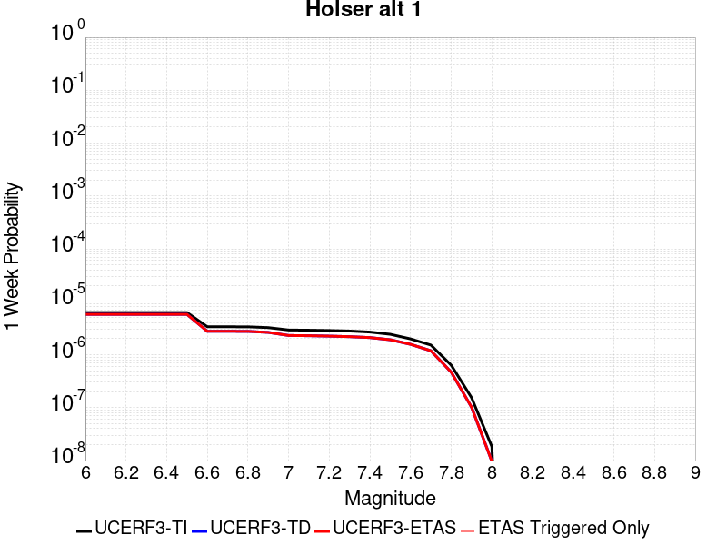 |  |  |  |

| Magnitude | 1 wk TI Prob | 1 wk TD Prob | 1 wk ETAS Prob | 1 wk ETAS/TD Gain | 1 wk ETAS Triggered Only | 1 mo TI Prob | 1 mo TD Prob | 1 mo ETAS Prob | 1 mo ETAS/TD Gain | 1 mo ETAS Triggered Only | 1 yr TI Prob | 1 yr TD Prob | 1 yr ETAS Prob | 1 yr ETAS/TD Gain | 1 yr ETAS Triggered Only | 10 yr TI Prob | 10 yr TD Prob | 10 yr ETAS Prob | 10 yr ETAS/TD Gain | 10 yr ETAS Triggered Only |
|-----|-----|-----|-----|-----|-----|-----|-----|-----|-----|-----|-----|-----|-----|-----|-----|-----|-----|-----|-----|-----|
| 6.0 | 6.2746653E-6 | 5.789965E-6 | 5.789965E-6 | 1.0 | 0.0 | 2.6891146E-5 | 2.4813964E-5 | 2.4813964E-5 | 1.0 | 0.0 | 3.273505E-4 | 3.020797E-4 | 3.2037208E-4 | 1.0605549 | 1.8297927E-5 | 0.0032686873 | 0.0030178234 | 0.0030360662 | 1.006045 | 1.8297927E-5 |
| 6.1 | 6.2746653E-6 | 5.789965E-6 | 5.789965E-6 | 1.0 | 0.0 | 2.6891146E-5 | 2.4813964E-5 | 2.4813964E-5 | 1.0 | 0.0 | 3.273505E-4 | 3.020797E-4 | 3.2037208E-4 | 1.0605549 | 1.8297927E-5 | 0.0032686873 | 0.0030178234 | 0.0030360662 | 1.006045 | 1.8297927E-5 |
| 6.2 | 6.2746653E-6 | 5.789965E-6 | 5.789965E-6 | 1.0 | 0.0 | 2.6891146E-5 | 2.4813964E-5 | 2.4813964E-5 | 1.0 | 0.0 | 3.273505E-4 | 3.020797E-4 | 3.2037208E-4 | 1.0605549 | 1.8297927E-5 | 0.0032686873 | 0.0030178234 | 0.0030360662 | 1.006045 | 1.8297927E-5 |
| 6.3 | 6.2746653E-6 | 5.789965E-6 | 5.789965E-6 | 1.0 | 0.0 | 2.6891146E-5 | 2.4813964E-5 | 2.4813964E-5 | 1.0 | 0.0 | 3.273505E-4 | 3.020797E-4 | 3.2037208E-4 | 1.0605549 | 1.8297927E-5 | 0.0032686873 | 0.0030178234 | 0.0030360662 | 1.006045 | 1.8297927E-5 |
| 6.4 | 6.2746653E-6 | 5.789965E-6 | 5.789965E-6 | 1.0 | 0.0 | 2.6891146E-5 | 2.4813964E-5 | 2.4813964E-5 | 1.0 | 0.0 | 3.273505E-4 | 3.020797E-4 | 3.2037208E-4 | 1.0605549 | 1.8297927E-5 | 0.0032686873 | 0.0030178234 | 0.0030360662 | 1.006045 | 1.8297927E-5 |
| 6.5 | 6.2746653E-6 | 5.789965E-6 | 5.789965E-6 | 1.0 | 0.0 | 2.6891146E-5 | 2.4813964E-5 | 2.4813964E-5 | 1.0 | 0.0 | 3.273505E-4 | 3.020797E-4 | 3.2037208E-4 | 1.0605549 | 1.8297927E-5 | 0.0032686873 | 0.0030178234 | 0.0030360662 | 1.006045 | 1.8297927E-5 |
| 6.6 | 3.375825E-6 | 2.7711897E-6 | 2.7711897E-6 | 1.0 | 0.0 | 1.4467741E-5 | 1.1876474E-5 | 1.1876474E-5 | 1.0 | 0.0 | 1.761305E-4 | 1.4458665E-4 | 1.6288193E-4 | 1.126535 | 1.8297927E-5 | 0.0017599097 | 0.0014449427 | 0.0014632142 | 1.0126451 | 1.8297927E-5 |
| 6.7 | 3.375825E-6 | 2.7711897E-6 | 2.7711897E-6 | 1.0 | 0.0 | 1.4467741E-5 | 1.1876474E-5 | 1.1876474E-5 | 1.0 | 0.0 | 1.761305E-4 | 1.4458665E-4 | 1.6288193E-4 | 1.126535 | 1.8297927E-5 | 0.0017599097 | 0.0014449427 | 0.0014632142 | 1.0126451 | 1.8297927E-5 |
| 6.8 | 3.366533E-6 | 2.7615893E-6 | 2.7615893E-6 | 1.0 | 0.0 | 1.4427919E-5 | 1.183533E-5 | 1.183533E-5 | 1.0 | 0.0 | 1.7564575E-4 | 1.4408577E-4 | 1.6238107E-4 | 1.1269749 | 1.8297927E-5 | 0.0017550698 | 0.0014399405 | 0.0014582122 | 1.0126891 | 1.8297927E-5 |
| 6.9 | 3.253174E-6 | 2.6438113E-6 | 2.6438113E-6 | 1.0 | 0.0 | 1.39421E-5 | 1.1330571E-5 | 1.1330571E-5 | 1.0 | 0.0 | 1.6973184E-4 | 1.3794114E-4 | 1.5623654E-4 | 1.1326319 | 1.8297927E-5 | 0.0016960226 | 0.001378571 | 0.0013968437 | 1.0132548 | 1.8297927E-5 |
| 7.0 | 2.9336593E-6 | 2.311799E-6 | 2.311799E-6 | 1.0 | 0.0 | 1.2572766E-5 | 9.907673E-6 | 9.907673E-6 | 1.0 | 0.0 | 1.5306266E-4 | 1.2061927E-4 | 1.3891498E-4 | 1.1516815 | 1.8297927E-5 | 0.0015295728 | 0.0012055405 | 0.0012238163 | 1.0151598 | 1.8297927E-5 |
| 7.1 | 2.9087812E-6 | 2.2876513E-6 | 2.2876513E-6 | 1.0 | 0.0 | 1.2466146E-5 | 9.804184E-6 | 9.804184E-6 | 1.0 | 0.0 | 1.5176475E-4 | 1.19359414E-4 | 1.3765517E-4 | 1.1532828 | 1.8297927E-5 | 0.0015166114 | 0.0011929555 | 0.0012112317 | 1.0153201 | 1.8297927E-5 |
| 7.2 | 2.8674524E-6 | 2.2475429E-6 | 2.2475429E-6 | 1.0 | 0.0 | 1.2289024E-5 | 9.63229E-6 | 9.63229E-6 | 1.0 | 0.0 | 1.4960859E-4 | 1.1726685E-4 | 1.3556263E-4 | 1.1560184 | 1.8297927E-5 | 0.0014950791 | 0.001172052 | 0.0011903285 | 1.0155935 | 1.8297927E-5 |
| 7.3 | 2.8057775E-6 | 2.1954324E-6 | 2.1954324E-6 | 1.0 | 0.0 | 1.2024705E-5 | 9.408962E-6 | 9.408962E-6 | 1.0 | 0.0 | 1.4639096E-4 | 1.14548115E-4 | 1.3284394E-4 | 1.1597219 | 1.8297927E-5 | 0.0014629456 | 0.001144893 | 0.00116317 | 1.0159639 | 1.8297927E-5 |
| 7.4 | 2.683666E-6 | 2.1092305E-6 | 2.1092305E-6 | 1.0 | 0.0 | 1.1501375E-5 | 9.039529E-6 | 9.039529E-6 | 1.0 | 0.0 | 1.4002025E-4 | 1.1005072E-4 | 1.2834664E-4 | 1.1662499 | 1.8297927E-5 | 0.0013993206 | 0.0010999644 | 0.0011182423 | 1.0166167 | 1.8297927E-5 |
| 7.5 | 2.434495E-6 | 1.9195363E-6 | 1.9195363E-6 | 1.0 | 0.0 | 1.0433508E-5 | 8.226558E-6 | 8.226558E-6 | 1.0 | 0.0 | 1.2702055E-4 | 1.0015376E-4 | 1.18449854E-4 | 1.18268 | 1.8297927E-5 | 0.0012694797 | 0.0010010883 | 0.0010193678 | 1.0182598 | 1.8297927E-5 |
| 7.6 | 1.9914562E-6 | 1.5731459E-6 | 1.5731459E-6 | 1.0 | 0.0 | 8.534785E-6 | 6.742037E-6 | 6.742037E-6 | 1.0 | 0.0 | 1.03906044E-4 | 8.208122E-5 | 1.0037765E-4 | 1.2229064 | 1.8297927E-5 | 0.0010385747 | 8.205106E-4 | 8.387935E-4 | 1.0222824 | 1.8297927E-5 |
| 7.7 | 1.5229501E-6 | 1.1896061E-6 | 1.1896061E-6 | 1.0 | 0.0 | 6.526913E-6 | 5.098302E-6 | 5.098302E-6 | 1.0 | 0.0 | 7.946226E-5 | 6.2070074E-5 | 8.0366866E-5 | 1.2947763 | 1.8297927E-5 | 7.943385E-4 | 6.2052865E-4 | 6.388152E-4 | 1.0294694 | 1.8297927E-5 |
| 7.8 | 6.3489426E-7 | 4.687806E-7 | 4.687806E-7 | 1.0 | 0.0 | 2.7209726E-6 | 2.009058E-6 | 2.009058E-6 | 1.0 | 0.0 | 3.312734E-5 | 2.4460009E-5 | 2.4460009E-5 | 1.0 | 0.0 | 3.31224E-4 | 2.4457334E-4 | 2.4457334E-4 | 1.0 | 0.0 |
| 7.9 | 1.5459432E-7 | 1.0193758E-7 | 1.0193758E-7 | 1.0 | 0.0 | 6.6254694E-7 | 4.3687527E-7 | 4.3687527E-7 | 1.0 | 0.0 | 8.066479E-6 | 5.3189433E-6 | 5.3189433E-6 | 1.0 | 0.0 | 8.066186E-5 | 5.3188178E-5 | 5.3188178E-5 | 1.0 | 0.0 |
| 8.0 | 1.8307812E-8 | 9.690293E-9 | 9.690293E-9 | 1.0 | 0.0 | 7.846205E-8 | 4.152983E-8 | 4.152983E-8 | 1.0 | 0.0 | 9.55275E-7 | 5.0562556E-7 | 5.0562556E-7 | 1.0 | 0.0 | 9.552709E-6 | 5.0562444E-6 | 5.0562444E-6 | 1.0 | 0.0 |

## Channel Islands Thrust
*[(top)](#table-of-contents)*

| 1 Week | 1 Month | 1 Year | 10 Year |
|-----|-----|-----|-----|
| 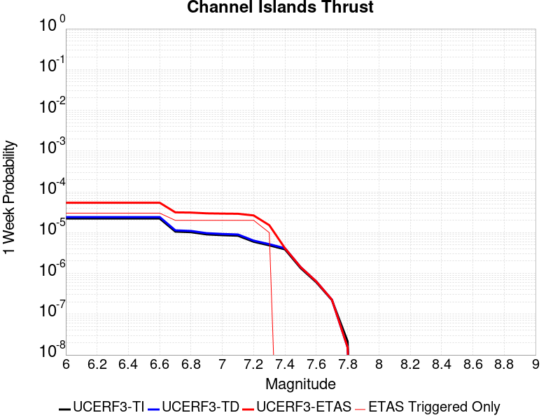 |  |  |  |

| Magnitude | 1 wk TI Prob | 1 wk TD Prob | 1 wk ETAS Prob | 1 wk ETAS/TD Gain | 1 wk ETAS Triggered Only | 1 mo TI Prob | 1 mo TD Prob | 1 mo ETAS Prob | 1 mo ETAS/TD Gain | 1 mo ETAS Triggered Only | 1 yr TI Prob | 1 yr TD Prob | 1 yr ETAS Prob | 1 yr ETAS/TD Gain | 1 yr ETAS Triggered Only | 10 yr TI Prob | 10 yr TD Prob | 10 yr ETAS Prob | 10 yr ETAS/TD Gain | 10 yr ETAS Triggered Only |
|-----|-----|-----|-----|-----|-----|-----|-----|-----|-----|-----|-----|-----|-----|-----|-----|-----|-----|-----|-----|-----|
| 6.0 | 2.2156251E-5 | 2.4092022E-5 | 2.4092022E-5 | 1.0 | 0.0 | 9.495191E-5 | 1.03248036E-4 | 1.03248036E-4 | 1.0 | 0.0 | 0.0011554264 | 0.0012564264 | 0.0012564264 | 1.0 | 0.0 | 0.011494373 | 0.0125038205 | 0.01252189 | 1.001445 | 1.8297927E-5 |
| 6.1 | 2.2156251E-5 | 2.4092022E-5 | 2.4092022E-5 | 1.0 | 0.0 | 9.495191E-5 | 1.03248036E-4 | 1.03248036E-4 | 1.0 | 0.0 | 0.0011554264 | 0.0012564264 | 0.0012564264 | 1.0 | 0.0 | 0.011494373 | 0.0125038205 | 0.01252189 | 1.001445 | 1.8297927E-5 |
| 6.2 | 2.2156251E-5 | 2.4092022E-5 | 2.4092022E-5 | 1.0 | 0.0 | 9.495191E-5 | 1.03248036E-4 | 1.03248036E-4 | 1.0 | 0.0 | 0.0011554264 | 0.0012564264 | 0.0012564264 | 1.0 | 0.0 | 0.011494373 | 0.0125038205 | 0.01252189 | 1.001445 | 1.8297927E-5 |
| 6.3 | 2.2156251E-5 | 2.4092022E-5 | 2.4092022E-5 | 1.0 | 0.0 | 9.495191E-5 | 1.03248036E-4 | 1.03248036E-4 | 1.0 | 0.0 | 0.0011554264 | 0.0012564264 | 0.0012564264 | 1.0 | 0.0 | 0.011494373 | 0.0125038205 | 0.01252189 | 1.001445 | 1.8297927E-5 |
| 6.4 | 2.2156251E-5 | 2.4092022E-5 | 2.4092022E-5 | 1.0 | 0.0 | 9.495191E-5 | 1.03248036E-4 | 1.03248036E-4 | 1.0 | 0.0 | 0.0011554264 | 0.0012564264 | 0.0012564264 | 1.0 | 0.0 | 0.011494373 | 0.0125038205 | 0.01252189 | 1.001445 | 1.8297927E-5 |
| 6.5 | 2.2156251E-5 | 2.4092022E-5 | 2.4092022E-5 | 1.0 | 0.0 | 9.495191E-5 | 1.03248036E-4 | 1.03248036E-4 | 1.0 | 0.0 | 0.0011554264 | 0.0012564264 | 0.0012564264 | 1.0 | 0.0 | 0.011494373 | 0.0125038205 | 0.01252189 | 1.001445 | 1.8297927E-5 |
| 6.6 | 2.2156251E-5 | 2.4092022E-5 | 2.4092022E-5 | 1.0 | 0.0 | 9.495191E-5 | 1.03248036E-4 | 1.03248036E-4 | 1.0 | 0.0 | 0.0011554264 | 0.0012564264 | 0.0012564264 | 1.0 | 0.0 | 0.011494373 | 0.0125038205 | 0.01252189 | 1.001445 | 1.8297927E-5 |
| 6.7 | 1.0601296E-5 | 1.1379544E-5 | 1.1379544E-5 | 1.0 | 0.0 | 4.5433335E-5 | 4.876859E-5 | 4.876859E-5 | 1.0 | 0.0 | 5.5301044E-4 | 5.936007E-4 | 5.936007E-4 | 1.0 | 0.0 | 0.005516363 | 0.005920653 | 0.005920653 | 1.0 | 0.0 |
| 6.8 | 1.0246747E-5 | 1.0996669E-5 | 1.0996669E-5 | 1.0 | 0.0 | 4.391389E-5 | 4.7127756E-5 | 4.7127756E-5 | 1.0 | 0.0 | 5.345204E-4 | 5.7363417E-4 | 5.7363417E-4 | 1.0 | 0.0 | 0.0053323656 | 0.005722025 | 0.005722025 | 1.0 | 0.0 |
| 6.9 | 9.049551E-6 | 9.699645E-6 | 9.699645E-6 | 1.0 | 0.0 | 3.878322E-5 | 4.1569267E-5 | 4.1569267E-5 | 1.0 | 0.0 | 4.7208337E-4 | 5.059924E-4 | 5.059924E-4 | 1.0 | 0.0 | 0.0047108172 | 0.0050488203 | 0.0050488203 | 1.0 | 0.0 |
| 7.0 | 8.6542195E-6 | 9.274603E-6 | 9.274603E-6 | 1.0 | 0.0 | 3.7088983E-5 | 3.9747716E-5 | 3.9747716E-5 | 1.0 | 0.0 | 4.5146482E-4 | 4.8382508E-4 | 4.8382508E-4 | 1.0 | 0.0 | 0.004505487 | 0.004828129 | 0.004828129 | 1.0 | 0.0 |
| 7.1 | 8.391028E-6 | 8.992924E-6 | 8.992924E-6 | 1.0 | 0.0 | 3.5961057E-5 | 3.854056E-5 | 3.854056E-5 | 1.0 | 0.0 | 4.3773788E-4 | 4.6913436E-4 | 4.6913436E-4 | 1.0 | 0.0 | 0.004368766 | 0.0046818503 | 0.0046818503 | 1.0 | 0.0 |
| 7.2 | 5.965188E-6 | 6.3716952E-6 | 6.3716952E-6 | 1.0 | 0.0 | 2.556484E-5 | 2.7306982E-5 | 2.7306982E-5 | 1.0 | 0.0 | 3.1120746E-4 | 3.3241234E-4 | 3.3241234E-4 | 1.0 | 0.0 | 0.00310772 | 0.0033192092 | 0.0033192092 | 1.0 | 0.0 |
| 7.3 | 4.877518E-6 | 5.2060063E-6 | 5.2060063E-6 | 1.0 | 0.0 | 2.0903482E-5 | 2.2311267E-5 | 2.2311267E-5 | 1.0 | 0.0 | 2.5447016E-4 | 2.716063E-4 | 2.716063E-4 | 1.0 | 0.0 | 0.0025417898 | 0.0027127895 | 0.0027127895 | 1.0 | 0.0 |
| 7.4 | 3.8829853E-6 | 4.141863E-6 | 4.141863E-6 | 1.0 | 0.0 | 1.664126E-5 | 1.7750723E-5 | 1.7750723E-5 | 1.0 | 0.0 | 2.0258849E-4 | 2.1609402E-4 | 2.1609402E-4 | 1.0 | 0.0 | 0.002024039 | 0.0021588807 | 0.0021588807 | 1.0 | 0.0 |
| 7.5 | 1.3489616E-6 | 1.4277903E-6 | 1.4277903E-6 | 1.0 | 0.0 | 5.7812517E-6 | 6.119087E-6 | 6.119087E-6 | 1.0 | 0.0 | 7.038446E-5 | 7.449738E-5 | 7.449738E-5 | 1.0 | 0.0 | 7.036218E-4 | 7.44728E-4 | 7.44728E-4 | 1.0 | 0.0 |
| 7.6 | 6.058192E-7 | 6.353778E-7 | 6.353778E-7 | 1.0 | 0.0 | 2.5963652E-6 | 2.7230449E-6 | 2.7230449E-6 | 1.0 | 0.0 | 3.161029E-5 | 3.3152584E-5 | 3.3152584E-5 | 1.0 | 0.0 | 3.1605794E-4 | 3.31478E-4 | 3.31478E-4 | 1.0 | 0.0 |
| 7.7 | 2.2170494E-7 | 2.2607902E-7 | 2.2607902E-7 | 1.0 | 0.0 | 9.5016367E-7 | 9.689098E-7 | 9.689098E-7 | 1.0 | 0.0 | 1.1568181E-5 | 1.1796425E-5 | 1.1796425E-5 | 1.0 | 0.0 | 1.1567579E-4 | 1.1795909E-4 | 1.1795909E-4 | 1.0 | 0.0 |
| 7.8 | 2.1613102E-8 | 1.5466682E-8 | 1.5466682E-8 | 1.0 | 0.0 | 9.262757E-8 | 6.628578E-8 | 6.628578E-8 | 1.0 | 0.0 | 1.1277401E-6 | 8.070291E-7 | 8.070291E-7 | 1.0 | 0.0 | 1.1277344E-5 | 8.070269E-6 | 8.070269E-6 | 1.0 | 0.0 |

## Ozena
*[(top)](#table-of-contents)*

| 1 Week | 1 Month | 1 Year | 10 Year |
|-----|-----|-----|-----|
|  |  |  |  |

| Magnitude | 1 wk TI Prob | 1 wk TD Prob | 1 wk ETAS Prob | 1 wk ETAS/TD Gain | 1 wk ETAS Triggered Only | 1 mo TI Prob | 1 mo TD Prob | 1 mo ETAS Prob | 1 mo ETAS/TD Gain | 1 mo ETAS Triggered Only | 1 yr TI Prob | 1 yr TD Prob | 1 yr ETAS Prob | 1 yr ETAS/TD Gain | 1 yr ETAS Triggered Only | 10 yr TI Prob | 10 yr TD Prob | 10 yr ETAS Prob | 10 yr ETAS/TD Gain | 10 yr ETAS Triggered Only |
|-----|-----|-----|-----|-----|-----|-----|-----|-----|-----|-----|-----|-----|-----|-----|-----|-----|-----|-----|-----|-----|
| 6.0 | 1.4377547E-6 | 1.4513782E-6 | 1.4513782E-6 | 1.0 | 0.0 | 6.161791E-6 | 6.2201793E-6 | 6.2201793E-6 | 1.0 | 0.0 | 7.5017226E-5 | 7.572832E-5 | 7.572832E-5 | 1.0 | 0.0 | 7.4991904E-4 | 7.570518E-4 | 7.753359E-4 | 1.0241517 | 1.8297927E-5 |
| 6.1 | 1.4377547E-6 | 1.4513782E-6 | 1.4513782E-6 | 1.0 | 0.0 | 6.161791E-6 | 6.2201793E-6 | 6.2201793E-6 | 1.0 | 0.0 | 7.5017226E-5 | 7.572832E-5 | 7.572832E-5 | 1.0 | 0.0 | 7.4991904E-4 | 7.570518E-4 | 7.753359E-4 | 1.0241517 | 1.8297927E-5 |
| 6.2 | 1.4377547E-6 | 1.4513782E-6 | 1.4513782E-6 | 1.0 | 0.0 | 6.161791E-6 | 6.2201793E-6 | 6.2201793E-6 | 1.0 | 0.0 | 7.5017226E-5 | 7.572832E-5 | 7.572832E-5 | 1.0 | 0.0 | 7.4991904E-4 | 7.570518E-4 | 7.753359E-4 | 1.0241517 | 1.8297927E-5 |
| 6.3 | 1.4377547E-6 | 1.4513782E-6 | 1.4513782E-6 | 1.0 | 0.0 | 6.161791E-6 | 6.2201793E-6 | 6.2201793E-6 | 1.0 | 0.0 | 7.5017226E-5 | 7.572832E-5 | 7.572832E-5 | 1.0 | 0.0 | 7.4991904E-4 | 7.570518E-4 | 7.753359E-4 | 1.0241517 | 1.8297927E-5 |
| 6.4 | 1.4377547E-6 | 1.4513782E-6 | 1.4513782E-6 | 1.0 | 0.0 | 6.161791E-6 | 6.2201793E-6 | 6.2201793E-6 | 1.0 | 0.0 | 7.5017226E-5 | 7.572832E-5 | 7.572832E-5 | 1.0 | 0.0 | 7.4991904E-4 | 7.570518E-4 | 7.753359E-4 | 1.0241517 | 1.8297927E-5 |
| 6.5 | 1.4377547E-6 | 1.4513782E-6 | 1.4513782E-6 | 1.0 | 0.0 | 6.161791E-6 | 6.2201793E-6 | 6.2201793E-6 | 1.0 | 0.0 | 7.5017226E-5 | 7.572832E-5 | 7.572832E-5 | 1.0 | 0.0 | 7.4991904E-4 | 7.570518E-4 | 7.753359E-4 | 1.0241517 | 1.8297927E-5 |
| 6.6 | 1.4377547E-6 | 1.4513782E-6 | 1.4513782E-6 | 1.0 | 0.0 | 6.161791E-6 | 6.2201793E-6 | 6.2201793E-6 | 1.0 | 0.0 | 7.5017226E-5 | 7.572832E-5 | 7.572832E-5 | 1.0 | 0.0 | 7.4991904E-4 | 7.570518E-4 | 7.753359E-4 | 1.0241517 | 1.8297927E-5 |
| 6.7 | 1.4377547E-6 | 1.4513782E-6 | 1.4513782E-6 | 1.0 | 0.0 | 6.161791E-6 | 6.2201793E-6 | 6.2201793E-6 | 1.0 | 0.0 | 7.5017226E-5 | 7.572832E-5 | 7.572832E-5 | 1.0 | 0.0 | 7.4991904E-4 | 7.570518E-4 | 7.753359E-4 | 1.0241517 | 1.8297927E-5 |
| 6.8 | 9.223257E-7 | 9.317624E-7 | 9.317624E-7 | 1.0 | 0.0 | 3.9528186E-6 | 3.9932615E-6 | 3.9932615E-6 | 1.0 | 0.0 | 4.81245E-5 | 4.8616912E-5 | 4.8616912E-5 | 1.0 | 0.0 | 4.811408E-4 | 4.860668E-4 | 5.043558E-4 | 1.0376266 | 1.8297927E-5 |
| 6.9 | 9.141515E-7 | 9.235371E-7 | 9.235371E-7 | 1.0 | 0.0 | 3.917786E-6 | 3.9580104E-6 | 3.9580104E-6 | 1.0 | 0.0 | 4.7698002E-5 | 4.818775E-5 | 4.818775E-5 | 1.0 | 0.0 | 4.7687767E-4 | 4.8177704E-4 | 5.0006615E-4 | 1.0379617 | 1.8297927E-5 |
| 7.0 | 8.767648E-7 | 8.8585773E-7 | 8.8585773E-7 | 1.0 | 0.0 | 3.757558E-6 | 3.7965276E-6 | 3.7965276E-6 | 1.0 | 0.0 | 4.5747307E-5 | 4.6221783E-5 | 4.6221783E-5 | 1.0 | 0.0 | 4.5737892E-4 | 4.6212564E-4 | 4.804151E-4 | 1.0395769 | 1.8297927E-5 |
| 7.1 | 8.199402E-7 | 8.2853984E-7 | 8.2853984E-7 | 1.0 | 0.0 | 3.5140247E-6 | 3.5508804E-6 | 3.5508804E-6 | 1.0 | 0.0 | 4.2782412E-5 | 4.323115E-5 | 4.323115E-5 | 1.0 | 0.0 | 4.2774176E-4 | 4.322311E-4 | 4.5052113E-4 | 1.0423154 | 1.8297927E-5 |
| 7.2 | 7.38705E-7 | 7.464262E-7 | 7.464262E-7 | 1.0 | 0.0 | 3.1658747E-6 | 3.198966E-6 | 3.198966E-6 | 1.0 | 0.0 | 3.8543843E-5 | 3.894675E-5 | 3.894675E-5 | 1.0 | 0.0 | 3.853716E-4 | 3.8940276E-4 | 4.0769356E-4 | 1.0469714 | 1.8297927E-5 |
| 7.3 | 6.490017E-7 | 6.557802E-7 | 6.557802E-7 | 1.0 | 0.0 | 2.7814328E-6 | 2.8104837E-6 | 2.8104837E-6 | 1.0 | 0.0 | 3.386342E-5 | 3.4217133E-5 | 3.4217133E-5 | 1.0 | 0.0 | 3.3858258E-4 | 3.4212202E-4 | 3.604137E-4 | 1.0534654 | 1.8297927E-5 |
| 7.4 | 5.346736E-7 | 5.4022604E-7 | 5.4022604E-7 | 1.0 | 0.0 | 2.291456E-6 | 2.3152527E-6 | 2.3152527E-6 | 1.0 | 0.0 | 2.789812E-5 | 2.8187867E-5 | 2.8187867E-5 | 1.0 | 0.0 | 2.789462E-4 | 2.8184598E-4 | 3.0013872E-4 | 1.0649034 | 1.8297927E-5 |
| 7.5 | 2.939325E-7 | 2.9666057E-7 | 2.9666057E-7 | 1.0 | 0.0 | 1.25971E-6 | 1.271402E-6 | 1.271402E-6 | 1.0 | 0.0 | 1.5336862E-5 | 1.5479225E-5 | 1.5479225E-5 | 1.0 | 0.0 | 1.5335804E-4 | 1.5478309E-4 | 1.5478309E-4 | 1.0 | 0.0 |
| 7.6 | 1.4151905E-7 | 1.4253266E-7 | 1.4253266E-7 | 1.0 | 0.0 | 6.065101E-7 | 6.108541E-7 | 6.108541E-7 | 1.0 | 0.0 | 7.3842357E-6 | 7.4371237E-6 | 7.4371237E-6 | 1.0 | 0.0 | 7.38399E-5 | 7.436883E-5 | 7.436883E-5 | 1.0 | 0.0 |
| 7.7 | 4.4957577E-8 | 4.5252243E-8 | 4.5252243E-8 | 1.0 | 0.0 | 1.9267533E-7 | 1.9393818E-7 | 1.9393818E-7 | 1.0 | 0.0 | 2.3458194E-6 | 2.3611947E-6 | 2.3611947E-6 | 1.0 | 0.0 | 2.3457947E-5 | 2.3611707E-5 | 2.3611707E-5 | 1.0 | 0.0 |
| 7.8 | 5.9993255E-9 | 6.0412972E-9 | 6.0412972E-9 | 1.0 | 0.0 | 2.5711394E-8 | 2.5891273E-8 | 2.5891273E-8 | 1.0 | 0.0 | 3.1303617E-7 | 3.1522623E-7 | 3.1522623E-7 | 1.0 | 0.0 | 3.1303573E-6 | 3.1522588E-6 | 3.1522588E-6 | 1.0 | 0.0 |

## Hunting Creek - Bartlett Springs connector 2011
*[(top)](#table-of-contents)*

| 1 Week | 1 Month | 1 Year | 10 Year |
|-----|-----|-----|-----|
|  | 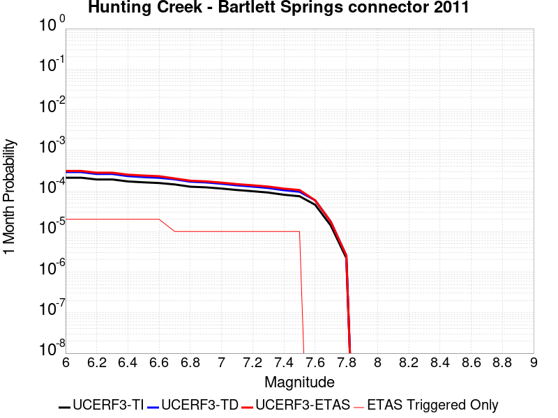 |  |  |

| Magnitude | 1 wk TI Prob | 1 wk TD Prob | 1 wk ETAS Prob | 1 wk ETAS/TD Gain | 1 wk ETAS Triggered Only | 1 mo TI Prob | 1 mo TD Prob | 1 mo ETAS Prob | 1 mo ETAS/TD Gain | 1 mo ETAS Triggered Only | 1 yr TI Prob | 1 yr TD Prob | 1 yr ETAS Prob | 1 yr ETAS/TD Gain | 1 yr ETAS Triggered Only | 10 yr TI Prob | 10 yr TD Prob | 10 yr ETAS Prob | 10 yr ETAS/TD Gain | 10 yr ETAS Triggered Only |
|-----|-----|-----|-----|-----|-----|-----|-----|-----|-----|-----|-----|-----|-----|-----|-----|-----|-----|-----|-----|-----|
| 6.0 | 4.940016E-5 | 6.786822E-5 | 6.786822E-5 | 1.0 | 0.0 | 2.1169778E-4 | 2.9083234E-4 | 2.9083234E-4 | 1.0 | 0.0 | 0.002574374 | 0.003535177 | 0.003535177 | 1.0 | 0.0 | 0.025447546 | 0.034773834 | 0.034791496 | 1.000508 | 1.8297927E-5 |
| 6.1 | 4.940016E-5 | 6.786822E-5 | 6.786822E-5 | 1.0 | 0.0 | 2.1169778E-4 | 2.9083234E-4 | 2.9083234E-4 | 1.0 | 0.0 | 0.002574374 | 0.003535177 | 0.003535177 | 1.0 | 0.0 | 0.025447546 | 0.034773834 | 0.034791496 | 1.000508 | 1.8297927E-5 |
| 6.2 | 4.472471E-5 | 6.1002804E-5 | 6.1002804E-5 | 1.0 | 0.0 | 1.9166325E-4 | 2.6141506E-4 | 2.6141506E-4 | 1.0 | 0.0 | 0.0023310026 | 0.003178107 | 0.003178107 | 1.0 | 0.0 | 0.02306703 | 0.031316914 | 0.03133464 | 1.000566 | 1.8297927E-5 |
| 6.3 | 4.472471E-5 | 6.1002804E-5 | 6.1002804E-5 | 1.0 | 0.0 | 1.9166325E-4 | 2.6141506E-4 | 2.6141506E-4 | 1.0 | 0.0 | 0.0023310026 | 0.003178107 | 0.003178107 | 1.0 | 0.0 | 0.02306703 | 0.031316914 | 0.03133464 | 1.000566 | 1.8297927E-5 |
| 6.4 | 4.0001003E-5 | 5.4103755E-5 | 5.4103755E-5 | 1.0 | 0.0 | 1.714216E-4 | 2.31853E-4 | 2.31853E-4 | 1.0 | 0.0 | 0.0020850603 | 0.0028191248 | 0.0028191248 | 1.0 | 0.0 | 0.02065605 | 0.027828315 | 0.027846105 | 1.0006392 | 1.8297927E-5 |
| 6.5 | 3.8033053E-5 | 5.1266547E-5 | 5.1266547E-5 | 1.0 | 0.0 | 1.6298861E-4 | 2.1969559E-4 | 2.1969559E-4 | 1.0 | 0.0 | 0.0019825802 | 0.0026714746 | 0.0026714746 | 1.0 | 0.0 | 0.019649856 | 0.026390454 | 0.02640827 | 1.0006751 | 1.8297927E-5 |
| 6.6 | 3.653754E-5 | 4.913017E-5 | 4.913017E-5 | 1.0 | 0.0 | 1.5658008E-4 | 2.1054115E-4 | 2.1054115E-4 | 1.0 | 0.0 | 0.0019046954 | 0.0025602852 | 0.0025602852 | 1.0 | 0.0 | 0.018884527 | 0.025306415 | 0.02532425 | 1.0007048 | 1.8297927E-5 |
| 6.7 | 3.372024E-5 | 4.514011E-5 | 4.514011E-5 | 1.0 | 0.0 | 1.4450731E-4 | 1.9344354E-4 | 1.9344354E-4 | 1.0 | 0.0 | 0.0017579567 | 0.002352639 | 0.002352639 | 1.0 | 0.0 | 0.017441148 | 0.023278099 | 0.02329597 | 1.0007677 | 1.8297927E-5 |
| 6.8 | 2.9650024E-5 | 3.9411374E-5 | 3.9411374E-5 | 1.0 | 0.0 | 1.2706534E-4 | 1.6889503E-4 | 1.6889503E-4 | 1.0 | 0.0 | 0.0015459227 | 0.0020543463 | 0.0020543463 | 1.0 | 0.0 | 0.015352124 | 0.020351216 | 0.020351216 | 1.0 | 0.0 |
| 6.9 | 2.860775E-5 | 3.7812544E-5 | 3.7812544E-5 | 1.0 | 0.0 | 1.2259888E-4 | 1.6204377E-4 | 1.6204377E-4 | 1.0 | 0.0 | 0.0014916194 | 0.001971107 | 0.001971107 | 1.0 | 0.0 | 0.014816469 | 0.01953584 | 0.01953584 | 1.0 | 0.0 |
| 7.0 | 2.6696067E-5 | 3.506726E-5 | 3.506726E-5 | 1.0 | 0.0 | 1.144067E-4 | 1.5027967E-4 | 1.5027967E-4 | 1.0 | 0.0 | 0.0013920115 | 0.0018281302 | 0.0018281302 | 1.0 | 0.0 | 0.013833242 | 0.018131364 | 0.018131364 | 1.0 | 0.0 |
| 7.1 | 2.456087E-5 | 3.2013093E-5 | 3.2013093E-5 | 1.0 | 0.0 | 1.0525662E-4 | 1.371918E-4 | 1.371918E-4 | 1.0 | 0.0 | 0.001280746 | 0.0016690396 | 0.0016690396 | 1.0 | 0.0 | 0.012733897 | 0.016566366 | 0.016566366 | 1.0 | 0.0 |
| 7.2 | 2.295761E-5 | 2.9822932E-5 | 2.9822932E-5 | 1.0 | 0.0 | 9.8386045E-5 | 1.2780636E-4 | 1.2780636E-4 | 1.0 | 0.0 | 0.0011971919 | 0.001554941 | 0.001554941 | 1.0 | 0.0 | 0.011907627 | 0.015442089 | 0.015442089 | 1.0 | 0.0 |
| 7.3 | 2.1256936E-5 | 2.7541912E-5 | 2.7541912E-5 | 1.0 | 0.0 | 9.109797E-5 | 1.1803147E-4 | 1.1803147E-4 | 1.0 | 0.0 | 0.0011085535 | 0.0014360948 | 0.0014360948 | 1.0 | 0.0 | 0.011030397 | 0.014269472 | 0.014269472 | 1.0 | 0.0 |
| 7.4 | 1.8784336E-5 | 2.4306766E-5 | 2.4306766E-5 | 1.0 | 0.0 | 8.050181E-5 | 1.0416774E-4 | 1.0416774E-4 | 1.0 | 0.0 | 9.796688E-4 | 0.001267512 | 0.001267512 | 1.0 | 0.0 | 0.009753612 | 0.012603902 | 0.012603902 | 1.0 | 0.0 |
| 7.5 | 1.7248298E-5 | 2.2268887E-5 | 2.2268887E-5 | 1.0 | 0.0 | 7.391918E-5 | 9.543464E-5 | 9.543464E-5 | 1.0 | 0.0 | 8.9959445E-4 | 0.0011613049 | 0.0011613049 | 1.0 | 0.0 | 0.008959615 | 0.01155334 | 0.01155334 | 1.0 | 0.0 |
| 7.6 | 1.0653709E-5 | 1.3722118E-5 | 1.3722118E-5 | 1.0 | 0.0 | 4.5657955E-5 | 5.8807767E-5 | 5.8807767E-5 | 1.0 | 0.0 | 5.557438E-4 | 7.157521E-4 | 7.157521E-4 | 1.0 | 0.0 | 0.0055435603 | 0.0071348166 | 0.0071348166 | 1.0 | 0.0 |
| 7.7 | 3.286316E-6 | 4.0903437E-6 | 4.0903437E-6 | 1.0 | 0.0 | 1.4084137E-5 | 1.7529928E-5 | 1.7529928E-5 | 1.0 | 0.0 | 1.7146087E-4 | 2.1340612E-4 | 2.1340612E-4 | 1.0 | 0.0 | 0.0017132863 | 0.0021320276 | 0.0021320276 | 1.0 | 0.0 |
| 7.8 | 5.1855085E-7 | 5.9720696E-7 | 5.9720696E-7 | 1.0 | 0.0 | 2.222359E-6 | 2.5594559E-6 | 2.5594559E-6 | 1.0 | 0.0 | 2.7056883E-5 | 3.116094E-5 | 3.116094E-5 | 1.0 | 0.0 | 2.705359E-4 | 3.1156495E-4 | 3.1156495E-4 | 1.0 | 0.0 |

## Hayward (So) 2011 CFM
*[(top)](#table-of-contents)*

| 1 Week | 1 Month | 1 Year | 10 Year |
|-----|-----|-----|-----|
|  |  |  |  |

| Magnitude | 1 wk TI Prob | 1 wk TD Prob | 1 wk ETAS Prob | 1 wk ETAS/TD Gain | 1 wk ETAS Triggered Only | 1 mo TI Prob | 1 mo TD Prob | 1 mo ETAS Prob | 1 mo ETAS/TD Gain | 1 mo ETAS Triggered Only | 1 yr TI Prob | 1 yr TD Prob | 1 yr ETAS Prob | 1 yr ETAS/TD Gain | 1 yr ETAS Triggered Only | 10 yr TI Prob | 10 yr TD Prob | 10 yr ETAS Prob | 10 yr ETAS/TD Gain | 10 yr ETAS Triggered Only |
|-----|-----|-----|-----|-----|-----|-----|-----|-----|-----|-----|-----|-----|-----|-----|-----|-----|-----|-----|-----|-----|
| 6.0 | 1.8091932E-4 | 3.570541E-4 | 3.570541E-4 | 1.0 | 0.0 | 7.751381E-4 | 0.0015293444 | 0.0015293444 | 1.0 | 0.0 | 0.00939654 | 0.018463207 | 0.018481169 | 1.0009727 | 1.8297927E-5 | 0.090090066 | 0.16673161 | 0.16674685 | 1.0000914 | 1.8297927E-5 |
| 6.1 | 1.8091932E-4 | 3.570541E-4 | 3.570541E-4 | 1.0 | 0.0 | 7.751381E-4 | 0.0015293444 | 0.0015293444 | 1.0 | 0.0 | 0.00939654 | 0.018463207 | 0.018481169 | 1.0009727 | 1.8297927E-5 | 0.090090066 | 0.16673161 | 0.16674685 | 1.0000914 | 1.8297927E-5 |
| 6.2 | 1.8091932E-4 | 3.570541E-4 | 3.570541E-4 | 1.0 | 0.0 | 7.751381E-4 | 0.0015293444 | 0.0015293444 | 1.0 | 0.0 | 0.00939654 | 0.018463207 | 0.018481169 | 1.0009727 | 1.8297927E-5 | 0.090090066 | 0.16673161 | 0.16674685 | 1.0000914 | 1.8297927E-5 |
| 6.3 | 1.7322872E-4 | 3.426234E-4 | 3.426234E-4 | 1.0 | 0.0 | 7.4219756E-4 | 0.0014675693 | 0.0014675693 | 1.0 | 0.0 | 0.0089988755 | 0.017723544 | 0.017741518 | 1.0010141 | 1.8297927E-5 | 0.08643075 | 0.16066726 | 0.16068262 | 1.0000956 | 1.8297927E-5 |
| 6.4 | 1.6334097E-4 | 3.234411E-4 | 3.234411E-4 | 1.0 | 0.0 | 6.998449E-4 | 0.0013854484 | 0.0013854484 | 1.0 | 0.0 | 0.008487372 | 0.016739385 | 0.016757376 | 1.0010748 | 1.8297927E-5 | 0.081704415 | 0.15255594 | 0.15257145 | 1.0001017 | 1.8297927E-5 |
| 6.5 | 1.5600289E-4 | 3.1018828E-4 | 3.1018828E-4 | 1.0 | 0.0 | 6.684125E-4 | 0.0013287093 | 0.0013287093 | 1.0 | 0.0 | 0.008107598 | 0.016058935 | 0.01607694 | 1.0011212 | 1.8297927E-5 | 0.078181036 | 0.14683272 | 0.14684832 | 1.0001063 | 1.8297927E-5 |
| 6.6 | 1.4046066E-4 | 2.8032906E-4 | 2.8032906E-4 | 1.0 | 0.0 | 6.018354E-4 | 0.0012008639 | 0.0012008639 | 1.0 | 0.0 | 0.0073027555 | 0.014524006 | 0.014524006 | 1.0 | 0.0 | 0.07067384 | 0.13391982 | 0.13391982 | 1.0 | 0.0 |
| 6.7 | 1.14696966E-4 | 2.3271477E-4 | 2.3271477E-4 | 1.0 | 0.0 | 4.914658E-4 | 9.969729E-4 | 9.969729E-4 | 1.0 | 0.0 | 0.0059671924 | 0.012071652 | 0.012071652 | 1.0 | 0.0 | 0.058094822 | 0.11274672 | 0.11274672 | 1.0 | 0.0 |
| 6.8 | 9.3874296E-5 | 1.8861453E-4 | 1.8861453E-4 | 1.0 | 0.0 | 4.0225635E-4 | 8.0810126E-4 | 8.0810126E-4 | 1.0 | 0.0 | 0.0048864787 | 0.009794984 | 0.009794984 | 1.0 | 0.0 | 0.047804173 | 0.09259856 | 0.09259856 | 1.0 | 0.0 |
| 6.9 | 5.551852E-5 | 1.072948E-4 | 1.072948E-4 | 1.0 | 0.0 | 2.3791482E-4 | 4.5975443E-4 | 4.5975443E-4 | 1.0 | 0.0 | 0.0028927654 | 0.0055832625 | 0.0055832625 | 1.0 | 0.0 | 0.028553981 | 0.054245494 | 0.054245494 | 1.0 | 0.0 |
| 7.0 | 4.2662363E-5 | 8.2464416E-5 | 8.2464416E-5 | 1.0 | 0.0 | 1.8282588E-4 | 3.5337146E-4 | 3.5337146E-4 | 1.0 | 0.0 | 0.0022236328 | 0.0042938837 | 0.0042938837 | 1.0 | 0.0 | 0.022015138 | 0.042064495 | 0.042064495 | 1.0 | 0.0 |
| 7.1 | 3.305886E-5 | 6.3019055E-5 | 6.3019055E-5 | 1.0 | 0.0 | 1.4167312E-4 | 2.700538E-4 | 2.700538E-4 | 1.0 | 0.0 | 0.0017235056 | 0.0032829668 | 0.0032829668 | 1.0 | 0.0 | 0.017101998 | 0.032452874 | 0.032452874 | 1.0 | 0.0 |
| 7.2 | 2.9856887E-5 | 5.7013647E-5 | 5.7013647E-5 | 1.0 | 0.0 | 1.2795182E-4 | 2.4432142E-4 | 2.4432142E-4 | 1.0 | 0.0 | 0.0015567001 | 0.0029705726 | 0.0029705726 | 1.0 | 0.0 | 0.015458403 | 0.029453589 | 0.029453589 | 1.0 | 0.0 |
| 7.3 | 2.4559737E-5 | 4.599088E-5 | 4.599088E-5 | 1.0 | 0.0 | 1.0525176E-4 | 1.9708896E-4 | 1.9708896E-4 | 1.0 | 0.0 | 0.0012806869 | 0.0023969305 | 0.0023969305 | 1.0 | 0.0 | 0.012733313 | 0.023857482 | 0.023857482 | 1.0 | 0.0 |
| 7.4 | 1.9002231E-5 | 3.5049303E-5 | 3.5049303E-5 | 1.0 | 0.0 | 8.143559E-5 | 1.502027E-4 | 1.502027E-4 | 1.0 | 0.0 | 9.910273E-4 | 0.0018271938 | 0.0018271938 | 1.0 | 0.0 | 0.009866194 | 0.018258283 | 0.018258283 | 1.0 | 0.0 |
| 7.5 | 1.2783333E-5 | 2.3330069E-5 | 2.3330069E-5 | 1.0 | 0.0 | 5.4784563E-5 | 9.998221E-5 | 9.998221E-5 | 1.0 | 0.0 | 6.667979E-4 | 0.0012166094 | 0.0012166094 | 1.0 | 0.0 | 0.006648007 | 0.012209582 | 0.012209582 | 1.0 | 0.0 |
| 7.6 | 4.8149627E-6 | 8.887544E-6 | 8.887544E-6 | 1.0 | 0.0 | 2.063539E-5 | 3.8088925E-5 | 3.8088925E-5 | 1.0 | 0.0 | 2.5120692E-4 | 4.636352E-4 | 4.636352E-4 | 1.0 | 0.0 | 0.0025092314 | 0.0046812436 | 0.0046812436 | 1.0 | 0.0 |
| 7.7 | 6.0838227E-7 | 1.2056693E-6 | 1.2056693E-6 | 1.0 | 0.0 | 2.6073499E-6 | 5.1671436E-6 | 5.1671436E-6 | 1.0 | 0.0 | 3.174402E-5 | 6.290816E-5 | 6.290816E-5 | 1.0 | 0.0 | 3.1739488E-4 | 6.5293367E-4 | 6.5293367E-4 | 1.0 | 0.0 |
| 7.8 | 4.5542808E-7 | 9.792182E-7 | 9.792182E-7 | 1.0 | 0.0 | 1.9518332E-6 | 4.1966427E-6 | 4.1966427E-6 | 1.0 | 0.0 | 2.376331E-5 | 5.1092928E-5 | 5.1092928E-5 | 1.0 | 0.0 | 2.3760769E-4 | 5.321372E-4 | 5.321372E-4 | 1.0 | 0.0 |
| 7.9 | 3.3016747E-7 | 7.386335E-7 | 7.386335E-7 | 1.0 | 0.0 | 1.4150027E-6 | 3.1655684E-6 | 3.1655684E-6 | 1.0 | 0.0 | 1.7227521E-5 | 3.8540114E-5 | 3.8540114E-5 | 1.0 | 0.0 | 1.7226185E-4 | 3.9930744E-4 | 3.9930744E-4 | 1.0 | 0.0 |
| 8.0 | 2.347038E-7 | 5.4714894E-7 | 5.4714894E-7 | 1.0 | 0.0 | 1.0058731E-6 | 2.344922E-6 | 2.344922E-6 | 1.0 | 0.0 | 1.2246436E-5 | 2.8549053E-5 | 2.8549053E-5 | 1.0 | 0.0 | 1.2245761E-4 | 2.9355253E-4 | 2.9355253E-4 | 1.0 | 0.0 |
| 8.1 | 1.18822804E-7 | 2.6058973E-7 | 2.6058973E-7 | 1.0 | 0.0 | 5.092405E-7 | 1.1168127E-6 | 1.1168127E-6 | 1.0 | 0.0 | 6.1999854E-6 | 1.359711E-5 | 1.359711E-5 | 1.0 | 0.0 | 6.199812E-5 | 1.3917852E-4 | 1.3917852E-4 | 1.0 | 0.0 |

## Lions Head 2011 CFM
*[(top)](#table-of-contents)*

| 1 Week | 1 Month | 1 Year | 10 Year |
|-----|-----|-----|-----|
|  |  |  |  |

| Magnitude | 1 wk TI Prob | 1 wk TD Prob | 1 wk ETAS Prob | 1 wk ETAS/TD Gain | 1 wk ETAS Triggered Only | 1 mo TI Prob | 1 mo TD Prob | 1 mo ETAS Prob | 1 mo ETAS/TD Gain | 1 mo ETAS Triggered Only | 1 yr TI Prob | 1 yr TD Prob | 1 yr ETAS Prob | 1 yr ETAS/TD Gain | 1 yr ETAS Triggered Only | 10 yr TI Prob | 10 yr TD Prob | 10 yr ETAS Prob | 10 yr ETAS/TD Gain | 10 yr ETAS Triggered Only |
|-----|-----|-----|-----|-----|-----|-----|-----|-----|-----|-----|-----|-----|-----|-----|-----|-----|-----|-----|-----|-----|
| 6.0 | 8.889363E-7 | 8.891425E-7 | 8.891425E-7 | 1.0 | 0.0 | 3.8097214E-6 | 3.8106054E-6 | 3.8106054E-6 | 1.0 | 0.0 | 4.638237E-5 | 4.6393197E-5 | 6.469028E-5 | 1.3943914 | 1.8297927E-5 | 4.637269E-4 | 4.638414E-4 | 4.8213085E-4 | 1.0394304 | 1.8297927E-5 |
| 6.1 | 8.889363E-7 | 8.891425E-7 | 8.891425E-7 | 1.0 | 0.0 | 3.8097214E-6 | 3.8106054E-6 | 3.8106054E-6 | 1.0 | 0.0 | 4.638237E-5 | 4.6393197E-5 | 6.469028E-5 | 1.3943914 | 1.8297927E-5 | 4.637269E-4 | 4.638414E-4 | 4.8213085E-4 | 1.0394304 | 1.8297927E-5 |
| 6.2 | 5.7435483E-7 | 5.736071E-7 | 5.736071E-7 | 1.0 | 0.0 | 2.4615185E-6 | 2.458314E-6 | 2.458314E-6 | 1.0 | 0.0 | 2.9968574E-5 | 2.9929575E-5 | 2.9929575E-5 | 1.0 | 0.0 | 2.9964533E-4 | 2.992569E-4 | 2.992569E-4 | 1.0 | 0.0 |
| 6.3 | 5.7435483E-7 | 5.736071E-7 | 5.736071E-7 | 1.0 | 0.0 | 2.4615185E-6 | 2.458314E-6 | 2.458314E-6 | 1.0 | 0.0 | 2.9968574E-5 | 2.9929575E-5 | 2.9929575E-5 | 1.0 | 0.0 | 2.9964533E-4 | 2.992569E-4 | 2.992569E-4 | 1.0 | 0.0 |
| 6.4 | 4.1835764E-7 | 4.171541E-7 | 4.171541E-7 | 1.0 | 0.0 | 1.7929601E-6 | 1.787802E-6 | 1.787802E-6 | 1.0 | 0.0 | 2.1829072E-5 | 2.1766275E-5 | 2.1766275E-5 | 1.0 | 0.0 | 2.1826927E-4 | 2.1764166E-4 | 2.1764166E-4 | 1.0 | 0.0 |
| 6.5 | 4.1835764E-7 | 4.171541E-7 | 4.171541E-7 | 1.0 | 0.0 | 1.7929601E-6 | 1.787802E-6 | 1.787802E-6 | 1.0 | 0.0 | 2.1829072E-5 | 2.1766275E-5 | 2.1766275E-5 | 1.0 | 0.0 | 2.1826927E-4 | 2.1764166E-4 | 2.1764166E-4 | 1.0 | 0.0 |
| 6.6 | 3.6896213E-7 | 3.6761884E-7 | 3.6761884E-7 | 1.0 | 0.0 | 1.5812653E-6 | 1.5755083E-6 | 1.5755083E-6 | 1.0 | 0.0 | 1.9251736E-5 | 1.9181647E-5 | 1.9181647E-5 | 1.0 | 0.0 | 1.9250068E-4 | 1.9180003E-4 | 1.9180003E-4 | 1.0 | 0.0 |
| 6.7 | 3.3283942E-7 | 3.3139824E-7 | 3.3139824E-7 | 1.0 | 0.0 | 1.4264539E-6 | 1.4202773E-6 | 1.4202773E-6 | 1.0 | 0.0 | 1.7366938E-5 | 1.7291739E-5 | 1.7291739E-5 | 1.0 | 0.0 | 1.736558E-4 | 1.7290401E-4 | 1.7290401E-4 | 1.0 | 0.0 |
| 6.8 | 2.9684807E-7 | 2.953145E-7 | 2.953145E-7 | 1.0 | 0.0 | 1.2722054E-6 | 1.2656328E-6 | 1.2656328E-6 | 1.0 | 0.0 | 1.5488991E-5 | 1.5408972E-5 | 1.5408972E-5 | 1.0 | 0.0 | 1.5487912E-4 | 1.5407907E-4 | 1.5407907E-4 | 1.0 | 0.0 |
| 6.9 | 2.8254823E-7 | 2.8096647E-7 | 2.8096647E-7 | 1.0 | 0.0 | 1.2109203E-6 | 1.2041414E-6 | 1.2041414E-6 | 1.0 | 0.0 | 1.4742856E-5 | 1.4660324E-5 | 1.4660324E-5 | 1.0 | 0.0 | 1.4741877E-4 | 1.465936E-4 | 1.465936E-4 | 1.0 | 0.0 |
| 7.0 | 2.5794475E-7 | 2.5627148E-7 | 2.5627148E-7 | 1.0 | 0.0 | 1.105477E-6 | 1.0983058E-6 | 1.0983058E-6 | 1.0 | 0.0 | 1.34591E-5 | 1.3371792E-5 | 1.3371792E-5 | 1.0 | 0.0 | 1.3458285E-4 | 1.337099E-4 | 1.337099E-4 | 1.0 | 0.0 |
| 7.1 | 2.2678832E-7 | 2.2496131E-7 | 2.2496131E-7 | 1.0 | 0.0 | 9.719496E-7 | 9.641195E-7 | 9.641195E-7 | 1.0 | 0.0 | 1.1833421E-5 | 1.1738091E-5 | 1.1738091E-5 | 1.0 | 0.0 | 1.1832791E-4 | 1.1737474E-4 | 1.1737474E-4 | 1.0 | 0.0 |
| 7.2 | 1.968546E-7 | 1.9487938E-7 | 1.9487938E-7 | 1.0 | 0.0 | 8.436623E-7 | 8.35197E-7 | 8.35197E-7 | 1.0 | 0.0 | 1.027154E-5 | 1.0168476E-5 | 1.0168476E-5 | 1.0 | 0.0 | 1.0271065E-4 | 1.0168012E-4 | 1.0168012E-4 | 1.0 | 0.0 |
| 7.3 | 1.6101195E-7 | 1.5880458E-7 | 1.5880458E-7 | 1.0 | 0.0 | 6.90051E-7 | 6.8059086E-7 | 6.8059086E-7 | 1.0 | 0.0 | 8.401339E-6 | 8.2861625E-6 | 8.2861625E-6 | 1.0 | 0.0 | 8.4010215E-5 | 8.285854E-5 | 8.285854E-5 | 1.0 | 0.0 |
| 7.4 | 1.304744E-7 | 1.2803389E-7 | 1.2803389E-7 | 1.0 | 0.0 | 5.591759E-7 | 5.487165E-7 | 5.487165E-7 | 1.0 | 0.0 | 6.807945E-6 | 6.680603E-6 | 6.680603E-6 | 1.0 | 0.0 | 6.807737E-5 | 6.680403E-5 | 6.680403E-5 | 1.0 | 0.0 |
| 7.5 | 9.410614E-8 | 9.132599E-8 | 9.132599E-8 | 1.0 | 0.0 | 4.0331196E-7 | 3.91397E-7 | 3.91397E-7 | 1.0 | 0.0 | 4.910312E-6 | 4.7652484E-6 | 4.7652484E-6 | 1.0 | 0.0 | 4.9102036E-5 | 4.765146E-5 | 4.765146E-5 | 1.0 | 0.0 |
| 7.6 | 6.6360826E-8 | 6.327055E-8 | 6.327055E-8 | 1.0 | 0.0 | 2.844035E-7 | 2.7115945E-7 | 2.7115945E-7 | 1.0 | 0.0 | 3.462607E-6 | 3.3013614E-6 | 3.3013614E-6 | 1.0 | 0.0 | 3.4625533E-5 | 3.3013126E-5 | 3.3013126E-5 | 1.0 | 0.0 |
| 7.7 | 3.9100893E-8 | 3.5617894E-8 | 3.5617894E-8 | 1.0 | 0.0 | 1.6757524E-7 | 1.5264811E-7 | 1.5264811E-7 | 1.0 | 0.0 | 2.0402267E-6 | 1.8584891E-6 | 1.8584891E-6 | 1.0 | 0.0 | 2.040208E-5 | 1.8584737E-5 | 1.8584737E-5 | 1.0 | 0.0 |
| 7.8 | 1.9858547E-8 | 1.6059074E-8 | 1.6059074E-8 | 1.0 | 0.0 | 8.5108056E-8 | 6.882461E-8 | 6.882461E-8 | 1.0 | 0.0 | 1.0361902E-6 | 8.3793924E-7 | 8.3793924E-7 | 1.0 | 0.0 | 1.0361853E-5 | 8.379361E-6 | 8.379361E-6 | 1.0 | 0.0 |
| 7.9 | 9.717722E-9 | 6.4448784E-9 | 6.4448784E-9 | 1.0 | 0.0 | 4.1647375E-8 | 2.762091E-8 | 2.762091E-8 | 1.0 | 0.0 | 5.070567E-7 | 3.3628453E-7 | 3.3628453E-7 | 1.0 | 0.0 | 5.0705553E-6 | 3.3628403E-6 | 3.3628403E-6 | 1.0 | 0.0 |
| 8.0 | 3.8397716E-9 | 1.908926E-9 | 1.908926E-9 | 1.0 | 0.0 | 1.6456164E-8 | 8.18111E-9 | 8.18111E-9 | 1.0 | 0.0 | 2.0035378E-7 | 9.9605E-8 | 9.9605E-8 | 1.0 | 0.0 | 2.0035359E-6 | 9.960496E-7 | 9.960496E-7 | 1.0 | 0.0 |

## Fish Slough 2011 CFM
*[(top)](#table-of-contents)*

| 1 Week | 1 Month | 1 Year | 10 Year |
|-----|-----|-----|-----|
|  |  |  | 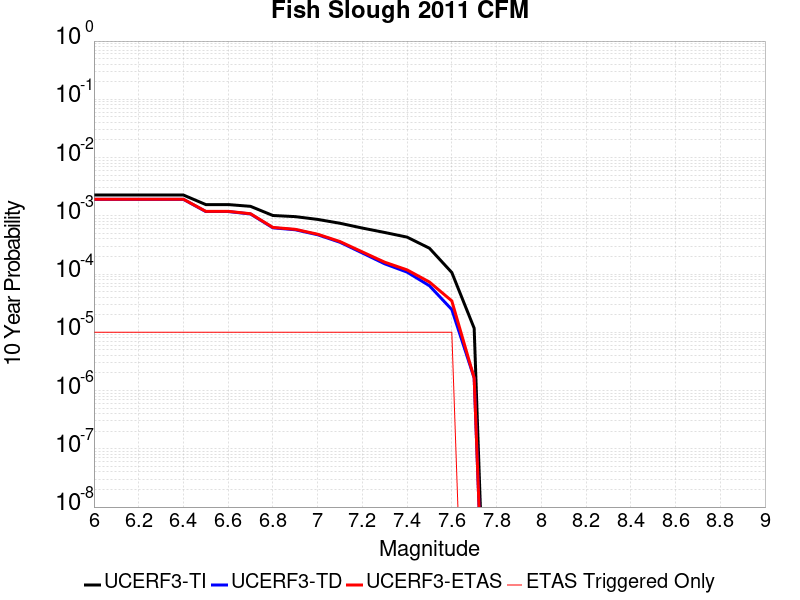 |

| Magnitude | 1 wk TI Prob | 1 wk TD Prob | 1 wk ETAS Prob | 1 wk ETAS/TD Gain | 1 wk ETAS Triggered Only | 1 mo TI Prob | 1 mo TD Prob | 1 mo ETAS Prob | 1 mo ETAS/TD Gain | 1 mo ETAS Triggered Only | 1 yr TI Prob | 1 yr TD Prob | 1 yr ETAS Prob | 1 yr ETAS/TD Gain | 1 yr ETAS Triggered Only | 10 yr TI Prob | 10 yr TD Prob | 10 yr ETAS Prob | 10 yr ETAS/TD Gain | 10 yr ETAS Triggered Only |
|-----|-----|-----|-----|-----|-----|-----|-----|-----|-----|-----|-----|-----|-----|-----|-----|-----|-----|-----|-----|-----|
| 6.0 | 4.3629925E-6 | 3.6772697E-6 | 3.6772697E-6 | 1.0 | 0.0 | 1.8698405E-5 | 1.5759644E-5 | 1.5759644E-5 | 1.0 | 0.0 | 2.276293E-4 | 1.918589E-4 | 2.1015332E-4 | 1.0953535 | 1.8297927E-5 | 0.0022739628 | 0.0019171416 | 0.0019354044 | 1.0095261 | 1.8297927E-5 |
| 6.1 | 4.3629925E-6 | 3.6772697E-6 | 3.6772697E-6 | 1.0 | 0.0 | 1.8698405E-5 | 1.5759644E-5 | 1.5759644E-5 | 1.0 | 0.0 | 2.276293E-4 | 1.918589E-4 | 2.1015332E-4 | 1.0953535 | 1.8297927E-5 | 0.0022739628 | 0.0019171416 | 0.0019354044 | 1.0095261 | 1.8297927E-5 |
| 6.2 | 4.3629925E-6 | 3.6772697E-6 | 3.6772697E-6 | 1.0 | 0.0 | 1.8698405E-5 | 1.5759644E-5 | 1.5759644E-5 | 1.0 | 0.0 | 2.276293E-4 | 1.918589E-4 | 2.1015332E-4 | 1.0953535 | 1.8297927E-5 | 0.0022739628 | 0.0019171416 | 0.0019354044 | 1.0095261 | 1.8297927E-5 |
| 6.3 | 4.3629925E-6 | 3.6772697E-6 | 3.6772697E-6 | 1.0 | 0.0 | 1.8698405E-5 | 1.5759644E-5 | 1.5759644E-5 | 1.0 | 0.0 | 2.276293E-4 | 1.918589E-4 | 2.1015332E-4 | 1.0953535 | 1.8297927E-5 | 0.0022739628 | 0.0019171416 | 0.0019354044 | 1.0095261 | 1.8297927E-5 |
| 6.4 | 4.3629925E-6 | 3.6772697E-6 | 3.6772697E-6 | 1.0 | 0.0 | 1.8698405E-5 | 1.5759644E-5 | 1.5759644E-5 | 1.0 | 0.0 | 2.276293E-4 | 1.918589E-4 | 2.1015332E-4 | 1.0953535 | 1.8297927E-5 | 0.0022739628 | 0.0019171416 | 0.0019354044 | 1.0095261 | 1.8297927E-5 |
| 6.5 | 2.991715E-6 | 2.2703898E-6 | 2.2703898E-6 | 1.0 | 0.0 | 1.2821573E-5 | 9.730211E-6 | 9.730211E-6 | 1.0 | 0.0 | 1.5609147E-4 | 1.1845979E-4 | 1.3675555E-4 | 1.154447 | 1.8297927E-5 | 0.0015598187 | 0.0011840566 | 0.0012023329 | 1.0154353 | 1.8297927E-5 |
| 6.6 | 2.991715E-6 | 2.2703898E-6 | 2.2703898E-6 | 1.0 | 0.0 | 1.2821573E-5 | 9.730211E-6 | 9.730211E-6 | 1.0 | 0.0 | 1.5609147E-4 | 1.1845979E-4 | 1.3675555E-4 | 1.154447 | 1.8297927E-5 | 0.0015598187 | 0.0011840566 | 0.0012023329 | 1.0154353 | 1.8297927E-5 |
| 6.7 | 2.7890346E-6 | 2.0621853E-6 | 2.0621853E-6 | 1.0 | 0.0 | 1.1952951E-5 | 8.837912E-6 | 8.837912E-6 | 1.0 | 0.0 | 1.4551746E-4 | 1.0759717E-4 | 1.2589312E-4 | 1.1700413 | 1.8297927E-5 | 0.0014542221 | 0.0010755389 | 0.0010938172 | 1.0169945 | 1.8297927E-5 |
| 6.8 | 1.9416723E-6 | 1.192555E-6 | 1.192555E-6 | 1.0 | 0.0 | 8.321425E-6 | 5.1109405E-6 | 5.1109405E-6 | 1.0 | 0.0 | 1.01308644E-4 | 6.222397E-5 | 8.052075E-5 | 1.2940472 | 1.8297927E-5 | 0.0010126247 | 6.220695E-4 | 6.4035604E-4 | 1.0293963 | 1.8297927E-5 |
| 6.9 | 1.8567416E-6 | 1.1046966E-6 | 1.1046966E-6 | 1.0 | 0.0 | 7.957439E-6 | 4.7344056E-6 | 4.7344056E-6 | 1.0 | 0.0 | 9.687752E-5 | 5.7639903E-5 | 7.5936776E-5 | 1.3174341 | 1.8297927E-5 | 9.6835295E-4 | 5.762534E-4 | 5.945408E-4 | 1.031735 | 1.8297927E-5 |
| 7.0 | 1.6634067E-6 | 9.073966E-7 | 9.073966E-7 | 1.0 | 0.0 | 7.1288664E-6 | 3.888837E-6 | 3.888837E-6 | 1.0 | 0.0 | 8.679049E-5 | 4.734559E-5 | 6.564265E-5 | 1.3864576 | 1.8297927E-5 | 8.6756604E-4 | 4.733579E-4 | 4.9164717E-4 | 1.0386373 | 1.8297927E-5 |
| 7.1 | 1.4281054E-6 | 6.7366227E-7 | 6.7366227E-7 | 1.0 | 0.0 | 6.1204373E-6 | 2.8871211E-6 | 2.8871211E-6 | 1.0 | 0.0 | 7.451377E-5 | 3.515015E-5 | 5.3447435E-5 | 1.5205464 | 1.8297927E-5 | 7.44888E-4 | 3.5144767E-4 | 3.697392E-4 | 1.0520462 | 1.8297927E-5 |
| 7.2 | 1.1810387E-6 | 4.408355E-7 | 4.408355E-7 | 1.0 | 0.0 | 5.0615845E-6 | 1.8892936E-6 | 1.8892936E-6 | 1.0 | 0.0 | 6.1623046E-5 | 2.3001916E-5 | 4.1299423E-5 | 1.7954775 | 1.8297927E-5 | 6.160596E-4 | 2.2999625E-4 | 2.4828996E-4 | 1.0795392 | 1.8297927E-5 |
| 7.3 | 9.918052E-7 | 2.8733467E-7 | 2.8733467E-7 | 1.0 | 0.0 | 4.2505867E-6 | 1.2314338E-6 | 1.2314338E-6 | 1.0 | 0.0 | 5.1749663E-5 | 1.4992604E-5 | 3.3290256E-5 | 2.2204452 | 1.8297927E-5 | 5.173762E-4 | 1.4991604E-4 | 1.6821122E-4 | 1.1220362 | 1.8297927E-5 |
| 7.4 | 8.25252E-7 | 2.0694807E-7 | 2.0694807E-7 | 1.0 | 0.0 | 3.5367896E-6 | 8.8692E-7 | 8.8692E-7 | 1.0 | 0.0 | 4.3059565E-5 | 1.0798199E-5 | 2.9095927E-5 | 2.694517 | 1.8297927E-5 | 4.305122E-4 | 1.07976804E-4 | 1.2627276E-4 | 1.1694434 | 1.8297927E-5 |
| 7.5 | 5.3248567E-7 | 1.2072739E-7 | 1.2072739E-7 | 1.0 | 0.0 | 2.2820795E-6 | 5.17403E-7 | 5.17403E-7 | 1.0 | 0.0 | 2.7783964E-5 | 6.299364E-6 | 2.4597175E-5 | 3.9047077 | 1.8297927E-5 | 2.778049E-4 | 6.2991894E-5 | 8.128867E-5 | 1.2904624 | 1.8297927E-5 |
| 7.6 | 2.037542E-7 | 4.7129152E-8 | 4.7129152E-8 | 1.0 | 0.0 | 8.73232E-7 | 2.0198206E-7 | 2.0198206E-7 | 1.0 | 0.0 | 1.0631547E-5 | 2.459129E-6 | 2.075701E-5 | 8.440798 | 1.8297927E-5 | 1.0631039E-4 | 2.459104E-5 | 4.2888518E-5 | 1.7440709 | 1.8297927E-5 |
| 7.7 | 2.2501226E-8 | 3.1514258E-9 | 3.1514258E-9 | 1.0 | 0.0 | 9.6433816E-8 | 1.350611E-8 | 1.350611E-8 | 1.0 | 0.0 | 1.1740811E-6 | 1.6443688E-7 | 1.6443688E-7 | 1.0 | 0.0 | 1.1740749E-5 | 1.6443678E-6 | 1.6443678E-6 | 1.0 | 0.0 |

## Earthquake Valley (No  Extension)
*[(top)](#table-of-contents)*

| 1 Week | 1 Month | 1 Year | 10 Year |
|-----|-----|-----|-----|
|  |  |  | 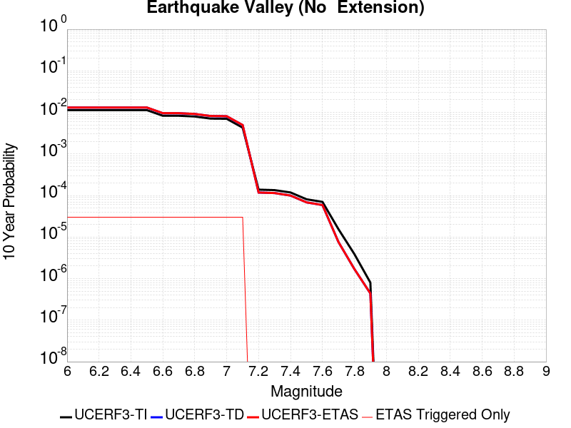 |

| Magnitude | 1 wk TI Prob | 1 wk TD Prob | 1 wk ETAS Prob | 1 wk ETAS/TD Gain | 1 wk ETAS Triggered Only | 1 mo TI Prob | 1 mo TD Prob | 1 mo ETAS Prob | 1 mo ETAS/TD Gain | 1 mo ETAS Triggered Only | 1 yr TI Prob | 1 yr TD Prob | 1 yr ETAS Prob | 1 yr ETAS/TD Gain | 1 yr ETAS Triggered Only | 10 yr TI Prob | 10 yr TD Prob | 10 yr ETAS Prob | 10 yr ETAS/TD Gain | 10 yr ETAS Triggered Only |
|-----|-----|-----|-----|-----|-----|-----|-----|-----|-----|-----|-----|-----|-----|-----|-----|-----|-----|-----|-----|-----|
| 6.0 | 2.1859703E-5 | 2.5198362E-5 | 2.5198362E-5 | 1.0 | 0.0 | 9.3681076E-5 | 1.07989326E-4 | 1.07989326E-4 | 1.0 | 0.0 | 0.0011399703 | 0.001314122 | 0.001332396 | 1.0139058 | 1.8297927E-5 | 0.011341401 | 0.013077871 | 0.01309593 | 1.0013808 | 1.8297927E-5 |
| 6.1 | 2.1859703E-5 | 2.5198362E-5 | 2.5198362E-5 | 1.0 | 0.0 | 9.3681076E-5 | 1.07989326E-4 | 1.07989326E-4 | 1.0 | 0.0 | 0.0011399703 | 0.001314122 | 0.001332396 | 1.0139058 | 1.8297927E-5 | 0.011341401 | 0.013077871 | 0.01309593 | 1.0013808 | 1.8297927E-5 |
| 6.2 | 2.1859703E-5 | 2.5198362E-5 | 2.5198362E-5 | 1.0 | 0.0 | 9.3681076E-5 | 1.07989326E-4 | 1.07989326E-4 | 1.0 | 0.0 | 0.0011399703 | 0.001314122 | 0.001332396 | 1.0139058 | 1.8297927E-5 | 0.011341401 | 0.013077871 | 0.01309593 | 1.0013808 | 1.8297927E-5 |
| 6.3 | 2.1859703E-5 | 2.5198362E-5 | 2.5198362E-5 | 1.0 | 0.0 | 9.3681076E-5 | 1.07989326E-4 | 1.07989326E-4 | 1.0 | 0.0 | 0.0011399703 | 0.001314122 | 0.001332396 | 1.0139058 | 1.8297927E-5 | 0.011341401 | 0.013077871 | 0.01309593 | 1.0013808 | 1.8297927E-5 |
| 6.4 | 2.1859703E-5 | 2.5198362E-5 | 2.5198362E-5 | 1.0 | 0.0 | 9.3681076E-5 | 1.07989326E-4 | 1.07989326E-4 | 1.0 | 0.0 | 0.0011399703 | 0.001314122 | 0.001332396 | 1.0139058 | 1.8297927E-5 | 0.011341401 | 0.013077871 | 0.01309593 | 1.0013808 | 1.8297927E-5 |
| 6.5 | 2.1859703E-5 | 2.5198362E-5 | 2.5198362E-5 | 1.0 | 0.0 | 9.3681076E-5 | 1.07989326E-4 | 1.07989326E-4 | 1.0 | 0.0 | 0.0011399703 | 0.001314122 | 0.001332396 | 1.0139058 | 1.8297927E-5 | 0.011341401 | 0.013077871 | 0.01309593 | 1.0013808 | 1.8297927E-5 |
| 6.6 | 1.597E-5 | 1.8356275E-5 | 1.8356275E-5 | 1.0 | 0.0 | 6.8441055E-5 | 7.866787E-5 | 7.866787E-5 | 1.0 | 0.0 | 8.329513E-4 | 9.574478E-4 | 9.757282E-4 | 1.0190928 | 1.8297927E-5 | 0.008298361 | 0.009541836 | 0.009559959 | 1.0018994 | 1.8297927E-5 |
| 6.7 | 1.597E-5 | 1.8356275E-5 | 1.8356275E-5 | 1.0 | 0.0 | 6.8441055E-5 | 7.866787E-5 | 7.866787E-5 | 1.0 | 0.0 | 8.329513E-4 | 9.574478E-4 | 9.757282E-4 | 1.0190928 | 1.8297927E-5 | 0.008298361 | 0.009541836 | 0.009559959 | 1.0018994 | 1.8297927E-5 |
| 6.8 | 1.5315149E-5 | 1.7602091E-5 | 1.7602091E-5 | 1.0 | 0.0 | 6.5634704E-5 | 7.543584E-5 | 7.543584E-5 | 1.0 | 0.0 | 7.988095E-4 | 9.181311E-4 | 9.3641225E-4 | 1.0199113 | 1.8297927E-5 | 0.007959441 | 0.009151919 | 0.00917005 | 1.001981 | 1.8297927E-5 |
| 6.9 | 1.3634728E-5 | 1.5675821E-5 | 1.5675821E-5 | 1.0 | 0.0 | 5.8433237E-5 | 6.718082E-5 | 6.718082E-5 | 1.0 | 0.0 | 7.1119244E-4 | 8.177017E-4 | 8.3598465E-4 | 1.022359 | 1.8297927E-5 | 0.007089207 | 0.008155 | 0.008173149 | 1.0022255 | 1.8297927E-5 |
| 7.0 | 1.3496271E-5 | 1.5517853E-5 | 1.5517853E-5 | 1.0 | 0.0 | 5.783988E-5 | 6.650385E-5 | 6.650385E-5 | 1.0 | 0.0 | 7.03973E-4 | 8.094657E-4 | 8.2774885E-4 | 1.0225867 | 1.8297927E-5 | 0.007017471 | 0.0080732405 | 0.008091391 | 1.0022482 | 1.8297927E-5 |
| 7.1 | 8.242798E-6 | 9.4726E-6 | 9.4726E-6 | 1.0 | 0.0 | 3.53258E-5 | 4.0596606E-5 | 4.0596606E-5 | 1.0 | 0.0 | 4.300067E-4 | 4.9421866E-4 | 5.125075E-4 | 1.0370057 | 1.8297927E-5 | 0.004291756 | 0.0049377717 | 0.0049559795 | 1.0036874 | 1.8297927E-5 |
| 7.2 | 2.6506527E-7 | 2.2560312E-7 | 2.2560312E-7 | 1.0 | 0.0 | 1.1359936E-6 | 9.668702E-7 | 9.668702E-7 | 1.0 | 0.0 | 1.3830633E-5 | 1.17715845E-5 | 1.17715845E-5 | 1.0 | 0.0 | 1.3829772E-4 | 1.1771003E-4 | 1.1771003E-4 | 1.0 | 0.0 |
| 7.3 | 2.5810488E-7 | 2.1955442E-7 | 2.1955442E-7 | 1.0 | 0.0 | 1.1061633E-6 | 9.409472E-7 | 9.409472E-7 | 1.0 | 0.0 | 1.3467455E-5 | 1.1455976E-5 | 1.1455976E-5 | 1.0 | 0.0 | 1.3466639E-4 | 1.1455427E-4 | 1.1455427E-4 | 1.0 | 0.0 |
| 7.4 | 2.2676066E-7 | 1.9110601E-7 | 1.9110601E-7 | 1.0 | 0.0 | 9.71831E-7 | 8.190255E-7 | 8.190255E-7 | 1.0 | 0.0 | 1.1831979E-5 | 9.9715935E-6 | 9.9715935E-6 | 1.0 | 0.0 | 1.1831349E-4 | 9.9711855E-5 | 9.9711855E-5 | 1.0 | 0.0 |
| 7.5 | 1.5553917E-7 | 1.3112096E-7 | 1.3112096E-7 | 1.0 | 0.0 | 6.6659624E-7 | 5.619469E-7 | 5.619469E-7 | 1.0 | 0.0 | 8.115779E-6 | 6.8416834E-6 | 6.8416834E-6 | 1.0 | 0.0 | 8.115482E-5 | 6.841495E-5 | 6.841495E-5 | 1.0 | 0.0 |
| 7.6 | 1.3448629E-7 | 1.1288419E-7 | 1.1288419E-7 | 1.0 | 0.0 | 5.7636964E-7 | 4.837893E-7 | 4.837893E-7 | 1.0 | 0.0 | 7.017278E-6 | 5.890121E-6 | 5.890121E-6 | 1.0 | 0.0 | 7.0170565E-5 | 5.889986E-5 | 5.889986E-5 | 1.0 | 0.0 |
| 7.7 | 2.9719402E-8 | 1.458206E-8 | 1.458206E-8 | 1.0 | 0.0 | 1.2736886E-7 | 6.249454E-8 | 6.249454E-8 | 1.0 | 0.0 | 1.5507147E-6 | 7.608708E-7 | 7.608708E-7 | 1.0 | 0.0 | 1.550704E-5 | 7.6086876E-6 | 7.6086876E-6 | 1.0 | 0.0 |
| 7.8 | 7.4390196E-9 | 3.2502152E-9 | 3.2502152E-9 | 1.0 | 0.0 | 3.1881513E-8 | 1.3929493E-8 | 1.3929493E-8 | 1.0 | 0.0 | 3.8815733E-7 | 1.6959156E-7 | 1.6959156E-7 | 1.0 | 0.0 | 3.8815665E-6 | 1.6959145E-6 | 1.6959145E-6 | 1.0 | 0.0 |
| 7.9 | 1.5373532E-9 | 8.440161E-10 | 8.440161E-10 | 1.0 | 0.0 | 6.5886567E-9 | 3.6172119E-9 | 3.6172119E-9 | 1.0 | 0.0 | 8.021689E-8 | 4.4039556E-8 | 4.4039556E-8 | 1.0 | 0.0 | 8.0216864E-7 | 4.4039552E-7 | 4.4039552E-7 | 1.0 | 0.0 |

## La Panza 2011
*[(top)](#table-of-contents)*

| 1 Week | 1 Month | 1 Year | 10 Year |
|-----|-----|-----|-----|
|  |  |  |  |

| Magnitude | 1 wk TI Prob | 1 wk TD Prob | 1 wk ETAS Prob | 1 wk ETAS/TD Gain | 1 wk ETAS Triggered Only | 1 mo TI Prob | 1 mo TD Prob | 1 mo ETAS Prob | 1 mo ETAS/TD Gain | 1 mo ETAS Triggered Only | 1 yr TI Prob | 1 yr TD Prob | 1 yr ETAS Prob | 1 yr ETAS/TD Gain | 1 yr ETAS Triggered Only | 10 yr TI Prob | 10 yr TD Prob | 10 yr ETAS Prob | 10 yr ETAS/TD Gain | 10 yr ETAS Triggered Only |
|-----|-----|-----|-----|-----|-----|-----|-----|-----|-----|-----|-----|-----|-----|-----|-----|-----|-----|-----|-----|-----|
| 6.0 | 4.6754544E-6 | 4.717587E-6 | 2.3015427E-5 | 4.878644 | 1.8297927E-5 | 2.0037509E-5 | 2.0218084E-5 | 3.851564E-5 | 1.9050094 | 1.8297927E-5 | 2.4392935E-4 | 2.4612935E-4 | 2.6442276E-4 | 1.0743245 | 1.8297927E-5 | 0.0024366176 | 0.002458762 | 0.002477015 | 1.0074236 | 1.8297927E-5 |
| 6.1 | 4.6754544E-6 | 4.717587E-6 | 2.3015427E-5 | 4.878644 | 1.8297927E-5 | 2.0037509E-5 | 2.0218084E-5 | 3.851564E-5 | 1.9050094 | 1.8297927E-5 | 2.4392935E-4 | 2.4612935E-4 | 2.6442276E-4 | 1.0743245 | 1.8297927E-5 | 0.0024366176 | 0.002458762 | 0.002477015 | 1.0074236 | 1.8297927E-5 |
| 6.2 | 4.6754544E-6 | 4.717587E-6 | 2.3015427E-5 | 4.878644 | 1.8297927E-5 | 2.0037509E-5 | 2.0218084E-5 | 3.851564E-5 | 1.9050094 | 1.8297927E-5 | 2.4392935E-4 | 2.4612935E-4 | 2.6442276E-4 | 1.0743245 | 1.8297927E-5 | 0.0024366176 | 0.002458762 | 0.002477015 | 1.0074236 | 1.8297927E-5 |
| 6.3 | 4.6754544E-6 | 4.717587E-6 | 2.3015427E-5 | 4.878644 | 1.8297927E-5 | 2.0037509E-5 | 2.0218084E-5 | 3.851564E-5 | 1.9050094 | 1.8297927E-5 | 2.4392935E-4 | 2.4612935E-4 | 2.6442276E-4 | 1.0743245 | 1.8297927E-5 | 0.0024366176 | 0.002458762 | 0.002477015 | 1.0074236 | 1.8297927E-5 |
| 6.4 | 4.6754544E-6 | 4.717587E-6 | 2.3015427E-5 | 4.878644 | 1.8297927E-5 | 2.0037509E-5 | 2.0218084E-5 | 3.851564E-5 | 1.9050094 | 1.8297927E-5 | 2.4392935E-4 | 2.4612935E-4 | 2.6442276E-4 | 1.0743245 | 1.8297927E-5 | 0.0024366176 | 0.002458762 | 0.002477015 | 1.0074236 | 1.8297927E-5 |
| 6.5 | 2.485343E-6 | 2.5005988E-6 | 2.079848E-5 | 8.317399 | 1.8297927E-5 | 1.0651426E-5 | 1.0716811E-5 | 2.9014542E-5 | 2.7073858 | 1.8297927E-5 | 1.296734E-4 | 1.3046975E-4 | 1.4876529E-4 | 1.1402283 | 1.8297927E-5 | 0.0012959775 | 0.0013039699 | 0.001322244 | 1.0140141 | 1.8297927E-5 |
| 6.6 | 2.485343E-6 | 2.5005988E-6 | 2.079848E-5 | 8.317399 | 1.8297927E-5 | 1.0651426E-5 | 1.0716811E-5 | 2.9014542E-5 | 2.7073858 | 1.8297927E-5 | 1.296734E-4 | 1.3046975E-4 | 1.4876529E-4 | 1.1402283 | 1.8297927E-5 | 0.0012959775 | 0.0013039699 | 0.001322244 | 1.0140141 | 1.8297927E-5 |
| 6.7 | 1.5108508E-6 | 1.5146375E-6 | 1.9812536E-5 | 13.080712 | 1.8297927E-5 | 6.4750584E-6 | 6.491288E-6 | 2.4789097E-5 | 3.8188255 | 1.8297927E-5 | 7.8830984E-5 | 7.902867E-5 | 9.732515E-5 | 1.231517 | 1.8297927E-5 | 7.880303E-4 | 7.900165E-4 | 8.083E-4 | 1.0231432 | 1.8297927E-5 |
| 6.8 | 1.3865837E-6 | 1.3885102E-6 | 1.9686411E-5 | 14.178082 | 1.8297927E-5 | 5.942488E-6 | 5.9507447E-6 | 2.4248562E-5 | 4.0748787 | 1.8297927E-5 | 7.234739E-5 | 7.244801E-5 | 9.074461E-5 | 1.252548 | 1.8297927E-5 | 7.232384E-4 | 7.242537E-4 | 7.425384E-4 | 1.0252463 | 1.8297927E-5 |
| 6.9 | 9.826583E-7 | 9.796287E-7 | 1.9277537E-5 | 19.678413 | 1.8297927E-5 | 4.2113857E-6 | 4.198402E-6 | 2.2496251E-5 | 5.3582892 | 1.8297927E-5 | 5.1272415E-5 | 5.11144E-5 | 6.941139E-5 | 1.3579615 | 1.8297927E-5 | 5.126059E-4 | 5.110318E-4 | 5.293204E-4 | 1.0357876 | 1.8297927E-5 |
| 7.0 | 6.7797646E-7 | 6.7102144E-7 | 1.8968936E-5 | 28.268747 | 1.8297927E-5 | 2.9056102E-6 | 2.8758034E-6 | 2.1173677E-5 | 7.3627005 | 1.8297927E-5 | 3.537523E-5 | 3.5012374E-5 | 5.330966E-5 | 1.5225948 | 1.8297927E-5 | 3.5369597E-4 | 3.5007167E-4 | 3.683632E-4 | 1.0522507 | 1.8297927E-5 |
| 7.1 | 3.4979826E-7 | 3.387388E-7 | 1.863666E-5 | 55.017788 | 1.8297927E-5 | 1.4991346E-6 | 1.4517369E-6 | 1.9749637E-5 | 13.604143 | 1.8297927E-5 | 1.825181E-5 | 1.7674765E-5 | 3.597237E-5 | 2.0352387 | 1.8297927E-5 | 1.825031E-4 | 1.7673477E-4 | 1.9502947E-4 | 1.1035149 | 1.8297927E-5 |
| 7.2 | 2.5088332E-7 | 2.3831899E-7 | 1.8536242E-5 | 77.77912 | 1.8297927E-5 | 1.0752137E-6 | 1.0213668E-6 | 1.9319275E-5 | 18.915121 | 1.8297927E-5 | 1.3090649E-5 | 1.2435077E-5 | 3.0732775E-5 | 2.4714584 | 1.8297927E-5 | 1.3089878E-4 | 1.2434467E-4 | 1.4264032E-4 | 1.1471366 | 1.8297927E-5 |
| 7.3 | 1.0159086E-7 | 8.64462E-8 | 8.64462E-8 | 1.0 | 0.0 | 4.3538932E-7 | 3.7048366E-7 | 3.7048366E-7 | 1.0 | 0.0 | 5.300852E-6 | 4.5106294E-6 | 4.5106294E-6 | 1.0 | 0.0 | 5.3007258E-5 | 4.5105422E-5 | 4.5105422E-5 | 1.0 | 0.0 |
| 7.4 | 3.5006252E-8 | 1.9404325E-8 | 1.9404325E-8 | 1.0 | 0.0 | 1.5002678E-7 | 8.3161396E-8 | 8.3161396E-8 | 1.0 | 0.0 | 1.8265745E-6 | 1.0124895E-6 | 1.0124895E-6 | 1.0 | 0.0 | 1.8265595E-5 | 1.01248515E-5 | 1.01248515E-5 | 1.0 | 0.0 |
| 7.5 | 2.592274E-8 | 1.0239094E-8 | 1.0239094E-8 | 1.0 | 0.0 | 1.1109746E-7 | 4.388183E-8 | 4.388183E-8 | 1.0 | 0.0 | 1.3526106E-6 | 5.342612E-7 | 5.342612E-7 | 1.0 | 0.0 | 1.3526024E-5 | 5.3425997E-6 | 5.3425997E-6 | 1.0 | 0.0 |
| 7.6 | 1.9016717E-8 | 5.244801E-9 | 5.244801E-9 | 1.0 | 0.0 | 8.150022E-8 | 2.247772E-8 | 2.247772E-8 | 1.0 | 0.0 | 9.922647E-7 | 2.736662E-7 | 2.736662E-7 | 1.0 | 0.0 | 9.922603E-6 | 2.7366589E-6 | 2.7366589E-6 | 1.0 | 0.0 |
| 7.7 | 1.17738495E-8 | 1.2398075E-9 | 1.2398075E-9 | 1.0 | 0.0 | 5.0459356E-8 | 5.3134603E-9 | 5.3134603E-9 | 1.0 | 0.0 | 6.1434247E-7 | 6.469138E-8 | 6.469138E-8 | 1.0 | 0.0 | 6.143408E-6 | 6.469136E-7 | 6.469136E-7 | 1.0 | 0.0 |
| 7.8 | 5.489079E-9 | 2.0111768E-10 | 2.0111768E-10 | 1.0 | 0.0 | 2.3524624E-8 | 8.6193275E-10 | 8.6193275E-10 | 1.0 | 0.0 | 2.8641225E-7 | 1.04940305E-8 | 1.04940305E-8 | 1.0 | 0.0 | 2.8641189E-6 | 1.04940305E-7 | 1.04940305E-7 | 1.0 | 0.0 |
| 7.9 | 2.5081048E-9 | 6.683887E-11 | 6.683887E-11 | 1.0 | 0.0 | 1.0749021E-8 | 2.8645197E-10 | 2.8645197E-10 | 1.0 | 0.0 | 1.3086932E-7 | 3.487552E-9 | 3.487552E-9 | 1.0 | 0.0 | 1.3086925E-6 | 3.487552E-8 | 3.487552E-8 | 1.0 | 0.0 |

## Shoreline
*[(top)](#table-of-contents)*

| 1 Week | 1 Month | 1 Year | 10 Year |
|-----|-----|-----|-----|
|  |  |  |  |

| Magnitude | 1 wk TI Prob | 1 wk TD Prob | 1 wk ETAS Prob | 1 wk ETAS/TD Gain | 1 wk ETAS Triggered Only | 1 mo TI Prob | 1 mo TD Prob | 1 mo ETAS Prob | 1 mo ETAS/TD Gain | 1 mo ETAS Triggered Only | 1 yr TI Prob | 1 yr TD Prob | 1 yr ETAS Prob | 1 yr ETAS/TD Gain | 1 yr ETAS Triggered Only | 10 yr TI Prob | 10 yr TD Prob | 10 yr ETAS Prob | 10 yr ETAS/TD Gain | 10 yr ETAS Triggered Only |
|-----|-----|-----|-----|-----|-----|-----|-----|-----|-----|-----|-----|-----|-----|-----|-----|-----|-----|-----|-----|-----|
| 6.0 | 3.9888673E-6 | 4.047929E-6 | 4.047929E-6 | 1.0 | 0.0 | 1.7095033E-5 | 1.7348184E-5 | 1.7348184E-5 | 1.0 | 0.0 | 2.0811215E-4 | 2.1119925E-4 | 2.1119925E-4 | 1.0 | 0.0 | 0.0020791737 | 0.002110534 | 0.0021287934 | 1.0086515 | 1.8297927E-5 |
| 6.1 | 3.9888673E-6 | 4.047929E-6 | 4.047929E-6 | 1.0 | 0.0 | 1.7095033E-5 | 1.7348184E-5 | 1.7348184E-5 | 1.0 | 0.0 | 2.0811215E-4 | 2.1119925E-4 | 2.1119925E-4 | 1.0 | 0.0 | 0.0020791737 | 0.002110534 | 0.0021287934 | 1.0086515 | 1.8297927E-5 |
| 6.2 | 1.4039653E-6 | 1.4100891E-6 | 1.4100891E-6 | 1.0 | 0.0 | 6.0169805E-6 | 6.0432253E-6 | 6.0432253E-6 | 1.0 | 0.0 | 7.325427E-5 | 7.357384E-5 | 7.357384E-5 | 1.0 | 0.0 | 7.3230127E-4 | 7.355009E-4 | 7.355009E-4 | 1.0 | 0.0 |
| 6.3 | 1.4039653E-6 | 1.4100891E-6 | 1.4100891E-6 | 1.0 | 0.0 | 6.0169805E-6 | 6.0432253E-6 | 6.0432253E-6 | 1.0 | 0.0 | 7.325427E-5 | 7.357384E-5 | 7.357384E-5 | 1.0 | 0.0 | 7.3230127E-4 | 7.355009E-4 | 7.355009E-4 | 1.0 | 0.0 |
| 6.4 | 1.3314152E-6 | 1.3361605E-6 | 1.3361605E-6 | 1.0 | 0.0 | 5.7060524E-6 | 5.7263896E-6 | 5.7263896E-6 | 1.0 | 0.0 | 6.946897E-5 | 6.971662E-5 | 6.971662E-5 | 1.0 | 0.0 | 6.9447263E-4 | 6.9695286E-4 | 6.9695286E-4 | 1.0 | 0.0 |
| 6.5 | 1.1187026E-6 | 1.120364E-6 | 1.120364E-6 | 1.0 | 0.0 | 4.794431E-6 | 4.8015513E-6 | 4.8015513E-6 | 1.0 | 0.0 | 5.8370628E-5 | 5.8457343E-5 | 5.8457343E-5 | 1.0 | 0.0 | 5.83553E-4 | 5.844222E-4 | 5.844222E-4 | 1.0 | 0.0 |
| 6.6 | 9.793089E-7 | 9.784919E-7 | 9.784919E-7 | 1.0 | 0.0 | 4.1970316E-6 | 4.1935305E-6 | 4.1935305E-6 | 1.0 | 0.0 | 5.1097657E-5 | 5.105505E-5 | 5.105505E-5 | 1.0 | 0.0 | 5.108591E-4 | 5.1043445E-4 | 5.1043445E-4 | 1.0 | 0.0 |
| 6.7 | 8.995986E-7 | 8.9728E-7 | 8.9728E-7 | 1.0 | 0.0 | 3.8554167E-6 | 3.84548E-6 | 3.84548E-6 | 1.0 | 0.0 | 4.693869E-5 | 4.6817724E-5 | 4.6817724E-5 | 1.0 | 0.0 | 4.6928777E-4 | 4.6807955E-4 | 4.6807955E-4 | 1.0 | 0.0 |
| 6.8 | 7.931612E-7 | 7.8804027E-7 | 7.8804027E-7 | 1.0 | 0.0 | 3.3992578E-6 | 3.377311E-6 | 3.377311E-6 | 1.0 | 0.0 | 4.1385178E-5 | 4.1117994E-5 | 4.1117994E-5 | 1.0 | 0.0 | 4.1377472E-4 | 4.1110438E-4 | 4.1110438E-4 | 1.0 | 0.0 |
| 6.9 | 7.1465956E-7 | 7.078006E-7 | 7.078006E-7 | 1.0 | 0.0 | 3.062823E-6 | 3.0334277E-6 | 3.0334277E-6 | 1.0 | 0.0 | 3.7289232E-5 | 3.6931357E-5 | 3.6931357E-5 | 1.0 | 0.0 | 3.7282976E-4 | 3.6925258E-4 | 3.6925258E-4 | 1.0 | 0.0 |
| 7.0 | 6.389046E-7 | 6.299458E-7 | 6.299458E-7 | 1.0 | 0.0 | 2.7381598E-6 | 2.699765E-6 | 2.699765E-6 | 1.0 | 0.0 | 3.3336586E-5 | 3.2869146E-5 | 3.2869146E-5 | 1.0 | 0.0 | 3.3331584E-4 | 3.2864307E-4 | 3.2864307E-4 | 1.0 | 0.0 |
| 7.1 | 5.4300875E-7 | 5.3111313E-7 | 5.3111313E-7 | 1.0 | 0.0 | 2.3271782E-6 | 2.276197E-6 | 2.276197E-6 | 1.0 | 0.0 | 2.8333026E-5 | 2.7712347E-5 | 2.7712347E-5 | 1.0 | 0.0 | 2.8329415E-4 | 2.77089E-4 | 2.77089E-4 | 1.0 | 0.0 |
| 7.2 | 4.6768855E-7 | 4.5348952E-7 | 4.5348952E-7 | 1.0 | 0.0 | 2.0043778E-6 | 1.9435251E-6 | 1.9435251E-6 | 1.0 | 0.0 | 2.4403027E-5 | 2.3662162E-5 | 2.3662162E-5 | 1.0 | 0.0 | 2.4400349E-4 | 2.3659648E-4 | 2.3659648E-4 | 1.0 | 0.0 |
| 7.3 | 4.0966103E-7 | 3.9385662E-7 | 3.9385662E-7 | 1.0 | 0.0 | 1.7556889E-6 | 1.6879559E-6 | 1.6879559E-6 | 1.0 | 0.0 | 2.1375303E-5 | 2.055067E-5 | 2.055067E-5 | 1.0 | 0.0 | 2.1373246E-4 | 2.0548773E-4 | 2.0548773E-4 | 1.0 | 0.0 |
| 7.4 | 3.5105785E-7 | 3.3363975E-7 | 3.3363975E-7 | 1.0 | 0.0 | 1.5045327E-6 | 1.4298838E-6 | 1.4298838E-6 | 1.0 | 0.0 | 1.8317533E-5 | 1.7408696E-5 | 1.7408696E-5 | 1.0 | 0.0 | 1.8316023E-4 | 1.7407336E-4 | 1.7407336E-4 | 1.0 | 0.0 |
| 7.5 | 2.8737534E-7 | 2.6820038E-7 | 2.6820038E-7 | 1.0 | 0.0 | 1.2316079E-6 | 1.1494297E-6 | 1.1494297E-6 | 1.0 | 0.0 | 1.4994724E-5 | 1.3994217E-5 | 1.3994217E-5 | 1.0 | 0.0 | 1.4993713E-4 | 1.3993339E-4 | 1.3993339E-4 | 1.0 | 0.0 |
| 7.6 | 2.0924051E-7 | 1.8778988E-7 | 1.8778988E-7 | 1.0 | 0.0 | 8.967448E-7 | 8.048135E-7 | 8.048135E-7 | 1.0 | 0.0 | 1.0917813E-5 | 9.79856E-6 | 9.79856E-6 | 1.0 | 0.0 | 1.0917276E-4 | 9.798129E-5 | 9.798129E-5 | 1.0 | 0.0 |
| 7.7 | 1.392265E-7 | 1.15433906E-7 | 1.15433906E-7 | 1.0 | 0.0 | 5.9668486E-7 | 4.9471663E-7 | 4.9471663E-7 | 1.0 | 0.0 | 7.2646135E-6 | 6.023158E-6 | 6.023158E-6 | 1.0 | 0.0 | 7.2643765E-5 | 6.0229955E-5 | 6.0229955E-5 | 1.0 | 0.0 |
| 7.8 | 8.1080074E-8 | 5.586722E-8 | 5.586722E-8 | 1.0 | 0.0 | 3.4748598E-7 | 2.394309E-7 | 2.394309E-7 | 1.0 | 0.0 | 4.2306337E-6 | 2.9150672E-6 | 2.9150672E-6 | 1.0 | 0.0 | 4.230553E-5 | 2.9150291E-5 | 2.9150291E-5 | 1.0 | 0.0 |
| 7.9 | 5.0859036E-8 | 2.7244445E-8 | 2.7244445E-8 | 1.0 | 0.0 | 2.1796728E-7 | 1.16761896E-7 | 1.16761896E-7 | 1.0 | 0.0 | 2.6537484E-6 | 1.4215751E-6 | 1.4215751E-6 | 1.0 | 0.0 | 2.6537167E-5 | 1.4215661E-5 | 1.4215661E-5 | 1.0 | 0.0 |
| 8.0 | 3.1760536E-8 | 1.3577206E-8 | 1.3577206E-8 | 1.0 | 0.0 | 1.3611657E-7 | 5.8188025E-8 | 5.8188025E-8 | 1.0 | 0.0 | 1.6572179E-6 | 7.0843896E-7 | 7.0843896E-7 | 1.0 | 0.0 | 1.6572056E-5 | 7.084367E-6 | 7.084367E-6 | 1.0 | 0.0 |
| 8.1 | 1.2947896E-8 | 5.6628693E-9 | 5.6628693E-9 | 1.0 | 0.0 | 5.5490982E-8 | 2.426944E-8 | 2.426944E-8 | 1.0 | 0.0 | 6.756025E-7 | 2.954804E-7 | 2.954804E-7 | 1.0 | 0.0 | 6.7560045E-6 | 2.9548003E-6 | 2.9548003E-6 | 1.0 | 0.0 |

## Emerson-Copper Mtn 2011
*[(top)](#table-of-contents)*

| 1 Week | 1 Month | 1 Year | 10 Year |
|-----|-----|-----|-----|
|  |  |  |  |

| Magnitude | 1 wk TI Prob | 1 wk TD Prob | 1 wk ETAS Prob | 1 wk ETAS/TD Gain | 1 wk ETAS Triggered Only | 1 mo TI Prob | 1 mo TD Prob | 1 mo ETAS Prob | 1 mo ETAS/TD Gain | 1 mo ETAS Triggered Only | 1 yr TI Prob | 1 yr TD Prob | 1 yr ETAS Prob | 1 yr ETAS/TD Gain | 1 yr ETAS Triggered Only | 10 yr TI Prob | 10 yr TD Prob | 10 yr ETAS Prob | 10 yr ETAS/TD Gain | 10 yr ETAS Triggered Only |
|-----|-----|-----|-----|-----|-----|-----|-----|-----|-----|-----|-----|-----|-----|-----|-----|-----|-----|-----|-----|-----|
| 6.0 | 2.1364202E-5 | 9.968114E-6 | 9.968114E-6 | 1.0 | 0.0 | 9.1557646E-5 | 4.2719836E-5 | 4.2719836E-5 | 1.0 | 0.0 | 0.0011141442 | 5.199986E-4 | 5.199986E-4 | 1.0 | 0.0 | 0.011085749 | 0.005188688 | 0.005206891 | 1.0035082 | 1.8297927E-5 |
| 6.1 | 2.1364202E-5 | 9.968114E-6 | 9.968114E-6 | 1.0 | 0.0 | 9.1557646E-5 | 4.2719836E-5 | 4.2719836E-5 | 1.0 | 0.0 | 0.0011141442 | 5.199986E-4 | 5.199986E-4 | 1.0 | 0.0 | 0.011085749 | 0.005188688 | 0.005206891 | 1.0035082 | 1.8297927E-5 |
| 6.2 | 2.1364202E-5 | 9.968114E-6 | 9.968114E-6 | 1.0 | 0.0 | 9.1557646E-5 | 4.2719836E-5 | 4.2719836E-5 | 1.0 | 0.0 | 0.0011141442 | 5.199986E-4 | 5.199986E-4 | 1.0 | 0.0 | 0.011085749 | 0.005188688 | 0.005206891 | 1.0035082 | 1.8297927E-5 |
| 6.3 | 1.7751237E-5 | 8.089227E-6 | 8.089227E-6 | 1.0 | 0.0 | 7.607452E-5 | 3.466769E-5 | 3.466769E-5 | 1.0 | 0.0 | 9.258136E-4 | 4.2200365E-4 | 4.2200365E-4 | 1.0 | 0.0 | 0.00921966 | 0.0042126453 | 0.004230866 | 1.0043253 | 1.8297927E-5 |
| 6.4 | 1.7751237E-5 | 8.089227E-6 | 8.089227E-6 | 1.0 | 0.0 | 7.607452E-5 | 3.466769E-5 | 3.466769E-5 | 1.0 | 0.0 | 9.258136E-4 | 4.2200365E-4 | 4.2200365E-4 | 1.0 | 0.0 | 0.00921966 | 0.0042126453 | 0.004230866 | 1.0043253 | 1.8297927E-5 |
| 6.5 | 1.5886664E-5 | 6.603819E-6 | 6.603819E-6 | 1.0 | 0.0 | 6.808392E-5 | 2.8301802E-5 | 2.8301802E-5 | 1.0 | 0.0 | 8.286065E-4 | 3.4452465E-4 | 3.4452465E-4 | 1.0 | 0.0 | 0.008255237 | 0.0034403696 | 0.0034586044 | 1.0053003 | 1.8297927E-5 |
| 6.6 | 1.5886664E-5 | 6.603819E-6 | 6.603819E-6 | 1.0 | 0.0 | 6.808392E-5 | 2.8301802E-5 | 2.8301802E-5 | 1.0 | 0.0 | 8.286065E-4 | 3.4452465E-4 | 3.4452465E-4 | 1.0 | 0.0 | 0.008255237 | 0.0034403696 | 0.0034586044 | 1.0053003 | 1.8297927E-5 |
| 6.7 | 1.428471E-5 | 5.470403E-6 | 5.470403E-6 | 1.0 | 0.0 | 6.121875E-5 | 2.3444394E-5 | 2.3444394E-5 | 1.0 | 0.0 | 7.450834E-4 | 2.8540206E-4 | 2.8540206E-4 | 1.0 | 0.0 | 0.007425902 | 0.0028507432 | 0.002868989 | 1.0064003 | 1.8297927E-5 |
| 6.8 | 1.3490684E-5 | 5.073699E-6 | 5.073699E-6 | 1.0 | 0.0 | 5.7815934E-5 | 2.1744265E-5 | 2.1744265E-5 | 1.0 | 0.0 | 7.0368167E-4 | 2.6470813E-4 | 2.6470813E-4 | 1.0 | 0.0 | 0.007014576 | 0.002644309 | 0.0026625586 | 1.0069014 | 1.8297927E-5 |
| 6.9 | 1.2235421E-5 | 4.289677E-6 | 4.289677E-6 | 1.0 | 0.0 | 5.2436466E-5 | 1.838422E-5 | 1.838422E-5 | 1.0 | 0.0 | 6.38227E-4 | 2.238085E-4 | 2.238085E-4 | 1.0 | 0.0 | 0.0063639707 | 0.0022361854 | 0.0022544423 | 1.0081644 | 1.8297927E-5 |
| 7.0 | 1.1009851E-5 | 3.7189886E-6 | 3.7189886E-6 | 1.0 | 0.0 | 4.7184225E-5 | 1.5938444E-5 | 1.5938444E-5 | 1.0 | 0.0 | 5.743165E-4 | 1.9403672E-4 | 1.9403672E-4 | 1.0 | 0.0 | 0.005728345 | 0.0019390108 | 0.0019572733 | 1.0094185 | 1.8297927E-5 |
| 7.1 | 9.726373E-6 | 3.2117953E-6 | 3.2117953E-6 | 1.0 | 0.0 | 4.168379E-5 | 1.3764783E-5 | 1.3764783E-5 | 1.0 | 0.0 | 5.07382E-4 | 1.6757673E-4 | 1.6757673E-4 | 1.0 | 0.0 | 0.0050622504 | 0.0016748349 | 0.0016931021 | 1.0109069 | 1.8297927E-5 |
| 7.2 | 3.9335127E-6 | 1.1524792E-6 | 1.1524792E-6 | 1.0 | 0.0 | 1.6857803E-5 | 4.9391874E-6 | 4.9391874E-6 | 1.0 | 0.0 | 2.0522442E-4 | 6.0133007E-5 | 6.0133007E-5 | 1.0 | 0.0 | 0.00205035 | 6.011733E-4 | 6.1946025E-4 | 1.0304188 | 1.8297927E-5 |
| 7.3 | 2.661632E-6 | 6.911505E-7 | 6.911505E-7 | 1.0 | 0.0 | 1.14069435E-5 | 2.9620703E-6 | 2.9620703E-6 | 1.0 | 0.0 | 1.3887069E-4 | 3.6062618E-5 | 3.6062618E-5 | 1.0 | 0.0 | 0.0013878393 | 3.605687E-4 | 3.7886004E-4 | 1.0507292 | 1.8297927E-5 |
| 7.4 | 2.0893426E-6 | 5.4618386E-7 | 5.4618386E-7 | 1.0 | 0.0 | 8.954295E-6 | 2.3407858E-6 | 2.3407858E-6 | 1.0 | 0.0 | 1.0901308E-4 | 2.84987E-5 | 2.84987E-5 | 1.0 | 0.0 | 0.0010895962 | 2.84951E-4 | 3.0324372E-4 | 1.064196 | 1.8297927E-5 |
| 7.5 | 1.1681728E-6 | 3.6030585E-7 | 3.6030585E-7 | 1.0 | 0.0 | 5.0064455E-6 | 1.544167E-6 | 1.544167E-6 | 1.0 | 0.0 | 6.0951766E-5 | 1.8800076E-5 | 1.8800076E-5 | 1.0 | 0.0 | 6.093505E-4 | 1.8798532E-4 | 2.0627982E-4 | 1.0973186 | 1.8297927E-5 |
| 7.6 | 1.3154387E-7 | 7.1197384E-8 | 7.1197384E-8 | 1.0 | 0.0 | 5.6375933E-7 | 3.051316E-7 | 3.051316E-7 | 1.0 | 0.0 | 6.863748E-6 | 3.7149728E-6 | 3.7149728E-6 | 1.0 | 0.0 | 6.863536E-5 | 3.7149264E-5 | 3.7149264E-5 | 1.0 | 0.0 |

## Greenville (No) 2011 CFM
*[(top)](#table-of-contents)*

| 1 Week | 1 Month | 1 Year | 10 Year |
|-----|-----|-----|-----|
| 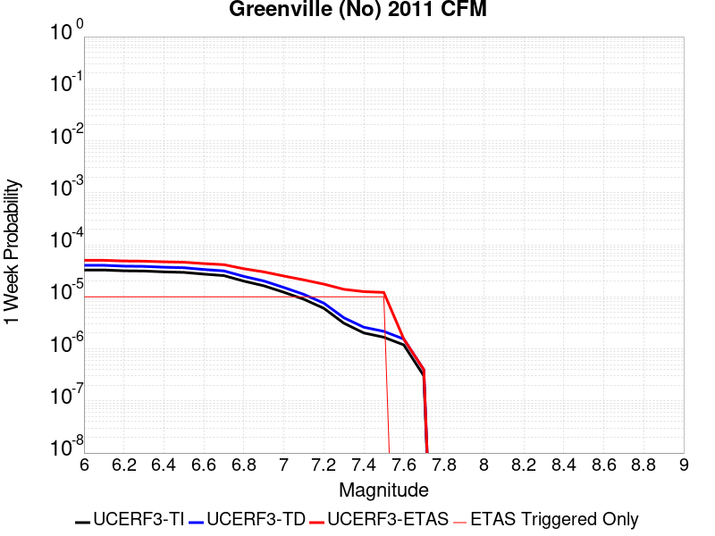 |  |  |  |

| Magnitude | 1 wk TI Prob | 1 wk TD Prob | 1 wk ETAS Prob | 1 wk ETAS/TD Gain | 1 wk ETAS Triggered Only | 1 mo TI Prob | 1 mo TD Prob | 1 mo ETAS Prob | 1 mo ETAS/TD Gain | 1 mo ETAS Triggered Only | 1 yr TI Prob | 1 yr TD Prob | 1 yr ETAS Prob | 1 yr ETAS/TD Gain | 1 yr ETAS Triggered Only | 10 yr TI Prob | 10 yr TD Prob | 10 yr ETAS Prob | 10 yr ETAS/TD Gain | 10 yr ETAS Triggered Only |
|-----|-----|-----|-----|-----|-----|-----|-----|-----|-----|-----|-----|-----|-----|-----|-----|-----|-----|-----|-----|-----|
| 6.0 | 3.286654E-5 | 4.036648E-5 | 4.036648E-5 | 1.0 | 0.0 | 1.4084899E-4 | 1.7298796E-4 | 1.7298796E-4 | 1.0 | 0.0 | 0.0017134876 | 0.002104132 | 0.0021223915 | 1.0086778 | 1.8297927E-5 | 0.017003356 | 0.020846982 | 0.020864898 | 1.0008594 | 1.8297927E-5 |
| 6.1 | 3.286654E-5 | 4.036648E-5 | 4.036648E-5 | 1.0 | 0.0 | 1.4084899E-4 | 1.7298796E-4 | 1.7298796E-4 | 1.0 | 0.0 | 0.0017134876 | 0.002104132 | 0.0021223915 | 1.0086778 | 1.8297927E-5 | 0.017003356 | 0.020846982 | 0.020864898 | 1.0008594 | 1.8297927E-5 |
| 6.2 | 3.1697953E-5 | 3.8929385E-5 | 3.8929385E-5 | 1.0 | 0.0 | 1.358413E-4 | 1.6682976E-4 | 1.6682976E-4 | 1.0 | 0.0 | 0.0016526132 | 0.002029298 | 0.002047559 | 1.0089986 | 1.8297927E-5 | 0.01640377 | 0.020112377 | 0.020130306 | 1.0008914 | 1.8297927E-5 |
| 6.3 | 3.1363317E-5 | 3.851826E-5 | 3.851826E-5 | 1.0 | 0.0 | 1.344073E-4 | 1.6506804E-4 | 1.6506804E-4 | 1.0 | 0.0 | 0.0016351803 | 0.0020078886 | 0.0020261498 | 1.0090947 | 1.8297927E-5 | 0.016232004 | 0.019902144 | 0.019920077 | 1.0009011 | 1.8297927E-5 |
| 6.4 | 3.0228604E-5 | 3.7125395E-5 | 3.7125395E-5 | 1.0 | 0.0 | 1.2954473E-4 | 1.5909935E-4 | 1.5909935E-4 | 1.0 | 0.0 | 0.0015760659 | 0.0019353506 | 0.001953613 | 1.0094362 | 1.8297927E-5 | 0.015649348 | 0.019189484 | 0.019207431 | 1.0009352 | 1.8297927E-5 |
| 6.5 | 2.9537814E-5 | 3.6280853E-5 | 3.6280853E-5 | 1.0 | 0.0 | 1.2658449E-4 | 1.554803E-4 | 1.554803E-4 | 1.0 | 0.0 | 0.0015400766 | 0.0018913659 | 0.0019096292 | 1.0096562 | 1.8297927E-5 | 0.01529447 | 0.018757146 | 0.018775102 | 1.0009573 | 1.8297927E-5 |
| 6.6 | 2.7345395E-5 | 3.3590182E-5 | 3.3590182E-5 | 1.0 | 0.0 | 1.1718928E-4 | 1.4395016E-4 | 1.4395016E-4 | 1.0 | 0.0 | 0.0014258457 | 0.0017512152 | 0.0017694811 | 1.0104305 | 1.8297927E-5 | 0.014167317 | 0.01737797 | 0.017395949 | 1.0010346 | 1.8297927E-5 |
| 6.7 | 2.5615784E-5 | 3.1567088E-5 | 3.1567088E-5 | 1.0 | 0.0 | 1.09777306E-4 | 1.3528067E-4 | 1.3528067E-4 | 1.0 | 0.0 | 0.0013357193 | 0.0016458282 | 0.001664096 | 1.0110995 | 1.8297927E-5 | 0.013277191 | 0.016340064 | 0.016358063 | 1.0011015 | 1.8297927E-5 |
| 6.8 | 2.0059057E-5 | 2.4712073E-5 | 2.4712073E-5 | 1.0 | 0.0 | 8.596455E-5 | 1.0590468E-4 | 1.0590468E-4 | 1.0 | 0.0 | 0.0010461159 | 0.001288643 | 0.0013069174 | 1.0141811 | 1.8297927E-5 | 0.0104120495 | 0.012813724 | 0.012831787 | 1.0014096 | 1.8297927E-5 |
| 6.9 | 1.6321746E-5 | 2.018467E-5 | 2.018467E-5 | 1.0 | 0.0 | 6.9948466E-5 | 8.650293E-5 | 8.650293E-5 | 1.0 | 0.0 | 8.5128983E-4 | 0.0010526767 | 0.0010709553 | 1.017364 | 1.8297927E-5 | 0.008480361 | 0.010478431 | 0.010496537 | 1.0017279 | 1.8297927E-5 |
| 7.0 | 1.22527645E-5 | 1.5135633E-5 | 1.5135633E-5 | 1.0 | 0.0 | 5.2510793E-5 | 6.486541E-5 | 6.486541E-5 | 1.0 | 0.0 | 6.3913135E-4 | 7.894544E-4 | 8.077379E-4 | 1.0231596 | 1.8297927E-5 | 0.0063729626 | 0.007867137 | 0.00788529 | 1.0023075 | 1.8297927E-5 |
| 7.1 | 8.996482E-6 | 1.1164954E-5 | 1.1164954E-5 | 1.0 | 0.0 | 3.8555783E-5 | 4.7848935E-5 | 4.7848935E-5 | 1.0 | 0.0 | 4.6931554E-4 | 5.824063E-4 | 6.006935E-4 | 1.0313995 | 1.8297927E-5 | 0.004683256 | 0.0058090906 | 0.0058272826 | 1.0031316 | 1.8297927E-5 |
| 7.2 | 6.0273087E-6 | 7.569474E-6 | 7.569474E-6 | 1.0 | 0.0 | 2.5831067E-5 | 3.2440203E-5 | 3.2440203E-5 | 1.0 | 0.0 | 3.1444785E-4 | 3.9488857E-4 | 3.9488857E-4 | 1.0 | 0.0 | 0.0031400328 | 0.003942066 | 0.003942066 | 1.0 | 0.0 |
| 7.3 | 3.1209995E-6 | 3.9663746E-6 | 3.9663746E-6 | 1.0 | 0.0 | 1.3375643E-5 | 1.699864E-5 | 1.699864E-5 | 1.0 | 0.0 | 1.6283628E-4 | 2.0693893E-4 | 2.0693893E-4 | 1.0 | 0.0 | 0.0016271701 | 0.0020675526 | 0.0020675526 | 1.0 | 0.0 |
| 7.4 | 2.0254208E-6 | 2.6096043E-6 | 2.6096043E-6 | 1.0 | 0.0 | 8.680347E-6 | 1.1183971E-5 | 1.1183971E-5 | 1.0 | 0.0 | 1.0567809E-4 | 1.361564E-4 | 1.361564E-4 | 1.0 | 0.0 | 0.0010562785 | 0.0013607866 | 0.0013607866 | 1.0 | 0.0 |
| 7.5 | 1.6763418E-6 | 2.173353E-6 | 2.173353E-6 | 1.0 | 0.0 | 7.184302E-6 | 9.314337E-6 | 9.314337E-6 | 1.0 | 0.0 | 8.746537E-5 | 1.1339621E-4 | 1.1339621E-4 | 1.0 | 0.0 | 8.743095E-4 | 0.0011334305 | 0.0011334305 | 1.0 | 0.0 |
| 7.6 | 1.1935462E-6 | 1.5458467E-6 | 1.5458467E-6 | 1.0 | 0.0 | 5.115188E-6 | 6.6250404E-6 | 6.6250404E-6 | 1.0 | 0.0 | 6.2275634E-5 | 8.065693E-5 | 8.065693E-5 | 1.0 | 0.0 | 6.2258187E-4 | 8.0630725E-4 | 8.0630725E-4 | 1.0 | 0.0 |
| 7.7 | 3.0464201E-7 | 3.9846822E-7 | 3.9846822E-7 | 1.0 | 0.0 | 1.3056081E-6 | 1.7077199E-6 | 1.7077199E-6 | 1.0 | 0.0 | 1.589566E-5 | 2.0791296E-5 | 2.0791296E-5 | 1.0 | 0.0 | 1.5894524E-4 | 2.0789822E-4 | 2.0789822E-4 | 1.0 | 0.0 |

## Mono Lake 2011 CFM
*[(top)](#table-of-contents)*

| 1 Week | 1 Month | 1 Year | 10 Year |
|-----|-----|-----|-----|
|  |  |  |  |

| Magnitude | 1 wk TI Prob | 1 wk TD Prob | 1 wk ETAS Prob | 1 wk ETAS/TD Gain | 1 wk ETAS Triggered Only | 1 mo TI Prob | 1 mo TD Prob | 1 mo ETAS Prob | 1 mo ETAS/TD Gain | 1 mo ETAS Triggered Only | 1 yr TI Prob | 1 yr TD Prob | 1 yr ETAS Prob | 1 yr ETAS/TD Gain | 1 yr ETAS Triggered Only | 10 yr TI Prob | 10 yr TD Prob | 10 yr ETAS Prob | 10 yr ETAS/TD Gain | 10 yr ETAS Triggered Only |
|-----|-----|-----|-----|-----|-----|-----|-----|-----|-----|-----|-----|-----|-----|-----|-----|-----|-----|-----|-----|-----|
| 6.0 | 2.0341662E-5 | 2.3828166E-5 | 4.212566E-5 | 1.7678933 | 1.8297927E-5 | 8.717564E-5 | 1.0211971E-4 | 1.20415774E-4 | 1.1791629 | 1.8297927E-5 | 0.0010608466 | 0.0012431298 | 0.001261405 | 1.0147009 | 1.8297927E-5 | 0.010557966 | 0.012413835 | 0.012431906 | 1.0014557 | 1.8297927E-5 |
| 6.1 | 2.0341662E-5 | 2.3828166E-5 | 4.212566E-5 | 1.7678933 | 1.8297927E-5 | 8.717564E-5 | 1.0211971E-4 | 1.20415774E-4 | 1.1791629 | 1.8297927E-5 | 0.0010608466 | 0.0012431298 | 0.001261405 | 1.0147009 | 1.8297927E-5 | 0.010557966 | 0.012413835 | 0.012431906 | 1.0014557 | 1.8297927E-5 |
| 6.2 | 2.0341662E-5 | 2.3828166E-5 | 4.212566E-5 | 1.7678933 | 1.8297927E-5 | 8.717564E-5 | 1.0211971E-4 | 1.20415774E-4 | 1.1791629 | 1.8297927E-5 | 0.0010608466 | 0.0012431298 | 0.001261405 | 1.0147009 | 1.8297927E-5 | 0.010557966 | 0.012413835 | 0.012431906 | 1.0014557 | 1.8297927E-5 |
| 6.3 | 2.0341662E-5 | 2.3828166E-5 | 4.212566E-5 | 1.7678933 | 1.8297927E-5 | 8.717564E-5 | 1.0211971E-4 | 1.20415774E-4 | 1.1791629 | 1.8297927E-5 | 0.0010608466 | 0.0012431298 | 0.001261405 | 1.0147009 | 1.8297927E-5 | 0.010557966 | 0.012413835 | 0.012431906 | 1.0014557 | 1.8297927E-5 |
| 6.4 | 1.749821E-5 | 2.0490985E-5 | 3.8788537E-5 | 1.8929561 | 1.8297927E-5 | 7.499018E-5 | 8.781851E-5 | 1.0611483E-4 | 1.2083424 | 1.8297927E-5 | 9.1262296E-4 | 0.0010691903 | 0.0010874687 | 1.0170956 | 1.8297927E-5 | 0.009088841 | 0.010691865 | 0.010709967 | 1.0016931 | 1.8297927E-5 |
| 6.5 | 1.749821E-5 | 2.0490985E-5 | 3.8788537E-5 | 1.8929561 | 1.8297927E-5 | 7.499018E-5 | 8.781851E-5 | 1.0611483E-4 | 1.2083424 | 1.8297927E-5 | 9.1262296E-4 | 0.0010691903 | 0.0010874687 | 1.0170956 | 1.8297927E-5 | 0.009088841 | 0.010691865 | 0.010709967 | 1.0016931 | 1.8297927E-5 |

## Honey Lake 2011 CFM
*[(top)](#table-of-contents)*

| 1 Week | 1 Month | 1 Year | 10 Year |
|-----|-----|-----|-----|
|  |  |  |  |

| Magnitude | 1 wk TI Prob | 1 wk TD Prob | 1 wk ETAS Prob | 1 wk ETAS/TD Gain | 1 wk ETAS Triggered Only | 1 mo TI Prob | 1 mo TD Prob | 1 mo ETAS Prob | 1 mo ETAS/TD Gain | 1 mo ETAS Triggered Only | 1 yr TI Prob | 1 yr TD Prob | 1 yr ETAS Prob | 1 yr ETAS/TD Gain | 1 yr ETAS Triggered Only | 10 yr TI Prob | 10 yr TD Prob | 10 yr ETAS Prob | 10 yr ETAS/TD Gain | 10 yr ETAS Triggered Only |
|-----|-----|-----|-----|-----|-----|-----|-----|-----|-----|-----|-----|-----|-----|-----|-----|-----|-----|-----|-----|-----|
| 6.0 | 6.155506E-5 | 7.954667E-5 | 7.954667E-5 | 1.0 | 0.0 | 2.6378073E-4 | 3.40873E-4 | 3.40873E-4 | 1.0 | 0.0 | 0.0032068014 | 0.0041427943 | 0.0041427943 | 1.0 | 0.0 | 0.03160919 | 0.040702924 | 0.040720478 | 1.0004313 | 1.8297927E-5 |
| 6.1 | 6.155506E-5 | 7.954667E-5 | 7.954667E-5 | 1.0 | 0.0 | 2.6378073E-4 | 3.40873E-4 | 3.40873E-4 | 1.0 | 0.0 | 0.0032068014 | 0.0041427943 | 0.0041427943 | 1.0 | 0.0 | 0.03160919 | 0.040702924 | 0.040720478 | 1.0004313 | 1.8297927E-5 |
| 6.2 | 4.1335024E-5 | 5.257629E-5 | 5.257629E-5 | 1.0 | 0.0 | 1.7713808E-4 | 2.253086E-4 | 2.253086E-4 | 1.0 | 0.0 | 0.0021545228 | 0.0027398595 | 0.0027398595 | 1.0 | 0.0 | 0.021337535 | 0.027076708 | 0.027094511 | 1.0006574 | 1.8297927E-5 |
| 6.3 | 4.1335024E-5 | 5.257629E-5 | 5.257629E-5 | 1.0 | 0.0 | 1.7713808E-4 | 2.253086E-4 | 2.253086E-4 | 1.0 | 0.0 | 0.0021545228 | 0.0027398595 | 0.0027398595 | 1.0 | 0.0 | 0.021337535 | 0.027076708 | 0.027094511 | 1.0006574 | 1.8297927E-5 |
| 6.4 | 3.2393702E-5 | 4.0887444E-5 | 4.0887444E-5 | 1.0 | 0.0 | 1.3882275E-4 | 1.7522085E-4 | 1.7522085E-4 | 1.0 | 0.0 | 0.0016888566 | 0.002131335 | 0.002131335 | 1.0 | 0.0 | 0.016760793 | 0.02111982 | 0.021137733 | 1.000848 | 1.8297927E-5 |
| 6.5 | 2.7205504E-5 | 3.4211684E-5 | 3.4211684E-5 | 1.0 | 0.0 | 1.1658981E-4 | 1.4661385E-4 | 1.4661385E-4 | 1.0 | 0.0 | 0.0014185566 | 0.0017836588 | 0.0017836588 | 1.0 | 0.0 | 0.014095354 | 0.017702932 | 0.017720906 | 1.0010153 | 1.8297927E-5 |
| 6.6 | 2.069265E-5 | 2.5955307E-5 | 2.5955307E-5 | 1.0 | 0.0 | 8.867977E-5 | 1.1123277E-4 | 1.1123277E-4 | 1.0 | 0.0 | 0.0010791414 | 0.0013535038 | 0.0013535038 | 1.0 | 0.0 | 0.010739161 | 0.013461002 | 0.013461002 | 1.0 | 0.0 |
| 6.7 | 1.8060919E-5 | 2.2656828E-5 | 2.2656828E-5 | 1.0 | 0.0 | 7.7401644E-5 | 9.709754E-5 | 9.709754E-5 | 1.0 | 0.0 | 9.419576E-4 | 0.0011816026 | 0.0011816026 | 1.0 | 0.0 | 0.009379748 | 0.011761238 | 0.011761238 | 1.0 | 0.0 |
| 6.8 | 1.4474663E-5 | 1.818127E-5 | 1.818127E-5 | 1.0 | 0.0 | 6.203279E-5 | 7.791784E-5 | 7.791784E-5 | 1.0 | 0.0 | 7.5498753E-4 | 9.483136E-4 | 9.483136E-4 | 1.0 | 0.0 | 0.007524277 | 0.009450192 | 0.009450192 | 1.0 | 0.0 |
| 6.9 | 8.564552E-6 | 1.0802308E-5 | 1.0802308E-5 | 1.0 | 0.0 | 3.6704707E-5 | 4.6295158E-5 | 4.6295158E-5 | 1.0 | 0.0 | 4.4678818E-4 | 5.635644E-4 | 5.635644E-4 | 1.0 | 0.0 | 0.0044589094 | 0.0056278477 | 0.0056278477 | 1.0 | 0.0 |

## Great Valley 10 (Panoche)
*[(top)](#table-of-contents)*

| 1 Week | 1 Month | 1 Year | 10 Year |
|-----|-----|-----|-----|
|  | 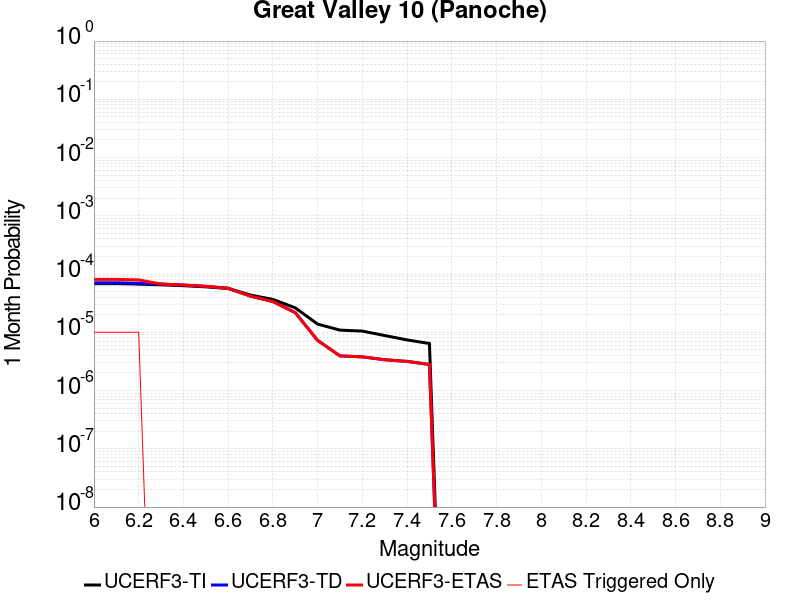 |  | 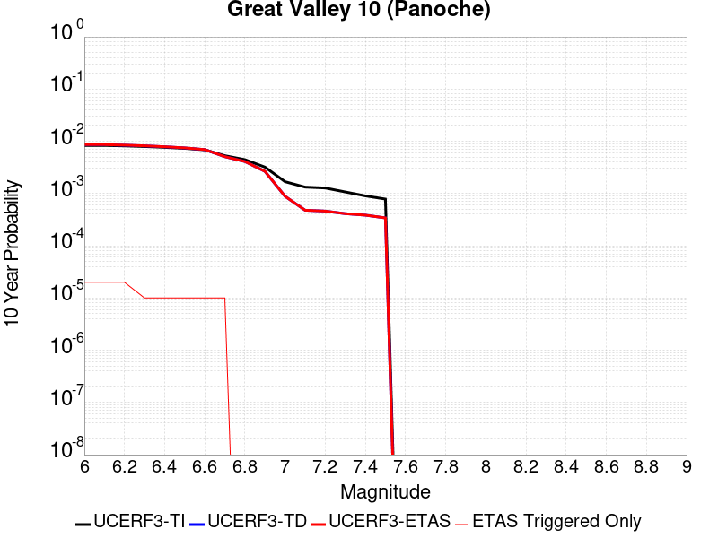 |

| Magnitude | 1 wk TI Prob | 1 wk TD Prob | 1 wk ETAS Prob | 1 wk ETAS/TD Gain | 1 wk ETAS Triggered Only | 1 mo TI Prob | 1 mo TD Prob | 1 mo ETAS Prob | 1 mo ETAS/TD Gain | 1 mo ETAS Triggered Only | 1 yr TI Prob | 1 yr TD Prob | 1 yr ETAS Prob | 1 yr ETAS/TD Gain | 1 yr ETAS Triggered Only | 10 yr TI Prob | 10 yr TD Prob | 10 yr ETAS Prob | 10 yr ETAS/TD Gain | 10 yr ETAS Triggered Only |
|-----|-----|-----|-----|-----|-----|-----|-----|-----|-----|-----|-----|-----|-----|-----|-----|-----|-----|-----|-----|-----|
| 6.0 | 1.6014626E-5 | 1.6575399E-5 | 1.6575399E-5 | 1.0 | 0.0 | 6.863231E-5 | 7.103552E-5 | 7.103552E-5 | 1.0 | 0.0 | 8.35278E-4 | 8.645185E-4 | 8.828006E-4 | 1.0211471 | 1.8297927E-5 | 0.008321454 | 0.008612172 | 0.008630312 | 1.0021063 | 1.8297927E-5 |
| 6.1 | 1.6014626E-5 | 1.6575399E-5 | 1.6575399E-5 | 1.0 | 0.0 | 6.863231E-5 | 7.103552E-5 | 7.103552E-5 | 1.0 | 0.0 | 8.35278E-4 | 8.645185E-4 | 8.828006E-4 | 1.0211471 | 1.8297927E-5 | 0.008321454 | 0.008612172 | 0.008630312 | 1.0021063 | 1.8297927E-5 |
| 6.2 | 1.56782E-5 | 1.6198446E-5 | 1.6198446E-5 | 1.0 | 0.0 | 6.719056E-5 | 6.94201E-5 | 6.94201E-5 | 1.0 | 0.0 | 8.17738E-4 | 8.4486604E-4 | 8.631485E-4 | 1.0216395 | 1.8297927E-5 | 0.008147354 | 0.008417147 | 0.008435291 | 1.0021555 | 1.8297927E-5 |
| 6.3 | 1.5263338E-5 | 1.5723514E-5 | 1.5723514E-5 | 1.0 | 0.0 | 6.541267E-5 | 6.738478E-5 | 6.738478E-5 | 1.0 | 0.0 | 7.961082E-4 | 8.201049E-4 | 8.383879E-4 | 1.0222934 | 1.8297927E-5 | 0.007932622 | 0.008171377 | 0.008189525 | 1.002221 | 1.8297927E-5 |
| 6.4 | 1.4720723E-5 | 1.5099376E-5 | 1.5099376E-5 | 1.0 | 0.0 | 6.308728E-5 | 6.471004E-5 | 6.471004E-5 | 1.0 | 0.0 | 7.67817E-4 | 7.8756385E-4 | 8.0584735E-4 | 1.0232153 | 1.8297927E-5 | 0.007651695 | 0.007848303 | 0.007866457 | 1.0023131 | 1.8297927E-5 |
| 6.5 | 1.408264E-5 | 1.4355969E-5 | 1.4355969E-5 | 1.0 | 0.0 | 6.0352773E-5 | 6.1524166E-5 | 6.1524166E-5 | 1.0 | 0.0 | 7.3454727E-4 | 7.488031E-4 | 7.6708733E-4 | 1.0244179 | 1.8297927E-5 | 0.0073212404 | 0.0074633555 | 0.0074815173 | 1.0024334 | 1.8297927E-5 |
| 6.6 | 1.3197086E-5 | 1.3321889E-5 | 1.3321889E-5 | 1.0 | 0.0 | 5.6557717E-5 | 5.709259E-5 | 5.709259E-5 | 1.0 | 0.0 | 6.8837265E-4 | 6.9488434E-4 | 7.131696E-4 | 1.026314 | 1.8297927E-5 | 0.006862442 | 0.0069276537 | 0.0069458247 | 1.002623 | 1.8297927E-5 |
| 6.7 | 1.017583E-5 | 9.745382E-6 | 9.745382E-6 | 1.0 | 0.0 | 4.360997E-5 | 4.176527E-5 | 4.176527E-5 | 1.0 | 0.0 | 5.30822E-4 | 5.0837593E-4 | 5.2666455E-4 | 1.0359746 | 1.8297927E-5 | 0.0052955584 | 0.005072382 | 0.005090587 | 1.003589 | 1.8297927E-5 |
| 6.8 | 8.557912E-6 | 7.872707E-6 | 7.872707E-6 | 1.0 | 0.0 | 3.667625E-5 | 3.373975E-5 | 3.373975E-5 | 1.0 | 0.0 | 4.4644187E-4 | 4.1070607E-4 | 4.1070607E-4 | 1.0 | 0.0 | 0.0044554602 | 0.004099677 | 0.004099677 | 1.0 | 0.0 |
| 6.9 | 6.14664E-6 | 5.092071E-6 | 5.092071E-6 | 1.0 | 0.0 | 2.6342475E-5 | 2.1822989E-5 | 2.1822989E-5 | 1.0 | 0.0 | 3.2067244E-4 | 2.6566387E-4 | 2.6566387E-4 | 1.0 | 0.0 | 0.003202101 | 0.002653601 | 0.002653601 | 1.0 | 0.0 |
| 7.0 | 3.2310581E-6 | 1.6951219E-6 | 1.6951219E-6 | 1.0 | 0.0 | 1.3847319E-5 | 7.264788E-6 | 7.264788E-6 | 1.0 | 0.0 | 1.6857806E-4 | 8.8445304E-5 | 8.8445304E-5 | 1.0 | 0.0 | 0.0016845023 | 8.841104E-4 | 8.841104E-4 | 1.0 | 0.0 |
| 7.1 | 2.544492E-6 | 9.1889206E-7 | 9.1889206E-7 | 1.0 | 0.0 | 1.090492E-5 | 3.938103E-6 | 3.938103E-6 | 1.0 | 0.0 | 1.327593E-4 | 4.79454E-5 | 4.79454E-5 | 1.0 | 0.0 | 0.0013268003 | 4.793553E-4 | 4.793553E-4 | 1.0 | 0.0 |
| 7.2 | 2.4479045E-6 | 8.841304E-7 | 8.841304E-7 | 1.0 | 0.0 | 1.0490977E-5 | 3.789125E-6 | 3.789125E-6 | 1.0 | 0.0 | 1.2772017E-4 | 4.6131667E-5 | 4.6131667E-5 | 1.0 | 0.0 | 0.0012764678 | 4.6122566E-4 | 4.6122566E-4 | 1.0 | 0.0 |
| 7.3 | 2.0559578E-6 | 7.892787E-7 | 7.892787E-7 | 1.0 | 0.0 | 8.811218E-6 | 3.3826188E-6 | 3.3826188E-6 | 1.0 | 0.0 | 1.072713E-4 | 4.1182655E-5 | 4.1182655E-5 | 1.0 | 0.0 | 0.0010721954 | 4.1175485E-4 | 4.1175485E-4 | 1.0 | 0.0 |
| 7.4 | 1.727687E-6 | 7.387757E-7 | 7.387757E-7 | 1.0 | 0.0 | 7.404352E-6 | 3.1661782E-6 | 3.1661782E-6 | 1.0 | 0.0 | 9.0144255E-5 | 3.8547583E-5 | 3.8547583E-5 | 1.0 | 0.0 | 9.0107694E-4 | 3.854136E-4 | 3.854136E-4 | 1.0 | 0.0 |
| 7.5 | 1.5002679E-6 | 6.546144E-7 | 6.546144E-7 | 1.0 | 0.0 | 6.4297037E-6 | 2.8054874E-6 | 2.8054874E-6 | 1.0 | 0.0 | 7.827883E-5 | 3.4156317E-5 | 3.4156317E-5 | 1.0 | 0.0 | 7.825126E-4 | 3.4151482E-4 | 3.4151482E-4 | 1.0 | 0.0 |

## Superstition Hills
*[(top)](#table-of-contents)*

| 1 Week | 1 Month | 1 Year | 10 Year |
|-----|-----|-----|-----|
|  |  |  |  |

| Magnitude | 1 wk TI Prob | 1 wk TD Prob | 1 wk ETAS Prob | 1 wk ETAS/TD Gain | 1 wk ETAS Triggered Only | 1 mo TI Prob | 1 mo TD Prob | 1 mo ETAS Prob | 1 mo ETAS/TD Gain | 1 mo ETAS Triggered Only | 1 yr TI Prob | 1 yr TD Prob | 1 yr ETAS Prob | 1 yr ETAS/TD Gain | 1 yr ETAS Triggered Only | 10 yr TI Prob | 10 yr TD Prob | 10 yr ETAS Prob | 10 yr ETAS/TD Gain | 10 yr ETAS Triggered Only |
|-----|-----|-----|-----|-----|-----|-----|-----|-----|-----|-----|-----|-----|-----|-----|-----|-----|-----|-----|-----|-----|
| 6.0 | 6.6865185E-5 | 1.41376995E-5 | 1.41376995E-5 | 1.0 | 0.0 | 2.8653358E-4 | 6.0588824E-5 | 6.0588824E-5 | 1.0 | 0.0 | 0.0034829667 | 7.374355E-4 | 7.374355E-4 | 1.0 | 0.0 | 0.03428881 | 0.0075204074 | 0.0075385678 | 1.0024148 | 1.8297927E-5 |
| 6.1 | 6.544851E-5 | 1.41376995E-5 | 1.41376995E-5 | 1.0 | 0.0 | 2.8046346E-4 | 6.0588824E-5 | 6.0588824E-5 | 1.0 | 0.0 | 0.0034092965 | 7.374355E-4 | 7.374355E-4 | 1.0 | 0.0 | 0.033574644 | 0.007520407 | 0.0075385673 | 1.0024148 | 1.8297927E-5 |
| 6.2 | 6.544851E-5 | 1.41376995E-5 | 1.41376995E-5 | 1.0 | 0.0 | 2.8046346E-4 | 6.0588824E-5 | 6.0588824E-5 | 1.0 | 0.0 | 0.0034092965 | 7.374355E-4 | 7.374355E-4 | 1.0 | 0.0 | 0.033574644 | 0.007520407 | 0.0075385673 | 1.0024148 | 1.8297927E-5 |
| 6.3 | 5.2402065E-5 | 1.4137698E-5 | 1.4137698E-5 | 1.0 | 0.0 | 2.2456095E-4 | 6.058882E-5 | 6.058882E-5 | 1.0 | 0.0 | 0.0027306017 | 7.374354E-4 | 7.374354E-4 | 1.0 | 0.0 | 0.02697292 | 0.007520402 | 0.0075385617 | 1.0024148 | 1.8297927E-5 |
| 6.4 | 4.542238E-5 | 1.4137698E-5 | 1.4137698E-5 | 1.0 | 0.0 | 1.9465282E-4 | 6.0588816E-5 | 6.0588816E-5 | 1.0 | 0.0 | 0.0023673223 | 7.3743536E-4 | 7.3743536E-4 | 1.0 | 0.0 | 0.023422617 | 0.0075203986 | 0.007538559 | 1.0024148 | 1.8297927E-5 |
| 6.5 | 2.9672969E-5 | 1.4137696E-5 | 1.4137696E-5 | 1.0 | 0.0 | 1.2716366E-4 | 6.058881E-5 | 6.058881E-5 | 1.0 | 0.0 | 0.0015471181 | 7.374353E-4 | 7.374353E-4 | 1.0 | 0.0 | 0.015363912 | 0.007520392 | 0.0075385524 | 1.0024148 | 1.8297927E-5 |
| 6.6 | 2.6056105E-5 | 1.3803458E-5 | 1.3803458E-5 | 1.0 | 0.0 | 1.1166424E-4 | 5.9156428E-5 | 5.9156428E-5 | 1.0 | 0.0 | 0.0013586642 | 7.200076E-4 | 7.200076E-4 | 1.0 | 0.0 | 0.013503874 | 0.0073448285 | 0.007362992 | 1.002473 | 1.8297927E-5 |
| 6.7 | 1.4611248E-5 | 1.3383359E-5 | 1.3383359E-5 | 1.0 | 0.0 | 6.261813E-5 | 5.7356083E-5 | 5.7356083E-5 | 1.0 | 0.0 | 7.6210906E-4 | 6.981025E-4 | 6.981025E-4 | 1.0 | 0.0 | 0.0075950073 | 0.00712602 | 0.007144187 | 1.0025494 | 1.8297927E-5 |
| 6.8 | 1.30607E-5 | 1.09787925E-5 | 1.09787925E-5 | 1.0 | 0.0 | 5.597323E-5 | 4.705117E-5 | 4.705117E-5 | 1.0 | 0.0 | 6.8126095E-4 | 5.7270617E-4 | 5.7270617E-4 | 1.0 | 0.0 | 0.006791762 | 0.00587438 | 0.0058925706 | 1.0030966 | 1.8297927E-5 |
| 6.9 | 1.0443096E-5 | 8.195349E-6 | 8.195349E-6 | 1.0 | 0.0 | 4.4755358E-5 | 3.5122466E-5 | 3.5122466E-5 | 1.0 | 0.0 | 5.447602E-4 | 4.2753448E-4 | 4.2753448E-4 | 1.0 | 0.0 | 0.005434267 | 0.0044094524 | 0.0044276696 | 1.0041314 | 1.8297927E-5 |
| 7.0 | 8.045912E-6 | 6.739692E-6 | 6.739692E-6 | 1.0 | 0.0 | 3.4482026E-5 | 2.888408E-5 | 2.888408E-5 | 1.0 | 0.0 | 4.197378E-4 | 3.5160795E-4 | 3.5160795E-4 | 1.0 | 0.0 | 0.0041894587 | 0.0036334093 | 0.0036516408 | 1.0050178 | 1.8297927E-5 |
| 7.1 | 8.045912E-6 | 6.739692E-6 | 6.739692E-6 | 1.0 | 0.0 | 3.4482026E-5 | 2.888408E-5 | 2.888408E-5 | 1.0 | 0.0 | 4.197378E-4 | 3.5160795E-4 | 3.5160795E-4 | 1.0 | 0.0 | 0.0041894587 | 0.0036334093 | 0.0036516408 | 1.0050178 | 1.8297927E-5 |
| 7.2 | 7.375506E-6 | 6.2466297E-6 | 6.2466297E-6 | 1.0 | 0.0 | 3.1608928E-5 | 2.6771E-5 | 2.6771E-5 | 1.0 | 0.0 | 3.8477074E-4 | 3.2588904E-4 | 3.2588904E-4 | 1.0 | 0.0 | 0.003841052 | 0.003373887 | 0.003373887 | 1.0 | 0.0 |
| 7.3 | 6.6063913E-6 | 5.7990574E-6 | 5.7990574E-6 | 1.0 | 0.0 | 2.8312797E-5 | 2.485287E-5 | 2.485287E-5 | 1.0 | 0.0 | 3.446538E-4 | 3.025424E-4 | 3.025424E-4 | 1.0 | 0.0 | 0.0034411973 | 0.003138153 | 0.003138153 | 1.0 | 0.0 |
| 7.4 | 6.4313126E-6 | 5.680481E-6 | 5.680481E-6 | 1.0 | 0.0 | 2.7562477E-5 | 2.4344696E-5 | 2.4344696E-5 | 1.0 | 0.0 | 3.355215E-4 | 2.9635706E-4 | 2.9635706E-4 | 1.0 | 0.0 | 0.0033501536 | 0.0030759154 | 0.0030759154 | 1.0 | 0.0 |
| 7.5 | 6.0742927E-6 | 5.4763104E-6 | 5.4763104E-6 | 1.0 | 0.0 | 2.6032423E-5 | 2.3469694E-5 | 2.3469694E-5 | 1.0 | 0.0 | 3.1689866E-4 | 2.8570674E-4 | 2.8570674E-4 | 1.0 | 0.0 | 0.0031644711 | 0.002967756 | 0.002967756 | 1.0 | 0.0 |
| 7.6 | 5.6987187E-6 | 5.294521E-6 | 5.294521E-6 | 1.0 | 0.0 | 2.4422852E-5 | 2.269061E-5 | 2.269061E-5 | 1.0 | 0.0 | 2.9730765E-4 | 2.7622381E-4 | 2.7622381E-4 | 1.0 | 0.0 | 0.002969102 | 0.0028710118 | 0.0028710118 | 1.0 | 0.0 |
| 7.7 | 5.1658035E-6 | 4.925535E-6 | 4.925535E-6 | 1.0 | 0.0 | 2.2138971E-5 | 2.1109268E-5 | 2.1109268E-5 | 1.0 | 0.0 | 2.6950863E-4 | 2.5697565E-4 | 2.5697565E-4 | 1.0 | 0.0 | 0.00269182 | 0.0026760625 | 0.0026760625 | 1.0 | 0.0 |
| 7.8 | 3.6864697E-6 | 4.1964995E-6 | 4.1964995E-6 | 1.0 | 0.0 | 1.579906E-5 | 1.7984876E-5 | 1.7984876E-5 | 1.0 | 0.0 | 1.9233658E-4 | 2.1894433E-4 | 2.1894433E-4 | 1.0 | 0.0 | 0.0019217018 | 0.0022892624 | 0.0022892624 | 1.0 | 0.0 |
| 7.9 | 3.0265903E-6 | 3.5637288E-6 | 3.5637288E-6 | 1.0 | 0.0 | 1.2971037E-5 | 1.5273037E-5 | 1.5273037E-5 | 1.0 | 0.0 | 1.5791094E-4 | 1.859338E-4 | 1.859338E-4 | 1.0 | 0.0 | 0.0015779877 | 0.0019534735 | 0.0019534735 | 1.0 | 0.0 |
| 8.0 | 2.5271493E-6 | 3.0867361E-6 | 3.0867361E-6 | 1.0 | 0.0 | 1.0830595E-5 | 1.3228804E-5 | 1.3228804E-5 | 1.0 | 0.0 | 1.3185451E-4 | 1.610492E-4 | 1.610492E-4 | 1.0 | 0.0 | 0.0013177631 | 0.0016973554 | 0.0016973554 | 1.0 | 0.0 |
| 8.1 | 2.3749135E-6 | 2.917377E-6 | 2.917377E-6 | 1.0 | 0.0 | 1.0178161E-5 | 1.25029865E-5 | 1.25029865E-5 | 1.0 | 0.0 | 1.2391206E-4 | 1.5221364E-4 | 1.5221364E-4 | 1.0 | 0.0 | 0.0012384299 | 0.001604949 | 0.001604949 | 1.0 | 0.0 |
| 8.2 | 1.7186406E-9 | 1.1440594E-9 | 1.1440594E-9 | 1.0 | 0.0 | 7.3656024E-9 | 4.9031117E-9 | 4.9031117E-9 | 1.0 | 0.0 | 8.9676206E-8 | 5.969538E-8 | 5.969538E-8 | 1.0 | 0.0 | 8.9676166E-7 | 6.389059E-7 | 6.389059E-7 | 1.0 | 0.0 |

## Clamshell-Sawpit
*[(top)](#table-of-contents)*

| 1 Week | 1 Month | 1 Year | 10 Year |
|-----|-----|-----|-----|
|  |  |  |  |

| Magnitude | 1 wk TI Prob | 1 wk TD Prob | 1 wk ETAS Prob | 1 wk ETAS/TD Gain | 1 wk ETAS Triggered Only | 1 mo TI Prob | 1 mo TD Prob | 1 mo ETAS Prob | 1 mo ETAS/TD Gain | 1 mo ETAS Triggered Only | 1 yr TI Prob | 1 yr TD Prob | 1 yr ETAS Prob | 1 yr ETAS/TD Gain | 1 yr ETAS Triggered Only | 10 yr TI Prob | 10 yr TD Prob | 10 yr ETAS Prob | 10 yr ETAS/TD Gain | 10 yr ETAS Triggered Only |
|-----|-----|-----|-----|-----|-----|-----|-----|-----|-----|-----|-----|-----|-----|-----|-----|-----|-----|-----|-----|-----|
| 6.0 | 3.202998E-6 | 3.0127644E-6 | 3.0127644E-6 | 1.0 | 0.0 | 1.3727062E-5 | 1.2911788E-5 | 1.2911788E-5 | 1.0 | 0.0 | 1.6711417E-4 | 1.5719049E-4 | 1.7548553E-4 | 1.1163877 | 1.8297927E-5 | 0.0016698855 | 0.0015708724 | 0.0015891416 | 1.0116299 | 1.8297927E-5 |
| 6.1 | 3.202998E-6 | 3.0127644E-6 | 3.0127644E-6 | 1.0 | 0.0 | 1.3727062E-5 | 1.2911788E-5 | 1.2911788E-5 | 1.0 | 0.0 | 1.6711417E-4 | 1.5719049E-4 | 1.7548553E-4 | 1.1163877 | 1.8297927E-5 | 0.0016698855 | 0.0015708724 | 0.0015891416 | 1.0116299 | 1.8297927E-5 |
| 6.2 | 3.202998E-6 | 3.0127644E-6 | 3.0127644E-6 | 1.0 | 0.0 | 1.3727062E-5 | 1.2911788E-5 | 1.2911788E-5 | 1.0 | 0.0 | 1.6711417E-4 | 1.5719049E-4 | 1.7548553E-4 | 1.1163877 | 1.8297927E-5 | 0.0016698855 | 0.0015708724 | 0.0015891416 | 1.0116299 | 1.8297927E-5 |
| 6.3 | 3.202998E-6 | 3.0127644E-6 | 3.0127644E-6 | 1.0 | 0.0 | 1.3727062E-5 | 1.2911788E-5 | 1.2911788E-5 | 1.0 | 0.0 | 1.6711417E-4 | 1.5719049E-4 | 1.7548553E-4 | 1.1163877 | 1.8297927E-5 | 0.0016698855 | 0.0015708724 | 0.0015891416 | 1.0116299 | 1.8297927E-5 |
| 6.4 | 3.202998E-6 | 3.0127644E-6 | 3.0127644E-6 | 1.0 | 0.0 | 1.3727062E-5 | 1.2911788E-5 | 1.2911788E-5 | 1.0 | 0.0 | 1.6711417E-4 | 1.5719049E-4 | 1.7548553E-4 | 1.1163877 | 1.8297927E-5 | 0.0016698855 | 0.0015708724 | 0.0015891416 | 1.0116299 | 1.8297927E-5 |
| 6.5 | 2.5862723E-6 | 2.380775E-6 | 2.380775E-6 | 1.0 | 0.0 | 1.1083977E-5 | 1.0203283E-5 | 1.0203283E-5 | 1.0 | 0.0 | 1.3493907E-4 | 1.2421819E-4 | 1.4251385E-4 | 1.1472864 | 1.8297927E-5 | 0.0013485716 | 0.0012415178 | 0.0012597931 | 1.0147201 | 1.8297927E-5 |
| 6.6 | 2.5862723E-6 | 2.380775E-6 | 2.380775E-6 | 1.0 | 0.0 | 1.1083977E-5 | 1.0203283E-5 | 1.0203283E-5 | 1.0 | 0.0 | 1.3493907E-4 | 1.2421819E-4 | 1.4251385E-4 | 1.1472864 | 1.8297927E-5 | 0.0013485716 | 0.0012415178 | 0.0012597931 | 1.0147201 | 1.8297927E-5 |
| 6.7 | 2.5862723E-6 | 2.380775E-6 | 2.380775E-6 | 1.0 | 0.0 | 1.1083977E-5 | 1.0203283E-5 | 1.0203283E-5 | 1.0 | 0.0 | 1.3493907E-4 | 1.2421819E-4 | 1.4251385E-4 | 1.1472864 | 1.8297927E-5 | 0.0013485716 | 0.0012415178 | 0.0012597931 | 1.0147201 | 1.8297927E-5 |
| 6.8 | 2.4098806E-6 | 2.1977307E-6 | 2.1977307E-6 | 1.0 | 0.0 | 1.0328019E-5 | 9.4188135E-6 | 9.4188135E-6 | 1.0 | 0.0 | 1.2573638E-4 | 1.1466829E-4 | 1.3296412E-4 | 1.1595544 | 1.8297927E-5 | 0.0012566525 | 0.0011461178 | 0.0011643948 | 1.0159469 | 1.8297927E-5 |
| 6.9 | 2.0073985E-6 | 1.7784248E-6 | 1.7784248E-6 | 1.0 | 0.0 | 8.603109E-6 | 7.621799E-6 | 7.621799E-6 | 1.0 | 0.0 | 1.0473781E-4 | 9.279157E-5 | 1.110878E-4 | 1.1971755 | 1.8297927E-5 | 0.0010468846 | 9.275401E-4 | 9.4582106E-4 | 1.0197091 | 1.8297927E-5 |
| 7.0 | 1.8166766E-6 | 1.5807095E-6 | 1.5807095E-6 | 1.0 | 0.0 | 7.785734E-6 | 6.7744522E-6 | 6.7744522E-6 | 1.0 | 0.0 | 9.478718E-5 | 8.247593E-5 | 1.00772355E-4 | 1.2218394 | 1.8297927E-5 | 9.4746763E-4 | 8.244633E-4 | 8.427462E-4 | 1.0221754 | 1.8297927E-5 |
| 7.1 | 1.5471421E-6 | 1.3052961E-6 | 1.3052961E-6 | 1.0 | 0.0 | 6.6305925E-6 | 5.5941146E-6 | 5.5941146E-6 | 1.0 | 0.0 | 8.072447E-5 | 6.8106274E-5 | 6.8106274E-5 | 1.0 | 0.0 | 8.0695155E-4 | 6.808595E-4 | 6.808595E-4 | 1.0 | 0.0 |
| 7.2 | 1.3608037E-6 | 1.1153443E-6 | 1.1153443E-6 | 1.0 | 0.0 | 5.8320024E-6 | 4.7800386E-6 | 4.7800386E-6 | 1.0 | 0.0 | 7.1002316E-5 | 5.8195463E-5 | 5.8195463E-5 | 1.0 | 0.0 | 7.097964E-4 | 5.818069E-4 | 5.818069E-4 | 1.0 | 0.0 |
| 7.3 | 1.0749634E-6 | 8.384254E-7 | 8.384254E-7 | 1.0 | 0.0 | 4.6069777E-6 | 3.593247E-6 | 3.593247E-6 | 1.0 | 0.0 | 5.608851E-5 | 4.374693E-5 | 4.374693E-5 | 1.0 | 0.0 | 5.6074356E-4 | 4.37386E-4 | 4.37386E-4 | 1.0 | 0.0 |
| 7.4 | 8.416856E-7 | 6.200048E-7 | 6.200048E-7 | 1.0 | 0.0 | 3.607219E-6 | 2.6571608E-6 | 2.6571608E-6 | 1.0 | 0.0 | 4.3917007E-5 | 3.2350472E-5 | 3.2350472E-5 | 1.0 | 0.0 | 4.390833E-4 | 3.2345962E-4 | 3.2345962E-4 | 1.0 | 0.0 |
| 7.5 | 6.2779594E-7 | 4.496886E-7 | 4.496886E-7 | 1.0 | 0.0 | 2.6905511E-6 | 1.9272356E-6 | 1.9272356E-6 | 1.0 | 0.0 | 3.275697E-5 | 2.346386E-5 | 2.346386E-5 | 1.0 | 0.0 | 3.275214E-4 | 2.346157E-4 | 2.346157E-4 | 1.0 | 0.0 |
| 7.6 | 4.3822078E-7 | 3.0595405E-7 | 3.0595405E-7 | 1.0 | 0.0 | 1.8780877E-6 | 1.311231E-6 | 1.311231E-6 | 1.0 | 0.0 | 2.2865479E-5 | 1.5964137E-5 | 1.5964137E-5 | 1.0 | 0.0 | 2.2863125E-4 | 1.5963144E-4 | 1.5963144E-4 | 1.0 | 0.0 |
| 7.7 | 1.8704569E-7 | 1.12379205E-7 | 1.12379205E-7 | 1.0 | 0.0 | 8.0162414E-7 | 4.816251E-7 | 4.816251E-7 | 1.0 | 0.0 | 9.75973E-6 | 5.86377E-6 | 5.86377E-6 | 1.0 | 0.0 | 9.7593016E-5 | 5.863622E-5 | 5.863622E-5 | 1.0 | 0.0 |
| 7.8 | 3.5378733E-8 | 2.1838144E-8 | 2.1838144E-8 | 1.0 | 0.0 | 1.5162313E-7 | 9.359204E-8 | 9.359204E-8 | 1.0 | 0.0 | 1.84601E-6 | 1.1394826E-6 | 1.1394826E-6 | 1.0 | 0.0 | 1.8459947E-5 | 1.139477E-5 | 1.139477E-5 | 1.0 | 0.0 |
| 7.9 | 7.504945E-9 | 5.1920326E-9 | 5.1920326E-9 | 1.0 | 0.0 | 3.2164053E-8 | 2.225157E-8 | 2.225157E-8 | 1.0 | 0.0 | 3.9159727E-7 | 2.7091284E-7 | 2.7091284E-7 | 1.0 | 0.0 | 3.915966E-6 | 2.7091257E-6 | 2.7091257E-6 | 1.0 | 0.0 |
| 8.0 | 1.6554036E-10 | 1.4180768E-10 | 1.4180768E-10 | 1.0 | 0.0 | 7.0945894E-10 | 6.077475E-10 | 6.077475E-10 | 1.0 | 0.0 | 8.637662E-9 | 7.3993256E-9 | 7.3993256E-9 | 1.0 | 0.0 | 8.6376616E-8 | 7.3993256E-8 | 7.3993256E-8 | 1.0 | 0.0 |

## Breckenridge 2011
*[(top)](#table-of-contents)*

| 1 Week | 1 Month | 1 Year | 10 Year |
|-----|-----|-----|-----|
|  |  |  |  |

| Magnitude | 1 wk TI Prob | 1 wk TD Prob | 1 wk ETAS Prob | 1 wk ETAS/TD Gain | 1 wk ETAS Triggered Only | 1 mo TI Prob | 1 mo TD Prob | 1 mo ETAS Prob | 1 mo ETAS/TD Gain | 1 mo ETAS Triggered Only | 1 yr TI Prob | 1 yr TD Prob | 1 yr ETAS Prob | 1 yr ETAS/TD Gain | 1 yr ETAS Triggered Only | 10 yr TI Prob | 10 yr TD Prob | 10 yr ETAS Prob | 10 yr ETAS/TD Gain | 10 yr ETAS Triggered Only |
|-----|-----|-----|-----|-----|-----|-----|-----|-----|-----|-----|-----|-----|-----|-----|-----|-----|-----|-----|-----|-----|
| 6.0 | 1.1490393E-6 | 6.7380773E-7 | 6.7380773E-7 | 1.0 | 0.0 | 4.924445E-6 | 2.8877444E-6 | 2.8877444E-6 | 1.0 | 0.0 | 5.995347E-5 | 3.515774E-5 | 5.3455024E-5 | 1.520434 | 1.8297927E-5 | 5.9937296E-4 | 3.5152383E-4 | 3.6981533E-4 | 1.0520349 | 1.8297927E-5 |
| 6.1 | 1.1490393E-6 | 6.7380773E-7 | 6.7380773E-7 | 1.0 | 0.0 | 4.924445E-6 | 2.8877444E-6 | 2.8877444E-6 | 1.0 | 0.0 | 5.995347E-5 | 3.515774E-5 | 5.3455024E-5 | 1.520434 | 1.8297927E-5 | 5.9937296E-4 | 3.5152383E-4 | 3.6981533E-4 | 1.0520349 | 1.8297927E-5 |
| 6.2 | 1.1490393E-6 | 6.7380773E-7 | 6.7380773E-7 | 1.0 | 0.0 | 4.924445E-6 | 2.8877444E-6 | 2.8877444E-6 | 1.0 | 0.0 | 5.995347E-5 | 3.515774E-5 | 5.3455024E-5 | 1.520434 | 1.8297927E-5 | 5.9937296E-4 | 3.5152383E-4 | 3.6981533E-4 | 1.0520349 | 1.8297927E-5 |
| 6.3 | 1.064617E-6 | 5.886475E-7 | 5.886475E-7 | 1.0 | 0.0 | 4.5626366E-6 | 2.5227728E-6 | 2.5227728E-6 | 1.0 | 0.0 | 5.5548684E-5 | 3.0714335E-5 | 4.90117E-5 | 1.5957272 | 1.8297927E-5 | 5.55348E-4 | 3.0710208E-4 | 3.253944E-4 | 1.0595642 | 1.8297927E-5 |
| 6.4 | 1.064617E-6 | 5.886475E-7 | 5.886475E-7 | 1.0 | 0.0 | 4.5626366E-6 | 2.5227728E-6 | 2.5227728E-6 | 1.0 | 0.0 | 5.5548684E-5 | 3.0714335E-5 | 4.90117E-5 | 1.5957272 | 1.8297927E-5 | 5.55348E-4 | 3.0710208E-4 | 3.253944E-4 | 1.0595642 | 1.8297927E-5 |
| 6.5 | 1.064617E-6 | 5.886475E-7 | 5.886475E-7 | 1.0 | 0.0 | 4.5626366E-6 | 2.5227728E-6 | 2.5227728E-6 | 1.0 | 0.0 | 5.5548684E-5 | 3.0714335E-5 | 4.90117E-5 | 1.5957272 | 1.8297927E-5 | 5.55348E-4 | 3.0710208E-4 | 3.253944E-4 | 1.0595642 | 1.8297927E-5 |
| 6.6 | 1.064617E-6 | 5.886475E-7 | 5.886475E-7 | 1.0 | 0.0 | 4.5626366E-6 | 2.5227728E-6 | 2.5227728E-6 | 1.0 | 0.0 | 5.5548684E-5 | 3.0714335E-5 | 4.90117E-5 | 1.5957272 | 1.8297927E-5 | 5.55348E-4 | 3.0710208E-4 | 3.253944E-4 | 1.0595642 | 1.8297927E-5 |
| 6.7 | 9.4219524E-7 | 4.954078E-7 | 4.954078E-7 | 1.0 | 0.0 | 4.037973E-6 | 2.1231745E-6 | 2.1231745E-6 | 1.0 | 0.0 | 4.916122E-5 | 2.5849351E-5 | 4.4146804E-5 | 1.7078496 | 1.8297927E-5 | 4.9150345E-4 | 2.5846408E-4 | 2.767573E-4 | 1.0707766 | 1.8297927E-5 |
| 6.8 | 8.556422E-7 | 4.311975E-7 | 4.311975E-7 | 1.0 | 0.0 | 3.667033E-6 | 1.847988E-6 | 1.847988E-6 | 1.0 | 0.0 | 4.464521E-5 | 2.2499025E-5 | 4.079654E-5 | 1.8132582 | 1.8297927E-5 | 4.4636242E-4 | 2.2496787E-4 | 2.4326169E-4 | 1.0813174 | 1.8297927E-5 |
| 6.9 | 7.7357794E-7 | 3.8420345E-7 | 3.8420345E-7 | 1.0 | 0.0 | 3.3153299E-6 | 1.6465851E-6 | 1.6465851E-6 | 1.0 | 0.0 | 4.0363393E-5 | 2.0046993E-5 | 3.8344555E-5 | 1.9127334 | 1.8297927E-5 | 4.035606E-4 | 2.0045215E-4 | 2.1874641E-4 | 1.091265 | 1.8297927E-5 |
| 7.0 | 6.8172454E-7 | 3.3471417E-7 | 3.3471417E-7 | 1.0 | 0.0 | 2.9216735E-6 | 1.4344886E-6 | 1.4344886E-6 | 1.0 | 0.0 | 3.5570793E-5 | 1.7464761E-5 | 3.576237E-5 | 2.0476873 | 1.8297927E-5 | 3.55651E-4 | 1.746341E-4 | 1.9292884E-4 | 1.1047604 | 1.8297927E-5 |
| 7.1 | 5.5936397E-7 | 2.890966E-7 | 2.890966E-7 | 1.0 | 0.0 | 2.397272E-6 | 1.2389849E-6 | 1.2389849E-6 | 1.0 | 0.0 | 2.9186394E-5 | 1.5084538E-5 | 3.3382188E-5 | 2.213007 | 1.8297927E-5 | 2.9182562E-4 | 1.5083532E-4 | 1.691305E-4 | 1.1212924 | 1.8297927E-5 |
| 7.2 | 3.8420822E-7 | 2.0468339E-7 | 2.0468339E-7 | 1.0 | 0.0 | 1.6466057E-6 | 8.7721423E-7 | 8.7721423E-7 | 1.0 | 0.0 | 2.004724E-5 | 1.0680032E-5 | 2.8977764E-5 | 2.7132657 | 1.8297927E-5 | 2.004543E-4 | 1.0679527E-4 | 1.2509125E-4 | 1.1713182 | 1.8297927E-5 |
| 7.3 | 2.6405158E-7 | 1.647323E-7 | 1.647323E-7 | 1.0 | 0.0 | 1.1316491E-6 | 7.059954E-7 | 7.059954E-7 | 1.0 | 0.0 | 1.37777415E-5 | 8.595461E-6 | 2.6893229E-5 | 3.1287713 | 1.8297927E-5 | 1.3776887E-4 | 8.5951346E-5 | 1.042477E-4 | 1.2128687 | 1.8297927E-5 |
| 7.4 | 1.792114E-7 | 1.2725314E-7 | 1.2725314E-7 | 1.0 | 0.0 | 7.6804866E-7 | 5.4537054E-7 | 5.4537054E-7 | 1.0 | 0.0 | 9.3509525E-6 | 6.6398666E-6 | 2.4937672E-5 | 3.755749 | 1.8297927E-5 | 9.350559E-5 | 6.639673E-5 | 8.469344E-5 | 1.2755665 | 1.8297927E-5 |
| 7.5 | 1.3548703E-7 | 9.3854034E-8 | 9.3854034E-8 | 1.0 | 0.0 | 5.8065854E-7 | 4.022315E-7 | 4.022315E-7 | 1.0 | 0.0 | 7.0694946E-6 | 4.897158E-6 | 4.897158E-6 | 1.0 | 0.0 | 7.0692695E-5 | 4.8970534E-5 | 4.8970534E-5 | 1.0 | 0.0 |
| 7.6 | 2.572245E-8 | 1.7352555E-8 | 1.7352555E-8 | 1.0 | 0.0 | 1.10239064E-7 | 7.436809E-8 | 7.436809E-8 | 1.0 | 0.0 | 1.3421597E-6 | 9.054312E-7 | 9.054312E-7 | 1.0 | 0.0 | 1.3421517E-5 | 9.05428E-6 | 9.05428E-6 | 1.0 | 0.0 |

## Likely 2011 CFM
*[(top)](#table-of-contents)*

| 1 Week | 1 Month | 1 Year | 10 Year |
|-----|-----|-----|-----|
|  |  |  |  |

| Magnitude | 1 wk TI Prob | 1 wk TD Prob | 1 wk ETAS Prob | 1 wk ETAS/TD Gain | 1 wk ETAS Triggered Only | 1 mo TI Prob | 1 mo TD Prob | 1 mo ETAS Prob | 1 mo ETAS/TD Gain | 1 mo ETAS Triggered Only | 1 yr TI Prob | 1 yr TD Prob | 1 yr ETAS Prob | 1 yr ETAS/TD Gain | 1 yr ETAS Triggered Only | 10 yr TI Prob | 10 yr TD Prob | 10 yr ETAS Prob | 10 yr ETAS/TD Gain | 10 yr ETAS Triggered Only |
|-----|-----|-----|-----|-----|-----|-----|-----|-----|-----|-----|-----|-----|-----|-----|-----|-----|-----|-----|-----|-----|
| 6.0 | 2.5315949E-5 | 2.7104748E-5 | 2.7104748E-5 | 1.0 | 0.0 | 1.0849241E-4 | 1.16158284E-4 | 1.16158284E-4 | 1.0 | 0.0 | 0.0013200947 | 0.0014133542 | 0.0014316263 | 1.0129281 | 1.8297927E-5 | 0.013122803 | 0.01404831 | 0.014066352 | 1.0012842 | 1.8297927E-5 |
| 6.1 | 2.5315949E-5 | 2.7104748E-5 | 2.7104748E-5 | 1.0 | 0.0 | 1.0849241E-4 | 1.16158284E-4 | 1.16158284E-4 | 1.0 | 0.0 | 0.0013200947 | 0.0014133542 | 0.0014316263 | 1.0129281 | 1.8297927E-5 | 0.013122803 | 0.01404831 | 0.014066352 | 1.0012842 | 1.8297927E-5 |
| 6.2 | 1.6375941E-5 | 1.7465842E-5 | 1.7465842E-5 | 1.0 | 0.0 | 7.0180715E-5 | 7.485153E-5 | 7.485153E-5 | 1.0 | 0.0 | 8.5411523E-4 | 9.109487E-4 | 9.292299E-4 | 1.0200684 | 1.8297927E-5 | 0.008508399 | 0.009073433 | 0.009091564 | 1.0019983 | 1.8297927E-5 |
| 6.3 | 1.1945543E-5 | 1.2712587E-5 | 1.2712587E-5 | 1.0 | 0.0 | 5.119418E-5 | 5.4481407E-5 | 5.4481407E-5 | 1.0 | 0.0 | 6.2311086E-4 | 6.631146E-4 | 6.8140036E-4 | 1.0275756 | 1.8297927E-5 | 0.0062136655 | 0.0066119144 | 0.0066300915 | 1.0027491 | 1.8297927E-5 |
| 6.4 | 9.192729E-6 | 9.768488E-6 | 9.768488E-6 | 1.0 | 0.0 | 3.939681E-5 | 4.1864292E-5 | 4.1864292E-5 | 1.0 | 0.0 | 4.7955062E-4 | 5.0958124E-4 | 5.2786985E-4 | 1.0358895 | 1.8297927E-5 | 0.004785171 | 0.0050844094 | 0.005102614 | 1.0035806 | 1.8297927E-5 |
| 6.5 | 7.67906E-6 | 8.152622E-6 | 8.152622E-6 | 1.0 | 0.0 | 3.2909844E-5 | 3.4939352E-5 | 3.4939352E-5 | 1.0 | 0.0 | 4.006037E-4 | 4.2530545E-4 | 4.435956E-4 | 1.0430048 | 1.8297927E-5 | 0.0039988225 | 0.004245108 | 0.0042633284 | 1.004292 | 1.8297927E-5 |
| 6.6 | 6.4884057E-6 | 6.8847507E-6 | 6.8847507E-6 | 1.0 | 0.0 | 2.7807157E-5 | 2.9505749E-5 | 2.9505749E-5 | 1.0 | 0.0 | 3.3849955E-4 | 3.591747E-4 | 3.7746606E-4 | 1.0509261 | 1.8297927E-5 | 0.003379844 | 0.0035860867 | 0.003604319 | 1.0050842 | 1.8297927E-5 |
| 6.7 | 4.6060636E-6 | 4.884041E-6 | 4.884041E-6 | 1.0 | 0.0 | 1.9740122E-5 | 2.0931442E-5 | 2.0931442E-5 | 1.0 | 0.0 | 2.403095E-4 | 2.5481134E-4 | 2.731046E-4 | 1.0717914 | 1.8297927E-5 | 0.002400498 | 0.0025452746 | 0.002563526 | 1.0071707 | 1.8297927E-5 |
| 6.8 | 3.2795615E-6 | 3.4773732E-6 | 3.4773732E-6 | 1.0 | 0.0 | 1.4055187E-5 | 1.4902946E-5 | 1.4902946E-5 | 1.0 | 0.0 | 1.7110848E-4 | 1.8142881E-4 | 1.8142881E-4 | 1.0 | 0.0 | 0.0017097679 | 0.0018128622 | 0.0018128622 | 1.0 | 0.0 |
| 6.9 | 2.3289967E-6 | 2.4705569E-6 | 2.4705569E-6 | 1.0 | 0.0 | 9.981376E-6 | 1.058806E-5 | 1.058806E-5 | 1.0 | 0.0 | 1.2151648E-4 | 1.2890245E-4 | 1.2890245E-4 | 1.0 | 0.0 | 0.0012145005 | 0.0012883197 | 0.0012883197 | 1.0 | 0.0 |
| 7.0 | 1.211292E-6 | 1.2863958E-6 | 1.2863958E-6 | 1.0 | 0.0 | 5.1912407E-6 | 5.5131145E-6 | 5.5131145E-6 | 1.0 | 0.0 | 6.320152E-5 | 6.712041E-5 | 6.712041E-5 | 1.0 | 0.0 | 6.3183554E-4 | 6.710312E-4 | 6.710312E-4 | 1.0 | 0.0 |

## Greenville (So) 2011 CFM
*[(top)](#table-of-contents)*

| 1 Week | 1 Month | 1 Year | 10 Year |
|-----|-----|-----|-----|
|  |  |  |  |

| Magnitude | 1 wk TI Prob | 1 wk TD Prob | 1 wk ETAS Prob | 1 wk ETAS/TD Gain | 1 wk ETAS Triggered Only | 1 mo TI Prob | 1 mo TD Prob | 1 mo ETAS Prob | 1 mo ETAS/TD Gain | 1 mo ETAS Triggered Only | 1 yr TI Prob | 1 yr TD Prob | 1 yr ETAS Prob | 1 yr ETAS/TD Gain | 1 yr ETAS Triggered Only | 10 yr TI Prob | 10 yr TD Prob | 10 yr ETAS Prob | 10 yr ETAS/TD Gain | 10 yr ETAS Triggered Only |
|-----|-----|-----|-----|-----|-----|-----|-----|-----|-----|-----|-----|-----|-----|-----|-----|-----|-----|-----|-----|-----|
| 6.0 | 4.279693E-5 | 5.5040087E-5 | 5.5040087E-5 | 1.0 | 0.0 | 1.8340252E-4 | 2.3586681E-4 | 2.3586681E-4 | 1.0 | 0.0 | 0.0022306389 | 0.0028682416 | 0.0028864872 | 1.0063612 | 1.8297927E-5 | 0.022083808 | 0.028338138 | 0.028355917 | 1.0006274 | 1.8297927E-5 |
| 6.1 | 3.4037297E-5 | 4.3192387E-5 | 4.3192387E-5 | 1.0 | 0.0 | 1.4586597E-4 | 1.8509831E-4 | 1.8509831E-4 | 1.0 | 0.0 | 0.0017744715 | 0.0022514379 | 0.0022696946 | 1.008109 | 1.8297927E-5 | 0.01760369 | 0.022302566 | 0.022320455 | 1.0008022 | 1.8297927E-5 |
| 6.2 | 3.4037297E-5 | 4.3192387E-5 | 4.3192387E-5 | 1.0 | 0.0 | 1.4586597E-4 | 1.8509831E-4 | 1.8509831E-4 | 1.0 | 0.0 | 0.0017744715 | 0.0022514379 | 0.0022696946 | 1.008109 | 1.8297927E-5 | 0.01760369 | 0.022302566 | 0.022320455 | 1.0008022 | 1.8297927E-5 |
| 6.3 | 2.5956324E-5 | 3.2428903E-5 | 3.2428903E-5 | 1.0 | 0.0 | 1.11236644E-4 | 1.3897405E-4 | 1.3897405E-4 | 1.0 | 0.0 | 0.0013534647 | 0.0016907708 | 0.0017090378 | 1.0108039 | 1.8297927E-5 | 0.013452509 | 0.016785882 | 0.016803874 | 1.0010718 | 1.8297927E-5 |
| 6.4 | 2.1145053E-5 | 2.6197677E-5 | 2.6197677E-5 | 1.0 | 0.0 | 9.061851E-5 | 1.1227112E-4 | 1.1227112E-4 | 1.0 | 0.0 | 0.0011027219 | 0.0013660751 | 0.0013843481 | 1.0133762 | 1.8297927E-5 | 0.01097266 | 0.01358018 | 0.013598229 | 1.0013291 | 1.8297927E-5 |
| 6.5 | 2.0030959E-5 | 2.479578E-5 | 2.479578E-5 | 1.0 | 0.0 | 8.584414E-5 | 1.06263484E-4 | 1.06263484E-4 | 1.0 | 0.0 | 0.0010446513 | 0.0012930221 | 0.0013112964 | 1.014133 | 1.8297927E-5 | 0.010397541 | 0.012858339 | 0.012876401 | 1.0014048 | 1.8297927E-5 |
| 6.6 | 1.8395405E-5 | 2.2754466E-5 | 2.2754466E-5 | 1.0 | 0.0 | 7.8835066E-5 | 9.751565E-5 | 9.751565E-5 | 1.0 | 0.0 | 9.5939427E-4 | 0.0011866348 | 0.001204911 | 1.0154017 | 1.8297927E-5 | 0.009552629 | 0.011806041 | 0.011824123 | 1.0015316 | 1.8297927E-5 |
| 6.7 | 1.7883482E-5 | 2.212551E-5 | 2.212551E-5 | 1.0 | 0.0 | 7.664124E-5 | 9.482033E-5 | 9.482033E-5 | 1.0 | 0.0 | 9.3270757E-4 | 0.0011538545 | 0.0011721313 | 1.0158398 | 1.8297927E-5 | 0.009288026 | 0.011481688 | 0.011499776 | 1.0015754 | 1.8297927E-5 |
| 6.8 | 1.3373564E-5 | 1.6505966E-5 | 1.6505966E-5 | 1.0 | 0.0 | 5.7314013E-5 | 7.073802E-5 | 7.073802E-5 | 1.0 | 0.0 | 6.975747E-4 | 8.609098E-4 | 8.79192E-4 | 1.0212358 | 1.8297927E-5 | 0.0069538904 | 0.008577357 | 0.008595497 | 1.002115 | 1.8297927E-5 |
| 6.9 | 1.06692905E-5 | 1.3152582E-5 | 1.3152582E-5 | 1.0 | 0.0 | 4.5724726E-5 | 5.6367055E-5 | 5.6367055E-5 | 1.0 | 0.0 | 5.5655633E-4 | 6.86064E-4 | 7.0434937E-4 | 1.0266526 | 1.8297927E-5 | 0.005551645 | 0.006840693 | 0.0068588657 | 1.0026566 | 1.8297927E-5 |
| 7.0 | 8.157512E-6 | 1.0062639E-5 | 1.0062639E-5 | 1.0 | 0.0 | 3.4960296E-5 | 4.3124903E-5 | 4.3124903E-5 | 1.0 | 0.0 | 4.2555845E-4 | 5.2492286E-4 | 5.432112E-4 | 1.03484 | 1.8297927E-5 | 0.004247444 | 0.0052373074 | 0.005255509 | 1.0034754 | 1.8297927E-5 |
| 7.1 | 6.1467113E-6 | 7.6274314E-6 | 7.6274314E-6 | 1.0 | 0.0 | 2.6342783E-5 | 3.268859E-5 | 3.268859E-5 | 1.0 | 0.0 | 3.206762E-4 | 3.9791173E-4 | 4.1620238E-4 | 1.0459666 | 1.8297927E-5 | 0.0032021382 | 0.0039721807 | 0.0039904057 | 1.0045882 | 1.8297927E-5 |
| 7.2 | 4.713467E-6 | 5.9141557E-6 | 5.9141557E-6 | 1.0 | 0.0 | 2.0200418E-5 | 2.5346139E-5 | 2.5346139E-5 | 1.0 | 0.0 | 2.4591232E-4 | 3.0854615E-4 | 3.0854615E-4 | 1.0 | 0.0 | 0.0024564038 | 0.0030813308 | 0.0030813308 | 1.0 | 0.0 |
| 7.3 | 2.3266216E-6 | 2.954009E-6 | 2.954009E-6 | 1.0 | 0.0 | 9.971197E-6 | 1.2659978E-5 | 1.2659978E-5 | 1.0 | 0.0 | 1.2139256E-4 | 1.5412449E-4 | 1.5412449E-4 | 1.0 | 0.0 | 0.0012132627 | 0.0015402455 | 0.0015402455 | 1.0 | 0.0 |
| 7.4 | 1.3314E-6 | 1.7179472E-6 | 1.7179472E-6 | 1.0 | 0.0 | 5.7059874E-6 | 7.36261E-6 | 7.36261E-6 | 1.0 | 0.0 | 6.946818E-5 | 8.963614E-5 | 8.963614E-5 | 1.0 | 0.0 | 6.9446466E-4 | 8.9603866E-4 | 8.9603866E-4 | 1.0 | 0.0 |
| 7.5 | 1.0362941E-6 | 1.3468821E-6 | 1.3468821E-6 | 1.0 | 0.0 | 4.4412527E-6 | 5.772339E-6 | 5.772339E-6 | 1.0 | 0.0 | 5.407091E-5 | 7.027601E-5 | 7.027601E-5 | 1.0 | 0.0 | 5.405776E-4 | 7.025681E-4 | 7.025681E-4 | 1.0 | 0.0 |
| 7.6 | 7.764784E-7 | 1.0088593E-6 | 1.0088593E-6 | 1.0 | 0.0 | 3.3277602E-6 | 4.323676E-6 | 4.323676E-6 | 1.0 | 0.0 | 4.0514726E-5 | 5.263952E-5 | 5.263952E-5 | 1.0 | 0.0 | 4.050734E-4 | 5.262919E-4 | 5.262919E-4 | 1.0 | 0.0 |
| 7.7 | 1.6927763E-7 | 2.2139248E-7 | 2.2139248E-7 | 1.0 | 0.0 | 7.2547533E-7 | 9.4882455E-7 | 9.4882455E-7 | 1.0 | 0.0 | 8.832627E-6 | 1.15518815E-5 | 1.15518815E-5 | 1.0 | 0.0 | 8.8322755E-5 | 1.15515526E-4 | 1.15515526E-4 | 1.0 | 0.0 |

## Robinson Creek
*[(top)](#table-of-contents)*

| 1 Week | 1 Month | 1 Year | 10 Year |
|-----|-----|-----|-----|
|  |  |  |  |

| Magnitude | 1 wk TI Prob | 1 wk TD Prob | 1 wk ETAS Prob | 1 wk ETAS/TD Gain | 1 wk ETAS Triggered Only | 1 mo TI Prob | 1 mo TD Prob | 1 mo ETAS Prob | 1 mo ETAS/TD Gain | 1 mo ETAS Triggered Only | 1 yr TI Prob | 1 yr TD Prob | 1 yr ETAS Prob | 1 yr ETAS/TD Gain | 1 yr ETAS Triggered Only | 10 yr TI Prob | 10 yr TD Prob | 10 yr ETAS Prob | 10 yr ETAS/TD Gain | 10 yr ETAS Triggered Only |
|-----|-----|-----|-----|-----|-----|-----|-----|-----|-----|-----|-----|-----|-----|-----|-----|-----|-----|-----|-----|-----|
| 6.0 | 1.3705327E-5 | 1.5285013E-5 | 1.5285013E-5 | 1.0 | 0.0 | 5.8735794E-5 | 6.55072E-5 | 6.55072E-5 | 1.0 | 0.0 | 7.1487366E-4 | 7.9755014E-4 | 7.9755014E-4 | 1.0 | 0.0 | 0.0071257832 | 0.007975501 | 0.007993653 | 1.002276 | 1.8297927E-5 |
| 6.1 | 1.3705327E-5 | 1.5285013E-5 | 1.5285013E-5 | 1.0 | 0.0 | 5.8735794E-5 | 6.55072E-5 | 6.55072E-5 | 1.0 | 0.0 | 7.1487366E-4 | 7.9755014E-4 | 7.9755014E-4 | 1.0 | 0.0 | 0.0071257832 | 0.007975501 | 0.007993653 | 1.002276 | 1.8297927E-5 |
| 6.2 | 1.3705327E-5 | 1.5285013E-5 | 1.5285013E-5 | 1.0 | 0.0 | 5.8735794E-5 | 6.55072E-5 | 6.55072E-5 | 1.0 | 0.0 | 7.1487366E-4 | 7.9755014E-4 | 7.9755014E-4 | 1.0 | 0.0 | 0.0071257832 | 0.007975501 | 0.007993653 | 1.002276 | 1.8297927E-5 |
| 6.3 | 1.3705327E-5 | 1.5285013E-5 | 1.5285013E-5 | 1.0 | 0.0 | 5.8735794E-5 | 6.55072E-5 | 6.55072E-5 | 1.0 | 0.0 | 7.1487366E-4 | 7.9755014E-4 | 7.9755014E-4 | 1.0 | 0.0 | 0.0071257832 | 0.007975501 | 0.007993653 | 1.002276 | 1.8297927E-5 |
| 6.4 | 1.3705327E-5 | 1.5285013E-5 | 1.5285013E-5 | 1.0 | 0.0 | 5.8735794E-5 | 6.55072E-5 | 6.55072E-5 | 1.0 | 0.0 | 7.1487366E-4 | 7.9755014E-4 | 7.9755014E-4 | 1.0 | 0.0 | 0.0071257832 | 0.007975501 | 0.007993653 | 1.002276 | 1.8297927E-5 |

## San Andreas (Offshore) 2011 CFM
*[(top)](#table-of-contents)*

| 1 Week | 1 Month | 1 Year | 10 Year |
|-----|-----|-----|-----|
|  |  |  |  |

| Magnitude | 1 wk TI Prob | 1 wk TD Prob | 1 wk ETAS Prob | 1 wk ETAS/TD Gain | 1 wk ETAS Triggered Only | 1 mo TI Prob | 1 mo TD Prob | 1 mo ETAS Prob | 1 mo ETAS/TD Gain | 1 mo ETAS Triggered Only | 1 yr TI Prob | 1 yr TD Prob | 1 yr ETAS Prob | 1 yr ETAS/TD Gain | 1 yr ETAS Triggered Only | 10 yr TI Prob | 10 yr TD Prob | 10 yr ETAS Prob | 10 yr ETAS/TD Gain | 10 yr ETAS Triggered Only |
|-----|-----|-----|-----|-----|-----|-----|-----|-----|-----|-----|-----|-----|-----|-----|-----|-----|-----|-----|-----|-----|
| 6.0 | 1.7072787E-4 | 1.9226041E-4 | 1.9226041E-4 | 1.0 | 0.0 | 7.3148566E-4 | 8.237154E-4 | 8.237154E-4 | 1.0 | 0.0 | 0.008869528 | 0.0099831335 | 0.01000125 | 1.0018146 | 1.8297927E-5 | 0.085237645 | 0.09682738 | 0.096843906 | 1.0001707 | 1.8297927E-5 |
| 6.1 | 1.7072787E-4 | 1.9226041E-4 | 1.9226041E-4 | 1.0 | 0.0 | 7.3148566E-4 | 8.237154E-4 | 8.237154E-4 | 1.0 | 0.0 | 0.008869528 | 0.0099831335 | 0.01000125 | 1.0018146 | 1.8297927E-5 | 0.085237645 | 0.09682738 | 0.096843906 | 1.0001707 | 1.8297927E-5 |
| 6.2 | 1.6312556E-4 | 1.8407789E-4 | 1.8407789E-4 | 1.0 | 0.0 | 6.989222E-4 | 7.8866904E-4 | 7.8866904E-4 | 1.0 | 0.0 | 0.008476226 | 0.009560268 | 0.009578392 | 1.0018957 | 1.8297927E-5 | 0.08160117 | 0.09284818 | 0.09286478 | 1.0001788 | 1.8297927E-5 |
| 6.3 | 1.5103363E-4 | 1.6880741E-4 | 1.6880741E-4 | 1.0 | 0.0 | 6.471264E-4 | 7.232619E-4 | 7.232619E-4 | 1.0 | 0.0 | 0.007850339 | 0.008770605 | 0.008788741 | 1.0020679 | 1.8297927E-5 | 0.075787395 | 0.085489064 | 0.0855058 | 1.0001957 | 1.8297927E-5 |
| 6.4 | 1.5047993E-4 | 1.676667E-4 | 1.676667E-4 | 1.0 | 0.0 | 6.4475456E-4 | 7.1837584E-4 | 7.1837584E-4 | 1.0 | 0.0 | 0.007821669 | 0.008711592 | 0.008729731 | 1.0020821 | 1.8297927E-5 | 0.0755203 | 0.08496926 | 0.08498601 | 1.000197 | 1.8297927E-5 |
| 6.5 | 1.2760791E-4 | 1.3735025E-4 | 1.3735025E-4 | 1.0 | 0.0 | 5.467764E-4 | 5.885125E-4 | 5.885125E-4 | 1.0 | 0.0 | 0.0066367025 | 0.0071418737 | 0.007160041 | 1.0025438 | 1.8297927E-5 | 0.064419635 | 0.07025001 | 0.07026702 | 1.0002421 | 1.8297927E-5 |
| 6.6 | 1.1063525E-4 | 1.15566356E-4 | 1.15566356E-4 | 1.0 | 0.0 | 4.740649E-4 | 4.9519143E-4 | 4.9519143E-4 | 1.0 | 0.0 | 0.0057564764 | 0.006012491 | 0.006012491 | 1.0 | 0.0 | 0.05609626 | 0.05948894 | 0.05948894 | 1.0 | 0.0 |
| 6.7 | 1.0391049E-4 | 1.0645922E-4 | 1.0645922E-4 | 1.0 | 0.0 | 4.4525467E-4 | 4.5617504E-4 | 4.5617504E-4 | 1.0 | 0.0 | 0.0054075094 | 0.005539975 | 0.005539975 | 1.0 | 0.0 | 0.052778035 | 0.05498876 | 0.05498876 | 1.0 | 0.0 |
| 6.8 | 1.0096706E-4 | 1.01582686E-4 | 1.01582686E-4 | 1.0 | 0.0 | 4.3264418E-4 | 4.3528268E-4 | 4.3528268E-4 | 1.0 | 0.0 | 0.0052547283 | 0.005286866 | 0.005286866 | 1.0 | 0.0 | 0.051321987 | 0.052687574 | 0.052687574 | 1.0 | 0.0 |
| 6.9 | 9.800265E-5 | 9.588748E-5 | 9.588748E-5 | 1.0 | 0.0 | 4.1994374E-4 | 4.1088252E-4 | 4.1088252E-4 | 1.0 | 0.0 | 0.0051008356 | 0.0049911886 | 0.0049911886 | 1.0 | 0.0 | 0.049853306 | 0.05001504 | 0.05001504 | 1.0 | 0.0 |
| 7.0 | 9.4642375E-5 | 9.002143E-5 | 9.002143E-5 | 1.0 | 0.0 | 4.0554712E-4 | 3.8574997E-4 | 3.8574997E-4 | 1.0 | 0.0 | 0.004926363 | 0.0046865544 | 0.0046865544 | 1.0 | 0.0 | 0.048185747 | 0.047196057 | 0.047196057 | 1.0 | 0.0 |
| 7.1 | 9.0996844E-5 | 8.354169E-5 | 8.354169E-5 | 1.0 | 0.0 | 3.8992817E-4 | 3.5798753E-4 | 3.5798753E-4 | 1.0 | 0.0 | 0.004737046 | 0.004349944 | 0.004349944 | 1.0 | 0.0 | 0.04637333 | 0.044047635 | 0.044047635 | 1.0 | 0.0 |
| 7.2 | 8.848287E-5 | 7.9818135E-5 | 7.9818135E-5 | 1.0 | 0.0 | 3.791572E-4 | 3.4203375E-4 | 3.4203375E-4 | 1.0 | 0.0 | 0.004606472 | 0.0041564633 | 0.0041564633 | 1.0 | 0.0 | 0.045121472 | 0.042191572 | 0.042191572 | 1.0 | 0.0 |
| 7.3 | 7.9280784E-5 | 6.1276216E-5 | 6.1276216E-5 | 1.0 | 0.0 | 3.3973053E-4 | 2.625865E-4 | 2.625865E-4 | 1.0 | 0.0 | 0.004128377 | 0.0031924061 | 0.0031924061 | 1.0 | 0.0 | 0.040525194 | 0.032904375 | 0.032904375 | 1.0 | 0.0 |
| 7.4 | 6.468038E-5 | 3.7933212E-5 | 3.7933212E-5 | 1.0 | 0.0 | 2.771722E-4 | 1.625611E-4 | 1.625611E-4 | 1.0 | 0.0 | 0.0033693502 | 0.0019774425 | 0.0019774425 | 1.0 | 0.0 | 0.0331872 | 0.02082181 | 0.02082181 | 1.0 | 0.0 |
| 7.5 | 4.930574E-5 | 1.2703362E-5 | 1.2703362E-5 | 1.0 | 0.0 | 2.1129321E-4 | 5.444185E-5 | 5.444185E-5 | 1.0 | 0.0 | 0.0025694598 | 6.6262955E-4 | 6.6262955E-4 | 1.0 | 0.0 | 0.02539953 | 0.007481418 | 0.007481418 | 1.0 | 0.0 |
| 7.6 | 4.612566E-5 | 1.0336213E-5 | 1.0336213E-5 | 1.0 | 0.0 | 1.9766642E-4 | 4.429731E-5 | 4.429731E-5 | 1.0 | 0.0 | 0.0024039324 | 5.391877E-4 | 5.391877E-4 | 1.0 | 0.0 | 0.023780935 | 0.006172099 | 0.006172099 | 1.0 | 0.0 |
| 7.7 | 3.9435414E-5 | 5.574925E-6 | 5.574925E-6 | 1.0 | 0.0 | 1.6899795E-4 | 2.3892318E-5 | 2.3892318E-5 | 1.0 | 0.0 | 0.0020556084 | 2.9085035E-4 | 2.9085035E-4 | 1.0 | 0.0 | 0.020366974 | 0.0035420412 | 0.0035420412 | 1.0 | 0.0 |
| 7.8 | 2.7787428E-5 | 3.7553348E-6 | 3.7553348E-6 | 1.0 | 0.0 | 1.1908354E-4 | 1.6094193E-5 | 1.6094193E-5 | 1.0 | 0.0 | 0.0014488777 | 1.9592921E-4 | 1.9592921E-4 | 1.0 | 0.0 | 0.014394675 | 0.0023877125 | 0.0023877125 | 1.0 | 0.0 |
| 7.9 | 1.590671E-5 | 3.04085E-6 | 3.04085E-6 | 1.0 | 0.0 | 6.816983E-5 | 1.303215E-5 | 1.303215E-5 | 1.0 | 0.0 | 8.2965166E-4 | 1.586549E-4 | 1.586549E-4 | 1.0 | 0.0 | 0.008265611 | 0.001904262 | 0.001904262 | 1.0 | 0.0 |
| 8.0 | 9.193638E-6 | 2.5920847E-6 | 2.5920847E-6 | 1.0 | 0.0 | 3.940071E-5 | 1.1108887E-5 | 1.1108887E-5 | 1.0 | 0.0 | 4.7959806E-4 | 1.3524233E-4 | 1.3524233E-4 | 1.0 | 0.0 | 0.0047856434 | 0.0016115032 | 0.0016115032 | 1.0 | 0.0 |
| 8.1 | 5.601576E-6 | 2.2343472E-6 | 2.2343472E-6 | 1.0 | 0.0 | 2.4006533E-5 | 9.575739E-6 | 9.575739E-6 | 1.0 | 0.0 | 2.9224035E-4 | 1.16578405E-4 | 1.16578405E-4 | 1.0 | 0.0 | 0.0029185633 | 0.0014020674 | 0.0014020674 | 1.0 | 0.0 |
| 8.2 | 4.3508785E-6 | 1.857566E-6 | 1.857566E-6 | 1.0 | 0.0 | 1.864649E-5 | 7.960973E-6 | 7.960973E-6 | 1.0 | 0.0 | 2.2699735E-4 | 9.692056E-5 | 9.692056E-5 | 1.0 | 0.0 | 0.0022676561 | 0.0011594221 | 0.0011594221 | 1.0 | 0.0 |
| 8.3 | 1.9573292E-6 | 7.514906E-7 | 7.514906E-7 | 1.0 | 0.0 | 8.388526E-6 | 3.22067E-6 | 3.22067E-6 | 1.0 | 0.0 | 1.0212552E-4 | 3.921097E-5 | 3.921097E-5 | 1.0 | 0.0 | 0.001020786 | 4.640846E-4 | 4.640846E-4 | 1.0 | 0.0 |

## Malibu Coast (Extension) alt 1
*[(top)](#table-of-contents)*

| 1 Week | 1 Month | 1 Year | 10 Year |
|-----|-----|-----|-----|
|  | 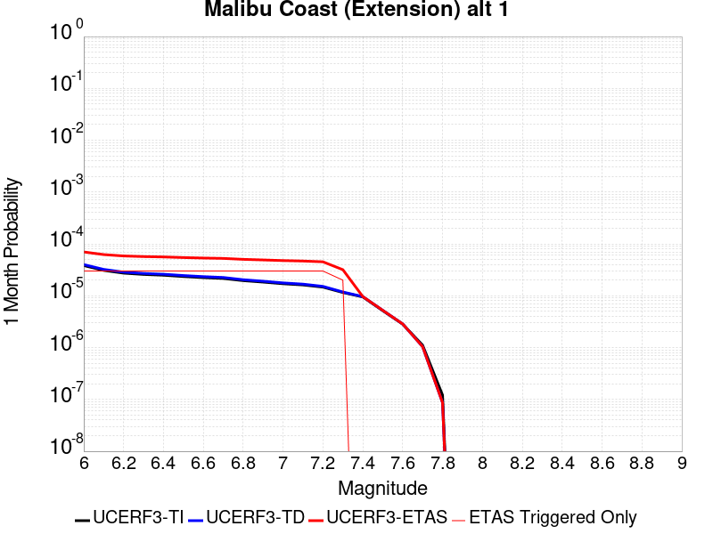 |  |  |

| Magnitude | 1 wk TI Prob | 1 wk TD Prob | 1 wk ETAS Prob | 1 wk ETAS/TD Gain | 1 wk ETAS Triggered Only | 1 mo TI Prob | 1 mo TD Prob | 1 mo ETAS Prob | 1 mo ETAS/TD Gain | 1 mo ETAS Triggered Only | 1 yr TI Prob | 1 yr TD Prob | 1 yr ETAS Prob | 1 yr ETAS/TD Gain | 1 yr ETAS Triggered Only | 10 yr TI Prob | 10 yr TD Prob | 10 yr ETAS Prob | 10 yr ETAS/TD Gain | 10 yr ETAS Triggered Only |
|-----|-----|-----|-----|-----|-----|-----|-----|-----|-----|-----|-----|-----|-----|-----|-----|-----|-----|-----|-----|-----|
| 6.0 | 8.930738E-6 | 9.329276E-6 | 2.7627031E-5 | 2.9613266 | 1.8297927E-5 | 3.827403E-5 | 3.998201E-5 | 5.82792E-5 | 1.4576358 | 1.8297927E-5 | 4.6588664E-4 | 4.8667393E-4 | 5.04963E-4 | 1.0375797 | 1.8297927E-5 | 0.0046491115 | 0.004856264 | 0.004874473 | 1.0037496 | 1.8297927E-5 |
| 6.1 | 7.199952E-6 | 7.5302964E-6 | 2.5828085E-5 | 3.4298897 | 1.8297927E-5 | 3.0856572E-5 | 3.2272303E-5 | 5.056964E-5 | 1.5669671 | 1.8297927E-5 | 3.75614E-4 | 3.9284505E-4 | 4.1113578E-4 | 1.0465597 | 1.8297927E-5 | 0.0037497976 | 0.003921572 | 0.0039397986 | 1.0046476 | 1.8297927E-5 |
| 6.2 | 6.3721413E-6 | 6.6667917E-6 | 2.4964596E-5 | 3.7446194 | 1.8297927E-5 | 2.7308892E-5 | 2.8571652E-5 | 4.6869056E-5 | 1.6404041 | 1.8297927E-5 | 3.3243504E-4 | 3.4780471E-4 | 3.6609627E-4 | 1.0525914 | 1.8297927E-5 | 0.0033193815 | 0.0034726437 | 0.003490878 | 1.0052508 | 1.8297927E-5 |
| 6.3 | 6.016345E-6 | 6.295158E-6 | 2.459297E-5 | 3.9066484 | 1.8297927E-5 | 2.578408E-5 | 2.6978973E-5 | 4.5276407E-5 | 1.6782109 | 1.8297927E-5 | 3.1387596E-4 | 3.2841982E-4 | 3.4671172E-4 | 1.0556967 | 1.8297927E-5 | 0.00313433 | 0.0032793807 | 0.0032976186 | 1.0055614 | 1.8297927E-5 |
| 6.4 | 5.8104883E-6 | 6.0795446E-6 | 2.437736E-5 | 4.0097346 | 1.8297927E-5 | 2.4901856E-5 | 2.6054933E-5 | 4.4352382E-5 | 1.7022643 | 1.8297927E-5 | 3.031379E-4 | 3.1717293E-4 | 3.3546507E-4 | 1.0576724 | 1.8297927E-5 | 0.0030272473 | 0.0031672374 | 0.0031854773 | 1.005759 | 1.8297927E-5 |
| 6.5 | 5.476925E-6 | 5.7275133E-6 | 2.4025336E-5 | 4.1947236 | 1.8297927E-5 | 2.3472323E-5 | 2.4546256E-5 | 4.2843734E-5 | 1.7454284 | 1.8297927E-5 | 2.8573806E-4 | 2.9880996E-4 | 3.1710244E-4 | 1.0612177 | 1.8297927E-5 | 0.0028537093 | 0.002984114 | 0.0030023572 | 1.0061135 | 1.8297927E-5 |
| 6.6 | 5.222387E-6 | 5.45858E-6 | 2.3756407E-5 | 4.3521223 | 1.8297927E-5 | 2.2381464E-5 | 2.3393704E-5 | 4.1691204E-5 | 1.7821548 | 1.8297927E-5 | 2.7246025E-4 | 2.8478142E-4 | 3.0307414E-4 | 1.0642343 | 1.8297927E-5 | 0.0027212645 | 0.0028441956 | 0.0028624414 | 1.0064151 | 1.8297927E-5 |
| 6.7 | 5.0337076E-6 | 5.259103E-6 | 2.3556933E-5 | 4.479268 | 1.8297927E-5 | 2.1572854E-5 | 2.253882E-5 | 4.0836334E-5 | 1.8118222 | 1.8297927E-5 | 2.6261783E-4 | 2.7437587E-4 | 2.9266876E-4 | 1.066671 | 1.8297927E-5 | 0.002623077 | 0.002740401 | 0.002758649 | 1.0066588 | 1.8297927E-5 |
| 6.8 | 4.5675624E-6 | 4.7587164E-6 | 2.3056557E-5 | 4.845121 | 1.8297927E-5 | 1.9575122E-5 | 2.039434E-5 | 3.8691895E-5 | 1.8971878 | 1.8297927E-5 | 2.3830103E-4 | 2.48273E-4 | 2.6656638E-4 | 1.0736825 | 1.8297927E-5 | 0.0023804565 | 0.002479976 | 0.0024982286 | 1.00736 | 1.8297927E-5 |
| 6.9 | 4.2802412E-6 | 4.4520207E-6 | 2.2749866E-5 | 5.110009 | 1.8297927E-5 | 1.8343762E-5 | 1.907995E-5 | 3.7377526E-5 | 1.9589951 | 1.8297927E-5 | 2.2331243E-4 | 2.3227377E-4 | 2.5056745E-4 | 1.0787591 | 1.8297927E-5 | 0.0022308815 | 0.0023203269 | 0.0023385822 | 1.0078676 | 1.8297927E-5 |
| 7.0 | 3.9794063E-6 | 4.130099E-6 | 2.242795E-5 | 5.430366 | 1.8297927E-5 | 1.7054486E-5 | 1.7700306E-5 | 3.599791E-5 | 2.033745 | 1.8297927E-5 | 2.0761859E-4 | 2.1548003E-4 | 2.3377402E-4 | 1.0848987 | 1.8297927E-5 | 0.0020742472 | 0.0021527244 | 0.002170983 | 1.0084816 | 1.8297927E-5 |
| 7.1 | 3.7730424E-6 | 3.911217E-6 | 2.2209073E-5 | 5.6783023 | 1.8297927E-5 | 1.6170083E-5 | 1.6762251E-5 | 3.505987E-5 | 2.0915968 | 1.8297927E-5 | 1.9685295E-4 | 2.0406142E-4 | 2.2235562E-4 | 1.0896504 | 1.8297927E-5 | 0.0019667868 | 0.0020387534 | 0.002057014 | 1.0089568 | 1.8297927E-5 |
| 7.2 | 3.424985E-6 | 3.541337E-6 | 2.18392E-5 | 6.166936 | 1.8297927E-5 | 1.4678424E-5 | 1.5177071E-5 | 3.347472E-5 | 2.2056112 | 1.8297927E-5 | 1.7869516E-4 | 1.8476529E-4 | 2.0305984E-4 | 1.0990151 | 1.8297927E-5 | 0.0017855153 | 0.0018461287 | 0.0018643929 | 1.0098932 | 1.8297927E-5 |
| 7.3 | 2.6966375E-6 | 2.7596534E-6 | 2.1057529E-5 | 7.6304984 | 1.8297927E-5 | 1.15569665E-5 | 1.1827032E-5 | 3.0124742E-5 | 2.5471091 | 1.8297927E-5 | 1.4069698E-4 | 1.4398464E-4 | 1.6227993E-4 | 1.1270642 | 1.8297927E-5 | 0.0014060794 | 0.0014389176 | 0.0014571892 | 1.0126982 | 1.8297927E-5 |
| 7.4 | 2.215957E-6 | 2.249378E-6 | 2.249378E-6 | 1.0 | 0.0 | 9.496924E-6 | 9.640156E-6 | 9.640156E-6 | 1.0 | 0.0 | 1.1561892E-4 | 1.17362615E-4 | 1.17362615E-4 | 1.0 | 0.0 | 0.0011555878 | 0.0011730101 | 0.0011730101 | 1.0 | 0.0 |
| 7.5 | 1.2040218E-6 | 1.2219067E-6 | 1.2219067E-6 | 1.0 | 0.0 | 5.160083E-6 | 5.2367322E-6 | 5.2367322E-6 | 1.0 | 0.0 | 6.2822204E-5 | 6.375537E-5 | 6.375537E-5 | 1.0 | 0.0 | 6.280445E-4 | 6.3737266E-4 | 6.3737266E-4 | 1.0 | 0.0 |
| 7.6 | 6.6157446E-7 | 6.678975E-7 | 6.678975E-7 | 1.0 | 0.0 | 2.835316E-6 | 2.8624147E-6 | 2.8624147E-6 | 1.0 | 0.0 | 3.4519428E-5 | 3.484936E-5 | 3.484936E-5 | 1.0 | 0.0 | 3.4514067E-4 | 3.4844046E-4 | 3.4844046E-4 | 1.0 | 0.0 |
| 7.7 | 2.6012302E-7 | 2.4357593E-7 | 2.4357593E-7 | 1.0 | 0.0 | 1.1148124E-6 | 1.0438964E-6 | 1.0438964E-6 | 1.0 | 0.0 | 1.3572758E-5 | 1.2709375E-5 | 1.2709375E-5 | 1.0 | 0.0 | 1.3571928E-4 | 1.2708755E-4 | 1.2708755E-4 | 1.0 | 0.0 |
| 7.8 | 2.8323132E-8 | 2.0266649E-8 | 2.0266649E-8 | 1.0 | 0.0 | 1.2138484E-7 | 8.685707E-8 | 8.685707E-8 | 1.0 | 0.0 | 1.4778595E-6 | 1.0574844E-6 | 1.0574844E-6 | 1.0 | 0.0 | 1.4778497E-5 | 1.0574801E-5 | 1.0574801E-5 | 1.0 | 0.0 |

## Hartley Springs 2011 CFM
*[(top)](#table-of-contents)*

| 1 Week | 1 Month | 1 Year | 10 Year |
|-----|-----|-----|-----|
|  |  |  |  |

| Magnitude | 1 wk TI Prob | 1 wk TD Prob | 1 wk ETAS Prob | 1 wk ETAS/TD Gain | 1 wk ETAS Triggered Only | 1 mo TI Prob | 1 mo TD Prob | 1 mo ETAS Prob | 1 mo ETAS/TD Gain | 1 mo ETAS Triggered Only | 1 yr TI Prob | 1 yr TD Prob | 1 yr ETAS Prob | 1 yr ETAS/TD Gain | 1 yr ETAS Triggered Only | 10 yr TI Prob | 10 yr TD Prob | 10 yr ETAS Prob | 10 yr ETAS/TD Gain | 10 yr ETAS Triggered Only |
|-----|-----|-----|-----|-----|-----|-----|-----|-----|-----|-----|-----|-----|-----|-----|-----|-----|-----|-----|-----|-----|
| 6.0 | 1.4352418E-5 | 1.4434182E-5 | 1.4434182E-5 | 1.0 | 0.0 | 6.1508916E-5 | 6.1860235E-5 | 6.1860235E-5 | 1.0 | 0.0 | 7.486137E-4 | 7.5305253E-4 | 7.5305253E-4 | 1.0 | 0.0 | 0.007460968 | 0.0075211283 | 0.0075392886 | 1.0024146 | 1.8297927E-5 |
| 6.1 | 1.4352418E-5 | 1.4434182E-5 | 1.4434182E-5 | 1.0 | 0.0 | 6.1508916E-5 | 6.1860235E-5 | 6.1860235E-5 | 1.0 | 0.0 | 7.486137E-4 | 7.5305253E-4 | 7.5305253E-4 | 1.0 | 0.0 | 0.007460968 | 0.0075211283 | 0.0075392886 | 1.0024146 | 1.8297927E-5 |
| 6.2 | 1.4352418E-5 | 1.4434182E-5 | 1.4434182E-5 | 1.0 | 0.0 | 6.1508916E-5 | 6.1860235E-5 | 6.1860235E-5 | 1.0 | 0.0 | 7.486137E-4 | 7.5305253E-4 | 7.5305253E-4 | 1.0 | 0.0 | 0.007460968 | 0.0075211283 | 0.0075392886 | 1.0024146 | 1.8297927E-5 |
| 6.3 | 1.4352418E-5 | 1.4434182E-5 | 1.4434182E-5 | 1.0 | 0.0 | 6.1508916E-5 | 6.1860235E-5 | 6.1860235E-5 | 1.0 | 0.0 | 7.486137E-4 | 7.5305253E-4 | 7.5305253E-4 | 1.0 | 0.0 | 0.007460968 | 0.0075211283 | 0.0075392886 | 1.0024146 | 1.8297927E-5 |
| 6.4 | 1.4352418E-5 | 1.4434182E-5 | 1.4434182E-5 | 1.0 | 0.0 | 6.1508916E-5 | 6.1860235E-5 | 6.1860235E-5 | 1.0 | 0.0 | 7.486137E-4 | 7.5305253E-4 | 7.5305253E-4 | 1.0 | 0.0 | 0.007460968 | 0.0075211283 | 0.0075392886 | 1.0024146 | 1.8297927E-5 |
| 6.5 | 1.2279858E-5 | 1.2133106E-5 | 1.2133106E-5 | 1.0 | 0.0 | 5.26269E-5 | 5.1998883E-5 | 5.1998883E-5 | 1.0 | 0.0 | 6.4054417E-4 | 6.3306064E-4 | 6.3306064E-4 | 1.0 | 0.0 | 0.0063870098 | 0.006328085 | 0.006328085 | 1.0 | 0.0 |
| 6.6 | 1.2279858E-5 | 1.2133106E-5 | 1.2133106E-5 | 1.0 | 0.0 | 5.26269E-5 | 5.1998883E-5 | 5.1998883E-5 | 1.0 | 0.0 | 6.4054417E-4 | 6.3306064E-4 | 6.3306064E-4 | 1.0 | 0.0 | 0.0063870098 | 0.006328085 | 0.006328085 | 1.0 | 0.0 |
| 6.7 | 2.1282601E-6 | 8.8948315E-7 | 8.8948315E-7 | 1.0 | 0.0 | 9.121083E-6 | 3.8120663E-6 | 3.8120663E-6 | 1.0 | 0.0 | 1.11043526E-4 | 4.641118E-5 | 4.641118E-5 | 1.0 | 0.0 | 0.0011098806 | 4.6404017E-4 | 4.6404017E-4 | 1.0 | 0.0 |
| 6.8 | 2.00516E-6 | 8.517597E-7 | 8.517597E-7 | 1.0 | 0.0 | 8.593515E-6 | 3.650395E-6 | 3.650395E-6 | 1.0 | 0.0 | 1.04621024E-4 | 4.444291E-5 | 4.444291E-5 | 1.0 | 0.0 | 0.0010457177 | 4.4436535E-4 | 4.4436535E-4 | 1.0 | 0.0 |
| 6.9 | 2.00516E-6 | 8.517597E-7 | 8.517597E-7 | 1.0 | 0.0 | 8.593515E-6 | 3.650395E-6 | 3.650395E-6 | 1.0 | 0.0 | 1.04621024E-4 | 4.444291E-5 | 4.444291E-5 | 1.0 | 0.0 | 0.0010457177 | 4.4436535E-4 | 4.4436535E-4 | 1.0 | 0.0 |
| 7.0 | 1.8366732E-6 | 8.237307E-7 | 8.237307E-7 | 1.0 | 0.0 | 7.871433E-6 | 3.5302712E-6 | 3.5302712E-6 | 1.0 | 0.0 | 9.583048E-5 | 4.298046E-5 | 4.298046E-5 | 1.0 | 0.0 | 9.5789164E-4 | 4.2974652E-4 | 4.2974652E-4 | 1.0 | 0.0 |
| 7.1 | 1.5097997E-6 | 7.1902616E-7 | 7.1902616E-7 | 1.0 | 0.0 | 6.470554E-6 | 3.0815384E-6 | 3.0815384E-6 | 1.0 | 0.0 | 7.877615E-5 | 3.7517326E-5 | 3.7517326E-5 | 1.0 | 0.0 | 7.874823E-4 | 3.7513362E-4 | 3.7513362E-4 | 1.0 | 0.0 |
| 7.2 | 1.3490993E-6 | 6.405254E-7 | 6.405254E-7 | 1.0 | 0.0 | 5.7818415E-6 | 2.7451074E-6 | 2.7451074E-6 | 1.0 | 0.0 | 7.0391645E-5 | 3.3421402E-5 | 3.3421402E-5 | 1.0 | 0.0 | 7.0369354E-4 | 3.341867E-4 | 3.341867E-4 | 1.0 | 0.0 |
| 7.3 | 7.900015E-7 | 4.0889498E-7 | 4.0889498E-7 | 1.0 | 0.0 | 3.3857161E-6 | 1.752407E-6 | 1.752407E-6 | 1.0 | 0.0 | 4.1220315E-5 | 2.1335554E-5 | 2.1335554E-5 | 1.0 | 0.0 | 4.121267E-4 | 2.1335555E-4 | 2.1335555E-4 | 1.0 | 0.0 |

## North Frontal  (East)
*[(top)](#table-of-contents)*

| 1 Week | 1 Month | 1 Year | 10 Year |
|-----|-----|-----|-----|
|  |  |  |  |

| Magnitude | 1 wk TI Prob | 1 wk TD Prob | 1 wk ETAS Prob | 1 wk ETAS/TD Gain | 1 wk ETAS Triggered Only | 1 mo TI Prob | 1 mo TD Prob | 1 mo ETAS Prob | 1 mo ETAS/TD Gain | 1 mo ETAS Triggered Only | 1 yr TI Prob | 1 yr TD Prob | 1 yr ETAS Prob | 1 yr ETAS/TD Gain | 1 yr ETAS Triggered Only | 10 yr TI Prob | 10 yr TD Prob | 10 yr ETAS Prob | 10 yr ETAS/TD Gain | 10 yr ETAS Triggered Only |
|-----|-----|-----|-----|-----|-----|-----|-----|-----|-----|-----|-----|-----|-----|-----|-----|-----|-----|-----|-----|-----|
| 6.0 | 7.135738E-6 | 7.4771765E-6 | 7.4771765E-6 | 1.0 | 0.0 | 3.0581377E-5 | 3.204476E-5 | 3.204476E-5 | 1.0 | 0.0 | 3.7226462E-4 | 3.9009505E-4 | 3.9009505E-4 | 1.0 | 0.0 | 0.0037164164 | 0.0038960609 | 0.0039142873 | 1.0046782 | 1.8297927E-5 |
| 6.1 | 7.135738E-6 | 7.4771765E-6 | 7.4771765E-6 | 1.0 | 0.0 | 3.0581377E-5 | 3.204476E-5 | 3.204476E-5 | 1.0 | 0.0 | 3.7226462E-4 | 3.9009505E-4 | 3.9009505E-4 | 1.0 | 0.0 | 0.0037164164 | 0.0038960609 | 0.0039142873 | 1.0046782 | 1.8297927E-5 |
| 6.2 | 7.135738E-6 | 7.4771765E-6 | 7.4771765E-6 | 1.0 | 0.0 | 3.0581377E-5 | 3.204476E-5 | 3.204476E-5 | 1.0 | 0.0 | 3.7226462E-4 | 3.9009505E-4 | 3.9009505E-4 | 1.0 | 0.0 | 0.0037164164 | 0.0038960609 | 0.0039142873 | 1.0046782 | 1.8297927E-5 |
| 6.3 | 7.135738E-6 | 7.4771765E-6 | 7.4771765E-6 | 1.0 | 0.0 | 3.0581377E-5 | 3.204476E-5 | 3.204476E-5 | 1.0 | 0.0 | 3.7226462E-4 | 3.9009505E-4 | 3.9009505E-4 | 1.0 | 0.0 | 0.0037164164 | 0.0038960609 | 0.0039142873 | 1.0046782 | 1.8297927E-5 |
| 6.4 | 7.135738E-6 | 7.4771765E-6 | 7.4771765E-6 | 1.0 | 0.0 | 3.0581377E-5 | 3.204476E-5 | 3.204476E-5 | 1.0 | 0.0 | 3.7226462E-4 | 3.9009505E-4 | 3.9009505E-4 | 1.0 | 0.0 | 0.0037164164 | 0.0038960609 | 0.0039142873 | 1.0046782 | 1.8297927E-5 |
| 6.5 | 7.135738E-6 | 7.4771765E-6 | 7.4771765E-6 | 1.0 | 0.0 | 3.0581377E-5 | 3.204476E-5 | 3.204476E-5 | 1.0 | 0.0 | 3.7226462E-4 | 3.9009505E-4 | 3.9009505E-4 | 1.0 | 0.0 | 0.0037164164 | 0.0038960609 | 0.0039142873 | 1.0046782 | 1.8297927E-5 |
| 6.6 | 7.135738E-6 | 7.4771765E-6 | 7.4771765E-6 | 1.0 | 0.0 | 3.0581377E-5 | 3.204476E-5 | 3.204476E-5 | 1.0 | 0.0 | 3.7226462E-4 | 3.9009505E-4 | 3.9009505E-4 | 1.0 | 0.0 | 0.0037164164 | 0.0038960609 | 0.0039142873 | 1.0046782 | 1.8297927E-5 |
| 6.7 | 7.135738E-6 | 7.4771765E-6 | 7.4771765E-6 | 1.0 | 0.0 | 3.0581377E-5 | 3.204476E-5 | 3.204476E-5 | 1.0 | 0.0 | 3.7226462E-4 | 3.9009505E-4 | 3.9009505E-4 | 1.0 | 0.0 | 0.0037164164 | 0.0038960609 | 0.0039142873 | 1.0046782 | 1.8297927E-5 |
| 6.8 | 5.959142E-6 | 6.236683E-6 | 6.236683E-6 | 1.0 | 0.0 | 2.553893E-5 | 2.6728469E-5 | 2.6728469E-5 | 1.0 | 0.0 | 3.108921E-4 | 3.253886E-4 | 3.253886E-4 | 1.0 | 0.0 | 0.0031045752 | 0.0032508948 | 0.0032691332 | 1.0056102 | 1.8297927E-5 |
| 6.9 | 2.2946929E-6 | 2.3824605E-6 | 2.3824605E-6 | 1.0 | 0.0 | 9.834361E-6 | 1.0210508E-5 | 1.0210508E-5 | 1.0 | 0.0 | 1.1972676E-4 | 1.2430632E-4 | 1.2430632E-4 | 1.0 | 0.0 | 0.0011966228 | 0.0012424142 | 0.0012424142 | 1.0 | 0.0 |
| 7.0 | 2.2468673E-6 | 2.3321538E-6 | 2.3321538E-6 | 1.0 | 0.0 | 9.629396E-6 | 9.994909E-6 | 9.994909E-6 | 1.0 | 0.0 | 1.1723159E-4 | 1.21681696E-4 | 1.21681696E-4 | 1.0 | 0.0 | 0.0011716976 | 0.0012161969 | 0.0012161969 | 1.0 | 0.0 |
| 7.1 | 1.9921076E-6 | 2.0646032E-6 | 2.0646032E-6 | 1.0 | 0.0 | 8.537577E-6 | 8.848272E-6 | 8.848272E-6 | 1.0 | 0.0 | 1.0394004E-4 | 1.0772282E-4 | 1.0772282E-4 | 1.0 | 0.0 | 0.0010389143 | 0.0010767487 | 0.0010767487 | 1.0 | 0.0 |
| 7.2 | 1.4524545E-6 | 1.5045148E-6 | 1.5045148E-6 | 1.0 | 0.0 | 6.2247905E-6 | 6.447906E-6 | 6.447906E-6 | 1.0 | 0.0 | 7.5784184E-5 | 7.850068E-5 | 7.850068E-5 | 1.0 | 0.0 | 7.575835E-4 | 7.8475394E-4 | 7.8475394E-4 | 1.0 | 0.0 |
| 7.3 | 8.9802575E-7 | 9.3087283E-7 | 9.3087283E-7 | 1.0 | 0.0 | 3.848676E-6 | 3.9894494E-6 | 3.9894494E-6 | 1.0 | 0.0 | 4.685662E-5 | 4.857058E-5 | 4.857058E-5 | 1.0 | 0.0 | 4.6846745E-4 | 4.8561094E-4 | 4.8561094E-4 | 1.0 | 0.0 |
| 7.4 | 7.776139E-7 | 8.0604747E-7 | 8.0604747E-7 | 1.0 | 0.0 | 3.3326266E-6 | 3.4544853E-6 | 3.4544853E-6 | 1.0 | 0.0 | 4.0573974E-5 | 4.2057654E-5 | 4.2057654E-5 | 1.0 | 0.0 | 4.0566566E-4 | 4.205077E-4 | 4.205077E-4 | 1.0 | 0.0 |
| 7.5 | 5.244417E-7 | 5.441219E-7 | 5.441219E-7 | 1.0 | 0.0 | 2.2476054E-6 | 2.3319494E-6 | 2.3319494E-6 | 1.0 | 0.0 | 2.7364253E-5 | 2.839118E-5 | 2.839118E-5 | 1.0 | 0.0 | 2.7360884E-4 | 2.8388205E-4 | 2.8388205E-4 | 1.0 | 0.0 |
| 7.6 | 1.5489647E-7 | 1.6089504E-7 | 1.6089504E-7 | 1.0 | 0.0 | 6.6384183E-7 | 6.895501E-7 | 6.895501E-7 | 1.0 | 0.0 | 8.082245E-6 | 8.395261E-6 | 8.395261E-6 | 1.0 | 0.0 | 8.08195E-5 | 8.395143E-5 | 8.395143E-5 | 1.0 | 0.0 |

## Swain Ravine - Spenceville
*[(top)](#table-of-contents)*

| 1 Week | 1 Month | 1 Year | 10 Year |
|-----|-----|-----|-----|
|  | 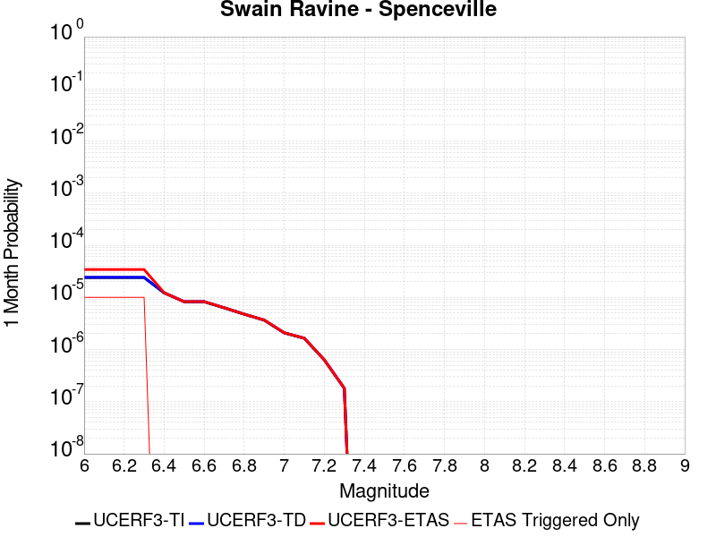 |  |  |

| Magnitude | 1 wk TI Prob | 1 wk TD Prob | 1 wk ETAS Prob | 1 wk ETAS/TD Gain | 1 wk ETAS Triggered Only | 1 mo TI Prob | 1 mo TD Prob | 1 mo ETAS Prob | 1 mo ETAS/TD Gain | 1 mo ETAS Triggered Only | 1 yr TI Prob | 1 yr TD Prob | 1 yr ETAS Prob | 1 yr ETAS/TD Gain | 1 yr ETAS Triggered Only | 10 yr TI Prob | 10 yr TD Prob | 10 yr ETAS Prob | 10 yr ETAS/TD Gain | 10 yr ETAS Triggered Only |
|-----|-----|-----|-----|-----|-----|-----|-----|-----|-----|-----|-----|-----|-----|-----|-----|-----|-----|-----|-----|-----|
| 6.0 | 5.596169E-6 | 5.663794E-6 | 2.3961618E-5 | 4.230665 | 1.8297927E-5 | 2.398336E-5 | 2.4273193E-5 | 4.2570675E-5 | 1.7538143 | 1.8297927E-5 | 2.9195828E-4 | 2.9548878E-4 | 3.137813E-4 | 1.061906 | 1.8297927E-5 | 0.00291575 | 0.002951228 | 0.002969472 | 1.0061818 | 1.8297927E-5 |
| 6.1 | 5.596169E-6 | 5.663794E-6 | 2.3961618E-5 | 4.230665 | 1.8297927E-5 | 2.398336E-5 | 2.4273193E-5 | 4.2570675E-5 | 1.7538143 | 1.8297927E-5 | 2.9195828E-4 | 2.9548878E-4 | 3.137813E-4 | 1.061906 | 1.8297927E-5 | 0.00291575 | 0.002951228 | 0.002969472 | 1.0061818 | 1.8297927E-5 |
| 6.2 | 5.596169E-6 | 5.663794E-6 | 2.3961618E-5 | 4.230665 | 1.8297927E-5 | 2.398336E-5 | 2.4273193E-5 | 4.2570675E-5 | 1.7538143 | 1.8297927E-5 | 2.9195828E-4 | 2.9548878E-4 | 3.137813E-4 | 1.061906 | 1.8297927E-5 | 0.00291575 | 0.002951228 | 0.002969472 | 1.0061818 | 1.8297927E-5 |
| 6.3 | 5.596169E-6 | 5.663794E-6 | 2.3961618E-5 | 4.230665 | 1.8297927E-5 | 2.398336E-5 | 2.4273193E-5 | 4.2570675E-5 | 1.7538143 | 1.8297927E-5 | 2.9195828E-4 | 2.9548878E-4 | 3.137813E-4 | 1.061906 | 1.8297927E-5 | 0.00291575 | 0.002951228 | 0.002969472 | 1.0061818 | 1.8297927E-5 |
| 6.4 | 2.8426775E-6 | 2.874144E-6 | 2.874144E-6 | 1.0 | 0.0 | 1.2182847E-5 | 1.2317704E-5 | 1.2317704E-5 | 1.0 | 0.0 | 1.4831607E-4 | 1.4995811E-4 | 1.4995811E-4 | 1.0 | 0.0 | 0.0014821711 | 0.0014986077 | 0.0014986077 | 1.0 | 0.0 |
| 6.5 | 1.9210793E-6 | 1.9414147E-6 | 1.9414147E-6 | 1.0 | 0.0 | 8.233172E-6 | 8.320323E-6 | 8.320323E-6 | 1.0 | 0.0 | 1.0023425E-4 | 1.0129536E-4 | 1.0129536E-4 | 1.0 | 0.0 | 0.0010018905 | 0.0010125053 | 0.0010125053 | 1.0 | 0.0 |
| 6.6 | 1.9210793E-6 | 1.9414147E-6 | 1.9414147E-6 | 1.0 | 0.0 | 8.233172E-6 | 8.320323E-6 | 8.320323E-6 | 1.0 | 0.0 | 1.0023425E-4 | 1.0129536E-4 | 1.0129536E-4 | 1.0 | 0.0 | 0.0010018905 | 0.0010125053 | 0.0010125053 | 1.0 | 0.0 |
| 6.7 | 1.4667394E-6 | 1.4818934E-6 | 1.4818934E-6 | 1.0 | 0.0 | 6.286011E-6 | 6.3509565E-6 | 6.3509565E-6 | 1.0 | 0.0 | 7.65295E-5 | 7.732023E-5 | 7.732023E-5 | 1.0 | 0.0 | 7.6503144E-4 | 7.72941E-4 | 7.72941E-4 | 1.0 | 0.0 |
| 6.8 | 1.1076943E-6 | 1.1189535E-6 | 1.1189535E-6 | 1.0 | 0.0 | 4.747252E-6 | 4.7955064E-6 | 4.7955064E-6 | 1.0 | 0.0 | 5.7796264E-5 | 5.838377E-5 | 5.838377E-5 | 1.0 | 0.0 | 5.778124E-4 | 5.836887E-4 | 5.836887E-4 | 1.0 | 0.0 |
| 6.9 | 8.514296E-7 | 8.600095E-7 | 8.600095E-7 | 1.0 | 0.0 | 3.648979E-6 | 3.6857498E-6 | 3.6857498E-6 | 1.0 | 0.0 | 4.442541E-5 | 4.4873108E-5 | 4.4873108E-5 | 1.0 | 0.0 | 4.441653E-4 | 4.4864335E-4 | 4.4864335E-4 | 1.0 | 0.0 |
| 7.0 | 4.8544706E-7 | 4.9033E-7 | 4.9033E-7 | 1.0 | 0.0 | 2.0804857E-6 | 2.1014127E-6 | 2.1014127E-6 | 1.0 | 0.0 | 2.532962E-5 | 2.5584413E-5 | 2.5584413E-5 | 1.0 | 0.0 | 2.5326732E-4 | 2.5581598E-4 | 2.5581598E-4 | 1.0 | 0.0 |
| 7.1 | 3.829186E-7 | 3.8678783E-7 | 3.8678783E-7 | 1.0 | 0.0 | 1.6410787E-6 | 1.6576612E-6 | 1.6576612E-6 | 1.0 | 0.0 | 1.997995E-5 | 2.0181848E-5 | 2.0181848E-5 | 1.0 | 0.0 | 1.9978154E-4 | 2.0180122E-4 | 2.0180122E-4 | 1.0 | 0.0 |
| 7.2 | 1.4726595E-7 | 1.4879437E-7 | 1.4879437E-7 | 1.0 | 0.0 | 6.3113964E-7 | 6.3769005E-7 | 6.3769005E-7 | 1.0 | 0.0 | 7.684098E-6 | 7.763854E-6 | 7.763854E-6 | 1.0 | 0.0 | 7.6838325E-5 | 7.763636E-5 | 7.763636E-5 | 1.0 | 0.0 |
| 7.3 | 4.1880604E-8 | 4.2324306E-8 | 4.2324306E-8 | 1.0 | 0.0 | 1.7948828E-7 | 1.8138988E-7 | 1.8138988E-7 | 1.0 | 0.0 | 2.1852677E-6 | 2.2084218E-6 | 2.2084218E-6 | 1.0 | 0.0 | 2.1852462E-5 | 2.2084218E-5 | 2.2084218E-5 | 1.0 | 0.0 |

## Carson Range (Genoa)
*[(top)](#table-of-contents)*

| 1 Week | 1 Month | 1 Year | 10 Year |
|-----|-----|-----|-----|
|  |  |  |  |

| Magnitude | 1 wk TI Prob | 1 wk TD Prob | 1 wk ETAS Prob | 1 wk ETAS/TD Gain | 1 wk ETAS Triggered Only | 1 mo TI Prob | 1 mo TD Prob | 1 mo ETAS Prob | 1 mo ETAS/TD Gain | 1 mo ETAS Triggered Only | 1 yr TI Prob | 1 yr TD Prob | 1 yr ETAS Prob | 1 yr ETAS/TD Gain | 1 yr ETAS Triggered Only | 10 yr TI Prob | 10 yr TD Prob | 10 yr ETAS Prob | 10 yr ETAS/TD Gain | 10 yr ETAS Triggered Only |
|-----|-----|-----|-----|-----|-----|-----|-----|-----|-----|-----|-----|-----|-----|-----|-----|-----|-----|-----|-----|-----|
| 6.0 | 4.1268457E-5 | 5.0146893E-5 | 5.0146893E-5 | 1.0 | 0.0 | 1.7685282E-4 | 2.148998E-4 | 2.148998E-4 | 1.0 | 0.0 | 0.0021510567 | 0.0026136558 | 0.0026319057 | 1.0069826 | 1.8297927E-5 | 0.02130354 | 0.025868816 | 0.025886642 | 1.000689 | 1.8297927E-5 |
| 6.1 | 4.1268457E-5 | 5.0146893E-5 | 5.0146893E-5 | 1.0 | 0.0 | 1.7685282E-4 | 2.148998E-4 | 2.148998E-4 | 1.0 | 0.0 | 0.0021510567 | 0.0026136558 | 0.0026319057 | 1.0069826 | 1.8297927E-5 | 0.02130354 | 0.025868816 | 0.025886642 | 1.000689 | 1.8297927E-5 |
| 6.2 | 4.1268457E-5 | 5.0146893E-5 | 5.0146893E-5 | 1.0 | 0.0 | 1.7685282E-4 | 2.148998E-4 | 2.148998E-4 | 1.0 | 0.0 | 0.0021510567 | 0.0026136558 | 0.0026319057 | 1.0069826 | 1.8297927E-5 | 0.02130354 | 0.025868816 | 0.025886642 | 1.000689 | 1.8297927E-5 |
| 6.3 | 4.1268457E-5 | 5.0146893E-5 | 5.0146893E-5 | 1.0 | 0.0 | 1.7685282E-4 | 2.148998E-4 | 2.148998E-4 | 1.0 | 0.0 | 0.0021510567 | 0.0026136558 | 0.0026319057 | 1.0069826 | 1.8297927E-5 | 0.02130354 | 0.025868816 | 0.025886642 | 1.000689 | 1.8297927E-5 |
| 6.4 | 4.1268457E-5 | 5.0146893E-5 | 5.0146893E-5 | 1.0 | 0.0 | 1.7685282E-4 | 2.148998E-4 | 2.148998E-4 | 1.0 | 0.0 | 0.0021510567 | 0.0026136558 | 0.0026319057 | 1.0069826 | 1.8297927E-5 | 0.02130354 | 0.025868816 | 0.025886642 | 1.000689 | 1.8297927E-5 |
| 6.5 | 2.5677185E-5 | 3.0978295E-5 | 3.0978295E-5 | 1.0 | 0.0 | 1.1004044E-4 | 1.3275839E-4 | 1.3275839E-4 | 1.0 | 0.0 | 0.0013389189 | 0.0016153135 | 0.0016335818 | 1.0113095 | 1.8297927E-5 | 0.0133088045 | 0.016053649 | 0.016071653 | 1.0011215 | 1.8297927E-5 |
| 6.6 | 2.5677185E-5 | 3.0978295E-5 | 3.0978295E-5 | 1.0 | 0.0 | 1.1004044E-4 | 1.3275839E-4 | 1.3275839E-4 | 1.0 | 0.0 | 0.0013389189 | 0.0016153135 | 0.0016335818 | 1.0113095 | 1.8297927E-5 | 0.0133088045 | 0.016053649 | 0.016071653 | 1.0011215 | 1.8297927E-5 |
| 6.7 | 1.9969408E-5 | 2.406347E-5 | 2.406347E-5 | 1.0 | 0.0 | 8.558037E-5 | 1.0312595E-4 | 1.0312595E-4 | 1.0 | 0.0 | 0.0010414429 | 0.0012549888 | 0.0012549888 | 1.0 | 0.0 | 0.010365757 | 0.012494174 | 0.012494174 | 1.0 | 0.0 |
| 6.8 | 1.4783156E-5 | 1.7817569E-5 | 1.7817569E-5 | 1.0 | 0.0 | 6.335485E-5 | 7.635951E-5 | 7.635951E-5 | 1.0 | 0.0 | 7.710722E-4 | 9.294106E-4 | 9.294106E-4 | 1.0 | 0.0 | 0.0076840227 | 0.009268024 | 0.009268024 | 1.0 | 0.0 |
| 6.9 | 1.06660555E-5 | 1.2877026E-5 | 1.2877026E-5 | 1.0 | 0.0 | 4.5710865E-5 | 5.5186738E-5 | 5.5186738E-5 | 1.0 | 0.0 | 5.5638765E-4 | 6.718066E-4 | 6.718066E-4 | 1.0 | 0.0 | 0.005549967 | 0.006709056 | 0.006709056 | 1.0 | 0.0 |
| 7.0 | 7.664838E-6 | 9.258307E-6 | 9.258307E-6 | 1.0 | 0.0 | 3.2848893E-5 | 3.9678456E-5 | 3.9678456E-5 | 1.0 | 0.0 | 3.998619E-4 | 4.830852E-4 | 4.830852E-4 | 1.0 | 0.0 | 0.0039914316 | 0.00483085 | 0.00483085 | 1.0 | 0.0 |

## Rocky Ledge 2011 CFM
*[(top)](#table-of-contents)*

| 1 Week | 1 Month | 1 Year | 10 Year |
|-----|-----|-----|-----|
|  |  | 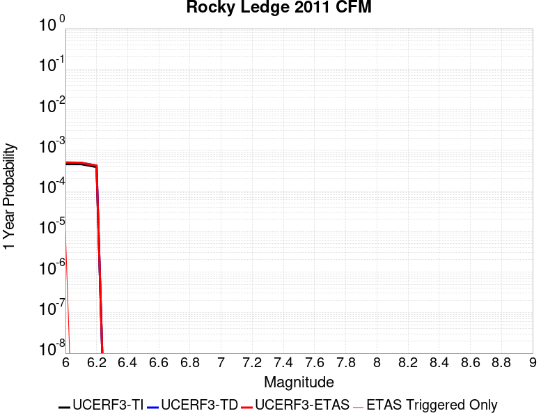 |  |

| Magnitude | 1 wk TI Prob | 1 wk TD Prob | 1 wk ETAS Prob | 1 wk ETAS/TD Gain | 1 wk ETAS Triggered Only | 1 mo TI Prob | 1 mo TD Prob | 1 mo ETAS Prob | 1 mo ETAS/TD Gain | 1 mo ETAS Triggered Only | 1 yr TI Prob | 1 yr TD Prob | 1 yr ETAS Prob | 1 yr ETAS/TD Gain | 1 yr ETAS Triggered Only | 10 yr TI Prob | 10 yr TD Prob | 10 yr ETAS Prob | 10 yr ETAS/TD Gain | 10 yr ETAS Triggered Only |
|-----|-----|-----|-----|-----|-----|-----|-----|-----|-----|-----|-----|-----|-----|-----|-----|-----|-----|-----|-----|-----|
| 6.0 | 8.7550525E-6 | 9.486605E-6 | 9.486605E-6 | 1.0 | 0.0 | 3.7521113E-5 | 4.0656712E-5 | 4.0656712E-5 | 1.0 | 0.0 | 4.567238E-4 | 4.949655E-4 | 5.132544E-4 | 1.0369498 | 1.8297927E-5 | 0.0045578624 | 0.0049467194 | 0.0049649267 | 1.0036807 | 1.8297927E-5 |
| 6.1 | 8.7550525E-6 | 9.486605E-6 | 9.486605E-6 | 1.0 | 0.0 | 3.7521113E-5 | 4.0656712E-5 | 4.0656712E-5 | 1.0 | 0.0 | 4.567238E-4 | 4.949655E-4 | 4.949655E-4 | 1.0 | 0.0 | 0.0045578624 | 0.0049467194 | 0.0049467194 | 1.0 | 0.0 |
| 6.2 | 7.442295E-6 | 8.06304E-6 | 8.06304E-6 | 1.0 | 0.0 | 3.189516E-5 | 3.4555887E-5 | 3.4555887E-5 | 1.0 | 0.0 | 3.8825438E-4 | 4.2071793E-4 | 4.2071793E-4 | 1.0 | 0.0 | 0.0038757676 | 0.004207179 | 0.004207179 | 1.0 | 0.0 |

## San Gabriel (Extension)
*[(top)](#table-of-contents)*

| 1 Week | 1 Month | 1 Year | 10 Year |
|-----|-----|-----|-----|
|  |  |  |  |

| Magnitude | 1 wk TI Prob | 1 wk TD Prob | 1 wk ETAS Prob | 1 wk ETAS/TD Gain | 1 wk ETAS Triggered Only | 1 mo TI Prob | 1 mo TD Prob | 1 mo ETAS Prob | 1 mo ETAS/TD Gain | 1 mo ETAS Triggered Only | 1 yr TI Prob | 1 yr TD Prob | 1 yr ETAS Prob | 1 yr ETAS/TD Gain | 1 yr ETAS Triggered Only | 10 yr TI Prob | 10 yr TD Prob | 10 yr ETAS Prob | 10 yr ETAS/TD Gain | 10 yr ETAS Triggered Only |
|-----|-----|-----|-----|-----|-----|-----|-----|-----|-----|-----|-----|-----|-----|-----|-----|-----|-----|-----|-----|-----|
| 6.0 | 5.6486106E-6 | 5.7168304E-6 | 5.7168304E-6 | 1.0 | 0.0 | 2.4208108E-5 | 2.450048E-5 | 2.450048E-5 | 1.0 | 0.0 | 2.9469383E-4 | 2.9825376E-4 | 3.1654624E-4 | 1.0613319 | 1.8297927E-5 | 0.0029430336 | 0.0029786653 | 0.0029969085 | 1.0061247 | 1.8297927E-5 |
| 6.1 | 5.6486106E-6 | 5.7168304E-6 | 5.7168304E-6 | 1.0 | 0.0 | 2.4208108E-5 | 2.450048E-5 | 2.450048E-5 | 1.0 | 0.0 | 2.9469383E-4 | 2.9825376E-4 | 3.1654624E-4 | 1.0613319 | 1.8297927E-5 | 0.0029430336 | 0.0029786653 | 0.0029969085 | 1.0061247 | 1.8297927E-5 |
| 6.2 | 5.6486106E-6 | 5.7168304E-6 | 5.7168304E-6 | 1.0 | 0.0 | 2.4208108E-5 | 2.450048E-5 | 2.450048E-5 | 1.0 | 0.0 | 2.9469383E-4 | 2.9825376E-4 | 3.1654624E-4 | 1.0613319 | 1.8297927E-5 | 0.0029430336 | 0.0029786653 | 0.0029969085 | 1.0061247 | 1.8297927E-5 |
| 6.3 | 5.6486106E-6 | 5.7168304E-6 | 5.7168304E-6 | 1.0 | 0.0 | 2.4208108E-5 | 2.450048E-5 | 2.450048E-5 | 1.0 | 0.0 | 2.9469383E-4 | 2.9825376E-4 | 3.1654624E-4 | 1.0613319 | 1.8297927E-5 | 0.0029430336 | 0.0029786653 | 0.0029969085 | 1.0061247 | 1.8297927E-5 |
| 6.4 | 5.6486106E-6 | 5.7168304E-6 | 5.7168304E-6 | 1.0 | 0.0 | 2.4208108E-5 | 2.450048E-5 | 2.450048E-5 | 1.0 | 0.0 | 2.9469383E-4 | 2.9825376E-4 | 3.1654624E-4 | 1.0613319 | 1.8297927E-5 | 0.0029430336 | 0.0029786653 | 0.0029969085 | 1.0061247 | 1.8297927E-5 |
| 6.5 | 4.7134554E-6 | 4.7542544E-6 | 4.7542544E-6 | 1.0 | 0.0 | 2.0200367E-5 | 2.0375222E-5 | 2.0375222E-5 | 1.0 | 0.0 | 2.459117E-4 | 2.4804095E-4 | 2.6633433E-4 | 1.0737514 | 1.8297927E-5 | 0.0024563975 | 0.002477729 | 0.0024959818 | 1.0073667 | 1.8297927E-5 |
| 6.6 | 4.7134554E-6 | 4.7542544E-6 | 4.7542544E-6 | 1.0 | 0.0 | 2.0200367E-5 | 2.0375222E-5 | 2.0375222E-5 | 1.0 | 0.0 | 2.459117E-4 | 2.4804095E-4 | 2.6633433E-4 | 1.0737514 | 1.8297927E-5 | 0.0024563975 | 0.002477729 | 0.0024959818 | 1.0073667 | 1.8297927E-5 |
| 6.7 | 4.2468837E-6 | 4.2740717E-6 | 4.2740717E-6 | 1.0 | 0.0 | 1.8200803E-5 | 1.8317325E-5 | 1.8317325E-5 | 1.0 | 0.0 | 2.2157225E-4 | 2.2299135E-4 | 2.4128519E-4 | 1.0820384 | 1.8297927E-5 | 0.0022135144 | 0.0022277518 | 0.002246009 | 1.0081953 | 1.8297927E-5 |
| 6.8 | 4.1180615E-6 | 4.1414614E-6 | 4.1414614E-6 | 1.0 | 0.0 | 1.7648716E-5 | 1.7749004E-5 | 1.7749004E-5 | 1.0 | 0.0 | 2.1485193E-4 | 2.160734E-4 | 2.3436738E-4 | 1.0846655 | 1.8297927E-5 | 0.0021464431 | 0.0021587082 | 0.0021769668 | 1.008458 | 1.8297927E-5 |
| 6.9 | 3.863861E-6 | 3.8797766E-6 | 3.8797766E-6 | 1.0 | 0.0 | 1.65593E-5 | 1.6627511E-5 | 1.6627511E-5 | 1.0 | 0.0 | 2.0159081E-4 | 2.0242184E-4 | 2.2071606E-4 | 1.0903767 | 1.8297927E-5 | 0.0020140803 | 0.002022446 | 0.002040707 | 1.0090292 | 1.8297927E-5 |
| 7.0 | 3.6947372E-6 | 3.705676E-6 | 3.705676E-6 | 1.0 | 0.0 | 1.5834492E-5 | 1.5881375E-5 | 1.5881375E-5 | 1.0 | 0.0 | 1.9276788E-4 | 1.9333926E-4 | 2.1163365E-4 | 1.0946232 | 1.8297927E-5 | 0.0019260074 | 0.0019317807 | 0.0019500434 | 1.0094538 | 1.8297927E-5 |
| 7.1 | 3.5686835E-6 | 3.5728963E-6 | 3.5728963E-6 | 1.0 | 0.0 | 1.5294268E-5 | 1.5312327E-5 | 1.5312327E-5 | 1.0 | 0.0 | 1.861918E-4 | 1.8641229E-4 | 2.0470681E-4 | 1.0981401 | 1.8297927E-5 | 0.0018603588 | 0.0018626289 | 0.0018808928 | 1.0098054 | 1.8297927E-5 |
| 7.2 | 2.8023446E-6 | 2.7767885E-6 | 2.7767885E-6 | 1.0 | 0.0 | 1.2009994E-5 | 1.1900468E-5 | 1.1900468E-5 | 1.0 | 0.0 | 1.4621185E-4 | 1.4487868E-4 | 1.6317396E-4 | 1.12628 | 1.8297927E-5 | 0.001461157 | 0.0014478569 | 0.0014661283 | 1.0126196 | 1.8297927E-5 |
| 7.3 | 2.5843012E-6 | 2.5459642E-6 | 2.5459642E-6 | 1.0 | 0.0 | 1.1075529E-5 | 1.0911231E-5 | 1.0911231E-5 | 1.0 | 0.0 | 1.3483623E-4 | 1.3283623E-4 | 1.5113172E-4 | 1.1377298 | 1.8297927E-5 | 0.0013475444 | 0.0013275818 | 0.0013458554 | 1.0137646 | 1.8297927E-5 |
| 7.4 | 2.4464468E-6 | 2.396665E-6 | 2.396665E-6 | 1.0 | 0.0 | 1.04847295E-5 | 1.0271382E-5 | 1.0271382E-5 | 1.0 | 0.0 | 1.276441E-4 | 1.25047E-4 | 1.4334264E-4 | 1.1463101 | 1.8297927E-5 | 0.0012757082 | 0.0012497796 | 0.0012680547 | 1.0146226 | 1.8297927E-5 |
| 7.5 | 2.0420266E-6 | 1.8910426E-6 | 1.8910426E-6 | 1.0 | 0.0 | 8.751514E-6 | 8.104444E-6 | 8.104444E-6 | 1.0 | 0.0 | 1.0654447E-4 | 9.8667166E-5 | 1.1696329E-4 | 1.1854327 | 1.8297927E-5 | 0.001064934 | 9.862408E-4 | 0.0010045207 | 1.0185349 | 1.8297927E-5 |
| 7.6 | 1.8326596E-6 | 1.6398341E-6 | 1.6398341E-6 | 1.0 | 0.0 | 7.854232E-6 | 7.0278415E-6 | 7.0278415E-6 | 1.0 | 0.0 | 9.562107E-5 | 8.5560634E-5 | 1.03857E-4 | 1.2138408 | 1.8297927E-5 | 9.5579936E-4 | 8.5528276E-4 | 8.7356503E-4 | 1.0213757 | 1.8297927E-5 |
| 7.7 | 1.4786998E-6 | 1.2523838E-6 | 1.2523838E-6 | 1.0 | 0.0 | 6.3372695E-6 | 5.367348E-6 | 5.367348E-6 | 1.0 | 0.0 | 7.715353E-5 | 6.534551E-5 | 8.364224E-5 | 1.2799999 | 1.8297927E-5 | 7.7126746E-4 | 6.532707E-4 | 6.715566E-4 | 1.0279914 | 1.8297927E-5 |
| 7.8 | 7.6975533E-7 | 6.0693884E-7 | 6.0693884E-7 | 1.0 | 0.0 | 3.2989474E-6 | 2.601164E-6 | 2.601164E-6 | 1.0 | 0.0 | 4.0163945E-5 | 3.166871E-5 | 3.166871E-5 | 1.0 | 0.0 | 4.0156685E-4 | 3.1664805E-4 | 3.1664805E-4 | 1.0 | 0.0 |
| 7.9 | 1.7645915E-7 | 9.213256E-8 | 9.213256E-8 | 1.0 | 0.0 | 7.562533E-7 | 3.9485377E-7 | 3.9485377E-7 | 1.0 | 0.0 | 9.207345E-6 | 4.807334E-6 | 4.807334E-6 | 1.0 | 0.0 | 9.206964E-5 | 4.807699E-5 | 4.807699E-5 | 1.0 | 0.0 |
| 8.0 | 1.0463461E-7 | 2.4949307E-8 | 2.4949307E-8 | 1.0 | 0.0 | 4.4843398E-7 | 1.0692559E-7 | 1.0692559E-7 | 1.0 | 0.0 | 5.45967E-6 | 1.3018183E-6 | 1.3018183E-6 | 1.0 | 0.0 | 5.459536E-5 | 1.3022789E-5 | 1.3022789E-5 | 1.0 | 0.0 |
| 8.1 | 7.875717E-8 | 1.3866874E-8 | 1.3866874E-8 | 1.0 | 0.0 | 3.3753068E-7 | 5.942946E-8 | 5.942946E-8 | 1.0 | 0.0 | 4.109428E-6 | 7.235534E-7 | 7.235534E-7 | 1.0 | 0.0 | 4.109352E-5 | 7.2401926E-6 | 7.2401926E-6 | 1.0 | 0.0 |
| 8.2 | 1.33163E-8 | 1.7733891E-9 | 1.7733891E-9 | 1.0 | 0.0 | 5.7069855E-8 | 7.600239E-9 | 7.600239E-9 | 1.0 | 0.0 | 6.9482525E-7 | 9.25329E-8 | 9.25329E-8 | 1.0 | 0.0 | 6.9482307E-6 | 9.272953E-7 | 9.272953E-7 | 1.0 | 0.0 |

## San Luis Range - Pecho 2011 CFM
*[(top)](#table-of-contents)*

| 1 Week | 1 Month | 1 Year | 10 Year |
|-----|-----|-----|-----|
|  |  |  |  |

| Magnitude | 1 wk TI Prob | 1 wk TD Prob | 1 wk ETAS Prob | 1 wk ETAS/TD Gain | 1 wk ETAS Triggered Only | 1 mo TI Prob | 1 mo TD Prob | 1 mo ETAS Prob | 1 mo ETAS/TD Gain | 1 mo ETAS Triggered Only | 1 yr TI Prob | 1 yr TD Prob | 1 yr ETAS Prob | 1 yr ETAS/TD Gain | 1 yr ETAS Triggered Only | 10 yr TI Prob | 10 yr TD Prob | 10 yr ETAS Prob | 10 yr ETAS/TD Gain | 10 yr ETAS Triggered Only |
|-----|-----|-----|-----|-----|-----|-----|-----|-----|-----|-----|-----|-----|-----|-----|-----|-----|-----|-----|-----|-----|
| 6.0 | 1.687423E-6 | 1.6921945E-6 | 1.6921945E-6 | 1.0 | 0.0 | 7.231793E-6 | 7.252243E-6 | 7.252243E-6 | 1.0 | 0.0 | 8.804352E-5 | 8.829273E-5 | 8.829273E-5 | 1.0 | 0.0 | 8.8008645E-4 | 8.826004E-4 | 9.008822E-4 | 1.0207136 | 1.8297927E-5 |
| 6.1 | 1.687423E-6 | 1.6921945E-6 | 1.6921945E-6 | 1.0 | 0.0 | 7.231793E-6 | 7.252243E-6 | 7.252243E-6 | 1.0 | 0.0 | 8.804352E-5 | 8.829273E-5 | 8.829273E-5 | 1.0 | 0.0 | 8.8008645E-4 | 8.826004E-4 | 9.008822E-4 | 1.0207136 | 1.8297927E-5 |
| 6.2 | 1.0765672E-6 | 1.0770541E-6 | 1.0770541E-6 | 1.0 | 0.0 | 4.613851E-6 | 4.6159385E-6 | 4.6159385E-6 | 1.0 | 0.0 | 5.617219E-5 | 5.6197663E-5 | 5.6197663E-5 | 1.0 | 0.0 | 5.6157995E-4 | 5.618408E-4 | 5.618408E-4 | 1.0 | 0.0 |
| 6.3 | 8.523104E-7 | 8.513022E-7 | 8.513022E-7 | 1.0 | 0.0 | 3.6527538E-6 | 3.6484332E-6 | 3.6484332E-6 | 1.0 | 0.0 | 4.447137E-5 | 4.44188E-5 | 4.44188E-5 | 1.0 | 0.0 | 4.4462472E-4 | 4.4410242E-4 | 4.4410242E-4 | 1.0 | 0.0 |
| 6.4 | 8.523104E-7 | 8.513022E-7 | 8.513022E-7 | 1.0 | 0.0 | 3.6527538E-6 | 3.6484332E-6 | 3.6484332E-6 | 1.0 | 0.0 | 4.447137E-5 | 4.44188E-5 | 4.44188E-5 | 1.0 | 0.0 | 4.4462472E-4 | 4.4410242E-4 | 4.4410242E-4 | 1.0 | 0.0 |
| 6.5 | 7.0029404E-7 | 6.976439E-7 | 6.976439E-7 | 1.0 | 0.0 | 3.0012568E-6 | 2.989899E-6 | 2.989899E-6 | 1.0 | 0.0 | 3.6539688E-5 | 3.640143E-5 | 3.640143E-5 | 1.0 | 0.0 | 3.653368E-4 | 3.6395635E-4 | 3.6395635E-4 | 1.0 | 0.0 |
| 6.6 | 5.583906E-7 | 5.54283E-7 | 5.54283E-7 | 1.0 | 0.0 | 2.3931002E-6 | 2.3754965E-6 | 2.3754965E-6 | 1.0 | 0.0 | 2.9135606E-5 | 2.8921293E-5 | 2.8921293E-5 | 1.0 | 0.0 | 2.9131788E-4 | 2.8917604E-4 | 2.8917604E-4 | 1.0 | 0.0 |
| 6.7 | 4.73441E-7 | 4.6830664E-7 | 4.6830664E-7 | 1.0 | 0.0 | 2.0290313E-6 | 2.007027E-6 | 2.007027E-6 | 1.0 | 0.0 | 2.4703175E-5 | 2.4435283E-5 | 2.4435283E-5 | 1.0 | 0.0 | 2.470043E-4 | 2.4432642E-4 | 2.4432642E-4 | 1.0 | 0.0 |
| 6.8 | 4.1466086E-7 | 4.0877956E-7 | 4.0877956E-7 | 1.0 | 0.0 | 1.7771167E-6 | 1.7519112E-6 | 1.7519112E-6 | 1.0 | 0.0 | 2.1636182E-5 | 2.1329313E-5 | 2.1329313E-5 | 1.0 | 0.0 | 2.1634075E-4 | 2.13273E-4 | 2.13273E-4 | 1.0 | 0.0 |
| 6.9 | 3.2056641E-7 | 3.1329304E-7 | 3.1329304E-7 | 1.0 | 0.0 | 1.3738553E-6 | 1.3426838E-6 | 1.3426838E-6 | 1.0 | 0.0 | 1.6726559E-5 | 1.6347054E-5 | 1.6347054E-5 | 1.0 | 0.0 | 1.67253E-4 | 1.6345867E-4 | 1.6345867E-4 | 1.0 | 0.0 |
| 7.0 | 2.6315942E-7 | 2.548968E-7 | 2.548968E-7 | 1.0 | 0.0 | 1.1278256E-6 | 1.0924143E-6 | 1.0924143E-6 | 1.0 | 0.0 | 1.3731191E-5 | 1.3300064E-5 | 1.3300064E-5 | 1.0 | 0.0 | 1.3730342E-4 | 1.3299276E-4 | 1.3299276E-4 | 1.0 | 0.0 |
| 7.1 | 2.1832436E-7 | 2.0917318E-7 | 2.0917318E-7 | 1.0 | 0.0 | 9.356755E-7 | 8.964562E-7 | 8.964562E-7 | 1.0 | 0.0 | 1.13917895E-5 | 1.0914299E-5 | 1.0914299E-5 | 1.0 | 0.0 | 1.1391206E-4 | 1.0913769E-4 | 1.0913769E-4 | 1.0 | 0.0 |
| 7.2 | 1.7393015E-7 | 1.6376598E-7 | 1.6376598E-7 | 1.0 | 0.0 | 7.454147E-7 | 7.0185393E-7 | 7.0185393E-7 | 1.0 | 0.0 | 9.075386E-6 | 8.545038E-6 | 8.545038E-6 | 1.0 | 0.0 | 9.075015E-5 | 8.544713E-5 | 8.544713E-5 | 1.0 | 0.0 |
| 7.3 | 1.3744894E-7 | 1.2638625E-7 | 1.2638625E-7 | 1.0 | 0.0 | 5.890667E-7 | 5.4165525E-7 | 5.4165525E-7 | 1.0 | 0.0 | 7.1718637E-6 | 6.5946324E-6 | 6.5946324E-6 | 1.0 | 0.0 | 7.171632E-5 | 6.594438E-5 | 6.594438E-5 | 1.0 | 0.0 |
| 7.4 | 1.0915278E-7 | 9.72754E-8 | 9.72754E-8 | 1.0 | 0.0 | 4.6779755E-7 | 4.1689447E-7 | 4.1689447E-7 | 1.0 | 0.0 | 5.6954204E-6 | 5.0756785E-6 | 5.0756785E-6 | 1.0 | 0.0 | 5.6952744E-5 | 5.0755632E-5 | 5.0755632E-5 | 1.0 | 0.0 |
| 7.5 | 9.490291E-8 | 8.257137E-8 | 8.257137E-8 | 1.0 | 0.0 | 4.0672668E-7 | 3.5387725E-7 | 3.5387725E-7 | 1.0 | 0.0 | 4.9518862E-6 | 4.308447E-6 | 4.308447E-6 | 1.0 | 0.0 | 4.951776E-5 | 4.308364E-5 | 4.308364E-5 | 1.0 | 0.0 |
| 7.6 | 7.256678E-8 | 5.9425346E-8 | 5.9425346E-8 | 1.0 | 0.0 | 3.1100043E-7 | 2.5468003E-7 | 2.5468003E-7 | 1.0 | 0.0 | 3.7864236E-6 | 3.1007248E-6 | 3.1007248E-6 | 1.0 | 0.0 | 3.7863592E-5 | 3.100682E-5 | 3.100682E-5 | 1.0 | 0.0 |
| 7.7 | 5.446273E-8 | 4.0579426E-8 | 4.0579426E-8 | 1.0 | 0.0 | 2.3341168E-7 | 1.739118E-7 | 1.739118E-7 | 1.0 | 0.0 | 2.8417835E-6 | 2.1173742E-6 | 2.1173742E-6 | 1.0 | 0.0 | 2.8417471E-5 | 2.117354E-5 | 2.117354E-5 | 1.0 | 0.0 |
| 7.8 | 3.5850867E-8 | 2.1520547E-8 | 2.1520547E-8 | 1.0 | 0.0 | 1.5364655E-7 | 9.2230906E-8 | 9.2230906E-8 | 1.0 | 0.0 | 1.8706452E-6 | 1.1229107E-6 | 1.1229107E-6 | 1.0 | 0.0 | 1.8706294E-5 | 1.1229051E-5 | 1.1229051E-5 | 1.0 | 0.0 |
| 7.9 | 2.45879E-8 | 1.1394765E-8 | 1.1394765E-8 | 1.0 | 0.0 | 1.0537671E-7 | 4.88347E-8 | 4.88347E-8 | 1.0 | 0.0 | 1.2829606E-6 | 5.945623E-7 | 5.945623E-7 | 1.0 | 0.0 | 1.2829532E-5 | 5.9456074E-6 | 5.9456074E-6 | 1.0 | 0.0 |
| 8.0 | 1.8151761E-8 | 7.4411712E-9 | 7.4411712E-9 | 1.0 | 0.0 | 7.779326E-8 | 3.1890732E-8 | 3.1890732E-8 | 1.0 | 0.0 | 9.4713255E-7 | 3.882696E-7 | 3.882696E-7 | 1.0 | 0.0 | 9.471285E-6 | 3.8826893E-6 | 3.8826893E-6 | 1.0 | 0.0 |
| 8.1 | 9.559205E-9 | 4.1004897E-9 | 4.1004897E-9 | 1.0 | 0.0 | 4.096802E-8 | 1.7573525E-8 | 1.7573525E-8 | 1.0 | 0.0 | 4.9878554E-7 | 2.1395765E-7 | 2.1395765E-7 | 1.0 | 0.0 | 4.987844E-6 | 2.1395745E-6 | 2.1395745E-6 | 1.0 | 0.0 |

## Blue Cut
*[(top)](#table-of-contents)*

| 1 Week | 1 Month | 1 Year | 10 Year |
|-----|-----|-----|-----|
|  |  |  |  |

| Magnitude | 1 wk TI Prob | 1 wk TD Prob | 1 wk ETAS Prob | 1 wk ETAS/TD Gain | 1 wk ETAS Triggered Only | 1 mo TI Prob | 1 mo TD Prob | 1 mo ETAS Prob | 1 mo ETAS/TD Gain | 1 mo ETAS Triggered Only | 1 yr TI Prob | 1 yr TD Prob | 1 yr ETAS Prob | 1 yr ETAS/TD Gain | 1 yr ETAS Triggered Only | 10 yr TI Prob | 10 yr TD Prob | 10 yr ETAS Prob | 10 yr ETAS/TD Gain | 10 yr ETAS Triggered Only |
|-----|-----|-----|-----|-----|-----|-----|-----|-----|-----|-----|-----|-----|-----|-----|-----|-----|-----|-----|-----|-----|
| 6.0 | 2.1227985E-5 | 2.2719574E-5 | 4.1017087E-5 | 1.8053633 | 1.8297927E-5 | 9.097391E-5 | 9.73663E-5 | 1.1566244E-4 | 1.1879104 | 1.8297927E-5 | 0.0011070445 | 0.0011848481 | 0.0012031244 | 1.015425 | 1.8297927E-5 | 0.011015458 | 0.011791152 | 0.011809234 | 1.0015335 | 1.8297927E-5 |
| 6.1 | 2.1227985E-5 | 2.2719574E-5 | 4.1017087E-5 | 1.8053633 | 1.8297927E-5 | 9.097391E-5 | 9.73663E-5 | 1.1566244E-4 | 1.1879104 | 1.8297927E-5 | 0.0011070445 | 0.0011848481 | 0.0012031244 | 1.015425 | 1.8297927E-5 | 0.011015458 | 0.011791152 | 0.011809234 | 1.0015335 | 1.8297927E-5 |
| 6.2 | 2.1227985E-5 | 2.2719574E-5 | 4.1017087E-5 | 1.8053633 | 1.8297927E-5 | 9.097391E-5 | 9.73663E-5 | 1.1566244E-4 | 1.1879104 | 1.8297927E-5 | 0.0011070445 | 0.0011848481 | 0.0012031244 | 1.015425 | 1.8297927E-5 | 0.011015458 | 0.011791152 | 0.011809234 | 1.0015335 | 1.8297927E-5 |
| 6.3 | 1.1613981E-5 | 1.2353542E-5 | 1.2353542E-5 | 1.0 | 0.0 | 4.9773254E-5 | 5.2942745E-5 | 5.2942745E-5 | 1.0 | 0.0 | 6.0582085E-4 | 6.443998E-4 | 6.443998E-4 | 1.0 | 0.0 | 0.0060417196 | 0.0064265593 | 0.0064265593 | 1.0 | 0.0 |
| 6.4 | 1.1613981E-5 | 1.2353542E-5 | 1.2353542E-5 | 1.0 | 0.0 | 4.9773254E-5 | 5.2942745E-5 | 5.2942745E-5 | 1.0 | 0.0 | 6.0582085E-4 | 6.443998E-4 | 6.443998E-4 | 1.0 | 0.0 | 0.0060417196 | 0.0064265593 | 0.0064265593 | 1.0 | 0.0 |
| 6.5 | 8.931326E-6 | 9.4816E-6 | 9.4816E-6 | 1.0 | 0.0 | 3.8276554E-5 | 4.0634844E-5 | 4.0634844E-5 | 1.0 | 0.0 | 4.6591737E-4 | 4.946261E-4 | 4.946261E-4 | 1.0 | 0.0 | 0.0046494175 | 0.004936161 | 0.004936161 | 1.0 | 0.0 |
| 6.6 | 7.345353E-6 | 7.79028E-6 | 7.79028E-6 | 1.0 | 0.0 | 3.1479703E-5 | 3.338653E-5 | 3.338653E-5 | 1.0 | 0.0 | 3.83198E-4 | 4.064132E-4 | 4.064132E-4 | 1.0 | 0.0 | 0.0038253788 | 0.0040574907 | 0.0040574907 | 1.0 | 0.0 |
| 6.7 | 6.2775666E-6 | 6.655149E-6 | 6.655149E-6 | 1.0 | 0.0 | 2.690358E-5 | 2.8521798E-5 | 2.8521798E-5 | 1.0 | 0.0 | 3.2750185E-4 | 3.472051E-4 | 3.472051E-4 | 1.0 | 0.0 | 0.0032701963 | 0.003467367 | 0.003467367 | 1.0 | 0.0 |
| 6.8 | 5.5234095E-6 | 5.8551113E-6 | 5.8551113E-6 | 1.0 | 0.0 | 2.367154E-5 | 2.5093133E-5 | 2.5093133E-5 | 1.0 | 0.0 | 2.8816288E-4 | 3.0547334E-4 | 3.0547334E-4 | 1.0 | 0.0 | 0.002877895 | 0.0030512505 | 0.0030512505 | 1.0 | 0.0 |
| 6.9 | 4.7780054E-6 | 5.0654203E-6 | 5.0654203E-6 | 1.0 | 0.0 | 2.0477004E-5 | 2.1708804E-5 | 2.1708804E-5 | 1.0 | 0.0 | 2.4927902E-4 | 2.642797E-4 | 2.642797E-4 | 1.0 | 0.0 | 0.0024899957 | 0.002640346 | 0.002640346 | 1.0 | 0.0 |
| 7.0 | 3.883171E-6 | 4.118487E-6 | 4.118487E-6 | 1.0 | 0.0 | 1.6642054E-5 | 1.7650578E-5 | 1.7650578E-5 | 1.0 | 0.0 | 2.0259817E-4 | 2.1488148E-4 | 2.1488148E-4 | 1.0 | 0.0 | 0.0020241356 | 0.0021474129 | 0.0021474129 | 1.0 | 0.0 |
| 7.1 | 2.8358215E-6 | 3.0097158E-6 | 3.0097158E-6 | 1.0 | 0.0 | 1.2153464E-5 | 1.2898756E-5 | 1.2898756E-5 | 1.0 | 0.0 | 1.4795837E-4 | 1.5703762E-4 | 1.5703762E-4 | 1.0 | 0.0 | 0.001478599 | 0.0015699116 | 0.0015699116 | 1.0 | 0.0 |

## Hector Mine
*[(top)](#table-of-contents)*

| 1 Week | 1 Month | 1 Year | 10 Year |
|-----|-----|-----|-----|
|  |  |  |  |

| Magnitude | 1 wk TI Prob | 1 wk TD Prob | 1 wk ETAS Prob | 1 wk ETAS/TD Gain | 1 wk ETAS Triggered Only | 1 mo TI Prob | 1 mo TD Prob | 1 mo ETAS Prob | 1 mo ETAS/TD Gain | 1 mo ETAS Triggered Only | 1 yr TI Prob | 1 yr TD Prob | 1 yr ETAS Prob | 1 yr ETAS/TD Gain | 1 yr ETAS Triggered Only | 10 yr TI Prob | 10 yr TD Prob | 10 yr ETAS Prob | 10 yr ETAS/TD Gain | 10 yr ETAS Triggered Only |
|-----|-----|-----|-----|-----|-----|-----|-----|-----|-----|-----|-----|-----|-----|-----|-----|-----|-----|-----|-----|-----|
| 6.0 | 1.8760093E-5 | 2.7963818E-6 | 2.7963818E-6 | 1.0 | 0.0 | 8.039792E-5 | 1.1984461E-5 | 1.1984461E-5 | 1.0 | 0.0 | 9.78405E-4 | 1.4590504E-4 | 1.4590504E-4 | 1.0 | 0.0 | 0.009741086 | 0.0014584847 | 0.0014767558 | 1.0125276 | 1.8297927E-5 |
| 6.1 | 1.8760093E-5 | 2.7963818E-6 | 2.7963818E-6 | 1.0 | 0.0 | 8.039792E-5 | 1.1984461E-5 | 1.1984461E-5 | 1.0 | 0.0 | 9.78405E-4 | 1.4590504E-4 | 1.4590504E-4 | 1.0 | 0.0 | 0.009741086 | 0.0014584847 | 0.0014767558 | 1.0125276 | 1.8297927E-5 |
| 6.2 | 1.8760093E-5 | 2.7963818E-6 | 2.7963818E-6 | 1.0 | 0.0 | 8.039792E-5 | 1.1984461E-5 | 1.1984461E-5 | 1.0 | 0.0 | 9.78405E-4 | 1.4590504E-4 | 1.4590504E-4 | 1.0 | 0.0 | 0.009741086 | 0.0014584847 | 0.0014767558 | 1.0125276 | 1.8297927E-5 |
| 6.3 | 1.8760093E-5 | 2.7963818E-6 | 2.7963818E-6 | 1.0 | 0.0 | 8.039792E-5 | 1.1984461E-5 | 1.1984461E-5 | 1.0 | 0.0 | 9.78405E-4 | 1.4590504E-4 | 1.4590504E-4 | 1.0 | 0.0 | 0.009741086 | 0.0014584847 | 0.0014767558 | 1.0125276 | 1.8297927E-5 |
| 6.4 | 1.0888055E-5 | 2.7963818E-6 | 2.7963818E-6 | 1.0 | 0.0 | 4.666226E-5 | 1.1984461E-5 | 1.1984461E-5 | 1.0 | 0.0 | 5.679649E-4 | 1.4590504E-4 | 1.4590504E-4 | 1.0 | 0.0 | 0.0056651547 | 0.0014584847 | 0.0014767558 | 1.0125276 | 1.8297927E-5 |
| 6.5 | 1.0888055E-5 | 2.7963818E-6 | 2.7963818E-6 | 1.0 | 0.0 | 4.666226E-5 | 1.1984461E-5 | 1.1984461E-5 | 1.0 | 0.0 | 5.679649E-4 | 1.4590504E-4 | 1.4590504E-4 | 1.0 | 0.0 | 0.0056651547 | 0.0014584847 | 0.0014767558 | 1.0125276 | 1.8297927E-5 |
| 6.6 | 1.0730738E-5 | 2.7963818E-6 | 2.7963818E-6 | 1.0 | 0.0 | 4.5988065E-5 | 1.1984461E-5 | 1.1984461E-5 | 1.0 | 0.0 | 5.5976084E-4 | 1.4590504E-4 | 1.4590504E-4 | 1.0 | 0.0 | 0.0055835294 | 0.0014584847 | 0.0014767558 | 1.0125276 | 1.8297927E-5 |
| 6.7 | 7.881326E-6 | 2.7710626E-6 | 2.7710626E-6 | 1.0 | 0.0 | 3.3776672E-5 | 1.1875951E-5 | 1.1875951E-5 | 1.0 | 0.0 | 4.111534E-4 | 1.445841E-4 | 1.445841E-4 | 1.0 | 0.0 | 0.0041039353 | 0.0014452925 | 0.0014635639 | 1.012642 | 1.8297927E-5 |
| 6.8 | 7.5683483E-6 | 2.7328138E-6 | 2.7328138E-6 | 1.0 | 0.0 | 3.2435375E-5 | 1.1712029E-5 | 1.1712029E-5 | 1.0 | 0.0 | 3.9482914E-4 | 1.4258861E-4 | 1.4258861E-4 | 1.0 | 0.0 | 0.0039412836 | 0.0014253634 | 0.0014436352 | 1.012819 | 1.8297927E-5 |
| 6.9 | 6.473048E-6 | 2.5138945E-6 | 2.5138945E-6 | 1.0 | 0.0 | 2.7741338E-5 | 1.07738115E-5 | 1.07738115E-5 | 1.0 | 0.0 | 3.3769844E-4 | 1.3116724E-4 | 1.3116724E-4 | 1.0 | 0.0 | 0.0033718573 | 0.0013112876 | 0.0013295616 | 1.0139359 | 1.8297927E-5 |
| 7.0 | 4.9959954E-6 | 1.8565124E-6 | 1.8565124E-6 | 1.0 | 0.0 | 2.1411232E-5 | 7.956478E-6 | 7.956478E-6 | 1.0 | 0.0 | 2.6065056E-4 | 9.686937E-5 | 9.686937E-5 | 1.0 | 0.0 | 0.0026034506 | 9.6862105E-4 | 9.869012E-4 | 1.0188724 | 1.8297927E-5 |
| 7.1 | 1.2997541E-6 | 1.5602147E-7 | 1.5602147E-7 | 1.0 | 0.0 | 5.5703626E-6 | 6.686633E-7 | 6.686633E-7 | 1.0 | 0.0 | 6.7817055E-5 | 8.140949E-6 | 8.140949E-6 | 1.0 | 0.0 | 6.779636E-4 | 8.1406906E-5 | 8.1406906E-5 | 1.0 | 0.0 |
| 7.2 | 8.392699E-7 | 9.727592E-8 | 9.727592E-8 | 1.0 | 0.0 | 3.596866E-6 | 4.1689677E-7 | 4.1689677E-7 | 1.0 | 0.0 | 4.3790962E-5 | 5.0757085E-6 | 5.0757085E-6 | 1.0 | 0.0 | 4.3782333E-4 | 5.0756116E-5 | 5.0756116E-5 | 1.0 | 0.0 |
| 7.3 | 3.13015E-7 | 4.829262E-8 | 4.829262E-8 | 1.0 | 0.0 | 1.3414921E-6 | 2.0696835E-7 | 2.0696835E-7 | 1.0 | 0.0 | 1.6332544E-5 | 2.5198376E-6 | 2.5198376E-6 | 1.0 | 0.0 | 1.6331344E-4 | 2.5198176E-5 | 2.5198176E-5 | 1.0 | 0.0 |

## Calaveras (So) - Paicines extension 2011 CFM
*[(top)](#table-of-contents)*

| 1 Week | 1 Month | 1 Year | 10 Year |
|-----|-----|-----|-----|
|  |  |  |  |

| Magnitude | 1 wk TI Prob | 1 wk TD Prob | 1 wk ETAS Prob | 1 wk ETAS/TD Gain | 1 wk ETAS Triggered Only | 1 mo TI Prob | 1 mo TD Prob | 1 mo ETAS Prob | 1 mo ETAS/TD Gain | 1 mo ETAS Triggered Only | 1 yr TI Prob | 1 yr TD Prob | 1 yr ETAS Prob | 1 yr ETAS/TD Gain | 1 yr ETAS Triggered Only | 10 yr TI Prob | 10 yr TD Prob | 10 yr ETAS Prob | 10 yr ETAS/TD Gain | 10 yr ETAS Triggered Only |
|-----|-----|-----|-----|-----|-----|-----|-----|-----|-----|-----|-----|-----|-----|-----|-----|-----|-----|-----|-----|-----|
| 6.0 | 1.5183659E-4 | 3.0533716E-4 | 3.0533716E-4 | 1.0 | 0.0 | 6.5056595E-4 | 0.0013069661 | 0.0013069661 | 1.0 | 0.0 | 0.007891912 | 0.01569571 | 0.015713722 | 1.0011475 | 1.8297927E-5 | 0.076174594 | 0.13848671 | 0.13850248 | 1.0001138 | 1.8297927E-5 |
| 6.1 | 1.5024997E-4 | 3.0227835E-4 | 3.0227835E-4 | 1.0 | 0.0 | 6.437695E-4 | 0.00129387 | 0.00129387 | 1.0 | 0.0 | 0.0078097614 | 0.015539104 | 0.015557118 | 1.0011592 | 1.8297927E-5 | 0.075409345 | 0.13715632 | 0.13717212 | 1.0001152 | 1.8297927E-5 |
| 6.2 | 1.2743923E-4 | 2.5306802E-4 | 2.5306802E-4 | 1.0 | 0.0 | 5.460538E-4 | 0.0010841049 | 0.0010841049 | 1.0 | 0.0 | 0.0066279583 | 0.013046704 | 0.013046704 | 1.0 | 0.0 | 0.064337276 | 0.11725405 | 0.11725405 | 1.0 | 0.0 |
| 6.3 | 1.1525114E-4 | 2.2595265E-4 | 2.2595265E-4 | 1.0 | 0.0 | 4.9383997E-4 | 9.6799526E-4 | 9.6799526E-4 | 1.0 | 0.0 | 0.0059959386 | 0.011667927 | 0.011667927 | 1.0 | 0.0 | 0.058367174 | 0.10637007 | 0.10637007 | 1.0 | 0.0 |
| 6.4 | 1.07200925E-4 | 2.0836305E-4 | 2.0836305E-4 | 1.0 | 0.0 | 4.5935164E-4 | 8.926636E-4 | 8.926636E-4 | 1.0 | 0.0 | 0.0055782744 | 0.010772766 | 0.010772766 | 1.0 | 0.0 | 0.0544031 | 0.09919256 | 0.09919256 | 1.0 | 0.0 |
| 6.5 | 9.69631E-5 | 1.8729115E-4 | 1.8729115E-4 | 1.0 | 0.0 | 4.1548995E-4 | 8.024135E-4 | 8.024135E-4 | 1.0 | 0.0 | 0.0050468626 | 0.009694662 | 0.009694662 | 1.0 | 0.0 | 0.04933773 | 0.090084255 | 0.090084255 | 1.0 | 0.0 |
| 6.6 | 8.0552316E-5 | 1.5070537E-4 | 1.5070537E-4 | 1.0 | 0.0 | 3.4517853E-4 | 6.456994E-4 | 6.456994E-4 | 1.0 | 0.0 | 0.0041944524 | 0.007826256 | 0.007826256 | 1.0 | 0.0 | 0.04116161 | 0.074854024 | 0.074854024 | 1.0 | 0.0 |
| 6.7 | 7.815757E-5 | 1.4610609E-4 | 1.4610609E-4 | 1.0 | 0.0 | 3.34918E-4 | 6.260017E-4 | 6.260017E-4 | 1.0 | 0.0 | 0.004070005 | 0.0075890915 | 0.0075890915 | 1.0 | 0.0 | 0.039962657 | 0.072703585 | 0.072703585 | 1.0 | 0.0 |
| 6.8 | 6.965264E-5 | 1.2721405E-4 | 1.2721405E-4 | 1.0 | 0.0 | 2.9847719E-4 | 5.450839E-4 | 5.450839E-4 | 1.0 | 0.0 | 0.0036279052 | 0.00661342 | 0.00661342 | 1.0 | 0.0 | 0.03569247 | 0.06379891 | 0.06379891 | 1.0 | 0.0 |
| 6.9 | 5.8000453E-5 | 1.01435086E-4 | 1.01435086E-4 | 1.0 | 0.0 | 2.4854968E-4 | 4.3464993E-4 | 4.3464993E-4 | 1.0 | 0.0 | 0.0030218933 | 0.0052791284 | 0.0052791284 | 1.0 | 0.0 | 0.029811295 | 0.051501602 | 0.051501602 | 1.0 | 0.0 |
| 7.0 | 4.9865852E-5 | 8.567692E-5 | 8.567692E-5 | 1.0 | 0.0 | 2.1369329E-4 | 3.671356E-4 | 3.671356E-4 | 1.0 | 0.0 | 0.0025986114 | 0.0044608037 | 0.0044608037 | 1.0 | 0.0 | 0.025684336 | 0.043781694 | 0.043781694 | 1.0 | 0.0 |
| 7.1 | 4.283875E-5 | 7.112159E-5 | 7.112159E-5 | 1.0 | 0.0 | 1.8358172E-4 | 3.047715E-4 | 3.047715E-4 | 1.0 | 0.0 | 0.0022328163 | 0.003704336 | 0.003704336 | 1.0 | 0.0 | 0.022105146 | 0.03673583 | 0.03673583 | 1.0 | 0.0 |
| 7.2 | 3.450115E-5 | 5.5776054E-5 | 5.5776054E-5 | 1.0 | 0.0 | 1.478537E-4 | 2.390185E-4 | 2.390185E-4 | 1.0 | 0.0 | 0.0017986323 | 0.0029061958 | 0.0029061958 | 1.0 | 0.0 | 0.017841442 | 0.029079199 | 0.029079199 | 1.0 | 0.0 |
| 7.3 | 2.5709045E-5 | 4.0588155E-5 | 4.0588155E-5 | 1.0 | 0.0 | 1.1017697E-4 | 1.7393773E-4 | 1.7393773E-4 | 1.0 | 0.0 | 0.0013405791 | 0.002115652 | 0.002115652 | 1.0 | 0.0 | 0.013325208 | 0.021297242 | 0.021297242 | 1.0 | 0.0 |
| 7.4 | 1.8003093E-5 | 2.8509934E-5 | 2.8509934E-5 | 1.0 | 0.0 | 7.715383E-5 | 1.2217973E-4 | 1.2217973E-4 | 1.0 | 0.0 | 9.3894306E-4 | 0.0014865254 | 0.0014865254 | 1.0 | 0.0 | 0.009349857 | 0.015052196 | 0.015052196 | 1.0 | 0.0 |
| 7.5 | 1.5595824E-5 | 2.5822499E-5 | 2.5822499E-5 | 1.0 | 0.0 | 6.683753E-5 | 1.1066317E-4 | 1.1066317E-4 | 1.0 | 0.0 | 8.134431E-4 | 0.0013464936 | 0.0013464936 | 1.0 | 0.0 | 0.008104719 | 0.01365213 | 0.01365213 | 1.0 | 0.0 |
| 7.6 | 1.1110309E-5 | 1.9222098E-5 | 1.9222098E-5 | 1.0 | 0.0 | 4.761474E-5 | 8.2377825E-5 | 8.2377825E-5 | 1.0 | 0.0 | 5.795553E-4 | 0.0010024898 | 0.0010024898 | 1.0 | 0.0 | 0.0057804612 | 0.010203943 | 0.010203943 | 1.0 | 0.0 |
| 7.7 | 6.2140443E-6 | 1.0437076E-5 | 1.0437076E-5 | 1.0 | 0.0 | 2.6631347E-5 | 4.4729557E-5 | 4.4729557E-5 | 1.0 | 0.0 | 3.241884E-4 | 5.444464E-4 | 5.444464E-4 | 1.0 | 0.0 | 0.0032371588 | 0.005619835 | 0.005619835 | 1.0 | 0.0 |
| 7.8 | 5.305533E-6 | 9.433038E-6 | 9.433038E-6 | 1.0 | 0.0 | 2.27378E-5 | 4.042668E-5 | 4.042668E-5 | 1.0 | 0.0 | 2.7679754E-4 | 4.920837E-4 | 4.920837E-4 | 1.0 | 0.0 | 0.0027645302 | 0.005074324 | 0.005074324 | 1.0 | 0.0 |
| 7.9 | 3.363505E-6 | 7.3848937E-6 | 7.3848937E-6 | 1.0 | 0.0 | 1.4414942E-5 | 3.164916E-5 | 3.164916E-5 | 1.0 | 0.0 | 1.7548777E-4 | 3.8526047E-4 | 3.8526047E-4 | 1.0 | 0.0 | 0.0017534926 | 0.003948527 | 0.003948527 | 1.0 | 0.0 |
| 8.0 | 2.0271132E-6 | 4.413104E-6 | 4.413104E-6 | 1.0 | 0.0 | 8.687599E-6 | 1.8913164E-5 | 1.8913164E-5 | 1.0 | 0.0 | 1.05766376E-4 | 2.302435E-4 | 2.302435E-4 | 1.0 | 0.0 | 0.0010571606 | 0.002351099 | 0.002351099 | 1.0 | 0.0 |
| 8.1 | 1.2206116E-6 | 2.3751331E-6 | 2.3751331E-6 | 1.0 | 0.0 | 5.2311816E-6 | 1.0179103E-5 | 1.0179103E-5 | 1.0 | 0.0 | 6.3687774E-5 | 1.2392356E-4 | 1.2392356E-4 | 1.0 | 0.0 | 6.366953E-4 | 0.0012705477 | 0.0012705477 | 1.0 | 0.0 |

## Los Osos 2011
*[(top)](#table-of-contents)*

| 1 Week | 1 Month | 1 Year | 10 Year |
|-----|-----|-----|-----|
|  |  |  |  |

| Magnitude | 1 wk TI Prob | 1 wk TD Prob | 1 wk ETAS Prob | 1 wk ETAS/TD Gain | 1 wk ETAS Triggered Only | 1 mo TI Prob | 1 mo TD Prob | 1 mo ETAS Prob | 1 mo ETAS/TD Gain | 1 mo ETAS Triggered Only | 1 yr TI Prob | 1 yr TD Prob | 1 yr ETAS Prob | 1 yr ETAS/TD Gain | 1 yr ETAS Triggered Only | 10 yr TI Prob | 10 yr TD Prob | 10 yr ETAS Prob | 10 yr ETAS/TD Gain | 10 yr ETAS Triggered Only |
|-----|-----|-----|-----|-----|-----|-----|-----|-----|-----|-----|-----|-----|-----|-----|-----|-----|-----|-----|-----|-----|
| 6.0 | 4.8871775E-6 | 4.9814835E-6 | 4.9814835E-6 | 1.0 | 0.0 | 2.0944879E-5 | 2.1349055E-5 | 2.1349055E-5 | 1.0 | 0.0 | 2.5497406E-4 | 2.5989654E-4 | 2.5989654E-4 | 1.0 | 0.0 | 0.002546817 | 0.0025962002 | 0.0026144506 | 1.0070297 | 1.8297927E-5 |
| 6.1 | 4.8871775E-6 | 4.9814835E-6 | 4.9814835E-6 | 1.0 | 0.0 | 2.0944879E-5 | 2.1349055E-5 | 2.1349055E-5 | 1.0 | 0.0 | 2.5497406E-4 | 2.5989654E-4 | 2.5989654E-4 | 1.0 | 0.0 | 0.002546817 | 0.0025962002 | 0.0026144506 | 1.0070297 | 1.8297927E-5 |
| 6.2 | 4.8871775E-6 | 4.9814835E-6 | 4.9814835E-6 | 1.0 | 0.0 | 2.0944879E-5 | 2.1349055E-5 | 2.1349055E-5 | 1.0 | 0.0 | 2.5497406E-4 | 2.5989654E-4 | 2.5989654E-4 | 1.0 | 0.0 | 0.002546817 | 0.0025962002 | 0.0026144506 | 1.0070297 | 1.8297927E-5 |
| 6.3 | 4.8871775E-6 | 4.9814835E-6 | 4.9814835E-6 | 1.0 | 0.0 | 2.0944879E-5 | 2.1349055E-5 | 2.1349055E-5 | 1.0 | 0.0 | 2.5497406E-4 | 2.5989654E-4 | 2.5989654E-4 | 1.0 | 0.0 | 0.002546817 | 0.0025962002 | 0.0026144506 | 1.0070297 | 1.8297927E-5 |
| 6.4 | 4.8871775E-6 | 4.9814835E-6 | 4.9814835E-6 | 1.0 | 0.0 | 2.0944879E-5 | 2.1349055E-5 | 2.1349055E-5 | 1.0 | 0.0 | 2.5497406E-4 | 2.5989654E-4 | 2.5989654E-4 | 1.0 | 0.0 | 0.002546817 | 0.0025962002 | 0.0026144506 | 1.0070297 | 1.8297927E-5 |
| 6.5 | 3.1724062E-6 | 3.223395E-6 | 3.223395E-6 | 1.0 | 0.0 | 1.3595956E-5 | 1.3814477E-5 | 1.3814477E-5 | 1.0 | 0.0 | 1.6551818E-4 | 1.681784E-4 | 1.681784E-4 | 1.0 | 0.0 | 0.0016539496 | 0.0016805249 | 0.001698792 | 1.01087 | 1.8297927E-5 |
| 6.6 | 3.1022591E-6 | 3.1511045E-6 | 3.1511045E-6 | 1.0 | 0.0 | 1.3295328E-5 | 1.3504664E-5 | 1.3504664E-5 | 1.0 | 0.0 | 1.618586E-4 | 1.64407E-4 | 1.64407E-4 | 1.0 | 0.0 | 0.0016174077 | 0.0016428665 | 0.0016611344 | 1.0111195 | 1.8297927E-5 |
| 6.7 | 2.611518E-6 | 2.6491832E-6 | 2.6491832E-6 | 1.0 | 0.0 | 1.1192172E-5 | 1.1353593E-5 | 1.1353593E-5 | 1.0 | 0.0 | 1.3625617E-4 | 1.3822126E-4 | 1.3822126E-4 | 1.0 | 0.0 | 0.0013617266 | 0.0013813575 | 0.0013996302 | 1.013228 | 1.8297927E-5 |
| 6.8 | 2.4780884E-6 | 2.5121592E-6 | 2.5121592E-6 | 1.0 | 0.0 | 1.0620336E-5 | 1.0766353E-5 | 1.0766353E-5 | 1.0 | 0.0 | 1.2929492E-4 | 1.3107249E-4 | 1.3107249E-4 | 1.0 | 0.0 | 0.0012921972 | 0.001309956 | 0.0013282299 | 1.0139501 | 1.8297927E-5 |
| 6.9 | 2.1376322E-6 | 2.1635055E-6 | 2.1635055E-6 | 1.0 | 0.0 | 9.161248E-6 | 9.272134E-6 | 9.272134E-6 | 1.0 | 0.0 | 1.1153249E-4 | 1.128824E-4 | 1.128824E-4 | 1.0 | 0.0 | 0.0011147653 | 0.0011282525 | 0.0011465298 | 1.0161996 | 1.8297927E-5 |
| 7.0 | 1.9282882E-6 | 1.9494585E-6 | 1.9494585E-6 | 1.0 | 0.0 | 8.264066E-6 | 8.354796E-6 | 8.354796E-6 | 1.0 | 0.0 | 1.0061036E-4 | 1.017149E-4 | 1.017149E-4 | 1.0 | 0.0 | 0.0010056482 | 0.0010166848 | 0.0010349641 | 1.0179794 | 1.8297927E-5 |
| 7.1 | 1.6353226E-6 | 1.6501118E-6 | 1.6501118E-6 | 1.0 | 0.0 | 7.0085066E-6 | 7.0718884E-6 | 7.0718884E-6 | 1.0 | 0.0 | 8.532523E-5 | 8.609685E-5 | 8.609685E-5 | 1.0 | 0.0 | 8.529247E-4 | 8.6063566E-4 | 8.6063566E-4 | 1.0 | 0.0 |
| 7.2 | 1.4446276E-6 | 1.4553341E-6 | 1.4553341E-6 | 1.0 | 0.0 | 6.191247E-6 | 6.237131E-6 | 6.237131E-6 | 1.0 | 0.0 | 7.537582E-5 | 7.593443E-5 | 7.593443E-5 | 1.0 | 0.0 | 7.535026E-4 | 7.590854E-4 | 7.590854E-4 | 1.0 | 0.0 |
| 7.3 | 1.2014582E-6 | 1.2069073E-6 | 1.2069073E-6 | 1.0 | 0.0 | 5.149096E-6 | 5.1724496E-6 | 5.1724496E-6 | 1.0 | 0.0 | 6.268844E-5 | 6.297276E-5 | 6.297276E-5 | 1.0 | 0.0 | 6.267076E-4 | 6.295495E-4 | 6.295495E-4 | 1.0 | 0.0 |
| 7.4 | 9.707733E-7 | 9.709773E-7 | 9.709773E-7 | 1.0 | 0.0 | 4.16045E-6 | 4.161325E-6 | 4.161325E-6 | 1.0 | 0.0 | 5.0652303E-5 | 5.066295E-5 | 5.066295E-5 | 1.0 | 0.0 | 5.064076E-4 | 5.065143E-4 | 5.065143E-4 | 1.0 | 0.0 |
| 7.5 | 7.174908E-7 | 7.1149134E-7 | 7.1149134E-7 | 1.0 | 0.0 | 3.074957E-6 | 3.0492452E-6 | 3.0492452E-6 | 1.0 | 0.0 | 3.743696E-5 | 3.712393E-5 | 3.712393E-5 | 1.0 | 0.0 | 3.7430652E-4 | 3.7117745E-4 | 3.7117745E-4 | 1.0 | 0.0 |
| 7.6 | 4.5535776E-7 | 4.420792E-7 | 4.420792E-7 | 1.0 | 0.0 | 1.9515319E-6 | 1.8946238E-6 | 1.8946238E-6 | 1.0 | 0.0 | 2.3759641E-5 | 2.3066801E-5 | 2.3066801E-5 | 1.0 | 0.0 | 2.37571E-4 | 2.3064416E-4 | 2.3064416E-4 | 1.0 | 0.0 |
| 7.7 | 2.1173553E-7 | 1.9060796E-7 | 1.9060796E-7 | 1.0 | 0.0 | 9.0743765E-7 | 8.1689103E-7 | 8.1689103E-7 | 1.0 | 0.0 | 1.1047998E-5 | 9.945603E-6 | 9.945603E-6 | 1.0 | 0.0 | 1.1047449E-4 | 9.945161E-5 | 9.945161E-5 | 1.0 | 0.0 |
| 7.8 | 9.873608E-8 | 7.3675665E-8 | 7.3675665E-8 | 1.0 | 0.0 | 4.2315455E-7 | 3.157528E-7 | 3.157528E-7 | 1.0 | 0.0 | 5.1518946E-6 | 3.8442836E-6 | 3.8442836E-6 | 1.0 | 0.0 | 5.1517753E-5 | 3.8442176E-5 | 3.8442176E-5 | 1.0 | 0.0 |
| 7.9 | 5.4399106E-8 | 3.1880155E-8 | 3.1880155E-8 | 1.0 | 0.0 | 2.33139E-7 | 1.3662923E-7 | 1.3662923E-7 | 1.0 | 0.0 | 2.8384638E-6 | 1.6634596E-6 | 1.6634596E-6 | 1.0 | 0.0 | 2.8384275E-5 | 1.6634473E-5 | 1.6634473E-5 | 1.0 | 0.0 |
| 8.0 | 1.817203E-8 | 8.420727E-9 | 8.420727E-9 | 1.0 | 0.0 | 7.7880124E-8 | 3.608883E-8 | 3.608883E-8 | 1.0 | 0.0 | 9.481901E-7 | 4.393814E-7 | 4.393814E-7 | 1.0 | 0.0 | 9.481861E-6 | 4.3938057E-6 | 4.3938057E-6 | 1.0 | 0.0 |

## Malibu Coast alt 1
*[(top)](#table-of-contents)*

| 1 Week | 1 Month | 1 Year | 10 Year |
|-----|-----|-----|-----|
|  |  |  |  |

| Magnitude | 1 wk TI Prob | 1 wk TD Prob | 1 wk ETAS Prob | 1 wk ETAS/TD Gain | 1 wk ETAS Triggered Only | 1 mo TI Prob | 1 mo TD Prob | 1 mo ETAS Prob | 1 mo ETAS/TD Gain | 1 mo ETAS Triggered Only | 1 yr TI Prob | 1 yr TD Prob | 1 yr ETAS Prob | 1 yr ETAS/TD Gain | 1 yr ETAS Triggered Only | 10 yr TI Prob | 10 yr TD Prob | 10 yr ETAS Prob | 10 yr ETAS/TD Gain | 10 yr ETAS Triggered Only |
|-----|-----|-----|-----|-----|-----|-----|-----|-----|-----|-----|-----|-----|-----|-----|-----|-----|-----|-----|-----|-----|
| 6.0 | 1.6572556E-5 | 1.7598066E-5 | 3.589567E-5 | 2.0397508 | 1.8297927E-5 | 7.102331E-5 | 7.541821E-5 | 9.3714756E-5 | 1.2426012 | 1.8297927E-5 | 8.6436566E-4 | 9.178488E-4 | 9.3612995E-4 | 1.0199174 | 1.8297927E-5 | 0.0086101135 | 0.009142512 | 0.009160643 | 1.0019832 | 1.8297927E-5 |
| 6.1 | 1.6572556E-5 | 1.7598066E-5 | 3.589567E-5 | 2.0397508 | 1.8297927E-5 | 7.102331E-5 | 7.541821E-5 | 9.3714756E-5 | 1.2426012 | 1.8297927E-5 | 8.6436566E-4 | 9.178488E-4 | 9.3612995E-4 | 1.0199174 | 1.8297927E-5 | 0.0086101135 | 0.009142512 | 0.009160643 | 1.0019832 | 1.8297927E-5 |
| 6.2 | 1.1085717E-5 | 1.1557147E-5 | 2.9854862E-5 | 2.5832381 | 1.8297927E-5 | 4.750935E-5 | 4.952971E-5 | 6.782673E-5 | 1.369415 | 1.8297927E-5 | 5.782728E-4 | 6.028609E-4 | 6.211478E-4 | 1.0303335 | 1.8297927E-5 | 0.0057677035 | 0.0060126255 | 0.006030814 | 1.0030249 | 1.8297927E-5 |
| 6.3 | 1.0208568E-5 | 1.0592237E-5 | 2.888997E-5 | 2.7274663 | 1.8297927E-5 | 4.375027E-5 | 4.539453E-5 | 6.369162E-5 | 1.4030683 | 1.8297927E-5 | 5.325294E-4 | 5.5254117E-4 | 5.70829E-4 | 1.0330976 | 1.8297927E-5 | 0.0053125503 | 0.0055119814 | 0.0055301785 | 1.0033014 | 1.8297927E-5 |
| 6.4 | 9.0682315E-6 | 9.342637E-6 | 2.7640393E-5 | 2.9585214 | 1.8297927E-5 | 3.8863272E-5 | 4.003927E-5 | 5.8336467E-5 | 1.4569812 | 1.8297927E-5 | 4.730576E-4 | 4.8737114E-4 | 5.0566014E-4 | 1.0375259 | 1.8297927E-5 | 0.0047205184 | 0.004863236 | 0.0048814453 | 1.0037442 | 1.8297927E-5 |
| 6.5 | 7.605796E-6 | 7.748587E-6 | 2.6046373E-5 | 3.361435 | 1.8297927E-5 | 3.259586E-5 | 3.3207816E-5 | 5.1505136E-5 | 1.5509944 | 1.8297927E-5 | 3.9678233E-4 | 4.0423148E-4 | 4.2252202E-4 | 1.0452477 | 1.8297927E-5 | 0.0039607463 | 0.0040351 | 0.004053324 | 1.0045164 | 1.8297927E-5 |
| 6.6 | 5.889873E-6 | 5.8795385E-6 | 2.4177358E-5 | 4.1121182 | 1.8297927E-5 | 2.5242069E-5 | 2.519778E-5 | 4.3495245E-5 | 1.7261539 | 1.8297927E-5 | 3.0727885E-4 | 3.0673988E-4 | 3.250322E-4 | 1.0596346 | 1.8297927E-5 | 0.003068543 | 0.0030631777 | 0.0030814195 | 1.0059552 | 1.8297927E-5 |
| 6.7 | 5.66586E-6 | 5.641641E-6 | 2.3939465E-5 | 4.243351 | 1.8297927E-5 | 2.428203E-5 | 2.417824E-5 | 4.2475724E-5 | 1.7567749 | 1.8297927E-5 | 2.955936E-4 | 2.9433038E-4 | 3.1262293E-4 | 1.0621496 | 1.8297927E-5 | 0.0029520073 | 0.0029394177 | 0.0029576619 | 1.0062068 | 1.8297927E-5 |
| 6.8 | 5.521556E-6 | 5.489427E-6 | 2.3787254E-5 | 4.3332853 | 1.8297927E-5 | 2.3663597E-5 | 2.3525903E-5 | 4.18234E-5 | 1.7777596 | 1.8297927E-5 | 2.880662E-4 | 2.8639034E-4 | 3.0468302E-4 | 1.0638733 | 1.8297927E-5 | 0.0028769306 | 0.002860224 | 0.0028784696 | 1.0063791 | 1.8297927E-5 |
| 6.9 | 5.29752E-6 | 5.2499317E-6 | 2.3547762E-5 | 4.4853463 | 1.8297927E-5 | 2.270346E-5 | 2.2499513E-5 | 4.079703E-5 | 1.8132405 | 1.8297927E-5 | 2.7637955E-4 | 2.7389723E-4 | 2.9219015E-4 | 1.0667875 | 1.8297927E-5 | 0.0027603607 | 0.0027356069 | 0.0027538547 | 1.0066705 | 1.8297927E-5 |
| 7.0 | 5.106743E-6 | 5.0476788E-6 | 2.3345514E-5 | 4.625 | 1.8297927E-5 | 2.1885859E-5 | 2.163273E-5 | 3.993026E-5 | 1.8458263 | 1.8297927E-5 | 2.6642776E-4 | 2.6334674E-4 | 2.8163983E-4 | 1.069464 | 1.8297927E-5 | 0.0026610855 | 0.0026303562 | 0.002648606 | 1.0069381 | 1.8297927E-5 |
| 7.1 | 4.8469647E-6 | 4.770373E-6 | 2.3068213E-5 | 4.8357253 | 1.8297927E-5 | 2.0772539E-5 | 2.0444295E-5 | 3.8741848E-5 | 1.8949955 | 1.8297927E-5 | 2.528763E-4 | 2.4888094E-4 | 2.671743E-4 | 1.0735025 | 1.8297927E-5 | 0.0025258875 | 0.00248603 | 0.0025042826 | 1.007342 | 1.8297927E-5 |
| 7.2 | 4.545514E-6 | 4.4481935E-6 | 2.2746039E-5 | 5.113545 | 1.8297927E-5 | 1.9480629E-5 | 1.9063547E-5 | 3.7361126E-5 | 1.9598202 | 1.8297927E-5 | 2.3715083E-4 | 2.3207403E-4 | 2.503677E-4 | 1.0788269 | 1.8297927E-5 | 0.0023689792 | 0.0023183243 | 0.0023365798 | 1.0078745 | 1.8297927E-5 |
| 7.3 | 3.794097E-6 | 3.6519348E-6 | 2.1949794E-5 | 6.010456 | 1.8297927E-5 | 1.6260314E-5 | 1.5651056E-5 | 3.3948698E-5 | 2.1690993 | 1.8297927E-5 | 1.9795135E-4 | 1.9053498E-4 | 2.0882943E-4 | 1.0960162 | 1.8297927E-5 | 0.001977751 | 0.0019037209 | 0.001921984 | 1.0095934 | 1.8297927E-5 |
| 7.4 | 2.808217E-6 | 2.719077E-6 | 2.719077E-6 | 1.0 | 0.0 | 1.203516E-5 | 1.1653135E-5 | 1.1653135E-5 | 1.0 | 0.0 | 1.4651821E-4 | 1.418677E-4 | 1.418677E-4 | 1.0 | 0.0 | 0.0014642165 | 0.001417774 | 0.001417774 | 1.0 | 0.0 |
| 7.5 | 1.83809E-6 | 1.8190691E-6 | 1.8190691E-6 | 1.0 | 0.0 | 7.877505E-6 | 7.795988E-6 | 7.795988E-6 | 1.0 | 0.0 | 9.59044E-5 | 9.491203E-5 | 9.491203E-5 | 1.0 | 0.0 | 9.5863023E-4 | 9.48717E-4 | 9.48717E-4 | 1.0 | 0.0 |
| 7.6 | 1.1292672E-6 | 1.1001447E-6 | 1.1001447E-6 | 1.0 | 0.0 | 4.839708E-6 | 4.714897E-6 | 4.714897E-6 | 1.0 | 0.0 | 5.8921847E-5 | 5.7402376E-5 | 5.7402376E-5 | 1.0 | 0.0 | 5.890623E-4 | 5.738771E-4 | 5.738771E-4 | 1.0 | 0.0 |
| 7.7 | 5.065272E-7 | 4.609151E-7 | 4.609151E-7 | 1.0 | 0.0 | 2.170829E-6 | 1.975349E-6 | 1.975349E-6 | 1.0 | 0.0 | 2.6429525E-5 | 2.404962E-5 | 2.404962E-5 | 1.0 | 0.0 | 2.642638E-4 | 2.4047129E-4 | 2.4047129E-4 | 1.0 | 0.0 |
| 7.8 | 8.952991E-8 | 6.707874E-8 | 6.707874E-8 | 1.0 | 0.0 | 3.8369956E-7 | 2.8748025E-7 | 2.8748025E-7 | 1.0 | 0.0 | 4.671532E-6 | 3.5000667E-6 | 3.5000667E-6 | 1.0 | 0.0 | 4.671434E-5 | 3.5000136E-5 | 3.5000136E-5 | 1.0 | 0.0 |
| 7.9 | 8.007447E-10 | 6.1608785E-10 | 6.1608785E-10 | 1.0 | 0.0 | 3.4317629E-9 | 2.6403764E-9 | 2.6403764E-9 | 1.0 | 0.0 | 4.1781714E-8 | 3.2146584E-8 | 3.2146584E-8 | 1.0 | 0.0 | 4.1781706E-7 | 3.214658E-7 | 3.214658E-7 | 1.0 | 0.0 |

