# ComCat M7.1 (ci38457511), Point Sources Results

|   | ComCat M7.1 (ci38457511), Point Sources |
|-----|-----|
| Num Simulations | 100000 |
| Start Time | 2019/07/06 03:19:54 UTC |
| Start Time Epoch Milliseconds | 1562383194040 |
| Duration | 10 Years |
| Includes Spontaneous? | false |
| Trigger Ruptures | 253 Trigger Ruptures |
|   | First: M3.98 at 2019/07/04 17:02:55 UTC |
|   | Last: M7.1 at 2019/07/06 03:19:53 UTC |
|   | Largest: M7.1 at 2019/07/06 03:19:53 UTC |
| Historical Ruptures | *(none)* |
| Config Generated With | u3etas_comcat_event_config_builder.sh --event-id ci38457511 --num-simulations 100000 --days-before 7 --hpc-site USC_HPC --nodes 36 --hours 24 --queue scec_hiprio |

## Table Of Contents

* [Probabilities Summary Table](#probabilities-summary-table)
* [Magnitude Number Distribution](#magnitude-number-distribution)
  * [10 Year Magnitude Number Distribution](#10-year-magnitude-number-distribution)
  * [1 Year Magnitude Number Distribution](#1-year-magnitude-number-distribution)
  * [1 Month Magnitude Number Distribution](#1-month-magnitude-number-distribution)
  * [1 Week Magnitude Number Distribution](#1-week-magnitude-number-distribution)
  * [1 Day Magnitude Number Distribution](#1-day-magnitude-number-distribution)
  * [1 Hour Magnitude Number Distribution](#1-hour-magnitude-number-distribution)
* [Hazard Change Over Time](#hazard-change-over-time)
  * [M&ge;5.0 Hazard Change Over Time](#m50-hazard-change-over-time)
  * [M&ge;6.0 Hazard Change Over Time](#m60-hazard-change-over-time)
  * [M&ge;7.0 Hazard Change Over Time](#m70-hazard-change-over-time)
  * [M&ge;8.0 Hazard Change Over Time](#m80-hazard-change-over-time)
* [Trigger Rupture Fault Map](#trigger-rupture-fault-map)
* [Fault Distances To Triggers](#fault-distances-to-triggers)
* [Individual Simulated Catalog Maps](#individual-simulated-catalog-maps)
* [ComCat Data Comparisons](#comcat-data-comparisons)
  * [ComCat Magnitude-Number Distributions](#comcat-magnitude-number-distributions)
  * [ComCat Cumulative Number Vs Time](#comcat-cumulative-number-vs-time)
  * [ComCat Cumulative Number Simulation Percentiles](#comcat-cumulative-number-simulation-percentiles)
  * [ComCat Mean Spatial Distribution](#comcat-mean-spatial-distribution)
  * [ComCat Depth Distribution](#comcat-depth-distribution)
* [Section Participation](#section-participation)
  * [Section Participation Plots](#section-participation-plots)
  * [Supra-Seismogenic Parent Sections Table](#supra-seismogenic-parent-sections-table)
  * [M≥6.5 Parent Sections Table](#m65-parent-sections-table)
  * [M≥7 Parent Sections Table](#m7-parent-sections-table)
  * [M≥7.5 Parent Sections Table](#m75-parent-sections-table)
  * [M≥8 Parent Sections Table](#m8-parent-sections-table)
  * [Fault Magnitude-Probability Distributions](#fault-magnitude-probability-distributions)
* [Gridded Nucleation](#gridded-nucleation)
* [JSON Input File](#json-input-file)

## Probabilities Summary Table
*[(top)](#table-of-contents)*

| Magnitude | 1 Hour Prob | 1 Day Prob | 1 Week Prob | 1 Month Prob | 1 Year Prob | 10 Year Prob |
|-----|-----|-----|-----|-----|-----|-----|
| **M&ge;4** | 1.000 (100.00%) | 1.000 (100.00%) | 1.000 (100.00%) | 1.000 (100.00%) | 1.000 (100.00%) | 1.000 (100.00%) |
| **M&ge;4.5** | 0.991 (99.14%) | 1.000 (100.00%) | 1.000 (100.00%) | 1.000 (100.00%) | 1.000 (100.00%) | 1.000 (100.00%) |
| **M&ge;5** | 0.772 (77.17%) | 0.977 (97.74%) | 0.995 (99.53%) | 0.999 (99.86%) | 1.000 (99.98%) | 1.000 (100.00%) |
| **M&ge;5.5** | 0.350 (35.02%) | 0.680 (67.96%) | 0.805 (80.53%) | 0.870 (86.97%) | 0.934 (93.43%) | 0.964 (96.45%) |
| **M&ge;6** | 0.095 (9.54%) | 0.237 (23.73%) | 0.330 (32.99%) | 0.397 (39.67%) | 0.504 (50.42%) | 0.586 (58.59%) |
| **M&ge;6.5** | 0.017 (1.66%) | 0.045 (4.52%) | 0.068 (6.82%) | 0.088 (8.76%) | 0.124 (12.40%) | 0.158 (15.82%) |
| **M&ge;7** | 3.05E-3 (0.30%) | 8.40E-3 (0.84%) | 0.013 (1.33%) | 0.018 (1.80%) | 0.026 (2.65%) | 0.036 (3.56%) |
| **M&ge;7.1** | 2.18E-3 (0.22%) | 6.10E-3 (0.61%) | 9.78E-3 (0.98%) | 0.013 (1.32%) | 0.020 (1.97%) | 0.027 (2.72%) |
| **M&ge;7.5** | 5.00E-4 (0.05%) | 1.56E-3 (0.16%) | 2.65E-3 (0.27%) | 3.65E-3 (0.36%) | 5.77E-3 (0.58%) | 8.51E-3 (0.85%) |
| **M&ge;8** | 0.000 (0.00%) | 2.00E-5 (0.00%) | 3.00E-5 (0.00%) | 6.00E-5 (0.01%) | 1.00E-4 (0.01%) | 1.50E-4 (0.01%) |

## Magnitude Number Distribution
*[(top)](#table-of-contents)*

### 10 Year Magnitude Number Distribution
*[(top)](#table-of-contents)*

**Legend**
* **Mean** (thick black line): mean expected number across all 100000 catalogs
* **2.5%,97.5%** (thin black lines): expected number percentiles across all 100000 catalogs
* **Median** (thin blue line): median expected number across all 100000 catalogs
* **Mode** (thin cyan line): modal expected number across all 100000 catalogs
* **10 yr Probability** (thin red line): 10 year probability calculated as the fraction of catalogs with at least 1 occurrence
* **10 yr Supraseismogenic Probability** (thin dashed red line): same as above, but only for supraseismogenic ruptures on explicitly modeled UCERF3 faults
* **95% Conf** (light red shaded region): binomial 95% confidence bounds on probability
* **Primary** (thin green line): mean expected number from primary triggered aftershocks only (no secondary, tertiary, etc...) across all 100000 catalogs


| Mag | Mean | 2.5 %ile | 97.5 %ile | Median | Mode | 10 yr Probability | 10 yr Supra-Seis Prob | Primary Aftershocks Mean |
|-----|-----|-----|-----|-----|-----|-----|-----|-----|
| **M&ge;2.5** | 5017.951 | 3653.000 | 9837.000 | 4508.000 | 4195.000 | 1.000 (100.00%) | 0.190 (18.96%) | 2391.407 |
| **M&ge;2.6** | 3986.006 | 2896.000 | 7830.000 | 3582.000 | 3370.000 | 1.000 (100.00%) | 0.190 (18.96%) | 1899.643 |
| **M&ge;2.7** | 3166.130 | 2295.000 | 6218.000 | 2846.000 | 2615.000 | 1.000 (100.00%) | 0.190 (18.96%) | 1508.918 |
| **M&ge;2.8** | 2514.916 | 1817.000 | 4943.000 | 2261.000 | 2125.000 | 1.000 (100.00%) | 0.190 (18.96%) | 1198.442 |
| **M&ge;2.9** | 1997.592 | 1439.000 | 3931.000 | 1797.000 | 1675.000 | 1.000 (100.00%) | 0.190 (18.96%) | 951.967 |
| **M&ge;3** | 1586.662 | 1138.000 | 3119.000 | 1428.000 | 1316.000 | 1.000 (100.00%) | 0.190 (18.96%) | 756.153 |
| **M&ge;3.1** | 1260.207 | 900.000 | 2478.000 | 1135.000 | 1055.000 | 1.000 (100.00%) | 0.190 (18.96%) | 600.547 |
| **M&ge;3.2** | 1000.969 | 711.000 | 1974.000 | 902.000 | 826.000 | 1.000 (100.00%) | 0.190 (18.96%) | 476.982 |
| **M&ge;3.3** | 794.946 | 561.000 | 1566.000 | 717.000 | 648.000 | 1.000 (100.00%) | 0.190 (18.96%) | 378.808 |
| **M&ge;3.4** | 631.356 | 442.000 | 1245.000 | 569.000 | 553.000 | 1.000 (100.00%) | 0.190 (18.96%) | 300.866 |
| **M&ge;3.5** | 501.358 | 347.000 | 991.000 | 453.000 | 421.000 | 1.000 (100.00%) | 0.190 (18.96%) | 238.924 |
| **M&ge;3.6** | 398.158 | 273.000 | 788.000 | 360.000 | 337.000 | 1.000 (100.00%) | 0.190 (18.96%) | 189.731 |
| **M&ge;3.7** | 316.174 | 214.000 | 626.000 | 286.000 | 255.000 | 1.000 (100.00%) | 0.190 (18.96%) | 150.663 |
| **M&ge;3.8** | 251.039 | 167.000 | 498.000 | 227.000 | 215.000 | 1.000 (100.00%) | 0.190 (18.96%) | 119.616 |
| **M&ge;3.9** | 199.308 | 130.000 | 397.000 | 181.000 | 167.000 | 1.000 (100.00%) | 0.190 (18.96%) | 94.968 |
| **M&ge;4** | 158.210 | 101.000 | 316.000 | 144.000 | 132.000 | 1.000 (100.00%) | 0.190 (18.96%) | 75.369 |
| **M&ge;4.1** | 125.572 | 78.000 | 252.000 | 114.000 | 103.000 | 1.000 (100.00%) | 0.190 (18.96%) | 59.804 |
| **M&ge;4.2** | 99.637 | 60.000 | 201.000 | 91.000 | 86.000 | 1.000 (100.00%) | 0.190 (18.96%) | 47.452 |
| **M&ge;4.3** | 79.045 | 46.000 | 161.000 | 72.000 | 65.000 | 1.000 (100.00%) | 0.190 (18.96%) | 37.635 |
| **M&ge;4.4** | 62.670 | 35.000 | 128.000 | 57.000 | 54.000 | 1.000 (100.00%) | 0.190 (18.96%) | 29.828 |
| **M&ge;4.5** | 49.676 | 27.000 | 102.000 | 45.000 | 40.000 | 1.000 (100.00%) | 0.190 (18.96%) | 23.631 |
| **M&ge;4.6** | 39.360 | 20.000 | 83.000 | 36.000 | 33.000 | 1.000 (100.00%) | 0.190 (18.96%) | 18.714 |
| **M&ge;4.7** | 31.167 | 15.000 | 66.000 | 28.000 | 26.000 | 1.000 (100.00%) | 0.190 (18.96%) | 14.816 |
| **M&ge;4.8** | 24.656 | 11.000 | 53.000 | 22.000 | 20.000 | 1.000 (100.00%) | 0.190 (18.96%) | 11.715 |
| **M&ge;4.9** | 19.482 | 8.000 | 43.000 | 18.000 | 15.000 | 1.000 (100.00%) | 0.190 (18.96%) | 9.248 |
| **M&ge;5** | 15.366 | 5.000 | 35.000 | 14.000 | 12.000 | 1.000 (100.00%) | 0.190 (18.96%) | 7.293 |
| **M&ge;5.1** | 12.096 | 4.000 | 28.000 | 11.000 | 9.000 | 1.000 (99.98%) | 0.190 (18.96%) | 5.737 |
| **M&ge;5.2** | 9.498 | 2.000 | 23.000 | 8.000 | 8.000 | 0.999 (99.88%) | 0.190 (18.96%) | 4.491 |
| **M&ge;5.3** | 7.449 | 1.000 | 19.000 | 7.000 | 6.000 | 0.996 (99.56%) | 0.190 (18.96%) | 3.513 |
| **M&ge;5.4** | 5.811 | 1.000 | 15.000 | 5.000 | 4.000 | 0.986 (98.57%) | 0.190 (18.96%) | 2.733 |
| **M&ge;5.5** | 4.507 | 0.000 | 13.000 | 4.000 | 3.000 | 0.964 (96.45%) | 0.190 (18.96%) | 2.108 |
| **M&ge;5.6** | 3.471 | 0.000 | 10.000 | 3.000 | 2.000 | 0.928 (92.76%) | 0.190 (18.96%) | 1.614 |
| **M&ge;5.7** | 2.652 | 0.000 | 8.000 | 2.000 | 1.000 | 0.869 (86.87%) | 0.190 (18.96%) | 1.223 |
| **M&ge;5.8** | 1.996 | 0.000 | 7.000 | 2.000 | 1.000 | 0.789 (78.92%) | 0.190 (18.96%) | 0.911 |
| **M&ge;5.9** | 1.488 | 0.000 | 6.000 | 1.000 | 0.000 | 0.691 (69.09%) | 0.189 (18.95%) | 0.671 |
| **M&ge;6** | 1.113 | 0.000 | 5.000 | 1.000 | 0.000 | 0.586 (58.59%) | 0.189 (18.93%) | 0.487 |
| **M&ge;6.1** | 0.773 | 0.000 | 4.000 | 0.000 | 0.000 | 0.467 (46.69%) | 0.133 (13.27%) | 0.340 |
| **M&ge;6.2** | 0.533 | 0.000 | 3.000 | 0.000 | 0.000 | 0.359 (35.86%) | 0.114 (11.41%) | 0.230 |
| **M&ge;6.3** | 0.379 | 0.000 | 2.000 | 0.000 | 0.000 | 0.274 (27.45%) | 0.088 (8.82%) | 0.161 |
| **M&ge;6.4** | 0.274 | 0.000 | 2.000 | 0.000 | 0.000 | 0.208 (20.78%) | 0.075 (7.47%) | 0.112 |
| **M&ge;6.5** | 0.199 | 0.000 | 2.000 | 0.000 | 0.000 | 0.158 (15.82%) | 0.059 (5.91%) | 0.081 |
| **M&ge;6.6** | 0.146 | 0.000 | 1.000 | 0.000 | 0.000 | 0.122 (12.19%) | 0.050 (5.01%) | 0.059 |
| **M&ge;6.7** | 0.106 | 0.000 | 1.000 | 0.000 | 0.000 | 0.091 (9.11%) | 0.041 (4.06%) | 0.042 |
| **M&ge;6.8** | 0.077 | 0.000 | 1.000 | 0.000 | 0.000 | 0.069 (6.87%) | 0.034 (3.39%) | 0.030 |
| **M&ge;6.9** | 0.053 | 0.000 | 1.000 | 0.000 | 0.000 | 0.049 (4.90%) | 0.026 (2.57%) | 0.020 |
| **M&ge;7** | 0.038 | 0.000 | 1.000 | 0.000 | 0.000 | 0.036 (3.56%) | 0.021 (2.08%) | 0.014 |
| **M&ge;7.1** | 0.028 | 0.000 | 1.000 | 0.000 | 0.000 | 0.027 (2.72%) | 0.018 (1.85%) | 9.96E-3 |
| **M&ge;7.2** | 0.021 | 0.000 | 0.000 | 0.000 | 0.000 | 0.020 (2.01%) | 0.016 (1.56%) | 6.93E-3 |
| **M&ge;7.3** | 0.014 | 0.000 | 0.000 | 0.000 | 0.000 | 0.014 (1.39%) | 0.012 (1.18%) | 4.36E-3 |
| **M&ge;7.4** | 0.012 | 0.000 | 0.000 | 0.000 | 0.000 | 0.011 (1.15%) | 0.010 (1.04%) | 3.49E-3 |
| **M&ge;7.5** | 8.63E-3 | 0.000 | 0.000 | 0.000 | 0.000 | 8.51E-3 (0.85%) | 8.24E-3 (0.82%) | 2.30E-3 |
| **M&ge;7.6** | 4.37E-3 | 0.000 | 0.000 | 0.000 | 0.000 | 4.32E-3 (0.43%) | 4.25E-3 (0.43%) | 1.18E-3 |
| **M&ge;7.7** | 1.51E-3 | 0.000 | 0.000 | 0.000 | 0.000 | 1.51E-3 (0.15%) | 1.48E-3 (0.15%) | 3.40E-4 |
| **M&ge;7.8** | 8.30E-4 | 0.000 | 0.000 | 0.000 | 0.000 | 8.30E-4 (0.08%) | 8.20E-4 (0.08%) | 2.10E-4 |
| **M&ge;7.9** | 4.70E-4 | 0.000 | 0.000 | 0.000 | 0.000 | 4.70E-4 (0.05%) | 4.70E-4 (0.05%) | 1.10E-4 |
| **M&ge;8** | 1.50E-4 | 0.000 | 0.000 | 0.000 | 0.000 | 1.50E-4 (0.01%) | 1.50E-4 (0.01%) | 2.00E-5 |
| **M&ge;8.1** | 4.00E-5 | 0.000 | 0.000 | 0.000 | 0.000 | 4.00E-5 (0.00%) | 4.00E-5 (0.00%) | 0.000 |
| **M&ge;8.2** | 2.00E-5 | 0.000 | 0.000 | 0.000 | 0.000 | 2.00E-5 (0.00%) | 2.00E-5 (0.00%) | 0.000 |
| **M&ge;8.3** | 0.000 | 0.000 | 0.000 | 0.000 | 0.000 | 0.000 (0.00%) | 0.000 (0.00%) | 0.000 |
| **M&ge;8.4** | 0.000 | 0.000 | 0.000 | 0.000 | 0.000 | 0.000 (0.00%) | 0.000 (0.00%) | 0.000 |
| **M&ge;8.5** | 0.000 | 0.000 | 0.000 | 0.000 | 0.000 | 0.000 (0.00%) | 0.000 (0.00%) | 0.000 |
| **M&ge;8.6** | 0.000 | 0.000 | 0.000 | 0.000 | 0.000 | 0.000 (0.00%) | 0.000 (0.00%) | 0.000 |
| **M&ge;8.7** | 0.000 | 0.000 | 0.000 | 0.000 | 0.000 | 0.000 (0.00%) | 0.000 (0.00%) | 0.000 |
| **M&ge;8.8** | 0.000 | 0.000 | 0.000 | 0.000 | 0.000 | 0.000 (0.00%) | 0.000 (0.00%) | 0.000 |
| **M&ge;8.9** | 0.000 | 0.000 | 0.000 | 0.000 | 0.000 | 0.000 (0.00%) | 0.000 (0.00%) | 0.000 |
| **M&ge;9** | 0.000 | 0.000 | 0.000 | 0.000 | 0.000 | 0.000 (0.00%) | 0.000 (0.00%) | 0.000 |

### 1 Year Magnitude Number Distribution
*[(top)](#table-of-contents)*

**Legend**
* **Mean** (thick black line): mean expected number across all 100000 catalogs
* **2.5%,97.5%** (thin black lines): expected number percentiles across all 100000 catalogs
* **Median** (thin blue line): median expected number across all 100000 catalogs
* **Mode** (thin cyan line): modal expected number across all 100000 catalogs
* **1 yr Probability** (thin red line): 1 year probability calculated as the fraction of catalogs with at least 1 occurrence
* **1 yr Supraseismogenic Probability** (thin dashed red line): same as above, but only for supraseismogenic ruptures on explicitly modeled UCERF3 faults
* **95% Conf** (light red shaded region): binomial 95% confidence bounds on probability
* **Primary** (thin green line): mean expected number from primary triggered aftershocks only (no secondary, tertiary, etc...) across all 100000 catalogs


| Mag | Mean | 2.5 %ile | 97.5 %ile | Median | Mode | 1 yr Probability | 1 yr Supra-Seis Prob | Primary Aftershocks Mean |
|-----|-----|-----|-----|-----|-----|-----|-----|-----|
| **M&ge;2.5** | 3847.621 | 2948.000 | 6816.000 | 3529.000 | 3342.000 | 1.000 (100.00%) | 0.143 (14.31%) | 2083.500 |
| **M&ge;2.6** | 3056.307 | 2336.000 | 5412.000 | 2804.000 | 2590.000 | 1.000 (100.00%) | 0.143 (14.31%) | 1655.039 |
| **M&ge;2.7** | 2427.639 | 1851.000 | 4299.000 | 2228.000 | 2044.000 | 1.000 (100.00%) | 0.143 (14.31%) | 1314.625 |
| **M&ge;2.8** | 1928.287 | 1464.000 | 3418.000 | 1771.000 | 1640.000 | 1.000 (100.00%) | 0.143 (14.31%) | 1044.121 |
| **M&ge;2.9** | 1531.624 | 1159.000 | 2718.000 | 1407.000 | 1333.000 | 1.000 (100.00%) | 0.143 (14.31%) | 829.387 |
| **M&ge;3** | 1216.571 | 916.000 | 2159.000 | 1118.000 | 1060.000 | 1.000 (100.00%) | 0.143 (14.31%) | 658.785 |
| **M&ge;3.1** | 966.294 | 723.000 | 1716.000 | 889.000 | 827.000 | 1.000 (100.00%) | 0.143 (14.31%) | 523.229 |
| **M&ge;3.2** | 767.521 | 571.000 | 1364.000 | 706.000 | 675.000 | 1.000 (100.00%) | 0.143 (14.31%) | 415.594 |
| **M&ge;3.3** | 609.537 | 450.000 | 1086.000 | 561.000 | 529.000 | 1.000 (100.00%) | 0.143 (14.31%) | 330.068 |
| **M&ge;3.4** | 484.082 | 354.000 | 863.000 | 446.000 | 421.000 | 1.000 (100.00%) | 0.143 (14.31%) | 262.147 |
| **M&ge;3.5** | 384.405 | 278.000 | 687.000 | 355.000 | 331.000 | 1.000 (100.00%) | 0.143 (14.31%) | 208.167 |
| **M&ge;3.6** | 305.269 | 217.000 | 546.000 | 282.000 | 261.000 | 1.000 (100.00%) | 0.143 (14.31%) | 165.311 |
| **M&ge;3.7** | 242.416 | 170.000 | 435.000 | 224.000 | 207.000 | 1.000 (100.00%) | 0.143 (14.31%) | 131.275 |
| **M&ge;3.8** | 192.468 | 132.000 | 346.000 | 178.000 | 168.000 | 1.000 (100.00%) | 0.143 (14.31%) | 104.227 |
| **M&ge;3.9** | 152.809 | 103.000 | 277.000 | 142.000 | 135.000 | 1.000 (100.00%) | 0.143 (14.31%) | 82.757 |
| **M&ge;4** | 121.303 | 80.000 | 220.000 | 113.000 | 103.000 | 1.000 (100.00%) | 0.143 (14.31%) | 65.685 |
| **M&ge;4.1** | 96.280 | 61.000 | 176.000 | 89.000 | 85.000 | 1.000 (100.00%) | 0.143 (14.31%) | 52.126 |
| **M&ge;4.2** | 76.386 | 47.000 | 141.000 | 71.000 | 66.000 | 1.000 (100.00%) | 0.143 (14.31%) | 41.356 |
| **M&ge;4.3** | 60.594 | 36.000 | 113.000 | 56.000 | 54.000 | 1.000 (100.00%) | 0.143 (14.31%) | 32.800 |
| **M&ge;4.4** | 48.038 | 27.000 | 90.000 | 45.000 | 43.000 | 1.000 (100.00%) | 0.143 (14.31%) | 25.998 |
| **M&ge;4.5** | 38.074 | 20.000 | 73.000 | 35.000 | 33.000 | 1.000 (100.00%) | 0.143 (14.31%) | 20.599 |
| **M&ge;4.6** | 30.165 | 15.000 | 58.000 | 28.000 | 26.000 | 1.000 (100.00%) | 0.143 (14.31%) | 16.312 |
| **M&ge;4.7** | 23.883 | 11.000 | 47.000 | 22.000 | 20.000 | 1.000 (100.00%) | 0.143 (14.31%) | 12.913 |
| **M&ge;4.8** | 18.892 | 8.000 | 38.000 | 17.000 | 16.000 | 1.000 (100.00%) | 0.143 (14.31%) | 10.211 |
| **M&ge;4.9** | 14.926 | 6.000 | 31.000 | 14.000 | 13.000 | 1.000 (100.00%) | 0.143 (14.31%) | 8.061 |
| **M&ge;5** | 11.772 | 4.000 | 26.000 | 11.000 | 9.000 | 1.000 (99.98%) | 0.143 (14.31%) | 6.360 |
| **M&ge;5.1** | 9.264 | 3.000 | 21.000 | 8.000 | 7.000 | 0.999 (99.91%) | 0.143 (14.31%) | 4.999 |
| **M&ge;5.2** | 7.270 | 2.000 | 17.000 | 7.000 | 6.000 | 0.996 (99.61%) | 0.143 (14.31%) | 3.915 |
| **M&ge;5.3** | 5.702 | 1.000 | 14.000 | 5.000 | 4.000 | 0.988 (98.79%) | 0.143 (14.31%) | 3.061 |
| **M&ge;5.4** | 4.446 | 0.000 | 12.000 | 4.000 | 3.000 | 0.969 (96.88%) | 0.143 (14.31%) | 2.382 |
| **M&ge;5.5** | 3.446 | 0.000 | 10.000 | 3.000 | 2.000 | 0.934 (93.43%) | 0.143 (14.31%) | 1.837 |
| **M&ge;5.6** | 2.652 | 0.000 | 8.000 | 2.000 | 2.000 | 0.881 (88.14%) | 0.143 (14.31%) | 1.407 |
| **M&ge;5.7** | 2.023 | 0.000 | 7.000 | 2.000 | 1.000 | 0.806 (80.62%) | 0.143 (14.31%) | 1.066 |
| **M&ge;5.8** | 1.520 | 0.000 | 5.000 | 1.000 | 1.000 | 0.714 (71.36%) | 0.143 (14.31%) | 0.794 |
| **M&ge;5.9** | 1.131 | 0.000 | 4.000 | 1.000 | 0.000 | 0.609 (60.87%) | 0.143 (14.30%) | 0.584 |
| **M&ge;6** | 0.841 | 0.000 | 4.000 | 1.000 | 0.000 | 0.504 (50.42%) | 0.143 (14.29%) | 0.423 |
| **M&ge;6.1** | 0.585 | 0.000 | 3.000 | 0.000 | 0.000 | 0.392 (39.15%) | 0.098 (9.84%) | 0.296 |
| **M&ge;6.2** | 0.402 | 0.000 | 2.000 | 0.000 | 0.000 | 0.294 (29.35%) | 0.084 (8.39%) | 0.200 |
| **M&ge;6.3** | 0.285 | 0.000 | 2.000 | 0.000 | 0.000 | 0.221 (22.12%) | 0.064 (6.43%) | 0.140 |
| **M&ge;6.4** | 0.205 | 0.000 | 2.000 | 0.000 | 0.000 | 0.165 (16.47%) | 0.054 (5.43%) | 0.098 |
| **M&ge;6.5** | 0.148 | 0.000 | 1.000 | 0.000 | 0.000 | 0.124 (12.40%) | 0.043 (4.29%) | 0.071 |
| **M&ge;6.6** | 0.109 | 0.000 | 1.000 | 0.000 | 0.000 | 0.095 (9.46%) | 0.036 (3.63%) | 0.052 |
| **M&ge;6.7** | 0.079 | 0.000 | 1.000 | 0.000 | 0.000 | 0.070 (6.98%) | 0.029 (2.92%) | 0.037 |
| **M&ge;6.8** | 0.057 | 0.000 | 1.000 | 0.000 | 0.000 | 0.052 (5.22%) | 0.024 (2.43%) | 0.026 |
| **M&ge;6.9** | 0.039 | 0.000 | 1.000 | 0.000 | 0.000 | 0.037 (3.67%) | 0.018 (1.82%) | 0.018 |
| **M&ge;7** | 0.028 | 0.000 | 1.000 | 0.000 | 0.000 | 0.026 (2.65%) | 0.015 (1.46%) | 0.012 |
| **M&ge;7.1** | 0.020 | 0.000 | 0.000 | 0.000 | 0.000 | 0.020 (1.97%) | 0.013 (1.29%) | 8.64E-3 |
| **M&ge;7.2** | 0.015 | 0.000 | 0.000 | 0.000 | 0.000 | 0.014 (1.44%) | 0.011 (1.09%) | 5.96E-3 |
| **M&ge;7.3** | 9.86E-3 | 0.000 | 0.000 | 0.000 | 0.000 | 9.64E-3 (0.96%) | 8.12E-3 (0.81%) | 3.69E-3 |
| **M&ge;7.4** | 8.16E-3 | 0.000 | 0.000 | 0.000 | 0.000 | 8.01E-3 (0.80%) | 7.19E-3 (0.72%) | 2.99E-3 |
| **M&ge;7.5** | 5.84E-3 | 0.000 | 0.000 | 0.000 | 0.000 | 5.77E-3 (0.58%) | 5.56E-3 (0.56%) | 1.98E-3 |
| **M&ge;7.6** | 2.90E-3 | 0.000 | 0.000 | 0.000 | 0.000 | 2.86E-3 (0.29%) | 2.80E-3 (0.28%) | 1.02E-3 |
| **M&ge;7.7** | 9.50E-4 | 0.000 | 0.000 | 0.000 | 0.000 | 9.50E-4 (0.10%) | 9.20E-4 (0.09%) | 2.70E-4 |
| **M&ge;7.8** | 5.40E-4 | 0.000 | 0.000 | 0.000 | 0.000 | 5.40E-4 (0.05%) | 5.30E-4 (0.05%) | 1.80E-4 |
| **M&ge;7.9** | 3.10E-4 | 0.000 | 0.000 | 0.000 | 0.000 | 3.10E-4 (0.03%) | 3.10E-4 (0.03%) | 1.00E-4 |
| **M&ge;8** | 1.00E-4 | 0.000 | 0.000 | 0.000 | 0.000 | 1.00E-4 (0.01%) | 1.00E-4 (0.01%) | 2.00E-5 |
| **M&ge;8.1** | 3.00E-5 | 0.000 | 0.000 | 0.000 | 0.000 | 3.00E-5 (0.00%) | 3.00E-5 (0.00%) | 0.000 |
| **M&ge;8.2** | 2.00E-5 | 0.000 | 0.000 | 0.000 | 0.000 | 2.00E-5 (0.00%) | 2.00E-5 (0.00%) | 0.000 |
| **M&ge;8.3** | 0.000 | 0.000 | 0.000 | 0.000 | 0.000 | 0.000 (0.00%) | 0.000 (0.00%) | 0.000 |
| **M&ge;8.4** | 0.000 | 0.000 | 0.000 | 0.000 | 0.000 | 0.000 (0.00%) | 0.000 (0.00%) | 0.000 |
| **M&ge;8.5** | 0.000 | 0.000 | 0.000 | 0.000 | 0.000 | 0.000 (0.00%) | 0.000 (0.00%) | 0.000 |
| **M&ge;8.6** | 0.000 | 0.000 | 0.000 | 0.000 | 0.000 | 0.000 (0.00%) | 0.000 (0.00%) | 0.000 |
| **M&ge;8.7** | 0.000 | 0.000 | 0.000 | 0.000 | 0.000 | 0.000 (0.00%) | 0.000 (0.00%) | 0.000 |
| **M&ge;8.8** | 0.000 | 0.000 | 0.000 | 0.000 | 0.000 | 0.000 (0.00%) | 0.000 (0.00%) | 0.000 |
| **M&ge;8.9** | 0.000 | 0.000 | 0.000 | 0.000 | 0.000 | 0.000 (0.00%) | 0.000 (0.00%) | 0.000 |
| **M&ge;9** | 0.000 | 0.000 | 0.000 | 0.000 | 0.000 | 0.000 (0.00%) | 0.000 (0.00%) | 0.000 |

### 1 Month Magnitude Number Distribution
*[(top)](#table-of-contents)*

**Legend**
* **Mean** (thick black line): mean expected number across all 100000 catalogs
* **2.5%,97.5%** (thin black lines): expected number percentiles across all 100000 catalogs
* **Median** (thin blue line): median expected number across all 100000 catalogs
* **Mode** (thin cyan line): modal expected number across all 100000 catalogs
* **1 mo Probability** (thin red line): 1 month probability calculated as the fraction of catalogs with at least 1 occurrence
* **1 mo Supraseismogenic Probability** (thin dashed red line): same as above, but only for supraseismogenic ruptures on explicitly modeled UCERF3 faults
* **95% Conf** (light red shaded region): binomial 95% confidence bounds on probability
* **Primary** (thin green line): mean expected number from primary triggered aftershocks only (no secondary, tertiary, etc...) across all 100000 catalogs


| Mag | Mean | 2.5 %ile | 97.5 %ile | Median | Mode | 1 mo Probability | 1 mo Supra-Seis Prob | Primary Aftershocks Mean |
|-----|-----|-----|-----|-----|-----|-----|-----|-----|
| **M&ge;2.5** | 2704.558 | 2184.000 | 4267.000 | 2532.000 | 2455.000 | 1.000 (100.00%) | 0.096 (9.55%) | 1689.379 |
| **M&ge;2.6** | 2148.374 | 1731.000 | 3388.000 | 2012.000 | 1922.000 | 1.000 (100.00%) | 0.096 (9.55%) | 1342.005 |
| **M&ge;2.7** | 1706.523 | 1369.000 | 2693.000 | 1599.000 | 1583.000 | 1.000 (100.00%) | 0.096 (9.55%) | 1066.008 |
| **M&ge;2.8** | 1355.493 | 1082.000 | 2142.000 | 1271.000 | 1237.000 | 1.000 (100.00%) | 0.096 (9.55%) | 846.665 |
| **M&ge;2.9** | 1076.673 | 855.000 | 1703.000 | 1010.000 | 966.000 | 1.000 (100.00%) | 0.096 (9.55%) | 672.556 |
| **M&ge;3** | 855.220 | 675.000 | 1354.000 | 803.000 | 763.000 | 1.000 (100.00%) | 0.096 (9.55%) | 534.225 |
| **M&ge;3.1** | 679.311 | 531.000 | 1077.000 | 638.000 | 598.000 | 1.000 (100.00%) | 0.096 (9.55%) | 424.311 |
| **M&ge;3.2** | 539.590 | 419.000 | 857.000 | 508.000 | 478.000 | 1.000 (100.00%) | 0.096 (9.55%) | 337.035 |
| **M&ge;3.3** | 428.525 | 329.000 | 682.000 | 403.000 | 387.000 | 1.000 (100.00%) | 0.096 (9.55%) | 267.669 |
| **M&ge;3.4** | 340.313 | 258.000 | 542.000 | 321.000 | 309.000 | 1.000 (100.00%) | 0.096 (9.55%) | 212.588 |
| **M&ge;3.5** | 270.222 | 202.000 | 432.000 | 255.000 | 245.000 | 1.000 (100.00%) | 0.096 (9.55%) | 168.802 |
| **M&ge;3.6** | 214.594 | 158.000 | 344.000 | 203.000 | 194.000 | 1.000 (100.00%) | 0.096 (9.55%) | 134.056 |
| **M&ge;3.7** | 170.401 | 123.000 | 275.000 | 161.000 | 155.000 | 1.000 (100.00%) | 0.096 (9.55%) | 106.454 |
| **M&ge;3.8** | 135.281 | 95.000 | 220.000 | 128.000 | 121.000 | 1.000 (100.00%) | 0.096 (9.55%) | 84.513 |
| **M&ge;3.9** | 107.413 | 74.000 | 176.000 | 102.000 | 100.000 | 1.000 (100.00%) | 0.096 (9.55%) | 67.114 |
| **M&ge;4** | 85.260 | 57.000 | 140.000 | 81.000 | 79.000 | 1.000 (100.00%) | 0.096 (9.55%) | 53.271 |
| **M&ge;4.1** | 67.666 | 43.000 | 112.000 | 64.000 | 62.000 | 1.000 (100.00%) | 0.096 (9.55%) | 42.268 |
| **M&ge;4.2** | 53.685 | 33.000 | 91.000 | 51.000 | 49.000 | 1.000 (100.00%) | 0.096 (9.55%) | 33.536 |
| **M&ge;4.3** | 42.589 | 25.000 | 73.000 | 40.000 | 39.000 | 1.000 (100.00%) | 0.096 (9.55%) | 26.602 |
| **M&ge;4.4** | 33.757 | 19.000 | 59.000 | 32.000 | 30.000 | 1.000 (100.00%) | 0.096 (9.55%) | 21.082 |
| **M&ge;4.5** | 26.754 | 14.000 | 48.000 | 25.000 | 25.000 | 1.000 (100.00%) | 0.096 (9.55%) | 16.708 |
| **M&ge;4.6** | 21.196 | 10.000 | 39.000 | 20.000 | 19.000 | 1.000 (100.00%) | 0.096 (9.55%) | 13.233 |
| **M&ge;4.7** | 16.779 | 7.000 | 32.000 | 16.000 | 15.000 | 1.000 (100.00%) | 0.096 (9.55%) | 10.477 |
| **M&ge;4.8** | 13.266 | 5.000 | 26.000 | 12.000 | 12.000 | 1.000 (100.00%) | 0.096 (9.55%) | 8.284 |
| **M&ge;4.9** | 10.476 | 4.000 | 21.000 | 10.000 | 9.000 | 1.000 (99.98%) | 0.096 (9.55%) | 6.541 |
| **M&ge;5** | 8.259 | 2.000 | 18.000 | 8.000 | 7.000 | 0.999 (99.86%) | 0.096 (9.55%) | 5.157 |
| **M&ge;5.1** | 6.494 | 1.000 | 15.000 | 6.000 | 5.000 | 0.995 (99.52%) | 0.096 (9.55%) | 4.051 |
| **M&ge;5.2** | 5.092 | 1.000 | 12.000 | 5.000 | 4.000 | 0.985 (98.53%) | 0.096 (9.55%) | 3.170 |
| **M&ge;5.3** | 3.989 | 0.000 | 10.000 | 4.000 | 3.000 | 0.964 (96.36%) | 0.096 (9.55%) | 2.479 |
| **M&ge;5.4** | 3.109 | 0.000 | 8.000 | 3.000 | 2.000 | 0.926 (92.57%) | 0.096 (9.55%) | 1.929 |
| **M&ge;5.5** | 2.408 | 0.000 | 7.000 | 2.000 | 1.000 | 0.870 (86.97%) | 0.096 (9.55%) | 1.489 |
| **M&ge;5.6** | 1.849 | 0.000 | 6.000 | 2.000 | 1.000 | 0.794 (79.40%) | 0.096 (9.55%) | 1.139 |
| **M&ge;5.7** | 1.408 | 0.000 | 5.000 | 1.000 | 1.000 | 0.703 (70.26%) | 0.096 (9.55%) | 0.864 |
| **M&ge;5.8** | 1.053 | 0.000 | 4.000 | 1.000 | 0.000 | 0.600 (60.02%) | 0.096 (9.55%) | 0.641 |
| **M&ge;5.9** | 0.780 | 0.000 | 3.000 | 0.000 | 0.000 | 0.495 (49.51%) | 0.095 (9.54%) | 0.471 |
| **M&ge;6** | 0.575 | 0.000 | 3.000 | 0.000 | 0.000 | 0.397 (39.67%) | 0.095 (9.54%) | 0.341 |
| **M&ge;6.1** | 0.399 | 0.000 | 2.000 | 0.000 | 0.000 | 0.300 (29.96%) | 0.065 (6.50%) | 0.238 |
| **M&ge;6.2** | 0.273 | 0.000 | 2.000 | 0.000 | 0.000 | 0.218 (21.84%) | 0.055 (5.51%) | 0.160 |
| **M&ge;6.3** | 0.193 | 0.000 | 2.000 | 0.000 | 0.000 | 0.161 (16.09%) | 0.042 (4.16%) | 0.112 |
| **M&ge;6.4** | 0.137 | 0.000 | 1.000 | 0.000 | 0.000 | 0.118 (11.79%) | 0.035 (3.51%) | 0.078 |
| **M&ge;6.5** | 0.100 | 0.000 | 1.000 | 0.000 | 0.000 | 0.088 (8.76%) | 0.028 (2.76%) | 0.057 |
| **M&ge;6.6** | 0.073 | 0.000 | 1.000 | 0.000 | 0.000 | 0.066 (6.60%) | 0.023 (2.33%) | 0.041 |
| **M&ge;6.7** | 0.053 | 0.000 | 1.000 | 0.000 | 0.000 | 0.048 (4.81%) | 0.019 (1.87%) | 0.029 |
| **M&ge;6.8** | 0.038 | 0.000 | 1.000 | 0.000 | 0.000 | 0.035 (3.54%) | 0.016 (1.56%) | 0.021 |
| **M&ge;6.9** | 0.026 | 0.000 | 0.000 | 0.000 | 0.000 | 0.025 (2.47%) | 0.012 (1.16%) | 0.014 |
| **M&ge;7** | 0.019 | 0.000 | 0.000 | 0.000 | 0.000 | 0.018 (1.80%) | 9.40E-3 (0.94%) | 0.010 |
| **M&ge;7.1** | 0.014 | 0.000 | 0.000 | 0.000 | 0.000 | 0.013 (1.32%) | 8.26E-3 (0.83%) | 7.09E-3 |
| **M&ge;7.2** | 9.70E-3 | 0.000 | 0.000 | 0.000 | 0.000 | 9.50E-3 (0.95%) | 6.93E-3 (0.69%) | 4.82E-3 |
| **M&ge;7.3** | 6.39E-3 | 0.000 | 0.000 | 0.000 | 0.000 | 6.28E-3 (0.63%) | 5.16E-3 (0.52%) | 2.99E-3 |
| **M&ge;7.4** | 5.19E-3 | 0.000 | 0.000 | 0.000 | 0.000 | 5.13E-3 (0.51%) | 4.53E-3 (0.45%) | 2.37E-3 |
| **M&ge;7.5** | 3.68E-3 | 0.000 | 0.000 | 0.000 | 0.000 | 3.65E-3 (0.36%) | 3.49E-3 (0.35%) | 1.55E-3 |
| **M&ge;7.6** | 1.90E-3 | 0.000 | 0.000 | 0.000 | 0.000 | 1.89E-3 (0.19%) | 1.85E-3 (0.18%) | 8.20E-4 |
| **M&ge;7.7** | 5.60E-4 | 0.000 | 0.000 | 0.000 | 0.000 | 5.60E-4 (0.06%) | 5.40E-4 (0.05%) | 2.00E-4 |
| **M&ge;7.8** | 3.40E-4 | 0.000 | 0.000 | 0.000 | 0.000 | 3.40E-4 (0.03%) | 3.30E-4 (0.03%) | 1.40E-4 |
| **M&ge;7.9** | 1.80E-4 | 0.000 | 0.000 | 0.000 | 0.000 | 1.80E-4 (0.02%) | 1.80E-4 (0.02%) | 7.00E-5 |
| **M&ge;8** | 6.00E-5 | 0.000 | 0.000 | 0.000 | 0.000 | 6.00E-5 (0.01%) | 6.00E-5 (0.01%) | 1.00E-5 |
| **M&ge;8.1** | 2.00E-5 | 0.000 | 0.000 | 0.000 | 0.000 | 2.00E-5 (0.00%) | 2.00E-5 (0.00%) | 0.000 |
| **M&ge;8.2** | 1.00E-5 | 0.000 | 0.000 | 0.000 | 0.000 | 1.00E-5 (0.00%) | 1.00E-5 (0.00%) | 0.000 |
| **M&ge;8.3** | 0.000 | 0.000 | 0.000 | 0.000 | 0.000 | 0.000 (0.00%) | 0.000 (0.00%) | 0.000 |
| **M&ge;8.4** | 0.000 | 0.000 | 0.000 | 0.000 | 0.000 | 0.000 (0.00%) | 0.000 (0.00%) | 0.000 |
| **M&ge;8.5** | 0.000 | 0.000 | 0.000 | 0.000 | 0.000 | 0.000 (0.00%) | 0.000 (0.00%) | 0.000 |
| **M&ge;8.6** | 0.000 | 0.000 | 0.000 | 0.000 | 0.000 | 0.000 (0.00%) | 0.000 (0.00%) | 0.000 |
| **M&ge;8.7** | 0.000 | 0.000 | 0.000 | 0.000 | 0.000 | 0.000 (0.00%) | 0.000 (0.00%) | 0.000 |
| **M&ge;8.8** | 0.000 | 0.000 | 0.000 | 0.000 | 0.000 | 0.000 (0.00%) | 0.000 (0.00%) | 0.000 |
| **M&ge;8.9** | 0.000 | 0.000 | 0.000 | 0.000 | 0.000 | 0.000 (0.00%) | 0.000 (0.00%) | 0.000 |
| **M&ge;9** | 0.000 | 0.000 | 0.000 | 0.000 | 0.000 | 0.000 (0.00%) | 0.000 (0.00%) | 0.000 |

### 1 Week Magnitude Number Distribution
*[(top)](#table-of-contents)*

**Legend**
* **Mean** (thick black line): mean expected number across all 100000 catalogs
* **2.5%,97.5%** (thin black lines): expected number percentiles across all 100000 catalogs
* **Median** (thin blue line): median expected number across all 100000 catalogs
* **Mode** (thin cyan line): modal expected number across all 100000 catalogs
* **1 wk Probability** (thin red line): 1 week probability calculated as the fraction of catalogs with at least 1 occurrence
* **1 wk Supraseismogenic Probability** (thin dashed red line): same as above, but only for supraseismogenic ruptures on explicitly modeled UCERF3 faults
* **95% Conf** (light red shaded region): binomial 95% confidence bounds on probability
* **Primary** (thin green line): mean expected number from primary triggered aftershocks only (no secondary, tertiary, etc...) across all 100000 catalogs


| Mag | Mean | 2.5 %ile | 97.5 %ile | Median | Mode | 1 wk Probability | 1 wk Supra-Seis Prob | Primary Aftershocks Mean |
|-----|-----|-----|-----|-----|-----|-----|-----|-----|
| **M&ge;2.5** | 2104.067 | 1749.000 | 3094.000 | 1995.000 | 1910.000 | 1.000 (100.00%) | 0.071 (7.14%) | 1430.544 |
| **M&ge;2.6** | 1671.404 | 1384.000 | 2460.000 | 1585.000 | 1512.000 | 1.000 (100.00%) | 0.071 (7.14%) | 1136.396 |
| **M&ge;2.7** | 1327.643 | 1094.000 | 1956.000 | 1260.000 | 1203.000 | 1.000 (100.00%) | 0.071 (7.14%) | 902.691 |
| **M&ge;2.8** | 1054.547 | 864.000 | 1557.000 | 1001.000 | 986.000 | 1.000 (100.00%) | 0.071 (7.14%) | 716.962 |
| **M&ge;2.9** | 837.673 | 682.000 | 1237.000 | 796.000 | 765.000 | 1.000 (100.00%) | 0.071 (7.14%) | 569.552 |
| **M&ge;3** | 665.371 | 537.000 | 983.000 | 633.000 | 609.000 | 1.000 (100.00%) | 0.071 (7.14%) | 452.405 |
| **M&ge;3.1** | 528.496 | 423.000 | 784.000 | 503.000 | 481.000 | 1.000 (100.00%) | 0.071 (7.14%) | 359.316 |
| **M&ge;3.2** | 419.799 | 333.000 | 624.000 | 400.000 | 390.000 | 1.000 (100.00%) | 0.071 (7.14%) | 285.409 |
| **M&ge;3.3** | 333.399 | 261.000 | 496.000 | 318.000 | 305.000 | 1.000 (100.00%) | 0.071 (7.14%) | 226.664 |
| **M&ge;3.4** | 264.769 | 204.000 | 395.000 | 253.000 | 240.000 | 1.000 (100.00%) | 0.071 (7.14%) | 180.017 |
| **M&ge;3.5** | 210.241 | 159.000 | 316.000 | 201.000 | 191.000 | 1.000 (100.00%) | 0.071 (7.14%) | 142.935 |
| **M&ge;3.6** | 166.958 | 124.000 | 252.000 | 160.000 | 151.000 | 1.000 (100.00%) | 0.071 (7.14%) | 113.509 |
| **M&ge;3.7** | 132.575 | 96.000 | 202.000 | 127.000 | 125.000 | 1.000 (100.00%) | 0.071 (7.14%) | 90.139 |
| **M&ge;3.8** | 105.254 | 75.000 | 161.000 | 101.000 | 96.000 | 1.000 (100.00%) | 0.071 (7.14%) | 71.560 |
| **M&ge;3.9** | 83.581 | 57.000 | 130.000 | 80.000 | 77.000 | 1.000 (100.00%) | 0.071 (7.14%) | 56.833 |
| **M&ge;4** | 66.343 | 44.000 | 104.000 | 64.000 | 61.000 | 1.000 (100.00%) | 0.071 (7.14%) | 45.112 |
| **M&ge;4.1** | 52.658 | 33.000 | 84.000 | 50.000 | 48.000 | 1.000 (100.00%) | 0.071 (7.14%) | 35.802 |
| **M&ge;4.2** | 41.781 | 25.000 | 68.000 | 40.000 | 38.000 | 1.000 (100.00%) | 0.071 (7.14%) | 28.407 |
| **M&ge;4.3** | 33.143 | 19.000 | 55.000 | 32.000 | 29.000 | 1.000 (100.00%) | 0.071 (7.14%) | 22.533 |
| **M&ge;4.4** | 26.271 | 14.000 | 45.000 | 25.000 | 23.000 | 1.000 (100.00%) | 0.071 (7.14%) | 17.860 |
| **M&ge;4.5** | 20.826 | 10.000 | 36.000 | 20.000 | 19.000 | 1.000 (100.00%) | 0.071 (7.14%) | 14.153 |
| **M&ge;4.6** | 16.498 | 7.000 | 30.000 | 16.000 | 15.000 | 1.000 (100.00%) | 0.071 (7.14%) | 11.211 |
| **M&ge;4.7** | 13.066 | 5.000 | 25.000 | 12.000 | 12.000 | 1.000 (100.00%) | 0.071 (7.14%) | 8.880 |
| **M&ge;4.8** | 10.333 | 4.000 | 20.000 | 10.000 | 9.000 | 1.000 (99.98%) | 0.071 (7.14%) | 7.021 |
| **M&ge;4.9** | 8.160 | 2.000 | 17.000 | 8.000 | 7.000 | 0.999 (99.87%) | 0.071 (7.14%) | 5.545 |
| **M&ge;5** | 6.432 | 1.000 | 14.000 | 6.000 | 5.000 | 0.995 (99.53%) | 0.071 (7.14%) | 4.372 |
| **M&ge;5.1** | 5.055 | 1.000 | 12.000 | 5.000 | 4.000 | 0.986 (98.60%) | 0.071 (7.14%) | 3.433 |
| **M&ge;5.2** | 3.961 | 0.000 | 10.000 | 4.000 | 3.000 | 0.966 (96.61%) | 0.071 (7.14%) | 2.687 |
| **M&ge;5.3** | 3.102 | 0.000 | 8.000 | 3.000 | 2.000 | 0.931 (93.12%) | 0.071 (7.14%) | 2.100 |
| **M&ge;5.4** | 2.416 | 0.000 | 7.000 | 2.000 | 2.000 | 0.876 (87.63%) | 0.071 (7.14%) | 1.634 |
| **M&ge;5.5** | 1.871 | 0.000 | 6.000 | 2.000 | 1.000 | 0.805 (80.53%) | 0.071 (7.14%) | 1.261 |
| **M&ge;5.6** | 1.434 | 0.000 | 5.000 | 1.000 | 1.000 | 0.718 (71.82%) | 0.071 (7.14%) | 0.964 |
| **M&ge;5.7** | 1.090 | 0.000 | 4.000 | 1.000 | 0.000 | 0.620 (62.02%) | 0.071 (7.14%) | 0.730 |
| **M&ge;5.8** | 0.813 | 0.000 | 3.000 | 1.000 | 0.000 | 0.518 (51.85%) | 0.071 (7.13%) | 0.542 |
| **M&ge;5.9** | 0.602 | 0.000 | 3.000 | 0.000 | 0.000 | 0.419 (41.93%) | 0.071 (7.13%) | 0.398 |
| **M&ge;6** | 0.442 | 0.000 | 2.000 | 0.000 | 0.000 | 0.330 (32.99%) | 0.071 (7.13%) | 0.288 |
| **M&ge;6.1** | 0.306 | 0.000 | 2.000 | 0.000 | 0.000 | 0.245 (24.46%) | 0.048 (4.83%) | 0.201 |
| **M&ge;6.2** | 0.208 | 0.000 | 2.000 | 0.000 | 0.000 | 0.175 (17.51%) | 0.041 (4.10%) | 0.135 |
| **M&ge;6.3** | 0.147 | 0.000 | 1.000 | 0.000 | 0.000 | 0.128 (12.80%) | 0.031 (3.08%) | 0.094 |
| **M&ge;6.4** | 0.104 | 0.000 | 1.000 | 0.000 | 0.000 | 0.092 (9.25%) | 0.026 (2.60%) | 0.066 |
| **M&ge;6.5** | 0.075 | 0.000 | 1.000 | 0.000 | 0.000 | 0.068 (6.82%) | 0.020 (2.03%) | 0.048 |
| **M&ge;6.6** | 0.055 | 0.000 | 1.000 | 0.000 | 0.000 | 0.051 (5.06%) | 0.017 (1.70%) | 0.034 |
| **M&ge;6.7** | 0.039 | 0.000 | 1.000 | 0.000 | 0.000 | 0.037 (3.66%) | 0.013 (1.35%) | 0.024 |
| **M&ge;6.8** | 0.028 | 0.000 | 1.000 | 0.000 | 0.000 | 0.027 (2.67%) | 0.011 (1.12%) | 0.018 |
| **M&ge;6.9** | 0.019 | 0.000 | 0.000 | 0.000 | 0.000 | 0.018 (1.83%) | 8.32E-3 (0.83%) | 0.012 |
| **M&ge;7** | 0.014 | 0.000 | 0.000 | 0.000 | 0.000 | 0.013 (1.33%) | 6.72E-3 (0.67%) | 8.38E-3 |
| **M&ge;7.1** | 9.97E-3 | 0.000 | 0.000 | 0.000 | 0.000 | 9.78E-3 (0.98%) | 5.95E-3 (0.60%) | 6.05E-3 |
| **M&ge;7.2** | 7.19E-3 | 0.000 | 0.000 | 0.000 | 0.000 | 7.07E-3 (0.71%) | 5.08E-3 (0.51%) | 4.14E-3 |
| **M&ge;7.3** | 4.67E-3 | 0.000 | 0.000 | 0.000 | 0.000 | 4.61E-3 (0.46%) | 3.73E-3 (0.37%) | 2.55E-3 |
| **M&ge;7.4** | 3.73E-3 | 0.000 | 0.000 | 0.000 | 0.000 | 3.71E-3 (0.37%) | 3.25E-3 (0.33%) | 2.00E-3 |
| **M&ge;7.5** | 2.65E-3 | 0.000 | 0.000 | 0.000 | 0.000 | 2.65E-3 (0.27%) | 2.53E-3 (0.25%) | 1.34E-3 |
| **M&ge;7.6** | 1.36E-3 | 0.000 | 0.000 | 0.000 | 0.000 | 1.36E-3 (0.14%) | 1.33E-3 (0.13%) | 7.00E-4 |
| **M&ge;7.7** | 4.00E-4 | 0.000 | 0.000 | 0.000 | 0.000 | 4.00E-4 (0.04%) | 3.90E-4 (0.04%) | 1.70E-4 |
| **M&ge;7.8** | 2.40E-4 | 0.000 | 0.000 | 0.000 | 0.000 | 2.40E-4 (0.02%) | 2.40E-4 (0.02%) | 1.20E-4 |
| **M&ge;7.9** | 1.30E-4 | 0.000 | 0.000 | 0.000 | 0.000 | 1.30E-4 (0.01%) | 1.30E-4 (0.01%) | 7.00E-5 |
| **M&ge;8** | 3.00E-5 | 0.000 | 0.000 | 0.000 | 0.000 | 3.00E-5 (0.00%) | 3.00E-5 (0.00%) | 1.00E-5 |
| **M&ge;8.1** | 1.00E-5 | 0.000 | 0.000 | 0.000 | 0.000 | 1.00E-5 (0.00%) | 1.00E-5 (0.00%) | 0.000 |
| **M&ge;8.2** | 0.000 | 0.000 | 0.000 | 0.000 | 0.000 | 0.000 (0.00%) | 0.000 (0.00%) | 0.000 |
| **M&ge;8.3** | 0.000 | 0.000 | 0.000 | 0.000 | 0.000 | 0.000 (0.00%) | 0.000 (0.00%) | 0.000 |
| **M&ge;8.4** | 0.000 | 0.000 | 0.000 | 0.000 | 0.000 | 0.000 (0.00%) | 0.000 (0.00%) | 0.000 |
| **M&ge;8.5** | 0.000 | 0.000 | 0.000 | 0.000 | 0.000 | 0.000 (0.00%) | 0.000 (0.00%) | 0.000 |
| **M&ge;8.6** | 0.000 | 0.000 | 0.000 | 0.000 | 0.000 | 0.000 (0.00%) | 0.000 (0.00%) | 0.000 |
| **M&ge;8.7** | 0.000 | 0.000 | 0.000 | 0.000 | 0.000 | 0.000 (0.00%) | 0.000 (0.00%) | 0.000 |
| **M&ge;8.8** | 0.000 | 0.000 | 0.000 | 0.000 | 0.000 | 0.000 (0.00%) | 0.000 (0.00%) | 0.000 |
| **M&ge;8.9** | 0.000 | 0.000 | 0.000 | 0.000 | 0.000 | 0.000 (0.00%) | 0.000 (0.00%) | 0.000 |
| **M&ge;9** | 0.000 | 0.000 | 0.000 | 0.000 | 0.000 | 0.000 (0.00%) | 0.000 (0.00%) | 0.000 |

### 1 Day Magnitude Number Distribution
*[(top)](#table-of-contents)*

**Legend**
* **Mean** (thick black line): mean expected number across all 100000 catalogs
* **2.5%,97.5%** (thin black lines): expected number percentiles across all 100000 catalogs
* **Median** (thin blue line): median expected number across all 100000 catalogs
* **Mode** (thin cyan line): modal expected number across all 100000 catalogs
* **1 d Probability** (thin red line): 1 day probability calculated as the fraction of catalogs with at least 1 occurrence
* **1 d Supraseismogenic Probability** (thin dashed red line): same as above, but only for supraseismogenic ruptures on explicitly modeled UCERF3 faults
* **95% Conf** (light red shaded region): binomial 95% confidence bounds on probability
* **Primary** (thin green line): mean expected number from primary triggered aftershocks only (no secondary, tertiary, etc...) across all 100000 catalogs


| Mag | Mean | 2.5 %ile | 97.5 %ile | Median | Mode | 1 d Probability | 1 d Supra-Seis Prob | Primary Aftershocks Mean |
|-----|-----|-----|-----|-----|-----|-----|-----|-----|
| **M&ge;2.5** | 1396.684 | 1201.000 | 1890.000 | 1345.000 | 1320.000 | 1.000 (100.00%) | 0.046 (4.56%) | 1064.492 |
| **M&ge;2.6** | 1109.493 | 949.000 | 1504.000 | 1069.000 | 1042.000 | 1.000 (100.00%) | 0.046 (4.56%) | 845.621 |
| **M&ge;2.7** | 881.298 | 749.000 | 1196.000 | 850.000 | 820.000 | 1.000 (100.00%) | 0.046 (4.56%) | 671.697 |
| **M&ge;2.8** | 699.972 | 590.000 | 950.000 | 676.000 | 666.000 | 1.000 (100.00%) | 0.046 (4.56%) | 533.483 |
| **M&ge;2.9** | 556.026 | 465.000 | 757.000 | 537.000 | 525.000 | 1.000 (100.00%) | 0.046 (4.56%) | 423.797 |
| **M&ge;3** | 441.633 | 365.000 | 602.000 | 427.000 | 416.000 | 1.000 (100.00%) | 0.046 (4.56%) | 336.601 |
| **M&ge;3.1** | 350.769 | 287.000 | 479.000 | 339.000 | 330.000 | 1.000 (100.00%) | 0.046 (4.56%) | 267.333 |
| **M&ge;3.2** | 278.642 | 225.000 | 382.000 | 270.000 | 265.000 | 1.000 (100.00%) | 0.046 (4.56%) | 212.353 |
| **M&ge;3.3** | 221.309 | 176.000 | 305.000 | 214.000 | 215.000 | 1.000 (100.00%) | 0.046 (4.56%) | 168.656 |
| **M&ge;3.4** | 175.761 | 137.000 | 244.000 | 170.000 | 166.000 | 1.000 (100.00%) | 0.046 (4.56%) | 133.947 |
| **M&ge;3.5** | 139.565 | 106.000 | 195.000 | 135.000 | 133.000 | 1.000 (100.00%) | 0.046 (4.56%) | 106.352 |
| **M&ge;3.6** | 110.837 | 83.000 | 157.000 | 108.000 | 105.000 | 1.000 (100.00%) | 0.046 (4.56%) | 84.460 |
| **M&ge;3.7** | 88.004 | 64.000 | 126.000 | 85.000 | 81.000 | 1.000 (100.00%) | 0.046 (4.56%) | 67.065 |
| **M&ge;3.8** | 69.867 | 49.000 | 101.000 | 68.000 | 66.000 | 1.000 (100.00%) | 0.046 (4.56%) | 53.242 |
| **M&ge;3.9** | 55.487 | 37.000 | 82.000 | 54.000 | 53.000 | 1.000 (100.00%) | 0.046 (4.56%) | 42.289 |
| **M&ge;4** | 44.051 | 28.000 | 66.000 | 43.000 | 41.000 | 1.000 (100.00%) | 0.046 (4.56%) | 33.571 |
| **M&ge;4.1** | 34.969 | 21.000 | 54.000 | 34.000 | 32.000 | 1.000 (100.00%) | 0.046 (4.56%) | 26.646 |
| **M&ge;4.2** | 27.743 | 16.000 | 44.000 | 27.000 | 25.000 | 1.000 (100.00%) | 0.046 (4.56%) | 21.141 |
| **M&ge;4.3** | 22.000 | 12.000 | 36.000 | 21.000 | 20.000 | 1.000 (100.00%) | 0.046 (4.56%) | 16.765 |
| **M&ge;4.4** | 17.442 | 9.000 | 29.000 | 17.000 | 16.000 | 1.000 (100.00%) | 0.046 (4.56%) | 13.290 |
| **M&ge;4.5** | 13.828 | 6.000 | 24.000 | 13.000 | 12.000 | 1.000 (100.00%) | 0.046 (4.56%) | 10.532 |
| **M&ge;4.6** | 10.957 | 4.000 | 20.000 | 10.000 | 10.000 | 1.000 (99.99%) | 0.046 (4.56%) | 8.343 |
| **M&ge;4.7** | 8.681 | 3.000 | 17.000 | 8.000 | 7.000 | 0.999 (99.93%) | 0.046 (4.56%) | 6.610 |
| **M&ge;4.8** | 6.862 | 2.000 | 14.000 | 6.000 | 6.000 | 0.997 (99.74%) | 0.046 (4.56%) | 5.223 |
| **M&ge;4.9** | 5.416 | 1.000 | 12.000 | 5.000 | 4.000 | 0.991 (99.12%) | 0.046 (4.56%) | 4.126 |
| **M&ge;5** | 4.270 | 1.000 | 10.000 | 4.000 | 3.000 | 0.977 (97.74%) | 0.046 (4.56%) | 3.253 |
| **M&ge;5.1** | 3.357 | 0.000 | 8.000 | 3.000 | 3.000 | 0.950 (95.04%) | 0.046 (4.56%) | 2.556 |
| **M&ge;5.2** | 2.629 | 0.000 | 7.000 | 2.000 | 2.000 | 0.906 (90.58%) | 0.046 (4.56%) | 2.000 |
| **M&ge;5.3** | 2.060 | 0.000 | 6.000 | 2.000 | 1.000 | 0.845 (84.50%) | 0.046 (4.56%) | 1.564 |
| **M&ge;5.4** | 1.605 | 0.000 | 5.000 | 1.000 | 1.000 | 0.767 (76.71%) | 0.046 (4.56%) | 1.217 |
| **M&ge;5.5** | 1.240 | 0.000 | 4.000 | 1.000 | 1.000 | 0.680 (67.96%) | 0.046 (4.56%) | 0.939 |
| **M&ge;5.6** | 0.950 | 0.000 | 4.000 | 1.000 | 0.000 | 0.585 (58.46%) | 0.046 (4.56%) | 0.718 |
| **M&ge;5.7** | 0.722 | 0.000 | 3.000 | 0.000 | 0.000 | 0.488 (48.81%) | 0.046 (4.56%) | 0.544 |
| **M&ge;5.8** | 0.538 | 0.000 | 3.000 | 0.000 | 0.000 | 0.395 (39.52%) | 0.046 (4.56%) | 0.404 |
| **M&ge;5.9** | 0.396 | 0.000 | 2.000 | 0.000 | 0.000 | 0.310 (31.00%) | 0.046 (4.55%) | 0.296 |
| **M&ge;6** | 0.289 | 0.000 | 2.000 | 0.000 | 0.000 | 0.237 (23.73%) | 0.045 (4.55%) | 0.214 |
| **M&ge;6.1** | 0.200 | 0.000 | 1.000 | 0.000 | 0.000 | 0.173 (17.26%) | 0.030 (3.03%) | 0.149 |
| **M&ge;6.2** | 0.135 | 0.000 | 1.000 | 0.000 | 0.000 | 0.121 (12.07%) | 0.026 (2.57%) | 0.100 |
| **M&ge;6.3** | 0.096 | 0.000 | 1.000 | 0.000 | 0.000 | 0.087 (8.72%) | 0.019 (1.91%) | 0.070 |
| **M&ge;6.4** | 0.067 | 0.000 | 1.000 | 0.000 | 0.000 | 0.062 (6.20%) | 0.016 (1.62%) | 0.049 |
| **M&ge;6.5** | 0.048 | 0.000 | 1.000 | 0.000 | 0.000 | 0.045 (4.52%) | 0.013 (1.25%) | 0.035 |
| **M&ge;6.6** | 0.035 | 0.000 | 1.000 | 0.000 | 0.000 | 0.033 (3.31%) | 0.010 (1.03%) | 0.025 |
| **M&ge;6.7** | 0.025 | 0.000 | 0.000 | 0.000 | 0.000 | 0.024 (2.39%) | 8.29E-3 (0.83%) | 0.018 |
| **M&ge;6.8** | 0.018 | 0.000 | 0.000 | 0.000 | 0.000 | 0.017 (1.72%) | 6.80E-3 (0.68%) | 0.013 |
| **M&ge;6.9** | 0.012 | 0.000 | 0.000 | 0.000 | 0.000 | 0.012 (1.15%) | 4.96E-3 (0.50%) | 8.53E-3 |
| **M&ge;7** | 8.55E-3 | 0.000 | 0.000 | 0.000 | 0.000 | 8.40E-3 (0.84%) | 3.97E-3 (0.40%) | 6.08E-3 |
| **M&ge;7.1** | 6.17E-3 | 0.000 | 0.000 | 0.000 | 0.000 | 6.10E-3 (0.61%) | 3.48E-3 (0.35%) | 4.33E-3 |
| **M&ge;7.2** | 4.36E-3 | 0.000 | 0.000 | 0.000 | 0.000 | 4.34E-3 (0.43%) | 2.97E-3 (0.30%) | 2.95E-3 |
| **M&ge;7.3** | 2.72E-3 | 0.000 | 0.000 | 0.000 | 0.000 | 2.72E-3 (0.27%) | 2.14E-3 (0.21%) | 1.80E-3 |
| **M&ge;7.4** | 2.12E-3 | 0.000 | 0.000 | 0.000 | 0.000 | 2.12E-3 (0.21%) | 1.87E-3 (0.19%) | 1.38E-3 |
| **M&ge;7.5** | 1.56E-3 | 0.000 | 0.000 | 0.000 | 0.000 | 1.56E-3 (0.16%) | 1.49E-3 (0.15%) | 9.50E-4 |
| **M&ge;7.6** | 7.50E-4 | 0.000 | 0.000 | 0.000 | 0.000 | 7.50E-4 (0.07%) | 7.30E-4 (0.07%) | 4.90E-4 |
| **M&ge;7.7** | 1.90E-4 | 0.000 | 0.000 | 0.000 | 0.000 | 1.90E-4 (0.02%) | 1.90E-4 (0.02%) | 1.10E-4 |
| **M&ge;7.8** | 1.30E-4 | 0.000 | 0.000 | 0.000 | 0.000 | 1.30E-4 (0.01%) | 1.30E-4 (0.01%) | 7.00E-5 |
| **M&ge;7.9** | 8.00E-5 | 0.000 | 0.000 | 0.000 | 0.000 | 8.00E-5 (0.01%) | 8.00E-5 (0.01%) | 5.00E-5 |
| **M&ge;8** | 2.00E-5 | 0.000 | 0.000 | 0.000 | 0.000 | 2.00E-5 (0.00%) | 2.00E-5 (0.00%) | 1.00E-5 |
| **M&ge;8.1** | 1.00E-5 | 0.000 | 0.000 | 0.000 | 0.000 | 1.00E-5 (0.00%) | 1.00E-5 (0.00%) | 0.000 |
| **M&ge;8.2** | 0.000 | 0.000 | 0.000 | 0.000 | 0.000 | 0.000 (0.00%) | 0.000 (0.00%) | 0.000 |
| **M&ge;8.3** | 0.000 | 0.000 | 0.000 | 0.000 | 0.000 | 0.000 (0.00%) | 0.000 (0.00%) | 0.000 |
| **M&ge;8.4** | 0.000 | 0.000 | 0.000 | 0.000 | 0.000 | 0.000 (0.00%) | 0.000 (0.00%) | 0.000 |
| **M&ge;8.5** | 0.000 | 0.000 | 0.000 | 0.000 | 0.000 | 0.000 (0.00%) | 0.000 (0.00%) | 0.000 |
| **M&ge;8.6** | 0.000 | 0.000 | 0.000 | 0.000 | 0.000 | 0.000 (0.00%) | 0.000 (0.00%) | 0.000 |
| **M&ge;8.7** | 0.000 | 0.000 | 0.000 | 0.000 | 0.000 | 0.000 (0.00%) | 0.000 (0.00%) | 0.000 |
| **M&ge;8.8** | 0.000 | 0.000 | 0.000 | 0.000 | 0.000 | 0.000 (0.00%) | 0.000 (0.00%) | 0.000 |
| **M&ge;8.9** | 0.000 | 0.000 | 0.000 | 0.000 | 0.000 | 0.000 (0.00%) | 0.000 (0.00%) | 0.000 |
| **M&ge;9** | 0.000 | 0.000 | 0.000 | 0.000 | 0.000 | 0.000 (0.00%) | 0.000 (0.00%) | 0.000 |

### 1 Hour Magnitude Number Distribution
*[(top)](#table-of-contents)*

**Legend**
* **Mean** (thick black line): mean expected number across all 100000 catalogs
* **2.5%,97.5%** (thin black lines): expected number percentiles across all 100000 catalogs
* **Median** (thin blue line): median expected number across all 100000 catalogs
* **Mode** (thin cyan line): modal expected number across all 100000 catalogs
* **1 hr Probability** (thin red line): 1 hour probability calculated as the fraction of catalogs with at least 1 occurrence
* **1 hr Supraseismogenic Probability** (thin dashed red line): same as above, but only for supraseismogenic ruptures on explicitly modeled UCERF3 faults
* **95% Conf** (light red shaded region): binomial 95% confidence bounds on probability
* **Primary** (thin green line): mean expected number from primary triggered aftershocks only (no secondary, tertiary, etc...) across all 100000 catalogs


| Mag | Mean | 2.5 %ile | 97.5 %ile | Median | Mode | 1 hr Probability | 1 hr Supra-Seis Prob | Primary Aftershocks Mean |
|-----|-----|-----|-----|-----|-----|-----|-----|-----|
| **M&ge;2.5** | 501.243 | 444.000 | 586.000 | 495.000 | 493.000 | 1.000 (100.00%) | 0.015 (1.47%) | 457.611 |
| **M&ge;2.6** | 398.175 | 349.000 | 468.000 | 394.000 | 388.000 | 1.000 (100.00%) | 0.015 (1.47%) | 363.511 |
| **M&ge;2.7** | 316.298 | 274.000 | 375.000 | 313.000 | 313.000 | 1.000 (100.00%) | 0.015 (1.47%) | 288.758 |
| **M&ge;2.8** | 251.175 | 214.000 | 300.000 | 248.000 | 244.000 | 1.000 (100.00%) | 0.015 (1.47%) | 229.311 |
| **M&ge;2.9** | 199.528 | 167.000 | 241.000 | 197.000 | 196.000 | 1.000 (100.00%) | 0.015 (1.47%) | 182.156 |
| **M&ge;3** | 158.455 | 130.000 | 194.000 | 157.000 | 155.000 | 1.000 (100.00%) | 0.015 (1.47%) | 144.659 |
| **M&ge;3.1** | 125.845 | 101.000 | 156.000 | 125.000 | 123.000 | 1.000 (100.00%) | 0.015 (1.47%) | 114.887 |
| **M&ge;3.2** | 99.962 | 78.000 | 126.000 | 99.000 | 98.000 | 1.000 (100.00%) | 0.015 (1.47%) | 91.250 |
| **M&ge;3.3** | 79.381 | 60.000 | 102.000 | 79.000 | 78.000 | 1.000 (100.00%) | 0.015 (1.47%) | 72.462 |
| **M&ge;3.4** | 63.063 | 46.000 | 83.000 | 62.000 | 63.000 | 1.000 (100.00%) | 0.015 (1.47%) | 57.563 |
| **M&ge;3.5** | 50.074 | 35.000 | 67.000 | 50.000 | 48.000 | 1.000 (100.00%) | 0.015 (1.47%) | 45.709 |
| **M&ge;3.6** | 39.750 | 27.000 | 55.000 | 39.000 | 38.000 | 1.000 (100.00%) | 0.015 (1.47%) | 36.283 |
| **M&ge;3.7** | 31.572 | 20.000 | 45.000 | 31.000 | 30.000 | 1.000 (100.00%) | 0.015 (1.47%) | 28.821 |
| **M&ge;3.8** | 25.068 | 15.000 | 37.000 | 25.000 | 24.000 | 1.000 (100.00%) | 0.015 (1.47%) | 22.884 |
| **M&ge;3.9** | 19.911 | 11.000 | 30.000 | 20.000 | 19.000 | 1.000 (100.00%) | 0.015 (1.47%) | 18.175 |
| **M&ge;4** | 15.811 | 8.000 | 25.000 | 16.000 | 16.000 | 1.000 (100.00%) | 0.015 (1.47%) | 14.432 |
| **M&ge;4.1** | 12.546 | 6.000 | 21.000 | 12.000 | 12.000 | 1.000 (100.00%) | 0.015 (1.47%) | 11.452 |
| **M&ge;4.2** | 9.954 | 4.000 | 17.000 | 10.000 | 9.000 | 1.000 (99.99%) | 0.015 (1.47%) | 9.086 |
| **M&ge;4.3** | 7.899 | 3.000 | 14.000 | 8.000 | 7.000 | 0.999 (99.94%) | 0.015 (1.47%) | 7.210 |
| **M&ge;4.4** | 6.258 | 2.000 | 12.000 | 6.000 | 6.000 | 0.997 (99.73%) | 0.015 (1.47%) | 5.712 |
| **M&ge;4.5** | 4.959 | 1.000 | 10.000 | 5.000 | 4.000 | 0.991 (99.14%) | 0.015 (1.47%) | 4.525 |
| **M&ge;4.6** | 3.929 | 1.000 | 9.000 | 4.000 | 3.000 | 0.976 (97.60%) | 0.015 (1.47%) | 3.585 |
| **M&ge;4.7** | 3.116 | 0.000 | 7.000 | 3.000 | 2.000 | 0.948 (94.83%) | 0.015 (1.47%) | 2.844 |
| **M&ge;4.8** | 2.462 | 0.000 | 6.000 | 2.000 | 2.000 | 0.905 (90.52%) | 0.015 (1.47%) | 2.245 |
| **M&ge;4.9** | 1.947 | 0.000 | 5.000 | 2.000 | 1.000 | 0.845 (84.49%) | 0.015 (1.47%) | 1.776 |
| **M&ge;5** | 1.534 | 0.000 | 5.000 | 1.000 | 1.000 | 0.772 (77.17%) | 0.015 (1.47%) | 1.398 |
| **M&ge;5.1** | 1.206 | 0.000 | 4.000 | 1.000 | 1.000 | 0.687 (68.69%) | 0.015 (1.47%) | 1.098 |
| **M&ge;5.2** | 0.943 | 0.000 | 3.000 | 1.000 | 0.000 | 0.599 (59.87%) | 0.015 (1.47%) | 0.860 |
| **M&ge;5.3** | 0.738 | 0.000 | 3.000 | 1.000 | 0.000 | 0.512 (51.21%) | 0.015 (1.47%) | 0.672 |
| **M&ge;5.4** | 0.573 | 0.000 | 2.000 | 0.000 | 0.000 | 0.428 (42.78%) | 0.015 (1.47%) | 0.523 |
| **M&ge;5.5** | 0.442 | 0.000 | 2.000 | 0.000 | 0.000 | 0.350 (35.02%) | 0.015 (1.47%) | 0.403 |
| **M&ge;5.6** | 0.339 | 0.000 | 2.000 | 0.000 | 0.000 | 0.282 (28.17%) | 0.015 (1.47%) | 0.308 |
| **M&ge;5.7** | 0.257 | 0.000 | 2.000 | 0.000 | 0.000 | 0.222 (22.18%) | 0.015 (1.47%) | 0.234 |
| **M&ge;5.8** | 0.192 | 0.000 | 1.000 | 0.000 | 0.000 | 0.172 (17.15%) | 0.015 (1.47%) | 0.174 |
| **M&ge;5.9** | 0.141 | 0.000 | 1.000 | 0.000 | 0.000 | 0.129 (12.87%) | 0.015 (1.47%) | 0.128 |
| **M&ge;6** | 0.102 | 0.000 | 1.000 | 0.000 | 0.000 | 0.095 (9.54%) | 0.015 (1.46%) | 0.093 |
| **M&ge;6.1** | 0.071 | 0.000 | 1.000 | 0.000 | 0.000 | 0.067 (6.73%) | 9.81E-3 (0.98%) | 0.064 |
| **M&ge;6.2** | 0.048 | 0.000 | 1.000 | 0.000 | 0.000 | 0.046 (4.55%) | 8.43E-3 (0.84%) | 0.043 |
| **M&ge;6.3** | 0.034 | 0.000 | 1.000 | 0.000 | 0.000 | 0.032 (3.25%) | 6.20E-3 (0.62%) | 0.030 |
| **M&ge;6.4** | 0.024 | 0.000 | 0.000 | 0.000 | 0.000 | 0.023 (2.29%) | 5.35E-3 (0.53%) | 0.021 |
| **M&ge;6.5** | 0.017 | 0.000 | 0.000 | 0.000 | 0.000 | 0.017 (1.66%) | 4.21E-3 (0.42%) | 0.015 |
| **M&ge;6.6** | 0.012 | 0.000 | 0.000 | 0.000 | 0.000 | 0.012 (1.19%) | 3.43E-3 (0.34%) | 0.011 |
| **M&ge;6.7** | 8.64E-3 | 0.000 | 0.000 | 0.000 | 0.000 | 8.56E-3 (0.86%) | 2.72E-3 (0.27%) | 7.74E-3 |
| **M&ge;6.8** | 6.05E-3 | 0.000 | 0.000 | 0.000 | 0.000 | 6.03E-3 (0.60%) | 2.22E-3 (0.22%) | 5.43E-3 |
| **M&ge;6.9** | 4.14E-3 | 0.000 | 0.000 | 0.000 | 0.000 | 4.14E-3 (0.41%) | 1.71E-3 (0.17%) | 3.71E-3 |
| **M&ge;7** | 3.05E-3 | 0.000 | 0.000 | 0.000 | 0.000 | 3.05E-3 (0.30%) | 1.38E-3 (0.14%) | 2.74E-3 |
| **M&ge;7.1** | 2.18E-3 | 0.000 | 0.000 | 0.000 | 0.000 | 2.18E-3 (0.22%) | 1.17E-3 (0.12%) | 1.97E-3 |
| **M&ge;7.2** | 1.42E-3 | 0.000 | 0.000 | 0.000 | 0.000 | 1.42E-3 (0.14%) | 1.00E-3 (0.10%) | 1.28E-3 |
| **M&ge;7.3** | 9.20E-4 | 0.000 | 0.000 | 0.000 | 0.000 | 9.20E-4 (0.09%) | 7.70E-4 (0.08%) | 8.10E-4 |
| **M&ge;7.4** | 7.20E-4 | 0.000 | 0.000 | 0.000 | 0.000 | 7.20E-4 (0.07%) | 6.60E-4 (0.07%) | 6.30E-4 |
| **M&ge;7.5** | 5.00E-4 | 0.000 | 0.000 | 0.000 | 0.000 | 5.00E-4 (0.05%) | 5.00E-4 (0.05%) | 4.20E-4 |
| **M&ge;7.6** | 2.50E-4 | 0.000 | 0.000 | 0.000 | 0.000 | 2.50E-4 (0.03%) | 2.50E-4 (0.03%) | 2.20E-4 |
| **M&ge;7.7** | 4.00E-5 | 0.000 | 0.000 | 0.000 | 0.000 | 4.00E-5 (0.00%) | 4.00E-5 (0.00%) | 4.00E-5 |
| **M&ge;7.8** | 1.00E-5 | 0.000 | 0.000 | 0.000 | 0.000 | 1.00E-5 (0.00%) | 1.00E-5 (0.00%) | 1.00E-5 |
| **M&ge;7.9** | 0.000 | 0.000 | 0.000 | 0.000 | 0.000 | 0.000 (0.00%) | 0.000 (0.00%) | 0.000 |
| **M&ge;8** | 0.000 | 0.000 | 0.000 | 0.000 | 0.000 | 0.000 (0.00%) | 0.000 (0.00%) | 0.000 |
| **M&ge;8.1** | 0.000 | 0.000 | 0.000 | 0.000 | 0.000 | 0.000 (0.00%) | 0.000 (0.00%) | 0.000 |
| **M&ge;8.2** | 0.000 | 0.000 | 0.000 | 0.000 | 0.000 | 0.000 (0.00%) | 0.000 (0.00%) | 0.000 |
| **M&ge;8.3** | 0.000 | 0.000 | 0.000 | 0.000 | 0.000 | 0.000 (0.00%) | 0.000 (0.00%) | 0.000 |
| **M&ge;8.4** | 0.000 | 0.000 | 0.000 | 0.000 | 0.000 | 0.000 (0.00%) | 0.000 (0.00%) | 0.000 |
| **M&ge;8.5** | 0.000 | 0.000 | 0.000 | 0.000 | 0.000 | 0.000 (0.00%) | 0.000 (0.00%) | 0.000 |
| **M&ge;8.6** | 0.000 | 0.000 | 0.000 | 0.000 | 0.000 | 0.000 (0.00%) | 0.000 (0.00%) | 0.000 |
| **M&ge;8.7** | 0.000 | 0.000 | 0.000 | 0.000 | 0.000 | 0.000 (0.00%) | 0.000 (0.00%) | 0.000 |
| **M&ge;8.8** | 0.000 | 0.000 | 0.000 | 0.000 | 0.000 | 0.000 (0.00%) | 0.000 (0.00%) | 0.000 |
| **M&ge;8.9** | 0.000 | 0.000 | 0.000 | 0.000 | 0.000 | 0.000 (0.00%) | 0.000 (0.00%) | 0.000 |
| **M&ge;9** | 0.000 | 0.000 | 0.000 | 0.000 | 0.000 | 0.000 (0.00%) | 0.000 (0.00%) | 0.000 |


## Hazard Change Over Time
*[(top)](#table-of-contents)*

These plots show how the probability of ruptures of various magnitudes within 100km of any scenario rupture changes over time

### M&ge;5.0 Hazard Change Over Time
*[(top)](#table-of-contents)*


| Forecast Duration | UCERF3-ETAS [95% Conf] | UCERF3-ETAS Triggered Only | UCERF3-TD | UCERF3-ETAS/TD Gain | UCERF3-TI |
|-----|-----|-----|-----|-----|-----|
| 1 Hour | 0.769 [0.767 - 0.772] | 0.769 | 6.95E-5 | 11062.28 | 6.91E-5 |
| 1 Day | 0.977 [0.976 - 0.978] | 0.977 | 1.67E-3 | 585.67 | 1.66E-3 |
| 1 Week | 0.995 [0.995 - 0.996] | 0.995 | 0.012 | 85.67 | 0.012 |
| 1 Month | 0.999 [0.998 - 0.999] | 0.999 | 0.049 | 20.45 | 0.049 |
| 1 Year | 1.000 [1.000 - 1.000] | 1.000 | 0.456 | 2.19 | 0.454 |
| 10 Years | 1.000 [1.000 - 1.000] | 1.000 | 0.998 | 1 | 0.998 |
| 30 Years | 1.000 [1.000 - 1.000] \* | \* | 1.000 | 1 \* | 1.000 |
| 100 Years | 1.000 [1.000 - 1.000] \* | \* | 1.000 | 1 \* | 1.000 |

\* *forecast duration is longer than simulation length, only ETAS ruptures from the first 10 years are included*
### M&ge;6.0 Hazard Change Over Time
*[(top)](#table-of-contents)*


| Forecast Duration | UCERF3-ETAS [95% Conf] | UCERF3-ETAS Triggered Only | UCERF3-TD | UCERF3-ETAS/TD Gain | UCERF3-TI |
|-----|-----|-----|-----|-----|-----|
| 1 Hour | 0.095 [0.093 - 0.096] | 0.095 | 7.62E-6 | 12425.6 | 7.13E-6 |
| 1 Day | 0.235 [0.232 - 0.238] | 0.235 | 1.83E-4 | 1286.2 | 1.71E-4 |
| 1 Week | 0.327 [0.324 - 0.330] | 0.326 | 1.28E-3 | 256.02 | 1.20E-3 |
| 1 Month | 0.396 [0.393 - 0.399] | 0.393 | 5.47E-3 | 72.43 | 5.12E-3 |
| 1 Year | 0.532 [0.529 - 0.535] | 0.500 | 0.065 | 8.24 | 0.061 |
| 10 Years | 0.785 [0.783 - 0.787] | 0.581 | 0.487 | 1.61 | 0.465 |
| 30 Years | 0.944 [0.943 - 0.944] \* | \* | 0.866 | 1.09 \* | 0.847 |
| 100 Years | 1.000 [1.000 - 1.000] \* | \* | 0.999 | 1 \* | 0.998 |

\* *forecast duration is longer than simulation length, only ETAS ruptures from the first 10 years are included*
### M&ge;7.0 Hazard Change Over Time
*[(top)](#table-of-contents)*


| Forecast Duration | UCERF3-ETAS [95% Conf] | UCERF3-ETAS Triggered Only | UCERF3-TD | UCERF3-ETAS/TD Gain | UCERF3-TI |
|-----|-----|-----|-----|-----|-----|
| 1 Hour | 3.04E-3 [2.71E-3 - 3.41E-3] | 3.04E-3 | 7.00E-7 | 4344.77 | 6.33E-7 |
| 1 Day | 8.26E-3 [7.71E-3 - 8.84E-3] | 8.24E-3 | 1.68E-5 | 491.58 | 1.52E-5 |
| 1 Week | 0.013 [0.012 - 0.014] | 0.013 | 1.18E-4 | 111.48 | 1.06E-4 |
| 1 Month | 0.018 [0.017 - 0.019] | 0.018 | 5.04E-4 | 35.76 | 4.55E-4 |
| 1 Year | 0.032 [0.031 - 0.033] | 0.026 | 6.12E-3 | 5.2 | 5.53E-3 |
| 10 Years | 0.092 [0.091 - 0.093] | 0.035 | 0.060 | 1.55 | 0.054 |
| 30 Years | 0.199 [0.198 - 0.200] \* | \* | 0.170 | 1.17 \* | 0.153 |
| 100 Years | 0.495 [0.495 - 0.496] \* | \* | 0.477 | 1.04 \* | 0.426 |

\* *forecast duration is longer than simulation length, only ETAS ruptures from the first 10 years are included*
### M&ge;8.0 Hazard Change Over Time
*[(top)](#table-of-contents)*


| Forecast Duration | UCERF3-ETAS [95% Conf] | UCERF3-ETAS Triggered Only | UCERF3-TD | UCERF3-ETAS/TD Gain | UCERF3-TI |
|-----|-----|-----|-----|-----|-----|
| 1 Hour | 1.24E-8 [1.24E-8 - 4.79E-5] | 0.000 | 1.24E-8 | 1 | 1.06E-8 |
| 1 Day | 2.97E-7 [2.97E-7 - 4.82E-5] | 0.000 | 2.97E-7 | 1 | 2.54E-7 |
| 1 Week | 2.08E-6 [2.08E-6 - 5.00E-5] | 0.000 | 2.08E-6 | 1 | 1.78E-6 |
| 1 Month | 2.89E-5 [1.24E-5 - 8.96E-5] | 2.00E-5 | 8.90E-6 | 3.25 | 7.63E-6 |
| 1 Year | 1.58E-4 [1.27E-4 - 2.32E-4] | 5.00E-5 | 1.08E-4 | 1.46 | 9.29E-5 |
| 10 Years | 1.19E-3 [1.14E-3 - 1.27E-3] | 9.00E-5 | 1.10E-3 | 1.08 | 9.29E-4 |
| 30 Years | 3.59E-3 [3.55E-3 - 3.68E-3] \* | \* | 3.50E-3 | 1.03 \* | 2.78E-3 |
| 100 Years | 0.014 [0.014 - 0.014] \* | \* | 0.014 | 1.01 \* | 9.25E-3 |

\* *forecast duration is longer than simulation length, only ETAS ruptures from the first 10 years are included*

## Trigger Rupture Fault Map
*[(top)](#table-of-contents)*


## Fault Distances To Triggers
*[(top)](#table-of-contents)*

| Section Name | Strike, Dip, Rake | # Hypos In Poly | Max Mag w/ Hypo In Poly | # Surfs In Poly | Max Mag w/ Surf In Poly | Min Dist To Any (km) | Min Poly Dist To Any (km) | Min Dist To Largest (km) | Min Poly Dist To Largest (km) |
|-----|-----|-----|-----|-----|-----|-----|-----|-----|-----|
| Airport Lake | 359, 50, -90 | 92 | 7.1 | 92 | 7.1 | 5.612 | 0.000 | 5.612 | 0.000 |
| Little Lake | 327, 90, 180 | 16 | 3.85 | 16 | 3.85 | 2.321 | 0.000 | 13.471 | 1.469 |
| Garlock (Central) | 71, 90, 0 | 2 | 3.21 | 2 | 3.21 | 10.487 | 0.000 | 31.947 | 19.940 |
| So Sierra Nevada | 2, 50, -90 | 1 | 2.75 | 1 | 2.75 | 1.410 | 0.000 | 16.191 | 15.188 |
| Tank Canyon | 189, 50, -90 | 0 |  | 0 |  | 10.848 | 10.827 | 23.737 | 23.674 |
| Scodie Lineament | 221, 68, 0 | 0 |  | 0 |  | 16.722 | 15.781 | 36.559 | 32.668 |

## Individual Simulated Catalog Maps
*[(top)](#table-of-contents)*

These are map plots of individual catalogs from the simulations, selected as the closest catalog to each of the given percentiles in terms of total number of events.

| Duration | p0.0 %-ile | p25.0 %-ile | p50.0 %-ile | p75.0 %-ile | p90.0 %-ile | p95.0 %-ile | p97.5 %-ile | p98.0 %-ile | p99.0 %-ile | p99.5 %-ile | p99.9 %-ile | p100.0 %-ile |
|-----|-----|-----|-----|-----|-----|-----|-----|-----|-----|-----|-----|-----|
| **1 Week** |  |  |  |  |  |  |  | 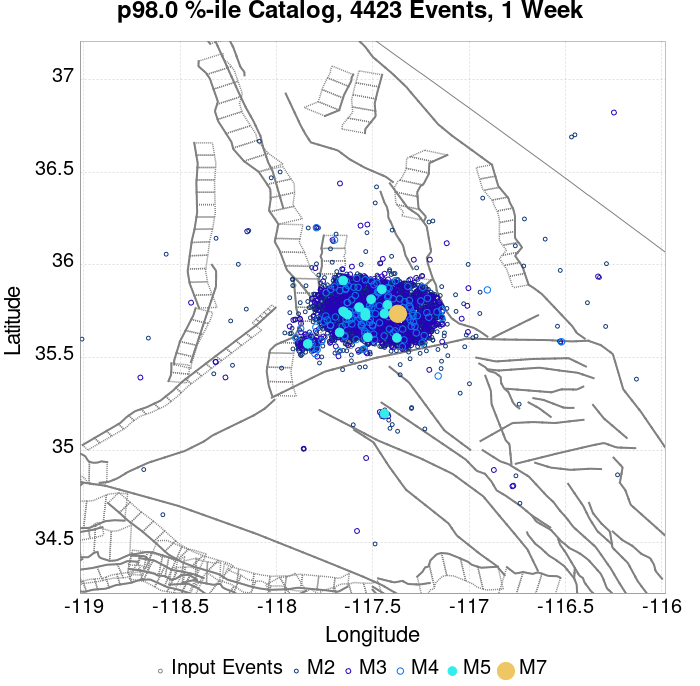 |  |  |  |  |
| **1 Month** |  |  |  |  |  |  |  |  |  |  |  |  |
| **1 Year** |  |  |  |  |  |  |  |  |  |  |  |  |
| **10 Year** |  |  |  |  |  |  |  |  |  |  |  |  |

## ComCat Data Comparisons
*[(top)](#table-of-contents)*

These plots compare simulated sequences with data from ComCat. All plots only consider events with hypocenters inside the ComCat region defined in the JSON input file, and consider ruptures above Mc=3.5

Last updated at 2019/09/13 08:37:55 UTC, 69.2 d after the simulation start time

### ComCat Magnitude-Number Distributions
*[(top)](#table-of-contents)*

| Incremental MND | Cumulative MND |
|-----|-----|
|  | 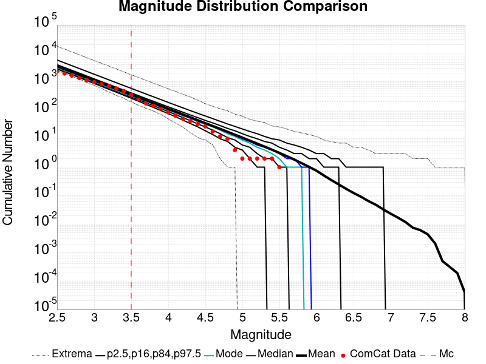 |

### ComCat Cumulative Number Vs Time
*[(top)](#table-of-contents)*

| M&ge;3.5 | M&ge;4 | M&ge;5 | M&ge;6 | M&ge;7 |
|-----|-----|-----|-----|-----|
| 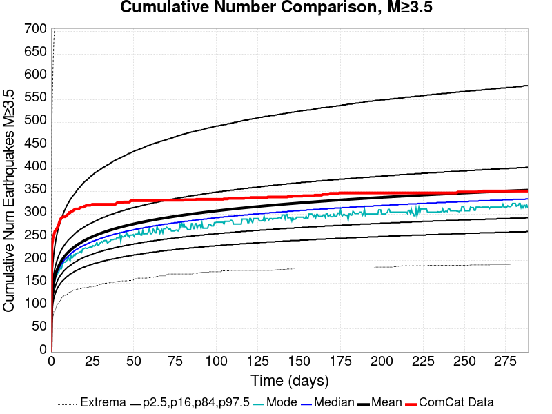 |  |  | 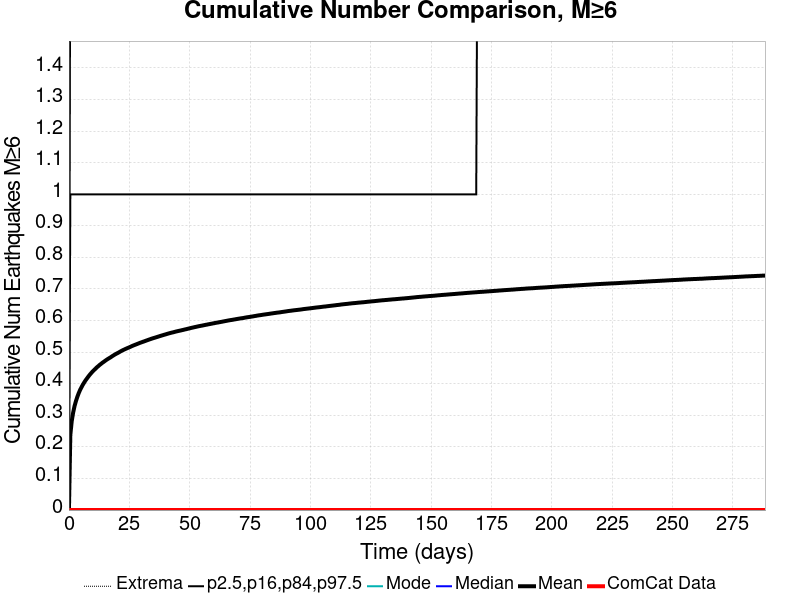 | 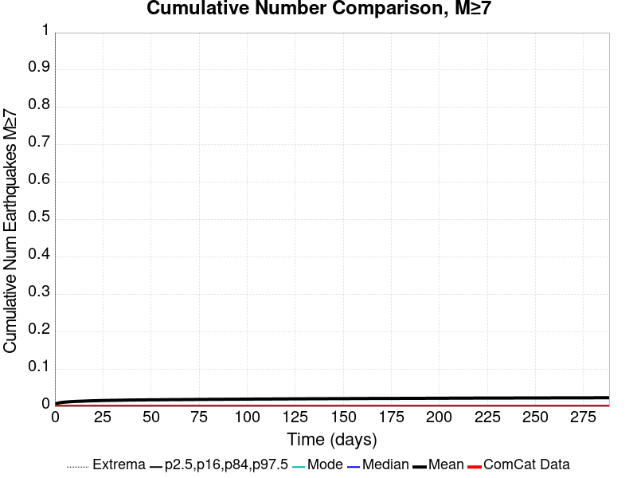 |

### ComCat Cumulative Number Simulation Percentiles
*[(top)](#table-of-contents)*


### ComCat Mean Spatial Distribution
*[(top)](#table-of-contents)*

|  | 1 Day | 1 Week | 1 Month | 69.2 Day |
|-----|-----|-----|-----|-----|
| **M≥3.5** | 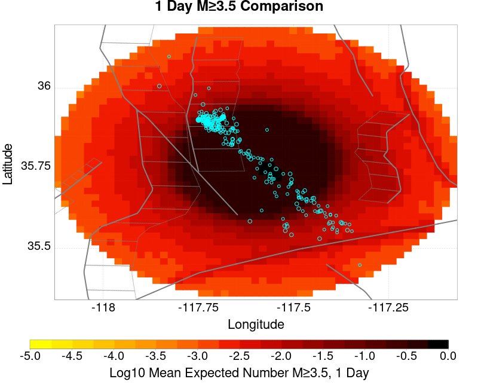 |  | 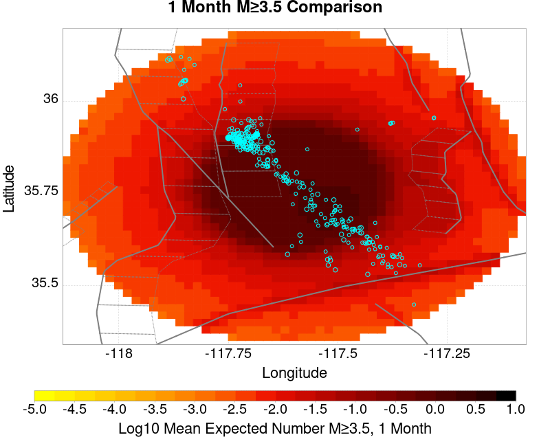 |  |
| **M≥4** |  |  | 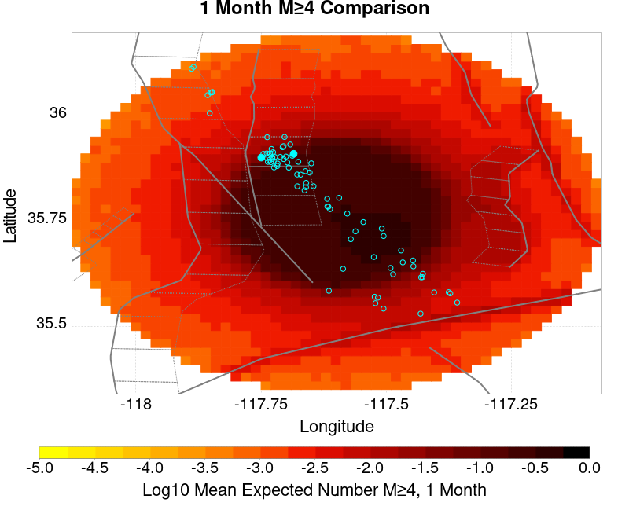 |  |
| **M≥5** |  |  |  |  |
| **M≥6** |  |  | 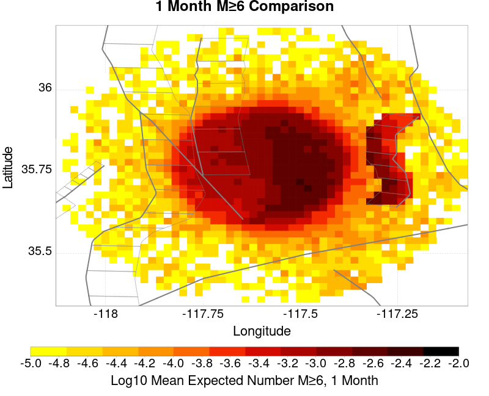 |  |
| **M≥7** |  |  |  |  |
| **M≥8** |  |  |  |  |

### ComCat Depth Distribution
*[(top)](#table-of-contents)*

| M&ge;3.5 | M&ge;4 | M&ge;5 | M&ge;6 | M&ge;7 | M&ge;8 |
|-----|-----|-----|-----|-----|-----|
| 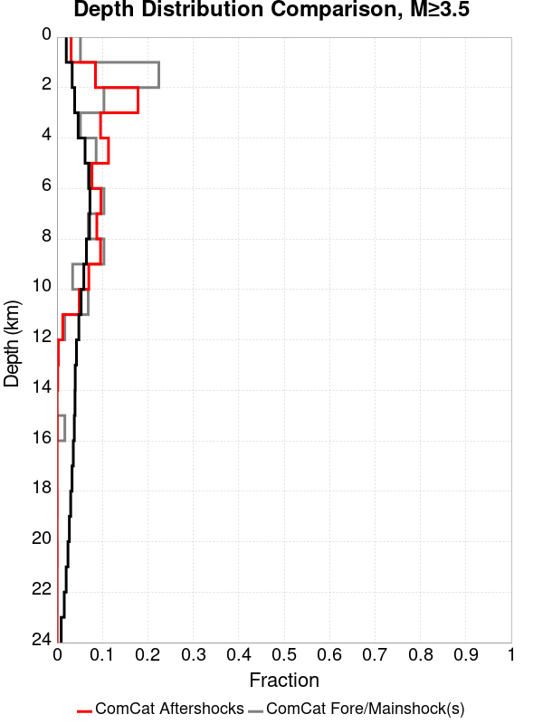 |  | 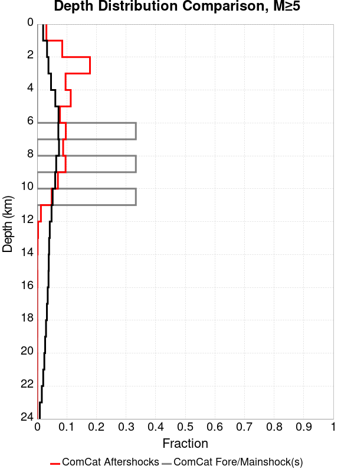 |  |  |  |

## Section Participation
*[(top)](#table-of-contents)*

### Section Participation Plots
*[(top)](#table-of-contents)*

| Min Mag | 1 yr Triggered Ruptures (no spontaneous) | 10 yr Triggered Ruptures (no spontaneous) | 10 yr Triggered Ruptures (primary aftershocks only) |
|-----|-----|-----|-----|
| **All Supra. Seis.** |  |  |  |
| **M&ge;6.5** |  |  |  |
| **M&ge;7** |  |  |  |
| **M&ge;7.5** | 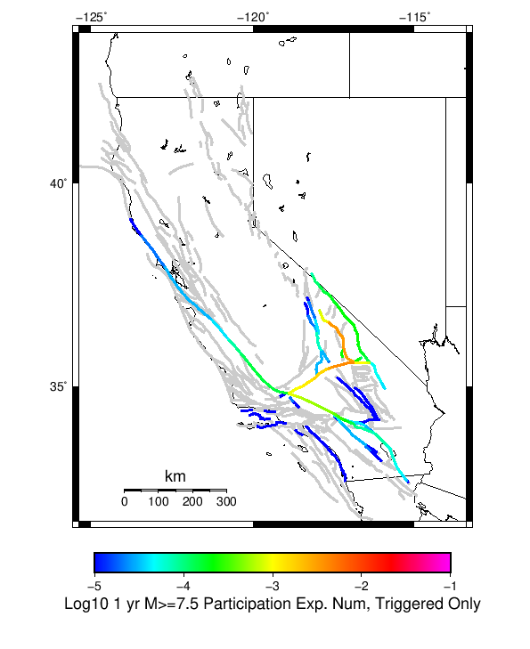 |  |  |
| **M&ge;8** |  |  |  |

### Supra-Seismogenic Parent Sections Table
*[(top)](#table-of-contents)*

*First 10 of 202 with matching ruptures shown*

| Parent Name | Triggered 10 Year Mean Count | Triggered 1 Day Prob | Triggered 1 Week Prob | Triggered 1 Month Prob | Triggered 1 Year Prob | Triggered 10 Year Prob | Triggered 10 Year Primary Mean Count |
|-----|-----|-----|-----|-----|-----|-----|-----|
| Tank Canyon | 0.13369 | 0.0242 | 0.03831 | 0.05228 | 0.08142 | 0.11072 | 0.03398 |
| Garlock (Central) | 0.03316 | 0.00644 | 0.01055 | 0.01443 | 0.02262 | 0.03204 | 0.00974 |
| Panamint Valley | 0.01988 | 0.00339 | 0.00571 | 0.00812 | 0.0135 | 0.01933 | 0.00455 |
| Owl Lake | 0.0171 | 0.00244 | 0.00413 | 0.00612 | 0.01033 | 0.01514 | 0.0028 |
| Little Lake | 0.01687 | 0.00449 | 0.00679 | 0.00894 | 0.01288 | 0.01678 | 0.00825 |
| Ash Hill | 0.01251 | 0.00214 | 0.00345 | 0.00491 | 0.00805 | 0.01206 | 0.00252 |
| Garlock (East) | 0.0109 | 0.00138 | 0.00262 | 0.00395 | 0.0065 | 0.00985 | 0.00174 |
| Blackwater | 0.00702 | 0.00126 | 0.00209 | 0.00294 | 0.00484 | 0.00675 | 0.00196 |
| Hunter Mountain-Saline Valley | 0.00621 | 0.0011 | 0.00186 | 0.0026 | 0.00422 | 0.00615 | 0.00162 |
| Gravel Hills-Harper Lk | 0.00506 | 0.001 | 0.00148 | 0.00211 | 0.00343 | 0.00486 | 0.00127 |

### M≥6.5 Parent Sections Table
*[(top)](#table-of-contents)*

*First 10 of 165 with matching ruptures shown*

| Parent Name | Triggered 10 Year Mean Count | Triggered 1 Day Prob | Triggered 1 Week Prob | Triggered 1 Month Prob | Triggered 1 Year Prob | Triggered 10 Year Prob | Triggered 10 Year Primary Mean Count |
|-----|-----|-----|-----|-----|-----|-----|-----|
| Panamint Valley | 0.01839 | 0.00318 | 0.00534 | 0.00758 | 0.01256 | 0.0179 | 0.0043 |
| Tank Canyon | 0.01633 | 0.00313 | 0.00504 | 0.00707 | 0.01174 | 0.01626 | 0.00433 |
| Garlock (Central) | 0.01621 | 0.00307 | 0.00504 | 0.00704 | 0.01092 | 0.0159 | 0.00478 |
| Owl Lake | 0.00737 | 0.00122 | 0.00194 | 0.00298 | 0.00496 | 0.00735 | 0.00162 |
| Little Lake | 0.00697 | 0.00169 | 0.00265 | 0.00356 | 0.00524 | 0.00695 | 0.00333 |
| Garlock (East) | 0.00675 | 0.00102 | 0.00189 | 0.00277 | 0.0044 | 0.00647 | 0.00145 |
| Hunter Mountain-Saline Valley | 0.00595 | 0.00105 | 0.00181 | 0.00249 | 0.00401 | 0.00589 | 0.00156 |
| Airport Lake | 0.00361 | 8.4E-4 | 0.00135 | 0.00183 | 0.00267 | 0.00361 | 0.00193 |
| So Sierra Nevada | 0.00359 | 7.7E-4 | 0.00126 | 0.00166 | 0.00246 | 0.00357 | 0.00114 |
| Ash Hill | 0.0033 | 6.1E-4 | 0.00102 | 0.00152 | 0.0023 | 0.00327 | 6.9E-4 |

### M≥7 Parent Sections Table
*[(top)](#table-of-contents)*

*First 10 of 106 with matching ruptures shown*

| Parent Name | Triggered 10 Year Mean Count | Triggered 1 Day Prob | Triggered 1 Week Prob | Triggered 1 Month Prob | Triggered 1 Year Prob | Triggered 10 Year Prob | Triggered 10 Year Primary Mean Count |
|-----|-----|-----|-----|-----|-----|-----|-----|
| Garlock (Central) | 0.01431 | 0.00273 | 0.0045 | 0.00633 | 0.00975 | 0.01414 | 0.00421 |
| Panamint Valley | 0.0087 | 0.00155 | 0.00267 | 0.00367 | 0.00596 | 0.00865 | 0.00225 |
| Hunter Mountain-Saline Valley | 0.00567 | 0.001 | 0.0017 | 0.00237 | 0.00382 | 0.00564 | 0.00149 |
| Owl Lake | 0.00431 | 8.7E-4 | 0.00136 | 0.0019 | 0.00292 | 0.00431 | 0.00128 |
| Garlock (East) | 0.00412 | 7.5E-4 | 0.00133 | 0.00189 | 0.00293 | 0.0041 | 0.0013 |
| Garlock (West) | 0.00266 | 4.9E-4 | 8.3E-4 | 0.00113 | 0.00184 | 0.00266 | 6.6E-4 |
| Tank Canyon | 0.0016 | 3.1E-4 | 5.2E-4 | 7.2E-4 | 0.00119 | 0.0016 | 4.7E-4 |
| San Andreas (Mojave N) | 0.00133 | 2.1E-4 | 3.8E-4 | 5.0E-4 | 8.7E-4 | 0.00132 | 3.0E-4 |
| So Sierra Nevada | 0.00108 | 2.6E-4 | 4.4E-4 | 6.3E-4 | 8.1E-4 | 0.00108 | 4.1E-4 |
| San Andreas (Mojave S) | 0.001 | 1.3E-4 | 2.8E-4 | 3.7E-4 | 6.3E-4 | 0.001 | 2.3E-4 |

### M≥7.5 Parent Sections Table
*[(top)](#table-of-contents)*

*First 10 of 63 with matching ruptures shown*

| Parent Name | Triggered 10 Year Mean Count | Triggered 1 Day Prob | Triggered 1 Week Prob | Triggered 1 Month Prob | Triggered 1 Year Prob | Triggered 10 Year Prob | Triggered 10 Year Primary Mean Count |
|-----|-----|-----|-----|-----|-----|-----|-----|
| Garlock (Central) | 0.00638 | 0.00117 | 0.00192 | 0.00267 | 0.0042 | 0.00636 | 0.00171 |
| Panamint Valley | 0.00513 | 9.4E-4 | 0.00155 | 0.00216 | 0.00345 | 0.00513 | 0.00134 |
| Hunter Mountain-Saline Valley | 0.00512 | 9.4E-4 | 0.00155 | 0.00216 | 0.00344 | 0.00512 | 0.00134 |
| Garlock (West) | 0.00241 | 4.5E-4 | 7.4E-4 | 0.00101 | 0.00164 | 0.00241 | 6.2E-4 |
| Garlock (East) | 0.00157 | 2.8E-4 | 5.1E-4 | 6.7E-4 | 0.00108 | 0.00157 | 4.3E-4 |
| San Andreas (Mojave N) | 0.00131 | 2.1E-4 | 3.8E-4 | 5.0E-4 | 8.6E-4 | 0.0013 | 3.0E-4 |
| San Andreas (Mojave S) | 9.5E-4 | 1.3E-4 | 2.7E-4 | 3.6E-4 | 6.0E-4 | 9.5E-4 | 2.2E-4 |
| San Andreas (San Bernardino N) | 6.1E-4 | 1.0E-4 | 1.7E-4 | 2.3E-4 | 3.9E-4 | 6.1E-4 | 1.4E-4 |
| Death Valley (Black Mtns Frontal) | 3.8E-4 | 4.0E-5 | 7.0E-5 | 1.2E-4 | 2.2E-4 | 3.8E-4 | 7.0E-5 |
| Death Valley (No) | 3.8E-4 | 4.0E-5 | 7.0E-5 | 1.2E-4 | 2.1E-4 | 3.8E-4 | 7.0E-5 |

### M≥8 Parent Sections Table
*[(top)](#table-of-contents)*

*First 10 of 27 with matching ruptures shown*

| Parent Name | Triggered 10 Year Mean Count | Triggered 1 Day Prob | Triggered 1 Week Prob | Triggered 1 Month Prob | Triggered 1 Year Prob | Triggered 10 Year Prob | Triggered 10 Year Primary Mean Count |
|-----|-----|-----|-----|-----|-----|-----|-----|
| San Andreas (Mojave N) | 1.5E-4 | 2.0E-5 | 3.0E-5 | 6.0E-5 | 1.0E-4 | 1.5E-4 | 2.0E-5 |
| San Andreas (Mojave S) | 1.5E-4 | 2.0E-5 | 3.0E-5 | 6.0E-5 | 1.0E-4 | 1.5E-4 | 2.0E-5 |
| San Andreas (San Bernardino N) | 1.5E-4 | 2.0E-5 | 3.0E-5 | 6.0E-5 | 1.0E-4 | 1.5E-4 | 2.0E-5 |
| Garlock (Central) | 9.0E-5 | 0.0 | 0.0 | 2.0E-5 | 5.0E-5 | 9.0E-5 | 1.0E-5 |
| Garlock (West) | 9.0E-5 | 0.0 | 0.0 | 2.0E-5 | 5.0E-5 | 9.0E-5 | 1.0E-5 |
| San Andreas (Coachella) rev | 7.0E-5 | 1.0E-5 | 1.0E-5 | 3.0E-5 | 5.0E-5 | 7.0E-5 | 1.0E-5 |
| San Andreas (Big Bend) | 6.0E-5 | 2.0E-5 | 3.0E-5 | 4.0E-5 | 5.0E-5 | 6.0E-5 | 1.0E-5 |
| San Andreas (Carrizo) rev | 6.0E-5 | 2.0E-5 | 3.0E-5 | 4.0E-5 | 5.0E-5 | 6.0E-5 | 1.0E-5 |
| San Andreas (Cholame) rev | 6.0E-5 | 2.0E-5 | 3.0E-5 | 4.0E-5 | 5.0E-5 | 6.0E-5 | 1.0E-5 |
| San Andreas (Parkfield) | 6.0E-5 | 2.0E-5 | 3.0E-5 | 4.0E-5 | 5.0E-5 | 6.0E-5 | 1.0E-5 |

### Fault Magnitude-Probability Distributions
*[(top)](#table-of-contents)*

The first 5 sections (sorted by trigger rate) are plotted below. All fault MPDs are available [here](plots/parent_sect_mpds/README.md)

| 1 Week | 1 Month | 1 Year | 10 Year |
|-----|-----|-----|-----|
|  |  |  |  |
|  |  |  |  |
|  |  |  |  |
|  |  |  | 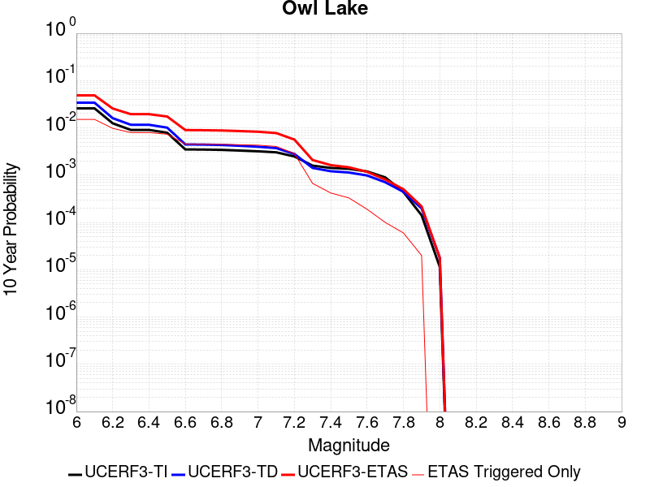 |
|  |  |  |  |

## Gridded Nucleation
*[(top)](#table-of-contents)*

| Min Mag | Triggered Ruptures (no spontaneous) | Triggered Ruptures (primary aftershocks only) |
|-----|-----|-----|
| **M&ge;2.5** |  |  |
| **M&ge;5** |  |  |
| **M&ge;6** |  |  |
| **M&ge;7** |  |  |


## JSON Input File
*[(top)](#table-of-contents)*

```
{
  "numSimulations": 100000,
  "duration": 10.0,
  "startTimeMillis": 1562383194040,
  "includeSpontaneous": false,
  "randomSeed": 1566346496209,
  "binaryOutput": true,
  "binaryOutputFilters": [
    {
      "prefix": "results_complete",
      "descendantsOnly": false
    },
    {
      "prefix": "results_m5_preserve_chain",
      "minMag": 5.0,
      "preserveChainBelowMag": true,
      "descendantsOnly": false
    }
  ],
  "forceRecalc": false,
  "simulationName": "ComCat M7.1 (ci38457511), Point Sources",
  "numRetries": 3,
  "outputDir": "${ETAS_SIM_DIR}/2019_08_20-ComCatM7p1_ci38457511_PointSources-noSpont-full_td-scale1.14",
  "triggerRuptures": [
    {
      "occurrenceTimeMillis": 1562259775340,
      "comcatEventID": "ci38443095",
      "mag": 3.98,
      "latitude": 35.708,
      "longitude": -117.5036667,
      "depth": 10.58
    },
    {
      "occurrenceTimeMillis": 1562261629000,
      "comcatEventID": "ci38443183",
      "mag": 6.4,
      "latitude": 35.7053333,
      "longitude": -117.5038333,
      "depth": 10.5
    },
    {
      "occurrenceTimeMillis": 1562261701660,
      "comcatEventID": "ci38443191",
      "mag": 4.49,
      "latitude": 35.644,
      "longitude": -117.56716670000002,
      "depth": 4.64
    },
    {
      "occurrenceTimeMillis": 1562261746340,
      "comcatEventID": "ci37222356",
      "mag": 3.63,
      "latitude": 35.6936667,
      "longitude": -117.437,
      "depth": 7.65
    },
    {
      "occurrenceTimeMillis": 1562261752170,
      "comcatEventID": "ci37218988",
      "mag": 4.28,
      "latitude": 35.687,
      "longitude": -117.50616670000001,
      "depth": 1.6
    },
    {
      "occurrenceTimeMillis": 1562261818950,
      "comcatEventID": "ci37222380",
      "mag": 3.41,
      "latitude": 35.7258333,
      "longitude": -117.55933330000002,
      "depth": 5.3
    },
    {
      "occurrenceTimeMillis": 1562261821140,
      "comcatEventID": "ci37222372",
      "mag": 3.66,
      "latitude": 35.7105,
      "longitude": -117.4773333,
      "depth": 1.57
    },
    {
      "occurrenceTimeMillis": 1562261834850,
      "comcatEventID": "ci37222364",
      "mag": 3.97,
      "latitude": 35.6655,
      "longitude": -117.516,
      "depth": 1.64
    },
    {
      "occurrenceTimeMillis": 1562261845640,
      "comcatEventID": "ci37218996",
      "mag": 4.01,
      "latitude": 35.6758333,
      "longitude": -117.45750000000001,
      "depth": 15.82
    },
    {
      "occurrenceTimeMillis": 1562261875500,
      "comcatEventID": "ci38443199",
      "mag": 3.86,
      "latitude": 35.7456667,
      "longitude": -117.5516667,
      "depth": 8.29
    },
    {
      "occurrenceTimeMillis": 1562261901450,
      "comcatEventID": "ci37421941",
      "mag": 3.73,
      "latitude": 35.714,
      "longitude": -117.476,
      "depth": 1.74
    },
    {
      "occurrenceTimeMillis": 1562261927500,
      "comcatEventID": "us70004a0n",
      "mag": 3.5,
      "latitude": 35.6215,
      "longitude": -117.5782,
      "depth": 9.7
    },
    {
      "occurrenceTimeMillis": 1562261927760,
      "comcatEventID": "ci37222396",
      "mag": 3.5,
      "latitude": 35.6235,
      "longitude": -117.596,
      "depth": 8.55
    },
    {
      "occurrenceTimeMillis": 1562261973310,
      "comcatEventID": "ci37222404",
      "mag": 3.11,
      "latitude": 35.5743333,
      "longitude": -117.63666670000002,
      "depth": 6.85
    },
    {
      "occurrenceTimeMillis": 1562261975360,
      "comcatEventID": "ci38443215",
      "mag": 3.69,
      "latitude": 35.6873333,
      "longitude": -117.4935,
      "depth": 10.86
    },
    {
      "occurrenceTimeMillis": 1562262002250,
      "comcatEventID": "ci38443223",
      "mag": 3.8,
      "latitude": 35.7253333,
      "longitude": -117.57083329999999,
      "depth": 6.63
    },
    {
      "occurrenceTimeMillis": 1562262018520,
      "comcatEventID": "ci38443231",
      "mag": 4.13,
      "latitude": 35.707,
      "longitude": -117.5101667,
      "depth": 8.66
    },
    {
      "occurrenceTimeMillis": 1562262034900,
      "comcatEventID": "ci37222508",
      "mag": 3.54,
      "latitude": 35.6948333,
      "longitude": -117.50183330000002,
      "depth": 2.04
    },
    {
      "occurrenceTimeMillis": 1562262046140,
      "comcatEventID": "ci37222516",
      "mag": 3.42,
      "latitude": 35.7298333,
      "longitude": -117.55483330000001,
      "depth": 7.72
    },
    {
      "occurrenceTimeMillis": 1562262080850,
      "comcatEventID": "ci37421957",
      "mag": 3.3,
      "latitude": 35.7266667,
      "longitude": -117.5288333,
      "depth": 1.97
    },
    {
      "occurrenceTimeMillis": 1562262174130,
      "comcatEventID": "ci38443239",
      "mag": 3.22,
      "latitude": 35.7301667,
      "longitude": -117.55866669999999,
      "depth": 7.84
    },
    {
      "occurrenceTimeMillis": 1562262209200,
      "comcatEventID": "us70004a0z",
      "mag": 3.6,
      "latitude": 35.6783,
      "longitude": -117.5488,
      "depth": 5.15
    },
    {
      "occurrenceTimeMillis": 1562262264020,
      "comcatEventID": "ci37421981",
      "mag": 2.77,
      "latitude": 35.7478333,
      "longitude": -117.54000000000002,
      "depth": 9.4
    },
    {
      "occurrenceTimeMillis": 1562262272820,
      "comcatEventID": "ci38443255",
      "mag": 3.86,
      "latitude": 35.6875,
      "longitude": -117.5071667,
      "depth": 1.54
    },
    {
      "occurrenceTimeMillis": 1562262305780,
      "comcatEventID": "ci37421997",
      "mag": 3.03,
      "latitude": 35.6976667,
      "longitude": -117.48649999999999,
      "depth": 2.24
    },
    {
      "occurrenceTimeMillis": 1562262323950,
      "comcatEventID": "ci37421989",
      "mag": 3.03,
      "latitude": 35.7151667,
      "longitude": -117.5473333,
      "depth": 7.21
    },
    {
      "occurrenceTimeMillis": 1562262328630,
      "comcatEventID": "ci37222524",
      "mag": 3.21,
      "latitude": 35.7348333,
      "longitude": -117.53683330000001,
      "depth": 10.34
    },
    {
      "occurrenceTimeMillis": 1562262363710,
      "comcatEventID": "ci38443263",
      "mag": 2.96,
      "latitude": 35.6431667,
      "longitude": -117.6101667,
      "depth": 10.14
    },
    {
      "occurrenceTimeMillis": 1562262380320,
      "comcatEventID": "ci37222532",
      "mag": 2.56,
      "latitude": 35.6563333,
      "longitude": -117.5325,
      "depth": 1.52
    },
    {
      "occurrenceTimeMillis": 1562262409960,
      "comcatEventID": "ci38443271",
      "mag": 3.07,
      "latitude": 35.6385,
      "longitude": -117.6108333,
      "depth": 10.97
    },
    {
      "occurrenceTimeMillis": 1562262437810,
      "comcatEventID": "ci38443279",
      "mag": 3.59,
      "latitude": 35.7455,
      "longitude": -117.5465,
      "depth": 7.11
    },
    {
      "occurrenceTimeMillis": 1562262460970,
      "comcatEventID": "ci37222548",
      "mag": 3.11,
      "latitude": 35.726,
      "longitude": -117.55849999999998,
      "depth": 3.58
    },
    {
      "occurrenceTimeMillis": 1562262474970,
      "comcatEventID": "ci37222556",
      "mag": 3.4,
      "latitude": 35.7286667,
      "longitude": -117.56066670000001,
      "depth": 5.25
    },
    {
      "occurrenceTimeMillis": 1562262483160,
      "comcatEventID": "ci37222564",
      "mag": 3.27,
      "latitude": 35.6365,
      "longitude": -117.55183330000001,
      "depth": 6.62
    },
    {
      "occurrenceTimeMillis": 1562262495680,
      "comcatEventID": "ci37222572",
      "mag": 3.11,
      "latitude": 35.7053333,
      "longitude": -117.5245,
      "depth": 5.52
    },
    {
      "occurrenceTimeMillis": 1562262504150,
      "comcatEventID": "ci37222580",
      "mag": 2.96,
      "latitude": 35.6593333,
      "longitude": -117.52633330000002,
      "depth": 2.68
    },
    {
      "occurrenceTimeMillis": 1562262575190,
      "comcatEventID": "ci37222596",
      "mag": 2.52,
      "latitude": 35.7335,
      "longitude": -117.50683330000001,
      "depth": 3.91
    },
    {
      "occurrenceTimeMillis": 1562262578950,
      "comcatEventID": "ci37222668",
      "mag": 2.57,
      "latitude": 35.687,
      "longitude": -117.49066670000002,
      "depth": 10.66
    },
    {
      "occurrenceTimeMillis": 1562262648290,
      "comcatEventID": "ci37222692",
      "mag": 2.73,
      "latitude": 35.738,
      "longitude": -117.52933329999999,
      "depth": 7.72
    },
    {
      "occurrenceTimeMillis": 1562262648960,
      "comcatEventID": "ci38443303",
      "mag": 2.79,
      "latitude": 35.678,
      "longitude": -117.49916670000002,
      "depth": 1.14
    },
    {
      "occurrenceTimeMillis": 1562262706650,
      "comcatEventID": "ci38443287",
      "mag": 3.46,
      "latitude": 35.674,
      "longitude": -117.52349999999998,
      "depth": 5.3
    },
    {
      "occurrenceTimeMillis": 1562262761700,
      "comcatEventID": "ci38443295",
      "mag": 2.92,
      "latitude": 35.7218333,
      "longitude": -117.5251667,
      "depth": 7.04
    },
    {
      "occurrenceTimeMillis": 1562262899560,
      "comcatEventID": "ci38443327",
      "mag": 2.53,
      "latitude": 35.6391667,
      "longitude": -117.5628333,
      "depth": 10.48
    },
    {
      "occurrenceTimeMillis": 1562262930800,
      "comcatEventID": "ci37222876",
      "mag": 2.57,
      "latitude": 35.6705,
      "longitude": -117.5221667,
      "depth": 3.91
    },
    {
      "occurrenceTimeMillis": 1562263051460,
      "comcatEventID": "ci38443311",
      "mag": 2.95,
      "latitude": 35.6595,
      "longitude": -117.5223333,
      "depth": 2.3
    },
    {
      "occurrenceTimeMillis": 1562263063060,
      "comcatEventID": "ci37222932",
      "mag": 2.78,
      "latitude": 35.6725,
      "longitude": -117.4743333,
      "depth": 8.76
    },
    {
      "occurrenceTimeMillis": 1562263082640,
      "comcatEventID": "ci38443319",
      "mag": 3.33,
      "latitude": 35.702,
      "longitude": -117.50833330000002,
      "depth": 4.77
    },
    {
      "occurrenceTimeMillis": 1562263240190,
      "comcatEventID": "ci38443335",
      "mag": 2.67,
      "latitude": 35.6303333,
      "longitude": -117.569,
      "depth": 1.64
    },
    {
      "occurrenceTimeMillis": 1562263282243,
      "comcatEventID": "us70004a1k",
      "mag": 3.5,
      "latitude": 35.702,
      "longitude": -117.53610000000002,
      "depth": 10.0
    },
    {
      "occurrenceTimeMillis": 1562263374030,
      "comcatEventID": "ci38443351",
      "mag": 2.67,
      "latitude": 35.611,
      "longitude": -117.5921667,
      "depth": 1.33
    },
    {
      "occurrenceTimeMillis": 1562263398440,
      "comcatEventID": "ci38443359",
      "mag": 3.02,
      "latitude": 35.7481651,
      "longitude": -117.54183200000001,
      "depth": 2.26
    },
    {
      "occurrenceTimeMillis": 1562263541530,
      "comcatEventID": "ci38443375",
      "mag": 2.75,
      "latitude": 35.7135,
      "longitude": -117.5318333,
      "depth": 0.33
    },
    {
      "occurrenceTimeMillis": 1562263576110,
      "comcatEventID": "ci38443383",
      "mag": 3.78,
      "latitude": 35.6599998,
      "longitude": -117.52783199999999,
      "depth": 1.18
    },
    {
      "occurrenceTimeMillis": 1562263629180,
      "comcatEventID": "ci38443391",
      "mag": 3.5,
      "latitude": 35.5998344,
      "longitude": -117.6226654,
      "depth": 0.0
    },
    {
      "occurrenceTimeMillis": 1562263832740,
      "comcatEventID": "ci38443415",
      "mag": 3.46,
      "latitude": 35.6593323,
      "longitude": -117.53816990000001,
      "depth": 8.47
    },
    {
      "occurrenceTimeMillis": 1562263882750,
      "comcatEventID": "ci38443423",
      "mag": 2.79,
      "latitude": 35.603666700000005,
      "longitude": -117.60866670000001,
      "depth": 2.04
    },
    {
      "occurrenceTimeMillis": 1562263972040,
      "comcatEventID": "ci38443431",
      "mag": 3.44,
      "latitude": 35.6723333,
      "longitude": -117.561,
      "depth": 6.91
    },
    {
      "occurrenceTimeMillis": 1562264031370,
      "comcatEventID": "ci38443439",
      "mag": 3.5,
      "latitude": 35.7048333,
      "longitude": -117.4808333,
      "depth": 8.5
    },
    {
      "occurrenceTimeMillis": 1562264104860,
      "comcatEventID": "us70004a28",
      "mag": 3.2,
      "latitude": 35.61,
      "longitude": -117.602,
      "depth": 1.8
    },
    {
      "occurrenceTimeMillis": 1562264193510,
      "comcatEventID": "ci38443463",
      "mag": 3.04,
      "latitude": 35.7233315,
      "longitude": -117.5403366,
      "depth": 1.22
    },
    {
      "occurrenceTimeMillis": 1562264235140,
      "comcatEventID": "ci38443471",
      "mag": 2.85,
      "latitude": 35.7171667,
      "longitude": -117.54566669999998,
      "depth": 1.43
    },
    {
      "occurrenceTimeMillis": 1562264325740,
      "comcatEventID": "ci38443487",
      "mag": 3.28,
      "latitude": 35.6375008,
      "longitude": -117.6143341,
      "depth": 5.97
    },
    {
      "occurrenceTimeMillis": 1562264485340,
      "comcatEventID": "ci38443495",
      "mag": 2.61,
      "latitude": 35.6793333,
      "longitude": -117.5173333,
      "depth": 1.99
    },
    {
      "occurrenceTimeMillis": 1562264763680,
      "comcatEventID": "ci38443519",
      "mag": 3.12,
      "latitude": 35.6646652,
      "longitude": -117.5261688,
      "depth": 1.2
    },
    {
      "occurrenceTimeMillis": 1562264846710,
      "comcatEventID": "ci38443527",
      "mag": 3.29,
      "latitude": 35.6738319,
      "longitude": -117.51750180000002,
      "depth": 1.57
    },
    {
      "occurrenceTimeMillis": 1562264879440,
      "comcatEventID": "ci38443535",
      "mag": 4.23,
      "latitude": 35.745,
      "longitude": -117.55216669999999,
      "depth": 6.64
    },
    {
      "occurrenceTimeMillis": 1562264923610,
      "comcatEventID": "ci38443543",
      "mag": 3.85,
      "latitude": 35.6661667,
      "longitude": -117.5723333,
      "depth": 4.05
    },
    {
      "occurrenceTimeMillis": 1562265344040,
      "comcatEventID": "ci38443575",
      "mag": 2.5,
      "latitude": 35.7215,
      "longitude": -117.56550000000001,
      "depth": 0.16
    },
    {
      "occurrenceTimeMillis": 1562265451500,
      "comcatEventID": "ci38443591",
      "mag": 2.64,
      "latitude": 35.72,
      "longitude": -117.5723333,
      "depth": 1.34
    },
    {
      "occurrenceTimeMillis": 1562265525650,
      "comcatEventID": "ci38443599",
      "mag": 2.69,
      "latitude": 35.7046661,
      "longitude": -117.49666600000002,
      "depth": 3.96
    },
    {
      "occurrenceTimeMillis": 1562265584440,
      "comcatEventID": "ci38443607",
      "mag": 4.59,
      "latitude": 35.6013333,
      "longitude": -117.59700000000001,
      "depth": 2.81
    },
    {
      "occurrenceTimeMillis": 1562265674300,
      "comcatEventID": "ci38443615",
      "mag": 3.24,
      "latitude": 35.6751671,
      "longitude": -117.5148315,
      "depth": 1.73
    },
    {
      "occurrenceTimeMillis": 1562265865000,
      "comcatEventID": "ci38443631",
      "mag": 3.09,
      "latitude": 35.719,
      "longitude": -117.55866669999999,
      "depth": 2.06
    },
    {
      "occurrenceTimeMillis": 1562266026590,
      "comcatEventID": "ci38443647",
      "mag": 4.34,
      "latitude": 35.6758333,
      "longitude": -117.48533330000001,
      "depth": 8.53
    },
    {
      "occurrenceTimeMillis": 1562266207160,
      "comcatEventID": "ci38443663",
      "mag": 2.73,
      "latitude": 35.641,
      "longitude": -117.56266670000001,
      "depth": 8.95
    },
    {
      "occurrenceTimeMillis": 1562266216010,
      "comcatEventID": "ci38443671",
      "mag": 3.55,
      "latitude": 35.6764984,
      "longitude": -117.5,
      "depth": 0.91
    },
    {
      "occurrenceTimeMillis": 1562266333530,
      "comcatEventID": "ci38443679",
      "mag": 2.78,
      "latitude": 35.6543333,
      "longitude": -117.53983330000001,
      "depth": 0.88
    },
    {
      "occurrenceTimeMillis": 1562266376130,
      "comcatEventID": "ci38443687",
      "mag": 2.93,
      "latitude": 35.741,
      "longitude": -117.561,
      "depth": 0.23
    },
    {
      "occurrenceTimeMillis": 1562266407460,
      "comcatEventID": "ci38443695",
      "mag": 3.34,
      "latitude": 35.7276649,
      "longitude": -117.56416320000001,
      "depth": 1.62
    },
    {
      "occurrenceTimeMillis": 1562266453990,
      "comcatEventID": "ci38443703",
      "mag": 4.07,
      "latitude": 35.5975,
      "longitude": -117.5996667,
      "depth": 5.33
    },
    {
      "occurrenceTimeMillis": 1562266527790,
      "comcatEventID": "ci38443711",
      "mag": 3.07,
      "latitude": 35.6738333,
      "longitude": -117.4893333,
      "depth": 9.23
    },
    {
      "occurrenceTimeMillis": 1562266566420,
      "comcatEventID": "ci38443719",
      "mag": 4.58,
      "latitude": 35.716,
      "longitude": -117.56000000000002,
      "depth": 1.92
    },
    {
      "occurrenceTimeMillis": 1562266582030,
      "comcatEventID": "ci37420717",
      "mag": 4.21,
      "latitude": 35.7086667,
      "longitude": -117.55416669999998,
      "depth": 1.16
    },
    {
      "occurrenceTimeMillis": 1562266687790,
      "comcatEventID": "ci38443727",
      "mag": 2.85,
      "latitude": 35.7266667,
      "longitude": -117.56516670000002,
      "depth": 0.09
    },
    {
      "occurrenceTimeMillis": 1562266809510,
      "comcatEventID": "ci38443751",
      "mag": 3.21,
      "latitude": 35.7099991,
      "longitude": -117.55616759999998,
      "depth": 0.1
    },
    {
      "occurrenceTimeMillis": 1562266869997,
      "comcatEventID": "us70004a4p",
      "mag": 3.0,
      "latitude": 35.7867,
      "longitude": -117.5478,
      "depth": 5.0
    },
    {
      "occurrenceTimeMillis": 1562266944640,
      "comcatEventID": "ci38443775",
      "mag": 2.56,
      "latitude": 35.645,
      "longitude": -117.5373333,
      "depth": 0.01
    },
    {
      "occurrenceTimeMillis": 1562267419790,
      "comcatEventID": "ci38443823",
      "mag": 3.26,
      "latitude": 35.6938324,
      "longitude": -117.49449920000002,
      "depth": 0.97
    },
    {
      "occurrenceTimeMillis": 1562267699490,
      "comcatEventID": "ci38443831",
      "mag": 3.0,
      "latitude": 35.652668,
      "longitude": -117.5393295,
      "depth": 1.65
    },
    {
      "occurrenceTimeMillis": 1562267766200,
      "comcatEventID": "ci38443839",
      "mag": 2.5,
      "latitude": 35.721,
      "longitude": -117.56650000000002,
      "depth": 0.12
    },
    {
      "occurrenceTimeMillis": 1562267871400,
      "comcatEventID": "ci38443855",
      "mag": 3.23,
      "latitude": 35.6911659,
      "longitude": -117.51216889999999,
      "depth": 1.03
    },
    {
      "occurrenceTimeMillis": 1562268051750,
      "comcatEventID": "ci38443863",
      "mag": 2.8,
      "latitude": 35.6389999,
      "longitude": -117.5526657,
      "depth": 1.11
    },
    {
      "occurrenceTimeMillis": 1562268092090,
      "comcatEventID": "ci38443871",
      "mag": 4.5,
      "latitude": 35.6715,
      "longitude": -117.4788333,
      "depth": 5.16
    },
    {
      "occurrenceTimeMillis": 1562268380340,
      "comcatEventID": "ci38443879",
      "mag": 2.69,
      "latitude": 35.7086667,
      "longitude": -117.48333330000001,
      "depth": 1.39
    },
    {
      "occurrenceTimeMillis": 1562268438340,
      "comcatEventID": "ci38443895",
      "mag": 2.81,
      "latitude": 35.6696667,
      "longitude": -117.47999999999999,
      "depth": 6.24
    },
    {
      "occurrenceTimeMillis": 1562269189760,
      "comcatEventID": "ci38443983",
      "mag": 2.63,
      "latitude": 35.683,
      "longitude": -117.5195,
      "depth": 5.84
    },
    {
      "occurrenceTimeMillis": 1562269229180,
      "comcatEventID": "ci38443991",
      "mag": 2.65,
      "latitude": 35.6556667,
      "longitude": -117.5158333,
      "depth": 1.76
    },
    {
      "occurrenceTimeMillis": 1562269744960,
      "comcatEventID": "ci38444047",
      "mag": 3.18,
      "latitude": 35.6828346,
      "longitude": -117.49183650000002,
      "depth": 0.0
    },
    {
      "occurrenceTimeMillis": 1562269876850,
      "comcatEventID": "ci38444063",
      "mag": 3.34,
      "latitude": 35.7094994,
      "longitude": -117.55666349999998,
      "depth": 0.34
    },
    {
      "occurrenceTimeMillis": 1562269933070,
      "comcatEventID": "ci38444071",
      "mag": 3.02,
      "latitude": 35.6086655,
      "longitude": -117.590332,
      "depth": 4.83
    },
    {
      "occurrenceTimeMillis": 1562270160500,
      "comcatEventID": "ci38444103",
      "mag": 4.16,
      "latitude": 35.6623333,
      "longitude": -117.524,
      "depth": 1.49
    },
    {
      "occurrenceTimeMillis": 1562270280220,
      "comcatEventID": "ci38444119",
      "mag": 2.65,
      "latitude": 35.7131667,
      "longitude": -117.5561667,
      "depth": 0.16
    },
    {
      "occurrenceTimeMillis": 1562270492930,
      "comcatEventID": "ci38444135",
      "mag": 2.5,
      "latitude": 35.678,
      "longitude": -117.589,
      "depth": 7.89
    },
    {
      "occurrenceTimeMillis": 1562270655500,
      "comcatEventID": "ci38444143",
      "mag": 2.56,
      "latitude": 35.7048333,
      "longitude": -117.48683330000001,
      "depth": 1.23
    },
    {
      "occurrenceTimeMillis": 1562270768270,
      "comcatEventID": "ci38444159",
      "mag": 3.38,
      "latitude": 35.6980019,
      "longitude": -117.4881668,
      "depth": 8.77
    },
    {
      "occurrenceTimeMillis": 1562271091460,
      "comcatEventID": "ci38444191",
      "mag": 2.61,
      "latitude": 35.683,
      "longitude": -117.50483330000002,
      "depth": 1.69
    },
    {
      "occurrenceTimeMillis": 1562271290340,
      "comcatEventID": "ci38444215",
      "mag": 3.99,
      "latitude": 35.6991667,
      "longitude": -117.5125,
      "depth": 5.75
    },
    {
      "occurrenceTimeMillis": 1562271456830,
      "comcatEventID": "ci38444231",
      "mag": 3.06,
      "latitude": 35.699501,
      "longitude": -117.4838333,
      "depth": 1.03
    },
    {
      "occurrenceTimeMillis": 1562271789990,
      "comcatEventID": "ci38444263",
      "mag": 3.4,
      "latitude": 35.6403351,
      "longitude": -117.5996704,
      "depth": 9.92
    },
    {
      "occurrenceTimeMillis": 1562271838650,
      "comcatEventID": "ci38444271",
      "mag": 2.53,
      "latitude": 35.6583333,
      "longitude": -117.56233329999999,
      "depth": 4.39
    },
    {
      "occurrenceTimeMillis": 1562272472100,
      "comcatEventID": "ci38444311",
      "mag": 2.61,
      "latitude": 35.640667,
      "longitude": -117.5833359,
      "depth": 8.68
    },
    {
      "occurrenceTimeMillis": 1562273126620,
      "comcatEventID": "ci38444407",
      "mag": 3.09,
      "latitude": 35.7008324,
      "longitude": -117.47766879999999,
      "depth": 0.04
    },
    {
      "occurrenceTimeMillis": 1562273724820,
      "comcatEventID": "ci38444487",
      "mag": 3.37,
      "latitude": 35.7088318,
      "longitude": -117.4771652,
      "depth": 0.2
    },
    {
      "occurrenceTimeMillis": 1562273832360,
      "comcatEventID": "ci38444503",
      "mag": 2.54,
      "latitude": 35.6585,
      "longitude": -117.53199999999998,
      "depth": 8.73
    },
    {
      "occurrenceTimeMillis": 1562274175860,
      "comcatEventID": "ci38444543",
      "mag": 3.56,
      "latitude": 35.689666700000004,
      "longitude": -117.4853363,
      "depth": 7.08
    },
    {
      "occurrenceTimeMillis": 1562274428600,
      "comcatEventID": "ci38444559",
      "mag": 2.52,
      "latitude": 35.5995,
      "longitude": -117.59783330000002,
      "depth": 4.74
    },
    {
      "occurrenceTimeMillis": 1562275395050,
      "comcatEventID": "ci38444687",
      "mag": 2.8,
      "latitude": 35.6951667,
      "longitude": -117.4893333,
      "depth": 1.65
    },
    {
      "occurrenceTimeMillis": 1562275595090,
      "comcatEventID": "ci38444719",
      "mag": 3.0,
      "latitude": 35.67666630000001,
      "longitude": -117.52749630000001,
      "depth": 7.39
    },
    {
      "occurrenceTimeMillis": 1562275966060,
      "comcatEventID": "ci38444783",
      "mag": 2.62,
      "latitude": 35.725,
      "longitude": -117.56916670000001,
      "depth": 2.03
    },
    {
      "occurrenceTimeMillis": 1562276014350,
      "comcatEventID": "ci38444791",
      "mag": 3.08,
      "latitude": 35.6155014,
      "longitude": -117.5893326,
      "depth": 5.43
    },
    {
      "occurrenceTimeMillis": 1562276433450,
      "comcatEventID": "ci38444823",
      "mag": 3.42,
      "latitude": 35.6691666,
      "longitude": -117.518837,
      "depth": 2.04
    },
    {
      "occurrenceTimeMillis": 1562276519830,
      "comcatEventID": "ci38444847",
      "mag": 2.74,
      "latitude": 35.7193333,
      "longitude": -117.53216670000002,
      "depth": 2.19
    },
    {
      "occurrenceTimeMillis": 1562276794030,
      "comcatEventID": "ci38444895",
      "mag": 2.5,
      "latitude": 35.7011667,
      "longitude": -117.47866669999999,
      "depth": 0.93
    },
    {
      "occurrenceTimeMillis": 1562276824410,
      "comcatEventID": "ci38444903",
      "mag": 3.25,
      "latitude": 35.6321678,
      "longitude": -117.60717010000002,
      "depth": 9.0
    },
    {
      "occurrenceTimeMillis": 1562277755090,
      "comcatEventID": "ci38445015",
      "mag": 3.35,
      "latitude": 35.6775017,
      "longitude": -117.5148315,
      "depth": 2.85
    },
    {
      "occurrenceTimeMillis": 1562277922533,
      "comcatEventID": "us70004ach",
      "mag": 3.3,
      "latitude": 35.7232,
      "longitude": -117.4508,
      "depth": 9.45
    },
    {
      "occurrenceTimeMillis": 1562278328280,
      "comcatEventID": "ci38445087",
      "mag": 4.47,
      "latitude": 35.7443333,
      "longitude": -117.56633329999998,
      "depth": 1.97
    },
    {
      "occurrenceTimeMillis": 1562279346560,
      "comcatEventID": "ci38445183",
      "mag": 2.51,
      "latitude": 35.7038333,
      "longitude": -117.49499999999999,
      "depth": 9.8
    },
    {
      "occurrenceTimeMillis": 1562279407880,
      "comcatEventID": "ci38445199",
      "mag": 2.62,
      "latitude": 35.7008333,
      "longitude": -117.4893333,
      "depth": 1.85
    },
    {
      "occurrenceTimeMillis": 1562280141650,
      "comcatEventID": "ci38445295",
      "mag": 3.2,
      "latitude": 35.7211685,
      "longitude": -117.52400210000002,
      "depth": 2.21
    },
    {
      "occurrenceTimeMillis": 1562281630780,
      "comcatEventID": "ci38445463",
      "mag": 2.59,
      "latitude": 35.7041667,
      "longitude": -117.4886667,
      "depth": 1.92
    },
    {
      "occurrenceTimeMillis": 1562281960410,
      "comcatEventID": "ci38445495",
      "mag": 3.49,
      "latitude": 35.6711655,
      "longitude": -117.47166440000001,
      "depth": 7.11
    },
    {
      "occurrenceTimeMillis": 1562281984910,
      "comcatEventID": "ci38445503",
      "mag": 3.06,
      "latitude": 35.7470016,
      "longitude": -117.5784988,
      "depth": 2.13
    },
    {
      "occurrenceTimeMillis": 1562283240630,
      "comcatEventID": "ci37420973",
      "mag": 3.82,
      "latitude": 35.6623333,
      "longitude": -117.5245,
      "depth": 2.61
    },
    {
      "occurrenceTimeMillis": 1562283242380,
      "comcatEventID": "ci38445703",
      "mag": 4.04,
      "latitude": 35.6011667,
      "longitude": -117.61066670000001,
      "depth": 4.75
    },
    {
      "occurrenceTimeMillis": 1562283753710,
      "comcatEventID": "ci38445751",
      "mag": 3.72,
      "latitude": 35.7470016,
      "longitude": -117.5681686,
      "depth": 2.42
    },
    {
      "occurrenceTimeMillis": 1562284476440,
      "comcatEventID": "ci38445839",
      "mag": 3.33,
      "latitude": 35.6571655,
      "longitude": -117.52183530000002,
      "depth": 1.67
    },
    {
      "occurrenceTimeMillis": 1562285645640,
      "comcatEventID": "ci38445935",
      "mag": 2.76,
      "latitude": 35.6458333,
      "longitude": -117.54716670000002,
      "depth": 0.29
    },
    {
      "occurrenceTimeMillis": 1562285881410,
      "comcatEventID": "ci38445975",
      "mag": 4.04,
      "latitude": 35.7718333,
      "longitude": -117.61783330000002,
      "depth": 2.59
    },
    {
      "occurrenceTimeMillis": 1562286529030,
      "comcatEventID": "ci38446031",
      "mag": 2.8,
      "latitude": 35.7215,
      "longitude": -117.5465,
      "depth": 7.03
    },
    {
      "occurrenceTimeMillis": 1562286726670,
      "comcatEventID": "ci38446071",
      "mag": 4.02,
      "latitude": 35.7033333,
      "longitude": -117.4828333,
      "depth": 1.0
    },
    {
      "occurrenceTimeMillis": 1562286799610,
      "comcatEventID": "ci38446079",
      "mag": 2.66,
      "latitude": 35.7436676,
      "longitude": -117.55566409999999,
      "depth": 5.42
    },
    {
      "occurrenceTimeMillis": 1562287539420,
      "comcatEventID": "ci38446159",
      "mag": 3.95,
      "latitude": 35.6910019,
      "longitude": -117.50966640000001,
      "depth": 3.68
    },
    {
      "occurrenceTimeMillis": 1562287780920,
      "comcatEventID": "ci38446175",
      "mag": 2.52,
      "latitude": 35.7096667,
      "longitude": -117.47866669999999,
      "depth": 1.91
    },
    {
      "occurrenceTimeMillis": 1562288933460,
      "comcatEventID": "ci38446343",
      "mag": 2.99,
      "latitude": 35.7254982,
      "longitude": -117.55117030000001,
      "depth": 1.29
    },
    {
      "occurrenceTimeMillis": 1562289493410,
      "comcatEventID": "ci38446391",
      "mag": 3.12,
      "latitude": 35.6580009,
      "longitude": -117.52216339999998,
      "depth": 1.38
    },
    {
      "occurrenceTimeMillis": 1562291154030,
      "comcatEventID": "ci38446527",
      "mag": 2.55,
      "latitude": 35.5946655,
      "longitude": -117.5978317,
      "depth": 4.1
    },
    {
      "occurrenceTimeMillis": 1562291887280,
      "comcatEventID": "ci38446615",
      "mag": 2.68,
      "latitude": 35.7118333,
      "longitude": -117.46816670000001,
      "depth": 0.68
    },
    {
      "occurrenceTimeMillis": 1562292100910,
      "comcatEventID": "ci38446639",
      "mag": 3.21,
      "latitude": 35.7734985,
      "longitude": -117.6149979,
      "depth": 0.22
    },
    {
      "occurrenceTimeMillis": 1562292119010,
      "comcatEventID": "ci38446647",
      "mag": 3.98,
      "latitude": 35.6401667,
      "longitude": -117.5461667,
      "depth": 11.3
    },
    {
      "occurrenceTimeMillis": 1562292319160,
      "comcatEventID": "ci38446671",
      "mag": 3.34,
      "latitude": 35.6558342,
      "longitude": -117.5234985,
      "depth": 1.57
    },
    {
      "occurrenceTimeMillis": 1562292831940,
      "comcatEventID": "ci38446767",
      "mag": 2.65,
      "latitude": 35.6405,
      "longitude": -117.55783329999998,
      "depth": 10.3
    },
    {
      "occurrenceTimeMillis": 1562293181860,
      "comcatEventID": "ci38446807",
      "mag": 3.25,
      "latitude": 35.7746658,
      "longitude": -117.6169968,
      "depth": 2.35
    },
    {
      "occurrenceTimeMillis": 1562293435650,
      "comcatEventID": "ci38446831",
      "mag": 2.8,
      "latitude": 35.7128333,
      "longitude": -117.4743333,
      "depth": 0.81
    },
    {
      "occurrenceTimeMillis": 1562295589610,
      "comcatEventID": "ci38447047",
      "mag": 2.81,
      "latitude": 35.661,
      "longitude": -117.519,
      "depth": 0.21
    },
    {
      "occurrenceTimeMillis": 1562295673270,
      "comcatEventID": "ci38447055",
      "mag": 2.72,
      "latitude": 35.744,
      "longitude": -117.5648333,
      "depth": 5.49
    },
    {
      "occurrenceTimeMillis": 1562296518720,
      "comcatEventID": "ci38447143",
      "mag": 3.27,
      "latitude": 35.6286659,
      "longitude": -117.5633316,
      "depth": 3.95
    },
    {
      "occurrenceTimeMillis": 1562296793710,
      "comcatEventID": "ci38447191",
      "mag": 3.32,
      "latitude": 35.6426659,
      "longitude": -117.529335,
      "depth": 0.61
    },
    {
      "occurrenceTimeMillis": 1562296893030,
      "comcatEventID": "ci38447207",
      "mag": 2.53,
      "latitude": 35.7783333,
      "longitude": -117.6173333,
      "depth": 1.76
    },
    {
      "occurrenceTimeMillis": 1562297120610,
      "comcatEventID": "ci38447231",
      "mag": 2.54,
      "latitude": 35.6911667,
      "longitude": -117.5123333,
      "depth": 4.17
    },
    {
      "occurrenceTimeMillis": 1562298372730,
      "comcatEventID": "ci38447383",
      "mag": 2.56,
      "latitude": 35.698,
      "longitude": -117.48033330000001,
      "depth": 1.34
    },
    {
      "occurrenceTimeMillis": 1562298414390,
      "comcatEventID": "ci38447391",
      "mag": 3.07,
      "latitude": 35.6823349,
      "longitude": -117.5,
      "depth": 0.59
    },
    {
      "occurrenceTimeMillis": 1562298613940,
      "comcatEventID": "ci38447407",
      "mag": 2.52,
      "latitude": 35.7093333,
      "longitude": -117.4758333,
      "depth": 0.41
    },
    {
      "occurrenceTimeMillis": 1562299898470,
      "comcatEventID": "ci38447591",
      "mag": 3.53,
      "latitude": 35.7226677,
      "longitude": -117.55300139999999,
      "depth": 1.02
    },
    {
      "occurrenceTimeMillis": 1562299981170,
      "comcatEventID": "ci38447599",
      "mag": 2.62,
      "latitude": 35.6773333,
      "longitude": -117.551,
      "depth": 7.07
    },
    {
      "occurrenceTimeMillis": 1562300085340,
      "comcatEventID": "ci38447623",
      "mag": 3.48,
      "latitude": 35.6983337,
      "longitude": -117.481163,
      "depth": 1.26
    },
    {
      "occurrenceTimeMillis": 1562301184910,
      "comcatEventID": "ci38447727",
      "mag": 2.54,
      "latitude": 35.6588333,
      "longitude": -117.51783330000002,
      "depth": 2.08
    },
    {
      "occurrenceTimeMillis": 1562302565260,
      "comcatEventID": "ci38447911",
      "mag": 2.52,
      "latitude": 35.6596667,
      "longitude": -117.54183330000001,
      "depth": 7.89
    },
    {
      "occurrenceTimeMillis": 1562302899770,
      "comcatEventID": "ci38447927",
      "mag": 2.61,
      "latitude": 35.5718333,
      "longitude": -117.6181667,
      "depth": 4.86
    },
    {
      "occurrenceTimeMillis": 1562303437620,
      "comcatEventID": "ci38447999",
      "mag": 3.19,
      "latitude": 35.7073326,
      "longitude": -117.47533420000002,
      "depth": 6.11
    },
    {
      "occurrenceTimeMillis": 1562303905370,
      "comcatEventID": "ci38448031",
      "mag": 3.45,
      "latitude": 35.7700005,
      "longitude": -117.61250310000001,
      "depth": 2.34
    },
    {
      "occurrenceTimeMillis": 1562304556070,
      "comcatEventID": "ci38448071",
      "mag": 2.64,
      "latitude": 35.636,
      "longitude": -117.58783330000001,
      "depth": 6.71
    },
    {
      "occurrenceTimeMillis": 1562305212140,
      "comcatEventID": "ci38448143",
      "mag": 2.82,
      "latitude": 35.6776667,
      "longitude": -117.51066670000002,
      "depth": 2.02
    },
    {
      "occurrenceTimeMillis": 1562305958100,
      "comcatEventID": "ci38448183",
      "mag": 2.5,
      "latitude": 35.70283330000001,
      "longitude": -117.4845,
      "depth": 0.25
    },
    {
      "occurrenceTimeMillis": 1562306963130,
      "comcatEventID": "ci38448295",
      "mag": 3.65,
      "latitude": 35.6223335,
      "longitude": -117.57333369999999,
      "depth": 6.19
    },
    {
      "occurrenceTimeMillis": 1562308842510,
      "comcatEventID": "ci38448487",
      "mag": 3.2,
      "latitude": 35.7036667,
      "longitude": -117.50849909999998,
      "depth": 2.33
    },
    {
      "occurrenceTimeMillis": 1562309940440,
      "comcatEventID": "ci38448591",
      "mag": 2.64,
      "latitude": 35.7166667,
      "longitude": -117.54133330000002,
      "depth": 0.35
    },
    {
      "occurrenceTimeMillis": 1562309973610,
      "comcatEventID": "ci38448599",
      "mag": 2.58,
      "latitude": 35.6706667,
      "longitude": -117.4831667,
      "depth": 6.7
    },
    {
      "occurrenceTimeMillis": 1562310142290,
      "comcatEventID": "ci38448631",
      "mag": 3.17,
      "latitude": 35.7268333,
      "longitude": -117.56416320000001,
      "depth": 1.54
    },
    {
      "occurrenceTimeMillis": 1562311657020,
      "comcatEventID": "ci38448791",
      "mag": 3.72,
      "latitude": 35.75,
      "longitude": -117.56416320000001,
      "depth": 3.38
    },
    {
      "occurrenceTimeMillis": 1562312353540,
      "comcatEventID": "ci38448863",
      "mag": 3.46,
      "latitude": 35.68600080000001,
      "longitude": -117.4801636,
      "depth": 9.49
    },
    {
      "occurrenceTimeMillis": 1562313643330,
      "comcatEventID": "ci38449015",
      "mag": 2.9,
      "latitude": 35.7501667,
      "longitude": -117.56216670000002,
      "depth": 7.07
    },
    {
      "occurrenceTimeMillis": 1562314864840,
      "comcatEventID": "ci38449191",
      "mag": 3.46,
      "latitude": 35.6011658,
      "longitude": -117.6039963,
      "depth": 4.2
    },
    {
      "occurrenceTimeMillis": 1562316409740,
      "comcatEventID": "ci38449335",
      "mag": 3.09,
      "latitude": 35.6926651,
      "longitude": -117.49099730000002,
      "depth": 7.04
    },
    {
      "occurrenceTimeMillis": 1562316842500,
      "comcatEventID": "ci38449351",
      "mag": 3.55,
      "latitude": 35.7039986,
      "longitude": -117.50250240000001,
      "depth": 7.27
    },
    {
      "occurrenceTimeMillis": 1562317880610,
      "comcatEventID": "ci38449503",
      "mag": 2.9,
      "latitude": 35.6663333,
      "longitude": -117.52766670000001,
      "depth": 6.61
    },
    {
      "occurrenceTimeMillis": 1562319989260,
      "comcatEventID": "ci38449719",
      "mag": 3.51,
      "latitude": 35.6479988,
      "longitude": -117.54533390000002,
      "depth": 3.76
    },
    {
      "occurrenceTimeMillis": 1562321794490,
      "comcatEventID": "ci38449919",
      "mag": 3.1,
      "latitude": 35.663166,
      "longitude": -117.50299840000001,
      "depth": 6.09
    },
    {
      "occurrenceTimeMillis": 1562322437720,
      "comcatEventID": "ci38449999",
      "mag": 2.53,
      "latitude": 35.7246667,
      "longitude": -117.5358333,
      "depth": 6.6
    },
    {
      "occurrenceTimeMillis": 1562322796080,
      "comcatEventID": "ci38450047",
      "mag": 2.75,
      "latitude": 35.68050000000001,
      "longitude": -117.4775,
      "depth": 0.83
    },
    {
      "occurrenceTimeMillis": 1562324246570,
      "comcatEventID": "ci38450215",
      "mag": 2.89,
      "latitude": 35.7433333,
      "longitude": -117.54933329999999,
      "depth": 10.81
    },
    {
      "occurrenceTimeMillis": 1562324378860,
      "comcatEventID": "ci38450223",
      "mag": 3.54,
      "latitude": 35.6041679,
      "longitude": -117.5926666,
      "depth": 1.97
    },
    {
      "occurrenceTimeMillis": 1562324873040,
      "comcatEventID": "ci38450263",
      "mag": 5.36,
      "latitude": 35.7603333,
      "longitude": -117.57500000000002,
      "depth": 6.95
    },
    {
      "occurrenceTimeMillis": 1562325009580,
      "comcatEventID": "ci38450271",
      "mag": 3.44,
      "latitude": 35.746666,
      "longitude": -117.59333039999999,
      "depth": 6.49
    },
    {
      "occurrenceTimeMillis": 1562325091820,
      "comcatEventID": "ci38450279",
      "mag": 2.96,
      "latitude": 35.7498333,
      "longitude": -117.56949999999999,
      "depth": 4.28
    },
    {
      "occurrenceTimeMillis": 1562325139080,
      "comcatEventID": "ci38450287",
      "mag": 2.93,
      "latitude": 35.7505,
      "longitude": -117.5688333,
      "depth": 3.62
    },
    {
      "occurrenceTimeMillis": 1562325439580,
      "comcatEventID": "ci38450295",
      "mag": 2.55,
      "latitude": 35.777,
      "longitude": -117.56699999999998,
      "depth": 4.93
    },
    {
      "occurrenceTimeMillis": 1562325624920,
      "comcatEventID": "ci38450319",
      "mag": 2.56,
      "latitude": 35.7588333,
      "longitude": -117.57466670000001,
      "depth": 7.08
    },
    {
      "occurrenceTimeMillis": 1562325908730,
      "comcatEventID": "ci38450367",
      "mag": 2.6,
      "latitude": 35.6436667,
      "longitude": -117.5891667,
      "depth": 8.26
    },
    {
      "occurrenceTimeMillis": 1562326154790,
      "comcatEventID": "ci38450415",
      "mag": 3.05,
      "latitude": 35.7718315,
      "longitude": -117.5686646,
      "depth": 3.75
    },
    {
      "occurrenceTimeMillis": 1562326291390,
      "comcatEventID": "ci38450447",
      "mag": 2.52,
      "latitude": 35.758,
      "longitude": -117.58216670000002,
      "depth": 7.12
    },
    {
      "occurrenceTimeMillis": 1562326563920,
      "comcatEventID": "ci38450511",
      "mag": 3.19,
      "latitude": 35.7631667,
      "longitude": -117.5838333,
      "depth": 7.91
    },
    {
      "occurrenceTimeMillis": 1562327510810,
      "comcatEventID": "ci38450631",
      "mag": 2.72,
      "latitude": 35.6008333,
      "longitude": -117.60383329999999,
      "depth": 4.64
    },
    {
      "occurrenceTimeMillis": 1562327929210,
      "comcatEventID": "ci38450663",
      "mag": 2.88,
      "latitude": 35.648,
      "longitude": -117.585,
      "depth": 6.77
    },
    {
      "occurrenceTimeMillis": 1562329437990,
      "comcatEventID": "ci38450935",
      "mag": 3.26,
      "latitude": 35.7228317,
      "longitude": -117.52850340000002,
      "depth": 3.14
    },
    {
      "occurrenceTimeMillis": 1562330310020,
      "comcatEventID": "ci38451079",
      "mag": 4.09,
      "latitude": 35.7716667,
      "longitude": -117.57066670000002,
      "depth": 6.82
    },
    {
      "occurrenceTimeMillis": 1562331000450,
      "comcatEventID": "ci38451175",
      "mag": 2.65,
      "latitude": 35.758,
      "longitude": -117.57366670000002,
      "depth": 6.92
    },
    {
      "occurrenceTimeMillis": 1562331304830,
      "comcatEventID": "ci38451239",
      "mag": 3.65,
      "latitude": 35.7508316,
      "longitude": -117.5633316,
      "depth": 6.9
    },
    {
      "occurrenceTimeMillis": 1562332343380,
      "comcatEventID": "ci38451383",
      "mag": 2.75,
      "latitude": 35.7586667,
      "longitude": -117.5676667,
      "depth": 5.07
    },
    {
      "occurrenceTimeMillis": 1562334063040,
      "comcatEventID": "ci38451623",
      "mag": 2.75,
      "latitude": 35.7051667,
      "longitude": -117.5111667,
      "depth": 6.82
    },
    {
      "occurrenceTimeMillis": 1562334453490,
      "comcatEventID": "ci38451671",
      "mag": 2.61,
      "latitude": 35.7465,
      "longitude": -117.5656667,
      "depth": 3.19
    },
    {
      "occurrenceTimeMillis": 1562334941070,
      "comcatEventID": "ci38451727",
      "mag": 2.63,
      "latitude": 35.7153333,
      "longitude": -117.5081667,
      "depth": 9.68
    },
    {
      "occurrenceTimeMillis": 1562335307420,
      "comcatEventID": "ci38451775",
      "mag": 2.53,
      "latitude": 35.7918333,
      "longitude": -117.61550000000001,
      "depth": 1.03
    },
    {
      "occurrenceTimeMillis": 1562337573410,
      "comcatEventID": "ci38452095",
      "mag": 3.94,
      "latitude": 35.7428322,
      "longitude": -117.56749730000001,
      "depth": 2.33
    },
    {
      "occurrenceTimeMillis": 1562337629890,
      "comcatEventID": "ci38452103",
      "mag": 3.21,
      "latitude": 35.5613327,
      "longitude": -117.6133347,
      "depth": 3.28
    },
    {
      "occurrenceTimeMillis": 1562338809210,
      "comcatEventID": "ci38452247",
      "mag": 2.78,
      "latitude": 35.6818333,
      "longitude": -117.59733329999999,
      "depth": 0.27
    },
    {
      "occurrenceTimeMillis": 1562339017620,
      "comcatEventID": "ci38452271",
      "mag": 2.76,
      "latitude": 35.663000000000004,
      "longitude": -117.5275,
      "depth": 2.81
    },
    {
      "occurrenceTimeMillis": 1562339537840,
      "comcatEventID": "ci38452367",
      "mag": 2.57,
      "latitude": 35.7438316,
      "longitude": -117.5596695,
      "depth": 1.17
    },
    {
      "occurrenceTimeMillis": 1562339943630,
      "comcatEventID": "ci38452431",
      "mag": 2.55,
      "latitude": 35.7223333,
      "longitude": -117.551,
      "depth": 0.33
    },
    {
      "occurrenceTimeMillis": 1562341563870,
      "comcatEventID": "ci38452607",
      "mag": 2.98,
      "latitude": 35.6993332,
      "longitude": -117.48300170000002,
      "depth": 1.21
    },
    {
      "occurrenceTimeMillis": 1562346156530,
      "comcatEventID": "ci38453279",
      "mag": 3.84,
      "latitude": 35.6175003,
      "longitude": -117.5821686,
      "depth": 9.91
    },
    {
      "occurrenceTimeMillis": 1562349432530,
      "comcatEventID": "ci38453711",
      "mag": 2.51,
      "latitude": 35.7163333,
      "longitude": -117.47483329999999,
      "depth": 1.51
    },
    {
      "occurrenceTimeMillis": 1562349596220,
      "comcatEventID": "ci38453719",
      "mag": 3.42,
      "latitude": 35.7924995,
      "longitude": -117.6153336,
      "depth": 3.33
    },
    {
      "occurrenceTimeMillis": 1562350192590,
      "comcatEventID": "ci38453815",
      "mag": 2.71,
      "latitude": 35.6693333,
      "longitude": -117.5243333,
      "depth": 2.25
    },
    {
      "occurrenceTimeMillis": 1562352030950,
      "comcatEventID": "ci38454007",
      "mag": 2.6,
      "latitude": 35.7251667,
      "longitude": -117.56066670000001,
      "depth": 2.79
    },
    {
      "occurrenceTimeMillis": 1562356776960,
      "comcatEventID": "ci38454567",
      "mag": 2.74,
      "latitude": 35.7391667,
      "longitude": -117.5648333,
      "depth": 2.68
    },
    {
      "occurrenceTimeMillis": 1562359878730,
      "comcatEventID": "ci38454919",
      "mag": 2.74,
      "latitude": 35.6678333,
      "longitude": -117.51833329999998,
      "depth": 4.44
    },
    {
      "occurrenceTimeMillis": 1562359898360,
      "comcatEventID": "ci38454927",
      "mag": 2.64,
      "latitude": 35.6696667,
      "longitude": -117.51499999999999,
      "depth": 2.7
    },
    {
      "occurrenceTimeMillis": 1562361217630,
      "comcatEventID": "ci38455103",
      "mag": 2.82,
      "latitude": 35.7436667,
      "longitude": -117.551,
      "depth": 6.78
    },
    {
      "occurrenceTimeMillis": 1562361451180,
      "comcatEventID": "ci38455135",
      "mag": 2.83,
      "latitude": 35.717,
      "longitude": -117.52466670000001,
      "depth": 4.96
    },
    {
      "occurrenceTimeMillis": 1562362226100,
      "comcatEventID": "ci38455199",
      "mag": 2.77,
      "latitude": 35.6113333,
      "longitude": -117.59233330000002,
      "depth": 7.55
    },
    {
      "occurrenceTimeMillis": 1562364310410,
      "comcatEventID": "ci38455447",
      "mag": 2.83,
      "latitude": 35.6968333,
      "longitude": -117.51066670000002,
      "depth": 2.59
    },
    {
      "occurrenceTimeMillis": 1562364448340,
      "comcatEventID": "ci38455463",
      "mag": 2.8,
      "latitude": 35.6841667,
      "longitude": -117.49983330000002,
      "depth": 6.8
    },
    {
      "occurrenceTimeMillis": 1562364622690,
      "comcatEventID": "ci38455487",
      "mag": 2.57,
      "latitude": 35.7351667,
      "longitude": -117.5451667,
      "depth": 4.51
    },
    {
      "occurrenceTimeMillis": 1562366303380,
      "comcatEventID": "ci38455679",
      "mag": 3.03,
      "latitude": 35.7750015,
      "longitude": -117.6006699,
      "depth": 2.38
    },
    {
      "occurrenceTimeMillis": 1562367667890,
      "comcatEventID": "ci38455855",
      "mag": 2.51,
      "latitude": 35.683,
      "longitude": -117.50616670000001,
      "depth": 0.73
    },
    {
      "occurrenceTimeMillis": 1562368051440,
      "comcatEventID": "ci38455903",
      "mag": 2.63,
      "latitude": 35.7975,
      "longitude": -117.611,
      "depth": 4.21
    },
    {
      "occurrenceTimeMillis": 1562371859260,
      "comcatEventID": "ci38456327",
      "mag": 2.58,
      "latitude": 35.7625,
      "longitude": -117.5686667,
      "depth": 4.19
    },
    {
      "occurrenceTimeMillis": 1562371982560,
      "comcatEventID": "ci38456351",
      "mag": 3.46,
      "latitude": 35.7248344,
      "longitude": -117.55516819999998,
      "depth": 2.11
    },
    {
      "occurrenceTimeMillis": 1562372032500,
      "comcatEventID": "ci38456359",
      "mag": 2.78,
      "latitude": 35.7443333,
      "longitude": -117.5468333,
      "depth": 10.57
    },
    {
      "occurrenceTimeMillis": 1562372081700,
      "comcatEventID": "ci38456367",
      "mag": 2.8,
      "latitude": 35.771,
      "longitude": -117.60016669999999,
      "depth": 2.52
    },
    {
      "occurrenceTimeMillis": 1562372139190,
      "comcatEventID": "ci38456375",
      "mag": 2.97,
      "latitude": 35.7733345,
      "longitude": -117.60250090000001,
      "depth": 2.91
    },
    {
      "occurrenceTimeMillis": 1562372337740,
      "comcatEventID": "ci38456391",
      "mag": 2.68,
      "latitude": 35.7708333,
      "longitude": -117.6183333,
      "depth": 2.46
    },
    {
      "occurrenceTimeMillis": 1562372410300,
      "comcatEventID": "ci38456407",
      "mag": 2.75,
      "latitude": 35.88850000000001,
      "longitude": -117.9086667,
      "depth": 1.93
    },
    {
      "occurrenceTimeMillis": 1562374285720,
      "comcatEventID": "ci38456615",
      "mag": 3.63,
      "latitude": 35.7471657,
      "longitude": -117.58049770000001,
      "depth": 4.9
    },
    {
      "occurrenceTimeMillis": 1562374285720,
      "comcatEventID": "us70004bkq",
      "mag": 3.8,
      "latitude": 35.7472,
      "longitude": -117.5805,
      "depth": 4.9
    },
    {
      "occurrenceTimeMillis": 1562374313780,
      "comcatEventID": "ci38456623",
      "mag": 3.01,
      "latitude": 35.68650050000001,
      "longitude": -117.4781647,
      "depth": 6.98
    },
    {
      "occurrenceTimeMillis": 1562378010760,
      "comcatEventID": "ci38457015",
      "mag": 2.8,
      "latitude": 35.716,
      "longitude": -117.53350000000002,
      "depth": 4.66
    },
    {
      "occurrenceTimeMillis": 1562379072280,
      "comcatEventID": "ci38457103",
      "mag": 2.53,
      "latitude": 35.6246667,
      "longitude": -117.59700000000001,
      "depth": 7.04
    },
    {
      "occurrenceTimeMillis": 1562380934090,
      "comcatEventID": "ci38457263",
      "mag": 2.63,
      "latitude": 35.5985,
      "longitude": -117.5873333,
      "depth": 4.32
    },
    {
      "occurrenceTimeMillis": 1562381713060,
      "comcatEventID": "ci38457343",
      "mag": 2.81,
      "latitude": 35.7715,
      "longitude": -117.6006667,
      "depth": 2.2
    },
    {
      "occurrenceTimeMillis": 1562382992480,
      "comcatEventID": "ci38457487",
      "mag": 4.97,
      "latitude": 35.7253333,
      "longitude": -117.55350000000001,
      "depth": 0.88
    },
    {
      "occurrenceTimeMillis": 1562383193040,
      "comcatEventID": "ci38457511",
      "mag": 7.1,
      "latitude": 35.7695,
      "longitude": -117.59933329999998,
      "depth": 8.0
    }
  ],
  "cacheDir": "${ETAS_LAUNCHER}/inputs/cache_fm3p1_ba",
  "fssFile": "${ETAS_LAUNCHER}/inputs/2013_05_10-ucerf3p3-production-10runs_COMPOUND_SOL_FM3_1_SpatSeisU3_MEAN_BRANCH_AVG_SOL.zip",
  "probModel": "FULL_TD",
  "applySubSeisForSupraNucl": true,
  "totRateScaleFactor": 1.14,
  "gridSeisCorr": true,
  "timeIndependentERF": false,
  "griddedOnly": false,
  "imposeGR": false,
  "includeIndirectTriggering": true,
  "gridSeisDiscr": 0.1,
  "catalogCompletenessModel": "RELAXED",
  "configCommand": "u3etas_comcat_event_config_builder.sh --event-id ci38457511 --num-simulations 100000 --days-before 7 --hpc-site USC_HPC --nodes 36 --hours 24 --queue scec_hiprio",
  "configTime": 1566346496209,
  "comcatMetadata": {
    "region": {
      "centerLatitude": 35.7695,
      "centerLongitude": -117.59933329999998,
      "radius": 47.75292736576897
    },
    "eventID": "ci38457511",
    "minDepth": -10.0,
    "maxDepth": 24.0,
    "minMag": 2.5,
    "startTime": 1561778393040,
    "endTime": 1562383193041,
    "magComplete": 3.5
  }
}
```

